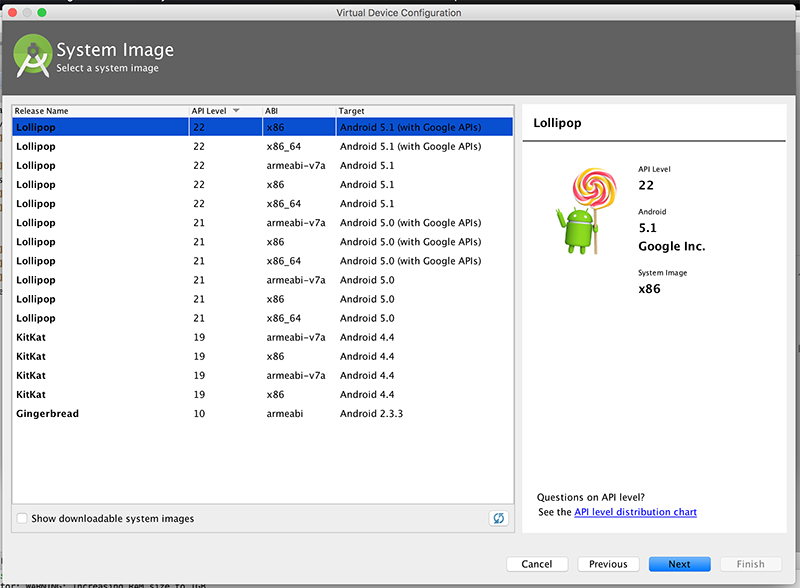
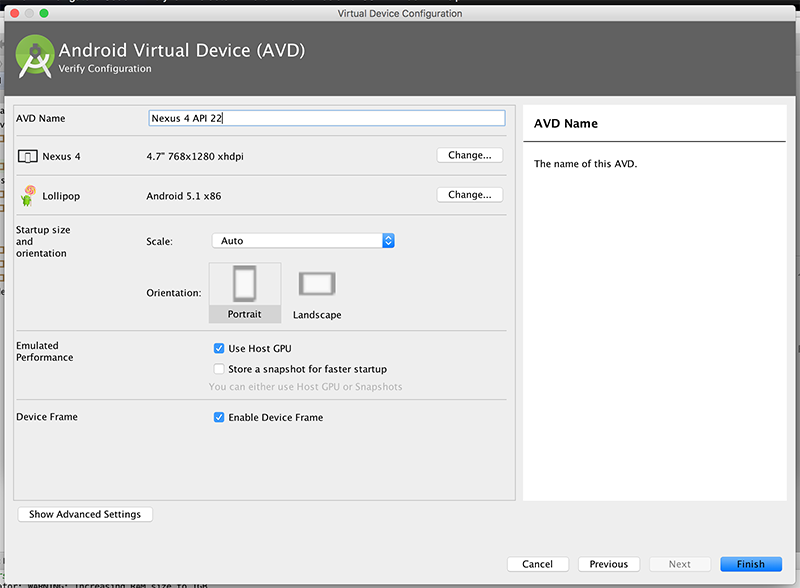

# 实验室 01: Android Studio 和 'Hello World'

# 实验室 01: 'Hello World'

此实验实际上只是让您迅速掌握使用 Android 环境和 Android 应用程序的基本结构。我们将为经典的“Hello World”应用程序加上自己的特色，并演示一些非常基本的小部件和事件处理的使用。

# 目标

# 目标

+   能够下载并安装 Android Studio，Android SDK 并了解其主要功能。特别是：

    +   项目视图

    +   SDK 管理器

    +   AVD 管理器

+   能够理解 Android Studio 项目的结构

+   创建了一个简单的 Android 应用程序（HelloWorld），并能够在 Android Studio 环境中管理它。

# 步骤 01

# 设置

## 华尔顿大楼 PC 实验室的操作指南：

如果您在 IT 大楼的工作站上工作，Android Studio 应该已经安装好了，因此继续进行实验的下一步。

## 您自己笔记本电脑上操作的说明

从以下网址下载并安装 Android Studio

+   [`developer.android.com/sdk/index.html`](https://developer.android.com/sdk/index.html)

选择适合您操作系统的正确版本。安装 Android Studio 的主要前提条件是您的工作站上有最新的 Java 安装。要查看是否安装了 Java，并在没有安装时安装它，请访问：

+   [`www.java.com`](http://www.java.com)

Android Studio 会帮助您下载 Android SDK，但您也可以从以下网址下载并安装 Android SDK

+   [`developer.android.com/sdk/installing/index.html`](https://developer.android.com/sdk/installing/index.html)

此下载实际上是 SDK 管理器（不是完整的 SDK），您可以在其中选择要安装和开发的 Android 平台的版本-选择** API 21 以上的任何版本（版本 5.0 及以上）**。（但我会留下所有的电视和可穿戴设备 :) ）

注意：这些下载文件相当大，建议您在课程开始前安装这些版本。


# 步骤 02

# 第一个 Android 项目 - “HelloWorld”

在 Android Studio 中，选择文件->新建->新建项目，或者如果是第一次运行，请选择“开始新的 Android Studio 项目”


按“下一步”（或单击选项）然后为项目命名：'HelloWorld'

建议您也更改默认软件包名称，也值得更改项目位置，但您可以暂时采用默认值。


选择您希望您的应用程序在哪个平台上运行-我们将只选择手机和平板电脑，并选择适当的最低 SDK。


在下一个屏幕上，您应该选择空活动作为您的活动类型


并按照下面的截图命名它


按“完成”后，您现在应该有类似以下的东西：


接下来，作为练习，选择文件->关闭项目，关闭项目以便我们可以重新导入它。

如果没有其他项目打开，则会显示以下内容


因此，要导入项目，请选择“打开现有的 Android 项目”，然后导航到存储 Android 应用程序的项目文件夹（如下所示的 **'HelloWorld'**）


项目再次打开后，请熟悉项目布局 - 首先显示初始 xml 布局或“屏幕”，这是您将在本模块中使用和创建的众多资源之一。稍后我们将尝试修改此布局，但首先您应该运行该应用程序。

选择项目（HelloWorld），然后按照下面的步骤选择“播放”按钮


如果您尚未这样做，您将被要求选择/创建 AVD（Android 虚拟设备），如下所示：


和



和



和


**虚拟设备对资源要求很高，因此可能需要选择以下设置，而不是屏幕截图中选择的设置。**

否则，请使用如上设置，你的第一个 Android 应用程序应该启动（一旦你解锁了设备！）：

# 步骤 03

# 我们的“HelloWorld”版本

在此步骤中，您将需要开发和运行您自己的“Hello World”Android 项目（如下所示）。


如果你删除了你的 HelloWorld 项目，请启动 Android Studio（如果尚未打开），并创建一个新的 Android 项目，名称为**HelloWorld**，与第 02 步类似。

如果您尚未删除该项目，您可以继续。

将你的包命名为 'ie.wit'（就像之前一样）。再次选择空活动，并像之前一样重命名。建议您选择**Android 5.0**作为启动目标平台（但对于这个特定的实验，任何目标都可以）。现在可能是一个好主意，在此阶段运行应用程序，以便您可以设置您的虚拟设备（如果您尚未这样做）。

编辑你的“strings.xml”文件（在 res 文件夹中），并添加以下“资源” - 如果你已经创建了一个包含 'menu' 文件夹的应用程序，则此操作也包括相关资源，请不要覆盖这些资源，只需在末尾添加我们的资源。

```
 <string name="window_text">Press the button below to receive a friendly greeting from Android.</string>
    <string name="button_label">Show Greeting</string>
    <string name="greeting_text">Hello from Android!</string> 
```

您完成的 strings.xml（不包括菜单）应该如下所示

```
<resources>
    <string name="app_name">HelloWorld</string>
    <string name="window_text">Press the button below to receive a friendly greeting from Android.</string>
    <string name="button_label">Show Greeting</string>
    <string name="greeting_text">Hello from Android!</string>
</resources> 
```

如果您选择“打开编辑器”，您可以看到您设置的字符串资源的图形表示（如果需要，可以在此处进行编辑）。


现在，在您的**“activity_hello_world.xml”**文件中 *在您的 ***布局*** 文件夹中* 编辑并用以下内容替换您的**TextView** - 确保您在 '文本' 视图中而不是 '设计' 视图窗口中。

```
<TextView
        android:id="@+id/textView1"
        android:gravity="center"
        android:layout_width="wrap_content"
        android:layout_height="wrap_content"
        android:layout_marginTop="20dp"
        android:text="@string/window_text"
        android:textAppearance="?android:attr/textAppearanceMedium" />

    <Button
        android:id="@+id/greetingButton"
        android:layout_width="wrap_content"
        android:layout_height="wrap_content"
        android:layout_alignParentBottom="true"
        android:layout_centerHorizontal="true"
        android:layout_marginBottom="59dp"
        android:onClick="showGreeting"
        android:text="@string/button_label" /> 
```

这将给你以下布局：


再次强调，在此时运行应用程序非常重要，以确认所有内容都显示在我们想要的方式上。如果你点击按钮，你的应用程序可能会崩溃 - 我们还没有实现我们的**showGreeting()**方法。

因此，我们需要做的最后一件事是添加我们的事件处理代码，以便当用户按下“显示问候语”按钮时显示一条简短的消息。

首先，打开“HelloWorldActivity.java”源文件并添加以下方法

```
public void showGreeting(View v) {
        // TODO Auto-generated method stub
        String greetingText = getString(R.string.greeting_text);
        Toast.makeText(this, greetingText, Toast.LENGTH_LONG).show();
    } 
```

由于缺少导入，你会得到一些编译器错误，所以尝试修复这些错误。

请注意，我们不需要某种监听器接口（类似于 swing 开发）- 我们的事件处理通过 xml 布局中的'onClick'属性来处理，这是你完成的 Activity 类应该看起来像的。

```
package ie.wit.helloworld;

import android.os.Bundle;
import android.support.v7.app.AppCompatActivity;
import android.view.View;
import android.widget.Toast;

public class HelloWorldActivity extends AppCompatActivity {

    @Override
    protected void onCreate(Bundle savedInstanceState) {
        super.onCreate(savedInstanceState);
        setContentView(R.layout.activity_hello_world);
    }

    public void showGreeting(View v) {
        String greetingText = getString(R.string.greeting_text);
        Toast.makeText(this, greetingText, Toast.LENGTH_LONG).show();
    }
} 
```

所以当你再次运行你的应用程序时，当你点击“显示问候”按钮时，你应该看到类似这样的东西。


我们将在讲座中更仔细地研究这段代码。

# 练习

# 练习

## 使用资源

为了熟悉添加和编辑资源，为我们的主布局创建一个新按钮，并尝试将其与一个新的字符串资源消息“连接起来”以向用户显示。

## UI 设计

看看如何添加一个新的颜色资源并更改布局的默认背景颜色。
