# 实验 02：介绍“捐赠”

# 实验 02：介绍“捐赠”

这是我们对**Donation**案例研究的第一次了解，将涉及构建一个初始的单屏应用程序，在我们的布局上放置一些常见的安卓小部件。

# 目标

# 目标

在这个实验中，你将需要构建我们的捐赠案例应用程序的第一个版本，名为**Donation.1.0**。在接下来的几周里，我们将在这个实验（和案例研究）的基础上添加一些新功能和 UI 设计，并逐步完善。在这个版本中，我们将在一个单一布局上添加一些 UI 小部件，并实现一些基本的事件处理。

完成此实验后，你将能够

+   设计应用程序的初始布局。

+   向布局中添加不同的小部件（如按钮、文本和选择器）。

+   实现基本的事件处理，以在按钮点击时执行某些操作。

+   能够为测试和调试“过滤”日志消息

# 步骤 01

# 步骤 01 - 创建项目

创建一个新的安卓应用程序，如下 5 个截图所示：

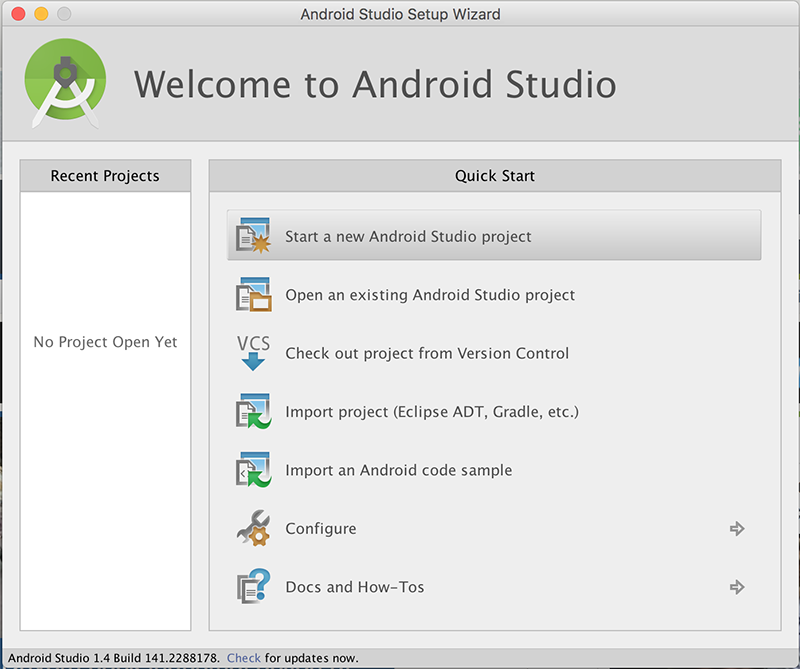


注意可能与默认值不同的“最低要求 SDK”。


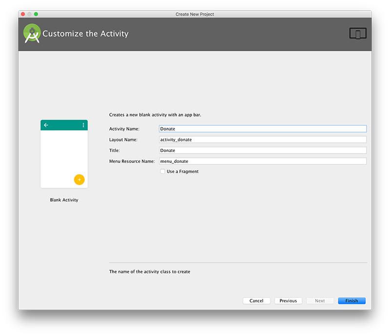

下面显示了开放项目透视图，在可视化设计师中打开了 content_donate 布局：

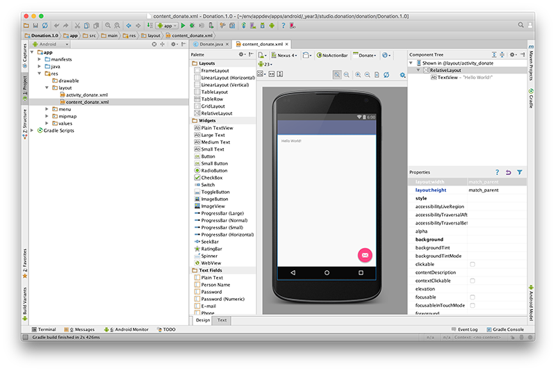

项目将看起来像这样


熟悉围绕捐赠“画布”周围的三个窗格的结构和目的非常重要：

## 调色板：


## 大纲


## 属性


这些视图密切相关 - 你需要不断监视显示���信息，以便随着活动屏幕外观的演变。

同样，快速查看你的**build.gradle**文件，查看应用程序的配置和依赖关系。


# 步骤 02

# 步骤 02 - 布局捐赠活动

对于这个实验，我们的目标是制作一个类似于这样的安卓应用程序：


在你的**content_donate.xml**中，删除当前的“Hello World”文本，并将一个新的“LargeText”表单小部件拖放到画布上，并“拉伸”小部件以填充画布（如下所示）。仔细看以下内容：


现在，再次双击小部件，你将看到以下内容：


选择椭圆形（在右侧，如下所示）

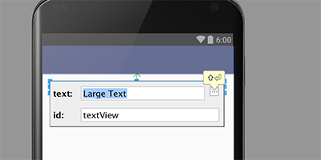

你将看到资源菜单


选择“新资源->新字符串值”，并填写以下值

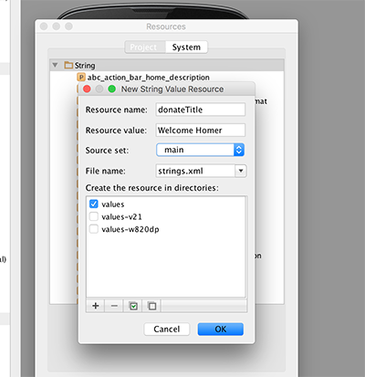

再次双击小部件，输入**donteTitle**作为**id**，然后按回车键。


完成后，你会得到类似这样的东西


仔细注意以下功能：

+   将文本与左上角和右上角连接的指南

+   在大纲中 - 控件的名称已从默认更改为“donateTitle”。

+   在属性中 - 检查 'text' 的值并注意我们有一个字符串引用链接到我们的 **strings.xml**（下文）


定位以下两个文件并仔细检查它们：

## res/layout/content_dontate.xml

```
<?xml version="1.0" encoding="utf-8"?>
<RelativeLayout xmlns:android="http://schemas.android.com/apk/res/android"
    xmlns:tools="http://schemas.android.com/tools"
    xmlns:app="http://schemas.android.com/apk/res-auto" android:layout_width="match_parent"
    android:layout_height="match_parent" android:paddingLeft="@dimen/activity_horizontal_margin"
    android:paddingRight="@dimen/activity_horizontal_margin"
    android:paddingTop="@dimen/activity_vertical_margin"
    android:paddingBottom="@dimen/activity_vertical_margin"
    app:layout_behavior="@string/appbar_scrolling_view_behavior"
    tools:showIn="@layout/activity_donate" tools:context=".Donate">

    <TextView
        android:layout_width="wrap_content"
        android:layout_height="wrap_content"
        android:textAppearance="?android:attr/textAppearanceLarge"
        android:text="@string/donateTitle"
        android:id="@+id/donateTitle"
        android:layout_alignParentTop="true"
        android:layout_alignParentStart="true"
        android:layout_alignParentEnd="true" />
</RelativeLayout> 
```

## res/values/strings.xml

```
<resources>
    <string name="app_name">Donation</string>
    <string name="action_settings">Settings</string>
    <string name="donateTitle">Welcome Homer</string>
</resources> 
```

注意两个文件中的 'donateTitle' 之间的关系。

现在将以下字符串引入 donate 活动中 - （中等文本） - 并按照上述相同的步骤进行。设计师应该是这样的：


我们的 XML 文件将如下所示：

```
<?xml version="1.0" encoding="utf-8"?>
<RelativeLayout xmlns:android="http://schemas.android.com/apk/res/android"
    xmlns:tools="http://schemas.android.com/tools"
    xmlns:app="http://schemas.android.com/apk/res-auto" android:layout_width="match_parent"
    android:layout_height="match_parent" android:paddingLeft="@dimen/activity_horizontal_margin"
    android:paddingRight="@dimen/activity_horizontal_margin"
    android:paddingTop="@dimen/activity_vertical_margin"
    android:paddingBottom="@dimen/activity_vertical_margin"
    app:layout_behavior="@string/appbar_scrolling_view_behavior"
    tools:showIn="@layout/activity_donate" tools:context=".Donate">

    <TextView
        android:layout_width="wrap_content"
        android:layout_height="wrap_content"
        android:textAppearance="?android:attr/textAppearanceLarge"
        android:text="@string/donateTitle"
        android:id="@+id/donateTitle"
        android:layout_alignParentTop="true"
        android:layout_alignParentStart="true"
        android:layout_alignParentEnd="true" />

    <TextView
        android:layout_width="wrap_content"
        android:layout_height="wrap_content"
        android:textAppearance="?android:attr/textAppearanceMedium"
        android:text="@string/donateSubtitle"
        android:id="@+id/donateSubtitle"
        android:layout_below="@+id/donateTitle"
        android:layout_alignParentStart="true"
        android:layout_marginTop="27dp"
        android:layout_alignEnd="@+id/donateTitle" />
</RelativeLayout> 
```

我们的 'strings.xml' 文件....

```
<resources>
    <string name="app_name">Donation.1.0</string>
    <string name="action_settings">Settings</string>
    <string name="donateTitle">Welcome Homer</string>
    <string name="donateSubtitle">Please Give Generously</string>
</resources> 
```

# 步骤 03

# 第 03 步 - '捐赠' 按钮

直接将按钮放在活动上 - 附加到屏幕底部如图所示：


以下步骤与前一步类似，重命名按钮并添加一个 id，两者都称为 **donateButton** 如果一切如预期那样进行，您的 xml 文件应该像这样：

### activity_donate.xml

```
<?xml version="1.0" encoding="utf-8"?>
<RelativeLayout xmlns:android="http://schemas.android.com/apk/res/android"
    xmlns:tools="http://schemas.android.com/tools"
    xmlns:app="http://schemas.android.com/apk/res-auto" android:layout_width="match_parent"
    android:layout_height="match_parent" android:paddingLeft="@dimen/activity_horizontal_margin"
    android:paddingRight="@dimen/activity_horizontal_margin"
    android:paddingTop="@dimen/activity_vertical_margin"
    android:paddingBottom="@dimen/activity_vertical_margin"
    app:layout_behavior="@string/appbar_scrolling_view_behavior"
    tools:showIn="@layout/activity_donate" tools:context=".Donate">

    <TextView
        android:layout_width="wrap_content"
        android:layout_height="wrap_content"
        android:textAppearance="?android:attr/textAppearanceLarge"
        android:text="@string/donateTitle"
        android:id="@+id/donateTitle"
        android:layout_alignParentTop="true"
        android:layout_alignParentStart="true"
        android:layout_alignParentEnd="true" />

    <TextView
        android:layout_width="wrap_content"
        android:layout_height="wrap_content"
        android:textAppearance="?android:attr/textAppearanceMedium"
        android:text="@string/donateSubtitle"
        android:id="@+id/donateSubtitle"
        android:layout_below="@+id/donateTitle"
        android:layout_alignParentStart="true"
        android:layout_marginTop="27dp"
        android:layout_alignEnd="@+id/donateTitle" />

    <Button
        android:layout_width="wrap_content"
        android:layout_height="wrap_content"
        android:text="@string/donateButton"
        android:id="@+id/donateButton"
        android:layout_alignParentBottom="true"
        android:layout_centerHorizontal="true"
        android:layout_marginBottom="47dp" />
</RelativeLayout> 
```

## strings.xml

```
<resources>
    <string name="app_name">Donation.1.0</string>
    <string name="action_settings">Settings</string>
    <string name="donateTitle">Welcome Homer</string>
    <string name="donateSubtitle">Please Give Generously</string>
    <string name="donateButton">Donate</string>
</resources> 
```

如果与上述有任何偏差 - 请重新跟踪您的步骤（删除按钮），直到您能够匹配上述内容。

现在我们可以将注意力转移到 Java 活动类 Donate 上：

```
package ie.app;

import android.os.Bundle;
import android.support.design.widget.FloatingActionButton;
import android.support.design.widget.Snackbar;
import android.support.v7.app.AppCompatActivity;
import android.support.v7.widget.Toolbar;
import android.view.View;
import android.view.Menu;
import android.view.MenuItem;

public class Donate extends AppCompatActivity {

    @Override
    protected void onCreate(Bundle savedInstanceState) {
        super.onCreate(savedInstanceState);
        setContentView(R.layout.activity_donate);
        Toolbar toolbar = (Toolbar) findViewById(R.id.toolbar);
        setSupportActionBar(toolbar);

        FloatingActionButton fab = (FloatingActionButton) findViewById(R.id.fab);
        fab.setOnClickListener(new View.OnClickListener() {
            @Override
            public void onClick(View view) {
                Snackbar.make(view, "Replace with your own action", Snackbar.LENGTH_LONG)
                        .setAction("Action", null).show();
            }
        });
    }

    @Override
    public boolean onCreateOptionsMenu(Menu menu) {
        // Inflate the menu; this adds items to the action bar if it is present.
        getMenuInflater().inflate(R.menu.menu_donate, menu);
        return true;
    }

    @Override
    public boolean onOptionsItemSelected(MenuItem item) {
        // Handle action bar item clicks here. The action bar will
        // automatically handle clicks on the Home/Up button, so long
        // as you specify a parent activity in AndroidManifest.xml.
        int id = item.getItemId();

        //noinspection SimplifiableIfStatement
        if (id == R.id.action_settings) {
            return true;
        }

        return super.onOptionsItemSelected(item);
    }
} 
```

对于用户可以与之交互的任何 '控件'，我们通常发现将类成员与该对象关联是有用的。目前我们只有一个 - 一个按钮。我们不认为文本字段是 '交互式' 的，因此我们不会包括那些。

将以下新字段插入到类中：

```
 private Button donateButton; 
```

必须导入该类。类名将始终与 Palette 中的名称匹配：


我们可以自由地将变量命名为任何我们喜欢的名称。然而，为了将混乱降到最低，始终以轮廓视图中使用的相同名称来调用变量：


在 onCreate 中 - 我们需要初始化这个变量：

```
 donateButton = (Button) findViewById(R.id.donateButton); 
```

我们可能还会添加一个日志消息，以便在应用程序启动时获得一些反馈：

```
 if (donateButton != null)
        {
            Log.v("Donate", "Really got the donate button");
        } 
```

这是完整的活动类：

```
package ie.app;

import android.os.Bundle;
import android.support.design.widget.FloatingActionButton;
import android.support.design.widget.Snackbar;
import android.support.v7.app.AppCompatActivity;
import android.support.v7.widget.Toolbar;
import android.util.Log;
import android.view.View;
import android.view.Menu;
import android.view.MenuItem;
import android.widget.Button;

public class Donate extends AppCompatActivity {

    private Button donateButton;

    @Override
    protected void onCreate(Bundle savedInstanceState) {
        super.onCreate(savedInstanceState);
        setContentView(R.layout.activity_donate);
        Toolbar toolbar = (Toolbar) findViewById(R.id.toolbar);
        setSupportActionBar(toolbar);

        FloatingActionButton fab = (FloatingActionButton) findViewById(R.id.fab);
        fab.setOnClickListener(new View.OnClickListener() {
            @Override
            public void onClick(View view) {
                Snackbar.make(view, "Replace with your own action", Snackbar.LENGTH_LONG)
                        .setAction("Action", null).show();
            }
        });

        donateButton = (Button) findViewById(R.id.donateButton);

        if (donateButton != null)
        {
            Log.v("Donate", "Really got the donate button");
        }
    }

    @Override
    public boolean onCreateOptionsMenu(Menu menu) {
        // Inflate the menu; this adds items to the action bar if it is present.
        getMenuInflater().inflate(R.menu.menu_donate, menu);
        return true;
    }

    @Override
    public boolean onOptionsItemSelected(MenuItem item) {
        // Handle action bar item clicks here. The action bar will
        // automatically handle clicks on the Home/Up button, so long
        // as you specify a parent activity in AndroidManifest.xml.
        int id = item.getItemId();

        //noinspection SimplifiableIfStatement
        if (id == R.id.action_settings) {
            return true;
        }

        return super.onOptionsItemSelected(item);
    }
} 
```

找到日志消息可能非常困难，除非您设置一个过滤器。在 Android Studio 的 'LogCat' 视图中，创建一个如下的过滤器：

在 LogCat 视图的右侧选择 "Edit Filter Configuration"

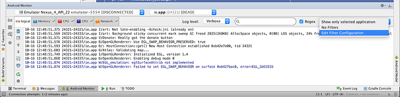

输入名称和过滤器如下


如果您选择过滤器，我们应该看到我们的消息：


再次运行应用程序，并验证上述消息是否出现。

# 步骤 04

# 步骤 04 - 文档

Android 文档特别有帮助并且设计良好。这是两个关键的起点：

+   [`developer.android.com/guide/components/index.html`](http://developer.android.com/guide/components/index.html)

+   [`developer.android.com/reference/packages.html`](http://developer.android.com/reference/packages.html)

第一个设计为作为指南阅读，也许独立于 Android Studio 中的任何工作。您应该养成每周花一两个小时只读这一部分的习惯。

在你做实验或项目的时候，参考指南应该始终保持打开状态，并且你应该认真努力地掌握这里至少一些信息。

获取我们刚刚开始使用的 Button 类。我们可以立即找到引用，只需知道我们 Activity 类中的导入语句即可：

```
import android.widget.Button; 
```

.. 转换成

+   [`developer.android.com/reference/android/widget/Button.html`](http://developer.android.com/reference/android/widget/Button.html)

（注意最后三个部分与包名匹配）。现在打开这个页面。仅阅读到“按钮样式”标题。似乎有两种学习按钮事件发生的方法。第一种方法是使用事件处理程序/监听器 - 但还有第二种更简单的方法可供选择。

现在试一试。将一个新的方法引入到 Donate 类中：

```
 public void donateButtonPressed (View view) {
    Log.v("Donate", "Donate Pressed!");
   } 
```

然后，编辑 **content_donate.xml** 文件 - 并在 Button xml 片段中添加一个新的 'onClick' 属性：

（最后一个条目）

```
 <Button
        android:layout_width="wrap_content"
        android:layout_height="wrap_content"
        android:text="@string/donateButton"
        android:id="@+id/donateButton"
        android:layout_alignParentBottom="true"
        android:layout_centerHorizontal="true"
        android:layout_marginBottom="47dp"
        android:onClick="donateButtonPressed"/> 
```

保存所有内容并执行该应用程序，并在按下按钮时监视日志：

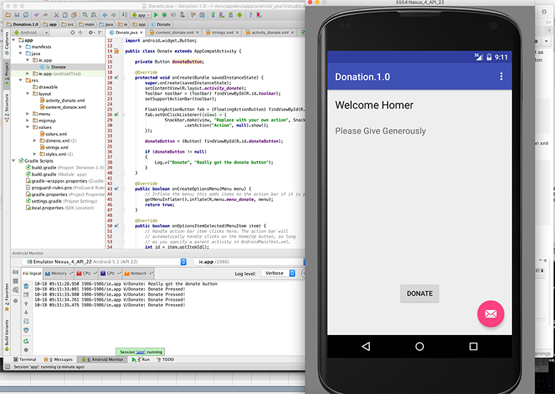

我们现在已经实现了我们的第一个交互！

# 步骤 05

# 步骤 05 - 新的控件布局

回想一下我们试图实现的用户界面：


我们需要单选按钮，某种选择/组合框 + 进度条。这些可以在调色板的各个位置找到：

  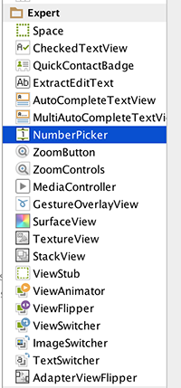

RadioGroup、ProgressBar 和 NumberPicker 似乎是可能的候选项。这些控件的名称完全符合其广告，我们可以期望它们在“widgets”包中。要验证这一点，请尝试在 Donate 活动类的顶部导入它们：

```
import android.widget.RadioGroup;
import android.widget.NumberPicker;
import android.widget.ProgressBar; 
```

... 我们可以将三个字段引入到类中：

```
 private RadioGroup   paymentMethod;
  private ProgressBar  progressBar;
  private NumberPicker amountPicker; 
```

我们还可以打开三个文档页面 - 我们可以从包/类名称反向工程出来：

+   [`developer.android.com/reference/android/widget/RadioGroup.html`](http://developer.android.com/reference/android/widget/RadioGroup.html)

+   [`developer.android.com/reference/android/widget/ProgressBar.html`](http://developer.android.com/reference/android/widget/ProgressBar.html)

+   [`developer.android.com/reference/android/widget/NumberPicker.html`](http://developer.android.com/reference/android/widget/NumberPicker.html)

注意这一次我们先去了 Activity 类，然后再创建控件。我们现在应该这样做 - 并记住在创建控件时使用相同的名称（用于 ID）。

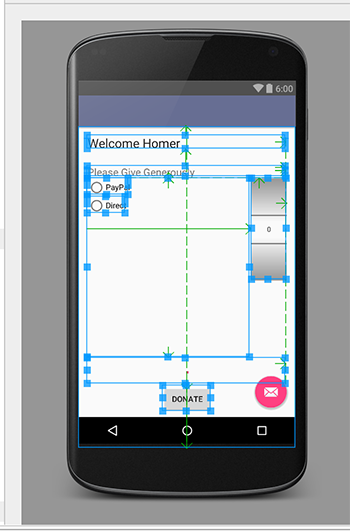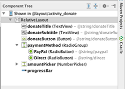

学会像上面展示的那样获取布局的 +id 名称可能需要一些练习。然而，掌握这个技能是至关重要的，即使需要大量的试错。

供参考（首先尝试自己做！），这些是相关的生成的 xml 文件：

```
<?xml version="1.0" encoding="utf-8"?>
<RelativeLayout xmlns:android="http://schemas.android.com/apk/res/android"
    xmlns:tools="http://schemas.android.com/tools"
    xmlns:app="http://schemas.android.com/apk/res-auto" android:layout_width="match_parent"
    android:layout_height="match_parent" android:paddingLeft="@dimen/activity_horizontal_margin"
    android:paddingRight="@dimen/activity_horizontal_margin"
    android:paddingTop="@dimen/activity_vertical_margin"
    android:paddingBottom="@dimen/activity_vertical_margin"
    app:layout_behavior="@string/appbar_scrolling_view_behavior"
    tools:showIn="@layout/activity_donate" tools:context=".Donate">

    <TextView
        android:layout_width="wrap_content"
        android:layout_height="wrap_content"
        android:textAppearance="?android:attr/textAppearanceLarge"
        android:text="@string/donateTitle"
        android:id="@+id/donateTitle"
        android:layout_alignParentTop="true"
        android:layout_alignParentStart="true"
        android:layout_alignParentEnd="true" />

    <TextView
        android:layout_width="wrap_content"
        android:layout_height="wrap_content"
        android:textAppearance="?android:attr/textAppearanceMedium"
        android:text="@string/donateSubtitle"
        android:id="@+id/donateSubtitle"
        android:layout_below="@+id/donateTitle"
        android:layout_alignParentStart="true"
        android:layout_marginTop="27dp"
        android:layout_alignEnd="@+id/donateTitle" />

    <Button
        android:layout_width="wrap_content"
        android:layout_height="wrap_content"
        android:text="@string/donateButton"
        android:id="@+id/donateButton"
        android:layout_alignParentBottom="true"
        android:layout_centerHorizontal="true"
        android:layout_marginBottom="47dp"
        android:onClick="donateButtonPressed"/>

    <RadioGroup
        android:layout_width="match_parent"
        android:layout_height="match_parent"
        android:layout_below="@+id/donateSubtitle"
        android:layout_alignParentStart="true"
        android:id="@+id/paymentMethod"
        android:layout_toStartOf="@+id/amountPicker"
        android:layout_above="@+id/progressBar">

        <RadioButton
            android:layout_width="wrap_content"
            android:layout_height="wrap_content"
            android:text="@string/paypal"
            android:id="@+id/PayPal"
            android:checked="false" />

        <RadioButton
            android:layout_width="wrap_content"
            android:layout_height="wrap_content"
            android:text="@string/direct"
            android:id="@+id/Direct"
            android:checked="false" />
    </RadioGroup>

    <NumberPicker
        android:layout_width="wrap_content"
        android:layout_height="wrap_content"
        android:id="@+id/amountPicker"
        android:layout_alignTop="@+id/paymentGroup"
        android:layout_alignEnd="@+id/donateSubtitle" />

    <ProgressBar
        android:layout_width="wrap_content"
        android:layout_height="wrap_content"
        style="?android:attr/progressBarStyleHorizontal"
        android:id="@+id/progressBar"
        android:layout_alignParentStart="true"
        android:layout_alignEnd="@+id/donateSubtitle"
        android:layout_above="@+id/donateButton"
        android:indeterminate="false" />
</RelativeLayout> 
```

```
<resources>
    <string name="app_name">Donation.1.0</string>
    <string name="action_settings">Settings</string>
    <string name="donateTitle">Welcome Homer</string>
    <string name="donateSubtitle">Please Give Generously</string>
    <string name="donateButton">Donate</string>
    <string name="paypal">PayPal</string>
    <string name="direct">Direct</string>
</resources> 
```

如果我们的命名约定正确 - 那么我们可以在 onCreate 中绑定到这些新的控件：

```
 paymentMethod = (RadioGroup)   findViewById(R.id.paymentMethod);
    progressBar   = (ProgressBar)  findViewById(R.id.progressBar);
    amountPicker  = (NumberPicker) findViewById(R.id.amountPicker); 
```

到目前为止，这是完整的 Donate 类：

```
package ie.app;

import android.os.Bundle;
import android.support.design.widget.FloatingActionButton;
import android.support.design.widget.Snackbar;
import android.support.v7.app.AppCompatActivity;
import android.support.v7.widget.Toolbar;
import android.util.Log;
import android.view.View;
import android.view.Menu;
import android.view.MenuItem;
import android.widget.Button;
import android.widget.NumberPicker;
import android.widget.ProgressBar;
import android.widget.RadioGroup;

public class Donate extends AppCompatActivity {

    private Button          donateButton;
    private RadioGroup      paymentMethod;
    private ProgressBar     progressBar;
    private NumberPicker    amountPicker;

    @Override
    protected void onCreate(Bundle savedInstanceState) {
        super.onCreate(savedInstanceState);
        setContentView(R.layout.activity_donate);
        Toolbar toolbar = (Toolbar) findViewById(R.id.toolbar);
        setSupportActionBar(toolbar);

        FloatingActionButton fab = (FloatingActionButton) findViewById(R.id.fab);
        fab.setOnClickListener(new View.OnClickListener() {
            @Override
            public void onClick(View view) {
                Snackbar.make(view, "Replace with your own action", Snackbar.LENGTH_LONG)
                        .setAction("Action", null).show();
            }
        });

        donateButton = (Button) findViewById(R.id.donateButton);

        if (donateButton != null)
        {
            Log.v("Donate", "Really got the donate button");
        }

        paymentMethod = (RadioGroup)   findViewById(R.id.paymentMethod);
        progressBar   = (ProgressBar)  findViewById(R.id.progressBar);
        amountPicker  = (NumberPicker) findViewById(R.id.amountPicker);

        amountPicker.setMinValue(0);
        amountPicker.setMaxValue(1000);
    }

    @Override
    public boolean onCreateOptionsMenu(Menu menu) {
        // Inflate the menu; this adds items to the action bar if it is present.
        getMenuInflater().inflate(R.menu.menu_donate, menu);
        return true;
    }

    @Override
    public boolean onOptionsItemSelected(MenuItem item) {
        // Handle action bar item clicks here. The action bar will
        // automatically handle clicks on the Home/Up button, so long
        // as you specify a parent activity in AndroidManifest.xml.
        int id = item.getItemId();

        //noinspection SimplifiableIfStatement
        if (id == R.id.action_settings) {
            return true;
        }

        return super.onOptionsItemSelected(item);
    }

    public void donateButtonPressed (View view) {
        Log.v("Donate", "Donate Pressed!");
    }
} 
```

# 步骤 06

# 步骤 06 - NumberPicker

这是我们的参考文档：

+   [`developer.android.com/reference/android/widget/NumberPicker.html`](http://developer.android.com/reference/android/widget/NumberPicker.html)

这有点令人不知所措。回到指南：

+   [`developer.android.com/guide/components/index.html`](http://developer.android.com/guide/components/index.html)

我们可能会在'用户界面' - '输入控件'下找到一些有用的教程型介绍

+   [`developer.android.com/guide/topics/ui/controls.html`](http://developer.android.com/guide/topics/ui/controls.html)

.. 这是关于'选择器'的页面

+   [`developer.android.com/guide/topics/ui/controls/pickers.html`](http://developer.android.com/guide/topics/ui/controls/pickers.html)

此文档涉及片段 - 这是一种可能在开始时难以理解的概念，并且还探讨了日期和时间选择器的使用。

我们可以不用那么费事就能开始工作了。回到文档，最初这三种方法应该就足够了：

+   [`developer.android.com/reference/android/widget/NumberPicker.html#setMaxValue(int)`](http://developer.android.com/reference/android/widget/NumberPicker.html#setMaxValue(int))

+   [`developer.android.com/reference/android/widget/NumberPicker.html#setMinValue(int)`](http://developer.android.com/reference/android/widget/NumberPicker.html#setMinValue(int))

+   [`developer.android.com/reference/android/widget/NumberPicker.html#getValue()`](http://developer.android.com/reference/android/widget/NumberPicker.html#getValue())

在 onCreate 中，初始化值：

```
 amountPicker.setMinValue(0);
    amountPicker.setMaxValue(1000); 
```

而在 donateButtonPressed 中：

```
 public void donateButtonPressed (View view) {
    int amount = amountPicker.getValue();
    Log.v("Donate", "Donate Pressed! with amount " + amount);
   } 
```

现在运行它，并验证其是否按预期运行（查看日志文件中的实际数值，如下所示）。

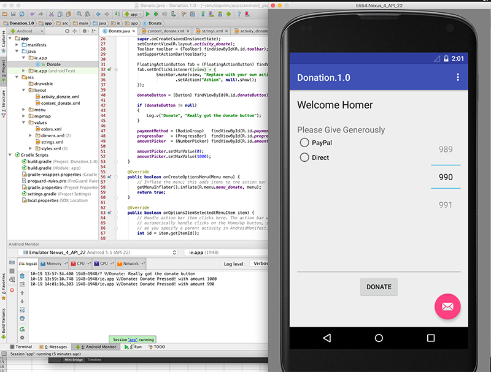

# 步骤 07

# 步骤 07 - 单选按钮

在*donateButtonPressed()*中，我们需要确定已选择了哪种付款方式。我们的 RadioGroup 文档在这里：

+   [`developer.android.com/reference/android/widget/RadioGroup.html`](http://developer.android.com/reference/android/widget/RadioGroup.html)

这看起来就像是我们需要的方法：

+   [getCheckedRadioButtonId()](http://developer.android.com/reference/android/widget/RadioGroup.html#getCheckedRadioButtonId())

这是*donateButtonPressed()*的修订版本

```
 public void donateButtonPressed (View view) {
    int amount = amountPicker.getValue();
    int radioId = paymentMethod.getCheckedRadioButtonId();
    String method = "";
    if (radioId == R.id.PayPal)
    {
      method = "PayPal";
    }
    else
    {
      method = "Direct";
    }
    Log.v("Donate", "Donate Pressed! with amount " + amount + ", method: " + method);
   } 
```

现在运行它并验证我们是否获得了正确的日志。

我们可以通过将 if 语句简化为一行来简化它：

```
 String method = radioId == R.id.PayPal ? "PayPal" : "Direct"; 
```

这是 Java 三元运算符：

+   [`marxsoftware.blogspot.ie/2010/09/how-i-learned-to-stop-worrying-and-love.html`](http://marxsoftware.blogspot.ie/2010/09/how-i-learned-to-stop-worrying-and-love.html)

到目前为止这是完整的活动类：

```
package ie.app;

import android.os.Bundle;
import android.support.design.widget.FloatingActionButton;
import android.support.design.widget.Snackbar;
import android.support.v7.app.AppCompatActivity;
import android.support.v7.widget.Toolbar;
import android.util.Log;
import android.view.View;
import android.view.Menu;
import android.view.MenuItem;
import android.widget.Button;
import android.widget.NumberPicker;
import android.widget.ProgressBar;
import android.widget.RadioGroup;

public class Donate extends AppCompatActivity {

    private Button          donateButton;
    private RadioGroup      paymentMethod;
    private ProgressBar     progressBar;
    private NumberPicker    amountPicker;

    @Override
    protected void onCreate(Bundle savedInstanceState) {
        super.onCreate(savedInstanceState);
        setContentView(R.layout.activity_donate);
        Toolbar toolbar = (Toolbar) findViewById(R.id.toolbar);
        setSupportActionBar(toolbar);

        FloatingActionButton fab = (FloatingActionButton) findViewById(R.id.fab);
        fab.setOnClickListener(new View.OnClickListener() {
            @Override
            public void onClick(View view) {
                Snackbar.make(view, "Replace with your own action", Snackbar.LENGTH_LONG)
                        .setAction("Action", null).show();
            }
        });

        donateButton = (Button) findViewById(R.id.donateButton);

        if (donateButton != null)
        {
            Log.v("Donate", "Really got the donate button");
        }

        paymentMethod = (RadioGroup)   findViewById(R.id.paymentMethod);
        progressBar   = (ProgressBar)  findViewById(R.id.progressBar);
        amountPicker  = (NumberPicker) findViewById(R.id.amountPicker);

        amountPicker.setMinValue(0);
        amountPicker.setMaxValue(1000);
    }

    @Override
    public boolean onCreateOptionsMenu(Menu menu) {
        // Inflate the menu; this adds items to the action bar if it is present.
        getMenuInflater().inflate(R.menu.menu_donate, menu);
        return true;
    }

    @Override
    public boolean onOptionsItemSelected(MenuItem item) {
        // Handle action bar item clicks here. The action bar will
        // automatically handle clicks on the Home/Up button, so long
        // as you specify a parent activity in AndroidManifest.xml.
        int id = item.getItemId();

        //noinspection SimplifiableIfStatement
        if (id == R.id.action_settings) {
            return true;
        }

        return super.onOptionsItemSelected(item);
    }

    public void donateButtonPressed (View view) {
        int amount = amountPicker.getValue();
        int radioId = paymentMethod.getCheckedRadioButtonId();
        String method = radioId == R.id.PayPal ? "PayPal" : "Direct";
        Log.v("Donate", "Donate Pressed! with amount " + amount + ", method: " + method);
    }
} 
```

所以再次运行您的应用程序，以确认 logCat 中的条目

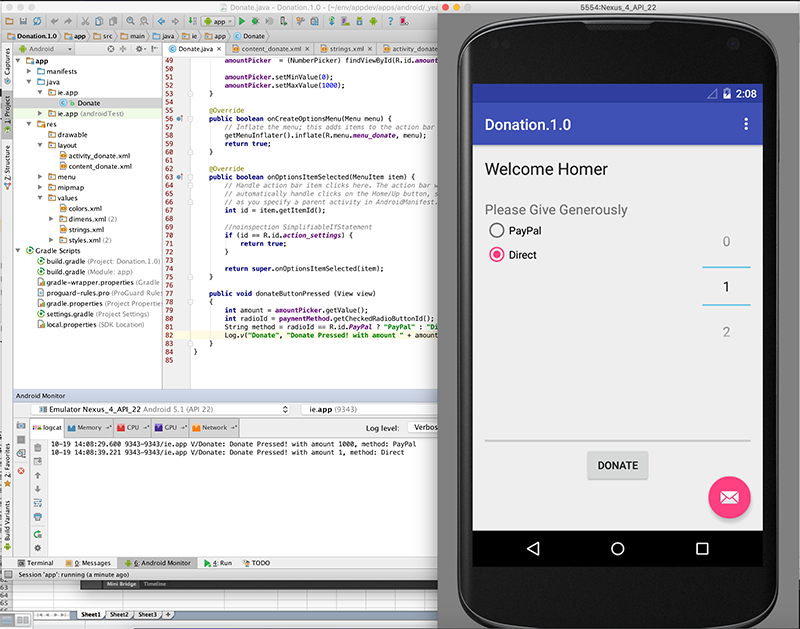

# 步骤 08

# 步骤 08 - 进度条

进度条文档：

+   [`developer.android.com/reference/android/widget/ProgressBar.html`](http://developer.android.com/reference/android/widget/ProgressBar.html)

提供了关于在多线程应用程序中使用进度条的建议。我们还没准备好！（但将其存档以供将来参考）。

这两种方法可能是我们需要的：

+   [`developer.android.com/reference/android/widget/ProgressBar.html#setMax(int)`](http://developer.android.com/reference/android/widget/ProgressBar.html#setMax(int))

+   [`developer.android.com/reference/android/widget/ProgressBar.html#setProgress(int)`](http://developer.android.com/reference/android/widget/ProgressBar.html#setProgress(int))

首先，我们需要让我们的活动具备记住捐赠金额的能力：

```
 private int totalDonated = 0; 
```

在 onCreate 中让最大进度条设置为 10000：

```
 progressBar.setMax(10000); 
```

.. 并在 donateButtonPressed 中设置进度：

```
 totalDonated = totalDonated + amount;
    progressBar.setProgress(totalDonated);

    Log.v("Donate", "Donate Pressed! with amount " + amount + ", method: " + method);
    Log.v("Donate", "Current total " + totalDonated); 
```

现在试试这个，并观察进度条和 logCat


到目前为止，这是完整的类：

```
package ie.app;

import android.os.Bundle;
import android.support.design.widget.FloatingActionButton;
import android.support.design.widget.Snackbar;
import android.support.v7.app.AppCompatActivity;
import android.support.v7.widget.Toolbar;
import android.util.Log;
import android.view.View;
import android.view.Menu;
import android.view.MenuItem;
import android.widget.Button;
import android.widget.NumberPicker;
import android.widget.ProgressBar;
import android.widget.RadioGroup;

public class Donate extends AppCompatActivity {

    private Button          donateButton;
    private RadioGroup      paymentMethod;
    private ProgressBar     progressBar;
    private NumberPicker    amountPicker;

    private int             totalDonated = 0;

    @Override
    protected void onCreate(Bundle savedInstanceState) {
        super.onCreate(savedInstanceState);
        setContentView(R.layout.activity_donate);
        Toolbar toolbar = (Toolbar) findViewById(R.id.toolbar);
        setSupportActionBar(toolbar);

        FloatingActionButton fab = (FloatingActionButton) findViewById(R.id.fab);
        fab.setOnClickListener(new View.OnClickListener() {
            @Override
            public void onClick(View view) {
                Snackbar.make(view, "Replace with your own action", Snackbar.LENGTH_LONG)
                        .setAction("Action", null).show();
            }
        });

        donateButton = (Button) findViewById(R.id.donateButton);

        if (donateButton != null)
        {
            Log.v("Donate", "Really got the donate button");
        }

        paymentMethod = (RadioGroup)   findViewById(R.id.paymentMethod);
        progressBar   = (ProgressBar)  findViewById(R.id.progressBar);
        amountPicker  = (NumberPicker) findViewById(R.id.amountPicker);

        amountPicker.setMinValue(0);
        amountPicker.setMaxValue(1000);
        progressBar.setMax(10000);
    }

    @Override
    public boolean onCreateOptionsMenu(Menu menu) {
        // Inflate the menu; this adds items to the action bar if it is present.
        getMenuInflater().inflate(R.menu.menu_donate, menu);
        return true;
    }

    @Override
    public boolean onOptionsItemSelected(MenuItem item) {
        // Handle action bar item clicks here. The action bar will
        // automatically handle clicks on the Home/Up button, so long
        // as you specify a parent activity in AndroidManifest.xml.
        int id = item.getItemId();

        //noinspection SimplifiableIfStatement
        if (id == R.id.action_settings) {
            return true;
        }

        return super.onOptionsItemSelected(item);
    }

    public void donateButtonPressed (View view) {
        int amount = amountPicker.getValue();
        int radioId = paymentMethod.getCheckedRadioButtonId();
        String method = radioId == R.id.PayPal ? "PayPal" : "Direct";

        totalDonated = totalDonated + amount;
        progressBar.setProgress(totalDonated);

        Log.v("Donate", "Donate Pressed! with amount " + amount + ", method: " + method);
        Log.v("Donate", "Current total " + totalDonated);
    }
} 
```

这里有另一个完全相同的类的版本：

```
package ie.app;

import android.os.Bundle;
import android.support.design.widget.FloatingActionButton;
import android.support.design.widget.Snackbar;
import android.support.v7.app.AppCompatActivity;
import android.support.v7.widget.Toolbar;
import android.util.Log;
import android.view.View;
import android.view.Menu;
import android.view.MenuItem;
import android.widget.Button;
import android.widget.NumberPicker;
import android.widget.ProgressBar;
import android.widget.RadioGroup;

public class Donate extends AppCompatActivity {

    private Button          donateButton;
    private RadioGroup      paymentMethod;
    private ProgressBar     progressBar;
    private NumberPicker    amountPicker;

    private int             totalDonated = 0;

    @Override
    protected void onCreate(Bundle savedInstanceState) {
        super.onCreate(savedInstanceState);
        setContentView(R.layout.activity_donate);
        Toolbar toolbar = (Toolbar) findViewById(R.id.toolbar);
        setSupportActionBar(toolbar);

        FloatingActionButton fab = (FloatingActionButton) findViewById(R.id.fab);
        fab.setOnClickListener(new View.OnClickListener() {
            @Override
            public void onClick(View view) {
                Snackbar.make(view, "Replace with your own action", Snackbar.LENGTH_LONG)
                        .setAction("Action", null).show();
            }
        });

        donateButton = (Button) findViewById(R.id.donateButton);

        if (donateButton != null)
        {
            Log.v("Donate", "Really got the donate button");
        }

        paymentMethod = (RadioGroup)   findViewById(R.id.paymentMethod);
        progressBar   = (ProgressBar)  findViewById(R.id.progressBar);
        amountPicker  = (NumberPicker) findViewById(R.id.amountPicker);

        amountPicker.setMinValue(0);
        amountPicker.setMaxValue(1000);
        progressBar.setMax(10000);
    }

    @Override
    public boolean onCreateOptionsMenu(Menu menu) {
        // Inflate the menu; this adds items to the action bar if it is present.
        getMenuInflater().inflate(R.menu.menu_donate, menu);
        return true;
    }

    @Override
    public boolean onOptionsItemSelected(MenuItem item) {
        // Handle action bar item clicks here. The action bar will
        // automatically handle clicks on the Home/Up button, so long
        // as you specify a parent activity in AndroidManifest.xml.
        int id = item.getItemId();

        //noinspection SimplifiableIfStatement
        if (id == R.id.action_settings) {
            return true;
        }

        return super.onOptionsItemSelected(item);
    }

    public void donateButtonPressed (View view) {
    totalDonated  = totalDonated + amountPicker.getValue();
    String method = paymentMethod.getCheckedRadioButtonId() == R.id.PayPal ? "PayPal" : "Direct";
    progressBar.setProgress(totalDonated);

    Log.v("Donate", amountPicker.getValue() + " donated by " +  method + "\nCurrent total " + totalDonated);
    }
} 
```

仔细检查它们。有什么区别？为什么做这些改变？

还要注意代码中对空格和对齐的细心注意。不仅仅是正确的缩进，而且还要注意仔细构造每个方法，消除重复和不必要的代码，并将声明和赋值语句格式化/对齐成表格结构：

在这里可见：

```
 private RadioGroup   paymentMethod;
  private ProgressBar  progressBar;
  private NumberPicker amountPicker;

  private int          totalDonated = 0; 
```

还有这里：

```
 paymentMethod = (RadioGroup)   findViewById(R.id.paymentMethod);
    progressBar   = (ProgressBar)  findViewById(R.id.progressBar);
    amountPicker  = (NumberPicker) findViewById(R.id.amountPicker); 
```

还有这里：

```
 totalDonated  = totalDonated + amountPicker.getValue();
    String method = paymentMethod.getCheckedRadioButtonId() == R.id.PayPal ? "PayPal" : "Direct"; 
```

Android 代码可能变得非常冗长和复杂。仔细格式化是必不可少的，如果你不想被淹没的话。

# 练习

# 练习

到目前为止的实验的存档：

+   Donation.1.0.zip

## 练习 1：

考虑一种替代 NumberPicker 的方法 - 具体来说是“文本字段”控件之一：

这些主要是 EditView 对象：

+   [`developer.android.com/reference/android/widget/EditText.html`](http://developer.android.com/reference/android/widget/EditText.html)

重新设计活动以从选择器或直接从文本视图中获取值，并维护“到目前为止的总计”值：


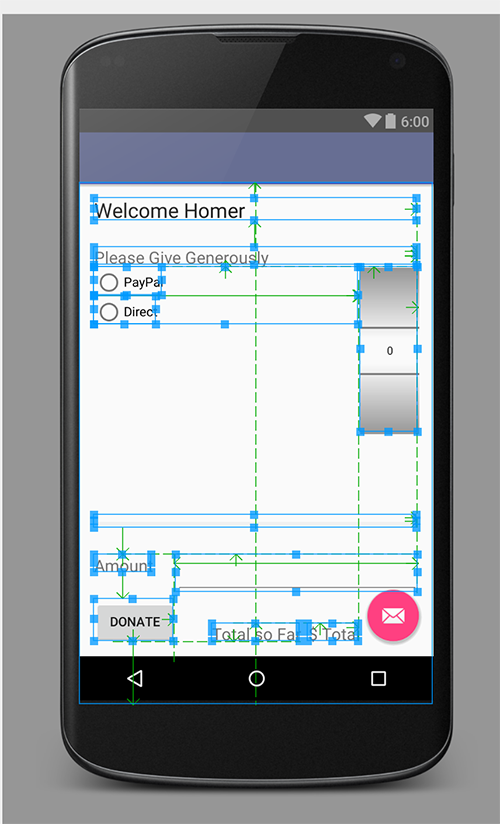


如果数字选择器设置为零，则尝试从文本视图获取数字。

这里有一个提示（一个实现我们想要的 donatButonPressed 的版本）：

```
 public void donateButtonPressed (View view) {
    String method = paymentMethod.getCheckedRadioButtonId() == R.id.PayPal ? "PayPal" : "Direct";
    progressBar.setProgress(totalDonated);

    int donatedAmount =  amountPicker.getValue();
    if (donatedAmount == 0)
    {
      String text = amountText.getText().toString();
      if (!text.equals(""))
        donatedAmount = Integer.parseInt(text);
    }
    totalDonated  = totalDonated + donatedAmount;
    Log.v("Donate", amountPicker.getValue() + " donated by " +  method + "\nCurrent total " + totalDonated);
   } 
```

## 练习 2：

修改应用程序，使得当达到目标（10000）时不再接受捐赠，并向用户告知此事。

提示 - 这是如何显示一个简单警告的方法：

```
 Toast toast = Toast.makeText(this, "Target Exceeded!", Toast.LENGTH_SHORT);
      toast.show(); 
```

## 练习 3：

修改我们的小部件的颜色方案。

你会注意到，浮动操作按钮、单选按钮、进度条等，都是一种粉色 - 与我们当前的颜色方案不太一致。

提示 - 看一下你的**colors.xml**


带有上述练习的存档：

+   Donation.1.5.zip
