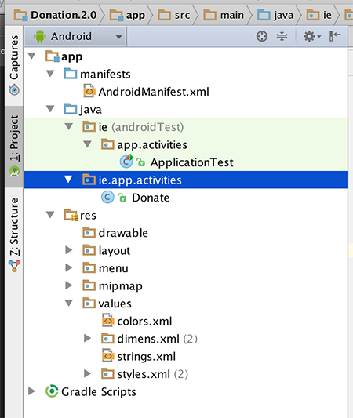
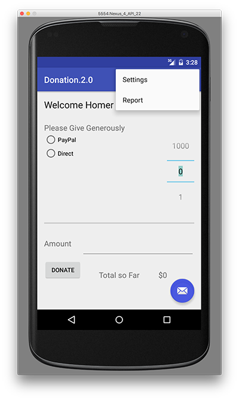
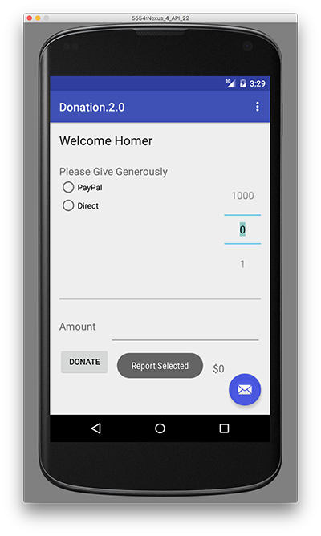
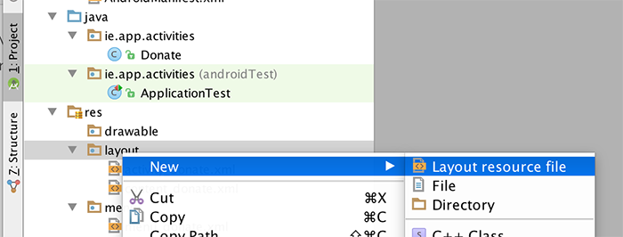
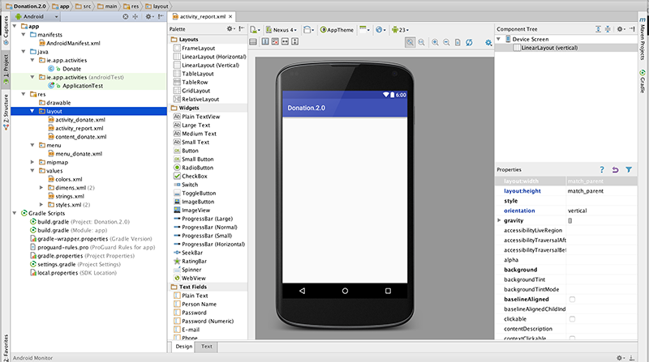
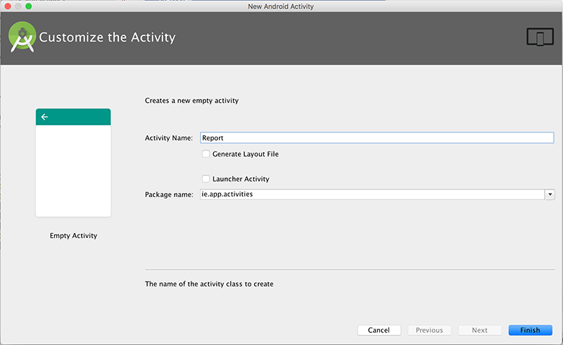
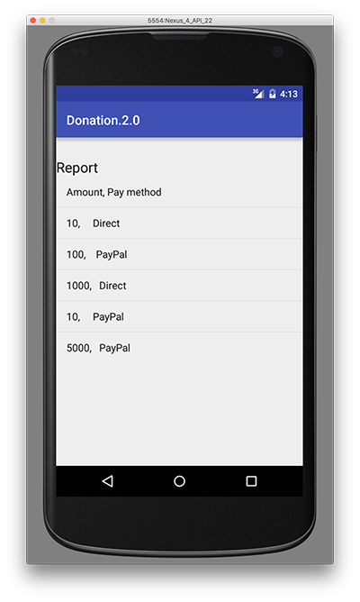
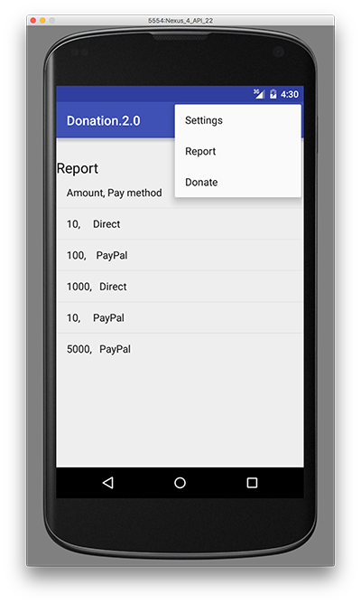

# 实验 03：Donation 2.0 - 多屏应用程序和菜单

# 实验 03：Donation 2.0 - 多屏应用程序和菜单

# 目标

# 目标

+   引入简单的菜单处理

+   将 Donation 安卓应用程序演变为包含报告视图

+   使用一个简单的 ArrayAdapter

# 步骤 01

# 包名称

这是**Donation**应用程序的当前版本：

+   Donation.1.5.zip

要继续使用此项目，我们需要将其“重构”为**Donation.2.0**。在撰写本文时，Android Studio 的重构功能和工具有点问题，因此我们需要手动复制我们的项目。

1.  确保您没有在 Android Studio 中打开**Donation.1.5** - 如果有，请立即关闭

1.  转到您下载并解压缩**Donation.1.5**的文件夹所在位置

1.  将文件夹重命名（或复制，如果您愿意）为**Donation.2.0**

1.  将文件**Donation.1.5.iml**重命名为***Donation.2.0.iml***

1.  编辑***Donation.2.0.iml***并将任何对**Donation.1.5**的引用更改为**Donation.2.0**

1.  转到.idea 文件夹（可能是一个隐藏文件夹），打开.name 文件并将项目名称重命名为**Donation.2.0**

1.  启动 Android Studio 并打开**Donation.2.0**项目

我们还应该趁机将'ie.app'包的名称更改为'ie.app.activities'，因为我们将在以后引入其他包。

因此，在“main”文件夹中创建一个新的包


并将您的**Donate.java**拖入这个新包中。您可以删除空包（如果 Android Studio 还没有这样做）

对**ApplicationTest**类执行相同操作。

接下来，检查 Donate.java 中的导入语句是否如下：

```
import android.widget.Toast;

import ie.app.R;

public class Donate extends AppCompatActivity 
```



因此，在继续之前，请确保您的项目结构看起来像上面的样子。

同时，不要忘记在 strings.xml 中更改**app_name**字符串资源。

在这个阶段应该“清理”您的项目“Build->Clean Project”，然后重新构建并最终运行您的应用程序，以确保一切正常。

这是**Donation**应用程序的当前版本（在完成上述步骤后，这是您的实验起始代码）：

+   Donation.2.0.zip

# 步骤 02

# 菜单

打开**res/values/strings.xml**并添加一个新的字符串资源，如下所示：

```
<string name="menuReport">Report</string> 
```

我们在 res/menu 文件夹中有一个名为'menu_donate.xml'的菜单资源。通过添加这个新菜单项修改此文件：

```
 <item
       android:id="@+id/menuReport"
        android:orderInCategory="100"
        android:title="@string/menuReport"
        app:showAsAction="never"/> 
```

(确保它在**'menu'**元素内)

在 Donate.java 中，更改 onOptionsItemSelected 方法如下：

```
 @Override
    public boolean onOptionsItemSelected(MenuItem item) {
        switch (item.getItemId())
        {
            case R.id.menuReport:
                Toast toast = Toast.makeText(this, "Report Selected", Toast.LENGTH_SHORT);
                toast.show();
                break;
        }

        return super.onOptionsItemSelected(item);
    } 
```

运行应用程序，当您按下菜单按钮（或溢出菜单）并选择“报告”时，您应该看到提示消息出现。



# 步骤 03

# 报告活动

在开始设计新活动之前，在 res/values/strings.xml 中添加一个字符串资源：

```
<string name="reportTitle">Report</string> 
```

设计一个名为**activity_report**的新布局。通过定位 res/layout 文件夹并选择新->布局资源文件来完成：



你可以选择此布局的所有默认设置。



将我们的布局从线性转换为相对，如下所示，


并构建类似以下的布局：


这就是布局文件本身：

```
<?xml version="1.0" encoding="utf-8"?>
<RelativeLayout xmlns:android="http://schemas.android.com/apk/res/android"
    android:orientation="vertical" android:layout_width="match_parent"
    android:layout_height="match_parent">

    <TextView
        android:layout_width="wrap_content"
        android:layout_height="wrap_content"
        android:textAppearance="?android:attr/textAppearanceLarge"
        android:text="@string/reportTitle"
        android:id="@+id/reportTitle"
        android:layout_marginLeft="0dp"
        android:layout_marginTop="31dp"
        android:layout_alignParentTop="true"
        android:layout_alignParentStart="true"
        android:layout_alignParentEnd="true" />

    <ListView
        android:layout_width="wrap_content"
        android:layout_height="wrap_content"
        android:id="@+id/reportList"
        android:layout_below="@+id/reportTitle"
        android:layout_alignParentStart="true" />
</RelativeLayout> 
```

在 ie.app.activities 中引入一个新的空活动来呈现此活动：



并用以下内容替换：

```
package ie.app.activities;

import android.support.v7.app.AppCompatActivity;
import android.os.Bundle;
import android.app.Activity;
import android.widget.ArrayAdapter;
import android.widget.ListView;

import ie.app.R;

public class Report extends AppCompatActivity {
  ListView listView;

  static final String[] numbers = new String[] { 
      "Amount, Pay method",
      "10,     Direct",
      "100,    PayPal",
      "1000,   Direct",
      "10,     PayPal",
      "5000,   PayPal"};

  @Override
  public void onCreate(Bundle savedInstanceState) {
    super.onCreate(savedInstanceState);
    setContentView(R.layout.activity_report);

    listView = (ListView) findViewById(R.id.reportList);
    ArrayAdapter<String> adapter = new ArrayAdapter<String>(this,  android.R.layout.simple_list_item_1, numbers); 
    listView.setAdapter(adapter);
  }
} 
```

这将显示一个硬编码的捐赠列表。

更改捐赠活动以在菜单中选择“报告”时加载此视图：

```
 @Override
  public boolean onOptionsItemSelected(MenuItem item) {
    switch (item.getItemId())
    {
      case R.id.menuReport : startActivity (new Intent(this, Report.class));
                             break;
    }
   return super.onOptionsItemSelected(item);
  } 
```

确认已将活动规范添加到 AndroidManifest.xml 文件中：

```
 <?xml version="1.0" encoding="utf-8"?>
<manifest xmlns:android="http://schemas.android.com/apk/res/android"
    package="ie.app" >

    <application
        android:allowBackup="true"
        android:icon="@mipmap/ic_launcher"
        android:label="@string/app_name"
        android:supportsRtl="true"
        android:theme="@style/AppTheme" >
        <activity
            android:name=".activities.Donate"
            android:label="@string/app_name"
            android:theme="@style/AppTheme.NoActionBar" >
            <intent-filter>
                <action android:name="android.intent.action.MAIN" />

                <category android:name="android.intent.category.LAUNCHER" />
            </intent-filter>
        </activity>
        <activity android:name=".activities.Report" >
        </activity>
    </application>

</manifest> 
```

现在尝试一切 - 它应该加载（如下所示）



# 第 04 步

# 菜单重访

当您从捐赠活动导航到报告时，将没有可用的菜单。因此，我们需要首先像这样膨胀菜单

```
@Override
    public boolean onCreateOptionsMenu(Menu menu) {
        // Inflate the menu; this adds items to the action bar if it is present.
        getMenuInflater().inflate(R.menu.menu_donate, menu);
        return true;
    } 
```

带入一个新的菜单项，“捐赠” - 捐赠应将您带回主要的捐赠屏幕。

这与您在 Step 02 中所做的方法非常相似，因此重新访问此步骤，看看您是否可以得到类似以下内容的“报告”屏幕：



我们将在下一个实验中查看如何填充实际捐款的列表。

# 解决方案

# 解决方案

到目前为止的解决方案：

+   Donation.2.0.zip
