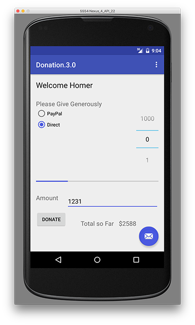
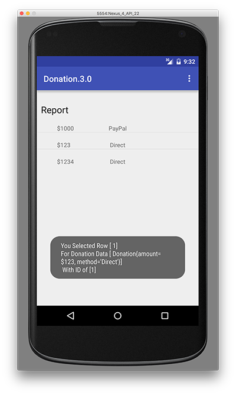

# 实验室 04：捐赠 3.0 - 捐赠对象模型

# 实验室 04：捐赠 3.0 - 捐赠对象模型

# 目标

# 目标

+   将捐赠 Android 应用程序演变为包含捐赠对象模型和基类

+   在 Report 视图中使用 CustomAdapter。

+   使用 xml 驱动的事件处理重构我们的菜单

# 第 01 步

# 捐赠模型和基类

为了保持我们的应用程序设计连贯性，我们现在引入一个基类和一个捐赠类来管理我们的捐赠。你可以继续使用你自己的应用程序版本或从上一个实验室的解决方案开始 - Donation.2.0

但在我们做任何事情之前，最好将项目重命名/复制或投影到**Donation.3.0**，就像我们在上一个实验室中所做的那样 - 所以现在就去做吧（只要确保 Android Studio 没有打开！）

现在，首先，在 'main' 中创建一个名为 'ie.app.models' 的新包，并将这个类引入到这里：

```
package ie.app.models;

public class Donation {
  public int    amount;
  public String method;

  public Donation (int amount, String method) {
    this.amount = amount;
    this.method = method;
  }
} 
```

接下���，创建一个名为 'Base' 的新类，并将其添加到 'ie.app.activities' 包中：（并显然修复错误 :-) ）

```
public class Base extends AppCompatActivity {
  public final int       target       = 10000;
  public int             totalDonated = 0;
  public static List <Donation> donations    = new ArrayList<Donation>();

  public boolean newDonation(Donation donation) {
    boolean targetAchieved = totalDonated > target;
    if (!targetAchieved)
    {
      donations.add(donation);
      totalDonated += donation.amount;
    }
    else
    {
      Toast toast = Toast.makeText(this, "Target Exceeded!", Toast.LENGTH_SHORT);
      toast.show();
    }
    return targetAchieved;
  }

  @Override
  public boolean onCreateOptionsMenu(Menu menu) {
    getMenuInflater().inflate(R.menu.donate, menu);
    return true;
  }

  @Override
  public boolean onPrepareOptionsMenu (Menu menu){
      super.onPrepareOptionsMenu(menu);
      MenuItem report = menu.findItem(R.id.menuReport);
      MenuItem donate = menu.findItem(R.id.menuDonate);

      if(donations.isEmpty())     
           report.setEnabled(false);
      else
        report.setEnabled(true); 

      if(this instanceof Donate){
          donate.setVisible(false);
          if(!donations.isEmpty())     
                report.setVisible(true);
        }
      else {
        report.setVisible(false);
        donate.setVisible(true);
        }

      return true;  
  }

  public void settings(MenuItem item) {
    Toast.makeText(this, "Settings Selected", Toast.LENGTH_SHORT).show();
  }

  public void report(MenuItem item) {
    startActivity (new Intent(this, Report.class));
  }

  public void donate(MenuItem item) {
    startActivity (new Intent(this, Donate.class));
  }
} 
```

注意我们在基类中的捐赠列表 - 我们将使用这个列表来在报告中显示我们的捐赠。

仍然有一个错误，你能找出原因，更重要的是，如何修复它吗？

提示 - 它涉及到类继承，以及需要进行的一些重构。

现在你的项目应该如下所示：


还要特别注意 'settings'、'report' 和 'donate' 方法 - 这些将直接通过 xml 被我们的菜单选项触发，我们将在第 05 步中看到。

# 第 02 步

# 重构的 Donate

Donate 活动现在可以完全重构以使用基类。

```
public class Donate extends Base {

    private Button          donateButton;
    private RadioGroup      paymentMethod;
    private ProgressBar     progressBar;
    private NumberPicker    amountPicker;
    private EditText        amountText;
    private TextView        amountTotal;

    @Override
    protected void onCreate(Bundle savedInstanceState) {
        super.onCreate(savedInstanceState);
        setContentView(R.layout.activity_donate);
        Toolbar toolbar = (Toolbar) findViewById(R.id.toolbar);
        setSupportActionBar(toolbar);

        FloatingActionButton fab = (FloatingActionButton) findViewById(R.id.fab);
        fab.setOnClickListener(new View.OnClickListener() {
            @Override
            public void onClick(View view) {
                Snackbar.make(view, "Replace with your own action", Snackbar.LENGTH_LONG)
                        .setAction("Action", null).show();
            }
        });

        donateButton = (Button) findViewById(R.id.donateButton);

        paymentMethod = (RadioGroup)   findViewById(R.id.paymentMethod);
        progressBar   = (ProgressBar)  findViewById(R.id.progressBar);
        amountPicker  = (NumberPicker) findViewById(R.id.amountPicker);
        amountText    = (EditText)     findViewById(R.id.paymentAmount);
        amountTotal   = (TextView)     findViewById(R.id.totalSoFar);

        amountPicker.setMinValue(0);
        amountPicker.setMaxValue(1000);
        progressBar.setMax(10000);
        amountTotal.setText("$0");
    }

    @Override
    public boolean onCreateOptionsMenu(Menu menu) {
        // Inflate the menu; this adds items to the action bar if it is present.
        getMenuInflater().inflate(R.menu.menu_donate, menu);
        return true;
    }

    @Override
    public boolean onOptionsItemSelected(MenuItem item) {
        switch (item.getItemId())
        {
            case R.id.menuReport : startActivity (new Intent(this, Report.class));
                break;
        }
        return super.onOptionsItemSelected(item);
    }

    public void donateButtonPressed (View view) {
        String method = paymentMethod.getCheckedRadioButtonId() == R.id.PayPal ? "PayPal" : "Direct";
        int donatedAmount =  amountPicker.getValue();
        if (donatedAmount == 0)
        {
            String text = amountText.getText().toString();
            if (!text.equals(""))
                donatedAmount = Integer.parseInt(text);
        }
        if (donatedAmount > 0)
        {
            newDonation(new Donation(donatedAmount, method));
            progressBar.setProgress(totalDonated);
            String totalDonatedStr = "$" + totalDonated;
            amountTotal.setText(totalDonatedStr);
        }
    }
} 
```

用这个替换你的版本并执行它 - 修复任何必要的缺失导入语句。

仔细查看这个版本与上一次尝试的变化。

# 第 03 步

# 重构的 Report - 新 '布局'

现在我们重新设计 Report 来呈现实际捐赠 - 存储在基类列表中的捐赠。

首先进行一些布局添加。在 strings.xml 中包含这些新的字符串资源

```
 <string name="defaultAmount">00</string>
    <string name="defaultMethod">N/A</string> 
```

这是一个新的布局 - 名为 'row_donate.xml'。将其放在 'layout' 文件夹中。

```
<?xml version="1.0" encoding="utf-8"?>
<RelativeLayout xmlns:android="http://schemas.android.com/apk/res/android"
    android:orientation="vertical" android:layout_width="match_parent"
    android:layout_height="match_parent">

    <TextView
        android:id="@+id/row_amount"
        android:layout_width="wrap_content"
        android:layout_height="wrap_content"
        android:layout_alignParentLeft="true"
        android:layout_alignParentTop="true"
        android:layout_marginLeft="48dp"
        android:layout_marginTop="20dp"
        android:text="@string/defaultAmount" />

    <TextView
        android:id="@+id/row_method"
        android:layout_width="wrap_content"
        android:layout_height="wrap_content"
        android:layout_marginLeft="106dp"
        android:text="@string/defaultMethod"
        android:layout_alignTop="@+id/row_amount"
        android:layout_centerHorizontal="true" />

</RelativeLayout> 
```

# 第 04 步

# 重构的 Report - 新 '类'

最后，重新设计 Report 类以删除硬编码的值 - 并使用不同的 '适配器'

```
public class Report extends Base {
    ListView listView;

    @Override
    public void onCreate(Bundle savedInstanceState) {
        super.onCreate(savedInstanceState);
        setContentView(R.layout.activity_report);

        listView = (ListView) findViewById(R.id.reportList);
        DonationAdapter adapter = new DonationAdapter(this,  donations);
        listView.setAdapter(adapter);
    }

    @Override
    public boolean onCreateOptionsMenu(Menu menu) {
        // Inflate the menu; this adds items to the action bar if it is present.
        getMenuInflater().inflate(R.menu.menu_donate, menu);
        return true;
    }

    @Override
    public boolean onOptionsItemSelected(MenuItem item) {
        switch (item.getItemId())
        {
            case R.id.menuDonate : startActivity (new Intent(this, Donate.class));
                break;
        }
        return super.onOptionsItemSelected(item);
    }
} 
```

这是新的适配器 - DonationAdapter。如果你愿意，可以将其放在 Report 类的末尾（在闭括号外）：

```
class DonationAdapter extends ArrayAdapter<Donation> {
  private Context        context;
  public  List<Donation> donations;

  public DonationAdapter(Context context, List<Donation> donations) {
    super(context, R.layout.row_donate, donations);
    this.context   = context;
    this.donations = donations;
  }

  @Override
  public View getView(int position, View convertView, ViewGroup parent) {
    LayoutInflater inflater = (LayoutInflater) context.getSystemService(Context.LAYOUT_INFLATER_SERVICE);

    View     view       = inflater.inflate(R.layout.row_donate, parent, false);
    Donation donation   = donations.get(position);
    TextView amountView = (TextView) view.findViewById(R.id.row_amount);
    TextView methodView = (TextView) view.findViewById(R.id.row_method);

    amountView.setText("$" + donation.amount);
    methodView.setText(donation.method);

    return view;
  }

  @Override
  public int getCount() {
    return donations.size();
  }
} 
```

如果一切顺利 - 那么你应该能够进行捐赠，然后在报告活动中看到它们的列表。

 

# 第 05 步

# 重构的 Menu - 新 '事件处理'

如果你还记得第一步，我们的基类有 3 个特定的方法，我们还没有使用 - 但是

```
 public void settings(MenuItem item) {
    Toast.makeText(this, "Settings Selected", Toast.LENGTH_SHORT).show();
  }

  public void report(MenuItem item) {
    startActivity (new Intent(this, Report.class));
  }

  public void donate(MenuItem item) {
    startActivity (new Intent(this, Donate.class));
  }
} 
```

现在我们将使用这些方法，并使用 **onClick** 属性在我们的 MenuItems 中，我们将把这些方法 '绑定' 到我们的菜单选项。

首先，编辑你的 menu_donate.xml 并确保它现在看起来如下：

```
<menu xmlns:android="http://schemas.android.com/apk/res/android"
    xmlns:app="http://schemas.android.com/apk/res-auto"
    xmlns:tools="http://schemas.android.com/tools" tools:context=".Donate">

    <item android:id="@+id/action_settings"
        android:title="@string/action_settings"
        android:orderInCategory="100"
        app:showAsAction="never"
        android:onClick="settings"/>

    <item
        android:id="@+id/menuReport"
        android:orderInCategory="100"
        android:title="@string/menuReport"
        app:showAsAction="never"
        android:onClick="report"/>

    <item
        android:id="@+id/menuDonate"
        android:orderInCategory="100"
        android:title="@string/menuDonate"
        app:showAsAction="never"
        android:onClick="donate"/>
</menu> 
```

**请注意为每个 MenuItem 添加的 onClick 属性，它直接对应于我们基类中的方法名称**

现在我们可以重构我们的 Donate 和 Report 类，并**移除**两个类中的菜单膨胀和事件处理代码。

因此，两个类应如下所示：

**捐赠**

```
public class Donate extends Base {

    private Button          donateButton;
    private RadioGroup      paymentMethod;
    private ProgressBar     progressBar;
    private NumberPicker    amountPicker;
    private EditText        amountText;
    private TextView        amountTotal;

    @Override
    protected void onCreate(Bundle savedInstanceState) {
        super.onCreate(savedInstanceState);
        setContentView(R.layout.activity_donate);
        Toolbar toolbar = (Toolbar) findViewById(R.id.toolbar);
        setSupportActionBar(toolbar);

        FloatingActionButton fab = (FloatingActionButton) findViewById(R.id.fab);
        fab.setOnClickListener(new View.OnClickListener() {
            @Override
            public void onClick(View view) {
                Snackbar.make(view, "Replace with your own action", Snackbar.LENGTH_LONG)
                        .setAction("Action", null).show();
            }
        });

        donateButton = (Button) findViewById(R.id.donateButton);

        paymentMethod = (RadioGroup)   findViewById(R.id.paymentMethod);
        progressBar   = (ProgressBar)  findViewById(R.id.progressBar);
        amountPicker  = (NumberPicker) findViewById(R.id.amountPicker);
        amountText    = (EditText)     findViewById(R.id.paymentAmount);
        amountTotal   = (TextView)     findViewById(R.id.totalSoFar);

        amountPicker.setMinValue(0);
        amountPicker.setMaxValue(1000);
        progressBar.setMax(10000);
        amountTotal.setText("$0");
    }

    public void donateButtonPressed (View view) {
        String method = paymentMethod.getCheckedRadioButtonId() == R.id.PayPal ? "PayPal" : "Direct";
        int donatedAmount =  amountPicker.getValue();
        if (donatedAmount == 0)
        {
            String text = amountText.getText().toString();
            if (!text.equals(""))
                donatedAmount = Integer.parseInt(text);
        }
        if (donatedAmount > 0)
        {
            newDonation(new Donation(donatedAmount, method));
            progressBar.setProgress(totalDonated);
            String totalDonatedStr = "$" + totalDonated;
            amountTotal.setText(totalDonatedStr);
        }
    }
} 
```

**报告**

```
public class Report extends Base {
    ListView listView;

    @Override
    public void onCreate(Bundle savedInstanceState) {
        super.onCreate(savedInstanceState);
        setContentView(R.layout.activity_report);

        listView = (ListView) findViewById(R.id.reportList);
        DonationAdapter adapter = new DonationAdapter(this,  donations);
        listView.setAdapter(adapter);
    }
} 
```

再次运行您的应用程序，确认更改并确保您的菜单仍然按预期工作。

# 解决方案

# 练习与解决方案

作为最后的练习，尝试为 Report Activity 添加一些事件处理 - 即当用户在 Report List 中选择一行时，显示一个简单的提示，详细说明选择了哪一行以及该行的捐赠数据。

类似于这样：



如果您需要重构您的捐赠模型，您可能会发现以下内容有用


和


项目解决方案（下一个实验的入门）：

+   捐赠.4.0.入门
