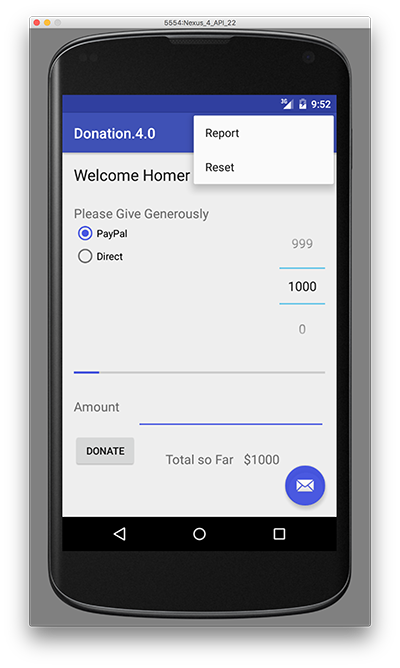
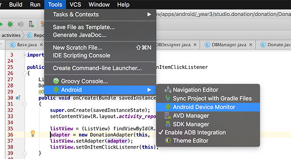

# 实验室 05：捐赠 4.0 - 数据库/应用程序支持

# 实验室 05：捐赠 4.0 - 数据库/应用程序支持

# 目标

# 目标

在这个实验室中，您将完成我们的捐赠案例研究 - **Donation.4.0**的最终重构。我们将在上一个实验室的基础上构建，并添加一些新功能和数据库支持，以及一个应用程序对象。完成此实验室后，您将能够

+   为 Android 应用程序添加数据库支持

+   使用一个“应用程序”对象

# 步骤 01

# 设置 - 起始代码

与以前的实验室一样，您可以下载 Donation.4.0.starter 的解决方案/起始代码，或者继续使用您自己的版本。

您当前的项目（重命名/复制后）应如下所示：


在这个实验室中，您需要做以下事情：

+   添加一个新的菜单选项 - “重置” - 在达到目标后清除任何捐赠

+   添加数据库支持以管理所做的捐赠

+   重构现有类以适应新的数据库类

以下步骤将指导您完成这些要求，因此我们将从菜单选项开始。

# 步骤 02

# 添加一个新的菜单选项

首先，确认当前菜单如下所示：


但我们想要类似于这样的东西：



首先要做的是在 strings.xml 中添加一个新资源（或者如果直接粘贴菜单项会出现字符串资源错误，请使用 Android Studio（Alt + Return）修复它）

```
 <string name="menuReset">Reset</string> 
```

然后在 donate.xml 中对应的菜单项

```
 <item
        android:id="@+id/menuReset"
        android:orderInCategory="100"
        android:showAsAction="never"
        android:title="@string/menuReset"
        android:onClick="reset"/> 
```

现在删除“设置”菜单项及其在基类中的相关方法可能是值得的。接下来，编辑**Base.java**并添加以下方法存根

```
public void reset(MenuItem item) {} 
```

确保我们的应用程序在菜单加载时不会崩溃（并寻找一个名为“重置”的方法）

再次运行应用程序，并确认您获得以下菜单：


我们目前无法完全实现此菜单选项，因此目前我们只会将目标金额重置为零（0）- 步骤 03。

# 步骤 03

# 重置目标金额

这更多是一个中间步骤，但是为了确保“重置”选项的菜单事件处理程序正常工作，这是必要的。

首先，编辑**Donate.java**并引入“重置”方法的实现

```
 @Override
  public void reset(MenuItem item) {
        // Your implementation goes here
  } 
```

the

```
@Override 
```

注释很重要 - 你能解释为什么吗？

因此，添加处理选择“重置”菜单选项所需的代码，并将*totalDonated*重置为零（0）。您还需要更新捐赠 UI 以反映此重置，所以也尝试一下。

再次运行应用程序，确认“重置”菜单选项现在正在运行。

# 步骤 04

# 应用对象

在我们完成这一步之前，这里是你需要的上一步的代码。

```
 @Override
  public void reset(MenuItem item) {
    totalDonated = 0;
    amountTotal.setText("$" + totalDonated);
    donations.clear();
  } 
```

为了保持应用程序设计的连贯性，我们现在引入一个“应用程序”对象。

创建一个名为'ie.app.main'的新包，并在这里合并这个类：

```
package ie.app.main;

import android.app.Application;
import android.util.Log;

public class DonationApp extends Application {
  @Override
  public void onCreate() {
    super.onCreate();
    Log.v("Donate", "Donation App Started");
  }
} 
```

应用���象需要在 AndroidManifest.xml 中引用 - 在最顶部作为'andorid:name'

```
 <application
        android:allowBackup="true"
        android:icon="@mipmap/ic_launcher"
        android:label="@string/app_name"
        android:supportsRtl="true"
        android:theme="@style/AppTheme"
        android:name="ie.app.main.DonationApp"> 
```

确保在启动应用程序时日志中出现'捐赠应用程序已启动'，以验证它是否已被正确激活。


# 步骤 05

# 捐赠模型

现在我们需要重构 Base 类（下一步），并将与捐赠相关的属性和方法（即目标变量、总捐款和捐赠列表，以及 newDonation()方法）移到我们的 DonationApp 类中。

这是 DonationApp 的修订版本 - 现在它管理一个捐赠列表。它还将'makeDonation'事件集中化为一个方法实现。用这个新的替换你的 donation：

```
package ie.app.main;

import java.util.ArrayList;
import java.util.List;

import android.app.Application;
import android.util.Log;
import android.widget.Toast;
import ie.app.models.Donation;

public class DonationApp extends Application {
  public final int       target       = 10000;
  public int             totalDonated = 0;
  public List <Donation> donations    = new ArrayList<Donation>();

  public boolean newDonation(Donation donation) {
    boolean targetAchieved = totalDonated > target;
    if (!targetAchieved)
    {
      donations.add(donation);
      totalDonated += donation.amount;
    }
    else
    {
      Toast.makeText(this, "Target Exceeded!", Toast.LENGTH_SHORT).show();
    }
    return targetAchieved;
  }

  @Override
  public void onCreate() {
    super.onCreate();
    Log.v("Donation", "Donation App Started");
  }
} 
```

# 步骤 06

# 基类重构

现在可以完全重构 Base 活动以利用 DonationApp 对象。在这一步结束时，你会遇到错误，因为引用了我们（尚未存在的）数据库类 - 但我们将在接下来的几步中修复这些错误。

这是我们的新基类

```
package ie.app.activities;

import android.content.Intent;
import android.support.v7.app.AppCompatActivity;
import android.view.Menu;
import android.view.MenuItem;
import android.os.Bundle;

import ie.app.R;
import ie.app.main.DonationApp;

public class Base extends AppCompatActivity {

    public DonationApp app;

    @Override
    protected void onCreate(Bundle savedInstanceState) {
        super.onCreate(savedInstanceState);

        app = (DonationApp) getApplication();

        app.dbManager.open();
        app.dbManager.setTotalDonated(this);
    }

    @Override
    protected void onDestroy() {
        super.onDestroy();
        app.dbManager.close();
    }

    @Override
    public boolean onCreateOptionsMenu(Menu menu) {
        getMenuInflater().inflate(R.menu.menu_donate, menu);
        return true;
    }

    @Override
    public boolean onPrepareOptionsMenu (Menu menu){
        super.onPrepareOptionsMenu(menu);
        MenuItem report = menu.findItem(R.id.menuReport);
        MenuItem donate = menu.findItem(R.id.menuDonate);
        MenuItem reset = menu.findItem(R.id.menuReset);

        if(app.dbManager.getAll().isEmpty())
        {
            report.setEnabled(false);
            reset.setEnabled(false);
        }
        else {
            report.setEnabled(true);
            reset.setEnabled(true);
        }
        if(this instanceof Donate){
            donate.setVisible(false);
            if(!app.dbManager.getAll().isEmpty())
            {
                report.setVisible(true);
                reset.setEnabled(true);
            }
        }
        else {
            report.setVisible(false);
            donate.setVisible(true);
            reset.setVisible(false);
        }

        return true;
    }

    public void report(MenuItem item) {
        startActivity (new Intent(this, Report.class));
    }

    public void donate(MenuItem item) {
        startActivity (new Intent(this, Donate.class));
    }

    public void reset(MenuItem item) {}
} 
```

# 步骤 07

# 添加数据库支持

一旦你导入了必要的数据库类（以解决上一步中的错误），这一步就相对简单了 - 你只需用相应的***dbManager***调用替换管理***donationList***的方法调用即可。

首先要做的是下载数据库中必要的数据库类并将它们添加到你的项目中的一个新的*ie.app.database*包中。

花点时间研究这些类，并熟悉你将要使用的方法。

有几个类需要修改以添加数据库支持到你的项目中，但是首先，你需要在**Base.java**中创建一个***DBManager***的实例，并在必要时打开/关闭数据库，所以请参考讲座材料完成这一步。

接下来，用以下内容更新你的**DonationApp**类：

```
public class DonationApp extends Application {
    public final int       target       = 10000;
    public int             totalDonated = 0;
    //public List <Donation> donations    = new ArrayList<Donation>();
    public DBManager dbManager;

    public boolean newDonation(Donation donation) {
        boolean targetAchieved = totalDonated > target;
        if (!targetAchieved)
        {
            dbManager.add(donation);
            totalDonated += donation.amount;
        }
        else
        {
            Toast.makeText(this, "Target Exceeded!", Toast.LENGTH_SHORT).show();
        }
        return targetAchieved;
    }

    @Override
    public void onCreate() {
        super.onCreate();
        Log.v("Donate", "Donation App Started");
        dbManager = new DBManager(this);
        Log.v("Donate", "Database Created");

    }
} 
```

**注意对新的*dbManager*对象的引用。**

此外，我们的 Donation 类需要进行轻微的重构，所以请用这个新的类替换当前的类。

```
public class Donation {
  public int    id;
  public int    amount;
  public String method;

  public Donation (int amount, String method) {
    this.amount = amount;
    this.method = method;
  }

  public Donation () {
    this.amount = 0;
    this.method = "";
  }

  public String toString() {
    return id + ", " + amount + ", " + method;
  }
} 
```

一旦你做出这些改变，并注释掉 donationList 列表（并保存文件），你会得到一些错误，这实际上指示了你现在需要更新和添加数据库调用（以及移除 donationList 调用）的类。

每个错误只需要一行代码来修复，所以试试更新每个类（我们将在实验结束时查看解决方案）。

一旦你修复了所有错误，并再次运行应用程序，你应该仍然能够进行捐赠 - 但这次捐赠将存储在数据库中。

最后检查，如果你关闭应用程序然后重新启动，你应该仍然能够看到捐赠报告。

# 步骤 08

# 重置捐赠

实验的最后一步涉及在用户希望“重置”时从数据库中删除所有捐赠。

在这一步中实际上并不需要做太多事情 - 当用户选择菜单选项时，只需在你的 Donate.java 中的 reset 方法上调用**reset()**即可，所以请按以下方式修改你的 reset 方法：

```
 @Override
  public void reset(MenuItem item) {
          app.dbManager.reset();
        app.totalDonated = 0;
        amountTotal.setText("$" + app.totalDonated);
  } 
```

你还需要更新你的**基类**中的 *onPrepareOptionsMenu()* 方法，以正确处理“重置”菜单选项的禁用/显示，因此请参考讲座材料。

大致就是这样 - 有一个例外。应用程序中存在一个与应用程序重新启动且目标**尚未**达到有关的小错误。

你能找到它吗，更重要的是，能修复吗？

# 步骤 09

# 安卓设备监视器

作为一种练习，你应该熟悉安卓设备监视器，特别是它如何与在模拟器/设备上查看你的数据库相关联。

## 

在安卓工作室中，你可以如下启动安卓设备监视器：

工具->安卓->安卓设备监视器（如下所示）



接下来，你需要在设备上的应用程序包内导航到数据/数据文件夹（在我们的案例中是 ie.app），如下所示：


然后，在 ie.app.databases 文件夹中滚动/查找你的数据库（donations.db）：


在窗口右上角选择“从设备中拉取文件”：


并将你的数据库文件保存到一个本地文件夹。

接下来下载并安装[sqlitebrowser](http://sqlitebrowser.org)，这将允许我们以图形方式查看我们的数据库。


启动你的 sqlitebrowser 应用/程序以获取此窗口：


然后 '打开数据库' 选择从设备中拉取的数据库。如果一切按计划进行，你应该能够查看你的数据库表及其内容，以及创建表的 SQL。

下面，我们可以看到一个带有 3 个捐款的捐款表


以及我们安卓应用程序中的相应条目。


# 解决方案

# 解决方案

这是实验的解决方案：

+   捐款.4.0
