# 实验 06：捐赠 5.0 - REST/云支持

# 实验 06：捐赠 5.0 - REST/云支持

# 目标

# 目标

在这个实验中，你将完成我们的 Donation 案例研究**Donation.5.0**的另一个重构。我们将在之前的实验基础上进行扩展，并添加一些新功能，最重要的是，连接到基于 REST 的 Web 服务。完成这个实验后，你将能够

+   连接到远程服务器以检索和删除捐赠

+   连接到远程服务器以检索单个捐赠

+   在我们自定义的捐赠行上添加事件处理

# 步骤 01

# 设置 - 起始代码

与之前的实验一样，你可以下载 Donation.5.0.starter 的解决方案/起始代码，或者继续使用你自己的版本。

你当前的项目（重命名/复制后）应该如下所示：

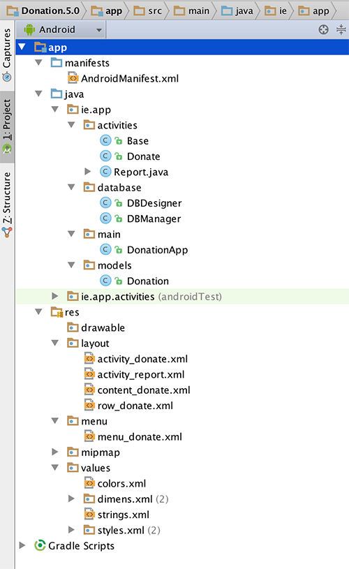

在这个实验中，你需要做以下事情：

+   通过[捐赠姐妹网站](http://donationweb-4-0.herokuapp.com)添加 REST 支持

+   删除数据库支持并恢复原始的捐赠列表

+   重构现有类以适应新的 REST API

以下步骤将指导你完成这些要求，所以我们将从引入连接到我们 Web 服务所需的类开始。

# 步骤 02

# 添加 REST 支持和项目清理

这个版本的 Donation 的主要目的是连接到一个 Web 服务（[我们的姐妹网站](http://donationweb-4-0.herokuapp.com)）并能够检索、插入和删除捐赠。

为了让事情变得更容易，我开发了一个简单的 API 来进行 HTTP 调用，并将响应从 JSON 转换为我们的 Android 应用程序可以使用的对象。

所以继续并下载这个包这里。

解压后的存档包括以下内容：

+   DonationApi.java

+   Rest.java

（在 Finder 中查看）

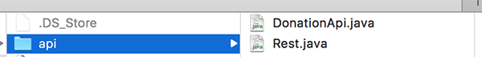

你需要将这些类添加到你的 Android Studio 项目中，最简单的方法是在 Windows 资源管理器或 Finder 中复制 api 文件夹，然后直接粘贴到 Android Studio 项目中的**ie.app**包中。完成后，你的项目应该看起来像这样：

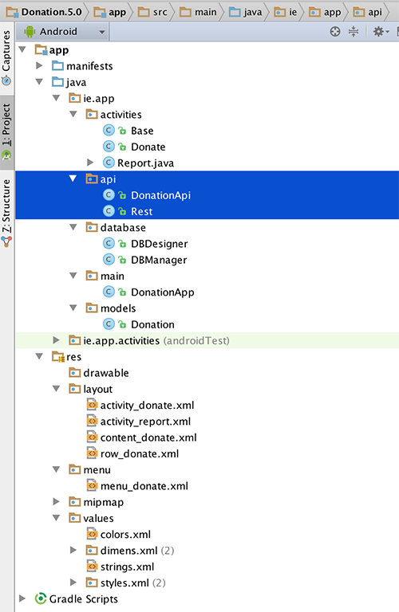

现在，如果你重新构建项目

构建->重新构建项目

你会遇到一些与[Google 的 Gson](https://sites.google.com/site/gson/gson-user-guide)相关的错误，所以首先要做的是将**Google 的 Gson**依赖项添加到我们的项目中：

打开你的'app'的'build.gradle'文件，而不是项目的���

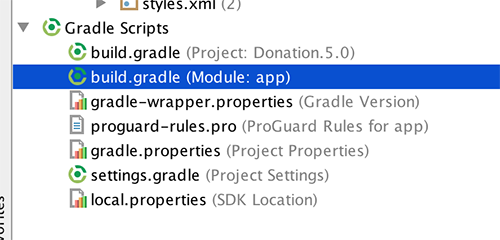

添加 Gson 依赖

```
compile 'com.google.code.gson:gson:2.2.3' 
```

所以你的构建文件中的依赖关系看起来像这样

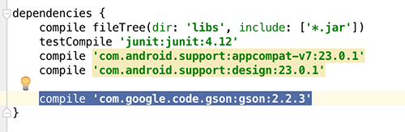

再次重建你的项目，现在应该没有错误了！

我们接下来需要做的是删除我们的数据库类，并将一个简单的列表重新引入到我们的 DonationApp 应用程序类中。

所以，

+   首先，只需删除整个**ie.app.database**包（不用担心错误，我们很快会修复它们）

+   接下来，将我们的捐赠列表重新引入 DonationApp 类中

    ```
    public List <Donation> donations    = new ArrayList<Donation>(); 
    ```

+   最后，在项目中删除所有对**dbManager**的引用，并替换为我们的**donations**或**app.donations**（根据上下文而定）。

就功能而言，我们实际上已经退步了，因为我们不是直接将捐赠添加到我们的列表中 - 列表只用于保存我们 REST 调用的结果。

那么让我们继续开始使用我们的 REST 类进行数据检索。

# 第 03 步

# 捐赠活动 - 获取运行总数

当我们的捐赠应用程序初始启动时，我们希望确保当前总数（如果有）已正确设置，并且与我们姊妹网站列出的捐赠相对应。

我们需要从服务器检索所有捐赠的列表并设置我们的总数。我们将通过我们的 REST 类和使用 AsyncTasks 在后台线程上执行这些调用来实现这一点。

在我们开始之前，我们需要允许我们的应用程序访问互联网（和网络），因此我们需要在清单文件中添加一些权限，因此请将以下内容添加到您的**AndroidManifest.xml**文件中（就在<application>标签之前）

```
 <uses-permission android:name="android.permission.INTERNET"/>
    <uses-permission android:name="android.permission.ACCESS_NETWORK_STATE" /> 
```

将以下**私有**类引入到捐赠活动中

```
private class GetAllTask extends AsyncTask<String, Void, List<Donation>> {

        protected ProgressDialog         dialog;
        protected Context                 context;

        public GetAllTask(Context context) {
            this.context = context;
        }

        @Override
        protected void onPreExecute() {
            super.onPreExecute();
            this.dialog = new ProgressDialog(context, 1);
            this.dialog.setMessage("Retrieving Donations List");
            this.dialog.show();
        }

        @Override
        protected List<Donation> doInBackground(String... params) {
            try {
                Log.v("donate", "Donation App Getting All Donations");
                return (List<Donation>) DonationApi.getAll((String) params[0]);
            }
            catch (Exception e) {
                Log.v("donate", "ERROR : " + e);
                e.printStackTrace();
            }
            return null;
        }

        @Override
        protected void onPostExecute(List<Donation> result) {
            super.onPostExecute(result);

            //use result to calculate the totalDonated amount here

            progressBar.setProgress(app.totalDonated);
            amountTotal.setText("$" + app.totalDonated);

            if (dialog.isShowing())
                dialog.dismiss();
        }
    } 
```

要实际调用此任务，请添加以下方法

```
@Override
    public void onResume() {
        super.onResume();
        new GetAllTask(this).execute("/donations");
    } 
```

如果您尝试运行您的应用程序，它将连接到 Web 服务并从姊妹站点返回我们的列表 - 但然后会崩溃。您能从日志中找出这是为什么发生的以及如何修复吗？

# 第 04 步

# 重构我们的捐赠模型

如果您特别注意了上一个请求返回的 JSON 字符串，您会看到有 4 个不同类型的属性 - 它们与我们当前的**Donation**类不匹配。

这就是应用程序崩溃的原因 - 我们试图将我们的 json 字符串转换为不同类型的对象列表。

那么，请继续使用此模型替换您当前的捐赠模型

```
public class Donation {
    public String _id;
    public int    amount;
    public String paymenttype;
    public int    upvotes;

    public Donation (int amount, String method, int upvotes) {
        this.amount = amount;
        this.paymenttype = method;
        this.upvotes = upvotes;
    }

    public Donation () {
        this.amount = 0;
        this.paymenttype = "";
        this.upvotes = 0;
    }

    public String toString() {
        return _id + ", " + amount + ", " + paymenttype + ", " + upvotes;
    }
} 
```

有一些小错误要修复，但是一旦您修复了，再次运行您的应用程序，您应该会得到类似以下的东西：

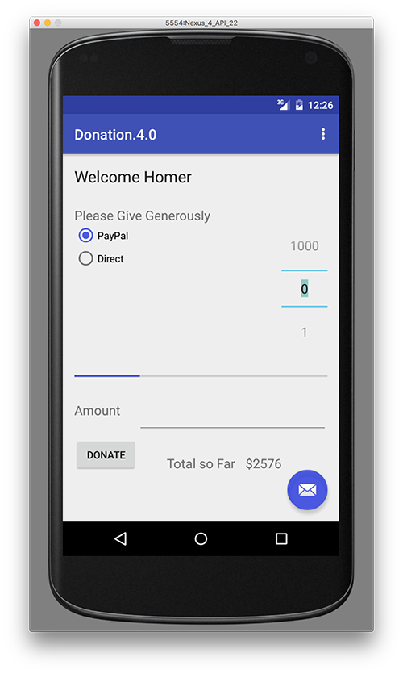

# 第 05 步

# 报告活动 - 重构我们的布局

现在我们可以看到我们的总捐款了，让我们在我们的报告活动中显示它们。

我们首先需要对我们的布局进行一些修改，并且我们将介绍 Android 的[SwipereRreshLayout](http://developer.android.com/reference/android/support/v4/widget/SwipeRefreshLayout.html)功能，因此请用此布局替换您当前的报告布局

```
<?xml version="1.0" encoding="utf-8"?>
<RelativeLayout xmlns:android="http://schemas.android.com/apk/res/android"
    android:orientation="vertical" android:layout_width="match_parent"
    android:layout_height="match_parent">

    <TextView
        android:layout_width="wrap_content"
        android:layout_height="wrap_content"
        android:textAppearance="?android:attr/textAppearanceLarge"
        android:text="@string/reportTitle"
        android:id="@+id/reportTitle"
        android:layout_marginLeft="0dp"
        android:layout_marginTop="31dp"
        android:layout_alignParentTop="true"
        android:layout_alignParentStart="true"
        android:layout_alignParentEnd="true"
        android:paddingLeft="10dp" />

    <LinearLayout xmlns:android="http://schemas.android.com/apk/res/android"
        android:orientation="horizontal" android:layout_width="fill_parent"
        android:layout_height="wrap_content"
        android:layout_below="@+id/reportTitle"
        android:layout_alignParentStart="true"
        android:id="@+id/linearLayout">

        <TextView
            android:id="@+id/row_upvotes"
            android:layout_width="wrap_content"
            android:layout_height="wrap_content"
            android:layout_marginStart="15dp"
            android:layout_marginTop="20dp"
            android:text="Upvotes"
            android:layout_weight="0.5"
            android:textSize="20sp"
            android:textColor="@color/colorPrimaryDark" />

        <TextView
            android:id="@+id/row_amount"
            android:layout_width="wrap_content"
            android:layout_height="wrap_content"
            android:layout_marginTop="20dp"
            android:text="Amount"
            android:layout_weight="0.5"
            android:textSize="20sp"
            android:textColor="@color/colorPrimaryDark" />

        <TextView
            android:id="@+id/row_method"
            android:layout_width="wrap_content"
            android:layout_height="wrap_content"
            android:layout_marginTop="20dp"
            android:text="Method"
            android:layout_weight="1.5"
            android:textSize="20sp"
            android:textColor="@color/colorPrimaryDark" />

    </LinearLayout>

    <android.support.v4.widget.SwipeRefreshLayout
        android:id="@+id/report_swipe_refresh_layout"
        android:layout_width="match_parent"
        android:layout_height="wrap_content"
        android:layout_alignParentStart="true"
        android:layout_below="@+id/linearLayout">

        <ListView
            android:id="@+id/reportList"
            android:layout_width="match_parent"
            android:layout_height="match_parent">
        </ListView>

    </android.support.v4.widget.SwipeRefreshLayout>

</RelativeLayout> 
```

我们还需要修改我们的自定义行，以便用户可以看到每笔捐赠的'upvotes'数量，因此请尝试通过引入新的 TextView 资源来重构您的 row_donate.xml 以显示'upvotes'。我们还将能够通过“删除”按钮删除捐赠，因此在重构自定义行时，请尝试这样做（就像这样）

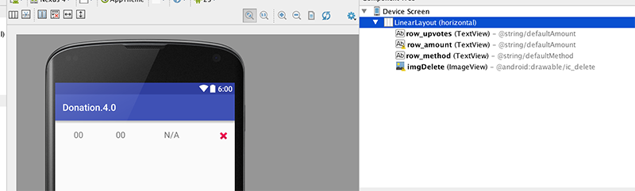

（别担心，解决方案在下一步，但首先试试）

# 第 06 步

# 报告活动 - 显示我们的捐赠

这是您应该拥有的更新的自定义布局（或类似的内容）

```
<?xml version="1.0" encoding="utf-8"?>
<LinearLayout xmlns:android="http://schemas.android.com/apk/res/android"
    android:orientation="horizontal" android:layout_width="fill_parent"
    android:layout_height="match_parent">

    <TextView
        android:id="@+id/row_upvotes"
        android:layout_width="80dp"
        android:layout_height="wrap_content"
        android:layout_marginStart="40dp"
        android:layout_marginTop="20dp"
        android:text="@string/defaultAmount"
        android:textSize="18sp" />

    <TextView
        android:id="@+id/row_amount"
        android:layout_width="80dp"
        android:layout_height="wrap_content"
        android:layout_marginTop="20dp"
        android:layout_marginLeft="10dp"
        android:text="@string/defaultAmount"
        android:layout_weight="1"
        android:textSize="18sp" />

    <TextView
        android:id="@+id/row_method"
        android:layout_width="80dp"
        android:layout_height="wrap_content"
        android:layout_marginTop="20dp"

        android:text="@string/defaultMethod"
        android:layout_weight="1"
        android:textSize="18sp" />

    <ImageView
        android:id="@+id/imgDelete"
        android:layout_width="25dp"
        android:layout_height="25dp"
        android:layout_marginTop="20dp"
        android:layout_weight="1"
        android:src="@android:drawable/ic_delete" />

</LinearLayout> 
```

现在，如果您再次运行应用程序，并选择报告菜单选项，您实际上将看到从服务器检索到的列表（尚未进行任何投票） - 无需额外编码 - 这是如何可能的？

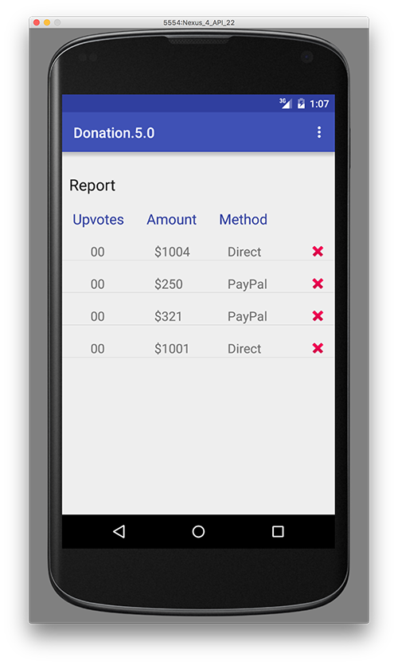

尝试滑动刷新手势，看看会发生什么？

# 第 07 步

# 报告活动 - 实施滑动刷新

您可能已经注意到，即使我们可以“刷新”报告列表，但我们看到的只是刷新进度一直旋转 - 除了关闭活动外，我们没有停止它的办法。


原因是，我们没有后端实现手势来实际刷新列表中的数据 - 所以让我们做这个。

我们需要做的第一件事是引入一个新的 AsyncTask 来检索捐款 - 更高级的方法可以利用接口和继承来重用已经存在的 AsyncTasks（例如我们的 GetAllTask），但目前我们将尽量保持尽可能简单，并为报告活动编写一个新的 GetAllTask。

将以下 AsyncTask 添加到 Report Activity 中；

```
private class GetAllTask extends AsyncTask<String, Void, List<Donation>> {

        protected ProgressDialog dialog;
        protected Context context;

        public GetAllTask(Context context) {
            this.context = context;
        }

        @Override
        protected void onPreExecute() {
            super.onPreExecute();
            this.dialog = new ProgressDialog(context, 1);
            this.dialog.setMessage("Retrieving Donations List");
            this.dialog.show();
        }

        @Override
        protected List<Donation> doInBackground(String... params) {

            try {
                return (List<Donation>) DonationApi.getAll((String) params[0]);
            } catch (Exception e) {
                Log.v("ASYNC", "ERROR : " + e);
                e.printStackTrace();
            }
            return null;
        }

        @Override
        protected void onPostExecute(List<Donation> result) {
            super.onPostExecute(result);

            app.donations = result;
            adapter = new DonationAdapter(context, app.donations);
            listView.setAdapter(adapter);
            listView.setOnItemClickListener(Report.this);
            mSwipeRefreshLayout.setRefreshing(false);

            if (dialog.isShowing())
                dialog.dismiss();
        }
    } 
```

修复所有错误（除了 1 个），然后引入以下参考资料

```
SwipeRefreshLayout mSwipeRefreshLayout; 
```

用这个方法替换现有的 onCreate()方法

```
@Override
    public void onCreate(Bundle savedInstanceState) {
        super.onCreate(savedInstanceState);
        setContentView(R.layout.activity_report);

        listView = (ListView) findViewById(R.id.reportList);
        mSwipeRefreshLayout = (SwipeRefreshLayout) findViewById(R.id.report_swipe_refresh_layout);

        new GetAllTask(this).execute("/donations");

        mSwipeRefreshLayout.setOnRefreshListener(new SwipeRefreshLayout.OnRefreshListener() {
            @Override
            public void onRefresh() {
                new GetAllTask(Report.this).execute("/donations");
            }
        });
    } 
```

再次运行您的应用程序，并确认刷新是否正常工作，方法是在 Web 上添加或删除捐款，然后刷新您的报告屏幕。

## **注意：由于每个人都可以通过 Web 应用程序添加和/或删除捐款，因此我建议您在测试时将捐款列表保持在 4 或 5 个捐款**

我们还应该显示每笔捐款的“赞数”，所以在查看下一步的解决方案之前，请查看是否可以实现它。

# 第 08 步

# 报告活动 - 事件处理

这是我们更新后的 DonationAdapter 类的解决方案，所以请将您当前的 DonationAdapter 替换为此解决方案，并再次运行和测试您的应用程序，以完成此步骤。

```
class DonationAdapter extends ArrayAdapter<Donation> {
    private Context context;
    public List<Donation> donations;

    public DonationAdapter(Context context, List<Donation> donations) {
        super(context, R.layout.row_donate, donations);
        this.context = context;
        this.donations = donations;
    }

    @Override
    public View getView(int position, View convertView, ViewGroup parent) {
        LayoutInflater inflater = (LayoutInflater) context
                .getSystemService(Context.LAYOUT_INFLATER_SERVICE);

        View view = inflater.inflate(R.layout.row_donate, parent, false);
        Donation donation = donations.get(position);

        TextView amountView = (TextView) view.findViewById(R.id.row_amount);
        TextView methodView = (TextView) view.findViewById(R.id.row_method);
        TextView upvotesView = (TextView) view.findViewById(R.id.row_upvotes);

        amountView.setText("" + donation.amount);
        methodView.setText(donation.paymenttype);
        upvotesView.setText("" + donation.upvotes);

        view.setTag(donation._id); // setting the 'row' id to the id of the donation

        return view;
    }

    @Override
    public int getCount() {
        return donations.size();
    }
} 
```

当我们在报告活动上工作时，让我们添加一些事件处理，以便我们可以

+   查看个人捐款的详细信息和

+   通过删除按钮删除特定的捐款

在报告活动中引入此 AsyncTask

```
private class GetTask extends AsyncTask<String, Void, Donation> {

        protected ProgressDialog dialog;
        protected Context context;

        public GetTask(Context context) {
            this.context = context;
        }

        @Override
        protected void onPreExecute() {
            super.onPreExecute();
            this.dialog = new ProgressDialog(context, 1);
            this.dialog.setMessage("Retrieving Donation Details");
            this.dialog.show();
        }

        @Override
        protected Donation doInBackground(String... params) {

            try {
                return (Donation) DonationApi.get((String) params[0], (String) params[1]);
            } catch (Exception e) {
                Log.v("donate", "ERROR : " + e);
                e.printStackTrace();
            }
            return null;
        }

        @Override
        protected void onPostExecute(Donation result) {
            super.onPostExecute(result);

            Donation donation = result;

            Toast.makeText(Report.this, "Donation Data [ " + donation.upvotes + "]\n " +
                    "With ID of [" + donation._id + "]", Toast.LENGTH_LONG).show();

            if (dialog.isShowing())
                dialog.dismiss();
        }
    } 
```

修复任何错误，并查看您是否可以向我们的 Report 类添加一个**OnItemClickListener**以在选择行时显示 Toast（下面是），通过调用上面的 AsyncTask。

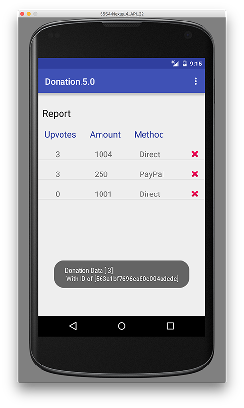

要实现删除功能，我们需要实现一个**OnClickListener**接口，所以继续这样做，并引入这个 AsyncTask 来开始。

```
private class DeleteTask extends AsyncTask<String, Void, String> {

        protected ProgressDialog dialog;
        protected Context context;

        public DeleteTask(Context context) {
            this.context = context;
        }

        @Override
        protected void onPreExecute() {
            super.onPreExecute();
            this.dialog = new ProgressDialog(context, 1);
            this.dialog.setMessage("Deleting Donation");
            this.dialog.show();
        }

        @Override
        protected String doInBackground(String... params) {

            try {
                return (String) DonationApi.delete((String) params[0], (String) params[1]);
            } catch (Exception e) {
                Log.v("donate", "ERROR : " + e);
                e.printStackTrace();
            }
            return null;
        }

        @Override
        protected void onPostExecute(String result) {
            super.onPostExecute(result);

            String s = result;
            Log.v("donate", "DELETE REQUEST : " + s);

            new GetAllTask(Report.this).execute("/donations");

            if (dialog.isShowing())
                dialog.dismiss();
        }
    } 
```

以及这个方法

```
public void onDonationDelete(final Donation donation) {
        String stringId = donation._id;
        AlertDialog.Builder builder = new AlertDialog.Builder(this);
        builder.setTitle("Delete Donation?");
        builder.setIcon(android.R.drawable.ic_delete);
        builder.setMessage("Are you sure you want to Delete the \'Donation with ID \' \n [ "
                + stringId + " ] ?");
        builder.setCancelable(false);

        builder.setPositiveButton("Yes", new DialogInterface.OnClickListener() {
            public void onClick(DialogInterface dialog, int id) {

                new DeleteTask(Report.this).execute("/donations", donation._id);
            }
        }).setNegativeButton("No", new DialogInterface.OnClickListener() {
            public void onClick(DialogInterface dialog, int id) {
                dialog.cancel();
            }
        });
        AlertDialog alert = builder.create();
        alert.show();
    } 
```

现在，看看您是否可以在您的**onClick()**方法中调用上述**onDonationDelete()**，以便您在单击删除按钮时会得到像这样的内容

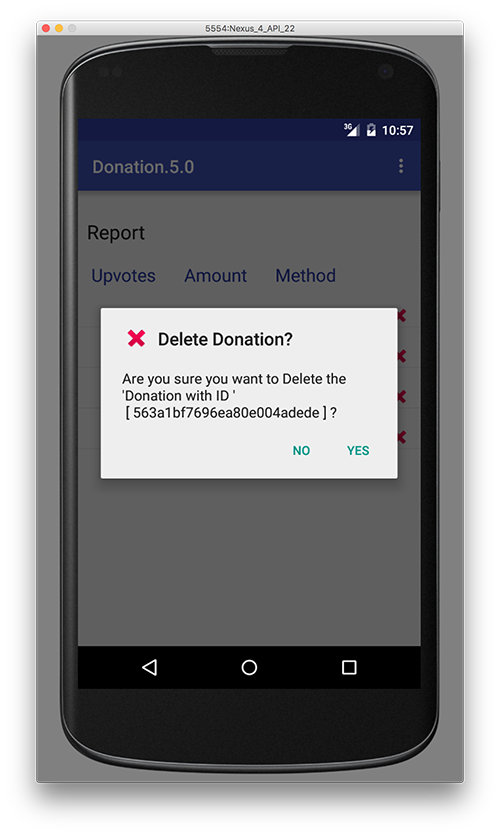

# 第 09 步

# 捐赠活动 - 添加捐款

这是我们完成本实验室的倒数第二步之前的完整的**Report.java**活动

```
package ie.app.activities;

import android.app.AlertDialog;
import android.app.ProgressDialog;
import android.content.Context;
import android.content.DialogInterface;
import android.os.AsyncTask;
import android.support.v4.widget.SwipeRefreshLayout;
import android.os.Bundle;
import android.util.Log;
import android.view.LayoutInflater;
import android.view.View;
import android.view.View.OnClickListener;
import android.view.ViewGroup;
import android.widget.AdapterView;
import android.widget.AdapterView.OnItemClickListener;
import android.widget.ArrayAdapter;
import android.widget.ImageView;
import android.widget.ListView;
import android.widget.TextView;
import android.widget.Toast;

import java.util.List;

import ie.app.R;
import ie.app.api.DonationApi;
import ie.app.models.Donation;

public class Report extends Base implements OnItemClickListener, OnClickListener {
    ListView listView;
    DonationAdapter adapter;
    SwipeRefreshLayout mSwipeRefreshLayout;

    @Override
    public void onCreate(Bundle savedInstanceState) {
        super.onCreate(savedInstanceState);
        setContentView(R.layout.activity_report);

        listView = (ListView) findViewById(R.id.reportList);
        mSwipeRefreshLayout = (SwipeRefreshLayout) findViewById(R.id.report_swipe_refresh_layout);

        new GetAllTask(this).execute("/donations");

        mSwipeRefreshLayout.setOnRefreshListener(new SwipeRefreshLayout.OnRefreshListener() {
            @Override
            public void onRefresh() {
                new GetAllTask(Report.this).execute("/donations");
            }
        });

    }

    @Override
    public void onItemClick(AdapterView<?> arg0, View row, int pos, long id) {

        new GetTask(this).execute("/donations", row.getTag().toString());
    }

    @Override
    public void onClick(View view) {
        if (view.getTag() instanceof Donation) {
            onDonationDelete((Donation) view.getTag());
        }
    }

    public void onDonationDelete(final Donation donation) {
        String stringId = donation._id;
        AlertDialog.Builder builder = new AlertDialog.Builder(this);
        builder.setTitle("Delete Donation?");
        builder.setIcon(android.R.drawable.ic_delete);
        builder.setMessage("Are you sure you want to Delete the \'Donation with ID \' \n [ "
                + stringId + " ] ?");
        builder.setCancelable(false);

        builder.setPositiveButton("Yes", new DialogInterface.OnClickListener() {
            public void onClick(DialogInterface dialog, int id) {

                new DeleteTask(Report.this).execute("/donations", donation._id);
            }
        }).setNegativeButton("No", new DialogInterface.OnClickListener() {
            public void onClick(DialogInterface dialog, int id) {
                dialog.cancel();
            }
        });
        AlertDialog alert = builder.create();
        alert.show();
    }

    private class GetAllTask extends AsyncTask<String, Void, List<Donation>> {

        protected ProgressDialog dialog;
        protected Context context;

        public GetAllTask(Context context) {
            this.context = context;
        }

        @Override
        protected void onPreExecute() {
            super.onPreExecute();
            this.dialog = new ProgressDialog(context, 1);
            this.dialog.setMessage("Retrieving Donations List");
            this.dialog.show();
        }

        @Override
        protected List<Donation> doInBackground(String... params) {

            try {
                return (List<Donation>) DonationApi.getAll((String) params[0]);
            } catch (Exception e) {
                Log.v("ASYNC", "ERROR : " + e);
                e.printStackTrace();
            }
            return null;
        }

        @Override
        protected void onPostExecute(List<Donation> result) {
            super.onPostExecute(result);

            app.donations = result;
            adapter = new DonationAdapter(context, app.donations);
            listView.setAdapter(adapter);
            listView.setOnItemClickListener(Report.this);
            mSwipeRefreshLayout.setRefreshing(false);

            if (dialog.isShowing())
                dialog.dismiss();
        }
    }

    private class GetTask extends AsyncTask<String, Void, Donation> {

        protected ProgressDialog dialog;
        protected Context context;

        public GetTask(Context context) {
            this.context = context;
        }

        @Override
        protected void onPreExecute() {
            super.onPreExecute();
            this.dialog = new ProgressDialog(context, 1);
            this.dialog.setMessage("Retrieving Donation Details");
            this.dialog.show();
        }

        @Override
        protected Donation doInBackground(String... params) {

            try {
                return (Donation) DonationApi.get((String) params[0], (String) params[1]);
            } catch (Exception e) {
                Log.v("donate", "ERROR : " + e);
                e.printStackTrace();
            }
            return null;
        }

        @Override
        protected void onPostExecute(Donation result) {
            super.onPostExecute(result);

            Donation donation = result;

            Toast.makeText(Report.this, "Donation Data [ " + donation.upvotes + "]\n " +
                    "With ID of [" + donation._id + "]", Toast.LENGTH_LONG).show();

            if (dialog.isShowing())
                dialog.dismiss();
        }
    }

    private class DeleteTask extends AsyncTask<String, Void, String> {

        protected ProgressDialog dialog;
        protected Context context;

        public DeleteTask(Context context) {
            this.context = context;
        }

        @Override
        protected void onPreExecute() {
            super.onPreExecute();
            this.dialog = new ProgressDialog(context, 1);
            this.dialog.setMessage("Deleting Donation");
            this.dialog.show();
        }

        @Override
        protected String doInBackground(String... params) {

            try {
                return (String) DonationApi.delete((String) params[0], (String) params[1]);
            } catch (Exception e) {
                Log.v("donate", "ERROR : " + e);
                e.printStackTrace();
            }
            return null;
        }

        @Override
        protected void onPostExecute(String result) {
            super.onPostExecute(result);

            String s = result;
            Log.v("donate", "DELETE REQUEST : " + s);

            new GetAllTask(Report.this).execute("/donations");

            if (dialog.isShowing())
                dialog.dismiss();
        }
    }

    class DonationAdapter extends ArrayAdapter<Donation> {
        private Context context;
        public List<Donation> donations;

        public DonationAdapter(Context context, List<Donation> donations) {
            super(context, R.layout.row_donate, donations);
            this.context = context;
            this.donations = donations;
        }

        @Override
        public View getView(int position, View convertView, ViewGroup parent) {
            LayoutInflater inflater = (LayoutInflater) context
                    .getSystemService(Context.LAYOUT_INFLATER_SERVICE);

            View view = inflater.inflate(R.layout.row_donate, parent, false);
            Donation donation = donations.get(position);

            ImageView imgDelete = (ImageView) view.findViewById(R.id.imgDelete);
            imgDelete.setTag(donation);
            imgDelete.setOnClickListener(Report.this);

            TextView amountView = (TextView) view.findViewById(R.id.row_amount);
            TextView methodView = (TextView) view.findViewById(R.id.row_method);
            TextView upvotesView = (TextView) view.findViewById(R.id.row_upvotes);

            amountView.setText("" + donation.amount);
            methodView.setText(donation.paymenttype);
            upvotesView.setText("" + donation.upvotes);

            view.setTag(donation._id); // setting the 'row' id to the id of the donation

            return view;
        }

        @Override
        public int getCount() {
            return donations.size();
        }
    }
} 
```

现在，让我们看看如何添加一个新的捐款并将其“插入”到服务器上维护的远程捐款列表中。

打开你的 **Donate.java** 活动，并查看 donateButtonPressed() 和 reset() 的当前实现。

```
public void donateButtonPressed (View view) {
        String method = paymentMethod.getCheckedRadioButtonId() == R.id.PayPal ? "PayPal" : "Direct";
        int donatedAmount =  amountPicker.getValue();
        if (donatedAmount == 0)
        {
            String text = amountText.getText().toString();
            if (!text.equals(""))
                donatedAmount = Integer.parseInt(text);
        }
        if (donatedAmount > 0)
        {
            app.newDonation(new Donation(donatedAmount, method, 0));
            progressBar.setProgress(app.totalDonated);
            String totalDonatedStr = "$" + app.totalDonated;
            amountTotal.setText(totalDonatedStr);
        }
    }

    @Override
    public void reset(MenuItem item) {
        app.totalDonated = 0;
        amountTotal.setText("$" + app.totalDonated);
    } 
```

它们添加到我们的本地捐赠列表，并重置一个简单的字段 - 我们将在最后一步实现重置功能，所以现在，要做的第一件事是看看我们如何重构 donateButtonPressed() 方法以向我们的远程列表添加捐赠，然后更新我们的总数。

对于这一点，我们将需要另一个 AsyncTask，看看你是否能根据你之前实现的任务完成这个 'InsertTask'。

```
private class InsertTask extends AsyncTask<Object, Void, String> {

        protected ProgressDialog dialog;
        protected Context context;

        public InsertTask(Context context) {
            this.context = context;
        }

        @Override
        protected void onPreExecute() {
            super.onPreExecute();
            this.dialog = new ProgressDialog(context, 1);
            this.dialog.setMessage("Saving Donation....");
            this.dialog.show();
        }

        @Override
        protected String doInBackground(Object... params) {

            String res = null;
            try {
                Log.v("donate", "Donation App Inserting");

            }

            catch(Exception e)
            {
                Log.v("donate","ERROR : " + e);
                e.printStackTrace();
            }
            return res;
        }

        @Override
        protected void onPostExecute(String result) {
            super.onPostExecute(result);

        }
    } 
```

并参考讲座资料，完成会调用上述任务的 donateButtonPressed() 方法。

# 第 10 步。

# 捐赠活动 - 重置/删除所有捐赠。

这个实验的最后一步是删除或重置所有我们的捐赠。

## 记住 - 一旦你重置了与我们服务器这个版本（donationweb-4-0）相关联的捐赠，每个人的捐赠都将被删除，所以你将不得不添加更多的捐赠来继续测试你的应用程序。

无论如何 :)

让我们通过实现“重置”菜单选项来完成我们的捐赠 5.0 应用程序。

首先要做的是引入这个 AsyncTask。

```
private class ResetTask extends AsyncTask<Object, Void, String> {

        protected ProgressDialog         dialog;
        protected Context                 context;

        public ResetTask(Context context) {
            this.context = context;
        }

        @Override
        protected void onPreExecute() {
            super.onPreExecute();
            this.dialog = new ProgressDialog(context, 1);
            this.dialog.setMessage("Deleting Donations....");
            this.dialog.show();
        }

        @Override
        protected String doInBackground(Object... params) {

            String res = null;
            try {
                    res = DonationApi.deleteAll((String)params[0]);
            }

            catch(Exception e)
            {
                Log.v("donate"," RESET ERROR : " + e);
                e.printStackTrace();
            }
            return res;
        }

        @Override
        protected void onPostExecute(String result) {
            super.onPostExecute(result);

            app.totalDonated = 0;
            progressBar.setProgress(app.totalDonated);
            amountTotal.setText("$" + app.totalDonated);

            if (dialog.isShowing())
                dialog.dismiss();
        }
    } 
```

实际上只有一行代码需要添加到 reset() 方法中，因此看看你能否弄清楚是什么，并能够在服务器上“重置”（删除）所有的捐赠。

如果你把这一切都搞定了，你会注意到应用程序中有一个小 bug，即使我们调用了重置菜单选项，用户仍然可以查看报告屏幕。

看看你能否修复这个 bug，并且还添加一个功能来询问用户是否确定要重置所有的捐赠（类似于报告屏幕上的删除捐赠功能），如下所示。

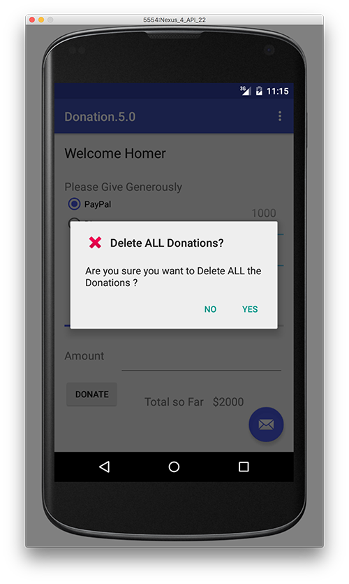

# 解决方案。

# 解决方案。

这是实验的解决方案：

+   捐赠.5.0
