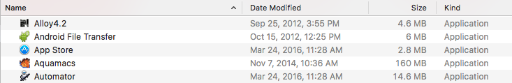

# 4 介绍表格数据

|     4.1 创建表格数据 |
| --- |
|     4.2 处理行 |
|       4.2.1 保持 |
|       4.2.2 排序 |
|       4.2.3 保持和排序的结合 |
|       4.2.4 扩展 |
|       4.2.5 转换、清理和规范化 |
|       4.2.6 选择 |
|       4.2.7 按行操作总结 |

计算机中许多有趣的数据都是表格形式的—即，像表格一样。在我们尝试确定它们的共同点之前，我们将看到其中的一些例子。以下是其中一些例子：

+   电子邮件收件箱是一系列消息。对于每条消息，您的收件箱存储大量信息：发件��、主题行、所属对话、正文等等。

    

+   一个音乐播放列表。对于每首歌曲，您的音乐播放器会保存大量信息：歌曲名称、歌手、长度、流派等。

    

+   文件系统文件夹或目录。对于每个文件，您的文件系统记录名称、修改日期、大小和其他信息。

    

> 现在就做！
> 
> > 你能想到更多的例子吗？

还有哪些呢：

+   对派对邀请的回应。

+   一个成绩册。

+   一个日历日程表。

你的生活中可能会想到更多！所有这些有什么共同点呢？表格数据的特点是：

+   它们由行和列组成。例如，每首歌曲、每封电子邮件消息或每个文件都是一行。它们的每个特征——歌曲标题、消息主题、文件名——都是一列。

+   每行具有与其他行相同的列，且顺序相同。

+   给定的列具有相同类型，但不同列可以具有不同类型。例如，电子邮件消息有发件人姓名（字符串）、主题行（字符串）、发送日期（日期）、是否已读（布尔值）等。

+   行通常按某种特定顺序排列。例如，电子邮件按最近发送的顺序排序。

> 练习
> 
> > 在上述其他例子中找到表格数据的特征，以及您描述的例子中的特征。

现在我们将学习如何使用表格进行编程，并思考涉及表格的任务分解。您还可以查阅完整的 Pyret 文档了解[表格操作](https://www.pyret.org/docs/latest/tables.html)。

## 4.1 创建表格数据

Pyret 提供了多种简单的创建表格数据的方法。最简单的方法是在程序中定义数据如下：

```
table: name, age
  row: "Alice", 30
  row: "Bob", 40
  row: "Carol", 25
end
```

换句话说，一个表格后面跟着列的名称以它们期望的顺序，然后是一系列的行。每一行必须包含与列声明相同数量的数据，并且顺序相同。

> 练习
> 
> > 改变上述示例的不同部分—<wbr>例如，从一行中删除一个必要的值，添加一个多余的值，删除一个逗号，添加一个额外的逗号，在一行的末尾留下一个额外的逗号—<wbr>并查看你会得到什么错误。

请注意，在表格中，列的顺序很重要：除了列的顺序不同以外，两个否则相同的表格不被认为是相等的。

```
check:
  table: name, age
    row: "Alice", 30
    row: "Bob", 40
    row: "Carol", 25
  end
  is-not
  table: age, name
    row: 30, "Alice"
    row: 40, "Bob"
    row: 25, "Carol"
  end
end
```

请注意，上面的示例使用了 is-not，即，测试通过，这意味着表不相等。当然，我们可以使用 table 写入文字表。但是，Pyret 还提供了其他获取表格数据的方法！特别是，您可以从电子表格中导入表格数据[FILL]，因此任何允许您创建这样的表的机制也都可以使用。你可以：

+   自行创建表格，

+   与朋友一起协作创建一个表格，

+   在网上找到可以导入表格的数据，

+   创建一个 Google 表格，让其他人填写，并从他们的回答中获得一个表格

等等。让你的想象力奔放！一旦数据在 Pyret 中，语言就不关心它们来自哪里。

## 4.2 处理行

现在让我们学习如何实际处理表格。 Pyret 提供了各种内置操作，使得对表格执行有趣的计算变得非常容易。此外，正如我们后面将看到的[REF]，如果我们觉得这些不够用，我们可以编写自己的操作。现在，我们将专注于 Pyret 提供的操作。

让我们思考一下我们可能想要询问关于我们的数据的一些问题：

+   哪些邮件是由特定用户发送的？

+   哪些歌曲是由特定艺术家演唱的？

+   播放列表中哪些歌曲播放频率最高？

+   播放列表中哪些歌曲播放频率最低？

我们看到其中一些对应于保留一些行，一些对应于对它们进行排序。 Pyret 提供了与此相对应的表操作。

### 4.2.1 保持

我们保留表的行如下：

```
sieve email using sender:
  sender == 'Matthias Felleisen'
end
```

建议使用邮件表，并特别使用发送者列。此操作处理表的每一行。在每行中，发送者指的是该行的发送者列的值。主体中的表达式（在:和 end 之间）必须评估为布尔值；如果为 true，则 Pyret 将保留结果表中的该行，否则将丢弃该行。运行此查询的结果是一个具有相同列但只有一些（可能一些也没有）行的新表；保留的那些行将与原始表中的顺序相同。同样，我们可以根据艺术家来保留行：

```
sieve playlist using artist:
  (artist == 'Deep Purple') or (artist == 'Van Halen')
end
```

这表明我们可以编写复杂的表达式来选择行。

### 4.2.2 排序

我们也可以类似地对表格的行进行排序，这将产生一个新的表，其中的行按照描述的顺序排列：

```
order playlist:
  play-count ascending
end
```

按播放次数值按升序对行进行排序，以便表中最早的行告诉我们我们最不经常听的歌曲。

注意：在冒号和结束之间的内容不是表达式。因此，我们不能在这里编写任意代码。我们只能命名列，并指示它们应该如何排序。

### 4.2.3 组合保留和排序

当然，我们不仅限于执行其中一种操作。由于每个操作都消耗一个表并产生一个表，我们可以轻松地将它们结合起来。让我们先考虑一下我们可能想要用英语做什么：

+   某个人发来的电子邮件中，哪封是最旧的？

+   某位特定艺术家的歌曲，我们播放得最少的是哪些？

> 现在就开始吧！
> 
> > 请花一点时间思考一下，根据你目前所见的内容，你会如何编写这些内容。

这是第一个例子：

```
mf-emails = sieve email using sender:
  sender == 'Matthias Felleisen'
end
order mf-emails:
  sent-date ascending
end
```

请注意，在 order 表达式中，我们不是对 email 进行排序，而是对 mf-email 进行排序，这是来自那个发件人的邮件表。现在，查看结果中最早的行将给我们提供来自该发件人的最早的电子邮件。

> 练习
> 
> > 将第二个示例写成对播放列表表进行保留和排序操作的组合。

### 4.2.4 扩展

有时候，我们想要创建一个新列，其值基于现有列的值。例如，我们的表可能反映了员工记录，并具有名为 hourly-wage 和 hours-worked 的列，表示相应的数量。现在我们希望扩展此表，以反映每个员工的总工资：

```
extend employees using hourly-wage, hours-worked:
  total-wage: hourly-wage * hours-worked
end
```

这会创建一个新列，名为 total-wage，其每行的值是该行中命名列的乘积。Pyret 将新列放在最右边；正如我们很快会看到的，我们可以轻松地更改列的顺序（选择）。当然，我们可以将扩展与其他表操作结合起来。例如，我们可能已经注意到，主题行较短的消息通常不包含高优先级任务。因此，我们可能首先将电子邮件表扩展到主题行的长度：

```
ext-email = extend email using subject:
  subject-length: string-length(subject)
end
order ext-email:
  subject-length descending
end
```

这将创建一个表，其中最长的主题行位于顶部，而最短的主题行位于底部。

### 4.2.5 转换、清理和规范化

有时候，表“几乎正确”，但需要稍微调整。例如，我们可能有一个免费样品的客户请求表，并且希望将每位客户限制在最多一定数量。我们可能会从不同国家以不同格式获取温度读数，并希望将它们全部转换为一个单一的格式。因为[单位错误可能是危险的](http://mentalfloss.com/article/25845/quick-6-six-unit-conversion-disasters)！我们可能有一个成绩单，不同的评分者使用不同的精度级别，我们希望将它们全部标准化为相同的精度级别。

在所有这些情况下，我们希望生成的表格与原始表格具有相同的“形状”——相同的列，相同的行，以相同的顺序——但某些列值略有变化。Pyret 提供 transform 来做到这一点。例如，这是我们如何限制客户订单的方法：

```
transform orders using count:
  count: num-min(count, 3)
end
```

这是我们如何四舍五入总分的方法：

```
transform gradebook using total-grade:
  total-grade: num-round(total-grade)
end
```

当然，转换可能涉及除了正在转换的列之外的其他列：

```
transform weather using temp, unit:
  temp:
    if unit == "F":
      fahrenheit-to-celsius(temp)
    else:
      temp
    end
  unit:
    if unit == "F":
      "C"
    else:
      unit
    end
end
```

这会改变表格，使所有温度都转换为摄氏度。

> 现在开始！
> 
> > 在这个例子中，为什么我们还要转换单位？

这是因为我们应该保持温度和单位同步。如果我们转换温度但不转换单位，那么此表格的后续用户可能会假设单位列是准确的，并意外地将转换后的温度视为仍然是华氏度。

### 4.2.6 选择

最后，出于演示目的，有时只看到其中几列是有用的，尤其是在列很多的表格中；将项目意图一起查看的列放在一起也很有帮助。假设我们的成绩表有许多列，代表所有中间得分，最后一列是总分；当我们分配好成绩后，我们想看到每个学生的名字和他们的最终分数：

```
select name, total-grade from gradebook end
```

同样，我们可以将此操作与其他操作结合使用。例如，我们可能只想看到播放列表中的艺术家和歌曲，并按照艺术家名称的顺序排序：

```
ss = select artist, song from playlist end
order ss:
  artist ascending
end
```

### 4.2.7 按行操作的总结

我们在短时间内看到了很多内容。具体来说，我们看到了几个根据某些标准消耗表格并生成新表格的操作。值得总结一下它们在关键表格属性方面的影响（“-”表示条目保持不变）：

| 操作 |  | 单元格内容 |  | 行顺序 |  | 行数 |  | 列顺序 |  | 列数 |
| --- | --- | --- | --- | --- | --- | --- | --- | --- | --- | --- |
| 保持 |  | - |  | - |  | 减少 |  | - |  | - |
| 排序 |  | - |  | 改变 |  | - |  | - |  | - |
| 扩展 |  | 现有不变，新计算 |  | - |  | - |  | - |  | 增加 |
| 转换 |  | 改变的 |  | - |  | - |  | - |  | - |
| 选择 |  | - |  | - |  | - |  | 改变 |  | 减少 |

斜体条目反映了新表格与旧表格可能不同的方式。请注意，“减少”或“改变”之类的条目应视为可能被减少或改变；根据具体操作和表格内容的不同，可能根本不会发生任何变化。（例如，如果表格已根据指定的顺序表达式排序，行顺序将不会改变。）然而，一般情况下，我们应该期望上述网格中描述的变化类型。

注意到这个网格的两个维度都提供了有趣的信息。毫不奇怪，每一行对表格都有至少某种影响（否则这个操作将是无用的，也不会存在）。同样，每一列也至少有一种影响方式。此外，请注意大多数条目都不会改变表格：这意味着每个操作对表格的影响有限，要小心不要超越其授权的范围。

一方面，限制每个操作的影响意味着为了完成复杂的任务，我们可能需要将几个操作组合在一起。我们在本章前面已经看到了这方面的例子。然而，还有一个更微妙的后果：这也意味着为了完成复杂的任务，我们可以组合几个操作并获得我们想要的结果。如果我们的操作更少，每个操作做的事情更多，那么将它们组合起来可能会产生各种不希望的或（更糟糕的）意外后果，这将使我们很难获得我们想要的确切答案。相反，上面的操作遵循正交性原则：没有一个操作会掩盖其他操作的作用，因此它们可以自由组合。

由于有了这些操作，我们也可以从代数的角度来思考表格。具体来说，当面临问题时，我们应该再次从我们开始的具体例子和我们想要达到的目标开始。然后我们可以问自己一些问题，比如，“列数是否保持不变，增加还是减少？”，“行数是否保持不变还是减少？”，等等。上面的网格现在为我们提供了一个工具箱，通过它我们可以开始将任务分解为单个操作。当然，我们仍然需要思考：操作的顺序很重要，有时我们必须多次执行一个操作。但是，这个网格是一个有用的指南，可以提示我们可能有助于解决问题的操作。
