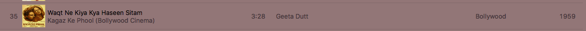

# 7 结构化数据入门

|     7.1 理解复合数据的类型 |
| --- |
|       7.1.1 首次窥视结构化数据 |
|       7.1.2 条件数据的首次窥视 |
|     7.2 定义和创建结构化和条件数据 |
|       7.2.1 定义和创建结构化数据 |
|       7.2.2 结构化数据的注释 |
|       7.2.3 定义和创建条件数据 |
|     7.3 使用结构化和条件数据进行编程 |
|       7.3.1 从结构化数据中提取字段 |
|       7.3.2 区分条件数据的变体 |
|       7.3.3 处理变体的字段 |

早些时候我们初次接触了类型。直到现在，我们只看到了 Pyret 提供给我们的类型，这是一个有趣但相当有限的集合。我们编写的大多数程序都将包含许多其他类型的数据。

## 7.1 理解复合数据的类型

### 7.1.1 首次窥视结构化数据

有时一个数据具有许多属性或部分。我们需要将它们全部保持在一起，有时还需要将它们分开。例如：

+   iTunes 条目包含有关单首歌曲的大量信息：不仅包括其名称，还包括歌手、长度、流派等等。

    

+   你的 GMail 应用包含有关单个消息的大量信息：发送者、主题行、所在对话、正文等等。

    

在这样的示例中，我们看到了对结构化数据的需求：一个单一的数据具有结构，即，它实际上由许多部分组成。这些部分的数量是固定的，但可能是不同种类的（有些可能是数字，有些是字符串，有些是图像，不同类型可能混合在一个数据中）。有些甚至可能是其他结构化数据：例如，日期通常至少有三个部分，即天、月和年。结构化数据的各个部分称为其字段。

### 7.1.2 首次窥视条件数据

然后有时我们想要在一个单一的、集体的伞下表示不同类型的数据。以下是一些例子：

+   交通灯可以处于不同的状态：红色、黄色或绿色。是的，在一些国家，颜色和颜色组合是不同的或更多的。它们共同代表一件事：一种称为交通灯状态的新类型。

+   动物园由许多种类的动物组成。总体上，它们代表一种新类型：动物。某种条件决定了饲养员可能正在处理的特定动物类型。

+   社交网络由不同种类的页面组成。有些页面代表个人，有些代表地点，有些代表组织，有些可能代表活动，等等。总体上，它们代表一种新类型：社交媒体页面。

+   通知应用程序可能报告许多类型的事件。有些是针对电子邮件消息的（如我们讨论过的，具有许多字段），有些是针对提醒的（可能具有时间戳和备注），有些是针对即时消息的（类似于电子邮件消息，但没有主题），甚至有些可能是针对物理邮件包到达的通知（具有时间戳、承运人、跟踪号码和交货单）。总体上，所有这些都代表一种新类型：通知。

我们将这些称为“条件”数据，因为它们表示“或”：交通灯是红色或绿色或黄色；社交媒体页面是一个人或地点或组织；等等。有时候我们确切地关心我们正在查看的是哪种类型的事物：驾驶员在不同颜色的交通灯下的行为不同，饲养员会根据不同的动物喂食。在其他时候，我们可能不关心：如果我们只是计算动物园里有多少动物，或者社交网络上有多少页面，或者有多少未读通知，它们的细节就不重要了。因此，有时我们忽略条件并将数据视为集体的一部分，有时我们确实关心条件，并根据每个个体的数据采取不同的行动。随着我们开始编写程序，我们将把所有这些具体化。

## 7.2 定义和创建结构化和条件数据

我们在上面使用了“数据”这个词，但实际上有点欺骗性。正如我们之前所说[REF]，数据是我们在计算机中表示信息的方式。我们上面讨论的实际上是不同种类的信息，而不是它们的表示方式。但是为了编写程序，我们必须具体考虑表示方式。现在就是我们要做的，即实际展示所有这些信息的数据表示。

### 7.2.1 定义和创建结构化数据

让我们从定义结构化数据开始，比如 iTunes 歌曲记录。以下是这样一个应用程序可能存储的信息的简化版本：

+   歌曲的名称，是一个字符串。

+   歌曲的歌手，也是一个字符串。

+   歌曲的年份，是一个数字。

现在让我们介绍一下我们可以用 Pyret 教授这些知识的语法：

```
data ITunesSong: song(name, singer, year) end
```

这告诉 Pyret 引入了一个新类型的数据，这种情况下称为 ITunesSong 我们遵循的约定是类型始终以大写字母开头。我们实际上创建这些数据的方式是通过用三个参数调用 song 函数；例如：值得注意的是，能够区分舞蹈、电子音乐和电子/舞蹈的音乐管理器，将这三首歌中的两首归类为一个流派：“世界”。 <structured-examples> :: =

|   song("La Vie en Rose", "Édith Piaf", 1945) |
| --- |
|   song("Stressed Out", "twenty one pilots", 2015) |
|   song("Waqt Ne Kiya Kya Haseen Sitam", "Geeta Dutt", 1959) |

在数据定义后始终跟几个具体实例的数据！这确保你确实知道如何创建那种形式的数据。事实上，给我们定义的数据取个名字是一个好习惯，虽然不是必须的，这样我们以后可以使用它们：

```
lver = song("La Vie en Rose", "Édith Piaf", 1945)
so = song("Stressed Out", "twenty one pilots", 2015)
wnkkhs = song("Waqt Ne Kiya Kya Haseen Sitam", "Geeta Dutt", 1959)
```

### 7.2.2 结构化数据的注释

回想一下我们在[REF]中讨论过给函数添加注释。嗯，我们也可以给数据添加注释！特别是，我们可以给数据的定义和它们的创建都加注释。对于前者，请考虑这个数据定义，它使我们在文本中非正式记录的注释信息成为程序的正式部分：

```
data ITunesSong: song(name :: String, singer :: String, year :: Number) end
```

类似地，我们可以注释绑定到数据示例的变量。但是这里应该写什么？

```
lver :: ___ == song("La Vie en Rose", "Édith Piaf", 1945)
```

记得注释采用类型的名称，我们创建的新类型称为 ITunesSong。因此，我们应该写

```
lver :: ITunesSong = song("La Vie en Rose", "Édith Piaf", 1945)
```

> 现在就做！
> 
> > 如果我们改成这样会发生什么？
> > 
> > ```
> > lver :: String = song("La Vie en Rose", "Édith Piaf", 1945)
> > ```
> > 
> > 我们会得到什么错误？如果我们改成这样会怎样？
> > 
> > ```
> > lver :: song = song("La Vie en Rose", "Édith Piaf", 1945)
> > lver :: 1 = song("La Vie en Rose", "Édith Piaf", 1945)
> > ```
> > 
> > 确保您熟悉您收到的错误消息。

### 7.2.3 定义和创建条件数据

在 Pyret 中，数据构造也允许我们创建条件数据，语法略有不同。例如，假设我们想定义交通灯的颜色：

```
data TLColor:
  | Red
  | Yellow
  | Green
end
```

传统上，选项的名称以小写字母开头，但如果它们没有额外的结构，我们通常大写首字母以使它们与普通变量看起来不同：即，Red 而不是 red。每个|（发音为“stick”）引入另一个选项。您可以像这样创建交通灯的实例：

```
Red
Green
Yellow
```

更有趣和常见的例子是当每个条件都具有一定的结构时；例如：

```
data Animal:
  | boa(name :: String, length :: Number)
  | armadillo(name :: String, liveness :: Boolean)
end
```

在得克萨斯州，路中间除了有一条黄线和一只死犰狳外什么都没有。我们可以像你预料的那样给出一些例子：

```
b1 = boa("Alice", 10)
b2 = boa("Bob", 8)
a1 = armadillo("Glypto", true)
```

我们称不同的条件为变体。

> 现在就做！
> 
> > 你会如何注释这三个变量绑定？

注意，在注释中，玻璃蛇和犰狳之间的区别被忽略了。当我们进入细化[REF]时，如果我们真的想要的话，我们可以重新捕获这个区别。

```
b1 :: Animal = boa("Alice", 10)
b2 :: Animal = boa("Bob", 8)
a1 :: Animal = armadillo("Glypto", true)
```

当定义条件数据时，第一个竖杠实际上是可选的，但添加它使得变体排列得更整齐。这有助于我们意识到我们的第一个示例

```
data ITunesSong: song(name, singer, year) end
```

实际上与

```
data ITunesSong:
  | song(name, singer, year)
end
```

即一个只有一个条件的条件类型，其中这一个条件是结构化的。

## 7.3 用结构化和条件数据进行编程

到目前为止，我们已经学会了如何创建结构化和条件数据，但还没有学会如何将它们拆分或编写涉及它们的任何表达式。正如你可能期望的那样，我们需要弄清楚如何

+   拆分结构化数据的字段，并

+   区分条件数据的变体。

正如我们将看到的，Pyret 还为我们提供了一个方便的方法来同时执行这两个操作。

### 7.3.1 从结构化数据中提取字段

让我们写一个函数来告诉我们一首歌有多老。首先，让我们思考这个函数消耗什么（一个 ITunesSong）和产生什么（一个数字）。这为我们的函数提供了一个大致的框架：<song-age> ::=

|   fun song-age(s :: ITunesSong) -> Number: |
| --- |
|     <song-age-body> |
|   end |

我们知道身体的形式必须大致是：<song-age-body> ::=

|   2016 - <get the song year> |
| --- |

我们可以通过使用 Pyret 的字段访问来获得歌曲的年份，即一个 .，然后是一个字段的名称——在这种情况下，年份——跟随着持有结构化数据的变量。因此，我们通过以下方式获取 s（传递给 song-age 的参数）的年份字段

```
s.year
```

因此整个函数体是：

```
fun song-age(s :: ITunesSong) -> Number:
  2016 - s.year
end
```

还可以记录一些示例（<structured-examples>），这样我们就可以全面地定义函数了：

```
fun song-age(s :: ITunesSong) -> Number:
  2016 - s.year
where:
  song-age(lver) is 71
  song-age(so) is 1
  song-age(wnkkhs) is 57
end
```

### 7.3.2 区分条件数据的变体

现在让我们看看如何区分变体。为此，我们必须引入 Pyret 语法的另一个新部分：cases。cases 表达式有几个分支：与数据定义中的数量完全相同。每个分支对应于一个变体。因此，如果我们想要根据交通灯的状态为驾驶员提供建议，我们可以编写：

```
fun advice(c :: TLColor) -> String:
  cases (TLColor) c:
    | Red => "wait!"
    | Yellow => "get ready..."
    | Green => "go!"
  end
end
```

注意，cases 后面跟着有条件地定义类型的名称（在这里是 TLColor 的括号），然后是计算该类型值的表达式（在这种情况下，c 已经绑定到这样一个值）。每个变体后面跟着 =>，然后是计算该变体答案的表达式。

> 现在做！
> 
> > 如果你省略了 => 会发生什么？
> > 
> 现在做！
> 
> > 如果你省略一个变体会怎么样？省略红色变体，然后尝试 advice(Yellow) 和 advice(Red)。

### 7.3.3 处理变体的字段

在这个例子中，变体没有字段。但是如果变体有字段，Pyret 会期望你列出这些字段的变量名，然后将自动绑定这些变量——因此你不需要使用 .-表示法来获取字段值。

要说明这一点，假设我们想要获取任何动物的名字：<animal-name> ::=

|   fun animal-name(a :: Animal) -> String: |
| --- |
|     <animal-name-body> |
|   end |

由于动物是有条件定义的，我们知道我们可能想要一个 cases 来将其分解；此外，我们应该为每个字段命名：请注意变量的名称不必与字段的名称匹配。通常，我们为字段定义给出更长的描述性名称，并为相应的变量给出较短的名称。<animal-name-body> ::=

|   cases（动物）a： |
| --- |
|     &#124; 蟒蛇(n, l) => ... |
|     &#124; 犰狳(n, l) => ... |
|   end |

在这两种情况下，我们都希望返回字段 n，从而得到完整的函数：

```
fun animal-name(a :: Animal) -> String:
  cases (Animal) a:
    | boa(n, l) => n
    | armadillo(n, l) => n
  end
where:
  animal-name(b1) is "Alice"
  animal-name(b2) is "Bob"
  animal-name(a1) is "Glypto"
end
```
