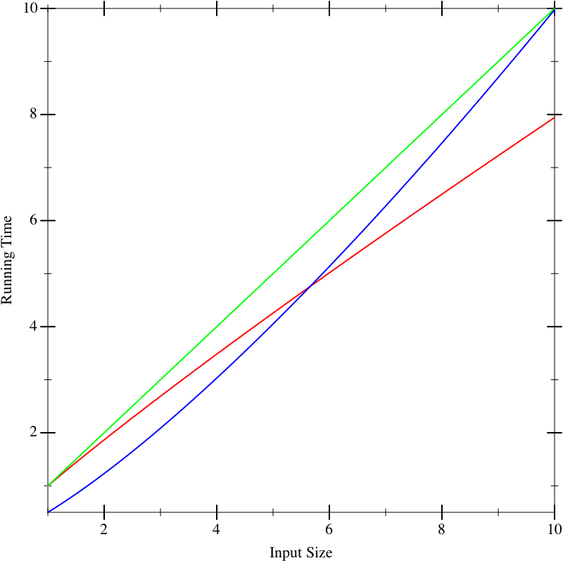
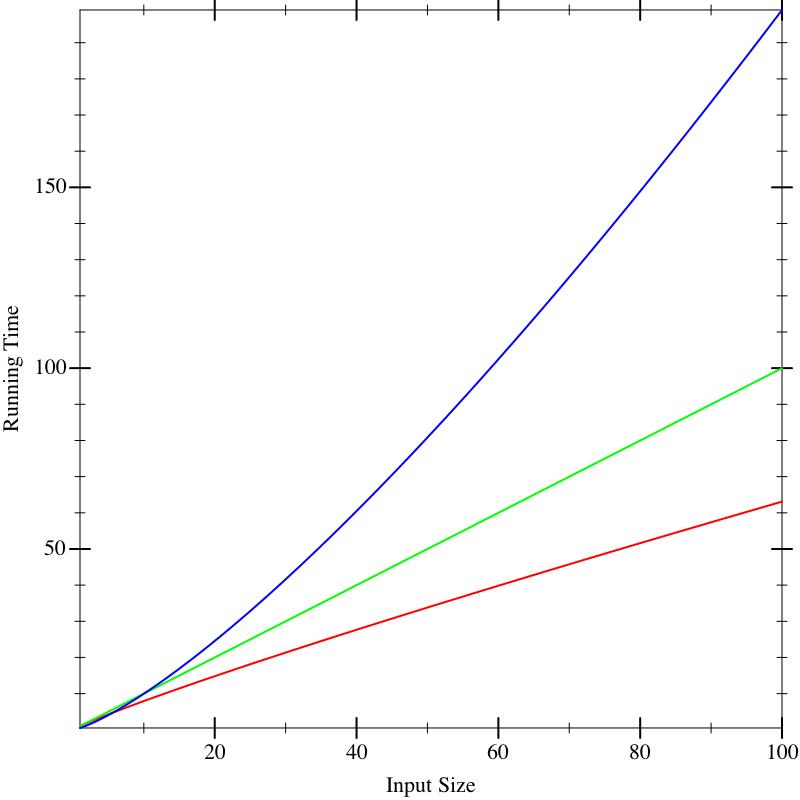
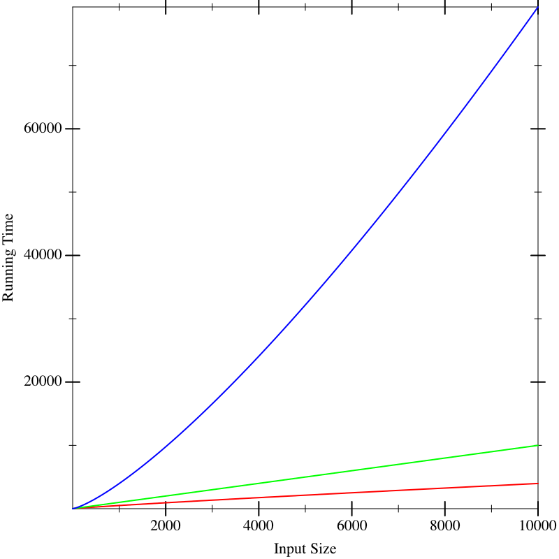

# 14 预测增长

|     14.1 一个小（真实）故事 |
| --- |
|     14.2 分析的想法 |
|     14.3 Pyret 运行时间的成本模型 |
|     14.4 输入的大小 |
|     14.5 单结构递归函数的表格方法 |
|     14.6 创建递归 |
|     14.7 函数的符号表示 |
|     14.8 比较函数 |
|     14.9 无忧地结合大 O |
|     14.10 解决递归 |

现在我们将开始研究确定计算需要多长时间的学习。我们将从一个小（真实）故事开始。

## 14.1 一个小（真实）故事

我的学生黛比最近为一家初创公司编写了用于分析数据的工具。该公司收集有关手机上进行的产品扫描的信息，黛比的分析工具按产品、地区、时间等对其进行了分类。作为一个优秀的程序员，黛比首先编写了合成测试用例，然后开发了她的程序并对其进行了测试。然后，她从公司获得了一些实际的测试数据，将它们分解成小块，手工计算了预期的答案，然后再次对其进行了测试（但是数据集较小）。在这一过程结束时，她准备好宣布程序已准备就绪。

然而，此时她只是测试了它们的功能正确性。还有一个问题是她的分析工具能够多快地生成答案。这带来了两个问题：

+   公司理所当然地不愿意与外界分享整个数据集，而我们也不想负责仔细保护所有的数据。

+   即使我们获得了他们数据的样本，随着更多用户使用他们的产品，他们拥有的数据量肯定会增长。

因此，我们只得到了他们完整数据的一个样本，并且需要根据这个样本对在今天和随着时间推移而增长时运行分析所需的时间进行一些预测，无论是对数据子集（例如，仅对应于一个地区的子集）还是对整个数据集。

黛比获得了 100,000 个数据点。她将它们分解成包含 10、100、1,000、10,000 和 100,000 个数据点的输入集，并在每个输入大小上运行她的工具，并绘制结果。

通过这个图表，我们可以很好地猜测工具在一个包含 50,000 个数据点的数据集上需要多长时间。然而，要确定工具在包含 1.5 百万、3 百万或 1 千万数据点的数据集上需要多长时间就要困难得多了。这些过程分别称为插值和外推。我们已经解释了为什么我们不能从公司获取更多数据。那么我们能做些什么呢？

另一个问题是，假设我们有多个可用的实现。当我们绘制它们的运行时间时，假设图表看起来像这样，红色、绿色和蓝色分别代表不同的实现。在小输入上，假设运行时间看起来像这样：



这似乎并没有帮助我们区分实现之间的差异。现在假设我们在更大的输入上运行算法，我们得到以下图表：



现在我们似乎有一个明显的赢家（红色），虽然其他两个（蓝色和绿色）之间没有太大差别。但如果我们计算更大的输入，我们开始看到明显的差异：



实际上，导致这些线条的函数在所有三个图中都是相同的。这些图片告诉我们的是，在小输入上推断性过多是危险的。如果我们能够获得计算性能的封闭形式描述，那么如果我们能够更好地比较它们，这将是很好的。这就是我们现在要做的。

## 分析思想

对于许多物理过程，我们所能做的最好的事情就是获得尽可能多的数据点，进行外推，并应用统计学来推断最有可能的结果。有时我们在计算机科学中也可以这样做，但幸运的是，我们计算机科学家比大多数其他科学领域有一个巨大的优势：我们不是测量黑盒过程，而是完全可以访问其内部，即源代码。这使我们能够应用分析方法。“分析”意味着应用代数和其他数学方法来对一个过程进行预测性陈述，而不运行它。我们用这种方式计算的答案是对上述实验性分析所得到的结果的补充，实际上，我们通常会希望使用两者的组合来获得对程序行为的深刻理解。

分析的思想非常简单。我们查看程序的源代码并列出它执行的操作。对于每个操作，我们查找它的成本。我们将专注于一种成本，即运行时间。还有许多其他类型的成本可以计算。我们可能自然地对消耗的空间（内存）感兴趣，这告诉我们需要购买多大的机器。我们可能还关心功耗，这告诉我们我们的能源账单的成本，或者带宽，这告诉我们我们需要什么样的互联网连接。总之，我们对资源消耗感兴趣。简而言之，不要犯将“性能”等同于“速度”的错误：重要的成本取决于应用程序运行的上下文。我们将所有操作的成本相加。这给了我们程序的总成本。

自然地，对于大多数程序，答案不会是一个常数。相反，它将取决于诸如输入大小之类的因素。因此，我们的答案很可能是一个关于参数（如输入大小）的表达式。换句话说，我们的答案将是一个函数。

描述函数运行时间的函数有很多种。通常我们希望得到运行时间的上界：即，实际操作次数永远不会超过函数预测的次数。这告诉我们我们需要分配的最大资源。另一个函数可能给出一个下界，告诉我们我们需要的最小资源。有时我们需要进行平均情况分析。等等。在这个文本中，我们将专注于上界，但请记住，所有这些其他分析也非常有价值。

> 练习
> 
> > 把“上界函数”说成“上界函数”是不正确的，因为不止一个。给定一个上界函数，你能构造另一个吗？

## Pyret 运行时间的成本模型

我们首先提出了 Pyret 程序运行时间的成本模型。我们对运行程序的成本感兴趣，这等同于研究程序的表达式。简单地做出一个定义不需要花费任何东西；只有当我们使用一个定义时才会产生成本。

我们将使用一个非常简单（但足够准确）的成本模型：每个操作除了评估其子表达式所需的时间外，还会花费一个时间单位。因此查找一个变量或分配一个常数需要一个时间单位。应用原始函数也需要一个时间单位。其他一切都是具有子表达式的复合表达式。复合表达式的成本是其每个子表达式的成本加上 1。例如，表达式 e1 + e2（对于一些子表达式 e1 和 e2）的运行时间成本是 e1 的运行时间加上 e2 的运行时间加上 1。因此，表达式 17 + 29 的成本为 3（每个子表达式一个，加上加法一个）；表达式 1 +（7 *（2 / 9））的成本为 7。

如您所见，这里有两个大的近似：

+   首先，我们使用的是抽象而不是具体的时间概念。就估计程序的所谓“挂钟”运行时间而言，这并不方便，但话又说回来，这个数字取决于许多因素——不仅是你有什么样的处理器和多少内存，甚至是在同一时间运行在你的计算机上的其他任务。相比之下，抽象时间单位更具可移植性。

+   其次，并非每个操作都需要相同数量的机器周期，而我们已经为它们都收取了相同数量的抽象时间单位。只要每个操作所花费的实际周期数受另一个操作所花费的周期数的一个常数因子的限制，这就不会对我们产生任何数学问题，原因我们很快就会理解（比较函数）。

当然，在仔细设置实验条件后，<wbr>对程序的行为进行分析预测然后验证实现与预测是否一致是很有教益的。

## 14.4 输入的大小

我们将忽略如何测量数字的大小。请注意，数字的值比其大小大得多：给定三个空格，我们可以写出 1,000 个不同的自然数，但是给定第四个空格，我们可以写出的不是 1,001 而是 10,000 个不同的数字。因此，在研究与数字相关的函数时，我们收取的空间应该只是值的对数。这种区别对我们在本文中处理的程序不重要，所以我们允许自己假设值和大小是相等的。在数字是中心的程序中——<wbr>例如，在测试素数时——<wbr>这种区别就至关重要了！稍后我们将简要回到这一点（数字的复杂性）。

定义参数的大小可能会很微妙。假设一个函数消耗了一个数字列表；将其参数的大小定义为列表的长度，即列表中的链接数，这是很自然的。我们也可以将其定义为两倍大，以考虑到链接和单独的数字（但正如我们将看到的（比较函数），常数通常并不重要）。但是假设一个函数消耗了一个音乐专辑列表，每个音乐专辑本身都是一个包含有关歌手等信息的歌曲列表。那么我们如何衡量大小取决于被分析的函数实际检查的输入部分。例如，如果它仅返回专辑列表的长度，则它对列表元素的内容是无关紧要的 [REF para poly]，只有专辑列表的长度才重要。但是，如果函数返回每个专辑上所有歌手的列表，则它会遍历到单个歌曲，并且我们必须考虑所有这些数据。简而言之，我们关心函数可能访问的数据的大小。

## 14.5 单结构递归函数的表格法

给定参数的大小，我们只需检查函数体并将各个操作的成本相加即可。然而，大多数有趣的函数都是有条件定义的，甚至可能是递归的。在这里，我们将假设只有一个结构递归调用。我们稍后将讨论更一般的情况（创建递归关系）。

当我们有一个仅包含一个递归调用且是结构性的函数时，我们可以使用一个方便的技巧来处理条件。这个想法归功于 Prabhakar Ragde。我们将设置一个表格。你可能会惊讶地听到表格将有与 cond 有几个从句一样多的行。但是，它不是两列，而是七列！这听起来很吓人，但很快你就会看到它们来自哪里以及为什么它们在那里。

对于每一行，填写列如下：

1.  |Q|：问题中的操作次数

1.  #Q：问题执行的次数

1.  TotQ：问题的总成本（将前两个相乘）

1.  |A|：答案中的操作次数

1.  #A：答案执行的次数

1.  TotA：答案的总成本（将前两个相乘）

1.  总计：将两个总计相加以获得从句的答案

最后，cond 表达式的总成本是通过对各行中的总列进行求和获得的。

在计算这些成本的过程中，我们可能会在答案表达式中遇到递归调用。只要整个答案中只有一个递归调用，就忽略它。

> 练习
> 
> > 阅读完创建递归的材料后，回到这里并解释为什么跳过递归调用是可以的。在整体表格方法的背景下解释。
> > 
> 练习
> 
> > 在不考虑递归处理的情况下，证明（a）这些列是准确的（例如，使用加法和乘法是适当的），以及（b）足够（即，它们组合起来考虑了该 cond 从句将执行的所有操作）。

通过将它应用到几个例子中来理解这一点是最容易的。首先，让我们考虑 len 函数，注意在我们继续之前，它确实符合具有一个单一递归调用且参数是结构性的标准：

```
fun len(l):
  cases (List) l:
    | empty => 0
    | link(f, r) => 1 + len(r)
  end
end
```

让我们计算在长度为\(k\)的列表上运行 len 的成本（在这里我们只计算列表中链接的数量，忽略每个第一个元素的内容，因为 len 也会忽略它们）。

因为 len 的整个主体由条件给出，所以我们可以直接开始建立表格。

让我们考虑第一行。问题的成本为三个单位（一个用于评估 empty?和 l，一个用于应用函数）。这在列表中的每个元素和列表为空时都评估一次，即\(k+1\)次。问题的总成本因此为\(3(k+1)\)。答案需要一个单位的时间来计算，并且只计算一次（当列表为空时）。因此，总共需要一个单位，总共为\(3k+4\)个单位。

现在是第二行。问题再次需要三个单位，评估 \(k\) 次。答案涉及 3 个单位的评估（剩余 l），再加上两个单位的评估和应用 add1，再加上一个单位的评估 len……没有更多，因为我们正在忽略递归调用本身所花费的时间。简而言之，除了我们选择忽略的递归，还需要六个单位的时间。

以表格形式：

| &#124;Q&#124; |  | #Q |  | TotQ |  | &#124;A&#124; |  | #A |  | TotA |  | 总计 |
| --- | --- | --- | --- | --- | --- | --- | --- | --- | --- | --- | --- | --- |
| \(3\) |  | \(k+1\) |  | \(3(k+1)\) |  | \(1\) |  | \(1\) |  | \(1\) |  | \(3k+4\) |
| \(3\) |  | \(k\) |  | \(3k\) |  | \(6\) |  | \(k\) |  | \(6k\) |  | \(9k\) |

添加后，我们得到 \(12k + 4\)。因此，在一个 \(k\) 元素列表上运行 len 需要 \(12k+4\) 单位的时间。

> 练习
> 
> > 这个估计有多准确？如果尝试将 len 应用于不同大小的列表，能否得到一致的 \(k\) 估计？

## 创建递归

我们现在将看到一种系统的方法来分析计算程序的时间。假设我们只有一个函数 f。我们将定义一个函数 \(T\)，来计算 f 的时间的上界。通常情况下，程序中的每个函数都会有一个这样的成本函数。在这种情况下，给每个函数起一个不同的名字会很有用，以便轻松区分它们。由于我们现在只看一个函数，所以我们将通过只有一个 \(T\) 来减少符号开销。\(T\) 接受与 f 相同数量的参数。\(T\) 的参数代表与 f 相应参数的大小。最终，我们希望得到 \(T\) 的封闭形式解，即不引用 \(T\) 本身的解。但是，到达那里的最简单方法是编写一个允许引用 \(T\) 的解，称为递归关系，然后看看如何消除自引用 [REF]。

我们依次对程序中的每个函数重复此过程。如果有许多函数，首先解决没有依赖其他函数的函数，然后使用其解来解决仅依赖它的函数，并以此方式沿着依赖链前进。这样，当我们到达引用其他函数的函数时，我们将已经有了被引用函数的运行时间的封闭形式解决方案，只需插入参数即可获得解决方案。

> 练习
> 
> > 上面概述的策略在有相互依赖的函数时无法奏效。您如何将其概括以处理此情况？

建立递归的过程很简单。我们只需定义 \(T\) 的右侧来累加 f 主体中执行的操作。这很简单，除了条件和递归。我们稍后会详细介绍条件的处理。如果我们到达对参数 a 的 f 的递归调用，在递归中我们将其转换为对 a 大小的 \(T\) （自）引用。

对于条件语句，我们只使用相应表格的 |Q| 和 |A| 列。我们不是乘以输入的大小，而是将除递归调用外在一个函数调用中发生的操作相加，然后加上递归调用的成本，用 \(T\) 的引用来表示。因此，如果我们对长度进行这样的处理，我们将分两部分定义 \(T(k)\) ——长度为 \(k\) 的输入所需的时间—— 第一部分是 \(T(0)\) 的值（当列表为空时），另一部分是 \(k\) 的非零值的值。我们知道 \(T(0) = 4\)（第一个条件语句及其相应的答案的成本）。如果列表非空，则成本为 \(T(k) = 3 + 3 + 6 + T(k-1)\)（分别来自第一个问题，第二个问题，第二个答案中的剩余操作，以及对一个元素较小的列表的递归调用）。这给出了以下递归式：

\begin{equation*}T(k) = \begin{cases} 4 & \text{当 } k = 0 \\ 12 + T(k-1) & \text{当 } k > 0\\ \end{cases}\end{equation*}

对于一个长度为 \(p\) 的给定列表（注意 \(p \geq 0\)），这需要 \(12\) 步处理第一个元素，再处理第二个需要 \(12\) 步，第三个需要 \(12\) 步，以此类推，直到列表元素耗尽，需要额外的 \(4\) 步：总共 \(12p + 4\) 步。注意，这恰好是我们通过表格方法得到的相同答案！

> 练习
> 
> > 我们为什么可以假设对于一个长度为 \(p\) 的列表，\(p \geq 0\)？为什么我们要费力地在上面明确声明这一点？

经过一些思考，你会发现即使存在多个递归调用，以及当该调用的参数结构上比原来的元素小一个元素时，构建递归的想法仍然有效。然而，我们还没有看到一种解决这种关系的普遍方法。这就是我们接下来要去的地方（解决递归）。

## 14.7 函数符号

我们已经看到，我们可以通过一个函数来描述 len 的运行时间。我们没有一个特别好的符号来书写这样的（匿名）函数。等等，我们有 —— `fun (k): (12 * k) + 4 end` —— 但如果你在他们的考试上写下这个，我的同事们会感到震惊。因此，我们将引入以下符号来精确表示相同的意思：

\begin{equation*}[k \rightarrow 12k + 4]\end{equation*}

括号表示匿名函数，箭头前是参数，箭头后是函数体。

## 14.8 比较函数

让我们回到 len 的运行时间。我们已经写下了一个非常精确的函数：\(12k + 4\)！这种做法是否合理？

在一个细粒度级别上，实际上是不合理的。我们将许多操作，具有不同实际运行时间的操作，汇总成一个成本。所以也许我们不应该太担心，比如说，\([k \rightarrow 12k + 4]\) 和 \([k \rightarrow 4k + 10]\) 之间的差异。如果我们得到了这些运行时间的两个实现，我们很可能会选择其他特征来选择它们之间的区别。

这归结为能够比较两个函数——代表实现性能的——看看其中一个是否在某种程度上比另一个更好。上面的例子表明，常数的微小差异可能并不重要。这暗示了以下形式的定义：

\begin{equation*}\exists c . \forall n \in \mathbb{N}, f_1(n) \leq c \cdot f_2(n) \Rightarrow f_1 \leq f_2\end{equation*}

显然，“更大”的函数可能不如“更紧”的函数有用。也就是说，通常会为函数写一个“最小”的界限，这意味着避免不必要的常数、求和项等。这一点的理由如下所示（不费力地结合大 O）。

仔细注意标识符的顺序。我们必须能够提前选择常数\(c\)，以使这种关系成立。如果我们交换了顺序，那意味着在数轴上的每一点，必须存在一个常数——而总是存在的！交换后的定义因此将是无用的。重要的是，无论参数变得多么大，我们都能确定常数。这才是真正的常数。

这个定义比我们最初想象的更灵活。例如，考虑我们的运行示例与\([k \rightarrow k²]\)的比较。显然，后者最终会支配前者：即，

\begin{equation*}[k \rightarrow 12k+4] \leq [k \rightarrow k²]\end{equation*}

我们只需要选择一个足够大的常数，就会发现这是真的。

> 练习
> 
> > 什么是足够的最小常数？

在文献中会找到更复杂的定义，它们都有其优点，因为它们使我们能够做出比这个定义更细致的区分。然而，对于本书的目的，上述定义就足够了。

注意对于给定函数\(f\)，存在许多小于它的函数。我们使用符号\(O(\cdot)\)来描述这个函数族。在计算机科学中，这通常被发音为“大 O”，尽管有些人更喜欢称之为巴赫曼-朗道符号，以纪念其创始人。因此，如果\(g \leq f\)，我们可以写成\(g \in O(f)\)，我们可以将其解读为“\(f\)是\(g\)的一个上界”。因此，例如，

\begin{equation*}[k \rightarrow 3k] \in O([k \rightarrow 4k+12])\end{equation*}

\begin{equation*}[k \rightarrow 4k+12] \in O([k \rightarrow k²])\end{equation*}

请特别注意我们的符号。我们使用 \(\in\) 而不是 \(=\) 或其他符号，因为 \(O(f)\) 描述的是 \(g\) 是其中一个成员的函数族。我们也写成 \(f\) 而不是 \(f(x)\)，因为我们正在比较函数——\(f\)——而不是它们在特定点的值——\(f(x)\——这将是普通的数字！大多数书籍和网站上的符号都存在这两个缺陷之一或两者。然而，我们知道函数是值，函数可以是匿名的。我们实际上利用了这两个事实才能够写出

\begin{equation*}[k \rightarrow 3k] \in O([k \rightarrow 4k+12])\end{equation*}

这不是我们可以有的唯一的函数比较概念。例如，鉴于上面的 \(\leq\) 的定义，我们可以定义一个自然的关系 \(<\)。这样我们就可以问，给定一个函数 \(f\)，所有函数 \(g\) 是什么，使得 \(g \leq f\) 但不是 \(g < f\)，即“等于” \(f\) 的函数。注意！我们使用引号是因为这与普通的函数相等不同，普通的函数相等被定义为两个函数在所有输入上都给出相同的答案。在这里，两个“相等”的函数可能在任何输入上都不给出相同的答案。这是由最多一个常数分隔的函数族；当函数指示程序的增长顺序时，“相等”的函数表示以相同的速度增长的程序（直到常数因子）。我们使用符号 \(\Theta(\cdot)\) 来谈论这个函数族，因此如果 \(g\) 根据这个概念等价于 \(f\)，我们可以写成 \(g \in \Theta(f)\)（那么 \(f \in \Theta(g)\) 也成立）。

> 练习
> 
> > 说服自己，这种函数相等概念是一个等价关系，因此值得称为“相等”。它需要是（a）自反的（即，每个函数与自身相关）；（b）反对称的（如果 \(f \leq g\) 并且 \(g \leq f\)，那么 \(f\) 和 \(g\) 是相等的）；和（c）传递的（\(f \leq g\) 并且 \(g \leq h\) 意味着 \(f \leq h\)）。

## 14.9 毫不费力地结合大 Oh 符号

现在我们介绍了这个符号，我们应该询问它的封闭性质：也就是说，这些函数族如何组合？为了激发你的直觉，假设在所有情况下我们讨论的是函数的运行时间。我们将考虑三种情况：

+   假设我们有一个函数 \(f\)（其运行时间为）在 \(O(F)\) 中。假设我们运行它 \(p\) 次，对于某个给定的常数。那么生成代码的运行时间就是 \(p \times O(F)\)。然而，请注意，这与 \(O(F)\) 没有任何不同：我们可以在 \(O(\cdot)\) 的定义中简单地使用更大的常数——特别是，我们可以只是使用 \(pc\)。反过来，\(O(pF)\) 等价于 \(O(F)\)。这就是“乘法常数无关紧要”的直觉核心。

+   假设我们有两个函数，f 在\(O(F)\)中，g 在\(O(G)\)中。如果我们先运行 f，然后是 g，我们期望组合的运行时间是它们各自运行时间的总和，即\(O(F) + O(G)\)。你应该说服自己这只是\(O(F + G)\)。

+   假设我们有两个函数，f 在\(O(F)\)中，g 在\(O(G)\)中。如果 f 在每一步中调用 g，我们期望组合的运行时间是它们各自运行时间的乘积，即\(O(F) \times O(G)\)。你应该说服自己这只是\(O(F \times G)\)。

这三种操作——加法、乘以常数、乘以函数——几乎涵盖了所有情况。例如，我们可以利用这一点重新解释上面的表操作（假设一切都是\(k\)的函数）：

| &#124;Q&#124; |  | #Q |  | TotQ |  | &#124;A&#124; |  | #A |  | TotA |  | Total |
| --- | --- | --- | --- | --- | --- | --- | --- | --- | --- | --- | --- | --- |
| \(O(1)\) |  | \(O(k)\) |  | \(O(k)\) |  | \(O(1)\) |  | \(O(1)\) |  | \(O(1)\) |  | \(O(k)\) |
| \(O(1)\) |  | \(O(k)\) |  | \(O(k)\) |  | \(O(1)\) |  | \(O(k)\) |  | \(O(k)\) |  | \(O(k)\) |

因为乘以常数不重要，所以我们可以用\(1\)代替\(3\)。因为加常数不重要（将加法规则反向运行），\(k+1\)可以变成\(k\)。加上这一项给我们\(O(k) + O(k) = 2 \times O(k) \in O(k)\)。这证明了对一个\(k\)元素列表运行 len 花费的时间是\(O([k \rightarrow k])\)的说法是合理的，这比\(O([k \rightarrow 12k + 4])\)描述它的边界更简单。特别是，它为我们提供了基本信息，没有其他东西：随着输入（列表）的增长，运行时间与之成正比，即，如果我们向输入添加一个元素，我们应该期望增加一个常数的运行时间。

## 14.10 解递推关系

有很多文献介绍如何解决递推方程。在本节中，我们不会讨论一般技术，也不会讨论很多不同的递推关系。相反，我们将专注于应该是每个计算机科学家的基本技能之一的几个。你会一遍又一遍地看到这些，所以你应该本能地识别它们的递推模式，并知道它们描述的复杂度（或者知道如何快速推导出它）。

之前我们看到一个有两种情况的递推关系：一个是空输入，另一个是其他所有情况。通常，我们应该期望为每个非递归调用找到一个情况，并为每个递归调用找到一个情况，即，大致每个情况子句一个。在接下来的内容中，我们将忽略基本情况，只要输入的大小是常量（如零或一），因为在这种情况下所做的工作量也将是一个常量，我们通常可以忽略它（比较函数）。

+   | \(T(k)\) | = | \(T(k-1) + c\) |
+   | --- | --- | --- |
    |  | = | \(T(k-2) + c + c\) |
    |  | = | \(T(k-3) + c + c + c\) |
    |  | = | ... |
    |  | = | \(T(0) + c \times k\) |
    |  | = | \(c_0 + c \times k\) |

    因此 \(T \in O([k \rightarrow k])\)。直观地，每次丢弃一个元素时我们都做了固定量的工作（\(c\)），因此总体上我们做了线性量的工作。

+   | \(T(k)\) | = | \(T(k-1) + k\) |
+   | --- | --- | --- |
    |  | = | \(T(k-2) + (k-1) + k\) |
    |  | = | \(T(k-3) + (k-2) + (k-1) + k\) |
    |  | = | ... |
    |  | = | \(T(0) + (k-(k-1)) + (k-(k-2)) + \cdots + (k-2) + (k-1) + k\) |
    |  | = | \(c_0 + 1 + 2 + \cdots + (k-2) + (k-1) + k\) |
    |  | = | \(c_0 + {\frac{k \cdot (k+1)}{2}}\) |

    因此 \(T \in O([k \rightarrow k²])\)。这是根据前 \(k\) 个数的和的解得出的。

+   | \(T(k)\) | = | \(T(k/2) + c\) |
+   | --- | --- | --- |
    |  | = | \(T(k/4) + c + c\) |
    |  | = | \(T(k/8) + c + c + c\) |
    |  | = | ... |
    |  | = | \(T(k/2^{\log_2 k}) + c \cdot \log_2 k\) |
    |  | = | \(c_1 + c \cdot \log_2 k\) |

    因此 \(T \in O([k \rightarrow \log k])\)。直观地，我们每次在每个级别上都只做常量工作（\(c\)），然后丢弃一半的输入。在对数步骤中，我们将耗尽输入，每次都只做常量工作。因此，总体复杂度是对数的。

+   | \(T(k)\) | = | \(T(k/2) + k\) |
+   | --- | --- | --- |
    |  | = | \(T(k/4) + k/2 + k\) |
    |  | = | ... |
    |  | = | \(T(1) + k/2^{\log_2 k} + \cdots + k/4 + k/2 + k\) |
    |  | = | \(c_1 + k(1/2^{\log_2 k} + \cdots + 1/4 + 1/2 + 1)\) |
    |  | = | \(c_1 + 2k\) |

    因此 \(T \in O([k \rightarrow k])\)。直观地，第一次处理时查看所有元素，第二次查看其中一半，第三次查看四分之一，依此类推。这种逐步减半等同于第二次扫描输入中的所有元素。因此，这导致了一个线性的过程。

+   | \(T(k)\) | = | \(2T(k/2) + k\) |
+   | --- | --- | --- |
    |  | = | \(2(2T(k/4) + k/2) + k\) |
    |  | = | \(4T(k/4) + k + k\) |
    |  | = | \(4(2T(k/8) + k/4) + k + k\) |
    |  | = | \(8T(k/8) + k + k + k\) |
    |  | = | ... |
    |  | = | \(2^{\log_2 k} T(1) + k \cdot \log_2 k\) |
    |  | = | \(k \cdot c_1 + k \cdot \log_2 k\) |

    因此 \(T \in O([k \rightarrow k \cdot \log k])\)。直观地，每次我们处理所有递归调用中的元素（\(k\)），同时将其分解为两个子问题。这种分解给出了一个高度为对数的递归树，在每个级别上我们都在做线性工作。

+   | \(T(k)\) | = | \(2T(k-1) + c\) |
+   | --- | --- | --- |
    |  | = | \(2T(k-1) + (2-1)c\) |
    |  | = | \(2(2T(k-2) + c) + (2-1)c\) |
    |  | = | \(4T(k-2) + 3c\) |
    |  | = | \(4T(k-2) + (4-1)c\) |
    |  | = | \(4(2T(k-3) + c) + (4-1)c\) |
    |  | = | \(8T(k-3) + 7c\) |
    |  | = | \(8T(k-3) + (8-1)c\) |
    |  | = | ... |
    |  | = | \(2^k T(0) + (2^k-1)c\) |

    因此 \(T \in O([k \rightarrow 2^k])\)。每个元素的处理都需要做一定量的工作，然后在其余部分上加倍工作。这种逐步加倍导致指数增长。

> 练习
> 
> > 使用归纳法证明上述每个推导。
