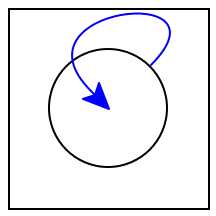

# 18 分享和平等

|     18.1 重新审视平等 |
| --- |
|     18.2 评估引用的成本 |
|     18.3 在互联网上，没有人知道你是个 DAG |
|     18.4 从无环到循环 |

## 18.1 重新审视平等

考虑以下数据定义和示例值：

```
data BinTree:
  | leaf
  | node(v, l :: BinTree, r :: BinTree)
end

a-tree =
  node(5,
    node(4, leaf, leaf),
    node(4, leaf, leaf))

b-tree =
  block:
    four-node = node(4, leaf, leaf)
    node(5,
      four-node,
      four-node)
  end
```

特别地，看起来我们编写 b-tree 的方式在道义上等同于我们编写 a-tree 的方式，但我们创建了一个有用的绑定来避免代码重复。因为 a-tree 和 b-tree 都绑定到具有 5 为根节点，每个节点都包含 4 的左右子节点的树，我们确实可以合理地认为这些树是等价的。果然：<equal-tests> ::=

|   检查: |
| --- |
|     a-tree is b-tree |
|     a-tree.l is a-tree.l |
|     a-tree.l is a-tree.r |
|     b-tree.l is b-tree.r |
|   结束 |

但是，从另一个角度来看，这些树并不等价。具体来说，a-tree 为每个子节点构造一个不同的节点，而 b-tree 为两个子节点都使用相同的节点。当然，这种差异应该以某种方式显示出来，但我们尚未找到一种方法编写程序来区分它们。

默认情况下，is 运算符使用与 Pyret 的==相同的等式测试。然而，在 Pyret 中还有其他等式测试。特别是，我们可以通过使用 Pyret 的 identical 函数来区分这些数据，该函数实现了引用相等性。这不仅检查两个值是否在结构上等价，还检查它们是否是值构造的结果相同。有了这个，我们现在可以编写额外的测试：

```
check:
  identical(a-tree, b-tree) is false
  identical(a-tree.l, a-tree.l) is true
  identical(a-tree.l, a-tree.r) is false
  identical(b-tree.l, b-tree.r) is true
end
```

实际上，还有另一种方法可以在 Pyret 中编写这些测试：is 运算符也可以使用与默认==不同的等式预测来参数化。因此，上面的代码块可以等价地写成：我们可以使用 is-not 来检查等式的预期失败。

```
check:
  a-tree is-not%(identical) b-tree
  a-tree.l is%(identical) a-tree.l
  a-tree.l is-not%(identical) a-tree.r
  b-tree.l is%(identical) b-tree.r
end
```

从现在开始，我们将使用这种等式测试风格。观察这些是之前比较过的相同值(<equal-tests>)，但现在结果不同：之前为真的一些值现在为假。特别地，

```
check:
  a-tree is b-tree
  a-tree is-not%(identical) b-tree
  a-tree.l is a-tree.r
  a-tree.l is-not%(identical) a-tree.r
end
```

待会我们会回到 identical 的真正含义[意味着什么才是相同的]以及 Pyret 的完整等式操作的范围[一系列等式预测]。

## 18.2 评估引用的成本

从复杂性的角度来看，理解这些引用如何工作是很重要的。正如我们所暗示的，four-node 只计算一次，并且每次使用它都引用相同的值：如果相反，每次引用 four-node 时都进行计算，那么 a-tree 和 b-tree 之间将没有真正的区别，上述测试将不能区分它们。

这在理解函数评估成本时尤为重要。我们将构建两个简单的示例来说明这一点。我们将从一个人为构造的数据结构开始：

```
L = range(0, 100)
```

假设我们现在定义

```
L1 = link(1, L)
L2 = link(-1, L)
```

显然，构建一个列表所需的时间至少与长度成正比；因此，我们预计计算 L 的时间将远远超过单个链接操作的时间。因此，问题是在计算 L 后，计算 L1 和 L2 需要多长时间：常数时间，还是与 L 的长度成正比的时间？对于 Pyret，以及大多数其他当代语言（包括 Java、C＃、OCaml、Racket 等），这些额外的计算需要常数时间。也就是说，绑定到 L 的值计算一次并绑定到 L；后续表达式引用这个值（因此“引用”）而不是重新构建它，正如引用相等性所示：

```
check:
  L1.rest is%(identical) L
  L2.rest is%(identical) L
  L1.rest is%(identical) L2.rest
end
```

同样，我们可以定义一个函数，将 L 传递给它，并查看生成的参数是否与原始参数相同：

```
fun check-for-no-copy(another-l):
  identical(another-l, L)
end

check:
  check-for-no-copy(L) is true
end
```

或者，等效地，

```
check:
  L satisfies check-for-no-copy
end
```

因此，无论是内置操作（如 .rest）还是用户定义的操作（如 check-for-no-copy），都不会复制它们的参数。严格来说，当然，我们不能得出没有复制的结论。Pyret 可能已经复制了一份，丢弃了它，并仍然传递了对原始的引用。考虑到这种情况有多么反常，我们可以假设——并相信语言的创建者的话——这实际上并没有发生。通过创建非常大的列表，我们还可以使用时间信息观察到构建列表的时间与列表长度成正比增长，而将其作为参数传递的时间保持恒定。在这里需要观察的重要事情是，我们没有简单地依赖权威，而是使用语言本身的操作来理解语言的行为。

## 在互联网上，没有人知道你是一个 DAG

尽管我们给它起了这个名字，但 B 树实际上并不是一棵树。在树中，根据定义，没有共享节点，而在 B 树中，被称为四节点的节点被树的两部分共享。尽管如此，遍历 B 树仍将终止，因为其中没有循环引用：如果你从任何节点开始并访问其“子节点”，你不会回到该节点。具有这种形状的值有一个特殊的名称：有向无环图（DAG）。

许多重要的数据结构实际上都是一个 DAG。例如，考虑网站。通常将网站视为页面树：顶级引用多个部分，每个部分又引用子部分，依此类推。然而，有时需要将条目编目在多个部分下。例如，一个学术部门可能按人员、教学和研究组织页面。在这些页面中，第一个页面列出了在那里工作的人员；第二个页面列出了课程列表；第三个页面列出了研究小组列表。依次，课程可能会引用教授它们的人员，而研究小组由同样的人员组成。由于我们希望每个人只有一页（无论是为了维护还是搜索索引目的），所有这些人员链接都指向同一个人员页面。

让我们构建一个简单形式的表格。首先是表示网站内容的数据类型：

```
data Content:
  | page(s :: String)
  | section(title :: String, sub :: List<Content>)
end
```

现在让我们定义几个人：

```
people-pages :: Content =
  section("People",
    [list: page("Church"),
      page("Dijkstra"),
      page("Haberman") ])
```

以及提取特定人员页面的方法：

```
fun get-person(n): index(people-pages.sub, n) end
```

现在我们可以定义理论和系统部分了：

```
theory-pages :: Content =
  section("Theory",
    [list: get-person(0), get-person(1)])
systems-pages :: Content =
  section("Systems",
    [list: get-person(1), get-person(2)])
```

它们被整合到整个网站中：

```
site :: Content =
  section("Computing Sciences",
    [list: theory-pages, systems-pages])
```

现在我们可以确认每个知名人士只需要保持一个网页更新；例如：

```
check:
  theory = index(site.sub, 0)
  systems = index(site.sub, 1)
  theory-dijkstra = index(theory.sub, 1)
  systems-dijkstra = index(systems.sub, 0)
  theory-dijkstra is systems-dijkstra
  theory-dijkstra is%(identical) systems-dijkstra
end
```

## 从无环到循环

这里有另一个在网络上出现的例子。假设我们正在构建一个网页中的输出表格。我们希望表格的行在白色和灰色之间交替。如果表格只有两行，我们可以将生成行的函数映射到这两种颜色的列表上。然而，由于我们不知道它将有多少行，我们希望列表长度尽可能长。实际上，我们希望写成：

```
web-colors = link("white", link("grey", web-colors))
```

要获得一个无限长的列表，以便我们最终可以写成：

```
map2(color-table-row, table-row-content, web-colors)
```

它将一个 color-table-row 函数应用于两个参数：来自 table-row-content 的当前行，和来自 web-colors 的当前颜色，同时在两个列表上同步进行。

不幸的是，这个尝试定义有很多问题。

> 现在做吧！
> 
> > 你看到了吗？

接下来是一些问题：

+   这甚至不能解析。在 = 的右边没有绑定 web-colors 标识符。

+   之前，我们看到了解决这样一个问题的方法：使用 rec [Streams From Functions]。如果我们写成：

    ```
    rec web-colors = link("white", link("grey", web-colors))
    ```

    相反？

    > 练习
    > 
    > > 为什么 rec 在定义 ones 的时候起作用而在上面不起作用？

+   假设我们已经解决了上面的问题，会发生两种情况中的一种。这取决于 web-colors 的初始值是什么。因为它是一个虚拟值，我们不会得到一个任意长的颜色列表，而是得到一个由两种颜色和虚拟值组成的列表。事实上，这个程序甚至不能通过类型检查。

    然而，假设 web-colors 被写成一个函数定义以延迟其创建：

    ```
    fun web-colors(): link("white", link("grey", web-colors())) end
    ```

    单独这只是定义一个函数。然而，如果我们使用它——<wbr>web-colors()——<wbr>它会进入一个无限循环构造链接。

+   即使所有这些方法都能奏效，map2 函数要么（a）因为其第二个参数无限长而无法终止，要么（b）因为两个参数长度不同而报错。

所有这些问题都是更大问题的症状。我们在这里尝试的不仅仅是创建一个共享的数据（比如一个有向无环图），而是更丰富的东西：一个循环数据，即一个引用自身的数据：

> 

当涉及到循环时，甚至定义数据都变得困难，因为其定义依赖于自身，所以它（看起来）似乎在被定义的过程中就已经被定义了。我们稍后会回到循环数据：递归和循环的变化。
