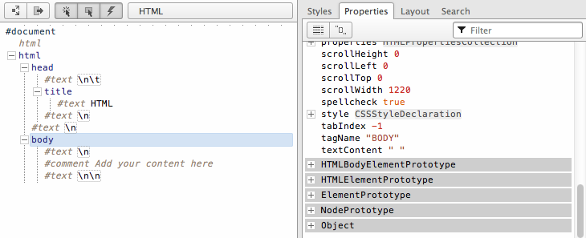
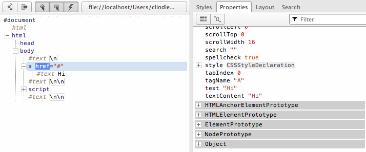

# 第一章 - 节点概述

## 1.1 文档对象模型（即 DOM）是 JavaScript 节点对象的层次结构/树

当你编写 HTML 文档时，你将 HTML 内容封装在其他 HTML 内容中。通过这样做，你建立了一个可以表示为[树](http://dvcs.w3.org/hg/domcore/raw-file/tip/Overview.html#trees)的层次结构。通常，这种层次结构或封装系统在 HTML 文档中通过缩进标记来直观表示。浏览器在加载 HTML 文档时会解析这个层次结构，创建一个模拟标记封装方式的节点对象树。

```
<!DOCTYPE html>
<html lang="en">
<head>
<title>HTML</title>
</head>
<body>
*<!-- Add your content here-->*
</body>
</html>

```

上述 HTML 代码在被浏览器解析时创建了一个包含以树形式结构化的节点的文档（即 DOM）。下面我使用 Opera 的 Dragonfly DOM 检查器展示了上述 HTML 文档的树结构。



在左侧你可以看到 HTML 文档的树形式。右侧是表示左侧选定元素的相应 JavaScript 对象。例如，被突出显示为蓝色的选定*<body>*元素是一个元素节点，是*HTMLBodyElement*接口的一个实例。

这里你应该明白的是，HTML 文档会被浏览器解析，并转换为表示实时文档的节点对象树结构。DOM 的目的是提供一个用 JavaScript 脚本编程的接口，以操作（移除、添加、替换、事件、修改）这个实时文档。

### 注意

DOM 最初是用于 XML 文档的应用程序编程接口，已经扩展用于 HTML 文档。

## 1.2 节点对象类型

在处理 HTML 文档时，遇到的最常见的节点类型（即*nodeType* / 节点分类）如下所示。

+   *DOCUMENT_NODE*（例如*window.document*）

+   *ELEMENT_NODE*（例如*<body>*，*<a>*，*<p>*，*<script>*，*<style>*，*<html>*，*<h1>*等...）

+   *ATTRIBUTE_NODE*（例如*class="funEdges"*）

+   *TEXT_NODE*（例如 HTML 文档中的文本字符，包括换行符和空格）

+   *DOCUMENT_FRAGMENT_NODE*（例如*document.createDocumentFragment()*）

+   *DOCUMENT_TYPE_NODE*（例如*<!DOCTYPE html>*）

我已经列出了上面的节点类型，格式化为全大写，单词之间用下划线分隔，与 JavaScript 浏览器环境中的*Node*对象的常量属性写法完全一致。这些*Node*属性是常量值，用于存储映射到特定节点对象类型的数值代码值。例如，在下面的代码示例中，*Node.ELEMENT_NODE* 等于*1*。而*1*是用于标识元素节点的代码值。

实时代码：[`jsfiddle.net/domenlightenment/BAVrs`](http://jsfiddle.net/domenlightenment/BAVrs)

```
<!DOCTYPE html>
<html lang="en">
<body>
<script>

console.log(Node.ELEMENT_NODE) *//logs 1, one is the numeric code value for element nodes*

</script>
</body>
</html>

```

在下面的代码中，我记录了所有节点类型及其值。

实时代码：[`jsfiddle.net/domenlightenment/YcXGD`](http://jsfiddle.net/domenlightenment/YcXGD)

```
<!DOCTYPE html>
<html lang="en">
<body>
<script>

for(var key in Node){
    console.log(key,' = '+Node[key]); 
};

***/* the above code logs to the console the following
ELEMENT_NODE  = 1
ATTRIBUTE_NODE  = 2
TEXT_NODE  = 3
CDATA_SECTION_NODE  = 4
ENTITY_REFERENCE_NODE  = 5
ENTITY_NODE  = 6
PROCESSING_INSTRUCTION_NODE  = 7
COMMENT_NODE  = 8
DOCUMENT_NODE  = 9
DOCUMENT_TYPE_NODE  = 10
DOCUMENT_FRAGMENT_NODE  = 11
NOTATION_NODE  = 12
DOCUMENT_POSITION_DISCONNECTED  = 1
DOCUMENT_POSITION_PRECEDING  = 2
DOCUMENT_POSITION_FOLLOWING  = 4
DOCUMENT_POSITION_CONTAINS  = 8
DOCUMENT_POSITION_CONTAINED_BY  = 16
DOCUMENT_POSITION_IMPLEMENTATION_SPECIFIC  = 32 */***

</script>
</body>
</html>

```

前面的代码示例给出了所有节点类型的详尽列表。为了本书的目的，我将讨论本节开头列出的节点类型较短的列表。当编写 HTML 页面脚本时，您可能会接触到这些节点。

下表列出了实例化最常见节点类型及其对应的 *nodeType* 分类的接口/构造函数的名称。我希望你从下表中了解到的是 *nodeType* 值（即 *1*）只是一个用于描述从某个特定 JavaScript 接口/构造函数构造的某种类型节点的数值分类。例如，*HTMLBodyElement* 接口代表一个具有 *1* 类型的节点对象，该类型是 *ELEMENT_NODE* 的分类。

| [Node](http://www.w3.org/TR/2004/REC-DOM-Level-3-Core-20040407/core.html#ID-1950641247) |
| --- |
| 接口/构造函数： | nodeType（从 *.nodeType* 返回）： |
| --- | --- |
| [HTML*元素](http://www.w3.org/TR/2003/REC-DOM-Level-2-HTML-20030109/html.html#ID-58190037)，（例如 [HTMLBodyElement](http://www.w3.org/TR/2003/REC-DOM-Level-2-HTML-20030109/html.html#ID-62018039)） | **1**（即 *ELEMENT_NODE*） |
| [文本](http://www.w3.org/TR/2004/REC-DOM-Level-3-Core-20040407/core.html#ID-1312295772) | **3**（即 *TEXT_NODE*） |
| [Attr](http://www.w3.org/TR/2004/REC-DOM-Level-3-Core-20040407/core.html#ID-637646024) | **2**（即 *ATTRIBUTE_NODE*） |
| [HTMLDocument](http://www.w3.org/TR/2003/REC-DOM-Level-2-HTML-20030109/html.html#ID-26809268) | **9**（即 *DOCUMENT_NODE*） |
| [DocumentFragment](http://www.w3.org/TR/2004/REC-DOM-Level-3-Core-20040407/core.html#ID-B63ED1A3) | **11**（即 *DOCUMENT_FRAGMENT_NODE*） |
| [DocumentType](http://www.w3.org/TR/2004/REC-DOM-Level-3-Core-20040407/core.html#ID-412266927) | **10**（即 *DOCUMENT_TYPE_NODE*） |

### 注意事项

DOM 规范在语义上将节点标记为 *Node*、*Element*、*Text*、*Attr* 和 *HTMLAnchorElement*，它们是接口，但请记住，它们也是用于构造节点的 JavaScript 构造函数的名称。当你阅读本书时，我将把这些接口（即 *Element*、*Text*、*Attr*、*HTMLAnchorElement*）称为对象或构造函数，而规范则将它们称为接口。

*ATTRIBUTE_NODE* 实际上不是树的一部分，但出于历史原因列出。在本书中，我没有提供有关属性节点的章节，而是在 *Element* 节点章节中讨论它们，因为属性节点是元素节点的子节点，不参与实际的 DOM 树结构。请注意，ATTRIBUTE_NODE 在 DOM 4 中已被弃用。

我在本书中没有详细介绍*COMMENT_NODE*，但你应该知道 HTML 文档中的注释是*Comment*节点，类似于*Text*节点。

在本书中讨论节点时，我很少使用*nodeType*名称（例如*ELEMENT_NODE*）来引用特定节点。这是为了与 W3C 和 WHATWG 提供的规范中使用的措辞保持一致。

## 1.3 子节点对象从*Node*对象继承

典型 DOM 树中的每个节点对象都从*Node*继承属性和方法。根据文档中节点的类型，还有其他扩展*Node*对象的子节点对象/接口。下面我详细描述了浏览器为最常见的节点接口实现的继承模型（<表示继承自）。

+   *Object* < *Node* <  *Element* < *HTMLElement* < （例如*HTMLElement*）

+   *Object* <*Node* <  *Attr*（在 DOM 4��已弃用）

+   *Object* <*Node* <  *CharacterData* <  *Text*

+   *Object* <*Node* <  *Document* <  *HTMLDocument*

+   *Object* <*Node* <  *DocumentFragment*

不仅要记住所有节点类型都继承自*Node*，而且继承链可能会很长。例如，所有*HTMLAnchorElement*节点都继承自*HTMLElement*、*Element*、*Node*和*Object*对象的属性和方法。

### 注意

*Node*只是一个 JavaScript 构造函数。因此，逻辑上*Node*像 JavaScript 中的所有对象一样继承自*Object.prototype*。

为了验证所有节点类型都从*Node*对象继承属性和方法，让我们循环遍历一个*Element*节点对象并检查其属性和方法（包括继承的）。

实时代码：[`jsfiddle.net/domenlightenment/6ukxe/`](http://jsfiddle.net/domenlightenment/6ukxe)

```
<!DOCTYPE html>
<html lang="en">
<body>

<a href="#">Hi</a> *<!-- this is a HTMLAnchorElement which inherits from... -->*

<script>

*//get reference to element node object*
var nodeAnchor = document.querySelector('a');
 *//create props array to store property keys for element node object*
var props = [];

*//loop over element node object getting all properties & methods (inherited too)*
for(var key in nodeAnchor){
    props.push(key);   
}

*//log alphabetical list of properties & methods* 
console.log(props.sort());

</script>
</body>
</html>

```

如果在 Web 浏览器中运行上述代码，你将看到一个长长的属性列表，这些属性可用于元素节点对象。从*Node*对象继承的属性和方法在此列表中，以及从*Element*、*HTMLElement*、*HTMLAnchorElement*、*Node*和*Object*对象继承的许多其他属性和方法。现在不是检查所有这些属性和方法的时候，而只是简单指出所有节点从其构造函数继承一组基线属性和方法，以及从原型链继承的属性。

如果你更喜欢视觉学习者，可以考虑通过使用 Opera 的 DOM 检查器检查上述 HTML 文档来表示继承链。



注意锚节点继承自*HTMLAnchorElement*、*HTMLElement*、*Element*、*Node*和*Object*，所有这些都在灰色背景突出显示的属性列表中。这种继承链为所有节点类型提供了大量共享的方法和属性。

### 注意

你可以扩展 DOM。但是扩展宿主对象可能不是一个[好主意](http://perfectionkills.com/whats-wrong-with-extending-the-dom/)。

## 1.4 用于操作节点的属性和方法

正如我们一直讨论的，所有节点对象（例如*Element*、*Attr*、*Text*等）都继承自主要的*Node*对象的属性和方法。这些属性和方法是操作、检查和遍历 DOM 的基线值和函数。除了节点接口提供的属性和方法之外，还有许多其他相关的属性和方法由子节点接口（如*document*、*HTMLElement*或*HTML*Element*接口）提供。

下面我列出了所有节点对象继承的最常见的*Node*属性和方法，包括用于处理来自子节点接口的节点的相关继承属性。

节点属性：

+   *childNodes*

+   *firstChild*

+   *lastChild*

+   *nextSibling*

+   *nodeName*

+   *nodeType*

+   *nodeValue*

+   *parentNode*

+   *previousSibling*

节点方法：

+   *appendChild()*

+   *cloneNode()*

+   *compareDocumentPosition()*

+   *contains()*

+   *hasChildNodes()*

+   *insertBefore()*

+   *isEqualNode()*

+   *removeChild()*

+   *replaceChild()*

文档方法：

+   *document.createElement()*

+   *document.createTextNode()*

HTML *元素属性：

+   *innerHTML*

+   *outerHTML*

+   *textContent*

+   *innerText*

+   *outerText*

+   *firstElementChild*

+   *lastElementChild*

+   *nextElementChild*

+   *previousElementChild*

+   *children*

HTML 元素方法：

+   *insertAdjacentHTML()*

## 1.5 识别节点的类型和名称

每个节点都有一个继承自*Node*的*nodeType*和*nodeName*属性。例如，*Text*节点的*nodeType*代码为*3*，*nodeName*值为*'#text'*。如前所述，数字值*3*是表示节点代表的底层对象类型的数字代码（即*Node.TEXT_NODE === 3*）。

下面详细说明了本书讨论的节点对象的*nodeType*和*nodeName*返回的值。对于更常见的节点，简单地记住这些数字代码是有意义的，因为我们只处理 5 个数字代码。

实时代码：[`jsfiddle.net/domenlightenment/8EwNu`](http://jsfiddle.net/domenlightenment/8EwNu)

```
<!DOCTYPE html>
<html lang="en">
<body>

<a href="#">Hi</a>

<script>

*//This is DOCUMENT_TYPE_NODE or nodeType 10 because Node.DOCUMENT_TYPE_NODE === 10*
console.log(
	document.doctype.nodeName, *//logs 'html' also try document.doctype to get <!DOCTYPE html>*
	document.doctype.nodeType *//logs 10 which maps to DOCUMENT_TYPE_NODE*
); **//This is DOCUMENT_NODE or nodeType 9 because Node.DOCUMENT_NODE === 9*
console.log(
	**document.nodeName**, *//logs '#document'*
	**document.nodeType** *//logs 9 which maps to DOCUMENT_NODE*
);

*//This is DOCUMENT_FRAGMENT_NODE or nodeType 11 because Node.DOCUMENT_FRAGMENT_NODE === 11*
console.log(
	**document.createDocumentFragment().nodeName**, *//logs '#document-fragment'*
	**document.createDocumentFragment().nodeType** *//logs 11 which maps to DOCUMENT_FRAGMENT_NODE*
);

*//This is ELEMENT_NODE or nodeType 1 because Node. ELEMENT_NODE === 1*
console.log(
	**document.querySelector('a').nodeName**, *//logs 'A'*
	**document.querySelector('a').nodeType** *//logs 1 which maps to ELEMENT_NODE*
); **//This is TEXT_NODE or nodeType 3 because Node.TEXT_NODE === 3*
console.log(
	**document.querySelector('a').firstChild.nodeName**, *//logs '#text'*
	**document.querySelector('a').firstChild.nodeType** *//logs 3 which maps to TEXT_NODE*
); **</script>
</body>
</html>**** 
```

***如果不明显，确定节点是否属于某种类型的最快方法是简单地检查其*nodeType*属性。下面我们检查锚元素是否具有节点编号 1。如果是，那么我们可以得出结论它是一个*Element*节点，因为*Node.ELEMENT_NODE === 1*。

实时代码：[`jsfiddle.net/domenlightenment/ydzWL`](http://jsfiddle.net/domenlightenment/ydzWL)

```
<!DOCTYPE html>
<html lang="en">
<body>

<a href="#">Hi</a>

<script>

*//is <a> a ELEMENT_NODE?*
console.log(document.querySelector('a').nodeType === 1); *//logs true, <a> is an Element node*

*//or use Node.ELEMENT_NODE which is a property containg the numerice value of 1*
console.log(document.querySelector('a').nodeType === Node.ELEMENT_NODE); *//logs true, <a> is an Element node*

</script>
</body> 
</html>

```

确定您可能正在编写脚本的节点类型非常方便，这样您就可以知道可用于编写节点的属性和方法。

### 注意

*nodeName*属性返回的值根据节点类型而变化。查看[DOM 4 规范](http://www.w3.org/TR/dom/#dom-node-nodename)以获取详细信息。

## 1.6 获取节点的值

*nodeValue*属性对大多数节点类型（除了*Text*和*Comment*）返回*null*。它的用途集中在从*Text*和*Comment*节点中提取实际文本字符串。在下面的代码中，我演示了它在本书中讨论的所有节点上的用法。

实时代码：[`jsfiddle.net/domenlightenment/LNyA4`](http://jsfiddle.net/domenlightenment/LNyA4)

```
<!DOCTYPE html>
<html lang="en">
<body>

<a href="#">Hi</a>

<script>

*//logs null for DOCUMENT_TYPE_NODE, DOCUMENT_NODE, DOCUMENT_FRAGMENT_NODE, ELEMENT_NODE* *below*
console.log(document.doctype.nodeValue); *console.log(**document.nodeValue***);
console.log(**document.createDocumentFragment().nodeValue***); *console.log(**document.querySelector('a').nodeVale***);

*//logs string of text*
console.log(**document.querySelector('a').firstChild.nodeValue**); ***//logs 'Hi'*

</script>
</body>
</html>******* 
```

**### 注意

*Text*或*Comment*节点的值可以通过为*nodeValue*属性提供新的字符串值来设置（即*document.body.firstElementChild.nodeValue = 'hi'*）。

## 1.7 使用 JavaScript 方法创建元素和文本节点

当浏览器解析 HTML 文档时，它根据 HTML 文件的内容构造节点和树。浏览器处理 HTML 文档的初始加载时的节点创建。但是，可以使用 JavaScript 创建自己的节点。以下两种方法允许我们使用 JavaScript 编程方式创建*Element*和*Text*节点。

+   *createElement()*

+   *createTextNode()*

还有其他方法可用，但通常不常用（例如*createAttribute()*和*createComment()*）。在下面的代码中，我展示了创建元素和文本节点是多么简单。

实时代码：[`jsfiddle.net/domenlightenment/Vj2Tc`](http://jsfiddle.net/domenlightenment/Vj2Tc)

```
<!DOCTYPE html>
<html lang="en">
<body>
<script>

var elementNode = document.createElement('div');
console.log(elementNode, elementNode.nodeType); *//log <div> 1, and 1 indicates an element node*

var textNode = document.createTextNode('Hi');
console.log(textNode, textNode.nodeType); *//logs Text {} 3, and 3 indicates a text node*

</script>
</body>
</html>

```

### 注意

*createElement()*方法接受一个参数，该参数是指定要创建的元素的字符串。该字符串与*Element*对象的*tagName*属性返回的字符串相同。

*createAttribute()*方法已被弃用，不应用于创建属性节点。相反，开发人员通常使用*getAttribute()*、*setAttribute()*和*removeAttribute()*方法。我将在*Element*节点章节中更详细地讨论这一点。

*createDocumentFragment()*将在涵盖此方法的章节中讨论。

您应该知道，有一个*createComment()*方法可用于创建注释节点。虽然本书没有讨论它，但对于发现其用途有价值的开发人员来说，它是完全可用的。

## 1.8 使用 JavaScript 字符串创建和添加元素和文本节点到 DOM

*innerHTML*、*outerHTML*、*textContent*和*insertAdjacentHTML()*属性和方法提供了使用 JavaScript 字符串创建和添加节点到 DOM 的功能。

在下面的代码中，我们使用*innerHTML*、*outerHTML*和*textContent*属性，从 JavaScript 字符串创建节点，然后立即将其添加到 DOM 中。

实时代码：[`jsfiddle.net/domenlightenment/UrNT3`](http://jsfiddle.net/domenlightenment/UrNT3)

```
<!DOCTYPE html>
<html lang="en">
<body>

<div id="A"></div>
<span id="B"></span>
<div id="C"></div>
<div id="D"></div>
<div id="E"></div>

<script>

*//create a strong element and text node and add it to the DOM*
document.getElementById('A').innerHTML = '<strong>Hi</strong>'; 

*//create a div element and text node to replace <span id="B"></div> (notice span#B is replaced)*
document.getElementById('B').outerHTML = '<div id="B" class="new">Whats Shaking</div>'

*//create a text node and update the div#C with the text node*
document.getElementById('C').textContent = 'dude';

*//NON standard extensions below i.e. innerText & outerText*

*//create a text node and update the div#D with the text node*
document.getElementById('D').innerText = 'Keep it';

*//create a text node and replace the div#E with the text node (notice div#E is gone)*
document.getElementById('E').outerText = 'real!';

console.log(document.body.innerHTML);
*/* logs
<div id="A"><strong>Hi</strong></div>
<div id="B" class="new">Whats Shaking</div>
<span id="C">dude</span>
<div id="D">Keep it</div>
real!
*/*

</script>
</body>
</html>

```

*insertAdjacentHTML()* 方法仅适用于*Element*节点，比先前提到的方法更加精确。使用这种方法，可以在开始标签之前、开始标签之后、结束标签之前和结束标签之后插入节点。下面我使用*insertAdjacentHTML()*方法构造一个句子。

实时代码：[`jsfiddle.net/domenlightenment/tvpA6`](http://jsfiddle.net/domenlightenment/tvpA6)

```
<!DOCTYPE html>
<html lang="en">
<body><i id="elm">how</i>

<script>

var elm = document.getElementById('elm');

elm.insertAdjacentHTML('beforebegin', '<span>Hey-</span>');
elm.insertAdjacentHTML('afterbegin', '<span>dude-</span>'); 
elm.insertAdjacentHTML('beforeend', '<span>-are</span>'); 
elm.insertAdjacentHTML('afterend', '<span>-you?</span>');  

console.log(document.body.innerHTML);
*/* logs
<span>Hey-</span><i id="A"><span>dude-</span>how<span>-are</span></i><span>-you?</span>
*/*

</script>
</body>
</html>

```

### 笔记

*innerHTML*属性将字符串中找到的 html 元素转换为实际的 DOM 节点，而*textContent*只能用于构建文本节点。如果你向*textContent*传递包含 html 元素的字符串，它将简单地将其输出为文本。

*document.write()*也可以用于同时创建和添加节点到 DOM。然而，除非需要完成第三方脚本任务，否则通常不再使用它。基本上，*write()*方法会在页面加载/解析期间将传递给它的值输出到页面上。您应该知道使用*write()*方法会阻止正在加载的 html 文档的解析。

*innerHTML*调用了一个复杂且昂贵的 HTML 解析器，而文本节点生成是微不足道的，因此要谨慎使用 innerHTML 及其相关方法

*insertAdjacentHTML*选项"beforebegin"和"afterend"只有在节点在 DOM 树中并且有父元素时才会起作用。

直到版本 11，火狐浏览器才原生支持*outerHTML*。有一个[兼容性解决方案](https://gist.github.com/1044128)。

*textContent*获取所有元素的内容，包括*<script>*和*<style>*元素，而*innerText*不会

*innerText*知道样式并且不会返回隐藏元素的文本，而*textContent*会

除了火狐浏览器之外，所有现代浏览器都支持*insertAdjacentElement()*和*insertAdjacentText()*

## 1.9 提取 DOM 树的部分作为 JavaScript 字符串

我们用于创建和添加节点到 DOM 的完全相同的属性（*innerHTML*、*outerHTML*、*textContent*）也可以用于提取 DOM 的部分（或者实际上整个 DOM）作为 JavaScript 字符串。在下面的代码示例中，我使用这些属性返回一个包含 HTML 文档中文本和 html 值的字符串值。

实时代码：[`jsfiddle.net/domenlightenment/mMYWc`](http://jsfiddle.net/domenlightenment/mMYWc)

```
<!DOCTYPE html>
<html lang="en">
<body>

<div id="A"><i>Hi</i></div>
<div id="B">Dude<strong> !</strong></div>

<script>

console.log(document.getElementById('A').innerHTML); *//logs '<i>Hi</i>'*

console.log(document.getElementById('A').outerHTML); *//logs <div id="A">Hi</div>*

*//notice that all text is returned even if its in child element nodes (i.e. <strong> !</strong>)* 
console.log(document.getElementById('B').textContent); *//logs 'Dude !'*

*//NON standard extensions below i.e. innerText & outerText*

console.log(document.getElementById('B').innerText);* //logs 'Dude !'*

console.log(document.getElementById('B').outerText); *//logs 'Dude !'​*​

</script>
</body>
</html>

```

### 笔记

当读取*textContent*、*innerText*、*outerText*属性时，将返回所选节点中包含的所有文本节点。因此，例如（实际上不是一个好主意），*document.body.textContent*将获取包含在 body 元素中的所有文本节点，而不仅仅是第一个文本节点。

## 1.10 使用*appendChild()*和*insertBefore()*向 DOM 添加节点对象

*appendChild()*和*insertBefore()* *Node*方法允许我们将 JavaScript 节点对象插入 DOM 树中。*appendChild()*方法将节点追加到调用该方法的节点的子节点的末尾。如果没有子节点，则被追加的节点将作为第一个子节点追加。例如，在下面的代码中，我们创建了一个元素节点（*<strong>*）和文本节点（*Dude*）。然后从 DOM 中选择了*<p>*，并使用*appendChild()*追加了我们的*<strong>*元素。注意，*<strong>*元素被封装在*<p>*元素内，并作为最后一个子节点添加。接下来选择*<strong>*元素，并将文本*'Dude'*追加到*<strong>*元素中。

实时代码：[`jsfiddle.net/domenlightenment/HxjFt`](http://jsfiddle.net/domenlightenment/HxjFt)

```
<!DOCTYPE html>
<html lang="en">
<body>

<p>Hi</p>

<script>

*//create a blink element node and text node*
var elementNode = document.createElement('strong');
var textNode = document.createTextNode(' Dude');

*//append these nodes to the DOM*
document.querySelector('p').appendChild(elementNode);
document.querySelector('strong').appendChild(textNode);

*//log's <p>Hi<strong> Dude</strong></p>*
console.log(document.body.innerHTML);

</script>
</body>
</html>

```

当需要控制插入位置超出将节点追加到节点子列表末尾时，可以使用*insertBefore()*。在下面的代码中，我在*<ul>*元素的第一个子节点之前插入了*<li>*元素。

实时代码：[`jsfiddle.net/domenlightenment/UmkME`](http://jsfiddle.net/domenlightenment/UmkME)

```
<!DOCTYPE html>
<html lang="en">
<body>

<ul>
    <li>2</li>
    <li>3</li>
</ul>

<script>

*//create a text node and li element node and append the text to the li*
var text1 = document.createTextNode('1');
var li = document.createElement('li');
li.appendChild(text1);

*//select the ul in the document*
var ul = document.querySelector('ul');

*/* 
add the li element we created above to the DOM, notice I call on <ul> and pass reference to <li>2</li> using ul.firstChild 
*/*
ul.insertBefore(li,ul.firstChild);

console.log(document.body.innerHTML);
*/*logs
<ul>
<li>1</li>
<li>2</li>
<li>3</li>
</ul>
*/*

</script>
</body>
</html>

```

*insertBefore()*需要两个参数，要插入的节点和要在文档中插入节点之前的参考节点。

### 注意事项

如果不给*insertBefore()*方法传递第二个参数，则其功能与*appendChild()*相同。

我们在 DOM 4 中还有[更多方法](http://www.w3.org/TR/dom/#mutation-methods)（例如*prepend()*、*append()*、*before()*、*after()*）可以期待。

## 1.11 使用*removeChild()*和*replaceChild()*来移除和替换节点

从 DOM 中移除节点是一个多步骤的过程。首先你需要选择要移除的节点。然后通常使用*parentNode*属性获得其父元素的访问权限。在父节点上调用*removeChild()*方法，传递要移除的节点的引用。下面我演示了如何在元素节点和文本节点上使用它。

实时代码：[`jsfiddle.net/domenlightenment/VDZgP`](http://jsfiddle.net/domenlightenment/VDZgP)

```
<!DOCTYPE html>
<html lang="en">
<body>

<div id="A">Hi</div>
<div id="B">Dude</div>

<script>

*//remove element node*
var divA = document.getElementById('A');
divA.parentNode.removeChild(divA);

*//remove text node*
var divB = document.getElementById('B').firstChild;
divB.parentNode.removeChild(divB);

*//log the new DOM updates, which should only show the remaining empty div#B*
console.log(document.body.innerHTML);

</script>
</body>
</html>

```

替换元素或文本节点与移除类似。在下面的代码中，我使用了前一个代码示例中使用的相同的 HTML 结构，但这次我使用*replaceChild()*来更新节点而不是移除它们。

实时代码：[`jsfiddle.net/domenlightenment/zgE8M`](http://jsfiddle.net/domenlightenment/zgE8M)

```
<!DOCTYPE html>
<html lang="en">
<body>

<div id="A">Hi</div>
<div id="B">Dude</div>

<script>

*//replace element node*
var divA = document.getElementById('A');
var newSpan = document.createElement('span');
newSpan.textContent = 'Howdy';
divA.parentNode.replaceChild(newSpan,divA);

*//replace text node*
var divB = document.getElementById('B').firstChild;
var newText = document.createTextNode('buddy');
divB.parentNode.replaceChild(newText, divB);

*//log the new DOM updates,* 
console.log(document.body.innerHTML);

</script>
</body>
</html>

```

### 注意事项

根据你要移除或替换的内容，仅仅提供*innerHTML*、*outerHTML*和*textContent*属性为空字符串可能更容易更快。[但要小心浏览器中的内存泄漏](http://javascript.crockford.com/memory/leak.html)。

*replaceChild()*和*removeChild()*都会返回被替换或移除的节点。基本上，它并没有因为你替换或移除而消失。这只是将其从当前实时文档中取出。你仍然在内存中有对它的引用。

我们在 DOM 4 中还有[更多方法](http://www.w3.org/TR/dom/#mutation-methods)（例如*replace()*、*remove()*）可以期待。

## 1.12 使用*cloneNode()*克隆节点

使用*cloneNode()*方法，可以复制单个节点或节点及其所有子节点。

在下面的代码中，我仅克隆了*<ul>*（即*HTMLUListElement*），一旦克隆，它就可以像任何节点引用一样对待。

实时代码：[`jsfiddle.net/domenlightenment/6DHgC`](http://jsfiddle.net/domenlightenment/6DHgC)

```
<!DOCTYPE html>
<html lang="en">
<body>

<ul>
  <li>Hi</li>
  <li>there</li>
</ul>

<script>

var cloneUL = document.querySelector('ul').cloneNode();

console.log(cloneUL.constructor); *//logs HTMLUListElement()*
console.log(cloneUL.innerHTML); *//logs (an empty string) as only the ul was cloned*

</script>
</body>
</html>

```

要克隆节点及其所有子节点，你需要向*cloneNode()*方法传递一个*true*参数。下面我再次使用*cloneNode()*方法，但这次我们也克隆了所有子节点。

实时代码：[`jsfiddle.net/domenlightenment/EyFEC`](http://jsfiddle.net/domenlightenment/EyFEC)

```
<!DOCTYPE html>
<html lang="en">
<body>

<ul>
  <li>Hi</li>
  <li>there</li>
</ul>

<script>

var cloneUL = document.querySelector('ul').cloneNode(true);

console.log(cloneUL.constructor); *//logs HTMLUListElement()*
console.log(cloneUL.innerHTML); *//logs <li>Hi</li><li>there</li>*

</script>
</body>
</html>

```

### 注

当克隆*Element*节点时，所有属性和值也会被克隆。事实上，只有属性被复制！当克隆时，任何你可以添加到 DOM 节点的东西（例如事件处理程序）都会丢失。

你可能认为使用*cloneNode(true)*克隆节点及其子节点会返回一个*NodeList*，但事实上并不是这样。

使用*cloneNode()*可能会导致文档中出现重复的元素 ID。

## 1.13 理解节点集合（即*Nodelist*和*HTMLcollection*）

当从树中选择节点组（在第三章中讨论）或访问预定义节点集时，节点要么放置在[*NodeList*](http://www.w3.org/TR/dom/#nodelist)（例如*document.querySelectorAll('*')*）中，要么放置在[*HTMLCollection*](http://www.w3.org/TR/dom/#htmlcollection)（例如*document.scripts*）中。这些类似数组（即不是真正的*Array*）的对象集合具有以下特点。

+   集合可以是实时的或静态的。这意味着集合中包含的节点要么是实时文档的一部分，要么是实时文档的快照。

+   默认情况下，节点在集合内按树的顺序排序。这意味着顺序与从树干到树枝的线性路径相匹配。

+   这些集合具有一个*length*属性，反映列表中元素的数量。

## 1.14 获取所有直接子节点的列表/集合

使用*childNodes*属性会产生一个类似数组的列表（即[NodeList](https://developer.mozilla.org/En/DOM/NodeList)），包含了直接子节点。下面我选择了*<ul>*元素，然后使用它来创建包含在*<ul>*中的所有直接子节点的列表。

实时代码：[`jsfiddle.net/domenlightenment/amDev`](http://jsfiddle.net/domenlightenment/amDev)

```
<!DOCTYPE html>
<html lang="en">
<body>

<ul>
  <li>Hi</li>
  <li>there</li>
</ul>

<script>

var ulElementChildNodes = document.querySelector('ul').childNodes;

console.log(ulElementChildNodes); *//logs an array like list of all nodes inside of the ul*

*/*Call forEach as if its a method of NodeLists so we can loop over the NodeList. Done because NodeLists are array like, but do not directly inherit from Array*/*
Array.prototype.forEach.call(ulElementChildNodes,function(item){ 
   console.log(item); //logs each item in the array
}); 

</script>
</body>
</html>

```

### 注

由*childNodes*返回的*NodeList*只包含直接子节点。

注意*childNodes*不仅包含*Element*节点，还包括所有其他节点类型（例如*Text*和*Comment*节点）。

*[].forEach* 是在 ECMAScript 5th edtion 中实现的。

## 1.15 将 *NodeList* 或 *HTMLCollection* 转换为 JavaScript *Array*

节点列表和 HTML 集合类似于数组，但不是真正的 JavaScript 数组，它们不继承数组方法。在下面的代码中，我们使用 *isArray()* 来程序确认这一点。

实时代码：[`jsfiddle.net/domenlightenment/n53Xk`](http://jsfiddle.net/domenlightenment/n53Xk)

```
<!DOCTYPE html>
<html lang="en">
<body>

<a href="#"></a>

<script>

console.log(Array.isArray(document.links)); *//returns false, its an HTMLCollection not an Array*
console.log(Array.isArray(document.querySelectorAll('a'))); *//returns false, its an NodeList not an Array*

</script>
</body>
</html>

```

### 注意

*Array.isArray* 是在 ECMAScript 5th edtion 或 ES5 中实现的。

将节点列表和 HTML 集合列表转换为真正的 JavaScript 数组可以带来很多好处。首先，它使我们能够创建列表的快照，而不是与实时 DOM 绑定，考虑到 *NodeList* 和 *HTMLCollection* 是 [实时](http://www.w3.org/TR/2004/REC-DOM-Level-3-Core-20040407/core.html#td-live) 列表。其次，将列表转换为 JavaScript 数组可以访问 *Array* 对象提供的方法（例如 *forEach*、*pop*、*map*、*reduce* 等）。

要将类似数组的列表转换为真正的 JavaScript 数组，请将类似数组的列表传递给 *call()* 或 *apply()*，其中 *call()* 或 *apply()* 调用返回一个未改变的真正的 JavaScript 数组。在下面的代码中，我使用了 *.slice()* 方法，它实际上并没有切片任何东西，我只是用它来将列表转换为 JavaScript *Array*，因为 *slice()* 返回一个数组。

实时代码：[`jsfiddle.net/domenlightenment/jHgTY`](http://jsfiddle.net/domenlightenment/jHgTY)

```
<!DOCTYPE html>
<html lang="en">
<body>

<a href="#"></a>

<script>

console.log(Array.isArray(Array.prototype.slice.call(document.links))); *//returns true*
console.log(Array.isArray(Array.prototype.slice.call(document.querySelectorAll('a')))); *//returns true*

</script>
</body>
</html>

```

### 注意

在 ECMAScript 6th edtion 中，我们期待有 *Array.from*，它将一个参数转换为一个数组对象或列表（例如 *arguments*、*NodeList*、*DOMTokenList*（被 *classList* 使用）、*NamedNodeMap*（被 *attributes* 属性使用））并返回一个 *new Array()*。

## 1.16 遍历 DOM 中的节点

从节点引用（即 *document.querySelector('ul')*）可以通过以下属性遍历 DOM 来获取不同的节点引用：

+   *parentNode*

+   *firstChild*

+   *lastChild*

+   *nextSibling*

+   *previousSibling*

在下面的代码示例中，我们检查提供 DOM 遍历功能的 *Node* 属性。

实时代码：[`jsfiddle.net/domenlightenment/Hvfhv`](http://jsfiddle.net/domenlightenment/Hvfhv)

```
<!DOCTYPE html>
<html lang="en">
<body><ul><!-- comment -->
<li id="A"></li>
<li id="B"></li>
<!-- comment -->
</ul>

<script>

*//cache selection of the ul*
var ul = document.querySelector('ul');

*//What is the parentNode of the ul?*
console.log(ul.parentNode.nodeName); *//logs body* **//What is the first child of the ul?*
console.log(ul.**firstChild**.nodeName); *//logs comment*

*//What is the last child of the ul?*
console.log(ul.**lastChild**.nodeName); *//logs text not comment, because there is a line break*

*//What is the nextSibling of the first li?*
console.log(ul.querySelector('#A').**nextSibling**.nodeName); *//logs text*

*//What is the previousSibling of the last li?*
console.log(ul.querySelector('#B').**previousSibling**.nodeName); *//logs text*

</script>
</body>
</html>* 
```

*如果你对 DOM 比较熟悉，那么遍历 DOM 包括遍历元素节点、文本节点和注释节点就不足为奇了。我相信最后一个代码示例清楚地表明了这一点，而这并不完全理想。使用以下属性，我们可以遍历 DOM 而忽略文本和注释节点。

+   *firstElementChild*

+   *lastElementChild*

+   *nextElementChild*

+   *previousElementChild*

+   *children*

### 注意

*childElementCount* 没有提到，但你应该知道它可用于计算节点包含的子元素数量。

再次查看我们的代码示例，只使用元素遍历方法。

实时代码：[`jsfiddle.net/domenlightenment/Wh7nf`](http://jsfiddle.net/domenlightenment/Wh7nf)

```
<!DOCTYPE html>
<html lang="en">
<body><ul><!-- comment -->
<li id="A"></li>
<li id="B"></li>
<!-- comment -->
</ul>

<script>

*//cache selection of the ul*
var ul = document.querySelector('ul');

*//What is the first child of the ul?*
console.log(ul.firstElementChild.nodeName); *//logs li*

*//What is the last child of the ul?*
console.log(ul.lastElementChild.nodeName); *//logs li*

*//What is the nextSibling of the first li?*
console.log(ul.querySelector('#A').nextElementSibling.nodeName); *//logs li*

*//What is the previousSibling of the last li?*
console.log(ul.querySelector('#B').previousElementSibling.nodeName); *//logs li*

*//What are the element only child nodes of the ul?* 
console.log(ul.children); **//HTMLCollection, all child nodes including text nodes*

</script>
</body>
</html>* 
```

*## 1.17 使用 *contains()* 和 *compareDocumentPosition()* 验证节点在 DOM 树中的位置

可以使用 *contains()* *Node* 方法知道一个节点是否包含在另一个节点中。在下面的代码中，我询问 *<body>* 是否包含在 *<html lang="en">* 中。

实时代码：[`jsfiddle.net/domenlightenment/ENU4w`](http://jsfiddle.net/domenlightenment/)

```
<!DOCTYPE html>
<html lang="en">
<body>

<script>

*// is <body> inside <html lang="en"> ?*
var inside = document.querySelector('html').contains(document.querySelector('body'));

console.log(inside); *//logs true*

</script>
</body>
</html>

```

如果您需要更多关于节点在 DOM 树中位置的有关信息，可以使用 *compareDocumentPosition()* *Node* 方法。基本上，此方法使您能够请求有关所选节点相对于传入节点的信息。您得到的信息是一个与以下信息对应的数字。

| 从 *compareDocumentPosition()* 返回的数字代码： | 数字代码信息： |
| --- | --- |
| 0 | 元素相同。 |
| 1 | DOCUMENT_POSITION_DISCONNECTED 当所选节点和传入的节点不在同一文档中时设置。 |
| 2 | DOCUMENT_POSITION_PRECEDING 当传入的节点在所选节点之前时设置。 |
| 3 | DOCUMENT_POSITION_FOLLOWING 当传入的节点在所选节点之后时设置。 |
| 8 | DOCUMENT_POSITION_CONTAINS 当传入的节点是所选节点的祖先时设置。 |
| 16, 10 | DOCUMENT_POSITION_CONTAINED_BY (16, 10 十六进制) 当传入的节点是所选节点的后代时设置。 |

### 注释

*contains()* 如果所选节点和传入节点相同，则返回 *true*。

*compareDocumentPosition()* 可能会令人困惑，因为一个节点可能与另一个节点具有多种关系。例如，当一个节点既包含（16）又在前面（4）时，*compareDocumentPosition()* 返回的值将是 20。

## 1.18 如何确定两个节点是否相同

[根据 DOM 3 规范](http://www.w3.org/TR/DOM-Level-3-Core/core.html#Node3-isEqualNode)，只有当满足以下条件时，两个节点才相等：

+   两个节点是相同类型的。

+   以下字符串属性相等：*nodeName*、*localName*、*namespaceURI*、*prefix*、*nodeValue*。也就是说：它们都是 *null*，或者它们具有相同的长度，并且每个字符都完全相同。

+   *attributes* *NamedNodeMaps* 相等。也就是说：它们都是 *null*，或者它们具有相同的长度，并且对于存在于一个映射中的每个节点，存在于另一个映射中的节点是相等的，尽管不一定在相同的索引处。

+   *childNodes* *NodeLists* 相等。也就是说：它们都是 *null*，或者它们具有相同的长度，并且在相同的索引处包含相同的节点。请注意，规范化可能会影响相等性；为了避免这种情况，在比较之前应该对节点进行规范化。

在 DOM 中对节点调用 *.isEqualNode()* 方法将询问该节点是否等于您传递的节点。下面我展示了两个相同节点和两个不同节点的情况。

在线代码：[`jsfiddle.net/domenlightenment/xw68Q`](http://jsfiddle.net/domenlightenment/xw68Q)

```
<!DOCTYPE html>
<html lang="en">
<body>

<input type="text">
<input type="text">

<textarea>foo</textarea>
<textarea>bar</textarea>

<script>

*//logs true, because they are exactly idential*
var input = document.querySelectorAll('input');
console.log(input[0].isEqualNode(input[1]));

*//logs false, because the child text node is not the same*
var textarea = document.querySelectorAll('textarea');
console.log(textarea[0].isEqualNode(textarea[1]));

</script>
</body>
</html>
```

### 注意

如果你不关心两个节点是否完全相等，而是想知道两个节点引用是否指向同一个节点，你可以简单地使用*===*运算符进行检查（即*document.body === document.body*）。这将告诉我们它们是否相同但不相等。
