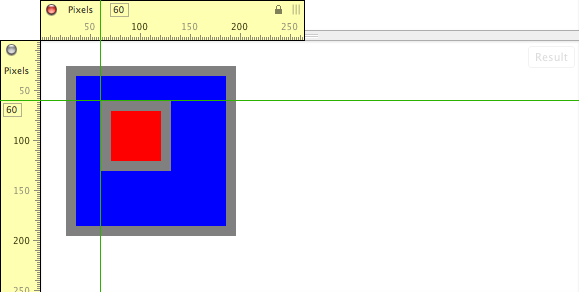
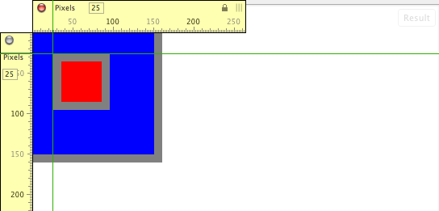
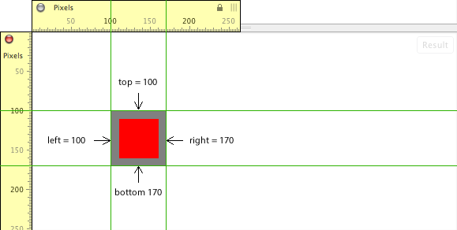

# 第五章 - 元素节点几何和滚动几何

## 5.1 元素节点大小、偏移和滚动概述

当在 Web 浏览器中查看 HTML 文档时，DOM 节点会被解析并[绘制](http://www.html5rocks.com/en/tutorials/internals/howbrowserswork/#Painting)成可视形状。节点，主要是元素节点，由浏览器制作成可视化的形式。为了以编程方式检查和在某些情况下操作节点的可视表示和几何形状，存在一组 API，并在[CSSOM View Module](http://www.w3.org/TR/cssom-view/)中进行了规定。在这个规范中找到的一部分方法和属性提供了一个 API 来确定元素节点的几何形状（即大小和位置使用偏移）以及用于操作可滚动节点和获取滚动节点值的钩子。本章将详细介绍这些方法和属性。

### 笔记

大多数属性（除了*scrollLeft*和*scrollTop*）来自 CSSOM View Module 规范，是只读的，并且每次访问时都会重新计算。换句话说，这些值是实时的。

## 5.2 获取元素相对于*offsetParent*的*offsetTop*和*offsetLeft*值

使用*offsetTop*和*offsetLeft*属性，我们可以获取元素节点相对于*offsetParent*的偏移像素值。这些元素节点属性给出了元素外部顶部和左侧边框到*offsetParent*内部顶部和左侧边框的像素距离。*offsetParent*的值是通过搜索最近的祖先元素来确定的，找到一个具有 CSS 位置值不等于 static 的元素。如果找不到任何元素，则*<body>*元素或一些人称为“文档”（与浏览器视口相对）的元素是*offsetParent*的值。如果在祖先搜索中找到具有静态 CSS 位置值的*<td>*、*<th>*或*<table>*元素，则这将成为*offsetParent*的值。

让我们验证*offsetTop*和*offsetLeft*提供了预期值。下面代码中的*offsetLeft*和*offsetTop*属性告诉我们，具有*id*为*red*的*<div>*距离*offsetParent*（即本例中的*<body>*元素）的顶部和左侧各为 60 像素。

实时代码：[`jsfiddle.net/domenlightenment/dj5h9`](http://jsfiddle.net/domenlightenment/dj5h9)

```
<!DOCTYPE html>
<html lang="en">
<head>
<style>
body{margin:0;}
#blue{height:100px;width:100px;background-color:blue;border:10px solid gray; padding:25px;margin:25px;}
#red{height:50px;width:50px;background-color:red;border:10px solid gray;}
</style>
</head>
<body>

<div id="blue"><div id="red"></div></div>

<script>

var div = document.querySelector('#red'); 

console.log(div.offsetLeft); *//logs 60*
console.log(div.offsetTop);* //logs 60*
console.log(div.offsetParent);* //logs <body>*

</script>
</body>
</html>
```

检查以下图像，显示代码在浏览器中的可视化展示，以帮助您理解*offsetLeft*和*offsetTop*值是如何确定的。图像中显示的红色*<div>*与*offsetParent*之间正好相距 60 像素。



请注意，我是从红色*<div>*元素的外边框到*offsetParent*（即*<body>*）的内边框进行测量的。

如前所述，如果我将上述代码中的蓝色*<div>*的位置更改为绝对定位，这将改变*offsetParent*的值。在下面的代码中，将蓝色*<div>*绝对定位将导致从*offsetLeft*和*offsetTop*返回的值报告一个偏移（即 25px）。这是因为偏移父级现在是蓝色*<div>*而不是*<body>*。

实时代码：[`jsfiddle.net/domenlightenment/ft2ZQ`](http://jsfiddle.net/domenlightenment/ft2ZQ)

```
<!DOCTYPE html>
<html lang="en">
<head>
<style>
#blue{height:100px;width:100px;background-color:blue;border:10px solid gray; padding:25px;margin:25px;position:absolute;}
#red{height:50px;width:50px;background-color:red;border:10px solid gray;}
</style>
</head>
<body>

<div id="blue"><div id="red"></div></div>

<script>

var div = document.querySelector('#red'); 

console.log(div.offsetLeft); *//logs 25*
console.log(div.offsetTop);* //logs 25*
console.log(div.offsetParent);* //logs <div id="blue">*

</script>
</body>
</html>
```

下面显示的浏览器视图图解了当*offsetParent*是蓝色*<div>*时，从*offsetLeft*和*offsetTop*返回的新测量值。



### 注意

许多浏览器在*offsetParent*是*<body>*时会打破外部边框到内部边框的测量，而*<body>*或*<html>*元素具有可见的边距、填充或边框值。

*offsetParent*、*offsetTop*和*offsetLeft*是*HTMLelement*对象的扩展。

## 5.3 使用*getBoundingClientRect()*获取元素相对于视口的顶部、右侧、底部和左侧边框边缘偏移

使用*getBoundingClientRect()*方法，我们可以获取元素在浏览器视口中的位置，相对于视口的顶部和左侧边缘的外部边界。这意味着左右边缘是从元素的外部边界到视口左边缘的距离。而顶部和底部边缘是从元素的外部边界到视口顶部边缘的距离。

在下面的代码中，我创建了一个带有 10px 边框和 100px 边距的 50px X 50px 的*<div>*。为了获取*<div>*每个边框边缘的像素距离，我在*<div>*上调用*getBoundingClientRect()*方法，该方法返回一个包含*top*、*right*、*bottom*和*left*属性的对象。

实时代码：[`jsfiddle.net/domenlightenment/A3RN9`](http://jsfiddle.net/domenlightenment/A3RN9)

```
<!DOCTYPE html>
<html lang="en">
<head>
<style>
body{margin:0;}
div{height:50px;width:50px;background-color:red;border:10px solid gray;margin:100px;}
</style>
</head>
<body>

<div></div>

<script>

var divEdges = document.querySelector('div').getBoundingClientRect(); 

console.log(divEdges.top, divEdges.right, divEdges.bottom, divEdges.left); *//logs '100 170 170 100'*

</script>
</body>
</html>
```

下面的图片显示了上述代码在浏览器中的渲染视图，并添加了一些测量指示器，以准确展示*getBoundingClientRect()*是如何计算的。



*<div>*元素的*top*外部边框边缘距离视口顶部边缘 100px。*<div>*元素的*right*外部边框边缘距离视口左边缘 170px。*<div>*元素的*bottom*外部边框边缘距离视口顶部边缘 170px。*<div>*元素的*left*外部边框边缘距离视口左边缘 100px。

## 5.4 获取元素在视口中的大小（边框+填充+内容）

*getBoundingClientRect()*返回一个带有 top、right、bottom 和 left 属性/值的对象，还有一个 height 和 width 属性/值。*height*和*width*属性表示元素的大小，总大小通过将 div 的内容、填充和边框相加得到。

在下面的代码中，我使用*getBoundingClientRect()*获取 DOM 中*<div>*元素的大小。

live code: [`jsfiddle.net/domenlightenment/PuXmL`](http://jsfiddle.net/domenlightenment/PuXmL)

```
<!DOCTYPE html>
<html lang="en">
<head>
<style>
div{height:25px;width:25px;background-color:red;border:25px solid gray;padding:25px;}
</style>
</head>
<body>

<div></div>

<script>

var div = document.querySelector('div').getBoundingClientRect(); 

console.log(div.height, div.width); *//logs '125 125'*
*//because 25px border + 25px padding + 25 content + 25 padding + 25 border = 125*

</script>
</body>
</html>
```

使用*offsetHeight*和*offsetWidth*属性也可以找到完全相同的大小值。在下面的代码中，我利用这些属性来获取与*getBoundingClientRect()*提供的完全相同的高度和宽度值。

live code: [`jsfiddle.net/domenlightenment/MSzL3`](http://jsfiddle.net/domenlightenment/MSzL3)

```
<!DOCTYPE html>
<html lang="en">
<head>
<style>
div{height:25px;width:25px;background-color:red;border:25px solid gray;padding:25px;}
</style>
</head>
<body>

<div></div>

<script>

var div = document.querySelector('div'); 

console.log(div.**offsetHeight**, div.**offsetWidth**); *//logs '125 125'*
*//because 25px border + 25px padding + 25 content + 25 padding + 25 border = 125*

</script>
</body>
</html>
```

**## 5.5 获取视口中元素的大小（填充+内容），不包括边框

*clientWidth*和*clientHeight*属性通过将元素的内容和填充相加来返回元素的总大小，不包括边框大小。在下面的代码中，我使用这两个属性来获取包括填充但不包括边框的元素的高度和宽度。

live code: [`jsfiddle.net/domenlightenment/bSrSb`](http://jsfiddle.net/domenlightenment/bSrSb)

```
<!DOCTYPE html>
<html lang="en">
<head>
<style>
div{height:25px;width:25px;background-color:red;border:25px solid gray;padding:25px;}
</style>
</head>
<body>

<div></div>

<script>

var div = document.querySelector('div'); 

console.log(div.**clientHeight**, div.**clientWidth**); *//logs '75 75' because 25px padding + 25 content + 25 padding = 75*

</script>
</body>
</html>
```

**## 5.6 使用*elementFromPoint()*在特定点获取视口中最顶部的元素

使用*elementFromPoint()*可以在文档中特定点获取到顶部元素的引用。在下面的代码示例中，我简单地询问距离视口顶部和左侧 50 像素的最顶部元素是什么。由于在该位置有两个*<div>*，所以会选择并返回最顶部的（如果没有设置 z-index，则选择文档顺序中的最后一个）div。

live code: [`jsfiddle.net/domenlightenment/8ksS5`](http://jsfiddle.net/domenlightenment/8ksS5)

```
<!DOCTYPE html>
<html lang="en">
<head>
<style>
div{height:50px;width:50px;background-color:red;position:absolute;top:50px;left:50px;}
</style>
</head>
<body>

<div id="bottom"></div><div id="top"></div>

<script>

console.log(document.elementFromPoint(50,50)); *//logs <div id="top">*

</script>
</body>
</html>
```

## 5.7 使用*scrollHeight*和*scrollWidth*获取正在滚动的元素的大小

*scrollHeight*和*scrollWidth*属性只是给出正在滚动的节点的高度和宽度。例如，在 Web 浏览器中打开任何可以滚动的 HTML 文档，并在*<html>*（例如*document.documentElement.scrollWidth*）或*<body>*（例如*document.body.scrollWidth*）上访问这些属性，您将得到正在滚动的 HTML 文档的总大小。由于我们可以对元素应用 CSS（即 overflow:scroll），让我们看一个更简单的代码示例。在下面的代码中，我让一个*<div>*滚动一个 1000px x 1000px 的*<p>*元素。在*<div>*上访问*scrollHeight*和*scrollWidth*属性将告诉我们正在滚动的元素为 1000px x 1000px。

live code: [`jsfiddle.net/domenlightenment/9sZtZ`](http://jsfiddle.net/domenlightenment/9sZtZ)

```
<!DOCTYPE html>
<html lang="en">
<head>
<style>
*{margin:0;padding:0;}
div{height:100px;width:100px; overflow:auto;}
p{height:1000px;width:1000px;background-color:red;}
</style>
</head>
<body>

<div><p></p></div>

<script>

var div = document.querySelector('div'); 

console.log(div.scrollHeight, div.scrollWidth)*; //logs '1000 1000'*

</script>
</body>
</html>
```

### 注意

如果需要知道滚动区域内节点的高度和宽度，而节点小于滚动区域的视口，请不要使用*scrollHeight*和*scrollWidth*，因为这将给出视口的大小。如果正在滚动的节点小于滚动区域，则使用*clientHeight*和*clientWidth*来确定包含在滚动区域中的节点的大小。

## 5.8 获取并设置从顶部和左侧滚动的像素，使用*scrollTop*和*scrollLeft*

*scrollTop*和*scrollLeft*属性是读写属性，返回由于滚动而当前在可滚动视口中不可见的左侧或顶部的像素。在下面的代码中，我设置了一个*<div>*，它滚动一个*<p>*元素。

实时代码：[`jsfiddle.net/domenlightenment/DqZYH`](http://jsfiddle.net/domenlightenment/DqZYH)

```
<!DOCTYPE html>
<html lang="en">
<head>
<style>
div{height:100px;width:100px;overflow:auto;}
p{height:1000px;width:1000px;background-color:red;}
</style>
</head>
<body>

<div><p></p></div>

<script>

var div = document.querySelector('div'); 

div.scrollTop = 750;
div.scrollLeft = 750;

console.log(div.scrollTop,div.scrollLeft); *//logs '750 750' *

</script>
</body>
</html>
```

我通过将*scrollTop*和*scrollLeft*设置为 750 来以编程方式滚动*<div>*。然后，我获取*scrollTop*和*scrollLeft*的当前值，当然，由于我们刚刚将值设置为 750，所以将返回一个值为 750。750 报告了滚动的像素数，并指示视口中有 750 个像素左侧和顶部是不可见的。如果有帮助，可以将这些属性视为未在视口左侧或顶部显示的内容的像素测量。

## 5.9 使用*scrollIntoView()*将元素滚动到视图中

通过选择包含在可滚动节点内的节点，我们可以使用*scrollIntoView()*方法告诉所选节点滚动到视图中。在下面的代码中，我选择了包含在滚动的*<div>*中的第五个*<p>*元素，并在其上调用了*scrollIntoView()*。

实时代码：[`jsfiddle.net/domenlightenment/SyeFZ`](http://jsfiddle.net/domenlightenment/SyeFZ)

```
<!DOCTYPE html>
<html lang="en">
<head>
<style>
div{height:30px;width:30px; overflow:auto;}
p{background-color:red;}
</style>
</head>
<body>

<div>
<content>
<p>1</p>
<p>2</p>
<p>3</p>
<p>4</p>
<p>5</p>
<p>6</p>
<p>7</p>
<p>8</p>
<p>9</p>
<p>10</p>            
</content>        
</div>

<script>

*//select <p>5</p> and scroll that element into view, I pass children '4' because its a zero index array-like structure*
document.querySelector('content').children[4].scrollIntoView(true);

</script>
</body>
</html>
```

通过将*scrollIntoView()*方法的参数设置为*true*，我告诉方法滚动到正在滚动到的元素的顶部。然而，*true*参数并不需要，因为这是该方法执行的默认操作。如果要滚动到元素底部对齐，请将参数*false*传递给*scrollIntoView()*方法。
