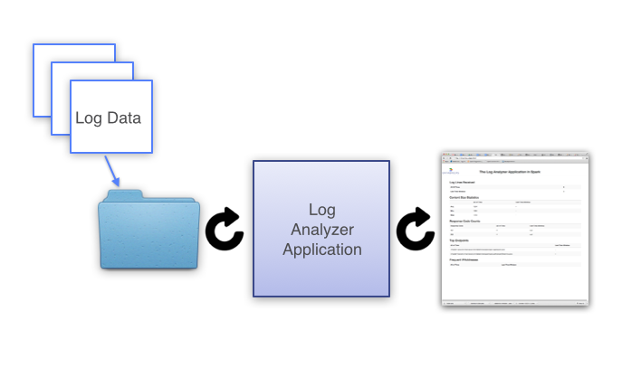

# 使用 Spark 进行日志分析

# 使用 Spark 进行日志分析

这个项目演示了使用 Apache Spark 进行日志分析有多么容易。

日志分析是 Spark 的一个理想用例。它是一个非常庞大、常见的数据源，包含着丰富的信息。Spark 允许您廉价地将日志存储在磁盘上，同时提供了一种快速简单的处理方法。我们希望这个项目能向您展示如何在您组织的生产日志上使用 Apache Spark，并充分利用这些数据的力量。日志数据可以用于监视您的服务器、改善业务和客户情报、构建推荐系统、防止欺诈等等。

## 如何使用本项目

这个项目被分成了几个部分，每个部分都有小巧的示例，用于演示用于日志处理的新 Spark 功能。这使得示例易于运行和学习，因为它们每次只涵盖一个新主题。最后，我们将一些这些示例组装起来，形成一个示例日志分析应用程序。

### 第一节：介绍 Apache Spark

引入了 Apache Spark 库，以及 Spark SQL 和 Spark Streaming。通过本章结束时，读者将知道如何调用转换和操作，并且如何使用 RDD 和 DStreams。

### 第二节：导入数据

本节包括示例，以说明如何将数据输入 Spark，并开始涵盖分布式计算的概念。这些示例都适用于数据集太大而无法在一台机器上处理的情况。 

### 第三节：导出数据

本节包括示例，以说明如何从 Spark 中获取数据。再次强调了分布式计算环境的概念，并且这些示例适用于大型数据集。

### 第四节：日志分析器应用程序

本节汇集了其他章节中的一些代码，形成了一个示例日志分析应用程序。

## 更多内容即将推出...

目前就这些，但随着时间的推移，肯定会有更多内容。

# 第一节：介绍 Apache Spark

# 第一节：介绍 Apache Spark

在本节中，我们演示了使用 Apache Spark 分析网站日志有多么简单。我们将展示如何加载一个弹性分布式数据集（**RDD**）的访问日志行，并使用 Spark 转换和操作来计算一些用于 Web 服务器监视的统计信息。在此过程中，我们将介绍 Spark SQL 和 Spark Streaming 库。

在这个解释中，代码片段是用[Java 8](https://github.com/databricks/reference-apps/tree/master/logs_analyzer/chapter1/java8)编写的。然而，在这个目录中还包括[Java 6](https://github.com/databricks/reference-apps/tree/master/logs_analyzer/chapter1/java6)、[Scala](https://github.com/databricks/reference-apps/tree/master/logs_analyzer/chapter1/scala)和[Python](https://github.com/databricks/reference-apps/tree/master/logs_analyzer/chapter1/python)的示例代码。在这些文件夹中有关于如何构建和运行这些示例的 README 文件，以及带有所有必需依赖项的必要构建文件。

本章涵盖以下主题：

1.  Spark 中的第一个日志分析器 - 这是第一个独立使用 Spark 进行日志分析的应用程序。

1.  Spark SQL - 这个示例与上面的示例做的事情相同，但是使用 SQL 语法而不是 Spark 的转换和操作。

1.  Spark Streaming - 这个示例涵盖了如何使用流处理库计算日志统计信息。

# Spark 中的第一个日志分析器

# Spark 中的第一个日志分析器

在开始本节之前，请先阅读[Spark 快速入门](https://spark.apache.org/docs/latest/quick-start.html)并熟悉[Spark 编程指南](https://spark.apache.org/docs/latest/programming-guide.html)。

本节需要在 maven 文件中依赖 Spark Core 库 - 请根据您安装的 Spark 版本更新此依赖：

```
<dependency> <!-- Spark -->
    <groupId>org.apache.spark</groupId>
    <artifactId>spark-core_2.10</artifactId>
    <version>1.1.0</version>
</dependency> 
```

在我们开始之前，我们需要两样东西：

+   **一个 Apache 访问日志文件**：如果有一个，使用真实数据会更有趣。

    +   这是提供的一个简单示例，位于 data/apache.access.log。

    +   或者在这里下载一个更好的示例：[`www.monitorware.com/en/logsamples/apache.php`](http://www.monitorware.com/en/logsamples/apache.php)

+   **日志文件的解析器和模型**：请参阅 ApacheAccessLog.java。

示例代码使用 Apache 访问日志文件，因为这是一个众所周知和常见的日志格式。如果您有另一种日志格式的数据，重写解析器将会很容易。

将计算以下统计信息：

+   从服务器返回的响应的平均、最小和最大内容大小。

+   返回的响应代码计数。

+   所有访问此服务器超过 N 次的 IP 地址。

+   请求次数最多的顶级端点。

在运行 LogAnalyzer.java 示例之前，让我们先仔细阅读代码。

一个简单 Spark 应用程序的主体如下。第一步是启动一个 Spark 上下文。然后 Spark 上下文可以从文本文件加载数据作为 RDD，然后进行处理。最后，在退出函数之前，停止 Spark 上下文。

```
public class LogAnalyzer {
  public static void main(String[] args) {
    // Create a Spark Context.
    SparkConf conf = new SparkConf().setAppName("Log Analyzer");
    JavaSparkContext sc = new JavaSparkContext(conf);

    // Load the text file into Spark.
    if (args.length == 0) {
      System.out.println("Must specify an access logs file.");
      System.exit(-1);
    }
    String logFile = args[0];
    JavaRDD<String> logLines = sc.textFile(logFile);

    // TODO: Insert code here for processing logs.

    sc.stop();
  }
} 
```

给定一个日志行的 RDD，使用 `map` 函数将每行转换为 ApacheAccessLog 对象。ApacheAccessLog RDD 被缓存在内存中，因为将对其进行多个转换和操作调用。

```
// Convert the text log lines to ApacheAccessLog objects and
// cache them since multiple transformations and actions
// will be called on the data.
JavaRDD<ApacheAccessLog> accessLogs =
    logLines.map(ApacheAccessLog::parseFromLogLine).cache(); 
```

定义一个求和的 reducer 很有用 - 这是一个接受两个整数并返回它们的和的函数。我们的示例中到处都在使用它。

```
private static Function2<Long, Long, Long> SUM_REDUCER = (a, b) -> a + b; 
```

接下来，让我们计算返回的响应的平均、最小和最大内容大小。`map` 转换提取内容大小，然后调用不同的操作（`reduce`、`count`、`min` 和 `max`）来输出各种统计数据。再次，在内容大小 RDD 上调用 `cache` 以避免在对其执行每个操作时重新计算这些值。

```
// Calculate statistics based on the content size.
// Note how the contentSizes are cached as well since multiple actions
//   are called on that RDD.
JavaRDD<Long> contentSizes =
   accessLogs.map(ApacheAccessLog::getContentSize).cache();
System.out.println(String.format("Content Size Avg: %s, Min: %s, Max: %s",
    contentSizes.reduce(SUM_REDUCER) / contentSizes.count(),
    contentSizes.min(Comparator.naturalOrder()),
    contentSizes.max(Comparator.naturalOrder()))); 
```

要计算响应代码计数，我们必须使用键值对 - 通过使用 `mapToPair` 和 `reduceByKey`。请注意，我们调用 `take(100)` 而不是 `collect()` 来收集响应代码计数的最终输出。在调用 `collect()` 之前，请极度谨慎，因为所有这些数据将被发送到单个 Spark 驱动程序，可能会导致驱动程序内存耗尽。即使在这种情况下，响应代码数量有限且看起来安全 - 如果 Apache 访问日志中有格式不正确的行或解析器中存在错误，可能会有许多无效的响应代码导致。

```
// Compute Response Code to Count.
List<Tuple2<Integer, Long>> responseCodeToCount = accessLogs
        .mapToPair(log -> new Tuple2<>(log.getResponseCode(), 1L))
        .reduceByKey(SUM_REDUCER)
        .take(100);
System.out.println(String.format("Response code counts: %s", responseCodeToCount)); 
```

要计算访问此服务器超过 10 次的任何 IPAddress，我们调用 `filter` 转换，然后 `map` 来仅检索 IPAddress 并丢弃计数。再次使用 `take(100)` 来检索值。

```
List<String> ipAddresses =
    accessLogs.mapToPair(log -> new Tuple2<>(log.getIpAddress(), 1L))
        .reduceByKey(SUM_REDUCER)
        .filter(tuple -> tuple._2() > 10)
        .map(Tuple2::_1)
        .take(100);
System.out.println(String.format("IPAddresses > 10 times: %s", ipAddresses)); 
```

最后，让我们计算此日志文件中请求的前端点。我们定义了一个内部类 `ValueComparator` 来帮助完成这个任务。此函数告诉我们，给定两个元组，哪一个在排序中排在前面。元组的键被忽略，排序仅基于值。

```
private static class ValueComparator<K, V>
   implements Comparator<Tuple2<K, V>>, Serializable {
  private Comparator<V> comparator;

  public ValueComparator(Comparator<V> comparator) {
    this.comparator = comparator;
  }

  @Override
  public int compare(Tuple2<K, V> o1, Tuple2<K, V> o2) {
    return comparator.compare(o1._2(), o2._2());
  }
} 
```

然后，我们可以使用 `ValueComparator` 结合 `top` 操作来计算根据端点被访问的次数计算出此服务器上访问最频繁的前端点。

```
List<Tuple2<String, Long>> topEndpoints = accessLogs
    .mapToPair(log -> new Tuple2<>(log.getEndpoint(), 1L))
    .reduceByKey(SUM_REDUCER)
    .top(10, new ValueComparator<>(Comparator.<Long>naturalOrder()));
System.out.println("Top Endpoints: " + topEndpoints); 
```

这些代码片段来自 LogAnalyzer.java。现在我们已经浏览了代码，请尝试运行该示例。请查看 README 以获取特定语言的构建和运行说明。

# Spark SQL

# Spark SQL

在开始本节之前，您应该仔细阅读 [Spark SQL 指南](https://spark.apache.org/docs/latest/sql-programming-guide.html)。

此部分需要额外依赖于 Spark SQL：

```
<dependency> <!-- Spark SQL -->
    <groupId>org.apache.spark</groupId>
    <artifactId>spark-sql_2.10</artifactId>
    <version>1.1.0</version>
</dependency> 
```

对于熟悉 SQL 的人来说，在前面的例子中计算的相同统计数据可以使用 Spark SQL 来完成，而不是直接调用 Spark 转换和操作。我们将在这里介绍如何做到这一点。

首先，我们需要创建一个 SQL Spark 上下文。请注意如何创建一个 Spark 上下文，然后使用它来实例化不同类型的 Spark 上下文。您不应该在一个进程中从 SparkConf 初始化多个 Spark 上下文。

```
public class LogAnalyzerSQL {
  public static void main(String[] args) {
    // Create the spark context.
    SparkConf conf = new SparkConf().setAppName("Log Analyzer SQL");
    JavaSparkContext sc = new JavaSparkContext(conf);
    JavaSQLContext sqlContext = new JavaSQLContext(sc);

    if (args.length == 0) {
      System.out.println("Must specify an access logs file.");
      System.exit(-1);
    }
    String logFile = args[0];
    JavaRDD<ApacheAccessLog> accessLogs = sc.textFile(logFile)
        .map(ApacheAccessLog::parseFromLogLine);

    // TODO: Insert code for computing log stats.

    sc.stop();
  }
} 
```

接下来，我们需要一种方法将我们的日志数据注册到表中。在 Java 中，Spark SQL 可以根据标准的 Java POJO 推断表模式 - 使用像我们在 ApacheAccessLog.java 中所做的那样的 getter 和 setter。（注意：如果您使用的是除 Java 之外的其他语言，则 Spark 推断表模式的方式不同。此目录中的示例可以直接使用。或者您也可以参考 [Spark SQL 数据源指南](https://spark.apache.org/docs/latest/sql-programming-guide.html#data-sources) 了解更多详细信息。）

```
JavaSchemaRDD schemaRDD = sqlContext.applySchema(accessLogs,
    ApacheAccessLog.class);
schemaRDD.registerTempTable("logs");
sqlContext.sqlContext().cacheTable("logs"); 
```

现在，我们准备开始在我们的表上运行一些 SQL 查询。以下是计算上一节中相同统计信息的代码 - 对于那些了解 SQL 的人来说，这应该��起来非常熟悉：

```
// Calculate statistics based on the content size.
Tuple4<Long, Long, Long, Long> contentSizeStats =
    sqlContext.sql("SELECT SUM(contentSize), COUNT(*), MIN(contentSize), MAX(contentSize) FROM logs")
        .map(row -> new Tuple4<>(row.getLong(0), row.getLong(1), row.getLong(2), row.getLong(3)))
        .first();
System.out.println(String.format("Content Size Avg: %s, Min: %s, Max: %s",
    contentSizeStats._1() / contentSizeStats._2(),
    contentSizeStats._3(),
    contentSizeStats._4()));

// Compute Response Code to Count.
// Note the use of "LIMIT 1000" since the number of responseCodes
// can potentially be too large to fit in memory.
List<Tuple2<Integer, Long>> responseCodeToCount = sqlContext
    .sql("SELECT responseCode, COUNT(*) FROM logs GROUP BY responseCode LIMIT 1000")
    .mapToPair(row -> new Tuple2<>(row.getInt(0), row.getLong(1)));
System.out.println(String.format("Response code counts: %s", responseCodeToCount))
    .collect();

// Any IPAddress that has accessed the server more than 10 times.
List<String> ipAddresses = sqlContext
    .sql("SELECT ipAddress, COUNT(*) AS total FROM logs GROUP BY ipAddress HAVING total > 10 LIMIT 100")
    .map(row -> row.getString(0))
    .collect();
System.out.println(String.format("IPAddresses > 10 times: %s", ipAddresses));

// Top Endpoints.
List<Tuple2<String, Long>> topEndpoints = sqlContext
    .sql("SELECT endpoint, COUNT(*) AS total FROM logs GROUP BY endpoint ORDER BY total DESC LIMIT 10")
    .map(row -> new Tuple2<>(row.getString(0), row.getLong(1)))
    .collect();
System.out.println(String.format("Top Endpoints: %s", topEndpoints)); 
```

请注意，默认的 SQL 方言不允许将保留关键字用作别名。换句话说，`SELECT COUNT(*) AS count` 会导致错误，但 `SELECT COUNT(*) AS the_count` 可以正常运行。如果您使用 HiveQL 解析器，则应该能够将任何内容用作标识符。

现在尝试运行 LogAnalyzerSQL.java。

# Spark 流处理

# Spark 流处理

在开始本节之前，请阅读 [Spark 流处理编程指南](https://spark.apache.org/docs/latest/streaming-programming-guide.html)。特别是，它涵盖了 DStreams 的概念。

本节需要另一个依赖项，即 Spark 流处理库：

```
<dependency> <!-- Spark Streaming -->
    <groupId>org.apache.spark</groupId>
    <artifactId>spark-streaming_2.10</artifactId>
    <version>1.1.0</version>
</dependency> 
```

之前的示例演示了如何在现有日志文件上计算统计信息 - 但没有演示如何实时监控日志。Spark 流处理使这种功能成为可能。

要运行流处理示例，您将通过 `tail` 命令将日志文件发送到 `netcat` 以发送给 Spark。这不是在生产系统中将数据导入 Spark 的理想方式，但对于第一个 Spark 流处理示例来说，这是一个简单的解决方法。我们将在第二章中介绍如何为 Spark 流处理导入数据的最佳实践。

在终端窗口中，只需在您将追加到的日志文件上运行以下命令：

```
% tail -f [[YOUR_LOG_FILE]] | nc -lk 9999 
```

如果您没有实时更新的日志文件，可以手动添加行，使用附带的数据文件或您自己的日志文件：

```
% cat ../../data/apache.accesslog >> [[YOUR_LOG_FILE]] 
```

当数据流入 Spark 时，有两种常见的用例：

1.  窗口计算 意味着您只关心在最后 N 个时间段内收到的数据。在监视您的 Web 服务器时，也许您只关心过去一小时发生了什么。

    +   Spark 流处理方便地将输入数据拆分为所需的时间窗口以便进行简单处理，使用流处理库的 `window` 函数。

    +   `forEachRDD` 函数允许您访问每个时间间隔创建的 RDD。

1.  累积计算 意味着您希望保留累积统计信息，同时流入新数据以刷新这些统计信息。在这种情况下，您需要维护这些统计信息的状态。

    +   Spark Streaming 库具有一些方便的函数来维护状态以支持这种用例，`updateStateByKey`。

1.  从批处理中重用代码介绍了如何从批处理示例中组织业务逻辑代码，以便在 Spark Streaming 中重用代码。

    +   Spark Streaming 库具有`transform`函数，允许您应用任意的 RDD 到 RDD 函数，从而重用 Spark 的批处理模式中的代码。

# 窗口计算：window()

# 窗口计算：window()

日志分析的典型用例是监视 Web 服务器，在这种情况下，您可能只对过去一小时发生的事情感兴趣，并希望这些统计信息每分钟刷新一次。一小时是*窗口长度*，而一分钟是*滑动间隔*。在此示例中，我们使用 30 秒的窗口长度和 10 秒的滑动间隔作为开发的舒适选择。

Spark Streaming 的窗口功能使得非常容易为一段时间内的窗口计算统计数据，使用`window`函数。

第一步是初始化 SparkConf 和 context 对象 - 特别是流上下文。请注意，从 conf 中只创建一个 SparkContext，并且从这些上下文中创建流和 SQL 上下文。接下来，应编写主体。最后，示例调用`start()`在流上下文上，并调用`awaitTermination()`以保持流上下文运行并接受流输入。

```
public class LogAnalyzerStreamingSQL {
  public static void main(String[] args) {
    SparkConf conf = new SparkConf().setAppName("Log Analyzer Streaming SQL");

    // Note: Only one Spark Context is created from the conf, the rest
    //       are created from the original Spark context.
    JavaSparkContext sc = new JavaSparkContext(conf);
    JavaStreamingContext jssc = new JavaStreamingContext(sc,
        SLIDE_INTERVAL);  // This sets the update window to be every 10 seconds.
    JavaSQLContext sqlContext = new JavaSQLContext(sc);

    // TODO: Insert code here to process logs.

    // Start the streaming server.
    jssc.start();              // Start the computation
    jssc.awaitTermination();   // Wait for the computation to terminate
  }
} 
```

主体的第一步是从读取套接字创建一个 DStream。

```
JavaReceiverInputDStream<String> logDataDStream =
    jssc.socketTextStream("localhost", 9999); 
```

接下来，调用`map`转换将 logDataDStream 转换为 ApacheAccessLog DStream。

```
JavaDStream<ApacheAccessLog> accessLogDStream =
    logDataDStream.map(ApacheAccessLog::parseFromLogLine).cache(); 
```

接下来，在 accessLogDStream 上调用`window`以创建一个窗口化的 DStream。`window`函数很好地打包正在流入 RDD 中的输入数据，其中包含一段时间的窗口长度数据，并且每隔 SLIDE_INTERVAL 时间创建一个新的 RDD。

```
JavaDStream<ApacheAccessLog> windowDStream =
    accessLogDStream.window(WINDOW_LENGTH, SLIDE_INTERVAL); 
```

然后在 windowDStream 上调用`foreachRDD`。传递给`forEachRDD`的函数在 windowDStream 中每个新 RDD 创建时调用，因此每个*slide_interval*。传递给函数的 RDD 包含最后*window_length*时间内的所有输入。现在有了一个 ApacheAccessLogs 的 RDD，只需从两个批处理示例（常规或 SQL）中重用代码即可。在此示例中，代码只是复制并粘贴，但您可以将此代码重新整理到一个地方，以便在生产代码库中重用 - 您可以重用所有批处理代码以进行流处理！

```
windowDStream.foreachRDD(accessLogs -> {
  if (accessLogs.count() == 0) {
    System.out.println("No access logs in this time interval");
    return null;
  }

  // Insert code verbatim from LogAnalyzer.java or LogAnalyzerSQL.java here.

  // Calculate statistics based on the content size.
  JavaRDD<Long> contentSizes =
      accessLogs.map(ApacheAccessLog::getContentSize).cache();
  System.out.println(String.format("Content Size Avg: %s, Min: %s, Max: %s",
      contentSizes.reduce(SUM_REDUCER) / contentSizes.count(),
      contentSizes.min(Comparator.naturalOrder()),
      contentSizes.max(Comparator.naturalOrder())));

   //...Won't copy the rest here...
} 
```

现在我们已经浏览了代码，请立即运行 LogAnalyzerStreaming.java 和/或 LogAnalyzerStreamingSQL.java。在程序启动后，像之前解释的那样使用`cat`命令定期向日志文件添加数据。

# 累积计算：updateStateByKey()

# 累积计算：updateStateByKey()

要跟踪所有时间的日志统计信息，必须在处理 RDD 时在 DStream 中保持状态。

为了维护键值对的状态，数据可能太大而无法在一台机器的内存中存储 - Spark Streaming 可以为您维护状态。要实现这一点，调用 Spark Streaming 库的`updateStateByKey`函数。

首先，为了使用`updateStateByKey`，必须在流上下文中启用检查点。只需在流上下文上调用`checkpoint`，并指定一个目录来写入检查点数据。以下是一个流应用程序的主要函数的一部分，将保存所有时间的状态：

```
public class LogAnalyzerStreamingTotal {
  public static void main(String[] args) {
    SparkConf conf = new SparkConf().setAppName("Log Analyzer Streaming Total");
    JavaSparkContext sc = new JavaSparkContext(conf);

    JavaStreamingContext jssc = new JavaStreamingContext(sc,
        new Duration(10000));  // This sets the update window to be every 10 seconds.

    // Checkpointing must be enabled to use the updateStateByKey function.
    jssc.checkpoint("/tmp/log-analyzer-streaming");

    // TODO: Insert code for computing log stats.

    // Start the streaming server.
    jssc.start();              // Start the computation
    jssc.awaitTermination();   // Wait for the computation to terminate 
```

要计算内容大小统计信息，只需使用静态变量保存当前运行总和、计数、最小值和最大值的内容大小。

```
// These static variables stores the running content size values.
private static final AtomicLong runningCount = new AtomicLong(0);
private static final AtomicLong runningSum = new AtomicLong(0);
private static final AtomicLong runningMin = new AtomicLong(Long.MAX_VALUE);
private static final AtomicLong runningMax = new AtomicLong(Long.MIN_VALUE); 
```

要更新这些值，首先在 AccessLogDStream 上调用 map 以检索 contentSizeDStream。然后只需通过在 contentSizeDstream 上调用 foreachRDD，并在 RDD 上调用操作来更新静态变量的值：

```
JavaDStream<Long> contentSizeDStream =
    accessLogDStream.map(ApacheAccessLog::getContentSize).cache();
contentSizeDStream.foreachRDD(rdd -> {
  if (rdd.count() > 0) {
    runningSum.getAndAdd(rdd.reduce(SUM_REDUCER));
    runningCount.getAndAdd(rdd.count());
    runningMin.set(Math.min(runningMin.get(), rdd.min(Comparator.naturalOrder())));
    runningMax.set(Math.max(runningMax.get(), rdd.max(Comparator.naturalOrder())));
    System.out.print("Content Size Avg: " +  runningSum.get() / runningCount.get());
    System.out.print(", Min: " + runningMin.get());
    System.out.println(", Max: " + runningMax.get());
  }
  return null;
}); 
```

对于其他统计信息，由于它们使用键值对，不能再使用静态变量。需要维护的状态量可能太大而无法在内存中存储。因此，对于这些统计信息，我们将使用`updateStateByKey`，因此 Spark Streaming 将为数据集中的每个键维护一个值。

但在调用`updateStateByKey`之前，我们需要创建一个传递给它的函数。`updateStateByKey`采用不同的 reduce 函数。虽然我们先前的 sum reducer 只接受两个值并输出它们的总和，但这个 reduce 函数接受一个当前值和一个值的迭代器，并输出一个新值。

```
private static Function2<List<Long>, Optional<Long>, Optional<Long>>
   COMPUTE_RUNNING_SUM = (nums, current) -> {
     long sum = current.or(0L);
     for (long i : nums) {
       sum += i;
     }
     return Optional.of(sum);
   }; 
```

最后，我们可以使用以下代码计算所有时间的键控统计信息：

```
// Compute Response Code to Count.
// Note the use of updateStateByKey.
JavaPairDStream<Integer, Long> responseCodeCountDStream = accessLogDStream
    .mapToPair(s -> new Tuple2<>(s.getResponseCode(), 1L))
    .reduceByKey(SUM_REDUCER)
    .updateStateByKey(COMPUTE_RUNNING_SUM);
responseCodeCountDStream.foreachRDD(rdd -> {
  System.out.println("Response code counts: " + rdd.take(100));
  return null;
});

// A DStream of ipAddresses accessed > 10 times.
JavaDStream<String> ipAddressesDStream = accessLogDStream
    .mapToPair(s -> new Tuple2<>(s.getIpAddress(), 1L))
    .reduceByKey(SUM_REDUCER)
    .updateStateByKey(COMPUTE_RUNNING_SUM)
    .filter(tuple -> tuple._2() > 10)
    .map(Tuple2::_1);
ipAddressesDStream.foreachRDD(rdd -> {
  List<String> ipAddresses = rdd.take(100);
  System.out.println("All IPAddresses > 10 times: " + ipAddresses);
  return null;
});

// A DStream of endpoint to count.
JavaPairDStream<String, Long> endpointCountsDStream = accessLogDStream
    .mapToPair(s -> new Tuple2<>(s.getEndpoint(), 1L))
    .reduceByKey(SUM_REDUCER)
    .updateStateByKey(COMPUTE_RUNNING_SUM);
endpointCountsDStream.foreachRDD(rdd -> {
  List<Tuple2<String, Long>> topEndpoints =
      rdd.takeOrdered(10, new ValueComparator<>(Comparator.<Long>naturalOrder()));
  System.out.println("Top Endpoints: " + topEndpoints);
  return null;
}); 
```

现在自己运行 LogAnalyzerStreamingTotal.java。

# 从批处理中重用代码：transform()

# 从批处理中重用代码：transform()

正如您可能已经注意到的，虽然您在 DStream 上调用的函数与批处理示例中调用的函数同名，但它们并不是相同的方法，可能不清楚如何重用批处理示例中的代码。在本节中，我们重构批处理示例中的代码，并展示如何在此处重用它。

DStreams 具有`transform`函数，允许您调用任意 RDD 到 RDD 函数来处理 DStream 中的 RDD。`transform`函数非常适合重用您可能已经编写的批处理代码中的任何 RDD 到 RDD 函数，并希望将其移植到流处理中。让我们看一些代码来说明这一点。

假设我们从批处理示例中分离出一个名为`responseCodeCount`的函数，该函数可以根据 apache 访问日志 RDD 计算响应代码计数：

```
public static JavaPairRDD<Integer, Long> responseCodeCount(
   JavaRDD<ApacheAccessLog> accessLogRDD) {
  return accessLogRDD
     .mapToPair(s -> new Tuple2<>(s.getResponseCode(), 1L))
     .reduceByKey(SUM_REDUCER);
} 
```

可以通过在 accessLogDStream 上调用`transformToPair`并使用`responseCodeCount`函数来创建 responseCodeCountDStream。然后，通过调用`updateStateByKey`来持续计算所有时间��响应代码计数，并使用`forEachRDD`来打印值：

```
// Compute Response Code to Count.
// Notice the user transformToPair to produce the a DStream of
// response code counts, and then updateStateByKey to accumulate
// the response code counts for all of time.
JavaPairDStream<Integer, Long> responseCodeCountDStream = accessLogDStream
   .transformToPair(LogAnalyzerStreamingTotalRefactored::responseCodeCount);
JavaPairDStream<Integer, Long> cumulativeResponseCodeCountDStream =
   responseCodeCountDStream.updateStateByKey(COMPUTE_RUNNING_SUM);
cumulativeResponseCodeCountDStream.foreachRDD(rdd -> {
  System.out.println("Response code counts: " + rdd.take(100));
  return null;
}); 
```

还可以在`updateStateByKey`之前和之后组合`transform`函数：

```
// A DStream of ipAddresses accessed > 10 times.
JavaDStream<String> ipAddressesDStream = accessLogDStream
   .transformToPair(LogAnalyzerStreamingTotalRefactored::ipAddressCount)
   .updateStateByKey(COMPUTE_RUNNING_SUM)
   .transform(LogAnalyzerStreamingTotalRefactored::filterIPAddress);
ipAddressesDStream.foreachRDD(rdd -> {
  List<String> ipAddresses = rdd.take(100);
  System.out.println("All IPAddresses > 10 times: " + ipAddresses);
  return null;
}); 
```

现在仔细查看 LogAnalyzerStreamingTotalRefactored.java，看看代码是如何重构的，以便重用批处理示例中的代码。

# 第二部分：导入数据

# 第二部分：导入数据

在上一节中，我们讨论了如何开始使用 Spark 进行日志分析，但在这些示例中，数据只是从本地文件中拉取，统计数据被打印到标准输出中。在本章中，我们将介绍加载和导出适用于生产系统的数据的技术。特别是，这些技术必须能够扩展以处理大量的生产日志。

为了扩展，Apache Spark 旨在部署在一组机器的集群上。阅读[Spark 集群概述指南](https://spark.apache.org/docs/latest/cluster-overview.html)，以便您了解 Spark 驱动程序与执行节点之间的区别。

虽然您可以继续在本地模式下运行示例，但建议您设置一个 Spark 集群来运行其余的示例，并练习与集群一起工作 - 比如熟悉集群的 Web 界面。您可以按照[Spark 独立模式](https://spark.apache.org/docs/latest/spark-standalone.html)的说明在本地机器上运行一个小型集群。如果您有更多的机器访问权限 - 比如在 AWS 上或者您的组织有自己的数据中心，可以参考[集群概述指南](https://spark.apache.org/docs/latest/cluster-overview.html)进行设置。

一旦您启动了一个 Spark 集群：

+   使用 spark-submit 运行您的作业，而不是使用 JVM 参数。运行上一章的示例之一来检查您的设置。

+   浏览并熟悉 Spark 的 Web 界面。如果您设置了本地集群，它位于[`localhost:8080`](http://localhost:8080)。

有两种将数据导入到 Spark 中的方式：

1.  批量数据导入 - 如果您一次性加载数据集。

1.  流式数据导入 - 如果您希望持续将数据流入 Spark。

# 批量导入

# 批量数据导入

本节涵盖了将数据批量导入到 Apache Spark 中，例如第一章中的非流式示例。这些示例一次性将数据从文件加载到一个 RDD 中，处理该 RDD，作业完成后程序退出。在生产系统中，您可以设置一个 cron 作业，每晚启动一个批处理作业，处理昨天的日志文件，并发布昨天的统计信息。

+   从文件导入 涵盖了从文件导入数据时的注意事项。

+   从数据库导入 链接到从数据库读取数据的示例。

# 从文件导入

# 从文件导入

要支持 Spark 集群的批量数据导入，数据需要被集群上的所有机器访问。只有一个 worker 机器可以访问的文件，其他机器无法读取，将会导致失败。

如果您有一个可以适应一个机器的小型数据集，您可以手动将文件复制到 Spark 集群的所有节点上，可能使用 `rsync` 使这一过程更加简单。

**NFS** 或其他网络文件系统确保所有计算机都可以访问相同的文件，而无需将文件复制到各处。但 NFS 对机器故障不具备容错性，如果您的数据集过大无法适应一个 NFS 卷 - 您将不得不将数据存储在多个卷上，并找出特定文件位于哪个卷上 - 这可能会变得繁琐。

**HDFS** 和 **S3** 是用于大型数据集的出色文件系统 - 构建用于存储大量数据并使集群上的所有机器都能访问这些文件，同时仍具有容错性。我们提供了一些有关使用这些文件系统运行 Spark 的更多提示，因为它们被推荐使用。

+   S3 是亚马逊 AWS 提供的一种解决方案，用于在云中存储文件，任何注册账户的人都可以轻松访问。

+   HDFS 是 Hadoop 的一部分，是一种分布式文件系统，可以安装在您自己的数据中心。

好消息是，无论您选择哪种文件系统，都可以运行相同的代码来从中读取 - 这些文件系统都是“Hadoop 兼容”的文件系统。

在本节中，您应该尝试在您选择的任何文件系统上运行 LogAnalyzerBatchImport.java。这段代码没有什么新的内容 - 它只是对第一章的第一个日志分析器的重构。尝试为 textFile 路径传入“*”或“?”，Spark 将读取所有与该模式匹配的文件以创建 RDD。

# S3

# S3

S3 是亚马逊网络服务用于在云中存储大型文件的解决方案。在生产系统中，您希望 Amazon EC2 计算节点与您的 S3 文件位于同一区域，以便出于速度和成本考虑。虽然可以从其他机器读取 S3 文件，但这将需要很长时间且费用昂贵（如果您在 AWS 内部读取数据与在互联网其他地方读取数据，亚马逊 S3 数据传输价格会有所不同）。

如果您想在 AWS 上启动 Spark 集群，请参阅 [在 EC2 上运行 Spark](https://spark.apache.org/docs/latest/ec2-scripts.html) - 需要付费。

如果您选择在本地 Spark 集群上运行此示例而不是在 EC2 计算节点上读取 S3 中的文件，则使用小型数据输入源！

1.  注册 [Amazon Web Services](https://aws.amazon.com/) 账户。

1.  将示例日志文件加载到 s3 中。

    +   登录 [S3 的 AWS 控制台](https://console.aws.amazon.com/s3/)

    +   创建一个 S3 存储桶。

    +   将一些示例日志文件上传到该存储桶。

    +   您的文件将位于路径：s3n://YOUR_BUCKET_NAME/YOUR_LOGFILE.log

1.  配置您的 AWS 安全凭证：

    +   创建并[下载您的安全凭证](https://console.aws.amazon.com/iam/home?#security_credential)

    +   在您的集群上的所有机器上设置环境变量 AWS_ACCESS_KEY_ID 和 AWS_SECRET_ACCESS_KEY 为正确的值。这些也可以通过编程方式在您的 SparkContext 对象中设置，如下所示：

```
jssc.hadoopConfiguration().set("fs.s3n.awsAccessKeyId", YOUR_ACCESS_KEY)
jssc.hadoopConfiguration().set("fs.s3n.awsSecretAccessKey", YOUR_SECRET_KEY) 
```

现在，运行 LogAnalyzerBatchImport.java 并传入您文件的 s3n 路径。

# HDFS

# HDFS

HDFS 是一个用于存储大型数据集并具有容错能力的文件系统。在生产系统中，您的 Spark 集群理想情况下应该与您的 Hadoop 集群在同一台机器上，以便轻松读取文件。您在集群上运行的 Spark 二进制文件必须与您希望使用的 HDFS 版本编译相同。

安装 HDFS 的方法有很多种，但前往[Hadoop 主页](http://hadoop.apache.org/)是一个开始并在本地机器上运行 hdfs 的方法。

在您的 hdfs 目录上的任何文件模式上运行 LogAnalyzerBatchImport.java。

# 从数据库导入

# 从数据库中读取

很可能，您不会将日志数据存储在数据库中（那可能太昂贵了），但可能有其他数据您想要输入到 Spark 中，这些数据存储在数据库中。也许这些数据可以与日志数据连接以提供更多信息。

文件系统随着时间的推移而发展，数据库也是如此。

一个简单的数据库起步是单个数据库 - SQL 数据库非常常见。当数据库填满时，一个选择是为数据库购买更大的机器。这些更大的机器的价格变得越来越昂贵（甚至是每单位存储的价格），并且最终在某个时刻不再可能购买足够大的机器。一个常见的选择是切换到分片数据库。通过该选项，编写应用程序级代码来确定数据片段应该读取或写入到哪个数据库分片。

要从 SQL 数据库中读取数据，JdbcRDD 是适中数据量的一种选择：

+   [`spark.apache.org/docs/0.8.1/api/core/org/apache/spark/rdd/JdbcRDD.html`](https://spark.apache.org/docs/0.8.1/api/core/org/apache/spark/rdd/JdbcRDD.html)

最近，数据库领域出现了一种向**NoSQL**或**键值**数据库发展的趋势，这些数据库旨在扩展。对于这些数据库，应用程序开发人员通常不会意识到底层数据库在多台机器上存储数据。**Cassandra**是一个非常流行的 NoSQL 数据库。

要从 Cassandra 读取数据到 Spark，请参阅 Spark Cassandra 连接器：

+   [`github.com/datastax/spark-cassandra-connector`](https://github.com/datastax/spark-cassandra-connector)

如果您使用不同的数据库，Spark 可能具有用于从该数据库导入的内置库，但更常见的是第三方提供 Spark 集成 - 因此请搜索。

通常，从数据库中读取少量数据比读取大量数据要容易得多。了解您的数据库和 Spark 的分布式编程模型对于编写导入非常大数据集的最佳代码非常重要。

# 流式导入

# 流式数据导入

本节涵盖了用于流式处理的数据导入。前一章的流式处理示例通过单个套接字接收数据 - 这不是可扩展的解决方案。在一个真正的生产系统中，有许多服务器不断地写入日志，并且我们希望处理所有这些文件。本节包含用于数据导入的可扩展解决方案。由于现在使用了流式处理，所以不再需要每晚的批处理作业来处理日志，而是 - 此日志处理程序可以长时间运行 - 持续接收新的日志数据，处理数据并计算日志统计信息。

1.  流式导入的内置方法

1.  Kafka

# 流式导入的内置方法

# 流式导入的内置方法

StreamingContext 有许多用于导入流数据的内置方法。 `socketTextStream` 在前一章中介绍过，`textFileStream` 在这里介绍。 `textFileStream` 方法监视任何 Hadoop 兼容的文件系统目录中的新文件，并在检测到新文件时将其读入 Spark Streaming。只需将对 `socketTextStream` 的调用替换为 `textFileStream`，并传入要监视日志文件的目录。

```
// This methods monitors a directory for new files
// to read in for streaming.
JavaDStream<String> logData = jssc.textFileStream(directory); 
```

尝试运行 LogAnalyzerStreamingImportDirectory.java 并指定一个目录。在程序运行时，您还需要删除或复制一些新的日志文件到该目录中，以查看计算值更新。

流式处理有更多的内置输入方法 - 在 StreamingContext 的参考 API 文档中查看它们。

# Kafka

# Kafka

虽然前面的示例立即捕获新的日志文件 - 但是日志文件直到 HTTP 请求实际发生后很长一段时间才被复制过来。虽然这样可以实现日志数据的自动刷新，但这仍然不是实时的。要实现实时日志处理，我们需要一种立即发送日志行的方法。Kafka 是一个高吞吐量的分布式消息系统，非常适合这种用例。Spark 包含一个从 Kafka 导入数据的外部模块。

这是一些有用的文档，用于为 Spark Streaming 设置 Kafka：

+   [Kafka 文档](http://kafka.apache.org/documentation.html)

+   [Spark 项目的外部模块 KafkaUtils 类](https://github.com/apache/spark/blob/master/external/kafka/src/main/scala/org/apache/spark/streaming/kafka/KafkaUtils.scala) - 这是已编写的从 Kafka 导入数据到 Spark Streaming 的外部模块。

+   [使用 Kafka 的 Spark Streaming 示例](https://github.com/apache/spark/blob/master/examples/src/main/java/org/apache/spark/examples/streaming/JavaKafkaWordCount.java) - 这是一个演示如何调用 KafkaUtils 的示例。

# 第 3 节：导出数据

## 从 Spark 导出数据

这一部分包含将数据从 Spark 导出到系统的方法。首先，您需要确定您的输出数据是小的（意味着可以适合一个机器的内存）还是大的（太大而无法适合一个机器的内存）。根据您的用例，请参考这两个部分。

+   小数据集 - 如果您有一个小数据集，您可以对该数据集调用一个操作，以在驱动程序内存中检索对象，然后以任何您想要的方式写出这些对象。

+   大数据集 - 对于大数据集，重要的是要记住这个数据集太大，无法适合驱动程序内存。在这种情况下，您可以要么调用 Spark 直接从 Spark 工作节点将数据写入文件，要么实现您自己的自定义解决方案。

# 小数据集

# 导出小数据集

如果您要从 Spark 导出的数据很小，您可以使用一个操作将 RDD 转换为驱动程序内存中的对象，然后直接将该输出写入您选择的任何数据存储解决方案。您可能记得我们调用了`take(N)`操作，其中 N 是某个有限数字，而不是`collect()`操作，以确保输出适合内存 - 无论输入数据集有多大 - 这是一个好的做法。本节将演示代码，您将把日志统计数据写入文件。

将这些统计数据输出到文件可能并不那么有用 - 在实践中，您可能会将这些统计数据写入数据库，以便您的展示层访问。

```
LogStatistics logStatistics = logAnalyzerRDD.processRdd(accessLogs);

String outputFile = args[1];
Writer out = new BufferedWriter(
    new OutputStreamWriter(new FileOutputStream(outputFile)));

Tuple4<Long, Long, Long, Long> contentSizeStats =
    logStatistics.getContentSizeStats();
out.write(String.format("Content Size Avg: %s, Min: %s, Max: %s\n",
    contentSizeStats._1() / contentSizeStats._2(),
    contentSizeStats._3(),
    contentSizeStats._4()));

List<Tuple2<Integer, Long>> responseCodeToCount =
    logStatistics.getResponseCodeToCount();
out.write(String.format("Response code counts: %s\n", responseCodeToCount));

List<String> ipAddresses = logStatistics.getIpAddresses();
out.write(String.format("IPAddresses > 10 times: %s\n", ipAddresses));

List<Tuple2<String, Long>> topEndpoints = logStatistics.getTopEndpoints();
out.write(String.format("Top Endpoints: %s\n", topEndpoints));

out.close(); 
```

现在，运行 LogAnalyzerExportSmallData.java。尝试修改它以将数据写入您选择的数据库。

# 大数据集

# 导出大数据集

如果您要导出一个非常大的数据集，您不能调用`collect()`或类似的操作将所有数据从 RDD 读取到单个驱动程序中 - 这可能会触发内存不足的问题。相反，您必须小心保存大型 RDD。请参阅这两个部分以获取更多信息。

+   将 RDD 保存到文件 - Spark 中有内置方法可将大型 RDD 保存到文件中。

+   将 RDD 保存到数据库 - 本节包含将大型 RDD 保存到数据库的推荐最佳实践。

# 将 RDD 保存到文件

# 将 RDD 保存到文件

RDD 具有一些内置方法可将它们保存到磁盘。一旦保存到文件中，许多 Hadoop 数据库可以直接从文件中批量加载数据，只要它们符合特定格式。

在以下代码示例中，我们演示了简单的`.saveAsTextFile()`方法。这将把数据写入简单的文本文件，其中对每个 RDD 元素调用了`.toString()`方法，并且每行写入一个元素。输出文件的数量等于要保存的 RDD 的分区数。在此示例中，RDD 被重新分区以控制输出文件的数量。

```
public class LogAnalyzerExportRDD {
  // Optionally modify this based as makes sense for your dataset.
  public static final int NUM_PARTITIONS = 2;

  public static void main(String[] args) throws IOException {
    // Create the spark context.
    SparkConf conf = new SparkConf().setAppName("Log Analyzer SQL");
    JavaSparkContext sc = new JavaSparkContext(conf);

    if (args.length < 2) {
      System.out.println("Must specify an access logs file and an output file.");
      System.exit(-1);
    }
    String inputFile = args[0];
    String outputDirectory = args[1];
    JavaRDD<ApacheAccessLog> accessLogs = sc.textFile(inputFile)
        .map(ApacheAccessLog::parseFromLogLine)
        .repartition(NUM_PARTITIONS); // Optionally, change this.

    accessLogs.saveAsTextFile(outputDirectory);

    sc.stop();
  }
} 
```

现在运行 LogAnalyzerExportRDD.java。注意输出文件的数量与 RDD 的分区数相同。

参考 API 文档以了解其他用于保存文件的内置方法。有不同的内置方法可用于将 RDD 保存到各种格式的文件中，因此请浏览整个 RDD 包，看看是否有适合您需求的内容。

[Sqoop](http://http://sqoop.apache.org/)是一个非常有用的工具，可以将 Hadoop 文件导入各种数据库，因此非常适合用于将数据从 Spark 写入文件到生产数据库中。

# 将 RDD 保存到数据库

# 将 RDD 保存到数据库

您可以编写自己的自定义写入器，并在您的 RDD 上调用转换以将每个元素写入您选择的数据库，但有很多方法可以编写看起来可以工作但在分布式环境中效果不佳的东西。以下是一些需要注意的事项：

+   一个常见的天真错误是在 Spark 驱动程序上打开连接，然后尝试在 Spark 工作节点上使用该连接。连接应该在 Spark 工作节点上打开，例如通过调用`forEachPartition`并在该函数内部打开连接。

+   使用分区控制写入数据存储的并行性。您的数据存储可能不支持太多并发连接。

+   使用批处理一次性写出多个对象，如果批处理对您的数据存储是最佳的。

+   确保您的写入机制对故障具有弹性。写出非常大的数据集可能需要很长时间，这增加了出现问题的机会 - 网络故障等。

+   考虑在 Spark 工作节点上利用静态数据库连接池。

+   如果您要写入分片数据存储，请将 RDD 分区以匹配您的分片策略。这样，您的每个 Spark 工作节点只连接到一个数据库分片，而不是每个 Spark 工作节点连接到每个数据库分片。

在写出大量数据时要谨慎，并确保您了解 Spark 的分布式特性！

# 第 4 节：日志分析器应用程序

# 日志分析器应用程序

该目录包含来自各章节的代码，组合在一起形成一个示例日志分析器应用程序。已经使用了其他未讨论的库，使其成为一个更完整的应用程序。这是我们的 MVP（最小可行产品）日志分析器应用程序的功能：

+   从目录中读取新的日志文件，并将这些新文件输入到 Spark Streaming 中。

+   使用 Spark 对日志进行统计 - 统计最近 30 秒的数据以及全部时间的数据。

+   将计算出的统计数据写入本地文件系统上的一个 html 文件中，并在一定时间间隔内刷新。



你可以使用这个简单的应用程序作为框架，并结合各章节的功能来制作自己定制的日志分析应用程序。主要类是 LogAnalyzerAppMain.java。
