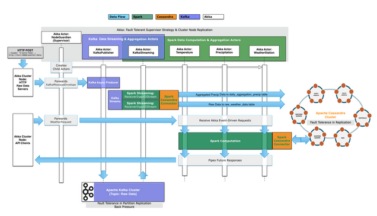

# 使用 Cassandra 的天气时间序列数据应用

# 使用 Cassandra 的天气时间序列数据应用

该项目演示了如何轻松地利用和集成 Apache Spark、Spark Streaming、带有 Spark Cassandra 连接器的 Apache Cassandra 和一般的 Apache Kafka，特别是针对时间序列数据。它还演示了如何在异步 Akka 事件驱动环境中执行此操作。我们使用天气数据和现有的小时数据格式作为示例域。

## 时间序列数据

利用时间序列数据进行业务分析并非新鲜事物。新的是能够以极高的速度收集和分析海量的数据序列，以获取最清晰的图片，以预测和预测未来市场变化、用户行为、环境条件、资源消耗、健康趋势等等。

Apache Cassandra 是一种特别适用于这些大数据挑战的 NoSQL 数据库平台。Cassandra 的数据模型非常适合处理无论数据类型或大小如何都以序列方式处理的数据。当将数据写入 Cassandra 时，数据被排序并顺序写入磁盘。通过按行键和范围检索数据时，由于最小的磁盘查找，你可以获得快速高效的访问模式——时间序列数据非常适合这种模式。Apache Cassandra 允许企业尽快识别其时间序列数据中的有意义特征，以便就预期的未来结果做出清晰的决策。

有许多类型的时间序列数据。有些可以在流中分窗，而其他的则不能在流中分窗，因为查询不是按时间片，而是按特定的年、月、日、小时。Spark Streaming 可以做到两者。在某些情况下，例如在 KafkaStreamingActor 中，使用 Spark 与 Cassandra（以及正确的数据模型）可以减少在数据上所需的 Spark 转换的数量，因为 Cassandra 在其集群中为您完成了这项工作。

# 概述

# 概述

## 天气应用

这是处理从 Kafka 流接收的原始小时数据的主要计算应用程序。每当特定 Kafka 主题上接收到每小时的原始数据时，它都会被映射到自定义案例类中。从那里，进行了两个初始操作：

+   按天气站 ID 存储的原始小时数据供其他希望以原始状态使用它的进程使用。

+   每日降水量聚合（0 到 23 小时的数据）计算并更新到 Cassandra 的 daily_aggregate_precipitation 表中。我们可以在流中进行降水量计算，因为创建了数据模型并使用了 Cassandra Counter。而温度的聚合需要更多的输入数据，因此需要通过站点 ID、年份、月份和日期的请求来完成。* 有了像每日降水量和温度聚合这样的预先计算和存储的数据，任何对于年度聚合、高低值或前 K 值等的请求都可以通过调用处理每种聚合类型的特定 Akka Actors（降水、温度等）轻松计算。这些 Actor 从 Cassandra 中读取已聚合和持久化的数据，并通过 Spark 运行计算。数据以 Future 的形式返回给请求者-没有线程被阻塞。[注意，当在主服务器上具有特定文件的正确 URL 时，我可以将它们链接在上面，以便用户可以点击特定代码块]

## 天气客户端

+   代表一个单独部署的流程，通常会向 Kafka 和其他应用程序或流程提供数据聚合请求。

+   模拟从一个单独流程接收到的实时原始天气事件，然后将其发送到 Kafka。它以一种持续的方式而不是在启动时突发地发送数据。客户端中的 FileFeedActor 每个文件接收数据，将其解析为每个原始数据条目，并通过 Akka Streams 传输数据以发布到 Kafka 并处理生命周期。

+   通过 WeatherApiQueries Actor 每 n 秒发送请求以对天气应用程序进行练习，请求各种聚合数据（前 K、高低、年度…）。

## 架构和实现细节

### 异步容错数据管道

每个气象站的原始小时数据被摄取并发布到一个 Kafka 主题中。这些数据会分布在每个数据中心的 Kafka 节点上，同时 Spark-Cassandra 应用程序也会部署在这些数据中心，与 Spark 和 Cassandra 节点共存。



数据从 Kafka 节点流向 Spark 节点，进行并行分布式数据计算。原始数据最初保存在 Cassandra 的 keyspace 和 table 中。这个从 Kafka 流过来的数据随后在 Spark 中用于每日聚合工作，然后持久化到几个 Cassandra 每日聚合表中。现在，基于这些每日聚合数据（温度、降水量等）的未来数据请求可以更快地计算。例如，对于特定气象站在特定年份（或年份、月份、日期对于高低/前 K）的最高 K 值、高低值或年度降水量的请求不需要获取原始数据，而是可以直接从 Spark 中的已聚合数据开始计算，现在可以按需在 Cassandra 中使用（在数据中心之间复制、容错和分布）。

# 运行示例

# 运行应用程序

有许多时间序列数据的变体。有些可以在流中进行窗口化处理，其他一些则不能在流中进行窗口化处理，因为查询不是按时间切片而是按特定年份、月份、日期、小时进行的。Spark Streaming 可以同时执行这两种操作。特别是 Cassandra 非常适合处理时间序列数据，与 Spark 一起使用原始数据、通过 Spark 进行数据聚合等。在某些情况下，使用 Spark 与 Cassandra（和合适的数据模型）可以减少对数据的 Spark 转换次数，因为 Cassandra 会在其集群中为您执行这些操作。

当使用 Apache Spark 和 Apache Cassandra 时，最佳实践是将 Spark 和 Cassandra 节点放置在一起以获得数据局部性和减少网络调用，从而降低总体延迟。

## 设置

1.  [下载并安装最新的 Cassandra 发布版](http://cassandra.apache.org/download/)

    +   **配置步骤：** 修改 apache-cassandra-{最新版本}/conf/cassandra.yaml 以将 batch_size_warn_threshold_in_kb 增加到 64。

1.  启动 Cassandra。

    ```
     ./apache-cassandra-{latest.version}/bin/cassandra -f 
    ```

    **注意：** 如果您收到错误消息 - 您可能需要以 sudo 为前缀，或者 chown /var/lib/cassandra。

1.  运行设置 cql 脚本以创建模式并填充天气站表。进入 timeseries 数据文件夹并在那里启动一个 cqlsh shell：

    ```
     % cd /path/to/reference-apps/timeseries/scala/data
     % /path/to/apache-cassandra-{latest.version}/bin/cqlsh 
    ```

    你应该会看到：

    ```
     Connected to Test Cluster at 127.0.0.1:9042.
     [cqlsh {latest.version} | Cassandra {latest.version} | CQL spec {latest.version} | Native protocol {latest.version}]
     Use HELP for help.
     cqlsh> 
    ```

    然后运行脚本：

    cqlsh> source 'create-timeseries.cql'; cqlsh> quit;

[查看此 GitHub 仓库以了解更多关于天气站表数据的信息。](https://github.com/killrweather/killrweather/wiki/2.-Code-and-Data-Setup#data-setup)

## 运行 WeatherApp 和 WeatherClientApp

### 从 IDE 中运行

1.  启动 com.databricks.apps.WeatherApp

1.  然后启动 com.databricks.apps.WeatherClientApp

### 从命令行运行

1.  使用 SBT 运行应用程序。

    ```
     % cd /path/to/reference-apps/timeseries/scala
     % sbt weather/run 
    ```

    你应该会看到：

    ```
     Multiple main classes detected, select one to run:
     [1] com.databricks.apps.WeatherApp
     [2] com.databricks.apps.WeatherClientApp 
    ```

    选择选项 1 打开天气应用程序。

1.  使用 SBT 运行客户端应用程序。运行上述相同的命令，但选择选项 2。

### 关于时间序列数据模型

[查看此 GitHub 仓库以了解更多关于时间序列数据模型的信息](https://github.com/killrweather/killrweather/wiki/4.-Time-Series-Data-Model)
