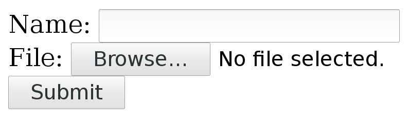

# 如何使用 curl 进行 HTTP 请求

# 如何使用 curl 进行 HTTP 请求

在所有用户调查和 curl 的整个生命周期中，HTTP 是 curl 支持的最重要和最频繁使用的协议。本章将解释如何进行有效的 HTTP 传输和使用 curl 进行一般操作。

HTTPS 的工作方式基本相同，因为它们在内部实际上是相同的东西，HTTPS 是带有额外安全 TLS 层的 HTTP。另请参阅下面特定的 HTTPS 部分。

## HTTP 方法

在每个 HTTP 请求中，都有一个方法。有时被称为动词。最常用的是 GET、POST、HEAD 和 PUT。

但通常不会在命令行中指定方法，而是具体使用的方法取决于您使用的特定选项。GET 是默认值，使用 `-d` 或 `-F` 则是 POST，`-I` 生成 HEAD，`-T` 发送 PUT。

关于此更多内容，请参阅 修改 HTTP 请求 部分。

## 脚本化类似浏览器的任务

待定

# 协议基础知识

### HTTP 协议基础知识

（假设您已阅读了 网络和协议 部分或者已经熟悉协议。）

HTTP 是一个易于学习基础知识的协议。客户端连接到服务器——总是客户端发起——发送一个请求并接收一个响应。请求和响应都由头部和主体组成。在双向传输中可以有少量或大量信息。

由客户端发送的 HTTP 请求以一个请求行开头，然后是头部，然后是可选的主体。最常见的 HTTP 请求可能是 GET 请求，它要求服务器返回一个特定的资源，而此请求不包含主体。

当客户端连接到 'example.com' 并请求 '/' 资源时，它发送一个不带请求体的 GET 请求：

```
GET / HTTP/1.1
User-agent: curl/2000
Host: example.com 
```

… 服务器可能会响应类似以下的内容，包含响应头和响应主体（'hello'）。响应中的第一行还包含响应码和服务器支持的特定版本：

```
HTTP/1.1 200 OK
Server: example-server/1.1
Content-Length: 5
Content-Type: plain/text

hello 
```

如果客户端改为发送一个带有小请求体（'hello'）的请求，可能会是这样：

```
POST / HTTP/1.1
Host: example.com
User-agent: curl/2000
Content-Length: 5

hello 
```

服务器总是响应 HTTP 请求，除非出现了问题。

### 将 URL 转换为请求

因此，当一个 HTTP 客户端被给予一个要操作的 URL 时，该 URL 被使用、分解并且这些部分在传出的请求到服务器中的各个地方使用。让我们以一个示例 URL 为例：

```
https://www.example.com/path/to/file 
```

+   **https** 意味着 curl 将使用 TLS 到远程端口 443（当在 URL 中没有指定端口号时，默认端口号为 443）。

+   **www.example.com** 是 curl 将解析为一个或多个 IP 地址以连接到的主机名。此主机名也将在 HTTP 请求中的 `Host:` 头部中使用。

+   **/path/to/file** 用于在 HTTP 请求中告诉服务器 curl 想要获取哪个确切的文档/资源

### --path-as-is

URL 的路径部分是从主机名后的第一个斜杠开始，直到 URL 结束或者在问号 '?' 或井号 '#' 处结束（粗略地说）。

如果在路径中包含包含 `/../` 或 `/./` 的子字符串，则 curl 将在路径发送到服务器之前自动压缩它们，这是由标准规定的，并且这些字符串在本地文件系统中的工作方式也是如此。`/../` 序列将删除前一部分，使 `/hello/sir/../` 最终变成 `/hello/`，而 `/./` 则被简单地删除，使 `/hello/./sir/` 成为 `/hello/sir/`。

为了 *防止* curl 在将它们发送到服务器之前压缩这些特殊序列，并允许它们通过，存在 `--path-as-is` 选项。

# 响应

### HTTP 响应

当 HTTP 客户端与服务器通信时，服务器 *必定* 会用 HTTP 响应消息进行回应，否则 curl 会将其视为错误，并返回 52 错误，错误消息为 "Empty reply from server"。

#### HTTP 响应的大小

HTTP 响应有一定的大小，curl 需要找出来。有几种不同的方法可以表示 HTTP 响应的结束，但最基本的方法是在响应中使用 `Content-Length:` 头部，并且使用它来指定响应正文中的确切字节数。

一些早期的 HTTP 服务器实现存在文件大小超过 2GB 的问题，错误地发送了带有负大小的 Content-Length: 头部，或者以其他方式发送了错误的数据。curl 可以通过 `--ignore-content-length` 告诉它完全忽略 Content-Length: 头部。这样做可能会产生其他负面影响，但至少可以让您获取数据。

### HTTP 响应代码

HTTP 传输在第一个响应行中会收到一个 3 位数的响应代码。响应代码是服务器向客户端提供关于如何处理请求的提示的方式。

需要注意的是，即使响应代码表明无法传递所请求的文档（或类似情况），curl 也不会将其视为错误。curl 认为成功发送和接收 HTTP 就是好的。

HTTP 响应代码的第一个数字是一种 "错误类"：

+   1xx: 临时响应，更多内容即将到来

+   2xx: 成功

+   3xx: 重定向

+   4xx: 客户端请求了服务器无法/不愿提供的内容

+   5xx: 服务器出现问题

请记住，您可以使用 curl 的 `--write-out` 选项来提取响应代码。请参阅 --write-out 部分。

### CONNECT 响应代码

由于在同一次 curl 传输中可能存在一个 HTTP 请求和一个单独的 CONNECT 请求，因此我们通常将 CONNECT 响应（来自代理）与远程服务器的 HTTP 响应分开。

CONNECT 也是一个 HTTP 请求，因此它的响应代码属于相同的数字范围，您也可以使用 `--write-out` 提取该代码。

### 分块传输编码

HTTP 1.1 服务器可以决定用 "chunked" 编码的响应进行回应，这是 HTTP 1.0 中没有的功能。

发送分块响应时，响应中没有 Content-Length:来指示其大小。相反，有一个`Transfer-Encoding: chunked`标头告诉 curl 有分块数据到来，然后在响应体中，数据以一系列“块”形式出现。每个单独的块以该特定块的大小（十六进制表示）开头，然后是一个换行符，然后是块的内容。这一过程一遍又一遍地重复，直到响应结束，这是通过一个大小为零的块来表示的。这种响应的目的是让客户端能够在服务器开始发送响应之前弄清楚响应何时结束，即使服务器在发送之前并不知道完整的大小。这通常是在响应是动态生成的并在请求到达时生成的情况下。

像 curl 这样的客户端当然会解码这些块，并不会向用户显示块的大小。

### 压缩传输

通过 HTTP 可以以压缩格式发送响应。当服务器在响应中包含`Content-Encoding: gzip`作为对客户端的提示时，这通常是服务器执行的。在发送静态资源（在以前的某个时刻进行了压缩）或者在运行时有更多的 CPU 资源可用时，压缩响应通常是有意义的。通常更喜欢发送较少量的数据。

您可以要求 curl 既要求压缩内容*又*在接收到 gzip 编码的内容时自动透明地解压缩数据（实际上是 curl 理解的任何其他压缩算法）使用`--compressed`：

```
curl --compressed http://example.com/ 
```

### 传输编码

与传输编码一起使用的较少见功能是压缩。

压缩本身是常见的。随着时间的推移，用于 HTTP 的主要和与 Web 兼容的压缩方式已经变成了如上文所述的使用`Content-Encoding`。但 HTTP 最初旨在允许透明压缩作为传输编码，而 curl 支持此功能。

然后客户端简单地要求服务器执行压缩传输编码，如果可接受，它将响应一个指示将执行压缩传输编码的标头，curl 将在到达时透明地解压缩数据。用户可以使用`--tr-encoding`启用请求压缩传输编码：

```
curl --tr-encoding http://example.com/ 
```

值得注意的是，在野外并不多的 HTTP 服务器支持这一功能。

### 传递传输编码

在某些情况下，您可能希望将 curl 用作某种代理或其他中间软件。在这种情况下，如果最终接收者*也*希望执行相同的操作，则可能不希望 curl 处理传输编码标头，然后透明地解码实际数据。

然后，您可以要求 curl 传递接收到的数据，而不对其进行解码。这意味着在使用分块编码格式或压缩传输编码时传递大小等。

```
curl --raw http://example.com/ 
```

# 身份验证

# HTTP 身份验证

每个 HTTP 请求都可以进行身份验证。 如果服务器或代理希望用户提供证明他们具有正确凭据以访问 URL 或执行操作的证据，它可以发送回一个 HTTP 响应代码，通知客户端它需要在请求中提供正确的 HTTP 身份验证头以获得允许。

需要身份验证的服务器发送回一个 401 响应代码和一个相关的 `WWW-Authenticate:` 头，列出服务器支持的所有身份验证方法。

需要身份验证的 HTTP 代理会发送回一个 407 响应代码和一个相关的 `Proxy-Authenticate:` 头，列出代理支持的所有身份验证方法。

值得注意的是，今天大多数网站不需要 HTTP 身份验证进行登录等操作，而是会要求用户在网页上登录，然后浏览器将发出一个包含用户和密码等信息的 POST 请求，然后随后维护会话的 cookie。

要告诉 curl 进行身份验证的 HTTP 请求，您可以使用 `-u, --user` 选项提供用户名和密码（用冒号分隔）。 就像这样：

```
curl --user daniel:secret http://example.com/ 
```

这将使 curl 使用默认的"基本"HTTP 身份验证方法。 是的，它实际上称为基本，它确实非常基本。 要明确要求使用基本方法，请使用 `--basic`。

基本身份验证方法会以明文形式（base64 编码）发送用户名和密码到网络上，应避免用于 HTTP 传输。

当要求使用单个（指定或隐含的）身份验证方法进行 HTTP 传输时，curl 将在第一个请求上自动插入身份验证头。

如果您更愿意让 curl 先*测试*一下是否真的需要身份验证，您可以要求 curl 去弄清楚，然后自动使用它所知道的最安全的方法，使用 `--anyauth`。 这使得 curl 尝试未经身份验证的请求，然后在必要时切换到身份验证：

```
curl --anyauth --user daniel:secret http://example.com/ 
```

同样的概念也适用于可能需要身份验证的 HTTP 操作：

```
curl --proxy-anyauth --proxy-user daniel:secret http://example.com/ \
     --proxy http://proxy.example.com:80/ 
```

curl 通常（略有不同取决于构建方式）也支持几种其他身份验证方法，包括摘要、协商和 NTLM。 您也可以专门要求这些方法：

```
curl --digest --user daniel:secret http://example.com/
curl --negotiate --user daniel:secret http://example.com/
curl --ntlm --user daniel:secret http://example.com/ 
```

# 范围

## HTTP 范围

如果客户端只想要远程资源的前 200 字节或者可能是中间某处的 300 字节怎么办？ HTTP 协议允许客户端仅请求特定数据范围。 客户端用起始偏移量和结束偏移量向服务器请求特定范围。 它甚至可以组合这些内容，通过在同一请求中列出一堆连续的片段。 当服务器发送多个独立的片段来回应这样的请求时，您将得到以 mime 边界字符串分隔的片段，并且由用户应用程序相应地处理。 curl 不会进一步分隔这样的响应。

但是，字节范围仅仅是对服务器的请求。它不必遵守请求，在许多情况下，比如当服务器在被请求时自动生成内容时，它会简单地拒绝执行并且然后用完整的内容响应。

您可以使用`-r`或`--range`使 curl 请求范围。如果要从某个地方获取前 200 个字节：

```
curl -r 0-199 http://example.com 
```

或者从索引 200 开始的文件中的所有内容：

```
curl -r 200- http://example.com 
```

从索引 0 获取 200 字节 *和* 从索引 1000 获取 200 字节：

```
curl -r 0-199,1000-199 http://example.com/ 
```

# HTTP 版本

## HTTP 版本

与任何其他互联网协议一样，HTTP 协议随着时间的推移一直在不断发展，现在有分布在世界各地和不同时期的客户端和服务器使用不同版本并且成功程度各不相同。因此，为了使 libcurl 与您在 libcurl 中传递的 URL 一起工作，libcurl 提供了一些方式供您指定请求和传输应使用的 HTTP 版本。libcurl 设计的方式是首先尝试使用最常见的、最合理的默认值，但有时这是不够的，然后您可能需要指示 libcurl 该做什么。

自大约 2016 年中期以来，curl 默认使用 HTTP/1.1 用于 HTTP 服务器。如果连接到 HTTPS 并且您有内置了 HTTP/2 功能的 libcurl，curl 将尝试自动使用 HTTP/2，或者在协商失败时降级到 1.1。不支持 HTTP/2 的 curl 默认情况下通过 HTTPS 获取 1.1。

如果默认设置不适合您的传输，则`CURLOPT_HTTP_VERSION`选项适合您。

| 选项 | 描述 |
| --- | --- |
| [默认] | 填写 |
| --http1.0 | 填写 |
| --http1.1 | 填写 |
| --http2 | 填写 |
| --http2-prior-knowledge | 填写 |

# HTTPS

# HTTPS

HTTPS 实际上是安全的 HTTP。 “安全”部分意味着 TCP 传输层通过使用 TLS 提供身份验证、隐私（加密）和数据完整性而得到增强。

查看使用 TLS 部分，了解如何修改和调整 HTTPS 传输中的 TLS 详细信息。

# HTTP POST

## HTTP POST

POST 是用于将数据发送到接收方 Web 应用程序的 HTTP 方法，这是网络上大多数常见的 HTML 表单的工作方式。它通常将一小块相对较小的数据发送到接收方。

当浏览器在表单中填写数据后发送数据时，它会将其“URL 编码”，作为一系列用和号符号（'&'）分隔的序列化名称=值对发送。您可以使用 curl 的`-d`或`--data`选项发送此类数据，如下所示：

```
curl -d 'name=admin&shoesize=12' http://example.com/ 
```

在命令行上指定多个`-d`选项时，curl 将把它们连接起来，并在其中插入和号，因此上面的示例也可以这样制作：

```
curl -d name=admin -d shoesize=12 http://example.com/ 
```

如果要发送的数据量真的不适合在命令行上放置一个简单的字符串中，您还可以以标准 curl 样式从文件名中读取它：

```
curl -d @filename http://example.com 
```

### Content-Type

使用 curl 的-d 选项进行 POST 将包含一个默认标头，看起来像`Content-Type: application/x-www-form-urlencoded`。这是你典型浏览器用于普通 POST 的方式。

许多接收 POST 数据的服务器不关心或检查 Content-Type 标头。

如果该标头不够好，当然，你应该替换它并提供正确的标头。例如，如果你向服务器 POST JSON 并希望更准确地告诉服务器内容是什么：

```
curl -d '{json}' -H 'Content-Type: application/json' https://example.com 
```

### 发送二进制数据

从文件读取时，`-d`将去除回车符和换行符。如果希望 curl 按照给定的方式读取和使用文件中的二进制数据，请使用`--data-binary`：

```
curl --data-binary @filename http://example.com/ 
```

### URL 编码

百分号编码，也称为 URL 编码，从技术上讲是一种对数据进行编码的机制，以便它可以出现在 URL 中。当使用`application/x-www-form-urlencoded`内容类型发送 POST 时，通常会使用此编码，例如 curl 使用`--data`和`--data-binary`等发送的 POST。

上面提到的命令行选项都要求你提供正确编码的数据，你需要确保数据已经以正确的格式存在。虽然这给了你很大的自由度，但有时也有点不方便。

为了帮助你发送尚未编码的数据，curl 提供了`--data-urlencode`选项。该选项提供了几种不同的方式来对你提供的数据进行 URL 编码。

你可以像这样使用`--data-urlencode data`，与其他--data 选项的风格相同。为了符合 CGI 标准，**data**部分应以名称开头，后跟一个分隔符和内容规范。**data**部分可以使用以下语法之一传递给 curl：

+   "content": 这将使 curl 对内容进行 URL 编码并传递。只需小心，确保内容不包含任何=或@符号，因为那样会使语法匹配下面的其他情况之一！

+   "=content": 这将使 curl 对内容进行 URL 编码并传递。初始的'='符号不包含在数据中。

+   "name=content": 这将使 curl 对内容部分进行 URL 编码并传递。请注意，名称部分应该已经进行了 URL 编码。

+   "@filename": 这将使 curl 从给定文件加载数据（包括任何换行符），对该数据进行 URL 编码并在 POST 中传递。

+   "name@filename": 这将使 curl 从给定文件加载数据（包括任何换行符），对该数据进行 URL 编码并在 POST 中传递。名称部分会附加一个等号，结果为 name=urlencoded-file-content。请注意，名称应该已经进行了 URL 编码。

例如，你可以 POST 一个名称让 curl 对其进行编码：

```
curl --data-urlencode "name=John Doe (Junior)" http://example.com 
```

…这将在实际请求体中发送以下数据：

```
name=John%20Doe%20%28Junior%29 
```

如果你将字符串`John Doe (Junior)`存储在名为`contents.txt`的文件中，你可以告诉 curl 使用字段名称'user'将该内容进行 URL 编码，如下所示：

```
curl --data-urlencode user@contents.txt http://example.com 
```

在上面的这两个示例中，字段名不是 URL 编码的，而是按原样传递的。如果您还想对字段名进行 URL 编码，比如如果您想传递一个名为“用户名”的字段名，您可以要求 curl 使用等号作为前缀来编码整个字符串（这不会被发送）：

```
curl --data-urlencode "=user name=John Doe (Junior)" http://example.com 
```

### 将其转换为 GET

一个小便利功能，可以在这个上下文中提到（即使它不适用于 POSTing），是 `-G` 或 `--get` 选项，它将您用不同的 `-d` 变体指定的所有数据添加到 URL 的右端，以问号分隔，然后使 curl 发送 GET 请求。

此选项使得在 POST 和 GET 表单之间轻松切换变得容易，例如。

### 期望 100-continue

HTTP 没有合适的方法来停止正在进行的传输（在任何方向上）并仍保持连接。因此，如果我们在传输开始后发现传输最好停止，只有两种方法可以继续：切断连接并为下一个请求重新建立连接的代价，或者继续传输并浪费带宽但可以在下次重用连接。

当您通过 HTTP 发送一个大文件，却发现服务器需要身份验证并立即发送回 401 响应代码时，就可能发生这种情况。

为了减少这种情况发生的可能性，curl 可以传递一个额外的头部 `Expect: 100-continue`，这使得服务器有机会在发送大量数据之前拒绝请求。如果 curl 将要执行的 POST 已知或被怀疑比微不足道的大，则 curl 默认发送这个 Expect: 头。curl 还对 PUT 请求执行此操作。

当服务器收到一个带有 100-continue 的请求并认为请求没有问题时，它将响应一个使客户端继续的 100 响应。如果服务器不喜欢请求，它会发送回它认为的错误的响应代码。

不幸的是，世界上许多服务器不正确地支持 Expect: 头部，或者不正确地处理它，因此 curl 将在等待第一个响应之前等待 1000 毫秒，然后继续执行。

那是 1000 毫秒的浪费。然后，您可以通过 `-H` 移除请求中的 Expect: 并避免等待：

```
curl -H Expect: -d "payload to send" http://example.com 
```

在某些情况下，如果要发送的内容非常小（如小于一千字节），curl 将抑制使用 Expect 头部，因为浪费这么小的数据块不被认为是一个大问题。

### 分块编码的 POST

当与 HTTP 1.1 服务器通信时，您可以告诉 curl 在发送请求体时不需要事先发送一个指定 POST 大小的 `Content-Length:` 头。通过坚持使用 chunked Transfer-Encoding，curl 将以特殊的方式“分块”逐块发送 POST，并随着发送每个这样的块的大小。

您可以像这样使用 curl 发送分块 POST：

```
curl -H "Transfer-Encoding: chunked" -d "payload to send" http://example.com 
```

### 隐藏表单字段

本章已经解释了使用 `-d` 发送 POST 请求相当于浏览器填写并提交 HTML 表单的过程。

使用 curl 提交这样的表单是一个非常常见的操作；实际上，让 curl 自动填写网页表单。

如果你想要用 curl 提交一个表单，并让它看起来像是通过浏览器完成的，重要的是要提供表单中的所有输入字段。网页常用的一种方法是在表单中设置一些隐藏的输入字段，并直接在 HTML 中为它们赋值。当然，成功提交表单也包括这些字段，为了自动完成这一过程，你可能需要先下载包含表单的 HTML 页面，解析它，并提取隐藏字段的值，然后用 curl 发送它们。

### 弄清���浏览器发送了什么

一个非常常见的快捷方式是用浏览器填写表单并提交，然后在浏览器的网络开发工具中检查它发送了什么。

另一种稍微不同的方法是保存包含表单的 HTML 页面，然后编辑该 HTML 页面，将表单的 'action=' 部分重定向到你自己的服务器或一个仅输出接收到的内容的测试服务器。完成表单提交后，你将看到浏览器发送的内容。

第三个选项当然是使用网络抓包工具，比如 Wireshark，来准确检查发送的内容。如果你使用 HTTPS，你无法在明文中看到表单提交的内容，而是需要确保 Wireshark 可以从浏览器中提取你的 TLS 私钥。请参考 Wireshark 文档以获取详细信息。

### JavaScript 和表单

防止使用 curl 的自动化 "代理" 或脚本的一个非常常见的方法是让包含 HTML 表单的页面使用 JavaScript 设置一些输入字段的值，通常是其中一个隐藏字段。通常，页面加载时或提交按钮按下时会执行一些 JavaScript 代码，设置一个魔术值，服务器在考虑提交是否有效之前会验证这个值。

通常可以通过阅读 JavaScript 代码并在脚本中重新实现该逻辑来解决这个问题。使用上述提到的技巧来检查浏览器发送的内容也是一个很好的帮助。

# 多部分表单提交

## HTTP 多部分表单提交

当 HTML 表单提交时，HTTP 客户端发送的是一个多部分表单（multipart formpost），*enctype* 设置为 "multipart/form-data"。

这是一个 HTTP POST 请求，请求体特别格式化为一系列以 MIME 边界分隔的 "部分"。

一个 HTML 示例可能如下所示：

```
<form action="submit.cgi" method="post" enctype="multipart/form-data">
   Name: <input type="text" name="person"><br>
   File: <input type="file" name="secret"><br>
   <input type="submit" value="Submit">
</form> 
```

在 web 浏览器中可能看起来像这样：



用户可以在 'Name' 字段中填写文本，并通过点击 'Browse' 按钮选择一个本地文件，当按下 'Submit' 时将上传该文件。

### 使用 curl 发送这样的表单

使用 curl，您可以使用一个`-F`（或`--form`）标志添加每个单独的多部分，然后继续添加一个-F，以便发送表单中每个输入字段。

上面的小例子表单有两部分，一个名为'person'，是一个纯文本字段，另一个名为'secret'，是一个文件。

将您的数据发送到该表单，如下所示：

```
curl -F person=anonymous -F secret=@file.txt http://example.com/submit.cgi 
```

### 这生成的 HTTP

**action**指定 POST 发送的位置。**method**表示这是一个 POST，**enctype**告诉我们这是一个多部分表单提交。

使用如上所示填写的字段，curl 生成并将这些 HTTP 请求标头发送到主机 example.com：

```
POST /submit.cgi HTTP/1.1
Host: example.com
User-Agent: curl/7.46.0
Accept: */*
Content-Length: 313
Expect: 100-continue
Content-Type: multipart/form-data; boundary=------------------------d74496d66958873e 
```

**Content-Length**当然，告诉服务器期望多少数据。这个例子的 313 字节真的很小。

**Expect**标头在 HTTP POST 章节中有解释。

**Content-Type**标头有点特殊。它告诉这是一个多部分表单提交，然后设置“边界”字符串。边界字符串是一行字符，其中包含一堆随机数字，用作将要提交的表单的不同部分之间的分隔符。在此示例中，您看到的特定边界具有随机部分`d74496d66958873e`，但当您运行 curl（或使用浏览器提交这样的表单）时，您当然会得到不同的内容。

因此，在初始的一组标头之后是请求正文

```
--------------------------d74496d66958873e
Content-Disposition: form-data; name="person"

anonymous
--------------------------d74496d66958873e
Content-Disposition: form-data; name="secret"; filename="file.txt"
Content-Type: text/plain

contents of the file
--------------------------d74496d66958873e-- 
```

在这里，您清楚地看到发送的两个部分，用边界字符串分隔。每个部分都以一个或多个描述具有其名称和可能一些更多详细信息的单独部分的标头开头。然后，在部分的标头之后，是部分的实际数据，没有任何编码。

最后一个边界字符串附加了两个额外的破折号`--`，表示结束。

### 内容类型

使用 curl 的-F 选项进行 POST 将使其在请求中包含默认的 Content-Type 标头，如上例所示。这表示`multipart/form-data`，然后指定 MIME 边界字符串。该内容类型是多部分表单提交的默认值，但您当然仍然可以修改自己的命令，如果这样做，curl 足够聪明，仍会附加边界魔术到替换的标头中。您实际上不能更改边界字符串，因为 curl 需要它来生成 POST 流。

要替换标头，请使用`-H`，如下所示：

```
curl -F 'name=Dan' -H 'Content-Type: multipart/magic' https://example.com 
```

### 转换 HTML 表单

待定

# -d 与-F

# -d 与-F

之前的章节讨论了常规 POST 和多部分表单提交，在您典型的命令行中，您可以使用`-d`或`-F`来执行它们。

但是什么时候使用它们？

如上述章节中所述，这两个选项都将指定的数据发送到服务器。区别在于数据在传输过程中的格式化方式。大多数情况下，接收端被编写为期望特定格式，并且期望发送方正确格式化和发送数据。客户端不能随意选择格式。

## HTML 网络表单

当我们谈论浏览器和 HTML 时，标准的方式是向用户提供一个表单，当表单填写完成后发送数据。`<form>`标签就是让一个表单在网页上出现的东西。该标签告诉浏览器如何格式化其 POST。如果表单标签包含`enctype=multipart/form-data`，它告诉浏览器将数据作为 multipart formpost 发送，你可以用 curl 的`-F`选项制作。这种方法通常用于表单包含`<input type=file>`标签时，用于文件上传。

表单默认使用的`enctype`，由于它是默认的，很少在 HTML 中详细说明，是`application/x-www-form-urlencoded`。它让浏览器“URL 编码”输入，将数据编码为避免不安全字符的 name=value 对。我们通常称之为常规 POST，您可以使用 curl 的`-d`和相关选项执行它。

## HTML 之外的 POST

POST 是一个常规的 HTTP 方法，不要求由 HTML 触发或涉及浏览器。许多服务、API 和其他系统现在都允许您传递数据以完成任务。

如果这些服务期望原始“原始”数据或者可能是 JSON 等格式化的数据，你就需要常规 POST 方法。curl 的`-d`选项不会改变或编码数据，而是只会发送你告诉它的数据。只需注意-d 的默认 Content-Type，因为那可能不是你想要的。

# 重定向

# HTTP 重定向

“重定向”是 HTTP 协议的一个基本部分。这个概念在 1996 年首个规范（RFC 1945）中已经存在并且有所记录，自那以后一直被广泛使用。

重定向确实就是其字面意思。服务器发送一个指令给客户端，而不是返回客户端想要的内容。服务器基本上说“去这里看看，而不是给你要求的那个东西”。

但并不是所有的重定向都一样。这个重定向有多永久？客户端在下一个请求中应该使用什么请求方法？

所有的重定向还需要发送一个`Location:`头部带有新 URI 的内容，可以是绝对的或相对的。

## 永久重定向和临时重定向

重定向是指持续还是只保持暂时有效？如果你希望 GET 永久重定向用户到资源 B，并带有另一个 GET，就发送一个 301。这也意味着用户代理（浏览器）应该缓存这个并且以后当请求原始 URI 时继续去新的 URI。

临时替代方案是 302。现在服务器希望客户端发送一个 GET 请求到 B，但不应该缓存这个请求，而是下次再重定向到原始 URI 时继续尝试。

请注意，301 和 302 都会让浏览器在下一个请求中执行 GET 请求，这可能意味着如果开始是 POST 请求，则会更改方法（仅在 POST 请求时）。301 和 302 响应中将 HTTP 方法更改为 GET 的行为被称为“出于历史原因”，但这仍然是浏览器的行为，因此大多数公共网络都会以这种方式行事。

在实践中，303 代码与 302 非常相似。它不会被缓存，并且会使客户端在下一个请求中发出 GET 请求。302 和 303 之间的差异微妙，但 303 似乎更��地设计为对原始请求的“间接响应”，而不仅仅是重定向。

这三个代码是 HTTP/1.0 规范中唯一的重定向代码。

然而，curl 不会记住或缓存任何重定向，因此对于它来说，永久重定向和临时重定向之间实际上没有区别。

## 告诉 curl 跟随重定向

在 curl 的传统中，除非告诉它要做不同的事情，否则默认情况下不会跟随 HTTP 重定向。使用 `-L, --location` 告诉它执行该操作。

当启用重定向时，curl 默认会跟随最多 50 次重定向。通常有一个最大限制，主要是为了避免陷入无限循环的风险。如果 50 次不够用，你可以使用 `--max-redirs` 选项来更改要跟随的最大重定向次数。

## GET 还是 POST？

这三个响应代码中的 301 和 302/303，都会假设客户端发送 GET 请求以获取新的 URI，即使客户端可能在第一个请求中发送了 POST 请求。这是非常重要的，至少如果你做的事情不使用 GET 请求。

如果服务器希望将客户端重定向到新的 URI，并希望在第二个请求中发送与第一个请求相同的方法，例如，如果首先发送了 POST 请求，则希望在下一个请求中再次发送 POST 请求，则服务器将使用不同的响应代码。

要告诉客户端“您发送 POST 请求的 URI 已永久重定向到 B，您现在和将来应该将您的 POST 请求发送到 B”，服务器会响应 308。并且，为了使事情更加复杂，308 代码是最近才定义的（[规范](https://tools.ietf.org/html/rfc7238#section-3)于 2014 年 6 月发布），因此旧客户端可能无法正确处理它！如果是这样，那么你唯一剩下的响应代码是…

告诉客户端在下一个请求中也临时发送 POST 的（较旧的）响应代码是 307。但是，客户端不会缓存此重定向，因此如果再次请求，则会再次发送 POST 请求到 A。307 代码是在 HTTP/1.1 中引入的。

哦，在 HTTP/2 中，重定向的工作方式与 HTTP/1.1 完全相同。

|  | 永久重定向 | 临时重定向 |
| --- | --- | --- |
| 切换到 GET | 301 | 302 和 303 |
| 保持原始方法 | 308 | 307 |

### 决定在重定向中使用的方法

结果表明，世界上有一些网络服务希望发送 POST 到原始 URL，但是响应的 HTTP 重定向使用了 301、302 或 303 响应代码，*仍然*希望 HTTP 客户端将下一个请求发送为 POST。如上所述，浏览器不会这样做，curl 也不会—默认情况下。

由于存在这些设置，并且它们实际上并不是非常罕见的，curl 提供了选项来改变其行为。

你可以通过使用专门的选项 `--post301`、`--post302` 和 `--post303` 来告诉 curl 在 30x 响应后不将非 GET 请求方法更改为 GET。如果你正在编写基于 libcurl 的应用程序，则可以使用 `CURLOPT_POSTREDIR` 选项来控制该行为。

## 重定向到其他主机名

当你使用 curl 时，你可能会为特定站点提供用户名和密码等凭据，但由于 HTTP 重定向很可能会移动到不同的主机，curl 会限制它发送给原始主机之外的其他主机的内容在同一 "传输" 中。

因此，如果你希望凭据也发送到以下主机名，即使它们与原始主机名不同——可能是因为你信任它们并且知道这样做没有危害，你可以告诉 curl 这样做是可以接受的，使用 `--location-trusted` 选项。

# 非 HTTP 重定向

浏览器支持更多的重定向方式，有时对于 curl 用户来说会使生活变得复杂，因为这些方法不受 curl 支持或识别。

## HTML 重定向

如果上述内容还不够，网络世界还提供了一种通过纯 HTML 重定向浏览器的方法。请参阅下面的示例 `<meta>` 标签。由于 curl 从不解析 HTML，因此它对于这种类型的重定向毫无了解。

```
<meta http-equiv="refresh" content="0; url=http://example.com/"> 
```

## JavaScript 重定向

现代网络充满了 JavaScript，正如你所知，JavaScript 是一种语言和完整的运行时，允许在访问网站时在浏览器中执行代码。

JavaScript 还提供了一种指示浏览器转到另一个站点的方法——重定向。

# 修改 HTTP 请求

# 修改 HTTP 请求

如前所述，每个 HTTP 传输都以 curl 发送 HTTP 请求开始。该请求包含一个请求行和一些请求头，并且本章详细介绍了如何修改所有这些内容。

## 请求方法

请求的第一行包含了 *方法* - 有时也称为 "动词"。当像这条命令行那样执行简单的 GET 请求时：

```
curl http://example.com/file 
```

…初始请求行看起来像这样：

```
GET /file HTTP/1.1 
```

你可以通过使用 `-X` 或 `--request` 命令行选项后跟实际方法名来告诉 curl 将方法更改为其他内容。例如，你可以像这样发送 `DELETE` 而不是 `GET`：

```
curl http://example.com/file -X DELETE 
```

此命令行选项仅更改传出请求中的文本，不会更改任何行为。如果，例如，你要求 curl 使用`-X`发送一个 HEAD，因为 HEAD 被指定为发送所有 GET 响应会得到的头部，但*永远*不会发送响应主体，即使头部否则暗示会有一个响应主体。因此，将`-X HEAD`添加到否则执行 GET 的命令行中将导致 curl 挂起，等待不会到达的响应主体。

当要求 curl 执行 HTTP 传输时，它将根据选项选择正确的方法，因此你只应该极少地需要使用`-X`显式请求。还应该注意，当 curl 像使用`-L`请求的那样遵循重定向时，使用`-X`设置的请求方法将发送，即使在随后的重定向中。

## 请求目标

在上面的例子中，你可以看到 URL 的路径部分在请求行中变成了`/file`。那被称为“请求目标”。那是此请求将与之交互的资源。通常，此请求目标是从 URL 中提取然后在请求中使用的，作为用户，你不需要考虑它。

在某些罕见的情况下，用户可能想要创造性地更改此请求目标，以一种 URL 实际不允许的方式。例如，HTTP OPTIONS 方法有一个特别定义的请求目标，用于涉及*服务器*而不是特定路径的魔术，并且它使用`*`表示。是的，一个单独的星号。没有办法为此指定 URL，因此，如果你想将一个单独的星号作为请求目标传递给服务器，例如用于 OPTIONS，你必须这样做：

```
curl -X OPTIONS --request-target "*" http://example.com/ 
```

## 锚点或片段

URL 可能包含一个锚点，也称为片段，写在 URL 末尾的井号和字符串。例如`http://example.com/foo.html#here-it-is`。该片段部分，从井号/散列符号到 URL 末尾的所有内容，仅供本地使用，不会被发送到网络上。curl 将简单地剥离该数据并丢弃它。

## 自定义头部

在 HTTP 请求中，初始请求行之后，通常会跟随一些请求头。那是一组以空行结束的`name: value`对，该空行将头部与随后的请求主体（有时为空）分隔开来。

curl 默认会在请求中自己传递一些头部，例如`Host:`、`Accept:`、`User-Agent:`等，可能还会根据用户要求 curl 执行的操作而添加一些其他头部。

所有由 curl 本身设置的标题都可以被用户覆盖，如果你愿意的话，可以被替换。然后你只需告诉 curl 的`-H`或`--header`要使用的新标题，它就会用新的标题替换内部的标题，如果标题字段匹配其中一个标题，或者它将把指定的标题添加到要发送的标题列表中。

要更改`Host:`头部，请执行以下操作：

```
curl -H "Host: test.example" http://example.com/ 
```

要添加一个`Elevator: floor-9`头部，做如下操作：

```
curl -H "Elevator: floor-9" http://example.com/ 
```

如果你只想删除一个内部生成的头部，只需将其传递给 curl 而不带任何值，冒号右边什么也不用写。

要关闭 `User-Agent:` 头部，做如下操作：

```
curl -H "User-Agent:" http://example.com/ 
```

最后，如果你确实想要添加一个冒号右边没有内容的头部（这是一件罕见的事情），那么魔术标记就是将头部字段名称结束符号设置为分号。就像这样：

```
curl -H "Empty;" http://example.com 
```

## 引用页

当用户点击网页上的链接并且浏览器将用户带到下一个 URL 时，它会在新请求中向新 URL 发送一个“referer”头，告诉它来自哪里。那就是 referer 头部。是的，referer 拼写错误，但这就是它的本意！

使用 curl 可以通过 `-e` 或 `--referer` 设置 referer 头，如下所示：

```
curl --referer http://comes-from.example.com https://www.example.com/ 
```

## 用户代理

用户代理是每个客户端可以在请求中设置的头部，以通知服务器它是哪个用户代理。有时服务器会查看这个头部并根据其内容确定如何操作。

默认头部值是 'curl/[version]'，如 curl 版本 7.54.1 的 `User-Agent: curl/7.54.1`。

你可以设置任何你喜欢的值，使用选项 `-A` 或 `--user-agent` 再加上要使用的字符串，或者，由于它只是一个头部，`-H "User-Agent: foobar/2000"`。

作为对比，Linux 机器上最近测试版本的 Firefox 发送了这个 User-Agent 头部：

`User-Agent: Mozilla/5.0 (X11; Linux x86_64; rv:58.0) Gecko/20100101 Firefox/58.0`

## --time-cond

待定

# HTTP PUT

## PUT

PUT 和 POST 之间的区别很微妙。它们在传输上几乎是完全相同的，除了不同的方法字符串。在 POST 旨在将数据传递给远程资源的情况下，PUT 则应该是该资源的新版本。

在这方面，PUT 类似于其他协议中找到的好旧标准文件上传。你使用 PUT 上传资源的新版本。URL 标识资源，并指出要放置的本地文件：

```
curl -T localfile http://example.com/new/resource/file 
```

…所以 -T 将意味着一个 PUT，并告诉 curl 要发送哪个文件。但是 POST 和 PUT 之间的相似之处也允许你使用常规的 curl POST 机制发送一个带有字符串的 PUT，只需使用 `-d` 但要求其使用 PUT：

```
curl -d "data to PUT" -X PUT http://example.com/new/resource/file 
```

# Cookies

## Cookies

HTTP cookies 是客户端代表服务器存储的键/值对。它们在后续请求中发送回来，以允许客户端在请求之间保持状态。记住 HTTP 协议本身没有状态，而是客户端必须在后续请求中重新发送所有数据，以便服务器知道它们。

服务器使用 `Set-Cookie:` 头部设置 Cookies，并且对于每个 Cookie，服务器发送一堆额外的属性，这些属性需要与客户端发送的 Cookie 匹配。比如域名和路径，也许最重要的是 Cookie 应该存在多长时间。

cookie 的到期时间要么设置为将来的固定时间（或者活多少秒），要么根本没有到期时间。没有到期时间的 cookie 被称为“会话 cookie”，意味着在“会话”期间但不再长一点。在这个方面，会话通常被认为是用于查看网站的浏览器的寿命。当你关闭浏览器时，会话结束。使用支持 cookie 的命令行客户端进行 HTTP 操作引发了一个问题，即会话真正何时结束…

### Cookie 引擎

通用的 `curl` 概念默认只执行最低限度的操作，除非你另行指定，这使它默认不会识别 cookie。你需要打开“cookie 引擎”来让 `curl` 跟踪收到的 cookie，并在随后发送带有匹配 cookie 的请求。

你可以通过让 `curl` 读取或写入 cookie 来启用 cookie 引擎。如果你告诉 `curl` 从不存在的文件中读取 cookie，你只会打开引擎，但会从一个空的内部 cookie 存储开始：

```
curl -b non-existing http://example.com 
```

但是仅仅打开 cookie 引擎，获取单个资源然后退出是没有意义的，因为 `curl` 没有机会实际发送任何它收到的 cookie。假设在这个例子中的站点设置了 cookie 然后重定向，我们会这样做：

```
curl -L -b non-existing http://example.com 
```

### 从文件中读取 cookie

从一个空的 cookie 存储开始可能并不理想。为什么不从之前获取的 cookie 或其他方式获取的 cookie 开始呢？`curl` 用于 cookie 的文件格式称为 Netscape cookie 格式，因为曾经是浏览器使用的文件格式，然后你可以轻松地告诉 `curl` 使用浏览器的 cookie！

为方便起见，`curl` 还支持 cookie 文件作为设置 cookie 的一组 HTTP 标头。这是一个较差的格式，但可能是你唯一拥有的东西。

告诉 `curl` 从哪个文件中读取初始 cookie：

```
curl -L -b cookies.txt http://example.com 
```

请记住这仅仅 *从* 文件 *读取*。如果服务器在其响应中更新了 cookie，`curl` 会在其内存存储中更新该 cookie，但当它退出时最终会将它们全部丢弃，并且对同一输入文件的随后调用会再次使用原始的 cookie 内容。

### 将 cookie 写入文件

存储 cookie 的地方有时被称为“cookie 存储罐”。当你在 `curl` 中启用 cookie 引擎并且它已收到 cookie 时，你可以指示 `curl` 在退出之前将其所有已知的 cookie 写入文件，即 cookie 存储罐。重要的是要记住，`curl` 仅在退出时更新输出 cookie 存储罐，而不是在其生命周期内，无论给定输入的处理时间有多长。

你可以使用 `-c` 指定 cookie 存储文件输出位置：

```
curl -c cookie-jar.txt http://example.com 
```

`-c` 是 *写入* cookie 到文件的指令，`-b` 是 *从* 文件中 *读取* cookie 的指令。通常你会两者都需要。

当 curl 将 cookie 写入此文件时，它将保存所有已知的 cookie，包括那些会话 cookie（没有给定生存期的）。curl 本身不知道会话的概念，也不知道会话何时结束，因此除非告诉它，否则它不会刷新会话 cookie。

### 新的 cookie 会话

与其告诉 curl 会话何时结束，以刷新会话 cookie 并基本上向服务器发出我们正在开始新会话的信号，curl 提供了一个选项，让用户决定何时开始新会话。

新的 cookie 会话意味着所有会话 cookie 将被丢弃。这相当于关闭浏览器并重新启动。

通过使用`-j, --junk-session-cookies`告诉 curl 一个新的 cookie 会���开始：

```
curl -j -b cookies.txt http://example.com/ 
```

# HTTP/2

## HTTP/2

curl 支持 HTTP/2 协议，适用于 HTTP://和 HTTPS:// URL，假设 curl 是使用正确的先决条件构建的。即使给定 HTTPS URL 时，curl 甚至会默认使用 HTTP/2，因为这样做不会有任何惩罚，当 curl 与不支持 HTTP/2 的站点一起使用时，请求将协商 HTTP/1.1。

然而，对于 HTTP:// URL，升级到 HTTP/2 是通过一个`Upgrade:`头完成的，这可能会导致额外的往返，甚至更麻烦的是，很大一部分旧服务器在看到这样的头时会返回 400 响应。

还应该注意，一些（大多数？）支持 HTTP/2 的 HTTP://服务器（本身并非所有服务器）不会在 POST 请求中承认`Upgrade:`头。

要求服务器使用 HTTP/2，只需：

```
curl --http2 http://example.com/ 
```

如果你的 curl 不支持 HTTP/2，那个命令行将返回一个错误。运行`curl -V`将显示你的 curl 版本是否支持它。

如果你碰巧已经知道你的服务器支持 HTTP/2（例如，在你自己控制的环境中，你确切地知道你的机器上运行着什么），你可以使用`--http2-prior-knowledge`来快速完成 HTTP/2 的“协商”。

### 多路复用

HTTP/2 协议中的一个主要特性是能够在同一物理连接上复用多个逻辑流。当使用 curl 命令行工具时，你无法利用这一酷炫功能，因为 curl 会严格按照串行方式执行所有网络请求，一个接一个地进行，第二个请求只有在前一个请求结束后才会开始。

希望未来的 curl 版本将增强以允许使用这一功能。

# HTTP 速查表

# curl HTTP 速查表

[在线链接](https://bagder.github.io/curl-cheat-sheet/http-sheet.html)

| 详细信息 | 隐藏进度 | 额外信息 | 写入输出 | 超时 |
| --- | --- | --- | --- | --- |
| -v | -s | -w "format" | -O | -m |
| --trace-ascii |  |  | -o |
| **POST** | **multipart** | **PUT** | **HEAD** | **custom** |
| -d "string" | -F name=value | -T | -I | -X "METHOD" |
| -d @file | -F name=@file |  |  |
| **基本认证** | **读取 cookie** | **写入 cookie** | **发送 cookie** | **用户代理** |
| -u 用户:密码 | -b | -c | -b "c=1; d=2" | -A "字符串" |
| **使用代理** | **头部，添加/移除** | **跟随重定向** | **gzip** | **不安全** |
| -x<主机端口 class="calibre28"></主机端口> | -H "名称: 值" | -L | --压缩 | -k |
|  | -H "名称:" |  |
