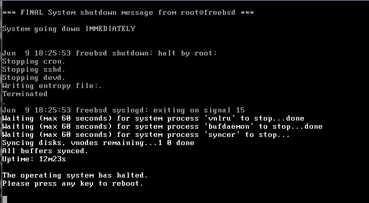

# 关机

## 关机

与一些`GNU/Linux`版本相比，"`shutdown -h now`"命令只是停止了`FreeBSD`，而没有关闭电源。请参考我虚拟机中的以下截图：

运行"`shutdown -h now`"后，你会发现系统只是停止了运行，按下任意键就可以立即重启系统。

如果你想要关机并关闭系统电源，你应该执行"`shutdown -p now`"。

参考：

[关机](https://www.freebsd.org/cgi/man.cgi?shutdown(8)).
