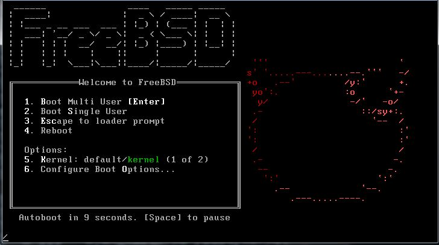
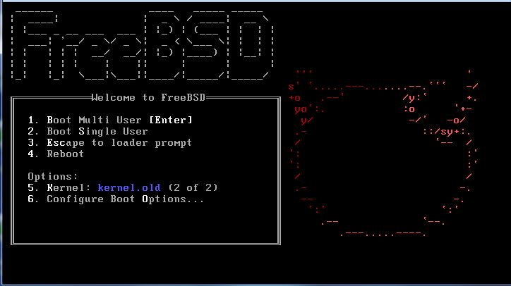

# 备份旧内核

## 备份旧内核

每次安装新内核时，上一个安装的内核将被备份在一个名为`kernel.old`的目录中。因此，重要的是要记得保存一个可用内核的副本，以防新构建的内核无法工作。例如：

```
# mv /boot/kernel.old /boot/kernel.good    
# mv /boot/kernel /boot/kernel.bad
# mv /boot/kernel.good /boot/kernel 
```

在启动时，您可以按`5`键选择要运行的内核：

 

参考：

[FreeBSD：恢复到先前的内核](http://www.linuxquestions.org/questions/*bsd-17/freebsd-reverting-to-previous-kernel-4175429007/)；

[如果出现问题](https://www.freebsd.org/doc/en_US.ISO8859-1/books/handbook/kernelconfig-trouble.html)。
