# 在工作中使用 F#的低风险方式

所以你对函数式编程很兴奋，业余时间一直在学习 F#，并且因为它有多棒而烦扰着你的同事，你迫不及待地想在工作中用它来做一些严肃的事情...

但是然后你撞上了一堵墙。

你的工作场所有一个“仅限 C#”的政策，不允许你使用 F#。

如果你在典型的企业环境中工作，要批准一门新的语言将是一个漫长的过程，需要说服你的队友、QA 团队、运维团队、你的老板、你老板的老板，以及走廊尽头的[神秘家伙](http://www.joelonsoftware.com/articles/fog0000000018.html)，他是你从未交流过的。我鼓励你开始这个过程（[给你的经理的有用链接](http://fpbridge.co.uk/why-fsharp.html)），但你仍然心急如焚，想着“我现在能做什么呢？”

另一方面，也许你在一个灵活、随和的地方工作，你可以做你想做的事情。

但你是个有责任心的人，不想成为那些用 APL 重写某个关键系统然后消失得无影无踪的人之一，留下一些令人费解的代码给你的接班人去维护。不，你想确保你不做任何会影响你团队[巴士因子](https://en.wikipedia.org/wiki/Bus_factor)的事情。

所以在这两种情况下，你想在工作中使用 F#，但你不能（或不想）将其用于核心应用程序代码。

你能做什么呢？

好吧，别担心！本系列将提出一些方式，以低风险、渐进的方式让你在工作中涉足 F#，而不影响任何关键任务的代码。

+   在工作中使用 F#的二十六种低风险方式。你可以立即开始——无需许可。

+   使用 F#进行开发和 DevOps 脚本编写。二十六种在工作中使用 F#的低风险方式（第二部分）。

+   使用 F#进行测试。二十六种在工作中使用 F#的低风险方式（第三部分）。

+   使用 F#进行数据库相关任务。二十六种在工作中使用 F#的低风险方式（第四部分）。

+   在工作中使用 F#的其他有趣方式。二十六种在工作中使用 F#的低风险方式（第五部分）。

# 二十六种在工作中使用 F#的低风险方式

# 二十六种在工作中使用 F#的低风险方式

所以你对函数式编程很兴奋，业余时间一直在学习 F#，并且因为它有多棒而烦扰着你的同事，你迫不及待地想在工作中用它来做一些严肃的事情...

但是然后你撞上了一堵墙。

你的工作场所有一个“仅限 C#”的政策，不允许你使用 F#。

如果您在典型的企业环境中工作，获得批准使用新语言将是一个漫长的过程，涉及说服您的队友、质量保证人员、运维人员、您的老板、老板的老板，以及您从未与之交谈过的[走廊那个神秘的家伙](http://www.joelonsoftware.com/articles/fog0000000018.html)。我鼓励您开始这个过程（一个[为您的经理提供的有用链接](http://fpbridge.co.uk/why-fsharp.html)），但是，您仍然不耐烦，并在想“我现在能做什么？”

另一方面，也许你在一个灵活、随意的地方工作，你可以随心所欲。

但是你很有责任感，不想成为那种用 APL 重新编写一些关键系统，然后不留痕迹就消失的人之一，让你的接替者需要维护一些令人费解的代码。不，你想确保自己不做任何会影响团队[巴士因子](http://en.wikipedia.org/wiki/Bus_factor)的事情。

因此，在这两种情况下，您想在工作中使用 F#，但是您不能（或不想）将其用于核心应用程序代码。

你能做什么？

别担心！这一系列的文章将建议您以低风险、渐进式的方式使用 F#，而不会影响任何关键代码。

## 系列内容

这是一个二十六种方法的列表，以便您可以直接跳转到您特别感兴趣的任何一种方法。

**第 1 部分 - 使用 F#进行交互式探索和开发**

1\. 使用 F#交互式地探索.NET 框架

2\. 使用 F#交互式地测试您自己的代码

3\. 使用 F#与网络服务进行交互式玩耍

4\. 使用 F#交互式地玩弄 UI

**第 2 部分 - 使用 F#进行开发和 devops 脚本**

5\. 使用 FAKE 进行构建和 CI 脚本

6\. 用 F#脚本检查网站是否响应

7\. 用 F#脚本将 RSS 订阅源转换为 CSV

8\. 使用 WMI 的 F#脚本检查进程的统计信息

9\. 使用 F#配置和管理云

**第 3 部分 - 使用 F#进行测试**

10\. 使用 F#编写具有可读名称的单元测试

11\. 使用 F#编程运行单元测试

12\. 使用 F#学习其他编写单元测试的方法

13\. 使用 FsCheck 编写更好的单元测试

14\. 使用 FsCheck 创建随机虚拟数据

15\. 使用 F# 创建模拟对象

16\. 使用 F# 进行自动化浏览器测试

17\. 使用 F# 进行行为驱动开发

**第 4 部分：使用 F# 处理与数据库相关的任务**

18\. 使用 F# 替代 LINQpad

19\. 使用 F# 单元测试存储过程

20\. 使用 FsCheck 生成随机数据库记录

21\. 使用 F# 进行简单的 ETL

22\. 使用 F# 生成 SQL Agent 脚本

**第 5 部分：使用 F# 的其他有趣方式**

23\. 使用 F# 进行解析

24\. 使用 F# 进行图表和可视化

25\. 使用 F# 访问基于 Web 的数据存储

26\. 使用 F# 进行数据科学和机器学习

(额外) 27: 平衡英国发电站机组的发电计划

## 入门指南

如果你正在使用 Visual Studio，你已经安装了 F#，所以你可以立即开始！无需征得任何人的许可。

如果你使用的是 Mac 或 Linux，你将不得不做一些工作，��憾地（[Mac](http://fsharp.org/use/mac/) 和 [Linux](http://fsharp.org/use/linux/) 的说明）。

有两种方式可以交互使用 F#：（1）直接在 F# 交互式窗口中输入，或者（2）创建一个 F# 脚本文件（.FSX）然后评估代码片段。

要在 Visual Studio 中使用 F# 交互式窗口：

1.  显示窗口：`菜单 > 视图 > 其他窗口 > F# 交互式`

1.  输入一个表达式，然后使用双分号 (`;;`) 告诉解释器你已经完成了。

例如：

```
let x = 1
let y = 2
x + y;; 
```

就我个人而言，我更喜欢创建一个脚本文件（`文件 > 新建 > 文件` 然后选择 "F# 脚本"）并在那里输入代码，因为你会得到自动完成和智能感知。

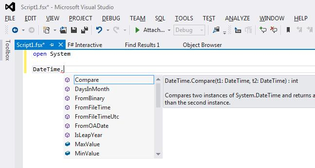

要运行一小段代码，只需高亮显示然后右键单击，或者简单地按下 `Alt+Enter`。

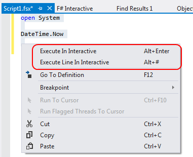

## 使用外部库和 NuGet

大多数代码示例引用了预期位于脚本目录下的外部库。

你可以显式下载或编译这些 DLL，但我认为使用 NuGet 命令行更简单。

1.  首先，你需要安装 Chocolately（从 [chocolatey.org](http://chocolatey.org/)）

1.  接下来使用 `cinst nuget.commandline` 安装 NuGet 命令行。

1.  最后，转到您的脚本目录，并从命令行安装 NuGet 包。

    例如，`nuget install FSharp.Data -o Packages -ExcludeVersion`

    正如您所看到的，我更喜欢在脚本中使用 Nuget 包时排除版本，这样以后可以更新而不会破坏现有代码。

* * *

## 第一部分：使用 F# 交互式地探索和开发

F# 最有价值的第一个领域是作为一个工具来交互式地探索 .NET 库。

以前，为了做到这一点，您可能已经创建了单元测试，然后通过调试器逐步执行它们以了解发生了什么。但是使用 F#，您不需要这样做，可以直接运行代码。

让我们看一些例子。

## 1\. 使用 F# 交互式地探索 .NET 框架

*本节的代码可以在 [github](http://github.com/swlaschin/low-risk-ways-to-use-fsharp-at-work/blob/master/explore-net-interactively.fsx) 上找到。*

当我编码时，我经常对 .NET 库的工作方式���一些小问题。

例如，以下是我最近遇到的一些问题，我通过使用 F# 交互式解决了：

+   我的自定义 DateTime 格式字符串正确吗？

+   XML 序列化如何处理本地 DateTime 和 UTC DateTime？

+   `GetEnvironmentVariable` 区分大小写吗？

所有这些问题当然可以在 MSDN 文档中找到，但也可以通过运行一些简单的 F# 代码片段来在几秒钟内得到答案，如下所示。

### 我的自定义 DateTime 格式字符串正确吗？

我想在自定义格式中使用 24 小时制。我知道是 "h"，但是是大写还是小写的 "h"？

```
open System
DateTime.Now.ToString("yyyy-MM-dd hh:mm")  // "2014-04-18 01:08"
DateTime.Now.ToString("yyyy-MM-dd HH:mm")  // "2014-04-18 13:09" 
```

### XML 序列化如何处理本地 DateTime 和 UTC DateTime？

XML 序列化如何准确处理日期？让我们找出来！

```
// TIP: sets the current directory to be same as the script directory
System.IO.Directory.SetCurrentDirectory (__SOURCE_DIRECTORY__)

open System

[<CLIMutable>] 
type DateSerTest = {Local:DateTime;Utc:DateTime}

let ser = new System.Xml.Serialization.XmlSerializer(typeof<DateSerTest>)

let testSerialization (dt:DateSerTest) = 
    let filename = "serialization.xml"
    use fs = new IO.FileStream(filename , IO.FileMode.Create)
    ser.Serialize(fs, o=dt)
    fs.Close()
    IO.File.ReadAllText(filename) |> printfn "%s"

let d = { 
    Local = DateTime.SpecifyKind(new DateTime(2014,7,4), DateTimeKind.Local)
    Utc = DateTime.SpecifyKind(new DateTime(2014,7,4), DateTimeKind.Utc)
    }

testSerialization d 
```

输出是：

```
<DateSerTest  >
  <Local>2014-07-04T00:00:00+01:00</Local>
  <Utc>2014-07-04T00:00:00Z</Utc>
</DateSerTest> 
```

所以我可以看到它在 UTC 时间中使用 "Z"。

### `GetEnvironmentVariable` 区分大小写吗？

这可以用一个简单的代码片段回答：

```
Environment.GetEnvironmentVariable "ProgramFiles" = 
    Environment.GetEnvironmentVariable "PROGRAMFILES"
// answer => true 
```

因此答案是 "不区分大小写"。

## 2\. 使用 F# 交互式地测试您自己的代码

*本节的代码可以在 [github](http://github.com/swlaschin/low-risk-ways-to-use-fsharp-at-work/blob/master/explore-own-code-interactively.fsx) 上找到。*

当然，您并不局限于与 .NET 库一起玩耍。有时测试您自己的代码可能非常有用。

要做到这一点，只需引用 DLL，然后按照下面所示打开命名空间。

```
 // set the current directory to be same as the script directory
System.IO.Directory.SetCurrentDirectory (__SOURCE_DIRECTORY__)

// pass in the relative path to the DLL
#r @"bin\debug\myapp.dll"

// open the namespace
open MyApp

// do something
MyApp.DoSomething() 
```

警告：在较旧版本的 F# 中，打开对 DLL 的引用会锁定它，导致无法编译！在这种情况下，在重新编译之前，请确保重置交互式会话以释放锁定。在较新版本的 F# 中，[DLL 是影子复制的](https://visualfsharp.codeplex.com/SourceControl/changeset/4c10b32c4f417701f4e6c3284b0a8dadab5a9b98)，不会锁定。

## 3\. 使用 F# 交互式地玩耍网络服务

*本节的代码可以在 [github](http://github.com/swlaschin/low-risk-ways-to-use-fsharp-at-work/blob/master/explore-webservices-interactively.fsx) 上找到。*

如果你想尝试使用 WebAPI 和 Owin 库，你无需创建可执行文件 —— 你可以仅通过脚本完成！

这需要一点设置，因为你需要一些库 DLL 才能让其正常工作。

因此，假设你已经设置好了 NuGet 命令行（见上文），转到你的脚本目录，并通过 `nuget install Microsoft.AspNet.WebApi.OwinSelfHost -o Packages -ExcludeVersion` 安装自托管库。

一旦这些库就位，你就可以使用下面的代码作为简单 WebAPI 应用程序的骨架。

```
// sets the current directory to be same as the script directory
System.IO.Directory.SetCurrentDirectory (__SOURCE_DIRECTORY__)

// assumes nuget install Microsoft.AspNet.WebApi.OwinSelfHost has been run 
// so that assemblies are available under the current directory
#r @"Packages\Owin\lib\net40\Owin.dll"
#r @"Packages\Microsoft.Owin\lib\net40\Microsoft.Owin.dll"
#r @"Packages\Microsoft.Owin.Host.HttpListener\lib\net40\Microsoft.Owin.Host.HttpListener.dll"
#r @"Packages\Microsoft.Owin.Hosting\lib\net40\Microsoft.Owin.Hosting.dll"
#r @"Packages\Microsoft.AspNet.WebApi.Owin\lib\net45\System.Web.Http.Owin.dll"
#r @"Packages\Microsoft.AspNet.WebApi.Core\lib\net45\System.Web.Http.dll"
#r @"Packages\Microsoft.AspNet.WebApi.Client\lib\net45\System.Net.Http.Formatting.dll"
#r @"Packages\Newtonsoft.Json\lib\net40\Newtonsoft.Json.dll"
#r "System.Net.Http.dll"

open System
open Owin 
open Microsoft.Owin
open System.Web.Http 
open System.Web.Http.Dispatcher
open System.Net.Http.Formatting

module OwinSelfhostSample =

    /// a record to return
    [<CLIMutable>]
    type Greeting = { Text : string }

    /// A simple Controller
    type GreetingController() =
        inherit ApiController()

        // GET api/greeting
        member this.Get()  =
            {Text="Hello!"}

    /// Another Controller that parses URIs
    type ValuesController() =
        inherit ApiController()

        // GET api/values 
        member this.Get()  =
            ["value1";"value2"]

        // GET api/values/5 
        member this.Get id = 
            sprintf "id is %i" id 

        // POST api/values 
        member this.Post ([<FromBody>]value:string) = 
            ()

        // PUT api/values/5 
        member this.Put(id:int, [<FromBody>]value:string) =
            ()

        // DELETE api/values/5 
        member this.Delete(id:int) =
            () 

    /// A helper class to store routes, etc.
    type ApiRoute = { id : RouteParameter }

    /// IMPORTANT: When running interactively, the controllers will not be found with error:
    /// "No type was found that matches the controller named 'XXX'."
    /// The fix is to override the ControllerResolver to use the current assembly
    type ControllerResolver() =
        inherit DefaultHttpControllerTypeResolver()

        override this.GetControllerTypes (assembliesResolver:IAssembliesResolver) = 
            let t = typeof<System.Web.Http.Controllers.IHttpController>
            System.Reflection.Assembly.GetExecutingAssembly().GetTypes()
            |> Array.filter t.IsAssignableFrom
            :> Collections.Generic.ICollection<Type>    

    /// A class to manage the configuration
    type MyHttpConfiguration() as this =
        inherit HttpConfiguration()

        let configureRoutes() = 
            this.Routes.MapHttpRoute(
                name= "DefaultApi",
                routeTemplate= "api/{controller}/{id}",
                defaults= { id = RouteParameter.Optional }
                ) |> ignore

        let configureJsonSerialization() = 
            let jsonSettings = this.Formatters.JsonFormatter.SerializerSettings
            jsonSettings.Formatting <- Newtonsoft.Json.Formatting.Indented
            jsonSettings.ContractResolver <- 
                Newtonsoft.Json.Serialization.CamelCasePropertyNamesContractResolver()

        // Here is where the controllers are resolved
        let configureServices() = 
            this.Services.Replace(
                typeof<IHttpControllerTypeResolver>, 
                new ControllerResolver())

        do configureRoutes()
        do configureJsonSerialization()
        do configureServices()

    /// Create a startup class using the configuration 
    type Startup() = 

        // This code configures Web API. The Startup class is specified as a type
        // parameter in the WebApp.Start method.
        member this.Configuration (appBuilder:IAppBuilder) = 
            // Configure Web API for self-host. 
            let config = new MyHttpConfiguration() 
            appBuilder.UseWebApi(config) |> ignore

// Start OWIN host 
do 
    // Create server
    let baseAddress = "http://localhost:9000/" 
    use app = Microsoft.Owin.Hosting.WebApp.Start<OwinSelfhostSample.Startup>(url=baseAddress) 

    // Create client and make some requests to the api
    use client = new System.Net.Http.HttpClient() 

    let showResponse query = 
        let response = client.GetAsync(baseAddress + query).Result 
        Console.WriteLine(response) 
        Console.WriteLine(response.Content.ReadAsStringAsync().Result) 

    showResponse "api/greeting"
    showResponse "api/values"
    showResponse "api/values/42"

    // for standalone scripts, pause so that you can test via your browser as well
    Console.ReadLine() |> ignore 
```

这是输出：

```
StatusCode: 200, ReasonPhrase: 'OK', Version: 1.1, Content: System.Net.Http.StreamContent, Headers:
{
  Date: Fri, 18 Apr 2014 22:29:04 GMT
  Server: Microsoft-HTTPAPI/2.0
  Content-Length: 24
  Content-Type: application/json; charset=utf-8
}
{
  "text": "Hello!"
}
StatusCode: 200, ReasonPhrase: 'OK', Version: 1.1, Content: System.Net.Http.StreamContent, Headers:
{
  Date: Fri, 18 Apr 2014 22:29:04 GMT
  Server: Microsoft-HTTPAPI/2.0
  Content-Length: 29
  Content-Type: application/json; charset=utf-8
}
[
  "value1",
  "value2"
]
StatusCode: 200, ReasonPhrase: 'OK', Version: 1.1, Content: System.Net.Http.StreamContent, Headers:
{
  Date: Fri, 18 Apr 2014 22:29:04 GMT
  Server: Microsoft-HTTPAPI/2.0
  Content-Length: 10
  Content-Type: application/json; charset=utf-8
}
"id is 42" 
```

这个示例只是为了演示你可以直接使用 OWIN 和 WebApi 库。

对于更加 F# 友好的 Web 框架，请看 [Suave](http://suave.io/) 或 [WebSharper](http://www.websharper.com)。在 [fsharp.org](http://fsharp.org/webstacks/) 上还有更多与 web 相关的内容。

## 4\. 使用 F# 与 UI 交互玩耍

*这部分的代码可在 [github 上找到](http://github.com/swlaschin/low-risk-ways-to-use-fsharp-at-work/blob/master/explore-winforms-interactively.fsx)。*

F# 交互的另一个用途是在 UI 运行时进行交互 —— 实时的！

这是一个开发 WinForms 屏幕交互的示例。

```
open System.Windows.Forms 
open System.Drawing

let form = new Form(Width= 400, Height = 300, Visible = true, Text = "Hello World") 
form.TopMost <- true
form.Click.Add (fun _ -> 
    form.Text <- sprintf "form clicked at %i" DateTime.Now.Ticks)
form.Show() 
```

这里是窗口：

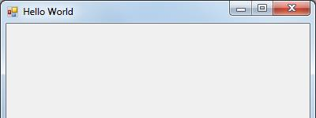

并且在点击后，窗口的标题栏已更改：

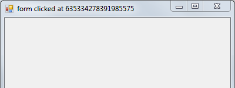

现在让我们添加一个 FlowLayoutPanel 和一个按钮。

```
let panel = new FlowLayoutPanel()
form.Controls.Add(panel)
panel.Dock = DockStyle.Fill 
panel.WrapContents <- false 

let greenButton = new Button()
greenButton.Text <- "Make the background color green" 
greenButton.Click.Add (fun _-> form.BackColor <- Color.LightGreen)
panel.Controls.Add(greenButton) 
```

现在窗口如下：

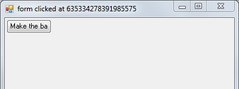

但按钮太小了 —— 我们需要将 `AutoSize` 设置为 true。

```
greenButton.AutoSize <- true 
```

那就更好了！

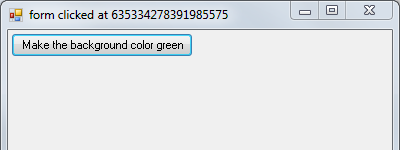

让我们再添加一个黄色按钮：

```
let yellowButton = new Button()
yellowButton.Text <- "Make me yellow" 
yellowButton.AutoSize <- true
yellowButton.Click.Add (fun _-> form.BackColor <- Color.Yellow)
panel.Controls.Add(yellowButton) 
```

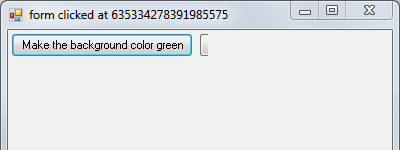

但按钮被截断了，所以让我们改变流向：

```
panel.FlowDirection <- FlowDirection.TopDown 
```

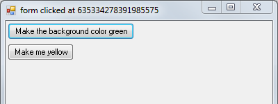

但现在黄色按钮的宽度与绿色按钮不同，我们可以使用 `Dock` 来修复：

```
yellowButton.Dock <- DockStyle.Fill 
```

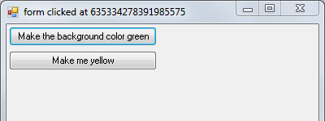

正如你所见，通过这种方式轻松地与布局进行交互是非常容易的。一旦你满意布局逻辑，你就可以将代码转换回 C#，用于你的真实应用程序。

此示例是针对 WinForms 特定的。当然，对于其他 UI 框架，逻辑会有所不同。

* * *

这就是前四个建议。我们还没结束！下一篇文章将涵盖使用 F# 进行开发和 DevOps 脚本。

# 使用 F# 进行开发和 DevOps 脚本

# 使用 F# 进行开发和 DevOps 脚本

这篇文章是系列文章 在工作中使用 F# 的低风险方法 的延续。我已经提出了一些低风险、增量式地使用 F# 的方法，而不会影响到任何关键任务的代码。

在这里，我们将讨论使用 F# 构建和其他开发和 DevOps 脚本。

如果你是 F# 的新手，你可能想要阅读前一篇文章中关于 入门 和 使用 NuGet 的部分。

## 系列目录

这是一份指向 26 种方式的快捷方式列表：

**第 1 部分 - 使用 F# 交互式探索和开发**

1\. 使用 F# 交互式探索 .NET Framework

2\. 使用 F# 交互式测试你自己的代码

3\. 使用 F# 交互式玩转网络服务

4\. 使用 F# 交互式玩转 UI

**第 2 部分 - 使用 F# 编写开发和运维脚本**

5\. 使用 FAKE 编写构建和 CI 脚本

6\. 检查网站是否响应的 F# 脚本

7\. 一个将 RSS 订阅转换为 CSV 的 F# 脚本

8\. 使用 WMI 检查进程状态的 F# 脚本

9\. 使用 F# 配置和管理云

**第 3 部分 - 使用 F# 进行测试**

10\. 使用 F# 编写具有可读名称的单元测试

11\. 使用 F# 以编程方式运行单元测试

12\. 使用 F# 学习以其他方式编写单元测试

13\. 使用 FsCheck 编写更好的单元测试

14\. 使用 FsCheck 创建随机虚拟数据

15\. 使用 F# 创建模拟对象

16\. 使用 F# 进行自动化浏览器测试

17\. 使用 F# 进行行为驱动开发

**第 4 部分：使用 F# 处理与数据库相关的任务**

18\. 使用 F# 替代 LINQpad

19\. 使用 F# 对存储过程进行单元测试

20\. 使用 FsCheck 生成随机数据库记录

21\. 使用 F# 进行简单的 ETL

22\. 使用 F# 生成 SQL Agent 脚本

**第 5 部分：其他有趣的 F# 使用方式**

23\. 使用 F# 进行解析

24\. 使用 F# 进行图表和可视化

25\. 使用 F# 访问基于 Web 的数据存储

26\. 使用 F# 进行数据科学和机器学习

(奖励) 27: 平衡英国发电站群的发电计划

* * *

## 第二部分：使用 F# 编写开发和运维脚本

接下来的建议涉及使用 F# 编写围绕开发活动的各种脚本：构建、持续集成、部署等。

对于这些小任务，您需要一个带有 REPL 的良��脚本语言。您可以使用 PowerShell，或者 [ScriptCS](http://scriptcs.net/)，甚至是 Python。但为什么不试试 F# 呢？

+   F# 感觉轻量级，就像 Python（很少或没有类型声明）。

+   F# 可以访问 .NET 库，包括核心库和通过 NuGet 下载的库。

+   F# 具有类型提供程序（相对于 PowerShell 和 ScriptCS 的一个巨大优势），可以让您轻松访问各种数据源。

+   所有这些都以简洁、类型安全的方式进行，还有智能感知！

以这种方式使用 F# 将使您和您的同事能够使用 F# 代码解决实际问题。对于这种低风险方法，管理人员不应该有任何抵抗力 -- 在最坏的情况下，您可以轻松切换到使用其他工具。

当然，一个隐藏的目的是，一旦您的同事有机会尝试 F#，他们就会上瘾，您离 [全程使用 F#](http://colinbul.wordpress.com/2013/02/23/f-end-to-end/) 又近了一步！

### 您可以用 F# 脚本做什么？

在接下来的几节中，我们将看到三个 F# 脚本示例：

+   一个用于检查网站是否响应的 F# 脚本

+   一个将 RSS 订阅转换为 CSV 的 F# 脚本

+   一个使用 WMI 检查进程统计数据的 F# 脚本

当然，您可以将 F# 脚本与几乎任何 .NET 库集成。以下是可以编写脚本的其他实用程序的建议：

+   简单的文件复制、目录遍历和归档（例如日志文件）。如果您使用 .NET 4.5，可以使用新的 [System.IO.Compression.ZipArchive](http://msdn.microsoft.com/en-us/library/vstudio/hh485720.aspx) 类来进行压缩和解压缩，而无需使用第三方库。

+   处理 JSON 数据，可以是已知格式（使用 [JSON 类型提供程序](http://fsharp.github.io/FSharp.Data/library/JsonProvider.html)）或未知格式（使用 [JSON 解析器](http://fsharp.github.io/FSharp.Data/library/JsonValue.html)）。

+   使用 [Octokit](http://www.nuget.org/packages/Octokit/) 与 GitHub 进行交互。

+   从 Excel 中提取数据或操作数据。F# 支持使用 COM 进行 Office 自动化，或者您可以使用其中一种类型提供程序或库。

+   使用 [Math.NET](http://numerics.mathdotnet.com/) 进行数值计算。

+   Web 爬取、链接检查和屏幕抓取。内置的异步工作流和代理使得编写这种“多线程”代码非常容易。

+   使用[Quartz.NET](http://www.quartz-scheduler.net/)进行调度。

如果这些建议激起了你的兴趣，并且你想使用更多的 F#，那么请查看[F# 社区项目](http://fsharp.org/community/projects/)页面。这是一个为 F# 编写的有用库的绝佳来源，其中大多数库与 F# 脚本兼容。

### 调试 F# 脚本

使用 F# 脚本的一个很棒的地方是你不需要创建一个完整的项目，也不需要启动 Visual Studio。

但如果你需要调试一个脚本，而又不在 Visual Studio 中，你可以做些什么？以下是一些提示：

+   首先，你可以只是使用经过尝试和真实的控制台打印使用`printfn`。我通常会将其包装在一个简单的`log`函数中，这样我就可以通过一个标志打开或关闭日志记录。

+   你可以使用[FsEye](http://code.google.com/p/fseye/)工具来检查和监视交互式会话中的变量。

+   最后，你仍然可以使用 Visual Studio 调试器。诀窍是[附加调试器](http://stackoverflow.com/a/9337016/1136133)到 fsi.exe 进程，然后你可以使用[`Debugger.Break`](http://msdn.microsoft.com/en-us/library/vstudio/system.diagnostics.debugger.break)在某个特定点中断。

## 5\. 使用 FAKE 来构建和 CI 脚本

*本节的代码[在 github 上可用](http://github.com/swlaschin/low-risk-ways-to-use-fsharp-at-work/blob/master/fake.fsx)。*

让我们从[FAKE](http://fsharp.github.io/FAKE/)开始，它是一个用 F# 编写的跨平台构建自动化工具，类似于 Ruby 的[Rake](http://rake.rubyforge.org/)。

FAKE 内置支持 git、NuGet、单元测试、Octopus Deploy、Xamarin 等等，并且可以轻松开发具有依赖关系的复杂脚本。

你甚至可以将其与[TFS 一起使用以避免使用 XAML](http://blog.ctaggart.com/2014/01/code-your-tfs-builds-in-f-instead-of.html)。

使用 FAKE 而不是像 Rake 这样的东西的一个原因是，你可以在整个工具链中标准化 .NET 代码。理论上，你可以使用[NAnt](http://en.wikipedia.org/wiki/NAnt)，但实际上，不需要，因为 XML。[PSake](http://github.com/psake/psake)也是一个可能的选择，但我认为比 FAKE 更复杂。

你还可以使用 FAKE 来消除对特定构建服务器的依赖。例如，你可以考虑[在 FAKE 中执行它们](http://www.jamescrowley.co.uk/2014/04/22/code-coverage-using-dotcover-and-f-make/)，而不是使用 TeamCity 的集成来运行测试和其他任务，这意味着你可以在不安装 TeamCity 的情况下运行完整的构建。

下面是一个非常简单的 FAKE 脚本示例，摘自[FAKE 网站上的更详细的示例](http://fsharp.github.io/FAKE/gettingstarted.html)。

```
// Include Fake lib
// Assumes NuGet has been used to fetch the FAKE libraries
#r "packages/FAKE/tools/FakeLib.dll"
open Fake

// Properties
let buildDir = "./build/"

// Targets
Target "Clean" (fun _ ->
    CleanDir buildDir
)

Target "Default" (fun _ ->
    trace "Hello World from FAKE"
)

// Dependencies
"Clean"
  ==> "Default"

// start build
RunTargetOrDefault "Default" 
```

语法需要一点时间来适应，但这些努力是值得的。

关于 FAKE 的一些进一步阅读：

+   [迁移到 FAKE](http://bugsquash.blogspot.co.uk/2010/11/migrating-to-fake.html)。

+   [Hanselman 关于 FAKE](http://www.hanselman.com/blog/ExploringFAKEAnFBuildSystemForAllOfNET.aspx)。很多评论都来自积极使用 FAKE 的人。

+   [一个 NAnt 用户尝试使用 FAKE](http://putridparrot.com/blog/trying-fake-out/)。

## 6\. 一个检查网站是否响应的 F# 脚本

*本节的代码可在 [github 上获取](http://github.com/swlaschin/low-risk-ways-to-use-fsharp-at-work/blob/master/dev-website-responding.fsx)。*

这个脚本检查网站是否以 200 响应。例如，这可能是进行部署后的冒烟测试的基础。

```
// Requires FSharp.Data under script directory 
//    nuget install FSharp.Data -o Packages -ExcludeVersion 
#r @"Packages\FSharp.Data\lib\net40\FSharp.Data.dll"
open FSharp.Data

let queryServer uri queryParams = 
    try
        let response = Http.Request(uri, query=queryParams, silentHttpErrors = true)
        Some response 
    with
    | :? System.Net.WebException as ex -> None

let sendAlert uri message = 
    // send alert via email, say
    printfn "Error for %s. Message=%O" uri message

let checkServer (uri,queryParams) = 
    match queryServer uri queryParams with
    | Some response -> 
        printfn "Response for %s is %O" uri response.StatusCode 
        if (response.StatusCode <> 200) then
            sendAlert uri response.StatusCode 
    | None -> 
        sendAlert uri "No response"

// test the sites 
let google = "http://google.com", ["q","fsharp"]
let bad = "http://example.bad", []

[google;bad]
|> List.iter checkServer 
```

结果是：

```
Response for http://google.com is 200
Error for http://example.bad. Message=No response 
```

注意，我在`Fsharp.Data`中使用了 Http 实用程序代码，它提供了一个很好的包装器，用于`HttpClient`。[这里了解更多关于 HttpUtilities 的信息](http://fsharp.github.io/FSharp.Data/library/Http.html)。

## 7\. 一个将 RSS 订阅转换为 CSV 的 F# 脚本

*本节的代码可在 [github 上获取](http://github.com/swlaschin/low-risk-ways-to-use-fsharp-at-work/blob/master/dev-rss-to-csv.fsx)。*

这是一个使用 Xml 类型提供程序解析 RSS 订阅（在本例中是 [StackOverflow 上关于 F# 的问题](https://stackoverflow.com/questions/tagged/f%23?sort=newest&pageSize=10)）并将其转换为 CSV 文件以供以后分析的小脚本。

注意，RSS 解析代码只有一行代码！大部分代码用于编写 CSV。是的，我可以使用 CSV 库（NuGet 上有很多），但我想保持原样，向你展示它有多简单。

```
// sets the current directory to be same as the script directory
System.IO.Directory.SetCurrentDirectory (__SOURCE_DIRECTORY__)

// Requires FSharp.Data under script directory 
//    nuget install FSharp.Data -o Packages -ExcludeVersion 
#r @"Packages\FSharp.Data\lib\net40\FSharp.Data.dll"
#r "System.Xml.Linq.dll"
open FSharp.Data

type Rss = XmlProvider<"http://stackoverflow.com/feeds/tag/f%23">

// prepare a string for writing to CSV 
let prepareStr obj =
    obj.ToString()
     .Replace("\"","\"\"") // replace single with double quotes
     |> sprintf "\"%s\""   // surround with quotes

// convert a list of strings to a CSV
let listToCsv list =
    let combine s1 s2 = s1 + "," + s2
    list 
    |> Seq.map prepareStr 
    |> Seq.reduce combine 

// extract fields from Entry
let extractFields (entry:Rss.Entry) = 
    [entry.Title.Value; 
     entry.Author.Name; 
     entry.Published.ToShortDateString()]

// write the lines to a file
do 
    use writer = new System.IO.StreamWriter("fsharp-questions.csv")
    let feed = Rss.GetSample()
    feed.Entries
    |> Seq.map (extractFields >> listToCsv)
    |> Seq.iter writer.WriteLine
    // writer will be closed automatically at the end of this scope 
```

注意，类型提供程序会生成智能提示（如下所示），以根据订阅的实际内容显示可用的属性。这非常酷。

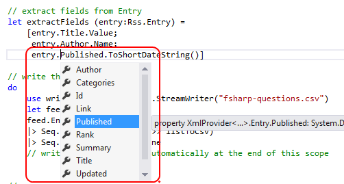

结果类似于这样：

```
"Optimising F# answer for Euler #4","DropTheTable","18/04/2014"
"How to execute a function, that creates a lot of objects, in parallel?","Lawrence Woodman","01/04/2014"
"How to invoke a user defined function using R Type Provider","Dave","19/04/2014"
"Two types that use themselves","trn","19/04/2014"
"How does function [x] -> ... work","egerhard","19/04/2014" 
```

更多关于 XML 类型提供程序的信息，请[参见 FSharp.Data 页面](http://fsharp.github.io/FSharp.Data/library/XmlProvider.html)。

## 8\. 一个使用 WMI 检查进程状态的 F# 脚本

*本节的代码可在 [github 上获取](http://github.com/swlaschin/low-risk-ways-to-use-fsharp-at-work/blob/master/dev-wmi-stats.fsx)。*

如果您使用 Windows，能够访问 WMI 非常有用。幸运的是，有一个用于 WMI 的 F# 类型提供程序，可以使使用变得容易。

在这个例子中，我们将获取系统时间，并检查一些进程的统计信息。例如，在负载测试期间和之后可能会很有用。

```
// sets the current directory to be same as the script directory
System.IO.Directory.SetCurrentDirectory (__SOURCE_DIRECTORY__)

// Requires FSharp.Management under script directory 
//    nuget install FSharp.Management -o Packages -ExcludeVersion 
#r @"System.Management.dll"
#r @"Packages\FSharp.Management\lib\net40\FSharp.Management.dll"
#r @"Packages\FSharp.Management\lib\net40\FSharp.Management.WMI.dll"

open FSharp.Management

// get data for the local machine
type Local = WmiProvider<"localhost">
let data = Local.GetDataContext()

// get the time and timezone on the machine
let time = data.Win32_UTCTime |> Seq.head
let tz = data.Win32_TimeZone |> Seq.head
printfn "Time=%O-%O-%O %O:%O:%O" time.Year time.Month time.Day time.Hour time.Minute time.Second 
printfn "Timezone=%O" tz.StandardName 

// find the "explorer" process
let explorerProc = 
    data.Win32_PerfFormattedData_PerfProc_Process
    |> Seq.find (fun proc -> proc.Name.Contains("explorer") )

// get stats about it
printfn "ElapsedTime=%O" explorerProc.ElapsedTime
printfn "ThreadCount=%O" explorerProc.ThreadCount
printfn "HandleCount=%O" explorerProc.HandleCount
printfn "WorkingSetPeak=%O" explorerProc.WorkingSetPeak
printfn "PageFileBytesPeak=%O" explorerProc.PageFileBytesPeak 
```

输出类似于这样：

```
Time=2014-4-20 14:2:35
Timezone=GMT Standard Time
ElapsedTime=2761906
ThreadCount=67
HandleCount=3700
WorkingSetPeak=168607744
PageFileBytesPeak=312565760 
```

再次，使用类型提供程序意味着您可以获得智能提示（如下所示）。对于数百个 WMI 选项非常有用。

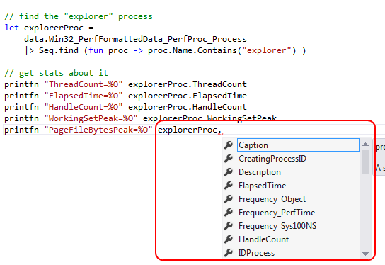

[更多关于 WMI 类型提供程序的信息在这里](http://fsprojects.github.io/FSharp.Management/WMIProvider.html)。

## 9\. 使用 F# 配置和管理云

值得特别一提的一个领域是使用 F# 配置和管理云服务。fsharp.org 的 [云页面](http://fsharp.org/cloud/)上有许多有用的链接。

对于简单的脚本编写，[Fog](http://dmohl.github.io/Fog/) 是 Azure 的一个不错的封装。

例如，要上传一个 blob，代码就是这么简单：

```
UploadBlob "testcontainer" "testblob" "This is a test" |> ignore 
```

或者添加和接收消息：

```
AddMessage "testqueue" "This is a test message" |> ignore

let result = GetMessages "testqueue" 20 5
for m in result do
    DeleteMessage "testqueue" m 
```

使用 F# 进行这项工作的特别之处在于，你可以在微型脚本中完成 -- 无需任何繁重的工具。

## 摘要

希望你觉得这些建议有用。如果你在实践中应用了它们，请在评论中告诉我。

接下来：使用 F# 进行测试。

# 使用 F# 进行测试

# 使用 F# 进行测试

本文是之前系列文章的延续，关于在工作中低风险和渐进式使用 F# 的方式 -- 如何以低风险、渐进式的方式涉足 F#，而不影响任何关键任务代码？

在这篇文章中，我们将讨论使用 F# 进行测试。

## 系列内容

在继续阅读本文内容之前，这里是二十六种方法的完整列表：

**第一部分 - 使用 F# 进行交互式探索和开发**

1\. 使用 F# 与 .NET 框架进行交互式探索

2\. 使用 F# 交互式测试自己的代码

3\. 使用 F# 与网络服务进行交互式操作

4\. 使用 F# 与 UI 进行交互式操作

**第二部分 - 使用 F# 进行开发和运维脚本**

5\. 使用 FAKE 编写构建和 CI 脚本

6\. 一个检查网站是否响应的 F# 脚本

7\. 一个将 RSS 订阅转换为 CSV 的 F# 脚本

8\. 使用 WMI 检查进程统计信息的 F# 脚本

9\. 使用 F# 进行云配置和管理

**第三部分 - 使用 F# 进行测试**

10\. 使用 F# 编写具有可读名称的单元测试

11\. 使用 F# 运行单元测试程序化

12\. 使用 F# 学习以其他方式编写单元测试

13\. 使用 FsCheck 编写更好的单元测试

14\. 使用 FsCheck ��建随机虚拟数据

15\. 使用 F# 创建模拟对象

16\. 使用 F# 进行自动化浏览器测试

17\. 使用 F# 进行行为驱动开发

**第四部分 - 使用 F# 进行与数据库相关的任务**

18\. 使用 F# 替代 LINQpad

19\. 使用 F# 单元测试存储过程

20\. 使用 FsCheck 生成随机数据库记录

21\. 使用 F# 进行简单的 ETL

22\. 使用 F# 生成 SQL Agent 脚本

**第五部分：其他有趣的 F# 使用方式**

23\. 使用 F# 进行解析

24\. 使用 F# 进行图表和可视化

25\. 使用 F# 访问基于 Web 的数据存储

26\. 使用 F# 进行数据科学和机器学习

(奖励) 27: 平衡英国发电站机组的发电计划

* * *

## 第三部分 - 使用 F# 进行测试

如果您想要开始在 F# 中编写有用的代码而不触及核心代码，编写测试是一个很好的开始。

F# 不仅具有更紧凑的语法，还有许多好用的功能，比如“双反引号”语法，使测试名称更易读。

与本系列中的所有建议一样，我认为这是一个低风险选项。测试方法往往很简短，所以几乎任何人都能够阅读它们，而不必深入了解 F#。在最坏的情况下，你可以轻松地将它们转回到 C#。

## 10\. 使用 F# 编写具有可读名称的单元测试

*本节的代码可在 [github](http://github.com/swlaschin/low-risk-ways-to-use-fsharp-at-work/blob/master/TestsInFsharp/TestWithNUnit.fs) 上找到。*

与 C# 一样，F# 可以用于使用标准框架编写标准单元测试，如 NUnit、MsUnit、xUnit 等。

这里有一个带有 `TestFixture` 属性的类，以及一个带有 `Test` 属性的公共 void 方法。非常标准。

```
[<TestFixture>]
type TestClass() = 

    [<Test>]
    member this.When2IsAddedTo2Expect4() = 
        Assert.AreEqual(4, 2+2) 
```

正如你所看到的，这里有一个带有 `TestFixture` 属性的类，以及一个带有 `Test` 属性的公共 void 方法。非常标准。

但是，与使用 C# 相比，使用 F# 时您会得到一些额外的好处。首先，您可以使用双反引号语法创建更易读的名称，其次，您可以在模块中使用 `let` 绑定函数而不是类，这简化了代码。

```
[<Test>]
let ``When 2 is added to 2 expect 4``() = 
    Assert.AreEqual(4, 2+2) 
```

双反引号语法使测试结果更易读。这是一个使用 NUnit 编写的测试类的输出示例。

```
TestClass.When2IsAddedTo2Expect4
Result: Success 
```

与使用更友好名称的输出相比：

```
MyUnitTests.When 2 is added to 2 expect 4
Result: Success 
```

因此，如果您想要编写对非程序员可访问的��试名称，请尝试使用 F#！

## 11\. 使用 F# 来编程运行单元测试

通常，您可能希望以编程方式运行单元测试。这可能是出于各种原因，比如使用自定义过滤器，或进行自定义日志记录，或不想在测试机器上安装 NUnit。

这样做的一个简单方法是使用[Fuchu 库](http://github.com/mausch/Fuchu)，它允许您直接组织测试，特别是参数化测试，而无需任何复杂的测试属性。

这是一个例子：

```
let add1 x = x + 1

// a simple test using any assertion framework:
// Fuchu's own, Nunit, FsUnit, etc
let ``Assert that add1 is x+1`` x _notUsed = 
   NUnit.Framework.Assert.AreEqual(x+1, add1 x)

// a single test case with one value
let simpleTest = 
   testCase "Test with 42" <| 
     ``Assert that add1 is x+1`` 42

// a parameterized test case with one param
let parameterizedTest i = 
   testCase (sprintf "Test with %i" i) <| 
     ``Assert that add1 is x+1`` i 
```

您可以使用类似于此的代码直接在 F# 交互式中运行这些测试：`run simpleTest`。

你还可以将这些测试组合成一个或多个列表，或列表的层次结构列表：

```
// create a hierarchy of tests 
// mark it as the start point with the "Tests" attribute
[<Fuchu.Tests>]
let tests = 
   testList "Test group A" [
      simpleTest 
      testList "Parameterized 1..10" ([1..10] |> List.map parameterizedTest) 
      testList "Parameterized 11..20" ([11..20] |> List.map parameterizedTest) 
   ] 
```

*以上代码在 [github 上可用](http://github.com/swlaschin/low-risk-ways-to-use-fsharp-at-work/blob/master/TestsInFsharp/OrganizeTestsWithFuchu.fs)。*

最后，使用 Fuchu，测试装配体成为其自己的测试运行程序。只需将装配体设置为控制台应用程序而不是库，并将此代码添加到 `program.fs` 文件中：

```
[<EntryPoint>]
let main args = 
    let exitCode = defaultMainThisAssembly args

    Console.WriteLine("Press any key")
    Console.ReadLine() |> ignore

    // return the exit code
    exitCode 
```

[这里有关于 Fuchu 的更多信息](http://bugsquash.blogspot.co.uk/2012/06/fuchu-functional-test-library-for-net.html)。

### 使用 NUnit 测试运行程序

如果确实需要使用现有的测试运行程序（如 NUnit），那么制作一个简单的脚本非常简单。

我做了一个小例子，如下所示，使用了`Nunit.Runners`包。

好吧，这可能不是 F# 最激动人心的用途，但它展示了 F# 的“对象表达式”语法来创建`NUnit.Core.EventListener`接口，所以我想把它留作演示。

```
// sets the current directory to be same as the script directory
System.IO.Directory.SetCurrentDirectory (__SOURCE_DIRECTORY__)

// Requires Nunit.Runners under script directory 
//    nuget install NUnit.Runners -o Packages -ExcludeVersion 

#r @"Packages\NUnit.Runners\tools\lib\nunit.core.dll"
#r @"Packages\NUnit.Runners\tools\lib\nunit.core.interfaces.dll"

open System
open NUnit.Core

module Setup = 
    open System.Reflection
    open NUnit.Core
    open System.Diagnostics.Tracing

    let configureTestRunner path (runner:TestRunner) = 
        let package = TestPackage("MyPackage")
        package.Assemblies.Add(path) |> ignore
        runner.Load(package) |> ignore

    let createListener logger =

        let replaceNewline (s:string) = 
            s.Replace(Environment.NewLine, "")

        // This is an example of F#'s "object expression" syntax.
        // You don't need to create a class to implement an interface
        {new NUnit.Core.EventListener
            with

            member this.RunStarted(name:string, testCount:int) =
                logger "Run started "

            member this.RunFinished(result:TestResult ) = 
                logger ""
                logger "-------------------------------"
                result.ResultState
                |> sprintf "Overall result: %O" 
                |> logger 

            member this.RunFinished(ex:Exception) = 
                ex.StackTrace 
                |> replaceNewline 
                |> sprintf "Exception occurred: %s" 
                |> logger 

            member this.SuiteFinished(result:TestResult) = ()
            member this.SuiteStarted(testName:TestName) = ()

            member this.TestFinished(result:TestResult)=
                result.ResultState
                |> sprintf "Result: %O" 
                |> logger 

            member this.TestOutput(testOutput:TestOutput) = 
                testOutput.Text 
                |> replaceNewline 
                |> logger 

            member this.TestStarted(testName:TestName) = 
                logger ""

                testName.FullName 
                |> replaceNewline 
                |> logger 

            member this.UnhandledException(ex:Exception) = 
                ex.StackTrace 
                |> replaceNewline 
                |> sprintf "Unhandled exception occurred: %s"
                |> logger 
            }

// run all the tests in the DLL
do 
    let dllPath = @".\bin\MyUnitTests.dll"

    CoreExtensions.Host.InitializeService();

    use runner = new NUnit.Core.SimpleTestRunner()
    Setup.configureTestRunner dllPath runner
    let logger = printfn "%s"
    let listener = Setup.createListener logger
    let result = runner.Run(listener, TestFilter.Empty, true, LoggingThreshold.All)

    // if running from the command line, wait for user input
    Console.ReadLine() |> ignore

    // if running from the interactive session, reset session before recompiling MyUnitTests.dll 
```

*以上代码在 [github 上可用](http://github.com/swlaschin/low-risk-ways-to-use-fsharp-at-work/blob/master/TestsInFsharp/nunit-test-runner.fsx)。*

## 12\. 使用 F# 学习以其他方式编写单元测试

上述单元测试代码对我们所有人来说都很熟悉，但是还有其他编写测试的方法。学习以不同的风格编码是增加一些新技术到你的工具箱并扩展你的思维的好方法，所以让我们快速看一些吧。

首先是[FsUnit](http://github.com/fsharp/FsUnit)，它用更流畅和习惯的方式（自然语言和管道）替换了`Assert`。

这是一个代码片段：

```
open NUnit.Framework
open FsUnit

let inline add x y = x + y

[<Test>]
let ``When 2 is added to 2 expect 4``() = 
    add 2 2 |> should equal 4

[<Test>]
let ``When 2.0 is added to 2.0 expect 4.01``() = 
    add 2.0 2.0 |> should (equalWithin 0.1) 4.01

[<Test>]
let ``When ToLower(), expect lowercase letters``() = 
    "FSHARP".ToLower() |> should startWith "fs" 
```

*以上代码在 [github 上可用](http://github.com/swlaschin/low-risk-ways-to-use-fsharp-at-work/blob/master/TestsInFsharp/TestWithFsUnit.fs)。*

[Unquote](http://code.google.com/p/unquote/) 使用了一种非常不同的方法。Unquote 的方法是将任何 F# 表达式包装在[F# 引用](http://msdn.microsoft.com/en-us/library/dd233212.aspx)中，然后评估它。如果测试表达式抛出异常，则测试将失败并打印不仅是异常，而且是直到异常点的每一步。这些信息可能会为您提供更多关于为何断言失败的见解。

这里是一个非常简单的例子：

```
[<Test>]
let ``When 2 is added to 2 expect 4``() = 
    test <@ 2 + 2 = 4 @> 
```

还有许多快捷操作符，比如`=?`和`>?`，可以让你更简单地编写测试——完全不需要`assert`！

```
[<Test>]
let ``2 + 2 is 4``() = 
   let result = 2 + 2
   result =? 4

[<Test>]
let ``2 + 2 is bigger than 5``() = 
   let result = 2 + 2
   result >? 5 
```

*以上代码在 [github 上可用](http://github.com/swlaschin/low-risk-ways-to-use-fsharp-at-work/blob/master/TestsInFsharp/TestWithUnquote.fs)。*

## 13\. 使用 FsCheck 编写更好的单元测试

*本节的代码可以在[github 上找到](http://github.com/swlaschin/low-risk-ways-to-use-fsharp-at-work/blob/master/TestsInFsharp/TestWithFsCheck.fs)。*

假设我们已经编写了一个将数字转换为罗马数字的函数，并且我们想为它创建一些测试用例。

我们可能会开始编写这样的测试：

```
[<Test>]
let ``Test that 497 is CDXCVII``() = 
    arabicToRoman 497 |> should equal "CDXCVII" 
```

但这种方法的问题在于它只测试一个非常具体的例子。可能有一些我们没有考虑到的边缘情况。

一个更好的方法是找到对*所有*情况都必须为真的东西。然后我们可以创建一个检查这个东西（一个“属性”）对所有情况是否为真，或者至少对一个大的随机子集是否为真的测试。

例如，在罗马数字的例子中，我们可以说一个属性是“所有罗马数字最多有一个'V'字符”或“所有罗马数字最多有三个'X'字符”。然后我们可以构建检查这个属性确实为真的测试。

这就是[ FsCheck](http://github.com/fsharp/FsCheck)可以帮助的地方。FsCheck 是一个专为这种基于属性的测试设计的框架。它是用 F#编写的，但同样适用于测试 C#代码。

因此，让我们看看我们如何为我们的罗马数字使用 FsCheck。

首先，我们定义一些我们期望对所有罗马数字成立的属性。

```
let maxRepetitionProperty ch count (input:string) = 
    let find = String.replicate (count+1) ch
    input.Contains find |> not

// a property that holds for all roman numerals
let ``has max rep of one V`` roman = 
    maxRepetitionProperty "V" 1 roman 

// a property that holds for all roman numerals
let ``has max rep of three Xs`` roman = 
    maxRepetitionProperty "X" 3 roman 
```

有了这个，我们创建测试：

1.  创建一个适合传递给 FsCheck 的属性检查器函数。

1.  使用`Check.Quick`函数生成数百个随机测试用例，并将它们发送到属性检查器中。

```
[<Test>]
let ``Test that roman numerals have no more than one V``() = 
    let property num = 
        // convert the number to roman and check the property
        arabicToRoman num |> ``has max rep of one V``

    Check.QuickThrowOnFailure (testWithRange property)

[<Test>]
let ``Test that roman numerals have no more than three Xs``() = 
    let property num = 
        // convert the number to roman and check the property
        arabicToRoman num |> ``has max rep of three Xs``

    Check.QuickThrowOnFailure (testWithRange property) 
```

这里是测试的结果。你可以看到已经测试了 100 个随机数，而不仅仅是一个。

```
Test that roman numerals have no more than one V
   Ok, passed 100 tests.

Test that roman numerals have no more than three Xs
   Ok, passed 100 tests. 
```

如果我们将测试改为“测试罗马数字中不超过两个 X”，那么测试结果为 false，看起来像这样：

```
Falsifiable, after 33 tests 

30 
```

换句话说，在生成了 33 个不同的输入后，FsCheck 正确地找到了一个不符合所需属性的数字（30）。非常好！

### 在实践中使用 FsCheck

并非所有情况都有可以通过这种方式测试的属性，但你可能会发现这种情况比你想象的更常见。

例如，基于属性的测试对于“算法”代码特别有用。以下是一些例子：

+   如果你反转一个列表然后再次反转，你会得到原始列表。

+   如果你因式分解一个整数然后将因子相乘，你会得到原始数字。

但即使在乏味的业务应用程序中，你可能会发现基于属性的测试也有用武之地。例如，以下是一些可以表达为属性的事物：

+   **往返测试**。例如，如果你将一个记录保存到数据库，然后重新加载它，记录的字段应该保持不变。同样，如果你序列化然后反序列化某些东西，你应该得到原始的东西。

+   **不变性**。如果你向销售订单添加产品，那么各个行的总和应与订单总额相同。或者，每页的字数总和应等于整本书的字数总和。更普遍地说，如果你通过两种不同的路径计算事物，你应该得到相同的答案（幺半群同态！）

+   **舍入**。如果你向食谱中添加配料，那么配料百分比的总和（精确到小数点后 2 位）应始终精确地为 100%。大多数分区逻辑都需要类似的规则，例如份额、税收计算等（例如[DDD 书中的“份额饼图”示例](http://books.google.co.uk/books?id=xColAAPGubgC&pg=PA198&lpg=PA198&dq=%22domain+driven+design%22+%22share+pie%22&source=bl&ots=q9-HdfTK4p&sig=IUnHGFUdwQv2p0tuWVbrqqwdAk4&hl=en&sa=X&ei=IdFbU5bLK8SMOPLFgfgC&ved=0CC8Q6AEwAA#v=onepage&q=%22domain%20driven%20design%22%20%22share%20pie%22&f=false)）。

    确保在这种情况下正确进行舍入是 FsCheck 突出的地方。

请参阅[此 SO 问题](http://stackoverflow.com/questions/2446242/difficulty-thinking-of-properties-for-fscheck?rq=1)以获取其他想法。

FsCheck 在进行重构时也非常有用，因为一旦你相信测试非常彻底，你就可以自信地进行调整和优化工作。

FsCheck 的更多链接：

+   我已经写了[关于基于属性的测试的介绍](http://fsharpforfunandprofit.com/posts/property-based-testing/)和[选择基于属性的测试属性的后续](http://fsharpforfunandprofit.com/posts/property-based-testing-2/)。

+   [FsCheck 文档](http://github.com/fsharp/FsCheck/blob/master/Docs/Documentation.md)。

+   [关于在实践中使用 FsCheck 的文章](http://www.clear-lines.com/blog/post/FsCheck-and-XUnit-is-The-Bomb.aspx)。

+   提到 FsCheck 的罗马数字 kata 的我的帖子。

对于基于属性的测试的更多内容，请查找关于 QuickCheck 的文章和视频。

+   [约翰·休斯的 QuickCheck 简介](http://www.cs.utexas.edu/~ragerdl/fmcad11/slides/tutorial-a.pdf)（PDF）

+   有关[使用 QuickCheck 发现 Riak 中的错误](https://skillsmatter.com/skillscasts/4505-quickchecking-riak)的迷人讲座（[另一个版本](http://www.cs.utexas.edu/~ragerdl/fmcad11/slides/tutorial-a.pdf)）（视频）

## 14\. 使用 FsCheck 创建随机虚拟数据

*本节代码[可在 github 上找到](http://github.com/swlaschin/low-risk-ways-to-use-fsharp-at-work/blob/master/TestsInFsharp/RandomDataWithFsCheck.fs)。*

除了进行测试之外，FsCheck 还可用于创建随机虚拟数据。

例如，下面是生成随机客户的完整代码。

当你将其与 SQL 类型提供程序（稍后讨论）或 CSV 写入器结合使用时，你可以轻松生成数据库或 CSV 文件中的数千行随机客户。或者您可以将其与 JSON 类型提供程序一起使用，调用 Web 服务进行测试验证逻辑或负载测试。

*(不要担心不理解代码 -- 这个示例只是为了向您展示它是多么简单！)*

```
// domain objects
type EmailAddress = EmailAddress of string
type PhoneNumber = PhoneNumber of string
type Customer = {
    name: string
    email: EmailAddress
    phone: PhoneNumber
    birthdate: DateTime
    }

// a list of names to sample
let possibleNames = [
    "Georgianne Stephan"
    "Sharolyn Galban"
    "Beatriz Applewhite"
    "Merissa Cornwall"
    "Kenneth Abdulla"
    "Zora Feliz"
    "Janeen Strunk"
    "Oren Curlee"
    ]

// generate a random name by picking from the list at random
let generateName() = 
    FsCheck.Gen.elements possibleNames 

// generate a random EmailAddress by combining random users and domains
let generateEmail() = 
    let userGen = FsCheck.Gen.elements ["a"; "b"; "c"; "d"; "e"; "f"]
    let domainGen = FsCheck.Gen.elements ["gmail.com"; "example.com"; "outlook.com"]
    let makeEmail u d = sprintf "%s@%s" u d |> EmailAddress
    FsCheck.Gen.map2 makeEmail userGen domainGen 

// generate a random PhoneNumber 
let generatePhone() = 
    let areaGen = FsCheck.Gen.choose(100,999)
    let n1Gen = FsCheck.Gen.choose(1,999)
    let n2Gen = FsCheck.Gen.choose(1,9999)
    let makeNumber area n1 n2 = sprintf "(%03i)%03i-%04i" area n1 n2 |> PhoneNumber
    FsCheck.Gen.map3 makeNumber areaGen n1Gen n2Gen 

// generate a random birthdate
let generateDate() = 
    let minDate = DateTime(1920,1,1).ToOADate() |> int
    let maxDate = DateTime(2014,1,1).ToOADate() |> int
    let oaDateGen = FsCheck.Gen.choose(minDate,maxDate)
    let makeDate oaDate = float oaDate |> DateTime.FromOADate 
    FsCheck.Gen.map makeDate oaDateGen

// a function to create a customer
let createCustomer name email phone birthdate =
    {name=name; email=email; phone=phone; birthdate=birthdate}

// use applicatives to create a customer generator
let generateCustomer = 
    createCustomer 
    <!> generateName() 
    <*> generateEmail() 
    <*> generatePhone() 
    <*> generateDate() 

[<Test>]
let printRandomCustomers() =
    let size = 0
    let count = 10
    let data = FsCheck.Gen.sample size count generateCustomer

    // print it
    data |> List.iter (printfn "%A") 
```

以下是结果的一小部分示例：

```
{name = "Georgianne Stephan";
 email = EmailAddress "d@outlook.com";
 phone = PhoneNumber "(420)330-2080";
 birthdate = 11/02/1976 00:00:00;}

{name = "Sharolyn Galban";
 email = EmailAddress "e@outlook.com";
 phone = PhoneNumber "(579)781-9435";
 birthdate = 01/04/2011 00:00:00;}

{name = "Janeen Strunk";
 email = EmailAddress "b@gmail.com";
 phone = PhoneNumber "(265)405-6619";
 birthdate = 21/07/1955 00:00:00;} 
```

## 15\. 使用 F#创建模拟对象

如果您使用 F#为在 C#中编写的代码编写测试用例，则可能希望为接口创建模拟对象和存根。

在 C#中，您可能会使用[Moq](http://github.com/Moq/moq4)或[NSubstitute](http://nsubstitute.github.io/)。在 F#中，您可以使用对象表达式直接创建接口，或者使用[Foq 库](http://foq.codeplex.com/)。

这两者都很容易做到，并且类似于 Moq。

这是 C#中的一些 Moq 代码：

```
// Moq Method
var mock = new Mock<IFoo>();
mock.Setup(foo => foo.DoSomething("ping")).Returns(true);
var instance = mock.Object;

// Moq Matching Arguments:
mock.Setup(foo => foo.DoSomething(It.IsAny<string>())).Returns(true);

// Moq Property
mock.Setup(foo => foo.Name ).Returns("bar"); 
```

这里是等效的 F#中的 Foq 代码：

```
// Foq Method
let mock = 
    Mock<IFoo>()
        .Setup(fun foo -> <@ foo.DoSomething("ping") @>).Returns(true)
        .Create()

// Foq Matching Arguments
mock.Setup(fun foo -> <@ foo.DoSomething(any()) @>).Returns(true)

// Foq Property
mock.Setup(fun foo -> <@ foo.Name @>).Returns("bar") 
```

有关 F#中模拟的更多信息，请参见：

+   [F#作为单元测试语言](http://trelford.com/blog/post/fstestlang.aspx)

+   [使用 Foq 进行模拟](http://trelford.com/blog/post/Foq.aspx)

+   [使用 F#测试和模拟您的 C#代码](http://www.clear-lines.com/blog/post/Testing-and-mocking-your-C-sharp-code-with-F-sharp.aspx)

当您需要模拟外部服务（如通过线路的 SMTP）时，有一个有趣的工具叫做[mountebank](http://www.mbtest.org/)，在 F#中[与之交互很容易](http://nikosbaxevanis.com/blog/2014/04/22/mountebank-mocks-with-f-number/)。

## 16\. 使用 F#进行自动化浏览器测试

除了单元测试外，您还应该进行某种类型的自动化 Web 测试，使用[Selenium](http://docs.seleniumhq.org/)或[WatiN](http://watin.sourceforge.net/)驱动浏览器。

但是您应该用什么语言编写自动化呢？Ruby？Python？C#？我想你知道答案！

为了让你的生活更轻松，试试使用[Canopy](http://lefthandedgoat.github.io/canopy/)，这是一个构建在 Selenium 之上、用 F#编写的 Web 测试框架。他们的网站声称*"快速学习。即使你以前没有做过 UI 自动化，也不懂 F#。"*, 我倾向于相信他们。

下面是从 Canopy 网站中摘录的代码片段。如您所见，代码简单易懂。

另外，FAKE 与 Canopy 集成，因此您可以[作为 CI 构建的一部分运行自动化浏览器测试](http://fsharp.github.io/FAKE/canopy.html)。

```
//start an instance of the firefox browser
start firefox

//this is how you define a test
"taking canopy for a spin" &&& fun _ ->
    //go to url
    url "http://lefthandedgoat.github.io/canopy/testpages/"

    //assert that the element with an id of 'welcome' has
    //the text 'Welcome'
    "#welcome" == "Welcome"

    //assert that the element with an id of 'firstName' has the value 'John'
    "#firstName" == "John"

    //change the value of element with
    //an id of 'firstName' to 'Something Else'
    "#firstName" << "Something Else"

    //verify another element's value, click a button,
    //verify the element is updated
    "#button_clicked" == "button not clicked"
    click "#button"
    "#button_clicked" == "button clicked"

//run all tests
run() 
```

## 17\. 使用 F#进行行为驱动开发

*本节的代码[可在 github 上获得](http://github.com/swlaschin/low-risk-ways-to-use-fsharp-at-work/blob/master/TestsInFsharp/TickSpec.StepDefinitions.fs)。*

如果您不熟悉行为驱动开发（BDD），那么您可以以既可读又*可执行*的方式表达需求。

编写这些测试的标准格式（Gherkin）使用了 Given/When/Then 语法 -- 这是一个例子：

```
Feature: Refunded or replaced items should be returned to stock

Scenario 1: Refunded items should be returned to stock
    Given a customer buys a black jumper
    And I have 3 black jumpers left in stock 
    When they return the jumper for a refund 
    Then I should have 4 black jumpers in stock 
```

如果您已经在.NET 中使用 BDD，您可能正在使用[SpecFlow](http://www.specflow.org/)或类似工具。

你应该考虑使用[TickSpec](http://tickspec.codeplex.com/)，因为与所有 F# 相关的事物一样，语法更加轻量级。

例如，这是上述场景的完整实现。

```
type StockItem = { Count : int }

let mutable stockItem = { Count = 0 }

let [<Given>] ``a customer buys a black jumper`` () = 
    ()

let [<Given>] ``I have (.*) black jumpers left in stock`` (n:int) =  
    stockItem <- { stockItem with Count = n }

let [<When>] ``they return the jumper for a refund`` () =  
    stockItem <- { stockItem with Count = stockItem.Count + 1 }

let [<Then>] ``I should have (.*) black jumpers in stock`` (n:int) =     
    let passed = (stockItem.Count = n)
    Assert.True(passed) 
```

C# 的等价物有更多的杂乱，而且缺乏双反引号语法真的很糟糕：

```
[Given(@"a customer buys a black jumper")]
public void GivenACustomerBuysABlackJumper() {
   // code
}

[Given(@"I have (.*) black jumpers left in stock")]
public void GivenIHaveNBlackJumpersLeftInStock(int n) {
   // code
} 
```

*示例取自[TickSpec](http://tickspec.codeplex.com/)网站。*

## F# 中测试的总结

当然，你可以结合我们迄今所见的所有测试技术（[正如这个幻灯片演示所示](http://www.slideshare.net/bartelink/testing-cinfdublinaltnet2013)）：

+   单元测试（FsUnit，Unquote）和基于属性的测试（FsCheck）。

+   自动化验收测试（或至少是冒烟测试）使用 BDD（TickSpec）编写，由浏览器自动化驱动。

+   这两种类型的测试都在每次构建时运行（使用 FAKE）。

有很多关于测试自动化的建议，你会发现很容易将其他语言的概念移植到这些 F# 工具中。玩得开心！

# 使用 F# 处理数据库相关任务

# 使用 F# 处理数据库相关任务

这篇文章是之前关于在工作中使用 F# 的低风险和渐进方式系列的延续。

在这篇文章中，我们将看到 F# 在处理数据库相关任务时是如何意外地有帮助的。

## 系列内容

在继续文章内容之前，这是二十六种方法的完整列表：

**第 1 部分 - 使用 F# 进行交互式探索和开发**

1\. 使用 F# 交互式探索 .NET 框架

2\. 使用 F# 交互式测试自己的代码

3\. 使用 F# 与网络服务进行交互式操作

4\. 使用 F# 交互式操作 UI

**第 2 部分 - 使用 F# 进行开发和运维脚本**

5\. 使用 FAKE 编写构建和 CI 脚本

6\. 一个用于检查网站是否响应的 F# 脚本

7\. 一个将 RSS 订阅转换为 CSV 的 F# 脚本

8\. 使用 WMI 检查进程统计信息的 F# 脚本

9\. 使用 F# 配置和管理云

**第 3 部分 - 使用 F# 进行测试**

10\. 使用 F# 编写具有可读名称的单元测试

11\. 使用 F# 程序化运行单元测试

12\. 使用 F# 学习其他方式编写单元测试

13\. 使用 FsCheck 编写更好的单元测试

14\. 使用 FsCheck 创建随机虚拟数据

15\. 使用 F#创建模拟对象

16\. 使用 F#进行自动化浏览器测试

17\. 使用 F#进行行为驱动开发

**第 4 部分。使用 F#进行与数据库相关的任务**

18\. 使用 F#替代 LINQpad

19\. 使用 F#对存储过程进行单元测试

20\. 使用 FsCheck 生成随机数据库记录

21\. 使用 F#进行简单的 ETL

22\. 使用 F#生成 SQL Agent 脚本

**第 5 部分：使用 F#的其他有趣方法**

23\. 使用 F#进行解析

24\. 使用 F#进行图表和可视化

25\. 使用 F#访问基于 Web 的数据存储

26\. 使用 F#进行数据科学和机器学习

（奖励）27：平衡英国发电站船队的发电计划](low-risk-ways-to-use-fsharp-at-work-5.html#other-balance-power)

* * *

## 第 4 部分。使用 F#进行与数据库相关的任务

接下来的一组建议都是关于与数据库一起工作，特别是 MS SQL Server。

关系数据库是大多数应用程序的关键部分，但大多数团队在管理这些数据库时并没有像对待其他开发任务那样的方法。

例如，你知道有多少团队对他们的存储过程进行单元测试了吗？

或者他们的 ETL 任务呢？

或者使用非 SQL 脚本语言存储在源代码控制中的 T-SQL 管理脚本和其他样板代码？

这就是 F#可以胜过其他脚本语言，甚至胜过 T-SQL 本身的地方。

+   F#中的数据库类型提供程序为您提供了创建简单、简短脚本用于测试和管理的能力，而且还有额外的好处...

+   这些脚本是*类型检查*的，如果数据库架构发生更改，它们将在编译时失败，这意味着...

+   整个流程与构建和持续集成流程非常契合，这意味着...

+   你对与数据库相关的代码真的很有信心！

我们将看一些例子来说明我所说的：

+   单元测试存储过程

+   使用 FsCheck 生成随机记录

+   使用 F#进行简单的 ETL

+   生成 SQL Agent 脚本

### 进行设置

这节的代码可以在 [github 上找到](http://github.com/swlaschin/low-risk-ways-to-use-fsharp-at-work/blob/master/SqlInFsharp/)。在这里，有一些 SQL 脚本，用来创建示例数据库、表和存储过程，我将在这些示例中使用。

要运行这些示例，你需要在本地或可访问的地方运行 SQL Express 或 SQL Server，并已运行相关的设置脚本。

### 使用哪个类型提供程序？

有许多适用于 F# 的 SQL 类型提供程序 -- 参见 [fsharp.org 数据访问页面](http://fsharp.org/data-access/)。在这些示例中，我将使用 [`SqlDataConnection` 类型提供程序](http://msdn.microsoft.com/en-us/library/hh361033.aspx)，它是 `FSharp.Data.TypeProviders` DLL 的一部分。它在幕后使用 [SqlMetal](http://msdn.microsoft.com/en-us/library/bb386987.aspx)，因此只能与 SQL Server 数据库一起使用。

[SQLProvider](http://fsprojects.github.io/SQLProvider/) 项目是另一个不错的选择 -- 它支持 MySql、SQLite 和其他非微软数据库。

## 18\. 使用 F# 替代 LINQPad

*这节的代码可以在 [github 上找到](http://github.com/swlaschin/low-risk-ways-to-use-fsharp-at-work/blob/master/SqlInFsharp/FsharpInsteadOfLinqpad.fsx)。*

[LINQPad](http://www.linqpad.net/) 是一个用于对数据库进行查询的好工具，也是用于 C#/VB/F# 代码的通用记事本。

你可以使用 F# 交互来执行许多相同的操作 -- 你可以获得查询、自动完成等功能，就像 LINQPad 一样。

例如，这里有一个统计具有特定电子邮件域的客户的示例。

```
[<Literal>]
let connectionString = "Data Source=localhost; Initial Catalog=SqlInFsharp; Integrated Security=True;"

type Sql = SqlDataConnection<connectionString>
let db = Sql.GetDataContext()

// find the number of customers with a gmail domain
query {
    for c in db.Customer do
    where (c.Email.EndsWith("gmail.com"))
    select c
    count
    } 
```

如果你想查看生成的 SQL 代码，你当然可以打开日志记录：

```
// optional, turn logging on
db.DataContext.Log <- Console.Out 
```

此查询的记录输出是：

```
SELECT COUNT(*) AS [value]
FROM [dbo].[Customer] AS [t0]
WHERE [t0].[Email] LIKE @p0
-- @p0: Input VarChar (Size = 8000; Prec = 0; Scale = 0) [%gmail.com] 
```

你还可以做更复杂的事情，比如使用子查询。这是来自 [MSDN](http://msdn.microsoft.com/en-us/library/hh225374.aspx) 的一个示例：

注意，正如函数式方法所适用的那样，查询是非常可组合的。

```
// Find students who have signed up at least one course.
query {
    for student in db.Student do
    where (query { for courseSelection in db.CourseSelection do
                   exists (courseSelection.StudentID = student.StudentID) })
    select student
} 
```

如果 SQL 引擎不支持某些函数，比如正则表达式，假设数据的大小不是太大，你可以将数据流出并在 F# 中进行处理。

```
// find the most popular domain for people born in each decade
let getDomain email =
    Regex.Match(email,".*@(.*)").Groups.[1].Value

let getDecade (birthdate:Nullable<DateTime>) =
    if birthdate.HasValue then
        birthdate.Value.Year / 10  * 10 |> Some
    else
        None

let topDomain list = 
    list
    |> Seq.distinct
    |> Seq.head
    |> snd

db.Customer
|> Seq.map (fun c -> getDecade c.Birthdate, getDomain c.Email)
|> Seq.groupBy fst
|> Seq.sortBy fst
|> Seq.map (fun (decade, group) -> (decade,topDomain group))
|> Seq.iter (printfn "%A") 
```

正如你从上面的代码中看到的，使用 F# 进行处理的好处是你可以单独定义辅助函数，并且很容易将它们连接在一起。

## 19\. 使用 F# 进行单元测试存储过程

*这节的代码可以在 [github 上找到](http://github.com/swlaschin/low-risk-ways-to-use-fsharp-at-work/blob/master/SqlInFsharp/TestUpsertCustomer.fs)。*

现在让我们看看如何使用类型提供程序来轻松创建用于存储过程的单元测试。

首先，我创建一个辅助模块（我将称之为 `DbLib`），来设置连接并提供共享的实用函数，比如 `resetDatabase`，它将在每个测试之前调用。

```
module DbLib

[<Literal>]
let connectionString = "Data Source=localhost; Initial Catalog=SqlInFsharp;Integrated Security=True;"
type Sql = SqlDataConnection<connectionString>

let removeExistingData (db:DbContext) = 
    let truncateTable name = 
        sprintf "TRUNCATE TABLE %s" name
        |> db.DataContext.ExecuteCommand 
        |> ignore

    ["Customer"; "CustomerImport"]
    |> List.iter truncateTable

let insertReferenceData (db:DbContext) = 
    [ "US","United States";
      "GB","United Kingdom" ]
    |> List.iter (fun (code,name) -> 
        let c = new Sql.ServiceTypes.Country()
        c.IsoCode <- code;  c.CountryName <- name
        db.Country.InsertOnSubmit c
        )
    db.DataContext.SubmitChanges()

// removes all data and restores db to known starting point
let resetDatabase() =
    use db = Sql.GetDataContext()
    removeExistingData db
    insertReferenceData db 
```

现在我可以编写一个单元测试，使用 NUnit 之类的工具，就像任何其他单元测试一样。

假设我们有一个 `Customer` 表，以及一个名为 `up_Customer_Upsert` 的存储过程，该存储过程根据传入的客户 ID 是 null 还是非 null 来插入新客户或更新现有客户。

以下是一个测试的样子：

```
[<Test>]
let ``When upsert customer called with null id, expect customer created with new id``() = 
    DbLib.resetDatabase() 
    use db = DbLib.Sql.GetDataContext()

    // create customer
    let newId = db.Up_Customer_Upsert(Nullable(),"Alice","x@example.com",Nullable()) 

    // check new id 
    Assert.Greater(newId,0)

    // check one customer exists
    let customerCount = db.Customer |> Seq.length
    Assert.AreEqual(1,customerCount) 
```

请注意，由于设置费用昂贵，我在测试中进行了多次断言。如果你觉得这样做太丑陋，可以重构！

下面是一个测试更新是否有效的示例：

```
[<Test>]
let ``When upsert customer called with existing id, expect customer updated``() = 
    DbLib.resetDatabase() 
    use db = DbLib.Sql.GetDataContext()

    // create customer
    let custId = db.Up_Customer_Upsert(Nullable(),"Alice","x@example.com",Nullable()) 

    // update customer
    let newId = db.Up_Customer_Upsert(Nullable custId,"Bob","y@example.com",Nullable()) 

    // check id hasnt changed
    Assert.AreEqual(custId,newId)

    // check still only one customer
    let customerCount = db.Customer |> Seq.length
    Assert.AreEqual(1,customerCount)

    // check customer columns are updated
    let customer = db.Customer |> Seq.head
    Assert.AreEqual("Bob",customer.Name) 
```

还有一个，用于检查异常情况：

```
[<Test>]
let ``When upsert customer called with blank name, expect validation error``() = 
    DbLib.resetDatabase() 
    use db = DbLib.Sql.GetDataContext()

    try
        // try to create customer will a blank name
        db.Up_Customer_Upsert(Nullable(),"","x@example.com",Nullable()) |> ignore
        Assert.Fail("expecting a SqlException")
    with
    | :? System.Data.SqlClient.SqlException as ex ->
        Assert.That(ex.Message,Is.StringContaining("@Name"))
        Assert.That(ex.Message,Is.StringContaining("blank")) 
```

如你所见，整个过程非常直接。

这些测试可以编译并作为连续集成脚本的一部分运行。而且最棒的是，如果数据库架构与代码不同步，那么这些测试甚至会无法通过编译！

## 20\. 使用 FsCheck 生成随机数据库记录

*此部分代码[可在 github 上找到](http://github.com/swlaschin/low-risk-ways-to-use-fsharp-at-work/blob/master/SqlInFsharp/InsertDummyData.fsx)。*

正如我在早期示例中所展示的，你可以使用 FsCheck 生成随机数据。在这种情况下，我们将使用它在数据库中生成随机记录。

假设我们有一个 `CustomerImport` 表，定义如下。（我们将在下一节 ETL 中使用此表）

```
CREATE TABLE dbo.CustomerImport (
    CustomerId int NOT NULL IDENTITY(1,1)
    ,FirstName varchar(50) NOT NULL 
    ,LastName varchar(50) NOT NULL 
    ,EmailAddress varchar(50) NOT NULL 
    ,Age int NULL 

    CONSTRAINT PK_CustomerImport PRIMARY KEY CLUSTERED (CustomerId)
    ) 
```

使用与之前相同的代码，我们可以生成 `CustomerImport` 的随机实例。

```
[<Literal>]
let connectionString = "Data Source=localhost; Initial Catalog=SqlInFsharp; Integrated Security=True;"

type Sql = SqlDataConnection<connectionString>

// a list of names to sample
let possibleFirstNames = 
    ["Merissa";"Kenneth";"Zora";"Oren"]
let possibleLastNames = 
    ["Applewhite";"Feliz";"Abdulla";"Strunk"]

// generate a random name by picking from the list at random
let generateFirstName() = 
    FsCheck.Gen.elements possibleFirstNames 

let generateLastName() = 
    FsCheck.Gen.elements possibleLastNames

// generate a random email address by combining random users and domains
let generateEmail() = 
    let userGen = FsCheck.Gen.elements ["a"; "b"; "c"; "d"; "e"; "f"]
    let domainGen = FsCheck.Gen.elements ["gmail.com"; "example.com"; "outlook.com"]
    let makeEmail u d = sprintf "%s@%s" u d 
    FsCheck.Gen.map2 makeEmail userGen domainGen 
```

到目前为止一切顺利。

现在我们来到了 `age` 列，它是可空的。这意味着我们不能生成随机的 `int`，而是必须生成随机的 `Nullable<int>`。这就是类型检查真正有用的地方——编译器已经强制我们考虑到了这一点。因此，为了确保我们覆盖所有情况，我们将每二十次生成一个空值。

```
// Generate a random nullable age.
// Note that because age is nullable, 
// the compiler forces us to take that into account
let generateAge() = 
    let nonNullAgeGenerator = 
        FsCheck.Gen.choose(1,99) 
        |> FsCheck.Gen.map (fun age -> Nullable age)
    let nullAgeGenerator = 
        FsCheck.Gen.constant (Nullable())

    // 19 out of 20 times choose a non null age
    FsCheck.Gen.frequency [ 
        (19,nonNullAgeGenerator) 
        (1,nullAgeGenerator)
        ] 
```

将所有内容整合在一起...

```
// a function to create a customer
let createCustomerImport first last email age =
    let c = new Sql.ServiceTypes.CustomerImport()
    c.FirstName <- first
    c.LastName <- last
    c.EmailAddress <- email
    c.Age <- age
    c //return new record

// use applicatives to create a customer generator
let generateCustomerImport = 
    createCustomerImport 
    <!> generateFirstName() 
    <*> generateLastName() 
    <*> generateEmail() 
    <*> generateAge() 
```

一旦我们有了随机生成器，我们可以获取任意数量的记录，并使用类型提供程序插入它们。

在下面的代码中，我们将生成 10,000 条记录，以 1,000 条记录的批次命中数据库。

```
let insertAll() =
    use db = Sql.GetDataContext()

    // optional, turn logging on or off
    // db.DataContext.Log <- Console.Out
    // db.DataContext.Log <- null

    let insertOne counter customer =
        db.CustomerImport.InsertOnSubmit customer
        // do in batches of 1000
        if counter % 1000 = 0 then
            db.DataContext.SubmitChanges()

    // generate the records
    let count = 10000
    let generator = FsCheck.Gen.sample 0 count generateCustomerImport

    // insert the records
    generator |> List.iteri insertOne
    db.DataContext.SubmitChanges() // commit any remaining 
```

最后，让我们来做并计时。

```
#time
insertAll() 
#time 
```

虽然不及使用 BCP 快速，但对于测试来说已经足够了。例如，仅需几秒钟即可创建上述的 10,000 条记录。

我要强调这是一个*单独的独立脚本*，而不是一个庞大的二进制文件，因此非常容易进行调整和按需运行。

当然，你可以享受到脚本化方法的所有好处，比如能够将其存储在源代码控制中，跟踪更改等。

## 21\. 使用 F# 进行简单的 ETL

*此部分代码[可在 github 上找到](http://github.com/swlaschin/low-risk-ways-to-use-fsharp-at-work/blob/master/SqlInFsharp/EtlExample.fsx)。*

假设你需要将数据从一个表传输到另一个表，但这不是完全简单的复制，因为你需要进行一些映射和转换。

这是一个典型的 ETL（提取/转换/加载）情况，大多数人会选择[SSIS](http://en.wikipedia.org/wiki/SQL_Server_Integration_Services)。

但对于一些情况，比如一次性导入，并且数据量不大的情况下，你可以使用 F#。我们来看一下。

假设我们正在将数据导入到一个主表中，看起来像这样：

```
CREATE TABLE dbo.Customer (
    CustomerId int NOT NULL IDENTITY(1,1)
    ,Name varchar(50) NOT NULL 
    ,Email varchar(50) NOT NULL 
    ,Birthdate datetime NULL 
    ) 
```

但我们正在导入的系统有一个不同的格式，像这样：

```
CREATE TABLE dbo.CustomerImport (
    CustomerId int NOT NULL IDENTITY(1,1)
    ,FirstName varchar(50) NOT NULL 
    ,LastName varchar(50) NOT NULL 
    ,EmailAddress varchar(50) NOT NULL 
    ,Age int NULL 
    ) 
```

作为这次导入的一部分，我们将不得不：

+   将`FirstName`和`LastName`列连接成一个`Name`列

+   将`EmailAddress`列映射到`Email`列

+   给定一个`年龄`计算`出生日期`

+   我现在要跳过`CustomerId` -- 希望我们实际上没有在使用 IDENTITY 列。

第一步是定义一个将源记录映射到目标记录的函数。在这种情况下，我们将其称为`makeTargetCustomer`。

这里是一些代码：

```
[<Literal>]
let sourceConnectionString = 
    "Data Source=localhost; Initial Catalog=SqlInFsharp; Integrated Security=True;"

[<Literal>]
let targetConnectionString = 
    "Data Source=localhost; Initial Catalog=SqlInFsharp; Integrated Security=True;"

type SourceSql = SqlDataConnection<sourceConnectionString>
type TargetSql = SqlDataConnection<targetConnectionString>

let makeName first last = 
    sprintf "%s %s" first last 

let makeBirthdate (age:Nullable<int>) = 
    if age.HasValue then
        Nullable (DateTime.Today.AddYears(-age.Value))
    else
        Nullable()

let makeTargetCustomer (sourceCustomer:SourceSql.ServiceTypes.CustomerImport) = 
    let targetCustomer = new TargetSql.ServiceTypes.Customer()
    targetCustomer.Name <- makeName sourceCustomer.FirstName sourceCustomer.LastName
    targetCustomer.Email <- sourceCustomer.EmailAddress
    targetCustomer.Birthdate <- makeBirthdate sourceCustomer.Age
    targetCustomer // return it 
```

有了这个转换，其余的代码就很容易了，我们只需从源读取并写入目标。

```
let transferAll() =
    use sourceDb = SourceSql.GetDataContext()
    use targetDb = TargetSql.GetDataContext()

    let insertOne counter customer =
        targetDb.Customer.InsertOnSubmit customer
        // do in batches of 1000
        if counter % 1000 = 0 then
            targetDb.DataContext.SubmitChanges()
            printfn "...%i records transferred" counter 

    // get the sequence of source records
    sourceDb.CustomerImport
    // transform to a target record
    |>  Seq.map makeTargetCustomer 
    // and insert
    |>  Seq.iteri insertOne

    targetDb.DataContext.SubmitChanges() // commit any remaining
    printfn "Done" 
```

因为这些是序列操作，每次只有一条记录在内存中（除了 LINQ 提交缓冲区），所以即使是大型数据集也可以被处理。

要看它的使用情况，首先使用刚讨论的虚拟数据脚本插入多条记录，然后按以下方式运行传输：

```
#time
transferAll() 
#time 
```

再次强调，转移 10,000 条记录只需要几秒钟。

再次强调，这是一个*单独的独立脚本* -- 这是创建简单 ETL 作业的非常轻量级的方式。

## 22\. 使用 F# 生成 SQL Agent 脚本

对于最后一个与数据库相关的建议，让我提出从代码生成 SQL Agent 脚本的想法。

在任何体量较大的商店中，你可能会有数百甚至数千个 SQL Agent 作业。在我看来，这些应该都存储为脚本文件，并在系统配置/构建时加载到数据库中。

遗憾的是，开发、测试和生产环境之间经常存在微妙的差异：连接字符串、授权、警报、日志配置等。

这自然会导致一个问题，即尝试保留三个不同副本的脚本，这又让你想到：为什么不只有*一个*脚本，并为环境参数化呢？

但现在你正在处理大量丑陋的 SQL 代码！创建 SQL Agent 作业的脚本通常有数百行长，并不是真的设计成手动维护的。

F# 来拯救！

在 F# 中，创建一些简单的记录类型来存储生成和配置作业所需的所有数据非常容易。

例如，在下面的脚本中：

+   我创建了一个称为`Step`的联合类型，可以存储`Package`、`Executable`、`Powershell`等。

+   这些步骤类型各自具有自己特定的属性，因此`Package`有一个名称和变量，依此类推。

+   一个`JobInfo`由一个名称加上一个`Step`列表组成。

+   一个代理脚本是从一个`JobInfo`加上与环境相关的一组全局属性生成的，比如数据库、共享文件夹位置等。

```
let thisDir = __SOURCE_DIRECTORY__
System.IO.Directory.SetCurrentDirectory (thisDir)

#load @"..\..\SqlAgentLibrary.Lib.fsx"

module MySqlAgentJob = 

    open SqlAgentLibrary.Lib.SqlAgentLibrary

    let PackageFolder = @"\shared\etl\MyJob"

    let step1 = Package {
        Name = "An SSIS package"
        Package = "AnSsisPackage.dtsx"
        Variables = 
            [
            "EtlServer", "EtlServer"
            "EtlDatabase", "EtlDatabase"
            "SsisLogServer", "SsisLogServer"
            "SsisLogDatabase", "SsisLogDatabase"
            ]
        }

    let step2 = Package {
        Name = "Another SSIS package"
        Package = "AnotherSsisPackage.dtsx"
        Variables = 
            [
            "EtlServer", "EtlServer2"
            "EtlDatabase", "EtlDatabase2"
            "SsisLogServer", "SsisLogServer2"
            "SsisLogDatabase", "SsisLogDatabase2"
            ]
        }

    let jobInfo = {
        JobName = "My SqlAgent Job"
        JobDescription = "Copy data from one place to another"
        JobCategory = "ETL"
        Steps = 
            [
            step1
            step2
            ]
        StepsThatContinueOnFailure = []
        JobSchedule = None
        JobAlert = None
        JobNotification = None
        }            

    let generate globals = 
        writeAgentScript globals jobInfo 

module DevEnvironment = 

    let globals = 
        [
        // global
        "Environment", "DEV"
        "PackageFolder", @"\shared\etl\MyJob"
        "JobServer", "(local)"

        // General variables
        "JobName", "Some packages"
        "SetStartFlag", "2"
        "SetEndFlag", "0"

        // databases
        "Database", "mydatabase"
        "Server",  "localhost"
        "EtlServer", "localhost"
        "EtlDatabase", "etl_config"

        "SsisLogServer", "localhost"
        "SsisLogDatabase", "etl_config"
        ] |> Map.ofList

    let generateJob() = 
        MySqlAgentJob.generate globals    

DevEnvironment.generateJob() 
```

我不能分享实际的 F# 代码，但我想你明白了。创建起来非常简单。

一旦我们有了这些 .FSX 文件，我们就可以批量生成真正的 SQL Agent 脚本，然后将它们部署到适当的服务器上。

下面是一个 SQL 代理脚本的示例，可能是从 .FSX 文件自动生成的。

正如你所见，这是一个布局良好、格式化良好的 T-SQL 脚本。其想法是，数据库管理员可以审查它，并确信没有任何奇怪的地方，因此愿意接受它作为输入。

另一方面，维护诸如此类的脚本可能存在风险。直接编辑 SQL 代码可能存在风险。最好使用经过类型检查（更简洁）的 F# 代码，而不是未经类型检查的 T-SQL！

```
USE [msdb]
GO

-- =====================================================
-- Script that deletes and recreates the SQL Agent job 'My SqlAgent Job'
-- 
-- The job steps are:
-- 1) An SSIS package
     -- {Continue on error=false} 
-- 2) Another SSIS package
     -- {Continue on error=false} 

-- =====================================================

-- =====================================================
-- Environment is DEV
-- 
-- The other global variables are:
-- Database = mydatabase
-- EtlDatabase = etl_config
-- EtlServer = localhost
-- JobName = My SqlAgent Job
-- JobServer = (local)
-- PackageFolder = \\shared\etl\MyJob\
-- Server = localhost
-- SetEndFlag = 0
-- SetStartFlag = 2
-- SsisLogDatabase = etl_config
-- SsisLogServer = localhost

-- =====================================================

-- =====================================================
-- Create job
-- =====================================================

-- ---------------------------------------------
-- Delete Job if it exists
-- ---------------------------------------------
IF  EXISTS (SELECT job_id FROM msdb.dbo.sysjobs_view WHERE name = 'My SqlAgent Job') 
BEGIN
    PRINT 'Deleting job "My SqlAgent Job"'
    EXEC msdb.dbo.sp_delete_job @job_name='My SqlAgent Job', @delete_unused_schedule=0
END    

-- ---------------------------------------------
-- Create Job
-- ---------------------------------------------

BEGIN TRANSACTION
DECLARE @ReturnCode INT
SELECT @ReturnCode = 0

-- ---------------------------------------------
-- Create Category if needed
-- ---------------------------------------------
IF NOT EXISTS (SELECT name FROM msdb.dbo.syscategories WHERE name='ETL' AND category_class=1)
BEGIN
    PRINT 'Creating category "ETL"'
    EXEC @ReturnCode = msdb.dbo.sp_add_category @class=N'JOB', @type=N'LOCAL', @name='ETL'
    IF (@@ERROR <> 0 OR @ReturnCode <> 0) GOTO QuitWithRollback
END

-- ---------------------------------------------
-- Create Job 
-- ---------------------------------------------

DECLARE @jobId BINARY(16)
PRINT 'Creating job "My SqlAgent Job"'
EXEC @ReturnCode =  msdb.dbo.sp_add_job @job_name='My SqlAgent Job', 
        @enabled=1, 
        @category_name='ETL', 
        @owner_login_name=N'sa', 
        @description='Copy data from one place to another',
        @job_id = @jobId OUTPUT

IF (@@ERROR <> 0 OR @ReturnCode <> 0) GOTO QuitWithRollback

PRINT '-- ---------------------------------------------'
PRINT 'Create step 1: "An SSIS package"'
PRINT '-- ---------------------------------------------'
DECLARE @Step1_Name nvarchar(50) = 'An SSIS package'
DECLARE @Step1_Package nvarchar(170) = 'AnSsisPackage.dtsx'
DECLARE @Step1_Command nvarchar(1700) = 
    '/FILE "\\shared\etl\MyJob\AnSsisPackage.dtsx"' + 
    ' /CHECKPOINTING OFF' + 
    ' /SET "\Package.Variables[User::SetFlag].Value";"2"' + 
    ' /SET "\Package.Variables[User::JobName].Value";""' + 
    ' /SET "\Package.Variables[User::SourceServer].Value";"localhost"' + 
    ' /SET "\Package.Variables[User::SourceDatabaseName].Value";"etl_config"' + 

    ' /REPORTING E'

EXEC @ReturnCode = msdb.dbo.sp_add_jobstep @job_id=@jobId, @step_name=@Step1_Name, 
        @step_id=1, 
        @on_success_action=3, 
        @on_fail_action=2,
        @subsystem=N'SSIS', 
        @command=@Step1_Command

        IF (@@ERROR <> 0 OR @ReturnCode <> 0) GOTO QuitWithRollback

PRINT '-- ---------------------------------------------'
PRINT 'Create step 2: "Another SSIS Package"'
PRINT '-- ---------------------------------------------'
DECLARE @Step2_Name nvarchar(50) = 'Another SSIS Package'
DECLARE @Step2_Package nvarchar(170) = 'AnotherSsisPackage.dtsx'
DECLARE @Step2_Command nvarchar(1700) = 
    '/FILE "\\shared\etl\MyJob\AnotherSsisPackage.dtsx.dtsx"' + 
    ' /CHECKPOINTING OFF' + 
    ' /SET "\Package.Variables[User::EtlServer].Value";"localhost"' + 
    ' /SET "\Package.Variables[User::EtlDatabase].Value";"etl_config"' + 
    ' /SET "\Package.Variables[User::SsisLogServer].Value";"localhost"' + 
    ' /SET "\Package.Variables[User::SsisLogDatabase].Value";"etl_config"' + 

    ' /REPORTING E'

EXEC @ReturnCode = msdb.dbo.sp_add_jobstep @job_id=@jobId, @step_name=@Step2_Name, 
        @step_id=2, 
        @on_success_action=3, 
        @on_fail_action=2,
        @subsystem=N'SSIS', 
        @command=@Step2_Command

        IF (@@ERROR <> 0 OR @ReturnCode <> 0) GOTO QuitWithRollback

    -- ---------------------------------------------
-- Job Schedule
-- ---------------------------------------------

-- ----------------------------------------------
-- Job Alert
-- ----------------------------------------------

-- ---------------------------------------------
-- Set start step
-- ---------------------------------------------

EXEC @ReturnCode = msdb.dbo.sp_update_job @job_id = @jobId, @start_step_id = 1
IF (@@ERROR <> 0 OR @ReturnCode <> 0) GOTO QuitWithRollback

-- ---------------------------------------------
-- Set server
-- ---------------------------------------------

EXEC @ReturnCode = msdb.dbo.sp_add_jobserver @job_id = @jobId, @server_name = '(local)'
IF (@@ERROR <> 0 OR @ReturnCode <> 0) GOTO QuitWithRollback

PRINT 'Done!'

COMMIT TRANSACTION
GOTO EndSave
QuitWithRollback:
    IF (@@TRANCOUNT > 0) ROLLBACK TRANSACTION
EndSave:
GO 
```

## 总结

我希望这些建议能够让你对可以使用 F# 做什么有新的认识。

在我看来，简洁的语法、轻量级脚本编写（无需二进制文件）以及 SQL 类型提供程序的组合使得 F# 在处理与数据库相关的任务时非常有用。

请留下评论，让我知道你的想法。

# 在工作中使用 F# 的其他有趣方式

# 在工作中使用 F# 的其他有趣方式

这篇文章是关于在工作中低风险和渐进式使用 F# 的系列的结论。

总结一下，我们将看一些更多的方式，F# 如何帮助你处理各种开发任务，而不影响任何核心或关键任务代码。

## 系列内容

在进入帖子的内容之前，这是二十六种方法的完整列表：

**第 1 部分 - 使用 F# 进行交互式探索和开发**

1\. 使用 F# 交互式地探索 .NET 框架

2\. 使用 F# 交互式地测试自己的代码

3\. 使用 F# 与网络服务进行交互式操作

4\. 使用 F# 与 UI 进行交互式操作

**第 2 部分 - 使用 F# 进行开发和 DevOps 脚本**

5\. 使用 FAKE 编写构建和 CI 脚本

6\. 使用 F# 脚本检查网站是否响应

7\. 使用 F# 脚本将 RSS 订阅转换为 CSV

8\. 使用 F# 脚本使用 WMI 检查进程的统计信息

9\. 使用 F# 进行云配置和管理

**第 3 部分 - 使用 F# 进行测试**

10\. 使用 F# 以可读名称编写单元测试

11\. 使用 F# 以编程方式运行单元测试

12\. 使用 F# 学习以其他方式编写单元测试

13\. 使用 FsCheck 编写更好的单元测试

14\. 使用 FsCheck 创建随机虚拟数据

15\. 使用 F# 创建模拟对象

16\. 使用 F# 进行自动化浏览器测试

17\. 使用 F# 进行行为驱动开发

**第 4 部分：使用 F# 处理数据库相关任务**

18\. 使用 F# 替代 LINQpad

19\. 使用 F# 对存储过程进行单元测试

20\. 使用 FsCheck 生成随机数据库记录

21\. 使用 F# 进行简单的 ETL

22\. 使用 F# 生成 SQL Agent 脚本

**第 5 部分：使用 F# 的其他有趣方法**

23\. 使用 F# 进行解析

24\. 使用 F# 进行绘图和可视化

25\. 使用 F# 访问基于 web 的数据存储

26\. 使用 F# 进行数据科学和机器学习

(奖励) 27: 平衡英国发电站的发电计划

* * *

## 第 5 部分：F# 在核心之外的其他用法

这组建议的最后一部分有点杂乱，我怕是这些东西之前的帖子中都没有提到，主要是关于使用 F# 进行分析和数据处理的。

## 23\. 使用 F# 进行解析

令人惊讶的是，在日常开发中经常需要解析某些内容：在空格处拆分字符串，读取 CSV 文件，在模板中执行替换，在 web 爬虫中查找 HTML 链接，在 URI 中解析查询字符串，等等。

F# 作为一种源自 ML 的语言，非常适合各种解析任务，从简单的正则表达式到完整的解析器。

当然，有许多常见任务的现成库，但有时您需要自己编写。TickSpec 就是一个很好的例子，这是一个 BDD 框架，我们之前就看过了。

TickSpec 需要解析所谓的 "Gherkin" 格式的 Given/When/Then。与其依赖另一个库，我想 [Phil](http://trelford.com/blog/post/TickSpec.aspx) 写几百行自己的解析器更容易（也更有趣）。你可以在 [这里看到部分源代码](http://tickspec.codeplex.com/SourceControl/latest#TickSpec/LineParser.fs)。

另一个可能值得编写自己的解析器的情况是当你有一些复杂的系统，比如一个有可怕的 XML 配置格式的规则引擎。与其手动编辑配置，不如创建一个非常简单的领域特定语言（DSL）来解析，然后转换为复杂的 XML。

在[他关于 DSL 的书中](http://ptgmedia.pearsoncmg.com/images/9780321712943/samplepages/0321712943.pdf) ，Martin Fowler 给出了一个例子，[一个被解析以创建状态机的 DSL](http://www.informit.com/articles/article.aspx?p=1592379&seqNum=3)。这里是那个 DSL 的 [F# 实现](http://www.fssnip.net/5h)。

对于更复杂的解析任务，我强烈建议使用 [FParsec](http://www.quanttec.com/fparsec/)，它非常适合这种情况。例如，它已经被用于解析 [FogCreek 的搜索查询](http://blog.fogcreek.com/fparsec/)，[CSV 文件](http://blog.jb55.com/post/4247991875/f-csv-parsing-with-fparsec)，[国际象棋记谱](http://github.com/iigorr/pgn.net)，以及一个[用于负载测试场景的自定义 DSL](http://www.frenk.com/2012/01/real-world-f-my-experience-part-two/)。

## 24\. 使用 F# 进行图表和可视化

一旦你解析或分析了某些东西，最好能以可视化的方式显示结果，而不是作为充满数据的表格。

例如，在之前的一篇文章中，我使用了 F# 与 [GraphViz](http://www.graphviz.org/) 结合来创建依赖关系图表。你可以看到下面的一个示例：

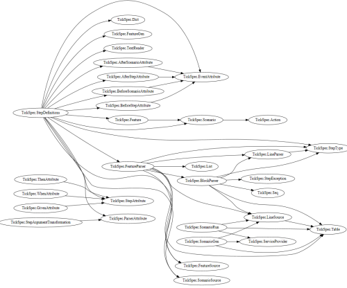

生成图表本身的代码很简短，只有约 60 行，你可以[在这里看到](http://gist.github.com/swlaschin/5742974#file-type-dependency-graph-fsx-L428)。

作为 GraphViz 的替代方案，你也可以考虑使用 [FSGraph](http://github.com/piotrosz/FSGraph)。

对于更多数学或数据中心的可视化，有许多好的库：

+   [FSharp.Charting](http://fsharp.github.io/FSharp.Charting/) 用于与 F# 脚本集成良好的桌面可视化。

+   [FsPlot](http://github.com/TahaHachana/FsPlot) 用于 HTML 中的交互式可视化。

+   [VegaHub](http://github.com/panesofglass/VegaHub)，一个用于与 [Vega](http://trifacta.github.io/vega/) 一起工作的 F# 库

+   [F# for Visualization](http://www.ffconsultancy.com/products/fsharp_for_visualization/index.html)

最后，还有一个 800 磅的大猩猩 -- Excel。

使用 Excel 的内置功能非常好，如果可用的话。而且 F# 脚本与 Excel 配合得很好。

你可以[在 Excel 中绘制图表](http://msdn.microsoft.com/en-us/library/vstudio/hh297098.aspx)，[在 Excel 中绘制函数图像](http://www.clear-lines.com/blog/post/Plot-functions-from-FSharp-to-Excel.aspx)，而且为了更强大的功能和集成，你还有 [FCell](http://fcell.io/) 和 [Excel-DNA](http://excel-dna.net/) 项目。

## 25\. 使用 F# 访问基于 web 的数据存储

互联网上有大量的公共数据，等待被下载和使用。借助类型提供程序的魔力，F# 是将这些 Web 规模的数据存储直接集成到你的工作流程中的不错选择。

现在，我们将查看两个数据存储：Freebase 和 世界银行。更多内容即将推出 -- 请查看 [fsharp.org 数据访问页面](http://fsharp.org/data-access/) 获取最新信息。

## Freebase

*本节的代码在 [github 上可用](http://github.com/swlaschin/low-risk-ways-to-use-fsharp-at-work/blob/master/freebase.fsx)。*

[Freebase](http://en.wikipedia.org/wiki/Freebase) 是一个大型的协作知识库和从多个来源采集的结构化数据的在线集合。

要开始使用，只需像之前一样链接类型提供程序的 DLL。

该站点受到限制，所以如果你经常使用它，你可能需要一个 API 密钥 ([API 详情在这里](http://developers.google.com/console/help/?csw=1#activatingapis))。

```
// sets the current directory to be same as the script directory
System.IO.Directory.SetCurrentDirectory (__SOURCE_DIRECTORY__)

// Requires FSharp.Data under script directory 
//    nuget install FSharp.Data -o Packages -ExcludeVersion 
#r @"Packages\FSharp.Data\lib\net40\FSharp.Data.dll"
open FSharp.Data

// without a key
let data = FreebaseData.GetDataContext()

// with a key
(*
[<Literal>]
let FreebaseApiKey = "<enter your freebase-enabled google API key here>"
type FreebaseDataWithKey = FreebaseDataProvider<Key=FreebaseApiKey>
let data = FreebaseDataWithKey.GetDataContext()
*) 
```

类型提供程序加载完成后，你可以开始提出问题，比如...

*"美国总统是谁？"*

```
data.Society.Government.``US Presidents``
|> Seq.map (fun p ->  p.``President number`` |> Seq.head, p.Name)
|> Seq.sortBy fst
|> Seq.iter (fun (n,name) -> printfn "%s was number %i" name n ) 
```

结果：

```
George Washington was number 1
John Adams was number 2
Thomas Jefferson was number 3
James Madison was number 4
James Monroe was number 5
John Quincy Adams was number 6
...
Ronald Reagan was number 40
George H. W. Bush was number 41
Bill Clinton was number 42
George W. Bush was number 43
Barack Obama was number 44 
```

仅仅四行代码，效果不错！

*"卡萨布兰卡赢得了哪些奖项？"*

```
data.``Arts and Entertainment``.Film.Films.IndividualsAZ.C.Casablanca.``Awards Won``
|> Seq.map (fun award -> award.Year, award.``Award category``.Name)
|> Seq.sortBy fst
|> Seq.iter (fun (year,name) -> printfn "%s -- %s" year name) 
```

结果如下：

```
1943 -- Academy Award for Best Director
1943 -- Academy Award for Best Picture
1943 -- Academy Award for Best Screenplay 
```

所以这就是 Freebase。有很多有用的和轻浮的信息。

[更多关于如何使用 Freebase 类型提供程序的信息](http://fsharp.github.io/FSharp.Data/library/Freebase.html)。

## 使用 Freebase 生成逼真的测试数据

我们已经看到了 FsCheck 如何用于生成测试数据。同样，你也可以通过从 Freebase 获取数据来达到相同的效果，这样数据会更加逼真。

[Kit Eason](http://twitter.com/kitlovesfsharp) 在一条 [推文](http://twitter.com/kitlovesfsharp/status/296240699735695360) 中展示了如何做到这一点，这里是基于他的代码的示例：

```
let randomElement =
    let random = new System.Random()
    fun (arr:string array) -> arr.[random.Next(arr.Length)]

let surnames = 
    FreebaseData.GetDataContext().Society.People.``Family names``
    |> Seq.truncate 1000
    |> Seq.map (fun name -> name.Name)
    |> Array.ofSeq

let firstnames = 
    FreebaseData.GetDataContext().Society.Celebrities.Celebrities
    |> Seq.truncate 1000
    |> Seq.map (fun celeb -> celeb.Name.Split([|' '|]).[0])
    |> Array.ofSeq

// generate ten random people and print
type Person = {Forename:string; Surname:string}
Seq.init 10 ( fun _ -> 
    {Forename = (randomElement firstnames); 
     Surname = (randomElement surnames) }
     )
|> Seq.iter (printfn "%A") 
```

结果如下：

```
{Forename = "Kelly"; Surname = "Deasy";}
{Forename = "Bam"; Surname = "Br?z?";}
{Forename = "Claire"; Surname = "Sludden";}
{Forename = "Kenneth"; Surname = "Kl?tz";}
{Forename = "?tienne"; Surname = "Defendi";}
{Forename = "Billy"; Surname = "Paleti";}
{Forename = "Alix"; Surname = "Nuin";}
{Forename = "Katherine"; Surname = "Desporte";}
{Forename = "Jasmine";  Surname = "Belousov";}
{Forename = "Josh";  Surname = "Kramarsic";}

```

## 世界银行

*本节的代码在 [github 上可用](http://github.com/swlaschin/low-risk-ways-to-use-fsharp-at-work/blob/master/world-bank.fsx)。*

与 Freebase 相反的极端是 [世界银行开放数据](http://data.worldbank.org/)，该网站提供了来自世界各地的大量详细的经济和社会信息。

设置与 Freebase 相同，但不需要 API 密钥。

```
// sets the current directory to be same as the script directory
System.IO.Directory.SetCurrentDirectory (__SOURCE_DIRECTORY__)

// Requires FSharp.Data under script directory 
//    nuget install FSharp.Data -o Packages -ExcludeVersion 
#r @"Packages\FSharp.Data\lib\net40\FSharp.Data.dll"
open FSharp.Data

let data = WorldBankData.GetDataContext() 
```

配置好类型提供程序后，我们可以进行严肃的查询，比如：

*"低收入国家和高收入国家的营养不良率如何比较？"*

```
// Create a list of countries to process
let groups = 
 [| data.Countries.``Low income``
    data.Countries.``High income``
    |]

// get data from an indicator for particular year
let getYearValue (year:int) (ind:Runtime.WorldBank.Indicator) =
    ind.Name,year,ind.Item year

// get data
[ for c in groups -> 
    c.Name,
    c.Indicators.``Malnutrition prevalence, weight for age (% of children under 5)`` |> getYearValue 2010
] 
// print the data
|> Seq.iter (
    fun (group,(indName, indYear, indValue)) -> 
       printfn "%s -- %s %i %0.2f%% " group indName indYear indValue) 
```

结果如下：

```
Low income -- Malnutrition prevalence, weight for age (% of children under 5) 2010 23.19% 
High income -- Malnutrition prevalence, weight for age (% of children under 5) 2010 1.36% 
```

同样地，这里是用于比较孕产妇死亡率的代码：

```
// Create a list of countries to process
let countries = 
 [| data.Countries.``European Union``
    data.Countries.``United Kingdom``
    data.Countries.``United States`` |]

/ get data
[ for c in countries  -> 
    c.Name,
    c.Indicators.``Maternal mortality ratio (modeled estimate, per 100,000 live births)`` |> getYearValue 2010
] 
// print the data
|> Seq.iter (
    fun (group,(indName, indYear, indValue)) -> 
       printfn "%s -- %s %i %0.1f" group indName indYear indValue) 
```

结果如下：

```
European Union -- Maternal mortality ratio (modeled estimate, per 100,000 live births) 2010 9.0 
United Kingdom -- Maternal mortality ratio (modeled estimate, per 100,000 live births) 2010 12.0 
United States -- Maternal mortality ratio (modeled estimate, per 100,000 live births) 2010 21.0 
```

[更多关于如何使用世界银行类型提供程序的信息](http://fsharp.github.io/FSharp.Data/library/WorldBank.html)。

## 26\. 使用 F# 进行数据科学和机器学习

所以你正在将所有这些建议付诸实践。你正在使用 FParsec 解析你的网络日志，使用 SQL 类型提供程序从内部数据库中提取统计数据，并从 Web 服务中提取外部数据。你有这么多的数据 -- 你可以做什么呢？

让我们最后快速看一下如何使用 F# 进行数据科学和机器学习。

正如我们所见，F#非常适合探索式编程——它具有具有智能感知的 REPL。但与 Python 和 R 不同，你的代码是经过类型检查的，所以你知道你的代码不会在处理两小时后出现异常！

如果你熟悉 Python 中的 Pandas 库或 R 中的`tseries`包，那么你应该认真看看[Deedle](http://bluemountaincapital.github.io/Deedle/)，这是一个易于使用、高质量的数据和时间序列操作包。Deedle 旨在在 REPL 中进行探索式编程时表现良好，但也可以在高效的编译后.NET 代码中使用。

如果你经常使用 R，当然会有一个[R 类型提供者](http://bluemountaincapital.github.io/FSharpRProvider)。这意味着你可以像使用 .NET 库一样使用 R 包。多么令人惊讶的事情！

还有很多其他友好的 F#包。你可以在 fsharp.org 找到关于它们的所有信息。

+   [数据科学](http://fsharp.org/data-science/)

+   [数学](http://fsharp.org/math/)

+   [机器学习](http://fsharp.org/machine-learning)

* * *

## 系列摘要

哦！这是一个很长的例子列表，也是很多代码需要查看的。如果你看到了结尾，恭喜你！

希望这给了你一些关于 F# 价值的新见解。它不仅仅是一种数学或金融语言，它也是一种实用的语言。它可以帮助你处理开发、测试和数据管理工作流中的各种事务。

最后，正如我在整个系列中强调的那样，所有这些用途都是安全的、低风险的、增量的。最糟糕的情况是什么？

所以，继续说服你的队友和老板试用 F#，然后告诉我结果如何。

## 后记

在我发布这篇文章后，Simon Cousins 发推文说我漏掉了一个——我忍不住要补充一下。

> [@ScottWlaschin](https://twitter.com/ScottWlaschin) 27: 平衡英国电站机组的发电计划。严肃地说，除了[#fsharp](https://twitter.com/search?q=%23fsharp&src=hash)，没有其他更危险的选择。
> 
> — Simon Cousins (@simontcousins) [2014 年 4 月 25 日](https://twitter.com/simontcousins/statuses/459591939902697472)

你可以在[他的博客](http://www.simontylercousins.net/does-the-language-you-use-make-a-difference-revisited/)上阅读更多关于 Simon 使用 F#（用于发电）的真实案例。在[fsharp.org](http://fsharp.org/testimonials/)上还有更多关于 F#的推荐。
