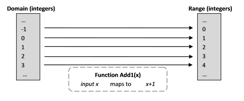
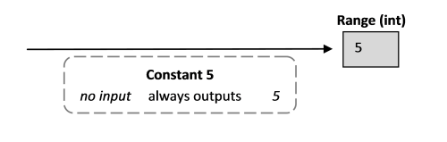
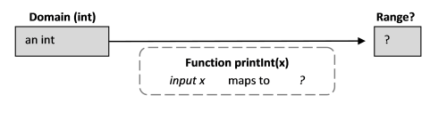
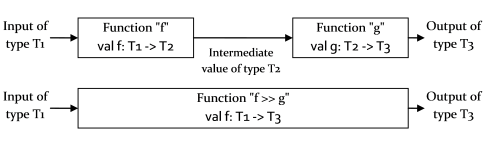
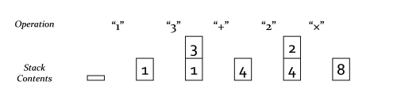

# “思考函数式”系列

这一系列文章将介绍你函数式编程的基础知识——“函数式编程”到底意味着什么，以及这种方法与面向对象或命令式编程有何不同。

+   思考函数式：介绍。关于函数式编程基础的一瞥。

+   数学函数。函数式编程的动力源。

+   函数值和简单值。绑定而非赋值。

+   类型如何与函数配合工作。理解类型表示法。

+   柯里化。将多参数函数分解为更小的单参数函数。

+   部分应用。将函数的一些参数固定下来。

+   函数的结合性和合成性。从现有函数构建新函数。

+   定义函数。Lambda 表达式和更多内容。

+   函数签名。函数签名可以让你对其功能有所了解。

+   组织函数。嵌套函数和模块。

+   将函数附加到类型。以 F#的方式创建方法。

+   示例演练：基于堆栈的计算器。使用组合子构建功能。

# 思考函数式：介绍

# 思考函数式：介绍

现在你已经在"为什么使用 F#"系列中看到了 F#的一些威力，我们要退一步，看看函数式编程的基础知识——“函数式编程”到底意味着什么，以及这种方法与面向对象或命令式编程有何不同。

### 改变你的思维方式

理解函数式编程的重要性不仅仅是一种风格上的差异；它是一种完全不同的编程思维方式，就像真正的面向对象编程（比如 Smalltalk）也与传统的命令式语言如 C 有着不同的思考方式一样。

F#确实允许非函数式的风格，而且很容易保留你已经熟悉的习惯。你可以只是以非函数式的方式使用 F#，而不真正改变你的思维方式，并且意识不到你所错过的东西。要充分利用 F#，并且对函数式编程有流利和舒适的掌握，关键是你要以函数式的思维方式思考，而不是命令式的。这就是本系列的目标：帮助你深入理解函数式编程，并帮助改变你的思维方式。

这将是一个相当抽象的系列，虽然我会用大量的短代码示例来演示这些观点。我们将涵盖以下几点：

+   **数学函数**。第一篇文章介绍了函数式语言背后的数学思想，以及从这种方法中获得的好处。

+   **函数和值**。下一篇文章介绍了函数和值，展示了“值”与变量的不同之处，以及为什么函数和简单值之间存在相似之处。

+   **类型**。然后我们转向与函数配合使用的基本类型：如字符串和整数等原始类型；单位类型、函数类型和泛型类型。

+   **带有多个参数的函数**。接下来，我将解释“柯里化”和“部分应用”的概念。如果你来自命令式编程背景，你的大脑可能会开始疼！

+   **定义函数**。然后是一些专门用于定义和组合函数的不同方式的帖子。

+   **函数签名**。然后是一个关于函数签名的关键主题的重要帖子：它们的含义以及如何将它们用作理解的辅助工具。

+   **组织函数**。一旦你知道如何创建函数，你如何组织它们以使它们对你的代码的其余部分可用？

# 数学函数

# 数学函数

函数式编程的动力来自数学。数学函数具有许多非常好的特性，函数式语言试图在现实世界中模拟这些特性。

所以首先，让我们从一个数学函数开始，它将 1 加到一个数字。

```
Add1(x) = x+1 
```

这到底意味着什么？嗯，看起来相当直观。它意味着有一个以数字开始的操作，并将其加一。

让我们介绍一些术语：

+   可以用作函数输入的值的集合称为*定义域*。在这种情况下，它可以是实数集，但为了现在简化生活，让我们将其限制为仅整数。 

+   函数的可能输出值集合称为*值域*（技术上是定义域上的像）。在这种情况下，它也是整数的集合。

+   该函数被称为*将*定义域映射到值域。



下面是在 F# 中定义的方式：

```
let add1 x = x + 1 
```

如果你将它输入 F# 交互窗口（别忘了双分号），你会看到结果（函数的“签名”）：

```
val add1 : int -> int 
```

让我们详细看一下这个输出：

+   总体意义是“函数`add1`将整数（定义域）映射到整数（值域）”。

+   “`add1`”被定义为“val”，缩写为“value”。嗯？那是什么意思？我们马上就会讨论值。

+   箭头符号“`->`”用于显示定义域和值域。在本例中，定义域是`int`类型，值域也是`int`类型。

还要注意，类型未指定，但 F# 编译器猜测函数正在使用整数。（这能调整吗？是的，我们马上会看到）。

## 数学函数的关键属性

数学函数具有一些与过程式编程中您习惯的函数非常不同的特性。

+   函数对于给定的输入值始终给出相同的输出值

+   函数没有副作用。

这些属性提供了一些非常强大的好处，因此函数式编程语言也试图在其设计中强制执行这些属性。让我们依次看看每一个。

### 数学函数对于给定的输入始终产生相同的输出。

在命令式编程中，我们认为函数“做”某事或“计算”某事。数学函数不做任何计算--它纯粹是从输入到输出的映射。事实上，定义函数的另一种方式是将所有映射定义为函数的集合。例如，在非常简单的情况下，我们可以将“`add1`”函数（在 C# 中）定义为

```
int add1(int input) { 
   switch (input)
   {
   case 0: return 1;
   case 1: return 2;
   case 2: return 3;
   case 3: return 4;
   etc ad infinitum
   }
} 
```

显然，我们无法为每个可能的整数都有一个情况，但原则是相同的。您可以看到绝对没有进行任何计算，只是查找。

### 数学函数没有副作用

在数学函数中，输入和输出在逻辑上是两个不同的事物，两者都是预定义的。函数不会改变输入或输出--它只是将域中的预先存在的输入值映射到范围中的预先存在的输出值。

换句话说，评估函数*绝对不可能对输入或其他任何事物产生任何影响*。请记住，评估函数实际上不是计算或操作任何内容；它只是一种华丽的查找。

这些值的“不可变性”微妙但非常重要。如果我在做数学运算，我不希望在我加它们时数字在我脚下改变！例如，如果我有：

```
x = 5
y = x+1 
```

我不希望 x 被加一改变。我期望得到一个不同的数字（y），而 x 保持不变。在数学世界中，整数已经存在为一个不可改变的集合，而“add1”函数只是定义了它们之间的关系。

### 纯函数的力量

具有可重复结果且没有副作用的函数称为“纯函数”，您可以使用它们执行一些有趣的事情：

+   它们可以轻松并行化。我可以从 1 到 1000 中取所有整数，然后给定 1000 个不同的 CPU，我可以让每个 CPU 同时执行相应整数的“`add1`”函数，而无需担心它们之间需要任何交互。不需要锁定、互斥体、信号量等。

+   我可以懒惰地使用一个函数，只在需要输出时评估它。我可以确信，无论我现在还是以后评估它，答案都将是相同的。

+   对于特定的输入，我只需要评估函数一次，然后我就可以缓存结果，因为我知道相同的输入总是产生相同的输出。

+   如果我有一系列纯函数，我可以按任何顺序评估它们。同样，它对最终结果不会有任何影响。

因此，您可以看到，如果我们可以在编程语言中创建纯函数，我们立即获得了许多强大的技术。事实上，您可以在 F# 中执行所有这些操作：

+   你已经在"为什么使用 F#？"系列中看到了并行性的一个例子。

+   惰性评估函数将在"优化"系列中讨论。

+   缓存函数的结果被称为“记忆化”，也将在"优化"系列中讨论。

+   不关心评估顺序使并发编程变得更容易，并且在函数重新排序或重构时不会引入错误。

## 数学函数的“不太有用”特性

数学函数在编程中使用时也有一些看起来不太有用的特性。

+   输入和输出值是不可变的

+   函数总是恰好有一个输入和一个输出

这些特性也反映在函数式编程语言的设计中。让我们依次看看每一个。

**输入和输出值是不可变的**

在理论上，不可变值似乎是一个不错的想法，但如果你不能以传统方式分配变量，你怎么能完成任何工作呢？

我可以向你保证，这并不像你想象的那么严重。当你逐步学习这个系列时，你会看到这在实践中是如何运作的。

**数学函数总是恰好有一个输入和一个输出**

正如你从图表中看到的，数学函数总是恰好有一个输入和一个输出。这对于函数式编程语言也是成立的，尽管当你第一次使用它们时可能并不明显。

这似乎是一个很大的烦恼。如果没有具有两个（或更多）参数的函数，你怎么能做有用的事情呢？

嗯，事实证明有一种方法可以做到这一点，而且更重要的是，在 F# 中对你来说完全透明。这被称为“柯里化”，它值得有自己的帖子，即将推出。

实际上，正如你将来会发现的那样，这两个“不太有用”的特性将被证明是非常有用的，也是函数式编程如此强大的关键部分。

# 函数值和简单值

# 函数值和简单值

让我们再次看看简单函数

```
let add1 x = x + 1 
```

这里的“x”是什么意思？它意味着：

1.  从输入域接受某个值。

1.  使用名称“x”来表示该值，以便我们以后可以引用它。

使用名称代表值的过程称为“绑定”。名称“x”与输入值“绑定”在一起。

因此，如果我们用输入 5 评估函数，那么正在发生的是，我们在原始定义中看到“x”的地方，将其替换为“5”，有点像在文字处理器中进行搜索和替换。

```
let add1 x = x + 1
add1 5
// replace "x" with "5"
// add1 5 = 5 + 1 = 6
// result is 6 
```

重要的是要理解这不是赋值。 “x”不是一个可以分配给值并且以后可以分配给另一个值的“槽”或变量。它是名称“x”与值的一次性关联。该值是预定义的整数之一，不能更改。因此，一旦绑定，x 也不能更改；一旦与值关联，就永远与值关联。

这个概念是思考函数式编程的关键部分：*没有“变量”，只有值*。

## 函数值

如果你再仔细想一想，你会发现名字“`add1`”本身���是绑定到“将其输入加一的函数”。函数本身与其绑定的名字无关。

当你输入 `let add1 x = x + 1` 时，你告诉 F# 编译器“每当你看到名字“`add1`”，就用将 1 加到输入的函数替换它”。“`add1`”被称为**函数值**。

要看到函数与其名字无关，试试：

```
let add1 x = x + 1
let plus1 = add1
add1 5
plus1 5 
```

你可以看到，“`add1`”和“`plus1`”是指向同一个函数的两个名字。

你总是可以通过标准形式 `domain -> range` 来识别函数值的签名。这是一个通用的函数值签名：

```
val functionName : domain -> range 
```

## 简单值

想象一个总是返回整数 5 且没有任何输入的操作。



这将是一个“常量”操作。

如何在 F# 中编写这个？我们想告诉 F# 编译器“每当你看到名字 `c`，就用 5 替换它”。这样做：

```
let c = 5 
```

当被评估时，返回：

```
val c : int = 5 
```

这次没有映射箭头，只有一个单独的整数。新的是等号后面跟着实际的值。F# 编译器知道这个绑定有一个已知的值，它将始终返回，即值 5。

换句话说，我们刚刚定义了一个常量，或者用 F# 术语来说，是一个简单的值。

你总是可以通过简单值的签名来区分它与函数值，因为所有简单值的签名看起来像：

```
val aName: type = constant     // Note that there is no arrow 
```

## 简单值与函数值

重要的是要理解，在 F# 中，与 C# 等语言不同，简单值和函数值之间几乎没有什么区别。它们都是可以绑定到名称（使用相同的关键字 `let`）然后传递的值。事实上，函数式思维的一个关键方面就是：*函数是可以作为输入传递给其他函数的值*，我们很快就会看到。

注意简单值和函数值之间有微妙的区别。函数总是有一个域和范围，并且必须“应用”到一个参数上才能得到结果。简单值在绑定后不需要被评估。使用上面的例子，如果我们想定义一个返回五的“常量函数”，我们将不得不使用

```
let c = fun()->5    
// or
let c() = 5 
```

这些函数的签名是：

```
val c : unit -> int 
```

而不是：

```
val c : int = 5 
```

更多关于 unit、函数语法和匿名函数的内容稍后再说。

## “值”与“对象”

在像 F# 这样的函数式编程语言中，大多数东西都被称为“值”。在像 C# 这样的面向对象语言中，大多数东西都被称为“对象”。那么“值”和“对象”之间有什么区别呢？

值，正如我们上面所看到的，只是域的一个成员。整数的域，字符串的域，将整数映射到字符串的函数的域，等等。原则上，值是不可变的。值没有任何附加的行为。

对象，在标准定义中，是数据结构及其相关行为（方法）的封装。通常期望对象具有状态（即是可变的），并且所有改变内部状态的操作都必须由对象本身提供（通过“点”符号）。

在 F# 中，即使是原始值也具有一些类似对象的行为。例如，你可以用点号进入一个字符串以获得它的长度：

```
"abc".Length 
```

但总的来说，我们将避免在 F# 中对标准值使用“object”，而将其保留以指代真实类的实例，或者暴露成员方法的其他值。

## 命名值

对于值和函数名称，使用标准命名规则，基本上是任何包括下划线的字母数字字符串。还有一些额外的：

你可以在名称的任何地方放置一个撇号，除了第一个字符。所以：

```
A'b'c     begin'  // valid names 
```

最后的撇号通常用于表示某种值的“变体”版本：

```
let f = x
let f' = derivative f
let f'' = derivative f' 
```

或者定义现有关键字的变体

```
let if' b t f = if b then t else f 
```

你也可以在任何字符串周围加上双反引号来使其成为一个有效的标识符。

```
``this is a name``  ``123``    //valid names 
```

有时你可能想使用双反引号技巧：

+   当你想要使用与关键字相同的标识符时

```
let ``begin`` = "begin" 
```

+   当尝试使用自然语言来进行业务规则、单元测试或类似 Cucumber 的 BDD 风格的可执行规范时。

```
let ``is first time customer?`` = true
let ``add gift to order`` = ()
if ``is first time customer?`` then ``add gift to order``

// Unit test 
let [<Test>] ``When input is 2 then expect square is 4``=  
   // code here

// BDD clause
let [<Given>] ``I have (.*) N products in my cart`` (n:int) =  
   // code here 
```

与 C# 不同，F# 的命名约定是函数和值以小写字母开头而不是大写字母（`camelCase`而不是`PascalCase`），除非设计用于暴露给其他 .NET 语言。类型和模块使用大写字母。

# 类型如何与函数配合工作

# 类型如何与函数配合工作

现在我们对函数有了一些理解，我们将看一下类型如何与函数配合工作，既作为定义域又作为范围。这只是一个概述；系列文章"理解 F# 类型"将详细介绍类型。

首先，我们需要更深入地了解类型标记。我们已经看到箭头符号"`->`"用于显示定义域和值域。因此，一个函数签名总是如下所示：

```
val functionName : domain -> range 
```

这里有一些示例函数：

```
let intToString x = sprintf "x is %i" x  // format int to string
let stringToInt x = System.Int32.Parse(x) 
```

如果你在 F# 交互窗口中评估这个，你会看到签名：

```
val intToString : int -> string
val stringToInt : string -> int 
```

这意味着：

+   `intToString`的定义域是`int`，它将其映射到范围`string`。

+   `stringToInt`的定义域是`string`，它将其映射到范围`int`。

## 原始类型

可能的原始类型就是你所期望的：字符串、整数、浮点数、布尔值、字符、字节等，再加上许多从 .NET 类型系统派生出的类型。

这里有一些使用原始类型的函数的更多示例：

```
let intToFloat x = float x // "float" fn. converts ints to floats
let intToBool x = (x = 2)  // true if x equals 2
let stringToString x = x + " world" 
```

并且它们的签名是：

```
val intToFloat : int -> float
val intToBool : int -> bool
val stringToString : string -> string 
```

## 类型注解

在前面的示例中，F# 编译器正确地确定了参数和结果的类型。但并非总是如此。如果尝试以下代码，你将会收到编译器错误：

```
let stringLength x = x.Length         
   => error FS0072: Lookup on object of indeterminate type 
```

编译器不知道 "x" 的类型，因此不知道 "Length" 是否是一个有效的方法。在大多数情况下，这可以通过给 F# 编译器一个“类型注释”来修复，以便它知道要使用哪种类型。在下面的纠正版本中，我们指示 "x" 的类型是一个字符串。

```
let stringLength (x:string) = x.Length 
```

`x:string` 参数周围的圆括号很重要。如果缺少它们，编译器会认为返回值是一个字符串！也就是说，使用“开放”冒号来指示返回值的类型，正如你在下面的示例中所看到的。

```
let stringLengthAsInt (x:string) :int = x.Length 
```

我们指示 x 参数是一个字符串，返回值是一个整数。

## 函数类型作为参数

接受其他函数作为参数，或者返回一个函数的函数称为**高阶函数**（有时缩写为 HOF）。它们被用作抽象出常见行为的一种方式。这类函数在 F# 中非常常见；大多数标准库都使用它们。

考虑一个名为 `evalWith5ThenAdd2` 的函数，它将一个函数作为参数，然后用值 5 评估该函数，并将结果加 2：

```
let evalWith5ThenAdd2 fn = fn 5 + 2     // same as fn(5) + 2 
```

这个函数的签名看起来像这样：

```
val evalWith5ThenAdd2 : (int -> int) -> int 
```

你可以看到域是 `(int->int)`，范围是 `int`。这是什么意思？这意味着输入参数不是一个简单的值，而是一个函数，并且更重要的是只限于将 `ints` 映射到 `ints` 的函数。输出不是一个函数，只是一个整数。

让我们试一试：

```
let add1 x = x + 1      // define a function of type (int -> int)
evalWith5ThenAdd2 add1  // test it 
```

得到：

```
val add1 : int -> int
val it : int = 8 
```

"`add1`" 是一个将整数映射到整数的函数，从其签名中我们可以看出来。因此它是 `evalWith5ThenAdd2` 函数的有效参数。结果是 8。

顺便说一下，特殊词 "`it`" 用于表示上次评估的结果；在本例中是我们想要的结果。它不是关键字，只是一种约定。

再来一个例子：

```
let times3 x = x * 3      // a function of type (int -> int)
evalWith5ThenAdd2 times3  // test it 
```

得到：

```
val times3 : int -> int
val it : int = 17 
```

"`times3`" 也是一个将整数映射到整数的函数，从其签名中我们可以看出来。因此它也是 `evalWith5ThenAdd2` 函数的有效参数。结果是 17。

注意输入对类型是敏感的。如果我们的输入函数使用 `floats` 而不是 `ints`，它将无法工作。例如，如果我们有：

```
let times3float x = x * 3.0  // a function of type (float->float) 
evalWith5ThenAdd2 times3float 
```

评估这个将会出错：

```
error FS0001: Type mismatch. Expecting a int -> int but 
              given a float -> float 
```

意味着输入函数应该是一个 `int->int` 函数。

### 函数作为输出

函数值也可以是函数的输出。例如，下面的函数将生成一个使用输入值进行加法的“加法器”函数。

```
let adderGenerator numberToAdd = (+) numberToAdd 
```

签名是：

```
val adderGenerator : int -> (int -> int) 
```

这意味着生成器接受一个 `int`，并创建一个函数（"加法器"）将 `ints` 映射到 `ints`。让我们看看它是如何工作的：

```
let add1 = adderGenerator 1
let add2 = adderGenerator 2 
```

这创建了两个加法器函数。第一个生成的函数将其输入加 1，第二个加 2。请注意，签名正如我们所期望的那样。

```
val add1 : (int -> int)
val add2 : (int -> int) 
```

现在我们可以以正常方式使用这些生成的函数了。它们与明确定义的函数无异。

```
add1 5    // val it : int = 6
add2 5    // val it : int = 7 
```

### 使用类型注释来约束函数类型

在第一个例子中，我们有这个函数：

```
let evalWith5ThenAdd2 fn = fn 5 +2
    => val evalWith5ThenAdd2 : (int -> int) -> int 
```

在这种情况下，F# 可以推断出 "`fn`" 将 `ints` 映射到 `ints`，因此其签名将为 `int->int`

但在以下情况下 "fn" 的签名是什么？

```
let evalWith5 fn = fn 5 
```

显然，"`fn`" 是某种接受整数的函数，但它返回什么？ 编译器无法确定。 如果您确实想指定函数的类型，可以像对原始类型一样为函数参数添加类型注释。

```
let evalWith5AsInt (fn:int->int) = fn 5
let evalWith5AsFloat (fn:int->float) = fn 5 
```

或者，您还可以指定返回类型。

```
let evalWith5AsString fn :string = fn 5 
```

因为主函数返回一个字符串，所以 "`fn`" 函数也被限定为返回一个字符串，因此不需要为 "fn" 进行显式的类型标注。

## "unit" 类型

在编程时，有时我们希望函数执行某些操作而不返回值。 考虑下面定义的函数 "`printInt`"。 该函数实际上不返回任何内容。 它只是作为副作用将一个字符串打印到控制台。

```
let printInt x = printf "x is %i" x        // print to console 
```

那么这个函数的签名是什么？

```
val printInt : int -> unit 
```

这个 "`unit`" 是什么？

哦，即使一个函数没有返回输出，它仍然需要一个范围。 在数学领域没有 "void" 函数。 每个函数必须有一些输出，因为函数是一个映射，而映射必须有一些东西可映射！



在 F# 中，像这样的函数返回一种特殊的范围，称为“`unit`”。 这个范围里面确切地只有一个值，称为“`()`”。 你可以把`unit`和`()`想象成 C# 中的 "void"（类型）和 "null"（值）。 但与 void/null 不同的是，`unit`是一个真正的类型，`()`是一个真正的值。 要查看这一点，请评估：

```
let whatIsThis = () 
```

你会看到签名：

```
val whatIsThis : unit = () 
```

这意味着值 "`whatIsThis`" 的类型是 `unit`，并且已经绑定到值 `()`

因此，回到 "`printInt`" 的签名，我们现在可以理解它了：

```
val printInt : int -> unit 
```

这个签名表示：`printInt` 的定义域是 `int`，它映射到我们不关心的东西。

### 无参数函数

现在我们理解了 unit，我们能预测它在其他情况下的出现吗？ 例如，让我们尝试创建一个可重用的 "hello world" 函数。 由于没有输入和输出，我们期望它的签名为 `unit -> unit`。 让我们看看：

```
let printHello = printf "hello world"        // print to console 
```

结果是：

```
hello world
val printHello : unit = () 
```

不完全符合我们的期望。 "Hello world" 立即打印出来，结果不是一个函数，而是一个简单值，其类型为 unit。 正如我们前面看到的，我们可以通过以下形式的签名来判断这是一个简单值：

```
val aName: type = constant 
```

因此，在这种情况下，我们看到 `printHello` 实际上是一个 *简单值*，其值为 `()`。 它不是一个我们可以再次调用的函数。

`printInt` 和 `printHello` 之间的差异是什么？ 在 `printInt` 的情况下，直到我们知道 x 参数的值才能确定值，因此定义是一个函数。 在 `printHello` 的情况下，没有参数，因此右侧的值可以立即确定。 它返回了 `()` 值，并具有向控制台打印的副作用。

我们可以通过强制定义具有单元参数的函数来创建真正可重用的函数，就像这样：

```
let printHelloFn () = printf "hello world"    // print to console 
```

现在签名为：

```
val printHelloFn : unit -> unit 
```

要调用它，我们必须将 `()` 值作为参数传递，就像这样：

```
printHelloFn () 
```

### 使用 ignore 函数强制单元类型

在某些情况下，编译器需要单元类型并将抱怨。例如，以下两者都将是编译器错误：

```
do 1+1     // => FS0020: This expression should have type 'unit'

let something = 
  2+2      // => FS0020: This expression should have type 'unit'
  "hello" 
```

为了在这些情况下提供帮助，有一个特殊函数 `ignore`，它接受任何内容并返回单元类型。这段代码的正确版本将是：

```
do (1+1 |> ignore)  // ok

let something = 
  2+2 |> ignore     // ok
  "hello" 
```

## 泛型类型

在许多情况下，函数参数的类型可以是任何类型，因此我们需要一种方法来表示这一点。F# 使用 .NET 泛型类型系统来处理这种情况。

例如，以下函数将参数转换为字符串并附加一些文本：

```
let onAStick x = x.ToString() + " on a stick" 
```

参数的类型不重要，因为所有对象都理解 `ToString()`。

签名为：

```
val onAStick : 'a -> string 
```

`'a` 这种类型叫什么？这是 F# 表示在编译时不知道的泛型类型的方式。 "a" 前面的撇号表示类型是泛型的。这的 C# 签名等效于：

```
string onAStick<a>();   

//or more idiomatically 
string OnAStick<TObject>();   // F#'s use of 'a is like 
                              // C#'s "TObject" convention 
```

请注意，F# 函数仍然是具有泛型类型的强类型化的。它 *不* 接受 `Object` 类型的参数。这种强类型化是可取的，以便在将函数组合在一起时，仍然保持类型安全性。

下面是使用整数、浮点数和字符串调用相同函数的示例

```
onAStick 22
onAStick 3.14159
onAStick "hello" 
```

如果有两个泛型参数，编译器将给它们不同的名称：第一个泛型为 `'a`，第二个泛型为 `'b`，以此类推。这里是一个例子：

```
let concatString x y = x.ToString() + y.ToString() 
```

此签名有两个泛型：`'a` 和 `'b`：

```
val concatString : 'a -> 'b -> string 
```

另一方面，编译器会识别出仅需要一个泛型类型的情况。在以下示例中，x 和 y 参数必须是相同类型：

```
let isEqual x y = (x=y) 
```

因此，函数签名对于两者都具有相同的泛型类型：

```
val isEqual : 'a -> 'a -> bool 
```

当涉及到列表和更抽象的结构时，泛型参数也非常重要，我们将在接下来的示例中经常见到它们。

## 其他类型

到目前为止讨论的类型只是基本类型。这些类型可以以各种方式组合在一起，以形成更复杂的类型。关于这些类型的完整讨论将等待 另一个系列，但同时，这里是对它们的简要介绍，以便您能够在函数签名中识别它们。

+   **"元组" 类型**。这些是其他类型的对、三元组等。例如 `("hello", 1)` 是由字符串和整数组成的元组。逗号是元组的区别特征 -- 如果在 F# 中看到逗号，几乎肯定是元组的一部分！

在函数签名中，元组被写为涉及的两种类型的 "乘法"。因此，在这种情况下，元组将具有类型：

```
string * int      // ("hello", 1) 
```

+   **集合类型**。其中最常见的是列表、序列和数组。列表和数组是固定大小的，而序列可能是无限的（在幕后，序列与 `IEnumerable` 相同）。在函数签名中，它们有自己的关键字：“`list`”、“`seq`”和“`[]`”分别表示列表、序列和数组。

```
int list          // List type  e.g. [1;2;3]
string list       // List type  e.g. ["a";"b";"c"]
seq<int>          // Seq type   e.g. seq{1..10}
int []            // Array type e.g. [|1;2;3|] 
```

+   **选项类型**。这是一个简单的包装器，用于可能缺失的对象。有两种情况：`Some` 和 `None`。在函数签名中，它们有自己的“`option`”关键字：

```
int option        // Some(1) 
```

+   **鉴别联合类型**。这些类型由其他类型的一组选择构建而成。我们在"为什么使用 F#?"系列中看到了一些例子。在函数签名中，它们按类型名称引用，因此没有特殊的关键字。

+   **记录类型**。这些类似于结构或数据库行，是一系列具有命名槽的列表。我们在"为什么使用 F#?"系列中也看到了一些例子。在函数签名中，它们按类型名称引用，因此也没有特殊的关键字。

## 测试你对类型的理解

你对类型了解多少？以下是一些表达式--看看你能否猜到它们的签名。要查看是否正确，只需在交互窗口中运行它们！

```
let testA   = float 2
let testB x = float 2
let testC x = float 2 + x
let testD x = x.ToString().Length
let testE (x:float) = x.ToString().Length
let testF x = printfn "%s" x
let testG x = printfn "%f" x
let testH   = 2 * 2 |> ignore
let testI x = 2 * 2 |> ignore
let testJ (x:int) = 2 * 2 |> ignore
let testK   = "hello"
let testL() = "hello"
let testM x = x=x
let testN x = x 1          // hint: what kind of thing is x?
let testO x:string = x 1   // hint: what does :string modify? 
```

# 柯里化

# 柯里化

在对基本类型进行了一小段的插曲之后，我们可以再次转向函数，特别是我们之前提到的谜题：如果数学函数只能有一个参数，那么如何可能 F# 函数可以有多个呢？

答案非常简单：具有多个参数的函数被重写为一系列新函数，每个函数只有一个参数。这由编译器自动完成。它被称为“**柯里化**”，以数学家 Haskell Curry 的名字命名，他对函数式编程的发展产生了重要影响。

为了看看这是如何实践的，让我们用一个非常基本的例子来打印两个数字：

```
//normal version
let printTwoParameters x y = 
   printfn "x=%i y=%i" x y 
```

在内部，编译器将其重写为更类似于以下内容：

```
//explicitly curried version
let printTwoParameters x  =    // only one parameter!
   let subFunction y = 
      printfn "x=%i y=%i" x y  // new function with one param
   subFunction                 // return the subfunction 
```

让我们更详细地研究一下这个问题：

1.  构造名为“`printTwoParameters`”的函数，但只有*一个*参数：“x”

1.  在其中构造一个只有*一个*参数的子函数：“y”。请注意，这个内部函数使用“x”参数，但 x 并没有显式地作为参数传递给它。由于“x”参数在作用域内，所以内部函数可以看到它并使用它，而不需要显式传递它。

1.  最后，返回新创建的子函数。

1.  然后，返回的函数稍后将用于“y”。 “x”参数已经嵌入其中，因此返回的函数只需要 y 参数来完成函数逻辑。

通过这种方式重写，编译器确保每个函数都只有一个参数，如所需。因此，当您使用“`printTwoParameters`”时，您可能认为您正在使用一个具有两个参数的函数，但实际上只是一个具有一个参数的函数！您可以自行验证，只传递一个参数而不是两个参数：

```
// eval with one argument
printTwoParameters 1 

// get back a function!
val it : (int -> unit) = <fun:printTwoParameters@286-3> 
```

如果你用一个参数评估它，你不会得到错误，而是得到一个函数。

所以当你用两个参数调用`printTwoParameters`时，你实际上在做什么：

+   你用第一个参数（x）调用`printTwoParameters`

+   `printTwoParameters`返回一个将"x"嵌入其中的新函数。

+   然后你用第二个参数（y）调用新函数

这是逐步版本的示例，然后再次是正常版本。

```
// step by step version
let x = 6
let y = 99
let intermediateFn = printTwoParameters x  // return fn with 
                                           // x "baked in"
let result  = intermediateFn y 

// inline version of above
let result  = (printTwoParameters x) y

// normal version
let result  = printTwoParameters x y 
```

这里是另一个例子：

```
//normal version
let addTwoParameters x y = 
   x + y

//explicitly curried version
let addTwoParameters x  =      // only one parameter!
   let subFunction y = 
      x + y                    // new function with one param
   subFunction                 // return the subfunction

// now use it step by step 
let x = 6
let y = 99
let intermediateFn = addTwoParameters x  // return fn with 
                                         // x "baked in"
let result  = intermediateFn y 

// normal version
let result  = addTwoParameters x y 
```

再次强调，这个"两个参数函数"实际上是一个返回中间函数的一个参数函数。

但等一下 -- "`+`"操作本身呢？它是一个必须接受两个参数的二元操作，对吧？不，它像其他函数一样被柯里化。有一个名为"`+`"的函数，它接受一个参数并返回一个新的中间函数，就像上面的`addTwoParameters`一样。

当我们写语句`x+y`时，编译器重新排列代码以去除中缀，并将其转换为`(+) x y`，这是名为`+`的函数与两个参数一起调用。请注意，名为"+"的函数需要在其周围加上括号，以指示它被用作普通函数名而不是中缀运算符。

最后，名为`+`的两个参数函数被视为任何其他两个参数函数一样。

```
// using plus as a single value function 
let x = 6
let y = 99
let intermediateFn = (+) x     // return add with x baked in
let result  = intermediateFn y 

// using plus as a function with two parameters
let result  = (+) x y          

// normal version of plus as infix operator
let result  = x + y 
```

是的，这对所有其他运算符和内置函数如 printf 也适用。

```
// normal version of multiply
let result  = 3 * 5

// multiply as a one parameter function
let intermediateFn = (*) 3   // return multiply with "3" baked in
let result  = intermediateFn 5

// normal version of printfn
let result  = printfn "x=%i y=%i" 3 5  

// printfn as a one parameter function
let intermediateFn = printfn "x=%i y=%i" 3  // "3" is baked in
let result  = intermediateFn 5 
```

## 柯里化函数的签名

现在我们知道柯里化函数是如何工作的，我们应该期望它们的签名是什么样子的呢？

回到第一个例子"`printTwoParameters`"，我们看到它接受一个参数并返回一个中间函数。中间函数也接受一个参数并返回空（即，unit）。因此，中间函数的类型是`int->unit`。换句话说，`printTwoParameters`的定义域是`int`，值域是`int->unit`。将这些放在一起，我们看到最终的签名是：

```
val printTwoParameters : int -> (int -> unit) 
```

如果你评估显式柯里化的实现，你会看到签名中的括号，就像上面写的那样，但如果你评估隐式柯里化的正常实现，括号会被省略，就像这样：

```
val printTwoParameters : int -> int -> unit 
```

括号是可选的。如果你试图理解函数签名，将它们在脑海中添加回去可能会有所帮助。

此时你可能会想知道，返回中间函数和常规两个参数函数之间有什么区别？

这是一个返回函数的一个参数函数：

```
let add1Param x = (+) x    
// signature is = int -> (int -> int) 
```

这是一个返回简单值的两个参数函数：

```
let add2Params x y = (+) x y    
// signature is = int -> int -> int 
```

签名略有不同，但在实际情况下，*没有任何区别*，只是第二个函数会自动为你柯里化。

## 具有多于两个参数的函数

对于带有两个以上参数的函数，柯里化是如何工作的？完全相同：对于除最后一个参数之外的每个参数，函数都返回一个中间函数，其中包含前面的参数。

考虑这个刻意设计的例子。我已经明确指定了参数的类型，但函数本身什么也没做。

```
let multiParamFn (p1:int)(p2:bool)(p3:string)(p4:float)=
   ()   //do nothing

let intermediateFn1 = multiParamFn 42    
   // intermediateFn1 takes a bool 
   // and returns a new function (string -> float -> unit)
let intermediateFn2 = intermediateFn1 false    
   // intermediateFn2 takes a string 
   // and returns a new function (float -> unit)
let intermediateFn3 = intermediateFn2 "hello"  
   // intermediateFn3 takes a float 
   // and returns a simple value (unit)
let finalResult = intermediateFn3 3.141 
```

整个函数的签名是：

```
val multiParamFn : int -> bool -> string -> float -> unit 
```

中间函数的签名是：

```
val intermediateFn1 : (bool -> string -> float -> unit)
val intermediateFn2 : (string -> float -> unit)
val intermediateFn3 : (float -> unit)
val finalResult : unit = () 
```

函数签名可以告诉你函数需要多少个参数：只需数括号外的箭头数量。如果函数接受或返回其他函数参数，括号内还会有其他箭头，但这些可以忽略。以下是一些例子：

```
int->int->int      // two int parameters and returns an int

string->bool->int  // first param is a string, second is a bool, 
                   // returns an int

int->string->bool->unit // three params (int,string,bool) 
                        // returns nothing (unit)

(int->string)->int      // has only one parameter, a function
                        // value (from int to string)
                        // and returns a int

(int->string)->(int->bool) // takes a function (int to string) 
                           // returns a function (int to bool) 
```

## 多参数问题

柯里化背后的逻辑可能会产生一些意想不到的结果，直到你理解它。记住，如果你评估一个带有少于它预期参数的函数，你不会得到错误。相反，你会得到一个部分应用的函数。如果你继续在期望一个值的上下文中使用这个部分应用的函数，你将从编译器获得晦涩的错误消息。

这是一个看起来无害的函数：

```
// create a function
let printHello() = printfn "hello" 
```

当我们按照下面所示调用它时，你期望会发生什么？它会在控制台打印“hello”吗？在评估之前尝试猜测一下，并且这里有一个提示：一定要查看函数签名。

```
// call it
printHello 
```

它将*不会*按预期调用。原始函数期望一个未提供的单位参数，因此你得到一个部分应用的函数（在这种情况下没有参数）。

这个呢？它会编译通过吗？

```
let addXY x y = 
    printfn "x=%i y=%i" x     
    x + y 
```

如果你评估它，你会发现编译器抱怨 printfn 行。

```
printfn "x=%i y=%i" x
//^^^^^^^^^^^^^^^^^^^^^
//warning FS0193: This expression is a function value, i.e. is missing
//arguments. Its type is  ^a -> unit. 
```

如果你不理解柯里化，这条消息会非常难懂！像这样单独评估的所有表达式（即不用作返回值或绑定到带有“let”的东西）*必须*评估为单位值。而在这种情况下，它不会评估为单位值，而是评估为一个函数。这就是说`printfn`缺少一个参数的绕了一大圈的方法。

这类错误的常见情况是与.NET 库进行接口时。例如，`TextReader`的`ReadLine`方法必须接受一个单位参数。很容易忘记这一点，然后省略括号，这样你不会立即得到编译器错误，而只有在尝试将结果视为字符串时才会得到错误。

```
let reader = new System.IO.StringReader("hello");

let line1 = reader.ReadLine        // wrong but compiler doesn't 
                                   // complain
printfn "The line is %s" line1     //compiler error here!
// ==> error FS0001: This expression was expected to have 
// type string but here has type unit -> string 

let line2 = reader.ReadLine()      //correct
printfn "The line is %s" line2     //no compiler error 
```

在上面的代码中，`line1`只是指向`Readline`方法的指针或委托，并不是我们预期的字符串。在`reader.ReadLine()`中使用`()`实际上执行了该函数。

## 参数过多

当你有太多参数时，你也会得到类似的隐晦消息。以下是向 printf 传递过多参数的一些例子。

```
printfn "hello" 42
// ==> error FS0001: This expression was expected to have 
//                   type 'a -> 'b but here has type unit 

printfn "hello %i" 42 43
// ==> Error FS0001: Type mismatch. Expecting a 'a -> 'b -> 'c 
//                   but given a 'a -> unit 

printfn "hello %i %i" 42 43 44
// ==> Error FS0001: Type mismatch. Expecting a 'a->'b->'c->'d 
//                   but given a 'a -> 'b -> unit 
```

例如，在最后一种情况中，编译器正在说它期望格式参数有三个参数（签名 `'a -> 'b -> 'c -> 'd` 有三个参数），但它只给出了两个（签名 `'a -> 'b -> unit` 有两个参数）。

在不使用 `printf` 的情况下，传递太多参数通常意味着你最终会得到一个简单的值，然后你尝试将参数传递给它。编译器会抱怨说简单的值不是一个函数。

```
let add1 x = x + 1
let x = add1 2 3
// ==>   error FS0003: This value is not a function 
//                     and cannot be applied 
```

如果你将调用分解为一系列明确的中间函数，就像我们之前做的那样，你可以清楚地看到出了什么问题。

```
let add1 x = x + 1
let intermediateFn = add1 2   //returns a simple value
let x = intermediateFn 3      //intermediateFn is not a function!
// ==>   error FS0003: This value is not a function 
//                     and cannot be applied 
```

# 部分应用

# 部分应用

在前一篇关于柯里化的文章中，我们看到了将多参数函数分解为较小的一参数函数的方法。这是数学上正确的做法，但这不是唯一的原因 -- 这还导致了一种非常强大的技术，称为**部分函数应用**。这是函数式编程中非常常用的一种风格，重要的是要理解它。

部分应用的想法是，如果你固定函数的前 N 个参数，你将得到一个剩余参数的函数。从柯里化的讨论中，你可能能够自然地看出这是如何发生的。

这里有一些简单的例子来演示这一点：

```
// create an "adder" by partial application of add
let add42 = (+) 42    // partial application
add42 1
add42 3

// create a new list by applying the add42 function 
// to each element
[1;2;3] |> List.map add42 

// create a "tester" by partial application of "less than"
let twoIsLessThan = (<) 2   // partial application
twoIsLessThan 1
twoIsLessThan 3

// filter each element with the twoIsLessThan function
[1;2;3] |> List.filter twoIsLessThan 

// create a "printer" by partial application of printfn
let printer = printfn "printing param=%i" 

// loop over each element and call the printer function
[1;2;3] |> List.iter printer 
```

在每种情况下，我们都创建了一个部分应用的函数，然后可以在多个上下文中重复使用。

当然，部分应用也可以涉及固定函数参数。以下是一些例子：

```
// an example using List.map
let add1 = (+) 1
let add1ToEach = List.map add1   // fix the "add1" function

// test
add1ToEach [1;2;3;4]

// an example using List.filter
let filterEvens = 
   List.filter (fun i -> i%2 = 0) // fix the filter function

// test
filterEvens [1;2;3;4] 
```

以下更复杂的示例显示了相同的方法如何用于创建透明的“插件”行为。

+   我们创建一个添加两个数字的函数，但还需要一个记录函数，该函数将记录两个数字和结果。

+   记录函数有两个参数：(字符串) "name" 和 (泛型) "value"，因此它的签名是 `string->'a->unit`。

+   然后，我们创建了各种实现记录函数，例如控制台记录器或弹出记录器。

+   最后，我们部分应用主函数以创建具有特定记录器的新函数。

```
// create an adder that supports a pluggable logging function
let adderWithPluggableLogger logger x y = 
    logger "x" x
    logger "y" y
    let result = x + y
    logger "x+y"  result 
    result 

// create a logging function that writes to the console
let consoleLogger argName argValue = 
    printfn "%s=%A" argName argValue 

//create an adder with the console logger partially applied
let addWithConsoleLogger = adderWithPluggableLogger consoleLogger 
addWithConsoleLogger  1 2 
addWithConsoleLogger  42 99

// create a logging function that creates popup windows
let popupLogger argName argValue = 
    let message = sprintf "%s=%A" argName argValue 
    System.Windows.Forms.MessageBox.Show(
                                 text=message,caption="Logger") 
      |> ignore

//create an adder with the popup logger partially applied
let addWithPopupLogger  = adderWithPluggableLogger popupLogger 
addWithPopupLogger  1 2 
addWithPopupLogger  42 99 
```

这些内嵌了记录器的函数也可以像任何其他函数一样使用。例如，我们可以创建一个部分应用来添加 42，然后将其传递给列表函数，就像我们为简单的 "`add42`" 函数所做的那样。

```
// create a another adder with 42 baked in
let add42WithConsoleLogger = addWithConsoleLogger 42 
[1;2;3] |> List.map add42WithConsoleLogger  
[1;2;3] |> List.map add42               //compare without logger 
```

这些部分应用的函数是一个非常有用的工具。我们可以创建灵活的（但复杂的）库函数，但也可以轻松创建可重用的默认值，这样调用者不必一直暴露在复杂性中。

## 设计部分应用的函数

你可以看到参数的顺序对于部分应用的易用性有很大的影响。例如，`List` 库中的大多数函数（如 `List.map` 和 `List.filter`）都具有类似的形式，即：

```
List-function [function parameter(s)] [list] 
```

列表始终是最后一个参数。以下是一些完整形式的示例：

```
List.map    (fun i -> i+1) [0;1;2;3]
List.filter (fun i -> i>1) [0;1;2;3]
List.sortBy (fun i -> -i ) [0;1;2;3] 
```

以及使用部分应用的相同示例：

```
let eachAdd1 = List.map (fun i -> i+1) 
eachAdd1 [0;1;2;3]

let excludeOneOrLess = List.filter (fun i -> i>1) 
excludeOneOrLess [0;1;2;3]

let sortDesc = List.sortBy (fun i -> -i) 
sortDesc [0;1;2;3] 
```

如果库函数的参数顺序不同，那么使用部分应用将会变得更加不方便。

当你编写自己的多参数函数时，你可能会想知道最佳的参数顺序是什么。与所有设计问题一样，这个问题没有“正确”的答案，但以下是一些常被接受的指南：

1.  放在前面：参数更可能是静态的

1.  放在最后：数据结构或集合（或最变化的参数）

1.  对于像“减法”这样的众所周知的操作，按预期顺序放置

指南 1 很简单。最有可能使用部分应用固定的参数应该首先出现。我们之前在日志记录器示例中看到了这一点。

指南 2 使得将结构或集合从函数传递到函数变得更加容易。我们已经多次在列表函数中看到这一点。

```
// piping using list functions
let result = 
   [1..10]
   |> List.map (fun i -> i+1)
   |> List.filter (fun i -> i>5) 
```

同样，部分应用的列表函数易于组合，因为列表参数本身可以很容易地省略：

```
let compositeOp = List.map (fun i -> i+1) 
                  >> List.filter (fun i -> i>5)
let result = compositeOp [1..10] 
```

### 为部分应用包装 BCL 函数

.NET 基类库函数在 F#中很容易访问，但实际上并不是为像 F#这样的函数式语言而设计的。例如，大多数函数都将数据参数放在第一位，而在 F#中，正如我们所见，数据参数通常应该放在最后一位。

不过，为它们创建更符合惯用法的包装器相当容易。例如，在下面的代码片段中，将.NET 字符串函数重写为字符串目标是最后一个参数而不是第一个参数：

```
// create wrappers for .NET string functions
let replace oldStr newStr (s:string) = 
  s.Replace(oldValue=oldStr, newValue=newStr)

let startsWith lookFor (s:string) = 
  s.StartsWith(lookFor) 
```

一旦字符串成为最后一个参数，我们就可以按预期的方式使用它们与管道：例如：

```
let result = 
     "hello" 
     |> replace "h" "j" 
     |> startsWith "j"

["the"; "quick"; "brown"; "fox"] 
     |> List.filter (startsWith "f") 
```

或者使用函数组合：

```
let compositeOp = replace "h" "j" >> startsWith "j"
let result = compositeOp "hello" 
```

### 理解“管道”函数

现在你已经看到了部分应用是如何工作的，你应该能够理解“管道”函数是如何工作的。

管道函数被定义为：

```
let (|>) x f = f x 
```

它所做的就是允许你把函数参数放在函数之前而不是之后。就是这样。

```
let doSomething x y z = x+y+z
doSomething 1 2 3       // all parameters after function 
```

如果函数有多个参数，则看起来输入是最后一个参数。实际上正在发生的是函数被部分应用，返回一个具有单个参数的函数：输入

下面是将相同示例重写为使用部分应用的示例

```
let doSomething x y  = 
   let intermediateFn z = x+y+z
   intermediateFn        // return intermediateFn

let doSomethingPartial = doSomething 1 2
doSomethingPartial 3     // only one parameter after function now
3 |> doSomethingPartial  // same as above - last parameter piped in 
```

正如你已经看到的，管道运算符在 F#中非常常见，并且经常用于保持自然的流程。以下是一些你可能会看到的更多用法：

```
"12" |> int               // parses string "12" to an int
1 |> (+) 2 |> (*) 3       // chain of arithmetic 
```

### 反向管道函数

你可能偶尔会看到反向管道函数“<|”被使用。

```
let (<|) f x = f x 
```

似乎这个函数并没有真正做任何不同于正常的事情，那么它为什么存在呢？

原因是，当以中缀样式作为二元运算符使用时，它减少了对括号的需求，使代码更清晰。

```
printf "%i" 1+2          // error
printf "%i" (1+2)        // using parens
printf "%i" <| 1+2       // using reverse pipe 
```

你还可以同时在两个方向上使用管道来获得伪中缀表示法。

```
let add x y = x + y
(1+2) add (3+4)          // error
1+2 |> add <| 3+4        // pseudo infix 
```

# 函数结合性和组合

# 函数结合性和组合

## 函数结合性

如果我们有一系列函数连续排列，它们是如何组合的？

例如，这是什么意思？

```
let F x y z = x y z 
```

这是否意味着将函数 y 应用于参数 z，然后取结果并将其用作参数传递给 x？在这种情况下，它与以下情况相同：

```
let F x y z = x (y z) 
```

或者这是否意味着将函数 x 应用于参数 y，然后取得结果函数并用参数 z 评估它���在这种情况下，它与以下情况相同：

```
let F x y z = (x y) z 
```

答案是后者。函数应用是*左结合*的。也就是说，评估`x y z`与评估`(x y) z`是相同的。评估`w x y z`与评估`((w x) y) z`是相同的。这应该不会让人感到惊讶。我们已经看到这就是部分应用的工作方式。如果你将 x 看作一个具有两个参数的函数，那么`(x y) z`就是对第一个参数进行部分应用的结果，然后将 z 参数传递给中间函数。

如果你想要进行右结合，你可以使用显式括号，或者你可以使用一个管道。以下三种形式是等价的。

```
let F x y z = x (y z)
let F x y z = y z |> x    // using forward pipe
let F x y z = x <| y z    // using backward pipe 
```

作为练习，计算出这些函数的签名，而不实际评估它们！

## 函数组合

我们已经在路过中多次提到函数组合，但它实际上是什么意思？起初可能看起来很吓人，但实际上它非常简单。

假设你有一个从类型"T1"到类型"T2"的映射函数"f"，并且你还有一个从类型"T2"到类型"T3"的映射函数"g"。那么你可以将"f"的输出连接到"g"的输入，创建一个从类型"T1"到类型"T3"的新函数。



这是一个例子

```
let f (x:int) = float x * 3.0  // f is int->float
let g (x:float) = x > 4.0      // g is float->bool 
```

我们可以创建一个新函数 h，它接受"f"的输出并将其用作"g"的输入。

```
let h (x:int) = 
    let y = f(x)
    g(y)                   // return output of g 
```

一个更加紧凑的方式是这样的：

```
let h (x:int) = g ( f(x) ) // h is int->bool

//test
h 1
h 2 
```

到目前为止，一切都很简单。有趣的是，我们可以定义一个名为"compose"的新函数，它可以在不知道它们签名的情况下，将函数"f"和"g"以这种方式组合起来。

```
let compose f g x = g ( f(x) ) 
```

如果你评估这个，你会看到编译器已经正确推断出如果"`f`"是一个从通用类型`'a`到通用类型`'b`的函数，那么"`g`"被限制为具有通用类型`'b`作为输入。整体签名是：

```
val compose : ('a -> 'b) -> ('b -> 'c) -> 'a -> 'c 
```

（请注意，这种通用的组合操作之所以可能，是因为每个函数都有一个输入和一个输出。在非函数式语言中，这种方法是不可能的。）

正如我们所见，compose 的实际定义使用"`>>`"符号。

```
let (>>) f g x = g ( f(x) ) 
```

给定这个定义，我们现在可以使用组合来从现有函数构建新函数。

```
let add1 x = x + 1
let times2 x = x * 2
let add1Times2 x = (>>) add1 times2 x

//test
add1Times2 3 
```

这种显式风格相当凌乱。我们可以做一些事情使其更易于使用和理解。

首先，我们可以省略 x 参数，以便组合运算符返回一个部分应用。

```
let add1Times2 = (>>) add1 times2 
```

现在我们有了一个二元操作，所以我们可以把操作符放在中间。

```
let add1Times2 = add1 >> times2 
```

就是这样。使用组合运算符可以使代码更清晰、更简单。

```
let add1 x = x + 1
let times2 x = x * 2

//old style
let add1Times2 x = times2(add1 x)

//new style
let add1Times2 = add1 >> times2 
```

## 在实践中使用组合运算符

组合运算符（像所有中缀运算符一样）的优先级低于普通的函数应用。这意味着在组合中使用的函数可以具有参数，而无需使用括号。

例如，如果“add”和“times”函数有额外的参数，这些参数可以在组合过程中传递。

```
let add n x = x + n
let times n x = x * n
let add1Times2 = add 1 >> times 2
let add5Times3 = add 5 >> times 3

//test
add5Times3 1 
```

只要输入和输出匹配，涉及的函数可以使用任何类型的值。例如，考虑下面的示例，该示例执行一个函数两次：

```
let twice f = f >> f    //signature is ('a -> 'a) -> ('a -> 'a) 
```

请注意，编译器已经推断出函数 f 必须对输入和输出使用相同的类型。

现在考虑一个函数“`+`”。正如我们之前所看到的，输入是一个`int`，但输出实际上是一个部分应用的函数`(int->int)`。因此，`+`的输出可以用作`twice`的输入。因此我们可以写出像这样的东西：

```
let add1 = (+) 1           // signature is (int -> int)
let add1Twice = twice add1 // signature is also (int -> int)

//test
add1Twice 9 
```

另一方面，我们不能写出像这样的东西：

```
let addThenMultiply = (+) >> (*) 
```

因为“*”的输入必须是`int`值，而不是`int->int`函数（这是加法的输出）。

但是，如果我们将第一个函数的输出调整为仅是`int`，那么就可以工作了：

```
let add1ThenMultiply = (+) 1 >> (*) 
// (+) 1 has signature (int -> int) and output is an 'int'

//test
add1ThenMultiply 2 7 
```

如果需要，组合也可以使用“`<<`”运算符进行反向操作。

```
let times2Add1 = add 1 << times 2
times2Add1 3 
```

反向组合主要用于使代码更接近英语。例如，这是一个简单的例子：

```
let myList = []
myList |> List.isEmpty |> not    // straight pipeline

myList |> (not << List.isEmpty)  // using reverse composition 
```

## 组合 vs. 管道

此时，你可能会想知道组合运算符和管道运算符之间的区别，因为它们看起来可能非常相似。

首先让我们再次看一下管道运算符的定义：

```
let (|>) x f = f x 
```

它只是允许您将函数参数放在函数之前而不是之后。仅此而已。如果函数有多个参数，则输入将是最后一个参数。以下是之前使用的示例。

```
let doSomething x y z = x+y+z
doSomething 1 2 3       // all parameters after function
3 |> doSomething 1 2    // last parameter piped in 
```

组合不是相同的概念，也不能替代管道。在以下情况下，数字 3 甚至不是一个函数，因此其“输出”无法被传递到`doSomething`中：

```
3 >> doSomething 1 2     // not allowed
// f >> g is the same as  g(f(x)) so rewriting it we have:
doSomething 1 2 ( 3(x) ) // implies 3 should be a function!
// error FS0001: This expression was expected to have type 'a->'b 
//               but here has type int 
```

编译器抱怨说“3”应该是某种函数`'a->'b`。

将此与组合的定义进行比较，组合需要 3 个参数，其中前两个必须是函数。

```
let (>>) f g x = g ( f(x) )

let add n x = x + n
let times n x = x * n
let add1Times2 = add 1 >> times 2 
```

尝试使用管道代替也行不通。在以下示例中，“`add 1`”是一个（部分）类型为`int->int`的函数，并且不能用作“`times 2`”的第二个参数。

```
let add1Times2 = add 1 |> times 2   // not allowed
// x |> f is the same as  f(x) so rewriting it we have:
let add1Times2 = times 2 (add 1)    // add1 should be an int
// error FS0001: Type mismatch. 'int -> int' does not match 'int' 
```

编译器抱怨说“`times 2`”应该接受一个`int->int`参数，即类型应为`(int->int)->'a`。

# 定义函数

# 定义函数

我们已经看到了如何使用“let”语法创建典型函数，如下所示：

```
let add x y = x + y 
```

在本节中，我们将介绍创建函数的其他方法以及定义函数的技巧。

## 匿名函数（又名 lambda）

如果你熟悉其他语言中的 lambda，这对你来说并不新鲜。使用形式定义匿名函数（或“lambda 表达式”）：

```
fun parameter1 parameter2 etc -> expression 
```

如果你习惯于在 C# 中使用 lambda，那么有一些不同之处：

+   lambda 必须具有特殊关键字`fun`，在 C#版本中不需要

+   箭头符号是单箭头`->`，而不是 C#中的双箭头(`=>`)。

这是一个定义加法的 lambda：

```
let add = fun x y -> x + y 
```

这与更传统的函数定义完全相同：

```
let add x y = x + y 
```

当你有一个简短的表达式并且不想为该表达式定义一个函数时，通常会使用 lambda。这在列表操作中特别常见，正如我们已经看到的。

```
// with separately defined function
let add1 i = i + 1
[1..10] |> List.map add1

// inlined without separately defined function
[1..10] |> List.map (fun i -> i + 1) 
```

请注意，你必须在 lambda 周围使用括号。

当你想要明确地表明你正在从另一个函数返回一个函数时，也会使用 lambda。例如，我们之前讨论过的"`adderGenerator`"函数可以用 lambda 重写。

```
// original definition
let adderGenerator x = (+) x

// definition using lambda
let adderGenerator x = fun y -> x + y 
```

lambda 版本略长，但清楚地表明正在返回一个中间函数。

你也可以嵌套 lambda。这里是`adderGenerator`的另一种定义，这次只使用 lambda。

```
let adderGenerator = fun x -> (fun y -> x + y) 
```

你能看到以下三个定义都是相同的吗？

```
let adderGenerator1 x y = x + y 
let adderGenerator2 x   = fun y -> x + y
let adderGenerator3     = fun x -> (fun y -> x + y) 
```

如果你看不懂，那就重新阅读一下有关柯里化的文章。这是很重要的理解内容！

## 在参数上进行模式匹配

在定义函数时，你可以传递一个显式参数，正如我们所见，但你也可以直接在参数部分进行模式匹配。换句话说，参数部分可以包含*模式*，而不仅仅是标识符！

以下示例演示了如何在函数定义中使用模式：

```
type Name = {first:string; last:string} // define a new type
let bob = {first="bob"; last="smith"}   // define a value 

// single parameter style
let f1 name =                       // pass in single parameter 
   let {first=f; last=l} = name     // extract in body of function 
   printfn "first=%s; last=%s" f l

// match in the parameter itself
let f2 {first=f; last=l} =          // direct pattern matching 
   printfn "first=%s; last=%s" f l 

// test
f1 bob
f2 bob 
```

这种匹配只有在匹配总是可能时才会发生。例如，你不能以这种方式匹配联合类型或列表，因为有些情况可能无法匹配。

```
let f3 (x::xs) =            // use pattern matching on a list
   printfn "first element is=%A" x 
```

你将收到有关不完整模式匹配的警告。

## 一个常见的错误：元组与多个参数

如果你来自类 C 语言，一个元组作为单个函数参数看起来可能与多个参数非常相似。它们根本不是同一回事！正如我之前指出的，如果你看到逗号，那可能是元组的一部分。参数用空格分隔。

这里是混淆的一个例子：

```
// a function that takes two distinct parameters
let addTwoParams x y = x + y

// a function that takes a single tuple parameter
let addTuple aTuple = 
   let (x,y) = aTuple
   x + y

// another function that takes a single tuple parameter 
// but looks like it takes two ints
let addConfusingTuple (x,y) = x + y 
```

+   第一个定义，"`addTwoParams`"，接受两个用空格分隔的参数。

+   第二个定义，"`addTuple`"，接受一个参数。然后将"x"和"y"绑定到元组的内部并进行加法运算。

+   第三个定义，"`addConfusingTuple`"，接受一个参数，就像"`addTuple`"一样，但棘手的地方在于元组被解包并作为参数定义的一部分使用模式匹配绑定。在幕后，它与"`addTuple`"完全相同。

让我们看一下签名（如果你不确定，查看签名总是一个好主意）

```
val addTwoParams : int -> int -> int        // two params
val addTuple : int * int -> int             // tuple->int
val addConfusingTuple : int * int -> int    // tuple->int 
```

现在让我们使用它们：

```
//test
addTwoParams 1 2      // ok - uses spaces to separate args
addTwoParams (1,2)    // error trying to pass a single tuple 
//   => error FS0001: This expression was expected to have type
//                    int but here has type 'a * 'b 
```

在上述第二种情况中我们可以看到一个错误发生。

首先，编译器将`(1,2)`视为类型为`('a * 'b)`的通用元组，它试图将其作为第一个参数传递给"`addTwoParams`"。然后它抱怨`addTwoParams`的第一个参数是一个`int`，而我们正在尝试传递一个元组。

要创建元组，请使用逗号！以下是正确的做法：

```
addTuple (1,2)           // ok
addConfusingTuple (1,2)  // ok

let x = (1,2)                 
addTuple x               // ok

let y = 1,2              // it's the comma you need, 
                         // not the parentheses! 
addTuple y               // ok
addConfusingTuple y      // ok 
```

相反，如果您尝试向期望元组的函数传递多个参数，您还将收到一个晦涩的错误。

```
addConfusingTuple 1 2    // error trying to pass two args 
// => error FS0003: This value is not a function and 
//                  cannot be applied 
```

在这种情况下，编译器认为，由于您正在传递两个参数，`addConfusingTuple`必须是可柯里化的。所以 "`addConfusingTuple 1`" 将是一个返回另一个中间函数的部分应用。尝试使用"2"应用该中间函数会导致错误，因为没有中间函数！我们在关于柯里化的帖子中看到了完全相同的错误，当我们讨论由于具有太多参数而可能发生的问题时。

### 为什么不使用元组作为参数？

上面关于元组的问题讨论表明，有另一种定义多个参数的函数的方法：而不是分别传递它们，所有参数都可以合并到单个复合数据结构中。在下面的示例中，函数接受一个单一参数，该参数是一个包含三个项目的元组。

```
let f (x,y,z) = x + y * z
// type is int * int * int -> int

// test
f (1,2,3) 
```

请注意，函数签名与真正的三个参数函数不同。只有一个箭头，所以只有一个参数，并且星号表示这是一个`(int*int*int)`的元组。

什么时候我们会想要使用元组参数而不是单独的参数？

+   当元组本身有意义时。例如，如果我们使用三维坐标，三元组可能比三个单独的维度更方便。

+   有时会使用元组将数据捆绑在一起，以便保持在一起。例如，.NET 库中的`TryParse`函数以元组形式返回结果和布尔值。但是，如果有大量数据作为捆绑在一起，则可能希望定义一个记录或类类型来存储它。

### 特例：元组和.NET 库函数

逗号经常出现的一个领域是调用.NET 库函数！

这些都需要类似元组的参数，因此这些调用看起来与从 C#调用的方式完全相同：

```
// correct
System.String.Compare("a","b")

// incorrect
System.String.Compare "a" "b" 
```

原因是.NET 库函数不是柯里化的，也不能部分应用。 *所有*参数必须*始终*被传递，并且使用类似元组的方法是显而易见的方法。

但请注意，尽管这些调用看起来像元组，但它们实际上是一个特例。真正的元组不能使用，因此以下代码是无效的：

```
let tuple = ("a","b")
System.String.Compare tuple   // error 

System.String.Compare "a","b" // error 
```

如果确实想部分应用.NET 库函数，通常可以轻松为它们编写包装函数，就像我们之前所见的那样，并如下所示：

```
// create a wrapper function
let strCompare x y = System.String.Compare(x,y)

// partially apply it
let strCompareWithB = strCompare "B"

// use it with a higher order function
["A";"B";"C"]
|> List.map strCompareWithB 
```

## 单独参数与分组参数的指南

对元组的讨论引出了一个更一般的话题：函数参数应该何时分离，何时分组？

请注意，在这方面 F#与 C#不同。在 C#中，*所有*参数都*始终*提供，因此甚至不会提出这个问题！在 F#中，由于部分应用，可能只提供了一些参数，因此您需要区分必须分组在一起的参数与独立参数。 

当您设计自己的函数时，以下是一些一般性参数结构指南。

+   通常，最好始终使用单独的参数而不是将它们作为元组或记录等单个结构传递。这样可以获得更灵活的行为，例如部分应用。

+   但是，当一组参数*必须*一次设置时，请*使用*某种分组机制。

换句话说，在设计函数时，问自己“我能单独提供这个参数吗？” 如果答案是否定的，那么这些参数应该被分组。

让我们看一些例子：

```
// Pass in two numbers for addition. 
// The numbers are independent, so use two parameters
let add x y = x + y

// Pass in two numbers as a geographical co-ordinate. 
// The numbers are dependent, so group them into a tuple or record
let locateOnMap (xCoord,yCoord) = // do something

// Set first and last name for a customer.
// The values are dependent, so group them into a record.
type CustomerName = {First:string; Last:string}
let setCustomerName aCustomerName = // good
let setCustomerName first last = // not recommended

// Set first and last name and and pass the 
// authorizing credentials as well.
// The name and credentials are independent, keep them separate
let setCustomerName myCredentials aName = //good 
```

最后，请确保按适当顺序排列参数，以协助部分应用（请参阅前面文章中的指南）。例如，在上面的最后一个函数中，为什么我把`myCredentials`参数放在`aName`参数前面？

## 无参数函数

有时我们可能希望函数根本不需要任何参数。例如，我们可能想要一个可以重复调用的“hello world”函数。正如我们在前一节中看到的，朴素的定义将不起作用。

```
let sayHello = printfn "Hello World!"     // not what we want 
```

修复方法是向函数添加一个单元参数，或者使用 lambda。

```
let sayHello() = printfn "Hello World!"           // good
let sayHello = fun () -> printfn "Hello World!"   // good 
```

然后函数必须始终使用单元参数调用：

```
// call it
sayHello() 
```

这在.NET 库中特别常见。一些例子包括：

```
Console.ReadLine()
System.Environment.GetCommandLineArgs()
System.IO.Directory.GetCurrentDirectory() 
```

请记住使用单元参数调用它们！

## 定义新操作符

您可以定义使用一个或多个操作符符号命名的函数（参见[F#文档](http://msdn.microsoft.com/en-us/library/dd233204)以获取可使用的符号的确切列表）：

```
// define
let (.*%) x y = x + y + 1 
```

定义它们时必须在符号周围加括号。

请注意，对于以`*`开头的自定义操作符，需要空格；否则，`(*`会被解释为注释的开始：

```
let ( *+* ) x y = x + y + 1 
```

定义后，新函数可以按正常方式使用，再次在符号周围加上括号：

```
let result = (.*%) 2 3 
```

如果函数恰好有两个参数，您可以将其用作中缀运算符，而无需括号。

```
let result = 2 .*% 3 
```

你也可以定义以`!`或`~`开头的前缀运算符（有一些限制——请参阅[F#操作符重载文档](http://msdn.microsoft.com/en-us/library/dd233204#prefix)）

```
let (~%%) (s:string) = s.ToCharArray()

//use
let result = %% "hello" 
```

在 F#中，创建自己的操作符非常常见，并且许多库将导出具有诸如`>=>`和`<*>`等名称的操作符。

## 点无关风格

我们已经看到很多例子，省略函数的最后一个参数以减少混乱。这种风格称为**点无关风格**或**沉默编程**。

以下是一些示例：

```
let add x y = x + y   // explicit
let add x = (+) x     // point free

let add1Times2 x = (x + 1) * 2    // explicit
let add1Times2 = (+) 1 >> (*) 2   // point free

let sum list = List.reduce (fun sum e -> sum+e) list // explicit
let sum = List.reduce (+)                            // point free 
```

这种风格有其利弊。

优点是，它将注意力集中在高级函数组合上，而不是低级对象上。例如 "`(+) 1 >> (*) 2`" 明显是一个加法操作，然后是一个乘法操作。而 "`List.reduce (+)`" 明确表明加法操作是关键，而无需了解实际应用到的列表。

无点风格有助于澄清底层算法，并揭示代码之间的共同点——上面使用的 "`reduce`" 函数就是一个很好的例子——这将在计划中的列表处理系列中讨论。

另一方面，过多的无点风格可能导致混乱的代码。显式参数可以作为一种文档形式，它们的名称（如 "list"）清楚地表明函数作用的对象是什么。

与编程中的任何事物一样，最佳指导原则是使用提供最大清晰度的方法。

## 组合子

"**组合子**" 这个词用来描述其结果仅取决于其参数的函数。这意味着没有对外部世界的依赖，特别是不能访问其他函数或全局值。

在实践中，这意味着组合子函数受限于以各种方式组合其参数。

我们已经看到了一些组合子： "pipe" 运算符和 "compose" 运算符。如果您查看它们的定义，很明显它们只是以不同方式重新排列参数。

```
let (|>) x f = f x             // forward pipe
let (<|) f x = f x             // reverse pipe
let (>>) f g x = g (f x)       // forward composition
let (<<) g f x = g (f x)       // reverse composition 
```

另一方面，像 "printf" 这样的函数虽然原始，但不是一个组合子，因为它对外部世界（I/O）有依赖。

### 组合子鸟类

组合子是整个逻辑分支的基础（自然地称为 "组合逻辑"），在计算机和编程语言出现很多年之前就被发明。组合逻辑对函数式编程产生了很大的影响。

要了解更多有关组合子和组合逻辑的内容，我推荐 Raymond Smullyan 的书籍《To Mock a Mockingbird》。在书中，他描述了许多其他组合子，并幽默地给它们取了鸟类的名字。以下是一些标准组合子及其鸟类名称的示例：

```
let I x = x                // identity function, or the Idiot bird
let K x y = x              // the Kestrel
let M x = x >> x           // the Mockingbird
let T x y = y x            // the Thrush (this looks familiar!)
let Q x y z = y (x z)      // the Queer bird (also familiar!)
let S x y z = x z (y z)    // The Starling
// and the infamous...
let rec Y f x = f (Y f) x  // Y-combinator, or Sage bird 
```

这些字母名称非常标准，因此如果你提到 "K 组合子"，每个人都会熟悉这个术语。

事实证明，许多常见的编程模式可以使用这些标准组合子来表示。例如，Kestrel 是流畅接口中的常见模式，您执行某些操作然后返回原始对象。Thrush 是管道操作，Queer bird 是前向组合，而 Y 组合子被广泛用于使函数递归。

实际上，有一个著名的定理表明，任何可计算的函数都可以由两个基本组合子——Kestrel 和 Starling 构建。

### 组合子库

组合子库是一个代码库，它导出一组旨在共同工作的组合子函数。库的用户可以轻松地将简单函数组合在一起，以创建更大更复杂的函数，就像用乐高积木搭建一样。

设计良好的组合子库可以让您专注于高层操作，并将低级“噪音”推到后台。在 "为什么使用 F#" 系列中，我们已经看到了一些这种力量的例子，`List` 模块中充满了它们——“`fold`”和“`map`”函数也是组合子，如果您仔细考虑的话。

另一个组合子的优势是它们是最安全的函数类型。由于它们不依赖于外部世界，因此如果全局环境发生变化，它们就不会发生变化。一个读取全局值或使用库函数的函数在不同的上下文中调用时可能会中断或改变。而组合子永远不会发生这种情况。

在 F# 中，组合子库可用于解析（FParsec 库）、HTML 构建、测试框架等等。我们将在后续系列中进一步讨论和使用组合子。

## 递归函数

通常，一个函数在其主体中需要引用它自己。经典的例子是斐波那契函数：

```
let fib i = 
   match i with
   | 1 -> 1
   | 2 -> 1
   | n -> fib(n-1) + fib(n-2) 
```

不幸的是，这将无法编译：

```
error FS0039: The value or constructor 'fib' is not defined 
```

你必须使用 rec 关键字告诉编译器这是一个递归函数。

```
let rec fib i = 
   match i with
   | 1 -> 1
   | 2 -> 1
   | n -> fib(n-1) + fib(n-2) 
```

递归函数和数据结构在函数式编程中非常常见，我希望将来能专门讨论这个主题。

# 函数签名

# 函数签名

或许不太明显，但 F# 实际上有两种语法——一种用于普通（值）表达式，另一种用于类型定义。例如：

```
[1;2;3]      // a normal expression
int list     // a type expression 

Some 1       // a normal expression
int option   // a type expression 

(1,"a")      // a normal expression
int * string // a type expression 
```

类型表达式具有与常规表达式不同的特殊语法。当您使用交互式会话时，已经看到了许多此类示例，因为每个表达式的类型都与其评估一起打印出来了。

正如您所知，F# 使用类型推断来推导类型，因此您不经常需要在代码中明确指定类型，特别是对于函数而言。但是为了有效地在 F# 中工作，您确实需要理解类型语法，以便可以构建自己的类型、调试类型错误并理解函数签名。在本文中，我们将专注于其在函数签名中的使用。

这里是一些使用类型语法的示例函数签名：

```
// expression syntax          // type syntax
let add1 x = x + 1            // int -> int 
let add x y = x + y           // int -> int -> int
let print x = printf "%A" x   // 'a -> unit
System.Console.ReadLine       // unit -> string
List.sum                      // 'a list -> 'a
List.filter                   // ('a -> bool) -> 'a list -> 'a list
List.map                      // ('a -> 'b) -> 'a list -> 'b list 
```

## 通过它们的签名来理解函数

仅通过检查函数的签名，您通常可以大致了解其功能。让我们看一些示例并依次分析它们。

```
// function signature 1
int -> int -> int 
```

此函数接受两个`int`参数并返回另一个，所以很可能是某种数学函数，如加法、减法、乘法或指数运算。

```
// function signature 2
int -> unit 
```

这个函数接受一个`int`并返回一个`unit`，这意味着函数作为副作用执行了一些重要的操作。由于没有有用的返回值，副作用可能与写入 IO 有关，比如记录日志、写入文件或数据库，或者类似的操作。

```
// function signature 3
unit -> string 
```

这个函数不接受任何输入，但返回一个`string`，这意味着函数从虚空中创造一个字符串！由于没有明确的输入，该函数可能与读取（比如从文件中）或生成（比如生成随机字符串）有关。

```
// function signature 4
int -> (unit -> string) 
```

这个函数接受一个`int`输入，并返回一个函数，当调用它时，返回字符串。同样，该函数可能与读取或生成有关。输入可能以某种方式初始化返回的函数。例如，输入可以是一个文件句柄，返回的函数类似于`readline()`。或者输入可以是一个随机字符串生成器的种子。我们不能确定，但我们可以做出一些有根据的猜测。

```
// function signature 5
'a list -> 'a 
```

这个函数接受某种类型的列表，但仅返回其中的一个相同类型的元素，这意味着函数正在合并或选择列表中的元素。具有这种签名的函数示例包括`List.sum`、`List.max`、`List.head`等。

```
// function signature 6
('a -> bool) -> 'a list -> 'a list 
```

这个函数接受两个参数：第一个是将某物映射到布尔值（谓词）的函数，第二个是一个列表。返回值是相同类型的列表。谓词用于确定值是否符合某种条件，因此看起来函数根据谓词是否为真来选择列表中的元素，然后返回原始列表的子集。具有这种签名的典型函数是`List.filter`。

```
// function signature 7
('a -> 'b) -> 'a list -> 'b list 
```

这个函数接受两个参数：第一个将类型`'a`映射到类型`'b`，第二个是`'a`的列表。返回值是不同类型`'b`的列表。一个合理的猜测是，该函数接受列表中的每个`'a`，使用作为第一个参数传递的函数将它们映射到`'b`，然后返回`'b`的新列表。的确，具有这种签名的原型函数是`List.map`。

### 使用函数签名查找库方法

函数签名是搜索库函数的重要部分。F# 库中有数百个函数，最初可能会让人感到不知所措。与面向对象的语言不同，你不能简单地“点进”一个对象来找到所有合适的方法。然而，如果你知道你要查找的函数的签名，你通常可以迅速缩小候选列表。

例如，假设你有两个列表，你正在寻找一个函数来将它们合并成一个。这个函数的签名会是什么？它将接受两个列表参数并返回第三个，所有类型相同，给出的签名为：

```
'a list -> 'a list -> 'a list 
```

现在去[MSDN F# List 模块文档](http://msdn.microsoft.com/en-us/library/ee353738) ，并向下扫描函数列表，查找与之匹配的内容。碰巧，只有一个函数具有该签名：

```
append : 'T list -> 'T list -> 'T list 
```

这正是我们想要的！

## 为函数签名定义自己的类型

有时，您可能希望创建自己的类型以匹配所需的函数签名。您可以使用“type”关键字来实现这一点，并且像编写签名一样定义类型：

```
type Adder = int -> int
type AdderGenerator = int -> Adder 
```

您可以使用这些类型来约束函数值和参数。

例如，下面的第二个定义将因为类型约束而失败。如果删除类型约束（如第三个定义中所示），将不会有任何问题。

```
let a:AdderGenerator = fun x -> (fun y -> x + y)
let b:AdderGenerator = fun (x:float) -> (fun y -> x + y)
let c                = fun (x:float) -> (fun y -> x + y) 
```

## 测试你对函数签名的理解。

你对函数签名了解多少？看看你是否可以创建具有这些签名的简单函数。避免使用显式类型注释！

```
val testA = int -> int
val testB = int -> int -> int
val testC = int -> (int -> int)      
val testD = (int -> int) -> int
val testE = int -> int -> int -> int
val testF = (int -> int) -> (int -> int)
val testG = int -> (int -> int) -> int
val testH = (int -> int -> int) -> int 
```

# 组织函数

# 组织函数

现在你知道如何定义函数了，你如何组织它们呢？

在 F# 中，有三个选项：

+   函数可以嵌套在其他函数中。

+   在应用程序级别，顶级函数被分组到“模块”中。

+   或者，您也可以使用面向对象的方法，并将函数附加到类型作为方法。

我们将在这篇文章中看看前两个选项，第三个选项将在下一篇文章中看到。

## 嵌套函数

在 F# 中，您可以在其他函数内定义函数。这是封装“辅助”函数的绝佳方式，这些函数对于主函数是必需的，但不应该在外部暴露。

在下面的示例中`add`嵌套在`addThreeNumbers`内：

```
let addThreeNumbers x y z  = 

    //create a nested helper function
    let add n = 
       fun x -> x + n

    // use the helper function 
    x |> add y |> add z

// test
addThreeNumbers 2 3 4 
```

嵌套函数可以直接访问其父函数的参数，因为它们在作用域内。所以，在下面的示例中，`printError`嵌套函数不需要有任何自己的参数 -- 它可以直接访问`n`和`max`的值。

```
let validateSize max n  = 

    //create a nested helper function with no params
    let printError() = 
        printfn "Oops: '%i' is bigger than max: '%i'" n max

    // use the helper function 
    if n > max then printError()

// test
validateSize 10 9
validateSize 10 11 
```

一个非常常见的模式是，主函数定义一个嵌套的递归助手函数，然后用适当的初始值调用它。下面的代码是一个例子：

```
let sumNumbersUpTo max = 

    // recursive helper function with accumulator 
    let rec recursiveSum n sumSoFar = 
        match n with
        | 0 -> sumSoFar
        | _ -> recursiveSum (n-1) (n+sumSoFar)

    // call helper function with initial values
    recursiveSum max 0

// test
sumNumbersUpTo 10 
```

在嵌套函数时，尽量避免非常深层的嵌套函数，特别是如果嵌套函数直接访问其父范围中的变量而不是将参数传递给它们。一个嵌套不良的函数将会和最糟糕的深度嵌套的命令分支一样令人困惑。

这就是*不*要这样做的方法：

```
// wtf does this function do?
let f x = 
    let f2 y = 
        let f3 z = 
            x * z
        let f4 z = 
            let f5 z = 
                y * z
            let f6 () = 
                y * x
            f6()
        f4 y
    x * f2 x 
```

## 模块

模块只是一组函数，这些函数通常因为它们作用于相同的数据类型或类型而被分组在一起。

模块定义看起来非常像函数定义。它以`module`关键字开始，然后是一个`=`号，然后列出模块的内容。模块的内容*必须*缩进，就像函数定义中的表达式必须缩进一样。

这是一个包含两个函数的模块：

```
module MathStuff = 

    let add x y  = x + y
    let subtract x y  = x - y 
```

现在如果你在 Visual Studio 中尝试这个，并且将鼠标悬停在`add`函数上，你会发现`add`函数的完整名称实际上是`MathStuff.add`，就像`MathStuff`是一个类而`add`是一个方法一样。

实际上，这正是发生的事情。在幕后，F#编译器创建了一个带有静态方法的静态类。因此，C#等价物是：

```
static class MathStuff
{
    static public int add(int x, int y) {
        return x + y;
    }

    static public int subtract(int x, int y) {
        return x - y;
    }
} 
```

如果你意识到模块只是静态类，并且函数是静态方法，那么你已经有了理解 F#中模块如何工作的一大优势，因为大多数适用于静态类的规则也适用于模块。

而且，就像在 C#中每个独立的函数必须是类的一部分一样，在 F#中每个独立的函数*必须*是模块的一部分。

### 跨模块边界访问函数

如果你想要访问另一个模块中的函数，你可以通过其限定名称来引用它。

```
module MathStuff = 

    let add x y  = x + y
    let subtract x y  = x - y

module OtherStuff = 

    // use a function from the MathStuff module
    let add1 x = MathStuff.add x 1 
```

你还可以使用`open`指令导入另一个模块中的所有函数，之后你可以使用短名称，而不必指定限定名称。

```
module OtherStuff = 
    open MathStuff  // make all functions accessible

    let add1 x = add x 1 
```

使用限定名称的规则正如你所期望的那样。也就是说，你总是可以使用完全限定名称来访问一个函数，并且可以根据其他模块的范围使用相对名称或不限定名称。

### 嵌套模块

就像静态类一样，模块可以包含嵌套在其中的子模块，如下所示：

```
module MathStuff = 

    let add x y  = x + y
    let subtract x y  = x - y

    // nested module 
    module FloatLib = 

        let add x y :float = x + y
        let subtract x y :float  = x - y 
```

其他模块也可以使用全名或适当的相对名引用嵌套模块中的函数：

```
module OtherStuff = 
    open MathStuff

    let add1 x = add x 1

    // fully qualified
    let add1Float x = MathStuff.FloatLib.add x 1.0

    //with a relative path
    let sub1Float x = FloatLib.subtract x 1.0 
```

### 顶级模块

所以如果可以有嵌套的子模块，那就意味着，回溯链，必须始终存在一些*顶级*父模块。这的确是真的。

顶级模块的定义略有不同于我们到目前为止看到的模块。

+   `module MyModuleName`行*必须*是文件中的第一个声明

+   没有`=`号

+   模块的内容*不*需要缩进

通常情况下，每个`.FS`源文件中必须存在一个顶级模块声明。有一些例外，但无论如何这都是一个好习惯。模块名称不必与文件名相同，但两个文件不能共享相同的模块名称。

对于`.FSX`脚本文件，不需要模块声明，在这种情况下，模块名称会自动设置为脚本的文件名。

这里是一个将`MathStuff`声明为顶级模块的示例：

```
// top level module
module MathStuff

let add x y  = x + y
let subtract x y  = x - y

// nested module 
module FloatLib = 

    let add x y :float = x + y
    let subtract x y :float  = x - y 
```

注意顶级代码（`module MathStuff`的内容）的缺乏缩进，但是像`FloatLib`这样的嵌套模块的内容仍然需要缩进。

### 其他模块内容

一个模块可以包含其他声明以及函数，包括类型声明、简单值和初始化代码（如静态构造函数）

```
module MathStuff = 

    // functions
    let add x y  = x + y
    let subtract x y  = x - y

    // type definitions
    type Complex = {r:float; i:float}
    type IntegerFunction = int -> int -> int
    type DegreesOrRadians = Deg | Rad

    // "constant"
    let PI = 3.141

    // "variable"
    let mutable TrigType = Deg

    // initialization / static constructor
    do printfn "module initialized" 
```

顺便说一下，如果你在交互窗口中使用这些示例，你可能需要定期右键单击并执行“重置会话”，这样代码就是新鲜的，不会受到以前评估的影响。

### 遮蔽

再次看看我们的示例模块。注意，`MathStuff` 有一个 `add` 函数，而 `FloatLib` *也* 有一个 `add` 函数。

```
module MathStuff = 

    let add x y  = x + y
    let subtract x y  = x - y

    // nested module 
    module FloatLib = 

        let add x y :float = x + y
        let subtract x y :float  = x - y 
```

现在如果我将 *它们两个都* 引入范围，并且使用 `add` 会发生什么？

```
open  MathStuff
open  MathStuff.FloatLib

let result = add 1 2  // Compiler error: This expression was expected to 
                      // have type float but here has type int 
```

发生的情况是 `MathStuff.FloatLib` 模块已经掩盖或覆盖了原来的 `MathStuff` 模块，后者已经被 `FloatLib` “遮蔽”了。

因此，现在你会得到一个 FS0001 编译器错误，因为第一个参数 `1` 应该是一个浮点数。你需要将 `1` 改为 `1.0` 来修复这个错误。

不幸的是，这是不可见的，很容易忽略。有时你可以用这个做一些很酷的技巧，几乎像子类化一样，但更多的时候，如果你有同名函数（比如非常常见的 `map`），这可能会很烦人。

如果你不希望这种情况发生，有一种方法可以阻止它，那就是使用 `RequireQualifiedAccess` 属性。这里是两个模块都带有它的相同示例。

```
[<RequireQualifiedAccess>]
module MathStuff = 

    let add x y  = x + y
    let subtract x y  = x - y

    // nested module 
    [<RequireQualifiedAccess>]    
    module FloatLib = 

        let add x y :float = x + y
        let subtract x y :float  = x - y 
```

现在 `open` 不被允许了：

```
open  MathStuff   // error
open  MathStuff.FloatLib // error 
```

但是我们仍然可以通过它们的限定名称访问函数（没有任何歧义）：

```
let result = MathStuff.add 1 2  
let result = MathStuff.FloatLib.add 1.0 2.0 
```

### 访问控制

F# 支持使用标准的 .NET 访问控制关键字，如 `public`、`private` 和 `internal`。[MSDN 文档](http://msdn.microsoft.com/en-us/library/dd233188) 中有完整的详细信息。

+   这些访问修饰符可以放在模块中的顶级（“let bound”）函数、值、类型和其他声明上。它们也可以为模块本身指定（例如，你可能想要一个私有的嵌套模块）。

+   默认情况下，一切都是公开的（有几个例外），所以如果你想保护它们，你需要使用 `private` 或 `internal`。

这些访问修饰符只是 F# 中进行访问控制的一种方式。另一种完全不同的方式是使用模块“签名”文件，这有点像 C 头文件。它们以抽象的方式描述了模块的内容。签名对于进行严格的封装非常有用，但这个讨论将等待计划中关于封装和基于能力的安全性的系列文章。

## 命名空间

F# 中的命名空间类似于 C# 中的命名空间。它们可以用于组织模块和类型以避免名称冲突。

命名空间是使用 `namespace` 关键字声明的，如下所示。

```
namespace Utilities

module MathStuff = 

    // functions
    let add x y  = x + y
    let subtract x y  = x - y 
```

由于这个命名空间，`MathStuff` 模块的完全限定名现在变成了 `Utilities.MathStuff`，`add` 函数的完全限定名现在变成了 `Utilities.MathStuff.add`。

有了命名空间，缩进规则也适用，因此上面定义的模块必须缩进其内容，就像是一个嵌套模块一样。

你也可以通过在模块名后加点来隐式声明命名空间。也就是说，上面的代码也可以写成：

```
module Utilities.MathStuff  

// functions
let add x y  = x + y
let subtract x y  = x - y 
```

`MathStuff` 模块的完全限定名仍然是 `Utilities.MathStuff`，但在这种情况下，该模块是一个顶级模块，其内容不需要缩进。

在使用命名空间时需要注意的一些额外事项：

+   对于模块来说，命名空间是可选的。与 C# 不同的是，F# 项目没有默认的命名空间，因此顶层模块如果没有命名空间，将位于全局级别。如果你计划创建可重用的库，请确保添加一些命名空间，以避免与其他库中的代码命名冲突。

+   命名空间可以直接包含类型声明，但不能包含函数声明。正如前面所述，所有函数和值声明都必须是模块的一部分。

+   最后，请注意，命名空间在脚本中工作得不好。例如，如果你尝试将命名空间声明`namespace Utilities`发送到交互式窗口，你将会收到一个错误。

### 命名空间层次结构

你可以通过简单地用句点分隔名称来创建命名空间层次结构：

```
namespace Core.Utilities

module MathStuff = 
    let add x y  = x + y 
```

如果你想要在同一个文件中放置*两个*命名空间，你可以。请注意，所有命名空间*必须*完全限定 -- 没有嵌套。

```
namespace Core.Utilities

module MathStuff = 
    let add x y  = x + y

namespace Core.Extra

module MoreMathStuff = 
    let add x y  = x + y 
```

你不能在命名空间和模块之间有命名冲突。

```
namespace Core.Utilities

module MathStuff = 
    let add x y  = x + y

namespace Core

// fully qualified name of module
// is Core.Utilities 
// Collision with namespace above!
module Utilities = 
    let add x y  = x + y 
```

## 模块中混合类型和函数

我们已经看到，一个模块通常包含一组相关的函数，这些函数作用于一个数据类型。

在面向对象的程序中，数据结构和作用于它的函数会被组合在一个类中。然而，在函数式的 F# 中，数据结构和作用于它的函数会被组合在一个模块中。

混合类型和函数的两种常见模式有：

+   在不同于函数的模块中声明类型

+   在相同模块中声明类型

在第一种方法中，类型被声明*在*任何模块之外（但在一个命名空间中），然后作用于该类型的函数被放置在一个类似名字的模块中。

```
// top-level module
namespace Example

// declare the type outside the module
type PersonType = {First:string; Last:string}

// declare a module for functions that work on the type
module Person = 

    // constructor
    let create first last = 
        {First=first; Last=last}

    // method that works on the type
    let fullName {First=first; Last=last} = 
        first + " " + last

// test
let person = Person.create "john" "doe" 
Person.fullName person |> printfn "Fullname=%s" 
```

在另一种方法中，类型被声明*在*模块内，并被赋予一个简单的名字，比如“`T`”或模块的名字。所以函数可以通过像`MyModule.Func1`和`MyModule.Func2`这样的名字来访问，而类型本身可以通过像`MyModule.T`这样的名字来访问。下面是一个例子：

```
module Customer = 

    // Customer.T is the primary type for this module
    type T = {AccountId:int; Name:string}

    // constructor
    let create id name = 
        {T.AccountId=id; T.Name=name}

    // method that works on the type
    let isValid {T.AccountId=id; } = 
        id > 0

// test
let customer = Customer.create 42 "bob" 
Customer.isValid customer |> printfn "Is valid?=%b" 
```

请注意，在这两种情况下，你应该有一个构造函数来创建类型的新实例（一种工厂方法），这意味着你很少需要在客户端代码中显式命名类型，因此，你不应该关心它是否存在于模块中！

那么你应该选择哪种方法呢？

+   前一种方法更像是.NET，并且如果你想要将你的库与其他非 F# 代码共享，这种方法更好，因为导出的类名是你期望的。

+   后一种方法对于那些习惯于其他函数式语言的人来说更常见。模块内的类型编译成嵌套类，这对于互操作性来说不太好看。

对于你自己，你可能想要尝试两种方法。在团队编程情况下，你应该选择一种风格并保持一致。

### 只包含类型的模块

如果您有一组需要声明但没有相关函数的类型，请不要使用模块。您可以直接在命名空间中声明类型，避免嵌套类。

例如，这是您可能考虑如何做的方式：

```
// top-level module
module Example

// declare the type inside a module
type PersonType = {First:string; Last:string}

// no functions in the module, just types... 
```

这里是另一种替代方法。`module`关键字简单地被替换为`namespace`。

```
// use a namespace 
namespace Example

// declare the type outside any module
type PersonType = {First:string; Last:string} 
```

在这两种情况下，`PersonType`将具有相同的完全限定名称。

请注意，这仅适用于类型。函数必须始终位于模块中。

# 将函数附加到类型

# 将函数附加到类型

尽管我们迄今为止专注于纯函数式风格，有时切换到面向对象风格会更方便。面向对象风格的一个关键特点是能够将函数附加到类并“点进”类以获得所需的行为。

在 F#中，这是通过一种称为“类型扩展”的功能来实现的。任何 F#类型，不仅仅是类，都可以附加函数。

这是将函数附加到记录类型的示例。

```
module Person = 
    type T = {First:string; Last:string} with
        // member defined with type declaration
        member this.FullName = 
            this.First + " " + this.Last

    // constructor
    let create first last = 
        {First=first; Last=last}

// test
let person = Person.create "John" "Doe"
let fullname = person.FullName 
```

需要注意的关键点是：

+   `with`关键字表示成员列表的开始

+   `member`关键字表明这是一个成员函数（即方法）

+   单词`this`是一个占位符，用于指代正在点进的对象（称为“self-标识符”）。占位符前缀函数名称，然后函数体在需要引用当前实例时使用相同的占位符。没有使用特定单词的要求，只要保持一致即可。您可以使用`this`或`self`或`me`或任何其他通常表示自引用的单词。

您不必在声明类型的同时添加成员，您始终可以稍后在同一模块中添加它：

```
module Person = 
    type T = {First:string; Last:string} with
       // member defined with type declaration
        member this.FullName = 
            this.First + " " + this.Last

    // constructor
    let create first last = 
        {First=first; Last=last}

    // another member added later
    type T with 
        member this.SortableName = 
            this.Last + ", " + this.First        
// test
let person = Person.create "John" "Doe"
let fullname = person.FullName
let sortableName = person.SortableName 
```

这些示例展示了所谓的“内在扩展”。它们被编译到类型本身中，并且在使用类型时始终可用。当您使用反射时，它们也会显示出来。

使用内在扩展，甚至可以将类型定义分割到几个文件中，只要所有组件使用相同的命名空间并且都编译到同一个程序集中。就像 C#中的部分类一样，这对于将生成的代码与编写的代码分开非常有用。

## 可选扩展

另一种选择是您可以从完全不同的模块中添加额外的成员。这些被称为“可选扩展”。它们不会被编译到类型本身中，并且需要一些其他模块在作用域内才能工作（这种行为就像 C#的扩展方法）。

例如，假设我们定义了一个`Person`类型：

```
module Person = 
    type T = {First:string; Last:string} with
       // member defined with type declaration
        member this.FullName = 
            this.First + " " + this.Last

    // constructor
    let create first last = 
        {First=first; Last=last}

    // another member added later
    type T with 
        member this.SortableName = 
            this.Last + ", " + this.First 
```

下面的示例演示了如何在不同模块中为其添加`UppercaseName`扩展：

```
// in a different module
module PersonExtensions = 

    type Person.T with 
    member this.UppercaseName = 
        this.FullName.ToUpper() 
```

现在让我们测试这个扩展：

```
let person = Person.create "John" "Doe"
let uppercaseName = person.UppercaseName 
```

哎呀，我们出现了一个错误。问题在于`PersonExtensions`不在作用域内。就像对于 C#一样，任何扩展都必须在作用域内才能使用。

一旦我们这样做，一切都很好：

```
// bring the extension into scope first!
open PersonExtensions

let person = Person.create "John" "Doe"
let uppercaseName = person.UppercaseName 
```

## 扩展系统类型

你也可以扩展在 .NET 库中的类型。但要注意，当扩展一个类型时，你必须使用实际的类型名称，而不是类型缩写。

例如，如果你尝试扩展 `int`，你会失败，因为 `int` 不是类型的真实名称：

```
type int with
    member this.IsEven = this % 2 = 0 
```

你必须使用 `System.Int32` 代替：

```
type System.Int32 with
    member this.IsEven = this % 2 = 0

//test
let i = 20
if i.IsEven then printfn "'%i' is even" i 
```

## 静态成员

你可以通过以下方式使成员函数静态化：

+   添加关键字 `static`

+   去掉 `this` 占位符

```
module Person = 
    type T = {First:string; Last:string} with
        // member defined with type declaration
        member this.FullName = 
            this.First + " " + this.Last

        // static constructor
        static member Create first last = 
            {First=first; Last=last}

// test
let person = Person.T.Create "John" "Doe"
let fullname = person.FullName 
```

你也可以为系统类型创建静态成员：

```
type System.Int32 with
    static member IsOdd x = x % 2 = 1

type System.Double with
    static member Pi = 3.141

//test
let result = System.Int32.IsOdd 20 
let pi = System.Double.Pi 
```

## 附加现有函数

一个非常常见的模式是将预先存在的独立函数附加到类型上。这有几个好处：

+   在开发过程中，你可以创建引用其他独立函数的独立函数。这样做使编程更加容易，因为类型推断在函数式代码中比面向对象式代码更有效。

+   但对于某些关键函数，你也可以将它们附加到类型上。这使客户可以选择使���函数式还是面向对象的风格。

F# 库中的一个例子是计算列表长度的函数。它作为 `List` 模块中的独立函数可用，但也作为列表实例的方法可用。

```
let list = [1..10]

// functional style
let len1 = List.length list

// OO style
let len2 = list.Length 
```

在下面的示例中，我们首先从一个没有成员的类型开始，然后定义一些函数，最后将 `fullName` 函数附加到类型上。

```
module Person = 
    // type with no members initially
    type T = {First:string; Last:string} 

    // constructor
    let create first last = 
        {First=first; Last=last}

    // standalone function 
    let fullName {First=first; Last=last} = 
        first + " " + last

    // attach preexisting function as a member 
    type T with 
        member this.FullName = fullName this

// test
let person = Person.create "John" "Doe"
let fullname = Person.fullName person  // functional style
let fullname2 = person.FullName        // OO style 
```

独立的 `fullName` 函数有一个参数，即人。在附加成员中，参数来自 `this` 自引用。

### 附加具有多个参数的现有函数

一个好处是，当先前定义的函数有多个参数时，在进行附加时，只要 `this` 参数在第一位，你就不必重新指定它们。

在下面的示例中，`hasSameFirstAndLastName` 函数有三个参数。然而当我们调用它时，只需要指定一个！

```
module Person = 
    // type with no members initially
    type T = {First:string; Last:string} 

    // constructor
    let create first last = 
        {First=first; Last=last}

    // standalone function 
    let hasSameFirstAndLastName (person:T) otherFirst otherLast = 
        person.First = otherFirst && person.Last = otherLast

    // attach preexisting function as a member 
    type T with 
        member this.HasSameFirstAndLastName = hasSameFirstAndLastName this

// test
let person = Person.create "John" "Doe"
let result1 = Person.hasSameFirstAndLastName person "bob" "smith" // functional style
let result2 = person.HasSameFirstAndLastName "bob" "smith" // OO style 
```

为什么这样能够工作？提示：考虑柯里化和部分应用！

## 元组形式的方法

当我们开始有多个参数的方法时，我们必须做出决定：

+   我们可以使用标准（柯里化）形式，其中参数用空格分隔，并支持部分应用。

+   我们可以一次性传入*所有*参数，用逗号分隔，放在一个单独的元组中。

"柯里化"形式更加函数式，而"元组"形式更加面向对象。

元组形式也是 F# 与标准 .NET 库交互的方式，让我们更详细地研究这种方法。

作为一个测试平台，这里有一个产品类型，有两种方法，每种方法都使用其中一种方法实现。`CurriedTotal` 和 `TupleTotal` 方法都做同样的事情：计算给定数量和折扣的总价格。

```
type Product = {SKU:string; Price: float} with

    // curried style
    member this.CurriedTotal qty discount = 
        (this.Price * float qty) - discount

    // tuple style
    member this.TupleTotal(qty,discount) = 
        (this.Price * float qty) - discount 
```

这里是一些测试代码：

```
let product = {SKU="ABC"; Price=2.0}
let total1 = product.CurriedTotal 10 1.0 
let total2 = product.TupleTotal(10,1.0) 
```

到目前为止没有区别。

我们知道柯里化版本可以进行部分应用：

```
let totalFor10 = product.CurriedTotal 10
let discounts = [1.0..5.0] 
let totalForDifferentDiscounts 
    = discounts |> List.map totalFor10 
```

但元组方法可以做一些柯里化方法无法做到的事情，即：

+   命名参数

+   可选参数

+   重载

### 具有元组样式参数的命名参数

元组式方法支持命名参数：

```
let product = {SKU="ABC"; Price=2.0}
let total3 = product.TupleTotal(qty=10,discount=1.0)
let total4 = product.TupleTotal(discount=1.0, qty=10) 
```

如您所见，当使用名称时，参数顺序可以更改。

注意：如果有些参数被命名，而有些没有，那么命名参数必须始终位于最后。

### 具有元组式参数的可选参数

对于元组式方法，您可以通过在参数名称前加上问号来指定可选参数。

+   如果参数设置了，它将显示为`Some value`

+   如果参数未设置，它将显示为`None`

以下是一个例子：

```
type Product = {SKU:string; Price: float} with

    // optional discount
    member this.TupleTotal2(qty,?discount) = 
        let extPrice = this.Price * float qty
        match discount with
        | None -> extPrice
        | Some discount -> extPrice - discount 
```

这是一个测试：

```
let product = {SKU="ABC"; Price=2.0}

// discount not specified
let total1 = product.TupleTotal2(10)

// discount specified
let total2 = product.TupleTotal2(10,1.0) 
```

`None`和`Some`的显式匹配可能很烦琐，并且处理可选参数的稍微更加优雅的解决方案。

有一个函数`defaultArg`，它将参数作为第一个参数和第二个参数的默认值。如果设置了参数，则返回该值。如果没有，则返回默认值。

让我们看看使用`defaultArg`重写的相同代码

```
type Product = {SKU:string; Price: float} with

    // optional discount
    member this.TupleTotal2(qty,?discount) = 
        let extPrice = this.Price * float qty
        let discount = defaultArg discount 0.0
        //return
        extPrice - discount 
```

### 方法重载

在 C#中，您可以有多个方法具有相同的名称，只是它们的函数签名不同（例如不同的参数类型和/或参数数量）

在纯函数模型中，这是没有意义的 -- 函数与特定的域类型和特定的范围类型一起工作。同一个函数不能与不同的域和范围一起工作。

然而，F# *确实*支持方法重载，但仅适用于方法（即附加到类型的函数），其中仅使用元组式参数传递的方法。

以下是一个例子，使用了`TupleTotal`方法的另一种变体！

```
type Product = {SKU:string; Price: float} with

    // no discount
    member this.TupleTotal3(qty) = 
        printfn "using non-discount method"
        this.Price * float qty

    // with discount
    member this.TupleTotal3(qty, discount) = 
        printfn "using discount method"
        (this.Price * float qty) - discount 
```

通常，F#编译器会抱怨有两个具有相同名称的方法，但在这种情况下，因为它们是基于元组的，并且因为它们的签名不同，所以是可以接受的。（为了明确哪个正在被调用，我添加了一个小的调试消息。）

这里是一个测试：

```
let product = {SKU="ABC"; Price=2.0}

// discount not specified
let total1 = product.TupleTotal3(10) 

// discount specified
let total2 = product.TupleTotal3(10,1.0) 
```

## 嘿！不要那么快... 使用方法的缺点

如果您来自面向对象的背景，您可能会诱使到处使用方法，因为这是您熟悉的。但请注意，使用方法也有一些重大缺点：

+   方法与类型推断不兼容

+   方法与高阶函数不兼容

实际上，通过过度使用方法，您将不必要地绕过 F#编程中最强大和最有用的方面。

让我们看看我是什么意思。

### 方法与类型推断不兼容

让我们再次回到我们的人员示例，即具有相同逻辑的独立函数和方法：

```
module Person = 
    // type with no members initially
    type T = {First:string; Last:string} 

    // constructor
    let create first last = 
        {First=first; Last=last}

    // standalone function 
    let fullName {First=first; Last=last} = 
        first + " " + last

    // function as a member 
    type T with 
        member this.FullName = fullName this 
```

现在让我们看看每个方法在类型推断方面的表现如何。假设我想打印一个人的全名，所以我将定义一个函数`printFullName`，它以一个人作为参数。

以下是使用模块级别独立函数的代码。

```
open Person

// using standalone function 
let printFullName person = 
    printfn "Name is %s" (fullName person) 

// type inference worked:
//    val printFullName : Person.T -> unit 
```

这个编译没有问题，并且类型推断已经正确推断出参数是一个人

现在让我们尝试“点式”版本：

```
open Person

// using method with "dotting into"
let printFullName2 person = 
    printfn "Name is %s" (person.FullName) 
```

这根本无法编译，因为类型推断没有足够的信息来推断参数。*任何*对象都可能实现 `.FullName` -- 没有足够的信息可以推断。

是的，我们可以用参数类型注释函数，但这违背了类型推断的整个目的。

### 方法与高阶函数不相容

高阶函数也会出现类似的问题。例如，假设我们有一个人员列表，我们想要获取他们所有的全名。

对于独立函数来说，这是微不足道的：

```
open Person

let list = [
    Person.create "Andy" "Anderson";
    Person.create "John" "Johnson"; 
    Person.create "Jack" "Jackson"]

//get all the full names at once
list |> List.map fullName 
```

对象方法需要在各处创建特殊的 lambda 函数：

```
open Person

let list = [
    Person.create "Andy" "Anderson";
    Person.create "John" "Johnson"; 
    Person.create "Jack" "Jackson"]

//get all the full names at once
list |> List.map (fun p -> p.FullName) 
```

这只是一个简单的例子。对象方法不容易组合，也不容易进行管道操作等。

所以，对于那些刚接触函数式编程的人来说，请不要使用方法，特别是在学习时。它们是一个支撑物，会阻止你充分享受函数式编程的全部好处。

# 工作示例：基于栈的计算器

# 工作示例：基于栈的计算器

在这篇文章中，我们将实现一个简单的基于栈的计算器（也称为“逆波兰”风格）。实现几乎完全由函数完成，只有一种特殊类型，没有任何模式匹配，因此它是引入本系列概念的一个很好的测试基地。

如果你对基于栈的计算器不熟悉，它的工作原理如下：数字被推入栈上，加法和乘法等操作从栈上弹出数字，并将结果推回栈上。

这里是一个使用栈进行简单计算的示意图：



设计这样一个系统的第一步是考虑如何使用它。按照 Forth 类似的语法，我们将为每个动作赋予一个标签，这样上面的例子可能会写成这样：

```
EMPTY ONE THREE ADD TWO MUL SHOW 
```

我们可能无法得到这个确切的语法，但让我们看看我们能得到多接近。

## 栈数据类型

首先，我们需要为栈定义数据结构。为了保持简单，我们将只使用一个浮点数列表。

```
type Stack = float list 
```

但是，请稍等，让我们将其包装在一个 单案例联合类型 中，以使其更具描述性，像这样：

```
type Stack = StackContents of float list 
```

要了解更多详情，可以阅读此文章中有关单案例联合类型的讨论。

现在，要创建一个新的栈，我们使用 `StackContents` 作为构造函数：

```
let newStack = StackContents [1.0;2.0;3.0] 
```

要提取现有栈的内容，我们要用 `StackContents` 进行模式匹配：

```
let (StackContents contents) = newStack 

// "contents" value set to 
// float list = [1.0; 2.0; 3.0] 
```

## 推入函数

接下来，我们需要一种将数字推入栈的方法。这将简单地使用“`::`”运算符将新值前置到列表的开头。

这是我们的推入函数：

```
let push x aStack =   
    let (StackContents contents) = aStack
    let newContents = x::contents
    StackContents newContents 
```

这个基本函数有很多值得讨论的地方。

首先，请注意列表结构是不可变的，因此函数必须接受一个现有的栈并返回一个新的栈。它不能简单地改变现有的栈。事实上，这个例子中的所有函数都会有一个类似的格式：

```
Input: a Stack plus other parameters
Output: a new Stack 
```

接下来，参数的顺序应该是什么？栈参数应该首先还是最后？如果你记得为部分应用设计函数的讨论，你会记得最可变的东西应该放在最后。很快你就会看到，这个指导方针会得到证实。

最后，通过在函数参数本身使用模式匹配，而不是在函数体中使用`let`，可以使函数更加简洁。

以下是重写的版本：

```
let push x (StackContents contents) =   
    StackContents (x::contents) 
```

更好了！

顺便说一句，看看它的签名是多么美观：

```
val push : float -> Stack -> Stack 
```

正如我们从之前的帖子所知，签名能告诉你很多关于函数的信息。在这种情况下，光凭签名我也能猜出它的功能，即使不知道函数名是“push”。这是为什么明确指定类型名称是个好主意的其中一个原因。如果栈类型只是一系列浮点数列表，它就不会像现在这样自我描述了。

无论如何，现在让我们来测试一下：

```
let emptyStack = StackContents []
let stackWith1 = push 1.0 emptyStack 
let stackWith2 = push 2.0 stackWith1 
```

运行得很棒！

## 在“push”的基础上构建

有了这个简单的函数，我们可以轻松地定义一个将特定数字推入栈中的操作。

```
let ONE stack = push 1.0 stack
let TWO stack = push 2.0 stack 
```

但等等！你能看到`stack`参数在两侧都被使用了吗？事实上，我们根本不需要提及它。相反，我们可以跳过`stack`参数，并使用部分应用编写函数，如下所示：

```
let ONE = push 1.0
let TWO = push 2.0
let THREE = push 3.0
let FOUR = push 4.0
let FIVE = push 5.0 
```

现在你可以看到，如果`push`的参数顺序不同，我们就无法做到这一点了。

顺便说一下，让我们也定义一个创建空栈的函数：

```
let EMPTY = StackContents [] 
```

现在让我们测试一下这些：

```
let stackWith1 = ONE EMPTY 
let stackWith2 = TWO stackWith1
let stackWith3  = THREE stackWith2 
```

这些中间栈很烦人，我们能摆脱它们吗？可以！请注意，这些函数 ONE、TWO、THREE 都有相同的签名：

```
Stack -> Stack 
```

这意味着它们可以很好地链接在一起！一个的输出可以作为下一个的输入，如下所示：

```
let result123 = EMPTY |> ONE |> TWO |> THREE 
let result312 = EMPTY |> THREE |> ONE |> TWO 
```

## 弹出栈

这解决了将元素推入栈中的问题，那下一个是`pop`函数吗？

当我们弹出栈时，显然我们将返回栈的顶部，但这就是全部吗？

在面向对象的风格中，[答案是肯定的](http://msdn.microsoft.com/en-us/library/system.collections.stack.pop.aspx)。在面向对象的方法中，我们会在幕后*改变*栈本身，以移除顶部元素。

但在函数式风格中，栈是不可变的。移除顶部元素的唯一方法是创建一个*新栈*，其中移除了该元素。为了让调用者能够访问这个新的减小的栈，它需要和顶部元素一起返回。

换句话说，`pop`函数将不得不返回*两个*值，顶部加上新的栈。在 F# 中实现这一点最简单的方法就是使用元组。

这是实现：

```
/// Pop a value from the stack and return it 
/// and the new stack as a tuple
let pop (StackContents contents) = 
    match contents with 
    | top::rest -> 
        let newStack = StackContents rest
        (top,newStack) 
```

这个函数也很简单。

和以前一样，我们直接在参数中提取`contents`。

然后我们使用`match..with`表达式来测试内容。

接下来，我们将顶部元素与其余部分分开，从剩余元素创建一个新栈，最后将这对作为元组返回。

尝试上面的代码，看看会发生什么。你会得到一个编译器错误！编译器已经捕捉到了我们忽视的一个情况 -- 如果堆栈为空会发生什么？

现在我们必须决定如何处理这个问题。

+   选项 1：返回特殊的“成功”或“错误”状态，就像我们在一篇“为什么使用 F#？”系列的文章中所做的那样。

+   选项 2：抛出异常。

通常情况下，我更喜欢使用错误案例，但在这种情况下，我们将使用异常。所以这里的`pop`代码被修改为处理空情况：

```
/// Pop a value from the stack and return it 
/// and the new stack as a tuple
let pop (StackContents contents) = 
    match contents with 
    | top::rest -> 
        let newStack = StackContents rest
        (top,newStack)
    | [] -> 
        failwith "Stack underflow" 
```

现在让我们来测试一下：

```
let initialStack = EMPTY  |> ONE |> TWO 
let popped1, poppedStack = pop initialStack
let popped2, poppedStack2 = pop poppedStack 
```

并测试下溢：

```
let _ = pop EMPTY 
```

## 编写数学函数

现在既有 push 又有 pop，我们可以开始处理“add”和“multiply”函数了：

```
let ADD stack =
   let x,s = pop stack  //pop the top of the stack
   let y,s2 = pop s     //pop the result stack
   let result = x + y   //do the math
   push result s2       //push back on the doubly-popped stack

let MUL stack = 
   let x,s = pop stack  //pop the top of the stack
   let y,s2 = pop s     //pop the result stack
   let result = x * y   //do the math 
   push result s2       //push back on the doubly-popped stack 
```

交互式测试这些：

```
let add1and2 = EMPTY |> ONE |> TWO |> ADD
let add2and3 = EMPTY |> TWO |> THREE |> ADD
let mult2and3 = EMPTY |> TWO |> THREE |> MUL 
```

它有效！

### 是时候重构了...

很明显，这两个函数之间存在重复代码。我们如何重构？

这两个函数都从堆栈中弹出两个值，应用某种二元函数，然后将结果推回堆栈。这导致我们将常见代码重构为一个接受两个参数的数学函数作为参数的“binary”函数：

```
let binary mathFn stack = 
    // pop the top of the stack
    let y,stack' = pop stack    
    // pop the top of the stack again
    let x,stack'' = pop stack'  
    // do the math
    let z = mathFn x y
    // push the result value back on the doubly-popped stack
    push z stack'' 
```

*请注意，在这个实现中，我已经改用撇号来表示“相同”对象的变化状态，而不是数字后缀。数字后缀很容易让人感到混乱。*

问题：为什么参数的顺序是这样的，而不是在`stack`之后是`mathFn`？

现在我们有了`binary`，我们可以更简单地定义 ADD 和其它函数：

这是使用新的`binary`助手的 ADD 的第一次尝试：

```
let ADD aStack = binary (fun x y -> x + y) aStack 
```

但是我们可以消除 lambda，因为它*恰好*是内置的`+`函数的定义！这给了我们：

```
let ADD aStack = binary (+) aStack 
```

再次，我们可以使用部分应用程序来隐藏堆栈参数。这是最终定义：

```
let ADD = binary (+) 
```

这是一些其他数学函数的定义：

```
let SUB = binary (-)
let MUL = binary (*)
let DIV = binary (../) 
```

让我们再次进行交互式测试。

```
let div2by3 = EMPTY |> THREE|> TWO |> DIV
let sub2from5 = EMPTY  |> TWO |> FIVE |> SUB
let add1and2thenSub3 = EMPTY |> ONE |> TWO |> ADD |> THREE |> SUB 
```

类似地，我们可以为一元函数创建一个辅助函数

```
let unary f stack = 
    let x,stack' = pop stack  //pop the top of the stack
    push (f x) stack'         //push the function value on the stack 
```

然后定义一些一元函数：

```
let NEG = unary (fun x -> -x)
let SQUARE = unary (fun x -> x * x) 
```

再次交互式测试：

```
let neg3 = EMPTY  |> THREE|> NEG
let square2 = EMPTY  |> TWO |> SQUARE 
```

## 将所有内容汇总起来

在原始需求中，我们提到我们想要能够显示结果，所以让我们定义一个 SHOW 函数。

```
let SHOW stack = 
    let x,_ = pop stack
    printfn "The answer is %f" x
    stack  // keep going with same stack 
```

请注意，在这种情况下，我们弹出原始栈，但忽略了减少的版本。函数的最终结果是原始栈，就像它从未被弹出过一样。

现在最后，我们可以从原始需求中写出代码示例了

```
EMPTY |> ONE |> THREE |> ADD |> TWO |> MUL |> SHOW 
```

### 进一步

这很有趣 -- 还能做什么？

好吧，我们可以定义一些更核心的辅助函数：

```
/// Duplicate the top value on the stack
let DUP stack = 
    // get the top of the stack
    let x,_ = pop stack  
    // push it onto the stack again
    push x stack 

/// Swap the top two values
let SWAP stack = 
    let x,s = pop stack  
    let y,s' = pop s
    push y (push x s')   

/// Make an obvious starting point
let START  = EMPTY 
```

并且有了这些额外的功能，我们可以写一些不错的示例：

```
START
    |> ONE |> TWO |> SHOW

START
    |> ONE |> TWO |> ADD |> SHOW 
    |> THREE |> ADD |> SHOW 

START
    |> THREE |> DUP |> DUP |> MUL |> MUL // 27

START
    |> ONE |> TWO |> ADD |> SHOW  // 3
    |> THREE |> MUL |> SHOW       // 9
    |> TWO |> SWAP |> DIV |> SHOW // 9 div 2 = 4.5 
```

## 使用组合而不是管道

但这还不是全部。事实上，还有另一种非常有趣的方法来思考这些函数。

正如我之前指出的，它们都具有相同的签名：

```
Stack -> Stack 
```

因此，由于输入和输出类型相同，这些函数可以使用组合运算符`>>`进行组合，而不仅仅是用管道链接在一起。

以下是一些示例：

```
// define a new function
let ONE_TWO_ADD = 
    ONE >> TWO >> ADD 

// test it
START |> ONE_TWO_ADD |> SHOW

// define a new function
let SQUARE = 
    DUP >> MUL 

// test it
START |> TWO |> SQUARE |> SHOW

// define a new function
let CUBE = 
    DUP >> DUP >> MUL >> MUL 

// test it
START |> THREE |> CUBE |> SHOW

// define a new function
let SUM_NUMBERS_UPTO = 
    DUP                     // n 
    >> ONE >> ADD           // n+1
    >> MUL                  // n(n+1)
    >> TWO >> SWAP >> DIV   // n(n+1) / 2 

// test it
START |> THREE |> SQUARE |> SUM_NUMBERS_UPTO |> SHOW 
```

在这些情况下，新函数由将其他函数组合在一起形成。这是构建功能的“组合子”方法的一个很好的例子。

## 管道 vs 组合

我们现在已经看到了这种基于堆栈的模型可以使用两种不同的方式来使用；通过管道或通过组合。那么区别是什么呢？为什么我们会更喜欢一种方式而不是另一种方式？

不同之处在于，管道在某种意义上是一种“实时转换”操作。当你使用管道时，你实际上正在执行操作，传递一个特定的堆栈。

另一方面，组合是一种对你想要做的事情的“计划”，它从一组部分中构建一个整体函数，但*尚未*实际运行它。

所以，例如，我可以通过组合较小的操作来创建一个关于如何求一个数的平方的“计划”：

```
let COMPOSED_SQUARE = DUP >> MUL 
```

我无法用管道方法做相等的事情。

```
let PIPED_SQUARE = DUP |> MUL 
```

这导致了一个编译错误。我必须有某种具体的堆栈实例来使其工作：

```
let stackWith2 = EMPTY |> TWO
let twoSquared = stackWith2 |> DUP |> MUL 
```

即使这样，我也只得到了这个特定输入的答案，而不是像`COMPOSED_SQUARE`示例中那样的所有可能输入的计划。

创建“计划”的另一种方法是将一个 lambda 显式传递给一个更基本的函数，就像我们在开头看到的那样：

```
let LAMBDA_SQUARE = unary (fun x -> x * x) 
```

这样做更加明确（可能更快），但失去了组合方法的所有好处和清晰度。

因此，总的来说，如果可以的话，采用组合方法！

## 完整代码

到目前为止，所有示例的完整代码如下。

```
// ==============================================
// Types
// ==============================================

type Stack = StackContents of float list

// ==============================================
// Stack primitives
// ==============================================

/// Push a value on the stack
let push x (StackContents contents) =   
    StackContents (x::contents)

/// Pop a value from the stack and return it 
/// and the new stack as a tuple
let pop (StackContents contents) = 
    match contents with 
    | top::rest -> 
        let newStack = StackContents rest
        (top,newStack)
    | [] -> 
        failwith "Stack underflow"

// ==============================================
// Operator core
// ==============================================

// pop the top two elements
// do a binary operation on them
// push the result 
let binary mathFn stack = 
    let y,stack' = pop stack    
    let x,stack'' = pop stack'  
    let z = mathFn x y
    push z stack''      

// pop the top element
// do a unary operation on it
// push the result 
let unary f stack = 
    let x,stack' = pop stack  
    push (f x) stack'         

// ==============================================
// Other core 
// ==============================================

/// Pop and show the top value on the stack
let SHOW stack = 
    let x,_ = pop stack
    printfn "The answer is %f" x
    stack  // keep going with same stack

/// Duplicate the top value on the stack
let DUP stack = 
    let x,s = pop stack  
    push x (push x s)   

/// Swap the top two values
let SWAP stack = 
    let x,s = pop stack  
    let y,s' = pop s
    push y (push x s')   

/// Drop the top value on the stack
let DROP stack = 
    let _,s = pop stack  //pop the top of the stack
    s                    //return the rest

// ==============================================
// Words based on primitives
// ==============================================

// Constants
// -------------------------------
let EMPTY = StackContents []
let START  = EMPTY

// Numbers
// -------------------------------
let ONE = push 1.0
let TWO = push 2.0
let THREE = push 3.0
let FOUR = push 4.0
let FIVE = push 5.0

// Math functions
// -------------------------------
let ADD = binary (+)
let SUB = binary (-)
let MUL = binary (*)
let DIV = binary (../)

let NEG = unary (fun x -> -x)

// ==============================================
// Words based on composition
// ==============================================

let SQUARE =  
    DUP >> MUL 

let CUBE = 
    DUP >> DUP >> MUL >> MUL 

let SUM_NUMBERS_UPTO = 
    DUP                     // n  
    >> ONE >> ADD           // n+1
    >> MUL                  // n(n+1)
    >> TWO >> SWAP >> DIV   // n(n+1) / 2 
```

## 总结

所以，我们有一个简单的基于堆栈的计算器。我们已经看到了我们如何从几个原始操作（`push`、`pop`、`binary`、`unary`）开始，然后，从中构建一个易于实现且易于使用的完整领域特定语言。

正如你可能猜到的那样，这个例子在很大程度上基于 Forth 语言。我强烈推荐这本免费书籍["Thinking Forth"](http://thinking-forth.sourceforge.net/)，它不仅仅是关于 Forth 语言，而且还涉及（*非*面向对象！）问题分解技术，这些技术同样适用于函数式编程。

我从[Ashley Feniello](http://blogs.msdn.com/b/ashleyf/archive/2011/04/21/programming-is-pointless.aspx)的一个很棒的博客中得到了这篇文章的灵感。如果你想深入了解如何在 F#中模拟基于堆栈的语言，请从那里开始。玩得开心！
