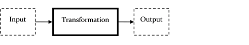
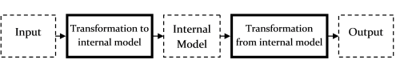

# “表达式和语法”系列

在这一系列的文章中，我们将看看如何将函数和值组合成表达式，以及 F# 中可用的不同类型的表达式。

+   表达式和语法：介绍。如何在 F# 中编码。

+   表达式 vs. 语句。为什么表达式更安全，更好地构建块。

+   F# 表达式概述。控制流、let、do 等等。

+   使用 let、use 和 do 进行绑定。如何使用它们。

+   F# 语法：缩进和冗长。理解挤压规则。

+   参数和值的命名约定。a、f、x 等等。

+   控制流表达式。以及如何避免使用它们。

+   异常。抛出和捕获的语法。

+   匹配表达式。F# 的主力军。

+   使用 printf 格式化文本。打印和记录的技巧和技术。

+   示例：解析命令行参数。实践中的模式匹配。

+   示例：罗马数字。更多实践中的模式匹配。

# 表达式和语法：介绍

# 表达式和语法：介绍

*注意：在阅读这个系列之前，我建议您先阅读"函数式思维"系列作为先决条件。*

在这个系列中，我们将看看如何将函数和值组合成表达式，以及 F# 中可用的不同类型的表达式。

我们还将看一些其他基本主题，比如`let`绑定、F# 语法、模式匹配以及使用`printf`输出文本。

这个系列不打算是穷尽或决定性的。从示例中，F# 的大部分语法和用法应该是明显的，如果需要，MSDN 文档中有所有细节。我们只是专注于解释一些可能令人困惑的基本领域。

因此，我们将从一些一般的技巧开始，讨论`let`绑定的工作原理，并解释缩进规则。

在那之后，接下来的几篇文章将涵盖`match..with`表达式、命令式控制流表达式和异常表达式。计算表达式和面向对象表达式将留到后续系列。

最后，我们将以一些使用模式匹配作为设计的一个组成部分的实践示例结束。

# 表达式 vs. 语句

# 表达式 vs. 语句

在编程语言术语中，“表达式”是值和函数的组合，由编译器解释和组合以创建一个新值，而不是“语句”，它只是一个独立的执行单元，不返回任何内容。一个思考这个问题的方式是，表达式的目的是创建一个值（可能带有一些副作用），而语句的唯一目的是产生副作用。

C# 和大多数命令式语言区分表达式和语句，并且有关于每种类型在哪里可以使用的规则。但正如显而易见的那样，一个真正纯粹的函数式语言根本不支持语句，因为在一个真正纯粹的语言中，不会有副作用。

即使 F# 不是纯的，它也遵循相同的原则。在 F# 中，一切都是表达式。不仅仅是值和函数，还有控制流（如 if-then-else 和循环），模式匹配等等。

使用表达式而不是语句有一些微妙的好处。首先，与语句不同，较小的表达式可以组合（或“组成”）成较大的表达式。因此，如果一切都是表达式，那么一切也是可组合的。

第二，一系列语句总是暗示着特定的评估顺序，这意味着一个语句在没有查看前面语句的情况下是无法理解的。但对于纯表达式来说，子表达式没有任何暗示的执行顺序或依赖关系。

因此，在表达式`a+b`中，如果'`a`'和'`b`'部分都是纯的，那么'`a`'部分可以被隔离出来，独立理解，测试和评估，'`b`'部分也可以。

这种表达式的“隔离性”是函数式编程的另一个有益方面。

请注意，F# 交互式窗口也依赖于一切都是表达式。使用 C# 交互式窗口会更加困难。

## 表达式更安全，更紧凑

一致使用表达式会导致代码更安全，更紧凑。让我们看看我是什么意思。

首先，让我们看看基于语句的方法。语句不返回值，所以你必须使用临时变量，这些变量是从语句体内赋值的。这里有一些使用类似 C 语言（好吧，C#）而不是 F# 的示例：

```
public void IfThenElseStatement(bool aBool) {
   int result;     //what is the value of result before it is used?
   if (aBool)
   {
      result = 42; //what is the result in the 'else' case?
   }
   Console.WriteLine("result={0}", result);
} 
```

因为"if-then"是一个语句，所以`result`变量必须*在*语句外定义，但在*语句内*赋值，这导致了一些问题：

+   `result`变量必须在语句本身之外设置。它应该被设置为什么初始值呢？

+   如果我忘记在`if`语句中为`result`变量赋值会怎么样？"if"语句的目的纯粹是产生副作用（对变量的赋值）。这意味着这些语句可能存在 bug，因为在一个分支中忘记做赋值是很容易的。而且由于赋值只是一个副作用，编译器无法提供任何警告。由于`result`变量已在范围内定义，我可以很容易地使用它，却不知道它是无效的。

+   在“else”情况下`result`变量的值是什么？在这种情况下，我没有指定一个值。我是不是忘记了？这是一个潜在的 bug 吗？

+   最后，依赖副作用来完成任务意味着这些语句在另一个上下文中（例如，提取以进行重构或并行化）不容易使用，因为它们依赖于不属于语句本身的变量。

注意：上面的代码在 C# 中不会编译，因为编译器会抱怨如果像这样使用未赋值的本地变量。但在甚至使用 `result` 之前就必须定义 *某个* 默认值仍然是一个问题。

为了比较，这里是以表达式为导向的风格重写的相同代码：

```
public void IfThenElseExpression(bool aBool) {
    int result = aBool ? 42 : 0;
    Console.WriteLine("result={0}", result);
} 
```

在以表达式为导向的版本中，甚至没有早期问题适用！

+   `result` 变量在分配的同时声明。不需要在表达式之外设置变量，也不用担心它们应该设置为什么初始值。

+   “else”被明确处理。不会忘记在其中一个分支中进行赋值。

+   而且我绝对不会忘记给 `result` 赋值，因为那样变量甚至都不存在！

在 F# 中，这两个示例将被写成：

```
let IfThenElseStatement aBool = 
   let mutable result = 0       // mutable keyword required
   if (aBool) then result <- 42 
   printfn "result=%i" result 
```

在 F# 中，“`mutable`”关键字被认为是一种代码异味，并且除了某些特殊情况外，不鼓励使用。在学习过程中应尽量避免使用！

在基于表达式的版本中，可变变量已被消除，且没有任何重新赋值。

```
let IfThenElseExpression aBool = 
   let result = if aBool then 42 else 0   
                // note that the else case must be specified 
   printfn "result=%i" result 
```

一旦我们将 `if` 语句转换为表达式，现在可以轻松地重构它，并将整个子表达式移动到不同的上下文中而不会引入错误。

这是 C# 中重构后的版本：

```
public int StandaloneSubexpression(bool aBool) {
    return aBool ? 42 : 0;
}

public void IfThenElseExpressionRefactored(bool aBool) {
    int result = StandaloneSubexpression(aBool);
    Console.WriteLine("result={0}", result);
} 
```

并且在 F# 中：

```
let StandaloneSubexpression aBool = 
   if aBool then 42 else 0   

let IfThenElseExpressionRefactored aBool = 
   let result = StandaloneSubexpression aBool 
   printfn "result=%i" result 
```

### 语句与表达式用于循环

再次回到 C#，这里是使用循环语句的语句与表达式的类似示例

```
public void LoopStatement() {
    int i;    //what is the value of i before it is used? 
    int length;
    var array = new int[] { 1, 2, 3 };
    int sum;  //what is the value of sum if the array is empty?

    length = array.Length;   //what if I forget to assign to length?
    for (i = 0; i < length; i++)
    {
        sum += array[i];
    }

    Console.WriteLine("sum={0}", sum);
} 
```

我使用了旧式的“for”语句，其中索引变量在循环外声明。许多早期讨论的问题适用于循环索引“`i`”和最大值“`length`”，例如：它们是否可以在循环外使用？如果它们没有被赋值会发生什么？

一个更现代化的 for 循环版本通过在“for”循环中声明和赋值循环变量，并要求初始化“`sum`”变量来解决这些问题：

```
public void LoopStatementBetter() {
    var array = new int[] { 1, 2, 3 };
    int sum = 0;        // initialization is required

    for (var i = 0; i < array.Length; i++)
    {
        sum += array[i];
    }

    Console.WriteLine("sum={0}", sum);
} 
```

这个更现代化的版本遵循了将本地变量的声明与其第一次赋值结合的一般原则。

当然，我们可以继续改进，使用 `foreach` 循环而不是 `for` 循环：

```
public void LoopStatementForEach() {
    var array = new int[] { 1, 2, 3 };
    int sum = 0;        // initialization is required

    foreach (var i in array)
    {
        sum += i;
    }

    Console.WriteLine("sum={0}", sum);
} 
```

每次，我们不仅在简化代码，还在减少错误的可能性。

但是，将这一原则推向其逻辑结论会导致完全基于表达式的方法！以下是使用 LINQ 可能完成的方式：

```
public void LoopExpression() {
    var array = new int[] { 1, 2, 3 };

    var sum = array.Aggregate(0, (sumSoFar, i) => sumSoFar + i);

    Console.WriteLine("sum={0}", sum);
} 
```

请注意，我本可以使用 LINQ 的内置“sum”函数，但我使用 `Aggregate` 是为了展示嵌入语句中的求和逻辑如何转换为 lambda 并作为表达式的一部分使用。

在下一篇文章中，我们将看看 F# 中各种类型的表达式。

# F# 表达式概述

# F# 表达式概述

在本文中，我们将介绍 F# 中可用的不同类型的表达式以及一些使用它们的一般提示。

## 一切真的都是表达式吗？

也许你正在想如何在实践中实现 “一切都是一个表达式”。

让我们从一些基本的表达式示例开始，这些应该是耳熟能详的：

```
1                            // literal
[1;2;3]                      // list expression
-2                           // prefix operator 
2 + 2                        // infix operator 
"string".Length              // dot lookup
printf "hello"               // function application 
```

没有问题。那些显然是表达式。

但以下还有一些更复杂的东西，也是*表达式*。也就是说，每个都返回一个可用于其他目的的值。

```
fun () -> 1                  // lambda expression

match 1 with                 // match expression
    | 1 -> "a"
    | _ -> "b"

if true then "a" else "b"    // if-then-else

for i in [1..10]             // for loop
  do printf "%i" i

try                          // exception handling
  let result = 1 / 0
  printfn "%i" result
with
  | e -> 
     printfn "%s" e.Message

let n=1 in n+2               // let expression 
```

在其他语言中，这些可能是语句，但在 F# 中它们确实返回值，正如您可以通过将值绑定到结果来看到的那样：

```
let x1 = fun () -> 1                  

let x2 = match 1 with                 
         | 1 -> "a"
         | _ -> "b"

let x3 = if true then "a" else "b"    

let x4 = for i in [1..10]             
          do printf "%i" i

let x5 = try                          
            let result = 1 / 0
            printfn "%i" result
         with
            | e -> 
                printfn "%s" e.Message

let x6 = let n=1 in n+2 
```

## 有哪些类型的表达式？

F# 中有很多不同类型的表达式，目前大约有 50 种。其中大多数都是琐碎和显而易见的，比如字面常量、运算符、函数应用、“点进”等等。

更有趣和高级的表达式可以分为以下几类：

+   Lambda 表达式

+   "控制流" 表达式，包括：

    +   match 表达式（使用 `match..with` 语法）

    +   与命令式控制流相关的表达式，如 if-then-else、循环

    +   异常相关的表达式

+   "let" 和 "use" 表达式

+   `async {..}` 这样的计算表达式

+   与面向对象代码相关的表达式，包括强制转换、接口等

我们已经在 "思考函数式" 系列中讨论了 lambda，并且正如前面所指出的，计算表达式和面向对象表达式将留给以后的系列。

因此，在本系列的即将发布的帖子中，我们将重点讨论“控制流”表达式和“let”表达式。

### "控制流" 表达式

在命令式语言中，诸如 if-then-else、for-in-do 和 match-with 这样的控制流表达式通常被实现为具有副作用的语句，在 F# 中，它们都被实现为另一种类型的表达式。

实际上，在函数式语言中甚至认为 “控制流” 并不是很有帮助；这个概念并不存在。最好的做法是把程序看作是一个包含子表达式的巨大表达式，其中一些被评估，而另一些则没有。如果您能理解这种思维方式，那么您就已经有了一个良好的开始，开始思考函数式。

这些不同类型的控制流表达式将会在接下来的帖子中讨论：

+   match 表达式

+   命令式控制流：if-then-else 和 for 循环

+   异常

### “let” 绑定作为表达式

那么 `let x=something` 呢？在上面的示例中我们看到了：

```
let x5 = let n=1 in n+2 
```

`let` 怎么可能是一个表达式？原因将在下一篇文章中讨论 "let"，"use" 和 "do"。

## 使用表达式的一般提示

但在我们详细介绍重要表达式类型之前，以下是一些使用表达式的一般提示。

### 一行上的多个表达式

通常，每个表达式都放在新行上。但如果需要，您可以使用分号将一个行上的表达式分隔开来。除了在 F# 中用作列表和记录元素的分隔符之外，这是分号在 F# 中使用的几个时候之一。

```
let f x =                           // one expression per line
      printfn "x=%i" x
      x + 1

let f x = printfn "x=%i" x; x + 1   // all on same line with ";" 
```

直到最后一个表达式还是需要单位值的规则当然仍然适用：

```
let x = 1;2              // error: "1;" should be a unit expression
let x = ignore 1;2       // ok
let x = printf "hello";2 // ok 
```

### 理解表达式评估顺序

在 F# 中，表达式是从 "内部向外" 评估的 -- 也就是说，一旦一个完整的子表达式被 "看到"，它就会被评估。

看一下下面的代码，并尝试猜测会发生什么，然后评估代码并查看结果。

```
// create a clone of if-then-else
let test b t f = if b then t else f

// call it with two different choices
test true (printfn "true") (printfn "false") 
```

发生的情况是 "true" 和 "false" 都被打印出来，即使测试函数实际上永远不会评估 "else" 分支。为什么？因为 `(printfn "false")` 表达式会立即被评估，而不管测试函数如何使用它。

这种评估风格称为 "急切"。它的优点是易于理解，但这意味着在某些情况下可能效率低下。

另一种评估风格称为 "惰性"，即只有在需要时才评估表达式。Haskell 语言遵循这种方法，因此在 Haskell 中的类似示例只会打印 "true"。

在 F# 中，有许多技术可强制表达式*不*立即进行评估。最简单的方法是将其包装在仅在需要时才被评估的函数中：

```
// create a clone of if-then-else that accepts functions rather than simple values
let test b t f = if b then t() else f()

// call it with two different functions
test true (fun () -> printfn "true") (fun () -> printfn "false") 
```

这样做的问题是现在 "true" 函数可能会被错误地评估两次，而我们只想评估一次！

因此，表达式不立即被评估的首选方法是使用 `Lazy<>` 包装器。

```
// create a clone of if-then-else with no restrictions...
let test b t f = if b then t else f

// ...but call it with lazy values
let f = test true (lazy (printfn "true")) (lazy (printfn "false")) 
```

最终的结果值 `f` 也是一个惰性值，可以在最终准备好获取结果之前传递而不进行评估。

```
f.Force()     // use Force() to force the evaluation of a lazy value 
```

如果你从不需要结果，并且从不调用 `Force()`，那么包装的值将永远不会被评估。

在即将到来的性能系列中，惰性会有更多的讨论。

# 使用 let、use 和 do 进行绑定

# 使用 let、use 和 do 进行绑定

正如我们已经看到的那样，在 F# 中没有 "变量"。相反，有值。

我们也看到了 `let`、`use` 和 `do` 等关键字作为*绑定*，将标识符与值或函数表达式关联起来。

在本文中，我们将更详细地查看这些绑定。

## "let" 绑定

`let` 绑定很简单，它的一般形式如下：

```
let aName = someExpression 
```

但是 `let` 有两种略微不同的用法。一种是在模块的顶层定义一个命名表达式，另一种是在某个表达式的上下文中定义一个局部名称。这在某种程度上类似于 C# 中 "顶层" 方法名称和 "局部" 变量名称之间的区别。

[* 并在以后的系列中，当我们谈论 OO 特性时，类也可以有顶级的 let 绑定。]

下面是两种类型的示例：

```
module MyModule = 

    let topLevelName = 
        let nestedName1 = someExpression
        let nestedName2 = someOtherExpression
        finalExpression 
```

顶层名称是*定义*，它是模块的一部分，你可以使用完全限定的名称访问它，例如`MyModule.topLevelName`。在某种意义上，它相当于一个类方法。

但是嵌套的名称对任何人都是完全不可访问的--它们只在顶层名称绑定的上下文中有效。

### "let"绑定中的模式

我们已经看到了绑定如何直接使用模式的示例

```
let a,b = 1,2

type Person = {First:string; Last:string}
let alice = {First="Alice"; Last="Doe"}
let {First=first} = alice 
```

在函数定义中，绑定还包括参数：

```
// pattern match the parameters
let add (x,y) = x + y

// test 
let aTuple = (1,2)
add aTuple 
```

各种模式绑定的细节取决于要绑定的类型，并将在以后关于模式匹配的帖子中进一步讨论。

### 嵌套的"let"绑定作为表达式

我们强调过表达式是由较小的表达式组成的。但是嵌套的`let`怎么样呢？

```
let nestedName = someExpression 
```

"`let`"如何成为一个表达式？它返回什么？

嵌套的"let"永远不能单独使用--它必须始终是一个更大的代码块的一部分，以便它可以被解释为：

```
let nestedName = [some expression] in [some other expression involving nestedName] 
```

也就是说，每当你在第二个表达式（称为*主体表达式*）中看到符号"nestedName"时，就用第一个表达式替换它。

因此，例如，表达式：

```
// standard syntax
let f () = 
  let x = 1  
  let y = 2
  x + y          // the result 
```

真正意味着：

```
// syntax using "in" keyword
let f () = 
  let x = 1 in   // the "in" keyword is available in F#
    let y = 2 in 
      x + y      // the result 
```

当进行替换时，最后一行变为：

```
(definition of x) + (definition of y) 
// or
(1) + (2) 
```

从某种意义上说，嵌套的名称只是在表达式编译时消失的"宏"或"占位符"。因此，你应该能够看到嵌套的`let`对整个表达式没有影响。因此，例如，包含嵌套`let`的表达式的类型仅仅是最终主体表达式的类型。

如果你了解嵌套的`let`绑定是如何工作的，那么某些错误就会变得可以理解。例如，如果没有东西让嵌套的"let"去"in"，整个表达式就不完整。在下面的示例中，let 行后面没有任何内容，这是一个错误：

```
let f () = 
  let x = 1  
// error FS0588: Block following this 'let' is unfinished. 
//               Expect an expression. 
```

你不能有多个表达式结果，因为你不能有多个主体表达式。在最终主体表达式之前评估的任何内容必须是一个"`do`"表达式（见下文），并返回`unit`。

```
let f () = 
  2 + 2      // warning FS0020: This expression should 
             // have type 'unit'
  let x = 1  
  x + 1      // this is the final result 
```

在这种情况下，你必须将结果管道传递到"ignore"。

```
let f () = 
  2 + 2 |> ignore 
  let x = 1  
  x + 1      // this is the final result 
```

## "use"绑定

`use`关键字的作用与`let`相同--它将表达式的结果绑定到一个命名值上。

关键区别在于在它超出范围时也*自动处置*该值。

很明显，这意味着`use`仅适用于嵌套情况。你不能有一个顶级的`use`，如果你尝试，编译器会警告你。

```
module A = 
    use f () =  // Error
      let x = 1  
      x + 1 
```

要了解正确的`use`绑定如何工作，首先让我们创建一个动态创建`IDisposable`的辅助函数。

```
// create a new object that implements IDisposable
let makeResource name = 
   { new System.IDisposable 
     with member this.Dispose() = printfn "%s disposed" name } 
```

现在让我们用一个嵌套的`use`绑定来测试它：

```
let exampleUseBinding name =
    use myResource = makeResource name
    printfn "done"

//test
exampleUseBinding "hello" 
```

我们可以看到打印了"done"，然后立即在此之后，`myResource`超出范围，它的`Dispose`被调用，并且还打印了"hello disposed"。

另一方面，如果我们使用常规的`let`绑定进行测试，我们就不会得到相同的效果。

```
let exampleLetBinding name =
    let myResource = makeResource name
    printfn "done"

//test
exampleLetBinding "hello" 
```

在这种情况下，我们看到打印了"done"，但是`Dispose`从未被调用。

### "Use"仅适用于 IDisposables

请注意，“use”绑定仅适用于实现`IDisposable`接口的类型，否则编译器会报错：

```
let exampleUseBinding2 name =
    use s = "hello"  // Error: The type 'string' is 
                     // not compatible with the type 'IDisposable'
    printfn "done" 
```

### 不要返回“use'd”值

重要的是要意识到，值在*声明它的表达式*范围之外时会被处理。如果尝试将值返回给另一个函数使用，返回值将无效。

以下示例展示了如何*不*做：

```
let returnInvalidResource name =
    use myResource = makeResource name
    myResource // don't do this!

// test
let resource = returnInvalidResource  "hello" 
```

如果需要在创建它的函数之外使用可处置对象，可能最好的方法是使用回调。

然后该函数将按以下方式工作：

+   创建可处置对象。

+   评估回调函数与可处置对象

+   在可处置对象上调用`Dispose`

这里有一个例子：

```
let usingResource name callback =
    use myResource = makeResource name
    callback myResource
    printfn "done"

let callback aResource = printfn "Resource is %A" aResource
do usingResource "hello" callback 
```

这种方法保证了创建可处置对象的函数也会处理释放，不会出现泄漏的机会。

另一种可能的方式是在创建时*不*使用`use`绑定，而是使用`let`绑定，让调用者负责处理释放。

这里有一个例子：

```
let returnValidResource name =
    // "let" binding here instead of "use"
    let myResource = makeResource name
    myResource // still valid

let testValidResource =
    // "use" binding here instead of "let"
    use resource = returnValidResource  "hello"
    printfn "done" 
```

就个人而言，我不喜欢这种方法，因为它不对称并将创建与释放分开，这可能导致资源泄漏。

### "using"函数

共享可处置对象的首选方法，如上所示，使用回调函数。

有一个内置的`using`函数，工作方式相同。它接受两个参数：

+   第一个是创建资源的表达式

+   第二个是使用资源的函数，将其作为参数传递

这里是我们之前的示例重写，使用`using`函数：

```
let callback aResource = printfn "Resource is %A" aResource
using (makeResource "hello") callback 
```

在实践中，`using`函数并不经常使用，因为很容易自定义自己的版本，就像我们之前看到的那样。

### 误用"use"

F#中的一个技巧是使用`use`关键字来自动执行任何类型的“停止”或“还原”功能。

这样做的方法是：

+   为某种类型创建一个扩展方法

+   在该方法中，启动所需的行为，然后返回一个停止行为的`IDisposable`。

例如，这里是一个启动计时器然后返回一个停止它的`IDisposable`的扩展方法。

```
module TimerExtensions = 

    type System.Timers.Timer with 
        static member StartWithDisposable interval handler = 
            // create the timer
            let timer = new System.Timers.Timer(interval)

            // add the handler and start it
            do timer.Elapsed.Add handler 
            timer.Start()

            // return an IDisposable that calls "Stop"
            { new System.IDisposable with 
                member disp.Dispose() = 
                    do timer.Stop() 
                    do printfn "Timer stopped"
                } 
```

现在在调用代码中，我们创建计时器并与`use`绑定。当计时器值超出范围时，它将自动停止！

```
open TimerExtensions
let testTimerWithDisposable =     
    let handler = (fun _ -> printfn "elapsed")
    use timer = System.Timers.Timer.StartWithDisposable 100.0 handler  
    System.Threading.Thread.Sleep 500 
```

这种方法也可以用于其他常见的操作对，例如：

+   打开/连接然后关闭/断开资源（这正是`IDisposable`应该用于的方式，但您的目标类型可能尚未实现它）

+   注册然后注销事件处理程序（而不是使用`WeakReference`）

+   在 UI 中，在一段代码块开始时显示一个启动屏幕，然后在代码块结束时自动关闭它

一般情况下我不推荐这种方法，因为它隐藏了正在进行的操作，但在某些情况下可能非常有用。

## "do"绑定

有时我们可能希望执行与函数或值定义无关的代码。这在模块初始化、类初始化等情况下很有用。

也就是说，而不是有 "`let x = do something`"，我们只是单独使用 "`do something`"。这类似于命令式语言中的语句。

你可以通过在代码前面加上"`do`"来实现这一点：

```
do printf "logging" 
```

在许多情况下，可以省略 `do` 关键字：

```
printf "logging" 
```

但在这两种情况下，表达式必须返回 unit。如果不是，你将会得到一个编译器错误。

```
do 1 + 1    // warning: This expression is a function 
```

像往常一样，你可以通过将结果传输到 "`ignore`" 来强制将非 unit 结果丢弃。

```
do ( 1+1 |> ignore ) 
```

你还会在循环中看到 "`do`" 关键字以相同的方式使用。

请注意，尽管有时可以省略它，但始终有一个显式的 "`do`" 被认为是一种良好的实践，因为它作为文档说明，表明你不需要一个结果，只需要副作用。

### 模块初始化用的 "do"

就像 `let` 一样，`do` 可以在嵌套上下文和模块或类的顶层都可以使用。

当在模块级别使用时，`do` 表达式仅在模块首次加载时被评估一次。

```
module A =

    module B =
        do printfn "Module B initialized"

    module C =
        do printfn "Module C initialized"

    do printfn "Module A initialized" 
```

这在某种程度上类似于 C# 中的静态类构造函数，不同之处在于如果有多个模块，初始化顺序是固定的，并且它们按声明顺序初始化。

## let! 和 use! 和 do!

当你看到 `let!`、`use!` 和 `do!`（即带感叹号的情况）并且它们是作为花括号 `{..}` 块的一部分时，那么它们被用作"计算表达式"的一部分。`let!`、`use!` 和 `do!` 在这种上下文中的确切含义取决于计算表达式本身。理解一般计算表达式的含义将等待以后的系列文章。

你会遇到的最常见的计算表达式类型是 *异步工作流*，用 `async{..}` 块表示。在这种情况下，它意味着它们被用于等待异步操作完成，然后绑定到结果值。

这是我们在 “为什么使用 F#？”系列中看到的一些示例：

```
//This simple workflow just sleeps for 2 seconds.
open System
let sleepWorkflow  = async{
    printfn "Starting sleep workflow at %O" DateTime.Now.TimeOfDay

    // do! means to wait as well
    do! Async.Sleep 2000
    printfn "Finished sleep workflow at %O" DateTime.Now.TimeOfDay
    }

//test
Async.RunSynchronously sleepWorkflow  

// Workflows with other async workflows nested inside them. 
/// Within the braces, the nested workflows can be blocked on by using the let! or use! syntax.
let nestedWorkflow  = async{

    printfn "Starting parent"

    // let! means wait and then bind to the childWorkflow value
    let! childWorkflow = Async.StartChild sleepWorkflow

    // give the child a chance and then keep working
    do! Async.Sleep 100
    printfn "Doing something useful while waiting "

    // block on the child
    let! result = childWorkflow

    // done
    printfn "Finished parent" 
    }

// run the whole workflow
Async.RunSynchronously nestedWorkflow 
```

## 对 `let` 和 `do` 绑定的属性

如果它们在模块的顶层，则 `let` 和 `do` 绑定可以有属性。F# 属性使用语法 `[<MyAttribute>]`。

这里有一些在 C# 中的示例，然后是相同的代码在 F# 中：

```
class AttributeTest
{
    [Obsolete]
    public static int MyObsoleteFunction(int x, int y) {
        return x + y;
    }

    [CLSCompliant(false)]
    public static void NonCompliant() {
    }
} 
```

```
module AttributeTest = 
    [<Obsolete>]
    let myObsoleteFunction x y = x + y

    [<CLSCompliant(false)>]
    let nonCompliant () = () 
```

让我们简要看看三个属性示例：

+   用于指示 "main" 函数的 EntryPoint 属性。

+   各种 AssemblyInfo 属性。

+   用于与非托管代码交互的 DllImport 属性。

### 入口点属性

特殊的 `EntryPoint` 属性用于标记独立应用程序的入口点，就像在 C# 中一样，`static void Main` 方法一样。

这里是熟悉的 C# 版本：

```
class Program
{
    static int Main(string[] args) {
        foreach (var arg in args)
        {
            Console.WriteLine(arg);
        }

        //same as Environment.Exit(code)
        return 0;
    }
} 
```

这里是 F# 的等效语法：

```
module Program

[<EntryPoint>]
let main args =
    args |> Array.iter printfn "%A" 

    0  // return is required! 
```

就像在 C# 中一样，args 是一个字符串数组。但与 C# 不同的是，静态 `Main` 方法可以是 `void`，而 F# 函数 *必须* 返回一个 int。

另外，一个大的陷阱是具有此属性的函数必须是项目中最后一个文件中的最后一个函数！否则，您会收到此错误：

```
error FS0191: A function labelled with the 'EntryPointAttribute' atribute must be the last declaration in the last file in the compilation sequence 
```

为什么 F# 编译器如此挑剔？在 C# 中，类可以放在任何地方。

一个可能有所帮助的类比是：在某种意义上，整个应用程序是一个绑定到 `main` 的单个巨大表达式，其中 `main` 是一个包含包含其他子表达式的子表达式的表达式。

```
[<EntryPoint>]
let main args =
    the entire application as a set of subexpressions 
```

现在在 F# 项目中，不允许有前向引用。也就是说，引用其他表达式的表达式必须在它们之后声明。因此，逻辑上，最高级别的函数 `main` 必须放在所有函数的最后。

### AssemblyInfo 属性

在一个 C# 项目中，有一个名为 `AssemblyInfo.cs` 的文件，其中包含所有程序集级别的属性。

在 F# 中，执行此操作的等效方式是使用一个包含带有这些属性注释的 `do` 表达式的虚拟模块。

```
open System.Reflection

module AssemblyInfo = 
    [<assembly: AssemblyTitle("MyAssembly")>]
    [<assembly: AssemblyVersion("1.2.0.0")>]
    [<assembly: AssemblyFileVersion("1.2.3.4152")>]
    do ()   // do nothing -- just a placeholder for the attribute 
```

### DllImport 属性

另一个偶尔有用的属性是 `DllImport` 属性。这里是一个 C# 示例。

```
using System.Runtime.InteropServices;

[TestFixture]
public class TestDllImport
{
    [DllImport("shlwapi", CharSet = CharSet.Auto, EntryPoint = "PathCanonicalize", SetLastError = true)]
    private static extern bool PathCanonicalize(StringBuilder lpszDst, string lpszSrc);

    [Test]
    public void TestPathCanonicalize() {
        var input = @"A:\name_1\.\name_2\..\name_3";
        var expected = @"A:\name_1\name_3";

        var builder = new StringBuilder(260);
        PathCanonicalize(builder, input);
        var actual = builder.ToString();

        Assert.AreEqual(expected,actual);
    }
} 
```

它在 F# 中的工作方式与在 C# 中相同。需要注意的一点是，`extern declaration ...` 将类型放在参数之前，类似于 C 语言风格。

```
open System.Runtime.InteropServices
open System.Text

[<DllImport("shlwapi", CharSet = CharSet.Ansi, EntryPoint = "PathCanonicalize", SetLastError = true)>]
extern bool PathCanonicalize(StringBuilder lpszDst, string lpszSrc)

let TestPathCanonicalize() = 
    let input = @"A:\name_1\.\name_2\..\name_3"
    let expected = @"A:\name_1\name_3"

    let builder = new StringBuilder(260)
    let success = PathCanonicalize(builder, input)
    let actual = builder.ToString()

    printfn "actual=%s success=%b" actual (expected = actual)

// test
TestPathCanonicalize() 
```

与非托管代码的互操作是一个需要专门讨论的重要主题。

# F# 语法：缩进和冗长

# F# 语法：缩进和冗长

F# 的语法大部分是直接的。但是，如果您想避免常见的缩进错误，您应该了解一些规则。如果您熟悉像 Python 这样的对空格敏感的语言，请注意 F# 中缩进的规则略有不同。

## 缩进和“offside”规则

在足球中，越位规则规定在某些情况下，球员不能在应该在球后或与球平齐时“超越”球。"越位线"是球员不能越过的线。F# 使用相同的术语来描述缩进必须开始的线。与足球一样，避免被罚的诀窍是知道线在哪里，并且不要超越它。

通常，一旦设置了 offside 行，所有表达式都必须与该行对齐。

```
//character columns
//3456789
let f = 
  let x=1     // offside line is at column 3
  let y=1     // this line must start at column 3
  x+y         // this line must start at column 3 

let f = 
  let x=1     // offside line is at column 3 
   x+1        // oops! don't start at column 4
              // error FS0010: Unexpected identifier in binding

let f = 
  let x=1    // offside line is at column 3 
 x+1         // offside! You are ahead of the ball!
             // error FS0588: Block following this 
             // 'let' is unfinished 
```

各种标记可以触发创建新 offside 行。例如，当 F# 看到在 let 表达式中使用 "`=`" 时，将在遇到的下一个符号或单词的位置创建一个新的 offside 行。

```
//character columns
//34567890123456789
let f =   let x=1  // line is now at column 11 (start of "let x=")
          x+1      // must start at column 11 from now on

//        |        // offside line at col 11 
let f =   let x=1  // line is now at column 11 (start of "let x=")
         x+1       // offside!

// |        // offside line at col 4
let f =  
   let x=1  // first word after = sign defines the line 
            // offside line is now at column 4
   x+1      // must start at column 4 from now on 
```

其他标记具有相同的行为，包括括号、"`then`"、"`else`"、"`try`"、"`finally`"和"`do`"，以及匹配子句中的"`->`"。

```
//character columns
//34567890123456789
let f = 
   let g = (         
    1+2)             // first char after "(" defines 
                     // a new line at col 5
   g 

let f = 
   if true then
    1+2             // first char after "then" defines 
                    // a new line at col 5

let f = 
   match 1 with 
   | 1 ->
       1+2          // first char after match "->" defines 
                    // a new line at col 8 
```

offside 行可以嵌套，并按照您的预期进行推送和弹出：

```
//character columns
//34567890123456789
let f = 
   let g = let x = 1 // first word after "let g =" 
                     // defines a new offside line at col 12
           x + 1     // "x" must align at col 12
                     // pop the offside line stack now
   g + 1             // back to previous line. "g" must align
                     // at col 4 
```

新的 offside 行永远不能向前超过堆栈上前一行的位置：

```
let f = 
   let g = (         // let defines a new line at col 4
  1+2)               // oops! Cant define new line less than 4
   g 
```

## 特殊情况

已经创建了许多特殊情况，以使代码格式更加灵活。其中许多看起来很自然，比如对齐 `if-then-else` 表达式或 `try-catch` 表达式的每个部分的开头。然而，也有一些不明��的情况。

中缀运算符，如"+", "|>" 和 ">>"，允许在行外以其长度加一空格的方式出现：

```
//character columns
//34567890123456789
let x =  1   // defines a new line at col 10
       + 2   // "+" allowed to be outside the line
       + 3

let f g h =   g   // defines a new line at col 15
           >> h   // ">>" allowed to be outside the line 
```

如果中缀运算符在行首出现，那么该行不必严格对齐：

```
let x =  1   // defines a new line at col 10
        + 2   // infix operators that start a line don't count
             * 3  // starts with "*" so doesn't need to align
         - 4  // starts with "-" so doesn't need to align 
```

如果`fun`关键字开始一个表达式，那么`fun`*不*会开始一个新的偏移行：

```
//character columns
//34567890123456789
let f = fun x ->  // "fun" should define a new line at col 9
   let y = 1      // but doesn't. The real line starts here.
   x + y 
```

### 了解更多信息

有关缩进工作方式的更多细节，但上面的示例应该涵盖了大多数常见情况。如果你想了解更多，F#的完整语言规范可从微软作为[可下载的 PDF](http://research.microsoft.com/en-us/um/cambridge/projects/fsharp/manual/spec.pdf)获取，并且值得一读。

## “冗长”语法

默认情况下，F#使用缩进来指示块结构--这被称为“轻量”语法。还有一种不使用缩进的替代语法，称为“冗长”语法。使用冗长语法时，你不需要使用缩进，空格不重要，但缺点是你需要使用更多的关键字，包括诸如：

+   每个“let”和“do”绑定后的`in`关键字

+   代码块（如 if-then-else）的`begin`/`end`关键字

+   循环结束时的`done`关键字

+   类型定义的开头和结尾的关键字

这是一个具有古怪缩进的冗长语法示例，否则是不可接受的：

```
#indent "off"

      let f = 
    let x = 1 in
  if x=2 then 
begin "a" end else begin
"b" 
end

#indent "on" 
```

即使在“轻量”模式下，冗长的语法始终可用，并且偶尔很有用。例如，当你想将“let”嵌入到一行表达式中时：

```
let x = let y = 1 in let z = 2 in y + z 
```

其他可能需要使用冗长语法的情况包括：

+   在输出生成的代码时

+   为了与 OCaml 兼容

+   如果你视力受损或盲人并使用屏幕阅读器

+   或者只是为了对 F#解析器使用的抽象语法树有一些了解

除了这些情况外，冗长语法在实践中很少使用。

# 参数和值的命名约定

# 参数和值的命名约定

如果你是从诸如 C#之类的命令式语言转向 F#，那么你可能会发现很多名称比你习惯的更短更神秘。

在 C#和 Java 中，最佳实践是使用长的描述性标识符。在函数式语言中，函数名称本身可以是描述性的，但函数内部的本地标识符往往非常简短，并且经常使用管道和组合来使所有内容尽可能少地占用行数。

例如，这是一个使用非常描述性名称的素数筛的粗糙实现��

```
let primesUpTo n = 
    // create a recursive intermediate function
    let rec sieve listOfNumbers  = 
        match listOfNumbers with 
        | [] -> []
        | primeP::sievedNumbersBiggerThanP-> 
            let sievedNumbersNotDivisibleByP = 
                sievedNumbersBiggerThanP
                |> List.filter (fun i-> i % primeP > 0)
            //recursive part
            let newPrimes = sieve sievedNumbersNotDivisibleByP
            primeP :: newPrimes
    // use the sieve
    let listOfNumbers = [2..n]
    sieve listOfNumbers     // return

//test
primesUpTo 100 
```

这是相同的实现，使用更简洁、惯用的名称和更紧凑的代码：

```
let primesUpTo n = 
   let rec sieve l  = 
      match l with 
      | [] -> []
      | p::xs -> 
            p :: sieve [for x in xs do if (x % p) > 0 then yield x]
   [2..n] |> sieve 
```

当然，神秘的名称并不总是更好，但如果函数保持在几行内并且使用的操作是标准的，那么这是一个相当常见的习惯用法。

常见的命名约定如下：

+   "a", "b", "c"等是类型

+   "f", "g", "h"等是函数

+   "x", "y", "z"等是函数的参数

+   列表通过添加 "s" 后缀来表示，因此 "`xs`" 是 `x` 的列表，"`fs`" 是函数的列表，等等。极其常见的是 "`x::xs`" 表示列表的头（第一个元素）和尾部（剩余元素）。

+   "*" 在你不关心值的时候使用。因此，"`x::*`" 表示你不关心列表的其余部分，"`let f _ = something`" 表示你不关心`f`的参数。

另一个使用简短名称的原因是，通常它们不能分配给任何有意义的内容。例如，管道运算符的定义是：

```
let (|>) x f = f x 
```

我们不知道 `f` 和 `x` 将会是什么，`f` 可能是任何函数，`x` 可能是任何值。明确这一点并不会使代码更加易懂。

```
let (|>) aValue aFunction = aFunction aValue // any better? 
```

### 在本网站上使用的风格

在这个网站上，我会同时使用两种风格。对于介绍性系列，当大多数概念都是新的时，我会使用非常描述性的风格，包括中间值和长名称。但在更高级的系列中，风格会变得更加简洁。

# 控制流表达式

# 控制流表达式

在本文中，我们将看看控制流表达式，即：

+   if-then-else

+   对于集合中的每个 x（与 C# 中的 foreach 相同）

+   对于 x 从开始到结束

+   while-do

这些控制流表达式无疑对你来说非常熟悉。但它们非常 "命令式" 而不是函数式。

所以我强烈建议你尽可能不要使用它们，特别是当你正在学习函数式思维时。如果你把它们当作救命稻草使用，你会发现要摆脱命令式思维会更加困难。

为了帮助你做到这一点，我将每个部分的开头都以更为惯用的结构示例来避免使用它们。如果你确实需要使用它们，那么你需要注意一些可能出现的问题。

## If-then-else

### 如何避免使用 if-then-else

避免使用 `if-then-else` 的最佳方法是使用 "match"。你可以匹配一个布尔值，这类似于经典的 then/else 分支。但更好的做法是避免相等性测试，实际上匹配物体本身，如下面的最后一个实现所示。

```
// bad
let f x = 
    if x = 1 
    then "a" 
    else "b"

// not much better
let f x = 
    match x=1 with
    | true -> "a" 
    | false -> "b"

// best
let f x = 
    match x with
    | 1 -> "a" 
    | _ -> "b" 
```

直接匹配更好的部分原因是相等性测试丢弃了通常需要重新获取的有用信息。

这由下一个场景来展示，我们想要获取列表的第一个元素以便打印它。显然，我们必须小心，不要尝试对空列表进行这样的操作。

第一种实现进行了空测试，然后进行了第 *二* 次操作以获取第一个元素。更好的方法是一次匹配并提取元素，如下所示的第二种实现。

```
// bad
let f list = 
    if List.isEmpty list
    then printfn "is empty" 
    else printfn "first element is %s" (List.head list)

// much better
let f list = 
    match list with
    | [] -> printfn "is empty" 
    | x::_ -> printfn "first element is %s" x 
```

第二种实现不仅更容易理解，而且更有效率。

如果布尔测试很复杂，仍然可以通过使用额外的 "`when`" 子句（称为 "guards"）来使用 match 来完成。比较下面的第一和第二种实现以查看差异。

```
// bad
let f list = 
    if List.isEmpty list
        then printfn "is empty" 
        elif (List.head list) > 0
            then printfn "first element is > 0" 
            else printfn "first element is <= 0" 

// much better
let f list = 
    match list with
    | [] -> printfn "is empty" 
    | x::_ when x > 0 -> printfn "first element is > 0" 
    | x::_ -> printfn "first element is <= 0" 
```

再次，第二个实现更容易理解，而且更高效。

故事的寓意是：如果你发现自己在使用 if-then-else 或匹配布尔值，请考虑重构你的代码。

### 如何使用 if-then-else

如果你确实需要使用 if-then-else，请注意即使语法看起来很熟悉，但你必须注意一个要点：“`if-then-else`”是一个*表达式*，而不是一个*语句*，与 F#中的每个表达式一样，它必须返回特定类型的值。

这里有两个返回类型为字符串的示例。

```
let v = if true then "a" else "b"    // value : string
let f x = if x then "a" else "b"     // function : bool->string 
```

但作为一个结果，两个分支必须返回相同的类型！如果这不成立，那么整个表达式就无法返回一致的类型，编译器会报错。

这是一个在每个分支中具有不同类型的示例：

```
let v = if true then "a" else 2  
  // error FS0001: This expression was expected to have 
  //               type string but here has type int 
```

“else”子句是可选的，但如果它不存在，则假定“else”子句返回单位，这意味着“then”子句也必须返回单位。如果你犯了这个错误，编译器会投诉你。

```
let v = if true then "a"    
  // error FS0001: This expression was expected to have type unit 
  //               but here has type string 
```

如果“then”子句返回单位，则编译器将会满意。

```
let v2 = if true then printfn "a"   // OK as printfn returns unit 
```

注意，没有办法在分支中提前返回。返回值是整个表达式。换句话说，if-then-else 表达式与 C#中的三元 if 运算符（<if expr="" class="hljs-class">?<then expr="" class="hljs-class">:<else expr="" class="hljs-class">）更接近</else></then></if>，而不是 C#中的 if-then-else 语句。

### 用于一行代码的 if-then-else

if-then-else 真正有用的一个地方是创建简单的一行代码，以传递到其他函数中。

```
let posNeg x = if x > 0 then "+" elif x < 0 then "-" else "0"
[-5..5] |> List.map posNeg 
```

### 返回函数

不要忘记，if-then-else 表达式可以返回任何值，包括函数值。例如：

```
let greetings = 
    if (System.DateTime.Now.Hour < 12) 
    then (fun name -> "good morning, " + name)
    else (fun name -> "good day, " + name)

//test 
greetings "Alice" 
```

当然，两个函数必须具有相同的类型，这意味着它们必须具有相同的函数签名。

## 循环

### 如何避免使用循环

避免循环的最佳方法是使用内置的列表和序列函数。几乎所有你想做的事情都可以不使用显式循环来完成。而且通常，作为副作用，你也可以避免可变值。以下是一些示例供参考，更多细节请阅读专门介绍列表和序列操作的系列文章。

示例：打印 10 次某个内容：

```
// bad
for i = 1 to 10 do
   printf "%i" i

// much better
[1..10] |> List.iter (printf "%i") 
```

示例：求列表的总和：

```
// bad
let sum list = 
    let mutable total = 0    // uh-oh -- mutable value 
    for e in list do
        total <- total + e   // update the mutable value
    total                    // return the total

// much better
let sum list = List.reduce (+) list

//test
sum [1..10] 
```

示例：生成并打印一系列随机数：

```
// bad
let printRandomNumbersUntilMatched matchValue maxValue =
  let mutable continueLooping = true  // another mutable value
  let randomNumberGenerator = new System.Random()
  while continueLooping do
    // Generate a random number between 1 and maxValue.
    let rand = randomNumberGenerator.Next(maxValue)
    printf "%d " rand
    if rand = matchValue then 
       printfn "\nFound a %d!" matchValue
       continueLooping <- false

// much better
let printRandomNumbersUntilMatched matchValue maxValue =
  let randomNumberGenerator = new System.Random()
  let sequenceGenerator _ = randomNumberGenerator.Next(maxValue)
  let isNotMatch = (<>) matchValue

  //create and process the sequence of rands
  Seq.initInfinite sequenceGenerator 
    |> Seq.takeWhile isNotMatch
    |> Seq.iter (printf "%d ")

  // done
  printfn "\nFound a %d!" matchValue

//test
printRandomNumbersUntilMatched 10 20 
```

与 if-then-else 一样，有一个寓意；如果你发现自己在使用循环和可变值，请考虑重构你的代码以避免它们。

### 三种类型的循环

如果你想要使用循环，那么有三种类型的循环表达式可供选择，它们与 C#中的类似。

+   `for-in-do`。其形式为`for x in enumerable do something`。它与 C#中的`foreach`循环相同，并且是 F#中最常见的形式。

+   `for-to-do`。其形式为`for x = start to finish do something`。它与 C#中的标准`for (i=start; i<end; i++)`循环相同。

+   `while-do`。它的形式是 `while test do something`。这与 C# 中的 `while` 循环相同。请注意，F# 中没有 `do-while` 的等价物。

我不会再详细介绍了，因为用法很简单。如果有困难，请查看 [MSDN 文档](http://msdn.microsoft.com/en-us/library/dd233227.aspx)。

### 如何使用循环

就像 if-then-else 表达式一样，循环表达式看起来很熟悉，但是又有一些地方需要注意。

+   所有的循环表达式总是为整个表达式返回 unit，因此没有办法从循环内部返回一个值。

+   就像所有的 "do" 绑定一样，循环内部的表达式也必须返回 unit。

+   没有 "break" 和 "continue" 的等价物（这通常可以使用序列更好地完成）

下面是一个 unit 约束的例子。循环中的表达式应该是 unit，而不是 int，所以编译器会报错。

```
let f =
  for i in [1..10] do
    i + i  // warning: This expression should have type 'unit'

// version 2
let f =
  for i in [1..10] do
    i + i |> ignore   // fixed 
```

### 一行代码的循环

实际上，循环在实践中用作列表和序列生成器的地方之一。

```
let myList = [for x in 0..100 do if x*x < 100 then yield x ] 
```

## 总结

我会重申我在帖子开头说的话：在学习函数式思维时，尽量避免使用命令式控制流。并且要理解证明规则的异常；那些使用是可以接受的一行代码。

# 异常

# 异常

就像其他 .NET 语言一样，F# 支持抛出和捕获异常。与控制流表达式一样，语法会让人觉得很熟悉，但是再次提醒您，有一些地方需要注意。

## 定义自己的异常

在引发/抛出异常时，您可以使用标准的系统异常，比如 `InvalidOperationException`，或者您可以使用下面所示的简单语法来定义自己的异常类型，其中异常的 "内容" 是任何 F# 类型：

```
exception MyFSharpError1 of string
exception MyFSharpError2 of string * int 
```

就是这样！定义新的异常类比在 C# 中要容易得多！

## 抛出异常

有三种基本的抛出异常的方法

+   使用其中一个内置函数，比如 "invalidArg"

+   使用其中一个标准 .NET 异常类

+   使用您自己的自定义异常类型

### 抛出异常，方法 1：使用内置函数之一

F# 内置了四个有用的异常关键字：

+   `failwith` 抛出一个通用的 `System.Exception`

+   `invalidArg` 抛出一个 `ArgumentException`

+   `nullArg` 抛出一个 `NullArgumentException`

+   `invalidOp` 抛出一个 `InvalidOperationException`

这四种情况可能涵盖了您经常抛出的大多数异常。这是它们的用法：

```
// throws a generic System.Exception
let f x = 
   if x then "ok"
   else failwith "message"

// throws an ArgumentException
let f x = 
   if x then "ok"
   else invalidArg "paramName" "message" 

// throws a NullArgumentException
let f x = 
   if x then "ok"
   else nullArg "paramName" "message"   

// throws an InvalidOperationException
let f x = 
   if x then "ok"
   else invalidOp "message" 
```

顺便说一句，有一个非常有用的 `failwith` 的变体叫做 `failwithf`，它包含 `printf` 风格的格式化，这样您就可以轻松地制作自定义消息：

```
open System
let f x = 
    if x = "bad" then
        failwithf "Operation '%s' failed at time %O" x DateTime.Now
    else
        printfn "Operation '%s' succeeded at time %O" x DateTime.Now

// test 
f "good"
f "bad" 
```

### 抛出异常，方法 2：使用其中一个标准 .NET 异常类

您可以显式 `raise` 任何 .NET 异常： 

```
// you control the exception type
let f x = 
   if x then "ok"
   else raise (new InvalidOperationException("message")) 
```

### 抛出异常，方法 3：使用您自己的 F# 异常类型

最后，您可以使用之前定义的自定义类型。

```
// using your own F# exception types
let f x = 
   if x then "ok"
   else raise (MyFSharpError1 "message") 
```

至于抛出异常，基本就是这样了。

## 抛出异常对函数类型有什么影响？

我们之前说过，if-then-else 表达式的两个分支必须返回相同的类型。但是，如何在这种约束下引发异常呢？

答案是，任何引发异常的代码在确定表达式类型时都将被忽略。这意味着函数签名将基于正常情况而不是异常情况。

例如，在下面的代码中，异常被忽略了，整个函数的签名是`bool->int`，正如你所预期的那样。

```
let f x = 
   if x then 42
   elif true then failwith "message"
   else invalidArg "paramName" "message" 
```

问题：如果两个分支都引发异常，你认为函数签名会是什么？

```
let f x = 
   if x then failwith "error in true branch"
   else failwith "error in false branch" 
```

试试看吧！

## 捕获异常

异常是使用`try-catch`块捕获的，就像其他语言一样。F#将其称为`try-with`，并使用标准的模式匹配语法测试每种类型的异常。

```
try
    failwith "fail"
with
    | Failure msg -> "caught: " + msg
    | MyFSharpError1 msg -> " MyFSharpError1: " + msg
    | :? System.InvalidOperationException as ex -> "unexpected" 
```

如果要捕获的异常是使用`failwith`（例如 System.Exception）或自定义的 F#异常引发的，则可以使用上面显示的简单标记方法进行匹配。

另一方面，要捕获特定的.NET 异常类，您必须使用更复杂的语法进行匹配：

```
:? (exception class) as ex 
```

同样，与 if-then-else 和循环一样，`try-with`块是一个返回值的表达式。这意味着`try-with`表达式的所有分支*必须*返回相同的类型。

考虑这个例子：

```
let divide x y=
    try
        (x+1) / y                      // error here -- see below
    with
    | :? System.DivideByZeroException as ex -> 
          printfn "%s" ex.Message 
```

当我们尝试评估它时，我们会得到一个错误：

```
error FS0043: The type 'unit' does not match the type 'int' 
```

原因是"`with`"分支的类型是`unit`，而"`try`"分支的类型是`int`。因此，这两个分支的类型不兼容。

要修复这个问题，我们需要使"`with`"分支也返回类型`int`。我们可以使用分号技巧轻松地将表达式链接在一行上。

```
let divide x y=
    try
        (x+1) / y                      
    with
    | :? System.DivideByZeroException as ex -> 
          printfn "%s" ex.Message; 0            // added 0 here!

//test
divide 1 1
divide 1 0 
```

现在，`try-with`表达式具有了定义的类型，整个函数可以分配一个类型，即`int -> int -> int`，正如预期的那样。

与以前一样，如果任何分支抛出异常，在确定类型时不计数。

### 重新抛出异常

如果需要，在 catch 处理程序中可以调用"`reraise()`"函数将相同的异常传播到调用链上。这与 C#的`throw`关键字相同。

```
let divide x y=
    try
        (x+1) / y                      
    with
    | :? System.DivideByZeroException as ex -> 
          printfn "%s" ex.Message
          reraise()

//test
divide 1 1
divide 1 0 
```

## `Try-finally`

另一个熟悉的表达式是`try-finally`。正如你所期望的那样，“finally”子句将被调用，无论发生什么情况。

```
let f x = 
    try
        if x then "ok" else failwith "fail"
    finally
        printf "this will always be printed" 
```

`try-finally`表达式作为整体的返回类型始终与其自身的“try”子句的返回类型相同。“finally”子句对整个表达式的类型没有影响。因此，在上面的例子中，整个表达式的类型是`string`。

“finally”子句必须始终返回`unit`，因此任何非`unit`值都将被编译器标记。

```
let f x = 
    try
        if x then "ok" else failwith "fail"
    finally
        1+1  // This expression should have type 'unit 
```

## 结合`try-with`和`try-finally`

`try-with`和`try-finally`表达式是不同的，不能直接组合成单个表达式。相反，您将不得不根据需要嵌套它们。

```
let divide x y=
   try
      try       
         (x+1) / y                      
      finally
         printf "this will always be printed"
   with
   | :? System.DivideByZeroException as ex -> 
           printfn "%s" ex.Message; 0 
```

## 函数应该抛出异常还是返回错误结构？

当你设计一个函数时，你应该抛出异常，还是返回编码错误的结构体？本节将讨论两种不同的方法。

### 函数对方法

一种方法是提供两个函数：一个假设一切正常并在出现问题时抛出异常，另一个 "tryXXX" 函数在出现问题时返回一个缺失值。

例如，我们可能想要为除法设计两个不同的库函数，一个处理异常，另一个不处理：

```
// library function that doesn't handle exceptions
let divideExn x y = x / y

// library function that converts exceptions to None
let tryDivide x y = 
   try
       Some (x / y)
   with
   | :? System.DivideByZeroException -> None // return missing 
```

注意在 `tryDivide` 代码中使用 `Some` 和 `None` 选项类型来向客户端信号值是否有效。

对于第一个函数，客户端代码必须明确处理异常。

```
// client code must handle exceptions explicitly
try
    let n = divideExn 1 0
    printfn "result is %i" n
with
| :? System.DivideByZeroException as ex -> printfn "divide by zero" 
```

注意，并没有强制客户端这样做的约束，因此这种方法可能是错误的源头。

对于第二个函数，客户端代码更简单，客户端被限制处理正常情况和错误情况。

```
// client code must test both cases
match tryDivide 1 0 with
| Some n -> printfn "result is %i" n
| None -> printfn "divide by zero" 
```

这种 "正常 vs. 尝试" 方法在 .NET BCL 中非常常见，在 F# 库中也有一些情况。例如，在 `List` 模块中：

+   如果键未找到，`List.find` 将抛出 `KeyNotFoundException`。

+   但是 `List.tryFind` 将返回一个选项类型，如果键未找到，则为 `None`。

如果你要使用这种方法，请使用一种命名约定。例如：

+   对于那些期望客户端捕获异常的函数，使用"doSomethingExn"。

+   对于那些为你处理正常异常的函数，使用"tryDoSomething"。

请注意，我更喜欢在 "doSomething" 上使用 "Exn" 后缀，而不是根本没有后缀。这清楚地表明你期望客户端即使在正常情况下也会捕获异常。

这种方法的整体问题在于你必须额外工作来创建函数对，并且通过依赖客户端来捕获异常来降低系统的安全性，如果他们使用函数的不安全版本。

### 基于错误码的方法

> "编写良好的基于错误码的代码很困难，但编写良好的基于异常的代码真的很困难。" [*雷蒙德·陈*](http://blogs.msdn.com/b/oldnewthing/archive/2005/01/14/352949.aspx)

在函数式世界中，返回错误码（或者更确切地说是错误*类型*）通常优先于抛出异常，因此一个标准的混合方法是将常见情况（你期望用户关心的情况）编码为错误类型，但是保留非常罕见的异常。

通常，最简单的方法就是使用选项类型：`Some` 表示成功，`None` 表示错误。如果错误情况很明显，如 `tryDivide` 或 `tryParse` 中，就没有必要对更详细的错误情况进行显式处理。

但有时会有多个可能的错误，并且每个错误应该有不同的处理方法。在这种情况下，使用每个错误一个案例的联合类型是有用的。

在以下示例中，我们想要执行一个 SqlCommand。三种非常常见的错误情况是登录错误、约束错误和外键错误，所以我们将它们构建到结果结构中。所有其他错误都会被提升为异常。

```
open System.Data.SqlClient

type NonQueryResult =
    | Success of int
    | LoginError of SqlException
    | ConstraintError of SqlException
    | ForeignKeyError of SqlException 

let executeNonQuery (sqlCommmand:SqlCommand) =
    try
       use sqlConnection = new SqlConnection("myconnection")
       sqlCommmand.Connection <- sqlConnection 
       let result = sqlCommmand.ExecuteNonQuery()
       Success result
    with    
    | :?SqlException as ex ->     // if a SqlException
        match ex.Number with      
        | 18456 ->                // login Failed
            LoginError ex     
        | 2601 | 2627 ->          // handle constraint error
            ConstraintError ex     
        | 547 ->                  // handle FK error
            ForeignKeyError ex     
        | _ ->                    // don't handle any other cases 
            reraise()          
       // all non SqlExceptions are thrown normally 
```

然后客户端被强制处理常见情况，而不常见的异常将被调用链中较高的处理程序捕获。

```
let myCmd = new SqlCommand("DELETE Product WHERE ProductId=1")
let result =  executeNonQuery myCmd
match result with
| Success n -> printfn "success"
| LoginError ex -> printfn "LoginError: %s" ex.Message
| ConstraintError ex -> printfn "ConstraintError: %s" ex.Message
| ForeignKeyError ex -> printfn "ForeignKeyError: %s" ex.Message 
```

与传统的错误代码方法不同，函数的调用者不必立即处理任何错误，可以简单地将结构传递到知道如何处理它的人那里，如下所示：

```
let lowLevelFunction commandString = 
  let myCmd = new SqlCommand(commandString)
  executeNonQuery myCmd          //returns result 

let deleteProduct id = 
  let commandString = sprintf "DELETE Product WHERE ProductId=%i" id
  lowLevelFunction commandString  //returns without handling errors

let presentationLayerFunction = 
  let result = deleteProduct 1
  match result with
  | Success n -> printfn "success"
  | errorCase -> printfn "error %A" errorCase 
```

另一方面，与 C# 不同，表达式的结果不能被意外丢弃。因此，如果函数返回错误结果，调用者必须处理它（除非它真的想要表现得很糟糕并将其发送到`ignore`）。

```
let presentationLayerFunction = 
  do deleteProduct 1    // error: throwing away a result code! 
```

# 匹配表达式

# 匹配表达式

模式匹配在 F# 中无处不在。它用于将值绑定到带有`let`的表达式中，并且在函数参数中以及使用`match..with`语法进行分支。

我们已经简要介绍了在 “为什么使用 F#？”系列文章中将值绑定到表达式的内容，并且在我们 研究类型 时会多次介绍。

所以在这篇文章中，我们将介绍`match..with`语法及其用于控制流的用法。

## 什么是匹配表达式？

我们已经多次看到`match..with`表达式了。而且我们知道它的形式是：

```
match [something] with 
| pattern1 -> expression1
| pattern2 -> expression2
| pattern3 -> expression3 
```

如果你仔细看，它看起来有点像一系列 lambda 表达式：

```
match [something] with 
| lambda-expression-1
| lambda-expression-2
| lambda-expression-3 
```

每个 lambda 表达式都有且只有一个参数：

```
param -> expression 
```

所以对`match..with`的一种思考方式是，它是在一组 lambda 表达式之间进行选择。但是如何进行选择？

这就是模式起作用的地方。选择是基于“match with”值是否可以与 lambda 表达式的参数匹配而做出的。第一个 lambda 的参数可以匹配输入值“赢得”！

所以例如，如果参数是通配符`_`，它将始终匹配，而且如果首先出现，将始终获胜。

```
_ -> expression 
```

### 顺序很重要！

看看以下示例：

```
let x = 
    match 1 with 
    | 1 -> "a"
    | 2 -> "b"  
    | _ -> "z" 
```

我们可以看到有三个 lambda 表达式要匹配，顺序如下：

```
fun 1 -> "a"
fun 2 -> "b"
fun _ -> "z" 
```

所以，首先尝试`1`模式，然后尝试`2`模式，最后尝试`_`模式。

另一方面，如果我们改变了顺序，将通配符放在首位，它将首先被尝试并立即获胜：

```
let x = 
    match 1 with 
    | _ -> "z" 
    | 1 -> "a"
    | 2 -> "b" 
```

在这种情况下，F# 编译器很贴心地警告我们其他规则永远不会被匹配。

所以这是"`switch`"或"`case`"语句与`match..with`之间的一个主要区别。在`match..with`中，**顺序很重要**。

## 格式化匹配表达式

由于 F# 对缩进很敏感，你可能想知道如何最好地格式化此表达式，因为有许多活动部分。

F# 语法文章 概述了对齐是如何工作的，但是对于`match..with`表达式，这里有一些具体的指导方针。

**指南 1：`| expression`子句的对齐应直接位于`match`下面**

这个指南很简单。

```
let f x =   match x with 
            // aligned
            | 1 -> "pattern 1" 
            // aligned
            | 2 -> "pattern 2" 
            // aligned
            | _ -> "anything" 
```

**指南 2：`match..with`应该在新行上**

`match..with`可以在同一行或新行上，但使用新行可以保持缩进的一致性，独立于名称的长度：

```
 // ugly alignment! 
let myVeryLongNameForAFunction myParameter =  match myParameter with 
                                              | 1 -> "something" 
                                              | _ -> "anything" 

// much better
let myVeryLongNameForAFunction myParameter =  
    match myParameter with 
    | 1 -> "something" 
    | _ -> "anything" 
```

**指南 3：箭头`->`后的表达式应该在新行上**

再次，结果表达式可以在同一行上，但是再次使用新行可以保持缩进的一致性，并有助于将匹配模式与结果表达式分开。

```
let f x =  
    match x with 
    | "a very long pattern that breaks up the flow" -> "something" 
    | _ -> "anything" 

let f x =  
    match x with 
    | "a very long pattern that breaks up the flow" -> 
        "something" 
    | _ -> 
        "anything" 
```

当所有模式非常紧凑时，当然可以做一个常识性的例外：

```
let f list =  
    match list with 
    | [] -> "something" 
    | x::xs -> "something else" 
```

## match..with 是一个表达式

意识到`match..with`实际上不是一个“控制流”构造。 “控制”不“流”到分支中，而是整个事情是一个在某些时刻被评估的表达式，就像任何其他表达式一样。实际上的最终结果可能是相同的，但这是一个重要的概念上的差异。

表达式的一个后果是所有分支*必须*评估为*相同*类型--我们已经看到了这种与 if-then-else 表达式和 for 循环相同的行为。

```
let x = 
    match 1 with 
    | 1 -> 42
    | 2 -> true  // error wrong type
    | _ -> "hello" // error wrong type 
```

您不能在表达式中混合和匹配类型。

### 您可以在任何地方使用匹配表达式

由于它们是普通表达式，匹配表达式可以出现在任何表达式可以使用的地方。

例如，这是一个嵌套的匹配表达式：

```
// nested match..withs are ok
let f aValue = 
    match aValue with 
    | x -> 
        match x with 
        | _ -> "something" 
```

这里有一个嵌入到 lambda 中的匹配表达式：

```
[2..10]
|> List.map (fun i ->
        match i with 
        | 2 | 3 | 5 | 7 -> sprintf "%i is prime" i
        | _ -> sprintf "%i is not prime" i
        ) 
```

## 全面匹配

另一个作为表达式的后果是必须总是有*一些*分支匹配。整个表达式必须评估为*某些东西*！

也就是说，“全面匹配”的宝贵概念来自于 F#的“一切都是表达式”的本质。在语句导向的语言中，不需要这样做。

这是一个不完整匹配的示例：

```
let x = 
    match 42 with 
    | 1 -> "a"
    | 2 -> "b" 
```

如果编译器认为有一个缺失的分支，它会警告您。如果您故意忽略警告，那么当没有一个模式匹配时，您将收到一个讨厌的运行时错误（`MatchFailureException`）。

### 完全匹配并不完美

检查所有可能匹配是否已列出的算法很好但并不总是完美。偶尔它会抱怨你没有匹配到每种可能的情况，而你知道你已经匹配了。在这种情况下，您可能需要添加一个额外的情况，只是为了让编译器高兴。

### 使用（和避免）通配符匹配

保证始终匹配所有情况的一种方法是将通配符参数放在最后一个匹配中：

```
let x = 
    match 42 with 
    | 1 -> "a"
    | 2 -> "b"
    | _ -> "z" 
```

你经常看到这种模式，我在这些例子中也经常使用它。这相当于在 switch 语句中有一个全捕获的`default`。

但是，如果你想充分利用穷举模式匹配的全部好处，我鼓励你 *不* 使用通配符，并尽可能明确地匹配所有情况。这在匹配联合类型的情况下尤为重要：

```
type Choices = A | B | C
let x = 
    match A with 
    | A -> "a"
    | B -> "b"
    | C -> "c"
    //NO default match 
```

通过始终以这种方式明确表达，你可以捕获任何由于向联合类型添加新情况而引起的错误。如果有通配符匹配，你将永远不会知道。

如果你不能让 *每个* 情况都明确，你可能会尽可能地记录你的边界条件，并为通配符情况断言运行时错误。

```
let x = 
    match -1 with 
    | 1 -> "a"
    | 2 -> "b"
    | i when i >= 0 && i<=100 -> "ok"
    // the last case will always match
    | x -> failwithf "%i is out of range" x 
```

## 模式的类型

有很多不同的匹配模式，我们将在接下来看看。

更多关于各种模式的详细信息，请参阅 [MSDN 文档](http://msdn.microsoft.com/en-us/library/dd547125%28v=vs.110%29)。

### 绑定值

最基本的模式是作为匹配的一部分绑定到一个值：

```
let y = 
    match (1,0) with 
    // binding to a named value
    | (1,x) -> printfn "x=%A" x 
```

*顺便说一句，我特意将此模式（以及本文中的其他模式）留下不完整。作为练习，试着完善它们而不使用通配符。*

需要注意的是，绑定的值 *必须* 对于每个模式都是不同的。因此，你不能做类似这样的事情：

```
let elementsAreEqual aTuple = 
    match aTuple with 
    | (x,x) -> 
        printfn "both parts are the same" 
    | (_,_) -> 
        printfn "both parts are different" 
```

相反，你必须像这样做：

```
let elementsAreEqual aTuple = 
    match aTuple with 
    | (x,y) -> 
        if (x=y) then printfn "both parts are the same" 
        else printfn "both parts are different" 
```

这第二个选项也可以使用“守卫”（`when` 子句）重写。守卫将在稍后讨论。

### AND 和 OR

你可以将多个模式组合在一行上，并使用 OR 逻辑和 AND 逻辑：

```
let y = 
    match (1,0) with 
    // OR  -- same as multiple cases on one line
    | (2,x) | (3,x) | (4,x) -> printfn "x=%A" x 

    // AND  -- must match both patterns at once
    // Note only a single "&" is used
    | (2,x) & (_,1) -> printfn "x=%A" x 
```

当匹配大量的联合情况时，OR 逻辑特别常见：

```
type Choices = A | B | C | D
let x = 
    match A with 
    | A | B | C -> "a or b or c"
    | D -> "d" 
```

### 匹配列表

列表可以以 `[x;y;z]` 的形式或者“cons”形式 `head::tail` 明确进行匹配：

```
let y = 
    match [1;2;3] with 
    // binding to explicit positions
    // square brackets used!
    | [1;x;y] -> printfn "x=%A y=%A" x y

    // binding to head::tail. 
    // no square brackets used!
    | 1::tail -> printfn "tail=%A" tail 

    // empty list
    | [] -> printfn "empty" 
```

匹配数组的类似语法可用于精确匹配 `[|x;y;z|]`。

很重要的一点是要理解，序列（也称为 `IEnumerables`）不能直接以这种方式进行匹配，因为它们是“惰性的”，意味着每次只能访问一个元素。而列表和数组则完全可用于匹配。

在这些模式中，最常见的是“cons”模式，通常与递归一起使用以遍历列表的元素。

下面是一些使用递归循环遍历列表的示例：

```
// loop through a list and print the values
let rec loopAndPrint aList = 
    match aList with 
    // empty list means we're done.
    | [] -> 
        printfn "empty" 

    // binding to head::tail. 
    | x::xs -> 
        printfn "element=%A," x
        // do all over again with the 
        // rest of the list
        loopAndPrint xs 

//test
loopAndPrint [1..5]

// ------------------------
// loop through a list and sum the values
let rec loopAndSum aList sumSoFar = 
    match aList with 
    // empty list means we're done.
    | [] -> 
        sumSoFar  

    // binding to head::tail. 
    | x::xs -> 
        let newSumSoFar = sumSoFar + x
        // do all over again with the 
        // rest of the list and the new sum
        loopAndSum xs newSumSoFar 

//test
loopAndSum [1..5] 0 
```

第二个例子展示了我们如何使用特殊的“累加器”参数（在本例中称为 `sumSoFar`）在循环的一次迭代中将状态传递到下一次迭代。这是一种非常常见的模式。

### 匹配元组、记录和联合类型

所有内置的 F# 类型都支持模式匹配。更多详情请参阅 类型系列。

```
// -----------------------
// Tuple pattern matching
let aTuple = (1,2)
match aTuple with 
| (1,_) -> printfn "first part is 1"
| (_,2) -> printfn "second part is 2"

// -----------------------
// Record pattern matching
type Person = {First:string; Last:string}
let person = {First="john"; Last="doe"}
match person with 
| {First="john"}  -> printfn "Matched John" 
| _  -> printfn "Not John" 

// -----------------------
// Union pattern matching
type IntOrBool= I of int | B of bool
let intOrBool = I 42
match intOrBool with 
| I i  -> printfn "Int=%i" i
| B b  -> printfn "Bool=%b" b 
```

### 使用 "as" 关键字匹配整体和部分

有时你希望匹配值的各个组件 *以及* 整个值。你可以使用 `as` 关键字来实现这一点。

```
let y = 
    match (1,0) with 
    // binding to three values
    | (x,y) as t -> 
        printfn "x=%A and y=%A" x y
        printfn "The whole tuple is %A" t 
```

### 匹配子类型

使用 `:?` 运算符，你可以匹配子类型，从而实现一种粗略的多态：

```
let x = new Object()
let y = 
    match x with 
    | :? System.Int32 -> 
        printfn "matched an int"
    | :? System.DateTime -> 
        printfn "matched a datetime"
    | _ -> 
        printfn "another type" 
```

这仅适用于找到父类的子类（在本例中为 Object）。表达式的整体类型以父类作为输入。

请注意，在某些情况下，你可能需要"装箱"这个值。

```
let detectType v =
    match v with
        | :? int -> printfn "this is an int"
        | _ -> printfn "something else"
// error FS0008: This runtime coercion or type test from type 'a to int 
// involves an indeterminate type based on information prior to this program point. 
// Runtime type tests are not allowed on some types. Further type annotations are needed. 
```

消息告诉你问题所在："运行时类型测试不允许在某些类型上"。答案是"装箱"这个值，强制将其转换为引用类型，然后你可以对其进行类型检查：

```
let detectTypeBoxed v =
    match box v with      // used "box v" 
        | :? int -> printfn "this is an int"
        | _ -> printfn "something else"

//test
detectTypeBoxed 1
detectTypeBoxed 3.14 
```

在我看来，基于类型进行匹配和调度是一种代码异味，就像在面向对象编程中一样。偶尔是必要的，但是如果使用不慎，就表明设计不佳。

在良好的面向对象设计中，正确的方法是使用[多态来替代子类型测试](http://sourcemaking.com/refactoring/replace-conditional-with-polymorphism)，以及诸如[双重分派](http://www.c2.com/cgi/wiki?DoubleDispatchExample)等技术。所以如果你在 F#中做这种类型的面向对象编程，你可能应该使用相同的技术。

## 对多个值进行匹配

到目前为止，我们所看到的所有模式都是对*单个*值进行模式匹配的。你如何对两个或更多个值进行模式匹配？

简短的答案是：你不能。匹配只允许在单个值上进行。

但是等一下--我们能不能将两个值组合成一个*单一*元组并在其上进行匹配？是的，我们可以！

```
let matchOnTwoParameters x y = 
    match (x,y) with 
    | (1,y) -> 
        printfn "x=1 and y=%A" y
    | (x,1) -> 
        printfn "x=%A and y=1" x 
```

实际上，无论何时你想要匹配一组值时，这个技巧都会起作用--只需将它们全部分组到一个单一的元组中。

```
let matchOnTwoTuples x y = 
    match (x,y) with 
    | (1,_),(1,_) -> "both start with 1"
    | (_,2),(_,2) -> "both end with 2"
    | _ -> "something else"

// test
matchOnTwoTuples (1,3) (1,2)
matchOnTwoTuples (3,2) (1,2) 
```

## 守卫，或者"when"子句

有时候模式匹配是不够的，就像我们在这个例子中看到的那样：

```
let elementsAreEqual aTuple = 
    match aTuple with 
    | (x,y) -> 
        if (x=y) then printfn "both parts are the same" 
        else printfn "both parts are different" 
```

模式匹配仅基于模式--它不能使用函数或其他类型的条件测试。

但是有一种方法可以在模式匹配中执行相等性测试--使用箭头左侧的额外`when`子句。这些子句称为"守卫"。

这里是使用守卫写的相同逻辑：

```
let elementsAreEqual aTuple = 
    match aTuple with 
    | (x,y) when x=y -> 
        printfn "both parts are the same" 
    | _ ->
        printfn "both parts are different" 
```

这更好，因为我们已经将测试集成到了模式中，而不是在匹配之后使用测试。

守卫可以用于各种纯模式无法用于的事物，比如：

+   比较绑定值

+   测试对象属性

+   做其他类型的匹配，比如正则表达式

+   从函数派生的条件

让我们看看一些这样的例子：

```
// --------------------------------
// comparing values in a when clause
let makeOrdered aTuple = 
    match aTuple with 
    // swap if x is bigger than y
    | (x,y) when x > y -> (y,x)

    // otherwise leave alone
    | _ -> aTuple

//test 
makeOrdered (1,2)        
makeOrdered (2,1)

// --------------------------------
// testing properties in a when clause 
let isAM aDate = 
    match aDate:System.DateTime with 
    | x when x.Hour <= 12-> 
        printfn "AM"

    // otherwise leave alone
    | _ -> 
        printfn "PM"

//test
isAM System.DateTime.Now

// --------------------------------
// pattern matching using regular expressions
open System.Text.RegularExpressions

let classifyString aString = 
    match aString with 
    | x when Regex.Match(x,@".+@.+").Success-> 
        printfn "%s is an email" aString

    // otherwise leave alone
    | _ -> 
        printfn "%s is something else" aString

//test
classifyString "alice@example.com"
classifyString "google.com"

// --------------------------------
// pattern matching using arbitrary conditionals
let fizzBuzz x = 
    match x with 
    | i when i % 15 = 0 -> 
        printfn "fizzbuzz" 
    | i when i % 3 = 0 -> 
        printfn "fizz" 
    | i when i % 5 = 0 -> 
        printfn "buzz" 
    | i  -> 
        printfn "%i" i

//test
[1..30] |> List.iter fizzBuzz 
```

### 使用主动模式而不是守卫

守卫非常适合一次性匹配。但是如果有某些守卫你一遍又一遍地使用，考虑改用主动模式。

例如，上面的电子邮件示例可以重写如下：

```
open System.Text.RegularExpressions

// create an active pattern to match an email address
let (|EmailAddress|_|) input =
   let m = Regex.Match(input,@".+@.+") 
   if (m.Success) then Some input else None  

// use the active pattern in the match 
let classifyString aString = 
    match aString with 
    | EmailAddress x -> 
        printfn "%s is an email" x

    // otherwise leave alone
    | _ -> 
        printfn "%s is something else" aString

//test
classifyString "alice@example.com"
classifyString "google.com" 
```

你可以在上一篇文章中看到其他主动模式的例子。

## "function"关键字

到目前为止，我们已经看到了很多这样的例子：

```
let f aValue = 
    match aValue with 
    | _ -> "something" 
```

在函数定义的特殊情况下，我们可以通过使用`function`关键字大大简化这个过程。

```
let f = 
    function 
    | _ -> "something" 
```

正如你所看到的，`aValue`参数已经完全消失了，连同`match..with`。

这个关键字与标准 lambda 的`fun`关键字并不相同，而是将`fun`和`match..with`组合成一步。

`function`关键字可以在任何可以使用函数定义或 lambda 的地方使用，例如嵌套匹配：

```
// using match..with
let f aValue = 
    match aValue with 
    | x -> 
        match x with 
        | _ -> "something" 

// using function keyword
let f = 
    function 
    | x -> 
        function 
        | _ -> "something" 
```

或者传递给高阶函数的 lambda：

```
// using match..with
[2..10] |> List.map (fun i ->
        match i with 
        | 2 | 3 | 5 | 7 -> sprintf "%i is prime" i
        | _ -> sprintf "%i is not prime" i
        )

// using function keyword
[2..10] |> List.map (function 
        | 2 | 3 | 5 | 7 -> sprintf "prime"
        | _ -> sprintf "not prime"
        ) 
```

与 `match..with` 相比，`function` 的一个小缺点是您无法看到原始输入值，而必须依赖于模式中的值绑定。

## 使用 try..with 进行异常处理

在上一篇文章中，我们讨论了使用 `try..with` 表达式捕获异常。

```
try
    failwith "fail"
with
    | Failure msg -> "caught: " + msg
    | :? System.InvalidOperationException as ex -> "unexpected" 
```

`try..with` 表达式实现了与 `match..with` 相同的模式匹配。

因此，在上面的例子中，我们看到了对自定义模式进行匹配的用法

+   `| Failure msg` 是对（看起来像）主动模式进行匹配的示例

+   `| :? System.InvalidOperationException as ex` 是对子类型进行匹配的示例（还使用了 `as`）。

因为 `try..with` 表达式实现了完整的模式匹配，所以如果需要添加额外的条件逻辑，我们也可以使用守卫：

```
let debugMode = false
try
    failwith "fail"
with
    | Failure msg when debugMode  -> 
        reraise()
    | Failure msg when not debugMode -> 
        printfn "silently logged in production: %s" msg 
```

## 用函数包装匹配表达式

Match 表达式非常有用，但是如果使用不当可能会导致复杂的代码。

主要问题是 match 表达式不太容易组合。也就是说，很难链式使用 `match..with` 表达式，并将简单的表达式构建成复杂的表达式。

避免这种情况的最佳方法是将 `match..with` 表达式封装到函数中，这样可以很好地组合它们。

这是一个简单的例子。`match x with 42` 包装在一个 `isAnswerToEverything` 函数中。

```
let times6 x = x * 6

let isAnswerToEverything x = 
    match x with 
    | 42 -> (x,true)
    | _ -> (x,false)

// the function can be used for chaining or composition
[1..10] |> List.map (times6 >> isAnswerToEverything) 
```

### 用库函数替换显式匹配

大多数内置的 F# 类型已经有了这样的函数。

例如，不要使用递归来遍历列表，而应尝试使用 `List` 模块中的函数，它们几乎可以满足您的所有需求。

特别是我们之前写的函数：

```
let rec loopAndSum aList sumSoFar = 
    match aList with 
    | [] -> 
        sumSoFar  
    | x::xs -> 
        let newSumSoFar = sumSoFar + x
        loopAndSum xs newSumSoFar 
```

可以使用 `List` 模块以至少三种不同的方式重写！

```
// simplest
let loopAndSum1 aList = List.sum aList 
[1..10] |> loopAndSum1 

// reduce is very powerful 
let loopAndSum2 aList = List.reduce (+) aList 
[1..10] |> loopAndSum2 

// fold is most powerful of all
let loopAndSum3 aList = List.fold (fun sum i -> sum+i) 0 aList 
[1..10] |> loopAndSum3 
```

类似地，Option 类型（在此文章中详细讨论）有一个关联的 `Option` 模块，其中包含许多有用的函数。

例如，一个对 `Some` vs `None` 进行匹配的函数可以用 `Option.map` 来替换：

```
// unnecessary to implement this explicitly
let addOneIfValid optionalInt = 
    match optionalInt with 
    | Some i -> Some (i + 1)
    | None -> None

Some 42 |> addOneIfValid

// much easier to use the built in function
let addOneIfValid2 optionalInt = 
    optionalInt |> Option.map (fun i->i+1)

Some 42 |> addOneIfValid2 
```

### 创建“折叠”函数以隐藏匹配逻辑

最后，如果您创建了自己需要频繁匹配的类型，则最好创建一个相应的通用“折叠”函数来很好地封装它。

例如，这里是一个用于定义温度的类型。

```
type TemperatureType = F of float | C of float 
```

很可能，我们会经常需要匹配这些情况，所以让我们创建一个通用函数来为我们进行匹配。

```
module Temperature =
    let fold fahrenheitFunction celsiusFunction aTemp =
        match aTemp with
        | F f -> fahrenheitFunction f
        | C c -> celsiusFunction c 
```

所有的 `fold` 函数都遵循这个通用模式：

+   联合结构中的每个情况（或匹配模式中的子句）都有一个函数。

+   最后，要匹配的实际值放在最后。（为什么？请参阅关于 "为部分应用设计函数" 的文章）

现在我们有了我们的折叠函数，我们可以在不同的上下文中使用它。

让我们从测试发烧开始。我们需要一个测试华氏度发烧和另一个测试摄氏度发烧的函数。

然后我们使用折叠函数将它们组合起来。

```
let fFever tempF =
    if tempF > 100.0 then "Fever!" else "OK"

let cFever tempC =
    if tempC > 38.0 then "Fever!" else "OK"

// combine using the fold
let isFever aTemp = Temperature.fold fFever cFever aTemp 
```

现在我们可以测试了。

```
let normalTemp = C 37.0
let result1 = isFever normalTemp 

let highTemp = F 103.1
let result2 = isFever highTemp 
```

对于完全不同的用途，让我们编写一个温度转换实用程序。

再次，我们首先编写每种情况的函数，然后将它们组合起来。

```
let fConversion tempF =
    let convertedValue = (tempF - 32.0) / 1.8
    TemperatureType.C convertedValue    //wrapped in type

let cConversion tempC =
    let convertedValue = (tempC * 1.8) + 32.0
    TemperatureType.F convertedValue    //wrapped in type

// combine using the fold
let convert aTemp = Temperature.fold fConversion cConversion aTemp 
```

请注意，转换函数将转换后的值包装在一个新的`TemperatureType`中，因此`convert`函数的签名为：

```
val convert : TemperatureType -> TemperatureType 
```

现在我们可以进行测试了。

```
let c20 = C 20.0
let resultInF = convert c20

let f75 = F 75.0
let resultInC = convert f75 
```

我们甚至可以连续两次调用 convert，并且应该得到与开始时相同的温度！

```
let resultInC = C 20.0 |> convert |> convert 
```

在即将到来的关于递归和递归类型的系列中，将会有更多关于 fold 的讨论。

# 使用 printf 创建格式化文本

# 使用 printf 创建格式化文本

在这篇文章中，我们将稍作偏离，看看如何创建格式化文本。打印和格式化函数在技术上是库函数，但在实践中，它们被用作核心语言的一部分。

F#支持两种不同的文本格式化风格：

+   标准的.NET 技术["复合格式化"](http://msdn.microsoft.com/en-us/library/txafckwd.aspx)，如`String.Format`、`Console.WriteLine`等。

+   使用`printf`和[相关函数族](http://msdn.microsoft.com/en-us/library/ee370560)（如`printfn`、`sprintf`等）的 C 风格技术。

## String.Format vs printf

复合格式化技术在所有.NET 语言中都可用，您可能从 C#中熟悉它。

```
Console.WriteLine("A string: {0}. An int: {1}. A float: {2}. A bool: {3}","hello",42,3.14,true) 
```

另一方面，`printf`技术基于 C 风格的格式字符串：

```
printfn "A string: %s. An int: %i. A float: %f. A bool: %b" "hello" 42 3.14 true 
```

正如您所见，`printf`技术在 F#中非常常见，而`String.Format`、`Console.Write`等则很少使用。

为什么`printf`被认为是 F#中首选且符合惯例的？原因如下：

+   它是静态类型检查的。

+   它是一个行为良好的 F#函数，因此支持部分应用等。

+   它支持原生 F#类型。

### printf 是静态类型检查的

与`String.Format`不同，`printf`是*静态类型检查的*，包括参数的类型和数量。

例如，这里有两个使用`printf`的代码片段将无法编译通过：

```
// wrong parameter type
printfn "A string: %s" 42 

// wrong number of parameters
printfn "A string: %s" "Hello" 42 
```

使用复合格式化的等效代码将编译通过，但可能会以错误但无声地工作，或者产生运行时错误：

```
// wrong parameter type
Console.WriteLine("A string: {0}", 42)   //works!

// wrong number of parameters
Console.WriteLine("A string: {0}","Hello",42)  //works!
Console.WriteLine("A string: {0}. An int: {1}","Hello") //FormatException 
```

### printf 支持部分应用

.NET 格式化函数要求所有参数*同时*传递。

但`printf`是一个标准的、行为良好的 F#函数，因此支持部分应用。

以下是一些示例：

```
// partial application - explicit parameters
let printStringAndInt s i =  printfn "A string: %s. An int: %i" s i
let printHelloAndInt i = printStringAndInt "Hello" i
do printHelloAndInt 42

// partial application - point free style
let printInt =  printfn "An int: %i"
do printInt 42 
```

当然，`printf`可以用于函数参数的任何地方，就像使用标准函数一样。

```
let doSomething printerFn x y = 
    let result = x + y
    printerFn "result is" result 

let callback = printfn "%s %i"
do doSomething callback 3 4 
```

这也包括用于列表等的高阶函数：

```
[1..5] |> List.map (sprintf "i=%i") 
```

### printf 支持原生 F#类型

对于非原始类型，.NET 格式化函数仅支持使用`ToString()`，但`printf`支持使用`%A`格式说明符的原生 F#类型：

```
// tuple printing
let t = (1,2)
Console.WriteLine("A tuple: {0}", t)
printfn "A tuple: %A" t

// record printing
type Person = {First:string; Last:string}
let johnDoe = {First="John"; Last="Doe"}
Console.WriteLine("A record: {0}", johnDoe )
printfn "A record: %A" johnDoe 

// union types printing
type Temperature = F of int | C of int
let freezing = F 32
Console.WriteLine("A union: {0}", freezing )
printfn "A union: %A" freezing 
```

正如您所见，元组类型有一个很好的`ToString()`，但其他用户定义的类型没有，因此如果您想要将它们与.NET 格式化函数一起使用，您将不得不显式重写`ToString()`方法。

## printf 的陷阱

使用 `printf` 时需要注意一些“坑”。

首先，如果参数*太少*，而不是太多，编译器不会立即投诉，但后来可能会给出神秘的错误。

```
// too few parameters
printfn "A string: %s An int: %i" "Hello" 
```

当然，原因是这根本不是错误；`printf`只是部分应用！如果您不清楚为什么会发生这种情况，请参阅部分应用讨论。

另一个问题是“格式字符串”实际上不是字符串。

在.NET 格式化模型中，格式化字符串是普通字符串，因此您可以传递它们，将它们存储在资源文件中等。这意味着以下代码可以正常工作：

```
let netFormatString = "A string: {0}"
Console.WriteLine(netFormatString, "hello") 
```

另一方面，作为`printf`第一个参数的“格式字符串”实际上根本不是字符串，而是一种称为`TextWriterFormat`的东西。这意味着以下代码**不**起作用：

```
let fsharpFormatString = "A string: %s"
printfn fsharpFormatString  "Hello" 
```

编译器在幕后执行一些魔法，将字符串常量`"A string: %s"`转换为适当的`TextWriterFormat`。`TextWriterFormat`是“了解”格式字符串类型的关键组件，例如`string->unit`或`string->int->unit`，这反过来允许`printf`具有类型安全性。

如果您想要模仿编译器，可以使用`Microsoft.FSharp.Core.Printf`模块中的`Printf.TextWriterFormat`类型从字符串创建自己的`TextWriterFormat`值。

如果格式字符串是“内联”的，编译器可以在绑定期间为您推断类型：

```
let format:Printf.TextWriterFormat<_> = "A string: %s"
printfn format "Hello" 
```

但是，如果格式字符串真正是动态的（例如存储在资源中或动态创建），编译器无法为您推断类型，您必须使用构造函数显式提供类型。

在下面的示例中，我的第一个格式化字符串有一个字符串参数并返回一个单元，所以我必须指定`string->unit`作为格式类型。而在第二种情况下，我必须指定`string->int->unit`作为格式类型。

```
let formatAString = "A string: %s"
let formatAStringAndInt = "A string: %s. An int: %i"

//convert to TextWriterFormat
let twFormat1  = Printf.TextWriterFormat<string->unit>(formatAString)
printfn twFormat1 "Hello" 
let twFormat2  = Printf.TextWriterFormat<string->int->unit>(formatAStringAndInt)
printfn twFormat2  "Hello" 42 
```

我现在不会详细介绍`printf`和`TextWriterFormat`如何协同工作——只需知道这不仅仅是简单的格式字符串传递即可。

最后，值得注意的是，`printf`等函数*不*是线程安全的，而`Console.Write`等函数*是*线程安全的。

## 如何指定格式

“%”格式规范与 C 中使用的非常相似，但对于 F#进行了一些特殊的定制。

与 C 一样，紧随`%`后面的字符具有特定的含义，如下所示。

```
%[flags][width][.precision]specifier 
```

我们将在下面更详细地讨论每个属性。

### 简易格式化指南

最常用的格式说明符有：

+   `%s` 用于字符串

+   `%b` 用于布尔值

+   `%i` 用于整数

+   `%f` 用于浮点数

+   `%A` 用于漂亮地打印元组、记录和联合类型

+   `%O` 用于其他对象，使用`ToString()`

这六个可能会满足您的基本需求。

### 转义 %

单独的`%`字符会导致错误。要转义它，只需将其双倍化：

```
printfn "unescaped: %" // error
printfn "escape: %%" 
```

### 控制宽度和对齐

在格式化固定宽度列和表时，您需要控制对齐和宽度。

您可以通过 "宽度" 和 "标志" 选项来完成这一点。

+   `%5s`，`%5i`。数字设置值的宽度

+   `%*s`，`%*i`。星号动态设置值的宽度（从要格式化的参数之前的额外参数中）

+   `%-s`，`%-i`。连字符左对齐值。

以下是这些的一些使用示例：

```
let rows = [ (1,"a"); (-22,"bb"); (333,"ccc"); (-4444,"dddd") ] 

// no alignment
for (i,s) in rows do
    printfn "|%i|%s|" i s

// with alignment
for (i,s) in rows do
    printfn "|%5i|%5s|" i s

// with left alignment for column 2
for (i,s) in rows do
    printfn "|%5i|%-5s|" i s

// with dynamic column width=20 for column 1
for (i,s) in rows do
    printfn "|%*i|%-5s|" 20 i s 

// with dynamic column width for column 1 and column 2
for (i,s) in rows do
    printfn "|%*i|%-*s|" 20 i 10 s 
```

### 整数格式化

对于基本整数类型有一些特殊选项：

+   `%i` 或 `%d` 用于有符号整数

+   `%u` 用于无符号整数

+   `%x` 和 `%X` 用于小写和大写十六进制

+   `%o` 用于八进制

以下是一些示例：

```
printfn "signed8: %i unsigned8: %u" -1y -1y
printfn "signed16: %i unsigned16: %u" -1s -1s
printfn "signed32: %i unsigned32: %u" -1 -1
printfn "signed64: %i unsigned64: %u" -1L -1L
printfn "uppercase hex: %X lowercase hex: %x octal: %o" 255 255 255
printfn "byte: %i " 'A'B 
```

规范符号不会在整数类型内强制执行任何类型安全性。如上面的示例所示，您可以将有符号整数传递给无符号规范符号而不会出现问题。不同之处在于其格式化方式。无符号规范符号将整数视为无符号整数，无论其实际输入如何。

注意，`BigInteger`不是基本整数类型，因此您必须使用`%A`或`%O`进行格式化。

```
printfn "bigInt: %i " 123456789I  // Error
printfn "bigInt: %A " 123456789I  // OK 
```

您可以使用标志来控制符号和零填充的格式：

+   `%0i` 使用零填充

+   `%+i` 显示加号

+   `% i` 显示空格代替加号

以下是一些示例：

```
let rows = [ (1,"a"); (-22,"bb"); (333,"ccc"); (-4444,"dddd") ] 

// with alignment
for (i,s) in rows do
    printfn "|%5i|%5s|" i s

// with plus signs
for (i,s) in rows do
    printfn "|%+5i|%5s|" i s

// with zero pad
for (i,s) in rows do
    printfn "|%0+5i|%5s|" i s 

// with left align
for (i,s) in rows do
    printfn "|%-5i|%5s|" i s 

// with left align and plus
for (i,s) in rows do
    printfn "|%+-5i|%5s|" i s 

// with left align and space instead of plus
for (i,s) in rows do
    printfn "|% -5i|%5s|" i s 
```

### 格式化浮点数和小数

对于浮点类型，还有一些特殊的选项：

+   `%f` 用于标准格式

+   `%e` 或 `%E` 用于指数格式

+   `%g` 或 `%G` 用于更紧凑的 `f` 和 `e`。

+   `%M` 用于小数

以下是一些示例：

```
let pi = 3.14
printfn "float: %f exponent: %e compact: %g" pi pi pi 

let petabyte = pown 2.0 50
printfn "float: %f exponent: %e compact: %g" petabyte petabyte petabyte 
```

小数类型可以与浮点规范符号一起使用，但可能会丢失一些精度。`%M`规范符号可用于确保不丢失精度。您可以通过以下示例看到差异：

```
let largeM = 123456789.123456789M  // a decimal
printfn "float: %f decimal: %M" largeM largeM 
```

浮点数的精度可以通过精度规范来控制，例如`%.2f`和`%.4f`。对于`%f`和`%e`规范符号，精度影响小数点后的数字个数，而对于`%g`，它是总数字的数量。以下是一个例子：

```
printfn "2 digits precision: %.2f. 4 digits precision: %.4f." 123.456789 123.456789
// output => 2 digits precision: 123.46\. 4 digits precision: 123.4568.
printfn "2 digits precision: %.2e. 4 digits precision: %.4e." 123.456789 123.456789
// output => 2 digits precision: 1.23e+002\. 4 digits precision: 1.2346e+002.
printfn "2 digits precision: %.2g. 4 digits precision: %.4g." 123.456789 123.456789
// output => 2 digits precision: 1.2e+02\. 4 digits precision: 123.5. 
```

对齐和宽度标志也适用于浮点数和小数。

```
printfn "|%f|" pi     // normal 
printfn "|%10f|" pi   // width
printfn "|%010f|" pi  // zero-pad
printfn "|%-10f|" pi  // left aligned
printfn "|%0-10f|" pi // left zero-pad 
```

### 自定义格式化函数

有两个特殊的格式规范符号，允许您传递函数而不仅仅是简单的值。

+   `%t` 期望一个不带输入的输出一些文本的函数

+   `%a` 期望一个从给定输入中输出一些文本的函数

以下是使用 `%t` 的示例：

```
open System.IO

//define the function
let printHello (tw:TextWriter) = tw.Write("hello")

//test it
printfn "custom function: %t" printHello 
```

显然，由于回调函数不接受任何参数，因此它可能是引用其他值的闭包。以下是一个打印随机数的示例：

```
open System
open System.IO

//define the function using a closure
let printRand = 
    let rand = new Random()
    // return the actual printing function
    fun (tw:TextWriter) -> tw.Write(rand.Next(1,100))

//test it
for i in [1..5] do
    printfn "rand = %t" printRand 
```

对于 `%a` 规范符号，回调函数需要一个额外的参数。也就是说，在使用 `%a` 规范符号时，您必须传入一个函数和一个要格式化的值。

这是自定义格式化元组的示例：

```
open System
open System.IO

//define the callback function
//note that the data parameter comes after the TextWriter
let printLatLong (tw:TextWriter) (lat,long) = 
    tw.Write("lat:{0} long:{1}", lat, long)

// test it
let latLongs = [ (1,2); (3,4); (5,6)]
for latLong  in latLongs  do
    // function and value both passed in to printfn
    printfn "latLong = %a" printLatLong latLong 
```

### 日期格式化

在 F# 中没有日期的特殊格式规范。

如果要格式化日期，您有几个选项：

+   使用 `ToString` 将日期转换为字符串，然后使用 `%s` 规范符号

+   使用与上述相同的 `%a` 规范符号的自定义回调函数

这里是两种使用方法：

```
// function to format a date
let yymmdd1 (date:DateTime) = date.ToString("yy.MM.dd")

// function to format a date onto a TextWriter
let yymmdd2 (tw:TextWriter) (date:DateTime) = tw.Write("{0:yy.MM.dd}", date)

// test it
for i in [1..5] do
    let date = DateTime.Now.AddDays(float i)

    // using %s
    printfn "using ToString = %s" (yymmdd1 date)

    // using %a
    printfn "using a callback = %a" yymmdd2 date 
```

哪种方法更好？

使用 `%s` 的 `ToString` 更容易测试和使用，但与直接写入 TextWriter 相比效率会更低。

## printf 函数族

`printf` 函数有许多变体。这是一个快速指南：

| F# 函数 | C# 等效 | 注释 |
| --- | --- | --- |
| `printf` 和 `printfn` | `Console.Write` 和 `Console.WriteLine` | 以 "print" 开头的函数写入到标准输出。 |
| `eprintf` 和 `eprintfn` | `Console.Error.Write` 和 `Console.Error.WriteLine` | 以 "eprint" 开头的函数写入到标准错误。 |
| `fprintf` 和 `fprintfn` | `TextWriter.Write` 和 `TextWriter.WriteLine` | 以 "fprint" 开头的函数写入到 TextWriter。 |
| `sprintf` | `String.Format` | 以 "sprint" 开头的函数返回一个字符串。 |
| `bprintf` | `StringBuilder.AppendFormat` | 以 "bprint" 开头的函数写入到 StringBuilder。 |
| `kprintf`, `kfprintf`, `ksprintf` 和 `kbprintf` | 没有相等的 | 接受 continuation 的函数。请参阅下一节进行讨论。 |

*所有这些函数，除了 `bprintf` 和 `kXXX` 家族之外，都是自动可用的（通过[Microsoft.FSharp.Core.ExtraTopLevelOperators](http://msdn.microsoft.com/en-us/library/ee370230)）。但是，如果你需要通过模块访问它们，它们在[`Printf` 模块](http://msdn.microsoft.com/en-us/library/ee370560)中。*

对于这些的使用应该是显而易见的（除了 `kXXX` 家族，稍后会有更多讨论）。

一种特别有用的技术是使用部分应用来 "固化" TextWriter 或 StringBuilder。

这是一个使用 StringBuilder 的示例：

```
let printToSb s i = 
    let sb = new System.Text.StringBuilder()

    // use partial application to fix the StringBuilder
    let myPrint format = Printf.bprintf sb format    

    do myPrint "A string: %s. " s
    do myPrint "An int: %i" i

    //get the result
    sb.ToString()

// test
printToSb "hello" 42 
```

这里是一个使用 TextWriter 的示例：

```
open System
open System.IO

let printToFile filename s i =
    let myDocsPath = Environment.GetFolderPath(Environment.SpecialFolder.MyDocuments) 
    let fullPath = Path.Combine(myDocsPath, filename)
    use sw = new StreamWriter(path=fullPath)

    // use partial application to fix the TextWriter
    let myPrint format = fprintf sw format

    do myPrint "A string: %s. " s
    do myPrint "An int: %i" i

    //get the result
    sw.Close()

// test
printToFile "myfile.txt" "hello" 42 
```

### 关于部分应用 printf 的更多信息

请注意，在上述两种情况下，创建部分应用时必须传递一个格式参数。

也就是说，我们必须这样做：

```
let myPrint format = fprintf sw format 
```

而不是无点版本：

```
let myPrint  = fprintf sw 
```

这样可以防止编译器抱怨类型不正确。其原因是非显而易见的。我们简要提到了上面的 `TextWriterFormat` 作为 `printf` 的第一个参数。事实证明，`printf` 实际上不是一个特定的函数，像 `String.Format` 一样，而是一个通用函数，必须通过 TextWriterFormat（或类似的 StringFormat）参数化才能成为 "真正" 的函数。

所以，为了安全起见，最好始终将 `printf` 与格式参数配对，而不是过于激进地进行部分应用。

## kprintf 函数

这四个`kXXX`函数与它们的近亲相似，只是它们多了一个额外的参数——一个 continuation。也就是说，在格式化完成后立即调用的函数。

这里是一个简单的片段：

```
let doAfter s = 
    printfn "Done"
    // return the result
    s

let result = Printf.ksprintf doAfter "%s" "Hello" 
```

你为什么要这样做？有许多原因：

+   你可以将结果传递给另一个执行有用操作的函数，比如日志框架

+   你可以做一些诸如刷新 TextWriter 之类的事情

+   你可以触发一个事件

让我们来看一个使用外部日志框架加自定义事件的示例。

首先，让我们创建一个类似于 log4net 或 System.Diagnostics.Trace 的简单日志记录类。在实践中，这将被一个真正的第三方库所取代。

```
open System
open System.IO

// a logging library such as log4net 
// or System.Diagnostics.Trace
type Logger(name) = 

    let currentTime (tw:TextWriter) = 
        tw.Write("{0:s}",DateTime.Now)

    let logEvent level msg = 
        printfn "%t %s [%s] %s" currentTime level name msg

    member this.LogInfo msg = 
        logEvent "INFO" msg

    member this.LogError msg = 
        logEvent "ERROR" msg

    static member CreateLogger name = 
        new Logger(name) 
```

接下来，在我的应用程序代码中，我做了以下操作：

+   创建日志框架的实例。我在这里硬编码了工厂方法，但你也可以使用 IoC 容器。

+   创建名为`logInfo`和`logError`的辅助函数，调用日志框架，并在`logError`的情况下，还显示一个弹出消息。

```
// my application code
module MyApplication = 

    let logger = Logger.CreateLogger("MyApp")

    // create a logInfo using the Logger class
    let logInfo format = 
        let doAfter s = 
            logger.LogInfo(s)
        Printf.ksprintf doAfter format 

    // create a logError using the Logger class
    let logError format = 
        let doAfter s = 
            logger.LogError(s)
            System.Windows.Forms.MessageBox.Show(s) |> ignore
        Printf.ksprintf doAfter format 

    // function to exercise the logging
    let test() = 
        do logInfo "Message #%i" 1
        do logInfo "Message #%i" 2
        do logError "Oops! an error occurred in my app" 
```

最后，当我们运行`test`函数时，我们应该看到消息写入控制台，并且还应该看到弹出消息：

```
MyApplication.test() 
```

你也可以通过在日志库周围创建一个"FormattingLogger"包装类来创建面向对象版本的辅助方法，如下所示。

```
type FormattingLogger(name) = 

    let logger = Logger.CreateLogger(name)

    // create a logInfo using the Logger class
    member this.logInfo format = 
        let doAfter s = 
            logger.LogInfo(s)
        Printf.ksprintf doAfter format 

    // create a logError using the Logger class
    member this.logError format = 
        let doAfter s = 
            logger.LogError(s)
            System.Windows.Forms.MessageBox.Show(s) |> ignore
        Printf.ksprintf doAfter format 

    static member createLogger name = 
        new FormattingLogger(name)

// my application code
module MyApplication2 = 

    let logger = FormattingLogger.createLogger("MyApp2")

    let test() = 
        do logger.logInfo "Message #%i" 1
        do logger.logInfo "Message #%i" 2
        do logger.logError "Oops! an error occurred in app 2"

// test
MyApplication2.test() 
```

面向对象的方法，虽然更为熟悉，但并不自动更好！讨论 OO 方法与纯函数的利弊在这里。

# 工作示例：解析命令行参数

# 工作示例：解析命令行参数

现在我们已经看到了匹配表达式的工作原理，让我们看一些实际的例子。但首先，让我们谈一下设计方法。

## F#中的应用程序设计

我们已经看到一个通用函数接受输入并输出输出。但从某种意义上说，这种方法适用于*任何*级别的功能代码，甚至在顶层也是如此。

实际上，我们可以说一个功能性的*应用程序*接受输入，转换它，并输出结果：



理想情况下，转换在我们创建来模拟领域的纯类型安全世界内进行，但不幸的是，现实世界是无类型的！也就是说，输入很可能是简单的字符串或字节，输出也是。

我们如何处理这个？显而易见的解决方案是有一个单独的阶段将输入转换为我们纯净的内部模型，然后另一个单独的阶段将内部模型转换为输出。



通过这种方式，我们可以将现实世界的混乱隐藏在应用程序的核心之外。这种"保持模型纯净"的方法类似于大型中的["六边形架构"](http://alistair.cockburn.us/Hexagonal+architecture)概念，或者小型中的 MVC 模式。

在这篇文章和下一篇中，我们将看到一些简单的例子。

## 例子：解析命令行

我们在上一篇文章中总体讨论了匹配表达式，现在让我们看一个真实的例子，在这个例子中匹配表达式很有用，即解析命令行。

我们将设计和实现两个���有不同的版本，一个具有基本内部模型，另一个具有一些改进。

### 需求

假设我们有三个命令行选项："verbose"，"subdirectories"和"orderby"。"Verbose"和"subdirectories"是标志，而"orderby"有两个选择："按大小"和"按名称"。

因此，命令行参数看起来像

```
MYAPP [/V] [/S] [/O order]
/V    verbose
/S    include subdirectories
/O    order by. Parameter is one of 
        N - order by name. 
        S - order by size 
```

## 第一个版本

遵循上面的设计规则，我们可以看到：

+   输入将是一个字符串数组（或列表），每个参数一个字符串。

+   内部模型将是一组模拟（微小）域的类型。

+   输出在这个例子中超出范围。

所以我们将首先创建参数的内部模型，然后看看如何将输入解析为内部模型中使用的类型。

这是对模型的第一次尝试：

```
// constants used later
let OrderByName = "N"
let OrderBySize = "S"

// set up a type to represent the options
type CommandLineOptions = {
    verbose: bool;
    subdirectories: bool;
    orderby: string; 
    } 
```

好的，看起来没问题。现在让我们解析参数。

解析逻辑与前面帖子中的`loopAndSum`示例非常相似。

+   我们在参数列表上创建一个递归循环。

+   每次循环，我们解析一个参数。

+   到目前为止解析的选项会作为参数（“累加器”模式）传递到每个循环中。

```
let rec parseCommandLine args optionsSoFar = 
    match args with 
    // empty list means we're done.
    | [] -> 
        optionsSoFar  

    // match verbose flag
    | "/v"::xs -> 
        let newOptionsSoFar = { optionsSoFar with verbose=true}
        parseCommandLine xs newOptionsSoFar 

    // match subdirectories flag
    | "/s"::xs -> 
        let newOptionsSoFar = { optionsSoFar with subdirectories=true}
        parseCommandLine xs newOptionsSoFar 

    // match orderBy by flag
    | "/o"::xs -> 
        //start a submatch on the next arg
        match xs with
        | "S"::xss -> 
            let newOptionsSoFar = { optionsSoFar with orderby=OrderBySize}
            parseCommandLine xss newOptionsSoFar 

        | "N"::xss -> 
            let newOptionsSoFar = { optionsSoFar with orderby=OrderByName}
            parseCommandLine xss newOptionsSoFar 

        // handle unrecognized option and keep looping
        | _ -> 
            eprintfn "OrderBy needs a second argument"
            parseCommandLine xs optionsSoFar 

    // handle unrecognized option and keep looping
    | x::xs -> 
        eprintfn "Option '%s' is unrecognized" x
        parseCommandLine xs optionsSoFar 
```

这段代码很简单，希望如此。

每个匹配都包括一个`option::restOfList`模式。如果匹配了选项，就会创建一个新的`optionsSoFar`值，并且循环将重复处理剩余的列表，直到列表变为空为止，此时我们可以退出循环，并将`optionsSoFar`值作为最终结果返回。

有两种特殊情况：

+   匹配“orderBy”选项会创建一个子匹配模式，它查看剩余列表中的第一个项目，如果找不到，则会抱怨缺少第二个参数。

+   在主`match..with`上的最后一个匹配不是通配符，而是“绑定到值”。就像通配符一样，这总是会成功的，但因为我们绑定到了值，它允许我们打印出未匹配的参数。

+   请注意，对于打印错误，我们使用`eprintf`而不是`printf`。这将写入 STDERR 而不是 STDOUT。

现在让我们来测试一下这个：

```
parseCommandLine ["/v"; "/s"] 
```

哎呀！那没用——我们需要传入一个初始的`optionsSoFar`参数！让我们再试一次：

```
// define the defaults to pass in
let defaultOptions = {
    verbose = false;
    subdirectories = false;
    orderby = ByName
    }

// test it
parseCommandLine ["/v"] defaultOptions
parseCommandLine ["/v"; "/s"] defaultOptions
parseCommandLine ["/o"; "S"] defaultOptions 
```

检查输出是否符合预期。

我们还应该检查错误情况：

```
parseCommandLine ["/v"; "xyz"] defaultOptions
parseCommandLine ["/o"; "xyz"] defaultOptions 
```

现在在这些情况下你应该能看到错误信息。

在我们完成这个实现之前，让我们解决一些烦人的问题。我们每次都要传递这些默认选项——我们能否摆脱它们？

这是一个非常常见的情况：你有一个递归函数，它接受一个“累加器”参数，但你不想一直传递初始值。

答案很简单：只需创建另一个函数，用默认值调用递归函数。

通常，第二个是“公共”的，而递归的是隐藏的，所以我们将代码重写如下：

+   将`parseCommandLine`重命名为`parseCommandLineRec`。你还可以使用其他命名约定，比如带有撇号的`parseCommandLine'`，或者`innerParseCommandLine`。

+   创建一个调用`parseCommandLineRec`并带有默认值的新`parseCommandLine`

```
// create the "helper" recursive function
let rec parseCommandLineRec args optionsSoFar = 
    // implementation as above

// create the "public" parse function
let parseCommandLine args = 
    // create the defaults
    let defaultOptions = {
        verbose = false;
        subdirectories = false;
        orderby = OrderByName
        }

    // call the recursive one with the initial options
    parseCommandLineRec args defaultOptions 
```

在这种情况下，辅助函数可以独立存在。但是如果你真的想隐藏它，你可以把它放在`parseCommandLine`本身的嵌套子函数中。

```
// create the "public" parse function
let parseCommandLine args = 
    // create the defaults
    let defaultOptions = 
        // implementation as above

    // inner recursive function
    let rec parseCommandLineRec args optionsSoFar = 
        // implementation as above

    // call the recursive one with the initial options
    parseCommandLineRec args defaultOptions 
```

在这种情况下，我认为这只会让事情变得更加复杂，所以我将它们分开了。

所以，这是一次性展示的所有代码，包裹在一个模块中：

```
module CommandLineV1 =

    // constants used later
    let OrderByName = "N"
    let OrderBySize = "S"

    // set up a type to represent the options
    type CommandLineOptions = {
        verbose: bool;
        subdirectories: bool;
        orderby: string; 
        }

    // create the "helper" recursive function
    let rec parseCommandLineRec args optionsSoFar = 
        match args with 
        // empty list means we're done.
        | [] -> 
            optionsSoFar  

        // match verbose flag
        | "/v"::xs -> 
            let newOptionsSoFar = { optionsSoFar with verbose=true}
            parseCommandLineRec xs newOptionsSoFar 

        // match subdirectories flag
        | "/s"::xs -> 
            let newOptionsSoFar = { optionsSoFar with subdirectories=true}
            parseCommandLineRec xs newOptionsSoFar 

        // match orderBy by flag
        | "/o"::xs -> 
            //start a submatch on the next arg
            match xs with
            | "S"::xss -> 
                let newOptionsSoFar = { optionsSoFar with orderby=OrderBySize}
                parseCommandLineRec xss newOptionsSoFar 

            | "N"::xss -> 
                let newOptionsSoFar = { optionsSoFar with orderby=OrderByName}
                parseCommandLineRec xss newOptionsSoFar 

            // handle unrecognized option and keep looping
            | _ -> 
                eprintfn "OrderBy needs a second argument"
                parseCommandLineRec xs optionsSoFar 

        // handle unrecognized option and keep looping
        | x::xs -> 
            eprintfn "Option '%s' is unrecognized" x
            parseCommandLineRec xs optionsSoFar 

    // create the "public" parse function
    let parseCommandLine args = 
        // create the defaults
        let defaultOptions = {
            verbose = false;
            subdirectories = false;
            orderby = OrderByName
            }

        // call the recursive one with the initial options
        parseCommandLineRec args defaultOptions 

// happy path
CommandLineV1.parseCommandLine ["/v"] 
CommandLineV1.parseCommandLine  ["/v"; "/s"] 
CommandLineV1.parseCommandLine  ["/o"; "S"] 

// error handling
CommandLineV1.parseCommandLine ["/v"; "xyz"] 
CommandLineV1.parseCommandLine ["/o"; "xyz"] 
```

## 第二个版本

在我们的初始模型中，我们使用 bool 和 string 来表示可能的值。

```
type CommandLineOptions = {
    verbose: bool;
    subdirectories: bool;
    orderby: string; 
    } 
```

这有两个问题：

+   **它并不 *真正* 代表域。**例如，`orderby`真的可以是*任何*字符串吗？如果我将其设置为"ABC"，我的代码会崩溃吗？

+   **值不是自说明的。**例如，verbose 值是一个布尔值。我们只知道布尔值代表"verbose"选项，因为它所在的*上下文*（名为`verbose`的字段）。如果我们将布尔值传递并脱离上下文，我们就不知道它代表什么。我相信我们都见过像这样有很多布尔参数的 C#函数：

```
myObject.SetUpComplicatedOptions(true,false,true,false,false); 
```

因为布尔值在域级别上不代表任何东西，所以很容易犯错。

解决这两个问题的方法是在定义域时尽可能具体，通常是通过创建大量非常具体的类型来实现。

所以这里是`CommandLineOptions`的新版本：

```
type OrderByOption = OrderBySize | OrderByName
type SubdirectoryOption = IncludeSubdirectories | ExcludeSubdirectories
type VerboseOption = VerboseOutput | TerseOutput

type CommandLineOptions = {
    verbose: VerboseOption;
    subdirectories: SubdirectoryOption;
    orderby: OrderByOption
    } 
```

有几件事需要注意：

+   任何地方都没有布尔值或字符串。

+   这些名称非常明确。这在单独获取值时作为文档，但也意味着名称是唯一的，这有助于类型推断，进而帮助您避免明确的类型注释。

一旦我们对域进行了更改，修复解析逻辑就很容易了。

所以，这是所有修改后的代码，包裹在一个"v2"模块中：

```
module CommandLineV2 =

    type OrderByOption = OrderBySize | OrderByName
    type SubdirectoryOption = IncludeSubdirectories | ExcludeSubdirectories
    type VerboseOption = VerboseOutput | TerseOutput

    type CommandLineOptions = {
        verbose: VerboseOption;
        subdirectories: SubdirectoryOption;
        orderby: OrderByOption
        }

    // create the "helper" recursive function
    let rec parseCommandLineRec args optionsSoFar = 
        match args with 
        // empty list means we're done.
        | [] -> 
            optionsSoFar  

        // match verbose flag
        | "/v"::xs -> 
            let newOptionsSoFar = { optionsSoFar with verbose=VerboseOutput}
            parseCommandLineRec xs newOptionsSoFar 

        // match subdirectories flag
        | "/s"::xs -> 
            let newOptionsSoFar = { optionsSoFar with subdirectories=IncludeSubdirectories}
            parseCommandLineRec xs newOptionsSoFar 

        // match sort order flag
        | "/o"::xs -> 
            //start a submatch on the next arg
            match xs with
            | "S"::xss -> 
                let newOptionsSoFar = { optionsSoFar with orderby=OrderBySize}
                parseCommandLineRec xss newOptionsSoFar 
            | "N"::xss -> 
                let newOptionsSoFar = { optionsSoFar with orderby=OrderByName}
                parseCommandLineRec xss newOptionsSoFar 
            // handle unrecognized option and keep looping
            | _ -> 
                printfn "OrderBy needs a second argument"
                parseCommandLineRec xs optionsSoFar 

        // handle unrecognized option and keep looping
        | x::xs -> 
            printfn "Option '%s' is unrecognized" x
            parseCommandLineRec xs optionsSoFar 

    // create the "public" parse function
    let parseCommandLine args = 
        // create the defaults
        let defaultOptions = {
            verbose = TerseOutput;
            subdirectories = ExcludeSubdirectories;
            orderby = OrderByName
            }

        // call the recursive one with the initial options
        parseCommandLineRec args defaultOptions 

// ==============================
// tests 

// happy path
CommandLineV2.parseCommandLine ["/v"] 
CommandLineV2.parseCommandLine ["/v"; "/s"] 
CommandLineV2.parseCommandLine ["/o"; "S"] 

// error handling
CommandLineV2.parseCommandLine ["/v"; "xyz"] 
CommandLineV2.parseCommandLine ["/o"; "xyz"] 
```

## 使用 fold 而不是递归？

我们在上一篇文章中说过，尽量避免递归，并使用`List`模块中的内置函数如`map`和`fold`。

那么我们能否在这里采纳这个建议并修复这段代码以执行此操作？

不幸的是，这并不容易。问题在于列表函数通常一次只处理一个元素，而"orderby"选项还需要一个"前瞻"参数。

要使此与`fold`之类的东西配合使用，我们需要创建一个"解析模式"标志，以指示我们是否处于预读模式。这是可能的，但我认为与上面直接的递归版本相比，这只是增加了额外的复杂性。

而在实际情况中，比这更复杂的任何东西都表明您需要切换到像[FParsec](http://www.quanttec.com/fparsec/)这样的适当解析系统。

但是，只是为了向您展示可以使用`fold`：

```
module CommandLineV3 =

    type OrderByOption = OrderBySize | OrderByName
    type SubdirectoryOption = IncludeSubdirectories | ExcludeSubdirectories
    type VerboseOption = VerboseOutput | TerseOutput

    type CommandLineOptions = {
        verbose: VerboseOption;
        subdirectories: SubdirectoryOption;
        orderby: OrderByOption
        }

    type ParseMode = TopLevel | OrderBy

    type FoldState = {
        options: CommandLineOptions ;
        parseMode: ParseMode;
        }

    // parse the top-level arguments
    // return a new FoldState
    let parseTopLevel arg optionsSoFar = 
        match arg with 

        // match verbose flag
        | "/v" -> 
            let newOptionsSoFar = {optionsSoFar with verbose=VerboseOutput}
            {options=newOptionsSoFar; parseMode=TopLevel}

        // match subdirectories flag
        | "/s"-> 
            let newOptionsSoFar = { optionsSoFar with subdirectories=IncludeSubdirectories}
            {options=newOptionsSoFar; parseMode=TopLevel}

        // match sort order flag
        | "/o" -> 
            {options=optionsSoFar; parseMode=OrderBy}

        // handle unrecognized option and keep looping
        | x -> 
            printfn "Option '%s' is unrecognized" x
            {options=optionsSoFar; parseMode=TopLevel}

    // parse the orderBy arguments
    // return a new FoldState
    let parseOrderBy arg optionsSoFar = 
        match arg with
        | "S" -> 
            let newOptionsSoFar = { optionsSoFar with orderby=OrderBySize}
            {options=newOptionsSoFar; parseMode=TopLevel}
        | "N" -> 
            let newOptionsSoFar = { optionsSoFar with orderby=OrderByName}
            {options=newOptionsSoFar; parseMode=TopLevel}
        // handle unrecognized option and keep looping
        | _ -> 
            printfn "OrderBy needs a second argument"
            {options=optionsSoFar; parseMode=TopLevel}

    // create a helper fold function
    let foldFunction state element  = 
        match state with
        | {options=optionsSoFar; parseMode=TopLevel} ->
            // return new state
            parseTopLevel element optionsSoFar

        | {options=optionsSoFar; parseMode=OrderBy} ->
            // return new state
            parseOrderBy element optionsSoFar

    // create the "public" parse function
    let parseCommandLine args = 

        let defaultOptions = {
            verbose = TerseOutput;
            subdirectories = ExcludeSubdirectories;
            orderby = OrderByName
            }

        let initialFoldState = 
            {options=defaultOptions; parseMode=TopLevel}

        // call fold with the initial state
        args |> List.fold foldFunction initialFoldState 

// ==============================
// tests 

// happy path
CommandLineV3.parseCommandLine ["/v"] 
CommandLineV3.parseCommandLine ["/v"; "/s"] 
CommandLineV3.parseCommandLine ["/o"; "S"] 

// error handling
CommandLineV3.parseCommandLine ["/v"; "xyz"] 
CommandLineV3.parseCommandLine ["/o"; "xyz"] 
```

顺便说一句，您能看到此版本中的微妙变化吗？

在以前的版本中，如果没有参数传递给"orderBy"选项，递归循环仍将在下一次解析它。但在'fold'版本中，此标记被吞并且丢失。

要查看这一点，请比较两个实现：

```
// verbose set
CommandLineV2.parseCommandLine ["/o"; "/v"] 

// verbose not set! 
CommandLineV3.parseCommandLine ["/o"; "/v"] 
```

要修复这个问题会更多的工作。同样，这证明了第二个实现是最容易调试和维护的。

## 总结

在本文中，我们看到了如何将模式匹配应用于一个实际例子。

更重要的是，我们已经看到了即使是最小的领域，也很容易创建一个正确设计的内部模型。而且这个内部模型提供的类型安全性和文档比使用原始类型如 string 和 bool 更多。

在下一个例子中，我们将做更多的模式匹配！

# 工作示例：罗马数字

# 工作示例：罗马数字

上次我们讨论了解析命令行。这次我们将再次看一个模式匹配的例子，这次使用罗马数字。

和以前一样，我们将尝试拥有一个“纯粹”的内部模型，其中有单独的阶段将输入转换为内部模型，然后另一个单独的阶段将内部模型转换为输出。


## 需求

让我们从需求开始：

```
1) Accept a string of letters like "MMMXCLXXIV" as a string and convert it to an integer.
The conversions are: I=1; V=5; X=10; L=50; C=100; D=500; and M=1000;

If a lower letter comes before a higher one, the value of the higher is reduced accordingly, so
IV=4; IX=9; XC=90; and so on.

2) As an additional step, validate the string of letters to see if it is a valid number. For example: "IIVVMM" is a not a valid roman numeral. 
```

## 第一个版本

和以前一样，我们将首先创建内部模型，然后看看如何将输入解析成内部模型。

这是对模型的第一个尝试。我们将把 `RomanNumeral` 视为 `RomanDigits` 的列表。

```
type RomanDigit = int
type RomanNumeral = RomanDigit list 
```

不，就停在那里！`RomanDigit` 不仅仅是*任何*数字，它必须来自一个有限的集合。

另外 `RomanNumeral` 不应该只是一个 type alias 来表示数字列表。如果它也是自己的特殊类型会更好。我们可以通过创建一个 single case union type 来实现这一点。

这是一个更好的版本：

```
type RomanDigit = I | V | X | L | C | D | M
type RomanNumeral = RomanNumeral of RomanDigit list 
```

### 输出：将数字转换为整数

现在让我们做输出逻辑，将罗马数字转换为整数。

数字转换很容易：

```
/// Converts a single RomanDigit to an integer
let digitToInt =
    function
    | I -> 1
    | V -> 5
    | X -> 10
    | L -> 50
    | C -> 100
    | D -> 500
    | M -> 1000

// tests
I  |> digitToInt
V  |> digitToInt
M  |> digitToInt 
```

请注意，我们使用的是 `function` 关键字，而不是 `match..with` 表达式。

要转换数字列表，我们将再次使用递归循环。当我们需要向前查看下一个数字时，有一个特殊情况，如果它比当前数字大，则使用它们的差值。

```
let rec digitsToInt =
    function

    // empty is 0
    | [] -> 0

    // special case when a smaller comes before larger
    // convert both digits and add the difference to the sum 
    // Example: "IV" and "CM"
    | smaller::larger::ns when smaller < larger -> 
        (digitToInt larger - digitToInt smaller)  + digitsToInt ns

    // otherwise convert the digit and add to the sum 
    | digit::ns -> 
        digitToInt digit + digitsToInt ns

// tests
[I;I;I;I]  |> digitsToInt
[I;V]  |> digitsToInt
[V;I]  |> digitsToInt
[I;X]  |> digitsToInt
[M;C;M;L;X;X;I;X]  |> digitsToInt // 1979
[M;C;M;X;L;I;V] |> digitsToInt // 1944 
```

*请注意，“小于”操作不必定义。类型会按照它们声明的顺序自动排序。*

最后，我们可以通过解包内容到列表中并调用 `digitsToInt` 来转换 `RomanNumeral` 类型本身。

```
/// converts a RomanNumeral to an integer
let toInt (RomanNumeral digits) = digitsToInt digits

// test
let x = RomanNumeral [I;I;I;I]
x |> toInt

let x = RomanNumeral [M;C;M;L;X;X;I;X]
x |> toInt 
```

这就处理了输出。

### 输入：将字符串转换为罗马数字

现在让我们做输入逻辑，将字符串转换为我们的内部模型。

首先，让我们处理单个字符转换。看起来很简单。

```
let charToRomanDigit =
    function
    | 'I' -> I
    | 'V' -> V
    | 'X' -> X
    | 'L' -> L
    | 'C' -> C
    | 'D' -> D
    | 'M' -> M 
```

编译器不喜欢那样！如果我们得到其他字符会发生什么？

这是一个很好的例子，说明了穷举模式匹配如何迫使你考虑缺失的需求。

那么，对于错误的输入应该怎么办。打印错误消息怎么样？

让我们再试一次，并添加一个处理所有其他字符的情况：

```
let charToRomanDigit =
    function
    | 'I' -> I
    | 'V' -> V
    | 'X' -> X
    | 'L' -> L
    | 'C' -> C
    | 'D' -> D
    | 'M' -> M
    | ch -> eprintf "%c is not a valid character" ch 
```

编译器也不喜欢这样！正常情况下返回一个有效的 `RomanDigit`，但错误情况返回 `unit`。正如我们在之前的帖子中看到的那样，每个分支 *必须* 返回相同的类型。

我们如何修复这个问题？我们可以抛出一个异常，但这似乎有点过分。如果我们再考虑一下，`charToRomanDigit`不可能*总是*返回一个有效的`RomanDigit`。有时可以，有时不行。换句话说，在这里我们需要使用类似选项类型的东西。

但进一步考虑，我们可能还希望调用者知道坏字符是什么。所以我们需要创建我们自己的小变体选项类型来保存这两种情况。

这是修订后的版本：

```
type ParsedChar = 
    | Digit of RomanDigit 
    | BadChar of char

let charToRomanDigit =
    function
    | 'I' -> Digit I
    | 'V' -> Digit V
    | 'X' -> Digit X
    | 'L' -> Digit L
    | 'C' -> Digit C
    | 'D' -> Digit D
    | 'M' -> Digit M
    | ch -> BadChar ch 
```

请注意，我已经删除了错误消息。由于坏字符正在返回，调用者可以为`BadChar`情况打印自己的消息。

接下来，我们应该检查函数签名，以确保它是我们期望的：

```
charToRomanDigit : char -> ParsedChar 
```

看起来不错。

现在，我们如何将一个字符串转换为这些数字？我们将字符串转换为字符数组，将其转换为列表，然后使用`charToRomanDigit`进行最终转换。

```
let toRomanDigitList s = 
    s.ToCharArray() // error FS0072
    |> List.ofArray 
    |> List.map charToRomanDigit 
```

但编译器再次投诉说“FS0072：在不确定类型的对象上查找”。

这通常发生在您使用方法而不是函数时。任何对象都可以实现`.ToCharArray()`，所以类型推断无法确定所需的类型。

在这种情况下，解决方案只是在参数上使用显式类型注释——到目前为止我们的第一个！

```
let toRomanDigitList (s:string) = 
    s.ToCharArray() 
    |> List.ofArray 
    |> List.map charToRomanDigit 
```

但看一下签名：

```
toRomanDigitList : string -> ParsedChar list 
```

它仍然包含讨厌的`ParsedChar`，而不是`RomanDigits`。我们该怎么办？答案是，让我们再次把责任推给别人，让别人处理！

在这种情况下，“推卸责任”实际上是一个很好的设计原则。这个函数不知道它的客户可能想要做什么——有些人可能想要忽略错误，而另一些人可能想要快速失败。所以只需把信息传递回去，让他们决定。

在这种情况下，客户端是创建`RomanNumeral`类型的顶层函数。这是我们的第一个尝试：

```
// convert a string to a RomanNumeral
let toRomanNumeral s = 
    toRomanDigitList s
    |> RomanNumeral 
```

编译器不高兴——`RomanNumeral`构造函数需要一个`RomanDigits`列表，但`toRomanDigitList`给出的是一个`ParsedChars`列表。

现在我们最终*确实*必须坚持一种错误处理策略。让我们选择忽略坏字符，但在出现错误时打印出错误信息。我们将使用`List.choose`函数来实现。它类似于`List.map`，但另外还内置了一个过滤器。有效的元素（`Some something`）将被返回，但`None`元素将被过滤掉。

因此，我们的选择函数应该执行以下操作：

+   对于有效的数字返回`Some digit`

+   对于无效的`BadChars`，打印错误消息并返回`None`。

如果我们这样做，`List.choose`的输出将是一个`RomanDigits`列表，正好作为`RomanNumeral`构造函数的输入。

这里是所有内容综合起来：

```
/// Convert a string to a RomanNumeral
/// Does not validate the input.E.g. "IVIV" would be valid
let toRomanNumeral s = 
    toRomanDigitList s
    |> List.choose (
        function 
        | Digit digit -> 
            Some digit 
        | BadChar ch -> 
            eprintfn "%c is not a valid character" ch
            None
        )
    |> RomanNumeral 
```

让我们测试一下！

```
// test good cases

"IIII"  |> toRomanNumeral
"IV"  |> toRomanNumeral
"VI"  |> toRomanNumeral
"IX"  |> toRomanNumeral
"MCMLXXIX"  |> toRomanNumeral
"MCMXLIV" |> toRomanNumeral
"" |> toRomanNumeral

// error cases
"MC?I" |> toRomanNumeral
"abc" |> toRomanNumeral 
```

好的，到目前为止一切都很顺利。让我们继续进行验证。

### 验证规则

验证规则没有列在要求中，所以让我们根据我们对罗马数字的了解做出我们最好的猜测：

+   任何数字连续出现五次是不允许的。

+   一些数字允许连续出现最多 4 次。它们是 I、X、C 和 M。其他的（V、L、D）只能单独出现。

+   一些较低的数字可以出现在较高的数字之前，但只能单独出现。例如，“IX”是可以的，但“IIIX”不行。

+   但这仅适用于数字对。连续三个递增的数字是无效的。例如，“IX”是可以的，但“IXC”不行。

+   单个数字没有连续出现的情况总是允许的

我们可以将这些要求转换为模式匹配函数，如下所示：

```
let runsAllowed = 
    function 
    | I | X | C | M -> true
    | V | L | D -> false

let noRunsAllowed  = runsAllowed >> not 

// check for validity
let rec isValidDigitList digitList =
    match digitList with

    // empty list is valid
    | [] -> true

    // A run of 5 or more anything is invalid
    // Example:  XXXXX
    | d1::d2::d3::d4::d5::_ 
        when d1=d2 && d1=d3 && d1=d4 && d1=d5 -> 
            false

    // 2 or more non-runnable digits is invalid
    // Example:  VV
    | d1::d2::_ 
        when d1=d2 && noRunsAllowed d1 -> 
            false

    // runs of 2,3,4 in the middle are invalid if next digit is higher
    // Example:  IIIX
    | d1::d2::d3::d4::higher::ds 
        when d1=d2 && d1=d3 && d1=d4 
        && runsAllowed d1 // not really needed because of the order of matching
        && higher > d1 -> 
            false

    | d1::d2::d3::higher::ds 
        when d1=d2 && d1=d3 
        && runsAllowed d1 
        && higher > d1 -> 
            false

    | d1::d2::higher::ds 
        when d1=d2 
        && runsAllowed d1 
        && higher > d1 -> 
            false

    // three ascending numbers in a row is invalid
    // Example:  IVX
    | d1::d2::d3::_  when d1<d2 && d2<= d3 -> 
        false

    // A single digit with no runs is always allowed
    | _::ds -> 
        // check the remainder of the list
        isValidDigitList ds 
```

*再次注意，“相等”和“小于”不需要定义。*

让我们测试一下验证：

```
// test valid 
let validList = [
    [I;I;I;I]
    [I;V]
    [I;X]
    [I;X;V]
    [V;X]
    [X;I;V]
    [X;I;X]
    [X;X;I;I]
    ]

let testValid = validList |> List.map isValidDigitList

let invalidList = [
    // Five in a row of any digit is not allowed
    [I;I;I;I;I]
    // Two in a row for V,L, D is not allowed
    [V;V] 
    [L;L] 
    [D;D]
    // runs of 2,3,4 in the middle are invalid if next digit is higher
    [I;I;V]
    [X;X;X;M]
    [C;C;C;C;D]
    // three ascending numbers in a row is invalid
    [I;V;X]
    [X;L;D]
    ]
let testInvalid = invalidList |> List.map isValidDigitList 
```

最后，我们添加一个顶层函数来测试`RomanNumeral`类型本身的有效性。

```
// top level check for validity
let isValid (RomanNumeral digitList) =
    isValidDigitList digitList

// test good cases
"IIII"  |> toRomanNumeral |> isValid
"IV"  |> toRomanNumeral |> isValid
"" |> toRomanNumeral |> isValid

// error cases
"IIXX" |> toRomanNumeral |> isValid
"VV" |> toRomanNumeral |> isValid

// grand finale
[ "IIII"; "XIV"; "MMDXC"; 
"IIXX"; "VV"; ]
|> List.map toRomanNumeral 
|> List.iter (function
    | n when isValid n ->
        printfn "%A is valid and its integer value is %i" n (toInt n) 
    | n ->
        printfn "%A is not valid" n
    ) 
```

## 第一个版本的整个代码

这是一个模块中的所有代码：

```
module RomanNumeralsV1 =

    // ==========================================
    // Types
    // ==========================================

    type RomanDigit = I | V | X | L | C | D | M
    type RomanNumeral = RomanNumeral of RomanDigit list 

    // ==========================================
    // Output logic
    // ==========================================

    /// Converts a single RomanDigit to an integer
    let digitToInt =
        function
        | I -> 1
        | V -> 5
        | X -> 10
        | L -> 50
        | C -> 100
        | D -> 500
        | M -> 1000

    /// converts a list of digits to an integer
    let rec digitsToInt =
        function

        // empty is 0
        | [] -> 0

        // special case when a smaller comes before larger
        // convert both digits and add the difference to the sum 
        // Example: "IV" and "CM"
        | smaller::larger::ns when smaller < larger -> 
            (digitToInt larger - digitToInt smaller)  + digitsToInt ns

        // otherwise convert the digit and add to the sum 
        | digit::ns -> 
            digitToInt digit + digitsToInt ns

    /// converts a RomanNumeral to an integer
    let toInt (RomanNumeral digits) = digitsToInt digits

    // ==========================================
    // Input logic
    // ==========================================

    type ParsedChar = 
        | Digit of RomanDigit 
        | BadChar of char

    let charToRomanDigit =
        function
        | 'I' -> Digit I
        | 'V' -> Digit V
        | 'X' -> Digit X
        | 'L' -> Digit L
        | 'C' -> Digit C
        | 'D' -> Digit D
        | 'M' -> Digit M
        | ch -> BadChar ch

    let toRomanDigitList (s:string) = 
        s.ToCharArray() 
        |> List.ofArray 
        |> List.map charToRomanDigit

    /// Convert a string to a RomanNumeral
    /// Does not validate the input.E.g. "IVIV" would be valid
    let toRomanNumeral s = 
        toRomanDigitList s
        |> List.choose (
            function 
            | Digit digit -> 
                Some digit 
            | BadChar ch -> 
                eprintfn "%c is not a valid character" ch
                None
            )
        |> RomanNumeral

    // ==========================================
    // Validation logic
    // ==========================================

    let runsAllowed = 
        function 
        | I | X | C | M -> true
        | V | L | D -> false

    let noRunsAllowed  = runsAllowed >> not 

    // check for validity
    let rec isValidDigitList digitList =
        match digitList with

        // empty list is valid
        | [] -> true

        // A run of 5 or more anything is invalid
        // Example:  XXXXX
        | d1::d2::d3::d4::d5::_ 
            when d1=d2 && d1=d3 && d1=d4 && d1=d5 -> 
                false

        // 2 or more non-runnable digits is invalid
        // Example:  VV
        | d1::d2::_ 
            when d1=d2 && noRunsAllowed d1 -> 
                false

        // runs of 2,3,4 in the middle are invalid if next digit is higher
        // Example:  IIIX
        | d1::d2::d3::d4::higher::ds 
            when d1=d2 && d1=d3 && d1=d4 
            && runsAllowed d1 // not really needed because of the order of matching
            && higher > d1 -> 
                false

        | d1::d2::d3::higher::ds 
            when d1=d2 && d1=d3 
            && runsAllowed d1 
            && higher > d1 -> 
                false

        | d1::d2::higher::ds 
            when d1=d2 
            && runsAllowed d1 
            && higher > d1 -> 
                false

        // three ascending numbers in a row is invalid
        // Example:  IVX
        | d1::d2::d3::_  when d1<d2 && d2<= d3 -> 
            false

        // A single digit with no runs is always allowed
        | _::ds -> 
            // check the remainder of the list
            isValidDigitList ds 

    // top level check for validity
    let isValid (RomanNumeral digitList) =
        isValidDigitList digitList 
```

## 第二个版本

代码可以运行，但有一些让我感到困扰的地方。验证逻辑似乎非常复杂。罗马人肯定不必考虑所有这些吧？

还有，我可以想到应该失败验证但通过的例子，比如“VIV”：

```
"VIV" |> toRomanNumeral |> isValid 
```

我们可以尝试简化我们的验证规则，但让我们尝试另一种方法。复杂的逻辑通常是你对领域理解不够透彻的标志。

换句话说--我们能改变内部模型以使一切变得更简单吗？

如果我们停止尝试将字母映射到数字，而是创建一个映射罗马人如何思考的领域会怎样。在这个模型中，“I”，“II”，“III”，“IV”等每个都将是一个单独的数字。

让我们试一试，看看会发生什么。

这是领域的新类型。我现在为每个可能的数字都有一个数字类型。`RomanNumeral`类型保持不变。

```
type RomanDigit = 
    | I | II | III | IIII 
    | IV | V 
    | IX | X | XX | XXX | XXXX  
    | XL | L 
    | XC | C | CC | CCC | CCCC 
    | CD | D 
    | CM | M | MM | MMM | MMMM
type RomanNumeral = RomanNumeral of RomanDigit list 
```

### 输出：第二个版本

接下来，将单个`RomanDigit`转换为整数与以前相同，但有更多的情况：

```
/// Converts a single RomanDigit to an integer
let digitToInt =
    function
    | I -> 1 | II -> 2 | III -> 3 | IIII -> 4 
    | IV -> 4 | V -> 5
    | IX -> 9 | X -> 10 | XX -> 20 | XXX -> 30 | XXXX -> 40 
    | XL -> 40 | L -> 50 
    | XC -> 90 | C -> 100 | CC -> 200 | CCC -> 300 | CCCC -> 400 
    | CD -> 400 | D -> 500 
    | CM -> 900 | M -> 1000 | MM -> 2000 | MMM -> 3000 | MMMM -> 4000

// tests
I  |> digitToInt
III  |> digitToInt
V  |> digitToInt
CM  |> digitToInt 
```

现在计算数字的总和非常简单。不需要特殊情况：

```
/// converts a list of digits to an integer
let digitsToInt list = 
    list |> List.sumBy digitToInt 

// tests
[IIII]  |> digitsToInt
[IV]  |> digitsToInt
[V;I]  |> digitsToInt
[IX]  |> digitsToInt
[M;CM;L;X;X;IX]  |> digitsToInt // 1979
[M;CM;XL;IV] |> digitsToInt // 1944 
```

最后，顶层函数是相同的：

```
/// converts a RomanNumeral to an integer
let toInt (RomanNumeral digits) = digitsToInt digits

// test
let x = RomanNumeral [M;CM;LX;X;IX]
x |> toInt 
```

### 输入：第二个版本

对于输入解析，我们将保留`ParsedChar`类型。但这次，我们必须一次匹配 1、2、3 或 4 个字符。这意味着我们不能像在第一个版本中那样只取出一个字符--我们必须在主循环中匹配。这意味着循环现在必须是递归的。

另外，我们希望将 IIII 转换为一个单独的`IIII`数字而不是 4 个单独的`I`数字，所以我们将最长的匹配放在前面。

```
type ParsedChar = 
    | Digit of RomanDigit 
    | BadChar of char

let rec toRomanDigitListRec charList = 
    match charList with
    // match the longest patterns first

    // 4 letter matches
    | 'I'::'I'::'I'::'I'::ns -> 
        Digit IIII :: (toRomanDigitListRec ns)
    | 'X'::'X'::'X'::'X'::ns -> 
        Digit XXXX :: (toRomanDigitListRec ns)
    | 'C'::'C'::'C'::'C'::ns -> 
        Digit CCCC :: (toRomanDigitListRec ns)
    | 'M'::'M'::'M'::'M'::ns -> 
        Digit MMMM :: (toRomanDigitListRec ns)

    // 3 letter matches
    | 'I'::'I'::'I'::ns -> 
        Digit III :: (toRomanDigitListRec ns)
    | 'X'::'X'::'X'::ns -> 
        Digit XXX :: (toRomanDigitListRec ns)
    | 'C'::'C'::'C'::ns -> 
        Digit CCC :: (toRomanDigitListRec ns)
    | 'M'::'M'::'M'::ns -> 
        Digit MMM :: (toRomanDigitListRec ns)

    // 2 letter matches
    | 'I'::'I'::ns -> 
        Digit II :: (toRomanDigitListRec ns)
    | 'X'::'X'::ns -> 
        Digit XX :: (toRomanDigitListRec ns)
    | 'C'::'C'::ns -> 
        Digit CC :: (toRomanDigitListRec ns)
    | 'M'::'M'::ns -> 
        Digit MM :: (toRomanDigitListRec ns)

    | 'I'::'V'::ns -> 
        Digit IV :: (toRomanDigitListRec ns)
    | 'I'::'X'::ns -> 
        Digit IX :: (toRomanDigitListRec ns)
    | 'X'::'L'::ns -> 
        Digit XL :: (toRomanDigitListRec ns)
    | 'X'::'C'::ns -> 
        Digit XC :: (toRomanDigitListRec ns)
    | 'C'::'D'::ns -> 
        Digit CD :: (toRomanDigitListRec ns)
    | 'C'::'M'::ns -> 
        Digit CM :: (toRomanDigitListRec ns)

    // 1 letter matches
    | 'I'::ns -> 
        Digit I :: (toRomanDigitListRec ns)
    | 'V'::ns -> 
        Digit V :: (toRomanDigitListRec ns)
    | 'X'::ns -> 
        Digit X :: (toRomanDigitListRec ns)
    | 'L'::ns -> 
        Digit L :: (toRomanDigitListRec ns)
    | 'C'::ns -> 
        Digit C :: (toRomanDigitListRec ns)
    | 'D'::ns -> 
        Digit D :: (toRomanDigitListRec ns)
    | 'M'::ns -> 
        Digit M :: (toRomanDigitListRec ns)

    // bad letter matches
    | badChar::ns -> 
        BadChar badChar :: (toRomanDigitListRec ns)

    // 0 letter matches
    | [] -> 
        [] 
```

这个版本比第一个版本长得多，但基本上是一样的。

顶层函数保持不变。

```
let toRomanDigitList (s:string) = 
    s.ToCharArray() 
    |> List.ofArray 
    |> toRomanDigitListRec

/// Convert a string to a RomanNumeral
let toRomanNumeral s = 
    toRomanDigitList s
    |> List.choose (
        function 
        | Digit digit -> 
            Some digit 
        | BadChar ch -> 
            eprintfn "%c is not a valid character" ch
            None
        )
    |> RomanNumeral

// test good cases
"IIII"  |> toRomanNumeral
"IV"  |> toRomanNumeral
"VI"  |> toRomanNumeral
"IX"  |> toRomanNumeral
"MCMLXXIX"  |> toRomanNumeral
"MCMXLIV" |> toRomanNumeral
"" |> toRomanNumeral

// error cases
"MC?I" |> toRomanNumeral
"abc" |> toRomanNumeral 
```

### 验证：第二个版本

最后，让我们看看新的领域模型如何影响验证规则。现在，规则*简单多了*。实际上，只有一个规则。

+   每个数字必须比前一个数字小

```
// check for validity
let rec isValidDigitList digitList =
    match digitList with

    // empty list is valid
    | [] -> true

    // a following digit that is equal or larger is an error
    | d1::d2::_ 
        when d1 <= d2  -> 
            false

    // A single digit is always allowed
    | _::ds -> 
        // check the remainder of the list
        isValidDigitList ds 

// top level check for validity
let isValid (RomanNumeral digitList) =
    isValidDigitList digitList

// test good cases
"IIII"  |> toRomanNumeral |> isValid
"IV"  |> toRomanNumeral |> isValid
"" |> toRomanNumeral |> isValid

// error cases
"IIXX" |> toRomanNumeral |> isValid
"VV" |> toRomanNumeral |> isValid 
```

唉，经过这一切，我们仍然没有修复触发重写的糟糕情况！

```
"VIV" |> toRomanNumeral |> isValid 
```

对此有一个不太复杂的解决方案，但我认为现在是时候放手了！

## 第二个版本的整个代码

这是第二个版本的一个模块中的所有代码：

```
module RomanNumeralsV2 =

    // ==========================================
    // Types
    // ==========================================

    type RomanDigit = 
        | I | II | III | IIII 
        | IV | V 
        | IX | X | XX | XXX | XXXX  
        | XL | L 
        | XC | C | CC | CCC | CCCC 
        | CD | D 
        | CM | M | MM | MMM | MMMM
    type RomanNumeral = RomanNumeral of RomanDigit list 

    // ==========================================
    // Output logic
    // ==========================================

    /// Converts a single RomanDigit to an integer
    let digitToInt =
        function
        | I -> 1 | II -> 2 | III -> 3 | IIII -> 4 
        | IV -> 4 | V -> 5
        | IX -> 9 | X -> 10 | XX -> 20 | XXX -> 30 | XXXX -> 40 
        | XL -> 40 | L -> 50 
        | XC -> 90 | C -> 100 | CC -> 200 | CCC -> 300 | CCCC -> 400 
        | CD -> 400 | D -> 500 
        | CM -> 900 | M -> 1000 | MM -> 2000 | MMM -> 3000 | MMMM -> 4000

    /// converts a RomanNumeral to an integer
    let toInt (RomanNumeral digits) = digitsToInt digits

    // ==========================================
    // Input logic
    // ==========================================

    type ParsedChar = 
        | Digit of RomanDigit 
        | BadChar of char

    let rec toRomanDigitListRec charList = 
        match charList with
        // match the longest patterns first

        // 4 letter matches
        | 'I'::'I'::'I'::'I'::ns -> 
            Digit IIII :: (toRomanDigitListRec ns)
        | 'X'::'X'::'X'::'X'::ns -> 
            Digit XXXX :: (toRomanDigitListRec ns)
        | 'C'::'C'::'C'::'C'::ns -> 
            Digit CCCC :: (toRomanDigitListRec ns)
        | 'M'::'M'::'M'::'M'::ns -> 
            Digit MMMM :: (toRomanDigitListRec ns)

        // 3 letter matches
        | 'I'::'I'::'I'::ns -> 
            Digit III :: (toRomanDigitListRec ns)
        | 'X'::'X'::'X'::ns -> 
            Digit XXX :: (toRomanDigitListRec ns)
        | 'C'::'C'::'C'::ns -> 
            Digit CCC :: (toRomanDigitListRec ns)
        | 'M'::'M'::'M'::ns -> 
            Digit MMM :: (toRomanDigitListRec ns)

        // 2 letter matches
        | 'I'::'I'::ns -> 
            Digit II :: (toRomanDigitListRec ns)
        | 'X'::'X'::ns -> 
            Digit XX :: (toRomanDigitListRec ns)
        | 'C'::'C'::ns -> 
            Digit CC :: (toRomanDigitListRec ns)
        | 'M'::'M'::ns -> 
            Digit MM :: (toRomanDigitListRec ns)

        | 'I'::'V'::ns -> 
            Digit IV :: (toRomanDigitListRec ns)
        | 'I'::'X'::ns -> 
            Digit IX :: (toRomanDigitListRec ns)
        | 'X'::'L'::ns -> 
            Digit XL :: (toRomanDigitListRec ns)
        | 'X'::'C'::ns -> 
            Digit XC :: (toRomanDigitListRec ns)
        | 'C'::'D'::ns -> 
            Digit CD :: (toRomanDigitListRec ns)
        | 'C'::'M'::ns -> 
            Digit CM :: (toRomanDigitListRec ns)

        // 1 letter matches
        | 'I'::ns -> 
            Digit I :: (toRomanDigitListRec ns)
        | 'V'::ns -> 
            Digit V :: (toRomanDigitListRec ns)
        | 'X'::ns -> 
            Digit X :: (toRomanDigitListRec ns)
        | 'L'::ns -> 
            Digit L :: (toRomanDigitListRec ns)
        | 'C'::ns -> 
            Digit C :: (toRomanDigitListRec ns)
        | 'D'::ns -> 
            Digit D :: (toRomanDigitListRec ns)
        | 'M'::ns -> 
            Digit M :: (toRomanDigitListRec ns)

        // bad letter matches
        | badChar::ns -> 
            BadChar badChar :: (toRomanDigitListRec ns)

        // 0 letter matches
        | [] -> 
            []

    let toRomanDigitList (s:string) = 
        s.ToCharArray() 
        |> List.ofArray 
        |> toRomanDigitListRec

    /// Convert a string to a RomanNumeral
    /// Does not validate the input.E.g. "IVIV" would be valid
    let toRomanNumeral s = 
        toRomanDigitList s
        |> List.choose (
            function 
            | Digit digit -> 
                Some digit 
            | BadChar ch -> 
                eprintfn "%c is not a valid character" ch
                None
            )
        |> RomanNumeral

    // ==========================================
    // Validation logic
    // ==========================================

    // check for validity
    let rec isValidDigitList digitList =
        match digitList with

        // empty list is valid
        | [] -> true

        // a following digit that is equal or larger is an error
        | d1::d2::_ 
            when d1 <= d2  -> 
                false

        // A single digit is always allowed
        | _::ds -> 
            // check the remainder of the list
            isValidDigitList ds 

    // top level check for validity
    let isValid (RomanNumeral digitList) =
        isValidDigitList digitList 
```

## 比较两个版本

你更喜欢哪个版本？第二个更冗长，因为它有更多的情况，但另一方面，在所有领域，实际逻辑是相同或更简单的，没有特殊情况。因此，两个版本的代码行数总数大致相同。

总的来说，我更喜欢第二种实现，因为它没有特殊情况。

作为一个有趣的实验，尝试在 C# 或你喜欢的命令式语言中编写相同的代码！

## 使其面向对象化

最后，让我们看看如何将这个对象面向对象化。我们不关心辅助函数，所以我们可能只需要三个方法：

+   一个静态构造函数

+   一个转换为整数的方法

+   一个转换为字符串的方法

这就是它们：

```
type RomanNumeral with

    static member FromString s = 
        toRomanNumeral s

    member this.ToInt() = 
        toInt this

    override this.ToString() = 
        sprintf "%A" this 
```

*注意：你可以忽略关于过时覆盖的编译器警告。*

现在让我们以面向对象的方式来使用它：

```
let r = RomanNumeral.FromString "XXIV"
let s = r.ToString()
let i = r.ToInt() 
```

## 摘要

在这篇文章中，我们看到了很多模式匹配！

但是，与上一篇文章一样，同样重要的是，我们已经看到了为非常琐碎的领域创建一个设计良好的内部模型是多么容易。再次强调，我们的内部模型没有使用原始类型 -- 没有理由不创建许多小类型来更好地表示领域。例如，`ParsedChar` 类型 -- 你会在 C# 中费心去创建它吗？

正如应该清楚的那样，内部模型的选择对设计的复杂性有很大影响。但是，如果我们进行重构，编译器几乎总是会警告我们是否遗漏了什么。
