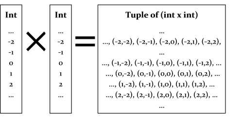
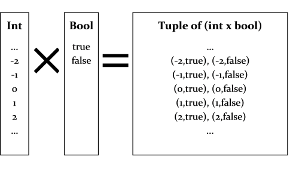
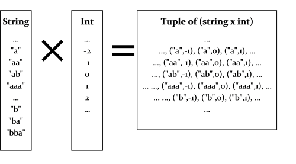
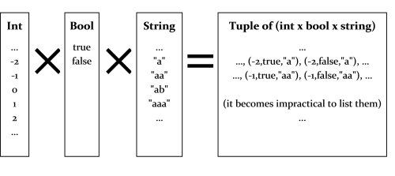
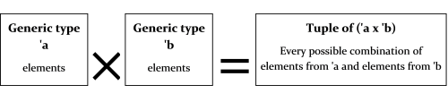
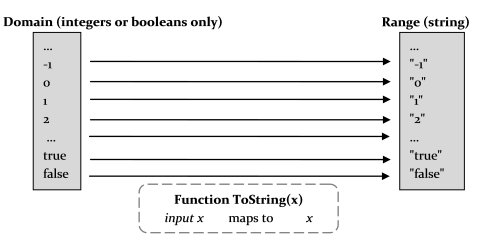
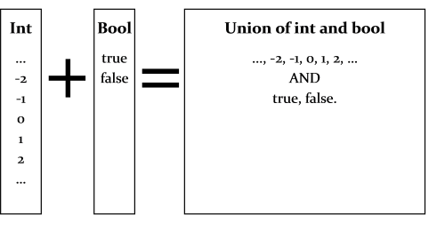
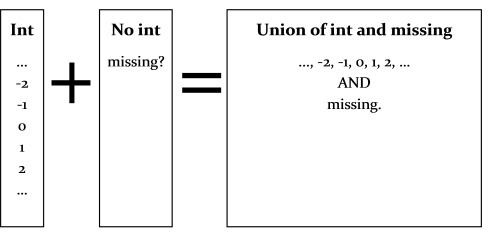

# “理解 F# 类型”系列

F# 不仅仅是关于函数；强大的类型系统是另一个关键因素。就像函数一样，理解类型系统对于流畅和舒适地使用这种语言至关重要。

除了常见的 .NET 类型外。F# 还有一些其他在函数式语言中非常常见但在命令式语言（如 C# 或 Java）中不可用的类型。

本系列介绍了这些类型以及如何使用它们。

+   理解 F# 类型：介绍。一种新的类型世界。

+   F# 类型概述。放眼全局。

+   类型缩写。也称为别名。

+   元组。将类型相乘。

+   记录。用标签扩展元组。

+   辨别联合。将类型加在一起。

+   选项类型。以及它为什么不是 null 或可空的。

+   枚举类型。与联合类型不同。

+   内置 .NET 类型。整数、字符串、布尔等。

+   度量单位。数字的类型安全。

+   理解类型推断。在魔幕幕后。

# 理解 F# 类型：介绍

# 理解 F# 类型：介绍

*注意：在阅读本系列之前，我建议您作为先决条件阅读 "以函数方式思考" 和 "表达式和语法" 系列。*

F# 不仅仅是关于函数；强大的类型系统是另一个关键因素。就像函数一样，理解类型系统对于流畅和舒适地使用这种语言至关重要。

到目前为止，我们已经看到了一些基本类型，可以用作函数的输入和输出：

+   原始类型如 `int`、`float`、`string` 和 `bool`

+   简单的函数类型，比如 `int->int`

+   `unit` 类型

+   泛型类型。

这些类型都不应该陌生。它们的类比在 C# 和其他命令式语言中都有。

但在这个系列中，我们将介绍一些在函数式语言中非常常见但在命令式语言中不常见的新类型。

我们将在本系列中看到的扩展类型有：

+   元组

+   记录

+   联合

+   选项类型

+   枚举类型

对于所有这些类型，我们将讨论抽象原则以及如何在实践中使用它们的细节。

列表和其他递归数据类型也是非常重要的类型，但是关于它们有太多要说的内容，它们将需要它们自己的系列！

# F# 类型概述

# F# 类型概述

在我们深入研究所有具体类型之前，让我们先来看一下全局视角。

## 类型的用途是什么？

如果你来自面向对象的设计背景，那么“以函数方式思考”的一个范式转变就是改变你对类型的思考方式。

一个设计良好的面向对象程序将更加关注行为而不是数据，因此它将大量使用多态性，要么使用"鸭子类型"，要么使用显式接口，并且会尽量避免对传递的实际具体类的明确了解。

另一方面，一个设计良好的函数式程序将更加关注*数据类型*而不是行为。F#比命令式语言如 C#更加注重正确设计类型，本系列和后续系列中的许多示例将侧重于创建和完善类型定义。

那么什么是类型？类型其实很难定义。一本著名教材的定义是：

> "类型系统是一种可控的句法方法，通过根据它们计算的值的种类对短语进行分类，来证明某些程序行为的缺失"
> 
> *(本杰明·皮尔斯，《类型与编程语言》)*

好吧，那个定义有点技术性。那么让我们换个角度来看 -- 在实践中我们用类型做什么？在 F#的背景下，你可以将类型用于两种主要方式：

+   首先，作为*值的注释*，允许进行某些检查，尤其是在编译时。换句话说，类型允许你进行"编译时单元测试"。

+   其次，作为*函数操作的领域*。也就是说，类型是一种数据建模工具，允许你在代码中表示现实世界的领域。

这两个定义相互作用。类型定义越能反映现实世界的领域，它们就越能静态编码业务规则。而它们越能静态编码业务规则，"编译时单元测试"就越好用。在理想情况下，如果你的程序编译通过，那么它就是正确的！

## 有哪些类型？

F#是一种混合语言，因此它具有来自其函数式背景的一些类型，也有来自其面向对象背景的一些类型。

一般来说，F#中的类型可以分为以下几类：

+   **常见的.NET 类型**。这些类型符合.NET 公共语言基础设施（CLI），并且可以轻松移植到每种.NET 语言。

+   **F#特定类型**。这些是 F#语言的一部分，专为纯函数式编程而设计。

如果你熟悉 C#，你会了解所有 CLI 类型。它们包括：

+   内置值类型（int，bool 等）。

+   内置引用类型（字符串等）。

+   用户定义的值类型（枚举和结构体）。

+   类和接口

+   委托

+   数组

F#特定类型包括：

+   函数类型（不同于委托或 C# lambda）

+   单元类型

+   元组（现在是.NET 4.0 的一部分）

+   记录

+   辨别联合

+   选项类型

+   列表（不同于.NET List 类）

我强烈建议在创建新类型时，你坚持使用 F# 特定的类型，而不是使用类。它们比 CLI 类型有很多优势，例如：

+   它们是不可变的

+   它们不能为 null

+   它们具有内置的结构相等性和比较

+   它们具有内置的漂亮打印

## 和与积类型

理解 F# 中类型的威力的关键在于，大多数新类型都是通过使用两种基本操作：**和**和**积**，从其他类型构造出来的。

也就是说，在 F# 中，你可以几乎像做代数一样定义新类型：

```
define typeZ = typeX "plus" typeY
define typeW = typeX "times" typeZ 
```

我们会等到在本系列后面详细讨论元组（乘积）和判别联合（和）类型时，再解释“和”和“积”在实践中是什么意思。

关键点在于，通过以各种方式使用这些“乘积”和“和”方法组合现有类型，可以制作无限数量的新类型。这些集体称为“代数数据类型”或 ADT（不要与*抽象数据类型*混淆，也称为 ADT）。代数数据类型可用于模拟任何内容，包括列表、树和其他递归类型。

特别是和类型或“联合”类型非常有价值，一旦你习惯了它们，你会发现它们是不可或缺的！

## 类型的定义方式

每个类型定义都是相似的，尽管具体细节可能有所不同。所有类型定义都以"`type`"关键字开头，后跟类型的标识符，后跟任何泛型类型参数，后跟定义。例如，这里是一些各种类型的类型定义：

```
type A = int * int
type B = {FirstName:string; LastName:string}
type C = Circle of int | Rectangle of int * int
type D = Day | Month | Year
type E<'a> = Choice1 of 'a | Choice2 of 'a * 'a

type MyClass(initX:int) =
   let x = initX
   member this.Method() = printf "x=%i" x 
```

正如我们在上一篇文章中所说的，定义新类型有一个与常规表达式语法不同的特殊语法。所以要注意这种区别。

类型只能在命名空间或模块中声明。但这并不意味着你总是必须在顶层创建它们 - 如果需要隐藏它们，你可以在嵌套模块中创建类型。

```
 module sub = 
    // type declared in a module
    type A = int * int

    module private helper = 
        // type declared in a submodule
        type B = B of string list

        //internal access is allowed
        let b = B ["a";"b"]

//outside access not allowed
let b = sub.helper.B ["a";"b"] 
```

类型不能在函数内声明。

```
let f x = 
    type A = int * int  //unexpected keyword "type"
    x * x 
```

## 构造和解构类型

定义类型后，使用“构造函数”表达式创建类型的实例，这种表达式通常与类型定义本身非常相似。

```
let a = (1,1)
let b = { FirstName="Bob"; LastName="Smith" } 
let c = Circle 99
let c' = Rectangle (2,1)
let d = Month
let e = Choice1 "a"
let myVal = MyClass 99
myVal.Method() 
```

有趣的是，在进行模式匹配时，*相同的*“构造函数”语法也用于“解构”类型：

```
let a = (1,1)                                  // "construct"
let (a1,a2) = a                                // "deconstruct"

let b = { FirstName="Bob"; LastName="Smith" }  // "construct"
let { FirstName = b1 } = b                     // "deconstruct" 

let c = Circle 99                              // "construct"
match c with                                   
| Circle c1 -> printf "circle of radius %i" c1 // "deconstruct"
| Rectangle (c2,c3) -> printf "%i %i" c2 c3    // "deconstruct"

let c' = Rectangle (2,1)                       // "construct"
match c' with                                   
| Circle c1 -> printf "circle of radius %i" c1 // "deconstruct"
| Rectangle (c2,c3) -> printf "%i %i" c2 c3    // "deconstruct" 
```

当你阅读本系列时，请注意构造函数在两种方式中的使用。

## 关于“type”关键字的实用指南

使用相同的“type”关键字来定义所有 F# 类型，因此如果你对 F# 还不熟悉，它们看起来都很相似。这里是这些类型的快速列表以及如何区分它们的方法。

| 类型 | 示例 | 特点 |
| --- | --- | --- |
| **缩写（别名）** |

```
type ProductCode = string
type transform<'a> = 'a -> 'a    

```

| 只使用等号。 |
| --- |
| **元组** |

```
//not explicitly defined with type keyword
//usage
let t = 1,2
let s = (3,4)    

```

| 总是可用且不使用`type`关键字显式定义。使用逗号（可选括号）指示用法。 |
| --- |
| **记录** |

```
type Product = {code:ProductCode; price:float }
type Message<'a> = {id:int; body:'a}

//usage
let p = {code="X123"; price=9.99}
let m = {id=1; body="hello"}

```

| 花括号。使用分号分隔字段。 |
| --- |
| **判别联合** |

```
type MeasurementUnit = Cm &#124; Inch &#124; Mile 
type Name = 
    &#124; Nickname of string 
    &#124; FirstLast of string * string
type Tree<'a> = 
    &#124; E 
    &#124; T of Tree<'a> * 'a * Tree<'a>
//usage
let u = Inch
let name = Nickname("John")
let t = T(E,"John",E)    

```

| 竖线字符。使用“of”表示类型。 |
| --- |
| **枚举** |

```
type Gender = &#124; Male = 1 &#124; Female = 2
//usage
let g = Gender.Male

```

| 类似于联合，但使用 equals 和一个 int 值 |
| --- |
| **类** |

```
type Product (code:string, price:float) = 
   let isFree = price=0.0 
   new (code) = Product(code,0.0)
   member this.Code = code 
   member this.IsFree = isFree

//usage
let p = Product("X123",9.99)
let p2 = Product("X123")    

```

| 在名称后面有函数风格的参数列表，用作构造函数。具有“member”关键字。

具有“new”关键字用于次要构造函数。 |

| **接口** |
| --- |

```
type IPrintable =
   abstract member Print : unit -> unit

```

| 与类相同，但所有成员都是抽象的。抽象成员具有冒号和类型签名，而不是具体实现。 |
| --- |
| **结构** |

```
type Product= 
   struct  
      val code:string
      val price:float
      new(code) = { code = code; price = 0.0 }
   end

//usage
let p = Product()
let p2 = Product("X123")    

```

| 具有“struct”关键字。使用“val”定义字段。

可以有构造函数。

|

# 类型缩写

# 类型缩写

让我们从最简单的类型定义开始，即类型缩写或别名。

它的形式为：

```
type [typename] = [existingType] 
```

其中“现有类型”可以是任何类型：我们已经看过的基本类型之一，或者我们即将看到的扩展类型之一。

一些例子：

```
type RealNumber = float
type ComplexNumber = float * float
type ProductCode = string
type CustomerId = int
type AdditionFunction = int->int->int
type ComplexAdditionFunction = 
       ComplexNumber-> ComplexNumber -> ComplexNumber 
```

依此类推 -- 非常简单明了。

类型缩写对于提供文档和避免重复编写签名很有用。在上面的例子中，`ComplexNumber` 和 `AdditionFunction` 就展示了这一点。

另一个用途是在类型的使用和实际实现之间提供一定程度的解耦。在上面的例子中，`ProductCode` 和 `CustomerId` 就展示了这一点。我可以很容易地将 `CustomerId` 更改为字符串而不需要改变（大部分）我的代码。

然而，需要注意的一点是，这实际上只是一个别名或缩写；你并没有真正创建一个新类型。因此，如果我定义一个明确表示为 `AdditionFunction` 的函数：

```
type AdditionFunction = int->int->int
let f:AdditionFunction = fun a b -> a + b 
```

编译器将擦除别名并返回一个普通的 `int->int->int` 作为函数签名。

特别地，没有真正的封装。我可以在任何地方使用 `CustomerId` 的地方使用显式的 `int`，编译器也不会抱怨。如果我尝试创建类似于这样的实体 id 的安全版本：

```
type CustomerId = int
type OrderId = int 
```

然后我会感到失望。没有任何东西阻止我在 `CustomerId` 的位置使用 `OrderId`，反之亦然。要获得真正的封装类型，我们需要使用单例联合类型，如后面的文章中所述。

# 元组

# 元组

我们准备好使用我们的第一个扩展类型 -- 元组。

让我们再次退后一步，看看像“int”这样的类型。正如我们之前暗示的，与其将“int”视为抽象的东西，不如将其视为所有可能值的具体集合，即集合 {...,-3, -2, -1, 0, 2, 3, ...}。

接下来，想象一下这个“int”集合的两个副本。我们可以通过取它们的笛卡尔积来“相乘”它们；也就是说，通过从这两个“int”列表的每个可能组合中选择，生成一个新的对象列表，如下所示：



正如我们已经看到的，F# 中将这些对称称为元组。现在你可以看到它们具有的类型签名的原因了。在这个例子中，“int 乘 int” 类型称为 "`int * int`"，星号符号当然表示“乘”！这种新类型的有效实例是所有的对：(-2,2)，(-1,0)，(2,2)等等。

让我们看看它们可能在实践中如何使用：

```
let t1 = (2,3)
let t2 = (-2,7) 
```

现在如果你评估上面的代码，你会发现 t1 和 t2 的类型如预期的那样是 `int*int`。

```
val t1 : int * int = (2, 3)
val t2 : int * int = (-2, 7) 
```

这种“乘积”方法可以用来将任何混合类型制作成元组。这是一个“int 乘 bool”的示例。



这里是在 F# 中的使用情况。上面的元组类型具有签名 "`int*bool`"。

```
let t3 = (2,true)
let t4 = (7,false)

// the signatures are:
val t3 : int * bool = (2, true)
val t4 : int * bool = (7, false) 
```

当然，也可以使用字符串。所有可能的字符串的宇宙非常大，但从概念上讲，它是相同的东西。下面的元组类型具有签名 "`string*int`"。



测试使用和签名：

```
let t5 = ("hello",42)
let t6 = ("goodbye",99)

// the signatures are:
val t5 : string * int = ("hello", 42)
val t6 : string * int = ("goodbye", 99) 
```

没有理由只停留在将两种类型相乘。为什么不是三个？或者四个？例如，这是类型 `int * bool * string`。



测试使用和签名：

```
let t7 = (42,true,"hello")

// the signature is:
val t7 : int * bool * string = (42, true, "hello") 
```

## 泛型元组

泛型也可以用于元组中。



使用通常与函数相关联：

```
let genericTupleFn aTuple = 
   let (x,y) = aTuple
   printfn "x is %A and y is %A" x y 
```

函数签名是：

```
val genericTupleFn : 'a * 'b -> unit 
```

这意味着 "`genericTupleFn`" 接受一个通用元组 `('a * 'b)` 并返回一个 `unit`。

## 复杂类型的元组

任何类型的类型都可以在元组中使用：其他元组、类、函数类型等。以下是一些示例：

```
// define some types
type Person = {First:string; Last:string}
type Complex = float * float
type ComplexComparisonFunction = Complex -> Complex -> int

// define some tuples using them
type PersonAndBirthday = Person * System.DateTime
type ComplexPair = Complex * Complex
type ComplexListAndSortFunction = Complex list * ComplexComparisonFunction
type PairOfIntFunctions = (int->int) * (int->int) 
```

## 关于元组的关键点

了解元组的一些关键事项：

+   元组类型的特定实例是一个 *单一对象*，类似于 C# 中的两个元素数组。当与函数一起使用时，它们计为一个 *单一* 参数。

+   元组类型不能被赋予明确的名称。元组类型的“名称”由相乘在一起的类型组合确定。

+   乘法的顺序很重要。所以 `int*string` 不是与 `string*int` 相同的元组类型。

+   逗号是定义元组的关键符号，而不是括号。你可以在没有括号的情况下定义元组，尽管有时会令人困惑。在 F# 中，如果你看到逗号，它可能是元组的一部分。

这些点非常重要--如果你不理解它们，你很快就会感到困惑！

值得再次强调在以前的帖子中提到的一点：*不要把元组误认为函数中的多个参数*。

```
// a function that takes a single tuple parameter 
// but looks like it takes two ints
let addConfusingTuple (x,y) = x + y 
```

## 制作和匹配元组

在 F# 中，元组类型比其他扩展类型要原始一些。正如你所见，你不需要明确地定义它们，它们没有名字。

制作元组很容易--只需使用逗号！

```
let x = (1,2)                 
let y = 1,2        // it's the comma you need, not the parentheses! 
let z = 1,true,"hello",3.14   // create arbitrary tuples as needed 
```

正如我们所见，要“解构”一个元组，使用相同的语法：

```
let z = 1,true,"hello",3.14   // "construct"
let z1,z2,z3,z4 = z           // "deconstruct" 
```

像这样模式匹配时，必须具有相同数量的元素，否则会出错：

```
let z1,z2 = z     // error FS0001: Type mismatch. 
                  // The tuples have differing lengths 
```

如果你不需要一些值，可以使用“不关心”的符号（下划线）作为占位符。

```
let _,z5,_,z6 = z     // ignore 1st and 3rd elements 
```

正如你可能猜到的那样，两个元素的元组通常被称为“对”，三个元素的元组称为“三元组”，依此类推。在对的特殊情况下，有`fst`和`snd`函数，分别提取第一个和第二个元素。

```
let x = 1,2
fst x
snd x 
```

它们仅适用于对。尝试在三元组上使用`fst`将导致错误。

```
let x = 1,2,3
fst x              // error FS0001: Type mismatch. 
                   // The tuples have differing lengths of 2 and 3 
```

## 在实践中使用元组

元组比其他更复杂的类型具有许多优点。它们可以在需要时即用即得，因为它们始终可用而无需定义，因此非常适合用于小型、临时的、轻量级的结构。

### 使用元组返回多个值

常见情况是，你希望从函数中返回两个值而不仅仅是一个。例如，在`TryParse`样式函数中，你希望返回（a）值是否已解析和（b）如果已解析，则解析的值是什么。

这是一个整数的`TryParse`实现（当然，假设它之前不存在）：

```
let tryParse intStr = 
   try
      let i = System.Int32.Parse intStr
      (true,i)
   with _ -> (false,0)  // any exception

//test it
tryParse "99"
tryParse "abc" 
```

这是另一个简单的示例，返回一对数字：

```
// return word count and letter count in a tuple
let wordAndLetterCount (s:string) = 
   let words = s.Split [|' '|]
   let letterCount = words |> Array.sumBy (fun word -> word.Length ) 
   (words.Length, letterCount)

//test
wordAndLetterCount "to be or not to be" 
```

### 从其他元组创建元组

与大多数 F# 值一样，元组是不可变的，其中的元素不能被赋值。那么你如何改变一个元组呢？简短的答案是你不能 -- 你必须始终创建一个新的元组。

假设你需要编写一个函数，给定一个元组，对每个元素加一。这是一个显而易见的实现：

```
let addOneToTuple aTuple =
   let (x,y,z) = aTuple
   (x+1,y+1,z+1)   // create a new one

// try it
addOneToTuple (1,2,3) 
```

这似乎有点冗长 -- 有没有更紧凑的方法？有，因为你可以直接在函数的参数中解构一个元组，使得函数变成一行：

```
let addOneToTuple (x,y,z) = (x+1,y+1,z+1)

// try it
addOneToTuple (1,2,3) 
```

### 相等性

元组具有自动定义的相等操作：如果两个元组具有相同的长度，并且每个插槽中的值相等，则它们相等。

```
(1,2) = (1,2)                      // true
(1,2,3,"hello") = (1,2,3,"bye")    // false
(1,(2,3),4) = (1,(2,3),4)          // true 
```

尝试比较不同长度的元组是一种类型错误：

```
(1,2) = (1,2,3)                    // error FS0001: Type mismatch 
```

每个插槽中的类型也必须相同：

```
(1,2,3) = (1,2,"hello")   // element 3 was expected to have type
                          // int but here has type string 
(1,(2,3),4) = (1,2,(3,4)) // elements 2 & 3 have different types 
```

元组还具有基于元组中的值自动定义的哈希值，因此可以毫无问题地将元组用作字典键。

```
(1,2,3).GetHashCode() 
```

### 元组表示

正如在先前的帖子中指出的，元组具有良好的默认字符串表示形式，并且可以轻松序列化。

```
(1,2,3).ToString() 
```

# 记录

# 记录

正如我们在前一篇文章中指出的，普通元组在许多情况下都很有用。但它们也有一些缺点。因为所有元组类型都是预定义的，你无法区分用于地理坐标的一对浮点数，例如，与用于复数的类似元组。当元组具有多个元素时，很容易混淆哪个元素在哪个位置。

在这些情况下，你想做的是为元组中的每个插槽*标记*，这样既会记录每个元素的用途，又会强制对相同类型的元组进行区分。

进入“记录”类型。记录类型就是这样一个元组，其中每个元素都带有标签。

```
type ComplexNumber = { real: float; imaginary: float }
type GeoCoord = { lat: float; long: float } 
```

记录类型有标准的前导部分：`type [typename] =`后跟花括号。花括号内是一组`label: type`对，用分号分隔（记住，F#中所有列表都使用分号分隔符 -- 逗号用于元组）。

让我们比较记录类型和元组类型的"类型语法"：

```
type ComplexNumberRecord = { real: float; imaginary: float }
type ComplexNumberTuple = float * float 
```

在记录类型中，没有"乘法"，只有一组带标签的类型。

关系数据库理论使用类似的"记录类型"概念。在关系模型中，关系是具有相同有限属性集的所有元组的（可能为空的）有限集。这组属性通常被称为列名集。

## 创建和匹配记录

要创建记录值，使用与类型定义类似的格式，但在标签后使用等号。这被称为"记录表达式"。

```
type ComplexNumberRecord = { real: float; imaginary: float }
let myComplexNumber = { real = 1.1; imaginary = 2.2 } // use equals!

type GeoCoord = { lat: float; long: float } // use colon in type
let myGeoCoord = { lat = 1.1; long = 2.2 }  // use equals in let 
```

要"解构"记录，使用相同的语法：

```
let myGeoCoord = { lat = 1.1; long = 2.2 }   // "construct"
let { lat=myLat; long=myLong } = myGeoCoord  // "deconstruct" 
```

一如既往，如果你不需要某些值，可以使用下划线作为占位符；或者更干净地，直接省略不需要的标签。

```
let { lat=_; long=myLong2 } = myGeoCoord  // "deconstruct"
let { long=myLong3 } = myGeoCoord         // "deconstruct" 
```

如果只需要一个属性，可以使用点符号而不是模式匹配。

```
let x = myGeoCoord.lat
let y = myGeoCoord.long 
```

请注意，解构时可以省略一个标签，但构造时不行：

```
let myGeoCoord = { lat = 1.1; }  // error FS0764: No assignment
                                 // given for field 'long' 
```

记录类型最引人注目的特点之一是使用花括号。与 C 风格语言不同，F#中很少使用花括号 -- 只用于记录、序列、计算表达式（其中序列是一种特殊情况）和对象表达式（即实时创建接口实现）。这些其他用法将在后面讨论。

### 标签顺序

与元组不同，标签的顺序并不重要。因此，以下两个值是相同的：

```
let myGeoCoordA = { lat = 1.1; long = 2.2 }    
let myGeoCoordB = { long = 2.2; lat = 1.1 }   // same as above 
```

### 命名冲突

在上面的例子中，我们可以通过仅使用标签名"`lat`"和"`long`"来构建一个记录。神奇的是，编译器知道要创建哪种记录类型。（事实上，并不是真的那么神奇，因为只有一个记录类型具有这些确切的标签。）

但是如果有两个具有相同标签的记录类型会发生什么？编译器如何知道你指的是哪一个？答案是它不知道 -- 它将使用最近定义的类型，并在某些情况下发出警告。尝试评估以下内容：

```
type Person1 = {first:string; last:string}
type Person2 = {first:string; last:string}
let p = {first="Alice"; last="Jones"} 
```

`p`的类型是什么？答案是`Person2`，这是最后一个使用这些标签定义的类型。

如果尝试解构，将会收到关于模糊字段标签的警告。

```
let {first=f; last=l} = p 
```

如何解决这个问题？只需将类型名称作为至少一个标签的限定符即可。

```
let p = {Person1.first="Alice"; last="Jones"}
let { Person1.first=f; last=l} = p 
```

如果需要，甚至可以添加完全限定的名称（带有命名空间）。以下是使用模块的示例。

```
module Module1 = 
  type Person = {first:string; last:string}

module Module2 = 
  type Person = {first:string; last:string}

module Module3 = 
  let p = {Module1.Person.first="Alice"; 
           Module1.Person.last="Jones"} 
```

当然，如果可以确保本地命名空间中只有一个版本，你可以完全避免这样做。

```
module Module3b = 
  open Module1                   // bring into the local namespace
  let p = {first="Alice"; last="Jones"}  // will be Module1.Person 
```

故事的寓意是，在定义记录类型时，尽量使用唯一的标签，否则最好会得到丑陋的代码，最坏会得到意想不到的行为。

注意，在 F# 中，与其他一些函数式语言不同，具有完全相同结构定义的两种类型并不相同。这被称为“名义”类型系统，其中仅当它们具有相同名称时，两种类型才相等，而不是“结构”类型系统，其中具有相同结构的定义无论被称为什么都是相同类型。

## 在实践中使用记录

我们如何使用记录？让我们数一数...

### 用于函数结果的记录

就像元组一样，记录对于从函数传递多个值很有用。让我们重新审视之前描述的元组示例，改用记录来编写：

```
// the tuple version of TryParse
let tryParseTuple intStr = 
   try
      let i = System.Int32.Parse intStr
      (true,i)
   with _ -> (false,0)  // any exception

// for the record version, create a type to hold the return result
type TryParseResult = {success:bool; value:int} 

// the record version of TryParse
let tryParseRecord intStr = 
   try
      let i = System.Int32.Parse intStr
      {success=true;value=i}
   with _ -> {success=false;value=0}  

//test it
tryParseTuple "99"
tryParseRecord "99"
tryParseTuple "abc"
tryParseRecord "abc" 
```

你可以看到，返回值中有明确的标签，这使得理解变得容易得多（当然，在实践中，我们可能会使用稍后讨论的`Option`类型）。

这是使用记录而不是元组的单词和字母计数示例：

```
//define return type
type WordAndLetterCountResult = {wordCount:int; letterCount:int} 

let wordAndLetterCount (s:string) = 
   let words = s.Split [|' '|]
   let letterCount = words |> Array.sumBy (fun word -> word.Length ) 
   {wordCount=words.Length; letterCount=letterCount}

//test
wordAndLetterCount "to be or not to be" 
```

### 从其他记录创建记录

再次，与大多数 F# 值一样，记录是不可变的，其中的元素不能被分配。那么你如何改变一个记录？答案仍然是你不能--你必须始终创建一个新的记录。

假设你需要编写一个函数，给定一个 `GeoCoord` 记录，将每个元素加一。这就是它的样子：

```
let addOneToGeoCoord aGeoCoord =
   let {lat=x; long=y} = aGeoCoord
   {lat = x + 1.0; long = y + 1.0}   // create a new one

// try it
addOneToGeoCoord {lat=1.1; long=2.2} 
```

但是你也可以通过直接解构函数的参数来简化，这样函数就变成了一行：

```
let addOneToGeoCoord {lat=x; long=y} = {lat=x+1.0; long=y+1.0}

// try it
addOneToGeoCoord {lat=1.0; long=2.0} 
```

或者根据你的口味，你也可以使用点表示法来获取属性：

```
let addOneToGeoCoord aGeoCoord =
   {lat=aGeoCoord.lat + 1.0; long= aGeoCoord.long + 1.0} 
```

在许多情况下，你只需调整一个或两个字段，而不是其他所有字段。为了让生活更轻松，这种常见情况有一个特殊的语法，即“`with`”关键字。你从原始值开始，然后跟着 "with"，然后是你想要更改的字段。以下是一些示例：

```
let g1 = {lat=1.1; long=2.2}
let g2 = {g1 with lat=99.9}   // create a new one

let p1 = {first="Alice"; last="Jones"}  
let p2 = {p1 with last="Smith"} 
```

“with”的技术术语是复制和更新记录表达式。

### 记录相等性

像元组一样，记录有一个自动定义的相等操作：如果两个记录具有相同类型，并且每个插槽中的值相等，则它们相等。

记录还具有基于记录中的值自动生成的哈希值，因此记录可以无问题地用作字典键。

```
{first="Alice"; last="Jones"}.GetHashCode() 
```

### 记录表示

如在先前的帖子中所述，记录具有很好的默认字符串表示形式，并且可以轻松序列化。但与元组不同，`ToString()` 表示形式不太有用。

```
printfn "%A" {first="Alice"; last="Jones"}   // nice
{first="Alice"; last="Jones"}.ToString()     // ugly
printfn "%O" {first="Alice"; last="Jones"}   // ugly 
```

## 侧边栏：在打印格式字符串中使用 %A vs. %O

我们刚刚看到，打印格式说明符 `%A` 和 `%O` 对于相同的记录产生非常不同的结果：

```
printfn "%A" {first="Alice"; last="Jones"}
printfn "%O" {first="Alice"; last="Jones"} 
```

那么为什么会有差异呢？

`%A` 使用与交互式输出相同的漂亮打印程序打印值。但是 `%O` 使用 `Object.ToString()`，这意味着如果未重写 `ToString` 方法，`%O` 将给出默认（通常不太有用）的输出。因此，通常情况下，应尽可能使用 `%A` 到 `%O`，因为核心 F# 类型默认具有漂亮打印。

但请注意，F#“类”类型并*不*具有标准的漂亮打印格式，因此`%A`和`%O`同样不合作，除非您重写`ToString`。

# 鉴别联合

# 鉴别联合

元组和记录是通过将现有类型“相乘”而创建新类型的示例。在系列开始时，我提到创建新类型的另一种方式是通过“求和”现有类型。这是什么意思？

嗯，假设我们想要定义一个函数，它可以处理整数或布尔值，也许是将它们转换为字符串。但是我们想要严格一些，不接受任何其他类型（比如浮点数或字符串）。以下是这样一个函数的示意图：



我们如何表示此函数的定义域？

我们需要的是一种类型，它代表所有可能的整数加上所有可能的布尔值。



换句话说，是“和”类型。在这种情况下，新类型是整数类型加布尔类型的“和”。

在 F# 中，求和类型称为“鉴别联合”类型。每个组件类型（称为*联合情况*）必须标记有一个标签（称为*情况标识符*或*标签*），以便它们可以被区分开来（“鉴别”）。标签可以是您喜欢的任何标识符，但必须以大写字母开头。

以下是我们如何定义上述类型的方式：

```
type IntOrBool = 
  | I of int
  | B of bool 
```

“I”和“B”只是任意的标签；我们可以使用任何其他有意义的标签。

对于小型类型，我们可以将定义放在一行上：

```
type IntOrBool = I of int | B of bool 
```

组件类型可以是您喜欢的任何其他类型，包括元组、记录、其他联合类型等等。

```
type Person = {first:string; last:string}  // define a record type 
type IntOrBool = I of int | B of bool

type MixedType = 
  | Tup of int * int  // a tuple
  | P of Person       // use the record type defined above
  | L of int list     // a list of ints
  | U of IntOrBool    // use the union type defined above 
```

您甚至可以拥有递归类型，即它们引用自身。这通常是树结构如何定义的。稍后将更详细地讨论递归类型。

### 求和类型与 C++ 的联合和 VB 的变体

乍一看，求和类型可能似乎类似于 C++ 中的联合类型或 Visual Basic 中的变体类型，但是有一个关键区别。C++ 中的联合类型不是类型安全的，存储在类型中的数据可以使用任何可能的标签访问。F# 鉴别联合类型是安全的，数据只能以一种方式访问。将其视为两种类型的总和（如图所示），而不仅仅是数据的覆盖，这确实有助于理解。

## 联合类型的关键点

关于联合类型的一些关键事项是：

+   垂直线条在第一个组件之前是可选的，因此以下定义都是等效的，您可以通过检查交互式窗口的输出来验证：

```
type IntOrBool = I of int | B of bool     // without initial bar
type IntOrBool = | I of int | B of bool   // with initial bar
type IntOrBool = 
   | I of int 
   | B of bool      // with initial bar on separate lines 
```

+   标签或标签必须以大写字母开头。因此，以下将会报错：

```
type IntOrBool = int of int| bool of bool
//  error FS0053: Discriminated union cases 
//                must be uppercase identifiers 
```

+   其他命名类型（如`Person`或`IntOrBool`）必须在联合类型之外预先定义。您不能“内联”定义它们并写入类似以下的内容：

```
type MixedType = 
  | P of  {first:string; last:string}  // error 
```

或者

```
type MixedType = 
  | U of (I of int | B of bool)  // error 
```

+   标签可以是任何标识符，包括组件类型本身的名称，如果你没有预料到的话，可能会相当令人困惑。例如，如果使用`System`命名空间中的`Int32`和`Boolean`类型，并且标签被命名为相同，那么我们将有以下完全有效的定义：

```
open System
type IntOrBool = Int32 of Int32 | Boolean of Boolean 
```

这种“重复命名”的风格实际上非常常见，因为它准确记录了组件类型是什么。

## 构造联合类型的值

要创建联合类型的值，您使用一个“构造函数”，该构造函数只引用可能的联合案例中的一个。然后，构造函数遵循定义的形式，使用案例标签就像它是一个函数一样。在`IntOrBool`的例子中，您会写：

```
type IntOrBool = I of int | B of bool

let i  = I 99    // use the "I" constructor
// val i : IntOrBool = I 99

let b  = B true  // use the "B" constructor
// val b : IntOrBool = B true 
```

结果值与标签一起打印出来以及组件类型：

```
val [value name] : [type] = [label] [print of component type]
val i            : IntOrBool = I       99
val b            : IntOrBool = B       true 
```

如果案例构造函数有多个“参数”，则构造方式与调用函数相同：

```
type Person = {first:string; last:string}

type MixedType = 
  | Tup of int * int
  | P of Person

let myTup  = Tup (2,99)    // use the "Tup" constructor
// val myTup : MixedType = Tup (2,99)

let myP  = P {first="Al"; last="Jones"} // use the "P" constructor
// val myP : MixedType = P {first = "Al";last = "Jones";} 
```

联合类型的案例构造函数是普通函数，因此您可以在期望函数的任何位置使用它们。例如，在`List.map`中：

```
type C = Circle of int | Rectangle of int * int

[1..10]
|> List.map Circle

[1..10]
|> List.zip [21..30]
|> List.map Rectangle 
```

### 命名冲突

如果特定案例具有唯一名称，则构造的类型将是明确的。

但是如果您有两种类型，它们具有相同标签的案例会发生什么？

```
type IntOrBool1 = I of int | B of bool
type IntOrBool2 = I of int | B of bool 
```

在这种情况下，通常使用最后一个定义的：

```
let x = I 99                // val x : IntOrBool2 = I 99 
```

但最好明确指定类型，如下所示：

```
let x1 = IntOrBool1.I 99    // val x1 : IntOrBool1 = I 99
let x2 = IntOrBool2.B true  // val x2 : IntOrBool2 = B true 
```

如果类型来自不同的模块，您也可以使用模块名称：

```
module Module1 = 
  type IntOrBool = I of int | B of bool

module Module2 = 
  type IntOrBool = I of int | B of bool

module Module3 =
  let x = Module1.IntOrBool.I 99 // val x : Module1.IntOrBool = I 99 
```

### 对联合类型进行匹配

对于元组和记录，我们已经看到“解构”值使用与构造它相同的模型。对于联合类型也是如此，但我们有一个复杂的问题：我们应该解构哪个案例？

这正是“匹配”表达式的设计目的。正如您现在应该意识到的那样，匹配表达式语法与联合类型的定义方式有相似之处。

```
// definition of union type
type MixedType = 
  | Tup of int * int
  | P of Person

// "deconstruction" of union type
let matcher x = 
  match x with
  | Tup (x,y) -> 
        printfn "Tuple matched with %i %i" x y
  | P {first=f; last=l} -> 
        printfn "Person matched with %s %s" f l

let myTup = Tup (2,99)                 // use the "Tup" constructor
matcher myTup  

let myP = P {first="Al"; last="Jones"} // use the "P" constructor
matcher myP 
```

让我们分析一下这里发生了什么：

+   每个总匹配表达式的“分支”都是设计用来匹配联合类型对应案例的模式表达式。

+   模式从特定案例的标签开始，然后模式的其余部分以通常的方式解构该案例的类型。

+   模式后跟一个箭头“->”，然后是要执行的代码。

## 空案例

联合案例的标签之后不必有任何类型。以下都是有效的联合类型：

```
type Directory = 
  | Root                   // no need to name the root
  | Subdirectory of string // other directories need to be named 

type Result = 
  | Success                // no string needed for success state
  | ErrorMessage of string // error message needed 
```

如果*所有*案例都是空的，那么我们有一个“枚举样式”的联合：

```
type Size = Small | Medium | Large
type Answer = Yes | No | Maybe 
```

请注意，这种“枚举样式”的联合与真正的 C#枚举类型不同，稍后将进行讨论。

要创建一个空案例，只需使用标签作为构造函数而不带任何参数：

```
let myDir1 = Root
let myDir2 = Subdirectory "bin"

let myResult1 = Success
let myResult2 = ErrorMessage "not found"

let mySize1 = Small
let mySize2 = Medium 
```

## 单个案例

有时创建只有一个案例的联合类型是有用的。这可能看起来毫无用处，因为似乎没有增加价值。但事实上，这是一个非常有用的实践，可以强制执行类型安全*。

[* 并且在未来的系列中，我们将看到，与模块签名一起，单个案例的联合类型还可以帮助数据隐藏和基于能力的安全性。]

例如，假设我们有客户 id 和订单 id，它们都由整数表示，但它们永远不应该互相赋值。

正如我们之前看到的，类型别名的方法不起作用，因为别名只是一个同义词，不会创建一个不同的类型。这是你可能尝试使用别名的方法：

```
type CustomerId = int   // define a type alias
type OrderId = int      // define another type alias

let printOrderId (orderId:OrderId) = 
   printfn "The orderId is %i" orderId

//try it
let custId = 1          // create a customer id
printOrderId custId   // Uh-oh! 
```

但即使我明确地注释了`orderId`参数为`OrderId`类型，我也无法保证客户端 id 不会被意外地传递进来。

另一方面，如果我们创建简单的联合类型，我们可以轻松地强制执行类型区分。

```
type CustomerId = CustomerId of int   // define a union type 
type OrderId = OrderId of int         // define another union type 

let printOrderId (OrderId orderId) =  // deconstruct in the param
   printfn "The orderId is %i" orderId

//try it
let custId = CustomerId 1             // create a customer id
printOrderId custId                   // Good! A compiler error now. 
```

这种方法在 C#和 Java 中也是可行的，但很少使用，因为为每种类型创建和管理特殊类的开销很大。在 F#中，这种方法是轻量级的，因此相当常见。

单成员联合类型的一个方便之处是你可以直接对值进行模式匹配，而不必使用完整的`match-with`表达式。

```
// deconstruct in the param
let printCustomerId (CustomerId customerIdInt) =     
   printfn "The CustomerId is %i" customerIdInt

// or deconstruct explicitly through let statement
let printCustomerId2 custId =     
   let (CustomerId customerIdInt) = custId  // deconstruct here
   printfn "The CustomerId is %i" customerIdInt

// try it
let custId = CustomerId 1             // create a customer id
printCustomerId custId                   
printCustomerId2 custId 
```

但一个常见的“坑”是，在某些情况下，模式匹配必须用括号括起来，否则编译器会认为你正在定义一个函数！

```
let custId = CustomerId 1                
let (CustomerId customerIdInt) = custId  // Correct pattern matching
let CustomerId customerIdInt = custId    // Wrong! New function? 
```

类似地，如果你确实需要创建一个只有一个成员的枚举风格的联合类型，你将不得不在类型定义中的成员前加上一个竖线；否则编译器会认为你正在创建一个别名。

```
type TypeAlias = A     // type alias!
type SingleCase = | A   // single case union type 
```

## 联合相等性

像其他核心的 F#类型一样，联合类型有一个自动定义的相等操作：如果两个联合类型具有相同的类型和相同的成员，那么它们是相等的，对于该成员的值是相等的。

```
type Contact = Email of string | Phone of int

let email1 = Email "bob@example.com"
let email2 = Email "bob@example.com"

let areEqual = (email1=email2) 
```

## 联合表示

联合类型有一个很好的默认字符串表示，可以很容易地进行序列化。但与元组不同，ToString()表示是没有帮助的。

```
type Contact = Email of string | Phone of int
let email = Email "bob@example.com"
printfn "%A" email    // nice
printfn "%O" email    // ugly! 
```

# Option 类型

# Option 类型

现在让我们看一个特定的联合类型，Option 类型。它是如此常见和有用，以至于它实际上是内建于语言中的。

你已经在路过中看到了 Option 类型的讨论，但让我们回到基础，了解它如何适应类型系统。

一个非常常见的情况是当你想要表示缺失或无效的值时。使用图表，该域看起来像这样：



显然这需要某种联合类型！

在 F#中，它被称为`Option`类型，并被定义为具有两个成员的联合类型：`Some`和`None`。类似的类型在函数式语言中很常见：OCaml 和 Scala 也称之为`Option`，而 Haskell 称之为`Maybe`。

这里有一个定义：

```
type Option<'a> =       // use a generic definition 
   | Some of 'a           // valid value
   | None                 // missing 
```

重要提示：如果你在交互式窗口中评估这个，请务必在之后重置会话，以便恢复内置类型。

Option 类型的使用方式与构造中的任何联合类型相同，通过指定两种情况之一来实现，即`Some`情况或`None`情况：

```
let validInt = Some 1
let invalidInt = None 
```

当进行模式匹配时，与任何联合类型一样，你必须始终匹配所有的成员：

```
match validInt with 
| Some x -> printfn "the valid value is %A" x
| None -> printfn "the value is None" 
```

在定义引用 Option 类型的类型时，必须指定要使用的泛型类型。你可以以显式方式使用尖括号，也可以使用内置的“`option`”关键字，该关键字位于类型之后。以下示例是相同的：

```
type SearchResult1 = Option<string>  // Explicit C#-style generics 
type SearchResult2 = string option   // built-in postfix keyword 
```

## 使用 Option 类型

选项类型在 F# 库中广泛用于可能丢失或无效的值。

例如，`List.tryFind`函数返回一个选项，其中`None`用于指示没有匹配搜索谓词的情况。

```
[1;2;3;4]  |> List.tryFind (fun x-> x = 3)  // Some 3
[1;2;3;4]  |> List.tryFind (fun x-> x = 10) // None 
```

让我们重新审视一下我们用于元组和记录的相同示例，并看看如何改为使用选项：

```
// the tuple version of TryParse
let tryParseTuple intStr = 
   try
      let i = System.Int32.Parse intStr
      (true,i)
   with _ -> (false,0)  // any exception

// for the record version, create a type to hold the return result
type TryParseResult = {success:bool; value:int} 

// the record version of TryParse
let tryParseRecord intStr = 
   try
      let i = System.Int32.Parse intStr
      {success=true;value=i}
   with _ -> {success=false;value=0}  

// the option version of TryParse
let tryParseOption intStr = 
   try
      let i = System.Int32.Parse intStr
      Some i
   with _ -> None

//test it
tryParseTuple "99"
tryParseRecord "99"
tryParseOption "99"
tryParseTuple "abc"
tryParseRecord "abc"
tryParseOption "abc" 
```

在这三种方法中，“选项”版本通常是首选的；不需要定义新类型，对于简单的情况，`None`的含义从上下文中是明显的。

*注意：`tryParseOption`代码只是一个示例。类似的函数`tryParse`内置在.NET 核心库中，应该使用它。*

### 选项的等式

像其他联合类型一样，选项类型有一个自动定义的等式操作。

```
let o1 = Some 42
let o2 = Some 42

let areEqual = (o1=o2) 
```

### Option 表示

Option 类型有一个很好的默认字符串表示，与其他联合类型不同，`ToString()`表示也很好。

```
let o = Some 42
printfn "%A" o   // nice
printfn "%O" o   // nice 
```

### 选项不仅适用于基本类型

F#选项是真正的一流类型（毕竟它只是一个普通的联合类型）。你可以将其与*任何*类型一起使用。例如，你可以有一个复杂类型的选项，比如 Person，或者一个元组类型，比如`int*int`，或者一个函数类型，比如`int->bool`，甚至是一个选项的选项类型。

```
type OptionalString = string option 
type OptionalPerson = Person option       // optional complex type
type OptionalTuple = (int*int) option       
type OptionalFunc = (int -> bool) option  // optional function
type NestedOptionalString = OptionalString option //nested options!
type StrangeOption = string option option option 
```

## Option 类型不应该被使用的方式

选项类型有函数，比如`IsSome`，`IsNone`和`Value`，它们允许你在不进行模式匹配的情况下访问“包装”值。不要使用它们！不仅不符合惯用法，而且很危险，可能会引发异常。

这是不正确的做法：

```
let x = Some 99

// testing using IsSome
if x.IsSome then printfn "x is %i" x.Value   // ugly!!

// no matching at all
printfn "x is %i" x.Value   // ugly and dangerous!! 
```

这是正确的做法：

```
let x = Some 99
match x with 
| Some i -> printfn "x is %i" i
| None -> () // what to do here? 
```

使用模式匹配方法还会让你思考和记录发生在`None`情况下的情况，当使用`IsSome`时，你可能会轻易忽视这一点。

## Option 模块

如果你在选项上进行大量模式匹配，请查看`Option`模块，因为它有一些有用的辅助函数，比如`map`，`bind`，`iter`等。

例如，假设我想要将选项的值乘以 2（如果有效）。这是模式匹配的方式：

```
let x = Some 99
let result = match x with 
| Some i -> Some(i * 2)
| None -> None 
```

使用`Option.map`编写的更紧凑的版本如下：

```
let x = Some 99
x |> Option.map (fun v -> v * 2) 
```

或者我想要将选项的值乘以 2（如果有效），但如果它是`None`，则返回 0。这是模式匹配的方式：

```
let x = Some 99
let result = match x with 
| Some i -> i * 2
| None -> 0 
```

使用`Option.fold`的一行代码示例：

```
let x = Some 99
x |> Option.fold (fun _ v -> v * 2) 0 
```

在像上面那样简单的情况下，也可以使用`defaultArg`函数。

```
let x = Some 99
defaultArg x 0 
```

## Option vs. Null vs. Nullable

对于习惯于在 C#和其他语言中处理空值和可空类型的人们，选项类型经常会引起混淆。本节将尝试澄清其中的区别。

### Option vs. null 的类型安全性

在像 C# 或 Java 这样的语言中，"null"表示一个指向不存在对象的引用或指针。"null"与对象*完全相同的类型*，因此你无法从类型系统中知道你有一个 null。

例如，在下面的 C# 代码中，我们创建了两个字符串变量，一个带有有效字符串，一个带有空字符串。

```
string s1 = "abc";
var len1 = s1.Length;

string s2 = null;
var len2 = s2.Length; 
```

当然，这会完美编译。编译器无法区分这两个变量。`null`与有效字符串完全相同的类型，因此所有`System.String`的方法和属性都可以在其上使用，包括`Length`属性。

现在，我们知道这段代码只要看一眼就会失败，但编译器却帮不了我们。相反，正如我们都知道的那样，你必须不断地繁琐地测试 null。

现在让我们看看上面 C# 示例的最接近的 F# 等价物。在 F# 中，要表示缺失数据，你会使用一个选项类型并将其设置为`None`。（在这个人工示例中，我们不得不使用一个难看的显式类型的`None`--通常这是不必要的。）

```
let s1 = "abc"
var len1 = s1.Length

// create a string option with value None
let s2 = Option<string>.None
let len2 = s2.Length 
```

在 F# 版本中，我们立即得到一个*编译时*错误。`None`不是一个字符串，它是完全不同的类型，所以你不能直接调用`Length`。而且要明确，`Some [string]`也不是与`string`相同的类型，所以你也不能对其调用`Length`！

所以如果`Option<string>`不是一个字符串，但你想对它（可能）包含的字符串做一些事情，你就被迫不得不对它进行模式匹配（假设你不像前面描述的那样做坏事）。

```
let s2 = Option<string>.None

//which one is it?
let len2 = match s2 with
| Some s -> s.Length
| None -> 0 
```

你总是必须模式匹配，因为给定类型为`Option<string>`的值，你无法判断它是 Some 还是 None。

就像`Option<int>`不是`int`的相同类型一样，`Option<bool>`也不是`bool`的相同类型，等等。

总结关键点：

+   类型"`string option`"与"`string`"完全不同。你不能从`string option`转换为`string`--它们没有相同的属性。一个使用`string`的函数将无法使用`string option`，反之亦然。因此，类型系统将防止任何错误。

+   另一方面，C# 中的"null 字符串"与"string"完全相同的类型。你无法在编译时区分它们，只能在运行时。一个"null 字符串"看起来具有与有效字符串相同的所有属性和函数，除了当你尝试使用它时，你的代码将会崩溃！

### Nulls vs. 缺失数据

C# 中使用的"null"与"缺失"数据的概念完全不同，后者是任何语言中模拟系统的一个有效部分。

在真正的函数式语言中，可能会有缺失数据的概念，但是不可能有"null"这样的东西，因为"指针"或"未初始化变量"的概念在函数式思维方式中是不存在的。

例如，考虑绑定到此表达式结果的值：

```
let x = "hello world" 
```

那个值如何能够未初始化，或变为 null，或者甚至变为任何其他值？

不幸的是，由于在某些情况下 API 设计者使用 null 表示“缺失”数据的概念，因此造成了额外的混淆！例如，.NET 库方法 `StreamReader.ReadLine` 返回 null 表示文件中没有更多数据。

### F# 和 null

F# 不是一个纯粹的函数式语言，并且必须与*有*空概念的 .NET 语言进行交互。因此，F# 在设计中包含了一个 `null` 关键字，但是将其用作异常值并且难以使用。

通常规则是，在“纯”F#中永远不会创建空值，而只会通过与 .NET 库或其他外部系统进行交互来创建。

这里有一些例子：

```
// pure F# type is not allowed to be null (in general)
type Person = {first:string; last:string}  
let p : Person = null                      // error! 

// type defined in CLR, so is allowed to be null
let s : string = null                      // no error! 
let line = streamReader.ReadLine()         // no error if null 
```

在这些情况下，立即检查空值并将其转换为选项类型是很好的实践！

```
// streamReader example
let line = match streamReader.ReadLine()  with
           | null -> None
           | line -> Some line

// environment example
let GetEnvVar var = 
    match System.Environment.GetEnvironmentVariable(var) with
    | null -> None
    | value -> Some value

// try it
GetEnvVar "PATH"
GetEnvVar "TEST" 
```

有时候，你可能需要向外部库传递一个 null。你也可以使用 `null` 关键字来做到这一点。

### Option vs. Nullable

除了 null 外，C# 还有 Nullable 类型的概念，比如 `Nullable<int>`，它看起来类似于选项类型。那么有什么区别呢？

基本思想是相同的，但 Nullable 要弱得多。它仅适用于值类型，如`Int`和`DateTime`，而不适用于引用类型，如字符串或类或函数。你不能嵌套 Nullables，并且它们没有太多的特殊行为。

另一方面，F# 的 option 是一个真正的一级类型，并且可以在相同的方式下一致地在所有类型中使用。（请参见上面“选项不仅适用于原始类型”一节中的示例。）

# 枚举类型

# 枚举类型

F# 中的枚举类型与 C# 中的枚举类型相同。它的定义在表面上就像是联合类型的定义，但是有许多非明显的区别需要注意。

## 定义枚举

要定义枚举，你使用与空情况的联合类型完全相同的语法，只是必须为每个情况指定一个常量值，并且常量必须都是相同类型的。

```
type SizeUnion = Small | Medium | Large         // union
type ColorEnum = Red=0 | Yellow=1 | Blue=2      // enum 
```

不允许使用字符串，只允许使用 int 或兼容的类型，如字节和字符：

```
type MyEnum = Yes = "Y" | No ="N"  // Error. Strings not allowed.
type MyEnum = Yes = 'Y' | No ='N'  // Ok because char was used. 
```

联合类型要求它们的情况以大写字母开头。这对枚举不是必需的。

```
type SizeUnion = Small | Medium | large      // Error - "large" is invalid.
type ColorEnum = Red=0 | Yellow=1 | blue=2      // Ok 
```

就像在 C# 中一样，你可以为位标志使用 FlagsAttribute：

```
[<System.FlagsAttribute>]
type PermissionFlags = Read = 1 | Write = 2 | Execute = 4 
let permission = PermissionFlags.Read ||| PermissionFlags.Write 
```

## 构造枚举

与联合类型不同，要构造枚举，你*必须始终*使用限定名称：

```
let red = Red            // Error. Enums must be qualified
let red = ColorEnum.Red  // Ok 
let small = Small        // Ok.  Unions do not need to be qualified 
```

你还可以将其转换为基本 int 类型并从中转换：

```
let redInt = int ColorEnum.Red  
let redAgain:ColorEnum = enum redInt // cast to a specified enum type 
let yellowAgain = enum<ColorEnum>(1) // or create directly 
```

你甚至可以创建根本不在枚举列表中的值。

```
let unknownColor = enum<ColorEnum>(99)   // valid 
```

与联合类型不同，你可以使用 BCL Enum 函数枚举和解析值，就像在 C# 中一样。例如：

```
let values = System.Enum.GetValues(typeof<ColorEnum>)
let redFromString =  
    System.Enum.Parse(typeof<ColorEnum>,"Red") 
    :?> ColorEnum  // downcast needed 
```

## 匹配枚举

要匹配枚举，你必须再次*始终*使用限定名称：

```
let unqualifiedMatch x = 
    match x with
    | Red -> printfn "red"             // warning FS0049
    | _ -> printfn "something else" 

let qualifiedMatch x = 
    match x with
    | ColorEnum.Red -> printfn "red"   //OK. qualified name used.
    | _ -> printfn "something else" 
```

当模式匹配时，如果没有涵盖所有已知情况，联合类型和枚举都会发出警告：

```
let matchUnionIncomplete x = 
    match x with
    | Small -> printfn "small"   
    | Medium -> printfn "medium"   
    // Warning: Incomplete pattern matches

let matchEnumIncomplete x = 
    match x with
    | ColorEnum.Red -> printfn "red"   
    | ColorEnum.Yellow -> printfn "yellow"   
    // Warning: Incomplete pattern matches 
```

联合类型和枚举之间的一个重要区别是，通过列出所有联合类型，你可以使编译器满意地进行全面的模式匹配。

枚举类型则不同。可能会创建一个不在预定义列表中的枚举，并尝试匹配它，导致运行时异常，因此即使你明确列出了所有已知的枚举，编译器也会警告你：

```
// the compiler is still not happy
let matchEnumIncomplete2 x = 
    match x with
    | ColorEnum.Red -> printfn "red"   
    | ColorEnum.Yellow -> printfn "yellow"   
    | ColorEnum.Blue -> printfn "blue"   
    // the value '3' may indicate a case not covered by the pattern(s). 
```

修复这个问题的唯一方法是在`cases`的底部添加一个通配符，以处理预定义范围之外的枚举。

```
// the compiler is finally happy
let matchEnumComplete x = 
    match x with
    | ColorEnum.Red -> printfn "red"   
    | ColorEnum.Yellow -> printfn "yellow"   
    | ColorEnum.Blue -> printfn "blue"   
    | _ -> printfn "something else"   

// test with unknown case 
let unknownColor = enum<ColorEnum>(99)   // valid
matchEnumComplete unknownColor 
```

## 总结

一般来说，你应该优先选择判别联合类型而不是枚举，除非你真的需要将一个`int`值与它们关联，或者你正在编写需要暴露给其他.NET 语言的类型。

# 内置.NET 类型

# 内置.NET 类型

在本文中，我们将快速了解 F# 如何处理[内置于.NET 中的标准类型](http://msdn.microsoft.com/en-us/library/hfa3fa08%28VS.80%29.aspx)。

## 文字

F# 使用与 C# 相同的文字语法，但有一些例外。

我将内置类型分为以下几组：

+   各种类型（`bool`，`char`等）

+   字符串类型

+   整数类型（`int`，`uint`和`byte`等）

+   浮点类型（`float`，`decimal`等）

+   指针类型（`IntPtr`等）

以下表格列出了原始类型，包括它们的 F# 关键字，如果有的话，它们的后缀，一个示例，以及相应的.NET CLR 类型。

### 各种类型

|  | 对象 | 单元 | 布尔 | 字符（Unicode） | 字符（Ascii） |
| --- | --- | --- | --- | --- | --- |
| 关键字 | obj | unit | bool | char | byte |
| 后缀 |  |  |  |  | B |
| 示例 | let o = obj() | let u = () | true false | 'a' | 'a'B |
| .NET 类型 | 对象 | (无等价项) | 布尔 | 字符 | 字节 |

对象和单元实际上并不是.NET 原始类型，但出于完整性考虑，我已经包含它们。

### 字符串类型

|  | 字符串（Unicode） | 逐字字符串（Unicode） | 三引号字符串（Unicode） | 字符串（Ascii） |
| --- | --- | --- | --- | --- |
| 关键字 | 字符串 | 字符串 | 字符串 | 字节数组 |
| 后缀 |  |  |  |  |
| 示例 | "第一行\n 第二行" | @"C:\name" | """可以包含""特殊字符""" | "aaa"B |
| .NET 类型 | 字符串 | 字符串 | 字符串 | 字节数组 |

在普通字符串中可以使用通常的特殊字符，如`\n`，`\t`，`\\`等。引号必须用反斜杠转义：`\'`和`\"`。

在逐字字符串中，反斜杠会被忽略（适用于 Windows 文件名和正则表达式模式）。但引号需要加倍。

三引号字符串在 VS2012 中是新功能。它们非常有用，因为根本不需要转义特殊字符，因此可以很好地处理嵌入的引号（对 XML 非常有用）。

### 整数类型

|  | 8 位（有符号） | 8 位（无符号） | 16 位（有符号） | 16 位（无符号） | 32 位（有符号） | 32 位（无符号） | 64 位（有符号） | 64 位（无符号） | 无限精度 |
| --- | --- | --- | --- | --- | --- | --- | --- | --- | --- |
| 关键字 | sbyte | byte | int16 | uint16 | int | uint32 | int64 | uint64 | bigint |
| 后缀 | y | uy | s | us |  | u | L | UL | I |
| 示例 | 99y | 99uy | 99s | 99us | 99 | 99u | 99L | 99UL | 99I |
| .NET 类型 | SByte | Byte | Int16 | UInt16 | Int32 | UInt32 | Int64 | UInt64 | BigInteger |

`BigInteger` 在所有版本的 F# 中都可用。从 .NET 4 开始，它作为.NET 基础库的一部分包含在内。

整数类型也可以用十六进制和八进制表示。

+   十六进制前缀是`0x`。所以`0xFF`是 255 的十六进制表示。

+   八进制前缀是`0o`。所以`0o377`是 255 的八进制表示。

### 浮点类型

|  | 32 位浮点 | 64 位（默认）浮点 | 高精度浮点 |
| --- | --- | --- | --- |
| 关键字 | float32, single | float, double | decimal |
| 后缀 | f |  | m |
| 示例 | 123.456f | 123.456 | 123.456m |
| .NET 类型 | 单精度 | 双精度 | 十进制 |

请注意，F#本地使用`float`而不是`double`，但两者都可以使用。

### 指针类型

|  | 指针/句柄（有符号） | 指针/句柄（无符号） |
| --- | --- | --- |
| 关键字 | nativeint | unativeint |
| 后缀 | n | un |
| 示例 | 0xFFFFFFFFn | 0xFFFFFFFFun |
| .NET 类型 | IntPtr | UIntPtr |

## 内置原始类型之间的转换

*注意：本节仅涵盖原始类型的转换。有关类之间转换，请参阅面向对象编程系列文章。*

在 F#中没有直接的“转换”语法，但有助手函数用于在类型之间进行转���。这些辅助函数与类型同名（您可以在`Microsoft.FSharp.Core`命名空间中看到它们）。

例如，在 C#中，您可能会这样写：

```
var x = (int)1.23
var y = (double)1 
```

在 F#中，等效的写法是：

```
let x = int 1.23
let y = float 1 
```

在 F#中，只有数值类型的转换函数。特别是，没有 bool 的转换，您必须使用`Convert`或类似的方法。

```
let x = bool 1  //error
let y = System.Convert.ToBoolean(1)  // ok 
```

## 盒装和拆箱

就像在 C#和其他.NET 语言中一样，原始的 int 和 float 类型是值对象，而不是类。虽然这通常是透明的，但在某些情况下可能会出现问题。

首先，让我们看看透明的情况。在下面的示例中，我们定义了一个函数，该函数接受一个`Object`类型的参数，并简单地返回它。如果我们传入一个`int`，它会被悄悄地装箱成一个对象，可以从测试代码中看到，返回的是一个`object`而不是`int`。

```
// create a function with parameter of type Object
let objFunction (o:obj) = o

// test: call with an integer
let result = objFunction 1

// result is
// val result : obj = 1 
```

`result`是一个对象而不是 int，如果不小心会导致类型错误。例如，结果不能直接与原始值进行比较：

```
let resultIsOne = (result = 1)
// error FS0001: This expression was expected to have type obj 
// but here has type int 
```

为了处理这种情况以及其他类似情况，您可以直接将原始类型转换为对象，使用`box`关键字：

```
let o = box 1

// retest the comparison example above, but with boxing
let result = objFunction 1
let resultIsOne = (result = box 1)  // OK 
```

要将对象转换回原始类型，请使用`unbox`关键字，但与`box`不同，您必须提供要解除包装的特定类型，或者确保编译器具有足够的信息来进行准确的类型推断。

```
// box an int
let o = box 1

// type known for target value
let i:int = unbox o  // OK 

// explicit type given in unbox
let j = unbox<int> o  // OK 

// type inference, so no type annotation needed
let k = 1 + unbox o  // OK 
```

因此，上面的比较示例也可以使用`unbox`来完成。不需要显式类型注释，因为它正在与 int 进行比较。

```
let result = objFunction 1
let resultIsOne = (unbox result = 1)  // OK 
```

如果您没有指定足够的类型信息，就会遇到臭名昭著的“值限制”错误，如下所示：

```
let o = box 1

// no type specified
let i = unbox o  // FS0030: Value restriction error 
```

解决方法是重新排列代码以帮助类型推断，或者在一切都失败时，添加显式类型注释。查看 type inference 中关于类型推断的更多提示。

### 与类型检测结合的盒装

假设您想要根据参数的类型进行匹配的函数，可以使用`:?`运算符：

```
let detectType v =
    match v with
        | :? int -> printfn "this is an int"
        | _ -> printfn "something else" 
```

不幸的是，这段代码将无法编译，出现以下错误：

```
// error FS0008: This runtime coercion or type test from type 'a to int 
// involves an indeterminate type based on information prior to this program point. 
// Runtime type tests are not allowed on some types. Further type annotations are needed. 
```

该消息告诉您问题：“一些类型上不允许运行时类型测试”。

答案是“箱”值，这将其强制转换为引用类型，然后您可以对其进行类型检查：

```
let detectTypeBoxed v =
    match box v with      // used "box v" 
        | :? int -> printfn "this is an int"
        | _ -> printfn "something else"

//test
detectTypeBoxed 1
detectTypeBoxed 3.14 
```

# 度量单位

# 度量单位

正如我们之前在“为什么使用 F#？”系列中提到的，F#具有一个非常酷的功能，允许您向数字类型添加额外的度量单位信息作为元数据。

然后，F#编译器将确保只有具有相同度量单位的数字可以组合。 这对于防止意外不匹配并使您的代码更安全非常有用。

## 定义度量单位

一个度量单位定义由属性`[<Measure>]`组成，后跟`type`关键字，然后是名称。 例如：

```
[<Measure>] 
type cm

[<Measure>] 
type inch 
```

通常您会看到整个定义都写在一行上：

```
[<Measure>] type cm
[<Measure>] type inch 
```

一旦您有了一个定义，您可以通过在度量名称内使用尖括号将度量类型与数值类型关联起来：

```
let x = 1<cm>    // int
let y = 1.0<cm>  // float
let z = 1.0m<cm> // decimal 
```

您甚至可以在尖括号中组合度量以创建复合度量：

```
[<Measure>] type m
[<Measure>] type sec
[<Measure>] type kg

let distance = 1.0<m>    
let time = 2.0<sec>    
let speed = 2.0<m/sec>    
let acceleration = 2.0<m/sec²>    
let force = 5.0<kg m/sec²> 
```

### 派生的度量单位

如果您经常使用某些单位的组合，可以定义一个*派生*度量，并改用它。

```
[<Measure>] type N = kg m/sec²

let force1 = 5.0<kg m/sec²>    
let force2 = 5.0<N>

force1 = force2 // true 
```

### 国际单位制和常数

如果您正在使用物理学或其他科学应用的单位，您肯定会想使用国际单位制（SI）单位和相关常数。 您不需要自己定义所有这些！ 这些已经为您预定义，并且可以按如下方式使用：

+   在 F# 3.0 及更高版本（随 Visual Studio 2012 一起提供）中，这些功能内置在核心 F#库中的`Microsoft.FSharp.Data.UnitSystems.SI`命名空间中（请参阅[MSDN 页面](http://msdn.microsoft.com/en-us/library/hh289707.aspx)）。

+   在 F# 2.0（随 Visual Studio 2010 一起提供）中，您必须安装 F# powerpack 才能获得它们。 （F# powerpack 位于 Codeplex 上的[`fsharppowerpack.codeplex.com`](http://fsharppowerpack.codeplex.com)）。

## 类型检查和类型推断

度量单位就像合适的类型一样； 您会获得静态检查*和*类型推断。

```
[<Measure>] type foot
[<Measure>] type inch

let distance = 3.0<foot>    

// type inference for result
let distance2 = distance * 2.0

// type inference for input and output
let addThreeFeet ft = 
    ft + 3.0<foot> 
```

当然，当使用它们时，类型检查是严格的：

```
addThreeFeet 1.0        //error
addThreeFeet 1.0<inch>  //error
addThreeFeet 1.0<foot>  //OK 
```

### 类型注释

如果您想要在指定单位量类型注释时明确，您可以按照通常的方式这样做。 数值类型必须具有带有度量单位的尖括号。

```
let untypedTimesThree (ft:float) = 
    ft * 3.0

let footTimesThree (ft:float<foot>) = 
    ft * 3.0 
```

### 使用乘法和除法结合度量单位

当单个值相乘或相除时，编译器了解度量单位如何转换。

例如，在以下示例中，`speed`值已自动赋予度量`<m/sec>`。

```
[<Measure>] type m
[<Measure>] type sec
[<Measure>] type kg

let distance = 1.0<m>    
let time = 2.0<sec>    
let speed = distance/time 
let acceleration = speed/time
let mass = 5.0<kg>    
let force = mass * speed/time 
```

请查看上面的`acceleration`和`force`值的类型，以查看此功能的其他示例。

## 无量纲值

没有任何特定计量单位的数值称为*无量纲*。如果你想明确表示一个值是无量纲的，可以使用称为`1`的度量。

```
// dimensionless
let x = 42

// also dimensionless
let x = 42<1> 
```

### 混合计量单位和无量纲值

请注意，你不能*将*一个无量纲值加到带有计量单位的值上，但你可以*乘或除*无量纲值。

```
// test addition
3.0<foot> + 2.0<foot>  // OK
3.0<foot> + 2.0        // error

// test multiplication
3.0<foot> * 2.0        // OK 
```

但是请参阅下面关于“通用”部分，了解另一种方法。

## 单位之间的转换

如果你需要在单位之间进行转换怎么办？

这很简单。你首先需要定义一个使用*两种*单位的转换值，然后将源数值乘以转换因子。

这里是一个关于英尺和英寸的例子：

```
[<Measure>] type foot
[<Measure>] type inch

//conversion factor
let inchesPerFoot = 12.0<inch/foot>    

// test 
let distanceInFeet = 3.0<foot>    
let distanceInInches = distanceInFeet * inchesPerFoot 
```

这里是一个关于温度的例子：

```
[<Measure>] type degC
[<Measure>] type degF

let convertDegCToF c = 
    c * 1.8<degF/degC> + 32.0<degF>

// test 
let f = convertDegCToF 0.0<degC> 
```

编译器正确地推断了转换函数的签名。

```
val convertDegCToF : float<degC> -> float<degF> 
```

请注意，常数`32.0<degF>`被明确标注为`degF`，以便结果也是`degF`。如果你省略这个注释，结果将是一个普通的浮点数，函数签名会变得更加奇怪！试一试看看：

```
let badConvertDegCToF c = 
    c * 1.8<degF/degC> + 32.0 
```

### 无量纲值和计量单位值之间的转换

要将无量纲数值转换为带有度量类型的值，只需将其乘以一个，但是这个一个要用适当单位标注的一个。

```
[<Measure>] type foot

let ten = 10.0   // normal

//converting from non-measure to measure 
let tenFeet = ten * 1.0<foot>  // with measure 
```

要进行反向转换，要么除以一个，要么乘以倒数单位。

```
//converting from measure to non-measure
let tenAgain = tenFeet / 1.0<foot>  // without measure
let tenAnotherWay = tenFeet * 1.0<1/foot>  // without measure 
```

上述方法是类型安全的，如果你尝试转换错误的类型，将会导致错误。

如果你不关心类型检查，你可以使用标准的强制转换函数进行转换：

```
let tenFeet = 10.0<foot>  // with measure
let tenDimensionless = float tenFeet // without measure 
```

## 通用计量单位

通常，我们希望编写的函数能够处理任何值，无论与之关联的计量单位是什么。

例如，这里是我们的老朋友`square`。但是当我们尝试将其与计量单位一起使用时，我们会得到一个错误。

```
let square x = x * x

// test
square 10<foot>   // error 
```

我们能做什么呢？我们不想指定特定的计量单位，但另一方面我们必须指定*某些东西*，因为上面的简单定义不起作用。

答案是使用*通用*计量单位，用下划线表示通常的度量名称的地方。

```
let square (x:int<_>) = x * x

// test
square 10<foot>   // OK
square 10<sec>   // OK 
```

现在`square`函数按预期工作，你可以看到函数签名使用了字母`'u`来表示通用计量单位。还要注意编译器已经推断出返回值的类型为“单位平方”。

```
val square : int<'u> -> int<'u ^ 2> 
```

实际上，如果你愿意，你也可以使用字母指定通用类型：

```
// with underscores
let square (x:int<_>) = x * x

// with letters
let square (x:int<'u>) = x * x

// with underscores
let speed (distance:float<_>) (time:float<_>) = 
    distance / time

// with letters
let speed (distance:float<'u>) (time:float<'v>) = 
    distance / time 
```

有时你可能需要使用字母明确指示单位相同：

```
let ratio (distance1:float<'u>) (distance2:float<'u>) = 
    distance1 / distance2 
```

### 使用列表的通用度量衡

你不能直接使用度量衡。例如，你不能直接定义一个英尺列表：

```
//error
[1.0<foot>..10.0<foot>] 
```

相反，你必须使用上面提到的“乘以一个”的技巧：

```
//converting using map -- OK
[1.0..10.0] |> List.map (fun i-> i * 1.0<foot>)

//using a generator -- OK
[ for i in [1.0..10.0] -> i * 1.0<foot> ] 
```

### 使用通用度量衡来表示常数

乘以常数是可以的（正如我们上面看到的），但如果你尝试进行加法，你将会得到一个错误。

```
let x = 10<foot> + 1  // error 
```

修复的方法是向常数添加一个通用类型，就像这样：

```
let x = 10<foot> + 1<_>  // ok 
```

当将常量传递给高阶函数（例如`fold`）时，会出现类似的情况。

```
let feet = [ for i in [1.0..10.0] -> i * 1.0<foot> ]

// OK
feet |> List.sum  

// Error
feet |> List.fold (+) 0.0   

// Fixed with generic 0
feet |> List.fold (+) 0.0<_> 
```

### 使用函数的通用措施时可能会遇到的问题

有一些情况下，类型推断会失败。例如，让我们尝试创建一个简单的`add1`函数，该函数使用单位。

```
// try to define a generic function
let add1 n = n + 1.0<_>
// warning FS0064: This construct causes code to be less generic than 
// indicated by the type annotations. The unit-of-measure variable 'u 
// has been constrained to be measure '1'.

// test
add1 10.0<foot>   
// error FS0001: This expression was expected to have type float 
// but here has type float<foot> 
```

警告信息中给出了线索。输入参数`n`没有度量，因此`1<_>`的度量将始终被忽略。`add1`函数没有计量单位，因此当您尝试使用具有计量单位的值调用它时，会出现错误。

所以也许解决方案是明确注释计量单位类型，就像这样：

```
// define a function with explicit type annotation
let add1 (n:float<'u>) : float<'u> =  n + 1.0<_> 
```

但不，你又收到了相同的警告 FS0064。

或许我们可以用更明确的内容替换下划线，比如`1.0<'u>'`？

```
let add1 (n:float<'u>) : float<'u> = n + 1.0<'u>  
// error FS0634: Non-zero constants cannot have generic units. 
```

但这次我们收到了编译器错误！

解决方法是使用语言原语模块中的一个有用的实用程序函数：`FloatWithMeasure`、`Int32WithMeasure`等等。

```
// define the function
let add1 n  = 
    n + (LanguagePrimitives.FloatWithMeasure 1.0)

// test
add1 10.0<foot>   // Yes! 
```

对于通用整数，您可以使用相同的方法：

```
open LanguagePrimitives

let add2Int n  = 
    n + (Int32WithMeasure 2)

add2Int 10<foot>   // OK 
```

### 使用类型定义的通用措施

处理函数已经没问题了。当我们需要在类型定义中使用计量单位时怎么办？

假设我们想定义一个可以使用计量单位的通用坐标记录。让我们从一个简单的方法开始：

```
type Coord = 
    { X: float<'u>; Y: float<'u>; }
// error FS0039: The type parameter 'u' is not defined 
```

这也不起作用，那么把度量作为类型参数添加进去呢：

```
type Coord<'u> = 
    { X: float<'u>; Y: float<'u>; }
// error FS0702: Expected unit-of-measure parameter, not type parameter.
// Explicit unit-of-measure parameters must be marked with the [<Measure>] attribute. 
```

这也没用，但错误消息告诉我们该怎么做。这是最终的、正确的版本，使用了`Measure`属性：

```
type Coord<[<Measure>] 'u> = 
    { X: float<'u>; Y: float<'u>; }

// Test
let coord = {X=10.0<foot>; Y=2.0<foot>} 
```

在某些情况下，您可能需要定义多于一个度量。在以下示例中，货币汇率定义为两种货币的比率，因此需要定义两个通用度量。

```
type CurrencyRate<[<Measure>]'u, [<Measure>]'v> = 
    { Rate: float<'u/'v>; Date: System.DateTime}

// test
[<Measure>] type EUR
[<Measure>] type USD
[<Measure>] type GBP

let mar1 = System.DateTime(2012,3,1)
let eurToUsdOnMar1 = {Rate= 1.2<USD/EUR>; Date=mar1 }
let eurToGbpOnMar1 = {Rate= 0.8<GBP/EUR>; Date=mar1 }

let tenEur = 10.0<EUR>
let tenEurInUsd = eurToUsdOnMar1.Rate * tenEur 
```

当然，您也可以将常规通用类型与计量单位类型混合使用。

例如，产品价格可能由通用产品类型加上带有货币的价格组成：

```
type ProductPrice<'product, [<Measure>] 'currency> = 
    { Product: 'product; Price: float<'currency>; } 
```

### 单位度量在运行时

你可能会遇到的一个问题是，单位度量不是 .NET 类型系统的一部分。

F# 在程序集中存储有关它们的额外元数据，但这些元数据只能被 F# 理解。

这意味着在运行时没有（简单的）方法确定一个值具有什么单位度量，也没有任何动态分配单位度量的方法。

这也意味着没有办法将计量单位作为公共 API 的一部分暴露给另一个 .NET 语言（除了其他 F# 程序集）。

# 理解类型推断

# 理解类型推断

在结束类型相关内容之前，让我们重新思考类型推断：这种神奇的功能允许 F# 编译器推断出使用了什么类型以及在何处使用了。到目前为止，我们已经通过所有的示例看到了这种情况，但它是如何工作的，如果出错了该怎么办呢？

## 类型推断是如何工作的？

它看起来确实像是魔法，但规则大多是简单明了的。基本逻辑基于一种通常称为“Hindley-Milner”或“HM”的算法（更准确地说应该称为“Damas-Milner 的算法 W”）。如果你想了解详情，请继续搜索。

我建议你花点时间来理解这个算法，这样你就可以像编译器一样思考，并在需要时进行有效的故障排除。

这里是确定简单和函数值类型的一些规则：

+   查看字面量

+   查看函数和其他值的交互情况

+   查看任何显式的类型约束

+   如果任何地方都没有约束，自动泛化为通用类型

让我们依次看看每一个。

### 查看字面量

字面量为编译器提供了上下文线索。正如我们所见，类型检查非常严格；整数和浮点数不会自动转换为另一种类型。这样做的好处是编译器可以通过查看字面量来推断类型。如果字面量是一个`int`，而你又在其上加上了"x"，那么"x"也必须是一个 int。但是如果字面量是一个`float`，而你又在其上加上了"x"，那么"x"也必须是一个 float。

这里有一些示例。运行它们并在交互窗口中查看它们的签名：

```
let inferInt x = x + 1
let inferFloat x = x + 1.0
let inferDecimal x = x + 1m     // m suffix means decimal
let inferSByte x = x + 1y       // y suffix means signed byte
let inferChar x = x + 'a'       // a char
let inferString x = x + "my string" 
```

### 查看它所交互的函数和其他值

如果任何地方都没有字面量，编译器会试图通过分析函数和其他值之间的交互来推断类型。在下面的情况中，“`indirect`”函数调用了一个我们已经知道类型的函数，这给了我们推断“`indirect`”函数本身类型的信息。

```
let inferInt x = x + 1
let inferIndirectInt x = inferInt x       //deduce that x is an int

let inferFloat x = x + 1.0
let inferIndirectFloat x = inferFloat x   //deduce that x is a float 
```

当然赋值也算作一种交互。如果 x 是某种类型，而 y 被绑定（赋值）给 x，那么 y 必须和 x 是相同的类型。

```
let x = 1
let y = x     //deduce that y is also an int 
```

其他交互可能是控制结构，或者外部库

```
// if..else implies a bool 
let inferBool x = if x then false else true      
// for..do implies a sequence
let inferStringList x = for y in x do printfn "%s" y  
// :: implies a list
let inferIntList x = 99::x                      
// .NET library method is strongly typed
let inferStringAndBool x = System.String.IsNullOrEmpty(x) 
```

### 查看任何显式的类型约束或注释

如果有任何显式的类型约束或注释指定，编译器将使用它们。在下面的例子中，我们明确告诉编译器“`inferInt2`”接受一个`int`参数。然后它可以推断出“`inferInt2`”的返回值也是一个`int`，这又意味着“`inferIndirectInt2`”的类型是 int->int。

```
let inferInt2 (x:int) = x 
let inferIndirectInt2 x = inferInt2 x 

let inferFloat2 (x:float) = x 
let inferIndirectFloat2 x = inferFloat2 x 
```

注意，在`printf`语句中的格式化代码也算作显式的类型约束！

```
let inferIntPrint x = printf "x is %i" x 
let inferFloatPrint x = printf "x is %f" x 
let inferGenericPrint x = printf "x is %A" x 
```

### 自动泛化

如果经过所有这些步骤后，没有找到约束，编译器就会将类型变为泛型。

```
let inferGeneric x = x 
let inferIndirectGeneric x = inferGeneric x 
let inferIndirectGenericAgain x = (inferIndirectGeneric x).ToString() 
```

### 它可以在各个方向上运作！

类型推断可以自上而下，自下而上，从前到后，从后到前，从中间到外围，任何有类型信息的地方都会被使用。

考虑下面的例子。内部函数有一个字面量，所以我们知道它返回一个`int`。而外部函数已经明确告诉它返回一个`string`。但中间传入的“`action`”函数的类型是什么呢？

```
let outerFn action : string =  
   let innerFn x = x + 1 // define a sub fn that returns an int
   action (innerFn 2)    // result of applying action to innerFn 
```

类型推断的工作方式大致如下：

+   `1`是一个`int`

+   因此`x+1`必须是一个`int`，因此`x`也必须是一个`int`

+   因此`innerFn`必须是`int->int`

+   接下来，`(innerFn 2)`返回一个`int`，因此“`action`”以一个`int`作为输入。

+   `action`的输出是`outerFn`的返回值，因此`action`的输出类型与`outerFn`的输出类型相同。

+   `outerFn`的输出类型已经明确约束为`string`，因此`action`的输出类型也是`string`。

+   综合起来，我们现在知道`action`函数的签名是`int->string`

+   最后，因此，编译器推断`outerFn`的类型为：

```
val outerFn: (int -> string) -> string 
```

### ���本的，我亲爱的华生！

编译器可以进行像夏洛克·福尔摩斯一样的推断。这是一个棘手的例子，将测试你到目前为止对所有内容的理解程度。

假设我们有一个`doItTwice`函数，它接受任何输入函数（称之为"`f`"）并生成一个新函数，简单地连续两次执行原始函数。以下是其代码：

```
let doItTwice f  = (f >> f) 
```

正如你所看到的，它将`f`与自身组合。换句话说，它的意思是：“执行 f”，然后在该结果上再次执行 f。

现在，编译器可能推断出`doItTwice`的签名是什么？

好吧，让我们先看一下"`f`"的签名。第一次调用"`f`"的输出也是第二次调用"`f`"的输入。因此"`f`"的输出和输入必须是相同类型。所以`f`的签名必须是`'a -> 'a`。类型是泛型的（写作'a），因为我们没有其他关于它的信息。

因此，回到`doItTwice`本身，我们现在知道它接受一个函数参数`'a -> 'a`。但是它返回什么？好吧，让我们逐步推断：

+   首先，注意`doItTwice`生成一个函数，因此必须返回一个函数类型。

+   生成函数的输入与第一次调用"`f`"的输入类型相同

+   生成函数的输出类型与第二次调用"`f`"的输出类型相同

+   因此，生成的函数也必须具有类型`'a -> 'a`

+   综合起来，`doItTwice`的定义域是`'a -> 'a`，值域是`'a -> 'a`，因此其签名必须是`('a -> 'a) -> ('a -> 'a)`。

你的头晕了吗？你可能需要再读一遍，直到理解为止。

对于一行代码来说，这是相当复杂的推断。幸运的是，编译器为我们做了所有这些。但是如果你遇到问题并且需要确定编译器在做什么，你就需要理解这种情况。

让我们来测试一下！实际上，在实践中比在理论中更容易理解。

```
let doItTwice f  = (f >> f)

let add3 x = x + 3
let add6 = doItTwice add3
// test 
add6 5             // result = 11

let square x = x * x
let fourthPower = doItTwice square
// test 
fourthPower 3      // result = 81

let chittyBang x = "Chitty " + x + " Bang"
let chittyChittyBangBang = doItTwice chittyBang
// test 
chittyChittyBangBang "&"      // result = "Chitty Chitty & Bang Bang" 
```

希望现在更清楚了。

## 类型推断可能出错的情况

遗憾的是，类型推断并不完美。有时编译器根本不知道该怎么做。再次弄清楚发生了什么将真正帮助你保持冷静，而不是想要杀死编译器。以下是类型错误的主要原因之一：

+   声明顺序错乱

+   信息不足

+   重载方法

+   泛型数字函数的怪癖

### 声明顺序错乱

一个基本规则是必须在使用之前声明函数。

这段代码失败了：

```
let square2 x = square x   // fails: square not defined 
let square x = x * x 
```

但这没关系：

```
let square x = x * x       
let square2 x = square x   // square already defined earlier 
```

与 C#不同，在 F#中文件编译的顺序很重要，因此请确保文件按正确顺序编译。（在 Visual Studio 中，您可以从上下文菜单中更改顺序）。

### 递归或同时声明

递归函数或需要相互引用的定义也会出现“顺序不当”的问题的变体。在这种情况下，无论如何重新排序都无济于事--我们需要使用额外的关键字来帮助编译器。

当函数被编译时，函数标识符对于函数体是不可用的。因此，如果定义一个简单的递归函数，您将会得到一个编译器错误。解决方法是在函数定义的一部分中添加“rec”关键字。例如：

```
// the compiler does not know what "fib" means
let fib n =
   if n <= 2 then 1
   else fib (n - 1) + fib (n - 2)
   // error FS0039: The value or constructor 'fib' is not defined 
```

这里是添加了“rec fib”以指示其为递归的修正版本：

```
let rec fib n =              // LET REC rather than LET 
   if n <= 2 then 1
   else fib (n - 1) + fib (n - 2) 
```

用于相互引用的两个函数的类似“`let rec ? and`”语法。这里是一个非常牵强的例子，如果没有“`rec`”关键字，它将失败。

```
let rec showPositiveNumber x =               // LET REC rather than LET
   match x with 
   | x when x >= 0 -> printfn "%i is positive" x 
   | _ -> showNegativeNumber x

and showNegativeNumber x =                   // AND rather than LET

   match x with 
   | x when x < 0 -> printfn "%i is negative" x 
   | _ -> showPositiveNumber x 
```

“`and`”关键字也可以用于以类似方式声明同时类型。

```
type A = None | AUsesB of B
   // error FS0039: The type 'B' is not defined
type B = None | BUsesA of A 
```

修正版本：

```
type A = None | AUsesB of B
and B = None | BUsesA of A    // use AND instead of TYPE 
```

### 信息不足

有时，编译器仅仅没有足够的信息来确定一个类型。在下面的例子中，编译器不知道`Length`方法应该作用在什么类型上。但它也不能使其泛型化，因此会报错。

```
let stringLength s = s.Length
  // error FS0072: Lookup on object of indeterminate type 
  // based on information prior to this program point. 
  // A type annotation may be needed ... 
```

这类错误可以通过显式注释来修复。

```
let stringLength (s:string) = s.Length 
```

有时似乎有足够的信息，但编译器似乎仍然无法识别。例如，对于下面的`List.map`函数，人类很明显知道它被应用于一个字符串列表，那么为什么`x.Length`会导致错误呢？

```
List.map (fun x -> x.Length) ["hello"; "world"]       //not ok 
```

原因是 F#编译器目前是一次性编译器，因此如果程序后面的信息尚未被解析，它将被忽略。（F#团队表示可以使编译器更复杂，但这将使 Intellisense 的效果变差，并可能产生更不友好和晦涩的错误消息。因此，目前我们必须接受这种限制。）

因此，在这种情况下，您总是可以显式注释：

```
List.map (fun (x:string) -> x.Length) ["hello"; "world"]       // ok 
```

但另一种更优雅的解决方法通常可以解决问题，即重新排列事物，使已知类型首先出现，编译器可以在移动到下一个子句之前对其进行处理。

```
["hello"; "world"] |> List.map (fun s -> s.Length)   //ok 
```

函数式程序员努力避免显式类型注释，因此这让他们感到更加快乐！

这种技术也可以更广泛地应用在其他领域；一个经验法则是尝试将具有“已知类型”的事物放在具有“未知类型”的事物之前。

### 重载方法

在.NET 中调用外部类或方法时，由于重载，通常会出现错误。

在许多情况下，例如下面的连接示例，您将不得不显式注释外部函数的参数，以便编译器知道调用哪个重载方法。

```
let concat x = System.String.Concat(x)           //fails
let concat (x:string) = System.String.Concat(x)  //works 
let concat x = System.String.Concat(x:string)    //works 
```

有时重载的方法具有不同的参数名称，这种情况下，你也可以通过为参数命名来给编译器一个线索。这里是`StreamReader`构造函数的一个示例。

```
let makeStreamReader x = new System.IO.StreamReader(x)        //fails
let makeStreamReader x = new System.IO.StreamReader(path=x)   //works 
```

### 通用数值函数的怪癖

数值函数可能有些令人困惑。它们通常看起来是通用的，但一旦绑定到特定的数值类型，它们就是固定的，使用不同的数值类型将导致错误。以下示例演示了这一点：

```
let myNumericFn x = x * x
myNumericFn 10
myNumericFn 10.0             //fails
  // error FS0001: This expression was expected to have 
  // type int but has type float

let myNumericFn2 x = x * x
myNumericFn2 10.0     
myNumericFn2 10               //fails
  // error FS0001: This expression was expected to have 
  // type float but has type int 
```

对于数值类型，有一种绕过方法，使用"inline"关键字和"static type parameters"。我不会在这里讨论这些概念，但你可以在 MSDN 的 F#参考资料中查找。

## "信息不足"故障排除摘要

因此，如果编译器抱怨缺少类型或信息不足，你可以做的事情有：

+   在使用之前定义事物（包括确保文件按正确顺序编译）

+   将具有"已知类型"的内容放在具有"未知类型"的内容之前。特别是，你可以重新排列管道和类似的链式函数，使得带类型的对象先出现。

+   根据需要添加注释。一个常见的技巧是添加注释直到一切正常运行，然后逐个删除直到只剩下必需的。尽量避免添加注释。不仅不美观，而且会使代码更脆弱。如果没有明确的依赖关系，更容易更改类型。

## 调试类型推断问题

一旦你对所有内容进行了排序和注释，你可能仍然会遇到类型错误，或者发现函数不如预期的那么通用。根据你目前学到的知识，你应该有能力确定为什么会发生这种情况（尽管这可能仍然令人痛苦）。

例如：

```
let myBottomLevelFn x = x

let myMidLevelFn x = 
   let y = myBottomLevelFn x
   // some stuff 
   let z= y
   // some stuff 
   printf "%s" z         // this will kill your generic types!
   // some more stuff
   x

let myTopLevelFn x =
   // some stuff 
   myMidLevelFn x 
   // some more stuff 
   x 
```

在这个例子中，我们有一系列函数。底层函数肯定是通用的，但顶层函数呢？通常，我们可能期望它是通用的，但实际上并不是。在这种情况下，我们有：

```
val myTopLevelFn : string -> string 
```

出了什么问题？答案在中间函数中。z 上的`%s`强制它成为一个字符串，这导致 y 和然后 x 也成为字符串。

现在这是一个非常明显的例子，但是在成千上万行的代码中，可能会有一个导致问题的隐藏行。一个有用的方法是查看所有的签名；在这种情况下，签名是：

```
val myBottomLevelFn : 'a -> 'a       // generic as expected
val myMidLevelFn : string -> string  // here's the clue! Should be generic
val myTopLevelFn : string -> string 
```

当你发现一个意外的签名时，你知道它是罪魁祸首。然后你可以深入研究并重复这个过程，直到找到问题。
