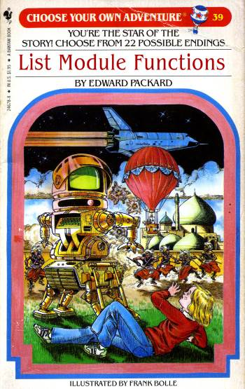

# 在集合函数之间进行选择

# 在集合函数之间进行选择

学习一门新语言不仅仅是语言本身。为了提高生产力，你需要记住大量的标准库，并了解大部分其他内容。例如，如果你了解 C#，你可以很快掌握 Java-语言，但只有当你对 Java 类库感到舒适时，你才能真正提高速度。

同样地，在熟悉所有与集合相关的 F# 函数之前，你实际上无法有效地使用 F#。

在 C# 中，你只需要知道几个 LINQ 方法¹（`Select`、`Where`等）。但在 F# 中，目前列表模块中几乎有 100 个函数（序列和数组模块中的计数也相似）。这太多了！

¹ 是的，还有更多，但你只需要掌握其中几个就可以了。在 F# 中，了解它们所有更为重要。

如果你是从 C# 转到 F#，那么大量的列表函数可能会让你感到不知所措。

因此，我写了这篇帖子来帮助你找到你想要的。而且为了好玩，我用“选择你的冒险”风格来做了这件事！



## 我想要哪种集合？

首先，一张关于不同种类标准集合的信息表。有五种“本地”F#集合：`list`、`seq`、`array`、`map`和`set`，还经常使用`ResizeArray`和`IDictionary`。

|  | 不可变？ | 备注 |
| --- | --- | --- |

| list | 是 | **优点：**

+   可用模式匹配。

+   通过递归可用的复杂迭代。

+   正向迭代速度快。前置速度快。

**缺点：**

+   索引访问和其他访问样式较慢。

|

| seq | 是 | `IEnumerable` 的别名。**优点：**

+   惰性评估

+   内存高效（每次仅加载一个元素）

+   可以表示无限序列。

+   与使用 IEnumerable 的 .NET 库的互操作性。

**缺点：**

+   没有模式匹配。

+   仅正向迭代。

+   索引访问和其他访问样式较慢。

|

| array | 否 | 与 BCL 的 `Array` 相同。**优点：**

+   快速随机访问

+   内存高效和缓存局部性，尤其是对于结构体。

+   与使用 Array 的 .NET 库的互操作性。

+   支持 2D、3D 和 4D 数组

**缺点：**

+   模式匹配有限。

+   不是 [持久化](https://en.wikipedia.org/wiki/Persistent_data_structure)。

|

| map | 是 | 不可变字典。要求键实现 `IComparable`。 |
| --- | --- | --- |
| set | 是 | 不可变集合。要求元素实现 `IComparable`。 |
| ResizeArray | 否 | BCL `List` 的别名。优缺点与数组类似，但可调整大小。 |
| IDictionary | 是 | 对于不要求元素实现 `IComparable` 的替代字典，你可以使用 BCL 的 [IDictionary](https://msdn.microsoft.com/en-us/library/s4ys34ea.aspx)。构造函数是 [`dict`](https://msdn.microsoft.com/en-us/library/ee353774.aspx)。请注意，诸如 `Add` 等变异方法存在，但如果调用会导致运行时错误。 |

这些是你在 F# 中会遇到的主要集合类型，对于所有常见情况来说已经足够好了。

如果你需要其他类型的集合，还有很多选择：

+   你可以使用 .NET 中的集合类，无论是[传统的、可变的](https://msdn.microsoft.com/en-us/library/system.collections.generic)，还是像[System.Collections.Immutable namespace](https://msdn.microsoft.com/en-us/library/system.collections.immutable.aspx)中的新类。

+   或者，你可以使用 F# 集合库之一：

    +   [**FSharpx.Collections**](https://fsprojects.github.io/FSharpx.Collections/)，FSharpx 系列项目的一部分。

    +   [**ExtCore**](https://github.com/jack-pappas/ExtCore/tree/master/ExtCore)。其中一些几乎可以替代 FSharp.Core 中的 Map 和 Set 类型，在特定场景下提供了更好的性能（例如，HashMap）。其他提供了独特功能，帮助解决特定的编码任务（例如，LazyList 和 LruCache）。

    +   [**Funq**](https://github.com/GregRos/Funq)：高性能、不可变数据结构，适用于 .NET。

    +   [**Persistent**](https://persistent.codeplex.com/documentation)：一些高效的持久（不可变）数据结构。

## 关于文档

所有函数在 F# v4 中都适用于`list`、`seq`和`array`，除非另有说明。`Map`和`Set`模块也有一些函数，但我不会在这里讨论`map`和`set`。

对于函数签名，我将使用`list`作为标准集合类型。`seq`和`array`版本的签名将类似。

这些函数中的许多尚未在 MSDN 上记录，因此我将直接链接到 GitHub 上的源代码，其中有最新的注释。点击函数名称获取链接。

## 可用性说明

这些函数的可用性可能取决于你使用的 F# 版本。

+   在 F# 版本 3（Visual Studio 2013）中，Lists、Arrays 和 Sequences 之间存在一定程度的不一致性。

+   在 F# 版本 4（Visual Studio 2015）中，这种不一致性已经被消除，几乎所有函数都适用于这三种集合类型。

如果你想了解 F# v3 和 F# v4 之间有什么变化，请查看[这个图表](http://blogs.msdn.com/cfs-filesystemfile.ashx/__key/communityserver-blogs-components-weblogfiles/00-00-01-39-71-metablogapi/3125.collectionAPI_5F00_254EA354.png)（来自[这里](http://blogs.msdn.com/b/fsharpteam/archive/2014/11/12/announcing-a-preview-of-f-4-0-and-the-visual-f-tools-in-vs-2015.aspx)）。该图表显示了 F# v4 中的新 API（绿色）、先前存在的 API（蓝色）和有意保留的差距（白色）。

下面记录的一些函数不在这个图表中 -- 这些是更新的！如果你使用的是较旧版本的 F#，你��以简单地使用 GitHub 上的代码重新实现它们。

有了这个免责声明，你就可以开始你的冒险了！

* * *

## 目录

+   1\. 你有什么样的集合？

+   2\. 创建一个新的集合

+   3\. 创建一个新的空集合或一个元素的集合

+   4\. 创建一个已知大小的新集合

+   5\. 创建每个元素具有相同值的已知大小的新集合

+   6\. 创建每个元素具有不同值的已知大小的新集合

+   7\. 创建一个新的无限集合

+   8\. 创建一个大小不定的新集合

+   9\. 处理一个列表

+   10\. 获取已知位置的元素

+   11\. 通过搜索获取元素

+   12\. 从集合中获取一部分元素

+   13\. 分区、分块和分组

+   14\. 对集合进行聚合或汇总

+   15\. 改变元素的顺序

+   16\. 测试集合的元素

+   17\. 将每个元素转换为不同的内容

+   18\. 遍历每个元素

+   19\. 通过迭代传递状态

+   20\. 处理每个元素的索引

+   21\. 将整个集合转换为不同的集合类型

+   22\. 更改整个集合的行为

+   23\. 处理两个集合

+   24\. 处理三个集合

+   25\. 处理超过三个集合

+   26\. 合并和分解集合

+   27\. 其他仅适用于数组的功能

+   28\. 使用可释放项的序列

* * *

## 1\. 您有什么样的集合？

您有什么样的集合？

+   如果您没有集合，并且想要创建一个，请转到第 2 节。

+   如果您已经有一个要处理的集合，请转到第 9 节。

+   如果您要处理两个集合，请转到第 23 节。

+   如果您要处理三个集合，请转到第 24 节。

+   如果您要处理三个以上的集合，请转到第 25 节。

+   如果您想要合并或分解集合，请转到第 26 节。

* * *

## 2\. 创建一个新的集合

那么您想要创建一个新的集合。您想如何创建它？

+   如果新集合将为空或将只有一个元素，请转到第 3 节。

+   如果新集合是已知大小，请转到第 4 节。

+   如果新集合可能是无限的，请转到第 7 节。

+   如果您不知道集合的大小， 请转到第 8 节。

* * *

## 3\. 创建一个新的空集合或一个元素的集合

如果您想要创建一个新的空集合或一个元素的集合，请使用这些功能：

+   [`empty : 'T list`](https://github.com/fsharp/fsharp/blob/4331dca3648598223204eed6bfad2b41096eec8a/src/fsharp/FSharp.Core/list.fsi#L142)。返回给定类型的空列表。

+   [`singleton : value:'T -> 'T list`](https://github.com/fsharp/fsharp/blob/4331dca3648598223204eed6bfad2b41096eec8a/src/fsharp/FSharp.Core/list.fsi#L635)。返回仅包含一个项目的列表。

如果你预先知道集合的大小，通常更有效的方法是使用不同的函数。参见下面的第 4 节。

### 使用示例

```
let list0 = List.empty
// list0 = []

let list1 = List.singleton "hello"
// list1 = ["hello"] 
```

* * *

## 4\. 创建一个已知大小的新集合

+   如果集合的所有元素将具有相同的值，请转到第 5 节。

+   如果集合的元素可能不同，请转到第 6 节。

* * *

## 5\. 创建一个已知大小的新集合，每个元素都具有相同的值

如果你想要创建一个每个元素可能有不同值的已知大小的新集合，你应该使用`replicate`：

+   [`replicate：count：int->initial：'T->'T list`](https://github.com/fsharp/fsharp/blob/4331dca3648598223204eed6bfad2b41096eec8a/src/fsharp/FSharp.Core/list.fsi#L602)。 通过复制给定的初始值来创建集合。

+   （仅限数组）[`create：count：int->value：'T->'T []`](https://github.com/fsharp/fsharp/blob/4331dca3648598223204eed6bfad2b41096eec8a/src/fsharp/FSharp.Core/array.fsi#L125)。 创建一个元素初始值都是提供的值的数组。

+   （仅限数组）[`zeroCreate：count：int->'T []`](https://github.com/fsharp/fsharp/blob/4331dca3648598223204eed6bfad2b41096eec8a/src/fsharp/FSharp.Core/array.fsi#L467)。 创建一个初始值为默认值的数组。

`Array.create`基本上与`replicate`相同（尽管实现略有不同！），但`replicate`只在 F# v4 中为`Array`实现了。

### 使用示例

```
let repl = List.replicate 3 "hello"
// val repl : string list = ["hello"; "hello"; "hello"]

let arrCreate = Array.create 3 "hello"
// val arrCreate : string [] = [|"hello"; "hello"; "hello"|]

let intArr0 : int[] = Array.zeroCreate 3
// val intArr0 : int [] = [|0; 0; 0|]

let stringArr0 : string[] = Array.zeroCreate 3
// val stringArr0 : string [] = [|null; null; null|] 
```

注意，对于`zeroCreate`，目标类型必须为编译器所知。

* * *

## 6\. 创建一个已知大小的新集合，每个元素都具有不同的值

如果你想要创建一个每个元素可能有不同值的已知大小的新集合，你可以选择三种方式之一：

+   [`init：length：int->initializer：（int->'T）->'T list`](https://github.com/fsharp/fsharp/blob/4331dca3648598223204eed6bfad2b41096eec8a/src/fsharp/FSharp.Core/list.fsi#L347)。 通过在每个索引上调用给定的生成器来创建集合。

+   对于列表和数组，你还可以使用文字语法，比如`[1; 2; 3]`（列表）和`[|1; 2; 3|]`（数组）。

+   对于列表、数组和序列，你可以使用推导语法`for .. in .. do .. yield`。

### 使用示例

```
// using list initializer
let listInit1 = List.init 5 (fun i-> i*i)
// val listInit1 : int list = [0; 1; 4; 9; 16]

// using list comprehension
let listInit2 = [for i in [1..5] do yield i*i]
// val listInit2 : int list = [1; 4; 9; 16; 25]

// literal 
let listInit3 = [1; 4; 9; 16; 25]
// val listInit3 : int list = [1; 4; 9; 16; 25]

let arrayInit3 = [|1; 4; 9; 16; 25|]
// val arrayInit3 : int [] = [|1; 4; 9; 16; 25|] 
```

字面语法也允许增量：

```
// literal with +2 increment
let listOdd= [1..2..10]
// val listOdd : int list = [1; 3; 5; 7; 9] 
```

推导语法更加灵活，因为你可以`yield`不止一次：

```
// using list comprehension
let listFunny = [
    for i in [2..3] do 
        yield i
        yield i*i
        yield i*i*i
        ]
// val listFunny : int list = [2; 4; 8; 3; 9; 27] 
```

它也可以用作快速而肮脏的内联过滤器：

```
let primesUpTo n = 
   let rec sieve l  = 
      match l with 
      | [] -> []
      | p::xs -> 
            p :: sieve [for x in xs do if (x % p) > 0 then yield x]
   [2..n] |> sieve 

primesUpTo 20
// [2; 3; 5; 7; 11; 13; 17; 19] 
```

另外两个技巧：

+   你可以使用`yield!`来返回一个列表而不是单个值

+   你还可以使用递归

下面是使用这两个技巧来以两个为单位计数到 10 的示例：

```
let rec listCounter n = [
    if n <= 10 then
        yield n
        yield! listCounter (n+2)
    ]

listCounter 3
// val it : int list = [3; 5; 7; 9]
listCounter 4
// val it : int list = [4; 6; 8; 10] 
```

* * *

## 7\. 创建一个新的无限集合

如果你想要一个无限列表，你必须使用序列而不是列表或数组。

+   [`initInfinite : initializer:(int -> 'T) -> seq<'T>`](https://github.com/fsharp/fsharp/blob/4331dca3648598223204eed6bfad2b41096eec8a/src/fsharp/FSharp.Core/seq.fsi#L599)。生成一个新序列，当迭代时，将通过调用给定函数返回连续的元素。

+   你也可以使用带有递归循环的 seq 推导生成无限序列。

### 用法示例

```
// generator version
let seqOfSquares = Seq.initInfinite (fun i -> i*i)
let firstTenSquares = seqOfSquares |> Seq.take 10

firstTenSquares |> List.ofSeq // [0; 1; 4; 9; 16; 25; 36; 49; 64; 81]

// recursive version
let seqOfSquares_v2 = 
    let rec loop n = seq {
        yield n * n
        yield! loop (n+1)
        }
    loop 1
let firstTenSquares_v2 = seqOfSquares_v2 |> Seq.take 10 
```

* * *

## 8\. 创建一个不定大小的新集合

有时你事先不知道集合的大小。在这种情况下，你需要一个函数，它会不断添加元素，直到收到停止的信号。在这里 `unfold` 是你的朋友，而 "停止的信号" 是你返回 `None`（停止）还是 `Some`（继续）。

+   [`unfold : generator:('State -> ('T * 'State) option) -> state:'State -> 'T list`](https://github.com/fsharp/fsharp/blob/4331dca3648598223204eed6bfad2b41096eec8a/src/fsharp/FSharp.Core/list.fsi#L846)。返回包含给定计算生成的元素的集合。

### 用法示例

此示例在循环中从控制台读取，直到输入空行为止：

```
let getInputFromConsole lineNo =
    let text = System.Console.ReadLine()
    if System.String.IsNullOrEmpty(text) then
        None
    else
        // return value and new threaded state
        // "text" will be in the generated sequence
        Some (text,lineNo+1)

let listUnfold = List.unfold getInputFromConsole 1 
```

`unfold` 要求通过生成器传递状态。你可以忽略它（就像上面的 `ReadLine` 示例一样），或者你可以使用它来跟踪到目前为止你所做的事情。例如，你可以使用 `unfold` 创建一个斐波那契数列生成器：

```
let fibonacciUnfolder max (f1,f2)  =
    if f1 > max then
        None
    else
        // return value and new threaded state
        let fNext = f1 + f2
        let newState = (f2,fNext)
        // f1 will be in the generated sequence
        Some (f1,newState)

let fibonacci max = List.unfold (fibonacciUnfolder max) (1,1)
fibonacci 100
// int list = [1; 1; 2; 3; 5; 8; 13; 21; 34; 55; 89] 
```

* * *

## 9\. 处理一个列表

如果你正在处理一个列表，并且...

+   如果你想要获取已知位置的元素，请转到第 10 节。

+   如果你想要通过搜索获取一个元素，请转到第 11 节。

+   如果你想要获取集合的子集，请转到第 12 节。

+   如果你想要将集合分割、划分或分组成更小的集合，请转到第 13 节。

+   如果你想要将集合聚合或汇总为单个值，请转到第 14 节。

+   如果你想要改变元素的顺序，请转到第 15 节。

+   如果你想要测试集合中的元素，请转到第 16 节。

+   如果你想要将每个元素转换为不同的东西，请转到第 17 节。

+   如果你想要遍历每个元素，请转到第 18 节。

+   如果你想要在迭代中传递状态，请转到第 19 节。

+   如果你需要在迭代或映射时知道每个元素的索引，请转到第 20 节。

+   如果你想要将整个集合转换为不同的集合类型，请转到第 21 节。

+   如果你想要改变集合的整体行为，请转到第 22 节。

+   如果你想要就地改变集合，请转到第 27 节。

+   如果你想要使用带有 IDisposable 的惰性集合，请转到第 28 节。

* * *

## 10\. 获取已知位置的元素

以下函数按位置在集合中获取元素：

+   [`head : list:'T list -> 'T`](https://github.com/fsharp/fsharp/blob/4331dca3648598223204eed6bfad2b41096eec8a/src/fsharp/FSharp.Core/list.fsi#L333)。返回集合的第一个元素。

+   [`last : list:'T list -> 'T`](https://github.com/fsharp/fsharp/blob/4331dca3648598223204eed6bfad2b41096eec8a/src/fsharp/FSharp.Core/list.fsi#L398). 返回集合的最后一个元素。

+   [`item : index:int -> list:'T list -> 'T`](https://github.com/fsharp/fsharp/blob/4331dca3648598223204eed6bfad2b41096eec8a/src/fsharp/FSharp.Core/list.fsi#L520). 索引到集合中。第一个元素的索引为 0。

    注意：避免对列表和序列使用`nth`和`item`。它们不适用于随机访问，因此通常会很慢。

+   [`nth : list:'T list -> index:int -> 'T`](https://github.com/fsharp/fsharp/blob/4331dca3648598223204eed6bfad2b41096eec8a/src/fsharp/FSharp.Core/list.fsi#L520). `item`的旧版本。注意：在 v4 中已弃用--请使用`item`代替。

+   （仅适用于数组）[`get : array:'T[] -> index:int -> 'T`](https://github.com/fsharp/fsharp/blob/4331dca3648598223204eed6bfad2b41096eec8a/src/fsharp/FSharp.Core/array.fsi#L220). `item`的另一个版本。

+   [`exactlyOne : list:'T list -> 'T`](https://github.com/fsharp/fsharp/blob/4331dca3648598223204eed6bfad2b41096eec8a/src/fsharp/FSharp.Core/list.fsi#L165). 返回集合的唯一元素。

但是如果集合为空怎么办？那么`head`和`last`将会因异常（ArgumentException）而失败。

如果索引在集合中找不到怎么办？那么又会出现另一个异常（对于列表是 ArgumentException，对于数组是 IndexOutOfRangeException）。

因此，我建议您一般情况下避免使用这些函数，而使用下面的`tryXXX`等价函数：

+   [`tryHead : list:'T list -> 'T option`](https://github.com/fsharp/fsharp/blob/4331dca3648598223204eed6bfad2b41096eec8a/src/fsharp/FSharp.Core/list.fsi#L775). 返回集合的第一个元素，如果集合为空则返回 None。

+   [`tryLast : list:'T list -> 'T option`](https://github.com/fsharp/fsharp/blob/4331dca3648598223204eed6bfad2b41096eec8a/src/fsharp/FSharp.Core/list.fsi#L411). 返回集合的最后一个元素，如果集合为空则返回 None。

+   [`tryItem : index:int -> list:'T list -> 'T option`](https://github.com/fsharp/fsharp/blob/4331dca3648598223204eed6bfad2b41096eec8a/src/fsharp/FSharp.Core/list.fsi#L827). 索引到集合中，如果索引无效则返回 None。

### 使用示例

```
let head = [1;2;3] |> List.head
// val head : int = 1

let badHead : int = [] |> List.head
// System.ArgumentException: The input list was empty.

let goodHeadOpt = 
    [1;2;3] |> List.tryHead 
// val goodHeadOpt : int option = Some 1

let badHeadOpt : int option = 
    [] |> List.tryHead 
// val badHeadOpt : int option = None 

let goodItemOpt = 
    [1;2;3] |> List.tryItem 2
// val goodItemOpt : int option = Some 3

let badItemOpt = 
    [1;2;3] |> List.tryItem 99
// val badItemOpt : int option = None 
```

如前所述，应避免使用`item`函数处理列表。例如，如果您想要处理列表中的每个元素，并且您来自命令式编程背景，您可能会写出类似以下循环的代码：

```
// Don't do this!
let helloBad = 
    let list = ["a";"b";"c"]
    let listSize = List.length list
    [ for i in [0..listSize-1] do
        let element = list |> List.item i
        yield "hello " + element 
    ]
// val helloBad : string list = ["hello a"; "hello b"; "hello c"] 
```

不要这样做！使用类似`map`的东西。它既更简洁又更高效：

```
let helloGood = 
    let list = ["a";"b";"c"]
    list |> List.map (fun element -> "hello " + element)
// val helloGood : string list = ["hello a"; "hello b"; "hello c"] 
```

* * *

## 11\. 通过搜索获取元素

您可以使用`find`和`findIndex`来搜索元素或其索引：

+   [`find : predicate:('T -> bool) -> list:'T list -> 'T`](https://github.com/fsharp/fsharp/blob/4331dca3648598223204eed6bfad2b41096eec8a/src/fsharp/FSharp.Core/list.fsi#L201). 返回给定函数返回 true 的第一个元素。

+   [`findIndex : predicate:('T -> bool) -> list:'T list -> int`](https://github.com/fsharp/fsharp/blob/4331dca3648598223204eed6bfad2b41096eec8a/src/fsharp/FSharp.Core/list.fsi#L222)。返回使给定函数返回 true 的第一个元素的索引。

并且你也可以反向搜索：

+   [`findBack : predicate:('T -> bool) -> list:'T list -> 'T`](https://github.com/fsharp/fsharp/blob/4331dca3648598223204eed6bfad2b41096eec8a/src/fsharp/FSharp.Core/list.fsi#L211)。返回使给定函数返回 true 的最后一个元素。

+   [`findIndexBack : predicate:('T -> bool) -> list:'T list -> int`](https://github.com/fsharp/fsharp/blob/4331dca3648598223204eed6bfad2b41096eec8a/src/fsharp/FSharp.Core/list.fsi#L233)。返回使给定函数返回 true 的最后一个元素的索引。

但是如果项目找不到呢？那么这些将会因为异常（`KeyNotFoundException`）而失败。

因此，我建议，与`head`和`item`一样，你一般应避免使用这些函数，而使用下面的`tryXXX`等价函数：

+   [`tryFind : predicate:('T -> bool) -> list:'T list -> 'T option`](https://github.com/fsharp/fsharp/blob/4331dca3648598223204eed6bfad2b41096eec8a/src/fsharp/FSharp.Core/list.fsi#L800)。返回使给定函数返回 true 的第一个元素，如果不存在则返回 None。

+   [`tryFindBack : predicate:('T -> bool) -> list:'T list -> 'T option`](https://github.com/fsharp/fsharp/blob/4331dca3648598223204eed6bfad2b41096eec8a/src/fsharp/FSharp.Core/list.fsi#L809)。返回最后一个使给定函数返回 true 的元素，如果不存在则返回 None。

+   [`tryFindIndex : predicate:('T -> bool) -> list:'T list -> int option`](https://github.com/fsharp/fsharp/blob/4331dca3648598223204eed6bfad2b41096eec8a/src/fsharp/FSharp.Core/list.fsi#L819)。返回使给定函数返回 true 的第一个元素的索引，如果不存在则返回 None。

+   [`tryFindIndexBack : predicate:('T -> bool) -> list:'T list -> int option`](https://github.com/fsharp/fsharp/blob/4331dca3648598223204eed6bfad2b41096eec8a/src/fsharp/FSharp.Core/list.fsi#L837)。返回最后一个使给定函数返回 true 的元素的索引，如果不存在则返回 None。

如果你在`find`之前做了一个`map`，通常可以将这两个步骤合并成一个使用`pick`（或更好的是`tryPick`）。见下面的用法示例。

+   [`pick : chooser:('T -> 'U option) -> list:'T list -> 'U`](https://github.com/fsharp/fsharp/blob/4331dca3648598223204eed6bfad2b41096eec8a/src/fsharp/FSharp.Core/list.fsi#L561)。将给定函数应用于连续的元素，返回 chooser 函数返回 Some 的第一个结果。

+   [`tryPick : chooser:('T -> 'U option) -> list:'T list -> 'U option`](https://github.com/fsharp/fsharp/blob/4331dca3648598223204eed6bfad2b41096eec8a/src/fsharp/FSharp.Core/list.fsi#L791)。对连续的元素应用给定的函数，返回选择器函数返回 Some 的第一个结果，如果不存在这样的元素，则返回 None。

### 用法示例

```
let listOfTuples = [ (1,"a"); (2,"b"); (3,"b"); (4,"a"); ]

listOfTuples |> List.find ( fun (x,y) -> y = "b")
// (2, "b")

listOfTuples |> List.findBack ( fun (x,y) -> y = "b")
// (3, "b")

listOfTuples |> List.findIndex ( fun (x,y) -> y = "b")
// 1

listOfTuples |> List.findIndexBack ( fun (x,y) -> y = "b")
// 2

listOfTuples |> List.find ( fun (x,y) -> y = "c")
// KeyNotFoundException 
```

使用 `pick`，而不是返回布尔值，你返回一个选项：

```
listOfTuples |> List.pick ( fun (x,y) -> if y = "b" then Some (x,y) else None)
// (2, "b") 
```

### 选择 vs. 查找

'pick' 函数可能看起来是不必要的，但在处理返回选项的函数时非常有用。

例如，假设有一个函数 `tryInt`，它解析一个字符串并在字符串是有效的 int 时返回 `Some int`，否则返回 `None`。

```
// string -> int option
let tryInt str = 
    match System.Int32.TryParse(str) with
    | true, i -> Some i
    | false, _ -> None 
```

现在假设我们想要在列表中找到第一个有效的 int。粗糙的方法是： 

+   使用 `tryInt` 映射列表

+   使用 `find` 找到第一个 `Some`。

+   使用 `Option.get` 从选项内获取值

代码可能是这样的：

```
let firstValidNumber = 
    ["a";"2";"three"]
    // map the input
    |> List.map tryInt 
    // find the first Some
    |> List.find (fun opt -> opt.IsSome)
    // get the data from the option
    |> Option.get
// val firstValidNumber : int = 2 
```

但 `pick` 将一次完成所有这些步骤！所以代码变得更简单：

```
let firstValidNumber = 
    ["a";"2";"three"]
    |> List.pick tryInt 
```

如果你想以与 `pick` 相同的方式返回多个元素，请考虑使用 `choose`（见 第 12 节）。

* * *

## 12\. 从集合中获取一部分元素

上一节是关于获取一个元素的。你怎样才能获取多个元素？好消息！有很多函数供选择。

要从前面提取元素，请使用以下之一：

+   [`take: count:int -> list:'T list -> 'T list`](https://github.com/fsharp/fsharp/blob/4331dca3648598223204eed6bfad2b41096eec8a/src/fsharp/FSharp.Core/list.fsi#L746)。返回集合的前 N 个元素。

+   [`takeWhile: predicate:('T -> bool) -> list:'T list -> 'T list`](https://github.com/fsharp/fsharp/blob/4331dca3648598223204eed6bfad2b41096eec8a/src/fsharp/FSharp.Core/list.fsi#L756)。返回包含原始集合的所有元素的集合，当给定的谓词返回 true 时，然后不再返回元素。

+   [`truncate: count:int -> list:'T list -> 'T list`](https://github.com/fsharp/fsharp/blob/4331dca3648598223204eed6bfad2b41096eec8a/src/fsharp/FSharp.Core/list.fsi#L782)。在新集合中返回最多 N 个元素。

要从后面提取元素，请使用以下之一：

+   [`skip: count:int -> list: 'T list -> 'T list`](https://github.com/fsharp/fsharp/blob/4331dca3648598223204eed6bfad2b41096eec8a/src/fsharp/FSharp.Core/list.fsi#L644)。删除前 N 个元素后返回集合。

+   [`skipWhile: predicate:('T -> bool) -> list:'T list -> 'T list`](https://github.com/fsharp/fsharp/blob/4331dca3648598223204eed6bfad2b41096eec8a/src/fsharp/FSharp.Core/list.fsi#L652)。在给定谓词返回 true 的情况下跳过集合中的元素，然后返回集合的剩余元素。

+   [`tail: list:'T list -> 'T list`](https://github.com/fsharp/fsharp/blob/4331dca3648598223204eed6bfad2b41096eec8a/src/fsharp/FSharp.Core/list.fsi#L730)。删除第一个元素后返回集合。

要提取其他元素子集，请使用以下之一：

+   [`filter: predicate:('T -> bool) -> list:'T list -> 'T list`](https://github.com/fsharp/fsharp/blob/4331dca3648598223204eed6bfad2b41096eec8a/src/fsharp/FSharp.Core/list.fsi#L241)。返回一个只包含给定函数返回 true 的集合元素的新集合。

+   [`except: itemsToExclude:seq<'T> -> list:'T list -> 'T list when 'T : equality`](https://github.com/fsharp/fsharp/blob/4331dca3648598223204eed6bfad2b41096eec8a/src/fsharp/FSharp.Core/list.fsi#L155)。返回一个新的集合，其中包含输入集合中不在 itemsToExclude 序列中出现的不同元素，使用通用哈希和相等比较来比较值。

+   [`choose: chooser:('T -> 'U option) -> list:'T list -> 'U list`](https://github.com/fsharp/fsharp/blob/4331dca3648598223204eed6bfad2b41096eec8a/src/fsharp/FSharp.Core/list.fsi#L55)。将给定函数应用于集合的每个元素。返回由函数返回 Some 的元素组成的集合。

+   [`where: predicate:('T -> bool) -> list:'T list -> 'T list`](https://github.com/fsharp/fsharp/blob/4331dca3648598223204eed6bfad2b41096eec8a/src/fsharp/FSharp.Core/list.fsi#L866)。返回一个只包含给定谓词返回 true 的集合元素的新集合。注意："where"是"filter"的同义词。

+   (仅适用于数组) `sub : 'T [] -> int -> int -> 'T []`。创建一个包含指定子范围的数组，该子范围由起始索引和长度指定。

+   您���可以使用切片语法：`myArray.[2..5]`。请参见下面的示例。

要将列表减少为不同的元素，请使用以下之一：

+   [`distinct: list:'T list -> 'T list when 'T : equality`](https://github.com/fsharp/fsharp/blob/4331dca3648598223204eed6bfad2b41096eec8a/src/fsharp/FSharp.Core/list.fsi#L107)。根据条目上的通用哈希和相等比较，返回一个不包含重复条目的集合。

+   [`distinctBy: projection:('T -> 'Key) -> list:'T list -> 'T list when 'Key : equality`](https://github.com/fsharp/fsharp/blob/4331dca3648598223204eed6bfad2b41096eec8a/src/fsharp/FSharp.Core/list.fsi#L118)。根据给定的生成键函数返回的键的通用哈希和相等比较，返回一个不包含重复条目的集合。

### 使用示例

从前面取元素：

```
[1..10] |> List.take 3    
// [1; 2; 3]

[1..10] |> List.takeWhile (fun i -> i < 3)    
// [1; 2]

[1..10] |> List.truncate 4
// [1; 2; 3; 4]

[1..2] |> List.take 3    
// System.InvalidOperationException: The input sequence has an insufficient number of elements.

[1..2] |> List.takeWhile (fun i -> i < 3)  
// [1; 2]

[1..2] |> List.truncate 4
// [1; 2]   // no error! 
```

从后面取元素：

```
[1..10] |> List.skip 3    
// [4; 5; 6; 7; 8; 9; 10]

[1..10] |> List.skipWhile (fun i -> i < 3)    
// [3; 4; 5; 6; 7; 8; 9; 10]

[1..10] |> List.tail
// [2; 3; 4; 5; 6; 7; 8; 9; 10]

[1..2] |> List.skip 3    
// System.ArgumentException: The index is outside the legal range.

[1..2] |> List.skipWhile (fun i -> i < 3)  
// []

[1] |> List.tail |> List.tail
// System.ArgumentException: The input list was empty. 
```

要提取其他元素子集：

```
[1..10] |> List.filter (fun i -> i%2 = 0) // even
// [2; 4; 6; 8; 10]

[1..10] |> List.where (fun i -> i%2 = 0) // even
// [2; 4; 6; 8; 10]

[1..10] |> List.except [3;4;5]
// [1; 2; 6; 7; 8; 9; 10] 
```

要提取一个切片：

```
Array.sub [|1..10|] 3 5
// [|4; 5; 6; 7; 8|]

[1..10].[3..5] 
// [4; 5; 6]

[1..10].[3..] 
// [4; 5; 6; 7; 8; 9; 10]

[1..10].[..5] 
// [1; 2; 3; 4; 5; 6] 
```

请注意，在列表上进行切片可能会很慢，因为它们不是随机访问的。但在数组上进行切片是快速的。

要提取不同的元素：

```
[1;1;1;2;3;3] |> List.distinct
// [1; 2; 3]

[ (1,"a"); (1,"b"); (1,"c"); (2,"d")] |> List.distinctBy fst
// [(1, "a"); (2, "d")] 
```

### Choose vs. Filter

与`pick`一样，`choose`函数可能看起来很笨拙，但在处理返回选项的函数时很有用。

实际上，`choose`就像`pick`对`find`一样，而不是使用布尔过滤器，信号是`Some`与`None`。

与之前一样，假设有一个函数`tryInt`，它解析一个字符串并在字符串是有效整数时返回`Some int`，否则返回`None`。

```
// string -> int option
let tryInt str = 
    match System.Int32.TryParse(str) with
    | true, i -> Some i
    | false, _ -> None 
```

现在假设我们想在列表中找到所有有效的整数。粗糙的方法可能是：

+   使用`tryInt`映射列表

+   过滤只包含`Some`的元素

+   使用`Option.get`从每个选项内获取值

代码可能如下所示：

```
let allValidNumbers = 
    ["a";"2";"three"; "4"]
    // map the input
    |> List.map tryInt 
    // include only the "Some"
    |> List.filter (fun opt -> opt.IsSome)
    // get the data from each option
    |> List.map Option.get
// val allValidNumbers : int list = [2; 4] 
```

但`choose`会一次完成所有这些步骤！所以代码变得简单得多：

```
let allValidNumbers = 
    ["a";"2";"three"; "4"]
    |> List.choose tryInt 
```

如果你已经有一个选项列表，可以通过将`id`传递给`choose`来一步过滤并返回“Some”：

```
let reduceOptions = 
    [None; Some 1; None; Some 2]
    |> List.choose id
// val reduceOptions : int list = [1; 2] 
```

如果你想以与`choose`相同的方式返回第一个元素，请考虑使用`pick`（参见第 11 节）。

如果你想执行类似于`choose`但适用于其他包装类型（如成功/失败结果）的操作，可以参考这里的讨论。

* * *

## 13\. 分区、分块和分组

有许多不同的方法来拆分集合！查看用法示例以查看差异：

+   [`chunkBySize: chunkSize:int -> list:'T list -> 'T list list`](https://github.com/fsharp/fsharp/blob/4331dca3648598223204eed6bfad2b41096eec8a/src/fsharp/FSharp.Core/list.fsi#L63)。将输入集合分成大小最多为`chunkSize`的块。

+   [`groupBy : projection:('T -> 'Key) -> list:'T list -> ('Key * 'T list) list when 'Key : equality`](https://github.com/fsharp/fsharp/blob/4331dca3648598223204eed6bfad2b41096eec8a/src/fsharp/FSharp.Core/list.fsi#L325)。对集合中的每个元素应用生成键的函数，并产生一组唯一键。每个唯一键包含与该键匹配的所有元素的列表。

+   [`pairwise: list:'T list -> ('T * 'T) list`](https://github.com/fsharp/fsharp/blob/4331dca3648598223204eed6bfad2b41096eec8a/src/fsharp/FSharp.Core/list.fsi#L541)。返回输入集合中每个元素及其前一个元素的集合，第一个元素除外，仅作为第二个元素的前身返回。

+   (除了 Seq) [`partition: predicate:('T -> bool) -> list:'T list -> ('T list * 'T list)`](https://github.com/fsharp/fsharp/blob/4331dca3648598223204eed6bfad2b41096eec8a/src/fsharp/FSharp.Core/list.fsi#L551)。将集合分成两个集合，一个包含给定谓词返回 true 的元素，另一个包含返回 false 的元素。

+   (除了 Seq) [`splitAt: index:int -> list:'T list -> ('T list * 'T list)`](https://github.com/fsharp/fsharp/blob/4331dca3648598223204eed6bfad2b41096eec8a/src/fsharp/FSharp.Core/list.fsi#L688)。在给定索引处将集合分成两个集合。

+   [`splitInto: count:int -> list:'T list -> 'T list list`](https://github.com/fsharp/fsharp/blob/4331dca3648598223204eed6bfad2b41096eec8a/src/fsharp/FSharp.Core/list.fsi#L137)。将输入集合分成最多 count 个块。

+   [`windowed : windowSize:int -> list:'T list -> 'T list list`](https://github.com/fsharp/fsharp/blob/4331dca3648598223204eed6bfad2b41096eec8a/src/fsharp/FSharp.Core/list.fsi#L875)。返回一个包含从输入集合中提取的元素的滑动窗口列表。每个窗口都作为一个新的集合返回。与`pairwise`不同，窗口是集合，而不是元组。

### 用法示例

```
[1..10] |> List.chunkBySize 3
// [[1; 2; 3]; [4; 5; 6]; [7; 8; 9]; [10]] 
// note that the last chunk has one element

[1..10] |> List.splitInto 3
// [[1; 2; 3; 4]; [5; 6; 7]; [8; 9; 10]]
// note that the first chunk has four elements

['a'..'i'] |> List.splitAt 3
// (['a'; 'b'; 'c'], ['d'; 'e'; 'f'; 'g'; 'h'; 'i'])

['a'..'e'] |> List.pairwise
// [('a', 'b'); ('b', 'c'); ('c', 'd'); ('d', 'e')]

['a'..'e'] |> List.windowed 3
// [['a'; 'b'; 'c']; ['b'; 'c'; 'd']; ['c'; 'd'; 'e']]

let isEven i = (i%2 = 0)
[1..10] |> List.partition isEven 
// ([2; 4; 6; 8; 10], [1; 3; 5; 7; 9])

let firstLetter (str:string) = str.[0]
["apple"; "alice"; "bob"; "carrot"] |> List.groupBy firstLetter 
// [('a', ["apple"; "alice"]); ('b', ["bob"]); ('c', ["carrot"])] 
```

除了`splitAt`和`pairwise`之外的所有函数都优雅地处理边缘情况：

```
[1] |> List.chunkBySize 3
// [[1]]

[1] |> List.splitInto 3
// [[1]]

['a'; 'b'] |> List.splitAt 3
// InvalidOperationException: The input sequence has an insufficient number of elements.

['a'] |> List.pairwise
// InvalidOperationException: The input sequence has an insufficient number of elements.

['a'] |> List.windowed 3
// []

[1] |> List.partition isEven 
// ([], [1])

[] |> List.groupBy firstLetter 
//  [] 
```

* * *

## 14\. 聚合或总结一个集合

聚合集合中元素的最通用方式是使用`reduce`：

+   [`reduce : reduction:('T -> 'T -> 'T) -> list:'T list -> 'T`](https://github.com/fsharp/fsharp/blob/4331dca3648598223204eed6bfad2b41096eec8a/src/fsharp/FSharp.Core/list.fsi#L584)。对集合中的每个元素应用一个函数，通过计算传递一个累加器参数。

+   [`reduceBack : reduction:('T -> 'T -> 'T) -> list:'T list -> 'T`](https://github.com/fsharp/fsharp/blob/4331dca3648598223204eed6bfad2b41096eec8a/src/fsharp/FSharp.Core/list.fsi#L595)。对集合中的每个元素应用一个函数，从末尾开始，通过计算传递一个累加器参数。

对于经常使用的聚合操作，有特定版本的`reduce`：

+   [`max : list:'T list -> 'T when 'T : comparison`](https://github.com/fsharp/fsharp/blob/4331dca3648598223204eed6bfad2b41096eec8a/src/fsharp/FSharp.Core/list.fsi#L482)。返回集合中所有元素中的最大值，通过`Operators.max`比较。

+   [`maxBy : projection:('T -> 'U) -> list:'T list -> 'T when 'U : comparison`](https://github.com/fsharp/fsharp/blob/4331dca3648598223204eed6bfad2b41096eec8a/src/fsharp/FSharp.Core/list.fsi#L492)。返回集合中所有元素中的最大值，通过函数结果上的`Operators.max`比较。

+   [`min : list:'T list -> 'T when 'T : comparison`](https://github.com/fsharp/fsharp/blob/4331dca3648598223204eed6bfad2b41096eec8a/src/fsharp/FSharp.Core/list.fsi#L501)。返回集合中所有元素中的最小值，通过`Operators.min`比较。

+   [`minBy : projection:('T -> 'U) -> list:'T list -> 'T when 'U : comparison`](https://github.com/fsharp/fsharp/blob/4331dca3648598223204eed6bfad2b41096eec8a/src/fsharp/FSharp.Core/list.fsi#L511)。返回集合中所有元素中的最小值，通过函数结果上的`Operators.min`比较。

+   [`sum : list:'T list -> 'T when 'T has static members (+) and Zero`](https://github.com/fsharp/fsharp/blob/4331dca3648598223204eed6bfad2b41096eec8a/src/fsharp/FSharp.Core/list.fsi#L711)。返回集合中元素的总和。

+   [`sumBy : projection:('T -> 'U) -> list:'T list -> 'U when 'U has static members (+) and Zero`](https://github.com/fsharp/fsharp/blob/4331dca3648598223204eed6bfad2b41096eec8a/src/fsharp/FSharp.Core/list.fsi#L720)。返回通过将函数应用于集合中的每个元素生成的结果的总和。

+   [`average : list:'T list -> 'T when 'T has static members (+) and Zero and DivideByInt`](https://github.com/fsharp/fsharp/blob/4331dca3648598223204eed6bfad2b41096eec8a/src/fsharp/FSharp.Core/list.fsi#L30)。返回集合中元素的平均值。请注意，整数列表无法计算平均值 - 它们必须转换为浮点数或十进制数。

+   [`averageBy : projection:('T -> 'U) -> list:'T list -> 'U when 'U has static members (+) and Zero and DivideByInt`](https://github.com/fsharp/fsharp/blob/4331dca3648598223204eed6bfad2b41096eec8a/src/fsharp/FSharp.Core/list.fsi#L43)。返回将该函数应用于集合中每个元素所生成的结果的平均值。

最后，还有一些计数函数：

+   [`length: list:'T list -> int`](https://github.com/fsharp/fsharp/blob/4331dca3648598223204eed6bfad2b41096eec8a/src/fsharp/FSharp.Core/list.fsi#L404)。返回集合的长度。

+   [`countBy : projection:('T -> 'Key) -> list:'T list -> ('Key * int) list when 'Key : equality`](https://github.com/fsharp/fsharp/blob/4331dca3648598223204eed6bfad2b41096eec8a/src/fsharp/FSharp.Core/list.fsi#L129)。对每个元素应用生成键的函数，并返回在原始集合中生成唯一键及其出现次数的集合。

### 使用示例

`reduce`是没有初始状态的`fold`的变体 - 有关`fold`的更多信息，请参阅第 19 节。一种思考方法是在每个元素之间插入一个操作符。

```
["a";"b";"c"] |> List.reduce (+)     
// "abc" 
```

与...相同

```
"a" + "b" + "c" 
```

下面是另一个例子：

```
[2;3;4] |> List.reduce (*)     
// is same as
2 * 3 * 4
// Result is 24 
```

一些元素组合方式取决于组合顺序，因此有两个“reduce”的变体：

+   `reduce`向列表前进。

+   `reduceBack`，不出所料，向列表后退移动。

这是区别的演示。首先是`reduce`：

```
[1;2;3;4] |> List.reduce (fun state x -> (state)*10 + x)

// built up from                // state at each step
1                               // 1
(1)*10 + 2                      // 12 
((1)*10 + 2)*10 + 3             // 123 
(((1)*10 + 2)*10 + 3)*10 + 4    // 1234

// Final result is 1234 
```

使用*相同*的组合函数与`reduceBack`产生不同的结果！它看起来像这样：

```
[1;2;3;4] |> List.reduceBack (fun x state -> x + 10*(state))

// built up from                // state at each step
4                               // 4
3 + 10*(4)                      // 43 
2 + 10*(3 + 10*(4))             // 432 
1 + 10*(2 + 10*(3 + 10*(4)))    // 4321 

// Final result is 4321 
```

同样，有关相关函数`fold`和`foldBack`的更详细讨论，请参阅第 19 节。

其他聚合函数要简单得多。

```
type Suit = Club | Diamond | Spade | Heart 
type Rank = Two | Three | King | Ace
let cards = [ (Club,King); (Diamond,Ace); (Spade,Two); (Heart,Three); ]

cards |> List.max        // (Heart, Three)
cards |> List.maxBy snd  // (Diamond, Ace)
cards |> List.min        // (Club, King)
cards |> List.minBy snd  // (Spade, Two)

[1..10] |> List.sum
// 55

[ (1,"a"); (2,"b") ] |> List.sumBy fst
// 3

[1..10] |> List.average
// The type 'int' does not support the operator 'DivideByInt'

[1..10] |> List.averageBy float
// 5.5

[ (1,"a"); (2,"b") ] |> List.averageBy (fst >> float)
// 1.5

[1..10] |> List.length
// 10

[ ("a","A"); ("b","B"); ("a","C") ]  |> List.countBy fst
// [("a", 2); ("b", 1)]

[ ("a","A"); ("b","B"); ("a","C") ]  |> List.countBy snd
// [("A", 1); ("B", 1); ("C", 1)] 
```

大多数聚合函数不喜欢空列表！您可能考虑使用其中一个`fold`函数以确保安全 - 有关详细信息，请参阅第 19 节。

```
let emptyListOfInts : int list = []

emptyListOfInts |> List.reduce (+)     
// ArgumentException: The input list was empty.

emptyListOfInts |> List.max
// ArgumentException: The input sequence was empty.

emptyListOfInts |> List.min
// ArgumentException: The input sequence was empty.

emptyListOfInts |> List.sum      
// 0

emptyListOfInts |> List.averageBy float
// ArgumentException: The input sequence was empty.

let emptyListOfTuples : (int*int) list = []
emptyListOfTuples |> List.countBy fst
// (int * int) list = [] 
```

* * *

## 15\. 改变元素的顺序

您可以使用反转、排序和置换更改元素的顺序。所有以下操作都返回*新*的集合：

+   [`rev: list:'T list -> 'T list`](https://github.com/fsharp/fsharp/blob/4331dca3648598223204eed6bfad2b41096eec8a/src/fsharp/FSharp.Core/list.fsi#L608)。返回顺序相反的新集合。

+   [`sort: list:'T list -> 'T list when 'T : comparison`](https://github.com/fsharp/fsharp/blob/4331dca3648598223204eed6bfad2b41096eec8a/src/fsharp/FSharp.Core/list.fsi#L678)。使用 Operators.compare 对给定的集合进行排序。

+   [`sortDescending: list:'T list -> 'T list when 'T : comparison`](https://github.com/fsharp/fsharp/blob/4331dca3648598223204eed6bfad2a41096eec8a/src/fsharp/FSharp.Core/list.fsi#L705)。使用 Operators.compare 将给定集合按降序排序。

+   [`sortBy: projection:('T -> 'Key) -> list:'T list -> 'T list when 'Key : comparison`](https://github.com/fsharp/fsharp/blob/4331dca3648598223204eed6bfad2b41096eec8a/src/fsharp/FSharp.Core/list.fsi#L670)。使用给定投影的键对给定集合进行排序。键使用 Operators.compare 进行比较。

+   [`sortByDescending: projection:('T -> 'Key) -> list:'T list -> 'T list when 'Key : comparison`](https://github.com/fsharp/fsharp/blob/4331dca3648598223204eed6bfad2b41096eec8a/src/fsharp/FSharp.Core/list.fsi#L697)。使用给定投影的键按降序对给定集合进行排序。键使用 Operators.compare 进行比较。

+   [`sortWith: comparer:('T -> 'T -> int) -> list:'T list -> 'T list`](https://github.com/fsharp/fsharp/blob/4331dca3648598223204eed6bfad2b41096eec8a/src/fsharp/FSharp.Core/list.fsi#L661)。使用给定的比较函数对给定集合进行排序。

+   [`permute : indexMap:(int -> int) -> list:'T list -> 'T list`](https://github.com/fsharp/fsharp/blob/4331dca3648598223204eed6bfad2b41096eec8a/src/fsharp/FSharp.Core/list.fsi#L570)。根据指定的排列返回具有所有元素的集合。

还有一些仅适用于数组的就地排序函数。

+   (仅适用于数组) [`sortInPlace: array:'T[] -> unit when 'T : comparison`](https://github.com/fsharp/fsharp/blob/4331dca3648598223204eed6bfad2b41096eec8a/src/fsharp/FSharp.Core/array.fsi#L874)。通过就地变异数组对数组的元素进行排序。元素使用 Operators.compare 进行比较。

+   (仅适用于数组) [`sortInPlaceBy: projection:('T -> 'Key) -> array:'T[] -> unit when 'Key : comparison`](https://github.com/fsharp/fsharp/blob/4331dca3648598223204eed6bfad2b41096eec8a/src/fsharp/FSharp.Core/array.fsi#L858)。通过就地变异数组，使用给定的投影作为键对数组的元素进行排序。键使用 Operators.compare 进行比较。

+   (仅适用于数组) [`sortInPlaceWith: comparer:('T -> 'T -> int) -> array:'T[] -> unit`](https://github.com/fsharp/fsharp/blob/4331dca3648598223204eed6bfad2b41096eec8a/src/fsharp/FSharp.Core/array.fsi#L867)。通过就地变异数组，使用给定的比较函数作为顺序来对数组的元素进行排序。

### 使用示例

```
[1..5] |> List.rev
// [5; 4; 3; 2; 1]

[2;4;1;3;5] |> List.sort
// [1; 2; 3; 4; 5]

[2;4;1;3;5] |> List.sortDescending
// [5; 4; 3; 2; 1]

[ ("b","2"); ("a","3"); ("c","1") ]  |> List.sortBy fst
// [("a", "3"); ("b", "2"); ("c", "1")]

[ ("b","2"); ("a","3"); ("c","1") ]  |> List.sortBy snd
// [("c", "1"); ("b", "2"); ("a", "3")]

// example of a comparer
let tupleComparer tuple1 tuple2  =
    if tuple1 < tuple2 then 
        -1 
    elif tuple1 > tuple2 then 
        1 
    else
        0

[ ("b","2"); ("a","3"); ("c","1") ]  |> List.sortWith tupleComparer
// [("a", "3"); ("b", "2"); ("c", "1")]

[1..10] |> List.permute (fun i -> (i + 3) % 10)
// [8; 9; 10; 1; 2; 3; 4; 5; 6; 7]

[1..10] |> List.permute (fun i -> 9 - i)
// [10; 9; 8; 7; 6; 5; 4; 3; 2; 1] 
```

* * *

## 16\. 测试集合的元素

这些函数集合都返回 true 或 false。

+   [`contains: value:'T -> source:'T list -> bool when 'T : equality`](https://github.com/fsharp/fsharp/blob/4331dca3648598223204eed6bfad2b41096eec8a/src/fsharp/FSharp.Core/list.fsi#L97)。测试集合是否包含指定的元素。

+   [`exists: predicate:('T -> bool) -> list:'T list -> bool`](https://github.com/fsharp/fsharp/blob/4331dca3648598223204eed6bfad2b41096eec8a/src/fsharp/FSharp.Core/list.fsi#L176)。测试集合中是否有任何元素满足给定的条件。

+   [`forall: predicate:('T -> bool) -> list:'T list -> bool`](https://github.com/fsharp/fsharp/blob/4331dca3648598223204eed6bfad2b41096eec8a/src/fsharp/FSharp.Core/list.fsi#L299)。测试集合中的所有元素是否满足给定的条件。

+   [`isEmpty: list:'T list -> bool`](https://github.com/fsharp/fsharp/blob/4331dca3648598223204eed6bfad2b41096eec8a/src/fsharp/FSharp.Core/list.fsi#L353)。如果集合不包含任何元素，则返回 true，否则返回 false。

### 用法示例

```
[1..10] |> List.contains 5
// true

[1..10] |> List.contains 42
// false

[1..10] |> List.exists (fun i -> i > 3 && i < 5)
// true

[1..10] |> List.exists (fun i -> i > 5 && i < 3)
// false

[1..10] |> List.forall (fun i -> i > 0)
// true

[1..10] |> List.forall (fun i -> i > 5)
// false

[1..10] |> List.isEmpty
// false 
```

* * *

## 17\. 将每个元素转换为不同的内容

我有时喜欢把函数式编程看作是 "转换导向编程"，而 `map`（在 LINQ 中也称为 `Select`）是这种方法中最基本的组成部分之一。事实上，我已经专门为它制作了一个完整的系列这里。

+   [`map: mapping:('T -> 'U) -> list:'T list -> 'U list`](https://github.com/fsharp/fsharp/blob/4331dca3648598223204eed6bfad2b41096eec8a/src/fsharp/FSharp.Core/list.fsi#L419)。构建一个新的集合，其中的元素是将给定函数应用于集合中每个元素的结果。

有时每个元素都映射到一个列表，而你想要展平所有的列表。对于这种情况，使用 `collect`（在 LINQ 中也称为 `SelectMany`）。

+   [`collect: mapping:('T -> 'U list) -> list:'T list -> 'U list`](https://github.com/fsharp/fsharp/blob/4331dca3648598223204eed6bfad2b41096eec8a/src/fsharp/FSharp.Core/list.fsi#L70)。对列表的每个元素应用给定的函数。连接所有结果并返回组合列表。

其他转换函数包括：

+   第 12 节 中的 `choose` 是一个结合了映射和选项过滤的函数。

+   （仅 Seq）[`cast: source:IEnumerable -> seq<'T>`](https://github.com/fsharp/fsharp/blob/4331dca3648598223204eed6bfad2b41096eec8a/src/fsharp/FSharp.Core/seq.fsi#L599)。将一个松散类型的 `System.Collections` 序列包装成一个类型化的序列。

### 用法示例

下面是一些使用 `map` 的传统方式的示例，作为一个接受列表和映射函数并返回一个新的转换列表的函数：

```
let add1 x = x + 1

// map as a list transformer
[1..5] |> List.map add1
// [2; 3; 4; 5; 6]

// the list being mapped over can contain anything!
let times2 x = x * 2
[ add1; times2] |> List.map (fun f -> f 5)
// [6; 10] 
```

你也可以把 `map` 看作是一个 *函数转换器*。它将一个元素到元素的函数转换成一个列表到列表的函数。

```
let add1ToEachElement = List.map add1
// "add1ToEachElement" transforms lists to lists rather than ints to ints
// val add1ToEachElement : (int list -> int list)

// now use it
[1..5] |> add1ToEachElement 
// [2; 3; 4; 5; 6] 
```

`collect` 用于展开列表。如果你已经有一个列表的列表，你可以使用 `collect` 和 `id` 将它们展平。

```
[2..5] |> List.collect (fun x -> [x; x*x; x*x*x] )
// [2; 4; 8; 3; 9; 27; 4; 16; 64; 5; 25; 125]

// using "id" with collect
let list1 = [1..3]
let list2 = [4..6]
[list1; list2] |> List.collect id
// [1; 2; 3; 4; 5; 6] 
```

### Seq.cast

最后，当使用旧版本的 BCL 时，`Seq.cast` 是很有用的，因为它具有专门的集合类而不是泛型。

例如，Regex 库就有这个问题，所以下面的代码不会编译，因为 `MatchCollection` 不是一个 `IEnumerable<T>`。

```
open System.Text.RegularExpressions

let matches = 
    let pattern = "\d\d\d"
    let matchCollection = Regex.Matches("123 456 789",pattern)
    matchCollection
    |> Seq.map (fun m -> m.Value)     // ERROR
    // ERROR: The type 'MatchCollection' is not compatible with the type 'seq<'a>'
    |> Seq.toList 
```

修复方法是将 `MatchCollection` 转换为 `Seq<Match>`，然后代码将很好地工作：

```
let matches = 
    let pattern = "\d\d\d"
    let matchCollection = Regex.Matches("123 456 789",pattern)
    matchCollection
    |> Seq.cast<Match> 
    |> Seq.map (fun m -> m.Value)
    |> Seq.toList
// output = ["123"; "456"; "789"] 
```

* * *

## 18\. 遍历每个元素

通常，在处理集合时，我们使用`map`将每个元素转换为新值。但偶尔我们需要使用一个*不*产生有用值（称为“单位函数”）的函数来处理所有元素。

+   [`iter：action:('T -> unit) -> list:'T list -> unit`](https://github.com/fsharp/fsharp/blob/4331dca3648598223204eed6bfad2b41096eec8a/src/fsharp/FSharp.Core/list.fsi#L367)。将给定的函数应用于集合的每个元素。

+   或者，您可以使用 for 循环。for 循环中的表达式*必须*返回`unit`。

### 用法示例

单位函数的最常见示例都涉及副作用：向控制台打印、更新数据库、将消息放入队列等。对于下面的示例，我将使用`printfn`作为我的单位函数。

```
[1..3] |> List.iter (fun i -> printfn "i is %i" i)
(*
i is 1
i is 2
i is 3
*)

// or using partial application
[1..3] |> List.iter (printfn "i is %i")

// or using a for loop
for i = 1 to 3 do
    printfn "i is %i" i

// or using a for-in loop
for i in [1..3] do
    printfn "i is %i" i 
```

如上所述，在`iter`或 for 循环中的表达式必须返回`unit`。在以下示例中，我们尝试将 1 添加到元素中，然后得到编译器错误：

```
[1..3] |> List.iter (fun i -> i + 1)
//                               ~~~
// ERROR error FS0001: The type 'unit' does not match the type 'int'

// a for-loop expression *must* return unit
for i in [1..3] do
     i + 1  // ERROR
     // This expression should have type 'unit', 
     // but has type 'int'. Use 'ignore' ... 
```

如果您确信这不是代码中的逻辑错误，并且想要消除此错误，可以将结果管道传递到`ignore`：

```
[1..3] |> List.iter (fun i -> i + 1 |> ignore)

for i in [1..3] do
     i + 1 |> ignore 
```

* * *

## 19\. 在迭代中传递状态

`fold`函数是集合库中最基本且功能最强大的函数。除了生成器（如`unfold`）之外，所有其他函数都可以用它来编写。请参阅下面的示例。

+   [`fold<'T,'State>：folder:('State -> 'T -> 'State) -> state:'State -> list:'T list -> 'State`](https://github.com/fsharp/fsharp/blob/4331dca3648598223204eed6bfad2b41096eec8a/src/fsharp/FSharp.Core/list.fsi#L254)。将函数应用于集合的每个元素，通过计算将累加器参数线程化。

+   [`foldBack<'T,'State>：folder:('T -> 'State -> 'State) -> list:'T list -> state:'State -> 'State`](https://github.com/fsharp/fsharp/blob/4331dca3648598223204eed6bfad2b41096eec8a/src/fsharp/FSharp.Core/list.fsi#L276)。将函数应用于集合的每个元素，从末尾开始，通过计算将累加器参数线程化。警告：注意在无限列表上使用`Seq.foldBack`！运行时会嘲笑您哈哈哈，然后变得非常安静。

`fold`函数通常称为“折叠左侧”，`foldBack`通常称为“折叠右侧”。

`scan`函数类似于`fold`，但返回中间结果，因此可以用于跟踪或监视迭代过程。

+   [`scan<'T,'State>：folder:('State -> 'T -> 'State) -> state:'State -> list:'T list -> 'State list`](https://github.com/fsharp/fsharp/blob/4331dca3648598223204eed6bfad2b41096eec8a/src/fsharp/FSharp.Core/list.fsi#L619)。类似于`fold`，但返回中间和最终结果。

+   [`scanBack<'T,'State>：folder:('T -> 'State -> 'State) -> list:'T list -> state:'State -> 'State list`](https://github.com/fsharp/fsharp/blob/4331dca3648598223204eed6bfad2b41096eec8a/src/fsharp/FSharp.Core/list.fsi#L627)。类似于`foldBack`，但返回中间和最终结果。

就像 `fold` 的双胞胎一样，`scan` 常被称为“左扫描”，`scanBack` 常被称为“右扫描”。

最后，`mapFold` 将 `map` 和 `fold` 结合成一个强大的超级能力。比分别使用 `map` 和 `fold` 更复杂，但也更有效。

+   [`mapFold<'T,'State,'Result> : mapping:('State -> 'T -> 'Result * 'State) -> state:'State -> list:'T list -> 'Result list * 'State`](https://github.com/fsharp/fsharp/blob/4331dca3648598223204eed6bfad2b41096eec8a/src/fsharp/FSharp.Core/list.fsi#L447)。结合了 map 和 fold。构建一个新集合，其元素是将给定函数应用于输入集合的每个元素的结果。该函数还用于累积最终值。

+   [`mapFoldBack<'T,'State,'Result> : mapping:('T -> 'State -> 'Result * 'State) -> list:'T list -> state:'State -> 'Result list * 'State`](https://github.com/fsharp/fsharp/blob/4331dca3648598223204eed6bfad2b41096eec8a/src/fsharp/FSharp.Core/list.fsi#L456)。结合了 map 和 foldBack。构建一个新集合，其元素是将给定函数应用于输入集合的每个元素的结果。该函数还用于累积最终值。

### `fold` 示例

想一想 `fold` 就像是带有额外参数用于初始状态的 `reduce`：

```
["a";"b";"c"] |> List.fold (+) "hello: "    
// "hello: abc"
// "hello: " + "a" + "b" + "c"

[1;2;3] |> List.fold (+) 10    
// 16
// 10 + 1 + 2 + 3 
```

与 `reduce` 类似，`fold` 和 `foldBack` 可以得到非常不同的答案。

```
[1;2;3;4] |> List.fold (fun state x -> (state)*10 + x) 0
                                // state at each step
1                               // 1
(1)*10 + 2                      // 12 
((1)*10 + 2)*10 + 3             // 123 
(((1)*10 + 2)*10 + 3)*10 + 4    // 1234
// Final result is 1234 
```

这是 `foldBack` 版本：

```
List.foldBack (fun x state -> x + 10*(state)) [1;2;3;4] 0
                                // state at each step 
4                               // 4
3 + 10*(4)                      // 43 
2 + 10*(3 + 10*(4))             // 432 
1 + 10*(2 + 10*(3 + 10*(4)))    // 4321 
// Final result is 4321 
```

注意 `foldBack` 的参数顺序与 `fold` 不同：列表是倒数第二个参数，初始状态是最后一个参数，这意味着管道不够方便。

### 递归与迭代

很容易混淆 `fold` 和 `foldBack`。我发现将 `fold` 视为 *迭代*，将 `foldBack` 视为 *递归* 是有帮助的。

假设我们想要计算列表的总和。迭代的方法是使用 for 循环。你从一个（可变的）累加器开始，并通过每次迭代将其传递，随着迭代的进行更新它。

```
let iterativeSum list = 
    let mutable total = 0
    for e in list do
        total <- total + e
    total // return sum 
```

另一方面，递归方法表示，如果列表有头和尾，首先计算尾部的总和（一个较小的列表），然后将头部加到其中。

每次尾巴都会变得越来越小，直到为空，此时你完成了。

```
let rec recursiveSum list = 
    match list with
    | [] -> 
        0
    | head::tail -> 
        head + (recursiveSum tail) 
```

哪种方法更好？

对于聚合，迭代的方法（`fold`）通常最容易理解。但对于诸如构造新列表之类的事情，递归的方法（`foldBack`）更容易理解。

例如，如果我们要从头开始创建一个将每个元素转换为相应字符串的函数，我们可能会写成这样：

```
let rec mapToString list = 
    match list with
    | [] -> 
        []
    | head::tail -> 
        head.ToString() :: (mapToString tail)

[1..3] |> mapToString 
// ["1"; "2"; "3"] 
```

使用 `foldBack` 我们可以将相同的逻辑原封不动地转移过来：

+   空列表的操作 = `[]`

+   非空列表的操作 = `head.ToString() :: state`

这是生成的函数：

```
let foldToString list = 
    let folder head state = 
        head.ToString() :: state
    List.foldBack folder list []

[1..3] |> foldToString 
// ["1"; "2"; "3"] 
```

另一方面，`fold` 的一个很大的优势是它更容易“内联”，因为它与管道更配合。

幸运的是，只要在最后反转列表，你就可以像使用`foldBack`一样使用`fold`（至少用于列表构造）。

```
// inline version of "foldToString"
[1..3] 
|> List.fold (fun state head -> head.ToString() :: state) []
|> List.rev
// ["1"; "2"; "3"] 
```

### 使用`fold`来实现其他函数

正如我上面提到的，`fold`是对列表进行操作的核心函数，可以模拟大多数其他函数，尽管可能不像自定义实现那样高效。

例如，这是使用`fold`实现的`map`：

```
/// map a function "f" over all elements
let myMap f list = 
    // helper function
    let folder state head =
        f head :: state

    // main flow
    list
    |> List.fold folder []
    |> List.rev

[1..3] |> myMap (fun x -> x + 2)
// [3; 4; 5] 
```

这里是使用`fold`实现的`filter`：

```
/// return a new list of elements for which "pred" is true
let myFilter pred list = 
    // helper function
    let folder state head =
        if pred head then 
            head :: state
        else
            state

    // main flow
    list
    |> List.fold folder []
    |> List.rev

let isOdd n = (n%2=1)
[1..5] |> myFilter isOdd 
// [1; 3; 5] 
```

当然，你可以以类似的方式模拟其他函数。

### `scan`示例

之前，我展示了`fold`的中间步骤的一个示例：

```
[1;2;3;4] |> List.fold (fun state x -> (state)*10 + x) 0
                                // state at each step
1                               // 1
(1)*10 + 2                      // 12 
((1)*10 + 2)*10 + 3             // 123 
(((1)*10 + 2)*10 + 3)*10 + 4    // 1234
// Final result is 1234 
```

对于那个示例，我不得不手动计算中间状态，

嗯，如果我使用了`scan`，我就可以免费获得这些中间状态了！

```
[1;2;3;4] |> List.scan (fun state x -> (state)*10 + x) 0
// accumulates from left ===> [0; 1; 12; 123; 1234] 
```

`scanBack`的工作方式相同，但是反向的：

```
List.scanBack (fun x state -> (state)*10 + x) [1;2;3;4] 0
// [4321; 432; 43; 4; 0]  <=== accumulates from right 
```

就像`foldBack`一样，与“向左扫描”相比，“向右扫描”的参数顺序是倒置的。

### 使用`scan`截断字符串

这里是`scan`有用的一个例子。假设你有一个新闻网站，你需要确保标题不超过 50 个字符。

你可以简单地在 50 个字符处截断字符串，但那看起来会很丑陋。相反，你希望截断在单词边界处结束。

这是使用`scan`的一种方法：

+   将标题拆分为单词。

+   使用`scan`将单词连接起来，生成一个片段列表，每个片段都多加了一个单词。

+   获取长度不超过 50 个字符的最长片段。

```
// start by splitting the text into words
let text = "Lorem ipsum dolor sit amet, consectetur adipiscing elit, sed do eiusmod tempor."
let words = text.Split(' ')
// [|"Lorem"; "ipsum"; "dolor"; "sit"; ... ]

// accumulate a series of fragments
let fragments = words |> Seq.scan (fun frag word -> frag + " " + word) ""
(*
" Lorem" 
" Lorem ipsum" 
" Lorem ipsum dolor"
" Lorem ipsum dolor sit" 
" Lorem ipsum dolor sit amet,"
etc
*)

// get the longest fragment under 50
let longestFragUnder50 = 
    fragments 
    |> Seq.takeWhile (fun s -> s.Length <= 50) 
    |> Seq.last 

// trim off the first blank
let longestFragUnder50Trimmed = 
    longestFragUnder50 |> (fun s -> s.[1..])

// The result is:
//   "Lorem ipsum dolor sit amet, consectetur" 
```

注意我使用的是`Seq.scan`而不是`Array.scan`。这会进行惰性扫描，并避免创建不需要的片段。

最后，这是完整的逻辑作为一个实用函数：

```
// the whole thing as a function
let truncText max (text:string) = 
    if text.Length <= max then
        text
    else
        text.Split(' ')
        |> Seq.scan (fun frag word -> frag + " " + word) ""
        |> Seq.takeWhile (fun s -> s.Length <= max-3) 
        |> Seq.last 
        |> (fun s -> s.[1..] + "...")

"a small headline" |> truncText 50
// "a small headline"

text |> truncText 50
// "Lorem ipsum dolor sit amet, consectetur..." 
```

是的，我知道有比这更有效的实现方式，但我希望这个小例子展示了`scan`的威力。

### `mapFold`示例

`mapFold`函数可以一步完成映射和折叠，这在某些情况下可能很方便。

这是一个使用`mapFold`一步完成加法和求和的示例：

```
let add1 x = x + 1

// add1 using map
[1..5] |> List.map (add1)   
// Result => [2; 3; 4; 5; 6]

// sum using fold
[1..5] |> List.fold (fun state x -> state + x) 0   
// Result => 15

// map and sum using mapFold
[1..5] |> List.mapFold (fun state x -> add1 x, (state + x)) 0   
// Result => ([2; 3; 4; 5; 6], 15) 
```

* * *

## 20\. 使用每个元素的索引

经常情况下，你在迭代过程中需要元素的索引。你可以使用可变计数器，但为什么不坐下来，让库为你完成这项工作呢？

+   [`mapi: mapping:(int -> 'T -> 'U) -> list:'T list -> 'U list`](https://github.com/fsharp/fsharp/blob/4331dca3648598223204eed6bfad2b41096eec8a/src/fsharp/FSharp.Core/list.fsi#L465)。类似于`map`，但同时将整数索引传递给函数。查看第 17 节了解更多关于`map`的信息。

+   [`iteri: action:(int -> 'T -> unit) -> list:'T list -> unit`](https://github.com/fsharp/fsharp/blob/4331dca3648598223204eed6bfad2b41096eec8a/src/fsharp/FSharp.Core/list.fsi#L382)。类似于`iter`，但同时将整数索引传递给函数。查看第 18 节了解更多关于`iter`的信息。

+   [`indexed: list:'T list -> (int * 'T) list`](https://github.com/fsharp/fsharp/blob/4331dca3648598223204eed6bfad2b41096eec8a/src/fsharp/FSharp.Core/list.fsi#L340)。返回一个新列表，其元素是输入列表的相应元素与每个元素的索引（从 0 开始）配对。

### 使用示例

```
['a'..'c'] |> List.mapi (fun index ch -> sprintf "the %ith element is '%c'" index ch)
// ["the 0th element is 'a'"; "the 1th element is 'b'"; "the 2th element is 'c'"]

// with partial application
['a'..'c'] |> List.mapi (sprintf "the %ith element is '%c'")
// ["the 0th element is 'a'"; "the 1th element is 'b'"; "the 2th element is 'c'"]

['a'..'c'] |> List.iteri (printfn "the %ith element is '%c'")
(*
the 0th element is 'a'
the 1th element is 'b'
the 2th element is 'c'
*) 
```

`indexed` 生成一个带有索引的元组 -- 一个特定使用 `mapi` 的快捷方式：

```
['a'..'c'] |> List.mapi (fun index ch -> (index, ch) )
// [(0, 'a'); (1, 'b'); (2, 'c')]

// "indexed" is a shorter version of above
['a'..'c'] |> List.indexed
// [(0, 'a'); (1, 'b'); (2, 'c')] 
```

* * *

## 21\. 将整个集合转换为不同类型的集合

通常需要将一种类型的集合转换为另一种类型。这些函数可以实现这一点。

`ofXXX` 函数用于从 `XXX` 转换为模块类型。例如，`List.ofArray` 将数组转换为列表。

+   (除数组外) [`ofArray : array:'T[] -> 'T list`](https://github.com/fsharp/fsharp/blob/4331dca3648598223204eed6bfad2b41096eec8a/src/fsharp/FSharp.Core/list.fsi#L526)。从给定数组构建一个新集合。

+   (除 Seq 外) [`ofSeq: source:seq<'T> -> 'T list`](https://github.com/fsharp/fsharp/blob/4331dca3648598223204eed6bfad2b41096eec8a/src/fsharp/FSharp.Core/list.fsi#L532)。从给定的可枚举对象构建一个新集合。

+   (除列表外) [`ofList: source:'T list -> seq<'T>`](https://github.com/fsharp/fsharp/blob/4331dca3648598223204eed6bfad2b41096eec8a/src/fsharp/FSharp.Core/seq.fsi#L864)。从给定列表构建一个新集合。

`toXXX` 函数用于从模块类型转换为类型 `XXX`。例如，`List.toArray` 将列表转换为数组。

+   (除数组外) [`toArray: list:'T list -> 'T[]`](https://github.com/fsharp/fsharp/blob/4331dca3648598223204eed6bfad2b41096eec8a/src/fsharp/FSharp.Core/list.fsi#L762)。从给定集合构建一个数组。

+   (除 Seq 外) [`toSeq: list:'T list -> seq<'T>`](https://github.com/fsharp/fsharp/blob/4331dca3648598223204eed6bfad2b41096eec8a/src/fsharp/FSharp.Core/list.fsi#L768)。将给定的集合视为序列。

+   (除列表外) [`toList: source:seq<'T> -> 'T list`](https://github.com/fsharp/fsharp/blob/4331dca3648598223204eed6bfad2b41096eec8a/src/fsharp/FSharp.Core/seq.fsi#L1189)。从给定集合构建一个列表。

### 使用示例

```
[1..5] |> List.toArray      // [|1; 2; 3; 4; 5|]
[1..5] |> Array.ofList      // [|1; 2; 3; 4; 5|]
// etc 
```

### 使用带有可释放资源的序列

这些转换函数的一个重要用途是将惰性枚举 (`seq`) 转换为完全评估的集合，如 `list`。当涉及到可释放资源时，比如文件句柄或数据库连接，这一点尤为重要。如果序列没有转换为列表，可能会在访问元素时遇到错误。更多信息请参见 第 28 节。

* * *

## 22\. 改变整个集合的行为

有一些特殊函数（仅适用于 Seq）可以改变整个集合的行为。

+   (仅限 Seq) [`cache: source:seq<'T> -> seq<'T>`](https://github.com/fsharp/fsharp/blob/4331dca3648598223204eed6bfad2b41096eec8a/src/fsharp/FSharp.Core/seq.fsi#L98)。返回一个与输入序列的缓存版本对应的序列。此结果序列将具有与输入序列相同的元素。结果可以被多次枚举。输入序列将最多被枚举一次，且只到必要程度。

+   (仅限 Seq) [`readonly: source:seq<'T> -> seq<'T>`](https://github.com/fsharp/fsharp/blob/4331dca3648598223204eed6bfad2b41096eec8a/src/fsharp/FSharp.Core/seq.fsi#L919)。构建一个委托给给定序列对象的新序列对象。这确保原始序列不能通过类型转换重新发现和突变。

+   (仅限 Seq) [`delay: generator:(unit -> seq<'T>) -> seq<'T>`](https://github.com/fsharp/fsharp/blob/4331dca3648598223204eed6bfad2b41096eec8a/src/fsharp/FSharp.Core/seq.fsi#L221)。返回从给定的延迟序列规范构建的序列。

### `cache`示例

这是`cache`的使用示例：

```
let uncachedSeq = seq {
    for i = 1 to 3 do
        printfn "Calculating %i" i
        yield i
    }

// iterate twice 
uncachedSeq |> Seq.iter ignore
uncachedSeq |> Seq.iter ignore 
```

对序列进行两次迭代的结果如你所期望的那样：

```
Calculating 1
Calculating 2
Calculating 3
Calculating 1
Calculating 2
Calculating 3 
```

但是如果我们缓存序列...

```
let cachedSeq = uncachedSeq |> Seq.cache

// iterate twice 
cachedSeq |> Seq.iter ignore
cachedSeq |> Seq.iter ignore 
```

...那么每个项只会被打印一次：

```
Calculating 1
Calculating 2
Calculating 3 
```

### `readonly`示例

这是`readonly`被用来隐藏序列的底层类型的示例：

```
// print the underlying type of the sequence
let printUnderlyingType (s:seq<_>) =
    let typeName = s.GetType().Name 
    printfn "%s" typeName 

[|1;2;3|] |> printUnderlyingType 
// Int32[]

[|1;2;3|] |> Seq.readonly |> printUnderlyingType 
// mkSeq@589   // a temporary type 
```

### `delay`示例

这是`delay`的一个示例。

```
let makeNumbers max =
    [ for i = 1 to max do
        printfn "Evaluating %d." i
        yield i ]

let eagerList = 
    printfn "Started creating eagerList" 
    let list = makeNumbers 5
    printfn "Finished creating eagerList" 
    list

let delayedSeq = 
    printfn "Started creating delayedSeq" 
    let list = Seq.delay (fun () -> makeNumbers 5 |> Seq.ofList)
    printfn "Finished creating delayedSeq" 
    list 
```

如果我们运行上面的代码，我们会发现仅仅创建了`eagerList`，我们就打印出了所有的“Evaluating”消息。但创建`delayedSeq`并不会触发列表迭代。

```
Started creating eagerList
Evaluating 1.
Evaluating 2.
Evaluating 3.
Evaluating 4.
Evaluating 5.
Finished creating eagerList

Started creating delayedSeq
Finished creating delayedSeq 
```

只有当序列被迭代时，列表创建才会发生：

```
eagerList |> Seq.take 3  // list already created
delayedSeq |> Seq.take 3 // list creation triggered 
```

使用延迟的替代方法只是将列表嵌入`seq`中，如下所示：

```
let embeddedList = seq {
    printfn "Started creating embeddedList" 
    yield! makeNumbers 5 
    printfn "Finished creating embeddedList" 
    } 
```

与`delayedSeq`一样，只有在序列被迭代时，`makeNumbers`函数才会被调用。

* * *

## 23. 使用两个列表进行工作

如果你有两个列表，那么大多数常见函数如 map 和 fold 都有对应的类似物。

+   [`map2: mapping:('T1 -> 'T2 -> 'U) -> list1:'T1 list -> list2:'T2 list -> 'U list`](https://github.com/fsharp/fsharp/blob/4331dca3648598223204eed6bfad2b41096eec8a/src/fsharp/FSharp.Core/list.fsi#L428)。构建一个新的集合，其元素是将给定函数应用于两个集合的对应元素的结果。

+   [`mapi2: mapping:(int -> 'T1 -> 'T2 -> 'U) -> list1:'T1 list -> list2:'T2 list -> 'U list`](https://github.com/fsharp/fsharp/blob/4331dca3648598223204eed6bfad2b41096eec8a/src/fsharp/FSharp.Core/list.fsi#L473)。类似于`mapi`，但是映射长度相等的两个列表的对应元素。

+   [`iter2: action:('T1 -> 'T2 -> unit) -> list1:'T1 list -> list2:'T2 list -> unit`](https://github.com/fsharp/fsharp/blob/4331dca3648598223204eed6bfad2b41096eec8a/src/fsharp/FSharp.Core/list.fsi#L375)。同时将给定函数应用于两个集合。这两个集合必须具有相同的大小。

+   [`iteri2: action:(int -> 'T1 -> 'T2 -> unit) -> list1:'T1 list -> list2:'T2 list -> unit`](https://github.com/fsharp/fsharp/blob/4331dca3648598223204eed6bfad2b41096eec8a/src/fsharp/FSharp.Core/list.fsi#L391)。类似于`iteri`，但是将两个等长列表中对应的元素进行映射。

+   [`forall2: predicate:('T1 -> 'T2 -> bool) -> list1:'T1 list -> list2:'T2 list -> bool`](https://github.com/fsharp/fsharp/blob/4331dca3648598223204eed6bfad2b41096eec8a/src/fsharp/FSharp.Core/list.fsi#L314)。将谓词应用于两个集合中相匹配的元素，直到两个集合中较短的长度为止。如果任何应用返回 false，则整体结果为 false，否则为 true。

+   [`exists2: predicate:('T1 -> 'T2 -> bool) -> list1:'T1 list -> list2:'T2 list -> bool`](https://github.com/fsharp/fsharp/blob/4331dca3648598223204eed6bfad2b41096eec8a/src/fsharp/FSharp.Core/list.fsi#L191)。将谓词应用于两个集合中相匹配的元素，直到两个集合中较短的长度为止。如果任何应用返回 true，则整体结果为 true，否则为 false。

+   [`fold2<'T1,'T2,'State> : folder:('State -> 'T1 -> 'T2 -> 'State) -> state:'State -> list1:'T1 list -> list2:'T2 list -> 'State`](https://github.com/fsharp/fsharp/blob/4331dca3648598223204eed6bfad2b41096eec8a/src/fsharp/FSharp.Core/list.fsi#L266)。对两个集合的相应元素应用函数，通过计算传递一个累加器参数。

+   [`foldBack2<'T1,'T2,'State> : folder:('T1 -> 'T2 -> 'State -> 'State) -> list1:'T1 list -> list2:'T2 list -> state:'State -> 'State`](https://github.com/fsharp/fsharp/blob/4331dca3648598223204eed6bfad2b41096eec8a/src/fsharp/FSharp.Core/list.fsi#L288)。对两个集合的相应元素���用函数，通过计算传递一个累加器参数。

+   [`compareWith: comparer:('T -> 'T -> int) -> list1:'T list -> list2:'T list -> int`](https://github.com/fsharp/fsharp/blob/4331dca3648598223204eed6bfad2b41096eec8a/src/fsharp/FSharp.Core/list.fsi#L84)。使用给定的比较函数逐个元素比较两个集合。从比较函数中返回第一个非零结果。如果到达集合的末尾，则如果第一个集合较短则返回-1，如果第二个集合较短则返回 1。

+   另请参阅第 26 节：合并和拆分集合中的`append`、`concat`和`zip`。

### 使用示例

这些函数使用起来很简单：

```
let intList1 = [2;3;4]
let intList2 = [5;6;7]

List.map2 (fun i1 i2 -> i1 + i2) intList1 intList2 
//  [7; 9; 11]

// TIP use the ||> operator to pipe a tuple as two arguments
(intList1,intList2) ||> List.map2 (fun i1 i2 -> i1 + i2) 
//  [7; 9; 11]

(intList1,intList2) ||> List.mapi2 (fun index i1 i2 -> index,i1 + i2) 
 // [(0, 7); (1, 9); (2, 11)]

(intList1,intList2) ||> List.iter2 (printf "i1=%i i2=%i; ") 
// i1=2 i2=5; i1=3 i2=6; i1=4 i2=7;

(intList1,intList2) ||> List.iteri2 (printf "index=%i i1=%i i2=%i; ") 
// index=0 i1=2 i2=5; index=1 i1=3 i2=6; index=2 i1=4 i2=7;

(intList1,intList2) ||> List.forall2 (fun i1 i2 -> i1 < i2)  
// true

(intList1,intList2) ||> List.exists2 (fun i1 i2 -> i1+10 > i2)  
// true

(intList1,intList2) ||> List.fold2 (fun state i1 i2 -> (10*state) + i1 + i2) 0 
// 801 = 234 + 567

List.foldBack2 (fun i1 i2 state -> i1 + i2 + (10*state)) intList1 intList2 0 
// 1197 = 432 + 765

(intList1,intList2) ||> List.compareWith (fun i1 i2 -> i1.CompareTo(i2))  
// -1

(intList1,intList2) ||> List.append
// [2; 3; 4; 5; 6; 7]

[intList1;intList2] |> List.concat
// [2; 3; 4; 5; 6; 7]

(intList1,intList2) ||> List.zip
// [(2, 5); (3, 6); (4, 7)] 
```

### 需要的函数不在这里吗？

通过使用`fold2`和`foldBack2`，你可以轻松创建自己的函数。例如，一些`filter2`函数可以这样定义：

```
/// Apply a function to each element in a pair
/// If either result passes, include that pair in the result
let filterOr2 filterPredicate list1 list2 =
    let pass e = filterPredicate e 
    let folder e1 e2 state =    
        if (pass e1) || (pass e2) then
            (e1,e2)::state
        else
            state
    List.foldBack2 folder list1 list2 ([])

/// Apply a function to each element in a pair
/// Only if both results pass, include that pair in the result
let filterAnd2 filterPredicate list1 list2 =
    let pass e = filterPredicate e 
    let folder e1 e2 state =     
        if (pass e1) && (pass e2) then
            (e1,e2)::state
        else
            state
    List.foldBack2 folder list1 list2 []

// test it
let startsWithA (s:string) = (s.[0] = 'A')
let strList1 = ["A1"; "A3"]
let strList2 = ["A2"; "B1"]

(strList1, strList2) ||> filterOr2 startsWithA 
// [("A1", "A2"); ("A3", "B1")]
(strList1, strList2) ||> filterAnd2 startsWithA 
// [("A1", "A2")] 
```

另请参阅第 25 节。

* * *

## 24\. 使用三个列表

如果你有三个列表，你只有一个内置函数可用。但是请参见第 25 节中的一个示例，了解如何构建自己的三列表函数。

+   [`map3: mapping:('T1 -> 'T2 -> 'T3 -> 'U) -> list1:'T1 list -> list2:'T2 list -> list3:'T3 list -> 'U list`](https://github.com/fsharp/fsharp/blob/4331dca3648598223204eed6bfad2b41096eec8a/src/fsharp/FSharp.Core/list.fsi#L438)。构建一个新的集合，其元素是同时将给定函数应用于三个集合对应元素的结果。

+   另请参阅第 26 节：组合和分解集合中的`append`、`concat`和`zip3`。

* * *

## 25\. 处理超过三个列表

如果您处理的列表超过三个，那么没有适用的内置函数。

如果这种情况不经常发生，那么您可以连续使用`zip2`和/或`zip3`将列表合并为单个元组，然后使用`map`处理该元组。

或者，您可以将您的函数"提升"到"zip 列表"的世界中，使用应用器。

```
let (<*>) fList xList = 
    List.map2 (fun f x -> f x) fList xList 

let (<!>) = List.map

let addFourParams x y z w = 
    x + y + z + w

// lift "addFourParams" to List world and pass lists as parameters rather than ints
addFourParams <!> [1;2;3] <*> [1;2;3] <*> [1;2;3] <*> [1;2;3] 
// Result = [4; 8; 12] 
```

如果这看起来像魔法，请参阅此系列以了解此代码正在做什么的解释。

* * *

## 26\. 组合和分解集合

最后，有一些函数可用于组合和分解集合。

+   [`append: list1:'T list -> list2:'T list -> 'T list`](https://github.com/fsharp/fsharp/blob/4331dca3648598223204eed6bfad2b41096eec8a/src/fsharp/FSharp.Core/list.fsi#L21)。返回一个新的集合，其中包含第一个集合的元素，后跟第二个集合的元素。

+   `@`是列表的`append`的中缀版本。

+   [`concat: lists:seq<'T list> -> 'T list`](https://github.com/fsharp/fsharp/blob/4331dca3648598223204eed6bfad2b41096eec8a/src/fsharp/FSharp.Core/list.fsi#L90)。构建一个新的集合，其元素是同时应用给定函数于集合对应元素的结果。

+   [`zip: list1:'T1 list -> list2:'T2 list -> ('T1 * 'T2) list`](https://github.com/fsharp/fsharp/blob/4331dca3648598223204eed6bfad2b41096eec8a/src/fsharp/FSharp.Core/list.fsi#L882)。将两个集合合并为一对对。这两个集合必须具有相等的长度。

+   [`zip3: list1:'T1 list -> list2:'T2 list -> list3:'T3 list -> ('T1 * 'T2 * 'T3) list`](https://github.com/fsharp/fsharp/blob/4331dca3648598223204eed6bfad2b41096eec8a/src/fsharp/FSharp.Core/list.fsi#L890)。将三个集合组合成三元组列表。这些集合必须具有相等的长度。

+   （除了 Seq）[`unzip: list:('T1 * 'T2) list -> ('T1 list * 'T2 list)`](https://github.com/fsharp/fsharp/blob/4331dca3648598223204eed6bfad2b41096eec8a/src/fsharp/FSharp.Core/list.fsi#L852)。将一对对的集合拆分为两个集合。

+   （除了 Seq）[`unzip3: list:('T1 * 'T2 * 'T3) list -> ('T1 list * 'T2 list * 'T3 list)`](https://github.com/fsharp/fsharp/blob/4331dca3648598223204eed6bfad2b41096eec8a/src/fsharp/FSharp.Core/list.fsi#L858)。将三元组的集合拆分为三个集合。

### 使用示例

这些函数使用起来很简单：

```
List.append [1;2;3] [4;5;6]
// [1; 2; 3; 4; 5; 6]

[1;2;3] @ [4;5;6]
// [1; 2; 3; 4; 5; 6]

List.concat [ [1]; [2;3]; [4;5;6] ]
// [1; 2; 3; 4; 5; 6]

List.zip [1;2] [10;20] 
// [(1, 10); (2, 20)]

List.zip3 [1;2] [10;20] [100;200]
// [(1, 10, 100); (2, 20, 200)]

List.unzip [(1, 10); (2, 20)]
// ([1; 2], [10; 20])

List.unzip3 [(1, 10, 100); (2, 20, 200)]
// ([1; 2], [10; 20], [100; 200]) 
```

注意，`zip`函数要求长度相同。

```
List.zip [1;2] [10] 
// ArgumentException: The lists had different lengths. 
```

* * *

## 27\. 其他仅适用于数组的函数

数组是可变的，因此有些函数不适用于列表和序列。

+   参见 section 15 中的“原地排序”功能

+   `Array.blit: source:'T[] -> sourceIndex:int -> target:'T[] -> targetIndex:int -> count:int -> unit`。从第一个数组中读取一系列元素并将其写入第二个数组。

+   `Array.copy: array:'T[] -> 'T[]`。构建一个包含给定数组元素的新数组。

+   `Array.fill: target:'T[] -> targetIndex:int -> count:int -> value:'T -> unit`。用给定值填充数组的一系列元素。

+   `Array.set: array:'T[] -> index:int -> value:'T -> unit`。设置数组的一个元素。

+   除此之外，所有其他的[BCL 数组函数](https://msdn.microsoft.com/en-us/library/system.array.aspx)也是可用的。

我不会举例。请参阅[MSDN 文档](https://msdn.microsoft.com/en-us/library/ee370273.aspx)。

* * *

## 28\. 使用可处理的序列

转换函数（如`List.ofSeq`）的一个重要用途是将惰性枚举（`seq`）转换为完全评估的集合，例如`list`。当涉及到可处置资源（如文件句柄或数据库连接）时，这尤为重要。如果在资源可用时不将序列转换为列表，则可能在稍后访问元素时遇到错误，因为资源已被释放。

这将是一个扩展示例，所以让我们从一些模拟数据库和 UI 的辅助函数开始：

```
// a disposable database connection
let DbConnection() = 
    printfn "Opening connection"
    { new System.IDisposable with
        member this.Dispose() =
            printfn "Disposing connection" }

// read some records from the database
let readNCustomersFromDb dbConnection n =
    let makeCustomer i = 
        sprintf "Customer %i" i

    seq {
        for i = 1 to n do
            let customer = makeCustomer i
            printfn "Loading %s from db" customer 
            yield customer 
        } 

// show some records on the screen
let showCustomersinUI customers = 
    customers |> Seq.iter (printfn "Showing %s in UI") 
```

一个简单的实现会导致在连接关闭*后*评估序列：

```
let readCustomersFromDb() =
    use dbConnection = DbConnection()
    let results = readNCustomersFromDb dbConnection 2
    results

let customers = readCustomersFromDb()
customers |> showCustomersinUI 
```

输出如下。您可以看到连接已关闭，然后才评估序列。

```
Opening connection
Disposing connection
Loading Customer 1 from db  // error! connection closed!
Showing Customer 1 in UI
Loading Customer 2 from db
Showing Customer 2 in UI 
```

更好的实现将在连接打开时将序列转换为列表，导致立即评估序列：

```
let readCustomersFromDb() =
    use dbConnection = DbConnection()
    let results = readNCustomersFromDb dbConnection 2
    results |> List.ofSeq
    // Convert to list while connection is open

let customers = readCustomersFromDb()
customers |> showCustomersinUI 
```

结果要好得多。在连接被释放之前，所有记录都已加载：

```
Opening connection
Loading Customer 1 from db
Loading Customer 2 from db
Disposing connection
Showing Customer 1 in UI
Showing Customer 2 in UI 
```

第三种选择是将可处理的资源嵌入到序列本身中：

```
let readCustomersFromDb() =
    seq {
        // put disposable inside the sequence
        use dbConnection = DbConnection()
        yield! readNCustomersFromDb dbConnection 2
        } 

let customers = readCustomersFromDb()
customers |> showCustomersinUI 
```

输出显示现在 UI 显示也在连接打开时完成：

```
Opening connection
Loading Customer 1 from db
Showing Customer 1 in UI
Loading Customer 2 from db
Showing Customer 2 in UI
Disposing connection 
```

这可能是件坏事（连接保持打开的时间更长）或一件好事（内存使用最小），这取决于上下文。

* * *

## 29\. 冒险的结束

你做到了，干得好！但其实，这并不是什么大冒险，是吗？没有龙或其他什么。尽管如此，我希望这会有所帮助。
