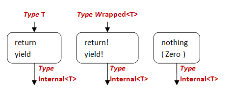

# “计算表达式”系列

在这个系列中，你将学习什么是计算表达式，一些常见模式，以及如何制作自己的计算表达式。在这个过程中，我们还将看看延续、绑定函数、包装类型等内容。

+   计算表达式：介绍。揭开谜团....

+   理解延续。'let'在幕后是如何工作的。

+   介绍'bind'。迈向创建我们自己的'let!'的步骤。

+   计算表达式和包装类型。使用类型来辅助工作流程。

+   更多关于包装类型。我们发现即使列表也可以是包装类型。

+   实现一个构建器：Zero 和 Yield。开始使用基本构建器方法。

+   实现一个构建器：组合。如何一次返回多个值。

+   实现一个构建器：延迟和运行。控制函数何时执行。

+   实现一个构建器：重载。愚蠢的方法技巧。

+   实现一个构建器：添加延迟。外部延迟工作流程。

+   实现一个构建器：标准方法的其余部分。实现 While、Using 和异常处理。

# 计算表达式：介绍

# 计算表达式：介绍

受到广泛请求，现在是时候谈谈计算表达式的奥秘，它们是什么，以及它们如何在实践中有用（我将尽量避免使用被禁止的 m 字词）。

在这个系列中，你将学习什么是计算表达式，如何制作自己的计算表达式，以及涉及它们的一些常见模式。在这个过程中，我们还将看看延续、绑定函数、包装类型等内容。

## 背景

计算表达式似乎以晦涩难懂而闻名。

一方面，它们很容易使用。任何写过很多 F#���码的人肯定使用过标准的像`seq{...}`或`async{...}`这样的方法。

但是如何制作一个新的这些东西？它们在幕后是如何工作的？

不幸的是，许多解释似乎让事情变得更加混乱。似乎有一种心理桥梁你必须跨越。一旦你站在另一边，一切都显而易见，但对于站在这边的人来说，这是令人困惑的。

如果我们求助于[官方 MSDN 文档](http://msdn.microsoft.com/en-us/library/dd233182.aspx)，它是明确的，但对于初学者来说并不是很有帮助。

例如，它说当你在计算表达式中看到以下代码时：

```
{| let! pattern = expr in cexpr |} 
```

它只是这个方法调用的语法糖：

```
builder.Bind(expr, (fun pattern -> {| cexpr |})) 
```

但...这到底是什么意思？

我希望在本系列结束时，上面的文档将变得明显。不相信我？继续阅读！

## 实践中的计算表达式

在深入研究计算表达式的机制之前，让我们看一些简单的示例，展示使用计算表达式前后相同的代码。

让我们从一个简单的开始。假设我们有一些代码，我们想要在每一步记录日志。所以我们定义一个小的记录函数，并在每个值创建后调用它，如下所示：

```
let log p = printfn "expression is %A" p

let loggedWorkflow = 
    let x = 42
    log x
    let y = 43
    log y
    let z = x + y
    log z
    //return
    z 
```

如果你运行这个，你会看到输出：

```
expression is 42
expression is 43
expression is 85 
```

简单明了。

但是每次都要明确写出所有的日志语句很烦人。有没有办法隐藏它们？

你问得好...计算表达式可以做到这一点。这里有一个完全相同的做法。

首先我们定义一个名为`LoggingBuilder`的新类型：

```
type LoggingBuilder() =
    let log p = printfn "expression is %A" p

    member this.Bind(x, f) = 
        log x
        f x

    member this.Return(x) = 
        x 
```

*现在不要担心神秘的`Bind`和`Return`是用来做什么的--它们很快就会被解释清楚。*

接下来我们创建类型的一个实例，在这种情况下是`logger`。

```
let logger = new LoggingBuilder() 
```

所以有了这个`logger`值，我们可以像这样重写原始的日志示例：

```
let loggedWorkflow = 
    logger
        {
        let! x = 42
        let! y = 43
        let! z = x + y
        return z
        } 
```

如果你运行这个，你会得到完全相同的输出，但你可以看到`logger{...}`工作流的使用使我们能够隐藏重复的代码。

### 安全除法

现在让我们看一个老生常谈。

假设我们想要依次除以一系列数字，但其中一个可能为零。我们该如何处理？抛出异常很丑陋。听起来很适合`option`类型。

首先我们需要创建一个帮助函数，它执行除法并返回一个`int option`。如果一切正常，我们得到一个`Some`，如果除法失败，我们得到一个`None`。

然后我们可以将这些除法链接在一起，每次除法后我们需要测试它是否失败，只有在成功时才继续进行。

首先是帮助函数，然后是主要工作流：

```
let divideBy bottom top =
    if bottom = 0
    then None
    else Some(top/bottom) 
```

请注意，我已经在参数列表中首先放置了除数。这样我们就可以写出类似`12 |> divideBy 3`的表达式，这样链式调用更容易。

让我们把它用起来。这里是一个尝试三次除以一个起始数字的工作流：

```
let divideByWorkflow init x y z = 
    let a = init |> divideBy x
    match a with
    | None -> None  // give up
    | Some a' ->    // keep going
        let b = a' |> divideBy y
        match b with
        | None -> None  // give up
        | Some b' ->    // keep going
            let c = b' |> divideBy z
            match c with
            | None -> None  // give up
            | Some c' ->    // keep going
                //return 
                Some c' 
```

这是它的使用方式：

```
let good = divideByWorkflow 12 3 2 1
let bad = divideByWorkflow 12 3 0 1 
```

`bad`工作流在第三步失败，并为整个事情返回`None`。

非常重要的一点是*整个工作流*也必须返回一个`int option`。它不能只返回一个`int`，因为在坏情况下它会评估为什么？你能看到我们在工作流中使用的类型“内部”类型，选项类型，必须是最终最终返回的相同类型。记住这一点--它以后会再次出现。

无论如何，这种持续的测试和分支真的很丑陋！将其转换为计算表达式有帮助吗？

再次我们定义一个新类型（`MaybeBuilder`）并创建类型的一个实例（`maybe`）。

```
type MaybeBuilder() =

    member this.Bind(x, f) = 
        match x with
        | None -> None
        | Some a -> f a

    member this.Return(x) = 
        Some x

let maybe = new MaybeBuilder() 
```

我将其称为`MaybeBuilder`而不是`divideByBuilder`，因为以这种方式处理选项类型的问题，使用计算表达式是相当常见的，而`maybe`是这个东西的标准名称。

现在我们已经定义了`maybe`工作流程，让我们重写原始代码以使用它。

```
let divideByWorkflow init x y z = 
    maybe 
        {
        let! a = init |> divideBy x
        let! b = a |> divideBy y
        let! c = b |> divideBy z
        return c
        } 
```

非常非常好。`maybe`表达式完全隐藏了分支逻辑！

如果我们测试它，我们会得到与之前相同的结果：

```
let good = divideByWorkflow 12 3 2 1
let bad = divideByWorkflow 12 3 0 1 
```

### “否则”测试链

在“除以”之前的示例中，我们只想在每个步骤成功时继续。

但有时情况恰恰相反。有时控制流取决于一系列“否则”测试。尝试一件事情，如果成功，就完成了。否则尝试另一件事情，如果失败了，尝试第三件事情，依此类推。

让我们看一个简单的例子。假设我们有三个字典，我们想找到与一个键对应的值。每次查找可能成功也可能失败，因此我们需要将查找链接成一个系列。

```
let map1 = [ ("1","One"); ("2","Two") ] |> Map.ofList
let map2 = [ ("A","Alice"); ("B","Bob") ] |> Map.ofList
let map3 = [ ("CA","California"); ("NY","New York") ] |> Map.ofList

let multiLookup key =
    match map1.TryFind key with
    | Some result1 -> Some result1   // success
    | None ->   // failure
        match map2.TryFind key with
        | Some result2 -> Some result2 // success
        | None ->   // failure
            match map3.TryFind key with
            | Some result3 -> Some result3  // success
            | None -> None // failure 
```

因为在 F#中一切都是表达式，我们无法进行早期返回���我们必须在单个表达式中级联所有测试。

这是如何使用的示例：

```
multiLookup "A" |> printfn "Result for A is %A" 
multiLookup "CA" |> printfn "Result for CA is %A" 
multiLookup "X" |> printfn "Result for X is %A" 
```

它运行良好，但能简化吗？

是的，确实。这是一个“否则”构建器，可以让我们简化这种查找：

```
type OrElseBuilder() =
    member this.ReturnFrom(x) = x
    member this.Combine (a,b) = 
        match a with
        | Some _ -> a  // a succeeds -- use it
        | None -> b    // a fails -- use b instead
    member this.Delay(f) = f()

let orElse = new OrElseBuilder() 
```

这是查找代码如何修改以使用它的方式：

```
let map1 = [ ("1","One"); ("2","Two") ] |> Map.ofList
let map2 = [ ("A","Alice"); ("B","Bob") ] |> Map.ofList
let map3 = [ ("CA","California"); ("NY","New York") ] |> Map.ofList

let multiLookup key = orElse {
    return! map1.TryFind key
    return! map2.TryFind key
    return! map3.TryFind key
    } 
```

再次，我们可以确认代码按预期工作。

```
multiLookup "A" |> printfn "Result for A is %A" 
multiLookup "CA" |> printfn "Result for CA is %A" 
multiLookup "X" |> printfn "Result for X is %A" 
```

### 带回调的异步调用

最后，让我们看看回调。在.NET 中进行异步操作的标准方法是使用[AsyncCallback 委托](http://msdn.microsoft.com/en-us/library/ms228972.aspx)，当异步操作完成时调用它。

这是一个使用这种技术下载网页的示例：

```
open System.Net
let req1 = HttpWebRequest.Create("http://tryfsharp.org")
let req2 = HttpWebRequest.Create("http://google.com")
let req3 = HttpWebRequest.Create("http://bing.com")

req1.BeginGetResponse((fun r1 -> 
    use resp1 = req1.EndGetResponse(r1)
    printfn "Downloaded %O" resp1.ResponseUri

    req2.BeginGetResponse((fun r2 -> 
        use resp2 = req2.EndGetResponse(r2)
        printfn "Downloaded %O" resp2.ResponseUri

        req3.BeginGetResponse((fun r3 -> 
            use resp3 = req3.EndGetResponse(r3)
            printfn "Downloaded %O" resp3.ResponseUri

            ),null) |> ignore
        ),null) |> ignore
    ),null) |> ignore 
```

大量调用`BeginGetResponse`和`EndGetResponse`，以及嵌套 lambda 的使用，使得理解起来相当复杂。重要的代码（在这种情况下，只是打印语句）被回调逻辑所掩盖。

实际上，在需要一系列回调链的代码中管理这种级联方法始终是一个问题；它甚至被称为["毁灭金字塔"](http://raynos.github.com/presentation/shower/controlflow.htm?full#PyramidOfDoom)（尽管在我看来[没有一个解决方案是非常优雅的](http://adamghill.com/callbacks-considered-a-smell/)）。

当然，我们永远不会在 F#中编写这种代码，因为 F#内置了`async`计算表达式，这既简化了逻辑，又使代码扁平化。

```
open System.Net
let req1 = HttpWebRequest.Create("http://tryfsharp.org")
let req2 = HttpWebRequest.Create("http://google.com")
let req3 = HttpWebRequest.Create("http://bing.com")

async {
    use! resp1 = req1.AsyncGetResponse()  
    printfn "Downloaded %O" resp1.ResponseUri

    use! resp2 = req2.AsyncGetResponse()  
    printfn "Downloaded %O" resp2.ResponseUri

    use! resp3 = req3.AsyncGetResponse()  
    printfn "Downloaded %O" resp3.ResponseUri

    } |> Async.RunSynchronously 
```

我们稍后将看到`async`工作流程是如何实现的。

## 摘要

我们已经看到了一些非常简单的计算表达式示例，分别是“之前”和“之后”，它们相当代表了计算表达式适用于的问题类型。

+   在日志示例中，我们希望在每个步骤之间执行一些副作用。

+   在安全除法示例中，我们希望优雅地处理错误，以便我们可以专注于快乐路径。

+   在多字典查找示例中，我们想要在第一次成功时提前返回。

+   最后，在异步示例中，我们想要隐藏回调的使用并避免"地狱金字塔"。

所有这些情况的共同点是计算表达式在每个表达式之间"在幕后做一些事情"。

如果你想要一个不太恰当的类比，你可以将计算表达式想象成类似于 SVN 或 git 的提交后钩子，或者在每次更新时调用的数据库触发器。实际上，计算表达式就是这样：允许你偷偷地插入自己的代码以便*在后台*被调用，从而让你专注于前台的重要代码。

为什么称之为"计算表达式"？嗯，显然是某种表达式，所以这一点很明显。我相信 F#团队最初确实想要称之为"在每个 let 之间做一些后台工作的表达式"，但出于某种原因，人们认为那有点笨拙，所以他们最终选择了更短的名字"计算表达式"。

至于"计算表达式"和"工作流"之间的区别，我使用*"计算表达式"*来表示`{...}`和`let!`语法，而将*"工作流"*保留给特定的实现。并非所有的计算表达式实现都是工作流。例如，谈论"异步工作流"或"可能性工作流"是合适的，但"序列工作流"听起来不对。

换句话说，在下面的代码中，我会说`maybe`是我们正在使用的工作流，而特定的代码块`{ let! a = .... return c }`是计算表达式。

```
maybe 
    {
    let! a = x |> divideBy y 
    let! b = a |> divideBy w
    let! c = b |> divideBy z
    return c
    } 
```

你可能想要开始创建自己的计算表达式了，但首先我们需要稍微偏离一下，进入延续。接下来就是这个。

*2015-01-11 更新：我已经删除了使用"状态"计算表达式的计数示例。它太令人困惑，分散了主要概念的注意力。*

# 理解延续

# 理解延续

在上一篇文章中，我们看到了如何使用计算表达式来简化一些复杂的代码。

在使用计算表达式之前的代码如下：

```
 let log p = printfn "expression is %A" p

let loggedWorkflow = 
    let x = 42
    log x
    let y = 43
    log y
    let z = x + y
    log z
    //return
    z 
```

在使用计算表达式之后的同样代码如下：

```
let loggedWorkflow = 
    logger
        {
        let! x = 42
        let! y = 43
        let! z = x + y
        return z
        } 
```

使用`let!`而不是普通的`let`很重要。我们能够自己模拟这个过程以便理解发生了什么吗？是的，但我们需要先理解延续。

## 延续

在命令式编程中，我们有"从函数返回"的概念。当你调用一个函数时，你"进入"，然后你"出来"，就像推入和弹出栈一样。

下面是一些典型的 C#代码，它的工作方式如此。请注意`return`关键字的使用。

```
public int Divide(int top, int bottom) {
    if (bottom==0)
    {
        throw new InvalidOperationException("div by 0");
    }
    else
    {
        return top/bottom;
    }
}

public bool IsEven(int aNumber) {
    var isEven = (aNumber % 2 == 0);
    return isEven;
} 
```

你可能见过这种情况无数次，但这种方法有一个微妙的地方你可能没有考虑到：*被调用的函数总是决定要做什么*。

例如，`Divide`的实现已经决定要抛出异常。但如果我不想要异常呢？也许我想要一个`nullable<int>`，或者我要在屏幕上显示为“#DIV/0”。为什么要抛出一个我立即要捕获的异常呢？换句话说，为什么不让*调用者*决定应该发生什么，而不是被调用者。

同样在`IsEven`的例子中，我要怎么处理布尔返回值？根据它进行分支？或者在报告中打印它？我不知道，但是，与其返回一个布尔值让调用者处理，为什么不让调用者告诉被调用者接下来该做什么呢？

所以这就是延续。**延续**只是一个你传递给另一个函数的函数，告诉它接下来该做什么。

这里是相同的 C#代码重写，允许调用者传递函数，被调用者使用这些函数来处理每种情况。如果有帮助的话，你可以将其视为与访问者模式有些类似。或者也可能不是。

```
public T Divide<T>(int top, int bottom, Func<T> ifZero, Func<int,T> ifSuccess)
{
    if (bottom==0)
    {
        return ifZero();
    }
    else
    {
        return ifSuccess( top/bottom );
    }
}

public T IsEven<T>(int aNumber, Func<int,T> ifOdd, Func<int,T> ifEven)
{
    if (aNumber % 2 == 0)
    {
        return ifEven(aNumber);
    }
    else
    {   return ifOdd(aNumber);
    }
} 
```

请注意，C#函数现在已更改为返回通用的`T`，并且两个延续都是返回`T`的`Func`。

嗯，在 C#中传递许多`Func`参数看起来总是很丑陋，所以并不经常这样做。但在 F#中传递函数很容易，所以让我们看看这段代码如何移植过来。

这是“之前”的代码：

```
let divide top bottom = 
    if (bottom=0) 
    then invalidOp "div by 0"
    else (top/bottom)

let isEven aNumber = 
    aNumber % 2 = 0 
```

这是“之后”的代码：

```
let divide ifZero ifSuccess top bottom = 
    if (bottom=0) 
    then ifZero()
    else ifSuccess (top/bottom)

let isEven ifOdd ifEven aNumber = 
    if (aNumber % 2 = 0)
    then aNumber |> ifEven 
    else aNumber |> ifOdd 
```

有几点需要注意。首先，你可以看到我将额外的函数（`ifZero`等）*放在*参数列表的第一位，而不是最后，就像 C#示例中那样。为什么？因为我可能会想要使用部分应用。

而且，在`isEven`的例子中，我写了`aNumber |> ifEven`和`aNumber |> ifOdd`。这清楚地表明我们正在将当前值传递给延续函数，而延续函数始终是最后要评估的步骤。*我们将在本文稍后使用完全相同的模式，所以确保你理解这里发生了什么。*

### 延续示例

有了延续的强大功能，我们可以以三种完全不同的方式使用相同的`divide`函数，取决于调用者想要什么。

这里有三种我们可以快速创建的场景：

+   将结果传递给消息并打印出来，

+   将结果转换为一个选项，使用`None`表示糟糕的情况，使用`Some`表示好的情况，

+   或在糟糕的情况下抛出异常，只在好的情况下返回结果。

```
// Scenario 1: pipe the result into a message
// ----------------------------------------
// setup the functions to print a message
let ifZero1 () = printfn "bad"
let ifSuccess1 x = printfn "good %i" x

// use partial application
let divide1  = divide ifZero1 ifSuccess1

//test
let good1 = divide1 6 3
let bad1 = divide1 6 0

// Scenario 2: convert the result to an option
// ----------------------------------------
// setup the functions to return an Option
let ifZero2() = None
let ifSuccess2 x = Some x
let divide2  = divide ifZero2 ifSuccess2

//test
let good2 = divide2 6 3
let bad2 = divide2 6 0

// Scenario 3: throw an exception in the bad case
// ----------------------------------------
// setup the functions to throw exception
let ifZero3() = failwith "div by 0"
let ifSuccess3 x = x
let divide3  = divide ifZero3 ifSuccess3

//test
let good3 = divide3 6 3
let bad3 = divide3 6 0 
```

注意，采用这种方法，调用者*永远*不必在任何地方捕获`divide`的异常。调用者决定是否抛出异常，而不是被调用者。因此，`divide`函数不仅在不同的上下文中变得更具可重用性，而且圈复杂度也降低了一个级别。

相同的三种情况可以应用于`isEven`的实现：

```
// Scenario 1: pipe the result into a message
// ----------------------------------------
// setup the functions to print a message
let ifOdd1 x = printfn "isOdd %i" x
let ifEven1 x = printfn "isEven %i" x

// use partial application
let isEven1  = isEven ifOdd1 ifEven1

//test
let good1 = isEven1 6 
let bad1 = isEven1 5

// Scenario 2: convert the result to an option
// ----------------------------------------
// setup the functions to return an Option
let ifOdd2 _ = None
let ifEven2 x = Some x
let isEven2  = isEven ifOdd2 ifEven2

//test
let good2 = isEven2 6 
let bad2 = isEven2 5

// Scenario 3: throw an exception in the bad case
// ----------------------------------------
// setup the functions to throw exception
let ifOdd3 _ = failwith "assert failed"
let ifEven3 x = x
let isEven3  = isEven ifOdd3 ifEven3

//test
let good3 = isEven3 6 
let bad3 = isEven3 5 
```

在这种情况下，好处更微妙，但相同：调用者从未在任何地方处理布尔值与`if/then/else`。复杂性更少，出错的机会更少。

这可能看起来是微不足道的差异，但通过这样传递函数，我们可以使用所有我们喜欢的函数技术，如组合，部分应用等。

我们之前也遇到过继续，在设计类型系列中。��们看到它们的使用使调用者能够决定在构造函数可能出现验证错误的情况下会发生什么，而不仅仅是抛出异常。

```
type EmailAddress = EmailAddress of string

let CreateEmailAddressWithContinuations success failure (s:string) = 
    if System.Text.RegularExpressions.Regex.IsMatch(s,@"^\S+@\S+\.\S+$") 
        then success (EmailAddress s)
        else failure "Email address must contain an @ sign" 
```

成功函数以电子邮件作为参数，错误函数以字符串作为参数。这两个函数必须返回相同类型，但类型由你决定。

这里是使用继续的简单示例。两个函数都执行 printf，并返回空（即单元）。

```
// setup the functions 
let success (EmailAddress s) = printfn "success creating email %s" s        
let failure  msg = printfn "error creating email: %s" msg
let createEmail = CreateEmailAddressWithContinuations success failure

// test
let goodEmail = createEmail "x@example.com"
let badEmail = createEmail "example.com" 
```

### 继续传递风格

使用这种方式的继续会导致一种称为"[继续传递风格](http://en.wikipedia.org/wiki/Continuation-passing_style)"（或 CPS）的编程风格，其中*每个*函数都带有额外的"下一步该做什么"函数参数。

要看到区别，让我们看看标准的直接编程风格。

当你使用直接风格时，你会像这样"进入"和"退出"函数

```
call a function ->
   <- return from the function
call another function ->
   <- return from the function
call yet another function ->
   <- return from the function 
```

另一方面，在继续传递风格中，你最终会得到一系列函数，就像这样：

```
evaluate something and pass it into ->
   a function that evaluates something and passes it into ->
      another function that evaluates something and passes it into ->
         yet another function that evaluates something and passes it into ->
            ...etc... 
```

显然，这两种风格之间有很大的区别。

在直接风格中，有一系列函数的层次结构。顶层函数是一种"主控制器"，它调用一个子例程，然后另一个，决定何时分支，何时循环，并明确协调控制流。

然而，在继续传递风格中，没有"主控制器"。相反，有一种"管道"，不是数据的管道，而是控制流的管道，在这个管道中，"负责的函数"随着执行逻辑流经管道而改变。

如果你曾经在 GUI 中为按钮点击附加事件处理程序，或者在[BeginInvoke](http://msdn.microsoft.com/en-us/library/2e08f6yc.aspx)中使用回调，那么你已经使用了这种风格而不自知。实际上，这种风格将是理解`async`工作流的关键，我将在本系列中稍后讨论。

## 继续和'let'

那么所有这些如何与`let`结合？

让我们回顾一下 let 实际上做了什么。

请记住，（非顶层）"let"永远不能单独使用--它必须始终是较大代码块的一部分。

那就是：

```
let x = someExpression 
```

真正意味着：

```
let x = someExpression in [an expression involving x] 
```

然后，每次你在第二个表达式（主体表达式）中看到`x`时，用第一个表达式（`someExpression`）替换它。

所以例如，表达式：

```
let x = 42
let y = 43
let z = x + y 
```

真正意味着（使用冗长的`in`关键字）：

```
let x = 42 in   
  let y = 43 in 
    let z = x + y in
       z    // the result 
```

现在有趣的是，lambda 看起来与`let`非常相似：

```
fun x -> [an expression involving x] 
```

如果我们也将`x`的值传入，我们会得到以下结果：

```
someExpression |> (fun x -> [an expression involving x] ) 
```

这不是很像`let`吗？这里是一个 let 和一个 lambda 并排：

```
// let
let x = someExpression in [an expression involving x]

// pipe a value into a lambda
someExpression |> (fun x -> [an expression involving x] ) 
```

它们都有一个`x`，和一个`someExpression`，在 lambda 的主体中每当你看到`x`时，你就将它替换为`someExpression`。是的，在 lambda 情况下，`x`和`someExpression`是颠倒的，但除此之外，基本上与`let`是相同的。

因此，使用这种技术，我们可以以这种方式重写原始示例：

```
42 |> (fun x ->
  43 |> (fun y -> 
     x + y |> (fun z -> 
       z))) 
```

当以这种方式写时，你会看到我们已经将`let`风格转换为 continuation 传递风格！

+   在第一行中，我们有一个值`42`——我们想对它做什么？让我们像我们之前对`isEven`函数所做的那样，将其传递给 continuation。并且在 continuation 的上下文中，我们将`42`重新标记为`x`。

+   在第二行中，我们有一个值`43`——我们想对它做什么？让我们也将其传递到 continuation 中，在那个上下文中称之为`y`。

+   在第三行中，我们将 x 和 y 相加以创建一个新值。我们想要做什么？另一个 continuation，另一个标签（`z`）。

+   最后在最后一行，我们完成了，整个表达式的求值结果是`z`。

### 将 continuation 包装在一个函数中

让我们去掉显式的管道，并写一个小函数来包装这个逻辑。我们不能称其为“let”，因为那是一个保留字，而且更重要的是，参数与'let'相反。"x"在右侧，"someExpression"在左侧。所以我们现在叫它`pipeInto`。

`pipeInto`的定义非常明显：

```
let pipeInto (someExpression,lambda) =
    someExpression |> lambda 
```

*请注意，我们使用元组一次性传递了两个参数，而不是作为由空格分隔的两个不同参数。它们将始终成对出现。*

所以，有了这个`pipeInto`函数，我们可以再次将示例重写为：

```
pipeInto (42, fun x ->
  pipeInto (43, fun y -> 
    pipeInto (x + y, fun z -> 
       z))) 
```

或者我们可以取消缩进，像这样写：

```
pipeInto (42, fun x ->
pipeInto (43, fun y -> 
pipeInto (x + y, fun z -> 
z))) 
```

你可能在想：那又怎样？为什么要将管道包装成一个函数？

答案是我们可以在`pipeInto`函数中添加*额外的代码*来在“幕后”执行一些操作，就像在计算表达式中一样。

### “日志记录”示例重访

让我们重新定义`pipeInto`来添加一点日志记录，就像这样：

```
let pipeInto (someExpression,lambda) =
   printfn "expression is %A" someExpression 
   someExpression |> lambda 
```

现在... 再次运行那段代码。

```
pipeInto (42, fun x ->
pipeInto (43, fun y -> 
pipeInto (x + y, fun z -> 
z
))) 
```

输出是什么？

```
expression is 42
expression is 43
expression is 85 
```

这与我们之前的实现完全相同的输出。我们创建了我们自己的小型计算表达式工作流！

如果我们将这个与计算表达式版本并排比较，我们会发现我们的自制版本与`let!`非常相似，除了我们将参数颠倒了，而且我们为 continuation 明确地使用了箭头。


### “安全除法”示例重访

让我们用“安全除法”示例做同样的事情。这是原始代码：

```
let divideBy bottom top =
    if bottom = 0
    then None
    else Some(top/bottom)

let divideByWorkflow x y w z = 
    let a = x |> divideBy y 
    match a with
    | None -> None  // give up
    | Some a' ->    // keep going
        let b = a' |> divideBy w
        match b with
        | None -> None  // give up
        | Some b' ->    // keep going
            let c = b' |> divideBy z
            match c with
            | None -> None  // give up
            | Some c' ->    // keep going
                //return 
                Some c' 
```

现在你应该看到，这种“分步”风格是一个明显的暗示，我们真的应该使用 continuation。

让我们看看是否可以向 `pipeInto` 添加额外的代码来为我们进行匹配。我们想要的逻辑是：

+   如果 `someExpression` 参数是 `None`，那么就不要调用继续 lambda。

+   如果 `someExpression` 参数是 `Some`，那么确实调用继续 lambda，并传递 `Some` 的内容。

就是这样：

```
let pipeInto (someExpression,lambda) =
   match someExpression with
   | None -> 
       None
   | Some x -> 
       x |> lambda 
```

有了这个新版本的 `pipeInto`，我们可以像这样重写原始代码：

```
let divideByWorkflow x y w z = 
    let a = x |> divideBy y 
    pipeInto (a, fun a' ->
        let b = a' |> divideBy w
        pipeInto (b, fun b' ->
            let c = b' |> divideBy z
            pipeInto (c, fun c' ->
                Some c' //return 
                ))) 
```

我们可以将其整理得更清晰一些。

首先，我们可以消除 `a`、`b` 和 `c`，并直接用 `divideBy` 表达式替换它们。这样，我们就得到了这个：

```
let a = x |> divideBy y 
pipeInto (a, fun a' -> 
```

变成了这样：

```
pipeInto (x |> divideBy y, fun a' -> 
```

现在我们可以将 `a'` 重新标记为 `a`，依此类推，还可以移除阶梯式缩进，这样我们就得到了这个：

```
let divideByResult x y w z = 
    pipeInto (x |> divideBy y, fun a ->
    pipeInto (a |> divideBy w, fun b ->
    pipeInto (b |> divideBy z, fun c ->
    Some c //return 
    ))) 
```

最后，我们将创建一个名为 `return'` 的小助手函数，将结果包装在一个选项中。综合起来，代码看起来像这样：

```
let divideBy bottom top =
    if bottom = 0
    then None
    else Some(top/bottom)

let pipeInto (someExpression,lambda) =
   match someExpression with
   | None -> 
       None
   | Some x -> 
       x |> lambda 

let return' c = Some c

let divideByWorkflow x y w z = 
    pipeInto (x |> divideBy y, fun a ->
    pipeInto (a |> divideBy w, fun b ->
    pipeInto (b |> divideBy z, fun c ->
    return' c 
    )))

let good = divideByWorkflow 12 3 2 1
let bad = divideByWorkflow 12 3 0 1 
```

再次，如果我们将这个与计算表达式版本并排比较，我们会发现我们自己编写的版本在意义上是完全相同的。只是语法不同。


### 概要

在这篇文章中，我们谈到了延续和延续传递风格，以及我们如何将 `let` 视为在幕后执行延续的一种好语法。

现在我们已经拥有了开始创建我们*自己*版本的 `let` 所需的一切。在下一篇文章中，我们将把这些知识付诸实践。

# 引入 'bind'

# 引入 'bind'

在上一篇文章中，我们谈到了如何将 `let` 视为在幕后执行延续的一种好语法。我们引入了一个 `pipeInto` 函数，允许我们在延续管道中添加钩子。

现在我们准备好看看我们的第一个构建器方法，`Bind`，它正式化了这种方法，并且是任何计算表达式的核心。

### 引入 "Bind"

[MSDN 上关于计算表达式的页面](http://msdn.microsoft.com/en-us/library/dd233182.aspx) 将 `let!` 表达式描述为对 `Bind` 方法的语法糖。让我们再来看看这个：

这是 `let!` 表达式的文档，以及一个真实的例子：

```
// documentation
{| let! pattern = expr in cexpr |}

// real example
let! x = 43 in some expression 
```

这里是 `Bind` 方法的文档，以及一个真实的例子：

```
// documentation
builder.Bind(expr, (fun pattern -> {| cexpr |}))

// real example
builder.Bind(43, (fun x -> some expression)) 
```

注意一些有趣的事情：

+   `Bind` 接受两个参数，一个表达式（`43`）和一个 lambda。

+   lambda 的参数（`x`）绑定到作为第一个参数传递的表达式。（至少在这种情况下是这样。稍后再说。）

+   `Bind` 的参数与 `let!` 中它们的顺序相反。

换句话说，如果我们将一系列 `let!` 表达式链接在一起，就像这样：

```
let! x = 1
let! y = 2
let! z = x + y 
```

编译器将其转换为对 `Bind` 的调用，就像这样：

```
Bind(1, fun x ->
Bind(2, fun y ->
Bind(x + y, fun z ->
etc 
```

我想你现在应该能看到我们的意图了。

实际上，我们的 `pipeInto` 函数与 `Bind` 方法完全相同。

这是一个关键的见解：*计算表达式只是一种为我们可以自己完成的事情创建良好语法的方式*。

### 一个独立的绑定函数

拥有这样一个 "bind" 函数实际上是一个标准的函数式模式，它与计算表达式完全无关。

首先，为什么称其为“bind”？嗯，正如我们所见，一个“bind”函数或方法可以被视为将输入值传递给函数。这被称为将值“绑定”到函数的参数（回想一下，所有函数只有一个参数）。

因此，当你这样考虑`bind`时，你会发现它类似于管道或组合。

实际上，你可以将其转换为中缀操作，如下所示：

```
let (>>=) m f = pipeInto(m,f) 
```

*顺便说一句，这个符号“>>=”是将`bind`写成中缀运算符���标准方式。如果你在其他 F# 代码中看到它被使用，那可能就是它的含义。*

回到安全除法示例，现在我们可以将工作流程写成一行，就像这样：

```
let divideByWorkflow x y w z = 
    x |> divideBy y >>= divideBy w >>= divideBy z 
```

你可能想知道这与正常的管道或组合有什么不同？这并不是立即明显的。

答案是双重的：

+   首先，`bind` 函数对每种情况都有*额外*的定制行为。它不是一个通用函数，像管道或组合那样。

+   其次，值参数（上面的`m`）的输入类型不一定与函数参数（上面的`f`）的输出类型相同，因此`bind`的一项工作是优雅地处理这种不匹配，以便可以链接函数。

正如我们将在下一篇文章中看到的，`bind`通常与某种“包装”类型一起使用。值参数可能是`WrapperType<TypeA>`，然后`bind`函数的函数参数的签名始终是`TypeA -> WrapperType<TypeB>`。

在安全除法的`bind`特定情况下，包装类型是`Option`。值参数（上面的`m`）的类型是`Option<int>`，函数参数（上面的`f`）的签名是`int -> Option<int>`。

要查看在不同上下文中使用`bind`，这里是使用中缀`bind`函数表达的日志记录工作流程的示例：

```
let (>>=) m f = 
    printfn "expression is %A" m
    f m

let loggingWorkflow = 
    1 >>= (+) 2 >>= (*) 42 >>= id 
```

在这种情况下，没有包装类型。一切都是`int`。但即便如此，`bind` 有一个特殊的行为，可以在幕后执行日志记录。

## Option.bind 和“maybe”工作流程重访

在 F# 库中，你会在许多地方看到`Bind`函数或方法。现在你知道它们的用途了！

一个特别有用的是`Option.bind`，它恰好做了我们手工编写的事情，即

+   如果输入参数是`None`，那么不要调用续延函数。

+   如果输入参数是`Some`，那么调用续延函数，传入`Some`的内容。

这是我们手工制作的函数：

```
let pipeInto (m,f) =
   match m with
   | None -> 
       None
   | Some x -> 
       x |> f 
```

这是`Option.bind`的实现：

```
module Option = 
    let bind f m =
       match m with
       | None -> 
           None
       | Some x -> 
           x |> f 
```

这里有一个道理--不要太急于编写自己的函数。很可能有可以重用的库函数。

这是“maybe”工作流程，重新编写以使用`Option.bind`：

```
type MaybeBuilder() =
    member this.Bind(m, f) = Option.bind f m
    member this.Return(x) = Some x 
```

## 回顾迄今为止的不同方法

到目前为止，我们已经使用了四种不同的方法来处理“安全除法”示例。让我们将它们放在一起并再次进行比较。

*注意：我已将原始的`pipeInto`函数重命名为`bind`，并使用`Option.bind`代替我们原始的自定义实现。*

首先是原始版本，使用显式工作流：

```
module DivideByExplicit = 

    let divideBy bottom top =
        if bottom = 0
        then None
        else Some(top/bottom)

    let divideByWorkflow x y w z = 
        let a = x |> divideBy y 
        match a with
        | None -> None  // give up
        | Some a' ->    // keep going
            let b = a' |> divideBy w
            match b with
            | None -> None  // give up
            | Some b' ->    // keep going
                let c = b' |> divideBy z
                match c with
                | None -> None  // give up
                | Some c' ->    // keep going
                    //return 
                    Some c'
    // test
    let good = divideByWorkflow 12 3 2 1
    let bad = divideByWorkflow 12 3 0 1 
```

接下来，使用我们自己的版本的“bind”（又名“pipeInto”）

```
module DivideByWithBindFunction = 

    let divideBy bottom top =
        if bottom = 0
        then None
        else Some(top/bottom)

    let bind (m,f) =
        Option.bind f m

    let return' x = Some x

    let divideByWorkflow x y w z = 
        bind (x |> divideBy y, fun a ->
        bind (a |> divideBy w, fun b ->
        bind (b |> divideBy z, fun c ->
        return' c 
        )))

    // test
    let good = divideByWorkflow 12 3 2 1
    let bad = divideByWorkflow 12 3 0 1 
```

接下来，使用计算表达式：

```
module DivideByWithCompExpr = 

    let divideBy bottom top =
        if bottom = 0
        then None
        else Some(top/bottom)

    type MaybeBuilder() =
        member this.Bind(m, f) = Option.bind f m
        member this.Return(x) = Some x

    let maybe = new MaybeBuilder()

    let divideByWorkflow x y w z = 
        maybe 
            {
            let! a = x |> divideBy y 
            let! b = a |> divideBy w
            let! c = b |> divideBy z
            return c
            }    

    // test
    let good = divideByWorkflow 12 3 2 1
    let bad = divideByWorkflow 12 3 0 1 
```

最后，将 bind 作为中缀操作使用：

```
module DivideByWithBindOperator = 

    let divideBy bottom top =
        if bottom = 0
        then None
        else Some(top/bottom)

    let (>>=) m f = Option.bind f m

    let divideByWorkflow x y w z = 
        x |> divideBy y 
        >>= divideBy w 
        >>= divideBy z 

    // test
    let good = divideByWorkflow 12 3 2 1
    let bad = divideByWorkflow 12 3 0 1 
```

Bind 函数被证明是非常强大的。在下一篇文章中，我们将看到将`bind`与包装类型结合起来，创造了一种优雅的方式在后台传递额外的信息。

## 练习：你对此了解如何？

在你继续下一篇文章之前，为什么不测试一下自己，看看你是否已经完全理解了？

这里有一个小练习给你。

**第一部分 - 创建工作流**

首先，创建一个将字符串解析为整数的函数：

```
let strToInt str = ??? 
```

然后创建你自己的计算表达式构建器类，这样你就可以在工作流中使用它，如下所示。

```
let stringAddWorkflow x y z = 
    yourWorkflow 
        {
        let! a = strToInt x
        let! b = strToInt y
        let! c = strToInt z
        return a + b + c
        }    

// test
let good = stringAddWorkflow "12" "3" "2"
let bad = stringAddWorkflow "12" "xyz" "2" 
```

**第二部分 - 创建一个 bind 函数**

一旦你让第一部分工作起来，通过添加另外两个函数来扩展这个想法：

```
let strAdd str i = ???
let (>>=) m f = ??? 
```

然后使用这些函数，你应该能够编写类似这样的代码：

```
let good = strToInt "1" >>= strAdd "2" >>= strAdd "3"
let bad = strToInt "1" >>= strAdd "xyz" >>= strAdd "3" 
```

## 总结

这里是本文中涵盖的要点总结：

+   计算表达式为我们提供了一个很好的语法，用于继续传递，为我们隐藏了链接逻辑。

+   `bind`是将一个步骤的输出链接到下一个步骤的关键函数。

+   符号`>>=`是写 bind 作为中缀运算符的标准方式。

# 计算表达式和包装类型

# 计算表达式和包装类型

在上一篇文章中，我们介绍了“maybe”工作流，它允许我们隐藏将选项类型链接在一起的混乱。

“maybe”工作流的典型用法看起来像这样：

```
let result = 
    maybe 
        {
        let! anInt = expression of Option<int>
        let! anInt2 = expression of Option<int>
        return anInt + anInt2 
        } 
```

正如我们之前看到的，这里发生了一些明显奇怪的行为：

+   在`let!`行中，等号右侧的表达式是一个`int option`，但左侧的值只是一个`int`。在绑定值之前，`let!`已经“展开”了选项。

+   在`return`行中，相反的情况发生。被返回的表达式是一个`int`，但整个工作流的值（`result`）是���个`int option`。也就是说，`return`已经将原始值“包装”回一个选项中。

我们将在本文中跟进这些观察结果，并且我们将看到这导致了计算表达式的主要用途之一：即，隐式解包和重新包装存储在某种包装类型中的值。

## 另一个例子

让我们看另一个例子。假设我们正在访问数据库，并且我们想要将结果捕获在一个 Success/Error 联合类型中，就像这样：

```
type DbResult<'a> = 
    | Success of 'a
    | Error of string 
```

然后我们在我们的数据库访问方法中使用这种类型。以下是一些非常简单的存根，让你了解`DbResult`类型可能如何使用：

```
let getCustomerId name =
    if (name = "") 
    then Error "getCustomerId failed"
    else Success "Cust42"

let getLastOrderForCustomer custId =
    if (custId = "") 
    then Error "getLastOrderForCustomer failed"
    else Success "Order123"

let getLastProductForOrder orderId =
    if (orderId  = "") 
    then Error "getLastProductForOrder failed"
    else Success "Product456" 
```

现在假设我们想要将这些调用链接在一起。首先从名称获取客户 ID，然后从客户 ID 获取订单，然后从订单获取产品。

这是最显式的方法。如您所见，我们必须在每一步进行模式匹配。

```
let product = 
    let r1 = getCustomerId "Alice"
    match r1 with 
    | Error _ -> r1
    | Success custId ->
        let r2 = getLastOrderForCustomer custId 
        match r2 with 
        | Error _ -> r2
        | Success orderId ->
            let r3 = getLastProductForOrder orderId 
            match r3 with 
            | Error _ -> r3
            | Success productId ->
                printfn "Product is %s" productId
                r3 
```

真是丑陋的代码。而且顶层流程已经被淹没在错误处理逻辑中。

计算表达式来拯救！我们可以编写一个在幕后处理成功/错误分支的表达式：

```
type DbResultBuilder() =

    member this.Bind(m, f) = 
        match m with
        | Error _ -> m
        | Success a -> 
            printfn "\tSuccessful: %s" a
            f a

    member this.Return(x) = 
        Success x

let dbresult = new DbResultBuilder() 
```

并且有了这个工作流程，我们可以专注于整体情况，编写更清晰的代码：

```
let product' = 
    dbresult {
        let! custId = getCustomerId "Alice"
        let! orderId = getLastOrderForCustomer custId
        let! productId = getLastProductForOrder orderId 
        printfn "Product is %s" productId
        return productId
        }
printfn "%A" product' 
```

如果有错误，工作流程会很好地捕获它们，并告诉我们错误出现在哪里，就像下面的例子一样：

```
let product'' = 
    dbresult {
        let! custId = getCustomerId "Alice"
        let! orderId = getLastOrderForCustomer "" // error!
        let! productId = getLastProductForOrder orderId 
        printfn "Product is %s" productId
        return productId
        }
printfn "%A" product'' 
```

## 工作流程中包装类型的作用

所以现在我们已经看到了两个工作流程（`maybe` 工作流程和 `dbresult` 工作流程），每个都有自己对应的包装类型（分别是 `Option<T>` 和 `DbResult<T>`）。

这些不仅仅是特殊情况。事实上，*每个*计算表达式 *必须* 有一个关联的包装类型。而且包装类型通常是专门设计的，以与我们想要管理的工作流程配合使用。

上面的例子清楚地演示了这一点。我们创建的 `DbResult` 类型不仅仅是返回值的简单类型；它实际上在工作流程中扮演着关键的角色，通过 "存储" 工作流程的当前状态以及每个步骤是否成功或失败来实现这一点。通过使用类型本身的各种情况，`dbresult` 工作流程可以为我们管理转换，将它们隐藏起来，使我们能够专注于大局。

我们将在系列后面学习如何设计一个好的包装类型，但首先让我们看看它们是如何被操作的。

## Bind 和 Return 和包装类型

让我们再次看看计算表达式的 `Bind` 和 `Return` 方法的定义。

我们将从简单的一个 `Return` 开始。[在 MSDN 上记录的签名](http://msdn.microsoft.com/en-us/library/dd233182.aspx) 就是这样：

```
member Return : 'T -> M<'T> 
```

换句话说，对于某种类型 `T`，`Return` 方法只是将其包装在包装类型中。

*注意：在签名中，包装类型通常称为 `M`，因此 `M<int>` 是应用于 `int` 的包装类型，`M<string>` 是应用于 `string` 的包装类型，依此类推。*

我们已经看到了两个示例的使用情况。 `maybe` 工作流程返回一个 `Some`，这是一个选项类型，而 `dbresult` 工作流程返回 `Success`，这是 `DbResult` 类型的一部分。

```
// return for the maybe workflow
member this.Return(x) = 
    Some x

// return for the dbresult workflow
member this.Return(x) = 
    Success x 
```

现在让我们看看 `Bind`。 `Bind` 的签名是这样的：

```
member Bind : M<'T> * ('T -> M<'U>) -> M<'U> 
```

它看起来很复杂，所以让我们分解它。它接受一个元组 `M<'T> * ('T -> M<'U>)` 并返回一个 `M<'U>`，其中 `M<'U>` 表示应用于类型 `U` 的包装类型。

元组又分为两部分：

+   `M<'T>` 是类型 `T` 的一个封装类型，而

+   `'T -> M<'U>` 是一个函数，它接受一个 *未封装的* `T` 并创建一个 *封装的* `U`。

换句话说，`Bind`的作用是：

+   取一个 *封装的* 值。

+   解包它并执行任何特殊的 "幕后" 逻辑。

+   然后，可选地将函数应用于 *未封装的* 值，以创建新的 *封装的* 值。

+   即使函数 *没有* 被应用，`Bind` 仍然必须返回一个 *封装的* `U`。

有了这个理解，这里是我们已经看到的`Bind`方法：

```
// return for the maybe workflow
member this.Bind(m,f) = 
   match m with
   | None -> None
   | Some x -> f x

// return for the dbresult workflow
member this.Bind(m, f) = 
    match m with
    | Error _ -> m
    | Success x -> 
        printfn "\tSuccessful: %s" x
        f x 
```

仔细查看这段代码，确保你理解为什么这些方法确实遵循上面描述的模式。

最后，图片总是有用的。这是各种类型和函数的图表：


+   对于`Bind`，我们从一个包装值（这里是`m`）开始，将其解包为类型`T`的原始值，然后（可能）应用函数`f`到它，以获得类型`U`的包装值。

+   对于`Return`，我们从一个值（这里是`x`）开始，然后简单地包装它。

### 类型包装是泛型的

请注意，所有函数都使用泛型类型（`T`和`U`），除了包装类型本身，它必须始终保持一致。例如，没有任何限制`maybe`绑定函数接受一个`int`并返回一个`Option<string>`，或者接受一个`string`然后返回一个`Option<bool>`。唯一的要求是它始终返回一个`Option<something>`。

要看到这一点，我们可以重新审视上面的例子，但是不是到处都使用字符串，而是为客户 ID、订单 ID 和产品 ID 创建特殊类型。这意味着链中的每个步骤将使用不同的类型。

我们将再次从类型开始，这次定义`CustomerId`等。

```
type DbResult<'a> = 
    | Success of 'a
    | Error of string

type CustomerId =  CustomerId of string
type OrderId =  OrderId of int
type ProductId =  ProductId of string 
```

代码几乎相同，只是在`Success`行中使用了新类型。

```
let getCustomerId name =
    if (name = "") 
    then Error "getCustomerId failed"
    else Success (CustomerId "Cust42")

let getLastOrderForCustomer (CustomerId custId) =
    if (custId = "") 
    then Error "getLastOrderForCustomer failed"
    else Success (OrderId 123)

let getLastProductForOrder (OrderId orderId) =
    if (orderId  = 0) 
    then Error "getLastProductForOrder failed"
    else Success (ProductId "Product456") 
```

这里是冗长版本。

```
let product = 
    let r1 = getCustomerId "Alice"
    match r1 with 
    | Error e -> Error e
    | Success custId ->
        let r2 = getLastOrderForCustomer custId 
        match r2 with 
        | Error e -> Error e
        | Success orderId ->
            let r3 = getLastProductForOrder orderId 
            match r3 with 
            | Error e -> Error e
            | Success productId ->
                printfn "Product is %A" productId
                r3 
```

有几个值得讨论的变化：

+   首先，底部的`printfn`使用"%A"格式说明符而不是"%s"。这是因为`ProductId`类型现在是一个联合类型。

+   更微妙的是，错误行中似乎有不必要的代码。为什么要写`| Error e -> Error e`？原因是被匹配的传入错误是`DbResult<CustomerId>`或`DbResult<OrderId>`类型，但*返回*值必须是`DbResult<ProductId>`类型。因此，即使这两个`Error`看起来相同，它们实际上是不同类型的。

接下来是构建器，除了`| Error e -> Error e`行之外，一切都没有改变。

```
type DbResultBuilder() =

    member this.Bind(m, f) = 
        match m with
        | Error e -> Error e
        | Success a -> 
            printfn "\tSuccessful: %A" a
            f a

    member this.Return(x) = 
        Success x

let dbresult = new DbResultBuilder() 
```

最后，我们可以像以前一样使用工作流。

```
let product' = 
    dbresult {
        let! custId = getCustomerId "Alice"
        let! orderId = getLastOrderForCustomer custId
        let! productId = getLastProductForOrder orderId 
        printfn "Product is %A" productId
        return productId
        }
printfn "%A" product' 
```

在每一行，返回的值是*不同*类型的（`DbResult<CustomerId>`，`DbResult<OrderId>`等），但因为它们有一个共同的相同包装类型，绑定按预期工作。

最后，这是带有错误情况的工作流。

```
let product'' = 
    dbresult {
        let! custId = getCustomerId "Alice"
        let! orderId = getLastOrderForCustomer (CustomerId "") //error
        let! productId = getLastProductForOrder orderId 
        printfn "Product is %A" productId
        return productId
        }
printfn "%A" product'' 
```

## 计算表达式的组合

我们已经看到每个计算表达式*必须*有一个关联的包装类型。这个包装类型在`Bind`和`Return`中都被使用，这���来了一个关键的好处：

+   *`Return`的输出可以作为`Bind`的输入*

换句话说，因为工作流返回一个包装类型，而`let!`消耗一个包装类型，你可以将一个“子”工作流放在`let!`表达式的右侧。

例如，假设你有一个名为`myworkflow`的工作流。然后你可以写下以下内容：

```
let subworkflow1 = myworkflow { return 42 }
let subworkflow2 = myworkflow { return 43 }

let aWrappedValue = 
    myworkflow {
        let! unwrappedValue1 = subworkflow1
        let! unwrappedValue2 = subworkflow2
        return unwrappedValue1 + unwrappedValue2
        } 
```

或者你甚至可以像这样“内联”它们：

```
let aWrappedValue = 
    myworkflow {
        let! unwrappedValue1 = myworkflow {
            let! x = myworkflow { return 1 }
            return x
            }
        let! unwrappedValue2 = myworkflow {
            let! y = myworkflow { return 2 }
            return y
            }
        return unwrappedValue1 + unwrappedValue2
        } 
```

如果你已经使用过`async`工作流程，你可能已经这样做了，因为`async`工作流程通常包含嵌套的其他 asyncs：

```
let a = 
    async {
        let! x = doAsyncThing  // nested workflow
        let! y = doNextAsyncThing x // nested workflow
        return x + y
    } 
```

## 引入“ReturnFrom”

我们一直在使用`return`作为一种轻松包装未包装返回值的方式。

但有时我们有一个已经返回包装值的函数，并且我们想直接返回它。`return`对此无济于事，因为它需要一个未包装类型作为输入。

解决方案是`return`的一个变体称为`return!`，它接受一个*包装类型*作为输入并返回它。

“builder”类中对应的方法称为`ReturnFrom`。通常情况下，实现只是直接返回包装类型“原样”（尽管当然，你总是可以在幕后添加额外的逻辑）。

这里是“maybe”工作流程的一个变体，展示了它如何被使用：

```
type MaybeBuilder() =
    member this.Bind(m, f) = Option.bind f m
    member this.Return(x) = 
        printfn "Wrapping a raw value into an option"
        Some x
    member this.ReturnFrom(m) = 
        printfn "Returning an option directly"
        m

let maybe = new MaybeBuilder() 
```

并且这是它的使用方式，与普通的`return`进行比较。

```
// return an int
maybe { return 1  }

// return an Option
maybe { return! (Some 2)  } 
```

举个更实际的例子，这里是`return!`与`divideBy`一起使用：

```
// using return
maybe 
    {
    let! x = 12 |> divideBy 3
    let! y = x |> divideBy 2
    return y  // return an int
    }    

// using return! 
maybe 
    {
    let! x = 12 |> divideBy 3
    return! x |> divideBy 2  // return an Option
    } 
```

## 摘要

本文介绍了包装类型及其与`Bind`、`Return`和`ReturnFrom`的关系，这是任何构建器类的核心方法。

在下一篇文章中，我们将继续探讨包装类型，包括使用列表作为包装类型。

# 更多关于包装类型的内容

# 更多关于包装类型的内容

在上一篇文章中，我们讨论了“包装类型”的概念及其与计算表达式的关系。在本文中，我们将研究哪些类型适合作为包装类型。

## 什么类型可以作为包装类型？

如果每个计算表达式必须有一个关联的包装类型，那么可以用什么类型作为包装类型？是否有任何特殊的约束或限制适用？

有一个通用规则，即：

+   **任何带有泛型参数的类型都可以作为包装类型**

所以例如，你可以使用`Option<T>`，`DbResult<T>`等作为包装类型，正如我们所见。你还可以使用限制类型参数的包装类型，比如`Vector<int>`。

但是其他泛型类型如`List<T>`或`IEnumerable<T>`呢？它们肯定不能被使用吧？实际上，是的，它们*可以*被使用！我们很快就会看到。

## 非泛型包装类型能够工作吗？

是否可以使用一个不带泛型参数的包装类型？

例如，我们在早前的一个例子中看到了尝试对字符串进行加法操作，就像这样：`"1" + "2"`。我们不能聪明地将`string`在这种情况下视为`int`的包装类型吗？那将很酷，对吧？

让我们试试。我们可以使用`Bind`和`Return`的签名来指导我们的实现。

+   `Bind`接受一个元组。元组的第一部分是包装类型（在本例中为`string`），元组的第二部分是一个接受未包装类型并将其转换为包装类型的函数。在这种情况下，那将是`int -> string`。

+   `Return`接受一个未包装类型（在本例中为`int`）并将其转换为包装类型。所以在这种情况下，`Return`的签名将是`int -> string`。

这如何指导实现？

+   “重新包装”函数`int -> string`的实现很简单。它只是一个整数的“toString”。

+   bind 函数必须将一个字符串解包为一个整数，然后传递给函数。我们可以使用`int.Parse`来实现这一点。

+   但是如果 bind 函数 *无法* 将字符串解包，因为它不是一个有效的数字呢？在这种情况下，bind 函数 *必须* 仍然返回一个包装类型（一个字符串），所以我们可以返回一个诸如“error”的字符串。

这是建造者类的实现：

```
type StringIntBuilder() =

    member this.Bind(m, f) = 
        let b,i = System.Int32.TryParse(m)
        match b,i with
        | false,_ -> "error"
        | true,i -> f i

    member this.Return(x) = 
        sprintf "%i" x

let stringint = new StringIntBuilder() 
```

现在我们可以尝试使用它了：

```
let good = 
    stringint {
        let! i = "42"
        let! j = "43"
        return i+j
        }
printfn "good=%s" good 
```

如果其中一个字符串无效会发生什么呢？

```
let bad = 
    stringint {
        let! i = "42"
        let! j = "xxx"
        return i+j
        }
printfn "bad=%s" bad 
```

那看起来真的很好 -- 我们可以在工作流中将字符串视为整数！

但是等等，这里有一个问题。

假设我们给工作流一个输入，解包它（使用`let!`），然后立即重新包装它（使用`return`），而不做任何其他事情。应该发生什么？

```
let g1 = "99"
let g2 = stringint {
            let! i = g1
            return i
            }
printfn "g1=%s g2=%s" g1 g2 
```

没问题。输入`g1`和输出`g2`是相同的值，正如我们所期望的那样。

但是错误情况怎么办？

```
let b1 = "xxx"
let b2 = stringint {
            let! i = b1
            return i
            }
printfn "b1=%s b2=%s" b1 b2 
```

在这种情况下，我们遇到了一些意外的行为。输入`b1`和输出`b2`*不是*相同的值。我们引入了一种不一致性。

在实践中，这会成为一个问题吗？我不知道。但我会避免它，并使用一个不同的方法，比如选项，在所有情况下都是一致的。

## 使用包装类型的工作流的规则

这里有一个问题？这两个代码片段之间有什么区别，它们应该有不同的行为吗？

```
// fragment before refactoring
myworkflow {
    let wrapped = // some wrapped value
    let! unwrapped = wrapped
    return unwrapped 
    } 

// refactored fragment 
myworkflow {
    let wrapped = // some wrapped value
    return! wrapped
    } 
```

答案是否定的，它们不应该有不同的行为。唯一的区别是在第二个示例中，`unwrapped`值已经被重构掉了，而`wrapped`值直接返回了。

但是正如我们刚刚在前一节中看到的，如果你不小心的话，你可能会遇到一些不一致。因此，你创建的任何实现都应该遵循一些标准规则，这些规则是：

**规则 1：如果你从一个未包装的值开始，然后你包装它（使用`return`），然后解包它（使用`bind`），你应该总是得到原始的未包装的值。**

这个规则和接下来的规则是关于在包装和解包值时不丢失信息的。显然，这是一个合理的要求，并且对于重构按预期运行是必需的。

在代码中，这将表示为类似于以下内容：

```
myworkflow {
    let originalUnwrapped = something

    // wrap it
    let wrapped = myworkflow { return originalUnwrapped }

    // unwrap it
    let! newUnwrapped = wrapped

    // assert they are the same
    assertEqual newUnwrapped originalUnwrapped 
    } 
```

**规则 2：如果你从一个包装过的值开始，然后你解包它（使用`bind`），然后重新包装它（使用`return`），你应该总是得到原始的包装过的值。**

这是`stringInt`工作流在上面中断的规则。与规则 1 一样，这显然应该是一个要求。

在代码中，这将表示为类似于以下内容：

```
myworkflow {
    let originalWrapped = something

    let newWrapped = myworkflow { 

        // unwrap it
        let! unwrapped = originalWrapped

        // wrap it
        return unwrapped
        }

    // assert they are the same
    assertEqual newWrapped originalWrapped
    } 
```

**规则 3：如果你创建一个子工作流，它必须产生与你在主工作流中“内联”逻辑时相同的结果。**

这个规则是为了使组合行为正常运作而必需的，而且再次，只有在这是真的时，“提取”重构才能正确工作。

通常，如果你遵循一些指南（将在以后的文章中解释），你会自动获得这个。

在代码中，这将表示为类似于以下内容：

```
// inlined
let result1 = myworkflow { 
    let! x = originalWrapped
    let! y = f x  // some function on x
    return! g y   // some function on y
    }

// using a child workflow ("extraction" refactoring)
let result2 = myworkflow { 
    let! y = myworkflow { 
        let! x = originalWrapped
        return! f x // some function on x
        }
    return! g y     // some function on y
    }

// rule
assertEqual result1 result2 
```

## 列表作为包装类型

我之前说过，诸如`List<T>`或`IEnumerable<T>`之类的类型可以用作包装类型。但是这怎么可能呢？包装类型和未包装类型之间没有一对一的对应关系！

这就是“包装类型”类比有点误导的地方。相反，让我们重新思考`bind`是如何将一个表达式的输出与另一个表达式的输入连接起来的。

正如我们所见，`bind`函数“解包”类型，并将续行函数应用于未包装值。但是定义中并没有说只能有*一个*未包装值。我们可以轮流将续行函数应用于列表中的每个项。

换句话说，我们应该能够编写一个接受列表和续行函数的`bind`，其中续行函数一次处理一个元素，如下所示：

```
bind( [1;2;3], fun elem -> // expression using a single element ) 
```

有了这个概念，我们应该能够像这样链式绑定一些绑定：

```
let add = 
    bind( [1;2;3], fun elem1 -> 
    bind( [10;11;12], fun elem2 -> 
        elem1 + elem2
    )) 
```

但是我们忽略了一些重要的东西。传递给`bind`的续行函数需要具有特定的签名。它接受一个未包装的类型，但产生一个*包装*类型。

换句话说，续行函数必须*始终创建新列表*作为其结果。

```
bind( [1;2;3], fun elem -> // expression using a single element, returning a list ) 
```

链式示例必须这样编写，将`elem1 + elem2`的结果转换为列表：

```
let add = 
    bind( [1;2;3], fun elem1 -> 
    bind( [10;11;12], fun elem2 -> 
        [elem1 + elem2] // a list!
    )) 
```

因此，我们的绑定方法的逻辑现在如下所示：

```
let bind(list,f) =
    // 1) for each element in list, apply f
    // 2) f will return a list (as required by its signature)
    // 3) the result is a list of lists 
```

现在我们有另一个问题。`Bind`本身必须生成一个包装类型，这意味着“列表的列表”不好。我们需要将它们转换回简单的“一级”列表。

但这很容易——有一个列表模块函数可以做到，叫做`concat`。

因此，综合起来，我们有：

```
let bind(list,f) =
    list 
    |> List.map f 
    |> List.concat

let added = 
    bind( [1;2;3], fun elem1 -> 
    bind( [10;11;12], fun elem2 -> 
//       elem1 + elem2    // error. 
        [elem1 + elem2]   // correctly returns a list.
    )) 
```

现在我们了解了`bind`是如何独立工作的，我们可以创建一个“列表工作流”。

+   `Bind`将续行函数应用于传入列表的每个元素，然后将结果列表展平为一个级别的列表。`List.collect`是一个确切实现这一功能的库函数。

+   `Return`从未包装到包装转换。在这种情况下，这只意味着将单个元素包装在列表中。

```
type ListWorkflowBuilder() =

    member this.Bind(list, f) = 
        list |> List.collect f 

    member this.Return(x) = 
        [x]

let listWorkflow = new ListWorkflowBuilder() 
```

下面是使用工作流的示例：

```
let added = 
    listWorkflow {
        let! i = [1;2;3]
        let! j = [10;11;12]
        return i+j
        }
printfn "added=%A" added

let multiplied = 
    listWorkflow {
        let! i = [1;2;3]
        let! j = [10;11;12]
        return i*j
        }
printfn "multiplied=%A" multiplied 
```

结果显示，第一个集合中的每个元素都与第二个集合中的每个元素组合在一起：

```
val added : int list = [11; 12; 13; 12; 13; 14; 13; 14; 15]
val multiplied : int list = [10; 11; 12; 20; 22; 24; 30; 33; 36] 
```

那真的很令人惊讶。我们完全隐藏了列表枚举逻辑，只留下了工作流本身。

### “for”的语法糖

如果我们将列表和序列视为特殊情况，我们可以添加一些漂亮的语法糖，将`let!`替换为更自然的东西。

我们可以用`for..in..do`表达式替换`let!`：

```
// let version
let! i = [1;2;3] in [some expression]

// for..in..do version
for i in [1;2;3] do [some expression] 
```

两种变体的意思完全相同，只是看起来有所不同。

为了使 F# 编译器能够执行此操作，我们需要向构建器类添加一个`For`方法。它通常具有与普通`Bind`方法完全相同的实现，但需要接受序列类型。

```
type ListWorkflowBuilder() =

    member this.Bind(list, f) = 
        list |> List.collect f 

    member this.Return(x) = 
        [x]

    member this.For(list, f) = 
        this.Bind(list, f)

let listWorkflow = new ListWorkflowBuilder() 
```

使用方法如下：

```
let multiplied = 
    listWorkflow {
        for i in [1;2;3] do
        for j in [10;11;12] do
        return i*j
        }
printfn "multiplied=%A" multiplied 
```

### LINQ 和“列表工作流”

`for element in collection do` 看起来很眼熟吗？它非常接近 LINQ 使用的 `from element in collection ...` 语法。实际上，LINQ 使用基本相同的技术将查询表达式语法（如 `from element in collection ...`）转换为实际的方法调用。

在 F# 中，正如我们所看到的，`bind` 使用 `List.collect` 函数。LINQ 中的 `List.collect` 的等效物是 `SelectMany` 扩展方法。一旦你理解了 `SelectMany` 的工作原理，你就可以自己实现相同类型的查询。Jon Skeet 写了一篇[有用的博客文章](http://codeblog.jonskeet.uk/2010/12/27/reimplementing-linq-to-objects-part-9-selectmany/)对此进行了解释。

## 身份“包装器类型”

因此，在本文中，我们看到了一些包装器类型，并且说 *每一个* 计算表达式 *必须* 有一个关联的包装器类型。

但是在前一篇文章中的日志示例中呢？那里没有包装器类型。有一个 `let!` 在幕后做了一些事情，但是输入类型与输出类型相同。类型保持不变。

对此的简短回答是你可以将任何类型视为其自身的“包装器”。但是还有另一种更深入的理解方式。

让我们退后一步，考虑一下像`List<T>`这样的包装器类型定义真正意味着什么。

如果你有一个像`List<T>`这样的类型，实际上它根本不是一个“真正”的类型。`List<int>`是一个真正的类型，而`List<string>`也是一个真正的类型。但是`List<T>`本身是不完整的。它缺少了成为真正类型所需的参数。

将`List<T>`看作是一个*函数*是一个思考方式。它是抽象类型世界中的一个函数，而不是普通值的具体世界，但就像任何函数一样，它将值映射到其他值，只是在这种情况下，输入值是类型（比如 `int` 或 `string`），而输出值是其他类型（`List<int>` 和 `List<string>`）。就像任何函数一样，它接受一个参数，在这种情况下是一个“类型参数”。这就是为什么.NET 开发人员称之为“泛型”的概念在计算机科学术语中被称为“[参数多态性](http://en.wikipedia.org/wiki/Parametric_polymorphism)”的原因。

一旦我们理解了从一个类型生成另一个类型的函数概念（称为“类型构造函数”），我们就会发现我们所说的“包装器类型”实际上只是一个类型构造函数。

但是如果“包装器类型”只是一个将一个类型映射到另一个类型的函数，那么一个将类型映射到*相同*类型的函数是否也属于这个类别呢？的确如此。类型的身份函数符合我们的定义，并且可以用作计算表达式的包装器类型。

现在回到一些真实的代码，我们可以将“身份工作流”定义为工作流构建器的最简单可能的实现。

```
type IdentityBuilder() =
    member this.Bind(m, f) = f m
    member this.Return(x) = x
    member this.ReturnFrom(x) = x

let identity = new IdentityBuilder()

let result = identity {
    let! x = 1
    let! y = 2
    return x + y
    } 
```

有了这个，你可以看到前面讨论的日志示例只是加入了一些日志记录的身份工作流。

## 摘要

又是一篇长篇大论，我们涵盖了很多话题，但我希望包装类型的作用现在更清晰了。当我们在本系列后面的常见工作流程中查看“写入者工作流”和“状态工作流”时，我们将看到包装类型如何在实践中使用。

这篇文章涵盖的要点摘要如下：

+   计算表达式的一个主要用途是解包和重新封装存储在某种包装类型中的值。

+   你可以轻松组合计算表达式，因为`Return`的输出可以被馈送到`Bind`的输入。

+   每个计算表达式 *必须* 有一个关联的包装类型。

+   任何带有泛型参数的类型都可以用作包装类型，甚至是列表。

+   在创建工作流程时，您应确保您的实现符合有关封装和解包以及组合的三条合理规则。

# 实现一个构建器：Zero 和 Yield

# 实现一个构建器：Zero 和 Yield

在涵盖了绑定和继续以及包装类型的使用之后，我们终于准备好了去学习与“构建器”类相关联的全部方法。

如果您查看 [MSDN 文档](http://msdn.microsoft.com/en-us/library/dd233182.aspx)，您会看到不仅有 `Bind` 和 `Return`，还有其他奇怪命名的方法，如 `Delay` 和 `Zero`。它们是用来做什么的？这就是本文和接下来的几篇文章将回答的问题。

## 行动计划

为了演示如何创建一个构建器类，我们将创建一个自定义工作流，其中使用了所有可能的构建器方法。

但是，与其从顶部开始并试图在没有上下文的情况下解释这些方法的含义，不如我们从底部开始，从一个简单的工作流程开始，只在需要解决问题或错误时逐渐添加方法。在这个过程中，您将逐步了解 F# 如何详细处理计算表达式。

这个过程的大纲是：

+   第一部分：在这第一部分中，我们将看一下一个基本工作流所需的方法。我们将介绍`Zero`、`Yield`、`Combine`和`For`。

+   第二部分：接下来，我们将看一下如何延迟代码的执行，以便只在需要时评估它。我们将介绍`Delay`和`Run`，并查看惰性计算。

+   第三部分：最后，我们将涵盖剩余的方法：`While`、`Using`和异常处理。

## 在我们开始之前

在我们深入创建工作流程之前，这里有一些一般性评论。

### 计算表达式的文档

首先，你可能已经注意到，计算表达式的 MSDN 文档在最好的情况下是贫乏的，虽然不是不准确的，但可能会误导人。例如，构建器方法的签名 *比* 它们看起来更灵活，这可以用来实现一些如果仅从文档中工作可能不明显的功能。我们稍后将展示一个例子。

如果你想要更详细的文档，请我推荐两个来源。对于计算表达式背后概念的详细概述，一个很好的资源是 Tomas Petricek 和 Don Syme 的论文["F#表达式动物园"](http://tomasp.net/academic/papers/computation-zoo/computation-zoo.pdf)。而对于最准确的最新技术文档，你应该阅读[F#语言规范](http://research.microsoft.com/en-us/um/cambridge/projects/fsharp/manual/spec.pdf)，其中有关计算表达式的部分。

### 包装和非包装类型

当你试图理解文档中记录的签名时，请记住我一直称为"未包装"类型通常写作`'T`，而"包装"类型通常写作`M<'T>`。也就是说，当你看到`Return`方法的签名是`'T -> M<'T>`时，它意味着`Return`接受一个未包装类型并返回一个包装类型。

正如我在这个系列的之前的帖子中所说的，我将继续使用"未包装"和"包装"来描述这些类型之间的关系，但随着我们的深入，这些术语将被拉伸到极限，因此我也会开始使用其他术语，比如"计算类型"而不是"包装类型"。我希望当我们达到这一点时，改变的原因会变得清楚和可理解。

另外，在我的示例中，通常会尽量简化问题，使用如下代码：

```
let! x = ...wrapped type value...

```

但这实际上是一种过度简化。准确地说，"x"可以是任何*模式*，而不仅仅是一个单一的值，而"包装类型"的值当然可以是一个*表达式*，该表达式求值为包装类型。MSDN 文档使用了这种更精确的方法。它在定义中使用了"模式"和"表达式"，如`let! pattern = expr in cexpr`。

以下是在`maybe`计算表达式中使用模式和表达式的一些示例，其中`Option`是包装类型，右侧表达式是`options`：

```
// let! pattern = expr in cexpr
maybe {
    let! x,y = Some(1,2) 
    let! head::tail = Some( [1;2;3] )
    // etc
    } 
```

尽管如此，我将继续使用过度简化的示例，以免给已经复杂的话题增加额外的复杂性！

### 在构建器类中实现特殊方法（或不实现）

MSDN 文档显示，每个特殊操作（如`for..in`或`yield`）都会被转换为构建器类中的一个或多个方法调用。

并不总是一一对应的，但通常来说，为了支持特殊操作的语法，*必须*在构建器类中实现相应的方法，否则编译器会报错。

另一方面，如果不需要该语法，*并不*需要实现每一个方法。例如，我们已经通过只实现了两个方法`Bind`和`Return`很好地实现了`maybe`工作流。如果我们不需要使用`Delay`、`Use`等方法，我们就不需要实现它们。

为了看看如果你没有实现一个方法会发生什么，让我们尝试在我们的 `maybe` 工作流中使用 `for..in..do` 语法，就像这样：

```
maybe { for i in [1;2;3] do i } 
```

我们将得到编译器错误：

```
This control construct may only be used if the computation expression builder defines a 'For' method 
```

有时候你会得到一些错误，可能会很难理解，除非你知道背后发生了什么。例如，如果你忘记在工作流中放置 `return`，就像这样：

```
maybe { 1 } 
```

你会得到编译器错误：

```
This control construct may only be used if the computation expression builder defines a 'Zero' method 
```

你可能会问：`Zero` 方法是什么？为什么我需要它？答案就在这里。

### 带有和没有 '!' 的操作

显然，许多特殊操作都是成对出现的，有和没有 "!" 符号。例如：`let` 和 `let!`（读作 "let-bang"），`return` 和 `return!`，`yield` 和 `yield!` 等等。

当你意识到 *没有* "!" 版本的操作在右边有 *未封装* 类型时，而 *有* "!" 的操作在右边始终有 *封装* 类型时，区别就很容易记住。

例如，使用 `maybe` 工作流，在其中 `Option` 是封装类型，我们可以比较不同的语法：

```
let x = 1           // 1 is an "unwrapped" type
let! x = (Some 1)   // Some 1 is a "wrapped" type
return 1            // 1 is an "unwrapped" type
return! (Some 1)    // Some 1 is a "wrapped" type
yield 1             // 1 is an "unwrapped" type
yield! (Some 1)     // Some 1 is a "wrapped" type 
```

"!" 版本对于组合特别重要，因为封装类型可以是 *另一个* 相同类型的计算表达式的结果。

```
let! x = maybe {...)       // "maybe" returns a "wrapped" type

// bind another workflow of the same type using let!
let! aMaybe = maybe {...)  // create a "wrapped" type
return! aMaybe             // return it

// bind two child asyncs inside a parent async using let!
let processUri uri = async {
    let! html = webClient.AsyncDownloadString(uri)
    let! links = extractLinks html
    ... etc ...
    } 
```

## 深入研究 - 创建工作流的最小实现

让我们开始吧！我们将从创建一个最小版本的 "maybe" 工作流开始（我们将其重命名为 "trace"），并将每个方法都进行检测，以便我们可以看到发生了什么。我们将在本文中使用它作为我们的测试基础。

这是第一个版本的 `trace` 工作流的代码：

```
type TraceBuilder() =
    member this.Bind(m, f) = 
        match m with 
        | None -> 
            printfn "Binding with None. Exiting."
        | Some a -> 
            printfn "Binding with Some(%A). Continuing" a
        Option.bind f m

    member this.Return(x) = 
        printfn "Returning a unwrapped %A as an option" x
        Some x

    member this.ReturnFrom(m) = 
        printfn "Returning an option (%A) directly" m
        m

// make an instance of the workflow 
let trace = new TraceBuilder() 
```

这里没有新东西，希望如此。我们以前已经见过所有这些方法了。

现在让我们通过一些示例代码运行它：

```
trace { 
    return 1
    } |> printfn "Result 1: %A" 

trace { 
    return! Some 2
    } |> printfn "Result 2: %A" 

trace { 
    let! x = Some 1
    let! y = Some 2
    return x + y
    } |> printfn "Result 3: %A" 

trace { 
    let! x = None
    let! y = Some 1
    return x + y
    } |> printfn "Result 4: %A" 
```

一切都应该如预期那样工作，特别是，你应该能够看到在第四个示例中使用 `None` 导致下两行（`let! y = ... return x+y`）被跳过，并且整个表达式的结果是 `None`。

## 介绍 "do!"

我们的表达式支持 `let!`，但 `do!` 呢？

在普通的 F# 中，`do` 就像 `let` 一样，只是表达式不返回任何有用的东西（即，一个单位值）。

在计算表达式内部，`do!` 非常类似。正如 `let!` 将一个封装的结果传递给 `Bind` 方法一样，`do!` 也是这样，只不过在 `do!` 的情况下，"结果" 是单位值，因此一个 *封装的* 单位版本被传递给绑定方法。

这里是使用 `trace` 工作流的简单演示：

```
trace { 
    do! Some (printfn "...expression that returns unit")
    do! Some (printfn "...another expression that returns unit")
    let! x = Some (1)
    return x
    } |> printfn "Result from do: %A" 
```

这是输出：

```
...expression that returns unit
Binding with Some(<null>). Continuing
...another expression that returns unit
Binding with Some(<null>). Continuing
Binding with Some(1). Continuing
Returning a unwrapped 1 as an option
Result from do: Some 1

```

你可以自行验证，每个 `do!` 的结果都作为一个 `unit option` 传递给 `Bind`。

## 介绍 "Zero"

你可以摆脱最小的计算表达式是什么？让我们试试什么都没有：

```
trace { 
    } |> printfn "Result for empty: %A" 
```

我们立即收到一个错误：

```
This value is not a function and cannot be applied 
```

好吧。如果你仔细想想，让一个计算表达式什么都没有是没有意义的。毕竟，它的目的是将表达式链接在一起。

接下来，一个简单的表达式没有 `let!` 或 `return`？

```
trace { 
    printfn "hello world"
    } |> printfn "Result for simple expression: %A" 
```

现在我们得到了一个不同的错误：

```
This control construct may only be used if the computation expression builder defines a 'Zero' method 
```

那么为什么现在需要`Zero`方法而以前没有需要呢？答案是在这种特定情况下，我们没有明确返回任何东西，但是整个计算表达式*必须*返回一个包装值。那么它应该返回什么值呢？

实际上，只要计算表达式的返回值没有被明确给出，这种情况就会发生。如果没有 else 子句的`if..then`表达式也会发生同样的情况。

```
trace { 
    if false then return 1
    } |> printfn "Result for if without else: %A" 
```

在正常的 F# 代码中，一个没有“else”的“if..then”会产生一个 unit 值，但是在计算表达式中，特定的返回值必须是包装类型的成员，而编译器不知道这个值是什么。

修复的方法是告诉编译器使用什么——这就是`Zero`方法的目的。

### 你应该为 Zero 使用什么值？

那么你应该使用哪个值作为`Zero`？这取决于你正在创建的工作流的类型。

以下是一些可能有帮助的指导原则：

+   **这个工作流是否有“成功”或“失败”的概念？** 如果是的话，使用“失败”值作为`Zero`。例如，在我们的`trace`工作流中，我们使用`None`来表示失败，因此我们可以使用`None`作为 Zero 值。

+   **这个工作流是否有“顺序处理”的概念？** 也就是说，在你的工作流中，你做一步然后做另一步，背后有一些处理。在正常的 F# 代码中，一个没有明确返回任何东西的表达式会计算为 unit。所以为了并行这种情况，你的`Zero`应该是 unit 的*包装*版本。例如，在一个基于选项的工作流的变体中，我们可能使用`Some()`来表示`Zero`（顺便说一下，这也总是与`Return ()`相同）。

+   **这个工作流是否主要涉及操作数据结构？** 如果是的话，`Zero` 应该是“空”数据结构。例如，在“列表构建器”工作流中，我们将使用空列表作为 Zero 值。

`Zero`值在组合包装类型时也起着重要作用。所以请继续关注，我们将在下一篇文章中重新审视 Zero。

### Zero 的实现

所以现在让我们用一个返回`None`的`Zero`方法扩展我们的测试类，然后再试一次。

```
type TraceBuilder() =
    // other members as before
    member this.Zero() = 
        printfn "Zero"
        None

// make a new instance 
let trace = new TraceBuilder()

// test
trace { 
    printfn "hello world"
    } |> printfn "Result for simple expression: %A" 

trace { 
    if false then return 1
    } |> printfn "Result for if without else: %A" 
```

测试代码清楚地表明在幕后调用了`Zero`。并且`None`是整个表达式的返回值。*注意：`None`可能会打印为`<null>`。你可以忽略这个。*

### 你总是需要一个 Zero 吗？

记住，你*不必*拥有一个`Zero`，但只有在工作流的上下文中有意义时才需要。例如，`seq`不允许零，但`async`允许：

```
let s = seq {printfn "zero" }    // Error
let a = async {printfn "zero" }  // OK 
```

## 介绍“产出”

在 C# 中，有一个“产出”语句，在迭代器中用于提前返回，然后当你回来时继续上次离开的地方。

看看文档，F#计算表达式中也有一个“产出”。它是干什么的？让我们试试看。

```
trace { 
    yield 1
    } |> printfn "Result for yield: %A" 
```

并且我们得到了错误：

```
This control construct may only be used if the computation expression builder defines a 'Yield' method 
```

毫不奇怪。那么“yield”方法的实现应该是什么样的呢？MSDN 文档表示它的签名是`'T -> M<'T>`，这与`Return`方法的签名完全相同。它必须接受一个未包装的值并将其包装。

所以让我们像`Return`一样实现它并重新尝试测试表达式。

```
type TraceBuilder() =
    // other members as before

    member this.Yield(x) = 
        printfn "Yield an unwrapped %A as an option" x
        Some x

// make a new instance 
let trace = new TraceBuilder()

// test
trace { 
    yield 1
    } |> printfn "Result for yield: %A" 
```

现在这个方法可以正常工作了，看起来它可以作为`return`的一个完全替代品。

还有一个`YieldFrom`方法，与`ReturnFrom`方法相对应。它的行为方式也相同，允许你产出一个包装过的值而不是未包装的值。

所以让我们也将这个添加到我们的构建器方法列表中：

```
type TraceBuilder() =
    // other members as before

    member this.YieldFrom(m) = 
        printfn "Yield an option (%A) directly" m
        m

// make a new instance 
let trace = new TraceBuilder()

// test
trace { 
    yield! Some 1
    } |> printfn "Result for yield!: %A" 
```

此时你可能会想：如果`return`和`yield`基本上是相同的东西，为什么会有两个不同的关键字？答案主要是为了通过实现一个而不是另一个来强制执行适当的语法。例如，`seq`表达式*允许*`yield`但*不允许*`return`，而`async`允许`return`，但不允许`yield`，你可以从下面的代码片段中看到。

```
let s = seq {yield 1}    // OK
let s = seq {return 1}   // error

let a = async {return 1} // OK
let a = async {yield 1}  // error 
```

实际上，你可以为`return`和`yield`创建略有不同的行为，例如，使用`return`会停止计算表达式的其余部分被评估，而`yield`则不会。

更一般地，当然，`yield`应该用于序列/枚举语义，而`return`通常每个表达式只使用一次。（我们将在下一篇文章中看到`yield`可以被多次使用。）

## 重新审视“For”

我们在上一篇文章中讨论了`for..in..do`语法。现在让我们重新审视之前讨论过的“列表构建器”并添加额外的方法。我们已经在之前的文章中看到了如何为列表定义`Bind`和`Return`，所以我们只需要实现额外的方法。

+   `Zero`方法只是返回一个空列表。

+   `Yield`方法可以像`Return`一样实现。

+   `For`方法可以像`Bind`一样实现。

```
type ListBuilder() =
    member this.Bind(m, f) = 
        m |> List.collect f

    member this.Zero() = 
        printfn "Zero"
        []

    member this.Return(x) = 
        printfn "Return an unwrapped %A as a list" x
        [x]

    member this.Yield(x) = 
        printfn "Yield an unwrapped %A as a list" x
        [x]

    member this.For(m,f) =
        printfn "For %A" m
        this.Bind(m,f)

// make an instance of the workflow 
let listbuilder = new ListBuilder() 
```

这里是使用`let!`的代码：

```
listbuilder { 
    let! x = [1..3]
    let! y = [10;20;30]
    return x + y
    } |> printfn "Result: %A" 
```

这里是使用`for`的等效代码：

```
listbuilder { 
    for x in [1..3] do
    for y in [10;20;30] do
    return x + y
    } |> printfn "Result: %A" 
```

你可以看到这两种方法都给出了相同的结果。

## 总结

在这篇文章中，我们已经看到了如何为简单的计算表达式实现基本方法。

一些需要重申的要点：

+   对于简单的表达式，你不需要实现所有的方法。

+   有感叹号的事物在右侧具有包装的类型。

+   没有感叹号的事物在右侧具有未包装的类型。

+   如果你想要一个工作流程不显式返回一个值，你需要实现`Zero`。

+   `Yield`基本上等同于`Return`，但`Yield`应该用于序列/枚举语义。

+   在简单情况下，`For`基��上等同于`Bind`。

在下一篇文章中，我们将看看当我们需要组合多个值时会发生什么。

# 实现一个构建器：Combine

# 实现一个构建器：Combine

在这篇文章中，我们将看看如何使用`Combine`方法从计算表达式中返回多个值。

## 到目前为止的故事...

到目前为止，我们的表达式构建器类看起来是这样的：

```
type TraceBuilder() =
    member this.Bind(m, f) = 
        match m with 
        | None -> 
            printfn "Binding with None. Exiting."
        | Some a -> 
            printfn "Binding with Some(%A). Continuing" a
        Option.bind f m

    member this.Return(x) = 
        printfn "Returning a unwrapped %A as an option" x
        Some x

    member this.ReturnFrom(m) = 
        printfn "Returning an option (%A) directly" m
        m

    member this.Zero() = 
        printfn "Zero"
        None

    member this.Yield(x) = 
        printfn "Yield an unwrapped %A as an option" x
        Some x

    member this.YieldFrom(m) = 
        printfn "Yield an option (%A) directly" m
        m

// make an instance of the workflow 
let trace = new TraceBuilder() 
```

到目前为止，这个类一直运行良好。但我们即将遇到一个问题...

## 有两个'yields'的问题

之前，我们看到了`yield`如何像`return`一样用于返回值。

通常，`yield`当然不只是被使用一次，而是多次用于在过程的不同阶段返回值，比如枚举。所以让我们试一试：

```
trace { 
    yield 1
    yield 2
    } |> printfn "Result for yield then yield: %A" 
```

但是，糟糕的是，我们收到了一个错误消息：

```
This control construct may only be used if the computation expression builder defines a 'Combine' method. 
```

如果你使用`return`而不是`yield`，你会得到相同的错误。

```
trace { 
    return 1
    return 2
    } |> printfn "Result for return then return: %A" 
```

这个问题在其他情况下也会出现。例如，如果我们想做一些事情然后返回，就像这样：

```
trace { 
    if true then printfn "hello" 
    return 1
    } |> printfn "Result for if then return: %A" 
```

我们收到了关于缺少'Combine'方法的相同错误消息。

## 理解问题

那么这里到底发生了什么？

为了理解，让我们回到计算表达式的幕后视图。我们已经看到`return`和`yield`实际上只是一系列延续的最后一步，就像这样：

```
Bind(1,fun x -> 
   Bind(2,fun y -> 
     Bind(x + y,fun z -> 
        Return(z)  // or Yield 
```

如果你愿意，你可以将`return`（或`yield`）看作是“重置”缩进。所以当我们`return/yield`然后再次`return/yield`时，我们生成的代码如下：

```
Bind(1,fun x -> 
   Bind(2,fun y -> 
     Bind(x + y,fun z -> 
        Yield(z)  
// start a new expression 
Bind(3,fun w -> 
   Bind(4,fun u -> 
     Bind(w + u,fun v -> 
        Yield(v) 
```

但实际上这可以简化为：

```
let value1 = some expression 
let value2 = some other expression 
```

换句话说，我们现在在我们的计算表达式中有*两个*值。然后显而易见的问题是，这两个值应该如何组合以给出整个计算表达式的单一结果？

这是一个非常重要的观点。**`Return`和`yield`并*不*会生成计算表达式的早期返回**。不，整个计算表达式，一直到最后的大括号，*总是*被评估并产生*单个*值。让我重复一遍。计算表达式的每一部分都*总是*被评估 -- 没有任何短路。如果我们想要短路并提前返回，我们必须编写自己的代码来实现（我们稍后会看到如何实现）。

因此，回到紧迫的问题。我们有两个表达式���生两个值：这些多个值应该如何组合成一个？

## 介绍"Combine"

答案是使用`Combine`方法，该方法接受两个*包装*值并将它们组合成另一个包装值。这个工作原理完全取决于我们。

在我们的情况下，我们特别处理的是`int options`，所以一个简单的实现方法就是将数字相加。每个参数当然都是一个`option`（被包装的类型），所以我们需要拆开它们并处理四种可能的情况：

```
type TraceBuilder() =
    // other members as before

    member this.Combine (a,b) = 
        match a,b with
        | Some a', Some b' ->
            printfn "combining %A and %A" a' b' 
            Some (a' + b')
        | Some a', None ->
            printfn "combining %A with None" a' 
            Some a'
        | None, Some b' ->
            printfn "combining None with %A" b' 
            Some b'
        | None, None ->
            printfn "combining None with None"
            None

// make a new instance 
let trace = new TraceBuilder() 
```

再次运行测试代码：

```
trace { 
    yield 1
    yield 2
    } |> printfn "Result for yield then yield: %A" 
```

但是现在我们收到了一个不同的错误消息：

```
This control construct may only be used if the computation expression builder defines a 'Delay' method 
```

`Delay`方法是一个钩子，允许您延迟计算表达式的评估直到需要 -- 我们很快会详细讨论这个问题；但现在，让我们创建一个默认实现：

```
type TraceBuilder() =
    // other members as before

    member this.Delay(f) = 
        printfn "Delay"
        f()

// make a new instance 
let trace = new TraceBuilder() 
```

再次运行测试代码：

```
trace { 
    yield 1
    yield 2
    } |> printfn "Result for yield then yield: %A" 
```

最后我们得到了完成的代码。

```
Delay
Yield an unwrapped 1 as an option
Delay
Yield an unwrapped 2 as an option
combining 1 and 2
Result for yield then yield: Some 3 
```

整个工作流程的结果是所有`yield`的总和，即`Some 3`。

如果工作流程中出现“失败”（例如一个`None`），第二个`yield`不会发生，整体结果将是`Some 1`。

```
trace { 
    yield 1
    let! x = None
    yield 2
    } |> printfn "Result for yield then None: %A" 
```

我们可以有三个`yield`而不是两个：

```
trace { 
    yield 1
    yield 2
    yield 3
    } |> printfn "Result for yield x 3: %A" 
```

结果就是你所期望的，`Some 6`。

我们甚至可以尝试混合`yield`和`return`在一起。除了语法上的差异外，整体效果是相同的。

```
trace { 
    yield 1
    return 2
    } |> printfn "Result for yield then return: %A" 

trace { 
    return 1
    return 2
    } |> printfn "Result for return then return: %A" 
```

## 用于序列生成的组合

把数字相加并不是`yield`的重点，尽管你可能会用类似的思想来构造连接的字符串，有点像`StringBuilder`。

不，`yield`自然地用作序列生成的一部分，现在我们了解了`Combine`，我们可以用所需的方法扩展我们的“ListBuilder”工作流程（上次）。

+   `Combine`方法只是列表连接。

+   `Delay`方法现在可以使用默认实现。

这是完整的类：

```
type ListBuilder() =
    member this.Bind(m, f) = 
        m |> List.collect f

    member this.Zero() = 
        printfn "Zero"
        []

    member this.Yield(x) = 
        printfn "Yield an unwrapped %A as a list" x
        [x]

    member this.YieldFrom(m) = 
        printfn "Yield a list (%A) directly" m
        m

    member this.For(m,f) =
        printfn "For %A" m
        this.Bind(m,f)

    member this.Combine (a,b) = 
        printfn "combining %A and %A" a b 
        List.concat [a;b]

    member this.Delay(f) = 
        printfn "Delay"
        f()

// make an instance of the workflow 
let listbuilder = new ListBuilder() 
```

这里是它的用法：

```
listbuilder { 
    yield 1
    yield 2
    } |> printfn "Result for yield then yield: %A" 

listbuilder { 
    yield 1
    yield! [2;3]
    } |> printfn "Result for yield then yield! : %A" 
```

这是一个更复杂的示例，其中包含一个`for`循环和一些`yield`。

```
listbuilder { 
    for i in ["red";"blue"] do
        yield i
        for j in ["hat";"tie"] do
            yield! [i + " " + j;"-"]
    } |> printfn "Result for for..in..do : %A" 
```

结果就是：

```
["red"; "red hat"; "-"; "red tie"; "-"; "blue"; "blue hat"; "-"; "blue tie"; "-"] 
```

通过将`for..in..do`与`yield`组合在一起，你会发现我们距离内置的`seq`表达式语法并不远（当然，`seq`是惰性的）。

我会强烈建议你稍微玩弄一下，直到你清楚幕后发生了什么。就像你从上面的例子中看到的那样，你可以创造性地使用`yield`来生成各种不规则的列表，而不仅仅是简单的列表。

*注意：如果你想知道`While`，我们会稍等一下，直到我们在即将发布的文章中看到`Delay`为止*。

## “组合”的处理顺序

`Combine`方法只有两个参数。那么当你组合超过两个值时会发生什么？例如，这里有四个要组合的值：

```
listbuilder { 
    yield 1
    yield 2
    yield 3
    yield 4
    } |> printfn "Result for yield x 4: %A" 
```

如果你看一下输出，你会发现值是成对组合的，就像你可能期望的那样。

```
combining [3] and [4]
combining [2] and [3; 4]
combining [1] and [2; 3; 4]
Result for yield x 4: [1; 2; 3; 4] 
```

一个微妙但重要的点是它们是“反向组合”的，从最后一个值开始。首先“3”与“4”组合，然后将其结果与“2”组合，依此类推。


## 非序列的组合

在我们之前的两个有问题的例子中的第二个，我们没有一个序列；我们只是连续有两个独立的表达式。

```
trace { 
    if true then printfn "hello"  //expression 1
    return 1                      //expression 2
    } |> printfn "Result for combine: %A" 
```

这些表达式应该如何组合？

有许多常见的方法来做到这一点，具体取决于工作流程支持的概念。

### 为具有“成功”或“失败”的工作流程实现组合

如果工作流程有“成功”或“失败”的概念，那么一个标准的方法是：

+   如果第一个表达式“成功”了（无论在上下文中意味着什么），那就使用那个值。

+   否则使用第二个表达式的值。

在这种情况下，我们通常也使用`Zero`的“失败”值。

这种方法对于链接一系列“否则”表达式很有用，第一个成功“获胜”并成为整体结果。

```
if (do first expression)
or else (do second expression)
or else (do third expression) 
```

例如，对于`maybe`工作流程，如果是`Some`，则返回第一个表达式是常见的，否则返回第二个表达式，就像这样：

```
type TraceBuilder() =
    // other members as before

    member this.Zero() = 
        printfn "Zero"
        None  // failure

    member this.Combine (a,b) = 
        printfn "Combining %A with %A" a b
        match a with
        | Some _ -> a  // a succeeds -- use it
        | None -> b    // a fails -- use b instead

// make a new instance 
let trace = new TraceBuilder() 
```

**示例：解析**

让我们用这个实现来尝试一个解析的例子：

```
type IntOrBool = I of int | B of bool

let parseInt s = 
    match System.Int32.TryParse(s) with
    | true,i -> Some (I i)
    | false,_ -> None

let parseBool s = 
    match System.Boolean.TryParse(s) with
    | true,i -> Some (B i)
    | false,_ -> None

trace { 
    return! parseBool "42"  // fails
    return! parseInt "42"
    } |> printfn "Result for parsing: %A" 
```

我们得到了以下结果：

```
Some (I 42) 
```

您可以看到第一个 `return!` 表达式是 `None`，并被忽略。因此，整体结果是第二个表达式，`Some (I 42)`。

**示例：字典查找**

在这个例子中，我们将尝试在许多字典中查找相同的键，并在找到值时返回：

```
let map1 = [ ("1","One"); ("2","Two") ] |> Map.ofList
let map2 = [ ("A","Alice"); ("B","Bob") ] |> Map.ofList

trace { 
    return! map1.TryFind "A"
    return! map2.TryFind "A"
    } |> printfn "Result for map lookup: %A" 
```

我们得到了以下结果：

```
Result for map lookup: Some "Alice" 
```

您可以看到第一个查找是 `None`，并被忽略。因此，整体结果是第二次查找。

正如您所见，当进行解析或评估一系列（可能不成功的）操作时，这种技术非常方便。

### 为具有顺序步骤的工作流程实现组合

如果工作流程具有顺序步骤的概念，那么整体结果只是最后一步的值，所有之前的步骤仅为它们的副作用而评估。

在普通的 F# 中，这将被写成：

```
do some expression
do some other expression 
final expression 
```

或者使用分号语法，就像这样：

```
some expression; some other expression; final expression 
```

在普通的 F# 中，每个表达式（除了最后一个）都会求值为 unit 值。

对于计算表达式的等价方法是将每个表达式（除了最后一个）视为*包装*的 unit 值，并“传递给”下一个表达式，依此类推，直到达到最后一个表达式。

当然，这正是绑定所做的，因此最简单的实现就是重用 `Bind` 方法本身。此外，对于这种方法的工作，重要的是 `Zero` 是包装的 unit 值。

```
type TraceBuilder() =
    // other members as before

    member this.Zero() = 
        printfn "Zero"
        this.Return ()  // unit not None

    member this.Combine (a,b) = 
        printfn "Combining %A with %A" a b
        this.Bind( a, fun ()-> b )

// make a new instance 
let trace = new TraceBuilder() 
```

与普通绑定的不同之处在于，续集具有一个 unit 参数，并评估为 `b`。这反过来迫使 `a` 通常是类型为 `WrapperType<unit>`，或者在我们的情况下是 `unit option` 的类型。

这是一个使用此 `Combine` 实现的顺序处理示例：

```
trace { 
    if true then printfn "hello......."
    if false then printfn ".......world"
    return 1
    } |> printfn "Result for sequential combine: %A" 
```

以下是跟踪。请注意，整个表达式的结果是序列中最后一个表达式的结果，就像普通的 F# 代码一样。

```
hello.......
Zero
Returning a unwrapped <null> as an option
Zero
Returning a unwrapped <null> as an option
Returning a unwrapped 1 as an option
Combining Some null with Some 1
Combining Some null with Some 1
Result for sequential combine: Some 1 
```

### 实现为构建数据结构的工作流程组合

最后，另一种工作流程的常见模式是它们构建数据结构。在这种情况下，`Combine` 应该以适当的方式合并两个数据结构。如果需要（甚至可能的话），`Zero` 方法应该创建一个空数据结构。

在上面的“列表生成器”示例中，我们正好使用了这种方法。`Combine` 只是列表串联，而 `Zero` 是空列表。

## 混合“Combine”和“Zero”的指南

我们已经查看了两种用于选项类型的 `Combine` 的不同实现。

+   第一个使用选项作为“成功/失败”指示符时，当第一个成功“赢”时。在这种情况下，`Zero` 被定义为 `None`

+   第二个是顺序的，在这种情况下，`Zero` 被定义为 `Some ()`

两种情况都很好地工作了，但那是幸运吗，还是有关于正确实现 `Combine` 和 `Zero` 的任何指南吗？

首先，请注意，如果参数交换，`Combine(a,b)` 不一定与 `Combine(b,a)` 相同。列表构建器就是一个很好的例子。

另一方面，有一个有用的规则连接了 `Zero` 和 `Combine`。

**规则：`Combine(a,Zero)` 应该与 `Combine(Zero,a)` 相同，而 `Combine(Zero,a)` 应该与 `a` 相同。**

用算术的类比来解释，你可以把`Combine`想象成加法（这不是一个坏比喻 -- 它真的是在“添加”两个值）。当然，`Zero`就是零，所以上面的规则可以表达为：

**规则：`a + 0` 等同于 `0 + a` 等同于 `a`，其中 `+` 表示 `Combine`，`0` 表示 `Zero`。**

如果你看看选项类型的第一个 `Combine` 实现（“成功/失败”），你会看到它确实遵守了这个规则，就像第二个实现（带有 `Some()` 的“绑定”）一样。

另一方面，如果我们使用了“bind”的`Combine`实现但是将`Zero`定义为`None`，它将*不*遵守加法规则，这将是我们搞错了的线索。

## “Combine” 不带绑定

与所有构建器方法一样，如果你不需要它们，就不需要实现它们。所以对于一个强顺序的工作流程，你可以轻松地创建一个带有 `Combine`，`Zero` 和 `Yield` 的构建器类，而无需实现 `Bind` 和 `Return`。

下面是一个能够正常工作的最小实现示例：

```
type TraceBuilder() =

    member this.ReturnFrom(x) = x

    member this.Zero() = Some ()

    member this.Combine (a,b) = 
        a |> Option.bind (fun ()-> b )

    member this.Delay(f) = f()

// make an instance of the workflow 
let trace = new TraceBuilder() 
```

以及它的使用方式：

```
trace { 
    if true then printfn "hello......."
    if false then printfn ".......world"
    return! Some 1
    } |> printfn "Result for minimal combine: %A" 
```

同样，如果你有一个面向数据结构的工作流程，你可以只实现 `Combine` 和一些其他辅助函数。例如，这是我们的列表构建器类的最小实现示例：

```
type ListBuilder() =

    member this.Yield(x) = [x]

    member this.For(m,f) =
        m |> List.collect f

    member this.Combine (a,b) = 
        List.concat [a;b]

    member this.Delay(f) = f()

// make an instance of the workflow 
let listbuilder = new ListBuilder() 
```

即使是最小的实现，我们也可以编写如下代码：

```
listbuilder { 
    yield 1
    yield 2
    } |> printfn "Result: %A" 

listbuilder { 
    for i in [1..5] do yield i + 2
    yield 42
    } |> printfn "Result: %A" 
```

## 一个独立的“Combine”函数

在之前的一篇文章中，我们看到“bind”函数通常被用作独立函数，通常会被赋予运算符 `>>=`。

`Combine` 函数同样经常被用作独立函数。与绑定不同，没有标准符号 -- 它可能会因为组合函数的工作方式而变化。

对称的组合操作通常被写作 `++` 或者 `<+>`。而我们之前为选项使用的“左偏”组合（也就是，只有第一个表达式失败时才执行第二个）有时被写作 `<++`。

这是一个独立左偏组合选项的例子，如字典查找示例中所使用的。

```
module StandaloneCombine = 

    let combine a b = 
        match a with
        | Some _ -> a  // a succeeds -- use it
        | None -> b    // a fails -- use b instead

    // create an infix version
    let ( <++ ) = combine

    let map1 = [ ("1","One"); ("2","Two") ] |> Map.ofList
    let map2 = [ ("A","Alice"); ("B","Bob") ] |> Map.ofList

    let result = 
        (map1.TryFind "A") 
        <++ (map1.TryFind "B")
        <++ (map2.TryFind "A")
        <++ (map2.TryFind "B")
        |> printfn "Result of adding options is: %A" 
```

## 总结

我们在这篇文章中学到了关于 `Combine` 的什么？

+   如果你需要在计算表达式中组合或者“添加”多个包装过的值，你需要实现`Combine`（和`Delay`）。

+   `Combine` 从后往前逐对组合值。

+   没有一个通用的 `Combine` 实现适用于所有情况 -- 它需要根据工作流程的特定需求进行定制。

+   有一个合理的规则将 `Combine` 与 `Zero` 相关联。

+   `Combine` 不需要实现 `Bind`。

+   `Combine`可以作为一个独立的函数公开

在下一篇文章中，我们将添加逻辑来控制内部表达式何时被评估，并引入真正的短路和惰性评估。

# 实现构建器：延迟和运行

# 实现构建器：延迟和运行

在最近的几篇文章中，我们已经介绍了创建自己的计算表达式构建器所需的所有基本方法（Bind、Return、Zero 和 Combine）。在这篇文章中，我们将看看一些额外的功能，以使工作流程更有效，控制表达式何时被评估。

## 问题：避免不必要的评估

假设我们像以前一样创建了一个“maybe”风格的工作流程。但这次我们想使用“return”关键字提前返回并停止进行任何进一步的处理。

这是我们的完整构建器类。需要关注的关键方法是`Combine`，在这个方法中，我们简单地忽略了第一个返回后面的任何次要表达式。

```
type TraceBuilder() =
    member this.Bind(m, f) = 
        match m with 
        | None -> 
            printfn "Binding with None. Exiting."
        | Some a -> 
            printfn "Binding with Some(%A). Continuing" a
        Option.bind f m

    member this.Return(x) = 
        printfn "Return an unwrapped %A as an option" x
        Some x

    member this.Zero() = 
        printfn "Zero"
        None

    member this.Combine (a,b) = 
        printfn "Returning early with %A. Ignoring second part: %A" a b 
        a

    member this.Delay(f) = 
        printfn "Delay"
        f()

// make an instance of the workflow 
let trace = new TraceBuilder() 
```

让我们通过打印一些内容，然后返回，然后再打印一些其他内容来看看它是如何工作的：

```
trace { 
    printfn "Part 1: about to return 1"
    return 1
    printfn "Part 2: after return has happened"
    } |> printfn "Result for Part1 without Part2: %A" 
```

调试输出应该类似于以下内容，我已经加了注释：

```
// first expression, up to "return"
Delay
Part 1: about to return 1
Return an unwrapped 1 as an option

// second expression, up to last curly brace.
Delay
Part 2: after return has happened
Zero   // zero here because no explicit return was given for this part

// combining the two expressions
Returning early with Some 1\. Ignoring second part: <null>

// final result
Result for Part1 without Part2: Some 1 
```

我们可以看到这里有一个问题。“Part 2: after return”被打印出来了，尽管我们试图提前返回。

为什么？好吧，我会重复我在上一篇文章中说的话：**return 和 yield *不*会从计算表达式中产生早期返回**。整个计算表达式，一直到最后的大括号，*总是*被评估并产生一个单一的值。

这是一个问题，因为您可能会得到不需要的副作用（例如在这种情况下打印消息），并且您的代码正在执行一些不必要的操作，这可能会导致性能问题。

那么，我们如何避免在需要之前评估第二部分呢？

## 引入“延迟”

对问题的答案很简单--只需将表达式的第二部分包装在一个函数中，并且只在需要时调用此函数，像这样。

```
let part2 = 
    fun () -> 
        printfn "Part 2: after return has happened"
        // do other stuff
        // return Zero

// only evaluate if needed
if needed then
   let result = part2() 
```

使用这种技术，计算表达式的第二部分可以完全处理，但是因为表达式返回一个函数，直到调用函数时什么都不会*发生*。

但是`Combine`方法永远不会调用它，因此其中的代码根本不会运行。

这正是`Delay`方法的用途所在。`Return`或`Yield`的任何结果立即被包装在像这样的“延迟”函数中，然后您可以选择是否运行它。

让我们更改构建器以实现延迟：

```
type TraceBuilder() =
    // other members as before

    member this.Delay(funcToDelay) = 
        let delayed = fun () ->
            printfn "%A - Starting Delayed Fn." funcToDelay
            let delayedResult = funcToDelay()
            printfn "%A - Finished Delayed Fn. Result is %A" funcToDelay delayedResult
            delayedResult  // return the result 

        printfn "%A - Delaying using %A" funcToDelay delayed
        delayed // return the new function 
```

正如您所看到的，`Delay`方法被给定一个要执行的函数。以前，我们立即执行它。现在我们正在将这个函数包装在另一个函数中并返回延迟的函数。我已经在函数被包装之前和之后添加了许多跟踪语句。

如果编译此代码，您会看到`Delay`的签名已更改。在更改之前，它返回一个具体值（在本例中是一个选项），但现在它返回一个函数。

```
// signature BEFORE the change
member Delay : f:(unit -> 'a) -> 'a

// signature AFTER the change
member Delay : f:(unit -> 'b) -> (unit -> 'b) 
```

顺便说一句，我们可以以更简单的方式实现`Delay`，而不需要任何跟踪，只需返回传入的相同函数，就像这样：

```
member this.Delay(f) = 
    f 
```

更加简洁！但在这种情况下，我想添加一些详细的跟踪信息。

现在让我们再试一次：

```
trace { 
    printfn "Part 1: about to return 1"
    return 1
    printfn "Part 2: after return has happened"
    } |> printfn "Result for Part1 without Part2: %A" 
```

哦，糟糕。这次什么都没发生！出了什么问题？

如果我们看一下输出，我们会看到这个：

`没有 Part2 的 Part1 的结果：<fun:Delay@84-5>`

嗯。整个`trace`表达式的输出现在是一个*函数*，而不是一个选项。为什么？因为我们创建了所有这些延迟，但我们从未通过实际调用函数来“取消延迟”它们！

一种方法是将计算表达式的输出分配给一个函数值，比如`f`，然后评估它。

```
let f = trace { 
    printfn "Part 1: about to return 1"
    return 1
    printfn "Part 2: after return has happened"
    } 
f() |> printfn "Result for Part1 without Part2: %A" 
```

这按预期工作，但是否有办法从计算表达式本身内部执行此操作？当然有！

## 介绍“Run”

`Run`方法存在的原因正是这个。它被称为评估计算表达式的过程中的最后一步，并且可以用来撤消延迟。

这是一个实现：

```
type TraceBuilder() =
    // other members as before

    member this.Run(funcToRun) = 
        printfn "%A - Run Start." funcToRun
        let runResult = funcToRun()
        printfn "%A - Run End. Result is %A" funcToRun runResult
        runResult // return the result of running the delayed function 
```

让我们再试一次：

```
trace { 
    printfn "Part 1: about to return 1"
    return 1
    printfn "Part 2: after return has happened"
    } |> printfn "Result for Part1 without Part2: %A" 
```

结果正是我们想要的。第一部分被评估，但第二部分没有。整个计算表达式的结果是一个选项，而不是一个函数。

## 何时调用延迟？

一旦你理解了，将`Delay`插入工作流程是很简单的。

+   底部（或最内层）表达式被延迟。

+   如果这与先前的表达式合并，那么`Combine`的输出也会被延迟。

+   一直到最后一个延迟被馈送到`Run`为止。

使用这个知识，让我们回顾一下上面示例中发生了什么：

+   表达式的第一部分是打印语句加上`return 1`。

+   表达式的第二部分是没有显式返回的打印语句，这意味着调用了`Zero()`

+   来自`Zero`的`None`被馈送到`Delay`中，导致一个“延迟选项”，即一个在调用时将评估为`option`的函数。

+   第一部分的选项和第二部分的延迟选项在`Combine`中合并，第二个被丢弃。

+   结合的结果被转换为另一个“延迟选项”。

+   最后，延迟选项被馈送到`Run`，它将其评估并返回一个普通选项。

这是一个以可视化方式表示这个过程的图表： 


如果我们看一下上面示例的调试跟踪，我们可以详细了解发生了什么。这有点混乱，所以我已经注释了它。此外，记住在这个跟踪中工作*向下*与在上面的图表底部工作*向上*是相同的，因为最外层的代码首先运行。

```
// delaying the overall expression (the output of Combine)
<fun:clo@160-66> - Delaying using <fun:delayed@141-3>

// running the outermost delayed expression (the output of Combine)
<fun:delayed@141-3> - Run Start.
<fun:clo@160-66> - Starting Delayed Fn.

// the first expression results in Some(1)
Part 1: about to return 1
Return an unwrapped 1 as an option

// the second expression is wrapped in a delay
<fun:clo@162-67> - Delaying using <fun:delayed@141-3>

// the first and second expressions are combined
Combine. Returning early with Some 1\. Ignoring <fun:delayed@141-3>

// overall delayed expression (the output of Combine) is complete
<fun:clo@160-66> - Finished Delayed Fn. Result is Some 1
<fun:delayed@141-3> - Run End. Result is Some 1

// the result is now an Option not a function
Result for Part1 without Part2: Some 1 
```

## “延迟”改变了“Combine”的签名

当像这样将`Delay`引入管道时，它会对`Combine`的签名产生影响。

当我们最初编写`Combine`时，我们期望它处理`options`。但现在它处理的是`Delay`的输出，即一个函数。

如果我们硬编码`Combine`期望的类型，使用像这样的`int option`类型注释：

```
member this.Combine (a: int option,b: int option) = 
    printfn "Returning early with %A. Ignoring %A" a b 
    a 
```

如果这样做，我们会在“return”表达式中得到一个编译器错误：

```
trace { 
    printfn "Part 1: about to return 1"
    return 1
    printfn "Part 2: after return has happened"
    } |> printfn "Result for Part1 without Part2: %A" 
```

错误是：

```
error FS0001: This expression was expected to have type
    int option    
but here has type
    unit -> 'a    

```

换句话说，`Combine`被传递了一个延迟函数（`unit -> 'a`），这与我们明确的签名不匹配。

那么当我们*确实*想要组合参数，但它们作为函数而不是简单值传递时会发生什么？

答案很简单：只需调用传入的函数以获取底层值。

让我们用上一篇文章中的加法示例来演示。

```
type TraceBuilder() =
    // other members as before

    member this.Combine (m,f) = 
        printfn "Combine. Starting second param %A" f
        let y = f()
        printfn "Combine. Finished second param %A. Result is %A" f y

        match m,y with
        | Some a, Some b ->
            printfn "combining %A and %A" a b 
            Some (a + b)
        | Some a, None ->
            printfn "combining %A with None" a 
            Some a
        | None, Some b ->
            printfn "combining None with %A" b 
            Some b
        | None, None ->
            printfn "combining None with None"
            None 
```

在这个新版本的`Combine`中，*第二*个参数现在是一个函数，而不是一个`int option`。因此，为了组合它们，我们必须在执行组合逻辑之前先评估函数。

如果我们测试一下：

```
trace { 
    return 1
    return 2
    } |> printfn "Result for return then return: %A" 
```

我们得到了以下（带注释的）跟踪：

```
// entire expression is delayed
<fun:clo@318-69> - Delaying using <fun:delayed@295-6>

// entire expression is run
<fun:delayed@295-6> - Run Start.

// delayed entire expression is run
<fun:clo@318-69> - Starting Delayed Fn.

// first return
Returning a unwrapped 1 as an option

// delaying second return
<fun:clo@319-70> - Delaying using <fun:delayed@295-6>

// combine starts
Combine. Starting second param <fun:delayed@295-6>

    // delayed second return is run inside Combine
    <fun:clo@319-70> - Starting Delayed Fn.
    Returning a unwrapped 2 as an option
    <fun:clo@319-70> - Finished Delayed Fn. Result is Some 2
    // delayed second return is complete

Combine. Finished second param <fun:delayed@295-6>. Result is Some 2
combining 1 and 2
// combine is complete

<fun:clo@318-69> - Finished Delayed Fn. Result is Some 3
// delayed entire expression is complete

<fun:delayed@295-6> - Run End. Result is Some 3
// Run is complete

// final result is printed
Result for return then return: Some 3 
```

## 理解类型约束

到目前为止，我们只在构建器的实现中使用了我们的“包装类型”（例如`int option`）和延迟版本（例如`unit -> int option`）。

但实际上，如果我们愿意的话，我们可以使用其他类型，只要符合一定的约束条件。事实上，了解计算表达式中的类型约束是什么可以澄清一切如何相互配合。

例如，我们已经看到：

+   `Return`的输出传递给`Delay`，因此它们必须具有兼容的类型。

+   `Delay`的输出传递给`Combine`的第二个参数。

+   `Delay`的输出也传递给`Run`。

但`Return`的输出*不一定*必须是我们的“公共”包装类型。它也可以是一个内部定义的类型。



同样，延迟类型不一定是一个简单的函数，它可以是任何满足约束条件的类型。

因此，给定一组简单的返回表达式，像这样：

```
 trace { 
        return 1
        return 2
        return 3
        } |> printfn "Result for return x 3: %A" 
```

那么代表各种类型及其流向的图表会是这样的：


为了证明这是有效的，这里是一个具有`Internal`和`Delayed`不同类型的实现：

```
type Internal = Internal of int option
type Delayed = Delayed of (unit -> Internal)

type TraceBuilder() =
    member this.Bind(m, f) = 
        match m with 
        | None -> 
            printfn "Binding with None. Exiting."
        | Some a -> 
            printfn "Binding with Some(%A). Continuing" a
        Option.bind f m

    member this.Return(x) = 
        printfn "Returning a unwrapped %A as an option" x
        Internal (Some x) 

    member this.ReturnFrom(m) = 
        printfn "Returning an option (%A) directly" m
        Internal m

    member this.Zero() = 
        printfn "Zero"
        Internal None

    member this.Combine (Internal x, Delayed g) : Internal = 
        printfn "Combine. Starting %A" g
        let (Internal y) = g()
        printfn "Combine. Finished %A. Result is %A" g y
        let o = 
            match x,y with
            | Some a, Some b ->
                printfn "Combining %A and %A" a b 
                Some (a + b)
            | Some a, None ->
                printfn "combining %A with None" a 
                Some a
            | None, Some b ->
                printfn "combining None with %A" b 
                Some b
            | None, None ->
                printfn "combining None with None"
                None
        // return the new value wrapped in a Internal
        Internal o                

    member this.Delay(funcToDelay) = 
        let delayed = fun () ->
            printfn "%A - Starting Delayed Fn." funcToDelay
            let delayedResult = funcToDelay()
            printfn "%A - Finished Delayed Fn. Result is %A" funcToDelay delayedResult
            delayedResult  // return the result 

        printfn "%A - Delaying using %A" funcToDelay delayed
        Delayed delayed // return the new function wrapped in a Delay

    member this.Run(Delayed funcToRun) = 
        printfn "%A - Run Start." funcToRun
        let (Internal runResult) = funcToRun()
        printfn "%A - Run End. Result is %A" funcToRun runResult
        runResult // return the result of running the delayed function

// make an instance of the workflow 
let trace = new TraceBuilder() 
```

而构建器类方法中的方法签名看起来像这样：

```
type Internal = | Internal of int option
type Delayed = | Delayed of (unit -> Internal)

type TraceBuilder =
class
  new : unit -> TraceBuilder
  member Bind : m:'a option * f:('a -> 'b option) -> 'b option
  member Combine : Internal * Delayed -> Internal
  member Delay : funcToDelay:(unit -> Internal) -> Delayed
  member Return : x:int -> Internal
  member ReturnFrom : m:int option -> Internal
  member Run : Delayed -> int option
  member Zero : unit -> Internal
end 
```

创建这个人工构建器当然是过度的，但签名清楚地显示了各种方法如何相互配合。

## 总结

在这篇文章中，我们已经看到：

+   如果你想要在计算表达式中延迟执行，你需要实现`Delay`和`Run`。

+   使用`Delay`改变了`Combine`的签名。

+   `Delay`和`Combine`可以使用对计算表达式的客户端不可见的内部类型。

下一个逻辑步骤是想要延迟执行*计算表达式外部*直到准备好，这将是下一篇文章的主题。但首先，我们将稍微绕个弯讨论方法重载。

# 实现一个构建器：重载

# 实现一个构建器：重载

在这篇文章中，我们将绕个弯，看看在计算表达式构建器中的方法中可以做些什么技巧。

最终，这个绕路会导致死胡同，但我希望这段旅程能为你设计自己的计算表达式提供更多见解。

## 一个想法：构建方法可以进行重载

在某个时刻，你可能会有一个想法：

+   构建方法只是普通的类方法，与独立函数不同，方法可以支持使用不同参数类型进行重载，这意味着我们可以创建*不同的实现*的任何方法，只要参数类型不同即可。

那么你可能会对此感到兴奋以及它如何被使用。但事实证明它比你想象的要不那么有用。让我们看一些例子。

## 重载"return"

假设你有一个联合类型。你可以考虑为每个联合情况重载`Return`或`Yield`。

例如，这里有一个非常简单的例子，其中`Return`有两个重载：

```
type SuccessOrError = 
| Success of int
| Error of string

type SuccessOrErrorBuilder() =

    member this.Bind(m, f) = 
        match m with
        | Success s -> f s
        | Error _ -> m

    /// overloaded to accept ints
    member this.Return(x:int) = 
        printfn "Return a success %i" x
        Success x

    /// overloaded to accept strings
    member this.Return(x:string) = 
        printfn "Return an error %s" x
        Error x

// make an instance of the workflow 
let successOrError = new SuccessOrErrorBuilder() 
```

这里是它的使用方式：

```
successOrError { 
    return 42
    } |> printfn "Result for success: %A" 
// Result for success: Success 42

successOrError { 
    return "error for step 1"
    } |> printfn "Result for error: %A" 
//Result for error: Error "error for step 1" 
```

你可能会想，这有什么问题吗？

首先，如果我们回顾一下关于包装类型的讨论，我们指出包装类型应该是*泛型*的。工作流应尽可能可重用--为什么将实现与任何特定的原始类型绑定呢？

在这种情况下，这意味着联合类型应该被重新设计为这样：

```
type SuccessOrError<'a,'b> = 
| Success of 'a
| Error of 'b 
```

但由于泛型的影响，`Return`方法不能再进行重载！

其次，在表达式中暴露类型的内部可能不是一个好主意。"成功"和"失败"情况的概念很有用，但更好的方式是隐藏"失败"情况并在`Bind`内部自动处理，就像这样：

```
type SuccessOrError<'a,'b> = 
| Success of 'a
| Error of 'b

type SuccessOrErrorBuilder() =

    member this.Bind(m, f) = 
        match m with
        | Success s -> 
            try
                f s
            with
            | e -> Error e.Message
        | Error _ -> m

    member this.Return(x) = 
        Success x

// make an instance of the workflow 
let successOrError = new SuccessOrErrorBuilder() 
```

在这种方法中，`Return` 仅用于成功，而失败情况被隐藏起来。

```
successOrError { 
    return 42
    } |> printfn "Result for success: %A" 

successOrError { 
    let! x = Success 1
    return x/0
    } |> printfn "Result for error: %A" 
```

我们将在即将发布的帖子中看到更多这种技术。

## 多个`Combine`实现

当你试图实现`Combine`时，另一个可能会诱惑你重载方法的时机。

让我们重新审视`trace`工作流程的`Combine`方法。如果你记得，在之前的`Combine`实现中，我们只是将数字相加。

但如果我们改变需求，说：

+   如果我们在`trace`工作流中产生多个值，那么我们希望将它们组合成一个列表。

使用`Combine`的第一次尝试可能看起来像这样：

```
member this.Combine (a,b) = 
    match a,b with
    | Some a', Some b' ->
        printfn "combining %A and %A" a' b' 
        Some [a';b']
    | Some a', None ->
        printfn "combining %A with None" a' 
        Some [a']
    | None, Some b' ->
        printfn "combining None with %A" b' 
        Some [b']
    | None, None ->
        printfn "combining None with None"
        None 
```

在`Combine`方法中，我们从传入的选项中解包值并将它们组合成一个包含在`Some`中的列表（例如`Some [a';b']`）。

对于两个返回值，它也能正常工作：

```
trace { 
    yield 1
    yield 2
    } |> printfn "Result for yield then yield: %A" 

// Result for yield then yield: Some [1; 2] 
```

对于返回`None`，它也能正常工作：

```
trace { 
    yield 1
    yield! None
    } |> printfn "Result for yield then None: %A" 

// Result for yield then None: Some [1] 
```

但是如果有*三个*值要组合会发生什么？就像这样：

```
trace { 
    yield 1
    yield 2
    yield 3
    } |> printfn "Result for yield x 3: %A" 
```

如果我们尝试这样做，会得到一个编译器错误：

```
error FS0001: Type mismatch. Expecting a
    int option    
but given a
    'a list option    
The type 'int' does not match the type ''a list' 
```

问题在哪里？

答案是，在组合第二个和第三个值（`yield 2; yield 3`）之后，我们得到一个包含*整数列表*或`int list option`的选项。当我们尝试将第一个值（`Some 1`）与组合值（`Some [2;3]`）结合时，错误就会发生。也就是说，我们将`int list option`作为`Combine`的第二个参数传递，但第一个参数仍然是普通的`int option`。编译器告诉你它希望第二个参数与第一个参数的类型相同。

但是，这里我们可能想要使用我们的重载技巧。我们可以创建*两个*不同的`Combine`实现，第二个参数的类型不同，一个接受`int option`，另一个接受`int list option`。

所以这里有两种方法，带有不同的参数类型：

```
/// combine with a list option
member this.Combine (a, listOption) = 
    match a,listOption with
    | Some a', Some list ->
        printfn "combining %A and %A" a' list 
        Some ([a'] @ list)
    | Some a', None ->
        printfn "combining %A with None" a'
        Some [a']
    | None, Some list ->
        printfn "combining None with %A" list
        Some list
    | None, None ->
        printfn "combining None with None"
        None

/// combine with a non-list option
member this.Combine (a,b) = 
    match a,b with
    | Some a', Some b' ->
        printfn "combining %A and %A" a' b' 
        Some [a';b']
    | Some a', None ->
        printfn "combining %A with None" a' 
        Some [a']
    | None, Some b' ->
        printfn "combining None with %A" b' 
        Some [b']
    | None, None ->
        printfn "combining None with None"
        None 
```

现在如果我们尝试像以前一样组合三个结果，我们会得到我们期望的结果。

```
trace { 
    yield 1
    yield 2
    yield 3
    } |> printfn "Result for yield x 3: %A" 

// Result for yield x 3: Some [1; 2; 3] 
```

不幸的是，这个技巧破坏了一些先前的代码！如果现在尝试产生一个`None`，你将会得到一个编译器错误。

```
trace { 
    yield 1
    yield! None
    } |> printfn "Result for yield then None: %A" 
```

错误��：

```
error FS0041: A unique overload for method 'Combine' could not be determined based on type information prior to this program point. A type annotation may be needed. 
```

但是，在你太烦恼之前，请像编译器一样思考一下。如果你是编译器，并且给定一个`None`，你会调用哪个方法？

没有正确答案，因为`None`可以作为*任一*方法的第二个参数传递。编译器不知道这是`int list option`的 None（第一个方法）还是`int option`的 None（第二个方法）。

正如编译器提醒我们的那样，类型注释会有所帮助，所以让我们给它一个。我们将强制`None`成为`int option`。

```
trace { 
    yield 1
    let x:int option = None
    yield! x
    } |> printfn "Result for yield then None: %A" 
```

当然，这很丑陋，但实际上可能不会经常发生。

更重要的是，这是一个我们设计不良的线索。有时计算表达式返回一个`'a option`，有时返回一个`'a list option`。我们应该在设计中保持一致，这样计算表达式无论有多少个`yield`，始终返回*相同*的类型。

也就是说，如果我们*确实*想要允许多个`yield`，那么我们应该从一开始就使用`'a list option`作为包装类型，而不仅仅是一个普通的选项。在这种情况下，`Yield`方法将创建列表选项，而`Combine`方法可以再次折叠为单个方法。

这是我们第三个版本的代码：

```
type TraceBuilder() =
    member this.Bind(m, f) = 
        match m with 
        | None -> 
            printfn "Binding with None. Exiting."
        | Some a -> 
            printfn "Binding with Some(%A). Continuing" a
        Option.bind f m

    member this.Zero() = 
        printfn "Zero"
        None

    member this.Yield(x) = 
        printfn "Yield an unwrapped %A as a list option" x
        Some [x]

    member this.YieldFrom(m) = 
        printfn "Yield an option (%A) directly" m
        m

    member this.Combine (a, b) = 
        match a,b with
        | Some a', Some b' ->
            printfn "combining %A and %A" a' b'
            Some (a' @ b')
        | Some a', None ->
            printfn "combining %A with None" a'
            Some a'
        | None, Some b' ->
            printfn "combining None with %A" b'
            Some b'
        | None, None ->
            printfn "combining None with None"
            None

    member this.Delay(f) = 
        printfn "Delay"
        f()

// make an instance of the workflow 
let trace = new TraceBuilder() 
```

现在示例按预期工作，而无需任何特殊技巧：

```
trace { 
    yield 1
    yield 2
    } |> printfn "Result for yield then yield: %A" 

// Result for yield then yield: Some [1; 2]

trace { 
    yield 1
    yield 2
    yield 3
    } |> printfn "Result for yield x 3: %A" 

// Result for yield x 3: Some [1; 2; 3]

trace { 
    yield 1
    yield! None
    } |> printfn "Result for yield then None: %A" 

// Result for yield then None: Some [1] 
```

代码不仅更清晰，而且就像`Return`示例中一样，我们还使我们的代码更通用，从一个特定类型（`int option`）变为更通用的类型（`'a option`）。

## 重载"For"

一个合理的需要重载的情况是`For`方法。一些可能的原因：

+   你可能想要支持不同类型的集合（例如列表*和*`IEnumerable`）。

+   你可能对某些类型的集合有更有效率的循环实现。

+   你可能有一个列表的“包装”版本（例如 LazyList），你希望支持未包装和包装值的循环。

这是我们的列表构建器的一个示例，它已经扩展到支持序列以及列表：

```
type ListBuilder() =
    member this.Bind(m, f) = 
        m |> List.collect f

    member this.Yield(x) = 
        printfn "Yield an unwrapped %A as a list" x
        [x]

    member this.For(m,f) =
        printfn "For %A" m
        this.Bind(m,f)

    member this.For(m:_ seq,f) =
        printfn "For %A using seq" m
        let m2 = List.ofSeq m
        this.Bind(m2,f)

// make an instance of the workflow 
let listbuilder = new ListBuilder() 
```

这里是它的使用方式：

```
listbuilder { 
    let list = [1..10]
    for i in list do yield i
    } |> printfn "Result for list: %A" 

listbuilder { 
    let s = seq {1..10}
    for i in s do yield i
    } |> printfn "Result for seq : %A" 
```

如果你注释掉第二个`For`方法，你会看到"sequence`示例确实无法编译通过。所以重载是必要的。

## 摘要

所以我们看到，如果需要，方法可以重载，但要小心立即采用这种解决方案，因为这样做可能是设计不佳的迹象。

在下一篇文章中，我们将回到控制表达式何时被评估的问题，这次使用延迟*在*构建器之外。

# 实现构建器：添加延迟

# 实现构建器：添加延迟

在之前的文章中，我们看到如何避免在需要之前评估工作流程中的表达式。

但这种方法是为工作流程*内部*的表达式设计的。如果我们想要延迟*整个工作流程本身*会发生什么。

## 问题

这是我们的"maybe"构建器类的代码。这段代码基于之前文章中的`trace`构建器，但去除了所有的跟踪，使其变得简洁干净。

```
type MaybeBuilder() =

    member this.Bind(m, f) = 
        Option.bind f m

    member this.Return(x) = 
        Some x

    member this.ReturnFrom(x) = 
        x

    member this.Zero() = 
        None

    member this.Combine (a,b) = 
        match a with
        | Some _ -> a  // if a is good, skip b
        | None -> b()  // if a is bad, run b

    member this.Delay(f) = 
        f

    member this.Run(f) = 
        f()

// make an instance of the workflow 
let maybe = new MaybeBuilder() 
```

在继续之前，请确保你理解了这是如何工作的。如果我们使用之前文章的术语来分���这个问题，我们可以看到使用的类型是：

+   包装类型：`'a option`

+   内部类型：`'a option`

+   延迟类型：`unit -> 'a option`

现在让我们检查这段代码，确保一切都按预期工作。

```
maybe { 
    printfn "Part 1: about to return 1"
    return 1
    printfn "Part 2: after return has happened"
    } |> printfn "Result for Part1 but not Part2: %A" 

// result - second part is NOT evaluated 

maybe { 
    printfn "Part 1: about to return None"
    return! None
    printfn "Part 2: after None, keep going"
    } |> printfn "Result for Part1 and then Part2: %A" 

// result - second part IS evaluated 
```

但如果我们将代码重构为子工作流程，会发生什么：

```
let childWorkflow = 
    maybe {printfn "Child workflow"} 

maybe { 
    printfn "Part 1: about to return 1"
    return 1
    return! childWorkflow 
    } |> printfn "Result for Part1 but not childWorkflow: %A" 
```

输出显示，即使最终不需要，子工作流程也被评估了。在这种情况下可能不是问题，但在许多情况下，我们可能不希望这种情况发生。

那么，如何避免呢？

## 将内部类型包装在延迟中

显而易见的方法是将构建器的*整个结果*包装在延迟函数中，然后要"运行"结果，我们只需评估延迟函数。

所以，这是我们的新包装类型：

```
type Maybe<'a> = Maybe of (unit -> 'a option) 
```

我们用一个求值为选项的函数替换了一个简单的`option`，然后为了保险起见，将该函数包装在了一个单例联合中。

现在我们也需要更改`Run`方法。以前，它会评估传递给它的延迟函数，但现在它应该保持未评估状态，并将其包装在我们的新包装类型中：

```
// before
member this.Run(f) = 
    f()

// after 
member this.Run(f) = 
    Maybe f 
```

*我忘记修复另一个方法了--你知道是哪一个吗？我们很快就会碰到它！*

还有一件事--我们现在需要一种方法来"运行"结果。

```
let run (Maybe f) = f() 
```

让我们在之前的示例上尝试一下我们的新类型：

```
let m1 = maybe { 
    printfn "Part 1: about to return 1"
    return 1
    printfn "Part 2: after return has happened"
    } 
```

运行这个，我们会得到类似这样的结果：

```
val m1 : Maybe<int> = Maybe <fun:m1@123-7> 
```

看起来不错；没有其他内容被打印出来。

现在运行它：

```
run m1 |> printfn "Result for Part1 but not Part2: %A" 
```

我们得到的输出是：

```
Part 1: about to return 1
Result for Part1 but not Part2: Some 1 
```

完美。第二部分没有运行。

但在下一个示例中我们遇到了问题：

```
let m2 = maybe { 
    printfn "Part 1: about to return None"
    return! None
    printfn "Part 2: after None, keep going"
    } 
```

糟糕！我们忘记修复`ReturnFrom`！正如我们所知，该方法接受一个*包装类型*，而我们现在重新定义了包装类型。

这是修复方法：

```
member this.ReturnFrom(Maybe f) = 
    f() 
```

我们将接受外部的`Maybe`，然后立即运行它以获取选项。

但现在我们又有一个问题--我们不能再在`return! None`中返回显式的`None`，我们必须返回一个`Maybe`类型。我们要如何创建这样一个？

好吧，我们可以创建一个帮助函数来为我们构建一个。但有一个更简单的答案：你可以使用`maybe`表达式创建一个新的`Maybe`类型！

```
let m2 = maybe { 
    return! maybe {printfn "Part 1: about to return None"}
    printfn "Part 2: after None, keep going"
    } 
```

这就是`Zero`方法有用的原因。使用`Zero`和构建器实例，即使它们什么也不做，也可以创建类型的新实例。

但现在我们又有一个错误--可怕的“值限制”：

```
Value restriction. The value 'm2' has been inferred to have generic type 
```

发生这种情况的原因是*两个*表达式都返回`None`。但编译器不知道`None`是什么类型。代码正在使用`Option<obj>`类型的`None`（可能是因为隐式装箱），但编译器知道该类型可以比那更通用。

有两种修复方法。一种是使类型明确：

```
let m2_int: Maybe<int> = maybe { 
    return! maybe {printfn "Part 1: about to return None"}
    printfn "Part 2: after None, keep going;"
    } 
```

或者我们可以返回一些非`None`值：

```
let m2 = maybe { 
    return! maybe {printfn "Part 1: about to return None"}
    printfn "Part 2: after None, keep going;"
    return 1
    } 
```

这两种解决方案都将修复问题。

现在，如果我们运行示例，我们会看到结果如预期。这次第二部分确实运行了。

```
run m2 |> printfn "Result for Part1 and then Part2: %A" 
```

跟踪输出：

```
Part 1: about to return None
Part 2: after None, keep going;
Result for Part1 and then Part2: Some 1 
```

最后，我们将再次尝试子工作流示例：

```
let childWorkflow = 
    maybe {printfn "Child workflow"} 

let m3 = maybe { 
    printfn "Part 1: about to return 1"
    return 1
    return! childWorkflow 
    } 

run m3 |> printfn "Result for Part1 but not childWorkflow: %A" 
```

现在子工作流不会被评估，正如我们所希望的那样。

如果我们确实需要评估子工作流，这也可以：

```
let m4 = maybe { 
    return! maybe {printfn "Part 1: about to return None"}
    return! childWorkflow 
    } 

run m4 |> printfn "Result for Part1 and then childWorkflow: %A" 
```

### 回顾构建器类

让我们再次查看新建造者类中的所有代码：

```
type Maybe<'a> = Maybe of (unit -> 'a option)

type MaybeBuilder() =

    member this.Bind(m, f) = 
        Option.bind f m

    member this.Return(x) = 
        Some x

    member this.ReturnFrom(Maybe f) = 
        f()

    member this.Zero() = 
        None

    member this.Combine (a,b) = 
        match a with
        | Some _' -> a    // if a is good, skip b
        | None -> b()     // if a is bad, run b

    member this.Delay(f) = 
        f

    member this.Run(f) = 
        Maybe f

// make an instance of the workflow 
let maybe = new MaybeBuilder()

let run (Maybe f) = f() 
```

如果我们使用早期帖子的术语分析这个新的构建器，我们可以看到使用的类型是：

+   包装类型：`Maybe<'a>`

+   内部类型：`'a option`

+   延迟类型：`unit -> 'a option`

请注意，在这种情况下，使用标准的`'a option`作为内部类型是方便的，因为我们根本不需要修改`Bind`或`Return`。

另一种设计可能也会将`Maybe<'a>`作为内部类型，这样会使事情更一致，但会使代码更难阅读。

## 真正的懒惰

让我们看看上一个示例的变体：

```
let child_twice: Maybe<unit> = maybe { 
    let workflow = maybe {printfn "Child workflow"} 

    return! maybe {printfn "Part 1: about to return None"}
    return! workflow 
    return! workflow 
    } 

run child_twice |> printfn "Result for childWorkflow twice: %A" 
```

应该发生什么？子工作流应该运行多少次？

上面的延迟实现确保子工作流只在需要时被评估，但不能阻止它运行两次。

在某些情况下，您可能需要确保工作流只能运行*最多一次*，然后缓存（“记忆化”）。使用内置于 F#中的`Lazy`类型很容易实现这一点。

我们需要做出的更改是：

+   将`Maybe`更改为包装`Lazy`而不是延迟

+   将`ReturnFrom`和`run`更改为强制评估延迟值

+   将`Run`更改为在`lazy`内部运行延迟

这是带有更改的新类：

```
type Maybe<'a> = Maybe of Lazy<'a option>

type MaybeBuilder() =

    member this.Bind(m, f) = 
        Option.bind f m

    member this.Return(x) = 
        Some x

    member this.ReturnFrom(Maybe f) = 
        f.Force()

    member this.Zero() = 
        None

    member this.Combine (a,b) = 
        match a with
        | Some _' -> a    // if a is good, skip b
        | None -> b()     // if a is bad, run b

    member this.Delay(f) = 
        f

    member this.Run(f) = 
        Maybe (lazy f())

// make an instance of the workflow 
let maybe = new MaybeBuilder()

let run (Maybe f) = f.Force() 
```

如果我们运行上面的“两次运行子工作流`代码，我们会得到：

```
Part 1: about to return None
Child workflow
Result for childWorkflow twice: <null> 
```

从中可以清楚地看出，子工作流只运行了一次。

## 总结：立即 vs. 延��� vs. 懒惰

在这个页面上，我们看到了`maybe`工作流程的三种不同实现。一种总是立即评估，一种使用延迟函数，一种使用惰性和记忆化。

那么...你应该使用哪种方法呢？

没有单一的"正确"答案。你的选择取决于许多因素：

+   *表达式中的代码执行起来是否廉价，且没有重要的副作用？* 如果是的话，坚持使用第一种即时版本。它简单易懂，这正是大多数`maybe`工作流程的实现所采用的方式。

+   *表达式中的代码执行起来是否昂贵，结果是否会随每次调用而变化（例如非确定性），或者是否有重要的副作用？* 如果是的话，使用第二种延迟版本。这正是大多数其他工作流程所做的，特别是与 I/O 相关的工作流程（例如`async`）。

+   F#并不试图成为一个纯函数式语言，因此几乎所有的 F#代码都会属于这两种情况之一。但是，*如果你需要以保证无副作用的风格编写代码，或者只是想确保昂贵的代码最多只被评估一次*，那么使用第三种惰性选项。

无论你的选择是什么，一定要在文档中明确说明。例如，延迟与惰性实现在客户端看起来完全相同，但它们具有非常不同的语义，客户端代码必须针对每种情况进行不同的编写。

现在我们已经完成了延迟和惰性，可以回到构建器方法并完成它们。

# 实现构建器：其余标准方法

# 实现构建器：其余标准方法

我们现在进入了冲刺阶段。只剩下几个需要讨论的构建器方法，然后你就准备好应对任何挑战了！

这些方法包括：

+   `While`用于重复。

+   用于处理异常的`TryWith`和`TryFinally`

+   用于管理可释放资源的`Use`

记住，一如既往，不是所有方法都需要实现。如果`While`对你不相关，就不要费心了。

在开始之前有一个重要说明：**这里讨论的所有方法都依赖于延迟**的使用。如果你不使用延迟函数，那么这些方法都不会产生预期的结果。

## 实现"While"

我们都知道在普通代码中"while"是什么意思，但在计算表达式的上下文中又是什么意思呢？要理解这一点，我们必须再次回顾延续的概念。

在之前的帖子中，我们看到一系列表达式被转换为这样的延续链：

```
Bind(1,fun x -> 
   Bind(2,fun y -> 
     Bind(x + y,fun z -> 
        Return(z)  // or Yield 
```

这就是理解"while"循环的关键--它可以以相同的方式扩展。

首先，一些术语。while 循环有两部分：

+   在“while”循环的顶部有一个测试，每次评估它以确定是否应该运行主体。当它评估为 false 时，while 循环将“退出”。在计算表达式中，测试部分称为**“guard”**。测试函数没有参数，并返回一个 bool，所以它的签名是`unit -> bool`，当然。

+   而且这是“while”循环的主体，在每次循环时都会评估，直到“while”测试失败。在计算表达式中，这是一个延迟函数，它评估为一个包装值。由于 while 循环的主体始终相同，因此每次都会评估相同的函数。主体函数没有参数，并且不返回任何东西，因此其签名只是`unit -> wrapped unit`。

有了这个，我们就可以使用延续来为 while 循环创建伪代码：

```
// evaluate test function
let bool = guard()  
if not bool 
then
    // exit loop
    return what??
else
    // evaluate the body function
    body()         

    // back to the top of the while loop 

    // evaluate test function again
    let bool' = guard()  
    if not bool' 
    then
        // exit loop
        return what??
    else 
        // evaluate the body function again
        body()         

        // back to the top of the while loop

        // evaluate test function a third time
        let bool'' = guard()  
        if not bool'' 
        then
            // exit loop
            return what??
        else
            // evaluate the body function a third time
            body()         

            // etc 
```

一个立即显而易见的问题是：当 while 循环测试失败时应该返回什么？好吧，我们之前在`if..then..`中见过这种情况，答案当然是使用`Zero`值。

下一件事是`body()`结果被丢弃了。是的，它是一个 unit 函数，所以没有值可以返回，但即使如此，在我们的表达式中，我们也希望能够连接到这一点，这样我们就可以在幕后添加行为。当然，这要求使用`Bind`函数。

所以这是一个使用`Zero`和`Bind`的伪代码的修订版本：

```
// evaluate test function
let bool = guard()  
if not bool 
then
    // exit loop
    return Zero
else
    // evaluate the body function
    Bind( body(), fun () ->  

        // evaluate test function again
        let bool' = guard()  
        if not bool' 
        then
            // exit loop
            return Zero
        else 
            // evaluate the body function again
            Bind( body(), fun () ->  

                // evaluate test function a third time
                let bool'' = guard()  
                if not bool'' 
                then
                    // exit loop
                    return Zero
                else
                    // evaluate the body function again
                    Bind( body(), fun () ->  

                    // etc 
```

在这种情况下，传递给`Bind`的延续函数具有一个 unit 参数，因为`body`函数没有值。

最后，伪代码可以通过将其简化为递归函数来简化，就像这样：

```
member this.While(guard, body) =
    // evaluate test function
    if not (guard()) 
    then 
        // exit loop
        this.Zero() 
    else
        // evaluate the body function 
        this.Bind( body(), fun () -> 
            // call recursively
            this.While(guard, body)) 
```

而且，这确实是几乎所有构建器类中`While`的标准“样板”实现。

这是一个微妙但重要的观点，即`Zero`的值必须选择正确。在之前的帖子中，我们看到我们可以根据工作流程将`Zero`的值设置为`None`或`Some（）`。然而，为了使`While`工作，`Zero`*必须被*设置为`Some（）`而不是`None`，因为将`None`传递给`Bind`将导致整个过程提前终止。

还要注意，虽然这是一个递归函数，但我们不需要`rec`关键字。它只适用于独立递归的函数，而不是方法。

### 使用“while”

让我们看看它在`trace`构建器中的使用情况。这是完整的构建器类，其中包含`While`方法：

```
type TraceBuilder() =
    member this.Bind(m, f) = 
        match m with 
        | None -> 
            printfn "Binding with None. Exiting."
        | Some a -> 
            printfn "Binding with Some(%A). Continuing" a
        Option.bind f m

    member this.Return(x) = 
        Some x

    member this.ReturnFrom(x) = 
        x

    member this.Zero() = 
        printfn "Zero"
        this.Return ()

    member this.Delay(f) = 
        printfn "Delay"
        f

    member this.Run(f) = 
        f()

    member this.While(guard, body) =
        printfn "While: test"
        if not (guard()) 
        then 
            printfn "While: zero"
            this.Zero() 
        else
            printfn "While: body"
            this.Bind( body(), fun () -> 
                this.While(guard, body))  

// make an instance of the workflow 
let trace = new TraceBuilder() 
```

如果你看一下`While`的签名，你会发现`body`参数是`unit -> unit option`，即一个延迟函数。如上所述，如果您没有正确实现`Delay`，您将获得意外的行为和隐晦的编译器错误。

```
type TraceBuilder =
    // other members
    member
      While : guard:(unit -> bool) * body:(unit -> unit option) -> unit option 
```

这是一个简单的循环，使用可变值，每次循环都会增加。

```
let mutable i = 1
let test() = i < 5
let inc() = i <- i + 1

let m = trace { 
    while test() do
        printfn "i is %i" i
        inc() 
    } 
```

## 使用“try..with”处理异常

异常处理是以类似的方式实现的。

如果我们看看一个`try..with`表达式的例子，它有两个部分：

+   这是“try”的主体，评估一次。在计算表达式中，这将是一个延迟函数，评估为一个包装值。主体函数没有参数，因此其签名只是`unit -> wrapped type`。

+   “with”部分处理异常。它有一个异常作为参数，并返回与“try”部分相同的类型，因此其签名是`exception -> wrapped type`。

有了这个，我们可以为异常处理程序创建伪代码：

```
try
    let wrapped = delayedBody()  
    wrapped  // return a wrapped value
with
| e -> handlerPart e 
```

这恰好对应于标准实现：

```
member this.TryWith(body, handler) =
    try 
        printfn "TryWith Body"
        this.ReturnFrom(body())
    with 
        e ->
            printfn "TryWith Exception handling"
            handler e 
```

正如你所看到的，通常会使用`ReturnFrom`传递返回值，以便它得到与其他包装值相同的处理。

这里有一个示例片段来测试处理的工作原理：

```
trace { 
    try
        failwith "bang"
    with
    | e -> printfn "Exception! %s" e.Message
    } |> printfn "Result %A" 
```

## 实现“try..finally”

`try..finally`与`try..with`非常相似。

+   这是“try”的主体，评估一次。主体函数没有参数，因此其签名是`unit -> wrapped type`。

+   “finally”部分始终会被调用。它没有参数，并返回一个 unit，因此其签名是`unit -> unit`。

就像`try..with`一样，标准实现是显而易见的。

```
member this.TryFinally(body, compensation) =
    try 
        printfn "TryFinally Body"
        this.ReturnFrom(body())
    finally 
        printfn "TryFinally compensation"
        compensation() 
```

另一个小片段：

```
trace { 
    try
        failwith "bang"
    finally
        printfn "ok" 
    } |> printfn "Result %A" 
```

## 实现“using”

最后要实现的方法是`Using`。这是实现`use!`关键字的构建方法。

这是 MSDN 文档关于`use!`的说法：

```
{| use! value = expr in cexpr |} 
```

被翻译为：

```
builder.Bind(expr, (fun value -> builder.Using(value, (fun value -> {| cexpr |} )))) 
```

换句话说，`use!`关键字触发了`Bind`和`Using`。首先执行`Bind`以解包装值，然后将未包装的可处置物传递到`Using`以确保处置，延续函数作为第二个参数。

实现这一点很简单。与其他方法类似，我们有一个“using”表达式的主体或延续部分，该部分在评估一次。这个主体函数有一个“disposable”参数，因此其签名是`#IDisposable -> wrapped type`。

当然，我们希望确保无论如何都要处置可处置值，因此我们需要将对主体函数的调用包装在`TryFinally`中。

这是一个标准实现：

```
member this.Using(disposable:#System.IDisposable, body) =
    let body' = fun () -> body disposable
    this.TryFinally(body', fun () -> 
        match disposable with 
            | null -> () 
            | disp -> disp.Dispose()) 
```

注意：

+   `TryFinally`的参数是`unit -> wrapped`，第一个参数是*unit*，因此我们创建了一个延迟版本的主体传入。

+   Disposable 是一个类，所以它可能是`null`，我们必须特殊处理这种情况。否则，我们只需在“finally”延续中处理它。

这里展示了`Using`的使用情况。请注意，`makeResource`生成了一个*wrapped*可处置物。如果它没有被包装，我们就不需要特殊的`use!`，而可以直接使用普通的`use`。

```
let makeResource name =
    Some { 
    new System.IDisposable with
    member this.Dispose() = printfn "Disposing %s" name
    }

trace { 
    use! x = makeResource "hello"
    printfn "Disposable in use"
    return 1
    } |> printfn "Result: %A" 
```

## “For”重新审视

最后，我们可以重新审视`For`是如何实现的。在先前的示例中，`For`接受了一个简单的列表参数。但是有了`Using`和`While`的支持，我们可以将其更改为接受任何`IEnumerable<_>`或序列。

现在`For`的标准实现如下：

```
member this.For(sequence:seq<_>, body) =
       this.Using(sequence.GetEnumerator(),fun enum -> 
            this.While(enum.MoveNext, 
                this.Delay(fun () -> body enum.Current)))
 

As you can see, it is quite different from the previous implementation, in order to handle a generic `IEnumerable<_>`.

* We explicitly iterate using an `IEnumerator<_>`.
* `IEnumerator<_>` implements `IDisposable`, so we wrap the enumerator in a `Using`.
* We use `While .. MoveNext` to iterate.
* Next, we pass the `enum.Current` into the body function
* Finally, we delay the call to the body function using `Delay`

## Complete code without tracing 

Up to now, all the builder methods have been made more complex than necessary by the adding of tracing and printing expressions. The tracing is helpful to understand what is going on,
but it can obscure the simplicity of the methods.

So as a final step, let's have a look at the complete code for the "trace" builder class, but this time without any extraneous code at all.  Even though the code is cryptic, the purpose and implementation of each method should now be familiar to you.

```fsharp

类型 TraceBuilder() =

    成员 this.Bind(m, f) =

        Option.bind f m

    成员 this.Return(x) = Some x

    成员 this.ReturnFrom(x) = x

    member this.Yield(x) = Some x

    member this.YieldFrom(x) = x

    member this.Zero() = this.Return ()

    member this.Delay(f) = f

    member this.Run(f) = f()

    member this.While(guard, body) =

        if not (guard())

        then this.Zero()

        else this.Bind( body(), fun () ->

            this.While(guard, body))

    member this.TryWith(body, handler) =

        try this.ReturnFrom(body())

        with e -> handler e

    member this.TryFinally(body, compensation) =

        try this.ReturnFrom(body())

        finally compensation()

    member this.Using(disposable:#System.IDisposable, body) =

        let body' = fun () -> body disposable

        this.TryFinally(body', fun () ->

            match disposable with

                | null -> ()

                | disp -> disp.Dispose())

    member this.For(sequence:seq<_>, body) =

        this.Using(sequence.GetEnumerator(),fun enum ->

            this.While(enum.MoveNext,

                this.Delay(fun () -> body enum.Current)))

```

在所有这些讨论之后，现在代码似乎相当简洁了。 然而，此生成器现在实现了每个标准方法，并使用了延迟函数。 在几行代码中实现了大量功能！
