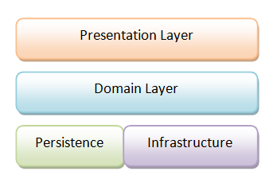
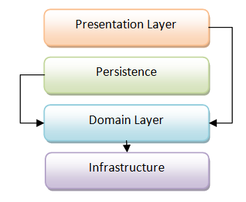
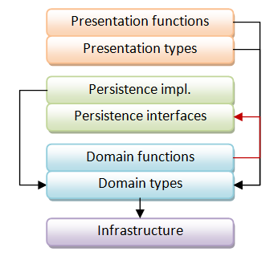
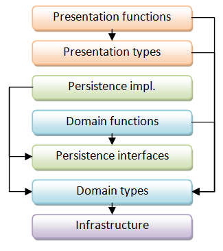
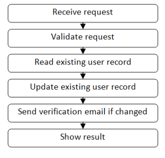
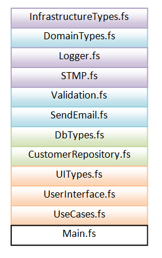

# 在项目中组织模块

# 在项目中组织模块

在我们继续进行任何食谱中的编码之前，让我们看看 F#项目的整体结构。特别是：（a）哪些代码应该放在哪些模块中，以及（b）模块应该在项目中如何组织。

## 如何不这样做

初学者可能会被诱惑将代码组织成类似于 C#的方式。每个文件一个类，按字母顺序排列。毕竟，F#支持与 C#相同的面向对象特性，对吧？所以 F#代码肯定可以像 C#代码一样组织？

过了一会儿，通常会发现 F#要求文件（以及文件内的代码）按照*依赖顺序*排列。也就是说，你不能使用对编译器尚未看到的代码的前向引用**。

这之后会出现[一般的恼怒](http://www.sturmnet.org/blog/2008/05/20/f-compiler-considered-too-linear)和咒骂。F#怎么会这么愚蠢呢？肯定无法编写任何大型项目！

在本文中，我们将看一种简单的组织代码的方法，以便不会发生这种情况。

[** 在某些情况下，可以使用`and`关键字允许相互递归，但不建议使用。]

## 分层设计的功能性方法

代码的一个标准思考方式是将其分组为层：领域层、展示层等，就像这样：



每个层只包含与该层相关的代码。

但在实践中，情况并不那么简单，因为每个层之间存在依赖关系。领域层依赖基础设施，展示层依赖领域。

最重要的是，领域层不应该依赖于持久化层。也就是说，它应该是["持久化无关的"](http://stackoverflow.com/questions/905498/what-are-the-benefits-of-persistence-ignorance)。

因此，我们需要调整层次图，使其看起来更像这样（其中每个箭头代表一个依赖关系）：



理想情况下，这种重新组织会更加细粒度化，有一个单独的"服务层"，包含应用程序服务、领域服务等。当我们完成时，核心领域类是"纯粹的"，不依赖于领域之外的任何东西。这通常被称为["六边形架构"](http://alistair.cockburn.us/Hexagonal+architecture)或["洋葱架构"](http://jeffreypalermo.com/blog/the-onion-architecture-part-1/)。但本文不涉及面向对象设计的微妙之处，所以现在，让我们只使用更简单的模型。

## 将行为与类型分离

*"最好让 100 个函数操作一个数据结构，而不是让 10 个函数操作 10 个数据结构" -- Alan Perlis*

在功能性设计中，*将行为与数据分离*非常重要。数据类型简单且"愚蠢"。然后，你有一些函数单独作用于这些数据类型。

这与面向对象设计完全相反，其中行为和数据被合并在一起。毕竟，这正是类的作用。事实上，在真正的面向对象设计中，你应该只有行为--数据是私有的，只能通过方法访问。

实际上，在 OOD 中，围绕数据类型没有足够的行为被认为是一件坏事，甚至有一个名字：["贫血领域模型"](http://www.martinfowler.com/bliki/AnemicDomainModel.html)。

然而，在函数式设计中，具有透明度的“愚蠢数据”更受青睐。数据通常可以暴露而无需封装。数据是不可变的，因此它不会被行为不端的函数“破坏”。事实证明，专注于透明数据可以实现更灵活和通用的代码。

如果你还没有看过，我强烈推荐[Rich Hickey 关于“价值的价值”的精彩演讲](http://www.infoq.com/presentations/Value-Values)，这解释了这种方法的好处。

### 类型层和行为层

那么，这如何应用于上面的分层设计呢？

首先，我们必须将每个层分为两个不同的部分：

+   **数据类型**。被该层使用的数据结构。

+   **逻辑**。在该层中实现的函数。

一旦我们分离了这两个元素，我们的图表将如下所示：



请注意，我们可能会有一些反向引用（由红色箭头表示）。例如，���域层中的一个函数可能依赖于与持久性相关的类型，如`IRepository`。

在 OO 设计中，我们会[添加更多层](http://c2.com/cgi/wiki?OneMoreLevelOfIndirection)（例如应用服务）来处理这个问题。但在函数式设计中，我们不需要这样做--我们只需将与持久性相关的类型移动到层次结构的不同位置，位于域函数的下方，如下所示：



在这个设计中，我们现在消除了所有层之间的循环引用。*所有箭头都指向下方*。

而且这一切都不需要创建任何额外的层或开销。

最后，我们可以通过将其颠倒来将这种分层设计转换为 F#文件。

+   项目中的第一个文件应包含没有依赖关系的代码。这代表了层次结构图中*底部*的功能。通常是一组类型，如基础设施或领域类型。

+   下一个文件仅依赖于第一个文件。它代表了接近底层的功能。

+   依此类推。每个文件仅依赖于前面的文件。

所以，如果我们回顾一下在第一部分讨论的用例示例：



然后，在 F#项目中，相应的代码可能如下所示：



在列表的最底部是名为“main”或“program”的主文件，其中包含程序的入口点。

紧接着是应用程序中使用情况的代码。这个文件中的代码是将所有其他模块的所有函数“粘合在一起”的地方，形成一个代表特定用例或服务请求的单个函数。（在面向对象设计中，与之最接近的相当于是 ["应用程序服务"](http://stackoverflow.com/questions/2268699/domain-driven-design-domain-service-application-service)，它们大致具有相同的目的。）

然后就在它的上面是“UI 层”，然后是“DB 层”，依此类推，直到顶层。

这种方法的好处是，如果你是一个新手，你总是知道从哪里开始。前几个文件总是应用程序的“底层”，而最后几个文件总是应用程序的“顶层”。无需文件夹！

## 将代码放在模块中，而不是类中

F# 的新手常问的一个问题是“如果我不使用类，我应该如何组织我的代码？”

答案是：*模块*。如你所知，在面向对象的程序中，数据结构和作用于它的函数会被组合在一个类中。但是在函数式的 F# 中，数据结构和作用于它的函数会分别包含在模块中。

有三种常见的模式用于混合类型和函数：

+   类型被声明在与函数相同的模块中。

+   类型与函数分开声明，但在同一文件中。

+   类型与函数分开声明，并在不同的文件中，通常仅包含类型定义。

在第一种方法中，类型与其相关的函数*一起*定义在模块内。如果只有一个主要类型，则通常会给它一个简单的名称，比如“T”或模块的名称。

下面是一个示例：

```
namespace Example

// declare a module 
module Person = 

    type T = {First:string; Last:string}

    // constructor
    let create first last = 
        {First=first; Last=last}

    // method that works on the type
    let fullName {First=first; Last=last} = 
        first + " " + last 
```

因此，函数使用类似 `Person.create` 和 `Person.fullName` 这样的名称访问，而类型本身则使用 `Person.T` 这样的名称访问。

在第二种方法中，类型是在同一文件中声明的，但不属于任何模块：

```
namespace Example

// declare the type outside the module
type PersonType = {First:string; Last:string}

// declare a module for functions that work on the type
module Person = 

    // constructor
    let create first last = 
        {First=first; Last=last}

    // method that works on the type
    let fullName {First=first; Last=last} = 
        first + " " + last 
```

在这种情况下，函数使用相同的名称（`Person.create` 和 `Person.fullName`），而类型本身使用诸如 `PersonType` 之类的名称访问。

最后，这里是第三种方法。类型在一个特殊的“仅类型”模块中声明（通常在不同的文件中）：

```
// =========================
// File: DomainTypes.fs
// =========================
namespace Example

// "types-only" module
[<AutoOpen>]
module DomainTypes = 

    type Person = {First:string; Last:string}

    type OtherDomainType = ...

    type ThirdDomainType = ... 
```

在这种特定情况下，`AutoOpen` 属性被用来使得该模块中的类型自动对项目中的所有其他模块可见 —— 使它们变得“全局”。

然后另一个模块包含所有对 `Person` 类型起作用的函数。

```
// =========================
// File: Person.fs
// =========================
namespace Example

// declare a module for functions that work on the type
module Person = 

    // constructor
    let create first last = 
        {First=first; Last=last}

    // method that works on the type
    let fullName {First=first; Last=last} = 
        first + " " + last 
```

请注意，在此示例中，类型和模块都称为 `Person`。在实践中，这通常不是问题，因为编译器通常可以理解你的意图。

因此，如果你写下这样的代码：

```
let f (p:Person) = p.First 
```

那么编译器将理解你正在引用 `Person` 类型。

另一方面，如果你写下这样的代码：

```
let g () = Person.create "Alice" "Smith" 
```

那么编译器将理解你正在引用 `Person` 模块。

关于模块的更多信息，请参阅组织函数的帖子。

## 模块的组织

对于我们的配方，我们将采用多种方法的混合，并遵循以下准则：

**模块指南**

*如果一个类型在多个模块之间共享，则将其放在一个专门的仅包含类型的模块中。*

+   例如，如果一个类型在全局范围内使用（或者准确地说，在 DDD 术语中是在“有界域”内），我会将其放在一个名为`DomainTypes`或`DomainModel`的模块中，该模块在编译顺序中早些时候出现。

+   如果一个类型仅在一个子系统中使用，比如多个 UI 模块共享的类型，则我会将其放在一个名为`UITypes`的模块中，该模块将会在编译顺序中排在其他 UI 模块之前。

*如果一个类型是私有于一个模块（或两个模块），那么将其放在与其相关函数相同的模块中。*

+   例如，仅用于验证的类型将放在`Validation`模块中。仅用于数据库访问的类型将放在`Database`模块中，依此类推。

当然，有许多组织类型的方法，但这些准则作为一个很好的默认起点。

### 伙计，我的文件夹在哪里？

一个常见的抱怨是 F# 项目不支持文件夹结构，这据说使得组织大型项目变得困难。

如果你正在进行纯面向对象的设计，那么这是一个合理的抱怨。但正如你从上面的讨论中看到的，有一个线性的模块列表是非常有帮助的（如果不是严格必要的），以确保依赖关系被正确维护。是的，理论上，文件可以分散在各处，编译器可能能够确定正确的编译顺序，但实际上，编译器很难确定这个顺序。

更重要的是，人类也不容易确定正确的顺序，这样会使得维护变得比必要的更痛苦。

实际上，即使对于大型项目，没有文件夹也不是你想象中的那么大问题。有许多大型的 F# 项目成功地在这种限制下工作，比如 F# 编译器本身。更多内容请参阅野外的循环和模块化的帖子。

### 帮帮我，我的类型之间存在相互依赖

如果你来自面向对象的设计，你可能会遇到类型之间的相互依赖，例如这个例子，它无法编译：

```
type Location = {name: string; workers: Employee list}

type Employee = {name: string; worksAt: Location} 
```

你如何修复这个问题以让 F# 编译器满意？

这并不难，但它需要更多的解释，所以我专门写了一篇关于处理循环依赖的帖子。

## 示例代码

让我们重新审视一下我们迄今为止的代码，但这次是按模块组织的。

下面的每个模块通常会成为一个单独的文件。

请注意，这仍然是一个框架。一些模块尚未完成，而一些模块几乎是空的。

这种组织对于一个小项目来说可能有点过度，但会有更多的代码要编写！

```
/// ===========================================
/// Common types and functions shared across multiple projects
/// ===========================================
module CommonLibrary = 

    // the two-track type
    type Result<'TSuccess,'TFailure> = 
        | Success of 'TSuccess
        | Failure of 'TFailure

    // convert a single value into a two-track result
    let succeed x = 
        Success x

    // convert a single value into a two-track result
    let fail x = 
        Failure x

    // appy either a success function or failure function
    let either successFunc failureFunc twoTrackInput =
        match twoTrackInput with
        | Success s -> successFunc s
        | Failure f -> failureFunc f

    // convert a switch function into a two-track function
    let bind f = 
        either f fail

    // pipe a two-track value into a switch function 
    let (>>=) x f = 
        bind f x

    // compose two switches into another switch
    let (>=>) s1 s2 = 
        s1 >> bind s2

    // convert a one-track function into a switch
    let switch f = 
        f >> succeed

    // convert a one-track function into a two-track function
    let map f = 
        either (f >> succeed) fail

    // convert a dead-end function into a one-track function
    let tee f x = 
        f x; x 

    // convert a one-track function into a switch with exception handling
    let tryCatch f exnHandler x =
        try
            f x |> succeed
        with
        | ex -> exnHandler ex |> fail

    // convert two one-track functions into a two-track function
    let doubleMap successFunc failureFunc =
        either (successFunc >> succeed) (failureFunc >> fail)

    // add two switches in parallel
    let plus addSuccess addFailure switch1 switch2 x = 
        match (switch1 x),(switch2 x) with
        | Success s1,Success s2 -> Success (addSuccess s1 s2)
        | Failure f1,Success _  -> Failure f1
        | Success _ ,Failure f2 -> Failure f2
        | Failure f1,Failure f2 -> Failure (addFailure f1 f2)

/// ===========================================
/// Global types for this project
/// ===========================================
module DomainTypes = 

    open CommonLibrary 

    /// The DTO for the request
    type Request = {name:string; email:string}

    // Many more types coming soon!

/// ===========================================
/// Logging functions
/// ===========================================
module Logger = 

    open CommonLibrary 
    open DomainTypes

    let log twoTrackInput = 
        let success x = printfn "DEBUG. Success so far: %A" x; x
        let failure x = printfn "ERROR. %A" x; x
        doubleMap success failure twoTrackInput 

/// ===========================================
/// Validation functions
/// ===========================================
module Validation = 

    open CommonLibrary 
    open DomainTypes

    let validate1 input =
       if input.name = "" then Failure "Name must not be blank"
       else Success input

    let validate2 input =
       if input.name.Length > 50 then Failure "Name must not be longer than 50 chars"
       else Success input

    let validate3 input =
       if input.email = "" then Failure "Email must not be blank"
       else Success input

    // create a "plus" function for validation functions
    let (&&&) v1 v2 = 
        let addSuccess r1 r2 = r1 // return first
        let addFailure s1 s2 = s1 + "; " + s2  // concat
        plus addSuccess addFailure v1 v2 

    let combinedValidation = 
        validate1 
        &&& validate2 
        &&& validate3 

    let canonicalizeEmail input =
       { input with email = input.email.Trim().ToLower() }

/// ===========================================
/// Database functions
/// ===========================================
module CustomerRepository = 

    open CommonLibrary 
    open DomainTypes

    let updateDatabase input =
       ()   // dummy dead-end function for now

    // new function to handle exceptions
    let updateDatebaseStep = 
        tryCatch (tee updateDatabase) (fun ex -> ex.Message)

/// ===========================================
/// All the use cases or services in one place
/// ===========================================
module UseCases = 

    open CommonLibrary
    open DomainTypes

    let handleUpdateRequest = 
        Validation.combinedValidation 
        >> map Validation.canonicalizeEmail
        >> bind CustomerRepository.updateDatebaseStep
        >> Logger.log 
```

## 摘要

在本文中，我们探讨了将代码组织成模块的方法。在本系列的下一篇文章中，我们终于要开始做一些真正的编码了！

与此同时，您可以在以下后续帖子中了解更多关于循环依赖的信息：

+   循环依赖是有害的。

+   重构以消除循环依赖。

+   野外的循环和模块化，对比了一些 C# 和 F# 项目的真实指标。
