# "依赖循环"系列

F# 最常见的投诉之一是它要求代码按照*依赖顺序*排列。也就是说，你不能使用对编译器尚未看到的代码的前向引用。

在这个系列中，我讨论了依赖循环，它们为什么是不好的，并且如何摆脱它们。

+   循环依赖是邪恶的。循环依赖：第 1 部分。

+   重构以移除循环依赖。循环依赖：第 2 部分。

+   循环和模块化在实践中的应用。比较 C# 和 F# 项目的一些实际度量标准。

# 循环依赖是邪恶的

# 循环依赖是邪恶的

*关于模块组织和循环依赖的三篇相关文章之一。*

F# 最常见的投诉之一是它要求代码按照*依赖顺序*排列。也就是说，你不能使用对编译器尚未看到的代码的前向引用。

这是一个典型的例子：

> "文件的 .fs 顺序使得编译变得困难……我的 F# 应用只有 50 多行代码，但即使是最微不足道的非平凡应用程序的编译也比它的价值大得多。有没有办法使 F# 编译器更像 C# 编译器，这样它就不会与向编译器传递文件的顺序紧密耦合了？" [[fpish.net]](http://fpish.net/topic/None/57578)

还有另一个：

> "尝试在 F# 中构建一个稍微大于玩具大小的项目后，我得出了这样的结论：使用当前的工具维护一个即使是中等复杂度的项目也会非常困难" [[www.ikriv.com]](http://www.ikriv.com/blog/?p=28)

还有另一个：

> "F# 编译器 [太] 线性了。F# 编译器应该自动处理所有类型解析问题，而不依赖于声明的顺序" [[www.sturmnet.org]](http://www.sturmnet.org/blog/2008/05/20/f-compiler-considered-too-linear)

还有一个：

> "关于 F# 项目系统烦人（在我看来是不必要的）的限制已经在这个论坛上讨论过了。我指的是编译顺序的控制方式" [[fpish.net]](http://fpish.net/topic/Some/0/59219)

好吧，这些抱怨是没有根据的。你完全可以使用 F# 构建和维护大型项目。F# 编译器和核心库就是两个明显的例子。

实际上，大多数问题归结为"为什么 F# 不能像 C# 一样"。如果你来自 C#，你习惯于编译器自动连接一切。必须显式处理依赖关系非常令人讨厌——甚至可以说是老式和倒退的。

这篇文章的目的是解释（a）为什么依赖管理很重要，以及（b）一些可以帮助你处理它的技术。

## 依赖关系是坏事……

我们都知道依赖关系是我们存在的祸根。程序集依赖、配置依赖、数据库依赖、网络依赖——总是有些问题。

因此，作为开发人员，我们倾向于花费大量精力使依赖关系更易管理。这个目标以许多不同的方式体现：[接口隔离原则](http://en.wikipedia.org/wiki/Interface_segregation_principle)、控制反转和[依赖注入](http://en.wikipedia.org/wiki/Dependency_inversion_principle)；使用 NuGet 进行包管理；使用 puppet/chef 进行配置管理；等等。在某种意义上，所有这些方法都试图减少我们需要了解的事物数量，���及可能出错的事物数量。

当然，这并不是一个新问题。经典书籍《[大规模 C++软件设计](http://www.amazon.com/Large-Scale-Software-Design-John-Lakos/dp/0201633620)》的很大一部分都致力于依赖管理。正如作者约翰·拉科斯所说：

> “通过避免组件之间的不必要依赖，可以显著降低子系统的维护成本”

这里的关键词是“不必要”。什么是“不必要”的依赖？当然，这取决于情况。但一种特定类型的依赖几乎总是不必要的 -- **循环依赖**。

## ...而循环依赖是邪恶的

要理解为什么循环依赖是邪恶的，让我们重新思考一下我们所说的“组件”是什么。

组件是好东西。无论你将它们视为包、组件、模块、类或其他什么，它们的主要目的是将大量代码分解为更小、更易管理的部分。换句话说，我们正在将分而治之的方法应用于软件开发问题。

但为了对维护、部署或其他方面有用，一个组件不应该只是一堆随机的东西。它应该（当然）仅将*相关代码*组合在一起。

在理想世界中，每个组件都应完全独立于其他任何组件。但通常（当然），总是有一些依赖关系是必要的。

但是，现在我们有了*依赖关系*的组件，我们需要一种方法来管理这些依赖关系。一个标准的做法是使用“分层”原则。我们可以有“高层”和“低层”，关键规则是：*每一层应仅依赖于它下面的层，而不依赖于它上面的层*。

我相信你对此非常熟悉。这里是一些简单层的图示：

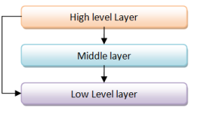

但是现在，当你引入从底层到顶层的依赖时，会发生什么，就像这样？

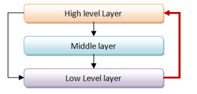

通过从底层到顶层的依赖，我们引入了邪恶的“循环依赖”。

为什么它邪恶？因为*任何*替代的分层方法现在都是有效的！

例如，我们可以将底层放在顶部，就像这样：

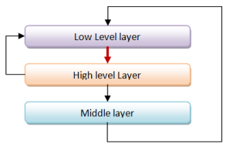

从逻辑角度来看，这种替代分层与原始分层完全相同。

或者我们把中间层放在顶部怎么样？

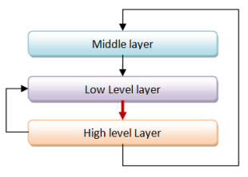

出了大问题！很明显，我们真的搞砸了。

实际上，一旦组件之间存在任何形式的循环依赖，你唯一能做的就是将它们全部放入*同一*层中。

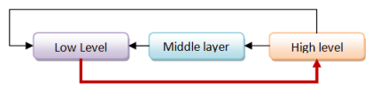

换句话说，循环依赖完全破坏了我们的“分而治之”的方法，这是拥有组件的首要原因。我们现在不是有三个组件，而是有一个“超级组件”，比需要的要大三倍，而且更加复杂。

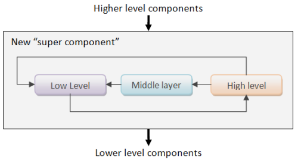

这就是循环依赖是邪恶的原因。

*有关此主题的更多信息，请参阅[StackOverflow 答案](http://stackoverflow.com/a/1948636/1136133)和[关于分层的这篇文章](http://codebetter.com/patricksmacchia/2008/02/10/layering-the-level-metric-and-the-discourse-of-method/)（由 NDepend 的 Patrick Smacchia 撰写）。*

## 现实世界中的循环依赖

让我们首先看看.NET 程序集之间的循环依赖。以下是来自 Brian McNamara 的一些故事（我强调）：

> .Net Framework 2.0 在这方面问题严重；System.dll、System.Configuration.dll 和 System.Xml.dll 之间彼此都希望无法解脱。这以各种丑陋的方式显现出来。例如，我发现了 VS 调试器中的一个简单的[bug]，在尝试加载符号时实际上会导致调试对象崩溃，原因是这些程序集之间的循环依赖。另一个故事：我的一个朋友是 Silverlight 初始版本的开发人员，负责尝试减少这三个程序集的大小，而第一个艰巨的任务就是试图解开循环依赖关系。“免费的相互递归”在小范围内非常方便，但在大范围内会毁灭你。
> 
> VS2008 的发布比计划晚了一周，因为 VS2008 依赖于 SQL Server，而 SQL Server 又依赖于 VS，结果糟糕了！最后他们无法生成具有相同构建号的完整产品版本，不得不匆忙解决问题。[[fpish.net]](http://fpish.net/topic/None/59219#comment-70220)

因此，有大量证据表明程序集之间的循环依赖是不好的。实际上，程序集之间的循环依赖被认为是很糟糕的，以至于 Visual Studio 甚至不会让你创建它们！

你可能会说，“是的，我可以理解循环依赖对于程序集是不好的，但是对于程序集内部的代码有什么关系呢？”

嗯，原因完全相同！分层允许更好地划分、更容易测试和更清晰的重构。你可以在关于野外依赖循环的相关帖子中看到我在 C#项目和 F#项目中进行比较时的意思。F#项目中的依赖关系要少得多。

另一段来自 Brian（出色）评论的引用：

> 我在这里提倡一种不受欢迎的立场，但我的经验是，在每个系统级别强制考虑和管理“软件组件之间的依赖顺序”时，世界上的一切都会变得更好。F# 的特定 UI/工具可能还不太理想，但我认为这个原则是正确的。这是一个你想要的负担。这确实需要更多的工作。“单元测试”也需要更多的工作，但我们已经达成共识，认为这样做是“值得的”，因为它能在长远节省你的时间。我对“排序”也有同样的看法。您的系统中的类和方法之间存在依赖关系。忽视这些依赖关系是自食恶果的。一个迫使你考虑这种依赖图（大致是组件的拓扑排序）的系统很可能会引导你开发具有更清晰架构、更好的系统分层和更少不必要依赖的软件。

## 检测和消除循环依赖

好吧，我们已经认同循环依赖是不好的。那么我们如何检测它们，然后摆脱它们呢？

让我们从检测开始。有许多工具可以帮助您检测代码中的循环依赖关系。

+   如果您正在使用 C#，您将需要像[ NDepend ](http://www.ndepend.com/features.aspx#DependencyCycle)这样的无价之宝。

+   如果您使用 Java，那么也有类似的工具，比如[ JDepend ](http://www.clarkware.com/software/JDepend.html#cycles)。

+   但如果您使用 F#，那么你很幸运！你可以免费获得循环依赖检测！

“非常有趣，”你可能会说，“我已经知道 F# 的循环依赖禁令了——它让我抓狂！我该怎么办才能解决这个问题，让编译器满意呢？”

为此，您需要阅读下一篇文章……

# 重构以消除循环依赖

# 重构以消除循环依赖

在前一篇文章中，我们讨论了依赖循环的概念，以及它们为什么不好。

在本文中，我们将看看一些消除代码中的技术。一开始可能觉得这样做很烦人，但实际上，你会逐渐意识到，从长远来看，“这不是一个错误，而是一个特性！”

## 对一些常见的循环依赖进行分类

让我们分类一下你可能会遇到的依赖类型。我将讨论三种常见情况，并针对每一种情况演示一些处理方法。

首先，有一种我称之为“*方法依赖*”。

+   类型 A 在属性中存储了类型 B 的值。

+   类型 B 在方法签名中引用了类型 A，但没有存储类型 A 的值。

其次，有一种我称之为“*结构依赖*”。

+   类型 A 在属性中存储了类型 B 的值。

+   类型 B 在属性中存储了类型 A 的值。

最后，还有一种我称之为“*继承依赖*”。

+   类型 A 在属性中存储了类型 B 的值。

+   类型 B 继承自类型 A。

当然还有其他变体。但是如果你知道如何处理这些，你也可以使用相同的技术来处理其他变体。

## 关于在 F# 中处理依赖关系的三个提示

在我们开始之前，这里有三个通用的有用提示，当试图解开依赖关系时通常适用。

**Tip 1: 把 F# 当做 F# 对待**。

认识到 F# 不是 C#。如果你愿意使用 F# 的本机习惯用法，那么通常可以通过使用不同风格的 代码组织 来避免循环依赖。

**Tip 2: 将类型与行为分离**。

由于 F# 中的大多数类型都是不可变的，即使它们是“裸露”的和[“贫血”](http://www.martinfowler.com/bliki/AnemicDomainModel.html)，也是可以接受的。因此，在函数式设计中，将类型本身与作用于它们的函数分离是很常见的。正如我们将在下面看到的那样，这种方法通常会有助于清理依赖关系。

**Tip 3: 参数化，参数化，参数化**。

依赖关系只会在引用特定类型时发生。如果你使用通用类型，你就不能有依赖关系！

而不是为类型硬编码行为，为什么不通过传递函数参数化它呢？ `List` 模块是这种方法的一个很好的例子，我也将在下面展示一些示例。

## 处理“方法依赖”

我们将从最简单的一种依赖关系开始--我将其称为“方法依赖”。

这里是一个例子。

```
module MethodDependencyExample = 

    type Customer(name, observer:CustomerObserver) = 
        let mutable name = name
        member this.Name 
            with get() = name
            and set(value) = 
                name <- value
                observer.OnNameChanged(this)

    and CustomerObserver() = 
        member this.OnNameChanged(c:Customer) =     
            printfn "Customer name changed to '%s' " c.Name

    // test
    let observer = new CustomerObserver()
    let customer = Customer("Alice",observer)
    customer.Name <- "Bob" 
```

`Customer` 类具有一个类型为 `CustomerObserver` 的属性/字段，但 `CustomerObserver` 类有一个以 `Customer` 为参数的方法，导致相互依赖。

### 使用“and”关键字

将类型编译成成功的一个简单方法是使用 `and` 关键字，就像我上面做的那样。

`and` 关键字就是为这种情况设计的--它允许你拥有两个或更多相互引用的类型。

要使用它，只需用 `and` 替换第二个 `type` 关键字。请注意，使用 `and type`，如下所示，是不正确的。只需要单个 `and` 就足够了。

```
type Something 
and type SomethingElse  // wrong

type Something 
and SomethingElse       // correct 
```

但是 `and` 存在一些问题，通常不建议使用它，除非作为最后的手段。

首先，它仅适用于在同一模块中声明的类型。你不能跨模块边界使用它。

其次，它真的只适用于微小的类型。如果在 `type` 和 `and` 之间有 500 行代码，那么你做错了什么。

```
type Something
   // 500 lines of code
and SomethingElse
   // 500 more lines of code 
```

上面显示的代码片段是一个示例，*不*应该这样做。

换句话说，不要把 `and` 当作灵丹妙药。过度使用它是你没有正确重构代码的症状。

### 引入参数化

因此，不要使用 `and`，让我们看看我们是否可以使用参数化，如第三个提示中所提到的。

如果我们考虑一下示例代码，我们是否 *真的* 需要一个特殊的 `CustomerObserver` 类？为什么我们把它限制在了 `Customer` 上？我们不能有一个更通用的观察者类吗？

那么为什么我们不创建一个`INameObserver<'T>`接口，具有相同的`OnNameChanged`方法，但方法（和接口）参数化以接受任何类呢？

我的意思是：

```
module MethodDependency_ParameterizedInterface = 

    type INameObserver<'T> = 
        abstract OnNameChanged : 'T -> unit

    type Customer(name, observer:INameObserver<Customer>) = 
        let mutable name = name
        member this.Name 
            with get() = name
            and set(value) = 
                name <- value
                observer.OnNameChanged(this)

    type CustomerObserver() = 
        interface INameObserver<Customer> with 
            member this.OnNameChanged c =     
                printfn "Customer name changed to '%s' " c.Name

    // test
    let observer = new CustomerObserver()
    let customer = Customer("Alice", observer)
    customer.Name <- "Bob" 
```

在这个修订版本中，依赖关系已经被打破！根本不需要`and`。事实上，现在甚至可以将类型放在不同的项目或程序集中！

代码几乎与第一个版本相同，只是`Customer`构造函数接受一个接口，而`CustomerObserver`现在实现了相同的接口。事实上，我认为引入接口实际上比以前更好。

但我们不必止步于此。既然我们有了一个接口，我们真的需要创建一个完整的类来实现它吗？F#有一个很棒的功能叫做[对象表达式](http://msdn.microsoft.com/en-us/library/dd233237.aspx)，允许你直接实例化一个接口。

这里是相同的代码，但这次完全消除了`CustomerObserver`类，并直接创建了`INameObserver`。

```
module MethodDependency_ParameterizedInterface = 

    // code as above

    // test
    let observer2 = {
        new INameObserver<Customer> with 
            member this.OnNameChanged c =     
                printfn "Customer name changed to '%s' " c.Name
        }
    let customer2 = Customer("Alice", observer2)
    customer2.Name <- "Bob" 
```

这种技术显然也适用于更复杂的接口，比如下面所示的情况，其中有两种方法：

```
module MethodDependency_ParameterizedInterface2 = 

    type ICustomerObserver<'T> = 
        abstract OnNameChanged : 'T -> unit
        abstract OnEmailChanged : 'T -> unit

    type Customer(name, email, observer:ICustomerObserver<Customer>) = 

        let mutable name = name
        let mutable email = email

        member this.Name 
            with get() = name
            and set(value) = 
                name <- value
                observer.OnNameChanged(this)

        member this.Email
            with get() = email
            and set(value) = 
                email <- value
                observer.OnEmailChanged(this)

    // test
    let observer2 = {
        new ICustomerObserver<Customer> with 
            member this.OnNameChanged c =     
                printfn "Customer name changed to '%s' " c.Name
            member this.OnEmailChanged c =     
                printfn "Customer email changed to '%s' " c.Email
        }
    let customer2 = Customer("Alice", "x@example.com",observer2)
    customer2.Name <- "Bob"
    customer2.Email <- "y@example.com" 
```

### 使用函数而不是参数化

在许多情况下，我们甚至可以进一步消除接口类。为什么不只传递一个简单的在名称更改时调用的函数呢，就像这样：

```
module MethodDependency_ParameterizedClasses_HOF  = 

    type Customer(name, observer) = 

        let mutable name = name

        member this.Name 
            with get() = name
            and set(value) = 
                name <- value
                observer this

    // test
    let observer(c:Customer) = 
        printfn "Customer name changed to '%s' " c.Name
    let customer = Customer("Alice", observer)
    customer.Name <- "Bob" 
```

我认为你会同意，这段代码片段比前两个版本都更"低仪式感"。观察者现在按需内联定义，非常简单：

```
let observer(c:Customer) = 
    printfn "Customer name changed to '%s' " c.Name 
```

确实，这种方法只适用于被替换的接口很简单的情况，但即使如此，这种方法可能比你想象的更常用。

## 更具功能性的方法：将类型与函数分离

正如我上面提到的，一个更"功能性的设计"是将类型本身与作用于这些类型的函数分开。让我们看看在这种情况下如何做到这一点。

这是第一次尝试：

```
module MethodDependencyExample_SeparateTypes = 

    module DomainTypes = 
        type Customer = { name:string; observer:NameChangedObserver }
        and  NameChangedObserver = Customer -> unit

    module Customer = 
        open DomainTypes

        let changeName customer newName = 
            let newCustomer = {customer with name=newName}
            customer.observer newCustomer
            newCustomer     // return the new customer

    module Observer = 
        open DomainTypes

        let printNameChanged customer = 
            printfn "Customer name changed to '%s' " customer.name

    // test
    module Test = 
        open DomainTypes

        let observer = Observer.printNameChanged 
        let customer = {name="Alice"; observer=observer}
        Customer.changeName customer "Bob" 
```

在上面的示例中，我们现在有*三*个模块：一个用于类型，另外两个用于函数。显然，在一个真实的应用程序中，`Customer`模块中与`Customer`相关的函数会比这一个多得多！

在这段代码中，我们仍然存在`Customer`和`CustomerObserver`之间的相互依赖。类型定义更紧凑，所以这不是什么问题，但即使如此，我们能消除`and`吗？

是的，当然。我们可以使用与前一种方法相同的技巧，消除观察者类型，并直接将函数嵌入到`Customer`数据结构中，就像这样：

```
module MethodDependency_SeparateTypes2 = 

    module DomainTypes = 
        type Customer = { name:string; observer:Customer -> unit}

    module Customer = 
        open DomainTypes

        let changeName customer newName = 
            let newCustomer = {customer with name=newName}
            customer.observer newCustomer
            newCustomer     // return the new customer

    module Observer = 
        open DomainTypes

        let printNameChanged customer = 
            printfn "Customer name changed to '%s' " customer.name

    module Test = 
        open DomainTypes

        let observer = Observer.printNameChanged 
        let customer = {name="Alice"; observer=observer}
        Customer.changeName customer "Bob" 
```

### 使类型更简单

`Customer`类型仍然嵌入了一些行为。在许多情况下，这是没有必要的。更具功能性的方法是只在需要时传递一个函数。

所以让我们从客户类型中移除`observer`，并将其作为额外参数传递给`changeName`函数，就像这样：

```
let changeName observer customer newName = 
    let newCustomer = {customer with name=newName}
    observer newCustomer    // call the observer with the new customer
    newCustomer             // return the new customer 
```

这是完整的代码：

```
module MethodDependency_SeparateTypes3 = 

    module DomainTypes = 
        type Customer = {name:string}

    module Customer = 
        open DomainTypes

        let changeName observer customer newName = 
            let newCustomer = {customer with name=newName}
            observer newCustomer    // call the observer with the new customer
            newCustomer             // return the new customer

    module Observer = 
        open DomainTypes

        let printNameChanged customer = 
            printfn "Customer name changed to '%s' " customer.name

    module Test = 
        open DomainTypes

        let observer = Observer.printNameChanged 
        let customer = {name="Alice"}
        Customer.changeName observer customer "Bob" 
```

您可能会认为我现在让事情变得更加复杂了 -- 我必须在调用我的代码中的每个`changeName`处指定`observer`函数。这肯定比以前更糟糕吧？至少在 OO 版本中，观察者是客户对象的一部分，我不必一直传递它。

啊，但是，你忘记了偏函数应用的魔力！你可以设置一个将观察者“烘焙”进去的函数，然后在任何地方使用*那个*函数，而无需每次使用时都传入观察者。聪明吧！

```
module MethodDependency_SeparateTypes3 = 

    // code as above

    module TestWithPartialApplication = 
        open DomainTypes

        let observer = Observer.printNameChanged 

        // set up this partial application only once (at the top of your module, say)
        let changeName = Customer.changeName observer 

        // then call changeName without needing an observer
        let customer = {name="Alice"}
        changeName customer "Bob" 
```

### 但是等等... 还有更多！

让我们再次看看`changeName`函数：

```
let changeName observer customer newName = 
    let newCustomer = {customer with name=newName}
    observer newCustomer    // call the observer with the new customer
    newCustomer             // return the new customer 
```

它有以下步骤：

1.  做一些事情以生成结果值

1.  调用观察者以获取结果值

1.  返回结果值

这是完全通用的逻辑 -- 它与客户完全无关。因此，我们可以将其重写为完全通用的库函数。我们的新函数将允许*任何*观察者函数“挂钩”到*任何*其他函数的结果中，所以现在我们先叫它`hook`。

```
let hook2 observer f param1 param2 = 
    let y = f param1 param2 // do something to make a result value
    observer y              // call the observer with the result value
    y                       // return the result value 
```

实际上，我将其称为`hook2`，因为被“挂钩”的函数`f`有两个参数。我可以为具有一个参数的函数创建另一个版本，就像这样：

```
let hook observer f param1 = 
    let y = f param1 // do something to make a result value 
    observer y       // call the observer with the result value
    y                // return the result value 
```

如果您已阅读了铁路导向编程文章，您可能会注意到这与我称之为“死胡同”函数的内容非常相似。我不会在这里详细介绍，但这确实是一个常见模式。

好的，回到代码 -- 我们如何使用这个通用的`hook`函数？

+   `Customer.changeName`是要挂钩的函数，它有两个参数，所以我们使用`hook2`。

+   观察者函数与以前一样

所以，我们再次创建了一个部分应用的`changeName`函数，但这次我们通过将观察者和被挂钩的函数传递给`hook2`来创建它，就像这样：

```
let observer = Observer.printNameChanged 
let changeName = hook2 observer Customer.changeName 
```

注意，生成的`changeName`与原始的`Customer.changeName`函数*具有完全相同的签名*，因此它可以在任何地方与原函数互换使用。

```
let customer = {name="Alice"}
changeName customer "Bob" 
```

这是完整的代码：

```
module MethodDependency_SeparateTypes_WithHookFunction = 

    [<AutoOpen>]
    module MyFunctionLibrary = 

        let hook observer f param1 = 
            let y = f param1 // do something to make a result value 
            observer y       // call the observer with the result value
            y                // return the result value

        let hook2 observer f param1 param2 = 
            let y = f param1 param2 // do something to make a result value
            observer y              // call the observer with the result value
            y                       // return the result value

    module DomainTypes = 
        type Customer = { name:string}

    module Customer = 
        open DomainTypes

        let changeName customer newName = 
            {customer with name=newName}

    module Observer = 
        open DomainTypes

        let printNameChanged customer = 
            printfn "Customer name changed to '%s' " customer.name

    module TestWithPartialApplication = 
        open DomainTypes

        // set up this partial application only once (at the top of your module, say)
        let observer = Observer.printNameChanged 
        let changeName = hook2 observer Customer.changeName 

        // then call changeName without needing an observer
        let customer = {name="Alice"}
        changeName customer "Bob" 
```

初始时创建`hook`函数可能会增加额外的复杂性，但它从主应用程序中消除了更多的代码，一旦您建立了类似的函数库，您将发现到处都有用处。

顺便说一句，如果使用 OO 设计术语有助于您，您可以将此方法视为“装饰器”或“代理”模式。

## 处理“结构依赖”

我们的第二类分类是我称之为“结构依赖”，其中每种类型都存储另一种类型的值。

+   类型 A 在属性中存储类型 B 的值

+   类型 B 在属性中存储类型 A 的值

对于这组示例，请考虑一个在`Location`工作的`Employee`。`Employee`包含他们工作的`Location`，而`Location`存储在那里工作的`Employee`列表。

瞧 -- 相互依赖！

以下是代码示例：

```
module StructuralDependencyExample = 

    type Employee(name, location:Location) = 
        member this.Name = name
        member this.Location = location

    and Location(name, employees: Employee list) = 
        member this.Name = name
        member this.Employees  = employees 
```

在我们进行重构之前，让我们考虑一下这种设计有多尴尬。我们如何初始化一个`Employee`值而没有`Location`值，反之亦然。

这是一个尝试。我们创建一个带有空员工列表的位置，然后使用该位置创建其他员工：

```
module StructuralDependencyExample = 

    // code as above

    module Test = 
        let location = new Location("CA",[])       
        let alice = new Employee("Alice",location)       
        let bob = new Employee("Bob",location)      

        location.Employees  // empty!
        |> List.iter (fun employee -> 
            printfn "employee %s works at %s" employee.Name employee.Location.Name) 
```

但是，这段代码并不按我们想要的方式工作。我们必须将`location`的员工列表设置为空，因为我们无法提前引用`alice`和`bob`的值。

F#有时也允许在这些情况下使用`and`关键字，用于递归的“let”。就像“type”一样，`and`关键字取代了“let”关键字。与“type”不同的是，第一个“let”必须用`let rec`标记为递归。

让我们试试。我们将给`location`一个`alice`和`bob`的列表，即使它们还没有被声明。

```
module UncompilableTest = 
    let rec location = new Location("NY",[alice;bob])       
    and alice = new Employee("Alice",location  )       
    and bob = new Employee("Bob",location ) 
```

但是，编译器对我们创建的无限递归并不满意。在某些情况下，`and`确实适用于`let`定义，但这不是其中之一！无论如何，与类型一样，必须对`let`定义使用`and`是一个提示，表明您可能需要进行重构。

所以，真正的明智之举是使用可变结构，并在创建完单个员工后修复位置对象，就像这样：

```
module StructuralDependencyExample_Mutable = 

    type Employee(name, location:Location) = 
        member this.Name = name
        member this.Location = location

    and Location(name, employees: Employee list) = 
        let mutable employees = employees

        member this.Name = name
        member this.Employees  = employees 
        member this.SetEmployees es = 
            employees <- es

    module TestWithMutableData = 
        let location = new Location("CA",[])       
        let alice = new Employee("Alice",location)       
        let bob = new Employee("Bob",location)      
        // fixup after creation
        location.SetEmployees [alice;bob]  

        location.Employees  
        |> List.iter (fun employee -> 
            printfn "employee %s works at %s" employee.Name employee.Location.Name) 
```

因此，为了创建一些值而搞了这么多麻烦。这是互相依赖是个坏主意的另一个原因！

### 再次参数化

为了打破依赖关系，我们可以再次使用参数化技巧。我们可以只创建一个参数化版本的`Employee`。

```
module StructuralDependencyExample_ParameterizedClasses = 

    type ParameterizedEmployee<'Location>(name, location:'Location) = 
        member this.Name = name
        member this.Location = location

    type Location(name, employees: ParameterizedEmployee<Location> list) = 
        let mutable employees = employees
        member this.Name = name
        member this.Employees  = employees 
        member this.SetEmployees es = 
            employees <- es

    type Employee = ParameterizedEmployee<Location> 

    module Test = 
        let location = new Location("CA",[])       
        let alice = new Employee("Alice",location)       
        let bob = new Employee("Bob",location)      
        location.SetEmployees [alice;bob]

        location.Employees  // non-empty!
        |> List.iter (fun employee -> 
            printfn "employee %s works at %s" employee.Name employee.Location.Name) 
```

请注意，我们为`Employee`创建了一个类型别名，就像这样：

```
type Employee = ParameterizedEmployee<Location> 
```

创建这样一个别名的一个好处是，原始的创建员工的代码将继续不变地工作。

```
let alice = new Employee("Alice",location) 
```

### 带有行为依赖参数化

上面的代码假设参数化的特定类不重要。但是如果类型的特定属性有依赖关系呢？

例如，假设`Employee`类期望一个`Name`属性，而`Location`类期望一个`Age`属性，就像这样：

```
module StructuralDependency_WithAge = 

    type Employee(name, age:float, location:Location) = 
        member this.Name = name
        member this.Age = age
        member this.Location = location

        // expects Name property
        member this.LocationName = location.Name  

    and Location(name, employees: Employee list) = 
        let mutable employees = employees
        member this.Name = name
        member this.Employees  = employees 
        member this.SetEmployees es = 
            employees <- es

        // expects Age property 
        member this.AverageAge = 
            employees |> List.averageBy (fun e -> e.Age)

    module Test = 
        let location = new Location("CA",[])       
        let alice = new Employee("Alice",20.0,location)       
        let bob = new Employee("Bob",30.0,location)      
        location.SetEmployees [alice;bob]
        printfn "Average age is %g" location.AverageAge 
```

我们如何可能参数化这个？

好吧，让我们尝试使用与之前相同的方法：

```
module StructuralDependencyWithAge_ParameterizedError = 

    type ParameterizedEmployee<'Location>(name, age:float, location:'Location) = 
        member this.Name = name
        member this.Age = age
        member this.Location = location
        member this.LocationName = location.Name  // error

    type Location(name, employees: ParameterizedEmployee<Location> list) = 
        let mutable employees = employees
        member this.Name = name
        member this.Employees  = employees 
        member this.SetEmployees es = 
            employees <- es
        member this.AverageAge = 
            employees |> List.averageBy (fun e -> e.Age) 
```

`Location`对`ParameterizedEmployee.Age`很满意，但`location.Name`无法编译。显然，因为类型参数太通用了。

一种方式是通过创建诸如`ILocation`和`IEmployee`之类的接口来解决这个问题，这可能是最明智的方法。

但是另一种方法是让 Location 参数是通用的，并传入一个*额外的函数*来处理它。在这种情况下是一个`getLocationName`函数。

```
module StructuralDependencyWithAge_ParameterizedCorrect = 

    type ParameterizedEmployee<'Location>(name, age:float, location:'Location, getLocationName) = 
        member this.Name = name
        member this.Age = age
        member this.Location = location
        member this.LocationName = getLocationName location  // ok

    type Location(name, employees: ParameterizedEmployee<Location> list) = 
        let mutable employees = employees
        member this.Name = name
        member this.Employees  = employees 
        member this.SetEmployees es = 
            employees <- es
        member this.AverageAge = 
            employees |> List.averageBy (fun e -> e.Age) 
```

一种思考方式是，我们将行为作为外部提供，而不是作为类型的一部分。

要使用这个，我们需要在类型参数的同时传递一个函数。这样做每次都很麻烦，所以自然而然地我们会将其封装在一个函数中，就像这样：

```
module StructuralDependencyWithAge_ParameterizedCorrect = 

    // same code as above

    // create a helper function to construct Employees
    let Employee(name, age, location) = 
        let getLocationName (l:Location) = l.Name
        new ParameterizedEmployee<Location>(name, age, location, getLocationName) 
```

有了这个设计，原始的测试代码仍然可以工作，几乎没有变化（我们必须将`new Employee`更改为只是`Employee`）。

```
module StructuralDependencyWithAge_ParameterizedCorrect = 

    // same code as above

    module Test = 
        let location = new Location("CA",[])       
        let alice = Employee("Alice",20.0,location)       
        let bob = Employee("Bob",30.0,location)      
        location.SetEmployees [alice;bob]

        location.Employees  // non-empty!
        |> List.iter (fun employee -> 
            printfn "employee %s works at %s" employee.Name employee.LocationName) 
```

## 函数式方法：再次将类型与函数分离

现在让我们将功能设计方法应用到这个问题上，就像我们之前所做的那样。

再次地，我们将类型本身与操作这些类型的函数分开。

```
module StructuralDependencyExample_SeparateTypes = 

    module DomainTypes = 
        type Employee = {name:string; age:float; location:Location}
        and Location = {name:string; mutable employees: Employee list}

    module Employee = 
        open DomainTypes 

        let Name (employee:Employee) = employee.name
        let Age (employee:Employee) = employee.age
        let Location (employee:Employee) = employee.location
        let LocationName (employee:Employee) = employee.location.name

    module Location = 
        open DomainTypes 

        let Name (location:Location) = location.name
        let Employees (location:Location) = location.employees
        let AverageAge (location:Location) =
            location.employees |> List.averageBy (fun e -> e.age)

    module Test = 
        open DomainTypes 

        let location = { name="NY"; employees= [] }
        let alice = {name="Alice"; age=20.0; location=location  }
        let bob = {name="Bob"; age=30.0; location=location }
        location.employees <- [alice;bob]

        Location.Employees location
        |> List.iter (fun e -> 
            printfn "employee %s works at %s" (Employee.Name e) (Employee.LocationName e) ) 
```

在我们继续之前，让我们删除一些不必要的代码。使用记录类型的一个好处是你不需要定义“getter”，所以模块中唯一需要的函数是操作数据的函数，比如`AverageAge`。

```
module StructuralDependencyExample_SeparateTypes2 = 

    module DomainTypes = 
        type Employee = {name:string; age:float; location:Location}
        and Location = {name:string; mutable employees: Employee list}

    module Employee = 
        open DomainTypes 

        let LocationName employee = employee.location.name

    module Location = 
        open DomainTypes 

        let AverageAge location =
            location.employees |> List.averageBy (fun e -> e.age) 
```

### 再次参数化

再次，我们可以通过创建类型的参数化版本来移除依赖。

让我们退一步，思考一下“位置”概念。为什么一个位置只能包含员工呢？如果我们把它设计得更加通用一些，我们可以将位置视为“一个地方”加上“该地方的事物清单”。

例如，如果事物是产品，那么满是产品的地方可能是仓库。如果事物是书籍，那么满是书籍的地方可能是图书馆。

这些概念在代码中表达如下：

```
module LocationOfThings =

    type Location<'Thing> = {name:string; mutable things: 'Thing list}

    type Employee = {name:string; age:float; location:Location<Employee> }
    type WorkLocation = Location<Employee>

    type Product = {SKU:string; price:float }
    type Warehouse = Location<Product>

    type Book = {title:string; author:string}
    type Library = Location<Book> 
```

当然，这些位置并不完全相同，但可能存在一些共同之处，你可以将其提取到一个通用设计中，特别是因为它们所包含的事物没有附加的行为要求。

因此，使用“事物位置”设计，我们重新编写了依赖以使用参数化类型。

```
module StructuralDependencyExample_SeparateTypes_Parameterized = 

    module DomainTypes = 
        type Location<'Thing> = {name:string; mutable things: 'Thing list}
        type Employee = {name:string; age:float; location:Location<Employee> }

    module Employee = 
        open DomainTypes 

        let LocationName employee = employee.location.name

    module Test = 
        open DomainTypes 

        let location = { name="NY"; things = [] }
        let alice = {name="Alice"; age=20.0; location=location  }
        let bob = {name="Bob"; age=30.0; location=location }
        location.things <- [alice;bob]

        let employees = location.things
        employees 
        |> List.iter (fun e -> 
            printfn "employee %s works at %s" (e.name) (Employee.LocationName e) ) 

        let averageAge = 
            employees 
            |> List.averageBy (fun e -> e.age) 
```

在这个修改后的设计中，`AverageAge`函数已经完全从`位置`模块中删除。实际上没有必要，因为我们可以很好地“内联”进行这些计算，而不需要特殊函数的开销。

如果你仔细想一想，如果我们*确实*需要预先定义这样一个函数，那么把它放在`员工`模块而不是`位置`模块可能更合适。毕竟，这个功能与员工的工作方式更相关。

我的意思是这样的：

```
module Employee = 

    let AverageAgeAtLocation location = 
        location.things |> List.averageBy (fun e -> e.age) 
```

这是模块优于类的一个优势；你可以混合和匹配具有不同类型的函数，只要它们都与底层用例相关。

### 将关系移入不同的类型

在迄今为止的示例中，位置中的“事物清单”字段必须是可变的。我们如何使用不可变类型并仍然支持关系呢？

不要这样做的一种方式*不是*拥有我们所见到的这种相互依赖。在那种设计中，同步（或缺乏同步）是一个可怕的问题。

例如，我可以改变爱丽丝的位置而不告诉她所指向的位置，导致不一致性。但是如果我试图同时改变位置的内容，那么我还需要更新鲍勃的值。以此类推，无穷无尽。基本上是一个噩梦。

用不可变数据正确做到这一点的方法是从数据库设计中借鉴，将关系提取到一个单独的"表"或类型中。当前的关系存储在一个主列表中，因此在进行更改时不需要同步。

这是一个非常简单的示例，使用一个简单的 `Relationship` 列表。

```
module StructuralDependencyExample_Normalized = 

    module DomainTypes = 
        type Relationship<'Left,'Right> = 'Left * 'Right

        type Location= {name:string}
        type Employee = {name:string; age:float }

    module Employee = 
        open DomainTypes 

        let EmployeesAtLocation location relations = 
            relations
            |> List.filter (fun (loc,empl) -> loc = location) 
            |> List.map (fun (loc,empl) -> empl) 

        let AverageAgeAtLocation location relations = 
            EmployeesAtLocation location relations 
            |> List.averageBy (fun e -> e.age) 

    module Test = 
        open DomainTypes 

        let location = { Location.name="NY"}
        let alice = {name="Alice"; age=20.0; }
        let bob = {name="Bob"; age=30.0; }
        let relations = [ 
            (location,alice)
            (location,bob) 
            ]

        relations 
        |> List.iter (fun (loc,empl) -> 
            printfn "employee %s works at %s" (empl.name) (loc.name) ) 
```

当然，一个更高效的设计将使用字典/映射，或专门设计用于此类事情的特殊内存结构。

## 继承依赖

最后，让我们看看一个"继承依赖"。

+   类型 A 在属性中存储类型 B 的值

+   类型 B 继承自类型 A

我们将考虑一个 UI 控件层次结构，其中每个控件都属于顶级"表单"，而表单本身是一个控件。

这是一个初步的实现：

```
module InheritanceDependencyExample = 

    type Control(name, form:Form) = 
        member this.Name = name

        abstract Form : Form
        default this.Form = form

    and Form(name) as self = 
        inherit Control(name, self)

    // test
    let form = new Form("form")       // NullReferenceException!
    let button = new Control("button",form) 
```

这里需要注意的是，表单将自身作为 `form` 值传递给控件构造函数。

这段代码将会编译通过，但在运行时会引发 `NullReferenceException` 错误。这种技术在 C# 中可以工作，但在 F# 中不行，因为类的初始化逻辑是不同的。

无论如何，这是一个糟糕的设计。表单不应该把自己传递给构造函数。

更好的设计，也解决了构造函数错误，是将 `Control` 设计为一个抽象类，然后区分非表单子类（在其构造函数中接受一个表单）和 `Form` 类本身，它不接受表单。

这是一些示例代码：

```
module InheritanceDependencyExample2 = 

    [<AbstractClass>]
    type Control(name) = 
        member this.Name = name

        abstract Form : Form

    and Form(name) = 
        inherit Control(name)

        override this.Form = this

    and Button(name,form) = 
        inherit Control(name)

        override this.Form = form

    // test
    let form = new Form("form")       
    let button = new Button("button",form) 
```

### 我们老朋友参数化又来了

要消除循环依赖，我们可以按照通常的方式参数化类，如下所示。

```
module InheritanceDependencyExample_ParameterizedClasses = 

    [<AbstractClass>]
    type Control<'Form>(name) = 
        member this.Name = name

        abstract Form : 'Form

    type Form(name) = 
        inherit Control<Form>(name)

        override this.Form = this

    type Button(name,form) = 
        inherit Control<Form>(name)

        override this.Form = form

    // test
    let form = new Form("form")       
    let button = new Button("button",form) 
```

### 一个函数式版本

我将把函数式设计留给你自己去练习。

如果我们真的要进行真正的函数式设计，我们可能根本不会使用继承。相反，我们会将组合与参数化结合使用。

但这是一个大话题，我会把它留到另一天。

## 概要

我希望本文能为您提供一些有用的关于消除依赖循环的技巧。有了这些各种方法，任何关于模块组织的问题应该都能够轻松解决。

在这个系列的下一篇文章中，我将通过比较一些真实的 C# 和 F# 项目来研究生态中的依赖循环。

正如我们所见，F# 是一种非常主观的语言！它希望我们使用模块而不是类，并且禁止循环依赖。这些只是令人讨厌的事情吗，还是它们确实对代码的组织方式产生了影响？继续阅读并找出答案！

# 生态中的循环与模块化

# 生态中的循环与模块化

（*更新于 2013-06-15。请查看帖子末尾的评论*）

（*更新于 2014-04-12。一篇后续文章，将相同的分析应用于 Roslyn*）

（*更新于 2015-01-23。 [Evelina Gabasova](http://evelinag.com/blog/2014/06-09-comparing-dependency-networks/)做了一个更清晰的分析版本。她知道自己在说什么，所以我强烈推荐你先读她的帖子！*）

这是对模块组织和循环依赖的两篇早期文章的跟进。

我觉得看一些用 C#和 F#编写的真实项目，并看看它们在模块化和循环依赖的数量上的比较，会很有趣。

## 计划

我的计划是拿十个左右的用 C#编写的项目和十个左右的用 F#编写的项目，然后进行比较。

我不想在这上面花太多时间，所以我想，与其试图分析源文件，不如稍微作弊一点，使用[**Mono.Cecil**](http://www.mono-project.com/Cecil)库来分析已编译的程序集。

这也意味着我可以直接获取二进制文件，使用 NuGet。

我挑选的项目有：

*C#项目*

+   [Mono.Cecil](http://nuget.org/packages/Mono.Cecil/)，它可以检查 ECMA CIL 格式的程序和库。

+   [NUnit](http://nuget.org/packages/NUnit/)

+   [SignalR](http://nuget.org/packages/Microsoft.AspNet.SignalR/)，用于实时 Web 功能。

+   [NancyFx](http://nuget.org/packages/Nancy/)，一个 Web 框架

+   [YamlDotNet](http://nuget.org/packages/YamlDotNet.Core/)，用于解析和生成 YAML。

+   [SpecFlow](http://nuget.org/packages/SpecFlow/)，一个 BDD 工具。

+   [Json.NET](http://nuget.org/packages/Newtonsoft.Json/)。

+   [Entity Framework](http://nuget.org/packages/EntityFramework/5.0.0)。

+   [ELMAH](http://nuget.org/packages/elmah/)，用于 ASP.NET 的日志框架。

+   [NuGet](http://nuget.org/packages/Nuget.Core/)本身。

+   [Moq](http://nuget.org/packages/Moq/)，一个模拟框架。

+   [NDepend](http://ndepend.com)，一个代码分析工具。

+   为了表明我是公正的，我写了一个用 C#编写的业务应用。

*F#项目*

不幸的是，目前还没有广泛选择的 F#项目。我挑选了以下项目：

+   [FSharp.Core](http://nuget.org/packages/FSharp.Core/)，核心 F#库。

+   [FSPowerPack](http://nuget.org/packages/FSPowerPack.Community/)。

+   [FsUnit](http://nuget.org/packages/FsUnit/)，NUnit 的扩展。

+   [Canopy](http://nuget.org/packages/canopy/)，Selenium 测试自动化工具的包装器。

+   [FsSql](http://nuget.org/packages/FsSql/)，一个不错的 ADO.NET 包装器。

+   [WebSharper](http://nuget.org/packages/WebSharper/2.4.85.235)，Web 框架。

+   [TickSpec](http://nuget.org/packages/TickSpec/)，一个 BDD 工具。

+   [FSharpx](http://nuget.org/packages/FSharpx.Core/)，一个 F#库。

+   [FParsec](http://nuget.org/packages/FParsec/)，一个解析器库。

+   [FsYaml](http://nuget.org/packages/FsYaml/)，一个基于 FParsec 构建的 YAML 库。

+   [Storm](http://storm.codeplex.com/releases/view/18871)，用于测试 Web 服务的工具。

+   [Foq](http://nuget.org/packages/Foq/)，一个模拟框架。

+   我写的另一个业务应用程序，这次是用 F#写的。

我选择了 SpecFlow 和 TickSpec 作为直接可比较的项目，还有 Moq 和 Foq。

但正如你所看到的，大多数的 F# 项目与 C# 项目并不直接可比。例如，没有直接对应 Nancy 或 Entity Framework 的 F# 版本。

然而，我希望通过比较这些项目，能够观察到某种模式。而我是对的。继续阅读以获取结果！

## 使用哪些度量标准？

我想要检查两件事情：“模块化”和“循环依赖”。

首先，什么应该是“模块化”的单元？

从编码的角度来看，我们通常使用文件进行工作（[Smalltalk 是一个值得注意的例外](http://stackoverflow.com/questions/3561145/what-is-a-smalltalk-image)），因此将 *文件* 视为模块化的单元是有意义的。文件用于将相关项目组合在一起，如果两个代码块位于不同的文件中，则它们不像在同一个文件中那样“相关”。

在 C# 中，最佳实践是每个文件拥有一个类。因此，20 个文件意味着 20 个类。有时类会有嵌套类，但是很少有例外，嵌套类与父类在同一个文件中。这意味着我们可以忽略它们，只使用顶层类作为我们的模块化单元，作为文件的代理。

在 F# 中，最佳实践是每个文件拥有一个 *模块*（有时更多）。因此，20 个文件意味着 20 个模块。在幕后，模块被转换为静态类，模块内定义的任何类被转换为嵌套类。因此，这意味着我们可以忽略嵌套类，只使用顶层类作为我们的模块化单元。

C# 和 F# 编译器会生成许多“隐藏”类型，用于 LINQ、lambda 等。在某些情况下，我想要排除这些类型，并且只包括“编写的”类型，即明确编码的类型。我还排除了由 F# 辨别联合生成的 case 类别不被视为“编写的”类别。这意味着一个具有三个 case 的联合类型将被计为一个编写的类型，而不是四个。

因此，我对 *顶层类型* 的定义是：一个非嵌套且非编译器生成的类型。

我选择用于模块化的度量标准是：

+   **顶层类型的数量** 如上所定义。

+   **编写的类型数量** 如上所定义。

+   **所有类型的数量**。这个数字也会包括编译器生成的类型。将这个数字与顶层类型进行比较，可以让我们大致了解顶层类型的代表性如何。

+   **项目的规模**。显然，在一个更大的项目中会有更多的类型，因此我们需要根据项目的规模进行调整。我选择的规模度量标准是指令的数量，而不是文件的物理大小。这消除了与嵌入资源等问题。

### 依赖关系

一旦我们有了我们的模块化单元，我们可以查看模块之间的依赖关系。

对于这个分析，我只想包括同一程序集中类型之间的依赖关系。换句话说，对于`String`或`List`等系统类型的依赖关系不算作依赖关系。

假设我们有一个顶层类型`A`和另一个顶层类型`B`。那么我说如果从`A`到`B`存在*依赖关系*，那么：

+   类型`A`或其任何嵌套类型继承自（或实现）类型`B`或其任何嵌套类型。

+   类型`A`或其任何嵌套类型具有引用类型`B`或其任何嵌套类型作为参数或返回值的字段、属性或方法。这也包括私有成员--毕竟，这仍然是一个依赖关系。

+   类型`A`或其任何嵌套类型具有引用类型`B`或其任何嵌套类型的方法实现。

这可能不是一个完美的定义。但对于我的目的来说已经足够了。

除了所有依赖关系外，我认为查看“公共”或“发布的”依赖关系可能会有用。如果存在从`A`到`B`的*公共依赖关系*，则存在：

+   类型`A`或其任何嵌套类型继承自（或实现）类型`B`或其任何嵌套类型。

+   类型`A`或其任何嵌套类型具有引用类型`B`或其任何嵌套类型作为参数或返回值的*公共*字段、属性或方法。

+   最后，只有源类型本身是公共的时，才计算为公共依赖关系。

我选择的依赖度量标准是：

+   **依赖关系的总数**。这只是所有类型的所有依赖关系的总和。在较大的项目中会有更多的依赖关系，但我们也会考虑项目的规模。

+   **具有超过 X 个依赖关系的类型数量**。这让我们了解有多少类型是“过于”复杂的。

### 循环依赖关系

根据这个依赖关系的定义，*循环依赖关系*发生在两个不同的顶层类型相互��赖的情况下。

注意这个定义中*不*包括的内容。如果模块中的一个嵌套类型依赖于*同一个*模块中的另一个嵌套类型，那么这不是一个循环依赖关系。

如果存在循环依赖关系，那么会有一组模块彼此相互链接。例如，如果`A`依赖于`B`，`B`依赖于`C`，然后说，`C`依赖于`A`，那么`A`、`B`和`C`就彼此链接在一起。在图论中，这被称为*强连通分量*。

我选择的循环依赖度量标准是：

+   **循环次数**。也就是具有多个模块的强连通分量的数量。

+   **最大组件的大小**。这让我们了解依赖关系有多复杂。

我分析了所有依赖关系和仅公共依赖关系的循环依赖关系。

## 进行实验

首先，我使用 NuGet 下载了每个项目的二进制文件。然后我编写了一个小的 F#脚本，对每个程序集执行以下步骤：

1.  使用[Mono.Cecil](http://www.mono-project.com/Cecil)分析程序集并提取所有类型，包括嵌套类型

1.  对于每种类型，提取了对其他类型的公共和实现引用，分为内部（同一程序集）和外部（不同程序集）。

1.  创建了一个"顶级"类型的列表。

1.  从每个顶级类型到其他顶级类型创建了一个依赖列表，基于较低级别的依赖关系。

然后使用此依赖列表提取了各种统计信息，如下所示。我还将依赖关系图渲染为 SVG 格式（使用[graphViz](http://www.graphviz.org/)）。

对于循环检测，我使用[QuickGraph 库](http://quickgraph.codeplex.com/)来提取强连接组件，然后进行了更多处理和渲染。

如果你想要详细信息，这里是[一个链接到脚本的链接](https://gist.github.com/swlaschin/5742974)，我使用的，以及[这是原始数据的链接](https://gist.github.com/swlaschin/5742994)。

这并*不*是一个正式的统计研究，只是一个快速分析。然而，结果相当有趣，我们将看到。

## 模块化

让我们首先看一下模块化。

这是关于 C#项目的模块化相关结果：

| 项目 | 代码大小 | 顶级类型 | 创作类型 | 所有类型 | 代码/顶 | 代码/创作 | 代码/所有 | 创作/顶 | 所有/顶 |
| --- | --- | --- | --- | --- | --- | --- | --- | --- | --- |
| ef | 269521 | 514 | 565 | 876 | 524 | 477 | 308 | 1.1 | 1.7 |
| jsonDotNet | 148829 | 215 | 232 | 283 | 692 | 642 | 526 | 1.1 | 1.3 |
| nancy | 143445 | 339 | 366 | 560 | 423 | 392 | 256 | 1.1 | 1.7 |
| cecil | 101121 | 240 | 245 | 247 | 421 | 413 | 409 | 1.0 | 1.0 |
| nuget | 114856 | 216 | 237 | 381 | 532 | 485 | 301 | 1.1 | 1.8 |
| signalR | 65513 | 192 | 229 | 311 | 341 | 286 | 211 | 1.2 | 1.6 |
| nunit | 45023 | 173 | 195 | 197 | 260 | 231 | 229 | 1.1 | 1.1 |
| specFlow | 46065 | 242 | 287 | 331 | 190 | 161 | 139 | 1.2 | 1.4 |
| elmah | 43855 | 116 | 140 | 141 | 378 | 313 | 311 | 1.2 | 1.2 |
| yamlDotNet | 23499 | 70 | 73 | 73 | 336 | 322 | 322 | 1.0 | 1.0 |
| fparsecCS | 57474 | 41 | 92 | 93 | 1402 | 625 | 618 | 2.2 | 2.3 |
| moq | 133189 | 397 | 420 | 533 | 335 | 317 | 250 | 1.1 | 1.3 |
| ndepend | 478508 | 734 | 828 | 843 | 652 | 578 | 568 | 1.1 | 1.1 |
| ndependPlat | 151625 | 185 | 205 | 205 | 820 | 740 | 740 | 1.1 | 1.1 |
| personalCS | 422147 | 195 | 278 | 346 | 2165 | 1519 | 1220 | 1.4 | 1.8 |
| TOTAL | 2244670 | 3869 | 4392 | 5420 | 580 | 511 | 414 | 1.1 | 1.4 |

这是 F#项目的结果：

| 项目 | 代码大小 | 顶级类型 | 创作类型 | 所有类型 | 代码/顶 | 代码/创作 | 代码/所有 | 创作/顶 | 所有/顶 |
| --- | --- | --- | --- | --- | --- | --- | --- | --- | --- |
| fsxCore | 339596 | 173 | 328 | 2024 | 1963 | 1035 | 168 | 1.9 | 11.7 |
| fsCore | 226830 | 154 | 313 | 1186 | 1473 | 725 | 191 | 2.0 | 7.7 |
| fsPowerPack | 117581 | 93 | 150 | 410 | 1264 | 784 | 287 | 1.6 | 4.4 |
| storm | 73595 | 67 | 70 | 405 | 1098 | 1051 | 182 | 1.0 | 6.0 |
| fParsec | 67252 | 8 | 24 | 245 | 8407 | 2802 | 274 | 3.0 | 30.6 |
| websharper | 47391 | 52 | 128 | 285 | 911 | 370 | 166 | 2.5 | 5.5 |
| tickSpec | 30797 | 34 | 49 | 170 | 906 | 629 | 181 | 1.4 | 5.0 |
| websharperHtml | 14787 | 18 | 28 | 72 | 822 | 528 | 205 | 1.6 | 4.0 |
| canopy | 15105 | 6 | 16 | 103 | 2518 | 944 | 147 | 2.7 | 17.2 |
| fsYaml | 15191 | 7 | 11 | 160 | 2170 | 1381 | 95 | 1.6 | 22.9 |
| fsSql | 15434 | 13 | 18 | 162 | 1187 | 857 | 95 | 1.4 | 12.5 |
| fsUnit | 1848 | 2 | 3 | 7 | 924 | 616 | 264 | 1.5 | 3.5 |
| foq | 26957 | 35 | 48 | 103 | 770 | 562 | 262 | 1.4 | 2.9 |
| personalFS | 118893 | 30 | 146 | 655 | 3963 | 814 | 182 | 4.9 | 21.8 |
| 总计 | 1111257 | 692 | 1332 | 5987 | 1606 | 834 | 186 | 1.9 | 8.7 |

列如下：

+   **代码大小**是所有方法的 CIL 指令数量，由 Cecil 报告。

+   **顶层类型**是程序集中顶层类型的总数，使用上述定义。

+   **作者编写的类型**是程序集中类型的总数，包括嵌套类型、枚举等，但不包括编译器生成的类型。

+   **所有类型**是程序集中所有类型的总数，包括编译器生成的类型。

我已经用一些额外的计算列扩展了这些核心指标：

+   **代码/顶层**是每个顶层类型/模块的 CIL 指令数。这是衡量每个模块化单位有多少代码关联的一个度量。一般来说，这个值越大越好，因为你不希望不得不处理多个文件。另一方面，存在一种权衡。在一个文件中有太多的代码行会使阅读代码变得不可能。无论是在 C#还是在 F#中，良好的做法都是每个文件不要超过 500-1000 行代码，除了几个例外，我查看的源代码似乎都是这种情况。

+   **代码/作者**是每个作者编写的类型的 CIL 指令数。这是每个作者编写的类型有多“大”的一个度量。

+   **代码/所有**是每个类型的 CIL 指令数。这是每个类型有多“大”的一个度量。

+   **Auth/Top**是所有作者编写的类型与顶层类型的比率。这是一个大致衡量每个模块化单位中有多少作者编写的类型的指标。

+   **所有/顶层**是所有类型与顶层类型的比率。这是衡量每个模块化单位有多少类型的一个大致指标。

### 分析

我注意到的第一件事是，除了几个例外，C#项目的代码大小比 F#项目大。部分原因当然是因为我选择了更大的项目。但即使对于一个有些可比的项目，比如 SpecFlow 与 TickSpec，SpecFlow 的代码大小也更大。当然，SpecFlow 可能做的事情比 TickSpec 多得多，但这也可能是使用了更通用的 F#代码的结果。现在还没有足够的信息来知道具体情况——进行真正的并排比较将是有趣的。

接下来，顶层类型的数量。我之前说过这应该对应于项目中的文件数量。是吗？

我没有为所有项目获取所有源代码以进行彻底检查，但我进行了一些抽样检查。例如，对于 Nancy，有 339 个顶级类，这意味着应该有大约 339 个文件。实际上，实际上只有 322 个.cs 文件，所以估计还不错。

另一方面，对于 SpecFlow 来说，有 242 个顶级类型，但只有 171 个.cs 文件，所以有点高估了。而对于 Cecil，情况也是一样的：240 个顶级类，但只有 128 个.cs 文件。

对于 FSharpX 项目，有 173 个顶级类，这意味着应该有大约 173 个文件。实际上，只有 78 个.fs 文件，所以这是一个超过 2 倍的严重高估。如果我们看看 Storm，有 67 个顶级类。实际上，只有 35 个.fs 文件，所以这又是一个超过 2 倍的高估。

因此，看起来顶级类的数量总是高估文件数量，但对于 F#而言要比 C#更为明显。在这个领域值得进行更详细的分析。

### 代码大小与顶级类型数量的比率

"代码/顶级"比率对于 F#代码总是比 C#代码更大。总体而言，C#中平均顶级类型转换为 580 条指令。但对于 F#来说，这个数字是 1606 条指令，大约是三倍。

我预计这是因为 F#代码比 C#代码更简洁。我猜想，500 行 F#代码在一个模块中会比 500 行 C#代码在一个类中产生更多的 CIL 指令。

如果我们将"代码大小"与"顶级类型"可视化绘制，我们会得到这张图表：

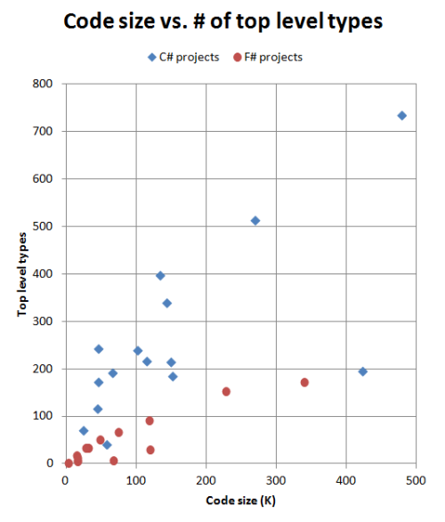

令我惊讶的是 F#和 C#项目在这张图表中有多么明显的区别。C#项目似乎有一个一致的比率，即每 1000 条指令约有 1-2 个顶级类型，即使在不同的项目规模下也是如此。而 F#项目也是一致的，每 1000 条指令约有 0.6 个顶级类型。

实际上，随着项目规模的增大，F#项目中的顶级类型数量似乎会逐渐减少，而不是像 C#项目那样线性增加。

我从这张图表中得到的信息是，对于一个给定大小的项目，F#实现将拥有更少的模块，因此可能更简单。

你可能注意到有两个异常值。两个 C#项目不在正常位置--50K 标记处的是 FParsecCS，而 425K 标记处的是我的业务应用程序。

我相当肯定这是因为这两个实现中都有一些相当大的 C#类，这有助于代码比率。对于一个解析器来说可能是一个必要的恶，但对于我的业务应用程序来说，我知道这是多年来积累的垃圾，有一些应该被重构为更小的类。因此，这样的度量可能对于一个 C#代码库来说是一个*不好*的迹象。

### 代码大小与所有类型数量的比率

另一方面，如果我们比较代码与所有类型的比例，结果会大不相同。

这是“代码大小”与“所有类型”的对应图表：

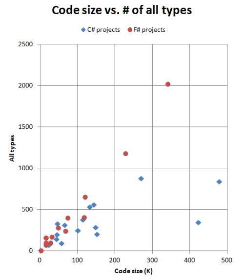

对于 F#来说，这种线性关系令人惊讶。类型总数（包括编译器生成的类型）似乎与项目的大小密切相关。另一方面，C#的类型数量似乎变化很大。

F#代码中类型的平均“大小”略小于 C#代码。C#中的平均类型转换为约 400 条指令。但对于 F#来说，这个数字约为 180 条指令。

我不确定为什么会这样。是因为 F#类型更精细，还是因为 F#编译器生成的小类型比 C#编译器多？没有进行更细致的分析，我无法判断。

### 顶层类型与作者类型的比例

将类型计数与代码大小进行比较后，现在让我们将它们相互比较：

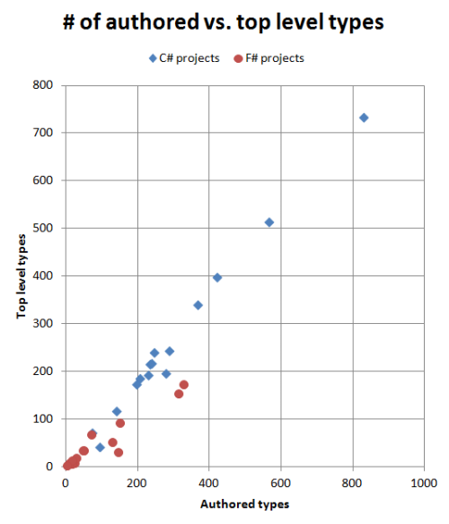

再次，存在显著差异。在 C#中，每个模块化单位平均有 1.1 个作者类型。但在 F#中，平均值为 1.9，对于某些项目来说更多。

当然，在 F#中创建嵌套类型是微不足道的，在 C#中相当罕见，因此你可以说这不是一个公平的比较。但是毫无疑问，在 F#中用几行代码创建十几种类型对设计质量有一定影响吧？在 C#中这样做更难，但没有什么能阻止你。那么这是否意味着在 C#中有一种诱惑，使你不像潜在可能的那样精细？

比例最高的项目（4.9）是我的 F#业务应用程序。我认为这是因为这是列表中唯一一个围绕特定业务领域设计的 F#项目，我创建了许多“小”类型来准确建模领域，使用了这里描述的概念。对于使用 DDD 原则创建的其他项目，我期望看到同样高的数字。

## 依赖关系

现在让我们看看顶层类之间的依赖关系。

这是 C#项目的结果：

| 项目 | 顶层类型 | 总依赖计数 | 依赖/顶层 | 一个或多个依赖 | 三个或多个依赖 | 五个或多个依赖 | 十个或多个依赖 | 图表 |
| --- | --- | --- | --- | --- | --- | --- | --- | --- |
| ef | 514 | 2354 | 4.6 | 76% | 51% | 32% | 13% | svg dotfile |
| jsonDotNet | 215 | 913 | 4.2 | 69% | 42% | 30% | 14% | svg dotfile |
| nancy | 339 | 1132 | 3.3 | 78% | 41% | 22% | 6% | svg dotfile |
| cecil | 240 | 1145 | 4.8 | 73% | 43% | 23% | 13% | svg dotfile |
| nuget | 216 | 833 | 3.9 | 71% | 43% | 26% | 12% | svg dotfile |
| signalR | 192 | 641 | 3.3 | 66% | 34% | 19% | 10% | svg dotfile |
| nunit | 173 | 499 | 2.9 | 75% | 39% | 13% | 4% | svg dotfile |
| specFlow | 242 | 578 | 2.4 | 64% | 25% | 17% | 5% | svg dotfile |
| elmah | 116 | 300 | 2.6 | 72% | 28% | 22% | 6% | svg dotfile |
| yamlDotNet | 70 | 228 | 3.3 | 83% | 30% | 11% | 4% | svg dotfile |
| fparsecCS | 41 | 64 | 1.6 | 59% | 29% | 5% | 0% | svg dotfile |
| moq | 397 | 1100 | 2.8 | 63% | 29% | 17% | 7% | svg dotfile |
| ndepend | 734 | 2426 | 3.3 | 67% | 37% | 25% | 10% | svg dotfile |
| ndependPlat | 185 | 404 | 2.2 | 67% | 24% | 11% | 4% | svg dotfile |
| personalCS | 195 | 532 | 2.7 | 69% | 29% | 19% | 7% |  |
| TOTAL | 3869 | 13149 | 3.4 | 70% | 37% | 22% | 9% |  |

并且这是 F# 项目的结果：

| Project | Top Level Types | Total Dep. Count | Dep/Top | One or more dep. | Three or more dep. | Five or more dep. | Ten or more dep. | Diagram |
| --- | --- | --- | --- | --- | --- | --- | --- | --- |
| fsxCore | 173 | 76 | 0.4 | 30% | 4% | 1% | 0% | svg dotfile |
| fsCore | 154 | 287 | 1.9 | 55% | 26% | 14% | 3% | svg dotfile |
| fsPowerPack | 93 | 68 | 0.7 | 38% | 13% | 2% | 0% | svg dotfile |
| storm | 67 | 195 | 2.9 | 72% | 40% | 18% | 4% | svg dotfile |
| fParsec | 8 | 9 | 1.1 | 63% | 25% | 0% | 0% | svg dotfile |
| websharper | 52 | 18 | 0.3 | 31% | 0% | 0% | 0% | svg dotfile |
| tickSpec | 34 | 48 | 1.4 | 50% | 15% | 9% | 3% | svg dotfile |
| websharperHtml | 18 | 37 | 2.1 | 78% | 39% | 6% | 0% | svg dotfile |
| canopy | 6 | 8 | 1.3 | 50% | 33% | 0% | 0% | svg dotfile |
| fsYaml | 7 | 10 | 1.4 | 71% | 14% | 0% | 0% | svg dotfile |
| fsSql | 13 | 14 | 1.1 | 54% | 8% | 8% | 0% | svg dotfile |
| fsUnit | 2 | 0 | 0.0 | 0% | 0% | 0% | 0% | svg dotfile |
| foq | 35 | 66 | 1.9 | 66% | 29% | 11% | 0% | svg dotfile |
| personalFS | 30 | 111 | 3.7 | 93% | 60% | 27% | 7% |  |
| TOTAL | 692 | 947 | 1.4 | 49% | 19% | 8% | 1% |  |

列为：

+   **顶层类型** 是程序集中顶层类型的总数，如前所述。

+   **总依赖关系计数** 是顶层类型之间的总依赖关系数量。

+   **Dep/Top** 是每个顶层类型/模块的依赖关系数量。这是平均每个顶层类型/模块具有的依赖关系数量的衡量标准。

+   **一个或更多依赖** 是具有一个或多个其他顶层类型依赖关系的顶层类型的数量。

+   **三个或更多依赖**。与上述类似，但具有三个或更多其他顶层类型的依赖关系。

+   **五个或更多依赖**。与上述类似。

+   **十个或更多依赖**。与上述类似。具有这么多依赖关系的顶层类型将更难理解和维护。因此，这是项目复杂程度的衡量标准。

**图表** 列包含一个链接到从依赖关系生成的 SVG 文件，以及用于生成 SVG 的 [DOT 文件](http://www.graphviz.org/)。有关这些图表的讨论，请参见下文。（请注意，我不能暴露我的应用程序的内部，所以我只会给出指标）

### 分析

这些结果非常有趣。对于 C＃，随着项目规模的增大，总依赖关系的数量也在增加。每个顶层类型平均依赖于 3-4 个其他类型。

另一方面，F# 项目中的总依赖关系数量似乎并不随项目规模变化太大。每个 F# 模块平均只依赖于 1-2 个其他模块。而最大的项目（FSharpX）的比率比许多较小的项目都要低。我的商业应用程序和 Storm 项目是唯一的例外。

这是代码大小与依赖关系数量之间关系的图表：

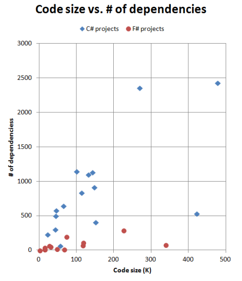

C＃ 和 F# 项目之间的差异非常明显。C＃ 依赖关系似乎随项目规模线性增长，而 F# 依赖关系似乎保持不变。

### 依赖关系分布

平均每个顶层类型的依赖关系数量很有趣，但并不能帮助我们了解变异性。是否有许多依赖关系很多的模块？还是每个模块只有几个依赖关系？

这可能会影响可维护性。我认为，一个只有一个或两个依赖关系的模块在应用程序的上下文中会比有数十个依赖关系的模块更容易理解。

与进行复杂的统计分析不同，我想保持简单，只是计算有一个或多个依赖关系、三个或多个依赖关系等的顶层类型的数量。

这里是相同的结果，以可视化方式显示：

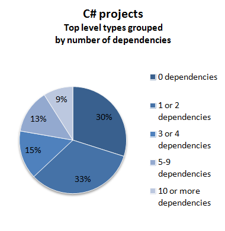

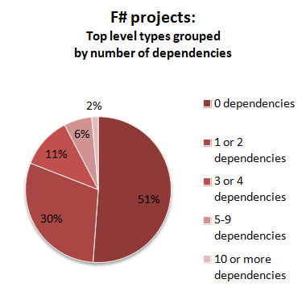

那么，我们可以从这些数字中推断出什么？

+   首先，在 F# 项目中，超过一半的模块根本没有任何外部依赖关系。这有点令人惊讶，但我认为这是由于与 C# 项目相比更多地使用泛型。

+   其次，在 F# 项目中，模块的依赖性始终比 C# 项目中的类少。

+   最后，在 F# 项目中，具有大量依赖关系的模块相当罕见 -- 总体不到 2%。但在 C# 项目中，有 9% 的类有超过 10 个依赖于其他类。

在 F# 组中最糟糕的是我的自己的 F# 应用程序，甚至比我的 C# 应用程序在这些指标上更糟糕。再次，这可能是由于大量使用领域特定类型的非泛型，或者可能只是代码需要更多重构！

### 依赖图表

现在看一下依赖图表可能会很有用。这些是 SVG 文件，所以您应该能够在浏览器中查看它们。

请注意，这些图表大多很大 -- 所以在打开它们后，您需要缩小视图才能看到任何内容！

让我们首先比较 SpecFlow 和 TickSpec 的图表。

这是关于 SpecFlow 的一个例子：


这是关于 TickSpec 的一个例子：


每个图表列出了项目中找到的所有顶层类型。如果有一个类型对另一个类型有依赖关系，则会显示一个箭头。依赖关系尽可能从左到右指向，因此任何从右到左的箭头意味着存在循环依赖。

布局是由 graphviz 自动完成的，但一般来说，类型被组织成列或“等级”。例如，SpecFlow 图表有 12 个等级，而 TickSpec 图表有五个。

正如你所看到的，典型依赖图中通常有许多交错的线条！图表看起来有多复杂，就是代码复杂性的一种视觉度量。例如，如果我被要求维护 SpecFlow 项目，我在理解所有类之间的关系之前可能不会感到真正舒适。而项目越复杂，上手所需的时间就越长。

### 面向对象 vs 函数式设计揭示了什么？

TickSpec 图表比 SpecFlow 图表简单得多。这是因为 TickSpec 可能没有像 SpecFlow 那样做得多吗？

答案是否定的，我认为这与功能集的大小无关，而是因为代码组织方式不同。

查看 SpecFlow 类（dotfile），我们可以看到它遵循良好的面向对象设计和测试驱动开发的实践，创建了接口。例如，有一个 `TestRunnerManager` 和一个 `ITestRunnerManager`。还有许多其他常见的面向对象设计模式： "listener" 类和接口， "provider" 类和接口， "comparer" 类和接口等等。

但是，如果我们看一下 TickSpec 模块（dotfile），根本没有接口。也没有 "listeners"、"providers" 或 "comparers"。这些代码可能确实需要这样的东西，但是要么它们不会暴露在模块外，要么更有可能的是，它们扮演的角色是由函数而不是类型来完成的。

顺便说一句，我并不是在挑剔 SpecFlow 代码。它似乎设计得很好，并且是一个非常有用的库，但我认为它确实突出了面向对象设计和函数式设计之间的一些差异。

### Moq 与 Foq 比较

让我们也比较一下 Moq 和 Foq 的图表。这两个项目大致做同样的事情，所以代码应该是可以比较的。

与以前一样，用 F# 编写的项目具有更小的依赖关系图。

查看 Moq 类（dotfile），我们可以看到它包括了 "Castle" 库，我没有从分析中排除掉它。在 249 个具有依赖关系的类中，只有 66 个是 Moq 特定的。如果我们只考虑 Moq 命名空间中的类，我们可能会得到一个更清晰的图表。

另一方面，查看 Foq 模块（dotfile），只有 23 个具有依赖关系的模块，甚至比仅仅 Moq 类还要少。

因此，在 F# 中的代码组织方式与众不同。

### FParsec 与 FParsecCS 比较

FParsec 项目是一个有趣的自然实验。该项目有两个组件，大小差不多，但一个是用 C# 写的，另一个是用 F# 写的。

直接比较它们有点不公平，因为 C# 代码是为了快速解析而设计的，而 F# 代码则更高级。但是...我还是要不公平地比较它们！

这里是 F# 组件 "FParsec" 和 C# 组件 "FParsecCS" 的图表。

它们都很清晰。代码很美妙！

从图表中看不出的是，我的方法对 C# 组件是不公平的。

例如，C# 图表显示了`Operator`、`OperatorType`、`InfixOperator`等之间的依赖关系。但实际上，看源代码，这些类都在同一个物理文件中。在 F# 中，它们都会在同一个模块中，并且它们的关系不算作公共依赖。因此，以某种方式来说，C# 代码是受到了惩罚。

即便如此，从源代码来看，C# 代码有 20 个源文件，而 F# 的有 8 个，所以复杂度仍然有所不同。

### 什么算作依赖？

不过，捍卫我的方法，唯一将这些 FParsec C# 类放在同一个文件中的是良好的编码实践；它并不是由 C# 编译器强制执行的。另一个维护者可能会过来，不知情地将它们分开成不同的文件，这确实*会*增加复杂性。在 F# 中，你不能那么轻易地做到这一点，当然也不会是意外的。

所以这取决于你所说的“模块”和“依赖”。在我看来，一个模块包含那些真正“紧密相连”的东西，不应该轻易地解耦。因此，在模块内部的依赖不算，而模块之间的依赖算。

另一种思考方式是，F# 在某些领域（模块）鼓励高耦合，以换取其他领域的低耦合。在 C# 中，唯一可用的严格耦合方式是基于类的。任何松散的耦合，比如使用命名空间，都必须通过良好的实践或工具（如 NDepend）来强制执行。

F# 的方法是更好还是更糟取决于你的偏好。这确实使得某些类型的重构更加困难。

## 循环依赖

最后，我们可以把注意力转向这些非常邪恶的循环依赖。（如果你想知道为什么它们是不好的，请阅读这篇文章）。

这里是 C# 项目的循环依赖结果。

| 项目 | 顶层类型 | 循环计数 | 参与者 | 参与者% | 最大组件大小 | 循环计数（公共） | 参与者（公共） | 参与者%（公共） | 最大组件大小（公共） | 图表 |
| --- | --- | --- | --- | --- | --- | --- | --- | --- | --- | --- |
| ef | 514 | 14 | 123 | 24% | 79 | 1 | 7 | 1% | 7 | svg dotfile |
| jsonDotNet | 215 | 3 | 88 | 41% | 83 | 1 | 11 | 5% | 11 | svg dotfile |
| nancy | 339 | 6 | 35 | 10% | 21 | 2 | 4 | 1% | 2 | svg dotfile |
| cecil | 240 | 2 | 125 | 52% | 123 | 1 | 50 | 21% | 50 | svg dotfile |
| nuget | 216 | 4 | 24 | 11% | 10 | 0 | 0 | 0% | 1 | svg dotfile |
| signalR | 192 | 3 | 14 | 7% | 7 | 1 | 5 | 3% | 5 | svg dotfile |
| nunit | 173 | 2 | 80 | 46% | 78 | 1 | 48 | 28% | 48 | svg dotfile |
| specFlow | 242 | 5 | 11 | 5% | 3 | 1 | 2 | 1% | 2 | svg dotfile |
| elmah | 116 | 2 | 9 | 8% | 5 | 1 | 2 | 2% | 2 | svg dotfile |
| yamlDotNet | 70 | 0 | 0 | 0% | 1 | 0 | 0 | 0% | 1 | svg dotfile |
| fparsecCS | 41 | 3 | 6 | 15% | 2 | 1 | 2 | 5% | 2 | svg dotfile |
| moq | 397 | 9 | 50 | 13% | 15 | 0 | 0 | 0% | 1 | svg dotfile |
| ndepend | 734 | 12 | 79 | 11% | 22 | 8 | 36 | 5% | 7 | svg dotfile |
| ndependPlat | 185 | 2 | 5 | 3% | 3 | 0 | 0 | 0% | 1 | svg dotfile |
| personalCS | 195 | 11 | 34 | 17% | 8 | 5 | 19 | 10% | 7 | svg dotfile |
| TOTAL | 3869 |  | 683 | 18% |  |  | 186 | 5% |  | svg dotfile |

这里是 F# 项目的结果：

| 项目 | 顶层类型 | 循环次数 | 参与 | 参与% | 最大组件大小 | 循环次数（公共） | 参与（公共） | 参与%（公共） | 最大组件大小（公共） | 图表 |
| --- | --- | --- | --- | --- | --- | --- | --- | --- | --- | --- |
| fsxCore | 173 | 0 | 0 | 0% | 1 | 0 | 0 | 0% | 1 | . |
| fsCore | 154 | 2 | 5 | 3% | 3 | 0 | 0 | 0% | 1 | svg dotfile |
| fsPowerPack | 93 | 1 | 2 | 2% | 2 | 0 | 0 | 0% | 1 | svg dotfile |
| storm | 67 | 0 | 0 | 0% | 1 | 0 | 0 | 0% | 1 | . |
| fParsec | 8 | 0 | 0 | 0% | 1 | 0 | 0 | 0% | 1 | . |
| websharper | 52 | 0 | 0 | 0% | 1 | 0 | 0 | 0% | 0 | . |
| tickSpec | 34 | 0 | 0 | 0% | 1 | 0 | 0 | 0% | 1 | . |
| websharperHtml | 18 | 0 | 0 | 0% | 1 | 0 | 0 | 0% | 1 | . |
| canopy | 6 | 0 | 0 | 0% | 1 | 0 | 0 | 0% | 1 | . |
| fsYaml | 7 | 0 | 0 | 0% | 1 | 0 | 0 | 0% | 1 | . |
| fsSql | 13 | 0 | 0 | 0% | 1 | 0 | 0 | 0% | 1 | . |
| fsUnit | 2 | 0 | 0 | 0% | 0 | 0 | 0 | 0% | 0 | . |
| foq | 35 | 0 | 0 | 0% | 1 | 0 | 0 | 0% | 1 | . |
| personalFS | 30 | 0 | 0 | 0% | 1 | 0 | 0 | 0% | 1 | . |
| TOTAL | 692 |  | 7 | 1% |  |  | 0 | 0% |  | . |

列如下：

+   **顶层类型**是程序集中顶层类型的总数，如前所述。

+   **循环次数**是所有循环的总数。理想情况下应该是零。但更大的循环不一定更糟糕。我认为，最好有 10 个小循环，而不是一个巨大的循环。

+   **Partic.**。参与任何循环的顶层类型的数量。

+   **Partic.%**。参与任何循环的顶层类型的数量，作为所有类型的百分比。

+   **最大组件大小**是最大循环组中顶级类型的数量。这是衡量循环复杂程度的指标。如果只有两个相互依赖的类型，那么循环就比如说 123 个相互依赖的类型要简单得多。

+   **...(public)**列具有相同的定义，但仅使用公共依赖项。我认为限制分析仅针对公共依赖项将会产生什么影响是有趣的。

+   **图表**列包含一个链接到 SVG 文件的链接，该文件仅从循环中的依赖关系生成，并且还包含用于生成 SVG 的[DOT 文件](http://www.graphviz.org/)。详见下文进行分析。

### 分析

如果我们在 F#代码中寻找循环，我们将大失所望。只有两个 F#项目中有循环，而且那些循环很小。例如，在 FSharp.Core 中，有两个彼此紧邻的类型之间存在相互依赖，[在此处](https://github.com/fsharp/fsharp/blob/master/src/fsharp/FSharp.Core/quotations.fs#L146)。

另一方面，几乎所有的 C#项目都有一个或多个循环。Entity Framework 有最多的循环，涉及到 24%的类，而 Cecil 的参与率最差，超过一半的类参与了循环。

即使 NDepend 也存在循环，尽管公平地说，这可能是有好的原因的。首先，NDepend 侧重于消除命名空间之间的循环，而不是那么多的类，其次，循环可能在同一源文件中声明的类型之间。因此，我的方法可能会在一定程度上惩罚良好组织的 C#代码（如上述 FParsec vs. FParsecCS 讨论中所述）。

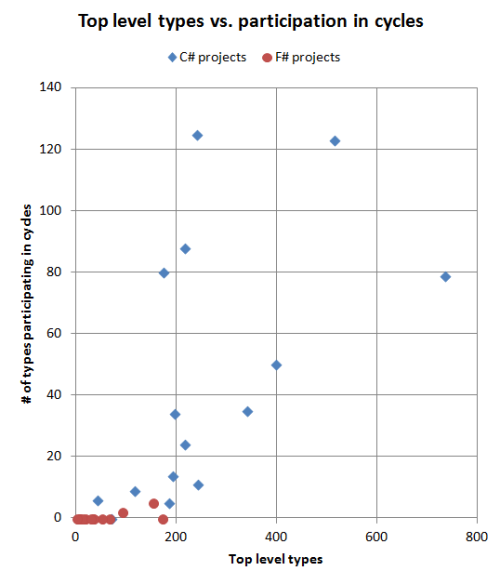

为什么 C#和 F#之间会有差异？

+   在 C#中，没有任何阻止您创建循环的东西--这是偶然复杂性的完美例子。事实上，您必须[特别努力](http://programmers.stackexchange.com/questions/60549/how-strictly-do-you-follow-the-no-dependency-cycle-rule-ndepend)才能避免它们。

+   当然，在 F#中情况恰恰相反。你根本无法轻易地创建循环。

## 比较我的业务应用程序

又来一个比较。作为我的日常工作的一部分，我用 C#编写了许多业务应用程序，最近也用 F#编写了一些。与这里列出的其他项目不同，它们非常专注于解决特定的业务需求，具有大量领域特定代码、定制业务规则、特殊情况等等。

两个项目都是在截止日期内完成的，具有不断变化的需求以及所有通常阻止您编写理想代码的现实世界约束。像我这样的大多数开发人员一样，我很乐意有机会整理和重构它们，但它们确实有效，业务也很满意，我必须继续进行新的事务。

不管怎样，让我们看看它们彼此之间的差异。我不能透露代码的任何细节，除了指标之外，但我认为这应该足够有用。

首先看看 C#项目：

+   它有 195 个顶层类型，大约每 2K 代码有 1 个。与其他 C#项目相比，顶层类型应该比这个*多得多*。事实上，我知道这是真的。与许多项目一样（这个项目已经 6 年了），在截止日期之前，向现有类添加方法比重构更低风险。保持旧代码的稳定性始终比使其美观更重要！结果是类随着时间变得过大。

+   拥有大型类的另一面是，跨类依赖要少得多！它在 C#项目中得分较高。这表明依赖关系并不是唯一的度量标准。必须保持平衡。

+   就循环依赖而言，对于 C#项目来说，这是相当典型的。有一些循环依赖（11 个），但最大的只涉及 8 个类。

现在让我们看看我的 F#项目：

+   它有 30 个模块，大约每 4K 代码有 1 个。与其他 F#项目相比，这并不过分，但也许需要进行一些重构。

    +   顺便说一句，在我维护这段代码的经验中，我注意到，与 C#代码不同，当功能请求进来时，我并不觉得我*必须*向现有模块添加冗余代码。相反，在许多情况下，进行更改的更快、更低风险的方法只是创建一个*新*模块，并将所有新功能的代码放在那里。因为模块没有状态，一个函数可以存在于任何地方--它不被迫存在于同一个类中。随着时间的推移，这种方法可能也会带来自己的问题（COBOL？），但现在，我觉得这是一种清新的做法。

+   指标显示每个模块有异常多的“编写”类型（4.9）。正如我上面所指出的，我认为这是细粒度 DDD 风格设计的结果。每个编写类型的代码与其他 F#项目一致，这意味着它们既不太大也不太小。

+   此外，正如我之前所指出的，模块间的依赖关系是任何 F#项目中最糟糕的。我知道有一些 API/服务函数几乎依赖于所有其他模块，但这可能是它们需要重构的线索。

    +   然而，与 C#代码不同，我确切地知道在哪里找到这些问题模块。我可以相当肯定所有这些模块都在我的应用程序的顶层，并且因此会出现在 Visual Studio 的模块列表底部。我怎么能如此确定？因为...

+   就循环依赖而言，对于 F#项目来说，这是相当典型的。没有。

## 总结

我从好奇心开始进行这项分析--C#和 F#项目的组织是否有任何有意义���差异？

我对区分如此清晰感到相当惊讶。根据这些指标，你肯定可以预测这个程序集是用哪种语言编写的。

+   **项目复杂性**。对于给定数量的指令，一个 C#项目可能比一个 F#项目有更多的顶层类型（因此文件）--似乎是超过两倍。

+   **细粒度类型**。对于给定数量的模块，C# 项目可能比 F# 项目拥有更少的作者类型，这意味着类型没有那么细粒度。

+   **依赖关系**。在 C# 项目中，类之间的依赖关系数量随项目规模线性增长。在 F# 项目中，依赖关系的数量要小得多，并且保持相对稳定。

+   **循环**。在 C# 项目中，循环很容易发生，除非小心避免。在 F# 项目中，循环极为罕见，而且如果存在，很小。

这也许与程序员的能力有关，而不是语言之间的差异？嗯，首先，我认为整体上 C# 项目的质量相当不错 —— 我绝对不会声称我能写出更好的代码！而且，特别是在两种情况下，C# 和 F# 项目是由同一个人编写的，仍然存在差异，所以我认为这个论点站不住脚。

## 未来的工作

*仅仅*使用二进制文件的方法可能已经到达了极限。为了进行更准确的分析，我们需要同时使用来自源代码的度量标准（或者可能是 pdb 文件）。

例如，“每种类型的指令”指标很高是好事，如果对应的是小型源文件（简洁的代码），但如果对应的是大型源文件（臃肿的类），那就不好了。同样，我的模块化定义使用顶级类型而不是源文件，这对 C# 有些不利于 F#。

所以，我不认为这个分析是完美的（我希望分析代码没有犯严重的错误！），但我认为这可能是进一步调查的有用起点。

* * *

## 更新 2013-06-15

这篇文章引起了相当多的兴趣。根据反馈，我做出了以下更改：

**程序集进行了分析**

+   添加了 Foq 和 Moq（由 Phil Trelford 请求）。

+   添加了 FParsec 的 C# 组件（由 Dave Thomas 和其他人请求）。

+   添加了两个 NDepend 程序集。

+   添加了两个我的项目，一个是 C#，一个是 F#。

正如您所见，添加了七个新数据点（五个 C# 和两个 F# 项目）并没有改变总体分析。

**算法更改**

+   使“作者”类型的定义更严格。排除了带有“GeneratedCodeAttribute”的类型和 F# 类型，这些类型是和和类型的子类型。这对 F# 项目产生了影响，稍微降低了“Auth/Top”比率。

**文本更改**

+   重新撰写了部分分析。

+   删除了对 YamlDotNet 与 FParsec 的不公平比较。

+   添加了 FParsec 的 C# 组件和 F# 组件的比较。

+   添加了 Moq 和 Foq 的比较。

+   添加了我自己的两个项目的比较。

原始帖子仍然在这里可用。
