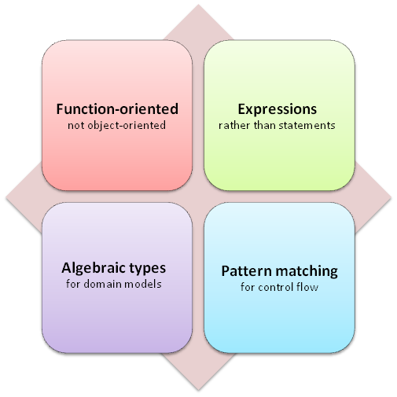
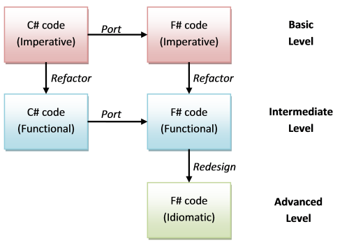

# “从 C# 迁移”系列

想要将 C# 代码转换为 F# 吗？在这一系列的帖子中，我们将研究各种方法，并涉及其中的设计决策和权衡。

+   从 C# 到 F# 的移植介绍。 将现有的 C# 代码转换为 F# 的三种方法。

+   开始直接移植。 C# 的 F# 等效项。

# 从 C# 转换到 F#: 介绍

# 从 C# 转换到 F#: 介绍

*注意：在阅读本系列之前，我建议您作为先决条件阅读以下系列："思考函数化"、"表达式和语法"以及"理解 F# 类型"。*

对于许多开发人员来说，学习一种新语言后的下一步可能是将一些现有代码移植过去，以便他们可以深入了解两种语言之间的差异。

正如我们之前所指出的，函数式语言与命令式语言非常不同，因此尝试将命令式代码直接移植到函数式语言通常是不可能的，即使成功地进行了粗略移植，移植后的代码也可能没有充分利用函数模型。

当然，F# 是一种多范式语言，包括对面向对象和命令式技术的支持，但即使如此，直接移植通常不会是编写相应的 F# 代码的最佳方式。

因此，在本系列中，我们将研究将现有的 C# 代码转换为 F# 的各种方法。

## 移植的复杂程度

如果您回想一下早期帖子中的图表，您会发现有四个关键概念区分了 F# 和 C#。

+   以函数为导向而不是对象为导向

+   表达式而不是语句

+   用于创建领域模型的代数类型

+   控制流的模式匹配



而且，正如在那篇帖子及其后续帖子中解释的那样，这些方面不仅是学术上的，而且对您作为开发人员提供了具体的好处。

因此，我将移植过程分为三个复杂程度的级别（暂且这样称呼），这些级别代表了移植代码利用这些优势的程度。

### 基本水平：直接移植

在这个第一级别，F# 代码是 C# 代码的直接移植（如果可能的话）。 类和方法被用于模块和函数，值经常被改变。

### 中级水平：功能代码

在下一个级别，F# 代码已被重构为完全函数式的。

+   类和方法已被模块和函数取代，值通常是不可变的。

+   高阶函数用于替代接口和继承。

+   模式匹配被广泛用于控制流。

+   循环已被替换为列表函数，如“map”或递归。

有两条不同的路径可以使您达到这个水平。

+   第一条路径是直接将代码移植到 F#，然后重构 F# 代码。

+   第二种方法是将现有的命令式代码转换为函数代码，同时保持在 C#中，并且只有在将函数式 C#代码转换为函数式 F#代码之后才进行转换！

第二种选择可能看起来很笨拙，但对于实际代码来说，这可能会更快，更舒适。 更快，因为您可以使用诸如 Resharper 之类的工具来进行重构，更舒适，因为您在最终端口之前是在 C#中工作的。 这种方法还清楚地表明，困难的部分不是从 C#到 F#的实际端口，而是将命令式代码转换为函数代码！

### 高级水平：类型代表域

在最后一级，不仅代码是函数式的，而且设计本身已经改变，以利用代数数据类型（特别是联合类型）的强大功能。

该域将已经被编码为类型，使得不合法状态甚至不可表示，并且正确性在编译时强制执行。 关于此方法的具体演示，请参见"为什么使用 F#系列中的[购物车示例和整个"使用类型设计"系列。

此级别只能在 F#中完成，而在 C#中实际上并不实用。

### 端口图

以下是一个图表，可帮助您可视化上述各种端口路径。



## 本系列的方法

要查看这三个级别在实践中的运作方式，我们将它们应用于一些示例：

+   第一个示例是一个简单的十柱保龄球游戏创建和计分系统，基于"叔叔"Bob Martin 描述的著名的"保龄球游戏卡塔"的代码。 原始的 C#代码只有一个类和大约 70 行代码，但即便如此，它也演示了一些重要的原则。

+   接下来，我们将查看一些购物车代码，基于此示例。

+   最后一个示例是代表地铁闸机系统状态的代码，也是基于 Bob Martin 的一个示例。 该示例演示了 F#中的联合类型如何比 OO 方法更容易地表示状态转换模型。

但首先，在我们开始详细的示例之前，我们将回到基础知识，并对一些代码片段进行简单的端口转换。 这将是下一篇文章的主题。

# 开始直接转换

# 开始直接转换

在我们开始详细的示例之前，我们将回到基础知识，并对一些简单的例子进行简单的端口转换。

在这篇文章和下一篇文章中，我们将查看常见的 C#语句和关键字的最近的 F#等效项，以指导您进行直接端口转换。

## 基本语法转换指南

在开始移植之前，您需要了解 F# 语法与 C# 语法的不同之处。本节介绍了一些从一种语言转换到另一种语言的一般准则。（要快速了解整个 F# 语法，请参阅"60 秒内了解 F# 语法"）

### 大括号和缩进

C# 使用大括号表示代码块的开始和结束。F# 通常只使用缩进。

F# 中使用大括号，但不用于代码块。相反，您会看到它们用于：

+   有关"record"类型的定义和用法。

+   与计算表达式一起使用，例如 `seq` 和 `async`。一般来说，您不会在基本移植中使用这些表达式。

有关缩进规则的详细信息，请参阅此文章。

### 分号

与 C# 的分号不同，F# 不需要任何形式的行或语句终止符。

### 逗号

F# 不使用逗号分隔参数或列表元素，因此在移植时请记得不要使用逗号！

*用分号而不是逗号分隔列表元素。*

```
// C# example
var list = new int[] { 1,2,3} 
```

```
// F# example
let list = [1;2;3] // semicolons 
```

*用空格分隔原生 F# 函数的参数。*

```
// C# example 
int myFunc(int x, int y, int z) { ... function body ...} 
```

```
// F# example 
let myFunc (x:int) (y:int) (z:int) :int = ... function body ...
let myFunc x y z = ... function body ... 
```

逗号通常仅用于元组，或者在调用 .NET 库函数时分隔参数。（有关元组与多个参数的更多信息，请参阅此文章）

### 定义变量、函数和类型

在 F# 中，变量和函数的定义都采用以下形式：

```
let someName = // the definition 
```

所有类型（类、结构、接口等）的定义形式为：

```
type someName = // the definition 
```

使用 `=` 符号是 F# 和 C# 之间的一个重要区别。C# 使用大括号，而 F# 使用 `=`，然后后面的代码块必须缩进。

### 可变值

在 F# 中，默认情况下值是不可变的。如果您正在进行直接的命令式移植，可能需要将某些值设为可变，使用 `mutable` 关键字。然后为了给值赋值，使用 `<-` 运算符，而不是等号。

```
// C# example 
var variableName = 42
variableName = variableName + 1 
```

```
// F# example 
let mutable variableName = 42
variableName <- variableName + 1 
```

### 赋值与测试相等性

在 C# 中，等号用于赋值，双等号 `==` 用于测试相等性。

然而在 F# 中，等号用于测试相等性，并且在声明时也用于最初将值绑定到其他值，

```
let mutable variableName = 42     // Bound to 42 on declaration
variableName <- variableName + 1  // Mutated (reassigned)
variableName = variableName + 1   // Comparison not assignment! 
```

要测试不相等性，请使用 SQL 风格的 `<>` 而不是 `!=`

```
let variableName = 42             // Bound to 42 on declaration
variableName <> 43                // Comparison will return true.
variableName != 43                // Error FS0020. 
```

如果您意外使用 `!=`，可能会收到 错误 FS0020。

## 转换示例 #1

有了这些基本准则，让我们看一些真实的代码示例，并为它们进行直接移植。

这个第一个例子有一些非常简单的代码，我们将逐行移植。以下是 C# 代码。

```
using System;
using System.Collections.Generic;

namespace PortingToFsharp
{
    public class Squarer
    {
        public int Square(int input) {
            var result = input * input;
            return result;
        }

        public void PrintSquare(int input) {
            var result = this.Square(input);
            Console.WriteLine("Input={0}. Result={1}", 
              input, result);
        }
    } 
```

### 转换 "using" 和 "namespace"

这些关键字很简单：

+   `using` 变成 `open`

+   带有大括号的 `namespace` 变成了简单的 `namespace`。

与 C# 不同，F# 文件通常不声明命名空间，除非需要与其他 .NET 代码进行交互。文件名本身就充当默认命名空间。

请注意，命名空间（如果使用）必须放在任何其他内容之前，例如 “open”。这与大多数 C# 代码的相反顺序。

### 转换类

要声明一个简单的类，请使用：

```
type myClassName() = 
   ... code ... 
```

请注意，类名后面有括号。这些是类定义所必需的。

更复杂的类定义将在下一个示例中展示，并且您可以阅读完整的类讨论。

### 转换函数/方法签名

对于函数/方法签名：

+   参数列表周围不需要括号

+   使用空格分隔参数，而不是逗号

+   而不是花括号，等号表示函数体的开始

+   参数通常不需要类型，但如果需要：

    +   类型名称位于值或参数之后

    +   参数名和类型由冒号分隔

    +   在指定参数类型时，您可能应该将一对括号括起来，以避免意外行为。

    +   函数作为整体的返回类型前面加上冒号，位于所有其他参数之后

这是一个 C# 函数签名：

```
int Square(int input) { ... code ...} 
```

这是具有显式类型的相应 F# 函数签名：

```
let Square (input:int) :int =  ... code ... 
```

但是，由于 F# 通常可以推断出参数和返回类型，所以很少需要显式指定它们。

这是一个更典型的 F# 签名，具有推断类型：

```
let Square input =  ... code ... 
```

### void

在 C# 中，`void` 关键字通常不需要，但如果需要，则会转换为 `unit`

因此，C# 代码：

```
void PrintSquare(int input) { ... code ...} 
```

可以转换为 F# 代码：

```
let PrintSquare (input:int) :unit =  ... code ... 
```

但再次指出，很少需要具体的类型，因此 F# 版本只是：

```
let PrintSquare input =  ... code ... 
```

### 转换函数/方法体

在函数体中，您可能会有一系列组合：

+   变量声明和赋值

+   函数调用

+   控制流语句

+   返回值

我们将依次快速查看每个端口，但不包括控制流，我们稍后会讨论。

### 转换变量声明

几乎总是可以单独使用 `let`，就像在 C# 中使用 `var` 一样：

```
// C# variable declaration
var result = input * input; 
```

```
// F# value declaration
let result = input * input 
```

与 C# 不同，您必须始终将某些内容分配（“绑定”）给 F# 值作为其声明的一部分。

```
// C# example 
int unassignedVariable; //valid 
```

```
// F# example 
let unassignedVariable // not valid 
```

如上所述，如果需要在其声明之后更改值，则必须使用 “mutable” 关键字。

如果您需要为值指定类型，则类型名称位于值或参数之后，前面加上冒号。

```
// C# example 
int variableName = 42; 
```

```
// F# example 
let variableName:int = 42 
```

### 转换函数调用

在调用本机 F# 函数时，不需要括号或逗号。换句话说，调用函数与定义函数时使用的规则相同。

这是定义函数然后调用它的 C# 代码：

```
// define a method/function 
int Square(int input) { ... code  ...}

// call it
var result = Square(input); 
```

但是，由于 F# 通常可以推断出参数和返回类型，所以很少需要显式指定它们。因此，这是定义函数然后调用它的典型 F# 代码：

```
// define a function 
let Square input = ... code ...

// call it
let result = Square input 
```

### 返回值

在 C# 中，您使用 `return` 关键字。但在 F# 中，块中的最后一个值会自动成为“返回”值。

这是返回 `result` 变量的 C# 代码。

```
public int Square(int input) {
    var result = input * input;
    return result;   //explicit "return" keyword
} 
```

这是 F# 的等效方式。

```
let Square input = 
    let result = input * input
    result        // implicit "return" value 
```

这是因为 F# 是基于表达式的。一切都是表达式，块表达式的值就是块中最后一个表达式的值。

想要了解更多关于表达式导向代码的细节，请参见"表达式 vs 语句"。

### 打印到控制台

在 C# 中打印输出，通常使用 `Console.WriteLine` 或类似的方法。在 F# 中，通常使用 `printf` 或类似的方法，这是类型安全的。(更多关于使用 "printf" 系列的细节)。

### 示例 #1 的完整移植

将所有内容整合在一起，这里是将示例 #1 直接移植到 F# 的完整代码。

C# 代码如下：

```
using System;
using System.Collections.Generic;

namespace PortingToFsharp
{
    public class Squarer
    {
        public int Square(int input) {
            var result = input * input;
            return result;
        }

        public void PrintSquare(int input) {
            var result = this.Square(input);
            Console.WriteLine("Input={0}. Result={1}", 
              input, result);
        }
    } 
```

相应的 F# 代码如下：

```
namespace PortingToFsharp

open System
open System.Collections.Generic

type Squarer() =  

    let Square input = 
        let result = input * input
        result

    let PrintSquare input = 
        let result = Square input
        printf "Input=%i. Result=%i" input result 
```
