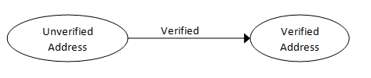
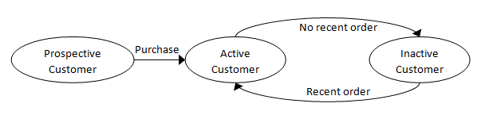

# “使用类型设计”系列

在这个系列中，我们将探讨如何在设计过程中使用类型的一些方法。特别是，深思熟虑地使用类型可以使设计更加透明，同时提高正确性。

本系列将专注于设计的“微观层面”。也就是说，工作在单个类型和函数的最低级别。关于使用函数式或面向对象风格的更高级别设计方法，以及相关的决策，将在另一个系列中讨论。

许多建议在 C#或 Java 中也是可行的，但 F#类型的轻量级特性意味着我们更有可能进行这种类型的重构。

+   使用类型设计：介绍。使设计更透明，提高正确性。

+   使用类型设计：单例联合类型。为原始类型添加含义。

+   使用类型设计：使非法状态不可表示。在类型中编码业务逻辑。

+   使用类型设计：发现新概念。深入了解领域。

+   使用类型设计：使状态显式。使用状态机确保正确性。

+   使用类型设计：受限字符串。为原始类型添加更多语义信息。

+   使用类型设计：非字符串类型。安全地使用整数和日期。

+   使用类型设计：结论。前后对比。

# 使用类型设计：介绍

# 使用类型设计：介绍

在这个系列中，我们将探讨如何在设计过程中使用类型的一些方法。特别是，深思熟虑地使用类型可以使设计更加透明，同时提高正确性。

本系列将专注于设计的“微观层面”。也就是说，工作在单个类型和函数的最低级别。关于使用函数式或面向对象风格的更高级别设计方法，以及相关的决策，将在另一个系列中讨论。

许多建议在 C#或 Java 中也是可行的，但 F#类型的轻量级特性意味着我们更有可能进行这种类型的重构。

## 一个基本示例

为了演示各种类型的用途，我将使用一个非常简单的示例，即`Contact`类型，如下所示。

```
type Contact = 
    {
    FirstName: string;
    MiddleInitial: string;
    LastName: string;

    EmailAddress: string;
    //true if ownership of email address is confirmed
    IsEmailVerified: bool;

    Address1: string;
    Address2: string;
    City: string;
    State: string;
    Zip: string;
    //true if validated against address service
    IsAddressValid: bool; 
    } 
```

这似乎非常明显--我相信我们都见过类似的东西很多次。那么我们可以怎么做呢？我们如何重构它以充分利用类型系统？

## 创建“原子”类型

首先要做的是查看数据访问和更新的使用模式。例如，`Zip` 是否有可能在不同时更新 `Address1`？另一方面，交易更新 `EmailAddress` 而不更新 `FirstName` 可能是常见的。

这导致了第一个指导原则：

+   *指导原则：使用记录或元组将需要保持一致性的数据组合在一起（即“原子”），但不要无谓地将不相关的数据组合在一起。*

在这种情况下，很明显三个名称值是一组，地址值是一组，电子邮件也是一组。

我们还有一些额外的标志，如 `IsAddressValid` 和 `IsEmailVerified`。这些是否应该成为相关集合的一部分？现在肯定是，因为这些标志依赖于相关值。

例如，如果 `EmailAddress` 发生变化，那么 `IsEmailVerified` 可能也需要同时被重置为 false。

对于 `PostalAddress`，显然核心的“地址”部分是一个有用的通用类型，没有 `IsAddressValid` 标志。另一方面，`IsAddressValid` 与地址相关联，并且在其更改时将进行更新。

所以似乎我们应该创建*两种*类型。一个是通用的 `PostalAddress`，另一个是在联系人上下文中的地址，我们可以称之为 `PostalContactInfo`。

```
type PostalAddress = 
    {
    Address1: string;
    Address2: string;
    City: string;
    State: string;
    Zip: string;
    }

type PostalContactInfo = 
    {
    Address: PostalAddress;
    IsAddressValid: bool;
    } 
```

最后，我们可以使用选项类型来表示某些值，例如 `MiddleInitial`，确实是可选的。

```
type PersonalName = 
    {
    FirstName: string;
    // use "option" to signal optionality
    MiddleInitial: string option;
    LastName: string;
    } 
```

## 总结

通过所有这些变化，我们现在有了以下代码：

```
type PersonalName = 
    {
    FirstName: string;
    // use "option" to signal optionality
    MiddleInitial: string option;
    LastName: string;
    }

type EmailContactInfo = 
    {
    EmailAddress: string;
    IsEmailVerified: bool;
    }

type PostalAddress = 
    {
    Address1: string;
    Address2: string;
    City: string;
    State: string;
    Zip: string;
    }

type PostalContactInfo = 
    {
    Address: PostalAddress;
    IsAddressValid: bool;
    }

type Contact = 
    {
    Name: PersonalName;
    EmailContactInfo: EmailContactInfo;
    PostalContactInfo: PostalContactInfo;
    } 
```

我们还没有写一个函数，但代码已经更好地代表了领域。然而，这只是我们可以做的开始。

接下来，使用单一案例联合类型为基本类型添加语义含义。

# 单一案例联合类型

# 使用类型设计：单一案例联合类型

在上一篇文章的结尾，我们为电子邮件地址、邮政编码等定义了值，如下所示：

```
 EmailAddress: string;
State: string;
Zip: string; 
```

所有这些都被定义为简单的字符串。但是实际上，它们只是字符串吗？电子邮件地址是否可以与邮政编码或州缩写互换使用？

在领域驱动设计中，它们确实是不同的事物，而不仅仅是字符串。因此，我们理想情况下希望为它们创建许多单独的类型，以防止它们被意外混淆。

长期以来，这一直被视为[良好的实践](http://codemonkeyism.com/never-never-never-use-string-in-java-or-at-least-less-often/)，但在像 C# 和 Java 这样的语言中，创建数百个这样的微小类型可能会很痛苦，导致所谓的["原始迷恋"](http://sourcemaking.com/refactoring/primitive-obsession)代码异味。

但是在 F# 中没有借口！创建简单的包装类型是微不足道的。

## 包装基本类型

创建一个单独类型的最简单方法是将底层的字符串类型包装在另一个类型中。

我们可以使用单一案例联合类型来做到这一点，就像这样：

```
type EmailAddress = EmailAddress of string
type ZipCode = ZipCode of string
type StateCode = StateCode of string 
```

或者，我们可以使用一个字段的记录类型，就像这样：

```
type EmailAddress = { EmailAddress: string }
type ZipCode = { ZipCode: string }
type StateCode = { StateCode: string} 
```

两种方法都可以用于创建围绕字符串或其他原始类型的包装类型，那么哪种方式更好呢？

答案通常是单一情况辨别式联合。它要容易得多地“包装”和“解包”，因为“联合情况”实际上是一个适当的构造函数。使用内联模式匹配可以进行解包。

下面是`EmailAddress`类型可能被构造和解构的一些示例：

```
type EmailAddress = EmailAddress of string

// using the constructor as a function
"a" |> EmailAddress
["a"; "b"; "c"] |> List.map EmailAddress

// inline deconstruction
let a' = "a" |> EmailAddress
let (EmailAddress a'') = a'

let addresses = 
    ["a"; "b"; "c"] 
    |> List.map EmailAddress

let addresses' = 
    addresses
    |> List.map (fun (EmailAddress e) -> e) 
```

使用记录类型不容易做到这一点。

所以，让我们再次重构代码以使用这些联合类型。现在它看起来像这样：

```
type PersonalName = 
    {
    FirstName: string;
    MiddleInitial: string option;
    LastName: string;
    }

type EmailAddress = EmailAddress of string

type EmailContactInfo = 
    {
    EmailAddress: EmailAddress;
    IsEmailVerified: bool;
    }

type ZipCode = ZipCode of string
type StateCode = StateCode of string

type PostalAddress = 
    {
    Address1: string;
    Address2: string;
    City: string;
    State: StateCode;
    Zip: ZipCode;
    }

type PostalContactInfo = 
    {
    Address: PostalAddress;
    IsAddressValid: bool;
    }

type Contact = 
    {
    Name: PersonalName;
    EmailContactInfo: EmailContactInfo;
    PostalContactInfo: PostalContactInfo;
    } 
```

联合类型的另一个好处是，实现可以通过模块签名进行封装，我们将在下面讨论。

## 给单一情况联合命名

在上面的示例中，我们对案例使用了与类型相同的名称：

```
type EmailAddress = EmailAddress of string
type ZipCode = ZipCode of string
type StateCode = StateCode of string 
```

最初这可能看起来令人困惑，但实际上它们处于不同的作用域，因此没有命名冲突。一个是类型，另一个是具有相同名称的构造函数。

因此，如果您看到这样的函数签名：

```
val f: string -> EmailAddress 
```

`this` 指的是类型世界中的事物，所以 `EmailAddress` 指的是类型。

另一方面，如果您看到这样的代码：

```
let x = EmailAddress y 
```

`this` 指的是值世界中的事物，所以`EmailAddress`指的是构造函数。

## 构造单一情况联合

对于具有特殊含义的值，例如电子邮件地址和邮政编码，通常只允许特定的值。并非每个字符串都是可接受的电子邮件或邮政编码。

这意味着我们将需要在某个时候进行验证，那么最好的时机何时？毕竟，一旦值被构造，它就是不可变的，所以不用担心后来有人可能修改它。

这是我们如何扩展上面模块的一些构造函数的方法：

```
 ... types as above ...

let CreateEmailAddress (s:string) = 
    if System.Text.RegularExpressions.Regex.IsMatch(s,@"^\S+@\S+\.\S+$") 
        then Some (EmailAddress s)
        else None

let CreateStateCode (s:string) = 
    let s' = s.ToUpper()
    let stateCodes = ["AZ";"CA";"NY"] //etc
    if stateCodes |> List.exists ((=) s')
        then Some (StateCode s')
        else None 
```

我们现在可以测试构造函数了：

```
CreateStateCode "CA"
CreateStateCode "XX"

CreateEmailAddress "a@example.com"
CreateEmailAddress "example.com" 
```

## 在构造函数中处理无效输入

对于这些类型的构造函数，一个即时的挑战是如何处理无效输入的问题。例如，如果我将“abc”传递给电子邮件地址构造函数，会发生什么？

有许多处理方法。

首先，您可以抛出异常。我觉得这很丑陋，毫无想象力，所以我不接受这个！

接下来，您可以返回一个选项类型，`None`表示输入无效。这就是上面的构造函数所做的。

这通常是最简单的方法。它的优点是调用者必须明确处理值无效的情况。

例如，上面示例的调用者代码可能如下所示：

```
match (CreateEmailAddress "a@example.com") with
| Some email -> ... do something with email
| None -> ... ignore? 
```

缺点是，在进行复杂的验证时，可能不明显出错。是电子邮件太长了，还是缺少了'@'符号，或者是无效的域名？我们无法确定。

如果您需要更详细的信息，您可能希望返回一个类型，在错误情况下包含更详细的解释。

以下示例使用`CreationResult`类型指示失败情况中的错误。

```
type EmailAddress = EmailAddress of string
type CreationResult<'T> = Success of 'T | Error of string            

let CreateEmailAddress2 (s:string) = 
    if System.Text.RegularExpressions.Regex.IsMatch(s,@"^\S+@\S+\.\S+$") 
        then Success (EmailAddress s)
        else Error "Email address must contain an @ sign"

// test
CreateEmailAddress2 "example.com" 
```

最后，最一般的方法使用延续。也就是说，您传入两个函数，一个用于成功情况（以新构造的电子邮件作为参数），另一个用于失败情况（以错误字符串作为参数）。

```
type EmailAddress = EmailAddress of string

let CreateEmailAddressWithContinuations success failure (s:string) = 
    if System.Text.RegularExpressions.Regex.IsMatch(s,@"^\S+@\S+\.\S+$") 
        then success (EmailAddress s)
        else failure "Email address must contain an @ sign" 
```

成功函数以电子邮件作为参数，错误函数以字符串作为参数。这两个函数必须返回相同的类型，但类型由您决定。

这是一个简单的例子--两个函数都执行 printf，并且不返回任何内容（即 unit）。

```
let success (EmailAddress s) = printfn "success creating email %s" s        
let failure  msg = printfn "error creating email: %s" msg
CreateEmailAddressWithContinuations success failure "example.com"
CreateEmailAddressWithContinuations success failure "x@example.com" 
```

使用延续，您可以轻松地重现任何其他方法。例如，这是创建选项的方法。在这种情况下，两个函数都返回一个`EmailAddress option`。

```
let success e = Some e
let failure _  = None
CreateEmailAddressWithContinuations success failure "example.com"
CreateEmailAddressWithContinuations success failure "x@example.com" 
```

这里是在错误情况下抛出异常的方法：

```
let success e = e
let failure _  = failwith "bad email address"
CreateEmailAddressWithContinuations success failure "example.com"
CreateEmailAddressWithContinuations success failure "x@example.com" 
```

这段代码似乎相当繁琐，但在实践中，您可能会创建一个局部应用函数，而不是使用冗长的函数。

```
// setup a partially applied function
let success e = Some e
let failure _  = None
let createEmail = CreateEmailAddressWithContinuations success failure

// use the partially applied function
createEmail "x@example.com"
createEmail "example.com" 
```

## 为包装类型创建模块

这些简单的包装类型现在开始变得更加复杂，因为我们正在添加验证，并且我们可能会发现其他要与该类型关联的函数。

因此，为每个包装类型创建一个模块可能是一个好主意，并将类型及其相关函数放在那里。

```
module EmailAddress = 

    type T = EmailAddress of string

    // wrap
    let create (s:string) = 
        if System.Text.RegularExpressions.Regex.IsMatch(s,@"^\S+@\S+\.\S+$") 
            then Some (EmailAddress s)
            else None

    // unwrap
    let value (EmailAddress e) = e 
```

然后，类型的用户将使用模块函数来创建和解包类型。例如：

```
 // create email addresses
let address1 = EmailAddress.create "x@example.com"
let address2 = EmailAddress.create "example.com"

// unwrap an email address
match address1 with
| Some e -> EmailAddress.value e |> printfn "the value is %s"
| None -> () 
```

## 强制使用构造函数

一个问题是您无法强制调用者使用构造函数。有人可能会绕过验证直接创建类型。

在实践中，这往往不是一个问题。一个简单的技巧是使用命名约定来指示“私有”类型，并提供“包装”和“解包”函数，以便客户端永远不需要直接与类型交互。

这是一个例子：

```
 module EmailAddress = 

    // private type
    type _T = EmailAddress of string

    // wrap
    let create (s:string) = 
        if System.Text.RegularExpressions.Regex.IsMatch(s,@"^\S+@\S+\.\S+$") 
            then Some (EmailAddress s)
            else None

    // unwrap
    let value (EmailAddress e) = e 
```

当然，在这种情况下，类型实际上并不是私有的，但您鼓励调用者始终使用“发布的”函数。

如果您真的想封装类型的内部并强制调用者使用构造函数，您可以使用模块签名。

这是电子邮件地址示例的签名文件：

```
// FILE: EmailAddress.fsi

module EmailAddress  

// encapsulated type
type T

// wrap
val create : string -> T option

// unwrap
val value : T -> string 
```

（请注意，模块签名仅适用于编译项目，而不适用于交互式脚本，因此要测试这一点，您需要在一个 F# 项目中创建三个文件，文件名如下所示。）

这是实现文件：

```
// FILE: EmailAddress.fs

module EmailAddress  

// encapsulated type
type T = EmailAddress of string

// wrap
let create (s:string) = 
    if System.Text.RegularExpressions.Regex.IsMatch(s,@"^\S+@\S+\.\S+$") 
        then Some (EmailAddress s)
        else None

// unwrap
let value (EmailAddress e) = e 
```

这是一个客户端：

```
// FILE: EmailAddressClient.fs

module EmailAddressClient

open EmailAddress

// code works when using the published functions
let address1 = EmailAddress.create "x@example.com"
let address2 = EmailAddress.create "example.com"

// code that uses the internals of the type fails to compile
let address3 = T.EmailAddress "bad email" 
```

由模块签名导出的`EmailAddress.T`类型是不透明的，因此客户端无法访问内部。

正如您所看到的，这种方法强制使用构造函数。尝试直接创建类型（`T.EmailAddress "bad email"`）会导致编译错误。

## 何时“包装”单例联合

现在我们有了包装类型，那么什么时候应该构建它们？

通常，您只需要在服务边界（例如，在[六边形架构](http://alistair.cockburn.us/Hexagonal+architecture)中的边界）处使用。

在这种方法中，包装是在 UI 层或从持久化层加载时完成的，一旦创建了包装类型，它就作为不透明类型传递给域层并“整体”操作。在域本身工作时，直接需要包装内容的情况非常少见。

作为构造的一部分，调用者使用提供的构造函数而不是自己的验证逻辑是至关重要的。这确保了“坏”值永远无法进入域中。

例如，这里是一些显示 UI 自己进行验证的代码：

```
let processFormSubmit () = 
    let s = uiTextBox.Text
    if (s.Length < 50) 
        then // set email on domain object
        else // show validation error message 
```

更好的方法是让构造函数来做，如前所示。

```
let processFormSubmit () = 
    let emailOpt = uiTextBox.Text |> EmailAddress.create 
    match emailOpt with
    | Some email -> // set email on domain object
    | None -> // show validation error message 
```

## 何时“解封装”单个案例联合

那么何时需要解封装呢？再次强调，通常只在服务边界处需要。例如，当您将电子邮件持久化到数据库中，或者绑定到 UI 元素或视图模型时。

避免显式解包的一个技巧是再次使用延续方法，传递一个将被应用于包装值的函数。

也就是说，而不是显式调用“解封装”函数：

```
address |> EmailAddress.value |> printfn "the value is %s" 
```

您将传递一个函数，该函数将应用于内部值，如下所示：

```
address |> EmailAddress.apply (printfn "the value is %s") 
```

将这些放在一起，我们现在有了完整的 `EmailAddress` 模块。

```
module EmailAddress = 

    type _T = EmailAddress of string

    // create with continuation
    let createWithCont success failure (s:string) = 
        if System.Text.RegularExpressions.Regex.IsMatch(s,@"^\S+@\S+\.\S+$") 
            then success (EmailAddress s)
            else failure "Email address must contain an @ sign"

    // create directly
    let create s = 
        let success e = Some e
        let failure _  = None
        createWithCont success failure s

    // unwrap with continuation
    let apply f (EmailAddress e) = f e

    // unwrap directly
    let value e = apply id e 
```

`create` 和 `value` 函数并非绝对必需，但为调用者的方便而添加。

## 到目前为止的代码

现在让我们重构 `Contact` 代码，添加新的包装类型和模块。

```
module EmailAddress = 

    type T = EmailAddress of string

    // create with continuation
    let createWithCont success failure (s:string) = 
        if System.Text.RegularExpressions.Regex.IsMatch(s,@"^\S+@\S+\.\S+$") 
            then success (EmailAddress s)
            else failure "Email address must contain an @ sign"

    // create directly
    let create s = 
        let success e = Some e
        let failure _  = None
        createWithCont success failure s

    // unwrap with continuation
    let apply f (EmailAddress e) = f e

    // unwrap directly
    let value e = apply id e

module ZipCode = 

    type T = ZipCode of string

    // create with continuation
    let createWithCont success failure  (s:string) = 
        if System.Text.RegularExpressions.Regex.IsMatch(s,@"^\d{5}$") 
            then success (ZipCode s) 
            else failure "Zip code must be 5 digits"

    // create directly
    let create s = 
        let success e = Some e
        let failure _  = None
        createWithCont success failure s

    // unwrap with continuation
    let apply f (ZipCode e) = f e

    // unwrap directly
    let value e = apply id e

module StateCode = 

    type T = StateCode of string

    // create with continuation
    let createWithCont success failure  (s:string) = 
        let s' = s.ToUpper()
        let stateCodes = ["AZ";"CA";"NY"] //etc
        if stateCodes |> List.exists ((=) s')
            then success (StateCode s') 
            else failure "State is not in list"

    // create directly
    let create s = 
        let success e = Some e
        let failure _  = None
        createWithCont success failure s

    // unwrap with continuation
    let apply f (StateCode e) = f e

    // unwrap directly
    let value e = apply id e

type PersonalName = 
    {
    FirstName: string;
    MiddleInitial: string option;
    LastName: string;
    }

type EmailContactInfo = 
    {
    EmailAddress: EmailAddress.T;
    IsEmailVerified: bool;
    }

type PostalAddress = 
    {
    Address1: string;
    Address2: string;
    City: string;
    State: StateCode.T;
    Zip: ZipCode.T;
    }

type PostalContactInfo = 
    {
    Address: PostalAddress;
    IsAddressValid: bool;
    }

type Contact = 
    {
    Name: PersonalName;
    EmailContactInfo: EmailContactInfo;
    PostalContactInfo: PostalContactInfo;
    } 
```

顺便提一下，请注意我们现在在三个包装类型模块中有相当多的重复代码。如何摆脱它，或者至少使它更清晰？

## 概要

总结使用歧义联合的用法，以下是一些指导方针：

+   使用单个案例的歧义联合来创建准确表示域的类型。

+   如果包装值需要验证，则提供进行验证并强制使用的构造函数。

+   清楚地说明验证失败时会发生什么。在简单情况下，返回选项类型。在更复杂的情况下，让调用者传递成功和失败的处理程序。

+   如果包装值有许多关联函数，请考虑将其移动到自己的模块中。

+   如果需要强制封装，请使用签名文件。

我们的重构工作还没有完成。我们可以改变类型的设计以在编译时强制执行业务规则 -- 使非法状态不可表示。

## 更新

很多人询问如何确保约束类型（如 `EmailAddress`）只能通过执行验证的特殊构造函数来创建，所以我创建了一个[gist](https://gist.github.com/swlaschin/54cfff886669ccab895a)，里面有一些详细的其他方法的示例。

# 使非法状态不可表示

# 使用类型进行设计：使非法状态不可表示

在本文中，我们将看到 F# 的一个关键优势，即使用类型系统来“使非法状态不可表示”（这是从[Yaron Minsky](https://ocaml.janestreet.com/?q=node/85)那里借来的短语）。

让我们来看看我们的`Contact`类型。由于之前的重构，它非常简单：

```
type Contact = 
    {
    Name: Name;
    EmailContactInfo: EmailContactInfo;
    PostalContactInfo: PostalContactInfo;
    } 
```

现在让我们假设我们有以下简单的业务规则：“一个联系人必须有电子邮件或邮寄地址”。我们的类型符合这个规则吗？

答案是否定的。业务规则暗示着一个联系人可能有电子邮件地址但没有邮寄地址，反之亦然。但就目前而言，我们的类型要求一个联系人必须始终*同时*具有这两种信息。

答案似乎很明显--把地址设为可选项，就像这样：

```
type Contact = 
    {
    Name: PersonalName;
    EmailContactInfo: EmailContactInfo option;
    PostalContactInfo: PostalContactInfo option;
    } 
```

但现在我们已经走得太远了。在这个设计中，一个联系人可能根本没有任何类型的地址。但是业务规则说，至少必须有一个信息*必须*存在。

解决方案是什么？

## 使非法状态不可表示

如果我们仔细思考业务规则，我们会意识到有三种可能性：

+   一个联系人只有电子邮件地址。

+   一个联系人只有邮寄地址。

+   一个联系人既有电子邮件地址，又有邮寄地址。

一旦这样表述，解决方案就变得很明显--使用一个联合类型，每种可能情况都有一个情况。

```
type ContactInfo = 
    | EmailOnly of EmailContactInfo
    | PostOnly of PostalContactInfo
    | EmailAndPost of EmailContactInfo * PostalContactInfo

type Contact = 
    {
    Name: Name;
    ContactInfo: ContactInfo;
    } 
```

这种设计完全满足要求。所有三种情况都得到了明确表示，而第四种可能情况（完全没有电子邮件或邮寄地址）是不允许的。

请注意，对于“电子邮件和邮寄”情况，我目前只是使用了元组类型。对于我们需要的内容来说，它完全足够了。

### 构造一个 ContactInfo

现在让我们看看如何在实践中使用这个。我们将从创建一个新的联系人开始：

```
let contactFromEmail name emailStr = 
    let emailOpt = EmailAddress.create emailStr
    // handle cases when email is valid or invalid
    match emailOpt with
    | Some email -> 
        let emailContactInfo = 
            {EmailAddress=email; IsEmailVerified=false}
        let contactInfo = EmailOnly emailContactInfo 
        Some {Name=name; ContactInfo=contactInfo}
    | None -> None

let name = {FirstName = "A"; MiddleInitial=None; LastName="Smith"}
let contactOpt = contactFromEmail name "abc@example.com" 
```

在这段代码中，我们创建了一个简单的辅助函数`contactFromEmail`，通过传入名称和电子邮件来创建一个新的联系人。然而，电子邮件可能无效，所以该函数必须处理这两种情况，但它通过返回`Contact option`而不是`Contact`来处理。

### 更新一个 ContactInfo

现在，如果我们需要向现有的`ContactInfo`添加邮寄地址，我们别无选择，只能处理所有三种可能的情况：

+   如果一个联系人以前只有电子邮件地址，现在既有电子邮件地址又有邮寄地址，那么返回一个使用`EmailAndPost`情况的联系人。

+   如果一个联系人以前只有邮寄地址，那么返回一个使用`PostOnly`情况的联系人，替换现有的地址。

+   如果一个联系人以前既有电子邮件地址又有邮寄地址，那么返回一个使用`EmailAndPost`情况的联系人，替换现有的地址。

所以这里有一个辅助方法，用于更新邮寄地址。你可以看到它如何明确处理每种情况。

```
let updatePostalAddress contact newPostalAddress = 
    let {Name=name; ContactInfo=contactInfo} = contact
    let newContactInfo =
        match contactInfo with
        | EmailOnly email ->
            EmailAndPost (email,newPostalAddress) 
        | PostOnly _ -> // ignore existing address
            PostOnly newPostalAddress 
        | EmailAndPost (email,_) -> // ignore existing address
            EmailAndPost (email,newPostalAddress) 
    // make a new contact
    {Name=name; ContactInfo=newContactInfo} 
```

这是代码的使用方式：

```
let contact = contactOpt.Value   // see warning about option.Value below
let newPostalAddress = 
    let state = StateCode.create "CA"
    let zip = ZipCode.create "97210"
    {   
        Address = 
            {
            Address1= "123 Main";
            Address2="";
            City="Beverly Hills";
            State=state.Value; // see warning about option.Value below
            Zip=zip.Value;     // see warning about option.Value below
            }; 
        IsAddressValid=false
    }
let newContact = updatePostalAddress contact newPostalAddress 
```

*警告：我在此代码中使用`option.Value`来提取选项的内容。这在交互式玩耍时是可以的，但在生产代码中是极其不好的做法！你应该始终使用匹配来处理选项的两种情况。*

## 为什么要把这些复杂的类型做得如此复杂？

此时，你可能会说我们把事情搞得太复杂了。我会用以下几点来回答：

首先，业务逻辑 *是* 复杂的。没有简单的方法可以避免它。如果您的代码不是这么复杂，那么您没有正确处理所有情况。

其次，如果逻辑由类型表示，它就是自动自我记录的。您可以查看下面的联合情况，立即看到业务规则是什么。您不必花时间分析其他任何代码。

```
type ContactInfo = 
    | EmailOnly of EmailContactInfo
    | PostOnly of PostalContactInfo
    | EmailAndPost of EmailContactInfo * PostalContactInfo 
```

最后，如果逻辑由类型表示，任何对业务规则的更改都将立即创建断更，这通常是一件好事。

在下一篇文章中，我们将更深入地探讨最后一点。当您尝试使用类型表示业务逻辑时，您可能会突然发现可以对该领域获得全新的见解。

# 发现新概念

# 使用类型进行设计：发现新概念

在上一篇文章中，我们看了如何使用类型表示业务规则。

规则是：“*联系人必须具有电子邮件或邮政地址*”。

我们设计的类型是：

```
type ContactInfo = 
    | EmailOnly of EmailContactInfo
    | PostOnly of PostalContactInfo
    | EmailAndPost of EmailContactInfo * PostalContactInfo 
```

现在假设业务决定也需要支持电话号码。新的业务规则是：“*联系人必须至少具有以下一种：电子邮件、邮政地址、家庭电话或工作电话*”。

现在我们如何表示这个？

经过一点思考，可以发现这四种联系方式有 15 种可能的组合。我们肯定不想创建一个有 15 个选项的联合情况吧？有更好的方法吗？

让我们暂时搁置这个想法，看看一个不同但相关的问题。

## 当需求变化时强制性断更

这里有个问题。假设您有一个包含电子邮件地址列表和邮政地址列表的联系人结构，如下所示：

```
type ContactInformation = 
    {
    EmailAddresses : EmailContactInfo list;
    PostalAddresses : PostalContactInfo list
    } 
```

而且，假设您已创建一个循环遍历信息并将其打印到报告中的`printReport`函数：

```
// mock code 
let printEmail emailAddress = 
    printfn "Email Address is %s" emailAddress 

// mock code
let printPostalAddress postalAddress = 
    printfn "Postal Address is %s" postalAddress 

let printReport contactInfo = 
    let {
        EmailAddresses = emailAddresses; 
        PostalAddresses = postalAddresses; 
        } = contactInfo
    for email in emailAddresses do
         printEmail email
    for postalAddress in postalAddresses do
         printPostalAddress postalAddress 
```

粗糙，但简单易懂。

现在，如果新的业务规则生效，我们可能决定更改结构以获得一些新的电话列表。更新后的结构现在将如下所示：

```
type PhoneContactInfo = string // dummy for now

type ContactInformation = 
    {
    EmailAddresses : EmailContactInfo list;
    PostalAddresses : PostalContactInfo list;
    HomePhones : PhoneContactInfo list;
    WorkPhones : PhoneContactInfo list;
    } 
```

如果您进行此更改，还要确保更新处理联系信息的所有函数以处理新的电话情况。

当然，您将被迫修复任何破坏的模式匹配。但在许多情况下，您将 *不* 被迫处理新情况。

例如，这里是`printReport`更新后与新列表一起工作的情况：

```
let printReport contactInfo = 
    let {
        EmailAddresses = emailAddresses; 
        PostalAddresses = postalAddresses; 
        } = contactInfo
    for email in emailAddresses do
         printEmail email
    for postalAddress in postalAddresses do
         printPostalAddress postalAddress 
```

您能看到故意的错误吗？是的，我忘记了更改函数以处理电话。记录中的新字段根本没有导致代码中断。不能保证您会记得处理新情况。很容易忘记。

再次，我们面临的挑战是：我们能设计出类型，以便这些情况不容易发生吗？

## 对领域的更深入了解

如果您再深入思考一下这个例子，您会意识到我们错失了森林。

我们最初的概念是：*“要联系客户，将有一个可能的电子邮件列表，以及可能的地址列表等”*。

但实际上，这一切都是错误的。一个更好的概念是：*“要联系客户，将有一个联系方式列表。每种联系方式可以是电子邮件、邮寄地址或电话号码之一”*。

这是对领域建模应该如何进行的关键见解。它创建了一个全新的类型，即“ContactMethod”，一举解决了我们的问题。

我们可以立即重构类型以使用这个新概念：

```
type ContactMethod = 
    | Email of EmailContactInfo 
    | PostalAddress of PostalContactInfo 
    | HomePhone of PhoneContactInfo 
    | WorkPhone of PhoneContactInfo 

type ContactInformation = 
    {
    ContactMethods  : ContactMethod list;
    } 
```

并且报告代码现在也必须更改以处理新类型：

```
// mock code 
let printContactMethod cm = 
    match cm with
    | Email emailAddress -> 
        printfn "Email Address is %s" emailAddress 
    | PostalAddress postalAddress -> 
         printfn "Postal Address is %s" postalAddress 
    | HomePhone phoneNumber -> 
        printfn "Home Phone is %s" phoneNumber 
    | WorkPhone phoneNumber -> 
        printfn "Work Phone is %s" phoneNumber 

let printReport contactInfo = 
    let {
        ContactMethods=methods; 
        } = contactInfo
    methods
    |> List.iter printContactMethod 
```

这些变化带来了许多好处。

首先，从建模的角度来看，新类型更好地代表了领域，并且更适应变化的需求。

从开发的角度来看，将类型更改为联合类型意味着我们添加（或删除）的任何新情况都会以非常明显的方式破坏代码，并且更难以偶然地忘记处理所有情况。

## 回到具有 15 种可能组合的业务规则

现在回到原始示例。我们离开时认为，为了编码业务规则，我们可能必须创建 15 种各种联系方式的可能组合。

但是来自报告问题的新见解也影响了我们对业务规则的理解。

有了“联系方式”的概念，我们可以重新阐述需求为：*“客户必须至少有一种联系方式。联系方式可以是电子邮件、邮寄地址或电话号码之一”*。

所以让我们重新设计 `Contact` 类型来有一个联系方式列表：

```
type Contact = 
    {
    Name: PersonalName;
    ContactMethods: ContactMethod list;
    } 
```

但这还不够对。列表可能是空的。我们如何强制执行必须至少有一个联系方式的规则？

最简单的方法是创建一个必需的新字段，如下所示：

```
type Contact = 
    {
    Name: PersonalName;
    PrimaryContactMethod: ContactMethod;
    SecondaryContactMethods: ContactMethod list;
    } 
```

在这个设计中，`PrimaryContactMethod` 是必需的，而次要联系方式是可选的，这正是业务规则要求的！

这种重构也给我们带来了一些见解。也许“主要”和“次要”联系方式的概念可能反过来澄清其他领域的代码，从而创造出一连串的见解和重构。

## 总结

在这篇文章中，我们看到了如何使用类型来建模业务规则实际上可以帮助你更深入地理解领域。

在*领域驱动设计*书中，Eric Evans 专门讨论了一整节内容，特别是第八章和第九章（第三部分）。本文示例与之相比较简单，但我希望它能显示出这样一个见解如何帮助改善模型和代码的正确性。

在下一篇文章中，我们将看到类型如何帮助表示细粒度的状态。

# 明确状态

# 使用类型进行设计：明确状态

在本文中，我们将通过使用状态机将隐含状态显式化，并用联合类型对这些状态机进行建模。

## 背景

在这个系列的早期文章中，我们研究了单个情况的联合类型作为电子邮件地址等类型的包装器。

```
module EmailAddress = 

    type T = EmailAddress of string

    let create (s:string) = 
        if System.Text.RegularExpressions.Regex.IsMatch(s,@"^\S+@\S+\.\S+$") 
            then Some (EmailAddress s)
            else None 
```

此代码假设地址要么有效要么无效。如果不是，我们将完全拒绝它并返回`None`而不是有效值。

但是存在不同程度的有效性。例如，如果我们想保留一个无效的电子邮件地址而不是仅仅拒绝它会发生什么？在这种情况下，通常情况下，我们希望使用类型系统确保我们不会混淆有效地址和无效地址。

显而易见的方法是使用联合类型：

```
module EmailAddress = 

    type T = 
        | ValidEmailAddress of string
        | InvalidEmailAddress of string

    let create (s:string) = 
        if System.Text.RegularExpressions.Regex.IsMatch(s,@"^\S+@\S+\.\S+$") 
            then ValidEmailAddress s    // change result type 
            else InvalidEmailAddress s  // change result type

    // test
    let valid = create "abc@example.com"
    let invalid = create "example.com" 
```

通过这些类型，我们可以确保只发送有效的电子邮件：

```
let sendMessageTo t = 
    match t with 
    | ValidEmailAddress email ->
         // send email
    | InvalidEmailAddress _ -> 
         // ignore 
```

到目前为止，一切都很好。这种设计现在对你来说应该是显而易见的。

但这种方法的适用性可能比您想象的要广泛得多。在许多情况下，存在类似的“状态”，这些状态没有显式说明，并且在代码中使用标志、枚举或条件逻辑来处理。

## 状态机

在上面的示例中，"有效"和"无效"案例是互斥的。也就是说，有效的电子邮件永远不会变为无效，反之亦然。

但在许多情况下，可能会从一个情况转移到另一个情况，由某种事件触发。在这一点上，我们有一个["状态机"](http://en.wikipedia.org/wiki/Finite-state_machine)，其中每种情况代表一个"状态"，从一个状态到另一个状态是一个"转换"。

一些例子：

+   电子邮件地址可能具有“未验证”和“已验证”等状态，您可以通过要求用户单击确认电子邮件中的链接来从“未验证”状态转换到“已验证”状态。

+   购物车可能具有“空”，“活动”和“已付款”等状态，其中您可以通过向购物车添加项目从“空”状态转换到“活动”状态，并通过支付从“活动”状态转换到“已付款”状态。

+   例如，象棋这样的游戏可能具有“白方轮到下棋”，“黑方轮到下棋”和“游戏结束”等状态，其中您可以通过白方进行一个非终结游戏的移动来从“白方轮到下棋”状态转换到“黑方轮到下棋”状态，或通过进行将军移动来转换到“游戏结束”状态。

在这些情况下，我们有一组状态，一组转换，以及可以触发转换的事件。

状态机通常由表格表示，就像这个购物车的表格一样：

| 当前状态 | 事件-> | 添加项目 | 移除项目 | 支付 |
| --- | --- | --- | --- | --- |
| 空的 |  | 新状态 = 活动的 | n/a | n/a |
| 活动的 |  | 新状态 = 活动的 | 新状态 = 活动的或空的，取决于项目数量 | 新状态 = 已付款 |
| 已付款 |  | n/a | n/a | n/a |

通过这样的表格，您可以快速查看系统处于给定状态时每个事件应该发生的确切情况。

## 为什么要使用状态机？

在这些情况下使用状态机有许多好处：

**每个状态可以有不同的可允许行为。**

在验证过的电子邮件示例中，可能有一项业务规则，规定只能向已验证的电子邮件地址发送密码重置，而不能发送给未验证的地址。在购物车示例中，只有活跃的购物车才能支付，而已支付的购物车不能添加商品。

**所有状态都有明确的文档记录。**

有一种很容易发生的错误是，某些边缘情况没有被处理，但是状态机强制考虑所有情况。

例如，“空购物车”的行为与“活跃购物车”的行为不同，但在代码中明确记录这一点是罕见的。

**这是一个设计工具，它迫使你考虑可能发生的每一种情况。**

错误的常见原因是某些边缘情况没有被处理，但是状态机强制考虑所有情况。

例如，如果我们尝试验证已经验证过的电子邮件会发生什么？如果我们尝试从空购物车中移除项目会发生什么？如果在状态为“黑方轮到下棋”时白方试图下棋会发生什么？等等。

## 如何在 F# 中实现简单的状态机

您可能熟悉复杂的状态机，比如语言解析器和正则表达式中使用的状态机。那些类型的状态机是根据规则集或语法生成的，非常复杂。

我所说的状态机类型要简单得多，简单得多。最多只有几种情况，转换的数量很少，因此我们不需要使用复杂的生成器。

那么，实现这些简单状态机的最佳方式是什么？

通常，每个状态都会有自己的类型，用于存储与该状态相关的数据（如果有的话），然后整个状态集将由联合类表示。

这里是一个使用购物车状态机的示例：

```
type ActiveCartData = { UnpaidItems: string list }
type PaidCartData = { PaidItems: string list; Payment: float }

type ShoppingCart = 
    | EmptyCart  // no data
    | ActiveCart of ActiveCartData
    | PaidCart of PaidCartData 
```

请注意，`EmptyCart`状态没有数据，因此不需要特殊类型。

然后，每个事件由一个接受整个状态机（联合类型）并返回状态机的新版本（同样是联合类型）的函数表示。

这里是一个使用两个购物车事件的示例：

```
let addItem cart item = 
    match cart with
    | EmptyCart -> 
        // create a new active cart with one item
        ActiveCart {UnpaidItems=[item]}
    | ActiveCart {UnpaidItems=existingItems} -> 
        // create a new ActiveCart with the item added
        ActiveCart {UnpaidItems = item :: existingItems}
    | PaidCart _ ->  
        // ignore
        cart

let makePayment cart payment = 
    match cart with
    | EmptyCart -> 
        // ignore
        cart
    | ActiveCart {UnpaidItems=existingItems} -> 
        // create a new PaidCart with the payment
        PaidCart {PaidItems = existingItems; Payment=payment}
    | PaidCart _ ->  
        // ignore
        cart 
```

你可以从调用者的角度看到，状态集被视为通用操纵的“一个整体”（`ShoppingCart`类型），但在内部处理事件时，每个状态都是单独处理的。

### 设计事件处理函数

指南：*事件处理函数应始终接受并返回整个状态机*

你可能会问：为什么我们必须将整个购物车传递给事件处理函数？例如，`makePayment`事件仅在购物车处于活跃状态时才相关，那么为什么不像这样明确地将其传递给 ActiveCart 类型：

```
let makePayment2 activeCart payment = 
    let {UnpaidItems=existingItems} = activeCart
    {PaidItems = existingItems; Payment=payment} 
```

让我们比较函数签名：

```
// the original function 
val makePayment : ShoppingCart -> float -> ShoppingCart

// the new more specific function
val makePayment2 :  ActiveCartData -> float -> PaidCartData 
```

你会发现原始`makePayment`函数接受一个购物车并返回一个购物车，而新函数接受一个`ActiveCartData`并返回一个`PaidCartData`，这似乎更相关。

但是如果你这样做了，当购物车处于不同状态时（例如空或已付款），你将如何处理相同的事件？某人必须在某个地方处理所有三种可能状态的事件，将这个业务逻辑封装在函数内比完全依赖调用方要好得多。

### 使用“原始”状态处理

偶尔你确实需要将其中一个状态视为独立的实体并独立使用它。因为每个状态也是一个类型，所以这通常很简单。

例如，如果我需要报告所有已付款的购物车，我可以向它传递一个`PaidCartData`列表。

```
let paymentReport paidCarts = 
    let printOneLine {Payment=payment} = 
        printfn "Paid %f for items" payment
    paidCarts |> List.iter printOneLine 
```

通过使用`PaidCartData`列表作为参数而不是`ShoppingCart`本身，我确保无法意外报告未支付的购物车。

如果你这样做，它应该是支持函数而不是事件处理程序本身。

## 使用显式状态替换布尔标志

现在让我们看看如何将这种方法应用到一个真实示例中。

在之前的帖子中的`Contact`示例中，我们有一个标志，用于指示客户是否已验证其电子邮件地址。类型看起来像这样：

```
type EmailContactInfo = 
    {
    EmailAddress: EmailAddress.T;
    IsEmailVerified: bool;
    } 
```

每当你看到像这样的标志时，很有可能你正在处理状态。在这种情况下，布尔值用于指示我们有两种状态：“未验证”和“已验证”。

如上所述，每个状态可能会与每个状态允许的内容相关联的各种业务规则。例如，这里有两个：

+   业务规则：*“只向未验证电子邮件地址的客户发送验证电子邮件”*

+   业务规则：*“密码重置电子邮件应仅发送给已验证电子邮件地址的客户”*

与以前一样，我们可以使用类型来确保代码符合这些规则。

让我们使用状态机重新编写`EmailContactInfo`类型。我们也将把它放在一个模块中。

我们将从定义这两个状态开始。

+   对于“未验证”状态，我们需要保留的唯一数据是电子邮件地址。

+   对于“已验证”状态，除了电子邮件地址外，我们可能还想保留一些额外数据，例如验证日期、最近密码重置次数等等。这些数据对“未验证”状态不相关（甚至不应该可见）。

```
module EmailContactInfo = 
    open System

    // placeholder
    type EmailAddress = string

    // UnverifiedData = just the email
    type UnverifiedData = EmailAddress

    // VerifiedData = email plus the time it was verified
    type VerifiedData = EmailAddress * DateTime 

    // set of states
    type T = 
        | UnverifiedState of UnverifiedData
        | VerifiedState of VerifiedData 
```

请注意，对于`UnverifiedData`类型，我只是使用了类型别名。现在没有必要使用更复杂的东西，但是使用类型别名使目的明确，并有助于重构。

现在让我们处理一个新状态机的构建，然后是事件。

+   构造*总是*导致未验证的电子邮件，所以这很容易。

+   只有一个事件可以从一个状态转换到另一个状态：验证事件。

```
module EmailContactInfo = 

    // types as above

    let create email = 
        // unverified on creation
        UnverifiedState email

    // handle the "verified" event
    let verified emailContactInfo dateVerified = 
        match emailContactInfo with
        | UnverifiedState email ->
            // construct a new info in the verified state
            VerifiedState (email, dateVerified) 
        | VerifiedState _ ->
            // ignore
            emailContactInfo 
```

请注意，如这里所讨论的，匹配的每个分支必须返回相同的类型，因此当忽略已验证的状态时，我们仍然必须返回某些东西，比如传入的对象。

最后，我们可以编写两个实用函数`sendVerificationEmail`和`sendPasswordReset`。

```
module EmailContactInfo = 

    // types and functions as above

    let sendVerificationEmail emailContactInfo = 
        match emailContactInfo with
        | UnverifiedState email ->
            // send email
            printfn "sending email"
        | VerifiedState _ ->
            // do nothing
            ()

    let sendPasswordReset emailContactInfo = 
        match emailContactInfo with
        | UnverifiedState email ->
            // ignore
            ()
        | VerifiedState _ ->
            // ignore
            printfn "sending password reset" 
```

## 使用显式分支替换 case/switch 语句

有时，用于表示状态的不仅仅是一个简单的布尔标志。在 C#和 Java 中，使用`int`或`enum`来表示一组状态是很常见的。

例如，这是一个交付系统包裹状态的简单状态图，其中包裹有三种可能的状态：


从此图中可以得出一些明显的业务规则：

+   *规则：“如果包裹已经派送，则无法将包裹放到卡车上”*

+   *规则：“您无法签收已交付的包裹”*

等等。

现在，如果不使用联合类型，我们可以通过使用枚举来表示状态来表示此设计，如下所示：

```
open System

type PackageStatus = 
    | Undelivered
    | OutForDelivery
    | Delivered

type Package = 
    {
    PackageId: int;
    PackageStatus: PackageStatus;
    DeliveryDate: DateTime;
    DeliverySignature: string;
    } 
```

然后处理“putOnTruck”和“signedFor”事件的代码可能如下所示：

```
let putOnTruck package = 
    {package with PackageStatus=OutForDelivery}

let signedFor package signature = 
    let {PackageStatus=packageStatus} = package 
    if (packageStatus = Undelivered) 
    then 
        failwith "package not out for delivery"
    else if (packageStatus = OutForDelivery) 
    then 
        {package with 
            PackageStatus=OutForDelivery;
            DeliveryDate = DateTime.UtcNow;
            DeliverySignature=signature;
            }
    else
        failwith "package already delivered" 
```

此代码中存在一些微妙的错误。

+   在处理“putOnTruck”事件时，如果状态已经是`OutForDelivery`或`Delivered`，应该发生什么情况？代码对此并不明确。

+   在处理“signedFor”事件时，我们确实处理了其他状态，但是最后的 else 分支假设我们只有三种状态，因此并没有明确地对其进行测试。如果我们添加了新状态，此代码将不正确。

+   最后，因为`DeliveryDate`和`DeliverySignature`位于基本结构中，所以即使状态不是`Delivered`，也有可能意外设置它们。

但是通常情况下，惯用且更具类型安全性的 F#方法是使用整体联合类型，而不是将状态值嵌入到数据结构中。

```
open System

type UndeliveredData = 
    {
    PackageId: int;
    }

type OutForDeliveryData = 
    {
    PackageId: int;
    }

type DeliveredData = 
    {
    PackageId: int;
    DeliveryDate: DateTime;
    DeliverySignature: string;
    }

type Package = 
    | Undelivered of UndeliveredData 
    | OutForDelivery of OutForDeliveryData
    | Delivered of DeliveredData 
```

然后事件处理程序*必须*处理每种情况。

```
let putOnTruck package = 
    match package with
    | Undelivered {PackageId=id} ->
        OutForDelivery {PackageId=id}
    | OutForDelivery _ ->
        failwith "package already out"
    | Delivered _ ->
        failwith "package already delivered"

let signedFor package signature = 
    match package with
    | Undelivered _ ->
        failwith "package not out"
    | OutForDelivery {PackageId=id} ->
        Delivered {
            PackageId=id; 
            DeliveryDate = DateTime.UtcNow;
            DeliverySignature=signature;
            }
    | Delivered _ ->
        failwith "package already delivered" 
```

*注意：我使用`failWith`来处理错误。在生产系统中，此代码应由客户驱动的错误处理程序替换。有关单例情况 DU 的帖子中处理构造函数错误的讨论提供了一些想法。*

## 使用显式分支替换隐式条件代码

最后，通常情况下，系统具有状态，但它们在条件代码中是隐式的。

例如，这是表示订单的类型。

```
open System

type Order = 
    {
    OrderId: int;
    PlacedDate: DateTime;
    PaidDate: DateTime option;
    PaidAmount: float option;
    ShippedDate: DateTime option;
    ShippingMethod: string option;
    ReturnedDate: DateTime option;
    ReturnedReason: string option;
    } 
```

您可以猜测订单可以是“新建”，“已付款”，“已发货”或“已退货”，并且每个转换都有时间戳和额外信息，但是这在结构中并没有明确表示出来。

选项类型是表明此类型尝试做太多事情的线索。至少 F#强制您使用选项 - 在 C#或 Java 中，这些可能只是 null，并且您无法从类型定义中得知它们是否是必需的。

现在让我们看看测试这些选项类型以确定订单状态的可能会产生的丑陋代码。

再次强调，有一些重要的业务逻辑取决于订单的状态，但各种状态和转换并没有明确记录。

```
let makePayment order payment = 
    if (order.PaidDate.IsSome)
    then failwith "order is already paid"
    //return an updated order with payment info
    {order with 
        PaidDate=Some DateTime.UtcNow
        PaidAmount=Some payment
        }

let shipOrder order shippingMethod = 
    if (order.ShippedDate.IsSome)
    then failwith "order is already shipped"
    //return an updated order with shipping info
    {order with 
        ShippedDate=Some DateTime.UtcNow
        ShippingMethod=Some shippingMethod
        } 
```

*注意：我添加了 `IsSome` 来测试选项值是否存在，这是直接移植了 C# 程序测试 `null` 的方式。但 `IsSome` 既丑陋又危险。不要使用它！*

这里是一种更好的方法，使用类型使状态明确。

```
open System

type InitialOrderData = 
    {
    OrderId: int;
    PlacedDate: DateTime;
    }
type PaidOrderData = 
    {
    Date: DateTime;
    Amount: float;
    }
type ShippedOrderData = 
    {
    Date: DateTime;
    Method: string;
    }
type ReturnedOrderData = 
    {
    Date: DateTime;
    Reason: string;
    }

type Order = 
    | Unpaid of InitialOrderData 
    | Paid of InitialOrderData * PaidOrderData
    | Shipped of InitialOrderData * PaidOrderData * ShippedOrderData
    | Returned of InitialOrderData * PaidOrderData * ShippedOrderData * ReturnedOrderData 
```

这里是事件处理方法：

```
let makePayment order payment = 
    match order with
    | Unpaid i -> 
        let p = {Date=DateTime.UtcNow; Amount=payment}
        // return the Paid order
        Paid (i,p)
    | _ ->
        printfn "order is already paid"
        order

let shipOrder order shippingMethod = 
    match order with
    | Paid (i,p) -> 
        let s = {Date=DateTime.UtcNow; Method=shippingMethod}
        // return the Shipped order
        Shipped (i,p,s)
    | Unpaid _ ->
        printfn "order is not paid for"
        order
    | _ ->
        printfn "order is already shipped"
        order 
```

*注意：这里我使用 `printfn` 来处理错误。在生产系统中，请使用不同的方法。*

## 不适合使用这种方法的情况

与我们学到的任何技术一样，我们必须小心将其视为[金锤子](http://en.wikipedia.org/wiki/Law_of_the_instrument)。

这种方法确实增加了复杂性，因此在开始使用之前，请确保收益将超过成本。

总结一下，以下情况下使用简单的状态机可能是有益的：

+   你有一组互斥的状态，它们之间存在转换。

+   转换是由外部事件触发的。

+   状态是穷尽的。也就是说，没有其他选择，你必须始终处理所有情况。

+   每个状态可能都有关联的数据，在系统处于另一个状态时不应该被访问。

+   有适用于状态的静态业务规则。

让我们看一些这些准则**不适用**的例子。

**状态在领域中不重要。**

考虑一个博客撰写应用程序。通常，每篇博客文章都可以处于“草稿”、“已发布”等状态，这些状态之间显然存在由事件驱动的转换（例如点击“发布”按钮）。

但为此创建状态机值得吗？一般来说，我会说不值得。

是的，有状态转换，但这真的会因此而改变逻辑吗？从作者的角度来看，大多数博客应用程序并没有基于状态的任何限制。你可以像编写已发布的帖子一样编写草稿帖子。

系统中唯一关心状态的部分是显示引擎，在到达域之前，它在数据库层过滤掉了草稿。

由于没有特殊的领域逻辑关心状态，因此可能是不必要的。

**状态转换发生在应用程序外部**

在客户管理应用程序中，将客户分类为“潜在客户”、“活跃客户”、“非活跃客户”等是很常见的。



在应用程序中，这些状态具有业务含义，并且应该由类型系统（例如联合类型）表示。但是状态*转换*通常不会发生在应用程序内部。例如，如果客户六个月内没有下订单，我们可能会将其分类为不活跃。然后，这个规则可能会通过夜间批处理作业应用到数据库中的客户记录中，或者在从数据库加载客户记录时应用。但从我们应用程序的角度来看，这些转换并不发生*在*应用程序内部，因此我们不需要创建特殊的状态机。

**动态业务规则**

上面列表中的最后一个项目指的是“静态”业务规则。我的意思是，这些规则变化得足够缓慢，以至于它们应该被嵌入到代码本身中。

另一方面，如果规则是动态的并且频繁变化，那么可能不值得费力去创建静态类型。

在这些情况下，您应该考虑使用活动模式，甚至是一个合适的规则引擎。

## 摘要

在这篇文章中，我们已经看到，如果您有具有显式标志（“IsVerified”）或状态字段（“OrderStatus”）的数据结构，或者隐式状态（由过多的可空或选项类型提示），那么考虑使用简单的状态机来模拟领域对象是值得的。在大多数情况下，额外的复杂性都可以通过对状态的明确文档化以及消除由于未处理所有可能情况而导致的错误来补偿。

# 限制字符串

# 使用类型设计：受限字符串

在之前的帖子中，我谈到了避免使用普通原始字符串来表示电子邮件地址、邮政编码、州等。通过将它们包装在单例联合体中，我们可以(a)强制类型不同，(b)添加验证规则。

在这篇文章中，我们将看看是否可以将该概念扩展到更细粒度的层次。

## 什么时候一个字符串不是一个字符串？

让我们看一个简单的`PersonalName`类型。

```
type PersonalName = 
    {
    FirstName: string;
    LastName: string;
    } 
```

类型说名字是一个`string`。但实际上，它只是这样吗？我们可能需要添加其他约束吗？

嗯，好吧，它不能是 null。但在 F#中，这是被假定的。

字符串的长度呢？接受一个长度为 64K 字符的名字吗？如果不是，那么允许的最大长度是多少？

名称中可以包含换行符或制表符吗？它可以以空格开始或结束吗？

一旦你这样说，即使是对于一个“通用”的字符串，也有相当多的约束。以下是一些显而易见的：

+   它的最大长度是多少？

+   它可以跨越多行吗？

+   它可以有前导或尾随空格吗？

+   它可以包含非打印字符吗？

## 这些约束条件应该作为领域模型的一部分吗？

因此，我们可能承认一些约束存在，但它们真的应该成为领域模型（以及从中派生的相应类型）的一部分吗？例如，姓氏限制为 100 个字符的约束--这显然是特定于特定实现的，根本不是领域的一部分。

我会回答逻辑模型和物理模型之间存在差异。在逻辑模型中，一些约束可能不相关，但在物理模型中，它们肯定是相关的。而且当我们编写代码时，我们总是在处理物理模型。

将约束纳入模型的另一个原因是，通常模型在许多独立应用程序之间共享。例如，个人姓名可能在电子商务应用程序中创建，将其写入数据库表，然后将其放入消息队列以供 CRM 应用程序接收，然后调用电子邮件模板服务，依此类推。

所有这些应用程序和服务都有*相同*的个人姓名概念，包括长度和其他约束。如果模型没有明确约束，那么在跨服务边界移动时很容易出现不匹配。

例如，您是否曾经编写过在将字符串写入数据库之前检查其长度的代码？

```
void SaveToDatabase(PersonalName personalName) { 
   var first = personalName.First;
   if (first.Length > 50)
   {    
        // ensure string is not too long
        first = first.Substring(0,50);
   }

   //save to database
} 
```

如果此时字符串*太长*，你应该怎么办？悄悄截断它？抛出异常？

更好的答案是尽可能避免问题。当字符串到达数据库层时，为时已晚--数据库层不应该做出这种决定。

问题应该在字符串*第一次创建*时处理，而不是在*使用*时处理。换句话说，它应该是字符串验证的一部分。

但是我们如何确保验证已正确完成所有可能的路径？我想你可以猜到答案...

## 用类型对受约束的字符串建模

当然，答案是创建具有约束的包装类型。

让我们使用我们之前使用过的单例联合技术快速制作一个原型 before。

```
module String100 = 
    type T = String100 of string
    let create (s:string) = 
        if s <> null && s.Length <= 100 
        then Some (String100 s) 
        else None
    let apply f (String100 s) = f s
    let value s = apply id s

module String50 = 
    type T = String50 of string
    let create (s:string) = 
        if s <> null && s.Length <= 50 
        then Some (String50 s) 
        else None
    let apply f (String50 s) = f s
    let value s = apply id s

module String2 = 
    type T = String2 of string
    let create (s:string) = 
        if s <> null && s.Length <= 2 
        then Some (String2 s) 
        else None
    let apply f (String2 s) = f s
    let value s = apply id s 
```

请注意，我们立即使用选项类型来处理验证失败的情况作为结果。这使得创建更加痛苦，但如果我们想要以后获得好处，我们无法避免它。

例如，这里是一个长度为 2 的好字符串和一个坏字符串。

```
let s2good = String2.create "CA"
let s2bad = String2.create "California"

match s2bad with
| Some s2 -> // update domain object
| None -> // handle error 
```

为了使用`String2`值，我们被迫在创建时检查它是`Some`还是`None`。

### 这种设计存在的问题

一个问题是我们有很多重复的代码。实际上，一个典型的领域只有几十个字符串类型，因此不会有太多浪费的代码。但是，我们可能可以做得更好。

另一个更严重的问题是比较变得更加困难。`String50`是与`String100`不同的类型，因此它们不能直接进行比较。

```
let s50 = String50.create "John"
let s100 = String100.create "Smith"

let s50' = s50.Value
let s100' = s100.Value

let areEqual = (s50' = s100')  // compiler error 
```

这种做法将使得与字典和列表一起工作变得更加困难。

### 重构

此时我们可以利用 F# 对接口的支持，创建一个所有包装字符串都必须支持的公共接口，以及一些标准函数：

```
module WrappedString = 

    /// An interface that all wrapped strings support
    type IWrappedString = 
        abstract Value : string

    /// Create a wrapped value option
    /// 1) canonicalize the input first
    /// 2) If the validation succeeds, return Some of the given constructor
    /// 3) If the validation fails, return None
    /// Null values are never valid.
    let create canonicalize isValid ctor (s:string) = 
        if s = null 
        then None
        else
            let s' = canonicalize s
            if isValid s'
            then Some (ctor s') 
            else None

    /// Apply the given function to the wrapped value
    let apply f (s:IWrappedString) = 
        s.Value |> f 

    /// Get the wrapped value
    let value s = apply id s

    /// Equality test
    let equals left right = 
        (value left) = (value right)

    /// Comparison
    let compareTo left right = 
        (value left).CompareTo (value right) 
```

关键函数是 `create`，它接受一个构造函数，并在仅在验证通过时使用它创建新值。

有了这个之后，定义新类型就容易多了：

```
module WrappedString = 

    // ... code from above ...

    /// Canonicalizes a string before construction
    /// * converts all whitespace to a space char
    /// * trims both ends
    let singleLineTrimmed s =
        System.Text.RegularExpressions.Regex.Replace(s,"\s"," ").Trim()

    /// A validation function based on length
    let lengthValidator len (s:string) =
        s.Length <= len 

    /// A string of length 100
    type String100 = String100 of string with
        interface IWrappedString with
            member this.Value = let (String100 s) = this in s

    /// A constructor for strings of length 100
    let string100 = create singleLineTrimmed (lengthValidator 100) String100 

    /// Converts a wrapped string to a string of length 100
    let convertTo100 s = apply string100 s

    /// A string of length 50
    type String50 = String50 of string with
        interface IWrappedString with
            member this.Value = let (String50 s) = this in s

    /// A constructor for strings of length 50
    let string50 = create singleLineTrimmed (lengthValidator 50)  String50

    /// Converts a wrapped string to a string of length 50
    let convertTo50 s = apply string50 s 
```

现在，对于每种类型的字符串，我们只需要：

+   创建一个类型（例如 `String100`）

+   为该类型实现 `IWrappedString`

+   以及该类型的公共构造函数（例如 `string100`）。

（在上面的示例中，我还添加了一个有用的 `convertTo` 函数，用于将一个类型转换为另一个类型。）

该类型是一个简单的包装类型，就像我们以前看到的那样。

IWrappedString 的 `Value` 方法的实现可以使用多行写成，就像这样：

```
member this.Value = 
    let (String100 s) = this 
    s 
```

但我选择使用一个一行代码的快捷方式：

```
member this.Value = let (String100 s) = this in s 
```

构造函数也非常简单。规范化函数是 `singleLineTrimmed`，验证器函数检查长度，并且构造函数是 `String100` 函数（与相同名称的类型不要混淆）。

```
let string100 = create singleLineTrimmed (lengthValidator 100) String100 
```

如果你想要具有不同约束的其他类型，你可以很容易地添加它们。例如，您可能想要一个支持多行和嵌入制表符且不被修剪的 `Text1000` 类型。

```
module WrappedString = 

    // ... code from above ...

    /// A multiline text of length 1000
    type Text1000 = Text1000 of string with
        interface IWrappedString with
            member this.Value = let (Text1000 s) = this in s

    /// A constructor for multiline strings of length 1000
    let text1000 = create id (lengthValidator 1000) Text1000 
```

### 使用 WrappedString 模块玩耍

现在我们可以交互式地玩弄这个模块，看看它是如何工作的：

```
let s50 = WrappedString.string50 "abc" |> Option.get
printfn "s50 is %A" s50
let bad = WrappedString.string50 null
printfn "bad is %A" bad
let s100 = WrappedString.string100 "abc" |> Option.get
printfn "s100 is %A" s100

// equality using module function is true
printfn "s50 is equal to s100 using module equals? %b" (WrappedString.equals s50 s100)

// equality using Object method is false
printfn "s50 is equal to s100 using Object.Equals? %b" (s50.Equals s100)

// direct equality does not compile
printfn "s50 is equal to s100? %b" (s50 = s100) // compiler error 
```

当我们需要与使用原始字符串的地图等类型进行交互时，很容易组合新的辅助函数。

例如，这里是一些用于处理地图的辅助函数：

```
module WrappedString = 

    // ... code from above ...

    /// map helpers
    let mapAdd k v map = 
        Map.add (value k) v map    

    let mapContainsKey k map =  
        Map.containsKey (value k) map    

    let mapTryFind k map =  
        Map.tryFind (value k) map 
```

这些辅助函数在实践中可能如何使用：

```
let abc = WrappedString.string50 "abc" |> Option.get
let def = WrappedString.string100 "def" |> Option.get
let map = 
    Map.empty
    |> WrappedString.mapAdd abc "value for abc"
    |> WrappedString.mapAdd def "value for def"

printfn "Found abc in map? %A" (WrappedString.mapTryFind abc map)

let xyz = WrappedString.string100 "xyz" |> Option.get
printfn "Found xyz in map? %A" (WrappedString.mapTryFind xyz map) 
```

因此，总的来说，这个 "WrappedString" 模块允许我们创建漂亮的类型化字符串而不会干扰太多。现在让我们在实际情况中使用它。

## 在领域中使用新的字符串类型

现在我们有了我们的类型，我们可以更改 `PersonalName` 类型的定义以使用它们。

```
module PersonalName = 
    open WrappedString

    type T = 
        {
        FirstName: String50;
        LastName: String100;
        }

    /// create a new value
    let create first last = 
        match (string50 first),(string100 last) with
        | Some f, Some l ->
            Some {
                FirstName = f;
                LastName = l;
                }
        | _ -> 
            None 
```

我们为该类型创建了一个模块，并添加了一个创建函数，将一对字符串转换为 `PersonalName`。

请注意，我们必须决定如果 *任何* 输入字符串无效时该怎么办。同样，我们不能推迟到以后处理此问题，我们必须在构造时处理它。

在这种情况下，我们使用简单的方法创建一个选项类型，使用 None 表示失败。

在这里是它的使用方法：

```
let name = PersonalName.create "John" "Smith" 
```

我们还可以在模块中提供额外的辅助函数。

比如说，我们想创建一个 `fullname` 函数，它将返回名字和姓氏连接在一起。

再次，需要做更多的决定。

+   我们应该返回原始字符串还是包装字符串？后者的优点是调用者确切地知道字符串的长度，它将与其他类似类型兼容。

+   如果我们返回一个包装的字符串（比如 `String100`），那么当组合长度过长时我们该如何处理？（根据名字和姓氏类型的长度，它可能高达 151 个字符。）我们可以返回一个选项，或者如果组合长度过长，则强制截断。

这是演示所有三种选项的代码。

```
module PersonalName = 

    // ... code from above ...

    /// concat the first and last names together 
    /// and return a raw string
    let fullNameRaw personalName = 
        let f = personalName.FirstName |> value 
        let l = personalName.LastName |> value 
        f + " " + l 

    /// concat the first and last names together 
    /// and return None if too long
    let fullNameOption personalName = 
        personalName |> fullNameRaw |> string100

    /// concat the first and last names together 
    /// and truncate if too long
    let fullNameTruncated personalName = 
        // helper function
        let left n (s:string) = 
            if (s.Length > n) 
            then s.Substring(0,n)
            else s

        personalName 
        |> fullNameRaw  // concat
        |> left 100     // truncate
        |> string100    // wrap
        |> Option.get   // this will always be ok 
```

实现 `fullName` 的特定方法由您决定。但是它演示了这种类型导向设计的一个关键点：这些决定必须在创建代码时*立即*做出。您不能将它们推迟到以后。

有时这可能非常恼人，但总体而言我认为这是一件好事。

## 重新审视电子邮件地址和邮政编码类型

我们可以使用此 `WrappedString` 模块重新实现 `EmailAddress` 和 `ZipCode` 类型。

```
module EmailAddress = 

    type T = EmailAddress of string with 
        interface WrappedString.IWrappedString with
            member this.Value = let (EmailAddress s) = this in s

    let create = 
        let canonicalize = WrappedString.singleLineTrimmed 
        let isValid s = 
            (WrappedString.lengthValidator 100 s) &&
            System.Text.RegularExpressions.Regex.IsMatch(s,@"^\S+@\S+\.\S+$") 
        WrappedString.create canonicalize isValid EmailAddress

    /// Converts any wrapped string to an EmailAddress
    let convert s = WrappedString.apply create s

module ZipCode = 

    type T = ZipCode of string with
        interface WrappedString.IWrappedString with
            member this.Value = let (ZipCode s) = this in s

    let create = 
        let canonicalize = WrappedString.singleLineTrimmed 
        let isValid s = 
            System.Text.RegularExpressions.Regex.IsMatch(s,@"^\d{5}$") 
        WrappedString.create canonicalize isValid ZipCode

    /// Converts any wrapped string to a ZipCode
    let convert s = WrappedString.apply create s 
```

## 其他包装字符串的用途

这种包装字符串的方法也可用于其他场景，您不希望意外混淆字符串类型的场景。

我能想到的一个例子是确保在 Web 应用程序中对字符串进行安全引用和取消引用。

例如，假设您想将字符串输出到 HTML 中。字符串是否应该转义？

如果它已经被转义，您就希望保持不变，但如果它没有被转义，您就希望转义它。

这可能是一个棘手的问题。Joel Spolsky 在[这里](http://www.joelonsoftware.com/articles/Wrong.html)讨论了使用命名约定，但是当然，在 F# 中，我们希望使用基于类型的解决方案。

基于类型的解决方案可能会使用“安全”（已转义）HTML 字符串的类型（比如 `HtmlString`），以及安全的 Javascript 字符串类型（`JsString`）、安全的 SQL 字符串类型（`SqlString`）等。然后，这些字符串可以安全地混合和匹配，而不会意外引发安全问题。

我不会在此处创建一个解决方案（您可能会使用类似 Razor 的东西），但如果您感兴趣，您可以阅读关于[Haskell 方法的内容](http://blog.moertel.com/articles/2006/10/18/a-type-based-solution-to-the-strings-problem)和[对 F# 的端口](http://stevegilham.blogspot.co.uk/2011/12/approximate-type-based-solution-to.html)。

## 更新

许多人询问如何确保只能通过执行验证的特殊构造函数来创建诸如`EmailAddress`之类的约束类型的更多信息。因此，我在此处创建了一个[gist](https://gist.github.com/swlaschin/54cfff886669ccab895a)，其中包含一些详细示例以及其他方法。

# 非字符串类型

# 使用类型进行设计：非字符串类型

在本系列中，我们已经看到了许多使用单一情况的歧视性联合来包装字符串的用法。

没有理由您不能将此技术用于其他基本类型，如数字和日期。让我们看一些例子。

## 单一情况的联合

在许多情况下，我们希望避免意外混淆不同类型的整数。两个领域对象可能具有相同的表示（使用整数），但它们不应该混淆。

例如，你可能有一个`OrderId`和一个`CustomerId`，它们都存储为整数。但它们并不是*真正的*整数。例如，你不能将 42 添加到`CustomerId`，而`CustomerId(42)`也不等于`OrderId(42)`。事实上，它们甚至不应该被允许进行比较。

类型当然可以帮上忙。

```
type CustomerId = CustomerId of int
type OrderId = OrderId of int

let custId = CustomerId 42
let orderId = OrderId 42

// compiler error
printfn "cust is equal to order? %b" (custId = orderId) 
```

类似地，你可能希望通过将语义上不同的日期值包装在类型中来避免混淆。(`DateTimeKind`是对此的一种尝试，但不总是可靠的。)

```
type LocalDttm = LocalDttm of System.DateTime
type UtcDttm = UtcDttm of System.DateTime 
```

有了这些类型，我们可以确保我们始终传递正确类型的日期作为参数。此外，它也起到了文档的作用。

```
let SetOrderDate (d:LocalDttm) = 
    () // do something

let SetAuditTimestamp (d:UtcDttm) = 
    () // do something 
```

## 整数的约束

就像我们在`String50`和`ZipCode`等类型上有验证和约束一样，当我们需要对整数进行约束时，我们可以使用相同的方法。

例如，库存管理系统或购物车可能要求某些类型的数字始终为正。你可以通过创建一个`NonNegativeInt`类型来确保这一点。

```
module NonNegativeInt = 
    type T = NonNegativeInt of int

    let create i = 
        if (i >= 0 )
        then Some (NonNegativeInt i)
        else None

module InventoryManager = 

    // example of NonNegativeInt in use
    let SetStockQuantity (i:NonNegativeInt.T) = 
        //set stock
        () 
```

## 在类型中嵌入业务规则

就像我们之前想知道名字是否能够有 64K 个字符长一样，你真的能将 999999 个项目添加到购物车中吗？


通过使用约束类型来避免此问题是否值得一试？让我们看一些真实的代码。

这是一个非常简单的购物车管理器，使用标准的`int`类型作为数量。当相关按钮被点击时，数量会增加或减少。你能找到明显的错误吗？

```
module ShoppingCartWithBug = 

    let mutable itemQty = 1  // don't do this at home!

    let incrementClicked() = 
        itemQty <- itemQty + 1

    let decrementClicked() = 
        itemQty <- itemQty - 1 
```

如果你无法快速找到错误，也许你应该考虑使任何约束更加明确。

这是同一个简单的购物车管理器，现在使用了一个带类型的数量。现在你能找到错误了吗？（提示：将代码粘贴到 F# 脚本文件中运行）

```
module ShoppingCartQty = 

    type T = ShoppingCartQty of int

    let initialValue = ShoppingCartQty 1

    let create i = 
        if (i > 0 && i < 100)
        then Some (ShoppingCartQty i)
        else None

    let increment t = create (t + 1)
    let decrement t = create (t - 1)

module ShoppingCartWithTypedQty = 

    let mutable itemQty = ShoppingCartQty.initialValue

    let incrementClicked() = 
        itemQty <- ShoppingCartQty.increment itemQty

    let decrementClicked() = 
        itemQty <- ShoppingCartQty.decrement itemQty 
```

你可能会认为这对于这样一个微不足道的问题来说有些过度。但如果你想要避免成为 DailyWTF 的一部分，也许考虑一下也是值得的。

## 日期的约束

并非所有系统都能处理所有可能的日期。一些系统只能存储从 1980 年 1 月 1 日开始的日期，而一些系统则只能向未来延伸到 2038 年（我喜欢使用 2038 年 1 月 1 日作为最大日期，以避免美国/英国日期顺序的问题）。

与整数一样，将有效日期的约束内置到类型中可能是有用的，这样任何超出范围的问题都将在构造时处理而不是以后。

```
type SafeDate = SafeDate of System.DateTime

let create dttm = 
    let min = new System.DateTime(1980,1,1)
    let max = new System.DateTime(2038,1,1)
    if dttm < min || dttm > max
    then None
    else Some (SafeDate dttm) 
```

## 联合类型 vs. 计量单位

你可能会在这一点上问：计量单位呢？它们不是应该用于此目的吗？

是的也不是。计量单位确实可以用于避免混淆不同类型的数值，并且比我们一直使用的单一情况联合更加强大。

另一方面，计量单位不是封装的，并且不能有约束。任何人都可以创建一个带有单位`<kg>`的整数，而且没有最小值或最大值。

在许多情况下，这两种方法都能很好地工作。例如，.NET 库中有许多部分使用超时，但有时超时是以秒为单位设置的，有时是以毫秒为单位设置的。我经常记不住哪个是哪个。我绝对不想在我真正想要的是 1000 毫秒超时时意外使用 1000 秒超时。

为了避免这种情况，我经常喜欢为秒和毫秒创建单独的类型。

这里是一个基于类型的方法，使用单例联合：

```
type TimeoutSecs = TimeoutSecs of int
type TimeoutMs = TimeoutMs of int

let toMs (TimeoutSecs secs)  = 
    TimeoutMs (secs * 1000)

let toSecs (TimeoutMs ms) = 
    TimeoutSecs (ms / 1000)

/// sleep for a certain number of milliseconds
let sleep (TimeoutMs ms) = 
    System.Threading.Thread.Sleep ms

/// timeout after a certain number of seconds 
let commandTimeout (TimeoutSecs s) (cmd:System.Data.IDbCommand) = 
    cmd.CommandTimeout <- s 
```

这是使用单位量的相同示例：

```
[<Measure>] type sec 
[<Measure>] type ms

let toMs (secs:int<sec>) = 
    secs * 1000<ms/sec>

let toSecs (ms:int<ms>) = 
    ms / 1000<ms/sec>

/// sleep for a certain number of milliseconds
let sleep (ms:int<ms>) = 
    System.Threading.Thread.Sleep (ms * 1<_>)

/// timeout after a certain number of seconds 
let commandTimeout (s:int<sec>) (cmd:System.Data.IDbCommand) = 
    cmd.CommandTimeout <- (s * 1<_>) 
```

哪种方法更好？

如果你对它们进行大量的算术运算（加法、乘法等），那么单位量的方法更加方便，但除此之外，它们之间没有太大的区别。

# 使用类型进行设计：结论

# 使用类型进行设计：结论

在这个系列中，我们已经看过一些使用类型作为设计过程的一部分的方法，包括：

+   将大型结构分解为小的“原子”组件。

+   使用单例联合来为关键领域类型（如`EmailAddress`和`ZipCode`）添加语义含义和验证。

+   确保类型系统只能表示有效数据（“使非法状态无法表示”）。

+   使用类型作为分析工具来揭示隐藏的需求

+   用简单状态机替换标志和枚举

+   用保证各种约束的类型替换原始字符串

对于这篇最终文章，让我们看看它们全部应用在一起的效果。

## “之前”的代码

这是我们在系列中的第一篇文章中开始的原始示例：

```
type Contact = 
    {
    FirstName: string;
    MiddleInitial: string;
    LastName: string;

    EmailAddress: string;
    //true if ownership of email address is confirmed
    IsEmailVerified: bool;

    Address1: string;
    Address2: string;
    City: string;
    State: string;
    Zip: string;
    //true if validated against address service
    IsAddressValid: bool; 
    } 
```

那么，与上述所有技术应用后的最终结果相比如何？

## “之后”的代码

首先，让我们从不是应用程序特定的类型开始。这些类型可能在许多应用程序中被重复使用。

```
// ========================================
// WrappedString 
// ========================================

/// Common code for wrapped strings
module WrappedString = 

    /// An interface that all wrapped strings support
    type IWrappedString = 
        abstract Value : string

    /// Create a wrapped value option
    /// 1) canonicalize the input first
    /// 2) If the validation succeeds, return Some of the given constructor
    /// 3) If the validation fails, return None
    /// Null values are never valid.
    let create canonicalize isValid ctor (s:string) = 
        if s = null 
        then None
        else
            let s' = canonicalize s
            if isValid s'
            then Some (ctor s') 
            else None

    /// Apply the given function to the wrapped value
    let apply f (s:IWrappedString) = 
        s.Value |> f 

    /// Get the wrapped value
    let value s = apply id s

    /// Equality 
    let equals left right = 
        (value left) = (value right)

    /// Comparison
    let compareTo left right = 
        (value left).CompareTo (value right)

    /// Canonicalizes a string before construction
    /// * converts all whitespace to a space char
    /// * trims both ends
    let singleLineTrimmed s =
        System.Text.RegularExpressions.Regex.Replace(s,"\s"," ").Trim()

    /// A validation function based on length
    let lengthValidator len (s:string) =
        s.Length <= len 

    /// A string of length 100
    type String100 = String100 of string with
        interface IWrappedString with
            member this.Value = let (String100 s) = this in s

    /// A constructor for strings of length 100
    let string100 = create singleLineTrimmed (lengthValidator 100) String100 

    /// Converts a wrapped string to a string of length 100
    let convertTo100 s = apply string100 s

    /// A string of length 50
    type String50 = String50 of string with
        interface IWrappedString with
            member this.Value = let (String50 s) = this in s

    /// A constructor for strings of length 50
    let string50 = create singleLineTrimmed (lengthValidator 50)  String50

    /// Converts a wrapped string to a string of length 50
    let convertTo50 s = apply string50 s

    /// map helpers
    let mapAdd k v map = 
        Map.add (value k) v map    

    let mapContainsKey k map =  
        Map.containsKey (value k) map    

    let mapTryFind k map =  
        Map.tryFind (value k) map    

// ========================================
// Email address (not application specific)
// ========================================

module EmailAddress = 

    type T = EmailAddress of string with 
        interface WrappedString.IWrappedString with
            member this.Value = let (EmailAddress s) = this in s

    let create = 
        let canonicalize = WrappedString.singleLineTrimmed 
        let isValid s = 
            (WrappedString.lengthValidator 100 s) &&
            System.Text.RegularExpressions.Regex.IsMatch(s,@"^\S+@\S+\.\S+$") 
        WrappedString.create canonicalize isValid EmailAddress

    /// Converts any wrapped string to an EmailAddress
    let convert s = WrappedString.apply create s

// ========================================
// ZipCode (not application specific)
// ========================================

module ZipCode = 

    type T = ZipCode of string with
        interface WrappedString.IWrappedString with
            member this.Value = let (ZipCode s) = this in s

    let create = 
        let canonicalize = WrappedString.singleLineTrimmed 
        let isValid s = 
            System.Text.RegularExpressions.Regex.IsMatch(s,@"^\d{5}$") 
        WrappedString.create canonicalize isValid ZipCode

    /// Converts any wrapped string to a ZipCode
    let convert s = WrappedString.apply create s

// ========================================
// StateCode (not application specific)
// ========================================

module StateCode = 

    type T = StateCode  of string with
        interface WrappedString.IWrappedString with
            member this.Value = let (StateCode  s) = this in s

    let create = 
        let canonicalize = WrappedString.singleLineTrimmed 
        let stateCodes = ["AZ";"CA";"NY"] //etc
        let isValid s = 
            stateCodes |> List.exists ((=) s)

        WrappedString.create canonicalize isValid StateCode

    /// Converts any wrapped string to a StateCode
    let convert s = WrappedString.apply create s

// ========================================
// PostalAddress (not application specific)
// ========================================

module PostalAddress = 

    type USPostalAddress = 
        {
        Address1: WrappedString.String50;
        Address2: WrappedString.String50;
        City: WrappedString.String50;
        State: StateCode.T;
        Zip: ZipCode.T;
        }

    type UKPostalAddress = 
        {
        Address1: WrappedString.String50;
        Address2: WrappedString.String50;
        Town: WrappedString.String50;
        PostCode: WrappedString.String50;   // todo
        }

    type GenericPostalAddress = 
        {
        Address1: WrappedString.String50;
        Address2: WrappedString.String50;
        Address3: WrappedString.String50;
        Address4: WrappedString.String50;
        Address5: WrappedString.String50;
        }

    type T = 
        | USPostalAddress of USPostalAddress 
        | UKPostalAddress of UKPostalAddress 
        | GenericPostalAddress of GenericPostalAddress 

// ========================================
// PersonalName (not application specific)
// ========================================

module PersonalName = 
    open WrappedString

    type T = 
        {
        FirstName: String50;
        MiddleName: String50 option;
        LastName: String100;
        }

    /// create a new value
    let create first middle last = 
        match (string50 first),(string100 last) with
        | Some f, Some l ->
            Some {
                FirstName = f;
                MiddleName = (string50 middle)
                LastName = l;
                }
        | _ -> 
            None

    /// concat the names together 
    /// and return a raw string
    let fullNameRaw personalName = 
        let f = personalName.FirstName |> value 
        let l = personalName.LastName |> value 
        let names = 
            match personalName.MiddleName with
            | None -> [| f; l |]
            | Some middle -> [| f; (value middle); l |]
        System.String.Join(" ", names)

    /// concat the names together 
    /// and return None if too long
    let fullNameOption personalName = 
        personalName |> fullNameRaw |> string100

    /// concat the names together 
    /// and truncate if too long
    let fullNameTruncated personalName = 
        // helper function
        let left n (s:string) = 
            if (s.Length > n) 
            then s.Substring(0,n)
            else s

        personalName 
        |> fullNameRaw  // concat
        |> left 100     // truncate
        |> string100    // wrap
        |> Option.get   // this will always be ok 
```

现在是应用程序特定类型的时候了。

```
 // ========================================
// EmailContactInfo -- state machine
// ========================================

module EmailContactInfo = 
    open System

    // UnverifiedData = just the EmailAddress
    type UnverifiedData = EmailAddress.T

    // VerifiedData = EmailAddress plus the time it was verified
    type VerifiedData = EmailAddress.T * DateTime 

    // set of states
    type T = 
        | UnverifiedState of UnverifiedData
        | VerifiedState of VerifiedData

    let create email = 
        // unverified on creation
        UnverifiedState email

    // handle the "verified" event
    let verified emailContactInfo dateVerified = 
        match emailContactInfo with
        | UnverifiedState email ->
            // construct a new info in the verified state
            VerifiedState (email, dateVerified) 
        | VerifiedState _ ->
            // ignore
            emailContactInfo

    let sendVerificationEmail emailContactInfo = 
        match emailContactInfo with
        | UnverifiedState email ->
            // send email
            printfn "sending email"
        | VerifiedState _ ->
            // do nothing
            ()

    let sendPasswordReset emailContactInfo = 
        match emailContactInfo with
        | UnverifiedState email ->
            // ignore
            ()
        | VerifiedState _ ->
            // ignore
            printfn "sending password reset"

// ========================================
// PostalContactInfo -- state machine
// ========================================

module PostalContactInfo = 
    open System

    // InvalidData = just the PostalAddress
    type InvalidData = PostalAddress.T

    // ValidData = PostalAddress plus the time it was verified
    type ValidData = PostalAddress.T * DateTime 

    // set of states
    type T = 
        | InvalidState of InvalidData
        | ValidState of ValidData

    let create address = 
        // invalid on creation
        InvalidState address

    // handle the "validated" event
    let validated postalContactInfo dateValidated = 
        match postalContactInfo with
        | InvalidState address ->
            // construct a new info in the valid state
            ValidState (address, dateValidated) 
        | ValidState _ ->
            // ignore
            postalContactInfo 

    let contactValidationService postalContactInfo = 
        let dateIsTooLongAgo (d:DateTime) =
            d < DateTime.Today.AddYears(-1)

        match postalContactInfo with
        | InvalidState address ->
            printfn "contacting the address validation service"
        | ValidState (address,date) when date |> dateIsTooLongAgo  ->
            printfn "last checked a long time ago."
            printfn "contacting the address validation service again"
        | ValidState  _ ->
            printfn "recently checked. Doing nothing."

// ========================================
// ContactMethod and Contact
// ========================================

type ContactMethod = 
    | Email of EmailContactInfo.T 
    | PostalAddress of PostalContactInfo.T

type Contact = 
    {
    Name: PersonalName.T;
    PrimaryContactMethod: ContactMethod;
    SecondaryContactMethods: ContactMethod list;
    } 
```

## 结论

哎呀！新代码比原始代码长得多得多。当然，它有许多在原始版本中不需要的支持函数，但即便如此，看起来仍然需要做很多额外的工作。那么这样做值得吗？

我认为答案是肯定的。以下是一些原因：

**新代码更加明确**

如果我们看看原始示例，字段之间没有原子性，没有验证规则，没有长度约束，没有阻止你以错误的顺序更新标志的任何内容，等等。

数据结构是“愚蠢的”，所有的业务规则都隐含在应用程序代码中。应用程序很可能会有许多微妙的错误，甚至可能不会在单元测试中显示出来。（*你确定应用程序在更新电子邮件地址的每个地方都将`IsEmailVerified`标志重置为 false 吗？*）

另一方面，新代码对每一个细节都非常明确。如果我除去除了类型本身以外的所有内容，你会对业务规则和领域约束有一个很好的了解。

**新代码不会让你推迟错误处理**

编写与新类型配套的代码意味着你被迫处理可能出错的每一件事情，从处理太长的名称到未提供联系方式。而且你必须在构建时立即处理。你不能推迟到以后再处理。

编写这样的错误处理代码可能会让人感到烦躁和乏味，但另一方面，它几乎可以自己编写。实际上只有一种方法可以编写与这些类型实际编译的代码。

**新代码更有可能是正确的**

新代码的*巨大*好处是它可能没有错误。即使我没有编写任何单元测试，我也可以非常有信心，在将一个名字写入数据库的`varchar(50)`时，名字永远不会被截断，而且我永远不会意外地发送两次验证电子邮件。

至于代码本身，作为开发者，你必须记住要处理的许多事情（或者忘记要处理的事情），完全不存在。没有空值检查，没有类型转换，不用担心在`switch`语句中的默认值应该是什么。如果你喜欢使用圈复杂度作为代码质量指标，你可能会注意到整个 350 行代码中只有三个`if`语句。

**一个警告...**

最后，注意！逐渐习惯这种基于类型的设计风格将对你产生潜在的影响。当你看到代码不够严格的时候，你会开始产生偏执狂。(*一个电子邮件地址应该有多长？*)，你甚至写不出最简单的 Python 脚本而感到焦虑。当这种情况发生时，你已经完全加入了这个“教派”。欢迎！

*如果你喜欢这个系列，这里有一个幻灯片演示涵盖了许多相同的主题。[这里还有一个视频（在这里）](http://fsharpforfunandprofit.com/ddd/)*

//www.slideshare.net/slideshow/embed_code/32418451

**[使用 F# 类型系统进行领域驱动设计 -- F#unctional Londoners 2014](https://www.slideshare.net/ScottWlaschin/domain-driven-design-with-the-f-type-system-functional-londoners-2014 "使用 F# 类型系统进行领域驱动设计 -- F#unctional Londoners 2014")**，来自**[我的 slideshare 页面](http://www.slideshare.net/ScottWlaschin)**
