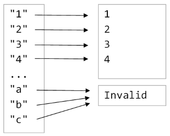
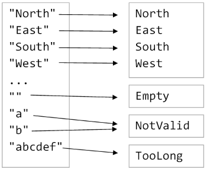

# 代数类型的大小和域建模

# 代数类型的大小和域建模

在本文中，我们将看看如何计算代数类型的“大小”，或基数，并看看这种知识如何帮助我们进行设计决策。

## 入门

我打算通过将其视为一个集合来定义类型的“大小”，并计算可能元素的数量。

例如，布尔类型有两种可能值，因此 `Boolean` 类型的大小为两个。

是否有大小为一的类型？有 —— `unit` 类型只有一个值：`()`。

是否有大小为零的类型？也就是说，是否有一个根本没有值的类型？在 F# 中没有，但在 Haskell 中有。它被称为 `Void`。

对于像这样的类型该如何处理：

```
type ThreeState = 
    | Checked
    | Unchecked
    | Unknown 
```

它的大小是多少？有三种可能的值，因此大小为三。

对于像这样的类型又该如何处理：

```
type Direction = 
    | North
    | East
    | South
    | West 
```

显然，四种。

我想你已经明白了！

## 计算复合类型的大小

现在让我们来计算复合类型的大小。如果你还记得 理解 F# 类型 系列，你会知道有两种代数类型：“乘积”类型，比如 元组 和记录，以及“和”类型，在 F# 中称为判别联合。

例如，假设我们有一个 `Speed` 和一个 `Direction`，我们将它们合并成一个称为 `Velocity` 的记录类型：

```
type Speed = 
    | Slow
    | Fast

type Velocity = {
    direction: Direction
    speed: Speed 
    } 
```

`Velocity` 的大小是多少？

这是每一个可能的值：

```
{direction=North; speed=Slow}; {direction=North; speed=Fast}
{direction=East;  speed=Slow}; {direction=East;  speed=Fast}
{direction=South; speed=Slow}; {direction=South; speed=Fast}
{direction=West;  speed=Slow}; {direction=West;  speed=Fast} 
```

有八种可能的值，每一种可能性都对应两个 `Speed` 值和四个 `Direction` 值的组合。

我们可以将这个概括成一个规则：

+   **规则：乘积类型的大小是组成类型的大小之积。**

也就是说，给定这样一个记录类型：

```
type RecordType = {
    a : TypeA
    b : TypeB } 
```

大小是这样计算的：

```
size(RecordType) = size(TypeA) * size(TypeB) 
```

对于元组也是一样的：

```
type TupleType = TypeA * TypeB 
```

大小是：

```
size(TupleType) = size(TypeA) * size(TypeB) 
```

### 求和类型

求和类型可以用相同的方式进行分析。给定一个如下所示的类型 `Movement`：

```
type Movement = 
    | Moving of Direction
    | NotMoving 
```

我们可以列出并计算所有可能性：

```
Moving North
Moving East
Moving South
Moving West
NotMoving 
```

所以，总共五种。这恰好是 `size(Direction) + 1`。再来一个有趣的例子：

```
type ThingsYouCanSay =
    | Yes
    | Stop
    | Goodbye

type ThingsICanSay =
    | No
    | GoGoGo
    | Hello

type HelloGoodbye = 
    | YouSay of ThingsYouCanSay 
    | ISay of ThingsICanSay 
```

同样地，我们可以列出并计算所有可能性：

```
YouSay Yes
ISay No
YouSay Stop
ISay GoGoGo
YouSay Goodbye
ISay Hello 
```

在 `YouSay` 情况下有三种可能的值，在 `ISay` 情况下也有三种可能的值，总共六种。

同样，我们可以得出一个通用的规则。

+   **规则：求和类型或联合类型的大小是组成类型的大小之和。**

也就是说，给定这样一个联合类型：

```
type SumType = 
    | CaseA of TypeA
    | CaseB of TypeB 
```

大小是这样计算的：

```
size(SumType) = size(TypeA) + size(TypeB) 
```

## 使用泛型类型

如果我们将泛型类型混合在一起会发生什么？

例如，像这样的类型的大小是多少：

```
type Optional<'a> =   
    | Something of 'a
    | Nothing 
```

首先要说的是 `Optional<'a>` 不是一个*类型*而是一个*类型构造器*。`Optional<string>` 是一种类型。`Optional<int>` 是一种类型，但 `Optional<'a>` 不是。

尽管如此，我们仍然可以通过注意到 `size(Optional<string>)` 只是 `size(string) + 1`，`size(Optional<int>)` 只是 `size(int) + 1`，等等来计算它的大小。

所以我们可以说：

```
size(Optional<'a>) = size('a) + 1 
```

同样地，对于像这样具有两个泛型的类型：

```
type Either<'a,'b> =   
    | Left of 'a
    | Right of 'b 
```

我们可以说它的大小可以使用通用组件的大小来计算（使用上述的 "求和规则"）：

```
size(Either<'a,'b>) = size('a) + size('b) 
```

## 递归类型

那么递归类型呢？让我们看看最简单的一个，一个链接列表。

一个链接列表要么为空，要么有一个包含元组的单元格：一个头和一个尾。头是 `'a`，尾是另一个列表。这是定义：

```
type LinkedList<'a> = 
    | Empty
    | Node of head:'a * tail:LinkedList<'a> 
```

为了计算大小，让我们给各个组件分配一些名称：

```
let S = size(LinkedList<'a>)
let N = size('a) 
```

现在我们可以写成：

```
S = 
    1         // Size of "Empty" case 
    +         // Union type
    N * S     // Size of "Cell" case using tuple size calculation 
```

让我们玩弄一下这个公式。我们从这里开始：

```
S = 1 + (N * S) 
```

让我们再次用公式替换最后的 S，得到：

```
S = 1 + (N * (1 + (N * S))) 
```

如果我们清理一下，我们得到：

```
S = 1 + N + (N² * S) 
```

（这里的 `N²` 意思是 "N 的平方"）

让我们再次用公式替换最后的 S：

```
S = 1 + N + (N² * (1 + (N * S))) 
```

然后再次清理一下：

```
S = 1 + N + N² + (N³ * S) 
```

你可以看到这是怎么回事！`S` 的公式可以无限地扩展为：

```
S = 1 + N + N² + N³ + N⁴ + N⁵ + ... 
```

我们如何解释这个？嗯，我们可以说一个列表是以下情况的联合：

+   一个空列表（大小 = 1）

+   一个一个元素的列表（大小 = N）

+   一个两个元素的列表（大小 = N x N）

+   一个三个元素的列表（大小 = N x N x N）

+   等等。

这个公式已经捕捉到了这一点。

顺便提一下，你可以直接使用公式 `S = 1/(1-N)` 计算 `S`，这意味着一个 `Direction` 列表（大小=4）的大小是 "-1/3"。嗯，这有点奇怪！这让我想起了[这个 "-1/12" 视频](https://www.youtube.com/watch?v=w-I6XTVZXww)。

## 计算函数的大小

那么函数呢？它们可以有大小吗？

是的，我们只需要写下每种可能的实现并计数它们。简单！

例如，假设我们有一个函数 `SuitColor`，将一张卡片的 `Suit` 映射到一个 `Color`，红色或黑色。

```
type Suit = Heart | Spade | Diamond | Club
type Color = Red | Black

type SuitColor = Suit -> Color 
```

其中一种实现方式是无论提供什么花色，都返回红色：

```
(Heart -> Red); (Spade -> Red); (Diamond -> Red); (Club -> Red) 
```

另一种实现方式是除了 `Club` 外，对所有花色都返回红色：

```
(Heart -> Red); (Spade -> Red); (Diamond -> Red); (Club -> Black) 
```

实际上，我们可以写出这个函数的所有 16 种可能的实现方式：

```
(Heart -> Red); (Spade -> Red); (Diamond -> Red); (Club -> Red)
(Heart -> Red); (Spade -> Red); (Diamond -> Red); (Club -> Black)
(Heart -> Red); (Spade -> Red); (Diamond -> Black); (Club -> Red)
(Heart -> Red); (Spade -> Red); (Diamond -> Black); (Club -> Black)

(Heart -> Red); (Spade -> Black); (Diamond -> Red); (Club -> Red)
(Heart -> Red); (Spade -> Black); (Diamond -> Red); (Club -> Black)  // the right one!
(Heart -> Red); (Spade -> Black); (Diamond -> Black); (Club -> Red)
(Heart -> Red); (Spade -> Black); (Diamond -> Black); (Club -> Black)

(Heart -> Black); (Spade -> Red); (Diamond -> Red); (Club -> Red)
(Heart -> Black); (Spade -> Red); (Diamond -> Red); (Club -> Black)
(Heart -> Black); (Spade -> Red); (Diamond -> Black); (Club -> Red)
(Heart -> Black); (Spade -> Red); (Diamond -> Black); (Club -> Black)

(Heart -> Black); (Spade -> Black); (Diamond -> Red); (Club -> Red)
(Heart -> Black); (Spade -> Black); (Diamond -> Red); (Club -> Black)
(Heart -> Black); (Spade -> Black); (Diamond -> Black); (Club -> Red)
(Heart -> Black); (Spade -> Black); (Diamond -> Black); (Club -> Black) 
```

另一种思考方式是我们可以定义一个记录类型，其中每个值代表一个特定的实现：对于 `Heart` 输入，我们返回哪种颜色，对于 `Spade` 输入，我们返回哪种颜色，依此类推。

`SuitColor` 实现的类型定义如下：

```
type SuitColorImplementation = {
    Heart : Color
    Spade : Color
    Diamond : Color
    Club : Color } 
```

这个记录类型的大小是多少？

```
size(SuitColorImplementation) = size(Color) * size(Color) * size(Color) * size(Color) 
```

这里有四个 `size(Color)`。换句话说，对于每个输入，都有一个 `size(Color)`，所以我们可以这样写：

```
size(SuitColorImplementation) = size(Color) to the power of size(Suit) 
```

总的来说，给定一个函数类型：

```
type Function<'input,'output> = 'input -> 'output 
```

函数的大小是 `output type` 的大小的 `input type` 次方：

```
size(Function) =  size(output) ^ size(input) 
```

让我们也将这个编码成一个规则：

+   **规则：函数类型的大小是 `output type` 的大小的 `input type` 次方。**

## 在类型之间进行转换

好的，这一切都非常有趣，但是它有用吗？

是的，我认为是的。我认为理解这样的类型大小有助于我们设计从一种类型到另一种类型的转换，这是我们经常做的事情！

假设我们有一个联合类型和一个记录类型，都代表一个是/否的答案：

```
type YesNoUnion = 
    | Yes
    | No

type YesNoRecord = { 
    isYes: bool } 
```

我们怎样在它们之间进行映射？

它们的大小都是 2，所以我们应该能够将一个类型中的每个值映射到另一个类型中，反之亦然：

```
let toUnion yesNoRecord =
    if yesNoRecord.isYes then 
        Yes
    else
        No

let toRecord yesNoUnion =
    match yesNoUnion with
    | Yes -> {isYes = true}
    | No ->  {isYes = false} 
```

这就是你可能称之为“无损”的转换。如果你往返转换，你可以恢复原始值。数学家会称之为 *同构*（来自希腊语“相等形状”）。

另一个例子呢？这是一个有三种情况的类型，是、否和可能。

```
type YesNoMaybe = 
    | Yes
    | No
    | Maybe 
```

我们能无损地将这个转换为这种类型吗？

```
type YesNoOption = { maybeIsYes: bool option } 
```

那么，一个 `option` 的大小是多少？一个加上内部类型的大小，这种情况下是一个 `bool`。所以 `size(YesNoOption)` 也是三。

这里是转换函数：

```
let toYesNoMaybe yesNoOption =
    match yesNoOption.maybeIsYes with
    | None -> Maybe
    | Some b -> if b then Yes else No

let toYesNoOption yesNoMaybe =
    match yesNoMaybe with
    | Yes ->   {maybeIsYes = Some true}
    | No ->    {maybeIsYes = Some false}
    | Maybe -> {maybeIsYes = None} 
```

所以我们可以制定一个规则：

+   **规则：如果两个类型的大小相同，你可以创建一对无损转换函数**

让我们试试。这里有一个 `Nibble` 类型和一个 `TwoNibbles` 类型：

```
type Nibble = {
    bit1: bool
    bit2: bool
    bit3: bool
    bit4: bool }

type TwoNibbles = {
    high: Nibble
    low: Nibble } 
```

我们能把 `TwoNibbles` 转换为一个 `byte` 再转换回来吗？

`Nibble` 的大小是 `2 x 2 x 2 x 2` = 16（使用乘积大小规则），而 `TwoNibbles` 的大小是 `size(Nibble) x size(Nibble)`，或者 `16 x 16`，即 256。

所以是的，我们可以从 `TwoNibbles` 转换为一个 `byte` 再转换回来。

## 有损转换

如果类型的大小不同会发生什么？

如果目标类型比源类型“更大”，那么你总是可以无损映射，但如果目标类型比源类型“更小”，你就有问题了。

例如，`int` 类型比 `string` 类型小。你可以准确地将一个 `int` 转换为一个 `string`，但是你不能轻易地将一个 `string` 转换为一个 `int`。

如果你 *确实* 想要将一个字符串映射到一个整数，那么一些非整数字符串将需要被映射到目标类型中的一个特殊的、非整数值：



换句话说，我们从大小上知道目标类型不能只是一个 `int` 类型，它必须是一个 `int + 1` 类型。换句话说，是一个 Option 类型！

`Int32.TryParse` 函数在 BCL 中返回两个值，一个表示成功/失败的 `bool` 值，另一个是解析后的结果作为 `int`。换句话说，是一个元组 `bool * int`。

那个元组的大小是 `2 x int`，远远超过实际需要的值。Option 类型万岁！

现在假设我们要从一个 `string` 转换为一个 `Direction`。有些字符串是有效的，但大多数都不是。但这一次，不只是有一个无效的情况，我们还想区分空输入、输入过长和其他无效输入。



我们不能再用一个 Option 来建模目标了，所以让我们设计一个包含所有七种情况的自定义类型：

```
type StringToDirection_V1 = 
    | North
    | East
    | South
    | West
    | Empty    
    | NotValid
    | TooLong 
```

但这个设计混淆了成功的转换和失败的转换。为什么不把它们分开呢？

```
type Direction = 
    | North
    | East
    | South
    | West

type ConversionFailure = 
    | Empty    
    | NotValid
    | TooLong

type StringToDirection_V2 = 
    | Success of Direction
    | Failure of ConversionFailure 
```

`StringToDirection_V2` 的大小是多少？

在 `Success` 案例中有 4 种 `Direction` 的选择，而在 `Failure` 案例中有 三种 `ConversionFailure` 的选择，所以总大小是七，就像第一个版本一样。

换句话说，这两种设计都是 *等价的*，我们可以使用任何一种。

就我个人而言，我更喜欢版本 2，但如果我们的遗留代码中有版本 1，好消息是我们可以无损地从版本 1 转换为版本 2，反之亦然。这反过来意味着如果需要，我们可以安全地重构为版本 2。

## 设计核心域

知道不同类型可以无损地转换允许您根据需要调整您的域设计。

例如，这种类型：

```
type Something_V1 =
    | CaseA1 of TypeX * TypeY
    | CaseA2 of TypeX * TypeZ 
```

可以无损地转换为这种类型：

```
type Inner =
    | CaseA1 of TypeY
    | CaseA2 of TypeZ

type Something_V2 = 
    TypeX * Inner 
```

或者这样一个：

```
type Something_V3 = {
    x: TypeX
    inner: Inner } 
```

这是一个真实的例子：

+   您有一个网站，其中一些用户已注册，而另一些则没有。

+   对所有用户，您都有一个会话 ID

+   仅适用于注册用户，您有额外的信息

我们可以这样建模该需求：

```
module Customer_V1 =

    type UserInfo = {name:string} //etc
    type SessionId = SessionId of int

    type WebsiteUser = 
        | RegisteredUser of SessionId * UserInfo
        | GuestUser of SessionId 
```

或者作为替代，我们可以将常见的 `SessionId` 上移至更高级别，如此：

```
module Customer_V2 =

    type UserInfo = {name:string} //etc
    type SessionId = SessionId of int

    type WebsiteUserInfo = 
        | RegisteredUser of UserInfo
        | GuestUser 

    type WebsiteUser = {
        sessionId : SessionId
        info: WebsiteUserInfo } 
```

哪种更好？从某种意义上说，它们都是“相同的”，但显然最佳设计取决于使用模式。

+   如果您更关心用户类型而不是会话 ID，则版本 1 更好。

+   如果您经常查看会话 ID 而不关心用户类型，则版本 2 更好。

知道它们是同构的好处在于，如果你喜欢，你可以定义*两种*类型，将它们用于不同的上下文，并根据需要无损地在它们之间进行映射。

## 与外部世界接口

我们有所有这些漂亮的域类型，如`Direction`或`WebsiteUser`，但是在某个时候，我们需要与外部世界进行接口 -- 将它们存储在数据库中，以 JSON 的形式接收它们等等。

问题在于外部世界没有一个良好的类型系统！一切都倾向于是原始的：字符串，整数和布尔值。

从我们的域到外部世界的过程意味着从具有“小”值集的类型到具有“大”值集的类型，我们可以直接执行。但是从外部世界进入我们的域意味着从具有“大”值集的类型到具有“小”值集的类型，这需要验证和错误情况。

例如，域类型可能如下所示：

```
type DomainCustomer = {
    Name: String50
    Email: EmailAddress
    Age: PositiveIntegerLessThan130 } 
```

这些值是受限制的：名称最多 50 个字符，经过验证的电子邮件，年龄在 1 到 129 之间。

另一方面，DTO 类型可能如下所示：

```
type CustomerDTO = {
    Name: string
    Email: string
    Age: int } 
```

这些值是不受限制的：名称可以是任何字符串，邮箱是未经验证的，年龄可以是 2³² 个不同的值之一，包括负值。

这意味着我们*无法*创建 `CustomerDTO` 到 `DomainCustomer` 的映射。我们*必须*至少有另一个值（`DomainCustomer + 1`）来映射无效的输入，并且最好有更多来记录各种错误。

这自然导致了我在[函数式错误处理](http://fsharpforfunandprofit.com/rop/)讲座中描述的`Success/Failure`模型，

然后，映射的最终版本将是从 `CustomerDTO` 到 `SuccessFailure<DomainCustomer>` 或类似的。

所以这导致了最终的规则：

+   **规则：不信任任何人。如果从外部来源导入数据，请务必处理无效输入。**

如果我们认真对待这个规则，它会产生一些连锁反应，比如：

+   永远不要直接尝试将数据反序列化为域类型（例如，不要使用 ORM），只能反序列化为 DTO 类型。

+   总是验证从数据库或其他“可信”来源读取的每条记录。

你可能会认为，把所有东西都包装在`Success/Failure`类型中可能会让人讨厌，而且这是真的！但有办法让这变得更容易。例如参见这篇帖子。

## 进一步阅读

关于代数数据类型的“代数”是众所周知的。最近有一篇很好的总结在["The algebra (and calculus!) of algebraic data types"](https://codewords.recurse.com/issues/three/algebra-and-calculus-of-algebraic-data-types)，还有克里斯·泰勒（Chris Taylor）的[系列文章](https://chris-taylor.github.io/blog/2013/02/13/the-algebra-of-algebraic-data-types-part-iii/)。

而我写完这篇之后，有人指出了两篇类似的帖子：

+   [Tomas Petricek 的一篇](http://tomasp.net/blog/types-and-math.aspx/)，内容几乎相同！

+   [Bartosz Milewski 的一篇](http://bartoszmilewski.com/2015/01/13/simple-algebraic-data-types/)，在他关于范畴论的系列中。

有些帖子提到，你可以用这些类型公式做一些奇怪的事情，比如对它们进行微分！

如果你喜欢学术论文，你可以阅读康纳·麦克布赖德（Conor McBride）在 2001 年的论文《["The Derivative of a Regular Type is its Type of One-Hole Contexts"](http://strictlypositive.org/diff.pdf)》（PDF）中对导数的原始讨论，以及他在 2005 年与其他人合著的续篇《["Differentiating Data Structures"](http://www.cs.nott.ac.uk/~txa/publ/jpartial.pdf)》（PDF）。

## 摘要

这可能不是世界上最令人兴奋的话题，但我发现这种方法既有趣又有用，我想与你分享。

让我知道你的想法。谢谢阅读！
