# 关于乌龟的十三种观察方式

# 关于乌龟的十三种观察方式

> 本文是[F#英文版 2015 年圣诞日历](https://sergeytihon.wordpress.com/2015/10/25/f-advent-calendar-in-english-2015/)项目的一部分。请查看那里的所有其他精彩文章！特别感谢 Sergey Tihon 组织此活动。

不久前，我正在讨论如何实现一个简单的[turtle graphics system](https://en.wikipedia.org/wiki/Turtle_graphics)，我突然意识到，由于乌龟的需求如此简单且众所周知，它将成为展示各种不同技术的绝佳基础。

因此，在这两部分的超级帖子中，我将极限展示乌龟模型，同时演示诸如：部分应用、使用成功/失败结果进行验证、"lifting" 概念、带有消息队列的代理、依赖注入、State monad、事件溯源、流处理，最后是自定义解释器！

那么，我在此呈现十三种不同的乌龟实现方式，不再拖泥带水：

+   第一种方式：基本的面向对象方法，在这种方式中，我们创建了一个具有可变状态的类。

+   第二种方式：基本的函数式方法，在这种方式中，我们创建了一个具有不可变状态的函数模块。

+   第三种方式：具有面向对象核心的 API，在这种方式中，我们创建了一个面向对象的 API，调用一个有状态核心类。

+   第四种方式：具有功能核心的 API，在这种方式中，我们创建了一个使用无状态核心函数的有状态 API。

+   第五种方式：代理前端的 API，在这种方式中，我们创建了一个使用消息队列与代理通信的 API。

+   第六种方式：使用接口进行依赖注入，在这种方式中，我们通过接口或函数记录将实现与 API 解耦。

+   第七种方式：使用函数进行依赖注入，在这种方式中，我们通过传递函数参数来将实现与 API 解耦。

+   第八种方式：使用状态单子进行批处理，在这种方式中，我们创建了一个特殊的"乌龟工作流"计算表达式来跟踪状态。

+   第九种方式：使用命令对象进行批处理，在这种方式中，我们创建了一种表示乌龟命令的类型，然后一次处理所有命令的列表。

+   插曲：使用数据类型进行有意识的解耦。关于使用数据与接口进行解耦的一些注意事项。

+   第十种方式：事件溯源，在这种方式中，状态是从过去事件列表中构建的。

+   方式 11\. 函数式后时代编程（流处理），在其中业务逻辑基于对早期事件的反应。

+   第五集：海龟反击，在其中海龟 API 发生变化，以至于一些命令可能失败。

+   方式 12\. 单子式控制流，在其中根据早期命令的结果来决定海龟工作流程中的决策。

+   方式 13\. 一个海龟解释器，在其中我们完全将海龟编程与海龟实现解耦，并且几乎遇到了自由单子。

+   所有技术的回顾。

还有两种扩展版的奖励方式：

+   方式 14\. 抽象数据海龟，在其中我们通过使用抽象数据类型封装了海龟实现的细节。

+   方式 15\. 基于能力的海龟，在其中我们根据海龟的当前状态控制客户端可用的海龟函数。

本文的所有源代码都可以在 [github](https://github.com/swlaschin/13-ways-of-looking-at-a-turtle) 上找到。

* * *

## 一个海龟的要求

一个海龟支持四个指令：

+   在当前方向上移动一定距离。

+   按顺时针或逆时针转动一定角度。

+   放下或抬起画笔。当画笔放下时，移动海龟会画一条线。

+   设置画笔颜色（黑色、蓝色或红色中的一种）。

这些需求自然地导致了一种类似于"海龟接口"的东西：

+   `Move aDistance`

+   `Turn anAngle`

+   `PenUp`

+   `PenDown`

+   `SetColor aColor`

所有以下实现都将基于此接口或其某个变体。

请注意，海龟必须将这些指令转换为在画布或其他图形上绘制线条。因此，实现可能需要以某种方式跟踪海龟的位置和当前状态。

* * *

## 公共代码

在我们开始实现之前，让我们先处理一些公共代码。

首先，我们需要一些类型来表示距离、角度、笔的状态和笔的颜色。

```
/// An alias for a float
type Distance = float

/// Use a unit of measure to make it clear that the angle is in degrees, not radians
type [<Measure>] Degrees

/// An alias for a float of Degrees
type Angle = float<Degrees>

/// Enumeration of available pen states
type PenState = Up | Down

/// Enumeration of available pen colors
type PenColor = Black | Red | Blue 
```

还需要一个类型来表示海龟的位置：

```
/// A structure to store the (x,y) coordinates
type Position = {x:float; y:float} 
```

我们还需要一个辅助函数来计算基于在某个角度移动一定距离后的新位置：

```
// round a float to two places to make it easier to read
let round2 (flt:float) = Math.Round(flt,2)

/// calculate a new position from the current position given an angle and a distance
let calcNewPosition (distance:Distance) (angle:Angle) currentPos = 
    // Convert degrees to radians with 180.0 degrees = 1 pi radian
    let angleInRads = angle * (Math.PI/180.0) * 1.0<1/Degrees> 
    // current pos
    let x0 = currentPos.x
    let y0 = currentPos.y
    // new pos
    let x1 = x0 + (distance * cos angleInRads)
    let y1 = y0 + (distance * sin angleInRads)
    // return a new Position
    {x=round2 x1; y=round2 y1} 
```

我们还定义海龟的初始状态：

```
/// Default initial state
let initialPosition,initialColor,initialPenState = 
    {x=0.0; y=0.0}, Black, Down 
```

以及一个模拟在画布上画线的辅助函数：

```
let dummyDrawLine log oldPos newPos color =
    // for now just log it
    log (sprintf "...Draw line from (%0.1f,%0.1f) to (%0.1f,%0.1f) using %A" oldPos.x oldPos.y newPos.x newPos.y color) 
```

现在我们准备好进行第一次实现了！

* * *

## 1\. 基本面向对象 -- 一个具有可变状态的类

在这个首次设计中，我们将采用面向对象的方法，并用一个简单的类来表示海龟。

+   状态将存储在本地字段（`currentPosition`、`currentAngle` 等）中，这些字段是可变的。

+   我们将注入一个日志记录函数 `log`，以便我们可以监视发生的情况。


这是完整的代码，应该是不言自明的：

```
type Turtle(log) =

    let mutable currentPosition = initialPosition 
    let mutable currentAngle = 0.0<Degrees>
    let mutable currentColor = initialColor
    let mutable currentPenState = initialPenState

    member this.Move(distance) =
        log (sprintf "Move %0.1f" distance)
        // calculate new position 
        let newPosition = calcNewPosition distance currentAngle currentPosition 
        // draw line if needed
        if currentPenState = Down then
            dummyDrawLine log currentPosition newPosition currentColor
        // update the state
        currentPosition <- newPosition

    member this.Turn(angle) =
        log (sprintf "Turn %0.1f" angle)
        // calculate new angle
        let newAngle = (currentAngle + angle) % 360.0<Degrees>
        // update the state
        currentAngle <- newAngle 

    member this.PenUp() =
        log "Pen up" 
        currentPenState <- Up

    member this.PenDown() =
        log "Pen down" 
        currentPenState <- Down

    member this.SetColor(color) =
        log (sprintf "SetColor %A" color)
        currentColor <- color 
```

### 调用乌龟对象

客户端代码实例化乌龟并直接与其交互：

```
/// Function to log a message
let log message =
    printfn "%s" message 

let drawTriangle() = 
    let turtle = Turtle(log)
    turtle.Move 100.0 
    turtle.Turn 120.0<Degrees>
    turtle.Move 100.0 
    turtle.Turn 120.0<Degrees>
    turtle.Move 100.0
    turtle.Turn 120.0<Degrees>
    // back home at (0,0) with angle 0 
```

`drawTriangle()`的记录输出为：

```
Move 100.0
...Draw line from (0.0,0.0) to (100.0,0.0) using Black
Turn 120.0
Move 100.0
...Draw line from (100.0,0.0) to (50.0,86.6) using Black
Turn 120.0
Move 100.0
...Draw line from (50.0,86.6) to (0.0,0.0) using Black
Turn 120.0 
```

类似地，这是绘制多边形的代码：

```
let drawPolygon n = 
    let angle = 180.0 - (360.0/float n) 
    let angleDegrees = angle * 1.0<Degrees>
    let turtle = Turtle(log)

    // define a function that draws one side
    let drawOneSide() = 
        turtle.Move 100.0 
        turtle.Turn angleDegrees 

    // repeat for all sides
    for i in [1..n] do
        drawOneSide() 
```

注意，`drawOneSide()`不返回任何东西 - 所有代码都是命令式和有状态的。将其与下一个示例中采用纯函数式方法的代码进行比较。

### 优点和缺点

那么这种简单方法的优缺点是什么呢？

*优点*

+   这非常容易实现和理解。

*缺点*

+   有状态的代码更难测试。在测试之前，我们必须将对象置于已知状态之中，对于更复杂的对象来说，这可能会很啰嗦且容易出错。

+   客户端与特定实现耦合。这里没有接口！我们将很快看到如何使用接口。

*这个版本的源代码可以在[这里（乌龟类）](https://github.com/swlaschin/13-ways-of-looking-at-a-turtle/blob/master/OOTurtleLib.fsx)和[这里（客户端）](https://github.com/swlaschin/13-ways-of-looking-at-a-turtle/blob/master/01-OOTurtle.fsx)找到。*

* * *

## 2: 基本 FP - 一个带有不可变状态的函数模块

下一个设计将使用纯函数式方法。定义了一个不可变的`TurtleState`，然后各种乌龟函数接受状态作为输入并返回新的状态作为输出。

在这种方法中，客户端负责跟踪当前状态并将其传递给下一个函数调用。

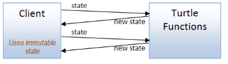

这里是`TurtleState`的定义以及初始状态的值：

```
module Turtle = 

    type TurtleState = {
        position : Position
        angle : float<Degrees>
        color : PenColor
        penState : PenState
    }

    let initialTurtleState = {
        position = initialPosition
        angle = 0.0<Degrees>
        color = initialColor
        penState = initialPenState
    } 
```

这里是"api"函数，它们全部接受一个状态参数并返回一个新的状态：

```
module Turtle = 

    // [state type snipped]

    let move log distance state =
        log (sprintf "Move %0.1f" distance)
        // calculate new position 
        let newPosition = calcNewPosition distance state.angle state.position 
        // draw line if needed
        if state.penState = Down then
            dummyDrawLine log state.position newPosition state.color
        // update the state
        {state with position = newPosition}

    let turn log angle state =
        log (sprintf "Turn %0.1f" angle)
        // calculate new angle
        let newAngle = (state.angle + angle) % 360.0<Degrees>
        // update the state
        {state with angle = newAngle}

    let penUp log state =
        log "Pen up" 
        {state with penState = Up}

    let penDown log state =
        log "Pen down" 
        {state with penState = Down}

    let setColor log color state =
        log (sprintf "SetColor %A" color)
        {state with color = color} 
```

注意`state`始终是最后一个参数 - 这样使用"管道"习语更容易。

### 使用乌龟函数

现在客户端必须每次在每个函数中传递`log`函数和`state`！

通过使用偏函数应用来创建带有记录器的新函数版本，我们可以消除传递日志函数的需要：

```
/// Function to log a message
let log message =
    printfn "%s" message 

// versions with log baked in (via partial application)
let move = Turtle.move log
let turn = Turtle.turn log
let penDown = Turtle.penDown log
let penUp = Turtle.penUp log
let setColor = Turtle.setColor log 
```

使用这些更简单的版本，客户端只需以自然的方式传递状态：

```
let drawTriangle() = 
    Turtle.initialTurtleState
    |> move 100.0 
    |> turn 120.0<Degrees>
    |> move 100.0 
    |> turn 120.0<Degrees>
    |> move 100.0 
    |> turn 120.0<Degrees>
    // back home at (0,0) with angle 0 
```

当涉及绘制多边形时，情况会稍微复杂一些，因为我们必须通过每个边的重复来"折叠"状态：

```
let drawPolygon n = 
    let angle = 180.0 - (360.0/float n) 
    let angleDegrees = angle * 1.0<Degrees>

    // define a function that draws one side
    let oneSide state sideNumber = 
        state
        |> move 100.0 
        |> turn angleDegrees 

    // repeat for all sides
    [1..n] 
    |> List.fold oneSide Turtle.initialTurtleState 
```

### 优点和缺点

这种纯函数式方法的优缺点是什么呢？

*优点*

+   再次强调，这种方法非常容易实现和理解。

+   无状态函数更易于测试。我们始终将当前状态提供为输入，因此无需设置即可将对象置于已知状态。

+   由于没有全局状态，这些函数是模块化的，并且可以在其他上下文中重用（正如我们稍后在本文中将看到的那样）。

*缺点*

+   与以前一样，客户端与特定实现耦合。

+   客户端必须跟踪状态（但本文稍后将展示一些使此变得更容易的解决方案）。

*此版本的源代码可在 [此处（turtle functions）](https://github.com/swlaschin/13-ways-of-looking-at-a-turtle/blob/master/FPTurtleLib.fsx) 和 [此处（client）](https://github.com/swlaschin/13-ways-of-looking-at-a-turtle/blob/master/02-FPTurtle.fsx) 获取。*

* * *

## 3: 具有面向对象核心的 API

让我们通过 API 将客户端隐藏在实现之后！

在这种情况下，API 将基于字符串，使用文本命令如 `"move 100"` 或 `"turn 90"`。API 必须验证这些命令并将其转换为对乌龟的方法调用（我们将再次使用具有状态的面向对象方法 `Turtle` 类）。

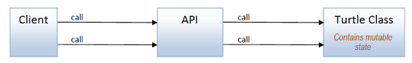

如果命令*无效*，API 必须向客户端指示此情况。由于我们使用的是面向对象的方法，我们将通过抛出一个包含字符串的 `TurtleApiException` 来实现这一点，如下所示。

```
exception TurtleApiException of string 
```

接下来，我们需要一些函数来验证命令文本：

```
// convert the distance parameter to a float, or throw an exception
let validateDistance distanceStr =
    try
        float distanceStr 
    with
    | ex -> 
        let msg = sprintf "Invalid distance '%s' [%s]" distanceStr  ex.Message
        raise (TurtleApiException msg)

// convert the angle parameter to a float<Degrees>, or throw an exception
let validateAngle angleStr =
    try
        (float angleStr) * 1.0<Degrees> 
    with
    | ex -> 
        let msg = sprintf "Invalid angle '%s' [%s]" angleStr ex.Message
        raise (TurtleApiException msg)

// convert the color parameter to a PenColor, or throw an exception
let validateColor colorStr =
    match colorStr with
    | "Black" -> Black
    | "Blue" -> Blue
    | "Red" -> Red
    | _ -> 
        let msg = sprintf "Color '%s' is not recognized" colorStr
        raise (TurtleApiException msg) 
```

有了这些，我们就可以创建 API 了。

解析命令文本的逻辑是将命令文本拆分为标记，然后将第一个标记与`"move"`、`"turn"`等进行匹配。

以下是代码：

```
type TurtleApi() =

    let turtle = Turtle(log)

    member this.Exec (commandStr:string) = 
        let tokens = commandStr.Split(' ') |> List.ofArray |> List.map trimString
        match tokens with
        | [ "Move"; distanceStr ] -> 
            let distance = validateDistance distanceStr 
            turtle.Move distance 
        | [ "Turn"; angleStr ] -> 
            let angle = validateAngle angleStr
            turtle.Turn angle  
        | [ "Pen"; "Up" ] -> 
            turtle.PenUp()
        | [ "Pen"; "Down" ] -> 
            turtle.PenDown()
        | [ "SetColor"; colorStr ] -> 
            let color = validateColor colorStr 
            turtle.SetColor color
        | _ -> 
            let msg = sprintf "Instruction '%s' is not recognized" commandStr
            raise (TurtleApiException msg) 
```

### 使用 API

这是如何使用 `TurtleApi` 类实现 `drawPolygon` 的：

```
let drawPolygon n = 
    let angle = 180.0 - (360.0/float n) 
    let api = TurtleApi()

    // define a function that draws one side
    let drawOneSide() = 
        api.Exec "Move 100.0"
        api.Exec (sprintf "Turn %f" angle)

    // repeat for all sides
    for i in [1..n] do
        drawOneSide() 
```

您可以看到，代码与早期的面向对象版本非常相似，只是直接调用 `turtle.Move 100.0` 被间接的 API 调用 `api.Exec "Move 100.0"` 替换了。

现在，如果我们用一个坏命令触发错误，比如 `api.Exec "Move bad"`，就像这样：

```
let triggerError() = 
    let api = TurtleApi()
    api.Exec "Move bad" 
```

如果发生了预期的异常，那么异常会被抛出：

```
Exception of type 'TurtleApiException' was thrown. 
```

### 优缺点

使用这样的 API 层有何优缺点？

+   龟实现现在对客户端隐藏了起来。

+   服务边界上的 API 支持验证，并且可以扩展为支持监视、内部路由、负载均衡等。

*缺点*

+   API 与特定实现耦合在一起，即使客户端没有耦合。

+   系统非常具有状态性。即使客户端不知道 API 背后的实现，客户端仍然通过共享状态与内核间接耦合，这反过来又会使测试变得更加困难。

*此版本的源代码可在 [此处](https://github.com/swlaschin/13-ways-of-looking-at-a-turtle/blob/master/03-Api_OO_Core.fsx) 获取。*

* * *

## 4: 具有功能核心的 API

对于这种场景的另一种方法是使用混合设计，其中应用程序的核心由纯函数组成，而边界是命令式和具有状态性的。

这种方法被 [Gary Bernhardt](https://www.youtube.com/watch?v=yTkzNHF6rMs) 命名为 "Functional Core/Imperative Shell"。

应用于我们的 API 示例，API 层仅使用纯龟函数，但 API 层通过存储可变龟状态来管理状态（而不是客户端）。

另外，为了更加函数式，如果命令文本无效，API 将不会抛出异常，而是会返回一个带有`Success`和`Failure`情况的`Result`值，其中`Failure`情况用于任何错误。（有关此技术的更深入讨论，请参阅[我的有关函数式错误处理方法的演讲](http://fsharpforfunandprofit.com/rop/)）。

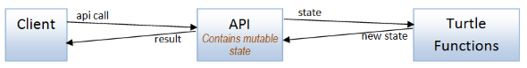

让我们首先实现 API 类。这次它包含一个`mutable`的 turtle 状态：

```
type TurtleApi() =

    let mutable state = initialTurtleState

    /// Update the mutable state value
    let updateState newState =
        state <- newState 
```

验证函数不再抛出异常，而是返回`Success`或`Failure`：

```
let validateDistance distanceStr =
    try
        Success (float distanceStr)
    with
    | ex -> 
        Failure (InvalidDistance distanceStr) 
```

错误情况在它们自己的类型中有记录：

```
type ErrorMessage = 
    | InvalidDistance of string
    | InvalidAngle of string
    | InvalidColor of string
    | InvalidCommand of string 
```

现在因为验证函数现在返回一个`Result<Distance>`而不是一个“原始”的距离，`move`函数需要被提升到`Results`的世界中，当前状态也是如此。

当使用`Result`时，有三个我们将使用的函数：`returnR`、`mapR`和`lift2R`。

+   `returnR`将“普通”值转换为结果世界中的值：

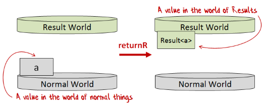

+   `mapR`将“普通”的单参数函数转换为结果世界中的单参数函数：

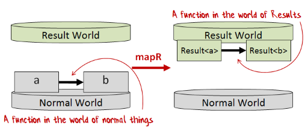

+   `lift2R`将“普通”的二参数函数转换为结果世界中的二参数函数：

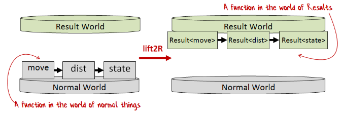

例如，使用这些辅助函数，我们可以将普通的`move`函数转换为结果世界中的函数：

+   距离参数已经在`Result`世界中

+   使用`returnR`将状态参数提升到`Result`世界中

+   使用`lift2R`将`move`函数提升到`Result`世界中

```
// lift current state to Result
let stateR = returnR state

// get the distance as a Result
let distanceR = validateDistance distanceStr 

// call "move" lifted to the world of Results
lift2R move distanceR stateR 
```

*(有关将函数提升到`Result`世界的更多详细信息，请参阅有关“lifting”在一般情况下的文章 )*

这是`Exec`的完整代码：

```
/// Execute the command string, and return a Result
/// Exec : commandStr:string -> Result<unit,ErrorMessage>
member this.Exec (commandStr:string) = 
    let tokens = commandStr.Split(' ') |> List.ofArray |> List.map trimString

    // lift current state to Result
    let stateR = returnR state

    // calculate the new state
    let newStateR = 
        match tokens with
        | [ "Move"; distanceStr ] -> 
            // get the distance as a Result
            let distanceR = validateDistance distanceStr 

            // call "move" lifted to the world of Results
            lift2R move distanceR stateR

        | [ "Turn"; angleStr ] -> 
            let angleR = validateAngle angleStr 
            lift2R turn angleR stateR

        | [ "Pen"; "Up" ] -> 
            returnR (penUp state)

        | [ "Pen"; "Down" ] -> 
            returnR (penDown state)

        | [ "SetColor"; colorStr ] -> 
            let colorR = validateColor colorStr
            lift2R setColor colorR stateR

        | _ -> 
            Failure (InvalidCommand commandStr)

    // Lift `updateState` into the world of Results and 
    // call it with the new state.
    mapR updateState newStateR

    // Return the final result (output of updateState) 
```

### 使用 API

API 返回一个`Result`，因此客户端不能再按顺序调用每个函数，因为我们需要处理来自调用的任何错误并放弃其余的步骤。

为了让我们的生活更轻松，我们将使用一个`result`计算表达式（或工作流）来链接调用并保留 OO 版本的命令式“感觉”。

```
let drawTriangle() = 
    let api = TurtleApi()
    result {
        do! api.Exec "Move 100"
        do! api.Exec "Turn 120"
        do! api.Exec "Move 100"
        do! api.Exec "Turn 120"
        do! api.Exec "Move 100"
        do! api.Exec "Turn 120"
        } 
```

*`result`计算表达式的源代码可在[此处](https://github.com/swlaschin/13-ways-of-looking-at-a-turtle/blob/master/Common.fsx#L70)找到。*

类似地，对于`drawPolygon`代码，我们可以创建一个辅助函数来绘制一条边，然后在`result`表达式内调用它`n`次。

```
let drawPolygon n = 
    let angle = 180.0 - (360.0/float n) 
    let api = TurtleApi()

    // define a function that draws one side
    let drawOneSide() = result {
        do! api.Exec "Move 100.0"
        do! api.Exec (sprintf "Turn %f" angle)
        }

    // repeat for all sides
    result {
        for i in [1..n] do
            do! drawOneSide() 
    } 
```

代码看起来是命令式的，但实际上是纯函数式的，因为返回的`Result`值是由`result`工作流透明地处理的。

### 优点和缺点

*优点*

+   与 API 的 OO 版本一样-- turtle 实现对客户端是隐藏的，可以进行验证等。

+   系统中唯一有状态的部分是在边界上。核心是无状态的，这使得测试更容易。

*缺点*

+   API 仍然与特定实现耦合。

*这个版本的源代码在[这里（API 辅助函数）](https://github.com/swlaschin/13-ways-of-looking-at-a-turtle/blob/master/TurtleApiHelpers.fsx)和[这里（API 和客户端）](https://github.com/swlaschin/13-ways-of-looking-at-a-turtle/blob/master/04-Api_FP_Core.fsx)可用。*

* * *

## 5：代理前面的 API

在这个设计中，API 层通过消息队列与`TurtleAgent`通信，客户端像以前一样与 API 层通信。

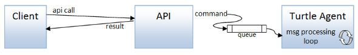

API（或任何地方）中没有可变的东西。`TurtleAgent`通过将当前状态存储为递归消息处理循环中的参数来管理状态。

现在，由于`TurtleAgent`有一个类型化的消息队列，其中所有消息都是相同类型，我们必须将所有可能的命令组合成一个单一的辨别联合类型(`TurtleCommand`)。

```
type TurtleCommand = 
    | Move of Distance 
    | Turn of Angle
    | PenUp
    | PenDown
    | SetColor of PenColor 
```

代理实现与以前的实现类似，但现在我们不再直接暴露乌龟函数，而是对传入的命令进行模式匹配，以决定调用哪个函数：

```
type TurtleAgent() =

    /// Function to log a message
    let log message =
        printfn "%s" message 

    // logged versions 
    let move = Turtle.move log
    let turn = Turtle.turn log
    let penDown = Turtle.penDown log
    let penUp = Turtle.penUp log
    let setColor = Turtle.setColor log

    let mailboxProc = MailboxProcessor.Start(fun inbox ->
        let rec loop turtleState = async { 
            // read a command message from teh queue
            let! command = inbox.Receive()
            // create a new state from handling the message
            let newState = 
                match command with
                | Move distance ->
                    move distance turtleState
                | Turn angle ->
                    turn angle turtleState
                | PenUp ->
                    penUp turtleState
                | PenDown ->
                    penDown turtleState
                | SetColor color ->
                    setColor color turtleState
            return! loop newState  
            }
        loop Turtle.initialTurtleState )

    // expose the queue externally
    member this.Post(command) = 
        mailboxProc.Post command 
```

### 向代理发送命令

API 通过构造`TurtleCommand`并将其发布到代理的队列来调用代理。

这一次，我们不再使用之前的“提升”`move`命令的方法：

```
let stateR = returnR state
let distanceR = validateDistance distanceStr 
lift2R move distanceR stateR 
```

我们将使用`result`计算表达式，因此上面的代码将会是这样的：

```
result {
    let! distance = validateDistance distanceStr 
    move distance state
    } 
```

在代理实现中，我们不调用`move`命令，而是创建`Command`类型的`Move`情况，所以代码看起来像这样：

```
result {
    let! distance = validateDistance distanceStr 
    let command = Move distance 
    turtleAgent.Post command
    } 
```

下面是完整的代码：

```
member this.Exec (commandStr:string) = 
    let tokens = commandStr.Split(' ') |> List.ofArray |> List.map trimString

    // calculate the new state
    let result = 
        match tokens with
        | [ "Move"; distanceStr ] -> result {
            let! distance = validateDistance distanceStr 
            let command = Move distance 
            turtleAgent.Post command
            } 

        | [ "Turn"; angleStr ] -> result {
            let! angle = validateAngle angleStr 
            let command = Turn angle
            turtleAgent.Post command
            }

        | [ "Pen"; "Up" ] -> result {
            let command = PenUp
            turtleAgent.Post command
            }

        | [ "Pen"; "Down" ] -> result { 
            let command = PenDown
            turtleAgent.Post command
            }

        | [ "SetColor"; colorStr ] -> result { 
            let! color = validateColor colorStr
            let command = SetColor color
            turtleAgent.Post command
            }

        | _ -> 
            Failure (InvalidCommand commandStr)

    // return any errors
    result 
```

### 代理方法的优缺点

*优点*

+   一种保护可变状态而不使用锁的好方法。

+   API 通过消息队列与特定的实现解耦。`TurtleCommand`充当了一种协议，解耦了队列的两端。

+   乌龟代理自然是异步的。

+   代理可以很容易地水平扩展。

*不利之处*

+   代理是有状态的，并且与有状态对象存在相同的问题：

    +   对于你的代码进行推理变得更加困难。

    +   测试更加困难。

    +   创建复杂的依赖关系网络太容易了。

+   对于代理的健壮实现可能会变得相当复杂，因为你可能需要支持监管者、心跳、反压等。

*这个版本的源代码在[这里](https://github.com/swlaschin/13-ways-of-looking-at-a-turtle/blob/master/05-TurtleAgent.fsx)可用。*

* * *

## 6：使用接口进行依赖注入

到目前为止，所有的实现都与特定的乌龟函数实现相关联，Agent 版本除外，其中 API 通过队列间接通信。

现在让我们看一些将 API 与实现解耦的方法。

### 设计接口，面向对象风格

我们将从经典的面向对象的解耦实现方式开始：使用接口。

将该方法应用于乌龟领域，我们可以看到我们的 API 层将需要与`ITurtle`接口通信，而不是特定的乌龟实现。客户端稍后通过 API 的构造函数注入乌龟实现。

这是接口定义：

```
type ITurtle =
    abstract Move : Distance -> unit
    abstract Turn : Angle -> unit
    abstract PenUp : unit -> unit
    abstract PenDown : unit -> unit
    abstract SetColor : PenColor -> unit 
```

请注意，这些函数中有很多`unit`。函数签名中的`unit`意味着副作用，确实`TurtleState`没有在任何地方使用，因为这是一种基于面向对象的方法，其中可变状态封装在对象中。

接下来，我们需要更改 API 层，通过在`TurtleApi`的构造函数中注入接口来使用它。除此之外，API 代码的其余部分保持不变，如下面的代码片段所示：

```
type TurtleApi(turtle: ITurtle) =

    // other code

    member this.Exec (commandStr:string) = 
        let tokens = commandStr.Split(' ') |> List.ofArray |> List.map trimString
        match tokens with
        | [ "Move"; distanceStr ] -> 
            let distance = validateDistance distanceStr 
            turtle.Move distance 
        | [ "Turn"; angleStr ] -> 
            let angle = validateAngle angleStr
            turtle.Turn angle  
        // etc 
```

### 创建一些面向对象接口的实现

现在让我们创建并测��一些实现。

第一个实现将被称为`normalSize`，并且将是原始的实现。第二个将被称为`halfSize`，并且将所有距离减半。

对于`normalSize`，我们可以回头修改原始的`Turtle`类以支持`ITurtle`接口。但我讨厌修改正常工作的代码！相反，我们可以创建一个围绕原始`Turtle`类的“代理”包装器，其中代理实现新接口。

在某些语言中，创建代理包装可能会很冗长，但在 F# 中，您可以使用对象表达式快速实现接口：

```
let normalSize() = 
    let log = printfn "%s"
    let turtle = Turtle(log)

    // return an interface wrapped around the Turtle
    {new ITurtle with
        member this.Move dist = turtle.Move dist
        member this.Turn angle = turtle.Turn angle
        member this.PenUp() = turtle.PenUp()
        member this.PenDown() = turtle.PenDown()
        member this.SetColor color = turtle.SetColor color
    } 
```

要创建`halfSize`版本，我们做同样的事情，但拦截对`Move`的调用并将距离参数减半：

```
let halfSize() = 
    let normalSize = normalSize() 

    // return a decorated interface 
    {new ITurtle with
        member this.Move dist = normalSize.Move (dist/2.0)   // halved!!
        member this.Turn angle = normalSize.Turn angle
        member this.PenUp() = normalSize.PenUp()
        member this.PenDown() = normalSize.PenDown()
        member this.SetColor color = normalSize.SetColor color
    } 
```

这实际上是[“装饰器”模式](https://en.wikipedia.org/wiki/Decorator_pattern)的工作原理：我们将`normalSize`包装在具有相同接口的代理中，然后更改某些方法的行为，同时保持其他方法不变。

### 注入依赖项，面向对象风格

现在让我们看看将依赖项注入到 API 中的客户端代码。

首先，一些绘制三角形的代码，其中传入一个`TurtleApi`：

```
let drawTriangle(api:TurtleApi) = 
    api.Exec "Move 100"
    api.Exec "Turn 120"
    api.Exec "Move 100"
    api.Exec "Turn 120"
    api.Exec "Move 100"
    api.Exec "Turn 120" 
```

现在让我们尝试通过使用正常接口实例化 API 对象来绘制三角形：

```
let iTurtle = normalSize()   // an ITurtle type
let api = TurtleApi(iTurtle)
drawTriangle(api) 
```

显然，在真实系统中，依赖注入将在调用站点之外进行，使用 IoC 容器或类似方法。

如果我们运行它，`drawTriangle`的输出与以前一样：

```
Move 100.0
...Draw line from (0.0,0.0) to (100.0,0.0) using Black
Turn 120.0
Move 100.0
...Draw line from (100.0,0.0) to (50.0,86.6) using Black
Turn 120.0
Move 100.0
...Draw line from (50.0,86.6) to (0.0,0.0) using Black
Turn 120.0 
```

现在使用半尺寸接口……

```
let iTurtle = halfSize()
let api = TurtleApi(iTurtle)
drawTriangle(api) 
```

……输出正如我们所希望的，大小减半！

```
Move 50.0
...Draw line from (0.0,0.0) to (50.0,0.0) using Black
Turn 120.0
Move 50.0
...Draw line from (50.0,0.0) to (25.0,43.3) using Black
Turn 120.0
Move 50.0
...Draw line from (25.0,43.3) to (0.0,0.0) using Black
Turn 120.0 
```

### 设计接口，函数式风格

在纯函数式编程世界中，不存在面向对象风格的接口。但是，您可以通过使用包含函数的记录来模拟它们，每个方法在接口中对应一个函数。

现在让我们创建一个依赖注入的替代版本，这次 API 层将使用函数记录而不是接口。

函数记录是一个普通记录，但字段的类型是函数类型。这里是我们将使用的定义：

```
type TurtleFunctions = {
    move : Distance -> TurtleState -> TurtleState
    turn : Angle -> TurtleState -> TurtleState
    penUp : TurtleState -> TurtleState
    penDown : TurtleState -> TurtleState
    setColor : PenColor -> TurtleState -> TurtleState
    } 
```

请注意，这些函数签名中没有`unit`，与 OO 版本不同。相反，`TurtleState`被显式传入和返回。

还要注意，这里也没有日志记录。当创建记录时，日志记录方法将被内置到函数中。

`TurtleApi` 构造函数现在接受一个`TurtleFunctions`记录，而不是一个`ITurtle`，但由于这些函数是纯函数，API 需要再次使用`mutable`字段管理状态。

```
type TurtleApi(turtleFunctions: TurtleFunctions) =

    let mutable state = initialTurtleState 
```

主要`Exec`方法的实现与之前看到的非常相似，但有以下区别：

+   从记录中获取函数（例如`turtleFunctions.move`）。

+   所有活动都发生在一个`result`计算表达式中，以便可以使用验证的结果。

这里是代码：

```
member this.Exec (commandStr:string) = 
    let tokens = commandStr.Split(' ') |> List.ofArray |> List.map trimString

    // return Success of unit, or Failure
    match tokens with
    | [ "Move"; distanceStr ] -> result {
        let! distance = validateDistance distanceStr 
        let newState = turtleFunctions.move distance state
        updateState newState
        }
    | [ "Turn"; angleStr ] -> result {
        let! angle = validateAngle angleStr 
        let newState = turtleFunctions.turn angle state
        updateState newState
        }
    // etc 
```

### 创建一些“函数记录”的实现

现在让我们创建一些实现。

再次，我们将有一个`normalSize`实现和一个`halfSize`实现。

对于`normalSize`，我们只需要使用原始`Turtle`模块中的函数，并使用部分应用程序内置的日志记录：

```
let normalSize() = 
    let log = printfn "%s"
    // return a record of functions
    {
        move = Turtle.move log 
        turn = Turtle.turn log 
        penUp = Turtle.penUp log
        penDown = Turtle.penDown log
        setColor = Turtle.setColor log 
    } 
```

要创建`halfSize`版本，我们克隆记录，并仅更改`move`函数：

```
let halfSize() = 
    let normalSize = normalSize() 
    // return a reduced turtle
    { normalSize with
        move = fun dist -> normalSize.move (dist/2.0) 
    } 
```

使用克隆记录而不是代理接口的好处在于，我们不必重新实现记录中的每个函数，只需关心的函数即可。

### 再次注入依赖项

将依赖项注入到 API 中的客户端代码实现就像你期望的那样。API 是一个带有构造函数的类，因此函数记录可以以与`ITurtle`接口完全相同的方式传递给构造函数：

```
let turtleFns = normalSize()  // a TurtleFunctions type
let api = TurtleApi(turtleFns)
drawTriangle(api) 
```

正如你所看到的，在`ITurtle`版本和`TurtleFunctions`版本中的客户端代码看起来是相同的！如果不是因为不同的类型，你无法区分它们。

### 使用接口的优缺点

面向对象风格的接口和函数记录的函数式编程风格非常相似，尽管函数式编程函数是无状态的，而面向对象接口不是。

*优点*

+   通过接口，API 与特定实现解耦。

+   对于函数记录的函数式编程方法（与面向对象接口相比）：

    +   函数记录比接口更容易克隆。

    +   函数是无状态的

*缺点*

+   接口比单个函数更加庞大，如果不小心，很容易包含太多不相关的方法，违反[接口隔离原则](https://en.wikipedia.org/wiki/Interface_segregation_principle)。

+   接口不可组合（与单个函数不同）。

+   欲了解更多关于这种方法的问题，请参阅[Mark Seemann 在 Stack Overflow 上的回答](https://stackoverflow.com/questions/34011895/f-how-to-pass-equivalent-of-interface/34028711?stw=2#34028711)。

+   特别是对于面向对象接口方法：

    +   在重构为接口时，可能需要修改现有类。

+   对于函数记录的函数式编程方法：

    +   与 OO 接口相比，工具支持较少，互操作性较差。

*这些版本的源代码可在 [此处（接口）](https://github.com/swlaschin/13-ways-of-looking-at-a-turtle/blob/master/06-DependencyInjection_Interface-1.fsx) 和 [此处（函数记录）](https://github.com/swlaschin/13-ways-of-looking-at-a-turtle/blob/master/06-DependencyInjection_Interface-2.fsx) 下载。*

* * *

## 7: 使用函数进行依赖注入

“接口”方法的两个主要缺点是接口不可组合，并且它们违反了功能设计的关键部分之一，即打破“只传递你需要的依赖项”规则。

在真正的功能方法中，我们会传递函数。也就是说，API 层通过一个或多个作为参数传递给 API 调用的函数进行通信。这些函数通常是部分应用的，以使调用站点与“注入”解耦。

通常不需要将接口传递给构造函数！（我这里仅使用 API 类来包装可变的乌龟状态。）

在本节中的方法中，我将展示两种使用函数传递来注入依赖项的替代方法：

+   在第一种方法中，每个依赖项（乌龟函数）都是分开传递的。

+   在第二种方法中，只传入一个函数。因此，为了确定使用哪个具体的乌龟函数，定义了一个标记联合类型。

### 方法 1 - 将每个依赖项作为单独的函数传递

管理依赖项的最简单方法始终是将所有依赖项作为参数传递给需要它们的函数。

在我们的情况下，`Exec` 方法是唯一需要控制乌龟的函数，所以我们可以直接将它们传递进去：

```
member this.Exec move turn penUp penDown setColor (commandStr:string) = 
    ... 
```

再次强调一下：在这种方法中，依赖项始终“按需”传递给需要它们的函数。构造函数中不使用任何依赖项，然后再次使用。

这里是使用这些函数的 `Exec` 方法的更大片段：

```
member this.Exec move turn penUp penDown setColor (commandStr:string) = 
    ...

    // return Success of unit, or Failure
    match tokens with
    | [ "Move"; distanceStr ] -> result {
        let! distance = validateDistance distanceStr 
        let newState = move distance state   // use `move` function that was passed in
        updateState newState
        }
    | [ "Turn"; angleStr ] -> result {
        let! angle = validateAngle angleStr   
        let newState = turn angle state   // use `turn` function that was passed in
        updateState newState
        }
    ... 
```

### 使用偏函数应用来固定实现

要创建普通或半尺寸版本的 `Exec`，我们只需传递不同的函数：

```
let log = printfn "%s"
let move = Turtle.move log 
let turn = Turtle.turn log 
let penUp = Turtle.penUp log
let penDown = Turtle.penDown log
let setColor = Turtle.setColor log 

let normalSize() = 
    let api = TurtleApi() 
    // partially apply the functions
    api.Exec move turn penUp penDown setColor 
    // the return value is a function: 
    //     string -> Result<unit,ErrorMessage> 

let halfSize() = 
    let moveHalf dist = move (dist/2.0)  
    let api = TurtleApi() 
    // partially apply the functions
    api.Exec moveHalf turn penUp penDown setColor 
    // the return value is a function: 
    //     string -> Result<unit,ErrorMessage> 
```

在两种情况下，我们都返回一个类型为 `string -> Result<unit,ErrorMessage>` 的*函数*。

### 使用纯粹功能的 API

所以现在当我们想要画点东西时，我们只需要传入*任何*类型为 `string -> Result<unit,ErrorMessage>` 的函数即可。不再需要或提及 `TurtleApi`！

```
// the API type is just a function
type ApiFunction = string -> Result<unit,ErrorMessage>

let drawTriangle(api:ApiFunction) = 
    result {
        do! api "Move 100"
        do! api "Turn 120"
        do! api "Move 100"
        do! api "Turn 120"
        do! api "Move 100"
        do! api "Turn 120"
        } 
```

以下是 API 的使用方法：

```
let apiFn = normalSize()  // string -> Result<unit,ErrorMessage>
drawTriangle(apiFn) 

let apiFn = halfSize()
drawTriangle(apiFn) 
```

因此，尽管我们在 `TurtleApi` 中有可变状态，但最终的“发布”API 是隐藏了这一事实的函数。

将 API 设计为单个函数的这种方法使得它非常容易进行测试时的模拟！

```
let mockApi s = 
    printfn "[MockAPI] %s" s
    Success ()

drawTriangle(mockApi) 
```

### 方法 2 - 传递一个处理所有命令的单个函数

在上面的版本中，我们传入了 5 个单独的函数！

通常，当你传递超过三四个参数时，这意味着你的设计需要调整。如果这些函数确实是独立的，你实际上不应该需要那么多。

但在我们的情况下，这五个函数*不是*独立的--它们作为一个集合出现--那么我们如何在不使用“函数记录”方法的情况下将它们一起传递？

诀窍是只传递*一个*函数！但是一个函数如何处理五种不同的操作呢？很简单——通过使用一个标记联合来表示可能的命令。

我们之前在代理示例中已经看过这个了，所以让我们再次查看那个类型：

```
type TurtleCommand = 
    | Move of Distance 
    | Turn of Angle
    | PenUp
    | PenDown
    | SetColor of PenColor 
```

现在我们所需要的只是一个处理该类型的每种情况的函数。

但在我们这样做之前，让我们看一下`Exec`方法实现的更改：

```
member this.Exec turtleFn (commandStr:string) = 
    ...

    // return Success of unit, or Failure
    match tokens with
    | [ "Move"; distanceStr ] -> result {
        let! distance = validateDistance distanceStr 
        let command =  Move distance      // create a Command object
        let newState = turtleFn command state
        updateState newState
        }
    | [ "Turn"; angleStr ] -> result {
        let! angle = validateAngle angleStr 
        let command =  Turn angle      // create a Command object
        let newState = turtleFn command state
        updateState newState
        }
    ... 
```

注意，正在创建一个`command`对象，然后使用`turtleFn`参数调用它。

顺便说一句，这段代码与代理实现非常相似，代理实现使用的是`turtleAgent.Post command`而不是`newState = turtleFn command state`：

### 使用部分应用程序来嵌入实现

让我们使用这种方法创建两个实现：

```
let log = printfn "%s"
let move = Turtle.move log 
let turn = Turtle.turn log 
let penUp = Turtle.penUp log
let penDown = Turtle.penDown log
let setColor = Turtle.setColor log 

let normalSize() = 
    let turtleFn = function
        | Move dist -> move dist 
        | Turn angle -> turn angle
        | PenUp -> penUp 
        | PenDown -> penDown 
        | SetColor color -> setColor color

    // partially apply the function to the API
    let api = TurtleApi() 
    api.Exec turtleFn 
    // the return value is a function: 
    //     string -> Result<unit,ErrorMessage> 

let halfSize() = 
    let turtleFn = function
        | Move dist -> move (dist/2.0)  
        | Turn angle -> turn angle
        | PenUp -> penUp 
        | PenDown -> penDown 
        | SetColor color -> setColor color

    // partially apply the function to the API
    let api = TurtleApi() 
    api.Exec turtleFn 
    // the return value is a function: 
    //     string -> Result<unit,ErrorMessage> 
```

和以前一样，在这两种情况下，我们都返回了一个类型为`string -> Result<unit,ErrorMessage>`的函数，我们可以将其传递给我们之前定义的`drawTriangle`函数：

```
let api = normalSize()
drawTriangle(api) 

let api = halfSize()
drawTriangle(api) 
```

### 使用函数的优缺点

*优点*

+   API 通过参数化与特定实现解耦。

+   因为依赖项是在使用点传递的（“在你面前”），而不是在构造函数中（“不在视线范围内”），所以依赖项增加的倾向大大降低了。

+   任何函数参数都自动成为“单一方法接口”，因此不需要进行修改。

+   可以使用常规部分应用程序来为“依赖注入”嵌入参数。不需要特殊的模式或 IoC 容器。

*缺点*

+   如果依赖函数的数量太多（比如超过四个），将它们全部作为单独的参数传递可能会变得很麻烦（因此，采用第二种方法）。

+   与接口相比，标记联合类型可能更难处理。

*这些版本的源代码可以在 [这里（五个函数参数）](https://github.com/swlaschin/13-ways-of-looking-at-a-turtle/blob/master/07-DependencyInjection_Functions-1.fsx) 和 [这里（一个函数参数）](https://github.com/swlaschin/13-ways-of-looking-at-a-turtle/blob/master/07-DependencyInjection_Functions-2.fsx) 找到。*

* * *

## 8: 使用状态单子进行批处理处理

在接下来的两个部分中，我们将从“交互”模式切换到“批处理”模式，其中指令逐个处理，然后作为一个整体一起运行。

在第一种设计中，我们将回到客户端直接使用 Turtle 函数的模型。

与以往一样，客户端必须跟踪当前状态并将其传递到下一个函数调用中，但这一次我们将通过使用所谓的“状态单子”来将状态隐藏起来，以便通过各种指令。结果，任何地方都没有可变对象！

这不会是一个通用的状态单子，而是一个专门为此演示而简化的状态单子。我将其称为 `turtle` 工作流。

*(有关状态单子的更多信息，请参阅我的["单子兽"演讲和文章](http://fsharpforfunandprofit.com/monadster/)以及关于解析组合器的文章)*

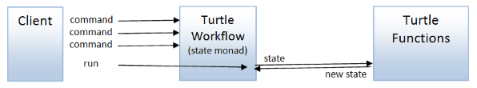

### 定义 `turtle` 工作流

我们在一开始定义的核心 turtle 函数遵循与许多其他状态转换函数相同的“形状”，一个输入加上 turtle 状态，以及一个输出加上 turtle 状态。

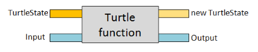

*(尽管到目前为止，我们还没有从 turtle 函数中得到任何可用的输出，但在后面的例子中，我们将看到这些输出被用来做出决策。)*

有一种标准方法来处理这些类型的函数——“状态单子”。

让我们看看这是如何构建的。

首先，请注意，由于柯里化，我们可以将具有这种形状的函数重新表述为两个单独的单参数函数：处理输入生成另一个函数，该函数又以状态作为参数：

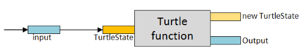

我们可以把一个 turtle 函数想象成接受一个输入并返回一个新的*函数*，就像这样：

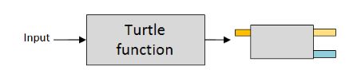

在我们的情况下，使用 `TurtleState` 作为状态，返回的函数将如下所示：

```
TurtleState -> 'a * TurtleState 
```

最后，为了更容易地处理，我们可以将返回的函数视为一个独立的东西，并为其命名，例如 `TurtleStateComputation`：

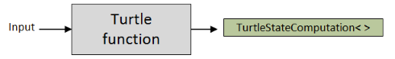

在实现中，我们通常会使用一个单一情况辨别联合体来包装函数，就像这样：

```
type TurtleStateComputation<'a> = 
    TurtleStateComputation of (Turtle.TurtleState -> 'a * Turtle.TurtleState) 
```

这就是“状态单子”的基本思想。但是，重要的是要意识到，状态单子不仅仅由这种类型组成——你还需要一些满足一些合理规律的函数（"return" 和 "bind"）。

我不会在这里定义 `returnT` 和 `bindT` 函数，但你可以在[完整源代码](https://github.com/swlaschin/13-ways-of-looking-at-a-turtle/blob/8e4e8d23b838ca88702d0b318bfd57a87801305e/08-StateMonad.fsx#L46)中看到它们的定义。

我们也需要一些额外的辅助函数。（我将在所有函数的末尾添加一个 `T` 作为 Turtle 后缀）。

特别是，我们需要一种方法将一些状态输入到 `TurtleStateComputation` 中以“运行”它：

```
let runT turtle state = 
    // pattern match against the turtle
    // to extract the inner function
    let (TurtleStateComputation innerFn) = turtle 
    // run the inner function with the passed in state
    innerFn state 
```

最后，我们可以创建一个 `turtle` 工作流，这是一个计算表达式，使得更容易处理 `TurtleStateComputation` 类型：

```
// define a computation expression builder
type TurtleBuilder() =
    member this.Return(x) = returnT x
    member this.Bind(x,f) = bindT f x

// create an instance of the computation expression builder
let turtle = TurtleBuilder() 
```

### 使用 Turtle 工作流

要使用 `turtle` 工作流，我们首先需要创建“提升”的或“单子化”的 turtle 函数版本：

```
let move dist = 
    toUnitComputation (Turtle.move log dist)
// val move : Distance -> TurtleStateComputation<unit>

let turn angle = 
    toUnitComputation (Turtle.turn log angle)
// val turn : Angle -> TurtleStateComputation<unit>

let penDown = 
    toUnitComputation (Turtle.penDown log)
// val penDown : TurtleStateComputation<unit>

let penUp = 
    toUnitComputation (Turtle.penUp log)
// val penUp : TurtleStateComputation<unit>

let setColor color = 
    toUnitComputation (Turtle.setColor log color)
// val setColor : PenColor -> TurtleStateComputation<unit> 
```

`toUnitComputation` 辅助函数完成了提升。不用担心它是如何工作的，但其效果是 `move` 函数的原始版本 (`Distance -> TurtleState -> TurtleState`) 被重塑为返回 `TurtleStateComputation` (`Distance -> TurtleStateComputation<unit>`) 的函数。

一旦我们有了这些“单子”版本，我们就可以像这样在 `turtle` 工作流中使用它们：

```
let drawTriangle() = 
    // define a set of instructions 
    let t = turtle {
        do! move 100.0 
        do! turn 120.0<Degrees>
        do! move 100.0 
        do! turn 120.0<Degrees>
        do! move 100.0 
        do! turn 120.0<Degrees>
        } 

    // finally, run them using the initial state as input
    runT t initialTurtleState 
```

`drawTriangle` 的第一部分连接了六个指令，但重要的是，并*不*运行它们。只有在最后使用 `runT` 函数时，这些指令才会被执行。

`drawPolygon` 示例稍微复杂一些。首先，我们定义了绘制一个边的工作流程：

```
let oneSide = turtle {
    do! move 100.0 
    do! turn angleDegrees 
    } 
```

但是然后我们需要一种将所有边组合成单个工作流的方法。有几种做法。我会选择创建一个成对组合器 `chain`，然后使用 `reduce` 将所有边组合成一个操作。

```
// chain two turtle operations in sequence
let chain f g  = turtle {
    do! f
    do! g
    } 

// create a list of operations, one for each side
let sides = List.replicate n oneSide

// chain all the sides into one operation
let all = sides |> List.reduce chain 
```

这是 `drawPolygon` 的完整代码：

```
let drawPolygon n = 
    let angle = 180.0 - (360.0/float n) 
    let angleDegrees = angle * 1.0<Degrees>

    // define a function that draws one side
    let oneSide = turtle {
        do! move 100.0 
        do! turn angleDegrees 
        }

    // chain two turtle operations in sequence
    let chain f g  = turtle {
        do! f
        do! g
        } 

    // create a list of operations, one for each side
    let sides = List.replicate n oneSide

    // chain all the sides into one operation
    let all = sides |> List.reduce chain 

    // finally, run them using the initial state
    runT all initialTurtleState 
```

### `turtle` 工作流的优点和缺点

*优点*

+   客户端代码类似于命令式代码，但保持了不可变性。

+   工作流是可组合的——你可以定义两个工作流，然后将它们组合起来创建另一个工作流。

*缺点*

+   与特定实现的 turtle 函数耦合。

+   比显式跟踪状态更复杂。

+   堆叠的嵌套单子/工作流很难处理。

作为最后一点的示例，假设我们有一个包含 `turtle` 工作流的 `result` 工作流的 `seq`，我们想要反转它们，使 `turtle` 工作流位于外部。你会怎么做？这不明显！

*这个版本的源代码可以在[这里](https://github.com/swlaschin/13-ways-of-looking-at-a-turtle/blob/master/08-StateMonad.fsx)找到。*

* * *

## 9: 使用命令对象进行批处理

另一种面向批处理的方法是以一种新的方式重用 `TurtleCommand` 类型。客户端不再立即调用函数，而是创建一个将作为组一起运行的命令列表。

当你“运行”命令列表时，你可以使用标准的 Turtle 库函数依次执行每个命令，使用 `fold` 将状态穿过序列。

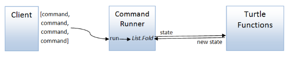

由于所有命令都是一次性运行的，这种方法意味着客户端之间不需要持久化的状态。

这是 `TurtleCommand` 的定义：

```
type TurtleCommand = 
    | Move of Distance 
    | Turn of Angle
    | PenUp
    | PenDown
    | SetColor of PenColor 
```

要处理一系列命令，我们需要对它们进行折叠，并通过它们线程化状态，所以我们需要一个将单个命令应用于状态并返回新状态的函数：

```
/// Apply a command to the turtle state and return the new state 
let applyCommand state command =
    match command with
    | Move distance ->
        move distance state
    | Turn angle ->
        turn angle state
    | PenUp ->
        penUp state
    | PenDown ->
        penDown state
    | SetColor color ->
        setColor color state 
```

然后，要运行所有命令，我们只需使用 `fold`：

```
/// Run list of commands in one go
let run aListOfCommands = 
    aListOfCommands 
    |> List.fold applyCommand Turtle.initialTurtleState 
```

### 运行一批命令

要绘制一个三角形，我们只需创建一个命令列表，然后运行它们：

```
let drawTriangle() = 
    // create the list of commands
    let commands = [
        Move 100.0 
        Turn 120.0<Degrees>
        Move 100.0 
        Turn 120.0<Degrees>
        Move 100.0 
        Turn 120.0<Degrees>
        ]
    // run them
    run commands 
```

现在，由于命令只是一个集合，我们可以很容易地从小集合构建更大的集合。

这里有一个`drawPolygon`的例子，其中`drawOneSide`返回一系列命令，并且该系列为每个边都重复：

```
let drawPolygon n = 
    let angle = 180.0 - (360.0/float n) 
    let angleDegrees = angle * 1.0<Degrees>

    // define a function that draws one side
    let drawOneSide sideNumber = [
        Move 100.0
        Turn angleDegrees
        ]

    // repeat for all sides
    let commands = 
        [1..n] |> List.collect drawOneSide

    // run the commands
    run commands 
```

### 批处理命令的优点和缺点

*优点*

+   比工作流程或单子简单。

+   只有一个函数与特定实现耦合。客户端的其余部分是解耦的。

*缺点*

+   仅面向批处理。

+   仅适用于控制流*不*基于先前命令的响应时。如果您*需要*对每个命令的结果做出响应，请考虑使用稍后讨论的"解释器"方法。

*这个版本的源代码可以在[这里](https://github.com/swlaschin/13-ways-of-looking-at-a-turtle/blob/master/09-BatchCommands.fsx)找到。*

* * *

## 插曲：使用数据类型进行有意识的解耦

在迄今为止的三个示例中（代理、函数依赖注入和批处理），我们使用了一个`Command`类型 -- 包含每个 API 调用的情况的辨别联合。在下一篇文章中，我们还将看到类似的东西用于事件源和解释器方法。

这不是偶然的。面向对象设计和函数设计之间的一个区别是，面向对象设计侧重于行为，而函数设计侧重于数据转换。

因此，他们的解耦方法也不同。面向对象设计倾向于通过共享捆绑的封装行为("接口")来提供解耦，而函数设计倾向于通过就共同数据类型达成一致，有时称为"协议"（尽管我更喜欢将该词保留给消息交换模式）。

一旦达成共同的数据类型协议，任何发出该类型的函数都可以通过常规函数组合连接到任何消费该类型的函数。

您还可以将这两种方法视为类似于在 Web 服务中选择[RPC 或基于消息的 API](https://sbdevel.wordpress.com/2009/12/17-the-case-rpc-vs-messaging/)之间的选择，就像[基于消息的设计有许多优势](https://github.com/ServiceStack/ServiceStack/wiki/Advantages-of-message-based-web-services#advantages-of-message-based-designs)一样，数据解耦也具有类似于基于行为的解耦的优势。

使用数据进行解耦的一些优势包括：

+   使用共享数据类型意味着组合是微不足道的。组合基于行为的接口更难。

+   *每个*函数已经像"解耦"一样，因此在重构时无需修改现有函数。最坏的情况下，您可能需要将一种数据类型转换为另一种，但这很容易通过...更多函数和更多函数组合来实现！

+   如果需要将代码拆分为物理上分开的服务时，数据结构很容易序列化到远程服务。

+   数据结构易于安全演变。例如，如果我添加了第六种海龟动作，或者删除了一个动作，或者改变了一个动作的参数，那么歧视联合类型将会改变，并且所有共享类型的客户端在考虑到第六种海龟动作之前都将无法编译等等。另一方面，如果*不*想让现有代码中断，您可以使用一个友好的版本化数据序列化格式，比如[protobuf](https://developers.google.com/protocol-buffers/docs/proto3#updating)。当使用接口时，这两个选项都不容易。

## 总结

> 这个梗正在传播。
> 
> 海龟必须划桨。
> 
> -- *《观察海龟的 13 种方式》，作者 Wallace D Coriacea*

喂？还有人在吗？感谢您一直坚持到现在！

所以，是时候休息一下了！在下一篇帖子中，我们将涵盖剩下的四种观察海龟的方式。

*本帖子的源代码可在 [github](https://github.com/swlaschin/13-ways-of-looking-at-a-turtle) 上找到。*

# 13 种观察海龟的方式（第 2 部分）

# 13 种观察海龟的方式（第 2 部分）

> 本帖子是[F#英文 2015 年的圣诞日历](https://sergeytihon.wordpress.com/2015/10/25/f-advent-calendar-in-english-2015/)项目的一部分。看看那里的所有其他精彩帖子！特别感谢 Sergey Tihon 组织此活动。

在这个两部分的超级帖子中，我正在极限地推动简单的 turtle 图形模型，同时演示部分应用、验证、"lifting" 概念、带有消息队列的代理、依赖注入、State monad、事件源、流处理和一个解释器！

在上一篇帖子中，我们涵盖了前九种观察海龟的方式。在这篇帖子中，我们将看看剩下的四种方式。

作为提醒，这里是十三种方式：

+   第 1 种方式\. 一个基本的面向对象方法，在这种情况下，我们创建一个具有可变状态的类。

+   第 2 种方式\. 一个基本的功能方法，在这种情况下，我们创建一个具有不可变状态的函数模块。

+   第 3 种方式\. 具有面向对象核心的 API，在这种情况下，我们创建一个调用有状态核心类的面向对象 API。

+   第 4 种方式\. 具有功能核心的 API，在这种情况下，我们创建一个使用无状态核心函数的有状态 API。

+   第 5 种方式\. 代理前面的 API，在这种情况下，我们创建一个使用消息队列与代理进行通信的 API。

+   第 6 种方式\. 使用接口进行依赖注入，在这种情况下，我们使用接口或函数记录将实现与 API 解耦。

+   第 7 种方式\. 使用函数进行依赖注入，在这种情况下，我们通过传递函数参数将实现与 API 解耦。

+   第 8 种方式：使用状态单子进行批处理，其中我们创建一个特殊的“龟工作流”计算表达式来跟踪状态。

+   第 9 种方式：使用命令对象进行批处理，我们创建一个表示龟命令的类型，然后一次处理一个命令列表。

+   插曲：使用数据类型有意识地解耦。关于使用数据与接口进行解耦的一些注释。

+   第 10 种方式：事件溯源，其中状态是从过去事件列表中构建的。

+   第 11 种方式：功能性反向编程（流处理），其中业务逻辑基于对先前事件的反应。

+   第五集：龟之反击，其中龟的 API 更改，因此某些命令可能会失败。

+   第 12 种方式：单子控制流，其中我们根据先前命令的结果在龟工作流中做出决策。

+   第 13 种方式：龟解释器，其中我们将龟编程与龟实现完全解耦，并几乎遇到了自由单子。

+   所有技术的回顾。

扩展版的两种额外方式：

+   第 14 种方式：抽象数据龟，通过使用抽象数据类型封装了龟实现的详细信息。

+   第 15 种方式：基于能力的龟，其中我们根据龟的当前状态控制客户端可用的龟功能。

这是一种无穷递归的设计！

本文的所有源代码都可在 [github](https://github.com/swlaschin/13-ways-of-looking-at-a-turtle) 上找到。

* * *

## 10: 事件溯源 -- 从过去事件列表构建状态

在这个设计中，我们建立在“命令”概念上，该概念在 代理（第 5 种方式） 和 批处理（第 9 种方式） 中使用，但将“命令”替换为“事件”作为更新状态的方法。

它的工作方式是：

+   客户端发送 `Command` 给 `CommandHandler`。

+   在处理 `Command` 之前，`CommandHandler` 首先使用与特定龟相关联的过去事件从头开始重建当前状态。

+   然后，`CommandHandler` 验证命令，并根据当前（重建的）状态决定要执行什么操作。它生成一个（可能为空的）事件列表。

+   生成的事件存储在 `EventStore` 中供下一个命令使用。

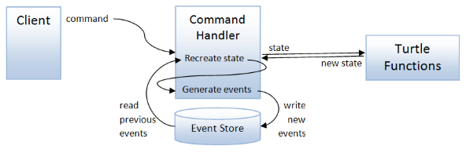

这样，既不需要客户端也不需要命令处理程序跟踪状态。只有 `EventStore` 是可变的。

### 命令和事件类型

我们将首先定义与我们的事件源系统相关的类型。首先，与命令相关的类型：

```
type TurtleId = System.Guid

/// A desired action on a turtle
type TurtleCommandAction = 
    | Move of Distance 
    | Turn of Angle
    | PenUp 
    | PenDown 
    | SetColor of PenColor

/// A command representing a desired action addressed to a specific turtle
type TurtleCommand = {
    turtleId : TurtleId
    action : TurtleCommandAction 
    } 
```

请注意，命令是针对特定乌龟的，使用`TurtleId`。

接下来，我们将定义从命令生成的两种类型的事件：

+   一个表示状态变化的`StateChangedEvent`

+   一个表示乌龟移动的开始和结束位置的`MovedEvent`。

```
/// An event representing a state change that happened
type StateChangedEvent = 
    | Moved of Distance 
    | Turned of Angle
    | PenWentUp 
    | PenWentDown 
    | ColorChanged of PenColor

/// An event representing a move that happened
/// This can be easily translated into a line-drawing activity on a canvas
type MovedEvent = {
    startPos : Position 
    endPos : Position 
    penColor : PenColor option
    }

/// A union of all possible events
type TurtleEvent = 
    | StateChangedEvent of StateChangedEvent
    | MovedEvent of MovedEvent 
```

重要的事件源的一部分是所有事件都以过去式标记：`Moved`和`Turned`而不是`Move`和`Turn`。事件是事实--它们发生在过去。

### 命令处理器

下一步是定义将命令转换为事件的函数。

我们将需要：

+   一个（私有的）`applyEvent`函数，用于从先前的事件更新状态。

+   一个（私有的）`eventsFromCommand`函数，根据命令和状态确定要生成的事件。

+   一个公共的`commandHandler`函数处理命令，从事件存储中读取事件并调用其他两个函数。

这是`applyEvent`。你可以看到它与我们在上一批处理示例中看到的`applyCommand`函数非常相似。

```
/// Apply an event to the current state and return the new state of the turtle
let applyEvent log oldState event =
    match event with
    | Moved distance ->
        Turtle.move log distance oldState 
    | Turned angle ->
        Turtle.turn log angle oldState 
    | PenWentUp ->
        Turtle.penUp log oldState 
    | PenWentDown ->
        Turtle.penDown log oldState 
    | ColorChanged color ->
        Turtle.setColor log color oldState 
```

`eventsFromCommand`函数包含验证命令并创建事件的关键逻辑。

+   在这个特定的设计中，命令总是有效的，所以至少返回一个事件。

+   `StateChangedEvent`是从`TurtleCommand`中创建的，它们是一对一映射的情况。

+   只有在乌龟改变位置时，才会从`TurtleCommand`创建`MovedEvent`。

```
// Determine what events to generate, based on the command and the state.
let eventsFromCommand log command stateBeforeCommand =

    // --------------------------
    // create the StateChangedEvent from the TurtleCommand
    let stateChangedEvent = 
        match command.action with
        | Move dist -> Moved dist
        | Turn angle -> Turned angle
        | PenUp -> PenWentUp 
        | PenDown -> PenWentDown 
        | SetColor color -> ColorChanged color

    // --------------------------
    // calculate the current state from the new event
    let stateAfterCommand = 
        applyEvent log stateBeforeCommand stateChangedEvent

    // --------------------------
    // create the MovedEvent 
    let startPos = stateBeforeCommand.position 
    let endPos = stateAfterCommand.position 
    let penColor = 
        if stateBeforeCommand.penState=Down then
            Some stateBeforeCommand.color
        else
            None                        

    let movedEvent = {
        startPos = startPos 
        endPos = endPos 
        penColor = penColor
        }

    // --------------------------
    // return the list of events
    if startPos <> endPos then
        // if the turtle has moved, return both the stateChangedEvent and the movedEvent 
        // lifted into the common TurtleEvent type
        [ StateChangedEvent stateChangedEvent; MovedEvent movedEvent]                
    else
        // if the turtle has not moved, return just the stateChangedEvent 
        [ StateChangedEvent stateChangedEvent] 
```

最后，`commandHandler`是公共接口。它将一些依赖项作为参数传递进来：一个记录函数，一个函数用于从事件存储中检索历史事件，以及一个函数用于将新生成的事件保存到事件存储中。

```
/// The type representing a function that gets the StateChangedEvents for a turtle id
/// The oldest events are first
type GetStateChangedEventsForId =
     TurtleId -> StateChangedEvent list

/// The type representing a function that saves a TurtleEvent 
type SaveTurtleEvent = 
    TurtleId -> TurtleEvent -> unit

/// main function : process a command
let commandHandler 
    (log:string -> unit) 
    (getEvents:GetStateChangedEventsForId) 
    (saveEvent:SaveTurtleEvent) 
    (command:TurtleCommand) =

    /// First load all the events from the event store
    let eventHistory = 
        getEvents command.turtleId

    /// Then, recreate the state before the command
    let stateBeforeCommand = 
        let nolog = ignore // no logging when recreating state
        eventHistory 
        |> List.fold (applyEvent nolog) Turtle.initialTurtleState

    /// Construct the events from the command and the stateBeforeCommand
    /// Do use the supplied logger for this bit
    let events = eventsFromCommand log command stateBeforeCommand 

    // store the events in the event store
    events |> List.iter (saveEvent command.turtleId) 
```

### 调用命令处理器

现在我们准备向命令处理器发送事件。

首先我们需要一些帮助函数来创建命令：

```
// Command versions of standard actions 
let turtleId = System.Guid.NewGuid()
let move dist = {turtleId=turtleId; action=Move dist} 
let turn angle = {turtleId=turtleId; action=Turn angle} 
let penDown = {turtleId=turtleId; action=PenDown} 
let penUp = {turtleId=turtleId; action=PenUp} 
let setColor color = {turtleId=turtleId; action=SetColor color} 
```

然后我们可以通过将各种命令发送到命令处理器来绘制图形：

```
let drawTriangle() = 
    let handler = makeCommandHandler()
    handler (move 100.0)
    handler (turn 120.0<Degrees>)
    handler (move 100.0)
    handler (turn 120.0<Degrees>)
    handler (move 100.0)
    handler (turn 120.0<Degrees>) 
```

注意：我没有展示如何创建命令处理器或事件存储，请查看完整的代码详细信息。

### 事件源的优缺点

*优势*

+   所有的代码都是无状态的，因此易于测试。

+   支持事件重放。

*缺点*

+   可能比 CRUD 方法更复杂（或者至少，工具和库的支持更少）。

+   如果不小心，命令处理器可能会变得过于复杂，并且演变成实现过多业务逻辑。

*这个版本的源代码可以在[这里](https://github.com/swlaschin/13-ways-of-looking-at-a-turtle/blob/master/10-EventSourcing.fsx)找到。*

* * *

## 11：功能性后向编程（流处理）

在上面的事件溯源示例中，所有领域逻辑（在我们的情况下，只是跟踪状态）都嵌入在命令处理程序中。这种方法的一个缺点是，随着应用程序的发展，命令处理程序中的逻辑可能变得非常复杂。

一种避免这种情况的方法是将["功能性反应式编程"](https://en.wikipedia.org/wiki/Functional_reactive_programming)与事件溯源结合起来，创建一个设计，在该设计中，领域逻辑在“读取端”执行，通过监听从事件存储器发出的事件（“信号”）。

在这种方法中，“写入端”遵循与事件溯源示例相同的模式。客户端向 `commandHandler` 发送一个 `Command`，它将其转换为事件列表并将其存储在 `EventStore` 中。

然而，`commandHandler` 只做*最小*的工作，比如更新状态，不执行任何复杂的领域逻辑。复杂逻辑由一个或多个下游的“处理器”（有时也称为“聚合器”）执行，它们订阅事件流。

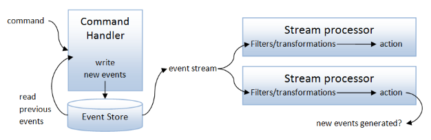

甚至可以将这些事件视为处理器的“命令”，当然，处理器可以生成新事件供另一个处理器消费，因此这种方法可��扩展为一种架构风格，其中应用程序由一组通过事件存储器连接的命令处理程序组成。

这种技术通常被称为["流处理"](http://www.confluent.io/blog/making-sense-of-stream-processing/)。然而，Jessica Kerr 曾经将这种方法称为["功能性追溯式编程"](https://twitter.com/jessitron/status/408554836578537472) -- 我喜欢这个名字，所以我要借用这个名字！

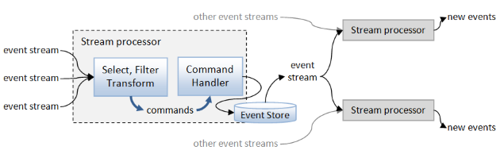

### 实现设计

对于这个实现，`commandHandler` 函数与事件溯源示例中的相同，只是根本没有任何工作（只是记录！）。命令处理程序*仅*重建状态并生成事件。事件如何用于业务逻辑已不再是其范围内。

新的东西在于创建处理器。

然而，在创建处理器之前，我们需要一些辅助函数，可以过滤事件存储器的反馈，仅包括特定于乌龟的事件，并且其中仅包括 `StateChangedEvent` 或 `MovedEvent`。

```
// filter to choose only TurtleEvents
let turtleFilter ev = 
    match box ev with
    | :? TurtleEvent as tev -> Some tev
    | _ -> None

// filter to choose only MovedEvents from TurtleEvents
let moveFilter = function 
    | MovedEvent ev -> Some ev
    | _ -> None

// filter to choose only StateChangedEvent from TurtleEvents
let stateChangedEventFilter = function 
    | StateChangedEvent ev -> Some ev
    | _ -> None 
```

现在让我们创建一个处理器，监听移动事件，并在虚拟乌龟移动时移动实际乌龟。

我们将处理器的输入设置为一个 `IObservable` -- 一个事件流 -- 这样它就不会与任何特定来源（如 `EventStore`）耦合。当应用程序配置时，我们将连接 `EventStore` 的“保存”事件到这个处理器。

```
/// Physically move the turtle
let physicalTurtleProcessor (eventStream:IObservable<Guid*obj>) =

    // the function that handles the input from the observable
    let subscriberFn (ev:MovedEvent) =
        let colorText = 
            match ev.penColor with
            | Some color -> sprintf "line of color %A" color
            | None -> "no line"
        printfn "[turtle  ]: Moved from (%0.2f,%0.2f) to (%0.2f,%0.2f) with %s" 
            ev.startPos.x ev.startPos.y ev.endPos.x ev.endPos.y colorText 

    // start with all events
    eventStream
    // filter the stream on just TurtleEvents
    |> Observable.choose (function (id,ev) -> turtleFilter ev)
    // filter on just MovedEvents
    |> Observable.choose moveFilter
    // handle these
    |> Observable.subscribe subscriberFn 
```

在这种情况下，我们只是打印移动 -- 我将构建一个[实际的乐高乌龟](https://www.youtube.com/watch?v=pcJHLClDKVw)留给读者作为练习！

让我们也创建一个在图形显示器上绘制线条的处理器：

```
/// Draw lines on a graphics device
let graphicsProcessor (eventStream:IObservable<Guid*obj>) =

    // the function that handles the input from the observable
    let subscriberFn (ev:MovedEvent) =
        match ev.penColor with
        | Some color -> 
            printfn "[graphics]: Draw line from (%0.2f,%0.2f) to (%0.2f,%0.2f) with color %A" 
                ev.startPos.x ev.startPos.y ev.endPos.x ev.endPos.y color
        | None -> 
            ()  // do nothing

    // start with all events
    eventStream
    // filter the stream on just TurtleEvents
    |> Observable.choose (function (id,ev) -> turtleFilter ev)
    // filter on just MovedEvents
    |> Observable.choose moveFilter
    // handle these
    |> Observable.subscribe subscriberFn 
```

最后，让我们创建一个处理器，累积总移动距离，以便我们可以跟踪已使用的墨水量。

```
/// Listen for "moved" events and aggregate them to keep
/// track of the total ink used
let inkUsedProcessor (eventStream:IObservable<Guid*obj>) =

    // Accumulate the total distance moved so far when a new event happens
    let accumulate distanceSoFar (ev:StateChangedEvent) =
        match ev with
        | Moved dist -> 
            distanceSoFar + dist 
        | _ -> 
            distanceSoFar 

    // the function that handles the input from the observable
    let subscriberFn distanceSoFar  =
        printfn "[ink used]: %0.2f" distanceSoFar  

    // start with all events
    eventStream
    // filter the stream on just TurtleEvents
    |> Observable.choose (function (id,ev) -> turtleFilter ev)
    // filter on just StateChangedEvent
    |> Observable.choose stateChangedEventFilter
    // accumulate total distance
    |> Observable.scan accumulate 0.0
    // handle these
    |> Observable.subscribe subscriberFn 
```

此处理器使用`Observable.scan`将事件累积成单个值--总行驶距离。

### 实际中的处理器

让我们试试这些！

例如，这是`drawTriangle`的样子：

```
let drawTriangle() = 
    // clear older events
    eventStore.Clear turtleId   

    // create an event stream from an IEvent
    let eventStream = eventStore.SaveEvent :> IObservable<Guid*obj>

    // register the processors
    use physicalTurtleProcessor = EventProcessors.physicalTurtleProcessor eventStream 
    use graphicsProcessor = EventProcessors.graphicsProcessor eventStream 
    use inkUsedProcessor = EventProcessors.inkUsedProcessor eventStream 

    let handler = makeCommandHandler
    handler (move 100.0)
    handler (turn 120.0<Degrees>)
    handler (move 100.0)
    handler (turn 120.0<Degrees>)
    handler (move 100.0)
    handler (turn 120.0<Degrees>) 
```

请注意，`eventStore.SaveEvent`被转换为一个`IObservable<Guid*obj>`（即事件流）之后，才被传递给处理器作为参数。

`drawTriangle`生成以下输出：

```
[ink used]: 100.00
[turtle  ]: Moved from (0.00,0.00) to (100.00,0.00) with line of color Black
[graphics]: Draw line from (0.00,0.00) to (100.00,0.00) with color Black
[ink used]: 100.00
[ink used]: 200.00
[turtle  ]: Moved from (100.00,0.00) to (50.00,86.60) with line of color Black
[graphics]: Draw line from (100.00,0.00) to (50.00,86.60) with color Black
[ink used]: 200.00
[ink used]: 300.00
[turtle  ]: Moved from (50.00,86.60) to (0.00,0.00) with line of color Black
[graphics]: Draw line from (50.00,86.60) to (0.00,0.00) with color Black
[ink used]: 300.00 
```

您可以看到所有处理器都成功处理了事件。

乌龟正在移动，图形处理器正在绘制线条，墨水使用处理器已正确计算出总移动距离为 300 单位。

请注意，墨水使用的处理器在*每一次*状态改变（比如转向）时都会发出输出，而不仅仅是在实际移动发生时。

我们可以通过在流中放置一对`(previousDistance, currentDistance)`，然后过滤掉那些值相同的事件来解决这个问题。

这是新的`inkUsedProcessor`代码，带有以下更改：

+   `accumulate`函数现在发出一对。

+   有一个新的过滤器`changedDistanceOnly`。

```
/// Listen for "moved" events and aggregate them to keep
/// track of the total distance moved
/// NEW! No duplicate events! 
let inkUsedProcessor (eventStream:IObservable<Guid*obj>) =

    // Accumulate the total distance moved so far when a new event happens
    let accumulate (prevDist,currDist) (ev:StateChangedEvent) =
        let newDist =
            match ev with
            | Moved dist -> 
                currDist + dist
            | _ -> 
                currDist
        (currDist, newDist)

    // convert unchanged events to None so they can be filtered out with "choose"
    let changedDistanceOnly (currDist, newDist) =
        if currDist <> newDist then 
            Some newDist 
        else 
            None

    // the function that handles the input from the observable
    let subscriberFn distanceSoFar  =
        printfn "[ink used]: %0.2f" distanceSoFar  

    // start with all events
    eventStream
    // filter the stream on just TurtleEvents
    |> Observable.choose (function (id,ev) -> turtleFilter ev)
    // filter on just StateChangedEvent
    |> Observable.choose stateChangedEventFilter
    // NEW! accumulate total distance as pairs
    |> Observable.scan accumulate (0.0,0.0)   
    // NEW! filter out when distance has not changed
    |> Observable.choose changedDistanceOnly
    // handle these
    |> Observable.subscribe subscriberFn 
```

有了这些改变，`drawTriangle`的输出看起来像这样：

```
[ink used]: 100.00
[turtle  ]: Moved from (0.00,0.00) to (100.00,0.00) with line of color Black
[graphics]: Draw line from (0.00,0.00) to (100.00,0.00) with color Black
[ink used]: 200.00
[turtle  ]: Moved from (100.00,0.00) to (50.00,86.60) with line of color Black
[graphics]: Draw line from (100.00,0.00) to (50.00,86.60) with color Black
[ink used]: 300.00
[turtle  ]: Moved from (50.00,86.60) to (0.00,0.00) with line of color Black
[graphics]: Draw line from (50.00,86.60) to (0.00,0.00) with color Black 
```

`inkUsedProcessor`中不再存在重复的消息。

### 流处理的优缺点

*优点*

+   与事件源相同的优点。

+   将有状态的逻辑与其他非固有逻辑分离。

+   可以轻松添加和删除领域逻辑，而不影响核心命令处理程序。

*缺点*

+   更复杂的实现。

*这个版本的源代码可以在[这里](https://github.com/swlaschin/13-ways-of-looking-at-a-turtle/blob/master/11-FRP.fsx)找到。*

* * *

## 第五集：乌龟反击

到目前为止，我们还没有根据乌龟的状态做出决定。因此，对于最后两种方法，我们将更改乌龟 API，使得一些命令可能失败。

例如，我们可以说乌龟必须在有限的竞技场内移动，`move`指令可能会导致乌龟碰到障碍物。在这种情况下，`move`指令可以返回`MovedOk`或`HitBarrier`的选择。

或者我们可以说，有限的彩色墨水。在这种情况下，尝试设置颜色可能会返回“墨水用完”的响应。

所以让我们用这些情况更新乌龟函数。首先是`move`和`setColor`的新响应类型：

```
type MoveResponse = 
    | MoveOk 
    | HitABarrier

type SetColorResponse = 
    | ColorOk
    | OutOfInk 
```

我们将需要一个边界检查器来查看乌龟是否在竞技场内。假设如果位置尝试移出方形（0,0,100,100），则响应为`HitABarrier`：

```
// if the position is outside the square (0,0,100,100) 
// then constrain the position and return HitABarrier
let checkPosition position =
    let isOutOfBounds p = 
        p > 100.0 || p < 0.0
    let bringInsideBounds p = 
        max (min p 100.0) 0.0

    if isOutOfBounds position.x || isOutOfBounds position.y then
        let newPos = {
            x = bringInsideBounds position.x 
            y = bringInsideBounds position.y }
        HitABarrier,newPos
    else
        MoveOk,position 
```

最后，`move`函数需要额外的一行来检查新的位置：

```
let move log distance state =
    let newPosition = ...

    // adjust the new position if out of bounds
    let moveResult, newPosition = checkPosition newPosition 

    ... 
```

这是完整的`move`函数：

```
let move log distance state =
    log (sprintf "Move %0.1f" distance)
    // calculate new position 
    let newPosition = calcNewPosition distance state.angle state.position 
    // adjust the new position if out of bounds
    let moveResult, newPosition = checkPosition newPosition 
    // draw line if needed
    if state.penState = Down then
        dummyDrawLine log state.position newPosition state.color
    // return the new state and the Move result
    let newState = {state with position = newPosition}
    (moveResult,newState) 
```

对于`setColor`函数，我们也会进行类似的更改，如果尝试将颜色设置为`Red`，则返回`OutOfInk`。

```
let setColor log color state =
    let colorResult = 
        if color = Red then OutOfInk else ColorOk
    log (sprintf "SetColor %A" color)
    // return the new state and the SetColor result
    let newState = {state with color = color}
    (colorResult,newState) 
```

随着可用的新版本的 turtle 函数，我们必须创建能够响应错误情况的实现。这将在接下来的两个示例中完成。

*新 turtle 函数的源代码可以在[此处](https://github.com/swlaschin/13-ways-of-looking-at-a-turtle/blob/master/FPTurtleLib2.fsx)找到。*

* * *

## 12：单调控制流

在这种方法中，我们将重用来自第 8 种方法的`turtle`工作流。不过，这一次，我们将根据前一次的结果为下一次的命令做出决策。

不过，在我们这样做之前，让我们看看对`move`的更改对我们的代码有什么影响。比方说，我们想要使用`move 40.0`向前移动几次。

如果我们像以前一样使用`do!`编写代码，我们会得到一个难以处理的编译器错误：

```
let drawShape() = 
    // define a set of instructions 
    let t = turtle {
        do! move 60.0   
        // error FS0001: 
        // This expression was expected to have type
        //    Turtle.MoveResponse 
        // but here has type
        //     unit 
        do! move 60.0 
        } 
    // etc 
```

相反，我们需要使用`let!`并将响应分配给某个东西。

在下面的代码中，我们将响应分配给一个值，然后将其忽略！

```
let drawShapeWithoutResponding() = 
    // define a set of instructions 
    let t = turtle {
        let! response = move 60.0 
        let! response = move 60.0 
        let! response = move 60.0 
        return ()
        } 

    // finally, run the monad using the initial state
    runT t initialTurtleState 
```

代码编译并工作了，但是如果我们运行它，输出显示，到第三次调用时，我们把乌龟撞到了墙上（在 100,0 处），而且没有移动到任何地方。

```
Move 60.0
...Draw line from (0.0,0.0) to (60.0,0.0) using Black
Move 60.0
...Draw line from (60.0,0.0) to (100.0,0.0) using Black
Move 60.0
...Draw line from (100.0,0.0) to (100.0,0.0) using Black 
```

### 基于响应做出决策

假设我们对返回`HitABarrier`的`move`的响应是转向 90 度并等待下一个命令。不是最聪明的算法，但作为演示目的，它可以！

让我们设计一个函数来实现这个功能。输入将是一个`MoveResponse`，但输出将是什么？我们想要以某种方式编码`turn`动作，但原始的`turn`函数需要我们没有的状态输入。所以我们改为返回一个代表我们想要在状态可用时（在`run`命令中）执行的`turtle`工作流。

所以这里是代码：

```
let handleMoveResponse moveResponse = turtle {
    match moveResponse with
    | Turtle.MoveOk -> 
        () // do nothing
    | Turtle.HitABarrier ->
        // turn 90 before trying again
        printfn "Oops -- hit a barrier -- turning"
        do! turn 90.0<Degrees>
    } 
```

类型签名看起来像这样：

```
val handleMoveResponse : MoveResponse -> TurtleStateComputation<unit> 
```

这意味着它是一个单调的（或“对角线”）函数——一个从正常世界开始并以`TurtleStateComputation`世界结束的函数。

这正是我们可以使用“绑定”或在计算表达式中使用`let!`或`do!`的函数。

现在我们可以在乌龟工作流的`move`之后添加这个`handleMoveResponse`步骤：

```
let drawShape() = 
    // define a set of instructions 
    let t = turtle {
        let! response = move 60.0 
        do! handleMoveResponse response 

        let! response = move 60.0 
        do! handleMoveResponse response 

        let! response = move 60.0 
        do! handleMoveResponse response 
        } 

    // finally, run the monad using the initial state
    runT t initialTurtleState 
```

运行结果如下：

```
Move 60.0
...Draw line from (0.0,0.0) to (60.0,0.0) using Black
Move 60.0
...Draw line from (60.0,0.0) to (100.0,0.0) using Black
Oops -- hit a barrier -- turning
Turn 90.0
Move 60.0
...Draw line from (100.0,0.0) to (100.0,60.0) using Black 
```

你可以看到移动响应起作用了。当乌龟撞到边缘（100,0）时，它转了 90 度，然后下一步移动成功了（从（100,0）到（100,60））。

所以你明白了！这段代码演示了如何在`turtle`工作流中做出决策，同时在幕后传递状态。

### 优势和劣势

*优势*

+   计算表达式允许代码专注于逻辑，同时处理“管道”——在这种情况下是 turtle 状态。

*劣势*

+   仍然与特定的 turtle 函数实现耦合。

+   计算表达式的实现可能很复杂，对于初学者来说，它们的工作原理并不明显。

*此版本的源代码可在[此处](https://github.com/swlaschin/13-ways-of-looking-at-a-turtle/blob/master/12-BranchingOnResponse.fsx)找到。*

* * *

## 13：乌龟解释器

对于我们的最终方法，我们将看一种*完全*将乌龟的编程与其解释分离的方法。

这类似于使用命令对象进行批处理的方法，但已经增强以支持对命令输出的响应。

### 设计一个解释器

我们将采取的方法是为一组乌龟命令设计一个“解释器”，其中客户端提供命令给乌龟，并响应乌龟的输出，但实际的乌龟函数稍后由特定的实现提供。

换句话说，我们有一系列交错的命令和乌龟函数，看起来像这样：

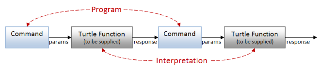

那么我们如何在代码中建模这个设计？

首先尝试，让我们将链模拟为一系列请求/响应对。我们向乌龟发送一个命令，它会以`MoveResponse`或其他方式适当地响应，就像这样：

```
// we send this to the turtle...
type TurtleCommand = 
    | Move of Distance 
    | Turn of Angle
    | PenUp
    | PenDown
    | SetColor of PenColor

// ... and the turtle replies with one of these
type TurtleResponse = 
    | Moved of MoveResponse
    | Turned 
    | PenWentUp
    | PenWentDown
    | ColorSet of SetColorResponse 
```

问题是我们无法确定响应是否正确匹配命令。例如，如果我发送一个`Move`命令，我期望得到一个`MoveResponse`，而不是一个`SetColorResponse`。但是这个实现并没有强制执行！

我们想要使非法状态不可表示 -- 我们该怎么做？

关键是将请求和响应组合成*配对*。也就是说，对于`Move`命令，有一个关联的函数，该函数以`MoveResponse`作为输入，并对每个其他组合也是如此。现在可以将没有响应的命令暂时视为返回`unit`。

```
Move command => pair of (Move command parameters), (function MoveResponse -> something)
Turn command => pair of (Turn command parameters), (function unit -> something)
etc 
```

这个工作原理是：

+   客户端创建一个命令，比如`Move 100`，并且还提供处理响应的附加函数。

+   Move 命令的乌龟实现（在解释器内部）处理输入（一个`Distance`），然后生成一个`MoveResponse`。

+   然后解释器接收此`MoveResponse`并调用客户端提供的配对中的关联函数。

通过以这种方式将`Move`命令与函数关联，我们可以*保证*内部乌龟实现必须接受一个`distance`并返回一个`MoveResponse`，就像我们想要的那样。

下一个问题是：`something`是什么输出？这是客户端处理响应后的输出 -- 也就是，另一个命令/响应链！

因此，我们可以将整个配对链模拟成一个递归结构：

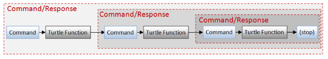

或者在代码中：

```
type TurtleProgram = 
    //         (input params)  (response)
    | Move     of Distance   * (MoveResponse -> TurtleProgram)
    | Turn     of Angle      * (unit -> TurtleProgram)
    | PenUp    of (* none *)   (unit -> TurtleProgram)
    | PenDown  of (* none *)   (unit -> TurtleProgram)
    | SetColor of PenColor   * (SetColorResponse -> TurtleProgram) 
```

我已将类型从`TurtleCommand`重命名为`TurtleProgram`，因为它不再只是一个命令，而是现在是一组完整的命令链和关联的响应处理程序。

然而，每一步都需要另一个`TurtleProgram`来跟随 -- 那么什么时候会停止呢？我们需要一种方式来表示没有下一个命令。

为了解决这个问题，我们将在程序类型中添加一个特殊的`Stop`情况：

```
type TurtleProgram = 
    //         (input params)  (response)
    | Stop
    | Move     of Distance   * (MoveResponse -> TurtleProgram)
    | Turn     of Angle      * (unit -> TurtleProgram)
    | PenUp    of (* none *)   (unit -> TurtleProgram)
    | PenDown  of (* none *)   (unit -> TurtleProgram)
    | SetColor of PenColor   * (SetColorResponse -> TurtleProgram) 
```

注意在这个结构中没有提及`TurtleState`。如何管理乌龟状态是解释器内部的事情，不是“指令集”的一部分。

`TurtleProgram`是一个抽象语法树（AST）的示例 -- 一种表示要解释（或编译）的程序的结构。

### 测试解释器

让我们使用这个模型创建一个小程序。这是我们的老朋友`drawTriangle`：

```
let drawTriangle = 
    Move (100.0, fun response -> 
    Turn (120.0<Degrees>, fun () -> 
    Move (100.0, fun response -> 
    Turn (120.0<Degrees>, fun () -> 
    Move (100.0, fun response -> 
    Turn (120.0<Degrees>, fun () -> 
    Stop)))))) 
```

这个程序是一个仅包含客户端命令和响应的数据结构 -- 它没有任何实际的乌龟函数！是的，现在看起来非常丑陋，但我们很快会修复它。

现在的下一步是解释这个数据结构。

让我们创建一个调用真正乌龟函数的解释器。我们如何实现`Move`情况呢？

好吧，就像上面描述的那样：

+   从`Move`情况获取距离和相关函数

+   调用真正的乌龟函数，传递距离和当前乌龟状态，以获得`MoveResult`和新的乌龟状态。

+   通过将`MoveResult`传递给相关函数来获取程序中的下一步

+   最后再次调用解释器（递归）并使用新程序和新乌龟状态。

```
let rec interpretAsTurtle state program =
    ...
    match program  with
    | Move (dist,next) ->
        let result,newState = Turtle.move log dist state 
        let nextProgram = next result  // compute the next step
        interpretAsTurtle newState nextProgram 
    ... 
```

您可以看到更新后的乌龟状态作为参数传递给下一个递归调用，因此不需要可变字段。

这是`interpretAsTurtle`的完整代码：

```
let rec interpretAsTurtle state program =
    let log = printfn "%s"

    match program  with
    | Stop -> 
        state
    | Move (dist,next) ->
        let result,newState = Turtle.move log dist state 
        let nextProgram = next result  // compute the next step 
        interpretAsTurtle newState nextProgram 
    | Turn (angle,next) ->
        let newState = Turtle.turn log angle state 
        let nextProgram = next()       // compute the next step
        interpretAsTurtle newState nextProgram 
    | PenUp next ->
        let newState = Turtle.penUp log state 
        let nextProgram = next()
        interpretAsTurtle newState nextProgram 
    | PenDown next -> 
        let newState = Turtle.penDown log state 
        let nextProgram = next()
        interpretAsTurtle newState nextProgram 
    | SetColor (color,next) ->
        let result,newState = Turtle.setColor log color state 
        let nextProgram = next result
        interpretAsTurtle newState nextProgram 
```

让我们运行它：

```
let program = drawTriangle
let interpret = interpretAsTurtle   // choose an interpreter 
let initialState = Turtle.initialTurtleState
interpret initialState program |> ignore 
```

输出与我们之前看到的完全相同：

```
Move 100.0
...Draw line from (0.0,0.0) to (100.0,0.0) using Black
Turn 120.0
Move 100.0
...Draw line from (100.0,0.0) to (50.0,86.6) using Black
Turn 120.0
Move 100.0
...Draw line from (50.0,86.6) to (0.0,0.0) using Black
Turn 120.0 
```

但与以往所有的方法不同，我们可以*完全相同的程序*以一种新的方式解释。我们不需要设置任何形式的依赖注入，只需要使用不同的解释器。

因此，让我们创建另一个解释器，聚合已行进的距离，而不关心乌龟状态：

```
let rec interpretAsDistance distanceSoFar program =
    let recurse = interpretAsDistance 
    let log = printfn "%s"

    match program with
    | Stop -> 
        distanceSoFar
    | Move (dist,next) ->
        let newDistanceSoFar = distanceSoFar + dist
        let result = Turtle.MoveOk   // hard-code result
        let nextProgram = next result 
        recurse newDistanceSoFar nextProgram 
    | Turn (angle,next) ->
        // no change in distanceSoFar
        let nextProgram = next()
        recurse distanceSoFar nextProgram 
    | PenUp next ->
        // no change in distanceSoFar
        let nextProgram = next()
        recurse distanceSoFar nextProgram 
    | PenDown next -> 
        // no change in distanceSoFar
        let nextProgram = next()
        recurse distanceSoFar nextProgram 
    | SetColor (color,next) ->
        // no change in distanceSoFar
        let result = Turtle.ColorOk   // hard-code result
        let nextProgram = next result
        recurse distanceSoFar nextProgram 
```

在这种情况下，我将`interpretAsDistance`本地别名为`recurse`，以明确表明正在发生的递归类型。

让我们用这个新的解释器运行相同的程序：

```
let program = drawTriangle           // same program 
let interpret = interpretAsDistance  // choose an interpreter 
let initialState = 0.0
interpret initialState program |> printfn "Total distance moved is %0.1f" 
```

输出再次与我们期望的完全相同：

```
Total distance moved is 300.0 
```

### 创建一个“乌龟程序”工作流程

创建一个解释程序的代码非常丑陋！我们能创建一个计算表达式使其看起来更好吗？

好吧，为了创建一个计算表达式，我们需要`return`和`bind`函数，而这些需要`TurtleProgram`类型是泛型的。

没问题！让我们将`TurtleProgram`泛型化：

```
type TurtleProgram<'a> = 
    | Stop     of 'a
    | Move     of Distance * (MoveResponse -> TurtleProgram<'a>)
    | Turn     of Angle    * (unit -> TurtleProgram<'a>)
    | PenUp    of            (unit -> TurtleProgram<'a>)
    | PenDown  of            (unit -> TurtleProgram<'a>)
    | SetColor of PenColor * (SetColorResponse -> TurtleProgram<'a>) 
```

注意`Stop`情况现在有一个与之关联的`'a`类型的值。这是必要的，以便我们可以正确实现`return`：

```
let returnT x = 
    Stop x 
```

实现`bind`函数更复杂。现在不要担心它是如何工作的 -- 重要的是类型匹配并且编译通过！

```
let rec bindT f inst  = 
    match inst with
    | Stop x -> 
        f x
    | Move(dist,next) -> 
        (*
        Move(dist,fun moveResponse -> (bindT f)(next moveResponse)) 
        *)
        // "next >> bindT f" is a shorter version of function response
        Move(dist,next >> bindT f) 
    | Turn(angle,next) -> 
        Turn(angle,next >> bindT f)  
    | PenUp(next) -> 
        PenUp(next >> bindT f)
    | PenDown(next) -> 
        PenDown(next >> bindT f)
    | SetColor(color,next) -> 
        SetColor(color,next >> bindT f) 
```

有了`bind`和`return`，我们可以创建一个计算表达式：

```
// define a computation expression builder
type TurtleProgramBuilder() =
    member this.Return(x) = returnT x
    member this.Bind(x,f) = bindT f x
    member this.Zero(x) = returnT ()

// create an instance of the computation expression builder
let turtleProgram = TurtleProgramBuilder() 
```

现在我们可以创建一个处理`MoveResponse`的工作流程，就像之前的单调控制流示例（way 12）一样。

```
// helper functions
let stop = fun x -> Stop x
let move dist  = Move (dist, stop)
let turn angle  = Turn (angle, stop)
let penUp  = PenUp stop 
let penDown  = PenDown stop 
let setColor color = SetColor (color,stop)

let handleMoveResponse log moveResponse = turtleProgram {
    match moveResponse with
    | Turtle.MoveOk -> 
        ()
    | Turtle.HitABarrier ->
        // turn 90 before trying again
        log "Oops -- hit a barrier -- turning"
        let! x = turn 90.0<Degrees>
        ()
    }

// example
let drawTwoLines log = turtleProgram {
    let! response = move 60.0
    do! handleMoveResponse log response 
    let! response = move 60.0
    do! handleMoveResponse log response 
    } 
```

让我们使用真正的乌龟函数来解释这个（假设`interpretAsTurtle`函数已经被修改以处理新的通用结构）：

```
let log = printfn "%s"
let program = drawTwoLines log 
let interpret = interpretAsTurtle 
let initialState = Turtle.initialTurtleState
interpret initialState program |> ignore 
```

输出显示，当遇到障碍时确实正确处理了`MoveResponse`：

```
Move 60.0
...Draw line from (0.0,0.0) to (60.0,0.0) using Black
Move 60.0
...Draw line from (60.0,0.0) to (100.0,0.0) using Black
Oops -- hit a barrier -- turning
Turn 90.0 
```

### 将`TurtleProgram`类型重构为两部分

这种方法运行良好，但是`TurtleProgram`类型中存在一个特殊的`Stop`情况让我感到困扰。如果我们能够只专注于五个乌龟动作并忽略它就好了。

事实证明，确实有一种方法可以做到这一点。在 Haskell 和 Scalaz 中，它将被称为“自由单子”，但由于 F#不支持类型类，我将其称为“自由单子模式”，您可以使用它来解决问题。您需要编写一些样板代码，但不多。

技巧是将 API 案例和“停止”/“继续”的逻辑分开成两种不同的类型，就像这样：

```
/// Create a type to represent each instruction
type TurtleInstruction<'next> = 
    | Move     of Distance * (MoveResponse -> 'next)
    | Turn     of Angle    * 'next
    | PenUp    of            'next
    | PenDown  of            'next
    | SetColor of PenColor * (SetColorResponse -> 'next)

/// Create a type to represent the Turtle Program
type TurtleProgram<'a> = 
    | Stop of 'a
    | KeepGoing of TurtleInstruction<TurtleProgram<'a>> 
```

请注意，我还将`Turn`、`PenUp`和`PenDown`的响应更改为单个值，而不是一个单位函数。`Move`和`SetColor`仍然是函数。

在这种新的“自由单子”方法中，我们需要编写的唯一自定义代码是 API 类型的简单`map`函数，本例中为`TurtleInstruction`：

```
let mapInstr f inst  = 
    match inst with
    | Move(dist,next) ->      Move(dist,next >> f) 
    | Turn(angle,next) ->     Turn(angle,f next)  
    | PenUp(next) ->          PenUp(f next)
    | PenDown(next) ->        PenDown(f next)
    | SetColor(color,next) -> SetColor(color,next >> f) 
```

其余代码（`return`、`bind`和计算表达式）[始终以完全相同的方式实现](https://github.com/swlaschin/13-ways-of-looking-at-a-turtle/blob/4a8cdf3bda9fc9db030842e99f78487aea928e57/13-Interpreter-v2.fsx#L67)，无论特定的 API 如何。也就是说，需要更多的样板代码，但需要的思考较少！

解释器需要更改以处理新情况。以下是`interpretAsTurtle`的新版本片段：

```
let rec interpretAsTurtle log state program =
    let recurse = interpretAsTurtle log 

    match program with
    | Stop a -> 
        state
    | KeepGoing (Move (dist,next)) ->
        let result,newState = Turtle.move log dist state 
        let nextProgram = next result // compute next program
        recurse newState nextProgram 
    | KeepGoing (Turn (angle,next)) ->
        let newState = Turtle.turn log angle state 
        let nextProgram = next        // use next program directly
        recurse newState nextProgram 
```

当创建工作流程时，我们还需要调整辅助函数。您可以看到，现在我们有了稍微复杂一些的代码，例如`KeepGoing (Move (dist, Stop))`，而不是原始解释器中的简单代码。

```
// helper functions
let stop = Stop()
let move dist  = KeepGoing (Move (dist, Stop))    // "Stop" is a function
let turn angle  = KeepGoing (Turn (angle, stop))  // "stop" is a value
let penUp  = KeepGoing (PenUp stop)
let penDown  = KeepGoing (PenDown stop)
let setColor color = KeepGoing (SetColor (color,Stop))

let handleMoveResponse log moveResponse = turtleProgram {
    ... // as before

// example
let drawTwoLines log = turtleProgram {
    let! response = move 60.0
    do! handleMoveResponse log response 
    let! response = move 60.0
    do! handleMoveResponse log response 
    } 
```

但是随着这些更改，我们完成了，代码的工作方式与以前完全相同。

### 解释器模式的优缺点

*优势*

+   *解耦.* 抽象语法树完全将程序流程与实现分离，并允许灵活性。

+   *优化*。抽象语法树可以在运行之前被操纵和修改，以进行优化或其他转换。例如，对于乌龟程序，我们可以处理树并将所有连续的`Turn`序列折叠成单个`Turn`操作。这是一种简单的优化，可以减少我们与物理乌龟通信的次数。[Twitter 的 Stitch 库](https://engineering.twitter.com/university/videos/introducing-stitch)也做了类似的事情，但显然更加复杂。[这个视频有一个很好的解释](https://www.youtube.com/watch?v=VVpmMfT8aYw&feature=youtu.be&t=625)。

+   *为了获得很大的功能而编写的最小代码量*。使用自由单子方法创建抽象语法树允许您专注于 API 并忽略 Stop/KeepGoing 逻辑，并且意味着只需定制一小部分代码。有关自由单子的更多信息，请从[这个出色的视频](https://www.youtube.com/watch?v=hmX2s3pe_qk)开始，然后查看[这篇文章](http://underscore.io/blog/posts/2015/04/14/free-monads-are-simple.html)和[这篇文章](http://www.haskellforall.com/2012/06/you-could-have-invented-free-monads.html)。

*缺点*

+   理解起来复杂。

+   只有在需要执行有限的操作集时才能正常工作。

+   如果 AST 变得太大，可能效率低下。

*此版本的源代码可在[此处（原始版本）](https://github.com/swlaschin/13-ways-of-looking-at-a-turtle/blob/master/13-Interpreter-v1.fsx)和[此处（"free monad"版本）](https://github.com/swlaschin/13-ways-of-looking-at-a-turtle/blob/master/13-Interpreter-v2.fsx)找到。*

* * *

## 使用的技术回顾

在这篇文章中，我们看了 13 种不同的方式来实现一个乌龟 API，使用了各种各样的技术。让我们快速回顾一下所使用的所有技术：

+   **纯粹的，无状态的函数**。正如所有以 FP 为导向的示例所见。所有这些都非常容易测试和模拟。

+   **部分应用**。正如首次在最简单的 FP 示例（方式 2）中所见，当应用了日志记录函数以便主流程可以使用管道后，便得到广泛应用，特别是在"使用函数进行依赖注入的方法"（方式 7）中。

+   **对象表达式**用于实现接口而不创建类，正如方式 6 所示。

+   **Result 类型**（又称 Either 单子）。在所有的函数式 API 示例中使用（例如方式 4）返回错误而不是抛出异常。

+   **Applicative "lifting"**（例如`lift2`）将普通函数提升到`Result`的世界中，同样在方式 4 和其他地方。

+   **管理状态的不同方式很多**：

    +   可变字段（方式 1）

    +   明确管理状态并通过一系列函数进行管道传输（第 2 种方式）

    +   仅在边缘拥有状态（第 4 种方式中的功能核心/命令外壳）

    +   在代理中隐藏状态（第 5 种方式）

    +   在状态单子中在幕后线程状态（第 8 和第 12 种方式中的`turtle`工作流程）

    +   通过使用命令批处理（第 9 种方式）或事件批处理（第 10 种方式）或解释器（第 13 种方式）来完全避免状态。

+   将函数包装在类型中。在第 8 种方式中用于管理状态（状态单子），在第 13 种方式中用于存储响应。

+   **计算表达式**，很多！我们创建并使用了三个：

    +   用于处理错误的`result`

    +   用于管理龟状态的`turtle`

    +   用于在解释器方法中构建 AST 的`turtleProgram`（第 13 种方式）。

+   **在`result`和`turtle`工作流程中链式单子函数**。底层函数是单子的（"对角线"）并且通常不能正确组合，但在工作流程中，它们可以轻松和透明地被顺序化。

+   在"函数依赖注入"示例（第 7 种方式）中将行为表示为数据结构，这样就可以传递单个函数而不是整个接口。

+   **使用以数据为中心的协议解耦**，如代理、批处理命令、事件源和解释器示例中所见。

+   使用代理（第 5 种方式）进行无锁和异步处理。

+   **在`turtle`工作流程（第 8 和第 12 种方式）以及`turtleProgram`工作流程（第 13 种方式：解释器）中看到的**"构建"计算与"运行"它的分离。

+   **使用事件源重新构建状态**，而不是在内存中维护可变状态，如在 event sourcing（第 10 种方式）和 FRP（第 11 种方式）示例中所见。

+   **使用事件流**和 FRP（第 11 种方式）将业务逻辑分解为小型、独立和解耦的处理器，而不是使用单块对象。

我希望这些十三种方法的检查只是一个有趣的练习，我并不是建议您立即将所有代码转换为使用流处理器和解释器！特别是如果您正在与新手接触函数式编程的人一起工作，我倾向于坚持早期（更简单）的方法，除非有明显的好处可以换取额外的复杂性。

* * *

## 总结

> 当乌龟爬出视线时，
> 
> 它标记了边缘
> 
> 其中一个许多圈之一。
> 
> -- *《审视乌龟的十三种方式》, 华莱士·D·科里亚斯*

希望您喜欢这篇文章。我当然喜欢写它。像往常一样，它的长度比我预期的要长得多，所以我希望您阅读它的努力对您来说是值得的！

如果你喜欢这种比较的方法，并想要更多，请查看[Yan Cui 的文章，他在博客上做了类似的事情](http://theburningmonk.com/fsharp-exercises-in-programming-style/)。

祝您享受[F# Advent Calendar](https://sergeytihon.wordpress.com/2015/10/25/f-advent-calendar-in-english-2015/)的剩余部分。节日快乐！

*本文的源代码可在[GitHub](https://github.com/swlaschin/13-ways-of-looking-at-a-turtle)上找到。*

# 看待海龟的十三种方式 - 补充说明

# 看待海龟的十三种方式 - 补充说明

在这个两部分巨篇的第三部分中，我继续将简单的海龟图形模型拉伸到极限。

在第一篇和第二篇文章中，我描述了看待海龟图形实现的十三种不同方式。

不幸的是，发布后，我意识到有一些我忘记提到的其他方法。所以在这篇文章中，您将看到两种额外的方式。

+   第 14 种方式：抽象数据海龟，通过使用抽象数据类型封装海龟实现的细节。

+   第 15 种方式：基于能力的海龟，根据海龟的当前状态控制客户端可用的海龟函数。

作为提醒，这是之前的十三种方式：

+   第 1 种方式：基本面向对象方法，创建一个具有可变状态的类。

+   第 2 种方式：基本函数式方法，创建一个具有不可变状态的函数模块。

+   第 3 种方式：具有面向对象核心的 API，创建一个调用有状态核心类的面向对象 API。

+   第 4 种方式：具有功能核心的 API，创建一个使用无状态核心函数的有状态 API。

+   第 5 种方式：代理前端的 API，创建一个使用消息队列与代理通信的 API。

+   第 6 种方式：使用接口进行依赖注入，通过使用接口或函数记录将实现与 API 解耦。

+   第 7 种方式：使用函数进行依赖注入，通过传递函数参数将实现与 API 解耦。

+   第 8 种方式：使用状态单子进行批处理，创建一个特殊的“海龟工作流”计算表达式来跟踪状态。

+   第 9 种方式：使用命令对象进行批处理，创建一个代表海龟命令的类型，然后一次处理所有命令列表。

+   插曲：使用数据类型进行有意识的解耦。关于使用数据与接口进行解耦的一些注意事项。

+   第 10 种方式：事件溯源，其中状态是从过去事件列表中构建的。

+   第 11 种方式：函数式追溯编程（流处理），其中业务逻辑基于对之前事件的反应。

+   第五集：乌龟的反击，在这一集中，乌龟 API 发生变化，因此一些命令可能会失败。

+   第 12 种方式：单子控制流，在这种方式中，我们根据之前命令的结果在乌龟工作流中做出决策。

+   第 13 种方式：乌龟解释器，在这种方式中，我们完全将乌龟编程与乌龟实现解耦，并几乎遇到了自由单子。

+   所有使用的技术的回顾。

本文所有源代码都可以在[github 上找到](https://github.com/swlaschin/13-ways-of-looking-at-a-turtle)。

* * *

## 14：抽象数据乌龟

在这个设计中，我们使用[抽象数据类型](https://en.wikipedia.org/wiki/Abstract_data_type)的概念来封装对乌龟的操作。

也就是说，“乌龟”被定义为一个不透明类型，以及一组相应的操作，就像标准的 F#类型（如`List`、`Set`和`Map`）一样被定义。

也就是说，我们有许多在该类型上工作的函数，但我们不允许看到类型本身的“内部”。

从某种意义上讲，你可以将其视为第 1 种方式中的面向对象方法和第 2 种方式中的函数式方法的第三种替代方案。

+   在面向对象实现中，内部细节被很好地封装，访问只能通过方法进行。面向对象类的缺点是它是可变的。

+   在函数式编程实现中，`TurtleState`是不可变的，但缺点是状态的内部是公开的，一些客户端可能已经访问了这些字段，因此如果我们改变`TurtleState`的设计，这些客户端可能会出现问题。

抽象数据类型的实现结合了两种方式的优点：乌龟状态是不可变的，就像原始的 FP 方式一样，但没有客户端可以访问它，就像 OO 方式一样。

这种（以及任何抽象类型的）设计如下：

+   乌龟状态类型本身是公开的，但其构造函数和字段是私有的。

+   相关的`Turtle`模块中的函数可以看到乌龟状态类型的内部（因此与 FP 设计相同）。

+   因为乌龟状态构造函数是私有的，所以我们需要在`Turtle`模块中有一个构造函数。

+   客户端*不能*看到乌龟状态类型的内部，因此必须完全依赖`Turtle`模块函数。

就这些了。我们只需要为之前的 FP 版本添加一些隐私修饰符，然后就完成了！

### 实现

首先，我们将把海龟状态类型和`Turtle`模块都放在一个名为`AdtTurtle`的公共模块中。这允许海龟状态对`AdtTurtle.Turtle`模块中的函数可见，而在`AdtTurtle`之外是不可访问的。

接下来，海龟状态类型现在将被称为`Turtle`，而不是`TurtleState`，因为我们几乎将其视为一个对象。

最后，关联模块`Turtle`（包含函数的模块）将具有一些特殊属性：

+   `RequireQualifiedAccess`意味着在访问函数时必须使用模块名称（就像`List`模块一样）

+   `ModuleSuffix`是必需的，以便模块可以与状态类型具有相同的名称。对于通用类型（例如如果我们有`Turtle<'a>`），这是不需要的。

```
module AdtTurtle = 

    /// A private structure representing the turtle 
    type Turtle = private {
        position : Position
        angle : float<Degrees>
        color : PenColor
        penState : PenState
    }

    /// Functions for manipulating a turtle
    /// "RequireQualifiedAccess" means the module name *must* 
    ///    be used (just like List module)
    /// "ModuleSuffix" is needed so the that module can 
    ///    have the same name as the state type 
    [<RequireQualifiedAccess>]
    [<CompilationRepresentation (CompilationRepresentationFlags.ModuleSuffix)>]
    module Turtle = 
```

避免冲突的另一种方法是让状态类型具有不同的大小写，或者使用一个小写别名，像这样：

```
type TurtleState = { ... }
type turtle = TurtleState 

module Turtle =
    let something (t:turtle) = t 
```

无论命名方式如何，我们都需要一种方法来构造一个新的`Turtle`。

如果构造函数没有参数，并且状态是不可变的，那么我们只需要一个初始值而不是一个函数（比如`Set.empty`）。

否则，我们可以定义一个名为`make`（或`create`或类似的）的函数：

```
[<RequireQualifiedAccess>]
[<CompilationRepresentation (CompilationRepresentationFlags.ModuleSuffix)>]
module Turtle =

    /// return a new turtle with the specified color
    let make(initialColor) = {
        position = initialPosition
        angle = 0.0<Degrees>
        color = initialColor
        penState = initialPenState
    } 
```

海龟模块的其余功能与它们在 way 2 中的实现保持不变。

### ADT 客户端

现在让我们看看客户端。

首先，让我们检查状态是否真的是私有的。如果我们尝试显式创建状态，如下所示，我们会得到一个编译器错误：

```
let initialTurtle = {
    position = initialPosition
    angle = 0.0<Degrees>
    color = initialColor
    penState = initialPenState
}
// Compiler error FS1093: 
//    The union cases or fields of the type 'Turtle'
//    are not accessible from this code location 
```

如果我们使用构造函数然后尝试直接访问字段（例如`position`），我们会再次收到编译器错误：

```
let turtle = Turtle.make(Red)
printfn "%A" turtle.position
// Compiler error FS1093: 
//    The union cases or fields of the type 'Turtle'
//    are not accessible from this code location 
```

但是，如果我们坚持使用`Turtle`模块中的函数，我们可以安全地创建一个状态值，然后调用函数，就像以前一样：

```
// versions with log baked in (via partial application)
let move = Turtle.move log
let turn = Turtle.turn log
// etc

let drawTriangle() =
    Turtle.make(Red)
    |> move 100.0 
    |> turn 120.0<Degrees>
    |> move 100.0 
    |> turn 120.0<Degrees>
    |> move 100.0 
    |> turn 120.0<Degrees> 
```

### ADT 的优缺点

*优势*

+   所有代码都是无状态的，因此易于测试。

+   状态的封装意味着焦点始终完全放在类型的行为和属性上。

+   客户端永远不会依赖于特定的实现，这意味着可以安全地更改实现。

+   甚至可以交换实现（例如通过遮盖或链接到不同的程序集）进行测试、性能等。

*缺点*

+   客户端必须管理当前的海龟状态。

+   客户端无法控制实现（例如使用依赖注入）。

有关 F#中 ADT 的更多信息，请参阅 Bryan Edds 的[此演讲和帖子](https://www.reddit.com/r/fsharp/comments/36s0zr/structuring_f_programs_with_abstract_data_types/?)。

*此版本的源代码可在[此处](https://github.com/swlaschin/13-ways-of-looking-at-a-turtle/blob/master/14-AdtTurtle.fsx)找到。*

* * *

## 15：基于能力的海龟

在“单子控制流”方法中 (way 12)，我们处理了乌龟告诉我们它已经撞到障碍物的响应。

但是，即使我们撞到了障碍物，也没有阻止我们一遍又一遍地调用`move`操作！

现在想象一下，一旦我们撞到了障碍物，`move`操作对我们将不再可用。我们无法滥用它，因为它将不再存在！

要使此工作生效，我们不应提供 API，而是在每次调用后返回客户端可以调用的函数列表来执行下一步。这些函数通常会包括`move`，`turn`，`penUp`等常见功能，但当我们遇到障碍时，`move`将从列表中删除。简单而有效。

这种技术与一种称为*基于能力的安全*的授权和安全技术密切相关。如果你想了解更多，我有一整套专门的帖子。

### 设计基于能力的 Turtle

第一件事是定义每次调用后将返回的函数记录：

```
type MoveResponse = 
    | MoveOk 
    | HitABarrier

type SetColorResponse = 
    | ColorOk
    | OutOfInk

type TurtleFunctions = {
    move     : MoveFn option
    turn     : TurnFn
    penUp    : PenUpDownFn 
    penDown  : PenUpDownFn 
    setBlack : SetColorFn  option
    setBlue  : SetColorFn  option
    setRed   : SetColorFn  option
    }
and MoveFn =      Distance -> (MoveResponse * TurtleFunctions)
and TurnFn =      Angle    -> TurtleFunctions
and PenUpDownFn = unit     -> TurtleFunctions
and SetColorFn =  unit     -> (SetColorResponse * TurtleFunctions) 
```

让我们详细查看这些声明。

首先，任何地方都没有`TurtleState`。发布的乌龟函数将为我们封装状态。同样，也没有`log`函数。

接下来，函数记录`TurtleFunctions`为 API 中的每个函数定义了一个字段（`move`，`turn`等）：

+   `move`函数是可选的，意味着它可能不可用。

+   `turn`，`penUp`和`penDown`函数始终可用。

+   `setColor`操作已被分解为三个单独的函数，每个函数对应一个颜色，因为你可能无法使用红色墨水，但仍然可以使用蓝色墨水。为了表明这些函数可能不可用，再次使用了`option`。

我们还为每个函数声明了类型别名，以使它们更易于工作。编写`MoveFn`比在所有地方写`Distance -> (MoveResponse * TurtleFunctions)`更容易！请注意，由于这些定义是相互递归的，我被迫使用`and`关键字。

最后，请注意此设计中`MoveFn`的签名与 way 12 的早期设计中`move`的签名之间的差异。

早期版本：

```
val move : 
    Log -> Distance -> TurtleState -> (MoveResponse * TurtleState) 
```

新版本：

```
val move : 
    Distance -> (MoveResponse * TurtleFunctions) 
```

在输入端，`Log`和`TurtleState`参数消失了，而在输出端，`TurtleState`已被`TurtleFunctions`替换。

这意味着每个 API 函数的输出都必须以`TurtleFunctions`记录的形式改变。

### 实现乌龟操作

为了决定我们是否确实可以移动，或者使用特定颜色，我们首先需要扩充`TurtleState`类型以跟踪这些因素：

```
type Log = string -> unit

type private TurtleState = {
    position : Position
    angle : float<Degrees>
    color : PenColor
    penState : PenState

    canMove : bool                // new!
    availableInk: Set<PenColor>   // new!
    logger : Log                  // new!
} 
```

这已经得到增强

+   `canMove`，如果为 false 意味着我们处于障碍物位置，不应返回有效的`move`函数。

+   `availableInk`包含一组颜色。如果一个颜色不在这个集合中，那么我们就不应该为该颜色返回一个有效的`setColorXXX`函数。

+   最后，我们将`log`函数添加到状态中，这样我们就不必明确地将其传递给每个操作。它将在乌龟创建时设置一次。

`TurtleState`现在有点丑陋，但没关系，因为它是私有的！客户端甚至不会看到它。

有了这个增强的状态，我们可以改变`move`。首先我们将其设置为私有，然后在返回新状态之前设置`canMove`标志（使用`moveResult <> HitABarrier`）：

```
/// Function is private! Only accessible to the client via the TurtleFunctions record
let private move log distance state =

    log (sprintf "Move %0.1f" distance)
    // calculate new position 
    let newPosition = calcNewPosition distance state.angle state.position 
    // adjust the new position if out of bounds
    let moveResult, newPosition = checkPosition newPosition 
    // draw line if needed
    if state.penState = Down then
        dummyDrawLine log state.position newPosition state.color

    // return the new state and the Move result
    let newState = {
        state with 
         position = newPosition
         canMove = (moveResult <> HitABarrier)   // NEW! 
        }
    (moveResult,newState) 
```

我们需要某种方法来将`canMove`改回 true！所以让我们假设如果你转弯了，你就能再次移动。

让我们把这个逻辑加到`turn`函数中去：

```
let private turn log angle state =
    log (sprintf "Turn %0.1f" angle)
    // calculate new angle
    let newAngle = (state.angle + angle) % 360.0<Degrees>
    // NEW!! assume you can always move after turning
    let canMove = true
    // update the state
    {state with angle = newAngle; canMove = canMove} 
```

`penUp`和`penDown`函数没有变化，除了被设置为私有。

对于最后一个操作`setColor`，我们将在它被使用一次后立即从可用性集合中删除墨水！

```
let private setColor log color state =
    let colorResult = 
        if color = Red then OutOfInk else ColorOk
    log (sprintf "SetColor %A" color)

    // NEW! remove color ink from available inks
    let newAvailableInk = state.availableInk |> Set.remove color

    // return the new state and the SetColor result
    let newState = {state with color = color; availableInk = newAvailableInk}
    (colorResult,newState) 
```

最后我们需要一个函数，它可以从`TurtleState`创建一个`TurtleFunctions`记录。我会叫它`createTurtleFunctions`。

这是完整的代码，我将在下面详细讨论它：

```
/// Create the TurtleFunctions structure associated with a TurtleState
let rec private createTurtleFunctions state =
    let ctf = createTurtleFunctions  // alias

    // create the move function,
    // if the turtle can't move, return None
    let move = 
        // the inner function
        let f dist = 
            let resp, newState = move state.logger dist state
            (resp, ctf newState)

        // return Some of the inner function
        // if the turtle can move, or None
        if state.canMove then
            Some f
        else
            None

    // create the turn function
    let turn angle = 
        let newState = turn state.logger angle state
        ctf newState

    // create the pen state functions
    let penDown() = 
        let newState = penDown state.logger state
        ctf newState

    let penUp() = 
        let newState = penUp state.logger state
        ctf newState

    // create the set color functions
    let setColor color = 
        // the inner function
        let f() = 
            let resp, newState = setColor state.logger color state
            (resp, ctf newState)

        // return Some of the inner function 
        // if that color is available, or None
        if state.availableInk |> Set.contains color then
            Some f
        else
            None

    let setBlack = setColor Black
    let setBlue = setColor Blue
    let setRed = setColor Red

    // return the structure
    {
    move     = move
    turn     = turn
    penUp    = penUp 
    penDown  = penDown 
    setBlack = setBlack
    setBlue  = setBlue  
    setRed   = setRed   
    } 
```

让我们看看这是如何工作的。

首先，注意该函数需要附加`rec`关键字，因为它引用了自身。我还为其添加了一个更短的别名（`ctf`）。

接下来，创建每个 API 函数的新版本。例如，定义一个新的`turn`函数如下：

```
let turn angle = 
    let newState = turn state.logger angle state
    ctf newState 
```

这调用了原始的`turn`函数，并使用递归调用（`ctf`）将新状态转换为函数记录。

对于像`move`这样的可选函数，情况就有点复杂了。定义一个内部函数`f`，使用原始的`move`，然后根据`state.canMove`标志是设置为`Some`还是`None`：

```
// create the move function,
// if the turtle can't move, return None
let move = 
    // the inner function
    let f dist = 
        let resp, newState = move state.logger dist state
        (resp, ctf newState)

    // return Some of the inner function
    // if the turtle can move, or None
    if state.canMove then
        Some f
    else
        None 
```

类似地，对于`setColor`，定义了一个内部函数`f`，然后根据颜色参数是否在`state.availableInk`集合中返回或不返回：

```
let setColor color = 
    // the inner function
    let f() = 
        let resp, newState = setColor state.logger color state
        (resp, ctf newState)

    // return Some of the inner function 
    // if that color is available, or None
    if state.availableInk |> Set.contains color then
        Some f
    else
        None 
```

最后，所有这些函数都被添加到记录中：

```
// return the structure
{
move     = move
turn     = turn
penUp    = penUp 
penDown  = penDown 
setBlack = setBlack
setBlue  = setBlue  
setRed   = setRed   
} 
```

这就是如何构建`TurtleFunctions`记录的方式！

我们还需要一件事情：一个构造函数来创建`TurtleFunctions`的一些初始值，因为我们不再直接访问 API 了。这现在是客户端唯一可用的公共函数！

```
/// Return the initial turtle.
/// This is the ONLY public function!
let make(initialColor, log) = 
    let state = {
        position = initialPosition
        angle = 0.0<Degrees>
        color = initialColor
        penState = initialPenState
        canMove = true
        availableInk = [Black; Blue; Red] |> Set.ofList
        logger = log
    }                
    createTurtleFunctions state 
```

这个函数将`log`函数固定，创建一个新状态，然后调用`createTurtleFunctions`返回一个供客户端使用的`TurtleFunction`记录。

### 实现一个基于能力的海龟客户端

现在让我们试着使用它。首先，让我们尝试执行`move 60`，然后再次执行`move 60`。第二次移动应该将我们带到边界（在 100 处），因此在那一点上`move`函数不应再可用。

首先，我们使用`Turtle.make`创建`TurtleFunctions`记录。然后我们不能立即移动，我们必须先测试`move`函数是否可用：

```
let testBoundary() =
    let turtleFns = Turtle.make(Red,log)
    match turtleFns.move with
    | None -> 
        log "Error: Can't do move 1"
    | Some moveFn -> 
        ... 
```

在最后一种情况下，`moveFn`是可用的，所以我们可以用距离为 60 的距离调用它。

函数的输出是一对：`MoveResponse`类型和一个新的`TurtleFunctions`记录。

我们将忽略`MoveResponse`并再次检查`TurtleFunctions`记录，看看我们是否可以进行下一步移动：

```
let testBoundary() =
    let turtleFns = Turtle.make(Red,log)
    match turtleFns.move with
    | None -> 
        log "Error: Can't do move 1"
    | Some moveFn -> 
        let (moveResp,turtleFns) = moveFn 60.0 
        match turtleFns.move with
        | None -> 
            log "Error: Can't do move 2"
        | Some moveFn -> 
            ... 
```

最后，再说一遍：

```
let testBoundary() =
    let turtleFns = Turtle.make(Red,log)
    match turtleFns.move with
    | None -> 
        log "Error: Can't do move 1"
    | Some moveFn -> 
        let (moveResp,turtleFns) = moveFn 60.0 
        match turtleFns.move with
        | None -> 
            log "Error: Can't do move 2"
        | Some moveFn -> 
            let (moveResp,turtleFns) = moveFn 60.0 
            match turtleFns.move with
            | None -> 
                log "Error: Can't do move 3"
            | Some moveFn -> 
                log "Success" 
```

如果我们运行这个，我们会得到输出：

```
Move 60.0
...Draw line from (0.0,0.0) to (60.0,0.0) using Red
Move 60.0
...Draw line from (60.0,0.0) to (100.0,0.0) using Red
Error: Can't do move 3 
```

这表明概念确实有效！

那个嵌套的选项匹配真的很丑，所以让我们快速创建一个`maybe`工作流来使其看起来更好：

```
type MaybeBuilder() =         
    member this.Return(x) = Some x
    member this.Bind(x,f) = Option.bind f x
    member this.Zero() = Some()
let maybe = MaybeBuilder() 
```

以及我们可以在工作流中使用的记录函数：

```
/// A function that logs and returns Some(),
/// for use in the "maybe" workflow
let logO message =
    printfn "%s" message
    Some () 
```

现在我们可以尝试使用`maybe`工作流设置一些颜色：

```
let testInk() =
    maybe {
    // create a turtle
    let turtleFns = Turtle.make(Black,log)

    // attempt to get the "setRed" function
    let! setRedFn = turtleFns.setRed 

    // if so, use it
    let (resp,turtleFns) = setRedFn() 

    // attempt to get the "move" function
    let! moveFn = turtleFns.move 

    // if so, move a distance of 60 with the red ink
    let (resp,turtleFns) = moveFn 60.0 

    // check if the "setRed" function is still available
    do! match turtleFns.setRed with
        | None -> 
            logO "Error: Can no longer use Red ink"
        | Some _ -> 
            logO "Success: Can still use Red ink"

    // check if the "setBlue" function is still available
    do! match turtleFns.setBlue with
        | None -> 
            logO "Error: Can no longer use Blue ink"
        | Some _ -> 
            logO "Success: Can still use Blue ink"

    } |> ignore 
```

这的输出是：

```
SetColor Red
Move 60.0
...Draw line from (0.0,0.0) to (60.0,0.0) using Red
Error: Can no longer use Red ink
Success: Can still use Blue ink 
```

实际上，使用`maybe`工作流并不是一个很好的主意，因为第一个失败会退出工作流！你会希望为真实代码想出更好的解决方案，但我希望你能理解这个想法。

### 基于能力的方法的优缺点

*优点*

+   防止客户滥用 API。

+   允许 API 发展（和退化）而不影响客户。例如，我可以通过在函数记录中为每个颜色函数硬编码`None`来过渡到仅单色乌龟，之后我可以安全地删除`setColor`实现。在此过程中，没有客户端会中断！这类似于 RESTful Web 服务的[HATEAOS 方法](https://en.wikipedia.org/wiki/HATEOAS)。

+   客户端与特定实现解耦，因为函数记录充当接口。

*缺点*

+   实现复杂。

+   客户端的逻辑更加复杂，因为它永远无法确定函数是否可用！它必须每次都进行检查。

+   与一些面向数据的 API 不同，该 API 不容易序列化。

欲了解更多关于基于能力的安全性，请参阅我的文章或观看我的["企业井字游戏"视频](http://fsharpforfunandprofit.com/ettt/)。

*此版本的源代码可在[此处](https://github.com/swlaschin/13-ways-of-looking-at-a-turtle/blob/master/15-CapabilityBasedTurtle.fsx)找到。*

## 总结

> 我有三种想法，
> 
> 像一棵指树
> 
> 其中有三只不可变的乌龟。
> 
> -- *《观看乌龟的十三种方式》，华莱士·D·科里亚斯卡*

现在我感觉好多了，因为我已经摆脱了这两种额外的方式！谢谢阅读！

*本文的源代码可在[github 上](https://github.com/swlaschin/13-ways-of-looking-at-a-turtle)找到。*

。
