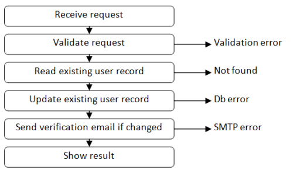
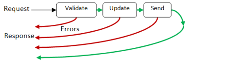
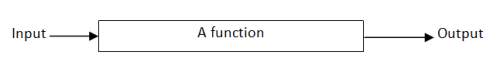
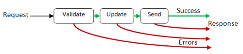
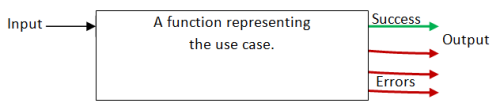
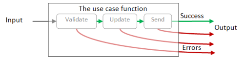
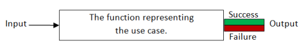

# 如何设计和编写完整的程序

# 如何设计和编写完整的程序

“我觉得我理解了微观层面的函数式编程，并且我写过玩具程序，但是我到底应该如何去写一个完整的应用程序，包括真实的数据、真实的错误处理等等？”

这是一个非常常见的问题，所以我认为在这系列文章中我会描述一个确切的做法，包括设计、验证、错误处理、持久性、依赖管理、代码组织等等。

首先一些评论和警告：

+   我将专注于一个单一的用例，而不是一个完整的应用程序。我希望很明显如何根据需要扩展代码。

+   这将是一个非常简单的*数据流导向*的配方，没有特殊的技巧或高级技术。但如果你刚开始入门，我认为有一些简单明了的步骤可以让你得到可预测的结果是有用的。我不声称这是唯一正确的做法。不同的场景将需要不同的配方，当然，随着您变得更加专业，您可能会发现这个配方过于简单和有限。

+   为了帮助缓解从面向对象设计过渡，我将尝试使用熟悉的概念，如“模式”、“服务”、“依赖注入”等，并解释它们如何映射到函数式概念。

+   这个配方也是故意有些命令式的，也就是说，它使用了一个明确的逐步工作流程。我希望这种方法能够缓解从 OO 到 FP 的过渡。

+   为了保持简单（并且可以从简单的 F# 脚本中使用），我将模拟整个基础架构，并避免直接使用 UI。

## 概述

下面是我计划在本系列中涵盖的概述：

+   **将用例转换为函数**。在第一篇文章中，我们将检查一个简单的用例，并看看如何使用函数式方法来实现它。

+   **将较小的函数连接在一起**。在下一篇文章中，我们将讨论一个简单的隐喻，将较小的函数组合成更大的函数。

+   **类型驱动设计和失败类型**。在第三篇文章中，我们将构建用例所需的类型，并讨论用于失败路径的特殊错误类型的使用。

+   **配置和依赖管理**。在本文中，我们将讨论如何连接所有函数。

+   **验证**。在本文中，我们将讨论实现验证的各种方式，以及从不安全的外部世界转换到类型安全的温暖模糊世界的方法。

+   **基础架构**。在本文中，我们将讨论各种基础架构组件，例如日志记录、与外部代码的交互等等。

+   **领域层**。在本文中，我们将讨论领域驱动设计在函数式环境中的工作方式。

+   **表示层**。在本文中，我们将讨论如何将结果和错误传达回 UI。

+   **处理变化的需求**。在本文中，我们将讨论如何处理变化的需求以及这对代码的影响。

## 入门

让我们选择一个非常简单的用例，即通过网络服务更新一些客户信息。

所以这是基本要求：

+   用户提交一些数据（用户 ID、姓名和电子邮件）。

+   我们检查名称和电子邮件是否有效。

+   数据库中的适当用户记录已使用新名称和电子邮件更新。

+   如果电子邮件已更改，请向该地址发送验证电子邮件。

+   将操作结果显示给用户。

这是一个典型的*数据中心*用例。有一种请求触发了用例，然后请求数据“流”经过系统，依次由每个步骤处理。这种情景在企业软件中很常见，这就是为什么我把它用作例子的原因。

这是各种组件的图表：


但这仅描述了“快乐路径”。现实从未如此简单！如果在数据库中找不到用户 ID，或者电子邮件地址无效，或者数据库出错，会发生什么？

让我们更新图表，显示可能出错的所有事情。



在用例的每个步骤中，各种事情都可能导致错误，如所示。解释如何以优雅的方式处理这些错误将是本系列的目标之一。

## 功能性思维

现在我们了解了用例中的步骤，如何使用功能性方法设计解决方案呢？

首先，我们必须解决原始用例与功能性思维之间的不匹配。

在用例中，我们通常考虑请求/响应模型。请求被发送，响应返回。如果出现问题，流程将被短路，提前返回响应。

这是一个示意图，展示了我所说的，基于用例的简化版本：



但在功能性模型中，函数是一个具有输入和输出的黑匣子，就像这样：



我们如何使用用例来适应这个模型？

### 仅向前流动

首先，你必须认识到功能性数据流是*仅向前*的。你不能掉头或提前返回。

在我们的情况下，这意味着所有错误*必须*被发送到最后，作为一个到达快乐路径的替代路径。



一旦我们做到了这一点，我们就可以将整个流程转换为一个单一的“黑匣子”函数，就像这样：



当然，如果你查看大函数的内部，它由（在功能性语言中称为“组合”）较小的函数组成，每个步骤一个，连接在一个管道中。



### 错误处理

在最后一个图表中，有一个成功输出和三个错误输出。这是个问题，因为函数只能有*一个*输出，而不是四个！

如何处理这个情况？

答案是使用联合类型，其中一个情况代表不同可能的输出。然后整个函数确实只会有一个输出。

这是输出的可能类型定义的示例：

```
type UseCaseResult = 
    | Success
    | ValidationError 
    | UpdateError 
    | SmtpError 
```

并且这里重新制作的图表显示了一个单一输出，其中嵌入了四个不同的情况：


### 简化错误处理

这确实解决了问题，但是每个流程步骤都有一个错误情况是脆弱且不太可重用的。我们能做得更好吗？

是的！我们*真正*需要的只有*两个*情况。一个是正常路径，另一个是所有其他错误路径，就像这样：

```
type UseCaseResult = 
    | Success 
    | Failure 
```



这种类型非常通用，适用于*任何*工作流程！事实上，您很快就会看到，我们可以创建一个很好的有用函数库，这些函数将使用这种类型，并且可以在各种情景下重复使用。

还有一件事——就目前而言，结果中根本没有数据，只有成功/失败状态。我们需要稍微调整一下，以便它可以包含一个真正的成功或失败对象。我们将使用泛型（也称为类型参数）来指定成功类型和失败类型。

这是最终的、完全通用和可重用的版本：

```
type Result<'TSuccess,'TFailure> = 
    | Success of 'TSuccess
    | Failure of 'TFailure 
```

实际上，F# 库中已经定义了一个几乎完全相同的类型。它被称为 [Choice](http://msdn.microsoft.com/en-us/library/ee353439.aspx)。不过，为了清晰起见，我将继续使用上面定义的`Result`类型用于本文和下一篇文章。当我们开始进行更严肃的编码时，我们会重新审视这一点。

所以，现在，再次显示各个步骤，我们可以看到我们将不得不将每个步骤的错误合并到单个的“失败”路径上。


下一篇文章的主题将是如何做到这一点。

## 总结和指导

到目前为止，我们对配方有以下几点指导：

*指导*

+   每个用例将等同于一个单独的函数

+   用例函数将返回一个有两个情况的联合类型：`Success`和`Failure`。

+   用例函数将由一系列较小的函数构建，每个函数代表数据流中的一个步骤。

+   每个步骤的错误将合并为单个错误路径。
