# 一个处理错误的函数式方法（铁路导向编程）

# 铁路导向编程

*更新：[更全面演示的幻灯片和视频在这里](http://fsharpforfunandprofit.com/rop/)（如果你理解 Either monad，请[先读这篇](http://fsharpforfunandprofit.com/rop/#monads)）！*

在上一篇文章中，我们看到一个用例是如何被分解成步骤的，并且所有的错误都被分流到一个单独的错误轨道上，就像这样：

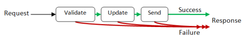

在本文中，我们将看看连接这些步骤函数成一个单一单元的各种方法。函数的详细内部设计将在后续文章中描述。

## 设计代表一个步骤的函数

让我们更仔细地看看这些步骤。例如，考虑验证函数。它是如何工作的？一些数据输入，但是输出是什么？

好吧，有两种可能的情况：要么数据是有效的（正常路径），要么有些问题，这种情况下我们进入失败路径并绕过其余的步骤，就像这样：

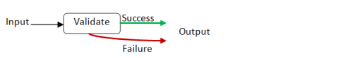

但是和以前一样，这不会是一个有效的函数。一个函数只能有一个输出，所以我们必须使用我们上次定义的`Result`类型：

```
type Result<'TSuccess,'TFailure> = 
    | Success of 'TSuccess
    | Failure of 'TFailure 
```

现在图表看起来像这样：

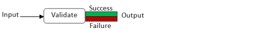

为了向你展示这在实践中是如何工作的，这里是一个实际验证函数可能看起来像的例子：

```
type Request = {name:string; email:string}

let validateInput input =
   if input.name = "" then Failure "Name must not be blank"
   else if input.email = "" then Failure "Email must not be blank"
   else Success input  // happy path 
```

如果你看一下函数的类型，编译器已经推断出它接受一个`Request`并输出一个`Result`，成功情况下是一个`Request`，失败情况下是一个`string`：

```
validateInput : Request -> Result<Request,string> 
```

我们可以以同样的方式分析流程中的其他步骤。我们会发现每一个步骤都有相同的“形状” —— 一些输入，然后是这个成功/失败输出。

*提前道歉：刚刚说过函数不能有两个输出，我可能偶尔在此之后提到它们作为“两个输出”的函数！当然，我指的是函数输出的形状有两种情况。*

## 铁路导向编程

所以我们有很多这样的“一个输入 -> 成功/失败输出”的函数 —— 我们如何将它们连接起来？

我们想做的是将一个的`Success`输出连接到下一个的输入，但是在`Failure`输出的情况下绕过第二个函数。这张图表给出了一般的想法：

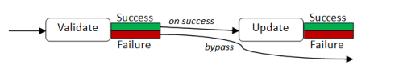

这有一个很好的类比 —— 你可能已经很熟悉了。铁路！

铁路有用于将火车引导到不同轨道的转换器（在英国称为“points”）。我们可以将这些“成功/失败”函数视为铁路转换器，就像这样：

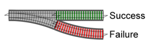

然后我们有两个连续的。


我们如何组合它们以连接两个失败轨道？很明显——像这样！


如果我们有一系列开关，我们将得到一个双轨系统，看起来像这样：


顶部轨道是顺利路径，底部轨道是失败路径。

现在退一步，审视整体情况，我们可以看到我们将会有一系列黑盒函数，看起来像是横跨着双轨铁路，每个函数都处理数据并将其传递到下一个函数的轨道上：

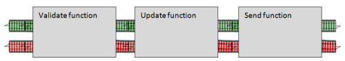

但是如果我们查看函数内部，我们会看到实际上每个函数内部都有一个开关，用于将坏数据转移到失败轨道上：


注意，一旦我们进入失败路径，我们就再也（通常）不会回到顺利路径上。我们只是绕过剩下的函数直到达到末端。

## 基本的组合

在讨论如何"粘合"步骤函数之前，让我们回顾一下组合是如何工作的。

想象一个标准函数是一个黑盒子（比如说一个隧道），坐落在一条单轨铁路上。它有一个输入和一个输出。

如果我们想连接一系列这些单轨函数，我们可以使用从左到右的组合运算符，使用符号`>>`。

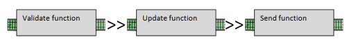

相同的组合操作也适用于双轨函数：

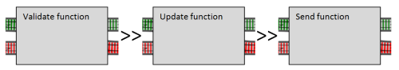

组合的唯一约束是左侧函数的输出类型必须与右侧函数的输入类型匹配。

在我们的铁路类比中，这意味着你可以连接单轨输出到单轨输入，或双轨输出到双轨输入，但*不能*直接连接双轨输出到单轨输入。

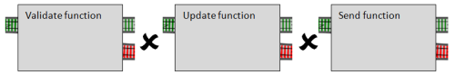

## 将开关转换为双轨输入

现在我们遇到了一个问题。

每一步的函数都将是一个开关，具有*一个*输入轨道。但总体流程需要一个*双轨*系统，每个函数都横跨*两条*轨道，这意味着每个函数必须具有双轨输入（由上一个函数输出的`Result`），而不仅仅是一个简单的单轨输入（`Request`）。

我们如何将开关插入双轨系统中？

答案很简单。我们可以创建一个"适配器"函数，它有一个用于开关函数的"孔"或"槽"，并将其转换为一个合适的双轨函数。下面是一个示例：

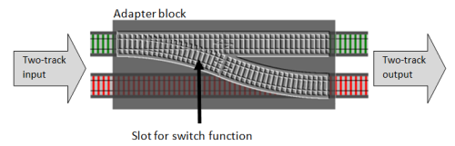

这就是实际代码的样子。我将适配器函数命名为`bind`，这是它的标准名称。

```
let bind switchFunction = 
    fun twoTrackInput -> 
        match twoTrackInput with
        | Success s -> switchFunction s
        | Failure f -> Failure f 
```

`bind`函数接受一个开关函数作为参数并返回一个新函数。新函数接受一个双轨输入（类型为`Result`），然后检查每种情况。如果输入是`Success`，它将调用带有该值的`switchFunction`。但如果输入是`Failure`，则绕过开关函数。

编译它，然后查看函数签名：

```
val bind : ('a -> Result<'b,'c>) -> Result<'a,'c> -> Result<'b,'c> 
```

解释这个签名的一种方式是，`bind`函数有一个参数，一个开关函数(`'a -> Result<..>`)，并将一个完全双轨函数(`Result<..> -> Result<..>`)作为输出返回。

更具体地说：

+   `bind`的参数(`switchFunction`)接受某种类型`'a`并发出类型为`'b`（成功路径）和`'c`（失败路径）的`Result`

+   返回的函数本身有一个参数(`twoTrackInput`)，它是类型为`'a`（成功）和`'c`（失败）的`Result`。类型`'a`必须与`switchFunction`在其单轨上期望的类型相同。

+   返回函数的输出是另一个`Result`，这次是类型为`'b`（成功）和`'c`（失败）的 -- 与开关函数输出相同的类型。

如果你仔细想想，这个类型签名正是我们所期望的。

请注意，这个函数是完全通用的 -- 它将适用于*任何*开关函数和*任何*类型。它只关心`switchFunction`的“形状”，而不关心实际涉及的类型。

### 编写`bind`函数的其他方法

顺便说一句，还有一些其他编写这种函数的方法。

一种方法是使用显式的第二个参数`twoTrackInput`而不是定义一个内部函数，就像这样：

```
let bind switchFunction twoTrackInput = 
    match twoTrackInput with
    | Success s -> switchFunction s
    | Failure f -> Failure f 
```

这与第一个定义完全相同。如果你想知道一个有两个参数的函数如何与一个有一个参数的函数完全相同，你需要阅读关于 currying 的文章！

另一种写法是用更简洁的`function`关键字替换`match..with`语法，就像这样：

```
let bind switchFunction = 
    function
    | Success s -> switchFunction s
    | Failure f -> Failure f 
```

你可能会在其他代码中看到这三种风格，但我个人更喜欢使用第二种风格(`let bind switchFunction twoTrackInput =`)，因为我认为明确的参数使得代码对非专家更易读。

## 例子：结合一些验证函数

现在让我们写一点代码来测试这些概念。

让我们从我们已经定义的东西开始。`Request`、`Result`和`bind`：

```
type Result<'TSuccess,'TFailure> = 
    | Success of 'TSuccess
    | Failure of 'TFailure

type Request = {name:string; email:string}

let bind switchFunction twoTrackInput = 
    match twoTrackInput with
    | Success s -> switchFunction s
    | Failure f -> Failure f 
```

接下来我们将创建三个验证函数，每个都是一个“开关”函数，目标是将它们组合成一个更大的函数：

```
let validate1 input =
   if input.name = "" then Failure "Name must not be blank"
   else Success input

let validate2 input =
   if input.name.Length > 50 then Failure "Name must not be longer than 50 chars"
   else Success input

let validate3 input =
   if input.email = "" then Failure "Email must not be blank"
   else Success input 
```

现在要将它们组合起来，我们将`bind`应用于每个验证函数，以创建一个新的双轨函数。

然后我们可以使用标准函数组合连接这两个双轨函数，就像这样：

```
/// glue the three validation functions together
let combinedValidation = 
    // convert from switch to two-track input
    let validate2' = bind validate2
    let validate3' = bind validate3
    // connect the two-tracks together
    validate1 >> validate2' >> validate3' 
```

函数`validate2'`和`validate3'`是新函数，它们接受两轨道输入。如果你看一下它们的签名，你会发现它们接受一个`Result`并返回一个`Result`。但请注意，`validate1`不需要转换为两轨道输入。它的输入保持为单轨道，而其输出已经是双轨道的，正如组合所需的那样。

这里是一个显示`Validate1`开关（未绑定）以及`Validate2`和`Validate3`开关的图表，以及`Validate2'`和`Validate3'`适配器的图表。

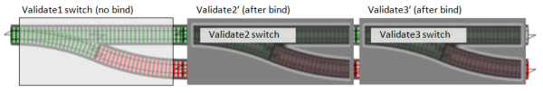

我们也可以像这样“内联”`bind`：

```
let combinedValidation = 
    // connect the two-tracks together
    validate1 
    >> bind validate2 
    >> bind validate3 
```

让我们用两个错误的输入和一个良好的输入来测试它：

```
// test 1
let input1 = {name=""; email=""}
combinedValidation input1 
|> printfn "Result1=%A"

// ==> Result1=Failure "Name must not be blank"

// test 2
let input2 = {name="Alice"; email=""}
combinedValidation input2
|> printfn "Result2=%A"

// ==> Result2=Failure "Email must not be blank"

// test 3
let input3 = {name="Alice"; email="good"}
combinedValidation input3
|> printfn "Result3=%A"

// ==> Result3=Success {name = "Alice"; email = "good";} 
```

我鼓励你自己尝试并玩弄验证函数和测试输入。

*你可能会想知道是否有一种方法可以并行运行所有三个验证，而不是串行运行，这样你就可以一次性得到所有的验证错误。是的，有一种方法，我稍后会在本文中解释。*

### 作为管道操作的绑定

当我们讨论`bind`函数时，有一个常用的符号，`>>=`，用于将值传输到开关函数中。

这是定义，将两个参数调换以使它们更容易连锁在一起的方法：

```
/// create an infix operator
let (>>=) twoTrackInput switchFunction = 
    bind switchFunction twoTrackInput 
```

*记住这个符号的一种方法是将其视为组合符号`>>`，后跟双轨道铁路符号`=`。*

当像这样使用时，`>>=`运算符有点像一个管道（`|>`）但对于开关函数而言。

在正常的管道中，左边是一个单轨道值，右边是一个普通函数。 但在“绑定管道”操作中，左边是一个*双轨道*值，右边是一个*开关函数*。

这里是将其用于创建`combinedValidation`函数的另一个实现。

```
let combinedValidation x = 
    x 
    |> validate1   // normal pipe because validate1 has a one-track input
                   // but validate1 results in a two track output...
    >>= validate2  // ... so use "bind pipe". Again the result is a two track output
    >>= validate3   // ... so use "bind pipe" again. 
```

这个实现与之前的实现的区别在于，这个定义是*数据导向*而不是*函数导向*。 它有一个明确的参数用于初始数据值，即`x`。 `x`被传递给第一个函数，然后将其输出传递给第二个函数，依此类推。

在之前的实现中（下面重复显示），根本没有数据参数！重点是函数本身，而不是流经它们的数据。

```
let combinedValidation = 
    validate1 
    >> bind validate2 
    >> bind validate3 
```

## 绑定的另一种选择

另一种组合开关的方式不是将它们适应为两个轨道输入，而是直接将它们连接在一起以制作一个新的更大的开关。

换句话说，这个：


变成这样：


但是如果你仔细想一想，这个组合轨道实际上只是另一个开关！如果你遮住中间部分，你就会看到一个输入和两个输出：

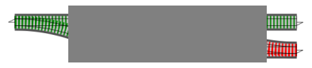

所以我们真正做的是一种开关的组合，像这样：

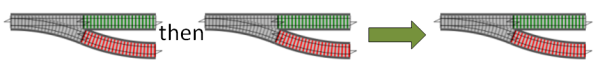

因为每个组合结果只是另一个开关，我们总是可以再次添加另一个开关，从而得到一个更大的仍然是开关的东西，依此类推。

这是`switch`组合的代码。标准符号是`>=>`，有点像正常的组合符号，但在角之间有一条铁路轨道。

```
let (>=>) switch1 switch2 x = 
    match switch1 x with
    | Success s -> switch2 s
    | Failure f -> Failure f 
```

再次强调，实际实现非常简单。将单轨输入`x`通过第一个开关。成功后，将结果传递给第二个开关，否则完全绕过第二个开关。

现在我们可以重写`combinedValidation`函数，使用`switch`组合而不是`bind`：

```
let combinedValidation = 
    validate1 
    >=> validate2 
    >=> validate3 
```

我认为这是最简单的一个。当然，如果我们有第四个验证函数，我们可以简单地将其附加到末尾。

### `Bind` vs. `switch`组合

我们有两个乍看起来相似的不同概念。有什么区别？

总结一下：

+   **`Bind`**有*一个*开关函数参数。它是一个适配器，将开关函数转换为完全双轨函数（具有双轨输入和双轨输出）。

+   **`Switch`组合**有*两个*开关函数参数。它将它们串联起来形成另一个开关函数。

为什么要使用`bind`而不是`switch`组合？这取决于上下文。如果你有一个现有的双轨系统，并且需要插入一个开关，那么你必须使用`bind`作为适配器，将开关转换为接受双轨输入的东西。

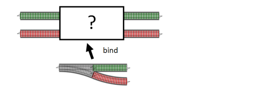

另一方面，如果你的整个数据流由一系列开关组成，那么`switch`组合可能更简单。

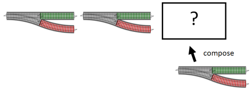

### 用`bind`来解释`switch`组合

突然间，`switch`组合可以用`bind`来写。如果你将第一个开关与一个适配为`bind`的第二个开关连接起来，你会得到与`switch`组合相同的东西：

这里有两个独立的开关：


然后这些开关组合在一起形成一个更大的新开关：


然后通过在第二个开关上使用`bind`来完成相同的事情：

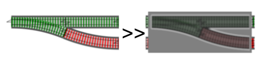

这是使用这种思维方式重写的`switch`组合运算符：

```
let (>=>) switch1 switch2 = 
    switch1 >> (bind switch2) 
```

这种`switch`组合的实现比第一种简单得多，但也更抽象。对于初学者来说是否更容易理解是另一回事！我发现，如果你将函数看作是独立的事物，而不仅仅是数据的传输通道，这种方法就变得更容易理解。

## 将简单函数转换为铁路导向的编程模型

一旦你掌握了它，你可以将各种其他东西适应到这个模型中。

例如，假设我们有一个*不是*开关的函数，只是一个常规函数。假设我们想要将其插入到我们的流程中。

这是一个真实的例子 - 假设我们想要在验证完成后修剪和转换电子邮件地址为小写。以下是一些代码来实现这一点：

```
let canonicalizeEmail input =
   { input with email = input.email.Trim().ToLower() } 
```

这段代码接受一个（单轨）`Request`并返回一个（单轨）`Request`。

我们如何在验证步骤之后但在更新步骤之前插入这个功能？

好吧，如果我们可以将这个简单功能转换为开关功能，那么我们就可以使用我们上面讨论过的开关组合。

换句话说，我们需要一个适配器块。这与我们用于`bind`的概念相同，只是这次我们的适配器块将有一个单轨功能插槽，并且适配器块的整体“形状”是一个开关。

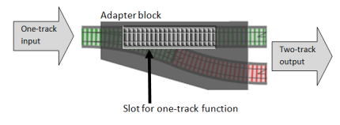

这样做的代码非常简单。我们只需要取出单轨功能的输出并将其转换为双轨结果。在这种情况下，���果将*始终*是 Success。

```
// convert a normal function into a switch
let switch f x = 
    f x |> Success 
```

在铁路术语中，我们增加了一点失败轨道。整体上看，它*看起来*像一个开关功能（单轨输入，双轨输出），但当然，失败轨道只是一个虚拟的，开关实际上从未被使用。

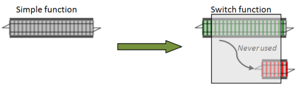

一旦`switch`可用，我们就可以轻松地将`canonicalizeEmail`函数附加到链的末尾。由于我们开始扩展它，让我们将函数重命名为`usecase`。

```
let usecase = 
    validate1 
    >=> validate2 
    >=> validate3 
    >=> switch canonicalizeEmail 
```

尝试测试它看看会发生什么：

```
let goodInput = {name="Alice"; email="UPPERCASE   "}
usecase goodInput
|> printfn "Canonicalize Good Result = %A"

//Canonicalize Good Result = Success {name = "Alice"; email = "uppercase";}

let badInput = {name=""; email="UPPERCASE   "}
usecase badInput
|> printfn "Canonicalize Bad Result = %A"

//Canonicalize Bad Result = Failure "Name must not be blank" 
```

## 从单轨功能创建双轨功能

在前面的例子中，我们拿到了一个单轨功能，并从中创建了一个开关。这使我们能够与其一起使用开关组合。

但有时，您想直接使用双轨模型，这种情况下，您希望直接将单轨功能转换为双轨功能。

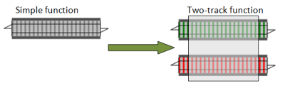

再次，我们只需要一个带有简单功能插槽的适配器块。我们通常称这个适配器为`map`。

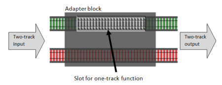

再次，实际实现非常简单。如果双轨输入是`Success`，则调用该函数，并将其输出转换为 Success。另一方面，如果双轨输入是`Failure`，则完全绕过该函数。

这是代码：

```
// convert a normal function into a two-track function
let map oneTrackFunction twoTrackInput = 
    match twoTrackInput with
    | Success s -> Success (oneTrackFunction s)
    | Failure f -> Failure f 
```

这是与`canonicalizeEmail`一起使用的情况：

```
let usecase = 
    validate1 
    >=> validate2 
    >=> validate3 
    >> map canonicalizeEmail  // normal composition 
```

请注意，*正常*组合现在被使用，因为`map canonicalizeEmail`是一个完全双轨功能，可以直接连接到`validate3`开关的输出。

换句话说，对于单轨功能，`>=> switch`与`>> map`完全相同。你的选择。

## 将死胡同函数转换为双轨功能

我们经常想要使用的另一个函数是“死胡同”函数--一个接受输入但没有有用输出的函数。

例如，考虑一个更新数据库记录的函数。它仅用于其副作用 -- 通常不返回任何内容。

我们如何将这种类型的函数纳入流程中？

我们需要做的是：

+   保存输入的副本。

+   调用函数并忽略其输出，如果有的话。

+   返回原始输入，以传递给链中的下一个函数。

从铁路的角度来看，这相当于创建一个死胡同的侧线，就像这样。

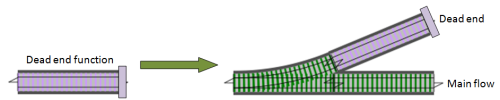

为了使这个工作起来，我们需要另一个适配器函数，类似于`switch`，只是这次它有一个用于单轨死胡同函数的插槽，并将其转换为具有单轨输出的单轨直通函数。

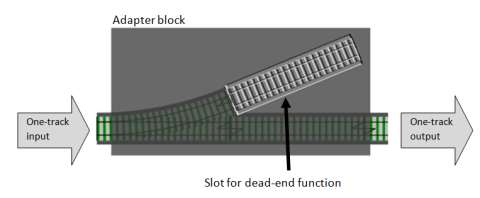

这里是代码，我将其称为`tee`，以 UNIX tee 命令命名：

```
let tee f x = 
    f x |> ignore
    x 
```

一旦我们将死胡同函数转换为简单的单轨直通函数，我们就可以通过使用上述的`switch`或`map`将其用于数据流中。

这是使用“switch 组合”风格的代码：

```
// a dead-end function 
let updateDatabase input =
   ()   // dummy dead-end function for now

let usecase = 
    validate1 
    >=> validate2 
    >=> validate3 
    >=> switch canonicalizeEmail
    >=> switch (tee updateDatabase) 
```

或者，与其使用`switch`然后连接`>=>`，我们可以使用`map`并连接`>>`。

这是一个变体实现，完全相同，但使用了“两轨”风格与正常组合

```
let usecase = 
    validate1 
    >> bind validate2 
    >> bind validate3 
    >> map canonicalizeEmail   
    >> map (tee updateDatabase) 
```

## 处理异常

我们的死胡同数据库更新可能不会返回任何内容，但这并不意味着它不会抛���异常。与其崩溃，我们希望捕获该异常并将其转换为失败。

代码类似于`switch`函数，只是它捕获异常。我将其称为`tryCatch`：

```
let tryCatch f x =
    try
        f x |> Success
    with
    | ex -> Failure ex.Message 
```

这里是修改后的数据流代码，使用`tryCatch`而不是`switch`来更新数据库代码。

```
let usecase = 
    validate1 
    >=> validate2 
    >=> validate3 
    >=> switch canonicalizeEmail
    >=> tryCatch (tee updateDatabase) 
```

## 有两轨输入的函数

到目前为止，我们所见过的所有函数都只有一个输入，因为它们总是沿着正常路径处理数据。

有时候，*确实*需要一个处理两个轨道的函数。例如，一个记录错误和成功的日志函数。

正如我们之前所做的那样，我们将创建一个适配器块，但这次它将有*两个*单独的单轨函数插槽。

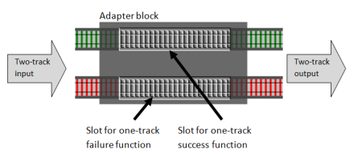

这是代码：

```
let doubleMap successFunc failureFunc twoTrackInput =
    match twoTrackInput with
    | Success s -> Success (successFunc s)
    | Failure f -> Failure (failureFunc f) 
```

顺便说一句，我们可以使用这个函数创建`map`的一个更简单的版本，使用`id`作为失败函数：

```
let map successFunc =
    doubleMap successFunc id 
```

让我们使用`doubleMap`将一些日志插入到数据流中：

```
let log twoTrackInput = 
    let success x = printfn "DEBUG. Success so far: %A" x; x
    let failure x = printfn "ERROR. %A" x; x
    doubleMap success failure twoTrackInput 

let usecase = 
    validate1 
    >=> validate2 
    >=> validate3 
    >=> switch canonicalizeEmail
    >=> tryCatch (tee updateDatabase)
    >> log 
```

这里是一些测试代码，以及结果：

```
let goodInput = {name="Alice"; email="good"}
usecase goodInput
|> printfn "Good Result = %A"

// DEBUG. Success so far: {name = "Alice"; email = "good";}
// Good Result = Success {name = "Alice"; email = "good";}

let badInput = {name=""; email=""}
usecase badInput 
|> printfn "Bad Result = %A"

// ERROR. "Name must not be blank"
// Bad Result = Failure "Name must not be blank" 
```

## 将单个值转换为两轨值

为了完整起见，我们还应该创建简单的函数，将单个简单值转换为两轨值，成功或失败。

```
let succeed x = 
    Success x

let fail x = 
    Failure x 
```

现在这些都很简单，只是调用`Result`类型的构造函数，但当我们开始进行一些真正的编码时，我们会看到，通过使用这些而不是直接使用联合案例构造函数，我们可以使自己与幕后的更改隔离开来。

## 并行组合函数

到目前为止，我们已经按顺序组合了函数。但对于诸如验证之类的事情，我们可能希望同时运行多个开关，并组合结果，就像这样：

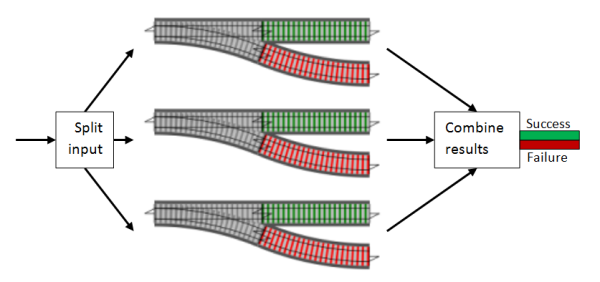

为了更容易实现这一点，我们可以重用我们用于开关组合的相同技巧。与其一次性做很多，如果我们只关注一个配对，并将它们“相加”以创建一个新的开关，那么我们就可以轻松地将“加法”链接在一起，以便我们可以添加任意数量。换句话说，我们只需要实现这个：

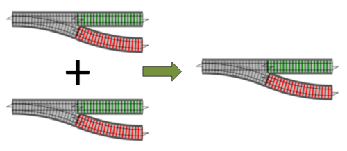

那么，并行添加两个开关的逻辑是什么？

+   首先，获取输入并将其应用于每个开关。

+   接下来看看两个开关的输出，如果两者都成功，则整体结果为`成功`。

+   如果任何一个输出是失败，则整体结果也是`失败`。

这是函数，我将其称为`plus`：

```
let plus switch1 switch2 x = 
    match (switch1 x),(switch2 x) with
    | Success s1,Success s2 -> Success (s1 + s2)
    | Failure f1,Success _  -> Failure f1
    | Success _ ,Failure f2 -> Failure f2
    | Failure f1,Failure f2 -> Failure (f1 + f2) 
```

但现在我们有了一个新问题。两个成功，或两个失败，我们应该怎么处理内部值的组合？

我在上面的示例中使用了`s1 + s2`和`f1 + f2`，但这意味着我们可以使用某种形式的`+`运算符。这对于字符串和整数来说可能是正确的，但一般情况下并非如此。

在不同的上下文中，组合值的方法可能会改变，因此与其试图一劳永逸地解决它，不如让调用者通过传入所需的函数来解决。

这是重写的版本：

```
let plus addSuccess addFailure switch1 switch2 x = 
    match (switch1 x),(switch2 x) with
    | Success s1,Success s2 -> Success (addSuccess s1 s2)
    | Failure f1,Success _  -> Failure f1
    | Success _ ,Failure f2 -> Failure f2
    | Failure f1,Failure f2 -> Failure (addFailure f1 f2) 
```

我将这些新函数放在参数列表的前面，以帮助部分应用。 

### 用于并行验证的实现

现在让我们为验证函数创建一个“plus”的实现。

+   当两个函数都成功时，它们将返回未更改的请求，因此`addSuccess`函数可以返回任一参数。

+   当两个函数都失败时，它们将返回不同的字符串，因此`addFailure`函数应该将它们连接起来。

因此，对于验证来说，我们想要的“plus”操作就像一个“AND”函数。只有两个部分都是“true”才是结果“true”。

这自然会让人想要使用`&&`作为操作符号。不幸的是，`&&`是保留字，但我们可以使用`&&&`，就像这样：

```
// create a "plus" function for validation functions
let (&&&) v1 v2 = 
    let addSuccess r1 r2 = r1 // return first
    let addFailure s1 s2 = s1 + "; " + s2  // concat
    plus addSuccess addFailure v1 v2 
```

现在使用`&&&`，我们可以创建一个组合三个较小验证的单个验证函数：

```
let combinedValidation = 
    validate1 
    &&& validate2 
    &&& validate3 
```

现在让我们使用之前相同的测试来尝试一下：

```
// test 1
let input1 = {name=""; email=""}
combinedValidation input1 
|> printfn "Result1=%A"
// ==>  Result1=Failure "Name must not be blank; Email must not be blank"

// test 2
let input2 = {name="Alice"; email=""}
combinedValidation input2 
|> printfn "Result2=%A"
// ==>  Result2=Failure "Email must not be blank"

// test 3
let input3 = {name="Alice"; email="good"}
combinedValidation input3 
|> printfn "Result3=%A"
// ==>  Result3=Success {name = "Alice"; email = "good";} 
```

现在第一个测试有了*两个*验证错误合并为一个字符串，就像我们想要的那样。

接下来，我们可以通过现在使用`usecase`函数来整理主数据流函数，而不是之前的三个单独的验证函数：

```
let usecase = 
    combinedValidation
    >=> switch canonicalizeEmail
    >=> tryCatch (tee updateDatabase) 
```

如果我们现在测试一下，我们会发现成功一直流到最后，并且电子邮件已经转换为小写并且已修剪：

```
// test 4
let input4 = {name="Alice"; email="UPPERCASE   "}
usecase input4
|> printfn "Result4=%A"
// ==>  Result4=Success {name = "Alice"; email = "uppercase";} 
```

*也许你会问，我们是否可以创建一种方式来进行验证函数的 OR 操作？也就是说，如果任何一部分有效，则整体结果有效？答案是肯定的，当然可以。试试看！我建议您使用符号`|||`。*

## 动态函数注入

我们可能想要做的另一件事是基于配置设置或甚至数据内容动态地添加或删除函数到流中。

这样做的最简单方法是创建一个要注入到流中的双轨道函数，并在不需要时用`id`函数替换它。

这是个想法：

```
let injectableFunction = 
    if config.debug then debugLogger else id 
```

让我们用一些真实的代码试试：

```
type Config = {debug:bool}

let debugLogger twoTrackInput = 
    let success x = printfn "DEBUG. Success so far: %A" x; x
    let failure = id // don't log here
    doubleMap success failure twoTrackInput 

let injectableLogger config = 
    if config.debug then debugLogger else id

let usecase config = 
    combinedValidation 
    >> map canonicalizeEmail
    >> injectableLogger config 
```

这是它的使用方式：

```
let input = {name="Alice"; email="good"}

let releaseConfig = {debug=false}
input 
|> usecase releaseConfig 
|> ignore

// no output

let debugConfig = {debug=true}
input 
|> usecase debugConfig 
|> ignore

// debug output
// DEBUG. Success so far: {name = "Alice"; email = "good";} 
```

## 铁路轨道函数：一个工具包

让我们退后一步，回顾一下我们到目前为止所做的事情。

使用铁路轨道作为隐喻，我们创建了一些有用的构建块，可以与*任何*数据流应用程序一起使用。

我们可以将我们的函数大致分类如下：

+   **“构造函数”** 用于创建新的轨道。

+   **“适配器”** 将一种轨道转换为另一种轨道。

+   **“组合器”** 将轨道段连接在一起，以形成更大的轨道。

这些函数构成了一个可以粗略称为*组合器库*的东西，即一组旨在与类型（这里以铁路轨道表示）一起工作的函数，其设计目标是通过调整和组合较小的部分来构建更大的部分。

`bind`、`map`、`plus`等函数在各种函数式编程场景中都会出现，因此您可以将它们视为函数模式 -- 与面向对象的模式（如“visitor”、“singleton”、“facade”等）类似，但不同。

这是它们全部在一起的样子：

| 概念 | 描述 |
| --- | --- |
| `succeed` | 一个构造函数，将一个单轨道值转换为成功分支上的双轨道值。在其他上下文中，这也可能被称为`return`或`pure`。 |
| `fail` | 一个构造函数，将一个单轨道值转换为失败分支上的双轨道值。 |
| `bind` | 一个适配器，接受开关函数并创建一个接受双轨道值作为输入的新函数。 |
| `>>=` | bind 的中缀版本，将双轨道值传输到开关函数中。 |
| `>>` | 正常的组合。一个组合器，接受两个普通函数，并通过连接它们串联起来创建一个新函数。 |
| `>=>` | 开关组合。一个组合器，它接受两个开关函数，并通过连接它们串联起来创建一个新的开关函数。 |
| `switch` | 一个适配器，将普通的单轨道函数转换为开关函数。（在某些情况下也称为“提升”） |
| `map` | 一个适配器，将普通的单轨道函数转换为双轨道函数。（在某些情况下也称为“提升”） |
| `tee` | 一个适配器，将一个死胡同函数转换为可以在数据流中使用的单轨道函数。（也称为`tap`。） |
| `tryCatch` | 一个适配器，将普通的单轨道函数转换为开关函数，但也捕获异常。 |
| `doubleMap` | 一个适配器，将两个单轨道函数转换为单个双轨道函数。（也称为`bimap`。） |
| `plus` | 一个组合器，接受两个开关函数，并通过“并行”连接它们并“添加”结果来创建一个新的开关函数。（在其他上下文中也称为`++`。） |
| `&&&` | 专门为验证函数调整的“加法”组合器，模拟二进制 AND。 |

### 铁路轨道函数：完整代码

这里是所有函数的完整代码。

我对上面呈现的原始代码进行了一些微小的调整：

+   大多数函数现在都是根据一个称为`either`的核心函数定义的。

+   `tryCatch`已经为异常处理程序添加了一个额外的参数。

```
// the two-track type
type Result<'TSuccess,'TFailure> = 
    | Success of 'TSuccess
    | Failure of 'TFailure

// convert a single value into a two-track result
let succeed x = 
    Success x

// convert a single value into a two-track result
let fail x = 
    Failure x

// apply either a success function or failure function
let either successFunc failureFunc twoTrackInput =
    match twoTrackInput with
    | Success s -> successFunc s
    | Failure f -> failureFunc f

// convert a switch function into a two-track function
let bind f = 
    either f fail

// pipe a two-track value into a switch function 
let (>>=) x f = 
    bind f x

// compose two switches into another switch
let (>=>) s1 s2 = 
    s1 >> bind s2

// convert a one-track function into a switch
let switch f = 
    f >> succeed

// convert a one-track function into a two-track function
let map f = 
    either (f >> succeed) fail

// convert a dead-end function into a one-track function
let tee f x = 
    f x; x 

// convert a one-track function into a switch with exception handling
let tryCatch f exnHandler x =
    try
        f x |> succeed
    with
    | ex -> exnHandler ex |> fail

// convert two one-track functions into a two-track function
let doubleMap successFunc failureFunc =
    either (successFunc >> succeed) (failureFunc >> fail)

// add two switches in parallel
let plus addSuccess addFailure switch1 switch2 x = 
    match (switch1 x),(switch2 x) with
    | Success s1,Success s2 -> Success (addSuccess s1 s2)
    | Failure f1,Success _  -> Failure f1
    | Success _ ,Failure f2 -> Failure f2
    | Failure f1,Failure f2 -> Failure (addFailure f1 f2) 
```

## 类型 vs. 形状

到目前为止，我们完全专注于轨道的形状，而不是列车上的货物。

这是一个神奇的铁路，随着每段轨道的前进，携带的货物会发生变化。

例如，一车菠萝经过名为`function1`的隧道时会神奇地变成苹果。

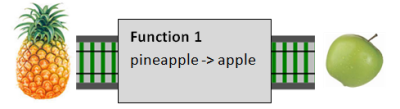

当经过名为`function2`的隧道时，一车苹果将变成香蕉。


这条神奇的铁路有一个重要规则，即只能连接携带相同类型货物的轨道。在这种情况下，我们*可以*将`function1`连接到`function2`，因为从`function1`出来的货物（苹果）与进入`function2`的货物（同样是苹果）相同。

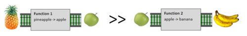

当然，并不总是轨道携带相同的货物，货物种类不匹配会导致错误。

但你会注意到，到目前为止我们讨论中一次也没有提到货物！相反，我们花了所有时间讨论单轨道与双轨道函数。

当然，不言而喻，货物必须匹配。但我希望你能看到，真正重要的是轨道的*形状*，而不是携带的货物。

### 通用类型是强大的

为什么我们不担心货物的类型？因为所有的“适配器”和“组合器”函数都是完全通用的！`bind`、`map`、`switch`和`plus`函数不关心货物的类型，只关心轨道的*形状*。

拥有极其通用的函数有两方面的好处。第一种方式很明显：函数越通用，可重用性就越高。`bind`的实现将适用于任何类型（只要形状正确）。

但还有另一个更微妙的通用函数方面值得指出。因为我们通常对涉及的类型一无所知，所以我们在能做和不能做的事情上受到很大限制。因此，我们无法引入错误！

为了理解我的意思，让我们看一下`map`的签名：

```
val map : ('a -> 'b) -> (Result<'a,'c> -> Result<'b,'c>) 
```

它接受一个函数参数`'a -> 'b`和一个值`Result<'a,'c>`，并返回一个值`Result<'b,'c>`。

我们对`'a`、`'b`和`'c`类型一无所知。我们唯一知道的是：

+   *相同*类型`'a`同时出现在函数参数和第一个`Result`的`Success`情况中。

+   *相同*类型`'b`同时出现在函数参数和第二个`Result`的`Success`情况中。

+   *相同*类型`'c`同时出现在第一个和第二个`Result`的`Failure`情况中，但在函数参数中根本没有出现。

我们可以从中推断出什么？

返回值中包含一个`'b`类型。但它是从哪里来的？我们不知道`'b`是什么类型，所以我们不知道如何创建一个。但函数参数知道如何创建一个！给它一个`'a`，它就会为我们创建一个`'b`。

但我们从哪里可以得到一个`'a`？我们也不知道`'a`是什么类型，所以我们也不知道如何创建一个。但第一个结果参数有一个`'a`我们可以使用，所以你可以看到我们*被迫*从`Result<'a,'c>`参数的`Success`值中获取，并将其传递给函数参数。然后`Result<'b,'c>`返回值的`Success`情况*必须*从函数的结果构造。

最后，同样的逻辑适用于`'c`。我们被迫从`Result<'a,'c>`输入参数中获取`Failure`值，并将其用于构造`Result<'a,'c>`返回值的`Failure`情况。

换句话说，*只有一种实现`map`函数的方式*！类型签名是如此通用，我们别无选择。

另一方面，想象一下，如果`map`函数对所需的类型非常具体，像这样：

```
val map : (int -> int) -> (Result<int,int> -> Result<int,int>) 
```

在这种情况下，我们可以想出大量不同的实现。列举几种：

+   我们本可以交换成功和失败轨迹。

+   我们本可以在成功轨迹上添加一个随机数。

+   我们本可以完全忽略函数参数，并在成功和失败轨迹上都返回零。

所有这些实现都是“有缺陷”的，因为它们不符合我们的期望。但它们之所以可能，是因为我们事先知道类型是`int`，因此我们可以以不应该的方式操纵值。我们对类型了解得越少，犯错的可能性就越小。

### 失败类型

在大多数函数中，转换仅适用于成功轨迹。失败轨迹保持不变（`map`），或与传入的失败合并（`bind`）。

这意味着失败轨迹必须始终是*相同类型*。在本文中，我们只使用了`string`，但在下一篇文章中，我们将把失败类型更改为更有用的内容。

## 总结和指导方针

在本系列的开始，我承诺给你一个简单的配方，你可以遵循。

但是现在您可能感到有点不知所措。我似乎并没有让事情变得简单，反而使事情变得更加复杂。我向您展示了许多完成同一件事的不同方式！Bind 与 compose。Map 与 switch。您应该使用哪种方法？哪种方式最好？

当然，并不存在适用于所有情景的“正确方式”，但是正如承诺的那样，这里有一些可作为可靠和可重复配方基础的准则。

*准则*

+   将双轨铁路作为数据流场景的基础模型。

+   为用例中的每个步骤创建一个函数。每个步骤的函数可以依次由较小的函数构建（例如，验证函数）。

+   使用标准组合（`>>`）连接这些函数。

+   如果需要在流程中插入一个开关，请使用`bind`。

+   如果需要在流程中插入一个单轨函数，请使用`map`。

+   如果需要在流程中插入其他类型的函数，请创建一个适当的适配器块并使用它。

这些准则可能导致代码不够简洁或优雅，但另一方面，您将使用一致的模型，当需要维护时应该能够让其他人理解。

因此，根据这些准则，目前的实现主要内容如下。特别注意最终的`usecase`函数中到处都使用了`>>`。

```
open RailwayCombinatorModule 

let (&&&) v1 v2 = 
    let addSuccess r1 r2 = r1 // return first
    let addFailure s1 s2 = s1 + "; " + s2  // concat
    plus addSuccess addFailure v1 v2 

let combinedValidation = 
    validate1 
    &&& validate2 
    &&& validate3 

let canonicalizeEmail input =
   { input with email = input.email.Trim().ToLower() }

let updateDatabase input =
   ()   // dummy dead-end function for now

// new function to handle exceptions
let updateDatebaseStep = 
    tryCatch (tee updateDatabase) (fun ex -> ex.Message)

let usecase = 
    combinedValidation 
    >> map canonicalizeEmail
    >> bind updateDatebaseStep
    >> log 
```

最后一个建议。如果您正在与非专家团队合作，不熟悉的操作符号会让人望而却步。因此，这里有一些额外的操作符号准则：

+   除了`>>`和`|>`之外，请不要使用任何“奇怪”的操作符。

+   特别是这意味着除非所有人都知道它们，否则不应该使用像`>>=`或`>=>`这样的操作符。

+   如果在使用的模块或函数顶部定义了操作符，则可以例外。例如，`&&&`操作符可以在验证模块的顶部定义，然后在该模块的后续部分中使用。

## 进一步阅读

+   如果您喜欢这种“铁路导向”方法，您还可以看到它应用于 FizzBuzz。

+   我还有一些[幻灯片和视频](http://fsharpforfunandprofit.com/rop/)展示了如何进一步应用这种方法。（我将把这些内容转化为一篇正式的博文）

我曾在 2014 年的 NDC Oslo 上就这个主题做过演讲（点击图片查看视频）


这是我使用的幻灯片：

//www.slideshare.net/slideshow/embed_code/32242318

**[铁路导向编程](https://www.slideshare.net/ScottWlaschin/railway-oriented-programming "铁路导向编程")** 来自 **[我的 slideshare 页面](http://www.slideshare.net/ScottWlaschin)** 

# 铁路导向编程：碳酸版

# 铁路导向编程：碳酸版

作为对 Railway Oriented Programming 文章的后续，我想将相同的技术应用到[FizzBuzz](http://imranontech.com/2007/01/24/using-fizzbuzz-to-find-developers-who-grok-coding/)问题中，并将其与其他实现进行比较。

这篇文章的很大一部分直接~~抄袭自~~受到了 [戴夫·法伦（Dave Fayram）关于 FizzBuzz 的文章](http://dave.fayr.am/posts/2012-10-4-finding-fizzbuzz.html) 的启发，还有一些额外的想法来自 [raganwald](http://weblog.raganwald.com/2007/01/dont-overthink-fizzbuzz.html)。

## FizzBuzz：命令式版本

作为提醒，这里是 FizzBuzz 问题的要求：

```
Write a program that prints the numbers from 1 to 100\. 
* For multiples of three print "Fizz" instead of the number.
* For multiples of five print "Buzz". 
* For numbers which are multiples of both three and five print "FizzBuzz". 
```

这里是一个基本的 F# 解决方案：

```
module FizzBuzz_Match = 

    let fizzBuzz i = 
        match i with
        | _ when i % 15 = 0 -> 
            printf "FizzBuzz"
        | _ when i % 3 = 0 -> 
            printf "Fizz"
        | _ when i % 5 = 0 -> 
            printf "Buzz"
        | _ -> 
            printf "%i" i

        printf "; "

    // do the fizzbuzz
    [1..100] |> List.iter fizzBuzz 
```

我定义了一个函数 `fizzBuzz`，给定一个整数 `i`，使用 `match` 和 `when` 子句来执行各种测试，然后打印出适当的值。

简单直接，对于快速的 hack 来说还可以，但是这种实现存在一些问题。

首先，注意我们必须对“十五”有一个特殊情况。我们不能简单地重用“三”和“五”情况的代码。这意味着如果我们想添加另一个情况，比如“七”，我们还需要添加所有组合的特殊情况（即“21”、“35”和“105”）。当然，添加更多数字会导致情况的组合爆炸。

第二，匹配的顺序很重要。如果“十五”的情况出现在模式列表的最后，代码会正确运行，但实际上不符合要求。再次强调，如果我们需要添加新的情况，我们必须始终记住将最大的情况放在首位，以确保正确性。这就是导致难以察觉的 bug 的原因。

让我们尝试另一个实现，其中我们重用了“三”和“五”情况的代码，并完全消除了“十五”情况的需要：

```
module FizzBuzz_IfPrime = 

    let fizzBuzz i = 
        let mutable printed = false

        if i % 3 = 0 then
            printed <- true
            printf "Fizz"

        if i % 5 = 0 then
            printed <- true
            printf "Buzz"

        if not printed then
            printf "%i" i

        printf "; "

    // do the fizzbuzz
    [1..100] |> List.iter fizzBuzz 
```

在这个实现中，“15”的打印值将是正确的，因为“3”和“5”的情况都将被使用。而且我们不必担心顺序 -- 至少在某种程度上是这样的。

但是 -- 这些分支不再是独立的，所以我们必须跟踪是否*任何*分支已被使用，以便我们可以处理默认情况。这导致了可变变量。在 F# 中，可变变量是一种代码异味，所以这个实现并不理想。

然而，这个版本*确实*有一个优点，就是它可以轻松重构以支持多个因子，而不仅仅是 3 和 5。

下面是一个这样做的版本。我们将一个“规则”列表传递给 `fizzBuzz`。每个规则都包括一个因子和一个相应的要打印出的标签。然后 `fizzBuzz` 函数只是依次处理这些规则。

```
module FizzBuzz_UsingFactorRules = 

    let fizzBuzz rules i  = 
        let mutable printed = false

        for factor,label in rules do
            if i % factor = 0 then
                printed <- true
                printf "%s" label

        if not printed then
            printf "%i" i

        printf "; "

    // do the fizzbuzz
    let rules = [ (3,"Fizz"); (5,"Buzz") ]
    [1..100] |> List.iter (fizzBuzz rules) 
```

如果我们想要处理更多的数字，我们只需要将它们添加到规则列表中，就像这样：

```
module FizzBuzz_UsingFactorRules = 

    // existing code as above

    let rules2 = [ (3,"Fizz"); (5,"Buzz"); (7,"Baz") ]
    [1..105] |> List.iter (fizzBuzz rules2) 
```

总之，我们创建了一个非常命令式的实现，几乎与 C# 中的相同。它很灵活，但可变变量有点像代码异味。还有其他方法吗？

## FizzBuzz：管道版本

在下一个版本中，我们将使用“pipeline”模型，其中数据通过一系列函数传递以得到最终结果。

在这个设计中，我设想了一系列函数的流水线，一个用来处理“three”情况，一个用来处理“five”情况，依此类推。最后，适当的标签被吐出来，准备打印。

这是一些伪代码，以演示该概念：

```
data |> handleThreeCase |> handleFiveCase |> handleAllOtherCases |> printResult 
```

作为额外的要求，我们希望管道*没有*副作用。这意味着中间函数不能打印任何内容。它们必须将任何生成的标签传递到管道的末端，只有在那一点上才打印结果。

### 设计流水线

作为第一步，我们需要定义将通过管道传送的数据。

让我们从上面伪代码中称为`handleThreeCase`的第一个函数开始。它的输入是什么，输出是什么？

显然，输入是正在处理的整数。但如果我们幸运的话，输出可能是字符串“Fizz”。或者如果我们不幸的话，原始整数。

现在让我们考虑第二个函数`handleFiveCase`的输入。它也需要整数。但在“15”的情况下，它还需要字符串“Fizz”，这样它就可以将“Buzz”附加到它上面。

最后，`handleAllOtherCases`函数将整数转换为字符串，但*仅当*尚未生成“Fizz”或“Buzz”时。

那么现在显然，数据结构需要包含正在处理的整数*和*“迄今为止的标签”。

下一个问题是：我们如何知道上游函数是否创建了一个标签？`handleAllOtherCases`需要知道这一点，以确定是否需要执行任何操作。

一种方法是使用空字符串（或者，可怕的是，空字符串），但我们要做得好一点，使用`string option`。

因此，这是我们将使用的最终数据类型：

```
type Data = {i:int; label:string option} 
```

### 管道版本 1

有了这个数据结构，我们可以定义`handleThreeCase`和`handleFiveCase`将如何工作。

+   首先，测试输入的整数`i`是否可被因子整除。

+   如果它可被整除，查看`label`--如果它是`None`，则用`Some "Fizz"`或`Some "Buzz"`替换它。

+   如果标签已经有值，则附加“Buzz”（或其他内容）到它。

+   如果输入不能被因子整除，则原样传递数据。

鉴于这一设计，以下是实现。这是一个通用函数，我将其称为`carbonate`（来自[raganwald](http://weblog.raganwald.com/2007/01/dont-overthink-fizzbuzz.html)），因为它既适用于“Fizz”又适用于“Buzz”：

```
let carbonate factor label data = 
    let {i=i; label=labelSoFar} = data
    if i % factor = 0 then
        // pass on a new data record
        let newLabel = 
            match labelSoFar with
            | Some s -> s + label 
            | None -> label 
        {data with label=Some newLabel}
    else
        // pass on the unchanged data
        data 
```

`handleAllOtherCases`函数的设计略有不同：

+   查看标签--如果不是`None`，那么先前的函数已经创建了一个标签，因此什么也不做。

+   但如果标签是`None`，则用整数的字符串表示替换它。

这是代码--我将其称为`labelOrDefault`：

```
let labelOrDefault data = 
    let {i=i; label=labelSoFar} = data
    match labelSoFar with
    | Some s -> s
    | None -> sprintf "%i" i 
```

现在我们有了组件，我们可以组装流水线了：

```
let fizzBuzz i = 
    {i=i; label=None}
    |> carbonate 3 "Fizz"
    |> carbonate 5 "Buzz"
    |> labelOrDefault     // convert to string
    |> printf "%s; "      // print 
```

注意，我们必须使用`{i=i; label=None}`创建一个初始记录，以便传递给第一个函数(`carbonate 3 "Fizz"`)。

最后，这里是所有代码放在一起：

```
module FizzBuzz_Pipeline_WithRecord = 

    type Data = {i:int; label:string option}

    let carbonate factor label data = 
        let {i=i; label=labelSoFar} = data
        if i % factor = 0 then
            // pass on a new data record
            let newLabel = 
                match labelSoFar with
                | Some s -> s + label 
                | None -> label 
            {data with label=Some newLabel}
        else
            // pass on the unchanged data
            data

    let labelOrDefault data = 
        let {i=i; label=labelSoFar} = data
        match labelSoFar with
        | Some s -> s
        | None -> sprintf "%i" i

    let fizzBuzz i = 
        {i=i; label=None}
        |> carbonate 3 "Fizz"
        |> carbonate 5 "Buzz"
        |> labelOrDefault     // convert to string
        |> printf "%s; "      // print

    [1..100] |> List.iter fizzBuzz 
```

### 管道版本 2

创建一个新的记录类型可能会作为一种文档形式很有用，但在这种情况下，与其创建一个特殊的数据结构，不如只使用一个元组更符合惯例。

因此，这是一个使用元组的修改实现。

```
module FizzBuzz_Pipeline_WithTuple = 

    // type Data = int * string option

    let carbonate factor label data = 
        let (i,labelSoFar) = data
        if i % factor = 0 then
            // pass on a new data record
            let newLabel = 
                labelSoFar 
                |> Option.map (fun s -> s + label)
                |> defaultArg <| label 
            (i,Some newLabel)
        else
            // pass on the unchanged data
            data

    let labelOrDefault data = 
        let (i,labelSoFar) = data
        labelSoFar 
        |> defaultArg <| sprintf "%i" i

    let fizzBuzz i = 
        (i,None)   // use tuple instead of record
        |> carbonate 3 "Fizz"
        |> carbonate 5 "Buzz"
        |> labelOrDefault     // convert to string
        |> printf "%s; "      // print

    [1..100] |> List.iter fizzBuzz 
```

作为练习，尝试找出所有必须更改的代码。

### 消除对 Some 和 None 的显式测试

在上面的元组代码中，我还用一些内置的 Option 函数`map`和`defaultArg`替换了显式的 Option 匹配代码`match .. Some .. None`。

这是`carbonate`中的更改：

```
// before
let newLabel = 
    match labelSoFar with
    | Some s -> s + label 
    | None -> label 

// after
let newLabel = 
    labelSoFar 
    |> Option.map (fun s -> s + label)
    |> defaultArg <| label 
```

在`labelOrDefault`中：

```
// before
match labelSoFar with
| Some s -> s
| None -> sprintf "%i" i

// after
labelSoFar 
|> defaultArg <| sprintf "%i" i 
```

你可能会对奇怪的`|> defaultArg <|`习语感到疑惑。

我正在使用它，因为选项是`defaultArg`的*第一个*参数，而不是*第二*个参数，因此正常的部分应用不起作用。但是“双向”管道确实有效，因此代码看起来很奇怪。

这是我的意思：

```
// OK - normal usage
defaultArg myOption defaultValue

// ERROR: piping doesn't work
myOption |> defaultArg defaultValue

// OK - bi-directional piping does work
myOption |> defaultArg <| defaultValue 
```

### 管道版本 3

我们的`carbonate`函数对于任何因子都是通用的，因此我们可以轻松地扩展代码以支持像之前的命令式版本中那样的“规则”。

但一个问题似乎是我们已经将“3”和“5”案例硬编码到管道中，就像这样：

```
|> carbonate 3 "Fizz"
|> carbonate 5 "Buzz" 
```

我们如何动态地将新函数添加到管道中？

答案非常简单。我们为每个规则动态创建一个函数，然后使用组合将所有这些函数合并为一个。

这里有一个片段来演示：

```
let allRules = 
    rules
    |> List.map (fun (factor,label) -> carbonate factor label)
    |> List.reduce (>>) 
```

每个规则都映射到一个函数。然后使用`>>`将函数列表组合成一个单一函数。

将所有内容放在一起，我们有这个最终实现：

```
module FizzBuzz_Pipeline_WithRules = 

    let carbonate factor label data = 
        let (i,labelSoFar) = data
        if i % factor = 0 then
            // pass on a new data record
            let newLabel = 
                labelSoFar 
                |> Option.map (fun s -> s + label)
                |> defaultArg <| label 
            (i,Some newLabel)
        else
            // pass on the unchanged data
            data

    let labelOrDefault data = 
        let (i,labelSoFar) = data
        labelSoFar 
        |> defaultArg <| sprintf "%i" i

    let fizzBuzz rules i = 

        // create a single function from all the rules
        let allRules = 
            rules
            |> List.map (fun (factor,label) -> carbonate factor label)
            |> List.reduce (>>)

        (i,None)   
        |> allRules
        |> labelOrDefault     // convert to string
        |> printf "%s; "      // print

    // test
    let rules = [ (3,"Fizz"); (5,"Buzz"); (7,"Baz") ]
    [1..105] |> List.iter (fizzBuzz rules) 
```

将这个“管道”版本与之前的命令式版本进行比较，设计更加功能性。没有可变的东西，也没有任何副作用（除了最后的`printf`语句）。

然而，在使用`List.reduce`时存在一个微妙的错误。你能看出是什么吗？**有关问题和修复的讨论，请参见本页底部的附录。

[**提示：尝试一个空的规则列表。]

## FizzBuzz：面向铁路的版本

管道版本是 FizzBuzz 的一个完全足够的功能实现，但是为了好玩，让我们看看是否可以使用面向铁路编程帖子中描述的“双轨道”设计。

作为一个快速提醒，在“铁路导向编程”（又称“Either”单子）中，我们定义一个具有两种情况的联合类型：“成功”和“失败”，每种情况代表不同的“轨道”。然后，我们将一组“双轨道”函数连接在一起，以构建铁路。

我们实际使用的大多数函数都是我称之为“开关”或“点”函数，其输入为 *一个* 轨道，但输出为两个轨道，一个用于成功案例，另一个用于失败案例。这些开关函数通过一个称为“绑定”的粘合函数转换为双轨道函数。

这里是包含我们将需要的函数定义的模块。

```
module RailwayCombinatorModule = 

    let (|Success|Failure|) =
        function 
        | Choice1Of2 s -> Success s
        | Choice2Of2 f -> Failure f

    /// convert a single value into a two-track result
    let succeed x = Choice1Of2 x

    /// convert a single value into a two-track result
    let fail x = Choice2Of2 x

    // appy either a success function or failure function
    let either successFunc failureFunc twoTrackInput =
        match twoTrackInput with
        | Success s -> successFunc s
        | Failure f -> failureFunc f

    // convert a switch function into a two-track function
    let bind f = 
        either f fail 
```

我在这里使用的 `Choice` 类型是内置于 F# 核心库中的。但我创建了一些帮助程序，使其看起来像 Success/Failure 类型：一个活动模式和两个构造函数。

现在，我们将如何调整 FizzBuzz？

让我们首先做一个明显的事情：将“碳酸化”定义为成功，而不匹配的整数定义为失败。

换句话说，成功轨道包含标签，而失败轨道包含整数。

因此，我们的 `carbonate` “开关”函数将如下所示：

```
let carbonate factor label i = 
    if i % factor = 0 then
        succeed label
    else
        fail i 
```

这个实现与上面讨论过的管道设计中使用的实现类似，但更清洁，因为输入只是一个整数，而不是记录或元组。

接下来，我们需要连接这些组件。逻辑将是：

+   如果整数已经被碳酸化，请忽略它

+   如果整数没有碳酸化，请将其连接到下一个开关函数的输入

这是实现：

```
let connect f = 
    function
    | Success x -> succeed x 
    | Failure i -> f i 
```

另一种编写这个函数的方法是使用我们在库模块中定义的 `either` 函数：

```
let connect' f = 
    either succeed f 
```

确保您理解这两种实现完全相同！

接下来，我们可以创建我们的“双轨道”管道，就像这样：

```
let fizzBuzz = 
    carbonate 15 "FizzBuzz"      // need the 15-FizzBuzz rule because of short-circuit
    >> connect (carbonate 3 "Fizz")
    >> connect (carbonate 5 "Buzz")
    >> either (printf "%s; ") (printf "%i; ") 
```

这在表面上与“单轨道”管道类似，但实际上使用了不同的技术。这些开关通过组合（`>>`）而不是管道（`|>`）连接在一起。

因此，`fizzBuzz` 函数没有 int 参数——我们正在通过组合其他函数来定义函数。数据不存在。

还有一些其他的变化：

+   我们不得不重新引入“15”情况的显式测试。这是因为我们只有两个轨道（成功或失败）。没有“半完成的轨道”允许“5”情况添加到“3”情况的输出中。

+   上一个示例中的 `labelOrDefault` 函数已被替换为 `either`。在成功案例中，打印字符串。在失败案例中，打印整数。

这是完整的实现：

```
module FizzBuzz_RailwayOriented_CarbonationIsSuccess = 

    open RailwayCombinatorModule 

    // carbonate a value
    let carbonate factor label i = 
        if i % factor = 0 then
            succeed label
        else
            fail i

    let connect f = 
        function
        | Success x -> succeed x 
        | Failure i -> f i

    let connect' f = 
        either succeed f

    let fizzBuzz = 
        carbonate 15 "FizzBuzz"      // need the 15-FizzBuzz rule because of short-circuit
        >> connect (carbonate 3 "Fizz")
        >> connect (carbonate 5 "Buzz")
        >> either (printf "%s; ") (printf "%i; ")

    // test
    [1..100] |> List.iter fizzBuzz 
```

### 碳酸化作为失败？

我们在上面的示例中将碳酸化定义为“成功”——这似乎是自然而然的事情。但是如果你回想起来，在铁路导向的编程模型中，“成功”意味着数据应该传递给下一个函数，而“失败”意味着绕过所有中间函数直接到达末尾。

对于 FizzBuzz，绕过所有中间函数的轨道是带有碳酸标签的轨道，而将数据传递给下一个函数的轨道是带有整数的轨道。

所以我们应该真正颠倒轨道：“失败”现在意味着碳酸化，而“成功”意味着没有碳酸化。

这样做，我们还可以重用预定义的 `bind` 函数，而不必编写自己的 `connect` 函数。

这里是轨道切换后的代码：

```
module FizzBuzz_RailwayOriented_CarbonationIsFailure = 

    open RailwayCombinatorModule 

    // carbonate a value
    let carbonate factor label i = 
        if i % factor = 0 then
            fail label
        else
            succeed i

    let fizzBuzz = 
        carbonate 15 "FizzBuzz"
        >> bind (carbonate 3 "Fizz")
        >> bind (carbonate 5 "Buzz")
        >> either (printf "%i; ") (printf "%s; ") 

    // test
    [1..100] |> List.iter fizzBuzz 
```

### 两个轨道到底是什么？

能够如此轻松地交换轨道暗示着设计可能存在弱点。我们是不是试图使用不合适的设计？

为什么一个轨道必须是 "成功"，另一个轨道必须是 "失败" 呢？似乎并没有太大的区别。

那么，为什么我们不 *保留* 两轨道的想法，但摆脱 "成功" 和 "失败" 标签呢。

相反，我们可以将一个轨道称为 "碳酸化"，另一个称为 "非碳酸化"。

为了使这个工作起效，我们可以定义一个活动模式和构造方法，就像我们为 "成功/失败" 所做的那样。

```
let (|Uncarbonated|Carbonated|) =
    function 
    | Choice1Of2 u -> Uncarbonated u
    | Choice2Of2 c -> Carbonated c

/// convert a single value into a two-track result
let uncarbonated x = Choice1Of2 x
let carbonated x = Choice2Of2 x 
```

如果您正在进行领域驱动设计，最好编写使用适当的 [Ubiquitous Language](http://martinfowler.com/bliki/UbiquitousLanguage.html) 而不是不适用的语言的代码。

在这种情况下，如果 FizzBuzz 是我们的领域，那么我们的函数现在可以使用领域友好的术语 `carbonated` 和 `uncarbonated` 而不是 "成功" 或 "失败"。

```
let carbonate factor label i = 
    if i % factor = 0 then
        carbonated label
    else
        uncarbonated i

let connect f = 
    function
    | Uncarbonated i -> f i
    | Carbonated x -> carbonated x 
```

请注意，与以前一样，`connect` 函数可以使用 `either` 重写（或者我们可以像以前一样使用预定义的 `bind`）：

```
let connect' f = 
    either f carbonated 
```

这里是一个模块中的所有代码：

```
module FizzBuzz_RailwayOriented_UsingCustomChoice = 

    open RailwayCombinatorModule 

    let (|Uncarbonated|Carbonated|) =
        function 
        | Choice1Of2 u -> Uncarbonated u
        | Choice2Of2 c -> Carbonated c

    /// convert a single value into a two-track result
    let uncarbonated x = Choice1Of2 x
    let carbonated x = Choice2Of2 x

    // carbonate a value
    let carbonate factor label i = 
        if i % factor = 0 then
            carbonated label
        else
            uncarbonated i

    let connect f = 
        function
        | Uncarbonated i -> f i
        | Carbonated x -> carbonated x 

    let connect' f = 
        either f carbonated 

    let fizzBuzz = 
        carbonate 15 "FizzBuzz"
        >> connect (carbonate 3 "Fizz")
        >> connect (carbonate 5 "Buzz")
        >> either (printf "%i; ") (printf "%s; ") 

    // test
    [1..100] |> List.iter fizzBuzz 
```

### 添加规则

到目前为止，我们的版本存在一些问题：

+   "15" 测试很丑陋。我们能否摆脱它并重用 "3" 和 "5" 的情况？

+   "3" 和 "5" 的情况是硬编码的。我们能否使其更加动态？

碰巧，我们可以一举两得，同时解决这两个问题。

与其将所有 "开关" 函数 *串联*在一起，不如在 *并行* 中将它们 "相加" 在一起。在 铁路导向编程 文章中，我们使用了这种技术来组合验证函数。对于 FizzBuzz，我们将用它来一次性处理所有因子。

关键是为组合两个函数定义一个 "append" 或 "concat" 函数。一旦我们可以这样添加两个函数，我们就可以继续添加任意数量的函数。

那么，鉴于我们���两个碳化函数，我们如何将它们连接起来？

好吧，这里是可能的情况：

+   如果它们都有碳酸化输出，我们将标签连接成一个新的碳酸化标签。

+   如果一个有碳酸化输出，另一个没有，那么我们使用碳酸化的那个。

+   如果两者都没有碳酸化输出，那么我们使用任意一个非碳酸化的（它们将是相同的）。

这是代码：

```
// concat two carbonation functions
let (<+>) switch1 switch2 x = 
    match (switch1 x),(switch2 x) with
    | Carbonated s1,Carbonated s2 -> carbonated (s1 + s2)
    | Uncarbonated f1,Carbonated s2  -> carbonated s2
    | Carbonated s1,Uncarbonated f2 -> carbonated s1
    | Uncarbonated f1,Uncarbonated f2 -> uncarbonated f1 
```

顺便说一句，注意到这段代码几乎像数学一样，`uncarbonated` 扮演 "零" 的角色，就像这样：

```
something + something = combined somethings
zero + something = something
something + zero = something
zero + zero = zero 
```

这不是巧合！我们将在函数式代码中一次又一次看到这种情况。我将在未来的文章中谈到这一点。

无论如何，有了这个 "concat" 函数，我们可以像这样重写主 `fizzBuzz`：

```
let fizzBuzz = 
    let carbonateAll = 
        carbonate 3 "Fizz" <+> carbonate 5 "Buzz"

    carbonateAll 
    >> either (printf "%i; ") (printf "%s; ") 
```

两个 `carbonate` 函数被添加，然后像以前一样传递给 `either`。

这是完整的代码：

```
module FizzBuzz_RailwayOriented_UsingAppend = 

    open RailwayCombinatorModule 

    let (|Uncarbonated|Carbonated|) =
        function 
        | Choice1Of2 u -> Uncarbonated u
        | Choice2Of2 c -> Carbonated c

    /// convert a single value into a two-track result
    let uncarbonated x = Choice1Of2 x
    let carbonated x = Choice2Of2 x

    // concat two carbonation functions
    let (<+>) switch1 switch2 x = 
        match (switch1 x),(switch2 x) with
        | Carbonated s1,Carbonated s2 -> carbonated (s1 + s2)
        | Uncarbonated f1,Carbonated s2  -> carbonated s2
        | Carbonated s1,Uncarbonated f2 -> carbonated s1
        | Uncarbonated f1,Uncarbonated f2 -> uncarbonated f1

    // carbonate a value
    let carbonate factor label i = 
        if i % factor = 0 then
            carbonated label
        else
            uncarbonated i

    let fizzBuzz = 
        let carbonateAll = 
            carbonate 3 "Fizz" <+> carbonate 5 "Buzz"

        carbonateAll 
        >> either (printf "%i; ") (printf "%s; ") 

    // test
    [1..100] |> List.iter fizzBuzz 
```

有了这个附加逻辑，我们可以轻松地重构代码以使用规则。就像之前的“管道”实现一样，我们可以使用`reduce`一次性将所有规则加在一起。

这是带有规则的版本：

```
module FizzBuzz_RailwayOriented_UsingAddition = 

    // code as above

    let fizzBuzzPrimes rules = 
        let carbonateAll  = 
            rules
            |> List.map (fun (factor,label) -> carbonate factor label)
            |> List.reduce (<+>)

        carbonateAll 
        >> either (printf "%i; ") (printf "%s; ") 

    // test
    let rules = [ (3,"Fizz"); (5,"Buzz"); (7,"Baz") ]
    [1..105] |> List.iter (fizzBuzzPrimes rules) 
```

## 总结

在本文中，我们看到了三种不同的实现：

+   一个使用可变值和混合副作用与逻辑的命令式版本。

+   一个“管道”版本，通过一系列函数传递数据结构。

+   一个“铁路导向”版本，有两条独立的轨道，并使用“加法”将函数并行组合。

在我看来，命令式版本是最糟糕的设计。即使很容易快速地编写出来，但它有许多问题，使其脆弱且容易出错。

在这两个函数式版本中，我认为“铁路导向”版本至少对于这个问题更清晰。

通过使用`Choice`类型而不是元组或特殊记录，我们使代码更加优雅。如果你比较`carbonate`的管道版本和`carbonate`的铁路导向版本，你就能看到区别。

在其他情况下，当然，铁路导向的方法可能不起作用，管道方法可能更好。希望本文对两者都提供了一些有用的见解。

*如果你是 FizzBuzz 的粉丝，请查看函数式响应式编程页面，这里有另一种变体的问题。*

## 后记：在使用 List.reduce 时要小心

使用`List.reduce`时要小心--如果列表为空，它将失败。因此，如果你有一个空的规则集，代码将抛出`System.ArgumentException`。

在管道情况下，通过将以下代码片段添加到模块中，你可以看到这一点：

```
module FizzBuzz_Pipeline_WithRules = 

    // code as before

    // bug
    let emptyRules = []
    [1..105] |> List.iter (fizzBuzz emptyRules) 
```

修复方法是用`List.fold`替换`List.reduce`。`List.fold`需要一个额外的参数：初始（或“零”）值。在这种情况下，我们可以使用恒等函数`id`作为初始值。

这是修复后的代码版本：

```
let allRules = 
    rules
    |> List.map (fun (factor,label) -> carbonate factor label)
    |> List.fold (>>) id 
```

同样，在铁路导向的例子中，我们有：

```
let allRules = 
    rules
    |> List.map (fun (factor,label) -> carbonate factor label)
    |> List.reduce (<+>) 
```

应该更正为：

```
let allRules = 
    rules
    |> List.map (fun (factor,label) -> carbonate factor label)
    |> List.fold (<+>) zero 
```

其中`zero`是如果列表为空时要使用的“默认”函数。

作为练习，为这种情况定义零函数。（提示：我们实际上已经用另一个名称定义了它）。
