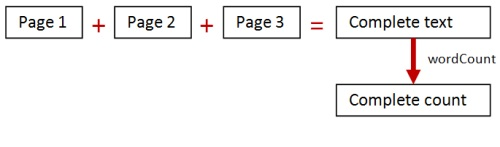
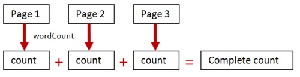
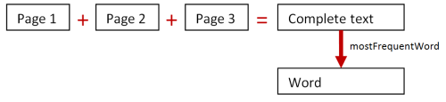
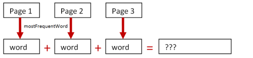
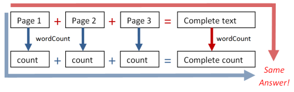
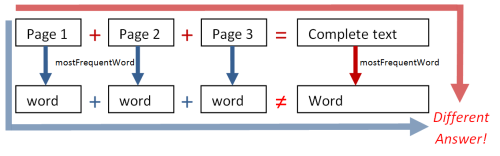
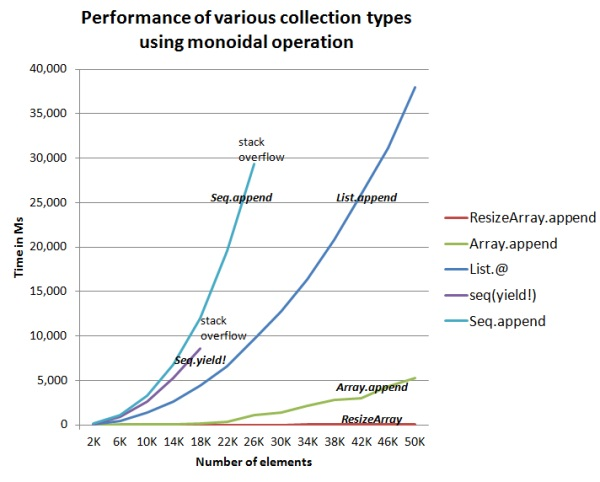

# "理解幺半群" 系列

在这个系列中，我们将看一种非常常见的“模式”，称为*幺半群*。

幺半群实际上并不是一种设计模式；更多是一种以共同方式处理许多不同类型值的方法。事实上，一旦你理解了幺半群，你会发现它们无处不在！

+   无泪的幺半群。一个关于常见函数模式的几乎没有数学的讨论。

+   实践中的幺半群。无泪的幺半群 - 第 2 部分。

+   处理非幺半群。无泪的幺半群 - 第 3 部分。

# 无泪的幺半群

# 无泪的幺半群

如果你来自面向对象的背景，学习函数式编程中更具挑战性的方面之一是缺乏明显的设计模式。有许多习语，如部分应用，和错误处理技术，但在[GoF 意义上](http://en.wikipedia.org/wiki/Design_Patterns)没有明显的模式。

在这篇文章中，我们将看一种非常常见的“模式”，称为*幺半群*。幺半群实际上并不是一种设计模式；更多是一种以共同方式处理许多不同类型值的方法。事实上，一旦你理解了幺半群，你会发现它们无处不在！

不幸的是，“幺半群”这个术语本身有点令人望而生畏。它最初来自[数学](http://en.wikipedia.org/wiki/Monoid)，但作为编程中的概念，即使没有任何数学，也很容易理解，我希望能够证明。事实上，如果今天在编程上下文中给这个概念命名，我们可能会称其为`ICombinable`，这样就不会那么可怕了。

最后，你可能会想知道“幺半群”与“单子”是否有任何联系。是的，它们之间存在数学联系，但在编程术语中，尽管它们有相似的名称，但它们是非常不同的东西。

## 哎呀... 一些方程式

在这个网站上，我通常不使用任何数学，但在这种情况下，我打破了自己设定的规则，向你展示一些方程式。

准备好了吗？这是第一个：

```
1 + 2 = 3 
```

你能应对吗？再来一个？

```
1 + (2 + 3) = (1 + 2) + 3 
```

最后再说一句...

```
1 + 0 = 1 and 0 + 1 = 1 
```

好了！我们完成了！如果你能理解这些方程式，那么你已经掌握了理解幺半群所需的所有数学知识。

## 思考如数学家

> *"数学家，像画家或诗人一样，是一种模式的创造者。如果他的模式比他们的更持久，那是因为它们是用思想创造的" -- G H Hardy*

大多数人想象数学家处理数字，进行复杂的算术和微积分。

这是一个误解。例如，如果你看一下[典型的高级别](http://terrytao.wordpress.com/2013/07/27/an-improved-type-i-estimate/) [数学讨论](http://books.google.co.uk/books?id=VOCQUC_uiWgC&pg=PA102)，你会看到很多奇怪的词语，很多字母和符号，但没有太多算术。

数学家们做的事情之一是尝试找出事物中的模式。"这些事物有什么共同点？"和"我们如何概括这些概念？"是典型的数学问题。

那么让我们通过数学家的眼睛来看这三个方程式。

### 推广第一个方程式

一个数学家会看到`1 + 2 = 3`并想到：

+   我们有一堆东西（在这种情况下是整数）

+   我们有一种方法将其中两个结合在一起（在这种情况下是加法）

+   结果是这些东西中的另一个（也就是说，我们得到另一个整数）

然后数学家可能会尝试看看这个模式是否可以推广到其他类型的事物和操作。

让我们继续以整数作为“东西”。还有哪些整数组合的方式？它们是否符合这个模式？

让我们尝试乘法，它符合这个模式吗？

答案是肯定的，乘法确实符合这个模式，因为任意两个整数相乘会得到另一个整数。

除法呢？它符合这个模式吗？答案是否定的，因为在大多数情况下，两个整数相除会得到一个分数，这*不*是一个整数（我忽略了整数除法）。

`max`函数呢？���符合这个模式吗？它结合了两个整数并返回其中一个，所以答案是肯定的。

`equals`函数呢？它结合了两个整数但返回一个布尔值，而不是一个整数，所以答案是否定的。

足够了解整数！我们还能想到哪些其他类型的事物？

浮点数类似于整数，但与整数不同，使用浮点数进行除法确实会得到另一个浮点数，因此除法操作符符合这个模式。

布尔值呢？它们可以使用 AND、OR 等运算符进行组合。`aBool AND aBool`会得到另一个布尔值吗？是的！`OR`也符合这个模式。

接下来是字符串。它们如何组合？一种方式是字符串连接，它返回另一个字符串，这正是我们想要的。但类似等式操作并不符合，因为它返回一个布尔值。

最后，让我们考虑列表。对于字符串，显而易见的组合方式是列表连接，它返回另一个列表并符合这个模式。

我们可以继续这样做，对各种对象和组合操作，但你现在应该明白它是如何工作的。

你可能会问：为什么操作返回相同类型的另一个对象如此重要？答案是**你可以使用操作链接多个对象**。

例如，因为`1 + 2`是另一个整数，你可以再加上 3。然后因为`1 + 2 + 3`也是一个整数，你可以继续加上比如说 4。换句话说，只有因为整数加法符合这个模式，你才能写出这样的加法序列：`1 + 2 + 3 + 4`。你无法以同样的方式写出`1 = 2 = 3 = 4`，因为整数相等不符合这个模式。

当然，组合项目的链可以无限长。换句话说，这种模式允许我们将成对操作扩展为**适用于列表的操作**。

数学家将“结果仍是这些事物之一”的要求称为*闭包*要求。

### 推广第二个方程式

好了，下一个方程式，`1 + (2 + 3) = (1 + 2) + 3`呢？这为什么重要？

好了，如果你思考第一个模式，它说我们可以建立一系列操作，比如`1 + 2 + 3`。但我们只有一个成对的操作。那么我们应该以什么顺序进行合并？我们应该先合并 1 和 2，然后再将结果与 3 合并吗？还是应该先合并 2 和 3，然后再将 1 与该结果合并？这有区别吗？

这就是这个第二个方程式有用的地方。它说，对于加法，组合的顺序不重要。无论哪种方式，你都会得到相同的结果。

对于像这样的四项链：`1 + 2 + 3 + 4`，我们可以从左边开始工作：`((1+2) + 3) + 4`，或者从右边开始：`1 + (2 + (3+4))`，甚至可以分成两部分然后组合它们，就像这样：`(1+2) + (3+4)`。

让我们看看这种模式是否适用于我们已经查看过的例子。

再次，让我们从其他整数组合方式开始。

我们再次从乘法开始。`1 * (2 * 3)`与`(1 * 2) * 3`是否给出相同的结果？是的。就像加法一样，顺序不重要。

现在让我们尝试减法。`1 - (2 - 3)`与`(1 - 2) - 3`是否给出相同的结果？不。对于减法，顺序很重要。

除法呢？`12 / (2 / 3)`与`(12 / 2) / 3`是否给出相同的结果？不。对于除法，顺序也很重要。

但`max`函数确实有效。`max( max(12,2), 3)`与`max(12, max(2,3))`给出相同的结果。

对于字符串和列表呢？连接是否满足要求？你觉得呢？

这里有一个问题... 我们能想出一个对字符串有序的操作吗？

那么，像`subtractChars`这样的函数如何呢？它从左侧字符串中删除右侧字符串中的所有字符。因此`subtractChars("abc","ab")`就是`"c"`。`subtractChars`的确是有序的，你可以通过一个简单的例子看到：`subtractChars("abc", subtractChars("abc","abc"))`不是与`subtractChars(subtractChars("abc","abc"),"abc")`相同的字符串。

数学家将“顺序不重要”要求称为*结合律*要求。

**重要提示：**当我说“组合顺序”时，我指的是你执行成对组合步骤的顺序 -- 先组合一对，然后将结果与下一项组合。

但至关重要的是，项目的整体序列保持不变。这是因为对于某些操作，如果你改变项目的顺序，那么你会得到完全不同的结果！`1 - 2`的意思不同于`2 - 1`，`2 / 3`的意思不同于`3 / 2`。

当然，在许多常见情况下，序列顺序并不重要。毕竟，`1+2`和`2+1`是一样的。在这种情况下，操作被称为*可交换的*。

### 第三个方程

现在让我们看看第三个方程，`1 + 0 = 1`。

一个数学家会说类似于：这很有趣--有一种特殊的东西（“零”），当你将它与某物结合时，只会将原始的东西返回，就好像什么都没有发生过一样。

所以再次，让我们重新审视我们的例子，看看我们是否可以将这个“零”概念扩展到其他操作和其他事物上。

再次，让我们从乘法开始。是否存在某个值，使得当你将一个数字与它相乘时，你会得到原始数字？

是的，当然！数字一。所以对于乘法，数字`1`就是“零”。

`max`呢？它有一个“零”吗？对于 32 位整数，是的。使用`max`将`System.Int32.MinValue`与任何其他 32 位整数组合将返回另一个整数。这完全符合“零”的定义。

那么使用 AND 组合的布尔值呢？有一个零吗？有。它是值`True`。为什么？因为`True AND False`是`False`，而`True AND True`是`True`。在这两种情况下，另一个值都会原样返回。

那么布尔值使用 OR 组合呢？那也有一个零吗？我会让你决定。

接下来，字符串连接呢？这个有“零”吗？是的，确实--它就是空字符串。

```
"" + "hello" = "hello"
"hello" + "" = "hello" 
```

最后，对于列表连接，这个“零”就是空列表。

```
[] @ [1;2;3] = [1;2;3]
[1;2;3] @ [] = [1;2;3] 
```

你可以看到，“零”值在很大程度上取决于操作，不仅取决于事物��合。整数加法的零与整数乘法的“零”不同，而与`Max`的“零”又不同。

数学家将“零”称为*单位元素*。

### 重新审视的方程

现在让我们以新的概括为基础重新审视方程。

之前，我们有：

```
1 + 2 = 3
1 + (2 + 3) = (1 + 2) + 3
1 + 0 = 1 and 0 + 1 = 1 
```

但现在我们有了一个更抽象的东西，一组可以适用于各种事物的概括要求：

+   你从一堆东西开始，*以及*一种两两组合它们的方式。

+   **规则 1（封闭性）**：两个东西组合的结果总是另一个东西。

+   **规则 2（结合性）**：当组合超过两个东西时，你首先进行哪两两组合并不重要。

+   **规则 3（单位元素）**：有一种特殊的东西叫做“零”，当你将任何东西与“零”结合时，你会得到原始的东西。

有了这些规则，我们可以回到幺半群的定义。一个“幺半群”只是遵守所有三条规则的系统。简单！

正如我一开始所说的，不要让数学背景吓到你。如果程序员给这种模式命名，它可能会被称为“可组合模式”而不是“幺半群”。但这就是生活。术语已经被广泛接受，所以我们必须使用它。

请注意，幺半群的定义有*两个*部分——事物和相关操作。幺半群不仅仅是“一堆东西”，而是“一堆东西”*和*“一种组合它们的方式”。因此，例如，“整数”不是一个幺半群，但“加法下的整数”是一个幺半群。

### 半群

在某些情况下，你有一个只遵循前两条规则的系统，并且没有候选值可以作为“零”值。

例如，如果你的域仅包含严格的正数，那么在加法下它们是闭合的和结合的，但没有正数可以是“零”。

另一个例子可能是有限列表的交集。它是闭合的和结合的，但没有（有限的）列表与任何其他有限的列表相交时，保持不变。

这种系统仍然非常有用，并且被数学家称为“半群”，而不是幺半群。幸运的是，有一个技巧可以将任何半群转换为幺半群（我稍后会描述）。

### 一个分类表

让我们将所有的例子都放入表格中，这样你就可以一起看到它们了。

| 事物 | 操作 | 闭合？ | 结合？ | 标识？ | 分类 |
| --- | --- | --- | --- | --- | --- |
| Int32 | 加法 | 是 | 是 | 0 | 幺半群 |
| Int32 | 乘法 | 是 | 是 | 1 | 幺半群 |
| Int32 | 减法 | 是 | 否 | 0 | 其他 |
| Int32 | 最大值 | 是 | 是 | Int32.MinValue | 幺半群 |
| Int32 | 相等性 | 否 |  |  | 其他 |
| Int32 | 小于 | 否 |  |  | 其他 |
|  |
| 浮点数 | 乘法 | 是 | 否（见注 1） | 1 | 其他 |
| 浮点数 | 除法 | 是（见注 2） | 否 | 1 | 其他 |
|  |
| 正数 | 加法 | 是 | 是 | 没有标识 | 半群 |
| 正数 | 乘法 | 是 | 是 | 1 | 幺半群 |
|  |
| 布尔 | AND | 是 | 是 | true | 幺半群 |
| 布尔 | OR | 是 | 是 | false | 幺半群 |
|  |
| 字符串 | 连接 | 是 | 是 | 空字符串 "" | 幺半群 |
| 字符串 | 相等性 | 否 |  |  | 其他 |
| 字符串 | “subtractChars” | 是 | 否 | 空字符串 "" | 其他 |
|  |
| 列表 | 连接 | 是 | 是 | 空列表 [] | 幺半群 |
| 列表 | 交集 | 是 | 是 | 没有标识 | 半群 |

还有许多其他类型的东西可以添加到这个列表中；多项式、矩阵、概率分布等等。本文不会讨论它们，但一旦你掌握了幺半群的概念，你就会发现这个概念可以应用于各种各样的事物。

*[注 1]*正如道格在评论中指出的，[浮点数不是结合的](http://forums.udacity.com/questions/100055360/why-floating-point-arithematic-non-associative)。将'float'替换为'real number'即可获得结合性。

*[注 2]* 数学上的实数在除法下不是封闭的，因为你不能除以零并得到另一个实数。然而，使用 IEEE 浮点数，你[*可以*除以零](http://stackoverflow.com/questions/14682005/why-does-division-by-zero-in-ieee754-standard-results-in-infinite-value)并得到一个有效的值。因此，浮点数确实在除法下封闭！以下是一个演示：

```
let x = 1.0/0.0 // infinity
let y = x * 2.0 // two times infinity 
let z = 2.0 / x // two divided by infinity 
```

## 对程序员来说，单子有什么用？

到目前为止，我们已经描述了一些抽象的概念，但它们对于现实世界的编程问题有什么用呢？

### 闭包的好处

正如我们所见，闭包规则的好处是你可以将成对操作转换为对列表或序列的操作。

换句话说，如果我们可以定义成对操作，我们可以免费扩展到列表操作。

执行此操作的函数通常称为“reduce”。以下是一些示例：

| 明确 | 使用 reduce |
| --- | --- |
| `1 + 2 + 3 + 4` | `[ 1; 2; 3; 4 ] &#124;> List.reduce (+)` |
| `1 * 2 * 3 * 4` | `[ 1; 2; 3; 4 ] &#124;> List.reduce (*)` |
| `"a" + "b" + "c" + "d"` | `[ "a"; "b"; "c"; "d" ] &#124;> List.reduce (+)` |
| `[1] @ [2] @ [3] @ [4]` | `[ [1]; [2]; [3]; [4] ] &#124;> List.reduce (@)` |

你可以看到`reduce`可以被认为是在列表的每个元素之间插入指定操作。

注意在最后一个示例中，`reduce`的输入是一个列表的列表，输出是一个单一的列表。确保你理解这是为什么。

### 结合律的好处

如果成对组合可以以任何顺序进行，那么会打开一些有趣的实现技术，例如：

+   分而治之算法

+   并行化

+   渐进主义

这些都是深层次的话题，但让我们快速看一下！

**分而治之算法**

考虑对前 8 个整数求和的任务；我们如何实现这个？

一种方式是粗略的逐步求和，如下所示：

```
let sumUpTo2 = 1 + 2
let sumUpTo3 = sumUpTo2 + 3
let sumUpTo4 = sumUpTo3 + 4
// etc
let result = sumUpTo7 + 8 
```

但是因为求和可以以任何顺序进行，我们也可以通过将求和拆分为两半来实现要求，就像这样

```
let sum1To4 = 1 + 2 + 3 + 4
let sum5To8 = 5 + 6 + 7 + 8
let result = sum1To4 + sum5To8 
```

然后我们可以以相同的方式将求和递归地拆分为子求和，直到我们达到基本的成对操作为止：

```
let sum1To2 = 1 + 2 
let sum3To4 = 3 + 4
let sum1To4 = sum1To2 + sum3To4 
```

这种“分而治之”的方法可能对于像简单求和这样的东西来说似乎有些过度，但我们将在将来的文章中看到，与`map`结合使用，它是一些众所周知的聚合算法的基础。

**并行化**

一旦我们有了一个分而治之的策略，就可以很容易地将其转换为并行算法。

例如，对于四核 CPU 来说，要对前 8 个整数求和，我们可能会这样做：

|  | 核心 1 | 核心 2 | 核心 3 | 核心 4 |
| --- | --- | --- | --- | --- |
| 步骤 1 | `sum12 = 1 + 2` | `sum34 = 3 + 4` | `sum56 = 5 + 6` | `sum78 = 7 + 8` |
| 步骤 2 | `sum1234 = sum12 + sum34` | `sum5678 = sum56 + sum78` | (空闲) | (空闲) |
| 步骤 3 | `sum1234 + sum5678` | (空闲) | (空闲) | (空闲) |

还有七个计算需要进行，但因为我们是并行进行的，所以我们可以在三步内完成所有计算。

再次强调，这可能看起来像是一个微不足道的例子，但是像 Hadoop 这样的大数据系统都是关于聚合大量数据的，如果聚合操作是一个单子，那么你理论上可以通过使用多台机器轻松扩展这些聚合*。

*[实际上，魔鬼在于细节，现实世界的系统并不完全按照这种方式工作。]

**增量主义**

即使你不需要并行性，单子的一个好处是它们支持增量计算。

例如，假设你要求我计算一到五的总和。然后当然我给你回答是十五。

但是现在你说你改变了主意，你想要一到*六*的总和。我需要重新从头开始加总所有的数字吗？不，我可以使用之前的总和，并且只是增加六。这是可能的，因为整数加法是一个单子。

也就是说，当面对像`1 + 2 + 3 + 4 + 5 + 6`这样的总和时，我可以以任何我喜欢的方式分组数字。特别是，我可以做一个增量总和，像这样：`(1 + 2 + 3 + 4 + 5) + 6`，然后减少到`15 + 6`。

在这种情况下，重新从头开始重新计算整个总和可能不是什么大问题，但考虑一个像网站分析这样的实际例子，例如过去 30 天的访问者数量。一个天真的实现可能是通过解析过去 30 天数据的日志来计算数字。一个更有效的方法是认识到前 29 天没有改变，只处理一天的增量变化。因此，解析工作大大减少了。

同样，如果你有一个 100 页书的字数统计，然后再加一页，你不应该需要再解析所有 101 页。你只需要计算最后一页的字数并将其添加到以前的总数中。

+   [从技术上讲，这些听起来很可怕的*单子同态*。我将在下一篇文章中解释这是什么。]

### 身份的好处

拥有身份元素并不总是必要的。具有封闭的、可结合的操作（即半群）就足以做很多有用的事情了。

但在某些情况下，这是不够的。例如，这里有一些可能出现的情况：

+   我如何在空列表上使用`reduce`？

+   如果我正在设计一个分治算法，如果一个“分”步骤里面什么都没有怎么办？

+   当使用增量算法时，当我没有数据时应该从哪个值开始？

在所有情况下，我们都需要一个“零”值。这使我们能够说，例如，一个空列表的总和是`0`。

关于上面的第一点，如果我们担心列表可能为空，那么我们必须用`fold`替换`reduce`，它允许传入一个初始值。（当然，`fold`不仅仅可以用于单子操作。）

这里是`reduce`和`fold`的运作方式：

```
// ok
[1..10] |> List.reduce (+)

// error
[] |> List.reduce (+)  

// ok with explicit zero
[1..10] |> List.fold (+) 0 

// ok with explicit zero
[] |> List.fold (+) 0 
```

使用“零”有时会产生直观上令人困惑的结果。例如，空整数列表的*乘积*是什么？

答案是`1`，而不是你可能期望的`0`！这里是证明的代码：

```
[1..4] |> List.fold (*) 1  // result is 24
[] |> List.fold (*) 1      // result is 1 
```

### 优势总结

总之，单子基本上是一种描述聚合模式的方式--我们有一系列事物，我们有一些方法将它们组合起来，最后我们得到一个单一的聚合对象。

或者用 F# 表示：

```
Monoid Aggregation : 'T list -> 'T 
```

所以当你设计代码时，当你开始使用“求和”，“乘积”，“组合”或“连接”等术语时，这些都是你正在处理一个单子的线索。

## 下一步

现在我们了解了单子是什么，让我们看看它们如何在实践中使用。

在本系列的下一篇文章中，我们将看看如何编写实现单子“模式”的真实代码。

# 实践中的单子

# 实践中的单子

在上一篇文章中，我们看过单子的定义。在这篇文章中，我们将看看如何实现一些单子。

首先，让我们重新审视一下定义：

+   你从一堆东西开始，*然后*以某种方式两两组合它们。

+   **规则 1（封闭性）**：两个事物的组合结果总是另一个事物。

+   **规则 2（结合性）**：当组合两个以上的事物时，你首先做哪一个两两组合是无关紧要的。

+   **规则 3（单位元素）**：有一个特殊的东西叫做“零”，这样当你将任何东西与“零”结合时，你就会得到原来的东西。

例如，如果字符串是事物，字符串连接是操作，那么我们就有了一个单子。这里有一些演示的代码：

```
let s1 = "hello"
let s2 = " world!"

// closure
let sum = s1 + s2  // sum is a string

// associativity
let s3 = "x"
let s4a = (s1+s2) + s3  
let s4b = s1 + (s2+s3)
assert (s4a = s4b)

// an empty string is the identity
assert (s1 + "" = s1)
assert ("" + s1 = s1) 
```

但现在让我们试着将这个方法应用到一个更复杂的对象上。

假设我们有一个`OrderLine`，它是一个小结构，表示销售订单中的一行，比如说。

```
type OrderLine = {
    ProductCode: string
    Qty: int
    Total: float
    } 
```

然后，也许我们想要找到订单的总计，也就是说，我们想要对行的`Total`字段进行求和。

标准的命令式方法是创建一个局部的`total`变量，然后循环遍历行，逐步求和，就像这样：

```
let calculateOrderTotal lines = 
    let mutable total = 0.0
    for line in lines do
        total <- total + line.Total
    total 
```

让我们试试：

```
module OrdersUsingImperativeLoop = 

    type OrderLine = {
        ProductCode: string
        Qty: int
        Total: float
        }

    let calculateOrderTotal lines = 
        let mutable total = 0.0
        for line in lines do
            total <- total + line.Total
        total

    let orderLines = [
        {ProductCode="AAA"; Qty=2; Total=19.98}
        {ProductCode="BBB"; Qty=1; Total=1.99}
        {ProductCode="CCC"; Qty=3; Total=3.99}
        ]

    orderLines 
    |> calculateOrderTotal 
    |> printfn "Total is %g" 
```

但当然，作为一名经验丰富的函数式程序员，你会嘲笑这一点，而是在`calculateOrderTotal`中使用`fold`，就像这样：

```
module OrdersUsingFold = 

    type OrderLine = {
        ProductCode: string
        Qty: int
        Total: float
        }

    let calculateOrderTotal lines = 
        let accumulateTotal total line = 
            total + line.Total
        lines 
        |> List.fold accumulateTotal 0.0 

    let orderLines = [
        {ProductCode="AAA"; Qty=2; Total=19.98}
        {ProductCode="BBB"; Qty=1; Total=1.99}
        {ProductCode="CCC"; Qty=3; Total=3.99}
        ]

    orderLines 
    |> calculateOrderTotal 
    |> printfn "Total is %g" 
```

目前为止，一切都很好。现在让我们来看看使用单子方法的解决方案。

对于一个单子，我们需要定义某种加法或组合操作。像这样的东西怎么样？

```
let addLine orderLine1 orderLine2 =
    orderLine1.Total + orderLine2.Total 
```

但这样做不好，因为我们忘记了单子的一个关键方面。加法必须返回相同类型的值！

如果我们看一下`addLine`函数的签名...

```
addLine : OrderLine -> OrderLine -> float 
```

...我们可以看到返回类型是`float`而不是`OrderLine`。

我们需要做的是返回一个完整的其他`OrderLine`。这里是一个正确的实现：

```
let addLine orderLine1 orderLine2 =
    {
    ProductCode = "TOTAL"
    Qty = orderLine1.Qty + orderLine2.Qty
    Total = orderLine1.Total + orderLine2.Total
    } 
```

现在签名是正确的：`addLine：OrderLine -> OrderLine -> OrderLine`。

请注意，因为我们必须返回整个结构，所以我们不仅需要为`ProductCode`和`Qty`指定一些东西，还需要为`Total`指定一些东西。`Qty`很容易，我们可以简单地求和。对于`ProductCode`，我决定使用字符串“TOTAL”，因为我们没有真正的产品代码可以使用。

让我们来做一个小测试：

```
// utility method to print an OrderLine
let printLine {ProductCode=p; Qty=q;Total=t} = 
    printfn "%-10s %5i %6g" p q t 

let orderLine1 = {ProductCode="AAA"; Qty=2; Total=19.98}
let orderLine2 = {ProductCode="BBB"; Qty=1; Total=1.99}

//add two lines to make a third
let orderLine3 = addLine orderLine1 orderLine2 
orderLine3 |> printLine // and print it 
```

我们应该得到这个结果：

```
TOTAL          3  21.97 
```

*注意：有关所使用的 printf 格式选项的更多信息，请参阅这里的 printf 帖子。*

现在让我们使用`reduce`将其应用于列表：

```
let orderLines = [
    {ProductCode="AAA"; Qty=2; Total=19.98}
    {ProductCode="BBB"; Qty=1; Total=1.99}
    {ProductCode="CCC"; Qty=3; Total=3.99}
    ]

orderLines 
|> List.reduce addLine
|> printLine 
```

随着结果：

```
TOTAL          6  25.96 
```

起初，这可能看起来是多余的工作，只是为了加总。但请注意，我们现在不仅仅有总计的信息；我们还有数量的总和。

例如，我们可以轻松地重用`printLine`函数来创建一个简单的收据打印函数，其中包括总计，如下所示：

```
let printReceipt lines = 
    lines 
    |> List.iter printLine

    printfn "-----------------------"

    lines 
    |> List.reduce addLine
    |> printLine

orderLines 
|> printReceipt 
```

给出了这样的输出：

```
AAA            2  19.98
BBB            1   1.99
CCC            3   3.99
-----------------------
TOTAL          6  25.96 
```

更重要的是，我们现在可以利用单子的增量特性来保持一个随着每次添加新行而更新的运行小计。

举个例子：

```
let subtotal = orderLines |> List.reduce addLine 
let newLine = {ProductCode="DDD"; Qty=1; Total=29.98}
let newSubtotal = subtotal |> addLine newLine 
newSubtotal |> printLine 
```

我们甚至可以定义一个自定义运算符，例如`++`，以便我们可以像处理数字一样自然地将行相加：

```
let (++) a b = addLine a b  // custom operator

let newSubtotal = subtotal ++ newLine 
```

你可以看到使用单子模式开启了一种全新的思维方式。你可以将这种“添加”方法应用于几乎任何类型的对象。

例如，产品“加”产品会是什么样子？或者客户“加”客户？让你的想象力发挥！

### 我们到了吗？

你可能已经注意到我们还没有完成。还有第三个单子的要求，我们还没有讨论 - 零或身份元素。

在这种情况下，要求意味着我们需要某种`OrderLine`，以便将其添加到另一个订单行不会改变原始订单行。我们有这样的东西吗？

现在不是，因为加法操作总是将产品代码更改为“TOTAL”。事实上，我们现在拥有的是*半群*，而不是单子。

如你所见，半群是完全可用的。但是如果我们有一个空的行列表，并且我们想对它们进行总计，那么问题就会出现。结果应该是什么？

一个变通的方法是将`addLine`函数修改为忽略空的产品代码。然后我们可以使用一个带有空代码的订单行作为零元素。

这就是我的意思：

```
let addLine orderLine1 orderLine2 =
    match orderLine1.ProductCode, orderLine2.ProductCode with
    // is one of them zero? If so, return the other one
    | "", _ -> orderLine2
    | _, "" -> orderLine1
    // anything else is as before
    | _ -> 
        {
        ProductCode = "TOTAL"
        Qty = orderLine1.Qty + orderLine2.Qty
        Total = orderLine1.Total + orderLine2.Total
        }

let zero = {ProductCode=""; Qty=0; Total=0.0}
let orderLine1 = {ProductCode="AAA"; Qty=2; Total=19.98} 
```

我们然后可以测试标识是否按预期工作：

```
assert (orderLine1 = addLine orderLine1 zero)
assert (orderLine1 = addLine zero orderLine1) 
```

这似乎有点笨拙，所以我不建议一般使用这种技术。我们将稍后讨论另一种获得身份的方法。

## 引入一个特殊的总计类型

在上面的例子中，`OrderLine`类型非常简单，很容易为总计字段重载字段。

但是如果`OrderLine`类型更复杂会怎么样呢？例如，如果它还有一个`Price`字段，就像这样：

```
type OrderLine = {
    ProductCode: string
    Qty: int
    Price: float
    Total: float
    } 
```

现在我们引入了一个复杂性。当我们合并两行时，应该将`Price`设置为多少？平均价格？没有价格？

```
let addLine orderLine1 orderLine2 =
    {
    ProductCode = "TOTAL"
    Qty = orderLine1.Qty + orderLine2.Qty
    Price = 0 // or use average price? 
    Total = orderLine1.Total + orderLine2.Total
    } 
```

似乎都不是很令人满意。

我们不知道该怎么做的事实可能意味着我们的设计是错误的。

实际上，我们只需要总计的一部分数据，而不是全部。我们如何表示这个？

当然是通过鉴别联合！一个案例可用于产品行，另一个案例可用于仅限总计。

这就是我的意思：

```
type ProductLine = {
    ProductCode: string
    Qty: int
    Price: float
    LineTotal: float
    }

type TotalLine = {
    Qty: int
    OrderTotal: float
    }

type OrderLine = 
    | Product of ProductLine
    | Total of TotalLine 
```

这种设计要好得多。我们现在有一个专门用于总数的结构，不必再费力使多余的数据适应。我们甚至可以删除虚拟的“TOTAL”产品代码。

*请注意，我在每个记录中都使用了不同的名称来命名“total”字段。像这样拥有唯一字段名称意味着你不必总是显式指定类型。*

不幸的是，现在添加逻辑更加复杂，因为我们必须处理每一种情况的组合：

```
let addLine orderLine1 orderLine2 =
    let totalLine = 
        match orderLine1,orderLine2 with
        | Product p1, Product p2 ->
            {Qty = p1.Qty + p2.Qty;
            OrderTotal = p1.LineTotal + p2.LineTotal}
        | Product p, Total t ->
            {Qty = p.Qty + t.Qty;
            OrderTotal = p.LineTotal + t.OrderTotal}
        | Total t, Product p ->
            {Qty = p.Qty + t.Qty;
            OrderTotal = p.LineTotal + t.OrderTotal}
        | Total t1, Total t2 ->
            {Qty = t1.Qty + t2.Qty;
            OrderTotal = t1.OrderTotal + t2.OrderTotal}
    Total totalLine // wrap totalLine to make OrderLine 
```

请注意，我们不能只返回`TotalLine`值。我们必须将其包装在`Total`情况中，以创建一个适当的`OrderLine`。如果我们不这样做，那么我们的`addLine`将具有`OrderLine -> OrderLine -> TotalLine`的签名，这是不正确的。我们必须有`OrderLine -> OrderLine -> OrderLine`的签名 -- 没有其他选择！

现在我们有了两种情况，我们需要在`printLine`函数中处理它们：

```
let printLine =  function
    | Product {ProductCode=p; Qty=q; Price=pr; LineTotal=t} -> 
        printfn "%-10s %5i @%4g each %6g" p q pr t 
    | Total {Qty=q; OrderTotal=t} -> 
        printfn "%-10s %5i            %6g" "TOTAL" q t 
```

但一旦我们完成了这个，我们现在可以像以前一样使用加法：

```
let orderLine1 = Product {ProductCode="AAA"; Qty=2; Price=9.99; LineTotal=19.98}
let orderLine2 = Product {ProductCode="BBB"; Qty=1; Price=1.99; LineTotal=1.99}
let orderLine3 = addLine orderLine1 orderLine2 

orderLine1 |> printLine 
orderLine2 |> printLine 
orderLine3 |> printLine 
```

### 再次考虑一下身份

再次，我们还没有解决身份要求。我们可以尝试使用与之前相同的技巧，使用一个空的产品代码，但那只适用于`Product`情况。

要获得一个正确的身份，我们确实需要引入一个*第三*种情况，比如`EmptyOrder`，来表示联合类型：

```
type ProductLine = {
    ProductCode: string
    Qty: int
    Price: float
    LineTotal: float
    }

type TotalLine = {
    Qty: int
    OrderTotal: float
    }

type OrderLine = 
    | Product of ProductLine
    | Total of TotalLine
    | EmptyOrder 
```

有了这个额外的情况可用后，我们重新编写`addLine`函数来处理它：

```
let addLine orderLine1 orderLine2 =
    match orderLine1,orderLine2 with
    // is one of them zero? If so, return the other one
    | EmptyOrder, _ -> orderLine2
    | _, EmptyOrder -> orderLine1
    // otherwise as before
    | Product p1, Product p2 ->
        Total { Qty = p1.Qty + p2.Qty;
        OrderTotal = p1.LineTotal + p2.LineTotal}
    | Product p, Total t ->
        Total {Qty = p.Qty + t.Qty;
        OrderTotal = p.LineTotal + t.OrderTotal}
    | Total t, Product p ->
        Total {Qty = p.Qty + t.Qty;
        OrderTotal = p.LineTotal + t.OrderTotal}
    | Total t1, Total t2 ->
        Total {Qty = t1.Qty + t2.Qty;
        OrderTotal = t1.OrderTotal + t2.OrderTotal} 
```

现在我们可以测试它了：

```
let zero = EmptyOrder

// test identity
let productLine = Product {ProductCode="AAA"; Qty=2; Price=9.99; LineTotal=19.98}
assert (productLine = addLine productLine zero)
assert (productLine = addLine zero productLine)

let totalLine = Total {Qty=2; OrderTotal=19.98}
assert (totalLine = addLine totalLine zero)
assert (totalLine = addLine zero totalLine) 
```

## 使用内置的 List.sum 函数

原来，`List.sum`函数知道单子！如果你告诉它加法操作是什么，零是什么，那么你就可以直接使用`List.sum`而不是`List.fold`。

你这样做的方法是通过为你的类型附加两个静态成员，`+`和`Zero`，就像这样：

```
type OrderLine with
    static member (+) (x,y) = addLine x y 
    static member Zero = EmptyOrder   // a property 
```

一旦这样做了，你就可以使用`List.sum`，它将按预期工作。

```
let lines1 = [productLine]
// using fold with explicit op and zero
lines1 |> List.fold addLine zero |> printfn "%A"  
// using sum with implicit op and zero
lines1 |> List.sum |> printfn "%A"  

let emptyList: OrderLine list = []
// using fold with explicit op and zero
emptyList |> List.fold addLine zero |> printfn "%A"  
// using sum with implicit op and zero
emptyList |> List.sum |> printfn "%A" 
```

请注意，为了使这个工作，你不能已经有一个叫做`Zero`的方法或情况。如果我用名字`Zero`而不是`EmptyOrder`来代替第三种情况，它就不会起作用。

尽管这是一个巧妙的技巧，但在实践中，我认为这不是一个好主意，除非你正在定义一个合适的与数学相关的类型，比如`ComplexNumber`或`Vector`。对我来说，这有点太聪明和不明显了。

如果你**确实**想使用这个技巧，你的`Zero`成员不能是一个扩展方法 -- 它必须与类型一起定义。

例如，在下面的代码中，我试图将空字符串定义为字符串的“零”。

`List.fold`之所以有效，是因为`String.Zero`在这段代码中作为扩展方法可见，但`List.sum`失败了，因为扩展方法对它不可见。

```
module StringMonoid =

    // define extension method
    type System.String with
        static member Zero = "" 

    // OK.
    ["a";"b";"c"] 
    |> List.reduce (+)    
    |> printfn "Using reduce: %s"

    // OK. String.Zero is visible as an extension method
    ["a";"b";"c"] 
    |> List.fold (+) System.String.Zero
    |> printfn "Using fold: %s"

    // Error. String.Zero is NOT visible to List.sum
    ["a";"b";"c"] 
    |> List.sum          
    |> printfn "Using sum: %s" 
```

## 映射到不同的结构

在联合中有两种不同情况可能是可以接受的，但在许多实际情况下，这种方法太复杂或令人困惑。

考虑一个像这样的客户记录：

```
open System

type Customer = {
    Name:string // and many more string fields!
    LastActive:DateTime 
    TotalSpend:float } 
```

我们如何“添加”两个这样的客户？

一个有用的提示是意识到聚合实际上只适用于数值和类似的类型。字符串不能很容易地进行聚合。

所以，与其尝试聚合 `Customer`，不如定义一个单独的类 `CustomerStats`，其中包含所有可聚合的信息：

```
// create a type to track customer statistics
type CustomerStats = {
    // number of customers contributing to these stats
    Count:int 
    // total number of days since last activity
    TotalInactiveDays:int 
    // total amount of money spent
    TotalSpend:float } 
```

`CustomerStats` 中的所有字段都是数值型的，因此我们很容易理解如何将两个统计信息相加：

```
let add stat1 stat2 = {
    Count = stat1.Count + stat2.Count;
    TotalInactiveDays = stat1.TotalInactiveDays + stat2.TotalInactiveDays
    TotalSpend = stat1.TotalSpend + stat2.TotalSpend
    }

// define an infix version as well
let (++) a b = add a b 
```

与往常一样，`add` 函数的输入��输出必须是相同类型。我们必须有 `CustomerStats -> CustomerStats -> CustomerStats`，而不是 `Customer -> Customer -> CustomerStats` 或任何其他变体。

好的，目前一切顺利。

现在假设我们有一组客户，我们想要为他们获取聚合的统计信息，应该如何做？

我们不能直接添加客户，所以我们需要先将每个客户转换为 `CustomerStats`，然后使用单子操作将统计信息相加。

这里有一个例子：

```
// convert a customer to a stat
let toStats cust =
    let inactiveDays= DateTime.Now.Subtract(cust.LastActive).Days;
    {Count=1; TotalInactiveDays=inactiveDays; TotalSpend=cust.TotalSpend}

// create a list of customers
let c1 = {Name="Alice"; LastActive=DateTime(2005,1,1); TotalSpend=100.0}
let c2 = {Name="Bob"; LastActive=DateTime(2010,2,2); TotalSpend=45.0}
let c3 = {Name="Charlie"; LastActive=DateTime(2011,3,3); TotalSpend=42.0}
let customers = [c1;c2;c3]

// aggregate the stats
customers 
|> List.map toStats
|> List.reduce add
|> printfn "result = %A" 
```

需要注意的第一件事是 `toStats` 仅为一个客户创建统计信息。我们将计数设置为 1。这可能看起来有点奇怪，但这是有道理的，因为如果列表中只有一个客户，那么聚合统计信息就是这样的。

第二点需要注意的是最终的聚合方式。首先我们使用 `map` 将源类型转换为一个单子类型，然后我们使用 `reduce` 来聚合所有的统计信息。

嗯.... `map` 后跟 `reduce`。这听起来熟悉吗？

是的，谷歌著名的 MapReduce 算法就是受到这个概念的启发（尽管细节有些不同）。

在我们继续之前，这里有一些简单的练习供你检验自己的理解。

+   `CustomerStats` 的"零"是什么？通过在空列表上使用 `List.fold` 测试你的代码。

+   编写一个简单的 `OrderStats` 类，并用它来聚合我们在本文开头介绍的 `OrderLine` 类型。

## 单子同态

现在我们已经掌握了理解所谓的*单子同态*所需的所有工具。

我知道你在想什么... 哎呀！不只是一个，而是两个奇怪的数学词汇！

但我希望现在"单子"这个词不再那么令人生畏。而"同态"是另一个听起来比实际简单的数学词汇。它只是希腊语中的"相同形状"，描述了保持"形状"相同的映射或函数。

在实践中这意味着什么？

嗯，我们已经看到所有单子都具有某种共同的结构。也就是说，即使底层对象可能完全不同（整数、字符串、列表、`CustomerStats` 等），它们的"单子性"是相同的。正如乔治·W·布什曾经说过的，一旦你见过一个单子，你就见过它们全部。

因此，*单子*同态是一种保留基本"单子性"的转换，即使"之前"和"之后"的对象可能完全不同。

在本节中，我们将看一个简单的单子同态。这是单子同态的"hello world"，"斐波那契数列"，单子同态的 -- 单词计数。

### 文档作为一个单子

假设我们有一个表示文本块的类型，类似于这样：

```
type Text = Text of string 
```

当然，我们可以将两个较小的文本块相加以形成一个较大的文本块：

```
let addText (Text s1) (Text s2) =
    Text (s1 + s2) 
```

这里有一个加法运算的示例：

```
let t1 = Text "Hello"
let t2 = Text " World"
let t3 = addText t1 t2 
```

由于你现在是一个专家，你会很快认识到这是一个幺半群，其中零显然是`Text ""`。

现在假设我们正在写一本书（比如[这本书](https://leanpub.com/understandingfunctionalprogramming?utm_campaign=understandingfunctionalprogramming)），我们想要一个字数统计来显示我们已经写了多少。

这是一个非常粗糙的实现，加上一个测试：

```
let wordCount (Text s) =
    s.Split(' ').Length

// test
Text "Hello world"
|> wordCount
|> printfn "The word count is %i" 
```

所以我们一直在写作，现在我们已经写了三页的文本。我们如何计算完整文档的字数？

好吧，一��方法是将单独的页面合并在一起形成完整的文本块，然后对该文本块应用`wordCount`函数。这里是一个图示：



但每次我们完成一页新的内容时，我们都必须将所有文本加在一起，然后重新计算字数。

毫无疑问，你可以看到有一个更好的方法来做这件事。不要将所有文本加在一起然后计数，而是分别获取每页的字数，然后将这些计数相加，就像这样：



第二种方法依赖于整数（计数）本身是一个幺半群的事实，你可以将它们相加以获得所需的结果。

因此，`wordCount`函数已经将对"页面"的聚合转变为对"计数"的聚合。

现在的重要问题是：`wordCount`是一个幺半群同态吗？

好吧，页面（文本）和计数（整数）都是幺半群，所以它肯定将一个幺半群转换为另一个幺半群。

但更微妙的条件是：它是否保留了"形状"？也就是说，计数的相加是否与页面的相加给出相同的答案？

在这种情况下，答案是肯定的。所以`wordCount` *是* 一个幺半群同态！

你可能认为这是显而易见的，所有类似的映射都必须是幺半群同态，但我们稍后会看到一个例子，证明这并非如此。

### 可分块性的好处

幺半群同态方法的优势在于它是*"可分块的"*。

每个映射和字数统计都是独立的，所以我们可以分别进行它们，然后在之后将答案相加。对于许多算法来说，处理小数据块要比处理大数据块高效得多，因此如果可能的话，我们应该尽可能利用这一点。

作为这种可分块性的直接结果，我们获得了前一篇文章中提到的一些好处。

首先，它是*增量的*。也就是说，当我们向最后一页添加文本时，我们不必重新计算所有先前页面的字数，这可能会节省一些时间。

其次，它是*可并行化的*。每个块的工作可以独立完成，在不同的核心或机器上。请注意，在实践中，并行性被高估了。将数据分块对性能的影响远远大于并行性本身。

### 比较字数统计的实现

我们现在准备创建一些代码来演示这两种不同的技术。

让我们从上面的基本定义开始，除了我将更改单词计数为使用正则表达式而不是`split`。

```
module WordCountTest = 
    open System 

    type Text = Text of string

    let addText (Text s1) (Text s2) =
        Text (s1 + s2)

    let wordCount (Text s) =
        System.Text.RegularExpressions.Regex.Matches(s,@"\S+").Count 
```

接下来，我们将创建一个包含 1000 个单词的页面，以及一个包含 1000 页的文档。

```
module WordCountTest = 

    // code as above

    let page() = 
        List.replicate 1000 "hello "
        |> List.reduce (+)
        |> Text

    let document() = 
        page() |> List.replicate 1000 
```

我们想要计时代码，看看这些实现之间是否有任何差异。这里有一个小助手函数。

```
module WordCountTest = 

    // code as above

    let time f msg = 
        let stopwatch = Diagnostics.Stopwatch()
        stopwatch.Start()
        f() 
        stopwatch.Stop()
        printfn "Time taken for %s was %ims" msg stopwatch.ElapsedMilliseconds 
```

好的，让我们实现第一种方法。我们将使用`addText`将所有页面加在一起，然后对整个百万字文档进行单词计数。

```
module WordCountTest = 

    // code as above

    let wordCountViaAddText() = 
        document() 
        |> List.reduce addText
        |> wordCount
        |> printfn "The word count is %i"

    time wordCountViaAddText "reduce then count" 
```

对于第二种方法，我们将首先对每个页面进行`wordCount`，然后将所有结果相加（当然要使用`reduce`）。

```
module WordCountTest = 

    // code as above

    let wordCountViaMap() = 
        document() 
        |> List.map wordCount
        |> List.reduce (+)
        |> printfn "The word count is %i"

    time wordCountViaMap "map then reduce" 
```

注意，我们只改变了两行代码！

在`wordCountViaAddText`中，我们有：

```
|> List.reduce addText
|> wordCount 
```

而在`wordCountViaMap`中，我们基本上交换了这些行。现在我们先进行`wordCount`，然后再进行`reduce`，就像这样：

```
|> List.map wordCount
|> List.reduce (+) 
```

最后，让我们看看并行性有什么区别。我们将使用内置的`Array.Parallel.map`而不是`List.map`，这意味着我们需要先将列表转换为数组。

```
module WordCountTest = 

    // code as above

    let wordCountViaParallelAddCounts() = 
        document() 
        |> List.toArray
        |> Array.Parallel.map wordCount
        |> Array.reduce (+)
        |> printfn "The word count is %i"

    time wordCountViaParallelAddCounts "parallel map then reduce" 
```

我希望你能跟上这些实现，并且理解发生了什么。

### 分析结果

这是在我的 4 核机器上运行不同实现的结果：

```
Time taken for reduce then count was 7955ms
Time taken for map then reduce was 698ms
Time taken for parallel map then reduce was 603ms 
```

我们必须认识到这些都是粗略的结果，而不是正确的性能概要。但即使这样，很明显 map/reduce 版本比`ViaAddText`版本快约 10 倍。

这就是为什么幺半群同态很重要的关键--它们使得一种"分而治之"的策略变得既强大又易于实现。

是的，你可以说使用的算法非常低效。字符串连接是累积大文本块的可怕方法，有更好的方法来进行单词计数。但是即使有这些警告，基本观点仍然有效：通过交换两行代码，我们获得了巨大的性能提升。

而通过一点哈希和缓存，我们也会得到增量聚合的好处--只重新计算所需的最小值随着页面的变化。

注意，在这种情况下，并行映射并没有带来太大的差异，尽管它确实使用了所有四个核心。是的，我们通过`toArray`增加了一些小开销，但即使在最好的情况下，你可能只会在多核机器上获得一点点速度提升。重申一下，真正产生最大差异的是 map/reduce 方法中固有的分而治之策略。

## 一个非幺半群同态

我之前提到，并非所有映射都必然是幺半群同态。在这一部分，我们将看一个不是的例子。

对于这个例子，我们不使用计数单词，而是返回文本块中最频繁出现的单词。

这是基本代码。

```
module FrequentWordTest = 

    open System 
    open System.Text.RegularExpressions

    type Text = Text of string

    let addText (Text s1) (Text s2) =
        Text (s1 + s2)

    let mostFrequentWord (Text s) =
        Regex.Matches(s,@"\S+")
        |> Seq.cast<Match>
        |> Seq.map (fun m -> m.ToString())
        |> Seq.groupBy id
        |> Seq.map (fun (k,v) -> k,Seq.length v)
        |> Seq.sortBy (fun (_,v) -> -v)
        |> Seq.head
        |> fst 
```

`mostFrequentWord`函数比前一个`wordCount`函数稍微复杂一些，所以我会一步一步地带你了解它。

接下来，我们将每个`Match`转换为匹配的单词，使用`ToString()`。然后我们按单词本身进行分组，这给我们一个对，其中每个对都是`(单词，单词列表)`。然后我们将这些对转换为`(单词，列表计数)`，然后按降序排序（使用负数的单词计数）。

首先，我们使用正则表达式匹配所有非空白字符。这样做的结果是一个`MatchCollection`而不是`Match`列表，因此我们必须将其显式转换为一个序列（在 C#术语中为`IEnumerable<Match>`）。

最后，我们取第一对，并返回对的第一部分。这就是最频繁的单词。

好的，让我们继续，像以前一样创建一些页面和一个文档。这次我们对性能不感兴趣，所以我们只需要几页。但我们确实想创建*不同*的页面。我们将创建一个仅包含“hello world”的页面，另一个仅包含“goodbye world”的页面，以及一个包含“foobar”的第三个页面。（在我看来，这不是一个非常有趣的书！）

```
module FrequentWordTest = 

    // code as above 

    let page1() = 
        List.replicate 1000 "hello world "
        |> List.reduce (+)
        |> Text

    let page2() = 
        List.replicate 1000 "goodbye world "
        |> List.reduce (+)
        |> Text

    let page3() = 
        List.replicate 1000 "foobar "
        |> List.reduce (+)
        |> Text

    let document() = 
        [page1(); page2(); page3()] 
```

很明显，就整个文档而言，“world”是总体上最频繁的单词。

所以让我们像以前一样比较这两种方法。第一种方法将合并所有页面，然后应用`mostFrequentWord`，就像这样。



第二种方法将分别在每个页面上执行`mostFrequentWord`，然后将结果合并，像这样：



以下是代码：

```
module FrequentWordTest = 

    // code as above 

    document() 
    |> List.reduce addText
    |> mostFrequentWord
    |> printfn "Using add first, the most frequent word is %s"

    document() 
    |> List.map mostFrequentWord
    |> List.reduce (+)
    |> printfn "Using map reduce, the most frequent word is %s" 
```

你看到发生了什么了吗？第一种方法是正确的。但是第二种方法给出了完全错误的答案！

```
Using add first, the most frequent word is world
Using map reduce, the most frequent word is hellogoodbyefoobar 
```

第二种方法只是将每个页面中最频繁的单词连接在一起。结果是一个新字符串，没有出现在*任何*页面上。完全失败！

发生了什么错了吗？

嗯，字符串确实是串联下的一个单体，所以映射将一个单体（文本）转换为另一个单体（字符串）。

但是映射没有保留“形状”。一大块文本中的最频繁单词不能从较小块文本中的最频繁单词中派生出来。换句话说，它不是一个正确的单体同态。

### 单体同态的定义

让我们再次看看这两个不同的示例，以了解它们之间的区别。

在单词计数示例中，无论是先添加块然后再进行单词计数，还是先进行单词计数然后再将它们加在一起，我们得到了*相同的*最终结果。下面是一个图示：



但是对于最频繁单词的例子，我们*没有*从两种不同的方法中得到相同的答案。



换句话说，对于`wordCount`，我们有

```
wordCount(page1) + wordCount(page2) EQUALS wordCount(page1 + page) 
```

但是对于`mostFrequentWord`，我们有：

```
mostFrequentWord(page1) + mostFrequentWord(page2) NOT EQUAL TO mostFrequentWord(page1 + page) 
```

这使我们对单体同态的定义稍微更加精确：

```
Given a function that maps from one monoid to another (like 'wordCount' or 'mostFrequentWord')

Then to be a monoid homomorphism, the function must meet the requirement that:

function(chunk1) + function(chunk2) MUST EQUAL function(chunk1 + chunk2) 
```

遗憾的是，`mostFrequentWord`不是一个单体同态。

这意味着如果我们想要在大量文本文件上计算`mostFrequentWord`，我们很遗憾地被迫先将所有文本相加，而无法从分治策略中受益。

...或者我们可以吗？有没有办法将`mostFrequentWord`转换为适当的单子同态？敬请关注！

## 下一步

到目前为止，我们只处理了适当的单子。但是如果你想要处理的东西*不是*单子呢？那又怎么办？

在本系列的下一篇文章中，我将给你一些关于将几乎任何东西转换为单子的建议。

我们还将修复`mostFrequentWord`示例，使其成为一个适当的单子同态，并重新审视零的棘手问题，提供一个优雅的方法来创建它们。

到时见！

## 进一步阅读

如果你对使用单子进行数据聚合感兴趣，以下链接有很多好的讨论：

+   Twitter 的[Algebird 库](https://blog.twitter.com/2012/scalding-080-and-algebird)

+   大多数[概率数据结构](http://highlyscalable.wordpress.com/2012/05/01/probabilistic-structures-web-analytics-data-mining/)都是单子。

+   [高斯分布形成单子](http://izbicki.me/blog/gausian-distributions-are-monoids)。

+   Google 的[MapReduce 编程模型](http://citeseerx.ist.psu.edu/viewdoc/download?doi=10.1.1.104.5859&rep=rep1&type=pdf)（PDF）。

+   [Monoidify! Monoids as a Design Principle for Efficient MapReduce Algorithms](http://arxiv.org/abs/1304.7544)（PDF）。

+   LinkedIn 的[Hadoop 的 Hourglass 库](http://www.slideshare.net/matthewterencehayes/hourglass-27038297)

+   来自 Stack Exchange：[在数据库计算中，群、单子和环有什么用？](http://cs.stackexchange.com/questions/9648/what-use-are-groups-monoids-and-rings-in-database-computations)

如果你想要更加技术化，这里有一个关于单子和半群的详细研究，使用图形图表作为领域：

+   [Monoids: Theme and Variations](http://www.cis.upenn.edu/~byorgey/pub/monoid-pearl.pdf)（PDF）。

# 处理非单子

# 处理非单子

在本系列的先前文章中，我们只处理了适当的单子。

但是如果你想要处理的东西*不是*单子呢？那又怎么办？好吧，在这篇文章中，我将给你一些关于将几乎任何东西转换为单子的建议。

在这个过程中，我们将介绍一些重要且常见的函数式设计惯用语，比如更喜欢列表而不是单例，并在每个机会都使用选项类型。

## 获得封闭性

如果你还记得，对于一个适当的单子，我们需要三个条件成立：封闭性、结合性和身份元素。每个要求都可能带来挑战，因此我们将依次讨论每个要求。

我们将从封闭性开始。

在某些情况下，你可能想要将值相加，但组合值的类型与原始值的类型不同。你该如何处理呢？

一种方法是仅将原始类型映射到一个*封闭*的新类型。我们在前一篇文章中的`Customer`和`CustomerStats`示例中看到了这种方法的应用。在许多情况下，这是最简单的方法，因为你不必去处理原始类型的设计。

另一方面，有时你确实不想使用`map`，而是希望从一开始就设计你的类型，使其满足封闭要求。

无论哪种方式，无论你是设计一个新类型还是重新设计一个现有类型，你都可以使用类似的技术来实现封闭。

### 将封闭类型组合成新的复合类型

显然，我们已经看到数值类型在一些基本数学运算如加法和乘法下是封闭的。我们还看到一些非数值类型，如字符串和列表，是在连接下是封闭的。

考虑到这一点，显然任何这些类型的组合也将是封闭的。我们只需定义“添加”函数来对组件类型进行适当的“添加”即可。

这里有一个例子：

```
type MyType = {count:int; items:int list}

let addMyType t1 t2 = 
    {count = t1.count + t2.count; 
     items = t1.items @ t2.items} 
```

`addMyType`函数在`int`字段上使用整数加法，在`list`字段上使用列表连接。因此，使用函数`addMyType`，`MyType`是封闭的——事实上，它不仅封闭，而且还是一个幺半群。所以在这种情况下，我们完成了！

这正是我们在之前的文章中与`CustomerStats`一起采取的方法。

所以这是我的第一个提示：

+   **设计提示：要轻松创建一个幺半群类型，请确保类型的每个字段也是一个幺半群。**

要思考的问题是：当你这样做时，新复合类型的“零”是什么？

### 处理非数值类型

上述方法适用于创建复合类型。但是对于没有明显数值等价物的非数值类型，该怎么办呢？

这里有一个非常简单的例子。假设你有一些字符想要相加，就像这样：

```
'a' + 'b' -> what? 
```

但是，一个字符加一个字符并不会得到另一个字符。如果说什么，它会得到一个字符串。

```
'a' + 'b' -> "ab" // Closure fail! 
```

但是这非常没有帮助，因为它不符合封闭要求。

修复这个问题的一种方法是将字符强制转换为字符串，这样做是有效的：

```
"a" + "b" -> "ab" 
```

但是这是针对字符的特定解决方案——是否有一种更通用的解决方案适用于其他类型？

好吧，想一想`string`和`char`的关系是什么。一个字符串可以被看作是字符的列表或数组。

换句话说，我们也可以使用字符列表，就像这样：

```
['a'] @ ['b'] -> ['a'; 'b'] // Lists FTW! 
```

这也满足了封闭要求。

更重要的是，这实际上是*任何*像这样的问题的一般解决方案，因为*任何*东西都可以放入列表，而且列表（带有连接）总是幺半群。

所以这是我的下一个提示：

+   **设计提示：为了使非数值类型具有封闭性，用列表替换单个项。**

在某些情况下，你可能需要在设置幺半群时转换为列表，然后在完成后转换为另一种类型。

例如，在`Char`情况下，你会在字符列表上进行所有操作，然后只在最后转换为字符串。

那么让我们尝试创建一个“monoidal char”模块。

```
module MonoidalChar =
    open System

    /// "monoidal char"
    type MChar = MChar of Char list

    /// convert a char into a "monoidal char"
    let toMChar ch = MChar [ch]

    /// add two monoidal chars
    let addChar (MChar l1) (MChar l2) = 
        MChar (l1 @ l2)

    // infix version
    let (++) = addChar  

    /// convert to a string
    let toString (MChar cs) = 
        new System.String(List.toArray cs) 
```

你可以看到`MChar`是一个字符列表的包装器，而不是单个字符。

现在让我们测试一下：

```
open MonoidalChar

// add two chars and convert to string
let a = 'a' |> toMChar
let b = 'b' |> toMChar
let c = a ++ b
c |> toString |> printfn "a + b = %s"  
// result: "a + b = ab" 
```

如果我们想要变得复杂，我们可以使用 map/reduce 来处理一组字符，就像这样：

```
[' '..'z']   // get a lot of chars
|> List.filter System.Char.IsPunctuation
|> List.map toMChar
|> List.reduce addChar
|> toString
|> printfn "punctuation chars are %s" 
// result: "punctuation chars are !"#%&'()*,-./:;?@[\]_" 
```

### 用于错误的单子

`MonoidalChar`示例很简单，也许可以用其他方式实现，但总的来说这是一种非常有用的技术。

例如，这里有一个简单的模块用于进行一些验证。有两个选项，`Success`和`Failure`，而`Failure`情况也有一个与之关联的错误字符串。

```
module Validation = 

    type ValidationResult = 
        | Success
        | Failure of string

    let validateBadWord badWord (name:string) =
        if name.Contains(badWord) then
            Failure ("string contains a bad word: " + badWord)
        else 
            Success 

    let validateLength maxLength name =
        if String.length name > maxLength then
            Failure "string is too long"
        else 
            Success 
```

在实践中，我们可能会对一个字符串执行多个验证，并且希望一次返回所有结果，以某种方式相加在一起。

这需要成为一个单子！如果我们可以逐对添加两个结果，那么我们可以扩展操作以添加任意多个结果！

那么问题是，我们如何组合*两个*验证结果？

```
let result1 = Failure "string is null or empty"
let result2 = Failure "string is too long"

result1 + result2 = ???? 
```

一个天真的方法是连接字符串，但如果我们使用格式字符串，或者资源 ID 与本地化等，那就行不通了。

不，更好的方法是将`Failure`情况转换为*字符串列表*而不是单个字符串。这样做将使结果的组合变得简单。

这里是与上面相同的代码，重新定义了`Failure`情况以使用列表：

```
module MonoidalValidation = 

    type ValidationResult = 
        | Success
        | Failure of string list

    // helper to convert a single string into the failure case
    let fail str =
        Failure [str]

    let validateBadWord badWord (name:string) =
        if name.Contains(badWord) then
            fail ("string contains a bad word: " + badWord)
        else 
            Success 

    let validateLength maxLength name =
        if String.length name > maxLength then
            fail "string is too long"
        else 
            Success 
```

你可以看到各个验证调用`fail`时带有一个字符串，但在幕后它被存储为一个字符串列表，然后可以连接在一起。

有了这个，我们现在可以创建`add`函数了。

逻辑将是：

+   如果两个结果都是`Success`，那么组合结果就是`Success`。

+   如果一个结果是`Failure`，那么组合结果就是那个失败。

+   如果两个结果都是`Failure`，那么组合结果就是一个带有两个错误列表连接在一起的`Failure`。

这是代码：

```
module MonoidalValidation = 

    // as above

    /// add two results
    let add r1 r2 = 
        match r1,r2 with
        | Success,    Success -> Success 
        | Failure f1, Success -> Failure f1
        | Success,    Failure f2 -> Failure f2
        | Failure f1, Failure f2 -> Failure (f1 @ f2) 
```

这里有一些测试来检查逻辑：

```
open MonoidalValidation 

let test1 = 
    let result1 = Success
    let result2 = Success
    add result1 result2 
    |> printfn "Result is %A"
    // "Result is Success"

let test2 = 
    let result1 = Success
    let result2 = fail "string is too long"
    add result1 result2 
    |> printfn "Result is %A"
    // "Result is Failure ["string is too long"]"

let test3 = 
    let result1 = fail "string is null or empty"
    let result2 = fail "string is too long"
    add result1 result2 
    |> printfn "Result is %A"

    // Result is Failure 
    //   [ "string is null or empty"; 
    //     "string is too long"] 
```

这里是一个更现实的例子，我们有一个要应用的验证函数列表：

```
let test4 = 
    let validationResults str = 
        [
        validateLength 10
        validateBadWord "monad"
        validateBadWord "cobol"
        ]
        |> List.map (fun validate -> validate str)

    "cobol has native support for monads"
    |> validationResults 
    |> List.reduce add
    |> printfn "Result is %A" 
```

输出是一个带有三个错误消息的`Failure`。

```
Result is Failure
  ["string is too long"; "string contains a bad word: monad";
   "string contains a bad word: cobol"] 
```

这个单子还需要一件事来完成。我们还需要一个“零”。它应该是什么？

根据定义，它是一种与另一个结果组合时保持另一个结果不变的东西。

希望你能看到，按照这个定义，“零”就是`Success`。

```
module MonoidalValidation = 

    // as above

    // identity
    let zero = Success 
```

正如你所知，如果要减少的列表为空，我们需要使用零。所以这里有一个例子，我们根本不应用任何验证函数，给我们一个空的`ValidationResult`列表。

```
let test5 = 
    let validationResults str = 
        []
        |> List.map (fun validate -> validate str)

    "cobol has native support for monads"
    |> validationResults 
    |> List.fold add zero
    |> printfn "Result is %A"

    // Result is Success 
```

请注意，我们还需要将`reduce`更改为`fold`，否则我们将会得到一个运行时错误。

### 为了性能考虑

这是使用列表的另一个好处的例子。与其他组合方法相比，列表连接的计算成本和内存使用相对较低，因为指向的对象不必改变或重新分配。

例如，在前一篇帖子中，我们定义了一个`Text`块，它包装了一个字符串，并使用字符串连接来添加它们的内容。

```
type Text = Text of string

let addText (Text s1) (Text s2) =
    Text (s1 + s2) 
```

但对于大字符串来说，这种持续的连接可能会很昂贵。

考虑一个不同的实现，在其中`Text`块包含一个*字符串列表*。

```
type Text = Text of string list

let addText (Text s1) (Text s2) =
    Text (s1 @ s2) 
```

实现几乎没有变化，但性能可能会大大提高。

你可以在*字符串列表*上进行所有操作，并且只需要在处理序列的最后将其转换为普通字符串。

如果列表对你来说不够高效，你可以轻松地扩展此方法以使用经典数据结构如树、堆等，或者可变类型如 ResizeArray。(有关此内容的更多讨论，请参见本帖子底部的性能附录)

### 术语警报

在数学中，将对象列表用作幺半群的概念很常见，这在数学上称为["自由幺半群"](http://en.wikipedia.org/wiki/Free_monoid)。在计算机科学中，它也称为["Kleene 星号"](http://en.wikipedia.org/wiki/Kleene_star)，例如`A*`。如果你不允许空列表，那么就没有零元素。这种变体称为“自由半群”或“Kleene 加号”，例如`A+`。

如果你曾经使用过正则表达式，那么这种“星号”和“加号”符号肯定会很熟悉。

[* 你可能没有意识到正则表达式和幺半群之间有关联！甚至还有一些[更深层次的关系](http://scienceblogs.com/goodmath/2008/03/06/monoids-and-computation-syntac/)。]

## 结合性

现在我们已经处理了闭包，让我们来处理结合性。

在第一篇帖子中，我们看到了一些非结合性的操作，包括减法和除法。

我们可以看到`5 - (3 - 2)`不等于`(5 - 3) - 2`。这表明减法不是结合的，也`12 / (3 / 2)`不等于`(12 / 3) / 2`，这表明除法不是结合的。

在这些情况下，没有单一的正确答案，因为你可能真正关心的是从左到右还是从右到左的不同答案。

实际上，F#标准库有两个版本的`fold`和`reduce`以满足每种偏好。普通的`fold`和`reduce`是从左到右工作的，就像这样：

```
//same as (12 - 3) - 2
[12;3;2] |> List.reduce (-)  // => 7 

//same as ((12 - 3) - 2) - 1
[12;3;2;1] |> List.reduce (-)  // => 6 
```

但也有`foldBack`和`reduceBack`，它们是从右向左工作的，就像这样：

```
//same as 12 - (3 - 2)
[12;3;2] |> List.reduceBack (-) // => 11

//same as 12 - (3 - (2 - 1))
[12;3;2;1] |> List.reduceBack (-) // => 10 
```

从某种意义上说，结合性要求只是一种方式，即无论您使用`fold`还是`foldBack`，您都应该得到*相同的*答案。

### 将操作移至元素中

但是假设你确实想要一个一致的幺半群方法，很多情况下的诀窍是将操作移入每个元素的属性中。**使操作成为名词，而不是动词。**

例如，`3 - 2` 可以被理解为 `3 + (-2)`。与其将"减法"作为一个动词，我们将"负数 2"作为一个名词。

在这种情况下，上面的例子变成了`5 + (-3) + (-2)`。由于我们现在使用的是加法作为运算符，我们确实有了关联性，`5 + (-3 + -2)` 确实与 `(5 + -3) + -2` 相同。

一个类似的方法也适用于除法。`12 / 3 / 2` 可以转换为 `12 * (1/3) * (1/2)`，现在我们回到了作为运算符的乘法，这是关联的。

将运算符转换为元素属性的这种方法可以很好地推广。

所以这里有一个提示：

+   **设计提示：为了获得操作的关联性，请尝试将操作移入对象。**

我们可以回顾一下之前的例子，以了解这是如何运作的。如果你记得，在第一篇文章中，我们尝试找到一个非关联操作来处理字符串，并最终选择了`subtractChars`。

这里是`subtractChars`的一个简单实现

```
let subtractChars (s1:string) (s2:string) = 
    let isIncluded (ch:char) = s2.IndexOf(ch) = -1
    let chars = s1.ToCharArray() |> Array.filter isIncluded
    System.String(chars)

// infix version 
let (--) = subtractChars 
```

有了这个实现，我们可以进行一些交互式测试：

```
"abcdef" -- "abd"   //  "cef"
"abcdef" -- ""      //  "abcdef" 
```

我们自己可以看到关联性要求被违反了：

```
("abc" -- "abc") -- "abc"  // ""
"abc" -- ("abc" -- "abc")  // "abc" 
```

我们如何使这个关联？

技巧在于将"减法性质"从运算符移入对象，就像我们之前对数字所做的那样。

我的意思是，我们用一个"减法"或"要删除的字符"数据结构替换了普通字符串，这个数据结构捕获了我们想要删除的内容，如下所示：

```
let removalAction = (subtract "abd") // a data structure 
```

然后我们"应用"数据结构到字符串上：

```
let removalAction = (subtract "abd") 
removalAction |> applyTo "abcdef"  // "Result is cef" 
```

一旦我们采用了这种方法，我们可以重新设计上面的非关联示例，看起来像这样：

```
let removalAction = (subtract "abc") + (subtract "abc") + (subtract "abc")   
removalAction |> applyTo "abc"    // "Result is " 
```

是的，这与原始代码并不完全相同，但你可能会发现在许多情况下这实际上更合适。

实现如下。我们定义一个`CharsToRemove`来包含一组字符，其他函数实现也以直接的方式从中得出。

```
/// store a list of chars to remove
type CharsToRemove = CharsToRemove of Set<char>

/// construct a new CharsToRemove
let subtract (s:string) = 
    s.ToCharArray() |> Set.ofArray |>  CharsToRemove 

/// apply a CharsToRemove to a string
let applyTo (s:string) (CharsToRemove chs) = 
    let isIncluded ch = Set.exists ((=) ch) chs |> not
    let chars = s.ToCharArray() |> Array.filter isIncluded
    System.String(chars)

// combine two CharsToRemove to get a new one
let (++) (CharsToRemove c1) (CharsToRemove c2) = 
    CharsToRemove (Set.union c1 c2) 
```

让我们测试一下！

```
let test1 = 
    let removalAction = (subtract "abd") 
    removalAction |> applyTo "abcdef" |> printfn "Result is %s"
    // "Result is cef"

let test2 = 
    let removalAction = (subtract "abc") ++ (subtract "abc") ++ (subtract "abc")   
    removalAction |> applyTo "abcdef" |> printfn "Result is %s"
    // "Result is " 
```

思考这种方法的方式是，从某种意义上讲，我们在建模*动作*而不是*数据*。我们有一个`CharsToRemove`动作列表，然后将它们组合成一个"大" `CharsToRemove` 动作，最后在中间操作完成后执行该单个动作。

我们马上会看到另一个例子，但你可能会想到："这听起来有点像函数，不是吗？"对此我会说"是的，的确像函数！"

实际上，与其创建这个`CharsToRemove`数据结构，我们不妨像下面展示的那样部分应用原始的`subtractChars`函数：

(请注意，我们颠倒了参数以使部分应用更容易)

```
// reverse for partial application
let subtract str charsToSubtract = 
    subtractChars charsToSubtract str 

let removalAction = subtract "abd" 
"abcdef" |> removalAction |> printfn "Result is %s"
// "Result is cef" 
```

现在我们甚至不需要一个特殊的`applyTo`函数。

但是当我们有多个这些减法函数时，怎么办？每个这些部分应用的函数的签名是`string -> string`，那么我们如何将它们“相加”呢？

```
(subtract "abc") + (subtract "abc") + (subtract "abc")  = ? 
```

答案当然是函数组合！

```
let removalAction2 = (subtract "abc") >> (subtract "abc") >> (subtract "abc") 
removalAction2 "abcdef" |> printfn "Result is %s"
// "Result is def" 
```

这相当于创建`CharsToRemove`数据结构的函数等价物。

“数据结构作为行动”和函数方法并不完全相同——例如，`CharsToRemove`方法可能更有效，因为它使用了一个集合，并且仅应用于字符串的末尾——但它们都实现了相同的目标。哪种更好取决于你正在解决的具体问题。

我将在下一篇文章中对函数和单子有更多的讨论。

## 单子

现在是单子的最后一个要求：单位元。

正如我们所看到的，单位元并不总是必需的，但如果你可能会处理空列表，拥有它是很好的。

对于数值，找到操作的单位元通常很容易，无论是`0`（加法）、`1`（乘法）还是`Int32.MinValue`（最大值）。

这也适用于只包含数值的结构——只需将所有值设置为适当的单位元。上一篇文章中的`CustomerStats`类型很好地展示了这一点。

但是如果你有非数值对象怎么办？如果没有自然的候选者，如何创建“零”或单位元素？

答案是：*你只需自己创造一个*。

说真的！

我们已经在上一篇文章中看到了一个例子，当我们为`OrderLine`类型添加了一个`EmptyOrder`情况时：

```
type OrderLine = 
    | Product of ProductLine
    | Total of TotalLine
    | EmptyOrder 
```

让我们更仔细地看一下。我们进行了两个步骤：

+   首先，我们创建了一个新情况并将其添加到`OrderLine`的备选项列表中（如上所示）。

+   其次，我们调整了`addLine`函数以考虑它（如下所示）。

```
let addLine orderLine1 orderLine2 =
    match orderLine1,orderLine2 with
    // is one of them zero? If so, return the other one
    | EmptyOrder, _ -> orderLine2
    | _, EmptyOrder -> orderLine1
    // logic for other cases ... 
```

这就是全部内容。

新的增强类型由旧的订单行情况组成，*加上*新的`EmptyOrder`情况，因此它可以重用大部分旧情况的行为。

特别是，你能看到新的增强类型是否遵循所有单子规则吗？

+   新类型的一对值可以相加以获得另一个新类型的值（封闭性）

+   如果对于旧类型，组合顺序并不重要，那么对于新类型也是如此（结合律）

+   最后……这个额外情况现在为我们提供了新类型的单位元。

### 将 PositiveNumber 转换为单子

我们可以对我们看到的其他半群做同样的事情。

例如，我们之前注意到严格正数（在加法下）没有单位元；它们只是一个半群。如果我们想使用“增加额外情况”的技术（而不仅仅使用`0`！）来创建一个零，我们首先会定义一个特殊的`Zero`情况（不是整数），然后创建一个`addPositive`函数来处理它，就像这样：

```
type PositiveNumberOrIdentity = 
    | Positive of int
    | Zero

let addPositive i1 i2 =
    match i1,i2 with
    | Zero, _ -> i2
    | _, Zero -> i1
    | Positive p1, Positive p2 -> Positive (p1 + p2) 
```

诚然，`PositiveNumberOrIdentity` 是一个人为的例子，但你可以看到在任何情况下都可以使用相同的方法，其中包括“正常”值和特殊的、分离的零值。

### 一个通用的解决方案

这有一些缺点：

+   现在我们必须处理 *两个* 情况：正常情况和零情况。

+   我们必须创建自定义类型和自定义加法函数

不幸的是，第一个问题无法解决。如果你的系统没有自然的零点，并且你创建了一个人工的零点，那么你确实总是需要处理两种情况。

但是第二个问题 *是* 可以解决的！与其一遍又一遍地创建新的自定义类型，也许我们可以创建一个 *通用* 类型，其中包含两种情况：一种用于所有正常值，一种用于人工零点，就像这样：

```
type NormalOrIdentity<'T> = 
    | Normal of 'T
    | Zero 
```

这种类型看起来熟悉吗？这只是 **Option 类型** 的伪装！

换句话说，每当我们需要一个超出正常值集合的标识时，我们可以使用 `Option.None` 来表示它。然后 `Option.Some` 用于所有其他“正常”值。

使用 `Option` 的另一个好处是，我们还可以编写一个完全通用的“add”函数。下面是一个初步尝试：

```
let optionAdd o1 o2 =
    match o1, o2 with
    | None, _ -> o2
    | _, None -> o1
    | Some s1, Some s2 -> Some (s1 + s2) 
```

逻辑很简单。如果任一选项是 `None`，则返回另一个选项。如果两者都是 `Some`，则解包它们，相加，然后再次包装成 `Some`。

但是最后一行的 `+` 对我们正在添加的类型做出了假设。最好显式传递加法函数，像这样：

```
let optionAdd f o1 o2 =
    match o1, o2 with
    | None, _ -> o2
    | _, None -> o1
    | Some s1, Some s2 -> Some (f s1 s2) 
```

在实践中，这将被用于部分应用以将加法函数固化。

所以现在我们有另一个重要提示：

+   **设计提示：要获得操作的标识，可以在判别式联合中创建一个特殊情况，或者更简单的是使用 Option。**

### PositiveNumber 重温

所以这是再次使用 `Option` 类型的正数示例。

```
type PositiveNumberOrIdentity = int option
let addPositive = optionAdd (+) 
```

简单多了！

请注意，我们将“真实”加法函数作为参数传递给 `optionAdd`，以便固化。在其他情况下，您将使用与半群相关联的相关聚合函数进行相同操作。

由于部分应用，`addPositive` 的签名为：`int option -> int option -> int option`，这正是我们从单子加法函数中期望的。

换句话说，`optionAdd` 将任何函数 `'a -> 'a -> 'a` 转换为*相同*的函数，但是被“提升”到选项类型，即具有签名 `'a option -> 'a option -> 'a option`。

所以，让我们测试一下吧！一些测试代码可能是这样的：

```
// create some values
let p1 = Some 1
let p2 = Some 2
let zero = None

// test addition
addPositive p1 p2
addPositive p1 zero
addPositive zero p2
addPositive zero zero 
```

你可以看到，不幸的是，为了获得 `None` 作为标识，我们必须将正常值包装在 `Some` 中。

听起来很繁琐，但实际上很容易。下面的代码显示了当对列表进行求和时，我们可能如何处理两种不同的情况。首先是如何对非空列表求和，然后是如何对空列表求和。

```
[1..10]
|> List.map Some
|> List.fold addPositive zero 

[]
|> List.map Some
|> List.fold addPositive zero 
```

### ValidationResult 重温

在此期间，让我们重新审视我们之前在谈论使用列表获取闭包时描述的`ValidationResult`类型。这是它的描述：

```
type ValidationResult = 
    | Success
    | Failure of string list 
```

现在我们已经对正整数情况有了一些了解，让我们也从不同的角度来看待这种类型。

该类型有两种情况。一种情况包含我们关心的数据，另一种情况则不包含数据。但我们真正关心的数据是错误消息，而不是成功。正如列夫·托尔斯泰几乎说的那样：“所有的验证成功都是相似的；每个验证失败都是独特的失败。”

因此，与其将其视为“结果”，不如将这种类型视为*存储失败*，并将其重写为如下形式，将失败案例放在首位：

```
type ValidationFailure = 
    | Failure of string list
    | Success 
```

现在这种类型看起来是不是很熟悉？

是的！又是选项类型！我们永远摆脱不了这该死的东西吗？

使用选项类型，我们可以将`ValidationFailure`类型的设计简化为仅此而已：

```
type ValidationFailure = string list option 
```

将字符串转换为失败案例的辅助程序现在只是带有列表的`Some`：

```
let fail str =
    Some [str] 
```

而“add”函数可以重用`optionAdd`，但这次以列表连接作为底层操作：

```
let addFailure f1 f2 = optionAdd (@) f1 f2 
```

最后，原始设计中的“零”现在在新设计中只是简单地变成了`None`。

这是所有的代码，加上测试

```
module MonoidalValidationOption = 

    type ValidationFailure = string list option

    // helper to convert a string into the failure case
    let fail str =
        Some [str]

    let validateBadWord badWord (name:string) =
        if name.Contains(badWord) then
            fail ("string contains a bad word: " + badWord)
        else 
            None

    let validateLength maxLength name =
        if String.length name > maxLength then
            fail "string is too long"
        else 
            None

    let optionAdd f o1 o2 =
        match o1, o2 with
        | None, _ -> o2
        | _, None -> o1
        | Some s1, Some s2 -> Some (f s1 s2)

    /// add two results using optionAdd
    let addFailure f1 f2 = optionAdd (@) f1 f2

    // define the Zero 
    let Success = None

module MonoidalValidationOptionTest =
    open MonoidalValidationOption 

    let test1 = 
        let result1 = Success
        let result2 = Success
        addFailure result1 result2 
        |> printfn "Result is %A"

        // Result is <null>

    let test2 = 
        let result1 = Success
        let result2 = fail "string is too long"
        addFailure result1 result2 
        |> printfn "Result is %A"
        // Result is Some ["string is too long"]

    let test3 = 
        let result1 = fail "string is null or empty"
        let result2 = fail "string is too long"
        addFailure result1 result2 
        |> printfn "Result is %A"
        // Result is Some ["string is null or empty"; "string is too long"]

    let test4 = 
        let validationResults str = 
            [
            validateLength 10
            validateBadWord "monad"
            validateBadWord "cobol"
            ]
            |> List.map (fun validate -> validate str)

        "cobol has native support for monads"
        |> validationResults 
        |> List.reduce addFailure
        |> printfn "Result is %A"
        // Result is Some
        //   ["string is too long"; "string contains a bad word: monad";
        //    "string contains a bad word: cobol"]

    let test5 = 
        let validationResults str = 
            []
            |> List.map (fun validate -> validate str)

        "cobol has native support for monads"
        |> validationResults 
        |> List.fold addFailure Success
        |> printfn "Result is %A"
        // Result is <null> 
```

## 设计技巧总结

让我们暂停一秒，看看我们到目前为止都讨论了什么。

这里是所有设计技巧的总结：

+   要轻松创建一个幺半群类型，请确保该类型的每个字段也是一个幺半群。

+   要使非数字类型闭合，请用列表（或类似的数据结构）替换单个项目。

+   要为一个操作获得结合性，请尝试将操作移到对象中。

+   要为操作获取身份，请在一个可辨别的联合中创建一个特殊情况，或者更简单的是只使用 Option。

在接下来的两节中，我们将把这些技巧应用到我们之前在上篇文章中见过的两个非幺半群上：“平均”和“最常见的单词”。

## 一个案例研究：平均值

所以现在我们有了能够处理平均值棘手情况的工具包。

这里是一个简单的成对平均函数的实现：

```
let avg i1 i2 = 
    float (i1 + i2) / 2.0

// test
avg 4 5 |> printfn "Average is %g"
// Average is 4.5 
```

正如我们在第一篇文章中简要提到的那样，`avg`在所有三个幺半群要求上都失败了！

首先，它不是封闭的。使用`avg`组合在一起的两个 int 不会产生另一个 int。

第二，即使它是封闭的，`avg`也不是可结合的，因为我们可以通过定义类似的浮点函数`avgf`来看到：

```
let avgf i1 i2 = 
    (i1 + i2) / 2.0

// test
avgf (avgf 1.0 3.0) 5.0  |> printfn "Average from left is %g"
avgf 1.0 (avgf 3.0 5.0)  |> printfn "Average from right is %g"

// Average from left is 3.5
// Average from right is 2.5 
```

最后，没有身份。

什么数字，当与任何其他数字平均时，返回原始值？答案：无！

### 应用设计技巧

所以让我们应用设计技巧，看看它们是否能帮助我们找到解决方案。

+   *要轻松创建一个幺半群类型，请确保类型的每个字段也是一个幺半群。*

好吧，“平均”是一个数学操作，所以我们可以期望其幺半群等价物也是基于数字的。

+   *要使非数字类型闭合，请用列表（或类似的数据结构）替换单个项目。*

乍一看，这似乎与我们无关，所以我们现在会跳过这一部分。

+   *为了让一个操作具有结合性，试着将该操作移到对象内部。*

这是关键！我们如何将“average”从动词（一种操作）转换为名词（一种数据结构）？

答案是我们创建了一个实际上不是平均值而是“延迟平均值”的结构 -- 你需要的一切都可以随需求而生成平均值。

也就是说，我们需要一个包含*两个*组件的数据结构：一个总数，和一个计数。有了这两个数字，我们就可以根据需要计算一个平均值。

```
// store all the info needed for an average
type Avg = {total:int; count:int}

// add two Avgs together
let addAvg avg1 avg2 = 
    {total = avg1.total + avg2.total; 
     count = avg1.count + avg2.count} 
```

好消息是，该结构存储的是`ints`，而不是`floats`，所以我们不需要担心精度损失或浮点数的结合性。

最后一个提示是：

+   *为了让一个操作具有恒等性，创建一个辨别联合的特殊情况，或者，更简单地，只使用 Option。*

在这种情况下，提示是不需要的，因为我们可以通过将两个组件设置为零来轻松创建一个零：

```
let zero = {total=0; count=0} 
```

我们也可以使用`None`作为零，但在这种情况下似乎有些多余。如果列表为空，那么`Avg`的结果是有效的，即使我们无法进行除法。

一旦我们对数据结构有了这个理解，实现的其余部分就很容易了。下面是所有的代码，还有一些测试：

```
module Average = 

    // store all the info needed for an average
    type Avg = {total:int; count:int}

    // add two Avgs together
    let addAvg avg1 avg2 = 
        {total = avg1.total + avg2.total; 
         count = avg1.count + avg2.count}

    // inline version of add
    let (++) = addAvg

    // construct an average from a single number
    let avg n = {total=n; count=1}

    // calculate the average from the data.
    // return 0 for empty lists
    let calcAvg avg = 
        if avg.count = 0 
        then 0.0  
        else float avg.total / float avg.count

    // alternative - return None for empty lists
    let calcAvg2 avg = 
        if avg.count = 0 
        then None
        else Some (float avg.total / float avg.count)

    // the identity
    let zero = {total=0; count=0}

    // test
    addAvg (avg 4) (avg 5) 
    |> calcAvg 
    |> printfn "Average is %g"
    // Average is 4.5

    (avg 4) ++ (avg 5) ++ (avg 6) 
    |> calcAvg 
    |> printfn "Average is %g"
    // Average is 5

    // test
    [1..10]
    |> List.map avg
    |> List.reduce addAvg
    |> calcAvg
    |> printfn "Average is %g"
    // Average is 5.5 
```

在上面的代码中，你可以看到我创建了一个`calcAvg`函数，它使用`Avg`结构来计算（浮点型）平均值。这种方法的一个好处是我们可以推迟对零除数的决定。我们可以返回`0`，或者是`None`，或者我们可以无限期地推迟计算，并且只在最后一刻按需生成平均值！

当然，这种“average”的实现具有增量平均的能力。我们之所以能做到这一点，是因为它是一个幺半群。

也就是说，如果我已经计算了一百万个数字的平均值，并且我想再添加一个数字，我就不必重新计算所有内容，我只需要将到目前为止的总数加上新的数字即可。

## 有关指标的一个小偏离

如果你曾负责管理任何服务器或服务，你将意识到日志记录和监控指标的重要性，如 CPU、I/O 等。

那么你经常面临的一个问题是如何设计你的指标。你想要每秒的千字节，还是自服务器启动以来的总千字节？每小时访问者，还是总访问者？

如果你查看一些[创建指标时的指南](http://opentsdb.net/metrics.html)，你会看到经常推荐仅跟踪*计数器*而不是*速率*的指标。

计数器的优点在于（a）缺失的数据不会影响大局，以及（b）它们可以在事后以许多方式进行聚合 -- 按分钟，按小时，与其他内容的比率等等。

现在你已经完成了这个系列的学习，你可以看到建议实际上可以重新表述为**指标应该是幺半群**。

我们在上面的代码中所做的工作，将“平均”转换为“总数”和“计数”两个组件，这正是你想要做的，以制定一个好的度量标准。

平均值和其他比率不是单子，但“总数”和“计数”是，然后可以随时从中计算“平均值”。

## 案例研究：将“最频繁单词”转换为单子同态

在上一篇文章中，我们实现了一个“最频繁单词”函数，但发现它不是一个单子同态。也就是说，

```
mostFrequentWord(text1) + mostFrequentWord(text2) 
```

并没有给出与以下内容相同的结果：

```
mostFrequentWord( text1 + text2 ) 
```

同样，我们可以使用设计提示来修复这个问题，使其正常工作。

这里的见解再次是延迟计算直到最后一刻，就像我们在“平均值”示例中所做的一样。

而不是事先计算最频繁的单词，我们创建了一个数据结构，用于存储我们稍后需要计算最频繁单词的所有信息。

```
module FrequentWordMonoid = 

    open System 
    open System.Text.RegularExpressions

    type Text = Text of string

    let addText (Text s1) (Text s2) =
        Text (s1 + s2)

    // return a word frequency map
    let wordFreq (Text s) =
        Regex.Matches(s,@"\S+")
        |> Seq.cast<Match>
        |> Seq.map (fun m -> m.ToString())
        |> Seq.groupBy id
        |> Seq.map (fun (k,v) -> k,Seq.length v)
        |> Map.ofSeq 
```

在上面的代码中，我们有一个新函数`wordFreq`，它返回一个`Map<string,int>`而不是一个单词。也就是说，我们现在使用的是字典，其中每个槽都有一个单词及其相关的频率。

这里是它是如何工作的演示：

```
module FrequentWordMonoid = 

    // code from above

    let page1() = 
        List.replicate 1000 "hello world "
        |> List.reduce (+)
        |> Text

    let page2() = 
        List.replicate 1000 "goodbye world "
        |> List.reduce (+)
        |> Text

    let page3() = 
        List.replicate 1000 "foobar "
        |> List.reduce (+)
        |> Text

    let document() = 
        [page1(); page2(); page3()]

    // show some word frequency maps
    page1() |> wordFreq |> printfn "The frequency map for page1 is %A"
    page2() |> wordFreq |> printfn "The frequency map for page2 is %A"

    //The frequency map for page1 is map [("hello", 1000); ("world", 1000)]
    //The frequency map for page2 is map [("goodbye", 1000); ("world", 1000)]

    document() 
    |> List.reduce addText
    |> wordFreq 
    |> printfn "The frequency map for the document is %A"

    //The frequency map for the document is map [
    //      ("foobar", 1000); ("goodbye", 1000); 
    //      ("hello", 1000); ("world", 2000)] 
```

有了这个映射结构，我们可以创建一个函数`addMap`来添加两个映射。它简单地合并了两个映射中单词的频率计数。

```
module FrequentWordMonoid = 

    // code from above

    // define addition for the maps
    let addMap map1 map2 =
        let increment mapSoFar word count = 
            match mapSoFar |> Map.tryFind word with
            | Some count' -> mapSoFar |> Map.add word (count + count') 
            | None -> mapSoFar |> Map.add word count 

        map2 |> Map.fold increment map1 
```

当我们将所有的映射组合在一起时，我们可以通过循环映射并找到频率最大的单词来计算最频繁的单词。

```
module FrequentWordMonoid = 

    // code from above

    // as the last step,
    // get the most frequent word in a map
    let mostFrequentWord map = 
        let max (candidateWord,maxCountSoFar) word count =
            if count > maxCountSoFar
            then (word,count)
            else (candidateWord,maxCountSoFar) 

        map |> Map.fold max ("None",0) 
```

所以，这里重新讨论了使用新方法的两种情况。

第一个情况是将所有页面合并为单个文本，然后应用`wordFreq`以获得频率映射，并应用`mostFrequentWord`以获得最频繁的单词。

第二种情况是将`wordFreq`分别应用于每个页面，以获得每个页面的映射。然后使用`addMap`将这些映射组合成单个全局映射。然后`mostFrequentWord`作为最后一步应用，与以前一样。

```
module FrequentWordMonoid = 

    // code from above

    document() 
    |> List.reduce addText
    |> wordFreq
    // get the most frequent word from the big map
    |> mostFrequentWord
    |> printfn "Using add first, the most frequent word and count is %A"

    //Using add first, the most frequent word and count is ("world", 2000)

    document() 
    |> List.map wordFreq
    |> List.reduce addMap
    // get the most frequent word from the merged smaller maps
    |> mostFrequentWord
    |> printfn "Using map reduce, the most frequent and count is %A"

    //Using map reduce, the most frequent and count is ("world", 2000) 
```

如果你运行这段代码，你会看到你现在得到了*相同的*答案。

这意味着`wordFreq`确实是一个单子同态，并且适合并行运行，或者增量运行。

## 下次

我们在本文中看到了很多代码，但所有代码都集中在数据结构上。

然而，单子的定义中并没有说要组合的事物必须是数据结构 -- 它们可以是*任何东西*。

在下一篇文章中，我们将研究单子应用于其他对象，例如类型、函数等等。

## 附录：关于性能

在上述示例中，我经常使用`@`来以与`+`相同的方式“添加”两个列表。我这样做是为了突出与其他单子操作（如数字加法和字符串连接）的类比。

我希望清楚地表明，上面的代码示例是教学示例，不一定是生产环境中所需的真实、经受考验的、丑陋的代码模型。

有几个人指出，一般应该避免使用 List append (`@`)。这是因为需要复制整个第一个列表，这不是很高效的。

远离最好的向列表中添加元素的方法是使用所谓的“cons”机制，在 F# 中就是 `::`。F# 列表是作为链表实现的，因此在前面添加是非常廉价的。

使用这种方法的问题在于它不对称 -- 它不会将两个列表相加，而只会将一个列表和一个元素相加。这意味着它不能作为单子中的“加法”操作使用。

如果你不需要单子的好处，比如分治，那么这是一个完全有效的设计决策。没有必要为了一个你不会受益的模式而牺牲性能。

使用 `@` 的另一种替代方法是根本不使用列表！

### 列表的替代方案

在 `ValidationResult` 设计中，我使用了一个列表来保存错误结果，这样我们就可以轻松地累积结果。但我之所以选择了 `list` 类型，只是因为它实际上是 F# 中的默认集合类型。我同样可以选择序列、数组或集合。几乎任何其他集合类型都可以很好地完成工作。

但并非所有类型的性能都相同。例如，合并两个序列是一种延迟操作。您不必复制所有数据；只需枚举一个序列，然后枚举另一个序列。那可能更快吗？

我没有猜测，而是编写了一个小测试脚本，用于在各种列表大小和各种集合类型下测量性能。

我选择了一个非常简单的模型：我们有一个对象列表，每个对象都是包含 *一个* 项目的集合。然后，我们使用适当的单子操作将这个集合列表缩减为一个巨大的集合。最后，我们对巨大的集合进行一次迭代。

这与 `ValidationResult` 设计非常相似，我们将所有结果合并为一个结果列表，然后（可能）对其进行迭代以显示错误。

这也类似于上面的“最常见的单词”设计，我们将所有单词频率映射组合成一个单一的频率映射，然后对其进行迭代以找到最常见的单词。当然，在那种情况下，我们使用的是 `map` 而不是 `list`，但步骤集是相同的。

### 一个性能实验

好的，这里是代码：

```
module Performance =

    let printHeader() =
        printfn "Label,ListSize,ReduceAndIterMs" 

    // time the reduce and iter steps for a given list size and print the results
    let time label reduce iter listSize = 
        System.GC.Collect() //clean up before starting
        let stopwatch = System.Diagnostics.Stopwatch()
        stopwatch.Start()
        reduce() |> iter
        stopwatch.Stop()
        printfn "%s,%iK,%i" label (listSize/1000) stopwatch.ElapsedMilliseconds 

    let testListPerformance listSize = 
        let lists = List.init listSize (fun i -> [i.ToString()])
        let reduce() = lists |> List.reduce (@) 
        let iter = List.iter ignore
        time "List.@" reduce iter listSize 

    let testSeqPerformance_Append listSize = 
        let seqs = List.init listSize (fun i -> seq {yield i.ToString()})
        let reduce() = seqs |> List.reduce Seq.append 
        let iter = Seq.iter ignore
        time "Seq.append" reduce iter listSize 

    let testSeqPerformance_Yield listSize = 
        let seqs = List.init listSize (fun i -> seq {yield i.ToString()})
        let reduce() = seqs |> List.reduce (fun x y -> seq {yield! x; yield! y})
        let iter = Seq.iter ignore
        time "seq(yield!)" reduce iter listSize 

    let testArrayPerformance listSize = 
        let arrays = List.init listSize (fun i -> [| i.ToString() |])
        let reduce() = arrays |> List.reduce Array.append 
        let iter = Array.iter ignore
        time "Array.append" reduce iter listSize 

    let testResizeArrayPerformance listSize  = 
        let resizeArrays = List.init listSize (fun i -> new ResizeArray<string>( [i.ToString()] ) ) 
        let append (x:ResizeArray<_>) y = x.AddRange(y); x
        let reduce() = resizeArrays |> List.reduce append 
        let iter = Seq.iter ignore
        time "ResizeArray.append" reduce iter listSize 
```

让我们快速浏览一下代码：

+   `time` 函数计时缩减和迭代步骤。它故意不测试创建集合需要多长时间。我在开始前执行了一次 GC，但实际上，特定类型或算法引起的内存压力是使用它（或不使用它）的重要部分。[了解 GC 的工作原理](https://www.simple-talk.com/dotnet/.net-framework/5-tips-and-techniques-for-avoiding-automatic-gc-collections/) 是获得高性能代码的重要部分。

+   `testListPerformance` 函数设置了集合列表（在本例中为列表）以及 `reduce` 和 `iter` 函数。然后对 `reduce` 和 `iter` 运行计时器。

+   其他函数执行相同的操作，但使用序列、数组和 ResizeArrays（标准 .NET 列表）。出于好奇，我想测试两种合并序列的方法，一种使用标准库函数 `Seq.append`，另一种使用两个连续的 `yield!`。

+   `testResizeArrayPerformance` 使用 ResizeArrays 并将右列表添加到左列表中。左列表会根据需要进行突变和扩展，使用一种保持插入有效的[增长策略](http://stackoverflow.com/questions/1665298/listt-and-arraylist-default-capacity/1665325#1665325)。

现在让我们编写代码来检查各种大小的列表的性能。我选择从计数为 2000 开始，并以每次增加 4000 的增量增加到 50000。

```
open Performance

printHeader() 

[2000..4000..50000]
|> List.iter testArrayPerformance 

[2000..4000..50000]
|> List.iter testResizeArrayPerformance 

[2000..4000..50000]
|> List.iter testListPerformance

[2000..4000..50000]
|> List.iter testSeqPerformance_Append 

[2000..4000..50000]
|> List.iter testSeqPerformance_Yield 
```

我不会列出所有详细输出——您可以自己运行代码——但这是结果的图表。



有几点需要注意：

+   基于序列的两个示例因堆栈溢出而崩溃。`yield!` 比 `Seq.append` 快约 30%，但堆栈耗尽速度更快。

+   List.append 没有耗尽堆栈，但随着列表变得更大，速度变得慢得多。

+   Array.append 很快，并且随列表大小的增加而增加得更慢

+   ResizeArray 是最快的，即使在处理大列表时也不会出现问题。

对于没有崩溃的三种集合类型，我还为 10 万项的列表计时。结果如下：

+   列表 = 150,730 毫秒

+   数组 = 26,062 毫秒

+   ResizeArray = 33 毫秒

显然，这是一个明显的赢家。

### 分析结果

我们能从这个小实验中得出什么结论呢？

首先，您可能会有各种问题，比如：您是在调试模式还是发布模式下运行？您是否已经启用了优化？关于使用并行性来提高性能呢？毫无疑问，会有评论说“你为什么使用技术 X，技术 Y 更好”。

但这是我想得出的结论：

+   **你不能从这些结果中得出任何结论！**

每种情况都不同，需要不同的方法：

+   如果您正在处理小数据集，您可能根本不关心性能。在这种情况下，我会坚持使用列表——除非必须牺牲模式匹配和不可变性。

+   性能瓶颈可能不在列表添加代码中。如果您实际上花费了大量时间在磁盘 I/O 或网络延迟上，那么优化列表添加是没有意义的。实际应用中的单词频率示例可能实际上大部分时间都在从磁盘读取或解析，而不是添加列表。

+   如果您的工作规模达到 Google、Twitter 或 Facebook 的水平，您真的需要去聘请一些算法专家。

我们可以从任何关于优化和性能的讨论中得出的唯一原则是：

+   **问题必须根据其自身的情境来解决。**数据处理的大小，硬件类型，内存量等等。所有这些都会对你的性能产生影响。对我有效的方法可能对你无效，这就是为什么……

+   **你应该总是进行测量，而不是猜测。**不要假设你的代码花费时间的地方——学会使用性能分析器！有一些使用性能分析器的好例子在[这里](http://moiraesoftware.com/blog/2012/07/15/the-lurking-horror/)和[这里](http://moiraesoftware.com/blog/2011/12/11/fixing-a-hole/)。

+   **小心微观优化**。即使你的性能分析器显示你的排序程序在比较字符串时花费了所有时间，这并不一定意味着你需要改进你的字符串比较函数。你可能更好地改进你的算法，这样你就不需要做那么多比较。[过早优化](http://programmers.stackexchange.com/a/79954/44643)等等。
