# "理解解析器组合器"系列

在这个系列中，我们将看看所谓的"applicative parsers"是如何工作的。为了理解某事，没有什么比自己构建它更好的了，因此我们将从头开始创建一个基本的解析器库，然后一些有用的"解析器组合器"，最后通过构建一个完整的 JSON 解析器来结束。

+   理解解析器组合器。从头开始构建一个解析器组合器库。

+   构建一个有用的解析器组合器集合。大约 15 个可以组合以解析几乎任何内容的组合器。

+   改进解析器库。添加更多信息的错误。

+   从头开始编写一个 JSON 解析���。只需 250 行代码。

# 理解解析器组合器

# 理解解析器组合器

*更新：[关于这个主题的幻灯片和视频](http://fsharpforfunandprofit.com/parser/)*

在这个系列中，我们将看看所谓的"applicative parsers"是如何工作的。为了理解某事，没有什么比自己构建它更好的了，因此我们将从头开始创建一个基本的解析器库，然后一些有用的"解析器组合器"，最后通过构建一个完整的 JSON 解析器来结束。

现在像"applicative parsers"和"parser combinators"这样的术语可能会让这种方法看起来复杂，但与其试图一开始就解释这些概念，不如我们直接开始编码。

我们将通过一系列实现逐步构建复杂的内容，其中每个实现与前一个实现仅略有不同。通过使用这种方法，我希望在每个阶段设计和概念都容易理解，因此到本系列结束时，解析器组合器将完全被揭开神秘面纱。

本系列将有四篇文章：

+   在这个，第一篇文章中，我们将看看解析器组合器的基本概念，并构建库的核心。

+   在第二篇文章中，我们将构建一个有用的组合器库。

+   在第三篇文章中，我们将致力于提供有用的错误信息。

+   在最后一篇文章中，我们将使用这个解析器库构建一个 JSON 解析器。

显然，这里的重点不在于性能或效率，但我希望这将使你理解，从而能够有效地使用像[FParsec](http://www.quanttec.com/fparsec/)这样的库。顺便说一句，非常感谢创建 FParsec 的 Stephan Tolksdorf。你应该把它作为你所有.NET 解析需求的首选！

* * *

## 实现 1。解析一个硬编码字符

对于我们的第一个实现，让我们创建一个只解析单个硬编码字符的东西，这里是字母"A"。你不可能比这更简单了！

这是它的工作原理：

+   解析器的输入是一系列字符。我们可以使用一些复杂的东西，但现在我们将只使用一个`string`。

+   如果流为空，则返回一个由`false`和空字符串组成的对。

+   如果流中的第一个字符是`A`，那么返回一个由`true`和剩余字符流组成的对。

+   如果流中的第一个字符不是`A`，那么返回`false`和（未更改的）原始字符流。

代码如下：

```
let A_Parser str =
    if String.IsNullOrEmpty(str) then
        (false,"")
    else if str.[0] = 'A' then
        let remaining = str.[1..]
        (true,remaining)
    else
        (false,str) 
```

`A_Parser`的签名是：

```
val A_Parser :
    string -> (bool * string) 
```

这告诉我们输入是一个字符串，输出是一个由布尔结果和另一个字符串（剩余输入）组成的对，像这样：

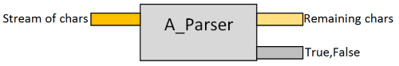

现在让我们测试一下--先用好的输入：

```
let inputABC = "ABC"
A_Parser inputABC 
```

结果是：

```
(true, "BC") 
```

如您所见，`A`已被消耗，剩余输入只是`"BC"`。

现在我们来看看错误的输入：

```
let inputZBC = "ZBC"
A_Parser inputZBC 
```

这给出了结果：

```
(false, "ZBC") 
```

而在这种情况下，第一个字符*没有*被消耗，剩余输入仍然是`"ZBC"`。

所以，这就是一个非常简单的解析器。如果你理解了这一点，那么接下来的一切都将变得容易！

* * *

## 实现 2. 解析指定字符

让我们重构一下，以便我们可以传入我们想要匹配的字符，而不是将其硬编码。

而这一次，我们将不再返回真或假，而是返回一个指示发生了什么的消息。

我们将称这个函数为`pchar`，表示“解析字符”。代码如下：

```
let pchar (charToMatch,str) =
    if String.IsNullOrEmpty(str) then
        let msg = "No more input"
        (msg,"")
    else 
        let first = str.[0] 
        if first = charToMatch then
            let remaining = str.[1..]
            let msg = sprintf "Found %c" charToMatch
            (msg,remaining)
        else
            let msg = sprintf "Expecting '%c'. Got '%c'" charToMatch first
            (msg,str) 
```

这段代码与前一个示例完全相同，只是现在错误消息中显示了意外的字符。

`pchar`的签名是：

```
val pchar :
    (char * string) -> (string * string) 
```

这告诉我们输入是一对（字符串，要匹配的字符），输出是由（字符串）结果和另一个字符串（剩余输入）组成的对。

现在让我们测试一下--先用好的输入：

```
let inputABC = "ABC"
pchar('A',inputABC) 
```

结果是：

```
("Found A", "BC") 
```

与以前一样，`A`已被消耗，剩余输入只是`"BC"`。

现在我们来看看错误的输入：

```
let inputZBC = "ZBC"
pchar('A',inputZBC) 
```

这给出了结果：

```
("Expecting 'A'. Got 'Z'", "ZBC") 
```

同样，和以前一样，第一个字符*没有*被消耗，剩余输入仍然是`"ZBC"`。

如果我们传入`Z`，那么解析器就会成功：

```
pchar('Z',inputZBC)  // ("Found Z", "BC") 
```

* * *

## 实现 3. 返回成功/失败

我们希望能够区分成功的匹配和失败，并返回一个字符串类型的消息并不是很有帮助，所以让我们定义一个特殊的“选择”类型来指示区别。我将其称为`Result`：

```
type Result<'a> =
    | Success of 'a
    | Failure of string 
```

`Success`情况是通用的，可以包含任何值。`Failure`情况包含错误消息。

*注意：有关使用这种成功/失败方法的更多信息，请参见我的关于[函数式错误处理](http://fsharpforfunandprofit.com/rop/)的演讲*。

现在我们可以重写解析器以返回`Result`之一的情况，像这样：

```
let pchar (charToMatch,str) =
    if String.IsNullOrEmpty(str) then
        Failure "No more input"
    else
        let first = str.[0] 
        if first = charToMatch then
            let remaining = str.[1..]
            Success (charToMatch,remaining)
        else
            let msg = sprintf "Expecting '%c'. Got '%c'" charToMatch first
            Failure msg 
```

现在`pchar`的签名是：

```
val pchar :
    (char * string) -> Result<char * string> 
```

这告诉我们输出现在是一个`Result`（在`Success`情况下，包含匹配的字符和剩余输入字符串）。

让我们再次测试一下--先用好的输入：

```
let inputABC = "ABC"
pchar('A',inputABC) 
```

结果是：

```
Success ('A', "BC") 
```

如前所述，`A`已经被消耗掉，剩下的输入只是`"BC"`。我们还得到了*实际*匹配的字符（在这种情况下为`A`）。

现在来看一下坏输入：

```
let inputZBC = "ZBC"
pchar('A',inputZBC) 
```

这会得到结果：

```
Failure "Expecting 'A'. Got 'Z'" 
```

而在这种情况下，`Failure`情况将返回适当的错误消息。

这是函数的输入和输出的图示：

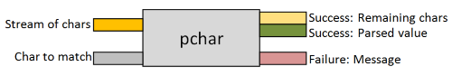

* * *

## 实现 4\. 切换到柯里化实现

在之前的实现中，函数的输入是一个元组-- 一对。这要求你一次性传递两个输入。

在像 F#这样的函数式语言中，使用柯里化版本更加符合惯用法，像这样：

```
let pchar charToMatch str = 
    if String.IsNullOrEmpty(str) then
        Failure "No more input"
    else
        let first = str.[0] 
        if first = charToMatch then
            let remaining = str.[1..]
            Success (charToMatch,remaining)
        else
            let msg = sprintf "Expecting '%c'. Got '%c'" charToMatch first
            Failure msg 
```

你能看到区别吗？唯一的区别在于第一行，即使是那样也是微妙的。

这是未柯里化（元组）版本：

```
let pchar (charToMatch,str) =
    ... 
```

这是柯里化版本的：

```
let pchar charToMatch str = 
    ... 
```

当你查看类型签名时，差异就更加明显了。这是未柯里化（元组）版本的签名：

```
val pchar :
    (char * string) -> Result<char * string> 
```

这是柯里化版本的签名：

```
val pchar :
    char -> string -> Result<char * string> 
```

这里是`pchar`的柯里化版本的图示：

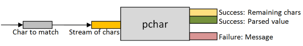

### 什么是柯里化？

如果你不清楚柯里化的工作原理，我有一篇关于它的文章在这里，但基本上它意味着一个多参数函数可以被写成一系列的单参数函数。

换句话说，这个两参数函数：

```
let add x y = 
    x + y 
```

可以被写成一个返回 lambda 的单参数函数，就像这样：

```
let add x = 
    fun y -> x + y  // return a lambda 
```

或者作为返回内部函数的函数，就像这样：

```
let add x = 
    let innerFn y = x + y
    innerFn // return innerFn 
```

### 使用内部函数重写

我们可以利用柯里化并将解析器重写为一个单参数函数（参数是`charToMatch`），它返回一个内部函数。

这是新的实现，内部函数巧妙地命名为`innerFn`：

```
let pchar charToMatch = 
    // define a nested inner function
    let innerFn str =
        if String.IsNullOrEmpty(str) then
            Failure "No more input"
        else
            let first = str.[0] 
            if first = charToMatch then
                let remaining = str.[1..]
                Success (charToMatch,remaining)
            else
                let msg = sprintf "Expecting '%c'. Got '%c'" charToMatch first
                Failure msg
    // return the inner function
    innerFn 
```

这个实现的类型签名看起来像这样：

```
val pchar :
    char -> string -> Result<char * string> 
```

它和之前的版本*完全相同*！

也就是说，上述两种实现在实践中是相同的：

```
// two-parameter implementation
let pchar charToMatch str = 
    ...

// one-parameter implementation with inner function
let pchar charToMatch = 
    let innerFn str =
        ...    
    // return the inner function
    innerFn 
```

### 柯里化实现的好处

柯里化实现的好处在于，我们可以部分应用我们想要解析的字符，就像这样：

```
let parseA = pchar 'A' 
```

然后稍后提供第二个“输入流”参数：

```
let inputABC = "ABC"
parseA inputABC  // Success ('A', "BC")

let inputZBC = "ZBC"
parseA inputZBC  // Failure "Expecting 'A'. Got 'Z'" 
```

在这一点上，让我们停下来复习一下发生了什么：

+   `pchar`函数有两个输入

+   我们可以提供一个输入（要匹配的字符），这会导致返回一个*函数*。

+   然后我们可以向这个解析函数提供第二个输入（字符流），这样就创建了最终的`Result`值。

这是`pchar`的图示，但这次重点放在部分应用上：

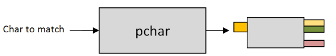

在继续之前，你很重要地了解这个逻辑，因为后续的文章将建立在这个基本设计之上。

* * *

## 实现 5\. 将解析函数封装在类型中

如果我们看一下`parseA`（来自上面的例子），我们可以看到它有一个函数类型：

```
val parseA : string -> Result<char * string> 
```

那种类型使用起来有点复杂，所以让我们将其封装在一个叫做`Parser`的“包装”类型中，就像这样：

```
type Parser<'T> = Parser of (string -> Result<'T * string>) 
```

通过封装它，我们将从这个设计：


到这个设计：

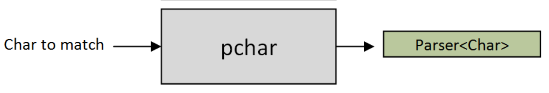

对实现的更改非常简单。我们只需要改变内部函数返回的方式。

也就是，从这里：

```
let pchar charToMatch = 
    let innerFn str =
        ...
    // return the inner function
    innerFn 
```

到这里：

```
let pchar charToMatch = 
    let innerFn str =
        ...
    // return the "wrapped" inner function
    Parser innerFn 
```

### 测试包装函数

好的，现在让我们再次测试：

```
let parseA = pchar 'A' 
let inputABC = "ABC"
parseA inputABC  // compiler error 
```

但现在我们得到一个编译器错误：

```
error FS0003: This value is not a function and cannot be applied 
```

当然，这是因为函数被包装在`Parser`数据结构中！它不再直接可访���。

现在我们需要一个能提取内部函数并对输入流运行的辅助函数。让我们称之为`run`！

这是`run`的实现：

```
let run parser input = 
    // unwrap parser to get inner function
    let (Parser innerFn) = parser 
    // call inner function with input
    innerFn input 
```

现在我们可以再次对各种输入运行`parseA`解析器：

```
let inputABC = "ABC"
run parseA inputABC  // Success ('A', "BC")

let inputZBC = "ZBC"
run parseA inputZBC  // Failure "Expecting 'A'. Got 'Z'" 
```

就是这样！我们有了一个基本的`Parser`类型！希望到目前为止这一切都说得通。

* * *

## 按顺序组合两个解析器：使用“and then”组合子

最后的实现对于基本的解析逻辑已经足够好了。我们稍后会回顾它，但现在让我们提升一个层级，开发一些组合解析器的方法 -- 在开头提到的“解析器组合子”。

我们将从按顺序组合两个解析器开始。例如，假设我们想要一个匹配“A”然后“B”的解析器。我们可以尝试写出类似这样的东西：

```
let parseA = pchar 'A'   
let parseB = pchar 'B'

let parseAThenB = parseA >> parseB 
```

但这会给我们一个编译器错误，因为`parseA`的输出与`parseB`的输入不匹配，所以它们不能这样组合。

如果你熟悉[函数式编程模式](http://fsharpforfunandprofit.com/fppatterns/)，像这样链式地将一系列包装类型组合在一起的需求经常发生，解决方案是一个`bind`函数。

但在这种情况下，我不会实现`bind`，而是直接转向`andThen`的实现。

实现逻辑将如下：

+   运行第一个解析器。

+   如果失败，返回。

+   否则，运行第二个解析器与剩余输入。

+   如果失败，返回。

+   如果两个解析器都成功，返回一个包含两个解析值的对（元组）。

这是`andThen`的代码：

```
let andThen parser1 parser2 =
    let innerFn input =
        // run parser1 with the input
        let result1 = run parser1 input

        // test the result for Failure/Success
        match result1 with
        | Failure err -> 
            // return error from parser1
            Failure err  

        | Success (value1,remaining1) -> 
            // run parser2 with the remaining input
            let result2 =  run parser2 remaining1

            // test the result for Failure/Success
            match result2 with 
            | Failure err ->
                // return error from parser2 
                Failure err 

            | Success (value2,remaining2) -> 
                // combine both values as a pair
                let newValue = (value1,value2)
                // return remaining input after parser2
                Success (newValue,remaining2)

    // return the inner function
    Parser innerFn 
```

实现遵循上面描述的逻辑。

我们还将定义`andThen`的中缀版本，以便我们可以像常规的`>>`组合一样使用它：

```
let ( .>>. ) = andThen 
```

*注意：括号是为了定义自定义运算符而需要的，但在中缀使用时不需要。*

如果我们看`andThen`的签名：

```
val andThen : 
     parser1:Parser<'a> -> parser2:Parser<'b> -> Parser<'a * 'b> 
```

我们可以看到它适用于任何两个解析器，并且它们可以是不同类型（`'a`和`'b`）。

### 测试`andThen`

让我们测试一下，看看它是否有效！

首先，创建复合解析器：

```
let parseA = pchar 'A'   
let parseB = pchar 'B'
let parseAThenB = parseA .>>. parseB 
```

如果你看类型，你会发现所有三个值的类型都是`Parser`：

```
val parseA : Parser<char> 
val parseB : Parser<char> 
val parseAThenB : Parser<char * char> 
```

`parseAThenB`的类型是`Parser<char * char>`，意味着解析值是一对字符。

现在由于组合解析器`parseAThenB`只是另一个`Parser`，我们可以像以前一样使用`run`。

```
run parseAThenB "ABC"  // Success (('A', 'B'), "C")

run parseAThenB "ZBC"  // Failure "Expecting 'A'. Got 'Z'"

run parseAThenB "AZC"  // Failure "Expecting 'B'. Got 'Z'" 
```

你可以看到在成功的情况下，返回了一对`('A', 'B')`，并且当输入中缺少任一字母时会发生失败。

* * *

## 在两个解析器之间进行选择：使用“or else”组合子

让我们看看另一种重要的组合解析器的方式--"or else"组合子。

例如，假设我们想要一个匹配"A" *或* "B"的解析器。我们如何组合它们？

实现逻辑将是：

+   运行第一个解析器。

+   成功时，返回解析的值，以及剩余的输入。

+   否则，在失败时，使用原始输入运行第二个解析器...

+   ...在这种情况下，从第二个解析器返回结果（成功或失败）。

这是`orElse`的代码：

```
let orElse parser1 parser2 =
    let innerFn input =
        // run parser1 with the input
        let result1 = run parser1 input

        // test the result for Failure/Success
        match result1 with
        | Success result -> 
            // if success, return the original result
            result1

        | Failure err -> 
            // if failed, run parser2 with the input
            let result2 = run parser2 input

            // return parser2's result
            result2 

    // return the inner function
    Parser innerFn 
```

我们还将定义`orElse`的中缀版本：

```
let ( <|> ) = orElse 
```

如果我们看一下`orElse`的签名：

```
val orElse : 
    parser1:Parser<'a> -> parser2:Parser<'a> -> Parser<'a> 
```

我们可以看到它适用于任何两个解析器，但它们必须都是*相同*类型`'a`。

### 测试`orElse`

是时候测试了。首先，创建组合解析器：

```
let parseA = pchar 'A'   
let parseB = pchar 'B'
let parseAOrElseB = parseA <|> parseB 
```

如果您查看类型，您会看到所有三个值都具有类型`Parser<char>`：

```
val parseA : Parser<char> 
val parseB : Parser<char> 
val parseAOrElseB : Parser<char> 
```

现在如果我们运行`parseAOrElseB`，我们可以看到它成功处理了作为第一个字符的"A"或"B"。

```
run parseAOrElseB "AZZ"  // Success ('A', "ZZ")

run parseAOrElseB "BZZ"  // Success ('B', "ZZ")

run parseAOrElseB "CZZ"  // Failure "Expecting 'B'. Got 'C'" 
```

### 结合`andThen`和`orElse`

有了这两个基本的组合子，我们可以构建更复杂的组合子，比如"A 然后(B 或 C)"。

这是如何从更简单的解析器构建`aAndThenBorC`的代码：

```
let parseA = pchar 'A'   
let parseB = pchar 'B'
let parseC = pchar 'C'
let bOrElseC = parseB <|> parseC
let aAndThenBorC = parseA .>>. bOrElseC 
```

这里是它的实际效果：

```
run aAndThenBorC "ABZ"  // Success (('A', 'B'), "Z")
run aAndThenBorC "ACZ"  // Success (('A', 'C'), "Z")
run aAndThenBorC "QBZ"  // Failure "Expecting 'A'. Got 'Q'"
run aAndThenBorC "AQZ"  // Failure "Expecting 'C'. Got 'Q'" 
```

请注意，最后一个示例给出了一个误导性的错误。它说"期望'C'"，而实际上应该说"期望'B'或'C'"。我们现在不打算修复这个问题，但在以后的帖子中，我们将实现更好的错误消息。

* * *

## 从解析器列表中选择："choice"和"anyOf"

这就是组合子的威力开始发挥作用的地方，因为有了`orElse`在我们的工具箱中，我们可以使用它来构建更多的组合子。

例如，假设我们想要从解析器*列表*中选择，而不仅仅是两个。

好了，这很容易。如果我们有一种成���组合事物的方法，我们可以通过使用`reduce`来将整个列表组合起来（有关使用`reduce`的更多信息，请参阅关于幺半群的这篇文章）。

```
/// Choose any of a list of parsers
let choice listOfParsers = 
    List.reduce ( <|> ) listOfParsers 
```

*请注意，如果输入列表为空，这将失败，但我们现在将忽略这一点。*

`choice`的签名是：

```
val choice :
    Parser<'a> list -> Parser<'a> 
```

这表明，正如预期的那样，输入是解析器列表，输出是单个解析器。

有了`choice`可用，我们可以创建一个`anyOf`解析器，它匹配列表中的任何字符，使用以下逻辑：

+   输入是一个字符列表

+   列表中的每个字符都使用`pchar`转换为该字符的解析器

+   最后，所有解析器都使用`choice`组合

这是代码：

```
/// Choose any of a list of characters
let anyOf listOfChars = 
    listOfChars
    |> List.map pchar // convert into parsers
    |> choice 
```

让我们通过创建一个匹配任何小写字符和任何数字字符的解析器来测试它：

```
let parseLowercase = 
    anyOf ['a'..'z']

let parseDigit = 
    anyOf ['0'..'9'] 
```

如果我们测试它们，它们会按预期工作：

```
run parseLowercase "aBC"  // Success ('a', "BC")
run parseLowercase "ABC"  // Failure "Expecting 'z'. Got 'A'"

run parseDigit "1ABC"  // Success ("1", "ABC")
run parseDigit "9ABC"  // Success ("9", "ABC")
run parseDigit "|ABC"  // Failure "Expecting '9'. Got '|'" 
```

再次，错误消息是误导性的。可以期望任何小写字母，而不仅仅是'z'，可以期望任何数字，而不仅仅是'9'。正如我之前所说，我们将在以后的帖子中处理错误消息。

## 回顾

现在停下来，回顾一下我们所做的：

+   我们创建了一个名为`Parser`的类型，它是解析函数的包装器。

+   解析函数接受一个输入（例如字符串）并尝试使用嵌入到函数中的标准进行匹配。

+   如果匹配成功，解析函数将返回一个带有匹配项和剩余输入的 `Success`。

+   如果匹配失败，则解析函数返回一个带有失败原因的 `Failure`。

+   最后，我们看到了一些“组合子”——可以将 `Parser` 组合以创建新的 `Parser` 的方式：`andThen` 和 `orElse` 和 `choice`。

## 到目前为止解析器库的列表

到目前为止，这是解析库的完整列表——大约是 90 行代码。

*下面显示的源代码也可以在 [此代码片段](https://gist.github.com/swlaschin/cb42417079ae2c5f99db#file-parserlibrary_v1-fsx) 上找到。*

```
open System

/// Type that represents Success/Failure in parsing
type Result<'a> =
    | Success of 'a
    | Failure of string 

/// Type that wraps a parsing function
type Parser<'T> = Parser of (string -> Result<'T * string>)

/// Parse a single character
let pchar charToMatch = 
    // define a nested inner function
    let innerFn str =
        if String.IsNullOrEmpty(str) then
            Failure "No more input"
        else
            let first = str.[0] 
            if first = charToMatch then
                let remaining = str.[1..]
                Success (charToMatch,remaining)
            else
                let msg = sprintf "Expecting '%c'. Got '%c'" charToMatch first
                Failure msg
    // return the "wrapped" inner function
    Parser innerFn 

/// Run a parser with some input
let run parser input = 
    // unwrap parser to get inner function
    let (Parser innerFn) = parser 
    // call inner function with input
    innerFn input

/// Combine two parsers as "A andThen B"
let andThen parser1 parser2 =
    let innerFn input =
        // run parser1 with the input
        let result1 = run parser1 input

        // test the result for Failure/Success
        match result1 with
        | Failure err -> 
            // return error from parser1
            Failure err  

        | Success (value1,remaining1) -> 
            // run parser2 with the remaining input
            let result2 =  run parser2 remaining1

            // test the result for Failure/Success
            match result2 with 
            | Failure err ->
                // return error from parser2 
                Failure err 

            | Success (value2,remaining2) -> 
                // combine both values as a pair
                let newValue = (value1,value2)
                // return remaining input after parser2
                Success (newValue,remaining2)

    // return the inner function
    Parser innerFn 

/// Infix version of andThen
let ( .>>. ) = andThen

/// Combine two parsers as "A orElse B"
let orElse parser1 parser2 =
    let innerFn input =
        // run parser1 with the input
        let result1 = run parser1 input

        // test the result for Failure/Success
        match result1 with
        | Success result -> 
            // if success, return the original result
            result1

        | Failure err -> 
            // if failed, run parser2 with the input
            let result2 = run parser2 input

            // return parser2's result
            result2 

    // return the inner function
    Parser innerFn 

/// Infix version of orElse
let ( <|> ) = orElse

/// Choose any of a list of parsers
let choice listOfParsers = 
    List.reduce ( <|> ) listOfParsers 

/// Choose any of a list of characters
let anyOf listOfChars = 
    listOfChars
    |> List.map pchar // convert into parsers
    |> choice 
```

## 摘要

在这篇文章中，我们创建了解析库的基础，以及一些简单的组合子。

在下一篇文章中，我们将在此基础上创建一个具有更多组合子的库。

*本文的源代码可以在 [此代码片段](https://gist.github.com/swlaschin/cb42417079ae2c5f99db#file-understanding_parser_combinators-fsx) 上找到。*

## 进一步信息

+   如果您有兴趣将此技术用于生产，请务必研究适用于 F# 的 [FParsec 库](http://www.quanttec.com/fparsec/)，该库针对实际应用进行了优化。

+   有关解析器组合子的更多信息，请搜索互联网上的“Parsec”，这个 Haskell 库影响了 FParsec（以及本文）。

+   若要查看 FParsec 的使用示例，请尝试以下文章之一：

    +   [为 FogCreek 的 Kiln 实现短语搜索查询](http://blog.fogcreek.com/fparsec/)

    +   [一个 LOGO 解析器](http://trelford.com/blog/post/FParsec.aspx)

    +   [一个 Small Basic 解析器](http://trelford.com/blog/post/parser.aspx)

    +   [一个 C# 解析器](http://trelford.com/blog/post/parsecsharp.aspx) 和 [用 F# 构建一个 C# 编译器](https://neildanson.wordpress.com/2014/02/11/building-a-c-compiler-in-f/)

    +   [48 小时内用 F# 写一个 Scheme](https://lucabolognese.wordpress.com/2011/08/05/write-yourself-a-scheme-in-48-hours-in-f-part-vi/)

    +   [解析 OpenGL 的着色语言 GLSL](http://laurent.le-brun.eu/site/index.php/2010/06/07/54-fsharp-and-fparsec-a-glsl-parser-example)

# 构建一个有用的解析器组合子集

# 构建一个有用的解析器组合子集

*更新：[关于这个话题的幻灯片和视频](http://fsharpforfunandprofit.com/parser/)*

在本系列中，我们将研究适用式解析器和解析器组合子的工作原理。

+   在第一篇文章中，我们创建了一个解析库的基础。

+   在本文中，我们将用许多其他有用的组合子扩展库。 组合子的名称将从 [FParsec](http://www.quanttec.com/fparsec/) 中使用的名称复制过来，以便您可以轻松迁移到它。

* * *

## 1\. `map` —— 转换解析器的内容

在解析时，我们经常需要匹配特定的字符串，比如保留字如"if"或"where"。一个字符串只是一系列字符，所以我们肯定可以使用与我们在第一篇文章中定义`anyOf`时相同的技术，但使用`andThen`而不是`orElse`吗？

这是一个（失败的）尝试，使用该方法创建一个`pstring`解析器：

```
let pstring str = 
    str
    |> Seq.map pchar // convert into parsers
    |> Seq.reduce andThen 
```

这行不通，因为`andThen`的输出与输入不同（是一个元组，而不是一个字符），所以`reduce`方法失败了。

为了解决这个问题，我们需要使用一种不同的技术。

要开始，让我们尝试匹配一个特定长度的字符串。比如说，我们想匹配连续的三个数字。好吧，我们可以使用`andThen`来做到这一点：

```
let parseDigit =
    anyOf ['0'..'9']

let parseThreeDigits = 
    parseDigit .>>. parseDigit .>>. parseDigit 
```

如果我们像这样运行它：

```
run parseThreeDigits "123A" 
```

然后我们得到了结果：

```
Success ((('1', '2'), '3'), "A") 
```

它确实有效，但结果包含一个元组嵌套在另一个元组中`(('1', '2'), '3')`，这样做很丑陋，也很难使用。只要有一个简单的字符串(`"123"`)就方便多了。

但是为了将`('1', '2'), '3')`转换为`"123"`，我们需要一个函数，它可以进入解析器并使用任意传入的函数来转换结果。

当然，我们需要的是函数式编程员最好的朋友，`map`。

要理解`map`和类似的函数，我喜欢想象有两个世界：一个是“正常世界”，其中存放着常规的事物，另一个是“解析器世界”，其中存放着`Parser`。

你可以将解析器世界看作是正常世界的一种“镜像”，因为它遵循以下规则：

+   正常世界中的每种类型（比如`char`）都有对应的解析器世界中的类型（`Parser<char>`）。

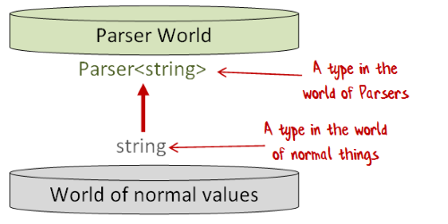

并且：

+   正常世界中的每个值（比如`"ABC"`）都有一个对应的值在解析器世界中（也就是说，某个返回`"ABC"`的`Parser<string>`）。

并且：

+   正常世界中的每个函数（比如`char -> string`）都有对应的解析器世界中的函数（`Parser<char> -> Parser<string>`）。

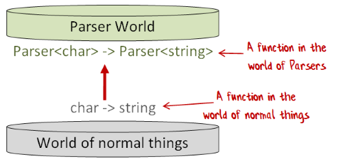

使用这个比喻，`map`将正常世界中的函数转换（或“提升”）到解析器世界中的函数。

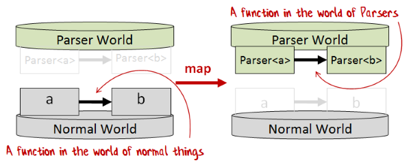

*顺便说一下，如果你喜欢这个比喻，我有一系列进一步发展它的帖子。*

那么`map`的作用是什么呢？我们如何实现它？

逻辑是：

+   在`innerFn`内部，运行解析器以获得结果。

+   如果结果成功了，将指定的函数应用于成功值，以获得一个新的、转换过的值，并且……

+   …返回新的映射值而不是原始值。

这是代码（我将 map 函数命名为`mapP`以避免与其他 map 函数混淆）：

```
let mapP f parser = 
    let innerFn input =
        // run parser with the input
        let result = run parser input

        // test the result for Failure/Success
        match result with
        | Success (value,remaining) -> 
            // if success, return the value transformed by f
            let newValue = f value
            Success (newValue, remaining)

        | Failure err -> 
            // if failed, return the error
            Failure err
    // return the inner function
    Parser innerFn 
```

如果我们看一下`mapP`的签名：

```
val mapP : 
    f:('a -> 'b) -> Parser<'a> -> Parser<'b> 
```

我们可以看到它正好具有我们想要的签名，将一个函数`'a -> 'b`转换为一个函数`Parser<'a> -> Parser<'b>`。

通常也会定义`map`的中缀版本：

```
let ( <!> ) = mapP 
```

而在解析的上下文中，我们经常希望将映射函数放在解析器之后，并翻转参数的顺序。这样使用管道习惯用法与 `map` 更加方便：

```
let ( |>> ) x f = mapP f x 
```

### 使用 `mapP` 解析三个数字

有了 `mapP`，我们可以重新审视 `parseThreeDigits` 并将元组转换为字符串。

这是代码：

```
let parseDigit = anyOf ['0'..'9']

let parseThreeDigitsAsStr = 
    // create a parser that returns a tuple
    let tupleParser = 
        parseDigit .>>. parseDigit .>>. parseDigit

    // create a function that turns the tuple into a string
    let transformTuple ((c1, c2), c3) = 
        String [| c1; c2; c3 |]

    // use "map" to combine them
    mapP transformTuple tupleParser 
```

或者，如果你更喜欢更简洁的实现：

```
let parseThreeDigitsAsStr = 
    (parseDigit .>>. parseDigit .>>. parseDigit)
    |>> fun ((c1, c2), c3) -> String [| c1; c2; c3 |] 
```

如果我们测试它，现在结果会是一个字符串，而不是一个元组：

```
run parseThreeDigitsAsStr "123A"  // Success ("123", "A") 
```

我们可以进一步，将字符串映射为整数：

```
let parseThreeDigitsAsInt = 
    mapP int parseThreeDigitsAsStr 
```

如果我们测试这个，我们将在成功分支中得到一个 `int`。

```
run parseThreeDigitsAsInt "123A"  // Success (123, "A") 
```

让我们检查一下 `parseThreeDigitsAsInt` 的类型：

```
val parseThreeDigitsAsInt : Parser<int> 
```

现在它是 `Parser<int>`，不再是 `Parser<char>` 或 `Parser<string>`。`Parser` 可以包含*任何*类型，而不仅仅是 char 或 string，这一事实是一个重要特性，当我们需要构建更复杂的解析器时将会非常有价值。

## 2\. `apply` 和 `return` -- 将函数提升到解析器的世界

为了实现我们的目标，创建一个匹配字符列表的解析器，我们需要另外两个帮助函数，我将它们称为 `returnP` 和 `applyP`。

+   `returnP` 简单地将一个普通值转换为解析器世界中的值

+   `applyP` 将包含函数的解析器（`Parser< 'a->'b >`）转换为解析器世界中的函数（`Parser<'a> -> Parser<'b >`）

这是 `returnP` 的图示：

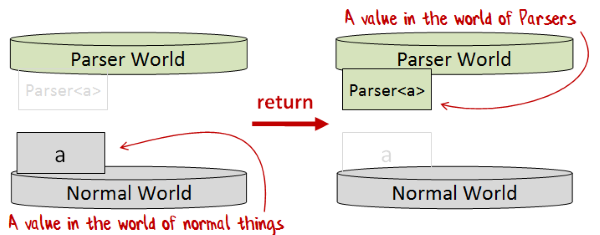

这是 `returnP` 的实现：

```
let returnP x = 
    let innerFn input =
        // ignore the input and return x
        Success (x,input )
    // return the inner function
    Parser innerFn 
```

`returnP` 的签名正是我们所需的：

```
val returnP : 
    'a -> Parser<'a> 
```

现在这是 `applyP` 的图示：

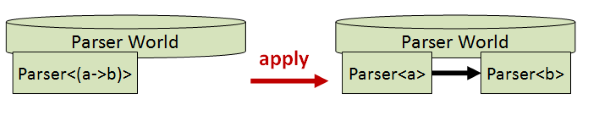

这是 `applyP` 的实现，它使用 `.>>.` 和 `map`：

```
let applyP fP xP = 
    // create a Parser containing a pair (f,x)
    (fP .>>. xP) 
    // map the pair by applying f to x
    |> mapP (fun (f,x) -> f x) 
```

`applyP` 的中缀版本被写作 `<*>`：

```
let ( <*> ) = applyP 
```

再次，`applyP` 的签名正是我们所需的：

```
val applyP : 
    Parser<('a -> 'b)> -> Parser<'a> -> Parser<'b> 
```

为什么我们需要这两个函数？嗯，`map` 将普通世界中的函数提升为解析器世界中的函数，但仅适用于单参数函数。

`returnP` 和 `applyP` 的好处在于，它们一起可以将*任何*普通世界中的函数提升为解析器世界中的函数，无论它有多少个参数。

例如，我们现在可以定义一个 `lift2` 函数，它将一个两个参数的函数提升到解析器的世界，像这样：

```
// lift a two parameter function to Parser World
let lift2 f xP yP =
    returnP f <*> xP <*> yP 
```

`lift2` 的签名是：

```
val lift2 : 
    f:('a -> 'b -> 'c) -> Parser<'a> -> Parser<'b> -> Parser<'c> 
```

这是 `lift2` 的图示：

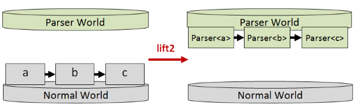

*如果你想了解更多关于这是如何工作的信息，请查看我的关于 `lift2` 的“手册”文章或涉及“Monadster”的解释。*

让我们看看实际中如何使用 `lift2` 的一些例子。首先，将整数加法提升为解析器的加法：

```
let addP = 
    lift2 (+) 
```

签名是：

```
val addP : 
    Parser<int> -> Parser<int> -> Parser<int> 
```

这表明 `addP` 确实接受两个 `Parser<int>` 参数，并返回另一个 `Parser<int>`。

这里是被提升到解析器世界的 `startsWith` 函数：

```
let startsWith (str:string) prefix =
    str.StartsWith(prefix)  

let startsWithP =
    lift2 startsWith 
```

再次，`startsWithP` 的签名与 `startsWith` 的签名类似，但是提升到了解析器的世界。

```
val startsWith : 
    str:string -> prefix:string -> bool

val startsWithP : 
    Parser<string> -> Parser<string> -> Parser<bool> 
```

## 3\. `sequence` -- 将解析器列表转换为单个解析器

我们现在有了实现顺序组合子所需的工具！逻辑将是：

+   从列表“cons”运算符开始。这是一个两参数函数，将“头部”元素添加到“尾部”元素以创建新列表。

+   使用`lift2`将`cons`提升到解析器的世界中。

+   现在我们有一个将`Parser`头部添加到`Parser`尾部列表以创建新的`Parser`列表的函数，其中：

    +   头部解析器是传入的解析器列表中的第一个元素。

    +   尾部通过调用相同的函数递归生成下一个解析器的列表。

+   当输入列表为空时，只返回包含空列表的`Parser`。

这是实现方式：

```
let rec sequence parserList =
    // define the "cons" function, which is a two parameter function
    let cons head tail = head::tail

    // lift it to Parser World
    let consP = lift2 cons

    // process the list of parsers recursively
    match parserList with
    | [] -> 
        returnP []
    | head::tail ->
        consP head (sequence tail) 
```

`sequence`的签名是：

```
val sequence : 
    Parser<'a> list -> Parser<'a list> 
```

这表明输入是`Parser`列表，输出是包含元素列表的`Parser`。

通过创建三个解析器的列表，然后将它们组合成一个来测试一下：

```
let parsers = [ pchar 'A'; pchar 'B'; pchar 'C' ]
let combined = sequence parsers

run combined "ABCD" 
// Success (['A'; 'B'; 'C'], "D") 
```

正如您所看到的，当我们运行它时，我们会得到一个字符列表，每个解析器在原始列表中对应一个。

### 实现`pstring`解析器

最后，我们可以实现匹配字符串的解析器，我们将其称为`pstring`。

逻辑是：

+   将字符串转换为字符列表。

+   将每个字符转换为`Parser<char>`。

+   使用`sequence`将`Parser<char>`列表转换为单个`Parser<char list>`。

+   最后，使用`map`将`Parser<char list>`转换为`Parser<string>`。

这是代码：

```
/// Helper to create a string from a list of chars
let charListToStr charList = 
     String(List.toArray charList)

// match a specific string
let pstring str = 
    str
    // convert to list of char
    |> List.ofSeq
    // map each char to a pchar
    |> List.map pchar 
    // convert to Parser<char list>
    |> sequence
    // convert Parser<char list> to Parser<string>
    |> mapP charListToStr 
```

让我们来测试一下：

```
let parseABC = pstring "ABC"

run parseABC "ABCDE"  // Success ("ABC", "DE")
run parseABC "A|CDE"  // Failure "Expecting 'B'. Got '|'"
run parseABC "AB|DE"  // Failure "Expecting 'C'. Got '|'" 
```

它按预期运行。呼！

## 4\. `many`和`many1` -- 匹配多次解析器

另一个常见的需求是尽可能多地匹配特定的解析器。例如：

+   当匹配整数时，您希望尽可能多地匹配数字字符。

+   当匹配一系列空格时，您希望尽可能多地匹配空格字符。

这两种情况有略微不同的要求。

+   当匹配空白字符时，通常是可选的，因此我们需要一个“零个或多个”匹配器，我们将其称为`many`。

+   另一方面，当匹配整数的数字时，您希望至少匹配*一个*数字，因此我们需要一个“一个或多个”匹配器，我们将其称为`many1`。

在创建这些之前，我们将定义一个帮助函数，该函数匹配零次或多次解析器。逻辑是：

+   运行解析器。

+   如果解析器返回`Failure`（这很关键），只返回空列表。也就是说，这个函数永远不会失败！

+   如果解析器成功：

    +   递归调用函数以获取剩余值（也可能是空列表）。

    +   然后将第一个值和剩余值组合起来。

这是代码：

```
let rec parseZeroOrMore parser input =
    // run parser with the input
    let firstResult = run parser input 
    // test the result for Failure/Success
    match firstResult with
    | Failure err -> 
        // if parse fails, return empty list
        ([],input)  
    | Success (firstValue,inputAfterFirstParse) -> 
        // if parse succeeds, call recursively
        // to get the subsequent values
        let (subsequentValues,remainingInput) = 
            parseZeroOrMore parser inputAfterFirstParse
        let values = firstValue::subsequentValues
        (values,remainingInput) 
```

有了这个辅助函数，我们现在可以轻松定义`many`了--它只是对`parseZeroOrMore`的包装：

```
/// match zero or more occurences of the specified parser
let many parser = 

    let rec innerFn input =
        // parse the input -- wrap in Success as it always succeeds
        Success (parseZeroOrMore parser input)

    Parser innerFn 
```

`many`的签名表明，输出确实是包含在`Parser`中的值列表：

```
val many : 
    Parser<'a> -> Parser<'a list> 
```

现在让我们来测试一下`many`：

```
let manyA = many (pchar 'A')

// test some success cases
run manyA "ABCD"  // Success (['A'], "BCD")
run manyA "AACD"  // Success (['A'; 'A'], "CD")
run manyA "AAAD"  // Success (['A'; 'A'; 'A'], "D")

// test a case with no matches
run manyA "|BCD"  // Success ([], "|BCD") 
```

请注意，在最后一种情况下，即使没有要匹配的内容，函数也会成功。

`many`并没有限制其仅适用于单个字符。例如，我们也可以使用它来匹配重复的字符串序列：

```
let manyAB = many (pstring "AB")

run manyAB "ABCD"  // Success (["AB"], "CD")
run manyAB "ABABCD"  // Success (["AB"; "AB"], "CD")
run manyAB "ZCD"  // Success ([], "ZCD")
run manyAB "AZCD"  // Success ([], "AZCD") 
```

最后，让我们实现原始的匹配空格的示例：

```
let whitespaceChar = anyOf [' '; '\t'; '\n']
let whitespace = many whitespaceChar 

run whitespace "ABC"  // Success ([], "ABC")
run whitespace " ABC"  // Success ([' '], "ABC")
run whitespace "\tABC"  // Success (['\t'], "ABC") 
```

### 定义`many1`

我们还可以定义"一次或多次"组合器`many1`，使用以下逻辑：

+   运行解析器。

+   如果失败，则返回失败。

+   如果成功：

    +   调用辅助函数`parseZeroOrMore`以获取剩余的值。

    +   然后将第一个值和剩余的值组合起来。

```
/// match one or more occurences of the specified parser
let many1 parser = 
    let rec innerFn input =
        // run parser with the input
        let firstResult = run parser input 
        // test the result for Failure/Success
        match firstResult with
        | Failure err -> 
            Failure err // failed
        | Success (firstValue,inputAfterFirstParse) -> 
            // if first found, look for zeroOrMore now
            let (subsequentValues,remainingInput) = 
                parseZeroOrMore parser inputAfterFirstParse
            let values = firstValue::subsequentValues
            Success (values,remainingInput)  
    Parser innerFn 
```

再次，`many1`的签名表明输出确实是包装在`Parser`中的值列表：

```
val many1 : 
    Parser<'a> -> Parser<'a list> 
```

现在让我们测试`many1`：

```
// define parser for one digit
let digit = anyOf ['0'..'9']

// define parser for one or more digits
let digits = many1 digit 

run digits "1ABC"  // Success (['1'], "ABC")
run digits "12BC"  // Success (['1'; '2'], "BC")
run digits "123C"  // Success (['1'; '2'; '3'], "C")
run digits "1234"  // Success (['1'; '2'; '3'; '4'], "")

run digits "ABC"   // Failure "Expecting '9'. Got 'A'" 
```

正如我们在前面的例子中看到的，最后一种情况会产生误导性的错误。它说"期望'9'"，但实际上应该说"期望一个数字"。在下一篇文章中，我们将修复这个问题。

### 解析整数

使用`many1`，我们可以创建一个整数的解析器。实现逻辑是：

+   创建一个数字的解析器。

+   使用`many1`来获取数字列表。

+   使用`map`，将结果（数字列表）转换为字符串，然后转换为整数。

这是代码：

```
let pint = 
    // helper
    let resultToInt digitList = 
        // ignore int overflow for now
        String(List.toArray digitList) |> int

    // define parser for one digit
    let digit = anyOf ['0'..'9']

    // define parser for one or more digits
    let digits = many1 digit 

    // map the digits to an int
    digits 
    |> mapP resultToInt 
```

现在让我们测试它：

```
run pint "1ABC"  // Success (1, "ABC")
run pint "12BC"  // Success (12, "BC")
run pint "123C"  // Success (123, "C")
run pint "1234"  // Success (1234, "")

run pint "ABC"   // Failure "Expecting '9'. Got 'A'" 
```

## 5\. `opt` -- 匹配解析器零次或一次

有时我们只想匹配解析器零次或一次。例如，上面的`pint`解析器不处理负值。为了纠正这一点，我们需要能够处理可选的减号。

我们可以轻松定义一个`opt`组合器：

+   将指定解析器的结果更改为选项，将结果映射到`Some`。

+   创建另一个总是返回`None`的解析器。

+   使用`<|>`如果第一个失败，则选择第二个（"None"）解析器。

这是代码：

```
let opt p = 
    let some = p |>> Some
    let none = returnP None
    some <|> none 
```

这是一个使用示例--我们匹配一个数字，后面跟一个可选的分号：

```
let digit = anyOf ['0'..'9']
let digitThenSemicolon = digit .>>. opt (pchar ';')

run digitThenSemicolon "1;"  // Success (('1', Some ';'), "")
run digitThenSemicolon "1"   // Success (('1', None), "") 
```

这是`pint`重新编写以处理可选减号的方式：

```
let pint = 
    // helper
    let resultToInt (sign,charList) = 
        let i = String(List.toArray charList) |> int
        match sign with
        | Some ch -> -i  // negate the int
        | None -> i

    // define parser for one digit
    let digit = anyOf ['0'..'9']

    // define parser for one or more digits
    let digits = many1 digit 

    // parse and convert
    opt (pchar '-') .>>. digits 
    |>> resultToInt 
```

请注意，`resultToInt`辅助函数现在需要处理符号选项以及数字列表。

这是它的运行结果：

```
run pint "123C"   // Success (123, "C")
run pint "-123C"  // Success (-123, "C") 
```

## 6\. 丢弃结果

我们经常想要在输入中匹配某些内容，但我们不关心解析后的值本身。例如：

+   对于带引号的字符串，我们需要解析引号，但我们不需要引号本身。

+   对于以分号结尾的语句，我们需要确保有分号，但我们不需要分号本身。

+   对于空白分隔符，我们需要确保有空白分隔符，但我们不需要实际的空白数据。

为了处理这些要求，我们将定义一些新的组合器，以丢弃解析器的结果：

+   `p1 >>. p2`将按顺序应用`p1`和`p2`，就像`.>>.`一样，但丢弃`p1`的结果并保留`p2`的结果。

+   `p1 .>> p2`将按顺序应用`p1`和`p2`，就像`.>>.`一样，但保留`p1`的结果并丢弃`p2`的结果。

这些很容易定义--只需映射`.>>.`的结果，这是一个元组，并保留一对的一个元素。

```
/// Keep only the result of the left side parser
let (.>>) p1 p2 = 
    // create a pair
    p1 .>>. p2 
    // then only keep the first value
    |> mapP (fun (a,b) -> a) 

/// Keep only the result of the right side parser 
let (>>.) p1 p2 = 
    // create a pair
    p1 .>>. p2 
    // then only keep the second value
    |> mapP (fun (a,b) -> b) 
```

这些组合器使我们能够简化先前显示的`digitThenSemicolon`示例：

```
let digit = anyOf ['0'..'9']

// use .>> below
let digitThenSemicolon = digit .>> opt (pchar ';')  

run digitThenSemicolon "1;"  // Success ('1', "")
run digitThenSemicolon "1"   // Success ('1', "") 
```

您可以看到，无论分号是否存在，结果现在都是相同的。

带有空格的例子如何？

以下代码创建了一个解析器，查找以 "AB" 开头的字符串，后跟一个或多个空白字符，然后是 "CD"。

```
let whitespaceChar = anyOf [' '; '\t'; '\n']
let whitespace = many1 whitespaceChar 

let ab = pstring "AB"
let cd = pstring "CD"
let ab_cd = (ab .>> whitespace) .>>. cd

run ab_cd "AB \t\nCD"   // Success (("AB", "CD"), "") 
```

结果仅包含 "AB" 和 "CD"。它们之间的空白已被丢弃。

### 引入 `between`

一个特别常见的要求是查找在引号或括号等分隔符之间的解析器。

创建这个组合器是微不足道的：

```
/// Keep only the result of the middle parser
let between p1 p2 p3 = 
    p1 >>. p2 .>> p3 
```

并且它正在使用中，解析带引号的整数：

```
let pdoublequote = pchar '"'
let quotedInteger = between pdoublequote pint pdoublequote

run quotedInteger "\"1234\""   // Success (1234, "")
run quotedInteger "1234"       // Failure "Expecting '"'. Got '1'" 
```

## 7\. 使用分隔符解析列表

另一个常见的要求是解析列表，由逗号或空格之类的东西分隔。

要实现一个“一个或多个”列表，我们需要：

+   首先将分隔符和解析器组合成一个组合解析器，但使用 `>>.` 丢弃分隔符值。

+   接下来，使用 `many` 查找分隔符/解析器组合的列表。

+   然后前缀与第一个解析器，并组合结果。

这是代码：

```
/// Parses one or more occurrences of p separated by sep
let sepBy1 p sep =
    let sepThenP = sep >>. p            
    p .>>. many sepThenP 
    |>> fun (p,pList) -> p::pList 
```

对于“零个或多个”版本，如果 `sepBy1` 找不到任何匹配项，我们可以选择空列表作为备选项：

```
/// Parses zero or more occurrences of p separated by sep
let sepBy p sep =
    sepBy1 p sep <|> returnP [] 
```

这里有一些针对 `sepBy1` 和 `sepBy` 的测试，结果显示在注释中：

```
let comma = pchar ',' 
let digit = anyOf ['0'..'9']

let zeroOrMoreDigitList = sepBy digit comma
let oneOrMoreDigitList = sepBy1 digit comma

run oneOrMoreDigitList "1;"      // Success (['1'], ";")
run oneOrMoreDigitList "1,2;"    // Success (['1'; '2'], ";")
run oneOrMoreDigitList "1,2,3;"  // Success (['1'; '2'; '3'], ";")
run oneOrMoreDigitList "Z;"      // Failure "Expecting '9'. Got 'Z'"

run zeroOrMoreDigitList "1;"     // Success (['1'], ";")
run zeroOrMoreDigitList "1,2;"   // Success (['1'; '2'], ";")
run zeroOrMoreDigitList "1,2,3;" // Success (['1'; '2'; '3'], ";")
run zeroOrMoreDigitList "Z;"     // Success ([], "Z;") 
```

## `bind` 怎么样？

到目前为止我们还没有实现的一个组合器是 `bind`（或 `>>=`）。

如果你了解函数式编程，或者看过我的关于[FP 模式](http://fsharpforfunandprofit.com/fppatterns/)的演讲，你会知道 `bind` 是一个强大的工具，可以用来实现许多函数。

到目前为止，我认为最好显示明确的实现，如 `map` 和 `.>>.` 这样，希望更容易理解。

但现在我们已经有了一些经验，让我们实现 `bind` 看看我们能做些什么。

这是 `bindP`（我将其称为如此）的实现

```
/// "bindP" takes a parser-producing function f, and a parser p
/// and passes the output of p into f, to create a new parser
let bindP f p =
    let innerFn input =
        let result1 = run p input 
        match result1 with
        | Failure err -> 
            // return error from parser1
            Failure err  
        | Success (value1,remainingInput) ->
            // apply f to get a new parser
            let p2 = f value1
            // run parser with remaining input
            run p2 remainingInput
    Parser innerFn 
```

`bindP` 的签名是：

```
val bindP : 
    f:('a -> Parser<'b>) -> Parser<'a> -> Parser<'b> 
```

符合标准绑定签名的是输入 `f` 是一个“对角线”函数（`'a -> Parser<'b>`），输出是一个“水平”函数（`Parser<'a> -> Parser<'b>`）。参见这篇文章了解 `bind` 如何工作的更多细节。

`bind` 的中缀版本是 `>>=`。注意参数已经交换：`f` 现在是第二个参数，这样更方便 F# 的管道习惯用法。

```
let ( >>= ) p f = bindP f p 
```

### 使用 `bindP` 和 `returnP` 重新实现其他组合器

`bindP` 和 `returnP` 的组合可用于重新实现许多其他组合器。以下是一些示例：

```
let mapP f =         
    bindP (f >> returnP)

let andThen p1 p2 =         
    p1 >>= (fun p1Result -> 
    p2 >>= (fun p2Result -> 
        returnP (p1Result,p2Result) ))

let applyP fP xP =         
    fP >>= (fun f -> 
    xP >>= (fun x -> 
        returnP (f x) ))

// (assuming "many" is defined)

let many1 p =         
    p      >>= (fun head -> 
    many p >>= (fun tail -> 
        returnP (head::tail) )) 
```

注意，检查 `Failure` 路径的组合器不能使用 `bind` 实现。这些包括 `orElse` 和 `many`。

## 回顾

我们可以不停地构建组合器，但我认为现在我们已经拥有构建 JSON 解析器所需的一切了，所以让我们停下来，回顾一下我们所做的。

在之前的文章中，我们创建了这些组合器：

+   `.>>.`（`andThen`）按顺序应用两个解析器，并将结果作为元组返回。

+   `<|>`（`orElse`）应用第一个解析器，如果失败，则使用第二个解析器。

+   `choice` 扩展了 `orElse`，从一系列解析器中进行选择。

在本文中，我们创建了以下其他组合器：

+   `bindP`将解析器的结果链到另一个生成解析器的函数。

+   `mapP`转换解析器的结果。

+   `returnP`将普通值提升到解析器的世界中。

+   `applyP`允许我们将多参数函数提升为适用于解析器的函数。

+   `lift2`使用`applyP`将两个参数的函数提升为解析器世界。

+   `sequence`将解析器列表转换为包含列表的解析器。

+   `many`匹配指定解析器的零个或多个出现。

+   `many1`匹配指定解析器的一个或多个出现。

+   `opt`匹配指定解析器的可选出现。

+   `.>>`仅保留左侧解析器的结果。

+   `>>.`仅保留右侧解析器的结果。

+   `between`仅保留中间解析器的结果。

+   `sepBy`解析零个或多个带有分隔符的解析器。

+   `sepBy1`解析一个或多个带有分隔符的解析器。

希望你能看出“组合子”概念为何如此强大；仅仅给出几个基本函数，我们就能迅速而简洁地构建一个有用的函数库。

## 到目前为止，解析器库的清单

到目前为止，这是解析库的完整清单 -- 现在大约有 200 行代码！

*下面显示的源代码也可在[此要点](https://gist.github.com/swlaschin/a3dbb114a9ee95b2e30d#file-parserlibrary_v2-fsx)处获得。*

```
open System

/// Type that represents Success/Failure in parsing
type Result<'a> =
    | Success of 'a
    | Failure of string 

/// Type that wraps a parsing function
type Parser<'T> = Parser of (string -> Result<'T * string>)

/// Parse a single character
let pchar charToMatch = 
    // define a nested inner function
    let innerFn str =
        if String.IsNullOrEmpty(str) then
            Failure "No more input"
        else
            let first = str.[0] 
            if first = charToMatch then
                let remaining = str.[1..]
                Success (charToMatch,remaining)
            else
                let msg = sprintf "Expecting '%c'. Got '%c'" charToMatch first
                Failure msg
    // return the "wrapped" inner function
    Parser innerFn 

/// Run a parser with some input
let run parser input = 
    // unwrap parser to get inner function
    let (Parser innerFn) = parser 
    // call inner function with input
    innerFn input

/// "bindP" takes a parser-producing function f, and a parser p
/// and passes the output of p into f, to create a new parser
let bindP f p =
    let innerFn input =
        let result1 = run p input 
        match result1 with
        | Failure err -> 
            // return error from parser1
            Failure err  
        | Success (value1,remainingInput) ->
            // apply f to get a new parser
            let p2 = f value1
            // run parser with remaining input
            run p2 remainingInput
    Parser innerFn 

/// Infix version of bindP
let ( >>= ) p f = bindP f p

/// Lift a value to a Parser
let returnP x = 
    let innerFn input =
        // ignore the input and return x
        Success (x,input)
    // return the inner function
    Parser innerFn 

/// apply a function to the value inside a parser
let mapP f = 
    bindP (f >> returnP)

/// infix version of mapP
let ( <!> ) = mapP

/// "piping" version of mapP
let ( |>> ) x f = mapP f x

/// apply a wrapped function to a wrapped value
let applyP fP xP =         
    fP >>= (fun f -> 
    xP >>= (fun x -> 
        returnP (f x) ))

/// infix version of apply
let ( <*> ) = applyP

/// lift a two parameter function to Parser World
let lift2 f xP yP =
    returnP f <*> xP <*> yP

/// Combine two parsers as "A andThen B"
let andThen p1 p2 =         
    p1 >>= (fun p1Result -> 
    p2 >>= (fun p2Result -> 
        returnP (p1Result,p2Result) ))

/// Infix version of andThen
let ( .>>. ) = andThen

/// Combine two parsers as "A orElse B"
let orElse p1 p2 =
    let innerFn input =
        // run parser1 with the input
        let result1 = run p1 input

        // test the result for Failure/Success
        match result1 with
        | Success result -> 
            // if success, return the original result
            result1

        | Failure err -> 
            // if failed, run parser2 with the input
            let result2 = run p2 input

            // return parser2's result
            result2 

    // return the inner function
    Parser innerFn 

/// Infix version of orElse
let ( <|> ) = orElse

/// Choose any of a list of parsers
let choice listOfParsers = 
    List.reduce ( <|> ) listOfParsers 

/// Choose any of a list of characters
let anyOf listOfChars = 
    listOfChars
    |> List.map pchar // convert into parsers
    |> choice

/// Convert a list of Parsers into a Parser of a list
let rec sequence parserList =
    // define the "cons" function, which is a two parameter function
    let cons head tail = head::tail

    // lift it to Parser World
    let consP = lift2 cons

    // process the list of parsers recursively
    match parserList with
    | [] -> 
        returnP []
    | head::tail ->
        consP head (sequence tail)

/// (helper) match zero or more occurences of the specified parser
let rec parseZeroOrMore parser input =
    // run parser with the input
    let firstResult = run parser input 
    // test the result for Failure/Success
    match firstResult with
    | Failure err -> 
        // if parse fails, return empty list
        ([],input)  
    | Success (firstValue,inputAfterFirstParse) -> 
        // if parse succeeds, call recursively
        // to get the subsequent values
        let (subsequentValues,remainingInput) = 
            parseZeroOrMore parser inputAfterFirstParse
        let values = firstValue::subsequentValues
        (values,remainingInput)  

/// matches zero or more occurences of the specified parser
let many parser = 
    let rec innerFn input =
        // parse the input -- wrap in Success as it always succeeds
        Success (parseZeroOrMore parser input)

    Parser innerFn

/// matches one or more occurences of the specified parser
let many1 p =         
    p      >>= (fun head -> 
    many p >>= (fun tail -> 
        returnP (head::tail) ))

/// Parses an optional occurrence of p and returns an option value.
let opt p = 
    let some = p |>> Some
    let none = returnP None
    some <|> none

/// Keep only the result of the left side parser
let (.>>) p1 p2 = 
    // create a pair
    p1 .>>. p2 
    // then only keep the first value
    |> mapP (fun (a,b) -> a) 

/// Keep only the result of the right side parser
let (>>.) p1 p2 = 
    // create a pair
    p1 .>>. p2 
    // then only keep the second value
    |> mapP (fun (a,b) -> b) 

/// Keep only the result of the middle parser
let between p1 p2 p3 = 
    p1 >>. p2 .>> p3 

/// Parses one or more occurrences of p separated by sep
let sepBy1 p sep =
    let sepThenP = sep >>. p            
    p .>>. many sepThenP 
    |>> fun (p,pList) -> p::pList

/// Parses zero or more occurrences of p separated by sep
let sepBy p sep =
    sepBy1 p sep <|> returnP [] 
```

## 总结

在本文中，我们在上次的基本解析代码基础上构建了一个包含大约 15 个组合子的库，可以组合起来解析几乎任何东西。

不久，我们将使用它们构建一个 JSON 解析器，但在那之前，让我们停下来清理错误消息。这将是下一篇文章的主题。

*本文的源代码可在[此要点](https://gist.github.com/swlaschin/a3dbb114a9ee95b2e30d#file-understanding_parser_combinators-2-fsx)处获得。*

# 改进解析器库

# 改进解析器库

*更新：[关于此主题的我的演讲幻灯片和视频](http://fsharpforfunandprofit.com/parser/)*

在本系列中，我们正在探讨应用型解析器和解析器组合子的工作原理。

+   在第一篇文章中，我们创建了一个解析库的基础。

+   在第二篇文章中，我们使用许多其他有用的组合子扩展了该库。

+   在本文中，我们将重新设计该库以提供更有帮助的错误消息。

* * *

## 1. 标记解析器

在早期文章的一些失败代码示例中，我们得到了令人困惑的错误：

```
let parseDigit = anyOf ['0'..'9']
run parseDigit "|ABC"  // Failure "Expecting '9'. Got '|'" 
```

`parseDigit`被定义为数字字符的选择，所以当最后一个选择（`'9'`）失败时，那就是我们收到的错误消息。

但是那个消息相当令人困惑。我们*真正*想要的是收到一条提到“数字”的错误，类似于：`Failure "期望数字。得到 '|' "`。

也就是说，我们需要的是一种将解析器标记为“数字”并在发生失败时显示该标签的方法。

提醒一下，这是之前帖子中如何定义 `Parser` 类型的方式：

```
type Parser<'a> = Parser of (string -> Result<'a * string>) 
```

为了添加一个标签，我们需要将其改为记录结构：

```
type ParserLabel = string

/// A Parser structure has a parsing function & label
type Parser<'a> = {
    parseFn : (string -> Result<'a * string>)
    label:  ParserLabel 
    } 
```

记录包含两个字段：��析函数（`parseFn`）和 `label`。

一个问题是标签在解析器本身中，而不在 `Result` 中，这意味着客户端不知道如何在错误消息中显示标签。

因此，让我们将其添加到 `Result` 的 `Failure` 情况中，除了错误消息：

```
// Aliases 
type ParserLabel = string
type ParserError = string

type Result<'a> =
    | Success of 'a
    | Failure of ParserLabel * ParserError 
```

而我们在这里时，让我们定义一个辅助函数来显示解析结果：

```
let printResult result =
    match result with
    | Success (value,input) -> 
        printfn "%A" value
    | Failure (label,error) -> 
        printfn "Error parsing %s\n%s" label error 
```

### 更新代码

随着对 `Parser` 和 `Result` 定义的更改，我们必须更改一些基本函数，比如 `bindP`：

```
/// "bindP" takes a parser-producing function f, and a parser p
/// and passes the output of p into f, to create a new parser
let bindP f p =
    let label = "unknown"           // <====== "label" is new! 
    let innerFn input =
        ...
        match result1 with
        | Failure (label,err) ->    // <====== "label" is new!
            ...
        | Success (value1,remainingInput) ->
            ...
    {parseFn=innerFn; label=label}  // <====== "parseFn" and "label" are new! 
```

我们必须对 `returnP`、`orElse` 和 `many` 进行类似的更改。有关完整代码，请参见下面链接的 gist。

### 更新标签

当我们使用组合器构建新的复合解析器时，通常会希望为其分配一个新标签。为了做到这一点，我们用返回新标签的另一个 `parseFn` 替换原始的 `parseFn`。

这是代码：

```
/// Update the label in the parser
let setLabel parser newLabel = 
    // change the inner function to use the new label
    let newInnerFn input = 
        let result = parser.parseFn input
        match result with
        | Success s ->
            // if Success, do nothing
            Success s 
        | Failure (oldLabel,err) -> 
            // if Failure, return new label
            Failure (newLabel,err)        // <====== use newLabel here
    // return the Parser
    {parseFn=newInnerFn; label=newLabel}  // <====== use newLabel here 
```

让我们创建一个名为 `<?>` 的中缀版本：

```
/// infix version of setLabel
let ( <?> ) = setLabel 
```

让我们测试一下我们的新玩具！

```
let parseDigit_WithLabel = 
    anyOf ['0'..'9'] 
    <?> "digit"

run parseDigit_WithLabel "|ABC"  
|> printResult 
```

输出为：

```
Error parsing digit
Unexpected '|' 
```

现在错误消息是 `Error parsing digit` 而不是 `Expecting '9'`。好多了！

### 设置默认标签：

我们还可以根据输入为某些组合器（如 `andThen` 和 `orElse`）设置默认标签：

```
/// Combine two parsers as "A andThen B"
let andThen p1 p2 =         
    let label = sprintf "%s andThen %s" (getLabel p1) (getLabel p2)
    p1 >>= (fun p1Result -> 
    p2 >>= (fun p2Result -> 
        returnP (p1Result,p2Result) ))
    <?> label         // <====== provide a custom label

// combine two parsers as "A orElse B"
let orElse parser1 parser2 =
    // construct a new label
    let label =       // <====== provide a custom label
        sprintf "%s orElse %s" (getLabel parser1) (getLabel parser2)

    let innerFn input =
       ... etc ...

/// choose any of a list of characters
let anyOf listOfChars = 
    let label = sprintf "any of %A" listOfChars 
    listOfChars
    |> List.map pchar 
    |> choice
    <?> label         // <====== provide a custom label 
```

* * *

## 2\. 用 "satisfy" 替换 "pchar"

到目前为止，迄今为止让我感到困扰的一件事是 `pchar`，所有其他函数都是基于这个基本原语构建的。

我不喜欢它与输入模型紧密耦合。如果我们想要从二进制格式解析字节或其他类型的输入，会发生什么呢？除了 `pchar` 之外的所有组合器都是松散耦合的。如果我们也能解耦 `pchar`，那么我们就可以解析*任何*标记流，这会让我很开心！

在这一点上，我将重复我最喜欢的函数式编程口号之一：“参数化所有事物！”对于 `pchar`，我们将删除 `charToMatch` 参数，并用函数替换它 -- 一个谓词。我们将称新函数为 `satisfy`：

```
/// Match an input token if the predicate is satisfied
let satisfy predicate label =
    let innerFn input =
        if String.IsNullOrEmpty(input) then
            Failure (label,"No more input")
        else
            let first = input.[0] 
            if predicate first then      // <====== use predicate here
                let remainingInput = input.[1..]
                Success (first,remainingInput)
            else
                let err = sprintf "Unexpected '%c'" first
                Failure (label,err)
    // return the parser
    {parseFn=innerFn;label=label} 
```

除了参数之外，从 `pchar` 实现中唯一改变的是这一行：

```
let satisfy predicate label =
    ...
    if predicate first then
    ... 
```

有了 `satisfy`，我们可以重写 `pchar`：

```
/// parse a char 
let pchar charToMatch = 
    let predicate ch = (ch = charToMatch) 
    let label = sprintf "%c" charToMatch 
    satisfy predicate label 
```

请注意，我们将标签设置为 `charToMatch`。在此重构之前，这种操作不会那么方便，因为我们还没有“标签”概念，因此 `pchar` 将无法返回有用的错误消息。

`satisfy` 函数还让我们能够编写其他解析器的更高效版本。例如，解析数字最初看起来是这样的：

```
/// parse a digit
let digitChar = 
    anyOf ['0'..'9'] 
```

但现在我们可以直接使用谓词重写它，使其更加高效：

```
/// parse a digit
let digitChar = 
    let predicate = Char.IsDigit 
    let label = "digit"
    satisfy predicate label 
```

同样地，我们也可以创建一个更高效的空白符解析器：

```
/// parse a whitespace char
let whitespaceChar = 
    let predicate = Char.IsWhiteSpace 
    let label = "whitespace"
    satisfy predicate label 
```

## 3\. 向错误消息添加位置和上下文

改进错误消息的另一种方法是显示发生错误的行和列。

显然，对于简单的一行代码来说，跟踪错误位置不是问题，但是当你解析一个 100 行的 JSON 文件时，这将非常有帮助。

为了跟踪我们将要放弃简单的`string`输入的行和列，我们需要使用更复杂的东西来替换它，所以让我们从那里开始。

### 定义跟踪位置的输入

首先，我们需要一个`Position`类型来存储行和列，并提供增加一列和一行的辅助函数：

```
type Position = {
    line : int
    column : int
}

/// define an initial position
let initialPos = {line=0; column=0}

/// increment the column number
let incrCol pos = 
    {pos with column=pos.column + 1}

/// increment the line number and set the column to 0
let incrLine pos = 
    {line=pos.line + 1; column=0} 
```

接下来，我们需要将输入字符串与位置组合成单个“输入状态”类型。由于我们是面向行的，所以我们可以简化生活并将输入字符串存储为一系列行而不是一个巨大的字符串：

```
/// Define the current input state
type InputState = {
    lines : string[]
    position : Position 
} 
```

我们还需要一种方法将字符串转换为初始的`InputState`：

```
/// Create a new InputState from a string
let fromStr str = 
    if String.IsNullOrEmpty(str) then
        {lines=[||]; position=initialPos}
    else
        let separators = [| "\r\n"; "\n" |]
        let lines = str.Split(separators, StringSplitOptions.None)
        {lines=lines; position=initialPos} 
```

最后，也是最重要的，我们需要一种从输入中读取下一个字符的方法——让我们称之为`nextChar`。

我们知道`nextChar`的输入将是什么（一个`InputState`），但输出应该是什么样的？

+   如果输入处于结尾，我们需要一种方式来指示没有下一个字符，因此在这种情况下返回`None`。

+   因此，在有字符可用的情况下，我们将返回`Some`。

+   另外，输入状态也会发生变化，因为列（或行）也会增加。

因此，将这些放在一起，`nextChar`的输入是`InputState`，输出是一对`char option * InputState`。

返回下一个字符的逻辑将如下所示：

+   如果我们在输入的最后一个字符处，返回 EOF（`None`）并且不更改状态。

+   如果当前列*不*位于行尾，返回该位置的字符并通过增加列位置来改变状态。

+   如果当前列*位于*行尾，则返回换行符并通过增加行位置来改变状态。

以下是代码：

```
// return the current line
let currentLine inputState = 
    let linePos = inputState.position.line
    if linePos < inputState.lines.Length then
        inputState.lines.[linePos]
    else
        "end of file"

/// Get the next character from the input, if any
/// else return None. Also return the updated InputState
/// Signature: InputState -> InputState * char option 
let nextChar input =
    let linePos = input.position.line
    let colPos = input.position.column
    // three cases
    // 1) if line >= maxLine -> 
    //       return EOF
    // 2) if col less than line length -> 
    //       return char at colPos, increment colPos
    // 3) if col at line length -> 
    //       return NewLine, increment linePos

    if linePos >= input.lines.Length then
        input, None
    else
        let currentLine = currentLine input
        if colPos < currentLine.Length then
            let char = currentLine.[colPos]
            let newPos = incrCol input.position 
            let newState = {input with position=newPos}
            newState, Some char
        else 
            // end of line, so return LF and move to next line
            let char = '\n'
            let newPos = incrLine input.position 
            let newState = {input with position=newPos}
            newState, Some char 
```

与先前的`string`实现不同，行的基础数组永远不会被更改或复制——只有位置会被更改。这意味着每次位置更改时创建一个新状态应该是相当高效的，因为文本在所有地方共享。

让我们快速测试一下实现是否有效。我们将创建一个辅助函数`readAllChars`，然后看看对不同输入它返回什么：

```
let rec readAllChars input =
    [
        let remainingInput,charOpt = nextChar input 
        match charOpt with
        | None -> 
            // end of input
            ()
        | Some ch -> 
            // return first character
            yield ch
            // return the remaining characters
            yield! readAllChars remainingInput
    ] 
```

这里是一些示例输入：

```
fromStr "" |> readAllChars       // []
fromStr "a" |> readAllChars      // ['a'; '\n']
fromStr "ab" |> readAllChars     // ['a'; 'b'; '\n']
fromStr "a\nb" |> readAllChars   // ['a'; '\n'; 'b'; '\n'] 
```

请注意，即使输入没有换行符，实现也会在输入结尾返回一个换行符。我认为这是一个特性，而不是一个错误！

### 将解析器改为使用输入

现在我们需要再次更改`Parser`类型。

首先，`Failure`情况需要返回一种指示位置的数据，以便我们可以在错误消息中显示它。

我们可以直接使用`InputState`，但是让我们优雅一点，专门为此定义一个新类型，称为`ParserPosition`：

```
/// Stores information about the parser position for error messages
type ParserPosition = {
    currentLine : string
    line : int
    column : int
    } 
```

我们需要一种方法将`InputState`转换为`ParserPosition`：

```
let parserPositionFromInputState (inputState:Input) = {
    currentLine = TextInput.currentLine inputState
    line = inputState.position.line
    column = inputState.position.column
    } 
```

最后，我们可以更新`Result`类型以包含`ParserPosition`：

```
// Result type
type Result<'a> =
    | Success of 'a
    | Failure of ParserLabel * ParserError * ParserPosition 
```

另外，`Parser`类型需要从`string`更改为`InputState`：

```
type Input = TextInput.InputState  // type alias

/// A Parser structure has a parsing function & label
type Parser<'a> = {
    parseFn : (Input -> Result<'a * Input>)
    label:  ParserLabel 
    } 
```

有了所有这些额外信息，`printResult`函数可以被增强以打印当前行的文本，以及指示错误位置的插入符：

```
let printResult result =
    match result with
    | Success (value,input) -> 
        printfn "%A" value
    | Failure (label,error,parserPos) -> 
        let errorLine = parserPos.currentLine
        let colPos = parserPos.column
        let linePos = parserPos.line
        let failureCaret = sprintf "%*s^%s" colPos "" error
        printfn "Line:%i Col:%i Error parsing %s\n%s\n%s" linePos colPos label errorLine failureCaret 
```

让我们用一个虚拟的错误值来测试`printResult`：

```
let exampleError = 
    Failure ("identifier", "unexpected |",
             {currentLine = "123 ab|cd"; line=1; column=6})

printResult exampleError 
```

输出如下所示：

```
Line:1 Col:6 Error parsing identifier
123 ab|cd
      ^unexpected | 
```

比以前好多了！

### 修复`run`函数

`run`函数现在需要接受`InputState`而不是字符串。但我们也想要针对字符串输入进行运行的便利性，所以让我们创建两个`run`函数，一个接受`InputState`，另一个接受`string`：

```
/// Run the parser on a InputState
let runOnInput parser input = 
    // call inner function with input
    parser.parseFn input

/// Run the parser on a string
let run parser inputStr = 
    // call inner function with input
    runOnInput parser (TextInput.fromStr inputStr) 
```

### 修复组合子

现在`Failure`情况下有三个项目而不是两个。这破坏了一些代码，但很容易修复。我倾向于创建一个特殊的`ParserError`类型，以便它永远不会再次发生，但现在，我只会修复这些错误。

这是`satisfy`的新版本：

```
/// Match an input token if the predicate is satisfied
let satisfy predicate label =
    let innerFn input =
        let remainingInput,charOpt = TextInput.nextChar input 
        match charOpt with
        | None -> 
            let err = "No more input"
            let pos = parserPositionFromInputState input
            //Failure (label,err)     // <====== old version
            Failure (label,err,pos)   // <====== new version
        | Some first -> 
            if predicate first then
                Success (first,remainingInput)
            else
                let err = sprintf "Unexpected '%c'" first
                let pos = parserPositionFromInputState input
                //Failure (label,err)     // <====== old version
                Failure (label,err,pos)   // <====== new version
    // return the parser
    {parseFn=innerFn;label=label} 
```

请注意，失败情况的代码现在是`Failure (label,err,pos)`，其中解析器位置是从输入状态构建的。

这是`bindP`：

```
/// "bindP" takes a parser-producing function f, and a parser p
/// and passes the output of p into f, to create a new parser
let bindP f p =
    let label = "unknown"
    let innerFn input =
        let result1 = runOnInput p input 
        match result1 with
        | Failure (label,err,pos) ->     // <====== new with pos
            // return error from parser1
            Failure (label,err,pos)  
        | Success (value1,remainingInput) ->
            // apply f to get a new parser
            let p2 = f value1
            // run parser with remaining input
            runOnInput p2 remainingInput
    {parseFn=innerFn; label=label} 
```

我们可以以相同的方式修复其他函数。

### 测试位置错误

现在让我们用一个真正的解析器进行测试：

```
let parseAB = 
    pchar 'A' .>>. pchar 'B' 
    <?> "AB"

run parseAB "A|C"  
|> printResult 
```

输出如下：

```
// Line:0 Col:1 Error parsing AB
// A|C
//  ^Unexpected '|' 
```

太棒了！我想我们现在可以停下来了。

## 4\. 向库中添加一些标准解析器

在先前的帖子中，我们已经构建了字符串和整数的解析器，但现在让我们将它们添加到核心库中，以便客户端不必重新发明轮子。

这些解析器基于[FParsec 库](http://www.quanttec.com/fparsec/reference/charparsers.html#)中的解析器。

让我们从一些与字符串相关的解析器开始。我将它们呈现而不附带注释 -- 我希望现在的代码已经是不言自明的了。

```
/// parse a char 
let pchar charToMatch = 
    // label is just the character
    let label = sprintf "%c" charToMatch 

    let predicate ch = (ch = charToMatch) 
    satisfy predicate label 

/// Choose any of a list of characters
let anyOf listOfChars = 
    let label = sprintf "anyOf %A" listOfChars 
    listOfChars
    |> List.map pchar // convert into parsers
    |> choice
    <?> label

/// Convert a list of chars to a string
let charListToStr charList =
    String(List.toArray charList) 

/// Parses a sequence of zero or more chars with the char parser cp. 
/// It returns the parsed chars as a string.
let manyChars cp =
    many cp
    |>> charListToStr

/// Parses a sequence of one or more chars with the char parser cp. 
/// It returns the parsed chars as a string.
let manyChars1 cp =
    many1 cp
    |>> charListToStr

/// parse a specific string
let pstring str = 
    // label is just the string
    let label = str 

    str
    // convert to list of char
    |> List.ofSeq
    // map each char to a pchar
    |> List.map pchar 
    // convert to Parser<char list>
    |> sequence
    // convert Parser<char list> to Parser<string>
    |> mapP charListToStr 
    <?> label 
```

让我们以`pstring`为例进行测试：

```
run (pstring "AB") "ABC"  
|> printResult   
// Success
// "AB"

run (pstring "AB") "A|C"  
|> printResult
// Line:0 Col:1 Error parsing AB
// A|C
//  ^Unexpected '|' 
```

### 空白解析器

在解析中，空白很重要，即使我们最终大部分时候都会丢弃它！

```
/// parse a whitespace char
let whitespaceChar = 
    let predicate = Char.IsWhiteSpace 
    let label = "whitespace"
    satisfy predicate label 

/// parse zero or more whitespace char
let spaces = many whitespaceChar

/// parse one or more whitespace char
let spaces1 = many1 whitespaceChar 
```

这里是一些空白测试：

```
run spaces " ABC"  
|> printResult   
// [' ']

run spaces "A"  
|> printResult
// []

run spaces1 " ABC"  
|> printResult   
// [' ']

run spaces1 "A"  
|> printResult
// Line:0 Col:0 Error parsing many1 whitespace
// A
// ^Unexpected 'A' 
```

### 数字解析器

最后，我们需要一个解析器来解析整数和浮点数。

```
/// parse a digit
let digitChar = 
    let predicate = Char.IsDigit 
    let label = "digit"
    satisfy predicate label 

// parse an integer
let pint = 
    let label = "integer" 

    // helper
    let resultToInt (sign,digits) = 
        let i = digits |> int  // ignore int overflow for now
        match sign with
        | Some ch -> -i  // negate the int
        | None -> i

    // define parser for one or more digits
    let digits = manyChars1 digitChar 

    // an "int" is optional sign + one or more digits
    opt (pchar '-') .>>. digits 
    |> mapP resultToInt
    <?> label

// parse a float
let pfloat = 
    let label = "float" 

    // helper
    let resultToFloat (((sign,digits1),point),digits2) = 
        let fl = sprintf "%s.%s" digits1 digits2 |> float
        match sign with
        | Some ch -> -fl  // negate the float
        | None -> fl

    // define parser for one or more digits 
    let digits = manyChars1 digitChar 

    // a float is sign, digits, point, digits (ignore exponents for now)
    opt (pchar '-') .>>. digits .>>. pchar '.' .>>. digits 
    |> mapP resultToFloat
    <?> label 
```

这里是一些测试：

```
run pint "-123Z" 
|> printResult   
// -123

run pint "-Z123" 
|> printResult
// Line:0 Col:1 Error parsing integer
// -Z123
//  ^Unexpected 'Z'

run pfloat "-123.45Z" 
|> printResult   
// -123.45

run pfloat "-123Z45" 
|> printResult
// Line:0 Col:4 Error parsing float
// -123Z45
//     ^Unexpected 'Z' 
```

## 5\. 回溯

我们应该讨论的另一个主题是“回溯”。

假设你有两个解析器：一个用于匹配字符串`A-1`，另一个用于匹配字符串`A-2`。如果输入是`A-2`，那么第一个解析器将在第三个字符失败，然后尝试第二个解析器。

现在第二个解析器必须从原始字符序列的*开头*开始，而不是从第三个字符开始。也就是说，我们需要撤消输入流中的当前位置，并回到第一个位置。

如果我们使用的是可变输入流，那么这可能是一个棘手的问题，但幸运的是我们使用的是不可变数据，因此“撤消”位置只意味着使用原始输入值。当然，这正是像`orElse`(`<|>`)这样的组合子所做的事情。

换句话说，当我们使用不可变的输入状态时，我们可以免费获得回溯。耶！

有时候，*我们*不*想回溯。例如，假设我们有以下解析器：

+   让`forExpression`等于“for”关键字，然后是标识符，然后是“in”关键字，等等。

+   让`ifExpression`等于“if”关键字，然后是标识符，然后是“then”关键字，等等。

然后我们创建一个组合表达式解析器，在它们之间进行选择：

+   让`expression`等于`forExpression <|> ifExpression`

现在，如果输入流是`for &&& in something`，那么当它遇到序列`&&&`时，`forExpression`解析器将出错，因为它期望一个有效的标识符。此时，我们*不*想回溯并尝试`ifExpression`——我们想显示一个错误，比如“在‘for’后面预期标识符”。

那么规则就是：*如果*输入已经成功消耗（在这种情况下，`for`关键字成功匹配），那么*不*回溯。

我们不打算在我们简单的库中实现这个规则，但是像 FParsec 这样的正式库确实实现了这一点，并且还支持[需要时绕过它](http://www.quanttec.com/fparsec/reference/primitives.html#members.attempt)。

## 最终解析器库清单

解析库现在已经达到了 500 行代码，所以我不会在这里展示它。您可以在[这个 gist](https://gist.github.com/swlaschin/485f418fede6b6a36d89#file-parserlibrary-fsx)中看到它。

## 总结

在本文中，我们添加了更好的错误处理和一些其他解析器。

现在我们有了构建 JSON 解析器所需的一切！这将是下一篇文章的主题。

*本文的源代码可在[此处的 gist](https://gist.github.com/swlaschin/485f418fede6b6a36d89#file-understanding_parser_combinators-3-fsx)找到。*

# 从头开始编写 JSON 解析器

# 从头开始编写 JSON 解析器

*更新：[关于此主题的演讲幻灯片和视频](http://fsharpforfunandprofit.com/parser/)*

在本系列中，我们正在研究适用解析器和解析器组合子的工作原理。

+   在第一篇文章中，我们创建了一个解析库的基础。

+   在第二篇文章中，我们用许多其他有用的组合子扩展了该库。

+   在第三篇文章中，我们改进了错误消息。

+   在这篇最后的文章中，我们将使用我们编写的库来构建一个 JSON 解析器。

* * *

首先，在我们做任何其他事情之前，我们需要加载我们在过去几篇文章中开发的解析器库脚本，然后打开`ParserLibrary`命名空间：

```
#load "ParserLibrary.fsx"

open System
open ParserLibrary 
```

你可以从这里下载`ParserLibrary.fsx`[ParserLibrary.fsx](https://gist.github.com/swlaschin/485f418fede6b6a36d89#file-parserlibrary-fsx)。

## 1. 构建表示 JSON 规范的模型

JSON 规范可在[json.org](http://www.json.org/)找到。我会在这里重新叙述它：

+   `value`可以是`string`或`number`或`bool`或`null`或`object`或`array`。

    +   这些结构可以嵌套。

+   一个`string`是零个或多个 Unicode 字符的序列，用双引号括起来，使用反斜杠转义。

+   一个`number`非常类似于 C 或 Java 数字，只是不使用八进制和十六进制格式。

+   一个`boolean`是字面上的`true`或`false`

+   一个`null`是字面上的`null`

+   一个`object`是名称/值对的无序集合。

    +   一个对象以`{`（左大括号）开始，以`}`（右大括号）结束。

    +   每个名称后跟着`:`（冒号），名称/值对由`,`（逗号）分隔。

+   一个`array`是值的有序集合。

    +   一个数组以`[`（左括号）开始，以`]`（右括号）结束。

    +   值由`,`（逗号）分隔。

+   可以在任何一对标记之间插入空格。

在 F#中，这个定义可以自然地建模为：

```
type JValue = 
    | JString of string
    | JNumber of float
    | JBool   of bool
    | JNull
    | JObject of Map<string, Json>
    | JArray  of Json list 
```

因此，我们的 JSON 解析器的目标是：

+   给定一个字符串，我们想要输出一个`JValue`值。

## 2\. 从`Null`和`Bool`开始

让我们从最简单的任务开始--解析 null 和布尔值的文字值。

### 解析 Null

解析`null`文字是微不足道的。逻辑将是：

+   匹配字符串"null"。

+   将结果映射到`JNull`情况。

这是代码：

```
let jNull = 
    pstring "null" 
    |>> (fun _ -> JNull)  // map to JNull
    <?> "null"            // give it a label 
```

请注意，我们实际上并不关心解析器返回的值，因为我们事先知道它将是"null"！

这是一个常见情况，所以让我们写一个小实用函数`>>%`，使其看起来更好：

```
// applies the parser p, ignores the result, and returns x.
let (>>%) p x =
    p |>> (fun _ -> x) 
```

现在我们可以将`jNull`重写如下：

```
let jNull = 
    pstring "null" 
    >>% JNull   // using new utility combinator
    <?> "null" 
```

让我们测试一下：

```
run jNull "null"   
// Success: JNull

run jNull "nulp" |> printResult  
// Line:0 Col:3 Error parsing null
// nulp
//    ^Unexpected 'p' 
```

看起来不错。让我们再试一个！

### 解析 Bool

布尔解析器将类似于 null：

+   创建一个匹配"true"的解析器。

+   创建一个匹配"false"的解析器。

+   然后使用`<|>`在它们之间进行选择。

这是代码：

```
let jBool =   
    let jtrue = 
        pstring "true" 
        >>% JBool true   // map to JBool
    let jfalse = 
        pstring "false" 
        >>% JBool false  // map to JBool 

    // choose between true and false
    jtrue <|> jfalse
    <?> "bool"           // give it a label 
```

这里有一些测试：

```
run jBool "true"   
// Success: JBool true

run jBool "false"
// Success: JBool false

run jBool "truX" |> printResult  
// Line:0 Col:0 Error parsing bool
// truX
// ^Unexpected 't' 
```

请注意，由于前一篇文章中讨论的回溯问题，错误信息是误导性的。由于"true"失败了，它现在正在尝试解析"false"，而"t"是一个意外的字符。

## 3\. 解析`String`

现在是更复杂的东西--字符串。

字符串解析的规范可用如下的“铁路图”：


*所有图表均来自[json.org](http://www.json.org)。*

要根据这样的图表构建解析器，我们从下往上工作，构建小的“原始”解析器，然后将它们组合成更大的解析器。

让我们从“任何双引号和反斜杠之外的任何 Unicode 字符”开始。我们有一个简单的条件要测试，所以我们可以直接使用`satisfy`函数：

```
let jUnescapedChar = 
    let label = "char"
    satisfy (fun ch -> ch <> '\\' && ch <> '\"') label 
```

我们可以立即测试它：

```
run jUnescapedChar "a"   // Success 'a'

run jUnescapedChar "\\" |> printResult
// Line:0 Col:0 Error parsing char
// \
// ^Unexpected '\' 
```

好的，很好。

### 转义字符

现在下一个情况怎么样，转义字符呢？

在这种情况下，我们有一系列要匹配的字符串（`"\""`，`"\n"`等），对于每个字符串，使用一个字符作为结果。

逻辑将是：

+   首先定义一个成对列表，形式为`(stringToMatch, resultChar)`。

+   对于这些情况中的每一个，使用`pstring stringToMatch >>% resultChar)`构建一个解析器。

+   最后，使用`choice`函数将所有这些解析器组合在一起。

这是代码：

```
/// Parse an escaped char
let jEscapedChar = 
    [ 
    // (stringToMatch, resultChar)
    ("\\\"",'\"')      // quote
    ("\\\\",'\\')      // reverse solidus 
    ("\\/",'/')        // solidus
    ("\\b",'\b')       // backspace
    ("\\f",'\f')       // formfeed
    ("\\n",'\n')       // newline
    ("\\r",'\r')       // cr
    ("\\t",'\t')       // tab
    ] 
    // convert each pair into a parser
    |> List.map (fun (toMatch,result) -> 
        pstring toMatch >>% result)
    // and combine them into one
    |> choice
    <?> "escaped char" // set label 
```

再次，让我们立即测试一下：

```
run jEscapedChar "\\\\" // Success '\'
run jEscapedChar "\\t"  // Success '\009'

run jEscapedChar "a" |> printResult
// Line:0 Col:0 Error parsing escaped char
// a
// ^Unexpected 'a' 
```

它运行得很好！

### Unicode 字符

最后一种情况是解析具有十六进制数字的 unicode 字符。

逻辑将是：

+   首先定义`backslash`、`u`和`hexdigit`的原语。

+   将它们组合在一起，使用四个`hexdigit`。

+   解析器的输出将是一个嵌套的、丑陋的元组，所以我们需要一个辅助函数将数字转换为一个整数，然后是一个字符。

这是代码：

```
/// Parse a unicode char
let jUnicodeChar = 

    // set up the "primitive" parsers 
    let backslash = pchar '\\'
    let uChar = pchar 'u'
    let hexdigit = anyOf (['0'..'9'] @ ['A'..'F'] @ ['a'..'f'])

    // convert the parser output (nested tuples)
    // to a char
    let convertToChar (((h1,h2),h3),h4) = 
        let str = sprintf "%c%c%c%c" h1 h2 h3 h4
        Int32.Parse(str,Globalization.NumberStyles.HexNumber) |> char

    // set up the main parser
    backslash  >>. uChar >>. hexdigit .>>. hexdigit .>>. hexdigit .>>. hexdigit
    |>> convertToChar 
```

现在让我们测试一个笑脸 -- `\u263A`。

```
run jUnicodeChar "\\u263A" 
```

### 完整的`String`解析器

现在把它们整合在一起：

+   为`quote`定义一个原语

+   将`jchar`定义为`jUnescapedChar`、`jEscapedChar`和`jUnicodeChar`之间的选择。

+   整个解析器随后是两个引号之间的零个或多个`jchar`。

```
let quotedString = 
    let quote = pchar '\"' <?> "quote"
    let jchar = jUnescapedChar <|> jEscapedChar <|> jUnicodeChar 

    // set up the main parser
    quote >>. manyChars jchar .>> quote 
```

还有一件事，就是将引号括起来的字符串包装在`JString`案例中并给予标签：

```
/// Parse a JString
let jString = 
    // wrap the string in a JString
    quotedString
    |>> JString           // convert to JString
    <?> "quoted string"   // add label 
```

现在让我们测试完整的`jString`函数：

```
run jString "\"\""    // Success ""
run jString "\"a\""   // Success "a"
run jString "\"ab\""  // Success "ab"
run jString "\"ab\\tde\""      // Success "ab\tde"
run jString "\"ab\\u263Ade\""  // Success "ab?de" 
```

## 4\. 解析`Number`

数字解析的“铁路图”如下所示：


再次，我们将从底部开始工作。让我们从最基本的组件开始，即单个字符和数字：

```
let optSign = opt (pchar '-')

let zero = pstring "0"

let digitOneNine = 
    satisfy (fun ch -> Char.IsDigit ch && ch <> '0') "1-9"

let digit = 
    satisfy (fun ch -> Char.IsDigit ch ) "digit"

let point = pchar '.'

let e = pchar 'e' <|> pchar 'E'

let optPlusMinus = opt (pchar '-' <|> pchar '+') 
```

现在让我们构建数字的“整数”部分。这是要么：

+   数字零，或者，

+   一个`nonZeroInt`，它是一个`digitOneNine`后跟零个或多个普通数字。

```
let nonZeroInt = 
    digitOneNine .>>. manyChars digit 
    |>> fun (first,rest) -> string first + rest

let intPart = zero <|> nonZeroInt 
```

请注意，对于`nonZeroInt`解析器，我们必须将`digitOneNine`（一个字符）的输出与`manyChars digit`（一个字符串）结合起来，因此需要一个简单的映射函数。

可选的小数部分是一个小数点，后跟一个或多个数字：

```
let fractionPart = point >>. manyChars1 digit 
```

幂部分是一个`e`，后跟一个可选符号，后跟一个或多个数字：

```
let exponentPart = e >>. optPlusMinus .>>. manyChars1 digit 
```

有了这些组件，我们可以组装整个数字：

```
optSign .>>. intPart .>>. opt fractionPart .>>. opt exponentPart
|>> convertToJNumber
<?> "number"   // add label 
```

不过我们还没有定义`convertToJNumber`。这个函数将接受解析器输出的四元组，并将其转换为浮点数。

现在，我们不再写自定义的浮点逻辑，而是会懒惰地让.NET 框架为我们进行转换！也就是说，每个组件将被转换为一个字符串，串联起来，然后将整个字符串解析为一个浮点数。

问题在于一些组件（如符号和指数）是可选的。让我们编写一个帮助程序，它将使用传入的函数将选项转换为字符串，但如果选项是`None`，则返回空字符串。

我将其称为`|>?`，但这并不重要，因为它仅在`jNumber`解析器内部本地使用。

```
// utility function to convert an optional value to a string, or "" if missing
let ( |>? ) opt f = 
    match opt with
    | None -> ""
    | Some x -> f x 
```

现在我们可以创建`convertToJNumber`：

+   符号被转换为一个字符串。

+   分数部分被转换为一个带有小数点前缀的字符串。

+   幂部分被转换为一个字符串，指数的符号也被转换为一个字符串。

```
let convertToJNumber (((optSign,intPart),fractionPart),expPart) = 
    // convert to strings and let .NET parse them! - crude but ok for now.

    let signStr = 
        optSign 
        |>? string   // e.g. "-"

    let fractionPartStr = 
        fractionPart 
        |>? (fun digits -> "." + digits )  // e.g. ".456"

    let expPartStr = 
        expPart 
        |>? fun (optSign, digits) ->
            let sign = optSign |>? string
            "e" + sign + digits          // e.g. "e-12"

    // add the parts together and convert to a float, then wrap in a JNumber
    (signStr + intPart + fractionPartStr + expPartStr)
    |> float
    |> JNumber 
```

这相当粗糙，将事物转换为字符串可能会很慢，所以请随意编写一个更好的版本。

有了这个，我们就有了完成的`jNumber`函数所需的一切：

```
/// Parse a JNumber
let jNumber = 

    // set up the "primitive" parsers 
    let optSign = opt (pchar '-')

    let zero = pstring "0"

    let digitOneNine = 
        satisfy (fun ch -> Char.IsDigit ch && ch <> '0') "1-9"

    let digit = 
        satisfy (fun ch -> Char.IsDigit ch ) "digit"

    let point = pchar '.'

    let e = pchar 'e' <|> pchar 'E'

    let optPlusMinus = opt (pchar '-' <|> pchar '+')

    let nonZeroInt = 
        digitOneNine .>>. manyChars digit 
        |>> fun (first,rest) -> string first + rest

    let intPart = zero <|> nonZeroInt

    let fractionPart = point >>. manyChars1 digit

    let exponentPart = e >>. optPlusMinus .>>. manyChars1 digit

    // utility function to convert an optional value to a string, or "" if missing
    let ( |>? ) opt f = 
        match opt with
        | None -> ""
        | Some x -> f x

    let convertToJNumber (((optSign,intPart),fractionPart),expPart) = 
        // convert to strings and let .NET parse them! - crude but ok for now.

        let signStr = 
            optSign 
            |>? string   // e.g. "-"

        let fractionPartStr = 
            fractionPart 
            |>? (fun digits -> "." + digits )  // e.g. ".456"

        let expPartStr = 
            expPart 
            |>? fun (optSign, digits) ->
                let sign = optSign |>? string
                "e" + sign + digits          // e.g. "e-12"

        // add the parts together and convert to a float, then wrap in a JNumber
        (signStr + intPart + fractionPartStr + expPartStr)
        |> float
        |> JNumber

    // set up the main parser
    optSign .>>. intPart .>>. opt fractionPart .>>. opt exponentPart
    |>> convertToJNumber
    <?> "number"   // add label 
```

这有点冗长，但每个组件都遵循规范，所以我认为它仍然很可读。

现在让我们开始测试它：

```
run jNumber "123"     // JNumber 123.0
run jNumber "-123"    // JNumber -123.0
run jNumber "123.4"   // JNumber 123.4 
```

那么一些失败的案例呢？

```
run jNumber "-123."   // JNumber -123.0 -- should fail!
run jNumber "00.1"    // JNumber 0      -- should fail! 
```

嗯。出了些问题！这些情况应该会失败，不是吗？

好吧，不是。在 `-123.` 情况下发生的是，解析器消耗了小数点前的所有内容，然后停止，留下小数点由下一个解析器匹配！所以，不是错误。

同样，在 `00.1` 情况下，解析器只消耗第一个 `0` 然后停止，留下输入的其余部分（`0.4`）由下一个解析器匹配。同样，不是错误。

正确修复这个超出了范围，所以让我们只是向解析器添加一些空格，以强制其终止。

```
let jNumber_ = jNumber .>> spaces1 
```

现在让我们再次测试：

```
run jNumber_ "123"     // JNumber 123.0
run jNumber_ "-123"    // JNumber -123.0

run jNumber_ "-123." |> printResult
// Line:0 Col:4 Error parsing number andThen many1 whitespace
// -123.
//     ^Unexpected '.' 
```

我们发现错误现在被正确地检测到了。

让我们测试一下小数部分：

```
run jNumber_ "123.4"   // JNumber 123.4

run jNumber_ "00.4" |> printResult
// Line:0 Col:1 Error parsing number andThen many1 whitespace
// 00.4
//  ^Unexpected '0' 
```

现在是指数部分：

```
// exponent only
run jNumber_ "123e4"     // JNumber 1230000.0

// fraction and exponent 
run jNumber_ "123.4e5"   // JNumber 12340000.0
run jNumber_ "123.4e-5"  // JNumber 0.001234 
```

到目前为止一切看起来都很好。继续前进！

## 5\. 解析 `Array`

接下来是 `Array` 情况。同样，我们可以使用铁路图来指导实现：


我们将再次从基本类型开始。请注意，我们在每个标记后添加了可选的空格：

```
let jArray = 

    let left = pchar '[' .>> spaces
    let right = pchar ']' .>> spaces
    let comma = pchar ',' .>> spaces
    let value = jValue .>> spaces 
```

然后我们创建一个由逗号分隔的值列表，整个列表位于左右括号之间。

```
let jArray = 
    ...

    // set up the list parser
    let values = sepBy1 value comma

    // set up the main parser
    between left values right 
    |>> JArray
    <?> "array" 
```

等等 -- 这个 `jValue` 是什么？

```
let jArray = 
    ...
    let value = jValue .>> spaces    // <=== what is "jValue"?
    ... 
```

好吧，规范说 `Array` 可以包含值的列表，所以我们假设有一个 `jValue` 解析器可以解析它们。

但要解析 `JValue`，我们首先需要解析 `Array`！

我们遇到了解析中的一个常见问题 -- 相互递归定义。我们需要一个 `JValue` 解析器来构建一个 `Array`，但我们需要一个 `Array` 解析器来构建一个 `JValue`。

我们如何处理这个？

### 前向引用

技巧是创建一个前向引用，一个虚拟的 `JValue` 解析器，我们现在可以用它来定义 `Array` 解析器，然后稍后，我们将用“真实”的 `JValue` 解析器修复前向引用。

这是一个需要可变引用的时候！

我们将需要一个辅助函数来帮助我们，逻辑如下：

+   定义一个稍后将被替换的虚拟解析器。

+   定义一个真实解析器，将输入流转发给虚拟解析器���

+   返回真实解析器和对虚拟解析器的引用。

现在当客户修复引用时，真正的解析器将将输入转发给替换虚拟解析器的新解析器。

这是代码：

```
let createParserForwardedToRef<'a>() =

    let dummyParser= 
        let innerFn input : Result<'a * Input> = failwith "unfixed forwarded parser"
        {parseFn=innerFn; label="unknown"}

    // ref to placeholder Parser
    let parserRef = ref dummyParser 

    // wrapper Parser
    let innerFn input = 
        // forward input to the placeholder
        runOnInput !parserRef input 
    let wrapperParser = {parseFn=innerFn; label="unknown"}

    wrapperParser, parserRef 
```

有了这个，我们可以为类型为 `JValue` 的解析器创建一个占位符：

```
let jValue,jValueRef = createParserForwardedToRef<JValue>() 
```

### 完成 `Array` 解析器

回到 `Array` 解析器，现在我们可以成功编译它，使用 `jValue` 占位符：

```
let jArray = 

    // set up the "primitive" parsers 
    let left = pchar '[' .>> spaces
    let right = pchar ']' .>> spaces
    let comma = pchar ',' .>> spaces
    let value = jValue .>> spaces   

    // set up the list parser
    let values = sepBy1 value comma

    // set up the main parser
    between left values right 
    |>> JArray
    <?> "array" 
```

如果我们现在尝试测试它，会出现异常，因为我们还没有修复引用：

```
run jArray "[ 1, 2 ]"

// System.Exception: unfixed forwarded parser 
```

所以现在，让我们修复引用，使用我们已经创建的解析器之一，比如 `jNumber`：

```
jValueRef := jNumber 
```

现在我们*可以*成功测试 `jArray` 函数，只要我们小心只在数组中使用数字！

```
run jArray "[ 1, 2 ]"
// Success (JArray [JNumber 1.0; JNumber 2.0],

run jArray "[ 1, 2, ]" |> printResult
// Line:0 Col:6 Error parsing array
// [ 1, 2, ]
//       ^Unexpected ',' 
```

## 6\. 解析 `Object`

`Object` 的解析器与 `Array` 的解析器非常相似。

首先，铁路图：


使用这个，我们可以直接创建解析器，所以我将在这里呈现它而不加评论：

```
let jObject = 

    // set up the "primitive" parsers 
    let left = pchar '{' .>> spaces
    let right = pchar '}' .>> spaces
    let colon = pchar ':' .>> spaces
    let comma = pchar ',' .>> spaces
    let key = quotedString .>> spaces 
    let value = jValue .>> spaces

    // set up the list parser
    let keyValue = (key .>> colon) .>>. value
    let keyValues = sepBy1 keyValue comma

    // set up the main parser
    between left keyValues right 
    |>> Map.ofList  // convert the list of keyValues into a Map
    |>> JObject     // wrap in JObject 
    <?> "object"    // add label 
```

进行一些测试以确保它有效（但请记住，目前只支持数字作为值）。

```
run jObject """{ "a":1, "b"  :  2 }"""
// JObject (map [("a", JNumber 1.0); ("b", JNumber 2.0)]),

run jObject """{ "a":1, "b"  :  2, }""" |> printResult
// Line:0 Col:18 Error parsing object
// { "a":1, "b"  :  2, }
//                   ^Unexpected ',' 
```

## 7\. 将所有内容整合在一起

最后，我们可以使用`choice`组合器结合所有六个解析器，然后将其分配给之前创建的`JValue`解析器引用：

```
jValueRef := choice 
    [
    jNull 
    jBool
    jNumber
    jString
    jArray
    jObject
    ] 
```

现在我们准备好出发了！

### 测试完整的解析器：示例 1

这是我们可以尝试解析的 JSON 字符串的示例：

```
let example1 = """{
    "name" : "Scott",
    "isMale" : true,
    "bday" : {"year":2001, "month":12, "day":25 },
    "favouriteColors" : ["blue", "green"]
}"""
run jValue example1 
```

这就是结果：

```
JObject
    (map
        [("bday", JObject(map
                [("day", JNumber 25.0); 
                ("month", JNumber 12.0);
                ("year", JNumber 2001.0)]));
        ("favouriteColors", JArray [JString "blue"; JString "green"]);
        ("isMale", JBool true); 
        ("name", JString "Scott")
        ]) 
```

### 测试完整的解析器：示例 2

这是来自[json.org 上的示例页面](http://json.org/example.html)的一个示例：

```
let example2= """{"widget": {
    "debug": "on",
    "window": {
        "title": "Sample Konfabulator Widget",
        "name": "main_window",
        "width": 500,
        "height": 500
    },
    "image": { 
        "src": "Images/Sun.png",
        "name": "sun1",
        "hOffset": 250,
        "vOffset": 250,
        "alignment": "center"
    },
    "text": {
        "data": "Click Here",
        "size": 36,
        "style": "bold",
        "name": "text1",
        "hOffset": 250,
        "vOffset": 100,
        "alignment": "center",
        "onMouseUp": "sun1.opacity = (sun1.opacity / 100) * 90;"
    }
}}  """

run jValue example2 
```

这就是结果：

```
JObject(map
    [("widget",JObject(map
            [("debug", JString "on");
            ("image",JObject(map
                [("alignment", JString "center");
                    ("hOffset", JNumber 250.0); ("name", JString "sun1");
                    ("src", JString "Images/Sun.png");
                    ("vOffset", JNumber 250.0)]));
            ("text",JObject(map
                [("alignment", JString "center");
                    ("data", JString "Click Here");
                    ("hOffset", JNumber 250.0); 
                    ("name", JString "text1");
                    ("onMouseUp", JString "sun1.opacity = (sun1.opacity / 100) * 90;");
                    ("size", JNumber 36.0); 
                    ("style", JString "bold");
                    ("vOffset", JNumber 100.0)]));
            ("window",JObject(map
                [("height", JNumber 500.0);
                    ("name", JString "main_window");
                    ("title", JString "Sample Konfabulator Widget");
                    ("width", JNumber 500.0)]))]))]), 
```

## JSON 解析器的完整列表

这是 JSON 解析器的完整列表--大约有 250 行有用的代码。

*下面显示的源代码也可以在[this gist](https://gist.github.com/swlaschin/149deab2d457d8c1be37#file-jsonparser-fsx)中找到。*

```
#load "ParserLibrary.fsx"

open System
open ParserLibrary

(*
// --------------------------------
JSON spec from http://www.json.org/
// --------------------------------

The JSON spec is available at [json.org](http://www.json.org/). I'll paraphase it here:

* A `value` can be a `string` or a `number` or a `bool` or `null` or an `object` or an `array`. 
  * These structures can be nested.
* A `string` is a sequence of zero or more Unicode characters, wrapped in double quotes, using backslash escapes. 
* A `number` is very much like a C or Java number, except that the octal and hexadecimal formats are not used.
* A `boolean` is the literal `true` or `false`
* A `null` is the literal `null`
* An `object` is an unordered set of name/value pairs. 
  * An object begins with { (left brace) and ends with } (right brace). 
  * Each name is followed by : (colon) and the name/value pairs are separated by , (comma).
* An `array` is an ordered collection of values. 
  * An array begins with [ (left bracket) and ends with ] (right bracket). 
  * Values are separated by , (comma).
* Whitespace can be inserted between any pair of tokens. 

*)

type JValue = 
    | JString of string
    | JNumber of float
    | JBool   of bool
    | JNull
    | JObject of Map<string, JValue>
    | JArray  of JValue list

// ======================================
// Forward reference
// ======================================

/// Create a forward reference
let createParserForwardedToRef<'a>() =

    let dummyParser= 
        let innerFn input : Result<'a * Input> = failwith "unfixed forwarded parser"
        {parseFn=innerFn; label="unknown"}

    // ref to placeholder Parser
    let parserRef = ref dummyParser 

    // wrapper Parser
    let innerFn input = 
        // forward input to the placeholder
        runOnInput !parserRef input 
    let wrapperParser = {parseFn=innerFn; label="unknown"}

    wrapperParser, parserRef

let jValue,jValueRef = createParserForwardedToRef<JValue>()

// ======================================
// Utility function
// ======================================

// applies the parser p, ignores the result, and returns x.
let (>>%) p x =
    p |>> (fun _ -> x)

// ======================================
// Parsing a JNull
// ======================================

let jNull = 
    pstring "null" 
    >>% JNull   // map to JNull
    <?> "null"  // give it a label

// ======================================
// Parsing a JBool
// ======================================

let jBool =   
    let jtrue = 
        pstring "true" 
        >>% JBool true   // map to JBool
    let jfalse = 
        pstring "false" 
        >>% JBool false  // map to JBool 

    // choose between true and false
    jtrue <|> jfalse
    <?> "bool"           // give it a label

// ======================================
// Parsing a JString
// ======================================

/// Parse an unescaped char
let jUnescapedChar = 
    satisfy (fun ch -> ch <> '\\' && ch <> '\"') "char"

/// Parse an escaped char
let jEscapedChar = 
    [ 
    // (stringToMatch, resultChar)
    ("\\\"",'\"')      // quote
    ("\\\\",'\\')      // reverse solidus 
    ("\\/",'/')        // solidus
    ("\\b",'\b')       // backspace
    ("\\f",'\f')       // formfeed
    ("\\n",'\n')       // newline
    ("\\r",'\r')       // cr
    ("\\t",'\t')       // tab
    ] 
    // convert each pair into a parser
    |> List.map (fun (toMatch,result) -> 
        pstring toMatch >>% result)
    // and combine them into one
    |> choice

/// Parse a unicode char
let jUnicodeChar = 

    // set up the "primitive" parsers        
    let backslash = pchar '\\'
    let uChar = pchar 'u'
    let hexdigit = anyOf (['0'..'9'] @ ['A'..'F'] @ ['a'..'f'])

    // convert the parser output (nested tuples)
    // to a char
    let convertToChar (((h1,h2),h3),h4) = 
        let str = sprintf "%c%c%c%c" h1 h2 h3 h4
        Int32.Parse(str,Globalization.NumberStyles.HexNumber) |> char

    // set up the main parser
    backslash  >>. uChar >>. hexdigit .>>. hexdigit .>>. hexdigit .>>. hexdigit
    |>> convertToChar 

/// Parse a quoted string
let quotedString = 
    let quote = pchar '\"' <?> "quote"
    let jchar = jUnescapedChar <|> jEscapedChar <|> jUnicodeChar 

    // set up the main parser
    quote >>. manyChars jchar .>> quote 

/// Parse a JString
let jString = 
    // wrap the string in a JString
    quotedString
    |>> JString           // convert to JString
    <?> "quoted string"   // add label

// ======================================
// Parsing a JNumber
// ======================================

/// Parse a JNumber
let jNumber = 

    // set up the "primitive" parsers        
    let optSign = opt (pchar '-')

    let zero = pstring "0"

    let digitOneNine = 
        satisfy (fun ch -> Char.IsDigit ch && ch <> '0') "1-9"

    let digit = 
        satisfy (fun ch -> Char.IsDigit ch ) "digit"

    let point = pchar '.'

    let e = pchar 'e' <|> pchar 'E'

    let optPlusMinus = opt (pchar '-' <|> pchar '+')

    let nonZeroInt = 
        digitOneNine .>>. manyChars digit 
        |>> fun (first,rest) -> string first + rest

    let intPart = zero <|> nonZeroInt

    let fractionPart = point >>. manyChars1 digit

    let exponentPart = e >>. optPlusMinus .>>. manyChars1 digit

    // utility function to convert an optional value to a string, or "" if missing
    let ( |>? ) opt f = 
        match opt with
        | None -> ""
        | Some x -> f x

    let convertToJNumber (((optSign,intPart),fractionPart),expPart) = 
        // convert to strings and let .NET parse them! - crude but ok for now.

        let signStr = 
            optSign 
            |>? string   // e.g. "-"

        let fractionPartStr = 
            fractionPart 
            |>? (fun digits -> "." + digits )  // e.g. ".456"

        let expPartStr = 
            expPart 
            |>? fun (optSign, digits) ->
                let sign = optSign |>? string
                "e" + sign + digits          // e.g. "e-12"

        // add the parts together and convert to a float, then wrap in a JNumber
        (signStr + intPart + fractionPartStr + expPartStr)
        |> float
        |> JNumber

    // set up the main parser
    optSign .>>. intPart .>>. opt fractionPart .>>. opt exponentPart
    |>> convertToJNumber
    <?> "number"   // add label

// ======================================
// Parsing a JArray
// ======================================

let jArray = 

    // set up the "primitive" parsers        
    let left = pchar '[' .>> spaces
    let right = pchar ']' .>> spaces
    let comma = pchar ',' .>> spaces
    let value = jValue .>> spaces   

    // set up the list parser
    let values = sepBy1 value comma

    // set up the main parser
    between left values right 
    |>> JArray
    <?> "array"

// ======================================
// Parsing a JObject
// ======================================

let jObject = 

    // set up the "primitive" parsers        
    let left = pchar '{' .>> spaces
    let right = pchar '}' .>> spaces
    let colon = pchar ':' .>> spaces
    let comma = pchar ',' .>> spaces
    let key = quotedString .>> spaces 
    let value = jValue .>> spaces

    // set up the list parser
    let keyValue = (key .>> colon) .>>. value
    let keyValues = sepBy1 keyValue comma

    // set up the main parser
    between left keyValues right 
    |>> Map.ofList  // convert the list of keyValues into a Map
    |>> JObject     // wrap in JObject     
    <?> "object"    // add label

// ======================================
// Fixing up the jValue ref
// ======================================

// fixup the forward ref
jValueRef := choice 
    [
    jNull 
    jBool
    jNumber
    jString
    jArray
    jObject
    ] 
```

## 摘要

在这篇文章中，我们使用了之前开发的解析器库构建了一个 JSON 解析器。

我希望，通过从头开始构建解析器库和一个真实世界的解析器，你已经对解析器组合子的工作方式以及它们的实用性有了很好的了解。

我会重申我在第一篇文章中说的话：如果你有兴趣在生产中使用这种技术，请务必调查一下[F#的 FParsec 库](http://www.quanttec.com/fparsec/)，该库针对实际应用进行了优化。

如果您使用的是除了 F#之外的语言，几乎肯定有可用的解析器组合库可供使用。

+   关于解析器组合子的更多信息，请在互联网上搜索"Haskell"库"Parsec"。

+   有关使用 FParsec 的更多示例，请尝试以下帖子之一：

    +   [为 FogCreek 的 Kiln 实现短语搜索查询](http://blog.fogcreek.com/fparsec/)

    +   [LOGO 解析器](http://trelford.com/blog/post/FParsec.aspx)

    +   [一个 Small Basic 解析器](http://trelford.com/blog/post/parser.aspx)

    +   [一个 C#解析器](http://trelford.com/blog/post/parsecsharp.aspx)和[用 F#构建 C#编译器](https://neildanson.wordpress.com/2014/02/11/building-a-c-compiler-in-f/)

    +   [用 F#在 48 小时内编写自己的 Scheme](https://lucabolognese.wordpress.com/2011/08/05/write-yourself-a-scheme-in-48-hours-in-f-part-vi/)

    +   [解析 OpenGL 着色语言 GLSL](http://laurent.le-brun.eu/site/index.php/2010/06/07/54-fsharp-and-fparsec-a-glsl-parser-example)

谢谢！

*本文的源代码可在[this gist](https://gist.github.com/swlaschin/149deab2d457d8c1be37#file-understanding_parser_combinators-4-fsx)中找到。*
