# “处理状态”系列

在这系列文章中，我将探讨如何通过一系列纯函数方便地传递状态。

首先，我将讲述弗兰肯函数医生和单子怪物的故事，以及医生需要创建“配方”的方式，这些配方在闪电击中时被激活。

医生然后设计了使用`map`、`bind`和`apply`等函数处理这些配方的方法。

在最后一篇文章中，我们将看到如何使用计算表达式使编码更清晰，并将这些技术推广到所谓的“状态单子”。

*警告！这些文章包含可怕的主题、牵强的类比、单子的讨论*

+   弗兰肯函数医生与单子怪物。或者说，一个 19 世纪科学家差点发明了状态单子。

+   完成单子怪物的身体。弗兰肯函数医生与单子怪物，第二部分。

+   重构单子怪物。弗兰肯函数医生与单子怪物，第三部分。

# 弗兰肯函数医生与单子怪物

# 《弗兰肯函数医生与单子怪物》

*更新：[关于此主题的幻灯片和视频](http://fsharpforfunandprofit.com/monadster/)*

*警告！这篇文章包含可怕的主题、牵强的类比、单子的讨论*

几代人以来，我们都被弗兰肯函数医生的悲剧故事所吸引。对于生命力的迷恋，对电和电伏的早期实验，最终以给一堆死尸部件带来生命的突破告终 -- 单子怪物。

但是后来，众所周知，这个生物逃脱了，自由的单子怪物在计算机科学会议上肆虐，甚至让最有经验的程序员心生恐惧。


*标题：1990 年 LISP 和函数式编程 ACM 会议上的可怕事件。*

我不会在这里重复细节；这个故事仍然太可怕了，不值得回忆。

但是，在这场悲剧中数百万字的讨论中，从未有人令人满意地解决过一个问题。

*这个生物是如何被组装并带到生命中的？*

我们知道，弗兰肯函数医生用死尸部件建造了这个生物，然后在一瞬间给它们注入了生命力，使用一道闪电创造出生命的力量。

但是各种身体部件必须被组装成一个整体，生命力必须以适当的方式通过装配传递，并且所有这些都必须在一瞬间完成，即闪电击中的那一刻。

我花了多年的时间研究这个问题，并且最近，我花费巨大代价，设法获取了弗兰肯函数医生的个人实验室笔记。

所以最后，我可以向世界展示弗兰肯函数医生的技术。您可以随意使用它。我不会对其道德性做出任何判断，毕竟，仅仅是开发人员无法质疑我们所建造的东西的现实影响。

## 背景

首先，您需要了解涉及的基本过程。

首先，你必须知道，弗兰肯函子博士手头没有整个身体可用。相反，这个生物是由各种身体部位 -- 手臂、腿、大脑、心脏 -- 组合而成的，它们的来源是模糊的，最好不谈。

弗兰肯函子博士从一个死体部位开始，并注入了一定量的重要力量。结果是两件事：现在是活的身体部位，以及剩余的、减少的重要力量，因为当然一些重要力量被转移到了活部位。

这里是演示原理的图表：

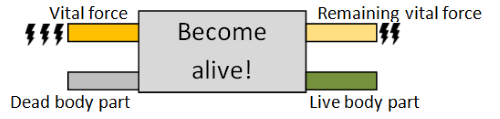

但这只创建了*一个*身体部位。我们如何创建多个？这是弗兰肯函子博士面临的挑战。

第一个问题是我们只有有限的重要力量。这意味着当我们需要激活第二个身体部位时，我们只能利用前一步骤剩余的重要力量。

我们如何将两个步骤连接起来，使第一个步骤的重要力量被传递到第二个步骤的输入中？

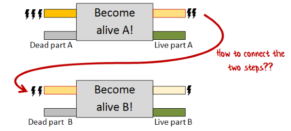

即使我们已经正确地链接了步骤，我们也需要以某种方式将各个活体部位结合起来。但我们只能在创建时访问*活体*部位。我们怎么在那一刹那间将它们结合起来呢？

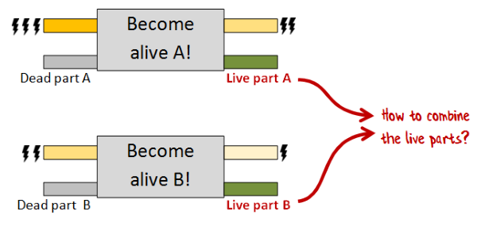

正是弗兰肯函子博士的天才导致了一个优雅的方法，解决了这两个问题，我现在将向您介绍这个方法。

## 共同的上下文

在讨论组装身体部位的细节之前，我们应该花点时间讨论一下对于程序的其余部分所需的共同功能。

首先，我们需要一个标签类型。弗兰肯函子博士在标记每个使用部件的来源方面非常有纪律性。

```
type Label = string 
```

我们将使用一个简单的记录类型来建模重要力量：

```
type VitalForce = {units:int} 
```

由于我们将经常使用重要力量，我们将创建一个函数，该函数提取一个单位并返回一个单位和剩余力量的元组。

```
let getVitalForce vitalForce = 
   let oneUnit = {units = 1}
   let remaining = {units = vitalForce.units-1}  // decrement
   oneUnit, remaining  // return both 
```

## 左腿

公共代码已经解决，我们可以回到主题。

弗兰肯函子博士的笔记记录下了下肢是如何首先创建的。实验室里有一条左腿躺在那里，那就是起点。

```
type DeadLeftLeg = DeadLeftLeg of Label 
```

从这条腿上，可以用相同的标签创建一个活腿，并且有一个单位的重要力量。

```
type LiveLeftLeg = LiveLeftLeg of Label * VitalForce 
```

因此，创建函数的类型签名看起来像这样：

```
type MakeLiveLeftLeg = 
    DeadLeftLeg * VitalForce -> LiveLeftLeg * VitalForce 
```

实际实现如下：

```
let makeLiveLeftLeg (deadLeftLeg,vitalForce) = 
    // get the label from the dead leg using pattern matching
    let (DeadLeftLeg label) = deadLeftLeg
    // get one unit of vital force
    let oneUnit, remainingVitalForce = getVitalForce vitalForce 
    // create a live leg from the label and vital force
    let liveLeftLeg = LiveLeftLeg (label,oneUnit)
    // return the leg and the remaining vital force
    liveLeftLeg, remainingVitalForce 
```

如您所见，此实现与之前的图表完全匹配。


在这一点上，弗兰肯函子博士有了两个重要的见解。

第一个洞察力是，由于柯里化，该函数可以从接受元组的函数转换为接受两个参数的函数，每个参数依次传入。

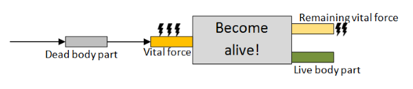

现在代码看起来像这样：

```
type MakeLiveLeftLeg = 
    DeadLeftLeg -> VitalForce -> LiveLeftLeg * VitalForce 

let makeLiveLeftLeg deadLeftLeg vitalForce = 
    let (DeadLeftLeg label) = deadLeftLeg
    let oneUnit, remainingVitalForce = getVitalForce vitalForce 
    let liveLeftLeg = LiveLeftLeg (label,oneUnit)
    liveLeftLeg, remainingVitalForce 
```

第二个洞察力是这个*相同*代码可以解释为一个反过来返回“becomeAlive”函数的函数。

也就是说，我们手头有死部位，但在最后一刻之前我们不会有任何生命力，所以为什么不现在处理死部位并返回一个可以在生命力可用时使用的函数。

换句话说，我们传入一个死部位，当给出一些生命力时，我们会得到一个创建活体部位的函数。

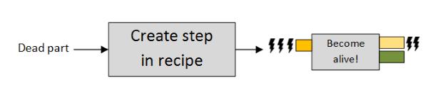

这些“变活”的函数可以被视为“食谱中的步骤”，假设我们能找到某种方法将它们组合起来。

代码现在看起来是这样的：

```
type MakeLiveLeftLeg = 
    DeadLeftLeg -> (VitalForce -> LiveLeftLeg * VitalForce)

let makeLiveLeftLeg deadLeftLeg = 
    // create an inner intermediate function
    let becomeAlive vitalForce = 
        let (DeadLeftLeg label) = deadLeftLeg
        let oneUnit, remainingVitalForce = getVitalForce vitalForce 
        let liveLeftLeg = LiveLeftLeg (label,oneUnit)
        liveLeftLeg, remainingVitalForce    
    // return it
    becomeAlive 
```

这可能不明显，但这与上一个版本的代码*完全相同*，只是写法稍有不同。

这个柯里化函数（带有两个参数）可以被解释为一个普通的两个参数函数，或者它可以被解释为*一个参数*函数，返回*另一个*一个参数函数。

如果这不清楚，考虑一个更简单的例子，一个有两个参数的`add`函数：

```
let add x y = 
    x + y 
```

因为 F# 默认情况下柯里化函数，那个实现与这个完全相同：

```
let add x = 
    fun y -> x + y 
```

如果我们定义一个中间函数，那么也完全相同如下：

```
let add x = 
    let addX y = x + y
    addX // return the function 
```

### 创建 Monadster 类型

展望未来，我们可以看到我们可以对所有创建活体部位的函数使用类似的方法。

所有这些函数都将返回一个具有如下签名的函数：`VitalForce -> LiveBodyPart * VitalForce`。

为了简化我们的生活，让我们给那个函数签名起个名字，`M`，代表“Monadster 部件生成器”，并给它一个泛型类型参数`'LiveBodyPart`，这样我们就可以将其用于许多不同的身体部位。

```
type M<'LiveBodyPart> = 
    VitalForce -> 'LiveBodyPart * VitalForce 
```

现在我们可以显式注释 `makeLiveLeftLeg` 函数的返回类型为 `:M<LiveLeftLeg>`。

```
let makeLiveLeftLeg deadLeftLeg :M<LiveLeftLeg> = 
    let becomeAlive vitalForce = 
        let (DeadLeftLeg label) = deadLeftLeg
        let oneUnit, remainingVitalForce = getVitalForce vitalForce 
        let liveLeftLeg = LiveLeftLeg (label,oneUnit)
        liveLeftLeg, remainingVitalForce    
    becomeAlive 
```

函数的其余部分保持不变，因为`becomeAlive`的返回值已经与`M<LiveLeftLeg>`兼容。

但我不喜欢总是要显式注释。我们怎么样把函数包装在一个单 case 联合中 -- 叫它 "M" -- 给它一个独特的类型？像这样：

```
type M<'LiveBodyPart> = 
    M of (VitalForce -> 'LiveBodyPart * VitalForce) 
```

这样，我们就可以[区分“Monadster 部件生成器”和返回元组的普通函数](https://stackoverflow.com/questions/2595673/state-monad-why-not-a-tuple)。

要使用这个新定义，我们需要调整代码，在返回时将中间函数包装在单个 case 联合 `M` 中，就像这样：

```
let makeLiveLeftLegM deadLeftLeg  = 
    let becomeAlive vitalForce = 
        let (DeadLeftLeg label) = deadLeftLeg
        let oneUnit, remainingVitalForce = getVitalForce vitalForce 
        let liveLeftLeg = LiveLeftLeg (label,oneUnit)
        liveLeftLeg, remainingVitalForce    
    // changed! 
    M becomeAlive // wrap the function in a single case union 
```

对于这个最后版本，类型签名将被正确推断，而不需要明确指定它：一个接受死左腿并返回“M”活腿的函数：

```
val makeLiveLeftLegM : DeadLeftLeg -> M<LiveLeftLeg> 
```

请注意，我已经将函数 `makeLiveLeftLegM` 重命名为使其清楚返回 `M` 的 `LiveLeftLeg`。

### M 的含义

那么这个 "M" 类型到底意味着什么呢？我们怎么理解它？

一个有用的方法是把 `M<T>` 视为*创建 `T` 的食谱*。你给我一些生命力，我会给你一个 `T`。

但是`M<T>`如何可以从无中创造出`T`呢？

这就是像`makeLiveLeftLegM`这样的函数至关重要的地方。它们接受一个参数并将其“烘烤”到结果中。因此，您会看到许多具有类似签名的“M 制造”函数，全部看起来像这样：

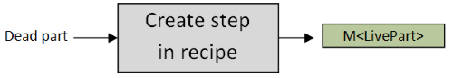

或者用代码表示：

```
DeadPart -> M<LivePart> 
```

现在的挑战将是如何以一种优雅的方式将这些结合在一起。

### 测试左腿

好的，让我们测试一下到目前为止我们得到了什么。

我们将从创建一条死腿开始，然后在其上使用`makeLiveLeftLegM`来获得一个`M<LiveLeftLeg>`。

```
let deadLeftLeg = DeadLeftLeg "Boris"
let leftLegM = makeLiveLeftLegM deadLeftLeg 
```

什么是`leftLegM`？这是一个关于如何根据一些生命力创建活的左腿的配方。

有用的是，我们可以*提前*创建这个配方，在闪电击中*之前*。

现在让我们假装暴风雨已经到来，闪电已经击中，现在有 10 单位的生命力：

```
let vf = {units = 10} 
```

现在，在`leftLegM`内部有一个函数，我们可以将其应用于生命力。但首先，我们需要使用模式匹配将函数从包装器中取出。

```
let (M innerFn) = leftLegM 
```

然后我们可以运行内部函数，得到活的左腿和剩余的生命力：

```
let liveLeftLeg, remainingAfterLeftLeg = innerFn vf 
```

结果如下所示：

```
val liveLeftLeg : LiveLeftLeg = 
   LiveLeftLeg ("Boris",{units = 1;})
val remainingAfterLeftLeg : VitalForce = 
   {units = 9;} 
```

您可以看到成功创建了一个`LiveLeftLeg`，剩余的生命力现在减少到 9 单位。

这种模式匹配很笨拙，所以让我们创建一个帮助函数，一次性解开内部函数并调用它。

我们将其称为`runM`，看起来像这样：

```
let runM (M f) vitalForce = f vitalForce 
```

所以上面的测试代码现在将简化为这样：

```
let liveLeftLeg, remainingAfterLeftLeg = runM leftLegM vf 
```

现在，最后，我们有一个可以创建活的左腿的函数了。

花了一些时间让它起作用，但我们也建立了一些有用的工具和概念，我们可以在以后使用。

## 右腿

现在我们知道自己在做什么了，应该能够现在为其他身体部位使用相同的技术了。

那么右腿呢？

不幸的是，根据笔记本的说法，弗兰肯函子博士在实验室找不到右腿。问题是通过一个小技巧解决的……但我们以后再说。

## 左臂

接下来，创建了手臂，从左手臂开始。

但是出现了一个问题。实验室只有一只*受损*的左臂摆在那里。必须先修复这只手臂，然后才能用于最终的身体。

现在，作为一名医生，弗兰肯函子博士*确实*知道如何治疗受伤的手臂，但只有活的手臂。试图治疗一只死去的受伤手臂是不可能的。

用代码表示，我们有这样的内容：

```
type DeadLeftBrokenArm = DeadLeftBrokenArm of Label 

// A live version of the broken arm.
type LiveLeftBrokenArm = LiveLeftBrokenArm of Label * VitalForce

// A live version of a heathly arm, with no dead version available
type LiveLeftArm = LiveLeftArm of Label * VitalForce

// An operation that can turn a broken left arm into a heathly left arm
type HealBrokenArm = LiveLeftBrokenArm -> LiveLeftArm 
```

因此，挑战是这样的：我们如何从手头的材料中制作一个活的左臂？

首先，我们必须排除从`DeadLeftUnbrokenArm`创建`LiveLeftArm`，因为没有这样的东西。我们也不能直接将`DeadLeftBrokenArm`转换为健康的`LiveLeftArm`。

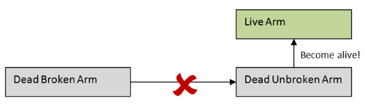

但是我们*可以*将`DeadLeftBrokenArm`转换为*活*的受伤手臂，然后治疗活的受伤手臂，对吗？

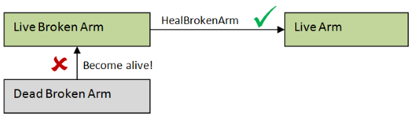

不，恐怕那样不行。我们不能直接创建活体部分，我们只能在`M`配方的上下文中创建活体部分。

那么我们需要做的就是创建一个特殊版本的`healBrokenArm`（称之为`healBrokenArmM`），将`M<LiveBrokenArm>`转换为`M<LiveArm>`。

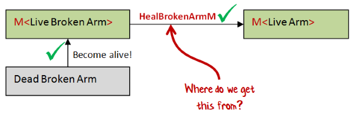

但是我们如何创建这样的函数呢？我们如何将`healBrokenArm`作为其一部分重复使用？

让我们从最直接的实现开始。

首先，由于函数将返回`M`的某种形式，它的形式与我们之前看到的`makeLiveLeftLegM`函数相同。我们需要创建一个具有 vitalForce 参数的内部函数，然后将其包装在`M`中返回。

但与我们之前看到的函数不同，这个函数也有一个`M`作为参数（`M<LiveBrokenArm>`）。我们如何从这个输入中提取我们需要的数据呢？

简单，只需运行它以获得一些生命力。我们从哪里获得生命力呢？从内部函数的参数中获取！

因此，我们完成的版本将如下所示：

```
// implementation of HealBrokenArm
let healBrokenArm (LiveLeftBrokenArm (label,vf)) = LiveLeftArm (label,vf)

/// convert a M<LiveLeftBrokenArm> into a M<LiveLeftArm>
let makeHealedLeftArm brokenArmM = 

    // create a new inner function that takes a vitalForce parameter
    let healWhileAlive vitalForce = 
        // run the incoming brokenArmM with the vitalForce 
        // to get a broken arm
        let brokenArm,remainingVitalForce = runM brokenArmM vitalForce 

        // heal the broken arm
        let healedArm = healBrokenArm brokenArm

        // return the healed arm and the remaining VitalForce
        healedArm, remainingVitalForce

    // wrap the inner function and return it
    M healWhileAlive 
```

如果我们评估此代码，我们会得到签名：

```
val makeHealedLeftArm : M<LiveLeftBrokenArm> -> M<LiveLeftArm> 
```

这正是我们想要的！

但不要这么快——我们可以做得更好。

我们在其中硬编码了`healBrokenArm`转换。如果我们想要进行其他转换，并且针对其他身体部位呢？我们能使这个函数更通用一些吗？

是的，这很容易。我们只需要传入一个函数（比如“f”），它转换身体部位，就像这样：

```
let makeGenericTransform f brokenArmM = 

    // create a new inner function that takes a vitalForce parameter
    let healWhileAlive vitalForce = 
        let brokenArm,remainingVitalForce = runM brokenArmM vitalForce 

        // heal the broken arm using passed in f
        let healedArm = f brokenArm
        healedArm, remainingVitalForce

    M healWhileAlive 
```

关于这个令人惊奇的地方是，通过使用`f`参数对那一个转换进行参数化，*整个*函数都变成了通用的！

我们没有进行其他更改，但是`makeGenericTransform`的签名不再涉及手臂。它适用于任何东西！

```
val makeGenericTransform : f:('a -> 'b) -> M<'a> -> M<'b> 
```

### 引入 mapM

由于现在它变得如此通用，名称变得混乱。让我们重新命名它。我将其称为`mapM`。它适用于*任何*身体部位和*任何*转换。

这是实现方式，同时修复了内部名称。

```
let mapM f bodyPartM = 
    let transformWhileAlive vitalForce = 
        let bodyPart,remainingVitalForce = runM bodyPartM vitalForce 
        let updatedBodyPart = f bodyPart
        updatedBodyPart, remainingVitalForce
    M transformWhileAlive 
```

特别是，它适用于`healBrokenArm`函数，因此要创建一个已被提升以与`M`一起工作的“治愈”版本，我们只需写下这个：

```
let healBrokenArmM = mapM healBrokenArm 
```

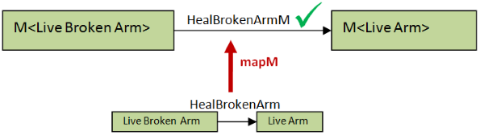

### mapM 的重要性

一种思考`mapM`的方式是它是一个“函数转换器”。给定任何“正常”的函数，它将其转换为一个输入和输出都是`M`的函数。

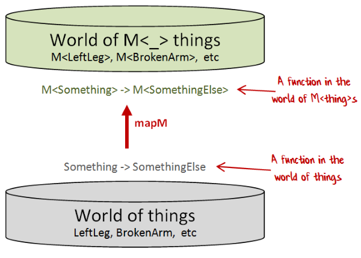

类似于`mapM`的函数在许多情况下都会出现。例如，`Option.map`将“正常”函数转换为其输入和输出都是选项的函数。类似地，`List.map`将“正常”函数转换为其输入和输出都是列表的函数。还有许多其他例子。

```
// map works with options
let healBrokenArmO = Option.map healBrokenArm
// LiveLeftBrokenArm option -> LiveLeftArm option

// map works with lists
let healBrokenArmL = List.map healBrokenArm
// LiveLeftBrokenArm list -> LiveLeftArm list 
```

对你可能是新的是，“包装器”类型`M`包含一个*函数*，而不是像 Option 或 List 那样的简单数据结构。这可能会让你感到头痛！

另外，上面的图表暗示`M`可以包装*任何*正常类型，而`mapM`可以映射*任何*正常函数。

让我们试一试！

```
let isEven x = (x%2 = 0)   // int -> bool
// map it
let isEvenM = mapM isEven  // M<int> -> M<bool>

let isEmpty x = (String.length x)=0  // string -> bool
// map it
let isEmptyM = mapM isEmpty          // M<string> -> M<bool> 
```

所以，是的，它有效！

### 测试左臂

再次，让我们测试一下到目前为止我们得到了什么。

我们将首先创建一个受损的断臂，然后在其上使用 `makeLiveLeftBrokenArm` 来获取一个 `M<BrokenLeftArm>`。

```
let makeLiveLeftBrokenArm deadLeftBrokenArm = 
    let (DeadLeftBrokenArm label) = deadLeftBrokenArm
    let becomeAlive vitalForce = 
        let oneUnit, remainingVitalForce = getVitalForce vitalForce 
        let liveLeftBrokenArm = LiveLeftBrokenArm (label,oneUnit)
        liveLeftBrokenArm, remainingVitalForce    
    M becomeAlive

/// create a dead Left Broken Arm
let deadLeftBrokenArm = DeadLeftBrokenArm "Victor"

/// create a M<BrokenLeftArm> from the dead one
let leftBrokenArmM = makeLiveLeftBrokenArm deadLeftBrokenArm 
```

现在我们可以使用 `mapM` 和 `healBrokenArm` 将 `M<BrokenLeftArm>` 转换为 `M<LeftArm>`：

```
let leftArmM = leftBrokenArmM |> mapM healBrokenArm 
```

现在我们在 `leftArmM` 中有了一个创建完整且活体的左手臂的配方。我们所需要做的就是添加一些生命力。

与以往一样，我们可以在闪电袭来之前完成所有这些事情。

现在当暴风雨来临，闪电击中，且有生命力可用时，我们可以运行带有生命力的 `leftArmM`……

```
let vf = {units = 10}

let liveLeftArm, remainingAfterLeftArm = runM leftArmM vf 
```

……我们得到了这个结果：

```
val liveLeftArm : LiveLeftArm = 
    LiveLeftArm ("Victor",{units = 1;})
val remainingAfterLeftArm : 
    VitalForce = {units = 9;} 
```

一个活体左手臂，就像我们想要的一样。

## 右臂

接下来是右臂。

再次出现问题。弗兰肯函子博士的笔记记录表明没有整只手臂可用。然而 *却* 有下臂和上臂……

```
type DeadRightLowerArm = DeadRightLowerArm of Label 
type DeadRightUpperArm = DeadRightUpperArm of Label 
```

……这些数据可以转换为相应的活体部分：

```
type LiveRightLowerArm = LiveRightLowerArm of Label * VitalForce
type LiveRightUpperArm = LiveRightUpperArm of Label * VitalForce 
```

弗兰肯函子决定做手术将两个手臂部分连接成一个完整的手臂。

```
// define the whole arm
type LiveRightArm = {
    lowerArm : LiveRightLowerArm
    upperArm : LiveRightUpperArm
    }

// surgery to combine the two arm parts
let armSurgery lowerArm upperArm =
    {lowerArm=lowerArm; upperArm=upperArm} 
```

与断臂一样，手术只能使用 *活体* 部分完成。用死亡部分做这件事会很恶心和恶心。

但是，与断臂一样，我们无法直接访问活体部位，只能在 `M` 包装器的上下文中访问。

换句话说，我们需要将我们的 `armSurgery` 函数转换为一个能够处理 `M` 的 `armSurgeryM` 函数，这个函数适用于正常的活体部分。

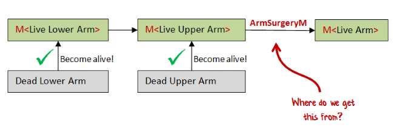

我们可以像以前一样使用相同的方法：

+   创建一个带有 vitalForce 参数的内部函数。

+   使用生命力运行传入的参数以提取数据

+   从内部函数返回手术后的新数据。

+   将内部函数包装在一个“M”中并返回它。

这是代码：

```
/// convert a M<LiveRightLowerArm> and  M<LiveRightUpperArm> into a M<LiveRightArm>
let makeArmSurgeryM_v1 lowerArmM upperArmM =

    // create a new inner function that takes a vitalForce parameter
    let becomeAlive vitalForce = 
        // run the incoming lowerArmM with the vitalForce 
        // to get the lower arm
        let liveLowerArm,remainingVitalForce = runM lowerArmM vitalForce 

        // run the incoming upperArmM with the remainingVitalForce 
        // to get the upper arm
        let liveUpperArm,remainingVitalForce2 = runM upperArmM remainingVitalForce 

        // do the surgery to create a liveRightArm
        let liveRightArm = armSurgery liveLowerArm liveUpperArm

        // return the whole arm and the SECOND remaining VitalForce
        liveRightArm, remainingVitalForce2  

    // wrap the inner function and return it
    M becomeAlive 
```

与断臂示例相比的一个重要区别是，我们当然有 *两个* 参数。当我们运行第二个参数（以获得 `liveUpperArm`）时，我们必须确保传入第一步后的 *剩余生命力*，而不是原始的生命力。

然后，当我们从内部函数返回时，我们必须确保返回 `remainingVitalForce2`（第二步之后的剩余部分），而不是其他任何部分。

如果我们编译这段代码，我们得到：

```
M<LiveRightLowerArm> -> M<LiveRightUpperArm> -> M<LiveRightArm> 
```

这正是我们正在寻找的签名。

### 介绍 map2M

但是，与以前一样，为什么不将其更通用化呢？我们不需要硬编码 `armSurgery` -- 我们可以将其作为参数传递。

我们将更通用的函数称为 `map2M` -- 就像 `mapM` 一样，但有两个参数。

这是实现：

```
let map2M f m1 m2 =
    let becomeAlive vitalForce = 
        let v1,remainingVitalForce = runM m1 vitalForce 
        let v2,remainingVitalForce2 = runM m2 remainingVitalForce  
        let v3 = f v1 v2
        v3, remainingVitalForce2    
    M becomeAlive 
```

它具有的签名是：

```
f:('a -> 'b -> 'c) -> M<'a> -> M<'b> -> M<'c> 
```

正如我们在 `mapM` 中所做的那样，我们可以将此函数解释为一个“函数转换器”，将“正常”的双参数函数转换为 `M` 世界中的函数。

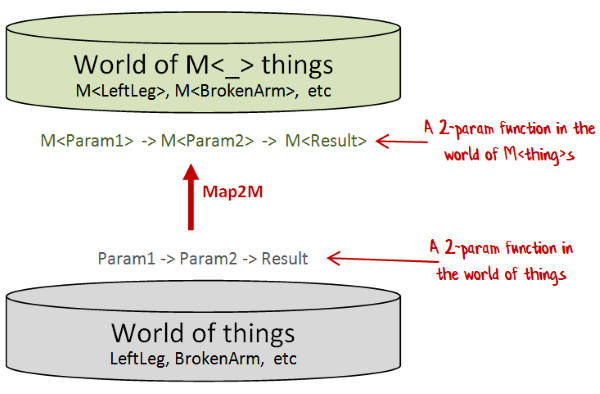

### 测试右臂

再次，让我们测试一下到目前为止我们得到了什么。

像以往一样，我们需要一些函数将死亡部分转换为活体部分。

```
let makeLiveRightLowerArm (DeadRightLowerArm label) = 
    let becomeAlive vitalForce = 
        let oneUnit, remainingVitalForce = getVitalForce vitalForce 
        let liveRightLowerArm = LiveRightLowerArm (label,oneUnit)
        liveRightLowerArm, remainingVitalForce    
    M becomeAlive

let makeLiveRightUpperArm (DeadRightUpperArm label) = 
    let becomeAlive vitalForce = 
        let oneUnit, remainingVitalForce = getVitalForce vitalForce 
        let liveRightUpperArm = LiveRightUpperArm (label,oneUnit)
        liveRightUpperArm, remainingVitalForce    
    M becomeAlive 
```

*顺便说一句，你是否注意到这些函数中有很多重复的部分？我也是！我们稍后会尝试解决这个问题。*

接下来，我们将创建这些部分：

```
let deadRightLowerArm = DeadRightLowerArm "Tom"
let lowerRightArmM = makeLiveRightLowerArm deadRightLowerArm 

let deadRightUpperArm = DeadRightUpperArm "Jerry"
let upperRightArmM = makeLiveRightUpperArm deadRightUpperArm 
```

接下来创建一个函数来组装整个手臂：

```
let armSurgeryM  = map2M armSurgery 
let rightArmM = armSurgeryM lowerRightArmM upperRightArmM 
```

像往常一样，我们可以在闪电来临之前完成所有这些事情，建立一个配方（或者如果你喜欢的话是 *计算*），当时机成熟时能够完成我们需要的一切。

当生命力可用时，我们可以用生命力运行 `rightArmM`...

```
let vf = {units = 10}

let liveRightArm, remainingFromRightArm = runM rightArmM vf 
```

...然后我们得到了这个结果：

```
val liveRightArm : LiveRightArm =
    {lowerArm = LiveRightLowerArm ("Tom",{units = 1;});
     upperArm = LiveRightUpperArm ("Jerry",{units = 1;});}

val remainingFromRightArm : VitalForce = 
    {units = 8;} 
```

一个由两个子组件组成的活体右手臂，正如所需。

还要注意，剩余的生命力已经降到 *八*。我们已经正确地使用了两单位的生命力。

## 摘要

在本文中，我们看到如何创建一个包装着“变得活跃”函数的 `M` 类型，该函数反过来只能在遭遇闪电时激活。

我们还看到了如何使用 `mapM`（用于受损的手臂）和 `map2M`（用于两部分的手臂）处理和组合各种 M 值。

*本文中使用的代码示例可以在 [GitHub 上找到](https://gist.github.com/swlaschin/54489d9586402e5b1e8a)*。

## 下一步

这个令人兴奋的故事还有更多的震撼等待着你！敬请关注 下一篇，届时我将揭示头部和身体是如何创建的。

# 完成 Monadster 的身体

# 完成 Monadster 的身体

*更新：[关于此主题的我的演讲幻灯片和视频](http://fsharpforfunandprofit.com/monadster/)*

*警告！本文包含可怕的话题、牵强的类比、单子的讨论*

欢迎来到 Frankenfunctor 博士和 Monadster 的扣人心弦的故事！

我们在上一篇文章中看到了 Frankenfunctor 博士如何利用“Monadster 部件生成器”（简称为“M”）从死去的身体部位中创造生命，这些部件生成器在提供了一些生命力后，会返回一个活体身体部位。

我们还看到了如何创建生物体的腿和手臂，以及如何使用 `mapM`（用于受损的手臂）和 `map2M`（用于两部分的手臂）处理和组合这些 M 值。

在本系列的第二篇文章中，我们将看看 Frankenfunctor 博士用来创建头部、心脏和完整身体的其他技术。

## 头部

首先，是头部。

就像右手臂一样，头部由两部分组成，即大脑和头骨。

Frankenfunctor 博士首先定义了死脑和头骨：

```
type DeadBrain = DeadBrain of Label 
type Skull = Skull of Label 
```

与由两部分组成的右手臂不同，只有大脑需要变得活跃。头骨可以按原样使用，不需要在用于活头之前进行转换。

```
type LiveBrain = LiveBrain of Label * VitalForce

type LiveHead = {
    brain : LiveBrain
    skull : Skull // not live
    } 
```

活体大脑与头骨结合，使用 `headSurgery` 函数创建一个活头，类似于我们之前使用的 `armSurgery`。

```
let headSurgery brain skull =
    {brain=brain; skull=skull} 
```

现在我们准备创建一个活头 —— 但是我们应该如何做呢？

如果我们能重用 `map2M` 就太好了，但是有一个问题 —— 要使 `map2M` 起作用，需要一个包装在 `M` 中的头骨。

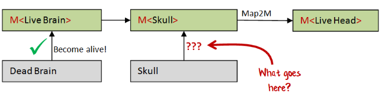

但是头骨不需要变得活着或使用活力，所以我们需要创建一个特殊的函数，将 `Skull` 转换为 `M<Skull>`。

我们可以像之前一样使用相同的方法：

+   创建一个接受 vitalForce 参数的内部函数

+   在这种情况下，我们保持 vitalForce 不变

+   从内部函数返回原始头骨和未触及的 vitalForce

+   将内部函数包装在 "M" 中并返回它

以下是代码：

```
let wrapSkullInM skull = 
    let becomeAlive vitalForce = 
        skull, vitalForce 
    M becomeAlive 
```

但是 `wrapSkullInM` 的签名非常有趣。

```
val wrapSkullInM : 'a -> M<'a> 
```

任何地方都没有提到头骨！

### 介绍 returnM

我们已经创建了一个完全通用的函数，可以将任何东西转换为 `M`。所以让我们重新命名它。我将它称为 `returnM`，但在其他上下文中可能会称为 `pure` 或 `unit`。

```
let returnM x = 
    let becomeAlive vitalForce = 
        x, vitalForce 
    M becomeAlive 
```

### 测试头部

让我们付诸行动。

首先，我们需要定义如何创建活脑。

```
let makeLiveBrain (DeadBrain label) = 
    let becomeAlive vitalForce = 
        let oneUnit, remainingVitalForce = getVitalForce vitalForce 
        let liveBrain = LiveBrain (label,oneUnit)
        liveBrain, remainingVitalForce    
    M becomeAlive 
```

接下来我们获取一颗死脑和头骨：

```
let deadBrain = DeadBrain "Abby Normal"
let skull = Skull "Yorick" 
```

*顺便说一句，这个特定的死脑是如何获得的是一个[有趣的故事](https://en.wikipedia.org/wiki/Young_Frankenstein)，但我现在没有时间详细说明。*


接下来，我们从死部件中构建 "M" 版本：

```
let liveBrainM = makeLiveBrain deadBrain
let skullM = returnM skull 
```

并使用 `map2M` 组合部分：

```
let headSurgeryM = map2M headSurgery
let headM = headSurgeryM liveBrainM skullM 
```

再次，我们可以在闪电袭击之前完成所有这些事情。

当活力可用时，我们可以用活力运行 `headM`...

```
let vf = {units = 10}

let liveHead, remainingFromHead = runM headM vf 
```

...然后我们得到了这个结果：

```
val liveHead : LiveHead = 
    {brain = LiveBrain ("Abby normal",{units = 1;});
    skull = Skull "Yorick";}

val remainingFromHead : VitalForce = 
    {units = 9;} 
```

一个活头部，由两个子组件组成，正如所需的那样。

还要注意，剩下的活力只有九，因为头骨没有使用任何单位。

## 跳动的心脏

还有一个组件我们需要，那就是一个心脏。

首先，我们以通常的方式定义了一个死心脏和一个活心脏：

```
type DeadHeart = DeadHeart of Label 
type LiveHeart = LiveHeart of Label * VitalForce 
```

但是生物不仅需要一个活心脏 -- 它还需要一个*跳动的心脏*。一个跳动的心脏是由一个活心脏和一些额外的活力构成的，就像这样：

```
type BeatingHeart = BeatingHeart of LiveHeart * VitalForce 
```

创建活心脏的代码与先前的示例非常相似：

```
let makeLiveHeart (DeadHeart label) = 
    let becomeAlive vitalForce = 
        let oneUnit, remainingVitalForce = getVitalForce vitalForce 
        let liveHeart = LiveHeart (label,oneUnit)
        liveHeart, remainingVitalForce    
    M becomeAlive 
```

创建跳动的心脏的代码也非常相似。它以一个活心脏作为参数，使用另一个单位的活力，并返回跳动的心脏和剩余的活力。

```
let makeBeatingHeart liveHeart = 

    let becomeAlive vitalForce = 
        let oneUnit, remainingVitalForce = getVitalForce vitalForce 
        let beatingHeart = BeatingHeart (liveHeart, oneUnit)
        beatingHeart, remainingVitalForce    
    M becomeAlive 
```

如果我们查看这些函数的签名，我们会发现它们非常相似；都是形式为 `Something -> M<SomethingElse>`。

```
val makeLiveHeart : DeadHeart -> M<LiveHeart>
val makeBeatingHeart : LiveHeart -> M<BeatingHeart> 
```

### 连接起来返回 M 的函数

我们从一个死心脏开始，我们需要得到一个跳动的心脏

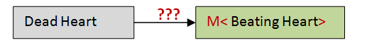

但我们没有直接做这件事的工具。

我们有一个将 `DeadHeart` 转换为 `M<LiveHeart>` 的函数，还有一个将 `LiveHeart` 转换为 `M<BeatingHeart>` 的函数。

但第一个的输出与第二个的输入不兼容，所以我们无法将它们粘合在一起。

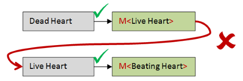

然后，我们想要一个函数，给定一个 `M<LiveHeart>` 作为输入，可以将其转换为 `M<BeatingHeart>`。

而且，我们还想要从我们已经拥有的 `makeBeatingHeart` 函数构建它。

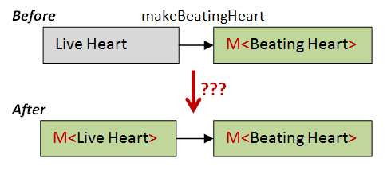

这是一个第一次尝试，使用了我们以前多次使用过的相同模式：

```
let makeBeatingHeartFromLiveHeartM liveHeartM = 

    let becomeAlive vitalForce = 
        // extract the liveHeart from liveHeartM 
        let liveHeart, remainingVitalForce = runM liveHeartM vitalForce 

        // use the liveHeart to create a beatingHeartM
        let beatingHeartM = makeBeatingHeart liveHeart

        // what goes here?

        // return a beatingHeart and remaining vital force 
        beatingHeart, remainingVitalForce    

    M becomeAlive 
```

但是中间放什么？我们如何从`beatingHeartM`获得一个跳动的心脏？答案是用一些生命力量运行它（我们碰巧有，因为我们正处于`becomeAlive`函数中）。

但是重要的是什么生命力量？它应该是在获得`liveHeart`后剩余的重要力量。

所以最终版本看起来像这样：

```
let makeBeatingHeartFromLiveHeartM liveHeartM = 

    let becomeAlive vitalForce = 
        // extract the liveHeart from liveHeartM 
        let liveHeart, remainingVitalForce = runM liveHeartM vitalForce 

        // use the liveHeart to create a beatingHeartM
        let beatingHeartM = makeBeatingHeart liveHeart

        // run beatingHeartM to get a beatingHeart
        let beatingHeart, remainingVitalForce2 = runM beatingHeartM remainingVitalForce 

        // return a beatingHeart and remaining vital force 
        beatingHeart, remainingVitalForce2    

    // wrap the inner function and return it 
    M becomeAlive 
```

请注意，我们在最后返回`remainingVitalForce2`，即两个步骤运行后的剩余部分。

如果我们查看这个函数的签名，它是：

```
M<LiveHeart> -> M<BeatingHeart> 
```

这正是我们想要的！

### 引入 bindM

再次，我们可以通过传递一个函数参数而不是硬编码`makeBeatingHeart`来使这个函数通用化。

我将其称为`bindM`。这是代码：

```
let bindM f bodyPartM = 
    let becomeAlive vitalForce = 
        let bodyPart, remainingVitalForce = runM bodyPartM vitalForce 
        let newBodyPartM = f bodyPart 
        let newBodyPart, remainingVitalForce2 = runM newBodyPartM remainingVitalForce 
        newBodyPart, remainingVitalForce2    
    M becomeAlive 
```

并且签名是：

```
f:('a -> M<'b>) -> M<'a> -> M<'b> 
```

换句话说，给定任何函数`Something -> M<SomethingElse>`，我都可以将其转换为一个具有`M`作为输入和输出的函数`M<Something> -> M<SomethingElse>`。

顺便说一句，具有像`Something -> M<SomethingElse>`这样签名的函数通常被称为*monadic*函数。

无论如何，一旦你理解了`bindM`中发生了什么，一个稍微缩短的版本可以像这样实现：

```
let bindM f bodyPartM = 
    let becomeAlive vitalForce = 
        let bodyPart, remainingVitalForce = runM bodyPartM vitalForce 
        runM (f bodyPart) remainingVitalForce 
    M becomeAlive 
```

所以最后，我们有了一种创建函数的方法，即给定一个`DeadHeart`，创建一个`M<BeatingHeart>`。

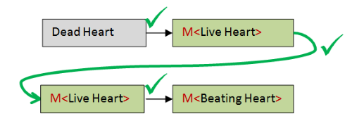

这是代码：

```
// create a dead heart
let deadHeart = DeadHeart "Anne"

// create a live heart generator (M<LiveHeart>)
let liveHeartM = makeLiveHeart deadHeart

// create a beating heart generator (M<BeatingHeart>)
// from liveHeartM and the makeBeatingHeart function
let beatingHeartM = bindM makeBeatingHeart liveHeartM 
```

其中有许多中间值，可以通过使用管道来简化，就像这样：

```
let beatingHeartM = 
   DeadHeart "Anne"
   |> makeLiveHeart 
   |> bindM makeBeatingHeart 
```

### 绑定的重要性

一种思考`bindM`的方式是它是另一个“函数转换器”，就像`mapM`一样。也就是说，给定任何“返回 M”的函数，它将其转换为一个输入和输出都是`M`的函数。

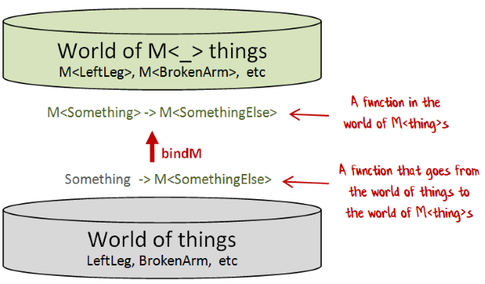

就像`map`一样，`bind`在许多其他上下文中都出现。

例如，`Option.bind`将一个生成选项的函数（`'a -> 'b option`）转换为一个其输入和输出都是选项的函数。类似地，`List.bind`将一个生成列表的函数（`'a -> 'b list`）转换为一个其输入和输出都是列表的函数。

而且我在我的[功能错误处理](http://fsharpforfunandprofit.com/rop/)的讲座中详细讨论了 bind 的另一种版本。

bind 如此重要的原因是因为“返回 M”的函数经常出现，并且它们不能轻松地链接在一起，因为一个步骤的输出与下一个步骤的输入不匹配。

通过使用`bindM`，我们可以将每个步骤转换为输入和输出都是`M`的函数，然后它们*可以*被链接在一起。

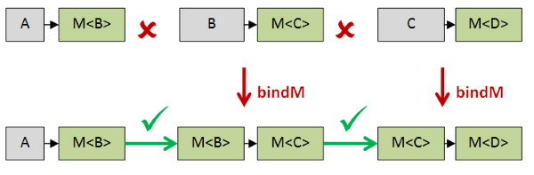

### 测试心跳

像往常一样，我们提前构建食谱，这种情况下，是为了制作一个`BeatingHeart`。

```
let beatingHeartM =
    DeadHeart "Anne" 
    |> makeLiveHeart 
    |> bindM makeBeatingHeart 
```

当有生命力量可用时，我们可以用生命力量运行`beatingHeartM`...

```
let vf = {units = 10}

let beatingHeart, remainingFromHeart = runM beatingHeartM vf 
```

...然后我们得到了这个结果：

```
val beatingHeart : BeatingHeart = 
    BeatingHeart (LiveHeart ("Anne",{units = 1;}),{units = 1;})

val remainingFromHeart : VitalForce = 
    {units = 8;} 
```

注意，剩余的重要力量为八单位，因为我们用两个单位进行了两个步骤。

## 整体身体

最后，我们拥有了组装完整主体所需的所有部分。

这是 Frankenfunctor 博士对活体的定义：

```
type LiveBody = {
    leftLeg: LiveLeftLeg
    rightLeg : LiveLeftLeg
    leftArm : LiveLeftArm
    rightArm : LiveRightArm
    head : LiveHead
    heart : BeatingHeart
    } 
```

你可以看到它使用了我们已经开发的所有子组件。

### 两只左脚

因为没有右腿可用，Frankenfunctor 博士决定采取捷径，在身体中使用*两条*左腿，希望没有人会注意到。

结果是，这个生物有两只左脚，[这并不总是一个缺点](https://www.youtube.com/watch?v=DC_PACr5cT8&t=55)，而且事实上，这个生物不仅克服了这个劣势，而且成为了一名可靠的舞者，正如在这个罕见的视频中所看到的：

[`www.youtube.com/embed/w1FLZPFI3jc`](https://www.youtube.com/embed/w1FLZPFI3jc)

### 组装子组件

`LiveBody` 类型有六个字段。我们如何从各种 `M<BodyPart>` 中构造它？

一个方法是重复使用我们与 `mapM` 和 `map2M` 使用的技术。我们可以创建 `map3M` 和 `map4M` 等等。

例如，`map3M` 可以这样定义：

```
let map3M f m1 m2 m3 =
    let becomeAlive vitalForce = 
        let v1,remainingVitalForce = runM m1 vitalForce 
        let v2,remainingVitalForce2 = runM m2 remainingVitalForce  
        let v3,remainingVitalForce3 = runM m3 remainingVitalForce2  
        let v4 = f v1 v2 v3
        v4, remainingVitalForce3    
    M becomeAlive 
```

但是这很快就变得很烦人了。有没有更好的方法呢？

是的，有！

要理解它，记住像 `LiveBody` 这样的记录类型必须一次性构建，但是*函数*可以通过柯里化和部分应用的魔法一步步组装起来。

所以如果我们有一个创建 `LiveBody` 的六参数函数，就像这样：

```
val createBody : 
    leftLeg:LiveLeftLeg ->
    rightLeg:LiveLeftLeg ->
    leftArm:LiveLeftArm ->
    rightArm:LiveRightArm ->
    head:LiveHead -> 
    beatingHeart:BeatingHeart -> 
    LiveBody 
```

我们实际上可以把它看作一个*单一*参数函数，返回一个五参数函数，就像这样：

```
val createBody : 
    leftLeg:LiveLeftLeg -> (five param function) 
```

然后，当我们将函数应用于第一个参数（“leftLeg”）时，我们得到那个五参数函数：

```
(six param function) apply (first parameter) returns (five param function) 
```

其中五参数函数的签名为：

```
 rightLeg:LiveLeftLeg ->
    leftArm:LiveLeftArm ->
    rightArm:LiveRightArm ->
    head:LiveHead -> 
    beatingHeart:BeatingHeart -> 
    LiveBody 
```

这个五参数函数反过来又可以被看作是一个单参数函数，返回一个四参数函数：

```
 rightLeg:LiveLeftLeg -> (four parameter function) 
```

再次，我们可以应用第一个参数（“rightLeg”），然后得到那个四参数函数：

```
(five param function) apply (first parameter) returns (four param function) 
```

其中四参数函数的签名为：

```
 leftArm:LiveLeftArm ->
    rightArm:LiveRightArm ->
    head:LiveHead -> 
    beatingHeart:BeatingHeart -> 
    LiveBody 
```

等等，直到最终我们得到一个带有一个参数的函数。这个函数的签名将是 `BeatingHeart -> LiveBody`。

当我们应用最后一个参数（“beatingHeart”）时，我们就会得到我们完成的 `LiveBody`。

我们也可以对 M 事物使用这个技巧！

我们从包装在 M 中的六参数函数和一个 M `<liveleftleg class="hljs-class">parameter.</liveleftleg>` 开始。

假设有一种方法可以将 M 函数应用到 M 参数上。我们应该得到一个包装在 `M` 中的五参数函数。

```
// normal version
(six param function) apply (first parameter) returns (five param function)

// M-world version
M<six param function> applyM M<first parameter> returns M<five param function> 
```

然后再做一次，我们可以应用下一个 M 参数

```
// normal version
(five param function) apply (first parameter) returns (four param function)

// M-world version
M<five param function> applyM M<first parameter> returns M<four param function> 
```

依次应用参数，直到最终结果。

### 引入 applyM

这个 `applyM` 函数将有两个参数，一个包装在 M 中的函数，一个包装在 M 中的参数。输出将是函数结果包装在 M 中的结果。

这是实现：

```
let applyM mf mx =
    let becomeAlive vitalForce = 
        let f,remainingVitalForce = runM mf vitalForce 
        let x,remainingVitalForce2 = runM mx remainingVitalForce  
        let y = f x
        y, remainingVitalForce2    
    M becomeAlive 
```

正如你所看到的，这与 `map2M` 非常相似，只是 "f" 是来自于解包第一个参数本身。

让我们试试吧！

首先，我们需要我们的六参数函数：

```
let createBody leftLeg rightLeg leftArm rightArm head beatingHeart =
    {
    leftLeg = leftLeg
    rightLeg = rightLeg
    leftArm = leftArm
    rightArm = rightArm
    head = head
    heart = beatingHeart 
    } 
```

我们需要克隆左腿以用于右腿：

```
let rightLegM = leftLegM 
```

接下来，我们需要将这个`createBody`函数包装在一个`M`中。我们该如何做呢？

使用我们之前为头骨定义的`returnM`函数！

将其放在一起，我们有这段代码：

```
// move createBody to M-world -- a six parameter function wrapped in an M
let fSixParamM = returnM createBody           

// apply first M-param to get a five parameter function wrapped in an M
let fFiveParamM = applyM fSixParamM leftLegM   

// apply second M-param to get a four parameter function wrapped in an M
let fFourParamM = applyM fFiveParamM rightLegM 

// etc
let fThreeParamM = applyM fFourParamM leftArmM
let fTwoParamM = applyM fThreeParamM rightArmM
let fOneParamM = applyM fTwoParamM headM 

// after last application, the result is a M<LiveBody>
let bodyM = applyM fOneParamM beatingHeartM 
```

它有效了！结果是一个`M<LiveBody>`，正如我们所希望的。

但那段代码确实很丑！我们能做些什么让它看起来更好吗？

一个技巧是将`applyM`转换为中缀操作，就像普通函数应用一样。用于此操作的运算符通常写为`<*>`。

```
let (<*>) = applyM 
```

有了这个，我们可以将上面的代码重写为：

```
let bodyM = 
    returnM createBody 
    <*> leftLegM
    <*> rightLegM
    <*> leftArmM
    <*> rightArmM
    <*> headM 
    <*> beatingHeartM 
```

这样看起来好多了！

另一个技巧是注意到`returnM`后面跟着`applyM`等同于`mapM`。所以如果我们也为`mapM`创建一个中缀运算符...

```
let (<!>) = mapM 
```

...我们也可以摆脱`returnM`，并像这样编写代码：

```
let bodyM = 
    createBody 
    <!> leftLegM
    <*> rightLegM
    <*> leftArmM
    <*> rightArmM
    <*> headM 
    <*> beatingHeartM 
```

这个好处在于，一旦你习惯了这些符号，它几乎读起来就像你只是调用原始函数一样！

### 测试整个身体

一如既往，我们希望提前构建配方。在这种情况下，我们已经创建了`bodyM`，当生命力到来时，它将给我们一个完整的`LiveBody`。

现在我们只需等待闪电击中并为生成生命力的机器充电！


[[来源：Misfit Robot Daydream](http://misfitdaydream.blogspot.co.uk/2012/10/frankenstein-1931.html)]

它来了——生命力可用！我们迅速以通常的方式运行`bodyM`...

```
let vf = {units = 10}

let liveBody, remainingFromBody = runM bodyM vf 
```

...我们得到了这个结果：

```
val liveBody : LiveBody =
  {leftLeg = LiveLeftLeg ("Boris",{units = 1;});
   rightLeg = LiveLeftLeg ("Boris",{units = 1;});
   leftArm = LiveLeftArm ("Victor",{units = 1;});
   rightArm = {lowerArm = LiveRightLowerArm ("Tom",{units = 1;});
               upperArm = LiveRightUpperArm ("Jerry",{units = 1;});};
   head = {brain = LiveBrain ("Abby Normal",{units = 1;});
           skull = Skull "Yorick";};
   heart = BeatingHeart (LiveHeart ("Anne",{units = 1;}),{units = 1;});}

val remainingFromBody : VitalForce = {units = 2;} 
```

它活了！我们成功地复制了弗兰肯函数博士的工作！

请注意，身体包含所有正确的子组件，并且剩余的生命力已经正确减少到两个单位，因为我们用八个单位创建了身体。

## 总结

在这篇文章中，我们扩展了我们的操作技巧库，包括：

+   为头骨`returnM`

+   为跳动的心脏`bindM`

+   使用`applyM`组装整个身体

*本文中使用的代码示例可在[GitHub 上获得](https://gist.github.com/swlaschin/54489d9586402e5b1e8a)*。

## 下次

在最终部分中，我们将重构代码并回顾所有使用的技术。

# 重构 Monadster

# 重构 Monadster

*更新：[关于这个主题的幻灯片和视频](http://fsharpforfunandprofit.com/monadster/)*

*警告！本文包含可怕的主题，牵强的类比，以及对单子的讨论*

欢迎来到弗兰肯函数博士和 Monadster 引人入胜的故事的第三部分！

我们在第一部分中看到，弗兰肯函数博士如何利用“Monadster 部件生成器”（简称“M”）从死去的身体部位中创造生命，一旦提��了一些生命力，就会返回一个活体部位。

我们还看到了如何创建生物体的腿和手臂，并且如何使用`mapM`和`map2M`处理和组合这些 M 值。

在第二部分中，我们学习了如何使用其他强大的技术构建头部、心脏和身体，例如`returnM`、`bindM`和`applyM`。

在这最后一部分中，我们将回顾所有使用的技术，重构代码，并将 Dr Frankenfunctor 的技术与现代状态单子进行比较。

完整系列的链接：

+   第一部分 - 弗兰肯函数博士和单子兽

+   第二部分 - 完成身体

+   第三部分 - 回顾和重构（*本文*）

## 使用的技术回顾

在我们重构之前，让我们回顾一下我们使用的所有技术。

### M <bodypart class="calibre44">类型</bodypart>

在有重要力量之前，我们无法创建实际的活体部位，但我们希望在闪电击中之前就对它们进行操作、组合等等。我们通过为每个部分创建一个包含“变得活着”的函数的类型`M`来实现这一点。然后，我们可以将`M<BodyPart>`视为创建`BodyPart`的*配方*或*说明书*，以备不时之需。

`M`的定义是：

```
type M<'a> = M of (VitalForce -> 'a * VitalForce) 
```

### mapM

接下来，我们想要在不使用任何重要力量的情况下转换`M`的内容。在我们的特定案例中，我们想要将一个破碎的手臂配方（`M<BrokenLeftArm>`）转换为一个未破碎的手臂配方（`M<LeftArm>`）。解决方案是实现一个函数`mapM`，它接受一个普通函数`'a -> 'b`并将其转换为一个`M<'a> -> M<'b>`函数。

`mapM`的签名是：

```
val mapM : f:('a -> 'b) -> M<'a> -> M<'b> 
```

### map2M

我们还想要组合两个 M-recipes 以创建一个新的 M-recipe。在那个特殊情况下，它是将上臂（`M<UpperRightArm>`）和下臂（`M<LowerRightArm>`）组合成一个完整的手臂（`M<RightArm>`）。解决方案是`map2M`。

`map2M`的签名是：

```
val map2M : f:('a -> 'b -> 'c) -> M<'a> -> M<'b> -> M<'c> 
```

### `returnM`的签名是：

另一个挑战是直接将普通值提升到 M-recipes 的世界中，而不使用任何重要的力量。在那种特殊情况下，我们要将一个`Skull`转化为一个`M<Skull>`，这样它就可以与`map2M`一起使用来制作一个完整的头部。

`returnM`的签名是：

```
val returnM : 'a -> M<'a> 
```

### 单子函数

我们创建了许多具有相似形状的函数。它们都以某物作为输入，并返回一个 M-recipe 作为输出。换句话说，它们具有这样的签名：

```
val monadicFunction : 'a -> M<'b> 
```

这里有一些我们使用的实际单子函数的示例：

```
val makeLiveLeftLeg : DeadLeftLeg -> M<LiveLeftLeg>
val makeLiveRightLowerArm : DeadRightLowerArm -> M<LiveRightLowerArm>
val makeLiveHeart : DeadHeart -> M<LiveHeart>
val makeBeatingHeart : LiveHeart -> M<BeatingHeart>
// and also
val returnM : 'a -> M<'a> 
```

### `bindM`

到目前为止，这些函数不需要访问重要力量。但后来我们发现我们需要将两个单子函数链在一起。特别是，我们需要将`makeLiveHeart`的输出（具有签名`DeadHeart -> M<LiveHeart>`）链接到`makeBeatingHeart`的输入（具有签名`LiveHeart -> M<BeatingHeart>`）。解决方案是`bindM`，它将形式为`'a -> M<'b>`的单子函数转换为 M 世界中的函数（`M<'a> -> M<'b>`），然后可以将它们组合在一起。

`bindM`的签名是：

```
val bindM : f:('a -> M<'b>) -> M<'a> -> M<'b> 
```

### applyM

最后，我们需要一种方法来组合大量的 M 参数以制作活体。而不是创建特殊版本的 map（`map4M`，`map5M`，`map6M` 等），我们实现了一个通用的 `applyM` 函数，可以将一个 M 函数应用于一个 M 参数。从那里，我们可以逐步处理任何大小的函数，使用部分应用逐步应用一个 M 参数。

`applyM` 的签名是：

```
val applyM : M<('a -> 'b)> -> M<'a> -> M<'b> 
```

### 以 bind 和 return 为基础定义其他函数

请注意，所有这些函数中，只有 `bindM` 需要访问重要力量。

实际上，正如我们将在下面看到的，函数 `mapM`，`map2M` 和 `applyM` 实际上可以根据 `bindM` 和 `returnM` 来定义！

## 重构为计算表达式

我们创建的许多函数具有非常相似的形状，导致很多重复。这里是一个例子：

```
let makeLiveLeftLegM deadLeftLeg  = 
    let becomeAlive vitalForce = 
        let (DeadLeftLeg label) = deadLeftLeg
        let oneUnit, remainingVitalForce = getVitalForce vitalForce 
        let liveLeftLeg = LiveLeftLeg (label,oneUnit)
        liveLeftLeg, remainingVitalForce    
    M becomeAlive  // wrap the function in a single case union 
```

特别地，有很多对重要力量的显式处理。

在大多数函数式语言中，有一种方法可以隐藏这一点，使代码看起来更清晰。

在 Haskell 中，开发者使用“do-notation”，在 Scala 中人们使用“for-yield”（“for comprehension”）。而在 F# 中，人们使用计算表达式。

要在 F# 中创建一个计算表达式，你只需要两样东西，一个“bind”和一个“return”，这两样我们都有。

接下来，你定义一个具有特殊命名方法 `Bind` 和 `Return` 的类：

```
type MonsterBuilder()=
    member this.Return(x) = returnM x
    member this.Bind(xM,f) = bindM f xM 
```

最后，你创建这个类的一个实例：

```
let monster = new MonsterBuilder() 
```

当这样做时，我们可以访问特殊语法 `monster {...}`，就像 `async{...}`，`seq{...}` 等一样。

+   `let! x = xM` 语法要求右侧是一个 M 类型，比如 `M<X>`。

    `let!` 将 `M<X>` 解包成 `X` 并将其绑定到左侧 -- 在这种情况下是 "x"。

+   `return y` 语法要求返回值是一个“正常”类型，比如 `Y`。

    `return` 将其包装成 `M<Y>`（使用 `returnM`）并将其作为 `monster` 表达式的整体值返回。

因此，一些示例代码看起来像这样：

```
monster {
    let! x = xM  // unwrap an M<X> into an X and bind to "x"
    return y     // wrap a Y and return an M<Y>
    } 
```

*如果你想了解更多关于计算表达式的内容，我有一系列关于它们的深入文章。*

### 重新定义 mapM 和其他函数

有了 `monster` 表达式，让我们重新编写 `mapM` 和其他函数。

**mapM**

`mapM` 接受一个函数和一个包装的 M 值，并返回应用于内部值的函数。

这里是一个使用 `monster` 的实现：

```
let mapM f xM = 
    monster {
        let! x = xM  // unwrap the M<X>
        return f x   // return M of (f x)
        } 
```

如果我们编译这个实现，我们会得到与之前实现相同的签名：

```
val mapM : f:('a -> 'b) -> M<'a> -> M<'b> 
```

**map2M**

`map2M` 接受一个函数和两个包装的 M 值，并返回应用于两个值的函数。

使用 `monster` 表达式编写也很容易：

```
let map2M f xM yM = 
    monster {
        let! x = xM  // unwrap M<X>
        let! y = yM  // unwrap M<Y>
        return f x y // return M of (f x y)
        } 
```

如果我们编译这个实现，我们会再次得到与之前实现相同的签名：

```
val map2M : f:('a -> 'b -> 'c) -> M<'a> -> M<'b> -> M<'c> 
```

**applyM**

`applyM` 接受一个包装的函数和一个包装的值，并返回应用于该值的函数。

再次，使用 `monster` 表达式编写也很简单：

```
let applyM fM xM = 
    monster {
        let! f = fM  // unwrap M<F>
        let! x = xM  // unwrap M<X>
        return f x   // return M of (f x)
        } 
```

并且签名如预期的那样

```
val applyM : M<('a -> 'b)> -> M<'a> -> M<'b> 
```

## 在 monster 上下文中操作重要力量

我们想使用怪物表达式来重写所有其他函数，但有一个障碍。

许多我们的函数的主体看起来像这样：

```
// extract a unit of vital force from the context 
let oneUnit, remainingVitalForce = getVitalForce vitalForce 

// do something

// return value and remaining vital force 
liveBodyPart, remainingVitalForce 
```

换句话说，我们*获取*了一些生命力，然后*放置*一个新的生命力用于下一步。

我们熟悉面向对象编程中的“getter”和“setter”，因此让我们看看是否可以编写类似的函数，以在`monster`上下文中起作用。

### 引入`getM`

让我们从 getter 开始。我们应该如何实现它？

好吧，生命力只在成为活着的上下文中可用，所以函数必须遵循熟悉的模板：

```
let getM = 
    let doSomethingWhileLive vitalForce = 
        // what here ??
        what to return??, vitalForce 
    M doSomethingWhileLive 
```

请注意，获取`vitalForce`不会使用任何资源，因此原始数量可以不变地返回。

但是中间应该发生什么？元组的第一个元素应该返回什么？

答案很简单：只需返回生命力本身！

```
let getM = 
    let doSomethingWhileLive vitalForce = 
        // return the current vital force in the first element of the tuple
        vitalForce, vitalForce 
    M doSomethingWhileLive 
```

`getM`是一个`M<VitalForce>`值，这意味着我们可以在类似这样的怪物表达式中解开它：

```
monster {
    let! vitalForce = getM
    // do something with vital force
    } 
```

### 引入`putM`

对于放置者，实现是一个带有新生命力参数的函数。

```
let putM newVitalForce  = 
    let doSomethingWhileLive vitalForce = 
        what here ??
    M doSomethingWhileLive 
```

再次，中间我们应该做什么？

最重要的是`newVitalForce`成为传递到下一步的值。我们必须丢弃原始的生命力！

这反过来意味着`newVitalForce`*必须*作为返回的元组的第二部分使用。

返回的元组的第一个部分应该是什么？没有合理的值可返回，所以我们将只使用`unit`。

这是最终实现：

```
let putM newVitalForce  = 
    let doSomethingWhileLive vitalForce = 
        // return nothing in the first element of the tuple
        // return the newVitalForce in the second element of the tuple
        (), newVitalForce
    M doSomethingWhileLive 
```

有了`getM`和`putM`，我们现在可以创建一个函数

+   从上下文中获取当前的生命力

+   从���提取一个单位

+   用剩余的生命力替换当前的生命力

+   将一个单位的生命力返回给调用者

这里是代码：

```
let useUpOneUnitM = 
    monster {
        let! vitalForce = getM
        let oneUnit, remainingVitalForce = getVitalForce vitalForce 
        do! putM remainingVitalForce 
        return oneUnit
        } 
```

## 使用怪物表达式重写所有其他函数

有了`useUpOneUnitM`，我们可以开始重写所有其他函数。

例如，原始函数`makeLiveLeftLegM`看起来像这样，有很多对生命力的明确处理。

```
let makeLiveLeftLegM deadLeftLeg  = 
    let becomeAlive vitalForce = 
        let (DeadLeftLeg label) = deadLeftLeg
        let oneUnit, remainingVitalForce = getVitalForce vitalForce 
        let liveLeftLeg = LiveLeftLeg (label,oneUnit)
        liveLeftLeg, remainingVitalForce    
    M becomeAlive  // wrap the function in a single case union 
```

使用怪物表达式的新版本具有对生命力的隐式处理，因此看起来更加清晰。

```
let makeLiveLeftLegM deadLeftLeg = 
    monster {
        let (DeadLeftLeg label) = deadLeftLeg
        let! oneUnit = useUpOneUnitM
        return LiveLeftLeg (label,oneUnit)
        } 
```

同样，我们可以像这样重写所有的手臂手术代码：

```
let makeLiveRightLowerArm (DeadRightLowerArm label) = 
    monster {
        let! oneUnit = useUpOneUnitM
        return LiveRightLowerArm (label,oneUnit)
        }

let makeLiveRightUpperArm (DeadRightUpperArm label) = 
    monster {
        let! oneUnit = useUpOneUnitM
        return LiveRightUpperArm (label,oneUnit)
        }

// create the M-parts
let lowerRightArmM = DeadRightLowerArm "Tom" |> makeLiveRightLowerArm 
let upperRightArmM = DeadRightUpperArm "Jerry" |> makeLiveRightUpperArm 

// turn armSurgery into an M-function 
let armSurgeryM  = map2M armSurgery 

// do surgery to combine the two M-parts into a new M-part
let rightArmM = armSurgeryM lowerRightArmM upperRightArmM 
```

等等。这段新代码更加清晰。

实际上，通过消除诸如`armSurgery`和`armSurgeryM`之类的中间值，并将所有内容放入一个怪物表达式中，我们可以使其更加清晰。

```
let rightArmM = monster {
    let! lowerArm = DeadRightLowerArm "Tom" |> makeLiveRightLowerArm 
    let! upperArm = DeadRightUpperArm "Jerry" |> makeLiveRightUpperArm 
    return {lowerArm=lowerArm; upperArm=upperArm}
    } 
```

我们也可以对头部使用这种方法。我们不再需要`headSurgery`或`returnM`。

```
let headM = monster {
    let! brain = makeLiveBrain deadBrain
    return {brain=brain; skull=skull}
    } 
```

最后，我们可以使用`monster`表达式来创建整个主体：

```
// a function to create a M-body given all the M-parts
let createBodyM leftLegM rightLegM leftArmM rightArmM headM beatingHeartM = 
    monster {
        let! leftLeg = leftLegM
        let! rightLeg = rightLegM
        let! leftArm = leftArmM
        let! rightArm = rightArmM
        let! head = headM 
        let! beatingHeart = beatingHeartM

        // create the record
        return {
            leftLeg = leftLeg
            rightLeg = rightLeg
            leftArm = leftArm
            rightArm = rightArm
            head = head
            heart = beatingHeart 
            }
        }

// create the M-body 
let bodyM = createBodyM leftLegM rightLegM leftArmM rightArmM headM beatingHeartM 
```

注意：使用`monster`表达式的完整代码在[GitHub 上可用](https://gist.github.com/swlaschin/54489d9586402e5b1e8a#file-monadster2-fsx)。

### 怪物表达式与 applyM

我们以前使用了另一种方式来创建主体，使用`applyM`。

供参考，这是使用`applyM`的方式：

```
let createBody leftLeg rightLeg leftArm rightArm head beatingHeart =
    {
    leftLeg = leftLeg
    rightLeg = rightLeg
    leftArm = leftArm
    rightArm = rightArm
    head = head
    heart = beatingHeart 
    }

let bodyM = 
    createBody 
    <!> leftLegM
    <*> rightLegM
    <*> leftArmM
    <*> rightArmM
    <*> headM 
    <*> beatingHeartM 
```

那么有什么区别呢？

在美学上有一点不同，但你可以合理地偏爱任何一种。

但是，`applyM`方法和`monster`表达式方法之间有一个更重要的区别。

`applyM`方法允许参数*独立*或*并行*运行，而`monster`表达式方法要求参数*按顺序*运行，其中一个的输出被馈送到下一个的输入。

对于这种情况来说不相关，但是对于其他情况，比如验证或异步，可能很重要。例如，在验证上下文中，您可能希望一次收集所有验证错误，而不是只返回第一个失败的错误。

## 与状态单子的关系

弗兰肯函数是她时代的先驱，在新的领域开辟了一条新路，但她没有将她的发现推广到其他领域。

如今，通过一系列函数传递一些信息的模式非常普遍，我们给它一个标准名称：“状态单子”。

现在要成为真正的单子，必须满足各种属性（所谓的单子定律），但我不打算在这里讨论它们，因为本帖子不是单子教程。

反正，我只会关注状态单子可能是如何定义和在实践中使用的。

首先，为了真正的可重用性，我们需要用其他类型替换`VitalForce`类型。所以我们的函数包装类型（称为`S`）必须有*两个*类型参数，一个用于状态的类型，另一个用于值的类型。

```
type S<'State,'Value> = 
    S of ('State -> 'Value * 'State) 
```

有了这个定义，我们可以创建通常的对象：`runS`、`returnS`和`bindS`。

```
// encapsulate the function call that "runs" the state
let runS (S f) state = f state

// lift a value to the S-world 
let returnS x = 
    let run state = 
        x, state
    S run

// lift a monadic function to the S-world 
let bindS f xS = 
    let run state = 
        let x, newState = runS xS state
        runS (f x) newState 
    S run 
```

就我个人而言，我很高兴在使它们完全通用之前，在`M`上下文中了解了这些是如何工作的。我不知道你呢，但是像这样的签名

```
val runS : S<'a,'b> -> 'a -> 'b * 'a
val bindS : f:('a -> S<'b,'c>) -> S<'b,'a> -> S<'b,'c> 
```

在没有任何准备的情况下，单独理解它们将非常困难。

无论如何，有了这些基础，我们就可以创建一个`state`表达式。

```
type StateBuilder()=
    member this.Return(x) = returnS x
    member this.Bind(xS,f) = bindS f xS

let state = new StateBuilder() 
```

`getS`和`putS`的定义方式与`monster`的`getM`和`putM`类似。

```
let getS = 
    let run state = 
        // return the current state in the first element of the tuple
        state, state
    S run
// val getS : S<State> 

let putS newState = 
    let run _ = 
        // return nothing in the first element of the tuple
        // return the newState in the second element of the tuple
        (), newState
    S run
// val putS : 'State -> S<unit> 
```

### 状态表达式的基于属性的测试

在继续之前，我们如何知道我们的`state`实现是正确的？什么是正确的含义？

嗯，与基于示例的测试不同，这是一个[基于属性的测试](http://fsharpforfunandprofit.com/pbt/)方法的绝佳选择。

我们期望满足的属性包括：

+   [**单子定律**](https://stackoverflow.com/questions/18569656/explanation-of-monad-laws-in-f)。

+   **只有最后一个 put 起作用**。也就是说，先放置 X 再放置 Y 应该与只放置 Y 相同。

+   **Get 应该返回最后一个 put**。也就是说，先放置 X 然后执行 get 应该返回相同的 X。

以及其他。

我现在不会再深入讨论了。我建议观看[这个讲座](http://fsharpforfunandprofit.com/pbt/)进行更深入的讨论。

### 使用状态表达式而不是 monster 表达式

现在我们可以像使用`monster`表达式一样使用`state`表达式。这里是一个例子：

```
// combine get and put to extract one unit
let useUpOneUnitS = state {
    let! vitalForce = getS
    let oneUnit, remainingVitalForce = getVitalForce vitalForce 
    do! putS remainingVitalForce 
    return oneUnit
    }

type DeadLeftLeg = DeadLeftLeg of Label 
type LiveLeftLeg = LiveLeftLeg of Label * VitalForce

// new version with implicit handling of vital force
let makeLiveLeftLeg (DeadLeftLeg label) = state {
    let! oneUnit = useUpOneUnitS
    return LiveLeftLeg (label,oneUnit)
    } 
```

另一个例子是如何构建一个`BeatingHeart`：

```
type DeadHeart = DeadHeart of Label 
type LiveHeart = LiveHeart of Label * VitalForce
type BeatingHeart = BeatingHeart of LiveHeart * VitalForce

let makeLiveHeart (DeadHeart label) = state {
    let! oneUnit = useUpOneUnitS
    return LiveHeart (label,oneUnit)
    }

let makeBeatingHeart liveHeart = state {
    let! oneUnit = useUpOneUnitS
    return BeatingHeart (liveHeart,oneUnit)
    }

let beatingHeartS = state {
    let! liveHeart = DeadHeart "Anne" |> makeLiveHeart 
    return! makeBeatingHeart liveHeart
    }

let beatingHeart, remainingFromHeart = runS beatingHeartS vf 
```

正如你所看到的，`state`表达式自动捕捉到了`VitalForce`作为状态的使用--我们不需要显式指定它。

因此，如果你有一个`state`表达式类型可用，你根本不需要创建像`monster`这样的自定义表达式！

要了解更详细和复杂的 F#中状态单子的例子，请查看[FSharpx 库](https://github.com/fsprojects/FSharpx.Extras/blob/master/src/FSharpx.Extras/ComputationExpressions/Monad.fs#L409)。

*注意：使用`state`表达式的完整代码可以在[GitHub 上找到](https://gist.github.com/swlaschin/54489d9586402e5b1e8a#file-monadster3-fsx)。*

## 使用状态表达式的其他例子

一旦定义了状态计算表达式，就可以用于各种事情。例如，我们可以使用`state`来建模一个栈。

让我们从定义一个`Stack`类型和相关函数开始：

```
// define the type to use as the state
type Stack<'a> = Stack of 'a list

// define pop outside of state expressions
let popStack (Stack contents) = 
    match contents with
    | [] -> failwith "Stack underflow"
    | head::tail ->     
        head, (Stack tail)

// define push outside of state expressions
let pushStack newTop (Stack contents) = 
    Stack (newTop::contents)

// define an empty stack
let emptyStack = Stack []

// get the value of the stack when run 
// starting with the empty stack
let getValue stackM = 
    runS stackM emptyStack |> fst 
```

请注意，所有这些代码都不知道或使用`state`计算表达式。

要使其与`state`一起工作，我们需要定义一个定制的获取器和放置器以在`state`上下文中使用：

```
let pop() = state {
    let! stack = getS
    let top, remainingStack = popStack stack
    do! putS remainingStack 
    return top
    }

let push newTop = state {
    let! stack = getS
    let newStack = pushStack newTop stack
    do! putS newStack 
    return ()
    } 
```

有了这些，我们可以开始编写我们的领域代码了！

### 基于栈的 Hello World

这是一个简单的例子。我们先压入"world"，然后"hello"，再弹出栈并组合结果。

```
let helloWorldS = state {
    do! push "world"
    do! push "hello" 
    let! top1 = pop()
    let! top2 = pop()
    let combined = top1 + " " + top2 
    return combined 
    }

let helloWorld = getValue helloWorldS // "hello world" 
```

### 基于栈的计算器

这是一个简单的基于栈的计算器：

```
let one = state {do! push 1}
let two = state {do! push 2}

let add = state {
    let! top1 = pop()
    let! top2 = pop()
    do! push (top1 + top2)
    } 
```

现在我们可以组合这些基本状态来构建更复杂的状态：

```
let three = state {
    do! one
    do! two
    do! add
    }

let five = state {
    do! two
    do! three
    do! add
    } 
```

请记住，就像对于生命力一样，我们现在只有一个构建栈的*配方*。我们仍然需要*运行*它来执行配方并获得结果。

让我们添加一个辅助函数来运行所有操作并返回栈顶：

```
let calculate stackOperations = state {
    do! stackOperations
    let! top = pop()
    return top 
    } 
```

现在我们可以评估操作，就像这样：

```
let threeN = calculate three |> getValue // 3

let fiveN = calculate five |> getValue   // 5 
```

## 好吧，好吧，一些单子的东西

人们总是想了解单子，尽管我不希望这些帖子沦��又一个单子教程。

所以这就是它们如何与我们在这些帖子中所做的工作相契合的。

一个**函子**（在编程意义上，无论如何）是一个数据结构（比如 Option、List 或 State），它有一个与之关联的`map`函数。`map`函数必须满足一些属性（["函子法则"](https://en.wikibooks.org/wiki/Haskell/The_Functor_class#The_functor_laws)）。

一个**应用函子**（在编程意义上）是一个数据结构（比如 Option、List 或 State），它有两个与之关联的函数：`apply`和`pure`（与`return`相同）。这些函数必须满足一些属性（["应用函子法则"](https://en.wikibooks.org/wiki/Haskell/Applicative_functors#Applicative_functor_laws)）。

最后，**单子**（在编程意义上）是一个数据结构（比如 Option、List 或 State），它有两个与之关联的函数：`bind`（通常写作 `>>=`）和 `return`。而且，这些函数有一些必须满足的性质（["单子定律"](https://en.wikibooks.org/wiki/Haskell/Understanding_monads#Monad_Laws)）。

在这三者中，单子在某种意义上最为“强大”，因为 `bind` 函数允许你将生成 M 的函数链接在一起，正如我们所见，`map` 和 `apply` 可以根据 `bind` 和 `return` 来编写。

所以你可以看到，我们原始的 `M` 类型和更通用的 `State` 类型，与它们的支持函数一起，都是单子（假设我们的 `bind` 和 `return` 实现满足单子定律）。

关于这些定义的可视化版本，有一篇名为 [图片中的函子、应用和单子](http://adit.io/posts/2013-04-17-functors,_applicatives,_and_monads_in_pictures.html) 的精彩文章。

## 进一步阅读

当然，网络上有很多关于状态单子的文章。其中大部分都是关于 Haskell 的，但我希望在阅读了这一系列文章后，这些解释会更加有意义，所以我只会提及一些后续链接。

+   [图片中的状态单子](http://adit.io/posts/2013-06-10-three-useful-monads.html#the-state-monad)

+   ["再谈单子"，来自 "学习 Haskell"](http://learnyouahaskell.com/for-a-few-monads-more)

+   [单子大戏](http://codebetter.com/matthewpodwysocki/2009/12/31/much-ado-about-monads-state-edition/)。关于 F# 中状态单子的讨论。

对于“bind”的另一个重要用途，你可能会发现我关于 [函数式错误处理](http://fsharpforfunandprofit.com/rop/) 的演讲很有用。

如果你想看到其他单子的 F# 实现，可以查看 [FSharpx 项目](https://github.com/fsprojects/FSharpx.Extras/blob/master/src/FSharpx.Extras/ComputationExpressions/Monad.fs)。

## 摘要

Frankenfunctor 博士是一位开创性的实验者，我很高兴能够分享她的工作方式。

我们看到她是如何发现一个原始的类似单子的类型 `M<BodyPart>`，以及如何开发 `mapM`、`map2M`、`returnM`、`bindM` 和 `applyM` 来解决特定问题的。

我们也看到了如何解决相同问题的需要导致了现代状态单子和计算表达式的产生。

无论如何，我希望这一系列文章能够给你带来启发。我不那么秘密的愿望是，单子及其相关的组合子现在对你来说不再那么令人震惊...


...并且你可以在自己的项目中明智地使用它们。祝你好运！

*注意：本文中使用的代码示例可在 [GitHub 上获取](https://gist.github.com/swlaschin/54489d9586402e5b1e8a)*。
