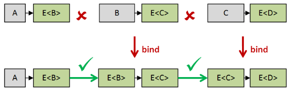

# "Map 和 Bind 和 Apply，哦我的上帝！"系列

在这一系列文章中，我将尝试描述一些处理通用数据类型（如`Option`和`List`）的核心函数。这是我关于[函数式模式的讲座](http://fsharpforfunandprofit.com/fppatterns/)的后续文章。

是的，我知道我承诺过不做这种事情，但是对于这篇文章，我想采取与大多数人不同的方法。与其谈论诸如类型类之类的抽象概念，我认为专注于核心函数本身以及它们在实践中的使用可能更有用。

换句话说，这是`map`、`return`、`apply`和`bind`的一种类似于"man page"的东西。

因此，每个函数都有一个部分，描述它们的名称（和常见别名），常见运算符，它们的类型签名，然后详细描述为什么需要它们以及如何使用它们，以及一些可视化内容（我总是觉得很有帮助）。

+   理解 map 和 apply。一个用于处理提升世界的工具集。

+   理解 bind。或者，如何组合跨世界的函数。

+   在实践中使用核心函数。处理独立和依赖数据。

+   理解 traverse 和 sequence。混合列表和提升值。

+   在实践中使用 map、apply、bind 和 sequence。一个使用所有技术的真实例子。

+   重新设计 Reader monad。或者，设计您自己的提升世界。

+   Map 和 Bind 和 Apply，一个总结。

# 理解 map 和 apply

# 理解 map 和 apply

在这一系列文章中，我将尝试描述一些处理通用数据类型（如`Option`和`List`）的核心函数。这是我关于[函数式模式的讲座](http://fsharpforfunandprofit.com/fppatterns/)的后续文章。

是的，我知道我承诺过不做这种事情，但是对于这篇文章，我想采取与大多数人不同的方法。与其谈论诸如类型类之类的抽象概念，我认为专注于核心函数本身以及它们在实践中的使用可能更有用。

换句话说，这是`map`、`return`、`apply`和`bind`的一种类似于["man page"](https://en.wikipedia.org/wiki/Man_page)的东西。

因此，每个函数都有一个部分，描述它们的名称（和常见别名），常见运算符，它们的类型签名，然后详细描述为什么需要它们以及如何使用它们，以及一些可视化内容（我总是觉得很有帮助）。

Haskell 程序员和范畴论者现在可能会移开目光！这里不会涉及数学，但会有相当多的泛泛之谈。我将避免使用行话和 Haskell 特定概念，比如类型类，并尽可能关注大局。这里的概念应适用于任何语言中的任何类型的函数式编程。

我知道有些人可能不喜欢这种方法。没关系。网上有[很多](https://wiki.haskell.org/Monad_tutorials_timeline)更学术的解释。可以从[这里](http://homepages.inf.ed.ac.uk/wadler/papers/marktoberdorf/baastad.pdf)和[这里](http://www.soi.city.ac.uk/~ross/papers/Applicative.html)开始。

最后，与本站的大多数文章一样，我写这篇文章也是为了我自己的利益，作为我自己学习过程的一部分。我并不自称是专家，所以如果我有任何错误，请告诉我。

## 背景

首先，让我提供一些背景和一些术语。

想象一下，我们可以编程的有两个世界：一个是“正常”的日常世界，另一个是我将称之为“提升世界”的世界（我将很快解释原因）。

提升世界与普通世界非常相似。实际上，普通世界中的每一件事物在提升世界中都有对应的事物。

所以，例如，我们在正常世界中有一组称为`Int`的值，而在提升世界中，有一组并行的值称为，比如，`E<Int>`。同样地，我们在正常世界中有一组称为`String`的值，在提升世界中，有一组并行的值称为`E<String>`。


此外，正如在正常世界中存在`Int`和`String`之间的函数一样，在提升世界中也存在`E<Int>`和`E<String>`之间的函数。


请注意，我故意使用术语“世界”而不是“类型”，以强调世界中值之间的*关系*和底层数据类型一样重要。

### 到底什么是提升世界？

我无法准确定义什么是“提升世界”，因为有太多不同种类的提升世界，它们之间没有任何共同之处。

其中一些代表数据结构（`Option<T>`），一些代表工作流程（`State<T>`），一些代表信号（`Observable<T>`），或者异步值（`Async<T>`），或其他概念。

但是即使各种不同的提升世界没有具体的共同之处，它们*确实*在可以处理它们的方式上存在共性。我们发现在不同的提升世界中，某些问题反复出现，我们可以使用标准工具和模式来处理这些问题。

本系列的其余部分将尝试记录这些工具和模式。

## 系列内容

本系列的开发如下：

+   首先，我将讨论我们用于将正常事物提升到提升世界的工具。这包括`map`、`return`、`apply`和`bind`等函数。

+   接下来，我将讨论如何根据值是独立还是依赖来以不同方式组合提升值。

+   接下来，我们将探讨一些将列表与其他提升值混合的方法。

+   最后，我们将看两个真实世界的例子，将所有这些技术应用起来，我们会意外地发明 Reader 单子。

这里是各种函数的快捷方式列表：

+   **第 1 部分：提升到提升世界**

    +   `map`函数

    +   `return`函数

    +   `apply`函数

    +   `liftN`函数族

    +   `zip`函数和 ZipList 世界

+   **第 2 部分：如何组合跨世界函数**

    +   绑定（`bind`）函数

    +   列表不是一个单子。选项不是一个单子。

+   **第 3 部分：实践中使用核心函数**

    +   独立和依赖数据

    +   示例：使用应用风格和单子风格进行验证

    +   提升到一致世界

    +   Kleisli 世界

+   **第 4 部分：混合列表和提升值**

    +   混合列表和提升值

    +   `traverse`/`MapM`函数

    +   `sequence`函数

    +   "序列"作为临时实现的配方

    +   可读性 vs. 性能

    +   伙计，我的`filter`在哪里？

+   **第 5 部分：使用所有技术的真实世界示例**

    +   示例：下载和处理网站列表

    +   将两个世界视为一个

+   **第 6 部分：设计自己的提升世界**

    +   设计自己的提升世界

    +   过滤掉失败

    +   Reader 单子

+   **第 7 部分：总结**

    +   提到的运算符列表

    +   进一步阅读

* * *

## 第一部分：提升到提升世界

第一个挑战是：我们如何从普通世界到提升世界？

首先，我们将假设对于任何特定的提升世界：

+   普通世界中的每种类型都有对应的提升世界中的类型。

+   普通世界中的每个值都有对应的提升世界中的值。

+   普通世界中的每个函数都有对应的提升世界中的函数。

将某物从普通世界移动到提升世界的概念称为"提升"（这就是我首次使用"提升世界"这个术语的原因）。

我们将这些对应的东西称为"提升类型"、"提升值"和"提升函数"。

现在因为每个提升的世界都是不同的，所以没有通用的提升实现，但我们可以给各种“提升”模式命名，例如`map`和`return`。

*注意：这些提升的类型没有标准名称。我见过它们被称为“包装类型”或“增强类型”或“monadic 类型”。我对这些名称都不是很满意，所以我发明了[一个新的名称](https://xkcd.com/927/)！另外，我正在尽量避免做出任何假设，所以我不想暗示提升的类型在某种程度上更好或包含额外的信息。我希望通过在本文中使用“提升”的词，可以将注意力集中在提升过程上，而不是类型本身上。*

*至于使用“monadic”这个词，那是不准确的，因为这些类型不要求是单子的一部分。*

* * *

## `map`函数

**常见名称**：`map`、`fmap`、`lift`、`Select`

**常见运算符**：`<$>` `<!>`

**功能**：将一个函数提升到提升的世界中

**签名**：`(a->b) -> E<a> -> E<b>`。另外，参数反转时是：`E<a> -> (a->b) -> E<b>`

### 描述

“map”是一个通用名称，用于将正常世界中的函数转换为提升世界中的对应函数。


每个提升的世界都将有自己的`map`实现。

### 替代解释

对`map`的另一种解释是它是一个*两个*参数函数，它接受一个提升的值（`E<a>`）和一个普通函数（`a->b`），并返回一个通过将函数`a->b`应用于`E<a>`的内部元素而生成的新提升值（`E<b>`）。


在默认柯里化函数的语言中，如 F#，这两种解释是相同的。在其他语言中，您可能需要对函数进行柯里化/取消柯里化以在两种用法之间切换。

注意*两个*参数版本通常具有`E<a> -> (a->b) -> E<b>`的签名，首先是提升值，然后是普通函数。从抽象的角度来看，它们之间没有区别--`map`概念是相同的--但显然，参数顺序会影响你在实践中如何使用`map`函数。

### 实现示例

这里有两个示例，演示了在 F#中如何定义选项和列表的`map`。

```
/// map for Options
let mapOption f opt =
    match opt with
    | None -> 
        None
    | Some x -> 
        Some (f x)
// has type : ('a -> 'b) -> 'a option -> 'b option

/// map for Lists
let rec mapList f list =
    match list with
    | [] -> 
        []  
    | head::tail -> 
        // new head + new tail
        (f head) :: (mapList f tail)
// has type : ('a -> 'b) -> 'a list -> 'b list 
```

当然，这些函数是内置的，所以我们不需要定义它们，我只是为了展示一些常见类型可能的样子。

### 使用示例

这里有一些在 F#中如何使用`map`的示例：

```
// Define a function in the normal world
let add1 x = x + 1
// has type : int -> int

// A function lifted to the world of Options
let add1IfSomething = Option.map add1
// has type : int option -> int option

// A function lifted to the world of Lists
let add1ToEachElement = List.map add1
// has type : int list -> int list 
```

有了这些映射版本，你可以编写这样的代码：

```
Some 2 |> add1IfSomething    // Some 3 
[1;2;3] |> add1ToEachElement // [2; 3; 4] 
```

在许多情况下，我们不需要创建一个中间函数--而是使用部分应用：

```
Some 2 |> Option.map add1    // Some 3 
[1;2;3] |> List.map add1     // [2; 3; 4] 
```

### 正确`map`实现的属性

我之前说过，提升的世界在某些方面是正常世界的镜像。正常世界中的每个函数都有一个对应的函数在提升的世界中，等等。我们希望`map`以明智的方式返回这个对应的提升函数。

例如，`add`的`map`不应（错误地）返回`multiply`的提升版本，`lowercase`的`map`也不应返回`uppercase`的提升版本！但我们如何*确保*特定的`map`实现确实返回*正确*的相应函数呢？

在[我的关于属性基础测试的文章](http://fsharpforfunandprofit.com/pbt/)中，我展示了如何通过一般属性而不是具体示例来定义和测试函数的正确实现。

这对`map`也是适用的。具体的实现会随着特定的提升世界而变化，但在所有情况下，实现应满足某些属性，以避免奇怪的行为。

首先，如果你在正常世界中使用`id`函数，并将其通过`map`提升到提升世界中，新函数必须与提升世界中的`id`函数*相同*。


接下来，如果你在正常世界中使用两个函数`f`和`g`，并将它们组合（成为`h`），然后使用`map`提升结果函数，那么结果函数应该与如果你先将`f`和`g`提升到提升世界中，然后在那里组合它们后是*相同*的。


这两个属性被称为["函子法则"](https://en.wikibooks.org/wiki/Haskell/The_Functor_class#The_functor_laws)，而**函子**（在编程意义上）被定义为一个通用数据类型--在我们的情况下是`E<T>`--加上一个遵守函子法则的`map`函数。

*注意：“函子”是一个令人困惑的词。有“函子”在范畴论意义上，也有“函子”在编程意义上（如上所定义）。还有在库中定义的称为“函子”的东西，比如[Haskell 中的`Functor`类型类](https://hackage.haskell.org/package/base-4.7.0.2/docs/Data-Functor.html)，以及[Scalaz 中的`Functor`特性](https://scalaz.github.io/scalaz/scalaz-2.9.0-1-6.0/doc.sxr/scalaz/Functor.scala.html)，更不用说 SML 和[OCaml 中的函子](https://realworldocaml.org/v1/en/html/functors.html)（以及[C++](http://www.cprogramming.com/tutorial/functors-function-objects-in-c++.html)），它们又是不同的！*

*因此，我更喜欢谈论“可映射”的世界。在实际编程中，你几乎永远不会遇到一个不支持以某种方式映射的提升世界。*

### `map`的变体

有一些常见的`map`变体：

+   **常量映射**。常量或“替换为”映射将所有值替换为常量而不是函数的输出。在某些情况下，像这样的专门函数可以实现更高效的实现。

+   **与跨世界函数一起工作的映射**。映射函数 `a->b` 完全存在于正常世界中。但是，如果您要映射的函数并不在正常世界中返回值，而是在另一个不同的增强世界中返回值呢？我们将在后续文章中看到如何解决这个挑战。

* * *

## `return` 函数

**常见名称**：`return`、`pure`、`unit`、`yield`、`point`

**常见运算符**：无

**功能**：将单个值提升到增强世界中

**签名**：`a -> E<a>`

### 描述

"return"（也称为"unit"或"pure"）只是从普通值创建一个增强值。


这个函数有很多名称，但我会保持一致，称之为`return`，因为这是 F# 中的通用术语，并且是计算表达式中使用的术语。

*注意：我忽略了`pure`和`return`之间的区别，因为类型类不是本文的重点。*

### 实现示例

以下是 F# 中 `return` 实现的两个示例：

```
// A value lifted to the world of Options
let returnOption x = Some x
// has type : 'a -> 'a option

// A value lifted to the world of Lists
let returnList x  = [x]
// has type : 'a -> 'a list 
```

显然，我们不需要为选项和列表定义特殊函数。再次强调，我只是为了展示对于一些常见类型，`return`可能是什么样子。

* * *

## `apply` 函数

**常见名称**：`apply`、`ap`

**常见运算符**：`<*>`

**功能**：将包装在增强值内部的函数解包为一个提升函数 `E<a> -> E<b>`

**签名**：`E<(a->b)> -> E<a> -> E<b>`

### 描述

"apply"将包装在增强值内部的函数（`E<(a->b)>`）解包为一个提升函数 `E<a> -> E<b>`


这可能看起来不重要，但实际上非常有价值，因为它允许您将正常世界中的多参数函数提升为增强世界中的多参数函数，我们很快就会看到。

### 另一种解释

`apply`的另一种解释是，它是一个*双*参数函数，接受一个增强值（`E<a>`）和一个增强函数（`E<(a->b)>`），并返回通过将函数 `a->b` 应用于 `E<a>` 的内部元素生成的新增强值（`E<b>`）。

例如，如果您有一个单参数函数（`E<(a->b)>`），您可以将其应用于单个增强参数，以获得输出作为另一个增强值。


如果您有一个两参数函数（`E<(a->b->c)>`），您可以连续使用两次 `apply`，将两个增强参数传递给它，以获得增强输出。


您可以继续使用这种技术来处理任意数量的参数。

### 实现示例

以下是在 F# 中为两种不同类型定义 `apply` 的一些示例：

```
module Option =

    // The apply function for Options
    let apply fOpt xOpt = 
        match fOpt,xOpt with
        | Some f, Some x -> Some (f x)
        | _ -> None

module List =

    // The apply function for lists
    // [f;g] apply [x;y] becomes [f x; f y; g x; g y]
    let apply (fList: ('a->'b) list) (xList: 'a list)  = 
        [ for f in fList do
          for x in xList do
              yield f x ] 
```

在这种情况下，我没有像`applyOption`和`applyList`那样命名，而是给这些函数相同的名称，但将它们放在每种类型的模块中。

请注意，在`List.apply`实现中，第一个列表中的每个函数被应用到第二个列表中的每个值上，从而产生“交叉积”样式的结果。也就是说，函数列表`[f; g]`应用到值列表`[x; y]`上会变成四元素列表`[f x; f y; g x; g y]`。我们很快就会看到这不是唯一的做法。

当然，我在构建这个实现时是在一个`for..in..do`循环上作弊 -- 这个功能已经存在！

我之所以这样做是为了清楚地展示`apply`的工作原理。创建一个“从头开始”的递归实现是很容易的（虽然创建一个正确的尾递归实现并不容易！），但我现在想专注于概念而不是实现。

### `apply`的中缀版本

使用现有的`apply`函数可能会很笨拙，因此通常会创建一个中缀版本，通常称为`<*>`。有了这个，你可以这样写代码：

```
let resultOption =  
    let (<*>) = Option.apply
    (Some add) <*> (Some 2) <*> (Some 3)
// resultOption = Some 5

let resultList =  
    let (<*>) = List.apply
    [add] <*> [1;2] <*> [10;20]
// resultList = [11; 21; 12; 22] 
```

### 应用与映射

`apply`和`return`的组合被认为比`map`“更强大”，因为如果你有`apply`和`return`，你可以从它们构造`map`，但反之则不成立。

这是它的工作原理：要从普通函数构造一个提升函数，只需在普通函数上使用`return`然后`apply`。这给你的结果与你一开始就用`map`是一样的。


这个技巧还意味着我们的中缀表示法可以简化一些。初始的`return`然后`apply`可以被`map`替换，我们通常也会为`map`创建一个中缀运算符，例如在 F# 中的`<!>`。

```
let resultOption2 =  
    let (<!>) = Option.map
    let (<*>) = Option.apply

    add <!> (Some 2) <*> (Some 3)
// resultOption2 = Some 5

let resultList2 =  
    let (<!>) = List.map
    let (<*>) = List.apply

    add <!> [1;2] <*> [10;20]
// resultList2 = [11; 21; 12; 22] 
```

这使得代码看起来更像是正常使用函数。也就是说，我们可以使用类似的方式`add <!> x <*> y`而不是正常的`add x y`，但现在`x`和`y`可以是提升的值而不是普通值。有些人甚至将这种风格称为“过载的空格”！

这是另一个有趣的例子：

```
let batman = 
    let (<!>) = List.map
    let (<*>) = List.apply

    // string concatenation using +
    (+) <!> ["bam"; "kapow"; "zap"] <*> ["!"; "!!"]  

// result =
// ["bam!"; "bam!!"; "kapow!"; "kapow!!"; "zap!"; "zap!!"] 
```

### 正确的`apply`/`return`实现的属性

与`map`一样，正确实现的`apply`/`return`对应应该具有一些性质，无论我们正在使用什么样的提升世界。

有四条所谓的["应用定律"](https://en.wikibooks.org/wiki/Haskell/Applicative_functors#Applicative_functor_laws)，而一个**Applicative Functor**（在编程意义上）被定义为一个通用的数据类型构造器 -- `E<T>` -- 加上一对遵守应用定律的函数（`apply`和`return`）。

就像对`map`的定律一样，这些定律非常明智。我会展示其中的两个。

第一个定律说，如果你在普通世界中使用`id`函数，并且你使用`return`将它提升到提升的世界中，然后进行`apply`，新函数，类型为`E<a> -> E<a>`，应该与提升的世界中的`id`函数相同。


第二个定律说，如果你拿一个函数`f`和一个普通世界中的值`x`，并将`f`应用于`x`以获得一个结果（比如`y`），然后使用`return`提升结果，那么结果值应该与如果你首先将`f`和`x`提升到提升世界中，然后在那里应用它们后相同。


另外两个定律不容易用图表表示，所以我不会在这里记录它们，但这两个定律一起确保任何实现都是合理的。

* * *

## `liftN`函数族

**常见名称**：`lift2`、`lift3`、`lift4`等

**常见操作符**：无

**功能**：使用指定函数组合两个（或三个、四个）提升值

**签名**：

lift2：`(a->b->c) -> E<a> -> E<b> -> E<c>`,

lift3：`(a->b->c->d) -> E<a> -> E<b> -> E<c> -> E<d>`,

等等。

### 描述

`apply`和`return`函数可以用来定义一系列辅助函数`liftN`（`lift2`、`lift3`、`lift4`等），这些函数接受具有 N 个参数的普通函数（其中 N=2,3,4 等）并将其转换为相应的提升函数。

注意`lift1`只是`map`，通常不会单独定义为一个函数。

这是一个实现可能看起来像的例子：

```
module Option = 
    let (<*>) = apply 
    let (<!>) = Option.map

    let lift2 f x y = 
        f <!> x <*> y

    let lift3 f x y z = 
        f <!> x <*> y <*> z

    let lift4 f x y z w = 
        f <!> x <*> y <*> z <*> w 
```

这是`lift2`的可视化表示：


`lift`系列函数可以使代码更易读，因为通过使用预先制作的`lift`函数之一，我们可以避免使用`<*>`语法。

首先，这里有一个提升两个参数函数的例子：

```
// define a two-parameter function to test with
let addPair x y = x + y 

// lift a two-param function
let addPairOpt = Option.lift2 addPair

// call as normal
addPairOpt (Some 1) (Some 2) 
// result => Some 3 
```

这里有一个提升三个参数函数的例子：

```
// define a three-parameter function to test with
let addTriple x y z = x + y + z

// lift a three-param function
let addTripleOpt = Option.lift3 addTriple

// call as normal
addTripleOpt (Some 1) (Some 2) (Some 3)   
// result => Some 6 
```

### 将"lift2"解释为"组合器"

还有一种将`apply`解释为提升值的"组合器"的替代方法，而不是作为函数应用。

例如，当使用`lift2`时，第一个参数是指定如何组合值的参数。

这是一个例子，其中相同的值以两种不同的方式组合：首先是加法���然后是乘法。

```
Option.lift2 (+) (Some 2) (Some 3)   // Some 5
Option.lift2 (*) (Some 2) (Some 3)   // Some 6 
```

进一步地，我们能否消除对这个第一个函数参数的需求，并有一种*通用*的组合值的方式？

是的，我们可以！我们可以使用元组构造函数来组合值。当我们这样做时，我们在不做出任何关于它们将如何使用的决定的情况下组合值。

这是它在图表中的样子：


这里是你可能为选项和列表实现它的方式：

```
// define a tuple creation function
let tuple x y = x,y

// create a generic combiner of options
// with the tuple constructor baked in
let combineOpt x y = Option.lift2 tuple x y 

// create a generic combiner of lists
// with the tuple constructor baked in
let combineList x y = List.lift2 tuple x y 
```

让我们看看当我们使用组合器时会发生什么：

```
combineOpt (Some 1) (Some 2)        
// Result => Some (1, 2)

combineList [1;2] [100;200]         
// Result => [(1, 100); (1, 200); (2, 100); (2, 200)] 
```

现在我们有了一个提升的元组，我们可以以任何想要的方式处理这对值，我们只需要使用`map`来实际组合。

想要添加数值吗？只需在`map`函数中使用`+`：

```
combineOpt (Some 2) (Some 3)        
|> Option.map (fun (x,y) -> x + y)  
// Result => // Some 5

combineList [1;2] [100;200]         
|> List.map (fun (x,y) -> x + y)    
// Result => [101; 201; 102; 202] 
```

想要将值相乘吗？只需在`map`函数中使用`*`：

```
combineOpt (Some 2) (Some 3)        
|> Option.map (fun (x,y) -> x * y)  
// Result => Some 6

combineList [1;2] [100;200]         
|> List.map (fun (x,y) -> x * y)    
// Result => [100; 200; 200; 400] 
```

等等。显然，实际应用会更有趣一些。

### 以`lift2`的方式定义`apply`

有趣的是，上面的`lift2`函数实际上可以作为定义`apply`的替代基础。

也就是说，我们可以根据`lift2`函数来定义`apply`，将组合函数设置为仅为函数应用。

这是关于`Option`的演示：

```
module Option = 

    /// define lift2 from scratch
    let lift2 f xOpt yOpt = 
        match xOpt,yOpt with
        | Some x,Some y -> Some (f x y)
        | _ -> None

    /// define apply in terms of lift2
    let apply fOpt xOpt = 
        lift2 (fun f x -> f x) fOpt xOpt 
```

这种替代方法值得了解，因为对于某些类型来说，定义`lift2`比`apply`更容易。

### 组合缺失或错误数据

请注意，在我们查看的所有组合器中，如果其中一个升高的值“缺失”或以某种方式“错误”，则整体结果也是错误的。

例如，对于`combineList`，如果其中一个参数是空列表，则结果也是空列表，而对于`combineOpt`，如果其中一个参数是`None`，则结果也是`None`。

```
combineOpt (Some 2) None    
|> Option.map (fun (x,y) -> x + y)    
// Result => None

combineList [1;2] []         
|> List.map (fun (x,y) -> x * y)    
// Result => Empty list 
```

可以创建一种忽略缺失或错误值的替代组合器，就像将“0”添加到数字中一样会被忽略。有关更多信息，请参阅我的文章“不费吹灰之力的单子”。

### 单侧组合器`<*`和`*>`

在某些情况下，您可能有两个升高的值，并且希望丢弃其中一侧的值或另一侧的值。

以下是列表的示例：

```
let ( <* ) x y = 
    List.lift2 (fun left right -> left) x y 

let ( *> ) x y = 
    List.lift2 (fun left right -> right) x y 
```

然后，我们可以将一个 2 元素列表和一个 3 元素列表组合起来，得到一个预期的 6 元素列表，但内容只来自一侧或另一侧。

```
[1;2] <* [3;4;5]   // [1; 1; 1; 2; 2; 2]
[1;2] *> [3;4;5]   // [3; 4; 5; 3; 4; 5] 
```

我们可以将此转换为一个特性！我们可以通过与`[1..n]`交叉来多次复制一个值 N 次。

```
let repeat n pattern =
    [1..n] *> pattern 

let replicate n x =
    [1..n] *> [x]

repeat 3 ["a";"b"]  
// ["a"; "b"; "a"; "b"; "a"; "b"]

replicate 5 "A"
// ["A"; "A"; "A"; "A"; "A"] 
```

当然，这绝不是复制值的有效方式，但它确实显示了仅从两个函数`apply`和`return`开始，您可以构建一些相当复杂的行为。

然而，在更实际的情况下，为什么这种“丢弃数据”会有用呢？嗯，在许多情况下，我们可能不想要值，但我们*确实*想要效果。

例如，在解析器中，您可能会看到如下代码：

```
let readQuotedString =
   readQuoteChar *> readNonQuoteChars <* readQuoteChar 
```

在此片段中，`readQuoteChar`表示“从输入流匹配并读取引号字符”，而`readNonQuoteChars`表示“从输入流读取一系列非引号字符”。

当我们解析带引号的字符串时，我们希望确保包含引号字符的输入流被读取，但我们不关心引号字符本身，只关心内部内容。

因此，使用`*>`来忽略前导引号，使用`<*`来忽略尾随引号。

* * *

## `zip`函数和 ZipList 世界

**常见名称**：`zip`，`zipWith`，`map2`

**常见运算符**：`<*>`（在 ZipList 世界的上下文中）

**功能**：使用指定的函数组合两个列表（或其他可枚举对象）

**签名**：`E<(a->b->c)> -> E<a> -> E<b> -> E<c>`，其中`E`是列表或其他可枚举类型，或者对于元组组合版本为`E<a> -> E<b> -> E<a,b>`。

### 描述

某些数据类型可能有多个有效的`apply`实现。例如，另一种可能的列表`apply`实现通常称为`ZipList`或其变体之一。

在这个实现中，每个列表中对应的元素同时处理，然后两个列表都被移动以获取下一个元素。也就是说，函数列表 `[f; g]` 应用于值列表 `[x; y]`，变成了两个元素的列表 `[f x; g y]`

```
// alternate "zip" implementation
// [f;g] apply [x;y] becomes [f x; g y]
let rec zipList fList xList  = 
    match fList,xList with
    | [],_ 
    | _,[] -> 
        // either side empty, then done
        []  
    | (f::fTail),(x::xTail) -> 
        // new head + new tail
        (f x) :: (zipList fTail xTail)
// has type : ('a -> 'b) -> 'a list -> 'b list 
```

*警告：这个实现仅用于演示。它不是尾递归的，所以不要用于大型列表！*

如果列表的长度不同，一些实现会抛出异常（就像 F# 库函数 `List.map2` 和 `List.zip` 做的那样），而另一些则会默默地忽略额外的数据（就像上面的实现一样）。

好的，让我们看看它的用法：

```
let add10 x = x + 10
let add20 x = x + 20
let add30 x = x + 30

let result =  
    let (<*>) = zipList 
    [add10; add20; add30] <*> [1; 2; 3] 
// result => [11; 22; 33] 
```

注意结果是 `[11; 22; 33]` -- 只有三个元素。如果我们使用了标准的 `List.apply`，那么就会有九个元素。

### 将 "zip" 解释为 "组合器"

我们在上面看到，`List.apply`，或者更确切地说是 `List.lift2`，可以被解释为一个组合器。同样，`zipList` 也可以。

```
let add x y = x + y

let resultAdd =  
    let (<*>) = zipList 
    [add;add] <*> [1;2] <*> [10;20]
// resultAdd = [11; 22]
// [ (add 1 10); (add 2 20) ] 
```

注意我们不能在第一个列表中只有*一个* `add` 函数 -- 我们必须为第二个和第三个列表中的每个元素都有一个 `add`！

这可能会很烦人，因此通常会使用 "tupled" 版本的 `zip`，你根本不指定组合函数，只是得到一组元组的列表，稍后可以使用 `map` 处理它们。这与上面讨论的 `combine` 函数使用的方法相同，但用于 `zipList`。

### ZipList 世界

在标准 List 世界中，有一个 `apply` 和一个 `return`。但是有了我们不同版本的 `apply`，我们可以创建一个名为 ZipList 世界的不同版本的 List 世界。

ZipList 世界与标准 List 世界相当不同。

在 ZipList 世界中，`apply` 函数的实现如上所述。但更有趣的是，与标准 List 世界相比，ZipList 世界对 `return` 的实现是*完全不同*的。在标准 List 世界中，`return` 只是一个带有单个元素的列表，但对于 ZipList 世界，它必须是一个无限重复的值！

在像 F# 这样的非惰性语言中，我们不能这样做，但是如果我们用 `Seq`（也就是 `IEnumerable`）替换 `List`，那么我们*可以*创建一个无限重复的值，如下所示：

```
module ZipSeq =

    // define "return" for ZipSeqWorld
    let retn x = Seq.initInfinite (fun _ -> x)

    // define "apply" for ZipSeqWorld
    // (where we can define apply in terms of "lift2", aka "map2")
    let apply fSeq xSeq  = 
        Seq.map2 (fun f x -> f x)  fSeq xSeq  
    // has type : ('a -> 'b) seq -> 'a seq -> 'b seq

    // define a sequence that is a combination of two others
    let triangularNumbers = 
        let (<*>) = apply

        let addAndDivideByTwo x y = (x + y) / 2
        let numbers = Seq.initInfinite id
        let squareNumbers = Seq.initInfinite (fun i -> i * i)
        (retn addAndDivideByTwo) <*> numbers <*> squareNumbers 

    // evaulate first 10 elements 
    // and display result 
    triangularNumbers |> Seq.take 10 |> List.ofSeq |> printfn "%A"
    // Result =>
    // [0; 1; 3; 6; 10; 15; 21; 28; 36; 45] 
```

这个例子演示了，一个高级世界不仅仅是一个数据类型（比如 List 类型），而是由数据类型*和*与之配套的函数组成。在这个特殊情况下，"List 世界" 和 "ZipList 世界" 共享相同的数据类型，但具有完全不同的环境。

## 哪些类型支持 `map` 和 `apply` 和 `return`？

到目前为止，我们以抽象的方式定义了所有这些有用的函数。但是找到具有它们实现的真实类型，包括所有各种法则，有多容易呢？

答案是：非常容易！事实上*几乎所有*类型都支持这组函数。你会很难找到一个没有用的类型。

这意味着`map`、`apply`和`return`可用（或可以轻松实现）于标准类型，如`Option`、`List`、`Seq`、`Async`等，以及您可能自己定义的任何类型。

## 总结

在本文中，我描述了将简单的“普通”值提升到提升世界的三个核心函数：`map`、`return`和`apply`，以及一些派生函数，如`liftN`和`zip`。

但是在实践中，事情并不那么简单。我们经常不得不处理跨越世界的函数。它们的输入在普通世界中，但输出在提升世界中。

在下一篇文章中，我们将展示如何将这些跨世界函数提升到提升世界中。

# 理解绑定

# 理解绑定

本文是系列文章中的第二篇。在上一篇文章中，我描述了一些将值从普通世界提升到提升世界的核心函数。

在本文中，我们将探讨“跨越世界”的函数，以及如何使用`bind`函数来驯服它们。

## 系列内容

这里是此系列中提到的各种函数的快捷方式列表：

+   **第一部分：提升到提升世界**

    +   映射（`map`）函数

    +   返回（`return`）函数

    +   应用（`apply`）函数

    +   `liftN`函数族

    +   `zip`函数和 ZipList 世界

+   **第二部分：如何编写跨世界函数**

    +   绑定（`bind`）函数

    +   列表不是单子。选项不是单子。

+   **第三部分：实践中使用核心函数**

    +   独立和依赖数据

    +   示例：使用应用风格和单子风格进行验证

    +   提升到一致的世界

    +   Kleisli 世界

+   **第四部分：混合列表和提升值**

    +   混合列表和提升值

    +   遍历（`traverse`）/`MapM`函数

    +   序列（`sequence`）函数

    +   “序列”作为临时实现的配方

    +   可读性与性能

    +   伙计，我的`filter`在哪里？

+   **第五部分：使用所有技术的真实示例**

    +   示例：下载和处理网站列表

    +   将两个世界视为一个

+   **第六部分：设计您自己的提升世界**

    +   设计您自己的提升世界

    +   过滤失败

    +   读取器单子

+   **第七部分：总结**

    +   提到的运算符列表

    +   进一步阅读

* * *

## 第二部分: 如何组合跨世界函数

* * *

## `bind` 函数

**常见名称**: `bind`, `flatMap`, `andThen`, `collect`, `SelectMany`

**常见操作符**: `>>=` (从左到右), `=<<` (从右到左)

**功能**: 允许您组合跨世界（“单子”）函数

**签名**: `(a->E<b>) -> E<a> -> E<b>`。或者参数颠倒: `E<a> -> (a->E<b>) -> E<b>`

### 描述

我们经常需要处理在正常世界和提升世界之间穿越的函数。

例如: 一个将`string`解析为`int`的函数可能返回一个`Option<int>`而不是普通的`int`，一个从文件中读取行的函数可能返回`IEnumerable<string>`，一个获取网页的函数可能返回`Async<string>`，等等。

这类“跨世界”函数以它们的签名`a -> E<b>`可识别; 它们的输入在正常世界，但它们的输出在提升世界。不幸的是，这意味着这类函数不能使用标准组合链接在一起。


“bind”的作用是将一个跨世界函数（通常称为“单子函数”）转换为一个提升的函数 `E<a> -> E<b>`。


这样做的好处是生成的提升函数纯粹存在于提升世界中，因此可以轻松地通过组合结合在一起。

例如，类型为 `a -> E<b>` 的函数不能直接与类型为 `b -> E<c>` 的函数组合，但在使用 `bind` 后，第二个函数变成了类型为 `E<b> -> E<c>` 的函数，可以进行组合。



这样，`bind`让我们能够链式地连接任意数量的单子函数。

### 另一种解释

对 `bind` 的另一种解释是，它是一个 *双* 参数函数，它接受一个提升的值（`E<a>`）和一个“单子函数”（`a -> E<b>`），并返回通过“解包”输入中的值，并对其运行函数 `a -> E<b>` 生成的新提升值（`E<b>`）。当然，“解包”这个隐喻并不适用于每一个提升世界，但仍然经常有用地这样思考它。


### 实现示例

这里是在 F# 中为两种不同类型定义 `bind` 的一些例子:

```
module Option = 

    // The bind function for Options
    let bind f xOpt = 
        match xOpt with
        | Some x -> f x
        | _ -> None
    // has type : ('a -> 'b option) -> 'a option -> 'b option

module List = 

    // The bind function for lists
    let bindList (f: 'a->'b list) (xList: 'a list)  = 
        [ for x in xList do 
          for y in f x do 
              yield y ]
    // has type : ('a -> 'b list) -> 'a list -> 'b list 
```

注:

+   当然，在这两种特定情况下，这些函数已经存在于 F# 中，称为 `Option.bind` 和 `List.collect`。

+   对于 `List.bind`，我又作弊了，使用了`for..in..do`，但我认为这个特定的实现清楚地展示了绑定如何与列表一起工作。有一个更纯净的递归实现，但我不会在这里展示它。

### 使用示例

正如本节开头所解释的，`bind`可以用来组合跨世界函数。让我们通过一个简单的例子来看看这是如何实践的。

首先让我们假设我们有一个将特定的`string`解析为`int`的函数。这是一个非常简单的实现:

```
let parseInt str = 
    match str with
    | "-1" -> Some -1
    | "0" -> Some 0
    | "1" -> Some 1
    | "2" -> Some 2
    // etc
    | _ -> None

// signature is string -> int option 
```

有时它返回一个 int，有时不返回。因此签名是`string -> int option` -- 一个跨世界函数。

假设我们有另一个以`int`为输入并返回`OrderQty`类型的函数：

```
type OrderQty = OrderQty of int

let toOrderQty qty = 
    if qty >= 1 then 
        Some (OrderQty qty)
    else
        // only positive numbers allowed
        None

// signature is int -> OrderQty option 
```

再次强调，如果输入不是正数，它可能不会返回`OrderQty`。因此签名是`int -> OrderQty option` -- 另一个跨世界函数。

现在，我们如何创建一个从字符串开始并在一步中返回`OrderQty`的函数？

`parseInt`的输出不能直接输入`toOrderQty`，这就是`bind`发挥作用的地方！

执行`Option.bind toOrderQty`将其提升为一个`int option -> OrderQty option`函数，因此`parseInt`的输出可以作为输入使用，正如我们需要的那样。

```
let parseOrderQty str =
    parseInt str
    |> Option.bind toOrderQty
// signature is string -> OrderQty option 
```

我们新的`parseOrderQty`的签名是`string -> OrderQty option`，又一个跨世界函数。因此，如果我们想对输出的`OrderQty`做些什么，我们很可能需要在链中的下一个函数上再次使用`bind`。

### `bind`的中缀版本

与`apply`一样，使用命名的`bind`函数可能会很麻烦，因此通常创建一个中缀版本，通常称为`>>=`（用于左到右数据流）或`=<<`（用于右到左数据流）。

有了这个，你可以像这样编写`parseOrderQty`的另一种版本：

```
let parseOrderQty_alt str =
    str |> parseInt >>= toOrderQty 
```

你可以看到`>>=`扮演的角色与管道(`|>`)相同，只是它用于将"提升"值传递给跨世界函数。

### `bind`作为一个"可编程分号"

`bind`可以用来链接任意数量的函数或表达式，因此你经常看到类似这样的代码：

```
expression1 >>= 
expression2 >>= 
expression3 >>= 
expression4 
```

这与将`>>=`替换为`;`后的命令式程序看起来并没有太大的不同：

```
statement1; 
statement2;
statement3;
statement4; 
```

因此，有时将`bind`称为"可编程分号"。

### 对`bind/return`的语言支持

大多数函数式编程语言都有某种形式的语法支持`bind`，让你避免编写一系列的延续或使用显式的绑定。

在 F#中，它是计算表达式的一个组件，因此以下显式的`bind`链接：

```
initialExpression >>= (fun x ->
expressionUsingX  >>= (fun y ->
expressionUsingY  >>= (fun z ->
x+y+z )))             // return 
```

变得隐式，使用`let!`语法：

```
elevated {
    let! x = initialExpression 
    let! y = expressionUsingX x
    let! z = expressionUsingY y
    return x+y+z } 
```

在 Haskell 中，等价的是"do notation"：

```
do
    x <- initialExpression 
    y <- expressionUsingX x
    z <- expressionUsingY y
    return x+y+z 
```

在 Scala 中，等价的是"for comprehension"：

```
for {
    x <- initialExpression 
    y <- expressionUsingX(x)
    z <- expressionUsingY(y)
} yield {    
    x+y+z
} 
```

强调重要的是，当使用`bind/return`时，你不一定*必须*使用特殊的语法。你始终可以像使用任何其他函数一样使用`bind`或`>>=`��

### Bind vs. Apply vs. Map

`bind`和`return`的组合被认为比`apply`和`return`更强大，因为如果你有`bind`和`return`，你可以从中构建`map`和`apply`，但反之则不行。

这里是`bind`如何用来模拟`map`的示例：

+   首先，通过将输出应用于`return`，从普通函数构造一个跨世界函数。

+   接下来，使用`bind`将这个跨世界函数转换为一个提升函数。这将给你与一开始使用`map`时相同的结果。


同样，`bind`可以模拟`apply`。以下是如何为 F#中的 Options 使用`bind`和`return`定义`map`和`apply`：

```
// map defined in terms of bind and return (Some)
let map f = 
    Option.bind (f >> Some) 

// apply defined in terms of bind and return (Some)
let apply fOpt xOpt = 
    fOpt |> Option.bind (fun f -> 
        let map = Option.bind (f >> Some)
        map xOpt) 
```

此时，人们经常会问：“为什么在`bind`更强大的情况下，我应该使用`apply`呢？”

答案是，仅仅因为`apply` *可以*被`bind`模拟，并不意味着它*应该*被模拟。例如，可以以一种无法被`bind`实现模拟的方式实现`apply`。

实际上，使用`apply`（“应用风格”）或`bind`（“单子风格”）对程序的工作方式有着深远的影响！我们将在本文第 3 部分中更详细地讨论这两种方法。

### 正确的`bind`/`return`实现的属性

就像`map`一样，以及`apply`/`return`一样，`bind`/`return`对的正确实现应该具有一些性质，无论我们正在处理哪个升级世界。

有三个所谓的["单子律"](https://en.wikibooks.org/wiki/Haskell/Understanding_monads#Monad_Laws)，定义**Monad**（在编程意义上）的一种方式是说它由三个部分组成：一个通用类型构造器`E<T>`加上一对遵守单子律的函数（`bind`和`return`）。这不是定义单子的唯一方式，数学家通常使用略有不同的定义，但对程序员来说，这种定义最有用。

就像我们之前看到的函子和应用律一样，这些律法是相当合理的。

首先，注意`return`函数本身就是一个跨世界函数：


这意味着我们可以使用`bind`将其提升到升级世界中的函数中。这个提升的函数做什么？希望什么都不做！它应该只是返回其输入。

这正是第一个单子律：它说这个提升的函数必须与升级世界中的`id`函数相同。


第二个律则是类似的，但是`bind`和`return`被颠倒了。假设我们有一个普通值`a`和一个跨世界函数`f`，将`a`转换为`E<b>`。


让我们将它们都提升到升级世界中，使用`bind`在`f`上和`return`在`a`上。


现在，如果我们将`f`的升级版本应用于`a`的升级版本，我们会得到一些值`E<b>`。


另一方面，如果我们将`f`的普通版本应用于`a`的普通版本，我们同样会得到一些值`E<b>`。


第二个单子律说这两个升级值（`E<b>`）应该是相同的。换句话说，所有这些绑定和返回不应该扭曲数据。

第三个单子律是关于结合性的。

在正常世界中，函数组合是结合的。例如，我们可以将一个值传递给函数`f`，然后���该结果传递给另一个函数`g`。或者，我们可以首先将`f`和`g`组合成一个单一函数，然后将`a`传递给它。

```
let groupFromTheLeft = (a |> f) |> g
let groupFromTheRight = a |> (f >> g) 
```

在正常世界中，我们期望这两种替代方案给出相同的答案。

第三个单子定律表示，在使用`bind`和`return`之后，分组也不重要。下面的两个示例对应上面的示例：

```
let groupFromTheLeft = (a >>= f) >>= g
let groupFromTheRight = a >>= (fun x -> f x >>= g) 
```

而且再次，我们期望这两者给出相同的答案。

* * *

## List 不是单子。Option 也不是单子。

如果你看上面的定义，一个单子有一个类型构造函数（也称为“泛型类型”）*和*两个函数*和*一组必须满足的属性。

因此，`List`数据类型只是单子的一个组成部分，就像`Option`数据类型一样。`List`和`Option`本身并不是单子。

或许更好的想法是将单子视为一种*转换*，因此，“List 单子”是将正常世界转换为升高的“List 世界”的转换，“Option 单子”是将正常世界转换为升高的“Option 世界”的转换。

我认为这就是很多混淆的来源。单词“List”可以有许多不同的含义：

1.  一个具体的类型或数据结构，比如`List<int>`。

1.  一个类型构造函数（泛型类型）：`List<T>`。

1.  一个类型构造函数和一些操作，比如一个`List`类或模块。

1.  一个类型构造函数和一些操作，这些操作满足单子定律。

只有最后一个是单子！其他含义都是有效的，但会增加混淆。

而且通过查看代码，最后两种情况很难区分。不幸的是，有些情况下实现并不满足单子定律。仅仅因为它是一个“单子”，并不意味着它是一个单子。

就个人而言，我尽量避免在本网站上使用“单子”这个词，而是专注于`bind`函数，将其视为解决问题的一套工具函数的一部分，而不是一个抽象概念。

所以不要问：我有单子吗？

请问：我有有用的绑定和返回函数吗？它们是否被正确实现了？

* * *

## 总结

现在我们有了一组四个核心函数：`map`、`return`、`apply`和`bind`，我希望你清楚地知道每个函数的作用。

但还有一些问题尚未解决，比如“为什么我应该选择`apply`而不是`bind`？”或者“我如何处理多个升高的世界？”

在下一篇文章中，我们将解决这些问题，并演示如何使用这套工具集进行一系列实际示例。

*更新：修复了由@joseanpg 指出的单子定律中的错误。谢谢！*

# 在实践中使用核心函数

# 在实践中使用核心函数

本文是系列的第三篇。在前两篇文章中，我描述了处理通用数据类型的一些核心函数：`map`、`apply`、`bind`等等。

在本文中，我将展示如何在实践中使用这些函数，并解释所谓的“应用”和“单子”风格之间的区别。

## 系列内容

这里列出了本系列中提到的各种函数的快捷方式：

+   **第 1 部分：提升到提升世界**

    +   The `map` function

    +   The `return` function

    +   The `apply` function

    +   The `liftN` family of functions

    +   The `zip` function and ZipList 世界

+   **第 2 部分：如何组合跨世界函数**

    +   The `bind` function

    +   列表不是一个单调。选项不是一个单调。

+   **第 3 部分：在实践中使用核心函数**

    +   独立和依赖数据

    +   示例：使用应用程序样式和单调样式进行验证

    +   提升到一致的世界

    +   Kleisli 世界

+   **第 4 部分：混合列表和提升值**

    +   混合列表和提升值

    +   The `traverse`/`MapM` function

    +   The `sequence` function

    +   "序列" 作为临时实现的配方

    +   可读性 vs. 性能

    +   小伙子，我的 `filter` 呢？

+   **第 5 部分：使用所有技术的真实示例**

    +   示例：下载和处理网站列表

    +   将两个世界视为一个

+   **第 6 部分：设计您自己的提升世界**

    +   设计您自己的提升世界

    +   过滤出失败

    +   Reader 单调

+   **第 7 部分：摘要**

    +   提到的运算符列表

    +   进一步阅读

* * *

## 第 3 部分：在实践中使用核心函数

现在我们已经有了将普通值提升到提升值并处理跨世界函数的基本工具，是时候开始使用它们了！

在本节中，我们将看一些实际使用这些函数的示例。

* * *

## 独立 vs. 依赖数据

我之前简要提到使用 `apply` 和 `bind` 之间存在重要区别。现在让我们深入探讨一下。

使用 `apply` 时，您可以看到每个参数（`E<a>`、`E<b>`）完全独立于其他参数。`E<b>` 的值不取决于 `E<a>` 是什么。


另一方面，当使用 `bind` 时，`E<b>` 的值 *确实* 取决于 `E<a>` 是什么。


处理独立值或依赖值之间的区别导致了两种不同的样式：

+   所谓的“应用程序”样式使用诸如 `apply`、`lift` 和 `combine` 的函数，其中每个提升值都是独立的。

+   所谓的“单调”样式使用诸如 `bind` 的函数将依赖于前一个值的函数链接在一起。

实际上这意味着什么呢？好吧，让我们看一个例子，你可以从两种方法中选择。

假设你必须从三个网站下载数据并将它们组合起来。再假设我们有一个动作，比如`GetURL`，它会按需从网站获取数据。

现在你有一个选择：

+   **你想要并行获取所有 URL 吗？** 如果是这样，请将`GetURL`视为独立数据并使用应用风格。

+   **你想要一次获取一个 URL，并在前一个失败时跳过下一个吗？** 如果是这样，请将`GetURL`视为依赖数据并使用单调风格。这种线性方法总体上会比上面的“应用”版本慢，但也会避免不必要的 I/O。

+   **下一个网站的 URL 是否取决于你从前一个网站下载的内容？** 在这种情况下，你被*迫*使用“单调”风格，因为每个`GetURL`取决于前一个的输出。

正如你所看到的，选择应用风格和单调风格之间并不是一成不变的；它取决于你想做什么。

我们将在此系列的最后一篇文章中看一个这个例子的真实实现。

**但是...**

选择一种风格并不意味着它会按照你的预期实施。正如我们所见，你可以轻松地用`bind`来实现`apply`，所以即使你在代码中使用`<*>`，实现可能也是以单调方式进行的。

在上面的示例中，实现并不一定要并行运行下载。它可以改为串行运行它们。通过使用应用风格，你只是表示你不关心依赖关系，因此它们*可能*会并行下载。

### 静态与动态结构

如果你使用应用风格，这意味着你预先定义了所有操作 -- 就像是“静态的”一样。

在下载示例中，应用风格要求你提前指定将访问哪些 URL。由于需要更多的预先知识，这意味着我们可能可以做诸如并行化或其他优化的事情。

另一方面，单调风格意味着只有最初的操作是预先知道的。其余的操作是根据以前操作的输出动态确定的。这更灵活，但也限制了我们预先了解整体情况的能力。

### 评估顺序与依赖关系

有时*依赖性*与*评估顺序*混淆。

当一个值依赖于另一个值时，第一个值必须在第二个值之前被评估。理论上，如果值是完全独立的（且没有副作用），那么它们可以以任何顺序被评估。

然而，即使值完全独立，它们评估的顺序仍然可能存在*隐含的*顺序。

例如，即使`GetURL`的列表是并行完成的，但这些网址很可能会按照它们被列出的顺序开始获取，从第一个开始。

在上一篇文章中实现的`List.apply`中，我们看到`[f; g] apply [x; y]`的结果是`[f x; f y; g x; g y]`，而不是`[f x; g x; f y; g y]`。也就是说，所有的`f`值先出现，然后是所有的`g`值。

总的来说，就是有一个约定，即值按从左到右的顺序评估，即使它们是独立的。

* * *

## 例如：使用适用风格和单子风格进行验证

要了解如何同时使用适用风格和单子风格，让我们看一个使用验证的示例。

假设我们有一个简单的领域，包含一个`CustomerId`，一个`EmailAddress`，以及一个`CustomerInfo`，它是一个包含这两者的记录。

```
type CustomerId = CustomerId of int
type EmailAddress = EmailAddress of string
type CustomerInfo = {
    id: CustomerId
    email: EmailAddress
    } 
```

并假设在创建`CustomerId`时存在一些验证。例如，内部的`int`必须是正数。当然，在创建`EmailAddress`时也会有一些验证。例如，它必须至少包含一个"@"符号。

我们应该怎么做？

首先我们创建一个类型来表示验证的成功/失败。

```
type Result<'a> = 
    | Success of 'a
    | Failure of string list 
```

注意我已经定义了`Failure`情况包含一个*字符串列表*，而不仅仅是一个。这将在以后变得重要。

有了`Result`，我们就可以定义两个构造函数/验证函数了：

```
let createCustomerId id =
    if id > 0 then
        Success (CustomerId id)
    else
        Failure ["CustomerId must be positive"]
// int -> Result<CustomerId>

let createEmailAddress str =
    if System.String.IsNullOrEmpty(str) then
        Failure ["Email must not be empty"]
    elif str.Contains("@") then
        Success (EmailAddress str)
    else
        Failure ["Email must contain @-sign"]
// string -> Result<EmailAddress> 
```

注意`createCustomerId`的类型为`int -> Result<CustomerId>`，而`createEmailAddress`的类型为`string -> Result<EmailAddress>`。

这意味着这两个验证函数都是跨世界的函数，从正常世界到`Result<_>`世界。

### 定义`Result`的核心函数

由于我们正在处理跨世界的函数，我们知道我们将不得不使用`apply`和`bind`等函数，所以让我们为我们的`Result`类型定义它们。

```
module Result = 

    let map f xResult = 
        match xResult with
        | Success x ->
            Success (f x)
        | Failure errs ->
            Failure errs
    // Signature: ('a -> 'b) -> Result<'a> -> Result<'b>

    // "return" is a keyword in F#, so abbreviate it
    let retn x = 
        Success x
    // Signature: 'a -> Result<'a>

    let apply fResult xResult = 
        match fResult,xResult with
        | Success f, Success x ->
            Success (f x)
        | Failure errs, Success x ->
            Failure errs
        | Success f, Failure errs ->
            Failure errs
        | Failure errs1, Failure errs2 ->
            // concat both lists of errors
            Failure (List.concat [errs1; errs2])
    // Signature: Result<('a -> 'b)> -> Result<'a> -> Result<'b>

    let bind f xResult = 
        match xResult with
        | Success x ->
            f x
        | Failure errs ->
            Failure errs
    // Signature: ('a -> Result<'b>) -> Result<'a> -> Result<'b> 
```

如果我们检查签名，我们可以看到它们正是我们想要的：

+   `map`的签名是：`('a -> 'b) -> Result<'a> -> Result<'b>`

+   `retn`的签名是：`'a -> Result<'a>`

+   `apply`的签名是：`Result<('a -> 'b)> -> Result<'a> -> Result<'b>`

+   `bind`的签名是：`('a -> Result<'b>) -> Result<'a> -> Result<'b>`

我在模块中定义了一个`retn`函数以保持一致，但我并不经常使用它。`return`的*概念*很重要，但实际上，我可能会直接使用`Success`构造函数。在具有类型类的语言中，例如 Haskell，`return`的使用要多得多。

还要注意，如果两个参数都是失败的话，`apply`将连接每一边的错误消息。这使我们能够收集所有失败而不丢弃任何失败。这就是为什么我让`Failure`情况有一个字符串列表，而不是一个字符串的原因。

*注意：我在失败案例中使用`string`是为了使演示更容易。在更复杂的设计中，我会明确列出可能的失败。更多细节请参见我的[函数式错误处理](http://fsharpforfunandprofit.com/rop/)讲座。*

### 使用应用风格进行验证

现在我们有了围绕`Result`的领域和工具集，让我们尝试使用应用风格来创建一个`CustomerInfo`记录。

验证的输出已经提升到`Result`，所以我们知道我们需要使用某种“提升”方法来处理它们。

首先，我们将在正常世界中创建一个函数，根据普通的`CustomerId`和普通的`EmailAddress`创建一个`CustomerInfo`记录：

```
let createCustomer customerId email = 
    { id=customerId;  email=email }
// CustomerId -> EmailAddress -> CustomerInfo 
```

请注意，签名是`CustomerId -> EmailAddress -> CustomerInfo`。

现在我们可以使用前一篇文章中解释的`<!>`和`<*>`的提升技术：

```
let (<!>) = Result.map
let (<*>) = Result.apply

// applicative version
let createCustomerResultA id email = 
    let idResult = createCustomerId id
    let emailResult = createEmailAddress email
    createCustomer <!> idResult <*> emailResult
// int -> string -> Result<CustomerInfo> 
```

这个签名显示我们从普通的`int`和`string`开始，返回一个`Result<CustomerInfo>`


让我们尝试一下一些好的和坏的数据：

```
let goodId = 1
let badId = 0
let goodEmail = "test@example.com"
let badEmail = "example.com"

let goodCustomerA =
    createCustomerResultA goodId goodEmail
// Result<CustomerInfo> =
//   Success {id = CustomerId 1; email = EmailAddress "test@example.com";}

let badCustomerA =
    createCustomerResultA badId badEmail
// Result<CustomerInfo> =
//   Failure ["CustomerId must be positive"; "Email must contain @-sign"] 
```

`goodCustomerA`是一个`Success`，包含正确的数据，但`badCustomerA`是一个`Failure`，包含两个验证错误消息。太棒了！

### 使用单子风格进行验证

现在让我们做另一个实现，但这次使用单子风格。在这个版本中，逻辑将是：

+   尝试将 int 转换为`CustomerId`

+   如果成功，尝试将字符串转换为`EmailAddress`

+   如果成功，从 customerId 和 email 创建一个`CustomerInfo`。

这是代码：

```
let (>>=) x f = Result.bind f x

// monadic version
let createCustomerResultM id email = 
    createCustomerId id >>= (fun customerId ->
    createEmailAddress email >>= (fun emailAddress ->
    let customer = createCustomer customerId emailAddress 
    Success customer
    ))
// int -> string -> Result<CustomerInfo> 
```

单子风格`createCustomerResultM`的签名与应用风格`createCustomerResultA`完全相同，但内部执行的操作是不同的，这将反映在我们得到的不同结果中。


```
let goodCustomerM =
    createCustomerResultM goodId goodEmail
// Result<CustomerInfo> =
//   Success {id = CustomerId 1; email = EmailAddress "test@example.com";}

let badCustomerM =
    createCustomerResultM badId badEmail
// Result<CustomerInfo> =
//   Failure ["CustomerId must be positive"] 
```

在良好的客户案例中，最终结果是相同的，但在糟糕的客户案例中，只返回*一个*错误，即第一个错误。在`CustomerId`创建失败后，其余验证被短路。

### 比较两种风格

这个例子很好地展示了应用风格和单子风格之间的区别，我认为。

+   *应用*示例首先进行了所有验证，然后组合了结果。好处是我们没有丢失任何验证错误。缺点是我们可能做了一些不需要做的工作。


+   另一方面，单子示例一次执行一个验证，链接在一起。好处是一旦发生错误，我们就会短路链的其余部分，避免额外工作。缺点是我们只得到*第一个*错误。


### 混合两种风格

现在没有什么可以阻止我们混合和匹配应用和单子风格。

例如，我们可以使用应用样式构建`CustomerInfo`，以便不丢失任何错误，但在程序的后续部分，当验证后跟着数据库更新时，我们可能希望使用单子样式，以便如果验证失败，则跳过数据库更新。

### 使用 F#计算表达式

最后，让我们为这些`Result`类型构建一个计算表达式。

要做到这一点，我们只需定义一个具有名为`Return`和`Bind`的成员的类，然后我们创建该类的一个实例，称为`result`，如下所示：

```
module Result = 

    type ResultBuilder() =
        member this.Return x = retn x
        member this.Bind(x,f) = bind f x

    let result = new ResultBuilder() 
```

然后，我们可以将`createCustomerResultM`函数重写为以下形式：

```
let createCustomerResultCE id email = result {
    let! customerId = createCustomerId id 
    let! emailAddress = createEmailAddress email  
    let customer = createCustomer customerId emailAddress 
    return customer } 
```

这个计算表达式版本几乎看起来像是使用命令式语言。

注意，F#计算表达式始终是单子的，就像 Haskell 的 do-notation 和 Scala 的 for-comprehensions 一样。这通常不是问题，因为如果你需要应用样式，那么很容易在没有任何语言支持的情况下编写。

* * *

## 提升到一致的世界

在实践中，我们经常需要将各种不同类型的值和函数组合在一起。

这样做的技巧是将它们全部转换为*相同*类型，之后它们就可以轻松地组合在一起。

### 使值一致

让我们重新审视以前的验证示例，但让我们改变记录，使其具有额外的属性，即类型为字符串的`name`：

```
type CustomerId = CustomerId of int
type EmailAddress = EmailAddress of string

type CustomerInfo = {
    id: CustomerId
    name: string  // New!
    email: EmailAddress
    } 
```

如前所述，我们希望创建一个在正常世界中的函数，稍后我们将将其提升到`Result`世界中。

```
let createCustomer customerId name email = 
    { id=customerId; name=name; email=email }
// CustomerId -> String -> EmailAddress -> CustomerInfo 
```

现在我们准备使用额外的参数更新提升的`createCustomer`：

```
let (<!>) = Result.map
let (<*>) = Result.apply

let createCustomerResultA id name email = 
    let idResult = createCustomerId id
    let emailResult = createEmailAddress email
    createCustomer <!> idResult <*> name <*> emailResult
// ERROR                            ~~~~ 
```

但是这不会编译通过！在参数系列`idResult <*> name <*> emailResult`中，有一个与其他不同。问题在于`idResult`和`emailResult`都是 Results，但`name`仍然是一个字符串。

修复的方法只是通过使用`return`将`name`提升到结果的世界中（比如说`nameResult`），这对于`Result`来说只是`Success`。这是修正后的确实有效的函数版本：

```
let createCustomerResultA id name email = 
    let idResult = createCustomerId id
    let emailResult = createEmailAddress email
    let nameResult = Success name  // lift name to Result
    createCustomer <!> idResult <*> nameResult <*> emailResult 
```

### 使函数一致

相同的技巧也可以用于函数。

例如，假设我们有一个包含四个步骤的简单客户更新工作流程：

+   首先，我们验证输入。这个输出与我们上面创建的相同类型的`Result`类型相同。请注意，这个验证函数本身可能是通过使用`apply`结合其他更小的验证函数的结果。

+   接下来，我们规范化数据。例如：将电子邮件转换为小写，去除空白等。这一步永远不会引发错误。

+   接下来，我们从数据库中获取现有记录。例如，获取`CustomerId`的客户。这一步也可能失败。

+   最后，我们更新数据库。这一步是一个“死胡同”函数——没有输出。

对于错误处理，我喜欢把它看作是两个轨道：一个成功轨道和一个失败轨道。在这个模型中，生成错误的函数类似于铁路开关（美国）或交叉渡线（英国）。


这个问题在于这些函数无法粘合在一起；它们都是不同的形状。

解决方案是将它们全部转换为*相同*的形状，在本例中是具有不同轨道上的成功和失败的双轨道模型。我们称之为*双轨道世界*！

### 使用工具集转换函数

然后，每个原始函数都需要提升到双轨道世界，我们知道可以做到这一点的工具！

`Canonicalize` 函数是一个单轨道函数。我们可以使用 `map` 将其转换为双轨道函数。


`DbFetch` 函数是一个跨世界函数。我们可以使用 `bind` 将其转换为完全双轨道函数。


`DbUpdate` 函数更复杂一些。我们不喜欢死胡同函数，所以首先需要将其转换为数据保持流动的函数。我将这个函数称为 `tee`。`tee` 的输出有一个输入轨道和一个输出轨道，因此我们需要再次使用 `map` 将其转换为双轨道函数。


所有这些转换之后，我们可以重新组装这些函数的新版本。结果如下所示：


当然，这些函数现在可以非常容易地组合在一起，以便我们最终得到一个单一函数，形式如下，具有一个输入和一个成功/失败的输出：


这个组合函数又是另一个形式为 `a->Result<b>` 的跨世界函数，因此它反过来可以用作更大函数的组成部分。

欲了解更多关于“将一切提升到相同世界”的示例，请参阅我的[函数式错误处理](http://fsharpforfunandprofit.com/rop/)和线程状态的帖子。

* * *

## Kleisli 世界

还有一个备选世界可以用作一致性的基础，我将其称为“Kleisli”世界，以 [Kleisli 教授](https://en.wikipedia.org/wiki/Heinrich_Kleisli) 的名字命名 -- 当然是一位数学家！

在 Kleisli 世界中，*一切*都是跨世界函数！或者用铁路轨道的类比来说，一切都是开关（或点）。

在 Kleisli 世界中，跨世界函数可以直接组合，使用一个称为 `>=>` 的操作符进行从左到右的组合，或者使用 `<=<` 进行从右到左的组合。


使用之前相同的例子，我们可以将所有函数提升到 Kleisli 世界。

+   `Validate` 和 `DbFetch` 函数已经处于正确的形式，因此不需要改变。

+   单轨道 `Canonicalize` 函数可以通过将输出提升为双轨道值而轻松提升为开关。我们称之为 `toSwitch`。


+   线程-d 的 `DbUpdate` 函数也可以通过在线程之后执行 `toSwitch` 来提升为开关。


一旦所有函数都被提升到 Kleisli 世界，它们就可以使用 Kleisli 组合进行组合：


克莱斯利世界有一些好的特性，两轨道世界没有，但另一方面，我发现很难理解它！所以我通常将两轨道世界作为我的基础，用于这样的事情。

## 概要

在这篇文章中，我们学习了"应用"与"单子"风格的区别，以及为什么选择可能对执行哪些操作以及返回什么结果具有重要影响。

我们还看到了如何将不同类型的值和函数提升到一个一致的世界，以便可以轻松地使用它们。

在下一篇文章中，我们将讨论一个常见的问题：如何处理提高值的列表。

# 理解 traverse 和 sequence

# 理解 traverse 和 sequence

本文是系列文章之一。在前两篇文章中，我描述了一些用于处理通用数据类型的核心函数：`map`、`bind`等等。在上一篇文章中，我讨论了"应用"与"单子"风格，以及如何提升值和函数以使它们彼此一致。

在这篇文章中，我们将讨论一个常见的问题：如何处理提高值的列表。

## 系列内容

这里有一个快捷方式列表，可用于查看本系列中提到的各种函数：

+   **第一部分：抬升到提高的世界**

    +   `map` 函数

    +   `return` 函数

    +   `apply` 函数

    +   `liftN` 函数系列

    +   `zip` 函数和 ZipList 世界

+   **第二部分：如何组合跨世界函数**

    +   `bind` 函数

    +   列表不是单子。选项不是单子。

+   **第三部分：在实践中使用核心函数**

    +   独立和依赖数据

    +   示例：使用应用样式和单子样式进行验证

    +   提升到一致的世界

    +   克莱斯利世界

+   **第四部分：混合列表和提升值**

    +   混合列表和提升值

    +   `traverse`/`MapM` 函数

    +   `sequence` 函数

    +   作为临时实现的"Sequence"配方

    +   可读性与性能

    +   伙计，我的`filter`在哪里？

+   **第五部分：一个使用所有技术的真实示例**

    +   示例：下载和处理网站列表

    +   将两个世界视为一个

+   **第六部分：设计您自己的提升世界**

    +   设计您自己的提升世界

    +   过滤掉失败

    +   阅读器单子

+   **第七部分：概要**

    +   提到的运算符列表

    +   进一步阅读

* * *

## 第四部分：混合列表和提升值

处理列表或其他提升值集合的常见问题是如何处理。

以下是一些示例：

+   **示例 1：** 我们有一个签名为`string -> int option`的`parseInt`，以及一个字符串列表。我们想一次解析所有字符串。当然，我们可以使用`map`将字符串列表转换为选项列表。但我们*真正*想要的不是“选项列表”，而是“列表的选项”，即一个包含解析整数的列表，以防有任何失败的选项。

+   **示例 2：** 我们有一个签名为`CustomerId -> Result<Customer>`的`readCustomerFromDb`函数，如果可以找到并返回记录，则返回`Success`，否则返回`Failure`。假设我们有一个`CustomerId`列表，我们想一次读取所有客户。同样，我们可以使用`map`将 id 列表转换为结果列表。但我们*真正*想要的不是`Result<Customer>`列表，而是包含`Customer list`的`Result`，在出现错误时包含`Failure`情况。

+   **示例 3：** 我们有一个签名为`Uri -> Async<string>`的`fetchWebPage`函数，它将返回一个任务，根据需要下载页面内容。假设我们有一个`Uri`列表，我们想一次获取所有页面。同样，我们可以使用`map`将`Uri`列表转换为`Async`列表。但我们*真正*想要的不是`Async`列表，而是包含字符串列表的`Async`。

### 映射一个生成选项的函数

让我们先为第一个情况找出一个解决方案，然后看看我们是否可以将其推广到其他情况。

显而易见的方法是：

+   首先，使用`map`将`string`列表转换为`Option<int>`列表。

+   接下来，创建一个将`Option<int>`列表转换为`Option<int list>`的函数。

但这需要*两次*通过列表。我们能否一次完成？

是的！如果我们考虑列表是如何构建的，有一个`cons`函数（在 F#中是`::`）用于将头部连接到尾部。如果我们将这个提升到`Option`世界，我们可以使用`Option.apply`来使用`cons`的提升版本将头部`Option`与尾部`Option`连接起来。

```
let (<*>) = Option.apply
let retn = Some

let rec mapOption f list =
    let cons head tail = head :: tail
    match list with
    | [] -> 
        retn []
    | head::tail ->
        retn cons <*> (f head) <*> (mapOption f tail) 
```

*注意：我明确定义了`cons`，因为`::`不是一个函数，而`List.Cons`接受一个元组，因此在这种情况下无法使用。*

这是一个作为图表的实现：


如果您对此如何工作感到困惑，请阅读本系列中第一篇文章中关于`apply`的部分。

还要注意，我明确定义了`retn`并在实现中使用它，而不仅仅使用`Some`。您将在下一节中看到原因。

现在让我们来测试一下！

```
let parseInt str =
    match (System.Int32.TryParse str) with
    | true,i -> Some i
    | false,_ -> None
// string -> int option

let good = ["1";"2";"3"] |> mapOption parseInt
// Some [1; 2; 3]

let bad = ["1";"x";"y"] |> mapOption parseInt
// None 
```

我们首先定义类型为`string -> int option`的`parseInt`（借助现有的.NET 库）。

我们使用`mapOption`对一组良好的值运行它，我们得到`Some [1; 2; 3]`，列表*在*选项内，正如我们所希望的那样。

如果我们使用的列表中有一些坏值，那么整个结果都会得到`None`。

### 映射一个生成 Result 的函数

让我们重复这个过程，但这次使用先前验证示例中的`Result`类型。

这是`mapResult`函数：

```
let (<*>) = Result.apply
let retn = Success

let rec mapResult f list =
    let cons head tail = head :: tail
    match list with
    | [] -> 
        retn []
    | head::tail ->
        retn cons <*> (f head) <*> (mapResult f tail) 
```

再次，我明确地定义了一个`retn`，而不是仅仅使用`Success`。因此，`mapResult`和`mapOption`的代码体*完全相同*！

现在让我们将`parseInt`更改为返回`Result`而不是`Option`：

```
let parseInt str =
    match (System.Int32.TryParse str) with
    | true,i -> Success i
    | false,_ -> Failure [str + " is not an int"] 
```

然后我们可以再次运行测试，但这次在失败的情况下获得更多的信息性错误：

```
let good = ["1";"2";"3"] |> mapResult parseInt
// Success [1; 2; 3]

let bad = ["1";"x";"y"] |> mapResult parseInt
// Failure ["x is not an int"; "y is not an int"] 
```

### 我们能否制作一个通用的 mapXXX 函数？

`mapOption`和`mapResult`的实现代码完全相同，唯一的区别是不同的`retn`和`<*>`函数（分别来自 Option 和 Result）。

所以自然而然地提出了一个问题，我们是否可以为*所有*提升的类型制作一个完全通用的`mapXXX`版本？

显而易见的是，我们可以将这两个函数作为额外参数传递进来，就像这样：

```
let rec mapE (retn,ap) f list =
    let cons head tail = head :: tail
    let (<*>) = ap 

    match list with
    | [] -> 
        retn []
    | head::tail ->
        (retn cons) <*> (f head) <*> (mapE retn ap f tail) 
```

但是这样做也存在一些问题。首先，这段代码在 F#中无法编译！但即使可以，我们也希望确保*相同的*两个参数在任何地方都被传递。

我们可能会尝试通过创建一个包含两个参数的记录结构，然后为每种类型的提升的世界创建一个实例来实现此目的：

```
type Applicative<'a,'b> = {
    retn: 'a -> E<'a>
    apply: E<'a->'b> -> E<'a> -> E<'b>
    }            

// functions for applying Option 
let applOption = {retn = Option.Some; apply=Option.apply}

// functions for applying Result
let applResult = {retn = Result.Success; apply=Result.apply} 
```

`Applicative`记录（比如`appl`）的实例将是我们通用的`mapE`函数的额外参数，就像这样：

```
let rec mapE appl f list =
    let cons head tail = head :: tail
    let (<*>) = appl.apply
    let retn = appl.retn

    match list with
    | [] -> 
        retn []
    | head::tail ->
        (retn cons) <*> (f head) <*> (mapE retn ap f tail) 
```

在使用时，我们会传入我们想要的特定 applicative 实例，就像这样：

```
// build an Option specific version...
let mapOption = mapE applOption    

// ...and use it
let good = ["1";"2";"3"] |> mapOption parseInt 
```

不幸的是，这些方法都不起作用，至少在 F#中不起作用。如定义的那样，`Applicative`类型无法编译。这是因为 F#不支持“高种类类型”。也就是说，我们不能使用泛型类型，只能使用具体类型来参数化`Applicative`类型。

在 Haskell 和支持“高种类类型”的语言中，我们定义的`Applicative`类型类似于“类型类”。更重要的是，使用类型类时，我们不必显式传递函数 - 编译器会为我们做这个工作。

实际上，有一种聪明（而且有些狡猾）的方法可以在 F#中获得相同的效果，即使用静态类型约束。我不打算在这里讨论它，但你可以在[FSharpx 库](https://github.com/fsprojects/FSharpx.Extras/blob/master/src/FSharpx.Extras/ComputationExpressions/Monad.fs)中看到它的使用。

所有这些抽象的替代方法就是为我们想要使用的每个提升的世界创建一个`mapXXX`函数：`mapOption`，`mapResult`，`mapAsync`等等。

就我个人而言，我认为这种粗略的方法是可以接受的。你经常与之一起工作的提升的世界并不多，即使你在抽象上失去了，你在明确性上获得了，这在一个能力参差不齐的团队中工作时通常是有用的。

所以让我们看看这些`mapXXX`函数，也称为`traverse`。

* * *

## `traverse` / `mapM`函数

**常用名称**：`mapM`、`traverse`、`for`

**常用运算符**：无

**它的作用**：将一个跨世界函数转换为一个适用于集合的跨世界函数

**签名**：`(a->E<b>) -> a list -> E<b list>`（或者替换 list 为其他集合类型的变体）

### 描述

我们之前看到，我们可以定义一组`mapXXX`函数，其中 XXX 代表一个应用世界--一个具有`apply`和`return`的世界。每个`mapXXX`函数将一个跨世界函数转换为一个适用于集合的跨世界函数。


正如我们上面所指出的，如果语言支持类型类，我们可以通过一个单一实现来完成，称为`mapM`或`traverse`。从现在开始，我将称这个通用概念为`traverse`，以明确表示它与`map`不同。

### Map vs. Traverse

理解`map`和`traverse`之间的区别可能很困难，所以让我们看看是否可以用图片来解释。

首先，让我们使用“高级”世界位于“正常”世界上方的类比来引入一些视觉符号。

一些高级世界（实际上几乎所有！）具有`apply`和`return`函数。我们将这些称为“应用世界”。示例包括`Option`、`Result`、`Async`等。

一些高级世界中有一个`traverse`函数。我们将这些称为“可遍历世界”，并且我们将以`List`作为经典示例。

如果一个可遍历世界在顶部，那会产生一个类型，比如`List<a>`，如果一个应用世界在顶部，那会产生一个类型，比如`Result<a>`。


*重要提示：我将使用语法`List<_>`来表示“List 世界”，以保持与`Result<_>`等的一致性。这*不*意味着与.NET List 类相同！在 F#中，这将由不可变的`list`类型实现*。

但从现在开始，我们将处理*两种*类型的高级世界在同一个“堆栈”中。

可遍历世界可以堆叠在应用世界上，产生诸如`List<Result<a>>`之类的类型，或者，应用世界可以堆叠在可遍历世界上，产生诸如`Result<List<a>>`之类的类型。


现在让我们看看使用这种符号的不同种类的函数是什么样子的。

让我们从一个简单的跨世界函数开始，比如`a -> Result<b>`，其中目标世界是一个应用世界。在图中，输入是一个正常世界（在左侧），输出（在右侧）是一个堆叠在正常世界上方的应用世界。


现在，如果我们有一组普通的`a`值，然后我们使用`map`来使用类似`a -> Result<b>`的函数转换每个`a`值，结果也将是一个列表，但其中的内容是`Result<b>`值而不是`a`值。


当涉及到`traverse`时，效果是完全不同的。如果我们使用`traverse`来使用该函数转换`a`值的列表，输出将是一个`Result`，而不是一个列表。而`Result`的内容将是一个`List<b>`。


换句话说，使用`traverse`，`List`保持连接到正常世界，而 Applicative 世界（比如`Result`）则添加在顶部。

好的，我知道这听起来很抽象，但实际上这是一种非常有用的技术。我们将在下面看到一个实际应用的例子。

### Applicative 与 monadic 版本的`traverse`

事实证明，`traverse`可以以 applicative 风格或 monadic 风格实现，因此通常有两种不同的实现可供选择。applicative 版本通常以`A`结尾，而 monadic 版本以`M`结尾，这很有帮助！

让我们看看这如何与我们可靠的`Result`类型配合使用。

首先，我们将使用 applicative 和 monadic 方法实现`traverseResult`。

```
module List =

    /// Map a Result producing function over a list to get a new Result 
    /// using applicative style
    /// ('a -> Result<'b>) -> 'a list -> Result<'b list>
    let rec traverseResultA f list =

        // define the applicative functions
        let (<*>) = Result.apply
        let retn = Result.Success

        // define a "cons" function
        let cons head tail = head :: tail

        // loop through the list
        match list with
        | [] -> 
            // if empty, lift [] to a Result
            retn []
        | head::tail ->
            // otherwise lift the head to a Result using f
            // and cons it with the lifted version of the remaining list
            retn cons <*> (f head) <*> (traverseResultA f tail)

    /// Map a Result producing function over a list to get a new Result 
    /// using monadic style
    /// ('a -> Result<'b>) -> 'a list -> Result<'b list>
    let rec traverseResultM f list =

        // define the monadic functions
        let (>>=) x f = Result.bind f x
        let retn = Result.Success

        // define a "cons" function
        let cons head tail = head :: tail

        // loop through the list
        match list with
        | [] -> 
            // if empty, lift [] to a Result
            retn []
        | head::tail ->
            // otherwise lift the head to a Result using f
            // then lift the tail to a Result using traverse
            // then cons the head and tail and return it
            f head                 >>= (fun h -> 
            traverseResultM f tail >>= (fun t ->
            retn (cons h t) )) 
```

applicative 版本是我们之前使用的相同实现。

Monadic 版本将函数`f`应用于第一个元素，然后将其传递给`bind`。与 monadic 风格一样，如果结果不好，列表的其余部分将被跳过。

另一方面，如果结果是好的，那么列表中的下一个元素就会被处理，依此类推。然后结果再次连接在一起。

*注意：这些实现仅用于演示！这些实现都不是尾递归的，因此在大型列表上会失败！*

好的，让我们测试这两个函数，看看它们有何不同。首先我们需要我们的`parseInt`函数：

```
/// parse an int and return a Result
/// string -> Result<int>
let parseInt str =
    match (System.Int32.TryParse str) with
    | true,i -> Result.Success i
    | false,_ -> Result.Failure [str + " is not an int"] 
```

现在，如果我们传入一组良好的值（全部可解析），那么两种实现的结果是相同的。

```
// pass in strings wrapped in a List
// (applicative version)
let goodA = ["1"; "2"; "3"] |> List.traverseResultA parseInt
// get back a Result containing a list of ints
// Success [1; 2; 3]

// pass in strings wrapped in a List
// (monadic version)
let goodM = ["1"; "2"; "3"] |> List.traverseResultM parseInt
// get back a Result containing a list of ints
// Success [1; 2; 3] 
```

但是如果我们���入一些坏值的列表，结果就会有所不同。

```
// pass in strings wrapped in a List
// (applicative version)
let badA = ["1"; "x"; "y"] |> List.traverseResultA parseInt
// get back a Result containing a list of ints
// Failure ["x is not an int"; "y is not an int"]

// pass in strings wrapped in a List
// (monadic version)
let badM = ["1"; "x"; "y"] |> List.traverseResultM parseInt
// get back a Result containing a list of ints
// Failure ["x is not an int"] 
```

Applicative 版本返回*所有*的错误，而 monadic 版本只返回第一个错误。

### 使用`fold`实现`traverse`

我上面提到“从头开始”的实现不是尾递归的，对于大型列表会失败。当然，这可以修复，但代价是使代码更复杂。

另一方面，如果你的集合类型有一个“右折叠”函数，就像`List`一样，那么你可以使用它来使实现更简单、更快速，也更安全。

实际上，我总是喜欢在可能的情况下使用`fold`及其类似物，这样我就永远不必担心尾递归是否正确！

因此，这里是使用`List.foldBack`重新实现的`traverseResult`。我尽可能保持代码的相似性，但将循环列表的工作委托给了 fold 函数，而不是创建一个递归函数。

```
/// Map a Result producing function over a list to get a new Result 
/// using applicative style
/// ('a -> Result<'b>) -> 'a list -> Result<'b list>
let traverseResultA f list =

    // define the applicative functions
    let (<*>) = Result.apply
    let retn = Result.Success

    // define a "cons" function
    let cons head tail = head :: tail

    // right fold over the list
    let initState = retn []
    let folder head tail = 
        retn cons <*> (f head) <*> tail

    List.foldBack folder list initState 

/// Map a Result producing function over a list to get a new Result 
/// using monadic style
/// ('a -> Result<'b>) -> 'a list -> Result<'b list>
let traverseResultM f list =

    // define the monadic functions
    let (>>=) x f = Result.bind f x
    let retn = Result.Success

    // define a "cons" function
    let cons head tail = head :: tail

    // right fold over the list
    let initState = retn []
    let folder head tail = 
        f head >>= (fun h -> 
        tail >>= (fun t ->
        retn (cons h t) ))

    List.foldBack folder list initState 
```

请注意，这种方法并不适用于所有集合类。一些类型没有右折叠，因此`traverse`必须以不同的方式实现。

### 除了列表之外的类型呢？

所有这些示例都使用`list`类型作为集合类型。我们能为其他类型实现`traverse`吗？

是的。例如，`Option` 可以被认为是一个单元素列表，我们可以使用相同的技巧。

例如，这是 `Option` 的 `traverseResultA` 的一个实现

```
module Option = 

    /// Map a Result producing function over an Option to get a new Result 
    /// ('a -> Result<'b>) -> 'a option -> Result<'b option>
    let traverseResultA f opt =

        // define the applicative functions
        let (<*>) = Result.apply
        let retn = Result.Success

        // loop through the option
        match opt with
        | None -> 
            // if empty, lift None to an Result
            retn None
        | Some x -> 
            // lift value to an Result
            (retn Some) <*> (f x) 
```

现在我们可以将字符串包装在 `Option` 中，并对其使用 `parseInt`。而不是得到 `Result` 的 `Option`，我们反转栈并得到 `Result` 的 `Option`。

```
// pass in an string wrapped in an Option
let good = Some "1" |> Option.traverseResultA parseInt
// get back a Result containing an Option
// Success (Some 1) 
```

如果我们传入一个无法解析的字符串，我们得到失败：

```
// pass in an string wrapped in an Option
let bad = Some "x" |> Option.traverseResultA parseInt
// get back a Result containing an Option
// Failure ["x is not an int"] 
```

如果我们传入 `None`，我们得到包含 `None` 的 `Success`！

```
// pass in an string wrapped in an Option
let goodNone = None |> Option.traverseResultA parseInt
// get back a Result containing an Option
// Success (None) 
```

这个最后的结果一开始可能会让人感到惊讶，但是这样想一下，解析并没有失败，所以根本没有`Failure`。

### 可遍历的

能够实现类似 `mapXXX` 或 `traverseXXX` 这样函数的类型称为*可遍历*。例如，集合类型和一些其他类型都是可遍历的。

正如我们上面所看到的，在一个具有类型类的语言中，可遍历类型可以仅使用一个 `traverse` 实现，但在一个没有类型类的语言中，可遍历类型将需要每个提升类型一个实现。

还要注意，与我们之前创建的所有通用函数不同，被操作的类型（集合内部）必须具有适当的 `apply` 和 `return` 函数，以便实现 `traverse`。也就是说，内部类型必须是一个 Applicative。

### 正确的 `traverse` 实现的属性

一如既往，`traverse` 的正确实现应该具有一些无论我们使用的提升世界如何都成立的属性。

这些是["可遍历法则"](https://hackage.haskell.org/package/base-4.8.1.0/docs/Data-Traversable.html)，**可遍历**被定义为一个通用的数据类型构造函数 -- `E<T>` -- 加上一组遵守这些法则的函数（`traverse` 或 `traverseXXX`）。

这些法则与以前的法则类似。例如，标识函数应该正确地映射，组合应该被保留，等等。

* * *

## `sequence` 函数

**常见名称**: `sequence`

**常见运算符**: 无

**功能**: 将提升的值列表转换为包含列表的提升值

**签名**: `E<a> list -> E<a list>`（或替换 list 为其他集合类型的变体）

### 描述

我们上面看到了当你有一个生成应用类型（如 `Result`）的函数时，可以使用 `traverse` 函数作为 `map` 的替代品。

但是，如果你手头只有一个 `List<Result>`，而你需要将其更改为 `Result<List>`。也就是说，你需要交换栈上世界的顺序：


这就是 `sequence` 有用的地方 -- 这正是它的作用！`sequence` 函数"交换层"。

交换的顺序是固定的：

+   可遍历世界从较高处开始，并向*下*交换。

+   Applicative 世界从较低处开始，并向*上*交换。

请注意，如果您已经有了一个 `traverse` 的实现，那么 `sequence` 可以很容易地从中导出。实际上，您可以将 `sequence` 视为带有 `id` 函数的 `traverse`。

### `sequence`的适用版本与单子版本

就像`traverse`一样，`sequence`可以有适用版本和单子版本：

+   适用版本的`sequenceA`。

+   单子版本的`sequenceM`（或者只是`sequence`）。

### 一个简单的例子

让我们为`Result`实现一个`sequence`实现并进行测试：

```
module List =   

    /// Transform a "list<Result>" into a "Result<list>"
    /// and collect the results using apply
    /// Result<'a> list -> Result<'a list>
    let sequenceResultA x = traverseResultA id x

    /// Transform a "list<Result>" into a "Result<list>" 
    /// and collect the results using bind.
    /// Result<'a> list -> Result<'a list>
    let sequenceResultM x = traverseResultM id x 
```

好的，这太容易了！现在让我们来测试它，从适用版本开始：

```
let goodSequenceA = 
    ["1"; "2"; "3"] 
    |> List.map parseInt
    |> List.sequenceResultA
// Success [1; 2; 3]

let badSequenceA = 
    ["1"; "x"; "y"] 
    |> List.map parseInt
    |> List.sequenceResultA
// Failure ["x is not an int"; "y is not an int"] 
```

然后单子版本：

```
let goodSequenceM = 
    ["1"; "2"; "3"] 
    |> List.map parseInt
    |> List.sequenceResultM
// Success [1; 2; 3]

let badSequenceM = 
    ["1"; "x"; "y"] 
    |> List.map parseInt
    |> List.sequenceResultM
// Failure ["x is not an int"] 
```

与以往一样，我们会得到一个`Result<List>`，与单子版本一样，在遇到第一个错误时停止，而适用版本会累积所有的错误。

* * *

## "Sequence"作为一种特定实现的配方

我们在上面看到，拥有类似 Applicative 的类型类意味着您只需要一次实现`traverse`和`sequence`。在 F#和其他没有高种类型的语言中，您必须为要遍历的每种类型创建一个实现。

这是否意味着`traverse`和`sequence`的概念是无关紧要或太抽象了？我不这么认为。

而不是将它们视为库函数，我发现将它们视为*配方*更有用--一套机械化地解决特定问题的指令。

在许多情况下，问题是唯一的上下文相关的，并且没有必要创建库函数--您可以根据需要创建辅助函数。

让我用一个例子来演示。假设您有一个选项列表，其中每个选项包含一个元组，像这样：

```
let tuples = [Some (1,2); Some (3,4); None; Some (7,8);]
// List<Option<Tuple<int>>> 
```

此数据以`List<Option<Tuple<int>>>`的形式呈现。现在假设，出于某种原因，您需要将其转换为包含选项的两个列表的*元组*，像这样：

```
let desiredOutput = [Some 1; Some 3; None; Some 7],[Some 2; Some 4; None; Some 8]
// Tuple<List<Option<int>>> 
```

所需的结果是`Tuple<List<Option<int>>>`的形式。

那么，您将如何编写执行此操作的函数？快点！

毫无疑问，您可以想出一个，但是为了确保正确，您可能需要一点思考和测试。

另一方面，如果您认识到这个任务只是将一堆世界转换为另一堆世界，您几乎可以*机械化*地创建一个函数，几乎不用思考。


### 设计解决方案

要设计解决方案，我们需要注意哪些世界向上移动，哪些世界向下移动。

+   元组世界需要最终位于顶部，因此它将不得不向上交换，这反过来意味着它将扮演“适用”的角色。

+   选项和列表世界需要向下交换，这反过来意味着它们都将扮演“可遍历”的角色。

因此，为了执行此转换，我将需要两个辅助函数：

+   `optionSequenceTuple`会将一个选项向下移动，一个元组向上移动。


+   `listSequenceTuple`会将一个列表向下移动，一个元组向上移动。


这些辅助函数是否需要在库中？不。我不太可能再次需要它们，即使我偶尔需要它们，我也更愿意从头开始编写它们，以避免必须承担依赖关系。

另一方面，之前实现的`List.sequenceResult`函数，将`List<Result<a>>`转换为`Result<List<a>>`是我经常使用的，所以这个函数值得集中处理。

### 实现解决方案

一旦我们知道解决方案的样子，我们就可以开始机械地编码了。

首先，元组扮演应用型的角色，所以我们需要定义`apply`和`return`函数：

```
let tupleReturn x = (x, x)
let tupleApply (f,g) (x,y) = (f x, g y) 
```

接下来，使用与之前完全相同的右折叠模板定义`listSequenceTuple`，其中`List`是可遍历的，元组是应用型的：

```
let listSequenceTuple list =
    // define the applicative functions
    let (<*>) = tupleApply 
    let retn = tupleReturn 

    // define a "cons" function
    let cons head tail = head :: tail

    // right fold over the list
    let initState = retn []
    let folder head tail = retn cons <*> head <*> tail

    List.foldBack folder list initState 
```

这里没有思考。我只是在按照模板来！

我们可以立即测试它：

```
[ (1,2); (3,4)] |> listSequenceTuple    
// Result => ([1; 3], [2; 4]) 
```

它给出了一个包含两个列表的元组，如预期的那样。

类似地，再次使用相同的右折叠模板定义`optionSequenceTuple`。这次`Option`是可遍历的，元组仍然是应用型的：

```
let optionSequenceTuple opt =
    // define the applicative functions
    let (<*>) = tupleApply 
    let retn = tupleReturn 

    // right fold over the option
    let initState = retn None
    let folder x _ = (retn Some) <*> x 

    Option.foldBack folder opt initState 
```

我们也可以测试一下：

```
Some (1,2) |> optionSequenceTuple
// Result => (Some 1, Some 2) 
```

它给出了一个包含两个选项的元组，如预期的那样。

最后，我们可以将所有部分粘合在一起。同样，不需要思考！

```
let convert input =
    input

    // from List<Option<Tuple<int>>> to List<Tuple<Option<int>>>
    |> List.map optionSequenceTuple

    // from List<Tuple<Option<int>>> to Tuple<List<Option<int>>>
    |> listSequenceTuple 
```

如果我们使用它，我们就得到了我们想要的：

```
let output = convert tuples
// ( [Some 1; Some 3; None; Some 7], [Some 2; Some 4; None; Some 8] )

output = desiredOutput |> printfn "Is output correct? %b"
// Is output correct? true 
```

好的，这个解决方案比有一个可重用函数更费力，但因为它是机械的，编码只需要几分钟，而且比尝试想出自己的解决方案还要容易！

*还想了解更多？关于在实际问题中使用`sequence`的示例，请阅读此帖子。*

* * *

## 可读性与性能

在本文的开头，我提到了我们作为函数式程序员倾向于先`map`再问问题的倾向。

换句话说，给定一个像`parseInt`这样产生`Result`的函数，我们会先收集结果，然后再想办法处理它们。那么我们的代码会是这样的：

```
["1"; "2"; "3"] 
|> List.map parseInt
|> List.sequenceResultM 
```

但当然，这确实涉及两次对列表的遍历，我们已经看到`traverse`如何将`map`和`sequence`结合到一个步骤中，只对列表进行一次遍历，就像这样：

```
["1"; "2"; "3"] 
|> List.traverseResultM parseInt 
```

因此，如果`traverse`更紧凑且潜在地更快，为什么还要使用`sequence`？

好吧，有时候你会被给定一个特定的结构，你别无选择，但在其他情况下，我可能仍然更喜欢两步的`map-sequence`方法，只因为它更容易理解。对于大多数人来说，“map”然后“swap”的思维模型似乎更容易理解，比一步到位的遍历要容易。

换句话说，我总是会选择可读性，除非你能证明性能受到影响。在我看来，过度神秘并不是有用的，因为许多人仍在学习 FP。

* * *

## 伙计，我的`filter`在哪里？

我们已经看到像`map`和`sequence`这样的函数在列表上起作用，将它们转换为其他类型，但过滤呢？我怎样才能使用这些方法来过滤事物？

答案是——你做不到！`map`、`traverse` 和 `sequence` 都是“保持结构不变”的。如果你从一个包含 10 个元素的列表开始，之后你仍然有一个包含 10 个元素的列表，只是在堆栈的其他位置。或者如果你从一个有三个分支的树开始，最后你仍然有一个有三个分支的树。

在上面的元组示例中，原始列表有四个元素，转换后，元组中的两个新列表也有四个元素。

如果你需要*改变*类型的结构，你需要使用类似 `fold` 的东西。Fold 允许你从旧结构中构建一个新结构，这意味着你可以用它来创建一个新列表，其中一些元素缺失（即过滤器）。

对 fold 的各种用法值得拿出一个系列来讨论，所以我将把过滤的讨论留到另一个时机。

## 概要

在本文中，我们学习了使用 traverse 和 sequence 处理提升值列表的方法。

在下一篇文章中，我们将通过一个实际示例来完成，该示例使用了所有已讨论的技术。

# 在实践中使用 map、apply、bind 和 sequence

# 在实践中使用 map、apply、bind 和 sequence

本文是系列的第五篇。在前两篇文章中，我描述了一些处理通用数据类型的核心函数：map、bind 等等。在第三篇文章中，我讨论了“应用”与“单子”风格，以及如何提升值和函数使它们彼此一致。在上一篇文章中，我介绍了使用 traverse 和 sequence 处理提升值列表的方法。

在本文中，我们将通过一个实际示例来完成，该示例使用了到目前为止已讨论的所有技术。

## 系列内容

这里是提及本系列各种函数的快捷方式列表：

+   **第一部分：提升到提升世界**

    +   map 函数

    +   return 函数

    +   apply 函数

    +   liftN 函数族

    +   zip 函数和 ZipList 世界

+   **第二部分：如何组合跨世界函数**

    +   bind 函数

    +   列表不是一个单子。选项不是一个单子。

+   **第三部分：在实践中使用核心函数**

    +   独立和依赖数据

    +   示例：使用应用风格和单子风格进行验证

    +   提升到一致世界

    +   Kleisli 世界

+   **第四部分：混合列表和提升值**

    +   混合列表和提升值

    +   traverse/MapM 函数

    +   序列函数

    +   “序列”作为即兴实现的配方

    +   可读性 vs. 性能

    +   伙计，我的`filter`在哪里？

+   **第 5 部分：使用所有技术的真实示例**

    +   示例：下载和处理网站列表

    +   将两个世界视为一个

+   **第 6 部分：设计自己的升级世界**

    +   设计自己的升级世界

    +   过滤失败

    +   Reader monad

+   **第 7 部分：摘要**

    +   提及的运算符列表

    +   进一步阅读

* * *

## 第 5 部分：使用所有技术的真实示例

* * *

## 示例：下载和处理网站列表

该示例将是在第三篇文章开头提到的一个变体：

+   给定一个网站列表，创建一个找到具有最大主页的站点的操作。

让我们分步进行：

首先，我们需要将网址转换成一个操作列表，其中每个操作都会下载页面并获取内容的大小。

然后，我们需要找到最大的内容，但为了做到这一点，我们将不得不将操作列表转换为包含大小列表的单个操作。这就是`traverse`或`sequence`会发挥作用的地方。

让我们开始吧！

### 下载程序

首先，我们需要创建一个下载器。我会使用内置的`System.Net.WebClient`类，但出于某种原因它不允许超时的重写。我将希望在后面对坏的 URIs 进行较小的超时测试，因此这很重要。

一个技巧是简单地对`WebClient`进行子类化并拦截构建请求的方法。所以这里是：

```
// define a millisecond Unit of Measure
type [<Measure>] ms

/// Custom implementation of WebClient with settable timeout
type WebClientWithTimeout(timeout:int<ms>) =
    inherit System.Net.WebClient()

    override this.GetWebRequest(address) =
        let result = base.GetWebRequest(address)
        result.Timeout <- int timeout 
        result 
```

注意我在超时值上使用的计量单位。我发现计量单位对于区分秒和毫秒非常宝贵。我曾经不小心将超时设置为 2000 秒而不是 2000 毫秒，我不想再犯这个错误！

下一部分代码定义了我们的领域类型。我们希望在处理它们时能够将网址和大小保持在一起。我们可以使用元组，但我主张使用类型来模拟您的领域，即使只是用于文档目的。

```
// The content of a downloaded page 
type UriContent = 
    UriContent of System.Uri * string

// The content size of a downloaded page 
type UriContentSize = 
    UriContentSize of System.Uri * int 
```

是的，这对于像这样的琐事示例可能有些大材小用，但在一个更严肃的项目中，我认为这是非常值得做的。

现在是执行下载的代码：

```
/// Get the contents of the page at the given Uri
/// Uri -> Async<Result<UriContent>>
let getUriContent (uri:System.Uri) = 
    async {
        use client = new WebClientWithTimeout(1000<ms>) // 1 sec timeout
        try
            printfn "  [%s] Started ..." uri.Host
            let! html = client.AsyncDownloadString(uri) 
            printfn "  [%s] ... finished" uri.Host
            let uriContent = UriContent (uri, html)
            return (Result.Success uriContent)
        with
        | ex -> 
            printfn "  [%s] ... exception" uri.Host
            let err = sprintf "[%s] %A" uri.Host ex.Message
            return Result.Failure [err ]
        } 
```

注意：

+   .NET 库会在各种错误上抛出异常，所以我正在捕获并将其转换为`Failure`。

+   `use client =` 部分确保在块结束时客户端将被正确处理。

+   整个操作都包装在一个`async`工作流中，而`let! html = client.AsyncDownloadString`就是异步下载发生的地方。

+   我添加了一些 `printfn` 用于跟踪，仅供此示例使用。在真实代码中，我当然不会这样做！

在继续之前，让我们交互式地测试这段代码。首先我们需要一个辅助函数来打印结果：

```
let showContentResult result =
    match result with
    | Success (UriContent (uri, html)) -> 
        printfn "SUCCESS: [%s] First 100 chars: %s" uri.Host (html.Substring(0,100)) 
    | Failure errs -> 
        printfn "FAILURE: %A" errs 
```

然后我们可以在一个好的网站上试一试：

```
System.Uri ("http://google.com") 
|> getUriContent 
|> Async.RunSynchronously 
|> showContentResult 

//  [google.com] Started ...
//  [google.com] ... finished
// SUCCESS: [google.com] First 100 chars: <!doctype html><html itemscope="" itemtype="http://schema.org/WebPage" lang="en-GB"><head><meta cont 
```

一个不好的例子：

```
System.Uri ("http://example.bad") 
|> getUriContent 
|> Async.RunSynchronously 
|> showContentResult 

//  [example.bad] Started ...
//  [example.bad] ... exception
// FAILURE: ["[example.bad] "The remote name could not be resolved: 'example.bad'""] 
```

### 使用 `map`、`apply` 和 `bind` 扩展 Async 类型

此时，我们知道我们将要处理 `Async` 的世界，所以在继续之前，让我们确保我们有我们的四个核心函数可用：

```
module Async = 

    let map f xAsync = async {
        // get the contents of xAsync 
        let! x = xAsync 
        // apply the function and lift the result
        return f x
        }

    let retn x = async {
        // lift x to an Async
        return x
        }

    let apply fAsync xAsync = async {
        // start the two asyncs in parallel
        let! fChild = Async.StartChild fAsync
        let! xChild = Async.StartChild xAsync

        // wait for the results
        let! f = fChild
        let! x = xChild 

        // apply the function to the results
        return f x 
        }

    let bind f xAsync = async {
        // get the contents of xAsync 
        let! x = xAsync 
        // apply the function but don't lift the result
        // as f will return an Async
        return! f x
        } 
```

这些实现很简单：

+   我正在使用 `async` 工作流来处理 `Async` 值。

+   `map` 中的 `let!` 语法提取 `Async` 中的内容（意味着运行它并等待结果）。

+   `map`、`retn` 和 `apply` 中的 `return` 语法使用 `return` 将值提升为 `Async`。

+   `apply` 函数使用 fork/join 模式并行运行两个参数。如果我改为写 `let! fChild = ...` 然后是 `let! xChild = ...`，那将是单调和顺序的，这不是我想要的。

+   `bind` 中的 `return!` 语法意味着该值已经被提升，*不*需要调用 `return`。

### 获取已下载页面的大小

回到正轨，我们可以从下载步骤继续，然后转换结果为 `UriContentSize` 的过程：

```
/// Make a UriContentSize from a UriContent
/// UriContent -> Result<UriContentSize>
let makeContentSize (UriContent (uri, html)) = 
    if System.String.IsNullOrEmpty(html) then
        Result.Failure ["empty page"]
    else
        let uriContentSize = UriContentSize (uri, html.Length)
        Result.Success uriContentSize 
```

如果输入的 html 为 null 或空，我们将视其为错误，否则我们将返回一个 `UriContentSize`。

现在我们有两个函数，我们想将它们合并成一个“给定 Uri 获取 UriContentSize”的函数。问题在于输出和输入不匹配：

+   `getUriContent` 是 `Uri -> Async<Result<UriContent>>`

+   `makeContentSize` 是 `UriContent -> Result<UriContentSize>`

答案是将 `makeContentSize` 从一个以 `UriContent` 作为输入的函数转换为一个以 `Async<Result<UriContent>>` 作为输入的函数。我们该如何做呢？

首先，使用 `Result.bind` 将其从一个 `a -> Result<b>` 函数转换为一个 `Result<a> -> Result<b>` 函数。在这种情况下，`UriContent -> Result<UriContentSize>` 变为 `Result<UriContent> -> Result<UriContentSize>`。

接下来，使用 `Async.map` 将其从一个 `a -> b` 函数转换为一个 `Async<a> -> Async<b>` 函数。在这种情况下，`Result<UriContent> -> Result<UriContentSize>` 变为 `Async<Result<UriContent>> -> Async<Result<UriContentSize>`。


现在它有了正确类型的输入，所以我们可以与 `getUriContent` 组合：

```
/// Get the size of the contents of the page at the given Uri
/// Uri -> Async<Result<UriContentSize>>
let getUriContentSize uri =
    getUriContent uri 
    |> Async.map (Result.bind makeContentSize) 
```

这是一些复杂的类型签名，而且它只会变得更糟！在这种时候，我真的很感激类型推断。

让我们再次测试。首先是一个格式化结果的辅助函数：

```
let showContentSizeResult result =
    match result with
    | Success (UriContentSize (uri, len)) -> 
        printfn "SUCCESS: [%s] Content size is %i" uri.Host len 
    | Failure errs -> 
        printfn "FAILURE: %A" errs 
```

然后我们可以在一个好的网站上试一试：

```
System.Uri ("http://google.com") 
|> getUriContentSize 
|> Async.RunSynchronously 
|> showContentSizeResult 

//  [google.com] Started ...
//  [google.com] ... finished
//SUCCESS: [google.com] Content size is 44293 
```

一个不好的例子：

```
System.Uri ("http://example.bad") 
|> getUriContentSize
|> Async.RunSynchronously 
|> showContentSizeResult 

//  [example.bad] Started ...
//  [example.bad] ... exception
//FAILURE: ["[example.bad] "The remote name could not be resolved: 'example.bad'""] 
```

### 从列表中获取最大的大小

过程中的最后一步是找到最大的页面大小。

那很容易。一旦我们有一个 `UriContentSize` 列表，我们可以很容易地使用 `List.maxBy` 找到最大的一个：

```
/// Get the largest UriContentSize from a list
/// UriContentSize list -> UriContentSize
let maxContentSize list = 

    // extract the len field from a UriContentSize 
    let contentSize (UriContentSize (_, len)) = len

    // use maxBy to find the largest 
    list |> List.maxBy contentSize 
```

### 将所有内容整合在一起

现在我们可以组装所有的部分了，使用以下算法：

+   从一个 url 列表开始

+   将字符串列表转换为 uri 列表（`Uri list`）

+   将 `Uri` 列表转换为动作列表（`Async<Result<UriContentSize>> list`）

+   接下来，我们需要交换栈的顶部两个部分。也就是说，将 `List<Async>` 转换为 `Async<List>`。


+   接下来，我们需要交换栈的*底部*两个部分--将 `List<Result>` 转换为 `Result<List>`。但是栈的两个底部部分被包裹在 `Async` 中，所以我们需要使用 `Async.map` 来完成这个任务。


+   最后，我们需要对底部的 `List` 使用 `List.maxBy`，将其转换为单个值。也就是说，将 `List<UriContentSize>` 转换为 `UriContentSize`。但是栈底部被包裹在 `Async` 中的 `Result` 中，所以我们需要使用 `Async.map` 和 `Result.map` 来完成这个任务。


这是完整的代码：

```
/// Get the largest page size from a list of websites
let largestPageSizeA urls = 
    urls
    // turn the list of strings into a list of Uris
    // (In F# v4, we can call System.Uri directly!)
    |> List.map (fun s -> System.Uri(s))   

    // turn the list of Uris into a "Async<Result<UriContentSize>> list" 
    |> List.map getUriContentSize

    // turn the "Async<Result<UriContentSize>> list" 
    //   into an "Async<Result<UriContentSize> list>"
    |> List.sequenceAsyncA

    // turn the "Async<Result<UriContentSize> list>" 
    //   into a "Async<Result<UriContentSize list>>"
    |> Async.map List.sequenceResultA

    // find the largest in the inner list to get 
    //   a "Async<Result<UriContentSize>>"
    |> Async.map (Result.map maxContentSize) 
```

这个函数的签名是 `string list -> Async<Result<UriContentSize>>`，正是我们想要的！

这里涉及两个 `sequence` 函数：`sequenceAsyncA` 和 `sequenceResultA`。它们的实现如你所料，但我还是会展示代码：

```
module List =

    /// Map a Async producing function over a list to get a new Async 
    /// using applicative style
    /// ('a -> Async<'b>) -> 'a list -> Async<'b list>
    let rec traverseAsyncA f list =

        // define the applicative functions
        let (<*>) = Async.apply
        let retn = Async.retn

        // define a "cons" function
        let cons head tail = head :: tail

        // right fold over the list
        let initState = retn []
        let folder head tail = 
            retn cons <*> (f head) <*> tail

        List.foldBack folder list initState 

    /// Transform a "list<Async>" into a "Async<list>" 
    /// and collect the results using apply.
    let sequenceAsyncA x = traverseAsyncA id x

    /// Map a Result producing function over a list to get a new Result 
    /// using applicative style
    /// ('a -> Result<'b>) -> 'a list -> Result<'b list>
    let rec traverseResultA f list =

        // define the applicative functions
        let (<*>) = Result.apply
        let retn = Result.Success

        // define a "cons" function
        let cons head tail = head :: tail

        // right fold over the list
        let initState = retn []
        let folder head tail = 
            retn cons <*> (f head) <*> tail

        List.foldBack folder list initState 

    /// Transform a "list<Result>" into a "Result<list>" 
    /// and collect the results using apply.
    let sequenceResultA x = traverseResultA id x 
```

### 添加一个计时器

看看不同情况下下载花费多长时间将会很有趣，所以让我们创建一个小计时器，运行一定次数的函数并取平均值：

```
/// Do countN repetitions of the function f and print the time per run
let time countN label f  = 

    let stopwatch = System.Diagnostics.Stopwatch()

    // do a full GC at the start but not thereafter
    // allow garbage to collect for each iteration
    System.GC.Collect()  

    printfn "======================="         
    printfn "%s" label 
    printfn "======================="         

    let mutable totalMs = 0L

    for iteration in [1..countN] do
        stopwatch.Restart() 
        f()
        stopwatch.Stop() 
        printfn "#%2i elapsed:%6ims " iteration stopwatch.ElapsedMilliseconds 
        totalMs <- totalMs + stopwatch.ElapsedMilliseconds

    let avgTimePerRun = totalMs / int64 countN
    printfn "%s: Average time per run:%6ims " label avgTimePerRun 
```

### 终于可以下载了

让我们真正下载一些站点！

我们将定义两个站点列表：一个是“好”的站点，其中所有站点都应该是可访问的，另一个是“坏”的站点，包含无效的站点。

```
let goodSites = [
    "http://google.com"
    "http://bbc.co.uk"
    "http://fsharp.org"
    "http://microsoft.com"
    ]

let badSites = [
    "http://example.com/nopage"
    "http://bad.example.com"
    "http://verybad.example.com"
    "http://veryverybad.example.com"
    ] 
```

让我们从用好站点列表运行 `largestPageSizeA` 10 次开始：

```
let f() = 
    largestPageSizeA goodSites
    |> Async.RunSynchronously 
    |> showContentSizeResult 
time 10 "largestPageSizeA_Good" f 
```

输出结果类似于这样：

```
[google.com] Started ...
[bbc.co.uk] Started ...
[fsharp.org] Started ...
[microsoft.com] Started ...
[bbc.co.uk] ... finished
[fsharp.org] ... finished
[google.com] ... finished
[microsoft.com] ... finished

SUCCESS: [bbc.co.uk] Content size is 108983
largestPageSizeA_Good: Average time per run:   533ms 
```

我们可以立即看到下载是并行进行的--它们在第一个下载完成之前就已经全部开始了。

那么如果一些站点是坏的呢？

```
let f() = 
    largestPageSizeA badSites
    |> Async.RunSynchronously 
    |> showContentSizeResult 
time 10 "largestPageSizeA_Bad" f 
```

输出结果类似于这样：

```
[example.com] Started ...
[bad.example.com] Started ...
[verybad.example.com] Started ...
[veryverybad.example.com] Started ...
[verybad.example.com] ... exception
[veryverybad.example.com] ... exception
[example.com] ... exception
[bad.example.com] ... exception

FAILURE: [
 "[example.com] "The remote server returned an error: (404) Not Found."";
 "[bad.example.com] "The remote name could not be resolved: 'bad.example.com'"";
 "[verybad.example.com] "The remote name could not be resolved: 'verybad.example.com'"";
 "[veryverybad.example.com] "The remote name could not be resolved: 'veryverybad.example.com'""]

largestPageSizeA_Bad: Average time per run:  2252ms 
```

再次强调，所有下载都是并行进行的，并且返回了所有四个失败。

### 优化

`largestPageSizeA` 中有一系列的映射和序列化操作，这意味着列表被迭代了三次，并且异步操作被映射了两次。

正如我之前所说的，我更喜欢清晰而不是微观优化，除非有证据证明，所以这对我没有影响。

然而，让我们看看如果你想的话你*可以*做些什么。

这是原始版本，已删除注释：

```
let largestPageSizeA urls = 
    urls
    |> List.map (fun s -> System.Uri(s))   
    |> List.map getUriContentSize
    |> List.sequenceAsyncA
    |> Async.map List.sequenceResultA
    |> Async.map (Result.map maxContentSize) 
```

前两个 `List.map` 可以合并：

```
let largestPageSizeA urls = 
    urls
    |> List.map (fun s -> System.Uri(s) |> getUriContentSize)   
    |> List.sequenceAsyncA
    |> Async.map List.sequenceResultA
    |> Async.map (Result.map maxContentSize) 
```

`map-sequence` 可以替换为 `traverse`：

```
let largestPageSizeA urls = 
    urls
    |> List.traverseAsyncA (fun s -> System.Uri(s) |> getUriContentSize)   
    |> Async.map List.sequenceResultA
    |> Async.map (Result.map maxContentSize) 
```

最后，两个 `Async.map` 也可以合并：

```
let largestPageSizeA urls = 
    urls
    |> List.traverseAsyncA (fun s -> System.Uri(s) |> getUriContentSize)   
    |> Async.map (List.sequenceResultA >> Result.map maxContentSize) 
```

就我个人而言，我认为我们做得太过分了。我更喜欢原始版本而不是这个版本！

顺便说一句，获得两全其美的一种方法是使用一个自动合并映射的“streams”库。在 F#中，一个很好的选择是[Nessos Streams](https://nessos.github.io/Streams/)。这里是一篇展示流和标准`seq`之间差异的[博客文章](http://trelford.com/blog/post/SeqVsStream.aspx)。

### 以单子方式下载

让我们用单子风格重新实现下载逻辑，看看有什么不同。

首先，我们需要一个下载器的单子版本：

```
let largestPageSizeM urls = 
    urls
    |> List.map (fun s -> System.Uri(s))
    |> List.map getUriContentSize
    |> List.sequenceAsyncM              // <= "M" version
    |> Async.map List.sequenceResultM   // <= "M" version
    |> Async.map (Result.map maxContentSize) 
```

这个使用了单子的`sequence`函数（我不会展示它们 -- 实现就像你期望的那样）。

让我们用好站点列表运行`largestPageSizeM` 10 次，看看与应用版本有什么不同：

```
let f() = 
    largestPageSizeM goodSites
    |> Async.RunSynchronously 
    |> showContentSizeResult 
time 10 "largestPageSizeM_Good" f 
```

输出类似于这样：

```
 [google.com] Started ...
  [google.com] ... finished
  [bbc.co.uk] Started ...
  [bbc.co.uk] ... finished
  [fsharp.org] Started ...
  [fsharp.org] ... finished
  [microsoft.com] Started ...
  [microsoft.com] ... finished

SUCCESS: [bbc.co.uk] Content size is 108695
largestPageSizeM_Good: Average time per run:   955ms 
```

现在有了很大的不同 -- 很明显下载是按顺序进行的 -- 每一个只有在前一个完成后才开始。

结果，平均运行时间为 955 毫秒，几乎是应用版本的两倍。

现在如果有些站点是坏的呢？我们应该期待什么？因为它是单子的，我们应该期待在第一个错误之后，剩下的站点被跳过，对吧？让我们看看会发生什么！

```
let f() = 
    largestPageSizeM badSites
    |> Async.RunSynchronously 
    |> showContentSizeResult 
time 10 "largestPageSizeM_Bad" f 
```

输出类似于这样：

```
[example.com] Started ...
[example.com] ... exception
[bad.example.com] Started ...
[bad.example.com] ... exception
[verybad.example.com] Started ...
[verybad.example.com] ... exception
[veryverybad.example.com] Started ...
[veryverybad.example.com] ... exception

FAILURE: ["[example.com] "The remote server returned an error: (404) Not Found.""]
largestPageSizeM_Bad: Average time per run:  2371ms 
```

哦，这太出乎意料了！所有的站点都是按顺序访问的，即使第一个出错了。但在这种情况下，为什么只返回*第一个*错误，而不是*所有*的错误呢？

你看出了哪里出错了吗？

### 解释问题

实现没有按预期工作的原因是`Async`的链接与`Result`的链接是独立的。

如果你在调试器中逐步执行这个过程，你就可以看到发生了什么：

+   列表中的第一个`Async`被运行，导致失败。

+   使用`Async.bind`与列表中的下一个`Async`。但`Async.bind`没有错误的概念，所以下一个`Async`被运行，��生另一个失败。

+   这样，所有的`Async`都被运行，产生了一个失败列表。

+   然后使用`Result.bind`遍历了这个失败列表。当然，由于绑定，只处理了第一个，其余的被忽略了。

+   最终的结果是所有的`Async`都被运行了，但只返回了第一个失败。

* * *

## 将两个世界视为一个

根本问题在于我们将`Async`列表和`Result`列表视为*独立*的要遍历的事物。但这意味着失败的`Result`对下一个`Async`是否运行没有影响。

那么，我们想要做的是将它们联系在一起，以便一个糟糕的结果*确实*决定下一个`Async`是否运行。

为了做到这一点，我们需要将`Async`和`Result`视为*单一*类型 -- 让我们想象地称之为`AsyncResult`。

如果它们是单一类型，那么`bind`看起来像这样：


这意味着前一个值将决定下一个值。

而且，“交换”变得简单得多：


### 定义 AsyncResult 类型

好的，让我们定义`AsyncResult`类型及其关联的`map`、`return`、`apply`和`bind`函数。

```
/// type alias (optional)
type AsyncResult<'a> = Async<Result<'a>>

/// functions for AsyncResult 
module AsyncResult =
module AsyncResult =

    let map f = 
        f |> Result.map |> Async.map 

    let retn x = 
        x |> Result.retn |> Async.retn

    let apply fAsyncResult xAsyncResult = 
        fAsyncResult |> Async.bind (fun fResult -> 
        xAsyncResult |> Async.map (fun xResult -> 
        Result.apply fResult xResult))

    let bind f xAsyncResult = async {
        let! xResult = xAsyncResult 
        match xResult with
        | Success x -> return! f x
        | Failure err -> return (Failure err)
        } 
```

注：

+   类型别名是可选的。我们可以直接在代码中使用`Async<Result<'a>>`，它会正常工作。重点是*概念上*，`AsyncResult`是一个单独的类型。

+   新的`bind`实现方式。连续函数`f`现在跨越了*两个*世界，并且具有签名`'a -> Async<Result<'b>>`。

    +   如果内部的`Result`成功了，连续函数`f`将与结果一起评估。`return!`语法表示返回值已经被提升。

    +   如果内部的`Result`是失败的，我们必须将失败提升为一个 Async。

### 定义`traverse`和`sequence`函数

有了`bind`和`return`，我们就可以为`AsyncResult`创建适当的`traverse`和`sequence`函数了：

```
module List =

    /// Map an AsyncResult producing function over a list to get a new AsyncResult
    /// using monadic style
    /// ('a -> AsyncResult<'b>) -> 'a list -> AsyncResult<'b list>
    let rec traverseAsyncResultM f list =

        // define the monadic functions
        let (>>=) x f = AsyncResult.bind f x
        let retn = AsyncResult.retn

        // define a "cons" function
        let cons head tail = head :: tail

        // right fold over the list
        let initState = retn []
        let folder head tail = 
            f head >>= (fun h -> 
            tail >>= (fun t ->
            retn (cons h t) ))

        List.foldBack folder list initState 

    /// Transform a "list<AsyncResult>" into a "AsyncResult<list>"
    /// and collect the results using bind.
    let sequenceAsyncResultM x = traverseAsyncResultM id x 
```

### 定义和测试下载函数

最后，`largestPageSize`函数现在更简单了，只需要一个 sequence。

```
let largestPageSizeM_AR urls = 
    urls
    |> List.map (fun s -> System.Uri(s) |> getUriContentSize)
    |> List.sequenceAsyncResultM 
    |> AsyncResult.map maxContentSize 
```

让我们用好站点列表运行`largestPageSizeM_AR` 10 次，看看与应用程序版本是否有任何不同：

```
let f() = 
    largestPageSizeM_AR goodSites
    |> Async.RunSynchronously 
    |> showContentSizeResult 
time 10 "largestPageSizeM_AR_Good" f 
```

输出类似于这样：

```
[google.com] Started ...
[google.com] ... finished
[bbc.co.uk] Started ...
[bbc.co.uk] ... finished
[fsharp.org] Started ...
[fsharp.org] ... finished
[microsoft.com] Started ...
[microsoft.com] ... finished

SUCCESS: [bbc.co.uk] Content size is 108510
largestPageSizeM_AR_Good: Average time per run:  1026ms 
```

再次，下载是按顺序进行的。而且，每次运行的时间几乎是应用版本的两倍。

现在是我们一直在等待的时刻了！它会在第一个坏站点后跳过下载吗？

```
let f() = 
    largestPageSizeM_AR badSites
    |> Async.RunSynchronously 
    |> showContentSizeResult 
time 10 "largestPageSizeM_AR_Bad" f 
```

输出类似于这样：

```
 [example.com] Started ...
  [example.com] ... exception

FAILURE: ["[example.com] "The remote server returned an error: (404) Not Found.""]
largestPageSizeM_AR_Bad: Average time per run:   117ms 
```

成功！第一个坏站点的错误阻止了其余的下载，并且短暂的运行时间证明了这一点。

## 总结

在本文中，我们通过一个小的实际示例进行了工作。我希望这个例子表明了`map`、`apply`、`bind`、`traverse`和`sequence`不仅仅是学术上的抽象，而且是你工具箱中的基本工具。

在下一篇文章中，我们将通过另一个实际示例进行工作，但这次我们将创建我们*自己*的提升世界。到时候见！

# 重塑 Reader monad

# 重塑 Reader monad

这篇文章是系列的第六篇。在前两篇文章中，我描述了一些处理通用数据类型的核心函数：`map`、`bind`等等。在第三篇文章中，我讨论了“应用”与“单子”风格，以及如何提升值和函数以使它们彼此一致。在第四篇和之前的文章中，我介绍了`traverse`和`sequence`作为处理提升值列表的方法，并且我们看到了它在一个实际示例中的应用：下载一些 URL。

在本文中，我们将通过另一个实际示例完成工作，但这次我们将创建自己的“提升世界”作为处理笨拙代码的一种方式。我们将看到这种方法是如此常见，以至于它有一个名字——“Reader monad”。

## 系列内容

这是一系列中提到的各种函数的快捷方式列表：

+   **第 1 部分：提升到提升世界**

    +   `map`函数 

    +   `return`函数 

    +   `apply`函数 

    +   函数族`liftN` 

    +   `zip`函数和 ZipList 世界 

+   **第二部分：如何组合跨世界函数**

    +   `bind`函数

    +   列表不是单子。选项不是单子。 

+   **第三部分：实践中使用核心函数**

    +   独立和依赖数据 

    +   示例：使用应用风格和单子风格进行验证 

    +   提升到一致世界 

    +   Kleisli 世界 

+   **第四部分：混合列表和提升值**

    +   混合列表和提升值 

    +   `traverse`/`MapM`函数 

    +   `sequence`函数 

    +   "Sequence"作为临时实现的配方 

    +   可读性 vs. 性能 

    +   伙计，我的`filter`在哪里？ 

+   **第五部分：使用所有技术的真实示例**

    +   示例：下载和处理网站列表 

    +   将两个世界视为一个 

+   **第六部分：设计您自己的提升世界**

    +   设计您自己的提升世界 

    +   过滤掉失败 

    +   Reader 单子 

+   **第七部分：总结**

    +   提到的运算符列表 

    +   进一步阅读 

* * *

## 第六部分：设计您自己的提升世界 

在本文中我们将使用的场景就是这样的：

*一个客户访问您的网站，想要查看他们购买的产品信息。*

在这个例子中，我们假设您有一个用于键/值存储的 API（如 Redis 或 NoSql 数据库），并且所有您需要的信息都存储在那里。

所以我们需要的代码看起来会像这样：

```
Open API connection
Get product ids purchased by customer id using the API
For each product id:
    get the product info for that id using the API
Close API connection
Return the list of product infos 
```

这有多难呢？ 

嗯，结果证明是令人惊讶的棘手！幸运的是，我们可以通过本系列中的概念找到一种简化的方法。

* * *

## 定义域和一个虚拟的 ApiClient 

首先让我们定义域类型：

+   当然会有`CustomerId`和`ProductId`。

+   对于产品信息，我们只需定义一个带有`ProductName`字段的简单`ProductInfo`。

这里有以下类型：

```
type CustId = CustId of string
type ProductId = ProductId of string
type ProductInfo = {ProductName: string; } 
```

为了测试我们的 API，让我们创建一个带有一些`Get`和`Set`方法的`ApiClient`类，由静态可变字典支持。这是基于类似 Redis 客户端的 API。

注意：

+   `Get`和`Set`都使用对象，所以我添加了一个转换机制。

+   在发生错误（如失败的转换或缺少的键）的情况下，我使用了我们在本系列中一直在使用的`Result`类型。因此，`Get`和`Set`都返回`Result`而不是普通对象。

+   为了使其更加真实，我还添加了`Open`、`Close`和`Dispose`的虚拟方法。

+   所有方法都在控制台上追踪日志。

```
type ApiClient() =
    // static storage
    static let mutable data = Map.empty<string,obj>

    /// Try casting a value
    /// Return Success of the value or Failure on failure
    member private this.TryCast<'a> key (value:obj) =
        match value with
        | :? 'a as a ->
            Result.Success a 
        | _  ->                 
            let typeName = typeof<'a>.Name
            Result.Failure [sprintf "Can't cast value at %s to %s" key typeName]

    /// Get a value
    member this.Get<'a> (id:obj) = 
        let key =  sprintf "%A" id
        printfn "[API] Get %s" key
        match Map.tryFind key data with
        | Some o -> 
            this.TryCast<'a> key o
        | None -> 
            Result.Failure [sprintf "Key %s not found" key]

    /// Set a value
    member this.Set (id:obj) (value:obj) = 
        let key =  sprintf "%A" id
        printfn "[API] Set %s" key
        if key = "bad" then  // for testing failure paths
            Result.Failure [sprintf "Bad Key %s " key]
        else
            data <- Map.add key value data 
            Result.Success ()

    member this.Open() =
        printfn "[API] Opening"

    member this.Close() =
        printfn "[API] Closing"

    interface System.IDisposable with
        member this.Dispose() =
            printfn "[API] Disposing" 
```

让我们进行一些测试：

```
do
    use api = new ApiClient()
    api.Get "K1" |> printfn "[K1] %A"

    api.Set "K2" "hello" |> ignore
    api.Get<string> "K2" |> printfn "[K2] %A"

    api.Set "K3" "hello" |> ignore
    api.Get<int> "K3" |> printfn "[K3] %A" 
```

结果是：

```
[API] Get "K1"
[K1] Failure ["Key "K1" not found"]
[API] Set "K2"
[API] Get "K2"
[K2] Success "hello"
[API] Set "K3"
[API] Get "K3"
[K3] Failure ["Can't cast value at "K3" to Int32"]
[API] Disposing 
```

* * *

## 第一次尝试实现

对于我们实现该场景的第一次尝试，让我们从上面的伪代码开始：

```
let getPurchaseInfo (custId:CustId) : Result<ProductInfo list> =

    // Open api connection 
    use api = new ApiClient()
    api.Open()

    // Get product ids purchased by customer id
    let productIdsResult = api.Get<ProductId list> custId

    let productInfosResult = ??

    // Close api connection
    api.Close()

    // Return the list of product infos
    productInfosResult 
```

到目前为止，一切顺利，但已经出现了一些问题。

`getPurchaseInfo`函数以`CustId`作为输入，但它不能只输出`ProductInfo`列表，因为可能会出现失败。这意味着返回类型需要是`Result<ProductInfo list>`。

好的，我们如何创建我们的`productInfosResult`？

那应该很简单。如果`productIdsResult`是成功的，那么循环遍历每个 id 并获取每个 id 的信息。如果`productIdsResult`是失败的，那么就返回该失败。

```
let getPurchaseInfo (custId:CustId) : Result<ProductInfo list> =

    // Open api connection 
    use api = new ApiClient()
    api.Open()

    // Get product ids purchased by customer id
    let productIdsResult = api.Get<ProductId list> custId

    let productInfosResult =
        match productIdsResult with
        | Success productIds -> 
            let productInfos = ResizeArray()  // Same as .NET List<T>
            for productId in productIds do
                let productInfo = api.Get<ProductInfo> productId
                productInfos.Add productInfo  // mutation! 
            Success productInfos
        | Failure err ->    
            Failure err 

    // Close api connection
    api.Close()

    // Return the list of product infos
    productInfosResult 
```

嗯。看起来有点丑陋。而且我不得不使用可变数据结构（`productInfos`）来累积每个产品信息，然后将其包装在`Success`中。

还有一个更糟糕的问题，我从`api.Get<ProductInfo>`得到的`productInfo`根本不是`ProductInfo`，而是一个`Result<ProductInfo>`，所以`productInfos`根本不是正确的类型！

让我们添加代码来测试每个`ProductInfo`结果。如果是成功的，则将其添加到产品信息列表中，如果是失败的，则返回失败。

```
let getPurchaseInfo (custId:CustId) : Result<ProductInfo list> =

    // Open api connection 
    use api = new ApiClient()
    api.Open()

    // Get product ids purchased by customer id
    let productIdsResult = api.Get<ProductId list> custId

    let productInfosResult =
        match productIdsResult with
        | Success productIds -> 
            let productInfos = ResizeArray()  // Same as .NET List<T>
            let mutable anyFailures = false
            for productId in productIds do
                let productInfoResult = api.Get<ProductInfo> productId
                match productInfoResult with
                | Success productInfo ->
                    productInfos.Add productInfo 
                | Failure err ->    
                    Failure err 
            Success productInfos
        | Failure err ->    
            Failure err 

    // Close api connection
    api.Close()

    // Return the list of product infos
    productInfosResult 
```

嗯，不行。那根本不会工作。上面的代码不会编译。当发生失败时，我们无法在循环中进行“提前返回”。

那么到目前为止，我们有什么？一些甚至无法编译的非常丑陋的代码。

一定有更好的方法。

* * *

## 第二次尝试实现

如果我们能够隐藏所有这些对`Result`的解包和测试，那将是很好的。确实有--计算表达式来拯救。

如果我们为`Result`创建一个计算表达式，我们可以这样写代码：

```
/// CustId -> Result<ProductInfo list>
let getPurchaseInfo (custId:CustId) : Result<ProductInfo list> =

    // Open api connection 
    use api = new ApiClient()
    api.Open()

    let productInfosResult = Result.result {

        // Get product ids purchased by customer id
        let! productIds = api.Get<ProductId list> custId

        let productInfos = ResizeArray()  // Same as .NET List<T>
        for productId in productIds do
            let! productInfo = api.Get<ProductInfo> productId
            productInfos.Add productInfo 
        return productInfos |> List.ofSeq
        }

    // Close api connection
    api.Close()

    // Return the list of product infos
    productInfosResult 
```

在`let productInfosResult = Result.result { .. }`代码中，我们创建了一个`result`计算表达式，它简化了所有的解包（使用`let!`）和包装（使用`return`）。

因此，该实现中没有任何显式的`xxxResult`值。但是，它仍然必须使用可变集合类来进行累积，因为`for productId in productIds do`实际上不是真正的`for`循环，我们无法用`List.map`等方法替换它。

### `result`计算表达式。

这就把我们带到了`result`计算表达式的实现上。在先前的帖子中，`ResultBuilder`只有两个方法，`Return`和`Bind`，但为了获得`for..in..do`的功能，我们还必须实现许多其他方法，这使得情况变得有点复杂。

```
module Result = 

    let bind f xResult = ...

    type ResultBuilder() =
        member this.Return x = retn x
        member this.ReturnFrom(m: Result<'T>) = m
        member this.Bind(x,f) = bind f x

        member this.Zero() = Failure []
        member this.Combine (x,f) = bind f x
        member this.Delay(f: unit -> _) = f
        member this.Run(f) = f()

        member this.TryFinally(m, compensation) =
            try this.ReturnFrom(m)
            finally compensation()

        member this.Using(res:#System.IDisposable, body) =
            this.TryFinally(body res, fun () -> 
            match res with 
            | null -> () 
            | disp -> disp.Dispose())

        member this.While(guard, f) =
            if not (guard()) then 
                this.Zero() 
            else
                this.Bind(f(), fun _ -> this.While(guard, f))

        member this.For(sequence:seq<_>, body) =
            this.Using(sequence.GetEnumerator(), fun enum -> 
                this.While(enum.MoveNext, this.Delay(fun () -> 
                    body enum.Current)))

    let result = new ResultBuilder() 
```

我有一系列关于计算表达式内部的文章，所以我不想在这里解释所有那些代码。相反，在本文的其余部分，我们将致力于重构`getPurchaseInfo`，到最后我们将看到我们根本不需要`result`计算表达式。

* * *

## 重构函数

`getPurchaseInfo`函数目前的问题在于它混合了关注点：既创建了`ApiClient`又对其进行了一些操作。

这种方法存在一些问题：

+   如果我们想要使用 API 进行不同的工作，我们必须重复这段代码的打开/关闭部分。而且有可能其中一个实现会打开 API 但忘记关闭它。

+   无法使用模拟 API 客户端进行测试。

通过将`ApiClient`的创建与其使用分离，通过参数化操作，我们可以解决这两个问题，就像这样。

```
let executeApiAction apiAction  =

    // Open api connection 
    use api = new ApiClient()
    api.Open()

    // do something with it
    let result = apiAction api

    // Close api connection
    api.Close()

    // return result
    result 
```

传入的操作函数将如下所示，具有`ApiClient`和`CustId`的参数：

```
/// CustId -> ApiClient -> Result<ProductInfo list>
let getPurchaseInfo (custId:CustId) (api:ApiClient) =

    let productInfosResult = Result.result {
        let! productIds = api.Get<ProductId list> custId

        let productInfos = ResizeArray()  // Same as .NET List<T>
        for productId in productIds do
            let! productInfo = api.Get<ProductInfo> productId
            productInfos.Add productInfo 
        return productInfos |> List.ofSeq
        }

    // return result
    productInfosResult 
```

请注意，`getPurchaseInfo`有*两个*参数，但`executeApiAction`只接受一个参数的函数。

没问题！只需使用偏函数应用来固定第一个参数：

```
let action = getPurchaseInfo (CustId "C1")  // partially apply
executeApiAction action 
```

这就是为什么`ApiClient`在参数列表中是*第二个*参数的原因--这样我们可以进行偏函数应用。

### 更多重构

我们可能需要为其他目的获取产品 ID，还有产品信息，所以让我们也将这些内容重构成单独的函数：

```
/// CustId -> ApiClient -> Result<ProductId list>
let getPurchaseIds (custId:CustId) (api:ApiClient) =
    api.Get<ProductId list> custId

/// ProductId -> ApiClient -> Result<ProductInfo>
let getProductInfo (productId:ProductId) (api:ApiClient) =
    api.Get<ProductInfo> productId

/// CustId -> ApiClient -> Result<ProductInfo list>
let getPurchaseInfo (custId:CustId) (api:ApiClient) =

    let result = Result.result {
        let! productIds = getPurchaseIds custId api 

        let productInfos = ResizeArray()  
        for productId in productIds do
            let! productInfo = getProductInfo productId api
            productInfos.Add productInfo 
        return productInfos |> List.ofSeq
        }

    // return result
    result 
```

现在，我们有这些很好的核心函数`getPurchaseIds`和`getProductInfo`，但我很烦恼必须编写混乱的代码将它们在`getPurchaseInfo`中粘合在一起。

理想情况下，我想要将`getPurchaseIds`的输出传递给`getProductInfo`，就像这样：

```
let getPurchaseInfo (custId:CustId) =
    custId 
    |> getPurchaseIds 
    |> List.map getProductInfo 
```

或者用图示表示：


但我不能这样做，有两个原因：

+   首先，`getProductInfo`有*两个*参数。不仅是`ProductId`还有`ApiClient`。

+   其次，即使没有`ApiClient`，`getProductInfo`的输入是一个简单的`ProductId`，但`getPurchaseIds`的输出是一个`Result`。

如果我们能解决这两个问题，那将会很棒！

* * *

## 引入我们自己的提升世界

让我们解决第一个问题。当额外的`ApiClient`参数不断干扰时，我们如何组合函数？

这是一个典型的 API 调用函数的样子：


如果我们查看类型签名，我们会看到这样一个具有两个参数的函数：


但是，解释这个函数的*另一种*方式是将其视为具有*一个*参数并返回另一个函数。返回的函数具有一个`ApiClient`参数并返回最终输出。


你可以���样想：我现在有一个输入，但直到以后我才会有一个实际的`ApiClient`，所以让我使用输入来创建一个可以在各种方式中粘合的消费 API 函数，而无需任何`ApiClient`。

让我们给这个消费 api 的函数取一个名字。我们称之为`ApiAction`。


事实上，让我们做得更多一些 -- 让它成为一个类型！

```
type ApiAction<'a> = (ApiClient -> 'a) 
```

不幸的是，就目前而言，这只是一个函数的类型别名，而不是一个独立的类型。我们需要将其包装在一个 single case union 中，以使其成为一个不同的类型。

```
type ApiAction<'a> = ApiAction of (ApiClient -> 'a) 
```

### 重写为使用 ApiAction

现在我们有了一个真实的类型可用，我们可以重写我们的核心领域函数来使用它。

首先是`getPurchaseIds`：

```
// CustId -> ApiAction<Result<ProductId list>>
let getPurchaseIds (custId:CustId) =

    // create the api-consuming function
    let action (api:ApiClient) = 
        api.Get<ProductId list> custId

    // wrap it in the single case
    ApiAction action 
```

现在签名是`CustId -> ApiAction<Result<ProductId list>>`，你可以解释为："给我一个 CustId，我会给你一个 ApiAction，当给定一个 api 时，它会生成一个 ProductId 列表"。

类似地，`getProductInfo`可以重写为返回一个`ApiAction`：

```
// ProductId -> ApiAction<Result<ProductInfo>>
let getProductInfo (productId:ProductId) =

    // create the api-consuming function
    let action (api:ApiClient) = 
        api.Get<ProductInfo> productId

    // wrap it in the single case
    ApiAction action 
```

注意这些签名：

+   `CustId -> ApiAction<Result<ProductId list>>`

+   `ProductId -> ApiAction<Result<ProductInfo>>`

这开始看起来非常熟悉了。我们不是在前一篇文章中看到过类似的东西，使用`Async<Result<_>>`吗？

### ApiAction 作为一个高级世界

如果我们画出这两个函数涉及的各种类型的图表，我们可以清楚地看到`ApiAction`是一个高级世界，就像`List`和`Result`一样。这意味着我们应该能够使用*相同*的技术，就像以前使用的`map`、`bind`、`traverse`等。

这是`getPurchaseIds`的堆栈图。输入是一个`CustId`，输出是一个`ApiAction<Result<List<ProductId>>>`：


而`getProductInfo`的输入是`ProductId`，输出是`ApiAction<Result<ProductInfo>>`：


我们想要的组合函数`getPurchaseInfo`应该是这样的：


现在合并这两个函数中的问题非常清楚了：`getPurchaseIds`的输出不能作为`getProductInfo`的输入使用：


但我认为你可以看到我们有些希望！应该有某种方法来操作这些层，使它们*匹配起来*，然后我们就可以轻松地组合它们。

这就是我们接下来要处理的内容。

### 引入 ApiActionResult

在上一篇文章中，我们将`Async`和`Result`合并为复合类型`AsyncResult`。我们可以在这里做同样的事情，并创建类型`ApiActionResult`。

当我们进行这个改变时，我们的两个函数变得稍微简单了：


足够的图表 -- 现在让我们写一些代码吧。

首先，我们需要为`ApiAction`定义`map`、`apply`、`return`和`bind`：

```
module ApiAction = 

    /// Evaluate the action with a given api
    /// ApiClient -> ApiAction<'a> -> 'a
    let run api (ApiAction action) = 
        let resultOfAction = action api
        resultOfAction

    /// ('a -> 'b) -> ApiAction<'a> -> ApiAction<'b>
    let map f action = 
        let newAction api =
            let x = run api action 
            f x
        ApiAction newAction

    /// 'a -> ApiAction<'a>
    let retn x = 
        let newAction api =
            x
        ApiAction newAction

    /// ApiAction<('a -> 'b)> -> ApiAction<'a> -> ApiAction<'b>
    let apply fAction xAction = 
        let newAction api =
            let f = run api fAction 
            let x = run api xAction 
            f x
        ApiAction newAction

    /// ('a -> ApiAction<'b>) -> ApiAction<'a> -> ApiAction<'b>
    let bind f xAction = 
        let newAction api =
            let x = run api xAction 
            run api (f x)
        ApiAction newAction

    /// Create an ApiClient and run the action on it
    /// ApiAction<'a> -> 'a
    let execute action =
        use api = new ApiClient()
        api.Open()
        let result = run api action
        api.Close()
        result 
```

请注意，所有的函数都使用一个名为`run`的辅助函数，它解开一个`ApiAction`以获取内部的函数，并将其应用于也传递的`api`。结果是包装在`ApiAction`中的值。

例如，如果我们有一个`ApiAction<int>`，那么`run api myAction`将导致一个`int`。

最后，在底部，有一个`execute`函数，它创建一个`ApiClient`，打开连接，运行操作，然后关闭连接。

有了为`ApiAction`定义的核心函数，我们可以继续定义复合类型`ApiActionResult`的函数，就像我们在上一篇文章中为`AsyncResult`所做的那样：

```
module ApiActionResult = 

    let map f  = 
        ApiAction.map (Result.map f)

    let retn x = 
        ApiAction.retn (Result.retn x)

    let apply fActionResult xActionResult = 
        let newAction api =
            let fResult = ApiAction.run api fActionResult 
            let xResult = ApiAction.run api xActionResult 
            Result.apply fResult xResult 
        ApiAction newAction

    let bind f xActionResult = 
        let newAction api =
            let xResult = ApiAction.run api xActionResult 
            // create a new action based on what xResult is
            let yAction = 
                match xResult with
                | Success x -> 
                    // Success? Run the function
                    f x
                | Failure err -> 
                    // Failure? wrap the error in an ApiAction
                    (Failure err) |> ApiAction.retn
            ApiAction.run api yAction  
        ApiAction newAction 
```

## 计算转换

现在我们已经准备好了所有工具，我们必须决定使用哪些转换来改变`getProductInfo`的形状，使输入匹配起来。

我们应该选择`map`，还是`bind`，还是`traverse`？

让我们在视觉上玩弄堆栈，看看每种转换会发生什么。

在我们开始之前，让我们明确我们要实现的目标：

+   我们有两个函数`getPurchaseIds`和`getProductInfo`，我们想要将它们合并成一个单一函数`getPurchaseInfo`。

+   我们必须操纵`getProductInfo`的*左*侧（输入），使其与`getPurchaseIds`的输出匹配。

+   我们必须操纵`getProductInfo`的*右*侧（输出），使其与我们理想的`getPurchaseInfo`的输出匹配。


### Map

提醒一下，`map`在两侧都添加了一个新的堆栈。所以如果我们从一个像这样的通用世界穿越函数开始：


然后，在`List.map`之后，我们将在每个站点上有一个新的`List`堆栈。


这是我们进行转换之前的`getProductInfo`。


这是在使用`List.map`后的样子。


这看起来很有希望--现在我们有一个`ProductId`的`List`作为输入，如果我们可以在顶部堆叠一个`ApiActionResult`，我们将匹配`getPurchaseId`的输出。

但输出完全错误。我们希望`ApiActionResult`保持在顶部。也就是说，我们不希望有`ApiActionResult`的`List`，而是`List`的`ApiActionResult`。

### Bind

好的，`bind`呢？

如果你还记得，`bind`通过在*左*侧添加一个新的堆栈将“对角线”函数转换为水平函数。因此，例如，右侧顶部的任何提升世界都将添加到左侧。


这是我们在使用`ApiActionResult.bind`后`getProductInfo`会是什么样子。


这对我们没有好处。我们需要将`List`的`ProductId`作为输入。

### Traverse

最后，让我们尝试`traverse`。

`traverse`将对角线值函数转换为用列表包装值的对角线函数。也就是说，`List`被添加为左侧的顶部堆栈，并且作为右侧次顶部堆栈。


如果我们在`getProductInfo`上尝试一下，我们会得到一些非常有希望的东西。


输入是所需的列表。而输出是完美的。我们想要一个 `ApiAction<Result<List<ProductInfo>>>`，现在我们有了。

所以现在我们需要做的就是在左边添加一个 `ApiActionResult`。

好吧，我们刚刚看到了这个！就是 `bind`。所以如果我们也这样做了，我们就完成了。


并且这是以代码的形式表达的：

```
let getPurchaseInfo =
    let getProductInfo1 = traverse getProductInfo
    let getProductInfo2 = ApiActionResult.bind getProductInfo1 
    getPurchaseIds >> getProductInfo2 
```

或者让它看起来不那么丑陋：

```
let getPurchaseInfo =
    let getProductInfoLifted =
        getProductInfo
        |> traverse 
        |> ApiActionResult.bind 
    getPurchaseIds >> getProductInfoLifted 
```

让我们将其与 `getPurchaseInfo` 的早期版本进行比较：

```
let getPurchaseInfo (custId:CustId) (api:ApiClient) =

    let result = Result.result {
        let! productIds = getPurchaseIds custId api 

        let productInfos = ResizeArray()  
        for productId in productIds do
            let! productInfo = getProductInfo productId api
            productInfos.Add productInfo 
        return productInfos |> List.ofSeq
        }

    // return result
    result 
```

让我们在表格中比较这两个版本：

| 早期版本 | 最新函数 |
| --- | --- |
| 组合函数是非平凡的，需要特殊的代码将两个较小的函数粘合在一起 | 组合函数只是管道和组合 |
| 使用“result”计算表达式 | 无需特殊语法 |
| 有特殊代码来循环遍历结果 | 使用“traverse” |
| 使用一个中间（和可变的）列表对象来累积产品信息列表 | 无需中间值。只需要一个数据管道。 |

### 实现 traverse

上面的代码使用了 `traverse`，但我们还没有实现它。正如我早些时候指出的，可以机械化地实现它，按照一个模板。

就是这样：

```
let traverse f list =
    // define the applicative functions
    let (<*>) = ApiActionResult.apply
    let retn = ApiActionResult.retn

    // define a "cons" function
    let cons head tail = head :: tail

    // right fold over the list
    let initState = retn []
    let folder head tail = 
        retn cons <*> f head <*> tail

    List.foldBack folder list initState 
```

### 测试实现

让我们测试一下！

首先，我们需要一个辅助函数来显示结果：

```
let showResult result =
    match result with
    | Success (productInfoList) -> 
        printfn "SUCCESS: %A" productInfoList
    | Failure errs -> 
        printfn "FAILURE: %A" errs 
```

接下来，我们需要加载一些测试数据到 API 中：

```
let setupTestData (api:ApiClient) =
    //setup purchases
    api.Set (CustId "C1") [ProductId "P1"; ProductId "P2"] |> ignore
    api.Set (CustId "C2") [ProductId "PX"; ProductId "P2"] |> ignore

    //setup product info
    api.Set (ProductId "P1") {ProductName="P1-Name"} |> ignore
    api.Set (ProductId "P2") {ProductName="P2-Name"} |> ignore
    // P3 missing

// setupTestData is an api-consuming function
// so it can be put in an ApiAction 
// and then that apiAction can be executed
let setupAction = ApiAction setupTestData
ApiAction.execute setupAction 
```

+   客户 C1 已购买两个产品：P1 和 P2。

+   客户 C2 已购买两个产品：PX 和 P2。

+   产品 P1 和 P2 有一些信息。

+   产品 PX *没有*任何信息。

让我们看看这对不同客户编号的效果如何。

我们将从客户 C1 开始。对于这个客户，我们期望返回两个产品信息：

```
CustId "C1"
|> getPurchaseInfo
|> ApiAction.execute
|> showResult 
```

这是结果：

```
[API] Opening
[API] Get CustId "C1"
[API] Get ProductId "P1"
[API] Get ProductId "P2"
[API] Closing
[API] Disposing
SUCCESS: [{ProductName = "P1-Name";}; {ProductName = "P2-Name";}] 
```

如果我们使用缺失的客户，例如 CX，会发生什么？

```
CustId "CX"
|> getPurchaseInfo
|> ApiAction.execute
|> showResult 
```

如预期的那样，我们得到了一个很好的“键未找到”的失败，并且一旦找不到键，其余操作就会被跳过。

```
[API] Opening
[API] Get CustId "CX"
[API] Closing
[API] Disposing
FAILURE: ["Key CustId "CX" not found"] 
```

如果已购买产品中有没有信息怎么办？例如，客户 C2 购买了 PX 和 P2，但 PX 没有信息。

```
CustId "C2"
|> getPurchaseInfo
|> ApiAction.execute
|> showResult 
```

总体结果是失败的。任何坏产品都会导致整个操作失败。

```
[API] Opening
[API] Get CustId "C2"
[API] Get ProductId "PX"
[API] Get ProductId "P2"
[API] Closing
[API] Disposing
FAILURE: ["Key ProductId "PX" not found"] 
```

但请注意，即使产品 PX 失败，也会获取产品 P2 的数据。为什么？因为我们使用的是 `traverse` 的适用版本，所以列表的每个元素都是“并行”获取的。

如果我们想在知道 PX 存在时只获取一次 P2，那么我们应该使用单子式风格。我们已经看到如何编写 `traverse` 的单子式版本，所以我把这留给你作为练习！

* * *

## 过滤失败

在上面的实现中，如果*任何*产品未能找到，`getPurchaseInfo` 函数就会失败。太严格了！

一个真实的应用可能会更宽容一些。可能应该发生的是记录失败的产品，但所有成功的产品都被累积并返回。

我们怎么做到这一点？

答案很简单 —— 我们只需要修改 `traverse` 函数以跳过失败。

首先，我们需要为`ApiActionResult`创建一个新的辅助函数。它将允许我们传入两个函数，一个用于成功情况，一个用于错误情况：

```
module ApiActionResult = 

    let map = ...
    let retn =  ...
    let apply = ...
    let bind = ...

    let either onSuccess onFailure xActionResult = 
        let newAction api =
            let xResult = ApiAction.run api xActionResult 
            let yAction = 
                match xResult with
                | Result.Success x -> onSuccess x 
                | Result.Failure err -> onFailure err
            ApiAction.run api yAction  
        ApiAction newAction 
```

这个辅助函数帮助我们在`ApiAction`内部匹配两种情况，而不需要进行复杂的解包。我们将需要这个函数来跳过失败的`traverse`。

顺便提一下，注意`ApiActionResult.bind`可以根据`either`来定义：

```
let bind f = 
    either 
        // Success? Run the function
        (fun x -> f x)
        // Failure? wrap the error in an ApiAction
        (fun err -> (Failure err) |> ApiAction.retn) 
```

现在我们可以定义我们的“带有失败日志的遍历”函数：

```
let traverseWithLog log f list =
    // define the applicative functions
    let (<*>) = ApiActionResult.apply
    let retn = ApiActionResult.retn

    // define a "cons" function
    let cons head tail = head :: tail

    // right fold over the list
    let initState = retn []
    let folder head tail = 
        (f head) 
        |> ApiActionResult.either 
            (fun h -> retn cons <*> retn h <*> tail)
            (fun errs -> log errs; tail)
    List.foldBack folder list initState 
```

这与先前的实现唯一的区别是这一点：

```
let folder head tail = 
    (f head) 
    |> ApiActionResult.either 
        (fun h -> retn cons <*> retn h <*> tail)
        (fun errs -> log errs; tail) 
```

这表示：

+   如果新的第一个元素（`f head`）是成功的，提取内部值（`retn h`）并与尾部`cons`起来构建一个新列表。

+   但是如果新的第一个元素是一个失败，那么记录内部错误（`errs`）与传入的日志函数（`log`），并且只重用当前的尾部。这样，失败的元素不会被添加到列表中，但也不会导致整个函数失败。

让我们创建一个新函数`getPurchasesInfoWithLog`，并尝试使用客户 C2 和缺失的产品 PX：

```
let getPurchasesInfoWithLog =
    let log errs = printfn "SKIPPED %A" errs 
    let getProductInfoLifted =
        getProductInfo 
        |> traverseWithLog log 
        |> ApiActionResult.bind 
    getPurchaseIds >> getProductInfoLifted

CustId "C2"
|> getPurchasesInfoWithLog
|> ApiAction.execute
|> showResult 
```

现在结果是一个成功，但只返回了一个`ProductInfo`，用于 P2，日志显示 PX 被跳过了。

```
[API] Opening
[API] Get CustId "C2"
[API] Get ProductId "PX"
SKIPPED ["Key ProductId "PX" not found"]
[API] Get ProductId "P2"
[API] Closing
[API] Disposing
SUCCESS: [{ProductName = "P2-Name";}] 
```

* * *

## Reader 单子

如果你仔细观察`ApiResult`模块，你会发现`map`、`bind`和所有其他函数都不使用传递的`api`信息。我们可以将其定义为任何类型，这些函数仍然可以正常工作。

因此，顺应“参数化所有事物”的精神，为什么不将其作为参数呢？

这意味着我们可以如下定义`ApiAction`：

```
type ApiAction<'anything,'a> = ApiAction of ('anything -> 'a) 
```

但如果它可以是*任何东西*，为什么还要称其为`ApiAction`呢？它可以代表任何依赖于传入对象（如`api`）的一组事物。

我们并不是第一个发现这个的人！这种类型通常被称为`Reader`类型，定义如下：

```
type Reader<'environment,'a> = Reader of ('environment -> 'a) 
```

额外的类型`'environment`扮演着与我们对`ApiAction`的定义中的`ApiClient`相同的角色。有一些环境作为额外参数传递给所有函数，就像传递`api`实例一样。

实际上，我们可以非常容易地根据`Reader`来定义`ApiAction`：

```
type ApiAction<'a> = Reader<ApiClient,'a> 
```

`Reader`的函数集与`ApiAction`完全相同。我只是拿起代码，用`Reader`替换了`ApiAction`，用`environment`替换了`api`！

```
module Reader = 

    /// Evaluate the action with a given environment
    /// 'env -> Reader<'env,'a> -> 'a
    let run environment (Reader action) = 
        let resultOfAction = action environment
        resultOfAction

    /// ('a -> 'b) -> Reader<'env,'a> -> Reader<'env,'b>
    let map f action = 
        let newAction environment =
            let x = run environment action 
            f x
        Reader newAction

    /// 'a -> Reader<'env,'a>
    let retn x = 
        let newAction environment =
            x
        Reader newAction

    /// Reader<'env,('a -> 'b)> -> Reader<'env,'a> -> Reader<'env,'b>
    let apply fAction xAction = 
        let newAction environment =
            let f = run environment fAction 
            let x = run environment xAction 
            f x
        Reader newAction

    /// ('a -> Reader<'env,'b>) -> Reader<'env,'a> -> Reader<'env,'b>
    let bind f xAction = 
        let newAction environment =
            let x = run environment xAction 
            run environment (f x)
        Reader newAction 
```

现在类型签名有点难以阅读了！

`Reader`类型，加上`bind`和`return`，再加上`bind`和`return`实现单子定律，意味着`Reader`通常被称为“Reader 单子”。

我不打算在这里深入讨论 Reader 单子，但我希望你能看到它实际上是一个有用的东西，而不是一些奇怪的象牙塔概念。

### Reader 单子与显式类型

现在，如果你愿意，你可以用`Reader`代码替换上面的所有`ApiAction`代码，它仍然可以正常工作。但是*你应该*吗？

个人而言，我认为理解阅读器单子背后的概念很重要且有用，但我更喜欢`ApiAction`的实际实现，就像我最初定义的那样，而不是`Reader<ApiClient,'a>`的别名。

为什么呢？嗯，F#没有类型类，F#没有类型构造函数的部分应用，F#没有“新类型”。基本上，F#不是 Haskell！我认为在语言不支持时，不应该直接将在 Haskell 中表现良好的习惯用法直接搬到 F# 中。

如果你理解了这些概念，你可以用几行代码实现所有必要的变换。是的，这多少有点额外的工作，但好处是抽象程度更低，依赖更少。

或许我会有例外，如果你的团队全都是 Haskell 专家，并且每个人都熟悉阅读器单子。但对于不同能力的团队，我更倾向于过于具体而不是过于抽象。

## 总结

在这篇文章中，我们通过了另一个实际例子，创建了自己的提升世界，这使事情变得*容易得多*，并且在这个过程中，无意中重新发明了阅读器单子。

如果你喜欢这个系列，你可以在我关于"弗兰肯函子与单子斯特"的系列中看到一个类似的实际例子，这次是关于 State 单子的。

下一个也是最后一篇文章对本系列进行了简要总结，并提供了一些进一步阅读资料。

# 映射、绑定和应用，一个总结

# 映射、绑定和应用，一个总结

## 系列总结

嗯，这个系列比我最初计划的要长。感谢你能看到最后！

我希望这次讨论对理解诸如`map`和`bind`之类的各种函数变换有所帮助，并为处理涉及跨世界函数的一些有用技巧提供了一些技巧——也许甚至是稍微揭开了“m-字”一点神秘的面纱！

如果你想开始在你自己的代码中使用这些类型的函数，我希望你能看到它们编写起来是多么容易，但你也应该考虑使用其中一个出色的 F#实用程序库，其中包含这些函数以及更多内容：

+   **ExtCore** ([源](https://github.com/jack-pappas/ExtCore)，[NuGet](https://www.nuget.org/packages/ExtCore/))。ExtCore 为 F#核心库（FSharp.Core）提供扩展，并旨在帮助您构建工业级别的 F#应用程序。这些扩展包括对 Array、List、Set 和 Map 等模块的附加功能；不可变的 IntSet、IntMap、LazyList 和 Queue 集合；各种计算表达式（工作流）；以及“工作流集合”——已经适应从工作流中无缝工作的集合模块。

+   **FSharpx.Extras**（[主页](https://fsprojects.github.io/FSharpx.Extras/)）。 FSharpx.Extras 是 FSharpx 系列库的一部分。 它实现了几个标准的单子（State、Reader、Writer、Either、Continuation、Distribution）、适用函子验证、通用函数（如 flip）以及一些异步编程实用程序，以及使 C# - F# 互操作更容易的函数。

例如，我在这篇文章中实现的单子遍历 `List.traverseResultM` 已经在 [这里](https://github.com/jack-pappas/ExtCore/blob/4fc2302e74a9b5217d980e5ce2680f0b3db26c3d/ExtCore/ControlCollections.Choice.fs#L398) 的 ExtCore 中可用。

如果你喜欢这个系列，我有一些关于状态单子的文章在我的系列 "Dr Frankenfunctor and the Monadster" 中，还有关于 Either 单子的演讲 ["铁路导向编程"](http://fsharpforfunandprofit.com/rop/) 中有关于的文章。

正如我在一开始所说的，撰写这篇文章对我来说也是一个学习过程。我不是专家，所以如果我有任何错误，请务必让我知道。

谢谢！

## 系列内容

这是一个指向本系列中各种函数的快捷方式列表：

+   **第一部分：提升到提升世界**

    +   `map` 函数

    +   `return` 函数

    +   `apply` 函数

    +   `liftN` 函数家族

    +   `zip` 函数和 ZipList 世界

+   **第二部分：如何组合跨世界函数**

    +   `bind` 函数

    +   列表不是一个单子。选项不是一个单子。

+   **第三部分：实践中使用核心功能**

    +   独立和依赖数据

    +   例子：使用适用和单子风格进行验证

    +   提升到一致世界

    +   Kleisli 世界

+   **第四部分：混合列表和提升值**

    +   混合列表和提升值

    +   `traverse`/`MapM` 函数

    +   `sequence` 函数

    +   "Sequence" 作为临时实现的配方

    +   可读性 vs. 性能

    +   哥们，我的 `filter` 在哪里？

+   **第五部分：一个使用所有技巧的真实示例**

    +   例子：下载和处理网站列表

    +   将两个世界视为一个

+   **第六部分：设计你自己的提升世界**

    +   设计你自己的提升世界

    +   过滤掉失败

    +   阅读器单子

+   **第七部分：总结**

    +   提到的运算符列表

    +   进一步阅读

* * *

## 附录：提到的运算符列表

与面向对象语言不同，函数式编程语言以其[奇怪的运算符](http://en.cppreference.com/w/cpp/language/operator_precedence)而闻名，因此我认为记录在本系列中使用的运算符并提供相关讨论链接会很有帮助。

| 运算符 | 等效函数 | 讨论 |
| --- | --- | --- |
| `>>` | 从左到右的组合 | 不是本系列的一部分，但在这里讨论 |
| `<<` | 从右到左的组合 | 如上所述 |
| `&#124;>` | 从左到右的管道 | 如上所述 |
| `< | ` | 从右到左的管道 | 如上所述 |
| `<!>` | `map` | 在这里讨论 |
| `<$>` | `map` | Haskell 中的 map 运算符，但在 F#中不是有效运算符，所以在这个系列中我使用`<!>`。 |
| `<*>` | `apply` | 在这里讨论 |
| `<*` | - | 单边组合器。在这里讨论 |
| `*>` | - | 单边组合器。在这里讨论 |
| `>>=` | 从左到右的`bind` | 在这里讨论 |
| `=<<` | 从右到左的`bind` | 如上所述 |
| `>=>` | 从左到右的 Kleisli 组合 | 在这里讨论 |
| `<=<` | 从右到左的 Kleisli 组合 | 如上所述 |

* * *

## 附录：进一步阅读

其他教程：

+   [你本可以发明单子！（也许你已经发明了）](http://blog.sigfpe.com/2006/08/you-could-have-invented-monads-and.html)。

+   [图片中的函子、应用函子和单子](http://adit.io/posts/2013-04-17-functors,_applicatives,_and_monads_in_pictures.html)。

+   [Kleisli 组合 ? la Up-Goer Five](http://mergeconflict.com/kleisli-composition-a-la-up-goer-five/)。我觉得这个很有趣。

+   [Eric Lippert 在 C#中的单子系列](http://ericlippert.com/category/monads/)。

面向学术的：

+   [函数式编程中的单子](http://homepages.inf.ed.ac.uk/wadler/papers/marktoberdorf/baastad.pdf)（PDF），作者是 Philip Wadler。最早的单子论文之一。

+   [带效果的应用编程](http://www.soi.city.ac.uk/~ross/papers/Applicative.pdf)（PDF），作者是 Conor McBride 和 Ross Paterson。

+   [迭代器模式的本质](http://www.comlab.ox.ac.uk/jeremy.gibbons/publications/iterator.pdf)（PDF），作者是 Jeremy Gibbons 和 Bruno Oliveira。

F# 示例：

+   [F# ExtCore](https://github.com/jack-pappas/ExtCore) 和 [FSharpx.Extras](https://github.com/fsprojects/FSharpx.Extras/blob/master/src/FSharpx.Extras/ComputationExpressions/Monad.fs) 有很多有用的代码。

+   [FSharpx.Async](https://github.com/fsprojects/FSharpx.Async/blob/master/src/FSharpx.Async/Async.fs) 有`map`、`apply`、`liftN`（称为"Parallel"）、`bind`和其他对`Async`有用的扩展。

+   Applicatives 非常适合用于解析，如下面这些帖子中所解释的：

    +   [在 F# 中使用应用函子进行解析](http://bugsquash.blogspot.co.uk/2011/01/parsing-with-applicative-functors-in-f.html)。

    +   [深入解析器组合子：在 Kiln 中使用 F# 和 FParsec 解析搜索查询](http://blog.fogcreek.com/fparsec/)。
