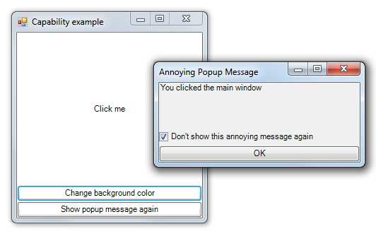
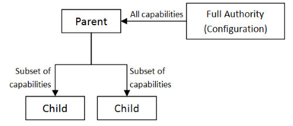
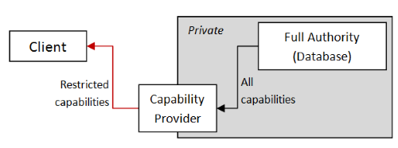
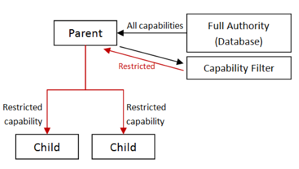
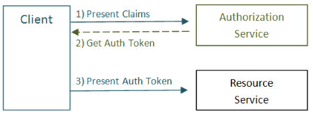

# “授权的函数式方法”系列

在这系列文章中，我将看看你可能如何处理授权的常见安全挑战。也就是说，你如何确保你代码的客户只能做你想让他们做的事情？

这个系列将勾勒出两种不同的方法，首先使用一种称为*基于能力的安全*的方法，其次使用静态检查的类型来模拟访问令牌。

有趣的是，这两种方法都倾向于产生更清晰、更模块化的设计，这也是我喜欢它们的原因！

+   授权的函数式方法。基于能力的安全等等。

+   基于身份和角色的能力限制。授权的函数式方法，第 2 部分。

+   使用类型作为访问令牌。授权的函数式方法，第 3 部分。

# 授权的函数式方法

# 授权的函数式方法

*更新：[关于这个主题的幻灯片和视频](http://fsharpforfunandprofit.com/cap/)*

在这系列文章中，我将看看你可能如何处理授权的常见安全挑战。也就是说，你如何确保你代码的客户只能做你想让他们做的事情？

这个系列将勾勒出两种不同的方法，首先使用一种称为*基于能力的安全*的方法，其次使用静态检查的类型来模拟访问令牌。

有趣的是，这两种方法都倾向于产生更清晰、更模块化的设计，这也是我喜欢它们的原因！

在我开始之前，我必须提到一个主要的警告。在.NET 环境中，你通常可以使用反射来绕过编译时检查，因此这里展示的方法并不是关于防止真正恶意的攻击，而更多地是帮助你创建减少*无意中*的安全漏洞的设计。

最后，我不是安全方面的专家 -- 我只是写下了一些我自己的想法和建议。这篇文章当然不是为了替代一个完整的安全设计，也不是对安全实践的严肃研究。如果你想了解更多，文章底部有进一步阅读的链接。

## 第 1 部分：一个配置示例

首先，让我们从一个简单的场景开始：

+   你有一个配置选项，可以由代码的一部分设置。假设它是一个名为`DontShowThisMessageAgain`的布尔值。

+   我们有一个应用程序的组件（比如说 UI），想要设置这个选项。

+   另外，我们还假设该组件是由一个恶意的开发者编写的，并且如果可能的话，他会试图制造麻烦。

那么，我们应该如何向潜在恶意的调用者公开这个配置设置呢？

**尝试 1：将配置文件的名称提供给调用者**

让我们从一个非常糟糕的想法开始。我们只需将配置文件的名称提供给调用者，并让他们自己更改文件。

这是如何在 C# 伪代码中编写的：

```
interface IConfiguration
{   
    string GetConfigFilename();
} 
```

调用者代码将是

```
var filename = config.GetConfigFilename();
// open file
// write new config
// close file 
```

显然，这不是一个好方法！为了让这个方法生效，我们必须让调用者有能力写入文件系统上的任何文件，然后恶意调用者就可以删除或破坏各种东西。

通过在文件系统上设置严格的权限可以在一定程度上避免这种情况，但我们仍然给了调用者太多的控制权。

**尝试 2：给调用者一个 TextWriter**

好吧，让我们自己打开文件，然后将已打开的文件流作为`TextWriter`提供给调用者。这样，调用者根本不需要访问文件系统的权限。

当然，一个恶意的调用者仍然可以通过向文件写入垃圾来损坏配置文件。再次，我们给了调用者太多的控制权。

**尝试 3：给调用者一个键/值接口**

让我们通过为调用者提供一个强制将配置文件视为键/值存储的接口来限制这一点，就像这样：

```
interface IConfiguration
{   
    void SetConfig(string key, string value);
} 
```

调用者代码如下：

```
config.SetConfig("DontShowThisMessageAgain", "True"); 
```

这样要好得多，但由于它是一个字符串类型的接口，恶意调用者仍然可以通过将值设置为非布尔值来破坏配置，这样就无法解析。他们也可以在需要时破坏所有其他配置键。

**尝试 4：给调用者一个面向域的接口**

好吧，与其拥有一个通用的配置接口，不如提供一个为每个配置设置提供特定方法的接口。

```
enum MessageFlag {
   ShowThisMessageAgain,
   DontShowThisMessageAgain
   }

interface IConfiguration
{   
    void SetMessageFlag(MessageFlag value);
    void SetConnectionString(ConnectionString value);
    void SetBackgroundColor(Color value);
} 
```

现在调用者不可能破坏配置，因为每个选项都是静态类型的。

但我们仍然有一个问题！如何阻止一个恶意的调用者在他们只应该更改消息标志时更改连接字符串？

**尝试 5：只给调用者他们需要的接口**

好吧，让我们定义一个新的接口，它*只包含*调用者应该访问的方法，而隐藏所有其他方法。

```
interface IWarningMessageConfiguration
{   
    void SetMessageFlag(MessageFlag value);
} 
```

这是我们可以做到的最安全的程度！调用者*只能*做我们允许他们做的事情。

换句话说，我们刚刚使用了[最小权限原则](https://en.wikipedia.org/wiki/Principle_of_least_privilege)，通常缩写为“POLA”来创建设计。

## 安全即良好设计

这种方法的有趣之处在于，它与好的设计方法完全相同，*不管*是否有恶意调用者。

这是我考虑设计这个的方式，只基于核心设计原则如信息隐藏和解耦。

+   如果我们给调用者一个文件名，我们将限制自己只能使用基于文件的配置文件。通过给调用者一个 TextWriter，我们可以使设计更易于模拟。

+   但是如果我们给调用者一个 TextWriter，我们就暴露了一个特定的存储格式（XML、JSON 等），而且还限制了我们自己到文本为基础的存储。通过给调用者提供一个通用的键/值存储，我们隐藏了格式，并使实现选择更加灵活。

+   但是，如果我们给调用者一个使用字符串的通用 KeyValue 存储，我们仍然暴露自己于值不是布尔值的错误，我们必须为此编写验证和测试。如果我们改为使用静态类型的接口，我们就不必编写任何损坏检查代码。

+   但是，如果我们给调用者一个具有太多方法的接口，我们就没有遵循*[接口隔离原则](https://en.wikipedia.org/wiki/Interface_segregation_principle)*。因此，我们应该将可用方法的数量减少到调用者绝对需要的最小值。

通过像这样的思考过程，仅使用良好的设计实践，我们最终得到的结果与如果我们担心安全性时完全相同！

也就是说：设计调用者需要的最小接口既可以避免意外复杂性（良好设计），又可以增加安全性（最小授权原则）。

当然，我们通常不必处理恶意调用者，但我们应该将自己作为开发人员视为无意中恶意。例如，如果接口中有一个额外的方法，它很可能会在不同的上下文中使用，这会增加两个上下文之间的耦合并使重构变得更加困难。

所以，这里有一个提示：**为恶意调用者设计，你可能最终会得到更模块化的代码！**

## 引入基于能力的安全性

我们上面所做的是逐渐减少对调用者的接触面，以至最终设计，调用者只能做一件事。

那个"一件事"就是一个"能力"。调用者有一个设置消息标志的能力，仅此而已。

["基于能力的"安全性](https://en.wikipedia.org/wiki/Capability-based_security)是基于这个想法的安全模型：

+   系统向客户端提供"能力"（在我们的情况下，通过接口的实现）。

+   这些能力封装了所需的任何访问权限。例如，我能够访问接口的实现这一事实意味着我可以设置那个标志。如果我没有权限设置那个标志，我就不会被赋予这个能力（接口）。（我会在下一篇文章中更多地谈论授权问题）。

+   最后，这些能力可以传递。例如，我可以在启动时获取这个能力，然后稍后将其传递给 UI 层，UI 层可以根据需要使用它。

换句话说，我们有一个"及时授权"而不是"预防授权"的模型；我们在需要时传递最小的权限，而不是在全局范围内为每个人提供过多的"环境"权限。

基于能力的模型通常专注于操作系统，但它可以非常好地映射到编程语言中，这被称为[对象能力模型](https://en.wikipedia.org/wiki/Object-capability_model)。

我希望在这篇文章中演示，通过在代码中使用基于能力的方法，你可以创建设计更好、更健壮的代码。此外，潜在的安全错误将在*编译时*而不是运行时可检测到。

正如我上面提到的，如果你的应用被信任，你总是可以使用.NET 反射来“伪造”你没有权限的能力。所以，这里展示的方法不是为了防止真正的恶意攻击，而是为了创建一个更加健壮的设计，减少*无意中*的安全漏洞。

## 权威 vs. 权限

基于能力的安全模型倾向于使用术语“权限”而不是“权限”。两者之间有区别：

+   在基于*权威*的系统中，一旦我被授予了某项权限，我就可以将部分或全部权限传递给其他人，添加自己的额外约束，等等。

+   在基于*权限*的系统中，我可以请求做某事的权限，但我不能将其传递给其他人。

看起来基于权威的系统比基于权限的系统更加开放和“危险”。但在基于权限的系统中，如果其他人可以接触到我，并且我与他们合作，我可以代表他们做任何事情，因此第三方仍然可以*间接*获得权限。权限并不能真正增加安全性--攻击者只需使用更加复杂的方法。

这里有一个具体的例子。假设 Alice 信任我开她的车，并且她愿意让我借车，但她不信任 Bob。如果我和 Bob 是朋友，我可以在 Alice 不注意的时候让 Bob 开车。所以如果 Alice 信任我，她也隐含地信任我信任的任何人。基于权威的系统只是让这一点明确化。Alice 把车钥匙交给我就是给我开她的车的“能力”，她完全知道我可能把车钥匙给别人。

当然，在基于权限的系统中，当我作为第三方的代理时，如果我愿意，我可以停止与第三方合作，此时第三方失去了他们的访问权限。

在基于权威的系统中，其等价物是“可撤销的权限”，我们将在稍后看到一个例子。在汽车钥匙的类比中，这可能类似于有自毁功能的汽车钥匙！

## 将能力建模为函数

具有一个方法的接口更好地被实现为一个函数。所以这个接口：

```
interface IWarningMessageConfiguration
{   
    void SetMessageFlag(MessageFlag value);
} 
```

就变成了这个函数：

```
Action<MessageFlag> messageFlagCapability = // get function; 
```

或者在 F#中：

```
let messageFlagCapability = // get function; 
```

在功能性的能力基础安全方法中，每个能力都由一个函数表示，而不是一个接口。

使用函数表示功能的好处在于我们可以使用所有标准的函数式编程技术：我们可以组合它们，与组合子结合，等等。

## 对象能力模型 vs. 函数式编程模型

对象能力模型的许多其他要求很好地适应于函数式编程框架。这是一个比较表：

| 对象能力模型 | 函数式编程 |
| --- | --- |
| 不允许全局可变状态。 | 不允许全局可变状态。 |
| 能力总是明确地从父级传递到子级，或者从发送者传递到接收者。 | 函数是可以作为参数传递的值。 |
| 能力从未从环境中提取出来（"环境权限"）。 | 纯函数将所有"依赖项"显式传入。 |
| 不能篡改能力。 | 数据是不可变的。 |
| 能力无法伪造或转换为其他能力。 | 在一个严格的 FP 语言中，没有反射或转换可用（当然，F# 在这方面不是严格的）。 |
| 能力应该"安全失败"。如果无法获取或无法使用某个能力，则不应允许任何依赖于其成功的路径继续进行。 | 在像 F# 这样的静态类型语言中，我们可以将这些控制流规则嵌入到类型系统中。`Option`的使用就是一个例子。 |

你可以看到有相当多的重叠。

对象能力模型的一个*非官方*目标是**通过使安全性不可见来使安全性更加用户友好**。我认为这是一个很好的想法，通过将能力作为函数传递，这可以很容易实现。

请注意，能力模型与真正的功能模型有一个重要方面是*不*重叠的。

能力主要涉及（副）作用 -- 读取或写入文件系统、网络等。真正的功能模型会尝试以某种方式封装它们（例如，在一个单子中）。就我个人而言，使用 F#，我通常只允许副作用，而不是构建[更复杂的框架](http://hackage.haskell.org/package/Capabilities)。

但再次，正如我上面提到的，本文的目标不是强迫您完全遵循严格的对象能力模型，而是借鉴其中一些想法以创建更好的设计。

## 获取能力

此时一个自然的问题是：这些能力函数来自哪里？

答案是，一种可以授权你拥有该能力的服务。在配置示例中，我们通常不进行严格的授权，因此配置服务本身通常会在不检查您的身份、角色或其他声明的情况下提供能力。

但现在我需要一个访问配置服务的能力。那么，这个能力从哪里来呢？责任必须有所归属！

在面向对象的设计中，通常会有一个启动阶段，其中构造所有依赖项并配置 IoC 容器。在基于能力的系统中，一个[所谓的 Powerbox](http://c2.com/cgi/wiki?PowerBox)扮演着类似的角色，成为所有权限的起始点。

这是一个提供配置能力的服务的代码：

```
interface IConfigurationCapabilities
{   
    Action<MessageFlag> SetMessageFlag();
    Action<ConnectionString> SetConnectionString();
    Action<Color> SetBackgroundColor();
} 
```

这段代码可能看起来与之前定义的接口非常相似，但区别在于这个将在启动时初始化，以返回然后传递的功能。

功能的实际用户根本不会访问配置系统，只能访问他们被赋予的功能。也就是说，功能将以与在 OO 模型中注入单个方法接口相同的方式注入客户端。

这里是一些示例 C# 伪代码来演示：

+   功能是在启动时获取的。

+   该功能通过构造函数注入到主窗口 (`ApplicationWindow`) 中。

+   `ApplicationWindow` 创建了一个复选框。

+   复选框的事件处理程序调用了该功能。

```
// at startup
var messageFlagCapability = 
    configurationCapabilities.SetMessageFlag()
var appWindow = new ApplicationWindow(messageFlagCapability)

// and in the UI class
class ApplicationWindow
{
    // pass in capability in the constructor 
    // just as you would an interface
    ApplicationWindow(Action<MessageFlag> messageFlagCapability)
    {  
        // set fields
    }

    // setup the check box and register the "OnCheckboxChecked" handler

    // use the capability when the event happens
    void OnCheckboxChecked(CheckBox sender) {
        messageFlagCapability(sender.IsChecked)
    }
} 
```

## F# 中的一个完整示例

这是一个完整的 F# 示例代码（也可在 [此处的 gist](https://gist.github.com/swlaschin/909c5b24bf921e5baa8c#file-capabilitybasedsecurity_configexample-fsx) 找到）。

这个示例包括一个简单的窗口，一个主区域和一些额外的按钮。

+   如果你在主区域点击，一个烦人的对话框就会弹出，带有一个“不再显示此消息”的选项。

+   其中一个按钮允许您使用系统颜色选择器更改背景颜色，并将其存储在配置中。

+   另一个按钮允许您将“不再显示此消息”的选项重置为 false。

它非常粗糙和丑陋 -- 在制作过程中没有 UI 设计师受伤 -- 但它应该演示了到目前为止的主要观点。



### 配置系统

我们从配置系统开始。这是一个概览：

+   自定义类型 `MessageFlag`、`ConnectionString` 和 `Color` 被定义了。

+   记录类型 `ConfigurationCapabilities` 被定义来保存所有功能。

+   为了演示目的创建了一个内存存储 (`ConfigStore`)

+   最后，`configurationCapabilities` 是使用读取和写入 `ConfigStore` 的函数创建的。

```
module Config =

    type MessageFlag = ShowThisMessageAgain | DontShowThisMessageAgain
    type ConnectionString = ConnectionString of string
    type Color = System.Drawing.Color

    type ConfigurationCapabilities = {
        GetMessageFlag : unit -> MessageFlag 
        SetMessageFlag : MessageFlag -> unit
        GetBackgroundColor : unit -> Color 
        SetBackgroundColor : Color -> unit
        GetConnectionString  : unit -> ConnectionString 
        SetConnectionString : ConnectionString -> unit
        }

    // a private store for demo purposes
    module private ConfigStore =
        let mutable MessageFlag = ShowThisMessageAgain 
        let mutable BackgroundColor = Color.White
        let mutable ConnectionString = ConnectionString ""

    // public capabilities
    let configurationCapabilities = {
        GetMessageFlag = fun () -> ConfigStore.MessageFlag 
        SetMessageFlag = fun flag -> ConfigStore.MessageFlag <- flag
        GetBackgroundColor = fun () -> ConfigStore.BackgroundColor
        SetBackgroundColor = fun color -> ConfigStore.BackgroundColor <- color
        SetConnectionString = fun _ -> () // ignore
        GetConnectionString = fun () -> ConfigStore.ConnectionString 
        SetConnectionString = fun connStr -> ConfigStore.ConnectionString <- connStr
        } 
```

### 烦人的弹出对话框

接下来，我们将创建烦人的弹出对话框。这将在你点击主窗口时触发，*除非*“不再显示此消息”的选项被勾选。

对话框由一个标签控件、消息标志复选框和确定按钮组成。

请注意，`createMessageFlagCheckBox` 函数，它创建复选框控件，只传入了它需要的两个功能 -- 获取和设置标志。

这要求主窗体创建函数 (`createForm`) 也传入了功能。这些功能，*只有*这些功能被传递给了窗体。用于设置背景颜色或连接字符串的功能 *未* 被传入，因此不能被（误）用。

```
module AnnoyingPopupMessage = 
    open System.Windows.Forms

    let createLabel() = 
        new Label(Text="You clicked the main window", Dock=DockStyle.Top)

    let createMessageFlagCheckBox capabilities  = 
        let getFlag,setFlag = capabilities 
        let ctrl= new CheckBox(Text="Don't show this annoying message again", Dock=DockStyle.Bottom)
        ctrl.Checked <- getFlag()
        ctrl.CheckedChanged.Add (fun _ -> ctrl.Checked |> setFlag)
        ctrl   // return new control

    let createOkButton (dialog:Form) = 
        let ctrl= new Button(Text="OK",Dock=DockStyle.Bottom)
        ctrl.Click.Add (fun _ -> dialog.Close())
        ctrl

    let createForm capabilities = 
        let form = new Form(Text="Annoying Popup Message", Width=300, Height=150)
        form.FormBorderStyle <- FormBorderStyle.FixedDialog
        form.StartPosition <- FormStartPosition.CenterParent

        let label = createLabel()
        let messageFlag = createMessageFlagCheckBox capabilities
        let okButton = createOkButton form
        form.Controls.Add label 
        form.Controls.Add messageFlag 
        form.Controls.Add okButton 
        form 
```

### 主应用程序窗口

我们现在可以为我们相当愚蠢的“应用程序”创建一个主窗口。它包括：

+   一个标签控件，可以点击以产生烦人的弹出 (`createClickMeLabel`)

+   一个按钮，弹出颜色选择对话框以更改背景颜色（`createChangeBackColorButton`）

+   一个按钮，将消息标志重置为“显示”（`createResetMessageFlagButton`）

所有这三个构造函数都传递了能力，但每种情况下的能力都不同。

+   标签控件仅传递了`getFlag`和`setFlag`能力。

+   颜色选择对话框仅传递了`getColor`和`setColor`能力。

+   重置消息标志的按钮仅传递了`setFlag`能力。

在主窗体（`createMainForm`）中，传递了完整的能力集，并且根据需要以各种方式重新组合为子控件（`popupMessageCapabilities`，`colorDialogCapabilities`）。

此外，能力函数被修改了：

+   从现有的能力中创建了一个新的“SetColor”能力，还添加了改变表单背景的功能。

+   标志能力被转换为可以直接与复选框一起使用的布尔值。

这是代码：

```
module UserInterface = 
    open System.Windows.Forms
    open System.Drawing

    let showPopupMessage capabilities owner = 
        let getFlag,setFlag = capabilities 
        let popupMessage = AnnoyingPopupMessage.createForm (getFlag,setFlag) 
        popupMessage.Owner <- owner 
        popupMessage.ShowDialog() |> ignore // don't care about result

    let showColorDialog capabilities owner = 
        let getColor,setColor = capabilities 
        let dlg = new ColorDialog(Color=getColor())
        let result = dlg.ShowDialog(owner)
        if result = DialogResult.OK then
            dlg.Color |> setColor

    let createClickMeLabel capabilities owner = 
        let getFlag,_ = capabilities 
        let ctrl= new Label(Text="Click me", Dock=DockStyle.Fill, TextAlign=ContentAlignment.MiddleCenter)
        ctrl.Click.Add (fun _ -> 
            if getFlag() then showPopupMessage capabilities owner)
        ctrl  // return new control

    let createChangeBackColorButton capabilities owner = 
        let ctrl= new Button(Text="Change background color", Dock=DockStyle.Bottom)
        ctrl.Click.Add (fun _ -> showColorDialog capabilities owner)
        ctrl

    let createResetMessageFlagButton capabilities = 
        let setFlag = capabilities 
        let ctrl= new Button(Text="Show popup message again", Dock=DockStyle.Bottom)
        ctrl.Click.Add (fun _ -> setFlag Config.ShowThisMessageAgain)
        ctrl

    let createMainForm capabilities = 
        // get the individual component capabilities from the parameter
        let getFlag,setFlag,getColor,setColor = capabilities 

        let form = new Form(Text="Capability example", Width=500, Height=300)
        form.BackColor <- getColor() // update the form from the config

        // transform color capability to change form as well
        let newSetColor color = 
            setColor color           // change config
            form.BackColor <- color  // change form as well 

        // transform flag capabilities from domain type to bool
        let getBoolFlag() = 
            getFlag() = Config.ShowThisMessageAgain 
        let setBoolFlag bool = 
            if bool 
            then setFlag Config.ShowThisMessageAgain 
            else setFlag Config.DontShowThisMessageAgain 

        // set up capabilities for child objects
        let colorDialogCapabilities = getColor,newSetColor 
        let popupMessageCapabilities = getBoolFlag,setBoolFlag

        // setup controls with their different capabilities
        let clickMeLabel = createClickMeLabel popupMessageCapabilities form
        let changeColorButton = createChangeBackColorButton colorDialogCapabilities form
        let resetFlagButton = createResetMessageFlagButton setFlag 

        // add controls
        form.Controls.Add clickMeLabel 
        form.Controls.Add changeColorButton
        form.Controls.Add resetFlagButton 

        form  // return form 
```

### 启动代码

最后，顶级模块，这里称为`Startup`，从配置子系统获取了一些能力，并将它们组合成一个可以传递给主窗体的元组。`ConnectionString`能力*没有*被传递，所以没有办法让表单意外地将其显示给用户或更新它。

```
module Startup = 

    // set up capabilities
    let configCapabilities = Config.configurationCapabilities
    let formCapabilities = 
        configCapabilities.GetMessageFlag, 
        configCapabilities.SetMessageFlag,
        configCapabilities.GetBackgroundColor,
        configCapabilities.SetBackgroundColor

    // start
    let form = UserInterface.createMainForm formCapabilities 
    form.ShowDialog() |> ignore 
```

## 第一部分总结

正如你所看到的，这段代码与使用依赖注入设计的 OO 系统非常相似。没有全局访问能力，只有从父级传递的能力。



当然，像这样使用函数来参数化行为并不特别。这是最基本的函数式编程技术之一。因此，这段代码实际上并没有展示任何新的想法，而只是演示了如何将标准的函数式编程方法应用于强制访问路径。

此时的一些常见问题：

**问题：这似乎是额外的工作。为什么我需要这样做呢？**

如果你有一个简单的系统，你肯定不需要这样做。但是这里可能会有用：

+   你已经有一个使用细粒度授权的系统，并且希望在实践中使其更加明确和易于使用。

+   你有一个以高权限运行的系统，但对于泄露数据或在未经授权的上下文中执行操作有严格要求。

在这些情况下，我认为在代码库中**所有点**都明确说明能力是非常重要的，而不仅仅在 UI 层。这不仅有助于遵从和审计需求，而且还有一个实际的好处，那就是使代码更加模块化和易于维护。

**问题：这种方法与依赖注入有什么区别？**

依赖注入和基于功能的模型有不同的目标。依赖注入是关于解耦，而功能是关于控制访问。正如我们所看到的，这两种方法最终都会促进类似的设计。

**问题：如果我有数百个需要传递的功能，会发生什么？**

看起来这应该是一个问题，但在实践中通常不会成为问题。首先，适度使用部分应用程序意味着功能可以在传递之前被嵌入到函数中，因此子对象甚至不知道它们。

其次，非常容易 -- 只需几行代码 -- 创建包含一组功能的简单记录类型（就像我在`ConfigurationCapabilities`类型中所做���那样），并在需要时传递它们。

**问题：有什么阻止别人在不遵循这种方法的情况下访问全局功能？**

在 C#或 F#中没有任何东西可以阻止您访问全局公共函数。就像其他最佳实践一样，例如避免全局变量，我们必须依靠自律（也许是代码审查）来保持我们走在正确的道路上！

但在本系列的第三部分中，我们将探讨一种通过使用访问令牌来防止对全局函数的访问的方法。

**问题：这些只是标准的函数式编程技术吗？**

是的。我并不打算在这里做任何聪明的事情！

**问题：这些功能函数具有副作用。这是怎么回事？**

是的，这些功能函数不是纯的。这里的目标不是纯粹 -- 而是明确提供功能的目的。

即使我们使用纯`IO`上下文（例如在 Haskell 中），也无法帮助控制对功能的访问。也就是说，在安全性的背景下，改变密码或信用卡的能力与改变背景颜色配置的能力之间存在很大的区别，尽管从计算的角度来看它们都只是"IO"。

创建纯功能是可能的，但在 F#中并不是很容易做到，所以我将在本文中将其排除在外。

**问题：对于某人写的内容，你有什么回应？为什么没有引用某篇论文？**

这是一篇博客文章，不是学术论文。我不是这个领域的专家，只是在做一些自己的实验。

更重要的是，正如我之前所说的，我的目标与安全专家非常不同 -- 我并不试图开发一个理想的安全模型。相反，我只是试图鼓励一些*良好的设计*实践，可以帮助务实的开发人员避免在他们的代码中出现意外的漏洞。

**我还有更多问题...**

一些额外的问题在第二部分的结尾有答案，所以请先阅读那些答案。否则，请在下面的评论中添加您的问题，我会尽力回答。

## 进一步阅读

这里关于基于能力的安全性的想法主要来源于 Mark Miller 和 Marc Stiegler 的工作，以及[erights.org](http://www.erights.org/)网站，尽管我的版本��加简单和粗糙。

为了更全面地理解，我建议你查看以下链接：

+   [基于能力的安全性](https://zh.wikipedia.org/wiki/%E5%9F%BA%E4%BA%8E%E8%83%BD%E5%8A%9B%E7%9A%84%E5%AE%89%E5%85%A8%E6%80%A7)和[对象能力模型](https://zh.wikipedia.org/wiki/%E5%AF%B9%E8%B1%A1%E8%83%BD%E5%8A%9B%E6%A8%A1%E5%9E%8B)的维基百科文章是一个很好的起点。

+   [能力到底是什么？](https://webcache.googleusercontent.com/search?q=cache:www.eros-os.org/essays/capintro.html)，来自 EROS 项目的 Jonathan Shapiro。他还讨论了基于 ACL 的安全性与基于能力的模型。

+   ["懒惰程序员的安全计算指南"](http://www.youtube.com/watch?v=eL5o4PFuxTY)，Marc Stiegler 关于基于能力的安全性的一个很棒的视频。不要错过最后 5 分钟（大约从 1 小时 02 分钟 10 秒开始）！

+   ["安全的对象能力"](https://www.youtube.com/watch?v=EGX2I31OhBE)，David Wagner 的一个很好的演讲。

已经有很多关于加固语言以提高安全性和安全性的工作。例如[E 语言](http://www.erights.org/elang/index.html)和[Mark Miller 关于 E 语言的论文](http://www.erights.org/talks/thesis/markm-thesis.pdf)(PDF)；建立在 Java 之上的[Joe-E 语言](https://en.wikipedia.org/wiki/Joe-E)；Google 的基于 JavaScript 的[Caja](https://developers.google.com/caja/)；[Emily](http://www.hpl.hp.com/techreports/2006/HPL-2006-116.html)，一种基于 OCaml 的能力语言；以及[Safe Haskell](http://research.microsoft.com/en-us/um/people/simonpj/papers/safe-haskell/safe-haskell.pdf)(PDF)。

我的方法不是严格的安全性，而是积极地设计以避免意外违规，上面的参考资料并没有专注于设计。我发现最有用的是[E 中关于能力模式的部分](http://www.skyhunter.com/marcs/ewalnut.html#SEC45)。

如果你喜欢这种类型的东西，那就去 LtU 看看，那里有许多讨论，比如[这个](http://lambda-the-ultimate.org/node/1635)和[这个](http://lambda-the-ultimate.org/node/3930)，以及[这篇论文](http://lambda-the-ultimate.org/node/2253)。

## 即将推出

在下一篇文章中，我们将看看如何基于声明（如当前用户的身份和角色）来限制能力。

*注意：本文中所有代码都可以在[gist 这里](https://gist.github.com/swlaschin/909c5b24bf921e5baa8c#file-capabilitybasedsecurity_configexample-fsx)找到。*

# 基于身份和角色来限制能力

# 基于身份和角色来限制能力

*更新：[关于这个主题的演讲幻灯片和视频](http://fsharpforfunandprofit.com/cap/)*

在上一篇文章中，我们开始研究了“能力”作为确保代码不能做更多事情的基础。我用一个简单的应用程序演示了这一点，该应用程序更改了一个配置标志。

在这篇文章中，我们将看看如何根据当前用户的身份和角色来限制能力。

因此，让我们从配置示例切换到需要更严格授权的典型情况。

## 数据库功能示例

考虑一个具有后备数据库的网站和呼叫中心。我们有以下安全规则：

+   客户只能查看或更新他们在数据库中的记录（通过网站）

+   呼叫中心操作员可以查看或更新数据库中的任何记录。

这意味着在某个时候，我们将根据用户的身份和角色进行授权。（我们将假设用户已经成功认证）。

许多 Web 框架的倾向是将授权放在 UI 层中，通常是[在控制器中](https://msdn.microsoft.com/en-us/library/system.web.mvc.authorizeattribute.aspx)。我对这种方法的担忧是，一旦您“内部”（通过门户），应用程序的任何部分都具有完全访问数据库的权限，并且很容易由于错误而使代码做错事，从而导致安全漏洞。

不仅如此，因为权限随处可见（"环境"），很难审查代码以查找潜在的安全问题。

为了避免这些问题，让我们尽可能地将访问逻辑放在“低”位置，此时放在数据库访问层。

我们将从一个明显的方法开始。我们将将身份和角色添加到每个数据库调用中，然后在那里进行授权。

以下方法假设存在一个 `CustomerIdBelongsToPrincipal` 函数，用于检查正在访问的客户 ID 是否属于请求访问的主体。然后，如果 `customerId` 确实属于主体，或者主体具有 "CustomerAgent" 角色，则授予访问权限。

```
public class CustomerDatabase
{
    public CustomerData GetCustomer(CustomerId id, IPrincipal principal) {  
        if ( CustomerIdBelongsToPrincipal(id, principal) || 
             principal.IsInRole("CustomerAgent") )
        {
            // get customer data
        }
        else
        {
            // throw authorization exception
        }
    }
} 
```

*请注意，我故意在方法签名中添加了 `IPrincipal` -- 我们不允许任何从全局上下文获取主体的“魔术”。与使用任何全局变量一样，隐式访问隐藏了依赖关系，并使得难以进行单独测试。*

下面是 F# 等价物，使用[成功/失败返回值](http://fsharpforfunandprofit.com/rop/)而不是抛出异常：

```
let getCustomer id principal = 
    if customerIdBelongsToPrincipal id principal ||
       principal.IsInRole("CustomerAgent") 
    then
        // get customer data
        Success "CustomerData"
    else
        Failure AuthorizationFailed 
```

这种“内联”授权方法非常常见，但不幸的是，它有很多问题。

+   它混淆了数据库逻辑与安全问题。如果授权逻辑变得更加复杂，那么代码也会变得更加复杂。

+   如果授权失败，则会抛出异常（C＃）或返回错误（F＃）。如果我们能够*提前*知道是否有授权而不是等到最后一刻，那就太好了。

让我们将其与基于能力的方法进行比较。我们首先获取执行该操作的*能力*，而不是直接获取客户。

```
class CustomerDatabase
{
    // "real" code is hidden from public view
    private CustomerData GetCustomer(CustomerId id) {  
        // get customer data
    }

    // Get the capability to call GetCustomer
    public Func<CustomerId,CustomerData> GetCustomerCapability(CustomerId id, IPrincipal principal)
    {  
        if ( CustomerIdBelongsToPrincipal(id, principal) || 
             principal.IsInRole("CustomerAgent") )
        {
            // return the capability (the real method)
            return GetCustomer;
        }
        else
        {
            // throw authorization exception
        }
    }
} 
```

如您所见，如果授权成功，则向调用者返回对`GetCustomer`方法的引用。

可能不明显，但是上面的代码有一个相当大的安全漏洞。我可以请求特定客户 ID 的能力，但我得到的是一个可以为*任何*客户 ID 调用的函数！这不太安全，对吗？

我们需要的是将客户 ID“固定”到能力中，以防止被滥用。现在返回值将是一个`Func<CustomerData>`，其中客户 ID 不再可传递。

```
class CustomerDatabase
{
    // "real" code is hidden from public view
    private CustomerData GetCustomer(CustomerId id) {  
        // get customer data
    }

    // Get the capability to call GetCustomer
    public Func<CustomerData> GetCustomerCapability(CustomerId id, IPrincipal principal) {  
        if ( CustomerIdBelongsToPrincipal(id, principal) || 
             principal.IsInRole("CustomerAgent") )
        {
            // return the capability (the real method)
            return ( () => GetCustomer(id) );
        }
        else
        {
            // throw authorization exception
        }
    }
} 
```

通过这种关注点的分离，我们现在可以很好地处理失败，通过返回一个*可选*值，如果我们获得了能力，则该值存在，否则不存在。也就是说，我们知道我们在*尝试获取它*时是否具有该能力，而不是在以后尝试使用它时。

```
class CustomerDatabase
{
    // "real" code is hidden from public view
    // and doesn't need any checking of identity or role
    private CustomerData GetCustomer(CustomerId id) {  
        // get customer data
    }

    // Get the capability to call GetCustomer. If not allowed, return None.
    public Option<Func<CustomerData>> GetCustomerCapability(CustomerId id, IPrincipal principal)
    {
        if (CustomerIdBelongsToPrincipal(id, principal) ||
             principal.IsInRole("CustomerAgent"))
        {
            // return the capability (the real method)
            return Option<Func<CustomerData>>.Some( () => GetCustomer(id) );
        }
        else
        {
            return Option<Func<CustomerData>>.None();
        }
    }
} 
```

这假设我们在 C#中使用某种`Option`类型，而不仅仅是返回 null！

最后，我们可以将授权逻辑放入其自己的类中（比如说`CustomerDatabaseCapabilityProvider`），以将授权问题与`CustomerDatabase`分开处理。

不过，我们必须找到某种方式来将“真实”的数据库函数对其他调用者保持私有。暂时，我会假设数据库代码在另一个程序集中，并将代码标记为`internal`。

```
// not accessible to the business layer
internal class CustomerDatabase
{
    // "real" code is hidden from public view
    private CustomerData GetCustomer(CustomerId id) {  
        // get customer data
    }
}

// accessible to the business layer
public class CustomerDatabaseCapabilityProvider
{
    CustomerDatabase _customerDatabase;

    // Get the capability to call GetCustomer
    public Option<Func<CustomerData>> GetCustomerCapability(CustomerId id, IPrincipal principal)
    {
        if (CustomerIdBelongsToPrincipal(id, principal) ||
             principal.IsInRole("CustomerAgent"))
        {
            // return the capability (the real method)
            return Option<Func<CustomerData>>.Some( () => _customerDatabase.GetCustomer(id) );
        }
        else
        {
            return Option<Func<CustomerData>>.None();
        }
    }
} 
```

这是相同代码的 F#版本：

```
/// not accessible to the business layer
module internal CustomerDatabase = 
    let getCustomer (id:CustomerId) :CustomerData = 
        // get customer data

/// accessible to the business layer 
module CustomerDatabaseCapabilityProvider =         

    // Get the capability to call getCustomer
    let getCustomerCapability (id:CustomerId) (principal:IPrincipal) = 
        let principalId = GetIdForPrincipal(principal)
        if (principalId = id) || principal.IsInRole("CustomerAgent") then
            Some ( fun () -> CustomerDatabase.getCustomer id )
        else
            None 
```

这是表示此设计的图表：



**这种模型的问题**

在这种模型中，调用者与`CustomerDatabase`隔离开来，而`CustomerDatabaseCapabilityProvider`充当它们之间的代理。

这意味着，按照目前的设计，对于`CustomerDatabase`中的每个可用函数，`CustomerDatabaseCapabilityProvider`中也必须有一个相应的函数可用。我们可以看到，这种方法不会很好地扩展。

如果我们有一种方式可以一次性为*整套*数据库函数获取能力，那将会很好。让我们看看是否可以做到这一点！

## 限制和转换能力

在`CustomerDatabase`中，`getCustomer`函数可以被认为是没有限制的能力，而`getCustomerCapability`返回的是由身份和角色限制的能力。

但请注意，这两个函数签名相似（`CustomerId -> CustomerData` vs `unit -> CustomerData`），因此从调用者的角度来看它们几乎可以互换。在某种意义上，第二个功能是第一个的转换版本，具有额外的限制。

将函数转换为新函数！这是我们可以轻松做到的事情。

所以，让我们编写一个转换器，给定类型为`CustomerId -> 'a`的*任何*函数，我们返回一个将客户 ID 固定在内的函数（`unit -> 'a`），但仅当满足授权要求时。

```
module CustomerCapabilityFilter =         

    // Get the capability to use any function that has a CustomerId parameter
    // but only if the caller has the same customer id or is a member of the 
    // CustomerAgent role.
    let onlyForSameIdOrAgents (id:CustomerId) (principal:IPrincipal) (f:CustomerId -> 'a) = 
        let principalId = GetIdForPrincipal(principal)
        if (principalId = id) || principal.IsInRole("CustomerAgent") then
            Some (fun () -> f id)
        else
            None 
```

`onlyForSameIdOrAgents`函数的类型签名是`(CustomerId -> 'a) -> (unit -> 'a) option`。如果授权成功，它接受任何基于`CustomerId`的函数，并返回可能已经应用了客户 ID 的相同函数。如果授权不成功，则返回`None`。

您可以看到，这个函数将与*任何*以`CustomerId`作为第一个参数的函数通用地工作。这可以是“获取”，“更新”，“删除”等。

因此，例如，给定：

```
module internal CustomerDatabase = 
    let getCustomer (id:CustomerId) = 
        // get customer data 
    let updateCustomer (id:CustomerId) (data:CustomerData) = 
        // update customer data 
```

现在我们可以创建受限制的版本，例如顶层引导程序或控制器：

```
let principal = // from context
let id = // from context

// attempt to get the capabilities
let getCustomerOnlyForSameIdOrAgents = 
    onlyForSameIdOrAgents id principal CustomerDatabase.getCustomer

let updateCustomerOnlyForSameIdOrAgents = 
    onlyForSameIdOrAgents id principal CustomerDatabase.updateCustomer 
```

`getCustomerOnlyForSameIdOrAgents`和`updateCustomerOnlyForSameIdOrAgents`的类型与数据库模块中的原始函数类似，但`CustomerId`被`unit`取代：

```
val getCustomerOnlyForSameIdOrAgents : 
      (unit -> CustomerData) option
val updateCustomerOnlyForSameIdOrAgents : 
      (unit -> CustomerData -> unit) option 
```

*`updateCustomerOnlyForSameIdOrAgents`有一个额外的`CustomerData`参数，所以额外的`unit`在原来的`CustomerId`位置有点丑陋。如果这太烦人，您可以轻松地创建其他更优雅地处理此问题的函数版本。我将把这留给读者作为练习！*

现在我们有一个可能包含我们想要的功能的选项值。如果包含，我们可以创建一个子组件并传入功能。如果不包含，我们可以返回某种错误，或者根据应用程序的类型隐藏一个元素。

```
match getCustomerOnlyForSameIdOrAgents with
| Some cap -> // create child component and pass in the capability
| None ->     // return error saying that you don't have the capability to get the data 
```

这是代表此设计的图表：



## 更多关于功能的转换

因为功能是函数，我们可以通过链接或组合转换轻松地创建新的功能。

例如，我们可以为每个业务规则创建一个单独的过滤函数，就像这样：

```
module CustomerCapabilityFilter =         

    let onlyForSameId (id:CustomerId) (principal:IPrincipal) (f:CustomerId -> 'a) = 
        if customerIdBelongsToPrincipal id principal then
            Some (fun () -> f id)
        else
            None

    let onlyForAgents (id:CustomerId) (principal:IPrincipal) (f:CustomerId -> 'a) = 
        if principal.IsInRole("CustomerAgent") then
            Some (fun () -> f id)
        else
            None 
```

对于第一个业务规则，`onlyForSameId`，我们像以前一样返回一个带有客户 ID 的功能。

第二个业务规则，`onlyForAgents`，在任何地方都没有提及客户 ID，那么为什么我们要将函数参数限制为`CustomerId -> 'a`？原因是它强制该规则*仅适用于*与客户相关的功能，而不适用于与产品或支付相关的功能。

但是现在，为了使此过滤器的输出与第一个规则（`unit -> 'a`）兼容，我们需要传入一个客户 ID 并部分应用它。这有点像个技巧，但现在它能用。

我们还可以编写一个从列表中返回第一个有效功能的通用组合子。

```
// given a list of capability options, 
// return the first good one, if any
let first capabilityList = 
    capabilityList |> List.tryPick id 
```

这其实是一个微不足道的实现 -- 这种辅助函数只是为了让代码更易于自我记录。

有了这个，我们可以单独应用规则，将两个过滤器组合成一个。

```
let getCustomerOnlyForSameIdOrAgents = 
    let f = CustomerDatabase.getCustomer
    let cap1 = onlyForSameId id principal f
    let cap2 = onlyForAgents id principal f 
    first [cap1; cap2]
// val getCustomerOnlyForSameIdOrAgents : (CustomerId -> CustomerData) option 
```

或者我们说有某种限制；比如说操作只能在工作时间内执行。

```
let onlyIfDuringBusinessHours (time:DateTime) f = 
    if time.Hour >= 8 && time.Hour <= 17 then
        Some f
    else
        None 
```

我们可以编写另一个限制原始功能的组合子。这只是一个版本的“绑定”。

```
// given a capability option, restrict it
let restrict filter originalCap = 
    originalCap
    |> Option.bind filter 
```

有了这个，我们可以将“agentsOnly”功能限制在工作时间内：

```
let getCustomerOnlyForAgentsInBusinessHours = 
    let f = CustomerDatabase.getCustomer
    let cap1 = onlyForAgents id principal f 
    let restriction f = onlyIfDuringBusinessHours (DateTime.Now) f
    cap1 |> restrict restriction 
```

现在我们创建了一个新功能，“客户代理只能在工作时间访问客户��据”，这进一步加强了数据访问逻辑。

我们可以将其与先前的`onlyForSameId`过滤器结合使用，构建一个可以访问客户数据的复合功能：

+   如果您在任何时间都有相同的客户 ID

+   如果您是客户代理（仅在工作时间）

```
let getCustomerOnlyForSameId = 
    let f = CustomerDatabase.getCustomer
    onlyForSameId id principal f

let getCustomerOnlyForSameId_OrForAgentsInBusinessHours = 
    let cap1 = getCustomerOnlyForSameId
    let cap2 = getCustomerOnlyForAgentsInBusinessHours 
    first [cap1; cap2] 
```

正如您所看到的，这种方法是从更简单的功能构建复杂功能的有用方式。

## 附加转换

很明显，您可以轻松地创建其他扩展功能的附加转换，以其他方式扩展功能。一些示例：

+   一个在每次执行时写入审计日志的功能。

+   一个只能执行一次的功能。

+   一个在需要时可以撤销的功能。

+   一个被限制并且在给定时间段内只能执行有限次数的功能（例如更改密码尝试）。

等等。

这里是前三个的实现：

```
/// Uses of the capability will be audited
let auditable capabilityName f = 
    fun x -> 
        // simple audit log!
        printfn "AUDIT: calling %s with %A" capabilityName  x
        // use the capability
        f x

/// Allow the function to be called once only
let onlyOnce f = 
    let allow = ref true
    fun x -> 
        if !allow then   //! is dereferencing not negation!
            allow := false
            f x
        else
            Failure OnlyAllowedOnce

/// Return a pair of functions: the revokable capability, 
/// and the revoker function
let revokable f = 
    let allow = ref true
    let capability = fun x -> 
        if !allow then  //! is dereferencing not negation!
            f x
        else
            Failure Revoked
    let revoker() = 
        allow := false
    capability, revoker 
```

假设我们有一个`updatePassword`函数，如下所示：

```
module internal CustomerDatabase = 
    let updatePassword (id,password) = 
        Success "OK" 
```

然后我们可以创建一个`updatePassword`的可审计版本：

```
let updatePasswordWithAudit x = 
    auditable "updatePassword" CustomerDatabase.updatePassword x 
```

然后测试它：

```
updatePasswordWithAudit (1,"password") 
updatePasswordWithAudit (1,"new password") 
```

结果是：

```
AUDIT: calling updatePassword with (1, "password")
AUDIT: calling updatePassword with (1, "new password") 
```

或者，我们可以创建一个一次性版本：

```
let updatePasswordOnce = 
    onlyOnce CustomerDatabase.updatePassword 
```

然后测试它：

```
updatePasswordOnce (1,"password") |> printfn "Result 1st time: %A"
updatePasswordOnce (1,"password") |> printfn "Result 2nd time: %A" 
```

结果是：

```
Result 1st time: Success "OK"
Result 2nd time: Failure OnlyAllowedOnce 
```

最后，我们可以创建一个可撤销的函数：

```
let revokableUpdatePassword, revoker = 
    revokable CustomerDatabase.updatePassword 
```

然后测试它：

```
revokableUpdatePassword (1,"password") |> printfn "Result 1st time before revoking: %A"
revokableUpdatePassword (1,"password") |> printfn "Result 2nd time before revoking: %A"
revoker()
revokableUpdatePassword (1,"password") |> printfn "Result 3nd time after revoking: %A" 
```

带有以下结果：

```
Result 1st time before revoking: Success "OK"
Result 2nd time before revoking: Success "OK"
Result 3nd time after revoking: Failure Revoked 
```

所有这些 F# 示例的代码都可以在[gist here](https://gist.github.com/swlaschin/909c5b24bf921e5baa8c#file-capabilitybasedsecurity_dbexample-fsx)中找到。

## 一个完整的 F# 示例

这是一个完整的 F# 应用程序代码（也可以在[gist here](https://gist.github.com/swlaschin/909c5b24bf921e5baa8c#file-capabilitybasedsecurity_consoleexample-fsx)中找到）。

这个示例由一个简单的控制台应用程序组成，允许您获取和更新客户记录。

+   第一步是以用户身份登录。 "Alice" 和 "Bob" 是普通用户，而 "Zelda" 具有客户代理角色。

+   登录后，您可以选择要编辑的客户。同样，您只能在“Alice”和“Bob”之间进行选择。（我相信您几乎无法控制自己的兴奋）

+   选择了客户后，您将看到以下选项中的一些（或没有）：

    +   获取客户数据。

    +   更新客户数据。

    +   更新客户的密码。

显示的选项取决于您拥有哪些功能。这又取决于您登录的身份以及选择的客户。

### 实现领域

我们将从整个应用程序共享的核心领域类型开始：

```
module Domain = 
    open Rop

    type CustomerId = CustomerId of int
    type CustomerData = CustomerData of string
    type Password = Password of string

    type FailureCase = 
        | AuthenticationFailed of string
        | AuthorizationFailed
        | CustomerNameNotFound of string
        | CustomerIdNotFound of CustomerId
        | OnlyAllowedOnce
        | CapabilityRevoked 
```

`FailureCase`类型记录了应用程序顶层可能出错的所有可能情况。有关更多讨论，请参见["铁路导向编程"讲座](http://fsharpforfunandprofit.com/rop/)。

### 定义功能

接下来，我们记录应用程序中可用的所有功能。为了使代码更加清晰，为每个功能赋予一个名称（即类型别名）。

```
type GetCustomerCap = unit -> SuccessFailure<CustomerData,FailureCase> 
```

最后，`CapabilityProvider`是一组函数记录，每个函数接受一个客户 ID 和主体，返回指定类型的可选能力。此记录在顶级模型中创建，然后传递给子组件。

这是该模块的完整代码：

```
module Capabilities = 
    open Rop
    open Domain

    // capabilities
    type GetCustomerCap = unit -> SuccessFailure<CustomerData,FailureCase>
    type UpdateCustomerCap = unit -> CustomerData -> SuccessFailure<unit,FailureCase>
    type UpdatePasswordCap = Password -> SuccessFailure<unit,FailureCase>

    type CapabilityProvider = {
        /// given a customerId and IPrincipal, attempt to get the GetCustomer capability
        getCustomer : CustomerId -> IPrincipal -> GetCustomerCap option
        /// given a customerId and IPrincipal, attempt to get the UpdateCustomer capability
        updateCustomer : CustomerId -> IPrincipal -> UpdateCustomerCap option
        /// given a customerId and IPrincipal, attempt to get the UpdatePassword capability
        updatePassword : CustomerId -> IPrincipal -> UpdatePasswordCap option 
        } 
```

该模块引用了类似于[这里讨论的](http://fsharpforfunandprofit.com/rop/)的`SuccessFailure`结果类型，但我不会展示它。

### 实现身份验证

接下来，我们将自己的小型认证系统。请注意，当用户“Zelda”经过身份验证时，角色设置为“CustomerAgent”。

```
module Authentication = 
    open Rop
    open Domain 

    let customerRole = "Customer"
    let customerAgentRole = "CustomerAgent"

    let makePrincipal name role = 
        let iden = GenericIdentity(name)
        let principal = GenericPrincipal(iden,[|role|])
        principal :> IPrincipal

    let authenticate name = 
        match name with
        | "Alice" | "Bob" -> 
            makePrincipal name customerRole  |> Success
        | "Zelda" -> 
            makePrincipal name customerAgentRole |> Success
        | _ -> 
            AuthenticationFailed name |> Failure 

    let customerIdForName name = 
        match name with
        | "Alice" -> CustomerId 1 |> Success
        | "Bob" -> CustomerId 2 |> Success
        | _ -> CustomerNameNotFound name |> Failure

    let customerIdOwnedByPrincipal customerId (principle:IPrincipal) = 
        principle.Identity.Name
        |> customerIdForName 
        |> Rop.map (fun principalId -> principalId = customerId)
        |> Rop.orElse false 
```

`customerIdForName`函数尝试找到与特定名称关联的客户 ID，而`customerIdOwnedByPrincipal`将此 ID 与另一个进行比较。

### 实现授权

这里是与授权相关的函数，与上面讨论的非常相似。

```
module Authorization = 
    open Rop
    open Domain 

    let onlyForSameId (id:CustomerId) (principal:IPrincipal) (f:CustomerId -> 'a) = 
        if Authentication.customerIdOwnedByPrincipal id principal then
            Some (fun () -> f id)
        else
            None

    let onlyForAgents (id:CustomerId) (principal:IPrincipal) (f:CustomerId -> 'a) = 
        if principal.IsInRole(Authentication.customerAgentRole) then
            Some (fun () -> f id)
        else
            None

    let onlyIfDuringBusinessHours (time:DateTime) f = 
        if time.Hour >= 8 && time.Hour <= 17 then
            Some f
        else
            None

    // constrain who can call a password update function
    let passwordUpdate (id:CustomerId) (principal:IPrincipal) (f:CustomerId*Password -> 'a) = 
        if Authentication.customerIdOwnedByPrincipal id principal then
            Some (fun password -> f (id,password))
        else
            None

    // return the first good capability, if any
    let first capabilityList = 
        capabilityList |> List.tryPick id

    // given a capability option, restrict it
    let restrict filter originalCap = 
        originalCap
        |> Option.bind filter 

    /// Uses of the capability will be audited
    let auditable capabilityName principalName f = 
        fun x -> 
            // simple audit log!
            let timestamp = DateTime.UtcNow.ToString("u")
            printfn "AUDIT: User %s used capability %s at %s" principalName capabilityName timestamp 
            // use the capability
            f x

    /// Return a pair of functions: the revokable capability, 
    /// and the revoker function
    let revokable f = 
        let allow = ref true
        let capability = fun x -> 
            if !allow then  //! is dereferencing not negation!
                f x
            else
                Failure CapabilityRevoked
        let revoker() = 
            allow := false
        capability, revoker 
```

### 实现数据库

与前面示例中的相关数据库访问函数类似，只是这次我们实现了一个简陋的内存数据库（只是一个`Dictionary`）。

```
module CustomerDatabase = 
    open Rop
    open System.Collections.Generic
    open Domain 

    let private db = Dictionary<CustomerId,CustomerData>()

    let getCustomer id = 
        match db.TryGetValue id with
        | true, value -> Success value 
        | false, _ -> Failure (CustomerIdNotFound id)

    let updateCustomer id data = 
        db.[id] <- data
        Success ()

    let updatePassword (id:CustomerId,password:Password) = 
        Success ()   // dummy implementation 
```

### 实现业务服务

接下来是“业务服务”（缺乏更好的词），其中进行了所有的工作。

```
module BusinessServices =
    open Rop
    open Domain

    // use the getCustomer capability
    let getCustomer capability =
        match capability() with
        | Success data -> printfn "%A" data
        | Failure err -> printfn ".. %A" err

    // use the updateCustomer capability
    let updateCustomer capability =
        printfn "Enter new data: "
        let customerData = Console.ReadLine() |> CustomerData
        match capability () customerData  with
        | Success _ -> printfn "Data updated" 
        | Failure err -> printfn ".. %A" err

    // use the updatePassword capability
    let updatePassword capability =
        printfn "Enter new password: "
        let password = Console.ReadLine() |> Password
        match capability password  with
        | Success _ -> printfn "Password updated" 
        | Failure err -> printfn ".. %A" err 
```

请注意，每个函数只传递了执行其工作所需的能力。这段代码对数据库或其他任何内容一无所知。

是的，在这个简陋的示例中，代码直接读取和写入控制台。显然，在一个更复杂（并且不那么简陋！）的设计中，这些函数的输入将作为参数传递进来。

*这是一个简单的练习：用像`getDataWithPrompt`这样的能力替换对控制台的直接访问？*

### 实现用户界面

现在是用户界面模块，大部分复杂代码都在这里。

首先是一种类型（`CurrentState`），表示用户界面的状态。

+   当我们处于`LoggedOut`状态时，没有`IPrincipal`可用。

+   当我们处于`LoggedIn`状态时，有一个`IPrincipal`可用，但没有选定的客户。

+   当我们处于`CustomerSelected`状态时，既有`IPrincipal`又有`CustomerId`可用。

+   最后，`Exit`状态是应用程序关闭的信号。

我非常喜欢使用这样的“状态”设计，因为它确保我们不会意外访问我们不应该访问的数据。例如，当没有选择客户时，我们实际上无法访问客户，因为在该状态下没有客户 ID！

对于每个状态，都有一个相应的函数。

当我们处于`LoggedOut`状态时，将运行`loggedOutActions`。它向您展示可用的操作，并相应地更改状态。您可以登录为用户，或退出。如果登录成功（`authenticate name`成功），则状态更改为`LoggedIn`。

当我们处于`LoggedIn`状态时，将运行`loggedInActions`。您可以选择一个客户，或者注销。如果客户选择成功（`customerIdForName customerName`成功），则状态将更改为`CustomerSelected`。

当我们处于`CustomerSelected`状态时，将运行`selectedCustomerActions`。工作原理如下：

+   首先，找出我们拥有的功能。

+   接下来，将每个功能转换为相应的菜单文本（使用`Option.map`，因为功能可能缺失），然后删除那些为 None 的功能。

+   接下来，从输入中读取一行，并根据其内容调用其中一个“业务服务”（`getCustomer`、`updateCustomer`或`updatePassword`）。

最后，`mainUiLoop` 函数循环运行，直到状态设置为`Exit`。

```
module UserInterface =
    open Rop
    open Domain
    open Capabilities

    type CurrentState = 
        | LoggedOut
        | LoggedIn of IPrincipal
        | CustomerSelected of IPrincipal * CustomerId
        | Exit

    /// do the actions available while you are logged out. Return the new state
    let loggedOutActions originalState = 
        printfn "[Login] enter Alice, Bob, Zelda, or Exit: "
        let action = Console.ReadLine()
        match action with
        | "Exit"  -> 
            // Change state to Exit
            Exit
        | name -> 
            // otherwise try to authenticate the name
            match Authentication.authenticate name with
            | Success principal -> 
                LoggedIn principal
            | Failure err -> 
                printfn ".. %A" err
                originalState

    /// do the actions available while you are logged in. Return the new state
    let loggedInActions originalState (principal:IPrincipal) = 
        printfn "[%s] Pick a customer to work on. Enter Alice, Bob, or Logout: " principal.Identity.Name
        let action = Console.ReadLine()

        match action with
        | "Logout"  -> 
            // Change state to LoggedOut
            LoggedOut
        // otherwise treat it as a customer name
        | customerName -> 
            // Attempt to find customer 
            match Authentication.customerIdForName customerName with
            | Success customerId -> 
                // found -- change state
                CustomerSelected (principal,customerId)
            | Failure err -> 
                // not found -- stay in originalState 
                printfn ".. %A" err
                originalState 

    let getAvailableCapabilities capabilityProvider customerId principal = 
        let getCustomer = capabilityProvider.getCustomer customerId principal 
        let updateCustomer = capabilityProvider.updateCustomer customerId principal 
        let updatePassword = capabilityProvider.updatePassword customerId principal 
        getCustomer,updateCustomer,updatePassword  

    /// do the actions available when a selected customer is available. Return the new state
    let selectedCustomerActions originalState capabilityProvider customerId principal = 

        // get the individual component capabilities from the provider
        let getCustomerCap,updateCustomerCap,updatePasswordCap = 
            getAvailableCapabilities capabilityProvider customerId principal

        // get the text for menu options based on capabilities that are present
        let menuOptionTexts = 
            [
            getCustomerCap |> Option.map (fun _ -> "(G)et");
            updateCustomerCap |> Option.map (fun _ -> "(U)pdate");
            updatePasswordCap |> Option.map (fun _ -> "(P)assword");
            ] 
            |> List.choose id

        // show the menu 
        let actionText =
            match menuOptionTexts with
            | [] -> " (no other actions available)"
            | texts -> texts |> List.reduce (fun s t -> s + ", " + t) 
        printfn "[%s] (D)eselect customer, %s" principal.Identity.Name actionText 

        // process the user action
        let action = Console.ReadLine().ToUpper()
        match action with
        | "D" -> 
            // revert to logged in with no selected customer
            LoggedIn principal
        | "G" -> 
            // use Option.iter in case we don't have the capability
            getCustomerCap 
              |> Option.iter BusinessServices.getCustomer 
            originalState  // stay in same state
        | "U" -> 
            updateCustomerCap 
              |> Option.iter BusinessServices.updateCustomer 
            originalState  
        | "P" -> 
            updatePasswordCap 
              |> Option.iter BusinessServices.updatePassword
            originalState  
        | _ -> 
            // unknown option
            originalState  

    let rec mainUiLoop capabilityProvider state =
        match state with
        | LoggedOut -> 
            let newState = loggedOutActions state 
            mainUiLoop capabilityProvider newState 
        | LoggedIn principal -> 
            let newState = loggedInActions state principal
            mainUiLoop capabilityProvider newState 
        | CustomerSelected (principal,customerId) ->
            let newState = selectedCustomerActions state capabilityProvider customerId principal 
            mainUiLoop capabilityProvider newState 
        | Exit -> 
            () // done 

    let start capabilityProvider  = 
        mainUiLoop capabilityProvider LoggedOut 
```

### 实现顶层模块

有了这一切，我们可以实现顶层模块。

该模块获取所有功能，按照之前解释的方式添加限制，并创建一个`capabilities`记录。

然后，在应用程序启动时，将`capabilities`记录传递给用户界面。

```
module Application=
    open Rop
    open Domain
    open CustomerDatabase 
    open Authentication
    open Authorization

    let capabilities = 

        let getCustomerOnlyForSameId id principal  = 
            onlyForSameId id principal CustomerDatabase.getCustomer

        let getCustomerOnlyForAgentsInBusinessHours id principal = 
            let f = CustomerDatabase.getCustomer
            let cap1 = onlyForAgents id principal f 
            let restriction f = onlyIfDuringBusinessHours (DateTime.Now) f
            cap1 |> restrict restriction 

        let getCustomerOnlyForSameId_OrForAgentsInBusinessHours id principal = 
            let cap1 = getCustomerOnlyForSameId id principal 
            let cap2 = getCustomerOnlyForAgentsInBusinessHours id principal 
            first [cap1; cap2]

        let updateCustomerOnlyForSameId id principal  = 
            onlyForSameId id principal CustomerDatabase.updateCustomer

        let updateCustomerOnlyForAgentsInBusinessHours id principal = 
            let f = CustomerDatabase.updateCustomer
            let cap1 = onlyForAgents id principal f 
            let restriction f = onlyIfDuringBusinessHours (DateTime.Now) f
            cap1 |> restrict restriction 

        let updateCustomerOnlyForSameId_OrForAgentsInBusinessHours id principal = 
            let cap1 = updateCustomerOnlyForSameId id principal 
            let cap2 = updateCustomerOnlyForAgentsInBusinessHours id principal 
            first [cap1; cap2]

        let updatePasswordOnlyForSameId id principal = 
            let cap = passwordUpdate id principal CustomerDatabase.updatePassword
            cap 
            |> Option.map (auditable "UpdatePassword" principal.Identity.Name) 

        // create the record that contains the capabilities
        {
        getCustomer = getCustomerOnlyForSameId_OrForAgentsInBusinessHours 
        updateCustomer = updateCustomerOnlyForSameId_OrForAgentsInBusinessHours 
        updatePassword = updatePasswordOnlyForSameId 
        }         

    let start() = 
        // pass capabilities to UI
        UserInterface.start capabilities 
```

此示例的完整代码可在[gist here](https://gist.github.com/swlaschin/909c5b24bf921e5baa8c#file-capabilitybasedsecurity_consoleexample-fsx)中找到。

## 第二部分总结

在第二部分中，我们将授权和其他转换作为一个单独的关注点添加，可以应用于限制权限。再次强调，使用这样的函数并没有什么特别聪明的地方，但我希望这给你一些可能有用的想法。

**问题：为什么要费这么大劲？与仅测试“IsAuthorized”标志或其他内容相比有什么好处？**

这是授权标志的典型用法：

```
if user.CanUpdate() then
   doTheAction() 
```

回想一下上一篇文章中的引用：“功能应该‘失败安全’。如果无法获取功能，或者功能无法正常工作，我们不应允许在假定成功的路径上取得任何进展。”

测试这样的标志的问题在于**很容易忘记，如果你忘记了编译器也不会抱怨**。然后你就可能存在安全漏洞，就像下面的代码一样。

```
if user.CanUpdate() then
    // ignore

// now do the action anyway!
doTheAction() 
```

不仅如此，通过这样“内联”测试，我们将安全问题混入了我们的主要代码中，正如之前指出的那样。

相比之下，简单的功能方法看起来像这样：

```
let updateCapability = // attempt to get the capability

match updateCapability with
| Some update -> update()  // call the function
| None -> ()               // can't call the function 
```

在这个例子中，如果你没有被允许，**就不可能意外使用这个功能**，因为你根本没有要调用的函数！这必须在编译时处理，而不是在运行时。

此外，正如我们刚刚看到的，功能只是函数，因此我们获得了所有过滤等的好处，这是内联布尔测试版本所没有的。

**问题：在许多情况下，你不知道是否可以访问资源，直到尝试。那么功能是否只是额外的工作？**

这的确是真的。例如，你可能想要先测试文件是否存在，然后再尝试访问它。在这些情况下，IT 神总是无情的，在检查文件存在性和尝试打开它之间的时间里，文件可能已经被删除了！

因此，由于我们无论如何都必须检查异常，为什么要进行两次缓慢的 I/O 操作，当一次就足够了？

答案是，能力模型不是关于物理或系统级别的权限，而是逻辑权限 - 只有你完成任务所需的最小功能。

例如，Web 服务进程可能以高级系统权限运行，并且可以访问任何数据库记录。但我们不希望将这一点暴露给我们的大部分代码。我们希望确保编程逻辑中的任何失败都不能意外地暴露未经授权的数据。

当然，功能函数本身必须进行错误处理，正如你可以在上面的代码片段中看到的那样，我正在使用如[此处](http://fsharpforfunandprofit.com/rop/)描述的`Success/Failure`结果类型。因此，我们需要将核心函数（例如，数据库错误）的失败与特定于功能的失败（例如`Failure OnlyAllowedOnce`）合并。

**问题：你已经创建了一个整个模块，其中为每个功能定义了类型。我可能有数百个功能。你真的希望我做所有这些额外的工作吗？**

这里有两个要点，所以让我们依次解决每一个：

首先，你是否已经有一个使用细粒度授权或具有关于不泄露数据、在未经授权的情况下执行操作或需要进行安全审计的业务关键要求的系统？

如果以上情况都不适用，那么确实，这种方法完全是过度的！

但是如果你确实有这样一个系统，那就提出了一些新的问题：

+   授权的功能是否应该在代码中明确描述？

+   如果是这样，功能是否应该在整个代码中显式地存在，还是只在顶层（例如，在控制器中）显式存在，而在其他地方隐式存在。

问题归结为你想要显式还是隐式。

就我个人而言，我更喜欢这类事情是显式的。起初可能需要一点额外的工作，只需定义每个功能的几行代码，但我发现这通常可以阻止问题在后续发生。

这有利于作为一个单一的地方记录所有你支持的安全相关功能。任何新的需求都需要在这里进行新的记录，这样可以确保没有功能会悄悄地在监视范围之外实施（假设开发人员遵循这些做法）。

**问题：在这段代码中，你自己编写了授权。你不应该使用一个合适的授权提供者吗？**

是的。这段代码只是一个示例。授权逻辑与领域逻辑完全分开，因此应该很容易替换任何授权提供者，例如[`ClaimsAuthorizationManager`](https://msdn.microsoft.com/en-us/library/system.security.claims.claimsauthorizationmanager.aspx)类，或类似[XACML](https://en.wikipedia.org/wiki/XACML)的东西。

**我有更多的问题...**

如果你错过了它们，一些额外的问题在第 1 部分的结尾得到了解答。否则，请在下面的评论中添加您的问题，我会尽力解答。

## 即将到来

在下一篇文章中，我们将看看如何使用类型来模拟访问令牌，并防止对全局函数的未经授权访问。

*注：本文的所有代码都可以在[gist 这里](https://gist.github.com/swlaschin/909c5b24bf921e5baa8c#file-capabilitybasedsecurity_dbexample-fsx)和[这里](https://gist.github.com/swlaschin/909c5b24bf921e5baa8c#file-capabilitybasedsecurity_consoleexample-fsx)找到。*

# 使用类型作为访问令牌

# 使用类型作为访问令牌

*更新：[关于此主题的演讲幻灯片和视频](http://fsharpforfunandprofit.com/cap/)*

在之前的文章中（链接，链接），我们以“能力”作为限制代码的基础。

但在迄今为止的大多数示例中，我们一直依赖自律来避免使用全局能力，或者尝试使用`internal`关键字隐藏“原始”能力。

这有点丑陋 -- 我们能做得更好吗？

在这篇文章中，我们将通过使用类型来模拟“访问令牌”来证明我们能够做到。

## 真实世界的授权

首先，让我们退一步，看看授权在现实世界中是如何运作的。

这是一个基本授权系统的简化图示（例如[OAuth 2.0](https://developers.google.com/accounts/docs/OAuth2#basicsteps)）。



这些步骤，以它们最粗糙的形式来说，是：

+   客户端向授权服务呈现一些声明，包括身份、服务的 ID 和范围（能力）。

+   授权服务检查客户端是否被授权，如果是，则创建一个访问令牌并返回给客户端。

+   然后客户端将此访问令牌呈现给资源服务（客户端想要使用的服务）。

+   通常，访问令牌只允许客户端执行某些操作。在我们的术语中，它被授予了一组有限的能力。

显然，这还有很多内容，但这已经足够给我们一些思路了。

## 实现一个访问令牌

如果我们想在我们的设计中模拟这个，很明显我们需要某种"访问令牌"。由于我们在单个进程中运行，并且主要目标是阻止意外错误，我们不需要进行加密签名等操作。我们只需要一个*只能*由授权服务创建的对象。

这很简单。我们可以使用一个私有构造函数的类型！

我们将设置这样一个类型，只能由授权服务创建，但必须传递给数据库服务。

例如，这里是`AccessToken`类型的一个 F#实现。构造函数是私有的，还有一个静态成员，如果允许授权，则返回一个实例。

```
type AccessToken private() = 

    // create an AccessToken that allows access to a particular customer
    static member getAccessToCustomer id principal = 
        let principalId = GetIdForPrincipal(principal)
        if (principalId = id) || principal.IsInRole("CustomerAgent") then
            Some <| AccessToken() 
        else
            None 
```

接下来，在数据库模块中，我们将为每个函数添加一个额外的参数，即 AccessToken。

因为需要 AccessToken 令牌，我们现在可以安全地将数据库模块设为公共的，因为没有未经授权的客户端可以调用这些函数。

```
let getCustomer (accessToken:AccessToken) (id:CustomerId) = 
    // get customer data

let updateCustomer (accessToken:AccessToken) (id:CustomerId) (data:CustomerData) = 
    // update database 
```

请注意，accessToken 实际上并没有在实现中使用。它只是在编译时强制调用者获取令牌。

那么让我们看看这在实践中是如何使用的。

```
let principal = // from context
let id = // from context

// attempt to get an access token
let accessToken = AuthorizationService.AccessToken.getAccessToCustomer id principal 
```

在这一点上，我们有一个可选的访问令牌。使用`Option.map`，我们可以将其应用于`CustomerDatabase.getCustomer`以获得一个可选的功能。通过部分应用访问令牌，功能的使用者与认证过程隔离开来。

```
let getCustomerCapability = 
    accessToken |> Option.map CustomerDatabase.getCustomer 
```

最后，我们可以尝试使用这个功能，如果存在的话。

```
match getCustomerCapability with
| Some getCustomer -> getCustomer id
| None -> Failure AuthorizationFailed // error 
```

现在我们有了一个静态类型的授权系统，可以防止我们意外地获得对数据库的过多访问权限。

## 糟糕！我们犯了一个大错误...

这个设计表面上看起来很好，但实际上我们并没有使任何东西更加安全。

第一个问题是`AccessToken`类型太广泛了。如果我可以某种方式获取一个用于无辜写入配置文件的访问令牌，我也许还可以用它来恶意更新密码。

第二个问题是`AccessToken`丢失了操作的上下文。例如，我可能获得了一个用于更新`CustomerId 1`的访问令牌，但当我实际*使用*这个功能时，我可能会传入`CustomerId 2`作为客户 ID！

这两个问题的答案是在授权时将信息存储在访问令牌本身中。

例如，如果令牌存储了请求的操作，服务可以检查令牌是否与调用的操作匹配，这确保了令牌只能用于特定的操作。实际上，正如我们马上会看到的，我们可以懒惰一点，让*编译器*来为我们进行这个检查！

如果我们还存储了授权请求中的任何数据（如客户 ID），那么我们就不需要在服务中再次请求它。

更重要的是，我们可以相信令牌中存储的信息没有被伪造或篡改，因为只有授权服务才能创建令牌。换句话说，这相当于令牌被“签名”。

## 重新审视访问令牌设计

现在让我们重新审视设计并加以修正。

首先，我们将为每种能力定义一个*独特类型*。该类型还将包含授权时需要的任何数据，如客户 id。

例如，这里有两种类型，代表对能力的访问，一种用于访问客户（读取和更新），另一种用于更新密码。这两种类型都会存储在授权时提供的 `CustomerId`。

```
type AccessCustomer = AccessCustomer of CustomerId
type UpdatePassword = UpdatePassword of CustomerId 
```

接下来，`AccessToken` 类被重新定义为具有 `data` 字段的通用容器。构造函数仍然是私有的，但添加了一个公共 getter，以便客户端可以访问数据字段。

```
type AccessToken<'data> = private {data:'data} with 
    // but do allow read access to the data
    member this.Data = this.data 
```

授权实现与之前的示例类似，只是这次能力类型和客户 id 存储在令牌中。

```
// create an AccessToken that allows access to a particular customer
let getAccessCustomerToken id principal = 
    if customerIdBelongsToPrincipal id principal ||
        principal.IsInRole("CustomerAgent") 
    then
        Some {data=AccessCustomer id}
    else
        None   

// create an AccessToken that allows access to UpdatePassword 
let getUpdatePasswordToken id principal = 
    if customerIdBelongsToPrincipal id principal then
        Some {data=UpdatePassword id}
    else
        None 
```

## 在数据库中使用访问令牌

有了这些访问令牌类型，数据库函数可以重写为需要特定类型的令牌。`customerId` 不再需要作为显式参数，因为它将作为访问令牌数据的一部分传递。

还要注意，`getCustomer` 和 `updateCustomer` 都可以使用相同类型的令牌（`AccessCustomer`），但 `updatePassword` 需要不同类型的令牌（`UpdatePassword`）。

```
let getCustomer (accessToken:AccessToken<AccessCustomer>) = 
    // get customer id
    let (AccessCustomer id) = accessToken.Data

    // now get customer data using the id
    match db.TryGetValue id with
    | true, value -> Success value 
    | false, _ -> Failure (CustomerIdNotFound id)

let updateCustomer (accessToken:AccessToken<AccessCustomer>) (data:CustomerData) = 
    // get customer id
    let (AccessCustomer id) = accessToken.Data

    // update database
    db.[id] <- data
    Success ()

let updatePassword (accessToken:AccessToken<UpdatePassword>) (password:Password) = 
    Success ()   // dummy implementation 
```

## 将所有内容整合在一起

现在让我们看看所有这些都是如何运作的。

获得客户的步骤是：

+   尝试从授权服务获取访问令牌

+   如果你有访问令牌，从数据库获取 `getCustomer` 能力

+   最后，如果你有这个能力，你就可以使用它。

请注意，一如既往，`getCustomer` 能力不需要客户 id 参数。这在创建能力时就已经固定了。

```
let principal =  // from context
let customerId = // from context

// attempt to get a capability
let getCustomerCap = 
    // attempt to get a token
    let accessToken = AuthorizationService.getAccessCustomerToken customerId principal
    match accessToken with
    // if token is present pass the token to CustomerDatabase.getCustomer, 
    // and return a unit->CustomerData 
    | Some token -> 
        Some (fun () -> CustomerDatabase.getCustomer token)
    | None -> None

// use the capability, if available 
match getCustomerCap with
| Some getCustomer -> getCustomer()
| None -> Failure AuthorizationFailed // error 
```

现在，如果我们意外地获得了*错误*类型的访问令牌会发生什么？例如，让我们尝试使用 `AccessCustomer` 令牌访问 `updatePassword` 函数。

```
// attempt to get a capability
let getUpdatePasswordCap = 
    let accessToken = AuthorizationService.getAccessCustomerToken customerId principal
    match accessToken with
    | Some token -> 
        Some (fun password -> CustomerDatabase.updatePassword token password)
    | None -> None

match getUpdatePasswordCap with
| Some updatePassword -> 
    let password = Password "p@ssw0rd"
    updatePassword password 
| None -> 
    Failure AuthorizationFailed // error 
```

这段代码甚至无法编译！`CustomerDatabase.updatePassword token password` 这行有错误。

```
error FS0001: Type mismatch. Expecting a
    AccessToken<Capabilities.UpdatePassword>    
but given a
    AccessToken<Capabilities.AccessCustomer>    
The type 'Capabilities.UpdatePassword' does not match the type 'Capabilities.AccessCustomer' 
```

我们意外地获取了错误类型的访问令牌，但我们在*编译时*被阻止访问错误的数据库方法。

这种方式使用类型是解决全局访问潜在危险能力问题的一个好方法。

## 一个完整的 F# 示例

在上一篇文章中，我展示了一个完整的 F# 控制台应用程序，使用能力来更新数据库。

现在让我们更新它以使用访问令牌。（代码在这里作为[gist](https://gist.github.com/swlaschin/909c5b24bf921e5baa8c#file-capabilitybasedsecurity_consoleexample_withtypes-fsx)可用）。

由于���是示例的更新，我将专注于变更。

### 定义能力

功能与之前一样，只是我们定义了两种新类型（`AccessCustomer`和`UpdatePassword`）来存储在访问令牌中。

```
module Capabilities = 
    open Rop
    open Domain

    // each access token gets its own type
    type AccessCustomer = AccessCustomer of CustomerId
    type UpdatePassword = UpdatePassword of CustomerId

    // capabilities
    type GetCustomerCap = unit -> SuccessFailure<CustomerData,FailureCase>
    type UpdateCustomerCap = CustomerData -> SuccessFailure<unit,FailureCase>
    type UpdatePasswordCap = Password -> SuccessFailure<unit,FailureCase>

    type CapabilityProvider = {
        /// given a customerId and IPrincipal, attempt to get the GetCustomer capability
        getCustomer : CustomerId -> IPrincipal -> GetCustomerCap option
        /// given a customerId and IPrincipal, attempt to get the UpdateCustomer capability
        updateCustomer : CustomerId -> IPrincipal -> UpdateCustomerCap option
        /// given a customerId and IPrincipal, attempt to get the UpdatePassword capability
        updatePassword : CustomerId -> IPrincipal -> UpdatePasswordCap option 
        } 
```

### 实现授权

现在必须更改授权实现以返回`AccessTokens`。`onlyIfDuringBusinessHours`限制适用于功能，而不是访问令牌，因此它保持不变。

```
// the constructor is protected
type AccessToken<'data> = private {data:'data} with 
    // but do allow read access to the data
    member this.Data = this.data

let onlyForSameId (id:CustomerId) (principal:IPrincipal) = 
    if Authentication.customerIdOwnedByPrincipal id principal then
        Some {data=AccessCustomer id}
    else
        None

let onlyForAgents (id:CustomerId) (principal:IPrincipal)  = 
    if principal.IsInRole(Authentication.customerAgentRole) then
        Some {data=AccessCustomer id}
    else
        None

let onlyIfDuringBusinessHours (time:DateTime) f = 
    if time.Hour >= 8 && time.Hour <= 17 then
        Some f
    else
        None

// constrain who can call a password update function
let passwordUpdate (id:CustomerId) (principal:IPrincipal) = 
    if Authentication.customerIdOwnedByPrincipal id principal then
        Some {data=UpdatePassword id}
    else
        None 
```

### 实现数据库

与上一篇文章的示例相比，数据库函数的`CustomerId`参数已被替换为`AccessToken`。

在使用访问令牌之前，数据库实现是这样的：

```
let getCustomer id = 
    // code

let updateCustomer id data = 
    // code

let updatePassword (id:CustomerId,password:Password) = 
    // code 
```

使用访问令牌之后，代码看起来是这样的：

```
let getCustomer (accessToken:AccessToken<AccessCustomer>) = 
    // get customer id
    let (AccessCustomer id) = accessToken.Data

    // now get customer data using the id
    // as before

let updateCustomer (accessToken:AccessToken<AccessCustomer>) (data:CustomerData) = 
    // get customer id
    let (AccessCustomer id) = accessToken.Data

    // update database
    // as before

let updatePassword (accessToken:AccessToken<UpdatePassword>) (password:Password) = 
    // as before 
```

### 实现业务服务和用户界面

与业务服务和 UI 相关的代码完全没有变化。

因为这些函数只传递了功能，它们与应用程序的低层级和高层级都解耦了，所以授权逻辑的任何更改都不会影响到这些层。

### 实现顶层模块

主模块的主要变化是获取功能的方式。现在我们首先要获取访问令牌。

在使用访问令牌之前，代码看起来是这样的：

```
let getCustomerOnlyForSameId id principal  = 
    onlyForSameId id principal CustomerDatabase.getCustomer

let getCustomerOnlyForAgentsInBusinessHours id principal = 
    let cap1 = onlyForAgents id principal CustomerDatabase.getCustomer
    let restriction f = onlyIfDuringBusinessHours (DateTime.Now) f
    cap1 |> restrict restriction 
```

使用访问令牌之后，代码看起来是这样的：

```
let getCustomerOnlyForSameId id principal  = 
    let accessToken = Authorization.onlyForSameId id principal
    accessToken |> tokenToCap CustomerDatabase.getCustomer 

let getCustomerOnlyForAgentsInBusinessHours id principal = 
    let accessToken = Authorization.onlyForAgents id principal
    let cap1 = accessToken |> tokenToCap CustomerDatabase.getCustomer 
    let restriction f = onlyIfDuringBusinessHours (DateTime.Now) f
    cap1 |> restrict restriction 
```

`tokenToCap`函数是一个小工具，将（可选的）令牌应用到给定函数的第一个参数上。输出是一个（同样是可选的）功能。

```
let tokenToCap f token =
    token 
    |> Option.map (fun token -> 
        fun () -> f token) 
```

至此，支持访问令牌所需的更改就完成了。你可以在[这里](https://gist.github.com/swlaschin/909c5b24bf921e5baa8c#file-capabilitybasedsecurity_consoleexample_withtypes-fsx)看到这个示例的所有代码。

## 第 3 部分总结

在这篇文章中，我们使用类型来表示访问令牌，如下所示：

+   `AccessToken`类型相当于分布式授权系统中的签名票据。它有一个私有构造函数，只能由授权服务创建（当然忽略反射！）。

+   访问特定操作需要一种特定类型的`AccessToken`，这确保了我们不能意外地进行未经授权的活动。

+   每种特定类型的`AccessToken`可以存储在授权时收集的自定义数据，比如`CustomerId`。

+   全局函数，如数据库，被修改为无法在没有访问令牌的情况下访问。这意味着它们可以安全地被公开。

**问题：为什么不在访问令牌中也存储调用者，这样其他客户端就不能使用它了？**

这是不需要的，因为我们正在使用基于权限的方法。正如在第一篇文章中讨论的那样，一旦客户端具有某项功能，他们就可以将其传递给其他人使用，因此将其限制为特定调用者是没有意义的。

**问题：授权模块现在需要了解功能和访问令牌类型。这不是增加了额外的耦合吗？**

如果授权服务要发挥作用，它必须了解可用的 *某些* 能力，因此始终存在一定的耦合，无论是隐式的（在 XACML 中的“资源”和“操作”）还是显式的通过类型，就像这个模型中的情况一样。

是的，授权服务和数据库服务都依赖于能力集，但它们之间没有直接的耦合。

**问题：如何在分布式系统中使用这个模型？**

这个模型实际上只设计用于单个代码库中的使用，以便进行类型检查。

你可能可以通过在边界处将类型转换为票证，反之亦然，但我根本没有考虑过这一点。

**问题：在哪里可以阅读有关使用类型作为访问令牌的更多信息？**

这种面向类型的访问令牌版本是我自己设计的，尽管我非常怀疑我是第一个想到以这种方式使用类型的人。有一些与 Haskell 相关的东西 [(示例)](http://hackage.haskell.org/package/Capabilities)，但我不知道有哪些直接类似的工作适用于主流开发人员。

**我有更多问题...**

第 1 部分 和 第 2 部分 结尾回答了一些额外的问题，所以请先阅读这些答案。否则，请在下面的评论中添加您的问题，我会尽力解答。

## 结论

感谢你一直阅读到最后！

一开始我说过，目标并不是创建一个绝对安全的系统，而是鼓励你从一开始就考虑并将授权限制融入系统设计中，而不是将其视为事后补救。

更重要的是，做这些额外的工作的目的不仅仅是为了改善 *安全性*，还要改善您代码的 *一般设计*。如果你遵循最小权限原则，你就可以获得模块化、解耦、显式依赖等等的优势！

我认为，基于能力的系统非常适合这样做：

+   函数很好地映射到能力，而需要传递能力则非常符合标准的函数式编程模式。

+   一旦创建，能力将授权的所有丑陋都隐藏在客户端之外，因此该模型成功地“通过使安全性不可见来使安全性用户友好”。

+   最后，通过添加经过类型检查的访问令牌，我们可以高度确信我们代码的任何部分都无法访问全局函数以执行未经授权的操作。

希望你觉得这个系列有用，并可能激励你更全面地探索其中的一些想法。

*注意：本文的所有代码都可在此处查看 [gist](https://gist.github.com/swlaschin/909c5b24bf921e5baa8c#file-capabilitybasedsecurity_typeexample-fsx) 和 [这里](https://gist.github.com/swlaschin/909c5b24bf921e5baa8c#file-capabilitybasedsecurity_consoleexample_withtypes-fsx)。*
