# 为属性基测试选择属性

# 为属性基测试选择属性

*更新：我做了一个关于基于这些文章的属性的演讲。[这里是幻灯片和视频。](http://fsharpforfunandprofit.com/pbt/)*

在上一篇文章中，我描述了属性基测试的基础知识，并展示了通过生成随机测试可以节省大量时间的方法。

但这里有一个常见的问题。每个看到像 FsCheck 或 QuickCheck 这样的属性基测试工具的人都认为它很神奇... 但当开始创建自己的属性时，普遍的抱怨是：“我应该使用什么属性？我想不出任何！”

本文的目标是展示一些常见的模式，这些模式可以帮助您发现适用于您的代码的属性。

## 属性类别

根据我的经验，许多属性可以通过以下列出的七种方法之一发现。

+   "不同的路径，同一个目的地"

+   "往返之旅"

+   "有些事情永远不会改变"

+   "事物变化越大，保持不变的事物越多"

+   "先解决一个较小的问题"

+   "难以证明，易于验证"

+   "测试神谕"

这绝不是一份全面的清单，只是对我最有用的清单。要从不同的角度看问题，请查看微软 PEX 团队编制的[模式列表](http://research.microsoft.com/en-us/projects/pex/patterns.pdf)。

### "不同的路径，同一个目的地"

这些类型的属性是基于以不同的顺序组合操作，但得到相同的结果。例如，在下面的图表中，先做`X`然后做`Y`得到的结果与先做`Y`然后做`X`得到的结果相同。


加法的交换性质是这种模式的一个明显例子。例如，`add 1`然后`add 2`的结果与`add 2`后跟`add 1`的结果相同。

这种模式，泛化后，可以产生各种有用的属性。我们将在本文的后面看到这种模式的更多用途。

### "往返之旅"

这些类型的属性是基于将操作与其反操作相结合，最终得到与开始时相同的值。

在下图中，执行`X`将`ABC`序列化为某种二进制格式，而`X`的反函数是某种反序列化，将相同的`ABC`值再次返回。

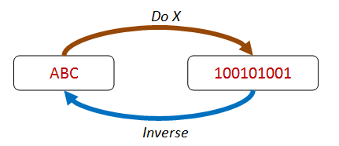

除了序列化/反序列化之外，还可以通过其他一对操作进行检查：`加法`/`减法`，`写`/`读`，`setProperty`/`getProperty`等等。

其他一对函数也适合这种模式，即使它们不是严格的反函数，例如`insert`/`contains`，`create`/`exists`等。

### "有些事情永远不会改变"

这些属性基于一种不变量，在某些转换后仍然保持不变。

在下面的图表中，变换改变了项目的顺序，但之后仍然存在相同的四个项目。


常见的不变量包括集合的大小（例如`map`），集合的内容（例如`sort`），某物的高度或深度与大小成比例（例如平衡树）。

### "越是变化，越是不变"

这些属性基于"幂等性" -- 也就是说，对一个操作进行两次与进行一次是相同的。

在下面的图表中，使用`distinct`来过滤集合返回两个项目，但使用`distinct`两次会再次返回相同的集合。


幂等性属性非常有用，可以扩展到诸如数据库更新和消息处理之类的事物。

### "先解决一个较小的问题"

这些属性基于"结构归纳" -- 也就是说，如果一个大的东西可以被分解成较小的部分，并且某些属性对这些较小的部分成立，那么你通常可以证明该属性对大的东西也成立。

在下面的图表中，我们可以看到，四项列表可以被分成一项加上一个三项列表，然后再分成一项加上一个两项列表。如果我们可以证明该属性对两项列表成立，那么我们可以推断它也对三项列表和四项列表成立。


归纳属性通常自然适用于递归结构，例如列表和树。

### "难以证明，易于验证"

通常，查找结果的算法可能很复杂，但验证答案很容易。

在下面的图表中，我们可以看到，在迷宫中找到一条路线是困难的，但检查它是否有效是微不足道的！


许多著名的问题都属于这种类型，例如质数分解。但这种方法甚至可以用于简单的问题。

例如，您可能会通过将所有标记再次连接来检查字符串分词器的工作。结果字符串应该与您开始的字符串相同。

### "测试预言"

在许多情况下，您通常会有一个算法或流程的备用版本（一个"测试预言"），您可以使用它来检查您的结果。


例如，您可能有一个高性能算法，带有优化调整，您想要测试。在这种情况下，您可能会将其与一个明显较慢但编写正确更容易的暴力算法进行比较。

类似地，您可能会将并行或并发算法的结果与线性的单线程版本的结果进行比较。

## 将这些类别应用到一些实际例子中

在本节中，我们将应用这些分类来看看是否可以为一些简单函数（如“对列表排序”和“反转列表”）提出属性。

### “不同路径，同一目的地”应用于列表排序

让我们从“*不同路径，同一目的地*”开始，将其应用于“列表排序”功能。

我们能想到任何一种方法将一个操作*放在*`List.sort`之前，另一个操作*放在*`List.sort`之后，以便最终得到相同的结果吗？也就是说，“先向上再横穿顶部”与“横穿底部再向上”是一样的。

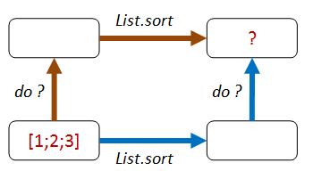

这样怎么样？

+   **路径 1：** 我们对列表的每个元素加 1，然后排序。

+   **路径 2：** 我们先排序，然后对列表的每个元素加 1。

+   两个列表应该是相等的。

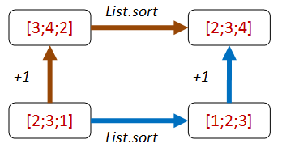

这是一些实现该属性的代码：

```
let ``+1 then sort should be same as sort then +1`` sortFn aList = 
    let add1 x = x + 1

    let result1 = aList |> sortFn |> List.map add1
    let result2 = aList |> List.map add1 |> sortFn 
    result1 = result2

// test 
let goodSort = List.sort
Check.Quick (``+1 then sort should be same as sort then +1`` goodSort)
// Ok, passed 100 tests. 
```

好吧，这样做可以，但对于许多其他转换也同样适用。例如，如果我们将`List.sort`实现为恒等式，那么同样也满足这一属性！你可以自己测试一下：

```
let badSort aList = aList
Check.Quick (``+1 then sort should be same as sort then +1`` badSort)
// Ok, passed 100 tests. 
```

这个属性的问题在于它没有利用任何“有序性”。我们知道排序可能会重新排列列表，而且最小的元素肯定应该排在第一位。

如何添加一个我们*知道*在排序后将出现在列表最前面的项目呢？

+   **路径 1：** 我们将`Int32.MinValue`追加到列表的*末尾*，然后排序。

+   **路径 2：** 我们先排序，然后在列表*前面*添加`Int32.MinValue`。

+   两个列表应该是相等的。

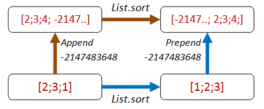

这是代码：

```
let ``append minValue then sort should be same as sort then prepend minValue`` sortFn aList = 
    let minValue = Int32.MinValue

    let appendThenSort = (aList @ [minValue]) |> sortFn 
    let sortThenPrepend = minValue :: (aList |> sortFn)
    appendThenSort = sortThenPrepend 

// test
Check.Quick (``append minValue then sort should be same as sort then prepend minValue`` goodSort)
// Ok, passed 100 tests. 
```

糟糕的实现现在失败了！

```
Check.Quick (``append minValue then sort should be same as sort then prepend minValue`` badSort)
// Falsifiable, after 1 test (2 shrinks) 
// [0] 
```

换句话说，`[0; minValue]`的糟糕排序*不同于*`[minValue; 0]`。

所以这很好！

但是...我们在其中有一些硬编码的东西，这是“地狱企业开发人员”（请参见先前的帖子）可能会利用的！EDFH 将利用我们总是使用`Int32.MinValue`并且总是将其追加或添加到测试列表中的事实。

换句话说，EDFH 可以识别我们所处的路径，并针对每条路径设置特殊情况：

```
// The Enterprise Developer From Hell strikes again
let badSort2 aList = 
    match aList with
    | [] -> []
    | _ -> 
        let last::reversedTail = List.rev aList 
        if (last = Int32.MinValue) then
            // if min is last, move to front
            let unreversedTail = List.rev reversedTail
            last :: unreversedTail 
        else
            aList // leave alone 
```

当我们检查它时...

```
// Oh dear, the bad implementation passes!
Check.Quick (``append minValue then sort should be same as sort then prepend minValue`` badSort2)
// Ok, passed 100 tests. 
```

我们可以通过（a）选择一个比列表中任何数字都小的随机数，并且（b）将其插入到一个随机位置而不总是追加它来修复这个问题。但是与其变得过于复杂，不如停下来重新考虑一下。

另一种利用“有序性”的替代方法是首先对所有值取负，然后在在对值进行排序之后进行取负的路径上，也添加一个额外的反转操作。

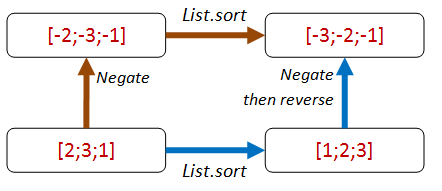

```
let ``negate then sort should be same as sort then negate then reverse`` sortFn aList = 
    let negate x = x * -1

    let negateThenSort = aList |> List.map negate |> sortFn 
    let sortThenNegateAndReverse = aList |> sortFn |> List.map negate |> List.rev
    negateThenSort = sortThenNegateAndReverse 
```

这个属性对 EDFH 来说更难击败，因为没有魔术数字来帮助确定您所处的路径：

```
// test
Check.Quick ( ``negate then sort should be same as sort then negate then reverse`` goodSort)
// Ok, passed 100 tests.

// test
Check.Quick ( ``negate then sort should be same as sort then negate then reverse``  badSort)
// Falsifiable, after 1 test (1 shrinks) 
// [1; 0]

// test
Check.Quick ( ``negate then sort should be same as sort then negate then reverse``  badSort2)
// Falsifiable, after 5 tests (3 shrinks) 
// [1; 0] 
```

你可能会争辩说我们只是对整数列表进行排序测试。但`List.sort`函数是通用的，并不知道整数的特性，因此我对这个属性的测试逻辑有很高的信心。

### 将“不同的路径，相同的目标”应用到列表反转函数

好了，`List.sort`就够了。那么应用相同的思想到列表反转函数呢？

我们可以使用同样的附加/前置技巧：

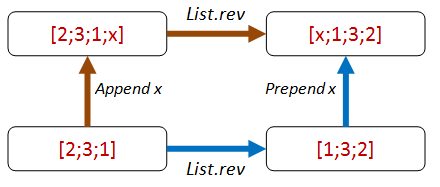

这是属性的代码：

```
let ``append any value then reverse should be same as reverse then prepend same value`` revFn anyValue aList = 

    let appendThenReverse = (aList @ [anyValue]) |> revFn 
    let reverseThenPrepend = anyValue :: (aList |> revFn)
    appendThenReverse = reverseThenPrepend 
```

这里是正确函数和两个不正确函数的测试结果：

```
// test
let goodReverse = List.rev
Check.Quick (``append any value then reverse should be same as reverse then prepend same value`` goodReverse)
// Ok, passed 100 tests.

// bad implementation fails
let badReverse aList = []
Check.Quick (``append any value then reverse should be same as reverse then prepend same value`` badReverse)
// Falsifiable, after 1 test (2 shrinks) 
// true, []

// bad implementation fails
let badReverse2 aList = aList 
Check.Quick (``append any value then reverse should be same as reverse then prepend same value`` badReverse2)
// Falsifiable, after 1 test (1 shrinks) 
// true, [false] 
```

你可能注意到这里有一些有趣的东西。我从未指定过列表的类型。该属性适用于*任何*列表。

在这样的情况下，FsCheck 将生成布尔值、字符串、整数等的随机列表。

在两种失败的情况下，`anyValue`都是布尔值。所以 FsCheck 使用的是布尔值的列表作为起点。

这里有一个练习给你：这个属性足够好吗？是否有某种方式 EDFH 可以创建一个能够通过的实现？

## “来而复返”

有时多路径样式属性不可用或过于复杂，所以让我们看看其他方法。

我们将从涉及反向的属性开始。

让我们再次从列表排序开始。排序是否有逆？嗯，不是真的。所以我们暂时跳过排序。

列表反转怎么样？嗯，碰巧反转就是它自己的逆！

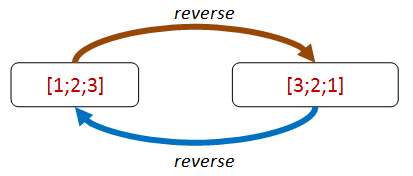

让我们将其转化为一个属性：

```
let ``reverse then reverse should be same as original`` revFn aList = 
    let reverseThenReverse = aList |> revFn |> revFn
    reverseThenReverse = aList 
```

并且通过了：

```
let goodReverse = List.rev
Check.Quick (``reverse then reverse should be same as original`` goodReverse)
// Ok, passed 100 tests. 
```

不幸的是，一个糟糕的实现也满足该属性！

```
let badReverse aList = aList 
Check.Quick (``reverse then reverse should be same as original`` badReverse)
// Ok, passed 100 tests. 
```

然而，涉及反向的属性的使用可以非常有用，以验证您的反向函数（如反序列化）确实“撤销”了主要函数（如序列化）。

我们将在下一篇文章中看到一些真实的使用示例。

## “难以证明，易于验证”

到目前为止，我们一直在测试属性，而实际上并不关心操作的最终结果。

但是当然在实践中，我们确实关心最终结果！

现在通常我们无法真正确定结果是否正确，而不重复测试功能。但是通常我们可以很容易地确定结果是否*错误*。在上面的迷宫图中，我们可以轻松检查路径是否有效。

如果我们正在寻找*最短*路径，我们可能无法检查它，但至少我们知道我们有*一些*有效的路径。

这个原则可以相当普遍地应用。

例如，假设我们想要检查`string split`函数是否正常工作。我们不必编写一个标记生成器——我们所要做的就是确保这些标记，当连接在一起时，能够还原出原始字符串！

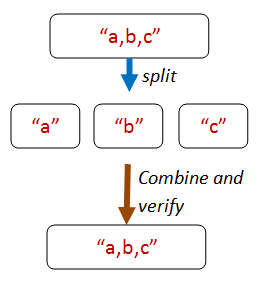

这是该属性的核心代码：

```
let concatWithComma s t = s + "," + t

let tokens = originalString.Split [| ',' |] 
let recombinedString = 
    // can use reduce safely because there is always at least one token
    tokens |> Array.reduce concatWithComma 

// compare the result with the original
originalString = recombinedString 
```

但是我们如何创建一个原始字符串呢？FsCheck 生成的随机字符串不太可能包含许多逗号！

有方法可以精确控制 FsCheck 生成随机数据的方式，我们稍后会看一下。

不过，目前我们会使用一个技巧。技巧是让 FsCheck 生成一个随机字符串列表，然后我们将通过将它们连接在一起构建一个`originalString`。

所以这是属性的完整代码：

```
let ``concatting the elements of a string split by commas recreates the original string`` aListOfStrings = 
    // helper to make a string
    let addWithComma s t = s + "," + t
    let originalString = aListOfStrings |> List.fold addWithComma ""

    // now for the property
    let tokens = originalString.Split [| ',' |] 
    let recombinedString = 
        // can use reduce safely because there is always at least one token
        tokens |> Array.reduce addWithComma 

    // compare the result with the original
    originalString = recombinedString 
```

当我们测试这个时，我们很高兴：

```
Check.Quick ``concatting the elements of a string split by commas recreates the original string`` 
// Ok, passed 100 tests. 
```

### "难以证明，易于验证"的列表排序

那么我们如何将这个原则应用到排序列表中？有什么属性是容易验证的？

我脑海中首先浮现的是列表中每对元素，第一个元素将小于第二个元素。

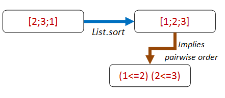

所以让我们将其��定为一个属性：

```
let ``adjacent pairs from a list should be ordered`` sortFn aList = 
    let pairs = aList |> sortFn |> Seq.pairwise
    pairs |> Seq.forall (fun (x,y) -> x <= y ) 
```

但当我们尝试检查时，出现了一个有趣的错误！

```
let goodSort = List.sort
Check.Quick (``adjacent pairs from a list should be ordered`` goodSort) 
```

```
System.Exception: Geneflect: type not handled System.IComparable
   at FsCheck.ReflectArbitrary.reflectObj@102-4.Invoke(String message)
   at Microsoft.FSharp.Core.PrintfImpl.go@523-3b,c,d
   at Microsoft.FSharp.Core.PrintfImpl.run@521b,c,d 
```

`System.Exception: type not handled System.IComparable` 是什么意思？这意味着 FsCheck 正在尝试生成一个随机列表，但它只知道元素必须是`IComparable`。但`IComparable`不是一个可以实例化的类型，所以 FsCheck 抛出错误。

我们如何防止这种情况发生？解决方案是为属性指定一个特定类型，比如`int list`，像这样：

```
let ``adjacent pairs from a list should be ordered`` sortFn (aList:int list) = 
    let pairs = aList |> sortFn |> Seq.pairwise
    pairs |> Seq.forall (fun (x,y) -> x <= y ) 
```

这段代码现在可以工作了。

```
let goodSort = List.sort
Check.Quick (``adjacent pairs from a list should be ordered`` goodSort)
// Ok, passed 100 tests. 
```

请注意，即使属性已被约束，该属性仍然是一个非常通用的属性。例如，我们可以使用`string list`，它也会正常工作。

```
let ``adjacent pairs from a string list should be ordered`` sortFn (aList:string list) = 
    let pairs = aList |> sortFn |> Seq.pairwise
    pairs |> Seq.forall (fun (x,y) -> x <= y )

Check.Quick (``adjacent pairs from a string list should be ordered`` goodSort)
// Ok, passed 100 tests. 
```

**提示：如果 FsCheck 抛出 "type not handled"，请为属性添加显式类型约束**

现在我们完成了吗？不！这个属性的一个问题是它不能捕捉到 EDFH 的恶意实现。

```
// bad implementation passes
let badSort aList = []
Check.Quick (``adjacent pairs from a list should be ordered`` badSort)
// Ok, passed 100 tests. 
```

你会感到惊讶吗？一个愚蠢的实现也能奏效吗？

嗯。这告诉我们，在排序中必须有一些*不同于成对顺序*的属性，我们忽略了什么？我们漏掉了什么？

这是一个很好的例子，说明基于属性的测试如何带来关于设计的见解。我们以为我们知道排序的含义，但我们被迫对我们的定义更加严格。

恰好，我们将通过使用下一个原则来解决这个特定问题！

## "有些事情永远不会改变"

一种有用的属性类型是基于在某些转换后保持不变的不变量，比如保持长度或内容。

它们通常本身不足以确保正确的实现，但它们*经常*作为对更一般属性的反向检查。

例如，在上一篇文章中，我们为加法创建了可交换和可结合的属性，但后来注意到，只需返回零的实现也能满足它们！只有当我们添加`x + 0 = x`作为属性时，我们才能消除那种恶意实现。

在上面的"列表排序"示例中，我们可以通过一个只返回空列表的函数满足"成对排序"属性！我们该如何修复这个问题？

我们的第一次尝试可能是检查排序列表的长度。如果长度不同，那么排序函数显然作弊了！

```
let ``sort should have same length as original`` sortFn (aList:int list) = 
    let sorted = aList |> sortFn 
    List.length sorted = List.length aList 
```

我们检查了它，它奏效了：

```
let goodSort = List.sort
Check.Quick (``sort should have same length as original`` goodSort )
// Ok, passed 100 tests. 
```

是的，糟糕的实现失败了：

```
let badSort aList = []
Check.Quick (``sort should have same length as original`` badSort )
// Falsifiable, after 1 test (1 shrink) 
// [0] 
```

不幸的是，BDFH 没有被打败，可以提出另一个符合条件的实现！只需重复第一个元素 N 次！

```
// bad implementation has same length
let badSort2 aList = 
    match aList with 
    | [] -> []
    | head::_ -> List.replicate (List.length aList) head 

// for example 
// badSort2 [1;2;3]  => [1;1;1] 
```

现在当我们测试这个时，它通过了：

```
Check.Quick (``sort should have same length as original`` badSort2)
// Ok, passed 100 tests. 
```

更重要的是，它还满足了成对性质！

```
Check.Quick (``adjacent pairs from a list should be ordered`` badSort2)
// Ok, passed 100 tests. 
```

### 排序不变性 - 第二次尝试

现在我们必须再试一次。 真结果`[1;2;3]`与假结果`[1;1;1]`之间有什么区别？

答案：假结果是丢弃数据。 真结果始终包含与原始列表相同的内容，只是顺序不同。

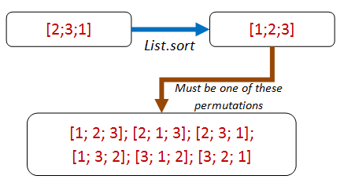

这导致我们有了一个新的属性：排序列表始终是原始列表的排列。 啊哈！ 现在让我们用排列来写属性：

```
let ``a sorted list is always a permutation of the original list`` sortFn (aList:int list) = 
    let sorted = aList |> sortFn 
    let permutationsOfOriginalList = permutations aList 

    // the sorted list must be in the seq of permutations
    permutationsOfOriginalList 
    |> Seq.exists (fun permutation -> permutation = sorted) 
```

很好，现在我们只需要一个排列函数。

让我们转到 StackOverflow，并~~偷~~ [借用一个实现](http://stackoverflow.com/a/4610704/1136133)。 在这里：

```
/// given aList and anElement to insert,
/// generate all possible lists with anElement 
/// inserted into aList 
let rec insertElement anElement aList =
    // From http://stackoverflow.com/a/4610704/1136133
    seq { 
        match aList with
        // empty returns a singleton
        | [] -> yield [anElement] 
        // not empty? 
        | first::rest ->
            // return anElement prepended to the list
            yield anElement::aList
            // also return first prepended to all the sublists
            for sublist in insertElement anElement rest do
                yield first::sublist
        }

/// Given a list, return all permutations of it
let rec permutations aList =
    seq { 
        match aList with
        | [] -> yield []
        | first::rest ->
            // for each sub-permutation, 
            // return the first inserted into it somewhere
            for sublist in permutations rest do
                yield! insertElement first sublist
        } 
```

一些快速的交互式测试证实它按预期工作：

```
permutations ['a';'b';'c'] |> Seq.toList
//  [['a'; 'b'; 'c']; ['b'; 'a'; 'c']; ['b'; 'c'; 'a']; ['a'; 'c'; 'b'];
//  ['c'; 'a'; 'b']; ['c'; 'b'; 'a']]

permutations ['a';'b';'c';'d'] |> Seq.toList
//  [['a'; 'b'; 'c'; 'd']; ['b'; 'a'; 'c'; 'd']; ['b'; 'c'; 'a'; 'd'];
//   ['b'; 'c'; 'd'; 'a']; ['a'; 'c'; 'b'; 'd']; ['c'; 'a'; 'b'; 'd'];
//   ['c'; 'b'; 'a'; 'd']; ['c'; 'b'; 'd'; 'a']; ['a'; 'c'; 'd'; 'b'];
//   ['c'; 'a'; 'd'; 'b']; ['c'; 'd'; 'a'; 'b']; ['c'; 'd'; 'b'; 'a'];
//   ['a'; 'b'; 'd'; 'c']; ['b'; 'a'; 'd'; 'c']; ['b'; 'd'; 'a'; 'c'];
//   ['b'; 'd'; 'c'; 'a']; ['a'; 'd'; 'b'; 'c']; ['d'; 'a'; 'b'; 'c'];
//   ['d'; 'b'; 'a'; 'c']; ['d'; 'b'; 'c'; 'a']; ['a'; 'd'; 'c'; 'b'];
//   ['d'; 'a'; 'c'; 'b']; ['d'; 'c'; 'a'; 'b']; ['d'; 'c'; 'b'; 'a']]

permutations [3;3] |> Seq.toList
//  [[3; 3]; [3; 3]] 
```

太好了！ 现在让我们运行 FsCheck：

```
Check.Quick (``a sorted list is always a permutation of the original list`` goodSort) 
```

嗯。 这很有趣，似乎什么都没有发生。 而且我的 CPU 出现了某些原因的最大化。 发生了什么？

发生的情况是你将会长时间坐在那里！ 如果您正在家中跟着做，请右键单击并取消交互式会话。

看似无害的`permutations`对于任何正常大小的列表来说确实*非常*慢。 例如，仅有 10 个项目的列表就有 3,628,800 个排列。 而对于 20 个项目，您将得到天文数字。

当然，FsCheck 会进行数百次这样的测试！ 这导致了一个重要的提示：

**提示：确保您的属性检查非常快速。 你会频繁运行它们的！**

我们已经看到，即使在最好的情况下，FsCheck 也会评估属性 100 次。 如果需要收缩，甚至更多。 因此，请确保您的测试运行速度快！

但是，如果你要处理真实系统，比如数据库、网络或其他缓慢的依赖关系，会发生什么呢？

在他（强烈推荐的）[关于使用 QuickCheck 的视频](http://vimeo.com/68383317)中，约翰·休斯讲述了他的团队试图检测由网络分区和节点故障引起的分布式数据存储中的缺陷。

当然，杀死真实节点数千次太慢了，所以他们将核心逻辑提取到了虚拟模型中，并对其进行了测试。 结果，代码*后来被重构*以使此类测试更容易。 换句话说，基于属性的测试影响了代码的设计，就像 TDD 一样。

### 排序不变性 - 第三次尝试

好的，所以我们不能只通过循环来使用排列。 那么让我们使用相同的想法，但编写一个特定于此案例的函数，一个`isPermutationOf`函数。

```
let ``a sorted list has same contents as the original list`` sortFn (aList:int list) = 
    let sorted = aList |> sortFn 
    isPermutationOf aList sorted 
```

这是`isPermutationOf`及其相关辅助函数的代码：

```
/// Given an element and a list, and other elements previously skipped,
/// return a new list without the specified element.
/// If not found, return None
let rec withoutElementRec anElement aList skipped = 
    match aList with
    | [] -> None
    | head::tail when anElement = head -> 
        // matched, so create a new list from the skipped and the remaining
        // and return it
        let skipped' = List.rev skipped
        Some (skipped' @ tail)
    | head::tail  -> 
        // no match, so prepend head to the skipped and recurse 
        let skipped' = head :: skipped
        withoutElementRec anElement tail skipped' 

/// Given an element and a list
/// return a new list without the specified element.
/// If not found, return None
let withoutElement x aList = 
    withoutElementRec x aList [] 

/// Given two lists, return true if they have the same contents
/// regardless of order
let rec isPermutationOf list1 list2 = 
    match list1 with
    | [] -> List.isEmpty list2 // if both empty, true
    | h1::t1 -> 
        match withoutElement h1 list2 with
        | None -> false
        | Some t2 -> 
            isPermutationOf t1 t2 
```

让我们再次尝试测试。 是的，这次它在宇宙热寂之前完成了。

```
Check.Quick (``a sorted list has same contents as the original list``  goodSort)
// Ok, passed 100 tests. 
```

更棒的是，恶意实现现在无法满足这个性质了！

```
Check.Quick (``a sorted list has same contents as the original list``  badSort2)
// Falsifiable, after 2 tests (5 shrinks) 
// [1; 0] 
```

实际上，这两个属性，`列表中的相邻对应应该是有序的`和`排序后的列表与原始列表具有相同的内容`确实应该确保任何实现都是正确的。

## 侧边栏：组合属性

就在上面，我们注意到定义“已排序”属性需要*两个*属性。如果我们能将它们合并成一个`已排序`属性，这样我们就可以进行单一测试。

当然，我们总是可以将两组代码合并成一个函数，但最好尽可能保持函数尽可能小。此外，像`具有相同内容`这样的属性可能在其他情境中也是可重用的。

我们想要的是一个与属性一起工作的`AND`和`OR`的等效物。

FsCheck 来拯救！有内置运算符可以组合属性：`.&.` 用于`AND`和`.|.` 用于`OR`。

这里是它们的一个使用示例：

```
let ``list is sorted``sortFn (aList:int list) = 
    let prop1 = ``adjacent pairs from a list should be ordered`` sortFn aList 
    let prop2 = ``a sorted list has same contents as the original list`` sortFn aList 
    prop1 .&. prop2 
```

当我们用一个良好的`sort`实现测试组合属性时，一切都按预期运行。

```
let goodSort = List.sort
Check.Quick (``list is sorted`` goodSort )
// Ok, passed 100 tests. 
```

当我们测试一个糟糕的实现时，组合属性也会失败。

```
let badSort aList = []
Check.Quick (``list is sorted`` badSort )
// Falsifiable, after 1 test (0 shrinks) 
// [0] 
```

但现在出现了一个问题。这两个属性中的哪一个失败了？

我们想要做的是给每个属性添加一个“标签”，这样我们就可以区分它们。在 FsCheck 中，这是通过 `|@` 运算符实现的：

```
let ``list is sorted (labelled)``sortFn (aList:int list) = 
    let prop1 = ``adjacent pairs from a list should be ordered`` sortFn aList 
                |@ "adjacent pairs from a list should be ordered"
    let prop2 = ``a sorted list has same contents as the original list`` sortFn aList 
                |@ "a sorted list has same contents as the original list"
    prop1 .&. prop2 
```

现在，当我们用糟糕的排序进行测试时，我们会得到一条消息 `失败属性的标签：排序后的列表与原始列表具有相同的内容`：

```
Check.Quick (``list is sorted (labelled)`` badSort )
//  Falsifiable, after 1 test (2 shrinks)
//  Label of failing property: a sorted list has same contents as the original list
//  [0] 
```

想了解更多关于这些运算符的信息，请查看 [FsCheck 文档中的"And, Or and Labels"部分](https://fsharp.github.io/FsCheck/Properties.html)。

现在，回到属性设计策略。

## "解决一个较小的问题"

有时候你会遇到一个递归数据结构或者一个递归问题。在这些情况下，你通常可以找到一个对于较小部分有效的属性。

例如，对于一个排序，我们可以说类似这样的话：

```
A list is sorted if:
* The first element is smaller (or equal to) the second.
* The rest of the elements after the first element are also sorted. 
```

这里是用代码表达的逻辑：

```
let rec ``First element is <= than second, and tail is also sorted`` sortFn (aList:int list) = 
    let sortedList = aList |> sortFn 
    match sortedList with
    | [] -> true
    | [first] -> true
    | [first;second] -> 
        first <= second
    | first::second::tail -> 
        first <= second &&
        let subList = second::tail 
        ``First element is <= than second, and tail is also sorted`` sortFn subList 
```

这个属性由真正的排序函数满足：

```
let goodSort = List.sort
Check.Quick (``First element is <= than second, and tail is also sorted`` goodSort )
// Ok, passed 100 tests. 
```

但不幸的是，就像之前的例子一样，恶意实现也会通过。

```
let badSort aList = []
Check.Quick (``First element is <= than second, and tail is also sorted`` badSort )
// Ok, passed 100 tests.

let badSort2 aList = 
    match aList with 
    | [] -> []
    | head::_ -> List.replicate (List.length aList) head 

Check.Quick (``First element is <= than second, and tail is also sorted`` badSort2)
// Ok, passed 100 tests. 
```

因此，和之前一样，我们需要另一个属性（比如`具有相同内容`的不变性）来确保代码是正确的。

如果你有一个递归数据结构，那么尝试寻找递归属性。当你掌握了这个技巧时，它们会显而易见且容易实现。

## EDFH 真的是一个问题吗？

在最近的几个例子中，我注意到，琐碎但错误的实现通常也会满足属性，就像良好的实现一样。

但我们*真的*需要花时间担心这个吗？我的意思是，如果我们真的发布了一个只复制第一个元素的排序算法，那肯定会立即显而易见，对吧？

是的，确实恶意实现不太可能成为问题。另一方面，你应该将基于属性的测试视为*设计*过程而不是*测试*过程--一种帮助你澄清系统真正要做什么的技术。如果你的设计的一个关键方面只需一个简单的实现就能满足，那么也许你忽视了一些东西--当你发现它时，将使你的设计更清晰和更健壮。

## “变化的事物越多，不变的事物越多”

我们下一个属性类型是“幂等性”。幂等性简单地意味着做两次与做一次相同。如果我告诉你“坐下”，然后再告诉你“坐下”，第二个命令没有效果。

幂等性是[可靠系统的关键](https://queue.acm.org/detail.cfm?id=2187821)，也是[面向服务的](http://soapatterns.org/design_patterns/idempotent_capability)和基于消息的架构的关键方面。

如果你正在设计这种真实世界的系统，确保你的请求和流程是幂等的是非常值得的。

我现在不会深入讨论这个问题，但让我们看两个简单的例子。

首先，我们的老朋友`sort`是幂等的（忽略稳定性），而`reverse`显然不是。

```
let ``sorting twice gives the same result as sorting once`` sortFn (aList:int list) =
    let sortedOnce = aList |> sortFn 
    let sortedTwice = aList |> sortFn |> sortFn 
    sortedOnce = sortedTwice

// test
let goodSort = List.sort
Check.Quick (``sorting twice gives the same result as sorting once`` goodSort )
// Ok, passed 100 tests. 
```

一般来说，任何类型的查询都应该是幂等的，或者换句话说：“提问不应该改变答案”。

在现实世界中，情况可能并非如此。在不同时间运行的数据存储查询可能会得到不同的结果。

这里有一个快速演示。

首先我们将创建一个`NonIdempotentService`，每次查询都会得到不同的结果。

```
type NonIdempotentService() =
    let mutable data = 0
    member this.Get() = 
        data
    member this.Set value = 
        data <- value

let ``querying NonIdempotentService after update gives the same result`` value1 value2 =
    let service = NonIdempotentService()
    service.Set value1

    // first GET 
    let get1 = service.Get()

    // another task updates the data store
    service.Set value2

    // second GET called just like first time
    let get2 = service.Get() 
    get1 = get2 
```

但是如果我们现在测试它，我们会发现它不满足所需的幂等性属性：

```
Check.Quick ``querying NonIdempotentService after update gives the same result``
// Falsifiable, after 2 tests 
```

作为替代方案，我们可以创建一个（粗糙的）`IdempotentService`，每个事务都需要一个时间戳。在这种设计中，使用相同时间戳的多个 GET 请求将始终检索相同的数据。

```
type IdempotentService() =
    let mutable data = Map.empty
    member this.GetAsOf (dt:DateTime) = 
        data |> Map.find dt
    member this.SetAsOf (dt:DateTime) value = 
        data <- data |> Map.add dt value

let ``querying IdempotentService after update gives the same result`` value1 value2 =
    let service = IdempotentService()
    let dt1 = DateTime.Now.AddMinutes(-1.0)
    service.SetAsOf dt1 value1

    // first GET 
    let get1 = service.GetAsOf dt1 

    // another task updates the data store
    let dt2 = DateTime.Now
    service.SetAsOf dt2 value2

    // second GET called just like first time
    let get2 = service.GetAsOf dt1 
    get1 = get2 
```

这个是有效的：

```
Check.Quick ``querying IdempotentService after update gives the same result``
// Ok, passed 100 tests. 
```

因此，如果你正在构建一个 REST GET 处理程序或数据库查询服务，并且希望具有幂等性，你应该考虑使用诸如 ETags、“as-of”时间、日期范围等技术。

如果你需要关于如何做到这一点的提示，搜索[idempotency patterns](http://blog.jonathanoliver.com/idempotency-patterns/)会得到一些很好的结果。

## “三个臭皮匠，顶个诸葛亮”

最后但同样重要的是，“测试神谕”。测试神谕只是一个给出正确答案的替代实现，你可以用它来检查你的结果。

通常测试神谕的实现不适合生产环境--它太慢，无法并行化，或者太[诗意](https://xkcd.com/1026/)等，但这并不妨碍它在测试中非常有用。

对于“列表排序”，周围有许多简单但速度慢的实现。例如，这里是插入排序的一个快速实现：

```
module InsertionSort = 

    // Insert a new element into a list by looping over the list.
    // As soon as you find a larger element, insert in front of it
    let rec insert newElem list = 
        match list with 
        | head::tail when newElem > head -> 
            head :: insert newElem tail
        | other -> // including empty list
            newElem :: other 

    // Sorts a list by inserting the head into the rest of the list 
    // after the rest have been sorted
    let rec sort list = 
        match list with
        | []   -> []
        | head::tail -> 
            insert head (sort tail)

    // test
    // insertionSort  [5;3;2;1;1] 
```

有了这个设置，我们可以编写一个测试结果与插入排序相比较的属性。

```
let ``sort should give same result as insertion sort`` sortFn (aList:int list) = 
    let sorted1 = aList |> sortFn 
    let sorted2 = aList |> InsertionSort.sort
    sorted1 = sorted2 
```

当我们测试良好的排序时，它起作用。很好！

```
let goodSort = List.sort
Check.Quick (``sort should give same result as insertion sort`` goodSort)
// Ok, passed 100 tests. 
```

当我们测试糟糕的排序时，它不起作用。更好！

```
let badSort aList = aList 
Check.Quick (``sort should give same result as insertion sort`` badSort)
// Falsifiable, after 4 tests (6 shrinks) 
// [1; 0] 
```

## 以两种不同的方式生成罗马数字

当你不确定*任何*实现是否正确时，我们也可以使用测试神谕方法互相交叉检查两种不同的实现！

举例来说，在我的帖子"对'罗马数字 Kata 的评论'"中，我提出了两种完全不同的生成罗马数字的算法。我们能把它们互相对比，并一次性测试它们吗？

第一个算法是基于理解罗马数字是基于记数的，导致这段简单的代码：

```
let arabicToRomanUsingTallying arabic = 
   (String.replicate arabic "I")
    .Replace("IIIII","V")
    .Replace("VV","X")
    .Replace("XXXXX","L")
    .Replace("LL","C")
    .Replace("CCCCC","D")
    .Replace("DD","M")
    // optional substitutions
    .Replace("IIII","IV")
    .Replace("VIV","IX")
    .Replace("XXXX","XL")
    .Replace("LXL","XC")
    .Replace("CCCC","CD")
    .Replace("DCD","CM") 
```

另一种思考罗马数字的方式是想象一个算盘。每根线上有四个"单位"珠子和一个"五"珠子。

这导致所谓的"双五"方法：

```
let biQuinaryDigits place (unit,five,ten) arabic =
  let digit =  arabic % (10*place) / place
  match digit with
  | 0 -> ""
  | 1 -> unit
  | 2 -> unit + unit
  | 3 -> unit + unit + unit
  | 4 -> unit + five // changed to be one less than five 
  | 5 -> five
  | 6 -> five + unit
  | 7 -> five + unit + unit
  | 8 -> five + unit + unit + unit
  | 9 -> unit + ten  // changed to be one less than ten
  | _ -> failwith "Expected 0-9 only"

let arabicToRomanUsingBiQuinary arabic = 
  let units = biQuinaryDigits 1 ("I","V","X") arabic
  let tens = biQuinaryDigits 10 ("X","L","C") arabic
  let hundreds = biQuinaryDigits 100 ("C","D","M") arabic
  let thousands = biQuinaryDigits 1000 ("M","?","?") arabic
  thousands + hundreds + tens + units 
```

现在我们有两种完全不同的算法，我们可以互相交叉检查它们，看它们是否给出相同的结果。

```
let ``biquinary should give same result as tallying`` arabic = 
    let tallyResult = arabicToRomanUsingTallying arabic 
    let biquinaryResult = arabicToRomanUsingBiQuinary arabic 
    tallyResult = biquinaryResult 
```

但是如果我们尝试运行这段代码，由于`String.replicate`调用，我们会得到一个`ArgumentException: The input must be non-negative`。

```
Check.Quick ``biquinary should give same result as tallying``
// ArgumentException: The input must be non-negative. 
```

所以我们只需要包括正数作为输入。我们还需要排除大于 4000 的数字，因为算法在那里也会出问题。

我们如何实现这个过滤器？

我们在上一篇帖子中看到我们可以使用先决条件。但是对于这个例子，我们将尝试一些不同的东西并更改生成器。

首先我们会定义一个*新的*称为`arabicNumber`的任意整数，它按我们想要的方式进行过滤（"任意"是一个生成算法和收缩算法的组合，如前面的帖子中所述）。

```
let arabicNumber = Arb.Default.Int32() |> Arb.filter (fun i -> i > 0 && i <= 4000) 
```

接下来，我们通过使用`Prop.forAll`助手，创建一个*只使用"arabicNumber"*的新属性。

我们会给这个属性取一个相当聪明的名字，"对于所有值的 arabicNumber，biquinary 应该和记数相同"。

```
let ``for all values of arabicNumber biquinary should give same result as tallying`` = 
    Prop.forAll arabicNumber ``biquinary should give same result as tallying`` 
```

现在最后，我们可以进行交叉检查测试：

```
Check.Quick ``for all values of arabicNumber biquinary should give same result as tallying``
// Ok, passed 100 tests. 
```

一切都很好！两种算法都正确地工作了，看起来是这样的。

## "基于模型"的测试

"基于模型"的测试，我们将在后续的帖子中详细讨论，是对测试神谕的一种变体。

它的工作方式是，在对你的（复杂的）受测系统进行测试的同时，你创建一个简化模型。

然后，当你对受测系统执行某些操作时，你也对你的模型执行相同（但简化的）操作。

最后，你将你的模型状态与受测系统的状态进行比较。如果它们相同，你就完成了。如果不是，要么你的 SUT 有 bug，要么你的模型是错误的，你需要重新开始！

## 插曲：一个基于寻找属性的游戏

有了这些，我们已经完成了各种属性类别的讨论。我们马上会再次复习一遍--但首先，一个插曲。

如果你有时觉得寻找属性是一种心智挑战，那你并不孤单。假装这是一个游戏会有帮助吗？

恰好有一个基于属性的测试游戏。

它被称为 [Zendo](http://boardgamegeek.com/boardgame/6830/zendo)，它涉及在桌子上放置一组物体（例如塑料金字塔），使每个布局符合一个模式 -- 一个规则 -- 或者我们现在会说的 *一个属性*！。

然后其他玩家必须根据他们所看到的来猜测规则（属性）是什么。

这是一个正在进行中的 Zendo 游戏的图片：


白色石头表示属性已满足，而黑色石头表示失败。你能猜到这里的规则吗？我猜这是类似于“一个集合必须有一个不接触地面的黄色金字塔”的规则。

好吧，我想 Zendo 并不是真的受基于属性的测试启发，但这是一个有趣的游戏，甚至在 [编程会议](https://thestrangeloop.com/sessions/zendo-%E2%80%93-the-scientific-method-in-a-box) 上也曾出现过。

如果你想了解更多关于 Zendo 的信息，[规则在这里](http://www.looneylabs.com/rules/zendo)。

## 再次应用这些类别

有了所有这些类别，让我们再看一个例子问题，并看看我们能否找到它的属性。

此示例基于肯特·贝克的《测试驱动开发 by Example》一书中描述的著名的 `Dollar` 示例。

[*Growing Object-Oriented Software Guided by Tests*](http://www.growing-object-oriented-software.com/) 的 Nat Pryce 写了一篇关于基于属性的测试的博文（["Exploring Test-Driven Development with QuickCheck"](http://www.natpryce.com/articles/000795.html)）。

在这里，他对基于属性的测试在实践中的有用性表达了一些挫折感。所以让我们重新审视他提到的例子，看看我们能做些什么。

我们不打算批评设计本身并使其更加类型驱动 -- [其他人已经做过了](http://spin.atomicobject.com/2014/12/10/typed-language-tdd-part2/)。相反，我们将接受设计并看看我们能想出什么属性。

那么我们有什么呢？

+   一个存储 `Amount` 的 `Dollar` 类。

+   方法 `Add` 和 `Times` 以明显的方式转换金额。

```
// OO style class with members
type Dollar(amount:int) =
    member val Amount  = amount with get, set
    member this.Add add = 
        this.Amount <- this.Amount + add
    member this.Times multiplier  = 
        this.Amount <- this.Amount * multiplier  
    static member Create amount  = 
        Dollar amount 
```

所以，首先让我们交互式地尝试一下，以确保它按预期工作：

```
let d = Dollar.Create 2
d.Amount  // 2
d.Times 3 
d.Amount  // 6
d.Add 1
d.Amount  // 7 
```

但那只是玩耍，不是真正的测试。那么我们能想到什么样的属性呢？

让我们再次过一遍它们：

+   同一结果的不同路径

+   逆操作

+   不变量

+   幂等性

+   结构归纳

+   易于验证

+   测试预测

让我们暂时跳过“不同路径”。逆操作呢？我们有没有可以使用的逆操作？

是的，setter 和 getter 形成了一个可以创建属性的逆操作：

```
let ``set then get should give same result`` value = 
    let obj = Dollar.Create 0
    obj.Amount <- value
    let newValue = obj.Amount
    value = newValue 

Check.Quick ``set then get should give same result`` 
// Ok, passed 100 tests. 
```

幂等性也是相关的。例如，连续进行两次设置应该与仅进行一次设置相同。这是一个对应的属性：

```
let ``set amount is idempotent`` value = 
    let obj = Dollar.Create 0
    obj.Amount <- value
    let afterFirstSet = obj.Amount
    obj.Amount <- value
    let afterSecondSet = obj.Amount
    afterFirstSet = afterSecondSet 

Check.Quick ``set amount is idempotent`` 
// Ok, passed 100 tests. 
```

有任何“结构归纳”属性吗？不，对于这种情况不相关。

有任何“易于验证”的属性吗？没有明显的。

最后，有一个测试预言吗？没有。同样不相关，尽管如果我们真的在设计一个复杂的货币管理系统，与第三方系统交叉检查我们的结果可能非常有用。

### 一个不可变 Dollar 的属性

一个坦白！在上面的代码中，我有点作弊，创建了一个可变的类，这是大多数 OO 对象的设计方式。

但在《TDD by Example》中，肯特很快意识到了这个问题，并将其更改为一个不可变类，所以让我也这样做。

这是不可变版本：

```
type Dollar(amount:int) =
    member val Amount  = amount 
    member this.Add add = 
        Dollar (amount + add)
    member this.Times multiplier  = 
        Dollar (amount * multiplier)
    static member Create amount  = 
        Dollar amount  

// interactive test
let d1 = Dollar.Create 2
d1.Amount  // 2
let d2 = d1.Times 3 
d2.Amount  // 6
let d3 = d2.Add 1
d3.Amount  // 7 
```

不可变代码的好处是我们可以消除对设置器的测试的需求，因此我们刚刚创建的两个属性现在已经变得不相关了！

说实话，它们本来就相当琐碎，所以也没什么大损失。

那么，现在我们能想出什么新的属性呢？

让我们来看看 `Times` 方法。我们如何测试呢？我们可以使用哪种策略之一呢？

我认为“不同路径得到相同结果”非常适用。我们可以像我们对“排序”所做的那样做一个“内部”和“外部”乘法操作，看看它们是否给出相同的结果。

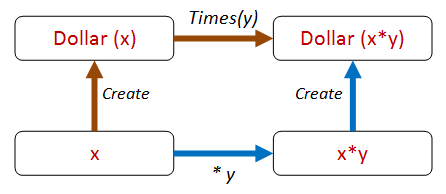

这是用代码表达的那个属性：

```
let ``create then times should be same as times then create`` start multiplier = 
    let d0 = Dollar.Create start
    let d1 = d0.Times(multiplier)
    let d2 = Dollar.Create (start * multiplier)     
    d1 = d2 
```

太棒了！让我们看看它是否起作用！

```
Check.Quick ``create then times should be same as times then create``
// Falsifiable, after 1 test 
```

糟糕 -- 它不起作用了！

为什么不呢？因为我们忘记了 `Dollar` 是一个引用类型，默认情况下不会相等！

由于这个错误，我们发现了一个可能会被忽视的属性！在我们忘记之前，让我们对其进行编码。

```
let ``dollars with same amount must be equal`` amount = 
    let d1 = Dollar.Create amount 
    let d2 = Dollar.Create amount 
    d1 = d2

Check.Quick ``dollars with same amount must be equal`` 
// Falsifiable, after 1 test 
```

所以现在我们需要通过添加对 `IEquatable` 的支持等来修复这个问题。

如果你愿意的话，你可以这样做 -- 我将切换到 F# 记录类型，并获得免费的相等性！

### Dollar 属性 -- 版本 3

这里是重写的 `Dollar`：

```
type Dollar = {amount:int } 
    with 
    member this.Add add = 
        {amount = this.amount + add }
    member this.Times multiplier  = 
        {amount = this.amount * multiplier }
    static member Create amount  = 
        {amount=amount} 
```

现在我们的两个属性都满足了：

```
Check.Quick ``dollars with same amount must be equal`` 
// Ok, passed 100 tests.

Check.Quick ``create then times should be same as times then create``
// Ok, passed 100 tests. 
```

我们可以将这种方法扩展到不同的路径。例如，我们可以提取金额并直接比较，像这样：

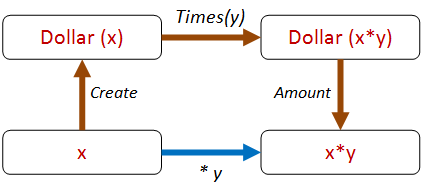

代码看起来像这样：

```
let ``create then times then get should be same as times`` start multiplier = 
    let d0 = Dollar.Create start
    let d1 = d0.Times(multiplier)
    let a1 = d1.amount
    let a2 = start * multiplier     
    a1 = a2

Check.Quick ``create then times then get should be same as times``
// Ok, passed 100 tests. 
```

我们也可以将 `Add` 包含在其中。

例如，我们可以通过两条不同的路径执行 `Times` 然后是 `Add`，就像这样：

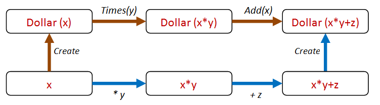

这是代码：

```
let ``create then times then add should be same as times then add then create`` start multiplier adder = 
    let d0 = Dollar.Create start
    let d1 = d0.Times(multiplier)
    let d2 = d1.Add(adder)
    let directAmount = (start * multiplier) + adder
    let d3 = Dollar.Create directAmount 
    d2 = d3

Check.Quick ``create then times then add should be same as times then add then create`` 
// Ok, passed 100 tests. 
```

所以这种“不同路径，相同结果”的方法非常有成效，我们可以以这种方式生成 *很多* 路径。

### Dollar 属性 -- 版本 4

那我们就算完成了吗？我会说没有！

我们开始闻到一种代码气味。所有这些 `(start * multiplier) + adder` 代码似乎有些重复逻辑，并且可能会变得脆弱。

我们能否抽象出一些所有这些情况下都存在的共性呢？

如果我们考虑一下，我们的逻辑实际上只是这样的：

+   在某种程度上“内部”以某种方式转换金额。

+   在相同的方式下“外部”转换金额。

+   确保结果相同。

但要测试这一点，`Dollar` 类将需要支持一个任意的转换！让我们称之为 `Map`！

现在我们所有的测试都可以简化为这一个属性：

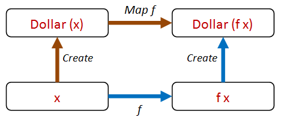

让我们为`Dollar`添加一个`Map`方法。我们还可以用`Map`重新编写`Times`和`Add`：

```
type Dollar = {amount:int } 
    with 
    member this.Map f = 
        {amount = f this.amount}
    member this.Times multiplier = 
        this.Map (fun a -> a * multiplier)
    member this.Add adder = 
        this.Map (fun a -> a + adder)
    static member Create amount  = 
        {amount=amount} 
```

现在我们的属性代码看起来像这样：

```
let ``create then map should be same as map then create`` start f = 
    let d0 = Dollar.Create start
    let d1 = d0.Map f  
    let d2 = Dollar.Create (f start)     
    d1 = d2 
```

但现在我们该如何测试呢？我们应该传入什么函数？

别担心！FsCheck 已经为你准备好了！在这种情况下，FsCheck 实际上也会为你生成随机函��！

试试看--它只是有效！

```
Check.Quick ``create then map should be same as map then create`` 
// Ok, passed 100 tests. 
```

我们的新的"map"属性比使用"times"的原始属性更通用，因此我们可以安全地消除后者。

### 记录函数参数

目前属性存在一个小问题。如果你想看看 FsCheck 生成的函数是什么，那么详细模式并不有用。

```
Check.Verbose ``create then map should be same as map then create`` 
```

给出输出：

```
0:
18
<fun:Invoke@3000>
1:
7
<fun:Invoke@3000>
-- etc
98:
47
<fun:Invoke@3000>
99:
36
<fun:Invoke@3000>
Ok, passed 100 tests. 
```

我们无法知道函数值实际是什么。

但是，你可以告诉 FsCheck 通过将你的函数包装在特殊的`F`情况中来显示更有用的信息，就像这样：

```
let ``create then map should be same as map then create2`` start (F (_,f)) = 
    let d0 = Dollar.Create start
    let d1 = d0.Map f  
    let d2 = Dollar.Create (f start)     
    d1 = d2 
```

现在当你使用详细模式时...

```
Check.Verbose ``create then map should be same as map then create2`` 
```

... 你会得到每个使用的函数的详细日志：

```
0:
0
{ 0->1 }
1:
0
{ 0->0 }
2:
2
{ 2->-2 }
-- etc
98:
-5
{ -5->-52 }
99:
10
{ 10->28 }
Ok, passed 100 tests. 
```

每个`{ 2->-2 }`，`{ 10->28 }`等，代表了该迭代中使用的函数。

## TDD vs. 基于属性的测试

基于属性的测试（PBT）如何与 TDD 结合？这是一个常见问题，所以让我快速给出我的看法。

首先，TDD 使用*具体示例*，而 PBT 使用*通用属性*。

正如我在之前的帖子中所说的，我认为示例对于设计是有用的，并且可以作为文档的一种形式。但在我看来，仅仅依赖基于示例的测试是一个错误。

基于属性的方法比基于示例的测试有许多优点：

+   基于属性的测试更通用，因此更不容易脆弱。

+   基于属性的测试提供了比一堆示例更好更简洁的需求描述。

+   因此，一个基于属性的测试可以替代许多基于示例的测试。

+   通过生成随机输入，基于属性的测试通常会揭示你忽略的问题，比如处理空值、缺失数据、除零、负数等。

+   基于属性的测试迫使你思考。

+   基于属性的测试迫使你拥有清晰的设计。

这最后两点对我来说是最重要的。编程不是写代码行的问题，而是创建符合要求的设计。

因此，任何有助于深入思考需求和可能出错的东西都应该是你个人工具箱中的关键工具！

例如，在罗马数字部分，我们看到接受`int`是一个坏主意（代码崩溃了！）。我们有一个快速修复，但实际上我们应该在我们的领域中对`PositiveInteger`的概念进行建模，然后改变我们的代码以使用该类型而不仅仅是一个`int`。这展示了使用 PBT 实际上可以改进你的领域模型，而不仅仅是发现错误。

同样，在 Dollar 场景中引入`Map`方法不仅使测试更容易，而且实际上提高了 Dollar "api"的实用性。

从宏观角度来看，TDD 和基于属性的测试并不冲突。它们都有建立正确程序的相同目标，而且都更关注设计而不是编码（想想"测试驱动的*设计*"而不是"测试驱动的*开发*"）。

## 最后，结束了

那么我们又到了另一篇关于基于属性的测试的长篇文章的结尾！

希望你现在有一些有用的方法可以带走，并应用到自己的代码库中。

下次，我们将看一些真实世界的例子，以及你如何创建符合你领域的自定义生成器。

*本文中使用的代码示例可在[GitHub 上获取](https://github.com/swlaschin/PropertyBasedTesting/blob/master/part2.fsx)*。
