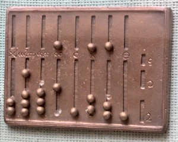

# "Roman Numerals Kata with Commentary"的评论

# "Roman Numerals Kata with Commentary"的评论

我最近观看了一个名为["Roman Numerals Kata with Commentary"](http://blog.coreyhaines.com/2012/12/roman-numerals-kata-with-commentary.html)的视频。在其中，Corey Haines 演示了如何使用 TDD 方法在 Ruby 中实现[阿拉伯数字到罗马数字 Kata](http://codingdojo.org/cgi-bin/wiki.pl?KataRomanNumerals)。

*这个视频让我感到非常愤怒。*

我并不是对 Corey Haines 的编程技能表示不敬，许多人似乎发现这个视频很有用，但我只是觉得它令人沮丧。

我想在这篇文章中尝试解释为什么我感到恼火，并提出我解决这类问题的另一种方法。

## 需求在哪里？

> *"很少有程序员在开始编写代码之前会大致勾勒出他们的程序将要做什么。大多数程序员认为任何不产生代码的事情都是浪费时间。"*
> 
> Leslie Lamport，《["为什么我们应该像建房子一样构建软件"](http://www.wired.com/opinion/2013/01/code-bugs-programming-why-we-need-specs/)》

标准的 TDD 方式，视频从实现一个初始失败的用例（处理零）开始，然后使其工作，然后添加一个处理"1"的测试用例，然后使其工作，依此类推。

这是让我感到恼火的第一件事--在真正理解需求之前就着手编码。

[编程 Kata](http://en.wikipedia.org/wiki/Kata_(programming\))之所以被这样称呼，是因为其目标是作为开发人员练习技能。但对我来说，编码技能只是作为软件开发人员的一个方面，而不总是最重要的。

如果大多数开发人员需要练习的一件事情，那就是倾听并理解客户的需求（即所谓的需求）。我们永远不应忘记我们的目标是提供价值，而不仅仅是编写代码。

在这种情况下，即使有一个[维基页面](http://codingdojo.org/cgi-bin/wiki.pl?KataRomanNumerals)介绍了 kata，但需求仍然有些模糊，所以我认为这是一个很好的机会来深入研究它们，也许能学到一些新东西。

## 成为领域专家

实际上，我相信尽可能深入了解需求具有一些重要的好处。

**这很有趣**。真正理解一个新领域是很有趣的。我喜欢学习新事物--这是作为开发人员的一大好处。

不仅仅是我。Dan North 在他的["加速敏捷"](http://vimeo.com/68215534)演讲中讲述了他与领域专家密切合作时有多么愉快的经历。团队成功的一部分是开发人员与交易员一起学习领域（交易），以便沟通轻松，混乱最小化。

**好的设计**。我相信，要想设计出好的软件，你必须对你试图建模的领域有相当的专业知识。这当然是领域驱动设计的论点，同时也是敏捷过程的一个关键组成部分：与开发人员在各个阶段密切合作的 "现场客户"。

几乎总是，正确理解需求将引导你找到正确的*实现解决方案的方法。再多的浅层迭代也弥补不了对深刻洞察的缺乏。

[* 当然，没有真正的 "正确" 方法，但错误的方法却有很多。所以这里我只是指不要非常复杂和难以维护的方式。]

**好的测试**。你不能在不理解需求的情况下创建好的测试。像 BDD 这样的过程使这一点变得明确；需求被书写成一种方式，以至于它们实际上*变成*了测试。

## 理解罗马数字

> *"在一个启动期间，当我们对项目的大多数方面都一无所知时，我们能够充分利用可用的时间的最佳方式就是试图识别并减少我们在所有可以想到的轴上的无知。"* -- *丹·诺斯，《刻意发现》(http://dannorth.net/2010/08/30/introducing-deliberate-discovery/)*

那么，这如何应用到罗马数字 kata 呢？我们在写代码之前真的应该认真成为领域专家吗？

我会说是的！

我知道这是一个琐碎的问题，看起来有点大材小用，但毕竟这是一个 kata，所以你应该认真和谨慎地练习所有步骤。

那么，我们能从罗马数字中找到什么？

首先，一点来自可靠来源的[背景阅读](http://en.wikipedia.org/wiki/Roman_numerals)表明它们可能起源于类似[记数符号](http://en.wikipedia.org/wiki/Tally_marks)的东西。


这解释了从 "I" 到 "IIII" 的简单笔画，然后是 "V" 的不同符号。

随着发展，十和五十、一百和五百等符号被添加进来。

这种用一和五计数的系统可以在[算盘](http://en.wikipedia.org/wiki/Roman_abacus)的设计中看到，无论是古代还是现代。

 

实际上，这种系统甚至有一个我从未听说过的名字——["二进制编码十进制"](http://en.wikipedia.org/wiki/Bi-quinary_coded_decimal)。这不是很有趣吗？我现在将尽可能在随意谈话中加入这个短语。（顺便说一句，用作计数器的小石头被称为 "calculi"，这也就是高中生们的噩梦之名的来源。）

更晚些时候，在 13 世纪，一些缩写被添加进来——用 "IV" 替换 "IIII"，用 "IX" 替换 "VIIII"。这种[减法记数法](http://en.wikipedia.org/wiki/Subtractive_notation)意味着符号的顺序变得重要，这在一个纯粹基于记数的系统中是不需要的。

这些新的需求告诉我们，在开发行业中没有什么改变...

*教皇："我们需要尽快添加减法记法——阿拉伯人在功能上领先我们。"*

你："但是这不是向后兼容的，先生。这是一个破坏性的变化！"

教皇："坚持。下周我需要它。"*

现在我们已经全面了解了罗马数字，我们有足够的信息来创建需求了吗？

可惜，不是。随着我们进一步调查，很明显存在许多不一致之处。罗马数字没有 ISO 或 ANSI 标准！

当然这并不罕见。需求的模糊性影响了大多数软件项目。实际上，作为开发者，我们的工作之一就是帮助澄清事情并消除歧义。所以，让我们根据我们目前所知创建一些需求。

## 这个习题的需求

> *"程序员的衡量标准不是看他们的机智和逻辑，而是看他们的案例分析的完整性。"* —— *艾伦·佩利斯，[格言](http://www.cs.yale.edu/quotes.html)*

我认为我们都会同意，拥有明确且可测试的需求是成功项目的关键步骤。

现在，当我谈到"需求"时，我指的不是一个需要花六个月时间编写的 200 页文档。我只是在谈论几个要点，写下来只需 5 到 10 分钟。

但是……拥有它们是很重要的。在编码之前仔细思考是需要练习的一项基本技能，因此我建议将这一步作为任何代码习题的一部分。

所以这就是我看到的需求：

+   输出将通过统计 1、5、10、50、100、500 和 1000，使用符号 "I"、"V"、"X"、"L"、"C"、"D" 和 "M" 来生成。

+   符号必须按降序编写："M" 在 "D" 之前，在 "C" 之前，在 "L" 之前，等等。

+   使用计数逻辑，很明显我们只能有最多四个 "I"、"X"、"C" 和 "M" 的重复。只能有一个 "V"、"L" 或 "D"。如果超过这个数量，多个计数标记会被缩写为下一个 "更高" 的计数标记。

+   最后，我们有六个（可选的）替代规则："IIII"=>"IV"，"VIIII"=>"IX"，"XXXX"=>"XL"，"LXXXX"=>"XC"，"CCCC"=>"CD"，"DCCCC"=>"CM"。这些是按降序规则的例外情况。

还有一个非常重要的需求没有列在这个列表中。

+   有效输入的范围是多少？

如果我们不明确地记录这一点，我们很容易假设所有整数都是有效的，包括零和负数。

那么对于数百万或数十亿的大数字呢？允许吗？可能不会。

因此，让我们明确地说，有效的输入范围是从 0 到 4000。那么如果输入无效会发生什么？返回一个空字符串？抛出异常？

在像 F# 这样的函数式编程语言中，最常见的方法是返回一个`Option`类型，或者返回一个成功/失败的`Choice`类型。让我们只使用`Option`，这样完成需求，我们有：

+   阿拉伯数字 0 映射为空字符串。

+   如果输入 < 0 或 > 4000，则返回`None`，否则返回`Some(roman)`，其中`roman`是上述阿拉伯数字转换为罗马数字的结果。

因此，总结这一步，我们已经了解了罗马数字，学到了一些有趣的东西，并为下一阶段提出了一些明确的需求。整个过程只花了 5-10 分钟。在我看来，这是值得花时间的。

## 编写测试

> *"单元测试被比作在黑暗的房间里用手电筒寻找怪物。把光照进房间，然后照亮所有可怕的角落。这并不意��着房间是没有怪物的 --- 只是怪物不站在你照亮手电筒的地方。"*

现在我们有了需求，我们可以开始编写测试了。

在原始视频中，测试是逐步开发的，从 0 开始，然后是 1，依此类推。

就我个人而言，我认为这种方法存在许多问题。

首先，正如我们应该知道的那样，TDD 的一个主要目标不是测试，而是*设计*。

但这种微观、渐进式的设计方法在我看来并不能带来特别好的最终结果。

例如，在视频中，从测试“I”案例到测试“II”案例的实现复杂性有很大的跳跃。但其理由有点难以理解，对我来说有点像戏法，像是已经知道答案的人，而不是自然地从前一个案例演变而来。

不幸的是，我经常看到这种情况发生在严格的 TDD 方法中。你可能一路顺风顺水，然后遇到一个巨大的障碍，迫使你进行巨大的重新思考和重构。

一个严格的 TDD 者使用 Bob 大叔的["转换优先原则"](http://blog.8thlight.com/uncle-bob/2013/05/27/TheTransformationPriorityPremise.html)方法会说这是好的，是过程的一部分。

就我个人而言，我宁愿从最棘手的需求开始，前置风险，而不是留到最后再处理。

其次，我不喜欢测试单个案例。我更希望我的测试覆盖*所有*输入。这并非总是可行，但在这种情况下可以做到，我认为你应该这样做。

### 比较两个测试

为了说明我的意思，让我们将视频中开发的测试套件与更通用的基于需求的测试进行比较。

视频中开发的测试套件仅检查明显的输入，再加上案例 3497“以防万一”。以下是将 Ruby 代码移植到 F#的代码：

```
[<Test>]
let ``For certain inputs, expect certain outputs``() = 
    let testpairs = [ 
      (1,"I")
      (2,"II")
      (4,"IV")
      (5,"V")
      (9,"IX")
      (10,"X")
      // etc
      (900,"CM")
      (1000,"M")
      (3497,"MMMCDXCVII")
      ]
    for (arabic,expectedRoman) in testpairs do
       let roman = arabicToRoman arabic
       Assert.AreEqual(expectedRoman, roman) 
```

有了这组输入，我们对代码是否符合要求有多大的信心？

在像这样简单的情况下，我可能会相当自信，但这种测试方法让我担忧，因为使用了未记录的“魔术”测试输入。

例如，为什么会突然出现 3497？因为（a）它比一千大，（b）它里面有一些 4 和 9。但选择它的原因在测试代码中没有记录。

此外，如果我们将这个测试套件与需求进行比较，我们会发现第二和第三个需求根本没有得到明确测试。确实，具有 3497 的测试隐含地检查了排序需求（"M"在"C"之前在"X"之前），但这从未被明确表达。

现在将该测试与这个进行比较：

```
[<Test>]
let ``For all valid inputs, there must be a max of four "I"s in a row``() = 
    for i in [1..4000] do
       let roman = arabicToRoman i
       roman |> assertMaxRepetition "I" 4 
```

这个测试检查了只能有四个"I"重复的需求。

与 TDD 视频中的一个不同，这个测试用例涵盖了*所有可能的输入*，而不仅仅是一个。如果通过了，我将完全相信代码符合这个特定的需求。

### 基于属性的测试

如果你对这种测试方法不熟悉，它被称为*“基于属性的测试”*。你定义一个必须在一般情况下为真的“属性”，然后尽可能多地生成输入，以找到属性不为真的情况。

在这种情况下，我们可以测试所有 4000 个输入。但一般情况下，我们的问题可能有更大范围的可能输入，所以我们通常只对一些代表性样本进行测试。

大多数基于属性的测试工具都是模仿[Haskell 的 QuickCheck](http://en.wikipedia.org/wiki/QuickCheck)而设计的，这是一个可以自动生成“有趣”输入的工具，以便尽快找到边界情况。这些输入可能包括空值、负数、空列表、包含非 ASCII 字符的字符串等。

现在大多数语言都有类似 QuickCheck 的工具，包括[FsCheck](https://github.com/fsharp/FsCheck)用于 F#。

基于属性的测试的优势在于它迫使你以一般术语思考需求，而不是作为许多特殊情况。

也就是说，与其有一个测试说`输入"4"映射到"IV"`，我们有一个更一般的测试说`任何个位数为 4 的输入最后两个字符为"IV"`。

### 实现基于属性的测试

要将上述需求转换为基于属性的测试，我会重构代码，使得（a）我创建一个定义属性的函数，然后（b）检查该属性是否符合一系列输入。

这是重构后的代码：

```
// Define a property that should be true for all inputs
let ``has max rep of four Is`` arabic = 
   let roman = arabicToRoman arabic
   roman |> assertMaxRepetition "I" 4

// Explicitly enumerate all inputs...
[<Test>]
let ``For all valid inputs, there must be a max of four "I"s``() = 
    for i in [1..4000] do
       //check that the property holds
       ``has max rep of four Is`` i

// ...Or use FsCheck to generate inputs for you
let isInRange i = (i >= 1) && (i <= 4000)
// input is in range implies has max of four Is
let prop i = isInRange i ==> ``has max rep of four Is`` i
// check all inputs for this property
Check.Quick prop 
```

或者举个例子，假设我想测试 40 => "XL"的替换规则。

```
// Define a property that should be true for all inputs
let ``if arabic has 4 tens then roman has one XL otherwise none`` arabic = 
   let roman = arabicToRoman arabic
   let has4Tens = (arabic % 100 / 10) = 4 
   if has4Tens then
       assertMaxOccurs "XL" 1 roman
   else 
       assertMaxOccurs "XL" 0 roman

// Explicitly enumerate all inputs...
[<Test>]
let ``For all valid inputs, check the XL substitution``() = 
    for i in [1..4000] do
       ``if arabic has 4 tens then roman has one XL otherwise none`` i

// ...Or again use FsCheck to generate inputs for you
let isInRange i = (i >= 1) && (i <= 4000)
let prop i = isInRange i ==> ``if arabic has 4 tens then roman has one XL otherwise none`` i
Check.Quick prop 
```

我不会在这里再深入讨论基于属性的测试，但我认为你可以看到与手工制作带有魔术输入的案例相比的好处。

*这篇文章的[代码](https://gist.github.com/swlaschin/8409306)有一个完整的基于属性的测试套件。*

## 需求驱动设计？

在这一点上，我们可以开始实现。

与 TDD 视频不同，我更愿意根据*需求*进行迭代构建实现，而不是*测试用例*。我需要一个响亮的短语来描述这一点，所以我将其称为需求驱动设计？敬请期待即将推出的需求驱动设计宣言。

而不是实现处理每个单独输入的代码，我更喜欢我的实现尽可能地涵盖尽可能多的输入情况--最好是所有的情况。随着每个新需求的添加，实现都会被修改或完善，使用测试来确保它仍然满足需求。

但这难道不正是视频中演示的 TDD 吗？

不，我不这么认为。TDD 演示是*测试驱动的*，但不是*需求驱动的*。将 1 映射到"I"，2 映射到"II"是测试，但在我看来并不是真正的需求。一个好的需求是基于对领域的洞察力。只是测试 2 映射到"II"并不能提供那种洞察力。

### 一个非常简单的实现

在批评别人的实现之后，是时候我自己站出来了。

那么，我能想到的最简单的实现是什么？

我们只是将我们的阿拉伯数字转换成记号，如何？1 变成"I"，2 变成"II"，以此类推。

```
let arabicToRoman arabic = 
   String.replicate arabic "I" 
```

这就是它的运行方式：

```
arabicToRoman 1    // "I"
arabicToRoman 5    // "IIIII"
arabicToRoman 10   // "IIIIIIIIII" 
```

这段代码实际上已经满足了第一个和第二个需求，而且对于所有的输入都是如此！

当然，拥有 4000 个记号并不是很有帮助，这毫无疑问是罗马人开始缩写它们的原因。

这就是领域洞察力发挥作用的地方。如果我们理解到记号是被缩写的，我们就可以在我们的代码中模拟出来。

所以让我们将所有的五个记号的运行转换成一个"V"。

```
let arabicToRoman arabic = 
   (String.replicate arabic "I")
    .Replace("IIIII","V")

// test
arabicToRoman 1    // "I"
arabicToRoman 5    // "V"
arabicToRoman 6    // "VI"
arabicToRoman 10   // "VV" 
```

但现在我们可以有一系列的"V"。两个"V"需要被合并成一个"X"。

```
let arabicToRoman arabic = 
   (String.replicate arabic "I")
    .Replace("IIIII","V")
    .Replace("VV","X")

// test
arabicToRoman 1    // "I"
arabicToRoman 5    // "V"
arabicToRoman 6    // "VI"
arabicToRoman 10   // "X" 
arabicToRoman 12   // "XII" 
arabicToRoman 16   // "XVI" 
```

我想你明白了。我们可以继续添加缩写...

```
let arabicToRoman arabic = 
   (String.replicate arabic "I")
    .Replace("IIIII","V")
    .Replace("VV","X")
    .Replace("XXXXX","L")
    .Replace("LL","C")
    .Replace("CCCCC","D")
    .Replace("DD","M")

// test
arabicToRoman 1    // "I"
arabicToRoman 5    // "V"
arabicToRoman 6    // "VI"
arabicToRoman 10   // "X" 
arabicToRoman 12   // "XII" 
arabicToRoman 16   // "XVI" 
arabicToRoman 3497 // "MMMCCCCLXXXXVII" 
```

现在我们完成了。我们已经满足了前三个需求。

如果我们想要添加四和九的可选缩写，我们可以在累积了所有的记号之后再添加。

```
let arabicToRoman arabic = 
   (String.replicate arabic "I")
    .Replace("IIIII","V")
    .Replace("VV","X")
    .Replace("XXXXX","L")
    .Replace("LL","C")
    .Replace("CCCCC","D")
    .Replace("DD","M")
    // optional substitutions
    .Replace("IIII","IV")
    .Replace("VIV","IX")
    .Replace("XXXX","XL")
    .Replace("LXL","XC")
    .Replace("CCCC","CD")
    .Replace("DCD","CM")

// test
arabicToRoman 1    // "I"
arabicToRoman 4    // "IV"
arabicToRoman 5    // "V"
arabicToRoman 6    // "VI"
arabicToRoman 10   // "X" 
arabicToRoman 12   // "XII" 
arabicToRoman 16   // "XVI" 
arabicToRoman 40   // "XL" 
arabicToRoman 946  // "CMXLVI" 
arabicToRoman 3497 // "MMMCDXCVII" 
```

这就是我喜欢这种方法的原因：

+   它是从对领域模型（记号）的理解中派生出来的，而不是直接跳入递归设计。

+   因此，实现非常紧密地遵循需求。事实上，它基本上是自动写出来的。

+   通过遵循这种逐步的方法，其他人只需检查代码就能对其正确性有很高的信心。没有递归或特殊技巧会让任何人困惑。

+   实现会为所有的输入在任何时候生成输出。在中间阶段，当它不能满足所有的需求时，它至少会生成输出（比如 10 映射到"VV"），告诉我们下一步需要做什么。

是的，这可能不是最有效率的代码，创建了包含 4000 个"I"的字符串！当然，更有效率的方法会直接从输入中减去大的记号("M"，然后是"D"，然后是"C")，导致了 TDD 视频中演示的递归解决方案。

但另一方面，这种实现可能是足够高效的。需求没有提到性能约束--YAGNI，对吧？--所以我倾向于就此结束。

### 一个二进制编码的十进制实现

我无法抵挡另一种实现，只是因为我可以再次使用"双五进制"这个词。

该实现再次基于我们对领域的理解，本例中是罗马算盘。

在算盘中，每行或每根线代表一个十进位，就像我们常见的阿拉伯符号一样。但该位置上的数字可以用两个不同的符号编码，取决于数字。

一些例子：

+   十位上的 1 被编码为"X"

+   十位上的 2 被编码为"XX"

+   十位上的 5 被编码为"L"

+   十位上的 6 被编码为"LX"

等等。

这直接导致一种基于将算盘上的珠子转换为字符串表示的算法。

+   将输入数字拆分为单位、十位、百位和千位。这些代表算盘上的每一行或线。

+   使用"双五进制"表示法和适当的符号将每个位置的数字编码成字符串。

+   将每个位置的表示连接在一起，形成单个输出字符串。

这里是一个直接翻译该算法的实现：

```
let biQuinaryDigits place (unit,five) arabic =
    let digit =  arabic % (10*place) / place
    match digit with
    | 0 -> ""
    | 1 -> unit
    | 2 -> unit + unit
    | 3 -> unit + unit + unit
    | 4 -> unit + unit + unit + unit
    | 5 -> five
    | 6 -> five + unit
    | 7 -> five + unit + unit
    | 8 -> five + unit + unit + unit
    | 9 -> five + unit + unit + unit + unit
    | _ -> failwith "Expected 0-9 only"

let arabicToRoman arabic = 
    let units = biQuinaryDigits 1 ("I","V") arabic
    let tens = biQuinaryDigits 10 ("X","L") arabic
    let hundreds = biQuinaryDigits 100 ("C","D") arabic
    let thousands = biQuinaryDigits 1000 ("M","?") arabic
    thousands + hundreds + tens + units 
```

请注意，上述代码未生成四和九的缩写。但我们可以轻松修改它来做到这一点。我们只需要传入十的符号，并调整 4 和 9 情况的映射，如下所示：

```
let biQuinaryDigits place (unit,five,ten) arabic =
  let digit =  arabic % (10*place) / place
  match digit with
  | 0 -> ""
  | 1 -> unit
  | 2 -> unit + unit
  | 3 -> unit + unit + unit
  | 4 -> unit + five // changed to be one less than five 
  | 5 -> five
  | 6 -> five + unit
  | 7 -> five + unit + unit
  | 8 -> five + unit + unit + unit
  | 9 -> unit + ten  // changed to be one less than ten
  | _ -> failwith "Expected 0-9 only"

let arabicToRoman arabic = 
  let units = biQuinaryDigits 1 ("I","V","X") arabic
  let tens = biQuinaryDigits 10 ("X","L","C") arabic
  let hundreds = biQuinaryDigits 100 ("C","D","M") arabic
  let thousands = biQuinaryDigits 1000 ("M","?","?") arabic
  thousands + hundreds + tens + units 
```

再次强调，这两个实现非常简单直接，易于验证。代码中没有潜在的微妙边界情况。

## 复习

我开始写这篇文章时对 TDD 演示感到恼火。让我回顾一下我为什么感到恼火以及我的方法与众不同的原因。

**需求**

TDD 演示视频根本没有尝试记录任何需求。我认为这是一个危险的做法，特别是如果你正在学习。

在你开始编码之前，我希望你*始终*努力明确你要做什么。

只需稍加努力，我就能提出一些明确的需求，以便以后进行验证。

我还明确记录了有效输入范围--这是 TDD 演示中不幸缺少的内容。

**理解领域**

即使需求已经为您明确，我认为花时间*真正*了解您所在的领域也是值得的。

在这种情况下，了解罗马数字是一种记账制度有助于后来的设计。（此外，我了解了什么是"双五进制"，并在这篇文章中使用了它！）

**单元测试**

TDD 演示中的单元测试是逐个案例构建的。首先是零，然后是一，依此类推。

正如我上面所指出的，我对这种方法感到非常不舒服，因为（a）我认为它不会导致良好的设计，（b）单个情况并不涵盖所有可能的输入。

我强烈建议你编写直接映射到需求的测试。如果需求很好，这意味着测试一次覆盖多个输入，这样你就可以测试尽可能多的输入。

理想情况下，您应该使用 QuickCheck 等基于属性的测试工具。这不仅使这种方法更容易实现，而且迫使您确定设计的属性应该是什么，从而帮助您澄清任何模糊的需求。

**实现**

最后，我描述了两种实现，都与 TDD 视频中演示的递归实现完全不同。

这两种设计都直接源自对领域的理解。第一种是使用记分符，第二种是使用算盘。

在我看来，这两种设计也更容易理解 -- 没有递归！ -- 因此更容易让人信任。

## 摘要

*(根据我在下面发表的评论添加。)*

让我明确一点，我对 TDD 绝对没有问题。我对卡塔也没有问题。

但是我对这种“深入”演示的担忧在于，新手和学习者可能会无意中学到以下（隐含的）教训：

+   接受给定的需求而不提问是可以的。

+   在没有清晰目标的情况下工作是可以的。

+   立即开始编码是可以的。

+   创建极其具体的测试是可以的（例如使用魔法数字）。

+   只考虑顺利路径是可以的。

+   可以在不考虑整体情况的情况下进行微重构是可以的。

就我个人而言，我认为如果你正在*练习*成为*专业*开发人员，你应该：

+   在开始编码之前尽可能多地询问信息是可以的。

+   练习以一种可以被测试的方式编写需求（从不清晰的输入中）。

+   练习思考（分析和设计）而不是立即编码。

+   练习创建通用测试而不是特定的测试。

+   练习思考和处理坏输入、边界情况和错误。

+   练习进行重大重构（而不是微重构），以便培养对[剪切层](http://jonjagger.blogspot.co.uk/2009/10/how-buildings-learn-chapter-2-shearing.html)应该在何处的直觉。

这些原则与 TDD（或至少[“伦敦”TDD 学派](http://codemanship.co.uk/parlezuml/blog/?postid=987)）和编程卡塔完全兼容。没有冲突，我看不出为什么它们会引起争议。

## 你认为呢？

我相信你们中的许多人会对这篇文章持不同意见。我愿意进行（文明的）辩论。请在下方或 Reddit 留言。

如果您想查看本文的完整代码，可以在[gist here](https://gist.github.com/swlaschin/8409306)中找到。该 gist 还包括两种实现的完整基于属性的测试。
