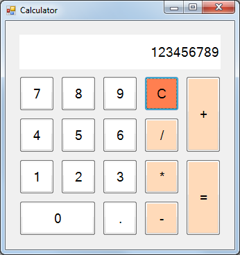
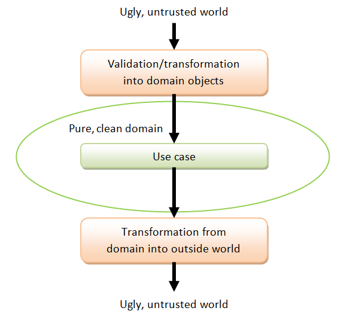
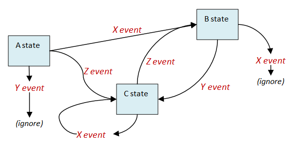
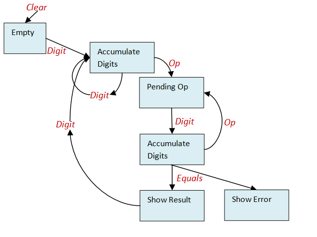
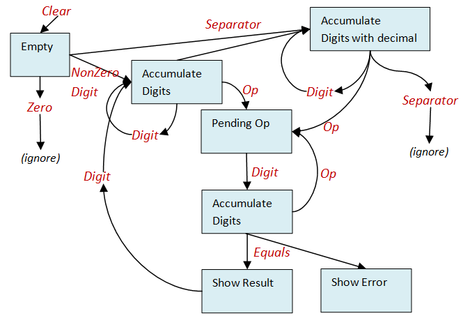
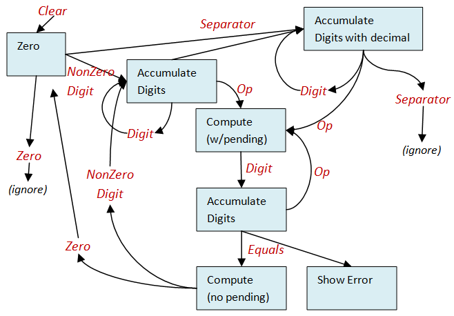

# 计算器演示：第 1 部分

# 计算器演示：第 1 部分

我经常听到的一种评论是对 F#和函数式编程中理论与实践之间的差距的抱怨。换句话说，你知道理论，但你如何实际上使用 FP 原则设计和实现应用程序？

所以我认为展示一下我个人如何从头到尾设计和实现一些小应用程序可能会有用。

这些将是一种带注释的“实时编码”会话。我会拿一个问题开始编码，带你经历每个阶段的思考过程。我也会犯错误，所以你会看到我如何处理，进行回溯和重构。

请注意，我并不是在声称这是生产就绪的代码。我将要展示给你的代码更像是一个探索性的草图，因此我会做一些不好的事情（比如不测试！），这是我在更关键的代码中不会做的。

在这个系列的第一篇文章中，我将开发一个简单的口袋计算器应用程序，就像这样：



## 我的开发方法

我对软件开发的方法是折衷和实用主义的 -- 我喜欢混合不同的技术，并在自顶向下和自底向上方法之间交替。

通常我从需求开始 -- 我是[需求驱动设计](http://fsharpforfunandprofit.com/posts/roman-numeral-kata/)的粉丝！理想情况下，我也会努力成为该领域的专家。

接下来，我开始对领域进行建模，使用[领域驱动设计](http://fsharpforfunandprofit.com/ddd/)，重点放在领域事件（["事件风暴"](http://ziobrando.blogspot.co.uk/2013/11/introducing-event-storming.html)）上，而不仅仅是静态数据（DDD 术语中的“聚合”）。

在建模过程中，我使用[type-first development](http://tomasp.net/blog/type-first-development.aspx/)来勾勒设计，以创建代表领域数据类型（“名词”）和领域活动（“动词”）的类型。

在对领域模型进行初步草稿后，我通常会转向“自下而上”的方法，并编写一个小型原型，以测试到目前为止定义的模型。

在这一点上进行一些真正的编码作为现实检验。这确保领域模型实际上是有意义的，而不是太抽象。当然，这通常会引发更多关于需求和领域模型的问题，所以我回到第一步，进行一些精炼和重构，反复进行直到满意。

(现在如果我在一个大型项目上与团队合作，那么我们也可以开始[逐步构建一个真实系统](http://www.growing-object-oriented-software.com/)并开始用户界面（例如使用纸质原型）。这两项活动通常也会产生更多的问题和需求变更，因此整个过程在各个层面上都是循环的。)

所以这将是我在完美世界中的方法。实际上，当然，世界不是完美的。有糟糕的管理、缺乏需求、愚蠢的截止日期等等，这意味着我很少能够使用理想的流程。

但在这个例子中，我是老板，所以如果我不喜欢结果，那我只能怪我自己！

## 开始

所以，让我们开始吧。我们应该先做什么呢？

通常我会从需求开始。但是我*真的*需要花很多时间来编写计算器的需求吗？

我会懒一点，说不需要。相反，我只是直接开始了——我相信我知道计算器是如何工作的。（*正如你后来会看到的，我错了！尝试编写需求会是一个很好的练习，因为有一些有趣的边界情况。*）

所以，我们先从类型优先的设计开始。

在我的设计中，每个用例都是一个函数，有一个输入和一个输出。

因此，在这个例子中，我们需要将计算器的公共接口建模为一个函数。这是签名：

```
type Calculate = CalculatorInput -> CalculatorOutput 
```

那很容易！那么第一个问题是：我们是否需要建模其他用例？我认为暂时不需要。我们将从处理所有输入的单个用例开始。

## 定义函数的输入和输出

但现在我们创建了两个未定义的类型，`CalculatorInput` 和 `CalculatorOutput`，它们是未定义的（如果你将这些内容输入到一个 F# 脚本文件中，你会看到红色的波浪线来提醒你）。我们最好现在就定义它们。

在继续之前，我应该非常清楚地指出，这个函数的输入和输出类型将是纯净的。在设计我们的领域时，我们永远不希望涉及到混乱的字符串、原始数据类型、验证等等。

相反，通常会有一个验证/转换函数，用于在输入时将混乱的不受信任的世界转换为我们可爱的、纯净的领域，以及另一个类似的函数，用于在输出时执行相反的操作。



好的，让我们首先处理`CalculatorInput`。输入的结构应该是什么样的？

首先，显然，会有一些按键，或者其他一些方式来传达用户的意图。但是，由于计算器是无状态的，我们还需要传入一些状态。这个状态会包含到目前为止键入的数字，等等。

至于输出，该函数当然需要发出一个新的、更新过的状态。

但是我们需要其他东西吗，比如一个包含格式化输出以供显示的结构？我觉得我们不需要。我们想要将自己与显示逻辑隔离开来，所以我们只需让用户界面将状态转换为可显示的内容即可。

错误呢？在[其他帖子](http://fsharpforfunandprofit.com/rop/)中，我花了很多时间讨论错误处理。在这种情况下需要吗？

在这种情况下，我认为不需要。在廉价的口袋计算器中，任何错误都会直接显示在显示器上，所以我们现在将坚持这种方法。

所以这是函数的新版本：

```
type Calculate = CalculatorInput * CalculatorState -> CalculatorState 
```

`CalculatorInput`现在表示按键或其他内容，而`CalculatorState`是状态。

请注意，我使用 tuple（`CalculatorInput * CalculatorState`）来定义此函数的输入，而不是作为两个单独的参数（看起来像`CalculatorInput -> CalculatorState -> CalculatorState`）。我这样做是因为两个参数总是需要的，而元组可以清楚地表明这一点--我不想部分应用输入，例如。

实际上，当进行类型优先设计时，我对所有函数都这样做。每个函数都有一个输入和一个输出。这并不意味着以后不能进行部分应用，只是在设计阶段，我只想要一个参数。

还要注意，不属于纯领域的事物（例如配置和连接字符串）在这个阶段*永远*不会显示出来，尽管在实现时，它们当然会被添加到实现设计的函数中。

## 定义 CalculatorState 类型

现在让我们看看`CalculatorState`。我现在所能想到的是我们需要的只是用于保存要显示信息的东西。

```
type Calculate = CalculatorInput * CalculatorState -> CalculatorState 
and CalculatorState = {
    display: CalculatorDisplay
    } 
```

我定义了一个类型`CalculatorDisplay`，首先作为文档，以明确说明字段值的用途，其次，这样我可以推迟决定显示实际是什么！

那么显示的类型应该是什么？一个浮点数？一个字符串？一个字符列表？一个具有多个字段的记录？

嗯，我会选择`string`，因为，正如我上面所说的，我们可能需要显示错误。

```
type Calculate = CalculatorInput * CalculatorState -> CalculatorState 
and CalculatorState = {
    display: CalculatorDisplay
    }
and CalculatorDisplay = string 
```

请注意，我使用`and`将类型定义连接在一起。为什么呢？

嗯，F#是从上到下编译的，所以你必须在使用之前定义一个类型。以下代码将无法编译：

```
type Calculate = CalculatorInput * CalculatorState -> CalculatorState 
type CalculatorState = {
    display: CalculatorDisplay
    }
type CalculatorDisplay = string 
```

我可以通过改变声明的顺序来解决这个问题，但由于我处于“草图”模式，并且不想一直重新排序事物，我将只是将新的声明附加到底部，并使用`and`将它们连接起来。

但是，在最终的生产代码中，当设计稳定下来时，我*会*重新排序这些类型，以避免使用`and`。原因是`and`可能会隐藏类型之间的循环依赖，并阻止重构。

## 定义 CalculatorInput 类型

对于`CalculatorInput`类型，我将列出计算器上的所有按钮！

```
// as above
and CalculatorInput = 
    | Zero | One | Two | Three | Four 
    | Five | Six | Seven | Eight | Nine
    | DecimalSeparator
    | Add | Subtract | Multiply | Divide
    | Equals | Clear 
```

有些人可能会说：为什么不使用`char`作为输入？但正如我上面解释的那样，在我的领域中，我只想处理理想的数据。通过使用这样一组有限的选择，我永远不必处理意外的输入。

使用抽象类型而不是字符的一个副作用是，`DecimalSeparator` 不被假定为 "."。实际的分隔符应该通过首先获取当前区域设置 (`System.Globalization.CultureInfo.CurrentCulture`)，然后使用 `CurrentCulture.NumberFormat.CurrencyDecimalSeparator` 来获取分隔符。通过将这个实现细节隐藏在设计之中，改变实际使用的分隔符对代码的影响将会很小。

## 优化设计：处理数字

这样就完成了设计的初步尝试。现在让我们深入挖掘一些内部过程。

让我们从处理数字开始。

当按下数字键时，我们希望将数字追加到当前显示。让我们定义一个表示这种情况的函数类型：

```
type UpdateDisplayFromDigit = CalculatorDigit * CalculatorDisplay -> CalculatorDisplay 
```

`CalculatorDisplay` 类型是我们之前定义的，但是这个新的 `CalculatorDigit` 类型是什么呢？

很显然，我们需要一种类型来表示可以用作输入的所有可能数字。其他输入，比如 `Add` 和 `Clear`，对于这个函数来说是无效的。

```
type CalculatorDigit = 
    | Zero | One | Two | Three | Four 
    | Five | Six | Seven | Eight | Nine
    | DecimalSeparator 
```

所以下一个问题是，我们如何获得这种类型的值？我们需要一个将 `CalculatorInput` 映射到 `CalculatorDigit` 类型的函数吗，就像这样？

```
let convertInputToDigit (input:CalculatorInput) =
    match input with
        | Zero -> CalculatorDigit.Zero
        | One -> CalculatorDigit.One
        | etc
        | Add -> ???
        | Clear -> ??? 
```

在许多情况下，这可能是必要的，但在这种情况下，这似乎有点杀鸡用牛刀。而且，这个函数如何处理非数字，比如 `Add` 和 `Clear`？

所以让我们直接重新定义 `CalculatorInput` 类型，直接使用新类型：

```
type CalculatorInput = 
    | Digit of CalculatorDigit
    | Add | Subtract | Multiply | Divide
    | Equals | Clear 
```

在这个过程中，让我们也对其他按钮进行分类。

我会将 `Add | Subtract | Multiply | Divide` 归类为数学运算，至于 `Equals | Clear`，我只是称它们为 "操作"，没有更好的词了。

这是完整的重构设计，使用了新的类型 `CalculatorDigit`、`CalculatorMathOp` 和 `CalculatorAction`：

```
type Calculate = CalculatorInput * CalculatorState -> CalculatorState 
and CalculatorState = {
    display: CalculatorDisplay
    }
and CalculatorDisplay = string
and CalculatorInput = 
    | Digit of CalculatorDigit
    | Op of CalculatorMathOp
    | Action of CalculatorAction
and CalculatorDigit = 
    | Zero | One | Two | Three | Four 
    | Five | Six | Seven | Eight | Nine
    | DecimalSeparator
and CalculatorMathOp = 
    | Add | Subtract | Multiply | Divide
and CalculatorAction = 
    | Equals | Clear

type UpdateDisplayFromDigit = CalculatorDigit * CalculatorDisplay -> CalculatorDisplay 
```

这不是唯一的方法。我本可以将 `Equals` 和 `Clear` 作为单独的选择留下。

现在让我们再次审视 `UpdateDisplayFromDigit`。我们需要其他参数吗？例如，我们需要状态的其他部分吗？

不，我想不出其他的了。在定义这些函数时，我想尽可能地简化。如果你只需要显示器，为什么要传入整个计算器状态呢？

此外，`UpdateDisplayFromDigit` 会返回错误吗？例如，我们显然不能无限添加数字 - 当我们不允许时会发生什么？还有其他组合的输入可能会导致错误吗？例如，什么时候只输入小数分隔符！那时会发生什么？

对于这个小项目，我假设这两者都不会产生显式错误，而是会悄悄地拒绝错误输入。换句话说，超过 10 个数字后，其他数字将被忽略。而在第一个小数分隔符之后，后续的分隔符也将被忽略。

可惜，我无法将这些要求编码到设计中。但是`UpdateDisplayFromDigit`不返回任何明确的错误类型至少告诉我错误将会被悄悄处理。

## 优化设计：数学运算

现在让我们转向数学运算。

这些都是二进制操作，接受两个数字并输出一个新的结果。

代表这个的函数类型看起来像这样：

```
type DoMathOperation = CalculatorMathOp * Number * Number -> Number 
```

如果还有一元运算，比如`1/x`，我们将需要一个不同的类型，但我们没有，所以我们可以保持简单。

下一个决定：我们应该使用什么数值类型？我们应该使它通用吗？

再次，让我们保持简单，使用`float`。但我们会保留`Number`别名，以解耦表示。这是更新后的代码：

```
type DoMathOperation = CalculatorMathOp * Number * Number -> Number
and Number = float 
```

现在让我们考虑`DoMathOperation`，就像我们上面对`UpdateDisplayFromDigit`所做的一样。

问题 1：这是最小的参数集吗？例如，我们需要状态的其他部分吗？

答案：不，我想不出其他什么。

问题 2：`DoMathOperation`会返回错误吗？

答案：是的！那么除以零呢？

那么我们应该如何处理错误呢？让我们创建一个表示数学运算结果的新类型，并将其作为`DoMathOperation`的输出：

新类型`MathOperationResult`将在`Success`和`Failure`之间有两个选择（鉴别联合）。

```
type DoMathOperation = CalculatorMathOp * Number * Number -> MathOperationResult 
and Number = float
and MathOperationResult = 
    | Success of Number 
    | Failure of MathOperationError
and MathOperationError = 
    | DivideByZero 
```

我们也可以使用内置的通用`Choice`类型，甚至是完整的["铁路导向编程"](http://fsharpforfunandprofit.com/rop/)方法，但由于这只是设计的草图，我希望设计能够独立存在，不依赖于很多其他东西，所以我会在这里定义具体的类型。

其他任何错误？NaN 或下溢或上溢？我不确定。我们有`MathOperationError`类型，根据需要扩展它很容易。

## 数字从哪里来？

我们已经定义了`DoMathOperation`来使用`Number`值作为输入。但是`Number`从哪里来？

好吧，它们来自已输入的数字序列——将数字转换为浮点数。

一种方法是将`Number`与字符串显示一起存储在状态中，并在每个数字输入时更新它。

我打算采取一种更简单的方法，直接从显示中获取数字。换句话说，我们需要一个看起来像这样的函数：

```
type GetDisplayNumber = CalculatorDisplay -> Number 
```

虽然思考了一下，这个函数可能会失败，因为显示字符串可能是“error”或其他什么。所以让我们返回一个选项。

```
type GetDisplayNumber = CalculatorDisplay -> Number option 
```

同样地，当我们*有*成功的结果时，我们会想要显示它，因此我们需要一个在另一个方向上工作的函数：

```
type SetDisplayNumber = Number -> CalculatorDisplay 
```

这个函数永远不会出错（我希望如此），所以我们不需要`option`。

## 优化设计：处理数学运算输入

但是我们还没有完成数学运算！

当输入为`Add`时的可见效果是什么？没有！

`Add`事件需要稍后输入另一个数字，因此`Add`事件以某种方式保持挂起状态，等待下一个数字。

如果你考虑一下，我们不仅要保留`Add`事件待处理，还要保留前一个数字，准备加到最新输入的数字上。

我们将在`CalculatorState`中跟踪这个吗？当然！

这是我们第一次尝试添加新字段：

```
and CalculatorState = {
    display: CalculatorDisplay
    pendingOp: CalculatorMathOp 
    pendingNumber: Number
    } 
```

但有时候没有待处理的操作，所以我们必须将其变为可选项：

```
and CalculatorState = {
    display: CalculatorDisplay
    pendingOp: CalculatorMathOp option
    pendingNumber: Number option
    } 
```

但这也是错误的！我们可以有一个`pendingOp`而没有`pendingNumber`吗，反之亦然？不行。它们生死相依。

这意味着状态应该包含一对，整个对是可选的，就像这样：

```
and CalculatorState = {
    display: CalculatorDisplay
    pendingOp: (CalculatorMathOp * Number) option
    } 
```

但现在我们还缺少一部分。如果操作被添加到状态中作为待处理，那么操作实际上何时运行并显示结果？

答案：当按下`Equals`按钮时，或者实际上按下任何其他数学操作按钮。我们稍后再处理这个问题。

## 优化设计：处理清除按钮

我们还有一个按钮要处理，`Clear`按钮。它做什么？

嗯，显然它只是重置状态，使得显示为空，任何待处理的操作都被移除。

我将称这个函数为`InitState`而不是“clear”，这是它的签名：

```
type InitState = unit -> CalculatorState 
```

## 定义服务

此时，我们已经拥有了切换到自底向上开发所需的一切。我迫不及待地想尝试构建`Calculate`函数的试验实现，看看这个设计是否可用，以及我们是否遗漏了什么。

但我如何在不实现整个功能的情况下创建一个试验实现？

所有这些类型都派上了用场。我们可以定义一组`calculate`函数将使用的“服务”，但不实际实现它们！

我的意思是：

```
type CalculatorServices = {
    updateDisplayFromDigit: UpdateDisplayFromDigit 
    doMathOperation: DoMathOperation 
    getDisplayNumber: GetDisplayNumber 
    setDisplayNumber: SetDisplayNumber 
    initState: InitState 
    } 
```

我们创建了一组服务，可以注入到`Calculate`函数的实现中。有了这些，我们可以立即编写`Calculate`函数，并稍后处理服务的实现。

此时，你可能会认为这对一个微小项目来说似乎有点过度。

这是真的 - 我们不希望这变成[FizzBuzz Enterprise Edition](https://github.com/EnterpriseQualityCoding/FizzBuzzEnterpriseEdition)！

但我在这里展示了一个原则。通过将“服务”与核心代码分离，你可以立即开始原型设计。目标不是制作一个生产就绪的代码库，而是找出设计中的任何问题。我们仍然处于需求发现阶段。

这种方法对你来说应该不陌生 - 它直接相当于创建一堆服务接口的 OO 原则，然后将它们注入核心领域。

## 回顾

所以让我们回顾一下 - 随着服务的添加，我们的初始设计已经完成。到目前为止所有的代码如下：

```
type Calculate = CalculatorInput * CalculatorState -> CalculatorState 
and CalculatorState = {
    display: CalculatorDisplay
    pendingOp: (CalculatorMathOp * Number) option
    }
and CalculatorDisplay = string
and CalculatorInput = 
    | Digit of CalculatorDigit
    | Op of CalculatorMathOp
    | Action of CalculatorAction
and CalculatorDigit = 
    | Zero | One | Two | Three | Four 
    | Five | Six | Seven | Eight | Nine
    | DecimalSeparator
and CalculatorMathOp = 
    | Add | Subtract | Multiply | Divide
and CalculatorAction = 
    | Equals | Clear
and UpdateDisplayFromDigit = 
    CalculatorDigit * CalculatorDisplay -> CalculatorDisplay
and DoMathOperation = 
    CalculatorMathOp * Number * Number -> MathOperationResult 
and Number = float
and MathOperationResult = 
    | Success of Number 
    | Failure of MathOperationError
and MathOperationError = 
    | DivideByZero

type GetDisplayNumber = 
    CalculatorDisplay -> Number option
type SetDisplayNumber = 
    Number -> CalculatorDisplay 

type InitState = 
    unit -> CalculatorState 

type CalculatorServices = {
    updateDisplayFromDigit: UpdateDisplayFromDigit 
    doMathOperation: DoMathOperation 
    getDisplayNumber: GetDisplayNumber 
    setDisplayNumber: SetDisplayNumber 
    initState: InitState 
    } 
```

## 摘要

我认为这很不错。我们还没有写任何“真正”的代码，但经过一番思考，��们已经构建了一个相当详细的设计。

在下一篇文章中，我将尝试创建一个实现来测试这个设计。

*本文的代码可以在 GitHub 的这个[gist](https://gist.github.com/swlaschin/0e954cbdc383d1f5d9d3#file-calculator_design-fsx)中找到。*

# 计算器演练：第 2 部分

# 计算器演练：第 2 部分

在本文中，我将继续开发一个简单的口袋计算器应用，就像这样：


在上一篇文章中，我们完成了设计的初稿，仅使用类型（没有 UML 图表！）。

现在是时候创建一个使用设计的试验实现了。

此时进行一些真正的编码就像是一个现实检验。它确保领域模型确实是有意义的，而不是太过抽象。当然，它经常会引发更多关于需求和领域模型的问题。

## 第一次实现

所以让我们尝试实现主计算器函数，看看我们的表现如何。

首先，我们可以立即创建一个与每种输入匹配并相应处理的骨架。

```
let createCalculate (services:CalculatorServices) :Calculate = 
    fun (input,state) -> 
        match input with
        | Digit d ->
            let newState = // do something
            newState //return
        | Op op ->
            let newState = // do something
            newState //return
        | Action Clear ->
            let newState = // do something
            newState //return
        | Action Equals ->
            let newState = // do something
            newState //return 
```

您可以看到这个骨架有一个用于处理每种输入的情况。请注意，在所有情况下，都会返回一个新状态。

这种编写函数的风格可能看起来有点奇怪。让我们仔细看看。

首先，我们可以看到`createCalculate`不是计算器函数本身，而是一个*返回*另一个函数的函数。返回的函数是一个`Calculate`类型的值--这就是末尾的`:Calculate`的含义。

这里只是顶部的部分：

```
let createCalculate (services:CalculatorServices) :Calculate = 
    fun (input,state) -> 
        match input with
            // code 
```

由于它返回一个函数，我选择使用 lambda 来编写它。这就是`fun (input,state) ->`的用途。

但我也可以使用内部函数来编写，就像这样

```
let createCalculate (services:CalculatorServices) :Calculate = 
    let innerCalculate (input,state) = 
        match input with
            // code
    innerCalculate // return the inner function 
```

这两种方法基本上是一样的*--随你选择！

[*虽然可能会有一些性能差异。]

## 服务的依赖注入

但`createCalculate`不仅仅返回一个函数，它还有一个`services`参数。这个参数用于对服务进行“依赖注入”。

也就是说，服务仅在`createCalculate`本身中使用，并且不会在返回的`Calculate`类型的函数中可见。

为应用程序组装所有组件的“主”或“引导程序”代码将如下所示：

```
// create the services
let services = CalculatorServices.createServices()

// inject the services into the "factory" method
let calculate = CalculatorImplementation.createCalculate services

// the returned "calculate" function is of type Calculate 
// and can be passed into the UI, for example

// create the UI and run it
let form = new CalculatorUI.CalculatorForm(calculate)
form.Show() 
```

## 实现：处理数字

现在让我们开始实现计算函数的各个部分。我们将从处理数字的逻辑开始。

为了保持主函数的整洁，让我们将所有工作的责任传递给一个辅助函数`updateDisplayFromDigit`，就像这样：

```
let createCalculate (services:CalculatorServices) :Calculate = 
    fun (input,state) -> 
        match input with
        | Digit d ->
            let newState = updateDisplayFromDigit services d state
            newState //return 
```

请注意，我从`updateDisplayFromDigit`的结果创建了一个`newState`值，然后将其作为一个单独的步骤返回。

我也可以一步完成相同的事情，而不需要显式的`newState`值，如下所示：

```
let createCalculate (services:CalculatorServices) :Calculate = 
    fun (input,state) -> 
        match input with
        | Digit d ->
            updateDisplayFromDigit services d state 
```

两种方法都不是自动最佳的。我会根据上下文选择其中一种。

对于简单的情况，我会避免额外的行，因为这是不必要的，但有时明确的返回值更可读。值的名称告诉您返回类型的指示，并且如果需要，它提供了一个在调试器中观察的对象。

好的，现在让我们实现`updateDisplayFromDigit`。这很简单。

+   首先使用服务中的`updateDisplayFromDigit`来实际更新显示

+   然后从新的显示器创建一个新状态并返回它。

```
let updateDisplayFromDigit services digit state =
    let newDisplay = services.updateDisplayFromDigit (digit,state.display)
    let newState = {state with display=newDisplay}
    newState //return 
```

## 实现：处理清除和相等

在我们进入数学运算的实现之前，让我们先看看如何处理`Clear`和`Equals`，因为它们更简单。

对于`Clear`，只需使用提供的`initState`服务初始化状态。

对于`Equals`，我们检查是否有待处理的数学操作。如果有，则运行它并更新显示，否则不执行任何操作。我们将把这个逻辑放在一个名为`updateDisplayFromPendingOp`的辅助函数中。

现在`createCalculate`看起来是这样的：

```
let createCalculate (services:CalculatorServices) :Calculate = 
    fun (input,state) -> 
        match input with
        | Digit d -> // as above
        | Op op -> // to do
        | Action Clear ->
            let newState = services.initState()
            newState //return
        | Action Equals ->
            let newState = updateDisplayFromPendingOp services state
            newState //return 
```

现在来看看`updateDisplayFromPendingOp`。我花了几分钟时间考虑，我想出了以下更新显示的算法：

+   首先，检查是否有任何待处理操作。如果没有，则不执行任何操作。

+   接下来，尝试从显示器中获取当前数字。如果无法获取，则不执行任何操作。

+   接下来，使用来自显示器的待处理数字和当前数字运行操作。如果出现错误，则不执行任何操作。

+   最后，使用结果更新显示，并返回一个新的状态。

+   新状态还将待处理操作设置为`None`，因为它已被处理。

这是命令式风格代码中的逻辑：

```
// First version of updateDisplayFromPendingOp 
// * very imperative and ugly
let updateDisplayFromPendingOp services state =
    if state.pendingOp.IsSome then
        let op,pendingNumber = state.pendingOp.Value
        let currentNumberOpt = services.getDisplayNumber state.display
        if currentNumberOpt.IsSome then
            let currentNumber = currentNumberOpt.Value 
            let result = services.doMathOperation (op,pendingNumber,currentNumber)
            match result with
            | Success resultNumber ->
                let newDisplay = services.setDisplayNumber resultNumber 
                let newState = {display=newDisplay; pendingOp=None}
                newState //return
            | Failure error -> 
                state // original state is untouched
        else
            state // original state is untouched
    else
        state // original state is untouched 
```

噢呀！不要在家里尝试那个！

那段代码确实严格遵循了算法，但非常丑陋，而且容易出错（在选项上使用`.Value`是一种代码异味）。

好的一面是，我们确实广泛使用了我们的“服务”，这使我们远离了实际的实现细节。

那么，我们如何重写它以使其更具功能性呢？

## 撞上绑定

诀窍在于认识到模式“如果某事存在，则对该值进行操作”恰好是讨论的`bind`模式，具体讨论请参见此处和[此处](http://fsharpforfunandprofit.com/rop/)。

为了有效地使用绑定模式，最好将代码分解成许多小块。

首先，代码`if state.pendingOp.IsSome then do something`可以被`Option.bind`替换。

```
let updateDisplayFromPendingOp services state =
    let result =
        state.pendingOp
        |> Option.bind ??? 
```

但请记住，函数必须返回一个状态。如果绑定的总体结果为`None`，则我们*未*创建新状态，并且必须返回传入的原始状态。

这可以通过内置的`defaultArg`函数来实现，该函数在应用于选项时，如果存在选项的值，则返回该选项的值，否则返回第二个参数。

```
let updateDisplayFromPendingOp services state =
    let result =
        state.pendingOp
        |> Option.bind ???
    defaultArg result state 
```

您还可以通过将结果直接管道到`defaultArg`来稍微整理一下，就像这样：

```
let updateDisplayFromPendingOp services state =
    state.pendingOp
    |> Option.bind ???
    |> defaultArg <| state 
```

我承认，反向管道对于`state`看起来很奇怪--这绝对是一种习得的口味！

继续！那么`bind`的参数呢？当调用此函数时，我们知道 pendingOp 是存在的，因此我们可以编写一个带有这���参数的 lambda，就像这样：

```
let result = 
    state.pendingOp
    |> Option.bind (fun (op,pendingNumber) ->
        let currentNumberOpt = services.getDisplayNumber state.display
        // code
        ) 
```

或者，我们可以创建一个本地辅助函数，并将其连接到绑定，就像这样：

```
let executeOp (op,pendingNumber) = 
    let currentNumberOpt = services.getDisplayNumber state.display
    /// etc

let result = 
    state.pendingOp
    |> Option.bind executeOp 
```

当逻辑复杂时，我个人更倾向于第二种方法，因为它使绑定链变得简单。也就是说，我试图让我的代码看起来像：

```
let doSomething input = return an output option
let doSomethingElse input = return an output option
let doAThirdThing input = return an output option

state.pendingOp
|> Option.bind doSomething
|> Option.bind doSomethingElse
|> Option.bind doAThirdThing 
```

请注意，在这种方法中，每个辅助函数都有一个非选项的输入，但必须始终输出一个*选项*。

## 在实践中使用 bind

一旦我们有了待处理的操作，下一步就是从显示器中获取当前数字，以便进行加法（或其他操作）。

与其有很多逻辑，我更倾向于保持辅助函数（`getCurrentNumber`）简单。

+   输入是一对（op，pendingNumber）

+   输出是三元组（op，pendingNumber，currentNumber），如果 currentNumber 是`Some`，否则为`None`。

换句话说，`getCurrentNumber`的签名将是`pair -> triple option`，因此我们可以确保它与`Option.bind`函数一起使用。

如何将一对转换为三元组？这可以通过使用`Option.map`来将 currentNumber 选项转换为三元组选项来完成。如果 currentNumber 是`Some`，那么映射的输出就是`Some triple`。另一方面，如果 currentNumber 是`None`，那么映射的输出也是`None`。

```
let getCurrentNumber (op,pendingNumber) = 
    let currentNumberOpt = services.getDisplayNumber state.display
    currentNumberOpt 
    |> Option.map (fun currentNumber -> (op,pendingNumber,currentNumber))

let result = 
    state.pendingOp
    |> Option.bind getCurrentNumber
    |> Option.bind ??? 
```

我们可以通过使用管道来使`getCurrentNumber`更符合惯例：

```
let getCurrentNumber (op,pendingNumber) = 
    state.display
    |> services.getDisplayNumber 
    |> Option.map (fun currentNumber -> (op,pendingNumber,currentNumber)) 
```

现在我们有了一个具有有效值的三元组，我们有了编写数学运算的辅助函数所需的一切。

+   它以三元组作为输入（`getCurrentNumber`的输出）

+   它执行数学运算

+   然后对成功/失败的结果进行模式匹配，并在适用的情况下输出新状态。

```
let doMathOp (op,pendingNumber,currentNumber) = 
    let result = services.doMathOperation (op,pendingNumber,currentNumber)
    match result with
    | Success resultNumber ->
        let newDisplay = services.setDisplayNumber resultNumber 
        let newState = {display=newDisplay; pendingOp=None}
        Some newState //return something
    | Failure error -> 
        None // failed 
```

请注意，与早期版本中嵌套的 if 不同，此版本在成功时返回`Some`，失败时返回`None`。

## 显示错误

编写`Failure`情况的代码让我意识到了一些事情。如果出现失败，我们根本没有显示它，只是让显示器保持不变。我们不应该显示错误或其他内容吗？

嘿，我们刚发现一个被忽视的需求！这就是为什么我喜欢尽快创建设计实现的原因。编写处理所有情况的真实代码将不可避免地引发一些“在这种情况下会发生什么？”的瞬间。

那么我们将如何实现这个新需求呢？

为了做到这一点，我们需要一个接受`MathOperationError`并生成`CalculatorDisplay`的新“服务”。

```
type SetDisplayError = MathOperationError -> CalculatorDisplay 
```

我们需要将其添加到`CalculatorServices`结构中：

```
type CalculatorServices = {
    // as before
    setDisplayNumber: SetDisplayNumber 
    setDisplayError: SetDisplayError 
    initState: InitState 
    } 
```

`doMathOp`现在可以修改以使用新服务。`Success`和`Failure`情况现在都会导致新的显示器，然后包装在新状态中。

```
let doMathOp (op,pendingNumber,currentNumber) = 
    let result = services.doMathOperation (op,pendingNumber,currentNumber)
    let newDisplay = 
        match result with
        | Success resultNumber ->
            services.setDisplayNumber resultNumber 
        | Failure error -> 
            services.setDisplayError error
    let newState = {display=newDisplay;pendingOp=None}
    Some newState //return something 
```

我将在结果中保留`Some`，这样我们就可以继续使用结果管道中的`Option.bind`。

[*另一种方法是不返回`Some`，然后在结果管道中使用`Option.map`]。

将所有内容放在一起，我们有了`updateDisplayFromPendingOp`的最终版本。请注意，我还添加了一个`ifNone`辅助函数，使 defaultArg 更适合管道。

```
// helper to make defaultArg better for piping
let ifNone defaultValue input = 
    // just reverse the parameters!
    defaultArg input defaultValue 

// Third version of updateDisplayFromPendingOp 
// * Updated to show errors on display in Failure case
// * replaces awkward defaultArg syntax
let updateDisplayFromPendingOp services state =
    // helper to extract CurrentNumber
    let getCurrentNumber (op,pendingNumber) = 
        state.display
        |> services.getDisplayNumber 
        |> Option.map (fun currentNumber -> (op,pendingNumber,currentNumber))

    // helper to do the math op
    let doMathOp (op,pendingNumber,currentNumber) = 
        let result = services.doMathOperation (op,pendingNumber,currentNumber)
        let newDisplay = 
            match result with
            | Success resultNumber ->
                services.setDisplayNumber resultNumber 
            | Failure error -> 
                services.setDisplayError error
        let newState = {display=newDisplay;pendingOp=None}
        Some newState //return something

    // connect all the helpers
    state.pendingOp
    |> Option.bind getCurrentNumber
    |> Option.bind doMathOp 
    |> ifNone state // return original state if anything fails 
```

## 使用“maybe”计算表达式而不是绑定

到目前为止，我们一直直接使用“bind”。这帮助了我们消除了级联的`if/else`。

但 F#允许您以不同的方式隐藏复杂性，方法是创建计算表达式。

由于我们正在处理选项，因此我们可以创建一个“maybe”计算表达式，以便干净地处理选项。（如果我们正在处理其他类型，则需要为每种类型创建不同的计算表达式）。

这就是定义--只有四行！

```
type MaybeBuilder() =
    member this.Bind(x, f) = Option.bind f x
    member this.Return(x) = Some x

let maybe = new MaybeBuilder() 
```

有了这个计算表达式，我们可以使用`maybe`代替 bind，我们的代码会是这样的：

```
let doSomething input = return an output option
let doSomethingElse input = return an output option
let doAThirdThing input = return an output option

let finalResult = maybe {
    let! result1 = doSomething
    let! result2 = doSomethingElse result1
    let! result3 = doAThirdThing result2
    return result3
    } 
```

在我们的情况下，我们可以编写另一个版本的`updateDisplayFromPendingOp`——我们的第四个版本！

```
// Fourth version of updateDisplayFromPendingOp 
// * Changed to use "maybe" computation expression
let updateDisplayFromPendingOp services state =

    // helper to do the math op
    let doMathOp (op,pendingNumber,currentNumber) = 
        let result = services.doMathOperation (op,pendingNumber,currentNumber)
        let newDisplay = 
            match result with
            | Success resultNumber ->
                services.setDisplayNumber resultNumber 
            | Failure error -> 
                services.setDisplayError error
        {display=newDisplay;pendingOp=None}

    // fetch the two options and combine them
    let newState = maybe {
        let! (op,pendingNumber) = state.pendingOp
        let! currentNumber = services.getDisplayNumber state.display
        return doMathOp (op,pendingNumber,currentNumber)
        }
    newState |> ifNone state 
```

请注意，在*这个*实现中，我不再需要`getCurrentNumber`辅助函数了，因为我可以直接调用`services.getDisplayNumber`。

那么，我更喜欢这些变体中的哪一个？

这取决于情况。

+   如果有一种非常强烈的“流水线”感觉，就像[RIP](http://fsharpforfunandprofit.com/rop/)方法中一样，那么我更喜欢使用显式的`bind`。

+   另一方面，如果我从许多不同的地方获取选项，并且希望以各种方式组合它们，那么`maybe`计算表达式会更容易。

所以，在这种情况下，我会选择最后一种实现，使用`maybe`。

## 实现：处理数学运算

现在我们准备好实现数学运算情况了。

首先，如果有待处理的操作，结果将显示在显示器上，就像`Equals`情况一样。但*另外*，我们还需要将新的待处理操作推送到状态中。

对于数学运算情况，那么，将会有*两个*状态转换，并且`createCalculate`看起来会像这样：

```
let createCalculate (services:CalculatorServices) :Calculate = 
    fun (input,state) -> 
        match input with
        | Digit d -> // as above
        | Op op ->
            let newState1 = updateDisplayFromPendingOp services state
            let newState2 = addPendingMathOp services op newState1 
            newState2 //return 
```

我们已经在上面定义了`updateDisplayFromPendingOp`。所以我们只需要`addPendingMathOp`作为一个辅助函数，将操作推送到状态中。

`addPendingMathOp`的算法是：

+   尝试从显示器获取当前数字。如果无法获取，则不执行任何操作。

+   用操作符和当前数字更新状态。

这是丑陋的版本：

```
// First version of addPendingMathOp 
// * very imperative and ugly
let addPendingMathOp services op state = 
    let currentNumberOpt = services.getDisplayNumber state.display
    if currentNumberOpt.IsSome then 
        let currentNumber = currentNumberOpt.Value 
        let pendingOp = Some (op,currentNumber)
        let newState = {state with pendingOp=pendingOp}
        newState //return
    else                
        state // original state is untouched 
```

同样，我们可以使用完全相同的技术来使其更加功能化，就像我们对`updateDisplayFromPendingOp`所做的那样。

所以这是使用`Option.map`和一个`newStateWithPending`辅助函数的更符合习惯的版本：

```
// Second version of addPendingMathOp 
// * Uses "map" and helper function
let addPendingMathOp services op state = 
    let newStateWithPending currentNumber =
        let pendingOp = Some (op,currentNumber)
        {state with pendingOp=pendingOp}

    state.display
    |> services.getDisplayNumber 
    |> Option.map newStateWithPending 
    |> ifNone state 
```

这是一个使用`maybe`的例子：

```
// Third version of addPendingMathOp 
// * Uses "maybe"
let addPendingMathOp services op state = 
    maybe {            
        let! currentNumber = 
            state.display |> services.getDisplayNumber 
        let pendingOp = Some (op,currentNumber)
        return {state with pendingOp=pendingOp}
        }
    |> ifNone state // return original state if anything fails 
```

与以前一样，我可能会选择使用`maybe`的最后一种实现。但`Option.map`也可以。

## 实现：回顾

现在我们已经完成了实现部分。让我们来回顾一下代码：

```
let updateDisplayFromDigit services digit state =
    let newDisplay = services.updateDisplayFromDigit (digit,state.display)
    let newState = {state with display=newDisplay}
    newState //return

let updateDisplayFromPendingOp services state =

    // helper to do the math op
    let doMathOp (op,pendingNumber,currentNumber) = 
        let result = services.doMathOperation (op,pendingNumber,currentNumber)
        let newDisplay = 
            match result with
            | Success resultNumber ->
                services.setDisplayNumber resultNumber 
            | Failure error -> 
                services.setDisplayError error
        {display=newDisplay;pendingOp=None}

    // fetch the two options and combine them
    let newState = maybe {
        let! (op,pendingNumber) = state.pendingOp
        let! currentNumber = services.getDisplayNumber state.display
        return doMathOp (op,pendingNumber,currentNumber)
        }
    newState |> ifNone state

let addPendingMathOp services op state = 
    maybe {            
        let! currentNumber = 
            state.display |> services.getDisplayNumber 
        let pendingOp = Some (op,currentNumber)
        return {state with pendingOp=pendingOp}
        }
    |> ifNone state // return original state if anything fails

let createCalculate (services:CalculatorServices) :Calculate = 
    fun (input,state) -> 
        match input with
        | Digit d ->
            let newState = updateDisplayFromDigit services d state
            newState //return
        | Op op ->
            let newState1 = updateDisplayFromPendingOp services state
            let newState2 = addPendingMathOp services op newState1 
            newState2 //return
        | Action Clear ->
            let newState = services.initState()
            newState //return
        | Action Equals ->
            let newState = updateDisplayFromPendingOp services state
            newState //return 
```

不错——整个实现不到 60 行代码。

## 总结

我们通过进行实现证明了我们的设计是合理的——而且我们找到了一个遗漏的需求。

在下一篇文章中，我们将实现服务和用户界面，以创建一个完整的应用程序。

*本文的代码可以在 GitHub 的这个[gist](https://gist.github.com/swlaschin/0e954cbdc383d1f5d9d3#file-calculator_implementation-fsx)中找到。*

# 计算器演练：第 3 部分

# 计算器演练：第 3 部分

在本文中，我将继续开发一个简单的口袋计算器应用程序。

在第一篇文章中，我们完成了设计的初稿，仅使用类型（没有 UML 图表！），在之前的文章中，我们创建了一个初始实现，用于实践设计并揭示了一个缺失的需求。

现在是时候构建其余组件并将它们组装成一个完整的应用程序了。

## 创建服务

我们有一个实现。但是实现依赖于一些服务，而我们还没有创建这些服务。

实际上，这一部分非常简单和直接。在领域中定义的类型强制执行约束，因此实际上只有一种编写代码的方法。

我将一次显示所有代码（如下），然后再添加一些注释。

```
// ================================================
// Implementation of CalculatorConfiguration
// ================================================ 
module CalculatorConfiguration =

    // A record to store configuration options
    // (e.g. loaded from a file or environment)
    type Configuration = {
        decimalSeparator : string
        divideByZeroMsg : string
        maxDisplayLength: int
        }

    let loadConfig() = {
        decimalSeparator = 
            System.Globalization.CultureInfo.CurrentCulture.NumberFormat.CurrencyDecimalSeparator
        divideByZeroMsg = "ERR-DIV0" 
        maxDisplayLength = 10
        }

// ================================================
// Implementation of CalculatorServices 
// ================================================ 
module CalculatorServices =
    open CalculatorDomain
    open CalculatorConfiguration

    let updateDisplayFromDigit (config:Configuration) :UpdateDisplayFromDigit = 
        fun (digit, display) ->

        // determine what character should be appended to the display
        let appendCh= 
            match digit with
            | Zero -> 
                // only allow one 0 at start of display
                if display="0" then "" else "0"
            | One -> "1"
            | Two -> "2"
            | Three-> "3"
            | Four -> "4"
            | Five -> "5"
            | Six-> "6"
            | Seven-> "7"
            | Eight-> "8"
            | Nine-> "9"
            | DecimalSeparator -> 
                if display="" then 
                    // handle empty display with special case
                    "0" + config.decimalSeparator  
                else if display.Contains(config.decimalSeparator) then 
                    // don't allow two decimal separators
                    "" 
                else 
                    config.decimalSeparator

        // ignore new input if there are too many digits
        if (display.Length > config.maxDisplayLength) then
            display // ignore new input
        else
            // append the new char
            display + appendCh

    let getDisplayNumber :GetDisplayNumber = fun display ->
        match System.Double.TryParse display with
        | true, d -> Some d
        | false, _ -> None

    let setDisplayNumber :SetDisplayNumber = fun f ->
        sprintf "%g" f

    let setDisplayError divideByZeroMsg :SetDisplayError = fun f ->
        match f with
        | DivideByZero -> divideByZeroMsg

    let doMathOperation  :DoMathOperation = fun (op,f1,f2) ->
        match op with
        | Add -> Success (f1 + f2)
        | Subtract -> Success (f1 - f2)
        | Multiply -> Success (f1 * f2)
        | Divide -> 
            try
                Success (f1 / f2)
            with
            | :? System.DivideByZeroException -> 
                Failure DivideByZero 

    let initState :InitState = fun () -> 
        {
        display=""
        pendingOp = None
        }

    let createServices (config:Configuration) = {
        updateDisplayFromDigit = updateDisplayFromDigit config
        doMathOperation = doMathOperation
        getDisplayNumber = getDisplayNumber
        setDisplayNumber = setDisplayNumber
        setDisplayError = setDisplayError (config.divideByZeroMsg)
        initState = initState
        } 
```

一些注释：

+   我已经创建了一个配置记录，其中存储用于参数化服务的属性，例如十进制分隔符。

+   将配置记录传递给`createServices`函数，该函数又将配置传递给那些需要它的服务。

+   所有函数都使用相同的方法返回设计中定义的类型之一，例如`UpdateDisplayFromDigit`或`DoMathOperation`。

+   只有一些棘手的边界情况，例如在除法中捕获异常，或者防止附加超过一个十进制分隔符。

## 创建用户界面

对于用户界面，我将使用 WinForms 而不是 WPF 或基于 Web 的方法。它简单，并且应该在 Mono/Xamarin 以及 Windows 上运行。并且应该很容易移植到其他 UI 框架上。

通常情况下，与 UI 开发相关，我在这方面花费的时间比任何其他部分都多！我将省略所有痛苦的迭代，直接进入最终版本。

我不会展示所有代码，因为它大约有 200 行（你可以在[gist](https://gist.github.com/swlaschin/0e954cbdc383d1f5d9d3#file-calculator_v1-fsx)中看到），但这里有一些要点：

```
module CalculatorUI =

    open CalculatorDomain

    type CalculatorForm(initState:InitState, calculate:Calculate) as this = 
        inherit Form()

        // initialization before constructor
        let mutable state = initState()
        let mutable setDisplayedText = 
            fun text -> () // do nothing 
```

`CalculatorForm`是`Form`的一个子类，像往常一样。

其构造函数有两个参数。一个是`initState`，用于创建空状态的函数，另一个是`calculate`，用于根据输入转换状态的函数。换句话说，我在这里使用标准的基于构造函数的依赖注入。

有两个可变字段（令人震惊！）。

其中之一是状态本身。显然，每按下一个按钮后，它都会被修改。

第二个是名为`setDisplayedText`的函数。那是什么意思？

嗯，在状态改变后，我们需要刷新显示文本的控件（一个标签）。

这样做的标准方式是将标签控件作为表单中的一个字段，就像这样：

```
type CalculatorForm(initState:InitState, calculate:Calculate) as this = 
    inherit Form()

    let displayControl :Label = null 
```

然后在表单初始化后将其设置为实际的控制值：

```
member this.CreateDisplayLabel() = 
    let display = new Label(Text="",Size=displaySize,Location=getPos(0,0))
    display.TextAlign <- ContentAlignment.MiddleRight
    display.BackColor <- Color.White
    this.Controls.Add(display)

    // traditional style - set the field when the form has been initialized
    displayControl <- display 
```

但这样做的问题是，你可能会在初始化标签控件之前意外地尝试访问该标签控件，导致 NRE。此外，我更希望专注于期望的行为，而不是拥有一个可以被任何人任何地方访问的“全局”字段。

通过使用一个函数，我们(a) 封装了对真实控件的访问，(b) 避免了任何可能的空引用。

可变函数从一个安全的默认实现开始(`fun text -> ()`)，然后在创建标签控件时更改为一个*新*实现：

```
member this.CreateDisplayLabel() = 
    let display = new Label(Text="",Size=displaySize,Location=getPos(0,0))
    this.Controls.Add(display)

    // update the function that sets the text
    setDisplayedText <-
        (fun text -> display.Text <- text) 
```

## 创建按钮

按钮以网格形式布置，因此我创建了一个辅助函数`getPos(row,col)`，从网格上的逻辑位置(row,col)获取物理位置。

这里是创建按钮的示例：

```
member this.CreateButtons() = 
    let sevenButton = new Button(Text="7",Size=buttonSize,Location=getPos(1,0),BackColor=DigitButtonColor)
    sevenButton |> addDigitButton Seven

    let eightButton = new Button(Text="8",Size=buttonSize,Location=getPos(1,1),BackColor=DigitButtonColor)
    eightButton |> addDigitButton Eight

    let nineButton = new Button(Text="9",Size=buttonSize,Location=getPos(1,2),BackColor=DigitButtonColor)
    nineButton |> addDigitButton Nine

    let clearButton = new Button(Text="C",Size=buttonSize,Location=getPos(1,3),BackColor=DangerButtonColor)
    clearButton |> addActionButton Clear

    let addButton = new Button(Text="+",Size=doubleHeightSize,Location=getPos(1,4),BackColor=OpButtonColor)
    addButton |> addOpButton Add 
```

由于所有数字按钮具有相同的行为，所有数学运算按钮也是如此，我只是创建了一些帮助程序以一种通用的方式设置事件处理程序：

```
let addDigitButton digit (button:Button) =
    button.Click.AddHandler(EventHandler(fun _ _ -> handleDigit digit))
    this.Controls.Add(button)

let addOpButton op (button:Button) =
    button.Click.AddHandler(EventHandler(fun _ _ -> handleOp op))
    this.Controls.Add(button) 
```

我还添加了一些键盘支持：

```
member this.KeyPressHandler(e:KeyPressEventArgs) =
    match e.KeyChar with
    | '0' -> handleDigit Zero
    | '1' -> handleDigit One
    | '2' -> handleDigit Two
    | '.' | ',' -> handleDigit DecimalSeparator
    | '+' -> handleOp Add
    // etc 
```

按钮点击和键盘按键最终被路由到关键函数`handleInput`，该函数进行计算。

```
let handleInput input =
     let newState = calculate(input,state)
     state <- newState 
     setDisplayedText state.display 

let handleDigit digit =
     Digit digit |> handleInput 

let handleOp op =
     Op op |> handleInput 
```

正如你所看到的，`handleInput`的实现是微不足道的。它调用了被注入的计算函数，将可变状态设置为结果，然后更新显示。

所以你看到了 -- 一个完整的计算器！

现在让我们试一下 -- 从这个[gist](https://gist.github.com/swlaschin/0e954cbdc383d1f5d9d3#file-calculator_v1-fsx)获取代码，并尝试将其作为 F#脚本运行。

## 灾难来临！

让我们从一个简单的测试开始。尝试输入`1` `Add` `2` `Equals`。你会期待什么？

我不知道你怎么看，但我*不会*期望计算器显示`12`！

发生了什么？一些快速的实验表明，我忘记了一些非常重要的事情 -- 当发生`Add`或`Equals`操作时，任何后续的数字都*不应该*被添加到当前缓冲区，而是应该开始一个新的缓冲区。哦不！我们遇到了一个无法继续的 bug！

再提醒我一次，是哪个白痴说过"如果编译通过，它可能就能工作"。

[* 实际上，那个白痴会是我（还有很多其他人）。]

那么出了什么问题呢？

嗯，代码确实编译了，但它并没有按预期工作，不是因为代码有 bug，而是因为*我的设计有缺陷*。

换句话说，从类型优先设计过程中使用的类型的使用意味着我*确实*有高度的信心，我编写的代码是设计的正确实现。但如果需求和设计是错误的，那么世界上所有正确的代码也无法解决这个问题。

我们将在下一篇文章中重新审视需求，但同时，有没有一个补丁可以修复问题？

## 修复错误

让我们考虑一下开始新一组数字的情况，与仅追加到现有数字的情况。正如我们上面指出的，数学运算或 `Equals` 将强制重置。

那么，为什么不在这些操作发生时设置标志呢？如果标志被设置，那么开始一个新的显示缓冲区，然后在此之后取消设置标志，以便字符像以前一样追加。

我们需要对代码进行哪些更改？

首先，我们需要在某处存储标志。当然，我们将其存储在 `CalculatorState` 中！

```
type CalculatorState = {
    display: CalculatorDisplay
    pendingOp: (CalculatorMathOp * Number) option
    allowAppend: bool
    } 
```

（*这可能暂时看起来是一个不错的解决方案，但像这样使用标志确实是一种设计上的问题。在下一篇文章中，我将使用不同的方法，它不涉及标志*）

## 修复实现

进行了这个更改后，编译 `CalculatorImplementation` 代码现在在创建新状态时都会出现问题。

实际上，这就是我喜欢使用 F# 的原因之一--像向记录添加新字段这样的事情是一种破坏性的变更，而不是一种可能被错误忽视的变更。

我们将对代码进行以下调整：

+   对于 `updateDisplayFromDigit`，我们返回一个新状态，其中 `allowAppend` 设置为 true。

+   对于 `updateDisplayFromPendingOp` 和 `addPendingMathOp`，我们返回一个新状态，其中 `allowAppend` 设置为 false。

## 修复服务

大多数服务都没有问题。现在唯一出现问题的服务是 `initState`，只需调整使其在启动时 `allowAppend` 为 true 即可。

```
let initState :InitState = fun () -> 
    {
    display=""
    pendingOp = None
    allowAppend = true
    } 
```

## 修复用户界面

`CalculatorForm` 类继续无需更改即可工作。

但是这个改变确实引发了一个问题，那就是 `CalculatorForm` 应该了解 `CalculatorDisplay` 类型的内部情况有多少。

`CalculatorDisplay` 应该是透明的吗，如果是这样，那么每次我们更改内部时表单可能会中断吗？

或者 `CalculatorDisplay` 应该是不透明的类型，如果是这样，我们将需要添加另一个 "服务"，从 `CalculatorDisplay` 类型中提取缓冲区，以便表单可以显示它？

目前，如果有变化，我会很乐意调整表单。但在一个更大或更长期的项目中，当我们试图减少依赖关系时，是的，我会尽量使域类型尽可能不透明，以减少设计的脆弱性。

## 测试修补后的版本

现在让我们尝试修补后的版本吧（*您可以从这个[gist](https://gist.github.com/swlaschin/0e954cbdc383d1f5d9d3#file-calculator_v1_patched-fsx)中获取修补后的代码*）。

现在可以工作了吗？

是的。输入 `1` `加` `2` `等于` 结果为 `3`，符合预期。

这样就修复了主要的错误。呼，太好了。

但是如果您继续玩弄这个实现，您也会遇到其他~~错误~~ 未记录的功能。

例如：

+   `1.0 / 0.0` 显示 `Infinity`。我们的除以零错误发生了什么？

+   如果您以不寻常的顺序输入操作，就会出现奇怪的行为。例如，输入 `2 + + -` 会显示 `8`！

所以显然，这段代码还不适合用于目的。

## 那么测试驱动开发呢？

此时，你可能��对自己说：“如果他当初使用了 TDD，这种情况就不会发生了”。

这是真的 — 我写了所有这些代码，但我甚至都没费心编写一个检查你是否能正确相加两个数字的测试！

如果一开始就编写测试，并让测试驱动设计，那么我肯定不会遇到这个问题。

在这个特定的例子中，是的，我可能会立即发现问题。在 TDD 方法中，检查`1 + 2 = 3`可能是我编写的第一个测试之一！但另一方面，对于明显的缺陷，任何交互式测试也会揭示问题。

在我看来，测试驱动开发的优势在于：

+   它推动了代码的*设计*，而不仅仅是实现。

+   它提供了在重构过程中代码保持正确的保证。

所以真正的问题是，测试驱动开发是否能帮助我们找到缺失的需求或微妙的边缘情况？不一定。只有当我们能够想到每种可能发生的情况时，测试驱动开发才会有效。从这个意义上说，TDD 不能弥补缺乏想象力！

如果我们有良好的需求，那么希望我们可以设计类型来使非法状态无法表示，那么我们就不需要测试来提供正确性保证。

现在我并不是说我反对自动化测试。事实上，我一直在使用它来验证某些需求，尤其是用于大规模集成和测试。

所以，举个例子，这是我可能测试这段代码的方式：

```
module CalculatorTests =
    open CalculatorDomain
    open System

    let config = CalculatorConfiguration.loadConfig()
    let services = CalculatorServices.createServices config 
    let calculate = CalculatorImplementation.createCalculate services

    let emptyState = services.initState()

    /// Given a sequence of inputs, start with the empty state
    /// and apply each input in turn. The final state is returned
    let processInputs inputs = 
        // helper for fold
        let folder state input = 
            calculate(input,state)

        inputs 
        |> List.fold folder emptyState 

    /// Check that the state contains the expected display value
    let assertResult testLabel expected state =
        let actual = state.display
        if (expected <> actual) then
            printfn "Test %s failed: expected=%s actual=%s" testLabel expected actual 
        else
            printfn "Test %s passed" testLabel 

    let ``when I input 1 + 2, I expect 3``() = 
        [Digit One; Op Add; Digit Two; Action Equals]
        |> processInputs 
        |> assertResult "1+2=3" "3"

    let ``when I input 1 + 2 + 3, I expect 6``() = 
        [Digit One; Op Add; Digit Two; Op Add; Digit Three; Action Equals]
        |> processInputs 
        |> assertResult "1+2+3=6" "6"

    // run tests
    do 
        ``when I input 1 + 2, I expect 3``()
        ``when I input 1 + 2 + 3, I expect 6``() 
```

当然，这很容易适应使用 NUnit 或类似工具。

## 如何才能开发出更好的设计？

我搞砸了！正如我之前所说，*实现本身*并不是问题。我认为先考虑类型的设计过程是有效的。真正的问题是我太匆忙，只是一头扎进设计中，而没有真正理解需求。

我怎样才能防止下次再发生这种情况？

一个明显的解决方案是转向正确的 TDD 方法。但我会有点固执，看看我是否可以坚持使用先考虑类型的设计！

在下一篇文章中，我将停止如此临时和过于自信，而是使用一个更彻底、更有可能在设计阶段防止这类错误的过程。

*本文的代码可在 GitHub 上的[this gist（未修补）](https://gist.github.com/swlaschin/0e954cbdc383d1f5d9d3#file-calculator_v1-fsx)和[this gist（已修补）](https://gist.github.com/swlaschin/0e954cbdc383d1f5d9d3#file-calculator_v1_patched-fsx)中找到。*

# 计算器演示：第 4 部分

# 计算器演示：第 4 部分

在这一系列文章中，我一直在开发一个简单的口袋计算器应用程序。

在第一篇文章中，我们完成了设计的初稿，使用了类型优先的开发方式。而在第二篇文章中，我们创建了一个初始的实现。

在上一篇文章中，我们创建了其余的代码，包括用户界面，并尝试使用它。

但最终结果是无法使用的！问题不在于代码有 bug，而是我在开始编码之前没有花足够的时间考虑需求！

哦，好吧。正如**弗雷德·布鲁克斯**著名地说过：“计划扔掉一个；无论如何你都会这样做”（尽管这有点简单化）（[链接](http://www.davewsmith.com/blog/2010/brook-revisits-plan-to-throw-one-away)）。

好消息是，我从之前糟糕的实现中学到了东西，并且有一个计划来改进设计。

## 回顾糟糕的设计

查看设计和实现（参见[此代码片段](https://gist.github.com/swlaschin/0e954cbdc383d1f5d9d3#file-calculator_v1_patched-fsx)），有几点显眼：

首先，事件处理类型，如`UpdateDisplayFromDigit`没有考虑*上下文*，即计算器的当前状态。我们添加的`allowAppend`标志是考虑上下文的一种方式，但它闻起来很糟糕。

其次，对于某些输入（`Zero`和`DecimalSeparator`）有一些特殊情况的代码，如你可以从这段代码片段中看到的：

```
let appendCh= 
    match digit with
    | Zero -> 
        // only allow one 0 at start of display
        if display="0" then "" else "0"
    | One -> "1"
    | // snip
    | DecimalSeparator -> 
        if display="" then 
            // handle empty display with special case
            "0" + config.decimalSeparator  
        else if display.Contains(config.decimalSeparator) then 
            // don't allow two decimal separators
            "" 
        else 
            config.decimalSeparator 
```

这让我想到这些输入应该在*设计本身*中被视为不同的，并且不应该隐藏在实现中 -- 毕竟我们希望设计尽可能地充当文档。

## 使用有限状态机作为设计工具

所以，如果临时的、边做边想的方法失败了，我应该做什么？

嗯，我非常支持在适当的情况下使用[有限状态机](https://en.wikipedia.org/wiki/Finite-state_machine)（"FSMs" -- 不要与[真正的 FSM](https://en.wikipedia.org/wiki/Flying_Spaghetti_Monster)混淆）。令人惊讶的是，一个程序可以被建模为一个状态机的频率有多高。

使用状态机有什么好处？我将重复我在另一篇文章中说过的话。

**每个状态都可以有不同的可允许行为。** 换句话说，状态机迫使你考虑上下文，以及在该上下文中有哪些选项可用。

在这种情况下，我忘记了在处理`Add`后上下文发生了变化，因此积累数字的规则也发生了变化。

**所有状态都有明确的文档记录。** 很容易出现重要状态是隐式的但从未被记录的情况。

例如，我已经创建了特殊的代码来处理零和小数点分隔符。目前它被埋藏在实现中，但它应该是设计的一部分。

**它是一种设计工具，强迫你考虑每一种可能发生的情况。** 错误的常见原因是某些边界情况没有被处理，但是状态机强制考虑了*所有*情况。

在这种情况下，除了最明显的错误之外，仍然有一些边界情况没有得到妥善处理，例如紧接在数学运算之后进行*另一次*数学运算。那么接下来应该发生什么？

## 如何在 F# 中实现简单的有限状态机

你可能熟悉复杂的有限状态机，比如语言解析器和正则表达式中使用的那些。那些类型的状态机是从规则集或语法中生成的，而且相当复杂。

我所说的状态机类型要简单得多。最多只有几种情况，具有少量的转换，因此我们不需要使用复杂的生成器。

这是我所说的一个例子：

那么，在 F# 中实现这些简单状态机的最佳方法是什么？

现在，设计和实现有限状态机是一个复杂的话题，具有自己的术语（[NFA 和 DFA](https://en.wikipedia.org/wiki/Powerset_construction)、[Moore vs. Mealy](https://stackoverflow.com/questions/11067994/difference-between-mealy-and-moore)等），并且围绕它建立了[整个业务](http://www.stateworks.com/)。

在 F# 中，有许多可能的方法，例如表驱动、互相递归的函数、代理、或者面向对象的子类等等。

但我更喜欢的方法（用于临时手动实现）大量使用联合类型和模式匹配。

首先，创建一个代表所有状态的联合类型。例如，如果有三个名为“A”、“B”和“C”的状态，则该类型将如下所示：

```
type State = 
    | AState 
    | BState 
    | CState 
```

在许多情况下，每个状态都需要存储与该状态相关的一些数据。因此，我们还需要创建类型来保存这些数据。

```
type State = 
    | AState of AStateData
    | BState of BStateData
    | CState
and AStateData = 
    {something:int}
and BStateData = 
    {somethingElse:int} 
```

接下来，所有可能发生的事件都在另一个联合类型中定义。如果事件有关联的数据，请添加进去。

```
type InputEvent = 
    | XEvent
    | YEvent of YEventData
    | ZEvent
and YEventData =
    {eventData:string} 
```

最后，我们可以创建一个“转换”函数，给定当前状态和输入事件，返回一个新状态。

```
let transition (currentState,inputEvent) =
    match currentState,inputEvent with
    | AState, XEvent -> // new state
    | AState, YEvent -> // new state
    | AState, ZEvent -> // new state
    | BState, XEvent -> // new state
    | BState, YEvent -> // new state
    | CState, XEvent -> // new state
    | CState, ZEvent -> // new state 
```

我喜欢这种在具有模式匹配功能的语言中，如 F# 中的方法的一点是，**如果我们忘记处理某个特定的状态和事件组合，我们会得到一个编译器警告**。这是多么棒的事情？

对于具有许多状态和输入事件的系统来说，期望每种可能的组合都能得到明确处理可能是不合理的。但根据我的经验，许多恶心的错误都是由于在不应该处理事件时处理事件造成的，就像我们在原始设计中看到的那样，累积数字时不应该累积。

强迫自己考虑每种可能的组合因此是一种有用的设计实践。

现在，即使有少量的状态和事件，可能的组合数量也会迅速增加。为了在实践中更易管理，我通常创建一系列辅助函数，每个函数对应一个状态，就像这样：

```
let aStateHandler stateData inputEvent = 
    match inputEvent with
    | XEvent -> // new state
    | YEvent _ -> // new state
    | ZEvent -> // new state

let bStateHandler stateData inputEvent = 
    match inputEvent with
    | XEvent -> // new state
    | YEvent _ -> // new state
    | ZEvent -> // new state

let cStateHandler inputEvent = 
    match inputEvent with
    | XEvent -> // new state
    | YEvent _ -> // new state
    | ZEvent -> // new state

let transition (currentState,inputEvent) =
    match currentState with
    | AState stateData -> 
        // new state
        aStateHandler stateData inputEvent 
    | BState stateData -> 
        // new state
        bStateHandler stateData inputEvent 
    | CState -> 
        // new state
        cStateHandler inputEvent 
```

所以让我们尝试这种方法，并尝试实现上述状态图：

```
let aStateHandler stateData inputEvent = 
    match inputEvent with
    | XEvent -> 
        // transition to B state
        BState {somethingElse=stateData.something}
    | YEvent _ -> 
        // stay in A state
        AState stateData 
    | ZEvent -> 
        // transition to C state
        CState 

let bStateHandler stateData inputEvent = 
    match inputEvent with
    | XEvent -> 
        // stay in B state
        BState stateData 
    | YEvent _ -> 
        // transition to C state
        CState 

let cStateHandler inputEvent = 
    match inputEvent with
    | XEvent -> 
        // stay in C state
        CState
    | ZEvent -> 
        // transition to B state
        BState {somethingElse=42}

let transition (currentState,inputEvent) =
    match currentState with
    | AState stateData -> 
        aStateHandler stateData inputEvent 
    | BState stateData -> 
        bStateHandler stateData inputEvent 
    | CState -> 
        cStateHandler inputEvent 
```

如果我们尝试编译这个，我们立即会收到一些警告：

+   （在 bStateHandler 附近）`不完整的模式匹配表达式。例如，值‘ZEvent’可能表示模式未覆盖的情况。`

+   （在 cStateHandler 附近）`不完整的模式匹配表达式。例如，值‘YEvent（_）’可能表示模式未覆盖的情况。`

这真的很有帮助。这意味着我们错过了一些边缘情况，我们应该修改我们的代码来处理这些事件。

顺便说一下，请*不要*使用通配符匹配（下划线）修复代码！那样就失去了意义。如果你想忽略一个事件，那就明确地这样做。

这是修正后的代码，可以编译而不会出现警告：

```
let bStateHandler stateData inputEvent = 
    match inputEvent with
    | XEvent 
    | ZEvent -> 
        // stay in B state
        BState stateData 
    | YEvent _ -> 
        // transition to C state
        CState 

let cStateHandler inputEvent = 
    match inputEvent with
    | XEvent  
    | YEvent _ -> 
        // stay in C state
        CState
    | ZEvent -> 
        // transition to B state
        BState {somethingElse=42} 
```

*你可以在[gist](https://gist.github.com/swlaschin/0e954cbdc383d1f5d9d3#file-statemachine-fsx)中看到这个例子的代码。*

## 设计计算器的状态机

现在让我们勾画一下计算器的状态机。这是一个初步尝试：



每个状态都是一个方框，触发转换的事件（例如数字或数学运算或`Equals`）是红色的。

如果我们按照`1` `加` `2` `等于`的一系列事件进行，你会发现我们最终会到达底部的“显示结果”状态。

但是记住，我们想要将零和小数分隔符的处理提升到设计层次上？

所以让我们为这些输入创建特殊事件，并且一个新的状态“带有小数累积”，它会忽略后续的小数分隔符。

这是第二个版本：



## 完成状态机

> “优秀的艺术家抄袭。伟大的艺术家偷窃。” -- 巴勃罗·毕加索（[但事实并非如此](http://quoteinvestigator.com/2013/03/06/artists-steal/)）

此时，我在想我肯定不是唯一一个想到使用状态机来建模计算器的人吧？也许我可以做一些研究，~~窃取~~借鉴别人的设计？

的确，搜索“计算器状态机”会出现各种结果，包括[这个](http://cnx.org/contents/9bac155d-509e-46a6-b48b-30731ed08ce6@2/Finite_State_Machines_and_the_)，其中有一个详细的规范和状态转换图。

看一看那个图表，并进行更多思考，得出以下见解：

+   “清除”状态和零状态是相同的。有时候会有一个待处理的操作，有时候不会。

+   数学运算和`Equals`非常相似，它们更新显示任何待处理的计算。唯一的区别是是否将待处理的操作添加到状态中。

+   错误消息情况明显需要是一个独立的状态。它忽略除了`清除`之外的所有输入。

有了这些见解，这是我们状态转换图的第 3 版：



我只展示了关键的转换 -- 显示所有转换会太多了。但这足以让我们开始详细了解需求。

如我们所见，有五个状态：

+   零状态

+   累加器状态

+   累加器十进制状态

+   计算状态

+   错误状态

还有六种可能的输入：

+   零

+   非零数字

+   小数分隔符

+   数学操作

+   等于号

+   清除

让我们记录每个状态，以及它需要存储的数据（如果有）。

| 状态 | 与状态相关的数据 | 特殊行为？ |
| --- | --- | --- |
| 零状态 | （可选）待处理操作 | 忽略所有零输入 |
| 累加器状态 | 缓冲区和（可选）待处理操�� | 在缓冲区中累加数字 |
| 累加器十进制状态 | 缓冲区和（可选）待处理操作 | 在缓冲区中累加数字，但忽略小数分隔符 |
| 计算状态 | 计算的数字和（可选）待处理操作 |  |
| 错误状态 | 错误消息 | 忽略除了清除之外的所有输入 |

## 记录每种状态和事件组合

接下来，我们应该考虑每种状态和事件组合的情况。与上面的示例代码一样，我们将对它们进行分组，以便一次只处理一个状态的事件。

让我们从`零状态`开始。以下是每种输入类型的转换：

| 输入 | 动作 | 新状态 |
| --- | --- | --- |
| 零 | （忽略） | 零状态 |
| 非零数字 | 以该数字开始一个新的累加器。 | 累加器状态 |
| 小数分隔符 | 以"0."开始一个新的累加器。 | 累加器十进制状态 |

| 数学操作 | 转到计算或错误状态。如果有待处理操作，根据计算结果（或错误）更新显示。

此外，如果计算成功，使用当前数字"0"，推送一个由事件构建的新待处理操作。| 计算状态 |

| 等于号 | 与数学操作类似，但没有任何待处理操作 | 计算状态 |
| --- | --- | --- |
| 清除 | （忽略） | 零状态 |

我们可以重复使用`累加器状态`状态。以下是每种输入类型的转换：

| 输入 | 动作 | 新状态 |
| --- | --- | --- |
| 零 | 将"0"附加到缓冲区。 | 累加器状态 |
| 非零数字 | 将数字附加到缓冲区。 | 累加器状态 |
| 小数分隔符 | 将分隔符附加到缓冲区，并转换到新状态。 | 累加器十进制状态 |

| 数学操作 | 转到计算或错误状态。如果有待处理操作，根据计算结果（或错误）更新显示。

此外，如果计算成功，使用累加器中的内容，推送一个由事件构建的新待处理操作。| 计算状态 |

| 等于号 | 与数学操作类似，但没有任何待处理操作 | 计算状态 |
| --- | --- | --- |
| 清除 | 转到零状态。清除任何待处理操作。 | 零状态 |

`AccumulatorDecimalState` 状态的事件处理方式相同，只是 `DecimalSeparator` 被忽略了。

`ComputedState` 状态怎么样呢。以下是每种输入类型的转换：

| 输入 | 动作 | 新状态 |
| --- | --- | --- |
| 零 | 转到 ZeroState 状态，但保留任何待处理的操作 | ZeroState |
| 非零数字 | 启动一个新的累加器，保留任何待处理的操作 | AccumulatorState |
| 小数点 | 启动一个新的小数累加器，保留任何待处理的操作 | AccumulatorDecimalState |
| 数学运算符 | 保持在计算状态。用输入事件构建一个新的待处理操作，替换任何待处理操作 | ComputedState |
| 等于 | 保持在计算状态。清除任何待处理的操作 | ComputedState |
| 清除 | 转到零状态。清除任何待处理的操作。 | ZeroState |

最后，`ErrorState` 状态非常简单：

| 输入 | 动作 | 新状态 |
| --- | --- | --- |
| 零、非零数字、小数点、数学运算符、等于 | （忽略） | ErrorState |
| 清除 | 转到零状态。清除任何待处理的操作。 | ZeroState |

## 将状态转换为 F# 代码

现在我们已经完成了所有的工作，将其转换为类型是直接的。

这里是主要类型：

```
type Calculate = CalculatorInput * CalculatorState -> CalculatorState 
// five states 
and CalculatorState = 
    | ZeroState of ZeroStateData 
    | AccumulatorState of AccumulatorStateData 
    | AccumulatorWithDecimalState of AccumulatorStateData 
    | ComputedState of ComputedStateData 
    | ErrorState of ErrorStateData 
// six inputs
and CalculatorInput = 
    | Zero 
    | Digit of NonZeroDigit
    | DecimalSeparator
    | MathOp of CalculatorMathOp
    | Equals 
    | Clear
// data associated with each state
and ZeroStateData = 
    PendingOp option
and AccumulatorStateData = 
    {digits:DigitAccumulator; pendingOp:PendingOp option}
and ComputedStateData = 
    {displayNumber:Number; pendingOp:PendingOp option}
and ErrorStateData = 
    MathOperationError 
```

如果我们将这些类型与第一个设计进行比较（下面），我们现在已经清楚地表明 `Zero` 和 `DecimalSeparator` 有些特殊，因为它们已经被提升为输入类型的头等公民。

```
// from the old design
type CalculatorInput = 
    | Digit of CalculatorDigit
    | Op of CalculatorMathOp
    | Action of CalculatorAction

// from the new design 
type CalculatorInput = 
    | Zero 
    | Digit of NonZeroDigit
    | DecimalSeparator
    | MathOp of CalculatorMathOp
    | Equals 
    | Clear 
```

此外，在旧设计中，我们有一个存储所有上下文数据的单个状态类型（下面），而在新设计中，状态对于每个上下文是*显式不同*的。类型 `ZeroStateData`、`AccumulatorStateData`、`ComputedStateData` 和 `ErrorStateData` 使这一点明显。

```
// from the old design
type CalculatorState = {
    display: CalculatorDisplay
    pendingOp: (CalculatorMathOp * Number) option
    }

// from the new design 
type CalculatorState = 
    | ZeroState of ZeroStateData 
    | AccumulatorState of AccumulatorStateData 
    | AccumulatorWithDecimalState of AccumulatorStateData 
    | ComputedState of ComputedStateData 
    | ErrorState of ErrorStateData 
```

现在我们有了新设计的基础，我们需要定义其他被它引用的类型：

```
and DigitAccumulator = string
and PendingOp = (CalculatorMathOp * Number)
and Number = float
and NonZeroDigit= 
    | One | Two | Three | Four 
    | Five | Six | Seven | Eight | Nine
and CalculatorMathOp = 
    | Add | Subtract | Multiply | Divide
and MathOperationResult = 
    | Success of Number 
    | Failure of MathOperationError
and MathOperationError = 
    | DivideByZero 
```

最后，我们可以定义服务：

```
// services used by the calculator itself
type AccumulateNonZeroDigit = NonZeroDigit * DigitAccumulator -> DigitAccumulator 
type AccumulateZero = DigitAccumulator -> DigitAccumulator 
type AccumulateSeparator = DigitAccumulator -> DigitAccumulator 
type DoMathOperation = CalculatorMathOp * Number * Number -> MathOperationResult 
type GetNumberFromAccumulator = AccumulatorStateData -> Number

// services used by the UI or testing
type GetDisplayFromState = CalculatorState -> string
type GetPendingOpFromState = CalculatorState -> string

type CalculatorServices = {
    accumulateNonZeroDigit :AccumulateNonZeroDigit 
    accumulateZero :AccumulateZero 
    accumulateSeparator :AccumulateSeparator
    doMathOperation :DoMathOperation 
    getNumberFromAccumulator :GetNumberFromAccumulator 
    getDisplayFromState :GetDisplayFromState 
    getPendingOpFromState :GetPendingOpFromState 
    } 
```

请注意，由于状态更加复杂，我添加了一个 `getDisplayFromState` 辅助函数，用于从状态中提取显示文本。这个辅助函数将用于 UI 或其他客户端（如测试），需要获取显示文本。

我还添加了一个 `getPendingOpFromState`，这样我们也可以在 UI 中显示待处理状态。

## 创建基于状态的实现

现在我们可以创建一个基于状态的实现，使用之前描述的模式。

*(完整代码可以在[此 gist](https://gist.github.com/swlaschin/0e954cbdc383d1f5d9d3#file-calculator_v2-fsx)中找到。)*

让我们从执行状态转换的主要函数开始：

```
let createCalculate (services:CalculatorServices) :Calculate = 
    // create some local functions with partially applied services
    let handleZeroState = handleZeroState services
    let handleAccumulator = handleAccumulatorState services
    let handleAccumulatorWithDecimal = handleAccumulatorWithDecimalState services
    let handleComputed = handleComputedState services
    let handleError = handleErrorState 

    fun (input,state) -> 
        match state with
        | ZeroState stateData -> 
            handleZeroState stateData input
        | AccumulatorState stateData -> 
            handleAccumulator stateData input
        | AccumulatorWithDecimalState stateData -> 
            handleAccumulatorWithDecimal stateData input
        | ComputedState stateData -> 
            handleComputed stateData input
        | ErrorState stateData -> 
            handleError stateData input 
```

正如您所见，它将责任传递给了多个处理程序，每个状态一个处理程序，下面将讨论这一点。

但在我们这样做之前，我想将基于状态机的新设计与我之前做的（有缺陷的！）设计进行比较可能是有益的。

这是前一个的代码：

```
let createCalculate (services:CalculatorServices) :Calculate = 
    fun (input,state) -> 
        match input with
        | Digit d ->
            let newState = updateDisplayFromDigit services d state
            newState //return
        | Op op ->
            let newState1 = updateDisplayFromPendingOp services state
            let newState2 = addPendingMathOp services op newState1 
            newState2 //return
        | Action Clear ->
            let newState = services.initState()
            newState //return
        | Action Equals ->
            let newState = updateDisplayFromPendingOp services state
            newState //return 
```

如果我们比较两种实现，我们可以看到从事件到状态的重点转移。通过比较两种实现中主要模式匹配的方式，可以看出这一点：

+   在原始版本中，重点放在输入上，状态是次要的。

+   在新版本中，重点放在状态上，而输入是次要的。

过去版本之所以设计糟糕，是因为过于关注*输入*而忽略了*状态*，忽略了上下文。

重申我之前说过的，许多恶性 bug 是由于在不应该处理事件时处理事件引起的（正如我们在原始设计中看到的）。由于从一开始就明确强调状态和上下文，我对新设计感到更有信心。

实际上，我并不是唯一注意到这些问题的人。许多人认为经典的"[事件驱动编程](https://en.wikipedia.org/wiki/Event-driven_programming)"存在缺陷，并推荐更多的“状态驱动方法”（例如[这里](http://www.barrgroup.com/Embedded-Systems/How-To/State-Machines-Event-Driven-Systems)和[这里](http://seabites.wordpress.com/2011/12/08/your-ui-is-a-statechart/)），就像我在这里所做的一样。

## 创建处理程序

我们已经记录了每个状态转换的要求，因此编写代码很简单。我们将从`ZeroState`处理程序的代码开始：

```
let handleZeroState services pendingOp input = 
    // create a new accumulatorStateData object that is used when transitioning to other states
    let accumulatorStateData = {digits=""; pendingOp=pendingOp}
    match input with
    | Zero -> 
        ZeroState pendingOp // stay in ZeroState 
    | Digit digit -> 
        accumulatorStateData 
        |> accumulateNonZeroDigit services digit 
        |> AccumulatorState  // transition to AccumulatorState 
    | DecimalSeparator -> 
        accumulatorStateData 
        |> accumulateSeparator services 
        |> AccumulatorWithDecimalState  // transition to AccumulatorWithDecimalState 
    | MathOp op -> 
        let nextOp = Some op
        let newState = getComputationState services accumulatorStateData nextOp 
        newState  // transition to ComputedState or ErrorState
    | Equals -> 
        let nextOp = None
        let newState = getComputationState services accumulatorStateData nextOp 
        newState  // transition to ComputedState or ErrorState
    | Clear -> 
        ZeroState None // transition to ZeroState and throw away any pending ops 
```

再次，*真正*的工作是在诸如`accumulateNonZeroDigit`和`getComputationState`之类的辅助函数中完成的。我们马上会看到这些。

这是`AccumulatorState`处理程序的代码：

```
let handleAccumulatorState services stateData input = 
    match input with
    | Zero -> 
        stateData 
        |> accumulateZero services 
        |> AccumulatorState  // stay in AccumulatorState 
    | Digit digit -> 
        stateData 
        |> accumulateNonZeroDigit services digit 
        |> AccumulatorState  // stay in AccumulatorState 
    | DecimalSeparator -> 
        stateData 
        |> accumulateSeparator services 
        |> AccumulatorWithDecimalState  // transition to AccumulatorWithDecimalState
    | MathOp op -> 
        let nextOp = Some op
        let newState = getComputationState services stateData nextOp 
        newState  // transition to ComputedState or ErrorState
    | Equals -> 
        let nextOp = None
        let newState = getComputationState services stateData nextOp 
        newState  // transition to ComputedState or ErrorState
    | Clear -> 
        ZeroState None // transition to ZeroState and throw away any pending op 
```

这是`ComputedState`处理程序的代码：

```
let handleComputedState services stateData input = 
    let emptyAccumulatorStateData = {digits=""; pendingOp=stateData.pendingOp}
    match input with
    | Zero -> 
        ZeroState stateData.pendingOp  // transition to ZeroState with any pending op
    | Digit digit -> 
        emptyAccumulatorStateData 
        |> accumulateNonZeroDigit services digit 
        |> AccumulatorState  // transition to AccumulatorState 
    | DecimalSeparator -> 
        emptyAccumulatorStateData 
        |> accumulateSeparator services 
        |> AccumulatorWithDecimalState  // transition to AccumulatorWithDecimalState 
    | MathOp op -> 
        // replace the pending op, if any
        let nextOp = Some op
        replacePendingOp stateData nextOp 
    | Equals -> 
        // replace the pending op, if any
        let nextOp = None
        replacePendingOp stateData nextOp 
    | Clear -> 
        ZeroState None // transition to ZeroState and throw away any pending op 
```

## 辅助函数

最后，让我们看看辅助函数：

累加器辅助函数很简单--它们只是调用适当的服务并将结果包装在`AccumulatorData`记录中。

```
let accumulateNonZeroDigit services digit accumulatorData =
    let digits = accumulatorData.digits
    let newDigits = services.accumulateNonZeroDigit (digit,digits)
    let newAccumulatorData = {accumulatorData with digits=newDigits}
    newAccumulatorData // return 
```

`getComputationState`辅助函数要复杂得多--我认为这是整个代码库中最复杂的函数。

它与我们之前实现的`updateDisplayFromPendingOp`非常相似，但有一些变化：

+   由于基于状态的方法，`services.getNumberFromAccumulator`代码永远不会失败。这让生活变得更简单！

+   现在，`match result with Success/Failure`代码返回*两个*可能的状态：`ComputedState`或`ErrorState`。

+   如果没有挂起的操作符，我们*仍然*需要返回一个有效的`ComputedState`，这就是`computeStateWithNoPendingOp`的作用。

```
let getComputationState services accumulatorStateData nextOp = 

    // helper to create a new ComputedState from a given displayNumber 
    // and the nextOp parameter
    let getNewState displayNumber =
        let newPendingOp = 
            nextOp |> Option.map (fun op -> op,displayNumber )
        {displayNumber=displayNumber; pendingOp = newPendingOp }
        |> ComputedState

    let currentNumber = 
        services.getNumberFromAccumulator accumulatorStateData 

    // If there is no pending op, create a new ComputedState using the currentNumber
    let computeStateWithNoPendingOp = 
        getNewState currentNumber 

    maybe {
        let! (op,previousNumber) = accumulatorStateData.pendingOp
        let result = services.doMathOperation(op,previousNumber,currentNumber)
        let newState =
            match result with
            | Success resultNumber ->
                // If there was a pending op, create a new ComputedState using the result
                getNewState resultNumber 
            | Failure error -> 
                error |> ErrorState
        return newState
        } |> ifNone computeStateWithNoPendingOp 
```

最后，我们有一段新的代码，之前的实现中完全没有！

当连续出现两个数学运算符时，你会怎么做？我们只需用新的操作符（如果有的话）替换旧的挂起操作符（如果有的话）。

```
let replacePendingOp (computedStateData:ComputedStateData) nextOp = 
    let newPending = maybe {
        let! existing,displayNumber  = computedStateData.pendingOp
        let! next = nextOp
        return next,displayNumber  
        }
    {computedStateData with pendingOp=newPending}
    |> ComputedState 
```

## 完成计算器

要完成应用程序，我们只需要像以前一样实现服务和 UI。

事实上，我们几乎可以重用所有以前的代码。唯一真正改变的是输入事件结构的方式，这影响了按钮处理程序的创建方式。

你可以在这里获取计算器的状态机版本的代码：[here](https://gist.github.com/swlaschin/0e954cbdc383d1f5d9d3#file-calculator_v2-fsx)。

如果你尝试使用新代码，我认为你会发现它第一次就能正常工作，并且感觉更加稳健。这又是状态机驱动设计的又一胜利！

## 练习

如果你喜欢这个设计，并想要做类似的工作，这里有一些你可以做的练习：

+   首先，你可以添加一些其他操作。要实现像`1/x`和`sqrt`这样的一元操作，你需要做哪些改变呢？

+   一些计算器有一个返回按钮。要实现这个功能，你需要做什么？幸运的是，所有的数据结构都是不可变的，所以应该很容易！

+   大多数计算器都有一个带有存储和召回功能的单槽内存。要实现这个功能，你需要做哪些改变？

+   仅允许显示 10 个字符的逻辑仍然隐藏在设计中。你如何使其可见？

## 总结

我希望你觉得这个小实验有用。我肯定学到了一些东西，即：不要忽略需求收集，考虑从一开始就使用基于状态的方法--这可能会在长远节省你的时间！
