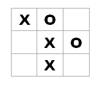

# 企业级井字棋

# 企业级井字棋

*更新：[关于这个主题的演讲幻灯片和视频](http://fsharpforfunandprofit.com/ettt/)*

*这篇文章是我希望在其中缩小函数式编程理论与实践之间差距的系列文章之一。我选择一个小项目，并展示我在设计和实现过程中的思考过程。*

在这一系列文章的下一个项目中，我将演示一个以函数式风格编写的井字棋（又称井字游戏）实现的步骤。



现在，明确一下，我不是任何形式的游戏开发者，所以我不会关注性能或用户体验，只关注设计过程 -- 将一些我们都知道的需求（希望如此）转化为功能代码。

实际上，为了非常清楚，我将故意在设计上有些过度，只是为了演示你可以做什么。不会有对象。一切都将是不可变的，一切都将是类型化。将会有基于能力的安全性，等等。性能肯定会被放在次要位置。幸运的是，井字棋不需要支持高帧率！

实际上，我将把这个版本称为“企业级井字棋”！

为什么？好吧，让我们看看你为“企业”需要什么：

+   我们需要**关注点分离**，以便专业团队可以同时处理代码的不同部分。

+   我们需要**一个文档化的 API**，以便不同团队可以有效并行工作。

+   我们需要一个**安全模型**来防止未经授权的操作发生。

+   我们需要**良好文档化的代码**，以便架构师可以确保实现与 UML 图表匹配。

+   我们需要**审计和日志记录**，以确保系统��合 SOX 标准。

+   我们需要**可扩展性**，以确保系统准备好迎接快速客户获取的挑战。

实际上，这些是*表面上*的原因，但我们都知道这并不是全部故事。进行“企业设计”的*真正*原因在与相关人员交谈时变得明显：

+   *开发经理:* "我们需要关注点分离，因为前端团队和后端团队彼此厌恶，拒绝在同一个房间工作。"

+   *前端团队:* "我们需要一个文档化的 API，这样那些搞后端的笨蛋就不会在每次提交时破坏我们的代码了。"

+   *后端团队:* "我们需要一个安全模型，因为那些建造前端的白痴总是会找到一种愚蠢的方式来做一些事情，除非我们限制他们。"

+   *维护团队:* "我们需要良好文档化的代码，因为我们厌倦了不得不反向工程被抛向我们的混乱代码。"

+   *测试人员和运维人员:* "我们需要审计和日志记录，这样我们就可以看到系统内部在做什么。"

+   *所有人:* "实际上，我们根本不需要可扩展性，但首席技术官希望我们符合时髦的术语。"

的确，已经有一些出色的“企业级”项目，比如[PHP 中的 Easy Plus](https://github.com/Herzult/SimplePHPEasyPlus)和[Java 中的 Fizz Buzz 企业版](https://github.com/EnterpriseQualityCoding/FizzBuzzEnterpriseEdition)，但我希望我的小小贡献也能被认为是有价值的。

说真的，我希望代码不会像其他企业项目那样~~糟糕~~有趣。事实上，我希望证明你可以拥有仍然可读的“企业级”就绪功能代码！

## 设计领域

> “编写游戏，以便陌生人可以通过查看源代码来学习规则”-- [Raganwald](http://raganwald.com/)

一如既往，让我们先设计类型。如果你记得，这种方法意味着：

+   我们只从类型开始--没有实现代码。

+   每个用例或场景都对应一个函数类型，一个输入和一个输出（这意味着当需要多个参数时，我会使用元组）。

+   我们主要从上到下和从外到内工作，但也偶尔从底部向上。

+   我们暂时忽略 UI。核心领域的设计不会涉及任何事件或可观察对象。它将是纯粹的功能性的。

实际上，本文的另一个标题可能是**根据类型指导增长的功能软件**。

正如我之前所说的，我喜欢通过从可能发生的事件工作来驱动设计，而不是涉及的对象。我是老派的，所以我称它们为用例，但我也喜欢[事件风暴方法](http://ziobrando.blogspot.co.uk/2013/11/introducing-event-storming.html)。

无论如何，对于井字游戏“领域”，我们有三种不同的“事件驱动用例”（在本例中，仅是各种鼠标点击！）要考虑：

+   初始化游戏

+   玩家 X 移动

+   玩家 O 移动

让我们从第一个开始：初始化。这相当于 OO 程序中的`new`样式构造函数。

对于井字游戏，不需要任何配置参数，因此输入将是"null"（又名`unit`），输出将是一个准备好玩的游戏，就像这样：

```
type InitGame = unit -> Game 
```

现在，这个`Game`是什么？由于一切都是不可变的，其他场景将不得不以一个现有游戏作为输入，并返回游戏的略有变化版本。所以`Game`不太合适。`GameState`怎么样？ "玩家 X 移动"函数会看起来像这样：

```
type PlayerXMoves = GameState * SomeOtherStuff -> GameState 
```

你会看到我在输入参数中添加了`SomeOtherStuff`，因为总有*其他东西*！我们稍后再担心“其他东西”是什么。

好的，接下来我们该做什么？我们应该更深入地了解`GameState`的内部吗？

不。让我们保持高层次，更多地采用“外部-内部”风格的设计。总的来说，我喜欢这种方法，因为它让我专注于重要的事情，不会被实现细节分心。

## 设计移动函数

我原先说应该为每个场景都有一个函数。这意味着我们会有这样的函数：

```
type PlayerXMoves = GameState * SomeOtherStuff -> GameState 
type PlayerOMoves = GameState * SomeOtherStuff -> GameState 
```

对于每个玩家的移动，我们从当前游戏状态开始，加上由玩家创建的一些其他输入，最终得到一个*新*的游戏状态。

问题是这两个函数看起来完全一样，可以很容易地互换。老实说，我不相信用户界面总是会调用正确的函数——或者至少，这可能是一个潜在的问题。

一种方法是只有*一个*函数，而不是*两个*。这样就不会出错了。

但现在我们需要处理两种不同的输入情况。怎么办？简单！一个鉴别联合类型：

```
type UserAction = 
    | PlayerXMoves of SomeStuff
    | PlayerOMoves of SomeStuff 
```

现在，要处理一个移动，我们只需将用户操作与状态一起传递，就像这样：

```
type Move = UserAction * GameState -> GameState 
```

所以现在只有*一个*函数供用户界面调用，而不是两个，减少出错的可能性。

这种方法在只有一个用户的情况下非常棒，因为它记录了他们可以做的所有事情。例如，在其他游戏中，你可能有这样一个类型：

```
type UserAction = 
    | MoveLeft 
    | MoveRight 
    | Jump
    | Fire 
```

但在这种情况下，这种方式感觉不太对。因为有*两个*玩家，我想做的是给每个玩家一个独特的函数来调用，并且不允许他们使用另一个玩家的函数。这不仅可以防止用户界面组件出错，还可以给我提供基于功能的安全性！

但现在我们又回到了最初的问题：我们如何区分这两个函数呢？

我要做的是使用类型来区分它们。我们将使`SomeOtherStuff`分别由每个玩家拥有，就像这样：

```
type PlayerXMoves = GameState * PlayerX's Stuff -> GameState 
type PlayerOMoves = GameState * PlayerO's Stuff -> GameState 
```

这样两个函数就是不同的，而且 PlayerO 也不能调用 PlayerX 的函数，除非拥有一些 PlayerX 的`Stuff`。如果听起来复杂，敬请关注——比看起来容易！

## SomeOtherStuff 是什么？

这个神秘的`SomeOtherStuff`是什么意思呢？换句话说，我们需要什么信息来下一步棋呢？

对于大多数领域，可能需要传递相当多的东西，并且这些东西可能根据上下文和系统的状态而变化。

但对于井字棋来说，很容易，就是玩家在网格上标记的位置。“左上角”，“底部中心”，等等。

我们应该如何使用类型定义这个位置呢？

最明显的方法是使用由整数索引的二维网格：`(1,1) (1,2) (1,3)`，等等。但我不得不承认我太懒了，不想写涉及边界检查的单元测试，也永远记不住这对整数中哪个是行，哪个是列。我想写不用测试的代码！

相反，让我们明确定义一个类型，列出水平和垂直的每个位置：

```
type HorizPosition = Left | HCenter | Right
type VertPosition = Top | VCenter | Bottom 
```

然后网格中一个方格（我将其称为“单元格”）的位置就是这些的一对：

```
type CellPosition = HorizPosition * VertPosition 
```

如果我们回到“移动函数”的定义，现在有：

```
type PlayerXMoves = GameState * CellPosition -> GameState 
type PlayerOMoves = GameState * CellPosition -> GameState 
```

意味着：“要进行一步棋，输入是游戏状态和选择的单元格位置，输出是更新后的游戏状态。”

玩家 X 和玩家 O 都可以在*相同的*单元格位置下棋，因此，正如我们之前所说的，我们需要使它们不同。

我打算通过将它们包装在 单个案例联合 中来完成：

```
type PlayerXPos = PlayerXPos of CellPosition 
type PlayerOPos = PlayerOPos of CellPosition 
```

有了这个，我们的移动函数现在具有不同的类型，不能混淆了：

```
type PlayerXMoves = GameState * PlayerXPos -> GameState 
type PlayerOMoves = GameState * PlayerOPos -> GameState 
```

## 什么是 GameState？

现在让我们专注于游戏状态。在移动之间完全表示游戏需要什么信息？

我认为显而易见的是，我们唯一需要的就是单元格列表，这样我们就可以定义一个游戏状态如下：

```
type GameState = {
    cells : Cell list
    } 
```

但现在，我们需要定义一个 `Cell` 需要什么？

首先是单元格的位置。其次是单元格上是否有“X”或“O”。因此，我们可以像这样定义一个单元格：

```
type CellState = 
    | X
    | O
    | Empty

type Cell = {
    pos : CellPosition 
    state : CellState 
    } 
```

## 设计输出

输出方面怎么样？UI 需要知道什么才能更新自己？

一种方法就是将整个游戏状态传递给 UI，让 UI 从头开始重新显示整个内容。或者，为了更高效，UI 可以缓存上一个状态并执行差异以决定需要更新什么。

在更复杂的应用程序中，具有数千个单元格，我们可以通过明确返回每次移动时更改的单元格来更有效地并使 UI 的生活更轻松，就像这样：

```
// added "ChangedCells"
type PlayerXMoves = GameState * PlayerXPos -> GameState * ChangedCells
type PlayerOMoves = GameState * PlayerOPos -> GameState * ChangedCells 
```

由于井字游戏是一个微小的游戏，我打算简化一下，只返回游戏状态而不返回诸如 `ChangedCells` 之类的内容。

但是正如我在开始时所说的，我希望 UI 尽可能愚蠢！UI 不应该“思考”——它应该由后端提供所有需要知道的东西，并且只需遵循指令。

就目前而言，可以直接从 `GameState` 中获取单元格，但我宁愿 UI 不知道 `GameState` 是如何定义的。因此，让我们给 UI 一个函数（比如 `GetCells`），它可以从 `GameState` 中提取单元格：

```
type GetCells = GameState -> Cell list 
```

另一种方法是让 `GetCells` 返回所有预先组织成二维网格的单元格——这将使 UI 的生活变得更加轻松。

```
type GetCells = GameState -> Cell[,] 
```

但是现在游戏引擎假设 UI 使用的是索引网格。就像 UI 不应该了解后端的内部工作一样，后端也不应该假设 UI 的工作方式。

允许 UI 共享与后端相同的 `Cell` 定义是公平的，因此我们只需给 UI 一个 `Cell` 列表，让它以自己的方式显示它们。

好了，UI 现在应该拥有显示游戏所需的一切。

## 对设计的第一个版本进行审查

太棒了！让我们看看我们到目前为止得到了什么：

```
module TicTacToeDomain =

    type HorizPosition = Left | HCenter | Right
    type VertPosition = Top | VCenter | Bottom
    type CellPosition = HorizPosition * VertPosition 

    type CellState = 
        | X
        | O
        | Empty

    type Cell = {
        pos : CellPosition 
        state : CellState 
        }

    type PlayerXPos = PlayerXPos of CellPosition 
    type PlayerOPos = PlayerOPos of CellPosition 

    // the private game state
    type GameState = exn  // use a placeholder

    // the "use-cases" 
    type InitGame = unit -> GameState       
    type PlayerXMoves = GameState * PlayerXPos -> GameState 
    type PlayerOMoves = GameState * PlayerOPos -> GameState 

    // helper function
    type GetCells = GameState -> Cell list 
```

请注意，为了使此代码编译通过并隐藏 `GameState` 的实现，我使用了一个通用的异常类（`exn`）作为 `GameState` 的实际实现的占位符。我也可以使用 `unit` 或 `string`，但 `exn` 不太可能与其他东西混淆，并且将防止它被意外地忽略！

## 对于元组的说明

只是提醒一下，在这个设计阶段，我打算将所有输入参数组合成一个单一元组，而不是将它们视为单独的参数。

这意味着我会写：

```
InputParam1 * InputParam2 * InputParam3 -> Result 
```

而不是更标准的：

```
InputParam1 -> InputParam2 -> InputParam3 -> Result 
```

我这样做只是为了使输入和输出明显。当涉及到实现时，很可能我们会切换到标准方式，这样我们就可��利用我们的函数工具箱中的技术，比如部分应用。

## 进行设计演练

在这一点上，有了一个初步的设计，我喜欢像真实使用一样进行一次演练。在更大的设计中，我可能会开发一个小的临时原型，但在这种情况下，设计足够小，我可以在脑海中完成。

所以，让我们假装我们是 UI，我们得到了上面的设计。我们首先调用初始化函数以获得一个新游戏：

```
type InitGame = unit -> GameState 
```

好的，现在我们有一个`GameState`，我们准备显示初始网格。

在这一点上，UI 会创建一个空按钮网格，将每个按钮与一个单元格关联起来，然后以“空”状态绘制单元格。

这是可以的，因为 UI 不必考虑。我们明确地向 UI 提供了所有单元格的列表，并且将初始单元格状态设置为`Empty`，因此 UI 不必知道哪个是默认状态--它只显示它所给出的内容。

有一件事。由于设置游戏不需要任何输入，*而且*游戏状态是不可变的，因此每场游戏的初始状态都将完全相同。

因此，我们不需要一个函数来创建初始游戏状态，只需要一个每场游戏都会重复使用的“常量”。

```
type InitialGameState = GameState 
```

## 游戏何时结束？

在我们的演练中，接下来让我们进行一次移动。

+   玩家，“X”或“O”，点击一个单元格

+   我们将玩家和`CellPosition`组合成适当的类型，比如`PlayerXPos`

+   然后我们将其和`GameState`传递到适当的`Move`函数中

```
type PlayerXMoves = 
    GameState * PlayerXPos -> GameState 
```

输出是一个新的`GameState`。然后 UI 调用`GetCells`来获取新的单元格。我们遍历这个列表，更新显示，现在我们准备再试一次。

太棒了！

嗯... 除了关于知道何时停止的部分。

如设计的那样，这个游戏将永远进行下去。我们需要在移动的输出中包含一些内容，以便让我们知道游戏是否结束！

所以让我们创建一个`GameStatus`类型来跟踪它。

```
type GameStatus = 
    | InProcess 
    | PlayerXWon 
    | PlayerOWon 
    | Tie 
```

我们还需要将其添加到移动的输出中，所以现在我们有：

```
type PlayerXMoves = 
    GameState * PlayerXPos -> GameState * GameStatus 
```

现在我们可以在`GameStatus`为`InProcess`时重复进行移动，然后停止。

UI 的伪代码将如下所示

```
// loop while game not over
let rec playMove gameState = 
    let pos = // get position from user input
    let newGameState,status = 
        playerXMoves (gameState,pos) // process move
    match status with
    | InProcess -> 
        // play another move
        playMove newGameState
    | PlayerXWon -> 
        // show that player X won
    | etc            

// start the game with the initial state
let startGame() = 
    playMove initialGameState 
```

我认为我们现在已经拥有了玩游戏所需的一切，所以让我们继续进行错误处理。

## 会发生什么样的错误？

在我们开始考虑游戏的内部之前，让我们想想 UI 团队在使用这个设计时可能会犯什么样的错误：

**UI 是否可以创建无效的`GameState`并损坏游戏？**

不，因为我们将保持游戏状态的内部对 UI 隐藏。

**UI 是否可以传入无效的`CellPosition`？**

不，因为`CellPosition`的水平和垂直分量是受限制的，因此它不可能以无效状态创建。不需要验证。

**UI 是否能在*错误*的时候传入一个*有效*的 `CellPosition`？**

啊，现在你说对了！是的——这是完全可能的。在我们目前的设计中，没有任何东西阻止玩家在同一个方格上玩两次！

**UI 是否允许玩家 X 连续两次进行动作？**

再一次，是的。我们的设计中没有任何东西阻止这种情况发生。

**当游戏结束但愚蠢的 UI 忘记检查 `GameStatus` 并且没有注意到时怎么办。游戏逻辑是否仍然接受动作？**

当然不是，但我们的设计又一次失败了。

最重要的问题是：我们是否可以*在我们的设计中*解决这三个问题，而不必依赖于实现中的特殊验证代码？也就是说，我们是否可以将这些规则编码到*类型*中。

此时，你可能会想“为什么要费心去处理所有这些类型？”

使用类型而不是验证代码的优势在于类型是设计的一部分，这意味着像这样的业务规则是自说明的。另一方面，验证代码往往分散在各处并隐藏在晦涩的类中，因此很难获得所有约束的整体图像。

总的来说，如果可以的话，我更喜欢使用类型而不是代码。

## 通过类型来强制执行规则

所以，我们能否使用类型来编码这些规则呢？答案是肯定的！

为了阻止某人重复在同一个方格上玩，我们可以改变游戏引擎，使其输出一个有效动作列表。然后我们可以要求*只有*此列表中的项目被允许在下一轮中播放。

如果我们这样做，我们的移动类型将会像这样：

```
type ValidPositionsForNextMove = CellPosition list

// a move returns the list of available positions for the next move
type PlayerXMoves = 
    GameState * PlayerXPos -> // input
        GameState * GameStatus * ValidPositionsForNextMove // output 
```

我们可以扩展这种方法以阻止玩家 X 连续两次玩。只需使 `ValidPositionsForNextMove` 成为 `PlayerOPos` 列表而不是通用位置列表。玩家 X 将无法播放它们！

```
type ValidMovesForPlayerX = PlayerXPos list
type ValidMovesForPlayerO = PlayerOPos list

type PlayerXMoves = 
    GameState * PlayerXPos -> // input
        GameState * GameStatus * ValidMovesForPlayerO // output

type PlayerOMoves = 
    GameState * PlayerOPos -> // input
        GameState * GameStatus * ValidMovesForPlayerX // output 
```

这种方法还意味着当游戏结束时，就没有*有效的动作*可用了。所以 UI 不能无限循环，它将被迫停止并处理这种情况。

所以现在我们已经将所有三条规则编码到类型系统中了——不需要手动验证。

## 一些重构

现在让我们进行一些重构。

首先，我们有了一对选择类型，其中一种情况适用于玩家 X，另一种情况类似于玩家 O。

```
type CellState = 
    | X
    | O
    | Empty

type GameStatus = 
    | InProcess 
    | PlayerXWon 
    | PlayerOWon 
    | Tie 
```

让我们将玩家提取到他们自己的类型中，然后我们可以将情况参数化以使其看起来更漂亮：

```
type Player = PlayerO | PlayerX

type CellState = 
    | Played of Player 
    | Empty

type GameStatus = 
    | InProcess 
    | Won of Player
    | Tie 
```

我们可以做的第二件事是注意到我们只需要在 `InProcess` 情况下的有效动作，而不是在 `Won` 或 `Tie` 情况下，所以让我们将 `GameStatus` 和 `ValidMovesForPlayer` 合并成一个称为 `MoveResult` 的单一类型，比如：

```
type ValidMovesForPlayerX = PlayerXPos list
type ValidMovesForPlayerO = PlayerOPos list

type MoveResult = 
    | PlayerXToMove of GameState * ValidMovesForPlayerX
    | PlayerOToMove of GameState * ValidMovesForPlayerO
    | GameWon of GameState * Player 
    | GameTied of GameState 
```

我们用两个新情况 `PlayerXToMove` 和 `PlayerOToMove` 替换了 `InProcess` 情况，我认为这实际上更清晰。

现在移动函数看起来是这样的：

```
type PlayerXMoves = 
    GameState * PlayerXPos -> 
        GameState * MoveResult

type PlayerOMoves = 
    GameState * PlayerOPos -> 
        GameState * MoveResult 
```

我也可以将新的 `GameState` 作为 `MoveResult` 的一部分返回，但我将其留在“外面”，以明确指出 UI 不应使用它。

另外，将其留在外面还会给我们留下一个选项，即编写辅助代码，可以为我们在一系列调用中传递游戏状态。这是一种更高级的技术，所以我不打算在这篇文章中讨论它。

最后，`InitialGameState` 还应该利用 `MoveResult` 返回第一个玩家的可用移动。由于它既有一个游戏状态又有一组初始移动，我们就称其为 `NewGame` 吧。

```
type NewGame = GameState * MoveResult 
```

如果初始 `MoveResult` 是 `PlayerXToMove` 情况，那么我们也约束了 UI，只能玩家 X 先移动。同样，这允许 UI 忽略规则。

## 第二次总结

现在在完成了演示之后，这就是我们调整后的设计。

```
module TicTacToeDomain =

    type HorizPosition = Left | HCenter | Right
    type VertPosition = Top | VCenter | Bottom
    type CellPosition = HorizPosition * VertPosition 

    type Player = PlayerO | PlayerX

    type CellState = 
        | Played of Player 
        | Empty

    type Cell = {
        pos : CellPosition 
        state : CellState 
        }

    type PlayerXPos = PlayerXPos of CellPosition 
    type PlayerOPos = PlayerOPos of CellPosition 

    // the private game state
    type GameState = exn  // use a placeholder

    type ValidMovesForPlayerX = PlayerXPos list
    type ValidMovesForPlayerO = PlayerOPos list

    // the move result
    type MoveResult = 
        | PlayerXToMove of ValidMovesForPlayerX
        | PlayerOToMove of ValidMovesForPlayerO
        | GameWon of Player 
        | GameTied 

    // the "use-cases" 
    type NewGame = 
        GameState * MoveResult      
    type PlayerXMoves = 
        GameState * PlayerXPos -> GameState * MoveResult
    type PlayerOMoves = 
        GameState * PlayerOPos -> GameState * MoveResult

    // helper function
    type GetCells = GameState -> Cell list 
```

我们还没有完成外部设计。还有一个问题有待解决：我们如何隐藏 `GameState` 的实现呢？

## 解耦共享和私有类型

在任何设计中，我们都希望将 "接口" 与 "实现" 解耦。在这种情况下，我们有：

+   一组被 UI 和游戏引擎都使用的共享数据结构和函数。(`CellState`, `MoveResult`, `PlayerXPos`等)

+   一组只能由游戏逻辑访问的私有数据结构和函数。(目前只有 `GameState`)

显然将这些类型分开是个好主意。我们应该如何做呢？

在 F# 中，最简单的方法是将它们放入单独的模块中，就像这样：

```
/// Types shared by the UI and the game logic
module TicTacToeDomain = 

    type HorizPosition = Left | HCenter | Right
    type VertPosition = Top | VCenter | Bottom
    type CellPosition = HorizPosition * VertPosition 

    type Player = PlayerO | PlayerX

    type CellState = 
        | Played of Player 
        | Empty

    type PlayerXMoves = 
        GameState * PlayerXPos -> GameState * MoveResult    
    // etc

/// Private types used by the internal game logic
module TicTacToeImplementation = 
    open TicTacToeDomain 

    // private implementation detail
    type GameState = {
        cells : Cell list
        }

    // etc 
```

但是如果我们想保持游戏逻辑的内部私有，那么 `GameState` 该怎么办？它被公共函数如 `PlayerXMoves` 使用，但我们想保持其结构的机密性。我们该怎么做呢？

### 选项 1 - 将公共和私有类型放在同一个模块中

第一选择可能是将公共和私有类型放在同一个模块中，并使此模块成为所有其他模块都依赖的 "核心" 领域模块。

这里是一些代码，演示了这种方法会是什么样子：

```
module TicTacToeImplementation = 

    // public types 
    type HorizPosition = Left | HCenter | Right
    type VertPosition = Top | VCenter | Bottom
    type CellPosition = HorizPosition * VertPosition 

    type CellState = 
        | Played of Player 
        | Empty

    type PlayerXMoves = 
        GameState * PlayerXPos -> GameState * MoveResult    
    // etc

    // -------------------- 
    // private types 

    type private InternalType = // to do

    // --------------------
    // public types with private constructor

    type GameState = private {
        cells : Cell list
        }

    // etc 
```

所有的类型都在一个模块中。

许多类型，如 `CellState`，默认是公开的。这没问题。

但你可以看到一些类型，如 `InternalType`，已经标记为私有。这意味着它们根本不能在模块外部使用。

最后，`GameState` 不是私有的，但它的构造函数是私有的，这意味着它可以在模块外部使用，但因为其构造函数是私有的，所以不能创建新的，听起来就像是我们需要的。

我们可能已经解决了问题，但这种方法经常会带来自己的问题。首先，试图保持 `public` 和 `private` 限定符的清晰可能会导致令人讨厌的编译器错误，比如这个：

```
The type 'XXX' is less accessible than the value, member or type 'YYY' it is used in 
```

即使这不是问题，将 "接口" 和 "实现" 放在同一个文件中通常会导致随着实现变得更大而创建额外的复杂性。

### 选项 2 - 用抽象基类表示 `GameState`

面向对象的方法是将`GameState`表示为一个抽象基类或接口，然后具体实现从抽象类继承。

这使得所有共享类型可以安全地引用抽象类或接口，而任何特定实现都是隐藏的。

下面是你可能在 F#中这样做的方式：

```
/// Types shared by the UI and the game logic
module TicTacToeDomain = 

    // abstract base class 
    type GameState() = class end

/// Private types used by the internal game logic
module TicTacToeImplementation = 
    open TicTacToeDomain 

    type GameStateImpl() =
        inherit GameState()

    // etc 
```

但遗憾的是，这种方法也存在问题。

首先，这不是很实用，对吧？F#确实支持类和接口，用于那些需要它们的情况，但我们真的应该能够找到比这更符合函数式的解决方案！

其次，这可能是不安全的。实际实现将不得不将`GameState`向下转换为它期望的类型，以便访问内部数据。但如果我有*两个*继承`GameState`的实现，那么有什么能阻止我将来自实现 B 的游戏状态传递给期望来自实现 A 的游戏状态的函数？什么都不能！混乱将会发生！

请注意，在纯面向对象模型中，这种情况是不可能发生的，因为`GameState`本身将具有有状态的方法，而不是我们这里所拥有的纯函数式 API。

### 选项 3 - 参数化实现

让我们再次考虑需求：“`GameState`是公开的，但我们不知道实现将会是什么。”

当你这样重新表述时，函数式建模方式变得清晰，即使用*泛型参数*（又称“参数多态性”）。

换句话说，我们将`GameState`作为*泛型类型*，代表特定的实现。

这意味着 UI 可以使用`GameState`类型，但由于实际使用的实现类型是未知的，UI 不能意外地“查看内部”并提取任何信息，*即使实现类型是公开的*。

最后一点很重要，所以我要再举一个例子。如果我给你一个 C#中的`List<T>`类型的对象，你可以以多种方式使用列表，但你无法知道`T`是什么，因此你永远不会意外地编写假设`T`是`int`、`string`或`bool`的代码。而这种“隐藏性”与`T`是否是公共类型无关。

如果我们采取这种方法，那么我们可以允许游戏状态的内部完全公开，确信 UI 即使想要也无法使用那些信息！

因此，这里有一些演示这种方法的代码。

首先是共享类型，其中`GameState<'T>`是参数化版本。

```
/// Types shared by the UI and the game logic
module TicTacToeDomain = 

    // unparameterized types
    type PlayerXPos = PlayerXPos of CellPosition 
    type PlayerOPos = PlayerOPos of CellPosition 

    // parameterized types
    type PlayerXMoves<'GameState> = 
        'GameState * PlayerXPos -> 'GameState * MoveResult
    type PlayerOMoves<'GameState> = 
        'GameState * PlayerOPos -> 'GameState * MoveResult

    // etc 
```

不使用游戏状态的类型保持不变，但你可以看到`PlayerXMoves<'T>`已经使用游戏状态进行了参数化。

像这样添加泛型通常会导致许多类型的级联更改，迫使它们全部被参数化。处理所有这些泛型正是类型推断在实践中如此有用的原因之一！

现在是游戏逻辑内部类型。它们现在都可以是公共的，因为 UI 不会知道它们。

```
module TicTacToeImplementation =
    open TicTacToeDomain

    // can be public
    type GameState = {
        cells : Cell list
        } 
```

最后，这是`playerXMoves`函数的实现可能看起来像：

```
let playerXMoves : PlayerXMoves<GameState> = 
    fun (gameState,move) ->
        // logic 
```

此函数引用特定实现，但可以传递到 UI 代码中，因为它符合`PlayerXMoves<'T>`类型。

此外，通过使用泛型参数，我们自然地强制使用相同的实现，比如“GameStateA”，在整个过程中使用。

换句话说，由`InitGame<GameStateA>`创建的游戏状态只能传递给`PlayerXMoves<GameStateA>`函数，该函数是基于*相同*实现类型进行参数化的。

## 用“依赖注入”将所有内容粘合在一起

最后，让我们谈谈如何将所有内容粘合在一起。

UI 代码将被设计为与`GameState`的*通用*实现一起工作，因此`newGame`和`move`函数的通用版本。

但当然，最终我们需要访问*特定*实现的`newGame`和`move`函数。如何将所有这些粘合在一起是最好的方法？

答案是依赖注入的功能等效。我们将有一个作为顶层层的“应用程序”或“程序”组件，它将构建一个实现并将其传递给 UI。

这是这样的代码的一个示例：

+   `GameImplementation`模块导出`newGame`和`move`函数的特定实现。

+   `UserInterface`模块导出一个接受这些实现的`TicTacToeForm`类的构造函数。

+   `Application`模块将所有内容粘合在一起。它创建一个`TicTacToeForm`并将其传递给从`GameImplementation`模块导出的实现。

这里有一些代码来演示这种方法：

```
module TicTacToeImplementation = 
    open TicTacToeDomain 

    /// create the state of a new game
    let newGame : NewGame<GameState> = 
        // return new game and current available moves
        let validMoves = // to do
        gameState, PlayerXToMove validMoves

    let playerXMoves : PlayerXMoves<GameState> = 
        fun (gameState,move) ->
            // implementation

module WinFormUI = 
    open TicTacToeDomain
    open System.Windows.Forms

    type TicTacToeForm<'T>
        (
        // pass in the required functions 
        // as parameters to the constructor
        newGame:NewGame<'T>, 
        playerXMoves:PlayerXMoves<'T>,
        playerOMoves:PlayerOMoves<'T>,
        getCells:GetCells<'T>
        ) = 
        inherit Form()
     // implementation to do

module WinFormApplication = 
    open WinFormUI

    // get functions from implementation
    let newGame = TicTacToeImplementation.newGame
    let playerXMoves = TicTacToeImplementation.playerXMoves
    let playerOMoves = TicTacToeImplementation.playerOMoves
    let getCells = TicTacToeImplementation.getCells

    // create form and start game
    let form = 
        new TicTacToeForm<_>(newGame,playerXMoves,playerOMoves,getCells)
    form.Show() 
```

关于这段代码的一些注释：

首先，我使用 WinForms 而不是 WPF，因为它支持 Mono 并且不需要 NuGet 依赖项。如果您想使用更好的东西，请查看[ETO.Forms](http://picoe.ca/2012/09/11/introducing-eto-forms-a-cross-platform-ui-for-net/)。

接下来，您可以看到我已经明确向`TicTacToeForm<'T>`添加了类型参数，就像这样。

```
TicTacToeForm<'T>(newGame:NewGame<'T>, playerXMoves:PlayerXMoves<'T>, etc) 
```

通过这样做，我可以通过以下方式消除表单的类型参数：

```
TicTacToeForm(newGame:NewGame<_>, playerXMoves:PlayerXMoves<_>, etc) 
```

或者甚至：

```
TicTacToeForm(newGame, playerXMoves, etc) 
```

并让编译器推断类型，但这经常会导致像这样的“不够通用”的警告：

```
warning FS0064: This construct causes code to be less generic than indicated by the type annotations. 
The type variable 'T has been constrained to be type 'XXX'. 
```

通过明确编写`TicTacToeForm<'T>`，可以避免这种情况，尽管这肯定很丑陋。

## 进行一些重构

我们有四个不同的函数要导出。这有点多了，所以让我们创建一个记录来存储它们：

```
// the functions exported from the implementation
// for the UI to use.
type TicTacToeAPI<'GameState> = 
    {
    newGame : NewGame<'GameState>
    playerXMoves : PlayerXMoves<'GameState> 
    playerOMoves : PlayerOMoves<'GameState> 
    getCells : GetCells<'GameState>
    } 
```

这既作为传递函数的容器，*也*作为 API 中可用函数的良好文档。

现在实现必须创建一个“api”对象：

```
module TicTacToeImplementation = 
    open TicTacToeDomain 

    /// create the functions to export
    let newGame : NewGame<GameState> = // etc
    let playerXMoves : PlayerXMoves<GameState> = // etc
    // etc

    // export the functions
    let api = {
        newGame = newGame 
        playerOMoves = playerOMoves 
        playerXMoves = playerXMoves 
        getCells = getCells
        } 
```

但 UI 代码因此变得简化：

```
module WinFormUI = 
    open TicTacToeDomain
    open System.Windows.Forms

    type TicTacToeForm<'T>(api:TicTacToeAPI<'T>) = 
        inherit Form()
     // implementation to do

module WinFormApplication = 
    open WinFormUI

    // get functions from implementation
    let api = TicTacToeImplementation.api

    // create form and start game
    let form = new TicTacToeForm<_>(api)
    form.Show() 
```

## 原型化一个最小实现

看起来我们已经接近最终版本了。 但是让我们再次进行一次"依赖注入"设计的遍历，这一次编写一些最小的代码来测试交互。

例如，这里是实现`newGame`和`playerXMoves`函数的一些最小代码。

+   `newGame`只是一个没有单元格和可用移动的游戏

+   `move`的最小实现很简单--只返回游戏结束！

```
let newGame : NewGame<GameState> = 
    // create initial game state with empty everything
    let gameState = { cells=[]}            
    let validMoves = []
    gameState, PlayerXToMove validMoves

let playerXMoves : PlayerXMoves<GameState> = 
    // dummy implementation
    fun gameState move ->  gameState,GameTied

let playerOMoves : PlayerOMoves<GameState> = 
    // dummy implementation
    fun gameState move ->  gameState,GameTied

let getCells gameState = 
    gameState.cells 

let api = {
    newGame = newGame 
    playerOMoves = playerOMoves 
    playerXMoves = playerXMoves 
    getCells = getCells
    } 
```

现在让我们创建一个最小的 UI 实现。 我们不会绘制任何内容或响应点击，只是模拟一些函数，以便我们可以测试逻辑。

这是我的第一个尝试：

```
type TicTacToeForm<'GameState>(api:TicTacToeAPI<'GameState>) = 
    inherit Form()

    let mutable gameState : 'GameState = ???
    let mutable lastMoveResult : MoveResult = ???

    let displayCells gameState = 
        let cells = api.getCells gameState 
        for cell in cells do
            // update display

    let startGame()= 
        let initialGameState,initialResult = api.newGame
        gameState <- initialGameState
        lastMoveResult <- initialResult 
        // create cell grid from gameState 

    let handleMoveResult moveResult =
        match moveResult with
        | PlayerXToMove availableMoves -> 
            // show available moves
        | PlayerOToMove availableMoves -> 
            // show available moves
        | GameWon player -> 
            let msg = sprintf "%A Won" player 
            MessageBox.Show(msg) |> ignore
        | GameTied -> 
            MessageBox.Show("Tied") |> ignore

    // handle a click
    let handleClick() =
        let gridIndex = 0,0  // dummy for now
        let cellPos = createCellPosition gridIndex
        match lastMoveResult with
        | PlayerXToMove availableMoves -> 
            let playerXmove = PlayerXPos cellPos
            // if move is in available moves then send it
            // to the api
            let newGameState,newResult = 
                api.playerXMoves gameState playerXmove 
            handleMoveResult newResult 

            //update the globals
            gameState <- newGameState
            lastMoveResult <- newResult 
        | PlayerOToMove availableMoves -> 
            let playerOmove = PlayerOPos cellPos
            // if move is in available moves then send it
            // to the api
            // etc
        | GameWon player -> 
            ?? // we aleady showed after the last move 
```

如您所见，我计划使用标准的表单事件处理方法--每个单元格都将有一个与之关联的"点击"事件处理程序。 如何将控件或像素位置转换为`CellPosition`是我现在不会担心的事情，所以我只是硬编码了一些虚拟数据。

我在这里*不*会保持纯洁并拥有一个递归循环。 相反，我将保留当前的`gameState`作为一个可变的，它在每次移动后都会更新。

但是现在我们遇到了一个棘手的情况... 当游戏还没有开始时，`gameState`是什么？我们应该将其初始化为什么？同样，在游戏结束时，它应该被设置为什么？

```
let mutable gameState : 'GameState = ??? 
```

一个选择可能是使用`GameState option`，但这似乎像是一个破绽，并且让我觉得我们正在想不出来。

类似地，我们有一个字段来保存上次移动的结果(`lastMoveResult`)，以便我们可以跟踪是谁的回合，或者游戏是否结束了。

但再次，当游戏还没有开始时，它应该被设置为什么？

让我们退一步，看看用户界面可能处于的所有状态--不是*游戏*本身的状态，而是*用户界面*的状态。

+   我们从"空闲"状态开始，没有游戏正在进行。

+   然后用户开始游戏，我们处于"播放"状态。

+   每次移动时，我们都保持在"播放"状态。

+   当游戏结束时，我们显示赢得或输掉的消息。

+   我们等待用户确认游戏结束消息，然后再次回到空闲状态。

再次强调，这仅适用于 UI，与内部游戏状态无关。

所以--我们所有问题的解决方案！--让我们创建一个类型来表示这些状态。

```
type UiState = 
    | Idle
    | Playing
    | Won
    | Lost 
```

但是我们真的需要`Won`和`Lost`状态吗？游戏结束时为什么不直接回到`Idle`状态？

现在类型看起来像这样：

```
type UiState = 
    | Idle
    | Playing 
```

使用这样的类型的好处是我们可以轻松存储每个状态所需的数据。

+   在`Idle`状态下我们需要存储什么数据？我想不到任何东西。

+   我们在`Playing`状态中需要存储什么数据？好吧，这将是一个完美的地方来跟踪我们之前遇到问题的`gameState`和`lastMoveResult`。 它们只在游戏进行时需要，但其他情况则不需要。

所以我们的最终版本是这样的。我们不知道实际的游戏状态，所以我们不得不将`<'GameState>`添加到`UiState`中。

```
type UiState<'GameState> = 
    | Idle
    | Playing of 'GameState * MoveResult 
```

有了这个类型，我们就不再需要直接将游戏状态存储为类中的字段。相反，我们存储一个可变的`UiState`，它初始化为`Idle`。

```
type TicTacToeForm<'GameState>(api:TicTacToeAPI<'GameState>) = 
    inherit Form()

    let mutable uiState = Idle 
```

当我们开始游戏时，我们将 UI 状态更改为`Playing`：

```
let startGame()= 
    uiState <- Playing api.newGame
    // create cell grid from gameState 
```

当我们处理点击时，只有当 UI 状态处于`Playing`模式时才会执行某些操作，然后我们就可以毫无困难地获取我们需要的`gameState`和`lastMoveResult`，因为它们作为该情况的一部分数据而存储着。

```
let handleClick() =
    match uiState with
    | Idle -> ()
        // do nothing

    | Playing (gameState,lastMoveResult) ->
        let gridIndex = 0,0  // dummy for now
        let cellPos = createCellPosition gridIndex
        match lastMoveResult with
        | PlayerXToMove availableMoves -> 
            let playerXmove = PlayerXPos cellPos
            // if move is in available moves then send it
            // to the api
            let newGameState,newResult = 
                api.playerXMoves gameState playerXmove 

            // handle the result
            // e.g. if the game is over
            handleMoveResult newResult 

            // update the uiState with newGameState
            uiState <- Playing (newGameState,newResult)

        | PlayerOToMove availableMoves -> 
            // etc
        | _ -> 
            // ignore other states 
```

如果你看`PlayerXToMove` case 的最后一行，你可以看到全局的`uiState`字段被更新为新的游戏状态：

```
| PlayerXToMove availableMoves -> 
    // snipped

    let newGameState,newResult = // get new state

    // update the uiState with newGameState
    uiState <- Playing (newGameState,newResult) 
```

那么，我们在这个原型中达到了什么程度呢？

这很丑陋，但它已经达到了目的。

目标是快速实现 UI，以查看设计在使用中是否保持不变，我认为我们可以说它确实保持不变，因为领域类型和 API 的设计保持不变。

我们也对 UI 的需求有了更好的理解，这是一个额外的好处。我想我们现在可以停下来了！

## 完整的游戏，第 1 部分：设计

最后，我将展示完整游戏的代码，包括实现和用户界面。

如果你不想阅读这段代码，你可以跳到下面的问题和总结。

*所有显示的代码都可以在 GitHub 的[this gist](https://gist.github.com/swlaschin/3418b549bd222396da82)中找到。*

我们将从我们的最终领域设计开始：

```
module TicTacToeDomain =

    type HorizPosition = Left | HCenter | Right
    type VertPosition = Top | VCenter | Bottom
    type CellPosition = HorizPosition * VertPosition 

    type Player = PlayerO | PlayerX

    type CellState = 
        | Played of Player 
        | Empty

    type Cell = {
        pos : CellPosition 
        state : CellState 
        }

    type PlayerXPos = PlayerXPos of CellPosition 
    type PlayerOPos = PlayerOPos of CellPosition 

    type ValidMovesForPlayerX = PlayerXPos list
    type ValidMovesForPlayerO = PlayerOPos list

    type MoveResult = 
        | PlayerXToMove of ValidMovesForPlayerX 
        | PlayerOToMove of ValidMovesForPlayerO 
        | GameWon of Player 
        | GameTied 

    // the "use-cases" 
    type NewGame<'GameState> = 
        'GameState * MoveResult      
    type PlayerXMoves<'GameState> = 
        'GameState -> PlayerXPos -> 'GameState * MoveResult
    type PlayerOMoves<'GameState> = 
        'GameState -> PlayerOPos -> 'GameState * MoveResult

    // helper function
    type GetCells<'GameState> = 
        'GameState -> Cell list

    // the functions exported from the implementation
    // for the UI to use.
    type TicTacToeAPI<'GameState> = 
        {
        newGame : NewGame<'GameState>
        playerXMoves : PlayerXMoves<'GameState> 
        playerOMoves : PlayerOMoves<'GameState> 
        getCells : GetCells<'GameState>
        } 
```

## 完整的游戏，第 2 部分：游戏逻辑实现

接下来，这是设计的完整实现，我不会详细讨论。我希望注释是不言自明的。

```
module TicTacToeImplementation =
    open TicTacToeDomain

    /// private implementation of game state
    type GameState = {
        cells : Cell list
        }

    /// the list of all horizontal positions
    let allHorizPositions = [Left; HCenter; Right]

    /// the list of all horizontal positions
    let allVertPositions = [Top; VCenter; Bottom]

    /// A type to store the list of cell positions in a line
    type Line = Line of CellPosition list

    /// a list of the eight lines to check for 3 in a row
    let linesToCheck = 
        let makeHLine v = Line [for h in allHorizPositions do yield (h,v)]
        let hLines= [for v in allVertPositions do yield makeHLine v] 

        let makeVLine h = Line [for v in allVertPositions do yield (h,v)]
        let vLines = [for h in allHorizPositions do yield makeVLine h] 

        let diagonalLine1 = Line [Left,Top; HCenter,VCenter; Right,Bottom]
        let diagonalLine2 = Line [Left,Bottom; HCenter,VCenter; Right,Top]

        // return all the lines to check
        [
        yield! hLines
        yield! vLines
        yield diagonalLine1 
        yield diagonalLine2 
        ]

    /// get the cells from the gameState
    let getCells gameState = 
        gameState.cells 

    /// get the cell corresponding to the cell position
    let getCell gameState posToFind = 
        gameState.cells 
        |> List.find (fun cell -> cell.pos = posToFind)

    /// update a particular cell in the GameState 
    /// and return a new GameState
    let private updateCell newCell gameState =

        // create a helper function
        let substituteNewCell oldCell =
            if oldCell.pos = newCell.pos then
                newCell
            else 
                oldCell                 

        // get a copy of the cells, with the new cell swapped in
        let newCells = gameState.cells |> List.map substituteNewCell 

        // return a new game state with the new cells
        {gameState with cells = newCells }

    /// Return true if the game was won by the specified player
    let private isGameWonBy player gameState = 

        // helper to check if a cell was played by a particular player
        let cellWasPlayedBy playerToCompare cell = 
            match cell.state with
            | Played player -> player = playerToCompare
            | Empty -> false

        // helper to see if every cell in the Line has been played by the same player
        let lineIsAllSamePlayer player (Line cellPosList) = 
            cellPosList 
            |> List.map (getCell gameState)
            |> List.forall (cellWasPlayedBy player)

        linesToCheck
        |> List.exists (lineIsAllSamePlayer player)

    /// Return true if all cells have been played
    let private isGameTied gameState = 
        // helper to check if a cell was played by any player
        let cellWasPlayed cell = 
            match cell.state with
            | Played _ -> true
            | Empty -> false

        gameState.cells
        |> List.forall cellWasPlayed 

    /// determine the remaining moves for a player
    let private remainingMovesForPlayer playerMove gameState = 

        // helper to return Some if a cell is playable
        let playableCell cell = 
            match cell.state with
            | Played player -> None
            | Empty -> Some (playerMove cell.pos)

        gameState.cells
        |> List.choose playableCell

    /// create the state of a new game
    let newGame = 

        // allPositions is the cross-product of the positions
        let allPositions = [
            for h in allHorizPositions do 
            for v in allVertPositions do 
                yield (h,v)
            ]

        // all cells are empty initially
        let emptyCells = 
            allPositions 
            |> List.map (fun pos -> {pos = pos; state = Empty})

        // create initial game state
        let gameState = { cells=emptyCells }            

        // initial set of valid moves for player X is all positions
        let validMoves = 
            allPositions 
            |> List.map PlayerXPos

        // return new game
        gameState, PlayerXToMove validMoves

    // player X makes a move
    let playerXMoves gameState (PlayerXPos cellPos) = 
        let newCell = {pos = cellPos; state = Played PlayerX}
        let newGameState = gameState |> updateCell newCell 

        if newGameState |> isGameWonBy PlayerX then
            // return the new state and the move result
            newGameState, GameWon PlayerX
        elif newGameState |> isGameTied then
            // return the new state and the move result
            newGameState, GameTied  
        else
            let remainingMoves = 
                newGameState |> remainingMovesForPlayer PlayerOPos 
            newGameState, PlayerOToMove remainingMoves

    // player O makes a move
    let playerOMoves gameState (PlayerOPos cellPos) = 
        let newCell = {pos = cellPos; state = Played PlayerO}
        let newGameState = gameState |> updateCell newCell 

        if newGameState |> isGameWonBy PlayerO then
            // return the new state and the move result
            newGameState, GameWon PlayerO
        elif newGameState |> isGameTied then
            // return the new state and the move result
            newGameState, GameTied 
        else
            let remainingMoves = 
                newGameState |> remainingMovesForPlayer PlayerXPos 
            newGameState, PlayerXToMove remainingMoves

        // Exercise - refactor to remove the duplicate code from 
        // playerXMoves  and playerOMoves 

    /// export the API to the application
    let api = {
        newGame = newGame 
        playerOMoves = playerOMoves 
        playerXMoves = playerXMoves 
        getCells = getCells
        } 
```

## 完整的游戏，第 3 部分：基于控制台的用户界面

为了完成实现，这里是基于控制台的用户界面的代码。

显然，这部分实现不是纯粹的！我在写入和读取控制台，傻瓜。如果你想要更好，通过使用`IO`或类似的方式将其转换为纯粹的实现将会很容易。

就我个人而言，我更喜欢专注于核心领域逻辑的纯粹性，而对 UI 不太关心，但这只是我的看法。

```
/// Console based user interface
module ConsoleUi =
    open TicTacToeDomain

    /// Track the UI state
    type UserAction<'a> =
        | ContinuePlay of 'a
        | ExitGame

    /// Print each available move on the console
    let displayAvailableMoves moves = 
        moves
        |> List.iteri (fun i move -> 
            printfn "%i) %A" i move )

    /// Get the move corresponding to the 
    /// index selected by the user
    let getMove moveIndex moves = 
        if moveIndex < List.length moves then
            let move = List.nth moves moveIndex 
            Some move
        else
            None

    /// Given that the user has not quit, attempt to parse
    /// the input text into a index and then find the move
    /// corresponding to that index
    let processMoveIndex inputStr gameState availableMoves makeMove processInputAgain = 
        match Int32.TryParse inputStr with
        // TryParse will output a tuple (parsed?,int)
        | true,inputIndex ->
            // parsed ok, now try to find the corresponding move
            match getMove inputIndex availableMoves with
            | Some move -> 
                // corresponding move found, so make a move
                let moveResult = makeMove gameState move 
                ContinuePlay moveResult // return it
            | None ->
                // no corresponding move found
                printfn "...No move found for inputIndex %i. Try again" inputIndex 
                // try again
                processInputAgain()
        | false, _ -> 
            // int was not parsed
            printfn "...Please enter an int corresponding to a displayed move."             
            // try again
            processInputAgain()

    /// Ask the user for input. Process the string entered as 
    /// a move index or a "quit" command
    let rec processInput gameState availableMoves makeMove = 

        // helper that calls this function again with exactly
        // the same parameters
        let processInputAgain() = 
            processInput gameState availableMoves makeMove 

        printfn "Enter an int corresponding to a displayed move or q to quit:" 
        let inputStr = Console.ReadLine()
        if inputStr = "q" then
            ExitGame
        else
            processMoveIndex inputStr gameState availableMoves makeMove processInputAgain

    /// Display the cells on the console in a grid
    let displayCells cells = 
        let cellToStr cell = 
            match cell.state with
            | Empty -> "-"            
            | Played player ->
                match player with
                | PlayerO -> "O"
                | PlayerX -> "X"

        let printCells cells  = 
            cells
            |> List.map cellToStr
            |> List.reduce (fun s1 s2 -> s1 + "|" + s2) 
            |> printfn "|%s|"

        let topCells = 
            cells |> List.filter (fun cell -> snd cell.pos = Top) 
        let centerCells = 
            cells |> List.filter (fun cell -> snd cell.pos = VCenter) 
        let bottomCells = 
            cells |> List.filter (fun cell -> snd cell.pos = Bottom) 

        printCells topCells
        printCells centerCells 
        printCells bottomCells 
        printfn ""   // add some space

    /// After each game is finished,
    /// ask whether to play again.
    let rec askToPlayAgain api  = 
        printfn "Would you like to play again (y/n)?"             
        match Console.ReadLine() with
        | "y" -> 
            ContinuePlay api.newGame
        | "n" -> 
            ExitGame
        | _ -> askToPlayAgain api 

    /// The main game loop, repeated
    /// for each user input
    let rec gameLoop api userAction = 
        printfn "\n------------------------------\n"  // a separator between moves

        match userAction with
        | ExitGame -> 
            printfn "Exiting game."             
        | ContinuePlay (state,moveResult) -> 
            // first, update the display
            state |> api.getCells |> displayCells

            // then handle each case of the result
            match moveResult with
            | GameTied -> 
                printfn "GAME OVER - Tie"             
                printfn ""             
                let nextUserAction = askToPlayAgain api 
                gameLoop api nextUserAction
            | GameWon player -> 
                printfn "GAME WON by %A" player            
                printfn ""             
                let nextUserAction = askToPlayAgain api 
                gameLoop api nextUserAction
            | PlayerOToMove availableMoves -> 
                printfn "Player O to move" 
                displayAvailableMoves availableMoves
                let newResult = processInput state availableMoves api.playerOMoves
                gameLoop api newResult 
            | PlayerXToMove availableMoves -> 
                printfn "Player X to move" 
                displayAvailableMoves availableMoves
                let newResult = processInput state availableMoves api.playerXMoves
                gameLoop api newResult 

    /// start the game with the given API
    let startGame api =
        let userAction = ContinuePlay api.newGame
        gameLoop api userAction 
```

最后，连接所有组件并启动 UI 的应用程序代码：

```
module ConsoleApplication = 

    let startGame() =
        let api = TicTacToeImplementation.api
        ConsoleUi.startGame api 
```

## 示例游戏

这个游戏的输出如下：

```
|-|X|-|
|X|-|-|
|O|-|-|

Player O to move
0) PlayerOPos (Left, Top)
1) PlayerOPos (HCenter, VCenter)
2) PlayerOPos (HCenter, Bottom)
3) PlayerOPos (Right, Top)
4) PlayerOPos (Right, VCenter)
5) PlayerOPos (Right, Bottom)
Enter an int corresponding to a displayed move or q to quit:
1

------------------------------

|-|X|-|
|X|O|-|
|O|-|-|

Player X to move
0) PlayerXPos (Left, Top)
1) PlayerXPos (HCenter, Bottom)
2) PlayerXPos (Right, Top)
3) PlayerXPos (Right, VCenter)
4) PlayerXPos (Right, Bottom)
Enter an int corresponding to a displayed move or q to quit:
1

------------------------------

|-|X|-|
|X|O|-|
|O|X|-|

Player O to move
0) PlayerOPos (Left, Top)
1) PlayerOPos (Right, Top)
2) PlayerOPos (Right, VCenter)
3) PlayerOPos (Right, Bottom)
Enter an int corresponding to a displayed move or q to quit:
1

------------------------------

|-|X|O|
|X|O|-|
|O|X|-|

GAME WON by PlayerO

Would you like to play again (y/n)? 
```

## 日志记录

糟糕！我们承诺要添加日志记录使其企业就绪！

这很简单--我们所需要做的就是用记录我们感兴趣的数据的等价函数替换 api 函数。

```
module Logger = 
    open TicTacToeDomain

    let logXMove (PlayerXPos cellPos)= 
        printfn "X played %A" cellPos

    let logOMove (PlayerOPos cellPos)= 
        printfn "O played %A" cellPos

    /// inject logging into the API
    let injectLogging api =

        // make a logged version of the game function 
        let playerXMoves state move = 
            logXMove move 
            api.playerXMoves state move 

        // make a logged version of the game function 
        let playerOMoves state move = 
            logOMove move 
            api.playerOMoves state move 

        // create a new API with 
        // the move functions replaced
        // with logged versions
        { api with
            playerXMoves = playerXMoves
            playerOMoves = playerOMoves
            } 
```

显然，在一个真实的系统中，你会用像`log4net`这样的适当的日志记录工具来替换它，并生成更好的输出，但我认为这演示了这个想法。

现在要使用这个，我们所需要做的就是将顶级应用程序转换为将原始 API 转换为已记录版本的 API：

```
module ConsoleApplication = 

    let startGame() =
        let api = TicTacToeImplementation.api
        let loggedApi = Logger.injectLogging api
        ConsoleUi.startGame loggedApi 
```

就是这样。日志记录完成！

哦，还记得我最初是将初始状态创建为函数而不是常量吗？

```
type InitGame = unit -> GameState 
```

我在设计的早期改为了常量。但是现在我对此感到后悔，因为这意味着我无法钩入“初始化游戏”事件并记录它。如果我确实想记录每场比赛的开始，我应该把它改回一个函数。

## 问题

**问题：你费力地隐藏了`GameState`的内部结构，但是`PlayerXPos`和`PlayerOPos`类型是公开的。为什么？**

我忘了！然后懒惰使我不更新代码，因为这只是一个设计练习。

在当前设计中，一个恶意的用户界面可以构造一个`PlayerXPos`，然后在不该是玩家 X 的回合时玩 X，或者玩一个已经被玩过的位置。

你可以通过以与我们为游戏状态做的方式相同的方式隐藏`PlayerXPos`的实现，使用类型参数来防止这种情况发生。当然，你还必须调整所有相关的类。

这是一个示例代码片段：

```
type MoveResult<'PlayerXPos,'PlayerOPos> = 
    | PlayerXToMove of 'PlayerXPos list
    | PlayerOToMove of 'PlayerOPos list
    | GameWon of Player 
    | GameTied 

type NewGame<'GameState,'PlayerXPos,'PlayerOPos> = 
    'GameState * MoveResult<'PlayerXPos,'PlayerOPos>      

type PlayerXMoves<'GameState,'PlayerXPos,'PlayerOPos> = 
    'GameState -> 'PlayerXPos -> 
        'GameState * MoveResult<'PlayerXPos,'PlayerOPos>      
type PlayerOMoves<'GameState,'PlayerXPos,'PlayerOPos> = 
    'GameState -> 'PlayerOPos -> 
        'GameState * MoveResult<'PlayerXPos,'PlayerOPos> 
```

我们还需要一种方法让 UI 知道用户选择的`CellPosition`是否有效。也就是说，给定一个`MoveResult`和所需的`CellPosition`，如果位置有效，则返回`Some`移动，否则返回`None`。

```
type GetValidXPos<'PlayerXPos,'PlayerOPos> = 
    CellPosition * MoveResult<'PlayerXPos,'PlayerOPos> -> 'PlayerXPos option 
```

现在变得有点丑了。这就是类型优先设计的一个问题：类型参数可能变得复杂！

所以这是一个权衡。你要多少使用类型来防止意外错误而不会影响设计？

在这种情况下，我认为`GameState`应该保密，因为它很可能在将来发生变化，我们希望确保 UI 不会意外地与实现细节耦合。

对于移动类型，(a) 我看不到实现会发生变化，而且(b) 恶意 UI 操作的后果并不是很严重，所以总体上我不介意实现是公开的。

*更新 2015-02-16：在下一篇文章中，我以更加优雅的方式解决了这个问题，并且也摆脱了`GameState`！*

**问题：你为什么要使用那种奇怪的语法来定义`initGame`和`move`函数？**

你是说，为什么我要像这样定义函数：

```
/// create the state of a new game
let newGame : NewGame<GameState> = 
    // implementation

let playerXMoves : PlayerXMoves<GameState> = 
    fun (gameState,move) ->
        // implementation 
```

而不是“正常”的方式，就像这样：

```
/// create the state of a new game
let newGame  = 
    // implementation

let playerXMoves (gameState,move) = 
    // implementation 
```

当我想把函数视为值时，我就这样做。正如我们可能会说“*x*是类型为*int*的值”一样，像这样`x :int = ...`，我正在说“*playerXMoves*是类型为*PlayerXMoves*的值”，就像这样：`playerXMoves : PlayerXMoves = ...`。只是在这种情况下，该值是一个函数而不是一个简单的值。

这样做是遵循类型优先的方法：先创建一个类型，然后实现符合该类型的事物。

我会推荐在正常代码中这样做吗？可能不会！

我只是作为探索性设计过程的一部分来做这个。一旦设计稳定下来，我倾向于回到正常的做事方式。

**问题：这看起来像是很多工作。这只是另一种形式的[BDUF](https://en.wikipedia.org/wiki/Big_Design_Up_Front)吗？**

这可能看起来是一个设计过程，但实际上，这可能不会花费很长时间。肯定不会比在另一种语言中设计一个探索性原型要长。

我们经历了许多快速迭代，使用类型来记录设计，并使用 REPL 作为“可执行规范检查器”，以确保一切正常运作。

最终，我们现在有了一个体面的设计，具有一些不错的特性：

+   有一个“API”将 UI 与核心逻辑分开，以便在需要时可以并行进行每个部分的工作。

+   类型充当文档，并将限制实现的方式，这是 UML 图表无法做到的！

+   设计以类型编码，因此在开发过程中发生的不可避免的更改可以放心进行。

我认为一旦你习惯了这种工作方式，整个过程实际上是非常敏捷的。

**问题：拜托，你会*真的*用这种方式写井字棋吗？**

这取决于情况。如果只有我一个人，也许不会。:-)

但如果是一个更复杂的系统，前端和后端有不同的团队，那么我肯定会采用这种以设计为先的方法。在这种情况下，像数据隐藏和抽象接口这样的东西至关重要，我认为这种方法能够实现这一点。

**问题：为什么设计如此具体？看起来似乎没有任何部分是可重用的。为什么？**

是的，这段代码充满了非常具体的类型：`Cell`，`GameState`等。而且确实没有任何可重用的部分。

总是存在着非常领域特定且不可重用的设计（如此设计）与[抽象和可重用的库](https://msdn.microsoft.com/en-us/library/ee353738.aspx)（如列表和树）之间的紧张关系。

理想情况下，你会从低级别、可重用的组件开始，然后将它们组合成更大更具体的组件（例如 DSL），从中构建应用程序（Tomas 在[这里](http://tomasp.net/blog/2015/library-layers/index.html)有一篇很好的文章）。

我没有在这里这样做的原因是，首先，我总是喜欢从非常*具体*的设计开始。在构建几次之后，你甚至不知道一个好的抽象看起来是什么样子。

我们将 UI 与核心逻辑分开，但在目前看来，进一步进行下去对我来说没有意义。如果我要构建许多其他类似于井字棋的游戏，那么一些有用的��象可能会变得明显。

其次，具有具体类型的设计更容易让非专家理解。我希望我可以向非程序员（例如领域专家）展示这些领域类型，并让他们理解并做出明智的评论。如果它们更抽象，那将是不可能的。

## 练习

如果你想挑战自己，这里有一些练习供你参考：

+   `playerXMoves`和`playerOMoves`函数的代码非常相似。你会如何重构它们以减少重复代码？

+   进行安全审计，思考一下恶意用户或 UI 可能利用当前设计损坏游戏的所有方法。然后修复它们！

## 摘要

在本文中，我们看到了如何使用大多数类型设计系统，偶尔插入代码片段以帮助我们澄清问题。

这绝对是一次设计过度的练习，但我希望里面有一些想法可能适用于真正的非玩具项目。

起初，我声称这个设计将是“企业级”准备好的。它是吗？

+   我们通过向 UI 导出的函数实现了关注点的分离。

+   我们*确实*有一个良好的文档化 API。没有神奇数字，类型的名称是自我说明的，导出的函数列表都在一个地方。

+   我们*确实*有一个安全模型来防止未经授权的操作发生。就目前而言，很难出现意外损坏。如果我们再进一步将移动类型参数化，那么游戏就真的很难被破坏了。

+   我认为我们的代码是有良好文档的。尽管这是“企业级”的，但代码在做什么方面非常明确。没有浪费的抽象——没有`AbstractSingletonProxyFactoryBean`可以嘲笑。

+   我们*确实*很容易地添加了审计和日志记录，而且是在事后以一种优雅的方式，而不干扰核心设计。

+   我们免费获得*可扩展性*，因为没有全局会话数据。我们所要做的就是在浏览器中持久化游戏状态（或者我们可以使用 MongoDb，并且是 Web 规模）。

这并不是一个完美的设计——我可以想到很多改进的方法——但总体上我对此相当满意，考虑到这是直接将大脑转化为代码的过程。

你认为呢？在评论中告诉我。

**更新 2015-02-16：毕竟，我对这个设计并不满意。在下一篇文章中，我会告诉你原因，并呈现一个更好的设计。**

*注意：本文的代码在 GitHub 的[this gist](https://gist.github.com/swlaschin/3418b549bd222396da82)中可用。*

# 企业级井字棋，第 2 部分

# 企业级井字棋，第 2 部分

*更新：[我在这个主题上的演讲幻灯片和视频](http://fsharpforfunandprofit.com/ettt/)*

*本文是我希望在函数式编程中缩小理论与实践差距的系列文章之一。我选择一个小项目，并展示了我在从头到尾设计和实现过程中的思考过程。*

在上一篇文章中，我设计了一个井字棋（又称井字游戏）游戏。

对于直接转化为代码的大脑排放来说，这并不坏，但有几件事情让我不满意。

不幸的是，我越想，这些小问题就越变成了成熟的烦恼，我变得越来越不开心。

在这篇文章中，我将解释为什么我如此不开心，以及我是如何得出一个让我感到更满意的设计的。

## 旧设计

简要回顾之前的文章，这是旧设计：

+   有一个隐藏的 `GameState` 只有实现者知道。

+   有一些函数允许玩家移动（`PlayerXMoves` 和 `PlayerOMoves`）。

+   UI（或其他客户端）将游戏状态传递给每个移动，并获得更新后的游戏状态。

+   每个移动还返回一个包含游戏状态（进行中、获胜、平局）的 `MoveResult`，以及如果游戏仍在进行中，则轮到谁以及可用的移动。

这是代码：

```
module TicTacToeDomain =

    type HorizPosition = Left | HCenter | Right
    type VertPosition = Top | VCenter | Bottom
    type CellPosition = HorizPosition * VertPosition 

    type Player = PlayerO | PlayerX

    type CellState = 
        | Played of Player 
        | Empty

    type Cell = {
        pos : CellPosition 
        state : CellState 
        }

    type PlayerXPos = PlayerXPos of CellPosition 
    type PlayerOPos = PlayerOPos of CellPosition 

    type ValidMovesForPlayerX = PlayerXPos list
    type ValidMovesForPlayerO = PlayerOPos list

    type MoveResult = 
        | PlayerXToMove of ValidMovesForPlayerX 
        | PlayerOToMove of ValidMovesForPlayerO 
        | GameWon of Player 
        | GameTied 

    // the "use-cases" 
    type NewGame<'GameState> = 
        'GameState * MoveResult      
    type PlayerXMoves<'GameState> = 
        'GameState -> PlayerXPos -> 'GameState * MoveResult
    type PlayerOMoves<'GameState> = 
        'GameState -> PlayerOPos -> 'GameState * MoveResult 
```

## 旧设计有什么问题？

那么，这个设计有什么问题呢？我为什么这么不开心呢？

首先，我对使用 `PlayerXPos` 和 `PlayerOPos` 类型感到不满。想法是将 `CellPosition` 封装在一个类型中，以便它被一个特定的玩家“拥有”。通过这样做，然后将有效的移动之一包装在这些类型中，我可以防止玩家 X 再次行动，比如说。也就是说，在玩家 X 移动后，下一轮的有效移动将被包装在一个 `PlayerOPos` 类型中，以便只有玩家 O 可以使用它们。

问题在于 `PlayerXPos` 和 `PlayerOPos` 类型是公开的，因此恶意用户可能伪造一个并且仍然可以玩两次！

是的，这些类型可以通过像游戏状态一样参数化来使其私有，但是设计会变得非常丑陋。

其次，即使移动*已经*不可伪造，游戏状态仍然存在。

游戏状态的内部是私有的，但是恶意用户仍然可能通过重用游戏状态造成问题。例如，他们可以尝试使用上一轮的游戏状态之一来玩一个有效的移动，反之亦然。

在这种特殊情况下，这可能不会有危险，但一般情况下可能会有问题。

所以，正如你所看到的，这个设计对我来说有点让人不舒服，这就是为什么我变得不开心的原因。

## 这个恶意用户怎么了？

为什么我假设 API 的用户会如此恶意 -- 伪造假移动等等？

原因是我把这个作为设计指导。如果一个恶意用户能够做我不想要的事情，那么设计可能还不够好。

在我关于基于能力的安全系列中，我指出通过设计[最小权限原则](https://en.wikipedia.org/wiki/Principle_of_least_privilege)（"POLA"），你会得到一个好的设计作为副产品。

也就是说，如果你设计了调用方需要的最小接口，那么你既会避免意外的复杂性（良好的设计），又会增加安全性（POLA）。

在那篇文章中我有一个小提示：**为恶意调用者设计，你可能最终会得到更模块化的代码**。

我想我会听从自己的建议，看看最终结果如何！

## 为 POLA 设计

因此，让我们为 POLA 进行设计 —— 让我们给用户最小的“能力”去做某事，而不是更多。

在这种情况下，我想给用户一个能够用“X”或“O”标记特定位置的能力。

这就是我之前的做法：

```
type PlayerXMoves = 
    GameState * PlayerXPos -> // input
        GameState * MoveResult // output 
```

用户正在传递他们想要玩的位置 (`PlayerXPos`)。

但是现在让我们剥夺用户选择位置的能力。为什么不给用户一个函数，比如说 `MoveCapability`，其中位置已经固定？

```
type MoveCapability = 
    GameState -> // input
        GameState * MoveResult // output 
```

实际上，为什么不将游戏状态也嵌入到函数中呢？这样一个恶意用户就无法将错误的游戏状态传递给我了。

这意味着现在根本没有“输入”了 —— 一切都已经嵌入！

```
type MoveCapability = 
    unit -> // no input
        GameState * MoveResult // output 
```

但现在我们必须给用户一整套能力，每个能力对应他们可以做出的每一个可能的移动。这些能力从哪里来呢？

答案，当然是 `MoveResult`！我们将更改 `MoveResult`，使其返回一个能力列表，而不是位置列表。

```
type MoveResult = 
    | PlayerXToMove of MoveCapability list 
    | PlayerOToMove of MoveCapability list 
    | GameWon of Player 
    | GameTied 
```

太棒了！我对这种方法感到非常满意。

现在 `MoveCapability` 包含了游戏状态，我们也不再需要将游戏状态输出了！

所以我们的移动函数大大简化了，现在看起来像这样：

```
type MoveCapability = 
    unit -> MoveResult 
```

看吧妈妈！没有 `'GameState` 参数了！它消失了！

## 从 UI 的角度快速浏览一下

现在让我们假装自己是 UI，并尝试使用新设计。

+   首先，假设我们有一个从上一次移动中可用的能力列表。

+   接下来，用户必须选择其中一个能力（例如方块）进行游戏 —— 他们不能只是创建任意的单元格位置并进行游戏，这是很好的。但是用户如何知道哪个能力对应哪个方块呢？这些能力完全是不透明的。我们无法从外部知道它们做什么！

+   然后，假设用户以某种方式选择了一个能力，我们就运行它（没有参数）。

+   接下来，我们更新显示以展示移动的结果。但是，我们又如何知道要显示什么？再也没有游戏状态可以从中提取单元格了。

这是 UI 游戏循环的伪代码：

```
// loop while game not over
let rec playMove moveResult = 

    let availableCapabilities = // from moveResult

    // get capability from user input somehow
    let capability = ??

    // use the capability
    let newMoveResult = capability()

    // display updated grid
    let cells = ??  // from where

    // play again
    match newMoveResult with
    | PlayerXToMove capabilities -> 
        // play another move
        playMove newMoveResult
    | etc 
```

让我们来解决第一个问题：用户如何知道哪个能力与哪个方块相关联？

答案就是创建一个新的结构来“标记”能力。在这种情况下，是用单元格位置。

```
type NextMoveInfo = {
    posToPlay : CellPosition 
    capability : MoveCapability } 
```

现在我们必须改变 `MoveResult`，让它返回一个带标签的能力列表，而不是没有标签的能力列表：

```
type MoveResult = 
    | PlayerXToMove of NextMoveInfo list 
    | PlayerOToMove of NextMoveInfo list 
    | GameWon of Player 
    | GameTied 
```

请注意，单元格位置仅供用户参考 —— 实际位置仍然嵌入到能力中，无法伪造。

现在来看第二个问题：UI 如何知道移动的结果应该显示什么？让我们直接在一个新的结构中返回这些信息给它：

```
/// Everything the UI needs to know to display the board
type DisplayInfo = {
    cells : Cell list
    } 
```

而且再次，`MoveResult` 必须被更改，这次要返回每种情况的 `DisplayInfo`：

```
type MoveResult = 
    | PlayerXToMove of DisplayInfo * NextMoveInfo list 
    | PlayerOToMove of DisplayInfo * NextMoveInfo list 
    | GameWon of DisplayInfo * Player 
    | GameTied of DisplayInfo 
```

## 处理循环依赖

这是我们的最终设计：

```
/// The capability to make a move at a particular location.
/// The gamestate, player and position are already "baked" into the function.
type MoveCapability = 
    unit -> MoveResult 

/// A capability along with the position the capability is associated with.
/// This allows the UI to show information so that the user
/// can pick a particular capability to exercise.
type NextMoveInfo = {
    // the pos is for UI information only
    // the actual pos is baked into the cap.
    posToPlay : CellPosition 
    capability : MoveCapability }

/// The result of a move. It includes: 
/// * The information on the current board state.
/// * The capabilities for the next move, if any.
type MoveResult = 
    | PlayerXToMove of DisplayInfo * NextMoveInfo list 
    | PlayerOToMove of DisplayInfo * NextMoveInfo list 
    | GameWon of DisplayInfo * Player 
    | GameTied of DisplayInfo 
```

但糟糕！这样编译不会通过！

`MoveCapability` 依赖于 `MoveResult`，后者又依赖于 `NextMoveInfo`，后者又依赖于 `MoveCapability`。但是 F# 编译器通常不允许引用未定义的类型。

这种循环依赖通常是不受欢迎的（我甚至有一篇名为 "cyclic dependencies are evil" 的文章！），通常有 可以使用的解决方法 来消除它们。

但在这种情况下，我将使用 `and` 关键字将它们链接在一起，该关键字替换了 `type` 关键字，并且对于这些情况非常有用。

```
type MoveCapability = 
    // etc
and NextMoveInfo = {
    // etc
and MoveResult = 
    // etc 
```

## 重新审视 API

现在 API 看起来是什么样子？

最初，我们有一个 API，其中包含三个用例的插槽，以及一个辅助函数 `getCells`：

```
type TicTacToeAPI<'GameState> = 
    {
    newGame : NewGame<'GameState>
    playerXMoves : PlayerXMoves<'GameState> 
    playerOMoves : PlayerOMoves<'GameState> 
    getCells : GetCells<'GameState>
    } 
```

但是现在，我们不需要 `playerXMoves` 或 `playerOMoves`，因为它们在前一步的 `MoveResult` 中已经返回给我们了。

`getCells` 也不再需要了，因为我们现在直接返回 `DisplayInfo`。

所以在所有这些变化之后，新的 API 只有一个插槽，并且看起来像这样：

```
type NewGame = unit -> MoveResult

type TicTacToeAPI = 
    {
    newGame : NewGame 
    } 
```

我已将 `NewGame` 从常量更改为不带参数的函数，实际上，它只是伪装成了一个 `MoveCapability`。

## 完整的新设计

这就是完整的新设计：

```
module TicTacToeDomain =

    type HorizPosition = Left | HCenter | Right
    type VertPosition = Top | VCenter | Bottom
    type CellPosition = HorizPosition * VertPosition 

    type Player = PlayerO | PlayerX

    type CellState = 
        | Played of Player 
        | Empty

    type Cell = {
        pos : CellPosition 
        state : CellState 
        }

    /// Everything the UI needs to know to display the board
    type DisplayInfo = {
        cells : Cell list
        }

    /// The capability to make a move at a particular location.
    /// The gamestate, player and position are already "baked" into the function.
    type MoveCapability = 
        unit -> MoveResult 

    /// A capability along with the position the capability is associated with.
    /// This allows the UI to show information so that the user
    /// can pick a particular capability to exercise.
    and NextMoveInfo = {
        // the pos is for UI information only
        // the actual pos is baked into the cap.
        posToPlay : CellPosition 
        capability : MoveCapability }

    /// The result of a move. It includes: 
    /// * The information on the current board state.
    /// * The capabilities for the next move, if any.
    and MoveResult = 
        | PlayerXToMove of DisplayInfo * NextMoveInfo list 
        | PlayerOToMove of DisplayInfo * NextMoveInfo list 
        | GameWon of DisplayInfo * Player 
        | GameTied of DisplayInfo 

    // Only the newGame function is exported from the implementation
    // all other functions come from the results of the previous move
    type TicTacToeAPI = 
        {
        newGame : MoveCapability
        } 
```

我对这个设计比之前的设计更满意：

+   UI 不需要担心游戏状态。

+   没有类型参数使其看起来更整洁。

+   API 更加封装——恶意 UI 现在几乎无法做任何事情。

+   更短——总是一个好迹象！

## 完整的应用程序

我已经更新了实现和控制台应用程序以使用这种新设计。

完整的应用程序可以在 GitHub 的 [此 gist](https://gist.github.com/swlaschin/7a5233a91912e66ac1e4) 上找到，如果您想玩一玩。

令人惊讶的是，实现也变得稍微简单了，因为现在所有状态都被隐藏了，不再需要处理诸如 `PlayerXPos` 这样的类型了。

## 重新审视日志记录

在上一篇文章中，我演示了如何将日志记录注入到 API 中。

但在这种设计中，能力是不透明的，并且没有参数，那么我们应该如何记录特定玩家选择了特定位置呢？

嗯，我们不能记录能力，但我们*可以*记录它们的上下文，我们通过 `NextMoveInfo` 就有了。让我们看看这在实践中是如何工作的。

首先，给定一个 `MoveCapability`，我们希望将其转换为另一个也记录所使用的玩家和单元格位置的 `MoveCapability`。

以下是该代码：

```
/// Transform a MoveCapability into a logged version
let transformCapability transformMR player cellPos (cap:MoveCapability) :MoveCapability =

    // create a new capability that logs the player & cellPos when run
    let newCap() =
        printfn "LOGINFO: %A played %A" player cellPos
        let moveResult = cap() 
        transformMR moveResult 
    newCap 
```

此代码的工作原理如下：

+   创建一个名为 `newCap` 的新能力函数，它不带参数，并返回一个与原始函数相同的 `MoveResult`。

+   当它被调用时，记录玩家和单元格位置。这些信息不可从传入的 `MoveCapability` 中获取，因此我们必须显式传递它们。

+   接下来，调用原始能力并获得结果。

+   结果本身包含了下一步移动的能力，所以我们需要递归地转换`MoveResult`中的每个能力，并返回一个新的`MoveResult`。 这是由传入的`transformMR`函数来完成的。

现在我们可以转换一个`MoveCapability`，我们可以上升一个级别并转换一个`NextMoveInfo`。

```
/// Transform a NextMove into a logged version
let transformNextMove transformMR player (move:NextMoveInfo) :NextMoveInfo = 
    let cellPos = move.posToPlay 
    let cap = move.capability
    {move with capability = transformCapability transformMR player cellPos cap} 
```

此代码的工作原理如下：

+   给定一个`NextMoveInfo`，将其能力替换为转换后的能力。 `transformNextMove`的输出是一个新的`NextMoveInfo`。

+   cellPos 来自原始移动。

+   玩家和`transformMR`函数不是从移动中获得的，因此必须再次明确传递。

最后，我们需要实现一个将`MoveResult`转换的函数：

```
/// Transform a MoveResult into a logged version
let rec transformMoveResult (moveResult:MoveResult) :MoveResult =

    let tmr = transformMoveResult // abbreviate!

    match moveResult with
    | PlayerXToMove (display,nextMoves) ->
        let nextMoves' = nextMoves |> List.map (transformNextMove tmr PlayerX) 
        PlayerXToMove (display,nextMoves') 
    | PlayerOToMove (display,nextMoves) ->
        let nextMoves' = nextMoves |> List.map (transformNextMove tmr PlayerO)
        PlayerOToMove (display,nextMoves') 
    | GameWon (display,player) ->
        printfn "LOGINFO: Game won by %A" player 
        moveResult
    | GameTied display ->
        printfn "LOGINFO: Game tied" 
        moveResult 
```

此代码的工作原理如下：

+   给定一个`MoveResult`，处理每种情况。 输出是一个新的`MoveResult`。

+   对于`GameWon`和`GameTied`情况，记录结果并返回原始的 moveResult。

+   对于`PlayerXToMove`情况，获取每个`NextMoveInfo`并转换它们，传入所需的玩家（`PlayerX`）和`transformMR`函数。 请注意，`transformMR`函数是对此函数的引用！ 这意味着必须将`transformMoveResult`标记为`rec`以允许此自引用。

+   对于`PlayerOToMove`情况，与`PlayerXToMove`情况相同，只是将玩家更改为`PlayerO`。

最后，我们可以通过转换`newGame`返回的`MoveResult`来将日志注入整个 API 中：

```
/// inject logging into the API
let injectLogging api =

    // create a new API with the functions 
    // replaced with logged versions
    { api with
        newGame = fun () -> api.newGame() |> transformMoveResult
        } 
```

就是这样。 日志记录比以前有点棘手，但仍然可以。

## 递归的警告

在此代码中，我一直在传递相互递归调用的函数。 当您这样做时，您必须小心，不要无意中引发堆栈溢出。

在像这样的游戏中，当嵌套调用的数量保证很小时，就没有问题。 但是，如果您要做成千上万次的嵌套调用，那么您应该担心潜在的问题。

在某些情况下，F# 编译器会进行尾调用优化，但我建议您对代码进行压力测试以确保！

## 数据中心设计 vs 能力中心设计

原始设计和新设计之间存在有趣的差异。

原始设计是*数据中心*的。 是的，我们给了每个玩家一个要使用的函数，但是这是*相同的*函数，每次传入不同的数据。

新设计是*以函数为中心*的（或者我更喜欢称之为*以能力为中心*）。 现在几乎没有数据。 相反，每次函数调用的结果都是*另一组*可用于下一步的函数，依此类推，无穷尽。

实际上，这让我有点想起了基于延续的方法，不过与其传入延续，函数本身返回一个延续列表，然后您选择一个来使用。

## 能力与 RESTful 设计——天作之合

如果出于某种疯狂的原因你想把这个设计变成一个 Web 服务，你会怎么做？

在*数据中心*设计中，我们有一个需要调用的函数（Web API 中的端点 URI），然后我们将数据传递给它（作为 JSON 或 XML）。调用的结果是更多的数据，我们用它来更新显示（例如 DOM）。

但在*功能中心*设计中，数据在哪里？我们如何传递函数？看起来这种方法根本无法适用于 Web 服务。

也许让你惊讶的是，有一种方法可以做到这一点，而且更重要的是，这正是使用[HATEOAS](https://en.wikipedia.org/wiki/HATEOAS)的 RESTful 设计所使用的方法。

发生的是服务器将每个功能映射到一个 URI，然后访问该 URI 就等同于执行该功能（例如调用该函数）。

例如，在基于这种井字棋设计的基于 Web 的应用程序中，服务器首先会返回九个 URI，每个方格一个。然后，当其中一个方格被点击，并且相关联的 URI 被访问时，服务器将返回八个新的 URI，每个未播放的方格一个。刚刚播放的方格的 URI 不会在此列表中，这意味着不能再次点击它。

当然，当你点击其中一个八个未播放的方格时，服务器现在将返回七个新的 URI，依此类推。

这个模型正是 REST 应该是的样子；您根据返回页面的内容决定下一步要做什么，而不是将端点硬编码到您的应用程序中。

这种方法的一个可能的缺点是它看起来并不是无状态的。

+   在数据中心版本中，每次传递所需的移动数据，这意味着扩展后端服务将是微不足道的。

+   虽然在以功能为中心的方法中，状态必须被存储在某个地方。如果完整的游戏状态可以编码到 URI 中，那么这种方法将允许无状态的服务器，但否则，将需要某种形式的状态存储。

一些 Web 框架已经将这种以功能为中心的方法作为其设计的关键部分，其中最著名的是[Seaside](https://en.wikipedia.org/wiki/Seaside_%28software%29)。

优秀的[F# 的 WebSharper 框架](http://websharper.com)也使用了[类似的东西](http://websharper.com/blog-entry/3965)，我想（遗憾的是，我不太了解 WebSharper，所以如果我错了，请纠正我）。

## 总结

在这篇文章中，我撕毁了我的原始设计，并用一个更加功能中心的设计替换了它，我更喜欢这个设计。

但当然它仍然拥有我们喜爱的所有特点：关注点分离，API，严密的安全模型，自描述代码和日志记录。

我现在要停止井字棋了——我觉得我已经把它用尽了！希望你觉得这两个演示很有趣；我自己也学到了很多东西。

*注意：本文的代码可以在 GitHub 的 [这个要点](https://gist.github.com/swlaschin/7a5233a91912e66ac1e4) 中找到。*
