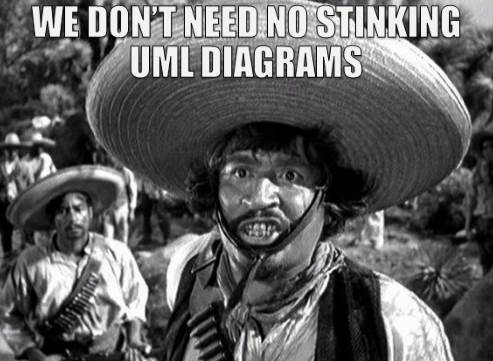
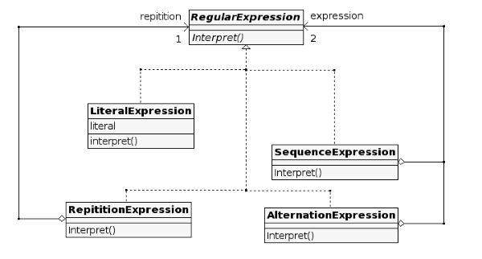
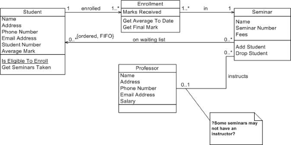
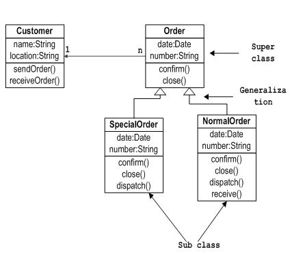
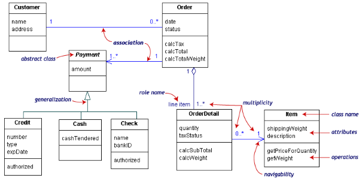
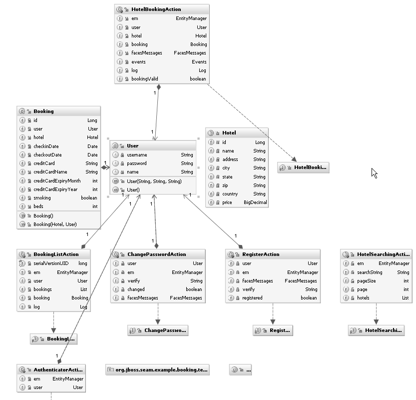
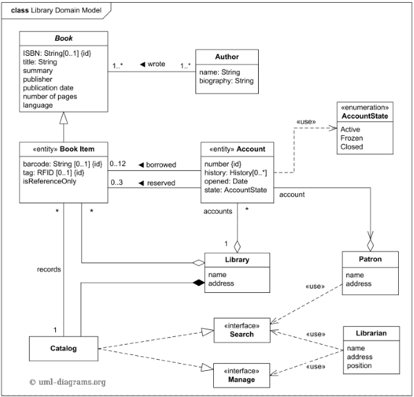
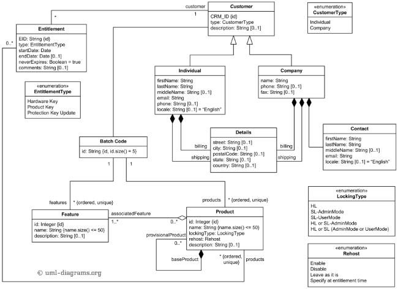

# 我们不需要臭 UML 图表

# 我们不需要臭 UML 图表

在我关于[函数式 DDD](http://fsharpforfunandprofit.com/ddd/)的演讲中，我经常使用这张幻灯片（*[上下文](http://www.slideshare.net/ScottWlaschin/ddd-with-fsharptypesystemlondonndc2013/45)*）：



当然这是对[这个著名场景](https://www.youtube.com/watch?v=gx6TBrfCW54)的误引用。哎呀，我是说[这个](https://www.youtube.com/watch?v=VqomZQMZQCQ)。

好吧，我可能有点夸张。有些 UML 图表是有用的（例如我喜欢序列图），总的来说，我认为一个好的图片或图表可以抵得上 1000 个单词。

但我相信，在许多情况下，使用 UML 绘制类图并不是必要的。

相反，像 F#（或 OCaml 或 Haskell）这样简洁的语言可以以更易读、更易写的方式传达相同的含义，最重要的是，更容易转换为*可工作的代码*！

使用 UML 图表时，你需要将它们转换为代码，有可能在转换过程中丢失一些信息。但如果设计已经在你的编程语言本身中记录，就没有转换阶段，因此设计必须始终与实现保持同步。

为了在实践中演示这一点，我决定在互联网上搜寻一些好的（和不那么好的）UML 类图，并将它们转换为 F#代码。你们可以自行比较。

## 正则表达式

让我们从一个经典的开始：正则表达式（*[来源](http://zenit.senecac.on.ca/wiki/index.php/Interpreter)*）

这是 UML 图表：



这里是 F#的等价物：

```
type RegularExpression =
    | Literal of string
    | Sequence of RegularExpression list
    | Alternation of RegularExpression * RegularExpression
    | Repetition of RegularExpression 

// An interpreter takes a string input and a RegularExpression
// and returns a value of some kind 
type Interpret<'a> =  string -> RegularExpression -> 'a 
```

这很简单明了。

## 学生选课

这里是另一个经典的例子：选课（*[来源](http://www.agilemodeling.com/artifacts/classDiagram.htm)*）。

这是 UML 图表：



这是 F#的等价物：

```
type Student = {
    Name: string
    Address: string
    PhoneNumber: string
    EmailAddress: string
    AverageMark: float
    }

type Professor= {
    Name: string
    Address: string
    PhoneNumber: string
    EmailAddress: string
    Salary: int
    }

type Seminar = {
    Name: string
    Number: string
    Fees: float
    TaughtBy: Professor option
    WaitingList: Student list
    }

type Enrollment = {
    Student : Student 
    Seminar : Seminar 
    Marks: float list
    }

type EnrollmentRepository = Enrollment list

// ==================================
// activities / use-cases / scenarios
// ==================================

type IsElegibleToEnroll = Student -> Seminar -> bool
type GetSeminarsTaken = Student -> EnrollmentRepository -> Seminar list
type AddStudentToWaitingList = Student -> Seminar -> Seminar 
```

F#反映了 UML 图表，但我发现通过为所有活动编写函数而不是绘制图片，可以揭示原始需求中的漏洞。

例如，在 UML 图表中的`GetSeminarsTaken`方法中，研讨会列表存储在哪里？如果它在`Student`类中（如图表所示），那么`Student`和`Seminar`之间存在相互递归，并且每个学生和研讨会的整个树是相互连接的，除非使用[技巧](https://stackoverflow.com/questions/19371214/entity-framework-code-first-circular-dependices)。

相反，对于函数版本，我创建了一个`EnrollmentRepository`来解耦这两个类。

同样，选课实际上是如何运作的并不清楚，所以我创建了一个`EnrollStudent`函数来明确需要哪些输入。

```
type EnrollStudent = Student -> Seminar -> Enrollment option 
```

因为该函数返回一个`option`，所以立即清楚地表明了可能会出现选课失败的情况（例如学生不符合选课条件，或者因错误而重复选课）。

## 订单和客户

这是另一个(*[来源](http://www.tutorialspoint.com/uml/uml_class_diagram.htm)*)。



这是 F#的等效代码：

```
type Customer = {name:string; location:string}

type NormalOrder = {date: DateTime; number: string; customer: Customer}
type SpecialOrder = {date: DateTime; number: string; customer: Customer}
type Order = 
    | Normal of NormalOrder
    | Special of SpecialOrder 

// these three operations work on all orders
type Confirm =  Order -> Order 
type Close =  Order -> Order 
type Dispatch =  Order -> Order 

// this operation only works on Special orders
type Receive =  SpecialOrder -> SpecialOrder 
```

我只是复制了 UML 图表，但我必须说我讨厌这个设计。它呼唤着更加细粒度的状态。

特别是`Confirm`和`Dispatch`函数很糟糕 -- 它们没有提供任何关于需要的其他输入或影响的信息。这就是写真正的代码可能会迫使你更深入地思考需求的地方。

## 订单和客户，版本 2

这是订单和客户的一个更好的版本(*[来源](http://edn.embarcadero.com/article/31863)*)。



这里是 F#的等效代码：

```
type Date = System.DateTime

// == Customer related ==

type Customer = {
    name:string
    address:string
    }

// == Item related ==

type [<Measure>] grams

type Item = {
    shippingWeight: int<grams>
    description: string
    }

type Qty = int
type Price = decimal

// == Payment related ==

type PaymentMethod = 
    | Cash
    | Credit of number:string * cardType:string * expDate:Date
    | Check of name:string * bankID: string

type Payment = {
    amount: decimal
    paymentMethod : PaymentMethod 
    }

// == Order related ==

type TaxStatus = Taxable | NonTaxable
type Tax = decimal

type OrderDetail = {
    item: Item
    qty: int
    taxStatus : TaxStatus
    }

type OrderStatus = Open | Completed

type Order = {
    date: DateTime; 
    customer: Customer
    status: OrderStatus
    lines: OrderDetail list
    payments: Payment list
    }

// ==================================
// activities / use-cases / scenarios
// ==================================
type GetPriceForQuantity = Item -> Qty -> Price

type CalcTax = Order -> Tax
type CalcTotal = Order -> Price
type CalcTotalWeight = Order -> int<grams> 
```

我进行了一些小的调整，为重量添加了度量单位，创建了表示`Qty`和`Price`的类型。

再次，这个设计可能通过更细粒度的状态得到改进，比如创建一个单独的`AuthorizedPayment`类型（确保订单只能使用授权支付），以及一个单独的`PaidOrder`类型（例如，防止您重复支付同一订单）。

这就是我所说的那种事情：

```
// Try to authorize a payment. Note that it might fail
type Authorize =  UnauthorizedPayment -> AuthorizedPayment option

// Pay an unpaid order with an authorized payment.
type PayOrder = UnpaidOrder -> AuthorizedPayment -> PaidOrder 
```

## 酒店预订

这是来自 JetBrains IntelliJ 文档的一个(*[来源](https://www.jetbrains.com/idea/help/viewing-diagram.html)*)。



这是 F#的等效代码：

```
type Date = System.DateTime

type User = {
    username: string
    password: string
    name: string
    }

type Hotel = {
    id: int
    name: string
    address: string
    city: string
    state: string
    zip: string
    country: string
    price: decimal
    }

type CreditCardInfo = {
    card: string
    name: string
    expiryMonth: int
    expiryYear: int
    }

type Booking = {
    id: int
    user: User
    hotel: Hotel
    checkinDate: Date
    checkoutDate: Date
    creditCardInfo: CreditCardInfo
    smoking: bool
    beds: int
    }

// What are these?!? And why are they in the domain?
type EntityManager = unit
type FacesMessages = unit
type Events = unit
type Log = unit

type BookingAction = {
    em: EntityManager
    user: User
    hotel: Booking
    booking: Booking
    facesMessages : FacesMessages
    events: Events 
    log: Log
    bookingValid: bool
    }

type ChangePasswordAction = {
    user: User
    em: EntityManager
    verify: string
    booking: Booking
    changed: bool
    facesMessages : FacesMessages
    }

type RegisterAction = {
    user: User
    em: EntityManager
    facesMessages : FacesMessages
    verify: string
    registered: bool
    } 
```

我必须在这里停下，抱歉。这个设计让我疯狂。我甚至无法。

这些`EntityManager`和`FacesMessages`字段是什么？当然，日志记录很重要，但为什么`Log`是域对象中的一个字段？

顺便说一下，如果你认为我是故意挑选糟糕的 UML 设计示例，所有这些图表都来自于对["uml 类图"](https://www.google.com/search?q=uml+class+diagram&tbm=isch)进行图像搜索的前几个结果。

## 图书馆

这个更好，一个图书馆领域(*[来源](http://www.uml-diagrams.org/library-domain-uml-class-diagram-example.html)*)。



这是 F#的等效代码。请注意，因为这是代码，我可以添加注释到特定类型和字段，这在 UML 中是可行的，但很麻烦。

还要注意，我可以说`ISBN: string option`来表示可选的 ISBN，而不是笨拙的`[0..1]`语法。

```
type Author = {
    name: string
    biography: string
    }

type Book = {
    ISBN: string option
    title: string
    author: Author
    summary: string
    publisher: string
    publicationDate: Date
    numberOfPages: int
    language: string
    }

type Library = {
    name: string
    address: string
    }

// Each physical library item - book, tape cassette, CD, DVD, etc. could have its own item number. 
// To support it, the items may be barcoded. The purpose of barcoding is 
// to provide a unique and scannable identifier that links the barcoded physical item 
// to the electronic record in the catalog. 
// Barcode must be physically attached to the item, and barcode number is entered into 
// the corresponding field in the electronic item record.
// Barcodes on library items could be replaced by RFID tags. 
// The RFID tag can contain item's identifier, title, material type, etc. 
// It is read by an RFID reader, without the need to open a book cover or CD/DVD case 
// to scan it with barcode reader.
type BookItem = {
    barcode: string option
    RFID: string option
    book: Book
    /// Library has some rules on what could be borrowed and what is for reference only. 
    isReferenceOnly: bool
    belongsTo: Library
    }

type Catalogue = {
    belongsTo: Library
    records : BookItem list
    }

type Patron = {
    name: string
    address: string
    }

type AccountState = Active | Frozen | Closed

type Account = {
    patron: Patron
    library: Library
    number: int
    opened: Date

    /// Rules are also defined on how many books could be borrowed 
    /// by patrons and how many could be reserved.
    history: History list

    state: AccountState
    }

and History = {
    book : BookItem
    account: Account
    borrowedOn: Date
    returnedOn: Date option
    } 
```

由于搜索和管理界面未定义，我们可以只是使用占位符(`unit`)来表示输入和输出。

```
type Librarian = {
    name: string
    address: string
    position: string
    }

/// Either a patron or a librarian can do a search
type SearchInterfaceOperator =
    | Patron of Patron
    | Librarian of Librarian

type SearchRequest = unit // to do
type SearchResult = unit // to do
type SearchInterface = SearchInterfaceOperator -> Catalogue -> SearchRequest -> SearchResult

type ManageRequest = unit // to do
type ManageResult = unit // to do

/// Only librarians can do management
type ManageInterface = Librarian -> Catalogue -> ManageRequest -> ManageResult 
```

再次，这可能不是完美的设计。例如，很难理解只有`Active`帐户才能借书，我可能会在 F#中表示为：

```
type Account = 
    | Active of ActiveAccount
    | Closed of ClosedAccount

/// Only ActiveAccounts can borrow
type Borrow = ActiveAccount -> BookItem -> History 
```

如果你想看到更现代的方法来使用 CQRS 和事件源建模这个领域，请看[这篇文章](http://thinkbeforecoding.com/post/2009/11/02/Event-Sourcing-and-CQRS-Lets-use-it)。

## 软件许可

最后一个示例来自软件许可领域(*[来源](http://www.uml-diagrams.org/software-licensing-domain-diagram-example.html?context=cls-examples)*)。



这是 F#的等效代码。

```
open System
type Date = System.DateTime
type String50 = string
type String5 = string

// ==========================
// Customer-related
// ==========================

type AddressDetails = {
    street : string option
    city : string option
    postalCode : string option
    state : string option
    country : string option
    }

type CustomerIdDescription = {
    CRM_ID : string
    description : string
    }

type IndividualCustomer = {
    idAndDescription : CustomerIdDescription
    firstName : string
    lastName : string
    middleName : string option
    email : string
    phone : string option
    locale : string option // default :  "English"
    billing : AddressDetails
    shipping : AddressDetails
    }

type Contact = {
    firstName : string
    lastName : string
    middleName : string option
    email : string
    locale : string option // default :  "English"
    }

type Company = {
    idAndDescription : CustomerIdDescription
    name : string
    phone : string option
    fax : string option
    contact: Contact
    billing : AddressDetails
    shipping : AddressDetails
    }

type Customer = 
    | Individual of IndividualCustomer
    | Company of Company 

// ==========================
// Product-related
// ==========================

/// Flags can be ORed together
[<Flags>] 
type LockingType =
    | HL 
    | SL_AdminMode 
    | SL_UserMode

type Rehost =
    | Enable
    | Disable
    | LeaveAsIs
    | SpecifyAtEntitlementTime

type BatchCode = {
    id : String5
    }

type Feature = {
    id : int
    name : String50
    description : string option
    }

type ProductInfo = {
    id : int
    name : String50
    lockingType : LockingType
    rehost : Rehost
    description : string option
    features: Feature list
    bactchCode: BatchCode
    }

type Product = 
    | BaseProduct of ProductInfo
    | ProvisionalProduct of ProductInfo * baseProduct:Product 

// ==========================
// Entitlement-related
// ==========================

type EntitlementType = 
    | HardwareKey
    | ProductKey
    | ProtectionKeyUpdate

type Entitlement = {
    EID : string
    entitlementType : EntitlementType 
    startDate : Date
    endDate : Date option
    neverExpires: bool
    comments: string option
    customer: Customer
    products: Product list
    } 
```

这个图表只是纯粹的数据，没有方法，因此没有函数类型。我觉得一些重要的业务规则没有被捕捉到。

举个例子，如果你读源代码中的注释，你会发现`EntitlementType`和`LockingType`周围有一些有趣的约束。只有某些锁定类型才能与某些权益类型一起使用。

这可能是我们可以考虑在类型系统中建模的内容，但我没有费心去做。我只是试图原样重现 UML。

## 总结

我认为这已经足够让你了解了。

我对 UML 类图的一般感觉是，它们适用于草图，与几行代码相比有些庞大。

但对于详细设计来说，它们远远不够详细。像上下文和依赖关系这样的关键事项根本不明显。在我看来，我展示过的所有 UML 图都不足以编写代码，即使是基本设计也不行。

更为严重的是，对非开发人员来说，UML 图可能非常误导人。它看起来很“正式”，可能会给人一种设计已经深思熟虑的印象，而实际上设计实际上是肤浅的，在实践中无法使用。

有异议？在评论中告诉我！
