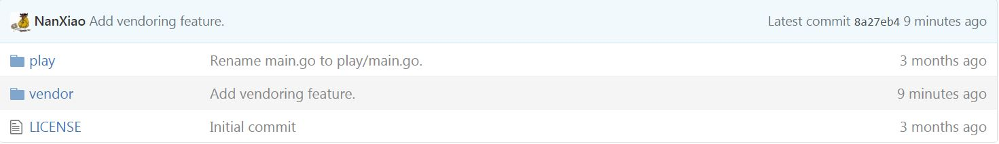

# 使用 govendor 实现依赖管理

## 使用 govendor 实现依赖管理

在`Go`中，vendoring 的含义是将一个项目的所有依赖项压缩到其`vendor`目录中。自`Go 1.6`以来，如果当前包或其父目录中有一个`vendor`目录，依赖项将首先在`vendor`目录中搜索。[Govendor](https://github.com/kardianos/govendor)就是这样一个工具，帮助你利用`vendor`功能。在下面的示例中，我将逐步演示如何使用`govendor`：

(1) 为了更清晰，我首先清理`$GOPATH`文件夹：

```
# tree
.

0 directories, 0 files 
```

(2) 我仍然使用[playstack](https://github.com/NanXiao/playstack)项目进行演示，下载它：

```
# go get github.com/NanXiao/playstack/play
# tree
.
├── bin
│   └── play
├── pkg
│   └── linux_amd64
│       └── github.com
│           └── NanXiao
│               └── stack.a
└── src
    └── github.com
        └── NanXiao
            ├── playstack
            │   ├── LICENSE
            │   └── play
            │       └── main.go
            └── stack
                ├── LICENSE
                ├── README.md
                ├── stack.go
                └── stack_test.go

11 directories, 8 files 
```

`playstack`依赖于另一个第三方包：[stack](https://github.com/NanXiao/stack)。

(3) 安装`govendor`：

```
# go get -u github.com/kardianos/govendor 
```

(4) 切换到`playstack`目录，并运行"`govendor init`"命令：

```
# cd src/github.com/NanXiao/playstack/
# govendor init
# tree
.
├── LICENSE
├── play
│   └── main.go
└── vendor
    └── vendor.json

2 directories, 3 files 
```

你可以看到额外的`vendor`文件夹，其中包含`vendor.json`文件：

```
# cat vendor/vendor.json
{
        "comment": "",
        "ignore": "test",
        "package": [],
        "rootPath": "github.com/NanXiao/playstack"
} 
```

(5) 执行"`govendor add +external`"命令：

```
# govendor add +external
# tree
.
├── LICENSE
├── play
│   └── main.go
└── vendor
    ├── github.com
    │   └── NanXiao
    │       └── stack
    │           ├── LICENSE
    │           ├── README.md
    │           └── stack.go
    └── vendor.json 
```

是的，`stack`项目现在被复制到`vendor`目录中。再次查看`vendor/vendor.json`文件：

```
# cat vendor/vendor.json
{
        "comment": "",
        "ignore": "test",
        "package": [
                {
                        "checksumSHA1": "3v5ClsvqF5lU/3E3c+1gf/zVeK0=",
                        "path": "github.com/NanXiao/stack",
                        "revision": "bfb214dbdb387d1c561b3b6f305ee0d8444c864b",
                        "revisionTime": "2016-04-01T05:28:44Z"
                }
        ],
        "rootPath": "github.com/NanXiao/playstack"
} 
```

`stack`包信息已经更新在`vendor/vendor.json`文件中。

注意："`govendor add`"会从`$GOPATH`复制包，你可以使用"`govendor fetch`"从网络下载包。你可以通过从`$GOPATH`中删除`stack`包，并执行"`govendor fetch github.com/NanXiao/stack`"命令来验证。

(6) 更新`github`中的`playstack`：



这次，清理`$GOPATH`文件夹并再次运行"`go get github.com/NanXiao/playstack/play`"：

```
# go get github.com/NanXiao/playstack/play
# tree
.
├── bin
│   └── play
├── pkg
│   └── linux_amd64
│       └── github.com
│           └── NanXiao
│               └── playstack
│                   └── vendor
│                       └── github.com
│                           └── NanXiao
│                               └── stack.a
└── src
    └── github.com
        └── NanXiao
            └── playstack
                ├── LICENSE
                ├── play
                │   └── main.go
                └── vendor
                    ├── github.com
                    │   └── NanXiao
                    │       └── stack
                    │           ├── LICENSE
                    │           ├── README.md
                    │           └── stack.go
                    └── vendor.json

18 directories, 8 files 
```

与之前的情况相比，不需要将`stack`存储在`$GOPATH/src/github.com/NanXiao`目录中，因为`playstack`已经将其嵌入到其`vendor`文件夹中。

这只是`govendor`的简单介绍，要了解更多命令的用法，你应该访问其项目[主页](https://github.com/kardianos/govendor)。

参考：

[Ruby on Rails 中“vendoring”或“to vendor”一词是什么意思？](http://stackoverflow.com/questions/11378921/what-does-the-term-vendoring-or-to-vendor-mean-for-ruby-on-rails);

[理解并使用 vendor 文件夹](https://blog.gopheracademy.com/advent-2015/vendor-folder/)；

[Go 依赖管理初学者教程](https://gocodecloud.com/blog/2016/03/29/go-vendoring-beginner-tutorial/)。
