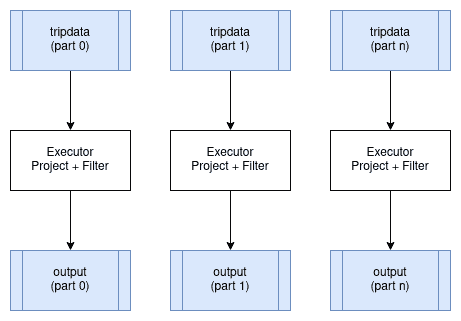
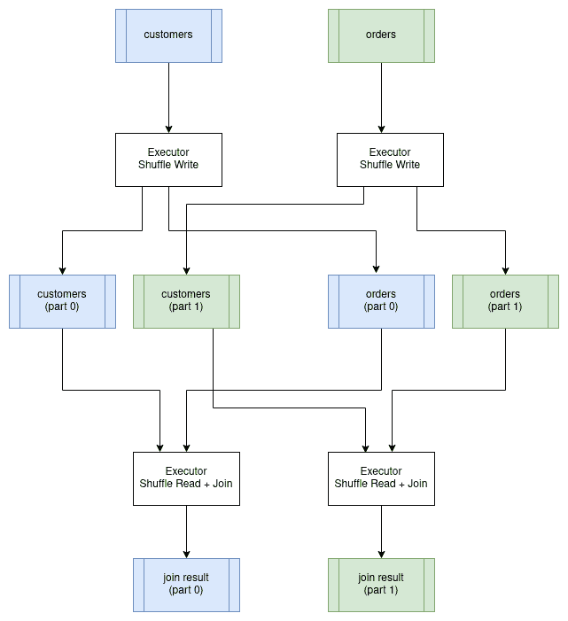

# 分布式查询执行

> 原文：[`howqueryengineswork.com/15-distributed-query.html`](https://howqueryengineswork.com/15-distributed-query.html)

上一章介绍了单机上的并行查询执行。将查询分布到多台机器上进一步发展了这些思想，使我们能够处理任何单台机器都无法处理的庞大数据集，并且能够独立于存储扩展计算资源。

分布式执行的基本挑战是协调。当操作员在不同的机器上运行时，它们无法共享内存。数据必须显式地通过网络传输，查询计划必须序列化并发送到远程执行器，任何机器上的故障都必须被检测和处理。这些开销意味着只有当收益超过成本时，分布式执行才有意义。

## 何时采用分布式

分布式执行增加了复杂性和开销。在构建或使用分布式查询引擎之前，了解何时这些开销是合理的很有价值。

数据集大小：如果你的数据可以舒适地放在一台机器上，那么在该机器上并行执行几乎总是比在集群中分布执行要快。网络传输比内存访问慢得多。盈亏平衡点取决于你的硬件，但几百 GB 以下的数据集很少能从分布中受益。

计算需求：有些查询的计算密集度足够高，以至于单台机器无法快速处理。机器学习训练、复杂模拟或具有昂贵用户定义函数的查询可能需要比任何单台机器提供的更多 CPU 核心。

存储位置：如果数据已经存在于分布式文件系统（如 HDFS）或对象存储（如 S3）中，那么将计算移动到数据所在的位置可能比将所有数据拉到一台机器上更有效率。

容错性：对于长时间运行的查询（数小时或数天），单台机器发生故障的概率变得显著。分布式执行可以检查点进度并从故障中恢复，而单机查询将不得不从头开始重新启动。

对于小于千兆字节的数据集的典型分析查询，单台配置良好的机器上的并行执行通常优于分布式集群。McSherry 等人撰写的论文“可扩展性！但代价是什么？”提供了对这个问题的有趣观点，表明许多分布式系统对于中等规模的数据集比笔记本电脑还要慢。

## 架构概述

分布式查询引擎通常由一个协调器（有时称为调度器或驱动器）和多个执行器（有时称为工作者）组成。

协调器从客户端接收查询，规划如何分配工作，将任务分配给执行器，监控进度，处理故障，并返回结果。通常有一个协调器，尽管它可能被复制以提高可用性。

执行器执行实际计算。每个执行器在其分配的数据分区上运行查询计划的一部分，并将结果流式传输到所需的位置（其他执行器、协调器或存储）。一个集群可能有数十个或数百个执行器。

协调器和执行器通过网络使用某些 RPC 协议进行通信。协调器向执行器发送查询计划片段。执行器发送状态更新和结果。对于执行器之间的数据交换（洗牌），执行器可以直接相互通信或将数据写入共享存储。

## 令人尴尬的并行运算符

一些运算符可以在每个分区上独立运行，无需执行器之间的协调。投影和过滤是最明显的例子。每个执行器对其输入分区应用相同的转换，并产生输出分区。无需在执行器之间移动数据。



这些运算符被称为“令人尴尬的并行”，因为并行化它们不需要特殊处理。分布式计划看起来就像单节点计划一样，只是不同的执行器处理不同的分区。数据的分区方案没有改变。

## 分布式聚合

在分布式执行中，聚合需要特殊处理。如前一章所述，我们将聚合分为两个阶段：每个分区的部分聚合和最终聚合，该聚合结合部分结果。

在分布式执行中，部分聚合在靠近数据的位置的执行器上运行。然后，`Exchange`运算符将部分结果移动到最终聚合发生的地方。对于如下查询：

```rs
SELECT passenger_count, MAX(fare_amount)
FROM tripdata
GROUP BY passenger_count 
```

分布式计划看起来像：

```rs
HashAggregate: groupBy=[passenger_count], aggr=[MAX(fare_amount)]
  Exchange:
    HashAggregate: groupBy=[passenger_count], aggr=[MAX(fare_amount)]
      Scan: tripdata.parquet 
```

每个执行器在其分配的`tripdata`分区上运行内部`HashAggregate`。这产生了比输入行数少得多的部分结果（每个分区中每个不同的`passenger_count`值一行）。`Exchange`运算符收集这些部分结果，外部的`HashAggregate`将它们组合成最终答案。


交换是昂贵的部分。尽管部分聚合大大减少了数据量，但我们仍然需要在网络上传输数据。对于这个查询，我们可能将数十亿输入行减少到数千个部分聚合行，但这些行仍然需要到达执行最终聚合的任何执行器。

对于按高基数列（具有许多不同值的列）分组的聚合，部分结果可能不会比输入小很多。在极端情况下，分布式开销超过了分布式初始扫描的好处。

## 分布式连接

连接通常是分布式查询执行中最昂贵的操作，因为它们通常需要在网络上跨网络传输大量数据。

挑战在于，只有当两个表中的行位于同一个执行器上时，它们才能进行连接。如果我们正在根据`customer.id = order.customer_id`将`customer`与`orders`连接，那么客户 12345 的所有订单必须由拥有客户 12345 详细信息的同一个执行器来处理。

### 洗牌连接

当两个表都很大时，我们使用洗牌连接（也称为分区散列连接）。两个表都根据连接键重新分区，确保匹配的行最终落在同一个执行器上。

该过程分为两个阶段：

1.  洗牌阶段：读取两个表，并根据连接键的散列重新分配行。具有相同连接键值的行都进入同一个分区，因此同一个执行器。这需要在网络上传输可能大量数据。

1.  连接阶段：每个执行器在其分区上执行本地散列连接。由于所有匹配的行现在都是本地的，因此不需要进一步的网络通信。



洗牌很昂贵。两个表中的每一行都必须通过网络发送到其目标执行器。对于两个十亿行表的连接，这可能意味着即使最终结果很小，也需要传输太字节的数据。

### 广播连接

当连接的一侧足够小，以至于可以在每个执行器上放入内存中时，我们可以完全避免洗牌。协调器将小表的副本发送到每个执行器。然后，每个执行器将其大表的部分与本地小表的副本进行连接。

这是以网络带宽（将小表发送到每个地方）为代价，避免了洗牌大表的大得多成本。它仅在真正的小表时才有效，通常在几个吉字节以下。

查询规划器根据表大小的估计来决定使用洗牌（shuffle）连接还是广播（broadcast）连接。如果可用统计信息，它可以自动做出这个决定。否则，用户可能需要提供提示。

### 本地连接

如果两个表已经根据连接键分区（可能是因为它们就是这样编写的，或者因为之前的操作对它们进行了分区），我们可以完全跳过洗牌。每个执行器将其来自两个表的本地分区进行连接。

这是速度最快的分布式连接，因为没有数据移动。它需要仔细的数据布局，在数据仓库中很常见，其中表被故意按频繁连接的键分区。

## 查询阶段

分布式查询不能作为一个单一单元执行。协调器必须将其分解为可以独立执行的阶段，按正确的顺序安排这些阶段，并协调它们之间的数据流。

查询阶段是查询计划的一部分，可以在不等待其他阶段的情况下运行到完成。阶段由交换操作符分隔，这些操作符代表数据必须在执行器之间打乱的位置。在一个阶段内，操作符可以流水线化：数据从操作符流向下一个操作符，而不需要物化。

考虑之前的聚合查询：

```rs
HashAggregate: groupBy=[passenger_count], aggr=[MAX(fare_amount)]
  Exchange:
    HashAggregate: groupBy=[passenger_count], aggr=[MAX(fare_amount)]
      Scan: tripdata.parquet 
```

此计划有两个阶段：

阶段 1：扫描数据并计算部分聚合。这将在所有具有数据分区的执行器上并行运行。每个执行器读取其分区，本地聚合，并将结果写入打乱文件。

阶段 2：读取阶段 1 的打乱输出并计算最终聚合。这可能在一个执行器上运行（对于需要单个结果的查询）或在多个执行器上运行（如果结果是分区的）。

阶段 2 必须在阶段 1 完成后才能开始，因为它读取阶段 1 的输出。协调器跟踪阶段依赖关系，并在输入可用时安排阶段。

## 生成分布式查询计划

将逻辑计划转换为分布式执行计划涉及确定必须发生交换的位置并将操作符分组到阶段中。阶段之间的边界发生在必须重新分区数据的地方。

考虑这个查询，它将客户与其订单连接起来：

```rs
SELECT customer.id, SUM(order.amount) AS total_amount
FROM customer JOIN order ON customer.id = order.customer_id
GROUP BY customer.id 
```

单节点物理计划看起来如下：

```rs
Projection: #customer.id, #total_amount
  HashAggregate: groupBy=[customer.id], aggr=[SUM(amount) AS total_amount]
    Join: condition=[customer.id = order.customer_id]
      Scan: customer
      Scan: order 
```

为了分发这个计划，我们需要确定交换发生的位置。假设表尚未按客户 ID 分区，连接需要打乱两个表。聚合可以在每个执行器上部分运行，但需要一个最终的聚合。

阶段 1 和 2（并行运行）：读取和打乱输入表。

```rs
Stage #1: repartition=[customer.id]
  Scan: customer

Stage #2: repartition=[order.customer_id]
  Scan: order 
```

第 3 阶段：将打乱的数据合并并计算部分聚合。由于数据现在按客户 ID 分区，因此两个表中的匹配行都在同一个执行器上。

```rs
Stage #3: repartition=[]
  HashAggregate: groupBy=[customer.id], aggr=[SUM(amount) AS total_amount]
    Join: condition=[customer.id = order.customer_id]
      Stage #1 output
      Stage #2 output 
```

阶段 4：合并部分聚合并投影最终结果。

```rs
Stage #4:
  Projection: #customer.id, #total_amount
    HashAggregate: groupBy=[customer.id], aggr=[SUM(total_amount)]
      Stage #3 output 
```

执行顺序是：阶段 1 和 2 并行运行，然后是阶段 3，然后是阶段 4。每个阶段边界都是一个交换点，其中数据要么被打乱（用于连接）要么被收集（用于最终聚合）。

## 序列化查询计划

查询调度器需要将整体查询计划的部分发送到执行器以执行。

有多种序列化查询计划的方法，以便可以在进程之间传递。许多查询引擎选择使用编程语言本地的序列化支持作为策略，如果没有要求能够在不同的编程语言之间交换查询计划，这是一个合适的选择，因为这通常是实现起来最简单的机制。

然而，使用一种与编程语言无关的序列化格式有一些优势。Ballista 使用 Google 的 [Protocol Buffers](https://developers.google.com/protocol-buffers) 格式来定义查询计划。该项目通常缩写为“protobuf”。

这里是 Ballista 协议缓冲区查询计划定义的一个子集。

*完整的源代码可以在 Ballista 的 GitHub 仓库中的`proto/ballista.proto`文件中找到。*

```rs
message LogicalPlanNode {
  LogicalPlanNode input = 1;
  FileNode file = 10;
  ProjectionNode projection = 20;
  SelectionNode selection = 21;
  LimitNode limit = 22;
  AggregateNode aggregate = 23;
}

message FileNode {
  string filename = 1;
  Schema schema = 2;
  repeated string projection = 3;
}

message ProjectionNode {
  repeated LogicalExprNode expr = 1;
}

message SelectionNode {
  LogicalExprNode expr = 2;
}

message AggregateNode {
  repeated LogicalExprNode group_expr = 1;
  repeated LogicalExprNode aggr_expr = 2;
}

message LimitNode {
  uint32 limit = 1;
} 
```

protobuf 项目提供了生成特定语言源代码的工具，用于序列化和反序列化数据。

## 序列化数据

数据在客户端和执行器之间以及执行器之间传输时也必须进行序列化。

Apache Arrow 提供了一种进程间通信（IPC）格式，用于在进程之间交换数据。由于 Arrow 提供的标准化内存布局，原始字节可以直接在内存和输入/输出设备（磁盘、网络等）之间传输，而不需要与序列化相关的典型开销。这实际上是一个零拷贝操作，因为数据不需要从内存格式转换为单独的序列化格式。

然而，关于数据的元数据，例如模式（列名和数据类型），确实需要使用[Google Flatbuffers](https://google.github.io/flatbuffers/)进行编码。这些元数据很小，通常每个结果集或每批数据只序列化一次，因此开销很小。

使用 Arrow 的另一个优点是它提供了不同编程语言之间非常高效的数据交换。

Apache Arrow IPC 定义了数据编码格式，但没有定义交换它的机制。例如，Arrow IPC 可以用于通过 JNI 将数据从 JVM 语言传输到 C 或 Rust。

## 选择协议

现在我们已经选择了查询计划和数据的序列化格式，下一个问题是我们在分布式进程之间如何交换这些数据。

Apache Arrow 提供了一个[Flight 协议](https://arrow.apache.org/blog/2019/10/13/introducing-arrow-flight/)，旨在实现这一目的。Flight 是一个新的通用客户端-服务器框架，用于简化在网络上传输大量数据集的高性能传输。

Arrow Flight 库提供了一个开发框架，用于实现可以发送和接收数据流的服务的实现。Flight 服务器支持几种基本类型的请求：

+   Handshake：一个简单的请求，用于确定客户端是否被授权，在某些情况下，用于建立用于未来请求的实现定义的会话令牌。

+   ListFlights：返回可用的数据流列表

+   GetSchema：返回数据流的模式

+   GetFlightInfo：返回一个感兴趣数据集的“访问计划”，可能需要消耗多个数据流。此请求可以接受包含自定义序列化命令的请求，例如，您的特定应用程序参数。

+   DoGet：向客户端发送数据流

+   DoPut：从客户端接收数据流

+   DoAction：执行特定实现的动作并返回任何结果，即一个通用的函数调用

+   ListActions：返回可用的动作类型列表

`GetFlightInfo`方法可以用来编译查询计划并返回接收结果所需的信息，例如，随后在每个执行器上调用`DoGet`以开始接收查询结果。

## 流式操作符与阻塞操作符

操作符在是否可以增量地流式传输结果或必须在产生输出之前等待所有输入方面有所不同。

流操作符在接收到输入后立即产生输出。过滤和投影是流式的：每个输入批次立即产生一个输出批次。流操作符的管道可以在读取输入的同时开始返回结果，从而减少延迟和内存使用。

阻塞操作符必须在产生任何输出之前接收所有输入。排序是最明显的例子：在你看到所有行之前，你无法知道哪一行是第一行。全局聚合（没有 GROUP BY）类似：在你处理完所有行之前，你不能返回最终的 SUM。

部分阻塞操作符介于两者之间。散列连接从一个输入（在该侧阻塞）构建散列表，但随后通过另一个输入流式传输。散列聚合累积结果，但在使用两阶段聚合时可以增量地输出部分聚合。

在分布式执行中，阻塞操作符创建了自然的阶段边界。所有上游工作必须完成，阻塞操作符才能产生其第一个输出。这影响了延迟（结果开始出现需要多长时间）和资源使用（中间数据必须被实体化）。

增加分区数量有助于减少阻塞时间。不再是单个执行器对十亿行数据进行排序，而是有千个执行器各自对百万行数据进行排序。最后的合并步骤仍然是必要的，但它操作的是预先排序的流，并且可以立即开始产生输出。

## 数据局部性

分布式执行中的一个关键优化是将计算移动到数据而不是将数据移动到计算。在网络中读取一个 TB 的数据比在本地对 TB 数据运行查询要花费更长的时间。

当数据存在于像 HDFS 这样的分布式文件系统中时，协调器知道哪些机器有每个数据块的本地副本。它可以分配任务给具有本地数据的执行器，从而避免初始扫描的网络传输。这被称为数据局部性或数据亲和性。

对于像 S3 这样的云对象存储，数据局部性不太相关，因为数据必须通过网络获取。然而，与存储在同一区域的执行器相比，不同区域的执行器将具有更低的延迟和更高的带宽。

阶段之间的洗牌操作必然会将数据移动到网络上，因此数据局部性仅有助于初始扫描。对于受洗牌（复杂的连接，高基数聚合）主导的查询，局部性提供的益处较少。

## 容错性

长运行分布式查询面临重大风险：数百台机器运行数小时，至少有一台机器失败的概率很高。如果没有容错机制，任何故障都意味着需要从头开始重新启动整个查询。

有几种容错方法：

检查点：定期将中间状态保存到持久存储中。如果发生故障，则从最近的检查点而不是从头开始重新启动。权衡是写入检查点的开销。

基于血缘的恢复：而不是保存中间数据，保存产生它的计算图（血缘）。如果数据丢失，则从其输入重新计算它。这是 Apache Spark 使用的方法。当血缘不是太长且重新计算成本低时，这种方法效果很好。

复制：在多台不同的机器上运行每个任务的多个副本。如果一个任务失败，则使用另一个任务的结果。这种做法以资源效率换取可靠性，通常用于关键阶段。

任务重试：如果一个任务失败，只需简单地重新运行它（可能在不同的执行器上）。这适用于暂时性故障，但需要输入数据仍然可用。

大多数生产系统结合了这些方法。早期阶段使用基于血缘的恢复（输入数据持久存储在磁盘上，因此丢失的结果可以重新计算）。昂贵的 shuffle 数据可能被复制或检查点。失败的任务在升级到阶段级恢复之前会重试几次。

## 自定义代码

通常有必要将用户定义的函数作为分布式查询的一部分运行。将代码序列化和发送到执行器会带来实际挑战。

对于单语言系统，该语言的内置序列化通常有效。Java 可以序列化 lambda 函数，Python 可以 pickle 函数（但有注意事项）。协调器将序列化代码与查询计划一起发送。

对于生产系统，代码通常预先部署到执行器。JVM 系统可能使用 Maven 坐标来下载 JAR 文件。基于容器的系统将依赖项打包到 Docker 镜像中。查询计划随后通过名称引用代码而不是内联包含它。

用户代码必须实现一个已知接口，以便执行器可以调用它。预期接口和实际接口之间的类型不匹配会导致在分布式环境中难以调试的运行时失败。

## 分布式查询优化

同一个查询可以以多种方式分发。选择最佳分发方式需要估算成本和权衡利弊。

### 成本因素

分布式执行涉及多个稀缺资源：

网络带宽：Shuffles 在机器之间传输数据。网络通常是瓶颈，尤其是在对 join 操作要求高的查询中。最小化 shuffle 大小通常是最高优先级。

内存：每个执行器都有有限的内存。用于连接和聚合的哈希表必须适合，否则会以严重的性能成本溢出到磁盘。更多的执行器意味着更多的聚合内存，但也增加了更多的协调开销。

CPU：计算本身是可并行的，但如果查询在 I/O 或网络上成为瓶颈，则好处会减少。

磁盘 I/O：读取源数据、写入洗牌文件和溢出都竞争磁盘带宽。SSD 有帮助，但有限。

货币成本：在云环境中，更多的执行器意味着更高的成本。在 100 个执行器上运行 10 分钟的查询可能在 50 个执行器上运行 15 分钟，成本减半。

### 优化策略

优化洗牌：选择最小化数据移动的连接策略。当一边较小时使用广播连接。当可用时利用本地数据。尽早过滤以减少达到洗牌的数据量。

谓词下推：尽可能将过滤器推送到数据源附近。如果存储系统支持谓词下推（如带有列统计信息的 Parquet），则从磁盘读取的数据更少。

分区修剪：跳过不可能包含匹配行的分区。当查询基于时间过滤时，时间分区数据受益极大。

基于统计的计划：有了准确的统计信息（行数、列基数、值分布），规划者可以估计成本并选择更好的策略。没有统计信息时，它必须猜测或使用保守的默认值。

### 自适应执行

前置成本估计的替代方法是自适应执行：开始运行查询并根据观察到的数据特征调整计划。

Apache Spark 的自适应查询执行动态地：

+   合并小的洗牌分区以减少开销

+   根据实际数据大小切换连接策略

+   通过拆分热分区优化倾斜连接

当统计数据不可用或过时时，自适应执行特别有价值，这在数据湖环境中很常见，因为新数据持续到达。

### 分布的成本

值得重复的是：分布式执行有开销。论文“可扩展性！但代价是什么？”（优于单线程的配置）表明，许多分布式系统对于中等规模的数据集来说比单个优化良好的机器要慢。

在扩展到集群之前，确保你已经达到了单台机器的极限。具有数百 GB RAM 和快速 NVMe 存储的现代服务器可以处理令人惊讶的大型数据集。只有当数据真正超过单机容量时，分布式系统的复杂性和运营开销才是合理的。

*本书也以 ePub、MOBI 和 PDF 格式提供购买，请访问[`leanpub.com/how-query-engines-work`](https://leanpub.com/how-query-engines-work)*

**版权所有 © 2020-2025 安迪·格鲁夫。保留所有权利。**
