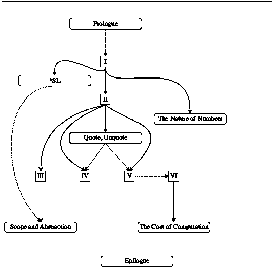

# 前言🔗

> 原文：[`htdp.org/2024-11-6/Book/part_preface.html`](https://htdp.org/2024-11-6/Book/part_preface.html)

| |   系统程序设计 |
| --- | --- |
| |   DrRacket 和教学语言 |
| |   可迁移的技能 |
| |   本书及其部分 |
| |   差异 |

许多职业都需要某种形式的编程。会计师编写电子表格；音乐家编写合成器；作家编写文字处理器；网页设计师编写样式表。当我们为这本书的第一版（1995–2000）撰写这些文字时，读者可能认为它们是未来主义的；而现在，编程已经成为一项必备技能，众多渠道——<wbr>书籍、在线课程、K-12 课程——<wbr>都迎合了这一需求，始终以提升人们的就业前景为目标。

典型的编程课程教授的是“试错直到成功”的方法。当它成功时，学生们会惊呼“它成功了！”然后继续前进。遗憾的是，这个短语也是计算机科学中最短的谎言，它已经耗费了许多人的许多小时。相比之下，这本书专注于良好编程的习惯，面向专业和职业程序员。

我们所说的“良好的编程”，是指一种从开始到每个阶段、每一步都依赖系统思维、规划和理解的软件创作方法。为了强调这一点，我们谈论系统程序设计和系统化设计的程序。关键的是，后者阐述了所需功能性的合理性。良好的编程还满足了一种成就感的审美；一个良好程序的美感可以与经过时间考验的诗篇或过去时代的黑白照片相媲美。简而言之，编程与良好编程的区别，就像餐厅里的蜡笔素描与博物馆里的油画一样。

不，这本书不会把任何人变成大师画家。但是，如果我们不相信

> 每个人都可以设计程序

和

> 每个人都可以体验到创造性设计带来的满足感。

事实上，我们更进一步地认为

> 程序设计—<wbr>但不是编程—<wbr>在文科教育中应与数学和语言技能享有同等地位。

即使不再接触程序设计，设计专业的学生仍然可以掌握普遍适用的解决问题的技能，体验一种深刻的创造性活动，并学会欣赏一种新的美学形式。本前言的其余部分将详细解释我们所说的“系统设计”是什么意思，谁从中受益以及我们如何教授它。

#### 系统程序设计🔗 "链接至此")

一个程序与人们（被称为用户）和其他程序进行交互，在这种情况下我们谈论服务器和客户端组件。因此，任何相当完整的程序都由许多构建块组成：一些处理输入，一些创建输出，而一些则在这两者之间架起桥梁。我们选择使用函数作为基本构建块，因为每个人在代数前都会遇到函数，而且最简单的程序就是这样的函数。关键是发现哪些函数是必需的，如何连接它们，以及如何从基本成分构建它们。

在这个背景下，“系统化程序设计”指的是两种概念的混合：设计食谱和迭代细化。我们从 Michael Jackson 创建 COBOL 程序的方法中汲取灵感，并与 Daniel Friedman 讨论递归，与 Robert Harper 讨论类型理论，以及与 Daniel Jackson 讨论软件设计。设计食谱是作者们的创造，在这里它们使得使用后者成为可能。

> > > 1.  从问题分析到数据定义
> > > 1.  
> > >     确定必须表示的信息以及它在所选编程语言中的表示方式。制定数据定义并用示例说明。
> > >     
> > > 1.  签名、目的陈述、头文件
> > > 1.  
> > >     说明所需函数消耗和产生哪种类型的数据。对函数计算的问题给出一个简洁的回答。定义一个符合签名的存根。
> > >     
> > > 1.  函数示例
> > > 1.  
> > >     通过说明函数目的的示例进行工作。
> > >     
> > > 1.  函数模板
> > > 1.  
> > >     将数据定义转换为函数的概要。
> > >     
> > > 1.  函数定义
> > > 1.  
> > >     在函数模板中填补空白。利用目的陈述和示例。
> > >     
> > > 1.  测试
> > > 1.  
> > >     将示例阐述为测试，并确保函数通过所有测试。这样做可以发现错误。测试还补充了示例，因为当需要时，它们有助于他人阅读和理解定义——<wbr>而且对于任何严肃的程序来说，这种情况都会发生。
> > >     
> 图 1：函数设计食谱的基本步骤

设计食谱适用于完整的程序和单个函数。本书只涉及两种完整的程序设计食谱：一种用于具有图形用户界面（GUI）的程序，另一种用于批处理程序。相比之下，函数的设计食谱种类繁多：用于原子形式的数据，如数字；用于不同类型数据的枚举；以固定方式组合其他数据的数据；有限但任意大的数据；等等。

函数级设计配方共享一个共同的设计过程。图 1 展示了其六个基本步骤。每个步骤的标题指定了预期的结果；"命令"建议了关键活动。例子在几乎每个阶段都扮演着核心角色。指导者：要求学生将图 1 复制在索引卡的另一面。当学生遇到困难时，要求他们出示卡片，并指向他们遇到困难的步骤。对于步骤 1 中选定的数据表示，写下例子证明了现实世界信息是如何编码为数据，以及数据是如何被解释为信息的。步骤 3 指出，问题解决者必须通过具体的场景来理解期望的函数对于特定示例应该计算什么。这种理解在步骤 5 中被利用，当时是定义函数的时候。最后，步骤 6 要求将例子转换为自动测试代码，这确保了函数在某些情况下能够正常工作。在现实世界数据上运行函数可能会揭示期望与结果之间的其他差异。

设计过程的每一步都伴随着明确的问题，这些问题贯穿于本书的六个部分。对于某些步骤——比如创建功能示例或模板——问题可能涉及数据定义。答案几乎自动地创建了一个中间产品。指导者：最重要的问题是步骤 4 和 5 的问题。要求学生用自己的话在索引卡的背面写下这些问题。当需要完成过程中的一个创造性步骤——即函数定义的完成时，这种支架非常有用。即使如此，几乎在所有情况下都有帮助可用。

这种方法的创新之处在于为初学者级别的程序创建了中间产品。当新手遇到困难时，专家或指导者可以检查现有的中间产品。检查可能使用设计过程中的通用问题，从而引导新手自我纠正。而这种自我赋权的过程正是编程与程序设计之间的关键区别。

迭代细化方法解决了问题复杂且多面的难题。一次性把所有事情都做对几乎是不可能的。相反，计算机科学家从物理学中借鉴了迭代细化的方法来应对这个设计问题。本质上，迭代细化建议首先去除所有非必要细节，并找到剩余核心问题的解决方案。细化步骤中添加其中一个被省略的细节，尽可能多地使用现有解决方案来重新解决扩展后的问题。这些细化步骤的重复，也称为迭代，最终导致一个完整的解决方案。

在这种意义上，程序员可以被视为微型科学家。科学家们为世界的某种理想化版本创建近似模型，以对其做出预测。只要模型的预测成真，一切就都很好；当预测事件与实际事件不同时，科学家们会修改他们的模型以减少差异。类似地，当程序员接到一个任务时，他们会创建一个初步设计，将其转化为代码，用实际用户评估它，并通过迭代改进设计，直到程序的行为与期望的产品非常接近。

本书以两种不同的方式介绍了迭代改进。由于通过改进进行设计在程序设计变得复杂时仍然有用，本书在第四部分明确介绍了这项技术，一旦问题达到一定难度。此外，我们在本书的前三部分中使用了迭代改进来陈述同一问题的越来越复杂的变体。也就是说，我们选择一个核心问题，在一章中处理它，然后在下一章提出一个类似的问题——<wbr>细节与新引入的概念相匹配。

#### DrRacket 和教学语言🔗 "链接到此处")

学习设计程序需要反复的实际操作练习。就像没有人不弹钢琴就能成为钢琴家一样，没有人不创建实际程序并使其正常工作就能成为程序设计师。因此，我们的书附带了一些软件支持：一种用于编写程序的编程语言，以及一个程序开发环境，其中程序像文档一样编辑，读者可以使用它运行程序。

我们遇到的大多数人都告诉我们他们希望知道如何编码，然后询问他们应该学习哪种编程语言。鉴于一些编程语言受到的关注，这个问题并不令人惊讶。但这也是完全不恰当的。对于不是针对初学者的课程，可能可以使用现成的语言和设计食谱。在当前流行的编程语言中学习编程往往会使学生最终失败。在这个世界中，时尚的寿命非常短暂。典型的“快速编程 X”书籍或课程未能教授可以转移到下一个时尚语言的原理。更糟糕的是，这种语言本身往往分散了对可转移技能的获取，无论是表达解决方案还是处理编程错误。

与之相反，学习设计程序主要是关于原则的研究和可迁移技能的获取。理想的编程语言必须支持这两个目标，但没有任何现成的工业语言能够做到这一点。关键问题是，初学者在了解很多语言之前就会犯错误，而编程语言总是将这些错误诊断为程序员已经完全了解整个语言。因此，诊断报告往往会让初学者感到困惑。

我们的解决方案是从我们自己的定制教学语言开始，被称为“入门学生语言”或 BSL。这种语言本质上是在预代数课程中学生们获得的“外语”。它包括函数定义、函数应用和条件表达式的符号。此外，表达式可以嵌套。因此，这种语言非常小，以至于整个语言的错误诊断对于只有预代数基础的人来说仍然是可访问的。

掌握了结构设计原则的学生可以进一步学习“中级学生语言”和其他高级方言，统称为*SL。这本书使用这些方言来教授抽象和通用递归的设计原则。我们坚信，使用这样一系列的教学语言为读者提供了为广泛的专业编程语言（JavaScript、Python、Ruby、Java 等）创建程序的优越准备。

注意：教学语言是用 Racket 实现的，这是一种我们为构建编程语言而构建的编程语言。Racket 已经从实验室走向了现实世界，并且它是在各种环境中选择的编程工具，从游戏到望远镜阵列的控制。尽管教学语言借鉴了 Racket 语言的一些元素，但这本书并不教授 Racket。然而，一个完成了这本书的学生可以很容易地过渡到 Racket。结束

当涉及到编程环境时，我们面临的选择与语言的选择一样糟糕。专业编程环境类似于大型客机的驾驶舱。它有众多的控制和显示，对于第一次启动此类软件应用的人来说会感到压倒性。新手程序员需要的是一种双座、单引擎螺旋桨飞机，他们可以用它来练习基本技能。因此，我们创建了 DrRacket，这是一种为新手设计的编程环境。

DrRacket 支持高度互动、以反馈为导向的学习，只需两个简单的交互式面板：一个定义区域，其中包含函数定义，和一个交互区域，允许程序员请求对可能引用定义的表达式进行评估。在这个背景下，探索“如果...会怎样”的情景与在电子表格应用中一样简单。实验可以从第一次接触开始，使用传统的计算器式示例，并迅速过渡到使用图像、文字和其他形式的数据进行计算。

类似于 DrRacket 的交互式程序开发环境以两种方式简化了学习过程。首先，它使新手程序员能够直接操作数据。由于不需要从文件或设备读取输入信息的设施，新手程序员不需要花费宝贵的时间去弄清楚这些是如何工作的。其次，这种安排严格地将数据和数据处理与来自“现实世界”的信息输入和输出分开。如今，这种分离被认为是软件系统化设计的基础，因此它有一个自己的名字：模型-视图-控制器架构。通过在 DrRacket 中工作，新程序员可以从一开始就自然地接触到这种基本的软件工程理念。

#### 技能迁移🔗 "链接至此")

从系统地学习设计程序中获得的技能在两个方向上转移。自然地，它们适用于通用编程以及电子表格、合成器、样式表甚至文字处理器的编程。我们的观察表明，从图 1 的设计过程几乎适用于任何编程语言，无论是 10 行程序还是 10,000 行程序。需要一些反思才能将设计过程应用于各种语言和编程问题的规模；但一旦这个过程变得习以为常，它的使用就会以多种方式带来回报。

学习设计程序也意味着获得两种普遍有用的技能。程序设计当然教授与数学相同的分析技能，特别是（预）代数和几何。但是，与数学不同，与程序一起工作是一种积极的学习方法。创建软件提供了即时反馈，从而导致了探索、实验和自我评估。结果往往是交互式产品，与教科书中的练习相比，这种方法大大增加了成就感。

除了提高学生的数学技能外，程序设计还教授分析阅读和写作技能。即使是最小的设计任务也被制定为文字问题。如果没有坚实的阅读和理解技能，就不可能设计出解决合理复杂问题的程序。相反，程序设计方法迫使创作者用适当和精确的语言表达他们的思想。确实，如果学生真正吸收了设计食谱，他们比其他任何东西都提高了他们的表达技能。

为了说明这一点，请再次审视图 1 中的过程描述。它指出，设计师必须

1.  分析问题陈述，通常以文字问题形式表达；

1.  抽取并抽象地表达其本质；

1.  用例子来说明本质；

1.  根据这种分析制定大纲和计划；

1.  根据预期结果评估结果；并且

1.  根据失败的检查和测试修订产品。

每一步都需要分析、精确、描述、专注和注意细节。任何有经验的创业者、工程师、记者、律师、科学家或任何其他专业人士都可以解释这些技能中有多少是他们在日常工作中必需的。在纸上和在 DrRacket 中进行程序设计实践——<wbr>是一种快乐地获得这些技能的方式。

同样，设计精炼不仅限于计算机科学和程序创建。建筑师、作曲家、作家和其他专业人士也在做这件事。他们从头脑中的想法开始，并以某种方式表达其本质。他们在纸上精炼这些想法，直到他们的产品尽可能多地反映他们的心理图像。当他们将想法带到纸上时，他们会运用类似于完全吸收的设计食谱的技能：绘图、写作或钢琴演奏来表达建筑的某些风格元素，描述一个人的性格，或制定旋律的部分。使他们能够通过迭代开发过程变得富有成效的是，他们已经吸收了基本的设计食谱，并学会了如何根据当前情况选择使用哪一个。

#### 本书及其部分 "链接到此处")

本书的目的在于向没有经验的读者介绍程序的系统性设计。同时，它提出了计算的符号视图，这是一种解释程序应用于数据如何工作的方法。简而言之，这种方法概括了学生在小学算术和初中代数中学到的内容。但不必担心。DrRacket 附带了一种机制——<wbr>代数步进器——可以逐步说明这些计算。

本书由六个部分组成，由五个间奏曲分隔，并以序言和结语开头。虽然主要部分侧重于程序设计，但间奏曲介绍了有关编程机制和计算的相关补充概念。

序言：如何编程是对普通编程的快速介绍。它解释了如何用*SL*编写简单的动画。一旦完成，任何初学者都可能会感到既感到有力量又感到不知所措。因此，最后的笔记解释了为什么普通编程是错误的，以及系统化、逐步的程序设计方法如何消除每个初学者通常经历的那种恐惧感。现在，书的主体部分已经准备就绪：

+   固定大小数据通过简单的例子解释了系统设计最基本的概念。核心思想是，设计师通常对程序应该消耗和产生哪些数据有一个大致的想法。因此，系统化的设计方法必须尽可能从流入和流出程序的数据描述中提取尽可能多的提示。为了保持简单，这部分从原子数据——<wbr>数字、图像等——<wbr>开始，然后逐渐介绍描述数据的新方法：区间、枚举、列举、结构和这些的组合。

+   间奏曲 1：初学者的语言详细描述了教学语言：其词汇、语法和意义。计算机科学家将这些称为语法和语义。程序设计师使用这种计算模型来预测他们的创造物在运行时的计算结果，或者分析错误诊断。

+   任意大小数据通过描述任意大小复合数据的方式扩展了固定大小数据，这是最有趣和有用的数据形式。虽然程序员可以通过嵌套固定大小数据中的数据类型来表示信息，但嵌套的深度和广度总是固定的。这部分展示了如何通过微妙的推广，从那里过渡到任意大小的数据。然后，重点转向系统化设计处理这类数据的程序。

+   间奏曲 2：引用，不引用介绍了一种简洁而强大的符号，用于记录大量数据：引用和非引用。

+   抽象承认任意大小数据中的许多函数看起来很相似。任何编程语言都不应该强迫程序员创建彼此如此相似的代码片段。相反，每个好的编程语言都提供了消除这种相似性的方法。计算机科学家将消除相似性的步骤及其结果称为抽象，并且他们知道抽象大大提高了程序员的效率。因此，这部分介绍了创建和使用抽象的设计食谱。

+   间奏曲 3：范围和抽象 扮演两个角色。一方面，它引入了词法范围的概念，即编程语言将每个名称的出现与程序员通过检查代码可以找到的定义相联系。另一方面，它解释了一个带有抽象额外机制的 teachpack，包括所谓的 for 循环。

+   交织数据 对 任意大量数据 进行了概括，并明确地将迭代细化理念引入到设计概念目录中。

+   间奏曲 4：数字的本质 解释并说明了为什么在所有编程语言中十进制数字都以如此奇怪的方式工作。每个初学者程序员都应该了解这些基本事实。

+   生成递归 添加了一个新的设计原则。虽然结构化设计和抽象对于程序员遇到的大多数问题都足够了，但它们偶尔会导致程序性能不足。也就是说，结构化设计的程序可能需要太多时间或能量来计算所需的答案。因此，计算机科学家用从问题领域获得的具体见解受益的程序来替换结构化程序。本书的这一部分展示了如何设计这样一类大量程序。

+   间奏曲 5：计算成本 使用 生成递归 中的例子来说明计算机科学家如何考虑性能。

+   累加器 为设计师的工具箱添加了一个最后的技巧：累加器。简而言之，累加器为函数添加了“记忆”。记忆的添加大大提高了书中前四部分结构化函数的性能。对于 生成递归 中的临时程序，累加器可以在找到答案和永远找不到答案之间做出区别。

后记：继续前行 既是评估也是对未来的展望。

> > > > 
> > > > 
> 图 2：部分和间奏曲之间的依赖关系

独立读者应该通读整本书，从第一页到最后一页。我们说“通读”，是因为我们真正意思是读者应该解决所有练习，或者至少知道如何解决它们。

同样，教师应该尽可能多地涵盖所有元素，从序言一直到最后的后记。我们的教学经验表明这是可行的。通常，我们组织我们的课程，让我们的读者在整个学期内创建一个规模大且有趣的程序。然而，我们理解，某些情况需要大幅削减，而某些教师的品味可能需要使用本书的不同方式。

图 2 是为那些希望从本书的元素中选择的人提供的导航图表。该图是一个依赖图。从一个元素到另一个元素的实线箭头表示强制顺序；例如，第二部分需要理解第一部分。相比之下，虚线箭头主要是建议；例如，理解序言对于通过本书的其余部分是不必要的。

基于此图表，以下是三种可行的阅读路径：

+   在学年制的中学里，一位教师可能希望尽可能多地涵盖第一和第二部分，包括一个小项目，比如一个游戏。

+   在季度制的大学里，一位教师可能希望专注于固定大小数据、任意大小数据、抽象和生成递归，以及关于*SL 和作用域*的间奏曲。

+   在学年制的大学里，一位教师可能希望尽早讨论设计中的性能权衡。在这种情况下，最好先涵盖固定大小数据和任意大小数据，然后是累加器中的累加材料，这些材料不依赖于生成递归。到那时，可以讨论间奏曲 5：计算成本，并从这一角度研究本书的其余部分。

样本主题的迭代本书反复回顾某些练习和样本主题。例如，虚拟宠物在固定大小数据中随处可见，甚至在任意大小数据中也出现了。同样，固定大小数据和任意大小数据都涵盖了实现交互式文本编辑器的替代方法。图表出现在生成递归中，紧接着又出现在累加器中。这些迭代的目的在于激发迭代细化，并通过幕后介绍它。我们敦促教师分配这些主题序列的练习，或者创建他们自己的此类序列。

#### 差异 "链接至此")

《如何设计程序》的第二版与第一版在几个主要方面有所不同：

1.  它明确承认了设计整个程序与构成程序的功能之间的区别。具体来说，本版重点介绍了两种类型的程序：事件驱动程序（主要是图形用户界面，但也包括网络）和批处理程序。

1.  程序的设计过程是从自上而下的规划阶段开始的，然后是自下而上的构建阶段。我们明确展示了库的接口如何决定了某些程序元素的形式。特别是，程序设计的第一个阶段产生了一个功能清单。虽然愿望清单的概念在第一版中已经存在，但这一版将其视为一个明确的设计元素。

1.  满足愿望清单中的条目依赖于函数设计配方，这是本书六个主要部分的主题。

1.  结构设计的关键要素是定义组成其他功能的函数。这种通过组合的设计对于批处理程序的世界特别有用。就像生成递归一样，我们感谢 Kathi Fisler 提醒我们这一点。它需要一个灵光一闪，具体来说，就是认识到一个函数通过创建中间数据，另一个函数通过处理这个中间结果来简化整体设计。这种方法也需要一个愿望清单，但制定这些愿望需要对中间数据定义进行有洞察力的开发。本书的这一版融入了关于通过组合进行设计的多个明确练习。

1.  尽管测试一直是我们的设计哲学的一部分，但教学语言和 DrRacket 直到 2002 年才真正支持它，那是在我们发布第一版之后不久。这一版的新版大量依赖于这种测试支持。

1.  本书这一版放弃了 imperative 程序的设计。旧章节仍然可在网上找到。这一材料的改编将出现在本系列的第二卷《如何设计组件》中。

1.  本书中的示例和练习使用了新的教学包。首选的样式是通过[require](http://docs.racket-lang.org/htdp-langs/beginner.html#%28form._%28%28lib._lang%2Fhtdp-beginner..rkt%29._require%29%29)链接这些教学包，但仍然可以通过 DrRacket 中的菜单添加教学包。

1.  最后，这一版与第一版在术语和符号的几个方面有所不同：

    > | 第二版 |  | 第一版 |
    > | --- | --- | --- |
    > | 签名 |  | 合同 |
    > | 项目列表 |  | 联合 |
    > | '() |  | [empty](http://docs.racket-lang.org/htdp-langs/beginner.html#%28def._%28%28lib._lang%2Fhtdp-beginner..rkt%29._empty%29%29) |
    > | #true |  | [true](http://docs.racket-lang.org/htdp-langs/beginner.html#%28def._%28%28lib._lang%2Fhtdp-beginner..rkt%29._true%29%29) |
    > | #false |  | [false](http://docs.racket-lang.org/htdp-langs/beginner.html#%28def._%28%28lib._lang%2Fhtdp-beginner..rkt%29._false%29%29) |

    最后三个差异大大提高了列表的引用。

### 第一版的致谢🔗 "链接到此处")

有四个人值得特别感谢：Robert “Corky” Cartwright，他与第一作者共同开发了莱斯大学入门课程的前身；Daniel P. Friedman，他在 1984 年要求第一作者重写《小 LISPer》（也是 MIT 出版社），因为这启动了这个项目；John Clements，他设计了、实现了并维护了 DrRacket 的步进器；以及 Paul Steckler，他通过对我们编程工具套件的贡献，忠诚地支持了团队。

书籍的开发得益于许多其他朋友和同事，他们在课程中使用它，或对早期草稿提供了详细的评论。我们感谢他们的帮助和耐心：伊恩·巴兰德（Ian Barland）、约翰·克莱门茨（John Clements）、布鲁斯·杜巴（Bruce Duba）、迈克·恩斯特（Mike Ernst）、凯西·菲斯勒（Kathi Fisler）、丹尼尔·P·弗里德曼（Daniel P. Friedman）、约翰·格雷纳（John Greiner）、热拉尔丁·莫林（Géraldine Morin）、约翰·斯坦（John Stone）和瓦尔德马尔·塔梅兹（Valdemar Tamez）。

里士满大学（Rice University）的 Comp 210 学生一代又一代地使用了文本的早期草稿，并以各种方式做出了改进。此外，许多参加我们的 TeachScheme!研讨会的人也在他们的课堂上使用了早期草稿。许多人提交了评论和建议。作为这些积极贡献者的代表，我们提到以下人员：巴巴拉·阿德勒（Ms. Barbara Adler）、斯蒂芬·布洛奇博士（Dr. Stephen Bloch）、卡伦·伯拉斯（Ms. Karen Buras）、杰克·克莱（Mr. Jack Clay）、理查德·克莱门茨博士（Dr. Richard Clemens）、凯尔·吉勒特（Mr. Kyle Gillette）、马文·埃尔南德斯（Mr. Marvin Hernandez）、迈克尔·亨特（Mr. Michael Hunt）、卡伦·诺思（Ms. Karen North）、杰米·雷蒙德（Mr. Jamie Raymond）和罗伯特·里德（Mr. Robert Reid）。克里斯托弗·费莱辛（Christopher Felleisen）耐心地与他父亲一起阅读了本书的前几部分，并提供了对年轻学生观点的直接洞察。赫沃耶·布拉泽维奇（Hrvoje Blazevic，当时作为 LPG/C 哈里埃特的船长）、乔·扎卡里（Joe Zachary，犹他大学）和丹尼尔·P·弗里德曼（Daniel P. Friedman，印第安纳大学）在第一版中发现了许多错误，我们现在已经修复了。感谢每一个人。

最后，马蒂亚斯（Matthias）对他的耐心以及为心不在焉的丈夫和父亲创造一个家的赫尔加（Helga）表示感谢。罗比（Robby）感谢辛慧慧（Hsing-Huei Huang）的支持和鼓励；没有她，他什么也做不成。马修（Matthew）感谢温媛（Wen Yuan）的持续支持和持久的音乐。希里拉姆（Shriram）对凯西·菲斯勒（Kathi Fisler）的支持、耐心和双关语表示感谢，并感谢她参与这个项目。

### 致谢🔗 "链接至此")

就像在 2001 年一样，我们感谢约翰·克莱门茨（John Clements）设计、验证、实施和维护 DrRacket 的代数步进器。他为此已经做了近 20 年，步进器已成为解释和指导不可或缺的工具。

在过去的几年里，几位同事对各种草稿提出了评论和建议。我们感谢这些人与我们进行了深思熟虑的对话和交流：

> 凯西·菲斯勒（Kathi Fisler，WPI 和布朗大学）、格雷戈尔·基查莱斯（Gregor Kiczales，不列颠哥伦比亚大学）、普拉巴卡·拉格德（Prabhakar Ragde，滑铁卢大学）和诺曼·拉姆齐（Norman Ramsey，塔夫茨大学）。

几年来，数千名教师和讲师参加了我们的各种研讨会，许多人提供了宝贵的反馈。但丹·安德森（Dan Anderson）、斯蒂芬·布洛奇（Stephen Bloch）、杰克·克莱（Jack Clay）、纳迪姆·阿卜杜勒·哈米德（Nadeem Abdul Hamid）和维耶拉·普鲁克斯（Viera Proulx）脱颖而出，我们希望强调他们在本版编纂中的作用。

吉尔·马塞尔（Guillaume Marceau）与凯西·菲斯勒（Kathi Fisler）和希里拉姆（Shriram）合作，花费数月时间研究和改进 DrRacket 的错误信息。我们对他惊人的工作表示感激。

Celeste Hollenbeck 是最令人惊叹的读者。她从不厌倦地推敲，直到理解了散文。她不会停止，直到一个部分支持其论点，其组织相匹配，其句子相连。非常感谢您令人难以置信的努力。

我们还要感谢以下人员：Ennas Abdussalam, Mark Aldrich, Mehmet Akif Akkus, Anisa Anuar, Christoph Badura, Franco Barbeite, Saad Bashir, Aaron Bauman, Suzanne Becker, Michael Bausch, Steven Belknap, Stephen Bloch, Elijah Botkin, Joseph Bogart, Sergey Bronnikov, William Brown, Tomas Cabrera, Xuyuqun C, Colin Caine, Anthony Carrico, Rodolfo Carvalho, Estevo Castro, Maria Chacon, Stephen Chang, David Chatman, Burleigh Chariton, Ni ChenYu, Tung Cheng, Nelson Chiu, Tomasz Chrzczonowicz, Jack Clay, Richard Cleis, John Clements, Scott Crymble, Pierce Darragh, Jonas Decraecker, Qu Dongfang, Dominique Dijkhuizen, Mark Engelberg, Thomas Evans, Andrew Fallows, Jiankun Fan, Christopher Felleisen, Sebastian Felleisen, Vladimir Gajić, Xin Gao, Adrian German, Jack Gitelson, Kyle Gillette, Jonathan Gordon, Scott Greene, Ben Greenman, Ryan Golbeck, Josh Grams, Grigorios, Jane Griscti, Alberto E. F. Guerrero, Tyler Hammond, Nan Halberg, Li Junsong, Nadeem Abdul Hamid, Jeremy Hanlon, Tony Henk, Craig Holbrook, Connor Hetzler, Benjamin Hosseinzahl, Wayne Iba, John Jackaman, Jordan Johnson, Blake Johnson, Erwin Junge, Marc Kaufmann, Cole Kendrick, Gregor Kiczales, Eugene Kohlbecker, Jaroslaw Kolosowski, Caitlin Kramer, Roman Kunin, Jackson Lawler, Devon LePage, Ben Lerner, Shicheng Li, Chen Lj, Ed Maphis, YuSheng Mei, Andres Meza, Saad Mhmood, Elena Machkasova, Jay Martin, Alexander Martinez, Yury Mashika, Jay McCarthy, James McDonell, Mike McHugh, Wade McReynolds, David Moses, Ann E. Moskol, Naveen M V, Scott Newson, Štěpán Němec, Paul Ojanen, Prof. Robert Ordóñez, Laurent Orseau, Klaus Ostermann, Alanna Pasco, Sinan Pehlivanoglu, Eric Parker, Nico Niemikko, David Porter, Nick Pleatsikas, Prathyush Pramod, Alok Rai, Norman Ramsey, Krishnan Ravikumar, Jacob Rubin, Ilnar Salimzianov, Luis Sanjuán, Brian Schack, Ryan “Havvy” Scheel, Lisa Scheuing, Willi Schiegel, Markus Schlegel, Vinit Shah, Nick Shelley, Edward Shen, Tubo Shi, Hyeyoung Shin, Atharva Shukla, Matthew Singer, Michael Siegel, Stephen Siegel, Milton Silva, Kartik Singhal, Joe Snikeris, Marc Smith, Matthijs Smith, Dave Smylie, Woncheol Song, Vincent St-Amour, Reed Stevens, William Stevenson, Kevin Sullivan, Yuriy Syrovetskiy, Asumu Takikawa, Éric Tanter, Sam Tobin-Hochstadt, Thanos Tsouanas, Aaron Tsay, Mariska Twaalfhoven, Bor Gonzalez Usach, Ricardo Ruy Valle-mena, Manuel del Valle, David Van Horn, Nick Vaughn, Simeon Veldstra, Andre Venter, Jan Vitek, Marco Villotta, Jiri Vlasak, Mitch Wand, Yuxu (Ewen) Wang, Michael Wijaya, G. Clifford Williams, Ewan Whittaker-Walker, Julia Wlochowski, Roelof Wobben, J.T. Wright, Mardin Yadegar, Huang Yichao, Yuwang Yin, Andrew Zipperer, Ari Zvi 对本版第二版草稿的评论。

htdp.org 上的 HTML 布局是马修·巴特里克（Matthew Butterick）的作品，他为我们的在线文档创建了这些样式。

最后，我们感谢麻省理工学院的艾达·布鲁内斯坦（Ada Brunstein）和玛丽·卢夫金·李（Marie Lufkin Lee），我们的编辑，他们允许我们在网上开发《如何设计程序》的第二版。我们还感谢麻省理工学院的克里斯汀·布里奇特·萨维奇（Christine Bridget Savage）和来自韦斯特切斯特出版服务公司的约翰·霍伊（John Hoey）管理最终的生产过程。约翰·多诺休（John Donohue）、詹妮弗·罗伯逊（Jennifer Robertson）和马克·伍兹沃斯（Mark Woodworth）在审稿方面做了出色的工作。
