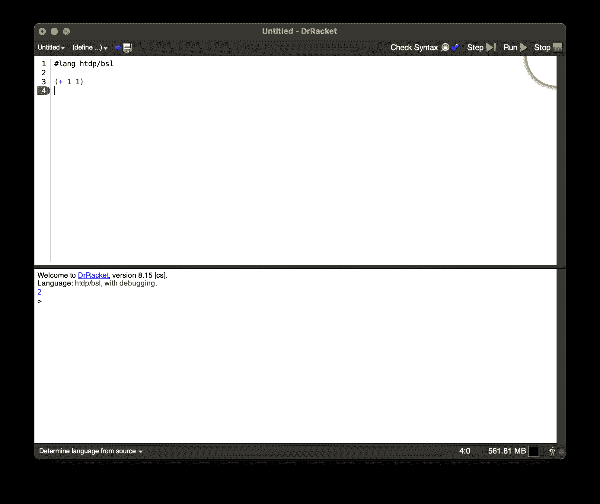
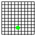
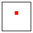
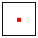
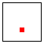
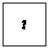
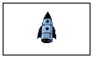
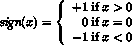
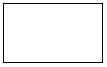

# 前言：如何编程🔗

> 原文：[`htdp.org/2024-11-6/Book/part_prologue.html`](https://htdp.org/2024-11-6/Book/part_prologue.html)

|     算术和算术 |
| --- |
|     输入和输出 |
|     多种计算方式 |
|     一个程序，多个定义 |
|     更多定义 |
|     你现在是一名程序员了 |
|     非！ |

当你还是一个小孩的时候，你的父母教你用手指计数和进行简单的计算：“1 + 1 等于 2”；“1 + 2 等于 3”；等等。然后他们会问“3 + 2 是多少？”你会数出一只手的手指。他们编写程序，你进行计算。以某种方式，这就是编程和计算的全部。

> > > 从[其网站](https://download.racket-lang.org/)下载 DrRacket。

现在是时候转换角色了。启动 DrRacket。这样做会弹出图 3 的窗口。从“语言”菜单中选择“选择语言”，这将打开一个对话框，列出“如何设计程序”的“教学语言”。选择“初学者”（初学者语言，或 BSL）并点击确定来设置 DrRacket。完成此任务后，你就可以编程了，DrRacket 软件变成了孩子。从所有计算中最简单的开始。你输入

> ([+](http://docs.racket-lang.org/htdp-langs/beginner.html#%28def._htdp-beginner._%28%28lib._lang%2Fhtdp-beginner..rkt%29._%2B%29%29) 1 1)

将其输入到 DrRacket 的上半部分，点击 RUN，底部就会出现一个 2。

> > > 
> > > 
> > > 
> > > 
> 图 3：认识 DrRacket（使用基于菜单的（顶部）和 racket-#lang（底部）教学语言）

这就是编程的简单之处。你就像对 DrRacket 这个孩子提问一样提问，DrRacket 会为你计算。你也可以让 DrRacket 同时处理多个请求：

> | ([+](http://docs.racket-lang.org/htdp-langs/beginner.html#%28def._htdp-beginner._%28%28lib._lang%2Fhtdp-beginner..rkt%29._%2B%29%29) 2 2) |
> | --- |
> | ([*](http://docs.racket-lang.org/htdp-langs/beginner.html#%28def._htdp-beginner._%28%28lib._lang%2Fhtdp-beginner..rkt%29._%2A%29%29) 3 3) |
> | ([-](http://docs.racket-lang.org/htdp-langs/beginner.html#%28def._htdp-beginner._%28%28lib._lang%2Fhtdp-beginner..rkt%29._-%29%29) 4 2) |
> | ([/](http://docs.racket-lang.org/htdp-langs/beginner.html#%28def._htdp-beginner._%28%28lib._lang%2Fhtdp-beginner..rkt%29._%2F%29%29) 6 2) |

点击 RUN 后，你会在 DrRacket 的下半部分看到 4 9 2 3，这是预期的结果。让我们放慢速度，介绍一些词汇：

+   DrRacket 的上半部分被称为定义区域。在这个区域中，你创建程序，这被称为编辑。一旦你在定义区域中添加一个单词或更改某些内容，顶部左角就会出现保存按钮。当你第一次点击保存时，DrRacket 会要求你输入一个文件名，以便它可以永久存储你的程序。一旦你的定义区域与一个文件关联，点击保存将确保定义区域的内容安全地存储在文件中。

+   程序由表达式组成。你在数学中已经见过表达式。目前，一个表达式要么是一个普通的数字，要么是以左括号“（”开头并以匹配的右括号“）”结束的东西——DrRacket 会通过为这对括号之间的区域着色来奖励你。

+   当你点击运行时，DrRacket 会评估定义区域中的表达式，并在交互区域显示其结果。然后，DrRacket，你的忠实仆人，在提示符（>）处等待你的命令。提示符的出现表明 DrRacket 正在等待你输入额外的表达式，然后它会像评估定义区域中的表达式那样评估它们：

    > | > ([+](http://docs.racket-lang.org/htdp-langs/beginner.html#%28def._htdp-beginner._%28%28lib._lang%2Fhtdp-beginner..rkt%29._%2B%29%29) 1 1) |
    > | --- |
    > | 2 |

    在提示符处输入一个表达式，按键盘上的“return”或“enter”键，然后观察 DrRacket 如何响应并显示结果。你可以根据需要多次这样做：

    > | > ([+](http://docs.racket-lang.org/htdp-langs/beginner.html#%28def._htdp-beginner._%28%28lib._lang%2Fhtdp-beginner..rkt%29._%2B%29%29) 2 2) |
    > | --- |
    > | 4 |
    > | > ([*](http://docs.racket-lang.org/htdp-langs/beginner.html#%28def._htdp-beginner._%28%28lib._lang%2Fhtdp-beginner..rkt%29._%2A%29%29) 3 3) |
    > | 9 |
    > | > ([-](http://docs.racket-lang.org/htdp-langs/beginner.html#%28def._htdp-beginner._%28%28lib._lang%2Fhtdp-beginner..rkt%29._-%29%29) 4 2) |
    > | 2 |
    > | > ([/](http://docs.racket-lang.org/htdp-langs/beginner.html#%28def._htdp-beginner._%28%28lib._lang%2Fhtdp-beginner..rkt%29._%2F%29%29) 6 2) |
    > | 3 |
    > | > ([sqr](http://docs.racket-lang.org/htdp-langs/beginner.html#%28def._htdp-beginner._%28%28lib._lang%2Fhtdp-beginner..rkt%29._sqr%29%29) 3) |
    > | 9 |
    > | > ([expt](http://docs.racket-lang.org/htdp-langs/beginner.html#%28def._htdp-beginner._%28%28lib._lang%2Fhtdp-beginner..rkt%29._expt%29%29) 2 3) |
    > | 8 |
    > | > ([sin](http://docs.racket-lang.org/htdp-langs/beginner.html#%28def._htdp-beginner._%28%28lib._lang%2Fhtdp-beginner..rkt%29._sin%29%29) 0) |
    > | 0 |
    > | > ([cos](http://docs.racket-lang.org/htdp-langs/beginner.html#%28def._htdp-beginner._%28%28lib._lang%2Fhtdp-beginner..rkt%29._cos%29%29) [pi](http://docs.racket-lang.org/htdp-langs/beginner.html#%28def._htdp-beginner._%28%28lib._lang%2Fhtdp-beginner..rkt%29._pi%29%29)) |
    > | #i-1.0 |

仔细观察最后一个数字。它的“#i”前缀代表“我并不真的知道确切的数字，所以先这样用”或者一个不精确的数字。与你的计算器或其他编程系统不同，DrRacket 是诚实的。当它不知道确切的数字时，它会用这个特殊前缀来警告你。稍后，我们将向你展示关于“计算机数字”的真正奇怪的事实，那时你将真正感激 DrRacket 发出这样的警告。到目前为止，你可能想知道 DrRacket 能否一次添加超过两个数字，答案是肯定的！事实上，它可以用两种不同的方式来做这件事：

> | > ([+](http://docs.racket-lang.org/htdp-langs/beginner.html#%28def._htdp-beginner._%28%28lib._lang%2Fhtdp-beginner..rkt%29._%2B%29%29) 2 ([+](http://docs.racket-lang.org/htdp-langs/beginner.html#%28def._htdp-beginner._%28%28lib._lang%2Fhtdp-beginner..rkt%29._%2B%29%29) 3 4)) |
> | --- |
> | 9 |
> | > ([+](http://docs.racket-lang.org/htdp-langs/beginner.html#%28def._htdp-beginner._%28%28lib._lang%2Fhtdp-beginner..rkt%29._%2B%29%29) 2 3 4) |
> | 9 |

第一个是你从学校学到的嵌套算术。第二个是 BSL 算术；后者是自然的，因为在这个表示法中，你总是使用括号来组合操作和数字。在 BSL 中，这本书不会教你 Racket，即使编辑器叫做 DrRacket。详见序言，特别是关于 DrRacket 和教学语言的章节，了解我们选择开发自己语言的选择细节。每次你想使用“计算器操作”时，你写下开括号，你想要执行的操作，比如[+](http://docs.racket-lang.org/htdp-langs/beginner.html#%28def._htdp-beginner._%28%28lib._lang%2Fhtdp-beginner..rkt%29._%2B%29%29)，操作应该作用其上的数字（用空格或甚至换行符分隔），最后，一个闭括号。操作之后的项被称为操作数。嵌套算术意味着你可以用一个表达式作为操作数，这就是为什么

> | > ([+](http://docs.racket-lang.org/htdp-langs/beginner.html#%28def._htdp-beginner._%28%28lib._lang%2Fhtdp-beginner..rkt%29._%2B%29%29) 2 ([+](http://docs.racket-lang.org/htdp-langs/beginner.html#%28def._htdp-beginner._%28%28lib._lang%2Fhtdp-beginner..rkt%29._%2B%29%29) 3 4)) |
> | --- |
> | 9 |

是一个很好的程序。你可以随心所欲地这样做：

> | > ([+](http://docs.racket-lang.org/htdp-langs/beginner.html#%28def._htdp-beginner._%28%28lib._lang%2Fhtdp-beginner..rkt%29._%2B%29%29) 2 ([+](http://docs.racket-lang.org/htdp-langs/beginner.html#%28def._htdp-beginner._%28%28lib._lang%2Fhtdp-beginner..rkt%29._%2B%29%29) ([*](http://docs.racket-lang.org/htdp-langs/beginner.html#%28def._htdp-beginner._%28%28lib._lang%2Fhtdp-beginner..rkt%29._%2A%29%29) 3 3) 4)) |
> | --- |
> | 15 |
> | > ([+](http://docs.racket-lang.org/htdp-langs/beginner.html#%28def._htdp-beginner._%28%28lib._lang%2Fhtdp-beginner..rkt%29._%2B%29%29) 2 ([+](http://docs.racket-lang.org/htdp-langs/beginner.html#%28def._htdp-beginner._%28%28lib._lang%2Fhtdp-beginner..rkt%29._%2B%29%29) ([*](http://docs.racket-lang.org/htdp-langs/beginner.html#%28def._htdp-beginner._%28%28lib._lang%2Fhtdp-beginner..rkt%29._%2A%29%29) 3 ([/](http://docs.racket-lang.org/htdp-langs/beginner.html#%28def._htdp-beginner._%28%28lib._lang%2Fhtdp-beginner..rkt%29._%2F%29%29) 12 4)) 4)) |
> | 15 |
> | > ([+](http://docs.racket-lang.org/htdp-langs/beginner.html#%28def._htdp-beginner._%28%28lib._lang%2Fhtdp-beginner..rkt%29._%2B%29%29) ([*](http://docs.racket-lang.org/htdp-langs/beginner.html#%28def._htdp-beginner._%28%28lib._lang%2Fhtdp-beginner..rkt%29._%2A%29%29) 5 5) ([+](http://docs.racket-lang.org/htdp-langs/beginner.html#%28def._htdp-beginner._%28%28lib._lang%2Fhtdp-beginner..rkt%29._%2B%29%29) ([*](http://docs.racket-lang.org/htdp-langs/beginner.html#%28def._htdp-beginner._%28%28lib._lang%2Fhtdp-beginner..rkt%29._%2A%29%29) 3 ([/](http://docs.racket-lang.org/htdp-langs/beginner.html#%28def._htdp-beginner._%28%28lib._lang%2Fhtdp-beginner..rkt%29._%2F%29%29) 12 4)) 4)) |
> | 38 |

嵌套没有限制，除非是你的耐心有限。

自然地，当 DrRacket 为你计算时，它使用你熟悉和喜爱的数学规则。就像你一样，它只能在所有操作数都是普通数字时确定加法的结果。如果一个操作数是括号内的运算表达式——<wbr>以“（”开头并包含一个运算——<wbr>它首先确定嵌套表达式的结果。与你不相同的是，它永远不需要思考先计算哪个表达式——<wbr>因为这是唯一的规则。

DrRacket 方便的代价是括号有含义。你必须输入所有这些括号，而且不能输入太多。例如，虽然额外的括号可能被你的数学老师接受，但在 BSL 中并非如此。表达式 ([+](http://docs.racket-lang.org/htdp-langs/beginner.html#%28def._htdp-beginner._%28%28lib._lang%2Fhtdp-beginner..rkt%29._%2B%29%29) (1) (2)) 包含了太多的括号，DrRacket 会明确地告诉你：

> | > ([+](http://docs.racket-lang.org/htdp-langs/beginner.html#%28def._htdp-beginner._%28%28lib._lang%2Fhtdp-beginner..rkt%29._%2B%29%29) (1) (2)) |
> | --- |
> | 函数调用：在开括号后期望一个函数，但找到一个数字 |

一旦你习惯了 BSL 编程，你就会发现这根本不是什么代价。首先，如果你这样做很自然，你可以一次性对多个操作数进行操作：

> | > ([+](http://docs.racket-lang.org/htdp-langs/beginner.html#%28def._htdp-beginner._%28%28lib._lang%2Fhtdp-beginner..rkt%29._%2B%29%29) 1 2 3 4 5 6 7 8 9 0) |
> | --- |
> | 45 |
> | > ([*](http://docs.racket-lang.org/htdp-langs/beginner.html#%28def._htdp-beginner._%28%28lib._lang%2Fhtdp-beginner..rkt%29._%2A%29%29) 1 2 3 4 5 6 7 8 9 0) |
> | 0 |

如果你不知道一个操作对多个操作数做了什么，可以将一个示例输入到交互区域并按“回车”；DrRacket 会告诉你它是否以及如何工作。或者使用 HelpDesk 阅读文档。如果你使用的是标准 BSL 选项，点击“检查语法”并注意名称现在已超链接到 HelpDesk 中的文档。如果你使用#lang htdp/bsl，操作名称始终是超链接的。右键单击任何名称，例如 [+](http://docs.racket-lang.org/htdp-langs/beginner.html#%28def._htdp-beginner._%28%28lib._lang%2Fhtdp-beginner..rkt%29._%2B%29%29)，然后从弹出菜单中选择“查看文档...”。这个操作将打开一个浏览器窗口，显示相应的文档条目。其次，当你阅读其他人编写的程序时，你永远不必 wonder 哪些表达式先被评估。括号和嵌套会立即告诉你。

在这种情况下，编程就是写下可理解的算术表达式，计算就是确定它们的值。使用 DrRacket，很容易探索这种编程和计算。

#### 算术和算术🔗 "链接到这里")

如果编程仅仅是关于数字和算术，那它就会像数学一样无聊。幸运的是，编程比数字多得多：文本、真理、图像等等。只是开个玩笑：数学是一个迷人的主题，但现在你不需要太多数学知识。

你需要知道的第一件事是，在 BSL 中，文本是任何被双引号（")包围的键盘字符序列。我们称之为字符串。因此，"hello world"是一个完美的字符串；当 DrRacket 评估这个字符串时，它只是在交互区域回显它，就像一个数字：

> | > "hello world" |
> | --- |
> | "hello world" |

的确，很多人的第一个程序就是显示这个字符串的程序。否则，你需要知道除了数字的算术之外，DrRacket 还了解字符串的算术。所以这里有两次交互，展示了这种算术形式：

> | > ([string-append](http://docs.racket-lang.org/htdp-langs/beginner.html#%28def._htdp-beginner._%28%28lib._lang%2Fhtdp-beginner..rkt%29._string-append%29%29) "hello" "world") |
> | --- |
> | "helloworld" |
> | > ([string-append](http://docs.racket-lang.org/htdp-langs/beginner.html#%28def._htdp-beginner._%28%28lib._lang%2Fhtdp-beginner..rkt%29._string-append%29%29) "hello " "world") |
> | "hello world" |

就像 [+](http://docs.racket-lang.org/htdp-langs/beginner.html#%28def._htdp-beginner._%28%28lib._lang%2Fhtdp-beginner..rkt%29._%2B%29%29) 一样，[string-append](http://docs.racket-lang.org/htdp-langs/beginner.html#%28def._htdp-beginner._%28%28lib._lang%2Fhtdp-beginner..rkt%29._string-append%29%29) 也是一个操作；它通过将第二个字符串添加到第一个字符串的末尾来创建一个新的字符串。正如第一个交互所示，它这样做是字面上的，两个字符串之间没有任何添加：没有空格，没有逗号，什么都没有。因此，如果你想看到“hello world”这个短语，你真的需要在其中一个单词中添加一个空格；这就是第二个交互所展示的。当然，从两个单词创建这个短语最自然的方式是将它们输入

> ([string-append](http://docs.racket-lang.org/htdp-langs/beginner.html#%28def._htdp-beginner._%28%28lib._lang%2Fhtdp-beginner..rkt%29._string-append%29%29) "hello" " " "world")

因为 [string-append](http://docs.racket-lang.org/htdp-langs/beginner.html#%28def._htdp-beginner._%28%28lib._lang%2Fhtdp-beginner..rkt%29._string-append%29%29)，就像 [+](http://docs.racket-lang.org/htdp-langs/beginner.html#%28def._htdp-beginner._%28%28lib._lang%2Fhtdp-beginner..rkt%29._%2B%29%29) 一样，可以处理任意数量的操作数。

你可以对字符串做更多的事情，而不仅仅是连接它们。你可以从字符串中提取片段，反转它们，将所有字母转换为大写（或小写），从左右两侧去除空白，等等。而且最好的是，你不需要记住任何这些。如果你需要知道可以对字符串做什么，请在 HelpDesk 中查找该术语。使用 F1 键或右侧的下拉菜单打开 HelpDesk。查看 BSL 手册及其关于预定义操作的章节，特别是那些关于字符串的操作。

如果你查看了 BSL 的原生操作，你会看到原生操作（有时称为预定义或内置操作）可以消耗字符串并产生数字：

> | > ([+](http://docs.racket-lang.org/htdp-langs/beginner.html#%28def._htdp-beginner._%28%28lib._lang%2Fhtdp-beginner..rkt%29._%2B%29%29) ([string-length](http://docs.racket-lang.org/htdp-langs/beginner.html#%28def._htdp-beginner._%28%28lib._lang%2Fhtdp-beginner..rkt%29._string-length%29%29) "hello world") 20) |
> | --- |
> | 31 |
> | > ([number->string](http://docs.racket-lang.org/htdp-langs/beginner.html#%28def._htdp-beginner._%28%28lib._lang%2Fhtdp-beginner..rkt%29._number-~3estring%29%29) 42) |
> | "42" |

还有一个将字符串转换为数字的操作：

> | > ([string->number](http://docs.racket-lang.org/htdp-langs/beginner.html#%28def._htdp-beginner._%28%28lib._lang%2Fhtdp-beginner..rkt%29._string-~3enumber%29%29) "42") |
> | --- |
> | 42 |

如果你期待得到“forty-two”或类似的聪明答案，抱歉，这并不是字符串计算器所能提供的。最后一个表达式提出了一个问题。如果有人使用 [string->number](http://docs.racket-lang.org/htdp-langs/beginner.html#%28def._htdp-beginner._%28%28lib._lang%2Fhtdp-beginner..rkt%29._string-~3enumber%29%29) 与一个不是数字的字符串（被字符串引号包围）呢？在这种情况下，操作会产生不同类型的结果：

> | > ([string->number](http://docs.racket-lang.org/htdp-langs/beginner.html#%28def._htdp-beginner._%28%28lib._lang%2Fhtdp-beginner..rkt%29._string-~3enumber%29%29) "hello world") |
> | --- |
> | #false |

这既不是一个数字也不是一个字符串；它是一个布尔值。与数字和字符串不同，布尔值只有两种类型：#true 和 #false。前者是真，后者是假。即便如此，DrRacket 有几个操作用于组合布尔值：

> | > ([and](http://docs.racket-lang.org/htdp-langs/beginner.html#%28form._%28%28lib._lang%2Fhtdp-beginner..rkt%29._and%29%29) #true #true) |
> | --- |
> | #true |
> | > ([and](http://docs.racket-lang.org/htdp-langs/beginner.html#%28form._%28%28lib._lang%2Fhtdp-beginner..rkt%29._and%29%29) #true #false) |
> | #false |
> | > ([or](http://docs.racket-lang.org/htdp-langs/beginner.html#%28form._%28%28lib._lang%2Fhtdp-beginner..rkt%29._or%29%29) #true #false) |
> | #true |
> | > ([or](http://docs.racket-lang.org/htdp-langs/beginner.html#%28form._%28%28lib._lang%2Fhtdp-beginner..rkt%29._or%29%29) #false #false) |
> | #false |
> | > ([not](http://docs.racket-lang.org/htdp-langs/beginner.html#%28def._htdp-beginner._%28%28lib._lang%2Fhtdp-beginner..rkt%29._not%29%29) #false) |
> | #true |

你会得到操作名称所暗示的结果。（不知道 [and](http://docs.racket-lang.org/htdp-langs/beginner.html#%28form._%28%28lib._lang%2Fhtdp-beginner..rkt%29._and%29%29)、[or](http://docs.racket-lang.org/htdp-langs/beginner.html#%28form._%28%28lib._lang%2Fhtdp-beginner..rkt%29._or%29%29) 和 [not](http://docs.racket-lang.org/htdp-langs/beginner.html#%28def._htdp-beginner._%28%28lib._lang%2Fhtdp-beginner..rkt%29._not%29%29) 的计算方式？简单：([and](http://docs.racket-lang.org/htdp-langs/beginner.html#%28form._%28%28lib._lang%2Fhtdp-beginner..rkt%29._and%29%29) x y) 只有当 x 和 y 都为真时才为真；([or](http://docs.racket-lang.org/htdp-langs/beginner.html#%28form._%28%28lib._lang%2Fhtdp-beginner..rkt%29._or%29%29) x y) 只要 x 或 y 或两者都为真时才为真；而 ([not](http://docs.racket-lang.org/htdp-langs/beginner.html#%28def._htdp-beginner._%28%28lib._lang%2Fhtdp-beginner..rkt%29._not%29%29) x) 当且仅当 x 为 #false 时结果为 #true。）将两个数字“转换为”布尔值也是有用的：

> | > ([>](http://docs.racket-lang.org/htdp-langs/beginner.html#%28def._htdp-beginner._%28%28lib._lang%2Fhtdp-beginner..rkt%29._~3e%29%29) 10 9) |
> | --- |
> | #true |
> | > ([小于](http://docs.racket-lang.org/htdp-langs/beginner.html#%28def._htdp-beginner._%28%28lib._lang%2Fhtdp-beginner..rkt%29._~3c%29%29) -1 0) |
> | #true |
> | > ([等于](http://docs.racket-lang.org/htdp-langs/beginner.html#%28def._htdp-beginner._%28%28lib._lang%2Fhtdp-beginner..rkt%29._~3d%29%29) 42 9) |
> | #false |

停止！尝试以下三个表达式：([大于等于](http://docs.racket-lang.org/htdp-langs/beginner.html#%28def._htdp-beginner._%28%28lib._lang%2Fhtdp-beginner..rkt%29._~3e~3d%29%29) 10 10), ([小于等于](http://docs.racket-lang.org/htdp-langs/beginner.html#%28def._htdp-beginner._%28%28lib._lang%2Fhtdp-beginner..rkt%29._~3c~3d%29%29) -1 0), 和 ([字符串等于](http://docs.racket-lang.org/htdp-langs/beginner.html#%28def._htdp-beginner._%28%28lib._lang%2Fhtdp-beginner..rkt%29._string~3d~3f%29%29) "design" "tinker"). 这个最后一个又不同了；但别担心，你可以做到的。有了所有这些新的数据类型——是的，数字、字符串和布尔值都是数据——以及周围漂浮的操作，很容易忘记一些基础知识，比如嵌套算术：

> | ([并且](http://docs.racket-lang.org/htdp-langs/beginner.html#%28form._%28%28lib._lang%2Fhtdp-beginner..rkt%29._and%29%29) ([或者](http://docs.racket-lang.org/htdp-langs/beginner.html#%28form._%28%28lib._lang%2Fhtdp-beginner..rkt%29._or%29%29) ([等于](http://docs.racket-lang.org/htdp-langs/beginner.html#%28def._htdp-beginner._%28%28lib._lang%2Fhtdp-beginner..rkt%29._~3d%29%29) （[字符串长度](http://docs.racket-lang.org/htdp-langs/beginner.html#%28def._htdp-beginner._%28%28lib._lang%2Fhtdp-beginner..rkt%29._string-length%29%29) "hello world")） |
> | --- |
> | （[字符串转数字](http://docs.racket-lang.org/htdp-langs/beginner.html#%28def._htdp-beginner._%28%28lib._lang%2Fhtdp-beginner..rkt%29._string-~3enumber%29%29) "11"） |
> | （[字符串等于](http://docs.racket-lang.org/htdp-langs/beginner.html#%28def._htdp-beginner._%28%28lib._lang%2Fhtdp-beginner..rkt%29._string~3d~3f%29%29) "hello world" "good morning"） |
> | （[大于等于](http://docs.racket-lang.org/htdp-langs/beginner.html#%28def._htdp-beginner._%28%28lib._lang%2Fhtdp-beginner..rkt%29._~3e~3d%29%29) （[加](http://docs.racket-lang.org/htdp-langs/beginner.html#%28def._htdp-beginner._%28%28lib._lang%2Fhtdp-beginner..rkt%29._%2B%29%29) （[字符串长度](http://docs.racket-lang.org/htdp-langs/beginner.html#%28def._htdp-beginner._%28%28lib._lang%2Fhtdp-beginner..rkt%29._string-length%29%29) "hello world") 60） 80） |

这个表达式的结果是什么？你是怎么算出来的？完全靠自己吗？还是只是把它输入到 DrRacket 的交互区域并按下了“回车”键？如果你做了后者，你认为你会在自己一个人时知道如何做这件事吗？毕竟，如果你不能预测 DrRacket 对小型表达式会做什么，你可能不希望在提交比这更大的任务时依赖它。在我们向你展示如何进行一些“真实”的编程之前，让我们再讨论一种可以增加趣味性的数据类型：图像。要将此类火箭图像插入到 DrRacket 中，请使用“插入”菜单。或者，从浏览器复制并粘贴图像到 DrRacket 中。当你将图像插入到交互区域并按回车键时

> > 

DrRacket 会回复图像。与许多其他编程语言不同，BSL 理解图像，并且它支持图像的算术运算，就像它支持数字或字符串的算术运算一样。简而言之，你的程序可以用图像进行计算，你可以在交互区域这样做。此外，BSL 程序员——<wbr>就像其他编程语言的程序员一样——<wbr>创建其他人可能觉得有用的库。使用这样的库就像用新词或新原语扩展你的词汇量一样。我们称之为教学包，因为它们对教学很有帮助。

> > > 在定义区域添加([require](http://docs.racket-lang.org/htdp-langs/beginner.html#%28form._%28%28lib._lang%2Fhtdp-beginner..rkt%29._require%29%29)  2htdp/image)，或者从语言菜单中选择添加教学包，并在预安装的 HtDP/2e 教学包菜单中选择图像。 

一个重要的教学包——<wbr>2htdp/image——<wbr>支持计算图像的宽度和高度：

> ([*](http://docs.racket-lang.org/htdp-langs/beginner.html#%28def._htdp-beginner._%28%28lib._lang%2Fhtdp-beginner..rkt%29._%2A%29%29) ([image-width](http://docs.racket-lang.org/teachpack/2htdpimage.html#%28def._%28%28lib._2htdp%2Fimage..rkt%29._image-width%29%29) ) ([image-height](http://docs.racket-lang.org/teachpack/2htdpimage.html#%28def._%28%28lib._2htdp%2Fimage..rkt%29._image-height%29%29) ))

一旦你的程序包含了教学包，点击运行会得到 1176，因为那是 28 乘以 42 图像的面积。你不必使用 Google 来查找图像，并通过“插入”菜单将它们插入到 DrRacket 程序中。你也可以指示 DrRacket 从头开始创建简单的图像：

> | > ([circle](http://docs.racket-lang.org/teachpack/2htdpimage.html#%28def._%28%28lib._2htdp%2Fimage..rkt%29._circle%29%29) 10 "solid" "red") |
> | --- |
> |  |
> | > ([rectangle](http://docs.racket-lang.org/teachpack/2htdpimage.html#%28def._%28%28lib._2htdp%2Fimage..rkt%29._rectangle%29%29) 30 20 "outline" "blue") |
> |  |

当一个表达式的结果是图像时，DrRacket 将其绘制到交互区域。但除此之外，BSL 程序将图像作为与数字类似的数据处理。特别是，BSL 有用于组合图像的操作，就像它有用于添加数字或连接字符串的操作一样：

> |
> 
> &#124; > ([overlay](http://docs.racket-lang.org/teachpack/2htdpimage.html#%28def._%28%28lib._2htdp%2Fimage..rkt%29._overlay%29%29) ([circle](http://docs.racket-lang.org/teachpack/2htdpimage.html#%28def._%28%28lib._2htdp%2Fimage..rkt%29._circle%29%29) 5 "solid" "red") &#124;
> 
> &#124;            ([rectangle](http://docs.racket-lang.org/teachpack/2htdpimage.html#%28def._%28%28lib._2htdp%2Fimage..rkt%29._rectangle%29%29) 20 20 "solid" "blue")) &#124;
> 
> |
> 
> |  |
> | --- |

以相反的顺序叠加这些图像会产生一个实心蓝色正方形：

> |
> 
> &#124; > ([overlay](http://docs.racket-lang.org/teachpack/2htdpimage.html#%28def._%28%28lib._2htdp%2Fimage..rkt%29._overlay%29%29) ([rectangle](http://docs.racket-lang.org/teachpack/2htdpimage.html#%28def._%28%28lib._2htdp%2Fimage..rkt%29._rectangle%29%29) 20 20 "solid" "blue") &#124;
> 
> &#124;            ([circle](http://docs.racket-lang.org/teachpack/2htdpimage.html#%28def._%28%28lib._2htdp%2Fimage..rkt%29._circle%29%29) 5 "solid" "red")) &#124;
> 
> |
> 
> |  |
> | --- |

停下来，对最后一个结果进行一下反思。正如你所见，[overlay](http://docs.racket-lang.org/teachpack/2htdpimage.html#%28def._%28%28lib._2htdp%2Fimage..rkt%29._overlay%29%29) 更像是 [string-append](http://docs.racket-lang.org/htdp-langs/beginner.html#%28def._htdp-beginner._%28%28lib._lang%2Fhtdp-beginner..rkt%29._string-append%29%29) 而不是 [+](http://docs.racket-lang.org/htdp-langs/beginner.html#%28def._htdp-beginner._%28%28lib._lang%2Fhtdp-beginner..rkt%29._%2B%29%29)，但它确实像 [string-append](http://docs.racket-lang.org/htdp-langs/beginner.html#%28def._htdp-beginner._%28%28lib._lang%2Fhtdp-beginner..rkt%29._string-append%29%29) “添加”字符串和 [+](http://docs.racket-lang.org/htdp-langs/beginner.html#%28def._htdp-beginner._%28%28lib._lang%2Fhtdp-beginner..rkt%29._%2B%29%29) 添加数字一样“添加”图像。这里是对这个想法的另一个说明：

> | > ([image-width](http://docs.racket-lang.org/teachpack/2htdpimage.html#%28def._%28%28lib._2htdp%2Fimage..rkt%29._image-width%29%29) ([square](http://docs.racket-lang.org/teachpack/2htdpimage.html#%28def._%28%28lib._2htdp%2Fimage..rkt%29._square%29%29) 10 "solid" "red")) |
> | --- |
> | 10 |
> 
> |
> 
> &#124; > ([image-width](http://docs.racket-lang.org/teachpack/2htdpimage.html#%28def._%28%28lib._2htdp%2Fimage..rkt%29._image-width%29%29) &#124;
> 
> |            ([overlay](http://docs.racket-lang.org/teachpack/2htdpimage.html#%28def._%28%28lib._2htdp%2Fimage..rkt%29._overlay%29%29) ([rectangle](http://docs.racket-lang.org/teachpack/2htdpimage.html#%28def._%28%28lib._2htdp%2Fimage..rkt%29._rectangle%29%29) 20 20 "solid" "blue") | 
> 
> |            ([circle](http://docs.racket-lang.org/teachpack/2htdpimage.html#%28def._%28%28lib._2htdp%2Fimage..rkt%29._circle%29%29) 5 "solid" "red"))) | 
> 
> |
> 
> | 20 |
> | --- |

这些与 DrRacket 的交互实际上并没有绘制任何东西；它们实际上只是测量它们的宽度。还有两个操作很重要：[empty-scene](http://docs.racket-lang.org/teachpack/2htdpimage.html#%28def._%28%28lib._2htdp%2Fimage..rkt%29._empty-scene%29%29) 和 [place-image](http://docs.racket-lang.org/teachpack/2htdpimage.html#%28def._%28%28lib._2htdp%2Fimage..rkt%29._place-image%29%29)。第一个创建了一个场景，一种特殊的矩形。第二个将一个图像放入这样的场景中：

> | ([place-image](http://docs.racket-lang.org/teachpack/2htdpimage.html#%28def._%28%28lib._2htdp%2Fimage..rkt%29._place-image%29%29) ([circle](http://docs.racket-lang.org/teachpack/2htdpimage.html#%28def._%28%28lib._2htdp%2Fimage..rkt%29._circle%29%29) 5 "solid" "green") |  |
> | --- | --- |
> | |            50 80 |
> | |            ([empty-scene](http://docs.racket-lang.org/teachpack/2htdpimage.html#%28def._%28%28lib._2htdp%2Fimage..rkt%29._empty-scene%29%29) 100 100)) |

您会得到这个：不完全正确。图片没有网格。我们在空场景上叠加网格，这样您就可以看到绿色点确切放置的位置。

> 

如您从这张图片中可以看到，原点（或（0，0））位于左上角。与数学不同，y 坐标是向下测量的，而不是向上。否则，图片显示了您应该预期的内容：在 100x100 的空矩形中，坐标（50，80）处有一个实心绿色圆盘。

让我们再次总结。编程就是写下算术表达式，但您不再局限于无聊的数字。在 BSL 中，算术是数字、字符串、布尔值甚至图像的算术。然而，计算仍然意味着确定表达式的值——<wbr>只不过这个值可以是字符串、数字、布尔值或图像。

现在您已经准备好编写让火箭飞行的程序了。

#### 输入和输出🔗 "链接至此")

您迄今为止编写的程序相当无聊。您写下了一个或几个表达式；您点击运行；您看到一些结果。如果您再次点击运行，您将看到完全相同的结果。事实上，您可以随时点击运行，并且会显示相同的结果。简而言之，您的程序实际上就像口袋计算器上的计算一样，只不过 DrRacket 使用各种数据来计算，而不仅仅是数字。

这是个好消息，也是个坏消息。好消息是，编程和计算应该是使用计算器的自然推广。坏消息是，编程的目的是处理大量数据，并得到许多不同的结果，这些结果在计算上或多或少是相同的。（它还应该快速计算这些结果，至少比我们快。）也就是说，在你学会编程之前，你还需要学习更多。不过，不用担心：凭借你对数字、字符串、布尔值和图像的算术知识，你几乎准备好编写一个创建电影的程序了，而不仅仅是显示“hello world”的愚蠢程序。这正是我们接下来要做的。

Just in case you didn’t know, a movie is a sequence of images that are rapidly displayed in order. If your algebra teachers had known about the “arithmetic of images” that you saw in the preceding section, you could have produced movies in algebra instead of boring number sequences. Well, here is one more such table:

> | x = |  | 1 |  | 2 |  | 3 |  | 4 |  | 5 |  | 6 |  | 7 |  | 8 |  | 9 |  | 10 |
> | --- | --- | --- | --- | --- | --- | --- | --- | --- | --- | --- | --- | --- | --- | --- | --- | --- | --- | --- | --- | --- |
> |  |
> | y = |  | 1 |  | 4 |  | 9 |  | 16 |  | 25 |  | 36 |  | 49 |  | 64 |  | 81 |  | ? |

你的老师现在会要求你填写空白，也就是说，用数字替换“？”标记。

结果表明，制作一部电影并不比完成一个像那样的数字表格更复杂。事实上，这完全关乎这样的表格：

> | x = |  | 1 |  | 2 |  | 3 |  | 4 |
> | --- | --- | --- | --- | --- | --- | --- | --- | --- |
> |  |
> | y = |  |  |  |  |  |  |  |  |

具体来说，你的老师应该要求你在这里画出第四个图像，第五个，以及第 1273 个图像，因为一部电影就是很多图像的连续显示，每秒大约有 20 或 30 个图像。因此，你需要大约 1200 到 1800 个图像来制作一分钟的影片。你可能也记得，你的老师不仅要求你给出某个序列中的第四个或第五个数，还要求给出一个表达式，从给定的 x 值确定序列中的任何元素。在数字示例中，老师希望看到类似这样的东西：

> 

如果你将 1，2，3 等依次代入 x，你会得到 y 的值，如 1，4，9 等——正如表格所示。对于图像序列，你可以说

> y = 包含一个点 x2 像素低于顶部的图像。

关键在于这些一行代码不仅仅是表达式，而是函数。乍一看，函数就像表达式一样，总是左边有一个 y，后面跟着一个等号，然后是一个表达式。然而，它们并不是表达式。而且，你在学校经常看到的函数的符号是完全误导人的。因此，在 DrRacket 中，你写函数的方式略有不同：

> ([定义](http://docs.racket-lang.org/htdp-langs/beginner.html#%28form._%28%28lib._lang%2Fhtdp-beginner..rkt%29._define%29%29) (y x) ([乘](http://docs.racket-lang.org/htdp-langs/beginner.html#%28def._htdp-beginner._%28%28lib._lang%2Fhtdp-beginner..rkt%29._%2A%29%29) x x))

The [定义](http://docs.racket-lang.org/htdp-langs/beginner.html#%28form._%28%28lib._lang%2Fhtdp-beginner..rkt%29._define%29%29) says “consider y a function,” which, like an expression, computes a value. A function’s value, though, depends on the value of something called the input, which we express with (y  x). Since we don’t know what this input is, we use a name to represent the input. Following the mathematical tradition, we use x here to stand in for the unknown input; but pretty soon, we will use all kinds of names.

This second part means you must supply one number—<wbr>for x—<wbr>to determine a specific value for y. When you do, DrRacket plugs the value for x into the expression associated with the function. Here the expression is ([乘](http://docs.racket-lang.org/htdp-langs/beginner.html#%28def._htdp-beginner._%28%28lib._lang%2Fhtdp-beginner..rkt%29._%2A%29%29)  x  x). Once x is replaced with a value, say 1, DrRacket can compute the result of the expressions, which is also called the output of the function.

Click RUN and watch nothing happen. Nothing shows up in the interactions area. Nothing seems to change anywhere else in DrRacket. It is as if you hadn’t accomplished anything. But you did. You actually defined a function and informed DrRacket about its existence. As a matter of fact, the latter is now ready for you to use the function. Enter

> (y 1)

at the prompt in the interactions area and watch a 1 appear in response. The (y  1) is called a function application in DrRacket.Mathematics also calls y(1) a function application, but your teachers forgot to tell you. Try

> (y 2)

and see a 4 pop out. Of course, you can also enter all these expressions in the definitions area and click RUN:

> | ([定义](http://docs.racket-lang.org/htdp-langs/beginner.html#%28form._%28%28lib._lang%2Fhtdp-beginner..rkt%29._define%29%29) (y x) ([乘](http://docs.racket-lang.org/htdp-langs/beginner.html#%28def._htdp-beginner._%28%28lib._lang%2Fhtdp-beginner..rkt%29._%2A%29%29) x x)) |
> | --- |
> |   |
> | (y 1) |
> | (y 2) |
> | (y 3) |
> | (y 4) |
> | (y 5) |

In response, DrRacket displays: 1  4  9  16  25, which are the numbers from the table. Now determine the missing entry.What all this means for you is that functions provide a rather economic way of computing lots of interesting values with a single expression. Indeed, programs are functions; and once you understand functions well, you know almost everything there is to know about programming. Given their importance, let’s recap what we know about functions so far:

+   First,

    > ([定义](http://docs.racket-lang.org/htdp-langs/beginner.html#%28form._%28%28lib._lang%2Fhtdp-beginner..rkt%29._define%29%29)  (FunctionName  InputName)  BodyExpression)

    是一个函数定义。你可以通过它以“[define](http://docs.racket-lang.org/htdp-langs/beginner.html#%28form._%28%28lib._lang%2Fhtdp-beginner..rkt%29._define%29%29)”关键字开头来识别它。它本质上由三部分组成：两个名称和一个表达式。第一个名称是函数的名称；你需要它来多次应用函数。第二个名称——<wbr>称为参数——<wbr>代表函数的输入，直到你应用函数之前它是未知的。表达式，称为主体，计算特定输入的函数输出。

+   第二，

    > (FunctionName  ArgumentExpression)

    是一个函数应用。第一部分告诉 DrRacket 你希望使用哪个函数。第二部分是你想要应用函数的输入。如果你正在阅读 Windows 或 Mac 手册，它可能会告诉你这个表达式“启动”了一个名为 FunctionName 的“应用程序”，并且它将处理 ArgumentExpression 作为输入。像所有表达式一样，后者可能是一段普通的数据或一个深度嵌套的表达式。

函数不仅可以输入数字，还可以输出各种类型的数据。我们的下一个任务是创建一个函数来模拟第二个表格——<wbr>包含彩色点图像的表格——<wbr>就像第一个函数模拟了数字表格一样。由于从高中开始，你并不了解如何从表达式创建图像，所以让我们从简单开始。你还记得[empty-scene](http://docs.racket-lang.org/teachpack/2htdpimage.html#%28def._%28%28lib._2htdp%2Fimage..rkt%29._empty-scene%29%29)吗？我们在上一个部分的结尾简要提到了它。当你将它输入到交互区域时，就像这样：

> | > ([empty-scene](http://docs.racket-lang.org/teachpack/2htdpimage.html#%28def._%28%28lib._2htdp%2Fimage..rkt%29._empty-scene%29%29) 100 60) |
> | --- |
> |  |

DrRacket 会生成一个空矩形，也称为场景。你可以使用[place-image](http://docs.racket-lang.org/teachpack/2htdpimage.html#%28def._%28%28lib._2htdp%2Fimage..rkt%29._place-image%29%29)将图像添加到场景中：

> | > ([place-image](http://docs.racket-lang.org/teachpack/2htdpimage.html#%28def._%28%28lib._2htdp%2Fimage..rkt%29._place-image%29%29)  50 23 ([empty-scene](http://docs.racket-lang.org/teachpack/2htdpimage.html#%28def._%28%28lib._2htdp%2Fimage..rkt%29._empty-scene%29%29) 100 60)) |
> | --- |
> |  |

将火箭想象成类似于你数学课上表格中的点的物体。不同之处在于火箭更有趣。接下来，你应该让火箭下降，就像上面表格中的点一样。从前一节中，你知道如何通过增加提供给 [place-image](http://docs.racket-lang.org/teachpack/2htdpimage.html#%28def._%28%28lib._2htdp%2Fimage..rkt%29._place-image%29%29) 的 y 坐标来实现这种效果：

> | > ([放置图像](http://docs.racket-lang.org/teachpack/2htdpimage.html#%28def._%28%28lib._2htdp%2Fimage..rkt%29._place-image%29%29)  50 20 ([空场景](http://docs.racket-lang.org/teachpack/2htdpimage.html#%28def._%28%28lib._2htdp%2Fimage..rkt%29._empty-scene%29%29) 100 60)) |
> | --- |
> |  |
> | > ([放置图像](http://docs.racket-lang.org/teachpack/2htdpimage.html#%28def._%28%28lib._2htdp%2Fimage..rkt%29._place-image%29%29)  50 30 ([空场景](http://docs.racket-lang.org/teachpack/2htdpimage.html#%28def._%28%28lib._2htdp%2Fimage..rkt%29._empty-scene%29%29) 100 60)） |
> |  |
> | > ([放置图像](http://docs.racket-lang.org/teachpack/2htdpimage.html#%28def._%28%28lib._2htdp%2Fimage..rkt%29._place-image%29%29)  50 40 ([空场景](http://docs.racket-lang.org/teachpack/2htdpimage.html#%28def._%28%28lib._2htdp%2Fimage..rkt%29._empty-scene%29%29) 100 60)) |
> |  |

现在需要的是轻松地生成大量这些场景，并以快速顺序显示它们。

> > > | ([定义](http://docs.racket-lang.org/htdp-langs/beginner.html#%28form._%28%28lib._lang%2Fhtdp-beginner..rkt%29._define%29%29) (火箭图片 高度) |
> > > | --- |
> > > | （[放置图像](http://docs.racket-lang.org/teachpack/2htdpimage.html#%28def._%28%28lib._2htdp%2Fimage..rkt%29._place-image%29%29)  50 高度 ([空场景](http://docs.racket-lang.org/teachpack/2htdpimage.html#%28def._%28%28lib._2htdp%2Fimage..rkt%29._empty-scene%29%29) 100 60)） |
> > > 
> 图 4：火箭着陆（版本 1）

当然，第一个目标可以通过一个函数来实现；参见图 4。在 BSL 中，你可以在名称中使用所有类型的字符，包括“-”和“.”。是的，这是一个函数定义。它使用 picture-of-rocket 而不是 y 作为名称，这个名字立即告诉你函数的输出：一个火箭场景。它使用 height 而不是 x 作为其参数的名称，这个名字暗示它是一个数字，并且它告诉函数火箭放置的位置。函数的主体表达式与我们刚刚实验的一系列表达式完全一样，只是它使用 height 代替了数字。我们可以用这个函数轻松地创建所有这些图像：

> | (picture-of-rocket 0) |
> | --- |
> | (picture-of-rocket 10) |
> | (picture-of-rocket 20) |
> | (picture-of-rocket 30) |

在定义区域或交互区域尝试这个；两者都会创建预期的场景。第二个目标需要了解来自另一个教学包的原始操作：2htdp/universe: [animate](http://docs.racket-lang.org/teachpack/2htdpuniverse.html#%28def._%28%28lib._2htdp%2Funiverse..rkt%29._animate%29%29)。

> > > 将([require](http://docs.racket-lang.org/htdp-langs/beginner.html#%28form._%28%28lib._lang%2Fhtdp-beginner..rkt%29._require%29%29)  2htdp/universe)添加到定义区域，或者从语言菜单中选择添加教学包，并在预安装的 HtDP/2e 教学包菜单中选择 universe。

因此，点击运行并输入以下表达式：

> > ([animate](http://docs.racket-lang.org/teachpack/2htdpuniverse.html#%28def._%28%28lib._2htdp%2Funiverse..rkt%29._animate%29%29) picture-of-rocket)

停下来注意，参数表达式是一个函数。现在不必担心将函数用作参数；它与[animate](http://docs.racket-lang.org/teachpack/2htdpuniverse.html#%28def._%28%28lib._2htdp%2Funiverse..rkt%29._animate%29%29)一起工作得很好，但不要尝试在家中定义像[animate](http://docs.racket-lang.org/teachpack/2htdpuniverse.html#%28def._%28%28lib._2htdp%2Funiverse..rkt%29._animate%29%29)这样的函数。

一旦按下“返回”键，DrRacket 就会评估表达式；但它不会显示结果，甚至没有提示。它打开另一个窗口——<wbr>一个画布——<wbr>并开始一个每秒滴答 28 次的时钟。每当时钟滴答时，DrRacket 都会将 picture-of-rocket 应用于自该函数调用以来经过的滴答次数。这些函数调用的结果会在画布上显示，并产生动画电影的效果。模拟运行直到你关闭窗口。到那时，[animate](http://docs.racket-lang.org/teachpack/2htdpuniverse.html#%28def._%28%28lib._2htdp%2Funiverse..rkt%29._animate%29%29)返回经过的滴答次数。

问题是窗口上的图像从哪里来。简短的解释是，[animate](http://docs.racket-lang.org/teachpack/2htdpuniverse.html#%28def._%28%28lib._2htdp%2Funiverse..rkt%29._animate%29%29) 在数字 0、1、2 等上运行其操作数，练习 298 解释了如何设计 [animate](http://docs.racket-lang.org/teachpack/2htdpuniverse.html#%28def._%28%28lib._2htdp%2Funiverse..rkt%29._animate%29%29)，并显示结果图像。长解释如下：

+   [animate](http://docs.racket-lang.org/teachpack/2htdpuniverse.html#%28def._%28%28lib._2htdp%2Funiverse..rkt%29._animate%29%29) 开始计时并计算滴答声的数量；

+   时钟每秒滴答 28 次；

+   每当时钟滴答一次，[animate](http://docs.racket-lang.org/teachpack/2htdpuniverse.html#%28def._%28%28lib._2htdp%2Funiverse..rkt%29._animate%29%29) 就将函数 picture-of-rocket 应用到当前的时钟滴答上；并且

+   该应用程序创建的场景将显示在画布上。

这意味着火箭最初出现在高度 0，然后是 1，然后是 2，以此类推，这解释了为什么火箭从画布顶部下降到底部。也就是说，我们的三行程序在大约 3.5 秒内创建了一百多张图片，快速显示这些图片就产生了火箭下降到地面的效果。

所以，这就是你在本节中学到的内容。函数很有用，因为它们可以在短时间内处理大量数据。你可以手动在几个选定的输入上启动一个函数，以确保它产生正确的输出。这被称为测试一个函数。或者，DrRacket 可以在教具包的帮助下在许多输入上启动一个函数；当你这样做时，你就是在运行该函数。自然地，DrRacket 可以在你按下键盘上的键或操纵电脑鼠标时启动函数。要了解如何操作，请继续阅读。触发函数应用的东西并不重要，但请记住，（简单的）程序是函数。

#### 许多计算方式🔗 "链接到这里")

当你评估 ([animate](http://docs.racket-lang.org/teachpack/2htdpuniverse.html#%28def._%28%28lib._2htdp%2Funiverse..rkt%29._animate%29%29) picture-of-rocket) 时，火箭最终会消失到地面。正如 Venkat Pamulapati 所说，SpaceX 自这些话被写下来以来已经垂直着陆了许多火箭。这显然很愚蠢。旧科幻电影中的火箭不会沉入地面；它们优雅地降落在底部，电影应该就在那里结束。

这个想法表明，根据情况的不同，计算应该以不同的方式进行。在我们的例子中，火箭图片程序应该“按原样”工作，当火箭在飞行时。然而，当火箭的底部接触到画布底部时，它应该停止火箭进一步下降。

在某种意义上，这个想法对你来说不应该陌生。即使你的数学老师也会定义函数来区分各种情况：

> 

这个符号函数区分了三种输入类型：大于 0 的数、等于 0 的数和小于 0 的数。根据输入的不同，函数的结果是 +1、0 或 -1。你可以使用条件表达式在 DrRacket 中轻松定义这个函数：

> | （[define](http://docs.racket-lang.org/htdp-langs/beginner.html#%28form._%28%28lib._lang%2Fhtdp-beginner..rkt%29._define%29%29) (sign x)） |
> | --- |
> | （[cond](http://docs.racket-lang.org/htdp-langs/beginner.html#%28form._%28%28lib._lang%2Fhtdp-beginner..rkt%29._cond%29%29)） |
> | （[([>](http://docs.racket-lang.org/htdp-langs/beginner.html#%28def._htdp-beginner._%28%28lib._lang%2Fhtdp-beginner..rkt%29._~3e%29%29) x 0) 1]） |
> | （[([=](http://docs.racket-lang.org/htdp-langs/beginner.html#%28def._htdp-beginner._%28%28lib._lang%2Fhtdp-beginner..rkt%29._~3d%29%29) x 0) 0]） |
> | （[([<](http://docs.racket-lang.org/htdp-langs/beginner.html#%28def._htdp-beginner._%28%28lib._lang%2Fhtdp-beginner..rkt%29._~3c%29%29) x 0) -1]）） |

点击 RUN 后，你可以像使用其他函数一样与 sign 交互：在 DrRacket 中打开一个新标签页，并从一张白纸开始。

> | > (sign 10) |
> | --- |
> | 1 |
> | > (sign -5) |
> | -1 |
> | > (sign 0) |
> | 0 |
> 
> > > 这是个探索 STEP 按钮功能的好时机。在定义区域添加 (sign -5)，然后点击 STEP 来运行上面的符号程序。当新窗口出现时，点击左右箭头。

一般而言，条件表达式具有以下形状

> | （[cond](http://docs.racket-lang.org/htdp-langs/beginner.html#%28form._%28%28lib._lang%2Fhtdp-beginner..rkt%29._cond%29%29)） |
> | --- |
> | （[ConditionExpression1 ResultExpression1]） |
> | （[ConditionExpression2 ResultExpression2]） |
> | （...） |
> | （[ConditionExpressionN ResultExpressionN]） |

那就是说，一个[条件](http://docs.racket-lang.org/htdp-langs/beginner.html#%28form._%28%28lib._lang%2Fhtdp-beginner..rkt%29._cond%29%29)表达式由所需数量的条件行组成。每一行包含两个表达式：左边的一个通常被称为条件，右边的一个被称为结果；偶尔我们也会使用问题和答案。为了评估一个[条件](http://docs.racket-lang.org/htdp-langs/beginner.html#%28form._%28%28lib._lang%2Fhtdp-beginner..rkt%29._cond%29%29)表达式，DrRacket 会评估第一个条件表达式，ConditionExpression1。如果这产生#true，DrRacket 会将[条件](http://docs.racket-lang.org/htdp-langs/beginner.html#%28form._%28%28lib._lang%2Fhtdp-beginner..rkt%29._cond%29%29)表达式替换为 ResultExpression1，评估它，并使用该值作为整个[条件](http://docs.racket-lang.org/htdp-langs/beginner.html#%28form._%28%28lib._lang%2Fhtdp-beginner..rkt%29._cond%29%29)表达式的结果。如果 ConditionExpression1 的评估产生#false，DrRacket 会丢弃第一行并重新开始。如果所有条件表达式都评估为#false，DrRacket 会发出错误信号。

> > > | ([定义](http://docs.racket-lang.org/htdp-langs/beginner.html#%28form._%28%28lib._lang%2Fhtdp-beginner..rkt%29._define%29%29) (picture-of-rocket.v2 高度) |
> > > | --- |
> > > |   ([条件](http://docs.racket-lang.org/htdp-langs/beginner.html#%28form._%28%28lib._lang%2Fhtdp-beginner..rkt%29._cond%29%29) |
> > > |     ([小于等于](http://docs.racket-lang.org/htdp-langs/beginner.html#%28def._htdp-beginner._%28%28lib._lang%2Fhtdp-beginner..rkt%29._~3c~3d%29%29) 高度 60) |
> > > |      ([放置图像](http://docs.racket-lang.org/teachpack/2htdpimage.html#%28def._%28%28lib._2htdp%2Fimage..rkt%29._place-image%29%29)  50 高度) |
> > > |                   ([空场景](http://docs.racket-lang.org/teachpack/2htdpimage.html#%28def._%28%28lib._2htdp%2Fimage..rkt%29._empty-scene%29%29) 100 60))] |
> > > |     ([大于](http://docs.racket-lang.org/htdp-langs/beginner.html#%28def._htdp-beginner._%28%28lib._lang%2Fhtdp-beginner..rkt%29._~3e%29%29) 高度 60) |
> > > |      ([放置图像](http://docs.racket-lang.org/teachpack/2htdpimage.html#%28def._%28%28lib._2htdp%2Fimage..rkt%29._place-image%29%29)  50 60 |
> > > |                   ([空场景](http://docs.racket-lang.org/teachpack/2htdpimage.html#%28def._%28%28lib._2htdp%2Fimage..rkt%29._empty-scene%29%29) 100 60))])) |
> > > 
> 图 5：火箭着陆（版本 2）

带着这些知识，你现在可以改变模拟的进程。目标是不要让火箭下降到 100x60 场景的地面以下。由于 picture-of-rocket 函数消耗了它应该在场景中放置火箭的高度，因此将给定的高度与最大高度进行比较的简单测试似乎就足够了。

见 图 5 以查看修改后的函数定义。定义使用 picture-of-rocket.v2 名称来区分两个版本。使用不同的名称还允许我们在交互区域使用这两个函数并比较结果。以下是原始版本的工作方式：

> | > (picture-of-rocket 5555) |
> | --- |
> |  |

这里还有第二个：

> | > (picture-of-rocket.v2 5555) |
> | --- |
> |  |

无论你给 picture-of-rocket.v2 提供什么数字，如果它超过 60，你都会得到相同的场景。特别是当你运行

> > ([animate](http://docs.racket-lang.org/teachpack/2htdpuniverse.html#%28def._%28%28lib._2htdp%2Funiverse..rkt%29._animate%29%29) picture-of-rocket.v2)

火箭下降并沉入地面一半后才停止。

停止！你认为我们想看到什么？

将火箭降落到这么低的地方看起来很糟糕。然而，你知道如何修复这个程序的这个方面。正如你所见，BSL 理解图像的算术。当 [place-image](http://docs.racket-lang.org/teachpack/2htdpimage.html#%28def._%28%28lib._2htdp%2Fimage..rkt%29._place-image%29%29) 将图像添加到场景中时，它使用其中心点作为整个图像，即使图像有实际的高度和宽度。你可能还记得，你可以使用 [image-height](http://docs.racket-lang.org/teachpack/2htdpimage.html#%28def._%28%28lib._2htdp%2Fimage..rkt%29._image-height%29%29) 操作来测量图像的高度。这个函数在这里很有用，因为你真的只想让火箭飞到其底部触地。

将一加一结合起来，你现在可以推断出

> ([-](http://docs.racket-lang.org/htdp-langs/beginner.html#%28def._htdp-beginner._%28%28lib._lang%2Fhtdp-beginner..rkt%29._-%29%29) 60 ([/](http://docs.racket-lang.org/htdp-langs/beginner.html#%28def._htdp-beginner._%28%28lib._lang%2Fhtdp-beginner..rkt%29._%2F%29%29) ([image-height](http://docs.racket-lang.org/teachpack/2htdpimage.html#%28def._%28%28lib._2htdp%2Fimage..rkt%29._image-height%29%29) ) 2))

是你希望火箭停止下降的点。你可以通过直接玩程序来找出这一点，或者你可以在交互区域通过图像算术进行实验。这里是一个初步尝试：

> | ([place-image](http://docs.racket-lang.org/teachpack/2htdpimage.html#%28def._%28%28lib._2htdp%2Fimage..rkt%29._place-image%29%29)  50 ([-](http://docs.racket-lang.org/htdp-langs/beginner.html#%28def._htdp-beginner._%28%28lib._lang%2Fhtdp-beginner..rkt%29._-%29%29) 60 ([image-height](http://docs.racket-lang.org/teachpack/2htdpimage.html#%28def._%28%28lib._2htdp%2Fimage..rkt%29._image-height%29%29) )) |
> | --- |
> | |   ([empty-scene](http://docs.racket-lang.org/teachpack/2htdpimage.html#%28def._%28%28lib._2htdp%2Fimage..rkt%29._empty-scene%29%29) 100 60)) |

现在将上述应用中的第三个参数替换为

> ([-](http://docs.racket-lang.org/htdp-langs/beginner.html#%28def._htdp-beginner._%28%28lib._lang%2Fhtdp-beginner..rkt%29._-%29%29) 60 ([/](http://docs.racket-lang.org/htdp-langs/beginner.html#%28def._htdp-beginner._%28%28lib._lang%2Fhtdp-beginner..rkt%29._%2F%29%29) ([image-height](http://docs.racket-lang.org/teachpack/2htdpimage.html#%28def._%28%28lib._2htdp%2Fimage..rkt%29._image-height%29%29) ) 2))

停止！进行实验。你更喜欢哪个结果？

> > > | ([define](http://docs.racket-lang.org/htdp-langs/beginner.html#%28form._%28%28lib._lang%2Fhtdp-beginner..rkt%29._define%29%29) (picture-of-rocket.v3 height) |
> > > | --- |
> > > | |   ([cond](http://docs.racket-lang.org/htdp-langs/beginner.html#%28form._%28%28lib._lang%2Fhtdp-beginner..rkt%29._cond%29%29) |
> > > | |   [([<=](http://docs.racket-lang.org/htdp-langs/beginner.html#%28def._htdp-beginner._%28%28lib._lang%2Fhtdp-beginner..rkt%29._~3c~3d%29%29) height ([-](http://docs.racket-lang.org/htdp-langs/beginner.html#%28def._htdp-beginner._%28%28lib._lang%2Fhtdp-beginner..rkt%29._-%29%29) 60 ([/](http://docs.racket-lang.org/htdp-langs/beginner.html#%28def._htdp-beginner._%28%28lib._lang%2Fhtdp-beginner..rkt%29._%2F%29%29) ([image-height](http://docs.racket-lang.org/teachpack/2htdpimage.html#%28def._%28%28lib._2htdp%2Fimage..rkt%29._image-height%29%29) ) 2))) |
> > > | |   ([place-image](http://docs.racket-lang.org/teachpack/2htdpimage.html#%28def._%28%28lib._2htdp%2Fimage..rkt%29._place-image%29%29)  50 height |
> > > | |   ([empty-scene](http://docs.racket-lang.org/teachpack/2htdpimage.html#%28def._%28%28lib._2htdp%2Fimage..rkt%29._empty-scene%29%29) 100 60))] |
> > > | |   [([>](http://docs.racket-lang.org/htdp-langs/beginner.html#%28def._htdp-beginner._%28%28lib._lang%2Fhtdp-beginner..rkt%29._~3e%29%29) height ([-](http://docs.racket-lang.org/htdp-langs/beginner.html#%28def._htdp-beginner._%28%28lib._lang%2Fhtdp-beginner..rkt%29._-%29%29) 60 ([/](http://docs.racket-lang.org/htdp-langs/beginner.html#%28def._htdp-beginner._%28%28lib._lang%2Fhtdp-beginner..rkt%29._%2F%29%29) ([image-height](http://docs.racket-lang.org/teachpack/2htdpimage.html#%28def._%28%28lib._2htdp%2Fimage..rkt%29._image-height%29%29) ) 2))) |
> > > | （[place-image](http://docs.racket-lang.org/teachpack/2htdpimage.html#%28def._%28%28lib._2htdp%2Fimage..rkt%29._place-image%29%29)  50 （[-](http://docs.racket-lang.org/htdp-langs/beginner.html#%28def._htdp-beginner._%28%28lib._lang%2Fhtdp-beginner..rkt%29._-%29%29) 60 （[/](http://docs.racket-lang.org/htdp-langs/beginner.html#%28def._htdp-beginner._%28%28lib._lang%2Fhtdp-beginner..rkt%29._%2F%29%29) （[image-height](http://docs.racket-lang.org/teachpack/2htdpimage.html#%28def._%28%28lib._2htdp%2Fimage..rkt%29._image-height%29%29)  2)）） |
> > > | （[empty-scene](http://docs.racket-lang.org/teachpack/2htdpimage.html#%28def._%28%28lib._2htdp%2Fimage..rkt%29._empty-scene%29%29) 100 60))） |
> > > 
> 图 6：火箭着陆（版本 3）

当你沿着这些思路思考和实验时，你最终会得到图 6 中的程序。给定一个数字，代表火箭的高度，它首先测试火箭的底部是否在地面之上。如果是，它就像以前一样将火箭放入场景中。如果不是，它将火箭的图像放置得使其底部接触地面。

#### 一个程序，许多定义🔗 "链接到这里")

现在假设你的朋友们观看动画，但不喜欢你的画布大小。他们可能会要求一个使用 200x400 场景的版本。这个简单的请求迫使你将程序中的 60 替换为 400 五个地方，将 100 替换为 200 两个地方——更不用说 50 的出现，实际上意味着“画布的中间。”

停止！在你继续阅读之前，试着做一下，这样你就能了解执行这个请求对五行程序有多困难。随着你继续阅读，请记住，世界上的程序由 50,000 行、500,000 行甚至 5,000,000 行或更多的代码组成。

在理想的程序中，一个小小的请求，比如改变画布的大小，应该需要同样小的改变。在 BSL 中实现这种简单性的工具是[define](http://docs.racket-lang.org/htdp-langs/beginner.html#%28form._%28%28lib._lang%2Fhtdp-beginner..rkt%29._define%29%29)。除了定义函数外，你还可以引入常量定义，将某个名称分配给常量。常量定义的一般形式很简单：

> ([define](http://docs.racket-lang.org/htdp-langs/beginner.html#%28form._%28%28lib._lang%2Fhtdp-beginner..rkt%29._define%29%29)  Name  Expression)

因此，例如，如果你写下

> ([define](http://docs.racket-lang.org/htdp-langs/beginner.html#%28form._%28%28lib._lang%2Fhtdp-beginner..rkt%29._define%29%29) HEIGHT 60)

在你的程序中，你是在说 HEIGHT 总是代表数字 60。这种定义的意义正如你所期望的。每当 DrRacket 在计算过程中遇到 HEIGHT 时，它都会使用 60 代替。

> > > | ([define](http://docs.racket-lang.org/htdp-langs/beginner.html#%28form._%28%28lib._lang%2Fhtdp-beginner..rkt%29._define%29%29) (picture-of-rocket.v4 h) |
> > > | --- |
> > > |   ([cond](http://docs.racket-lang.org/htdp-langs/beginner.html#%28form._%28%28lib._lang%2Fhtdp-beginner..rkt%29._cond%29%29) |
> > > |   [([<=](http://docs.racket-lang.org/htdp-langs/beginner.html#%28def._htdp-beginner._%28%28lib._lang%2Fhtdp-beginner..rkt%29._~3c~3d%29%29) h ([-](http://docs.racket-lang.org/htdp-langs/beginner.html#%28def._htdp-beginner._%28%28lib._lang%2Fhtdp-beginner..rkt%29._-%29%29) HEIGHT ([/](http://docs.racket-lang.org/htdp-langs/beginner.html#%28def._htdp-beginner._%28%28lib._lang%2Fhtdp-beginner..rkt%29._%2F%29%29) ([image-height](http://docs.racket-lang.org/teachpack/2htdpimage.html#%28def._%28%28lib._2htdp%2Fimage..rkt%29._image-height%29%29) ROCKET) 2))) |
> > > |   ([place-image](http://docs.racket-lang.org/teachpack/2htdpimage.html#%28def._%28%28lib._2htdp%2Fimage..rkt%29._place-image%29%29) ROCKET 50 h ([empty-scene](http://docs.racket-lang.org/teachpack/2htdpimage.html#%28def._%28%28lib._2htdp%2Fimage..rkt%29._empty-scene%29%29) WIDTH HEIGHT))] |
> > > |   [([>](http://docs.racket-lang.org/htdp-langs/beginner.html#%28def._htdp-beginner._%28%28lib._lang%2Fhtdp-beginner..rkt%29._~3e%29%29) h ([-](http://docs.racket-lang.org/htdp-langs/beginner.html#%28def._htdp-beginner._%28%28lib._lang%2Fhtdp-beginner..rkt%29._-%29%29) HEIGHT ([/](http://docs.racket-lang.org/htdp-langs/beginner.html#%28def._htdp-beginner._%28%28lib._lang%2Fhtdp-beginner..rkt%29._%2F%29%29) ([image-height](http://docs.racket-lang.org/teachpack/2htdpimage.html#%28def._%28%28lib._2htdp%2Fimage..rkt%29._image-height%29%29) ROCKET) 2))) |
> > > |   ([place-image](http://docs.racket-lang.org/teachpack/2htdpimage.html#%28def._%28%28lib._2htdp%2Fimage..rkt%29._place-image%29%29) ROCKET |
> > > |   50 ([-](http://docs.racket-lang.org/htdp-langs/beginner.html#%28def._htdp-beginner._%28%28lib._lang%2Fhtdp-beginner..rkt%29._-%29%29) HEIGHT ([/](http://docs.racket-lang.org/htdp-langs/beginner.html#%28def._htdp-beginner._%28%28lib._lang%2Fhtdp-beginner..rkt%29._%2F%29%29) ([image-height](http://docs.racket-lang.org/teachpack/2htdpimage.html#%28def._%28%28lib._2htdp%2Fimage..rkt%29._image-height%29%29) ROCKET) 2)) |
> > > |   ([empty-scene](http://docs.racket-lang.org/teachpack/2htdpimage.html#%28def._%28%28lib._2htdp%2Fimage..rkt%29._empty-scene%29%29) WIDTH HEIGHT))])) |
> > > |   |
> > > | ([define](http://docs.racket-lang.org/htdp-langs/beginner.html#%28form._%28%28lib._lang%2Fhtdp-beginner..rkt%29._define%29%29) WIDTH 100) |
> > > | ([define](http://docs.racket-lang.org/htdp-langs/beginner.html#%28form._%28%28lib._lang%2Fhtdp-beginner..rkt%29._define%29%29) HEIGHT 60) |
> > > | ([define](http://docs.racket-lang.org/htdp-langs/beginner.html#%28form._%28%28lib._lang%2Fhtdp-beginner..rkt%29._define%29%29) ROCKET ) |
> > > 
> 图 7：火箭着陆（版本 4）

现在看看图 7 中的代码，它实现了这个简单的更改，并为火箭的图像命名。将程序复制到 DrRacket 中；点击运行后，评估以下交互：

> > (`([animate](http://docs.racket-lang.org/teachpack/2htdpuniverse.html#%28def._%28%28lib._2htdp%2Funiverse..rkt%29._animate%29%29) picture-of-rocket.v4`)

确认程序仍然按预期工作。

图 7 中的程序由四个定义组成：一个函数定义和三个常量定义。数字 100 和 60 只出现两次——一次作为 WIDTH 的值，一次作为 HEIGHT 的值。你可能也注意到，它使用 h 而不是 height 作为 picture-of-rocket.v4 函数的参数。严格来说，这个改变并不是必要的，因为 DrRacket 不会混淆 height 和 HEIGHT，但我们这样做是为了避免让你感到困惑。

当 DrRacket 评估`([animate](http://docs.racket-lang.org/teachpack/2htdpuniverse.html#%28def._%28%28lib._2htdp%2Funiverse..rkt%29._animate%29%29) picture-of-rocket.v4)`时，它会将 HEIGHT 替换为 60，WIDTH 替换为 100，每次遇到这些名称时都会用图像替换 ROCKET。为了体验真正程序员的乐趣，将 HEIGHT 旁边的 60 改为 400 并点击运行。你会看到一个火箭在 100x400 的场景中下降并着陆。一个小小的改变就完成了所有的事情。

用现代的说法，你刚刚经历了你的第一次程序重构。每次你重新组织程序以准备应对可能出现的未来变更请求时，你就是在重构程序。把它写在你的简历上。听起来不错，你的未来雇主可能喜欢阅读这样的热门词汇，即使它并不能让你成为一个优秀的程序员。然而，一个优秀的程序员永远不会容忍程序中包含相同的表达式三次：

> (`(- HEIGHT (/ (image-height ROCKET) 2))` [链接](http://docs.racket-lang.org/htdp-langs/beginner.html#%28def._htdp-beginner._%28%28lib._lang%2Fhtdp-beginner..rkt%29._-%29%29))

每次你的朋友和同事阅读这个程序时，他们都需要理解这个表达式计算的是什么，即画布顶部与地面上的火箭中心点之间的距离。每次 DrRacket 计算表达式的值时，它必须执行三个步骤：(1) 确定图像的高度；(2) 将其除以 2；(3) 从 HEIGHT 中减去结果。而且，每次它都会得到相同的数字。这个观察结果要求引入一个额外的定义：

> | ([定义](http://docs.racket-lang.org/htdp-langs/beginner.html#%28form._%28%28lib._lang%2Fhtdp-beginner..rkt%29._define%29%29) ROCKET-CENTER-TO-TOP) |
> | --- |
> |   ([-(http://docs.racket-lang.org/htdp-langs/beginner.html#%28def._htdp-beginner._%28%28lib._lang%2Fhtdp-beginner..rkt%29._-%29%29) HEIGHT ([/](http://docs.racket-lang.org/htdp-langs/beginner.html#%28def._htdp-beginner._%28%28lib._lang%2Fhtdp-beginner..rkt%29._%2F%29%29) ([image-height](http://docs.racket-lang.org/teachpack/2htdpimage.html#%28def._%28%28lib._2htdp%2Fimage..rkt%29._image-height%29%29) ROCKET) 2))) |

现在将表达式 ([-](http://docs.racket-lang.org/htdp-langs/beginner.html#%28def._htdp-beginner._%28%28lib._lang%2Fhtdp-beginner..rkt%29._-%29%29) HEIGHT ([/](http://docs.racket-lang.org/htdp-langs/beginner.html#%28def._htdp-beginner._%28%28lib._lang%2Fhtdp-beginner..rkt%29._%2F%29%29) ([image-height](http://docs.racket-lang.org/teachpack/2htdpimage.html#%28def._%28%28lib._2htdp%2Fimage..rkt%29._image-height%29%29) ROCKET) 2)) 替换为程序其余部分的 ROCKET-CENTER-TO-TOP。你可能想知道这个定义应该放在 HEIGHT 定义之上还是之下。更普遍地，你应该思考定义的顺序是否重要。答案是，对于常量定义，顺序很重要；而对于函数定义，则不重要。一旦 DrRacket 遇到常量定义，它就会确定表达式的值，然后将名称与这个值关联起来。例如，

> | ([定义](http://docs.racket-lang.org/htdp-langs/beginner.html#%28form._%28%28lib._lang%2Fhtdp-beginner..rkt%29._define%29%29) HEIGHT ([*](http://docs.racket-lang.org/htdp-langs/beginner.html#%28def._htdp-beginner._%28%28lib._lang%2Fhtdp-beginner..rkt%29._%2A%29%29) 2 CENTER)) |
> | --- |
> | ([定义](http://docs.racket-lang.org/htdp-langs/beginner.html#%28form._%28%28lib._lang%2Fhtdp-beginner..rkt%29._define%29%29) CENTER 100) |

导致 DrRacket 在遇到 HEIGHT 的定义时抱怨“在定义之前使用了 CENTER”，而与之相反，

> | ([定义](http://docs.racket-lang.org/htdp-langs/beginner.html#%28form._%28%28lib._lang%2Fhtdp-beginner..rkt%29._define%29%29) CENTER 100) |
> | --- |
> | ([定义](http://docs.racket-lang.org/htdp-langs/beginner.html#%28form._%28%28lib._lang%2Fhtdp-beginner..rkt%29._define%29%29) HEIGHT ([*](http://docs.racket-lang.org/htdp-langs/beginner.html#%28def._htdp-beginner._%28%28lib._lang%2Fhtdp-beginner..rkt%29._%2A%29%29) 2 CENTER)) |

正如预期的那样工作。首先，DrRacket 将 CENTER 与 100 关联。其次，它评估 ([*](http://docs.racket-lang.org/htdp-langs/beginner.html#%28def._htdp-beginner._%28%28lib._lang%2Fhtdp-beginner..rkt%29._%2A%29%29) 2 CENTER)，得到 200。最后，DrRacket 将 200 与 HEIGHT 关联。

虽然常量定义的顺序很重要，但常量定义相对于函数定义的位置并不重要。实际上，如果你的程序由许多函数定义组成，它们的顺序也不重要，尽管先介绍所有常量定义，然后按重要性递减的顺序定义函数是好的。当你开始编写自己的多定义程序时，你会看到这种排序为什么很重要。

> > > | ; 常量 |
> > > | --- |
> > > | （[定义](http://docs.racket-lang.org/htdp-langs/beginner.html#%28form._%28%28lib._lang%2Fhtdp-beginner..rkt%29._define%29%29) WIDTH 100） |
> > > | （[定义](http://docs.racket-lang.org/htdp-langs/beginner.html#%28form._%28%28lib._lang%2Fhtdp-beginner..rkt%29._define%29%29) HEIGHT 60） |
> > > | （[定义](http://docs.racket-lang.org/htdp-langs/beginner.html#%28form._%28%28lib._lang%2Fhtdp-beginner..rkt%29._define%29%29) EMPTY ([空场景](http://docs.racket-lang.org/teachpack/2htdpimage.html#%28def._%28%28lib._2htdp%2Fimage..rkt%29._empty-scene%29%29) WIDTH HEIGHT) ; 空场景的简称） |
> > > | （[定义](http://docs.racket-lang.org/htdp-langs/beginner.html#%28form._%28%28lib._lang%2Fhtdp-beginner..rkt%29._define%29%29) ROCKET ） |
> > > | （[定义](http://docs.racket-lang.org/htdp-langs/beginner.html#%28form._%28%28lib._lang%2Fhtdp-beginner..rkt%29._define%29%29) ROCKET-CENTER-TO-TOP） |
> > > | （[高度](http://docs.racket-lang.org/htdp-langs/beginner.html#%28def._htdp-beginner._%28%28lib._lang%2Fhtdp-beginner..rkt%29._-%29%29) HEIGHT ([除以](http://docs.racket-lang.org/htdp-langs/beginner.html#%28def._htdp-beginner._%28%28lib._lang%2Fhtdp-beginner..rkt%29._%2F%29%29) ([图像高度](http://docs.racket-lang.org/teachpack/2htdpimage.html#%28def._%28%28lib._2htdp%2Fimage..rkt%29._image-height%29%29) ROCKET) 2))) |
> > > |   |
> > > | ; 函数 |
> > > | （[定义](http://docs.racket-lang.org/htdp-langs/beginner.html#%28form._%28%28lib._lang%2Fhtdp-beginner..rkt%29._define%29%29) picture-of-rocket.v5 h） |
> > > | （[条件](http://docs.racket-lang.org/htdp-langs/beginner.html#%28form._%28%28lib._lang%2Fhtdp-beginner..rkt%29._cond%29%29)） |
> > > | （[如果小于等于](http://docs.racket-lang.org/htdp-langs/beginner.html#%28def._htdp-beginner._%28%28lib._lang%2Fhtdp-beginner..rkt%29._~3c~3d%29%29) h ROCKET-CENTER-TO-TOP) |
> > > | （[放置图像](http://docs.racket-lang.org/teachpack/2htdpimage.html#%28def._%28%28lib._2htdp%2Fimage..rkt%29._place-image%29%29) ROCKET 50 h EMPTY)] |
> > > | （[如果大于](http://docs.racket-lang.org/htdp-langs/beginner.html#%28def._htdp-beginner._%28%28lib._lang%2Fhtdp-beginner..rkt%29._~3e%29%29) h ROCKET-CENTER-TO-TOP) |
> > > | （[放置图像](http://docs.racket-lang.org/teachpack/2htdpimage.html#%28def._%28%28lib._2htdp%2Fimage..rkt%29._place-image%29%29) ROCKET 50 ROCKET-CENTER-TO-TOP EMPTY）)) |
> > > 
> 图 8：火箭着陆（版本 5）

程序还包含两条以分号（“;”）引入的行注释。虽然 DrRacket 会忽略这些注释，但阅读程序的人不应该忽略它们，因为注释是为了人类读者而设计的。它是程序作者与其所有未来读者之间沟通的“回声通道”，用于传达有关程序的信息。

一旦消除了所有重复的表达式，你就能得到图 8 中的程序。它由一个函数定义和五个常量定义组成。除了火箭中心的放置外，这些常量定义还提取了图像本身以及创建空场景的过程。

在你继续阅读之前，思考一下你对程序所做的以下更改：

+   你会如何修改程序来创建一个 200x400 的场景？

+   你会如何修改程序，使其描绘一个绿色不明飞行物（UFO）的着陆？绘制 UFO 很容易：

    > | ([叠加](http://docs.racket-lang.org/teachpack/2htdpimage.html#%28def._%28%28lib._2htdp%2Fimage..rkt%29._overlay%29%29) ([圆形](http://docs.racket-lang.org/teachpack/2htdpimage.html#%28def._%28%28lib._2htdp%2Fimage..rkt%29._circle%29%29) 10 "solid" "green")) |
    > | --- |
    > | ([矩形](http://docs.racket-lang.org/teachpack/2htdpimage.html#%28def._%28%28lib._2htdp%2Fimage..rkt%29._rectangle%29%29) 40 4 "solid" "green")) |

+   你会如何修改程序，使其背景始终为蓝色？

+   你会如何修改程序，使火箭降落在比场景底部高 10 像素的平坦岩石床上？别忘了也要更改风景。

比冥想更好的是行动。这是学习的唯一途径。所以不要让我们阻止你。只管去做。

魔法数字再次看看 picture-of-rocket.v5。因为我们消除了所有重复的表达式，除了一个数字外，这个函数定义中的所有数字都消失了。在编程的世界里，这些数字被称为魔法数字，没有人喜欢它们。在你意识到之前，你可能会忘记这些数字扮演的角色以及哪些更改是合法的。最好在定义中为这样的数字命名。

实际上，我们知道 50 是我们为火箭 x 坐标选择的一个值。尽管 50 看起来不是一个很好的表达式，但它实际上也是一个重复的表达式。因此，我们有两个理由从函数定义中消除 50，我们将这个任务留给你来完成。

#### 另一个定义🔗 "链接到此处")

回想一下[animate](http://docs.racket-lang.org/teachpack/2htdpuniverse.html#%28def._%28%28lib._2htdp%2Funiverse..rkt%29._animate%29%29)实际上将其函数应用于自首次调用以来经过的时钟滴答数。也就是说，picture-of-rocket 的参数不是一个高度，而是一个时间。我们之前对 picture-of-rocket 的定义使用了错误的参数名称；而不是 h（代表高度），它应该使用 t（代表时间）：

> | ([定义](http://docs.racket-lang.org/htdp-langs/beginner.html#%28form._%28%28lib._lang%2Fhtdp-beginner..rkt%29._define%29%29) (picture-of-rocket t) |
> | --- |
> | |    ([条件](http://docs.racket-lang.org/htdp-langs/beginner.html#%28form._%28%28lib._lang%2Fhtdp-beginner..rkt%29._cond%29%29) |
> | |    ([小于等于](http://docs.racket-lang.org/htdp-langs/beginner.html#%28def._htdp-beginner._%28%28lib._lang%2Fhtdp-beginner..rkt%29._~3c~3d%29%29) t 火箭中心到顶部) |
> | |    ([放置图片](http://docs.racket-lang.org/teachpack/2htdpimage.html#%28def._%28%28lib._2htdp%2Fimage..rkt%29._place-image%29%29) 火箭 50 t 空白)] |
> | |    ([大于](http://docs.racket-lang.org/htdp-langs/beginner.html#%28def._htdp-beginner._%28%28lib._lang%2Fhtdp-beginner..rkt%29._~3e%29%29) t 火箭中心到顶部) |
> | |    ([放置图片](http://docs.racket-lang.org/teachpack/2htdpimage.html#%28def._%28%28lib._2htdp%2Fimage..rkt%29._place-image%29%29) 火箭) |
> | |                 50 火箭中心到顶部 |
> | |                 空白)])) |

这个定义的微小变化立即澄清了，这个程序使用时间就像它是一个距离。多么糟糕的想法。

即使你从未上过物理课程，你也知道时间不是一个距离。所以我们的程序是偶然间工作的。不过，别担心；一切都很容易修复。你所需要知道的就是一点火箭科学，我们这样的人称之为物理。

物理学？！？也许你已经忘记了你在那门课程中学到的东西。或者也许你从未上过物理课程，因为你太年轻或者太温和。不用担心。即使是最好的程序员也会经常遇到这种情况，因为他们需要帮助人们解决音乐、经济学、摄影、护理以及其他各种学科的问题。显然，即使是程序员也不可能知道一切。所以他们查找他们需要知道的东西。或者他们与正确的人交谈。如果你与一个物理学家交谈，你会发现所经过的距离与时间成正比：

> 

也就是说，如果一个物体的速度是 v，那么这个物体在 t 秒内会行驶 d 英里（或米或像素，或任何其他单位）。当然，老师应该向你展示一个合适的函数定义：

> 

因为这立即让每个人都知道 d 的计算依赖于 t，而 v 是一个常量。程序员甚至更进一步，为这些单字母缩写使用有意义的名称：

> |   ([定义](http://docs.racket-lang.org/htdp-langs/beginner.html#%28form._%28%28lib._lang%2Fhtdp-beginner..rkt%29._define%29%29) V 3) |
> | --- |
> |   |   |
> |   ([定义](http://docs.racket-lang.org/htdp-langs/beginner.html#%28form._%28%28lib._lang%2Fhtdp-beginner..rkt%29._define%29%29) (距离 t)) |
> |   ([乘以](http://docs.racket-lang.org/htdp-langs/beginner.html#%28def._htdp-beginner._%28%28lib._lang%2Fhtdp-beginner..rkt%29._%2A%29%29) V t)) |

这个程序片段包含两个定义：一个名为 distance 的函数，用于计算以恒定速度移动的物体所行驶的距离，以及一个表示速度的常量 V。

你可能会想知道为什么这里的 V 是 3。没有特殊的原因。我们考虑每个时钟周期 3 像素的速度是一个好的速度。你可能不这么认为。玩这个数字，看看动画会发生什么。

> > > |   ; “世界”和下降火箭的性质 |
> > > | --- |
> > > |   ([定义](http://docs.racket-lang.org/htdp-langs/beginner.html#%28form._%28%28lib._lang%2Fhtdp-beginner..rkt%29._define%29%29) 宽度 100) |
> > > |   ([定义](http://docs.racket-lang.org/htdp-langs/beginner.html#%28form._%28%28lib._lang%2Fhtdp-beginner..rkt%29._define%29%29) 高度 60) |
> > > |   ([定义](http://docs.racket-lang.org/htdp-langs/beginner.html#%28form._%28%28lib._lang%2Fhtdp-beginner..rkt%29._define%29%29) V 3) |
> > > |   ([定义](http://docs.racket-lang.org/htdp-langs/beginner.html#%28form._%28%28lib._lang%2Fhtdp-beginner..rkt%29._define%29%29) X 50) |
> > > |   |
> > > |   ; 图形常量 |
> > > |   ([定义](http://docs.racket-lang.org/htdp-langs/beginner.html#%28form._%28%28lib._lang%2Fhtdp-beginner..rkt%29._define%29%29) 空场景 ([空场景](http://docs.racket-lang.org/teachpack/2htdpimage.html#%28def._%28%28lib._2htdp%2Fimage..rkt%29._empty-scene%29%29) 宽度 高度)) ; 空场景的简称 |
> > > |   ([定义](http://docs.racket-lang.org/htdp-langs/beginner.html#%28form._%28%28lib._lang%2Fhtdp-beginner..rkt%29._define%29%29) 火箭 ) |
> > > |   ([定义](http://docs.racket-lang.org/htdp-langs/beginner.html#%28form._%28%28lib._lang%2Fhtdp-beginner..rkt%29._define%29%29) 火箭中心到顶部) |
> > > |   ([定义](http://docs.racket-lang.org/htdp-langs/beginner.html#%28form._%28%28lib._lang%2Fhtdp-beginner..rkt%29._define%29%29) 高度 ([除以](http://docs.racket-lang.org/htdp-langs/beginner.html#%28def._htdp-beginner._%28%28lib._lang%2Fhtdp-beginner..rkt%29._%2F%29%29) ([图像高度](http://docs.racket-lang.org/teachpack/2htdpimage.html#%28def._%28%28lib._2htdp%2Fimage..rkt%29._image-height%29%29) 火箭) 2))) |
> > > |   |   |
> > > |   ; 函数 |
> > > |   ([定义](http://docs.racket-lang.org/htdp-langs/beginner.html#%28form._%28%28lib._lang%2Fhtdp-beginner..rkt%29._define%29%29) (火箭图片.v6 t)) |
> > > |   ([cond](http://docs.racket-lang.org/htdp-langs/beginner.html#%28form._%28%28lib._lang%2Fhtdp-beginner..rkt%29._cond%29%29) |
> > > |     [([<=](http://docs.racket-lang.org/htdp-langs/beginner.html#%28def._htdp-beginner._%28%28lib._lang%2Fhtdp-beginner..rkt%29._~3c~3d%29%29) (distance t) ROCKET-CENTER-TO-TOP) |
> > > |      ([place-image](http://docs.racket-lang.org/teachpack/2htdpimage.html#%28def._%28%28lib._2htdp%2Fimage..rkt%29._place-image%29%29) ROCKET X (distance t) EMPTY)] |
> > > |     [([>](http://docs.racket-lang.org/htdp-langs/beginner.html#%28def._htdp-beginner._%28%28lib._lang%2Fhtdp-beginner..rkt%29._~3e%29%29) (distance t) ROCKET-CENTER-TO-TOP) |
> > > |      ([place-image](http://docs.racket-lang.org/teachpack/2htdpimage.html#%28def._%28%28lib._2htdp%2Fimage..rkt%29._place-image%29%29) ROCKET X ROCKET-CENTER-TO-TOP EMPTY)])) |
> > > |   |
> > > | ([define](http://docs.racket-lang.org/htdp-langs/beginner.html#%28form._%28%28lib._lang%2Fhtdp-beginner..rkt%29._define%29%29) (distance t) |
> > > |   ([*](http://docs.racket-lang.org/htdp-langs/beginner.html#%28def._htdp-beginner._%28%28lib._lang%2Fhtdp-beginner..rkt%29._%2A%29%29) V t)) |
> > > 
> 图 9：火箭着陆（版本 6）

现在我们可以再次修复火箭图片。而不是将 t 与高度进行比较，函数可以使用 (distance t) 来计算火箭有多低。最终的程序显示在图 9。它由两个函数定义组成：picture-of-rocket.v6 和 distance。剩余的常量定义使函数定义可读且可修改。像往常一样，你可以使用 [animate](http://docs.racket-lang.org/teachpack/2htdpuniverse.html#%28def._%28%28lib._2htdp%2Funiverse..rkt%29._animate%29%29) 运行此程序：

> > ([animate](http://docs.racket-lang.org/teachpack/2htdpuniverse.html#%28def._%28%28lib._2htdp%2Funiverse..rkt%29._animate%29%29) 火箭图片.v6)

与之前的火箭图片版本相比，这个版本显示一个程序可能由几个相互引用的函数定义组成。然而，即使是第一个版本也使用了 [+](http://docs.racket-lang.org/htdp-langs/beginner.html#%28def._htdp-beginner._%28%28lib._lang%2Fhtdp-beginner..rkt%29._%2B%29%29) 和 [/](http://docs.racket-lang.org/htdp-langs/beginner.html#%28def._htdp-beginner._%28%28lib._lang%2Fhtdp-beginner..rkt%29._%2F%29%29)—<wbr>只是你把它们视为内置在 BSL 中。

|  |

#### |  |

|  |

|  |

停止！现在不要翻页。思考！

|  |
| --- |
|  |
|  |
|  |
|  |
|  |
|  |
|  |
|  |
| 你在上一节结束时可能对“你是一名程序员”的说法感到惊讶，但这是真的。你了解有关 BSL 的所有机制。你知道编程使用数字、字符串、图像以及你选择的编程语言支持的其他任何数据。你知道程序由函数和常量定义组成。因为我们已经告诉过你，最终，这一切都是关于正确组织这些定义。最后但同样重要的是，你知道 DrRacket 和 teachpack 支持许多其他函数，而 DrRacket 的 HelpDesk 解释了这些函数的功能。 |
|  |
|  |
|  |
|  |
|  |
|  |
|  |
|  |
|  |
|  |
|  |

|  |

|  |
| --- |
| 随着你成为一名真正的程序员，你会发现程序由许多函数定义和许多常量定义组成。你也会看到函数总是在相互引用。真正需要练习的是将它们组织起来，以便你可以在完成数月后轻松阅读。毕竟，更早版本的你自己——或者其他人——会想要修改这些程序；如果你不能理解程序的组织结构，你甚至在进行最简单的任务时都会遇到困难。否则，你大多已经知道该知道的一切。 |
|  |
|  |
|  |
|  |
| 当你在任意一家书店的“编程”书架上浏览时，你会看到大量承诺让你立刻成为程序员的书籍。然而，在你完成了一些初步示例之后，你可能意识到这根本不可能发生。 |
|  |
|  |
|  |
|  |
|  |
|  |
|  |
|  |
|  |
|  |
| 你可能认为你仍然不知道足够多的东西来编写对按键、鼠标点击等做出反应的程序。但事实是，你确实知道。除了[animate](http://docs.racket-lang.org/teachpack/2htdpuniverse.html#%28def._%28%28lib._2htdp%2Funiverse..rkt%29._animate%29%29)函数之外，2htdp/universe teachpack 还提供了其他将你的程序连接到键盘、鼠标、时钟以及计算机中其他移动部件的函数。事实上，它甚至支持编写将你的计算机与世界上任何其他人的计算机连接起来的程序。所以这根本不是问题。 |
|  |
|  |
| 不 "链接至此") |

#### 你现在是一名程序员了🔗 "链接至此")

简而言之，你已经看到了几乎所有的将程序组合起来的机制。如果你阅读了所有可用的函数，你可以编写出玩有趣电脑游戏、运行模拟或跟踪商业账目的程序。问题是这真的意味着你是一名程序员吗？你是吗？

掌握编程的机械技能——学习编写计算机能理解的表达式，了解哪些函数和教学包可用，以及类似的活动——在真正的编程中并没有对你帮助很大。如果这样的话，你同样可以通过记住词典中的千个单词和语法书中的几个规则来学习一门外语。

良好的编程远不止是掌握一门语言的机械技巧。最重要的是，它关乎记住程序员编写程序是为了让其他人将来阅读。一个好的程序反映了问题陈述及其重要概念。它附带一个简洁的自我描述。示例说明了这一描述并将其与问题联系起来。这些示例确保未来的读者知道为什么以及你的代码是如何工作的。简而言之，良好的编程是关于系统地解决问题并在代码中传达系统。最好的是，这种编程方法实际上使编程对每个人来说都变得容易——因此它一次服务于两个主人。

本书其余部分都是关于这些内容的；本书的内容中关于 DrRacket、BSL 或教学包的机械内容非常少。本书展示了优秀程序员是如何思考问题的。而且，你甚至会发现这种解决问题的方法也适用于生活中的其他情况，比如医生、记者、律师和工程师的工作。

哦，顺便说一下，本书的其余部分使用的语气比这个序言更严肃。请享受阅读！

关于本书不涉及的内容 编程入门书籍往往包含大量关于作者最喜欢的应用学科的内容：谜题、数学、物理、音乐等等。这样的材料是自然的，因为编程显然在这些所有领域都有用，但它也分散了对编程本质要素的注意力。因此，我们尽最大努力减少使用其他领域的知识，以便我们可以专注于计算机科学能教给你关于计算问题解决的知识。
