# I   固定大小数据🔗

> 原文：[`htdp.org/2024-11-6/Book/part_one.html`](https://htdp.org/2024-11-6/Book/part_one.html)

|   1 算术 |
| --- |
|   1.1 数字的算术 |
|   1.2 字符串的算术 |
|   1.3 混合使用 |
|   1.4 图像的算术 |
|   1.5 布尔值的算术 |
|   1.6 使用布尔值混合 |
|   1.7 谓词：了解你的数据 |
|   2 函数和程序 |
|   2.1 函数 |
|   2.2 计算 |
|   2.3 函数组合 |
|   2.4 全局常量 |
|   2.5 程序 |
|   3 如何设计程序 |
|   3.1 设计函数 |
|   3.2 手指练习：函数 |
|   3.3 领域知识 |
|   3.4 从函数到程序 |
|   3.5 关于测试 |
|   3.6 设计世界程序 |
|   3.7 虚拟宠物世界 |
|   4 间隔、枚举和项目化 |
|   4.1 使用条件编程 |
|   4.2 条件计算 |
|   4.3 枚举 |
|   4.4 间隔 |
|   4.5 项目化 |
|   4.6 使用项目化设计 |
|   4.7 有限状态世界 |
|   5 添加结构 |
|   5.1 从位置到位置结构 |
|   5.2 使用位置计算 |
|   5.3 使用位置编程 |
|   5.4 定义结构类型 |
|   5.5 使用结构计算 |
|   5.6 使用结构编程 |
|   5.7 数据的宇宙 |
|   5.8 使用结构设计 |
|   5.9 世界中的结构 |
|   5.10 图形编辑器 |
|   5.11 更多虚拟宠物 |
| |    6 项目符号和结构 |
| |    6.1 再次使用项目符号进行设计 |
| |    6.2 混合世界 |
| |    6.3 输入错误 |
| |    6.4 检查世界 |
| |    6.5 等价谓词 |
| |    7 总结 |

每种编程语言都包含一种数据语言和一种对数据进行操作的语言。第一种语言总是提供一些原子数据的形式；为了将现实世界中的各种信息表示为数据，程序员必须学会组合基本数据并描述这些组合。同样，第二种语言提供一些对原子数据的基本操作；程序员的任务是将这些操作组合成执行所需计算的程序。我们使用算术来组合编程语言的这两个部分，因为它概括了你从小学就知道的内容。

这本书的第一部分（I）介绍了 BSL 的算术，这是序言中使用的编程语言。从算术开始，很快你就能编写出你的第一个简单程序，你可能知道这些程序就是数学中的函数。然而，编写程序的过程看起来很复杂，你将渴望一种组织思路的方法。我们将“组织思路”等同于设计，这本书的第一部分将向你介绍一种系统化的程序设计方法。

### 1 算术🔗 "链接到此处")

从 序言：如何编程，你知道如何在 BSL 符号中写下你从一年级就知道的表达式：

+   写下“（”，快速浏览本章，跳到下一章，当你遇到不认识的“算术”时返回这里。

+   写下原始操作 op 的名称，

+   写下参数，用一些空格分隔，并且

+   写下“）”。

就像提醒一下，这里有一个原始表达式：

> ([+](http://docs.racket-lang.org/htdp-langs/beginner.html#%28def._htdp-beginner._%28%28lib._lang%2Fhtdp-beginner..rkt%29._%2B%29%29) 1 2)

它使用 [+](http://docs.racket-lang.org/htdp-langs/beginner.html#%28def._htdp-beginner._%28%28lib._lang%2Fhtdp-beginner..rkt%29._%2B%29%29)，这是加两个数的操作，后面跟着两个参数，它们是普通的数字。但这里还有一个例子：

> ([+](http://docs.racket-lang.org/htdp-langs/beginner.html#%28def._htdp-beginner._%28%28lib._lang%2Fhtdp-beginner..rkt%29._%2B%29%29) 1 ([+](http://docs.racket-lang.org/htdp-langs/beginner.html#%28def._htdp-beginner._%28%28lib._lang%2Fhtdp-beginner..rkt%29._%2B%29%29) 1 ([+](http://docs.racket-lang.org/htdp-langs/beginner.html#%28def._htdp-beginner._%28%28lib._lang%2Fhtdp-beginner..rkt%29._%2B%29%29) 1 1) 2) 3 4 5)

第二个例子利用了上述描述中两个可以解释的点。首先，原始操作可能需要超过两个参数。其次，参数本身不必一定是数字；它们也可以是表达式。评估表达式也是直接的。首先，BSL 会评估原始操作的所有参数。其次，它“提供”这些数据片段给操作，从而产生一个结果。因此，

> | ([+](http://docs.racket-lang.org/htdp-langs/beginner.html#%28def._htdp-beginner._%28%28lib._lang%2Fhtdp-beginner..rkt%29._%2B%29%29) 1 2) |
> | --- |
> | == |
> | 3 |

我们使用 `==` 来表示“根据计算法则相等。”并且

> | ([+](http://docs.racket-lang.org/htdp-langs/beginner.html#%28def._htdp-beginner._%28%28lib._lang%2Fhtdp-beginner..rkt%29._%2B%29%29) 1 ([+](http://docs.racket-lang.org/htdp-langs/beginner.html#%28def._htdp-beginner._%28%28lib._lang%2Fhtdp-beginner..rkt%29._%2B%29%29) 1 ([+](http://docs.racket-lang.org/htdp-langs/beginner.html#%28def._htdp-beginner._%28%28lib._lang%2Fhtdp-beginner..rkt%29._%2B%29%29) 1 1) 2) 3 ([+](http://docs.racket-lang.org/htdp-langs/beginner.html#%28def._htdp-beginner._%28%28lib._lang%2Fhtdp-beginner..rkt%29._%2B%29%29) 2 2) 5) |
> | --- |
> | == |
> | ([+](http://docs.racket-lang.org/htdp-langs/beginner.html#%28def._htdp-beginner._%28%28lib._lang%2Fhtdp-beginner..rkt%29._%2B%29%29) 1 ([+](http://docs.racket-lang.org/htdp-langs/beginner.html#%28def._htdp-beginner._%28%28lib._lang%2Fhtdp-beginner..rkt%29._%2B%29%29) 1 2 2) 3 4 5) |
> | == |
> | ([+](http://docs.racket-lang.org/htdp-langs/beginner.html#%28def._htdp-beginner._%28%28lib._lang%2Fhtdp-beginner..rkt%29._%2B%29%29) 1 5 3 4 5) |
> | == |
> | 18 |

这些计算看起来应该很熟悉，因为它们与你数学课上所做的计算类型相同。你可能以不同的方式写下了步骤；你可能从未被教导过如何写下计算步骤的序列。然而，BSL 的计算方式与你一样，这应该是一种安慰。它保证了你理解它如何使用原始操作和原始数据，因此有一些希望你可以预测你的程序将计算什么。一般来说，程序员了解所选语言的计算方式是至关重要的，否则程序的计算可能会伤害使用它们的人或为谁计算的人。

本章的其余部分介绍了 BSL 的四种原子数据形式：数字、字符串、图像和布尔值。下一卷《如何设计组件》将解释如何设计原子数据。在这里我们使用“原子”这个词，是为了类比物理学。你不能窥视原子数据内部的细节，但你确实有一些函数可以将多个原子数据组合成另一个数据，以原子数据的形式检索“属性”，等等。本章各节介绍了这些函数，也称为原始操作或预定义操作。你可以在随 DrRacket 提供的 BSL 文档中找到其他函数。

#### 1.1 数字算术🔗 "链接至此")

当人们听到“算术”这个词时，通常会想到“数字”和“数字运算”。 “数字运算”意味着将两个数字相加得到第三个数字，从一个数字中减去另一个数字，确定两个数字的最大公约数，以及许多类似的事情。如果我们不对算术过于字面化，甚至可以包括角度的正弦值，将实数四舍五入到最接近的整数，等等。

BSL 语言支持数字及其运算。正如序言中讨论的，算术运算符如[+](http://docs.racket-lang.org/htdp-langs/beginner.html#%28def._htdp-beginner._%28%28lib._lang%2Fhtdp-beginner..rkt%29._%2B%29%29)的使用方式如下：

> ([+](http://docs.racket-lang.org/htdp-langs/beginner.html#%28def._htdp-beginner._%28%28lib._lang%2Fhtdp-beginner..rkt%29._%2B%29%29) 3 4)

即，以前缀表示法的形式。以下是我们语言提供的一些数字操作：[+](http://docs.racket-lang.org/htdp-langs/beginner.html#%28def._htdp-beginner._%28%28lib._lang%2Fhtdp-beginner..rkt%29._%2B%29%29), [-](http://docs.racket-lang.org/htdp-langs/beginner.html#%28def._htdp-beginner._%28%28lib._lang%2Fhtdp-beginner..rkt%29._-%29%29), [*](http://docs.racket-lang.org/htdp-langs/beginner.html#%28def._htdp-beginner._%28%28lib._lang%2Fhtdp-beginner..rkt%29._%2A%29%29), [/](http://docs.racket-lang.org/htdp-langs/beginner.html#%28def._htdp-beginner._%28%28lib._lang%2Fhtdp-beginner..rkt%29._%2F%29%29), [abs](http://docs.racket-lang.org/htdp-langs/beginner.html#%28def._htdp-beginner._%28%28lib._lang%2Fhtdp-beginner..rkt%29._abs%29%29), [add1](http://docs.racket-lang.org/htdp-langs/beginner.html#%28def._htdp-beginner._%28%28lib._lang%2Fhtdp-beginner..rkt%29._add1%29%29), [ceiling](http://docs.racket-lang.org/htdp-langs/beginner.html#%28def._htdp-beginner._%28%28lib._lang%2Fhtdp-beginner..rkt%29._ceiling%29%29), [denominator](http://docs.racket-lang.org/htdp-langs/beginner.html#%28def._htdp-beginner._%28%28lib._lang%2Fhtdp-beginner..rkt%29._denominator%29%29), [exact->inexact](http://docs.racket-lang.org/htdp-langs/beginner.html#%28def._htdp-beginner._%28%28lib._lang%2Fhtdp-beginner..rkt%29._exact-~3einexact%29%29), [expt](http://docs.racket-lang.org/htdp-langs/beginner.html#%28def._htdp-beginner._%28%28lib._lang%2Fhtdp-beginner..rkt%29._expt%29%29), [floor](http://docs.racket-lang.org/htdp-langs/beginner.html#%28def._htdp-beginner._%28%28lib._lang%2Fhtdp-beginner..rkt%29._floor%29%29), [gcd](http://docs.racket-lang.org/htdp-langs/beginner.html#%28def._htdp-beginner._%28%28lib._lang%2Fhtdp-beginner..rkt%29._gcd%29%29), [log](http://docs.racket-lang.org/htdp-langs/beginner.html#%28def._htdp-beginner._%28%28lib._lang%2Fhtdp-beginner..rkt%29._log%29%29), [max](http://docs.racket-lang.org/htdp-langs/beginner.html#%28def._htdp-beginner._%28%28lib._lang%2Fhtdp-beginner..rkt%29._max%29%29), [numerator](http://docs.racket-lang.org/htdp-langs/beginner.html#%28def._htdp-beginner._%28%28lib._lang%2Fhtdp-beginner..rkt%29._numerator%29%29), [quotient](http://docs.racket-lang.org/htdp-langs/beginner.html#%28def._htdp-beginner._%28%28lib._lang%2Fhtdp-beginner..rkt%29._quotient%29%29), [random](http://docs.racket-lang.org/htdp-langs/beginner.html#%28def._htdp-beginner._%28%28lib._lang%2Fhtdp-beginner..rkt%29._random%29%29), [remainder](http://docs.racket-lang.org/htdp-langs/beginner.html#%28def._htdp-beginner._%28%28lib._lang%2Fhtdp-beginner..rkt%29._remainder%29%29), [sqr](http://docs.racket-lang.org/htdp-langs/beginner.html#%28def._htdp-beginner._%28%28lib._lang%2Fhtdp-beginner..rkt%29._sqr%29%29), 和 [tan](http://docs.racket-lang.org/htdp-langs/beginner.html#%28def._htdp-beginner._%28%28lib._lang%2Fhtdp-beginner..rkt%29._tan%29%29)。我们只是挑选了一些字母来展示操作的多样性。探索它们计算的内容，然后找出还有多少种。如果你需要从你的数学课程中了解的数字操作，BSL 可能也了解它。猜测它的名字，并在交互区域进行实验。比如说，你需要计算某个角度的正弦值；尝试

> | > ([sin](http://docs.racket-lang.org/htdp-langs/beginner.html#%28def._htdp-beginner._%28%28lib._lang%2Fhtdp-beginner..rkt%29._sin%29%29) 0) |
> | --- |
> | 0 |

并且从此快乐地生活下去。或者查看帮助台。你可能从微积分中知道[e](http://docs.racket-lang.org/htdp-langs/beginner.html#%28def._htdp-beginner._%28%28lib._lang%2Fhtdp-beginner..rkt%29._e%29%29)。它是一个接近 2.718 的实数，被称为“欧拉常数”。你会在那里发现，除了操作之外，BSL 还识别一些常用数字的名称，例如[pi](http://docs.racket-lang.org/htdp-langs/beginner.html#%28def._htdp-beginner._%28%28lib._lang%2Fhtdp-beginner..rkt%29._pi%29%29)和[e](http://docs.racket-lang.org/htdp-langs/beginner.html#%28def._htdp-beginner._%28%28lib._lang%2Fhtdp-beginner..rkt%29._e%29%29)。

当涉及到数字时，BSL 程序可以使用自然数、整数、有理数、实数和复数。我们假设你已经听说过除了最后一个之外的所有这些。最后一个可能在你高中的课堂上提到过。如果没有，不要担心；虽然复数对各种计算都很有用，但新手不必了解它们。

一个真正重要的区别是数字的精度。现在，重要的是要理解 BSL 区分精确数和不精确数。当它使用精确数进行计算时，BSL 尽可能保留这种精度。例如，([/](http://docs.racket-lang.org/htdp-langs/beginner.html#%28def._htdp-beginner._%28%28lib._lang%2Fhtdp-beginner..rkt%29._%2F%29%29)  4  6)产生精确的分数 2/3，DrRacket 可以将它渲染为真分数、假分数或混合小数。用你的鼠标玩一玩，找到将分数转换为小数展开的菜单。

BSL 的一些数值运算无法产生精确结果。例如，使用[sqrt](http://docs.racket-lang.org/htdp-langs/beginner.html#%28def._htdp-beginner._%28%28lib._lang%2Fhtdp-beginner..rkt%29._sqrt%29%29)运算对 2 进行操作会产生一个无法用有限位数描述的无理数。因为计算机的大小是有限的，而 BSL 必须以某种方式将这些数字放入计算机中，所以它选择了一个近似值：1.4142135623730951。正如序言中提到的，#i 前缀警告新手程序员这种缺乏精度的情况。虽然大多数编程语言会选择以这种方式降低精度，但很少有语言会宣传这一点，甚至更少会警告程序员。

关于数字的说明：“Number”一词指的是各种数字，包括计数数字、整数、有理数、实数，甚至复数。对于大多数用途，你可以安全地将 Number 与小学的数轴等同起来，尽管有时这种翻译不够精确。如果我们希望精确，我们使用适当的词语：整数、有理数等等。我们甚至可以使用诸如 PositiveInteger、NonnegativeNumber、NegativeNumber 等标准术语来细化这些概念。结束

练习 1\. 将以下关于 x 和 y 的定义添加到 DrRacket 的定义区域：

> | ([define](http://docs.racket-lang.org/htdp-langs/beginner.html#%28form._%28%28lib._lang%2Fhtdp-beginner..rkt%29._define%29%29) x 3) |
> | --- |
> | ([define](http://docs.racket-lang.org/htdp-langs/beginner.html#%28form._%28%28lib._lang%2Fhtdp-beginner..rkt%29._define%29%29) y 4) |

现在想象 x 和 y 是一个笛卡尔点的坐标。写下计算这个点到原点距离的表达式，即坐标为 (0,0) 的点。

对于这些值，预期的结果是 5，但即使你更改了这些定义，你的表达式也应该产生正确的结果。

万一你没有学习过几何课程，或者忘记了在那里遇到的公式，点（x,y）到原点的距离是

> 

从原点。毕竟，我们是在教你如何设计程序，而不是如何成为一个几何学家。为了开发所需的表达式，最好点击 RUN 并在交互区域进行实验。RUN 操作告诉 DrRacket x 和 y 的当前值，这样你就可以实验涉及 x 和 y 的表达式：

> | > x |
> | --- |
> | 3 |
> | > y |
> | 4 |
> | > ([+](http://docs.racket-lang.org/htdp-langs/beginner.html#%28def._htdp-beginner._%28%28lib._lang%2Fhtdp-beginner..rkt%29._%2B%29%29) x 10) |
> | 13 |
> | > ([*](http://docs.racket-lang.org/htdp-langs/beginner.html#%28def._htdp-beginner._%28%28lib._lang%2Fhtdp-beginner..rkt%29._%2A%29%29) x y) |
> | 12 |

一旦你得到了产生正确结果的表达式，将其从交互区域复制到定义区域。

为了确认表达式正常工作，将 x 改为 12，y 改为 5，然后点击 RUN。结果应该是 13。

你的数学老师会说，你已经计算了距离公式。要使用该公式对不同的输入进行计算，你需要打开 DrRacket，编辑 x 和 y 的定义，使它们代表所需的坐标，然后点击 RUN。但这种方式重用距离公式既繁琐又简单。我们很快就会向你展示定义函数的方法，这使得重用公式变得简单直接。现在，我们使用这种类型的练习来引起对函数概念的注意，并为你使用它们进行编程做准备。

#### 1.2 字符串的算术🔗 "链接到此处")

关于计算机的一个普遍偏见是它们的内部结构。许多人认为，计算机的一切都是关于比特和字节——无论这些是什么——以及可能还有数字，因为每个人都知道计算机可以计算。虽然电气工程师必须理解和研究计算机就像这样一个对象，但初学者程序员和其他人永远不需要（永远不要）屈服于这种想法。

编程语言是关于用信息进行计算，信息可以以各种形状和形式存在。例如，一个程序可能处理颜色、名称、商业信函或人们之间的对话。尽管我们可以将这些信息编码为数字，但这将是一个糟糕的想法。想象一下记住大量代码表，比如 0 代表“红色”，1 代表“你好”，诸如此类。

相反，大多数编程语言至少提供一种处理这种符号信息的数据类型。目前，我们使用 BSL 的字符串。一般来说，字符串是由你可以从键盘输入的字符序列组成，加上一些我们目前还不需要关心的字符，用双引号括起来。在序言：如何编程中，我们看到了许多 BSL 字符串：“hello”、“world”、“blue”、“red”以及其他。前两个可能是出现在对话或信件中的单词；其他的是我们可能希望使用的颜色名称。

注意：我们用 1String 来指代组成字符串的键盘字符。例如，“red”由三个这样的 1Strings 组成：“r”、“e”、“d”。实际上，1String 的定义还有更多内容，但就目前而言，将它们视为长度为 1 的字符串 s 是足够的。结束

BSL 只包含一个专门消耗并产生字符串的操作：[string-append](http://docs.racket-lang.org/htdp-langs/beginner.html#%28def._htdp-beginner._%28%28lib._lang%2Fhtdp-beginner..rkt%29._string-append%29%29)，正如我们在序言：如何编程中看到的，它将两个给定的字符串连接成一个。将[string-append](http://docs.racket-lang.org/htdp-langs/beginner.html#%28def._htdp-beginner._%28%28lib._lang%2Fhtdp-beginner..rkt%29._string-append%29%29)视为一个类似于[+](http://docs.racket-lang.org/htdp-langs/beginner.html#%28def._htdp-beginner._%28%28lib._lang%2Fhtdp-beginner..rkt%29._%2B%29%29)的操作。虽然后者消耗两个（或更多）数字并产生一个新的数字，但前者消耗两个或更多的字符串并产生一个新的字符串：

> | > ([string-append](http://docs.racket-lang.org/htdp-langs/beginner.html#%28def._htdp-beginner._%28%28lib._lang%2Fhtdp-beginner..rkt%29._string-append%29%29) "what a " "lovely " "day" " 4 BSL") |
> | --- |
> | "what a lovely day 4 BSL" |

当使用 [+](http://docs.racket-lang.org/htdp-langs/beginner.html#%28def._htdp-beginner._%28%28lib._lang%2Fhtdp-beginner..rkt%29._%2B%29%29) 进行加法运算时，给定的数字不会发生变化，当使用 [string-append](http://docs.racket-lang.org/htdp-langs/beginner.html#%28def._htdp-beginner._%28%28lib._lang%2Fhtdp-beginner..rkt%29._string-append%29%29) 连接字符串时，给定的字符串也不会发生变化。如果你希望评估这样的表达式，你只需认为 [string-append](http://docs.racket-lang.org/htdp-langs/beginner.html#%28def._htdp-beginner._%28%28lib._lang%2Fhtdp-beginner..rkt%29._string-append%29%29) 的明显法则与 [+](http://docs.racket-lang.org/htdp-langs/beginner.html#%28def._htdp-beginner._%28%28lib._lang%2Fhtdp-beginner..rkt%29._%2B%29%29) 的法则类似即可：

> | ([+](http://docs.racket-lang.org/htdp-langs/beginner.html#%28def._htdp-beginner._%28%28lib._lang%2Fhtdp-beginner..rkt%29._%2B%29%29)  1  1)  ==  2 |  | ([string-append](http://docs.racket-lang.org/htdp-langs/beginner.html#%28def._htdp-beginner._%28%28lib._lang%2Fhtdp-beginner..rkt%29._string-append%29%29)  "a"  "b")  ==  "ab" |
> | --- | --- | --- |
> | ([+](http://docs.racket-lang.org/htdp-langs/beginner.html#%28def._htdp-beginner._%28%28lib._lang%2Fhtdp-beginner..rkt%29._%2B%29%29)  1  2)  ==  3 |  | ([string-append](http://docs.racket-lang.org/htdp-langs/beginner.html#%28def._htdp-beginner._%28%28lib._lang%2Fhtdp-beginner..rkt%29._string-append%29%29)  "ab"  "c")  ==  "abc" |
> | ([+](http://docs.racket-lang.org/htdp-langs/beginner.html#%28def._htdp-beginner._%28%28lib._lang%2Fhtdp-beginner..rkt%29._%2B%29%29)  2  2)  ==  4 |  | ([string-append](http://docs.racket-lang.org/htdp-langs/beginner.html#%28def._htdp-beginner._%28%28lib._lang%2Fhtdp-beginner..rkt%29._string-append%29%29)  "a"  " ")  ==  "a " |
> | ... |  | ... |

练习 2\. 将以下两行添加到定义区域：

> | ([define](http://docs.racket-lang.org/htdp-langs/beginner.html#%28form._%28%28lib._lang%2Fhtdp-beginner..rkt%29._define%29%29) prefix "hello") |
> | --- |
> | ([define](http://docs.racket-lang.org/htdp-langs/beginner.html#%28form._%28%28lib._lang%2Fhtdp-beginner..rkt%29._define%29%29) suffix "world") |

然后使用字符串原语创建一个表达式，该表达式将前缀和后缀连接起来，并在它们之间添加下划线。当你运行这个程序时，你将在交互区域看到 "hello_world"。

查看练习 1 了解如何使用 DrRacket 创建表达式。

#### 1.3 混合使用🔗 "链接到此处")

所有其他关于字符串的操作（在 BSL 中）都会消耗或产生除字符串之外的数据。以下是一些示例：

+   [string-length](http://docs.racket-lang.org/htdp-langs/beginner.html#%28def._htdp-beginner._%28%28lib._lang%2Fhtdp-beginner..rkt%29._string-length%29%29) 消耗一个字符串并产生一个数字；

+   [string-ith](http://docs.racket-lang.org/htdp-langs/beginner.html#%28def._htdp-beginner._%28%28lib._lang%2Fhtdp-beginner..rkt%29._string-ith%29%29) 消耗一个字符串 s 和一个数字 i，并提取位于第 i 位置的 1String；以及

+   [number->string](http://docs.racket-lang.org/htdp-langs/beginner.html#%28def._htdp-beginner._%28%28lib._lang%2Fhtdp-beginner..rkt%29._number-~3estring%29%29) 消耗一个数字并产生一个字符串。

还可以查找 [substring](http://docs.racket-lang.org/htdp-langs/beginner.html#%28def._htdp-beginner._%28%28lib._lang%2Fhtdp-beginner..rkt%29._substring%29%29) 并了解它的功能。如果 HelpDesk 中的文档看起来很混乱，请在交互区域尝试这些函数。给它们合适的参数，并找出它们计算的结果。还可以为某些操作使用不合适的参数，只是为了找出 BSL 的反应：

> | > ([string-length](http://docs.racket-lang.org/htdp-langs/beginner.html#%28def._htdp-beginner._%28%28lib._lang%2Fhtdp-beginner..rkt%29._string-length%29%29) 42) |
> | --- |
> | string-length:期望一个字符串，但给出的是 42 |

如您所见，BSL 报告了一个错误。第一部分“string-length”通知您关于误用的操作；后半部分说明了参数的错误之处。在这个特定例子中，[string-length](http://docs.racket-lang.org/htdp-langs/beginner.html#%28def._htdp-beginner._%28%28lib._lang%2Fhtdp-beginner..rkt%29._string-length%29%29) 应该应用于一个字符串，但给出的是一个数字，具体是 42。自然，只要您跟踪什么是合适的，什么是不合适的，就可以嵌套消耗和产生不同类型数据的操作。考虑一下来自 序言：如何编程 的这个表达式：

> ([+](http://docs.racket-lang.org/htdp-langs/beginner.html#%28def._htdp-beginner._%28%28lib._lang%2Fhtdp-beginner..rkt%29._%2B%29%29) ([string-length](http://docs.racket-lang.org/htdp-langs/beginner.html#%28def._htdp-beginner._%28%28lib._lang%2Fhtdp-beginner..rkt%29._string-length%29%29) "hello world") 20)

内部表达式将 [string-length](http://docs.racket-lang.org/htdp-langs/beginner.html#%28def._htdp-beginner._%28%28lib._lang%2Fhtdp-beginner..rkt%29._string-length%29%29) 应用于 "hello world"，我们最喜欢的字符串。外部表达式有 [+](http://docs.racket-lang.org/htdp-langs/beginner.html#%28def._htdp-beginner._%28%28lib._lang%2Fhtdp-beginner..rkt%29._%2B%29%29) 消耗内部表达式的结果和 20。让我们一步一步地确定这个表达式的结果：

> | ([+](http://docs.racket-lang.org/htdp-langs/beginner.html#%28def._htdp-beginner._%28%28lib._lang%2Fhtdp-beginner..rkt%29._%2B%29%29) ([string-length](http://docs.racket-lang.org/htdp-langs/beginner.html#%28def._htdp-beginner._%28%28lib._lang%2Fhtdp-beginner..rkt%29._string-length%29%29) "hello world") 20) |
> | --- |
> | == |
> | ([+](http://docs.racket-lang.org/htdp-langs/beginner.html#%28def._htdp-beginner._%28%28lib._lang%2Fhtdp-beginner..rkt%29._%2B%29%29) 11 20) |
> | == |
> | 31 |

毫不奇怪，处理这种涉及数据混合的嵌套表达式的计算与处理数值表达式的计算没有区别。这里还有一个例子：

> | ([+](http://docs.racket-lang.org/htdp-langs/beginner.html#%28def._htdp-beginner._%28%28lib._lang%2Fhtdp-beginner..rkt%29._%2B%29%29) ([string-length](http://docs.racket-lang.org/htdp-langs/beginner.html#%28def._htdp-beginner._%28%28lib._lang%2Fhtdp-beginner..rkt%29._string-length%29%29) ([number->string](http://docs.racket-lang.org/htdp-langs/beginner.html#%28def._htdp-beginner._%28%28lib._lang%2Fhtdp-beginner..rkt%29._number-~3estring%29%29) 42)) 2) |
> | --- |
> | == |
> | ([+](http://docs.racket-lang.org/htdp-langs/beginner.html#%28def._htdp-beginner._%28%28lib._lang%2Fhtdp-beginner..rkt%29._%2B%29%29) ([string-length](http://docs.racket-lang.org/htdp-langs/beginner.html#%28def._htdp-beginner._%28%28lib._lang%2Fhtdp-beginner..rkt%29._string-length%29%29) "42") 2) |
> | == |
> | ([+](http://docs.racket-lang.org/htdp-langs/beginner.html#%28def._htdp-beginner._%28%28lib._lang%2Fhtdp-beginner..rkt%29._%2B%29%29) 2 2) |
> | == |
> | 4 |

在继续之前，构建一些嵌套表达式，以错误的方式混合数据，例如，

> ([+](http://docs.racket-lang.org/htdp-langs/beginner.html#%28def._htdp-beginner._%28%28lib._lang%2Fhtdp-beginner..rkt%29._%2B%29%29) ([string-length](http://docs.racket-lang.org/htdp-langs/beginner.html#%28def._htdp-beginner._%28%28lib._lang%2Fhtdp-beginner..rkt%29._string-length%29%29) 42) 1)

在 DrRacket 中运行它们。研究红色错误信息，但也要注意 DrRacket 在定义区域中突出显示的内容。练习 3：将以下两行添加到定义区域：

> | ([define](http://docs.racket-lang.org/htdp-langs/beginner.html#%28form._%28%28lib._lang%2Fhtdp-beginner..rkt%29._define%29%29) str "helloworld") |
> | --- |
> | ([define](http://docs.racket-lang.org/htdp-langs/beginner.html#%28form._%28%28lib._lang%2Fhtdp-beginner..rkt%29._define%29%29) i 5) |

然后创建一个使用字符串原语的表达式，在位置 i 处添加 "_"。一般来说，这意味着结果字符串比原始字符串长；这里预期的结果是 "hello_world"。位置是指从字符串左侧开始的第 i 个字符，但程序员从 0 开始计数。因此，在这个例子中，第 5 个字母是 "w"，因为第 0 个字母是 "h"。提示：当你遇到这样的“计数问题”时，你可能希望在 str 下方添加一个数字字符串来帮助计数：

> | ([define](http://docs.racket-lang.org/htdp-langs/beginner.html#%28form._%28%28lib._lang%2Fhtdp-beginner..rkt%29._define%29%29) str "helloworld") |
> | --- |
> | ([define](http://docs.racket-lang.org/htdp-langs/beginner.html#%28form._%28%28lib._lang%2Fhtdp-beginner..rkt%29._define%29%29) ind "0123456789") |
> | ([define](http://docs.racket-lang.org/htdp-langs/beginner.html#%28form._%28%28lib._lang%2Fhtdp-beginner..rkt%29._define%29%29) i 5) |

查看练习 1 了解如何在 DrRacket 中创建表达式。

练习 4。使用与练习 3 相同的设置，创建一个删除 str 中第 i 个位置的表达式。显然，这个表达式创建的字符串比给定的字符串短。哪些 i 的值是合法的？

#### 1.4 图像的算术🔗 "链接到这里")

图像是一种视觉的、矩形的 数据块，例如，照片或几何图形及其框架。记住在新标签页中要求 2htdp/image 教学包。你可以在 DrRacket 的任何可以写下表达式的位置插入图像，因为图像是值，就像数字和字符串一样。

你的程序也可以使用原始操作来操作图像。这些原始操作分为三种类型。第一种类型涉及基本图像的创建：

+   [circle](http://docs.racket-lang.org/teachpack/2htdpimage.html#%28def._%28%28lib._2htdp%2Fimage..rkt%29._circle%29%29) 从半径、模式字符串和颜色字符串生成一个圆形图像；

+   [ellipse](http://docs.racket-lang.org/teachpack/2htdpimage.html#%28def._%28%28lib._2htdp%2Fimage..rkt%29._ellipse%29%29) 从两个直径、模式字符串和颜色字符串生成一个椭圆；

+   [line](http://docs.racket-lang.org/teachpack/2htdpimage.html#%28def._%28%28lib._2htdp%2Fimage..rkt%29._line%29%29) 从两个点和一条颜色字符串生成一条线；

+   [rectangle](http://docs.racket-lang.org/teachpack/2htdpimage.html#%28def._%28%28lib._2htdp%2Fimage..rkt%29._rectangle%29%29) 从宽度、高度、模式字符串和颜色字符串生成一个矩形；

+   [text](http://docs.racket-lang.org/teachpack/2htdpimage.html#%28def._%28%28lib._2htdp%2Fimage..rkt%29._text%29%29) 从字符串、字体大小和颜色字符串生成一个文本图像；以及

+   [triangle](http://docs.racket-lang.org/teachpack/2htdpimage.html#%28def._%28%28lib._2htdp%2Fimage..rkt%29._triangle%29%29) 从大小、模式字符串和颜色字符串生成一个向上指的等边三角形。

这些操作的名称大多解释了它们创建的图像类型。你所需要知道的是，模式字符串表示“实心”或“轮廓”，颜色字符串是“橙色”、“黑色”等这样的字符串。在交互窗口中尝试这些操作：

> | > ([circle](http://docs.racket-lang.org/teachpack/2htdpimage.html#%28def._%28%28lib._2htdp%2Fimage..rkt%29._circle%29%29) 10 "solid" "green") |
> | --- |
> |  |
> | > ([rectangle](http://docs.racket-lang.org/teachpack/2htdpimage.html#%28def._%28%28lib._2htdp%2Fimage..rkt%29._rectangle%29%29) 10 20 "solid" "blue") |
> |  |
> | > ([star](http://docs.racket-lang.org/teachpack/2htdpimage.html#%28def._%28%28lib._2htdp%2Fimage..rkt%29._star%29%29) 12 "solid" "gray") |
> |  |

停止！上面的例子使用了之前未提及的操作。查阅其文档，找出 2htdp/image 教学包中还有多少这样的操作。尝试你找到的操作。第二种图像上的函数关注图像属性：

+   [image-width](http://docs.racket-lang.org/teachpack/2htdpimage.html#%28def._%28%28lib._2htdp%2Fimage..rkt%29._image-width%29%29) 以像素为单位决定了图像的宽度；

+   [image-height](http://docs.racket-lang.org/teachpack/2htdpimage.html#%28def._%28%28lib._2htdp%2Fimage..rkt%29._image-height%29%29) 决定了图像的高度；

他们从图像中提取了你预期的值：

> | > ([image-width](http://docs.racket-lang.org/teachpack/2htdpimage.html#%28def._%28%28lib._2htdp%2Fimage..rkt%29._image-width%29%29) ([circle](http://docs.racket-lang.org/teachpack/2htdpimage.html#%28def._%28%28lib._2htdp%2Fimage..rkt%29._circle%29%29) 10 "solid" "red")) |
> | --- |
> | 20 |
> | > ([image-height](http://docs.racket-lang.org/teachpack/2htdpimage.html#%28def._%28%28lib._2htdp%2Fimage..rkt%29._image-height%29%29) ([rectangle](http://docs.racket-lang.org/teachpack/2htdpimage.html#%28def._%28%28lib._2htdp%2Fimage..rkt%29._rectangle%29%29) 10 20 "solid" "blue")) |
> | 20 |

停止！解释 DrRacket 如何确定这个表达式的值：

> | ([+](http://docs.racket-lang.org/htdp-langs/beginner.html#%28def._htdp-beginner._%28%28lib._lang%2Fhtdp-beginner..rkt%29._%2B%29%29) ([image-width](http://docs.racket-lang.org/teachpack/2htdpimage.html#%28def._%28%28lib._2htdp%2Fimage..rkt%29._image-width%29%29) ([circle](http://docs.racket-lang.org/teachpack/2htdpimage.html#%28def._%28%28lib._2htdp%2Fimage..rkt%29._circle%29%29) 10 "solid" "red")) |
> | --- |
> |    ([image-height](http://docs.racket-lang.org/teachpack/2htdpimage.html#%28def._%28%28lib._2htdp%2Fimage..rkt%29._image-height%29%29) ([rectangle](http://docs.racket-lang.org/teachpack/2htdpimage.html#%28def._%28%28lib._2htdp%2Fimage..rkt%29._rectangle%29%29) 10 20 "solid" "blue"))) |

正确理解第三种图像组合原语需要引入一个新概念：锚点。图像不仅仅是一个单独的像素，它由许多像素组成。具体来说，每个图像就像一张照片，即像素的矩形。这些像素中的一个是一个隐含的锚点。当你使用图像原语组合两个图像时，组合是相对于锚点进行的，除非你明确指定了其他点：

+   [overlay](http://docs.racket-lang.org/teachpack/2htdpimage.html#%28def._%28%28lib._2htdp%2Fimage..rkt%29._overlay%29%29) 将其应用于的所有图像都堆叠在一起，以中心作为锚点；

+   [overlay/xy](http://docs.racket-lang.org/teachpack/2htdpimage.html#%28def._%28%28lib._2htdp%2Fimage..rkt%29._overlay%2Fxy%29%29) 与 [叠加](http://docs.racket-lang.org/teachpack/2htdpimage.html#%28def._%28%28lib._2htdp%2Fimage..rkt%29._overlay%29%29) 类似，但接受两个数字——<wbr>x 和 y——<wbr>作为两个图像参数之间的数字。它将第二个图像向右移动 x 像素，向下移动 y 像素——<wbr>所有这些都与第一个图像的左上角相关；不出所料，负 x 将图像向左移动，负 y 将图像向上移动；并且

+   [overlay/align](http://docs.racket-lang.org/teachpack/2htdpimage.html#%28def._%28%28lib._2htdp%2Fimage..rkt%29._overlay%2Falign%29%29) 与 [叠加](http://docs.racket-lang.org/teachpack/2htdpimage.html#%28def._%28%28lib._2htdp%2Fimage..rkt%29._overlay%29%29) 类似，但接受两个字符串，将锚点（s）移动到矩形的其他部分。总共有九个不同的位置；尝试所有可能性！

2htdp/image 教学包附带了许多其他用于组合图像的原始函数。随着你对图像处理越来越熟悉，你将想要了解那些函数。现在，我们介绍另外三个，因为它们对于创建动画场景和游戏中的图像非常重要：

+   [创建空场景](http://docs.racket-lang.org/teachpack/2htdpimage.html#%28def._%28%28lib._2htdp%2Fimage..rkt%29._empty-scene%29%29) 创建一个给定宽度和高度的矩形；

+   [放置图像](http://docs.racket-lang.org/teachpack/2htdpimage.html#%28def._%28%28lib._2htdp%2Fimage..rkt%29._place-image%29%29) 将图像放置在场景中的指定位置。如果图像不适合给定的场景，它将被适当地裁剪；

+   [场景+线条](http://docs.racket-lang.org/teachpack/2htdpimage.html#%28def._%28%28lib._2htdp%2Fimage..rkt%29._scene%2Bline%29%29) 接受一个场景、四个数字和一个颜色，用于在给定的图像中绘制线条。尝试使用它来查看其工作原理。

> > > | 数字算术 |  | 图像算术 |
> > > | --- | --- | --- |
> > > | ([+](http://docs.racket-lang.org/htdp-langs/beginner.html#%28def._htdp-beginner._%28%28lib._lang%2Fhtdp-beginner..rkt%29._%2B%29%29)  1  1)  ==  2 |  |
> > > 
> > > &#124; ([叠加](http://docs.racket-lang.org/teachpack/2htdpimage.html#%28def._%28%28lib._2htdp%2Fimage..rkt%29._overlay%29%29) ([正方形](http://docs.racket-lang.org/teachpack/2htdpimage.html#%28def._%28%28lib._2htdp%2Fimage..rkt%29._square%29%29) 4 "solid" "orange") &#124;
> > > 
> > > &#124;          ([圆形](http://docs.racket-lang.org/teachpack/2htdpimage.html#%28def._%28%28lib._2htdp%2Fimage..rkt%29._circle%29%29) 6 "solid" "yellow")) &#124;
> > > 
> > > &#124; == &#124;
> > > 
> > > &#124;  &#124;
> > > 
> > > |
> > > 
> > > |  |  |  |
> > > | --- | --- | --- |
> > > | ([+](http://docs.racket-lang.org/htdp-langs/beginner.html#%28def._htdp-beginner._%28%28lib._lang%2Fhtdp-beginner..rkt%29._%2B%29%29)  1  2)  ==  3 |  |
> > > 
> > > | ([underlay](http://docs.racket-lang.org/teachpack/2htdpimage.html#%28def._%28%28lib._2htdp%2Fimage..rkt%29._underlay%29%29) ([circle](http://docs.racket-lang.org/teachpack/2htdpimage.html#%28def._%28%28lib._2htdp%2Fimage..rkt%29._circle%29%29) 6 "solid" "yellow") &#124;
> > > 
> > > |   ([square](http://docs.racket-lang.org/teachpack/2htdpimage.html#%28def._%28%28lib._2htdp%2Fimage..rkt%29._square%29%29) 4 "solid" "orange")) &#124;
> > > 
> > > | == &#124;
> > > 
> > > |  &#124;
> > > 
> > > |
> > > 
> > > |  |  |  |
> > > | --- | --- | --- |
> > > | ([+](http://docs.racket-lang.org/htdp-langs/beginner.html#%28def._htdp-beginner._%28%28lib._lang%2Fhtdp-beginner..rkt%29._%2B%29%29)  2  2)  ==  4 |  |
> > > 
> > > | ([place-image](http://docs.racket-lang.org/teachpack/2htdpimage.html#%28def._%28%28lib._2htdp%2Fimage..rkt%29._place-image%29%29) ([circle](http://docs.racket-lang.org/teachpack/2htdpimage.html#%28def._%28%28lib._2htdp%2Fimage..rkt%29._circle%29%29) 6 "solid" "yellow") &#124;
> > > 
> > > |   10 10 &#124;
> > > 
> > > |   ([empty-scene](http://docs.racket-lang.org/teachpack/2htdpimage.html#%28def._%28%28lib._2htdp%2Fimage..rkt%29._empty-scene%29%29) 20 20)) &#124;
> > > 
> > > | == &#124;
> > > 
> > > |  &#124;
> > > 
> > > |
> > > 
> > > | ... |  | ... |
> > > | --- | --- | --- |
> > > 
> 图 10：图像创建法则

图像的算术法则与数字的法则类似；参见图 10 以获取一些示例并与数值算术进行比较。同样，没有图像被破坏或改变。像[+](http://docs.racket-lang.org/htdp-langs/beginner.html#%28def._htdp-beginner._%28%28lib._lang%2Fhtdp-beginner..rkt%29._%2B%29%29)一样，这些原始操作只是以某种方式组合给定图像来创建新的图像。

练习 5. 使用 2htdp/image 教学包创建一个简单的船或树的图像。确保你可以轻松地改变整个图像的比例。

练习 6. 将以下行添加到定义区域：将图像复制并粘贴到 DrRacket 中。

> ([define](http://docs.racket-lang.org/htdp-langs/beginner.html#%28form._%28%28lib._lang%2Fhtdp-beginner..rkt%29._define%29%29) cat )

创建一个表达式来计算图像中的像素数量。

#### 1.5 布尔算术🔗 "链接到此处")

在我们能够设计程序之前，我们需要一种最后的原始数据类型：布尔值。布尔值只有两种：#true 和#false。程序使用布尔值来表示决策或开关的状态。

使用布尔值进行计算也很简单。特别是，BSL 程序只需要三种操作：[or](http://docs.racket-lang.org/htdp-langs/beginner.html#%28form._%28%28lib._lang%2Fhtdp-beginner..rkt%29._or%29%29)、[and](http://docs.racket-lang.org/htdp-langs/beginner.html#%28form._%28%28lib._lang%2Fhtdp-beginner..rkt%29._and%29%29) 和 [not](http://docs.racket-lang.org/htdp-langs/beginner.html#%28def._htdp-beginner._%28%28lib._lang%2Fhtdp-beginner..rkt%29._not%29%29)。这些操作类似于数字的加法、乘法和取反。当然，由于只有两个布尔值，实际上可以在所有可能的情况下展示这些函数是如何工作的：

+   [or](http://docs.racket-lang.org/htdp-langs/beginner.html#%28form._%28%28lib._lang%2Fhtdp-beginner..rkt%29._or%29%29) 检查给定的布尔值中是否有任何一个为 #true：

    > | > ([or](http://docs.racket-lang.org/htdp-langs/beginner.html#%28form._%28%28lib._lang%2Fhtdp-beginner..rkt%29._or%29%29) #true #true) |
    > | --- |
    > | #true |
    > | > ([or](http://docs.racket-lang.org/htdp-langs/beginner.html#%28form._%28%28lib._lang%2Fhtdp-beginner..rkt%29._or%29%29) #true #false) |
    > | #true |
    > | > ([or](http://docs.racket-lang.org/htdp-langs/beginner.html#%28form._%28%28lib._lang%2Fhtdp-beginner..rkt%29._or%29%29) #false #true) |
    > | #true |
    > | > ([or](http://docs.racket-lang.org/htdp-langs/beginner.html#%28form._%28%28lib._lang%2Fhtdp-beginner..rkt%29._or%29%29) #false #false) |
    > | #false |

+   [and](http://docs.racket-lang.org/htdp-langs/beginner.html#%28form._%28%28lib._lang%2Fhtdp-beginner..rkt%29._and%29%29) 检查所有给定的布尔值是否都是 #true：

    > | > ([and](http://docs.racket-lang.org/htdp-langs/beginner.html#%28form._%28%28lib._lang%2Fhtdp-beginner..rkt%29._and%29%29) #true #true) |
    > | --- |
    > | #true |
    > | > ([and](http://docs.racket-lang.org/htdp-langs/beginner.html#%28form._%28%28lib._lang%2Fhtdp-beginner..rkt%29._and%29%29) #true #false) |
    > | #false |
    > | > ([and](http://docs.racket-lang.org/htdp-langs/beginner.html#%28form._%28%28lib._lang%2Fhtdp-beginner..rkt%29._and%29%29) #false #true) |
    > | #false |
    > | > ([and](http://docs.racket-lang.org/htdp-langs/beginner.html#%28form._%28%28lib._lang%2Fhtdp-beginner..rkt%29._and%29%29) #false #false) |
    > | #false |

+   and [not](http://docs.racket-lang.org/htdp-langs/beginner.html#%28def._htdp-beginner._%28%28lib._lang%2Fhtdp-beginner..rkt%29._not%29%29) 总是选择未给出的布尔值：

    > | > ([not](http://docs.racket-lang.org/htdp-langs/beginner.html#%28def._htdp-beginner._%28%28lib._lang%2Fhtdp-beginner..rkt%29._not%29%29) #true) |
    > | --- |
    > | #false |

毫不奇怪，[or](http://docs.racket-lang.org/htdp-langs/beginner.html#%28form._%28%28lib._lang%2Fhtdp-beginner..rkt%29._or%29%29)和[and](http://docs.racket-lang.org/htdp-langs/beginner.html#%28form._%28%28lib._lang%2Fhtdp-beginner..rkt%29._and%29%29)可以与超过两个表达式一起使用。最后，[or](http://docs.racket-lang.org/htdp-langs/beginner.html#%28form._%28%28lib._lang%2Fhtdp-beginner..rkt%29._or%29%29)和[and](http://docs.racket-lang.org/htdp-langs/beginner.html#%28form._%28%28lib._lang%2Fhtdp-beginner..rkt%29._and%29%29)的解释远不止这些，但要解释额外的部分需要再次查看嵌套表达式。

练习 7. 布尔表达式可以表达一些日常问题。假设你想决定今天是否是去购物中心的好日子。如果你今天不下雨或者今天是星期五（因为那时商店会发布新的促销商品），你就会去购物中心。Nadeem Hamid 提出了这个练习的这种表述方式。

这里是如何使用你对布尔值的新知识来操作的。首先将这些两行添加到 DrRacket 的定义区域：

> | ([define](http://docs.racket-lang.org/htdp-langs/beginner.html#%28form._%28%28lib._lang%2Fhtdp-beginner..rkt%29._define%29%29) sunny #true) |
> | --- |
> | ([define](http://docs.racket-lang.org/htdp-langs/beginner.html#%28form._%28%28lib._lang%2Fhtdp-beginner..rkt%29._define%29%29) friday #false) |

现在创建一个表达式来计算 sunny 是否为假或 friday 是否为真。所以在这个特定的情况下，答案是#false。（为什么？）

查看练习 1 了解如何在 DrRacket 中创建表达式。你能将多少种布尔组合与 sunny 和 friday 关联起来？

#### 1.6 与布尔值混合🔗 "链接到此处")

布尔值的一个重要用途是涉及不同类型数据的计算。我们从序言中了解到 BSL 程序可以通过定义来命名值。例如，我们可以从一个程序开始：

> ([define](http://docs.racket-lang.org/htdp-langs/beginner.html#%28form._%28%28lib._lang%2Fhtdp-beginner..rkt%29._define%29%29) x 2)

然后计算其逆：

> ([define](http://docs.racket-lang.org/htdp-langs/beginner.html#%28form._%28%28lib._lang%2Fhtdp-beginner..rkt%29._define%29%29) inverse-of-x ([/](http://docs.racket-lang.org/htdp-langs/beginner.html#%28def._htdp-beginner._%28%28lib._lang%2Fhtdp-beginner..rkt%29._%2F%29%29) 1 x))

只要我们不编辑程序并将 x 改为 0，这就可以正常工作。这就是布尔值发挥作用的地方，特别是条件计算。首先，原始函数 [=](http://docs.racket-lang.org/htdp-langs/beginner.html#%28def._htdp-beginner._%28%28lib._lang%2Fhtdp-beginner..rkt%29._~3d%29%29) 用于判断两个（或更多）数字是否相等。如果是，则产生 #true，否则产生 #false。其次，有一种我们之前尚未提到的 BSL 表达式：[if](http://docs.racket-lang.org/htdp-langs/beginner.html#%28form._%28%28lib._lang%2Fhtdp-beginner..rkt%29._if%29%29) 表达式。它使用“if”这个词，就像它是一个原始函数一样；其实它不是。单词“if”后面跟着三个表达式，由空格分隔（包括制表符、换行符等）。当然，整个表达式都包含在括号中。以下是一个例子：

> ([if](http://docs.racket-lang.org/htdp-langs/beginner.html#%28form._%28%28lib._lang%2Fhtdp-beginner..rkt%29._if%29%29) ([=](http://docs.racket-lang.org/htdp-langs/beginner.html#%28def._htdp-beginner._%28%28lib._lang%2Fhtdp-beginner..rkt%29._~3d%29%29) x 0) 0 ([/](http://docs.racket-lang.org/htdp-langs/beginner.html#%28def._htdp-beginner._%28%28lib._lang%2Fhtdp-beginner..rkt%29._%2F%29%29) 1 x))

这个 [if](http://docs.racket-lang.org/htdp-langs/beginner.html#%28form._%28%28lib._lang%2Fhtdp-beginner..rkt%29._if%29%29) 表达式包含 ([=](http://docs.racket-lang.org/htdp-langs/beginner.html#%28def._htdp-beginner._%28%28lib._lang%2Fhtdp-beginner..rkt%29._~3d%29%29) x 0), 0, 和 ([/](http://docs.racket-lang.org/htdp-langs/beginner.html#%28def._htdp-beginner._%28%28lib._lang%2Fhtdp-beginner..rkt%29._%2F%29%29) 1 x)，三个子表达式。这个表达式的评估分为两个步骤：

1.  第一个表达式始终会被评估。它的结果必须是布尔值。

1.  如果第一个表达式的结果是 #true，则评估第二个表达式；否则评估第三个。无论它们的最终结果如何，它们也是整个 [if](http://docs.racket-lang.org/htdp-langs/beginner.html#%28form._%28%28lib._lang%2Fhtdp-beginner..rkt%29._if%29%29) 表达式的结果。

> > > 右键单击结果并选择不同的表示方式。

根据上面 x 的定义，你可以在交互区域尝试 [if](http://docs.racket-lang.org/htdp-langs/beginner.html#%28form._%28%28lib._lang%2Fhtdp-beginner..rkt%29._if%29%29) 表达式：

> | > ([if](http://docs.racket-lang.org/htdp-langs/beginner.html#%28form._%28%28lib._lang%2Fhtdp-beginner..rkt%29._if%29%29) ([=](http://docs.racket-lang.org/htdp-langs/beginner.html#%28def._htdp-beginner._%28%28lib._lang%2Fhtdp-beginner..rkt%29._~3d%29%29) x 0) 0 ([/](http://docs.racket-lang.org/htdp-langs/beginner.html#%28def._htdp-beginner._%28%28lib._lang%2Fhtdp-beginner..rkt%29._%2F%29%29) 1 x)) |
> | --- |
> | 0.5 |

使用算术定律，你可以自己计算出结果：

> | ([if](http://docs.racket-lang.org/htdp-langs/beginner.html#%28form._%28%28lib._lang%2Fhtdp-beginner..rkt%29._if%29%29) ([=](http://docs.racket-lang.org/htdp-langs/beginner.html#%28def._htdp-beginner._%28%28lib._lang%2Fhtdp-beginner..rkt%29._~3d%29%29) x 0) 0 ([/](http://docs.racket-lang.org/htdp-langs/beginner.html#%28def._htdp-beginner._%28%28lib._lang%2Fhtdp-beginner..rkt%29._%2F%29%29) 1 x)) |
> | --- |
> | == ; 因为 x 代表 2 |
> | ([if](http://docs.racket-lang.org/htdp-langs/beginner.html#%28form._%28%28lib._lang%2Fhtdp-beginner..rkt%29._if%29%29) ([=](http://docs.racket-lang.org/htdp-langs/beginner.html#%28def._htdp-beginner._%28%28lib._lang%2Fhtdp-beginner..rkt%29._~3d%29%29) 2 0) 0 ([/](http://docs.racket-lang.org/htdp-langs/beginner.html#%28def._htdp-beginner._%28%28lib._lang%2Fhtdp-beginner..rkt%29._%2F%29%29) 1 2)) |
> | == ; 2 不等于 0，([=](http://docs.racket-lang.org/htdp-langs/beginner.html#%28def._htdp-beginner._%28%28lib._lang%2Fhtdp-beginner..rkt%29._~3d%29%29)  2  0) 是 #false |
> | ([if](http://docs.racket-lang.org/htdp-langs/beginner.html#%28form._%28%28lib._lang%2Fhtdp-beginner..rkt%29._if%29%29) #false 0 ([/](http://docs.racket-lang.org/htdp-langs/beginner.html#%28def._htdp-beginner._%28%28lib._lang%2Fhtdp-beginner..rkt%29._%2F%29%29) 1 2)) |
> | == |
> | ([/](http://docs.racket-lang.org/htdp-langs/beginner.html#%28def._htdp-beginner._%28%28lib._lang%2Fhtdp-beginner..rkt%29._%2F%29%29) 1 2) |
> | == ; 将此转换为十进制表示形式 |
> | 0.5 |

换句话说，DrRacket 知道 x 代表 2，并且后者不等于 0。因此，([=](http://docs.racket-lang.org/htdp-langs/beginner.html#%28def._htdp-beginner._%28%28lib._lang%2Fhtdp-beginner..rkt%29._~3d%29%29) x  0) 的结果是 #false，这意味着 [if](http://docs.racket-lang.org/htdp-langs/beginner.html#%28form._%28%28lib._lang%2Fhtdp-beginner..rkt%29._if%29%29) 会选择其第三个子表达式进行评估。停止！想象一下你编辑定义，使其看起来像这样：

> ([define](http://docs.racket-lang.org/htdp-langs/beginner.html#%28form._%28%28lib._lang%2Fhtdp-beginner..rkt%29._define%29%29) x 0)

你认为

> ([if](http://docs.racket-lang.org/htdp-langs/beginner.html#%28form._%28%28lib._lang%2Fhtdp-beginner..rkt%29._if%29%29) ([=](http://docs.racket-lang.org/htdp-langs/beginner.html#%28def._htdp-beginner._%28%28lib._lang%2Fhtdp-beginner..rkt%29._~3d%29%29) x 0) 0 ([/](http://docs.racket-lang.org/htdp-langs/beginner.html#%28def._htdp-beginner._%28%28lib._lang%2Fhtdp-beginner..rkt%29._%2F%29%29) 1 x))

在这个上下文中等于什么？为什么？请展示你的计算过程。

除了 [=](http://docs.racket-lang.org/htdp-langs/beginner.html#%28def._htdp-beginner._%28%28lib._lang%2Fhtdp-beginner..rkt%29._~3d%29%29) 之外，BSL 还提供了一系列其他比较原语。解释以下四个比较原语关于数字的确定内容：[<](http://docs.racket-lang.org/htdp-langs/beginner.html#%28def._htdp-beginner._%28%28lib._lang%2Fhtdp-beginner..rkt%29._~3c%29%29), [<=](http://docs.racket-lang.org/htdp-langs/beginner.html#%28def._htdp-beginner._%28%28lib._lang%2Fhtdp-beginner..rkt%29._~3c~3d%29%29), [>](http://docs.racket-lang.org/htdp-langs/beginner.html#%28def._htdp-beginner._%28%28lib._lang%2Fhtdp-beginner..rkt%29._~3e%29%29), [>=](http://docs.racket-lang.org/htdp-langs/beginner.html#%28def._htdp-beginner._%28%28lib._lang%2Fhtdp-beginner..rkt%29._~3e~3d%29%29)。

字符串不使用 [=](http://docs.racket-lang.org/htdp-langs/beginner.html#%28def._htdp-beginner._%28%28lib._lang%2Fhtdp-beginner..rkt%29._~3d%29%29) 和其相关操作符进行比较。相反，如果你需要比较字符串，必须使用 [string=?](http://docs.racket-lang.org/htdp-langs/beginner.html#%28def._htdp-beginner._%28%28lib._lang%2Fhtdp-beginner..rkt%29._string~3d~3f%29%29) 或 [string<=?](http://docs.racket-lang.org/htdp-langs/beginner.html#%28def._htdp-beginner._%28%28lib._lang%2Fhtdp-beginner..rkt%29._string~3c~3d~3f%29%29) 或 [string>=?](http://docs.racket-lang.org/htdp-langs/beginner.html#%28def._htdp-beginner._%28%28lib._lang%2Fhtdp-beginner..rkt%29._string~3e~3d~3f%29%29)。虽然很明显 [string=?](http://docs.racket-lang.org/htdp-langs/beginner.html#%28def._htdp-beginner._%28%28lib._lang%2Fhtdp-beginner..rkt%29._string~3d~3f%29%29) 检查两个给定的字符串是否相等，但其他两个原语则可以自由解释。查阅它们的文档。或者，进行实验，猜测一个通用规律，然后检查文档中你的猜测是否正确。

你可能会想知道为什么有必要比较字符串。所以想象一个处理交通灯的程序。它可能使用字符串 "green"、"yellow" 和 "red"。这类程序可能包含如下片段：

> ([定义](http://docs.racket-lang.org/htdp-langs/beginner.html#%28form._%28%28lib._lang%2Fhtdp-beginner..rkt%29._define%29%29) current-color [...](http://docs.racket-lang.org/htdp-langs/beginner.html#%28form._%28%28lib._lang%2Fhtdp-beginner..rkt%29._......%29%29))

当然，current-color 定义中的点不是程序的一部分。将它们替换为指向颜色的字符串。

> | ([定义](http://docs.racket-lang.org/htdp-langs/beginner.html#%28form._%28%28lib._lang%2Fhtdp-beginner..rkt%29._define%29%29) next-color |
> | --- |
> | |   ([if](http://docs.racket-lang.org/htdp-langs/beginner.html#%28form._%28%28lib._lang%2Fhtdp-beginner..rkt%29._if%29%29) ([string=?](http://docs.racket-lang.org/htdp-langs/beginner.html#%28def._htdp-beginner._%28%28lib._lang%2Fhtdp-beginner..rkt%29._string~3d~3f%29%29) "green" current-color) "yellow" [...](http://docs.racket-lang.org/htdp-langs/beginner.html#%28form._%28%28lib._lang%2Fhtdp-beginner..rkt%29._......%29%29))) |

应该很容易想象这个片段处理的是确定下一个要打开哪个灯泡以及应该关闭哪个灯泡的计算。

接下来的几章将介绍比 [if](http://docs.racket-lang.org/htdp-langs/beginner.html#%28form._%28%28lib._lang%2Fhtdp-beginner..rkt%29._if%29%29) 更好的表达式来表示条件计算，最重要的是，介绍设计它们的系统化方法。

练习 8\. 将以下行添加到定义区域：

> ([define](http://docs.racket-lang.org/htdp-langs/beginner.html#%28form._%28%28lib._lang%2Fhtdp-beginner..rkt%29._define%29%29) cat )

创建一个条件表达式，计算图像是高还是宽。如果图像的高度大于或等于其宽度，则应标记为“高”；否则为“宽”。参见 练习 1 了解如何在 DrRacket 中创建此类表达式；在实验过程中，将猫替换为你选择的矩形，以确保你知道预期的答案。

现在尝试以下修改。创建一个表达式，计算图片是“高”、“宽”还是“正方形”。

#### 1.7 断言：了解你的数据🔗 "链接到此处")

记住表达式 ([string-length](http://docs.racket-lang.org/htdp-langs/beginner.html#%28def._htdp-beginner._%28%28lib._lang%2Fhtdp-beginner..rkt%29._string-length%29%29)  42) 及其结果。实际上，该表达式没有结果，它表示一个错误。DrRacket 通过交互区域中的红色文本和高亮显示有误的表达式（在定义区域）来通知你错误。这种方式标记错误在你将此表达式（或其相关表达式）深度嵌套在其他表达式时尤其有用：

> ([*](http://docs.racket-lang.org/htdp-langs/beginner.html#%28def._htdp-beginner._%28%28lib._lang%2Fhtdp-beginner..rkt%29._%2A%29%29) ([+](http://docs.racket-lang.org/htdp-langs/beginner.html#%28def._htdp-beginner._%28%28lib._lang%2Fhtdp-beginner..rkt%29._%2B%29%29) ([string-length](http://docs.racket-lang.org/htdp-langs/beginner.html#%28def._htdp-beginner._%28%28lib._lang%2Fhtdp-beginner..rkt%29._string-length%29%29) 42) 1) [pi](http://docs.racket-lang.org/htdp-langs/beginner.html#%28def._htdp-beginner._%28%28lib._lang%2Fhtdp-beginner..rkt%29._pi%29%29))

通过在 DrRacket 的交互区域和定义区域（然后点击运行）中输入此表达式来测试这个表达式。当然，你真的不希望你的程序中有这样的错误提示表达式。当然，你通常不会犯如此明显的错误，比如将 42 用作字符串。然而，程序处理可能代表数字或字符串的变量的情况相当普遍：

> | ([define](http://docs.racket-lang.org/htdp-langs/beginner.html#%28form._%28%28lib._lang%2Fhtdp-beginner..rkt%29._define%29%29) in [...](http://docs.racket-lang.org/htdp-langs/beginner.html#%28form._%28%28lib._lang%2Fhtdp-beginner..rkt%29._......%29%29)) |
> | --- |
> |   |
> | ([string-length](http://docs.racket-lang.org/htdp-langs/beginner.html#%28def._htdp-beginner._%28%28lib._lang%2Fhtdp-beginner..rkt%29._string-length%29%29) in) |

一个如 in 这样的变量可以代表任何值，包括一个数字，并且这个值随后会出现在[string-length](http://docs.racket-lang.org/htdp-langs/beginner.html#%28def._htdp-beginner._%28%28lib._lang%2Fhtdp-beginner..rkt%29._string-length%29%29)表达式中。防止此类事故的一种方法是用谓词，它是一个消耗一个值并确定该值是否属于某些数据类别的函数。例如，谓词[number?](http://docs.racket-lang.org/htdp-langs/beginner.html#%28def._htdp-beginner._%28%28lib._lang%2Fhtdp-beginner..rkt%29._number~3f%29%29)确定给定的值是否为数字：

> | > ([number?](http://docs.racket-lang.org/htdp-langs/beginner.html#%28def._htdp-beginner._%28%28lib._lang%2Fhtdp-beginner..rkt%29._number~3f%29%29) 4) |
> | --- |
> | #true |
> | > ([number?](http://docs.racket-lang.org/htdp-langs/beginner.html#%28def._htdp-beginner._%28%28lib._lang%2Fhtdp-beginner..rkt%29._number~3f%29%29) [pi](http://docs.racket-lang.org/htdp-langs/beginner.html#%28def._htdp-beginner._%28%28lib._lang%2Fhtdp-beginner..rkt%29._pi%29%29)) |
> | #true |
> | > ([number?](http://docs.racket-lang.org/htdp-langs/beginner.html#%28def._htdp-beginner._%28%28lib._lang%2Fhtdp-beginner..rkt%29._number~3f%29%29) #true) |
> | #false |
> | > ([number?](http://docs.racket-lang.org/htdp-langs/beginner.html#%28def._htdp-beginner._%28%28lib._lang%2Fhtdp-beginner..rkt%29._number~3f%29%29) "fortytwo") |
> | #false |

正如你所见，谓词会产生布尔值。因此，当谓词与条件表达式结合时，程序可以保护表达式免受误用：

> | ([define](http://docs.racket-lang.org/htdp-langs/beginner.html#%28form._%28%28lib._lang%2Fhtdp-beginner..rkt%29._define%29%29) in [...](http://docs.racket-lang.org/htdp-langs/beginner.html#%28form._%28%28lib._lang%2Fhtdp-beginner..rkt%29._......%29%29)) |
> | --- |
> |   |
> | ([if](http://docs.racket-lang.org/htdp-langs/beginner.html#%28form._%28%28lib._lang%2Fhtdp-beginner..rkt%29._if%29%29) ([string?](http://docs.racket-lang.org/htdp-langs/beginner.html#%28def._htdp-beginner._%28%28lib._lang%2Fhtdp-beginner..rkt%29._string~3f%29%29) in) ([string-length](http://docs.racket-lang.org/htdp-langs/beginner.html#%28def._htdp-beginner._%28%28lib._lang%2Fhtdp-beginner..rkt%29._string-length%29%29) in) [...](http://docs.racket-lang.org/htdp-langs/beginner.html#%28form._%28%28lib._lang%2Fhtdp-beginner..rkt%29._......%29%29)) |

本章中我们介绍的所有数据类型都附带了一个谓词。通过实验 [number?](http://docs.racket-lang.org/htdp-langs/beginner.html#%28def._htdp-beginner._%28%28lib._lang%2Fhtdp-beginner..rkt%29._number~3f%29%29), [string?](http://docs.racket-lang.org/htdp-langs/beginner.html#%28def._htdp-beginner._%28%28lib._lang%2Fhtdp-beginner..rkt%29._string~3f%29%29), [image?](http://docs.racket-lang.org/htdp-langs/beginner.html#%28def._htdp-beginner._%28%28lib._lang%2Fhtdp-beginner..rkt%29._image~3f%29%29), 和 [boolean?](http://docs.racket-lang.org/htdp-langs/beginner.html#%28def._htdp-beginner._%28%28lib._lang%2Fhtdp-beginner..rkt%29._boolean~3f%29%29) 来确保你理解它们是如何工作的。

除了区分不同数据形式的谓词之外，编程语言还附带了一些可以区分不同类型数字的谓词。在 BSL 中，数字以两种方式分类：通过构造和精确度。构造指的是熟悉的数字集合：[integer?](http://docs.racket-lang.org/htdp-langs/beginner.html#%28def._htdp-beginner._%28%28lib._lang%2Fhtdp-beginner..rkt%29._integer~3f%29%29)、[rational?](http://docs.racket-lang.org/htdp-langs/beginner.html#%28def._htdp-beginner._%28%28lib._lang%2Fhtdp-beginner..rkt%29._rational~3f%29%29)、[real?](http://docs.racket-lang.org/htdp-langs/beginner.html#%28def._htdp-beginner._%28%28lib._lang%2Fhtdp-beginner..rkt%29._real~3f%29%29)和[complex?](http://docs.racket-lang.org/htdp-langs/beginner.html#%28def._htdp-beginner._%28%28lib._lang%2Fhtdp-beginner..rkt%29._complex~3f%29%29)，在交互区域提示符中输入([sqrt](http://docs.racket-lang.org/htdp-langs/beginner.html#%28def._htdp-beginner._%28%28lib._lang%2Fhtdp-beginner..rkt%29._sqrt%29%29) -1)并按“enter”键。仔细观察结果。你所看到的结果是第一个所谓的复数。虽然你的老师可能告诉你不能计算负数的平方根，但事实是，数学家和一些程序员认为这样做是可以接受的，甚至是有用的。但别担心：理解复数对于成为一名程序设计者并不是必需的。但是，许多编程语言，包括 BSL，也选择使用有限近似值来表示已知的常数，这会导致一些令人惊讶的结果，例如[rational?](http://docs.racket-lang.org/htdp-langs/beginner.html#%28def._htdp-beginner._%28%28lib._lang%2Fhtdp-beginner..rkt%29._rational~3f%29%29)谓词：

> | > ([rational?](http://docs.racket-lang.org/htdp-langs/beginner.html#%28def._htdp-beginner._%28%28lib._lang%2Fhtdp-beginner..rkt%29._rational~3f%29%29) [pi](http://docs.racket-lang.org/htdp-langs/beginner.html#%28def._htdp-beginner._%28%28lib._lang%2Fhtdp-beginner..rkt%29._pi%29%29)) |
> | --- |
> | #true |

关于精确度，我们之前已经提到过这个想法。现在，尝试使用[exact?](http://docs.racket-lang.org/htdp-langs/beginner.html#%28def._htdp-beginner._%28%28lib._lang%2Fhtdp-beginner..rkt%29._exact~3f%29%29)和[inexact?](http://docs.racket-lang.org/htdp-langs/beginner.html#%28def._htdp-beginner._%28%28lib._lang%2Fhtdp-beginner..rkt%29._inexact~3f%29%29)来确保它们执行了它们名字所暗示的检查。稍后我们将详细讨论数字的本质。练习 9：将以下行添加到 DrRacket 的定义区域：

> ([define](http://docs.racket-lang.org/htdp-langs/beginner.html#%28form._%28%28lib._lang%2Fhtdp-beginner..rkt%29._define%29%29) in [...](http://docs.racket-lang.org/htdp-langs/beginner.html#%28form._%28%28lib._lang%2Fhtdp-beginner..rkt%29._......%29%29))

然后创建一个表达式，将 in 的值转换为非负数。对于 String，它确定 String 的长度；对于 Image，它使用面积；对于 Number，它使用绝对值；对于 #true 使用 10，对于 #false 使用 20。提示：查看 Prologue: How to Program 中的 [cond](http://docs.racket-lang.org/htdp-langs/beginner.html#%28form._%28%28lib._lang%2Fhtdp-beginner..rkt%29._cond%29%29)（再次）。

查看 练习 1 了解如何在 DrRacket 中创建表达式。

练习 10。现在放松，吃饭，睡觉，然后处理下一章。

### 2 函数和程序🔗 "链接到这里")

就编程而言，“算术”只是游戏的一半；另一半是“代数”。当然，“代数”与学校中的代数概念的关系，就像前一章中“算术”的概念与小学算术教学的关系一样小/大。具体来说，所需的代数概念是变量、函数定义、函数应用和函数组合。本章以有趣和易于理解的方式使您重新熟悉这些概念。

#### 2.1 函数🔗 "链接到这里")

程序是函数。像函数一样，程序消耗输入并产生输出。与您可能知道的函数不同，程序可以处理各种数据：数字、字符串、图像、所有这些的组合等等。此外，程序由现实世界中的事件触发，程序的输出会影响现实世界。例如，电子表格程序可能会通过填充一些单元格中的数字来响应会计的按键，或者计算机上的日历程序可能会在每月的最后一天启动月度工资程序。最后，程序可能不会一次性消耗所有输入数据，而是可能决定以增量方式处理数据。

定义虽然许多编程语言模糊了程序与函数之间的关系，但 BSL 将其置于突出位置。每个 BSL 程序都由几个定义组成，通常后面跟着涉及这些定义的表达式。有两种类型的定义：

+   常量定义，形状为 ([define](http://docs.racket-lang.org/htdp-langs/beginner.html#%28form._%28%28lib._lang%2Fhtdp-beginner..rkt%29._define%29%29)  Variable  Expression)，我们在前一章中遇到了；以及

+   函数定义，有多种形式，其中之一我们在序言中使用了。

与表达式一样，BSL 中的函数定义具有统一的形式：

> | ([define](http://docs.racket-lang.org/htdp-langs/beginner.html#%28form._%28%28lib._lang%2Fhtdp-beginner..rkt%29._define%29%29) (FunctionName Variable [...](http://docs.racket-lang.org/htdp-langs/beginner.html#%28form._%28%28lib._lang%2Fhtdp-beginner..rkt%29._......%29%29) Variable) |
> | --- |
> | |   Expression) |

即，要定义一个函数，我们写下

+   “([define](http://docs.racket-lang.org/htdp-langs/beginner.html#%28form._%28%28lib._lang%2Fhtdp-beginner..rkt%29._define%29%29) (”,

+   函数的名字，

+   后面跟着几个变量，由空格分隔，并以“)”结尾，

+   以及一个后面跟着“)”的表达式。

这就是全部内容。以下是一些小例子：

+   ([define](http://docs.racket-lang.org/htdp-langs/beginner.html#%28form._%28%28lib._lang%2Fhtdp-beginner..rkt%29._define%29%29)  (f  x)  1)

+   ([define](http://docs.racket-lang.org/htdp-langs/beginner.html#%28form._%28%28lib._lang%2Fhtdp-beginner..rkt%29._define%29%29)  (g  x  y)  ([+](http://docs.racket-lang.org/htdp-langs/beginner.html#%28def._htdp-beginner._%28%28lib._lang%2Fhtdp-beginner..rkt%29._%2B%29%29)  1  1))

+   ([define](http://docs.racket-lang.org/htdp-langs/beginner.html#%28form._%28%28lib._lang%2Fhtdp-beginner..rkt%29._define%29%29)  (h  x  y  z)  ([+](http://docs.racket-lang.org/htdp-langs/beginner.html#%28def._htdp-beginner._%28%28lib._lang%2Fhtdp-beginner..rkt%29._%2B%29%29)  ([*](http://docs.racket-lang.org/htdp-langs/beginner.html#%28def._htdp-beginner._%28%28lib._lang%2Fhtdp-beginner..rkt%29._%2A%29%29)  2  2)  3))

在我们解释为什么这些例子很愚蠢之前，我们需要解释函数定义的含义。简而言之，函数定义引入了数据上的新操作；换句话说，如果我们把原始操作看作是始终可用的操作，那么它就为我们的词汇表添加了一个操作。就像原始函数一样，定义的函数会消耗输入。变量的数量决定了函数消耗多少输入——也称为参数或参数——。因此，f 是一个单参数函数，有时也称为一元函数。相比之下，g 是一个双参数函数，也称为二元函数，而 h 是一个三元或三参数函数。表达式——通常称为函数体——决定了输出。

这些例子很愚蠢，因为函数内的表达式没有涉及变量。由于变量是关于输入的，所以在表达式中不提及其意味着函数的输出与输入无关，因此总是相同的。如果输出总是相同的，我们就不需要编写函数或程序。

变量不是数据；它们代表数据。例如，一个常量定义，如

> ([define](http://docs.racket-lang.org/htdp-langs/beginner.html#%28form._%28%28lib._lang%2Fhtdp-beginner..rkt%29._define%29%29) x 3)

表示 x 总是代表 3。函数头部的变量，即跟随函数名的变量，是未知数据片段的占位符，是函数的输入。在函数体中提及变量是当函数被应用时使用这些数据片段的方式，此时变量的值变得已知。考虑以下片段，一个函数定义的占位符：

> ([define](http://docs.racket-lang.org/htdp-langs/beginner.html#%28form._%28%28lib._lang%2Fhtdp-beginner..rkt%29._define%29%29) (ff a) [...](http://docs.racket-lang.org/htdp-langs/beginner.html#%28form._%28%28lib._lang%2Fhtdp-beginner..rkt%29._......%29%29))

(ff  a) 是函数头。这意味着 ff 消耗一个输入项，变量 a 是这个输入项的占位符。当然，在我们定义函数的时候，我们不知道它的输入（们）会是什么。实际上，定义函数的整个目的就是我们可以多次使用这个函数，并在许多不同的输入上使用它。有用的函数体引用函数参数。对函数参数的引用实际上是对函数输入数据的引用。如果我们像这样完成 ff 的定义

> | ([define](http://docs.racket-lang.org/htdp-langs/beginner.html#%28form._%28%28lib._lang%2Fhtdp-beginner..rkt%29._define%29%29) (ff a) |
> | --- |
> |   ([*](http://docs.racket-lang.org/htdp-langs/beginner.html#%28def._htdp-beginner._%28%28lib._lang%2Fhtdp-beginner..rkt%29._%2A%29%29) 10 a)) |

我们是在说函数的输出是输入的十倍。假设这个函数将接受数字作为输入，因为它没有意义将图像或布尔值或字符串乘以 10。

目前，唯一剩下的问题是函数如何获取其输入。为此，我们转向应用函数的概念。

函数应用 函数应用使 [define](http://docs.racket-lang.org/htdp-langs/beginner.html#%28form._%28%28lib._lang%2Fhtdp-beginner..rkt%29._define%29%29)d 函数发挥作用，它看起来就像预定义操作的运用：

+   写 “(”，

+   写下已定义函数 f 的名称，

+   写下 f 需要的参数数量，参数之间用空格分隔，

+   并在末尾添加 “)”。

通过这段解释，你现在可以在交互区域像我们建议的那样实验函数，就像我们建议你实验原始操作来找出它们计算的结果一样。例如，以下三个实验证实了上面的 f 无论应用于什么输入都会产生相同的值：

> | > (f 1) |
> | --- |
> | 1 |
> | > (f "hello world") |
> | 1 |
> | > (f #true) |
> | 1 |

(f  ([circle](http://docs.racket-lang.org/teachpack/2htdpimage.html#%28def._%28%28lib._2htdp%2Fimage..rkt%29._circle%29%29)  3  "solid"  "red")) 会产生什么结果？请记住在定义区域添加 ([require](http://docs.racket-lang.org/htdp-langs/beginner.html#%28form._%28%28lib._lang%2Fhtdp-beginner..rkt%29._require%29%29)  2htdp/image)。看，即使是图像作为输入也不会改变 f 的行为。但是，当函数应用于参数过少或过多时，会发生以下情况：

> | > (f) |
> | --- |
> | f:期望 1 个参数，找到 0 个 |
> | > (f 1 2 3 4 5) |
> | f:期望只有 1 个参数，找到 5 |

DrRacket 会发出一个错误信号，就像你将原始操作应用于错误数量的参数时看到的错误一样：

> | > ([+](http://docs.racket-lang.org/htdp-langs/beginner.html#%28def._htdp-beginner._%28%28lib._lang%2Fhtdp-beginner..rkt%29._%2B%29%29)) |
> | --- |
> | +:期望至少 2 个参数，但未找到 |

函数不必在交互区域中的提示符下应用。使用嵌套在其他函数应用中的函数应用是完全可接受的：

> | > ([+](http://docs.racket-lang.org/htdp-langs/beginner.html#%28def._htdp-beginner._%28%28lib._lang%2Fhtdp-beginner..rkt%29._%2B%29%29) (ff 3) 2) |
> | --- |
> | 32 |
> | > ([*](http://docs.racket-lang.org/htdp-langs/beginner.html#%28def._htdp-beginner._%28%28lib._lang%2Fhtdp-beginner..rkt%29._%2A%29%29) (ff 4) ([+](http://docs.racket-lang.org/htdp-langs/beginner.html#%28def._htdp-beginner._%28%28lib._lang%2Fhtdp-beginner..rkt%29._%2B%29%29) (ff 3) 2)) |
> | 1280 |
> | > (ff (ff 1)) |
> | 100 |

练习 11\. 定义一个函数，它接受两个数字 x 和 y，并计算点 (x,y) 到原点的距离。

在 练习 1 中，你为 x 和 y 的具体值开发了该函数的右侧。现在添加一个标题。

练习 12\. 定义函数 cvolume，它接受等边立方体的一边长度，并计算其体积。如果有时间，也可以考虑定义 csurface。

提示：一个等边立方体是一个由六个正方形围成的三维容器。如果你知道正方形的面积是其边长的平方，你可以确定立方体的表面积。其体积是边长乘以其中一个正方形的面积。（为什么？）

练习 13\. 定义函数 string-first，它从一个非空字符串中提取第一个 1String。

练习 14\. 定义函数 string-last，它从一个非空字符串中提取最后一个 1String。

练习 15\. 定义 ==>. 函数接受两个布尔值，称为 sunny 和 friday。如果 sunny 为假或 friday 为真，则其答案为 #true。逻辑学家称这种布尔运算为蕴涵，并使用 sunny => friday 的符号表示。

练习 16\. 定义函数 image-area，它计算给定图像中的像素数量。参见 练习 6 获取灵感。

练习 17\. 定义函数 image-classify，它接受一个图像，并根据条件产生 "tall"（如果图像比宽高），"wide"（如果图像比高宽），或 "square"（如果其宽度和高度相同）。参见 练习 8 获取灵感。

练习 18\. 定义函数 string-join，它接受两个字符串，并在它们之间用 "_" 连接。参见 练习 2 获取灵感。

练习 19. 定义函数 string-insert，它消耗一个字符串 str 和一个数字 i，并在 str 的第 i 个位置插入 "_"。假设 i 是一个介于 0 和给定字符串长度（包含）之间的数字。参见 练习 3 获取想法。思考 string-insert 如何处理 ""。

练习 20. 定义函数 string-delete，它消耗一个字符串和一个数字 i，并从 str 中删除第 i 个位置。假设 i 是一个介于 0（包含）和给定字符串长度（排除）之间的数字。参见 练习 4 获取想法。string-delete 能否处理空字符串？

#### 2.2 计算🔗 "链接到此处")

函数定义和函数应用是协同工作的。如果你想设计程序，你必须理解这种合作，因为你需要想象 DrRacket 如何运行你的程序，因为你需要找出当事情出错时出了什么问题——<wbr>而且它们会出错。

虽然你可能已经在代数课程中见过这个想法，但我们更喜欢用我们的方式解释。所以，我们就这样开始了。评估函数应用的过程分为三个步骤：DrRacket 确定参数表达式的值；它检查参数的数量和函数参数的数量是否相同；如果是这样，DrRacket 就会计算函数主体的值，所有参数都替换为相应的参数值。这个最后的值就是函数应用的值。这听起来有点复杂，所以我们需要一些例子。

这里是上一节中 f 的一个示例计算：

> | (f ([+](http://docs.racket-lang.org/htdp-langs/beginner.html#%28def._htdp-beginner._%28%28lib._lang%2Fhtdp-beginner..rkt%29._%2B%29%29) 1 1)) |
> | --- |
> | == ; DrRacket 知道 ([+](http://docs.racket-lang.org/htdp-langs/beginner.html#%28def._htdp-beginner._%28%28lib._lang%2Fhtdp-beginner..rkt%29._%2B%29%29)  1  1)  ==  2 |
> | (f 2) |
> | == ; DrRacket 将所有 x 的出现替换为 2 |
> | 1 |

最后那个方程式很奇怪，因为 x 不出现在 f 的主体中。因此，在函数主体中将 x 的所有出现替换为 2 产生 1，这就是函数的主体本身。对于 ff，DrRacket 执行不同类型的计算：

> | (ff ([+](http://docs.racket-lang.org/htdp-langs/beginner.html#%28def._htdp-beginner._%28%28lib._lang%2Fhtdp-beginner..rkt%29._%2B%29%29) 1 1)) |
> | --- |
> | == ; DrRacket 再次知道 ([+](http://docs.racket-lang.org/htdp-langs/beginner.html#%28def._htdp-beginner._%28%28lib._lang%2Fhtdp-beginner..rkt%29._%2B%29%29)  1  1)  ==  2 |
> | (ff 2) |
> | == ; DrRacket 在 ff 的主体中将 a 替换为 2 |
> | ([*](http://docs.racket-lang.org/htdp-langs/beginner.html#%28def._htdp-beginner._%28%28lib._lang%2Fhtdp-beginner..rkt%29._%2A%29%29) 10 2) |
> | == ; 并且从这里，DrRacket 使用普通算术 |
> | 20 |

最好的地方是，当你将这些计算法则与算术法则结合起来时，你几乎可以预测 BSL 中任何程序的输出结果：

> | ([+](http://docs.racket-lang.org/htdp-langs/beginner.html#%28def._htdp-beginner._%28%28lib._lang%2Fhtdp-beginner..rkt%29._%2B%29%29) (ff ([+](http://docs.racket-lang.org/htdp-langs/beginner.html#%28def._htdp-beginner._%28%28lib._lang%2Fhtdp-beginner..rkt%29._%2B%29%29) 1 2)) 2) |
> | --- |
> | == ; DrRacket 知道([+](http://docs.racket-lang.org/htdp-langs/beginner.html#%28def._htdp-beginner._%28%28lib._lang%2Fhtdp-beginner..rkt%29._%2B%29%29) 1 2) 等于 3 |
> | ([+](http://docs.racket-lang.org/htdp-langs/beginner.html#%28def._htdp-beginner._%28%28lib._lang%2Fhtdp-beginner..rkt%29._%2B%29%29) (ff 3) 2) |
> | == ; DrRacket 在 ff 的主体中将 a 替换为 3 |
> | ([+](http://docs.racket-lang.org/htdp-langs/beginner.html#%28def._htdp-beginner._%28%28lib._lang%2Fhtdp-beginner..rkt%29._%2B%29%29) ([*](http://docs.racket-lang.org/htdp-langs/beginner.html#%28def._htdp-beginner._%28%28lib._lang%2Fhtdp-beginner..rkt%29._%2A%29%29) 10 3) 2) |
> | == ; 现在 DrRacket 使用算术定律 |
> | ([+](http://docs.racket-lang.org/htdp-langs/beginner.html#%28def._htdp-beginner._%28%28lib._lang%2Fhtdp-beginner..rkt%29._%2B%29%29) 30 2) |
> | == |
> | 32 |

自然地，我们可以将这个计算的成果用于其他地方：

> | ([*](http://docs.racket-lang.org/htdp-langs/beginner.html#%28def._htdp-beginner._%28%28lib._lang%2Fhtdp-beginner..rkt%29._%2A%29%29) (ff 4) ([+](http://docs.racket-lang.org/htdp-langs/beginner.html#%28def._htdp-beginner._%28%28lib._lang%2Fhtdp-beginner..rkt%29._%2B%29%29) (ff 3) 2)) |
> | --- |
> | == ; DrRacket 在 ff 的主体中将 a 替换为 4 |
> | ([*](http://docs.racket-lang.org/htdp-langs/beginner.html#%28def._htdp-beginner._%28%28lib._lang%2Fhtdp-beginner..rkt%29._%2A%29%29) ([*](http://docs.racket-lang.org/htdp-langs/beginner.html#%28def._htdp-beginner._%28%28lib._lang%2Fhtdp-beginner..rkt%29._%2A%29%29) 10 4) ([+](http://docs.racket-lang.org/htdp-langs/beginner.html#%28def._htdp-beginner._%28%28lib._lang%2Fhtdp-beginner..rkt%29._%2B%29%29) (ff 3) 2)) |
> | == ; DrRacket 知道([*](http://docs.racket-lang.org/htdp-langs/beginner.html#%28def._htdp-beginner._%28%28lib._lang%2Fhtdp-beginner..rkt%29._%2A%29%29) 10 4) 等于 40 |
> | ([*](http://docs.racket-lang.org/htdp-langs/beginner.html#%28def._htdp-beginner._%28%28lib._lang%2Fhtdp-beginner..rkt%29._%2A%29%29) 40 ([+](http://docs.racket-lang.org/htdp-langs/beginner.html#%28def._htdp-beginner._%28%28lib._lang%2Fhtdp-beginner..rkt%29._%2B%29%29) (ff 3) 2)) |
> | == ; 现在它使用上述计算的结果 |
> | ([*](http://docs.racket-lang.org/htdp-langs/beginner.html#%28def._htdp-beginner._%28%28lib._lang%2Fhtdp-beginner..rkt%29._%2A%29%29) 40 32) |
> | == |
> | 1280 ; 因为这实际上只是数学 |

总的来说，DrRacket 是一个极其出色的代数学生；它掌握了所有算术定律，并且擅长代换。更好的是，DrRacket 不仅能够确定表达式的值；它还可以向你展示它是如何做到这一点的。也就是说，它可以逐步向你展示如何解决这些要求确定表达式值的代数问题。

再看看 DrRacket 附带的一些按钮。其中一个看起来像音频播放器上的“跳到下一曲目”按钮。如果你点击这个按钮，步进器窗口就会弹出，你可以逐步查看定义区域中程序的评估过程。

将 ff 的定义输入到定义区域。在底部添加 (ff ([+](http://docs.racket-lang.org/htdp-langs/beginner.html#%28def._htdp-beginner._%28%28lib._lang%2Fhtdp-beginner..rkt%29._%2B%29%29) 1 1))。现在点击 STEP。步进器窗口将出现；图 11 展示了软件 6.2 版本中的样子。在这个时候，你可以使用前后箭头查看 DrRacket 用于确定表达式值的所有计算步骤。观察步进器是如何执行与我们相同的计算的。

停止！是的，你可以使用 DrRacket 解决一些你的代数作业。尝试步进器提供的各种选项。

> > > 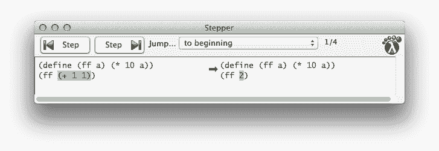
> > > 
> 图 11：DrRacket 步进器

练习 21\. 使用 DrRacket 的步进器逐步评估 (ff (ff 1))。也尝试 ([+](http://docs.racket-lang.org/htdp-langs/beginner.html#%28def._htdp-beginner._%28%28lib._lang%2Fhtdp-beginner..rkt%29._%2B%29%29) (ff 1) (ff 1))。DrRacket 的步进器会重用计算结果吗？

到目前为止，你可能会认为你回到了代数课程，所有这些涉及无趣函数和数字的计算。幸运的是，这种方法可以推广到本书中的所有程序，包括有趣的那些。

让我们从查看处理字符串的函数开始。回顾一下字符串算术的一些定律：

> | ([string-append](http://docs.racket-lang.org/htdp-langs/beginner.html#%28def._htdp-beginner._%28%28lib._lang%2Fhtdp-beginner..rkt%29._string-append%29%29) "hello" " " "world") == "hello world" |
> | --- |
> | ([string-append](http://docs.racket-lang.org/htdp-langs/beginner.html#%28def._htdp-beginner._%28%28lib._lang%2Fhtdp-beginner..rkt%29._string-append%29%29) "bye" ", " "world") == "bye, world" |
> | [...](http://docs.racket-lang.org/htdp-langs/beginner.html#%28form._%28%28lib._lang%2Fhtdp-beginner..rkt%29._......%29%29) |

现在假设我们定义一个创建信件开头的函数：

> | ([define](http://docs.racket-lang.org/htdp-langs/beginner.html#%28form._%28%28lib._lang%2Fhtdp-beginner..rkt%29._define%29%29) (opening first-name last-name) |
> | --- |
> |   ([字符串连接](http://docs.racket-lang.org/htdp-langs/beginner.html#%28def._htdp-beginner._%28%28lib._lang%2Fhtdp-beginner..rkt%29._string-append%29%29) "亲爱的 " first-name ",")) |

当你将这个函数应用于两个字符串时，你得到一个信件开头：

> | > (opening "Matthew" "Fisler") |
> | --- |
> | "亲爱的马修，" |

更重要的是，计算法则解释了 DrRacket 如何确定这个结果以及你如何预测 DrRacket 的行为：

> | (opening "Matthew" "Fisler") |
> | --- |
> | ==  ; DrRacket 将"Matthew"替换为 first-name |
> | ([字符串连接](http://docs.racket-lang.org/htdp-langs/beginner.html#%28def._htdp-beginner._%28%28lib._lang%2Fhtdp-beginner..rkt%29._string-append%29%29) "亲爱的 " "Matthew" ",") |
> | == |
> | "亲爱的马修，" |

由于在 opening 的定义中没有出现 last-name，将其替换为"Fisler"没有效果。

本书其余部分介绍了更多数据形式。最终，你将遇到命令式操作，这些操作不组合或提取值，而是修改它们。要使用这些操作进行计算，你需要向算术和替换法则中添加一些法则。为了解释数据操作，我们总是使用本书中类似算术法则的法则。

练习 22. 使用 DrRacket 的步进器运行这个程序片段：

> | ([定义](http://docs.racket-lang.org/htdp-langs/beginner.html#%28form._%28%28lib._lang%2Fhtdp-beginner..rkt%29._define%29%29) (distance-to-origin x y) |
> | --- |
> |   ([平方根](http://docs.racket-lang.org/htdp-langs/beginner.html#%28def._htdp-beginner._%28%28lib._lang%2Fhtdp-beginner..rkt%29._sqrt%29%29) ([+](http://docs.racket-lang.org/htdp-langs/beginner.html#%28def._htdp-beginner._%28%28lib._lang%2Fhtdp-beginner..rkt%29._%2B%29%29) ([平方](http://docs.racket-lang.org/htdp-langs/beginner.html#%28def._htdp-beginner._%28%28lib._lang%2Fhtdp-beginner..rkt%29._sqr%29%29) x) ([平方](http://docs.racket-lang.org/htdp-langs/beginner.html#%28def._htdp-beginner._%28%28lib._lang%2Fhtdp-beginner..rkt%29._sqr%29%29) y)))) |
> | (distance-to-origin 3 4) |

解释是否与你的直觉相符？练习 23. "hello world"中的第一个 1String 是"h"。以下函数是如何计算这个结果的？

> | ([定义](http://docs.racket-lang.org/htdp-langs/beginner.html#%28form._%28%28lib._lang%2Fhtdp-beginner..rkt%29._define%29%29) (string-first s) |
> | --- |
> |   ([子字符串](http://docs.racket-lang.org/htdp-langs/beginner.html#%28def._htdp-beginner._%28%28lib._lang%2Fhtdp-beginner..rkt%29._substring%29%29) s 0 1)) |

使用步进器来验证你的想法。练习 24. 这是==>的定义：

> | ([定义](http://docs.racket-lang.org/htdp-langs/beginner.html#%28form._%28%28lib._lang%2Fhtdp-beginner..rkt%29._define%29%29) (==> x y) |
> | --- |
> |   ([或](http://docs.racket-lang.org/htdp-langs/beginner.html#%28form._%28%28lib._lang%2Fhtdp-beginner..rkt%29._or%29%29) ([非](http://docs.racket-lang.org/htdp-langs/beginner.html#%28def._htdp-beginner._%28%28lib._lang%2Fhtdp-beginner..rkt%29._not%29%29) x) y)) |

使用步进器确定(==>  #true  #false)的值。练习 25。看看这个尝试解决练习 17：

> | ([define](http://docs.racket-lang.org/htdp-langs/beginner.html#%28form._%28%28lib._lang%2Fhtdp-beginner..rkt%29._define%29%29) (image-classify img) |
> | --- |
> |   ([cond](http://docs.racket-lang.org/htdp-langs/beginner.html#%28form._%28%28lib._lang%2Fhtdp-beginner..rkt%29._cond%29%29) |
> |     [([>=](http://docs.racket-lang.org/htdp-langs/beginner.html#%28def._htdp-beginner._%28%28lib._lang%2Fhtdp-beginner..rkt%29._~3e~3d%29%29) ([image-height](http://docs.racket-lang.org/teachpack/2htdpimage.html#%28def._%28%28lib._2htdp%2Fimage..rkt%29._image-height%29%29) img) ([image-width](http://docs.racket-lang.org/teachpack/2htdpimage.html#%28def._%28%28lib._2htdp%2Fimage..rkt%29._image-width%29%29) img)) "tall"] |
> |     [([=](http://docs.racket-lang.org/htdp-langs/beginner.html#%28def._htdp-beginner._%28%28lib._lang%2Fhtdp-beginner..rkt%29._~3d%29%29) ([image-height](http://docs.racket-lang.org/teachpack/2htdpimage.html#%28def._%28%28lib._2htdp%2Fimage..rkt%29._image-height%29%29) img) ([image-width](http://docs.racket-lang.org/teachpack/2htdpimage.html#%28def._%28%28lib._2htdp%2Fimage..rkt%29._image-width%29%29) img)) "square"] |
> |     [([<=](http://docs.racket-lang.org/htdp-langs/beginner.html#%28def._htdp-beginner._%28%28lib._lang%2Fhtdp-beginner..rkt%29._~3c~3d%29%29) ([image-height](http://docs.racket-lang.org/teachpack/2htdpimage.html#%28def._%28%28lib._2htdp%2Fimage..rkt%29._image-height%29%29) img) ([image-width](http://docs.racket-lang.org/teachpack/2htdpimage.html#%28def._%28%28lib._2htdp%2Fimage..rkt%29._image-width%29%29) img)) "wide"])) |

步进应用程序是否提出了一个解决方案？练习 26。你期望这个程序的结果是什么：

> | ([define](http://docs.racket-lang.org/htdp-langs/beginner.html#%28form._%28%28lib._lang%2Fhtdp-beginner..rkt%29._define%29%29) (string-insert s i) |
> | --- |
> |   ([string-append](http://docs.racket-lang.org/htdp-langs/beginner.html#%28def._htdp-beginner._%28%28lib._lang%2Fhtdp-beginner..rkt%29._string-append%29%29) ([substring](http://docs.racket-lang.org/htdp-langs/beginner.html#%28def._htdp-beginner._%28%28lib._lang%2Fhtdp-beginner..rkt%29._substring%29%29) s 0 i) |
> |                  "_" |
> |                  ([substring](http://docs.racket-lang.org/htdp-langs/beginner.html#%28def._htdp-beginner._%28%28lib._lang%2Fhtdp-beginner..rkt%29._substring%29%29) s i))) |
> |   |
> | (string-insert "helloworld" 6) |

使用 DrRacket 及其步进器确认你的预期。

#### 2.3 组合函数🔗 "链接到此处")

一个程序很少只包含一个函数定义。通常，程序由一个主定义和几个其他函数组成，并将一个函数应用的输出作为另一个函数的输入。在代数的类比中，我们称这种方式定义函数为组合，并称这些附加函数为辅助函数或辅助函数。

> > > | ([define](http://docs.racket-lang.org/htdp-langs/beginner.html#%28form._%28%28lib._lang%2Fhtdp-beginner..rkt%29._define%29%29) (letter first-name last-name signature-name) |
> > > | --- |
> > > |   ([string_append](http://docs.racket-lang.org/htdp-langs/beginner.html#%28def._htdp-beginner._%28%28lib._lang%2Fhtdp-beginner..rkt%29._string-append%29%29) |
> > > |   (opening first-name) |
> > > |   "\n\n" |
> > > |   (body first-name last-name) |
> > > |   "\n\n" |
> > > |   (closing signature-name))) |
> > > |   "\n" |
> > > | ([define](http://docs.racket-lang.org/htdp-langs/beginner.html#%28form._%28%28lib._lang%2Fhtdp-beginner..rkt%29._define%29%29) (opening first-name) |
> > > |   ([string_append](http://docs.racket-lang.org/htdp-langs/beginner.html#%28def._htdp-beginner._%28%28lib._lang%2Fhtdp-beginner..rkt%29._string-append%29%29) "Dear " first-name ",")) |
> > > |   "\n" |
> > > | ([define](http://docs.racket-lang.org/htdp-langs/beginner.html#%28form._%28%28lib._lang%2Fhtdp-beginner..rkt%29._define%29%29) (body first-name last-name) |
> > > |   ([string_append](http://docs.racket-lang.org/htdp-langs/beginner.html#%28def._htdp-beginner._%28%28lib._lang%2Fhtdp-beginner..rkt%29._string-append%29%29) |
> > > |   "We have discovered that all people with the" "\n" |
> > > |   "last name " last-name " have won our lottery. So, " "\n" |
> > > |   first-name ", " "hurry and pick up your prize.") |
> > > |   |
> > > | ([define](http://docs.racket-lang.org/htdp-langs/beginner.html#%28form._%28%28lib._lang%2Fhtdp-beginner..rkt%29._define%29%29) (closing signature-name) |
> > > | ([string_append](http://docs.racket-lang.org/htdp-langs/beginner.html#%28def._htdp-beginner._%28%28lib._lang%2Fhtdp-beginner..rkt%29._string-append%29%29) |
> > > |   "Sincerely," |
> > > |   "\n\n" |
> > > |   signature-name |
> > > |   "\n")) |
> > > 
> 图 12：批处理程序

考虑图 12 程序用于填充信函模板。它由四个函数组成。第一个是主函数，它从收件人的名字和姓氏以及签名生成一封完整的信件。主函数引用三个辅助函数来生成信件的三个部分——<wbr>开头、正文和签名——<wbr>并以正确的顺序使用[string_append](http://docs.racket-lang.org/htdp-langs/beginner.html#%28def._htdp-beginner._%28%28lib._lang%2Fhtdp-beginner..rkt%29._string-append%29%29)组合结果。

停止！将这些定义输入到 DrRacket 的定义区域，点击运行，并在交互区域评估这些表达式：

> | > (letter "Matthew" "Fisler" "Felleisen") |
> | --- |
> | "Dear Matthew,\n\nWe have discovered that ...\n" |
> | > (字母 "Kathi" "Felleisen" "Findler") |
> | "亲爱的 Kathi，\n\n 我们发现...\n" |

除了结果是一个包含 "\n" 的长字符串外，这代表当字符串被打印时表示一个新行。一旦你的程序可以访问写入文件或控制台的功能，这部分字符串就会变得有意义。继续阅读。现在将 'stdout' 视为一个 String。

> | > ([write-file](http://docs.racket-lang.org/teachpack/2htdpbatch-io.html#%28def._%28%28lib._2htdp%2Fbatch-io..rkt%29._write-file%29%29) 'stdout (letter "Matt" "Fiss" "Fell")) |
> | --- |
> 
> |
> 
> | 亲爱的 Matt，| 
> 
> |  | 
> 
> | 我们发现所有具有 | 
> 
> | 姓氏 Fiss 获得了我们的彩票。所以，| 
> 
> | Matt，快去领你的奖品。| 
> 
> |  | 
> 
> | 诚挚地，| 
> 
> |  | 
> 
> | Fell | 
> 
> |
> 
> | 'stdout |
> | --- |

程序在某种程度上深入解释了这样的批处理程序。结束

通常，当一个问题涉及到不同的计算任务时，程序应该由每个任务一个函数和一个将它们组合在一起的主函数组成。我们将这个想法表述为一个简单的口号：

> 为每个任务定义一个函数。

遵循这个口号的优势在于，你可以得到合理小的函数，每个函数都容易理解，其组合也容易理解。一旦你学会了设计函数，你就会认识到，让小函数正确工作比让大函数正确工作要容易得多。更好的是，如果你需要因为问题陈述的某些变化而更改程序的一部分，当它被组织成小函数的集合而不是一个大型的、单一的块时，找到相关部分往往要容易得多。

这里有一个用示例问题说明这个观点的小插图：

> 样本问题：一个小镇上垄断电影院的所有者可以自由地设定票价。他收得越多，能买得起票的人就越少。他收得越少，因为出勤率上升，举办一场表演的成本就越高。在最近的一次实验中，所有者确定了一张票的价格和平均出勤率之间的关系。
> 
> 以每张票 5.00 美元的价格，120 人参加了一场表演。每增加 10 分的票价变化，平均出勤人数会变化 15 人。也就是说，如果所有者收取 5.10 美元，平均会有 105 人参加；如果价格下降到 4.90 美元，平均出勤人数将增加到 135 人。让我们将这个想法转化为一个数学公式：
> 
> > 
> > 
> 停！在你继续之前解释一下前面的减号。
> 
> 不幸的是，出勤率的增加也带来了成本的上升。每次表演对所有者来说都有 180 美元的固定成本，以及每位观众 0.04 美元的变动成本。
> 
> 所有者希望知道利润和票价之间的确切关系，以便最大化利润。

虽然任务很明确，但如何进行并不明确。我们目前能说的是，几个量相互依赖。当我们面临这种情况时，最好逐一梳理出各种依赖关系：

1.  问题陈述指定了参加人数如何依赖于票价。计算这个数量显然是一个单独的任务，因此值得拥有自己的函数定义：

    > | ([定义](http://docs.racket-lang.org/htdp-langs/beginner.html#%28form._%28%28lib._lang%2Fhtdp-beginner..rkt%29._define%29%29) (attendees ticket-price) |
    > | --- |
    > |   ([-](http://docs.racket-lang.org/htdp-langs/beginner.html#%28def._htdp-beginner._%28%28lib._lang%2Fhtdp-beginner..rkt%29._-%29%29) 120 ([*](http://docs.racket-lang.org/htdp-langs/beginner.html#%28def._htdp-beginner._%28%28lib._lang%2Fhtdp-beginner..rkt%29._%2A%29%29) ([-](http://docs.racket-lang.org/htdp-langs/beginner.html#%28def._htdp-beginner._%28%28lib._lang%2Fhtdp-beginner..rkt%29._-%29%29) ticket-price 5.0) ([/](http://docs.racket-lang.org/htdp-langs/beginner.html#%28def._htdp-beginner._%28%28lib._lang%2Fhtdp-beginner..rkt%29._%2F%29%29) 15 0.1)))) |

1.  收入完全由票的销售产生，这意味着它正好是票价和参加人数的乘积：

    > | ([定义](http://docs.racket-lang.org/htdp-langs/beginner.html#%28form._%28%28lib._lang%2Fhtdp-beginner..rkt%29._define%29%29) (revenue ticket-price) |
    > | --- |
    > |   ([*](http://docs.racket-lang.org/htdp-langs/beginner.html#%28def._htdp-beginner._%28%28lib._lang%2Fhtdp-beginner..rkt%29._%2A%29%29) ticket-price (attendees ticket-price))) |

1.  成本由两部分组成：固定部分（$180）和与参加人数相关的可变部分。鉴于参加人数是票价的函数，计算演出成本的函数也必须消耗票价，以便它可以重用参加人数函数：

    > | ([定义](http://docs.racket-lang.org/htdp-langs/beginner.html#%28form._%28%28lib._lang%2Fhtdp-beginner..rkt%29._define%29%29) (cost ticket-price) |
    > | --- |
    > |   ([+](http://docs.racket-lang.org/htdp-langs/beginner.html#%28def._htdp-beginner._%28%28lib._lang%2Fhtdp-beginner..rkt%29._%2B%29%29) 180 ([*](http://docs.racket-lang.org/htdp-langs/beginner.html#%28def._htdp-beginner._%28%28lib._lang%2Fhtdp-beginner..rkt%29._%2A%29%29) 0.04 (attendees ticket-price)))) |

1.  最后，利润是给定票价下的收入与成本的差额：

    > | ([定义](http://docs.racket-lang.org/htdp-langs/beginner.html#%28form._%28%28lib._lang%2Fhtdp-beginner..rkt%29._define%29%29) (profit ticket-price) |
    > | --- |
    > |   ([-](http://docs.racket-lang.org/htdp-langs/beginner.html#%28def._htdp-beginner._%28%28lib._lang%2Fhtdp-beginner..rkt%29._-%29%29) (revenue ticket-price) |
    > |      (cost ticket-price))) |

    BSL 对利润的定义直接遵循非正式问题描述的建议。

这四个函数就是计算利润的全部，现在我们可以使用利润函数来确定一个好的票价。

练习 27\. 我们对示例问题的解决方案在函数中间包含了一些常数。正如一个程序，多个定义已经指出的，最好给这样的常数命名，以便未来的读者理解这些数字的来源。在 DrRacket 的定义区域收集所有定义，并将它们修改为将所有魔法数字重构为常量定义。

练习 28\. 确定以下票价带来的潜在利润：$1, $2, $3, $4, 和 $5。哪个价格最大化了电影院的利润？确定最佳票价到一角。

这里是同一程序的另一种版本，给出的是一个单独的函数定义：

> | ([define](http://docs.racket-lang.org/htdp-langs/beginner.html#%28form._%28%28lib._lang%2Fhtdp-beginner..rkt%29._define%29%29) (profit price) |
> | --- |
> |   ([-](http://docs.racket-lang.org/htdp-langs/beginner.html#%28def._htdp-beginner._%28%28lib._lang%2Fhtdp-beginner..rkt%29._-%29%29) ([*](http://docs.racket-lang.org/htdp-langs/beginner.html#%28def._htdp-beginner._%28%28lib._lang%2Fhtdp-beginner..rkt%29._%2A%29%29) ([+](http://docs.racket-lang.org/htdp-langs/beginner.html#%28def._htdp-beginner._%28%28lib._lang%2Fhtdp-beginner..rkt%29._%2B%29%29) 120 |
> |            ([*](http://docs.racket-lang.org/htdp-langs/beginner.html#%28def._htdp-beginner._%28%28lib._lang%2Fhtdp-beginner..rkt%29._%2A%29%29) ([/](http://docs.racket-lang.org/htdp-langs/beginner.html#%28def._htdp-beginner._%28%28lib._lang%2Fhtdp-beginner..rkt%29._%2F%29%29) 15 0.1) |
> |               ([-](http://docs.racket-lang.org/htdp-langs/beginner.html#%28def._htdp-beginner._%28%28lib._lang%2Fhtdp-beginner..rkt%29._-%29%29) 5.0 price))) |
> |         price) |
> |      ([+](http://docs.racket-lang.org/htdp-langs/beginner.html#%28def._htdp-beginner._%28%28lib._lang%2Fhtdp-beginner..rkt%29._%2B%29%29) 180 |
> |         ([*](http://docs.racket-lang.org/htdp-langs/beginner.html#%28def._htdp-beginner._%28%28lib._lang%2Fhtdp-beginner..rkt%29._%2A%29%29) 0.04 |
> |            ([+](http://docs.racket-lang.org/htdp-langs/beginner.html#%28def._htdp-beginner._%28%28lib._lang%2Fhtdp-beginner..rkt%29._%2B%29%29) 120 |
> |               ([*](http://docs.racket-lang.org/htdp-langs/beginner.html#%28def._htdp-beginner._%28%28lib._lang%2Fhtdp-beginner..rkt%29._%2A%29%29) ([/](http://docs.racket-lang.org/htdp-langs/beginner.html#%28def._htdp-beginner._%28%28lib._lang%2Fhtdp-beginner..rkt%29._%2F%29%29) 15 0.1) |
> |                  ([-](http://docs.racket-lang.org/htdp-langs/beginner.html#%28def._htdp-beginner._%28%28lib._lang%2Fhtdp-beginner..rkt%29._-%29%29) 5.0 price))))))) |

将此定义输入 DrRacket，并确保它产生与原始版本相同的 1 美元、2 美元、3 美元、4 美元和 5 美元的结果。一眼就能看出，与上面的四个函数相比，这个函数的理解难度要大得多。

练习 29。在研究了表演的成本后，业主发现了几种降低成本的方法。由于这些改进，不再有固定成本；每名参加者的可变成本为 1.50 美元。

修改这两个程序以反映这一变化。当程序被修改后，再次用 3 美元、4 美元和 5 美元的票价测试它们，并比较结果。

#### 2.4 全局常量🔗 "链接至此")

正如序言所说，利润等函数受益于全局常量的使用。每种编程语言都允许程序员定义常量。在 BSL 中，这样的定义具有以下形状：

+   写“([define](http://docs.racket-lang.org/htdp-langs/beginner.html#%28form._%28%28lib._lang%2Fhtdp-beginner..rkt%29._define%29%29) ”，

+   写下名称，

+   然后跟一个空格和一个表达式，并且

+   写下“)”。

常量的名称是一个全局变量，而其定义被称为常量定义。我们倾向于将常量定义中的表达式称为定义的右侧。常量定义引入了所有数据形式的名称：数字、图像、字符串等。以下是一些简单的例子：

> | ; 当前电影票的价格： |
> | --- |
> | ([define](http://docs.racket-lang.org/htdp-langs/beginner.html#%28form._%28%28lib._lang%2Fhtdp-beginner..rkt%29._define%29%29) CURRENT-PRICE 5) |
> |   |
> | ; 用于计算圆盘面积的： |
> | ([define](http://docs.racket-lang.org/htdp-langs/beginner.html#%28form._%28%28lib._lang%2Fhtdp-beginner..rkt%29._define%29%29) ALMOST-PI 3.14) |
> |   |
> | ; 一个空行： |
> | ([define](http://docs.racket-lang.org/htdp-langs/beginner.html#%28form._%28%28lib._lang%2Fhtdp-beginner..rkt%29._define%29%29) NL "\n") |
> |   |
> | ; 一个空场景： |
> | ([define](http://docs.racket-lang.org/htdp-langs/beginner.html#%28form._%28%28lib._lang%2Fhtdp-beginner..rkt%29._define%29%29) MT ([empty-scene](http://docs.racket-lang.org/teachpack/2htdpimage.html#%28def._%28%28lib._2htdp%2Fimage..rkt%29._empty-scene%29%29) 100 100)) |

前两个是数字常量，最后两个是一个字符串和一个图像。按照惯例，我们使用大写字母来表示全局常量，因为这确保了无论程序有多大，程序的读者都可以轻松地区分这些变量和其他变量。程序中的所有函数都可以引用这些全局变量。对变量的引用就像使用相应的常量一样。使用变量名而不是常量的优点是，对常量定义的单次编辑会影响所有使用。例如，我们可能希望向 ALMOST-PI 添加数字或扩大一个空场景：

> | ([define](http://docs.racket-lang.org/htdp-langs/beginner.html#%28form._%28%28lib._lang%2Fhtdp-beginner..rkt%29._define%29%29) ALMOST-PI 3.14159) |
> | --- |
> |   |
> | ; 一个空场景： |
> | ([define](http://docs.racket-lang.org/htdp-langs/beginner.html#%28form._%28%28lib._lang%2Fhtdp-beginner..rkt%29._define%29%29) MT ([empty-scene](http://docs.racket-lang.org/teachpack/2htdpimage.html#%28def._%28%28lib._2htdp%2Fimage..rkt%29._empty-scene%29%29) 200 800)) |

我们的大多数示例定义在右侧使用字面常量，但最后一个使用了一个表达式。确实，程序员可以使用任意表达式来计算常量。假设一个程序需要处理某个大小的图像及其中心：

> | ([define](http://docs.racket-lang.org/htdp-langs/beginner.html#%28form._%28%28lib._lang%2Fhtdp-beginner..rkt%29._define%29%29) WIDTH 100) |
> | --- |
> | ([define](http://docs.racket-lang.org/htdp-langs/beginner.html#%28form._%28%28lib._lang%2Fhtdp-beginner..rkt%29._define%29%29) HEIGHT 200) |
> |   |
> | ([define](http://docs.racket-lang.org/htdp-langs/beginner.html#%28form._%28%28lib._lang%2Fhtdp-beginner..rkt%29._define%29%29) MID-WIDTH ([/](http://docs.racket-lang.org/htdp-langs/beginner.html#%28def._htdp-beginner._%28%28lib._lang%2Fhtdp-beginner..rkt%29._%2F%29%29) WIDTH 2)) |
> | ([define](http://docs.racket-lang.org/htdp-langs/beginner.html#%28form._%28%28lib._lang%2Fhtdp-beginner..rkt%29._define%29%29) MID-HEIGHT ([/](http://docs.racket-lang.org/htdp-langs/beginner.html#%28def._htdp-beginner._%28%28lib._lang%2Fhtdp-beginner..rkt%29._%2F%29%29) HEIGHT 2)) |

它可以使用两个右侧带有字面常量的定义和两个计算出的常量，即值不仅仅是字面常量，而是计算表达式值的变量。

再次，我们提出一个命令性口号：

> 对于问题陈述中提到的每个常量，引入一个常量定义。

练习 30。为电影院的价格优化程序定义常量，以便将出勤价格敏感性（每 10 美分 15 人）变成一个计算出的常量。

#### 2.5 程序🔗 "链接到此处")

你已经准备好创建简单的程序了。从编码的角度来看，程序只是一系列函数和常量定义。通常有一个函数被单独选为“主”函数，这个主函数倾向于组合其他函数。然而，从启动程序的角度来看，有两种不同的类型：

+   批处理程序一次消耗所有输入并计算其结果。其主要功能是辅助函数的组合，这些辅助函数可能引用额外的辅助函数，依此类推。当我们启动批处理程序时，操作系统会调用其输入上的主函数并等待程序输出。

+   一个交互式程序会消耗一些输入，进行计算，产生一些输出，然后消耗更多输入，如此循环。当输入出现时，我们称之为事件，我们创建交互式程序作为事件驱动程序。这类事件驱动程序的主要功能使用一个表达式来描述针对哪些类型的事件调用哪些函数。这些函数被称为事件处理器。

    当我们启动一个交互式程序时，主函数会通知操作系统这个描述。一旦发生输入事件，操作系统就会调用匹配的事件处理器。同样，操作系统根据描述知道何时以及如何将这些函数调用的结果作为输出呈现。

本书主要关注通过图形用户界面（GUI）进行交互的程序；还有其他类型的交互式程序，随着你继续学习计算机科学，你将了解那些。

批处理程序 如前所述，批处理程序一次消耗所有输入并从这些输入中计算结果。它的主函数期望一些参数，将它们传递给辅助函数，从那些函数接收结果，并将这些结果组合成它自己的最终答案。

一旦创建了程序，我们就想使用它们。在 DrRacket 中，我们在交互区域启动批处理程序，以便我们可以观察程序的工作情况。

如果程序能够从某个文件中检索输入并将输出传递到另一个文件，那么它们将更加有用。确实，“批处理程序”这个名字可以追溯到计算机的早期，当时一个程序从一批穿孔卡片中读取一个文件（或几个文件），并将结果放入另一个文件（或几个文件），也是一个卡片批。从概念上讲，批处理程序一次读取输入文件，也一次性生成结果文件。

> > > 将 ([require](http://docs.racket-lang.org/htdp-langs/beginner.html#%28form._%28%28lib._lang%2Fhtdp-beginner..rkt%29._require%29%29)  2htdp/batch-io) 添加到定义区域，或者从语言菜单中选择添加教学包，并在预安装的 HtDP/2e 教学包菜单中选择 batch-io。

我们使用 2htdp/batch-io 教学包创建这样的基于文件的批处理程序，它为我们添加了两个函数（以及其他一些函数）：

+   [read-file](http://docs.racket-lang.org/teachpack/2htdpbatch-io.html#%28def._%28%28lib._2htdp%2Fbatch-io..rkt%29._read-file%29%29)，它将整个文件的内容作为一个字符串读取，并且

+   [write-file](http://docs.racket-lang.org/teachpack/2htdpbatch-io.html#%28def._%28%28lib._2htdp%2Fbatch-io..rkt%29._write-file%29%29)，它可以从给定的字符串创建一个文件。

在评估这些表达式之前，请将定义区域保存到文件中。这些函数将字符串写入文件并从文件中读取字符串：

> | > ([write-file](http://docs.racket-lang.org/teachpack/2htdpbatch-io.html#%28def._%28%28lib._2htdp%2Fbatch-io..rkt%29._write-file%29%29) "sample.dat" "212") |
> | --- |
> | "sample.dat" |
> | > ([read-file](http://docs.racket-lang.org/teachpack/2htdpbatch-io.html#%28def._%28%28lib._2htdp%2Fbatch-io..rkt%29._read-file%29%29) "sample.dat") |
> | "212" |

第一次交互后，名为 "sample.dat" 的文件包含

|         212 |
| --- |

[write-file](http://docs.racket-lang.org/teachpack/2htdpbatch-io.html#%28def._%28%28lib._2htdp%2Fbatch-io..rkt%29._write-file%29%29) 的结果是确认它已将字符串放入文件。如果文件已存在，它将用给定的字符串替换其内容；否则，它将创建一个文件并将给定的字符串作为其内容。第二个交互（[read-file](http://docs.racket-lang.org/teachpack/2htdpbatch-io.html#%28def._%28%28lib._2htdp%2Fbatch-io..rkt%29._read-file%29%29) "sample.dat"）产生 "212"，因为它将 "sample.dat" 的内容转换为 String。出于实用主义的原因，[write-file](http://docs.racket-lang.org/teachpack/2htdpbatch-io.html#%28def._%28%28lib._2htdp%2Fbatch-io..rkt%29._write-file%29%29) 也接受 'stdout，一种特殊的标记，作为第一个参数。然后它将在当前交互区域显示生成的文件内容，例如：'stdout 和 'stdin 分别是标准输出设备和标准输入设备的简称。

> | > ([write-file](http://docs.racket-lang.org/teachpack/2htdpbatch-io.html#%28def._%28%28lib._2htdp%2Fbatch-io..rkt%29._write-file%29%29) 'stdout "212\n") |
> | --- |
> | 212 |
> | 'stdout |

通过类比，[read-file](http://docs.racket-lang.org/teachpack/2htdpbatch-io.html#%28def._%28%28lib._2htdp%2Fbatch-io..rkt%29._read-file%29%29) 接受 'stdin 作为文件名替代，然后从当前交互区域读取输入。

让我们用一个简单的例子来说明批量程序的创建。假设我们希望创建一个程序，将华氏温度计测量的温度转换为摄氏温度。不用担心，这个问题不是关于你的物理知识的测试；这里是有转换公式：这本书不是关于记忆事实的，但我们确实希望你了解在哪里可以找到它们。你知道在哪里可以找到温度转换的方法吗？

> 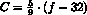

自然地，在这个公式中，f 是华氏温度，C 是摄氏温度。虽然这个公式对于代数前教材可能足够好，但数学家或程序员会在等式左边写 C(f) 来提醒读者 f 是一个给定的值，C 是从 f 计算得出的。

将这个公式转换为 BSL 是直接的：

> | ([define](http://docs.racket-lang.org/htdp-langs/beginner.html#%28form._%28%28lib._lang%2Fhtdp-beginner..rkt%29._define%29%29) (C f) |
> | --- |
> |   ([*](http://docs.racket-lang.org/htdp-langs/beginner.html#%28def._htdp-beginner._%28%28lib._lang%2Fhtdp-beginner..rkt%29._%2A%29%29) 5/9 ([-](http://docs.racket-lang.org/htdp-langs/beginner.html#%28def._htdp-beginner._%28%28lib._lang%2Fhtdp-beginner..rkt%29._-%29%29) f 32))) |

回想一下，5/9 是一个数字，一个精确的有理分数，C 依赖于给定的 f，这正是函数表示法所表达的。在交互区域启动此批处理程序的工作方式与往常一样：

> | > (C 32) |
> | --- |
> | 0 |
> | > (C 212) |
> | 100 |
> | > (C -40) |
> | -40 |

但假设我们希望将此函数作为程序的一部分，该程序从文件中读取华氏温度，将此数字转换为摄氏温度，然后创建另一个包含结果的文件。一旦我们在 BSL 中有转换公式，创建主函数意味着将 C 与现有的原始函数组合：

> | ([定义](http://docs.racket-lang.org/htdp-langs/beginner.html#%28form._%28%28lib._lang%2Fhtdp-beginner..rkt%29._define%29%29) (convert in out) |
> | --- |
> |   ([写入文件](http://docs.racket-lang.org/teachpack/2htdpbatch-io.html#%28def._%28%28lib._2htdp%2Fbatch-io..rkt%29._write-file%29%29) out |
> |     ([字符串连接](http://docs.racket-lang.org/htdp-langs/beginner.html#%28def._htdp-beginner._%28%28lib._lang%2Fhtdp-beginner..rkt%29._string-append%29%29) |
> |       ([数字转字符串](http://docs.racket-lang.org/htdp-langs/beginner.html#%28def._htdp-beginner._%28%28lib._lang%2Fhtdp-beginner..rkt%29._number-~3estring%29%29) |
> |         (C |
> |           ([字符串转数字](http://docs.racket-lang.org/htdp-langs/beginner.html#%28def._htdp-beginner._%28%28lib._lang%2Fhtdp-beginner..rkt%29._string-~3enumber%29%29) |
> |             ([读取文件](http://docs.racket-lang.org/teachpack/2htdpbatch-io.html#%28def._%28%28lib._2htdp%2Fbatch-io..rkt%29._read-file%29%29) in)))) |
> |       "\n"))) |

我们称主函数为 convert。它消耗两个文件名：in 用于找到华氏温度的文件，out 用于我们想要摄氏结果的文件。五个函数的组合计算 convert 的结果。让我们仔细地逐步通过 convert 的主体：

1.  ([读取文件](http://docs.racket-lang.org/teachpack/2htdpbatch-io.html#%28def._%28%28lib._2htdp%2Fbatch-io..rkt%29._read-file%29%29) in) 将指定文件的 内容作为字符串检索；

1.  [字符串转数字](http://docs.racket-lang.org/htdp-langs/beginner.html#%28def._htdp-beginner._%28%28lib._lang%2Fhtdp-beginner..rkt%29._string-~3enumber%29%29) 将此字符串转换为数字；

1.  C 将数字解释为华氏温度并将其转换为摄氏温度；

1.  [数字转字符串](http://docs.racket-lang.org/htdp-langs/beginner.html#%28def._htdp-beginner._%28%28lib._lang%2Fhtdp-beginner..rkt%29._number-~3estring%29%29) 消耗这个摄氏温度并将其转换为字符串；

1.  ([写入文件](http://docs.racket-lang.org/teachpack/2htdpbatch-io.html#%28def._%28%28lib._2htdp%2Fbatch-io..rkt%29._write-file%29%29) out  [...](http://docs.racket-lang.org/htdp-langs/beginner.html#%28form._%28%28lib._lang%2Fhtdp-beginner..rkt%29._......%29%29)) 将此字符串放入名为 out 的文件中。

这长长的步骤列表可能看起来令人望而生畏，而且甚至还没有包括 [string-append](http://docs.racket-lang.org/htdp-langs/beginner.html#%28def._htdp-beginner._%28%28lib._lang%2Fhtdp-beginner..rkt%29._string-append%29%29) 部分。停！解释

> ([string-append](http://docs.racket-lang.org/htdp-langs/beginner.html#%28def._htdp-beginner._%28%28lib._lang%2Fhtdp-beginner..rkt%29._string-append%29%29) [...](http://docs.racket-lang.org/htdp-langs/beginner.html#%28form._%28%28lib._lang%2Fhtdp-beginner..rkt%29._......%29%29) "\n")

与此相反，在代数预备课程中，平均的函数组合涉及两个函数，可能三个。但请记住，程序完成的是现实世界的任务，而代数中的练习仅仅是为了说明函数组合的概念。

在这一点上，我们可以尝试使用 convert。首先，我们使用 [write-file](http://docs.racket-lang.org/teachpack/2htdpbatch-io.html#%28def._%28%28lib._2htdp%2Fbatch-io..rkt%29._write-file%29%29) 为 convert 创建一个输入文件：你也可以使用文件编辑器创建 "sample.dat"。

> | > ([write-file](http://docs.racket-lang.org/teachpack/2htdpbatch-io.html#%28def._%28%28lib._2htdp%2Fbatch-io..rkt%29._write-file%29%29) "sample.dat" "212") |
> | --- |
> | "sample.dat" |
> | > (convert "sample.dat" 'stdout) |
> | 100 |
> | 'stdout |
> | > (convert "sample.dat" "out.dat") |
> | "out.dat" |
> | > ([read-file](http://docs.racket-lang.org/teachpack/2htdpbatch-io.html#%28def._%28%28lib._2htdp%2Fbatch-io..rkt%29._read-file%29%29) "out.dat") |
> | "100" |

对于第一次交互，我们使用 'stdout 以便在 DrRacket 的交互区域查看 convert 的输出。对于第二次，convert 被命名为 "out.dat"。正如预期的那样，convert 的调用返回了这个字符串；根据 [write-file](http://docs.racket-lang.org/teachpack/2htdpbatch-io.html#%28def._%28%28lib._2htdp%2Fbatch-io..rkt%29._write-file%29%29) 的描述，我们也知道它将华氏温度存入文件。在这里，我们使用 [read-file](http://docs.racket-lang.org/teachpack/2htdpbatch-io.html#%28def._%28%28lib._2htdp%2Fbatch-io..rkt%29._read-file%29%29) 读取这个文件的内容，但你也可以用文本编辑器查看。

除了运行批处理程序外，逐步查看计算过程也是很有教育意义的。确保文件 "sample.dat" 存在且仅包含一个数字，然后在 DrRacket 中点击 STEP 按钮。这样做会打开另一个窗口，你可以查看批处理程序主函数调用所触发的计算过程。你会看到这个过程遵循上述大纲。

练习 31。回忆一下 组合函数 中的字母程序。以下是启动程序并将其输出写入交互区域的方法：

> |
> 
> &#124; > ([write-file](http://docs.racket-lang.org/teachpack/2htdpbatch-io.html#%28def._%28%28lib._2htdp%2Fbatch-io..rkt%29._write-file%29%29) &#124;
> 
> &#124;    'stdout &#124;
> 
> | （（letter "Matthew" "Fisler" "Felleisen"）） |
> 
> | |
> 
> | |
> 
> | 亲爱的 Matthew， |
> 
> | |
> 
> | 我们发现所有姓 Fisler 的人都已经赢得了我们的彩票。所以， |
> 
> | 所以， |
> 
> | Matthew，赶快去领奖吧。 |
> 
> | |
> 
> | | 真诚地， |
> 
> | |
> 
> | Felleisen |
> 
> | |
> 
> | 'stdout |
> | --- |

| 当然，程序是有用的，因为你可以为许多不同的输入启动它们。在三个你选择的输入上运行字母。以下是一个读取三个文件中的姓名并写入一个信件的批处理程序：

> | （[define](http://docs.racket-lang.org/htdp-langs/beginner.html#%28form._%28%28lib._lang%2Fhtdp-beginner..rkt%29._define%29%29) (main in-fst in-lst in-signature out)） |
> | --- |
> | （[write-file](http://docs.racket-lang.org/teachpack/2htdpbatch-io.html#%28def._%28%28lib._2htdp%2Fbatch-io..rkt%29._write-file%29%29) out） |
> | （字母 ([read-file](http://docs.racket-lang.org/teachpack/2htdpbatch-io.html#%28def._%28%28lib._2htdp%2Fbatch-io..rkt%29._read-file%29%29) in-fst)） |
> | （[read-file](http://docs.racket-lang.org/teachpack/2htdpbatch-io.html#%28def._%28%28lib._2htdp%2Fbatch-io..rkt%29._read-file%29%29) in-lst)） |
> | （[read-file](http://docs.racket-lang.org/teachpack/2htdpbatch-io.html#%28def._%28%28lib._2htdp%2Fbatch-io..rkt%29._read-file%29%29) in-signature)） |

| 函数消耗四个字符串：前三个是输入文件的名称，最后一个用作输出文件。它使用前三个从三个命名的文件中读取一个字符串，将这些字符串交给 letter，最终将这个函数调用的结果写入名为 out 的文件中，这是 main 的第四个参数。

| 创建适当的文件，启动 main，检查它是否在给定的文件中提供了预期的信件。

| 交互式程序 批处理程序是计算机商业用途的基石，但现在人们遇到的程序大多是交互式的。在这个时代，人们主要通过键盘和鼠标与桌面应用程序进行交互。此外，交互式程序还可以对计算机生成的事件做出反应，例如时钟滴答声或来自其他计算机的消息到达。

| 练习 32。大多数人不再仅仅使用桌面计算机来运行应用程序，还使用手机、平板电脑和汽车的信息控制屏幕。不久，人们将使用智能眼镜、衣服和运动装备等形式的可穿戴计算机。在不太遥远的未来，人们可能会拥有内置的生物计算机，它们可以直接与身体功能交互。想想这样的计算机上的软件应用程序将不得不处理的不同形式的事件。

本节的目的在于介绍编写交互式 BSL 程序的机制。由于本书中的许多项目式示例都是交互程序，我们缓慢而细致地介绍了这些理念。当你着手处理一些交互式编程项目时，你可能希望回到这一节；再次或多次阅读可能会阐明一些机制的高级方面。

单独来看，一台原始计算机只是一件无用的物理设备。它被称为硬件，因为你可以触摸它。一旦安装了软件，即一套程序，这种设备就变得有用。通常，计算机上首先安装的软件是操作系统。它的任务是为你管理计算机，包括连接的设备，如显示器、键盘、鼠标、扬声器等等。它的工作方式是，当用户按下键盘上的键时，操作系统运行一个处理按键的函数。我们称按键为一个按键事件，该函数为一个事件处理器。同样，操作系统运行事件处理器来处理时钟滴答、鼠标动作等等。相反，事件处理器完成其工作后，操作系统可能需要更改屏幕上的图像、响铃、打印文档或执行类似操作。为了完成这些任务，它还运行将操作系统数据转换为声音、图像、打印机上的动作等功能的函数。

自然地，不同的程序有不同的需求。一个程序可能将按键解释为控制核反应堆的信号；另一个则将它们传递给文字处理器。为了让通用计算机执行这些根本不同的任务，不同的程序安装了不同的事件处理器。也就是说，火箭发射程序使用一种函数来处理时钟滴答，而烤箱的软件则使用不同的函数。

设计一个交互程序需要一种方式来指定某些函数负责处理键盘事件，另一个函数处理时钟滴答，第三个函数将某些数据呈现为图像，等等。交互程序主函数的任务是将这些指定传达给操作系统，即程序启动的软件平台。

DrRacket 是一个小型操作系统，BSL 是其编程语言之一。后者附带 2htdp/universe 教学包，它提供了[大爆炸](http://docs.racket-lang.org/teachpack/2htdpuniverse.html#%28form._world._%28%28lib._2htdp%2Funiverse..rkt%29._big-bang%29%29)，这是一种告诉操作系统哪个函数处理哪个事件的机制。此外，[大爆炸](http://docs.racket-lang.org/teachpack/2htdpuniverse.html#%28form._world._%28%28lib._2htdp%2Funiverse..rkt%29._big-bang%29%29)还跟踪程序的状态。为此，它包含一个必需的子表达式，其值成为程序的初始状态。否则[大爆炸](http://docs.racket-lang.org/teachpack/2htdpuniverse.html#%28form._world._%28%28lib._2htdp%2Funiverse..rkt%29._big-bang%29%29)由一个必需子句和许多可选子句组成。必需的[to-draw](http://docs.racket-lang.org/teachpack/2htdpuniverse.html#%28form._world._%28%28lib._2htdp%2Funiverse..rkt%29._to-draw%29%29)子句告诉 DrRacket 如何渲染程序的状态，包括初始状态。其他每个可选子句都告诉操作系统某个函数负责处理某个事件。在 BSL 中处理事件意味着该函数消耗程序的状态和事件的描述，并产生程序的下一个状态。因此，我们谈论程序当前的状态。

术语在某种意义上，一个[大爆炸](http://docs.racket-lang.org/teachpack/2htdpuniverse.html#%28form._world._%28%28lib._2htdp%2Funiverse..rkt%29._big-bang%29%29)表达式描述了程序如何与世界的某个小部分连接。这个世界可能是程序用户玩的游戏，用户观看的动画，或者用户用来操作笔记的文本编辑器。因此，编程语言研究人员常说[大爆炸](http://docs.racket-lang.org/teachpack/2htdpuniverse.html#%28form._world._%28%28lib._2htdp%2Funiverse..rkt%29._big-bang%29%29)是对一个小世界的描述：其初始状态，状态如何转换，状态如何渲染，以及[大爆炸](http://docs.racket-lang.org/teachpack/2htdpuniverse.html#%28form._world._%28%28lib._2htdp%2Funiverse..rkt%29._big-bang%29%29)如何确定当前状态的其他属性。在这种精神下，我们也谈论世界的状态，甚至称[大爆炸](http://docs.racket-lang.org/teachpack/2htdpuniverse.html#%28form._world._%28%28lib._2htdp%2Funiverse..rkt%29._big-bang%29%29)程序为世界程序。结束

让我们一步步地研究这个想法，从以下定义开始：

> | ([定义](http://docs.racket-lang.org/htdp-langs/beginner.html#%28form._%28%28lib._lang%2Fhtdp-beginner..rkt%29._define%29%29) (number->square s) |
> | --- |
> |   ([平方](http://docs.racket-lang.org/teachpack/2htdpimage.html#%28def._%28%28lib._2htdp%2Fimage..rkt%29._square%29%29) s "solid" "red")) |

该函数消耗一个正数并生成一个该大小的实心红色方块。点击运行后，可以尝试以下操作：

> | > (number->square 5) |
> | --- |
> |  |
> | > (number->square 10) |
> |  |
> | > (number->square 20) |
> |  |

它的行为像一个批处理程序，消耗一个数字并生成一个图像，DrRacket 为您渲染。现在尝试在交互区域输入以下[大爆炸](http://docs.racket-lang.org/teachpack/2htdpuniverse.html#%28form._world._%28%28lib._2htdp%2Funiverse..rkt%29._big-bang%29%29)表达式：

> | > ([大爆炸](http://docs.racket-lang.org/teachpack/2htdpuniverse.html#%28form._world._%28%28lib._2htdp%2Funiverse..rkt%29._big-bang%29%29) 100 [[绘制](http://docs.racket-lang.org/teachpack/2htdpuniverse.html#%28form._world._%28%28lib._2htdp%2Funiverse..rkt%29._to-draw%29%29) number->square]) |
> | --- |

一个单独的窗口出现，并显示一个红色方块。此外，DrRacket 的交互区域不会显示另一个提示；它就像程序一直在运行一样，这确实是事实。要停止程序，请点击 DrRacket 的停止按钮或窗口的关闭按钮：

> | > ([大爆炸](http://docs.racket-lang.org/teachpack/2htdpuniverse.html#%28form._world._%28%28lib._2htdp%2Funiverse..rkt%29._big-bang%29%29) 100 [[绘制](http://docs.racket-lang.org/teachpack/2htdpuniverse.html#%28form._world._%28%28lib._2htdp%2Funiverse..rkt%29._to-draw%29%29) number->square]) |
> | --- |
> | 100 |

当 DrRacket 停止评估一个[大爆炸](http://docs.racket-lang.org/teachpack/2htdpuniverse.html#%28form._world._%28%28lib._2htdp%2Funiverse..rkt%29._big-bang%29%29)表达式时，它返回当前状态，在这种情况下，仅仅是初始状态：100。这是一个更有趣的[大爆炸](http://docs.racket-lang.org/teachpack/2htdpuniverse.html#%28form._world._%28%28lib._2htdp%2Funiverse..rkt%29._big-bang%29%29)表达式：

> |
> 
> &#124; > ([大爆炸](http://docs.racket-lang.org/teachpack/2htdpuniverse.html#%28form._world._%28%28lib._2htdp%2Funiverse..rkt%29._big-bang%29%29) 100 &#124;
> 
> &#124;   [[绘制](http://docs.racket-lang.org/teachpack/2htdpuniverse.html#%28form.__world._%28%28lib._2htdp%2Funiverse..rkt%29._to-draw%29%29) number->square] &#124;
> 
> &#124;   [[每帧](http://docs.racket-lang.org/teachpack/2htdpuniverse.html#%28form._world._%28%28lib._2htdp%2Funiverse..rkt%29._on-tick%29%29) [sub1](http://docs.racket-lang.org/htdp-langs/beginner.html#%28def._htdp-beginner._%28%28lib._lang%2Fhtdp-beginner..rkt%29._sub1%29%29)] &#124;
> 
> &#124;    [[stop-when](http://docs.racket-lang.org/teachpack/2htdpuniverse.html#%28form._world._%28%28lib._2htdp%2Funiverse..rkt%29._stop-when%29%29) [zero?](http://docs.racket-lang.org/htdp-langs/beginner.html#%28def._htdp-beginner._%28%28lib._lang%2Fhtdp-beginner..rkt%29._zero~3f%29%29)]) &#124;
> 
> |

这个[大爆炸](http://docs.racket-lang.org/teachpack/2htdpuniverse.html#%28form._world._%28%28lib._2htdp%2Funiverse..rkt%29._big-bang%29%29)表达式向之前的一个添加了两个可选子句：[on-tick](http://docs.racket-lang.org/teachpack/2htdpuniverse.html#%28form._world._%28%28lib._2htdp%2Funiverse..rkt%29._on-tick%29%29)子句告诉 DrRacket 如何处理时钟滴答，而[stop-when](http://docs.racket-lang.org/teachpack/2htdpuniverse.html#%28form._world._%28%28lib._2htdp%2Funiverse..rkt%29._stop-when%29%29)子句说明何时停止程序。我们这样读取它，从 100 作为初始状态开始：

1.  每次时钟滴答时，从当前状态中减去 1；

1.  然后检查新状态中的[zero?](http://docs.racket-lang.org/htdp-langs/beginner.html#%28def._htdp-beginner._%28%28lib._lang%2Fhtdp-beginner..rkt%29._zero~3f%29%29)是否为真，如果是，则停止；并且

1.  每次事件处理器返回一个值时，使用 number->square 将其渲染为图像。

现在按“回车”键并观察会发生什么。最终，表达式的评估结束，DrRacket 显示 0。[大爆炸](http://docs.racket-lang.org/teachpack/2htdpuniverse.html#%28form._world._%28%28lib._2htdp%2Funiverse..rkt%29._big-bang%29%29)表达式跟踪当前状态。最初，这个状态是 100。每次时钟滴答，它都会调用时钟滴答处理程序并获取一个新的状态。因此，[大爆炸](http://docs.racket-lang.org/teachpack/2htdpuniverse.html#%28form._world._%28%28lib._2htdp%2Funiverse..rkt%29._big-bang%29%29)的状态如下变化：

> 100, 99, 98, ..., 2, 1, 0

当状态值变为 0 时，评估完成。对于其他每个状态——从 100 到 1——[大爆炸](http://docs.racket-lang.org/teachpack/2htdpuniverse.html#%28form._world._%28%28lib._2htdp%2Funiverse..rkt%29._big-bang%29%29)将状态转换为图像，使用 number->square 作为[to-draw](http://docs.racket-lang.org/teachpack/2htdpuniverse.html#%28form._world._%28%28lib._2htdp%2Funiverse..rkt%29._to-draw%29%29)子句告诉它这样做。因此，窗口显示一个从像素缩小到像素的红色方块，在 100 个时钟滴答声后。让我们添加一个处理按键事件的子句。首先，我们需要一个函数，它消耗当前状态和一个描述按键事件的字符串，然后返回一个新的状态：

> | ([define](http://docs.racket-lang.org/htdp-langs/beginner.html#%28form._%28%28lib._lang%2Fhtdp-beginner..rkt%29._define%29%29) (reset s ke) |
> | --- |
> |    100) |

这个函数丢弃其参数并返回 100，这是我们要修改的[big-bang](http://docs.racket-lang.org/teachpack/2htdpuniverse.html#%28form._world._%28%28lib._2htdp%2Funiverse..rkt%29._big-bang%29%29)表达式的初始状态。其次，我们在[big-bang](http://docs.racket-lang.org/teachpack/2htdpuniverse.html#%28form._world._%28%28lib._2htdp%2Funiverse..rkt%29._big-bang%29%29)表达式中添加了一个[on-key](http://docs.racket-lang.org/teachpack/2htdpuniverse.html#%28form._world._%28%28lib._2htdp%2Funiverse..rkt%29._on-key%29%29)子句：

> |
> 
> [[big-bang](http://docs.racket-lang.org/teachpack/2htdpuniverse.html#%28form._world._%28%28lib._2htdp%2Funiverse..rkt%29._big-bang%29%29) 100 [[big-bang](http://docs.racket-lang.org/teachpack/2htdpuniverse.html#%28form._world._%28%28lib._2htdp%2Funiverse..rkt%29._big-bang%29%29) 100]]
> 
> [[to-draw](http://docs.racket-lang.org/teachpack/2htdpuniverse.html#%28form._world._%28%28lib._2htdp%2Funiverse..rkt%29._to-draw%29%29) number->square] [[绘制](http://docs.racket-lang.org/teachpack/2htdpuniverse.html#%28form._world._%28%28lib._2htdp%2Funiverse..rkt%29._to-draw%29%29) number->square]]
> 
> [[on-tick](http://docs.racket-lang.org/teachpack/2htdpuniverse.html#%28form._world._%28%28lib._2htdp%2Funiverse..rkt%29._on-tick%29%29) [sub1](http://docs.racket-lang.org/htdp-langs/beginner.html#%28def._htdp-beginner._%28%28lib._lang%2Fhtdp-beginner..rkt%29._sub1%29%29)] [[在每帧](http://docs.racket-lang.org/teachpack/2htdpuniverse.html#%28form._world._%28%28lib._2htdp%2Funiverse..rkt%29._on-tick%29%29) [sub1](http://docs.racket-lang.org/htdp-langs/beginner.html#%28def._htdp-beginner._%28%28lib._lang%2Fhtdp-beginner..rkt%29._sub1%29%29)]]
> 
> [[stop-when](http://docs.racket-lang.org/teachpack/2htdpuniverse.html#%28form._world._%28%28lib._2htdp%2Funiverse..rkt%29._stop-when%29%29) [zero?](http://docs.racket-lang.org/htdp-langs/beginner.html#%28def._htdp-beginner._%28%28lib._lang%2Fhtdp-beginner..rkt%29._zero~3f%29%29)] [[停止当](http://docs.racket-lang.org/teachpack/2htdpuniverse.html#%28form._world._%28%28lib._2htdp%2Funiverse..rkt%29._stop-when%29%29) [是否为零](http://docs.racket-lang.org/htdp-langs/beginner.html#%28def._htdp-beginner._%28%28lib._lang%2Fhtdp-beginner..rkt%29._zero~3f%29%29)]]
> 
> [[on-key](http://docs.racket-lang.org/teachpack/2htdpuniverse.html#%28form._world._%28%28lib._2htdp%2Funiverse..rkt%29._on-key%29%29) reset]) [[按键时](http://docs.racket-lang.org/teachpack/2htdpuniverse.html#%28form._world._%28%28lib._2htdp%2Funiverse..rkt%29._on-key%29%29) reset]]
> 
> |

停止！解释当你按下“return”键，数到 10，最后按下"a"键时会发生什么。

你会看到红色方块以每帧一个像素的速度缩小。然而，当你按下“a”键时，红色方块会重新膨胀到满尺寸，因为 reset 被调用来设置方块的当前长度，并且返回 100。这个数字变成了[big-bang](http://docs.racket-lang.org/teachpack/2htdpuniverse.html#%28form._world._%28%28lib._2htdp%2Funiverse..rkt%29._big-bang%29%29)的新状态，number->square 将其渲染为满尺寸的红色方块。

为了理解一般[big-bang](http://docs.racket-lang.org/teachpack/2htdpuniverse.html#%28form._world._%28%28lib._2htdp%2Funiverse..rkt%29._big-bang%29%29)表达式求值的评估，让我们看看一个示意图：

> | ([big-bang](http://docs.racket-lang.org/teachpack/2htdpuniverse.html#%28form._world._%28%28lib._2htdp%2Funiverse..rkt%29._big-bang%29%29) cw0) |
> | --- |
> | [[on-tick](http://docs.racket-lang.org/teachpack/2htdpuniverse.html#%28form._world._%28%28lib._2htdp%2Funiverse..rkt%29._on-tick%29%29) tock] [[每帧](http://docs.racket-lang.org/teachpack/2htdpuniverse.html#%28form._world._%28%28lib._2htdp%2Funiverse..rkt%29._on-tick%29%29) tock]] |
> | [[on-key](http://docs.racket-lang.org/teachpack/2htdpuniverse.html#%28form._world._%28%28lib._2htdp%2Funiverse..rkt%29._on-key%29%29) ke-h] [[按键时](http://docs.racket-lang.org/teachpack/2htdpuniverse.html#%28form._world._%28%28lib._2htdp%2Funiverse..rkt%29._on-key%29%29) ke-h]] |
> | |   [[鼠标事件](http://docs.racket-lang.org/teachpack/2htdpuniverse.html#%28form._world._%28%28lib._2htdp%2Funiverse..rkt%29._on-mouse%29%29) me-h] |
> | |   [[绘制](http://docs.racket-lang.org/teachpack/2htdpuniverse.html#%28form._world._%28%28lib._2htdp%2Funiverse..rkt%29._to-draw%29%29) 渲染] |
> | |   [[当停止时](http://docs.racket-lang.org/teachpack/2htdpuniverse.html#%28form._world._%28%28lib._2htdp%2Funiverse..rkt%29._stop-when%29%29) 结束?] |
> | |   [……](http://docs.racket-lang.org/htdp-langs/beginner.html#%28form._%28%28lib._lang%2Fhtdp-beginner..rkt%29._......%29%29)) |

这个 [大爆炸](http://docs.racket-lang.org/teachpack/2htdpuniverse.html#%28form._world._%28%28lib._2htdp%2Funiverse..rkt%29._big-bang%29%29) 表达式指定了三个事件处理器——<wbr>tock、ke-h 和 me-h——<wbr>以及一个 [当停止时](http://docs.racket-lang.org/teachpack/2htdpuniverse.html#%28form._world._%28%28lib._2htdp%2Funiverse..rkt%29._stop-when%29%29) 子句。

这个 [大爆炸](http://docs.racket-lang.org/teachpack/2htdpuniverse.html#%28form._world._%28%28lib._2htdp%2Funiverse..rkt%29._big-bang%29%29) 表达式的评估从 cw0 开始，cw0 通常是一个表达式。DrRacket，我们的操作系统，将 cw0 的值安装为当前状态。它使用 render 将当前状态转换为图像，然后在一个单独的窗口中显示。实际上，render 是 [大爆炸](http://docs.racket-lang.org/teachpack/2htdpuniverse.html#%28form._world._%28%28lib._2htdp%2Funiverse..rkt%29._big-bang%29%29) 表达式向世界展示数据的唯一方式。

下面是事件处理的过程：

+   每次时钟滴答，DrRacket 将 tock 应用到 [大爆炸](http://docs.racket-lang.org/teachpack/2htdpuniverse.html#%28form._world._%28%28lib._2htdp%2Funiverse..rkt%29._big-bang%29%29) 的当前状态，并收到一个响应值；[大爆炸](http://docs.racket-lang.org/teachpack/2htdpuniverse.html#%28form._world._%28%28lib._2htdp%2Funiverse..rkt%29._big-bang%29%29) 将此返回值视为下一个当前状态。

+   每次按键时，DrRacket 将 ke-h 应用到 [大爆炸](http://docs.racket-lang.org/teachpack/2htdpuniverse.html#%28form._world._%28%28lib._2htdp%2Funiverse..rkt%29._big-bang%29%29) 的当前状态和一个表示键的字符串上；例如，按下“a”键表示为 "a"，左箭头键表示为 "left"。当 ke-h 返回一个值时，[大爆炸](http://docs.racket-lang.org/teachpack/2htdpuniverse.html#%28form._world._%28%28lib._2htdp%2Funiverse..rkt%29._big-bang%29%29) 将其视为下一个当前状态。

+   每当鼠标进入窗口、离开窗口、移动或被点击时，DrRacket 会将 me-h 应用于 [big-bang](http://docs.racket-lang.org/teachpack/2htdpuniverse.html#%28form._world._%28%28lib._2htdp%2Funiverse..rkt%29._big-bang%29%29) 的当前状态、事件的 x 和 y 坐标以及表示鼠标事件类型的字符串；例如，点击鼠标按钮用 "button-down" 表示。当 me-h 返回一个值时，[big-bang](http://docs.racket-lang.org/teachpack/2htdpuniverse.html#%28form._world._%28%28lib._2htdp%2Funiverse..rkt%29._big-bang%29%29) 会将其视为下一个当前状态。

所有事件都是按顺序处理的；如果两个事件似乎同时发生，DrRacket 会作为裁判者并按某种顺序排列它们。在处理完一个事件后，[big-bang](http://docs.racket-lang.org/teachpack/2htdpuniverse.html#%28form._world._%28%28lib._2htdp%2Funiverse..rkt%29._big-bang%29%29) 使用 end? 和 render 来检查当前状态：

+   (end? cw) 生成一个布尔值。如果是 ##true，[big-bang](http://docs.racket-lang.org/teachpack/2htdpuniverse.html#%28form._world._%28%28lib._2htdp%2Funiverse..rkt%29._big-bang%29%29) 会立即停止计算。否则，它将继续进行。

+   (render cw) 预期生成一个图像，并且 [big-bang](http://docs.racket-lang.org/teachpack/2htdpuniverse.html#%28form._world._%28%28lib._2htdp%2Funiverse..rkt%29._big-bang%29%29) 在一个单独的窗口中显示这个图像。

> > > > | 当前状态 |  | cw0 |  | cw1 |  | ... |
> > > > | --- | --- | --- | --- | --- | --- | --- |
> > > > | 事件 |  | e0 |  | e1 |  | ... |
> > > > | 时钟滴答 |  | (tock cw0) |  | (tock cw1) |  | ... |
> > > > | 按键 |  | (ke-h cw0 e0) |  | (ke-h cw1 e1) |  | ... |
> > > > | 鼠标事件处理 |  | (me-h cw0 e0 [...](http://docs.racket-lang.org/htdp-langs/beginner.html#%28form._%28%28lib._lang%2Fhtdp-beginner..rkt%29._......%29%29)) |  | (me-h cw1 e1 [...](http://docs.racket-lang.org/htdp-langs/beginner.html#%28form._%28%28lib._lang%2Fhtdp-beginner..rkt%29._......%29%29)) |  | ... |
> > > > | 其图像 |  | (render cw0) |  | (render cw1) |  | ... |
> > > > 
> 图 13：[big-bang](http://docs.racket-lang.org/teachpack/2htdpuniverse.html#%28form._world._%28%28lib._2htdp%2Funiverse..rkt%29._big-bang%29%29) 的工作原理

图 13 中的表格简要总结了这一过程。在第一行中，它列出了当前状态的名字。第二行列举了 DrRacket 遇到的事件的名字：e0、e1 等。每个 ei 可能是一个时钟滴答、按键或鼠标事件。接下来的三行指定了处理事件的结果：

+   如果 e0 是时钟滴答，[big-bang](http://docs.racket-lang.org/teachpack/2htdpuniverse.html#%28form._world._%28%28lib._2htdp%2Funiverse..rkt%29._big-bang%29%29) 会评估 (tock cw0) 以生成 cw1。

+   如果 e0 是一个按键事件，(ke-h cw0 e0) 会进行评估并产生 cw1。处理程序必须应用于事件本身，因为通常程序会对每个键做出不同的反应。

+   如果 e0 是一个鼠标事件，[big-bang](http://docs.racket-lang.org/teachpack/2htdpuniverse.html#%28form._world._%28%28lib._2htdp%2Funiverse..rkt%29._big-bang%29%29) 执行 (me-h cw0 e0 [...](http://docs.racket-lang.org/htdp-langs/beginner.html#%28form._%28%28lib._lang%2Fhtdp-beginner..rkt%29._......%29%29)) 来获取 cw1。这个调用是一个草图，因为鼠标事件 e0 实际上与多个数据相关联——其性质和其坐标——我们只是想表明这一点。

+   最后，渲染将当前状态转换为图像，这由最后一行指示。DrRacket 在单独的窗口中显示这些图像。

以下 cw1 列表展示了 cw2 的生成方式，这取决于事件 e1 发生的类型。让我们用具体的事件序列来解释这个表格：用户按下“a”键，然后时钟滴答，最后用户点击鼠标在位置 (90,100) 触发一个“按钮按下”事件。然后，在 Racket 表示法中，

1.  cw1 是由 (ke-h cw0 "a") 得到的结果；

1.  cw2 是由 (tock cw1) 得到的结果；并且

1.  cw3 是由 (me-h cw2 90 100 "button-down") 得到的结果。

我们实际上可以将这三个步骤表达为三个定义的序列：

> | ([定义](http://docs.racket-lang.org/htdp-langs/beginner.html#%28form._%28%28lib._lang%2Fhtdp-beginner..rkt%29._define%29%29) cw1 (ke-h cw0 "a")) |
> | --- |
> | ([定义](http://docs.racket-lang.org/htdp-langs/beginner.html#%28form._%28%28lib._lang%2Fhtdp-beginner..rkt%29._define%29%29) cw2 (tock cw1)) |
> | ([定义](http://docs.racket-lang.org/htdp-langs/beginner.html#%28form._%28%28lib._lang%2Fhtdp-beginner..rkt%29._define%29%29) cw3 (me-h cw2 90 100 "button-down")) |

停止！[big-bang](http://docs.racket-lang.org/teachpack/2htdpuniverse.html#%28form._world._%28%28lib._2htdp%2Funiverse..rkt%29._big-bang%29%29) 如何显示这三个状态中的每一个？现在让我们考虑一个由三个时钟滴答组成的序列。在这种情况下，

1.  cw1 是由 (tock cw0) 得到的结果；

1.  cw2 是由 (tock cw1) 得到的结果；并且

1.  cw3 是由 (tock cw2) 得到的结果。

或者，用 BSL 重新表述：

> | ([定义](http://docs.racket-lang.org/htdp-langs/beginner.html#%28form._%28%28lib._lang%2Fhtdp-beginner..rkt%29._define%29%29) cw1 (tock cw0)) |
> | --- |
> | ([定义](http://docs.racket-lang.org/htdp-langs/beginner.html#%28form._%28%28lib._lang%2Fhtdp-beginner..rkt%29._define%29%29) cw2 (tock cw1)) |
> | ([定义](http://docs.racket-lang.org/htdp-langs/beginner.html#%28form._%28%28lib._lang%2Fhtdp-beginner..rkt%29._define%29%29) cw3 (tock cw2)) |

事实上，我们也可以通过单个表达式确定 cw3：

> (tock (tock (tock cw0)))

这决定了在三个时钟滴答后 [big-bang](http://docs.racket-lang.org/teachpack/2htdpuniverse.html#%28form._world._%28%28lib._2htdp%2Funiverse..rkt%29._big-bang%29%29) 计算的状态。停止！将第一个事件序列重新表述为一个表达式。

> > > | ([定义](http://docs.racket-lang.org/htdp-langs/beginner.html#%28form._%28%28lib._lang%2Fhtdp-beginner..rkt%29._define%29%29) BACKGROUND ([empty-scene](http://docs.racket-lang.org/teachpack/2htdpimage.html#%28def._%28%28lib._2htdp%2Fimage..rkt%29._empty-scene%29%29) 100 100)) |
> > > | --- |
> > > | ([定义](http://docs.racket-lang.org/htdp-langs/beginner.html#%28form._%28%28lib._lang%2Fhtdp-beginner..rkt%29._define%29%29) DOT ([circle](http://docs.racket-lang.org/teachpack/2htdpimage.html#%28def._%28%28lib._2htdp%2Fimage..rkt%29._circle%29%29) 3 "solid" "red")) |
> > > |   |
> > > | ([定义](http://docs.racket-lang.org/htdp-langs/beginner.html#%28form._%28%28lib._lang%2Fhtdp-beginner..rkt%29._define%29%29) (main y) |
> > > |   ([大爆炸](http://docs.racket-lang.org/teachpack/2htdpuniverse.html#%28form._world._%28%28lib._2htdp%2Funiverse..rkt%29._big-bang%29%29) y |
> > > |     [[在每次计时](http://docs.racket-lang.org/teachpack/2htdpuniverse.html#%28form._world._%28%28lib._2htdp%2Funiverse..rkt%29._on-tick%29%29) [sub1](http://docs.racket-lang.org/htdp-langs/beginner.html#%28def._htdp-beginner._%28%28lib._lang%2Fhtdp-beginner..rkt%29._sub1%29%29)] |
> > > |     [[当停止时](http://docs.racket-lang.org/teachpack/2htdpuniverse.html#%28form._world._%28%28lib._2htdp%2Funiverse..rkt%29._stop-when%29%29) [zero?](http://docs.racket-lang.org/htdp-langs/beginner.html#%28def._htdp-beginner._%28%28lib._lang%2Fhtdp-beginner..rkt%29._zero~3f%29%29)] |
> > > |     [[绘制到](http://docs.racket-lang.org/teachpack/2htdpuniverse.html#%28form._world._%28%28lib._2htdp%2Funiverse..rkt%29._to-draw%29%29) place-dot-at] |
> > > |     [[当按键](http://docs.racket-lang.org/teachpack/2htdpuniverse.html#%28form._world._%28%28lib._2htdp%2Funiverse..rkt%29._on-key%29%29) stop])) |
> > > |   |
> > > | ([定义](http://docs.racket-lang.org/htdp-langs/beginner.html#%28form._%28%28lib._lang%2Fhtdp-beginner..rkt%29._define%29%29) (place-dot-at y) |
> > > |   ([放置图像](http://docs.racket-lang.org/teachpack/2htdpimage.html#%28def._%28%28lib._2htdp%2Fimage..rkt%29._place-image%29%29) DOT 50 y BACKGROUND)) |
> > > |   |
> > > | ([定义](http://docs.racket-lang.org/htdp-langs/beginner.html#%28form._%28%28lib._lang%2Fhtdp-beginner..rkt%29._define%29%29) (stop y ke) |
> > > |   0) |
> > > 
> 图 14：第一个交互式程序

简而言之，事件序列决定了在大爆炸([big-bang](http://docs.racket-lang.org/teachpack/2htdpuniverse.html#%28form._world._%28%28lib._2htdp%2Funiverse..rkt%29._big-bang%29%29))概念上遍历上述可能状态表以到达每个时间槽的当前状态的顺序。当然，[big-bang](http://docs.racket-lang.org/teachpack/2htdpuniverse.html#%28form._world._%28%28lib._2htdp%2Funiverse..rkt%29._big-bang%29%29)不会触及当前状态；它只是保护它，并在需要时将其传递给事件处理程序和其他函数。

从这里，定义第一个交互式程序是直接的。参见图 14。程序由两个常量定义和三个函数定义组成：main，它启动一个[大爆炸](http://docs.racket-lang.org/teachpack/2htdpuniverse.html#%28form._world._%28%28lib._2htdp%2Funiverse..rkt%29._big-bang%29%29)交互式程序；place-dot-at，它将当前状态转换为图像；以及 stop，它丢弃其输入并产生 0。

点击运行后，我们可以要求 DrRacket 评估这些处理函数的应用。这是确认它们工作的一种方法：

> | > (place-dot-at 89) |
> | --- |
> | 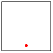 |
> | > (stop 89 "q") |
> | 0 |

停止！现在尝试理解当你按下一个键时 main 是如何反应的。验证你的猜想是否正确的一种方法是在一些合理的数字上启动 main 函数。

> | > (main 90) |
> | --- |
|  |
| 放松。 |
|  |

到目前为止，你可能觉得前两章内容很多。它们介绍了许多新概念，包括一种新的语言、其词汇、其含义、其习语、一种用这种词汇写文本的工具，以及运行这些程序的方法。面对这些众多想法，你可能想知道在给出问题陈述时如何创建程序。为了回答这个核心问题，下一章退一步，明确地讨论了程序的系统性设计。所以，深呼吸，准备好继续。

### 3 如何设计程序🔗 "链接到这里")

这本书的前几章表明，学习编程需要掌握许多概念。一方面，编程需要一个语言，一个用于传达我们希望计算的内容的符号。用于制定程序的语言是人工构造的，尽管学习编程语言与学习自然语言有一些共同之处。两者都包含词汇、语法，以及理解“短语”含义的能力。

另一方面，学习如何从问题陈述到程序至关重要。我们需要确定问题陈述中哪些是相关的，哪些可以忽略。我们需要分析出程序消耗了什么，产生了什么，以及它是如何将输入与输出关联起来的。我们必须知道或找出所选语言及其教学包是否为我们程序要处理的数据提供某些基本操作。如果不是，我们可能不得不开发辅助函数来实现这些操作。最后，一旦我们有了程序，我们必须检查它是否实际上执行了预期的计算。这可能会揭示各种错误，我们需要能够理解和修复这些错误。

所有这些都听起来相当复杂，你可能会想知道为什么我们不只是摸索着前进，这里实验一下，那里实验一下，当结果看起来不错时就不再管它。这种编程方法通常被称为“车库编程”，它很常见，在很多情况下都取得了成功；有时它还是初创公司的起点。然而，初创公司不能出售“车库努力”的结果，因为只有原始程序员和他们的朋友才能使用它们。

一个好的程序应该附有一份简短的说明，解释它做什么，期望什么输入，以及它产生什么输出。理想情况下，它还应该提供一些保证，表明它确实能工作。在最佳情况下，程序与问题陈述之间的联系是明显的，因此对问题陈述的微小更改可以轻松地转化为对程序的微小更改。软件工程师称这为“编程产品”。

所有这些额外的工作都是必要的，因为程序员不是为自己编写程序。程序员编写程序是为了其他程序员阅读，有时人们运行这些程序来完成工作。“其他”一词还包括程序员的老版本，他们通常无法回忆起年轻版本在程序生产中投入的所有思考。大多数程序都是大型、复杂的协作功能集合，没有人能在一天内编写所有这些功能。程序员加入项目，编写代码，离开项目；其他人接管他们的程序并对其进行工作。另一个困难是，程序员的客户往往会改变他们真正想要解决的问题的想法。他们通常几乎是对的，但更常见的是，他们会犯一些错误。更糟糕的是，复杂的逻辑结构，如程序，几乎总是受到人为错误的影响；简而言之，程序员会犯错误。最终有人会发现这些错误，程序员必须修复它们。他们需要重新阅读一个月前、一年前或二十年前编写的程序，并对其进行更改。

练习 33：研究“2000 年问题”。

在这里，我们提出了一种设计配方，它将逐步过程与围绕问题数据组织程序的方式相结合。对于那些不喜欢长时间盯着空白屏幕的读者，这个设计配方提供了一种以系统化方式取得进展的方法。对于那些教别人设计程序的人，这个配方是一种诊断新手困难的方法。对于其他人，我们的配方可能是一些他们可以应用于其他领域的东西——比如医学、新闻业或工程。对于那些希望成为真正的程序员的人来说，设计配方还提供了一种理解和处理现有程序的方法——尽管并非所有程序员都使用这种方法来编写程序。本章的其余部分致力于设计配方世界的第一步；接下来的章节和部分以某种方式完善和扩展了这个配方。

#### 3.1 设计函数🔗 "链接至此")

信息与数据 程序的目的是描述一个计算过程，该过程消耗一些信息并产生新的信息。从这个意义上讲，程序就像数学老师给小学生提供的指令。然而，与学生不同，程序处理的不仅仅是数字：它使用导航信息进行计算，查找某人的地址，打开开关，或检查视频游戏的状态。所有这些信息都来自现实世界的一部分——通常被称为程序的领域——程序的计算结果代表了这个领域中的更多信息。

信息在我们的描述中扮演着核心角色。将信息视为关于程序领域的真相。对于一个处理家具目录的程序，一个“有五条腿的桌子”或一个“两米见方的方形桌子”都是信息片段。游戏程序处理的是不同类型的领域，其中“五”可能指的是某些物体在画布的一部分移动到另一部分时每时钟周期移动的像素数。或者，工资程序可能处理“五项扣除”。 

为了让程序处理信息，它必须将其转换为编程语言中的一种数据形式；然后处理这些数据；一旦完成，它将结果数据再次转换为信息。交互式程序甚至可能将这些步骤混合在一起，根据需要从世界中获取更多信息，并在其中传递信息。

我们使用 BSL 和 DrRacket，这样你就不必担心信息到数据的转换。在 DrRacket 的 BSL 中，你可以直接将函数应用于数据并观察它产生的内容。因此，我们避免了编写将信息转换为数据以及相反的函数的严重鸡生蛋问题。对于简单类型的信息，设计这样的程序组件是微不足道的；对于除简单信息之外的其他任何东西，你需要了解解析，例如，这立即需要大量的程序设计专业知识。

软件工程师使用模型-视图-控制器（MVC）这个口号来描述 BSL 和 DrRacket 如何将数据处理与将信息解析成数据和将数据转换成信息分开。确实，现在人们普遍认为，精心设计的软件系统强制执行这种分离，尽管大多数入门书籍仍然将它们混合在一起。因此，使用 BSL 和 DrRacket 可以使你专注于程序核心的设计，当你在这方面有足够的经验时，你可以学习如何设计信息-数据转换部分。

在这里，我们使用两个预安装的教具包来展示数据和信息的分离：2htdp/batch-io 和 2htdp/universe。从本章开始，我们开发批量程序和交互程序的设计食谱，以给你一个完整的程序是如何设计的概念。但请记住，完整的编程语言的教具包提供了许多完整的程序上下文，并且你需要相应地调整设计食谱。

> > > > 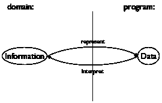
> > > > 
> 图 15：从信息到数据，再回到信息

考虑到信息和数据的核心作用，程序设计必须从它们之间的联系开始。具体来说，我们，程序员，必须决定如何使用我们选择的编程语言来表示相关信息作为数据，以及我们如何将数据解释为信息。图 15 用抽象图解说明了这个想法。

为了使这个想法更具体，让我们通过一些例子来分析。假设你正在设计一个以数字形式消耗和产生信息的程序。虽然选择表示方式很简单，但解释则需要说明一个像 42 这样的数字在作用域中代表什么：

+   42 在图像作用域中可能指的是从顶部边距开始的像素数；

+   42 可能代表模拟或游戏对象每时钟周期移动的像素数；

+   42 在物理作用域中可能代表华氏、摄氏或开尔文温度；

+   如果程序的作用域是一个家具目录，42 可能指定某些表格的大小；或者

+   42 可能只是计算字符串中的字符数。

关键在于知道如何从作为信息的数字转换到作为数据的数字，反之亦然。

由于这项知识对阅读程序的所有人来说都至关重要，我们通常将其以注释的形式写下来，我们称之为数据定义。数据定义有两个作用。首先，它用一个有意义的词命名一组数据——<wbr>一个类——<wbr>。其次，计算机科学家使用“类”来表示类似于“数学集合”的东西。它告知读者如何创建此类元素以及如何判断某个任意数据是否属于该集合。

这里是上述示例之一的数据定义：

> | ; 温度是一个 数字。 |
> | --- |
> | ; 解释表示摄氏度 |

第一行介绍了数据集合的名称，温度，并告诉我们该类由所有数字 s 组成。所以，例如，如果我们问 102 是否是温度，你可以回答“是”，因为 102 是一个数字，所有数字都是温度。同样，如果我们问“cold”是否是温度，你会说“不”，因为没有字符串属于温度。而且，如果我们让你编一个温度的样本，你可能想到的是-400。

如果你碰巧知道最低可能的温度大约是 C，你可能会想知道是否有可能在数据定义中表达这种知识。由于我们的数据定义实际上只是类的英语描述，你确实可以比这里展示的更精确地定义温度类。在这本书中，我们使用一种风格化的英语形式来表示这样的数据定义，下一章将介绍如何施加“大于-274”之类的约束。

到目前为止，你已经遇到了四种数据类的名称：数字、字符串、图像和布尔。有了这些，制定一个新的数据定义就意味着为现有的数据形式引入一个新的名称，比如“温度”为数字。即使这种有限的知识，也足以解释我们设计过程的概要。

设计过程一旦你理解了如何将输入信息表示为数据以及如何将输出数据解释为信息，单个函数的设计就会按照一个直接的过程进行：

1.  表达你希望如何将信息表示为数据。一行注释就足够了：

    > ; 我们用数字来表示厘米。

    为你认为是程序成功设计相关的重要数据类别，制定数据定义，例如 温度 的定义。

1.  写下签名、目的声明和函数头。

    函数签名是一个注释，它告诉你的设计读者你的函数消耗了多少输入，它们来自哪些类别，以及它产生什么类型的数据。以下是三个函数的例子，分别

    +   消耗一个 字符串 并生成一个 数字:

        > ; 字符串 -> 数字

    +   消耗一个 温度 并生成一个 字符串:

        > ; 温度 -> 字符串

        正如这个签名所指出的，将数据定义作为现有数据形式的别名引入，使得阅读签名背后的意图变得容易。

        然而，我们建议你现在避免对数据定义使用别名。这种名称的泛滥可能会造成相当多的混淆。平衡对新名称的需求和程序的易读性需要练习，而且现在有更多重要的概念需要理解。

    +   消耗一个 数字，一个 字符串 和一个 图像:

        > ; 数字  字符串  图像 -> 图像

        停止！这个函数产生了什么？

    目的声明是一个 BSL 注释，它用一行总结函数的目的。如果你对目的声明有疑问，写下对问题的最简回答

    > 函数计算了什么？

    每个阅读你程序的人都应该理解你的函数计算了什么，而无需阅读函数本身。

    一个多功能的程序也应该附带一个目的声明。确实，好的程序员会写两个目的声明：一个是为可能需要修改代码的读者，另一个是为希望使用程序但不阅读它的人。

    最后，一个头是一个简单的函数定义，也称为占位符。在签名中为每一类输入选择一个变量名；函数体可以是输出类中的任何数据。这三个函数头与上面的三个签名相匹配：

    +   ([定义](http://docs.racket-lang.org/htdp-langs/beginner.html#%28form._%28%28lib._lang%2Fhtdp-beginner..rkt%29._define%29%29)  (f  a-string)  0)

    +   ([定义](http://docs.racket-lang.org/htdp-langs/beginner.html#%28form._%28%28lib._lang%2Fhtdp-beginner..rkt%29._define%29%29)  (g  n)  "a")

    +   ([定义](http://docs.racket-lang.org/htdp-langs/beginner.html#%28form._%28%28lib._lang%2Fhtdp-beginner..rkt%29._define%29%29)  (h  num  str  img)  ([empty-scene](http://docs.racket-lang.org/teachpack/2htdpimage.html#%28def._%28%28lib._2htdp%2Fimage..rkt%29._empty-scene%29%29)  100  100))

    我们的参数名称反映了参数代表的数据类型。有时，你可能希望使用暗示参数目的的名称。当你制定目的陈述时，通常使用参数名称来阐明计算的内容。例如，

    > | ; Number  String  Image -> Image |
    > | --- |
    > | ; 向 img 中添加 s， |
    > | ; y 像素从顶部开始，10 像素从左边开始 |
    > | ([define](http://docs.racket-lang.org/htdp-langs/beginner.html#%28form._%28%28lib._lang%2Fhtdp-beginner..rkt%29._define%29%29) (add-image y s img) |
    > |   ([empty-scene](http://docs.racket-lang.org/teachpack/2htdpimage.html#%28def._%28%28lib._2htdp%2Fimage..rkt%29._empty-scene%29%29) 100 100)) |

    在这一点上，你可以点击“运行”按钮并尝试这个函数。当然，结果总是相同的值，这使得这些实验相当无聊。

1.  通过一些功能示例来说明签名和目的陈述。为了构建一个功能示例，从签名的每个输入类中选择一个数据项，并确定你期望得到什么。

    假设你正在设计一个计算正方形面积的函数。显然，这个函数需要消耗正方形边长的长度，最好用（正）数来表示。假设你已经按照说明完成了第一步，你会在目的陈述和标题之间添加示例，得到如下内容：

    > | ; Number -> Number |
    > | --- |
    > | ; 计算边长为 len 的正方形面积 |
    > | ; 给定：2，期望：4 |
    > | ; 给定：7，期望：49 |
    > | ([define](http://docs.racket-lang.org/htdp-langs/beginner.html#%28form._%28%28lib._lang%2Fhtdp-beginner..rkt%29._define%29%29) (area-of-square len) 0) |

1.  下一步是进行清单整理，以了解已知条件和需要计算的内容。我们感谢 Stephen Bloch 提出了“清单整理”这个术语。对于我们现在考虑的简单函数，我们知道它们通过参数提供数据。虽然参数是我们尚未知道值的占位符，但我们确实知道函数必须从这些未知数据中计算出结果。为了提醒自己这个事实，我们将函数的主体替换为一个模板。

    目前，模板只包含参数，所以前面的例子看起来是这样的：

    > | ([define](http://docs.racket-lang.org/htdp-langs/beginner.html#%28form._%28%28lib._lang%2Fhtdp-beginner..rkt%29._define%29%29) (area-of-square len) |
    > | --- |
    > |    ([...](http://docs.racket-lang.org/htdp-langs/beginner.html#%28form._%28%28lib._lang%2Fhtdp-beginner..rkt%29._......%29%29) len [...](http://docs.racket-lang.org/htdp-langs/beginner.html#%28form._%28%28lib._lang%2Fhtdp-beginner..rkt%29._......%29%29))) |

    这些点提醒你这不是一个完整的函数，而是一个模板，一个组织建议。

    本节模板看起来很无聊。一旦我们引入新的数据形式，模板就变得有趣了。

1.  现在是编码的时候了。一般来说，编码意味着编程，尽管通常是在最狭窄的可能方式下，即编写可执行的表达式和函数定义。

    对于我们来说，编码意味着用表达式替换函数的主体，该表达式尝试从模板中的片段计算出目的语句所承诺的内容。以下是关于“求平方面积”的完整定义：

    > | ; Number -> Number |
    > | --- |
    > | ; computes the area of a square with side len |
    > | ; given: 2, expect: 4 |
    > | ; given: 7, expect: 49 |
    > | ([define](http://docs.racket-lang.org/htdp-langs/beginner.html#%28form._%28%28lib._lang%2Fhtdp-beginner..rkt%29._define%29%29) (area-of-square len) |
    > |   ([sqr](http://docs.racket-lang.org/htdp-langs/beginner.html#%28def._htdp-beginner._%28%28lib._lang%2Fhtdp-beginner..rkt%29._sqr%29%29) len)) |
    > > > | ; Number  String  Image -> Image |
    > > > | ; adds s to img, y pixels from top, 10 pixels to the left |
    > > > | ; given: |
    > > > | ;    5 for y, |
    > > > | ;    "hello" for s, and |
    > > > | ;    ([empty-scene](http://docs.racket-lang.org/teachpack/2htdpimage.html#%28def._%28%28lib._2htdp%2Fimage..rkt%29._empty-scene%29%29)  100  100) for img |
    > > > | ; expected: |
    > > > | ;    ([place-image](http://docs.racket-lang.org/teachpack/2htdpimage.html#%28def._%28%28lib._2htdp%2Fimage..rkt%29._place-image%29%29)  ([text](http://docs.racket-lang.org/teachpack/2htdpimage.html#%28def._%28%28lib._2htdp%2Fimage..rkt%29._text%29%29)  "hello"  10  "red")  10  5  [...](http://docs.racket-lang.org/htdp-langs/beginner.html#%28form._%28%28lib._lang%2Fhtdp-beginner..rkt%29._......%29%29)) |
    > > > | ;    where ... is ([empty-scene](http://docs.racket-lang.org/teachpack/2htdpimage.html#%28def._%28%28lib._2htdp%2Fimage..rkt%29._empty-scene%29%29)  100  100) |
    > > > | ([define](http://docs.racket-lang.org/htdp-langs/beginner.html#%28form._%28%28lib._lang%2Fhtdp-beginner..rkt%29._define%29%29) (add-image y s img) |
    > > > |   ([place-image](http://docs.racket-lang.org/teachpack/2htdpimage.html#%28def._%28%28lib._2htdp%2Fimage..rkt%29._place-image%29%29) ([text](http://docs.racket-lang.org/teachpack/2htdpimage.html#%28def._%28%28lib._2htdp%2Fimage..rkt%29._text%29%29) s 10 "red") 10 y img)) |
    > > > 
    > 图 16：设计步骤 5 的完成

    要完成添加图像的函数需要做更多的工作：参见图 16。特别是，该函数需要将给定的字符串 s 转换为图像，然后将该图像放置在给定的场景中。

1.  正确设计的最后一步是在你之前工作的示例上测试函数。目前，测试是这样的。点击 RUN 按钮，并在交互区域输入与示例匹配的函数应用：

    > | > (area-of-square 2) |
    > | --- |
    > | 4 |
    > | > (area-of-square 7) |
    > | 49 |

    结果必须与预期的输出匹配；你必须检查每个结果，确保它等于设计部分示例中写下的内容。如果结果与预期输出不匹配，考虑以下三种可能性：

    1.  你计算错误，并确定了一些示例的错误预期输出。

    1.  或者，函数定义计算了错误的结果。在这种情况下，你的程序中存在逻辑错误，也称为错误。

    1.  例子和函数定义都是错误的。

    当你遇到预期结果与实际值不匹配的情况时，我们建议你首先确认预期结果是正确的。如果是这样，假设错误在于函数定义。否则，修复示例然后再次运行测试。如果你仍然遇到问题，你可能遇到了第三种，相对较少见的情况。

#### 3.2 手指练习：函数🔗 "链接至此")

以下的一些练习几乎与函数中的那些相同，尽管后者使用“定义”一词，而下面的练习使用“设计”一词。这种差异意味着你应该通过设计配方来创建这些函数，并且你的解决方案应包括所有相关部分。

如本节标题所暗示的，这些练习是练习题，旨在帮助你内化这个过程。直到这些步骤变得自然而然，永远不要跳过任何一个，因为这样做会导致容易避免的错误。编程中还有许多复杂错误的空间；我们不需要浪费时间在愚蠢的错误上。

练习 34\. 设计函数 string-first，它从一个非空字符串中提取第一个字符。不用担心空字符串。

练习 35\. 设计函数 string-last，它从一个非空字符串中提取最后一个字符。

练习 36\. 设计函数 image-area，它计算给定图像中的像素数量。

练习 37\. 设计函数 string-rest，它产生一个字符串，其第一个字符被移除。

练习 38\. 设计函数 string-remove-last，它产生一个字符串，其最后一个字符被移除。

#### 3.3 领域知识🔗 "链接至此")

很自然地会想知道编写函数主体需要哪些知识。一点反思会让你知道这一步需要适当掌握程序的领域。确实，存在两种形式的这种领域知识：

1.  来自外部领域的知识，如数学、音乐、生物学、土木工程、艺术等。由于程序员无法了解所有计算的应用领域，他们必须准备好理解各种应用领域的语言，以便他们能与领域专家讨论问题。数学是许多领域（但不全是）的交汇点。因此，程序员在解决与领域专家的问题时，必须经常学习新的语言。

1.  了解所选编程语言的 teachpack 函数。当你的任务是翻译涉及正切函数的数学公式时，你需要知道或猜测你选择的编程语言自带一个类似于 BSL 的 [tan](http://docs.racket-lang.org/htdp-langs/beginner.html#%28def._htdp-beginner._%28%28lib._lang%2Fhtdp-beginner..rkt%29._tan%29%29) 函数。当你的任务涉及图形时，了解 2htdp/image teachpack 的可能性将对你有所帮助。

由于你永远无法预测你将工作的领域或你必须使用的编程语言，因此，你对周围和适合的任何计算机语言的全部可能性有一个坚实的理解是至关重要的。否则，一些半途而废的编程知识的专业人士可能会接管你的工作。

你可以从你处理的数据定义中识别出需要领域知识的难题。只要数据定义使用了所选编程语言中存在的类，函数体（和程序）的定义主要就依赖于领域专业知识。后来，当我们介绍更复杂的数据形式时，函数的设计就需要计算机科学知识。

#### 3.4 从函数到程序🔗 "链接到此处")

并非所有程序都只包含一个函数定义。有些程序需要多个函数；许多程序还使用常量定义。无论如何，始终重要的是系统地设计每个函数，尽管全局常量和辅助函数会稍微改变设计过程。

当你定义了全局常量后，你的函数可以使用它们来计算结果。为了提醒自己它们的存在，你可能希望将这些常量添加到你的模板中；毕竟，它们属于可能有助于函数定义的物品清单。

多功能程序的产生是因为交互式程序自动需要处理键和鼠标事件的函数，将状态渲染为音乐的函数，可能还有更多。即使是批处理程序也可能需要几个不同的函数，因为它们执行多个不同的任务。有时问题陈述本身就会暗示这些任务；有时你会在设计某个函数的过程中发现需要辅助函数。

出于这些原因，我们建议保留一个所需函数列表或愿望清单。我们感谢约翰·斯托恩为我们提供了“愿望清单”这个术语。愿望清单上的每一项应包括三个要素：函数的有意义名称、签名和用途说明。对于批处理程序的设计，将主函数放在愿望清单上并开始设计它。对于交互式程序的设计，可以将事件处理器、[stop-when](http://docs.racket-lang.org/teachpack/2htdpuniverse.html#%28form._world._%28%28lib._2htdp%2Funiverse..rkt%29._stop-when%29%29) 函数和场景渲染函数列入清单。只要清单不为空，就可以选择一个愿望并设计函数。如果在设计过程中发现需要另一个函数，就将其列入清单。当清单为空时，你就完成了。

#### 3.5 关于测试🔗 "链接到此处")

测试很快就会变成一项劳动密集型的任务。虽然在交互区域运行小程序很容易，但这样做需要大量的机械劳动和复杂的检查。随着程序员系统规模的扩大，他们希望进行许多测试。很快，这种劳动就会变得压倒性，程序员开始忽视它。与此同时，测试是发现和预防基本缺陷的第一工具。粗略的测试很快就会导致存在隐藏问题的函数——也就是说，有缺陷的函数——而这些有缺陷的函数会阻碍项目，通常以多种方式。

因此，将测试机械化而不是手动执行至关重要。像许多编程语言一样，BSL 包含了一个测试设施，DrRacket 也了解这个设施。为了介绍这个测试设施，我们再次审视将华氏温度转换为摄氏温度的函数程序。以下是定义：

> | ; Number -> Number |
> | --- |
> | ; 将华氏温度转换为摄氏温度 |
> | ; 给定 32，期望 0 |
> | ; 给定 212，期望 100 |
> | ; 给定 -40，期望 -40 |
> | ([define](http://docs.racket-lang.org/htdp-langs/beginner.html#%28form._%28%28lib._lang%2Fhtdp-beginner..rkt%29._define%29%29) (f2c f) |
> |   ([*](http://docs.racket-lang.org/htdp-langs/beginner.html#%28def._htdp-beginner._%28%28lib._lang%2Fhtdp-beginner..rkt%29._%2A%29%29) 5/9 ([-](http://docs.racket-lang.org/htdp-langs/beginner.html#%28def._htdp-beginner._%28%28lib._lang%2Fhtdp-beginner..rkt%29._-%29%29) f 32))) |

测试函数的示例需要三个计算和每对数字之间的三个比较。你可以制定这些测试并将它们添加到 DrRacket 的定义区域：

> | ([check-expect](http://docs.racket-lang.org/htdp-langs/beginner.html#%28form._%28%28lib._lang%2Fhtdp-beginner..rkt%29._check-expect%29%29) (f2c -40) -40) |
> | --- |
> | ([check-expect](http://docs.racket-lang.org/htdp-langs/beginner.html#%28form._%28%28lib._lang%2Fhtdp-beginner..rkt%29._check-expect%29%29) (f2c 32) 0) |
> | ([check-expect](http://docs.racket-lang.org/htdp-langs/beginner.html#%28form._%28%28lib._lang%2Fhtdp-beginner..rkt%29._check-expect%29%29) (f2c 212) 100) |

当你现在点击 RUN 按钮，你会看到 BSL 的报告显示程序通过了所有三个测试——<wbr>而且你没有其他事情要做。除了让测试自动运行之外，[check-expect](http://docs.racket-lang.org/htdp-langs/beginner.html#%28form._%28%28lib._lang%2Fhtdp-beginner..rkt%29._check-expect%29%29) 表达式在测试失败时还显示了另一个优势。要了解它是如何工作的，请将上面的测试之一更改为结果错误，例如

> ([check-expect](http://docs.racket-lang.org/htdp-langs/beginner.html#%28form._%28%28lib._lang%2Fhtdp-beginner..rkt%29._check-expect%29%29) (f2c -40) 40)

当你现在点击 RUN 按钮时，会弹出一个额外的窗口。窗口中的文本解释说有三个测试中的一个失败了。对于失败的测试，窗口显示三个部分：计算出的值，函数调用的结果(-40)；预期的值(40)；以及指向失败测试用例文本的超链接。

> > > | ; 数字 -> 数字 |
> > > | --- |
> > > | 将华氏温度转换为摄氏温度 |
> > > |   |
> > > | ([check-expect](http://docs.racket-lang.org/htdp-langs/beginner.html#%28form._%28%28lib._lang%2Fhtdp-beginner..rkt%29._check-expect%29%29) (f2c -40) -40) |
> > > | ([check-expect](http://docs.racket-lang.org/htdp-langs/beginner.html#%28form._%28%28lib._lang%2Fhtdp-beginner..rkt%29._check-expect%29%29) (f2c 32) 0) |
> > > | ([check-expect](http://docs.racket-lang.org/htdp-langs/beginner.html#%28form._%28%28lib._lang%2Fhtdp-beginner..rkt%29._check-expect%29%29) (f2c 212) 100) |
> > > |   |
> > > | ([define](http://docs.racket-lang.org/htdp-langs/beginner.html#%28form._%28%28lib._lang%2Fhtdp-beginner..rkt%29._define%29%29) (f2c f) |
> > > |   ([*](http://docs.racket-lang.org/htdp-langs/beginner.html#%28def._htdp-beginner._%28%28lib._lang%2Fhtdp-beginner..rkt%29._%2A%29%29) 5/9 ([-](http://docs.racket-lang.org/htdp-langs/beginner.html#%28def._htdp-beginner._%28%28lib._lang%2Fhtdp-beginner..rkt%29._-%29%29) f 32))) |
> > > 
> 图 17：BSL 中的测试

你可以将 [check-expect](http://docs.racket-lang.org/htdp-langs/beginner.html#%28form._%28%28lib._lang%2Fhtdp-beginner..rkt%29._check-expect%29%29) 规范放置在要测试的函数定义之上或之下。当你点击运行时，DrRacket 会收集所有 [check-expect](http://docs.racket-lang.org/htdp-langs/beginner.html#%28form._%28%28lib._lang%2Fhtdp-beginner..rkt%29._check-expect%29%29) 规范，并在所有函数定义添加到操作的“词汇”之后进行评估。图 17 展示了如何利用这种自由来结合示例和测试步骤。你不必将示例作为注释写下，可以直接将它们转换为测试。当你完成函数的设计后，点击运行执行测试。如果你出于某种原因更改了函数，下一次点击将重新测试该函数。

最后但同样重要的是，[check-expect](http://docs.racket-lang.org/htdp-langs/beginner.html#%28form._%28%28lib._lang%2Fhtdp-beginner..rkt%29._check-expect%29%29) 也可以用于图像。也就是说，你可以测试生成图像的函数。比如说，你希望设计一个名为 render 的函数，该函数将汽车图像（称为 CAR）放置在背景场景（称为 BACKGROUND）中。对于这个函数的设计，你可以制定如下测试：

> | ([check-expect](http://docs.racket-lang.org/htdp-langs/beginner.html#%28form._%28%28lib._lang%2Fhtdp-beginner..rkt%29._check-expect%29%29) (render 50) |
> | --- |
> |   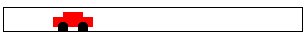) |
> | ([check-expect](http://docs.racket-lang.org/htdp-langs/beginner.html#%28form._%28%28lib._lang%2Fhtdp-beginner..rkt%29._check-expect%29%29) (render 200) |
> |   ) |

或者，你可以这样写：有关制定测试的其他方法，请参阅间奏曲 1。

> | ([check-expect](http://docs.racket-lang.org/htdp-langs/beginner.html#%28form._%28%28lib._lang%2Fhtdp-beginner..rkt%29._check-expect%29%29) (render 50) |
> | --- |
> |    CAR 50 Y-CAR 背景) |
> | ([check-expect](http://docs.racket-lang.org/htdp-langs/beginner.html#%28form._%28%28lib._lang%2Fhtdp-beginner..rkt%29._check-expect%29%29) (render 200) |
> |    CAR 200 Y-CAR 背景) |

这种替代方法有助于你弄清楚如何表达函数体，因此是首选的。开发此类表达式的一种方法是在交互区域进行实验。

因为有 DrRacket 进行测试而不必手动检查一切非常实用，所以我们立即切换到这种测试风格，并在本书的其余部分继续使用。这种测试形式被称为单元测试，BSL 的单元测试框架特别针对新手程序员进行了调整。有一天你将切换到另一种编程语言；你的第一个任务之一将是了解其单元测试框架。

#### 3.6 设计世界程序🔗 "链接到此处")

虽然上一章以临时方式介绍了 2htdp/universe teachpack，但本节展示了设计配方如何帮助你系统地创建世界程序。它从基于数据定义和函数签名的 2htdp/universe teachpack 的简要总结开始。然后阐述了世界程序的设计配方。

teachpack 期望程序员开发一个数据定义来表示世界的状态，以及一个知道如何为世界的每个可能状态创建图像的函数 render。根据程序的需求，程序员必须设计响应时钟滴答、按键和鼠标事件的函数。最后，交互式程序可能需要在当前世界属于状态的子类时停止；end? 识别这些最终状态。图 18 以简化的方式阐述了这一想法。

> > > | ; WorldState: 表示当前世界的状态的数据（cw） |
> > > | --- |
> > > |   |
> > > | ; WorldState -> Image |
> > > | ; 当需要时，[big-bang](http://docs.racket-lang.org/teachpack/2htdpuniverse.html#%28form._world._%28%28lib._2htdp%2Funiverse..rkt%29._big-bang%29%29) 获取当前状态的图像 |
> > > | ; 通过评估 (render cw) 获取世界的状态 |
> > > | ([define](http://docs.racket-lang.org/htdp-langs/beginner.html#%28form._%28%28lib._lang%2Fhtdp-beginner..rkt%29._define%29%29) (render cw) [...](http://docs.racket-lang.org/htdp-langs/beginner.html#%28form._%28%28lib._lang%2Fhtdp-beginner..rkt%29._......%29%29)) |
> > > |   |
> > > | ; WorldState -> WorldState |
> > > | ; 对于时钟的每个滴答，[big-bang](http://docs.racket-lang.org/teachpack/2htdpuniverse.html#%28form._world._%28%28lib._2htdp%2Funiverse..rkt%29._big-bang%29%29) 获取下一个 |
> > > | ; 从 (clock-tick-handler cw) 获取世界的状态 |
> > > | ([define](http://docs.racket-lang.org/htdp-langs/beginner.html#%28form._%28%28lib._lang%2Fhtdp-beginner..rkt%29._define%29%29) (clock-tick-handler cw) [...](http://docs.racket-lang.org/htdp-langs/beginner.html#%28form._%28%28lib._lang%2Fhtdp-beginner..rkt%29._......%29%29)) |
> > > |   |
> > > | ; WorldState  String -> WorldState |
> > > | ; 对于每个按键，[big-bang](http://docs.racket-lang.org/teachpack/2htdpuniverse.html#%28form._world._%28%28lib._2htdp%2Funiverse..rkt%29._big-bang%29%29) 获取下一个状态 |
> > > | ; 从 (keystroke-handler cw ke)；ke 代表按键 |
> > > | ([define](http://docs.racket-lang.org/htdp-langs/beginner.html#%28form._%28%28lib._lang%2Fhtdp-beginner..rkt%29._define%29%29) (keystroke-handler cw ke) [...](http://docs.racket-lang.org/htdp-langs/beginner.html#%28form._%28%28lib._lang%2Fhtdp-beginner..rkt%29._......%29%29)) |
> > > |   |
> > > | ; WorldState  Number  Number  String -> WorldState |
> > > | ; for each mouse gesture, [big-bang](http://docs.racket-lang.org/teachpack/2htdpuniverse.html#%28form._world._%28%28lib._2htdp%2Funiverse..rkt%29._big-bang%29%29) obtains the next state |
> > > | ; from (mouse-event-handler cw x y me) where x and y are |
> > > | ; the coordinates of the event and me is its description |
> > > | ([define](http://docs.racket-lang.org/htdp-langs/beginner.html#%28form._%28%28lib._lang%2Fhtdp-beginner..rkt%29._define%29%29) (mouse-event-handler cw x y me) [...](http://docs.racket-lang.org/htdp-langs/beginner.html#%28form._%28%28lib._lang%2Fhtdp-beginner..rkt%29._......%29%29)) |
> > > |   |
> > > | ; WorldState -> Boolean |
> > > | ; after each event, [big-bang](http://docs.racket-lang.org/teachpack/2htdpuniverse.html#%28form._world._%28%28lib._2htdp%2Funiverse..rkt%29._big-bang%29%29) evaluates (end? cw) |
> > > | ([define](http://docs.racket-lang.org/htdp-langs/beginner.html#%28form._%28%28lib._lang%2Fhtdp-beginner..rkt%29._define%29%29) (end? cw) [...](http://docs.racket-lang.org/htdp-langs/beginner.html#%28form._%28%28lib._lang%2Fhtdp-beginner..rkt%29._......%29%29)) |
> > > 
> 图 18：设计世界程序的需求清单

假设你对[大爆炸](http://docs.racket-lang.org/teachpack/2htdpuniverse.html#%28form._world._%28%28lib._2htdp%2Funiverse..rkt%29._big-bang%29%29)的工作原理有基本的了解，你可以专注于真正重要的设计世界程序的问题。让我们为以下设计配方构建一个具体的例子：

> 样例问题 设计一个程序，使汽车在世界画布上从左到右移动，每次时钟滴答移动三个像素。

对于这个问题陈述，很容易想象出该领域的场景：

> 
> 
> 
> 
> 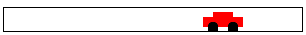

在本书中，我们经常将交互式[大爆炸](http://docs.racket-lang.org/teachpack/2htdpuniverse.html#%28form._world._%28%28lib._2htdp%2Funiverse..rkt%29._big-bang%29%29)程序的范围称为“世界”，我们谈论设计“世界程序”。世界程序的设计配方，就像函数的配方一样，是从问题陈述到工作程序的系统转换工具。它包括三个大步骤和一个小步骤：

1.  对于所有那些随时间保持不变且需要将其渲染为图像的世界属性，引入常数。在 BSL 中，我们通过定义来指定此类常数。对于世界程序，我们区分两种类型的常数：

    1.  “物理”常数描述了世界中物体的通用属性，例如物体的速度或速度、颜色、高度、宽度、半径等等。当然，这些常数并不真正指代物理事实，但许多都与现实世界的物理方面相似。

        在我们的示例问题中，汽车车轮的半径和车轮之间的距离是这样的“物理”常数：

        > | ([定义](http://docs.racket-lang.org/htdp-langs/beginner.html#%28form._%28%28lib._lang%2Fhtdp-beginner..rkt%29._define%29%29) WIDTH-OF-WORLD 200) |
        > | --- |
        > |   |
        > | ([定义](http://docs.racket-lang.org/htdp-langs/beginner.html#%28form._%28%28lib._lang%2Fhtdp-beginner..rkt%29._define%29%29) WHEEL-RADIUS 5) |
        > | ([定义](http://docs.racket-lang.org/htdp-langs/beginner.html#%28form._%28%28lib._lang%2Fhtdp-beginner..rkt%29._define%29%29) WHEEL-DISTANCE ([*](http://docs.racket-lang.org/htdp-langs/beginner.html#%28def._htdp-beginner._%28%28lib._lang%2Fhtdp-beginner..rkt%29._%2A%29%29) WHEEL-RADIUS 5)) |

        注意第二个常数是如何从第一个常数计算出来的。

    1.  图形常数是现实世界中物体的图像。程序将它们组合成代表世界完整状态的图像。

        这里是我们示例汽车车轮图像的图形常数：

        > | ([定义](http://docs.racket-lang.org/htdp-langs/beginner.html#%28form._%28%28lib._lang%2Fhtdp-beginner..rkt%29._define%29%29) WHEEL) |
        > | --- |
        > |   ([圆](http://docs.racket-lang.org/teachpack/2htdpimage.html#%28def._%28%28lib._2htdp%2Fimage..rkt%29._circle%29%29) WHEEL-RADIUS "实心" "黑色")) |
        > | 我们建议你在 DrRacket 的交互区域进行实验，以开发这样的图形常数。 |
        > | ([定义](http://docs.racket-lang.org/htdp-langs/beginner.html#%28form._%28%28lib._lang%2Fhtdp-beginner..rkt%29._define%29%29) SPACE) |
        > |   ([矩形](http://docs.racket-lang.org/teachpack/2htdpimage.html#%28def._%28%28lib._2htdp%2Fimage..rkt%29._rectangle%29%29) [...](http://docs.racket-lang.org/htdp-langs/beginner.html#%28form._%28%28lib._lang%2Fhtdp-beginner..rkt%29._......%29%29) WHEEL-RADIUS [...](http://docs.racket-lang.org/htdp-langs/beginner.html#%28form._%28%28lib._lang%2Fhtdp-beginner..rkt%29._......%29%29) "白色")) |
        > | ([定义](http://docs.racket-lang.org/htdp-langs/beginner.html#%28form._%28%28lib._lang%2Fhtdp-beginner..rkt%29._define%29%29) BOTH-WHEELS) |
        > |   ([并列](http://docs.racket-lang.org/teachpack/2htdpimage.html#%28def._%28%28lib._2htdp%2Fimage..rkt%29._beside%29%29) WHEEL SPACE WHEEL)) |

        图形常数通常是计算得出的，计算往往涉及物理常数和其他图像。

    在常量定义上添加注释，解释其含义是一种良好的实践。

1.  随着时间变化——对时钟滴答、按键或鼠标动作的反应——这些属性导致世界当前状态的产生。你的任务是开发一个数据表示，以涵盖世界所有可能的状态。这种开发结果是一个数据定义，它附带一个注释，告诉读者如何将世界信息表示为数据，以及如何将数据解释为关于世界的信息。

    选择简单的数据形式来表示世界状态。

    对于运行示例，随着时间的推移，汽车与左侧边界的距离是变化的。虽然与右侧边界的距离也在变化，但很明显，我们只需要其中一个来创建图像。距离用数字来衡量，所以以下是一个足够的数据定义：

    > | ; A WorldState 是一个 Number。 |
    > | --- |
    > | ; interpretation the number of pixels between |
    > | ; 场景的左侧边界和汽车 |

    另一种选择是计算经过的时钟滴答次数，并使用这个数字作为世界状态。我们将这个设计变体留作练习。

1.  一旦你有了世界状态的数据表示，你需要设计一些函数，以便你可以形成一个有效的[大爆炸](http://docs.racket-lang.org/teachpack/2htdpuniverse.html#%28form._world._%28%28lib._2htdp%2Funiverse..rkt%29._big-bang%29%29)表达式。

    首先，你需要一个函数，将任何给定状态映射到一个图像，以便[大爆炸](http://docs.racket-lang.org/teachpack/2htdpuniverse.html#%28form._world._%28%28lib._2htdp%2Funiverse..rkt%29._big-bang%29%29)可以渲染状态的序列为图像：

    > ; render

    接下来，你需要决定哪些事件应该改变世界状态的哪些方面。根据你的决定，你需要设计以下三个函数中的某些或全部：

    > | ; clock-tick-handler |
    > | --- |
    > | ; keystroke-handler |
    > | ; mouse-event-handler |

    最后，如果问题说明建议程序应该在世界具有某些属性时停止，你必须设计

    > ; end?

    对于这些函数的通用签名和目的说明，请参阅图 18。将这些通用目的说明适应到你所解决的特定问题中，以便读者知道它们计算的内容。

    简而言之，设计一个交互式程序的需求自动为你列出了几个初始条目。逐一完成它们，你就能得到一个完整的世界程序。

    让我们逐步分析这个示例程序。虽然[大爆炸](http://docs.racket-lang.org/teachpack/2htdpuniverse.html#%28form._world._%28%28lib._2htdp%2Funiverse..rkt%29._big-bang%29%29)要求我们必须设计一个渲染函数，但我们仍然需要确定我们是否需要任何事件处理函数。由于汽车应该从左向右移动，我们肯定需要一个处理时钟滴答声的函数。因此，我们得到以下愿望清单：

    > | ; 世界状态 -> 图像 |
    > | --- |
    > | ; 将汽车图像放置在 x 像素处 |
    > | ; 背景图像的左边缘 |
    > | ([定义](http://docs.racket-lang.org/htdp-langs/beginner.html#%28form._%28%28lib._lang%2Fhtdp-beginner..rkt%29._define%29%29) (render x) |
    > |   BACKGROUND) |
    > |   |
    > | ; 世界状态 -> 世界状态 |
    > | ; 将 x 加 3 以将汽车向右移动 |
    > | ([定义](http://docs.racket-lang.org/htdp-langs/beginner.html#%28form._%28%28lib._lang%2Fhtdp-beginner..rkt%29._define%29%29) (tock x) |
    > |   x) |

    注意我们如何根据当前问题调整目的陈述，并理解[大爆炸](http://docs.racket-lang.org/teachpack/2htdpuniverse.html#%28form._world._%28%28lib._2htdp%2Funiverse..rkt%29._big-bang%29%29)将如何使用这些函数。

1.  最后，您需要一个 main 函数。与所有其他函数不同，用于世界程序的主函数不需要设计或测试。它存在的唯一原因是您可以从 DrRacket 的交互区域方便地启动您的世界程序。

    您必须做出的一个决定是关于 main 函数的参数。对于我们的示例问题，我们选择一个参数：世界的初始状态。下面是具体做法：

    > | ; 世界状态 -> 世界状态 |
    > | --- |
    > | ; 从某个初始状态启动程序 |
    > | ([定义](http://docs.racket-lang.org/htdp-langs/beginner.html#%28form._%28%28lib._lang%2Fhtdp-beginner..rkt%29._define%29%29) (main ws) |
    > |    ([大爆炸](http://docs.racket-lang.org/teachpack/2htdpuniverse.html#%28form._world._%28%28lib._2htdp%2Funiverse..rkt%29._big-bang%29%29) ws) |
    > |      [[在每秒更新时](http://docs.racket-lang.org/teachpack/2htdpuniverse.html#%28form._world._%28%28lib._2htdp%2Funiverse..rkt%29._on-tick%29%29) tock] |
    > |      [[绘制](http://docs.racket-lang.org/teachpack/2htdpuniverse.html#%28form._world._%28%28lib._2htdp%2Funiverse..rkt%29._to-draw%29%29) render])) |

    因此，您可以使用以下方式启动此交互式程序

    > | > (main 13) |
    > | --- |

    要观察汽车从左侧边距 13 像素处开始，当关闭[big-bang](http://docs.racket-lang.org/teachpack/2htdpuniverse.html#%28form._world._%28%28lib._2htdp%2Funiverse..rkt%29._big-bang%29%29)窗口时停止。记住，[big-bang](http://docs.racket-lang.org/teachpack/2htdpuniverse.html#%28form._world._%28%28lib._2htdp%2Funiverse..rkt%29._big-bang%29%29)在评估停止时返回世界的当前状态。

自然地，你不必使用“WorldState”这个名字来表示代表世界状态的类。只要你在事件处理函数的签名中一致地使用这个名字，任何名字都可以。同样，你不必使用 tock、end?或 render 这些名字。你可以将这些函数命名为你喜欢的任何名字，只要你在写下[big-bang](http://docs.racket-lang.org/teachpack/2htdpuniverse.html#%28form._world._%28%28lib._2htdp%2Funiverse..rkt%29._big-bang%29%29)表达式的子句时使用相同的名字。最后，你可能已经注意到，只要首先列出初始状态，你可以以任何顺序列出[big-bang](http://docs.racket-lang.org/teachpack/2htdpuniverse.html#%28form._world._%28%28lib._2htdp%2Funiverse..rkt%29._big-bang%29%29)表达式的子句。

让我们现在继续完成程序设计过程的其余部分，使用到目前为止已经详细说明的设计配方和函数以及其他设计概念。

练习 39。优秀的程序员确保像 CAR 这样的图像可以通过更改常量定义来放大或缩小。优秀的程序员为程序的所有方面建立单点控制，而不仅仅是图形常量。几章内容都涉及这个问题。我们开始开发汽车图像时，使用了一个简单的定义：

> ([define](http://docs.racket-lang.org/htdp-langs/beginner.html#%28form._%28%28lib._lang%2Fhtdp-beginner..rkt%29._define%29%29) WHEEL-RADIUS 5)

WHEEL-DISTANCE 的定义基于车轮的半径。因此，将 WHEEL-RADIUS 从 5 改为 10 将汽车图像的大小加倍。这种程序组织方式被称为单点控制，优秀的设计尽可能多地采用这种理念。

开发你最喜欢的汽车图像，使 WHEEL-RADIUS 成为单点控制。

愿望清单上的下一个条目是时钟滴答处理函数：

> | ; WorldState -> WorldState |
> | --- |
> | ; 每次时钟滴答移动汽车 3 像素 |
> | ([define](http://docs.racket-lang.org/htdp-langs/beginner.html#%28form._%28%28lib._lang%2Fhtdp-beginner..rkt%29._define%29%29) (tock cw) cw) |

由于世界状态代表画布左侧边距和汽车之间的距离，并且汽车每次时钟滴答移动三个像素，一个简洁的目的声明将这两个事实合并为一个。这也使得创建示例和定义函数变得容易：

> | 给定：WorldState -> WorldState |
> | --- |
> | 给定：每次时钟滴答移动汽车 3 个像素 |
> | 示例： |
> | 给定：20，期望：23 |
> | 给定：78，期望：81 |
> | ([定义](http://docs.racket-lang.org/htdp-langs/beginner.html#%28form._%28%28lib._lang%2Fhtdp-beginner..rkt%29._define%29%29) (tock cw) |
> |   ([+](http://docs.racket-lang.org/htdp-langs/beginner.html#%28def._htdp-beginner._%28%28lib._lang%2Fhtdp-beginner..rkt%29._%2B%29%29) cw 3)) |

最后的设计步骤需要确认示例是否按预期工作。因此，我们点击 RUN 按钮并评估这些表达式：

> | > (tock 20) |
> | --- |
> | 23 |
> | > (tock 78) |
> | 81 |

由于结果符合预期，tock 的设计就完成了。

练习 40。将示例作为 BSL 测试来制定，即使用[check-expect](http://docs.racket-lang.org/htdp-langs/beginner.html#%28form._%28%28lib._lang%2Fhtdp-beginner..rkt%29._check-expect%29%29)形式。引入一个错误。重新运行测试。

我们愿望清单上的第二个条目指定了一个将世界状态转换为图像的函数：

> | 给定：WorldState -> Image |
> | --- |
> | 给定：将汽车放置到背景场景中， |
> | 根据给定的世界状态 |
> | ([定义](http://docs.racket-lang.org/htdp-langs/beginner.html#%28form._%28%28lib._lang%2Fhtdp-beginner..rkt%29._define%29%29) (render cw) |
> |   背景) |

为了为渲染函数制作示例，我们建议安排一个表格，类似于图 19 的上半部分。它列出了给定的世界状态和期望的场景。对于你最初的几个渲染函数，你可能希望手动绘制这些图像。

> > > > | cw |  | 它的图像 |
> > > > | --- | --- | --- |
> > > > | 50 |  |  |
> > > > | 100 |  | 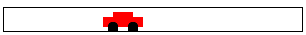 |
> > > > | 150 |  | 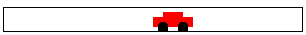 |
> > > > | 200 |  |  |
> > > > |  |  |  |
> > > > | cw |  | 一个表达式 |
> > > > | 50 |  | ([放置图像](http://docs.racket-lang.org/teachpack/2htdpimage.html#%28def._%28%28lib._2htdp%2Fimage..rkt%29._place-image%29%29) CAR 50 Y-CAR 背景) |
> > > > | 100 |  | ([放置图像](http://docs.racket-lang.org/teachpack/2htdpimage.html#%28def._%28%28lib._2htdp%2Fimage..rkt%29._place-image%29%29) CAR 100 Y-CAR 背景) |
> > > > | 150 |  | ([放置图像](http://docs.racket-lang.org/teachpack/2htdpimage.html#%28def._%28%28lib._2htdp%2Fimage..rkt%29._place-image%29%29) CAR 150 Y-CAR 背景) |
> > > > | 200 |  | ([放置图像](http://docs.racket-lang.org/teachpack/2htdpimage.html#%28def._%28%28lib._2htdp%2Fimage..rkt%29._place-image%29%29) CAR 200 Y-CAR 背景) |
> > > > 
> 图 19：移动汽车程序示例

尽管这种图像表直观且解释了运行函数将要显示的内容——<wbr>一辆移动的汽车——<wbr>但它并没有解释函数是如何创建这种结果的。要从这里到那里，我们建议写下像图 19 下半部分那样的表达式，这些表达式在表中创建图像。大写名称指的是明显的常量：汽车图像、其固定的 y 坐标和当前为空的背景场景。

这个扩展表建议了将公式放入渲染函数主体的模式：

> | ; WorldState -> Image |
> | --- |
> | ; 将汽车放置到背景场景中， |
> | ; 根据给定的世界状态 |
> |  ([定义](http://docs.racket-lang.org/htdp-langs/beginner.html#%28form._%28%28lib._lang%2Fhtdp-beginner..rkt%29._define%29%29) (render cw) |
> | （[放置图像](http://docs.racket-lang.org/teachpack/2htdpimage.html#%28def._%28%28lib._2htdp%2Fimage..rkt%29._place-image%29%29) CAR cw Y-CAR 背景） |

这基本上就是设计一个简单的世界程序的全部内容。练习 41。完成示例问题，并使程序运行。也就是说，假设你已经解决了练习 39，定义常量背景和 Y-CAR。然后组装所有函数定义，包括它们的测试。当你的程序运行到你满意时，向场景中添加一棵树。我们使用了

> | ([定义](http://docs.racket-lang.org/htdp-langs/beginner.html#%28form._%28%28lib._lang%2Fhtdp-beginner..rkt%29._define%29%29) tree |
> | --- |
> | （[underlay/xy](http://docs.racket-lang.org/teachpack/2htdpimage.html#%28def._%28%28lib._2htdp%2Fimage..rkt%29._underlay%2Fxy%29%29) （[圆形](http://docs.racket-lang.org/teachpack/2htdpimage.html#%28def._%28%28lib._2htdp%2Fimage..rkt%29._circle%29%29) 10 "solid" "green") |
> | |              9 15 |
> |                ([矩形](http://docs.racket-lang.org/teachpack/2htdpimage.html#%28def._%28%28lib._2htdp%2Fimage..rkt%29._rectangle%29%29) 2 20 "solid" "brown"))) |

来创建一个类似树的形状。还要向[big-bang](http://docs.racket-lang.org/teachpack/2htdpuniverse.html#%28form._world._%28%28lib._2htdp%2Funiverse..rkt%29._big-bang%29%29)表达式添加一个子句，当汽车在右侧消失时停止动画。

在确定世界状态初始数据表示后，一个细心的程序员可能在整个设计过程中需要重新审视这个基本的设计决策。例如，样本问题的数据定义将汽车表示为一个点。但（汽车的）图像并不仅仅是一个没有宽度和高度的数学点。因此，解释说明——<wbr>从左边界到像素数的数量——<wbr>是一个模糊的说明。这个说明是测量左边界和汽车左端之间的距离吗？它的中心点？还是甚至它的右端？在这里我们忽略了这个问题，并将其留给 BSL 的图像原语来为我们做出决定。如果你不喜欢结果，重新审视上面的数据定义，并修改它或其解释说明以符合你的口味。

练习 42。修改样本数据定义的解释，使一个状态表示汽车最右边的 x 坐标。

练习 43。让我们使用基于时间的数据定义来处理相同的问题说明：

> | ; 一个 AnimationState 是一个 Number。 |
> | --- |
> | ; 解释：时钟滴答次数 |
> | ; 因为动画已经开始 |

与原始数据定义一样，这个定义也将世界状态与数字类别等同起来。然而，它的解释却说明这个数字意味着完全不同的事情。

设计 tock 和 render 函数。然后开发一个[big-bang](http://docs.racket-lang.org/teachpack/2htdpuniverse.html#%28form._world._%28%28lib._2htdp%2Funiverse..rkt%29._big-bang%29%29)表达式，以便再次得到一辆汽车从左到右穿越世界画布的动画。

你认为这个程序与 Prologue: How to Program 中的[animate](http://docs.racket-lang.org/teachpack/2htdpuniverse.html#%28def._%28%28lib._2htdp%2Funiverse..rkt%29._animate%29%29)有何关联？

使用数据定义设计一个程序，使汽车根据正弦波移动。（不要真的那样开车。）

我们以一个鼠标事件处理的示例结束本节，这也展示了视图和模型分离的优势。

> > > 处理鼠标移动有时是棘手的，因为它们并不完全像看起来那样。为了了解为什么会这样，请阅读关于鼠标和键盘。

假设我们希望允许人们通过“超空间”移动汽车：

> 样本问题设计一个程序，使汽车以每时钟滴答三个像素的速度从世界画布的左侧移动到右侧。如果鼠标在画布的任何地方点击，汽车将被放置在点击的 x 坐标处。

粗体部分是上述示例问题的扩展。当我们面对一个修改后的问题时，我们使用设计过程来引导我们进行必要的更改。如果正确使用，这个过程自然会确定我们需要向现有程序中添加什么来应对问题声明的扩展。所以，我们就这样开始了：

1.  没有新的属性，这意味着我们不需要新的常量。

1.  程序仍然只关注一个随时间变化的属性，即汽车的车标位置。因此，数据表示就足够了。

1.  修改后的问题声明需要一个鼠标事件处理程序，同时不放弃基于时钟的汽车移动。因此，我们提出一个适当的愿望：

    > | ; WorldState  Number  Number  String -> WorldState |
    > | --- |
    > | ; 将汽车放置在 x-mouse 位置 |
    > | ; 如果给定的 me 是"button-down" |
    > | ([定义](http://docs.racket-lang.org/htdp-langs/beginner.html#%28form._%28%28lib._lang%2Fhtdp-beginner..rkt%29._define%29%29) (hyper x-position-of-car x-mouse y-mouse me) |
    > | |   x-position-of-car) |

1.  最后，我们需要修改主函数以处理鼠标事件。这只需要添加一个[on-mouse](http://docs.racket-lang.org/teachpack/2htdpuniverse.html#%28form._world._%28%28lib._2htdp%2Funiverse..rkt%29._on-mouse%29%29)子句，使其指向我们愿望列表中的新条目：

    > | ([定义](http://docs.racket-lang.org/htdp-langs/beginner.html#%28form._%28%28lib._lang%2Fhtdp-beginner..rkt%29._define%29%29) (main ws) |
    > | --- |
    > | |    ([big-bang](http://docs.racket-lang.org/teachpack/2htdpuniverse.html#%28form._world._%28%28lib._2htdp%2Funiverse..rkt%29._big-bang%29%29) ws |
    > | |    [[on-tick](http://docs.racket-lang.org/teachpack/2htdpuniverse.html#%28form._world._%28%28lib._2htdp%2Funiverse..rkt%29._on-tick%29%29) tock] |
    > | |    [[on-mouse](http://docs.racket-lang.org/teachpack/2htdpuniverse.html#%28form._world._%28%28lib._2htdp%2Funiverse..rkt%29._on-mouse%29%29) hyper] |
    > | |    [[to-draw](http://docs.racket-lang.org/teachpack/2htdpuniverse.html#%28form._world._%28%28lib._2htdp%2Funiverse..rkt%29._to-draw%29%29) render])) |

    总之，修改后的问题需要处理鼠标点击，而其他一切保持不变。

剩下的只是一个设计一个额外函数的问题，为此我们使用函数的设计食谱。愿望列表中的一个条目涵盖了函数设计食谱的前两步。因此，我们的下一步是开发一些功能示例：

> | ; WorldState  Number  Number  String -> WorldState |
> | --- |
> | ; 将汽车放置在 x-mouse 位置 |
> | ; 如果给定的 me 是"button-down" |
> | 给定：21  10  20  "enter" |
> | 给定：21 |
> | 给定：42  10  20  "button-down" |
> | 给定：10 |
> | ; 给定：42  10  20  "move" |
> | ; 期望：42 |
> | ([define](http://docs.racket-lang.org/htdp-langs/beginner.html#%28form._%28%28lib._lang%2Fhtdp-beginner..rkt%29._define%29%29) (hyper x-position-of-car x-mouse y-mouse me) |
> |   x-position-of-car) |

例子说明，如果字符串参数等于"button-down"，则函数返回 x-mouse；否则返回 x-position-of-car。

练习 44。将例子作为 BSL 测试来制定。点击 RUN 并观察它们失败。

为了完成函数定义，我们必须借助您对序言：如何编程的美好回忆，在下一章中，我们将详细解释使用[cond](http://docs.racket-lang.org/htdp-langs/beginner.html#%28form._%28%28lib._lang%2Fhtdp-beginner..rkt%29._cond%29%29)进行设计。特别是关于[cond](http://docs.racket-lang.org/htdp-langs/beginner.html#%28form._%28%28lib._lang%2Fhtdp-beginner..rkt%29._cond%29%29)条件形式的回忆。使用[cond](http://docs.racket-lang.org/htdp-langs/beginner.html#%28form._%28%28lib._lang%2Fhtdp-beginner..rkt%29._cond%29%29)，hyper 是一个两行定义：

> | ; WorldState  Number  Number  String -> WorldState |
> | --- |
> | ; places the car at x-mouse |
> | ; if the given me is "button-down" |
> | ([define](http://docs.racket-lang.org/htdp-langs/beginner.html#%28form._%28%28lib._lang%2Fhtdp-beginner..rkt%29._define%29%29) (hyper x-position-of-car x-mouse y-mouse me) |
> |   ([cond](http://docs.racket-lang.org/htdp-langs/beginner.html#%28form._%28%28lib._lang%2Fhtdp-beginner..rkt%29._cond%29%29) |
> |     [([string=?](http://docs.racket-lang.org/htdp-langs/beginner.html#%28def._htdp-beginner._%28%28lib._lang%2Fhtdp-beginner..rkt%29._string~3d~3f%29%29) "button-down" me) x-mouse] |
> |   [[else](http://docs.racket-lang.org/htdp-langs/beginner.html#%28form._%28%28lib._lang%2Fhtdp-beginner..rkt%29._else%29%29) x-position-of-car])) |

如果你解决了练习 44，重新运行程序并观察所有测试都通过。假设测试确实通过了，评估

> (main 1)

在 DrRacket 的交互区域中输入并运行，让你的汽车穿越超空间。

你可能会想知道为什么这个程序修改如此简单。实际上有两个原因。首先，这本书及其软件严格区分了程序跟踪的数据——<wbr>模型——<wbr>和它显示的图像——<wbr>视图。特别是，处理事件的函数与状态渲染的方式无关。如果我们想修改状态的渲染方式，我们可以关注 [to-draw](http://docs.racket-lang.org/teachpack/2htdpuniverse.html#%28form._world._%28%28lib._2htdp%2Funiverse..rkt%29._to-draw%29%29) 子句中指定的函数。其次，程序和函数的设计食谱以正确的方式组织程序。如果问题陈述中有任何变化，再次遵循设计食谱自然会指出原始问题解决方案需要更改的地方。虽然对于我们现在处理的简单问题来说这看起来很显然，但对于程序员在现实世界中遇到的问题来说，这是至关重要的。

#### 3.7 虚拟宠物世界🔗 "链接到此处")

这个练习部分介绍了虚拟宠物游戏的前两个元素。它从在画布上不断走动的猫的显示开始。当然，所有的行走都让猫不高兴，它的不高兴也表现出来了。就像所有宠物一样，你可以尝试抚摸，这有所帮助，或者你可以尝试喂食，这帮助更大。

因此，让我们从一个我们最喜欢的猫的图片开始：

> ([define](http://docs.racket-lang.org/htdp-langs/beginner.html#%28form._%28%28lib._lang%2Fhtdp-beginner..rkt%29._define%29%29) cat1 )

将猫的图片复制并粘贴到 DrRacket 中，然后给图片起一个名字，使用 [define](http://docs.racket-lang.org/htdp-langs/beginner.html#%28form._%28%28lib._lang%2Fhtdp-beginner..rkt%29._define%29%29)，就像上面那样。

练习 45：设计一个“虚拟猫世界”程序，使猫从左到右连续移动。让我们称它为 cat-prog，并假设它消耗猫的起始位置。此外，让猫每次时钟滴答移动三个像素。每当猫在右边消失时，它会在左边重新出现。你可能需要阅读有关 [modulo](http://docs.racket-lang.org/htdp-langs/beginner.html#%28def._htdp-beginner._%28%28lib._lang%2Fhtdp-beginner..rkt%29._modulo%29%29) 函数的资料。

两张图片是不同的。

练习 46：使用略有不同的图片改进猫的动画：

> ([define](http://docs.racket-lang.org/htdp-langs/beginner.html#%28form._%28%28lib._lang%2Fhtdp-beginner..rkt%29._define%29%29) cat2 )

调整练习 45 中的渲染函数，使其根据 x 坐标是否为奇数来使用一个猫的图像或另一个。在 HelpDesk 上阅读[odd?](http://docs.racket-lang.org/htdp-langs/beginner.html#%28def._htdp-beginner._%28%28lib._lang%2Fhtdp-beginner..rkt%29._odd~3f%29%29)，并使用一个[cond](http://docs.racket-lang.org/htdp-langs/beginner.html#%28form._%28%28lib._lang%2Fhtdp-beginner..rkt%29._cond%29%29)表达式来选择猫的图像。

练习 47：设计一个维护并显示“幸福度计”的世界程序。让我们称它为 gauge-prog，并同意幸福是一个介于 0 到 100（包含）之间的数字。

gauge-prog 程序消耗当前的幸福度。每次时钟滴答，幸福度会下降 0.1；但它永远不会低于 0。每次按下向下箭头键，幸福度会下降 1/5；每次按下向上箭头键，幸福度会上升 1/3。

为了显示幸福度，我们使用一个由实心红色矩形和黑色边框组成的场景。对于幸福度为 0 的情况，红色条应该消失；对于最大幸福度 H，条应该横跨整个场景。

注意：当你了解足够多的时候，我们将解释如何将规范程序与练习 45 的解决方案相结合。然后我们就能帮助猫咪了，因为只要你忽略它，它就会变得不那么快乐。如果你抚摸猫咪，它就会变得快乐。如果你喂食猫咪，它就会变得非常快乐。所以你可以看到为什么你需要比这些前三章所能告诉你的更多关于设计世界程序的知识。

### 4 区间、枚举和项目化🔗 "链接到此处")

目前，你有四种选择来表示信息作为数据：数字、字符串、图像和布尔值。对于许多问题这已经足够了，但还有更多的问题需要这些在 BSL（或其他编程语言）中的四种数据集合来满足。实际的设计师需要额外的表示信息作为数据的方法。

至少，好的程序员必须学会设计具有这些内置集合限制的程序。一种限制的方法是从一个集合中枚举一些元素，并说这些是唯一将要用于某个问题的元素。枚举元素仅在元素数量有限时有效。为了适应具有“无限”多个元素的集合，我们引入了区间，这些区间是满足特定属性的元素集合。

无穷大可能只是意味着“如此之大，以至于枚举元素是完全不切实际的。”

定义枚举和区间意味着区分不同种类的元素。在代码中区分需要条件函数，即根据某些参数的值选择不同计算结果方式的函数。多种计算方法和与布尔值的混合通过示例说明了如何编写这样的函数。然而，这两个部分都没有使用设计。它们只是在你最喜欢的编程语言（即 BSL）中介绍了一些新的结构，并提供了一些如何使用它的示例。

在本章中，我们讨论了枚举和区间的通用设计，这是新的数据描述形式。我们首先再次审视[cond](http://docs.racket-lang.org/htdp-langs/beginner.html#%28form._%28%28lib._lang%2Fhtdp-beginner..rkt%29._cond%29%29)表达式。然后我们介绍三种不同的数据描述：枚举、区间和列举。枚举列出属于它的所有单个数据项，而区间指定数据范围。最后一种，列举，将前两种混合在一起，在其定义的一个子句中指定范围，在另一个子句中指定具体的数据项。本章以这种情况的通用设计策略结束。

#### 4.1 使用条件🔗 "链接到此处")

回想一下在序言：如何编程中对条件表达式的简要介绍。由于[cond](http://docs.racket-lang.org/htdp-langs/beginner.html#%28form._%28%28lib._lang%2Fhtdp-beginner..rkt%29._cond%29%29)是本书中最复杂的表达式形式，让我们仔细看看它的总体形状：

> |   ([cond](http://docs.racket-lang.org/htdp-langs/beginner.html#%28form._%28%28lib._lang%2Fhtdp-beginner..rkt%29._cond%29%29) |
> | --- |
> |   [条件表达式 1 结果表达式 1] |
> |   [条件表达式 2 结果表达式 2] |
> |   [...](http://docs.racket-lang.org/htdp-langs/beginner.html#%28form._%28%28lib._lang%2Fhtdp-beginner..rkt%29._......%29%29) 括号使[cond](http://docs.racket-lang.org/htdp-langs/beginner.html#%28form._%28%28lib._lang%2Fhtdp-beginner..rkt%29._cond%29%29)行突出。使用( ...)代替[ ... ]是可以的。 |
> |   [条件表达式 N 结果表达式 N]) |

[cond](http://docs.racket-lang.org/htdp-langs/beginner.html#%28form._%28%28lib._lang%2Fhtdp-beginner..rkt%29._cond%29%29)表达式以(cond,其关键字，以)结束。在关键字之后，程序员可以编写所需数量的[cond](http://docs.racket-lang.org/htdp-langs/beginner.html#%28form._%28%28lib._lang%2Fhtdp-beginner..rkt%29._cond%29%29)行；每行[cond](http://docs.racket-lang.org/htdp-langs/beginner.html#%28form._%28%28lib._lang%2Fhtdp-beginner..rkt%29._cond%29%29)由两个表达式组成，用开括号[和闭括号]括起来。

[cond](http://docs.racket-lang.org/htdp-langs/beginner.html#%28form._%28%28lib._lang%2Fhtdp-beginner..rkt%29._cond%29%29) 行也被称为 cond 子句。

这里是一个使用条件表达式的函数定义：

> | ([define](http://docs.racket-lang.org/htdp-langs/beginner.html#%28form._%28%28lib._lang%2Fhtdp-beginner..rkt%29._define%29%29) (next traffic-light-state) |
> | --- |
> |   ([cond](http://docs.racket-lang.org/htdp-langs/beginner.html#%28form._%28%28lib._lang%2Fhtdp-beginner..rkt%29._cond%29%29) |
> | ([([string=?](http://docs.racket-lang.org/htdp-langs/beginner.html#%28def._htdp-beginner._%28%28lib._lang%2Fhtdp-beginner..rkt%29._string~3d~3f%29%29) "red" traffic-light-state) "green"] |
> |     [([string=?](http://docs.racket-lang.org/htdp-langs/beginner.html#%28def._htdp-beginner._%28%28lib._lang%2Fhtdp-beginner..rkt%29._string~3d~3f%29%29) "green" traffic-light-state) "yellow"] |
> |     [([string=?](http://docs.racket-lang.org/htdp-langs/beginner.html#%28def._htdp-beginner._%28%28lib._lang%2Fhtdp-beginner..rkt%29._string~3d~3f%29%29) "yellow" traffic-light-state) "red"])) |

就像 Prologue: How to Program 中的数学示例一样，这个例子说明了使用 [cond](http://docs.racket-lang.org/htdp-langs/beginner.html#%28form._%28%28lib._lang%2Fhtdp-beginner..rkt%29._cond%29%29) 表达式的便利性。在许多问题环境中，一个函数必须区分几种不同的情况。使用 [cond](http://docs.racket-lang.org/htdp-langs/beginner.html#%28form._%28%28lib._lang%2Fhtdp-beginner..rkt%29._cond%29%29) 表达式，你可以为每种可能性使用一行，从而提醒读者代码中的不同情况。

关于语用学的说明：将 [cond](http://docs.racket-lang.org/htdp-langs/beginner.html#%28form._%28%28lib._lang%2Fhtdp-beginner..rkt%29._cond%29%29) 表达式与 Mixing It Up with Booleans 中的 [if](http://docs.racket-lang.org/htdp-langs/beginner.html#%28form._%28%28lib._lang%2Fhtdp-beginner..rkt%29._if%29%29) 表达式进行比较。后者区分一种情况与其他所有情况。因此，[if](http://docs.racket-lang.org/htdp-langs/beginner.html#%28form._%28%28lib._lang%2Fhtdp-beginner..rkt%29._if%29%29) 表达式在多情况环境中不太适用；它们最好用于我们只想表达“一个或另一个”的情况。因此，当我们希望提醒读者我们的代码中某些不同的情况直接来自数据定义时，我们总是使用 [cond](http://docs.racket-lang.org/htdp-langs/beginner.html#%28form._%28%28lib._lang%2Fhtdp-beginner..rkt%29._cond%29%29) 表达式。对于其他代码部分，我们使用最方便的结构。

当条件在[条件](http://docs.racket-lang.org/htdp-langs/beginner.html#%28form._%28%28lib._lang%2Fhtdp-beginner..rkt%29._cond%29%29)表达式中变得过于复杂时，你有时会想表达“在其他所有情况下”。对于这类问题，[条件](http://docs.racket-lang.org/htdp-langs/beginner.html#%28form._%28%28lib._lang%2Fhtdp-beginner..rkt%29._cond%29%29)表达式允许在最后一个[条件](http://docs.racket-lang.org/htdp-langs/beginner.html#%28form._%28%28lib._lang%2Fhtdp-beginner..rkt%29._cond%29%29)行使用[else](http://docs.racket-lang.org/htdp-langs/beginner.html#%28form._%28%28lib._lang%2Fhtdp-beginner..rkt%29._else%29%29)关键字：

> | ([条件](http://docs.racket-lang.org/htdp-langs/beginner.html#%28form._%28%28lib._lang%2Fhtdp-beginner..rkt%29._cond%29%29) |
> | --- |
> |   [条件表达式 1 结果表达式 1] |
> |   [条件表达式 2 结果表达式 2] |
> |   [...](http://docs.racket-lang.org/htdp-langs/beginner.html#%28form._%28%28lib._lang%2Fhtdp-beginner..rkt%29._......%29%29) |
> |   [[else](http://docs.racket-lang.org/htdp-langs/beginner.html#%28form._%28%28lib._lang%2Fhtdp-beginner..rkt%29._else%29%29) 默认结果表达式]) |

如果你错误地在某个其他[条件](http://docs.racket-lang.org/htdp-langs/beginner.html#%28form._%28%28lib._lang%2Fhtdp-beginner..rkt%29._cond%29%29)行使用了[else](http://docs.racket-lang.org/htdp-langs/beginner.html#%28form._%28%28lib._lang%2Fhtdp-beginner..rkt%29._else%29%29)，DrRacket 中的 BSL 会发出错误信号：

> |
> 
> &#124; > ([条件](http://docs.racket-lang.org/htdp-langs/beginner.html#%28form._%28%28lib._lang%2Fhtdp-beginner..rkt%29._cond%29%29) &#124;
> 
> &#124;     ([大于](http://docs.racket-lang.org/htdp-langs/beginner.html#%28def._htdp-beginner._%28%28lib._lang%2Fhtdp-beginner..rkt%29._~3e%29%29) x 0) 10] &#124;
> 
> &#124;     [[else](http://docs.racket-lang.org/htdp-langs/beginner.html#%28form._%28%28lib._lang%2Fhtdp-beginner..rkt%29._else%29%29) 20] &#124;
> 
> &#124;     ([小于](http://docs.racket-lang.org/htdp-langs/beginner.html#%28def._htdp-beginner._%28%28lib._lang%2Fhtdp-beginner..rkt%29._~3c%29%29) x 10) 30]) &#124;
> 
> |
> 
> | 条件：在其条件表达式中找到了不是最后一行的 else 子句 |
> | --- |

那就是 BSL 拒绝语法错误的短语，因为这些短语没有意义，无法确定其可能的意义。想象一下设计一个函数，作为游戏程序的一部分，在游戏结束时计算一些奖励。以下是它的头文件：

> | ; 正数是一个大于等于 0 的数字。 |
> | --- |
> |   |
> | ; 正数 -> 字符串 |
> | ; 从给定的分数 s 计算奖励等级 |

这里是两种并列比较的变体：

> |
> 
> &#124; ([定义](http://docs.racket-lang.org/htdp-langs/beginner.html#%28form._%28%28lib._lang%2Fhtdp-beginner..rkt%29._define%29%29) (reward s) &#124;
> 
> &#124;    [cond](http://docs.racket-lang.org/htdp-langs/beginner.html#%28form._%28%28lib._lang%2Fhtdp-beginner..rkt%29._cond%29%29) &#124;
> 
> &#124;    [([<=](http://docs.racket-lang.org/htdp-langs/beginner.html#%28def._htdp-beginner._%28%28lib._lang%2Fhtdp-beginner..rkt%29._~3c~3d%29%29) 0 s 10) &#124;
> 
> &#124;    "bronze"] &#124;
> 
> &#124;    [([and](http://docs.racket-lang.org/htdp-langs/beginner.html#%28form._%28%28lib._lang%2Fhtdp-beginner..rkt%29._and%29%29) ([<](http://docs.racket-lang.org/htdp-langs/beginner.html#%28def._htdp-beginner._%28%28lib._lang%2Fhtdp-beginner..rkt%29._~3c%29%29) 10 s) &#124;
> 
> &#124;    ([<=](http://docs.racket-lang.org/htdp-langs/beginner.html#%28def._htdp-beginner._%28%28lib._lang%2Fhtdp-beginner..rkt%29._~3c~3d%29%29) s 20)) &#124;
> 
> &#124;    "silver"] &#124;
> 
> &#124;    [([<](http://docs.racket-lang.org/htdp-langs/beginner.html#%28def._htdp-beginner._%28%28lib._lang%2Fhtdp-beginner..rkt%29._~3c%29%29) 20 s)
> 
> &#124;    "gold"])) &#124;
> 
> |  |
> | --- |
> 
> &#124; ([define](http://docs.racket-lang.org/htdp-langs/beginner.html#%28form._%28%28lib._lang%2Fhtdp-beginner..rkt%29._define%29%29) (reward s) &#124;
> 
> &#124;    [cond](http://docs.racket-lang.org/htdp-langs/beginner.html#%28form._%28%28lib._lang%2Fhtdp-beginner..rkt%29._cond%29%29) &#124;
> 
> &#124;    [([<=](http://docs.racket-lang.org/htdp-langs/beginner.html#%28def._htdp-beginner._%28%28lib._lang%2Fhtdp-beginner..rkt%29._~3c~3d%29%29) 0 s 10) &#124;
> 
> &#124;    "bronze"] &#124;
> 
> &#124;    [([and](http://docs.racket-lang.org/htdp-langs/beginner.html#%28form._%28%28lib._lang%2Fhtdp-beginner..rkt%29._and%29%29) ([<](http://docs.racket-lang.org/htdp-langs/beginner.html#%28def._htdp-beginner._%28%28lib._lang%2Fhtdp-beginner..rkt%29._~3c%29%29) 10 s) &#124;
> 
> &#124;    ([<=](http://docs.racket-lang.org/htdp-langs/beginner.html#%28def._htdp-beginner._%28%28lib._lang%2Fhtdp-beginner..rkt%29._~3c~3d%29%29) s 20)) &#124;
> 
> &#124;    "silver"] &#124;
> 
> &#124;    [[else](http://docs.racket-lang.org/htdp-langs/beginner.html#%28form._%28%28lib._lang%2Fhtdp-beginner..rkt%29._else%29%29) &#124;
> 
> &#124;    "gold"])) &#124;
> 
> |

左侧的变体使用了一个包含三个完整条件的 [cond](http://docs.racket-lang.org/htdp-langs/beginner.html#%28form._%28%28lib._lang%2Fhtdp-beginner..rkt%29._cond%29%29) 表达式；在右侧，函数包含了一个 [else](http://docs.racket-lang.org/htdp-langs/beginner.html#%28form._%28%28lib._lang%2Fhtdp-beginner..rkt%29._else%29%29) 子句。为了为左侧的函数制定最后一个条件，你必须计算出 ([<](http://docs.racket-lang.org/htdp-langs/beginner.html#%28def._htdp-beginner._%28%28lib._lang%2Fhtdp-beginner..rkt%29._~3c%29%29)  20  s) 成立，因为

+   s 在 PositiveNumber

+   ([<=](http://docs.racket-lang.org/htdp-langs/beginner.html#%28def._htdp-beginner._%28%28lib._lang%2Fhtdp-beginner..rkt%29._~3c~3d%29%29)  0  s  10) 是 #false

+   ([and](http://docs.racket-lang.org/htdp-langs/beginner.html#%28form._%28%28lib._lang%2Fhtdp-beginner..rkt%29._and%29%29)  ([<](http://docs.racket-lang.org/htdp-langs/beginner.html#%28def._htdp-beginner._%28%28lib._lang%2Fhtdp-beginner..rkt%29._~3c%29%29)  10  s)  ([<=](http://docs.racket-lang.org/htdp-langs/beginner.html#%28def._htdp-beginner._%28%28lib._lang%2Fhtdp-beginner..rkt%29._~3c~3d%29%29)  s  20)) 也会评估为#false。

虽然在这种情况下计算看起来很简单，但很容易犯小错误并将错误引入到你的程序中。因此，如果你知道你想要的是所有先前条件——称为补码——的完全相反的结果，那么最好将函数定义制定如下所示。[cond](http://docs.racket-lang.org/htdp-langs/beginner.html#%28form._%28%28lib._lang%2Fhtdp-beginner..rkt%29._cond%29%29)。

#### 4.2 条件计算🔗 "链接到此处")

通过阅读多种计算方式和与布尔值混合，你大致了解了 DrRacket 如何评估条件表达式。让我们更精确地了解一下[cond](http://docs.racket-lang.org/htdp-langs/beginner.html#%28form._%28%28lib._lang%2Fhtdp-beginner..rkt%29._cond%29%29)表达式的概念。再次查看以下定义：

> | ([define](http://docs.racket-lang.org/htdp-langs/beginner.html#%28form._%28%28lib._lang%2Fhtdp-beginner..rkt%29._define%29%29) (reward s) |
> | --- |
> | |   ([cond](http://docs.racket-lang.org/htdp-langs/beginner.html#%28form._%28%28lib._lang%2Fhtdp-beginner..rkt%29._cond%29%29) |
> | |   [([<=](http://docs.racket-lang.org/htdp-langs/beginner.html#%28def._htdp-beginner._%28%28lib._lang%2Fhtdp-beginner..rkt%29._~3c~3d%29%29) 0 s 10) "bronze"] |
> | |   [([and](http://docs.racket-lang.org/htdp-langs/beginner.html#%28form._%28%28lib._lang%2Fhtdp-beginner..rkt%29._and%29%29) ([<](http://docs.racket-lang.org/htdp-langs/beginner.html#%28def._htdp-beginner._%28%28lib._lang%2Fhtdp-beginner..rkt%29._~3c%29%29) 10 s) ([<=](http://docs.racket-lang.org/htdp-langs/beginner.html#%28def._htdp-beginner._%28%28lib._lang%2Fhtdp-beginner..rkt%29._~3c~3d%29%29) s 20)) "silver"] |
> | |   [[else](http://docs.racket-lang.org/htdp-langs/beginner.html#%28form._%28%28lib._lang%2Fhtdp-beginner..rkt%29._else%29%29) "gold"])) |

此函数消耗一个数值分数——一个正数——并生成一个颜色。

只看[cond](http://docs.racket-lang.org/htdp-langs/beginner.html#%28form._%28%28lib._lang%2Fhtdp-beginner..rkt%29._cond%29%29)表达式，你无法预测三个[cond](http://docs.racket-lang.org/htdp-langs/beginner.html#%28form._%28%28lib._lang%2Fhtdp-beginner..rkt%29._cond%29%29)子句中哪一个将被使用。这正是函数的作用所在。函数处理许多不同的输入，例如，2，3，7，18，29。对于这些输入中的每一个，它可能需要以不同的方式处理。区分不同类别的输入是[cond](http://docs.racket-lang.org/htdp-langs/beginner.html#%28form._%28%28lib._lang%2Fhtdp-beginner..rkt%29._cond%29%29)表达式的目的。

以例如

> (reward 3)

你知道 DrRacket 在将参数替换为参数值后，会用函数体替换函数应用。因此，

> | (reward 3) ; say “equals” |
> | --- |
> | == |
> | ([cond](http://docs.racket-lang.org/htdp-langs/beginner.html#%28form._%28%28lib._lang%2Fhtdp-beginner..rkt%29._cond%29%29) |
> |   [([<=](http://docs.racket-lang.org/htdp-langs/beginner.html#%28def._htdp-beginner._%28%28lib._lang%2Fhtdp-beginner..rkt%29._~3c~3d%29%29) 0 3 10) "bronze"] |
> |   [([and](http://docs.racket-lang.org/htdp-langs/beginner.html#%28form._%28%28lib._lang%2Fhtdp-beginner..rkt%29._and%29%29) ([<](http://docs.racket-lang.org/htdp-langs/beginner.html#%28def._htdp-beginner._%28%28lib._lang%2Fhtdp-beginner..rkt%29._~3c%29%29) 10 3) ([<=](http://docs.racket-lang.org/htdp-langs/beginner.html#%28def._htdp-beginner._%28%28lib._lang%2Fhtdp-beginner..rkt%29._~3c~3d%29%29) 3 20)) "silver"] |
> |   [[else](http://docs.racket-lang.org/htdp-langs/beginner.html#%28form._%28%28lib._lang%2Fhtdp-beginner..rkt%29._else%29%29) "gold"]) |

在这一点上，DrRacket 一次评估一个条件。对于第一个评估为#true 的条件，它将继续使用结果表达式：

> | (reward 3) |
> | --- |
> | == |
> | ([cond](http://docs.racket-lang.org/htdp-langs/beginner.html#%28form._%28%28lib._lang%2Fhtdp-beginner..rkt%29._cond%29%29) |
> |   [([<=](http://docs.racket-lang.org/htdp-langs/beginner.html#%28def._htdp-beginner._%28%28lib._lang%2Fhtdp-beginner..rkt%29._~3c~3d%29%29) 0 3 10) "bronze"] |
> |   [([and](http://docs.racket-lang.org/htdp-langs/beginner.html#%28form._%28%28lib._lang%2Fhtdp-beginner..rkt%29._and%29%29) ([<](http://docs.racket-lang.org/htdp-langs/beginner.html#%28def._htdp-beginner._%28%28lib._lang%2Fhtdp-beginner..rkt%29._~3c%29%29) 10 3) ([<=](http://docs.racket-lang.org/htdp-langs/beginner.html#%28def._htdp-beginner._%28%28lib._lang%2Fhtdp-beginner..rkt%29._~3c~3d%29%29) 3 20)) "silver"] |
> |   [[else](http://docs.racket-lang.org/htdp-langs/beginner.html#%28form._%28%28lib._lang%2Fhtdp-beginner..rkt%29._else%29%29) "gold"]) |
> | == |
> | ([cond](http://docs.racket-lang.org/htdp-langs/beginner.html#%28form._%28%28lib._lang%2Fhtdp-beginner..rkt%29._cond%29%29) |
> |   [#true "bronze"] |
> | |   [([并且](http://docs.racket-lang.org/htdp-langs/beginner.html#%28form._%28%28lib._lang%2Fhtdp-beginner..rkt%29._and%29%29) ([小于](http://docs.racket-lang.org/htdp-langs/beginner.html#%28def._htdp-beginner._%28%28lib._lang%2Fhtdp-beginner..rkt%29._~3c%29%29) 10 3) ([小于等于](http://docs.racket-lang.org/htdp-langs/beginner.html#%28def._htdp-beginner._%28%28lib._lang%2Fhtdp-beginner..rkt%29._~3c~3d%29%29) 3 20)) "白银"] |
> | |   [[否则](http://docs.racket-lang.org/htdp-langs/beginner.html#%28form._%28%28lib._lang%2Fhtdp-beginner..rkt%29._else%29%29) "黄金"]) |
> | == |
> | "铜" |

在这里，第一个条件成立，因为 3 在 0 和 10 之间。这里有一个第二个例子：

> | (奖励 21) |
> | --- |
> | == |
> | ([条件](http://docs.racket-lang.org/htdp-langs/beginner.html#%28form._%28%28lib._lang%2Fhtdp-beginner..rkt%29._cond%29%29) |
> | |   [([小于等于](http://docs.racket-lang.org/htdp-langs/beginner.html#%28def._htdp-beginner._%28%28lib._lang%2Fhtdp-beginner..rkt%29._~3c~3d%29%29) 0 21 10) "铜"] |
> | |   [([并且](http://docs.racket-lang.org/htdp-langs/beginner.html#%28form._%28%28lib._lang%2Fhtdp-beginner..rkt%29._and%29%29) ([小于](http://docs.racket-lang.org/htdp-langs/beginner.html#%28def._htdp-beginner._%28%28lib._lang%2Fhtdp-beginner..rkt%29._~3c%29%29) 10 21) ([小于等于](http://docs.racket-lang.org/htdp-langs/beginner.html#%28def._htdp-beginner._%28%28lib._lang%2Fhtdp-beginner..rkt%29._~3c~3d%29%29) 21 20)) "白银"] |
> | |   [[否则](http://docs.racket-lang.org/htdp-langs/beginner.html#%28form._%28%28lib._lang%2Fhtdp-beginner..rkt%29._else%29%29) "黄金"]) |
> | == |
> | ([条件](http://docs.racket-lang.org/htdp-langs/beginner.html#%28form._%28%28lib._lang%2Fhtdp-beginner..rkt%29._cond%29%29) |
> | |   [#false "铜"]) |
> | |   [([并且](http://docs.racket-lang.org/htdp-langs/beginner.html#%28form._%28%28lib._lang%2Fhtdp-beginner..rkt%29._and%29%29) ([小于](http://docs.racket-lang.org/htdp-langs/beginner.html#%28def._htdp-beginner._%28%28lib._lang%2Fhtdp-beginner..rkt%29._~3c%29%29) 10 21) ([小于等于](http://docs.racket-lang.org/htdp-langs/beginner.html#%28def._htdp-beginner._%28%28lib._lang%2Fhtdp-beginner..rkt%29._~3c~3d%29%29) 21 20)) "白银"] |
> | |   [[否则](http://docs.racket-lang.org/htdp-langs/beginner.html#%28form._%28%28lib._lang%2Fhtdp-beginner..rkt%29._else%29%29) "黄金"]) |
> | == |
> | ([条件](http://docs.racket-lang.org/htdp-langs/beginner.html#%28form._%28%28lib._lang%2Fhtdp-beginner..rkt%29._cond%29%29) |
> | |   [([并且](http://docs.racket-lang.org/htdp-langs/beginner.html#%28form._%28%28lib._lang%2Fhtdp-beginner..rkt%29._and%29%29) ([小于](http://docs.racket-lang.org/htdp-langs/beginner.html#%28def._htdp-beginner._%28%28lib._lang%2Fhtdp-beginner..rkt%29._~3c%29%29) 10 21) ([小于等于](http://docs.racket-lang.org/htdp-langs/beginner.html#%28def._htdp-beginner._%28%28lib._lang%2Fhtdp-beginner..rkt%29._~3c~3d%29%29) 21 20)) "白银"] |
> | |   [[否则](http://docs.racket-lang.org/htdp-langs/beginner.html#%28form._%28%28lib._lang%2Fhtdp-beginner..rkt%29._else%29%29) "黄金"]) |

注意这次第一个条件评估为#false，如多种计算方式中所述，整个[cond](http://docs.racket-lang.org/htdp-langs/beginner.html#%28form._%28%28lib._lang%2Fhtdp-beginner..rkt%29._cond%29%29)子句被丢弃。其余的计算按预期进行：

> | ([cond](http://docs.racket-lang.org/htdp-langs/beginner.html#%28form._%28%28lib._lang%2Fhtdp-beginner..rkt%29._cond%29%29) |
> | --- |
> |   [([and](http://docs.racket-lang.org/htdp-langs/beginner.html#%28form._%28%28lib._lang%2Fhtdp-beginner..rkt%29._and%29%29) ([<](http://docs.racket-lang.org/htdp-langs/beginner.html#%28def._htdp-beginner._%28%28lib._lang%2Fhtdp-beginner..rkt%29._~3c%29%29) 10 21) ([<=](http://docs.racket-lang.org/htdp-langs/beginner.html#%28def._htdp-beginner._%28%28lib._lang%2Fhtdp-beginner..rkt%29._~3c~3d%29%29) 21 20)) "silver"] |
> |   [[else](http://docs.racket-lang.org/htdp-langs/beginner.html#%28form._%28%28lib._lang%2Fhtdp-beginner..rkt%29._else%29%29) "gold"]) |
> | == |
> | ([cond](http://docs.racket-lang.org/htdp-langs/beginner.html#%28form._%28%28lib._lang%2Fhtdp-beginner..rkt%29._cond%29%29) |
> |   [([and](http://docs.racket-lang.org/htdp-langs/beginner.html#%28form._%28%28lib._lang%2Fhtdp-beginner..rkt%29._and%29%29) #true ([<=](http://docs.racket-lang.org/htdp-langs/beginner.html#%28def._htdp-beginner._%28%28lib._lang%2Fhtdp-beginner..rkt%29._~3c~3d%29%29) 21 20)) "silver"] |
> |   [[else](http://docs.racket-lang.org/htdp-langs/beginner.html#%28form._%28%28lib._lang%2Fhtdp-beginner..rkt%29._else%29%29) "gold"]) |
> | == |
> | ([cond](http://docs.racket-lang.org/htdp-langs/beginner.html#%28form._%28%28lib._lang%2Fhtdp-beginner..rkt%29._cond%29%29) |
> |   [([and](http://docs.racket-lang.org/htdp-langs/beginner.html#%28form._%28%28lib._lang%2Fhtdp-beginner..rkt%29._and%29%29) #true #false) "silver"] |
> |   [[else](http://docs.racket-lang.org/htdp-langs/beginner.html#%28form._%28%28lib._lang%2Fhtdp-beginner..rkt%29._else%29%29) "gold"]) |
> | == |
> | ([cond](http://docs.racket-lang.org/htdp-langs/beginner.html#%28form._%28%28lib._lang%2Fhtdp-beginner..rkt%29._cond%29%29) |
> |   [#false "silver"] |
> |   [[else](http://docs.racket-lang.org/htdp-langs/beginner.html#%28form._%28%28lib._lang%2Fhtdp-beginner..rkt%29._else%29%29) "gold"]) |
> | == |
> | ([cond](http://docs.racket-lang.org/htdp-langs/beginner.html#%28form._%28%28lib._lang%2Fhtdp-beginner..rkt%29._cond%29%29) |
> |   [[else](http://docs.racket-lang.org/htdp-langs/beginner.html#%28form._%28%28lib._lang%2Fhtdp-beginner..rkt%29._else%29%29) "gold"]) |
> | == "gold" |

与第一个条件类似，第二个条件也评估为#false，因此计算继续到第三个[cond](http://docs.racket-lang.org/htdp-langs/beginner.html#%28form._%28%28lib._lang%2Fhtdp-beginner..rkt%29._cond%29%29)行。[else](http://docs.racket-lang.org/htdp-langs/beginner.html#%28form._%28%28lib._lang%2Fhtdp-beginner..rkt%29._else%29%29)告诉 DrRacket 用这个子句的答案替换整个[cond](http://docs.racket-lang.org/htdp-langs/beginner.html#%28form._%28%28lib._lang%2Fhtdp-beginner..rkt%29._cond%29%29)表达式。

练习 48。将奖励的定义（reward 18）输入到 DrRacket 的定义区域，并使用步进器找出 DrRacket 如何评估函数的应用。

练习 49。一个[cond](http://docs.racket-lang.org/htdp-langs/beginner.html#%28form._%28%28lib._lang%2Fhtdp-beginner..rkt%29._cond%29%29)表达式实际上只是一个表达式，因此它可能出现在另一个表达式的中间：

> ([-](http://docs.racket-lang.org/htdp-langs/beginner.html#%28def._htdp-beginner._%28%28lib._lang%2Fhtdp-beginner..rkt%29._-%29%29) 200 ([cond](http://docs.racket-lang.org/htdp-langs/beginner.html#%28form._%28%28lib._lang%2Fhtdp-beginner..rkt%29._cond%29%29) [([>](http://docs.racket-lang.org/htdp-langs/beginner.html#%28def._htdp-beginner._%28%28lib._lang%2Fhtdp-beginner..rkt%29._~3e%29%29) y 200) 0] [[else](http://docs.racket-lang.org/htdp-langs/beginner.html#%28form._%28%28lib._lang%2Fhtdp-beginner..rkt%29._else%29%29) y]))

使用步进器评估 y 为 100 和 210 的表达式。

> > > | ([define](http://docs.racket-lang.org/htdp-langs/beginner.html#%28form._%28%28lib._lang%2Fhtdp-beginner..rkt%29._define%29%29) WIDTH  100) |
> > > | --- |
> > > | ([define](http://docs.racket-lang.org/htdp-langs/beginner.html#%28form._%28%28lib._lang%2Fhtdp-beginner..rkt%29._define%29%29) HEIGHT  60) |
> > > | ([define](http://docs.racket-lang.org/htdp-langs/beginner.html#%28form._%28%28lib._lang%2Fhtdp-beginner..rkt%29._define%29%29) MTSCN  ([empty-scene](http://docs.racket-lang.org/teachpack/2htdpimage.html#%28def._%28%28lib._2htdp%2Fimage..rkt%29._empty-scene%29%29) WIDTH HEIGHT)) ; short for empty scene |
> > > | ([define](http://docs.racket-lang.org/htdp-langs/beginner.html#%28form._%28%28lib._lang%2Fhtdp-beginner..rkt%29._define%29%29) ROCKET ) |
> > > | ([define](http://docs.racket-lang.org/htdp-langs/beginner.html#%28form._%28%28lib._lang%2Fhtdp-beginner..rkt%29._define%29%29) ROCKET-CENTER-TO-TOP |
> > > |   ([-](http://docs.racket-lang.org/htdp-langs/beginner.html#%28def._htdp-beginner._%28%28lib._lang%2Fhtdp-beginner..rkt%29._-%29%29) HEIGHT ([/](http://docs.racket-lang.org/htdp-langs/beginner.html#%28def._htdp-beginner._%28%28lib._lang%2Fhtdp-beginner..rkt%29._%2F%29%29) ([image-height](http://docs.racket-lang.org/teachpack/2htdpimage.html#%28def._%28%28lib._2htdp%2Fimage..rkt%29._image-height%29%29) ROCKET) 2))) |
> > > |   |
> > > | ([定义](http://docs.racket-lang.org/htdp-langs/beginner.html#%28form._%28%28lib._lang%2Fhtdp-beginner..rkt%29._define%29%29) (create-rocket-scene.v5 h) |
> > > |   ([条件](http://docs.racket-lang.org/htdp-langs/beginner.html#%28form._%28%28lib._lang%2Fhtdp-beginner..rkt%29._cond%29%29) |
> > > |     [([小于等于](http://docs.racket-lang.org/htdp-langs/beginner.html#%28def._htdp-beginner._%28%28lib._lang%2Fhtdp-beginner..rkt%29._~3c~3d%29%29) h ROCKET-CENTER-TO-TOP) |
> > > |      ([放置图像](http://docs.racket-lang.org/teachpack/2htdpimage.html#%28def._%28%28lib._2htdp%2Fimage..rkt%29._place-image%29%29) ROCKET 50 h MTSCN)] |
> > > |     [([大于](http://docs.racket-lang.org/htdp-langs/beginner.html#%28def._htdp-beginner._%28%28lib._lang%2Fhtdp-beginner..rkt%29._~3e%29%29) h ROCKET-CENTER-TO-TOP) |
> > > |      ([放置图像](http://docs.racket-lang.org/teachpack/2htdpimage.html#%28def._%28%28lib._2htdp%2Fimage..rkt%29._place-image%29%29) ROCKET 50 ROCKET-CENTER-TO-TOP MTSCN)])) |
> > > 
> 图 20：从 一个程序，多个定义 回忆

嵌套 [条件](http://docs.racket-lang.org/htdp-langs/beginner.html#%28form._%28%28lib._lang%2Fhtdp-beginner..rkt%29._cond%29%29) 表达式可以消除常见表达式。考虑在 图 20 中重复的发射火箭的函数，除了 [...] (http://docs.racket-lang.org/htdp-langs/beginner.html#%28form._%28%28lib._lang%2Fhtdp-beginner..rkt%29._......%29%29) 所示之外，[条件](http://docs.racket-lang.org/htdp-langs/beginner.html#%28form._%28%28lib._lang%2Fhtdp-beginner..rkt%29._cond%29%29) 表达式的两个分支形状相同：

> ([放置图像](http://docs.racket-lang.org/teachpack/2htdpimage.html#%28def._%28%28lib._2htdp%2Fimage..rkt%29._place-image%29%29) ROCKET X [...](http://docs.racket-lang.org/htdp-langs/beginner.html#%28form._%28%28lib._lang%2Fhtdp-beginner..rkt%29._......%29%29) MTSCN)

将 create-rocket-scene.v5 重新表述为使用嵌套表达式；生成的函数只提及一次 [放置图像](http://docs.racket-lang.org/teachpack/2htdpimage.html#%28def._%28%28lib._2htdp%2Fimage..rkt%29._place-image%29%29)。

#### 4.3 枚举🔗 "链接到此处")

并非所有字符串都代表鼠标事件。如果你在最后一个部分介绍 [on-mouse](http://docs.racket-lang.org/teachpack/2htdpuniverse.html#%28form._world._%28%28lib._2htdp%2Funiverse..rkt%29._on-mouse%29%29) 子句和 [big-bang](http://docs.racket-lang.org/teachpack/2htdpuniverse.html#%28form._world._%28%28lib._2htdp%2Funiverse..rkt%29._big-bang%29%29) 时查看 HelpDesk，你会发现只有六个字符串用于通知程序鼠标事件：

> | ; 一个鼠标事件是以下这些 字符串 之一： |
> | --- |
> | ; –  "button-down" |
> | ; –  "button-up" |
> | ; –  "drag" |
> | ; –  "move" |
> | ; –  "enter" |
> | ; –  "leave" |

这些字符串的解释相当明显。前两个字符串之一出现在计算机用户点击鼠标按钮或释放它时。相比之下，第三个和第四个是关于移动鼠标，可能同时按住鼠标按钮。最后，最后两个字符串代表鼠标在画布边缘移动的事件：要么是从外部进入画布，要么是退出画布。更重要的是，表示鼠标事件为字符串的数据定义看起来与我们迄今为止看到的数据定义相当不同。它被称为枚举，它是一种列出所有可能性的数据表示。枚举很常见，这并不令人惊讶。这里有一个简单的例子：

> | ; 一个 TrafficLight 可以是以下 String 之一： |
> | --- |
> | ; –  "red" |
> | ; –  "green" |
> | ; –  "yellow" |
> | ; 解释这三个字符串代表三种 |
> | ; 可能的状态，交通灯可能呈现的状态 |

这是一个简化的表示，我们称之为“简化”，因为它不包括“关闭”状态、“闪烁红灯”状态或“闪烁黄灯”状态。这是交通灯可能呈现的状态的简化表示。与其他不同，这个数据定义还使用了一个稍微不同的短语来解释术语 TrafficLight 的含义，但这只是一个非本质的差异。使用枚举进行编程主要是直截了当的。当一个函数的输入是一个数据类别，其描述逐个列举其元素时，函数应该只区分那些情况，并逐个计算结果。例如，如果你想要定义一个函数，该函数根据 TrafficLight 的当前状态作为元素来计算交通灯的下一个状态，你会得到如下定义：

> | ; TrafficLight -> TrafficLight |
> | --- |
> | ; 给定当前状态 s，返回下一个状态 |
> | ([check-expect](http://docs.racket-lang.org/htdp-langs/beginner.html#%28form._%28%28lib._lang%2Fhtdp-beginner..rkt%29._check-expect%29%29) (traffic-light-next "red") "green") |
> | ([define](http://docs.racket-lang.org/htdp-langs/beginner.html#%28form._%28%28lib._lang%2Fhtdp-beginner..rkt%29._define%29%29) (traffic-light-next s) |
> |   ([cond](http://docs.racket-lang.org/htdp-langs/beginner.html#%28form._%28%28lib._lang%2Fhtdp-beginner..rkt%29._cond%29%29) |
> |     [([string=?](http://docs.racket-lang.org/htdp-langs/beginner.html#%28def._htdp-beginner._%28%28lib._lang%2Fhtdp-beginner..rkt%29._string~3d~3f%29%29) "red" s) "green"] |
> |     [([string=?](http://docs.racket-lang.org/htdp-langs/beginner.html#%28def._htdp-beginner._%28%28lib._lang%2Fhtdp-beginner..rkt%29._string~3d~3f%29%29) "green" s) "yellow"] |
> |     [([string=?](http://docs.racket-lang.org/htdp-langs/beginner.html#%28def._htdp-beginner._%28%28lib._lang%2Fhtdp-beginner..rkt%29._string~3d~3f%29%29) "yellow" s) "red"])) |

因为 TrafficLight 的数据定义由三个不同的元素组成，所以 traffic-light-next 函数自然区分三种不同的情况。对于每种情况，结果表达式只是另一个字符串，对应于下一个情况。

练习 50。如果你将上述函数定义复制并粘贴到 DrRacket 的定义区域并点击 RUN，DrRacket 会突出显示三个 cond 行中的两个。这种着色告诉你，你的测试用例没有涵盖完整的 cond 条件。添加足够的测试用例，让 DrRacket 满意。

练习 51。设计一个[big-bang](http://docs.racket-lang.org/teachpack/2htdpuniverse.html#%28form._world._%28%28lib._2htdp%2Funiverse..rkt%29._big-bang%29%29)程序，模拟给定持续时间的交通灯。该程序将交通灯的状态渲染为相应颜色的实心圆圈，并在每个时钟滴答时改变状态。提示：阅读[big-bang](http://docs.racket-lang.org/teachpack/2htdpuniverse.html#%28form._world._%28%28lib._2htdp%2Funiverse..rkt%29._big-bang%29%29)的文档；所有这些“单词”都链接到它们的文档是有原因的。最合适的初始状态是什么？向你的工程朋友咨询。

列表的主要思想是将一组数据定义为有限数量的数据项。每个项目明确指出哪些数据属于我们正在定义的数据类别。通常，数据项直接显示为原样；在某些情况下，列表项是一个英语句子，用单个短语描述数据项的有限数量的元素。

这里有一个重要的例子：

> | ; 一个 1String 是一个长度为 1 的 String， |
> | --- |
> | ; 包括 |
> | ; –  "\\" (反斜杠), |
> | ; –  " " (空格键), |
> | ; –  "\t" (制表符), |
> | ; –  "\r" (回车键)，和 |
> | ; –  "\b" (退格键). |
> | ; 解释表示键盘上的键 |

你知道，如果可以用 BSL 测试描述其所有元素，那么这样的数据定义是合适的。在 1String 的情况下，你可以找出某个字符串 s 是否属于该集合。

> ([=](http://docs.racket-lang.org/htdp-langs/beginner.html#%28def._htdp-beginner._%28%28lib._lang%2Fhtdp-beginner..rkt%29._~3d%29%29) ([string-length](http://docs.racket-lang.org/htdp-langs/beginner.html#%28def._htdp-beginner._%28%28lib._lang%2Fhtdp-beginner..rkt%29._string-length%29%29) s) 1)

一个检查你成功的方法的替代方式是列举出你想要描述的数据集合的所有成员：

> | ; 一个 1String 是以下之一： |
> | --- |
> | ; –  "q" |
> | ; –  "w" |
> | ; –  "e" |
> | ; –  "r" |
> | ; ... |
> | ; –  "\t" |
> | ; –  "\r" |
> | ; –  "\b" |

如果你查看你的键盘，你会找到 ←, ↑ 和类似的标签。我们选择的编程语言 BSL 使用它自己的数据定义来表示这些信息。以下是一个摘录：您知道如何找到完整的定义。

> | ; 一个按键事件是以下之一： |
> | --- |
> | ; –  1String |
> | ; –  "left" |
> | ; –  "right" |
> | ; –  "up" |
> | ; –  ... |

列举中的第一个条目描述了与 1String 描述相同的字符串集合。接下来的子句列举了特殊按键事件的字符串，例如按下四个箭头键之一或释放一个键。在这个时候，我们实际上可以系统地设计一个按键事件处理器。以下是一个草图：

> | ; WorldState  KeyEvent -> ... |
> | --- |
> | ([define](http://docs.racket-lang.org/htdp-langs/beginner.html#%28form._%28%28lib._lang%2Fhtdp-beginner..rkt%29._define%29%29) (handle-key-events w ke) |
> |   ([cond](http://docs.racket-lang.org/htdp-langs/beginner.html#%28form._%28%28lib._lang%2Fhtdp-beginner..rkt%29._cond%29%29) |
> |     [([=](http://docs.racket-lang.org/htdp-langs/beginner.html#%28def._htdp-beginner._%28%28lib._lang%2Fhtdp-beginner..rkt%29._~3d%29%29) ([string-length](http://docs.racket-lang.org/htdp-langs/beginner.html#%28def._htdp-beginner._%28%28lib._lang%2Fhtdp-beginner..rkt%29._string-length%29%29) ke) 1) [...](http://docs.racket-lang.org/htdp-langs/beginner.html#%28form._%28%28lib._lang%2Fhtdp-beginner..rkt%29._......%29%29)] |
> |     [([string=?](http://docs.racket-lang.org/htdp-langs/beginner.html#%28def._htdp-beginner._%28%28lib._lang%2Fhtdp-beginner..rkt%29._string~3d~3f%29%29) "left" ke) [...](http://docs.racket-lang.org/htdp-langs/beginner.html#%28form._%28%28lib._lang%2Fhtdp-beginner..rkt%29._......%29%29)] |
> |     [([string=?](http://docs.racket-lang.org/htdp-langs/beginner.html#%28def._htdp-beginner._%28%28lib._lang%2Fhtdp-beginner..rkt%29._string~3d~3f%29%29) "right" ke) [...](http://docs.racket-lang.org/htdp-langs/beginner.html#%28form._%28%28lib._lang%2Fhtdp-beginner..rkt%29._......%29%29)] |
> |   ([([string=?](http://docs.racket-lang.org/htdp-langs/beginner.html#%28def._htdp-beginner._%28%28lib._lang%2Fhtdp-beginner..rkt%29._string~3d~3f%29%29) "up" ke) [...](http://docs.racket-lang.org/htdp-langs/beginner.html#%28form._%28%28lib._lang%2Fhtdp-beginner..rkt%29._......%29%29)] |
> |     [([string=?](http://docs.racket-lang.org/htdp-langs/beginner.html#%28def._htdp-beginner._%28%28lib._lang%2Fhtdp-beginner..rkt%29._string~3d~3f%29%29) "down" ke) [...](http://docs.racket-lang.org/htdp-langs/beginner.html#%28form._%28%28lib._lang%2Fhtdp-beginner..rkt%29._......%29%29)] |
> |     [...](http://docs.racket-lang.org/htdp-langs/beginner.html#%28form._%28%28lib._lang%2Fhtdp-beginner..rkt%29._......%29%29))) |

这个事件处理函数使用了一个 [cond](http://docs.racket-lang.org/htdp-langs/beginner.html#%28form._%28%28lib._lang%2Fhtdp-beginner..rkt%29._cond%29%29) 表达式，并且对于数据定义列举中的每一行，都有一个对应的 [cond](http://docs.racket-lang.org/htdp-langs/beginner.html#%28form._%28%28lib._lang%2Fhtdp-beginner..rkt%29._cond%29%29) 行。第一行的条件识别了列举第一行中标识的 按键事件，第二个 [cond](http://docs.racket-lang.org/htdp-langs/beginner.html#%28form._%28%28lib._lang%2Fhtdp-beginner..rkt%29._cond%29%29) 子句对应于第二个数据列举行，依此类推。

> > > | ; 位置是一个 数字. |
> > > | --- |
> > > | ; 解释距离，从左边界到球的位置 |
> > > |   |
> > > | ; 位置  按键事件 -> 位置 |
> > > | ; 计算球的下一点位置 |
> > > |   |
> > > | ([check-expect](http://docs.racket-lang.org/htdp-langs/beginner.html#%28form._%28%28lib._lang%2Fhtdp-beginner..rkt%29._check-expect%29%29) (keh 13 "left") 8) |
> > > | ([check-expect](http://docs.racket-lang.org/htdp-langs/beginner.html#%28form._%28%28lib._lang%2Fhtdp-beginner..rkt%29._check-expect%29%29) (keh 13 "right") 18) |
> > > | ([check-expect](http://docs.racket-lang.org/htdp-langs/beginner.html#%28form._%28%28lib._lang%2Fhtdp-beginner..rkt%29._check-expect%29%29) (keh 13 "a") 13) |
> > > 
> > > |
> > > 
> > > &#124; ([define](http://docs.racket-lang.org/htdp-langs/beginner.html#%28form._%28%28lib._lang%2Fhtdp-beginner..rkt%29._define%29%29) (keh p k) &#124;
> > > 
> > > &#124;   ([cond](http://docs.racket-lang.org/htdp-langs/beginner.html#%28form._%28%28lib._lang%2Fhtdp-beginner..rkt%29._cond%29%29) &#124;
> > > 
> > > &#124;     [([=](http://docs.racket-lang.org/htdp-langs/beginner.html#%28def._htdp-beginner._%28%28lib._lang%2Fhtdp-beginner..rkt%29._~3d%29%29) ([string-length](http://docs.racket-lang.org/htdp-langs/beginner.html#%28def._htdp-beginner._%28%28lib._lang%2Fhtdp-beginner..rkt%29._string-length%29%29) k) 1) &#124;
> > > 
> > > &#124;      p] &#124;
> > > 
> > > &#124;     [([string=?](http://docs.racket-lang.org/htdp-langs/beginner.html#%28def._htdp-beginner._%28%28lib._lang%2Fhtdp-beginner..rkt%29._string~3d~3f%29%29) "left" k) &#124;
> > > 
> > > &#124;      ([-](http://docs.racket-lang.org/htdp-langs/beginner.html#%28def._htdp-beginner._%28%28lib._lang%2Fhtdp-beginner..rkt%29._-%29%29) p 5)] &#124;
> > > 
> > > &#124;     [([string=?](http://docs.racket-lang.org/htdp-langs/beginner.html#%28def._htdp-beginner._%28%28lib._lang%2Fhtdp-beginner..rkt%29._string~3d~3f%29%29) "right" k) &#124;
> > > 
> > > [[+](http://docs.racket-lang.org/htdp-langs/beginner.html#%28def._htdp-beginner._%28%28lib._lang%2Fhtdp-beginner..rkt%29._%2B%29%29) p 5]] |
> > > 
> > > [[else](http://docs.racket-lang.org/htdp-langs/beginner.html#%28form._%28%28lib._lang%2Fhtdp-beginner..rkt%29._else%29%29) p]] |
> > > 
> > > | |
> > > | --- |
> > > 
> > > [[define](http://docs.racket-lang.org/htdp-langs/beginner.html#%28form._%28%28lib._lang%2Fhtdp-beginner..rkt%29._define%29%29) (keh p k)] |
> > > 
> > > [[cond](http://docs.racket-lang.org/htdp-langs/beginner.html#%28form._%28%28lib._lang%2Fhtdp-beginner..rkt%29._cond%29%29) ] |
> > > 
> > > |
> > > 
> > > |
> > > 
> > > [[string=?](http://docs.racket-lang.org/htdp-langs/beginner.html#%28def._htdp-beginner._%28%28lib._lang%2Fhtdp-beginner..rkt%29._string~3d~3f%29%29) "left" k]] |
> > > 
> > > [[-](http://docs.racket-lang.org/htdp-langs/beginner.html#%28def._htdp-beginner._%28%28lib._lang%2Fhtdp-beginner..rkt%29._-%29%29) p 5]] |
> > > 
> > > [[string=?](http://docs.racket-lang.org/htdp-langs/beginner.html#%28def._htdp-beginner._%28%28lib._lang%2Fhtdp-beginner..rkt%29._string~3d~3f%29%29) "right" k]] |
> > > 
> > > [[+](http://docs.racket-lang.org/htdp-langs/beginner.html#%28def._htdp-beginner._%28%28lib._lang%2Fhtdp-beginner..rkt%29._%2B%29%29) p 5]] |
> > > 
> > > [[else](http://docs.racket-lang.org/htdp-langs/beginner.html#%28form._%28%28lib._lang%2Fhtdp-beginner..rkt%29._else%29%29) p]] |
> > > 
> > > |
> > > 
> 图 21：条件函数和特殊枚举

当程序依赖于所选编程语言（如 BSL）或其教学包（如 2htdp/universe 教学包）提供的数据定义时，它们通常只使用枚举的一部分。为了说明这一点，让我们看看一个典型的问题。

> 样例问题设计一个关键事件处理器，当按下左右箭头键时，在水平线上移动一个红色点。

图 21 展示了此问题的两种解决方案。左侧的函数根据使用每行一个 [cond](http://docs.racket-lang.org/htdp-langs/beginner.html#%28form._%28%28lib._lang%2Fhtdp-beginner..rkt%29._cond%29%29) 子句的基本思想组织，在输入的数据定义 KeyEvent 中。相比之下，右侧显示了一个使用三条基本线的版本：两条用于重要的键，一条用于其他所有内容。这种重新排序是合适的，因为只有两条 [cond](http://docs.racket-lang.org/htdp-langs/beginner.html#%28form._%28%28lib._lang%2Fhtdp-beginner..rkt%29._cond%29%29) 行是相关的，并且它们可以干净地与其他行分离。当然，这种重新排序是在函数设计得当之后进行的。

#### 4.4 间隔🔗 "链接到此处")

想象一下你正在响应以下示例设计任务：

> 样例问题：设计一个模拟不明飞行物（UFO）下降的程序。

经过一番思考，你可以想出类似图 22 的东西。停！研究定义，并在继续阅读之前替换掉前面的点。

> > > | ; WorldState 是一个 Number。 |
> > > | --- |
> > > | ; 解释顶部和不明飞行物（UFO）之间的像素数 |
> > > |   |
> > > | ([define](http://docs.racket-lang.org/htdp-langs/beginner.html#%28form._%28%28lib._lang%2Fhtdp-beginner..rkt%29._define%29%29) WIDTH 300) ; 以像素为单位的距离 |
> > > | ([define](http://docs.racket-lang.org/htdp-langs/beginner.html#%28form._%28%28lib._lang%2Fhtdp-beginner..rkt%29._define%29%29) HEIGHT 100) |
> > > | ([define](http://docs.racket-lang.org/htdp-langs/beginner.html#%28form._%28%28lib._lang%2Fhtdp-beginner..rkt%29._define%29%29) CLOSE ([/](http://docs.racket-lang.org/htdp-langs/beginner.html#%28def._htdp-beginner._%28%28lib._lang%2Fhtdp-beginner..rkt%29._%2F%29%29) HEIGHT 3)) |
> > > | ([define](http://docs.racket-lang.org/htdp-langs/beginner.html#%28form._%28%28lib._lang%2Fhtdp-beginner..rkt%29._define%29%29) MTSCN ([empty-scene](http://docs.racket-lang.org/teachpack/2htdpimage.html#%28def._%28%28lib._2htdp%2Fimage..rkt%29._empty-scene%29%29) WIDTH HEIGHT)) ; 表示空场景 |
> > > | ([define](http://docs.racket-lang.org/htdp-langs/beginner.html#%28form._%28%28lib._lang%2Fhtdp-beginner..rkt%29._define%29%29) UFO ([overlay](http://docs.racket-lang.org/teachpack/2htdpimage.html#%28def._%28%28lib._2htdp%2Fimage..rkt%29._overlay%29%29) ([circle](http://docs.racket-lang.org/teachpack/2htdpimage.html#%28def._%28%28lib._2htdp%2Fimage..rkt%29._circle%29%29) 10 "solid" "green") [...](http://docs.racket-lang.org/htdp-langs/beginner.html#%28form._%28%28lib._lang%2Fhtdp-beginner..rkt%29._......%29%29))) |
> > > |   |
> > > | ; WorldState -> WorldState |
> > > | ([define](http://docs.racket-lang.org/htdp-langs/beginner.html#%28form._%28%28lib._lang%2Fhtdp-beginner..rkt%29._define%29%29) (main y0) |
> > > |   ([big-bang](http://docs.racket-lang.org/teachpack/2htdpuniverse.html#%28form._world._%28%28lib._2htdp%2Funiverse..rkt%29._big-bang%29%29) y0 |
> > > |      [[on-tick](http://docs.racket-lang.org/teachpack/2htdpuniverse.html#%28form._world._%28%28lib._2htdp%2Funiverse..rkt%29._on-tick%29%29) nxt] |
> > > |      [[to-draw](http://docs.racket-lang.org/teachpack/2htdpuniverse.html#%28form._world._%28%28lib._2htdp%2Funiverse..rkt%29._to-draw%29%29) render])) |
> > > |   |
> > > | ; WorldState -> WorldState |
> > > | 计算不明飞行物（UFO）的下一个位置 |
> > > | ([check-expect](http://docs.racket-lang.org/htdp-langs/beginner.html#%28form._%28%28lib._lang%2Fhtdp-beginner..rkt%29._check-expect%29%29) (nxt 11) 14) |
> > > | ([define](http://docs.racket-lang.org/htdp-langs/beginner.html#%28form._%28%28lib._lang%2Fhtdp-beginner..rkt%29._define%29%29) (nxt y) |
> > > |   ([+](http://docs.racket-lang.org/htdp-langs/beginner.html#%28def._htdp-beginner._%28%28lib._lang%2Fhtdp-beginner..rkt%29._%2B%29%29) y 3)) |
> > > |   |
> > > | ; WorldState -> Image |
> > > | ; 将 UFO 放置在给定高度的中心位置 |
> > > | ([check-expect](http://docs.racket-lang.org/htdp-langs/beginner.html#%28form._%28%28lib._lang%2Fhtdp-beginner..rkt%29._check-expect%29%29) (render 11) ([place-image](http://docs.racket-lang.org/teachpack/2htdpimage.html#%28def._%28%28lib._2htdp%2Fimage..rkt%29._place-image%29%29) UFO [...](http://docs.racket-lang.org/htdp-langs/beginner.html#%28form._%28%28lib._lang%2Fhtdp-beginner..rkt%29._......%29%29) 11 MTSCN)) |
> > > | ([define](http://docs.racket-lang.org/htdp-langs/beginner.html#%28form._%28%28lib._lang%2Fhtdp-beginner..rkt%29._define%29%29) (render y) |
> > > |   ([place-image](http://docs.racket-lang.org/teachpack/2htdpimage.html#%28def._%28%28lib._2htdp%2Fimage..rkt%29._place-image%29%29) UFO [...](http://docs.racket-lang.org/htdp-langs/beginner.html#%28form._%28%28lib._lang%2Fhtdp-beginner..rkt%29._......%29%29) y MTSCN)) |
> > > 
> 图 22：UFO，下降

在你发布这个“游戏”程序之前，你可能希望将状态行的显示添加到画布上：

> 样例问题：添加状态行。当 UFO 的高度超过画布高度的 1/3 时，状态显示为“下降”。当低于那个高度时，状态切换为“接近”。最后，当 UFO 到达画布底部时，状态通知玩家 UFO 已经“着陆”。你可以自由地为状态行使用适当的颜色。

在这种情况下，我们没有有限个不同的元素或数据子类的枚举。毕竟，从概念上讲，0 到 HEIGHT（对于大于 0 的某个数）之间包含无限多个数字和大量整数。因此，我们使用区间来对通用数据定义施加一些组织，该定义仅使用“数字”来描述坐标类别。

区间是通过边界描述数字类别的描述。最简单的区间有两个边界：左边界和右边界。如果左边界包含在区间内，我们说它在左边是闭的。同样，一个右闭区间包含其右边界。最后，如果一个区间不包含边界，我们说它在那个边界上是开的。

区间及其表示的图片使用方括号表示闭边界，圆括号表示开边界。以下是四个这样的区间：

+   [3,5] 是一个闭区间：

    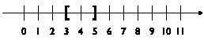

+   (3,5] 是左开区间：

    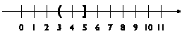

+   3,5) 是右开区间：

    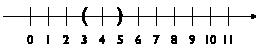

练习 52：上述四个区间中包含哪些整数？

区间概念帮助我们制定一个数据定义，比基于“数字”的定义更好地捕捉了修订后的问题陈述：

> | ; A WorldState falls into one of three intervals: |
> | --- |
> | ; – between 0 and CLOSE |
> | ; – between CLOSE and HEIGHT |
> | ; – below HEIGHT |

具体来说，有三个区间，我们可以这样想象：

> 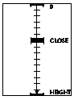

你看到的是标准的数轴，垂直放置并分割成若干区间。每个区间从向下指的角括号 () 开始，并以向上指的角括号 () 结束。图片以这种方式识别了三个区间：

+   上区间从 0 延伸到 CLOSE；

+   中间的区间从 CLOSE 开始，延伸到 HEIGHT；在普通数轴上，最后一个区间从 HEIGHT 开始，无限延伸。并且

+   最低的、不可见的区间只是在 HEIGHT 处的一条线。

以这种方式可视化数据定义有助于以两种方式设计函数。首先，它立即表明如何选择示例。显然，我们希望函数在所有区间内都能正常工作，并且我们希望函数在每个区间的端点也能正常工作。其次，图像告诉我们，我们需要制定一个条件，以确定某个“点”是否位于这些区间之一。

将这两者结合起来也引发了一个问题，即函数如何处理端点。在我们的例子中，数轴上的两个点属于两个区间：CLOSE 既属于上区间也属于中间区间，而 HEIGHT 似乎同时属于中间区间和最低区间。这种重叠通常会给程序带来问题，并且应该避免。

BSL 函数由于[cond](http://docs.racket-lang.org/htdp-langs/beginner.html#%28form._%28%28lib._lang%2Fhtdp-beginner..rkt%29._cond%29%29)表达式评估方式，自然避免了这些问题。考虑以下函数的自然组织结构，该函数消耗 WorldState 的元素：

> | ; WorldState -> WorldState |
> | --- |
> | ([define](http://docs.racket-lang.org/htdp-langs/beginner.html#%28form._%28%28lib._lang%2Fhtdp-beginner..rkt%29._define%29%29) (f y) |
> |   ([cond](http://docs.racket-lang.org/htdp-langs/beginner.html#%28form._%28%28lib._lang%2Fhtdp-beginner..rkt%29._cond%29%29) |
> |     [([<=](http://docs.racket-lang.org/htdp-langs/beginner.html#%28def._htdp-beginner._%28%28lib._lang%2Fhtdp-beginner..rkt%29._~3c~3d%29%29) 0 y CLOSE) [...](http://docs.racket-lang.org/htdp-langs/beginner.html#%28form._%28%28lib._lang%2Fhtdp-beginner..rkt%29._......%29%29)] |
> |     [([([<=](http://docs.racket-lang.org/htdp-langs/beginner.html#%28def._htdp-beginner._%28%28lib._lang%2Fhtdp-beginner..rkt%29._~3c~3d%29%29) CLOSE y HEIGHT) [...](http://docs.racket-lang.org/htdp-langs/beginner.html#%28form._%28%28lib._lang%2Fhtdp-beginner..rkt%29._......%29%29)] |
> | ([([>=](http://docs.racket-lang.org/htdp-langs/beginner.html#%28def._htdp-beginner._%28%28lib._lang%2Fhtdp-beginner..rkt%29._~3e~3d%29%29) y HEIGHT) [...](http://docs.racket-lang.org/htdp-langs/beginner.html#%28form._%28%28lib._lang%2Fhtdp-beginner..rkt%29._......%29%29)])) |

The three [cond](http://docs.racket-lang.org/htdp-langs/beginner.html#%28form._%28%28lib._lang%2Fhtdp-beginner..rkt%29._cond%29%29) lines correspond to the three intervals. Each condition identifies those values of y that are in between the limits of the intervals. Due to the way [cond](http://docs.racket-lang.org/htdp-langs/beginner.html#%28form._%28%28lib._lang%2Fhtdp-beginner..rkt%29._cond%29%29) lines are checked one by one, however, a y value of CLOSE makes BSL pick the first [cond](http://docs.racket-lang.org/htdp-langs/beginner.html#%28form._%28%28lib._lang%2Fhtdp-beginner..rkt%29._cond%29%29) line, and a y value of HEIGHT triggers the evaluation of the second ResultExpression. If we wanted to make this choice obvious and immediate for every reader of our code, we would use different conditions:

> | ; WorldState -> WorldState |
> | --- |
> | ([define](http://docs.racket-lang.org/htdp-langs/beginner.html#%28form._%28%28lib._lang%2Fhtdp-beginner..rkt%29._define%29%29) (g y) |
> |   ([cond](http://docs.racket-lang.org/htdp-langs/beginner.html#%28form._%28%28lib._lang%2Fhtdp-beginner..rkt%29._cond%29%29) |
> |     [([([<=](http://docs.racket-lang.org/htdp-langs/beginner.html#%28def._htdp-beginner._%28%28lib._lang%2Fhtdp-beginner..rkt%29._~3c~3d%29%29) 0 y CLOSE) [...](http://docs.racket-lang.org/htdp-langs/beginner.html#%28form._%28%28lib._lang%2Fhtdp-beginner..rkt%29._......%29%29)] |
> |     [([and](http://docs.racket-lang.org/htdp-langs/beginner.html#%28form._%28%28lib._lang%2Fhtdp-beginner..rkt%29._and%29%29) ([([<](http://docs.racket-lang.org/htdp-langs/beginner.html#%28def._htdp-beginner._%28%28lib._lang%2Fhtdp-beginner..rkt%29._~3c%29%29) CLOSE y) ([([<=](http://docs.racket-lang.org/htdp-langs/beginner.html#%28def._htdp-beginner._%28%28lib._lang%2Fhtdp-beginner..rkt%29._~3c~3d%29%29) y HEIGHT)) [...](http://docs.racket-lang.org/htdp-langs/beginner.html#%28form._%28%28lib._lang%2Fhtdp-beginner..rkt%29._......%29%29)] |
> |     [([([>](http://docs.racket-lang.org/htdp-langs/beginner.html#%28def._htdp-beginner._%28%28lib._lang%2Fhtdp-beginner..rkt%29._~3e%29%29) y HEIGHT) [...](http://docs.racket-lang.org/htdp-langs/beginner.html#%28form._%28%28lib._lang%2Fhtdp-beginner..rkt%29._......%29%29)])) |

注意第二个[cond](http://docs.racket-lang.org/htdp-langs/beginner.html#%28form._%28%28lib._lang%2Fhtdp-beginner..rkt%29._cond%29%29)行是如何使用[and](http://docs.racket-lang.org/htdp-langs/beginner.html#%28form._%28%28lib._lang%2Fhtdp-beginner..rkt%29._and%29%29)来组合一个严格小于检查和一个小于等于检查，而不是使用 f 的[<=](http://docs.racket-lang.org/htdp-langs/beginner.html#%28def._htdp-beginner._%28%28lib._lang%2Fhtdp-beginner..rkt%29._~3c~3d%29%29)与三个参数一起使用。

> > > | ; WorldState -> Image |
> > > | --- |
> > > | ; 为通过 render 创建的场景添加状态行   |
> > > |   |
> > > | ([check-expect](http://docs.racket-lang.org/htdp-langs/beginner.html#%28form._%28%28lib._lang%2Fhtdp-beginner..rkt%29._check-expect%29%29) (render/status 10) |
> > > |               ([place-image](http://docs.racket-lang.org/teachpack/2htdpimage.html#%28def._%28%28lib._2htdp%2Fimage..rkt%29._place-image%29%29) ([text](http://docs.racket-lang.org/teachpack/2htdpimage.html#%28def._%28%28lib._2htdp%2Fimage..rkt%29._text%29%29) "descending" 11 "green") |
> > > |                            10 10 |
> > > |                            (render 10))) |
> > > |   |
> > > | ([define](http://docs.racket-lang.org/htdp-langs/beginner.html#%28form._%28%28lib._lang%2Fhtdp-beginner..rkt%29._define%29%29) (render/status y) |
> > > |   ([cond](http://docs.racket-lang.org/htdp-langs/beginner.html#%28form._%28%28lib._lang%2Fhtdp-beginner..rkt%29._cond%29%29) |
> > > |     [([<=](http://docs.racket-lang.org/htdp-langs/beginner.html#%28def._htdp-beginner._%28%28lib._lang%2Fhtdp-beginner..rkt%29._~3c~3d%29%29) 0 y CLOSE) |
> > > |      ([place-image](http://docs.racket-lang.org/teachpack/2htdpimage.html#%28def._%28%28lib._2htdp%2Fimage..rkt%29._place-image%29%29) ([text](http://docs.racket-lang.org/teachpack/2htdpimage.html#%28def._%28%28lib._2htdp%2Fimage..rkt%29._text%29%29) "descending" 11 "green") |
> > > |                   10 10 |
> > > |                   (render y))] |
> > > |     [([and](http://docs.racket-lang.org/htdp-langs/beginner.html#%28form._%28%28lib._lang%2Fhtdp-beginner..rkt%29._and%29%29) ([<](http://docs.racket-lang.org/htdp-langs/beginner.html#%28def._htdp-beginner._%28%28lib._lang%2Fhtdp-beginner..rkt%29._~3c%29%29) CLOSE y) ([<=](http://docs.racket-lang.org/htdp-langs/beginner.html#%28def._htdp-beginner._%28%28lib._lang%2Fhtdp-beginner..rkt%29._~3c~3d%29%29) y HEIGHT)) |
> > > |      ([place-image](http://docs.racket-lang.org/teachpack/2htdpimage.html#%28def._%28%28lib._2htdp%2Fimage..rkt%29._place-image%29%29) ([text](http://docs.racket-lang.org/teachpack/2htdpimage.html#%28def._%28%28lib._2htdp%2Fimage..rkt%29._text%29%29) "closing in" 11 "orange") |
> > > |                   10 10 |
> > > |                   (render y))] |
> > > |     [([>](http://docs.racket-lang.org/htdp-langs/beginner.html#%28def._htdp-beginner._%28%28lib._lang%2Fhtdp-beginner..rkt%29._~3e%29%29) y HEIGHT) |
> > > | （[放置图像](http://docs.racket-lang.org/teachpack/2htdpimage.html#%28def._%28%28lib._2htdp%2Fimage..rkt%29._place-image%29%29) （[文本](http://docs.racket-lang.org/teachpack/2htdpimage.html#%28def._%28%28lib._2htdp%2Fimage..rkt%29._text%29%29) "landed" 11 "red") |
> > > | 10 10 |
> > > | （渲染 y))])) |
> > > 
> 图 23：带有状态行的渲染

考虑到所有这些，我们可以完成将所需状态行添加到我们的不明飞行物动画中的函数定义；参见 图 23 以获取完整的定义。该函数使用 [cond](http://docs.racket-lang.org/htdp-langs/beginner.html#%28form._%28%28lib._lang%2Fhtdp-beginner..rkt%29._cond%29%29) 表达式来区分三个时间段。在每一个 [cond](http://docs.racket-lang.org/htdp-langs/beginner.html#%28form._%28%28lib._lang%2Fhtdp-beginner..rkt%29._cond%29%29) 子句中，结果表达式使用 render（来自 图 22）来创建带有下降不明飞行物的图像，然后使用 [place-image](http://docs.racket-lang.org/teachpack/2htdpimage.html#%28def._%28%28lib._2htdp%2Fimage..rkt%29._place-image%29%29) 在位置 (10,10) 处放置适当的文本。

要运行这个版本，您需要将 main 从 图 22 稍作修改：

> | ; WorldState -> WorldState |
> | --- |
> | （[定义](http://docs.racket-lang.org/htdp-langs/beginner.html#%28form._%28%28lib._lang%2Fhtdp-beginner..rkt%29._define%29%29) （main y0） |
> | （[大爆炸](http://docs.racket-lang.org/teachpack/2htdpuniverse.html#%28form._world._%28%28lib._2htdp%2Funiverse..rkt%29._big-bang%29%29) y0 |
> | （[在 tick 上](http://docs.racket-lang.org/teachpack/2htdpuniverse.html#%28form._world._%28%28lib._2htdp%2Funiverse..rkt%29._on-tick%29%29) nxt） |
> | （[绘制](http://docs.racket-lang.org/teachpack/2htdpuniverse.html#%28form._world._%28%28lib._2htdp%2Funiverse..rkt%29._to-draw%29%29) （渲染/状态）） |

函数定义的一个方面可能会让您感到困扰，为了澄清原因，让我们将上面的示例问题稍作细化：

> 样例问题：添加一个状态行，位于 (20,20) 位置，当不明飞行物的高度超过画布高度的 1/3 时显示“下降”...

这可能是第一次观看您动画的客户可能会给出的反应。

> > > | ; WorldState -> Image |
> > > | --- |
> > > | ; 向由 render 创建的场景添加状态行   |
> > > |  |
> > > | （[检查期望](http://docs.racket-lang.org/htdp-langs/beginner.html#%28form._%28%28lib._lang%2Fhtdp-beginner..rkt%29._check-expect%29%29) （渲染/状态 42） |
> > > |               ([放置图像](http://docs.racket-lang.org/teachpack/2htdpimage.html#%28def._%28%28lib._2htdp%2Fimage..rkt%29._place-image%29%29) ([文本](http://docs.racket-lang.org/teachpack/2htdpimage.html#%28def._%28%28lib._2htdp%2Fimage..rkt%29._text%29%29) "closing in" 11 "orange") |
> > > |                            20 20 |
> > > |                            (render 42))) |
> > > |   |
> > > | ([定义](http://docs.racket-lang.org/htdp-langs/beginner.html#%28form._%28%28lib._lang%2Fhtdp-beginner..rkt%29._define%29%29) (render/status y) |
> > > |   ([放置图像](http://docs.racket-lang.org/teachpack/2htdpimage.html#%28def._%28%28lib._2htdp%2Fimage..rkt%29._place-image%29%29) |
> > > |     ([条件](http://docs.racket-lang.org/htdp-langs/beginner.html#%28form._%28%28lib._lang%2Fhtdp-beginner..rkt%29._cond%29%29) |
> > > |       [([小于等于](http://docs.racket-lang.org/htdp-langs/beginner.html#%28def._htdp-beginner._%28%28lib._lang%2Fhtdp-beginner..rkt%29._~3c~3d%29%29) 0 y CLOSE) |
> > > |        ([文本](http://docs.racket-lang.org/teachpack/2htdpimage.html#%28def._%28%28lib._2htdp%2Fimage..rkt%29._text%29%29) "descending" 11 "green")] |
> > > |       [([和](http://docs.racket-lang.org/htdp-langs/beginner.html#%28form._%28%28lib._lang%2Fhtdp-beginner..rkt%29._and%29%29) ([小于](http://docs.racket-lang.org/htdp-langs/beginner.html#%28def._htdp-beginner._%28%28lib._lang%2Fhtdp-beginner..rkt%29._~3c%29%29) CLOSE y) ([小于等于](http://docs.racket-lang.org/htdp-langs/beginner.html#%28def._htdp-beginner._%28%28lib._lang%2Fhtdp-beginner..rkt%29._~3c~3d%29%29) y HEIGHT)) |
> > > |        ([文本](http://docs.racket-lang.org/teachpack/2htdpimage.html#%28def._%28%28lib._2htdp%2Fimage..rkt%29._text%29%29) "closing in" 11 "orange")] |
> > > |       [([大于](http://docs.racket-lang.org/htdp-langs/beginner.html#%28def._htdp-beginner._%28%28lib._lang%2Fhtdp-beginner..rkt%29._~3e%29%29) y HEIGHT) |
> > > |        ([文本](http://docs.racket-lang.org/teachpack/2htdpimage.html#%28def._%28%28lib._2htdp%2Fimage..rkt%29._text%29%29) "landed" 11 "red")]) |
> > > |     20 20 |
> > > |     (render y))) |
> > > 
> 图 24：带有状态行的渲染，修订版

到目前为止，你不得不在六个不同的地方更改 render/status 函数，因为你有三个相同外部信息的副本：状态行的位置。为了避免对单个元素进行多次更改，程序员试图避免复制。你有两种选择来解决这个问题。第一个选择是使用常量定义，你可能还记得从早期章节中提到的。第二个选择是将 [cond](http://docs.racket-lang.org/htdp-langs/beginner.html#%28form._%28%28lib._lang%2Fhtdp-beginner..rkt%29._cond%29%29) 表达式视为可能出现在函数任何位置的表达式，包括在其他表达式的中间；参见 图 24 并与 图 23 进行比较。在这个修订的 render/status 定义中，[cond](http://docs.racket-lang.org/htdp-langs/beginner.html#%28form._%28%28lib._lang%2Fhtdp-beginner..rkt%29._cond%29%29) 表达式是 [place-image](http://docs.racket-lang.org/teachpack/2htdpimage.html#%28def._%28%28lib._2htdp%2Fimage..rkt%29._place-image%29%29) 的第一个参数。正如你所看到的，它的结果始终是一个放置在 (20,20) 位置的 [text](http://docs.racket-lang.org/teachpack/2htdpimage.html#%28def._%28%28lib._2htdp%2Fimage..rkt%29._text%29%29) 图像，该图像由 (render y) 创建。

#### 4.5 项目列表🔗 "链接至此")

区间区分了不同子类的数字，在原则上，这是一个无限大的类别。枚举逐项列出现有数据类中的有用元素。某些数据定义需要包含来自两个类别的元素。它们使用项目列表，这是区间和枚举的推广。它们允许将任何已定义的数据类别与其他类别以及单个数据项组合起来。

考虑以下示例，这是从 枚举 中一个重要数据定义的重写：

> | ; KeyEvent 是以下之一： |
> | --- |
> | ; –  1String |
> | ; –  "left" |
> | ; –  "right" |
> | ; –  "up" |
> | ; –  ... |

在此情况下，KeyEvent 数据定义引用了 1String 数据定义。由于处理 KeyEvent 的函数通常将 1String 与其他部分分开处理，并使用辅助函数进行，我们现在也有了一种方便的方式来表示这些函数的签名。对 [string->number](http://docs.racket-lang.org/htdp-langs/beginner.html#%28def._htdp-beginner._%28%28lib._lang%2Fhtdp-beginner..rkt%29._string-~3enumber%29%29) 原始函数的描述巧妙地运用了项目列表的概念。其签名是

> | ; String -> NorF |
> | --- |
> | ; 将给定的字符串转换为数字； |
> | ; 如果不可能则产生 #false |
> | ([define](http://docs.racket-lang.org/htdp-langs/beginner.html#%28form._%28%28lib._lang%2Fhtdp-beginner..rkt%29._define%29%29) ([string->number](http://docs.racket-lang.org/htdp-langs/beginner.html#%28def._htdp-beginner._%28%28lib._lang%2Fhtdp-beginner..rkt%29._string-~3enumber%29%29) s) ([...](http://docs.racket-lang.org/htdp-langs/beginner.html#%28form._%28%28lib._lang%2Fhtdp-beginner..rkt%29._......%29%29) s [...](http://docs.racket-lang.org/htdp-langs/beginner.html#%28form._%28%28lib._lang%2Fhtdp-beginner..rkt%29._......%29%29))) |

这意味着结果签名命名了一个简单的数据类别：

> | ; An NorF 是以下之一： |
> | --- |
> | ; –  #false |
> | ; – 一个 Number |

这个项目将一个数据片段(#false)与一个庞大且独特的数据类别(Number)结合起来。现在想象一个函数，它消耗[string->number](http://docs.racket-lang.org/htdp-langs/beginner.html#%28def._htdp-beginner._%28%28lib._lang%2Fhtdp-beginner..rkt%29._string-~3enumber%29%29)的结果并加 3，将#false 视为 0 进行处理：

> | ; NorF -> Number |
> | --- |
> | ; 给给定数字加 3；否则加 3 |
> | ([check-expect](http://docs.racket-lang.org/htdp-langs/beginner.html#%28form._%28%28lib._lang%2Fhtdp-beginner..rkt%29._check-expect%29%29) (add3 #false) 3) |
> | ([check-expect](http://docs.racket-lang.org/htdp-langs/beginner.html#%28form._%28%28lib._lang%2Fhtdp-beginner..rkt%29._check-expect%29%29) (add3 0.12) 3.12) |
> | ([define](http://docs.racket-lang.org/htdp-langs/beginner.html#%28form._%28%28lib._lang%2Fhtdp-beginner..rkt%29._define%29%29) (add3 x) |
> |   ([cond](http://docs.racket-lang.org/htdp-langs/beginner.html#%28form._%28%28lib._lang%2Fhtdp-beginner..rkt%29._cond%29%29) |
> |     [([false?](http://docs.racket-lang.org/htdp-langs/beginner.html#%28def._htdp-beginner._%28%28lib._lang%2Fhtdp-beginner..rkt%29._false~3f%29%29) x) 3] |
> |     [[else](http://docs.racket-lang.org/htdp-langs/beginner.html#%28form._%28%28lib._lang%2Fhtdp-beginner..rkt%29._else%29%29) ([+](http://docs.racket-lang.org/htdp-langs/beginner.html#%28def._htdp-beginner._%28%28lib._lang%2Fhtdp-beginner..rkt%29._%2B%29%29) x 3)])) |

如上所述，函数体由一个[cond](http://docs.racket-lang.org/htdp-langs/beginner.html#%28form._%28%28lib._lang%2Fhtdp-beginner..rkt%29._cond%29%29)表达式组成，其子句的数量与数据定义中枚举的项目数量相同。第一个[cond](http://docs.racket-lang.org/htdp-langs/beginner.html#%28form._%28%28lib._lang%2Fhtdp-beginner..rkt%29._cond%29%29)子句识别当函数应用于#false 时的情况；对应的结果是所需的 3。第二个子句是关于数字的，并按要求加 3。

让我们研究一个更有目的性的设计任务：

> 样例问题 设计一个程序，当你的程序的用户按下空格键时启动火箭。程序首先显示火箭位于画布底部。一旦启动，它就每时钟滴答向上移动三个像素。

这个修订版建议使用两种状态类别的表示：

> | ; An LR (short for launching rocket) is one of: |
> | --- |
> | ; –  "resting" |
> | ; –  NonnegativeNumber |
> | ; 解释 "resting" 表示地面上的火箭 |
> | ; 一个数字表示飞行中的火箭的高度 |

虽然“静止”的解释很明显，但关于高度的数字解释在概念上是不明确的：

1.  单词“高度”可能指的是地面和火箭的参考点（例如，其中心）之间的距离；或者

1.  它可能意味着画布顶部和参考点之间的距离。

任何一个都行得通。第二个使用的是“高度”这个词在传统计算机意义上的含义。因此，对于将世界状态转换为图像的函数来说，它稍微方便一些，所以我们选择以那种精神来解释这个数字。

为了强调这个选择，下面的练习 57 要求你使用高度的第一种解释来解决本节的练习。

练习 53. 世界程序的设计配方要求你将信息转换为数据，反之亦然，以确保对数据定义的完整理解。最好绘制一些世界场景，并用数据来表示它们，反之亦然，选择一些数据示例，并绘制与之匹配的图片。为 LR 定义做此练习，包括至少 HEIGHT 和 0 作为示例。

在现实中，火箭发射伴随着倒计时：

> 样例问题 设计一个程序，当用户按下空格键时启动火箭。在那个时刻，模拟开始倒计时三个滴答声，然后显示上升火箭的场景。火箭应该以每时钟滴答三个像素的速度向上移动。

按照程序设计配方，我们首先收集常量：

> | ([define](http://docs.racket-lang.org/htdp-langs/beginner.html#%28form._%28%28lib._lang%2Fhtdp-beginner..rkt%29._define%29%29) HEIGHT 300) ; 像素距离 |
> | --- |
> | ([define](http://docs.racket-lang.org/htdp-langs/beginner.html#%28form._%28%28lib._lang%2Fhtdp-beginner..rkt%29._define%29%29) WIDTH 100) |
> | ([define](http://docs.racket-lang.org/htdp-langs/beginner.html#%28form._%28%28lib._lang%2Fhtdp-beginner..rkt%29._define%29%29) YDELTA 3) |
> |   |
> | ([define](http://docs.racket-lang.org/htdp-langs/beginner.html#%28form._%28%28lib._lang%2Fhtdp-beginner..rkt%29._define%29%29) BACKG ([empty-scene](http://docs.racket-lang.org/teachpack/2htdpimage.html#%28def._%28%28lib._2htdp%2Fimage..rkt%29._empty-scene%29%29) WIDTH HEIGHT)) |
> | ([define](http://docs.racket-lang.org/htdp-langs/beginner.html#%28form._%28%28lib._lang%2Fhtdp-beginner..rkt%29._define%29%29) ROCKET ([rectangle](http://docs.racket-lang.org/teachpack/2htdpimage.html#%28def._%28%28lib._2htdp%2Fimage..rkt%29._rectangle%29%29) 5 30 "solid" "red")) |
> |   |
> | ([define](http://docs.racket-lang.org/htdp-langs/beginner.html#%28form._%28%28lib._lang%2Fhtdp-beginner..rkt%29._define%29%29) CENTER ([/](http://docs.racket-lang.org/htdp-langs/beginner.html#%28def._htdp-beginner._%28%28lib._lang%2Fhtdp-beginner..rkt%29._%2F%29%29) ([image-height](http://docs.racket-lang.org/teachpack/2htdpimage.html#%28def._%28%28lib._2htdp%2Fimage..rkt%29._image-height%29%29) ROCKET) 2)) |

当 WIDTH 和 HEIGHT 描述画布和背景场景的尺寸时，YDELTA 描述了火箭沿 y 轴移动的速度，如问题陈述中指定。CENTER 常量是火箭计算出的中心。接下来，我们转向数据定义的开发。这个问题的修订版明确要求三个不同的状态子类：

> | ; LRCD（用于火箭发射倒计时）是以下之一： |
> | --- |
> | ; –  "静止" |
> | ; – 一个介于 -3 和 -1 之间的 数字 |
> | ; – 一个 非负数 |
> | ; 解释：地面上的火箭，处于倒计时模式， |
> | ; 一个数字表示像素之间的数量 |
> | ; 画布顶部和火箭（其高度） |

第二个新的数据子类——三个负数——代表用户按下空格键后，火箭起飞前的世界。在此阶段，我们写下我们对将状态渲染为图像的函数以及我们可能需要的任何事件处理函数的愿望清单：

> | ; LRCD -> Image |
> | --- |
> | ; 将状态渲染为静止或飞行的火箭 |
> | ([define](http://docs.racket-lang.org/htdp-langs/beginner.html#%28form._%28%28lib._lang%2Fhtdp-beginner..rkt%29._define%29%29) (show x) |
> |   BACKG) |
> |   |
> | ; LRCD  KeyEvent -> LRCD |
> | ; 当按下空格键时开始倒计时， |
> | ; 如果火箭仍然处于静止状态 |
> | ([define](http://docs.racket-lang.org/htdp-langs/beginner.html#%28form._%28%28lib._lang%2Fhtdp-beginner..rkt%29._define%29%29) (launch x ke) |
> |   x) |
> |   |
> | ; LRCD -> LRCD |
> | ; 将火箭向上移动 YDELTA， |
> | ; 如果它已经在移动 |
> | ([define](http://docs.racket-lang.org/htdp-langs/beginner.html#%28form._%28%28lib._lang%2Fhtdp-beginner..rkt%29._define%29%29) (fly x) |
> |   x) |

记住，世界程序的设计配方决定了这些签名，尽管数据收集和事件处理程序名称的选择属于我们。此外，我们将目的声明专门化以适应我们的问题陈述。从这里开始，我们使用函数的设计配方来为这三个函数创建完整的定义，从第一个的示例开始：

> | ([check-expect](http://docs.racket-lang.org/htdp-langs/beginner.html#%28form._%28%28lib._lang%2Fhtdp-beginner..rkt%29._check-expect%29%29) |
> | --- |
> |  (show "resting") |
> |  ([place-image](http://docs.racket-lang.org/teachpack/2htdpimage.html#%28def._%28%28lib._2htdp%2Fimage..rkt%29._place-image%29%29) ROCKET 10 HEIGHT BACKG)) |
> |   |
> | ([check-expect](http://docs.racket-lang.org/htdp-langs/beginner.html#%28form._%28%28lib._lang%2Fhtdp-beginner..rkt%29._check-expect%29%29) |
> |  (显示 -2) |
> |  ([place-image](http://docs.racket-lang.org/teachpack/2htdpimage.html#%28def._%28%28lib._2htdp%2Fimage..rkt%29._place-image%29%29) ([text](http://docs.racket-lang.org/teachpack/2htdpimage.html#%28def._%28%28lib._2htdp%2Fimage..rkt%29._text%29%29) "-2" 20 "red") |
> |               10 ([*](http://docs.racket-lang.org/htdp-langs/beginner.html#%28def._htdp-beginner._%28%28lib._lang%2Fhtdp-beginner..rkt%29._%2A%29%29) 3/4 WIDTH) |
> |               ([place-image](http://docs.racket-lang.org/teachpack/2htdpimage.html#%28def._%28%28lib._2htdp%2Fimage..rkt%29._place-image%29%29) ROCKET 10 HEIGHT BACKG))) |
> |   |
> | ([check-expect](http://docs.racket-lang.org/htdp-langs/beginner.html#%28form._%28%28lib._lang%2Fhtdp-beginner..rkt%29._check-expect%29%29) |
> |  (show 53) |
> |  ([place-image](http://docs.racket-lang.org/teachpack/2htdpimage.html#%28def._%28%28lib._2htdp%2Fimage..rkt%29._place-image%29%29) ROCKET 10 53 BACKG)) |

在本章之前，我们在数据定义的每个子类中做一个测试。第一个示例显示了静止状态，第二个示例显示了倒计时中间状态，最后一个示例显示了火箭在飞行中。此外，我们将期望值表示为绘制适当图像的表达式。我们使用 DrRacket 的交互区域创建这些图像；你会怎么做？

仔细观察示例可以发现，制作示例也意味着做出选择。问题陈述中实际上并没有要求在火箭发射前如何精确显示火箭，但这样做是自然的。同样，没有要求在倒计时期间显示数字，但它增添了一丝美感。最后，如果你解决了练习 53，你也知道 0 和 HEIGHT 是数据定义第三条规则的特殊点。

通常，当你构造例子时，区间值得特别注意，也就是说，它们至少需要三种类型的例子：每个端点一个，另一个从内部。由于 LRCD) 的第二个子类是一个（有限）区间，第三个是一个半开区间，让我们看看它们的端点：

+   显然，(show -3) 和 (show -1) 必须产生类似于 (show -2) 的图像。毕竟，火箭仍然停留在地面上，即使倒计时数字不同。

+   (show HEIGHT) 的情况不同。根据我们的协议，HEIGHT 的值代表火箭刚刚发射时的状态。从图面上看，这意味着火箭仍然停留在地面上。基于上述最后一个测试案例，这里有一个表达这一见解的测试案例：

    > | ([check-expect](http://docs.racket-lang.org/htdp-langs/beginner.html#(form. (lib. lang/htdp-beginner.rkt _) _check-expect))) |
    > | --- |
    > |  (show HEIGHT) |
    > |  ([place-image](http://docs.racket-lang.org/teachpack/2htdpimage.html#(def. (lib. 2htdp/image.rkt _) _place-image)) ROCKET 10 HEIGHT BACKG)) |

    除了如果你在 DrRacket 的交互区域单独评估“期望值”表达式，你会看到火箭已经埋到地下了一半。当然，这不应该发生，这意味着我们需要调整这个测试案例和上面的：

    > | ([check-expect](http://docs.racket-lang.org/htdp-langs/beginner.html#(form. (lib. lang/htdp-beginner.rkt _) _check-expect))) |
    > | --- |
    > |  (show HEIGHT) |
    > |  ([place-image](http://docs.racket-lang.org/teachpack/2htdpimage.html#(def. (lib. 2htdp/image.rkt _place-image))) ROCKET 10 ([- (lib. lang/htdp-beginner.rkt _) HEIGHT CENTER) BACKG)) |
    > |   |
    > | ([check-expect](http://docs.racket-lang.org/htdp-langs/beginner.html#(form. (lib. lang/htdp-beginner.rkt _) _check-expect))) |
    > |  (show 53) |
    > |  ([place-image](http://docs.racket-lang.org/teachpack/2htdpimage.html#(def. (lib. 2htdp/image.rkt _) _place-image)) ROCKET 10 ([- (lib. lang/htdp-beginner.rkt _) 53 CENTER) BACKG)) |

+   最后，确定你现在期望从 (show 0) 得到的结果。这是一个简单但能揭示问题的练习。

按照本章中的先例，show 使用 [cond](http://docs.racket-lang.org/htdp-langs/beginner.html#(form. (lib. lang/htdp-beginner.rkt _) _cond)) 表达式来处理数据定义的三个子句：

> | ([define](http://docs.racket-lang.org/htdp-langs/beginner.html#(form. (lib. lang/htdp-beginner.rkt _) _define)) (show x) |
> | --- |
> |  ([cond](http://docs.racket-lang.org/htdp-langs/beginner.html#(form. (lib. lang/htdp-beginner.rkt _) _cond))) |
> | ([([string?](http://docs.racket-lang.org/htdp-langs/beginner.html#%28def._htdp-beginner._%28%28lib._lang%2Fhtdp-beginner..rkt%29._string~3f%29%29) x) [...](http://docs.racket-lang.org/htdp-langs/beginner.html#%28form._%28%28lib._lang%2Fhtdp-beginner..rkt%29._......%29%29)])) |
> | ([([<=](http://docs.racket-lang.org/htdp-langs/beginner.html#%28def._htdp-beginner._%28%28lib._lang%2Fhtdp-beginner..rkt%29._~3c~3d%29%29) -3 x -1) [...](http://docs.racket-lang.org/htdp-langs/beginner.html#%28form._%28%28lib._lang%2Fhtdp-beginner..rkt%29._......%29%29)])) |
> | ([([>=](http://docs.racket-lang.org/htdp-langs/beginner.html#%28def._htdp-beginner._%28%28lib._lang%2Fhtdp-beginner..rkt%29._~3e~3d%29%29) x 0) [...](http://docs.racket-lang.org/htdp-langs/beginner.html#%28form._%28%28lib._lang%2Fhtdp-beginner..rkt%29._......%29%29)])) |

每个子句都使用一个精确的条件来标识相应的子类：([string?](http://docs.racket-lang.org/htdp-langs/beginner.html#%28def._htdp-beginner._%28%28lib._lang%2Fhtdp-beginner..rkt%29._string~3f%29%29) x)选择第一个子类，它只包含一个元素，即字符串"resting"；([<=](http://docs.racket-lang.org/htdp-langs/beginner.html#%28def._htdp-beginner._%28%28lib._lang%2Fhtdp-beginner..rkt%29._~3c~3d%29%29) -3 x -1)完全描述了数据的第二个子类；而([>=](http://docs.racket-lang.org/htdp-langs/beginner.html#%28def._htdp-beginner._%28%28lib._lang%2Fhtdp-beginner..rkt%29._~3e~3d%29%29) x 0)是对所有非负数的测试。

练习 54。为什么在 show 函数中将([string=?](http://docs.racket-lang.org/htdp-langs/beginner.html#%28def._htdp-beginner._%28%28lib._lang%2Fhtdp-beginner..rkt%29._string~3d~3f%29%29) "resting" x)作为第一个条件是不正确的？相反，制定一个完全准确的条件，即一个布尔表达式，当且仅当 x 属于 LRCD 的第一个子类时，该表达式评估为#true。

将示例和上述的 show 函数框架结合起来，可以以一种相当直接的方式得到完整的定义：

> | ([define](http://docs.racket-lang.org/htdp-langs/beginner.html#%28form._%28%28lib._lang%2Fhtdp-beginner..rkt%29._define%29%29) (show x) |
> | --- |
> | ([cond](http://docs.racket-lang.org/htdp-langs/beginner.html#%28form._%28%28lib._lang%2Fhtdp-beginner..rkt%29._cond%29%29) |
> | ([([string?](http://docs.racket-lang.org/htdp-langs/beginner.html#%28def._htdp-beginner._%28%28lib._lang%2Fhtdp-beginner..rkt%29._string~3f%29%29) x) |
> | ([place-image](http://docs.racket-lang.org/teachpack/2htdpimage.html#%28def._%28%28lib._2htdp%2Fimage..rkt%29._place-image%29%29) ROCKET 10 ([(-](http://docs.racket-lang.org/htdp-langs/beginner.html#%28def._htdp-beginner._%28%28lib._lang%2Fhtdp-beginner..rkt%29._-%29%29) HEIGHT CENTER) BACKG)] |
> |     [([<=](http://docs.racket-lang.org/htdp-langs/beginner.html#%28def._htdp-beginner._%28%28lib._lang%2Fhtdp-beginner..rkt%29._~3c~3d%29%29) -3 x -1) |
> |      ([place-image](http://docs.racket-lang.org/teachpack/2htdpimage.html#%28def._%28%28lib._2htdp%2Fimage..rkt%29._place-image%29%29) ([text](http://docs.racket-lang.org/teachpack/2htdpimage.html#%28def._%28%28lib._2htdp%2Fimage..rkt%29._text%29%29) ([number->string](http://docs.racket-lang.org/htdp-langs/beginner.html#%28def._htdp-beginner._%28%28lib._lang%2Fhtdp-beginner..rkt%29._number-~3estring%29%29) x) 20 "red") |
> |   |   10 ([*](http://docs.racket-lang.org/htdp-langs/beginner.html#%28def._htdp-beginner._%28%28lib._lang%2Fhtdp-beginner..rkt%29._%2A%29%29) 3/4 WIDTH) |
> |                   ([place-image](http://docs.racket-lang.org/teachpack/2htdpimage.html#%28def._%28%28lib._2htdp%2Fimage..rkt%29._place-image%29%29) ROCKET) |
> |                                10 ([-](http://docs.racket-lang.org/htdp-langs/beginner.html#%28def._htdp-beginner._%28%28lib._lang%2Fhtdp-beginner..rkt%29._-%29%29) HEIGHT CENTER) |
> |                                BACKG)] |
> |     [([>=](http://docs.racket-lang.org/htdp-langs/beginner.html#%28def._htdp-beginner._%28%28lib._lang%2Fhtdp-beginner..rkt%29._~3e~3d%29%29) x 0) |
> |      ([place-image](http://docs.racket-lang.org/teachpack/2htdpimage.html#%28def._%28%28lib._2htdp%2Fimage..rkt%29._place-image%29%29) ROCKET 10 ([-](http://docs.racket-lang.org/htdp-langs/beginner.html#%28def._htdp-beginner._%28%28lib._lang%2Fhtdp-beginner..rkt%29._-%29%29) x CENTER) BACKG)] |

事实上，这种定义函数的方式非常有效，并且是本书中全面设计方法的一个基本要素。练习 55。再次查看 show 函数。它包含三个具有近似形状的表达式实例：

> ([place-image](http://docs.racket-lang.org/teachpack/2htdpimage.html#%28def._%28%28lib._2htdp%2Fimage..rkt%29._place-image%29%29) ROCKET 10 ([-](http://docs.racket-lang.org/htdp-langs/beginner.html#%28def._htdp-beginner._%28%28lib._lang%2Fhtdp-beginner..rkt%29._-%29%29) [...](http://docs.racket-lang.org/htdp-langs/beginner.html#%28form._%28%28lib._lang%2Fhtdp-beginner..rkt%29._......%29%29) CENTER) BACKG)

这个表达式在函数中出现了三次：两次用于绘制静止的火箭，一次用于绘制飞行的火箭。定义一个辅助函数来完成这项工作，从而缩短 show 函数。为什么这是一个好主意？你可能需要重新阅读序言：如何编程。接下来，让我们继续到第二个函数，它处理启动火箭的关键事件。我们已经有它的头材料，因此我们将示例作为测试来制定：

> | ([check-expect](http://docs.racket-lang.org/htdp-langs/beginner.html#%28form._%28%28lib._lang%2Fhtdp-beginner..rkt%29._check-expect%29%29) (launch "resting" " ") -3) |
> | --- |
> | ([检查期望](http://docs.racket-lang.org/htdp-langs/beginner.html#%28form._%28%28lib._lang%2Fhtdp-beginner..rkt%29._check-expect%29%29) (launch "休息" "a") "休息") |
> | ([检查期望](http://docs.racket-lang.org/htdp-langs/beginner.html#%28form._%28%28lib._lang%2Fhtdp-beginner..rkt%29._check-expect%29%29) (launch -3 " ") -3) |
> | ([检查期望](http://docs.racket-lang.org/htdp-langs/beginner.html#%28form._%28%28lib._lang%2Fhtdp-beginner..rkt%29._check-expect%29%29) (launch -1 " ") -1) |
> | ([检查期望](http://docs.racket-lang.org/htdp-langs/beginner.html#%28form._%28%28lib._lang%2Fhtdp-beginner..rkt%29._check-expect%29%29) (launch 33 " ") 33) |
> | ([检查期望](http://docs.racket-lang.org/htdp-langs/beginner.html#%28form._%28%28lib._lang%2Fhtdp-beginner..rkt%29._check-expect%29%29) (launch 33 "a") 33) |

检查这六个示例，前两个与 LRCD 的第一个子类有关，第三和第四个与倒计时有关，最后两个与火箭升空后的关键事件有关。由于记录 cond 表达式的草图对设计 show 函数很有帮助，我们再次这样做：

> | ([定义](http://docs.racket-lang.org/htdp-langs/beginner.html#%28form._%28%28lib._lang%2Fhtdp-beginner..rkt%29._define%29%29) (launch x ke) |
> | --- |
> |   ([条件](http://docs.racket-lang.org/htdp-langs/beginner.html#%28form._%28%28lib._lang%2Fhtdp-beginner..rkt%29._cond%29%29) |
> |     [([字符串?](http://docs.racket-lang.org/htdp-langs/beginner.html#%28def._htdp-beginner._%28%28lib._lang%2Fhtdp-beginner..rkt%29._string~3f%29%29) x) [...](http://docs.racket-lang.org/htdp-langs/beginner.html#%28form._%28%28lib._lang%2Fhtdp-beginner..rkt%29._......%29%29)] |
> |     [([小于等于](http://docs.racket-lang.org/htdp-langs/beginner.html#%28def._htdp-beginner._%28%28lib._lang%2Fhtdp-beginner..rkt%29._~3c~3d%29%29) -3 x -1) [...](http://docs.racket-lang.org/htdp-langs/beginner.html#%28form._%28%28lib._lang%2Fhtdp-beginner..rkt%29._......%29%29)] |
> |     [([大于等于](http://docs.racket-lang.org/htdp-langs/beginner.html#%28def._htdp-beginner._%28%28lib._lang%2Fhtdp-beginner..rkt%29._~3e~3d%29%29) x 0) [...](http://docs.racket-lang.org/htdp-langs/beginner.html#%28form._%28%28lib._lang%2Fhtdp-beginner..rkt%29._......%29%29)])) |

回顾这些示例表明，当世界处于由数据的第二或第三个子类表示的状态时，没有任何变化。也就是说，当这种情况发生时，launch 应该产生 x：

> | ([定义](http://docs.racket-lang.org/htdp-langs/beginner.html#%28form._%28%28lib._lang%2Fhtdp-beginner..rkt%29._define%29%29) (launch x ke) |
> | --- |
> |   ([条件](http://docs.racket-lang.org/htdp-langs/beginner.html#%28form._%28%28lib._lang%2Fhtdp-beginner..rkt%29._cond%29%29) |
> |     [([string?](http://docs.racket-lang.org/htdp-langs/beginner.html#%28def._htdp-beginner._%28%28lib._lang%2Fhtdp-beginner..rkt%29._string~3f%29%29) x) [...](http://docs.racket-lang.org/htdp-langs/beginner.html#%28form._%28%28lib._lang%2Fhtdp-beginner..rkt%29._......%29%29)] |
> |     [([<=](http://docs.racket-lang.org/htdp-langs/beginner.html#%28def._htdp-beginner._%28%28lib._lang%2Fhtdp-beginner..rkt%29._~3c~3d%29%29) -3 x -1) x] |
> |     [([>=](http://docs.racket-lang.org/htdp-langs/beginner.html#%28def._htdp-beginner._%28%28lib._lang%2Fhtdp-beginner..rkt%29._~3e~3d%29%29) x 0) x])) |

最后，第一个示例确定了当启动函数产生新的世界状态时的确切情况：

> | ([define](http://docs.racket-lang.org/htdp-langs/beginner.html#%28form._%28%28lib._lang%2Fhtdp-beginner..rkt%29._define%29%29) (launch x ke) |
> | --- |
> |   ([cond](http://docs.racket-lang.org/htdp-langs/beginner.html#%28form._%28%28lib._lang%2Fhtdp-beginner..rkt%29._cond%29%29) |
> |     [([string?](http://docs.racket-lang.org/htdp-langs/beginner.html#%28def._htdp-beginner._%28%28lib._lang%2Fhtdp-beginner..rkt%29._string~3f%29%29) x) ([if](http://docs.racket-lang.org/htdp-langs/beginner.html#%28form._%28%28lib._lang%2Fhtdp-beginner..rkt%29._if%29%29) ([string=?](http://docs.racket-lang.org/htdp-langs/beginner.html#%28def._htdp-beginner._%28%28lib._lang%2Fhtdp-beginner..rkt%29._string~3d~3f%29%29) " " ke) -3 x)] |
> |     [([<=](http://docs.racket-lang.org/htdp-langs/beginner.html#%28def._htdp-beginner._%28%28lib._lang%2Fhtdp-beginner..rkt%29._~3c~3d%29%29) -3 x -1) x] |
> |     [([>=](http://docs.racket-lang.org/htdp-langs/beginner.html#%28def._htdp-beginner._%28%28lib._lang%2Fhtdp-beginner..rkt%29._~3e~3d%29%29) x 0) x])) |

具体来说，当世界状态为“休息”且用户按下空格键时，函数以-3 开始倒计时。将代码复制到 DrRacket 的定义区域，并确保上述定义正常工作。到那时，你可能希望添加一个运行程序的功能：

> | ; LRCD -> LRCD |
> | --- |
> | ([define](http://docs.racket-lang.org/htdp-langs/beginner.html#%28form._%28%28lib._lang%2Fhtdp-beginner..rkt%29._define%29%29) (main1 s) |
> | ([big-bang](http://docs.racket-lang.org/teachpack/2htdpuniverse.html#%28form._world._%28%28lib._2htdp%2Funiverse..rkt%29._big-bang%29%29) s |
> |     [[to-draw](http://docs.racket-lang.org/teachpack/2htdpuniverse.html#%28form._world._%28%28lib._2htdp%2Funiverse..rkt%29._to-draw%29%29) show] |
> |     [[on-key](http://docs.racket-lang.org/teachpack/2htdpuniverse.html#%28form._world._%28%28lib._2htdp%2Funiverse..rkt%29._on-key%29%29) launch])) |

此函数未指定时钟滴答时应该做什么；毕竟，我们还没有设计飞行。尽管如此，使用 main1 可以运行这个不完整的程序版本，并检查你是否可以开始倒计时。你会在对 main1 的调用中提供什么作为参数？

> > > | ; LRCD -> LRCD |
> > > | --- |
> > > | ; 如果火箭已经在移动，则将其提升 YDELTA |
> > > |   |
> > > | ([check-expect](http://docs.racket-lang.org/htdp-langs/beginner.html#%28form._%28%28lib._lang%2Fhtdp-beginner..rkt%29._check-expect%29%29) (fly "resting") "resting") |
> > > | ([check-expect](http://docs.racket-lang.org/htdp-langs/beginner.html#%28form._%28%28lib._lang%2Fhtdp-beginner..rkt%29._check-expect%29%29) (fly -3) -2) |
> > > | ([check-expect](http://docs.racket-lang.org/htdp-langs/beginner.html#%28form._%28%28lib._lang%2Fhtdp-beginner..rkt%29._check-expect%29%29) (fly -2) -1) |
> > > | ([check-expect](http://docs.racket-lang.org/htdp-langs/beginner.html#%28form._%28%28lib._lang%2Fhtdp-beginner..rkt%29._check-expect%29%29) (fly -1) HEIGHT) |
> > > | ([check-expect](http://docs.racket-lang.org/htdp-langs/beginner.html#%28form._%28%28lib._lang%2Fhtdp-beginner..rkt%29._check-expect%29%29) (fly 10) ([-](http://docs.racket-lang.org/htdp-langs/beginner.html#%28def._htdp-beginner._%28%28lib._lang%2Fhtdp-beginner..rkt%29._-%29%29) 10 YDELTA)) |
> > > | ([check-expect](http://docs.racket-lang.org/htdp-langs/beginner.html#%28form._%28%28lib._lang%2Fhtdp-beginner..rkt%29._check-expect%29%29) (fly 22) ([-](http://docs.racket-lang.org/htdp-langs/beginner.html#%28def._htdp-beginner._%28%28lib._lang%2Fhtdp-beginner..rkt%29._-%29%29) 22 YDELTA)) |
> > > |   |
> > > | ([define](http://docs.racket-lang.org/htdp-langs/beginner.html#%28form._%28%28lib._lang%2Fhtdp-beginner..rkt%29._define%29%29) (fly x) |
> > > |   ([cond](http://docs.racket-lang.org/htdp-langs/beginner.html#%28form._%28%28lib._lang%2Fhtdp-beginner..rkt%29._cond%29%29) |
> > > |     [([string?](http://docs.racket-lang.org/htdp-langs/beginner.html#%28def._htdp-beginner._%28%28lib._lang%2Fhtdp-beginner..rkt%29._string~3f%29%29) x) x] |
> > > |     [([<=](http://docs.racket-lang.org/htdp-langs/beginner.html#%28def._htdp-beginner._%28%28lib._lang%2Fhtdp-beginner..rkt%29._~3c~3d%29%29) -3 x -1) ([if](http://docs.racket-lang.org/htdp-langs/beginner.html#%28form._%28%28lib._lang%2Fhtdp-beginner..rkt%29._if%29%29) ([=](http://docs.racket-lang.org/htdp-langs/beginner.html#%28def._htdp-beginner._%28%28lib._lang%2Fhtdp-beginner..rkt%29._~3d%29%29) x -1) HEIGHT ([+](http://docs.racket-lang.org/htdp-langs/beginner.html#%28def._htdp-beginner._%28%28lib._lang%2Fhtdp-beginner..rkt%29._%2B%29%29) x 1))] |
> > > | ([([>=](http://docs.racket-lang.org/htdp-langs/beginner.html#%28def._htdp-beginner._%28%28lib._lang%2Fhtdp-beginner..rkt%29._~3e~3d%29%29) x 0) ([-](http://docs.racket-lang.org/htdp-langs/beginner.html#%28def._htdp-beginner._%28%28lib._lang%2Fhtdp-beginner..rkt%29._-%29%29) x YDELTA))] |
> > > 
> 图 25：启动倒计时和起飞

设计 fly—the clock-tick handler 的过程与前面两个函数的设计过程一样，图 25 显示了设计过程的结果。同样，关键在于用大量示例覆盖可能的输入数据空间，特别是对于两个区间。这些示例确保倒计时和从倒计时到起飞的过渡能够正常工作。

练习 56。定义 main2，以便你可以启动火箭并观看它升空。查阅关于 [on-tick](http://docs.racket-lang.org/teachpack/2htdpuniverse.html#%28form._world._%28%28lib._2htdp%2Funiverse..rkt%29._on-tick%29%29) 子句的资料，以确定一个 tick 的长度以及如何更改它。

如果你观看了整个发射过程，你会注意到当火箭到达顶部时，会发生一些奇怪的事情。解释一下。向 main2 添加一个 [stop-when](http://docs.racket-lang.org/teachpack/2htdpuniverse.html#%28form._world._%28%28lib._2htdp%2Funiverse..rkt%29._stop-when%29%29) 子句，以便当火箭消失在视线之外时，起飞的模拟能够优雅地停止。

练习 56 的解决方案产生了一个完整、可工作的程序，但它的行为有点奇怪。经验丰富的程序员告诉你，使用负数来表示倒计时阶段太“脆弱”了。下一章将介绍为这个问题提供良好数据定义的方法。然而，在前往那里之前，下一节将详细说明如何设计消费由列举描述的数据的程序。

练习 57。回想一下，“高度”这个词迫使我们选择两种可能的解释之一。现在你已经完成了本节的所有练习，请使用“高度”这个词的第一个解释再次解决它们。比较和对比解决方案。

#### 4.6 使用列举设计🔗 "链接至此")

前三个部分所阐明的是，函数的设计可以——而且必须——利用数据定义的组织结构。具体来说，如果一个数据定义突出了某些数据或指定了数据的范围，那么示例的创建和函数的组织将反映这些情况和范围。

在本节中，我们细化了 从函数到程序 的设计配方，以便你在遇到有关消费列举（包括枚举和区间）的函数的问题时，可以系统地处理。为了使解释更加具体，我们使用以下相对简单的示例来说明六个设计步骤：

> 样本问题：Tax Land 州为了应对其预算赤字，制定了一个三阶段的销售税。价格低于 1000 美元的便宜物品不征税。价格超过 10000 美元的奢侈品按 8%（8.00%）的税率征税。介于两者之间的物品加收 5%（5.00%）的附加费。
> 
> 设计一个用于收银机的函数，给定物品的价格，计算销售税。

在我们修订设计步骤时，请记住这个问题：

1.  当问题陈述区分不同的输入信息类别时，你需要仔细制定数据定义。

    数据定义必须为每个数据子类使用不同的子句，或者在某些情况下只是单个数据项。每个子句指定特定信息子类的数据表示。关键是每个数据子类与其他每个类别都不同，这样我们的函数就可以通过分析不相交的案例来执行。

    我们的这个样本问题处理价格和税收，这些通常是正数。它还清楚地区分了三个范围：

    > | ; 价格分为三个区间之一： |
    > | --- |
    > | ; —<wbr>  0 至 1000 |
    > | ; —<wbr>  1000 至 10000 |
    > | ; —<wbr>  10000 以上。 |
    > | ; 解释物品的价格 |

    你理解这些范围如何与原始问题相关吗？

1.  就签名、目的陈述和函数头而言，你将像以前一样进行。

    这里是我们运行示例的材料：现实世界中的开发者不会在所选编程语言中使用纯数字来表示金额。参见第四部分中关于数字的一些问题。

    > | ; 价格 -> 数字 |
    > | --- |
    > | ; 计算对 p 收取的税额 |
    > | ([定义](http://docs.racket-lang.org/htdp-langs/beginner.html#%28form._%28%28lib._lang%2Fhtdp-beginner..rkt%29._define%29%29) (sales-tax p) 0) |

1.  对于功能示例，你必须从数据定义中的每个子类至少选择一个示例。此外，如果一个子类是有限的范围，确保从范围边界和内部选择示例。

    由于我们的样本数据定义涉及三个不同的区间，让我们挑选每个区间的边界示例以及每个区间内部的一个价格，并确定每个价格的税率：0，537，1000，1282，10000，和 12017。

    停止！尝试计算这些价格中的每个价格的税率。

    这是我们的第一次尝试，带有四舍五入的税额：

    | 0 |  | 537 |  | 1000 |  | 1282 |  | 10000 |  | 12017 |
    | --- | --- | --- | --- | --- | --- | --- | --- | --- | --- | --- |
    | 0 |  | 0 |  | ???? |  | 64 |  | ????? |  | 961 |

    问号表明问题陈述使用了模糊的短语“那些价格低于$1,000”和“高于$10,000”来指定税率表。虽然程序员可能会得出结论，这些词意味着“严格小于”或“严格大于”，但立法者可能意图表达的是“小于或等于”或“大于或等于”，分别。持怀疑态度，我们在这里决定，税地立法者总是希望有更多的钱可以花，所以$1,000 的税率是 5%，而$10,000 的税率是 8%。在税务公司工作的程序员必须咨询税务法律专家。

    既然我们已经弄清楚了解释域中边界的方式，我们可以细化数据定义。我们相信你能自己完成这个任务。

    在我们继续之前，让我们将一些示例转换为测试用例：

    > | ([check-expect](http://docs.racket-lang.org/htdp-langs/beginner.html#%28form._%28%28lib._lang%2Fhtdp-beginner..rkt%29._check-expect%29%29) (sales-tax 537) 0) |
    > | --- |
    > | ([check-expect](http://docs.racket-lang.org/htdp-langs/beginner.html#%28form._%28%28lib._lang%2Fhtdp-beginner..rkt%29._check-expect%29%29) (sales-tax 1000) ([*](http://docs.racket-lang.org/htdp-langs/beginner.html#%28def._htdp-beginner._%28%28lib._lang%2Fhtdp-beginner..rkt%29._%2A%29%29) 0.05 1000)) |
    > | ([check-expect](http://docs.racket-lang.org/htdp-langs/beginner.html#%28form._%28%28lib._lang%2Fhtdp-beginner..rkt%29._check-expect%29%29) (sales-tax 12017) ([*](http://docs.racket-lang.org/htdp-langs/beginner.html#%28def._htdp-beginner._%28%28lib._lang%2Fhtdp-beginner..rkt%29._%2A%29%29) 0.08 12017)) |

    仔细观察。我们不仅写下预期的结果，还写下如何计算预期的结果。这使得后来制定函数定义更容易。

    停止！写下剩余的测试用例。思考一下为什么你可能需要的测试用例比数据定义中的子类还多。

1.  最大的创新是条件模板。一般来说，

    > 模板反映了子类的组织结构，与[cond](http://docs.racket-lang.org/htdp-langs/beginner.html#%28form._%28%28lib._lang%2Fhtdp-beginner..rkt%29._cond%29%29)相对应。

    这个标语意味着两件事。首先，函数体必须是一个条件表达式，其子句的数量与数据定义中不同的子类数量相同。如果数据定义提到了三个不同的输入数据子类，你需要三个 [cond](http://docs.racket-lang.org/htdp-langs/beginner.html#%28form._%28%28lib._lang%2Fhtdp-beginner..rkt%29._cond%29%29) 子句；如果有十七个子类，[cond](http://docs.racket-lang.org/htdp-langs/beginner.html#%28form._%28%28lib._lang%2Fhtdp-beginner..rkt%29._cond%29%29) 表达式包含十七个子句。其次，你必须为每个 [cond](http://docs.racket-lang.org/htdp-langs/beginner.html#%28form._%28%28lib._lang%2Fhtdp-beginner..rkt%29._cond%29%29) 子句制定一个条件表达式。每个表达式都涉及函数参数，并识别数据定义中的一个数据子类：

    > | ([define](http://docs.racket-lang.org/htdp-langs/beginner.html#%28form._%28%28lib._lang%2Fhtdp-beginner..rkt%29._define%29%29) (sales-tax p) |
    > | --- |
    > | ([cond](http://docs.racket-lang.org/htdp-langs/beginner.html#%28form._%28%28lib._lang%2Fhtdp-beginner..rkt%29._cond%29%29) |
    > | ([and](http://docs.racket-lang.org/htdp-langs/beginner.html#%28form._%28%28lib._lang%2Fhtdp-beginner..rkt%29._and%29%29) ([<=](http://docs.racket-lang.org/htdp-langs/beginner.html#%28def._htdp-beginner._%28%28lib._lang%2Fhtdp-beginner..rkt%29._~3c~3d%29%29) 0 p) ([<](http://docs.racket-lang.org/htdp-langs/beginner.html#%28def._htdp-beginner._%28%28lib._lang%2Fhtdp-beginner..rkt%29._~3c%29%29) p 1000)) [...](http://docs.racket-lang.org/htdp-langs/beginner.html#%28form._%28%28lib._lang%2Fhtdp-beginner..rkt%29._......%29%29) |
    > | ([and](http://docs.racket-lang.org/htdp-langs/beginner.html#%28form._%28%28lib._lang%2Fhtdp-beginner..rkt%29._and%29%29) ([<=](http://docs.racket-lang.org/htdp-langs/beginner.html#%28def._htdp-beginner._%28%28lib._lang%2Fhtdp-beginner..rkt%29._~3c~3d%29%29) 1000 p) ([<](http://docs.racket-lang.org/htdp-langs/beginner.html#%28def._htdp-beginner._%28%28lib._lang%2Fhtdp-beginner..rkt%29._~3c%29%29) p 10000)) [...](http://docs.racket-lang.org/htdp-langs/beginner.html#%28form._%28%28lib._lang%2Fhtdp-beginner..rkt%29._......%29%29) |
    > | ([>=](http://docs.racket-lang.org/htdp-langs/beginner.html#%28def._htdp-beginner._%28%28lib._lang%2Fhtdp-beginner..rkt%29._~3e~3d%29%29) p 10000) [...](http://docs.racket-lang.org/htdp-langs/beginner.html#%28form._%28%28lib._lang%2Fhtdp-beginner..rkt%29._......%29%29)) |

1.  当你完成模板后，你就可以定义函数了。鉴于函数体已经包含了一个示例性的 [cond](http://docs.racket-lang.org/htdp-langs/beginner.html#%28form._%28%28lib._lang%2Fhtdp-beginner..rkt%29._cond%29%29) 表达式，从各种 [cond](http://docs.racket-lang.org/htdp-langs/beginner.html#%28form._%28%28lib._lang%2Fhtdp-beginner..rkt%29._cond%29%29) 行开始是很自然的。对于每一条 [cond](http://docs.racket-lang.org/htdp-langs/beginner.html#%28form._%28%28lib._lang%2Fhtdp-beginner..rkt%29._cond%29%29) 行，你可以假设输入参数满足条件，因此你可以利用相应的测试用例。为了制定相应的结果表达式，你将这个示例的计算写成一个涉及函数参数的表达式。当你处理一行时，忽略所有其他可能的输入数据；其他 [cond](http://docs.racket-lang.org/htdp-langs/beginner.html#%28form._%28%28lib._lang%2Fhtdp-beginner..rkt%29._cond%29%29) 从句会处理这些。

    > | ([define](http://docs.racket-lang.org/htdp-langs/beginner.html#%28form._%28%28lib._lang%2Fhtdp-beginner..rkt%29._define%29%29) (sales-tax p) |
    > | --- |
    > | ([cond](http://docs.racket-lang.org/htdp-langs/beginner.html#%28form._%28%28lib._lang%2Fhtdp-beginner..rkt%29._cond%29%29) |
    > | ([and](http://docs.racket-lang.org/htdp-langs/beginner.html#%28form._%28%28lib._lang%2Fhtdp-beginner..rkt%29._and%29%29) ([<=](http://docs.racket-lang.org/htdp-langs/beginner.html#%28def._htdp-beginner._%28%28lib._lang%2Fhtdp-beginner..rkt%29._~3c~3d%29%29) 0 p) ([<](http://docs.racket-lang.org/htdp-langs/beginner.html#%28def._htdp-beginner._%28%28lib._lang%2Fhtdp-beginner..rkt%29._~3c%29%29) p 1000)) 0] |
    > | ([and](http://docs.racket-lang.org/htdp-langs/beginner.html#%28form._%28%28lib._lang%2Fhtdp-beginner..rkt%29._and%29%29) ([<=](http://docs.racket-lang.org/htdp-langs/beginner.html#%28def._htdp-beginner._%28%28lib._lang%2Fhtdp-beginner..rkt%29._~3c~3d%29%29) 1000 p) ([<](http://docs.racket-lang.org/htdp-langs/beginner.html#%28def._htdp-beginner._%28%28lib._lang%2Fhtdp-beginner..rkt%29._~3c%29%29) p 10000)) ([*](http://docs.racket-lang.org/htdp-langs/beginner.html#%28def._htdp-beginner._%28%28lib._lang%2Fhtdp-beginner..rkt%29._%2A%29%29) 0.05 p)] |
    > | ([>=](http://docs.racket-lang.org/htdp-langs/beginner.html#%28def._htdp-beginner._%28%28lib._lang%2Fhtdp-beginner..rkt%29._~3e~3d%29%29) p 10000) ([*](http://docs.racket-lang.org/htdp-langs/beginner.html#%28def._htdp-beginner._%28%28lib._lang%2Fhtdp-beginner..rkt%29._%2A%29%29) 0.08 p))) |

1.  最后，运行测试并确保它们覆盖了所有的 [cond](http://docs.racket-lang.org/htdp-langs/beginner.html#%28form._%28%28lib._lang%2Fhtdp-beginner..rkt%29._cond%29%29) 从句。

    当你的某个测试用例失败时，你应该回顾有关测试失败的 设计函数 的内容。

练习 58. 引入常数定义，将低价格和奢侈品价格区间与其他区间分开，以便税务领域的立法者可以轻松地进一步提高税收。

#### 4.7 有限状态世界🔗 "链接到此处")

利用本章的设计知识，你可以开发一个完整的美国交通灯模拟。当这种灯是绿色且是时候停止交通时，灯会变成黄色，然后变成红色。当灯是红色且是时候让交通流动时，灯简单地切换到绿色。

> > > > 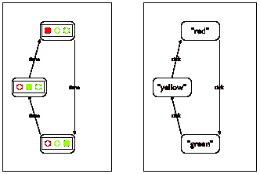
> > > > 
> 图 26：交通灯的工作原理

图 26 的左侧将此描述总结为状态转换图。此类图由状态和连接这些状态的箭头组成。每个状态描述了一种特定配置的交通灯：红色、黄色或绿色。每条箭头显示世界如何变化，以及它可以从哪个状态转换到另一个状态。我们的示例图包含三条箭头，因为交通灯有三种可能的变化方式。箭头上的标签表明变化的原因；交通灯随着时间的推移从一个状态转换到另一个状态。

在许多情况下，状态转换图只有有限数量的状态和箭头。计算机科学家称此类图为有限状态机（FSM），也称为有限状态自动机（FSA）。尽管它们很简单，但 FSM/FSAs 在计算机科学中发挥着重要作用。

要为 FSA 创建一个世界程序，我们首先必须为可能的“世界状态”选择一种数据表示，根据设计世界程序，这代表世界可能以某种方式改变的那些方面，而不是那些保持不变方面。在我们的交通灯案例中，变化的是灯光的颜色，即哪个灯泡被打开。灯泡的大小、它们的排列（水平或垂直）和其他方面没有变化。由于只有三个状态，我们重用了上面 TrafficLight 的基于字符串的数据定义。

图 26 的右侧是对 TrafficLight 数据定义的图解解释。与图 26 中的图一样，它由三个状态组成，排列方式使得每个数据元素都容易被视为一个具体配置的表示。此外，箭头现在用勾号标注，以表明我们的世界程序使用时间的流逝作为改变交通灯状态的触发器。如果我们想模拟手动操作的红绿灯，我们可能会根据按键选择转换。

现在我们知道了如何表示我们世界的状态，如何从一个状态过渡到下一个状态，以及状态在时钟的每次滴答时都会改变，我们可以写下两个必须设计的函数的签名、目的声明和存根：

> | ; 交通灯 -> 交通灯 |
> | --- |
> | ; 给定当前状态 cs，返回下一个状态 |
> | ([define](http://docs.racket-lang.org/htdp-langs/beginner.html#%28form._%28%28lib._lang%2Fhtdp-beginner..rkt%29._define%29%29) (tl-next cs) cs) |
> |   |
> | ; 交通灯 -> 图像 |
> | ; 将当前状态 cs 渲染为图像 |
> | ([define](http://docs.racket-lang.org/htdp-langs/beginner.html#%28form._%28%28lib._lang%2Fhtdp-beginner..rkt%29._define%29%29) (tl-render current-state) |
> |   ([empty-scene](http://docs.racket-lang.org/teachpack/2htdpimage.html#%28def._%28%28lib._2htdp%2Fimage..rkt%29._empty-scene%29%29) 90 30)) |

前面的部分使用 render 和 next 来命名将世界状态转换为图像和处理时钟滴答声的函数。在这里，我们使用一些音节来前缀这些名称，以表明这些函数属于哪个世界。因为具体的函数之前已经出现过了，所以我们把它们留作练习。练习 59：完成模拟交通灯 FSA 的世界程序的设计。以下是主函数：

> | ; 交通灯 -> 交通灯 |
> | --- |
> | ; 模拟基于时钟的美国交通灯 |
> | ([define](http://docs.racket-lang.org/htdp-langs/beginner.html#%28form._%28%28lib._lang%2Fhtdp-beginner..rkt%29._define%29%29) (traffic-light-simulation initial-state) |
> |   ([big-bang](http://docs.racket-lang.org/teachpack/2htdpuniverse.html#%28form._world._%28%28lib._2htdp%2Funiverse..rkt%29._big-bang%29%29) initial-state |
> |     [[to-draw](http://docs.racket-lang.org/teachpack/2htdpuniverse.html#%28form._world._%28%28lib._2htdp%2Funiverse..rkt%29._to-draw%29%29) tl-render] |
> |   [[on-tick](http://docs.racket-lang.org/teachpack/2htdpuniverse.html#%28form._world._%28%28lib._2htdp%2Funiverse..rkt%29._on-tick%29%29) tl-next 1])) |

函数的参数是[big-bang](http://docs.racket-lang.org/teachpack/2htdpuniverse.html#%28form._world._%28%28lib._2htdp%2Funiverse..rkt%29._big-bang%29%29)表达式的初始状态，这告诉 DrRacket 使用 tl-render 重新绘制世界的状态，并使用 tl-next 处理时钟滴答。还请注意，它通知计算机时钟应该每秒滴答一次。

完成 tl-render 和 tl-next 的设计。首先，将 TrafficLight、tl-next 和 tl-render 复制到 DrRacket 的定义区域。

这里是后者的设计的一些测试用例：

> | ([check-expect](http://docs.racket-lang.org/htdp-langs/beginner.html#%28form._%28%28lib._lang%2Fhtdp-beginner..rkt%29._check-expect%29%29) (tl-render "red") ) |
> | --- |
> | ([check-expect](http://docs.racket-lang.org/htdp-langs/beginner.html#%28form._%28%28lib._lang%2Fhtdp-beginner..rkt%29._check-expect%29%29) (tl-render "yellow") ) |

您的函数可以直接使用这些图像。如果您决定使用 2htdp/image teachpack 中的函数创建图像，请设计一个用于创建单色灯泡图像的辅助函数。然后查阅[place-image](http://docs.racket-lang.org/teachpack/2htdpimage.html#%28def._%28%28lib._2htdp%2Fimage..rkt%29._place-image%29%29)函数，该函数可以将灯泡放置到背景场景中。练习 60。一个交通灯程序的替代数据表示可能使用数字而不是字符串：

> | ; An N-TrafficLight is one of: |
> | --- |
> | ; –  0  解释交通灯显示红色 |
> | ; –  1  解释交通灯显示绿色 |
> | ; –  2  解释交通灯显示黄色 |

这大大简化了 tl-next 的定义：

> | ; N-TrafficLight -> N-TrafficLight |
> | --- |
> | ; yields the next state, given current state cs |
> | ([define](http://docs.racket-lang.org/htdp-langs/beginner.html#%28form._%28%28lib._lang%2Fhtdp-beginner..rkt%29._define%29%29) (tl-next-numeric cs) ([modulo](http://docs.racket-lang.org/htdp-langs/beginner.html#%28def._htdp-beginner._%28%28lib._lang%2Fhtdp-beginner..rkt%29._modulo%29%29) ([+](http://docs.racket-lang.org/htdp-langs/beginner.html#%28def._htdp-beginner._%28%28lib._lang%2Fhtdp-beginner..rkt%29._%2B%29%29) cs 1) 3)) |

重新制定 tl-next 的 tl-next-numeric 测试。

tl-next 函数是否比 tl-next-numeric 函数更清晰地传达其意图？如果是，为什么？如果不是，为什么不是？

练习 61。正如从函数到程序所说，程序必须定义常量并使用名称而不是实际常量。在这种精神下，交通灯的数据定义也必须使用常量：这种数据定义形式是经验丰富的设计师会使用的。

> | ([define](http://docs.racket-lang.org/htdp-langs/beginner.html#%28form._%28%28lib._lang%2Fhtdp-beginner..rkt%29._define%29%29) RED 0) |
> | --- |
> | ([define](http://docs.racket-lang.org/htdp-langs/beginner.html#%28form._%28%28lib._lang%2Fhtdp-beginner..rkt%29._define%29%29) GREEN 1) |
> | ([define](http://docs.racket-lang.org/htdp-langs/beginner.html#%28form._%28%28lib._lang%2Fhtdp-beginner..rkt%29._define%29%29) YELLOW 2) |
> |   |
> | ; An S-TrafficLight is one of: |
> | ; –  红色 |
> | ; –  绿色 |
> | ; –  黄色 |

如果名称选择得当，数据定义不需要解释语句。

> > > |
> > > 
> > > &#124; ; S-TrafficLight -> S-TrafficLight &#124;
> > > 
> > > &#124; ; 返回下一个状态，给定当前状态 cs &#124;
> > > 
> > > |
> > > 
> > > |  |  |  |
> > > | --- | --- | --- |
> > > 
> > > |
> > > 
> > > &#124; ([检查期望](http://docs.racket-lang.org/htdp-langs/beginner.html#%28form._%28%28lib._lang%2Fhtdp-beginner..rkt%29._check-expect%29%29) (tl-next- ... RED) GREEN) &#124;
> > > 
> > > &#124; ([检查期望](http://docs.racket-lang.org/htdp-langs/beginner.html#%28form._%28%28lib._lang%2Fhtdp-beginner..rkt%29._check-expect%29%29) (tl-next- ... YELLOW) RED) &#124;
> > > 
> > > |
> > > 
> > > |  |  |  |
> > > | --- | --- | --- |
> > > 
> > > |
> > > 
> > > &#124; ([定义](http://docs.racket-lang.org/htdp-langs/beginner.html#%28form._%28%28lib._lang%2Fhtdp-beginner..rkt%29._define%29%29) (tl-next-numeric cs) &#124;
> > > 
> > > &#124;   ([取模](http://docs.racket-lang.org/htdp-langs/beginner.html#%28def._htdp-beginner._%28%28lib._lang%2Fhtdp-beginner..rkt%29._modulo%29%29) ([+](http://docs.racket-lang.org/htdp-langs/beginner.html#%28def._htdp-beginner._%28%28lib._lang%2Fhtdp-beginner..rkt%29._%2B%29%29) cs 1) 3)) &#124;
> > > 
> > > |  |
> > > | --- |
> > > 
> > > &#124; ([定义](http://docs.racket-lang.org/htdp-langs/beginner.html#%28form._%28%28lib._lang%2Fhtdp-beginner..rkt%29._define%29%29) (tl-next-symbolic cs) &#124;
> > > 
> > > &#124;   ([条件](http://docs.racket-lang.org/htdp-langs/beginner.html#%28form._%28%28lib._lang%2Fhtdp-beginner..rkt%29._cond%29%29) &#124;
> > > 
> > > &#124;   [([等于?](http://docs.racket-lang.org/htdp-langs/beginner.html#%28def._htdp-beginner._%28%28lib._lang%2Fhtdp-beginner..rkt%29._equal~3f%29%29) cs RED) GREEN] &#124;
> > > 
> > > &#124;   [([等于?](http://docs.racket-lang.org/htdp-langs/beginner.html#%28def._htdp-beginner._%28%28lib._lang%2Fhtdp-beginner..rkt%29._equal~3f%29%29) cs GREEN) YELLOW] &#124;
> > > 
> > > &#124;   [([等于?](http://docs.racket-lang.org/htdp-langs/beginner.html#%28def._htdp-beginner._%28%28lib._lang%2Fhtdp-beginner..rkt%29._equal~3f%29%29) cs YELLOW) RED])) &#124;
> > > 
> > > |
> > > 
> 图 27：一个符号交通灯

图 27 显示了两个不同的函数，它们在模拟程序中切换交通灯的状态。哪一个使用了项目化的配方设计得恰当？哪一个在将常数更改为以下内容时仍然继续工作？

> | ([定义](http://docs.racket-lang.org/htdp-langs/beginner.html#%28form._%28%28lib._lang%2Fhtdp-beginner..rkt%29._define%29%29) RED "red") |
> | --- |
> | ([定义](http://docs.racket-lang.org/htdp-langs/beginner.html#%28form._%28%28lib._lang%2Fhtdp-beginner..rkt%29._define%29%29) GREEN "green") |
> | ([定义](http://docs.racket-lang.org/htdp-langs/beginner.html#%28form._%28%28lib._lang%2Fhtdp-beginner..rkt%29._define%29%29) YELLOW "yellow") |

这是否帮助你回答了问题？

旁白：[等于?](http://docs.racket-lang.org/htdp-langs/beginner.html#%28def._htdp-beginner._%28%28lib._lang%2Fhtdp-beginner..rkt%29._equal~3f%29%29) 函数在图 27 中比较两个任意值，无论这些值是什么。在编程的世界里，相等性是一个复杂的话题。结束

这里是另一个引入了一些额外复杂性的有限状态问题：

> 样例问题设计一个模拟带自动门关闭器的门工作的世界程序。如果这种门是锁着的，你可以用钥匙将其解锁。未上锁的门是关闭的，但有人推门时门会打开。一旦人通过门并放手，自动门就会接管并再次关闭门。当门关闭时，它可以再次上锁。

为了提炼出基本元素，我们再次绘制了一个转换图；请参见图 28 的左侧。像交通灯一样，门有三个不同的状态：锁着的、关闭的和打开的。锁门和开锁是导致门从锁着的状态转换到关闭状态以及相反状态的活动。至于打开未上锁的门，我们说需要推开门。其余的转换与其他不同，因为它不需要任何人或任何其他事物的活动。相反，门会随着时间的推移自动关闭。相应的转换箭头被标记为*时间*，以强调这一点。

> > > > 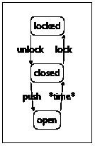 
> > > > 
> 图 28：带自动关闭器的门的转换图

按照我们的配方，我们首先将三个现实世界状态翻译成 BSL 数据：

> |
> 
> &#124; ([define](http://docs.racket-lang.org/htdp-langs/beginner.html#%28form._%28%28lib._lang%2Fhtdp-beginner..rkt%29._define%29%29) LOCKED "locked") &#124;
> 
> &#124; ([define](http://docs.racket-lang.org/htdp-langs/beginner.html#%28form._%28%28lib._lang%2Fhtdp-beginner..rkt%29._define%29%29) CLOSED "closed") &#124;
> 
> &#124; ([define](http://docs.racket-lang.org/htdp-langs/beginner.html#%28form._%28%28lib._lang%2Fhtdp-beginner..rkt%29._define%29%29) OPEN "open") &#124;
> 
> |  |
> | --- |
> 
> &#124; ; A DoorState is one of: &#124;
> 
> &#124; ; –  LOCKED &#124;
> 
> &#124; ; –  CLOSED &#124;
> 
> &#124; ; –  OPEN &#124;
> 
> |

我们还牢记了练习 61 的教训，即最好定义符号常量，并以这些常量来制定数据定义。

世界设计的下一步要求我们将我们领域中的选择动作——<wbr>左图中的箭头——<wbr>翻译成 2htdp/universe teachpack 可以处理的与计算机的交互。我们对门的当前状态和转换的图示表示，特别是从打开到关闭的箭头，暗示了使用时钟滴答声。对于其他箭头，我们可以使用按键或鼠标点击。让我们使用三个按键：“u”用于解锁门，“l”用于锁定它，以及空格键“ ”用于将其推开。图 28 的右侧图示以图形方式表达了这些选择；它将状态机图从信息世界转换到 BSL 数据世界。

一旦我们决定使用时间的流逝来表示一个动作，以及使用按键来表示其他动作，我们必须设计函数来渲染世界的当前状态——<wbr>表示为 DoorState——<wbr>并将其转换为世界的下一个状态。当然，这相当于一个[大爆炸](http://docs.racket-lang.org/teachpack/2htdpuniverse.html#%28form._world._%28%28lib._2htdp%2Funiverse..rkt%29._big-bang%29%29)函数的愿望清单：

+   door-closer，它在滴答期间关闭门；

+   door-action，它会在按下键时对其做出响应；并且

+   door-render，它将当前状态转换为图像。

停止！制定适当的签名。我们从 door-closer 开始。由于 door-closer 充当[on-tick](http://docs.racket-lang.org/teachpack/2htdpuniverse.html#%28form._world._%28%28lib._2htdp%2Funiverse..rkt%29._on-tick%29%29)处理程序，我们根据 DoorState 作为世界状态的集合来获取其签名：

> | ; DoorState -> DoorState |
> | --- |
> | ; 在滴答期间关闭打开的门 |
> | ([定义](http://docs.racket-lang.org/htdp-langs/beginner.html#%28form._%28%28lib._lang%2Fhtdp-beginner..rkt%29._define%29%29) (door-closer state-of-door) state-of-door) |

当世界只能处于三种状态之一时，编造示例是微不足道的。这里我们使用表格来表达基本思想，就像上面给出的某些数学示例一样：

> | 给定状态 |  | 所需状态 |
> | --- | --- | --- |
> | 锁定 |  | 锁定 |
> | 关闭 |  | 关闭 |
> | 打开 |  | 关闭 |

停止！将这些示例表达为 BSL 测试。模板步骤要求一个有三个子句的条件：

> | ([定义](http://docs.racket-lang.org/htdp-langs/beginner.html#%28form._%28%28lib._lang%2Fhtdp-beginner..rkt%29._define%29%29) (door-closer state-of-door) |
> | --- |
> |   ([条件](http://docs.racket-lang.org/htdp-langs/beginner.html#%28form._%28%28lib._lang%2Fhtdp-beginner..rkt%29._cond%29%29) |
> |    ([([string=?](http://docs.racket-lang.org/htdp-langs/beginner.html#%28def._htdp-beginner._%28%28lib._lang%2Fhtdp-beginner..rkt%29._string~3d~3f%29%29) LOCKED state-of-door) [...](http://docs.racket-lang.org/htdp-langs/beginner.html#%28form._%28%28lib._lang%2Fhtdp-beginner..rkt%29._......%29%29)] |
> |    ([([string=?](http://docs.racket-lang.org/htdp-langs/beginner.html#%28def._htdp-beginner._%28%28lib._lang%2Fhtdp-beginner..rkt%29._string~3d~3f%29%29) CLOSED state-of-door) [...](http://docs.racket-lang.org/htdp-langs/beginner.html#%28form._%28%28lib._lang%2Fhtdp-beginner..rkt%29._......%29%29)] |
> |    ([([string=?](http://docs.racket-lang.org/htdp-langs/beginner.html#%28def._htdp-beginner._%28%28lib._lang%2Fhtdp-beginner..rkt%29._string~3d~3f%29%29) OPEN state-of-door) [...](http://docs.racket-lang.org/htdp-langs/beginner.html#%28form._%28%28lib._lang%2Fhtdp-beginner..rkt%29._......%29%29)])) |

将此模板转换为函数定义的过程由以下示例决定：

> |    ([define](http://docs.racket-lang.org/htdp-langs/beginner.html#%28form._%28%28lib._lang%2Fhtdp-beginner..rkt%29._define%29%29) (door-closer state-of-door) |
> | --- |
> |   ([cond](http://docs.racket-lang.org/htdp-langs/beginner.html#%28form._%28%28lib._lang%2Fhtdp-beginner..rkt%29._cond%29%29) |
> |    ([([string=?](http://docs.racket-lang.org/htdp-langs/beginner.html#%28def._htdp-beginner._%28%28lib._lang%2Fhtdp-beginner..rkt%29._string~3d~3f%29%29) LOCKED state-of-door) LOCKED] |
> |    ([([string=?](http://docs.racket-lang.org/htdp-langs/beginner.html#%28def._htdp-beginner._%28%28lib._lang%2Fhtdp-beginner..rkt%29._string~3d~3f%29%29) CLOSED state-of-door) CLOSED] |
> |   ([([string=?](http://docs.racket-lang.org/htdp-langs/beginner.html#%28def._htdp-beginner._%28%28lib._lang%2Fhtdp-beginner..rkt%29._string~3d~3f%29%29) OPEN state-of-door) CLOSED])) |

不要忘记运行你的测试。第二个函数，门动作，负责处理图中剩余的三个箭头。处理键盘事件的函数同时消耗一个世界事件和一个键事件，意味着其签名如下：

> | ; DoorState DoorState KeyEvent -> DoorState |
> | --- |
> |    ; 将键事件 k 转换为状态 s 上的动作 |
> |    ([define](http://docs.racket-lang.org/htdp-langs/beginner.html#%28form._%28%28lib._lang%2Fhtdp-beginner..rkt%29._define%29%29) (door-action s k) |
> |    s) |

我们再次以表格形式呈现示例：

> | 给定状态 |  | 给定键事件 |  | 所需状态 |
> | --- | --- | --- | --- | --- |
> | 锁定 |  | "u" |  | 关闭 |
> |    CLOSED |  | "l" |  | 锁定 |
> |    CLOSED |  | " " |  | 开启 |
> |    开启 |  | —<wbr> |  | 开启 |

这些示例结合了我们的绘图信息以及我们将动作映射到键盘事件的选择。与交通灯的示例表不同，这个表是不完整的。想想其他示例；然后考虑为什么我们的表是足够的。从这里，创建一个完整的设计就很简单了：

> | ([check-expect](http://docs.racket-lang.org/htdp-langs/beginner.html#%28form._%28%28lib._lang%2Fhtdp-beginner..rkt%29._check-expect%29%29) (door-action LOCKED "u") CLOSED) |
> | --- |
> | ([check-expect](http://docs.racket-lang.org/htdp-langs/beginner.html#%28form._%28%28lib._lang%2Fhtdp-beginner..rkt%29._check-expect%29%29) (door-action CLOSED "l") LOCKED) |
> | ([check-expect](http://docs.racket-lang.org/htdp-langs/beginner.html#%28form._%28%28lib._lang%2Fhtdp-beginner..rkt%29._check-expect%29%29) (door-action CLOSED " ") OPEN) |
> | ([check-expect](http://docs.racket-lang.org/htdp-langs/beginner.html#%28form._%28%28lib._lang%2Fhtdp-beginner..rkt%29._check-expect%29%29) (door-action OPEN "a") OPEN) |
> | ([check-expect](http://docs.racket-lang.org/htdp-langs/beginner.html#%28form._%28%28lib._lang%2Fhtdp-beginner..rkt%29._check-expect%29%29) (door-action CLOSED "a") CLOSED) |
> |   |
> | ([define](http://docs.racket-lang.org/htdp-langs/beginner.html#%28form._%28%28lib._lang%2Fhtdp-beginner..rkt%29._define%29%29) (door-action s k) |
> |   ([cond](http://docs.racket-lang.org/htdp-langs/beginner.html#%28form._%28%28lib._lang%2Fhtdp-beginner..rkt%29._cond%29%29) |
> |     [([and](http://docs.racket-lang.org/htdp-langs/beginner.html#%28form._%28%28lib._lang%2Fhtdp-beginner..rkt%29._and%29%29) ([string=?](http://docs.racket-lang.org/htdp-langs/beginner.html#%28def._htdp-beginner._%28%28lib._lang%2Fhtdp-beginner..rkt%29._string~3d~3f%29%29) LOCKED s) ([string=?](http://docs.racket-lang.org/htdp-langs/beginner.html#%28def._htdp-beginner._%28%28lib._lang%2Fhtdp-beginner..rkt%29._string~3d~3f%29%29) "u" k)) |
> |      CLOSED] |
> |     [([and](http://docs.racket-lang.org/htdp-langs/beginner.html#%28form._%28%28lib._lang%2Fhtdp-beginner..rkt%29._and%29%29) ([string=?](http://docs.racket-lang.org/htdp-langs/beginner.html#%28def._htdp-beginner._%28%28lib._lang%2Fhtdp-beginner..rkt%29._string~3d~3f%29%29) CLOSED s) ([string=?](http://docs.racket-lang.org/htdp-langs/beginner.html#%28def._htdp-beginner._%28%28lib._lang%2Fhtdp-beginner..rkt%29._string~3d~3f%29%29) "l" k)) |
> |      LOCKED] |
> | ([([and](http://docs.racket-lang.org/htdp-langs/beginner.html#%28form._%28%28lib._lang%2Fhtdp-beginner..rkt%29._and%29%29) ([string=?](http://docs.racket-lang.org/htdp-langs/beginner.html#%28def._htdp-beginner._%28%28lib._lang%2Fhtdp-beginner..rkt%29._string~3d~3f%29%29) CLOSED s) ([string=?](http://docs.racket-lang.org/htdp-langs/beginner.html#%28def._htdp-beginner._%28%28lib._lang%2Fhtdp-beginner..rkt%29._string~3d~3f%29%29) " " k)) |
> |      OPEN] |
> |     [[else](http://docs.racket-lang.org/htdp-langs/beginner.html#%28form._%28%28lib._lang%2Fhtdp-beginner..rkt%29._else%29%29) s])) |

注意到使用了[and](http://docs.racket-lang.org/htdp-langs/beginner.html#%28form._%28%28lib._lang%2Fhtdp-beginner..rkt%29._and%29%29)来组合两个条件：一个关于门当前的状态，另一个关于给定的按键事件。最后，我们需要将世界的状态渲染为一个场景：

> | ; DoorState -> Image |
> | --- |
> | ; 将状态 s 转换为大型文本图像 |
> | ([check-expect](http://docs.racket-lang.org/htdp-langs/beginner.html#%28form._%28%28lib._lang%2Fhtdp-beginner..rkt%29._check-expect%29%29) (door-render CLOSED) |
> |               ([text](http://docs.racket-lang.org/teachpack/2htdpimage.html#%28def._%28%28lib._2htdp%2Fimage..rkt%29._text%29%29) CLOSED 40 "red")) |
> | ([define](http://docs.racket-lang.org/htdp-langs/beginner.html#%28form._%28%28lib._lang%2Fhtdp-beginner..rkt%29._define%29%29) (door-render s) |
> |   ([text](http://docs.racket-lang.org/teachpack/2htdpimage.html#%28def._%28%28lib._2htdp%2Fimage..rkt%29._text%29%29) s 40 "red")) |

这个简单的函数使用大文本。以下是运行它的方法：

> | ; DoorState -> DoorState |
> | --- |
> | ; 模拟一个带有自动门关闭器的门 |
> | ([define](http://docs.racket-lang.org/htdp-langs/beginner.html#%28form._%28%28lib._lang%2Fhtdp-beginner..rkt%29._define%29%29) (door-simulation initial-state) |
> |   ([big-bang](http://docs.racket-lang.org/teachpack/2htdpuniverse.html#%28form._world._%28%28lib._2htdp%2Funiverse..rkt%29._big-bang%29%29) initial-state |
> |     [[on-tick](http://docs.racket-lang.org/teachpack/2htdpuniverse.html#%28form._world._%28%28lib._2htdp%2Funiverse..rkt%29._on-tick%29%29) door-closer] |
> |     [[on-key](http://docs.racket-lang.org/teachpack/2htdpuniverse.html#%28form._world._%28%28lib._2htdp%2Funiverse..rkt%29._on-key%29%29) door-action] |
> |     [[to-draw](http://docs.racket-lang.org/teachpack/2htdpuniverse.html#%28form._world._%28%28lib._2htdp%2Funiverse..rkt%29._to-draw%29%29) door-render])) |

现在是时候收集这些片段并在 DrRacket 中运行它们，看看是否一切正常。

练习 62。在门模拟过程中，“打开”状态几乎看不见。修改 door-simulation，使其每三秒钟滴答一次钟。重新运行模拟。

### 5 添加结构🔗 "链接到这里")

假设你想设计一个世界程序，模拟一个球在某个想象中的完美房间地板和天花板之间直线上的来回弹跳。假设它每次时钟滴答声移动两个像素。如果你遵循设计配方，你的第一个目标是开发一个数据表示，用于表示随时间变化的内容。在这里，球的位置和方向随时间变化，但这是两个值，而[大爆炸](http://docs.racket-lang.org/teachpack/2htdpuniverse.html#%28form._world._%28%28lib._2htdp%2Funiverse..rkt%29._big-bang%29%29)只跟踪一个。因此，问题就出现了，如何用一块数据表示两个变化的信息量。

> > > 数学家知道一些“合并”两个数字成一个数字的技巧，这样就可以恢复原始的数字。程序员认为这类技巧很糟糕，因为它们掩盖了程序的真实意图。

这里是另一个提出相同问题的场景。你的手机主要是几百万行代码包裹在塑料中。其中之一是管理你的联系人。每个联系人都有一个名字、电话号码、电子邮件地址，可能还有一些其他信息。当你有很多联系人时，每个单独的联系人最好表示为单一的数据片段；否则，各种数据可能会意外混淆。

由于这样的编程问题，每种编程语言都提供了一些机制，可以将多个数据片段组合成一个单一的数据组合，并在需要时检索其组成部分的值。本章介绍了 BSL 的机制，所谓的结构类型定义，以及如何设计处理复合数据的程序。

#### 5.1 从位置到位置结构🔗 "链接到此处")

世界画布上的位置由两份数据唯一标识：从左边距的距离和从上边距的距离。第一个被称为 x 坐标，第二个被称为 y 坐标。

DrRacket，基本上是一个 BSL 程序，使用位置结构来表示这样的位置。位置结构将两个数字组合成一个单一值。我们可以通过操作[创建位置](http://docs.racket-lang.org/htdp-langs/beginner.html#%28def._htdp-beginner._%28%28lib._lang%2Fhtdp-beginner..rkt%29._make-posn%29%29)来创建位置结构，它消耗两个数字并生成一个位置。例如，

> ([创建位置](http://docs.racket-lang.org/htdp-langs/beginner.html#%28def._htdp-beginner._%28%28lib._lang%2Fhtdp-beginner..rkt%29._make-posn%29%29) 3 4)

是一个创建位置结构，其 x 坐标为 3，y 坐标为 4 的表达式。位置结构具有与数字、布尔值或字符串相同的地位。特别是，原始操作和函数都可以消耗和产生结构。此外，程序可以命名位置结构：

> ([定义](http://docs.racket-lang.org/htdp-langs/beginner.html#%28form._%28%28lib._lang%2Fhtdp-beginner..rkt%29._define%29%29) one-posn ([创建位置](http://docs.racket-lang.org/htdp-langs/beginner.html#%28def._htdp-beginner._%28%28lib._lang%2Fhtdp-beginner..rkt%29._make-posn%29%29) 8 6))

停止！用坐标来描述 one-posn。

在做其他任何事情之前，让我们看看位置结构的计算法则。这样，我们既可以创建处理位置结构的函数，也可以预测它们会计算什么。

#### 5.2 使用位置结构进行计算🔗 "链接到此处")

虽然函数及其法则在代数之前就已经完全熟悉，但位置结构似乎是一个新概念。然而，位置的概念应该看起来像你之前可能遇到过的笛卡尔点或平面上的位置。

> > > > 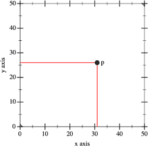
> > > > 
> 图 29：笛卡尔点

选择笛卡尔点的各个部分也是一个熟悉的过程。例如，当老师说，“看看图 29 的图表，告诉我 px 和 py 是多少”时，你可能会回答 31 和 26，分别，因为你知道你需要读取从 p 发出的垂直和水平辐射线与坐标轴相交处的值。

我们可以用 BSL 表达这个想法。假设你在定义区域添加

> ([define](http://docs.racket-lang.org/htdp-langs/beginner.html#%28form._%28%28lib._lang%2Fhtdp-beginner..rkt%29._define%29%29) p ([make-posn](http://docs.racket-lang.org/htdp-langs/beginner.html#%28def._htdp-beginner._%28%28lib._lang%2Fhtdp-beginner..rkt%29._make-posn%29%29) 31 26))

点击运行，并执行以下交互：

> | > ([posn-x](http://docs.racket-lang.org/htdp-langs/beginner.html#%28def._htdp-beginner._%28%28lib._lang%2Fhtdp-beginner..rkt%29._posn-x%29%29) p) |
> | --- |
> | 31 |
> | > ([posn-y](http://docs.racket-lang.org/htdp-langs/beginner.html#%28def._htdp-beginner._%28%28lib._lang%2Fhtdp-beginner..rkt%29._posn-y%29%29) p) |
> | 26 |

定义 p 就像在笛卡尔平面上标记一个点；使用 [posn-x](http://docs.racket-lang.org/htdp-langs/beginner.html#%28def._htdp-beginner._%28%28lib._lang%2Fhtdp-beginner..rkt%29._posn-x%29%29) 和 [posn-y](http://docs.racket-lang.org/htdp-langs/beginner.html#%28def._htdp-beginner._%28%28lib._lang%2Fhtdp-beginner..rkt%29._posn-y%29%29) 就像用索引对 p 进行下标：px 和 py。从计算的角度讲，posn 结构体带有两个方程：

> | ([posn-x](http://docs.racket-lang.org/htdp-langs/beginner.html#%28def._htdp-beginner._%28%28lib._lang%2Fhtdp-beginner..rkt%29._posn-x%29%29)  ([make-posn](http://docs.racket-lang.org/htdp-langs/beginner.html#%28def._htdp-beginner._%28%28lib._lang%2Fhtdp-beginner..rkt%29._make-posn%29%29)  x0  y0)) |  | == |  | x0 |
> | --- | --- | --- | --- | --- |
> | ([posn-y](http://docs.racket-lang.org/htdp-langs/beginner.html#%28def._htdp-beginner._%28%28lib._lang%2Fhtdp-beginner..rkt%29._posn-y%29%29)  ([make-posn](http://docs.racket-lang.org/htdp-langs/beginner.html#%28def._htdp-beginner._%28%28lib._lang%2Fhtdp-beginner..rkt%29._make-posn%29%29)  x0  y0)) |  | == |  | y0 |

DrRacket 在计算过程中使用这些方程。以下是一个涉及 posn 结构体的计算示例：

> | ([posn-x](http://docs.racket-lang.org/htdp-langs/beginner.html#%28def._htdp-beginner._%28%28lib._lang%2Fhtdp-beginner..rkt%29._posn-x%29%29) p) |
> | --- |
> | == ; DrRacket 将 p 替换为 ([make-posn](http://docs.racket-lang.org/htdp-langs/beginner.html#%28def._htdp-beginner._%28%28lib._lang%2Fhtdp-beginner..rkt%29._make-posn%29%29)  31  26) |
> | ([posn-x](http://docs.racket-lang.org/htdp-langs/beginner.html#%28def._htdp-beginner._%28%28lib._lang%2Fhtdp-beginner..rkt%29._posn-x%29%29) ([make-posn](http://docs.racket-lang.org/htdp-langs/beginner.html#%28def._htdp-beginner._%28%28lib._lang%2Fhtdp-beginner..rkt%29._make-posn%29%29) 31 26)) |
> | == ; DrRacket 使用[posn-x](http://docs.racket-lang.org/htdp-langs/beginner.html#%28def._htdp-beginner._%28%28lib._lang%2Fhtdp-beginner..rkt%29._posn-x%29%29)法则 |
> | 31 |

停止！请用你自己的计算来确认上面的第二个交互。同时，也使用 DrRacket 的步进器进行双重检查。

#### 5.3 使用 posn 编程🔗 "链接到此处")

现在考虑设计一个函数，该函数计算某个位置到画布原点的距离：

> 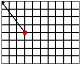

图片清楚地说明了“距离”是指从指定点到画布左上角的最直接路径的长度——“如飞鸟般”——这里是指定点到画布左上角的最直接路径的长度。以下是目的声明和头文件：

> | 计算点 ap 到原点的距离 |
> | --- |
> | ([define](http://docs.racket-lang.org/htdp-langs/beginner.html#%28form._%28%28lib._lang%2Fhtdp-beginner..rkt%29._define%29%29) (distance-to-0 ap) |
> | 0) |

关键在于 distance-to-0 函数接受一个单一值，某个位置。它产生一个单一值，即该位置到原点的距离。为了构造示例，我们需要知道如何计算这个距离。对于坐标中有一个为 0 的点，结果是另一个坐标：

> | ([check-expect](http://docs.racket-lang.org/htdp-langs/beginner.html#%28form._%28%28lib._lang%2Fhtdp-beginner..rkt%29._check-expect%29%29) (distance-to-0 ([make-posn](http://docs.racket-lang.org/htdp-langs/beginner.html#%28def._htdp-beginner._%28%28lib._lang%2Fhtdp-beginner..rkt%29._make-posn%29%29) 0 5)) 5) |
> | --- |
> | ([check-expect](http://docs.racket-lang.org/htdp-langs/beginner.html#%28form._%28%28lib._lang%2Fhtdp-beginner..rkt%29._check-expect%29%29) (distance-to-0 ([make-posn](http://docs.racket-lang.org/htdp-langs/beginner.html#%28def._htdp-beginner._%28%28lib._lang%2Fhtdp-beginner..rkt%29._make-posn%29%29) 7 0)) 7) |

对于一般情况，我们可以自己尝试推导公式，或者回忆起我们几何课程中的公式。正如你所知，这是你可能拥有的领域知识，但如果你没有，我们也会提供；毕竟，这种领域知识不是计算机科学。所以，这里再次给出(x,y)的距离公式：

> 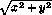

给定这个公式，我们可以轻松地构造一些更多的函数示例：

> | ([check-expect](http://docs.racket-lang.org/htdp-langs/beginner.html#%28form._%28%28lib._lang%2Fhtdp-beginner..rkt%29._check-expect%29%29) (distance-to-0 ([make-posn](http://docs.racket-lang.org/htdp-langs/beginner.html#%28def._htdp-beginner._%28%28lib._lang%2Fhtdp-beginner..rkt%29._make-posn%29%29) 3 4)) 5) |
> | --- |
> | ([检查期望](http://docs.racket-lang.org/htdp-langs/beginner.html#%28form._%28%28lib._lang%2Fhtdp-beginner..rkt%29._check-expect%29%29) (distance-to-0 ([make-posn](http://docs.racket-lang.org/htdp-langs/beginner.html#%28def._htdp-beginner._%28%28lib._lang%2Fhtdp-beginner..rkt%29._make-posn%29%29) 8 6)) 10) |
> | ([检查期望](http://docs.racket-lang.org/htdp-langs/beginner.html#%28form._%28%28lib._lang%2Fhtdp-beginner..rkt%29._check-expect%29%29) (distance-to-0 ([make-posn](http://docs.racket-lang.org/htdp-langs/beginner.html#%28def._htdp-beginner._%28%28lib._lang%2Fhtdp-beginner..rkt%29._make-posn%29%29) 5 12)) 13) |

就算你好奇，我们也设置了示例，以便结果容易理解。但这并不是所有 posn 结构的情况。

停止！将示例中的 x 和 y 坐标代入公式。确认所有五个示例的预期结果。

接下来，我们可以将注意力转向函数的定义。示例暗示，distance-to-0 的设计不需要区分不同的情况；它总是只计算给定 posn 结构内部 x 和 y 坐标之间的距离。但是，函数必须从给定的 posn 结构中选择这些坐标。为此，它使用了 [posn-x](http://docs.racket-lang.org/htdp-langs/beginner.html#%28def._htdp-beginner._%28%28lib._lang%2Fhtdp-beginner..rkt%29._posn-x%29%29) 和 [posn-y](http://docs.racket-lang.org/htdp-langs/beginner.html#%28def._htdp-beginner._%28%28lib._lang%2Fhtdp-beginner..rkt%29._posn-y%29%29) 原语。具体来说，函数需要计算 ([posn-x](http://docs.racket-lang.org/htdp-langs/beginner.html#%28def._htdp-beginner._%28%28lib._lang%2Fhtdp-beginner..rkt%29._posn-x%29%29)  ap) 和 ([posn-y](http://docs.racket-lang.org/htdp-langs/beginner.html#%28def._htdp-beginner._%28%28lib._lang%2Fhtdp-beginner..rkt%29._posn-y%29%29)  ap)，因为 ap 是给定、未知的 posn 结构的名称：

> | ([定义](http://docs.racket-lang.org/htdp-langs/beginner.html#%28form._%28%28lib._lang%2Fhtdp-beginner..rkt%29._define%29%29) (distance-to-0 ap) |
> | --- |
> |   ([...](http://docs.racket-lang.org/htdp-langs/beginner.html#%28form._%28%28lib._lang%2Fhtdp-beginner..rkt%29._......%29%29) ([posn-x](http://docs.racket-lang.org/htdp-langs/beginner.html#%28def._htdp-beginner._%28%28lib._lang%2Fhtdp-beginner..rkt%29._posn-x%29%29) ap) [...](http://docs.racket-lang.org/htdp-langs/beginner.html#%28form._%28%28lib._lang%2Fhtdp-beginner..rkt%29._......%29%29) |
> |    [...](http://docs.racket-lang.org/htdp-langs/beginner.html#%28form._%28%28lib._lang%2Fhtdp-beginner..rkt%29._......%29%29) ([posn-y](http://docs.racket-lang.org/htdp-langs/beginner.html#%28def._htdp-beginner._%28%28lib._lang%2Fhtdp-beginner..rkt%29._posn-y%29%29) ap) [...](http://docs.racket-lang.org/htdp-langs/beginner.html#%28form._%28%28lib._lang%2Fhtdp-beginner..rkt%29._......%29%29))) |

使用这个模板和示例，其余的部分就很简单了：

> | ([define](http://docs.racket-lang.org/htdp-langs/beginner.html#%28form._%28%28lib._lang%2Fhtdp-beginner..rkt%29._define%29%29) (distance-to-0 ap) |
> | --- |
> |   ([sqrt](http://docs.racket-lang.org/htdp-langs/beginner.html#%28def._htdp-beginner._%28%28lib._lang%2Fhtdp-beginner..rkt%29._sqrt%29%29) |
> | |   ([+](http://docs.racket-lang.org/htdp-langs/beginner.html#%28def._htdp-beginner._%28%28lib._lang%2Fhtdp-beginner..rkt%29._%2B%29%29) ([sqr](http://docs.racket-lang.org/htdp-langs/beginner.html#%28def._htdp-beginner._%28%28lib._lang%2Fhtdp-beginner..rkt%29._sqr%29%29) ([posn-x](http://docs.racket-lang.org/htdp-langs/beginner.html#%28def._htdp-beginner._%28%28lib._lang%2Fhtdp-beginner..rkt%29._posn-x%29%29) ap)) |
> |        ([sqr](http://docs.racket-lang.org/htdp-langs/beginner.html#%28def._htdp-beginner._%28%28lib._lang%2Fhtdp-beginner..rkt%29._sqr%29%29) ([posn-y](http://docs.racket-lang.org/htdp-langs/beginner.html#%28def._htdp-beginner._%28%28lib._lang%2Fhtdp-beginner..rkt%29._posn-y%29%29) ap))))) |

函数平方([posn-x](http://docs.racket-lang.org/htdp-langs/beginner.html#%28def._htdp-beginner._%28%28lib._lang%2Fhtdp-beginner..rkt%29._posn-x%29%29)  ap)和([posn-y](http://docs.racket-lang.org/htdp-langs/beginner.html#%28def._htdp-beginner._%28%28lib._lang%2Fhtdp-beginner..rkt%29._posn-y%29%29)  ap)，即代表 x 和 y 坐标，然后将结果相加并开平方。使用 DrRacket，我们也可以快速检查我们的新函数是否为我们的示例产生正确的结果。练习 63。评估以下表达式：

+   (distance-to-0  ([make-posn](http://docs.racket-lang.org/htdp-langs/beginner.html#%28def._htdp-beginner._%28%28lib._lang%2Fhtdp-beginner..rkt%29._make-posn%29%29)  3  4))

+   (distance-to-0  ([make-posn](http://docs.racket-lang.org/htdp-langs/beginner.html#%28def._htdp-beginner._%28%28lib._lang%2Fhtdp-beginner..rkt%29._make-posn%29%29)  6  ([*](http://docs.racket-lang.org/htdp-langs/beginner.html#%28def._htdp-beginner._%28%28lib._lang%2Fhtdp-beginner..rkt%29._%2A%29%29)  2  4)))

+   ([+](http://docs.racket-lang.org/htdp-langs/beginner.html#%28def._htdp-beginner._%28%28lib._lang%2Fhtdp-beginner..rkt%29._%2B%29%29)  (distance-to-0  ([make-posn](http://docs.racket-lang.org/htdp-langs/beginner.html#%28def._htdp-beginner._%28%28lib._lang%2Fhtdp-beginner..rkt%29._make-posn%29%29)  12  5))  10)

手动计算。展示所有步骤。假设[sqr](http://docs.racket-lang.org/htdp-langs/beginner.html#%28def._htdp-beginner._%28%28lib._lang%2Fhtdp-beginner..rkt%29._sqr%29%29)在单步内完成其计算。使用 DrRacket 的步进器检查结果。练习 64。曼哈顿距离是指从点到原点的路径遵循曼哈顿街道的矩形网格。以下有两个示例：

> 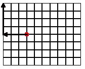          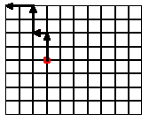

左边显示了一种“直接”策略，向左走所需的最远距离，然后向上走所需的最多个步骤。相比之下，右边显示了一种“随机游走”策略，向左走一些街区，向上走一些，等等，直到达到目的地——<wbr>在这里，是起点——<wbr>。

停止！你遵循哪种策略有关系吗？

设计一个名为 manhattan-distance 的函数，它测量给定 posn 到原点的曼哈顿距离。

#### 5.4 定义结构类型🔗 "链接到此处")

与数字或布尔值不同，结构如 posn 通常不随编程语言提供。只提供了定义结构类型的机制；其余的留给程序员。这对于 BSL 也是如此。

结构类型定义是另一种定义形式，与常量和函数定义不同。以下是 DrRacket 的创建者在 BSL 中定义 posn 结构类型的示例：

> ([define-struct](http://docs.racket-lang.org/htdp-langs/beginner.html#%28form._%28%28lib._lang%2Fhtdp-beginner..rkt%29._define-struct%29%29) posn [x y])

通常，结构类型定义具有以下形状：在结构类型定义中使用括号是一种约定，而不是必需的。它使字段名称突出。用括号替换括号是完全可接受的。

> ([define-struct](http://docs.racket-lang.org/htdp-langs/beginner.html#%28form._%28%28lib._lang%2Fhtdp-beginner..rkt%29._define-struct%29%29) StructureName [FieldName [...](http://docs.racket-lang.org/htdp-langs/beginner.html#%28form._%28%28lib._lang%2Fhtdp-beginner..rkt%29._......%29%29)])

关键字[define-struct](http://docs.racket-lang.org/htdp-langs/beginner.html#%28form._%28%28lib._lang%2Fhtdp-beginner..rkt%29._define-struct%29%29)表示引入一个新的结构类型。它后面跟着结构类型的名称。结构类型定义的第三部分是一个括号内的名称序列；这些名称是字段。实际上，结构类型定义定义了函数。但是，与普通函数定义不同，结构类型定义同时定义了许多函数。具体来说，它定义了三种类型的函数：

+   一个构造函数，一个创建结构实例的函数。它接受与字段数量相同的值；如前所述，结构是结构实例的简称。结构类型这个短语是所有可能实例的集合的通用名称；

+   每个字段一个选择器，它从结构实例中提取字段的值；并且

+   一个结构谓词，它像普通谓词一样，将实例与其他所有类型的值区分开来。

一个程序可以使用这些作为函数或内置原语。

奇怪的是，结构类型定义会为它创建的各种新操作命名。对于构造函数的名称，它将“make-”前缀加到结构名称上，对于选择器的名称，它将结构名称后缀加上字段名称。最后，谓词只是结构名称加上“？”并加上，当大声读出来时发音为“huh”。

这种命名约定看起来很复杂，也许甚至有些令人困惑。但是，只要稍微练习一下，你就会掌握它的技巧。它还解释了与 posn 结构相关的功能：[make-posn](http://docs.racket-lang.org/htdp-langs/beginner.html#%28def._htdp-beginner._%28%28lib._lang%2Fhtdp-beginner..rkt%29._make-posn%29%29) 是构造函数，[posn-x](http://docs.racket-lang.org/htdp-langs/beginner.html#%28def._htdp-beginner._%28%28lib._lang%2Fhtdp-beginner..rkt%29._posn-x%29%29) 和 [posn-y](http://docs.racket-lang.org/htdp-langs/beginner.html#%28def._htdp-beginner._%28%28lib._lang%2Fhtdp-beginner..rkt%29._posn-y%29%29) 是选择器。虽然我们还没有遇到 [posn?](http://docs.racket-lang.org/htdp-langs/beginner.html#%28def._htdp-beginner._%28%28lib._lang%2Fhtdp-beginner..rkt%29._posn~3f%29%29)，但我们现在知道它存在；下一章将详细解释这些谓词的作用。

练习 65。看看以下的结构类型定义：

+   ([define-struct](http://docs.racket-lang.org/htdp-langs/beginner.html#%28form._%28%28lib._lang%2Fhtdp-beginner..rkt%29._define-struct%29%29)  movie  [title  producer  year])

+   ([define-struct](http://docs.racket-lang.org/htdp-langs/beginner.html#%28form._%28%28lib._lang%2Fhtdp-beginner..rkt%29._define-struct%29%29)  person  [name  hair  eyes  phone])

+   ([define-struct](http://docs.racket-lang.org/htdp-langs/beginner.html#%28form._%28%28lib._lang%2Fhtdp-beginner..rkt%29._define-struct%29%29)  pet  [name  number])

+   ([define-struct](http://docs.racket-lang.org/htdp-langs/beginner.html#%28form._%28%28lib._lang%2Fhtdp-beginner..rkt%29._define-struct%29%29)  CD  [artist  title  price])

+   ([define-struct](http://docs.racket-lang.org/htdp-langs/beginner.html#%28form._%28%28lib._lang%2Fhtdp-beginner..rkt%29._define-struct%29%29)  sweater  [material  size  producer])

将每个引入的函数（构造函数、选择器和谓词）的名称写下来。暂时先放下 posn 结构。让我们看看一种结构类型定义，我们可能会用它来跟踪像你手机里的联系人这样的信息：

> ([define-struct](http://docs.racket-lang.org/htdp-langs/beginner.html#%28form._%28%28lib._lang%2Fhtdp-beginner..rkt%29._define-struct%29%29) entry [name phone email])

这里是这个定义引入的函数的名称：

+   make-entry，它消耗三个值并构建一个 entry 实例；

+   entry-name，entry-phone，和 entry-email，它们消耗一个 entry 实例并选择三个字段值之一；以及

+   entry?，谓词。

由于每个 entry 组合了三个值，所以表达式

> (make-entry "Al Abe" "666-7771" "lee@x.me")

在名称字段中创建一个包含 "Al Abe" 的条目结构，电话字段中包含 "666-7771"，电子邮件字段中包含 "lee@x.me"。

练习 66. 回顾 练习 65 的结构类型定义。对哪些值与哪些字段相匹配进行合理的猜测。然后为每个结构类型定义创建至少一个实例。

每个结构类型定义都引入了一种新的结构类型，与其他所有结构类型都不同。程序员希望拥有这种表达力，因为他们希望通过结构名称传达意图。无论结构是在创建、选择还是测试时，程序中的文本都会明确提醒读者这种意图。如果没有这些未来的代码读者，程序员可以为只有一个字段的、有两个字段的、有三个字段的等结构使用一个结构定义。

在这个背景下，让我们研究另一个编程问题：

> 样本问题：为处理“弹跳球”的程序制定结构类型定义，这在本章开头简要提到。球的位置是一个单独的数字，即从顶部像素的距离。它的恒定速度是每时钟周期移动的像素数。它的速度是速度加上移动的方向。

由于球沿着一条直线、垂直的路径移动，一个数字就足以表示它的速度：

+   正数表示球向下移动。

+   负数表示它向上移动。

我们可以利用这种领域知识来制定结构类型定义：

> ([define-struct](http://docs.racket-lang.org/htdp-langs/beginner.html#%28form._%28%28lib._lang%2Fhtdp-beginner..rkt%29._define-struct%29%29) ball [location velocity])

两个字段都将包含数字，所以 (make-ball 10 -3) 是一个良好的数据示例。它代表一个从顶部 10 像素处开始向上移动，每时钟周期移动 3 像素的球。

注意，原则上，球结构只是将两个数字组合在一起，就像 posn 结构一样。当程序包含表达式 (ball-velocity a-ball) 时，它立即传达了该程序处理的是球及其速度的表示。相比之下，如果程序使用 posn 结构，([posn-y](http://docs.racket-lang.org/htdp-langs/beginner.html#%28def._htdp-beginner._%28%28lib._lang%2Fhtdp-beginner..rkt%29._posn-y%29%29) a-ball) 可能会误导代码的读者，使他们认为该表达式是关于 y 坐标的。

练习 67. 这是表示弹跳球的另一种方式：

> | ([define](http://docs.racket-lang.org/htdp-langs/beginner.html#%28form._%28%28lib._lang%2Fhtdp-beginner..rkt%29._define%29%29) SPEED 3) |
> | --- |
> | ([define-struct](http://docs.racket-lang.org/htdp-langs/beginner.html#%28form._%28%28lib._lang%2Fhtdp-beginner..rkt%29._define-struct%29%29) balld [location direction]) |
> | (make-balld 10 "up") |

解释这段代码并创建其他 balld 实例。

由于结构是值，就像数字或布尔值或字符串一样，一个结构实例出现在另一个实例内部是有意义的。考虑游戏对象。与弹跳球不同，这类对象并不总是沿着垂直线移动。相反，它们以某种“斜”的方式在画布上移动。描述在二维世界画布上移动的球体的位置和速度需要两个数字：每个方向一个。是物理学告诉你要将对象的速率加到其位置上以获得其下一个位置。开发者需要学习向谁询问哪个领域。对于位置部分，两个数字表示 x 和 y 坐标。速率描述了水平和垂直方向的变化；换句话说，这些“变化数字”必须加到相应的坐标上，以找出对象将出现在哪里。

显然，posn 结构可以表示位置。对于速度，我们定义 vel 结构类型：

> ([定义结构](http://docs.racket-lang.org/htdp-langs/beginner.html#%28form._%28%28lib._lang%2Fhtdp-beginner..rkt%29._define-struct%29%29) vel [deltax deltay])

它包含两个字段：deltax 和 deltay。单词“delta”通常用于描述物理活动模拟中的变化，而 x 和 y 部分表示哪个轴相关。现在我们可以使用球体的实例将 posn 结构与 vel 结构结合起来，以表示沿直线移动但不必仅沿垂直（或水平）线移动的球体：

> | ([定义](http://docs.racket-lang.org/htdp-langs/beginner.html#%28form._%28%28lib._lang%2Fhtdp-beginner..rkt%29._define%29%29) ball1) |
> | --- |
> | |   (make-ball ([make-posn](http://docs.racket-lang.org/htdp-langs/beginner.html#%28def._htdp-beginner._%28%28lib._lang%2Fhtdp-beginner..rkt%29._make-posn%29%29) 30 40) (make-vel -10 5))) |

解释这个实例的一种方法是将球体想象成距离左边 30 像素，距离顶部 40 像素的球体。它每时钟周期向左移动 10 像素，因为从 x 坐标中减去 10 像素使其更靠近左边。至于垂直方向，球体每时钟周期下降 5 像素，因为向 y 坐标添加正数会增加距离顶部的距离。练习 68。球体的嵌套数据表示的另一种方法是使用四个字段来跟踪四个属性：另一种选择是使用复数。如果你了解它们，考虑一种使用它们来表示位置和速度的数据表示。例如，在 BSL 中，4-3i 是一个复数，可以用来表示位置或速度（4，-3）。

> ([定义结构](http://docs.racket-lang.org/htdp-langs/beginner.html#%28form._%28%28lib._lang%2Fhtdp-beginner..rkt%29._define-struct%29%29) ballf [x y deltax deltay])

程序员称这种表示为平面表示。创建一个与 ball1 具有相同解释的 ballf 实例。为了第二个嵌套结构的示例，让我们简要地看看联系名单的例子。许多手机支持联系名单，允许每个名字有多个电话号码：一个家庭电话，一个办公室电话，和一个手机号码。对于电话号码，我们希望包括区号和本地号码。由于这种嵌套了信息，最好也创建一个嵌套的数据表示：

> | ([define-struct](http://docs.racket-lang.org/htdp-langs/beginner.html#%28form._%28%28lib._lang%2Fhtdp-beginner..rkt%29._define-struct%29%29) centry [name home office cell]) |
> | --- |
> |   |
> | ([define-struct](http://docs.racket-lang.org/htdp-langs/beginner.html#%28form._%28%28lib._lang%2Fhtdp-beginner..rkt%29._define-struct%29%29) phone [area number]) |
> |   |
> | (make-centry "Shriram Fisler" |
> |              (make-phone 207 "363-2421") |
> |              (make-phone 101 "776-1099") |
> |              (make-phone 208 "112-9981")) |

这里的意图是，联系名单上的条目有四个字段：一个名字和三个电话记录。后者用 phone 实例表示，将区号与本地电话号码分开。

总结来说，嵌套信息是自然的。用数据表示此类信息最好的方法是通过嵌套结构实例来反映嵌套。这样做使得在程序的应用领域中解释数据变得容易，而且从信息示例到数据的转换也很直接。当然，真正指定如何在不同信息与数据之间来回转换的是数据定义的任务。然而，在我们研究结构类型定义的数据定义之前，我们首先系统地看看如何使用和思考结构。

#### 5.5 使用结构进行计算🔗 "链接到此处")

结构类型以两种方式概括笛卡尔点。首先，结构类型可以指定任意数量的字段：零、一、二、三等等。其次，结构类型命名字段，而不是编号。大多数编程语言也支持类似结构的数据，使用数字字段名。这有助于程序员阅读代码，因为记住一个家族名字在名为 last-name 的字段中比在第七个字段中要容易得多。

以同样的精神，使用结构实例进行计算概括了笛卡尔点的操作。为了理解这个想法，让我们首先看看一种图示的方式来思考结构实例，即具有与字段数量一样多的隔间的锁箱。以下是这种表示：

> ([define](http://docs.racket-lang.org/htdp-langs/beginner.html#%28form._%28%28lib._lang%2Fhtdp-beginner..rkt%29._define%29%29) pl (make-entry "Al Abe" "666-7771" "lee@x.me"))

如下所示：

> 

框的斜体标签标识它是一个特定结构类型的实例；每个隔间也标有标签。这里还有一个实例：

> (make-entry "Tara Harp" "666-7770" "th@smlu.edu")

对应于一个类似的框图，尽管内容不同：

> 

毫不奇怪，嵌套的结构实例有一个嵌套在框中的框图。因此，上面的 ball1 等价于这个图：

> 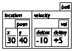

在这种情况下，外层框包含两个框，每个字段一个。

练习 69. 为 练习 65 的解绘制框表示。

在这个意象的背景下，选择器就像是一个键。它打开特定类型的框的特定隔间，从而使得持有者能够提取其内容。因此，将 entry-name 应用到上面的 pl 得到一个字符串：

> | > (entry-name pl) |
> | --- |
> | "Al Abe" |

但将 entry-name 应用到 posn 结构会引发错误：

> | > (entry-name ([make-posn](http://docs.racket-lang.org/htdp-langs/beginner.html#%28def._htdp-beginner._%28%28lib._lang%2Fhtdp-beginner..rkt%29._make-posn%29%29) 42 5)) |
> | --- |
> | entry-name: expects an entry, given (make-posn 42 5) |

如果一个隔间包含一个框，可能需要连续使用两个选择器才能得到所需的数字：

> | > (ball-velocity ball1) |
> | --- |
> | (make-vel -10 5) |

将 ball-velocity 应用到 ball1 中提取速度字段的值，这是一个 vel 的实例。要得到 x 轴上的速度，我们对第一次选择的结果应用一个选择器：

> | > (vel-deltax (ball-velocity ball1)) |
> | --- |
> | -10 |

由于内部表达式从 ball1 中提取速度，外部表达式提取 deltax 字段的值，在这种情况下是 -10。交互也显示结构实例是值。DrRacket 按照输入的精确打印它们，就像对普通值（如数字）一样：

> | > (make-vel -10 5) |
> | --- |
> | (make-vel -10 5) |
> | > (make-entry "Tara Harp" "666-7770" "th@smlu.edu") |
> | (make-entry "Tara Harp" "666-7770" "th@smlu.edu") |
> 
> |
> 
> &#124; > (make-centry &#124;
> 
> &#124;   "Shriram Fisler" &#124;
> 
> &#124;   (make-phone 207 "363-2421") &#124;
> 
> &#124;   (make-phone 101 "776-1099") &#124;
> 
> &#124;   (make-phone 208 "112-9981")) &#124;
> 
> |
> 
> | (make-centry ...) |
> | --- |

停止！在家尝试这个最后的交互，以便看到正确的结果。

一般而言，结构类型定义不仅创建新的函数和创建值的新方法，而且还向 DrRacket 的知识中添加新的计算法则。这些法则概括了 使用 posn 计算 中 posn 结构的法则，并且最好通过例子来理解。

当 DrRacket 遇到具有两个字段的结构类型定义时，

> ([define-struct](http://docs.racket-lang.org/htdp-langs/beginner.html#%28form._%28%28lib._lang%2Fhtdp-beginner..rkt%29._define-struct%29%29) ball [location velocity])

它引入了两条定律，每条定律对应一个选择器：

> | (ball-location  (make-ball  l0  v0)) |  | == |  | l0 |
> | --- | --- | --- | --- | --- |
> | (ball-velocity  (make-ball  l0  v0)) |  | == |  | v0 |

对于不同的结构类型定义，它引入了类似的法律。因此，

> ([define-struct](http://docs.racket-lang.org/htdp-langs/beginner.html#%28form._%28%28lib._lang%2Fhtdp-beginner..rkt%29._define-struct%29%29) vel [deltax deltay])

DrRacket 将这两条定律添加到其知识库中：

> | (vel-deltax  (make-vel  dx0  dy0)) |  | == |  | dx0 |
> | --- | --- | --- | --- | --- |
> | (vel-deltay  (make-vel  dx0  dy0)) |  | == |  | dy0 |

使用这些定律，我们现在可以解释上面的交互：

> | (vel-deltax (ball-velocity ball1)) |
> | --- |
> | == ; DrRacket 用其值替换 ball1 |
> | (vel-deltax |
> |   (ball-velocity |
> |     (make-ball ([make-posn](http://docs.racket-lang.org/htdp-langs/beginner.html#%28def._htdp-beginner._%28%28lib._lang%2Fhtdp-beginner..rkt%29._make-posn%29%29) 30 40) (make-vel -10 5)))) |
> | == ; DrRacket 使用球速度定律 |
> | (vel-deltax (make-vel -10 5)) |
> | == ; DrRacket 使用 vel-deltax 定律 |
> | -10 |

练习 70。列出这些结构类型定义的定律：

> | ([define-struct](http://docs.racket-lang.org/htdp-langs/beginner.html#%28form._%28%28lib._lang%2Fhtdp-beginner..rkt%29._define-struct%29%29) centry [name home office cell]) |
> | --- |
> | ([define-struct](http://docs.racket-lang.org/htdp-langs/beginner.html#%28form._%28%28lib._lang%2Fhtdp-beginner..rkt%29._define-struct%29%29) phone [area number]) |

使用 DrRacket 的步进器来确认这个表达式的值为 101：

> | (phone-area |
> | --- |
> |  (centry-office |
> |   (make-centry "Shriram Fisler" |
> |     (make-phone 207 "363-2421") |
> |     (make-phone 101 "776-1099") |
> |     (make-phone 208 "112-9981"))))  |

为了理解结构类型定义，我们必须讨论的最后一个概念是谓词。正如所述，每个结构类型定义引入一个新谓词。DrRacket 使用这些谓词来发现选择器是否应用于正确的值类型；下一章将详细解释这个概念。在这里，我们只想传达这些谓词就像“算术”中的谓词一样。虽然 [number?](http://docs.racket-lang.org/htdp-langs/beginner.html#%28def._htdp-beginner._%28%28lib._lang%2Fhtdp-beginner..rkt%29._number~3f%29%29) 识别数字和 [string?](http://docs.racket-lang.org/htdp-langs/beginner.html#%28def._htdp-beginner._%28%28lib._lang%2Fhtdp-beginner..rkt%29._string~3f%29%29) 识别字符串，谓词如 [posn?](http://docs.racket-lang.org/htdp-langs/beginner.html#%28def._htdp-beginner._%28%28lib._lang%2Fhtdp-beginner..rkt%29._posn~3f%29%29) 和 entry? 识别 posn 结构和 entry 结构。我们可以通过交互区域中的实验来验证我们对它们如何工作的想法。假设定义区域包含以下定义：

> | ([define](http://docs.racket-lang.org/htdp-langs/beginner.html#%28form._%28%28lib._lang%2Fhtdp-beginner..rkt%29._define%29%29) ap ([make-posn](http://docs.racket-lang.org/htdp-langs/beginner.html#%28def._htdp-beginner._%28%28lib._lang%2Fhtdp-beginner..rkt%29._make-posn%29%29) 7 0)) |
> | --- |
> |   |
> | ([define](http://docs.racket-lang.org/htdp-langs/beginner.html#%28form._%28%28lib._lang%2Fhtdp-beginner..rkt%29._define%29%29) pl (make-entry "Al Abe" "666-7771" "lee@x.me")) |

如果[posn?](http://docs.racket-lang.org/htdp-langs/beginner.html#%28def._htdp-beginner._%28%28lib._lang%2Fhtdp-beginner..rkt%29._posn~3f%29%29)是一个区分 posn 和其他所有值的谓词，我们应该期望它对数字返回#false，对 ap 返回#true：

> | > ([posn?](http://docs.racket-lang.org/htdp-langs/beginner.html#%28def._htdp-beginner._%28%28lib._lang%2Fhtdp-beginner..rkt%29._posn~3f%29%29) ap) |
> | --- |
> | #true |
> | > ([posn?](http://docs.racket-lang.org/htdp-langs/beginner.html#%28def._htdp-beginner._%28%28lib._lang%2Fhtdp-beginner..rkt%29._posn~3f%29%29) 42) |
> | #false |
> | > ([posn?](http://docs.racket-lang.org/htdp-langs/beginner.html#%28def._htdp-beginner._%28%28lib._lang%2Fhtdp-beginner..rkt%29._posn~3f%29%29) #true) |
> | #false |
> | > ([posn?](http://docs.racket-lang.org/htdp-langs/beginner.html#%28def._htdp-beginner._%28%28lib._lang%2Fhtdp-beginner..rkt%29._posn~3f%29%29) ([make-posn](http://docs.racket-lang.org/htdp-langs/beginner.html#%28def._htdp-beginner._%28%28lib._lang%2Fhtdp-beginner..rkt%29._make-posn%29%29) 3 4)) |
> | #true |

同样，entry?区分 entry 结构和所有其他值：

> | > (entry? pl) |
> | --- |
> | #true |
> | > (entry? 42) |
> | #false |
> | > (entry? #true) |
> | #false |

通常，一个谓词恰好识别出使用相同名称的构造函数构建的值。间奏曲 1：初学者的语言详细解释了这一法则，并收集了 BSL 的计算法则。练习 71：将以下内容放入 DrRacket 的定义区域：

> | ; distances in terms of pixels: |
> | --- |
> | ([define](http://docs.racket-lang.org/htdp-langs/beginner.html#%28form._%28%28lib._lang%2Fhtdp-beginner..rkt%29._define%29%29) HEIGHT 200) |
> | ([define](http://docs.racket-lang.org/htdp-langs/beginner.html#%28form._%28%28lib._lang%2Fhtdp-beginner..rkt%29._define%29%29) MIDDLE ([quotient](http://docs.racket-lang.org/htdp-langs/beginner.html#%28def._htdp-beginner._%28%28lib._lang%2Fhtdp-beginner..rkt%29._quotient%29%29) HEIGHT 2)) |
> | ([define](http://docs.racket-lang.org/htdp-langs/beginner.html#%28form._%28%28lib._lang%2Fhtdp-beginner..rkt%29._define%29%29) WIDTH  400) |
> | ([define](http://docs.racket-lang.org/htdp-langs/beginner.html#%28form._%28%28lib._lang%2Fhtdp-beginner..rkt%29._define%29%29) CENTER ([quotient](http://docs.racket-lang.org/htdp-langs/beginner.html#%28def._htdp-beginner._%28%28lib._lang%2Fhtdp-beginner..rkt%29._quotient%29%29) WIDTH 2)) |
> |   |
> | ([define-struct](http://docs.racket-lang.org/htdp-langs/beginner.html#%28form._%28%28lib._lang%2Fhtdp-beginner..rkt%29._define-struct%29%29) game [left-player right-player ball]) |
> |   |
> | ([define](http://docs.racket-lang.org/htdp-langs/beginner.html#%28form._%28%28lib._lang%2Fhtdp-beginner..rkt%29._define%29%29) game0 |
> | (make-game MIDDLE MIDDLE ([make-posn](http://docs.racket-lang.org/htdp-langs/beginner.html#%28def._htdp-beginner._%28%28lib._lang%2Fhtdp-beginner..rkt%29._make-posn%29%29) CENTER CENTER))) |

点击运行并评估以下表达式：

> | (game-ball game0) |
> | --- |
> | ([posn?](http://docs.racket-lang.org/htdp-langs/beginner.html#%28def._htdp-beginner._%28%28lib._lang%2Fhtdp-beginner..rkt%29._posn~3f%29%29) (game-ball game0)) |
> | (game-left-player game0) |

用逐步计算的方式解释结果。使用 DrRacket 的步进器双重检查你的计算。

#### 5.6 使用结构体编程🔗 "链接至此")

合理的编程需要数据定义。随着结构体类型定义的引入，数据定义变得有趣。记住，数据定义提供了一种将信息表示为数据并将这些数据解释为信息的方法。对于结构体类型，这需要描述哪些数据放入哪个字段。对于某些结构体类型定义，这样的描述是简单且明显的：

> | ([define-struct](http://docs.racket-lang.org/htdp-langs/beginner.html#%28form._%28%28lib._lang%2Fhtdp-beginner..rkt%29._define-struct%29%29) posn [x y]) |
> | --- |
> | ; A Posn is a structure: |
> | ; ([make-posn](http://docs.racket-lang.org/htdp-langs/beginner.html#%28def._htdp-beginner._%28%28lib._lang%2Fhtdp-beginner..rkt%29._make-posn%29%29) Number Number) |
> | ; interpretation a point x pixels from left, y from top |

使用其他类型的数据来创建位置没有意义。同样，根据我们在上一节中的使用，entry 的所有字段——我们的结构体类型定义，用于联系人列表中的条目——显然应该是字符串：

> | ([define-struct](http://docs.racket-lang.org/htdp-langs/beginner.html#%28form._%28%28lib._lang%2Fhtdp-beginner..rkt%29._define-struct%29%29) entry [name phone email]) |
> | --- |
> | ; An Entry is a structure: |
> | ; (make-entry String String String) |
> | ; interpretation a contact's name, phone#, and email |

对于 posn 和 entry，读者可以轻松地在应用领域中解释这些结构体的实例。将这种简单性与球的结构体类型定义进行对比，后者显然至少允许两种不同的解释：

> | ([define-struct](http://docs.racket-lang.org/htdp-langs/beginner.html#%28form._%28%28lib._lang%2Fhtdp-beginner..rkt%29._define-struct%29%29) ball [location velocity]) |
> | --- |
> | ; A Ball-1d is a structure:   |
> | ;   (make-ball  Number  Number) |
> | ; interpretation 1 距离顶部和速度 |
> | ; interpretation 2 距离左侧和速度 |

无论我们在程序中使用哪一个，我们都必须始终如一地坚持使用它。然而，正如 定义结构类型 所示，也有可能以完全不同的方式使用球结构：

> | ; A Ball-2d is a structure: |
> | --- |
> | ;   (make-ball  Posn  Vel) |
> | ; interpretation a 2 维位置和速度 |
> |   |
> | ([define-struct](http://docs.racket-lang.org/htdp-langs/beginner.html#%28form._%28%28lib._lang%2Fhtdp-beginner..rkt%29._define-struct%29%29) vel [deltax deltay]) |
> | ; A Vel is a structure: |
> | ;   (make-vel  Number  Number) |
> | ; interpretation  (make-vel  dx  dy) 表示一个速度为 |
> | ; dx pixels [per tick] along the horizontal and |
> | ; dy pixels [per tick] along the vertical direction |

在这里，我们命名了一个名为 Ball-2d 的第二组数据，与 Ball-1d 区分开来，以描述在世界上画布上直线移动的球的数据表示。简而言之，可以使用相同的结构类型以两种不同的方式。当然，在一个程序中，最好坚持使用一种且仅使用一种方式；否则，你可能会给自己带来问题。

此外，Ball-2d 指的是我们另一个数据定义，即 Vel 的定义。虽然到目前为止，所有其他数据定义都指的是内置数据集合（Number、Boolean、String），但一个数据定义引用另一个数据定义是完全可接受的，实际上也很常见。

练习 72：为上述电话结构类型定义制定一个数据定义，以适应给定的示例。

接下来，使用这种结构类型定义来制定电话号码的数据定义：

> ([define-struct](http://docs.racket-lang.org/htdp-langs/beginner.html#%28form._%28%28lib._lang%2Fhtdp-beginner..rkt%29._define-struct%29%29) phone# [area switch num])

从历史上看，前三位数字组成区号，接下来的三位是您所在地区的电话交换（交换）代码，最后四位是相对于该地区的电话号码。尽可能精确地用区间描述这三个字段的内容。

在这一点上，你可能想知道数据定义究竟意味着什么。这个问题及其答案将是下一节的主题。现在，我们表明如何使用数据定义进行程序设计。

这里是一个问题陈述，以设定一些上下文：

> 样本问题：你的团队正在设计一个交互式游戏程序，该程序在画布上移动一个红色圆点，并允许玩家使用鼠标重置圆点。你们一起已经做到了这一步：
> 
> > | ([定义](http://docs.racket-lang.org/htdp-langs/beginner.html#%28form._%28%28lib._lang%2Fhtdp-beginner..rkt%29._define%29%29) MTS ([空场景](http://docs.racket-lang.org/teachpack/2htdpimage.html#%28def._%28%28lib._2htdp%2Fimage..rkt%29._empty-scene%29%29) 100 100)) |
> > | --- |
> > | ([定义](http://docs.racket-lang.org/htdp-langs/beginner.html#%28form._%28%28lib._lang%2Fhtdp-beginner..rkt%29._define%29%29) DOT ([圆形](http://docs.racket-lang.org/teachpack/2htdpimage.html#%28def._%28%28lib._2htdp%2Fimage..rkt%29._circle%29%29) 3 "solid" "red")) |
> > |   |
> > | ; Posn 代表世界的状态。 |
> > |   |
> > | ; Posn -> Posn |
> > | ([定义](http://docs.racket-lang.org/htdp-langs/beginner.html#%28form._%28%28lib._lang%2Fhtdp-beginner..rkt%29._define%29%29) (main p0) |
> > |   ([大爆炸](http://docs.racket-lang.org/teachpack/2htdpuniverse.html#%28form._world._%28%28lib._2htdp%2Funiverse..rkt%29._big-bang%29%29) p0 |
> > |     [[每帧更新](http://docs.racket-lang.org/teachpack/2htdpuniverse.html#%28form._world._%28%28lib._2htdp%2Funiverse..rkt%29._on-tick%29%29) x+] |
> > |     [[鼠标事件](http://docs.racket-lang.org/teachpack/2htdpuniverse.html#%28form._world._%28%28lib._2htdp%2Funiverse..rkt%29._on-mouse%29%29) reset-dot] |
> > |     [[绘制场景](http://docs.racket-lang.org/teachpack/2htdpuniverse.html#%28form._world._%28%28lib._2htdp%2Funiverse..rkt%29._to-draw%29%29) scene+dot])) |
> > 
> 你的任务是设计 scene+dot 函数，该函数在指定的位置向空画布添加一个红色圆点。

问题上下文决定了你函数的签名：

> | ; Posn -> Image |
> | --- |
> | ; 在 MTS 上 p 位置添加一个红色圆点 |
> | ([定义](http://docs.racket-lang.org/htdp-langs/beginner.html#%28form._%28%28lib._lang%2Fhtdp-beginner..rkt%29._define%29%29) (scene+dot p) MTS) |

添加一个目的声明很简单。正如设计函数所提到的，它使用函数的参数来表示函数计算的内容。现在我们来看几个例子，并将它们作为测试来制定：

> | ([检查期望](http://docs.racket-lang.org/htdp-langs/beginner.html#%28form._%28%28lib._lang%2Fhtdp-beginner..rkt%29._check-expect%29%29) (scene+dot ([创建位置](http://docs.racket-lang.org/htdp-langs/beginner.html#%28def._htdp-beginner._%28%28lib._lang%2Fhtdp-beginner..rkt%29._make-posn%29%29) 10 20)) |
> | --- |
> |               ([放置图像](http://docs.racket-lang.org/teachpack/2htdpimage.html#%28def._%28%28lib._2htdp%2Fimage..rkt%29._place-image%29%29) DOT 10 20 MTS)) |
> | ([check-expect](http://docs.racket-lang.org/htdp-langs/beginner.html#%28form._%28%28lib._lang%2Fhtdp-beginner..rkt%29._check-expect%29%29) (scene+dot ([make-posn](http://docs.racket-lang.org/htdp-langs/beginner.html#%28def._htdp-beginner._%28%28lib._lang%2Fhtdp-beginner..rkt%29._make-posn%29%29) 88 73)) |
> |               ([place-image](http://docs.racket-lang.org/teachpack/2htdpimage.html#%28def._%28%28lib._2htdp%2Fimage..rkt%29._place-image%29%29) DOT 88 73 MTS)) |

由于函数消耗一个 Posn，我们知道函数可以提取 x 和 y 字段的值：

> | ([define](http://docs.racket-lang.org/htdp-langs/beginner.html#%28form._%28%28lib._lang%2Fhtdp-beginner..rkt%29._define%29%29) (scene+dot p) |
> | --- |
> |   ([...](http://docs.racket-lang.org/htdp-langs/beginner.html#%28form._%28%28lib._lang%2Fhtdp-beginner..rkt%29._......%29%29) ([posn-x](http://docs.racket-lang.org/htdp-langs/beginner.html#%28def._htdp-beginner._%28%28lib._lang%2Fhtdp-beginner..rkt%29._posn-x%29%29) p) [...](http://docs.racket-lang.org/htdp-langs/beginner.html#%28form._%28%28lib._lang%2Fhtdp-beginner..rkt%29._......%29%29) ([posn-y](http://docs.racket-lang.org/htdp-langs/beginner.html#%28def._htdp-beginner._%28%28lib._lang%2Fhtdp-beginner..rkt%29._posn-y%29%29) p) [...](http://docs.racket-lang.org/htdp-langs/beginner.html#%28form._%28%28lib._lang%2Fhtdp-beginner..rkt%29._......%29%29))) |

一旦我们在函数体中看到这些额外的部分，其余的定义就很简单了。使用[place-image](http://docs.racket-lang.org/teachpack/2htdpimage.html#%28def._%28%28lib._2htdp%2Fimage..rkt%29._place-image%29%29)，函数将 DOT 放置在 p 中包含的坐标位置：

> | ([define](http://docs.racket-lang.org/htdp-langs/beginner.html#%28form._%28%28lib._lang%2Fhtdp-beginner..rkt%29._define%29%29) (scene+dot p) |
> | --- |
> |   ([place-image](http://docs.racket-lang.org/teachpack/2htdpimage.html#%28def._%28%28lib._2htdp%2Fimage..rkt%29._place-image%29%29) DOT ([posn-x](http://docs.racket-lang.org/htdp-langs/beginner.html#%28def._htdp-beginner._%28%28lib._lang%2Fhtdp-beginner..rkt%29._posn-x%29%29) p) ([posn-y](http://docs.racket-lang.org/htdp-langs/beginner.html#%28def._htdp-beginner._%28%28lib._lang%2Fhtdp-beginner..rkt%29._posn-y%29%29) p) MTS)) |

函数可以产生结构。让我们从上面的样本问题继续，因为它包括这样一个任务：

> 样本问题：一位同事被要求定义 x+函数，该函数消耗一个 Posn 并将 x 坐标增加 3。

回想一下，x+函数处理时钟滴答。我们可以调整 scene+dot 设计的最初几个步骤：

> | ; Posn -> Posn |
> | --- |
> | ; 将 p 的 x 坐标增加 3 |
> | ([check-expect](http://docs.racket-lang.org/htdp-langs/beginner.html#%28form._%28%28lib._lang%2Fhtdp-beginner..rkt%29._check-expect%29%29) (x+ ([make-posn](http://docs.racket-lang.org/htdp-langs/beginner.html#%28def._htdp-beginner._%28%28lib._lang%2Fhtdp-beginner..rkt%29._make-posn%29%29) 10 0)) ([make-posn](http://docs.racket-lang.org/htdp-langs/beginner.html#%28def._htdp-beginner._%28%28lib._lang%2Fhtdp-beginner..rkt%29._make-posn%29%29) 13 0)) |
> | ([define](http://docs.racket-lang.org/htdp-langs/beginner.html#%28form._%28%28lib._lang%2Fhtdp-beginner..rkt%29._define%29%29) (x+ p) |
> |   ([...](http://docs.racket-lang.org/htdp-langs/beginner.html#%28form._%28%28lib._lang%2Fhtdp-beginner..rkt%29._......%29%29) ([posn-x](http://docs.racket-lang.org/htdp-langs/beginner.html#%28def._htdp-beginner._%28%28lib._lang%2Fhtdp-beginner..rkt%29._posn-x%29%29) p) [...](http://docs.racket-lang.org/htdp-langs/beginner.html#%28form._%28%28lib._lang%2Fhtdp-beginner..rkt%29._......%29%29) ([posn-y](http://docs.racket-lang.org/htdp-langs/beginner.html#%28def._htdp-beginner._%28%28lib._lang%2Fhtdp-beginner..rkt%29._posn-y%29%29) p) [...](http://docs.racket-lang.org/htdp-langs/beginner.html#%28form._%28%28lib._lang%2Fhtdp-beginner..rkt%29._......%29%29))) |

签名、目的和示例都来自问题陈述。而不是一个带有默认结果的函数标题——我们的草图包含了两个用于 Posn 的选择表达式。毕竟，结果的信息必须来自输入，而输入是一个包含两个值的结构。现在完成定义很容易。由于所需的结果是一个 Posn，函数使用[make-posn](http://docs.racket-lang.org/htdp-langs/beginner.html#%28def._htdp-beginner._%28%28lib._lang%2Fhtdp-beginner..rkt%29._make-posn%29%29)来组合这些部分：

> | ([define](http://docs.racket-lang.org/htdp-langs/beginner.html#%28form._%28%28lib._lang%2Fhtdp-beginner..rkt%29._define%29%29) (x+ p) |
> | --- |
> |   ([make-posn](http://docs.racket-lang.org/htdp-langs/beginner.html#%28def._htdp-beginner._%28%28lib._lang%2Fhtdp-beginner..rkt%29._make-posn%29%29) ([+](http://docs.racket-lang.org/htdp-langs/beginner.html#%28def._htdp-beginner._%28%28lib._lang%2Fhtdp-beginner..rkt%29._%2B%29%29) ([posn-x](http://docs.racket-lang.org/htdp-langs/beginner.html#%28def._htdp-beginner._%28%28lib._lang%2Fhtdp-beginner..rkt%29._posn-x%29%29) p) 3) ([posn-y](http://docs.racket-lang.org/htdp-langs/beginner.html#%28def._htdp-beginner._%28%28lib._lang%2Fhtdp-beginner..rkt%29._posn-y%29%29) p))) |

练习 73。设计函数 posn-up-x，它消耗一个 Posn p 和一个数字 n。它产生一个类似于 p 的 Posn，其中 x 字段为 n。

一个巧妙的观察是，我们可以使用 posn-up-x 来定义 x+：

> | ([define](http://docs.racket-lang.org/htdp-langs/beginner.html#%28form._%28%28lib._lang%2Fhtdp-beginner..rkt%29._define%29%29) (x+ p) |
> | --- |
> |   (posn-up-x p ([+](http://docs.racket-lang.org/htdp-langs/beginner.html#%28def._htdp-beginner._%28%28lib._lang%2Fhtdp-beginner..rkt%29._%2B%29%29) ([posn-x](http://docs.racket-lang.org/htdp-langs/beginner.html#%28def._htdp-beginner._%28%28lib._lang%2Fhtdp-beginner..rkt%29._posn-x%29%29) p) 3))) |

注意像 posn-up-x 这样的函数通常被称为更新器或功能设置器。当您编写大型程序时，它们非常有用。一个函数也可能从原子数据生成实例。虽然[make-posn](http://docs.racket-lang.org/htdp-langs/beginner.html#%28def._htdp-beginner._%28%28lib._lang%2Fhtdp-beginner..rkt%29._make-posn%29%29)是一个执行此操作的内置原语，但我们的运行问题提供了另一个合适的说明：

> 样例问题 另一位同事负责设计 reset-dot 函数，该函数在鼠标点击时重置点。

要解决这个问题，您需要从 Designing World Programs 中回忆起鼠标事件处理程序消耗四个值：世界的当前状态、鼠标点击的 x 和 y 坐标，以及一个 MouseEvt。通过将样本问题的知识添加到程序设计配方中，我们得到一个签名、一个目的声明和一个头：

> | ; Posn  Number  Number  MouseEvt -> Posn |
> | --- |
> | ; for mouse clicks, ([make-posn](http://docs.racket-lang.org/htdp-langs/beginner.html#%28def._htdp-beginner._%28%28lib._lang%2Fhtdp-beginner..rkt%29._make-posn%29%29) x y); otherwise p |
> | ([define](http://docs.racket-lang.org/htdp-langs/beginner.html#%28form._%28%28lib._lang%2Fhtdp-beginner..rkt%29._define%29%29) (reset-dot p x y me) p) |

鼠标事件处理程序的示例需要一个 Posn，两个数字和一个 MouseEvt，后者只是 String 的一种特殊类型。例如，鼠标点击可以用两个字符串之一表示：“button-down”和“button-up”。前者表示用户点击了鼠标按钮，后者表示释放。考虑到这一点，这里有两个示例，您可能希望研究和解释：

> | ([check-expect](http://docs.racket-lang.org/htdp-langs/beginner.html#%28form._%28%28lib._lang%2Fhtdp-beginner..rkt%29._check-expect%29%29) |
> | --- |
> |   (reset-dot ([make-posn](http://docs.racket-lang.org/htdp-langs/beginner.html#%28def._htdp-beginner._%28%28lib._lang%2Fhtdp-beginner..rkt%29._make-posn%29%29) 10 20) 29 31 "button-down") |
> | ([make-posn](http://docs.racket-lang.org/htdp-langs/beginner.html#%28def._htdp-beginner._%28%28lib._lang%2Fhtdp-beginner..rkt%29._make-posn%29%29) 29 31)) |
> | ([check-expect](http://docs.racket-lang.org/htdp-langs/beginner.html#%28form._%28%28lib._lang%2Fhtdp-beginner..rkt%29._check-expect%29%29) |
> |   (reset-dot ([make-posn](http://docs.racket-lang.org/htdp-langs/beginner.html#%28def._htdp-beginner._%28%28lib._lang%2Fhtdp-beginner..rkt%29._make-posn%29%29) 10 20) 29 31 "button-up") |
> |   ([make-posn](http://docs.racket-lang.org/htdp-langs/beginner.html#%28def._htdp-beginner._%28%28lib._lang%2Fhtdp-beginner..rkt%29._make-posn%29%29) 10 20)) |

尽管该函数仅消耗原子形式的数据，但其目的说明和示例表明它区分两种类型的 MouseEvts：“button-down”和其他所有类型。这种情况划分暗示了一个[cond](http://docs.racket-lang.org/htdp-langs/beginner.html#%28form._%28%28lib._lang%2Fhtdp-beginner..rkt%29._cond%29%29)表达式：

> | ([define](http://docs.racket-lang.org/htdp-langs/beginner.html#%28form._%28%28lib._lang%2Fhtdp-beginner..rkt%29._define%29%29) (reset-dot p x y me) |
> | --- |
> |   ([cond](http://docs.racket-lang.org/htdp-langs/beginner.html#%28form._%28%28lib._lang%2Fhtdp-beginner..rkt%29._cond%29%29) |
> |     [([mouse=?](http://docs.racket-lang.org/teachpack/2htdpuniverse.html#%28def._world._%28%28lib._2htdp%2Funiverse..rkt%29._mouse~3d~3f%29%29) "button-down" me) ([...](http://docs.racket-lang.org/htdp-langs/beginner.html#%28form._%28%28lib._lang%2Fhtdp-beginner..rkt%29._......%29%29) p [...](http://docs.racket-lang.org/htdp-langs/beginner.html#%28form._%28%28lib._lang%2Fhtdp-beginner..rkt%29._......%29%29) x y [...](http://docs.racket-lang.org/htdp-langs/beginner.html#%28form._%28%28lib._lang%2Fhtdp-beginner..rkt%29._......%29%29))] |
> |     [[else](http://docs.racket-lang.org/htdp-langs/beginner.html#%28form._%28%28lib._lang%2Fhtdp-beginner..rkt%29._else%29%29) ([...](http://docs.racket-lang.org/htdp-langs/beginner.html#%28form._%28%28lib._lang%2Fhtdp-beginner..rkt%29._......%29%29) p [...](http://docs.racket-lang.org/htdp-langs/beginner.html#%28form._%28%28lib._lang%2Fhtdp-beginner..rkt%29._......%29%29) x y [...](http://docs.racket-lang.org/htdp-langs/beginner.html#%28form._%28%28lib._lang%2Fhtdp-beginner..rkt%29._......%29%29))])) |

按照设计食谱，这个框架提到了参数以提醒你有哪些数据可用。其余部分再次非常直接，因为目的说明本身规定了函数在两种情况下分别计算什么：

> | ([define](http://docs.racket-lang.org/htdp-langs/beginner.html#%28form._%28%28lib._lang%2Fhtdp-beginner..rkt%29._define%29%29) (reset-dot p x y me) |
> | --- |
> |   ([cond](http://docs.racket-lang.org/htdp-langs/beginner.html#%28form._%28%28lib._lang%2Fhtdp-beginner..rkt%29._cond%29%29) |
> |     [([mouse=?](http://docs.racket-lang.org/teachpack/2htdpuniverse.html#%28def._world._%28%28lib._2htdp%2Funiverse..rkt%29._mouse~3d~3f%29%29) me "button-down") ([make-posn](http://docs.racket-lang.org/htdp-langs/beginner.html#%28def._htdp-beginner._%28%28lib._lang%2Fhtdp-beginner..rkt%29._make-posn%29%29) x y)] |
> |     [[else](http://docs.racket-lang.org/htdp-langs/beginner.html#%28form._%28%28lib._lang%2Fhtdp-beginner..rkt%29._else%29%29) p])) |

如上所述，我们本可以提到 [make-posn](http://docs.racket-lang.org/htdp-langs/beginner.html#%28def._htdp-beginner._%28%28lib._lang%2Fhtdp-beginner..rkt%29._make-posn%29%29) 创建 Posn 的实例，但你已经知道这一点，我们不需要不断提醒你。

练习 74。将所有相关的常量和函数定义复制到 DrRacket 的定义区域。添加测试并确保它们通过。然后运行程序并使用鼠标放置红色点。 

许多程序处理嵌套结构。我们用世界程序中的另一个小片段来说明这一点：

> 样例问题：你的团队正在设计一个游戏程序，该程序跟踪在画布上以变化速度移动的对象。所选的数据表示需要两个数据定义：记住，这是关于物理的。
> 
> > | ([define-struct](http://docs.racket-lang.org/htdp-langs/beginner.html#%28form._%28%28lib._lang%2Fhtdp-beginner..rkt%29._define-struct%29%29) ufo [loc vel]) |
> > | --- |
> > | ; UFO 是一个结构： |
> > | ;   (make-ufo  Posn  Vel) |
> > | ; interpretation  (make-ufo  p  v) is at location |
> > | ; p moving at velocity v |
> > 
> 你的任务是开发 ufo-move-1。该函数计算给定 UFO 在经过一个时钟周期后的位置。

让我们从一些示例开始，这些示例探索了数据定义：

> | ([define](http://docs.racket-lang.org/htdp-langs/beginner.html#%28form._%28%28lib._lang%2Fhtdp-beginner..rkt%29._define%29%29) v1 (make-vel 8 -3)) |
> | --- |
> | ([define](http://docs.racket-lang.org/htdp-langs/beginner.html#%28form._%28%28lib._lang%2Fhtdp-beginner..rkt%29._define%29%29) v2 (make-vel -5 -3)) |
> |   |
> | 这些定义的顺序很重要。参见 Intermezzo 1: 初学者语言。 |
> | ([define](http://docs.racket-lang.org/htdp-langs/beginner.html#%28form._%28%28lib._lang%2Fhtdp-beginner..rkt%29._define%29%29) p1 ([make-posn](http://docs.racket-lang.org/htdp-langs/beginner.html#%28def._htdp-beginner._%28%28lib._lang%2Fhtdp-beginner..rkt%29._make-posn%29%29) 22 80)) |
> | ([define](http://docs.racket-lang.org/htdp-langs/beginner.html#%28form._%28%28lib._lang%2Fhtdp-beginner..rkt%29._define%29%29) p2 ([make-posn](http://docs.racket-lang.org/htdp-langs/beginner.html#%28def._htdp-beginner._%28%28lib._lang%2Fhtdp-beginner..rkt%29._make-posn%29%29) 30 77)) |
> |   |
> | ([define](http://docs.racket-lang.org/htdp-langs/beginner.html#%28form._%28%28lib._lang%2Fhtdp-beginner..rkt%29._define%29%29) u1 (make-ufo p1 v1)) |
> | ([define](http://docs.racket-lang.org/htdp-langs/beginner.html#%28form._%28%28lib._lang%2Fhtdp-beginner..rkt%29._define%29%29) u2 (make-ufo p1 v2)) |
> | ([define](http://docs.racket-lang.org/htdp-langs/beginner.html#%28form._%28%28lib._lang%2Fhtdp-beginner..rkt%29._define%29%29) u3 (make-ufo p2 v1)) |
> | ([define](http://docs.racket-lang.org/htdp-langs/beginner.html#%28form._%28%28lib._lang%2Fhtdp-beginner..rkt%29._define%29%29) u4 (make-ufo p2 v2)) |

前四个是 Vel 和 Posn 的元素。后四个将前四个以所有可能的组合方式结合起来。接下来，我们写下签名、目的、一些示例和函数头：

> | ; UFO -> UFO |
> | --- |
> | ; determines where u moves in one clock tick; |
> | ; leaves the velocity as is |
> |   |
> | ([check-expect](http://docs.racket-lang.org/htdp-langs/beginner.html#%28form._%28%28lib._lang%2Fhtdp-beginner..rkt%29._check-expect%29%29) (ufo-move-1 u1) u3) |
> | ([check-expect](http://docs.racket-lang.org/htdp-langs/beginner.html#%28form._%28%28lib._lang%2Fhtdp-beginner..rkt%29._check-expect%29%29) (ufo-move-1 u2) |
> |               (make-ufo ([make-posn](http://docs.racket-lang.org/htdp-langs/beginner.html#%28def._htdp-beginner._%28%28lib._lang%2Fhtdp-beginner..rkt%29._make-posn%29%29) 17 77) v2)) |
> |   |
> | ([define](http://docs.racket-lang.org/htdp-langs/beginner.html#%28form._%28%28lib._lang%2Fhtdp-beginner..rkt%29._define%29%29) (ufo-move-1 u) u) |

对于函数示例，我们使用数据示例以及我们对位置和速度的领域知识。具体来说，我们知道一辆以每小时 60 英里向北行驶、以每小时 10 英里向西行驶的车辆，在一小时后将从起点向北行驶 60 英里，向西行驶 10 英里。两小时后，它将从起点向北行驶 120 英里，向西行驶 20 英里。一如既往，一个消耗结构实例的函数可以（并且可能必须）从结构中提取信息来计算其结果。因此，我们再次在函数定义中添加选择表达式：

> | ([define](http://docs.racket-lang.org/htdp-langs/beginner.html#%28form._%28%28lib._lang%2Fhtdp-beginner..rkt%29._define%29%29) (ufo-move-1 u) |
> | --- |
> |   ([...](http://docs.racket-lang.org/htdp-langs/beginner.html#%28form._%28%28lib._lang%2Fhtdp-beginner..rkt%29._......%29%29) (ufo-loc u) [...](http://docs.racket-lang.org/htdp-langs/beginner.html#%28form._%28%28lib._lang%2Fhtdp-beginner..rkt%29._......%29%29) (ufo-vel u) [...](http://docs.racket-lang.org/htdp-langs/beginner.html#%28form._%28%28lib._lang%2Fhtdp-beginner..rkt%29._......%29%29))) |

注意：选择表达式提出了一个问题，即我们是否需要进一步细化这个草图。毕竟，这两个表达式分别提取了 Posn 和 Vel 的实例。这两个也是结构实例，我们可以依次从它们中提取值。下面是结果骨架的样子：

> | ; UFO -> UFO |
> | --- |
> | ([define](http://docs.racket-lang.org/htdp-langs/beginner.html#%28form._%28%28lib._lang%2Fhtdp-beginner..rkt%29._define%29%29) (ufo-move-1 u) |
> |   ([...](http://docs.racket-lang.org/htdp-langs/beginner.html#%28form._%28%28lib._lang%2Fhtdp-beginner..rkt%29._......%29%29) ([posn-x](http://docs.racket-lang.org/htdp-langs/beginner.html#%28def._htdp-beginner._%28%28lib._lang%2Fhtdp-beginner..rkt%29._posn-x%29%29) (ufo-loc u)) [...](http://docs.racket-lang.org/htdp-langs/beginner.html#%28form._%28%28lib._lang%2Fhtdp-beginner..rkt%29._......%29%29) |
> |    [...](http://docs.racket-lang.org/htdp-langs/beginner.html#%28form._%28%28lib._lang%2Fhtdp-beginner..rkt%29._......%29%29) ([posn-y](http://docs.racket-lang.org/htdp-langs/beginner.html#%28def._htdp-beginner._%28%28lib._lang%2Fhtdp-beginner..rkt%29._posn-y%29%29) (ufo-loc u)) [...](http://docs.racket-lang.org/htdp-langs/beginner.html#%28form._%28%28lib._lang%2Fhtdp-beginner..rkt%29._......%29%29) |
> |    [...](http://docs.racket-lang.org/htdp-langs/beginner.html#%28form._%28%28lib._lang%2Fhtdp-beginner..rkt%29._......%29%29) (vel-deltax (ufo-vel u)) [...](http://docs.racket-lang.org/htdp-langs/beginner.html#%28form._%28%28lib._lang%2Fhtdp-beginner..rkt%29._......%29%29) |
> |    [...](http://docs.racket-lang.org/htdp-langs/beginner.html#%28form._%28%28lib._lang%2Fhtdp-beginner..rkt%29._......%29%29) (vel-deltay (ufo-vel u)) [...](http://docs.racket-lang.org/htdp-langs/beginner.html#%28form._%28%28lib._lang%2Fhtdp-beginner..rkt%29._......%29%29))) |

这样做显然会使草图看起来相当复杂。然而，对于真正现实的程序，将这个想法贯彻到底会创建出极其复杂的程序概要。更普遍地，

> 如果一个函数处理嵌套结构，则每个嵌套级别开发一个函数。

在本书的第二部分，这个指南变得更加重要，并且我们对其进行了一些细化。在这里，我们关注如何将给定的位置和给定的速度结合起来，以获得不明飞行物的下一个位置——因为这是我们的物理知识告诉我们的。具体来说，它说“相加”，这里的“相加”并不意味着我们通常应用于数字的操作。所以让我们想象我们有一个函数，用于将速度加到位置上：

> | ; 位置  速度 -> 位置 |
> | --- |
> | ; 将 v 添加到 p |
> | ([define](http://docs.racket-lang.org/htdp-langs/beginner.html#%28form._%28%28lib._lang%2Fhtdp-beginner..rkt%29._define%29%29) (posn+ p v) p) |

按照这种方式写下签名、目的和头是合法的编程方式。这被称为“许愿”，是《从函数到程序》中描述的“许愿清单”的一部分。关键是让我们能够完成我们正在工作的函数。以这种方式，我们可以将困难的编程任务分解成不同的任务，这是一种帮助我们以合理的小步骤解决问题的技术。对于示例问题，我们得到了 ufo-move-1 的完整定义：

> | ([定义](http://docs.racket-lang.org/htdp-langs/beginner.html#%28form._%28%28lib._lang%2Fhtdp-beginner..rkt%29._define%29%29) (ufo-move-1 u)) |
> | --- |
> | (make-ufo (posn+ (ufo-loc u) (ufo-vel u))) |
> |   (ufo-vel u))) |

因为 ufo-move-1 和 posn+ 是完整的定义，我们甚至可以点击 RUN，这会检查 DrRacket 是否对我们的工作到目前为止的语法问题有抱怨。自然地，测试失败，因为 posn+ 只是一个愿望，而不是我们需要的函数。现在是我们专注于 posn+ 的时候了。我们已经完成了设计的第一步和第二步（数据定义，签名/目的/头），在几何学中，对应于 posn+ 的操作被称为平移。因此，我们必须创建示例。为“愿望”创建功能示例的一个简单方法是将原始函数的示例转换为新的函数的示例：

> | ([检查期望](http://docs.racket-lang.org/htdp-langs/beginner.html#%28form._%28%28lib._lang%2Fhtdp-beginner..rkt%29._check-expect%29%29) (posn+ p1 v1) p2) |
> | --- |
> | ([检查期望](http://docs.racket-lang.org/htdp-langs/beginner.html#%28form._%28%28lib._lang%2Fhtdp-beginner..rkt%29._check-expect%29%29) (posn+ p1 v2) ([创建位置](http://docs.racket-lang.org/htdp-langs/beginner.html#%28def._htdp-beginner._%28%28lib._lang%2Fhtdp-beginner..rkt%29._make-posn%29%29) 17 77)) |

对于这个问题，我们知道 (ufo-move-1 (make-ufo p1 v1)) 应该产生 p2。同时，我们知道 ufo-move-1 将 posn+ 应用到 p1 和 v1 上，这意味着 posn+ 必须为这些输入产生 p2。停！检查我们的手动计算以确保我们正在按照我们正在做的事情进行。我们现在能够向我们的设计草图添加选择表达式：

> | ([定义](http://docs.racket-lang.org/htdp-langs/beginner.html#%28form._%28%28lib._lang%2Fhtdp-beginner..rkt%29._define%29%29) (posn+ p v)) |
> | --- |
> |   [...](http://docs.racket-lang.org/htdp-langs/beginner.html#%28form._%28%28lib._lang%2Fhtdp-beginner..rkt%29._......%29%29) ([posn-x](http://docs.racket-lang.org/htdp-langs/beginner.html#%28def._htdp-beginner._%28%28lib._lang%2Fhtdp-beginner..rkt%29._posn-x%29%29) p) [...](http://docs.racket-lang.org/htdp-langs/beginner.html#%28form._%28%28lib._lang%2Fhtdp-beginner..rkt%29._......%29%29) |
> |   [...](http://docs.racket-lang.org/htdp-langs/beginner.html#%28form._%28%28lib._lang%2Fhtdp-beginner..rkt%29._......%29%29) (vel-deltax v) [...](http://docs.racket-lang.org/htdp-langs/beginner.html#%28form._%28%28lib._lang%2Fhtdp-beginner..rkt%29._......%29%29) (vel-deltay v) [...](http://docs.racket-lang.org/htdp-langs/beginner.html#%28form._%28%28lib._lang%2Fhtdp-beginner..rkt%29._......%29%29))) |

因为`posn+`消耗了`Posn`和`Vel`的实例，并且每条数据都是一个包含两个字段的结构的实例，所以我们得到了四个表达式。与上面的嵌套选择表达式相比，这些只是选择器对参数的简单应用。如果我们回想起这四个表达式代表什么，或者如果我们回忆起我们如何从两个结构中计算出所需的结果，那么我们就可以直接完成`posn+`的定义：

> | ([define](http://docs.racket-lang.org/htdp-langs/beginner.html#%28form._%28%28lib._lang%2Fhtdp-beginner..rkt%29._define%29%29) (posn+ p v) |
> | --- |
> | ([make-posn](http://docs.racket-lang.org/htdp-langs/beginner.html#%28def._htdp-beginner._%28%28lib._lang%2Fhtdp-beginner..rkt%29._make-posn%29%29) ([+](http://docs.racket-lang.org/htdp-langs/beginner.html#%28def._htdp-beginner._%28%28lib._lang%2Fhtdp-beginner..rkt%29._%2B%29%29) ([posn-x](http://docs.racket-lang.org/htdp-langs/beginner.html#%28def._htdp-beginner._%28%28lib._lang%2Fhtdp-beginner..rkt%29._posn-x%29%29) p) (vel-deltax v))) |
> |   ([+](http://docs.racket-lang.org/htdp-langs/beginner.html#%28def._htdp-beginner._%28%28lib._lang%2Fhtdp-beginner..rkt%29._%2B%29%29) ([posn-y](http://docs.racket-lang.org/htdp-langs/beginner.html#%28def._htdp-beginner._%28%28lib._lang%2Fhtdp-beginner..rkt%29._posn-y%29%29) p) (vel-deltay v)))) |

第一步是将水平方向的速度加到 x 坐标上，将垂直方向的速度加到 y 坐标上。这产生了两个表达式，每个新坐标一个。使用[make-posn](http://docs.racket-lang.org/htdp-langs/beginner.html#%28def._htdp-beginner._%28%28lib._lang%2Fhtdp-beginner..rkt%29._make-posn%29%29)，我们可以将它们合并成一个单一的 Posn。

练习 75。将这些定义及其测试用例输入到 DrRacket 的定义区域，并确保它们正常工作。这是你第一次处理“愿望”，你需要确保你理解这两个函数是如何一起工作的。

#### 5.7 数据宇宙🔗 "链接至此")

每种语言都伴随着一个数据宇宙。这些数据代表来自和关于外部世界的信息；它是程序所操作的内容。这个数据宇宙是一个集合，不仅包含所有内置数据，还包括任何程序可能创建的任何数据。记住，数学家将数据集合或数据类称为集合。所有这些数据都是内置的，但还包括任何程序可能创建的任何数据。

图 30 的左侧显示了想象 BSL 宇宙的一种方式。由于数字和字符串是无限的，所有数据的集合是无限的。我们在图中用“...”表示“无限”，但真正的定义必须避免这种不精确性。

程序或程序中的单个函数都不处理整个数据宇宙。数据定义的目的是描述这个宇宙的某些部分，并命名这些部分，以便我们可以简洁地引用它们。换句话说，一个命名数据定义是数据集合的描述，并且该名称可以在其他数据定义和函数签名中使用。在函数签名中，该名称指定了函数将处理哪些数据，以及隐含地它不会处理数据宇宙的哪些部分。

> > > > 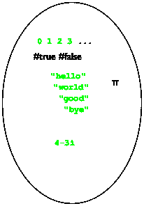          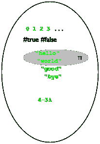
> > > > 
> 图 30：数据宇宙

实际上，前四章的数据定义限制了内置数据集合。它们通过明确或隐式列举所有包含的值来实现这一点。例如，图 30 中右侧用灰色阴影表示的区域描述了以下数据定义：

> | ; BS 是以下之一： |
> | --- |
> | ; —<wbr>  "hello", |
> | ; —<wbr>  "world", 或 |
> | ; —<wbr>  [pi](http://docs.racket-lang.org/htdp-langs/beginner.html#%28def._htdp-beginner._%28%28lib._lang%2Fhtdp-beginner..rkt%29._pi%29%29). |

虽然这个特定的数据定义看起来很愚蠢，但请注意所使用的英语和 BSL 风格的混合。它的意义是精确且无歧义的，明确指出哪些元素属于 BS 以及哪些不属于。

结构类型的定义完全改变了整个图景。当程序员定义一个结构类型时，宇宙会扩展到所有可能的结构实例。例如，添加位置结构意味着出现所有可能值的位置实例。图 31 中的中间气泡描述了这些值的添加，包括诸如([make-posn](http://docs.racket-lang.org/htdp-langs/beginner.html#%28def._htdp-beginner._%28%28lib._lang%2Fhtdp-beginner..rkt%29._make-posn%29%29) "hello" 0)和([make-posn](http://docs.racket-lang.org/htdp-langs/beginner.html#%28def._htdp-beginner._%28%28lib._lang%2Fhtdp-beginner..rkt%29._make-posn%29%29) ([make-posn](http://docs.racket-lang.org/htdp-langs/beginner.html#%28def._htdp-beginner._%28%28lib._lang%2Fhtdp-beginner..rkt%29._make-posn%29%29) 0 1) 2)这样的看似无意义的内容。是的，其中一些位置实例对我们来说没有意义。但是，BSL 程序可以构建其中的任何一个。

> > > > 
> > > > 
> 图 31：向宇宙添加结构

添加另一种结构类型定义再次混合匹配所有内容。假设我们添加球体的定义，它也有两个字段。正如图 31 中的第三个气泡所示，这种添加创建了包含数字、位置结构等实例的球体，以及包含球体实例的位置实例。在 DrRacket 中试一试！添加

> ([define-struct](http://docs.racket-lang.org/htdp-langs/beginner.html#%28form._%28%28lib._lang%2Fhtdp-beginner..rkt%29._define-struct%29%29) ball [location velocity])

将这些定义添加到定义区域，点击运行，创建一些结构实例。就数据定义的实用性而言，结构类型的数据定义通过现有数据定义与实例的组合来描述大量数据集合。当我们写下

> ; 位置结构是([make-posn](http://docs.racket-lang.org/htdp-langs/beginner.html#%28def._htdp-beginner._%28%28lib._lang%2Fhtdp-beginner..rkt%29._make-posn%29%29)  Number  Number)

我们正在描述无限多个可能的 posn 实例。就像上面一样，数据定义使用了自然语言、在其他地方定义的数据集合和数据构造函数的组合。目前数据定义中不应出现其他内容。结构的数据定义指定了由这些实例组成的新数据集合，这些数据集合将被我们的函数使用。例如，Posn 的数据定义确定了图 31 中心气泡中灰色阴影的区域，包括所有两个字段都包含数字的 posn 结构。同时，构造一个不满足两个字段都包含数字要求的 posn 实例是完全可能的：

> ([make-posn](http://docs.racket-lang.org/htdp-langs/beginner.html#%28def._htdp-beginner._%28%28lib._lang%2Fhtdp-beginner..rkt%29._make-posn%29%29) ([make-posn](http://docs.racket-lang.org/htdp-langs/beginner.html#%28def._htdp-beginner._%28%28lib._lang%2Fhtdp-beginner..rkt%29._make-posn%29%29) 1 1) "hello")

此结构包含 x 字段中的 posn 和一个 y 字段中的字符串。练习 76。为以下结构类型定义制定数据定义：

+   ([define-struct](http://docs.racket-lang.org/htdp-langs/beginner.html#%28form._%28%28lib._lang%2Fhtdp-beginner..rkt%29._define-struct%29%29)  movie  [title  producer  year])

+   ([define-struct](http://docs.racket-lang.org/htdp-langs/beginner.html#%28form._%28%28lib._lang%2Fhtdp-beginner..rkt%29._define-struct%29%29)  person  [name  hair  eyes  phone])

+   ([define-struct](http://docs.racket-lang.org/htdp-langs/beginner.html#%28form._%28%28lib._lang%2Fhtdp-beginner..rkt%29._define-struct%29%29)  pet  [name  number])

+   ([define-struct](http://docs.racket-lang.org/htdp-langs/beginner.html#%28form._%28%28lib._lang%2Fhtdp-beginner..rkt%29._define-struct%29%29)  CD  [artist  title  price])

+   ([define-struct](http://docs.racket-lang.org/htdp-langs/beginner.html#%28form._%28%28lib._lang%2Fhtdp-beginner..rkt%29._define-struct%29%29)  sweater  [material  size  producer])

对每个字段可能包含的值做出合理的假设。

练习 77。提供一个结构类型定义和一个数据定义，用于表示午夜之后的时间点。时间点由三个数字组成：小时、分钟和秒。

练习 78。提供一个表示三个字母单词的结构类型和数据定义。一个单词由小写字母组成，用 1Strings "a"到"z"以及#false 表示。注意：此练习是设计猜字游戏的一部分；参见练习 396。

程序员不仅编写数据定义，还阅读它们以便理解程序，扩展他们可以处理的数据类型，消除错误等。我们阅读数据定义来了解如何创建属于指定集合的数据，并确定某些数据是否属于某个指定的类别。

由于数据定义在设计过程中扮演着如此核心和重要的角色，因此通常最好用示例来展示数据定义，就像我们用示例来展示函数的行为一样。实际上，从数据定义中创建数据示例是直接的：

+   对于内置数据集合（数字、字符串、布尔值、图像），选择你喜欢的示例；

    注意：有时人们使用描述性名称来限定内置数据集合，例如 NegativeNumber 或 OneLetterString。它们不能替代一个写得好的数据定义。结束

+   对于枚举，使用枚举中的几个项；

+   对于区间，使用端点（如果包含的话）和至少一个内部点；

+   对于列举，分别处理每个部分；并且

+   对于结构的定义数据，遵循自然语言描述；也就是说，使用构造函数并从每个字段命名的数据集中选择一个示例。

对于本书大多数数据定义的示例构建来说，这就是全部内容，尽管数据定义将比迄今为止看到的更加复杂。练习 79：为以下数据定义创建示例：

+   > | ; 一个颜色是以下之一： |
+   > | --- |
    > | ; —<wbr>  "白色" |
    > | ; —<wbr>  "黄色" |
    > | ; —<wbr>  "橙色" |
    > | ; —<wbr>  "绿色" |
    > | ; —<wbr>  "红色" |
    > | ; —<wbr>  "蓝色" |
    > | ; —<wbr>  "黑色" |

    注意 DrRacket 识别了许多更多的字符串作为颜色。结束

+   > | ; H 是一个介于 0 和 100 之间的 Number。 |
+   > | --- |
    > | ; 解释表示一个幸福值 |
+   > | ([define-struct](http://docs.racket-lang.org/htdp-langs/beginner.html#%28form._%28%28lib._lang%2Fhtdp-beginner..rkt%29._define-struct%29%29) person [fstname lstname male?]) |
    > | ; 一个人是一个结构： |
    > | ;   (make-person  String  String  Boolean) |

    使用看起来像谓词名称的字段名是否是一个好主意？

+   > | ([define-struct](http://docs.racket-lang.org/htdp-langs/beginner.html#%28form._%28%28lib._lang%2Fhtdp-beginner..rkt%29._define-struct%29%29) dog [owner name age happiness]) |
+   > | --- |
    > | ; 一个狗是一个结构： |
    > | ;   (make-dog  Person  String  PositiveInteger  H) |

    也为这个数据定义添加一个解释。

+   > | ; 一个武器是以下之一： |
+   > | --- |
    > | ; —<wbr>  #false |
    > | ; —<wbr>  Posn |
    > | ; 解释 #false 表示导弹尚未发射 |
    > | ; 是否已经发射；一个 Posn 表示它在飞行 |

最后一个定义是一个不寻常的项目列表，它将内置数据与结构类型结合在一起。下一章将深入探讨这类定义。

#### 5.8 使用结构体设计🔗 "链接到此处")

结构类型的引入强调了设计食谱中所有六个步骤的必要性。现在不再仅仅依赖于内置数据集合来表示信息；现在很清楚，程序员必须为除最简单的问题之外的所有问题创建数据定义。

本节增加了一个设计食谱，以下列为例子：

> 示例问题设计一个函数，用于计算三维空间中物体到原点的距离。

我们开始了：

1.  当一个问题需要表示属于一起的信息片段或描述一个自然整体时，你需要一个结构类型定义。它需要与相关属性一样多的字段。这种结构类型的实例对应于整体，字段中的值对应于其属性。

    结构类型的数据定义引入了一个合法实例集合的名称。此外，它必须描述哪种数据与哪个字段相关联。只能使用内置数据集合或先前定义的数据定义的名称。

    最后，我们（以及其他人）必须能够使用数据定义来创建示例结构实例。否则，我们的数据定义有问题。为了确保我们可以创建实例，我们的数据定义应该附带数据示例。

    这是我们将这个想法应用于示例问题的方法：

    > | ([define-struct](http://docs.racket-lang.org/htdp-langs/beginner.html#%28form._%28%28lib._lang%2Fhtdp-beginner..rkt%29._define-struct%29%29) r3 [x y z]) |
    > | --- |
    > | ; An R3 is a structure: |
    > | ;   (make-r3  Number  Number  Number) |
    > |   |
    > | ([define](http://docs.racket-lang.org/htdp-langs/beginner.html#%28form._%28%28lib._lang%2Fhtdp-beginner..rkt%29._define%29%29) ex1 (make-r3 1 2 13)) |
    > | ([define](http://docs.racket-lang.org/htdp-langs/beginner.html#%28form._%28%28lib._lang%2Fhtdp-beginner..rkt%29._define%29%29) ex2 (make-r3 -1 0 3)) |

    结构类型定义引入了一种新的结构类型，r3，数据定义引入 R3 作为所有只包含数字的 r3 实例的名称。

1.  你仍然需要一个签名、一个目的声明和一个函数头，但它们保持不变。停！为示例问题做这个。

1.  使用第一步中的示例来创建功能示例。对于与区间或枚举相关联的每个字段，确保选择端点和中间点来创建功能示例。我们期望你继续处理示例问题。

1.  通常情况下，一个消耗结构的函数会从结构中的各个字段中提取值——尽管并非总是如此。为了提醒自己这种可能性，请为这类函数的模板添加每个字段的选择器。

    这里是我们为示例问题所做的：

    > | ; R3 -> Number |
    > | --- |
    > | ; determines the distance of p to the origin |
    > | ([define](http://docs.racket-lang.org/htdp-langs/beginner.html#%28form._%28%28lib._lang%2Fhtdp-beginner..rkt%29._define%29%29) (r3-distance-to-0 p) |
    > |   ([...](http://docs.racket-lang.org/htdp-langs/beginner.html#%28form._%28%28lib._lang%2Fhtdp-beginner..rkt%29._......%29%29) (r3-x p) [...](http://docs.racket-lang.org/htdp-langs/beginner.html#%28form._%28%28lib._lang%2Fhtdp-beginner..rkt%29._......%29%29) (r3-y p) [...](http://docs.racket-lang.org/htdp-langs/beginner.html#%28form._%28%28lib._lang%2Fhtdp-beginner..rkt%29._......%29%29) (r3-z p) [...](http://docs.racket-lang.org/htdp-langs/beginner.html#%28form._%28%28lib._lang%2Fhtdp-beginner..rkt%29._......%29%29))) |

    您可能想在每个选择器表达式旁边写下它从给定结构中提取的数据类型；您可以在数据定义中找到这些信息。停止！就做这件事！

1.  在定义函数时使用模板中的选择器表达式。请记住，您可能不需要其中的一些。

1.  测试。一旦编写了函数头，就立即进行测试。测试直到所有表达式都被覆盖。在您进行更改后再次测试。

完成示例问题。如果您记不起三维点到原点的距离，可以在几何书中查找。在那里您将找到一个类似于的公式。练习 80。为以下结构类型的实例创建函数模板：

+   ([define-struct](http://docs.racket-lang.org/htdp-langs/beginner.html#%28form._%28%28lib._lang%2Fhtdp-beginner..rkt%29._define-struct%29%29)  movie  [title  director  year])

+   ([define-struct](http://docs.racket-lang.org/htdp-langs/beginner.html#%28form._%28%28lib._lang%2Fhtdp-beginner..rkt%29._define-struct%29%29)  pet  [name  number])

+   ([define-struct](http://docs.racket-lang.org/htdp-langs/beginner.html#%28form._%28%28lib._lang%2Fhtdp-beginner..rkt%29._define-struct%29%29)  CD  [artist  title  price])

+   ([define-struct](http://docs.racket-lang.org/htdp-langs/beginner.html#%28form._%28%28lib._lang%2Fhtdp-beginner..rkt%29._define-struct%29%29)  sweater  [material  size  [color](http://docs.racket-lang.org/teachpack/2htdpimage.html#%28def._%28%28lib._2htdp%2Fimage..rkt%29._color%29%29)])

不，您不需要为这个任务定义数据。

练习 81。设计函数 time->seconds，该函数消耗时间结构实例（参见练习 77）并产生自午夜以来经过的秒数。例如，如果你用这些结构之一表示 12 小时 30 分钟和 2 秒，然后应用 time->seconds 到这个实例，正确的结果是 45002。

练习 82。设计函数 compare-word。该函数消耗两个三字母单词（参见练习 78）。它产生一个单词，指示给定的单词在哪里一致和不同。如果两个单词一致，该函数保留结构字段的内容；否则，它在结果单词的字段中放置#false。提示：练习中提到了两个任务：单词的比较和“字母”的比较。

#### 5.9 世界中的结构🔗 "链接到这里")

当一个世界程序必须跟踪两块独立的信息时，我们必须使用一组结构来表示世界状态数据。一个字段跟踪一块信息，另一个字段跟踪第二块信息。自然地，如果领域世界包含超过两块独立的信息，结构类型定义必须指定与信息块数量相等的字段。

考虑一个由 UFO 和坦克组成的太空侵略者游戏。UFO 沿着一条直线垂直下降，坦克在场景底部水平移动。如果这两个对象以已知的恒定速度移动，描述这两个对象所需的所有信息就是每个对象一块：UFO 的 y 坐标和坦克的 x 坐标。将这些信息组合在一起需要一个包含两个字段的机构：

> ([define-struct](http://docs.racket-lang.org/htdp-langs/beginner.html#%28form._%28%28lib._lang%2Fhtdp-beginner..rkt%29._define-struct%29%29) space-game [ufo tank])

我们将制定适当的数据定义的任务留给你们，包括解释。思考结构名称中的连字符。BSL 确实允许在变量、函数、结构和字段名称中使用所有类型的字符。这个结构的选择器名称是什么？谓词的名称？

每当我们说“信息块”时，我们并不一定意味着一个单一的数字或一个单词。一个信息块本身可能结合了多个信息块。为这类信息创建数据表示自然导致嵌套结构。

让我们在我们的想象空间入侵者游戏中加入一些趣味。一个仅沿垂直线下降的 UFO 是无聊的。为了将这个想法变成一个有趣的坦克用武器攻击 UFO 的游戏，UFO 必须能够以非平凡的方式下降，可能随机跳跃。这个想法的实现意味着我们需要两个坐标来描述 UFO 的位置，因此我们修改后的空间游戏数据定义变为：

> | ; 一个 SpaceGame 是一个结构： |
> | --- |
> | ;   (make-space-game  Posn  Number). |
> | ; 解释  (make-space-game  ([make-posn](http://docs.racket-lang.org/htdp-langs/beginner.html#%28def._htdp-beginner._%28%28lib._lang%2Fhtdp-beginner..rkt%29._make-posn%29%29)  ux  uy)  tx) |
> | ; 描述了一个 UFO 的位置配置 |
> | ; 在(ux,uy)处，坦克的 x 坐标是 tx |

理解为世界程序所需的数据表示类型需要实践。以下两节介绍了几个相对复杂的问题陈述。在继续设计你可能想要自己设计的游戏类型之前，先解决这些问题。

#### 5.10A 图形编辑器🔗 "链接到这里")

要用 BSL 编程，你打开 DrRacket，在键盘上输入，并观察文本的出现。按键盘上的左箭头键将光标移动到左边；按退格键（或删除键）将删除光标左侧的一个字母——如果光标左侧有字母的话。

这个过程被称为“编辑”，尽管其确切名称应该是“程序文本编辑”，因为我们将会用“编辑”这个词来描述比键盘输入更复杂的工作。当你撰写和修改其他类型的文档时，比如一篇英语作业，你可能会使用其他软件应用，这些应用被称为文字处理器，尽管计算机科学家将它们都称为编辑器，甚至是图形编辑器。

现在，你已经能够设计一个世界程序，它作为一个单行文本编辑器。这里的编辑包括输入字母以及以某种方式更改已经存在的文本，包括删除和插入字母。这暗示了文本中的某种位置概念。人们称这个位置为光标；大多数图形编辑器以这种方式显示它，使其容易被发现。

看一下以下编辑器配置：

> 

某人可能输入了文本“helloworld”并按了五次左箭头键，导致光标从文本的末尾移动到“o”和“w”之间的位置。现在按下空格键会导致编辑器按以下方式更改其显示：

> 

简而言之，这个动作插入“ ”并将光标放置在它和“w”之间。鉴于这些，编辑器必须跟踪两块信息：

1.  到目前为止输入的文本，以及

1.  光标当前的位置。

这表明结构类型有两个字段。我们可以想象从信息到数据以及从数据到信息的不同方法。例如，结构中的一个字段可能包含整个输入的文本，而另一个字段包含从第一个字符（从左数）到光标之间的字符数。另一种数据表示方法是在两个字段中使用两个字符串：光标左侧的文本部分和光标右侧的文本部分。以下是表示编辑器状态的我们首选的方法：

> | ([define-struct](http://docs.racket-lang.org/htdp-langs/beginner.html#%28form._%28%28lib._lang%2Fhtdp-beginner..rkt%29._define-struct%29%29) editor [pre post]) |
> | --- |
> | ; An Editor is a structure: |
> | ;   (make-editor  String  String) |
> | ; interpretation  (make-editor  s  t) describes an editor |
> | ; whose visible text is ([string-append](http://docs.racket-lang.org/htdp-langs/beginner.html#%28def._htdp-beginner._%28%28lib._lang%2Fhtdp-beginner..rkt%29._string-append%29%29)  s  t) with |
> | ; the cursor displayed between s and t |

根据这种数据表示，解决接下来的几个练习。

练习 83\. 设计一个名为 render 的函数，它接受一个 Editor 作为参数并生成一个图像。

函数的目的是在  像素的空场景中渲染文本。对于光标，使用  红色矩形，对于字符串，使用大小为 16 的黑色文本。

在 DrRacket 的交互区域为示例字符串开发图像。我们开始于以下表达式：

> | ([overlay/align](http://docs.racket-lang.org/teachpack/2htdpimage.html#%28def._%28%28lib._2htdp%2Fimage..rkt%29._overlay%2Falign%29%29) "left" "center" |
> | --- |
> |                ([text](http://docs.racket-lang.org/teachpack/2htdpimage.html#%28def._%28%28lib._2htdp%2Fimage..rkt%29._text%29%29) "hello world" 11 "black") |
> |                ([empty-scene](http://docs.racket-lang.org/teachpack/2htdpimage.html#%28def._%28%28lib._2htdp%2Fimage..rkt%29._empty-scene%29%29) 200 20)) |

你可能需要阅读有关 [beside](http://docs.racket-lang.org/teachpack/2htdpimage.html#%28def._%28%28lib._2htdp%2Fimage..rkt%29._beside%29%29)、[above](http://docs.racket-lang.org/teachpack/2htdpimage.html#%28def._%28%28lib._2htdp%2Fimage..rkt%29._above%29%29) 以及类似函数的文档。当你对图像的外观满意时，可以将该表达式用作测试，并作为设计 render 的指南。

练习 84。设计编辑。该函数消耗两个输入，一个编辑器 ed 和一个 KeyEvent ke，并产生另一个编辑器。其任务是向 ed 的前字段末尾添加单个字符 KeyEvent ke，除非 ke 表示退格键("\b")。在这种情况下，它将删除光标左侧的字符（如果有）。该函数忽略制表键("\t")和回车键("\r")。

函数仅关注两个长度超过一个字母的 KeyEvent："left"和"right"。左箭头将光标向左移动一个字符（如果有），右箭头将光标向右移动一个字符（如果有）。所有其他此类 KeyEvent 都被忽略。

为编辑编写大量示例，注意特殊情况。当我们解决这个练习时，我们创建了 20 个示例并将它们全部转换为测试。

提示 将此函数视为消耗 KeyEvents，这是一个指定为枚举的集合。它使用辅助函数来处理 Editor 结构。随时准备一个愿望清单；你将需要为这些辅助函数中的大多数设计额外的函数，例如 string-first、string-rest、string-last 和 string-remove-last。如果你还没有这样做，请解决函数中的练习。

练习 85。定义函数 run。给定编辑器的前字段，它启动一个交互式编辑器，分别使用前两个练习中的 render 和 edit 来处理[to-draw](http://docs.racket-lang.org/teachpack/2htdpuniverse.html#%28form._world._%28%28lib._2htdp%2Funiverse..rkt%29._to-draw%29%29)和[on-key](http://docs.racket-lang.org/teachpack/2htdpuniverse.html#%28form._world._%28%28lib._2htdp%2Funiverse..rkt%29._on-key%29%29)子句。

练习 86。注意，如果你输入很多，你的编辑程序不会显示所有文本。相反，文本会在右边缘被截断。修改你的练习 84 中的 edit 函数，以便在将按键添加到前字段末尾会导致渲染文本超出你的画布宽度时忽略按键。

练习 87。根据我们的第一个想法，使用字符串和索引为编辑器开发一个数据表示，然后再次解决前面的练习。重新审视设计配方。提示如果你还没有这样做，请解决函数中的练习。

关于设计选择的说明 这个练习是对设计选择的第一项研究。它表明，第一个设计选择与数据表示有关。做出正确的选择需要提前规划和权衡每个的复杂性。当然，精通这一点是一个获得经验的问题。

#### 5.11 更多虚拟宠物🔗 "链接到此处")

在本节中，我们继续我们的虚拟动物园项目，从虚拟宠物世界开始。具体来说，这个练习的目标是将猫的世界程序与它的幸福度管理程序结合起来。当组合程序运行时，你会看到猫在画布上行走，并且每走一步，它的幸福度就会下降。让猫高兴的唯一方法是喂它或抚摸它（上箭头）。最后，本节最后一个练习的目标是创建另一个虚拟的、快乐的宠物。

练习 88。定义一个结构类型，用于跟踪猫的 x 坐标和它的幸福度。然后为猫制定一个数据定义，称为 VCat，包括解释。

练习 89。设计快乐猫世界程序，该程序管理一个行走的猫及其幸福度。假设猫一开始是完美的幸福。

提示（1）重用虚拟宠物世界中的世界程序中的函数。（2）使用前一个练习中的结构类型来表示世界的状态。

练习 90。修改前一个练习中的快乐猫程序，使其在猫的幸福度降到 0 时停止。

练习 91。将练习 88 中的结构类型定义和数据定义扩展到包括方向字段。调整快乐猫程序，使猫向指定的方向移动。程序应该按照当前方向移动猫，并在猫到达场景的任一端时将其转身。

> ([define](http://docs.racket-lang.org/htdp-langs/beginner.html#%28form._%28%28lib._lang%2Fhtdp-beginner..rkt%29._define%29%29) cham )

上面的变色龙的插图是一个透明图像。要将它插入到 DrRacket 中，请使用“插入图像”菜单项插入。使用此说明可以保留绘图像素的透明度。

当一个部分透明的图像与一个彩色形状（如矩形）结合时，图像会采用下层的颜色。在变色龙的绘画中，实际上是动物的内部是透明的；外部区域是纯白色。在你的 DrRacket 中尝试这个表达式：

> | ([define](http://docs.racket-lang.org/htdp-langs/beginner.html#%28form._%28%28lib._lang%2Fhtdp-beginner..rkt%29._define%29%29) background |
> | --- |
> |   ([rectangle](http://docs.racket-lang.org/teachpack/2htdpimage.html#%28def._%28%28lib._2htdp%2Fimage..rkt%29._rectangle%29%29) ([image-width](http://docs.racket-lang.org/teachpack/2htdpimage.html#%28def._%28%28lib._2htdp%2Fimage..rkt%29._image-width%29%29) cham) |
> |              ([image-height](http://docs.racket-lang.org/teachpack/2htdpimage.html#%28def._%28%28lib._2htdp%2Fimage..rkt%29._image-height%29%29) cham) |
> |              "solid" |
> |              "red")) |
> |   |
> | ([overlay](http://docs.racket-lang.org/teachpack/2htdpimage.html#%28def._%28%28lib._2htdp%2Fimage..rkt%29._overlay%29%29) cham 背景) |

练习 92\. 设计 cham 程序，使变色龙在画布上从左到右连续行走。当它到达画布的右端时，它会消失并立即在左侧重新出现。像猫一样，变色龙因为行走而感到饥饿，随着时间的推移，这种饥饿表现为不快乐。

为了管理变色龙的幸福度，你可以重用虚拟猫的幸福度计。要让变色龙开心，给它喂食（向下箭头，只需两个点）；不允许抚摸。当然，像所有变色龙一样，我们的变色龙也能改变颜色：“r”使其变红，“b”变蓝，“g”变绿。将变色龙世界程序添加到虚拟猫游戏中，并在可能的情况下重用后者的函数。

从表示变色龙的数据定义 VCham 开始。

练习 93\. 将 练习 92 的解决方案复制过来，并修改副本，使变色龙在彩色背景上行走。我们的解决方案使用以下颜色：

> | ([define](http://docs.racket-lang.org/htdp-langs/beginner.html#%28form._%28%28lib._lang%2Fhtdp-beginner..rkt%29._define%29%29) 背景 |
> | --- |
> |   ([beside](http://docs.racket-lang.org/teachpack/2htdpimage.html#%28def._%28%28lib._2htdp%2Fimage..rkt%29._beside%29%29) ([empty-scene](http://docs.racket-lang.org/teachpack/2htdpimage.html#%28def._%28%28lib._2htdp%2Fimage..rkt%29._empty-scene%29%29) WIDTH HEIGHT "绿色") 完成后，来点意大利披萨吧。 |
> |           ([empty-scene](http://docs.racket-lang.org/teachpack/2htdpimage.html#%28def._%28%28lib._2htdp%2Fimage..rkt%29._empty-scene%29%29) WIDTH HEIGHT "白色") |
> |           ([empty-scene](http://docs.racket-lang.org/teachpack/2htdpimage.html#%28def._%28%28lib._2htdp%2Fimage..rkt%29._empty-scene%29%29) WIDTH HEIGHT "红色"))) |

但你可以使用任何颜色。观察变色龙如何改变颜色以融入两种颜色之间的边界。

注意：当你仔细观察动画时，你会看到变色龙骑在一个白色矩形上。如果你知道如何使用图像编辑软件，修改图片，使白色矩形不可见。然后变色龙将真正融入背景中。

### 6 项化和结构🔗 "链接到这里")

前两章介绍了两种数据定义的表述方式。那些使用项化（枚举和区间）的是从大量数据中创建小集合。那些使用结构的是组合多个集合。由于数据表示的发展是良好程序设计的起点，因此程序员经常想要项化涉及结构的数据定义，或者使用结构来组合项化数据，这并不奇怪。

回想一下上一章中提到的想象中的太空侵略者游戏世界中的结构。到目前为止，它涉及一个从太空下降的 UFO 和一个在地面上水平移动的坦克。我们的数据表示使用一个包含两个字段的记录：一个用于 UFO 的数据表示，另一个用于坦克的数据表示。自然地，玩家会想要一个能够发射导弹的坦克。突然之间，我们可以想到第二种状态，它包含三个独立移动的对象：UFO、坦克和导弹。因此，我们有两种不同的结构：一个用于表示两个独立移动的对象，另一个用于第三个。由于世界状态现在可能是这两种结构之一，所以使用项化来描述所有可能的状态是自然的：

1.  世界状态是一个包含两个字段的记录，或者

1.  世界状态是一个包含三个字段的记录。

就我们的领域而言——不用担心，书的下一部分是关于无限制发射导弹，无需重新加载。实际游戏——第一种状态代表坦克发射唯一导弹之前的时间，第二种状态代表导弹发射之后的时间。

本章介绍了涉及结构的项化数据定义的基本思想。因为我们已经拥有了所有需要的其他成分，所以我们直接从项化结构开始。之后，我们讨论了一些例子，包括从我们的新功能中受益的世界程序。最后一节是关于编程中的错误。

#### 6.1 再次使用项化进行设计🔗 "链接到这里")

让我们从使用结构编程中的太空侵略者游戏的一个精炼问题陈述开始。

> 样例问题设计一个使用 2htdp/universe teachpack 进行简单太空侵略者游戏的游戏程序。玩家控制着一个坦克（一个小矩形），必须保卫我们的星球（画布的底部）免受从画布顶部下降到底部的 UFO（参见区间以获取一种可能性）的攻击。为了阻止 UFO 着陆，玩家可以通过按下空格键发射一枚导弹（一个比坦克小的三角形）。作为回应，导弹从坦克中发射出来。如果 UFO 与导弹相撞，玩家获胜；否则 UFO 着陆，玩家失败。
> 
> 以下是关于三个游戏对象及其运动的详细信息。首先，坦克以恒定速度沿着画布底部移动，尽管玩家可以使用左箭头键和右箭头键改变方向。其次，UFO 以恒定速度下降，但会向左或向右进行小范围的随机跳跃。第三，一旦发射，导弹将以至少是 UFO 下降速度两倍的速度沿着一条直线垂直上升。最后，如果 UFO 和导弹的参考点足够接近，它们就会相撞，无论你认为“足够接近”是什么意思。

以下两个小节将使用这个示例问题作为持续示例，因此请在继续之前仔细研究它并解决以下练习。这样做将帮助你足够深入地理解问题。

练习 94。绘制游戏在不同阶段的场景草图。使用这些草图来确定游戏的常量和变量部分。对于前者，开发描述世界（画布）及其对象尺寸的物理和图形常量。还要开发一些背景场景。最后，从坦克、UFO 和背景的常量创建你的初始场景。

定义项目化。我们设计配方中的第一步是开发数据定义。数据定义的一个目的是描述表示世界状态的数据的构建；另一个目的是描述世界程序的事件处理函数可能消耗的所有可能的数据。由于我们还没有看到包含结构的项化，这个第一小节介绍了这个概念。虽然这可能不会让你感到惊讶，但请仔细注意。

对于这个太空侵略者游戏，我们可以用一个包含三个字段的结构类型定义来应付，其中第三个字段在发射导弹之前包含#false，之后包含导弹的坐标。下面是具体内容。

如本章引言中所述，带有发射坦克的太空侵略者游戏需要为两种不同的游戏状态提供数据表示。我们选择了两种结构类型定义：

> | ([define-struct](http://docs.racket-lang.org/htdp-langs/beginner.html#%28form._%28%28lib._lang%2Fhtdp-beginner..rkt%29._define-struct%29%29) aim [ufo tank]) |
> | --- |
> | ([define-struct](http://docs.racket-lang.org/htdp-langs/beginner.html#%28form._%28%28lib._lang%2Fhtdp-beginner..rkt%29._define-struct%29%29) fired [ufo tank missile]) |

第一个用于玩家试图将坦克定位以便射击的时间段，第二个用于表示发射导弹后的状态。然而，在我们能够制定完整游戏状态的数据定义之前，我们需要坦克、不明飞行物和导弹的数据表示。假设对于像 WIDTH 和 HEIGHT 这样的物理常量有恒定定义，这些是 练习 94 的主题，我们制定数据定义如下：

> | ; 不明飞行物是一个 Posn。 |
> | --- |
> | ; 解释  ([make-posn](http://docs.racket-lang.org/htdp-langs/beginner.html#%28def._htdp-beginner._%28%28lib._lang%2Fhtdp-beginner..rkt%29._make-posn%29%29)  x  y) 是不明飞行物的位置 |
> | ; (使用自顶向下，从左到右的惯例) |
> |   |
> | ([define-struct](http://docs.racket-lang.org/htdp-langs/beginner.html#%28form._%28%28lib._lang%2Fhtdp-beginner..rkt%29._define-struct%29%29) tank [loc vel]) |
> | ; 坦克是一个结构： |
> | ;   (make-tank  Number  Number). |
> | ; 解释  (make-tank  x  dx) 指定了位置： |
> | ; (x, HEIGHT) 和坦克的速度：dx 像素/刻 |
> |   |
> | ; 导弹是一个 Posn。 |
> | ; 解释  ([make-posn](http://docs.racket-lang.org/htdp-langs/beginner.html#%28def._htdp-beginner._%28%28lib._lang%2Fhtdp-beginner..rkt%29._make-posn%29%29)  x  y) 是导弹的位置 |

每个这些数据定义仅仅描述了一个结构，要么是一个新定义的，比如坦克，要么是一个内置的数据集合，Posn。关于后者，可能会让你有点惊讶，Posns 被用来表示世界的两个不同方面。然而，我们使用数字（以及字符串和布尔值）在现实世界中表示了许多不同类型的信息，所以重用像 Posn 这样的结构集合并不是什么大事。现在我们有了为太空入侵者游戏状态制定数据定义的条件：

> | ; SIGS 是以下之一： |
> | --- |
> | ; –  (make-aim  UFO  Tank) |
> | ; –  (make-fired  UFO  Tank  Missile) |
> | ; 解释表示一个 |
> | ; 太空入侵者游戏 |

数据定义的形状类似于列举。然而，每个子句都描述了结构类型的内容，就像我们迄今为止所看到的结构类型的数据定义一样。尽管如此，这个数据定义表明并非每个数据定义都恰好对应一个结构类型定义；这里一个数据定义涉及两个不同的结构类型定义。这种数据定义的意义也是直截了当的。它引入了名称 SIGS 来表示根据定义可以创建的所有结构实例的集合。因此，让我们创建一些：

+   这是一个描述坦克进入发射导弹位置的实例：

    > (make-aim ([make-posn](http://docs.racket-lang.org/htdp-langs/beginner.html#%28def._htdp-beginner._%28%28lib._lang%2Fhtdp-beginner..rkt%29._make-posn%29%29) 20 10) (make-tank 28 -3))

+   这个例子与上一个例子类似，但导弹已经被发射：

    > | (make-fired ([make-posn](http://docs.racket-lang.org/htdp-langs/beginner.html#%28def._htdp-beginner._%28%28lib._lang%2Fhtdp-beginner..rkt%29._make-posn%29%29) 20 10) |
    > | --- |
    > |             (make-tank 28 -3) |
    > |             ([make-posn](http://docs.racket-lang.org/htdp-langs/beginner.html#%28def._htdp-beginner._%28%28lib._lang%2Fhtdp-beginner..rkt%29._make-posn%29%29) 28 ([-](http://docs.racket-lang.org/htdp-langs/beginner.html#%28def._htdp-beginner._%28%28lib._lang%2Fhtdp-beginner..rkt%29._-%29%29) HEIGHT TANK-HEIGHT))) |

    当然，大写命名的名称指的是你定义的物理常数。

+   最后，这是一个导弹即将与 UFO 相撞的例子：

    > | (make-fired ([make-posn](http://docs.racket-lang.org/htdp-langs/beginner.html#%28def._htdp-beginner._%28%28lib._lang%2Fhtdp-beginner..rkt%29._make-posn%29%29) 20 100) |
    > | --- |
    > |             (make-tank 100 3) |
    > |             ([make-posn](http://docs.racket-lang.org/htdp-langs/beginner.html#%28def._htdp-beginner._%28%28lib._lang%2Fhtdp-beginner..rkt%29._make-posn%29%29) 22 103)) |

    这个例子假设画布的高度超过 100 像素。

注意，SIGS 的第一个实例是根据数据定义的第一个子句生成的，第二个和第三个实例遵循第二个子句。当然，每个字段中的数字取决于你对全局游戏常数的选择。

练习 95。解释为什么这三个实例是根据数据定义的第一个或第二个子句生成的。

练习 96。假设一个  画布，绘制三种游戏状态的可能渲染方式。

带有新数据定义公式的设计食谱随着新方式的数据定义公式的提出，设计食谱也得到了检查。本章介绍了一种结合两种或更多描述数据的方法，修订后的设计食谱反映了这一点，特别是第一步：

1.  你何时需要这种新的定义数据的方式？你已经知道，对列举的需求是由于问题陈述中不同信息类别的区分。同样，基于结构的数据定义的需求是由于需要将几块不同的信息分组。

    当你的问题陈述区分不同类型的信息，并且至少这些信息中的某些由几个不同的部分组成时，需要列举不同形式的数据——包括结构集合。

    需要记住的一点是，数据定义可能引用其他数据定义。因此，如果一个数据定义中的特定条款看起来过于复杂，为这个条款编写一个单独的数据定义并引用这个辅助定义是可接受的。

    并且，一如既往地，使用数据定义来制定数据示例。

1.  第二步保持不变。制定一个只提及定义或内置数据集合名称的功能签名，添加一个目的陈述，并创建一个函数头。

1.  第三步没有变化。你仍然需要制定功能示例，以说明第二步中的目的陈述，并且列举中的每个条目仍然需要一个示例。

1.  现在模板的开发利用了两个不同的维度：列举本身及其条款中使用结构。

    根据第一步，模板的主体由一个[cond](http://docs.racket-lang.org/htdp-langs/beginner.html#%28form._%28%28lib._lang%2Fhtdp-beginner..rkt%29._cond%29%29)表达式组成，该表达式有与列举中的条目数量相同的[cond](http://docs.racket-lang.org/htdp-langs/beginner.html#%28form._%28%28lib._lang%2Fhtdp-beginner..rkt%29._cond%29%29)条款。此外，你必须为每个[cond](http://docs.racket-lang.org/htdp-langs/beginner.html#%28form._%28%28lib._lang%2Fhtdp-beginner..rkt%29._cond%29%29)条款添加一个条件，以识别对应条目中的数据子类。

    到第二步时，如果一个条目处理的是结构，模板包含选择表达式——在处理条目中描述的数据子类的[cond](http://docs.racket-lang.org/htdp-langs/beginner.html#%28form._%28%28lib._lang%2Fhtdp-beginner..rkt%29._cond%29%29)条款中。

    然而，当你选择用单独的数据定义来描述数据时，你不需要添加选择表达式。相反，你为手头的任务创建一个单独数据定义的模板，并通过函数调用引用该模板。这表明正在单独处理这个数据子类。

    在开始开发模板之前，简要反思函数的本质。如果问题陈述表明需要执行多个任务，那么可能需要一个由多个单独设计的函数组成的组合，而不是模板。在这种情况下，跳过模板步骤。

1.  填写模板中的空白。您使数据定义越复杂，这一步就越复杂。好消息是，这个设计方案在许多情况下都能提供帮助。

    如果您遇到了困难，先填写简单的案例，并为其他情况使用默认值。虽然这会使一些测试案例失败，但您正在取得进展，并且可以可视化这一进展。

    如果您在某些项目列举的案例上遇到了困难，分析对应那些案例的示例。确定模板的各个部分从给定的输入中计算什么。然后考虑如何将这些部分（加上一些常量）组合起来以计算所需的输出。记住，您可能需要一个辅助函数。

    此外，如果您的模板“调用”另一个模板，因为数据定义相互引用，假设另一个函数会提供其目的声明和示例所承诺的内容——即使这个其他函数的定义尚未完成。

1.  测试。如果测试失败，确定问题所在：函数、测试或两者都有。返回到适当的步骤。

返回到设计函数，重新阅读简单设计方案的描述，并将其与这次修订进行比较。

让我们用本节开头示例问题的渲染函数设计来说明设计方案。回想一下，一个[大爆炸](http://docs.racket-lang.org/teachpack/2htdpuniverse.html#%28form._world._%28%28lib._2htdp%2Funiverse..rkt%29._big-bang%29%29)表达式需要一个这样的渲染函数，以便在每个时钟滴答、鼠标点击或按键后都将世界状态转换为图像。

这个渲染函数的签名表明它将世界状态类的一个元素映射到图像类：

> | ; SIGS -> Image |
> | --- |
> | ; 添加 TANK、UFO 和可能的 MISSILE 到 |
> | ; 背景场景中 |
> | ([define](http://docs.racket-lang.org/htdp-langs/beginner.html#%28form._%28%28lib._lang%2Fhtdp-beginner..rkt%29._define%29%29) (si-render s) BACKGROUND) |

在这里，TANK、UFO、MISSILE 和 BACKGROUND 是从练习 94 中请求的图像常量。回想一下，这个签名只是渲染函数的一般签名的实例，它始终消耗世界状态的集合并产生一些图像。

> > > > | s |  | (si-render  s) |
> > > > | --- | --- | --- |
> > > > |  |  |  |
> > > > 
> > > > |
> > > > 
> > > > &#124; (make-aim &#124;
> > > > 
> > > > &#124;   ([make-posn](http://docs.racket-lang.org/htdp-langs/beginner.html#%28def._htdp-beginner._%28%28lib._lang%2Fhtdp-beginner..rkt%29._make-posn%29%29) 10 20) &#124;
> > > > 
> > > > &#124;   (make-tank 28 -3)) &#124;
> > > > 
> > > > |   |  |
> > > > | --- | --- |
> > > > 
> > > > |
> > > > 
> > > > &#124; (make-fired &#124;
> > > > 
> > > > &#124;   ([make-posn](http://docs.racket-lang.org/htdp-langs/beginner.html#%28def._htdp-beginner._%28%28lib._lang%2Fhtdp-beginner..rkt%29._make-posn%29%29) 20 100) &#124;
> > > > 
> > > > &#124; (make-tank 100 3) &#124;
> > > > 
> > > > &#124;   ([make-posn](http://docs.racket-lang.org/htdp-langs/beginner.html#%28def._htdp-beginner._%28%28lib._lang%2Fhtdp-beginner..rkt%29._make-posn%29%29) 22 103) &#124;
> > > > 
> > > > |  | 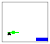 |
> > > > | --- | --- |
> > > > 
> > > > |
> > > > 
> > > > &#124; (make-fired &#124;
> > > > 
> > > > &#124;   ([make-posn](http://docs.racket-lang.org/htdp-langs/beginner.html#%28def._htdp-beginner._%28%28lib._lang%2Fhtdp-beginner..rkt%29._make-posn%29%29) 10 20) &#124;
> > > > 
> > > > &#124; (make-tank 28 -3) &#124;
> > > > 
> > > > &#124;   ([make-posn](http://docs.racket-lang.org/htdp-langs/beginner.html#%28def._htdp-beginner._%28%28lib._lang%2Fhtdp-beginner..rkt%29._make-posn%29%29) 32 ([减](http://docs.racket-lang.org/htdp-langs/beginner.html#%28def._htdp-beginner._%28%28lib._lang%2Fhtdp-beginner..rkt%29._-%29%29) HEIGHT TANK-HEIGHT 10))) &#124;
> > > > 
> > > > |   |  |
> > > > | --- | --- |
> > > > 
> 图 32：通过示例渲染太空侵略者游戏状态

由于数据定义中的列举包含两个项目，让我们制作三个示例，使用上面的数据示例。参见图 32。与数学书中找到的函数表不同，这个表是垂直渲染的。左侧列包含我们所需函数的示例输入；右侧列列出相应的期望结果。如您所见，我们使用了设计步骤的第一步中的数据示例，并且它们涵盖了列举的两个项目。

接下来，我们转向模板的开发，这是设计过程中的最重要步骤。首先，我们知道 si-render 的主体必须是一个[条件](http://docs.racket-lang.org/htdp-langs/beginner.html#%28form._%28%28lib._lang%2Fhtdp-beginner..rkt%29._cond%29%29)表达式，包含两个[条件](http://docs.racket-lang.org/htdp-langs/beginner.html#%28form._%28%28lib._lang%2Fhtdp-beginner..rkt%29._cond%29%29)子句。遵循设计步骤，两个条件是(aim? s)和(fired? s)，它们区分 si-render 可能消费的两种可能的数据类型：

> | ([定义](http://docs.racket-lang.org/htdp-langs/beginner.html#%28form._%28%28lib._lang%2Fhtdp-beginner..rkt%29._define%29%29) (si-render s) |
> | --- |
> |   ([条件](http://docs.racket-lang.org/htdp-langs/beginner.html#%28form._%28%28lib._lang%2Fhtdp-beginner..rkt%29._cond%29%29) |
> |   [(aim? s) [...](http://docs.racket-lang.org/htdp-langs/beginner.html#%28form._%28%28lib._lang%2Fhtdp-beginner..rkt%29._......%29%29)] |
> |   [(fired? s) [...](http://docs.racket-lang.org/htdp-langs/beginner.html#%28form._%28%28lib._lang%2Fhtdp-beginner..rkt%29._......%29%29)] |

第二，我们为每个处理结构的 [cond](http://docs.racket-lang.org/htdp-langs/beginner.html#%28form._%28%28lib._lang%2Fhtdp-beginner..rkt%29._cond%29%29) 子句添加选择表达式。在这种情况下，两个子句都涉及结构的处理：瞄准和发射。前者包含两个字段，因此第一个 [cond](http://docs.racket-lang.org/htdp-langs/beginner.html#%28form._%28%28lib._lang%2Fhtdp-beginner..rkt%29._cond%29%29) 子句需要两个选择表达式，而后者这种结构由三个值组成，因此需要三个选择表达式：

> | ([define](http://docs.racket-lang.org/htdp-langs/beginner.html#%28form._%28%28lib._lang%2Fhtdp-beginner..rkt%29._define%29%29) si-render s) ]] |
> | --- |
> | [...] ([cond](http://docs.racket-lang.org/htdp-langs/beginner.html#%28form._%28%28lib._lang%2Fhtdp-beginner..rkt%29._cond%29%29) ]] |
> | [...] [(aim? s) [（瞄准坦克 s）](http://docs.racket-lang.org/htdp-langs/beginner.html#%28form._%28%28lib._lang%2Fhtdp-beginner..rkt%29._......%29%29) [（瞄准飞碟 s）](http://docs.racket-lang.org/htdp-langs/beginner.html#%28form._%28%28lib._lang%2Fhtdp-beginner..rkt%29._......%29%29) ]] |
> | [...] [(fired? s) [（发射坦克）](http://docs.racket-lang.org/htdp-langs/beginner.html#%28form._%28%28lib._lang%2Fhtdp-beginner..rkt%29._......%29%29) [（发射飞碟）](http://docs.racket-lang.org/htdp-langs/beginner.html#%28form._%28%28lib._lang%2Fhtdp-beginner..rkt%29._......%29%29) ]] |
> | [...] [（发射导弹 s）](http://docs.racket-lang.org/htdp-langs/beginner.html#%28form._%28%28lib._lang%2Fhtdp-beginner..rkt%29._......%29%29)) ]] |

模板中几乎包含了我们完成任务所需的所有内容。为了完成定义，我们需要确定对于每个 [cond](http://docs.racket-lang.org/htdp-langs/beginner.html#%28form._%28%28lib._lang%2Fhtdp-beginner..rkt%29._cond%29%29) 行，如何组合我们已有的值来计算预期的结果。除了输入的部分，我们还可以使用全局定义的常量，例如，BACKGROUND，这在这里显然很有帮助；原始或内置操作；如果所有其他方法都失败了，我们可以使用愿望列表函数，也就是说，我们描述了我们希望拥有的函数。

考虑第一个[条件](http://docs.racket-lang.org/htdp-langs/beginner.html#%28form._%28%28lib._lang%2Fhtdp-beginner..rkt%29._cond%29%29)子句，其中我们有一个坦克的数据表示，即(aim-tank  s)，以及一个不明飞行物(UFO)的数据表示，即(aim-ufo  s)。从图 32 的第一个示例中，我们知道我们需要将这两个对象添加到背景场景中。此外，设计配方建议，如果这些数据带有它们自己的数据定义，我们应该考虑定义辅助(辅助)函数，并使用这些函数来计算结果：

> | [...](http://docs.racket-lang.org/htdp-langs/beginner.html#%28form._%28%28lib._lang%2Fhtdp-beginner..rkt%29._......%29%29) (tank-render (aim-tank s) |
> | --- |
> |                  (ufo-render (aim-ufo s) BACKGROUND)) |

这里，tank-render 和 ufo-render 是愿望列表函数：

> | ; Tank  Image -> Image |
> | --- |
> | ; adds t to the given image im |
> | ([define](http://docs.racket-lang.org/htdp-langs/beginner.html#%28form._%28%28lib._lang%2Fhtdp-beginner..rkt%29._define%29%29) (tank-render t im) im) |
> |   |
> | ; UFO  Image -> Image |
> | ; adds u to the given image im |
> | ([define](http://docs.racket-lang.org/htdp-langs/beginner.html#%28form._%28%28lib._lang%2Fhtdp-beginner..rkt%29._define%29%29) (ufo-render u im) im) |
> > > | ; SIGS -> Image |
> > > | ; renders the given game state on top of BACKGROUND |
> > > | ; for examples see figure 32 |
> > > | ([define](http://docs.racket-lang.org/htdp-langs/beginner.html#%28form._%28%28lib._lang%2Fhtdp-beginner..rkt%29._define%29%29) (si-render s) |
> > > |   ([cond](http://docs.racket-lang.org/htdp-langs/beginner.html#%28form._%28%28lib._lang%2Fhtdp-beginner..rkt%29._cond%29%29) |
> > > |     [(aim? s) |
> > > |      (tank-render (aim-tank s) |
> > > |                   (ufo-render (aim-ufo s) BACKGROUND))] |
> > > |     [(fired? s) |
> > > |      (tank-render |
> > > |        (fired-tank s) |
> > > |        (ufo-render (fired-ufo s) |
> > > |                    (missile-render (fired-missile s) |
> > > |                                    BACKGROUND)))])) |
> > > 
> 图 33：完整的渲染函数

通过一点类比，我们可以以相同的方式处理第二个[条件](http://docs.racket-lang.org/htdp-langs/beginner.html#%28form._%28%28lib._lang%2Fhtdp-beginner..rkt%29._cond%29%29)子句。图 33 显示了完整的定义。最好的是，我们可以立即重用我们的愿望列表函数，tank-render 和 ufo-render，我们只需要添加一个将导弹包含在场景中的函数。适当的愿望列表条目是：

> | ; Missile  Image -> Image |
> | --- |
> | ; adds m to the given image im |
> | ([定义](http://docs.racket-lang.org/htdp-langs/beginner.html#%28form._%28%28lib._lang%2Fhtdp-beginner..rkt%29._define%29%29) (导弹渲染 m im) im) |

如上所述，注释详细描述了我们想要的内容。练习 97. 设计坦克渲染、外星人渲染和导弹渲染函数。比较这个表达式：

> | (坦克渲染 |
> | --- |
> |   (发射坦克 s) |
> |   (外星人渲染 (发射外星人 s) |
> |       (导弹渲染 (已发射导弹 s) |
> |                               背景))) |

使用这个：

> | (ufo-render |
> | --- |
> |   (发射外星人 s) |
> |   (坦克渲染 (发射坦克 s) |
> |        (导弹渲染 (已发射导弹 s) |
> |                                背景))) |

这两个表达式何时会产生相同的结果？

练习 98. 设计 si-game-over? 函数，用作 [stop-when](http://docs.racket-lang.org/teachpack/2htdpuniverse.html#%28form._world._%28%28lib._2htdp%2Funiverse..rkt%29._stop-when%29%29) 处理器。如果外星人着陆或导弹击中外星人，游戏将停止。对于这两种情况，我们建议您检查一个物体与另一个物体的接近程度。

[stop-when](http://docs.racket-lang.org/teachpack/2htdpuniverse.html#%28form._world._%28%28lib._2htdp%2Funiverse..rkt%29._stop-when%29%29) 子句允许有一个可选的第二个子表达式，即一个渲染游戏最终状态的函数。设计 si-render-final 并将其用作 练习 100 主函数中的 [stop-when](http://docs.racket-lang.org/teachpack/2htdpuniverse.html#%28form._world._%28%28lib._2htdp%2Funiverse..rkt%29._stop-when%29%29) 子句的第二部分。

练习 99. 设计 si-move。这个函数在每次时钟滴答时被调用，以确定物体现在移动到哪个位置。相应地，它消耗一个 SIGS 的元素并产生另一个。

移动坦克和导弹（如果有）相对简单。它们以恒定速度沿直线移动。移动外星人需要向左或向右进行小的随机跳跃。由于你从未处理过创建随机数的函数，接下来的练习将是一个关于如何处理这个问题的长篇提示。

BSL 包含一个创建随机数的函数。介绍这个函数可以说明为什么签名和目的说明在设计过程中扮演如此重要的角色。以下是所需函数的相关材料：

> | ; 数字 -> 数字 |
> | --- |
> | ; 产生一个位于区间 [0,n) 内的数字， |
> | ; 每次调用可能得到不同的一个 |
> | ([define](http://docs.racket-lang.org/htdp-langs/beginner.html#%28form._%28%28lib._lang%2Fhtdp-beginner..rkt%29._define%29%29) ([random](http://docs.racket-lang.org/htdp-langs/beginner.html#%28def._htdp-beginner._%28%28lib._lang%2Fhtdp-beginner..rkt%29._random%29%29) n) [...](http://docs.racket-lang.org/htdp-langs/beginner.html#%28form._%28%28lib._lang%2Fhtdp-beginner..rkt%29._......%29%29)) |

由于签名和目的说明精确地描述了一个函数计算的内容，你现在可以在 DrRacket 的交互区域中尝试使用[随机](http://docs.racket-lang.org/htdp-langs/beginner.html#%28def._htdp-beginner._%28%28lib._lang%2Fhtdp-beginner..rkt%29._random%29%29)。停止！这样做！如果[随机](http://docs.racket-lang.org/htdp-langs/beginner.html#%28def._htdp-beginner._%28%28lib._lang%2Fhtdp-beginner..rkt%29._random%29%29)每次调用都产生不同的数字（几乎），那么测试使用[随机](http://docs.racket-lang.org/htdp-langs/beginner.html#%28def._htdp-beginner._%28%28lib._lang%2Fhtdp-beginner..rkt%29._random%29%29)的函数是困难的。首先，将 si-move 及其适当的功能分为两部分：必须使用[随机](http://docs.racket-lang.org/htdp-langs/beginner.html#%28def._htdp-beginner._%28%28lib._lang%2Fhtdp-beginner..rkt%29._random%29%29)的想法是 BSL 知识，而不是你必须获得的设计技能的一部分，这就是我们提供这个提示的原因。此外，[随机](http://docs.racket-lang.org/htdp-langs/beginner.html#%28def._htdp-beginner._%28%28lib._lang%2Fhtdp-beginner..rkt%29._random%29%29)是 BSL 中第一个且唯一一个不是数学函数的原生函数。编程中的函数是受数学函数启发的，但它们不是相同的概念。

> | ([define](http://docs.racket-lang.org/htdp-langs/beginner.html#%28form._%28%28lib._lang%2Fhtdp-beginner..rkt%29._define%29%29) (si-move w) |
> | --- |
> |   (si-move-proper w ([random](http://docs.racket-lang.org/htdp-langs/beginner.html#%28def._htdp-beginner._%28%28lib._lang%2Fhtdp-beginner..rkt%29._random%29%29) [...](http://docs.racket-lang.org/htdp-langs/beginner.html#%28form._%28%28lib._lang%2Fhtdp-beginner..rkt%29._......%29%29)))) |
> |   |
> | ; SIGS Number -> SIGS |
> | ; 通过 delta 预测性地移动空间侵略者对象 |
> | ([define](http://docs.racket-lang.org/htdp-langs/beginner.html#%28form._%28%28lib._lang%2Fhtdp-beginner..rkt%29._define%29%29) (si-move-proper w delta) |
> |   w) |

通过这个定义，你将随机数的生成与移动游戏对象的行为分开。虽然[随机](http://docs.racket-lang.org/htdp-langs/beginner.html#%28def._htdp-beginner._%28%28lib._lang%2Fhtdp-beginner..rkt%29._random%29%29)每次调用可能产生不同的结果，但 si-move-proper 可以在特定的数值输入上进行测试，并且当给定相同的输入时，可以保证返回相同的结果。简而言之，大部分代码仍然是可测试的。

而不是直接调用[random](http://docs.racket-lang.org/htdp-langs/beginner.html#%28def._htdp-beginner._%28%28lib._lang%2Fhtdp-beginner..rkt%29._random%29%29)，你可能希望设计一个函数来创建 UFO 的随机 x 坐标。考虑使用 BSL 测试框架中的[check-random](http://docs.racket-lang.org/htdp-langs/beginner.html#%28form._%28%28lib._lang%2Fhtdp-beginner..rkt%29._check-random%29%29)来测试这样的函数。

练习 100。设计 si-control 函数，它充当键事件处理器的角色。作为这样的角色，它消耗一个游戏状态和一个 KeyEvent，并产生一个新的游戏状态。它对三个不同的键做出反应：

+   按下左箭头确保坦克向左移动；

+   按下右箭头确保坦克向右移动；并且

+   按下空格键如果导弹尚未发射则发射导弹。

一旦你有了这个函数，你可以定义 si-main 函数，它使用[big-bang](http://docs.racket-lang.org/teachpack/2htdpuniverse.html#%28form._world._%28%28lib._2htdp%2Funiverse..rkt%29._big-bang%29%29)来生成游戏窗口。享受吧！

> > > | ; SIGS.v2 -> Image |
> > > | --- |
> > > | ; 在背景之上渲染给定的游戏状态 |
> > > | ([define](http://docs.racket-lang.org/htdp-langs/beginner.html#%28form._%28%28lib._lang%2Fhtdp-beginner..rkt%29._define%29%29) (si-render.v2 s) |
> > > |   (tank-render |
> > > | ;   (sigs-tank s) |
> > > |     (ufo-render (sigs-ufo s) |
> > > | ;   (missile-render.v2 (sigs-missile s) |
> > > |                                    BACKGROUND)))) |
> > > 
> 图 34：再次渲染游戏状态

数据表示很少是唯一的。例如，我们可以使用单个结构类型来表示太空入侵者的游戏状态：

> | ([define-struct](http://docs.racket-lang.org/htdp-langs/beginner.html#%28form._%28%28lib._lang%2Fhtdp-beginner..rkt%29._define-struct%29%29) sigs [ufo tank missile]) |
> | --- |
> | ; SIGS.v2（简称 SIGS 版本 2）是一个结构： |
> | ;   (make-sigs  UFO  Tank  MissileOrNot) |
> | ; 解释表示解释的完整状态； |
> | ; 太空入侵者游戏 |
> | ;  |
> | ; MissileOrNot 可以是以下之一： |
> | ; –  #false |
> | ; –  Posn |
> | ; 解释#false 表示导弹在坦克中； |
> | ; Posn 表示导弹在那个位置 |

与游戏状态的第一种数据表示不同，这个第二个版本不区分导弹发射前后的状态。相反，每个状态都包含一些关于导弹的数据，尽管这些数据可能只是#false，表示导弹尚未发射。

As a result, the functions for this second data representation of states differ from the functions for the first one. In particular, functions that consume an element of SIGS.v2 do not use a [cond](http://docs.racket-lang.org/htdp-langs/beginner.html#%28form._%28%28lib._lang%2Fhtdp-beginner..rkt%29._cond%29%29) expression because there is only one kind of element in the collection. In terms of design approach, the design recipe for structures from Designing with Structures suffices. 图 34 shows the result of designing the rendering function for this data representation.

In contrast, the design of functions using MissileOrNot requires the recipe from this section. Let’s look at the design of missile-render.v2, whose job it is to add a missile to an image. Here is the header material:

> | ; 导弹与否  图像 -> 图像 |
> | --- |
> | ; 向场景 s 添加导弹图像 m |
> | ([定义](http://docs.racket-lang.org/htdp-langs/beginner.html#%28form._%28%28lib._lang%2Fhtdp-beginner..rkt%29._define%29%29) (missile-render.v2 m s) |
> |   s) |

As for examples, we must consider at least two cases: one when m is #false and another one when m is a Posn. In the first case, the missile hasn’t been fired, which means that no image of a missile is to be added to the given scene. In the second case, the missile’s position is specified and that is where the image of the missile must show up. 图 35 demonstrates the workings of the function with two distinct scenarios.

> > > > | m |  | (missile-render.v2  m  s) |
> > > > | --- | --- | --- |
> > > > |  |  |  |
> > > > | #false |  | 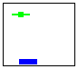 |
> > > > 
> > > > |
> > > > 
> > > > &#124; ([创建位置](http://docs.racket-lang.org/htdp-langs/beginner.html#%28def._htdp-beginner._%28%28lib._lang%2Fhtdp-beginner..rkt%29._make-posn%29%29) &#124;
> > > > 
> > > > &#124;   32 &#124;
> > > > 
> > > > &#124;   ([-](http://docs.racket-lang.org/htdp-langs/beginner.html#%28def._htdp-beginner._%28%28lib._lang%2Fhtdp-beginner..rkt%29._-%29%29) HEIGHT &#124;
> > > > 
> > > > &#124;      TANK-HEIGHT &#124;
> > > > 
> > > > &#124;      10)) &#124;
> > > > 
> > > > |  | 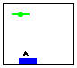 |
> > > > | --- | --- |
> > > > 
> 图 35: 渲染太空侵略者游戏，带有坦克

练习 101\. 将图 35 中的示例转换为测试用例。

Now we are ready to develop the template. Because the data definition for the major argument (m) is an itemization with two items, the function body is likely to consist of a [cond](http://docs.racket-lang.org/htdp-langs/beginner.html#%28form._%28%28lib._lang%2Fhtdp-beginner..rkt%29._cond%29%29) expression with two clauses:

> | ([define](http://docs.racket-lang.org/htdp-langs/beginner.html#%28form._%28%28lib._lang%2Fhtdp-beginner..rkt%29._define%29%29) (missile-render.v2 m s) |
> | --- |
> |   ([cond](http://docs.racket-lang.org/htdp-langs/beginner.html#%28form._%28%28lib._lang%2Fhtdp-beginner..rkt%29._cond%29%29) |
> | ([([boolean?](http://docs.racket-lang.org/htdp-langs/beginner.html#%28def._htdp-beginner._%28%28lib._lang%2Fhtdp-beginner..rkt%29._boolean~3f%29%29) m) [...](http://docs.racket-lang.org/htdp-langs/beginner.html#%28form._%28%28lib._lang%2Fhtdp-beginner..rkt%29._......%29%29)] |
> | ([([posn?](http://docs.racket-lang.org/htdp-langs/beginner.html#%28def._htdp-beginner._%28%28lib._lang%2Fhtdp-beginner..rkt%29._posn~3f%29%29) m) [...](http://docs.racket-lang.org/htdp-langs/beginner.html#%28form._%28%28lib._lang%2Fhtdp-beginner..rkt%29._......%29%29)])) |

再次遵循数据定义，第一个 [cond](http://docs.racket-lang.org/htdp-langs/beginner.html#%28form._%28%28lib._lang%2Fhtdp-beginner..rkt%29._cond%29%29) 条件检查 m 是否为 布尔值 并且第二个条件检查它是否是 位置 的元素。此外，如果有人不小心将 missile-render.v2 应用到 #true 和某个图像上，函数将使用第一个 [cond](http://docs.racket-lang.org/htdp-langs/beginner.html#%28form._%28%28lib._lang%2Fhtdp-beginner..rkt%29._cond%29%29) 条件来计算结果。关于此类错误，我们下面还有更多要说的。第二个模板步骤要求在处理结构的所有 [cond](http://docs.racket-lang.org/htdp-langs/beginner.html#%28form._%28%28lib._lang%2Fhtdp-beginner..rkt%29._cond%29%29) 条件中提供选择表达式。在我们的例子中，这适用于第二个条件，并且选择表达式从给定的 位置 提取 x 和 y 坐标：

> | ([define](http://docs.racket-lang.org/htdp-langs/beginner.html#%28form._%28%28lib._lang%2Fhtdp-beginner..rkt%29._define%29%29) (missile-render.v2 m s) |
> | --- |
> |   ([cond](http://docs.racket-lang.org/htdp-langs/beginner.html#%28form._%28%28lib._lang%2Fhtdp-beginner..rkt%29._cond%29%29) |
> | ([([boolean?](http://docs.racket-lang.org/htdp-langs/beginner.html#%28def._htdp-beginner._%28%28lib._lang%2Fhtdp-beginner..rkt%29._boolean~3f%29%29) m) [...](http://docs.racket-lang.org/htdp-langs/beginner.html#%28form._%28%28lib._lang%2Fhtdp-beginner..rkt%29._......%29%29)] |
> | |   [([posn?](http://docs.racket-lang.org/htdp-langs/beginner.html#%28def._htdp-beginner._%28%28lib._lang%2Fhtdp-beginner..rkt%29._posn~3f%29%29) m) ([...](http://docs.racket-lang.org/htdp-langs/beginner.html#%28form._%28%28lib._lang%2Fhtdp-beginner..rkt%29._......%29%29) ([posn-x](http://docs.racket-lang.org/htdp-langs/beginner.html#%28def._htdp-beginner._%28%28lib._lang%2Fhtdp-beginner..rkt%29._posn-x%29%29) m) [...](http://docs.racket-lang.org/htdp-langs/beginner.html#%28form._%28%28lib._lang%2Fhtdp-beginner..rkt%29._......%29%29) ([posn-y](http://docs.racket-lang.org/htdp-langs/beginner.html#%28def._htdp-beginner._%28%28lib._lang%2Fhtdp-beginner..rkt%29._posn-y%29%29) m) [...](http://docs.racket-lang.org/htdp-langs/beginner.html#%28form._%28%28lib._lang%2Fhtdp-beginner..rkt%29._......%29%29))])) |

将此模板与上面 si-render 的模板进行比较。后者的数据定义处理两种不同的结构类型，因此 si-render 的函数模板在 [cond](http://docs.racket-lang.org/htdp-langs/beginner.html#%28form._%28%28lib._lang%2Fhtdp-beginner..rkt%29._cond%29%29) 条件语句中包含选择表达式。然而，MissileOrNot 的数据定义将普通值与描述结构的项混合。这两种定义都是完全可以接受的；对你来说，关键是遵循配方，并找到一个与数据定义相匹配的代码组织结构。以下是完整的函数定义：

> | ([define](http://docs.racket-lang.org/htdp-langs/beginner.html#%28form._%28%28lib._lang%2Fhtdp-beginner..rkt%29._define%29%29) (missile-render.v2 m s) |
> | --- |
> | ([cond](http://docs.racket-lang.org/htdp-langs/beginner.html#%28form._%28%28lib._lang%2Fhtdp-beginner..rkt%29._cond%29%29) |
> | |   [([boolean?](http://docs.racket-lang.org/htdp-langs/beginner.html#%28def._htdp-beginner._%28%28lib._lang%2Fhtdp-beginner..rkt%29._boolean~3f%29%29) m) s] |
> | |   [([posn?](http://docs.racket-lang.org/htdp-langs/beginner.html#%28def._htdp-beginner._%28%28lib._lang%2Fhtdp-beginner..rkt%29._posn~3f%29%29) m) |
> | |   ([place-image](http://docs.racket-lang.org/teachpack/2htdpimage.html#%28def._%28%28lib._2htdp%2Fimage..rkt%29._place-image%29%29) MISSILE ([posn-x](http://docs.racket-lang.org/htdp-langs/beginner.html#%28def._htdp-beginner._%28%28lib._lang%2Fhtdp-beginner..rkt%29._posn-x%29%29) m) ([posn-y](http://docs.racket-lang.org/htdp-langs/beginner.html#%28def._htdp-beginner._%28%28lib._lang%2Fhtdp-beginner..rkt%29._posn-y%29%29) m) s)])) |

按步骤进行，你首先处理简单的子句；在这个函数中就是第一个。因为它说导弹尚未发射，所以函数返回给定的 s。对于第二个子句，你需要记住([posn-x](http://docs.racket-lang.org/htdp-langs/beginner.html#%28def._htdp-beginner._%28%28lib._lang%2Fhtdp-beginner..rkt%29._posn-x%29%29)  m) 和 ([posn-y](http://docs.racket-lang.org/htdp-langs/beginner.html#%28def._htdp-beginner._%28%28lib._lang%2Fhtdp-beginner..rkt%29._posn-y%29%29)  m) 选择导弹图像的坐标。这个函数必须将 MISSILE 添加到 s 中，所以你必须找出最佳的原生操作和自定义函数的组合来合并这四个值。这种组合操作的选择正是你作为程序员创造性洞察力的体现。

练习 102。设计完成第二个数据定义所需的所有其他功能。

练习 103。为以下四种动物园动物开发数据表示：

+   蜘蛛，其相关属性是剩余腿的数量（我们假设蜘蛛可能在事故中失去腿）以及运输时所需的空间；

+   大象，其唯一属性是运输时所需的空间；

+   王蛇，其属性包括长度和周长；以及

+   龟甲兽，你必须确定适当的属性，包括一个确定运输所需空间属性的属性。

为消耗动物园动物的功能开发一个模板。

设计 fits?函数，它消耗一个动物园动物和笼子的描述。它确定笼子的体积是否足够容纳动物。

练习 104。你的家乡管理着一支车队：汽车、面包车、公交车和 SUV。为车辆开发数据表示。每种车辆的数据表示必须描述它可以搭载的乘客数量、车牌号码和燃油消耗（每加仑英里数）。为消耗车辆的功能开发一个模板。

练习 105。某些程序包含以下数据定义：

> | ; 坐标可以是以下之一： |
> | --- |
> | ; – 一个 NegativeNumber |
> | ; y 轴上的解释，距离顶部 |
> | ; – 一个 PositiveNumber |
> | ; x 轴上的解释，距离左侧 |
> | ; – 一个 Posn |
> | ; 解释为普通笛卡尔点 |

在数据定义的每个子句中至少制作两个数据示例。对于每个示例，用画布草图解释其含义。

#### 6.2 混合世界🔗 "链接到这里")

本节建议为世界程序提出几个设计问题，从涉及我们虚拟宠物的简单扩展练习开始。

练习 106。在更多虚拟宠物中，我们讨论了带有幸福计数的虚拟宠物的创建。其中一个是猫；另一个是变色龙。然而，每个程序都只针对一个宠物。

设计猫-变色龙世界程序。给定一个位置和一个动物，它从给定位置开始将后者在画布上移动。以下是动物选择的数据表示：

> | ; 一个 VAnimal 是 |
> | --- |
> | ; – 一个 VCat |
> | ; – 一个 VCham |

其中 VCat 和 VCham 是来自练习 88 和 92 的数据定义。鉴于 VAnimal 是状态世界的集合，你需要设计

+   从 VAnimal 到 Image 的渲染函数；

+   一个从 VAnimal 到 VAnimal 处理时钟滴答声的函数；

+   一个处理关键事件的函数，以便你可以喂养、抚摸和上色你的动物——<wbr>根据适用性。

仍然无法改变猫的颜色或抚摸变色龙。

练习 107。设计 cham-and-cat 程序，该程序处理虚拟猫和虚拟变色龙。你需要一个包含这两种动物及其处理函数的“动物园”数据定义。

问题陈述没有明确说明键如何操作两个动物。以下是两种可能的解释：

1.  每个关键事件都适用于两个动物。

1.  每个关键事件只适用于两个动物中的一个。

    对于这个替代方案，你需要一个数据表示，它指定了一个焦点动物，即当前可以操作的动物。为了切换焦点，让键处理函数将“k”解释为“kitty”（猫），将“l”解释为 lizard（蜥蜴）。一旦玩家按下“k”，接下来的按键只适用于猫——<wbr>直到玩家按下“l”。

选择一个替代方案并设计相应的程序。

练习 108。在默认状态下，行人横道灯显示一个站在黑色背景上的橙色人像。当允许行人过马路时，灯收到信号并切换到绿色，行人行走的人像。这个阶段持续 10 秒。之后，灯显示数字 9、8、...、0，奇数用橙色标出，偶数用绿色标出。当倒计时达到 0 时，灯切换回默认状态。

设计一个实现此类行人交通灯的世界程序。当你按下键盘上的空格键时，灯从其默认状态切换。所有其他转换都必须是对时钟滴答声的反应。你可能希望使用以下图像

>  

或者你可以使用 2htdp/image teachpack teachpack 制作自己的简笔画。

练习 109：设计一个世界程序，以识别一系列 KeyEvent 中的模式。最初，程序显示一个 100x100 的白色矩形。一旦你的程序遇到第一个期望的字母，它将显示一个相同大小的黄色矩形。遇到最后一个字母后，矩形的颜色变为绿色。如果发生任何“不良”的关键事件，程序将显示一个红色矩形。

> > > | 传统 |  | 定义缩写 |
> > > | --- | --- | --- |
> > > 
> > > |
> > > 
> > > &#124; ; ExpectsToSee.v1 是以下之一： &#124;
> > > 
> > > &#124; ; –  "开始，期望 'a'" &#124;
> > > 
> > > &#124; ; –  "期望 'b'、'c' 或 'd'" &#124;
> > > 
> > > &#124; ; –  "完成" &#124;
> > > 
> > > &#124; ; –  "错误，非法键" &#124;
> > > 
> > > |  |
> > > | --- |
> > > 
> > > &#124; ; ExpectsToSee.v2 是以下之一： &#124;
> > > 
> > > &#124; ; –  AA &#124;
> > > 
> > > &#124; ; –  BB &#124;
> > > 
> > > &#124; ; –  DD &#124;
> > > 
> > > &#124; ; –  ER &#124;
> > > 
> > > &#124;   &#124;
> > > 
> > > &#124; ([define](http://docs.racket-lang.org/htdp-langs/beginner.html#%28form._%28%28lib._lang%2Fhtdp-beginner..rkt%29._define%29%29) AA "开始，...") &#124;
> > > 
> > > &#124; ([define](http://docs.racket-lang.org/htdp-langs/beginner.html#%28form._%28%28lib._lang%2Fhtdp-beginner..rkt%29._define%29%29) BB "期望 ...") &#124;
> > > 
> > > &#124; ([define](http://docs.racket-lang.org/htdp-langs/beginner.html#%28form._%28%28lib._lang%2Fhtdp-beginner..rkt%29._define%29%29) DD "完成") &#124;
> > > 
> > > &#124; ([define](http://docs.racket-lang.org/htdp-langs/beginner.html#%28form._%28%28lib._lang%2Fhtdp-beginner..rkt%29._define%29%29) ER "错误，...") &#124;
> > > 
> > > |
> > > 
> 图 36：为 FSM 编写数据定义的两种方式

你的程序要查找的特定序列以 "a" 开头，后面跟着任意长度的 "b" 和 "c" 的混合，并以 "d" 结尾。显然，"acbd" 是一个可接受的字符串示例；其他两个示例是 "ad" 和 "abcbbbcd"。当然，"da"、"aa" 或 "d" 不匹配。

> > > > 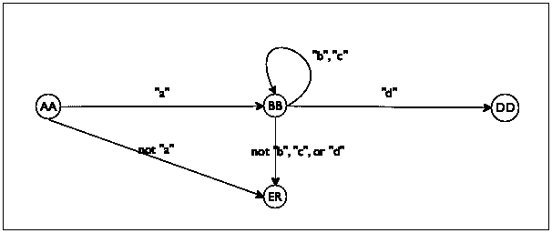
> > > > 
> 图 37：有限状态机作为图表

提示：你的解决方案实现了一个有限状态机（FSM），这是一个在有限状态世界中作为世界程序设计原则之一的概念。正如其名所示，FSM 程序可能处于有限数量的状态之一。第一个状态称为初始状态。每个关键事件都会使机器重新考虑其当前状态；它可能保持在同一状态或转移到另一个状态。当你的程序识别到适当的关键事件序列时，它将转移到最终状态。

对于一个序列识别问题，状态通常表示机器期望看到的字母；参见图 36 中的数据定义。右侧的数据定义使用了在练习 61 中引入的命名技术。看看最后一个状态，它表示遇到了非法输入。图 37 展示了如何以图示方式思考这些状态及其关系。每个节点对应于四个有限状态中的一个；每条箭头指定了哪个 KeyEvent 会导致程序从一个状态转换到另一个状态。

历史 在 20 世纪 50 年代，我们称之为计算机科学家的斯蒂芬·C·克莱因发明了正则表达式，作为一种识别文本模式的记法。对于上述问题，克莱因会写

> a (b|c)* d

这意味着 a 后面跟着 b 或 c 任意次数，直到遇到 d。

#### 6.3 输入错误🔗 "链接到此处")

本章的一个核心点涉及谓词的作用。当你必须设计处理数据混合的函数时，它们是至关重要的。当你的问题陈述提到许多不同类型的信息时，这些混合自然出现，但当你将你的函数和程序交给他人时，它们也会出现。毕竟，你了解并尊重你的数据定义和函数签名。然而，你永远不知道你的朋友和同事会做什么，而且你特别不知道没有 BSL 和编程知识的人会如何使用你的程序。因此，本节提出了一种保护程序免受不适当输入的方法。

让我们用一个简单的程序来演示这个观点，一个用于计算圆盘面积的函数：

> | ; Number -> Number |
> | --- |
> | ; 计算半径为 r 的圆盘面积 |
> | ([define](http://docs.racket-lang.org/htdp-langs/beginner.html#%28form._%28%28lib._lang%2Fhtdp-beginner..rkt%29._define%29%29) (area-of-disk r) |
> |   ([*](http://docs.racket-lang.org/htdp-langs/beginner.html#%28def._htdp-beginner._%28%28lib._lang%2Fhtdp-beginner..rkt%29._%2A%29%29) 3.14 ([*](http://docs.racket-lang.org/htdp-langs/beginner.html#%28def._htdp-beginner._%28%28lib._lang%2Fhtdp-beginner..rkt%29._%2A%29%29) r r))) |

朋友们可能希望将这个函数用于他们的几何作业。不幸的是，当朋友们使用这个函数时，他们可能会不小心将其应用于字符串而不是数字。当这种情况发生时，函数会停止程序执行，并显示一个神秘的错误信息：

> | > (area-of-disk "my-disk") |
> | --- |
> | *:期望一个数字，给定 "my-disk" |

使用谓词，你可以防止这种神秘的错误信息，并发出你自己的选择的信息性错误。

> > > | ; 任何 BSL 值都是以下之一： |
> > > | --- |
> > > | ; –  数字 |
> > > | ; –  布尔 |
> > > | ; –  字符串 |
> > > | ; –  图像 |
> > > | ; –  ([make-posn](http://docs.racket-lang.org/htdp-langs/beginner.html#%28def._htdp-beginner._%28%28lib._lang%2Fhtdp-beginner..rkt%29._make-posn%29%29)  Any  Any) |
> > > | ; ... |
> > > | ; –  (make-tank  Any  Any) |
> > > | ; ... |
> > > 
> 图 38：BSL 数据宇宙

具体来说，当我们希望将函数交给朋友时，我们可以定义这些函数的检查版本。因为我们的朋友可能不太了解 BSL，我们必须预期他们会将这个检查函数应用于任意的 BSL 值：数字、字符串、图像、Posns 以及等等。虽然我们无法预知 BSL 中将定义哪些结构类型，但我们知道所有 BSL 值集合的数据定义的大致形状。图 38 展示了这种数据定义的形状。正如在数据宇宙中讨论的那样，Any 的数据定义是开放的，因为每个结构类型定义都会添加新的实例。这些实例可能再次包含 Any 值，这意味着 Any 的数据定义必须引用自身——一开始这是一个令人害怕的想法。

基于这个列表，检查函数的模板具有以下大致形状：

> | ; Any -> ??? |
> | --- |
> | ([define](http://docs.racket-lang.org/htdp-langs/beginner.html#%28form._%28%28lib._lang%2Fhtdp-beginner..rkt%29._define%29%29) (checked-f v) |
> |   ([cond](http://docs.racket-lang.org/htdp-langs/beginner.html#%28form._%28%28lib._lang%2Fhtdp-beginner..rkt%29._cond%29%29) |
> |     [([数字?](http://docs.racket-lang.org/htdp-langs/beginner.html#%28def._htdp-beginner._%28%28lib._lang%2Fhtdp-beginner..rkt%29._number~3f%29%29) v) [...](http://docs.racket-lang.org/htdp-langs/beginner.html#%28form._%28%28lib._lang%2Fhtdp-beginner..rkt%29._......%29%29)] |
> |     [([布尔?](http://docs.racket-lang.org/htdp-langs/beginner.html#%28def._htdp-beginner._%28%28lib._lang%2Fhtdp-beginner..rkt%29._boolean~3f%29%29) v) [...](http://docs.racket-lang.org/htdp-langs/beginner.html#%28form._%28%28lib._lang%2Fhtdp-beginner..rkt%29._......%29%29)] |
> | |   [([string?](http://docs.racket-lang.org/htdp-langs/beginner.html#%28def._htdp-beginner._%28%28lib._lang%2Fhtdp-beginner..rkt%29._string~3f%29%29) v) [...](http://docs.racket-lang.org/htdp-langs/beginner.html#%28form._%28%28lib._lang%2Fhtdp-beginner..rkt%29._......%29%29)] |
> | |   [([image?](http://docs.racket-lang.org/htdp-langs/beginner.html#%28def._htdp-beginner._%28%28lib._lang%2Fhtdp-beginner..rkt%29._image~3f%29%29) v) [...](http://docs.racket-lang.org/htdp-langs/beginner.html#%28form._%28%28lib._lang%2Fhtdp-beginner..rkt%29._......%29%29)] |
> | |   [([posn?](http://docs.racket-lang.org/htdp-langs/beginner.html#%28def._htdp-beginner._%28%28lib._lang%2Fhtdp-beginner..rkt%29._posn~3f%29%29) v) ([...](http://docs.racket-lang.org/htdp-langs/beginner.html#%28form._%28%28lib._lang%2Fhtdp-beginner..rkt%29._......%29%29)([posn-x](http://docs.racket-lang.org/htdp-langs/beginner.html#%28def._htdp-beginner._%28%28lib._lang%2Fhtdp-beginner..rkt%29._posn-x%29%29) v) [...](http://docs.racket-lang.org/htdp-langs/beginner.html#%28form._%28%28lib._lang%2Fhtdp-beginner..rkt%29._......%29%29) ([posn-y](http://docs.racket-lang.org/htdp-langs/beginner.html#%28def._htdp-beginner._%28%28lib._lang%2Fhtdp-beginner..rkt%29._posn-y%29%29) v) [...](http://docs.racket-lang.org/htdp-langs/beginner.html#%28form._%28%28lib._lang%2Fhtdp-beginner..rkt%29._......%29%29))] |
> | |   [...](http://docs.racket-lang.org/htdp-langs/beginner.html#%28form._%28%28lib._lang%2Fhtdp-beginner..rkt%29._......%29%29) |
> | |   ; which selectors are needed in the next clause? |
> | |   [(tank? v) [...](http://docs.racket-lang.org/htdp-langs/beginner.html#%28form._%28%28lib._lang%2Fhtdp-beginner..rkt%29._......%29%29)] |
> | |   [...](http://docs.racket-lang.org/htdp-langs/beginner.html#%28form._%28%28lib._lang%2Fhtdp-beginner..rkt%29._......%29%29)]) |

当然，没有人能够列出这个定义的所有条款；幸运的是，这并不必要。我们所知道的是，对于原始函数定义的值类中的所有值，检查后的版本必须产生相同的结果；对于其他所有值，它必须发出错误信号。具体来说，我们的示例函数`checked-area-of-disk`接受一个任意的 BSL 值，如果输入是一个数字，则使用`area-of-disk`来计算圆盘的面积。否则，它必须停止并显示错误信息；在 BSL 中，我们使用函数`[error](http://docs.racket-lang.org/htdp-langs/beginner.html#%28def._htdp-beginner._%28%28lib._lang%2Fhtdp-beginner..rkt%29._error%29%29)`来完成这个任务。错误函数接受一个字符串并停止程序：

> ([error](http://docs.racket-lang.org/htdp-langs/beginner.html#%28def._htdp-beginner._%28%28lib._lang%2Fhtdp-beginner..rkt%29._error%29%29) "area-of-disk: number expected")

因此，`checked-area-of-disk`的大致定义如下：

> | ([define](http://docs.racket-lang.org/htdp-langs/beginner.html#%28form._%28%28lib._lang%2Fhtdp-beginner..rkt%29._define%29%29) MESSAGE "area-of-disk: number expected") |
> | --- |
> |   |
> | ([define](http://docs.racket-lang.org/htdp-langs/beginner.html#%28form._%28%28lib._lang%2Fhtdp-beginner..rkt%29._define%29%29) (checked-area-of-disk v) |
> |   ([cond](http://docs.racket-lang.org/htdp-langs/beginner.html#%28form._%28%28lib._lang%2Fhtdp-beginner..rkt%29._cond%29%29) |
> | ([number?](http://docs.racket-lang.org/htdp-langs/beginner.html#%28def._htdp-beginner._%28%28lib._lang%2Fhtdp-beginner..rkt%29._number~3f%29%29) v) (area-of-disk v) |
> | ([boolean?](http://docs.racket-lang.org/htdp-langs/beginner.html#%28def._htdp-beginner._%28%28lib._lang%2Fhtdp-beginner..rkt%29._boolean~3f%29%29) v) ([error](http://docs.racket-lang.org/htdp-langs/beginner.html#%28def._htdp-beginner._%28%28lib._lang%2Fhtdp-beginner..rkt%29._error%29%29) MESSAGE) |
> |     [([string?](http://docs.racket-lang.org/htdp-langs/beginner.html#%28def._htdp-beginner._%28%28lib._lang%2Fhtdp-beginner..rkt%29._string~3f%29%29) v) ([error](http://docs.racket-lang.org/htdp-langs/beginner.html#%28def._htdp-beginner._%28%28lib._lang%2Fhtdp-beginner..rkt%29._error%29%29) MESSAGE)] |
> | ([image?](http://docs.racket-lang.org/htdp-langs/beginner.html#%28def._htdp-beginner._%28%28lib._lang%2Fhtdp-beginner..rkt%29._image~3f%29%29) v) ([error](http://docs.racket-lang.org/htdp-langs/beginner.html#%28def._htdp-beginner._%28%28lib._lang%2Fhtdp-beginner..rkt%29._error%29%29) MESSAGE) |
> |     [([posn?](http://docs.racket-lang.org/htdp-langs/beginner.html#%28def._htdp-beginner._%28%28lib._lang%2Fhtdp-beginner..rkt%29._posn~3f%29%29) v) ([error](http://docs.racket-lang.org/htdp-langs/beginner.html#%28def._htdp-beginner._%28%28lib._lang%2Fhtdp-beginner..rkt%29._error%29%29) MESSAGE)] |
> |     [...](http://docs.racket-lang.org/htdp-langs/beginner.html#%28form._%28%28lib._lang%2Fhtdp-beginner..rkt%29._......%29%29) |
> |     [(tank? v) ([error](http://docs.racket-lang.org/htdp-langs/beginner.html#%28def._htdp-beginner._%28%28lib._lang%2Fhtdp-beginner..rkt%29._error%29%29) MESSAGE)] |
> |     [...](http://docs.racket-lang.org/htdp-langs/beginner.html#%28form._%28%28lib._lang%2Fhtdp-beginner..rkt%29._......%29%29)) |

The use of [else](http://docs.racket-lang.org/htdp-langs/beginner.html#%28form._%28%28lib._lang%2Fhtdp-beginner..rkt%29._else%29%29) helps us finish this definition in the natural way:

> | ; Any -> Number |
> | --- |
> | ; 计算半径为 v 的圆的面积 |
> | ; if v is a number |
> | ([define](http://docs.racket-lang.org/htdp-langs/beginner.html#%28form._%28%28lib._lang%2Fhtdp-beginner..rkt%29._define%29%29) (checked-area-of-disk v) |
> |   ([cond](http://docs.racket-lang.org/htdp-langs/beginner.html#%28form._%28%28lib._lang%2Fhtdp-beginner..rkt%29._cond%29%29) |
> |     [([number?](http://docs.racket-lang.org/htdp-langs/beginner.html#%28def._htdp-beginner._%28%28lib._lang%2Fhtdp-beginner..rkt%29._number~3f%29%29) v) (area-of-disk v)] |
> |     [[else](http://docs.racket-lang.org/htdp-langs/beginner.html#%28form._%28%28lib._lang%2Fhtdp-beginner..rkt%29._else%29%29) ([error](http://docs.racket-lang.org/htdp-langs/beginner.html#%28def._htdp-beginner._%28%28lib._lang%2Fhtdp-beginner..rkt%29._error%29%29) "area-of-disk: number expected")])) |

为了确保我们得到我们想要的结果，让我们进行实验：

> | > (checked-area-of-disk "my-disk") |
> | --- |
> | area-of-disk:number expected |

在我们分发程序供他人使用时，编写经过检查的函数是很重要的。然而，设计出能够正常工作的程序则更为重要。本书专注于正确程序设计的设计过程，为了不分散注意力，我们同意我们始终遵循数据定义和签名。至少，我们几乎总是这样做，在极少数情况下，我们可能要求你设计函数或程序的经过检查的版本。

练习 110。area-of-disk 的经过检查的版本也可以强制函数的参数是正数，而不仅仅是任意数字。以这种方式修改 checked-area-of-disk。

练习 111。查看以下定义：

> | ([define-struct](http://docs.racket-lang.org/htdp-langs/beginner.html#%28form._%28%28lib._lang%2Fhtdp-beginner..rkt%29._define-struct%29%29) vec [x y]) |
> | --- |
> | ; A vec is |
> | ;   (make-vec  PositiveNumber  PositiveNumber) |
> | ; interpretation represents a velocity vector |

开发函数 checked-make-vec，它应被视为原始操作 make-vec 的经过检查的版本。它确保 make-vec 的参数是正数。换句话说，checked-make-vec 强制执行我们的非正式数据定义。

> | ; Any -> ... |
> | --- |
> | ; checks that a is a proper input for function g |
> | ([define](http://docs.racket-lang.org/htdp-langs/beginner.html#%28form._%28%28lib._lang%2Fhtdp-beginner..rkt%29._define%29%29) (checked-g a) |
> |   ([cond](http://docs.racket-lang.org/htdp-langs/beginner.html#%28form._%28%28lib._lang%2Fhtdp-beginner..rkt%29._cond%29%29) |
> |     [(XYZ? a) (g a)] |
> |     [[else](http://docs.racket-lang.org/htdp-langs/beginner.html#%28form._%28%28lib._lang%2Fhtdp-beginner..rkt%29._else%29%29) ([error](http://docs.racket-lang.org/htdp-langs/beginner.html#%28def._htdp-beginner._%28%28lib._lang%2Fhtdp-beginner..rkt%29._error%29%29) "g: bad input")])) |

其中 g 本身是这样定义的：

> | ; XYZ -> ... |
> | --- |
> | ([define](http://docs.racket-lang.org/htdp-langs/beginner.html#%28form._%28%28lib._lang%2Fhtdp-beginner..rkt%29._define%29%29) (g some-x) [...](http://docs.racket-lang.org/htdp-langs/beginner.html#%28form._%28%28lib._lang%2Fhtdp-beginner..rkt%29._......%29%29)) |

我们假设存在一个标记为 XYZ 的数据定义，并且 (XYZ? a) 当 a 是 XYZ 的元素时产生 #true，否则产生 #false。

对于 area-of-disk，它消耗数字，[number?](http://docs.racket-lang.org/htdp-langs/beginner.html#%28def._htdp-beginner._%28%28lib._lang%2Fhtdp-beginner..rkt%29._number~3f%29%29)显然是合适的谓词。相比之下，对于一些像上面的 missile-render 这样的函数，我们显然需要定义自己的谓词，因为 MissileOrNot 是一个自定义的，而不是内置的数据集合。因此，让我们为 MissileOrNot 设计一个谓词。

我们回顾一下谓词的签名：

> | ; 任意 -> 布尔 |
> | --- |
> | ; is a an element of the MissileOrNot collection |
> | ([定义](http://docs.racket-lang.org/htdp-langs/beginner.html#%28form._%28%28lib._lang%2Fhtdp-beginner..rkt%29._define%29%29) (missile-or-not? a) #false) |

使用问题作为谓词的目的陈述是一种良好的实践，因为应用谓词就像对一个值提出问题。名字末尾的问号“？”也强化了这一概念；有些人可能会在发音这样的函数名时加上“huh”。构造例子也是直截了当的：

> | ([检查期望](http://docs.racket-lang.org/htdp-langs/beginner.html#%28form._%28%28lib._lang%2Fhtdp-beginner..rkt%29._check-expect%29%29) (missile-or-not? #false) #true) |
> | --- |
> | ([检查期望](http://docs.racket-lang.org/htdp-langs/beginner.html#%28form._%28%28lib._lang%2Fhtdp-beginner..rkt%29._check-expect%29%29) (missile-or-not? ([创建位置](http://docs.racket-lang.org/htdp-langs/beginner.html#%28def._htdp-beginner._%28%28lib._lang%2Fhtdp-beginner..rkt%29._make-posn%29%29) 9 2)) #true) |
> | ([检查期望](http://docs.racket-lang.org/htdp-langs/beginner.html#%28form._%28%28lib._lang%2Fhtdp-beginner..rkt%29._check-expect%29%29) (missile-or-not? "yellow") #false) |

前两个例子回顾了 MissileOrNot 集合的每个元素要么是#false，要么是某个位置。第三个测试说明字符串不是该集合的元素。以下是另外三个测试：

> | ([检查期望](http://docs.racket-lang.org/htdp-langs/beginner.html#%28form._%28%28lib._lang%2Fhtdp-beginner..rkt%29._check-expect%29%29) (missile-or-not? #true) #false) |
> | --- |
> | ([检查期望](http://docs.racket-lang.org/htdp-langs/beginner.html#%28form._%28%28lib._lang%2Fhtdp-beginner..rkt%29._check-expect%29%29) (missile-or-not? 10) #false) |
> | ([检查期望](http://docs.racket-lang.org/htdp-langs/beginner.html#%28form._%28%28lib._lang%2Fhtdp-beginner..rkt%29._check-expect%29%29) (missile-or-not? [空图像](http://docs.racket-lang.org/teachpack/2htdpimage.html#%28def._%28%28lib._2htdp%2Fimage..rkt%29._empty-image%29%29)) #false) |

解释预期的答案！

由于谓词消耗所有可能的 BSL 值，它们的模板与 checked-f 的模板相同。停！在你继续阅读之前，找到模板并再次仔细看看。

与检查函数一样，谓词不需要所有可能的 [cond](http://docs.racket-lang.org/htdp-langs/beginner.html#%28form._%28%28lib._lang%2Fhtdp-beginner..rkt%29._cond%29%29) 行。只需要那些可能产生 #true 的行：

> |   ([define](http://docs.racket-lang.org/htdp-langs/beginner.html#%28form._%28%28lib._lang%2Fhtdp-beginner..rkt%29._define%29%29) (missile-or-not? v) |
> | --- |
> |   ([cond](http://docs.racket-lang.org/htdp-langs/beginner.html#%28form._%28%28lib._lang%2Fhtdp-beginner..rkt%29._cond%29%29) |
> |   [([boolean?](http://docs.racket-lang.org/htdp-langs/beginner.html#%28def._htdp-beginner._%28%28lib._lang%2Fhtdp-beginner..rkt%29._boolean~3f%29%29) v) [...](http://docs.racket-lang.org/htdp-langs/beginner.html#%28form._%28%28lib._lang%2Fhtdp-beginner..rkt%29._......%29%29)] |
> |   ([([posn?](http://docs.racket-lang.org/htdp-langs/beginner.html#%28def._htdp-beginner._%28%28lib._lang%2Fhtdp-beginner..rkt%29._posn~3f%29%29) v) ([...](http://docs.racket-lang.org/htdp-langs/beginner.html#%28form._%28%28lib._lang%2Fhtdp-beginner..rkt%29._......%29%29) ([posn-x](http://docs.racket-lang.org/htdp-langs/beginner.html#%28def._htdp-beginner._%28%28lib._lang%2Fhtdp-beginner..rkt%29._posn-x%29%29) v) [...](http://docs.racket-lang.org/htdp-langs/beginner.html#%28form._%28%28lib._lang%2Fhtdp-beginner..rkt%29._......%29%29) ([posn-y](http://docs.racket-lang.org/htdp-langs/beginner.html#%28def._htdp-beginner._%28%28lib._lang%2Fhtdp-beginner..rkt%29._posn-y%29%29) v) [...](http://docs.racket-lang.org/htdp-langs/beginner.html#%28form._%28%28lib._lang%2Fhtdp-beginner..rkt%29._......%29%29))] |
> |   [[else](http://docs.racket-lang.org/htdp-langs/beginner.html#%28form._%28%28lib._lang%2Fhtdp-beginner..rkt%29._else%29%29) #false]]) |

所有其他情况都通过一个产生 #false 的 [else](http://docs.racket-lang.org/htdp-langs/beginner.html#%28form._%28%28lib._lang%2Fhtdp-beginner..rkt%29._else%29%29) 行来总结。根据模板，missile-or-not? 的定义只需思考每个情况即可：

> |   ([define](http://docs.racket-lang.org/htdp-langs/beginner.html#%28form._%28%28lib._lang%2Fhtdp-beginner..rkt%29._define%29%29) (missile-or-not? v) |
> | --- |
> |   ([cond](http://docs.racket-lang.org/htdp-langs/beginner.html#%28form._%28%28lib._lang%2Fhtdp-beginner..rkt%29._cond%29%29) |
> |   [([boolean?](http://docs.racket-lang.org/htdp-langs/beginner.html#%28def._htdp-beginner._%28%28lib._lang%2Fhtdp-beginner..rkt%29._boolean~3f%29%29) v) ([boolean=?](http://docs.racket-lang.org/htdp-langs/beginner.html#%28def._htdp-beginner._%28%28lib._lang%2Fhtdp-beginner..rkt%29._boolean~3d~3f%29%29) #false v)] |
> |   [([posn?](http://docs.racket-lang.org/htdp-langs/beginner.html#%28def._htdp-beginner._%28%28lib._lang%2Fhtdp-beginner..rkt%29._posn~3f%29%29) v) #true] |
> |   [[else](http://docs.racket-lang.org/htdp-langs/beginner.html#%28form._%28%28lib._lang%2Fhtdp-beginner..rkt%29._else%29%29) #false]]) |

只有 #false 是合法的 MissileOrNot；#true 则不是。我们用 ([boolean=?](http://docs.racket-lang.org/htdp-langs/beginner.html#%28def._htdp-beginner._%28%28lib._lang%2Fhtdp-beginner..rkt%29._boolean~3d~3f%29%29)  #false  v) 来表达这个想法，但 ([false?](http://docs.racket-lang.org/htdp-langs/beginner.html#%28def._htdp-beginner._%28%28lib._lang%2Fhtdp-beginner..rkt%29._false~3f%29%29)  v) 也可以：

> | ([define](http://docs.racket-lang.org/htdp-langs/beginner.html#%28form._%28%28lib._lang%2Fhtdp-beginner..rkt%29._define%29%29) (missile-or-not? v) |
> | --- |
> |   ([cond](http://docs.racket-lang.org/htdp-langs/beginner.html#%28form._%28%28lib._lang%2Fhtdp-beginner..rkt%29._cond%29%29) |
> |     [([false?](http://docs.racket-lang.org/htdp-langs/beginner.html#%28def._htdp-beginner._%28%28lib._lang%2Fhtdp-beginner..rkt%29._false~3f%29%29) v) #true] |
> |     [([posn?](http://docs.racket-lang.org/htdp-langs/beginner.html#%28def._htdp-beginner._%28%28lib._lang%2Fhtdp-beginner..rkt%29._posn~3f%29%29) v) #true] |
> |     [[else](http://docs.racket-lang.org/htdp-langs/beginner.html#%28form._%28%28lib._lang%2Fhtdp-beginner..rkt%29._else%29%29) #false])) |

自然地，Posn 的所有元素也都是 MissileOrNot 的成员，这解释了第二行中的 #true。

练习 112\. 现在使用 [or](http://docs.racket-lang.org/htdp-langs/beginner.html#%28form._%28%28lib._lang%2Fhtdp-beginner..rkt%29._or%29%29) 表达式重新表述谓词。

练习 113\. 为前节中的以下数据定义设计谓词：SIGS、Coordinate (练习 105) 和 VAnimal。

总结一下，让我们提及 [key-event?](http://docs.racket-lang.org/teachpack/2htdpuniverse.html#%28def._world._%28%28lib._2htdp%2Funiverse..rkt%29._key-event~3f%29%29) 和 [mouse-event?](http://docs.racket-lang.org/teachpack/2htdpuniverse.html#%28def._world._%28%28lib._2htdp%2Funiverse..rkt%29._mouse-event~3f%29%29) 作为两个你可能希望在你的世界程序中使用的重要谓词。它们检查预期的属性，但你应该查看它们的文档以确保你理解它们计算的内容。

#### 6.4 检查世界🔗 "链接到此处")

在一个世界程序中，许多事情可能会出错。尽管我们刚刚同意相信我们的函数总是应用于适当的数据类型，但在一个世界程序中，我们可能同时处理太多事情，以至于无法完全信任自己。当我们设计一个负责处理时钟滴答、鼠标点击、按键和渲染的世界程序时，很容易出错。当然，出错并不意味着 BSL 会立即识别出错误。例如，我们的某个函数可能产生一个结果，这个结果并不是你世界状态数据表示的一个元素。同时，[big-bang](http://docs.racket-lang.org/teachpack/2htdpuniverse.html#%28form._world._%28%28lib._2htdp%2Funiverse..rkt%29._big-bang%29%29) 接受这块数据并保留它，直到下一个事件发生。只有在后续的事件处理程序接收到这块不合适的数据时，程序才可能失败。但情况可能变得更糟，因为第二、第三和第四个事件处理步骤实际上可能处理不合适的状态值，所有这些都可能在处理过程的后期才爆发出来。

为了帮助解决这类问题，[big-bang](http://docs.racket-lang.org/teachpack/2htdpuniverse.html#%28form._world._%28%28lib._2htdp%2Funiverse..rkt%29._big-bang%29%29) 提供了一个可选的 [check-with](http://docs.racket-lang.org/teachpack/2htdpuniverse.html#%28form._world._%28%28lib._2htdp%2Funiverse..rkt%29._check-with%29%29) 子句，该子句接受一个用于世界状态的谓词。例如，如果我们选择用 Number 来表示所有世界状态，我们可以轻松地表达这个事实，如下所示：

> | ([define](http://docs.racket-lang.org/htdp-langs/beginner.html#%28form._%28%28lib._lang%2Fhtdp-beginner..rkt%29._define%29%29) (main s0) |
> | --- |
> | ([big-bang](http://docs.racket-lang.org/teachpack/2htdpuniverse.html#%28form._world._%28%28lib._2htdp%2Funiverse..rkt%29._big-bang%29%29) s0 [...](http://docs.racket-lang.org/htdp-langs/beginner.html#%28form._%28%28lib._lang%2Fhtdp-beginner..rkt%29._......%29%29) [[check-with](http://docs.racket-lang.org/teachpack/2htdpuniverse.html#%28form._world._%28%28lib._2htdp%2Funiverse..rkt%29._check-with%29%29) [number?](http://docs.racket-lang.org/htdp-langs/beginner.html#%28def._htdp-beginner._%28%28lib._lang%2Fhtdp-beginner..rkt%29._number~3f%29%29)] [...](http://docs.racket-lang.org/htdp-langs/beginner.html#%28form._%28%28lib._lang%2Fhtdp-beginner..rkt%29._......%29%29))) |

一旦任何事件处理函数产生除了数字之外的其他内容，世界程序就会停止，并显示适当的错误信息。当数据定义不仅仅是一个具有内置谓词（如[number?](http://docs.racket-lang.org/htdp-langs/beginner.html#%28def._htdp-beginner._%28%28lib._lang%2Fhtdp-beginner..rkt%29._number~3f%29%29)）的数据类时，[check-with](http://docs.racket-lang.org/teachpack/2htdpuniverse.html#%28form._world._%28%28lib._2htdp%2Funiverse..rkt%29._check-with%29%29)子句就更加有用，例如这个区间定义：

> | ; 一个 UnitWorld 是一个数字 |
> | --- |
> | ;   在 0（包含）和 1（不包含）之间。 |

在这种情况下，你需要为这个区间定义一个谓词：

> | ; Any -> Boolean |
> | --- |
> | ; x 是否在 0（包含）和 1（不包含）之间 |
> |   |
> | ([check-expect](http://docs.racket-lang.org/htdp-langs/beginner.html#%28form._%28%28lib._lang%2Fhtdp-beginner..rkt%29._check-expect%29%29) (between-0-and-1? "a") #false) |
> | ([check-expect](http://docs.racket-lang.org/htdp-langs/beginner.html#%28form._%28%28lib._lang%2Fhtdp-beginner..rkt%29._check-expect%29%29) (between-0-and-1? 1.2) #false) |
> | ([check-expect](http://docs.racket-lang.org/htdp-langs/beginner.html#%28form._%28%28lib._lang%2Fhtdp-beginner..rkt%29._check-expect%29%29) (between-0-and-1? 0.2) #true) |
> | ([check-expect](http://docs.racket-lang.org/htdp-langs/beginner.html#%28form._%28%28lib._lang%2Fhtdp-beginner..rkt%29._check-expect%29%29) (between-0-and-1? 0.0) #true) |
> | ([check-expect](http://docs.racket-lang.org/htdp-langs/beginner.html#%28form._%28%28lib._lang%2Fhtdp-beginner..rkt%29._check-expect%29%29) (between-0-and-1? 1.0) #false) |
> |   |
> | ([define](http://docs.racket-lang.org/htdp-langs/beginner.html#%28form._%28%28lib._lang%2Fhtdp-beginner..rkt%29._define%29%29) (between-0-and-1? x) |
> |   ([and](http://docs.racket-lang.org/htdp-langs/beginner.html#%28form._%28%28lib._lang%2Fhtdp-beginner..rkt%29._and%29%29) ([number?](http://docs.racket-lang.org/htdp-langs/beginner.html#%28def._htdp-beginner._%28%28lib._lang%2Fhtdp-beginner..rkt%29._number~3f%29%29) x) ([<=](http://docs.racket-lang.org/htdp-langs/beginner.html#%28def._htdp-beginner._%28%28lib._lang%2Fhtdp-beginner..rkt%29._~3c~3d%29%29) 0 x) ([<](http://docs.racket-lang.org/htdp-langs/beginner.html#%28def._htdp-beginner._%28%28lib._lang%2Fhtdp-beginner..rkt%29._~3c%29%29) x 1))) |

使用这个谓词，你现在可以监控你世界程序中的每一个单独的转换：

> | ([define](http://docs.racket-lang.org/htdp-langs/beginner.html#%28form._%28%28lib._lang%2Fhtdp-beginner..rkt%29._define%29%29) (main s0) |
> | --- |
> |   ([big-bang](http://docs.racket-lang.org/teachpack/2htdpuniverse.html#%28form._world._%28%28lib._2htdp%2Funiverse..rkt%29._big-bang%29%29) s0 |
> |             [...](http://docs.racket-lang.org/htdp-langs/beginner.html#%28form._%28%28lib._lang%2Fhtdp-beginner..rkt%29._......%29%29) |
> |             [[check-with](http://docs.racket-lang.org/teachpack/2htdpuniverse.html#%28form._world._%28%28lib._2htdp%2Funiverse..rkt%29._check-with%29%29) between-0-and-1?] |
> |             [...](http://docs.racket-lang.org/htdp-langs/beginner.html#%28form._%28%28lib._lang%2Fhtdp-beginner..rkt%29._......%29%29))) |

如果任何生成世界的处理程序创建了一个超出区间之外的数字，或者更糟糕的是，一个非数值，我们的程序会立即发现这个错误，并给我们机会修复错误。

练习 114。使用练习 113 中的谓词来检查空间入侵者世界程序、虚拟宠物程序(练习 106)和编辑器程序(图形编辑器)。

#### 6.5 等价谓词🔗 "链接到此处")

等价谓词是一个比较同一数据集合中两个元素的函数。回忆一下交通灯的定义，它是由三个字符串组成的集合：“红色”、“绿色”和“黄色”。下面是定义 light=?函数的一种方法：

> | ; TrafficLight  TrafficLight -> Boolean |
> | --- |
> | ; 两个（交通灯的）状态是否相等 |
> |   |
> | ([check-expect](http://docs.racket-lang.org/htdp-langs/beginner.html#%28form._%28%28lib._lang%2Fhtdp-beginner..rkt%29._check-expect%29%29) (light=? "red" "red") #true) |
> | ([check-expect](http://docs.racket-lang.org/htdp-langs/beginner.html#%28form._%28%28lib._lang%2Fhtdp-beginner..rkt%29._check-expect%29%29) (light=? "red" "green") #false) |
> | ([check-expect](http://docs.racket-lang.org/htdp-langs/beginner.html#%28form._%28%28lib._lang%2Fhtdp-beginner..rkt%29._check-expect%29%29) (light=? "green" "green") #true) |
> | ([check-expect](http://docs.racket-lang.org/htdp-langs/beginner.html#%28form._%28%28lib._lang%2Fhtdp-beginner..rkt%29._check-expect%29%29) (light=? "yellow" "yellow") #true) |
> |   |
> | ([define](http://docs.racket-lang.org/htdp-langs/beginner.html#%28form._%28%28lib._lang%2Fhtdp-beginner..rkt%29._define%29%29) (light=? a-value another-value) |
> |   ([string=?](http://docs.racket-lang.org/htdp-langs/beginner.html#%28def._htdp-beginner._%28%28lib._lang%2Fhtdp-beginner..rkt%29._string~3d~3f%29%29) a-value another-value)) |

当我们点击运行时，所有测试都成功，但不幸的是，其他交互揭示了与我们的意图冲突：

> | > (light=? "salad" "greens") |
> | --- |
> | #false |
> | > (light=? "beans" 10) |
> | string=?:期望一个字符串，给定 10 |

将这些交互与其他内置的等价谓词进行比较：

> | > ([boolean=?](http://docs.racket-lang.org/htdp-langs/beginner.html#%28def._htdp-beginner._%28%28lib._lang%2Fhtdp-beginner..rkt%29._boolean~3d~3f%29%29) "#true" 10) |
> | --- |
> | boolean=?:期望一个布尔值作为第一个参数，给定"#true" |

尝试在自己的环境中使用 ([字符串等于?](http://docs.racket-lang.org/htdp-langs/beginner.html#%28def._htdp-beginner._%28%28lib._lang%2Fhtdp-beginner..rkt%29._string~3d~3f%29%29) 10 #true) 和 ([等于](http://docs.racket-lang.org/htdp-langs/beginner.html#%28def._htdp-beginner._%28%28lib._lang%2Fhtdp-beginner..rkt%29._~3d%29%29) 20 "help")。所有这些都会在应用错误类型的参数时引发错误。light=? 的检查版本强制两个参数都属于 TrafficLight；字符的大小写很重要；"red" 与 "Red" 或 "RED" 不同。如果不这样，它将引发类似于内置等价谓词引发的错误。我们为了简洁起见，将 TrafficLight 的谓词称为 light?：

> | ; Any -> 布尔 |
> | --- |
> | ; 给定的值是否是 TrafficLight 的元素 |
> | ([定义](http://docs.racket-lang.org/htdp-langs/beginner.html#%28form._%28%28lib._lang%2Fhtdp-beginner..rkt%29._define%29%29) (light? x) |
> |   ([条件](http://docs.racket-lang.org/htdp-langs/beginner.html#%28form._%28%28lib._lang%2Fhtdp-beginner..rkt%29._cond%29%29) |
> |     [([字符串?](http://docs.racket-lang.org/htdp-langs/beginner.html#%28def._htdp-beginner._%28%28lib._lang%2Fhtdp-beginner..rkt%29._string~3f%29%29) x) [或](http://docs.racket-lang.org/htdp-langs/beginner.html#%28form._%28%28lib._lang%2Fhtdp-beginner..rkt%29._or%29%29) ([字符串等于?](http://docs.racket-lang.org/htdp-langs/beginner.html#%28def._htdp-beginner._%28%28lib._lang%2Fhtdp-beginner..rkt%29._string~3d~3f%29%29) "red" x) |
> |                      ([字符串等于?](http://docs.racket-lang.org/htdp-langs/beginner.html#%28def._htdp-beginner._%28%28lib._lang%2Fhtdp-beginner..rkt%29._string~3d~3f%29%29) "green" x) |
> |                      ([字符串等于?](http://docs.racket-lang.org/htdp-langs/beginner.html#%28def._htdp-beginner._%28%28lib._lang%2Fhtdp-beginner..rkt%29._string~3d~3f%29%29) "yellow" x))] |
> |     [[否则](http://docs.racket-lang.org/htdp-langs/beginner.html#%28form._%28%28lib._lang%2Fhtdp-beginner..rkt%29._else%29%29) #false]]) |

现在，我们可以通过遵循我们的原始分析来总结 light=? 的修订。首先，函数确定两个输入是 TrafficLight 的元素；如果不是，它使用 [错误](http://docs.racket-lang.org/htdp-langs/beginner.html#%28def._htdp-beginner._%28%28lib._lang%2Fhtdp-beginner..rkt%29._error%29%29) 来报告错误：

> | ([定义](http://docs.racket-lang.org/htdp-langs/beginner.html#%28form._%28%28lib._lang%2Fhtdp-beginner..rkt%29._define%29%29) MESSAGE) |
> | --- |
> |   "预期交通灯，给定其他值") |
> |   |
> | ; Any -> 布尔 |
> | ; 两个值是否是 TrafficLight 的元素，并且， |
> | ; 如果是这样，它们是否相等 |
> |   |
> | ([检查期望](http://docs.racket-lang.org/htdp-langs/beginner.html#%28form._%28%28lib._lang%2Fhtdp-beginner..rkt%29._check-expect%29%29) (light=? "red" "red") #true) |
> | ([检查期望](http://docs.racket-lang.org/htdp-langs/beginner.html#%28form._%28%28lib._lang%2Fhtdp-beginner..rkt%29._check-expect%29%29) (light=? "red" "green") #false) |
> | ([检查期望](http://docs.racket-lang.org/htdp-langs/beginner.html#%28form._%28%28lib._lang%2Fhtdp-beginner..rkt%29._check-expect%29%29) (light=? "green" "green") #true) |
> | ([检查期望](http://docs.racket-lang.org/htdp-langs/beginner.html#%28form._%28%28lib._lang%2Fhtdp-beginner..rkt%29._check-expect%29%29) (light=? "yellow" "yellow") #true) |
> |   |
> | ([定义](http://docs.racket-lang.org/htdp-langs/beginner.html#%28form._%28%28lib._lang%2Fhtdp-beginner..rkt%29._define%29%29) (light=? a-value another-value) |
> |   ([如果](http://docs.racket-lang.org/htdp-langs/beginner.html#%28form._%28%28lib._lang%2Fhtdp-beginner..rkt%29._if%29%29) ([并且](http://docs.racket-lang.org/htdp-langs/beginner.html#%28form._%28%28lib._lang%2Fhtdp-beginner..rkt%29._and%29%29) (light? a-value) (light? another-value)) |
> |       ([字符串等于](http://docs.racket-lang.org/htdp-langs/beginner.html#%28def._htdp-beginner._%28%28lib._lang%2Fhtdp-beginner..rkt%29._string~3d~3f%29%29) a-value another-value) |
> |       ([错误](http://docs.racket-lang.org/htdp-langs/beginner.html#%28def._htdp-beginner._%28%28lib._lang%2Fhtdp-beginner..rkt%29._error%29%29) MESSAGE))) |

练习 115。修改 light=?，以便错误信息指定两个参数中哪一个不是 TrafficLight 的元素。

虽然你的程序不太可能使用 light=？，但它们应该使用[key=？](http://docs.racket-lang.org/teachpack/2htdpuniverse.html#%28def._world._%28%28lib._2htdp%2Funiverse..rkt%29._key~3d~3f%29%29)和[mouse=？](http://docs.racket-lang.org/teachpack/2htdpuniverse.html#%28def._world._%28%28lib._2htdp%2Funiverse..rkt%29._mouse~3d~3f%29%29)，这两个是我们在上一个子节末尾简要提到的等价谓词。自然地，[key=？](http://docs.racket-lang.org/teachpack/2htdpuniverse.html#%28def._world._%28%28lib._2htdp%2Funiverse..rkt%29._key~3d~3f%29%29)是比较两个 KeyEvent 的操作；同样，[mouse=？](http://docs.racket-lang.org/teachpack/2htdpuniverse.html#%28def._world._%28%28lib._2htdp%2Funiverse..rkt%29._mouse~3d~3f%29%29)比较两个 MouseEvt。虽然这两种事件都表示为字符串，但重要的是要认识到并非所有字符串都代表键盘事件或鼠标事件。

我们建议从此以后在键事件处理程序中使用[key=?](http://docs.racket-lang.org/teachpack/2htdpuniverse.html#%28def._world._%28%28lib._2htdp%2Funiverse..rkt%29._key~3d~3f%29%29)，在鼠标事件处理程序中使用[mouse=?](http://docs.racket-lang.org/teachpack/2htdpuniverse.html#%28def._world._%28%28lib._2htdp%2Funiverse..rkt%29._mouse~3d~3f%29%29)。在键事件处理程序中使用[key=?](http://docs.racket-lang.org/teachpack/2htdpuniverse.html#%28def._world._%28%28lib._2htdp%2Funiverse..rkt%29._key~3d~3f%29%29)确保函数真正比较表示键事件的字符串，而不是任意字符串。一旦，比如说，函数意外地应用于"hello\n world"，[key=?](http://docs.racket-lang.org/teachpack/2htdpuniverse.html#%28def._world._%28%28lib._2htdp%2Funiverse..rkt%29._key~3d~3f%29%29)会发出错误信号，从而通知我们有问题。

### 7 总结🔗 "链接到此处")

在本书的第一部分，你学到了许多简单但重要的课程。以下是总结：

1.  一个好的程序员设计程序。一个差的程序员则不断尝试直到程序看起来似乎可以工作。

1.  设计食谱有两个维度。一个涉及设计过程，即要采取的步骤序列。另一个解释了选择的数据表示如何影响设计过程。

1.  每个设计良好的程序都由许多常量定义、结构类型定义、数据定义和函数定义组成。对于批处理程序，一个函数是“主”函数，它通常组合几个其他函数来完成其计算。对于交互式程序，[big-bang](http://docs.racket-lang.org/teachpack/2htdpuniverse.html#%28form._world._%28%28lib._2htdp%2Funiverse..rkt%29._big-bang%29%29)函数扮演主函数的角色；它指定程序的初始状态、一个生成图像的输出函数，以及最多三个事件处理程序：一个用于时钟滴答，一个用于鼠标点击，一个用于键事件。在这两种程序中，函数定义都是“自顶向下”呈现的，从主函数开始，然后是主函数中提到的那些函数，依此类推。

1.  与所有编程语言一样，入门学生语言也有一套词汇和语法。程序员必须能够确定语言中每个句子的含义，这样他们才能预测程序在给定输入时的计算方式。以下的小插曲将详细解释这个想法。

1.  编程语言，包括 BSL，都附带了一套丰富的教学包，这样程序员就不必每次都重新发明轮子。程序员应该熟悉教学包提供的函数，特别是它们的签名和目的说明。这样做可以简化生活。

1.  程序员必须了解所选编程语言提供的“工具”。这些工具要么是语言的一部分——例如 [cond](http://docs.racket-lang.org/htdp-langs/beginner.html#%28form._%28%28lib._lang%2Fhtdp-beginner..rkt%29._cond%29%29) 或 [max](http://docs.racket-lang.org/htdp-langs/beginner.html#%28def._htdp-beginner._%28%28lib._lang%2Fhtdp-beginner..rkt%29._max%29%29)—要么是从教学包中“导入”的。本着这种精神，确保你理解以下术语：结构类型定义、函数定义、常量定义、结构实例、数据定义、[big-bang](http://docs.racket-lang.org/teachpack/2htdpuniverse.html#%28form._world._%28%28lib._2htdp%2Funiverse..rkt%29._big-bang%29%29) 和事件处理函数。
