# II 任意大的数据🔗

> 原文：[`htdp.org/2024-11-6/Book/part_two.html`](https://htdp.org/2024-11-6/Book/part_two.html)

|   8 列表 |
| --- |
|   8.1 创建列表 |
|   8.2 什么是'()，什么是 cons |
|   8.3 使用列表进行编程 |
|   8.4 使用列表进行计算 |
|   9 使用自引用数据定义进行设计 |
|   9.1 手指练习：列表 |
|   9.2 非空列表 |
|   9.3 自然数 |
|   9.4 俄罗斯套娃 |
|   9.5 列表和世界 |
|   9.6 关于列表和集合的注释 |
|   10 更多关于列表的内容 |
|   10.1 产生列表的函数 |
|   10.2 列表中的结构 |
|   10.3 列表中的列表，文件 |
|   10.4 图形编辑器，重访 |
|   11 通过组合进行设计 |
|   11.1 列表函数 |
|   11.2 函数组合 |
|   11.3 递归的辅助函数 |
|   11.4 泛化的辅助函数 |
|   12 项目：列表 |
|   12.1 现实世界数据：字典 |
|   12.2 现实世界数据：iTunes |
|   12.3 文字游戏，组成图解 |
|   12.4 文字游戏，问题的核心 |
|   12.5 喂虫子 |
|   12.6 简单的俄罗斯方块 |
|   12.7 全面空间战 |
|   12.8 有限状态机 |
|   13 总结 |

在固定大小数据中描述的每个数据定义都描述了固定大小的数据。对我们来说，布尔值、数字、字符串和图像是原子的；计算机科学家说它们的大小为单个单位。通过结构，你可以组合固定数量的数据。即使你使用数据定义的语言创建深度嵌套的结构，你始终知道任何特定实例中原子数据的确切数量。然而，许多编程问题处理的是必须作为一个数据单元处理的不确定数量的信息。例如，一个程序可能必须计算一组数字的平均值，另一个程序可能必须跟踪交互式游戏中的任意数量的对象。无论如何，凭借你的知识，你无法制定一个可以表示此类信息的数据定义。

这一部分修订了数据定义的语言，使其能够描述（有限但）任意大小的数据。为了具体说明，本部分的前半部分处理列表，这是大多数现代编程语言中出现的一种数据形式。与扩展的数据定义语言并行，本部分还修订了设计配方以应对此类数据定义。后几章展示了这些数据定义和修订后的设计配方在各种情境下的工作方式。

### 8 列表🔗 "链接至此")

你可能之前没有遇到过自引用的定义。你的英语老师当然会避免这些，许多数学课程在涉及此类定义时也含糊不清。程序员不能 afford to be vague。他们的工作需要精确。虽然一个定义通常可能包含几个对自身的引用，但本章提供了只需要一个的有用示例，从列表的定义开始。

列表的出现也丰富了我们可以研究的应用类型。虽然本章通过示例仔细构建你的直觉，但它也激励了下一章设计配方的修订，下一章解释了如何系统地创建处理自引用数据定义的函数。

#### 8.1 创建列表🔗 "链接至此")

我们一直在制作列表。在我们去杂货店购物之前，我们会写下想要购买的物品清单。有些人每天早上都会写下待办事项清单。在十二月，许多孩子会准备圣诞愿望清单。以列表的形式安排信息是我们生活中无处不在的一部分。

基于信息以列表的形式出现，我们必须清楚地学习如何将此类列表表示为 BSL 数据。实际上，由于列表非常重要，BSL 提供了内置的支持来创建和操作列表，类似于对笛卡尔点（posn）的支持。与点不同，列表的数据定义始终留给你。但首先，我们从创建列表开始。

当我们形成列表时，我们总是从空列表开始。在 BSL 中，我们用

> | '())

来表示空列表，发音为“empty”，简称“empty list”。像 #true 或 5 一样，'() 只是一个常量。当我们向列表添加东西时，我们构建另一个列表；在 BSL 中，cons 操作用于此目的。例如，

> | ([cons](http://docs.racket-lang.org/htdp-langs/beginner.html#%28def._htdp-beginner._%28%28lib._lang%2Fhtdp-beginner..rkt%29._cons%29%29) "Mercury" | 

从空列表和字符串 "Mercury" 构建列表。图 44（counter.figure.fig~3abuild-a-list）以我们用于结构的相同图示方式展示了这个列表。cons 的框有两个字段：first 和 rest。在这个特定示例中，first 字段包含 "Mercury"，而 rest 字段包含 '()。

> > > > | 列表 |  | 图表 |
> > > > | --- | --- | --- |
> > > > 
> > > > |
> > > > 
> > > > | ([cons](http://docs.racket-lang.org/htdp-langs/beginner.html#%28def._htdp-beginner._%28%28lib._lang%2Fhtdp-beginner..rkt%29._cons%29%29) "Mercury" | 
> > > > 
> > > > | ([cons](http://docs.racket-lang.org/htdp-langs/beginner.html#%28def._htdp-beginner._%28%28lib._lang%2Fhtdp-beginner..rkt%29._cons%29%29) '()) | 
> > > > 
> > > > |  |  |
> > > > | --- | --- |
> > > > 
> > > > |
> > > > 
> > > > | ([cons](http://docs.racket-lang.org/htdp-langs/beginner.html#%28def._htdp-beginner._%28%28lib._lang%2Fhtdp-beginner..rkt%29._cons%29%29) "Mercury" | 
> > > > 
> > > > | ([cons](http://docs.racket-lang.org/htdp-langs/beginner.html#%28def._htdp-beginner._%28%28lib._lang%2Fhtdp-beginner..rkt%29._cons%29%29) "Mercury" | 
> > > > 
> > > > | ([cons](http://docs.racket-lang.org/htdp-langs/beginner.html#%28def._htdp-beginner._%28%28lib._lang%2Fhtdp-beginner..rkt%29._cons%29%29) "Venus" | 
> > > > 
> > > > |  | 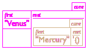 |
> > > > | --- | --- |
> > > > 
> > > > |
> > > > 
> > > > | ([cons](http://docs.racket-lang.org/htdp-langs/beginner.html#%28def._htdp-beginner._%28%28lib._lang%2Fhtdp-beginner..rkt%29._cons%29%29) "Earth" | 
> > > > 
> > > > | ([cons](http://docs.racket-lang.org/htdp-langs/beginner.html#%28def._htdp-beginner._%28%28lib._lang%2Fhtdp-beginner..rkt%29._cons%29%29) "Venus" |))
> > > > 
> > > > | ([cons](http://docs.racket-lang.org/htdp-langs/beginner.html#%28def._htdp-beginner._%28%28lib._lang%2Fhtdp-beginner..rkt%29._cons%29%29) "Mercury" |))
> > > > 
> > > > | ([cons](http://docs.racket-lang.org/htdp-langs/beginner.html#%28def._htdp-beginner._%28%28lib._lang%2Fhtdp-beginner..rkt%29._cons%29%29) "Mercury" |))) |
> > > > 
> > > > | 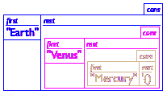 |
> > > > | --- |
> > > > 
> 图 44：构建列表

一旦我们有一个包含一个元素的列表，我们可以再次使用[cons](http://docs.racket-lang.org/htdp-langs/beginner.html#%28def._htdp-beginner._%28%28lib._lang%2Fhtdp-beginner..rkt%29._cons%29%29)来构建包含两个元素的列表。这里有一个例子：

> ([cons](http://docs.racket-lang.org/htdp-langs/beginner.html#%28def._htdp-beginner._%28%28lib._lang%2Fhtdp-beginner..rkt%29._cons%29%29) "Venus" ([cons](http://docs.racket-lang.org/htdp-langs/beginner.html#%28def._htdp-beginner._%28%28lib._lang%2Fhtdp-beginner..rkt%29._cons%29%29) "Mercury" '())))

这里还有另一个：

> ([cons](http://docs.racket-lang.org/htdp-langs/beginner.html#%28def._htdp-beginner._%28%28lib._lang%2Fhtdp-beginner..rkt%29._cons%29%29) "Earth" ([cons](http://docs.racket-lang.org/htdp-langs/beginner.html#%28def._htdp-beginner._%28%28lib._lang%2Fhtdp-beginner..rkt%29._cons%29%29) "Mercury" '())))

中间行展示了如何想象包含两个元素的列表。它也是一个包含两个字段的框，但这次[rest](http://docs.racket-lang.org/htdp-langs/beginner.html#%28def._htdp-beginner._%28%28lib._lang%2Fhtdp-beginner..rkt%29._rest%29%29)字段包含一个框。实际上，它包含的是同一图顶行的框。最后，我们构建了一个包含三个元素的列表：

> ([cons](http://docs.racket-lang.org/htdp-langs/beginner.html#%28def._htdp-beginner._%28%28lib._lang%2Fhtdp-beginner..rkt%29._cons%29%29) "Earth" ([cons](http://docs.racket-lang.org/htdp-langs/beginner.html#%28def._htdp-beginner._%28%28lib._lang%2Fhtdp-beginner..rkt%29._cons%29%29) "Venus" ([cons](http://docs.racket-lang.org/htdp-langs/beginner.html#%28def._htdp-beginner._%28%28lib._lang%2Fhtdp-beginner..rkt%29._cons%29%29) "Mercury" '())))

图 44 的最后一行展示了包含三个元素的列表。它的[rest](http://docs.racket-lang.org/htdp-langs/beginner.html#%28def._htdp-beginner._%28%28lib._lang%2Fhtdp-beginner..rkt%29._rest%29%29)字段包含一个包含另一个框的框。因此，当我们创建列表时，我们将框放入框中，再放入框中，如此类推。虽然乍一看这可能显得有些奇怪，但它就像一盒中国礼物盒或一盒嵌套的酒杯，我们有时会在生日时收到。唯一的区别是，BSL 程序可以嵌套列表的深度远超过任何艺术家可以嵌套的物理盒子。

> > > |
> > > 
> > > &#124; ([cons](http://docs.racket-lang.org/htdp-langs/beginner.html#%28def._htdp-beginner._%28%28lib._lang%2Fhtdp-beginner..rkt%29._cons%29%29) "Earth" &#124;
> > > 
> > > &#124;   ([cons](http://docs.racket-lang.org/htdp-langs/beginner.html#%28def._htdp-beginner._%28%28lib._lang%2Fhtdp-beginner..rkt%29._cons%29%29) "Venus" &#124;
> > > 
> > > &#124;     ([cons](http://docs.racket-lang.org/htdp-langs/beginner.html#%28def._htdp-beginner._%28%28lib._lang%2Fhtdp-beginner..rkt%29._cons%29%29) "Mercury" &#124;
> > > 
> > > &#124;       '()))) &#124;
> > > 
> > > | 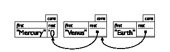 |
> > > | --- |
> > > |  |  |
> > > 
> [图 45：绘制列表]

因为即使是优秀的艺术家在绘制深度嵌套的结构时也会遇到问题，计算机科学家们转而使用框图和箭头来表示。 图 45 展示了如何重新排列图 44 的最后一行。每个[cons](http://docs.racket-lang.org/htdp-langs/beginner.html#%28def._htdp-beginner._%28%28lib._lang%2Fhtdp-beginner..rkt%29._cons%29%29)结构成为一个独立的框。如果剩余字段过于复杂，无法在框内绘制，我们则画一个点和一个指向包含该框的箭头线。根据框的排列方式，可以得到两种类型的图。第一种，显示在图 45 的顶部行，按照创建的顺序列出框。第二种，显示在底部行，按照它们被[cons](http://docs.racket-lang.org/htdp-langs/beginner.html#%28def._htdp-beginner._%28%28lib._lang%2Fhtdp-beginner..rkt%29._cons%29%29)组合的顺序列出框。因此，第二个图立即告诉你，无论列表有多长，应用[first](http://docs.racket-lang.org/htdp-langs/beginner.html#%28def._htdp-beginner._%28%28lib._lang%2Fhtdp-beginner..rkt%29._first%29%29)到列表上会产生什么结果。因此，程序员更喜欢第二种排列。

练习 129。创建代表以下内容的 BSL 列表：

1.  一系列天体，比如说，至少包括我们太阳系中的所有行星；

1.  一份餐点的物品列表，例如，牛排、薯条、豆子、面包、水、布里奶酪和冰淇淋；

1.  一系列颜色。

绘制一些与图 44 和图 45 相似的列表的框图，问你喜欢哪一个？你也可以制作数字列表。以下是一个包含 10 个数字的列表：

> | ([cons](http://docs.racket-lang.org/htdp-langs/beginner.html#%28def._htdp-beginner._%28%28lib._lang%2Fhtdp-beginner..rkt%29._cons%29%29) 0 |
> | --- |
> |   ([cons](http://docs.racket-lang.org/htdp-langs/beginner.html#%28def._htdp-beginner._%28%28lib._lang%2Fhtdp-beginner..rkt%29._cons%29%29) 1 |
> |     ([cons](http://docs.racket-lang.org/htdp-langs/beginner.html#%28def._htdp-beginner._%28%28lib._lang%2Fhtdp-beginner..rkt%29._cons%29%29) 2 |
> |       ([cons](http://docs.racket-lang.org/htdp-langs/beginner.html#%28def._htdp-beginner._%28%28lib._lang%2Fhtdp-beginner..rkt%29._cons%29%29) 3 |
> |         ([cons](http://docs.racket-lang.org/htdp-langs/beginner.html#%28def._htdp-beginner._%28%28lib._lang%2Fhtdp-beginner..rkt%29._cons%29%29) 4 |
> |           ([cons](http://docs.racket-lang.org/htdp-langs/beginner.html#%28def._htdp-beginner._%28%28lib._lang%2Fhtdp-beginner..rkt%29._cons%29%29) 5 |
> |             ([cons](http://docs.racket-lang.org/htdp-langs/beginner.html#%28def._htdp-beginner._%28%28lib._lang%2Fhtdp-beginner..rkt%29._cons%29%29) 6 |
> |               ([cons](http://docs.racket-lang.org/htdp-langs/beginner.html#%28def._htdp-beginner._%28%28lib._lang%2Fhtdp-beginner..rkt%29._cons%29%29) 7 |
> |                 ([cons](http://docs.racket-lang.org/htdp-langs/beginner.html#%28def._htdp-beginner._%28%28lib._lang%2Fhtdp-beginner..rkt%29._cons%29%29) 8 |
> |                   ([cons](http://docs.racket-lang.org/htdp-langs/beginner.html#%28def._htdp-beginner._%28%28lib._lang%2Fhtdp-beginner..rkt%29._cons%29%29) 9 '())))))))))) |

构建这个列表需要 10 次列表构造和一次 '()。例如，对于三个任意数字的列表，

> | ([cons](http://docs.racket-lang.org/htdp-langs/beginner.html#%28def._htdp-beginner._%28%28lib._lang%2Fhtdp-beginner..rkt%29._cons%29%29) [pi](http://docs.racket-lang.org/htdp-langs/beginner.html#%28def._htdp-beginner._%28%28lib._lang%2Fhtdp-beginner..rkt%29._pi%29%29) |
> | --- |
> |   ([cons](http://docs.racket-lang.org/htdp-langs/beginner.html#%28def._htdp-beginner._%28%28lib._lang%2Fhtdp-beginner..rkt%29._cons%29%29) e |
> |     ([cons](http://docs.racket-lang.org/htdp-langs/beginner.html#%28def._htdp-beginner._%28%28lib._lang%2Fhtdp-beginner..rkt%29._cons%29%29) -22.3 '()))) |

我们需要三个 [cons](http://docs.racket-lang.org/htdp-langs/beginner.html#%28def._htdp-beginner._%28%28lib._lang%2Fhtdp-beginner..rkt%29._cons%29%29) 操作。一般来说，一个列表不必只包含一种类型的值，它可以包含任意类型的值：

> | ([cons](http://docs.racket-lang.org/htdp-langs/beginner.html#%28def._htdp-beginner._%28%28lib._lang%2Fhtdp-beginner..rkt%29._cons%29%29) "Robbie Round" |
> | --- |
> |   ([cons](http://docs.racket-lang.org/htdp-langs/beginner.html#%28def._htdp-beginner._%28%28lib._lang%2Fhtdp-beginner..rkt%29._cons%29%29) 3 |
> |     ([cons](http://docs.racket-lang.org/htdp-langs/beginner.html#%28def._htdp-beginner._%28%28lib._lang%2Fhtdp-beginner..rkt%29._cons%29%29) #true |
> |       '()))) |

列表的第一项是一个字符串，第二项是一个数字，最后一项是一个布尔值。你可以将这个列表视为一个包含三份数据的人员记录表示：员工的姓名、在公司工作的年数以及员工是否通过公司购买健康保险。或者，你也可以将其视为某些游戏中虚拟玩家的表示。没有数据定义，你无法了解所有数据的含义。以下是一个涉及 [cons](http://docs.racket-lang.org/htdp-langs/beginner.html#%28def._htdp-beginner._%28%28lib._lang%2Fhtdp-beginner..rkt%29._cons%29%29) 的第一个数据定义：

> | ; A 3LON is a list of three numbers: |
> | --- |
> | ;   ([cons](http://docs.racket-lang.org/htdp-langs/beginner.html#%28def._htdp-beginner._%28%28lib._lang%2Fhtdp-beginner..rkt%29._cons%29%29)  Number  ([cons](http://docs.racket-lang.org/htdp-langs/beginner.html#%28def._htdp-beginner._%28%28lib._lang%2Fhtdp-beginner..rkt%29._cons%29%29)  Number  ([cons](http://docs.racket-lang.org/htdp-langs/beginner.html#%28def._htdp-beginner._%28%28lib._lang%2Fhtdp-beginner..rkt%29._cons%29%29)  Number  '()))) |
> | ; interpretation a point in 3-dimensional space |

当然，这个数据定义像其他人使用结构实例的构造函数一样使用 [cons](http://docs.racket-lang.org/htdp-langs/beginner.html#%28def._htdp-beginner._%28%28lib._lang%2Fhtdp-beginner..rkt%29._cons%29%29)，在某种程度上，[cons](http://docs.racket-lang.org/htdp-langs/beginner.html#%28def._htdp-beginner._%28%28lib._lang%2Fhtdp-beginner..rkt%29._cons%29%29) 只是一个特殊的构造函数。这个数据定义未能展示的是如何形成任意长度的列表：包含零项、一项、两项、十项，或者可能是 1,438,901 项的列表。所以让我们再试一次：

> | ; A List-of-names is one of: |
> | --- |
> | ; –  '() |
> | ; –  ([cons](http://docs.racket-lang.org/htdp-langs/beginner.html#%28def._htdp-beginner._%28%28lib._lang%2Fhtdp-beginner..rkt%29._cons%29%29)  String  List-of-names) |
> | ; interpretation a list of invitees, by last name |

深吸一口气，再读一遍。这个数据定义是你遇到过的最不寻常的定义之一——你以前从未见过一个自我引用的定义。甚至不清楚它是否有意义。毕竟，如果你告诉你的英语老师“一张桌子是一张桌子”定义了“桌子”这个词，最可能的回应可能是“胡说！”因为自我引用的定义并没有解释这个词的含义。然而，在计算机科学和编程中，自我引用的定义起着核心作用，并且经过一些仔细考虑，这类定义实际上是有意义的。在这里，“有意义”意味着我们可以使用数据定义来实现其目的，即生成属于正在定义的类别的数据示例，或者检查某个给定的数据项是否属于定义的数据类别。从这个角度来看，List-of-names 的定义是完全有意义的。至少，我们可以使用列举的第一条规则生成一个示例，即 '()。给定 '() 作为 List-of-names 的一个元素，很容易生成第二个：

> ([cons](http://docs.racket-lang.org/htdp-langs/beginner.html#%28def._htdp-beginner._%28%28lib._lang%2Fhtdp-beginner..rkt%29._cons%29%29) "Findler" '())

在这里，我们使用一个 String 和来自 List-of-names 的唯一列表来根据列举的第二条规则生成一个数据项。按照相同的规则，我们可以生成更多这类列表：

> | ([cons](http://docs.racket-lang.org/htdp-langs/beginner.html#%28def._htdp-beginner._%28%28lib._lang%2Fhtdp-beginner..rkt%29._cons%29%29) "Flatt" '()) |
> | --- |
> | ([cons](http://docs.racket-lang.org/htdp-langs/beginner.html#%28def._htdp-beginner._%28%28lib._lang%2Fhtdp-beginner..rkt%29._cons%29%29) "Felleisen" '()) |
> | ([cons](http://docs.racket-lang.org/htdp-langs/beginner.html#%28def._htdp-beginner._%28%28lib._lang%2Fhtdp-beginner..rkt%29._cons%29%29) "Krishnamurthi" '()) |

虽然这些列表都包含一个名字（表示为 String），但实际上可以使用数据定义的第二行来创建包含更多名字的列表：

> ([cons](http://docs.racket-lang.org/htdp-langs/beginner.html#%28def._htdp-beginner._%28%28lib._lang%2Fhtdp-beginner..rkt%29._cons%29%29) "Felleisen" ([cons](http://docs.racket-lang.org/htdp-langs/beginner.html#%28def._htdp-beginner._%28%28lib._lang%2Fhtdp-beginner..rkt%29._cons%29%29) "Findler" '())))

这条数据属于 List-of-names，因为 "Felleisen" 是一个 String，而 ([cons](http://docs.racket-lang.org/htdp-langs/beginner.html#%28def._htdp-beginner._%28%28lib._lang%2Fhtdp-beginner..rkt%29._cons%29%29) "Findler" '()) 是一个已确认的 List-of-names。

练习 130。创建一个包含五个 Strings 的 List-of-names 元素。绘制一个类似于 图 44 中的列表的框表示。

解释为什么

> ([cons](http://docs.racket-lang.org/htdp-langs/beginner.html#%28def._htdp-beginner._%28%28lib._lang%2Fhtdp-beginner..rkt%29._cons%29%29) "1" ([cons](http://docs.racket-lang.org/htdp-langs/beginner.html#%28def._htdp-beginner._%28%28lib._lang%2Fhtdp-beginner..rkt%29._cons%29%29) "2" '()))

是 List-of-names 的一个元素，以及为什么 ([cons](http://docs.racket-lang.org/htdp-langs/beginner.html#%28def._htdp-beginner._%28%28lib._lang%2Fhtdp-beginner..rkt%29._cons%29%29) 2 '()) 不是。

练习 131。提供一个表示布尔值列表的数据定义。该类别包含所有任意长度的布尔值列表。

#### 8.2 '() 是什么，[cons](http://docs.racket-lang.org/htdp-langs/beginner.html#%28def._htdp-beginner._%28%28lib._lang%2Fhtdp-beginner..rkt%29._cons%29%29) 是什么🔗 "链接到此处")

让我们暂时退后一步，仔细看看 '() 和 [cons](http://docs.racket-lang.org/htdp-langs/beginner.html#%28def._htdp-beginner._%28%28lib._lang%2Fhtdp-beginner..rkt%29._cons%29%29)。正如之前提到的，'() 只是一个常量。当与像 5 或 "这是一个字符串" 这样的常量相比时，它看起来更像是一个函数名或变量；但是当与 #true 和 #false 相比时，应该很容易看出它实际上只是 BSL 对空列表的表示。

关于我们的评估规则，'() 是一种新的原子值，与任何其他类型都不同：数字、布尔值、字符串等等。它也不是复合值，比如 Posns。实际上，'() 非常独特，它属于一个完全独立的值类别。因此，这个类别的值有一个谓词，只识别 '() 而不是其他任何值：

> | ; Any -> Boolean |
> | --- |
> | ; is the given value '() |
> | ([define](http://docs.racket-lang.org/htdp-langs/beginner.html#%28form._%28%28lib._lang%2Fhtdp-beginner..rkt%29._define%29%29) ([empty?](http://docs.racket-lang.org/htdp-langs/beginner.html#%28def._htdp-beginner._%28%28lib._lang%2Fhtdp-beginner..rkt%29._empty~3f%29%29) x) [...](http://docs.racket-lang.org/htdp-langs/beginner.html#%28form._%28%28lib._lang%2Fhtdp-beginner..rkt%29._......%29%29)) |

像所有谓词一样，[empty?](http://docs.racket-lang.org/htdp-langs/beginner.html#%28def._htdp-beginner._%28%28lib._lang%2Fhtdp-beginner..rkt%29._empty~3f%29%29) 可以应用于 BSL 值宇宙中的任何值。当它应用于 '() 时，它精确地产生 #true：

> | > ([empty?](http://docs.racket-lang.org/htdp-langs/beginner.html#%28def._htdp-beginner._%28%28lib._lang%2Fhtdp-beginner..rkt%29._empty~3f%29%29) '()) |
> | --- |
> | #true |
> | > ([empty?](http://docs.racket-lang.org/htdp-langs/beginner.html#%28def._htdp-beginner._%28%28lib._lang%2Fhtdp-beginner..rkt%29._empty~3f%29%29) 5) |
> | #false |
> | > ([empty?](http://docs.racket-lang.org/htdp-langs/beginner.html#%28def._htdp-beginner._%28%28lib._lang%2Fhtdp-beginner..rkt%29._empty~3f%29%29) "hello world") |
> | #false |
> | > ([empty?](http://docs.racket-lang.org/htdp-langs/beginner.html#%28def._htdp-beginner._%28%28lib._lang%2Fhtdp-beginner..rkt%29._empty~3f%29%29) ([cons](http://docs.racket-lang.org/htdp-langs/beginner.html#%28def._htdp-beginner._%28%28lib._lang%2Fhtdp-beginner..rkt%29._cons%29%29) 1 '())) |
> | #false |
> | > ([empty?](http://docs.racket-lang.org/htdp-langs/beginner.html#%28def._htdp-beginner._%28%28lib._lang%2Fhtdp-beginner..rkt%29._empty~3f%29%29) ([make-posn](http://docs.racket-lang.org/htdp-langs/beginner.html#%28def._htdp-beginner._%28%28lib._lang%2Fhtdp-beginner..rkt%29._make-posn%29%29) 0 0)) |
> | #false |

下一步我们将转向 [cons](http://docs.racket-lang.org/htdp-langs/beginner.html#%28def._htdp-beginner._%28%28lib._lang%2Fhtdp-beginner..rkt%29._cons%29%29)。到目前为止我们所看到的一切都表明 [cons](http://docs.racket-lang.org/htdp-langs/beginner.html#%28def._htdp-beginner._%28%28lib._lang%2Fhtdp-beginner..rkt%29._cons%29%29) 是一个构造函数，就像结构类型定义中引入的那些一样。更确切地说，[cons](http://docs.racket-lang.org/htdp-langs/beginner.html#%28def._htdp-beginner._%28%28lib._lang%2Fhtdp-beginner..rkt%29._cons%29%29) 似乎是一个具有两个字段的结构的构造函数：第一个用于任何类型的值，第二个用于任何类似列表的值。以下定义将这个想法转化为 BSL： 

> | ([define-struct](http://docs.racket-lang.org/htdp-langs/beginner.html#%28form._%28%28lib._lang%2Fhtdp-beginner..rkt%29._define-struct%29%29) pair [[left](http://docs.racket-lang.org/teachpack/2htdpuniverse.html#%28form._world._%28%28lib._2htdp%2Funiverse..rkt%29._left%29%29) [right](http://docs.racket-lang.org/teachpack/2htdpuniverse.html#%28form._world._%28%28lib._2htdp%2Funiverse..rkt%29._right%29%29)]) |
> | --- |
> | ; 一个 ConsPair 是一个结构： |
> | ;   (make-pair Any Any). |
> |   |
> | ; Any Any -> ConsPair |
> | ([define](http://docs.racket-lang.org/htdp-langs/beginner.html#%28form._%28%28lib._lang%2Fhtdp-beginner..rkt%29._define%29%29) (our-cons a-value a-list) |
> | （make-pair a-value a-list） |

唯一的难点在于，我们的`cons`函数接受所有可能的 BSL 值作为第二个参数，而[cons](http://docs.racket-lang.org/htdp-langs/beginner.html#%28def._htdp-beginner._%28%28lib._lang%2Fhtdp-beginner..rkt%29._cons%29%29)函数则不行，以下实验可以验证这一点：

> | > ([cons](http://docs.racket-lang.org/htdp-langs/beginner.html#%28def._htdp-beginner._%28%28lib._lang%2Fhtdp-beginner..rkt%29._cons%29%29) 1 2) |
> | --- |
> | cons:第二个参数必须是列表，但接收到的是 1 和 2 |

换句话说，[cons](http://docs.racket-lang.org/htdp-langs/beginner.html#%28def._htdp-beginner._%28%28lib._lang%2Fhtdp-beginner..rkt%29._cons%29%29)实际上是一个检查函数，正如在项化和结构中讨论的那样，这建议以下细化：

> | ; A ConsOrEmpty is one of: |
> | --- |
> | ; –  '() |
> | ; –  (make-pair  Any  ConsOrEmpty) |
> | ; interpretation  ConsOrEmpty 是所有列表的类 |
> |   |
> | ; Any  Any -> ConsOrEmpty |
> | ([define](http://docs.racket-lang.org/htdp-langs/beginner.html#%28form._%28%28lib._lang%2Fhtdp-beginner..rkt%29._define%29%29) (our-cons a-value a-list) |
> |   ([cond](http://docs.racket-lang.org/htdp-langs/beginner.html#%28form._%28%28lib._lang%2Fhtdp-beginner..rkt%29._cond%29%29) |
> |     [([empty?](http://docs.racket-lang.org/htdp-langs/beginner.html#%28def._htdp-beginner._%28%28lib._lang%2Fhtdp-beginner..rkt%29._empty~3f%29%29) a-list) (make-pair a-value a-list)] |
> |     [(pair? a-list) (make-pair a-value a-list)] |
> |     [[else](http://docs.racket-lang.org/htdp-langs/beginner.html#%28form._%28%28lib._lang%2Fhtdp-beginner..rkt%29._else%29%29) ([error](http://docs.racket-lang.org/htdp-langs/beginner.html#%28def._htdp-beginner._%28%28lib._lang%2Fhtdp-beginner..rkt%29._error%29%29) "cons: second argument ...")])) |

如果[cons](http://docs.racket-lang.org/htdp-langs/beginner.html#%28def._htdp-beginner._%28%28lib._lang%2Fhtdp-beginner..rkt%29._cons%29%29)是一个检查构造函数，你可能想知道如何从结果结构中提取片段。毕竟，添加结构说，使用结构编程需要选择器。由于一个[cons](http://docs.racket-lang.org/htdp-langs/beginner.html#%28def._htdp-beginner._%28%28lib._lang%2Fhtdp-beginner..rkt%29._cons%29%29)结构有两个字段，因此有两个选择器：[first](http://docs.racket-lang.org/htdp-langs/beginner.html#%28def._htdp-beginner._%28%28lib._lang%2Fhtdp-beginner..rkt%29._first%29%29)和[rest](http://docs.racket-lang.org/htdp-langs/beginner.html#%28def._htdp-beginner._%28%28lib._lang%2Fhtdp-beginner..rkt%29._rest%29%29)。它们也可以很容易地用我们的对结构来定义：

> | ; ConsOrEmpty -> Any |
> | --- |
> | ; 提取给定对的[左](http://docs.racket-lang.org/teachpack/2htdpuniverse.html#%28form._world._%28%28lib._2htdp%2Funiverse..rkt%29._left%29%29)部分 |
> | ([define](http://docs.racket-lang.org/htdp-langs/beginner.html#%28form._%28%28lib._lang%2Fhtdp-beginner..rkt%29._define%29%29) (our-first a-list) |
> | （[如果](http://docs.racket-lang.org/htdp-langs/beginner.html#%28form._%28%28lib._lang%2Fhtdp-beginner..rkt%29._if%29%29) ([empty?](http://docs.racket-lang.org/htdp-langs/beginner.html#%28def._htdp-beginner._%28%28lib._lang%2Fhtdp-beginner..rkt%29._empty~3f%29%29) a-list) |
> | （[错误](http://docs.racket-lang.org/htdp-langs/beginner.html#%28def._htdp-beginner._%28%28lib._lang%2Fhtdp-beginner..rkt%29._error%29%29) '我们的第一个 "...") |
> | （左对齐列表） |

停止！定义我们的-rest。

如果你的程序可以访问对的结构类型定义，那么创建不包含'()或另一个对在[右](http://docs.racket-lang.org/teachpack/2htdpuniverse.html#%28form._world._%28%28lib._2htdp%2Funiverse..rkt%29._right%29%29)字段中的对就很容易了。无论这些不良实例是故意还是意外创建的，它们往往会以奇怪的方式破坏函数和程序。因此，BSL 隐藏了[cons](http://docs.racket-lang.org/htdp-langs/beginner.html#%28def._htdp-beginner._%28%28lib._lang%2Fhtdp-beginner..rkt%29._cons%29%29)的实际结构类型定义，以避免这些问题。局部定义展示了你的程序可以隐藏此类定义的一种方法，但到目前为止，你不需要这种能力。

> > > > | '() |  | 一个特殊值，主要用于表示空列表 |
> > > > | --- | --- | --- |
> > > > | [empty?](http://docs.racket-lang.org/htdp-langs/beginner.html#%28def._htdp-beginner._%28%28lib._lang%2Fhtdp-beginner..rkt%29._empty~3f%29%29) |  | 一个识别'()和其他内容的谓词 |
> > > > | [cons](http://docs.racket-lang.org/htdp-langs/beginner.html#%28def._htdp-beginner._%28%28lib._lang%2Fhtdp-beginner..rkt%29._cons%29%29) |  | 一个检查构造函数，用于创建两个字段的实例 |
> > > > | [first](http://docs.racket-lang.org/htdp-langs/beginner.html#%28def._htdp-beginner._%28%28lib._lang%2Fhtdp-beginner..rkt%29._first%29%29) |  | 提取最后添加项的选择器 |
> > > > | [rest](http://docs.racket-lang.org/htdp-langs/beginner.html#%28def._htdp-beginner._%28%28lib._lang%2Fhtdp-beginner..rkt%29._rest%29%29) |  | 提取扩展列表的选择器 |
> > > > | [cons?](http://docs.racket-lang.org/htdp-langs/beginner.html#%28def._htdp-beginner._%28%28lib._lang%2Fhtdp-beginner..rkt%29._cons~3f%29%29) |  | 一个识别[cons](http://docs.racket-lang.org/htdp-langs/beginner.html#%28def._htdp-beginner._%28%28lib._lang%2Fhtdp-beginner..rkt%29._cons%29%29)实例的谓词 |
> > > > 
> 图 46：列表原语

图 46 总结了本节内容。关键洞察是 '() 是一个独特的值，而 [cons](http://docs.racket-lang.org/htdp-langs/beginner.html#%28def._htdp-beginner._%28%28lib._lang%2Fhtdp-beginner..rkt%29._cons%29%29) 是一个检查构造函数，它产生列表值。此外，[first](http://docs.racket-lang.org/htdp-langs/beginner.html#%28def._htdp-beginner._%28%28lib._lang%2Fhtdp-beginner..rkt%29._first%29%29)、[rest](http://docs.racket-lang.org/htdp-langs/beginner.html#%28def._htdp-beginner._%28%28lib._lang%2Fhtdp-beginner..rkt%29._rest%29%29) 和 [cons?](http://docs.racket-lang.org/htdp-langs/beginner.html#%28def._htdp-beginner._%28%28lib._lang%2Fhtdp-beginner..rkt%29._cons~3f%29%29) 只是通常谓词和选择器的不同名称。因此，本章所教授的，不是创建数据的新方法，而是数据定义的新方法。

#### 8.3 使用列表进行编程🔗 "链接到此处")

假设你用某个列表跟踪你的朋友，并且这个列表已经变得很大，以至于你需要一个程序来确定某个名字是否在列表中。在这里，我们使用“朋友”这个词在社交网络的意义上，而不是现实世界。为了使这个想法具体化，让我们将其表述为一个练习：

> 样本问题 你正在为某个新手机设计联系人列表。手机所有者会在各种场合更新和查阅这个列表。目前，你被分配的任务是设计一个函数，该函数消耗联系人列表并确定它是否包含名称“Flatt”。

一旦我们解决了这个示例问题，我们将将其推广为一个函数，该函数可以找到列表中的任何名称。List-of-names 的数据定义适用于表示函数要搜索的名称列表。接下来，我们转向头材料：

> | ; List-of-names -> Boolean |
> | --- |
> | ; determines whether "Flatt" is on a-list-of-names |
> | ([define](http://docs.racket-lang.org/htdp-langs/beginner.html#%28form._%28%28lib._lang%2Fhtdp-beginner..rkt%29._define%29%29) (contains-flatt? a-list-of-names) |
> |   #false) |

虽然 a-list-of-names 是函数消耗的名称列表的好名字，但它太长了，所以我们将其缩短为 alon。遵循通用设计配方，我们接下来编写一些示例来说明函数的目的。首先，我们确定最简单输入的输出：'()。由于这个列表不包含任何字符串，它当然不包含 "Flatt"：

> ([check-expect](http://docs.racket-lang.org/htdp-langs/beginner.html#%28form._%28%28lib._lang%2Fhtdp-beginner..rkt%29._check-expect%29%29) (contains-flatt? '()) #false)

然后我们考虑只有一个元素的列表。这里有两个例子：

> | ([check-expect](http://docs.racket-lang.org/htdp-langs/beginner.html#%28form._%28%28lib._lang%2Fhtdp-beginner..rkt%29._check-expect%29%29) (contains-flatt? ([cons](http://docs.racket-lang.org/htdp-langs/beginner.html#%28def._htdp-beginner._%28%28lib._lang%2Fhtdp-beginner..rkt%29._cons%29%29) "Find" '())) |
> | --- |
> |               #false) |
> | ([check-expect](http://docs.racket-lang.org/htdp-langs/beginner.html#%28form._%28%28lib._lang%2Fhtdp-beginner..rkt%29._check-expect%29%29) (contains-flatt? ([cons](http://docs.racket-lang.org/htdp-langs/beginner.html#%28def._htdp-beginner._%28%28lib._lang%2Fhtdp-beginner..rkt%29._cons%29%29) "Flatt" '())) |
> |               #true) |

在第一种情况下，答案是 #false，因为列表上的单个项不是 "Flatt"；在第二种情况下，单个项是 "Flatt"，所以答案是 #true。最后，这是一个更通用的示例：

> | ([check-expect](http://docs.racket-lang.org/htdp-langs/beginner.html#%28form._%28%28lib._lang%2Fhtdp-beginner..rkt%29._check-expect%29%29) |
> | --- |
> |   (contains-flatt? |
> |     ([cons](http://docs.racket-lang.org/htdp-langs/beginner.html#%28def._htdp-beginner._%28%28lib._lang%2Fhtdp-beginner..rkt%29._cons%29%29) "A" ([cons](http://docs.racket-lang.org/htdp-langs/beginner.html#%28def._htdp-beginner._%28%28lib._lang%2Fhtdp-beginner..rkt%29._cons%29%29) "Flatt" ([cons](http://docs.racket-lang.org/htdp-langs/beginner.html#%28def._htdp-beginner._%28%28lib._lang%2Fhtdp-beginner..rkt%29._cons%29%29) "C" '())))) |
> |   #true) |

再次，答案情况必须是 #true，因为列表中包含 "Flatt"。停！为必须返回 #false 的情况制作一个通用示例。

深吸一口气。运行程序。头部的定义是函数的“虚拟”定义；你有一些示例；它们已经被转换成测试；最好的是，其中一些实际上成功了。它们虽然是因为错误的原因而成功，但确实成功了。如果现在一切都有意义，请继续阅读。

第四步是设计一个与数据定义相匹配的函数模板。由于字符串列表的数据定义有两个子句，因此函数体必须是一个带有两个子句的 [cond](http://docs.racket-lang.org/htdp-langs/beginner.html#%28form._%28%28lib._lang%2Fhtdp-beginner..rkt%29._cond%29%29) 表达式。这两个条件决定了函数接收的是两种列表中的哪一种：

> | ([define](http://docs.racket-lang.org/htdp-langs/beginner.html#%28form._%28%28lib._lang%2Fhtdp-beginner..rkt%29._define%29%29) (contains-flatt? alon) |
> | --- |
> |   ([cond](http://docs.racket-lang.org/htdp-langs/beginner.html#%28form._%28%28lib._lang%2Fhtdp-beginner..rkt%29._cond%29%29) |
> |     [([empty?](http://docs.racket-lang.org/htdp-langs/beginner.html#%28def._htdp-beginner._%28%28lib._lang%2Fhtdp-beginner..rkt%29._empty~3f%29%29) alon) [...](http://docs.racket-lang.org/htdp-langs/beginner.html#%28form._%28%28lib._lang%2Fhtdp-beginner..rkt%29._......%29%29)] |
> | ([([cons?](http://docs.racket-lang.org/htdp-langs/beginner.html#%28def._htdp-beginner._%28%28lib._lang%2Fhtdp-beginner..rkt%29._cons~3f%29%29) alon) [...](http://docs.racket-lang.org/htdp-langs/beginner.html#%28form._%28%28lib._lang%2Fhtdp-beginner..rkt%29._......%29%29))])) |

代替 ([cons?](http://docs.racket-lang.org/htdp-langs/beginner.html#%28def._htdp-beginner._%28%28lib._lang%2Fhtdp-beginner..rkt%29._cons~3f%29%29) alon)，我们可以在第二个子句中使用 [else](http://docs.racket-lang.org/htdp-langs/beginner.html#%28form._%28%28lib._lang%2Fhtdp-beginner..rkt%29._else%29%29)。通过逐一研究 [cond](http://docs.racket-lang.org/htdp-langs/beginner.html#%28form._%28%28lib._lang%2Fhtdp-beginner..rkt%29._cond%29%29) 表达式的每个子句，我们可以给模板添加一个额外的提示。具体来说，设计配方建议如果相应的输入类别由复合体组成，则对每个子句进行选择表达式注释。在我们的例子中，我们知道 '() 没有复合体，因此没有组件。否则，列表是由一个字符串和另一个字符串列表构成的，我们通过在模板中添加 ([first](http://docs.racket-lang.org/htdp-langs/beginner.html#%28def._htdp-beginner._%28%28lib._lang%2Fhtdp-beginner..rkt%29._first%29%29) alon) 和 ([rest](http://docs.racket-lang.org/htdp-langs/beginner.html#%28def._htdp-beginner._%28%28lib._lang%2Fhtdp-beginner..rkt%29._rest%29%29) alon) 来提醒自己这个事实：

> | ([define](http://docs.racket-lang.org/htdp-langs/beginner.html#%28form._%28%28lib._lang%2Fhtdp-beginner..rkt%29._define%29%29) (contains-flatt? alon) |
> | --- |
> | ([cond](http://docs.racket-lang.org/htdp-langs/beginner.html#%28form._%28%28lib._lang%2Fhtdp-beginner..rkt%29._cond%29%29) |
> | ([([empty?](http://docs.racket-lang.org/htdp-langs/beginner.html#%28def._htdp-beginner._%28%28lib._lang%2Fhtdp-beginner..rkt%29._empty~3f%29%29) alon) [...](http://docs.racket-lang.org/htdp-langs/beginner.html#%28form._%28%28lib._lang%2Fhtdp-beginner..rkt%29._......%29%29)] |
> | ([([cons?](http://docs.racket-lang.org/htdp-langs/beginner.html#%28def._htdp-beginner._%28%28lib._lang%2Fhtdp-beginner..rkt%29._cons~3f%29%29) alon) |
> | ([...](http://docs.racket-lang.org/htdp-langs/beginner.html#%28form._%28%28lib._lang%2Fhtdp-beginner..rkt%29._......%29%29) ([first](http://docs.racket-lang.org/htdp-langs/beginner.html#%28def._htdp-beginner._%28%28lib._lang%2Fhtdp-beginner..rkt%29._first%29%29) alon) [...](http://docs.racket-lang.org/htdp-langs/beginner.html#%28form._%28%28lib._lang%2Fhtdp-beginner..rkt%29._......%29%29) ([rest](http://docs.racket-lang.org/htdp-langs/beginner.html#%28def._htdp-beginner._%28%28lib._lang%2Fhtdp-beginner..rkt%29._rest%29%29) alon) [...](http://docs.racket-lang.org/htdp-langs/beginner.html#%28form._%28%28lib._lang%2Fhtdp-beginner..rkt%29._......%29%29))])) |

现在是时候切换到真正的编程任务，即我们的设计食谱的第五步。它从一个模板开始，并分别处理每个 [cond](http://docs.racket-lang.org/htdp-langs/beginner.html#%28form._%28%28lib._lang%2Fhtdp-beginner..rkt%29._cond%29%29) 子句。如果 ([empty?](http://docs.racket-lang.org/htdp-langs/beginner.html#%28def._htdp-beginner._%28%28lib._lang%2Fhtdp-beginner..rkt%29._empty~3f%29%29)  alon) 为真，则输入是空列表，在这种情况下，函数必须产生结果 #false。在第二种情况下，([cons?](http://docs.racket-lang.org/htdp-langs/beginner.html#%28def._htdp-beginner._%28%28lib._lang%2Fhtdp-beginner..rkt%29._cons~3f%29%29)  alon) 为真。模板中的注释提醒我们，有一个字符串作为第一个元素，然后是列表的其余部分。因此，让我们考虑一个属于这一类别的例子：

> | ([构造](http://docs.racket-lang.org/htdp-langs/beginner.html#%28def._htdp-beginner._%28%28lib._lang%2Fhtdp-beginner..rkt%29._cons%29%29) "A" |
> | --- |
> |   ([构造](http://docs.racket-lang.org/htdp-langs/beginner.html#%28def._htdp-beginner._%28%28lib._lang%2Fhtdp-beginner..rkt%29._cons%29%29) [...](http://docs.racket-lang.org/htdp-langs/beginner.html#%28form._%28%28lib._lang%2Fhtdp-beginner..rkt%29._......%29%29) |
> |       [...](http://docs.racket-lang.org/htdp-langs/beginner.html#%28form._%28%28lib._lang%2Fhtdp-beginner..rkt%29._......%29%29) '())) |

函数，就像人一样，必须将第一个元素与 "Flatt" 进行比较。在这个例子中，第一个元素是 "A" 而不是 "Flatt"，因此比较结果为 #false。如果我们考虑其他例子，比如，

> | ([构造](http://docs.racket-lang.org/htdp-langs/beginner.html#%28def._htdp-beginner._%28%28lib._lang%2Fhtdp-beginner..rkt%29._cons%29%29) "Flatt" |
> | --- |
> |   ([构造](http://docs.racket-lang.org/htdp-langs/beginner.html#%28def._htdp-beginner._%28%28lib._lang%2Fhtdp-beginner..rkt%29._cons%29%29) [...](http://docs.racket-lang.org/htdp-langs/beginner.html#%28form._%28%28lib._lang%2Fhtdp-beginner..rkt%29._......%29%29) |
> |       [...](http://docs.racket-lang.org/htdp-langs/beginner.html#%28form._%28%28lib._lang%2Fhtdp-beginner..rkt%29._......%29%29) '())) |

函数将确定输入的第一个元素是 "Flatt"，因此会响应 #true。这表明 [cond](http://docs.racket-lang.org/htdp-langs/beginner.html#%28form._%28%28lib._lang%2Fhtdp-beginner..rkt%29._cond%29%29) 表达式的第二行应包含一个表达式，该表达式将列表中的第一个名称与 "Flatt" 进行比较：

> | ([定义](http://docs.racket-lang.org/htdp-langs/beginner.html#%28form._%28%28lib._lang%2Fhtdp-beginner..rkt%29._define%29%29) (contains-flatt? alon) |
> | --- |
> |   ([cond](http://docs.racket-lang.org/htdp-langs/beginner.html#%28form._%28%28lib._lang%2Fhtdp-beginner..rkt%29._cond%29%29) |
> | [([empty?](http://docs.racket-lang.org/htdp-langs/beginner.html#%28def._htdp-beginner._%28%28lib._lang%2Fhtdp-beginner..rkt%29._empty~3f%29%29) alon) #false] |
> | [([cons?](http://docs.racket-lang.org/htdp-langs/beginner.html#%28def._htdp-beginner._%28%28lib._lang%2Fhtdp-beginner..rkt%29._cons~3f%29%29) alon)] |
> | [...](http://docs.racket-lang.org/htdp-langs/beginner.html#%28form._%28%28lib._lang%2Fhtdp-beginner..rkt%29._......%29%29) [([string=?](http://docs.racket-lang.org/htdp-langs/beginner.html#%28def._htdp-beginner._%28%28lib._lang%2Fhtdp-beginner..rkt%29._string~3d~3f%29%29) ([first](http://docs.racket-lang.org/htdp-langs/beginner.html#%28def._htdp-beginner._%28%28lib._lang%2Fhtdp-beginner..rkt%29._first%29%29) alon) "Flatt") |
> | ... alon) [...](http://docs.racket-lang.org/htdp-langs/beginner.html#%28form._%28%28lib._lang%2Fhtdp-beginner..rkt%29._......%29%29)) |

此外，如果比较结果为 #true，函数必须返回 #true。如果比较结果为 #false，我们将得到另一个字符串列表：([rest](http://docs.racket-lang.org/htdp-langs/beginner.html#%28def._htdp-beginner._%28%28lib._lang%2Fhtdp-beginner..rkt%29._rest%29%29) alon)。显然，在这种情况下，函数无法知道最终答案，因为答案取决于“...”代表什么。换句话说，如果第一个元素不是 "Flatt"，我们需要某种方法来检查列表的其余部分是否包含 "Flatt"。

幸运的是，我们有 contains-flatt? 函数，它符合要求。根据其目的说明，它确定一个列表是否包含 "Flatt"。该说明暗示了 (contains-flatt? l) 告诉我们字符串列表 l 是否包含 "Flatt"。同样地，(contains-flatt? ([rest](http://docs.racket-lang.org/htdp-langs/beginner.html#%28def._htdp-beginner._%28%28lib._lang%2Fhtdp-beginner..rkt%29._rest%29%29) alon)) 确定是否 "Flatt" 是 ([rest](http://docs.racket-lang.org/htdp-langs/beginner.html#%28def._htdp-beginner._%28%28lib._lang%2Fhtdp-beginner..rkt%29._rest%29%29) alon) 的成员，这正是我们需要知道的信息。

简而言之，最后一行应该是 (contains-flatt? ([rest](http://docs.racket-lang.org/htdp-langs/beginner.html#%28def._htdp-beginner._%28%28lib._lang%2Fhtdp-beginner..rkt%29._rest%29%29) alon))：

> | ; List-of-names -> Boolean |
> | --- |
> | ([define](http://docs.racket-lang.org/htdp-langs/beginner.html#%28form._%28%28lib._lang%2Fhtdp-beginner..rkt%29._define%29%29) (contains-flatt? alon) |
> | [cond](http://docs.racket-lang.org/htdp-langs/beginner.html#%28form._%28%28lib._lang%2Fhtdp-beginner..rkt%29._cond%29%29) |
> | ([([empty?](http://docs.racket-lang.org/htdp-langs/beginner.html#%28def._htdp-beginner._%28%28lib._lang%2Fhtdp-beginner..rkt%29._empty~3f%29%29) alon) #false] |
> | ([([cons?](http://docs.racket-lang.org/htdp-langs/beginner.html#%28def._htdp-beginner._%28%28lib._lang%2Fhtdp-beginner..rkt%29._cons~3f%29%29) alon) |
> | ([...](http://docs.racket-lang.org/htdp-langs/beginner.html#%28form._%28%28lib._lang%2Fhtdp-beginner..rkt%29._......%29%29) ([string=?](http://docs.racket-lang.org/htdp-langs/beginner.html#%28def._htdp-beginner._%28%28lib._lang%2Fhtdp-beginner..rkt%29._string~3d~3f%29%29) ([first](http://docs.racket-lang.org/htdp-langs/beginner.html#%28def._htdp-beginner._%28%28lib._lang%2Fhtdp-beginner..rkt%29._first%29%29) alon) "Flatt") [...](http://docs.racket-lang.org/htdp-langs/beginner.html#%28form._%28%28lib._lang%2Fhtdp-beginner..rkt%29._......%29%29) |
> | ([...](http://docs.racket-lang.org/htdp-langs/beginner.html#%28form._%28%28lib._lang%2Fhtdp-beginner..rkt%29._......%29%29) (contains-flatt? ([rest](http://docs.racket-lang.org/htdp-langs/beginner.html#%28def._htdp-beginner._%28%28lib._lang%2Fhtdp-beginner..rkt%29._rest%29%29) alon)) [...](http://docs.racket-lang.org/htdp-langs/beginner.html#%28form._%28%28lib._lang%2Fhtdp-beginner..rkt%29._......%29%29))])) |

现在的技巧是将两个表达式的值以适当的方式组合起来。正如之前提到的，如果第一个表达式返回#true，则无需搜索列表的其余部分；如果它是#false，则第二个表达式可能仍然返回#true，这意味着名称"Flatt"在列表的其余部分。所有这些都表明，如果最后一行中的第一个表达式或第二个表达式返回#true，则(contains-flatt? alon)的结果是#true。

> > > | ; List-of-names -> Boolean |
> > > | --- |
> > > | ; 确定"Flatt"是否出现在 alon 中 |
> > > | ([check-expect](http://docs.racket-lang.org/htdp-langs/beginner.html#%28form._%28%28lib._lang%2Fhtdp-beginner..rkt%29._check-expect%29%29) |
> > > | ([contains-flatt? ([cons](http://docs.racket-lang.org/htdp-langs/beginner.html#%28def._htdp-beginner._%28%28lib._lang%2Fhtdp-beginner..rkt%29._cons%29%29) "X" ([cons](http://docs.racket-lang.org/htdp-langs/beginner.html#%28def._htdp-beginner._%28%28lib._lang%2Fhtdp-beginner..rkt%29._cons%29%29) "Y"  ([cons](http://docs.racket-lang.org/htdp-langs/beginner.html#%28def._htdp-beginner._%28%28lib._lang%2Fhtdp-beginner..rkt%29._cons%29%29) "Z" '()))))]) |
> > > | (#false) |
> > > | ([check-expect](http://docs.racket-lang.org/htdp-langs/beginner.html#%28form._%28%28lib._lang%2Fhtdp-beginner..rkt%29._check-expect%29%29) |
> > > |   (contains-flatt? ([cons](http://docs.racket-lang.org/htdp-langs/beginner.html#%28def._htdp-beginner._%28%28lib._lang%2Fhtdp-beginner..rkt%29._cons%29%29) "A" ([cons](http://docs.racket-lang.org/htdp-langs/beginner.html#%28def._htdp-beginner._%28%28lib._lang%2Fhtdp-beginner..rkt%29._cons%29%29) "Flatt" ([cons](http://docs.racket-lang.org/htdp-langs/beginner.html#%28def._htdp-beginner._%28%28lib._lang%2Fhtdp-beginner..rkt%29._cons%29%29) "C" '())))) |
> > > |   #true) |
> > > | ([define](http://docs.racket-lang.org/htdp-langs/beginner.html#%28form._%28%28lib._lang%2Fhtdp-beginner..rkt%29._define%29%29) (contains-flatt? alon) |
> > > |   ([cond](http://docs.racket-lang.org/htdp-langs/beginner.html#%28form._%28%28lib._lang%2Fhtdp-beginner..rkt%29._cond%29%29) |
> > > |     [([empty?](http://docs.racket-lang.org/htdp-langs/beginner.html#%28def._htdp-beginner._%28%28lib._lang%2Fhtdp-beginner..rkt%29._empty~3f%29%29) alon) #false] |
> > > |     [([cons?](http://docs.racket-lang.org/htdp-langs/beginner.html#%28def._htdp-beginner._%28%28lib._lang%2Fhtdp-beginner..rkt%29._cons~3f%29%29) alon) |
> > > |      ([or](http://docs.racket-lang.org/htdp-langs/beginner.html#%28form._%28%28lib._lang%2Fhtdp-beginner..rkt%29._or%29%29) ([string=?](http://docs.racket-lang.org/htdp-langs/beginner.html#%28def._htdp-beginner._%28%28lib._lang%2Fhtdp-beginner..rkt%29._string~3d~3f%29%29) ([first](http://docs.racket-lang.org/htdp-langs/beginner.html#%28def._htdp-beginner._%28%28lib._lang%2Fhtdp-beginner..rkt%29._first%29%29) alon) "Flatt") |
> > > |          (contains-flatt? ([rest](http://docs.racket-lang.org/htdp-langs/beginner.html#%28def._htdp-beginner._%28%28lib._lang%2Fhtdp-beginner..rkt%29._rest%29%29) alon)))])) |
> > > 
> 图 47：搜索列表

图 47 展示了完整的定义。总体来看，它与书中第一章的定义没有太大区别。它包括一个签名、一个目的说明、两个示例和一个定义。这个函数定义与之前所见的不同之处仅在于自引用，即[define](http://docs.racket-lang.org/htdp-langs/beginner.html#%28form._%28%28lib._lang%2Fhtdp-beginner..rkt%29._define%29%29)体中对 contains-flatt?的引用。然而，数据定义也是自引用的，所以在某种程度上，函数中的自引用并不令人意外。

练习 132。使用 DrRacket 运行此示例中的 contains-flatt?：

> | ([cons](http://docs.racket-lang.org/htdp-langs/beginner.html#%28def._htdp-beginner._%28%28lib._lang%2Fhtdp-beginner..rkt%29._cons%29%29) "Fagan" |
> | --- |
> |   ([cons](http://docs.racket-lang.org/htdp-langs/beginner.html#%28def._htdp-beginner._%28%28lib._lang%2Fhtdp-beginner..rkt%29._cons%29%29) "Findler" |
> |     ([cons](http://docs.racket-lang.org/htdp-langs/beginner.html#%28def._htdp-beginner._%28%28lib._lang%2Fhtdp-beginner..rkt%29._cons%29%29) "Fisler" |
> | |         ([cons](http://docs.racket-lang.org/htdp-langs/beginner.html#%28def._htdp-beginner._%28%28lib._lang%2Fhtdp-beginner..rkt%29._cons%29%29) "Flanagan" |
> | |       ([cons](http://docs.racket-lang.org/htdp-langs/beginner.html#%28def._htdp-beginner._%28%28lib._lang%2Fhtdp-beginner..rkt%29._cons%29%29) "Flatt" |
> | |         ([cons](http://docs.racket-lang.org/htdp-langs/beginner.html#%28def._htdp-beginner._%28%28lib._lang%2Fhtdp-beginner..rkt%29._cons%29%29) "Felleisen" |
> | |           ([cons](http://docs.racket-lang.org/htdp-langs/beginner.html#%28def._htdp-beginner._%28%28lib._lang%2Fhtdp-beginner..rkt%29._cons%29%29) "Friedman" '()))))) |

你期望什么答案？练习 133。这是另一种在 contains-flatt? 中表达第二个 [cond](http://docs.racket-lang.org/htdp-langs/beginner.html#%28form._%28%28lib._lang%2Fhtdp-beginner..rkt%29._cond%29%29) 条件的方案：

> | [...](http://docs.racket-lang.org/htdp-langs/beginner.html#%28form._%28%28lib._lang%2Fhtdp-beginner..rkt%29._......%29%29) ([cond](http://docs.racket-lang.org/htdp-langs/beginner.html#%28form._%28%28lib._lang%2Fhtdp-beginner..rkt%29._cond%29%29) |
> | --- |
> | |     [([string=?](http://docs.racket-lang.org/htdp-langs/beginner.html#%28def._htdp-beginner._%28%28lib._lang%2Fhtdp-beginner..rkt%29._string~3d~3f%29%29) ([first](http://docs.racket-lang.org/htdp-langs/beginner.html#%28def._htdp-beginner._%28%28lib._lang%2Fhtdp-beginner..rkt%29._first%29%29) alon) "Flatt") #true] |
> | |         [[else](http://docs.racket-lang.org/htdp-langs/beginner.html#%28form._%28%28lib._lang%2Fhtdp-beginner..rkt%29._else%29%29) (contains-flatt? ([rest](http://docs.racket-lang.org/htdp-langs/beginner.html#%28def._htdp-beginner._%28%28lib._lang%2Fhtdp-beginner..rkt%29._rest%29%29) alon))]) [...](http://docs.racket-lang.org/htdp-langs/beginner.html#%28form._%28%28lib._lang%2Fhtdp-beginner..rkt%29._......%29%29) |

解释为什么这个表达式产生的答案与 figure 47 版本中的 [or](http://docs.racket-lang.org/htdp-langs/beginner.html#%28form._%28%28lib._lang%2Fhtdp-beginner..rkt%29._or%29%29) 表达式相同。哪个版本更清晰？解释一下。

练习 134。开发 contains? 函数，该函数确定某个给定的字符串是否出现在给定的字符串列表中。

注意，BSL 实际上包含了 [member?](http://docs.racket-lang.org/htdp-langs/beginner.html#%28def._htdp-beginner._%28%28lib._lang%2Fhtdp-beginner..rkt%29._member~3f%29%29)，这是一个消耗两个值的函数，用于检查第一个值是否出现在第二个值（一个列表）中：

> | > ([member?](http://docs.racket-lang.org/htdp-langs/beginner.html#%28def._htdp-beginner._%28%28lib._lang%2Fhtdp-beginner..rkt%29._member~3f%29%29) "Flatt" ([cons](http://docs.racket-lang.org/htdp-langs/beginner.html#%28def._htdp-beginner._%28%28lib._lang%2Fhtdp-beginner..rkt%29._cons%29%29) "b" ([cons](http://docs.racket-lang.org/htdp-langs/beginner.html#%28def._htdp-beginner._%28%28lib._lang%2Fhtdp-beginner..rkt%29._cons%29%29) "Flatt" '()))) |
> | --- |
> | #true |

不要使用[member?](http://docs.racket-lang.org/htdp-langs/beginner.html#%28def._htdp-beginner._%28%28lib._lang%2Fhtdp-beginner..rkt%29._member~3f%29%29)来定义 contains?函数。

> > > | (contains-flatt? ([cons](http://docs.racket-lang.org/htdp-langs/beginner.html#%28def._htdp-beginner._%28%28lib._lang%2Fhtdp-beginner..rkt%29._cons%29%29) "Flatt" ([cons](http://docs.racket-lang.org/htdp-langs/beginner.html#%28def._htdp-beginner._%28%28lib._lang%2Fhtdp-beginner..rkt%29._cons%29%29) "C" '()))) |
> > > | --- |
> > > | == |
> > > | ([cond](http://docs.racket-lang.org/htdp-langs/beginner.html#%28form._%28%28lib._lang%2Fhtdp-beginner..rkt%29._cond%29%29) |
> > > |   [([empty?](http://docs.racket-lang.org/htdp-langs/beginner.html#%28def._htdp-beginner._%28%28lib._lang%2Fhtdp-beginner..rkt%29._empty~3f%29%29)  ([cons](http://docs.racket-lang.org/htdp-langs/beginner.html#%28def._htdp-beginner._%28%28lib._lang%2Fhtdp-beginner..rkt%29._cons%29%29)  "Flatt"  ([cons](http://docs.racket-lang.org/htdp-langs/beginner.html#%28def._htdp-beginner._%28%28lib._lang%2Fhtdp-beginner..rkt%29._cons%29%29)  "C"  '()))) #false] |
> > > |   [([cons?](http://docs.racket-lang.org/htdp-langs/beginner.html#%28def._htdp-beginner._%28%28lib._lang%2Fhtdp-beginner..rkt%29._cons~3f%29%29) ([cons](http://docs.racket-lang.org/htdp-langs/beginner.html#%28def._htdp-beginner._%28%28lib._lang%2Fhtdp-beginner..rkt%29._cons%29%29) "Flatt" ([cons](http://docs.racket-lang.org/htdp-langs/beginner.html#%28def._htdp-beginner._%28%28lib._lang%2Fhtdp-beginner..rkt%29._cons%29%29) "C" '()))) |
> > > | （或[or](http://docs.racket-lang.org/htdp-langs/beginner.html#%28form._%28%28lib._lang%2Fhtdp-beginner..rkt%29._or%29%29)） |
> > > |     ([string=?](http://docs.racket-lang.org/htdp-langs/beginner.html#%28def._htdp-beginner._%28%28lib._lang%2Fhtdp-beginner..rkt%29._string~3d~3f%29%29) ([first](http://docs.racket-lang.org/htdp-langs/beginner.html#%28def._htdp-beginner._%28%28lib._lang%2Fhtdp-beginner..rkt%29._first%29%29) ([cons](http://docs.racket-lang.org/htdp-langs/beginner.html#%28def._htdp-beginner._%28%28lib._lang%2Fhtdp-beginner..rkt%29._cons%29%29) "Flatt" ([cons](http://docs.racket-lang.org/htdp-langs/beginner.html#%28def._htdp-beginner._%28%28lib._lang%2Fhtdp-beginner..rkt%29._cons%29%29) "C" '()))) "Flatt") |
> > > |     (contains-flatt? ([rest](http://docs.racket-lang.org/htdp-langs/beginner.html#%28def._htdp-beginner._%28%28lib._lang%2Fhtdp-beginner..rkt%29._rest%29%29) ([cons](http://docs.racket-lang.org/htdp-langs/beginner.html#%28def._htdp-beginner._%28%28lib._lang%2Fhtdp-beginner..rkt%29._cons%29%29) "Flatt" ([cons](http://docs.racket-lang.org/htdp-langs/beginner.html#%28def._htdp-beginner._%28%28lib._lang%2Fhtdp-beginner..rkt%29._cons%29%29) "C" '()))))) |
> > > 
> 图 48：使用列表进行计算，步骤 1

#### 8.4 使用列表进行计算🔗 "链接到此处")

由于我们仍在使用 BSL，代数规则——<wbr>参见插曲 1——<wbr>告诉我们如何确定诸如

> (contains-flatt? ([cons](http://docs.racket-lang.org/htdp-langs/beginner.html#%28def._htdp-beginner._%28%28lib._lang%2Fhtdp-beginner..rkt%29._cons%29%29) "Flatt" ([cons](http://docs.racket-lang.org/htdp-langs/beginner.html#%28def._htdp-beginner._%28%28lib._lang%2Fhtdp-beginner..rkt%29._cons%29%29) "C" '())))

不使用 DrRacket。程序员必须对这种计算方式有直观的理解，因此我们逐步分析这个简单示例。

图 48 展示了第一步，它使用常规替换规则来确定应用的值。结果是一个条件表达式，因为，正如一位代数老师所说，函数是以逐步方式定义的。

> > > | [...](http://docs.racket-lang.org/htdp-langs/beginner.html#%28form._%28%28lib._lang%2Fhtdp-beginner..rkt%29._......%29%29) |
> > > | --- |
> > > | == |
> > > | ([cond](http://docs.racket-lang.org/htdp-langs/beginner.html#%28form._%28%28lib._lang%2Fhtdp-beginner..rkt%29._cond%29%29) |
> > > |  [#false #false] |
> > > |  [([cons?](http://docs.racket-lang.org/htdp-langs/beginner.html#%28def._htdp-beginner._%28%28lib._lang%2Fhtdp-beginner..rkt%29._cons~3f%29%29) ([cons](http://docs.racket-lang.org/htdp-langs/beginner.html#%28def._htdp-beginner._%28%28lib._lang%2Fhtdp-beginner..rkt%29._cons%29%29) "Flatt" ([cons](http://docs.racket-lang.org/htdp-langs/beginner.html#%28def._htdp-beginner._%28%28lib._lang%2Fhtdp-beginner..rkt%29._cons%29%29) "C" '()))) |
> > > |   ([or](http://docs.racket-lang.org/htdp-langs/beginner.html#%28form._%28%28lib._lang%2Fhtdp-beginner..rkt%29._or%29%29) ([string=?](http://docs.racket-lang.org/htdp-langs/beginner.html#%28def._htdp-beginner._%28%28lib._lang%2Fhtdp-beginner..rkt%29._string~3d~3f%29%29) ([first](http://docs.racket-lang.org/htdp-langs/beginner.html#%28def._htdp-beginner._%28%28lib._lang%2Fhtdp-beginner..rkt%29._first%29%29) ([cons](http://docs.racket-lang.org/htdp-langs/beginner.html#%28def._htdp-beginner._%28%28lib._lang%2Fhtdp-beginner..rkt%29._cons%29%29) "Flatt" ([cons](http://docs.racket-lang.org/htdp-langs/beginner.html#%28def._htdp-beginner._%28%28lib._lang%2Fhtdp-beginner..rkt%29._cons%29%29) "C" '()))) "Flatt") |
> > > | 包含扁平化？([rest](http://docs.racket-lang.org/htdp-langs/beginner.html#%28def._htdp-beginner._%28%28lib._lang%2Fhtdp-beginner..rkt%29._rest%29%29) ([cons](http://docs.racket-lang.org/htdp-langs/beginner.html#%28def._htdp-beginner._%28%28lib._lang%2Fhtdp-beginner..rkt%29._cons%29%29) "Flatt" ([cons](http://docs.racket-lang.org/htdp-langs/beginner.html#%28def._htdp-beginner._%28%28lib._lang%2Fhtdp-beginner..rkt%29._cons%29%29) "C" '())))))) |
> > > | == |
> > > | ([cond](http://docs.racket-lang.org/htdp-langs/beginner.html#%28form._%28%28lib._lang%2Fhtdp-beginner..rkt%29._cond%29%29) |
> > > |  [([cons?](http://docs.racket-lang.org/htdp-langs/beginner.html#%28def._htdp-beginner._%28%28lib._lang%2Fhtdp-beginner..rkt%29._cons~3f%29%29)  ([cons](http://docs.racket-lang.org/htdp-langs/beginner.html#%28def._htdp-beginner._%28%28lib._lang%2Fhtdp-beginner..rkt%29._cons%29%29)  "Flatt"  ([cons](http://docs.racket-lang.org/htdp-langs/beginner.html#%28def._htdp-beginner._%28%28lib._lang%2Fhtdp-beginner..rkt%29._cons%29%29)  "C"  '()))) |
> > > | ([or](http://docs.racket-lang.org/htdp-langs/beginner.html#%28form._%28%28lib._lang%2Fhtdp-beginner..rkt%29._or%29%29) ([string=?](http://docs.racket-lang.org/htdp-langs/beginner.html#%28def._htdp-beginner._%28%28lib._lang%2Fhtdp-beginner..rkt%29._string~3d~3f%29%29) ([first](http://docs.racket-lang.org/htdp-langs/beginner.html#%28def._htdp-beginner._%28%28lib._lang%2Fhtdp-beginner..rkt%29._first%29%29) ([cons](http://docs.racket-lang.org/htdp-langs/beginner.html#%28def._htdp-beginner._%28%28lib._lang%2Fhtdp-beginner..rkt%29._cons%29%29) "Flatt" ([cons](http://docs.racket-lang.org/htdp-langs/beginner.html#%28def._htdp-beginner._%28%28lib._lang%2Fhtdp-beginner..rkt%29._cons%29%29) "C" '()))) "Flatt") |
> > > |       (contains-flatt? ([rest](http://docs.racket-lang.org/htdp-langs/beginner.html#%28def._htdp-beginner._%28%28lib._lang%2Fhtdp-beginner..rkt%29._rest%29%29) ([cons](http://docs.racket-lang.org/htdp-langs/beginner.html#%28def._htdp-beginner._%28%28lib._lang%2Fhtdp-beginner..rkt%29._cons%29%29) "Flatt" ([cons](http://docs.racket-lang.org/htdp-langs/beginner.html#%28def._htdp-beginner._%28%28lib._lang%2Fhtdp-beginner..rkt%29._cons%29%29) "C" '())))))] |
> > > | == |
> > > | ([cond](http://docs.racket-lang.org/htdp-langs/beginner.html#%28form._%28%28lib._lang%2Fhtdp-beginner..rkt%29._cond%29%29) |
> > > |  [#true |
> > > | ([or](http://docs.racket-lang.org/htdp-langs/beginner.html#%28form._%28%28lib._lang%2Fhtdp-beginner..rkt%29._or%29%29) ([string=?](http://docs.racket-lang.org/htdp-langs/beginner.html#%28def._htdp-beginner._%28%28lib._lang%2Fhtdp-beginner..rkt%29._string~3d~3f%29%29) ([first](http://docs.racket-lang.org/htdp-langs/beginner.html#%28def._htdp-beginner._%28%28lib._lang%2Fhtdp-beginner..rkt%29._first%29%29) ([cons](http://docs.racket-lang.org/htdp-langs/beginner.html#%28def._htdp-beginner._%28%28lib._lang%2Fhtdp-beginner..rkt%29._cons%29%29) "Flatt" ([cons](http://docs.racket-lang.org/htdp-langs/beginner.html#%28def._htdp-beginner._%28%28lib._lang%2Fhtdp-beginner..rkt%29._cons%29%29) "C" '()))) "Flatt") |
> > > | |     (contains-flatt? ([rest](http://docs.racket-lang.org/htdp-langs/beginner.html#%28def._htdp-beginner._%28%28lib._lang%2Fhtdp-beginner..rkt%29._rest%29%29) ([cons](http://docs.racket-lang.org/htdp-langs/beginner.html#%28def._htdp-beginner._%28%28lib._lang%2Fhtdp-beginner..rkt%29._cons%29%29) "Flatt" ([cons](http://docs.racket-lang.org/htdp-langs/beginner.html#%28def._htdp-beginner._%28%28lib._lang%2Fhtdp-beginner..rkt%29._cons%29%29) "C" '()))))) |
> > > | == |
> > > | ([or](http://docs.racket-lang.org/htdp-langs/beginner.html#%28form._%28%28lib._lang%2Fhtdp-beginner..rkt%29._or%29%29) ([string=?](http://docs.racket-lang.org/htdp-langs/beginner.html#%28def._htdp-beginner._%28%28lib._lang%2Fhtdp-beginner..rkt%29._string~3d~3f%29%29) ([first](http://docs.racket-lang.org/htdp-langs/beginner.html#%28def._htdp-beginner._%28%28lib._lang%2Fhtdp-beginner..rkt%29._first%29%29) ([cons](http://docs.racket-lang.org/htdp-langs/beginner.html#%28def._htdp-beginner._%28%28lib._lang%2Fhtdp-beginner..rkt%29._cons%29%29) "Flatt" ([cons](http://docs.racket-lang.org/htdp-langs/beginner.html#%28def._htdp-beginner._%28%28lib._lang%2Fhtdp-beginner..rkt%29._cons%29%29) "C" '()))) "Flatt") |
> > > | |   (contains-flatt? ([rest](http://docs.racket-lang.org/htdp-langs/beginner.html#%28def._htdp-beginner._%28%28lib._lang%2Fhtdp-beginner..rkt%29._rest%29%29) ([cons](http://docs.racket-lang.org/htdp-langs/beginner.html#%28def._htdp-beginner._%28%28lib._lang%2Fhtdp-beginner..rkt%29._cons%29%29) "Flatt" ([cons](http://docs.racket-lang.org/htdp-langs/beginner.html#%28def._htdp-beginner._%28%28lib._lang%2Fhtdp-beginner..rkt%29._cons%29%29) "C" '()))))) |
> > > 
> 图 49：使用列表进行计算，步骤 2

计算在图 49 中继续。为了找到[cond](http://docs.racket-lang.org/htdp-langs/beginner.html#%28form._%28%28lib._lang%2Fhtdp-beginner..rkt%29._cond%29%29)表达式的正确子句，我们必须逐个确定条件值。由于连接的列表不为空，第一个条件的结果是#false，因此我们排除了第一个[cond](http://docs.racket-lang.org/htdp-langs/beginner.html#%28form._%28%28lib._lang%2Fhtdp-beginner..rkt%29._cond%29%29)子句。最后，第二个子句中的条件评估为#true，因为连接列表的[cons?](http://docs.racket-lang.org/htdp-langs/beginner.html#%28def._htdp-beginner._%28%28lib._lang%2Fhtdp-beginner..rkt%29._cons~3f%29%29)为真。

> > > | [...](http://docs.racket-lang.org/htdp-langs/beginner.html#%28form._%28%28lib._lang%2Fhtdp-beginner..rkt%29._......%29%29) |
> > > | --- |
> > > | == |
> > > | ([or](http://docs.racket-lang.org/htdp-langs/beginner.html#%28form._%28%28lib._lang%2Fhtdp-beginner..rkt%29._or%29%29) ([string=?](http://docs.racket-lang.org/htdp-langs/beginner.html#%28def._htdp-beginner._%28%28lib._lang%2Fhtdp-beginner..rkt%29._string~3d~3f%29%29)  "Flatt"  "Flatt") |
> > > |     (contains-flatt? ([rest](http://docs.racket-lang.org/htdp-langs/beginner.html#%28def._htdp-beginner._%28%28lib._lang%2Fhtdp-beginner..rkt%29._rest%29%29) ([cons](http://docs.racket-lang.org/htdp-langs/beginner.html#%28def._htdp-beginner._%28%28lib._lang%2Fhtdp-beginner..rkt%29._cons%29%29) "Flatt" ([cons](http://docs.racket-lang.org/htdp-langs/beginner.html#%28def._htdp-beginner._%28%28lib._lang%2Fhtdp-beginner..rkt%29._cons%29%29) "C" '()))))) |
> > > | == ([或](http://docs.racket-lang.org/htdp-langs/beginner.html#%28form._%28%28lib._lang%2Fhtdp-beginner..rkt%29._or%29%29)  #true  (contains-flatt?  [...](http://docs.racket-lang.org/htdp-langs/beginner.html#%28form._%28%28lib._lang%2Fhtdp-beginner..rkt%29._......%29%29))) |
> > > | == #true |
> > > 
> 图 50：使用列表进行计算，步骤 3

从这里开始，只需再进行三个算术步骤就可以得到最终结果。图 50 展示了这三个步骤。第一步评估([first](http://docs.racket-lang.org/htdp-langs/beginner.html#%28def._htdp-beginner._%28%28lib._lang%2Fhtdp-beginner..rkt%29._first%29%29) ([cons](http://docs.racket-lang.org/htdp-langs/beginner.html#%28def._htdp-beginner._%28%28lib._lang%2Fhtdp-beginner..rkt%29._cons%29%29) "Flatt" [...](http://docs.racket-lang.org/htdp-langs/beginner.html#%28form._%28%28lib._lang%2Fhtdp-beginner..rkt%29._......%29%29)))到"Flatt"，这是由于[first](http://docs.racket-lang.org/htdp-langs/beginner.html#%28def._htdp-beginner._%28%28lib._lang%2Fhtdp-beginner..rkt%29._first%29%29)的规则。第二步发现"Flatt"是一个字符串，并且等于"Flatt"。第三步说明([or](http://docs.racket-lang.org/htdp-langs/beginner.html#%28form._%28%28lib._lang%2Fhtdp-beginner..rkt%29._or%29%29) #true X)无论 X 是什么都等于#true。

练习 135。使用 DrRacket 的步进器检查以下

> (contains-flatt? ([cons](http://docs.racket-lang.org/htdp-langs/beginner.html#%28def._htdp-beginner._%28%28lib._lang%2Fhtdp-beginner..rkt%29._cons%29%29) "Flatt" ([cons](http://docs.racket-lang.org/htdp-langs/beginner.html#%28def._htdp-beginner._%28%28lib._lang%2Fhtdp-beginner..rkt%29._cons%29%29) "C" '())))

还可以使用步进器确定以下值

> | (contains-flatt? |
> | --- |
> | ([cons](http://docs.racket-lang.org/htdp-langs/beginner.html#%28def._htdp-beginner._%28%28lib._lang%2Fhtdp-beginner..rkt%29._cons%29%29) "A" ([cons](http://docs.racket-lang.org/htdp-langs/beginner.html#%28def._htdp-beginner._%28%28lib._lang%2Fhtdp-beginner..rkt%29._cons%29%29) "Flatt" ([cons](http://docs.racket-lang.org/htdp-langs/beginner.html#%28def._htdp-beginner._%28%28lib._lang%2Fhtdp-beginner..rkt%29._cons%29%29) "C" '()))) |

当"Flatt"被替换为"B"时会发生什么？练习 136。使用 DrRacket 的步进器进行验证

> | (our-first (our-cons "a" '())) == "a" |
> | --- |
> | (our-rest (our-cons "a" '())) == '() |

查看关于这些函数定义的“()，什么是 cons”。

> > > | 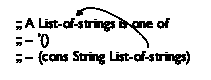 |  | 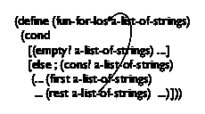 |
> > > | --- | --- | --- |
> > > 
> 图 51：数据定义和模板中的自引用箭头

### 9 使用自引用数据定义进行设计🔗 "链接到此处")

初看起来，自引用数据定义似乎比混合数据定义要复杂得多。但是，正如 contains-flatt?的例子所示，设计食谱的六个步骤仍然适用。尽管如此，在本节中，我们将设计食谱进行泛化，使其在自引用数据定义中表现得更好。新的部分涉及发现何时需要自引用数据定义的过程、推导模板以及定义函数体：

1.  如果一个问题陈述涉及任意大小的信息，你需要一个自引用的数据定义来表示它。到目前为止，你只看到过这样一个类，名称列表。图 51 的左侧显示了如何以相同的方式定义字符串列表。其他原子数据的列表以相同的方式工作。

    > > > 数字似乎也可以任意大。对于不精确数字，这是一种错觉。对于精确整数，这确实是情况。因此，处理整数是本章的一部分。

    为了使自引用数据定义有效，它必须满足两个条件。首先，它必须包含至少两个子句。其次，至少有一个子句不能引用正在定义的数据类别。明确地用箭头从数据定义中的引用指向被定义的项是良好的实践；参见图 51 以了解此类注释的示例。

    你必须通过创建数据示例来检查自引用数据定义的有效性。从一个不引用数据定义的子句开始；继续使用其他子句，使用第一个引用定义本身的示例。对于图 51 中的数据定义，因此你得到以下三个列表：

    | '() |  | 由第一个子句定义 |
    | --- | --- | --- |
    | ([cons](http://docs.racket-lang.org/htdp-langs/beginner.html#%28def._htdp-beginner._%28%28lib._lang%2Fhtdp-beginner..rkt%29._cons%29%29) "a" '()) |  | 根据第二个子句，前一个示例 |

    |

    &#124; ([cons](http://docs.racket-lang.org/htdp-langs/beginner.html#%28def._htdp-beginner._%28%28lib._lang%2Fhtdp-beginner..rkt%29._cons%29%29) "b" &#124;

    &#124; ([cons](http://docs.racket-lang.org/htdp-langs/beginner.html#%28def._htdp-beginner._%28%28lib._lang%2Fhtdp-beginner..rkt%29._cons%29%29) "a" &#124;

    &#124;     '())) &#124;

    |  | 根据第二个子句，前一个示例 |
    | --- | --- |

    如果无法从数据定义中生成示例，则该定义无效。如果你可以生成示例，但你不知道如何生成越来越大的示例，则定义可能不符合其解释。

1.  标题材料没有发生变化：签名、目的陈述和占位符定义。当你确实制定目的陈述时，要关注函数计算的内容，而不是它是如何进行的，特别是不要关注它是如何通过给定数据的实例的。

    这里有一个例子来使这个设计食谱具体化：

    > | ; List-of-strings -> Number |
    > | --- |
    > | ; counts how many strings alos contains |
    > | ([define](http://docs.racket-lang.org/htdp-langs/beginner.html#%28form._%28%28lib._lang%2Fhtdp-beginner..rkt%29._define%29%29) (how-many alos) |
    > |   0) |

    目的声明明确指出，该函数仅计算给定输入上的字符串数量；无需提前考虑如何将此想法作为 BSL 函数来表述。

1.  当涉及到功能示例时，务必多次处理使用数据定义中自引用子句的输入。这是后来制定涵盖整个函数定义的测试的最佳方式。

    对于我们的运行示例，目的声明几乎可以自行从数据示例生成功能示例：

    > | 给定 |  | 期望 |
    > | --- | --- | --- |
    > | '() |  | 0 |
    > | ([cons](http://docs.racket-lang.org/htdp-langs/beginner.html#%28def._htdp-beginner._%28%28lib._lang%2Fhtdp-beginner..rkt%29._cons%29%29) "a" '()) |  | 1 |
    > | ([cons](http://docs.racket-lang.org/htdp-langs/beginner.html#%28def._htdp-beginner._%28%28lib._lang%2Fhtdp-beginner..rkt%29._cons%29%29) "b" ([cons](http://docs.racket-lang.org/htdp-langs/beginner.html#%28def._htdp-beginner._%28%28lib._lang%2Fhtdp-beginner..rkt%29._cons%29%29) "a" '())) |  | 2 |

    第一行是关于空列表的，我们知道空列表不包含任何内容。第二行是一个包含一个字符串的列表，所以 1 是期望的答案。最后一行是关于包含两个字符串的列表。

1.  在核心上，一个自引用的数据定义看起来像是一个混合数据的数据定义。因此，模板的开发可以按照项目化和结构中的配方进行。具体来说，我们根据数据定义中的子句数量制定一个[cond](http://docs.racket-lang.org/htdp-langs/beginner.html#%28form._%28%28lib._lang%2Fhtdp-beginner..rkt%29._cond%29%29)表达式，将每个识别条件与数据定义中的相应子句相匹配，并在处理复合值的所有[cond](http://docs.racket-lang.org/htdp-langs/beginner.html#%28form._%28%28lib._lang%2Fhtdp-beginner..rkt%29._cond%29%29)行中写下适当的选择表达式。

    > > > | 问题 |  | 答案 |
    > > > | --- | --- | --- |
    > > > | 数据定义是否区分不同的数据子类？ |  | 您的模板需要与数据定义区分的子类一样多的[cond](http://docs.racket-lang.org/htdp-langs/beginner.html#%28form._%28%28lib._lang%2Fhtdp-beginner..rkt%29._cond%29%29)子句。 |
    > > > | 子类之间有何不同？ |  | 使用这些差异为每个子句制定一个条件。 |
    > > > | 是否有任何子句处理结构化值？ |  | 如果是，向子句中添加适当的选择表达式。 |
    > > > | 数据定义是否使用自引用？ |  | 为模板制定“自然递归”以表示数据定义的自引用。 |
    > > > | 如果数据定义引用了其他数据定义，这个交叉引用到另一个数据定义在哪里？ |  | 为其他数据定义专门化模板。参考此模板。见再次使用列举设计，设计食谱的第 4 步和第 5 步。 |
    > > > 
    > 图 52：如何将数据定义转换为模板

    图 52 将这个想法表达为一个问答游戏。在左侧列中，它陈述了关于参数数据定义的问题，而在右侧列中，它解释了答案对于构建模板的含义。

    如果你忽略最后一行，并将前三个问题应用于任何消耗字符串列表的函数，你将得到这个形状：

    > | ([定义](http://docs.racket-lang.org/htdp-langs/beginner.html#%28form._%28%28lib._lang%2Fhtdp-beginner..rkt%29._define%29%29) (fun-for-los alos) |
    > | --- |
    > |   ([cond](http://docs.racket-lang.org/htdp-langs/beginner.html#%28form._%28%28lib._lang%2Fhtdp-beginner..rkt%29._cond%29%29) |
    > |     [([empty?](http://docs.racket-lang.org/htdp-langs/beginner.html#%28def._htdp-beginner._%28%28lib._lang%2Fhtdp-beginner..rkt%29._empty~3f%29%29) alos) [...](http://docs.racket-lang.org/htdp-langs/beginner.html#%28form._%28%28lib._lang%2Fhtdp-beginner..rkt%29._......%29%29)] |
    > |     [[否则](http://docs.racket-lang.org/htdp-langs/beginner.html#%28form._%28%28lib._lang%2Fhtdp-beginner..rkt%29._else%29%29) |
    > |       ([...](http://docs.racket-lang.org/htdp-langs/beginner.html#%28form._%28%28lib._lang%2Fhtdp-beginner..rkt%29._......%29%29) ([first](http://docs.racket-lang.org/htdp-langs/beginner.html#%28def._htdp-beginner._%28%28lib._lang%2Fhtdp-beginner..rkt%29._first%29%29) alos) [...](http://docs.racket-lang.org/htdp-langs/beginner.html#%28form._%28%28lib._lang%2Fhtdp-beginner..rkt%29._......%29%29) ([rest](http://docs.racket-lang.org/htdp-langs/beginner.html#%28def._htdp-beginner._%28%28lib._lang%2Fhtdp-beginner..rkt%29._rest%29%29) alos) [...](http://docs.racket-lang.org/htdp-langs/beginner.html#%28form._%28%28lib._lang%2Fhtdp-beginner..rkt%29._......%29%29))])) |

    虽然，模板的目的是将数据定义表达为一个函数布局。也就是说，模板以代码的形式表达的数据定义，输入的数据定义则以英语和 BSL 的混合形式表达。因此，数据定义的所有重要部分都必须在模板中找到对应的部分，并且当数据定义是自引用的——<wbr>包含从定义内部指向被定义项的箭头时，也应遵循此指南。特别是，当数据定义在 i 个条款中自引用，并且在该条款中提到的结构的第 k 个字段时，模板应在第 i 个 [cond](http://docs.racket-lang.org/htdp-langs/beginner.html#%28form._%28%28lib._lang%2Fhtdp-beginner..rkt%29._cond%29%29) 条款和第 k 个字段的选择表达式中自引用。对于每个这样的选择表达式，添加一个指向函数参数的箭头。最后，你的模板必须具有与数据定义中相同数量的箭头。

    图 51 通过显示与数据定义并排的函数模板 List-of-strings 来说明这个想法。两者都包含一个从第二个条款——<wbr> [rest](http://docs.racket-lang.org/htdp-langs/beginner.html#%28def._htdp-beginner._%28%28lib._lang%2Fhtdp-beginner..rkt%29._rest%29%29) 字段和选择器——<wbr>开始的箭头，并指向各自定义的顶部。

    由于 BSL 和大多数编程语言都是面向文本的，因此必须使用箭头的替代品，即函数对适当的选择表达式的自我应用：

    > | ([define](http://docs.racket-lang.org/htdp-langs/beginner.html#%28form._%28%28lib._lang%2Fhtdp-beginner..rkt%29._define%29%29) (fun-for-los alo) |
    > | --- |
    > | ([cond](http://docs.racket-lang.org/htdp-langs/beginner.html#%28form._%28%28lib._lang%2Fhtdp-beginner..rkt%29._cond%29%29) |
    > | ([empty?](http://docs.racket-lang.org/htdp-langs/beginner.html#%28def._htdp-beginner._%28%28lib._lang%2Fhtdp-beginner..rkt%29._empty~3f%29%29) alo) [...](http://docs.racket-lang.org/htdp-langs/beginner.html#%28form._%28%28lib._lang%2Fhtdp-beginner..rkt%29._......%29%29) |
    > | ([else](http://docs.racket-lang.org/htdp-langs/beginner.html#%28form._%28%28lib._lang%2Fhtdp-beginner..rkt%29._else%29%29) |
    > | ([...](http://docs.racket-lang.org/htdp-langs/beginner.html#%28form._%28%28lib._lang%2Fhtdp-beginner..rkt%29._......%29%29) ([first](http://docs.racket-lang.org/htdp-langs/beginner.html#%28def._htdp-beginner._%28%28lib._lang%2Fhtdp-beginner..rkt%29._first%29%29) alo) [...](http://docs.racket-lang.org/htdp-langs/beginner.html#%28form._%28%28lib._lang%2Fhtdp-beginner..rkt%29._......%29%29) |
    > | [...] [fun-for-los ([rest alos))] [...] |  |  |

    我们将函数的自用称为递归，在本书的前四章中称为自然递归。

1.  对于函数体，我们首先从那些没有递归函数调用的基础情况（称为基础情况）的`cond`行开始。对应的答案通常很容易制定或已经作为示例给出。

    然后我们处理自引用的情况。我们首先提醒自己模板行中的每个表达式计算了什么。对于自然递归，我们假设函数已经按照我们的目的声明工作。这一步是“信仰跳跃”，但正如你将看到的，它总是有效的。

    然后剩下的就是组合各种值的问题。

    > > > | 问题 |  | 答案 |
    > > > | --- | --- | --- |
    > > > | 非递归的[cond](http://docs.racket-lang.org/htdp-langs/beginner.html#%28form._%28%28lib._lang%2Fhtdp-beginner..rkt%29._cond%29%29)子句的答案是什么？ |  | 示例应该告诉你这里需要哪些值。如果不是这样，制定适当的示例和测试。 |
    > > > | 递归子句中的选择表达式计算什么？ |  | 数据定义告诉你这些表达式提取了什么类型的数据，而数据定义的解释告诉你这些数据代表什么。 |
    > > > | 自然递归计算什么？ |  | 使用函数的目的声明来确定递归的值意味着什么，而不是它是如何计算这个答案的。如果目的声明没有告诉你答案，改进目的声明。 |
    > > > | 函数如何将这些值组合起来得到期望的答案？ |  | 在 BSL 中找到一个组合这些值的函数。或者，如果这不起作用，就希望有一个辅助函数。对于许多函数，这一步是直接的。目的、示例和模板一起告诉你哪个函数或表达式将可用的值组合成适当的结果。我们把这个函数或表达式称为组合器，稍微滥用了一下现有的术语。 |
    > > > 
    > 图 53：如何将模板转换为函数定义
    > 
    > > > | 问题 |  | 答案 |
    > > > | --- | --- | --- |
    > > > | So, if you are stuck here, ... |  | ... arrange the examples from the third step in a table. Place the given input in the first column and the desired output in the last column. In the intermediate columns enter the values of the selector expressions and the natural recursion(s). Add examples until you see a pattern emerge that suggests a combinator. |
    > > > | If the template refers to some other template, what does the auxiliary function compute? |  | Consult the other function’s purpose statement and examples to determine what it computes, and assume you may use the result even if you haven’t finished the design of this helper function. |
    > > > 
    > Figure 54: Turning a template into a function, the table method

    Figure 53 formulates the first four questions and answers for this step. Let’s use this game to complete the definition of how-many. Renaming the fun-for-los template to how-many gives us this much:

    > | ; List-of-strings -> Number |
    > | --- |
    > | ; determines how many strings are on alos |
    > | ([define](http://docs.racket-lang.org/htdp-langs/beginner.html#%28form._%28%28lib._lang%2Fhtdp-beginner..rkt%29._define%29%29) (how-many alos) |
    > | ; ([cond](http://docs.racket-lang.org/htdp-langs/beginner.html#%28form._%28%28lib._lang%2Fhtdp-beginner..rkt%29._cond%29%29) |
    > | ([([empty?](http://docs.racket-lang.org/htdp-langs/beginner.html#%28def._htdp-beginner._%28%28lib._lang%2Fhtdp-beginner..rkt%29._empty~3f%29%29) alos) [...](http://docs.racket-lang.org/htdp-langs/beginner.html#%28form._%28%28lib._lang%2Fhtdp-beginner..rkt%29._......%29%29)] |
    > | ; [[else](http://docs.racket-lang.org/htdp-langs/beginner.html#%28form._%28%28lib._lang%2Fhtdp-beginner..rkt%29._else%29%29) |
    > | ([...](http://docs.racket-lang.org/htdp-langs/beginner.html#%28form._%28%28lib._lang%2Fhtdp-beginner..rkt%29._......%29%29) ([first](http://docs.racket-lang.org/htdp-langs/beginner.html#%28def._htdp-beginner._%28%28lib._lang%2Fhtdp-beginner..rkt%29._first%29%29) alos) [...](http://docs.racket-lang.org/htdp-langs/beginner.html#%28form._%28%28lib._lang%2Fhtdp-beginner..rkt%29._......%29%29) |
    > | ;   [...](http://docs.racket-lang.org/htdp-langs/beginner.html#%28form._%28%28lib._lang%2Fhtdp-beginner..rkt%29._......%29%29) (how-many ([rest](http://docs.racket-lang.org/htdp-langs/beginner.html#%28def._htdp-beginner._%28%28lib._lang%2Fhtdp-beginner..rkt%29._rest%29%29) alos)) [...](http://docs.racket-lang.org/htdp-langs/beginner.html#%28form._%28%28lib._lang%2Fhtdp-beginner..rkt%29._......%29%29))])) |

    如功能示例所示，基本情况的答案是 0。第二条款中的两个表达式计算第一个项目以及字符串列表([rest](http://docs.racket-lang.org/htdp-langs/beginner.html#%28def._htdp-beginner._%28%28lib._lang%2Fhtdp-beginner..rkt%29._rest%29%29) alos)中的字符串数量。为了计算 alos 中所有字符串的数量，函数只需将后者表达式的值加 1：

    > | ([define](http://docs.racket-lang.org/htdp-langs/beginner.html#%28form._%28%28lib._lang%2Fhtdp-beginner..rkt%29._define%29%29) (how-many alos) |
    > | --- |
    > |   ([cond](http://docs.racket-lang.org/htdp-langs/beginner.html#%28form._%28%28lib._lang%2Fhtdp-beginner..rkt%29._cond%29%29) |
    > |   ([empty?](http://docs.racket-lang.org/htdp-langs/beginner.html#%28def._htdp-beginner._%28%28lib._lang%2Fhtdp-beginner..rkt%29._empty~3f%29%29) alos) 0] |
    > |   [[else](http://docs.racket-lang.org/htdp-langs/beginner.html#%28form._%28%28lib._lang%2Fhtdp-beginner..rkt%29._else%29%29) ([+](http://docs.racket-lang.org/htdp-langs/beginner.html#%28def._htdp-beginner._%28%28lib._lang%2Fhtdp-beginner..rkt%29._%2B%29%29) (how-many ([rest](http://docs.racket-lang.org/htdp-langs/beginner.html#%28def._htdp-beginner._%28%28lib._lang%2Fhtdp-beginner..rkt%29._rest%29%29) alos)) 1)])) |
    > 
    > > > 费利克斯·克洛克提出了这种基于表格的猜测组合器的方法。

    找到正确的方法将值组合成期望的答案并不总是那么容易。新手程序员常常在这个步骤上卡住。如图 54 所示，将功能示例安排成表格，同时列出模板中表达式的值是一个好主意。图 55 展示了我们的 how-many 示例的表格样子。最左边的列列出了样本输入，而最右边的列包含了这些输入的期望答案。中间的三列显示了模板表达式的值：([first](http://docs.racket-lang.org/htdp-langs/beginner.html#%28def._htdp-beginner._%28%28lib._lang%2Fhtdp-beginner..rkt%29._first%29%29) alos)，([rest](http://docs.racket-lang.org/htdp-langs/beginner.html#%28def._htdp-beginner._%28%28lib._lang%2Fhtdp-beginner..rkt%29._rest%29%29) alos)，以及(how-many ([rest](http://docs.racket-lang.org/htdp-langs/beginner.html#%28def._htdp-beginner._%28%28lib._lang%2Fhtdp-beginner..rkt%29._rest%29%29) alos))，这是自然的递归。如果你长时间地盯着这个表格，你会认识到结果列总是比自然递归列的值多 1。因此，你可以猜测

    > ([+](http://docs.racket-lang.org/htdp-langs/beginner.html#%28def._htdp-beginner._%28%28lib._lang%2Fhtdp-beginner..rkt%29._%2B%29%29) （如何计算（[rest](http://docs.racket-lang.org/htdp-langs/beginner.html#%28def._htdp-beginner._%28%28lib._lang%2Fhtdp-beginner..rkt%29._rest%29%29) alos)） 1）

    这是计算所需结果的表达式。由于 DrRacket 在检查这类猜测方面速度很快，所以将其插入并点击运行。如果这些例子转变为测试通过，那么仔细思考这个表达式，以说服自己它适用于所有列表；否则，向表中添加更多示例行，直到你有一个不同的想法。

    表格还指出，模板中的一些选择表达式对于实际定义可能是无关紧要的。在这里 ([first](http://docs.racket-lang.org/htdp-langs/beginner.html#%28def._htdp-beginner._%28%28lib._lang%2Fhtdp-beginner..rkt%29._first%29%29) alos) 对于计算最终答案不是必需的——这与 contains-flatt?形成鲜明对比，后者使用了模板中的两个表达式。

    在你阅读这本书的其余部分时，请记住，在许多情况下，组合步骤可以用 BSL 的原始操作符表示，比如，[+](http://docs.racket-lang.org/htdp-langs/beginner.html#%28def._htdp-beginner._%28%28lib._lang%2Fhtdp-beginner..rkt%29._%2B%29%29)，[and](http://docs.racket-lang.org/htdp-langs/beginner.html#%28form._%28%28lib._lang%2Fhtdp-beginner..rkt%29._and%29%29)，或者[cons](http://docs.racket-lang.org/htdp-langs/beginner.html#%28def._htdp-beginner._%28%28lib._lang%2Fhtdp-beginner..rkt%29._cons%29%29)。然而，在某些情况下，你可能需要许个愿，也就是说，设计一个辅助函数。最后，在其他情况下，你可能需要嵌套条件。

1.  最后，确保将所有示例转换为测试，这些测试通过，并且运行它们覆盖了函数的所有部分。

    这里是如何将 how-many 转换为测试的示例：

    > | ([check-expect](http://docs.racket-lang.org/htdp-langs/beginner.html#%28form._%28%28lib._lang%2Fhtdp-beginner..rkt%29._check-expect%29%29) （如何计算（）） 0） |
    > | --- |
    > | ([check-expect](http://docs.racket-lang.org/htdp-langs/beginner.html#%28form._%28%28lib._lang%2Fhtdp-beginner..rkt%29._check-expect%29%29) （如何计算（[cons](http://docs.racket-lang.org/htdp-langs/beginner.html#%28def._htdp-beginner._%28%28lib._lang%2Fhtdp-beginner..rkt%29._cons%29%29) "a" '())） 1） |
    > | ([check-expect](http://docs.racket-lang.org/htdp-langs/beginner.html#%28form._%28%28lib._lang%2Fhtdp-beginner..rkt%29._check-expect%29%29) |
    > | （如何计算（（[cons](http://docs.racket-lang.org/htdp-langs/beginner.html#%28def._htdp-beginner._%28%28lib._lang%2Fhtdp-beginner..rkt%29._cons%29%29) "b" ([cons](http://docs.racket-lang.org/htdp-langs/beginner.html#%28def._htdp-beginner._%28%28lib._lang%2Fhtdp-beginner..rkt%29._cons%29%29) "a" '()))) 2） |

    |  | ([cons](http://docs.racket-lang.org/htdp-langs/beginner.html#%28def._htdp-beginner._%28%28lib._lang%2Fhtdp-beginner..rkt%29._cons%29%29) "a" |

> > > |  |  | "a" |  | '() |  | 0 |  | 1 |
> > > | --- | --- | --- | --- | --- | --- | --- | --- | --- |
> > > 
> > > |  | '())) |
> > > 
> > > |
> > > 
> > > |  |   alos) |
> > > | --- | --- |
> > > 
> > > |  | 2 |  | 3 |
> > > 
> > > |  | ([cons](http://docs.racket-lang.org/htdp-langs/beginner.html#%28def._htdp-beginner._%28%28lib._lang%2Fhtdp-beginner..rkt%29._cons%29%29) "b" |
> > > 
> > > | (how-many |
> > > | --- |
> > > 
> > > |
> > > 
> > > |  | '())) |
> > > 
> > > | ([cons](http://docs.racket-lang.org/htdp-langs/beginner.html#%28def._htdp-beginner._%28%28lib._lang%2Fhtdp-beginner..rkt%29._cons%29%29) "a" |
> > > | --- |
> > > 
> > > |  |
> > > 
> > > |
> > > 
> > > | (how-many |
> > > 
> > > |  | ([rest](http://docs.racket-lang.org/htdp-langs/beginner.html#%28def._htdp-beginner._%28%28lib._lang%2Fhtdp-beginner..rkt%29._rest%29%29) alos) |
> > > 
> > > 图 55：列出参数、中间值和结果
> > > 
> > > |  | '()) |
> > > 
> > > |  |  | "b" |  |
> > > | --- | --- | --- | --- |
> > > 
> > > |  | '()) |
> > > 
> > > |  | ([rest](http://docs.racket-lang.org/htdp-langs/beginner.html#%28def._htdp-beginner._%28%28lib._lang%2Fhtdp-beginner..rkt%29._rest%29%29) |
> > > 
> > > |   '()))) |
> > > 
> > > | ([cons](http://docs.racket-lang.org/htdp-langs/beginner.html#%28def._htdp-beginner._%28%28lib._lang%2Fhtdp-beginner..rkt%29._cons%29%29) "a" |
> > > 
> > > |  | ([cons](http://docs.racket-lang.org/htdp-langs/beginner.html#%28def._htdp-beginner._%28%28lib._lang%2Fhtdp-beginner..rkt%29._cons%29%29) "b" |
> > > | --- | --- |
> > > 
> > > 记住，最好直接将示例作为测试来制定，BSL 允许这样做。这样做也有助于在需要回退到前一步的基于表的猜测方法时。
> > > 
> > > |  | "x" |
> > > 
> > > |  | 1 |  | 2 |
> > > | --- | --- | --- | --- |
> > > 
> > > |  | ([cons](http://docs.racket-lang.org/htdp-langs/beginner.html#%28def._htdp-beginner._%28%28lib._lang%2Fhtdp-beginner..rkt%29._cons%29%29) "b" |
> > > 
> > > |  | ([first](http://docs.racket-lang.org/htdp-langs/beginner.html#%28def._htdp-beginner._%28%28lib._lang%2Fhtdp-beginner..rkt%29._first%29%29) |
> > > 
> > > |  | ([cons](http://docs.racket-lang.org/htdp-langs/beginner.html#%28def._htdp-beginner._%28%28lib._lang%2Fhtdp-beginner..rkt%29._cons%29%29) "x" |
> > > 
> > > |  | ([cons](http://docs.racket-lang.org/htdp-langs/beginner.html#%28def._htdp-beginner._%28%28lib._lang%2Fhtdp-beginner..rkt%29._cons%29%29) "a" |
> > > 
> > > |
> > > 
> > > | alos |  |
> > > | --- | --- |
> > > 
> > > |  |  |
> > > 
> > > |
> > > 
> > > |
> > > 
> > > |  |  |
> > > | --- | --- |
> > > 
> |  |   ([cons](http://docs.racket-lang.org/htdp-langs/beginner.html#%28def._htdp-beginner._%28%28lib._lang%2Fhtdp-beginner..rkt%29._cons%29%29) "a" |

图 56 以表格形式总结了本节的设计配方。第一列命名了设计配方的步骤，第二列是每一步的预期结果。在第三列中，我们描述了帮助你达到那里的活动。你可能想将 图 56 复印在索引卡的一侧，并将你最喜欢的关于这个设计配方的问题和答案写在背面。然后带着它作为未来的参考。该图是根据我们在本章中使用的自引用列表定义定制的。像往常一样，练习有助于你掌握过程，所以我们强烈建议你解决以下练习，这些练习要求你将配方应用于几种不同的例子。

> > > > | 步骤 |  | 结果 |  | 活动 |
> > > > | --- | --- | --- | --- | --- |
> > > > | 问题分析 |  | 数据定义 |  | 开发信息的数据表示；为特定信息项创建示例并解释数据作为信息；识别自引用。 |
> > > > | 头部 |  | 签名；目的；占位符定义 |  | 使用定义的名称写下签名；制定一个简洁的目的陈述；创建一个产生指定范围内常量值的占位符函数。 |
> > > > | 示例 |  | 示例和测试 |  | 解决几个示例，至少每个数据定义中一个子句。 |
> > > > | 模板 |  | 函数模板 |  | 将数据定义翻译成模板：每个数据子句一个 [cond](http://docs.racket-lang.org/htdp-langs/beginner.html#%28form._%28%28lib._lang%2Fhtdp-beginner..rkt%29._cond%29%29) 子句；选择器，其中条件标识一个结构；每个自引用一个自然递归。 |
> > > > | 定义 |  | 完整定义 |  | 找到一个函数，将 [cond](http://docs.racket-lang.org/htdp-langs/beginner.html#%28form._%28%28lib._lang%2Fhtdp-beginner..rkt%29._cond%29%29) 子句中的表达式的值组合成预期的答案。 |
> > > > | 测试 |  | 验证测试 |  | 将它们转换为 [check-expect](http://docs.racket-lang.org/htdp-langs/beginner.html#%28form._%28%28lib._lang%2Fhtdp-beginner..rkt%29._check-expect%29%29) 测试并运行。 |
> > > > 
> 图 56：设计自引用数据函数

#### 9.1 指尖练习：列表🔗 "链接到此处")

练习 137。比较 contains-flatt? 的模板与 how-many 的模板。忽略函数名，它们是相同的。解释它们的相似之处。

练习 138。以下是一个表示金额序列的数据定义：

> | ; A List-of-amounts is one of: |
> | --- |
> | ; –  '() |
> | ; –  ([cons](http://docs.racket-lang.org/htdp-langs/beginner.html#%28def._htdp-beginner._%28%28lib._lang%2Fhtdp-beginner..rkt%29._cons%29%29)  PositiveNumber  List-of-amounts) |

创建一些示例以确保你理解数据定义。同时添加一个箭头表示自引用。

设计一个求和函数，它接受一个 金额列表 并计算金额的总和。使用 DrRacket 的步进器来查看 (sum l) 对于 金额列表 中的短列表 l 的处理方式。

练习 139。现在看看这个数据定义：

> | ; A List-of-numbers is one of: |
> | --- |
> | ; –  '() |
> | ; –  ([cons](http://docs.racket-lang.org/htdp-langs/beginner.html#%28def._htdp-beginner._%28%28lib._lang%2Fhtdp-beginner..rkt%29._cons%29%29) Number List-of-numbers) |

这个数据类的一些元素适合作为 练习 138 中的 sum 函数的输入，而另一些则不适合。

设计一个名为 pos? 的函数，它接受一个 数字列表 并确定所有数字是否为正数。换句话说，如果 (pos? l) 返回 #true，则 l 是 金额列表 的一个元素。使用 DrRacket 的步进器来理解 pos? 对于 ([cons](http://docs.racket-lang.org/htdp-langs/beginner.html#%28def._htdp-beginner._%28%28lib._lang%2Fhtdp-beginner..rkt%29._cons%29%29) 5 '()) 和 ([cons](http://docs.racket-lang.org/htdp-langs/beginner.html#%28def._htdp-beginner._%28%28lib._lang%2Fhtdp-beginner..rkt%29._cons%29%29) -1 '()) 的处理方式。

还要设计一个 checked-sum 函数。该函数接受一个 数字列表，如果输入也属于 金额列表，则产生它们的总和；否则发出错误信号。提示：回想一下使用 check-error。

sum 函数对于一个 数字列表 的元素计算什么？

练习 140。设计一个名为 all-true 的函数，它接受一个布尔值列表并确定所有这些值是否都是 #true。换句话说，如果列表中存在任何 #false，则函数返回 #false。

现在设计一个 one-true 函数，它接受一个布尔值列表并确定列表中是否至少有一个元素是 #true。

采用基于表格的编码方法。这可能有助于处理基本情况。使用 DrRacket 的步进器来查看这些函数如何处理列表 ([cons](http://docs.racket-lang.org/htdp-langs/beginner.html#%28def._htdp-beginner._%28%28lib._lang%2Fhtdp-beginner..rkt%29._cons%29%29) #true '()), ([cons](http://docs.racket-lang.org/htdp-langs/beginner.html#%28def._htdp-beginner._%28%28lib._lang%2Fhtdp-beginner..rkt%29._cons%29%29) #false '()), 和 ([cons](http://docs.racket-lang.org/htdp-langs/beginner.html#%28def._htdp-beginner._%28%28lib._lang%2Fhtdp-beginner..rkt%29._cons%29%29) #true ([cons](http://docs.racket-lang.org/htdp-langs/beginner.html#%28def._htdp-beginner._%28%28lib._lang%2Fhtdp-beginner..rkt%29._cons%29%29) #false '()))。

练习 141。如果你被要求设计一个名为 cat 的函数，该函数接受一个字符串列表并将它们全部连接成一个长字符串，你将得到以下部分定义：

> |   |   ; 字符串列表 -> 字符串 |
> | --- | --- |
> |   ; 将列表 l 中的所有字符串连接成一个长字符串 |
> |   |
> |   [[check-expect](http://docs.racket-lang.org/htdp-langs/beginner.html#%28form._%28%28lib._lang%2Fhtdp-beginner..rkt%29._check-expect%29%29) (cat '()) "") |
> |   [[check-expect](http://docs.racket-lang.org/htdp-langs/beginner.html#%28form._%28%28lib._lang%2Fhtdp-beginner..rkt%29._check-expect%29%29) (cat ([cons](http://docs.racket-lang.org/htdp-langs/beginner.html#%28def._htdp-beginner._%28%28lib._lang%2Fhtdp-beginner..rkt%29._cons%29%29) "a" ([cons](http://docs.racket-lang.org/htdp-langs/beginner.html#%28def._htdp-beginner._%28%28lib._lang%2Fhtdp-beginner..rkt%29._cons%29%29) "b" '()))) "ab") |
> |   [[check-expect](http://docs.racket-lang.org/htdp-langs/beginner.html#%28form._%28%28lib._lang%2Fhtdp-beginner..rkt%29._check-expect%29%29) |
> |   |   |   (cat ([cons](http://docs.racket-lang.org/htdp-langs/beginner.html#%28def._htdp-beginner._%28%28lib._lang%2Fhtdp-beginner..rkt%29._cons%29%29) "ab" ([cons](http://docs.racket-lang.org/htdp-langs/beginner.html#%28def._htdp-beginner._%28%28lib._lang%2Fhtdp-beginner..rkt%29._cons%29%29) "cd" ([cons](http://docs.racket-lang.org/htdp-langs/beginner.html#%28def._htdp-beginner._%28%28lib._lang%2Fhtdp-beginner..rkt%29._cons%29%29) "ef" '())))) |
> |   "abcdef" |
> |   |
> |   |   ([define](http://docs.racket-lang.org/htdp-langs/beginner.html#%28form._%28%28lib._lang%2Fhtdp-beginner..rkt%29._define%29%29) (cat l) |
> |   |   ([cond](http://docs.racket-lang.org/htdp-langs/beginner.html#%28form._%28%28lib._lang%2Fhtdp-beginner..rkt%29._cond%29%29) |
> |   |   |   [([empty?](http://docs.racket-lang.org/htdp-langs/beginner.html#%28def._htdp-beginner._%28%28lib._lang%2Fhtdp-beginner..rkt%29._empty~3f%29%29) l) ""] |
> |   [[else](http://docs.racket-lang.org/htdp-langs/beginner.html#%28form._%28%28lib._lang%2Fhtdp-beginner..rkt%29._else%29%29) ([...](http://docs.racket-lang.org/htdp-langs/beginner.html#%28form._%28%28lib._lang%2Fhtdp-beginner..rkt%29._......%29%29) ([first](http://docs.racket-lang.org/htdp-langs/beginner.html#%28def._htdp-beginner._%28%28lib._lang%2Fhtdp-beginner..rkt%29._first%29%29) l) [...](http://docs.racket-lang.org/htdp-langs/beginner.html#%28form._%28%28lib._lang%2Fhtdp-beginner..rkt%29._......%29%29) (cat ([rest](http://docs.racket-lang.org/htdp-langs/beginner.html#%28def._htdp-beginner._%28%28lib._lang%2Fhtdp-beginner..rkt%29._rest%29%29) l)) [...](http://docs.racket-lang.org/htdp-langs/beginner.html#%28form._%28%28lib._lang%2Fhtdp-beginner..rkt%29._......%29%29))])) |
> > > | l |  | ([first](http://docs.racket-lang.org/htdp-langs/beginner.html#%28def._htdp-beginner._%28%28lib._lang%2Fhtdp-beginner..rkt%29._first%29%29) l) |  | ([rest](http://docs.racket-lang.org/htdp-langs/beginner.html#%28def._htdp-beginner._%28%28lib._lang%2Fhtdp-beginner..rkt%29._rest%29%29) l) |  | (cat ([rest](http://docs.racket-lang.org/htdp-langs/beginner.html#%28def._htdp-beginner._%28%28lib._lang%2Fhtdp-beginner..rkt%29._rest%29%29) l)) |  | (cat l) |
> > > 
> > > |
> > > 
> > > |  ([cons](http://docs.racket-lang.org/htdp-langs/beginner.html#%28def._htdp-beginner._%28%28lib._lang%2Fhtdp-beginner..rkt%29._cons%29%29) "a" &#124;
> > > 
> > > |  ([cons](http://docs.racket-lang.org/htdp-langs/beginner.html#%28def._htdp-beginner._%28%28lib._lang%2Fhtdp-beginner..rkt%29._cons%29%29) "b" &#124;
> > > 
> > > |  ([cons](http://docs.racket-lang.org/htdp-langs/beginner.html#%28def._htdp-beginner._%28%28lib._lang%2Fhtdp-beginner..rkt%29._cons%29%29)  '())) &#124;
> > > 
> > > |  | ??? |  | ??? |  | ??? |  | "ab" |
> > > | --- | --- | --- | --- | --- | --- | --- | --- |
> > > 
> > > |
> > > 
> > > |  ([cons](http://docs.racket-lang.org/htdp-langs/beginner.html#%28def._htdp-beginner._%28%28lib._lang%2Fhtdp-beginner..rkt%29._cons%29%29) &#124;
> > > 
> > > |  "ab" &#124;
> > > 
> > > |  ([cons](http://docs.racket-lang.org/htdp-langs/beginner.html#%28def._htdp-beginner._%28%28lib._lang%2Fhtdp-beginner..rkt%29._cons%29%29) "cd" &#124;
> > > 
> > > |  ([cons](http://docs.racket-lang.org/htdp-langs/beginner.html#%28def._htdp-beginner._%28%28lib._lang%2Fhtdp-beginner..rkt%29._cons%29%29) "ef" &#124;
> > > 
> > > |  ([cons](http://docs.racket-lang.org/htdp-langs/beginner.html#%28def._htdp-beginner._%28%28lib._lang%2Fhtdp-beginner..rkt%29._cons%29%29)  '())) &#124;
> > > 
> > > |  | ??? |  | ??? |  | ??? |  | "abcdef" |
> > > | --- | --- | --- | --- | --- | --- | --- | --- |
> > > 
> 图 57：猫的表格

在 图 57 中的表格中填写。猜测一个函数，可以从子表达式的计算值中创建所需的结果。

使用 DrRacket 的步进器评估 (cat  ([cons](http://docs.racket-lang.org/htdp-langs/beginner.html#%28def._htdp-beginner._%28%28lib._lang%2Fhtdp-beginner..rkt%29._cons%29%29)  "a"  '())).

练习 142\. 设计 ill-sized? 函数，它接受一个图像列表 loi 和一个正数 n。它产生 loi 中第一个不是 n×n 正方形的图像；如果找不到这样的图像，则产生 #false。

提示 使用

> | ; 图像或布尔值之一： |
> | --- |
> | ; – 图像 |
> | ; – #false |

为签名结果部分。

#### 9.2 非空列表🔗 "链接到此处")

现在你已经足够了解如何使用 [cons](http://docs.racket-lang.org/htdp-langs/beginner.html#%28def._htdp-beginner._%28%28lib._lang%2Fhtdp-beginner..rkt%29._cons%29%29) 并为列表创建数据定义。如果你解决了前一节末尾的（一些）练习，你可以处理各种类型的数字列表、布尔值列表、图像列表等。在本节中，我们将继续探讨列表是什么以及如何处理它们。

让我们从看起来简单的计算温度列表平均值的问题开始。为了简化，我们提供了数据定义：

> | ; 温度列表之一： |
> | --- |
> | ; –  '() |
> |   ; –  ([cons](http://docs.racket-lang.org/htdp-langs/beginner.html#%28def._htdp-beginner._%28%28lib._lang%2Fhtdp-beginner..rkt%29._cons%29%29) CTemperature List-of-temperatures) |
> |   |
> |   ([define](http://docs.racket-lang.org/htdp-langs/beginner.html#%28form._%28%28lib._lang%2Fhtdp-beginner..rkt%29._define%29%29) ABSOLUTE0 -272) |
> |   ; 一个 CTemperature 是一个大于 ABSOLUTE0 的 Number。 |

对于我们的目的，你应该将温度视为普通的数字，但第二个数据定义提醒你，在现实中并非所有数字都是温度，你应该记住这一点。头部材料很简单：

> |   ; List-of-temperatures -> Number |
> | --- |
> |   ; 计算平均温度 |
> |   ([define](http://docs.racket-lang.org/htdp-langs/beginner.html#%28form._%28%28lib._lang%2Fhtdp-beginner..rkt%29._define%29%29) (average alot) 0) |

为这个问题构造示例也很简单，所以我们只制定了一个测试：

> |   ([check-expect](http://docs.racket-lang.org/htdp-langs/beginner.html#%28form._%28%28lib._lang%2Fhtdp-beginner..rkt%29._check-expect%29%29) |
> | --- |
> |   (average ([cons](http://docs.racket-lang.org/htdp-langs/beginner.html#%28def._htdp-beginner._%28%28lib._lang%2Fhtdp-beginner..rkt%29._cons%29%29) 1 ([cons](http://docs.racket-lang.org/htdp-langs/beginner.html#%28def._htdp-beginner._%28%28lib._lang%2Fhtdp-beginner..rkt%29._cons%29%29) 2 ([cons](http://docs.racket-lang.org/htdp-langs/beginner.html#%28def._htdp-beginner._%28%28lib._lang%2Fhtdp-beginner..rkt%29._cons%29%29) 3 '()))) 2) |

预期结果当然是温度总和除以温度数量。稍加思考就会知道，平均值的模板应该与我们迄今为止看到的类似：

> |   ([define](http://docs.racket-lang.org/htdp-langs/beginner.html#%28form._%28%28lib._lang%2Fhtdp-beginner..rkt%29._define%29%29) (average alot) |
> | --- |
> |   ([cond](http://docs.racket-lang.org/htdp-langs/beginner.html#%28form._%28%28lib._lang%2Fhtdp-beginner..rkt%29._cond%29%29) |
> |   ([([empty?](http://docs.racket-lang.org/htdp-langs/beginner.html#%28def._htdp-beginner._%28%28lib._lang%2Fhtdp-beginner..rkt%29._empty~3f%29%29) alot) [...](http://docs.racket-lang.org/htdp-langs/beginner.html#%28form._%28%28lib._lang%2Fhtdp-beginner..rkt%29._......%29%29))] |
> |     ([([cons?](http://docs.racket-lang.org/htdp-langs/beginner.html#%28def._htdp-beginner._%28%28lib._lang%2Fhtdp-beginner..rkt%29._cons~3f%29%29) alot) |
> | [...](http://docs.racket-lang.org/htdp-langs/beginner.html#%28form._%28%28lib._lang%2Fhtdp-beginner..rkt%29._......%29%29) ([first](http://docs.racket-lang.org/htdp-langs/beginner.html#%28def._htdp-beginner._%28%28lib._lang%2Fhtdp-beginner..rkt%29._first%29%29) alot) [...](http://docs.racket-lang.org/htdp-langs/beginner.html#%28form._%28%28lib._lang%2Fhtdp-beginner..rkt%29._......%29%29) |
> | ... (average ([rest](http://docs.racket-lang.org/htdp-langs/beginner.html#%28def._htdp-beginner._%28%28lib._lang%2Fhtdp-beginner..rkt%29._rest%29%29) alot)) [...](http://docs.racket-lang.org/htdp-langs/beginner.html#%28form._%28%28lib._lang%2Fhtdp-beginner..rkt%29._......%29%29))) |

两个 [cond](http://docs.racket-lang.org/htdp-langs/beginner.html#%28form._%28%28lib._lang%2Fhtdp-beginner..rkt%29._cond%29%29) 条件反映了数据定义的两个条件；问题区分了空列表和非空列表；并且由于数据定义中的自引用，需要自然递归。

然而，将此模板转换为函数定义非常困难。第一个 [cond](http://docs.racket-lang.org/htdp-langs/beginner.html#%28form._%28%28lib._lang%2Fhtdp-beginner..rkt%29._cond%29%29) 条件需要表示空温度集合平均值的数字，但不存在这样的数字。同样，第二个条件需要将温度和剩余温度的平均值组合成新的平均值的函数。尽管可能，但以这种方式计算平均值非常不自然。

当我们计算温度的平均值时，我们将它们的总和除以它们的数量。我们在提出我们的简单示例时已经这样说过。这句话表明平均是一个由三个任务组成的函数：求和、计数和除法。我们从 固定大小数据 的指南中得知，我们应该为每个任务编写一个函数，如果我们这样做，平均的设计就显而易见了：

> | ; 温度列表 -> 数字 |
> | --- |
> | ; 计算平均温度 |
> | ([define](http://docs.racket-lang.org/htdp-langs/beginner.html#%28form._%28%28lib._lang%2Fhtdp-beginner..rkt%29._define%29%29) (average alot) |
> |   ([/](http://docs.racket-lang.org/htdp-langs/beginner.html#%28def._htdp-beginner._%28%28lib._lang%2Fhtdp-beginner..rkt%29._%2F%29%29) (sum alot) (how-many alot))) |
> |   |
> | ; 温度列表 -> 数字 |
> | ; 将给定列表中的温度相加 |
> | ([define](http://docs.racket-lang.org/htdp-langs/beginner.html#%28form._%28%28lib._lang%2Fhtdp-beginner..rkt%29._define%29%29) (sum alot) 0) |
> |   |
> | ; 温度列表 -> 数字 |
> | ; counts the temperatures on the given list |
> | ([define](http://docs.racket-lang.org/htdp-langs/beginner.html#%28form._%28%28lib._lang%2Fhtdp-beginner..rkt%29._define%29%29) (how-many alot) 0) |

当然，最后两个函数定义是愿望，我们需要为它们设计完整的定义。这样做很容易，因为上面的 how-many 对 List-of-strings 和 List-of-temperatures 都适用（为什么？）并且因为 sum 的设计遵循相同的旧程序：

> | ; List-of-temperatures -> Number |
> | --- |
> | ; adds up the temperatures on the given list |
> | ([define](http://docs.racket-lang.org/htdp-langs/beginner.html#%28form._%28%28lib._lang%2Fhtdp-beginner..rkt%29._define%29%29) (sum alot) |
> |   ([cond](http://docs.racket-lang.org/htdp-langs/beginner.html#%28form._%28%28lib._lang%2Fhtdp-beginner..rkt%29._cond%29%29) |
> | |   [([empty?](http://docs.racket-lang.org/htdp-langs/beginner.html#%28def._htdp-beginner._%28%28lib._lang%2Fhtdp-beginner..rkt%29._empty~3f%29%29) alot) 0] |
> |     [[else](http://docs.racket-lang.org/htdp-langs/beginner.html#%28form._%28%28lib._lang%2Fhtdp-beginner..rkt%29._else%29%29) ([+](http://docs.racket-lang.org/htdp-langs/beginner.html#%28def._htdp-beginner._%28%28lib._lang%2Fhtdp-beginner..rkt%29._%2B%29%29) ([first](http://docs.racket-lang.org/htdp-langs/beginner.html#%28def._htdp-beginner._%28%28lib._lang%2Fhtdp-beginner..rkt%29._first%29%29) alot) (sum ([rest](http://docs.racket-lang.org/htdp-langs/beginner.html#%28def._htdp-beginner._%28%28lib._lang%2Fhtdp-beginner..rkt%29._rest%29%29) alot)))])) |

停止！使用平均值的示例来创建一个求和的示例，并确保测试运行正常。然后运行平均值的测试。

当你现在阅读平均值的这个定义时，它显然是正确的，因为它直接对应于每个人在学校学到的关于平均的知识。然而，程序不仅为我们运行，也为其他人运行。特别是，其他人应该能够阅读签名并使用该函数，并期望得到一个有信息的答案。但是，我们的平均值定义不适用于温度的空列表。

练习 143。确定在 DrRacket 中应用空列表时平均值的行为。然后设计 checked-average 函数，当它应用于 '() 时产生一个有信息的错误消息。

> > > 在数学中，我们会说练习 143 显示平均值是一个部分函数，因为它在应用于 '() 时引发错误。

另一种解决方案是通过签名通知未来的读者，平均值不适用于空列表。为此，我们需要一个不包含 '() 的列表数据表示，如下所示：

> | ; An NEList-of-temperatures is one of: |
> | --- |
> | ; – ??? |
> | ; –  ([cons](http://docs.racket-lang.org/htdp-langs/beginner.html#%28def._htdp-beginner._%28%28lib._lang%2Fhtdp-beginner..rkt%29._cons%29%29)  CTemperature  NEList-of-temperatures) |

问题是我们应该用什么来替换“??？”以便排除空列表，但仍然可以构造所有其他温度列表。一个提示是，虽然空列表是最短的列表，但任何只有一个温度的列表是下一个最短的列表。反过来，这表明第一个子句应该描述所有可能的一个温度的列表：

> | ; An NEList-of-temperatures is one of: |
> | --- |
> | ; –  ([cons](http://docs.racket-lang.org/htdp-langs/beginner.html#%28def._htdp-beginner._%28%28lib._lang%2Fhtdp-beginner..rkt%29._cons%29%29)  CTemperature  '()) |
> | ; –  ([cons](http://docs.racket-lang.org/htdp-langs/beginner.html#%28def._htdp-beginner._%28%28lib._lang%2Fhtdp-beginner..rkt%29._cons%29%29)  CTemperature  NEList-of-temperatures) |
> | ; interpretation non-empty lists of Celsius temperatures |

虽然这个定义与前面的列表定义不同，但它包含了关键元素：一个自引用和一个不使用自引用的子句。严格遵循设计食谱要求你为 NEList-of-temperatures 举一些例子，以确保定义有意义。一如既往，你应该从基本子句开始，这意味着示例必须看起来像这样：

> ([cons](http://docs.racket-lang.org/htdp-langs/beginner.html#%28def._htdp-beginner._%28%28lib._lang%2Fhtdp-beginner..rkt%29._cons%29%29) c '())

其中 c 代表一个 CTemperature，例如这样：([cons](http://docs.racket-lang.org/htdp-langs/beginner.html#%28def._htdp-beginner._%28%28lib._lang%2Fhtdp-beginner..rkt%29._cons%29%29)  ABSOLUTE0  '()). 此外，很明显，List-of-temperatures 的所有非空元素也都是新数据类 ([cons](http://docs.racket-lang.org/htdp-langs/beginner.html#%28def._htdp-beginner._%28%28lib._lang%2Fhtdp-beginner..rkt%29._cons%29%29)  1  ([cons](http://docs.racket-lang.org/htdp-langs/beginner.html#%28def._htdp-beginner._%28%28lib._lang%2Fhtdp-beginner..rkt%29._cons%29%29)  2  ([cons](http://docs.racket-lang.org/htdp-langs/beginner.html#%28def._htdp-beginner._%28%28lib._lang%2Fhtdp-beginner..rkt%29._cons%29%29)  3  '()))) 的元素，如果 ([cons](http://docs.racket-lang.org/htdp-langs/beginner.html#%28def._htdp-beginner._%28%28lib._lang%2Fhtdp-beginner..rkt%29._cons%29%29)  2  ([cons](http://docs.racket-lang.org/htdp-langs/beginner.html#%28def._htdp-beginner._%28%28lib._lang%2Fhtdp-beginner..rkt%29._cons%29%29)  3  '())) 符合条件，并且 ([cons](http://docs.racket-lang.org/htdp-langs/beginner.html#%28def._htdp-beginner._%28%28lib._lang%2Fhtdp-beginner..rkt%29._cons%29%29)  2  ([cons](http://docs.racket-lang.org/htdp-langs/beginner.html#%28def._htdp-beginner._%28%28lib._lang%2Fhtdp-beginner..rkt%29._cons%29%29)  3  '())) 属于 NEList-of-temperatures，因为 ([cons](http://docs.racket-lang.org/htdp-langs/beginner.html#%28def._htdp-beginner._%28%28lib._lang%2Fhtdp-beginner..rkt%29._cons%29%29)  3  '()) 是 NEList-of-temperatures 的一个元素，如前所述。请自行检查，NEList-of-temperatures 的大小没有限制。现在让我们回到设计平均数的问题，以便每个人都知道它仅适用于非空列表。有了 NEList-of-temperatures 的定义，我们现在有手段在签名中表达我们的意图：这种替代开发解释说，在这种情况下，我们可以缩小平均数的定义域，并创建一个全函数。

> | ; NEList-of-temperatures -> Number |
> | --- |
> | 计算平均温度 |
> |   |
> | ([check-expect](http://docs.racket-lang.org/htdp-langs/beginner.html#%28form._%28%28lib._lang%2Fhtdp-beginner..rkt%29._check-expect%29%29) (average ([cons](http://docs.racket-lang.org/htdp-langs/beginner.html#%28def._htdp-beginner._%28%28lib._lang%2Fhtdp-beginner..rkt%29._cons%29%29) 1 ([cons](http://docs.racket-lang.org/htdp-langs/beginner.html#%28def._htdp-beginner._%28%28lib._lang%2Fhtdp-beginner..rkt%29._cons%29%29) 2 ([cons](http://docs.racket-lang.org/htdp-langs/beginner.html#%28def._htdp-beginner._%28%28lib._lang%2Fhtdp-beginner..rkt%29._cons%29%29) 3 '())))) |
> | 2) |
> |   |
> | ([define](http://docs.racket-lang.org/htdp-langs/beginner.html#%28form._%28%28lib._lang%2Fhtdp-beginner..rkt%29._define%29%29) (average ne-l) |
> |   ([/](http://docs.racket-lang.org/htdp-langs/beginner.html#%28def._htdp-beginner._%28%28lib._lang%2Fhtdp-beginner..rkt%29._%2F%29%29) (sum ne-l) |
> |   (how-many ne-l))) |

自然地，其余部分保持不变：目的声明、示例测试和函数定义。毕竟，计算平均值的想法假设了一个非空数字集合，这正是我们讨论的全部要点。

练习 144。即使求和和 how-many 是为 NEList-of-temperatures 的输入设计的，它们也会为 NEList-of-temperatures 工作吗？如果你认为它们不会工作，请提供反例。如果你认为它们会工作，请解释原因。

尽管如此，这个定义也提出了如何设计求和和 how-many 的问题，因为它们现在消耗的是 NEList-of-temperatures 的实例。以下是设计食谱的前三个步骤的明显结果：

> | ; NEList-of-temperatures -> Number |
> | --- |
> | ; 计算给定温度的总和 |
> | ([check-expect](http://docs.racket-lang.org/htdp-langs/beginner.html#%28form._%28%28lib._lang%2Fhtdp-beginner..rkt%29._check-expect%29%29) |
> |   (sum ([cons](http://docs.racket-lang.org/htdp-langs/beginner.html#%28def._htdp-beginner._%28%28lib._lang%2Fhtdp-beginner..rkt%29._cons%29%29) 1 ([cons](http://docs.racket-lang.org/htdp-langs/beginner.html#%28def._htdp-beginner._%28%28lib._lang%2Fhtdp-beginner..rkt%29._cons%29%29) 2 ([cons](http://docs.racket-lang.org/htdp-langs/beginner.html#%28def._htdp-beginner._%28%28lib._lang%2Fhtdp-beginner..rkt%29._cons%29%29) 3 '())))) 6) |
> | ([define](http://docs.racket-lang.org/htdp-langs/beginner.html#%28form._%28%28lib._lang%2Fhtdp-beginner..rkt%29._define%29%29) (sum ne-l) 0) |

该示例改编自平均值的示例；虚拟定义产生了一个数字，但不是给定测试的正确数字。第四步是设计 NEList-of-temperatures 求和的最有趣的部分。所有先前的设计示例都需要一个模板来区分空列表和非空列表，即[cons](http://docs.racket-lang.org/htdp-langs/beginner.html#%28def._htdp-beginner._%28%28lib._lang%2Fhtdp-beginner..rkt%29._cons%29%29)ed 列表，因为数据定义具有适当的形状。对于 NEList-of-temperatures 来说，情况并非如此。这里两个子句都添加了[cons](http://docs.racket-lang.org/htdp-langs/beginner.html#%28def._htdp-beginner._%28%28lib._lang%2Fhtdp-beginner..rkt%29._cons%29%29)ed 列表。然而，这两个子句在列表的[rest](http://docs.racket-lang.org/htdp-langs/beginner.html#%28def._htdp-beginner._%28%28lib._lang%2Fhtdp-beginner..rkt%29._rest%29%29)字段上有所不同。特别是，第一个子句始终在[rest](http://docs.racket-lang.org/htdp-langs/beginner.html#%28def._htdp-beginner._%28%28lib._lang%2Fhtdp-beginner..rkt%29._rest%29%29)字段中使用'()，而第二个子句则使用[cons](http://docs.racket-lang.org/htdp-langs/beginner.html#%28def._htdp-beginner._%28%28lib._lang%2Fhtdp-beginner..rkt%29._cons%29%29)代替。因此，区分第一种数据类型和第二种数据的正确条件是提取[rest](http://docs.racket-lang.org/htdp-langs/beginner.html#%28def._htdp-beginner._%28%28lib._lang%2Fhtdp-beginner..rkt%29._rest%29%29)字段，然后使用[empty?](http://docs.racket-lang.org/htdp-langs/beginner.html#%28def._htdp-beginner._%28%28lib._lang%2Fhtdp-beginner..rkt%29._empty~3f%29%29):

> | ; NEList-of-temperatures -> Number |
> | --- |
> | ([define](http://docs.racket-lang.org/htdp-langs/beginner.html#%28form._%28%28lib._lang%2Fhtdp-beginner..rkt%29._define%29%29) (sum ne-l) |
> | ([cond](http://docs.racket-lang.org/htdp-langs/beginner.html#%28form._%28%28lib._lang%2Fhtdp-beginner..rkt%29._cond%29%29) |
> |   [([empty?](http://docs.racket-lang.org/htdp-langs/beginner.html#%28def._htdp-beginner._%28%28lib._lang%2Fhtdp-beginner..rkt%29._empty~3f%29%29) ([rest](http://docs.racket-lang.org/htdp-langs/beginner.html#%28def._htdp-beginner._%28%28lib._lang%2Fhtdp-beginner..rkt%29._rest%29%29) ne-l)) [...](http://docs.racket-lang.org/htdp-langs/beginner.html#%28form._%28%28lib._lang%2Fhtdp-beginner..rkt%29._......%29%29)] |
> |   [[else](http://docs.racket-lang.org/htdp-langs/beginner.html#%28form._%28%28lib._lang%2Fhtdp-beginner..rkt%29._else%29%29) [...](http://docs.racket-lang.org/htdp-langs/beginner.html#%28form._%28%28lib._lang%2Fhtdp-beginner..rkt%29._......%29%29)])) |

这里 [否则](http://docs.racket-lang.org/htdp-langs/beginner.html#%28form._%28%28lib._lang%2Fhtdp-beginner..rkt%29._else%29%29) 替换了 ([cons?](http://docs.racket-lang.org/htdp-langs/beginner.html#%28def._htdp-beginner._%28%28lib._lang%2Fhtdp-beginner..rkt%29._cons~3f%29%29)  ([rest](http://docs.racket-lang.org/htdp-langs/beginner.html#%28def._htdp-beginner._%28%28lib._lang%2Fhtdp-beginner..rkt%29._rest%29%29)  ne-l)).接下来你应该检查这两个子句，确定是否有一个或两个子句将 ne-l 当作结构来处理。这当然是正确的，这在无条件使用 [rest](http://docs.racket-lang.org/htdp-langs/beginner.html#%28def._htdp-beginner._%28%28lib._lang%2Fhtdp-beginner..rkt%29._rest%29%29) 来处理 ne-l 的例子中得到了证明。换句话说，向两个子句中添加适当的选择表达式：

> | ([定义](http://docs.racket-lang.org/htdp-langs/beginner.html#%28form._%28%28lib._lang%2Fhtdp-beginner..rkt%29._define%29%29) (sum ne-l) |
> | --- |
> |   ([条件](http://docs.racket-lang.org/htdp-langs/beginner.html#%28form._%28%28lib._lang%2Fhtdp-beginner..rkt%29._cond%29%29) |
> |     [([empty?](http://docs.racket-lang.org/htdp-langs/beginner.html#%28def._htdp-beginner._%28%28lib._lang%2Fhtdp-beginner..rkt%29._empty~3f%29%29) ([rest](http://docs.racket-lang.org/htdp-langs/beginner.html#%28def._htdp-beginner._%28%28lib._lang%2Fhtdp-beginner..rkt%29._rest%29%29) ne-l)) ([...](http://docs.racket-lang.org/htdp-langs/beginner.html#%28form._%28%28lib._lang%2Fhtdp-beginner..rkt%29._......%29%29) ([first](http://docs.racket-lang.org/htdp-langs/beginner.html#%28def._htdp-beginner._%28%28lib._lang%2Fhtdp-beginner..rkt%29._first%29%29) ne-l) [...](http://docs.racket-lang.org/htdp-langs/beginner.html#%28form._%28%28lib._lang%2Fhtdp-beginner..rkt%29._......%29%29))] |
> |     [[否则](http://docs.racket-lang.org/htdp-langs/beginner.html#%28form._%28%28lib._lang%2Fhtdp-beginner..rkt%29._else%29%29) ([...](http://docs.racket-lang.org/htdp-langs/beginner.html#%28form._%28%28lib._lang%2Fhtdp-beginner..rkt%29._......%29%29) ([first](http://docs.racket-lang.org/htdp-langs/beginner.html#%28def._htdp-beginner._%28%28lib._lang%2Fhtdp-beginner..rkt%29._first%29%29) ne-l) [...](http://docs.racket-lang.org/htdp-langs/beginner.html#%28form._%28%28lib._lang%2Fhtdp-beginner..rkt%29._......%29%29) ([rest](http://docs.racket-lang.org/htdp-langs/beginner.html#%28def._htdp-beginner._%28%28lib._lang%2Fhtdp-beginner..rkt%29._rest%29%29) ne-l) [...](http://docs.racket-lang.org/htdp-langs/beginner.html#%28form._%28%28lib._lang%2Fhtdp-beginner..rkt%29._......%29%29))])) |

在继续阅读之前，解释为什么第一个子句不包含选择表达式([rest](http://docs.racket-lang.org/htdp-langs/beginner.html#%28def._htdp-beginner._%28%28lib._lang%2Fhtdp-beginner..rkt%29._rest%29%29) ne-l))。模板设计的最后一个问题涉及数据定义中的自引用。正如你所知，NEList-of-temperatures 包含一个，因此 sum 的模板需要一次递归使用：

> | ([define](http://docs.racket-lang.org/htdp-langs/beginner.html#%28form._%28%28lib._lang%2Fhtdp-beginner..rkt%29._define%29%29) (sum ne-l) |
> | --- |
> | ([cond](http://docs.racket-lang.org/htdp-langs/beginner.html#%28form._%28%28lib._lang%2Fhtdp-beginner..rkt%29._cond%29%29) |
> | ([...](http://docs.racket-lang.org/htdp-langs/beginner.html#%28form._%28%28lib._lang%2Fhtdp-beginner..rkt%29._......%29%29) [([empty?](http://docs.racket-lang.org/htdp-langs/beginner.html#%28def._htdp-beginner._%28%28lib._lang%2Fhtdp-beginner..rkt%29._empty~3f%29%29) ([rest](http://docs.racket-lang.org/htdp-langs/beginner.html#%28def._htdp-beginner._%28%28lib._lang%2Fhtdp-beginner..rkt%29._rest%29%29) ne-l)) [...](http://docs.racket-lang.org/htdp-langs/beginner.html#%28form._%28%28lib._lang%2Fhtdp-beginner..rkt%29._......%29%29) ([first](http://docs.racket-lang.org/htdp-langs/beginner.html#%28def._htdp-beginner._%28%28lib._lang%2Fhtdp-beginner..rkt%29._first%29%29) ne-l) [...](http://docs.racket-lang.org/htdp-langs/beginner.html#%28form._%28%28lib._lang%2Fhtdp-beginner..rkt%29._......%29%29)]]) |
> | ([else](http://docs.racket-lang.org/htdp-langs/beginner.html#%28form._%28%28lib._lang%2Fhtdp-beginner..rkt%29._else%29%29) |
> | ([...](http://docs.racket-lang.org/htdp-langs/beginner.html#%28form._%28%28lib._lang%2Fhtdp-beginner..rkt%29._......%29%29) ([first](http://docs.racket-lang.org/htdp-langs/beginner.html#%28def._htdp-beginner._%28%28lib._lang%2Fhtdp-beginner..rkt%29._first%29%29) ne-l) [...](http://docs.racket-lang.org/htdp-langs/beginner.html#%28form._%28%28lib._lang%2Fhtdp-beginner..rkt%29._......%29%29) (sum ([rest](http://docs.racket-lang.org/htdp-langs/beginner.html#%28def._htdp-beginner._%28%28lib._lang%2Fhtdp-beginner..rkt%29._rest%29%29) ne-l)) [...](http://docs.racket-lang.org/htdp-langs/beginner.html#%28form._%28%28lib._lang%2Fhtdp-beginner..rkt%29._......%29%29))])) |

具体来说，在第二个子句中，sum 是在 ([rest](http://docs.racket-lang.org/htdp-langs/beginner.html#%28def._htdp-beginner._%28%28lib._lang%2Fhtdp-beginner..rkt%29._rest%29%29)  ne-l) 上调用的，因为数据定义在类似的位置是自引用的。对于第五个设计步骤，让我们了解我们已经拥有了多少。由于第一个 [cond](http://docs.racket-lang.org/htdp-langs/beginner.html#%28form._%28%28lib._lang%2Fhtdp-beginner..rkt%29._cond%29%29) 子句看起来比带有递归函数调用的第二个子句简单得多，你应该从那个开始。在这种情况下，条件表明 sum 是应用于只有一个温度的列表上，([first](http://docs.racket-lang.org/htdp-langs/beginner.html#%28def._htdp-beginner._%28%28lib._lang%2Fhtdp-beginner..rkt%29._first%29%29)  ne-l)。显然，这个单一的温度是给定列表上所有温度的总和：

> |   ([define](http://docs.racket-lang.org/htdp-langs/beginner.html#%28form._%28%28lib._lang%2Fhtdp-beginner..rkt%29._define%29%29) (sum ne-l) |
> | --- |
> |   ([cond](http://docs.racket-lang.org/htdp-langs/beginner.html#%28form._%28%28lib._lang%2Fhtdp-beginner..rkt%29._cond%29%29) |
> |   [([empty?](http://docs.racket-lang.org/htdp-langs/beginner.html#%28def._htdp-beginner._%28%28lib._lang%2Fhtdp-beginner..rkt%29._empty~3f%29%29) ([rest](http://docs.racket-lang.org/htdp-langs/beginner.html#%28def._htdp-beginner._%28%28lib._lang%2Fhtdp-beginner..rkt%29._rest%29%29) ne-l)) ([first](http://docs.racket-lang.org/htdp-langs/beginner.html#%28def._htdp-beginner._%28%28lib._lang%2Fhtdp-beginner..rkt%29._first%29%29) ne-l)] |
> |   [[else](http://docs.racket-lang.org/htdp-langs/beginner.html#%28form._%28%28lib._lang%2Fhtdp-beginner..rkt%29._else%29%29) |
> |   [...](http://docs.racket-lang.org/htdp-langs/beginner.html#%28form._%28%28lib._lang%2Fhtdp-beginner..rkt%29._......%29%29) ([first](http://docs.racket-lang.org/htdp-langs/beginner.html#%28def._htdp-beginner._%28%28lib._lang%2Fhtdp-beginner..rkt%29._first%29%29) ne-l) [...](http://docs.racket-lang.org/htdp-langs/beginner.html#%28form._%28%28lib._lang%2Fhtdp-beginner..rkt%29._......%29%29) (sum ([rest](http://docs.racket-lang.org/htdp-langs/beginner.html#%28def._htdp-beginner._%28%28lib._lang%2Fhtdp-beginner..rkt%29._rest%29%29) ne-l)) [...](http://docs.racket-lang.org/htdp-langs/beginner.html#%28form._%28%28lib._lang%2Fhtdp-beginner..rkt%29._......%29%29))])) |

第二个子句说明列表由一个温度和至少一个更多元素组成；([first](http://docs.racket-lang.org/htdp-langs/beginner.html#%28def._htdp-beginner._%28%28lib._lang%2Fhtdp-beginner..rkt%29._first%29%29) ne-l) 提取第一个位置，([rest](http://docs.racket-lang.org/htdp-langs/beginner.html#%28def._htdp-beginner._%28%28lib._lang%2Fhtdp-beginner..rkt%29._rest%29%29) ne-l) 提取剩余的元素。此外，模板建议使用 (sum ([rest](http://docs.racket-lang.org/htdp-langs/beginner.html#%28def._htdp-beginner._%28%28lib._lang%2Fhtdp-beginner..rkt%29._rest%29%29) ne-l)) 的结果。但是 sum 是你正在定义的函数，你不可能知道它如何使用 ([rest](http://docs.racket-lang.org/htdp-langs/beginner.html#%28def._htdp-beginner._%28%28lib._lang%2Fhtdp-beginner..rkt%29._rest%29%29) ne-l))。你所知道的就是目的声明所说的，即 sum 将给定列表上的所有温度相加，即 ([rest](http://docs.racket-lang.org/htdp-langs/beginner.html#%28def._htdp-beginner._%28%28lib._lang%2Fhtdp-beginner..rkt%29._rest%29%29) ne-l))。如果这个声明是正确的，那么 (sum ([rest](http://docs.racket-lang.org/htdp-langs/beginner.html#%28def._htdp-beginner._%28%28lib._lang%2Fhtdp-beginner..rkt%29._rest%29%29) ne-l)) 就会加上 ne-l 的所有数字，除了一个。为了得到总数，函数只需将第一个温度加到上面即可：

> | ([define](http://docs.racket-lang.org/htdp-langs/beginner.html#%28form._%28%28lib._lang%2Fhtdp-beginner..rkt%29._define%29%29) (sum ne-l) |
> | --- |
> |   ([cond](http://docs.racket-lang.org/htdp-langs/beginner.html#%28form._%28%28lib._lang%2Fhtdp-beginner..rkt%29._cond%29%29) |
> |     [([empty?](http://docs.racket-lang.org/htdp-langs/beginner.html#%28def._htdp-beginner._%28%28lib._lang%2Fhtdp-beginner..rkt%29._empty~3f%29%29) ([rest](http://docs.racket-lang.org/htdp-langs/beginner.html#%28def._htdp-beginner._%28%28lib._lang%2Fhtdp-beginner..rkt%29._rest%29%29) ne-l)) ([first](http://docs.racket-lang.org/htdp-langs/beginner.html#%28def._htdp-beginner._%28%28lib._lang%2Fhtdp-beginner..rkt%29._first%29%29) ne-l)] |
> |     [[else](http://docs.racket-lang.org/htdp-langs/beginner.html#%28form._%28%28lib._lang%2Fhtdp-beginner..rkt%29._else%29%29) ([+](http://docs.racket-lang.org/htdp-langs/beginner.html#%28def._htdp-beginner._%28%28lib._lang%2Fhtdp-beginner..rkt%29._%2B%29%29) ([first](http://docs.racket-lang.org/htdp-langs/beginner.html#%28def._htdp-beginner._%28%28lib._lang%2Fhtdp-beginner..rkt%29._first%29%29) ne-l) (sum ([rest](http://docs.racket-lang.org/htdp-langs/beginner.html#%28def._htdp-beginner._%28%28lib._lang%2Fhtdp-beginner..rkt%29._rest%29%29) ne-l)))])) |

如果你现在运行这个函数的测试，你会看到这个信念的飞跃是有道理的。实际上，由于这个话题超出了本书的范围，这个飞跃总是有道理的，这就是为什么它是设计食谱的一个固有部分。

练习 145\. 设计一个排序判断谓词，它消耗一个 NEList-of-temperatures 并在温度按降序排列时返回 #true。也就是说，如果第二个小于第一个，第三个小于第二个，以此类推。否则返回 #false。

提示：这个问题是另一个使用表格法猜测组合器效果很好的问题。这里是一个 图 58 中一些示例的表格部分。填写剩余的部分。然后尝试创建一个表达式，从这些部分计算结果。

> > > | l |  | ([first](http://docs.racket-lang.org/htdp-langs/beginner.html#%28def._htdp-beginner._%28%28lib._lang%2Fhtdp-beginner..rkt%29._first%29%29) l) |  | ([rest](http://docs.racket-lang.org/htdp-langs/beginner.html#%28def._htdp-beginner._%28%28lib._lang%2Fhtdp-beginner..rkt%29._rest%29%29) l) |  |
> > > | --- | --- | --- | --- | --- | --- |
> > > 
> > > &#124; (sorted>? &#124;
> > > 
> > > &#124;   ([rest](http://docs.racket-lang.org/htdp-langs/beginner.html#%28def._htdp-beginner._%28%28lib._lang%2Fhtdp-beginner..rkt%29._rest%29%29) l)) &#124;
> > > 
> > > |  |
> > > | --- |
> > > 
> > > &#124; (sorted>? &#124;
> > > 
> > > &#124;  l) &#124;
> > > 
> > > |
> > > 
> > > |
> > > 
> > > &#124; ([cons](http://docs.racket-lang.org/htdp-langs/beginner.html#%28def._htdp-beginner._%28%28lib._lang%2Fhtdp-beginner..rkt%29._cons%29%29) 1 &#124;
> > > 
> > > &#124;   ([cons](http://docs.racket-lang.org/htdp-langs/beginner.html#%28def._htdp-beginner._%28%28lib._lang%2Fhtdp-beginner..rkt%29._cons%29%29) 2 &#124;
> > > 
> > > &#124;     '())) &#124;
> > > 
> > > |  | 1 |  | ??? |  | #true |  | #false |
> > > | --- | --- | --- | --- | --- | --- | --- | --- |
> > > 
> > > |
> > > 
> > > &#124; ([cons](http://docs.racket-lang.org/htdp-langs/beginner.html#%28def._htdp-beginner._%28%28lib._lang%2Fhtdp-beginner..rkt%29._cons%29%29) 3 &#124;
> > > 
> > > &#124;   ([cons](http://docs.racket-lang.org/htdp-langs/beginner.html#%28def._htdp-beginner._%28%28lib._lang%2Fhtdp-beginner..rkt%29._cons%29%29) 2 &#124;
> > > 
> > > &#124;     '())) &#124;
> > > 
> > > |  | 3 |  | ([cons](http://docs.racket-lang.org/htdp-langs/beginner.html#%28def._htdp-beginner._%28%28lib._lang%2Fhtdp-beginner..rkt%29._cons%29%29) 2 '()) |  | ??? |  | #true |
> > > | --- | --- | --- | --- | --- | --- | --- | --- |
> > > 
> > > |
> > > 
> > > &#124; ([cons](http://docs.racket-lang.org/htdp-langs/beginner.html#%28def._htdp-beginner._%28%28lib._lang%2Fhtdp-beginner..rkt%29._cons%29%29) 0 &#124;
> > > 
> > > &#124;   ([cons](http://docs.racket-lang.org/htdp-langs/beginner.html#%28def._htdp-beginner._%28%28lib._lang%2Fhtdp-beginner..rkt%29._cons%29%29) 3 &#124;
> > > 
> > > &#124;     ([cons](http://docs.racket-lang.org/htdp-langs/beginner.html#%28def._htdp-beginner._%28%28lib._lang%2Fhtdp-beginner..rkt%29._cons%29%29) 2 &#124;
> > > 
> > > &#124;       '()))) &#124;
> > > 
> > > |  | 0 |  |
> > > | --- | --- | --- |
> > > 
> > > &#124; ([cons](http://docs.racket-lang.org/htdp-langs/beginner.html#%28def._htdp-beginner._%28%28lib._lang%2Fhtdp-beginner..rkt%29._cons%29%29) 3 &#124;
> > > 
> > > &#124;  ([cons](http://docs.racket-lang.org/htdp-langs/beginner.html#%28def._htdp-beginner._%28%28lib._lang%2Fhtdp-beginner..rkt%29._cons%29%29) 2 &#124;
> > > 
> > > &#124;    '())) &#124;
> > > 
> > > |  | ??? |  | ??? |
> > > | --- | --- | --- | --- |
> > > 
> Figure 58: sorted>? 的表格

练习 146。设计 how-many 用于 NEList-of-temperatures。这样做就完成了平均数，因此也要确保平均数通过所有测试。

练习 147。为 NEList-of-Booleans 开发一个数据定义，它表示布尔值的非空列表。然后重新设计来自练习 140 的 all-true 和 one-true 函数。

练习 148。将本节（sum、how-many、all-true、one-true）中的函数定义与前面章节中相应的函数定义进行比较。使用允许空列表的数据定义是否比非空列表的定义更好？为什么？为什么不？ 

#### 9.3 自然数🔗 "链接至此")

BSL 编程语言提供了许多消耗列表的函数，以及一些产生列表的函数。其中之一是[make-list](http://docs.racket-lang.org/htdp-langs/beginner.html#%28def._htdp-beginner._%28%28lib._lang%2Fhtdp-beginner..rkt%29._make-list%29%29)，它消耗一个数字 n 和一些其他值 v，并产生一个包含 v 重复 n 次的列表。以下是一些示例：

> | > ([make-list](http://docs.racket-lang.org/htdp-langs/beginner.html#%28def._htdp-beginner._%28%28lib._lang%2Fhtdp-beginner..rkt%29._make-list%29%29) 2 "hello") |
> | --- |
> | (cons "hello" (cons "hello" '())) |
> | > ([make-list](http://docs.racket-lang.org/htdp-langs/beginner.html#%28def._htdp-beginner._%28%28lib._lang%2Fhtdp-beginner..rkt%29._make-list%29%29) 3 #true) |
> | (cons #true (cons #true (cons #true '()))) |
> | > ([make-list](http://docs.racket-lang.org/htdp-langs/beginner.html#%28def._htdp-beginner._%28%28lib._lang%2Fhtdp-beginner..rkt%29._make-list%29%29) 0 17) |
> | '() |

简而言之，尽管这个函数消耗的是原子数据，但它可以产生任意大小的数据块。你的问题应该是这是如何可能的。我们的答案是[make-list](http://docs.racket-lang.org/htdp-langs/beginner.html#%28def._htdp-beginner._%28%28lib._lang%2Fhtdp-beginner..rkt%29._make-list%29%29)的输入不仅仅是一个数字，而是一种特殊的数字。在幼儿园时，你们把这些数字称为“计数数字”，也就是说，这些数字用于计数物体。在计算机科学中，这些数字被称为自然数。与常规数字不同，自然数有一个数据定义：

> | ; An N is one of: |
> | --- |
> | ; –  0 |
> | ; –  ([add1](http://docs.racket-lang.org/htdp-langs/beginner.html#%28def._htdp-beginner._%28%28lib._lang%2Fhtdp-beginner..rkt%29._add1%29%29)  N) |
> | ; interpretation represents the counting numbers |

第一条规则说明 0 是一个自然数；它被用来表示没有要计数的目标。第二条规则告诉你，如果 n 是一个自然数，那么 n+1 也是一个自然数，因为[add1](http://docs.racket-lang.org/htdp-langs/beginner.html#%28def._htdp-beginner._%28%28lib._lang%2Fhtdp-beginner..rkt%29._add1%29%29)是一个将 1 加到它所给的任何数上的函数。我们可以将这个第二条规则写成([+](http://docs.racket-lang.org/htdp-langs/beginner.html#%28def._htdp-beginner._%28%28lib._lang%2Fhtdp-beginner..rkt%29._%2B%29%29) n 1)，但使用[add1](http://docs.racket-lang.org/htdp-langs/beginner.html#%28def._htdp-beginner._%28%28lib._lang%2Fhtdp-beginner..rkt%29._add1%29%29)的目的是要表明这种加法是特殊的。

[add1](http://docs.racket-lang.org/htdp-langs/beginner.html#%28def._htdp-beginner._%28%28lib._lang%2Fhtdp-beginner..rkt%29._add1%29%29)这种用法之所以特殊，是因为它更像是从某种结构类型定义中构造出来的，而不是一个常规函数。因此，BSL 还附带了一个函数[sub1](http://docs.racket-lang.org/htdp-langs/beginner.html#%28def._htdp-beginner._%28%28lib._lang%2Fhtdp-beginner..rkt%29._sub1%29%29)，它是与[add1](http://docs.racket-lang.org/htdp-langs/beginner.html#%28def._htdp-beginner._%28%28lib._lang%2Fhtdp-beginner..rkt%29._add1%29%29)相对应的“选择器”。给定任何不等于 0 的自然数 m，你可以使用[sub1](http://docs.racket-lang.org/htdp-langs/beginner.html#%28def._htdp-beginner._%28%28lib._lang%2Fhtdp-beginner..rkt%29._sub1%29%29)来找出构成 m 的数字。换句话说，[add1](http://docs.racket-lang.org/htdp-langs/beginner.html#%28def._htdp-beginner._%28%28lib._lang%2Fhtdp-beginner..rkt%29._add1%29%29)就像[cons](http://docs.racket-lang.org/htdp-langs/beginner.html#%28def._htdp-beginner._%28%28lib._lang%2Fhtdp-beginner..rkt%29._cons%29%29)，而[sub1](http://docs.racket-lang.org/htdp-langs/beginner.html#%28def._htdp-beginner._%28%28lib._lang%2Fhtdp-beginner..rkt%29._sub1%29%29)就像[first](http://docs.racket-lang.org/htdp-langs/beginner.html#%28def._htdp-beginner._%28%28lib._lang%2Fhtdp-beginner..rkt%29._first%29%29)和[rest](http://docs.racket-lang.org/htdp-langs/beginner.html#%28def._htdp-beginner._%28%28lib._lang%2Fhtdp-beginner..rkt%29._rest%29%29)。

在这一点上，你可能想知道有哪些谓词可以区分 0 和那些不等于 0 的自然数。有两个，就像列表一样：[zero?](http://docs.racket-lang.org/htdp-langs/beginner.html#%28def._htdp-beginner._%28%28lib._lang%2Fhtdp-beginner..rkt%29._zero~3f%29%29)，它确定某个给定的数是否为 0，以及[positive?](http://docs.racket-lang.org/htdp-langs/beginner.html#%28def._htdp-beginner._%28%28lib._lang%2Fhtdp-beginner..rkt%29._positive~3f%29%29)，它确定某个数是否大于 0。

现在你已经可以设计关于自然数的函数了，例如[make-list](http://docs.racket-lang.org/htdp-langs/beginner.html#%28def._htdp-beginner._%28%28lib._lang%2Fhtdp-beginner..rkt%29._make-list%29%29)，自己来实现。数据定义已经可用，所以让我们添加头材料：

> | ; N  字符串 -> 字符串列表 |
> | --- |
> | ; 创建一个包含 n 个 s 副本的列表 |
> |   |
> | ([check-expect](http://docs.racket-lang.org/htdp-langs/beginner.html#%28form._%28%28lib._lang%2Fhtdp-beginner..rkt%29._check-expect%29%29) (copier 0 "hello") '()) |
> | ([check-expect](http://docs.racket-lang.org/htdp-langs/beginner.html#%28form._%28%28lib._lang%2Fhtdp-beginner..rkt%29._check-expect%29%29) (copier 2 "hello") |
> |               ([cons](http://docs.racket-lang.org/htdp-langs/beginner.html#%28def._htdp-beginner._%28%28lib._lang%2Fhtdp-beginner..rkt%29._cons%29%29) "hello" ([cons](http://docs.racket-lang.org/htdp-langs/beginner.html#%28def._htdp-beginner._%28%28lib._lang%2Fhtdp-beginner..rkt%29._cons%29%29) "hello" '()))) |
> |   |
> | ([define](http://docs.racket-lang.org/htdp-langs/beginner.html#%28form._%28%28lib._lang%2Fhtdp-beginner..rkt%29._define%29%29) (copier n s) |
> |   '()) |

开发模板是下一步。模板的问题表明，复制器的主体是一个[cond](http://docs.racket-lang.org/htdp-langs/beginner.html#%28form._%28%28lib._lang%2Fhtdp-beginner..rkt%29._cond%29%29)表达式，包含两个子句：一个用于 0，一个用于正数。此外，0 被视为原子，正数被视为结构化值，这意味着模板需要在第二个子句中有一个选择表达式。最后但同样重要的是，N 的数据定义在第二个子句中是自引用的。因此，模板需要在第二个子句中的相应选择表达式中进行递归应用：

> | ([define](http://docs.racket-lang.org/htdp-langs/beginner.html#%28form._%28%28lib._lang%2Fhtdp-beginner..rkt%29._define%29%29) (copier n s) |
> | --- |
> |   ([cond](http://docs.racket-lang.org/htdp-langs/beginner.html#%28form._%28%28lib._lang%2Fhtdp-beginner..rkt%29._cond%29%29) |
> |     [([zero?](http://docs.racket-lang.org/htdp-langs/beginner.html#%28def._htdp-beginner._%28%28lib._lang%2Fhtdp-beginner..rkt%29._zero~3f%29%29) n) [...](http://docs.racket-lang.org/htdp-langs/beginner.html#%28form._%28%28lib._lang%2Fhtdp-beginner..rkt%29._......%29%29)] |
> |   ([positive?](http://docs.racket-lang.org/htdp-langs/beginner.html#%28def._htdp-beginner._%28%28lib._lang%2Fhtdp-beginner..rkt%29._positive~3f%29%29) n) ([...](http://docs.racket-lang.org/htdp-langs/beginner.html#%28form._%28%28lib._lang%2Fhtdp-beginner..rkt%29._......%29%29) (copier ([sub1](http://docs.racket-lang.org/htdp-langs/beginner.html#%28def._htdp-beginner._%28%28lib._lang%2Fhtdp-beginner..rkt%29._sub1%29%29) n) s) [...](http://docs.racket-lang.org/htdp-langs/beginner.html#%28form._%28%28lib._lang%2Fhtdp-beginner..rkt%29._......%29%29))])) |
> > > |   ; N  String -> List-of-strings |
> > > |   ; 创建一个包含 n 个 s 副本的列表 |
> > > |   | |
> > > | ([check-expect](http://docs.racket-lang.org/htdp-langs/beginner.html#%28form._%28%28lib._lang%2Fhtdp-beginner..rkt%29._check-expect%29%29) (copier 0 "hello") '()) |
> > > | ([check-expect](http://docs.racket-lang.org/htdp-langs/beginner.html#%28form._%28%28lib._lang%2Fhtdp-beginner..rkt%29._check-expect%29%29) (copier 2 "hello") |
> > > |   | ([cons](http://docs.racket-lang.org/htdp-langs/beginner.html#%28def._htdp-beginner._%28%28lib._lang%2Fhtdp-beginner..rkt%29._cons%29%29) "hello" ([cons](http://docs.racket-lang.org/htdp-langs/beginner.html#%28def._htdp-beginner._%28%28lib._lang%2Fhtdp-beginner..rkt%29._cons%29%29) "hello" '()))) |
> > > |   | |
> > > |   ([define](http://docs.racket-lang.org/htdp-langs/beginner.html#%28form._%28%28lib._lang%2Fhtdp-beginner..rkt%29._define%29%29) (copier n s) |
> > > |   ([cond](http://docs.racket-lang.org/htdp-langs/beginner.html#%28form._%28%28lib._lang%2Fhtdp-beginner..rkt%29._cond%29%29) |
> > > |   ([zero?](http://docs.racket-lang.org/htdp-langs/beginner.html#%28def._htdp-beginner._%28%28lib._lang%2Fhtdp-beginner..rkt%29._zero~3f%29%29) n) '()] |
> > > |   | ([positive?](http://docs.racket-lang.org/htdp-langs/beginner.html#%28def._htdp-beginner._%28%28lib._lang%2Fhtdp-beginner..rkt%29._positive~3f%29%29) n) ([cons](http://docs.racket-lang.org/htdp-langs/beginner.html#%28def._htdp-beginner._%28%28lib._lang%2Fhtdp-beginner..rkt%29._cons%29%29) s (copier ([sub1](http://docs.racket-lang.org/htdp-langs/beginner.html#%28def._htdp-beginner._%28%28lib._lang%2Fhtdp-beginner..rkt%29._sub1%29%29) n) s))])) |
> > > 
> 图 59：创建副本列表

图 59 包含了 copier 函数的完整定义，这是从其模板中获得的。让我们仔细重建这一步。像往常一样，我们从没有递归调用的 [cond](http://docs.racket-lang.org/htdp-langs/beginner.html#%28form._%28%28lib._lang%2Fhtdp-beginner..rkt%29._cond%29%29) 子句开始。这里条件告诉我们（重要的）输入是 0，这意味着函数必须生成一个包含 0 个元素的列表，即空列表。当然，通过解决第二个例子已经澄清了这种情况。接下来，我们转向其他 [cond](http://docs.racket-lang.org/htdp-langs/beginner.html#%28form._%28%28lib._lang%2Fhtdp-beginner..rkt%29._cond%29%29) 子句，并提醒自己其表达式计算的内容：

1.  ([sub1](http://docs.racket-lang.org/htdp-langs/beginner.html#%28def._htdp-beginner._%28%28lib._lang%2Fhtdp-beginner..rkt%29._sub1%29%29)  n) 提取了构建 n 时使用的自然数，我们知道这个数大于 0；

1.  (copier  ([sub1](http://docs.racket-lang.org/htdp-langs/beginner.html#%28def._htdp-beginner._%28%28lib._lang%2Fhtdp-beginner..rkt%29._sub1%29%29)  n)  s) 生成一个包含 ([sub1](http://docs.racket-lang.org/htdp-langs/beginner.html#%28def._htdp-beginner._%28%28lib._lang%2Fhtdp-beginner..rkt%29._sub1%29%29)  n) 个字符串 s 的列表，根据 copier 的目的声明。

但函数被赋予了 n，因此必须生成一个包含 n 个字符串 s 的列表。给定一个字符串数量不足的列表，很容易看出函数必须简单地将一个 s [cons](http://docs.racket-lang.org/htdp-langs/beginner.html#%28def._htdp-beginner._%28%28lib._lang%2Fhtdp-beginner..rkt%29._cons%29%29) 到 (copier  ([sub1](http://docs.racket-lang.org/htdp-langs/beginner.html#%28def._htdp-beginner._%28%28lib._lang%2Fhtdp-beginner..rkt%29._sub1%29%29)  n)  s) 的结果上。这正是第二个子句所指定的。

在这一点上，你应该运行测试以确保这个函数至少对两个已解决的问题有效。此外，你可能希望对一些额外的输入使用这个函数。

练习 149. 当你将 copier 函数应用于自然数、布尔值或图像时，它是否正常工作？或者你必须设计另一个函数？阅读 抽象 获取答案。

copier 的另一种定义可能使用 [else](http://docs.racket-lang.org/htdp-langs/beginner.html#%28form._%28%28lib._lang%2Fhtdp-beginner..rkt%29._else%29%29)：

> | ([定义](http://docs.racket-lang.org/htdp-langs/beginner.html#%28form._%28%28lib._lang%2Fhtdp-beginner..rkt%29._define%29%29) (copier.v2 n s) |
> | --- |
> |   ([cond](http://docs.racket-lang.org/htdp-langs/beginner.html#%28form._%28%28lib._lang%2Fhtdp-beginner..rkt%29._cond%29%29) |
> |     [([zero?](http://docs.racket-lang.org/htdp-langs/beginner.html#%28def._htdp-beginner._%28%28lib._lang%2Fhtdp-beginner..rkt%29._zero~3f%29%29) n) '()] |
> |     [[else](http://docs.racket-lang.org/htdp-langs/beginner.html#%28form._%28%28lib._lang%2Fhtdp-beginner..rkt%29._else%29%29) ([cons](http://docs.racket-lang.org/htdp-langs/beginner.html#%28def._htdp-beginner._%28%28lib._lang%2Fhtdp-beginner..rkt%29._cons%29%29) s (copier.v2 ([sub1](http://docs.racket-lang.org/htdp-langs/beginner.html#%28def._htdp-beginner._%28%28lib._lang%2Fhtdp-beginner..rkt%29._sub1%29%29) n) s))])) |

当你将 copier 和 copier.v2 应用于 0.1 和 "x" 时，它们的表现如何？请解释。使用 DrRacket 的步进器来确认你的解释。练习 150。设计函数 add-to-pi。它接受一个自然数 n，并将其加到 [pi](http://docs.racket-lang.org/htdp-langs/beginner.html#%28def._htdp-beginner._%28%28lib._lang%2Fhtdp-beginner..rkt%29._pi%29%29) 上，而不使用原始的 [+](http://docs.racket-lang.org/htdp-langs/beginner.html#%28def._htdp-beginner._%28%28lib._lang%2Fhtdp-beginner..rkt%29._%2B%29%29) 操作。以下是一个开始：

> | ; N -> Number |
> | --- |
> | ; computes ([+](http://docs.racket-lang.org/htdp-langs/beginner.html#%28def._htdp-beginner._%28%28lib._lang%2Fhtdp-beginner..rkt%29._%2B%29%29)  n  [pi](http://docs.racket-lang.org/htdp-langs/beginner.html#%28def._htdp-beginner._%28%28lib._lang%2Fhtdp-beginner..rkt%29._pi%29%29)) without using [+](http://docs.racket-lang.org/htdp-langs/beginner.html#%28def._htdp-beginner._%28%28lib._lang%2Fhtdp-beginner..rkt%29._%2B%29%29) |
> |   |
> | ([check-within](http://docs.racket-lang.org/htdp-langs/beginner.html#%28form._%28%28lib._lang%2Fhtdp-beginner..rkt%29._check-within%29%29) (add-to-pi 3) ([+](http://docs.racket-lang.org/htdp-langs/beginner.html#%28def._htdp-beginner._%28%28lib._lang%2Fhtdp-beginner..rkt%29._%2B%29%29) 3 [pi](http://docs.racket-lang.org/htdp-langs/beginner.html#%28def._htdp-beginner._%28%28lib._lang%2Fhtdp-beginner..rkt%29._pi%29%29)) 0.001) |
> |   |
> | ([define](http://docs.racket-lang.org/htdp-langs/beginner.html#%28form._%28%28lib._lang%2Fhtdp-beginner..rkt%29._define%29%29) (add-to-pi n) |
> |   [pi](http://docs.racket-lang.org/htdp-langs/beginner.html#%28def._htdp-beginner._%28%28lib._lang%2Fhtdp-beginner..rkt%29._pi%29%29)) |

一旦你有了完整的定义，将函数泛化到 add，它将一个自然数 n 加到任意数 x 上，而不使用 [+](http://docs.racket-lang.org/htdp-langs/beginner.html#%28def._htdp-beginner._%28%28lib._lang%2Fhtdp-beginner..rkt%29._%2B%29%29)。为什么框架使用 [check-within](http://docs.racket-lang.org/htdp-langs/beginner.html#%28form._%28%28lib._lang%2Fhtdp-beginner..rkt%29._check-within%29%29)？

练习 151。设计函数 multiply。它接受一个自然数 n，并将其与一个数 x 相乘，而不使用 [*](http://docs.racket-lang.org/htdp-langs/beginner.html#%28def._htdp-beginner._%28%28lib._lang%2Fhtdp-beginner..rkt%29._%2A%29%29)。

使用 DrRacket 的步进器评估(multiply 3 x)对于任何你喜欢的 x。multiply 与你从小学阶段学到的知识有什么关系？

练习 152。设计两个函数：col 和 row。

函数 col 接受一个自然数 n 和一个图像 img。它产生一个列——<wbr>一个垂直排列——<wbr>img 的 n 个副本。

函数 row 接受一个自然数 n 和一个图像 img。它产生一个行——<wbr>一个水平排列——<wbr>img 的 n 个副本。

> > > >      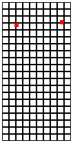     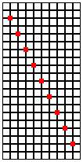
> > > > 
> 图 60：随机攻击

练习 153。这个练习的目标是可视化 1968 年欧洲学生暴乱的后果。大致想法如下。一小群学生聚在一起制作装满油漆的气球，进入某个讲堂，并随机向听众投掷气球。你的程序显示气球如何使讲堂的座位着色。

使用来自练习 152 的两个函数创建一个由 COLUMNS 列和 ROWS 行组成的矩形，每个方块的尺寸为 10x10。将其放置在相同大小的[空场景](http://docs.racket-lang.org/teachpack/2htdpimage.html#%28def._%28%28lib._2htdp%2Fimage..rkt%29._empty-scene%29%29)中。这张图片就是你的讲堂。

设计 add-balloons。该函数消耗一个 Posn 列表，其坐标适合讲堂的尺寸。它产生一个带有根据 Posns 指定的红色点的讲堂图像。

图 60 显示了我们的解决方案在给定一些 Posn 列表时，对于 10 列和 20 行时的输出。最左边是干净的讲堂，第二个是在两个气球击中后，最后一个是非常不可能的 10 次击中分布。第 10 个在哪里？

#### 9.4 俄罗斯套娃🔗 "链接到此处")

维基百科将俄罗斯套娃定义为“一套逐渐缩小的娃娃，一个套一个地放置”，并用这张图片来展示：

> 

在这张图片中，娃娃被拆开，以便观众可以看到它们全部。

> > > 这个问题可能让你觉得抽象，甚至荒谬；不清楚你为什么要表示俄罗斯套娃，或者你会用这样的表示做什么。现在就跟着玩吧。

现在考虑用 BSL 数据表示这样的俄罗斯套娃的问题。稍加想象，就可以很容易地看出，艺术家可以创建一个由任意数量的娃娃组成的俄罗斯套娃。毕竟，总是可以在某个给定的俄罗斯套娃外面再包裹一层。再次，你也知道，在最里面有一个没有东西的实心娃娃。

对于俄罗斯套娃的每一层，我们可能会关心许多不同的事情：它的大小，尽管它与嵌套级别有关；它的颜色；画在表面的图像；等等。在这里，我们只选择一个，即套娃的颜色，我们用字符串来表示。鉴于这一点，我们知道俄罗斯套娃的每一层都有两个属性：它的颜色和里面的套娃。为了用两个属性表示信息片段，我们总是定义一个结构类型：

> ([define-struct](http://docs.racket-lang.org/htdp-langs/beginner.html#%28form._%28%28lib._lang%2Fhtdp-beginner..rkt%29._define-struct%29%29) layer [[color](http://docs.racket-lang.org/teachpack/2htdpimage.html#%28def._%28%28lib._2htdp%2Fimage..rkt%29._color%29%29) doll])

然后我们添加一个数据定义：

> | ; 一个 RD（即俄罗斯套娃）是以下之一： |
> | --- |
> | ; –  String |
> | ; –  (make-layer  String  RD) |

自然地，这个数据定义的第一个子句表示最里面的套娃，或者更准确地说，它的颜色。第二个子句是为了在某个给定的俄罗斯套娃周围添加一层。我们用层的实例来表示这一点，显然它包含套娃的颜色和一个其他字段：这个套娃立即嵌套在这个套娃里面的套娃。看看这个套娃：

> 

它由三个套娃组成。红色的是最里面的一个，绿色的是中间的，黄色的是当前最外层的包装。要用 RD 元素表示这个套娃，你从两端开始。我们从内向外进行。红色套娃很容易表示为 RD。因为它里面什么都没有，而且是红色的，所以字符串"red"就足够了。对于第二层，我们使用

> (make-layer "green" "red")

这表示一个绿色的（空心的）套娃包含一个红色的套娃。最后，为了得到外层套娃，我们只需在这个最后一个套娃外面再包上一层：

> (make-layer "yellow" (make-layer "green" "red"))

这个过程应该能给你一个很好的想法，了解如何将任何一组彩色俄罗斯套娃转换为数据表示。但请记住，程序员还必须能够做相反的事情，即从数据到具体信息的转换。本着这个精神，为以下 RD 元素绘制一个示意图：

> (make-layer "pink" (make-layer "black" "white"))

你甚至可以尝试在 BSL 中做这个。现在我们有了数据定义，并了解了如何表示实际的套娃以及如何将 RD 元素解释为套娃，我们就可以设计消费 RD 的函数了。具体来说，让我们设计一个函数来计算俄罗斯套娃套装包含多少个套娃。这个句子是一个很好的目的陈述，也决定了签名：

> | ; RD -> Number |
> | --- |
> | ; an-rd 中有多少个娃娃 |

关于数据示例，让我们从(make-layer "yellow" (make-layer "green" "red"))开始。上面的图像告诉我们预期的答案是 3，因为有三个娃娃：红色、绿色和黄色的。仅仅通过这个例子，我们也可以了解到，当输入是这种娃娃的表示

> 

那么答案是 1。第四步需要开发一个模板。使用这一步的标准问题产生的模板如下：

> | ; RD -> 数字 |
> | --- |
> | ; an-rd 中有多少个娃娃 |
> | ([定义](http://docs.racket-lang.org/htdp-langs/beginner.html#%28form._%28%28lib._lang%2Fhtdp-beginner..rkt%29._define%29%29) (depth an-rd) |
> |   ([条件](http://docs.racket-lang.org/htdp-langs/beginner.html#%28form._%28%28lib._lang%2Fhtdp-beginner..rkt%29._cond%29%29) |
> |     [([字符串?](http://docs.racket-lang.org/htdp-langs/beginner.html#%28def._htdp-beginner._%28%28lib._lang%2Fhtdp-beginner..rkt%29._string~3f%29%29) an-rd) [...](http://docs.racket-lang.org/htdp-langs/beginner.html#%28form._%28%28lib._lang%2Fhtdp-beginner..rkt%29._......%29%29)] |
> |     [(层? an-rd) |
> |      ([...](http://docs.racket-lang.org/htdp-langs/beginner.html#%28form._%28%28lib._lang%2Fhtdp-beginner..rkt%29._......%29%29) (layer-color an-rd) [...](http://docs.racket-lang.org/htdp-langs/beginner.html#%28form._%28%28lib._lang%2Fhtdp-beginner..rkt%29._......%29%29) |
> |       [...](http://docs.racket-lang.org/htdp-langs/beginner.html#%28form._%28%28lib._lang%2Fhtdp-beginner..rkt%29._......%29%29) (depth (layer-doll an-rd)) [...](http://docs.racket-lang.org/htdp-langs/beginner.html#%28form._%28%28lib._lang%2Fhtdp-beginner..rkt%29._......%29%29))])) |

[cond](http://docs.racket-lang.org/htdp-langs/beginner.html#%28form._%28%28lib._lang%2Fhtdp-beginner..rkt%29._cond%29%29) 子句的数量由 RD 定义中的子句数量决定。每个子句具体说明了它关于什么类型的数据，这告诉我们应该使用 [string?](http://docs.racket-lang.org/htdp-langs/beginner.html#%28def._htdp-beginner._%28%28lib._lang%2Fhtdp-beginner..rkt%29._string~3f%29%29) 和 layer? 断言。虽然字符串不是复合数据，但 layer 的实例包含两个值。如果函数需要这些值，它将使用选择表达式 (layer-color  an-rd) 和 (layer-doll  an-rd)。最后，数据定义的第二子句包含从层结构中娃娃字段到定义本身的自我引用。因此，我们需要对第二个选择表达式进行递归函数调用。示例和模板几乎规定了函数定义。对于非递归的 [cond](http://docs.racket-lang.org/htdp-langs/beginner.html#%28form._%28%28lib._lang%2Fhtdp-beginner..rkt%29._cond%29%29) 子句，答案显然是 1。对于递归子句，模板表达式计算以下结果：

+   (layer-color  an-rd) 提取描述当前层颜色的字符串；

+   (layer-doll  an-rd) 提取当前层包含的娃娃；并且

+   (depth  (layer-doll  an-rd)) 根据深度目的说明确定 (layer-doll  an-rd) 中有多少个娃娃；

这个最后的数字几乎就是期望的答案，但并不完全准确，因为 an-rd 和 (layer-doll  an-rd) 之间的差异是一个层，意味着多了一个娃娃。换句话说，函数必须将 1 加到递归结果上才能得到实际答案：

> | ; RD -> Number |
> | --- |
> | ; an-rd 中有多少个娃娃 |
> | ([定义](http://docs.racket-lang.org/htdp-langs/beginner.html#%28form._%28%28lib._lang%2Fhtdp-beginner..rkt%29._define%29%29) (depth an-rd) |
> |   ([cond](http://docs.racket-lang.org/htdp-langs/beginner.html#%28form._%28%28lib._lang%2Fhtdp-beginner..rkt%29._cond%29%29) |
> |     [([string?](http://docs.racket-lang.org/htdp-langs/beginner.html#%28def._htdp-beginner._%28%28lib._lang%2Fhtdp-beginner..rkt%29._string~3f%29%29) an-rd) 1] |
> |     [[else](http://docs.racket-lang.org/htdp-langs/beginner.html#%28form._%28%28lib._lang%2Fhtdp-beginner..rkt%29._else%29%29) ([+](http://docs.racket-lang.org/htdp-langs/beginner.html#%28def._htdp-beginner._%28%28lib._lang%2Fhtdp-beginner..rkt%29._%2B%29%29) (depth (layer-doll an-rd)) 1)])) |

注意函数定义在第二个子句中没有使用 (layer-color  an-rd)。再次看到模板是我们所知道的数据定义的组织架构，但我们可能不需要所有这些部分来进行实际定义。让我们最终将示例翻译成测试：

> | ([check-expect](http://docs.racket-lang.org/htdp-langs/beginner.html#%28form._%28%28lib._lang%2Fhtdp-beginner..rkt%29._check-expect%29%29) (depth "red") 1) |
> | --- |
> | ([check-expect](http://docs.racket-lang.org/htdp-langs/beginner.html#%28form._%28%28lib._lang%2Fhtdp-beginner..rkt%29._check-expect%29%29) |
> |   (depth |
> |    (make-layer "yellow" (make-layer "green" "red"))) |
> |   3) |

如果你将这些代码在 DrRacket 中运行，你会看到它们的评估涉及到深度定义的所有部分。练习 154。设计一个名为 colors 的函数。它接受一个俄罗斯套娃，并生成一个由逗号和空格分隔的颜色字符串。因此，我们的示例应该生成

> "黄色，绿色，红色"

练习 155。设计一个名为 inner 的函数，它接受一个 RD 并产生最内层娃娃的颜色。使用 DrRacket 的步进器评估(inner rd)以你的首选 rd。

#### 9.5 列表和世界🔗 "链接到此处")

使用列表和自引用数据定义，你可以设计并运行比有限数据更多的有趣世界程序。只需想象你现在可以创建一个来自项目化和结构的空间入侵者程序的版本，允许玩家从坦克中发射任意数量的子弹。让我们从一个简单的问题开始：如果你有一段时间没有设计世界程序了，请重新阅读设计世界程序。

> 样例问题 设计一个模拟射击的世界程序。每次“玩家”按下空格键，程序就会在画布底部添加一颗子弹。这些子弹以每滴答一个像素的速度垂直上升。

设计世界程序开始于将信息分为常量和世界不断变化的状态的元素。对于前者，我们引入物理和图形常量；对于后者，我们需要为世界状态开发数据表示。虽然样例问题在具体细节上相对模糊，但它明显假设有一个矩形场景，子弹沿着垂直线绘制。显然，子弹的位置会随着每个时钟滴答而改变，但场景的大小和子弹线的 x 坐标保持不变：

> | ([define](http://docs.racket-lang.org/htdp-langs/beginner.html#%28form._%28%28lib._lang%2Fhtdp-beginner..rkt%29._define%29%29) HEIGHT 80) ; 以像素为单位的距离 |
> | --- |
> | ([define](http://docs.racket-lang.org/htdp-langs/beginner.html#%28form._%28%28lib._lang%2Fhtdp-beginner..rkt%29._define%29%29) WIDTH 100) |
> | ([define](http://docs.racket-lang.org/htdp-langs/beginner.html#%28form._%28%28lib._lang%2Fhtdp-beginner..rkt%29._define%29%29) XSHOTS ([/](http://docs.racket-lang.org/htdp-langs/beginner.html#%28def._htdp-beginner._%28%28lib._lang%2Fhtdp-beginner..rkt%29._%2F%29%29) WIDTH 2)) |
> |   |
> | ; 图形常量 |
> | ([定义](http://docs.racket-lang.org/htdp-langs/beginner.html#%28form._%28%28lib._lang%2Fhtdp-beginner..rkt%29._define%29%29) 背景 ([empty-scene](http://docs.racket-lang.org/teachpack/2htdpimage.html#%28def._%28%28lib._2htdp%2Fimage..rkt%29._empty-scene%29%29) 宽度 高度)) |
> | ([定义](http://docs.racket-lang.org/htdp-langs/beginner.html#%28form._%28%28lib._lang%2Fhtdp-beginner..rkt%29._define%29%29) 射击 ([triangle](http://docs.racket-lang.org/teachpack/2htdpimage.html#%28def._%28%28lib._2htdp%2Fimage..rkt%29._triangle%29%29) 3 "solid" "red")) |

问题陈述中没有要求这些特定的选择，但只要它们容易更改——意味着通过编辑单个定义来更改——我们就达到了我们的目标。至于“世界”中那些会变化的部分，问题陈述提到了两点。首先，按下空格键会添加一个射击。其次，所有射击在每个时钟滴答时向上移动一个像素。鉴于我们无法预测玩家会“发射”多少射击，我们使用列表来表示它们：

> | ; 射击列表是以下之一： |
> | --- |
> | ; –  '() |
> | ; –  ([cons](http://docs.racket-lang.org/htdp-langs/beginner.html#%28def._htdp-beginner._%28%28lib._lang%2Fhtdp-beginner..rkt%29._cons%29%29)  Shot  射击列表) |
> | ; interpretation 射击的集合 |

剩下的一个问题是如何表示每个单独的射击。我们已经知道它们都具有相同的 x 坐标，并且这个坐标在整个过程中保持不变。此外，所有射击看起来都一样。因此，它们的 y 坐标是它们之间唯一不同的属性。因此，只需要将每个射击表示为一个数字：

> | ; Shot 是一个 数字。 |
> | --- |
> | ; interpretation 表示射击的 y 坐标 |

我们可以将射击的表示限制在高度以下数字的区间内，因为我们知道所有射击都是从画布底部发射的，然后向上移动，这意味着它们的 y 坐标持续减少。你也可以使用类似的数据定义来表示这个世界：

> | ; ShotWorld 是 数字列表。 |
> | --- |
> | ; interpretation 解释列表中的每个数字 |
> | ;   表示射击的 y 坐标 |

总的来说，上述两个定义描述了所有数字列表；我们已经有了一个数字列表的定义，并且名称 ShotWorld 告诉了每个人这类数据是关于什么的。一旦定义了常量并开发了世界状态的表示，关键任务就是选择你希望使用的处理程序，并将它们的签名适应给定的问题。运行示例提到了时钟滴答声和空格键，这些都转化为三个函数的愿望清单：

+   将世界状态转换为图像的函数：

    > | ; ShotWorld -> Image |
    > | --- |
    > | ; 在世界的每个 y 坐标上添加一个射击的图像 |
    > | ; 在(MID,y)处将数据转换为背景图像 |
    > | ([定义](http://docs.racket-lang.org/htdp-langs/beginner.html#%28form._%28%28lib._lang%2Fhtdp-beginner..rkt%29._define%29%29) (to-image w) BACKGROUND) |

    因为问题需要视觉渲染；

+   一个用于处理 tick 事件的：

    > | ; ShotWorld -> ShotWorld |
    > | --- |
    > | ; 将世界中的每个射击向上移动一个像素 |
    > | ([定义](http://docs.racket-lang.org/htdp-langs/beginner.html#%28form._%28%28lib._lang%2Fhtdp-beginner..rkt%29._define%29%29) (tock w) w) |

+   并且一个用于处理按键事件的函数：

    > | ; ShotWorld  KeyEvent -> ShotWorld |
    > | --- |
    > | ; 向世界中添加一个射击 |
    > | ; 如果玩家按下空格键 |
    > | ([定义](http://docs.racket-lang.org/htdp-langs/beginner.html#%28form._%28%28lib._lang%2Fhtdp-beginner..rkt%29._define%29%29) (keyh w ke) w) |

不要忘记，除了初始愿望列表之外，你还需要定义一个主函数，该函数实际上设置世界并安装处理程序。图 61 包括这个未设计但作为标准模式修改的函数。让我们从 to-image 的设计开始。我们已经有它的签名、目的声明和头文件，所以我们需要例子。由于数据定义有两个子句，应该至少有两个例子：'()和一个[合并](http://docs.racket-lang.org/htdp-langs/beginner.html#%28def._htdp-beginner._%28%28lib._lang%2Fhtdp-beginner..rkt%29._cons%29%29)列表，比如([合并](http://docs.racket-lang.org/htdp-langs/beginner.html#%28def._htdp-beginner._%28%28lib._lang%2Fhtdp-beginner..rkt%29._cons%29%29) 9  '())。对于'()的预期结果显然是 BACKGROUND；如果有 y 坐标，那么函数必须在 MID 和指定的坐标处放置射击的图像：

> | ([检查期望](http://docs.racket-lang.org/htdp-langs/beginner.html#%28form._%28%28lib._lang%2Fhtdp-beginner..rkt%29._check-expect%29%29) (to-image ([合并](http://docs.racket-lang.org/htdp-langs/beginner.html#%28def._htdp-beginner._%28%28lib._lang%2Fhtdp-beginner..rkt%29._cons%29%29) 9 '())) |
> | --- |
> |               ([放置图像](http://docs.racket-lang.org/teachpack/2htdpimage.html#%28def._%28%28lib._2htdp%2Fimage..rkt%29._place-image%29%29) SHOT XSHOTS 9 BACKGROUND)) |

在继续阅读之前，请通过一个示例来应用 to-image 到一个包含两个射击的列表上。这样做有助于理解函数的工作原理。第四步是将数据定义转换为模板：

> | ; ShotWorld -> Image |
> | --- |
> | ([定义](http://docs.racket-lang.org/htdp-langs/beginner.html#%28form._%28%28lib._lang%2Fhtdp-beginner..rkt%29._define%29%29) (to-image w) |
> | ([cond](http://docs.racket-lang.org/htdp-langs/beginner.html#%28form._%28%28lib._lang%2Fhtdp-beginner..rkt%29._cond%29%29) |
> |   ([empty?](http://docs.racket-lang.org/htdp-langs/beginner.html#%28def._htdp-beginner._%28%28lib._lang%2Fhtdp-beginner..rkt%29._empty~3f%29%29) w) [...](http://docs.racket-lang.org/htdp-langs/beginner.html#%28form._%28%28lib._lang%2Fhtdp-beginner..rkt%29._......%29%29)] |
> |   [[else](http://docs.racket-lang.org/htdp-langs/beginner.html#%28form._%28%28lib._lang%2Fhtdp-beginner..rkt%29._else%29%29) |
> |   ([...](http://docs.racket-lang.org/htdp-langs/beginner.html#%28form._%28%28lib._lang%2Fhtdp-beginner..rkt%29._......%29%29) ([first](http://docs.racket-lang.org/htdp-langs/beginner.html#%28def._htdp-beginner._%28%28lib._lang%2Fhtdp-beginner..rkt%29._first%29%29) w) [...](http://docs.racket-lang.org/htdp-langs/beginner.html#%28form._%28%28lib._lang%2Fhtdp-beginner..rkt%29._......%29%29) (to-image ([rest](http://docs.racket-lang.org/htdp-langs/beginner.html#%28def._htdp-beginner._%28%28lib._lang%2Fhtdp-beginner..rkt%29._rest%29%29) w)) [...](http://docs.racket-lang.org/htdp-langs/beginner.html#%28form._%28%28lib._lang%2Fhtdp-beginner..rkt%29._......%29%29))])) |

列表数据定义的模板现在非常熟悉，因此不需要太多解释。如果您有任何疑问，请阅读 图 52 中的问题，并自行设计模板。从这里开始，定义函数就很简单了。关键是结合示例和模板，并回答 图 53 中的问题。按照这些步骤，您从空射击列表的基础情况开始，并且从示例中知道预期的答案是 BACKGROUND。接下来，您确定第二个 [cond](http://docs.racket-lang.org/htdp-langs/beginner.html#%28form._%28%28lib._lang%2Fhtdp-beginner..rkt%29._cond%29%29) 表达式计算的内容：

+   ([first](http://docs.racket-lang.org/htdp-langs/beginner.html#%28def._htdp-beginner._%28%28lib._lang%2Fhtdp-beginner..rkt%29._first%29%29) w) 从列表中提取第一个坐标；

+   ([rest](http://docs.racket-lang.org/htdp-langs/beginner.html#%28def._htdp-beginner._%28%28lib._lang%2Fhtdp-beginner..rkt%29._rest%29%29) w) 是坐标的其余部分；并且

+   (to-image ([rest](http://docs.racket-lang.org/htdp-langs/beginner.html#%28def._htdp-beginner._%28%28lib._lang%2Fhtdp-beginner..rkt%29._rest%29%29) w)) 将 ([rest](http://docs.racket-lang.org/htdp-langs/beginner.html#%28def._htdp-beginner._%28%28lib._lang%2Fhtdp-beginner..rkt%29._rest%29%29) w) 上的每一帧添加到背景图像中，根据 to-image 的目的声明。

换句话说，`(to-image  ([rest](http://docs.racket-lang.org/htdp-langs/beginner.html#%28def._htdp-beginner._%28%28lib._lang%2Fhtdp-beginner..rkt%29._rest%29%29)  w))`将列表的其余部分渲染为图像，因此执行了几乎所有的工作。缺少的是第一个射击，`([first](http://docs.racket-lang.org/htdp-langs/beginner.html#%28def._htdp-beginner._%28%28lib._lang%2Fhtdp-beginner..rkt%29._first%29%29)  w)`。如果你现在将这些目的说明应用于这两个表达式，你将得到第二个[cond](http://docs.racket-lang.org/htdp-langs/beginner.html#%28form._%28%28lib._lang%2Fhtdp-beginner..rkt%29._cond%29%29)子句所需的表达式：

> | ([place-image](http://docs.racket-lang.org/teachpack/2htdpimage.html#%28def._%28%28lib._2htdp%2Fimage..rkt%29._place-image%29%29) SHOT XSHOTS ([first](http://docs.racket-lang.org/htdp-langs/beginner.html#%28def._htdp-beginner._%28%28lib._lang%2Fhtdp-beginner..rkt%29._first%29%29) w) |
> | --- |
> |              (to-image ([rest](http://docs.racket-lang.org/htdp-langs/beginner.html#%28def._htdp-beginner._%28%28lib._lang%2Fhtdp-beginner..rkt%29._rest%29%29) w))) |

添加的图标是射击的标准图像；两个坐标在目的说明中明确指出；[place-image](http://docs.racket-lang.org/teachpack/2htdpimage.html#%28def._%28%28lib._2htdp%2Fimage..rkt%29._place-image%29%29)函数的最后一个参数是由列表的其余部分构建的图像。

图 61 显示了`to-image`函数的完整函数定义，以及整个程序的其余部分。`tock`的设计与`to-image`的设计类似，你应该亲自尝试理解它。不过，键处理程序`keyh`的签名提出了一个有趣的问题。它指定处理程序消耗两个具有非平凡数据定义的输入。一方面，ShotWorld 是一个自引用的数据定义。另一方面，KeyEvent 的定义是一个大的枚举。目前，我们让你“猜测”两个参数中哪一个应该驱动模板的开发；稍后我们将深入研究此类案例。

> > > | ; ShotWorld -> ShotWorld |
> > > | --- |
> > > | ([define](http://docs.racket-lang.org/htdp-langs/beginner.html#%28form._%28%28lib._lang%2Fhtdp-beginner..rkt%29._define%29%29) (main w0) |
> > > |   ([big-bang](http://docs.racket-lang.org/teachpack/2htdpuniverse.html#%28form._world._%28%28lib._2htdp%2Funiverse..rkt%29._big-bang%29%29) w0 |
> > > |     [[on-tick](http://docs.racket-lang.org/teachpack/2htdpuniverse.html#%28form._world._%28%28lib._2htdp%2Funiverse..rkt%29._on-tick%29%29) tock] |
> > > |     [[on-key](http://docs.racket-lang.org/teachpack/2htdpuniverse.html#%28form._world._%28%28lib._2htdp%2Funiverse..rkt%29._on-key%29%29) keyh] |
> > > |     [[to-draw](http://docs.racket-lang.org/teachpack/2htdpuniverse.html#%28form._world._%28%28lib._2htdp%2Funiverse..rkt%29._to-draw%29%29) to-image])) |
> > > |   |
> > > |   ; ShotWorld -> ShotWorld |
> > > |   ; 将每个射击向上移动一个像素 |
> > > |   ([define](http://docs.racket-lang.org/htdp-langs/beginner.html#%28form._%28%28lib._lang%2Fhtdp-beginner..rkt%29._define%29%29) (tock w) |
> > > |   ([cond](http://docs.racket-lang.org/htdp-langs/beginner.html#%28form._%28%28lib._lang%2Fhtdp-beginner..rkt%29._cond%29%29) |
> > > |     [([empty?](http://docs.racket-lang.org/htdp-langs/beginner.html#%28def._htdp-beginner._%28%28lib._lang%2Fhtdp-beginner..rkt%29._empty~3f%29%29) w) '()] |
> > > |     [[else](http://docs.racket-lang.org/htdp-langs/beginner.html#%28form._%28%28lib._lang%2Fhtdp-beginner..rkt%29._else%29%29) ([cons](http://docs.racket-lang.org/htdp-langs/beginner.html#%28def._htdp-beginner._%28%28lib._lang%2Fhtdp-beginner..rkt%29._cons%29%29) ([sub1](http://docs.racket-lang.org/htdp-langs/beginner.html#%28def._htdp-beginner._%28%28lib._lang%2Fhtdp-beginner..rkt%29._sub1%29%29) ([first](http://docs.racket-lang.org/htdp-langs/beginner.html#%28def._htdp-beginner._%28%28lib._lang%2Fhtdp-beginner..rkt%29._first%29%29) w)) (tock ([rest](http://docs.racket-lang.org/htdp-langs/beginner.html#%28def._htdp-beginner._%28%28lib._lang%2Fhtdp-beginner..rkt%29._rest%29%29) w)))])) |
> > > |   |
> > > |   ; ShotWorld  KeyEvent -> ShotWorld |
> > > |   ; 如果按下空格键，则将射击添加到世界中 |
> > > |   ([define](http://docs.racket-lang.org/htdp-langs/beginner.html#%28form._%28%28lib._lang%2Fhtdp-beginner..rkt%29._define%29%29) (keyh w ke) |
> > > |   ([if](http://docs.racket-lang.org/htdp-langs/beginner.html#%28form._%28%28lib._lang%2Fhtdp-beginner..rkt%29._if%29%29) ([key=?](http://docs.racket-lang.org/teachpack/2htdpuniverse.html#%28def._world._%28%28lib._2htdp%2Funiverse..rkt%29._key~3d~3f%29%29) ke " ") ([cons](http://docs.racket-lang.org/htdp-langs/beginner.html#%28def._htdp-beginner._%28%28lib._lang%2Fhtdp-beginner..rkt%29._cons%29%29) HEIGHT w) w)) |
> > > |   |
> > > |   ; ShotWorld -> Image |
> > > | 将每个射击 y 在 (XSHOTS,y} 处添加到 BACKGROUND |
> > > |   ([define](http://docs.racket-lang.org/htdp-langs/beginner.html#%28form._%28%28lib._lang%2Fhtdp-beginner..rkt%29._define%29%29) (to-image w) |
> > > |   ([cond](http://docs.racket-lang.org/htdp-langs/beginner.html#%28form._%28%28lib._lang%2Fhtdp-beginner..rkt%29._cond%29%29) |
> > > |   ([empty?](http://docs.racket-lang.org/htdp-langs/beginner.html#%28def._htdp-beginner._%28%28lib._lang%2Fhtdp-beginner..rkt%29._empty~3f%29%29) w) BACKGROUND] |
> > > |     [[否则](http://docs.racket-lang.org/htdp-langs/beginner.html#%28form._%28%28lib._lang%2Fhtdp-beginner..rkt%29._else%29%29) ([放置图像](http://docs.racket-lang.org/teachpack/2htdpimage.html#%28def._%28%28lib._2htdp%2Fimage..rkt%29._place-image%29%29) SHOT XSHOTS ([第一个](http://docs.racket-lang.org/htdp-langs/beginner.html#%28def._htdp-beginner._%28%28lib._lang%2Fhtdp-beginner..rkt%29._first%29%29) w) |
> > > |                        (to-image ([剩余](http://docs.racket-lang.org/htdp-langs/beginner.html#%28def._htdp-beginner._%28%28lib._lang%2Fhtdp-beginner..rkt%29._rest%29%29) w)))])) |
> > > 
> 图 61：基于列表的世界程序

就世界程序而言，一个键处理程序如 keyh 是关于它所消费的键事件。因此，我们将其视为主要参数，并使用其数据定义来推导模板。具体来说，根据枚举中的 KeyEvent 数据定义，它规定函数需要一个具有多个类似以下子句的[cond](http://docs.racket-lang.org/htdp-langs/beginner.html#%28form._%28%28lib._lang%2Fhtdp-beginner..rkt%29._cond%29%29)表达式：

> | ([定义](http://docs.racket-lang.org/htdp-langs/beginner.html#%28form._%28%28lib._lang%2Fhtdp-beginner..rkt%29._define%29%29) (keyh w ke) |
> | --- |
> |   ([cond](http://docs.racket-lang.org/htdp-langs/beginner.html#%28form._%28%28lib._lang%2Fhtdp-beginner..rkt%29._cond%29%29) |
> |     [([键比较](http://docs.racket-lang.org/teachpack/2htdpuniverse.html#%28def._world._%28%28lib._2htdp%2Funiverse..rkt%29._key~3d~3f%29%29) ke "left") [...](http://docs.racket-lang.org/htdp-langs/beginner.html#%28form._%28%28lib._lang%2Fhtdp-beginner..rkt%29._......%29%29)] |
> |     [([键比较](http://docs.racket-lang.org/teachpack/2htdpuniverse.html#%28def._world._%28%28lib._2htdp%2Funiverse..rkt%29._key~3d~3f%29%29) ke "right") [...](http://docs.racket-lang.org/htdp-langs/beginner.html#%28form._%28%28lib._lang%2Fhtdp-beginner..rkt%29._......%29%29)] |
> |     [...](http://docs.racket-lang.org/htdp-langs/beginner.html#%28form._%28%28lib._lang%2Fhtdp-beginner..rkt%29._......%29%29) |
> |     [([键比较](http://docs.racket-lang.org/teachpack/2htdpuniverse.html#%28def._world._%28%28lib._2htdp%2Funiverse..rkt%29._key~3d~3f%29%29) ke " ") [...](http://docs.racket-lang.org/htdp-langs/beginner.html#%28form._%28%28lib._lang%2Fhtdp-beginner..rkt%29._......%29%29)] |
> |     [...](http://docs.racket-lang.org/htdp-langs/beginner.html#%28form._%28%28lib._lang%2Fhtdp-beginner..rkt%29._......%29%29) |
> |     [([键比较](http://docs.racket-lang.org/teachpack/2htdpuniverse.html#%28def._world._%28%28lib._2htdp%2Funiverse..rkt%29._key~3d~3f%29%29) ke "a") [...](http://docs.racket-lang.org/htdp-langs/beginner.html#%28form._%28%28lib._lang%2Fhtdp-beginner..rkt%29._......%29%29)] |
> |     [...](http://docs.racket-lang.org/htdp-langs/beginner.html#%28form._%28%28lib._lang%2Fhtdp-beginner..rkt%29._......%29%29) |
> |     [([key=?](http://docs.racket-lang.org/teachpack/2htdpuniverse.html#%28def._world._%28%28lib._2htdp%2Funiverse..rkt%29._key~3d~3f%29%29) ke "z") [...](http://docs.racket-lang.org/htdp-langs/beginner.html#%28form._%28%28lib._lang%2Fhtdp-beginner..rkt%29._......%29%29)])) |

当然，就像对于消耗所有可能的 BSL 值的函数一样，键处理程序通常不需要检查所有可能的案例。对于我们的运行问题，你特别知道键处理程序只对空格键做出反应，其他所有键都被忽略。因此，将所有[cond](http://docs.racket-lang.org/htdp-langs/beginner.html#%28form._%28%28lib._lang%2Fhtdp-beginner..rkt%29._cond%29%29)子句合并为一个[else](http://docs.racket-lang.org/htdp-langs/beginner.html#%28form._%28%28lib._lang%2Fhtdp-beginner..rkt%29._else%29%29)子句，除了“ ”的子句之外。

练习 156。为图 61 中的程序添加测试，并确保它通过这些测试。解释 main 的作用。然后通过 main 运行程序。

练习 157。尝试确定有关常数的任意决策是否容易更改。例如，确定更改单个常量定义是否达到预期的结果：

+   将画布的高度更改为 220 像素；

+   将画布的宽度更改为 30 像素；

+   将射击行的 x 位置更改为“中间左侧某处”；

+   将背景更改为绿色矩形；并且

+   将射击的渲染改为红色细长的矩形。

还要检查是否可以在不改变其他任何内容的情况下将射击的大小加倍，或者将其颜色改为黑色。

练习 158。如果你运行 main，按空格键（发射射击），并等待一段时间，射击将从画布上消失。然而，当你关闭世界画布时，结果是一个仍然包含这个隐形射击的世界。

设计一个替代的时钟函数，它不仅每次时钟滴答时移动一个像素，而且还能消除那些坐标使其位于画布上方的射击。提示：你可能需要考虑为递归[cond](http://docs.racket-lang.org/htdp-langs/beginner.html#%28form._%28%28lib._lang%2Fhtdp-beginner..rkt%29._cond%29%29)子句设计一个辅助函数。

练习 159。将练习 153 的解决方案转换为世界程序。它的主函数被称为 riot，它消耗学生想要扔出的气球数量；其可视化显示一个气球接一个气球以每秒一个的速度落下。该函数产生 Posn 列表，其中气球击中。

提示（1）这里是一种可能的数据表示：

> | ([define-struct](http://docs.racket-lang.org/htdp-langs/beginner.html#%28form._%28%28lib._lang%2Fhtdp-beginner..rkt%29._define-struct%29%29) pair [balloon# lob]) |
> | --- |
> | ; A Pair is a structure (make-pair  N  List-of-posns) |
> | ; A List-of-posns is one of: |
> | ; –  '() |
> | ; –  ([cons](http://docs.racket-lang.org/htdp-langs/beginner.html#%28def._htdp-beginner._%28%28lib._lang%2Fhtdp-beginner..rkt%29._cons%29%29)  Posn  List-of-posns) |
> | ; interpretation  (make-pair  n  lob) means n balloons |
> | ; must yet be thrown and added to lob |

(2) 一个 [big-bang](http://docs.racket-lang.org/teachpack/2htdpuniverse.html#%28form._world._%28%28lib._2htdp%2Funiverse..rkt%29._big-bang%29%29) 表达式实际上只是一个表达式。在另一个表达式内部嵌套它是合法的。

(3) 回想一下，[random](http://docs.racket-lang.org/htdp-langs/beginner.html#%28def._htdp-beginner._%28%28lib._lang%2Fhtdp-beginner..rkt%29._random%29%29) 创建随机数。

#### 9.6A 关于列表和集合的注意事项🔗 "链接到此处")

本书依赖于你对集合作为 BSL 值集合的直观理解。数据宇宙特别说明，数据定义引入了 BSL 值集合的名称。本书始终询问关于集合的一个问题，那就是某个元素是否在某个给定的集合中。例如，4 在 Number 中，而"four"不在。本书还展示了如何使用数据定义来检查某个值是否是某个命名集合的成员，以及如何使用一些数据定义来生成集合的样本元素，但这两个过程是关于数据定义，而不是集合本身。

同时，列表表示值的集合。因此，你可能想知道列表和集合之间的区别，或者这是否是一个不必要的区分。如果是这样，本节就是为你准备的。

目前，集合和列表之间的主要区别在于，前者是我们用来讨论代码设计步骤的概念，而后者是 BSL（我们选择的编程语言）的多种数据形式之一。这两个概念在我们对话中的层次相当不同。然而，鉴于数据定义在 BSL 内部引入了实际信息的表示，并且鉴于集合是信息的集合，你现在可以问自己集合如何在 BSL 中作为数据表示。

> > > 大多数功能齐全的语言直接支持列表和集合的数据表示。

虽然 BSL 中列表具有特殊地位，但集合却没有，但与此同时集合在某种程度上与列表相似。关键区别在于程序通常使用哪种形式的数据时使用的函数类型。BSL 为列表提供了几个基本常量和函数——例如，[empty](http://docs.racket-lang.org/htdp-langs/beginner.html#%28def._%28%28lib._lang%2Fhtdp-beginner..rkt%29._empty%29%29)、[empty?](http://docs.racket-lang.org/htdp-langs/beginner.html#%28def._htdp-beginner._%28%28lib._lang%2Fhtdp-beginner..rkt%29._empty~3f%29%29)、[cons](http://docs.racket-lang.org/htdp-langs/beginner.html#%28def._htdp-beginner._%28%28lib._lang%2Fhtdp-beginner..rkt%29._cons%29%29)、[cons?](http://docs.racket-lang.org/htdp-langs/beginner.html#%28def._htdp-beginner._%28%28lib._lang%2Fhtdp-beginner..rkt%29._cons~3f%29%29)、[first](http://docs.racket-lang.org/htdp-langs/beginner.html#%28def._htdp-beginner._%28%28lib._lang%2Fhtdp-beginner..rkt%29._first%29%29)、[rest](http://docs.racket-lang.org/htdp-langs/beginner.html#%28def._htdp-beginner._%28%28lib._lang%2Fhtdp-beginner..rkt%29._rest%29%29)——以及一些你可以自己定义的函数——例如，[member?](http://docs.racket-lang.org/htdp-langs/beginner.html#%28def._htdp-beginner._%28%28lib._lang%2Fhtdp-beginner..rkt%29._member~3f%29%29)、[length](http://docs.racket-lang.org/htdp-langs/beginner.html#%28def._htdp-beginner._%28%28lib._lang%2Fhtdp-beginner..rkt%29._length%29%29)、[remove](http://docs.racket-lang.org/htdp-langs/beginner.html#%28def._htdp-beginner._%28%28lib._lang%2Fhtdp-beginner..rkt%29._remove%29%29)、[reverse](http://docs.racket-lang.org/htdp-langs/beginner.html#%28def._htdp-beginner._%28%28lib._lang%2Fhtdp-beginner..rkt%29._reverse%29%29)，等等。以下是一个你可以定义但 BSL 没有提供的函数示例

> | ; List-of-string  String -> N |
> | --- |
> | ; determines how often s occurs in los |
> | ([define](http://docs.racket-lang.org/htdp-langs/beginner.html#%28form._%28%28lib._lang%2Fhtdp-beginner..rkt%29._define%29%29) (count los s) |
> |   0) |

停止！完成这个函数的设计。

让我们以一种直接且可能有些天真的方式继续进行，并说集合基本上是列表。为了进一步简化，让我们在本节中关注数字列表。如果我们现在接受一个数字是否是集合的一部分这一点很重要，那么我们几乎可以立即清楚地知道我们可以用两种不同的方式使用列表来表示集合。

> > > | |
> > > 
> > > &#124; ; A Son.L 是以下之一： &#124;
> > > 
> > > &#124; ; –  [empty](http://docs.racket-lang.org/htdp-langs/beginner.html#%28def._%28%28lib._lang%2Fhtdp-beginner..rkt%29._empty%29%29) &#124;
> > > 
> > > &#124; ; –  ([cons](http://docs.racket-lang.org/htdp-langs/beginner.html#%28def._htdp-beginner._%28%28lib._lang%2Fhtdp-beginner..rkt%29._cons%29%29)  Number  Son.L)
> > > 
> > > &#124; ;  &#124;
> > > 
> > > &#124; ; Son 是当它被使用时 &#124;
> > > 
> > > &#124; ; 适用于 Son.L 和 Son.R &#124;
> > > 
> > > |  |
> > > | --- |
> > > 
> > > &#124; ; 一个 Son.R 是以下之一： &#124;
> > > 
> > > &#124; ; –  [empty](http://docs.racket-lang.org/htdp-langs/beginner.html#%28def._%28%28lib._lang%2Fhtdp-beginner..rkt%29._empty%29%29) &#124;
> > > 
> > > &#124; ; –  ([cons](http://docs.racket-lang.org/htdp-langs/beginner.html#%28def._htdp-beginner._%28%28lib._lang%2Fhtdp-beginner..rkt%29._cons%29%29)  Number  Son.R) &#124;
> > > 
> > > &#124; ;  &#124;
> > > 
> > > &#124; ; 约束：如果 s 是一个 Son.R， &#124;
> > > 
> > > &#124; ; s 中不出现重复的数字 &#124;
> > > 
> > > |
> > > 
> 图 62：集合的两种数据表示

图 62 展示了两种集合的数据定义。两者基本上都说集合是以数字列表的形式表示的。区别在于右侧的定义带有约束，即列表中不允许出现重复的数字。毕竟，我们对集合提出的关键问题是某个数字是否在集合中，以及它是否在集合中一次、两次或三次，这都没有关系。

无论你选择哪种定义，你都可以定义两个重要的概念：

> | ; Son |
> | --- |
> | ([define](http://docs.racket-lang.org/htdp-langs/beginner.html#%28form._%28%28lib._lang%2Fhtdp-beginner..rkt%29._define%29%29) es '()) |
> |   |
> | ; Number  Son -> Boolean |
> | ; x 是否在 s 中 |
> | ([define](http://docs.racket-lang.org/htdp-langs/beginner.html#%28form._%28%28lib._lang%2Fhtdp-beginner..rkt%29._define%29%29) (in? x s) |
> |   ([member?](http://docs.racket-lang.org/htdp-langs/beginner.html#%28def._htdp-beginner._%28%28lib._lang%2Fhtdp-beginner..rkt%29._member~3f%29%29) x s)) |

第一个是空集，在两种情况下都由空列表表示。第二个是成员测试。构建较大集合的一种方法是用 [cons](http://docs.racket-lang.org/htdp-langs/beginner.html#%28def._htdp-beginner._%28%28lib._lang%2Fhtdp-beginner..rkt%29._cons%29%29) 和上述定义。假设我们希望构建包含 1、2 和 3 的集合的表示。这里是一个这样的表示：

> ([cons](http://docs.racket-lang.org/htdp-langs/beginner.html#%28def._htdp-beginner._%28%28lib._lang%2Fhtdp-beginner..rkt%29._cons%29%29) 1 ([cons](http://docs.racket-lang.org/htdp-langs/beginner.html#%28def._htdp-beginner._%28%28lib._lang%2Fhtdp-beginner..rkt%29._cons%29%29) 2 ([cons](http://docs.racket-lang.org/htdp-langs/beginner.html#%28def._htdp-beginner._%28%28lib._lang%2Fhtdp-beginner..rkt%29._cons%29%29) 3 '())))

它适用于两种数据表示。但是，问题是

> | ([cons](http://docs.racket-lang.org/htdp-langs/beginner.html#%28def._htdp-beginner._%28%28lib._lang%2Fhtdp-beginner..rkt%29._cons%29%29) 2  ([cons](http://docs.racket-lang.org/htdp-langs/beginner.html#%28def._htdp-beginner._%28%28lib._lang%2Fhtdp-beginner..rkt%29._cons%29%29) 1  ([cons](http://docs.racket-lang.org/htdp-langs/beginner.html#%28def._htdp-beginner._%28%28lib._lang%2Fhtdp-beginner..rkt%29._cons%29%29) 3  '())))

| ; 这真的是同一集合的表示吗？或者如何

> | ([cons](http://docs.racket-lang.org/htdp-langs/beginner.html#%28def._htdp-beginner._%28%28lib._lang%2Fhtdp-beginner..rkt%29._cons%29%29) 1  ([cons](http://docs.racket-lang.org/htdp-langs/beginner.html#%28def._htdp-beginner._%28%28lib._lang%2Fhtdp-beginner..rkt%29._cons%29%29) 2  ([cons](http://docs.racket-lang.org/htdp-langs/beginner.html#%28def._htdp-beginner._%28%28lib._lang%2Fhtdp-beginner..rkt%29._cons%29%29) 1  ([cons](http://docs.racket-lang.org/htdp-langs/beginner.html#%28def._htdp-beginner._%28%28lib._lang%2Fhtdp-beginner..rkt%29._cons%29%29) 3  '())))) | 

| ; 答案必须是肯定的，只要主要关注的是数字是否在集合中。尽管如此，由于 [cons](http://docs.racket-lang.org/htdp-langs/beginner.html#%28def._htdp-beginner._%28%28lib._lang%2Fhtdp-beginner..rkt%29._cons%29%29) 的顺序无关紧要，但右手数据定义中的约束排除了最后一个列表作为 子.R 的可能性，因为它包含数字 1 两次。 | 

> > > | |
> > > 
> > > | ; 数字  子.L -> 子.L | 
> > > 
> > > | ; 从 s 中移除 x | 
> > > 
> > > | ; ([define](http://docs.racket-lang.org/htdp-langs/beginner.html#%28form._%28%28lib._lang%2Fhtdp-beginner..rkt%29._define%29%29) s1.L | 
> > > 
> > > | ; ([cons](http://docs.racket-lang.org/htdp-langs/beginner.html#%28def._htdp-beginner._%28%28lib._lang%2Fhtdp-beginner..rkt%29._cons%29%29)  1  ([cons](http://docs.racket-lang.org/htdp-langs/beginner.html#%28def._htdp-beginner._%28%28lib._lang%2Fhtdp-beginner..rkt%29._cons%29%29)  1  '()))) | 
> > > 
> > > | ; | 
> > > 
> > > | ; ([check-expect](http://docs.racket-lang.org/htdp-langs/beginner.html#%28form._%28%28lib._lang%2Fhtdp-beginner..rkt%29._check-expect%29%29) | 
> > > 
> > > | ; (set-.L 1 s1.L) es) | 
> > > 
> > > | ; | 
> > > 
> > > | ; ([define](http://docs.racket-lang.org/htdp-langs/beginner.html#%28form._%28%28lib._lang%2Fhtdp-beginner..rkt%29._define%29%29) (set-.L x s) | 
> > > 
> > > | ; ([remove-all](http://docs.racket-lang.org/htdp-langs/beginner.html#%28def._htdp-beginner._%28%28lib._lang%2Fhtdp-beginner..rkt%29._remove-all%29%29) x s)) | 
> > > 
> > > | |  |
> > > | --- | --- |
> > > 
> > > | ; 数字  子.R -> 子.R | 
> > > 
> > > | ; 从 s 中移除 x | 
> > > 
> > > | ; ([define](http://docs.racket-lang.org/htdp-langs/beginner.html#%28form._%28%28lib._lang%2Fhtdp-beginner..rkt%29._define%29%29) s1.R | 
> > > 
> > > &#124;   ([cons](http://docs.racket-lang.org/htdp-langs/beginner.html#%28def._htdp-beginner._%28%28lib._lang%2Fhtdp-beginner..rkt%29._cons%29%29) 1 '())) &#124;
> > > 
> > > &#124;   &#124;
> > > 
> > > &#124; ([check-expect](http://docs.racket-lang.org/htdp-langs/beginner.html#%28form._%28%28lib._lang%2Fhtdp-beginner..rkt%29._check-expect%29%29) &#124;
> > > 
> > > &#124;   (set-.R 1 s1.R) es) &#124;
> > > 
> > > &#124;   &#124;
> > > 
> > > &#124; ([define](http://docs.racket-lang.org/htdp-langs/beginner.html#%28form._%28%28lib._lang%2Fhtdp-beginner..rkt%29._define%29%29) (set-.R x s) &#124;
> > > 
> > > &#124;   ([remove](http://docs.racket-lang.org/htdp-langs/beginner.html#%28def._htdp-beginner._%28%28lib._lang%2Fhtdp-beginner..rkt%29._remove%29%29) x s)) &#124;
> > > 
> > > |
> > > 
> 图 63：集合两种数据表示的函数

当我们设计函数时，两个数据定义之间的差异显现出来。比如说，我们想要一个函数可以从集合中移除一个数字。以下是一个适用于两种表示的愿望清单条目：

> | ; Number  Son -> Son |
> | --- |
> | ; 从 s 中减去 x |
> | ([define](http://docs.racket-lang.org/htdp-langs/beginner.html#%28form._%28%28lib._lang%2Fhtdp-beginner..rkt%29._define%29%29) (set- x s) |
> | |   s) |

目的声明中使用“减去”这个词，因为这是逻辑学家和数学家在处理集合时使用的术语。图 63 显示了结果。两列在两点上有所不同：

1.  左侧的测试使用了一个包含 1 两次的列表，而右侧的表示使用单个[cons](http://docs.racket-lang.org/htdp-langs/beginner.html#%28def._htdp-beginner._%28%28lib._lang%2Fhtdp-beginner..rkt%29._cons%29%29)来表示相同的集合。

1.  由于这些差异，左侧的集合必须使用[remove-all](http://docs.racket-lang.org/htdp-langs/beginner.html#%28def._htdp-beginner._%28%28lib._lang%2Fhtdp-beginner..rkt%29._remove-all%29%29)，而右侧的可以使用[remove](http://docs.racket-lang.org/htdp-langs/beginner.html#%28def._htdp-beginner._%28%28lib._lang%2Fhtdp-beginner..rkt%29._remove%29%29)。

停止！将代码复制到 DrRacket 定义区域，并确保测试通过。然后继续阅读并尝试使用代码进行实验。图 63 的一个不吸引人的方面是测试使用了 es，一个普通的列表，作为预期的结果。这个问题乍一看可能似乎微不足道。然而，考虑以下示例：

> (set- 1 set123)

其中 set123 代表包含 1、2 和 3 的集合，以两种方式之一表示：

> | ([define](http://docs.racket-lang.org/htdp-langs/beginner.html#%28form._%28%28lib._lang%2Fhtdp-beginner..rkt%29._define%29%29) set123-version1 |
> | --- |
> |   ([cons](http://docs.racket-lang.org/htdp-langs/beginner.html#%28def._htdp-beginner._%28%28lib._lang%2Fhtdp-beginner..rkt%29._cons%29%29) 1 [cons](http://docs.racket-lang.org/htdp-langs/beginner.html#%28def._htdp-beginner._%28%28lib._lang%2Fhtdp-beginner..rkt%29._cons%29%29) 2 [cons](http://docs.racket-lang.org/htdp-langs/beginner.html#%28def._htdp-beginner._%28%28lib._lang%2Fhtdp-beginner..rkt%29._cons%29%29) 3 '()))) |
> |   |
> | ([define](http://docs.racket-lang.org/htdp-langs/beginner.html#%28form._%28%28lib._lang%2Fhtdp-beginner..rkt%29._define%29%29) set123-version2 |
> |   ([cons](http://docs.racket-lang.org/htdp-langs/beginner.html#%28def._htdp-beginner._%28%28lib._lang%2Fhtdp-beginner..rkt%29._cons%29%29) 1 [cons](http://docs.racket-lang.org/htdp-langs/beginner.html#%28def._htdp-beginner._%28%28lib._lang%2Fhtdp-beginner..rkt%29._cons%29%29) 3 [cons](http://docs.racket-lang.org/htdp-langs/beginner.html#%28def._htdp-beginner._%28%28lib._lang%2Fhtdp-beginner..rkt%29._cons%29%29) 2 '()))) |

无论我们选择哪种表示方式，(set- 1 set123) 的计算结果将是以下两个列表之一：

> | ([define](http://docs.racket-lang.org/htdp-langs/beginner.html#%28form._%28%28lib._lang%2Fhtdp-beginner..rkt%29._define%29%29) set23-version1 |
> | --- |
> |   ([cons](http://docs.racket-lang.org/htdp-langs/beginner.html#%28def._htdp-beginner._%28%28lib._lang%2Fhtdp-beginner..rkt%29._cons%29%29) 2 [cons](http://docs.racket-lang.org/htdp-langs/beginner.html#%28def._htdp-beginner._%28%28lib._lang%2Fhtdp-beginner..rkt%29._cons%29%29) 3 '()))) |
> |   |
> | ([define](http://docs.racket-lang.org/htdp-langs/beginner.html#%28form._%28%28lib._lang%2Fhtdp-beginner..rkt%29._define%29%29) set23-version2 |
> |   ([cons](http://docs.racket-lang.org/htdp-langs/beginner.html#%28def._htdp-beginner._%28%28lib._lang%2Fhtdp-beginner..rkt%29._cons%29%29) 3 [cons](http://docs.racket-lang.org/htdp-langs/beginner.html#%28def._htdp-beginner._%28%28lib._lang%2Fhtdp-beginner..rkt%29._cons%29%29) 2 '()))) |

但是我们无法预测这两个 set- 中哪一个会产生。对于两种选择的情况，可以使用 [check-member-of](http://docs.racket-lang.org/htdp-langs/beginner.html#%28form._%28%28lib._lang%2Fhtdp-beginner..rkt%29._check-member-of%29%29) 测试设施如下：

> | ([check-member-of](http://docs.racket-lang.org/htdp-langs/beginner.html#%28form._%28%28lib._lang%2Fhtdp-beginner..rkt%29._check-member-of%29%29) (set-.v1 1 set123.v1) |
> | --- |
> |   ([cons](http://docs.racket-lang.org/htdp-langs/beginner.html#%28def._htdp-beginner._%28%28lib._lang%2Fhtdp-beginner..rkt%29._cons%29%29) 3 [cons](http://docs.racket-lang.org/htdp-langs/beginner.html#%28def._htdp-beginner._%28%28lib._lang%2Fhtdp-beginner..rkt%29._cons%29%29) 2 '()))) |
> |   ([cons](http://docs.racket-lang.org/htdp-langs/beginner.html#%28def._htdp-beginner._%28%28lib._lang%2Fhtdp-beginner..rkt%29._cons%29%29) 3 [cons](http://docs.racket-lang.org/htdp-langs/beginner.html#%28def._htdp-beginner._%28%28lib._lang%2Fhtdp-beginner..rkt%29._cons%29%29) 2 '()))) |

如果期望的集合包含三个元素，那么有六种可能的变体，不包括重复的表示，这是左侧数据定义所允许的。

解决这个问题需要结合两个想法。首先，回想一下 set- 实际上是确保给定元素不出现在结果中。这是一个我们转换示例为测试的方法没有传达出来的想法。其次，使用 BSL 的 [check-satisfied](http://docs.racket-lang.org/htdp-langs/beginner.html#%28form._%28%28lib._lang%2Fhtdp-beginner..rkt%29._check-satisfied%29%29) 测试功能，可以精确地表述这个想法。

间奏曲 1：初学者语言 简要提到了 [check-satisfied](http://docs.racket-lang.org/htdp-langs/beginner.html#%28form._%28%28lib._lang%2Fhtdp-beginner..rkt%29._check-satisfied%29%29)，但简而言之，该功能确定一个表达式是否满足某个特定属性。属性是一个从值到 布尔 的函数。在我们的特定情况下，我们希望表述 1 不是某个集合的成员：

> | ; 子 -> 布尔 |
> | --- |
> | ; #true 如果 1 不是 s 的成员；  #false 否则 |
> | ([定义](http://docs.racket-lang.org/htdp-langs/beginner.html#%28form._%28%28lib._lang%2Fhtdp-beginner..rkt%29._define%29%29) (not-member-1? s) |
> |   ([非](http://docs.racket-lang.org/htdp-langs/beginner.html#%28def._htdp-beginner._%28%28lib._lang%2Fhtdp-beginner..rkt%29._not%29%29) (in? 1 s))) |

使用 not-member-1?，我们可以将测试用例表述如下：

> ([check-satisfied](http://docs.racket-lang.org/htdp-langs/beginner.html#%28form._%28%28lib._lang%2Fhtdp-beginner..rkt%29._check-satisfied%29%29) (set- 1 set123) not-member-1?)

并且这个变体清楚地说明了函数应该完成什么。更好的是，这个表述根本不依赖于输入或输出集合的表示方式。总的来说，列表和集合都是关于值集合的，但它们也有显著的差异：

> | 属性 |  | 列表 |  | 集合 |
> | --- | --- | --- | --- | --- |
> | 成员关系 |  | 多者之一 |  | 关键 |
> | 排序 |  | 关键 |  | 不相关 |
> | 发生次数 |  | 合理 |  | 不相关 |
> | 大小 |  | 有限但任意 |  | 有限或无限 |

表格中的最后一行提出了一个新想法，尽管它也很明显。这本书中提到的许多集合都是无限大的，例如，数字、字符串 以及 字符串列表。相比之下，列表总是有限的，尽管它可能包含任意数量的项目。

总结来说，本节解释了集合和列表之间的基本区别，以及如何以两种不同的方式用有限列表表示有限集合。BSL 表达能力不足，无法表示无限集合；练习 299 介绍了集合的另一种完全不同的表示方法，这种方法也可以处理无限集合。然而，关于实际编程语言如何表示集合的问题超出了本书的范围。

练习 160。设计函数 set+.L 和 set+.R，分别用于在左边的和右边的数据定义中通过向某个给定的集合 s 添加一个数字 x 来创建一个集合。

### 10 更多关于列表🔗 "链接到此处")

列表是几乎所有语言都具备的灵活数据形式。程序员们使用它们构建了大型应用程序、人工智能、分布式系统等等。本章展示了这个领域的一些想法，包括创建列表的函数、需要在列表内部调用结构的数據表示，以及将文本文件表示为列表。

#### 10.1 生成列表的函数🔗 "链接到此处")

这里是一个用于确定每小时工资的员工的函数：

> | ; Number -> Number |
> | --- |
> | ; 计算 h 小时工作的工资 |
> | ([define](http://docs.racket-lang.org/htdp-langs/beginner.html#%28form._%28%28lib._lang%2Fhtdp-beginner..rkt%29._define%29%29) (wage h) |
> |   ([*](http://docs.racket-lang.org/htdp-langs/beginner.html#%28def._htdp-beginner._%28%28lib._lang%2Fhtdp-beginner..rkt%29._%2A%29%29) 12 h)) |

它消耗工作的小时数并产生工资。然而，一个希望使用工资软件的公司对这种函数不感兴趣。它想要一个可以计算所有员工工资的函数。

将这个新函数称为 wage*。它的任务是处理所有员工的工作时间，并确定每个员工的应得工资。为了简化，让我们假设输入是一个代表一个员工工作小时数的数字列表，并且预期的结果是每周工资的列表，也用数字列表表示。

由于我们已经有输入和输出的数据定义，我们可以立即进入第二个设计步骤：

> | ; List-of-numbers -> List-of-numbers |
> | --- |
> | ; 计算每周的工资 |
> | ([define](http://docs.racket-lang.org/htdp-langs/beginner.html#%28form._%28%28lib._lang%2Fhtdp-beginner..rkt%29._define%29%29) (wage* whrs) |
> |   '()) |

接下来你需要一些输入示例和相应的输出。因此，你创建了一些代表每周工作时间的短数字列表：

> | 给定 |  | 预期 |
> | --- | --- | --- |
> | '() |  | '() |
> | ([cons](http://docs.racket-lang.org/htdp-langs/beginner.html#%28def._htdp-beginner._%28%28lib._lang%2Fhtdp-beginner..rkt%29._cons%29%29)  28  '()) |  | ([cons](http://docs.racket-lang.org/htdp-langs/beginner.html#%28def._htdp-beginner._%28%28lib._lang%2Fhtdp-beginner..rkt%29._cons%29%29)  336  '()) |
> | ([cons](http://docs.racket-lang.org/htdp-langs/beginner.html#%28def._htdp-beginner._%28%28lib._lang%2Fhtdp-beginner..rkt%29._cons%29%29)  4  ([cons](http://docs.racket-lang.org/htdp-langs/beginner.html#%28def._htdp-beginner._%28%28lib._lang%2Fhtdp-beginner..rkt%29._cons%29%29)  2  '())) |  | ([cons](http://docs.racket-lang.org/htdp-langs/beginner.html#%28def._htdp-beginner._%28%28lib._lang%2Fhtdp-beginner..rkt%29._cons%29%29)  48  ([cons](http://docs.racket-lang.org/htdp-langs/beginner.html#%28def._htdp-beginner._%28%28lib._lang%2Fhtdp-beginner..rkt%29._cons%29%29)  24  '())) |

为了计算输出，你需要确定给定输入列表中每个数字的每周工资。对于第一个示例，输入列表中没有数字，所以输出是'()。确保你理解为什么第二个和第三个预期输出是你想要的。

由于`wage*`消耗与列表中其他几个函数相同类型的数据，并且由于模板只依赖于数据定义的形状，你可以重用此模板：

> | ([define](http://docs.racket-lang.org/htdp-langs/beginner.html#%28form._%28%28lib._lang%2Fhtdp-beginner..rkt%29._define%29%29) (wage* whrs) |
> | --- |
> |   ([cond](http://docs.racket-lang.org/htdp-langs/beginner.html#%28form._%28%28lib._lang%2Fhtdp-beginner..rkt%29._cond%29%29) |
> |     [([empty?](http://docs.racket-lang.org/htdp-langs/beginner.html#%28def._htdp-beginner._%28%28lib._lang%2Fhtdp-beginner..rkt%29._empty~3f%29%29) whrs) [...](http://docs.racket-lang.org/htdp-langs/beginner.html#%28form._%28%28lib._lang%2Fhtdp-beginner..rkt%29._......%29%29) |
> |     [[else](http://docs.racket-lang.org/htdp-langs/beginner.html#%28form._%28%28lib._lang%2Fhtdp-beginner..rkt%29._else%29%29) ([...](http://docs.racket-lang.org/htdp-langs/beginner.html#%28form._%28%28lib._lang%2Fhtdp-beginner..rkt%29._......%29%29) ([first](http://docs.racket-lang.org/htdp-langs/beginner.html#%28def._htdp-beginner._%28%28lib._lang%2Fhtdp-beginner..rkt%29._first%29%29) whrs) [...](http://docs.racket-lang.org/htdp-langs/beginner.html#%28form._%28%28lib._lang%2Fhtdp-beginner..rkt%29._......%29%29) |
> |            [...](http://docs.racket-lang.org/htdp-langs/beginner.html#%28form._%28%28lib._lang%2Fhtdp-beginner..rkt%29._......%29%29) (wage* ([rest](http://docs.racket-lang.org/htdp-langs/beginner.html#%28def._htdp-beginner._%28%28lib._lang%2Fhtdp-beginner..rkt%29._rest%29%29) whrs)) [...](http://docs.racket-lang.org/htdp-langs/beginner.html#%28form._%28%28lib._lang%2Fhtdp-beginner..rkt%29._......%29%29))])) |

如果你想练习模板的开发，请使用图 52 中的问题。

现在是进行最具创造性的设计步骤的时候了。按照设计食谱，我们单独考虑模板中的每一行[cond](http://docs.racket-lang.org/htdp-langs/beginner.html#%28form._%28%28lib._lang%2Fhtdp-beginner..rkt%29._cond%29%29)。对于非递归情况，([empty?](http://docs.racket-lang.org/htdp-langs/beginner.html#%28def._htdp-beginner._%28%28lib._lang%2Fhtdp-beginner..rkt%29._empty~3f%29%29) whrs)为真，意味着输入是'()。上面的例子指定了期望的答案'()，因此我们已经完成了。

在第二种情况下，设计问题告诉我们说明模板中的每个表达式计算什么：

+   ([first](http://docs.racket-lang.org/htdp-langs/beginner.html#%28def._htdp-beginner._%28%28lib._lang%2Fhtdp-beginner..rkt%29._first%29%29) whrs) 返回 whrs 上的第一个数字，即第一个工作小时数；

+   ([rest](http://docs.racket-lang.org/htdp-langs/beginner.html#%28def._htdp-beginner._%28%28lib._lang%2Fhtdp-beginner..rkt%29._rest%29%29) whrs) 是给定列表的剩余部分；

+   (wage*  ([rest](http://docs.racket-lang.org/htdp-langs/beginner.html#%28def._htdp-beginner._%28%28lib._lang%2Fhtdp-beginner..rkt%29._rest%29%29) whrs)) 表示剩余部分将由我们正在定义的函数处理。一如既往，我们使用其签名和其目的说明来找出这个表达式的结果。签名告诉我们它是一个数字列表，而目的说明解释说这个列表代表输入的工资列表，即小时列表的剩余部分。

关键在于在制定计算结果的这个表达式的过程中，即使函数尚未定义，也要依赖这些事实。由于我们已经有除了 whrs 的第一个元素之外的所有工资列表，函数必须执行两个计算来生成整个 whrs 的预期输出：计算([first](http://docs.racket-lang.org/htdp-langs/beginner.html#%28def._htdp-beginner._%28%28lib._lang%2Fhtdp-beginner..rkt%29._first%29%29) whrs))的每周工资，并构建代表 whrs 所有每周工资的列表。对于第一部分，我们重用 wage。对于第二部分，我们将这两部分信息组合成一个列表：[cons](http://docs.racket-lang.org/htdp-langs/beginner.html#%28def._htdp-beginner._%28%28lib._lang%2Fhtdp-beginner..rkt%29._cons%29%29)。

> ([cons](http://docs.racket-lang.org/htdp-langs/beginner.html#%28def._htdp-beginner._%28%28lib._lang%2Fhtdp-beginner..rkt%29._cons%29%29) (wage ([first](http://docs.racket-lang.org/htdp-langs/beginner.html#%28def._htdp-beginner._%28%28lib._lang%2Fhtdp-beginner..rkt%29._first%29%29) whrs)) ([rest](http://docs.racket-lang.org/htdp-langs/beginner.html#%28def._htdp-beginner._%28%28lib._lang%2Fhtdp-beginner..rkt%29._rest%29%29) whrs)))

有了这个定义，整个定义就完成了：参见图 64。

> > > | ; List-of-numbers -> List-of-numbers |
> > > | --- |
> > > | ; computes the weekly wages for all given weekly hours |
> > > | ([define](http://docs.racket-lang.org/htdp-langs/beginner.html#%28form._%28%28lib._lang%2Fhtdp-beginner..rkt%29._define%29%29) (wage* whrs) |
> > > |   ([cond](http://docs.racket-lang.org/htdp-langs/beginner.html#%28form._%28%28lib._lang%2Fhtdp-beginner..rkt%29._cond%29%29) |
> > > |     [([empty?](http://docs.racket-lang.org/htdp-langs/beginner.html#%28def._htdp-beginner._%28%28lib._lang%2Fhtdp-beginner..rkt%29._empty~3f%29%29) whrs) '()] |
> > > |     [[else](http://docs.racket-lang.org/htdp-langs/beginner.html#%28form._%28%28lib._lang%2Fhtdp-beginner..rkt%29._else%29%29) ([cons](http://docs.racket-lang.org/htdp-langs/beginner.html#%28def._htdp-beginner._%28%28lib._lang%2Fhtdp-beginner..rkt%29._cons%29%29) (wage ([first](http://docs.racket-lang.org/htdp-langs/beginner.html#%28def._htdp-beginner._%28%28lib._lang%2Fhtdp-beginner..rkt%29._first%29%29) whrs)) (wage* ([rest](http://docs.racket-lang.org/htdp-langs/beginner.html#%28def._htdp-beginner._%28%28lib._lang%2Fhtdp-beginner..rkt%29._rest%29%29) whrs)))])) |
> > > |   |
> > > | ; Number -> Number |
> > > | ; computes the wage for h hours of work |
> > > | ([define](http://docs.racket-lang.org/htdp-langs/beginner.html#%28form._%28%28lib._lang%2Fhtdp-beginner..rkt%29._define%29%29) (wage h) |
> > > |   ([*](http://docs.racket-lang.org/htdp-langs/beginner.html#%28def._htdp-beginner._%28%28lib._lang%2Fhtdp-beginner..rkt%29._%2A%29%29) 12 h)) |
> > > 
> 图 64：计算所有员工的工资

练习 161。将示例转换为测试，并确保它们都成功。然后修改图 64 中的函数，以便每个人都能得到每小时 14 美元。现在修改整个程序，以便更改每个人的工资只需对整个程序进行一次更改，而不是多次更改。

练习 162。没有任何员工可能每周工作超过 100 小时。为了保护公司免受欺诈，该函数应检查输入工资列表中的任何一项是否不超过 100。如果其中之一超过了，函数应立即发出错误信号。如果我们想执行这项基本现实检查，我们如何修改图 64 中的函数？

展示设计过程中的各个步骤的产品。如果你卡住了，展示你根据设计过程所取得的进展。这个配方不仅仅是你使用的工具；它也是一个诊断系统，以便他人可以帮助你自助。

练习 163。设计 convertFC 函数。该函数将华氏温度的测量值列表转换为摄氏温度的测量值列表。

练习 164。设计函数 convert-euro，该函数将美元金额列表转换为欧元金额列表。在网上查找当前的汇率。

将 convert-euro 泛化为函数 convert-euro*，该函数接受一个汇率和一个美元金额列表，并将后者转换为欧元金额列表。

练习 165。设计函数 subst-robot，该函数接受玩具描述列表（单字字符串）并替换所有“robot”的出现为“r2d2”；所有其他描述保持不变。

将 subst-robot 泛化为替换函数。后者接受两个字符串，称为 new 和 old，以及一个字符串列表。它通过将所有 old 替换为 new 来生成一个新的字符串列表。

#### 10.2 列表中的结构🔗 "链接到这里")

将工作周表示为一个数字是一个糟糕的选择，因为打印工资条需要比每周工作小时数更多的信息。此外，并非所有员工每小时的收入都相同。幸运的是，列表可以包含除了原子值之外的项目；实际上，列表可以包含我们想要的任何值，尤其是结构。

我们的运行示例需要这样的数据表示。我们不用数字，而是使用表示员工及其工作时间和工资率的结构：

> | ([define-struct](http://docs.racket-lang.org/htdp-langs/beginner.html#%28form._%28%28lib._lang%2Fhtdp-beginner..rkt%29._define-struct%29%29) work [employee rate hours]) |
> | --- |
> | ; A (piece of) Work is a structure: |
> | ;   (make-work  String  Number  Number) |
> | ; interpretation  (make-work  n  r  h) combines the name |
> | ; with the pay rate r and the number of hours h |

虽然这种表示仍然很简单，但它增加了一个额外的挑战，因为它迫使我们为包含结构的列表制定数据定义：

> | ; Low (short for list of works) is one of: |
> | --- |
> | ; –  '() |
> | ; –  ([cons](http://docs.racket-lang.org/htdp-langs/beginner.html#%28def._htdp-beginner._%28%28lib._lang%2Fhtdp-beginner..rkt%29._cons%29%29)  Work  Low) |
> | ; interpretation an instance of Low represents the |
> | ; hours worked for a number of employees |

这里是 Low 的三个元素：

> | '() |
> | --- |
> | ([cons](http://docs.racket-lang.org/htdp-langs/beginner.html#%28def._htdp-beginner._%28%28lib._lang%2Fhtdp-beginner..rkt%29._cons%29%29) (make-work "Robby" 11.95 39) |
> |       '()) |
> | ([cons](http://docs.racket-lang.org/htdp-langs/beginner.html#%28def._htdp-beginner._%28%28lib._lang%2Fhtdp-beginner..rkt%29._cons%29%29) (make-work "Matthew" 12.95 45) |
> |       ([cons](http://docs.racket-lang.org/htdp-langs/beginner.html#%28def._htdp-beginner._%28%28lib._lang%2Fhtdp-beginner..rkt%29._cons%29%29) (make-work "Robby" 11.95 39) |
> |             '())) |

使用数据定义来解释为什么这些数据属于 Low。

停止！还要使用数据定义生成两个更多示例。

> > > 当你处理现实世界的项目时，你不会使用这样的后缀；相反，你将使用一个用于管理代码不同版本的工具。

现在你已经知道低的定义是有意义的，是时候重新设计函数 wage*，使其消耗低的元素，而不仅仅是数字列表：

> | ; Low -> List-of-numbers |
> | --- |
> | ; 计算给定记录的每周工资 |
> | ([define](http://docs.racket-lang.org/htdp-langs/beginner.html#%28form._%28%28lib._lang%2Fhtdp-beginner..rkt%29._define%29%29) (wage*.v2 an-low) |
> |   '()) |

函数名末尾的“v2”后缀通知代码的每个读者，这是一个函数的第二版，即修订版。在这种情况下，修订从新的签名和适应的目的声明开始。标题与上面相同。

设计食谱的第三步是处理一个示例。让我们从上面的第二个列表开始。它包含一个工作记录，即(make-work "Robby" 11.95 39)。它的解释是“Robby”工作了 39 小时，并且他按每小时 11.95 美元的费率支付。因此，他一周的工资是 466.05 美元，即([*](http://docs.racket-lang.org/htdp-langs/beginner.html#%28def._htdp-beginner._%28%28lib._lang%2Fhtdp-beginner..rkt%29._%2A%29%29) 11.95  39)。因此，wage*.v2 的期望结果是([cons](http://docs.racket-lang.org/htdp-langs/beginner.html#%28def._htdp-beginner._%28%28lib._lang%2Fhtdp-beginner..rkt%29._cons%29%29) 466.05  '())。当然，如果输入列表包含两个工作记录，我们将执行这种计算两次，结果将是两个数字的列表。停止！确定上面第三个数据示例的期望结果。

关于数字的说明请记住，BSL——与大多数其他编程语言不同——理解十进制数字就像你一样，即作为精确的分数。例如，Java 这样的语言会产生 466.04999999999995 作为第一个工作记录的期望工资。由于你无法预测十进制数字操作何时以这种方式表现异常，你最好将这些示例写成这样：

> | ([check-expect](http://docs.racket-lang.org/htdp-langs/beginner.html#%28form._%28%28lib._lang%2Fhtdp-beginner..rkt%29._check-expect%29%29) |
> | --- |
> |   (wage*.v2 |
> |     ([cons](http://docs.racket-lang.org/htdp-langs/beginner.html#%28def._htdp-beginner._%28%28lib._lang%2Fhtdp-beginner..rkt%29._cons%29%29) (make-work "Robby" 11.95 39) '())) |
> |   ([cons](http://docs.racket-lang.org/htdp-langs/beginner.html#%28def._htdp-beginner._%28%28lib._lang%2Fhtdp-beginner..rkt%29._cons%29%29) ([*](http://docs.racket-lang.org/htdp-langs/beginner.html#%28def._htdp-beginner._%28%28lib._lang%2Fhtdp-beginner..rkt%29._%2A%29%29) 11.95 39) '())) |

仅为了让自己为其他编程语言做好准备。然后，再次，用这种风格写下示例也意味着你真正弄懂了如何计算工资。从这里开始，我们转向模板的开发。如果你使用模板问题，你会很快得到以下内容：

> | ([define](http://docs.racket-lang.org/htdp-langs/beginner.html#%28form._%28%28lib._lang%2Fhtdp-beginner..rkt%29._define%29%29) (wage*.v2 an-low) |
> | --- |
> |   ([cond](http://docs.racket-lang.org/htdp-langs/beginner.html#%28form._%28%28lib._lang%2Fhtdp-beginner..rkt%29._cond%29%29) |
> |     [([empty?](http://docs.racket-lang.org/htdp-langs/beginner.html#%28def._htdp-beginner._%28%28lib._lang%2Fhtdp-beginner..rkt%29._empty~3f%29%29) an-low) [...](http://docs.racket-lang.org/htdp-langs/beginner.html#%28form._%28%28lib._lang%2Fhtdp-beginner..rkt%29._......%29%29)] |
> |     [([cons?](http://docs.racket-lang.org/htdp-langs/beginner.html#%28def._htdp-beginner._%28%28lib._lang%2Fhtdp-beginner..rkt%29._cons~3f%29%29) an-low) |
> |      ([...](http://docs.racket-lang.org/htdp-langs/beginner.html#%28form._%28%28lib._lang%2Fhtdp-beginner..rkt%29._......%29%29) ([first](http://docs.racket-lang.org/htdp-langs/beginner.html#%28def._htdp-beginner._%28%28lib._lang%2Fhtdp-beginner..rkt%29._first%29%29) an-low) [...](http://docs.racket-lang.org/htdp-langs/beginner.html#%28form._%28%28lib._lang%2Fhtdp-beginner..rkt%29._......%29%29) |
> | |     [...](http://docs.racket-lang.org/htdp-langs/beginner.html#%28form._%28%28lib._lang%2Fhtdp-beginner..rkt%29._......%29%29) (wage*.v2 ([rest](http://docs.racket-lang.org/htdp-langs/beginner.html#%28def._htdp-beginner._%28%28lib._lang%2Fhtdp-beginner..rkt%29._rest%29%29) an-low)) [...](http://docs.racket-lang.org/htdp-langs/beginner.html#%28form._%28%28lib._lang%2Fhtdp-beginner..rkt%29._......%29%29))])) |

因为数据定义由两个子句组成，因为它在第一个子句中引入了'()，在第二个子句中引入了[cons](http://docs.racket-lang.org/htdp-langs/beginner.html#%28def._htdp-beginner._%28%28lib._lang%2Fhtdp-beginner..rkt%29._cons%29%29)ed 结构，等等。但你同时也意识到，你对输入的了解甚至比这个模板表达的内容还要多。例如，你知道([first](http://docs.racket-lang.org/htdp-langs/beginner.html#%28def._htdp-beginner._%28%28lib._lang%2Fhtdp-beginner..rkt%29._first%29%29)  an-low)从给定的列表中提取了一个包含三个字段的结构的例子。这似乎表明需要在模板中添加三个额外的表达式：

> | ([define](http://docs.racket-lang.org/htdp-langs/beginner.html#%28form._%28%28lib._lang%2Fhtdp-beginner..rkt%29._define%29%29) (wage*.v2 an-low) |
> | --- |
> | ([cond](http://docs.racket-lang.org/htdp-langs/beginner.html#%28form._%28%28lib._lang%2Fhtdp-beginner..rkt%29._cond%29%29) |
> | |   [([empty?](http://docs.racket-lang.org/htdp-langs/beginner.html#%28def._htdp-beginner._%28%28lib._lang%2Fhtdp-beginner..rkt%29._empty~3f%29%29) an-low) [...](http://docs.racket-lang.org/htdp-langs/beginner.html#%28form._%28%28lib._lang%2Fhtdp-beginner..rkt%29._......%29%29)] |
> | |   [([cons?](http://docs.racket-lang.org/htdp-langs/beginner.html#%28def._htdp-beginner._%28%28lib._lang%2Fhtdp-beginner..rkt%29._cons~3f%29%29) an-low) |
> | |    ([...](http://docs.racket-lang.org/htdp-langs/beginner.html#%28form._%28%28lib._lang%2Fhtdp-beginner..rkt%29._......%29%29) ([第一个](http://docs.racket-lang.org/htdp-langs/beginner.html#%28def._htdp-beginner._%28%28lib._lang%2Fhtdp-beginner..rkt%29._first%29%29) an-low) [...](http://docs.racket-lang.org/htdp-langs/beginner.html#%28form._%28%28lib._lang%2Fhtdp-beginner..rkt%29._......%29%29) |
> | |     [...](http://docs.racket-lang.org/htdp-langs/beginner.html#%28form._%28%28lib._lang%2Fhtdp-beginner..rkt%29._......%29%29) [...](http://docs.racket-lang.org/htdp-langs/beginner.html#%28form._%28%28lib._lang%2Fhtdp-beginner..rkt%29._......%29%29) (员工工作 ([第一个](http://docs.racket-lang.org/htdp-langs/beginner.html#%28def._htdp-beginner._%28%28lib._lang%2Fhtdp-beginner..rkt%29._first%29%29) an-low)) [...](http://docs.racket-lang.org/htdp-langs/beginner.html#%28form._%28%28lib._lang%2Fhtdp-beginner..rkt%29._......%29%29) |
> | |     [...](http://docs.racket-lang.org/htdp-langs/beginner.html#%28form._%28%28lib._lang%2Fhtdp-beginner..rkt%29._......%29%29) [...](http://docs.racket-lang.org/htdp-langs/beginner.html#%28form._%28%28lib._lang%2Fhtdp-beginner..rkt%29._......%29%29) (工作速率 ([第一个](http://docs.racket-lang.org/htdp-langs/beginner.html#%28def._htdp-beginner._%28%28lib._lang%2Fhtdp-beginner..rkt%29._first%29%29) an-low)) [...](http://docs.racket-lang.org/htdp-langs/beginner.html#%28form._%28%28lib._lang%2Fhtdp-beginner..rkt%29._......%29%29) |
> | |     [...](http://docs.racket-lang.org/htdp-langs/beginner.html#%28form._%28%28lib._lang%2Fhtdp-beginner..rkt%29._......%29%29) [...](http://docs.racket-lang.org/htdp-langs/beginner.html#%28form._%28%28lib._lang%2Fhtdp-beginner..rkt%29._......%29%29) (工作小时 ([第一个](http://docs.racket-lang.org/htdp-langs/beginner.html#%28def._htdp-beginner._%28%28lib._lang%2Fhtdp-beginner..rkt%29._first%29%29) an-low)) [...](http://docs.racket-lang.org/htdp-langs/beginner.html#%28form._%28%28lib._lang%2Fhtdp-beginner..rkt%29._......%29%29) |
> | |     (工资.v2 ([剩余](http://docs.racket-lang.org/htdp-langs/beginner.html#%28def._htdp-beginner._%28%28lib._lang%2Fhtdp-beginner..rkt%29._rest%29%29) an-low)) [...](http://docs.racket-lang.org/htdp-langs/beginner.html#%28form._%28%28lib._lang%2Fhtdp-beginner..rkt%29._......%29%29))])) |

这个模板列出了所有可能有趣的数据。我们在这里采用不同的策略。具体来说，我们建议在开发引用其他数据定义的数据定义模板时，创建并引用一个单独的函数模板：

> | ([定义](http://docs.racket-lang.org/htdp-langs/beginner.html#%28form._%28%28lib._lang%2Fhtdp-beginner..rkt%29._define%29%29) (wage*.v2 an-low) |
> | --- |
> |   ([cond](http://docs.racket-lang.org/htdp-langs/beginner.html#%28form._%28%28lib._lang%2Fhtdp-beginner..rkt%29._cond%29%29) |
> |     [([empty?](http://docs.racket-lang.org/htdp-langs/beginner.html#%28def._htdp-beginner._%28%28lib._lang%2Fhtdp-beginner..rkt%29._empty~3f%29%29) an-low) [...](http://docs.racket-lang.org/htdp-langs/beginner.html#%28form._%28%28lib._lang%2Fhtdp-beginner..rkt%29._......%29%29)] |
> |     [([cons?](http://docs.racket-lang.org/htdp-langs/beginner.html#%28def._htdp-beginner._%28%28lib._lang%2Fhtdp-beginner..rkt%29._cons~3f%29%29) an-low) |
> |      ([...](http://docs.racket-lang.org/htdp-langs/beginner.html#%28form._%28%28lib._lang%2Fhtdp-beginner..rkt%29._......%29%29) (for-work ([first](http://docs.racket-lang.org/htdp-langs/beginner.html#%28def._htdp-beginner._%28%28lib._lang%2Fhtdp-beginner..rkt%29._first%29%29) an-low)) |
> |       [...](http://docs.racket-lang.org/htdp-langs/beginner.html#%28form._%28%28lib._lang%2Fhtdp-beginner..rkt%29._......%29%29) (wage*.v2 ([rest](http://docs.racket-lang.org/htdp-langs/beginner.html#%28def._htdp-beginner._%28%28lib._lang%2Fhtdp-beginner..rkt%29._rest%29%29) an-low)) [...](http://docs.racket-lang.org/htdp-langs/beginner.html#%28form._%28%28lib._lang%2Fhtdp-beginner..rkt%29._......%29%29))])) |
> |   |
> | ; 工作 -> ??? |
> | ; 处理工作元素的模板 |
> | ([定义](http://docs.racket-lang.org/htdp-langs/beginner.html#%28form._%28%28lib._lang%2Fhtdp-beginner..rkt%29._define%29%29) (for-work w) |
> |   ([...](http://docs.racket-lang.org/htdp-langs/beginner.html#%28form._%28%28lib._lang%2Fhtdp-beginner..rkt%29._......%29%29) (work-employee w) [...](http://docs.racket-lang.org/htdp-langs/beginner.html#%28form._%28%28lib._lang%2Fhtdp-beginner..rkt%29._......%29%29) |
> |    [...](http://docs.racket-lang.org/htdp-langs/beginner.html#%28form._%28%28lib._lang%2Fhtdp-beginner..rkt%29._......%29%29) (work-rate w) [...](http://docs.racket-lang.org/htdp-langs/beginner.html#%28form._%28%28lib._lang%2Fhtdp-beginner..rkt%29._......%29%29) |
> |    [...](http://docs.racket-lang.org/htdp-langs/beginner.html#%28form._%28%28lib._lang%2Fhtdp-beginner..rkt%29._......%29%29) (work-hours w) [...](http://docs.racket-lang.org/htdp-langs/beginner.html#%28form._%28%28lib._lang%2Fhtdp-beginner..rkt%29._......%29%29))) |

将模板拆分会导致工作自然地分为函数和函数之间；它们都不会变得太大，并且都与特定的数据定义相关。最后，你就可以开始编程了。一如既往，你从看起来简单的案例开始，这里是第一个[条件](http://docs.racket-lang.org/htdp-langs/beginner.html#%28form._%28%28lib._lang%2Fhtdp-beginner..rkt%29._cond%29%29)行。如果将 wage*.v2 应用于'()，你期望返回'()并就此解决。接下来，你继续到第二行，并提醒自己这些表达式计算的内容：

1.  ([first](http://docs.racket-lang.org/htdp-langs/beginner.html#%28def._htdp-beginner._%28%28lib._lang%2Fhtdp-beginner..rkt%29._first%29%29)  an-low) 从列表中提取第一个工作结构；

1.  (for-work  [...](http://docs.racket-lang.org/htdp-langs/beginner.html#%28form._%28%28lib._lang%2Fhtdp-beginner..rkt%29._......%29%29]) 表示你希望设计一个处理工作结构的函数；

1.  ([rest](http://docs.racket-lang.org/htdp-langs/beginner.html#%28def._htdp-beginner._%28%28lib._lang%2Fhtdp-beginner..rkt%29._rest%29%29)  an-low) 提取给定列表的其余部分；并且

1.  (wage*.v2  ([rest](http://docs.racket-lang.org/htdp-langs/beginner.html#%28def._htdp-beginner._%28%28lib._lang%2Fhtdp-beginner..rkt%29._rest%29%29)  an-low)) 根据函数的目的声明确定除了第一个工作记录之外的所有工作记录的工资列表。

如果你在这里卡住了，请使用图 54 中的表格方法。如果你理解了所有内容，你会发现只需要将两个表达式[cons](http://docs.racket-lang.org/htdp-langs/beginner.html#%28def._htdp-beginner._%28%28lib._lang%2Fhtdp-beginner..rkt%29._cons%29%29)在一起就足够了：

> | [...](http://docs.racket-lang.org/htdp-langs/beginner.html#%28form._%28%28lib._lang%2Fhtdp-beginner..rkt%29._......%29%29) ([cons](http://docs.racket-lang.org/htdp-langs/beginner.html#%28def._htdp-beginner._%28%28lib._lang%2Fhtdp-beginner..rkt%29._cons%29%29) (for-work ([first](http://docs.racket-lang.org/htdp-langs/beginner.html#%28def._htdp-beginner._%28%28lib._lang%2Fhtdp-beginner..rkt%29._first%29%29) an-low))) |
> | --- |
> |           (wage*.v2 ([rest](http://docs.racket-lang.org/htdp-langs/beginner.html#%28def._htdp-beginner._%28%28lib._lang%2Fhtdp-beginner..rkt%29._rest%29%29) an-low))) [...](http://docs.racket-lang.org/htdp-langs/beginner.html#%28form._%28%28lib._lang%2Fhtdp-beginner..rkt%29._......%29%29) |

假设 for-work 计算第一个工作记录的工资。简而言之，你通过向你的函数愿望列表中添加另一个条目来完成函数。由于 for-work 只是一个充当替身的名字，并且这个名字对这个函数来说不好，让我们称这个函数为 wage.v2，并写下其完整的愿望列表条目：

> | ; 工作 -> 数字 |
> | --- |
> | ; 计算给定工作记录 w 的工资 |
> | ([define](http://docs.racket-lang.org/htdp-langs/beginner.html#%28form._%28%28lib._lang%2Fhtdp-beginner..rkt%29._define%29%29) (wage.v2 w) |
> |   0) |

这种函数的设计在固定大小数据中得到了广泛的介绍，因此这里不需要额外的解释。图 65 显示了`wage.v2`和`wage*.v2`开发的最终结果。

> > > | ; Low -> List-of-numbers |
> > > | --- |
> > > | ; 计算所有每周工作记录的周工资 |
> > > |   |
> > > | ([check-expect](http://docs.racket-lang.org/htdp-langs/beginner.html#%28form._%28%28lib._lang%2Fhtdp-beginner..rkt%29._check-expect%29%29) |
> > > |   (wage*.v2 ([cons](http://docs.racket-lang.org/htdp-langs/beginner.html#%28def._htdp-beginner._%28%28lib._lang%2Fhtdp-beginner..rkt%29._cons%29%29) (make-work "Robby" 11.95 39) '())) |
> > > |   ([cons](http://docs.racket-lang.org/htdp-langs/beginner.html#%28def._htdp-beginner._%28%28lib._lang%2Fhtdp-beginner..rkt%29._cons%29%29) ([*](http://docs.racket-lang.org/htdp-langs/beginner.html#%28def._htdp-beginner._%28%28lib._lang%2Fhtdp-beginner..rkt%29._%2A%29%29) 11.95 39) '())) |
> > > |   |
> > > | ([define](http://docs.racket-lang.org/htdp-langs/beginner.html#%28form._%28%28lib._lang%2Fhtdp-beginner..rkt%29._define%29%29) (wage*.v2 an-low) |
> > > |   ([cond](http://docs.racket-lang.org/htdp-langs/beginner.html#%28form._%28%28lib._lang%2Fhtdp-beginner..rkt%29._cond%29%29) |
> > > |     [([empty?](http://docs.racket-lang.org/htdp-langs/beginner.html#%28def._htdp-beginner._%28%28lib._lang%2Fhtdp-beginner..rkt%29._empty~3f%29%29) an-low) '()] |
> > > |     [([cons?](http://docs.racket-lang.org/htdp-langs/beginner.html#%28def._htdp-beginner._%28%28lib._lang%2Fhtdp-beginner..rkt%29._cons~3f%29%29) an-low) ([cons](http://docs.racket-lang.org/htdp-langs/beginner.html#%28def._htdp-beginner._%28%28lib._lang%2Fhtdp-beginner..rkt%29._cons%29%29) (wage.v2 ([first](http://docs.racket-lang.org/htdp-langs/beginner.html#%28def._htdp-beginner._%28%28lib._lang%2Fhtdp-beginner..rkt%29._first%29%29) an-low)) |
> > > |                           (wage*.v2 ([rest](http://docs.racket-lang.org/htdp-langs/beginner.html#%28def._htdp-beginner._%28%28lib._lang%2Fhtdp-beginner..rkt%29._rest%29%29) an-low)))])) |
> > > |   |
> > > | ; Work -> Number |
> > > | ; 计算给定工作记录 w 的工资 |
> > > | ([define](http://docs.racket-lang.org/htdp-langs/beginner.html#%28form._%28%28lib._lang%2Fhtdp-beginner..rkt%29._define%29%29) (wage.v2 w) |
> > > |   ([*](http://docs.racket-lang.org/htdp-langs/beginner.html#%28def._htdp-beginner._%28%28lib._lang%2Fhtdp-beginner..rkt%29._%2A%29%29) (work-rate w) (work-hours w))) |
> > > 
> 图 65：从工作记录计算工资

练习 166。`wage*.v2`函数接受一个工作记录列表并产生一个数字列表。当然，函数也可以产生结构列表。

开发工资条的数据表示。假设工资条包含两个独特的信息：员工的姓名和金额。然后设计函数`wage*.v3`，它接受一个工作记录列表，并从中计算出一个工资条列表，每个记录对应一个工资条。

在现实中，工资条还包含一个员工编号。开发员工信息的数据表示，并更改工作记录的数据定义，使其使用员工信息而不是仅使用字符串表示员工的姓名。此外，更改工资条的数据表示，使其包含员工姓名和编号。最后，设计`wage*.v4`函数，它将修改后的工作记录列表映射到修改后的工资条列表。

关于迭代精炼的说明：这个练习展示了任务的迭代精炼。我们不是使用包含所有相关信息的数据表示，而是从简单的工资条表示开始，逐渐使其变得现实。对于这个简单的程序，精炼是过度的；稍后我们将遇到迭代精炼不仅是选择而是必需的情况。

练习 167。设计函数`sum`，它接受一个点坐标列表，并计算所有点的 x 坐标之和。

练习 168。设计函数`translate`，它接受并生成点坐标列表。对于前一个列表中的每个([make-posn](http://docs.racket-lang.org/htdp-langs/beginner.html#%28def._htdp-beginner._%28%28lib._lang%2Fhtdp-beginner..rkt%29._make-posn%29%29) x y)，后一个列表包含([make-posn](http://docs.racket-lang.org/htdp-langs/beginner.html#%28def._htdp-beginner._%28%28lib._lang%2Fhtdp-beginner..rkt%29._make-posn%29%29) x ([+](http://docs.racket-lang.org/htdp-langs/beginner.html#%28def._htdp-beginner._%28%28lib._lang%2Fhtdp-beginner..rkt%29._%2B%29%29) y 1))。我们从几何中借用了“转换”这个词，在几何中，点沿直线移动一个常数距离称为平移。

练习 169。设计函数`legal`。类似于从练习 168 转换，该函数接受并生成一个点坐标列表。结果包含所有 x 坐标在 0 到 100 之间，y 坐标在 0 到 200 之间的点坐标。

练习 170。这里有一种表示电话号码的方法：

> | ([define-struct](http://docs.racket-lang.org/htdp-langs/beginner.html#%28form._%28%28lib._lang%2Fhtdp-beginner..rkt%29._define-struct%29%29) phone [area switch four]) |
> | --- |
> | ; 电话是一个结构： |
> | ;   (make-phone  三个  三个  四) |
> | ; 三个是一个位于 100 到 999 之间的数字。 |
> | ; 四是一个位于 1000 到 9999 之间的数字。 |

设计一个名为 replace 的函数。它消耗并产生一个 Phone 列表。它将所有 713 区号的电话号码替换为 281。

#### 10.3 列表中的列表，文件🔗 "链接到此处")

函数和程序介绍了[read-file](http://docs.racket-lang.org/teachpack/2htdpbatch-io.html#%28def._%28%28lib._2htdp%2Fbatch-io..rkt%29._read-file%29%29)，这是一个用于将整个文本文件作为字符串读取的函数。换句话说，[read-file](http://docs.racket-lang.org/teachpack/2htdpbatch-io.html#%28def._%28%28lib._2htdp%2Fbatch-io..rkt%29._read-file%29%29)的创建者选择将文本文件表示为字符串，并且该函数为特定文件（通过名称指定）创建数据表示。然而，文本文件不是简单的长文本或字符串。它们被组织成行和单词、行和单元格以及许多其他方式。简而言之，将文件内容表示为普通字符串可能在罕见情况下可行，但通常是一个糟糕的选择。

> > > > > ttt.txt
> > > > > 
> > > > > > |  |
> > > > > > | --- |
> > > > > > |   TTT |
> > > > > > |  |
> > > > > > |   放在一个地方 |
> > > > > > |   在这里很容易看到 |
> > > > > > |   隐晦的告诫 |
> > > > > > |   T.T.T. |
> > > > > > |  |
> > > > > > |   当你感到如何沮丧地 |
> > > > > > |   慢慢地你攀登， |
> > > > > > |   记住这一点是很好的 |
> > > > > > |   事物需要时间。 |
> > > > > > |  |
> > > > > > |   彼得·海因 |
> > > > > > |  |
> > > > > > 
> 图 66：事物需要时间

为了具体说明，请查看图 66 中的示例文件。它包含彼得·海因的一首诗，由许多行和单词组成。当你使用程序

> ([read-file](http://docs.racket-lang.org/teachpack/2htdpbatch-io.html#%28def._%28%28lib._2htdp%2Fbatch-io..rkt%29._read-file%29%29) "ttt.txt")

将此文件转换为 BSL 字符串时，你会得到这个结果：正如你可能猜到的，点号并不是结果的一部分。

> "TTT\n \n 放在一个地方\n 哪里...."

其中字符串中的 "\n" 表示换行符。虽然确实可以通过字符串的原始操作来拆分这个字符串，例如，[explode](http://docs.racket-lang.org/htdp-langs/beginner.html#%28def._htdp-beginner._%28%28lib._lang%2Fhtdp-beginner..rkt%29._explode%29%29)，但大多数编程语言——包括 BSL——支持许多不同的文件和函数表示形式，这些表示形式可以从现有文件创建：

+   表示此文件的一种方式是将其表示为行列表，其中每行表示为一个字符串：

    > | ([cons](http://docs.racket-lang.org/htdp-langs/beginner.html#%28def._htdp-beginner._%28%28lib._lang%2Fhtdp-beginner..rkt%29._cons%29%29) "TTT" |
    > | --- |
    > |   ([cons](http://docs.racket-lang.org/htdp-langs/beginner.html#%28def._htdp-beginner._%28%28lib._lang%2Fhtdp-beginner..rkt%29._cons%29%29) "" |
    > |     ([cons](http://docs.racket-lang.org/htdp-langs/beginner.html#%28def._htdp-beginner._%28%28lib._lang%2Fhtdp-beginner..rkt%29._cons%29%29) "Put up in a place" |
    > |       ([cons](http://docs.racket-lang.org/htdp-langs/beginner.html#%28def._htdp-beginner._%28%28lib._lang%2Fhtdp-beginner..rkt%29._cons%29%29) [...](http://docs.racket-lang.org/htdp-langs/beginner.html#%28form._%28%28lib._lang%2Fhtdp-beginner..rkt%29._......%29%29) |
    > |         '())))) |

    在这里，列表的第二项是空字符串，因为文件包含一个空行。

+   另一种方法是使用单词列表，每个单词都表示为一个字符串：

    > | ([cons](http://docs.racket-lang.org/htdp-langs/beginner.html#%28def._htdp-beginner._%28%28lib._lang%2Fhtdp-beginner..rkt%29._cons%29%29) "TTT" |
    > | --- |
    > |   ([cons](http://docs.racket-lang.org/htdp-langs/beginner.html#%28def._htdp-beginner._%28%28lib._lang%2Fhtdp-beginner..rkt%29._cons%29%29) "Put" |
    > |     ([cons](http://docs.racket-lang.org/htdp-langs/beginner.html#%28def._htdp-beginner._%28%28lib._lang%2Fhtdp-beginner..rkt%29._cons%29%29) "up" |
    > |       ([cons](http://docs.racket-lang.org/htdp-langs/beginner.html#%28def._htdp-beginner._%28%28lib._lang%2Fhtdp-beginner..rkt%29._cons%29%29) "in" |
    > |         ([cons](http://docs.racket-lang.org/htdp-langs/beginner.html#%28def._htdp-beginner._%28%28lib._lang%2Fhtdp-beginner..rkt%29._cons%29%29) [...](http://docs.racket-lang.org/htdp-langs/beginner.html#%28form._%28%28lib._lang%2Fhtdp-beginner..rkt%29._......%29%29) |
    > |           '()))))) |

    注意，使用这种表示方法时，空的第二行消失了。毕竟，空行上没有单词。

+   第三种表示方法依赖于单词的列表列表：

    > | ([cons](http://docs.racket-lang.org/htdp-langs/beginner.html#%28def._htdp-beginner._%28%28lib._lang%2Fhtdp-beginner..rkt%29._cons%29%29) ([cons](http://docs.racket-lang.org/htdp-langs/beginner.html#%28def._htdp-beginner._%28%28lib._lang%2Fhtdp-beginner..rkt%29._cons%29%29) "TTT" '()) |
    > | --- |
    > |   ([cons](http://docs.racket-lang.org/htdp-langs/beginner.html#%28def._htdp-beginner._%28%28lib._lang%2Fhtdp-beginner..rkt%29._cons%29%29) '() |
    > |     ([cons](http://docs.racket-lang.org/htdp-langs/beginner.html#%28def._htdp-beginner._%28%28lib._lang%2Fhtdp-beginner..rkt%29._cons%29%29) ([cons](http://docs.racket-lang.org/htdp-langs/beginner.html#%28def._htdp-beginner._%28%28lib._lang%2Fhtdp-beginner..rkt%29._cons%29%29) "Put" |
    > |             ([cons](http://docs.racket-lang.org/htdp-langs/beginner.html#%28def._htdp-beginner._%28%28lib._lang%2Fhtdp-beginner..rkt%29._cons%29%29) "up" |
    > |               ([cons](http://docs.racket-lang.org/htdp-langs/beginner.html#%28def._htdp-beginner._%28%28lib._lang%2Fhtdp-beginner..rkt%29._cons%29%29) [...](http://docs.racket-lang.org/htdp-langs/beginner.html#%28form._%28%28lib._lang%2Fhtdp-beginner..rkt%29._......%29%29) '()))) |
    > |       ([cons](http://docs.racket-lang.org/htdp-langs/beginner.html#%28def._htdp-beginner._%28%28lib._lang%2Fhtdp-beginner..rkt%29._cons%29%29) [...](http://docs.racket-lang.org/htdp-langs/beginner.html#%28form._%28%28lib._lang%2Fhtdp-beginner..rkt%29._......%29%29)) |
    > |         '())))) |

    这种表示方法与第二种方法相比有一个优点，即它保留了文件的组织结构，包括第二行的空行。代价是突然之间列表中包含列表。

虽然一开始列表包含列表的想法可能听起来令人恐惧，但你无需担心。设计配方甚至有助于处理这种复杂性。

> > > | ; String -> String |
> > > | --- |
> > > | ; 生成文件 f 的内容作为字符串 |
> > > | ([define](http://docs.racket-lang.org/htdp-langs/beginner.html#%28form._%28%28lib._lang%2Fhtdp-beginner..rkt%29._define%29%29) ([read-file](http://docs.racket-lang.org/teachpack/2htdpbatch-io.html#%28def._%28%28lib._2htdp%2Fbatch-io..rkt%29._read-file%29%29) f) [...](http://docs.racket-lang.org/htdp-langs/beginner.html#%28form._%28%28lib._lang%2Fhtdp-beginner..rkt%29._......%29%29)) |
> > > |   |
> > > | ; String -> List-of-string |
> > > | ; 生成文件 f 的内容作为字符串的列表 |
> > > | ; 每行一个 |
> > > | ([define](http://docs.racket-lang.org/htdp-langs/beginner.html#%28form._%28%28lib._lang%2Fhtdp-beginner..rkt%29._define%29%29) ([read-lines](http://docs.racket-lang.org/teachpack/2htdpbatch-io.html#%28def._%28%28lib._2htdp%2Fbatch-io..rkt%29._read-lines%29%29) f) [...](http://docs.racket-lang.org/htdp-langs/beginner.html#%28form._%28%28lib._lang%2Fhtdp-beginner..rkt%29._......%29%29)) |
> > > |   |
> > > | ; String -> List-of-string |
> > > | ; 生成文件 f 的内容作为字符串的列表 |
> > > | ; 每行一个单词 |
> > > | ([define](http://docs.racket-lang.org/htdp-langs/beginner.html#%28form._%28%28lib._lang%2Fhtdp-beginner..rkt%29._define%29%29) ([read-words](http://docs.racket-lang.org/teachpack/2htdpbatch-io.html#%28def._%28%28lib._2htdp%2Fbatch-io..rkt%29._read-words%29%29) f) [...](http://docs.racket-lang.org/htdp-langs/beginner.html#%28form._%28%28lib._lang%2Fhtdp-beginner..rkt%29._......%29%29)) |
> > > |   |
> > > | ; String -> List-of-list-of-string |
> > > | ; 生成文件 f 的内容作为列表的列表 |
> > > | ; 字符串，每行一个列表，每行一个单词 |
> > > | ([define](http://docs.racket-lang.org/htdp-langs/beginner.html#%28form._%28%28lib._lang%2Fhtdp-beginner..rkt%29._define%29%29) ([read-words/line](http://docs.racket-lang.org/teachpack/2htdpbatch-io.html#%28def._%28%28lib._2htdp%2Fbatch-io..rkt%29._read-words%2Fline%29%29) f) [...](http://docs.racket-lang.org/htdp-langs/beginner.html#%28form._%28%28lib._lang%2Fhtdp-beginner..rkt%29._......%29%29)) |
> > > |   |
> > > | ; 上述函数消耗一个文件名作为 String |
> > > | ; 参数。如果指定的文件不存在于 |
> > > | ; 与程序相同的文件夹中，它们会引发错误。 |
> > > 
> 图 67：读取文件

在我们开始之前，看看 图 67。它介绍了一些有用的文件读取函数。它们并不全面：处理文件文本的方法还有很多，你需要了解得更多才能处理所有可能的文本文件。对于我们这里的用途——<wbr>教授和学习系统化程序设计原则——<wbr>它们足够了，并且它们使你能够设计出相当有趣的程序。

图 67 使用了两个尚未存在的数据定义的名称，包括一个涉及包含列表的列表。像往常一样，我们从数据定义开始，但这次我们把这个任务留给你。因此，在你继续阅读之前，解决以下练习。这些解决方案对于理解图中的内容是必要的，而且如果不通过解决这些解决方案，你真的无法理解本节的其余部分。

练习 171。你知道 字符串列表 的数据定义看起来是什么样子。把它写出来。确保你能将皮特·海因的诗歌作为一个实例来表示，其中每一行被表示为一个字符串，另一个实例是每个单词都是一个字符串。使用 [read-lines](http://docs.racket-lang.org/teachpack/2htdpbatch-io.html#%28def._%28%28lib._2htdp%2Fbatch-io..rkt%29._read-lines%29%29) 和 [read-words](http://docs.racket-lang.org/teachpack/2htdpbatch-io.html#%28def._%28%28lib._2htdp%2Fbatch-io..rkt%29._read-words%29%29) 来确认你的表示选择。

接下来，为字符串列表的列表开发数据定义。同样，将皮特·海因的诗歌作为一个实例来表示，其中每一行被表示为一个字符串列表，每个单词一个字符串，整个诗歌是一个这样的行表示列表。你可以使用 [read-words/line](http://docs.racket-lang.org/teachpack/2htdpbatch-io.html#%28def._%28%28lib._2htdp%2Fbatch-io..rkt%29._read-words%2Fline%29%29) 来确认你的选择。

如你所知，操作系统自带了一些测量文件的程序。一个计算行数，另一个确定每行有多少单词。让我们从后者开始，以说明设计配方如何帮助设计复杂函数。

第一步是确保我们拥有所有必要的数据定义。如果你解决了上述练习，你就有了所有期望函数可能输入的数据定义，前文部分定义了 List-of-numbers，它描述了所有可能的输出。为了简化，我们使用 LN 来指代字符串列表的列表类，并使用它来写下期望函数的头部材料：

> | ; LN -> List-of-numbers |
> | --- |
> | ; 确定每行中的单词数量 |
> | ([define](http://docs.racket-lang.org/htdp-langs/beginner.html#%28form._%28%28lib._lang%2Fhtdp-beginner..rkt%29._define%29%29) (words-on-line lls) '()) |

我们将这个函数命名为“words-on-line”，因为它既合适又能够概括出目的陈述。然而，真正需要的是一组数据示例：

> | ([define](http://docs.racket-lang.org/htdp-langs/beginner.html#%28form._%28%28lib._lang%2Fhtdp-beginner..rkt%29._define%29%29) line0 ([cons](http://docs.racket-lang.org/htdp-langs/beginner.html#%28def._htdp-beginner._%28%28lib._lang%2Fhtdp-beginner..rkt%29._cons%29%29) "hello" ([cons](http://docs.racket-lang.org/htdp-langs/beginner.html#%28def._htdp-beginner._%28%28lib._lang%2Fhtdp-beginner..rkt%29._cons%29%29) "world" '()))) |
> | --- |
> | ([define](http://docs.racket-lang.org/htdp-langs/beginner.html#%28form._%28%28lib._lang%2Fhtdp-beginner..rkt%29._define%29%29) line1 '()) |
> |   |
> | ([define](http://docs.racket-lang.org/htdp-langs/beginner.html#%28form._%28%28lib._lang%2Fhtdp-beginner..rkt%29._define%29%29) lls0 '()) |
> | ([define](http://docs.racket-lang.org/htdp-langs/beginner.html#%28form._%28%28lib._lang%2Fhtdp-beginner..rkt%29._define%29%29) lls1 ([cons](http://docs.racket-lang.org/htdp-langs/beginner.html#%28def._htdp-beginner._%28%28lib._lang%2Fhtdp-beginner..rkt%29._cons%29%29) line0 ([cons](http://docs.racket-lang.org/htdp-langs/beginner.html#%28def._htdp-beginner._%28%28lib._lang%2Fhtdp-beginner..rkt%29._cons%29%29) line1 '()))) |

前两个定义引入了两条线的示例：一条包含两个单词，另一条不包含任何单词。最后两个定义展示了如何从这些线示例中构建 LN 的实例。确定当函数被给这两个示例时，预期的结果是什么。

一旦你有了数据示例，制定功能示例就很容易了；只需想象将函数应用于每个数据示例。当你将 words-on-line 应用于 lls0 时，你应该得到一个空列表，因为没有线。当你将 words-on-line 应用于 lls1 时，你应该得到一个包含两个数字的列表，因为有两个线。这两个数字分别是 2 和 0，因为 lls1 中的两条线分别包含两个单词和没有单词。

下面是如何将这些内容转化为测试用例：

> | ([check-expect](http://docs.racket-lang.org/htdp-langs/beginner.html#%28form._%28%28lib._lang%2Fhtdp-beginner..rkt%29._check-expect%29%29) (words-on-line lls0) '()) |
> | --- |
> | ([check-expect](http://docs.racket-lang.org/htdp-langs/beginner.html#%28form._%28%28lib._lang%2Fhtdp-beginner..rkt%29._check-expect%29%29) (words-on-line lls1) |
> |               ([cons](http://docs.racket-lang.org/htdp-langs/beginner.html#%28def._htdp-beginner._%28%28lib._lang%2Fhtdp-beginner..rkt%29._cons%29%29) 2 ([cons](http://docs.racket-lang.org/htdp-langs/beginner.html#%28def._htdp-beginner._%28%28lib._lang%2Fhtdp-beginner..rkt%29._cons%29%29) 0 '()))) |

通过在第二步的末尾进行，你将得到一个完整的程序，尽管运行它只会失败一些测试用例。对于这个示例问题，模板的开发是有趣的一步。通过回答图 52 中的模板问题，你可以立即得到通常的列表处理模板：

> | ([define](http://docs.racket-lang.org/htdp-langs/beginner.html#%28form._%28%28lib._lang%2Fhtdp-beginner..rkt%29._define%29%29) (words-on-line lls) |
> | --- |
> |   ([cond](http://docs.racket-lang.org/htdp-langs/beginner.html#%28form._%28%28lib._lang%2Fhtdp-beginner..rkt%29._cond%29%29) |
> |     [([empty?](http://docs.racket-lang.org/htdp-langs/beginner.html#%28def._htdp-beginner._%28%28lib._lang%2Fhtdp-beginner..rkt%29._empty~3f%29%29) lls) [...](http://docs.racket-lang.org/htdp-langs/beginner.html#%28form._%28%28lib._lang%2Fhtdp-beginner..rkt%29._......%29%29)] |
> |     [[else](http://docs.racket-lang.org/htdp-langs/beginner.html#%28form._%28%28lib._lang%2Fhtdp-beginner..rkt%29._else%29%29) |
> |      ([...](http://docs.racket-lang.org/htdp-langs/beginner.html#%28form._%28%28lib._lang%2Fhtdp-beginner..rkt%29._......%29%29) ([first](http://docs.racket-lang.org/htdp-langs/beginner.html#%28def._htdp-beginner._%28%28lib._lang%2Fhtdp-beginner..rkt%29._first%29%29)  lls) ; a list of strings |
> |       [...](http://docs.racket-lang.org/htdp-langs/beginner.html#%28form._%28%28lib._lang%2Fhtdp-beginner..rkt%29._......%29%29) (words-on-line ([rest](http://docs.racket-lang.org/htdp-langs/beginner.html#%28def._htdp-beginner._%28%28lib._lang%2Fhtdp-beginner..rkt%29._rest%29%29) lls)) [...](http://docs.racket-lang.org/htdp-langs/beginner.html#%28form._%28%28lib._lang%2Fhtdp-beginner..rkt%29._......%29%29))])) |

如前所述，我们知道表达式([first](http://docs.racket-lang.org/htdp-langs/beginner.html#%28def._htdp-beginner._%28%28lib._lang%2Fhtdp-beginner..rkt%29._first%29%29)  lls)提取了一个字符串列表，其组织结构也相当复杂。诱惑是插入一个嵌套模板来表示这种知识，但如您所回忆的那样，更好的想法是开发第二个辅助模板，并将第二个条件中的第一行更改为引用此辅助模板。由于这个辅助模板是为消耗列表的函数设计的，因此模板看起来几乎与上一个模板相同：

> | ([define](http://docs.racket-lang.org/htdp-langs/beginner.html#%28form._%28%28lib._lang%2Fhtdp-beginner..rkt%29._define%29%29) (line-processor ln) |
> | --- |
> |   ([cond](http://docs.racket-lang.org/htdp-langs/beginner.html#%28form._%28%28lib._lang%2Fhtdp-beginner..rkt%29._cond%29%29) |
> |     [([empty?](http://docs.racket-lang.org/htdp-langs/beginner.html#%28def._htdp-beginner._%28%28lib._lang%2Fhtdp-beginner..rkt%29._empty~3f%29%29) ln) [...](http://docs.racket-lang.org/htdp-langs/beginner.html#%28form._%28%28lib._lang%2Fhtdp-beginner..rkt%29._......%29%29)] |
> |     [[else](http://docs.racket-lang.org/htdp-langs/beginner.html#%28form._%28%28lib._lang%2Fhtdp-beginner..rkt%29._else%29%29) |
> |      ([...](http://docs.racket-lang.org/htdp-langs/beginner.html#%28form._%28%28lib._lang%2Fhtdp-beginner..rkt%29._......%29%29) ([first](http://docs.racket-lang.org/htdp-langs/beginner.html#%28def._htdp-beginner._%28%28lib._lang%2Fhtdp-beginner..rkt%29._first%29%29)  ln) ; 一个字符串 |
> |       [...](http://docs.racket-lang.org/htdp-langs/beginner.html#%28form._%28%28lib._lang%2Fhtdp-beginner..rkt%29._......%29%29) (line-processor ([rest](http://docs.racket-lang.org/htdp-langs/beginner.html#%28def._htdp-beginner._%28%28lib._lang%2Fhtdp-beginner..rkt%29._rest%29%29) ln)) [...](http://docs.racket-lang.org/htdp-langs/beginner.html#%28form._%28%28lib._lang%2Fhtdp-beginner..rkt%29._......%29%29))])) |

重要的区别在于([first](http://docs.racket-lang.org/htdp-langs/beginner.html#%28def._htdp-beginner._%28%28lib._lang%2Fhtdp-beginner..rkt%29._first%29%29)  ln)从列表中提取一个字符串，并且我们将字符串视为原子值。有了这个模板，我们可以将 words-on-line 的第二种情况的第 一行改为

> [...](http://docs.racket-lang.org/htdp-langs/beginner.html#%28form._%28%28lib._lang%2Fhtdp-beginner..rkt%29._......%29%29) (line-processor ([first](http://docs.racket-lang.org/htdp-langs/beginner.html#%28def._htdp-beginner._%28%28lib._lang%2Fhtdp-beginner..rkt%29._first%29%29) lls)) [...](http://docs.racket-lang.org/htdp-langs/beginner.html#%28form._%28%28lib._lang%2Fhtdp-beginner..rkt%29._......%29%29)

这提醒我们，在第五步中，words-on-line 的定义可能需要设计一个辅助函数。现在到了编程的时候了。像往常一样，我们使用 图 53 中的问题来指导这一步。第一个案例，关于空行列表，是简单的情况。我们的例子告诉我们，在这种情况下答案是 '(), 即一个空数字列表。第二个案例，关于 [cons](http://docs.racket-lang.org/htdp-langs/beginner.html#%28def._htdp-beginner._%28%28lib._lang%2Fhtdp-beginner..rkt%29._cons%29%29)，包含几个表达式，我们首先回顾一下它们是如何计算的：

+   ([first](http://docs.racket-lang.org/htdp-langs/beginner.html#%28def._htdp-beginner._%28%28lib._lang%2Fhtdp-beginner..rkt%29._first%29%29)  ln) 从非空行列表中提取第一行；

+   (line-processor  ([first](http://docs.racket-lang.org/htdp-langs/beginner.html#%28def._htdp-beginner._%28%28lib._lang%2Fhtdp-beginner..rkt%29._first%29%29)  ln)) 建议我们可能需要设计一个辅助函数来处理这一行；

+   ([rest](http://docs.racket-lang.org/htdp-langs/beginner.html#%28def._htdp-beginner._%28%28lib._lang%2Fhtdp-beginner..rkt%29._rest%29%29)  ln) 是行列表的其余部分；并且

+   (words-on-line  ([rest](http://docs.racket-lang.org/htdp-langs/beginner.html#%28def._htdp-beginner._%28%28lib._lang%2Fhtdp-beginner..rkt%29._rest%29%29)  ln)) 计算列表剩余部分的每行的单词列表。我们如何知道这一点？我们通过 words-on-line 的签名和目的说明已经承诺了这一点。

假设我们可以设计一个辅助函数，它消耗一行并计算该行中的单词数——让我们称它为 words#——那么完成第二个条件就很容易了：

> | ([cons](http://docs.racket-lang.org/htdp-langs/beginner.html#%28def._htdp-beginner._%28%28lib._lang%2Fhtdp-beginner..rkt%29._cons%29%29) (words# ([first](http://docs.racket-lang.org/htdp-langs/beginner.html#%28def._htdp-beginner._%28%28lib._lang%2Fhtdp-beginner..rkt%29._first%29%29) ln)) |
> | --- |
> |       (words-on-line ([rest](http://docs.racket-lang.org/htdp-langs/beginner.html#%28def._htdp-beginner._%28%28lib._lang%2Fhtdp-beginner..rkt%29._rest%29%29) ln))) |

这个表达式 [cons](http://docs.racket-lang.org/htdp-langs/beginner.html#%28def._htdp-beginner._%28%28lib._lang%2Fhtdp-beginner..rkt%29._cons%29%29) 将 ln 第一行的单词数转换成一个表示 ln 剩余行单词数的数字列表。接下来需要设计 words# 函数。它的模板被称为行处理器，其目的是计算一行中的单词数，这只是一个字符串列表。所以这里是愿望清单条目：

> | ; List-of-strings -> Number |
> | --- |
> | ; counts the number of words on los |
> | ([define](http://docs.racket-lang.org/htdp-langs/beginner.html#%28form._%28%28lib._lang%2Fhtdp-beginner..rkt%29._define%29%29) (words# los) 0) |

在这一点上，你可能还记得在 使用自引用数据定义设计 中用来说明自引用数据设计方法的例子。该函数被命名为 how-many，它同样计算字符串列表上的字符串数量。尽管 how-many 的输入本应表示一个名字列表，但这种差异并不重要；只要它正确地计算字符串列表上的字符串数量，how-many 就解决了我们的问题。由于重用现有函数是好的，你可以将 words# 定义为

> | ([define](http://docs.racket-lang.org/htdp-langs/beginner.html#%28form._%28%28lib._lang%2Fhtdp-beginner..rkt%29._define%29%29) (words# los) |
> | --- |
> |   (how-many los)) |

在现实中，然而，编程语言已经提供了解决这类问题的函数。BSL 将此函数称为 [length](http://docs.racket-lang.org/htdp-langs/beginner.html#%28def._htdp-beginner._%28%28lib._lang%2Fhtdp-beginner..rkt%29._length%29%29)，它计算任何值列表上的值的数量，无论这些值是什么。

> > > | ; An LN is one of: |
> > > | --- |
> > > | ; –  '() |
> > > | ; –  ([cons](http://docs.racket-lang.org/htdp-langs/beginner.html#%28def._htdp-beginner._%28%28lib._lang%2Fhtdp-beginner..rkt%29._cons%29%29)  Los  LN) |
> > > | ; interpretation a list of lines, each is a list of Strings |
> > > |   |
> > > | ([define](http://docs.racket-lang.org/htdp-langs/beginner.html#%28form._%28%28lib._lang%2Fhtdp-beginner..rkt%29._define%29%29) line0 ([cons](http://docs.racket-lang.org/htdp-langs/beginner.html#%28def._htdp-beginner._%28%28lib._lang%2Fhtdp-beginner..rkt%29._cons%29%29) "hello" ([cons](http://docs.racket-lang.org/htdp-langs/beginner.html#%28def._htdp-beginner._%28%28lib._lang%2Fhtdp-beginner..rkt%29._cons%29%29) "world" '()))) |
> > > | ([define](http://docs.racket-lang.org/htdp-langs/beginner.html#%28form._%28%28lib._lang%2Fhtdp-beginner..rkt%29._define%29%29) line1 '()) |
> > > |   |
> > > | ([define](http://docs.racket-lang.org/htdp-langs/beginner.html#%28form._%28%28lib._lang%2Fhtdp-beginner..rkt%29._define%29%29) ln0 '()) |
> > > | ([define](http://docs.racket-lang.org/htdp-langs/beginner.html#%28form._%28%28lib._lang%2Fhtdp-beginner..rkt%29._define%29%29) ln1 ([cons](http://docs.racket-lang.org/htdp-langs/beginner.html#%28def._htdp-beginner._%28%28lib._lang%2Fhtdp-beginner..rkt%29._cons%29%29) line0 ([cons](http://docs.racket-lang.org/htdp-langs/beginner.html#%28def._htdp-beginner._%28%28lib._lang%2Fhtdp-beginner..rkt%29._cons%29%29) line1 '()))) |
> > > |   |
> > > | ; LN -> List-of-numbers |
> > > | ; determines the number of words on each line |
> > > |   |
> > > | ([check-expect](http://docs.racket-lang.org/htdp-langs/beginner.html#%28form._%28%28lib._lang%2Fhtdp-beginner..rkt%29._check-expect%29%29) (words-on-line ln0) '()) |
> > > | ([check-expect](http://docs.racket-lang.org/htdp-langs/beginner.html#%28form._%28%28lib._lang%2Fhtdp-beginner..rkt%29._check-expect%29%29) (words-on-line ln1) ([cons](http://docs.racket-lang.org/htdp-langs/beginner.html#%28def._htdp-beginner._%28%28lib._lang%2Fhtdp-beginner..rkt%29._cons%29%29) 2 ([cons](http://docs.racket-lang.org/htdp-langs/beginner.html#%28def._htdp-beginner._%28%28lib._lang%2Fhtdp-beginner..rkt%29._cons%29%29) 0 '()))) |
> > > |   |
> > > | ([define](http://docs.racket-lang.org/htdp-langs/beginner.html#%28form._%28%28lib._lang%2Fhtdp-beginner..rkt%29._define%29%29) (words-on-line ln) |
> > > |   ([cond](http://docs.racket-lang.org/htdp-langs/beginner.html#%28form._%28%28lib._lang%2Fhtdp-beginner..rkt%29._cond%29%29) |
> > > |     [([empty?](http://docs.racket-lang.org/htdp-langs/beginner.html#%28def._htdp-beginner._%28%28lib._lang%2Fhtdp-beginner..rkt%29._empty~3f%29%29) ln) '()] |
> > > |     [[else](http://docs.racket-lang.org/htdp-langs/beginner.html#%28form._%28%28lib._lang%2Fhtdp-beginner..rkt%29._else%29%29) ([cons](http://docs.racket-lang.org/htdp-langs/beginner.html#%28def._htdp-beginner._%28%28lib._lang%2Fhtdp-beginner..rkt%29._cons%29%29) ([length](http://docs.racket-lang.org/htdp-langs/beginner.html#%28def._htdp-beginner._%28%28lib._lang%2Fhtdp-beginner..rkt%29._length%29%29) ([first](http://docs.racket-lang.org/htdp-langs/beginner.html#%28def._htdp-beginner._%28%28lib._lang%2Fhtdp-beginner..rkt%29._first%29%29) ln)) |
> > > |                 (words-on-line ([rest](http://docs.racket-lang.org/htdp-langs/beginner.html#%28def._htdp-beginner._%28%28lib._lang%2Fhtdp-beginner..rkt%29._rest%29%29) ln)))])) |
> > > 
> 图 68：计算每行的单词数

你可能想查看 BSL 附带的功能列表。其中一些可能看起来很晦涩，但可能在未来的某个问题中变得有用。使用这些函数可以节省你的时间，而不是我们的。

图 68 总结了我们的示例问题的完整设计。该图包括两个测试用例。此外，而不是使用单独的函数 words#，words-on-line 的定义简单地调用了 BSL 附带的长函数[长度](http://docs.racket-lang.org/htdp-langs/beginner.html#%28def._htdp-beginner._%28%28lib._lang%2Fhtdp-beginner..rkt%29._length%29%29)。在 DrRacket 中尝试定义，并确保两个测试用例覆盖整个函数定义。

通过一小步，你现在可以设计你的第一个文件实用工具：

> | ; String -> List-of-numbers |
> | --- |
> | ; counts the words on each line in the given file |
> | ([define](http://docs.racket-lang.org/htdp-langs/beginner.html#%28form._%28%28lib._lang%2Fhtdp-beginner..rkt%29._define%29%29) (file-statistic file-name) |
> |   (words-on-line |
> |     ([read-words/line](http://docs.racket-lang.org/teachpack/2htdpbatch-io.html#%28def._%28%28lib._2htdp%2Fbatch-io..rkt%29._read-words%2Fline%29%29) file-name))) |

它仅仅是将一个教学包函数与在线单词组合起来。前者读取一个文件作为 List-of-list-of-strings 并将这个值传递给后者。

将一个内置函数与一个新设计的函数组合起来的想法很常见。自然地，人们不会随机设计函数并期望在选定的编程语言中找到一些东西来补充他们的设计。相反，程序设计者会提前规划并设计函数，以适应现有函数提供的输出。更普遍地说，正如上面提到的，通常将解决方案视为两个计算的组合，并开发适当的数据收集来将一个计算的结果传递给另一个计算，其中每个计算都通过一个函数来实现。

> > > | ; 1String -> String |
> > > | --- |
> > > | ; 将给定的 1String 转换为 3 字符数字 String |
> > > |   |
> > > | ([check-expect](http://docs.racket-lang.org/htdp-langs/beginner.html#%28form._%28%28lib._lang%2Fhtdp-beginner..rkt%29._check-expect%29%29) (encode-letter "z") (code1 "z")) |
> > > | ([check-expect](http://docs.racket-lang.org/htdp-langs/beginner.html#%28form._%28%28lib._lang%2Fhtdp-beginner..rkt%29._check-expect%29%29) (encode-letter "\t") |
> > > |               ([string-append](http://docs.racket-lang.org/htdp-langs/beginner.html#%28def._htdp-beginner._%28%28lib._lang%2Fhtdp-beginner..rkt%29._string-append%29%29) "00" (code1 "\t"))) |
> > > | ([check-expect](http://docs.racket-lang.org/htdp-langs/beginner.html#%28form._%28%28lib._lang%2Fhtdp-beginner..rkt%29._check-expect%29%29) (encode-letter "a") |
> > > |               ([string-append](http://docs.racket-lang.org/htdp-langs/beginner.html#%28def._htdp-beginner._%28%28lib._lang%2Fhtdp-beginner..rkt%29._string-append%29%29) "0" (code1 "a"))) |
> > > |   |
> > > | ([define](http://docs.racket-lang.org/htdp-langs/beginner.html#%28form._%28%28lib._lang%2Fhtdp-beginner..rkt%29._define%29%29) (encode-letter s) |
> > > |   ([cond](http://docs.racket-lang.org/htdp-langs/beginner.html#%28form._%28%28lib._lang%2Fhtdp-beginner..rkt%29._cond%29%29) |
> > > |     [([>=](http://docs.racket-lang.org/htdp-langs/beginner.html#%28def._htdp-beginner._%28%28lib._lang%2Fhtdp-beginner..rkt%29._~3e~3d%29%29) ([string->int](http://docs.racket-lang.org/htdp-langs/beginner.html#%28def._htdp-beginner._%28%28lib._lang%2Fhtdp-beginner..rkt%29._string-~3eint%29%29) s) 100) (code1 s)] |
> > > |     [([<](http://docs.racket-lang.org/htdp-langs/beginner.html#%28def._htdp-beginner._%28%28lib._lang%2Fhtdp-beginner..rkt%29._~3c%29%29) ([string->int](http://docs.racket-lang.org/htdp-langs/beginner.html#%28def._htdp-beginner._%28%28lib._lang%2Fhtdp-beginner..rkt%29._string-~3eint%29%29) s) 10) |
> > > | ([string-append](http://docs.racket-lang.org/htdp-langs/beginner.html#%28def._htdp-beginner._%28%28lib._lang%2Fhtdp-beginner..rkt%29._string-append%29%29) "00" (code1 s))] |
> > > |     [([<](http://docs.racket-lang.org/htdp-langs/beginner.html#%28def._htdp-beginner._%28%28lib._lang%2Fhtdp-beginner..rkt%29._~3c%29%29) ([string->int](http://docs.racket-lang.org/htdp-langs/beginner.html#%28def._htdp-beginner._%28%28lib._lang%2Fhtdp-beginner..rkt%29._string-~3eint%29%29) s) 100) |
> > > |      ([string-append](http://docs.racket-lang.org/htdp-langs/beginner.html#%28def._htdp-beginner._%28%28lib._lang%2Fhtdp-beginner..rkt%29._string-append%29%29) "0" (code1 s))])) |
> > > |   |
> > > | ; 1String -> String |
> > > | ; 将给定的 1String 转换为 String |
> > > |   |
> > > | ([check-expect](http://docs.racket-lang.org/htdp-langs/beginner.html#%28form._%28%28lib._lang%2Fhtdp-beginner..rkt%29._check-expect%29%29) (code1 "z") "122") |
> > > |   |
> > > | ([define](http://docs.racket-lang.org/htdp-langs/beginner.html#%28form._%28%28lib._lang%2Fhtdp-beginner..rkt%29._define%29%29) (code1 c) |
> > > |   ([number->string](http://docs.racket-lang.org/htdp-langs/beginner.html#%28def._htdp-beginner._%28%28lib._lang%2Fhtdp-beginner..rkt%29._number-~3estring%29%29) ([string->int](http://docs.racket-lang.org/htdp-langs/beginner.html#%28def._htdp-beginner._%28%28lib._lang%2Fhtdp-beginner..rkt%29._string-~3eint%29%29) c))) |
> > > 
> 图 69：字符串编码

练习 172：设计函数 collapse，它将行列表转换为字符串。字符串应通过空格（" "）分隔。行应通过换行符（"\n"）分隔。

挑战：当你完成时，可以使用程序如下：

> | ([write-file](http://docs.racket-lang.org/teachpack/2htdpbatch-io.html#%28def._%28%28lib._2htdp%2Fbatch-io..rkt%29._write-file%29%29) "ttt.dat" |
> | --- |
> |             (collapse ([read-words/line](http://docs.racket-lang.org/teachpack/2htdpbatch-io.html#%28def._%28%28lib._2htdp%2Fbatch-io..rkt%29._read-words%2Fline%29%29) "ttt.txt"))) |

为了确保两个文件 "ttt.dat" 和 "ttt.txt" 相同，请从你的 T.T.T. 诗版本中删除所有多余的空白字符。

练习 173：设计一个程序，从文本文件中删除所有文章。程序消耗文件名 n，读取文件，删除文章，并将结果写入名为 "no-articles-" 与 n 连接的文件。对于这个练习，文章是指以下三个单词之一："a"、"an" 和 "the"。

使用 [read-words/line](http://docs.racket-lang.org/teachpack/2htdpbatch-io.html#%28def._%28%28lib._2htdp%2Fbatch-io..rkt%29._read-words%2Fline%29%29) 以保留原始文本的行和单词的组织结构。当程序设计完成后，在皮特·海因的诗歌上运行它。

练习 174。设计一个程序来对文本文件进行数值编码。单词中的每个字母应编码为一个介于 0 和 256 之间的三字母数字字符串。图 69 显示了我们为单个字母的编码函数。在开始之前，解释这些函数。

提示 (1) 使用 [read-words/line](http://docs.racket-lang.org/teachpack/2htdpbatch-io.html#%28def._%28%28lib._2htdp%2Fbatch-io..rkt%29._read-words%2Fline%29%29) 以保留文件行和单词的组织结构。(2) 再次阅读 [explode](http://docs.racket-lang.org/htdp-langs/beginner.html#%28def._htdp-beginner._%28%28lib._lang%2Fhtdp-beginner..rkt%29._explode%29%29)。

练习 175。设计一个 BSL 程序来模拟 Unix 命令 wc。该命令的目的是计算给定文件中的 1String 数量、单词数量和行数。即，该命令消耗一个文件的名称并产生一个由三个数字组成的价值。(为什么你的计算机的 wc 可能会给出与你的代码略有不同的结果？)

> > > | ; 矩阵 -> 矩阵 |
> > > | --- |
> > > | ; 沿对角线转置给定的矩阵 |
> > > |   |
> > > | ([define](http://docs.racket-lang.org/htdp-langs/beginner.html#%28form._%28%28lib._lang%2Fhtdp-beginner..rkt%29._define%29%29) wor1 ([cons](http://docs.racket-lang.org/htdp-langs/beginner.html#%28def._htdp-beginner._%28%28lib._lang%2Fhtdp-beginner..rkt%29._cons%29%29) 11 ([cons](http://docs.racket-lang.org/htdp-langs/beginner.html#%28def._htdp-beginner._%28%28lib._lang%2Fhtdp-beginner..rkt%29._cons%29%29) 21 '()))) |
> > > | ([define](http://docs.racket-lang.org/htdp-langs/beginner.html#%28form._%28%28lib._lang%2Fhtdp-beginner..rkt%29._define%29%29) wor2 ([cons](http://docs.racket-lang.org/htdp-langs/beginner.html#%28def._htdp-beginner._%28%28lib._lang%2Fhtdp-beginner..rkt%29._cons%29%29) 12 ([cons](http://docs.racket-lang.org/htdp-langs/beginner.html#%28def._htdp-beginner._%28%28lib._lang%2Fhtdp-beginner..rkt%29._cons%29%29) 22 '()))) |
> > > | ([define](http://docs.racket-lang.org/htdp-langs/beginner.html#%28form._%28%28lib._lang%2Fhtdp-beginner..rkt%29._define%29%29) tam1 ([cons](http://docs.racket-lang.org/htdp-langs/beginner.html#%28def._htdp-beginner._%28%28lib._lang%2Fhtdp-beginner..rkt%29._cons%29%29) wor1 ([cons](http://docs.racket-lang.org/htdp-langs/beginner.html#%28def._htdp-beginner._%28%28lib._lang%2Fhtdp-beginner..rkt%29._cons%29%29) wor2 '()))) |
> > > |   |
> > > | ([check-expect](http://docs.racket-lang.org/htdp-langs/beginner.html#%28form._%28%28lib._lang%2Fhtdp-beginner..rkt%29._check-expect%29%29) (转置 mat1) tam1) |
> > > |   |
> > > | ([define](http://docs.racket-lang.org/htdp-langs/beginner.html#%28form._%28%28lib._lang%2Fhtdp-beginner..rkt%29._define%29%29) (转置 lln) |
> > > |   ([cond](http://docs.racket-lang.org/htdp-langs/beginner.html#%28form._%28%28lib._lang%2Fhtdp-beginner..rkt%29._cond%29%29) |
> > > |     [([empty?](http://docs.racket-lang.org/htdp-langs/beginner.html#%28def._htdp-beginner._%28%28lib._lang%2Fhtdp-beginner..rkt%29._empty~3f%29%29) ([first](http://docs.racket-lang.org/htdp-langs/beginner.html#%28def._htdp-beginner._%28%28lib._lang%2Fhtdp-beginner..rkt%29._first%29%29) lln)) '()] |
> > > |     [[else](http://docs.racket-lang.org/htdp-langs/beginner.html#%28form._%28%28lib._lang%2Fhtdp-beginner..rkt%29._else%29%29) ([cons](http://docs.racket-lang.org/htdp-langs/beginner.html#%28def._htdp-beginner._%28%28lib._lang%2Fhtdp-beginner..rkt%29._cons%29%29) (first* lln) (转置 (rest* lln)))])) |
> > > 
> 图 70：转置矩阵

练习 176。数学老师可能已经向您介绍了矩阵计算。原则上，矩阵只是数字的矩形。以下是矩阵的一种可能的数据表示：

> | ; 矩阵可以是以下之一： |
> | --- |
> | ;   –  ([cons](http://docs.racket-lang.org/htdp-langs/beginner.html#%28def._htdp-beginner._%28%28lib._lang%2Fhtdp-beginner..rkt%29._cons%29%29)  行  '()) |
> | ;   –  ([cons](http://docs.racket-lang.org/htdp-langs/beginner.html#%28def._htdp-beginner._%28%28lib._lang%2Fhtdp-beginner..rkt%29._cons%29%29)  行  矩阵) |
> | ; 约束矩阵中所有行长度相同 |
> |   |
> | ; 行可以是以下之一： |
> | ;   –  '() |
> | ;   –  ([cons](http://docs.racket-lang.org/htdp-langs/beginner.html#%28def._htdp-beginner._%28%28lib._lang%2Fhtdp-beginner..rkt%29._cons%29%29)  数字  行) |

注意矩阵的约束条件。研究数据定义，并将由数字 11、12、21 和 22 组成的 2x2 矩阵翻译成这种数据表示。停下，不要继续阅读，直到你弄清楚数据示例。以下是五秒谜题的解决方案：

> | ([define](http://docs.racket-lang.org/htdp-langs/beginner.html#%28form._%28%28lib._lang%2Fhtdp-beginner..rkt%29._define%29%29) row1 ([cons](http://docs.racket-lang.org/htdp-langs/beginner.html#%28def._htdp-beginner._%28%28lib._lang%2Fhtdp-beginner..rkt%29._cons%29%29) 11 ([cons](http://docs.racket-lang.org/htdp-langs/beginner.html#%28def._htdp-beginner._%28%28lib._lang%2Fhtdp-beginner..rkt%29._cons%29%29) 12 '()))) |
> | --- |
> | ([define](http://docs.racket-lang.org/htdp-langs/beginner.html#%28form._%28%28lib._lang%2Fhtdp-beginner..rkt%29._define%29%29) row2 ([cons](http://docs.racket-lang.org/htdp-langs/beginner.html#%28def._htdp-beginner._%28%28lib._lang%2Fhtdp-beginner..rkt%29._cons%29%29) 21 ([cons](http://docs.racket-lang.org/htdp-langs/beginner.html#%28def._htdp-beginner._%28%28lib._lang%2Fhtdp-beginner..rkt%29._cons%29%29) 22 '()))) |
> | ([define](http://docs.racket-lang.org/htdp-langs/beginner.html#%28form._%28%28lib._lang%2Fhtdp-beginner..rkt%29._define%29%29) mat1 ([cons](http://docs.racket-lang.org/htdp-langs/beginner.html#%28def._htdp-beginner._%28%28lib._lang%2Fhtdp-beginner..rkt%29._cons%29%29) row1 ([cons](http://docs.racket-lang.org/htdp-langs/beginner.html#%28def._htdp-beginner._%28%28lib._lang%2Fhtdp-beginner..rkt%29._cons%29%29) row2 '()))) |

如果你没有自己创建它，现在就学习它。

图 70 中的函数实现了矩阵中条目转置的重要数学操作。转置意味着沿着对角线镜像条目，即从左上角到右下角的线。

停止！手动转置 mat1，然后阅读图 70。为什么转置会询问([empty?](http://docs.racket-lang.org/htdp-langs/beginner.html#%28def._htdp-beginner._%28%28lib._lang%2Fhtdp-beginner..rkt%29._empty~3f%29%29)  ([first](http://docs.racket-lang.org/htdp-langs/beginner.html#%28def._htdp-beginner._%28%28lib._lang%2Fhtdp-beginner..rkt%29._first%29%29)  lln))？

定义假设了两个辅助函数：

+   first*，它接受一个矩阵并产生一个包含数字的列表作为第一列；并且

+   rest*，它接受一个矩阵并移除第一列。结果是另一个矩阵。

即使你没有这些函数的定义，你也应该能够理解转置是如何工作的。你还应该理解你不能使用你迄今为止看到的配方来设计这个函数。解释原因。

设计两个愿望列表函数。然后使用一些测试案例完成转置的设计。

#### 10.4 再次访问图形编辑器🔗 "链接到此处")

图形编辑器是关于设计一个交互式单行图形编辑器的。它建议两种不同的方式来表示编辑器的状态，并敦促你探索两种方式：一个包含一对字符串的结构或一个结合字符串和当前位置索引的结构（参见练习 87）。

第三种选择是使用结合两个字符串列表的结构 1String：

> | ([define-struct](http://docs.racket-lang.org/htdp-langs/beginner.html#%28form._%28%28lib._lang%2Fhtdp-beginner..rkt%29._define-struct%29%29) editor [pre post]) |
> | --- |
> | ; 一个编辑器是一个结构： |
> | ;   (make-editor  Lo1S  Lo1S) |
> | ; An Lo1S is one of: |
> | ; –  '() |
> | ; –  ([cons](http://docs.racket-lang.org/htdp-langs/beginner.html#%28def._htdp-beginner._%28%28lib._lang%2Fhtdp-beginner..rkt%29._cons%29%29)  1String  Lo1S) |

在你好奇为什么之前，让我们构造两个数据示例：

> | ([define](http://docs.racket-lang.org/htdp-langs/beginner.html#%28form._%28%28lib._lang%2Fhtdp-beginner..rkt%29._define%29%29) good |
> | --- |
> | ([cons](http://docs.racket-lang.org/htdp-langs/beginner.html#%28def._htdp-beginner._%28%28lib._lang%2Fhtdp-beginner..rkt%29._cons%29%29) "g" ([cons](http://docs.racket-lang.org/htdp-langs/beginner.html#%28def._htdp-beginner._%28%28lib._lang%2Fhtdp-beginner..rkt%29._cons%29%29) "o" ([cons](http://docs.racket-lang.org/htdp-langs/beginner.html#%28def._htdp-beginner._%28%28lib._lang%2Fhtdp-beginner..rkt%29._cons%29%29) "o" ([cons](http://docs.racket-lang.org/htdp-langs/beginner.html#%28def._htdp-beginner._%28%28lib._lang%2Fhtdp-beginner..rkt%29._cons%29%29) "d" '()))))) |
> | ([define](http://docs.racket-lang.org/htdp-langs/beginner.html#%28form._%28%28lib._lang%2Fhtdp-beginner..rkt%29._define%29%29) all |
> |   ([cons](http://docs.racket-lang.org/htdp-langs/beginner.html#%28def._htdp-beginner._%28%28lib._lang%2Fhtdp-beginner..rkt%29._cons%29%29) "a" ([cons](http://docs.racket-lang.org/htdp-langs/beginner.html#%28def._htdp-beginner._%28%28lib._lang%2Fhtdp-beginner..rkt%29._cons%29%29) "l" ([cons](http://docs.racket-lang.org/htdp-langs/beginner.html#%28def._htdp-beginner._%28%28lib._lang%2Fhtdp-beginner..rkt%29._cons%29%29) "l" '())))) |
> | ([define](http://docs.racket-lang.org/htdp-langs/beginner.html#%28form._%28%28lib._lang%2Fhtdp-beginner..rkt%29._define%29%29) lla |
> |   ([cons](http://docs.racket-lang.org/htdp-langs/beginner.html#%28def._htdp-beginner._%28%28lib._lang%2Fhtdp-beginner..rkt%29._cons%29%29) "l" ([cons](http://docs.racket-lang.org/htdp-langs/beginner.html#%28def._htdp-beginner._%28%28lib._lang%2Fhtdp-beginner..rkt%29._cons%29%29) "l" ([cons](http://docs.racket-lang.org/htdp-langs/beginner.html#%28def._htdp-beginner._%28%28lib._lang%2Fhtdp-beginner..rkt%29._cons%29%29) "a" '())))) |
> |   |
> | ; data example 1: |
> | (make-editor all good) |
> |   |
> | ; data example 2: |
> | (make-editor lla good) |

这两个示例展示了写下解释的重要性。虽然编辑器的两个字段显然代表了光标左右两侧的字母，但这两个示例展示了至少有两种方式可以解释结构类型：

1.  (make-editor  pre  post) 可能意味着 pre 中的字母在光标之前，而 post 中的字母在光标之后，并且组合文本是

    > ([string-append](http://docs.racket-lang.org/htdp-langs/beginner.html#%28def._htdp-beginner._%28%28lib._lang%2Fhtdp-beginner..rkt%29._string-append%29%29) ([implode](http://docs.racket-lang.org/htdp-langs/beginner.html#%28def._htdp-beginner._%28%28lib._lang%2Fhtdp-beginner..rkt%29._implode%29%29) pre) ([implode](http://docs.racket-lang.org/htdp-langs/beginner.html#%28def._htdp-beginner._%28%28lib._lang%2Fhtdp-beginner..rkt%29._implode%29%29) post))

    回想一下，[implode](http://docs.racket-lang.org/htdp-langs/beginner.html#%28def._htdp-beginner._%28%28lib._lang%2Fhtdp-beginner..rkt%29._implode%29%29) 函数可以将一个 1String 列表转换成一个 String。

1.  (make-editor  pre  post) 可以同样意味着 pre 中的字母以逆序顺序位于光标之前。如果是这样，我们将在显示的编辑器中得到如下文本：

    > | ([string-append](http://docs.racket-lang.org/htdp-langs/beginner.html#%28def._htdp-beginner._%28%28lib._lang%2Fhtdp-beginner..rkt%29._string-append%29%29) ([implode](http://docs.racket-lang.org/htdp-langs/beginner.html#%28def._htdp-beginner._%28%28lib._lang%2Fhtdp-beginner..rkt%29._implode%29%29) (rev pre))) |
    > | --- |
    > |                ([implode](http://docs.racket-lang.org/htdp-langs/beginner.html#%28def._htdp-beginner._%28%28lib._lang%2Fhtdp-beginner..rkt%29._implode%29%29) post)) |

    rev 函数必须消费一个 1String 列表并将其反转。

即使没有 rev 函数的完整定义，你也可以想象它是如何工作的。使用这种理解来确保你理解，根据第一种解释将第一个数据示例转换为信息，并根据第二种解释处理第二个数据示例，会产生相同的编辑器显示：

> 

两种解释都是不错的选择，但结果证明使用第二种解释可以极大地简化程序的设计。本节剩余部分将演示这一点，同时说明在结构体中使用列表的方法。为了正确理解这个教训，你应该已经解决了 图形编辑器 中的练习。

让我们从 rev 函数开始，因为我们显然需要这个函数来使数据定义有意义。其头部材料很简单：

> | ; Lo1s -> Lo1s |
> | --- |
> | ; 生成给定列表的逆序版本 |
> |   |
> | ([check-expect](http://docs.racket-lang.org/htdp-langs/beginner.html#%28form._%28%28lib._lang%2Fhtdp-beginner..rkt%29._check-expect%29%29) |
> |   (rev ([cons](http://docs.racket-lang.org/htdp-langs/beginner.html#%28def._htdp-beginner._%28%28lib._lang%2Fhtdp-beginner..rkt%29._cons%29%29) "a" ([cons](http://docs.racket-lang.org/htdp-langs/beginner.html#%28def._htdp-beginner._%28%28lib._lang%2Fhtdp-beginner..rkt%29._cons%29%29) "b" ([cons](http://docs.racket-lang.org/htdp-langs/beginner.html#%28def._htdp-beginner._%28%28lib._lang%2Fhtdp-beginner..rkt%29._cons%29%29) "c" '())))) |
> |   ([cons](http://docs.racket-lang.org/htdp-langs/beginner.html#%28def._htdp-beginner._%28%28lib._lang%2Fhtdp-beginner..rkt%29._cons%29%29) "c" ([cons](http://docs.racket-lang.org/htdp-langs/beginner.html#%28def._htdp-beginner._%28%28lib._lang%2Fhtdp-beginner..rkt%29._cons%29%29) "b" ([cons](http://docs.racket-lang.org/htdp-langs/beginner.html#%28def._htdp-beginner._%28%28lib._lang%2Fhtdp-beginner..rkt%29._cons%29%29) "a" '())))) |
> |   |
> | ([define](http://docs.racket-lang.org/htdp-langs/beginner.html#%28form._%28%28lib._lang%2Fhtdp-beginner..rkt%29._define%29%29) (rev l) l) |

为了确保，我们添加了一个“明显”的例子作为测试用例。你可能还想添加一些额外的例子，以确保你理解了所需的内容。rev 的模板是常用的列表模板：

> | ([define](http://docs.racket-lang.org/htdp-langs/beginner.html#%28form._%28%28lib._lang%2Fhtdp-beginner..rkt%29._define%29%29) (rev l) |
> | --- |
> | ([cond](http://docs.racket-lang.org/htdp-langs/beginner.html#%28form._%28%28lib._lang%2Fhtdp-beginner..rkt%29._cond%29%29) |
> |     [([empty?](http://docs.racket-lang.org/htdp-langs/beginner.html#%28def._htdp-beginner._%28%28lib._lang%2Fhtdp-beginner..rkt%29._empty~3f%29%29) l) [...](http://docs.racket-lang.org/htdp-langs/beginner.html#%28form._%28%28lib._lang%2Fhtdp-beginner..rkt%29._......%29%29)] |
> |     [[else](http://docs.racket-lang.org/htdp-langs/beginner.html#%28form._%28%28lib._lang%2Fhtdp-beginner..rkt%29._else%29%29) ([...](http://docs.racket-lang.org/htdp-langs/beginner.html#%28form._%28%28lib._lang%2Fhtdp-beginner..rkt%29._......%29%29) ([first](http://docs.racket-lang.org/htdp-langs/beginner.html#%28def._htdp-beginner._%28%28lib._lang%2Fhtdp-beginner..rkt%29._first%29%29) l) [...](http://docs.racket-lang.org/htdp-langs/beginner.html#%28form._%28%28lib._lang%2Fhtdp-beginner..rkt%29._......%29%29) |
> |            [...](http://docs.racket-lang.org/htdp-langs/beginner.html#%28form._%28%28lib._lang%2Fhtdp-beginner..rkt%29._......%29%29) (rev ([rest](http://docs.racket-lang.org/htdp-langs/beginner.html#%28def._htdp-beginner._%28%28lib._lang%2Fhtdp-beginner..rkt%29._rest%29%29) l)) [...](http://docs.racket-lang.org/htdp-langs/beginner.html#%28form._%28%28lib._lang%2Fhtdp-beginner..rkt%29._......%29%29))])) |

有两种情况，第二种情况包含几个选择表达式和一个自引用表达式。对于第一个子句，填充模板很容易：空列表的反转版本仍然是空列表。对于第二个子句，我们再次使用编码问题：

+   ([first](http://docs.racket-lang.org/htdp-langs/beginner.html#%28def._htdp-beginner._%28%28lib._lang%2Fhtdp-beginner..rkt%29._first%29%29) l) 是 1String 列表中的第一个元素；

+   ([rest](http://docs.racket-lang.org/htdp-langs/beginner.html#%28def._htdp-beginner._%28%28lib._lang%2Fhtdp-beginner..rkt%29._rest%29%29) l) 是列表其余部分；并且

+   (rev ([rest](http://docs.racket-lang.org/htdp-langs/beginner.html#%28def._htdp-beginner._%28%28lib._lang%2Fhtdp-beginner..rkt%29._rest%29%29) l))) 是列表其余部分的逆序。

停止！尝试使用以下提示完成 rev 的设计。

> > > | l |  |
> > > | --- | --- |
> > > 
> > > &#124; ([first](http://docs.racket-lang.org/htdp-langs/beginner.html#%28def._htdp-beginner._%28%28lib._lang%2Fhtdp-beginner..rkt%29._first%29%29) &#124;
> > > 
> > > &#124;   l) &#124;
> > > 
> > > | |
> > > | --- |
> > > 
> > > &#124; ([rest](http://docs.racket-lang.org/htdp-langs/beginner.html#%28def._htdp-beginner._%28%28lib._lang%2Fhtdp-beginner..rkt%29._rest%29%29) &#124;
> > > 
> > > &#124;   l) &#124;
> > > 
> > > |  |
> > > | --- |
> > > 
> > > &#124; (rev ...))
> > > 
> > > &#124;  ([rest](http://docs.racket-lang.org/htdp-langs/beginner.html#%28def._htdp-beginner._%28%28lib._lang%2Fhtdp-beginner..rkt%29._rest%29%29) l)) &#124;
> > > 
> > > |  | (rev l) |
> > > | --- | --- |
> > > 
> > > |
> > > 
> > > &#124; ([cons](http://docs.racket-lang.org/htdp-langs/beginner.html#%28def._htdp-beginner._%28%28lib._lang%2Fhtdp-beginner..rkt%29._cons%29%29) "a" &#124;
> > > 
> > > &#124;   '()) &#124;
> > > 
> > > |  | "a" |  | '() |  | '() |  |
> > > | --- | --- | --- | --- | --- | --- | --- |
> > > 
> > > &#124; ([cons](http://docs.racket-lang.org/htdp-langs/beginner.html#%28def._htdp-beginner._%28%28lib._lang%2Fhtdp-beginner..rkt%29._cons%29%29) "a" &#124;
> > > 
> > > &#124;   '()) &#124;
> > > 
> > > |
> > > 
> > > |  |
> > > | --- |
> > > 
> > > |
> > > 
> > > &#124; ([cons](http://docs.racket-lang.org/htdp-langs/beginner.html#%28def._htdp-beginner._%28%28lib._lang%2Fhtdp-beginner..rkt%29._cons%29%29) "a" &#124;
> > > 
> > > &#124;   ([cons](http://docs.racket-lang.org/htdp-langs/beginner.html#%28def._htdp-beginner._%28%28lib._lang%2Fhtdp-beginner..rkt%29._cons%29%29) "b" &#124;
> > > 
> > > &#124;     ([cons](http://docs.racket-lang.org/htdp-langs/beginner.html#%28def._htdp-beginner._%28%28lib._lang%2Fhtdp-beginner..rkt%29._cons%29%29) "c" &#124;
> > > 
> > > &#124;       '()))) &#124;
> > > 
> > > |  | "a" |  |
> > > | --- | --- | --- |
> > > 
> > > &#124; ([cons](http://docs.racket-lang.org/htdp-langs/beginner.html#%28def._htdp-beginner._%28%28lib._lang%2Fhtdp-beginner..rkt%29._cons%29%29) "b" &#124;
> > > 
> > > &#124;   ([cons](http://docs.racket-lang.org/htdp-langs/beginner.html#%28def._htdp-beginner._%28%28lib._lang%2Fhtdp-beginner..rkt%29._cons%29%29) "c" &#124;
> > > 
> > > &#124;     '())) &#124;
> > > 
> > > |  |
> > > | --- |
> > > 
> > > &#124; ([cons](http://docs.racket-lang.org/htdp-langs/beginner.html#%28def._htdp-beginner._%28%28lib._lang%2Fhtdp-beginner..rkt%29._cons%29%29) "c" &#124;
> > > 
> > > &#124;   ([cons](http://docs.racket-lang.org/htdp-langs/beginner.html#%28def._htdp-beginner._%28%28lib._lang%2Fhtdp-beginner..rkt%29._cons%29%29) "b" &#124;
> > > 
> > > &#124;     '())) &#124;
> > > 
> > > |  |
> > > | --- |
> > > 
> > > &#124; ([cons](http://docs.racket-lang.org/htdp-langs/beginner.html#%28def._htdp-beginner._%28%28lib._lang%2Fhtdp-beginner..rkt%29._cons%29%29) "c" &#124;
> > > 
> > > &#124;   ([构造](http://docs.racket-lang.org/htdp-langs/beginner.html#%28def._htdp-beginner._%28%28lib._lang%2Fhtdp-beginner..rkt%29._cons%29%29) "b" &#124;
> > > 
> > > &#124;   ([构造](http://docs.racket-lang.org/htdp-langs/beginner.html#%28def._htdp-beginner._%28%28lib._lang%2Fhtdp-beginner..rkt%29._cons%29%29) "a" &#124;
> > > 
> > > &#124;     '()))) &#124;
> > > 
> > > |
> > > 
> 图 71：rev 的表格化

如果这些提示让您感到困惑，请记住从示例中创建一个表格。图 71 显示了两个示例的表格：([构造](http://docs.racket-lang.org/htdp-langs/beginner.html#%28def._htdp-beginner._%28%28lib._lang%2Fhtdp-beginner..rkt%29._cons%29%29) "a"  '()) 和 ([构造](http://docs.racket-lang.org/htdp-langs/beginner.html#%28def._htdp-beginner._%28%28lib._lang%2Fhtdp-beginner..rkt%29._cons%29%29) "a"  ([构造](http://docs.racket-lang.org/htdp-langs/beginner.html#%28def._htdp-beginner._%28%28lib._lang%2Fhtdp-beginner..rkt%29._cons%29%29) "b"  ([构造](http://docs.racket-lang.org/htdp-langs/beginner.html#%28def._htdp-beginner._%28%28lib._lang%2Fhtdp-beginner..rkt%29._cons%29%29) "c"  '()))). 第二个示例尤其具有说明性。查看倒数第二列可以看到，(rev  ([剩余](http://docs.racket-lang.org/htdp-langs/beginner.html#%28def._htdp-beginner._%28%28lib._lang%2Fhtdp-beginner..rkt%29._rest%29%29)  l))通过产生([构造](http://docs.racket-lang.org/htdp-langs/beginner.html#%28def._htdp-beginner._%28%28lib._lang%2Fhtdp-beginner..rkt%29._cons%29%29) "c"  ([构造](http://docs.racket-lang.org/htdp-langs/beginner.html#%28def._htdp-beginner._%28%28lib._lang%2Fhtdp-beginner..rkt%29._cons%29%29) "b"  '()))来完成大部分工作。由于所需的结果是([构造](http://docs.racket-lang.org/htdp-langs/beginner.html#%28def._htdp-beginner._%28%28lib._lang%2Fhtdp-beginner..rkt%29._cons%29%29) "c"  ([构造](http://docs.racket-lang.org/htdp-langs/beginner.html#%28def._htdp-beginner._%28%28lib._lang%2Fhtdp-beginner..rkt%29._cons%29%29) "b"  ([构造](http://docs.racket-lang.org/htdp-langs/beginner.html#%28def._htdp-beginner._%28%28lib._lang%2Fhtdp-beginner..rkt%29._cons%29%29) "a"  '()))), rev 必须以某种方式将"a"添加到递归结果的末尾。确实，因为(rev  ([剩余](http://docs.racket-lang.org/htdp-langs/beginner.html#%28def._htdp-beginner._%28%28lib._lang%2Fhtdp-beginner..rkt%29._rest%29%29)  l))总是列表其余部分的逆序，所以很明显，只需将([第一个](http://docs.racket-lang.org/htdp-langs/beginner.html#%28def._htdp-beginner._%28%28lib._lang%2Fhtdp-beginner..rkt%29._first%29%29)  l)添加到其末尾即可。虽然我们没有向列表末尾添加项的函数，但我们可以希望它并使用它来完成函数定义：

> | ([定义](http://docs.racket-lang.org/htdp-langs/beginner.html#%28form._%28%28lib._lang%2Fhtdp-beginner..rkt%29._define%29%29) (rev l) |
> | --- |
> |   |   ([cond](http://docs.racket-lang.org/htdp-langs/beginner.html#%28form._%28%28lib._lang%2Fhtdp-beginner..rkt%29._cond%29%29) |
> |   ([([empty?](http://docs.racket-lang.org/htdp-langs/beginner.html#%28def._htdp-beginner._%28%28lib._lang%2Fhtdp-beginner..rkt%29._empty~3f%29%29) l) '()] |
> |   [[else](http://docs.racket-lang.org/htdp-langs/beginner.html#%28form._%28%28lib._lang%2Fhtdp-beginner..rkt%29._else%29%29) (add-at-end (rev ([rest](http://docs.racket-lang.org/htdp-langs/beginner.html#%28def._htdp-beginner._%28%28lib._lang%2Fhtdp-beginner..rkt%29._rest%29%29) l)) ([first](http://docs.racket-lang.org/htdp-langs/beginner.html#%28def._htdp-beginner._%28%28lib._lang%2Fhtdp-beginner..rkt%29._first%29%29) l))])) |

这里是 add-at-end 的扩展愿望清单条目：

> | ; Lo1s  1String -> Lo1s |
> | --- |
> |   ; 在列表 l 的末尾添加 s 以创建一个新列表 |
> |   |
> |   ([check-expect](http://docs.racket-lang.org/htdp-langs/beginner.html#%28form._%28%28lib._lang%2Fhtdp-beginner..rkt%29._check-expect%29%29) |
> |   ([add-at-end](http://docs.racket-lang.org/htdp-langs/beginner.html#%28def._htdp-beginner._%28%28lib._lang%2Fhtdp-beginner..rkt%29._add-at-end%29%29) ([cons](http://docs.racket-lang.org/htdp-langs/beginner.html#%28def._htdp-beginner._%28%28lib._lang%2Fhtdp-beginner..rkt%29._cons%29%29) "c" ([cons](http://docs.racket-lang.org/htdp-langs/beginner.html#%28def._htdp-beginner._%28%28lib._lang%2Fhtdp-beginner..rkt%29._cons%29%29) "b" '())) "a") |
> |   ([cons](http://docs.racket-lang.org/htdp-langs/beginner.html#%28def._htdp-beginner._%28%28lib._lang%2Fhtdp-beginner..rkt%29._cons%29%29) "c" ([cons](http://docs.racket-lang.org/htdp-langs/beginner.html#%28def._htdp-beginner._%28%28lib._lang%2Fhtdp-beginner..rkt%29._cons%29%29) "b" ([cons](http://docs.racket-lang.org/htdp-langs/beginner.html#%28def._htdp-beginner._%28%28lib._lang%2Fhtdp-beginner..rkt%29._cons%29%29) "a" '())))) |
> |   |   |
> |   ([define](http://docs.racket-lang.org/htdp-langs/beginner.html#%28form._%28%28lib._lang%2Fhtdp-beginner..rkt%29._define%29%29) (add-at-end l s) |
> |   |   l) |

它被称为“扩展版”，因为它附带了一个以测试用例形式表述的示例。这个示例是从 rev 的示例中派生出来的，而且确实，这正是激发愿望清单条目愿望的示例。在你继续阅读之前，先想一个示例，其中 add-at-end 在消耗空列表之前：

> |   ([define](http://docs.racket-lang.org/htdp-langs/beginner.html#%28form._%28%28lib._lang%2Fhtdp-beginner..rkt%29._define%29%29) (add-at-end l s) |
> | --- |
> |   ([cond](http://docs.racket-lang.org/htdp-langs/beginner.html#%28form._%28%28lib._lang%2Fhtdp-beginner..rkt%29._cond%29%29) |
> |   |   [([empty?](http://docs.racket-lang.org/htdp-langs/beginner.html#%28def._htdp-beginner._%28%28lib._lang%2Fhtdp-beginner..rkt%29._empty~3f%29%29) l) [...](http://docs.racket-lang.org/htdp-langs/beginner.html#%28form._%28%28lib._lang%2Fhtdp-beginner..rkt%29._......%29%29)] |
> |   [[else](http://docs.racket-lang.org/htdp-langs/beginner.html#%28form._%28%28lib._lang%2Fhtdp-beginner..rkt%29._else%29%29) ([...](http://docs.racket-lang.org/htdp-langs/beginner.html#%28form._%28%28lib._lang%2Fhtdp-beginner..rkt%29._......%29%29) ([first](http://docs.racket-lang.org/htdp-langs/beginner.html#%28def._htdp-beginner._%28%28lib._lang%2Fhtdp-beginner..rkt%29._first%29%29) l) [...](http://docs.racket-lang.org/htdp-langs/beginner.html#%28form._%28%28lib._lang%2Fhtdp-beginner..rkt%29._......%29%29) |
> |   |   [...](http://docs.racket-lang.org/htdp-langs/beginner.html#%28form._%28%28lib._lang%2Fhtdp-beginner..rkt%29._......%29%29) (add-at-end ([rest](http://docs.racket-lang.org/htdp-langs/beginner.html#%28def._htdp-beginner._%28%28lib._lang%2Fhtdp-beginner..rkt%29._rest%29%29) l) s) [...](http://docs.racket-lang.org/htdp-langs/beginner.html#%28form._%28%28lib._lang%2Fhtdp-beginner..rkt%29._......%29%29))])) |

|   To complete it into a function definition, we proceed according to the recipe questions for step 5. Our first question is to formulate an answer for the “basic” case, that is, the first case here. If you worked through the suggested exercise, you know that the result of

> (add-at-end '() s)

|   is always ([cons](http://docs.racket-lang.org/htdp-langs/beginner.html#%28def._htdp-beginner._%28%28lib._lang%2Fhtdp-beginner..rkt%29._cons%29%29)  s  '()). After all, the result must be a list and the list must contain the given 1String. The next two questions concern the “complex” or “self-referential” case. We know what the expressions in the second [cond](http://docs.racket-lang.org/htdp-langs/beginner.html#%28form._%28%28lib._lang%2Fhtdp-beginner..rkt%29._cond%29%29) line compute: the first expression extracts the first 1String from the given list and the second expression “creates a new list by adding s to the end of ([rest](http://docs.racket-lang.org/htdp-langs/beginner.html#%28def._htdp-beginner._%28%28lib._lang%2Fhtdp-beginner..rkt%29._rest%29%29)  l).” That is, the purpose statement dictates what the function must produce here. From here, it is clear that the function must add ([first](http://docs.racket-lang.org/htdp-langs/beginner.html#%28def._htdp-beginner._%28%28lib._lang%2Fhtdp-beginner..rkt%29._first%29%29)  l) back to the result of the recursion:

> |   ([define](http://docs.racket-lang.org/htdp-langs/beginner.html#%28form._%28%28lib._lang%2Fhtdp-beginner..rkt%29._define%29%29) (add-at-end l s) |
> | --- |
> |   |   ([cond](http://docs.racket-lang.org/htdp-langs/beginner.html#%28form._%28%28lib._lang%2Fhtdp-beginner..rkt%29._cond%29%29) |
> |   |   |   [([empty?](http://docs.racket-lang.org/htdp-langs/beginner.html#%28def._htdp-beginner._%28%28lib._lang%2Fhtdp-beginner..rkt%29._empty~3f%29%29) l) ([cons](http://docs.racket-lang.org/htdp-langs/beginner.html#%28def._htdp-beginner._%28%28lib._lang%2Fhtdp-beginner..rkt%29._cons%29%29) s '())] |
> |     [[else](http://docs.racket-lang.org/htdp-langs/beginner.html#%28form._%28%28lib._lang%2Fhtdp-beginner..rkt%29._else%29%29) |
> |      ([cons](http://docs.racket-lang.org/htdp-langs/beginner.html#%28def._htdp-beginner._%28%28lib._lang%2Fhtdp-beginner..rkt%29._cons%29%29) ([first](http://docs.racket-lang.org/htdp-langs/beginner.html#%28def._htdp-beginner._%28%28lib._lang%2Fhtdp-beginner..rkt%29._first%29%29) l) (add-at-end ([rest](http://docs.racket-lang.org/htdp-langs/beginner.html#%28def._htdp-beginner._%28%28lib._lang%2Fhtdp-beginner..rkt%29._rest%29%29) l) s))) |

运行测试示例以确保该函数正常工作，从而确保 rev 函数也正常工作。当然，你可能会发现 BSL 已经提供了一个函数，可以反转任何给定的列表，包括 1String 列表。而且自然地，它被称为[reverse](http://docs.racket-lang.org/htdp-langs/beginner.html#%28def._htdp-beginner._%28%28lib._lang%2Fhtdp-beginner..rkt%29._reverse%29%29)。

练习 177。设计 create-editor 函数。该函数消耗两个字符串并生成一个 Editor。第一个字符串是光标左侧的文本，第二个字符串是光标右侧的文本。本节其余部分依赖于此函数。

在这一点上，你应该已经完全理解了我们为图形化单行编辑器所采用的数据表示方法。根据设计世界程序中的交互程序设计策略，你应该定义物理常数——例如，编辑器的宽度和高度——以及图形常数——例如，光标。以下是我们的定义：

> | ([define](http://docs.racket-lang.org/htdp-langs/beginner.html#%28form._%28%28lib._lang%2Fhtdp-beginner..rkt%29._define%29%29) HEIGHT 20) ; 编辑器的高度 |
> | --- |
> | ([define](http://docs.racket-lang.org/htdp-langs/beginner.html#%28form._%28%28lib._lang%2Fhtdp-beginner..rkt%29._define%29%29) WIDTH 200) ; 其宽度 |
> | ([define](http://docs.racket-lang.org/htdp-langs/beginner.html#%28form._%28%28lib._lang%2Fhtdp-beginner..rkt%29._define%29%29) FONT-SIZE 16) ; 字体大小 |
> | ([define](http://docs.racket-lang.org/htdp-langs/beginner.html#%28form._%28%28lib._lang%2Fhtdp-beginner..rkt%29._define%29%29) FONT-COLOR "black") ; 字体颜色 |
> |   |
> | ([define](http://docs.racket-lang.org/htdp-langs/beginner.html#%28form._%28%28lib._lang%2Fhtdp-beginner..rkt%29._define%29%29) MT ([empty-scene](http://docs.racket-lang.org/teachpack/2htdpimage.html#%28def._%28%28lib._2htdp%2Fimage..rkt%29._empty-scene%29%29) WIDTH HEIGHT)) |
> | ([define](http://docs.racket-lang.org/htdp-langs/beginner.html#%28form._%28%28lib._lang%2Fhtdp-beginner..rkt%29._define%29%29) CURSOR ([rectangle](http://docs.racket-lang.org/teachpack/2htdpimage.html#%28def._%28%28lib._2htdp%2Fimage..rkt%29._rectangle%29%29) 1 HEIGHT "solid" "red")) |

然而，重要的是要写下您的事件处理器和绘制编辑器状态的函数的愿望列表。回想一下，2htdp/universe 教学包规定了这些函数的头材料：

> | ; 编辑器 -> 图像 |
> | --- |
> | ; 将编辑器渲染为两个文本的图像 |
> | ; 由光标分隔 |
> | ([定义](http://docs.racket-lang.org/htdp-langs/beginner.html#%28form._%28%28lib._lang%2Fhtdp-beginner..rkt%29._define%29%29) (editor-render e) MT) |
> |   |
> | ; 编辑器  键事件 -> 编辑器 |
> | ; 处理某个编辑器的键事件 |
> | ([定义](http://docs.racket-lang.org/htdp-langs/beginner.html#%28form._%28%28lib._lang%2Fhtdp-beginner..rkt%29._define%29%29) (editor-kh ed ke) ed) |

此外，设计世界程序要求您为您的程序编写一个主函数：

> | ; main : String -> 编辑器 |
> | --- |
> | ; 启动编辑器，给定一些初始字符串 |
> | ([定义](http://docs.racket-lang.org/htdp-langs/beginner.html#%28form._%28%28lib._lang%2Fhtdp-beginner..rkt%29._define%29%29) (main s) |
> |    ([大爆炸](http://docs.racket-lang.org/teachpack/2htdpuniverse.html#%28form._world._%28%28lib._2htdp%2Funiverse..rkt%29._big-bang%29%29) (create-editor s "") |
> |      [[on-key](http://docs.racket-lang.org/teachpack/2htdpuniverse.html#%28form._world._%28%28lib._2htdp%2Funiverse..rkt%29._on-key%29%29) editor-kh] |
> |      [[to-draw](http://docs.racket-lang.org/teachpack/2htdpuniverse.html#%28form._world._%28%28lib._2htdp%2Funiverse..rkt%29._to-draw%29%29) editor-render])) |

重新阅读练习 177 以确定此程序的初始编辑器。虽然处理哪个愿望并不重要，但我们选择首先设计 editor-kh，然后是 editor-render。由于我们有头材料，让我们用两个示例解释键事件处理器的功能：

> | ([检查期望](http://docs.racket-lang.org/htdp-langs/beginner.html#%28form._%28%28lib._lang%2Fhtdp-beginner..rkt%29._check-expect%29%29) (editor-kh (create-editor "" "") "e") |
> | --- |
> |               (create-editor "e" "")) |
> | ([检查期望](http://docs.racket-lang.org/htdp-langs/beginner.html#%28form._%28%28lib._lang%2Fhtdp-beginner..rkt%29._check-expect%29%29) |
> |   (editor-kh (create-editor "cd" "fgh") "e") |
> |   (create-editor "cde" "fgh")) |

这两个例子都展示了当你按下键盘上的字母“e”时会发生什么。计算机在当前编辑器的状态和“e”上运行 editor-kh 函数。在第一个例子中，编辑器是空的，这意味着结果是只包含字母“e”并跟随光标的编辑器。在第二个例子中，光标位于字符串“cd”和“fgh”之间，因此结果是光标位于“cde”和“fgh”之间的编辑器。简而言之，该函数总是在光标位置插入任何普通字母。

在你继续阅读之前，你应该想出一些例子来说明当你按下退格键("\b")来删除一些字母，或者按下“左”和“右”箭头键来移动光标，或者按下其他箭头键时，editor-kh 是如何工作的。在所有情况下，考虑当编辑器为空，当光标位于非空字符串的左端或右端，以及当它位于中间时应该发生什么。即使你在这里不处理区间，为“极端”情况开发例子也是一个好主意。

一旦你有了测试用例，就是时候开发模板了。在编辑器-kh 的情况下，你正在处理一个接受两种复杂数据形式的函数：一个是包含列表的结构，另一个是大量的字符串枚举。一般来说，这种设计案例需要改进的设计方案；但在这种情况下，也很清楚，你应该先处理其中一个输入，即按键。

话虽如此，模板只是一个用于检查函数接收到的哪个 KeyEvent 的大[cond](http://docs.racket-lang.org/htdp-langs/beginner.html#%28form._%28%28lib._lang%2Fhtdp-beginner..rkt%29._cond%29%29)表达式：

> | ([define](http://docs.racket-lang.org/htdp-langs/beginner.html#%28form._%28%28lib._lang%2Fhtdp-beginner..rkt%29._define%29%29) (editor-kh ed k) |
> | --- |
> | |   ([cond](http://docs.racket-lang.org/htdp-langs/beginner.html#%28form._%28%28lib._lang%2Fhtdp-beginner..rkt%29._cond%29%29) |
> | |   [([key=?](http://docs.racket-lang.org/teachpack/2htdpuniverse.html#%28def._world._%28%28lib._2htdp%2Funiverse..rkt%29._key~3d~3f%29%29) k "left") [...](http://docs.racket-lang.org/htdp-langs/beginner.html#%28form._%28%28lib._lang%2Fhtdp-beginner..rkt%29._......%29%29)] |
> | |   [([key=?](http://docs.racket-lang.org/teachpack/2htdpuniverse.html#%28def._world._%28%28lib._2htdp%2Funiverse..rkt%29._key~3d~3f%29%29) k "right") [...](http://docs.racket-lang.org/htdp-langs/beginner.html#%28form._%28%28lib._lang%2Fhtdp-beginner..rkt%29._......%29%29)] |
> | |   [([key=?](http://docs.racket-lang.org/teachpack/2htdpuniverse.html#%28def._world._%28%28lib._2htdp%2Funiverse..rkt%29._key~3d~3f%29%29) k "\b") [...](http://docs.racket-lang.org/htdp-langs/beginner.html#%28form._%28%28lib._lang%2Fhtdp-beginner..rkt%29._......%29%29)] |
> |     [([key=?](http://docs.racket-lang.org/teachpack/2htdpuniverse.html#%28def._world._%28%28lib._2htdp%2Funiverse..rkt%29._key~3d~3f%29%29) k "\t") [...](http://docs.racket-lang.org/htdp-langs/beginner.html#%28form._%28%28lib._lang%2Fhtdp-beginner..rkt%29._......%29%29)] |
> |     [([key=?](http://docs.racket-lang.org/teachpack/2htdpuniverse.html#%28def._world._%28%28lib._2htdp%2Funiverse..rkt%29._key~3d~3f%29%29) k "\r") [...](http://docs.racket-lang.org/htdp-langs/beginner.html#%28form._%28%28lib._lang%2Fhtdp-beginner..rkt%29._......%29%29)] |
> |     [([=](http://docs.racket-lang.org/htdp-langs/beginner.html#%28def._htdp-beginner._%28%28lib._lang%2Fhtdp-beginner..rkt%29._~3d%29%29) ([string-length](http://docs.racket-lang.org/htdp-langs/beginner.html#%28def._htdp-beginner._%28%28lib._lang%2Fhtdp-beginner..rkt%29._string-length%29%29) k) 1) [...](http://docs.racket-lang.org/htdp-langs/beginner.html#%28form._%28%28lib._lang%2Fhtdp-beginner..rkt%29._......%29%29)] |
> |     [[else](http://docs.racket-lang.org/htdp-langs/beginner.html#%28form._%28%28lib._lang%2Fhtdp-beginner..rkt%29._else%29%29) [...](http://docs.racket-lang.org/htdp-langs/beginner.html#%28form._%28%28lib._lang%2Fhtdp-beginner..rkt%29._......%29%29)])) |

[cond](http://docs.racket-lang.org/htdp-langs/beginner.html#%28form._%28%28lib._lang%2Fhtdp-beginner..rkt%29._cond%29%29) 表达式并不完全符合 KeyEvent 的数据定义，因为一些 KeyEvent 需要特别注意（如 "left", "\b" 等），一些需要被忽略，因为它们是特殊的（如 "\t" 和 "\r"），还有一些应该被归类到一个大组中（普通键）。

练习 178。解释为什么 editor-kh 的模板在检查字符串长度为 1 的字符串之前处理 "\t" 和 "\r"。

对于第五步——函数的定义——我们分别处理条件语句中的每个子句。第一个子句要求移动光标并保留编辑器的字符串内容。第二个子句也是如此。然而，第三个子句要求从编辑器的内容中删除一个字母——如果存在字母的话。最后，第六个 [cond](http://docs.racket-lang.org/htdp-langs/beginner.html#%28form._%28%28lib._lang%2Fhtdp-beginner..rkt%29._cond%29%29) 子句涉及在光标位置添加字母。遵循第一个基本指南，我们广泛使用愿望清单，并为每个任务想象一个函数：

> | ([define](http://docs.racket-lang.org/htdp-langs/beginner.html#%28form._%28%28lib._lang%2Fhtdp-beginner..rkt%29._define%29%29) (editor-kh ed k) |
> | --- |
> | ([cond](http://docs.racket-lang.org/htdp-langs/beginner.html#%28form._%28%28lib._lang%2Fhtdp-beginner..rkt%29._cond%29%29) |
> |     [([key=?](http://docs.racket-lang.org/teachpack/2htdpuniverse.html#%28def._world._%28%28lib._2htdp%2Funiverse..rkt%29._key~3d~3f%29%29) k "left") (editor-lft ed)] |
> |     [([键=?](http://docs.racket-lang.org/teachpack/2htdpuniverse.html#%28def._world._%28%28lib._2htdp%2Funiverse..rkt%29._key~3d~3f%29%29) k "right") (editor-rgt ed)] |
> |     [([键=?](http://docs.racket-lang.org/teachpack/2htdpuniverse.html#%28def._world._%28%28lib._2htdp%2Funiverse..rkt%29._key~3d~3f%29%29) k "\b") (editor-del ed)] |
> |     [([键=?](http://docs.racket-lang.org/teachpack/2htdpuniverse.html#%28def._world._%28%28lib._2htdp%2Funiverse..rkt%29._key~3d~3f%29%29) k "\t") ed] |
> |     [([键=?](http://docs.racket-lang.org/teachpack/2htdpuniverse.html#%28def._world._%28%28lib._2htdp%2Funiverse..rkt%29._key~3d~3f%29%29) k "\r") ed] |
> |     [([=](http://docs.racket-lang.org/htdp-langs/beginner.html#%28def._htdp-beginner._%28%28lib._lang%2Fhtdp-beginner..rkt%29._~3d%29%29) ([字符串长度](http://docs.racket-lang.org/htdp-langs/beginner.html#%28def._htdp-beginner._%28%28lib._lang%2Fhtdp-beginner..rkt%29._string-length%29%29) k) 1) (editor-ins ed k)] |
> |     [[否则](http://docs.racket-lang.org/htdp-langs/beginner.html#%28form._%28%28lib._lang%2Fhtdp-beginner..rkt%29._else%29%29) ed])) |

如您从编辑器-kh 的定义中可以看出，四个愿望列表函数中有三个具有相同的签名：

> ; 编辑器 -> 编辑器

最后一个函数接受两个参数而不是一个：

> ; 编辑器  1 字符串 -> 编辑器

我们将前三个函数的正确公式留给你们，并专注于第四个函数。让我们从一个目的陈述和一个函数头开始：

> | ; 在前后之间插入 1 字符串  k |
> | --- |
> | ([定义](http://docs.racket-lang.org/htdp-langs/beginner.html#%28form._%28%28lib._lang%2Fhtdp-beginner..rkt%29._define%29%29) (editor-ins ed k) |
> |   ed) |

目的明确地来自问题陈述。对于构建函数头，我们需要一个编辑器的实例。由于前缀和后缀是当前实例的组成部分，我们只需将它们重新组合。接下来，我们从编辑器-kh 的例子中推导出编辑器-ins 的例子：

> | ([检查期望](http://docs.racket-lang.org/htdp-langs/beginner.html#%28form._%28%28lib._lang%2Fhtdp-beginner..rkt%29._check-expect%29%29) |
> | --- |
> |   (editor-ins (make-editor '() '()) "e") |
> |   (make-editor ([cons](http://docs.racket-lang.org/htdp-langs/beginner.html#%28def._htdp-beginner._%28%28lib._lang%2Fhtdp-beginner..rkt%29._cons%29%29) "e" '()) '())) |
> |   |
> | ([检查期望](http://docs.racket-lang.org/htdp-langs/beginner.html#%28form._%28%28lib._lang%2Fhtdp-beginner..rkt%29._check-expect%29%29) |
> |   (editor-ins |
> |     (make-editor ([cons](http://docs.racket-lang.org/htdp-langs/beginner.html#%28def._htdp-beginner._%28%28lib._lang%2Fhtdp-beginner..rkt%29._cons%29%29) "d" '()) |
> |                  ([cons](http://docs.racket-lang.org/htdp-langs/beginner.html#%28def._htdp-beginner._%28%28lib._lang%2Fhtdp-beginner..rkt%29._cons%29%29) "f" ([cons](http://docs.racket-lang.org/htdp-langs/beginner.html#%28def._htdp-beginner._%28%28lib._lang%2Fhtdp-beginner..rkt%29._cons%29%29) "g" '()))) |
> |     "e") |
> |    (make-editor ([cons](http://docs.racket-lang.org/htdp-langs/beginner.html#%28def._htdp-beginner._%28%28lib._lang%2Fhtdp-beginner..rkt%29._cons%29%29) "e" ([cons](http://docs.racket-lang.org/htdp-langs/beginner.html#%28def._htdp-beginner._%28%28lib._lang%2Fhtdp-beginner..rkt%29._cons%29%29) "d" '())) |
> |                ([cons](http://docs.racket-lang.org/htdp-langs/beginner.html#%28def._htdp-beginner._%28%28lib._lang%2Fhtdp-beginner..rkt%29._cons%29%29) "f" ([cons](http://docs.racket-lang.org/htdp-langs/beginner.html#%28def._htdp-beginner._%28%28lib._lang%2Fhtdp-beginner..rkt%29._cons%29%29) "g" '()))) |

您应该使用编辑器的解释来逐一完成这些示例。也就是说，确保您理解给定的编辑器在信息方面的含义，以及函数调用在这些术语中应该实现什么。在这种情况下，最好绘制编辑器的视觉表示，因为它很好地代表了信息。第四步需要开发模板。第一个参数保证是一个结构，第二个参数是一个字符串，一个原子数据片段。换句话说，模板只是从给定的编辑器表示中提取片段：

> | ([定义](http://docs.racket-lang.org/htdp-langs/beginner.html#%28form._%28%28lib._lang%2Fhtdp-beginner..rkt%29._define%29%29) (editor-ins ed k) |
> | --- |
> |   ([...](http://docs.racket-lang.org/htdp-langs/beginner.html#%28form._%28%28lib._lang%2Fhtdp-beginner..rkt%29._......%29%29) ed [...](http://docs.racket-lang.org/htdp-langs/beginner.html#%28form._%28%28lib._lang%2Fhtdp-beginner..rkt%29._......%29%29) k [...](http://docs.racket-lang.org/htdp-langs/beginner.html#%28form._%28%28lib._lang%2Fhtdp-beginner..rkt%29._......%29%29) |
> |    [...](http://docs.racket-lang.org/htdp-langs/beginner.html#%28form._%28%28lib._lang%2Fhtdp-beginner..rkt%29._......%29%29) (editor-pre ed) [...](http://docs.racket-lang.org/htdp-langs/beginner.html#%28form._%28%28lib._lang%2Fhtdp-beginner..rkt%29._......%29%29) |
> |    [...](http://docs.racket-lang.org/htdp-langs/beginner.html#%28form._%28%28lib._lang%2Fhtdp-beginner..rkt%29._......%29%29) (editor-post ed) [...](http://docs.racket-lang.org/htdp-langs/beginner.html#%28form._%28%28lib._lang%2Fhtdp-beginner..rkt%29._......%29%29) |

记住模板列出了参数，因为它们也是可用的。从模板和示例中，可以相对容易地得出结论，editor-ins 的目的是从给定的编辑器的预和后字段创建一个编辑器，并将 k 添加到前者的前面：

> | ([define](http://docs.racket-lang.org/htdp-langs/beginner.html#%28form._%28%28lib._lang%2Fhtdp-beginner..rkt%29._define%29%29) (editor-ins ed k) |
> | --- |
> |   (make-editor ([cons](http://docs.racket-lang.org/htdp-langs/beginner.html#%28def._htdp-beginner._%28%28lib._lang%2Fhtdp-beginner..rkt%29._cons%29%29) k (editor-pre ed)) |
> |                (editor-post ed))) |

即使（editor-pre ed）和（editor-post ed）都是 1String 的列表，也不需要设计辅助函数。为了得到期望的结果，只需使用[cons](http://docs.racket-lang.org/htdp-langs/beginner.html#%28def._htdp-beginner._%28%28lib._lang%2Fhtdp-beginner..rkt%29._cons%29%29)，它创建列表。

在这一点上，你应该做两件事。首先，运行这个函数的测试。其次，使用 Editor 的解释，抽象地解释这个函数为什么能执行插入操作。而且似乎还不够，你可能还想将这个简单的定义与练习 84 中的定义进行比较，找出为什么另一个需要辅助函数而我们的定义这里不需要。

练习 179。设计以下函数

> | ; Editor -> Editor |
> | --- |
> | ; 将光标位置向左移动一个 1String， |
> | ; 如果可能的话 |
> | ([define](http://docs.racket-lang.org/htdp-langs/beginner.html#%28form._%28%28lib._lang%2Fhtdp-beginner..rkt%29._define%29%29) (editor-lft ed) ed) |
> |   |
> | ; Editor -> Editor |
> | ; 将光标位置向右移动一个 1String， |
> | ; 如果可能的话 |
> | ([define](http://docs.racket-lang.org/htdp-langs/beginner.html#%28form._%28%28lib._lang%2Fhtdp-beginner..rkt%29._define%29%29) (editor-rgt ed) ed) |
> |   |
> | ; Editor -> Editor |
> | ; 删除光标左侧的 1String， |
> | ; 如果可能的话 |
> | ([define](http://docs.racket-lang.org/htdp-langs/beginner.html#%28form._%28%28lib._lang%2Fhtdp-beginner..rkt%29._define%29%29) (editor-del ed) ed) |

再次强调，通过大量示例进行练习至关重要。为编辑器设计渲染函数带来了一些新的但较小的挑战。第一个挑战是开发足够多的测试用例。一方面，它要求覆盖可能的组合：光标左侧为空字符串，右侧也为空，以及两个字符串都为空。另一方面，它还需要对 2htdp/image teachpack 提供的函数进行一些实验。具体来说，它需要一个方法来组合作为文本图像渲染的两段字符串，并且需要一个方法将文本图像放置到空图像框架（MT）中。以下是创建(create-editor "pre" "post")结果的图像的方法：

> | ([place-image/align](http://docs.racket-lang.org/teachpack/2htdpimage.html#%28def._%28%28lib._2htdp%2Fimage..rkt%29._place-image%2Falign%29%29) |
> | --- |
> | |   ([beside](http://docs.racket-lang.org/teachpack/2htdpimage.html#%28def._%28%28lib._2htdp%2Fimage..rkt%29._beside%29%29) ([text](http://docs.racket-lang.org/teachpack/2htdpimage.html#%28def._%28%28lib._2htdp%2Fimage..rkt%29._text%29%29) "pre" FONT-SIZE FONT-COLOR) |
> | |   光标 |
> | |   ([text](http://docs.racket-lang.org/teachpack/2htdpimage.html#%28def._%28%28lib._2htdp%2Fimage..rkt%29._text%29%29) "post" FONT-SIZE FONT-COLOR)) |
> | |   1 1 | |
> | |   "left" "top" |
> | |   MT) |

如果你将此与上面的编辑器图像进行比较，你会注意到一些差异，这是正常的，因为精确的布局对这个练习的目的不是必要的，而且因为修改后的布局并没有使问题变得简单。无论如何，你可以在 DrRacket 的交互区域进行实验，找到你最喜欢的编辑器显示方式。现在你已经准备好开发模板了，你应该能够得到以下内容：

> | ([define](http://docs.racket-lang.org/htdp-langs/beginner.html#%28form._%28%28lib._lang%2Fhtdp-beginner..rkt%29._define%29%29) (editor-render e) |
> | --- |
> | |   ([...](http://docs.racket-lang.org/htdp-langs/beginner.html#%28form._%28%28lib._lang%2Fhtdp-beginner..rkt%29._......%29%29) (editor-pre e) [...](http://docs.racket-lang.org/htdp-langs/beginner.html#%28form._%28%28lib._lang%2Fhtdp-beginner..rkt%29._......%29%29) (editor-post e))) |

给定的参数只是一个包含两个字段的结构类型。然而，它们的值是 1String 的列表，你可能会想进一步优化模板。不要这样做！相反，请记住，当一个数据定义引用另一个复杂的数据定义时，使用愿望列表会更好。如果你已经足够多地练习了示例，你也知道你的愿望列表上需要什么：一个将字符串转换为正确大小和颜色的文本的功能。让我们称这个函数为 editor-text。然后 editor-render 的定义只是两次使用 editor-text，然后使用[beside](http://docs.racket-lang.org/teachpack/2htdpimage.html#%28def._%28%28lib._2htdp%2Fimage..rkt%29._beside%29%29)和[place-image](http://docs.racket-lang.org/teachpack/2htdpimage.html#%28def._%28%28lib._2htdp%2Fimage..rkt%29._place-image%29%29)组合结果：

> | ; Editor -> Image |
> | --- |
> | ([定义](http://docs.racket-lang.org/htdp-langs/beginner.html#%28form._%28%28lib._lang%2Fhtdp-beginner..rkt%29._define%29%29) (editor-render e) |
> |   ([place-image/align](http://docs.racket-lang.org/teachpack/2htdpimage.html#%28def._%28%28lib._2htdp%2Fimage..rkt%29._place-image%2Falign%29%29) |
> |     ([beside](http://docs.racket-lang.org/teachpack/2htdpimage.html#%28def._%28%28lib._2htdp%2Fimage..rkt%29._beside%29%29) (editor-text (editor-pre e)) |
> |             CURSOR |
> |             (editor-text (editor-post e))) |
> |     1 1 |
> |     "left" "top" |
> |     MT)) |

虽然这个定义嵌套了三层表达式，但使用假想的 editor-text 函数使其相当易于阅读。剩下要做的就是设计 editor-text。从 editor-render 的设计中，我们知道 editor-text 消耗一个 1String 的列表并生成一个文本图像：

> | ; Lo1s -> Image |
> | --- |
> | ; 将 1String 的列表渲染为文本图像 |
> | ([定义](http://docs.racket-lang.org/htdp-langs/beginner.html#%28form._%28%28lib._lang%2Fhtdp-beginner..rkt%29._define%29%29) (editor-text s) |
> |   ([text](http://docs.racket-lang.org/teachpack/2htdpimage.html#%28def._%28%28lib._2htdp%2Fimage..rkt%29._text%29%29) "" FONT-SIZE FONT-COLOR)) |

这个虚拟定义生成一个空的文本图像。为了展示 editor-text 应该计算的内容，我们通过一个示例来演示。示例输入是

> (create-editor "pre" "post")

这也被用来解释 editor-render，并且等同于

> | (make-editor |
> | --- |
> |   ([cons](http://docs.racket-lang.org/htdp-langs/beginner.html#%28def._htdp-beginner._%28%28lib._lang%2Fhtdp-beginner..rkt%29._cons%29%29) "e" ([cons](http://docs.racket-lang.org/htdp-langs/beginner.html#%28def._htdp-beginner._%28%28lib._lang%2Fhtdp-beginner..rkt%29._cons%29%29) "r" ([cons](http://docs.racket-lang.org/htdp-langs/beginner.html#%28def._htdp-beginner._%28%28lib._lang%2Fhtdp-beginner..rkt%29._cons%29%29) "p" '()))) |
> |   ([cons](http://docs.racket-lang.org/htdp-langs/beginner.html#%28def._htdp-beginner._%28%28lib._lang%2Fhtdp-beginner..rkt%29._cons%29%29) "p" ([cons](http://docs.racket-lang.org/htdp-langs/beginner.html#%28def._htdp-beginner._%28%28lib._lang%2Fhtdp-beginner..rkt%29._cons%29%29) "o" ([cons](http://docs.racket-lang.org/htdp-langs/beginner.html#%28def._htdp-beginner._%28%28lib._lang%2Fhtdp-beginner..rkt%29._cons%29%29) "s" ([cons](http://docs.racket-lang.org/htdp-langs/beginner.html#%28def._htdp-beginner._%28%28lib._lang%2Fhtdp-beginner..rkt%29._cons%29%29) "t" '()))))) |

我们选择第二个列表作为 editor-text 的样本输入，并且我们知道从 editor-render 的例子中预期的结果：

> | ([check-expect](http://docs.racket-lang.org/htdp-langs/beginner.html#%28form._%28%28lib._lang%2Fhtdp-beginner..rkt%29._check-expect%29%29) |
> | --- |
> |   (editor-text |
> |   ([cons](http://docs.racket-lang.org/htdp-langs/beginner.html#%28def._htdp-beginner._%28%28lib._lang%2Fhtdp-beginner..rkt%29._cons%29%29) "p" ([cons](http://docs.racket-lang.org/htdp-langs/beginner.html#%28def._htdp-beginner._%28%28lib._lang%2Fhtdp-beginner..rkt%29._cons%29%29) "o" ([cons](http://docs.racket-lang.org/htdp-langs/beginner.html#%28def._htdp-beginner._%28%28lib._lang%2Fhtdp-beginner..rkt%29._cons%29%29) "s" ([cons](http://docs.racket-lang.org/htdp-langs/beginner.html#%28def._htdp-beginner._%28%28lib._lang%2Fhtdp-beginner..rkt%29._cons%29%29) "t" '()))))) |
> |   ([text](http://docs.racket-lang.org/teachpack/2htdpimage.html#%28def._%28%28lib._2htdp%2Fimage..rkt%29._text%29%29) "post" FONT-SIZE FONT-COLOR)) |

你可能希望在继续阅读之前想出一个第二个例子。鉴于 editor-text 接受一个由 1String 组成的列表，我们可以不费吹灰之力地写下模板：

> | ([define](http://docs.racket-lang.org/htdp-langs/beginner.html#%28form._%28%28lib._lang%2Fhtdp-beginner..rkt%29._define%29%29) (editor-text s) |
> | --- |
> |   ([cond](http://docs.racket-lang.org/htdp-langs/beginner.html#%28form._%28%28lib._lang%2Fhtdp-beginner..rkt%29._cond%29%29) |
> | ([([empty?](http://docs.racket-lang.org/htdp-langs/beginner.html#%28def._htdp-beginner._%28%28lib._lang%2Fhtdp-beginner..rkt%29._empty~3f%29%29) s) [...](http://docs.racket-lang.org/htdp-langs/beginner.html#%28form._%28%28lib._lang%2Fhtdp-beginner..rkt%29._......%29%29)] |
> |   [[else](http://docs.racket-lang.org/htdp-langs/beginner.html#%28form._%28%28lib._lang%2Fhtdp-beginner..rkt%29._else%29%29) ([...](http://docs.racket-lang.org/htdp-langs/beginner.html#%28form._%28%28lib._lang%2Fhtdp-beginner..rkt%29._......%29%29) ([first](http://docs.racket-lang.org/htdp-langs/beginner.html#%28def._htdp-beginner._%28%28lib._lang%2Fhtdp-beginner..rkt%29._first%29%29) s) |
> | > ([...](http://docs.racket-lang.org/htdp-langs/beginner.html#%28form._%28%28lib._lang%2Fhtdp-beginner..rkt%29._......%29%29) (editor-text ([rest](http://docs.racket-lang.org/htdp-langs/beginner.html#%28def._htdp-beginner._%28%28lib._lang%2Fhtdp-beginner..rkt%29._rest%29%29) s)) [...](http://docs.racket-lang.org/htdp-langs/beginner.html#%28form._%28%28lib._lang%2Fhtdp-beginner..rkt%29._......%29%29))])) |

总的来说，模板是由描述函数输入的数据定义所决定的。但是，如果你理解并记住了 Editor 的解释，你就不需要模板。它使用 [explode](http://docs.racket-lang.org/htdp-langs/beginner.html#%28def._htdp-beginner._%28%28lib._lang%2Fhtdp-beginner..rkt%29._explode%29%29) 将字符串转换为 1String 的列表。自然地，存在一个 [implode](http://docs.racket-lang.org/htdp-langs/beginner.html#%28def._htdp-beginner._%28%28lib._lang%2Fhtdp-beginner..rkt%29._implode%29%29) 函数，它执行逆计算，即，

> |
> 
> | > ([implode](http://docs.racket-lang.org/htdp-langs/beginner.html#%28def._htdp-beginner._%28%28lib._lang%2Fhtdp-beginner..rkt%29._implode%29%29) |
> 
> | > ([cons](http://docs.racket-lang.org/htdp-langs/beginner.html#%28def._htdp-beginner._%28%28lib._lang%2Fhtdp-beginner..rkt%29._cons%29%29) "p" ([cons](http://docs.racket-lang.org/htdp-langs/beginner.html#%28def._htdp-beginner._%28%28lib._lang%2Fhtdp-beginner..rkt%29._cons%29%29) "o" ([cons](http://docs.racket-lang.org/htdp-langs/beginner.html#%28def._htdp-beginner._%28%28lib._lang%2Fhtdp-beginner..rkt%29._cons%29%29) "s" ([cons](http://docs.racket-lang.org/htdp-langs/beginner.html#%28def._htdp-beginner._%28%28lib._lang%2Fhtdp-beginner..rkt%29._cons%29%29) "t" '()))))) |
> 
> |
> 
> | "post" |
> | --- |

使用这个函数，editor-text 的定义只是从示例到函数体的小步骤：

> | ([define](http://docs.racket-lang.org/htdp-langs/beginner.html#%28form._%28%28lib._lang%2Fhtdp-beginner..rkt%29._define%29%29) (editor-text s) |
> | --- |
> | > ([text](http://docs.racket-lang.org/teachpack/2htdpimage.html#%28def._%28%28lib._2htdp%2Fimage..rkt%29._text%29%29) ([implode](http://docs.racket-lang.org/htdp-langs/beginner.html#%28def._htdp-beginner._%28%28lib._lang%2Fhtdp-beginner..rkt%29._implode%29%29) s) FONT-SIZE FONT-COLOR)) |

练习 180. 不使用 [implode](http://docs.racket-lang.org/htdp-langs/beginner.html#%28def._htdp-beginner._%28%28lib._lang%2Fhtdp-beginner..rkt%29._implode%29%29) 设计 editor-text。

真正的惊喜出现在你测试这两个函数的时候。虽然我们对 editor-text 的测试成功，但对 editor-render 的测试失败。对失败的检查显示，光标左侧的字符串——<wbr> "pre"—<wbr>是反向排版的。我们忘记了这个编辑器状态的一部分是以相反的方式表示的。幸运的是，这两个函数的单元测试指出了哪个函数是错误的，甚至告诉我们函数的错误在哪里，并建议如何修复问题：

> | ([定义](http://docs.racket-lang.org/htdp-langs/beginner.html#%28form._%28%28lib._lang%2Fhtdp-beginner..rkt%29._define%29%29) (editor-render ed) |
> | --- |
> |   ([place-image/align](http://docs.racket-lang.org/teachpack/2htdpimage.html#%28def._%28%28lib._2htdp%2Fimage..rkt%29._place-image%2Falign%29%29) |
> |     ([beside](http://docs.racket-lang.org/teachpack/2htdpimage.html#%28def._%28%28lib._2htdp%2Fimage..rkt%29._beside%29%29) (editor-text ([reverse](http://docs.racket-lang.org/htdp-langs/beginner.html#%28def._htdp-beginner._%28%28lib._lang%2Fhtdp-beginner..rkt%29._reverse%29%29) (editor-pre ed))) |
> |             CURSOR |
> |             (editor-text (editor-post ed))) |
> |     1 1 |
> |     "left" "top" |
> |     MT)) |

这个定义使用了 ed 的前置字段上的[reverse](http://docs.racket-lang.org/htdp-langs/beginner.html#%28def._htdp-beginner._%28%28lib._lang%2Fhtdp-beginner..rkt%29._reverse%29%29) 函数。

注意现代应用程序允许用户使用鼠标（或其他基于手势的设备）定位光标。虽然在原则上可以将这种功能添加到你的编辑器中，但我们暂时不这样做，直到 A Graphical Editor, with Mouse。

### 11 通过组合进行设计🔗 "链接到此处")

到目前为止，你已经知道程序是复杂的产物，它们的制作需要设计许多协作函数。如果设计者知道何时设计几个函数以及如何将这些函数组合成一个程序，这种协作就能很好地工作。

你已经多次遇到过设计相互关联的函数的需求。有时一个问题陈述暗示了几个不同的任务，每个任务最好通过一个函数来实现。在其他时候，一个数据定义可能引用另一个，在这种情况下，处理前一种类型数据的函数依赖于处理后一种类型数据的函数。

在本章中，我们介绍了几个需要设计由许多函数组成的程序的场景。为了支持这种设计，本章提出了一些关于如何划分函数和组合它们的非正式指南。然而，由于这些例子需要复杂的列表形式，因此本章从关于简洁列表记法的部分开始。

#### 11.1[列表](http://docs.racket-lang.org/htdp-langs/beginner.html#%28def._htdp-beginner._%28%28lib._lang%2Fhtdp-beginner..rkt%29._list%29%29) 函数🔗 "链接到此处")

到目前为止，你可能已经厌倦了写这么多 [cons](http://docs.racket-lang.org/htdp-langs/beginner.html#%28def._htdp-beginner._%28%28lib._lang%2Fhtdp-beginner..rkt%29._cons%29%29) 来创建一个列表，尤其是对于包含大量值的列表。幸运的是，我们为你提供了一种额外的教学语言，你已经从 BSL 毕业了。现在是时候使用“语言”菜单，并选择“使用列表缩写的初学者”进行学习了。这种语言提供了简化程序员生活这一部分的机制。BSL+ 也做到了这一点。

关键创新是 [list](http://docs.racket-lang.org/htdp-langs/beginner.html#%28def._htdp-beginner._%28%28lib._lang%2Fhtdp-beginner..rkt%29._list%29%29)，它可以消费任意数量的值并创建一个列表。理解 [list](http://docs.racket-lang.org/htdp-langs/beginner.html#%28def._htdp-beginner._%28%28lib._lang%2Fhtdp-beginner..rkt%29._list%29%29) 的最简单方法是将它视为一个缩写。具体来说，每个具有以下形状的表达式

> ([list](http://docs.racket-lang.org/htdp-langs/beginner.html#%28def._htdp-beginner._%28%28lib._lang%2Fhtdp-beginner..rkt%29._list%29%29) exp-1 [...](http://docs.racket-lang.org/htdp-langs/beginner.html#%28form._%28%28lib._lang%2Fhtdp-beginner..rkt%29._......%29%29) exp-n)

表示一系列的 n 个 [cons](http://docs.racket-lang.org/htdp-langs/beginner.html#%28def._htdp-beginner._%28%28lib._lang%2Fhtdp-beginner..rkt%29._cons%29%29) 表达式：

> ([cons](http://docs.racket-lang.org/htdp-langs/beginner.html#%28def._htdp-beginner._%28%28lib._lang%2Fhtdp-beginner..rkt%29._cons%29%29) exp-1 ([cons](http://docs.racket-lang.org/htdp-langs/beginner.html#%28def._htdp-beginner._%28%28lib._lang%2Fhtdp-beginner..rkt%29._cons%29%29) [...](http://docs.racket-lang.org/htdp-langs/beginner.html#%28form._%28%28lib._lang%2Fhtdp-beginner..rkt%29._......%29%29) ([cons](http://docs.racket-lang.org/htdp-langs/beginner.html#%28def._htdp-beginner._%28%28lib._lang%2Fhtdp-beginner..rkt%29._cons%29%29) exp-n '()))）

请记住，'() 在这里不是列表的一项，而是列表的其余部分。以下是一个包含三个示例的表格：

> | 简写 |  | 完整形式 |
> | --- | --- | --- |
> | ([list](http://docs.racket-lang.org/htdp-langs/beginner.html#%28def._htdp-beginner._%28%28lib._lang%2Fhtdp-beginner..rkt%29._list%29%29)  "ABC") |  | ([cons](http://docs.racket-lang.org/htdp-langs/beginner.html#%28def._htdp-beginner._%28%28lib._lang%2Fhtdp-beginner..rkt%29._cons%29%29)  "ABC"  '()) |
> | ([list](http://docs.racket-lang.org/htdp-langs/beginner.html#%28def._htdp-beginner._%28%28lib._lang%2Fhtdp-beginner..rkt%29._list%29%29)  #false  #true) |  | ([cons](http://docs.racket-lang.org/htdp-langs/beginner.html#%28def._htdp-beginner._%28%28lib._lang%2Fhtdp-beginner..rkt%29._cons%29%29)  #false  ([cons](http://docs.racket-lang.org/htdp-langs/beginner.html#%28def._htdp-beginner._%28%28lib._lang%2Fhtdp-beginner..rkt%29._cons%29%29)  #true  '())) |
> | ([列表](http://docs.racket-lang.org/htdp-langs/beginner.html#%28def._htdp-beginner._%28%28lib._lang%2Fhtdp-beginner..rkt%29._list%29%29)  1  2  3) |  | ([cons](http://docs.racket-lang.org/htdp-langs/beginner.html#%28def._htdp-beginner._%28%28lib._lang%2Fhtdp-beginner..rkt%29._cons%29%29)  1  ([cons](http://docs.racket-lang.org/htdp-langs/beginner.html#%28def._htdp-beginner._%28%28lib._lang%2Fhtdp-beginner..rkt%29._cons%29%29)  2  ([cons](http://docs.racket-lang.org/htdp-langs/beginner.html#%28def._htdp-beginner._%28%28lib._lang%2Fhtdp-beginner..rkt%29._cons%29%29)  3  '()))) |

它们分别引入了一个、两个和三个元素的列表。当然，我们不仅可以将[列表](http://docs.racket-lang.org/htdp-langs/beginner.html#%28def._htdp-beginner._%28%28lib._lang%2Fhtdp-beginner..rkt%29._list%29%29)应用于值，还可以应用于表达式：

> | > ([列表](http://docs.racket-lang.org/htdp-langs/beginner.html#%28def._htdp-beginner._%28%28lib._lang%2Fhtdp-beginner..rkt%29._list%29%29)  ([+](http://docs.racket-lang.org/htdp-langs/beginner.html#%28def._htdp-beginner._%28%28lib._lang%2Fhtdp-beginner..rkt%29._%2B%29%29) 0 1)  ([+](http://docs.racket-lang.org/htdp-langs/beginner.html#%28def._htdp-beginner._%28%28lib._lang%2Fhtdp-beginner..rkt%29._%2B%29%29) 1 1)) |
> | --- |
> | (列表 1 2) |
> | > ([列表](http://docs.racket-lang.org/htdp-langs/beginner.html#%28def._htdp-beginner._%28%28lib._lang%2Fhtdp-beginner..rkt%29._list%29%29)  ([/](http://docs.racket-lang.org/htdp-langs/beginner.html#%28def._htdp-beginner._%28%28lib._lang%2Fhtdp-beginner..rkt%29._%2F%29%29) 1 0)  ([+](http://docs.racket-lang.org/htdp-langs/beginner.html#%28def._htdp-beginner._%28%28lib._lang%2Fhtdp-beginner..rkt%29._%2B%29%29) 1 1)) |
> | /:除以零 |

在构建列表之前，必须评估表达式。如果在评估表达式期间发生错误，则列表永远不会形成。简而言之，[列表](http://docs.racket-lang.org/htdp-langs/beginner.html#%28def._htdp-beginner._%28%28lib._lang%2Fhtdp-beginner..rkt%29._list%29%29)的行为就像任何其他消耗任意数量参数的原生操作一样；其结果只是恰好是一个使用[cons](http://docs.racket-lang.org/htdp-langs/beginner.html#%28def._htdp-beginner._%28%28lib._lang%2Fhtdp-beginner..rkt%29._cons%29%29)构造的列表。使用[列表](http://docs.racket-lang.org/htdp-langs/beginner.html#%28def._htdp-beginner._%28%28lib._lang%2Fhtdp-beginner..rkt%29._list%29%29)极大地简化了包含许多项的列表以及包含列表或结构的列表的表示法。以下是一个示例：

> ([列表](http://docs.racket-lang.org/htdp-langs/beginner.html#%28def._htdp-beginner._%28%28lib._lang%2Fhtdp-beginner..rkt%29._list%29%29) 0 1 2 3 4 5 6 7 8 9)

此列表包含 10 个项目，其使用[构造](http://docs.racket-lang.org/htdp-langs/beginner.html#%28def._htdp-beginner._%28%28lib._lang%2Fhtdp-beginner..rkt%29._cons%29%29)构建将需要 10 次使用[构造](http://docs.racket-lang.org/htdp-langs/beginner.html#%28def._htdp-beginner._%28%28lib._lang%2Fhtdp-beginner..rkt%29._cons%29%29)和一次'()实例。同样，列表

> | ([列表](http://docs.racket-lang.org/htdp-langs/beginner.html#%28def._htdp-beginner._%28%28lib._lang%2Fhtdp-beginner..rkt%29._list%29%29) ([列表](http://docs.racket-lang.org/htdp-langs/beginner.html#%28def._htdp-beginner._%28%28lib._lang%2Fhtdp-beginner..rkt%29._list%29%29) "bob" 0 "a")) |
> | --- |
> | |   ([列表](http://docs.racket-lang.org/htdp-langs/beginner.html#%28def._htdp-beginner._%28%28lib._lang%2Fhtdp-beginner..rkt%29._list%29%29) "carl" 1 "a") |
> | |   ([列表](http://docs.racket-lang.org/htdp-langs/beginner.html#%28def._htdp-beginner._%28%28lib._lang%2Fhtdp-beginner..rkt%29._list%29%29) "dana" 2 "b") |
> | |   ([列表](http://docs.racket-lang.org/htdp-langs/beginner.html#%28def._htdp-beginner._%28%28lib._lang%2Fhtdp-beginner..rkt%29._list%29%29) "erik" 3 "c") |
> | |   ([列表](http://docs.racket-lang.org/htdp-langs/beginner.html#%28def._htdp-beginner._%28%28lib._lang%2Fhtdp-beginner..rkt%29._list%29%29) "frank" 4 "a") |
> | |   ([列表](http://docs.racket-lang.org/htdp-langs/beginner.html#%28def._htdp-beginner._%28%28lib._lang%2Fhtdp-beginner..rkt%29._list%29%29) "grant" 5 "b") |
> | |   ([列表](http://docs.racket-lang.org/htdp-langs/beginner.html#%28def._htdp-beginner._%28%28lib._lang%2Fhtdp-beginner..rkt%29._list%29%29) "hank" 6 "c") |
> | |   ([列表](http://docs.racket-lang.org/htdp-langs/beginner.html#%28def._htdp-beginner._%28%28lib._lang%2Fhtdp-beginner..rkt%29._list%29%29) "ian" 7 "a") |
> | |   ([列表](http://docs.racket-lang.org/htdp-langs/beginner.html#%28def._htdp-beginner._%28%28lib._lang%2Fhtdp-beginner..rkt%29._list%29%29) "john" 8 "d") |
> | |   ([列表](http://docs.racket-lang.org/htdp-langs/beginner.html#%28def._htdp-beginner._%28%28lib._lang%2Fhtdp-beginner..rkt%29._list%29%29) "karel" 9 "e") |

需要 11 次使用[列表](http://docs.racket-lang.org/htdp-langs/beginner.html#%28def._htdp-beginner._%28%28lib._lang%2Fhtdp-beginner..rkt%29._list%29%29)，这与 40 次使用[构造](http://docs.racket-lang.org/htdp-langs/beginner.html#%28def._htdp-beginner._%28%28lib._lang%2Fhtdp-beginner..rkt%29._cons%29%29)和 11 次额外的'()使用形成鲜明对比。练习 181。使用[列表](http://docs.racket-lang.org/htdp-langs/beginner.html#%28def._htdp-beginner._%28%28lib._lang%2Fhtdp-beginner..rkt%29._list%29%29)构建以下列表的等效形式：

1.  ([cons](http://docs.racket-lang.org/htdp-langs/beginner.html#%28def._htdp-beginner._%28%28lib._lang%2Fhtdp-beginner..rkt%29._cons%29%29)  "a"  ([cons](http://docs.racket-lang.org/htdp-langs/beginner.html#%28def._htdp-beginner._%28%28lib._lang%2Fhtdp-beginner..rkt%29._cons%29%29)  "b"  ([cons](http://docs.racket-lang.org/htdp-langs/beginner.html#%28def._htdp-beginner._%28%28lib._lang%2Fhtdp-beginner..rkt%29._cons%29%29)  "c"  ([cons](http://docs.racket-lang.org/htdp-langs/beginner.html#%28def._htdp-beginner._%28%28lib._lang%2Fhtdp-beginner..rkt%29._cons%29%29)  "d"  '()))))

1.  ([cons](http://docs.racket-lang.org/htdp-langs/beginner.html#%28def._htdp-beginner._%28%28lib._lang%2Fhtdp-beginner..rkt%29._cons%29%29)  ([cons](http://docs.racket-lang.org/htdp-langs/beginner.html#%28def._htdp-beginner._%28%28lib._lang%2Fhtdp-beginner..rkt%29._cons%29%29)  1  ([cons](http://docs.racket-lang.org/htdp-langs/beginner.html#%28def._htdp-beginner._%28%28lib._lang%2Fhtdp-beginner..rkt%29._cons%29%29)  2  '()))  '())

1.  ([cons](http://docs.racket-lang.org/htdp-langs/beginner.html#%28def._htdp-beginner._%28%28lib._lang%2Fhtdp-beginner..rkt%29._cons%29%29)  "a"  ([cons](http://docs.racket-lang.org/htdp-langs/beginner.html#%28def._htdp-beginner._%28%28lib._lang%2Fhtdp-beginner..rkt%29._cons%29%29)  ([cons](http://docs.racket-lang.org/htdp-langs/beginner.html#%28def._htdp-beginner._%28%28lib._lang%2Fhtdp-beginner..rkt%29._cons%29%29)  1  '())  ([cons](http://docs.racket-lang.org/htdp-langs/beginner.html#%28def._htdp-beginner._%28%28lib._lang%2Fhtdp-beginner..rkt%29._cons%29%29)  #false  '())))

1.  ([cons](http://docs.racket-lang.org/htdp-langs/beginner.html#%28def._htdp-beginner._%28%28lib._lang%2Fhtdp-beginner..rkt%29._cons%29%29)  ([cons](http://docs.racket-lang.org/htdp-langs/beginner.html#%28def._htdp-beginner._%28%28lib._lang%2Fhtdp-beginner..rkt%29._cons%29%29)  "a"  ([cons](http://docs.racket-lang.org/htdp-langs/beginner.html#%28def._htdp-beginner._%28%28lib._lang%2Fhtdp-beginner..rkt%29._cons%29%29)  2  '()))  ([cons](http://docs.racket-lang.org/htdp-langs/beginner.html#%28def._htdp-beginner._%28%28lib._lang%2Fhtdp-beginner..rkt%29._cons%29%29)  "hello"  '()))

也尝试一下这个：

> | ([cons](http://docs.racket-lang.org/htdp-langs/beginner.html#%28def._htdp-beginner._%28%28lib._lang%2Fhtdp-beginner..rkt%29._cons%29%29) ([cons](http://docs.racket-lang.org/htdp-langs/beginner.html#%28def._htdp-beginner._%28%28lib._lang%2Fhtdp-beginner..rkt%29._cons%29%29) 1 ([cons](http://docs.racket-lang.org/htdp-langs/beginner.html#%28def._htdp-beginner._%28%28lib._lang%2Fhtdp-beginner..rkt%29._cons%29%29) 2 '())) |
> | --- |
> |       ([cons](http://docs.racket-lang.org/htdp-langs/beginner.html#%28def._htdp-beginner._%28%28lib._lang%2Fhtdp-beginner..rkt%29._cons%29%29) ([cons](http://docs.racket-lang.org/htdp-langs/beginner.html#%28def._htdp-beginner._%28%28lib._lang%2Fhtdp-beginner..rkt%29._cons%29%29) 2 '()) |
> |             '())) |

首先确定每个列表和每个嵌套列表包含多少个项目。使用 [check-expect](http://docs.racket-lang.org/htdp-langs/beginner.html#%28form._%28%28lib._lang%2Fhtdp-beginner..rkt%29._check-expect%29%29) 来表达你的答案；这确保了你的缩写确实与长格式相同。练习 182。使用 [cons](http://docs.racket-lang.org/htdp-langs/beginner.html#%28def._htdp-beginner._%28%28lib._lang%2Fhtdp-beginner..rkt%29._cons%29%29) 和 '() 来形成以下列表的等价形式：

1.  ([列表](http://docs.racket-lang.org/htdp-langs/beginner.html#%28def._htdp-beginner._%28%28lib._lang%2Fhtdp-beginner..rkt%29._list%29%29)  0  1  2  3  4  5)

1.  ([列表](http://docs.racket-lang.org/htdp-langs/beginner.html#%28def._htdp-beginner._%28%28lib._lang%2Fhtdp-beginner..rkt%29._list%29%29)  ([列表](http://docs.racket-lang.org/htdp-langs/beginner.html#%28def._htdp-beginner._%28%28lib._lang%2Fhtdp-beginner..rkt%29._list%29%29)  "he"  0)  ([列表](http://docs.racket-lang.org/htdp-langs/beginner.html#%28def._htdp-beginner._%28%28lib._lang%2Fhtdp-beginner..rkt%29._list%29%29)  "it"  1)  ([列表](http://docs.racket-lang.org/htdp-langs/beginner.html#%28def._htdp-beginner._%28%28lib._lang%2Fhtdp-beginner..rkt%29._list%29%29)  "lui"  14))

1.  ([列表](http://docs.racket-lang.org/htdp-langs/beginner.html#%28def._htdp-beginner._%28%28lib._lang%2Fhtdp-beginner..rkt%29._list%29%29)  1  ([列表](http://docs.racket-lang.org/htdp-langs/beginner.html#%28def._htdp-beginner._%28%28lib._lang%2Fhtdp-beginner..rkt%29._list%29%29)  1  2)  ([列表](http://docs.racket-lang.org/htdp-langs/beginner.html#%28def._htdp-beginner._%28%28lib._lang%2Fhtdp-beginner..rkt%29._list%29%29)  1  2  3))

使用 [check-expect](http://docs.racket-lang.org/htdp-langs/beginner.html#%28form._%28%28lib._lang%2Fhtdp-beginner..rkt%29._check-expect%29%29) 来表达你的答案。练习 183。在某些情况下，列表是通过 [cons](http://docs.racket-lang.org/htdp-langs/beginner.html#%28def._htdp-beginner._%28%28lib._lang%2Fhtdp-beginner..rkt%29._cons%29%29) 和 [list](http://docs.racket-lang.org/htdp-langs/beginner.html#%28def._htdp-beginner._%28%28lib._lang%2Fhtdp-beginner..rkt%29._list%29%29) 形成的。

1.  ([cons](http://docs.racket-lang.org/htdp-langs/beginner.html#%28def._htdp-beginner._%28%28lib._lang%2Fhtdp-beginner..rkt%29._cons%29%29)  "a"  ([列表](http://docs.racket-lang.org/htdp-langs/beginner.html#%28def._htdp-beginner._%28%28lib._lang%2Fhtdp-beginner..rkt%29._list%29%29)  0  #false))

1.  ([列表](http://docs.racket-lang.org/htdp-langs/beginner.html#%28def._htdp-beginner._%28%28lib._lang%2Fhtdp-beginner..rkt%29._list%29%29)  ([cons](http://docs.racket-lang.org/htdp-langs/beginner.html#%28def._htdp-beginner._%28%28lib._lang%2Fhtdp-beginner..rkt%29._cons%29%29)  1  ([cons](http://docs.racket-lang.org/htdp-langs/beginner.html#%28def._htdp-beginner._%28%28lib._lang%2Fhtdp-beginner..rkt%29._cons%29%29)  13  '())))

1.  ([cons](http://docs.racket-lang.org/htdp-langs/beginner.html#%28def._htdp-beginner._%28%28lib._lang%2Fhtdp-beginner..rkt%29._cons%29%29)  ([list](http://docs.racket-lang.org/htdp-langs/beginner.html#%28def._htdp-beginner._%28%28lib._lang%2Fhtdp-beginner..rkt%29._list%29%29)  1  ([list](http://docs.racket-lang.org/htdp-langs/beginner.html#%28def._htdp-beginner._%28%28lib._lang%2Fhtdp-beginner..rkt%29._list%29%29)  13  '()))  '())

1.  ([list](http://docs.racket-lang.org/htdp-langs/beginner.html#%28def._htdp-beginner._%28%28lib._lang%2Fhtdp-beginner..rkt%29._list%29%29)  '()  '()  ([cons](http://docs.racket-lang.org/htdp-langs/beginner.html#%28def._htdp-beginner._%28%28lib._lang%2Fhtdp-beginner..rkt%29._cons%29%29)  1  '()))

1.  ([cons](http://docs.racket-lang.org/htdp-langs/beginner.html#%28def._htdp-beginner._%28%28lib._lang%2Fhtdp-beginner..rkt%29._cons%29%29)  "a"  ([cons](http://docs.racket-lang.org/htdp-langs/beginner.html#%28def._htdp-beginner._%28%28lib._lang%2Fhtdp-beginner..rkt%29._cons%29%29)  ([list](http://docs.racket-lang.org/htdp-langs/beginner.html#%28def._htdp-beginner._%28%28lib._lang%2Fhtdp-beginner..rkt%29._list%29%29)  1)  ([list](http://docs.racket-lang.org/htdp-langs/beginner.html#%28def._htdp-beginner._%28%28lib._lang%2Fhtdp-beginner..rkt%29._list%29%29)  #false  '())))

使用仅[cons](http://docs.racket-lang.org/htdp-langs/beginner.html#%28def._htdp-beginner._%28%28lib._lang%2Fhtdp-beginner..rkt%29._cons%29%29)或仅[列表](http://docs.racket-lang.org/htdp-langs/beginner.html#%28def._htdp-beginner._%28%28lib._lang%2Fhtdp-beginner..rkt%29._list%29%29)重新表述以下表达式。使用[check-expect](http://docs.racket-lang.org/htdp-langs/beginner.html#%28form._%28%28lib._lang%2Fhtdp-beginner..rkt%29._check-expect%29%29)来检查你的答案。练习 184：确定以下表达式的值：

1.  ([列表](http://docs.racket-lang.org/htdp-langs/beginner.html#%28def._htdp-beginner._%28%28lib._lang%2Fhtdp-beginner..rkt%29._list%29%29)  ([字符串等于](http://docs.racket-lang.org/htdp-langs/beginner.html#%28def._htdp-beginner._%28%28lib._lang%2Fhtdp-beginner..rkt%29._string~3d~3f%29%29)  "a"  "b")  #false)

1.  ([列表](http://docs.racket-lang.org/htdp-langs/beginner.html#%28def._htdp-beginner._%28%28lib._lang%2Fhtdp-beginner..rkt%29._list%29%29)  ([+](http://docs.racket-lang.org/htdp-langs/beginner.html#%28def._htdp-beginner._%28%28lib._lang%2Fhtdp-beginner..rkt%29._%2B%29%29)  10  20)  ([*](http://docs.racket-lang.org/htdp-langs/beginner.html#%28def._htdp-beginner._%28%28lib._lang%2Fhtdp-beginner..rkt%29._%2A%29%29)  10  20)  ([/](http://docs.racket-lang.org/htdp-langs/beginner.html#%28def._htdp-beginner._%28%28lib._lang%2Fhtdp-beginner..rkt%29._%2F%29%29)  10  20))

1.  ([list](http://docs.racket-lang.org/htdp-langs/beginner.html#%28def._htdp-beginner._%28%28lib._lang%2Fhtdp-beginner..rkt%29._list%29%29)  "dana"  "jane"  "mary"  "laura")

使用 [check-expect](http://docs.racket-lang.org/htdp-langs/beginner.html#%28form._%28%28lib._lang%2Fhtdp-beginner..rkt%29._check-expect%29%29) 来表达你的答案。练习 185。你已经了解了 BSL 中的 [first](http://docs.racket-lang.org/htdp-langs/beginner.html#%28def._htdp-beginner._%28%28lib._lang%2Fhtdp-beginner..rkt%29._first%29%29) 和 [rest](http://docs.racket-lang.org/htdp-langs/beginner.html#%28def._htdp-beginner._%28%28lib._lang%2Fhtdp-beginner..rkt%29._rest%29%29)，但 BSL+ 提供了比这更多的选择器。确定以下表达式的值：

1.  ([first](http://docs.racket-lang.org/htdp-langs/beginner.html#%28def._htdp-beginner._%28%28lib._lang%2Fhtdp-beginner..rkt%29._first%29%29) ([list](http://docs.racket-lang.org/htdp-langs/beginner.html#%28def._htdp-beginner._%28%28lib._lang%2Fhtdp-beginner..rkt%29._list%29%29) 1 2 3))

1.  ([rest](http://docs.racket-lang.org/htdp-langs/beginner.html#%28def._htdp-beginner._%28%28lib._lang%2Fhtdp-beginner..rkt%29._rest%29%29) ([list](http://docs.racket-lang.org/htdp-langs/beginner.html#%28def._htdp-beginner._%28%28lib._lang%2Fhtdp-beginner..rkt%29._list%29%29) 1 2 3))

1.  ([second](http://docs.racket-lang.org/htdp-langs/beginner.html#%28def._htdp-beginner._%28%28lib._lang%2Fhtdp-beginner..rkt%29._second%29%29) ([list](http://docs.racket-lang.org/htdp-langs/beginner.html#%28def._htdp-beginner._%28%28lib._lang%2Fhtdp-beginner..rkt%29._list%29%29) 1 2 3))

从文档中找出 [third](http://docs.racket-lang.org/htdp-langs/beginner.html#%28def._htdp-beginner._%28%28lib._lang%2Fhtdp-beginner..rkt%29._third%29%29) 和 [fourth](http://docs.racket-lang.org/htdp-langs/beginner.html#%28def._htdp-beginner._%28%28lib._lang%2Fhtdp-beginner..rkt%29._fourth%29%29) 是否存在。

#### 11.2 函数组合🔗 "链接到此处")

《如何设计程序》 解释说程序是由一系列定义组成的：结构类型定义、数据定义、常量定义和函数定义。别忘了测试。为了指导函数之间的劳动分工，该部分还提出了一条大致的指导方针：

> 每个任务设计一个函数。为问题中数量之间的每个依赖关系制定辅助函数定义。

本书本部分介绍了关于辅助函数的另一个指导方针：

> 每个数据定义设计一个模板。当一个数据定义指向第二个数据定义时，制定辅助函数定义。

在本节中，我们探讨设计过程中可能需要额外辅助函数的一个特定位置：定义步骤，它从模板创建一个完整的定义。将模板转换为完整的函数定义意味着将模板子表达式的值组合成最终答案。在这个过程中，你可能会遇到需要辅助函数的几种情况：

1.  如果值的组合需要特定应用领域的知识——例如，组合两个（计算机）图像、会计、音乐或科学——设计一个辅助函数。

1.  如果值的组合需要分析可用的值的情况——例如，取决于一个数字是正数、零还是负数——使用一个 [cond](http://docs.racket-lang.org/htdp-langs/beginner.html#%28form._%28%28lib._lang%2Fhtdp-beginner..rkt%29._cond%29%29) 表达式。如果 [cond](http://docs.racket-lang.org/htdp-langs/beginner.html#%28form._%28%28lib._lang%2Fhtdp-beginner..rkt%29._cond%29%29) 看起来很复杂，设计一个辅助函数，其参数是模板的表达式，其主体是 [cond](http://docs.racket-lang.org/htdp-langs/beginner.html#%28form._%28%28lib._lang%2Fhtdp-beginner..rkt%29._cond%29%29) 表达式。

1.  如果值的组合必须处理自引用数据定义中的元素——例如，列表、自然数或类似的东西——设计一个辅助函数。

1.  如果所有方法都失败了，你可能需要设计一个更通用的函数，并将主函数定义为通用函数的特定用法。这个建议听起来似乎违反直觉，但在大量情况下是必要的。

最后两个标准是我们没有详细讨论过的情况，尽管之前已经出现了例子。接下来的两个部分将使用额外的例子来阐述这些原则。

在我们继续之前，记住，管理程序设计的关键是维护经常提到的

> 愿望清单
> 
> 维护一个必须设计以完成程序的函数头列表。写下完整的函数头可以确保你可以测试你已经完成的程序的部分，即使许多测试会失败也是有用的。当然，当愿望清单为空时，所有测试都应该通过，所有函数都应该被测试覆盖。

在将函数添加到愿望清单之前，你应该检查在你的语言的教学包中是否已经存在类似功能的函数，或者是否已经在愿望清单上。BSL、BSL+以及所有编程语言都提供了许多内置操作和许多教学包函数。你应该在有时间并且有需要的时候探索你选择的语言，以便了解它提供了什么。

#### 11.3 递归辅助函数🔗 "链接到这里")

人们需要经常对事物进行排序，程序也是如此。投资顾问根据每个持仓产生的利润对投资组合进行排序。游戏程序根据得分对玩家列表进行排序。邮件程序根据日期或发件人或某些其他标准对消息进行排序。

一般来说，如果你可以比较和排序每一对数据项，你就可以对一组项目进行排序。尽管并非所有类型的数据都带有比较原语，但我们都知道一种：数字。因此，我们在本节中使用一个简单但具有高度代表性的示例问题：

> 样例问题设计一个函数，用于对实数列表进行排序。

下面的练习说明了如何将此函数适应其他数据。由于问题陈述没有提到任何其他任务，并且排序似乎也不暗示其他任务，所以我们只需遵循设计配方。排序意味着重新排列一组数字。这种重新表述暗示了函数输入和输出的自然数据定义，从而确定了其签名。鉴于我们已经有数字列表的定义，第一步很容易：

> | ; 数字列表 -> 数字列表 |
> | --- |
> | ; 产生 alon 的排序版本 |
> | ([define](http://docs.racket-lang.org/htdp-langs/beginner.html#%28form._%28%28lib._lang%2Fhtdp-beginner..rkt%29._define%29%29) (sort> alon) |
> |   alon) |

单独返回确保结果在函数签名方面是合适的，但一般来说，给定的列表并没有排序，因此这个结果是错误的。当涉及到构造例子时，问题陈述的模糊性很快就会变得明显。和之前一样，我们使用数字列表的数据定义来组织例子的开发。由于数据定义由两个子句组成，我们需要两个例子。显然，当对空列表应用`sort>`时，结果必须是空列表。问题是对于

> ([cons](http://docs.racket-lang.org/htdp-langs/beginner.html#%28def._htdp-beginner._%28%28lib._lang%2Fhtdp-beginner..rkt%29._cons%29%29) 12 ([cons](http://docs.racket-lang.org/htdp-langs/beginner.html#%28def._htdp-beginner._%28%28lib._lang%2Fhtdp-beginner..rkt%29._cons%29%29) 20 ([cons](http://docs.racket-lang.org/htdp-langs/beginner.html#%28def._htdp-beginner._%28%28lib._lang%2Fhtdp-beginner..rkt%29._cons%29%29) -5 '())))

应该是什么。列表没有排序，但有两种排序方法：

+   ([cons](http://docs.racket-lang.org/htdp-langs/beginner.html#%28def._htdp-beginner._%28%28lib._lang%2Fhtdp-beginner..rkt%29._cons%29%29) 20 ([cons](http://docs.racket-lang.org/htdp-langs/beginner.html#%28def._htdp-beginner._%28%28lib._lang%2Fhtdp-beginner..rkt%29._cons%29%29) 12 ([cons](http://docs.racket-lang.org/htdp-langs/beginner.html#%28def._htdp-beginner._%28%28lib._lang%2Fhtdp-beginner..rkt%29._cons%29%29) -5 '()))), 即一个按降序排列数字的列表；和

+   ([cons](http://docs.racket-lang.org/htdp-langs/beginner.html#%28def._htdp-beginner._%28%28lib._lang%2Fhtdp-beginner..rkt%29._cons%29%29)  -5  ([cons](http://docs.racket-lang.org/htdp-langs/beginner.html#%28def._htdp-beginner._%28%28lib._lang%2Fhtdp-beginner..rkt%29._cons%29%29)  12  ([cons](http://docs.racket-lang.org/htdp-langs/beginner.html#%28def._htdp-beginner._%28%28lib._lang%2Fhtdp-beginner..rkt%29._cons%29%29)  20  '()))), 即一个按升序排列的数字列表。

在现实情况下，你现在需要向提出问题的人询问澄清。这里我们选择降序排列的替代方案；设计升序排列并没有带来任何不同的障碍。这个决定需要对标题材料进行修订：

> | ; List-of-numbers -> List-of-numbers |
> | --- |
> | ; 将 alon 降序排列 |
> |   |
> | ([check-expect](http://docs.racket-lang.org/htdp-langs/beginner.html#%28form._%28%28lib._lang%2Fhtdp-beginner..rkt%29._check-expect%29%29) (sort> '()) '()) |
> | ([check-expect](http://docs.racket-lang.org/htdp-langs/beginner.html#%28form._%28%28lib._lang%2Fhtdp-beginner..rkt%29._check-expect%29%29) (sort> ([list](http://docs.racket-lang.org/htdp-langs/beginner.html#%28def._htdp-beginner._%28%28lib._lang%2Fhtdp-beginner..rkt%29._list%29%29) 3 2 1)) ([list](http://docs.racket-lang.org/htdp-langs/beginner.html#%28def._htdp-beginner._%28%28lib._lang%2Fhtdp-beginner..rkt%29._list%29%29) 3 2 1)) |
> | ([check-expect](http://docs.racket-lang.org/htdp-langs/beginner.html#%28form._%28%28lib._lang%2Fhtdp-beginner..rkt%29._check-expect%29%29) (sort> ([list](http://docs.racket-lang.org/htdp-langs/beginner.html#%28def._htdp-beginner._%28%28lib._lang%2Fhtdp-beginner..rkt%29._list%29%29) 1 2 3)) ([list](http://docs.racket-lang.org/htdp-langs/beginner.html#%28def._htdp-beginner._%28%28lib._lang%2Fhtdp-beginner..rkt%29._list%29%29) 3 2 1)) |
> | ([check-expect](http://docs.racket-lang.org/htdp-langs/beginner.html#%28form._%28%28lib._lang%2Fhtdp-beginner..rkt%29._check-expect%29%29) (sort> ([list](http://docs.racket-lang.org/htdp-langs/beginner.html#%28def._htdp-beginner._%28%28lib._lang%2Fhtdp-beginner..rkt%29._list%29%29) 12 20 -5)) |
> |               ([list](http://docs.racket-lang.org/htdp-langs/beginner.html#%28def._htdp-beginner._%28%28lib._lang%2Fhtdp-beginner..rkt%29._list%29%29) 20 12 -5)) |
> | |  |
> | ([define](http://docs.racket-lang.org/htdp-langs/beginner.html#%28form._%28%28lib._lang%2Fhtdp-beginner..rkt%29._define%29%29) (sort> alon) |
> | alon) |

标题材料现在包括将示例重新表述为单元测试并使用 [list](http://docs.racket-lang.org/htdp-langs/beginner.html#%28def._htdp-beginner._%28%28lib._lang%2Fhtdp-beginner..rkt%29._list%29%29) 的例子。如果后者让你感到不舒服，可以用 [cons](http://docs.racket-lang.org/htdp-langs/beginner.html#%28def._htdp-beginner._%28%28lib._lang%2Fhtdp-beginner..rkt%29._cons%29%29) 重新表述测试，以练习翻译的来回转换。至于额外的两个示例，它们要求 sort> 在已按升序和降序排序的列表上工作。接下来，我们必须将数据定义翻译成函数模板。我们之前已经处理过数字列表，所以这一步很容易：

> | ([define](http://docs.racket-lang.org/htdp-langs/beginner.html#%28form._%28%28lib._lang%2Fhtdp-beginner..rkt%29._define%29%29) (sort> alon) |
> | --- |
> | |   ([cond](http://docs.racket-lang.org/htdp-langs/beginner.html#%28form._%28%28lib._lang%2Fhtdp-beginner..rkt%29._cond%29%29) |
> | |   [([empty?](http://docs.racket-lang.org/htdp-langs/beginner.html#%28def._htdp-beginner._%28%28lib._lang%2Fhtdp-beginner..rkt%29._empty~3f%29%29) alon) [...](http://docs.racket-lang.org/htdp-langs/beginner.html#%28form._%28%28lib._lang%2Fhtdp-beginner..rkt%29._......%29%29)] |
> | |   [[else](http://docs.racket-lang.org/htdp-langs/beginner.html#%28form._%28%28lib._lang%2Fhtdp-beginner..rkt%29._else%29%29) ([...](http://docs.racket-lang.org/htdp-langs/beginner.html#%28form._%28%28lib._lang%2Fhtdp-beginner..rkt%29._......%29%29) ([first](http://docs.racket-lang.org/htdp-langs/beginner.html#%28def._htdp-beginner._%28%28lib._lang%2Fhtdp-beginner..rkt%29._first%29%29) alon) [...](http://docs.racket-lang.org/htdp-langs/beginner.html#%28form._%28%28lib._lang%2Fhtdp-beginner..rkt%29._......%29%29) |
> | |   [...](http://docs.racket-lang.org/htdp-langs/beginner.html#%28form._%28%28lib._lang%2Fhtdp-beginner..rkt%29._......%29%29) (sort> ([rest](http://docs.racket-lang.org/htdp-langs/beginner.html#%28def._htdp-beginner._%28%28lib._lang%2Fhtdp-beginner..rkt%29._rest%29%29) alon)) [...](http://docs.racket-lang.org/htdp-langs/beginner.html#%28form._%28%28lib._lang%2Fhtdp-beginner..rkt%29._......%29%29))])) |

使用这个模板，我们最终可以转向程序开发的有趣部分。我们单独考虑 [cond](http://docs.racket-lang.org/htdp-langs/beginner.html#%28form._%28%28lib._lang%2Fhtdp-beginner..rkt%29._cond%29%29) 表达式的每个情况，从简单的情况开始。如果 sort> 的输入是 '()，则答案为 '()，如示例所述。如果 sort> 的输入是一个 [cons](http://docs.racket-lang.org/htdp-langs/beginner.html#%28def._htdp-beginner._%28%28lib._lang%2Fhtdp-beginner..rkt%29._cons%29%29)ed 列表，模板建议两个可能有助于的表达式：

+   ([first](http://docs.racket-lang.org/htdp-langs/beginner.html#%28def._htdp-beginner._%28%28lib._lang%2Fhtdp-beginner..rkt%29._first%29%29)  alon) 提取输入中的第一个数字；并且

+   (sort>  ([rest](http://docs.racket-lang.org/htdp-langs/beginner.html#%28def._htdp-beginner._%28%28lib._lang%2Fhtdp-beginner..rkt%29._rest%29%29)  alon)) 根据函数的目的声明将 ([rest](http://docs.racket-lang.org/htdp-langs/beginner.html#%28def._htdp-beginner._%28%28lib._lang%2Fhtdp-beginner..rkt%29._rest%29%29)  alon) 重新排列成降序。

为了阐明这些抽象答案，让我们使用第二个例子来详细解释这些部分。当 sort> 消费 ([list](http://docs.racket-lang.org/htdp-langs/beginner.html#%28def._htdp-beginner._%28%28lib._lang%2Fhtdp-beginner..rkt%29._list%29%29)  12  20  -5)，

1.  ([first](http://docs.racket-lang.org/htdp-langs/beginner.html#%28def._htdp-beginner._%28%28lib._lang%2Fhtdp-beginner..rkt%29._first%29%29)  alon) 是 12，

1.  ([rest](http://docs.racket-lang.org/htdp-langs/beginner.html#%28def._htdp-beginner._%28%28lib._lang%2Fhtdp-beginner..rkt%29._rest%29%29)  alon) 是 ([list](http://docs.racket-lang.org/htdp-langs/beginner.html#%28def._htdp-beginner._%28%28lib._lang%2Fhtdp-beginner..rkt%29._list%29%29)  20  -5)，并且

1.  (sort>  ([rest](http://docs.racket-lang.org/htdp-langs/beginner.html#%28def._htdp-beginner._%28%28lib._lang%2Fhtdp-beginner..rkt%29._rest%29%29)  alon)) 生成 ([list](http://docs.racket-lang.org/htdp-langs/beginner.html#%28def._htdp-beginner._%28%28lib._lang%2Fhtdp-beginner..rkt%29._list%29%29)  20  -5)，因为这个列表已经排序了。

为了得到期望的答案，sort> 必须在列表的最后两个数字之间插入 12。更普遍地说，我们必须找到一个表达式，将 ([first](http://docs.racket-lang.org/htdp-langs/beginner.html#%28def._htdp-beginner._%28%28lib._lang%2Fhtdp-beginner..rkt%29._first%29%29)  alon)) 插入到 (sort>  ([rest](http://docs.racket-lang.org/htdp-langs/beginner.html#%28def._htdp-beginner._%28%28lib._lang%2Fhtdp-beginner..rkt%29._rest%29%29)  alon)) 的正确位置。如果我们能这样做，排序问题就很容易解决了。

将一个数字插入到已排序的列表中显然不是一个简单的任务。它需要搜索整个排序列表以找到项目正确的位置。搜索任何列表都需要一个辅助函数，因为列表的大小是任意的，根据前一小节中的第 3 点，处理任意大小的值需要设计一个辅助函数。

因此，这里有一个新的愿望清单条目：

> | ; Number  List-of-numbers -> List-of-numbers |
> | --- |
> | 将数字 n 插入到已排序的数字列表 alon 中 |
> | ([define](http://docs.racket-lang.org/htdp-langs/beginner.html#%28form._%28%28lib._lang%2Fhtdp-beginner..rkt%29._define%29%29) (insert n alon) alon) |

也就是说，insert 消耗一个数字和一个按降序排序的列表，并通过将前者插入后者来生成一个排序列表。使用 insert，可以轻松完成 sort> 的定义：

> | ([define](http://docs.racket-lang.org/htdp-langs/beginner.html#%28form._%28%28lib._lang%2Fhtdp-beginner..rkt%29._define%29%29) (sort> alon) |
> | --- |
> | |    ([cond](http://docs.racket-lang.org/htdp-langs/beginner.html#%28form._%28%28lib._lang%2Fhtdp-beginner..rkt%29._cond%29%29) |
> | |    [([empty?](http://docs.racket-lang.org/htdp-langs/beginner.html#%28def._htdp-beginner._%28%28lib._lang%2Fhtdp-beginner..rkt%29._empty~3f%29%29) alon) '()] |
> | |    [[else](http://docs.racket-lang.org/htdp-langs/beginner.html#%28form._%28%28lib._lang%2Fhtdp-beginner..rkt%29._else%29%29) |
> | |    (insert ([first](http://docs.racket-lang.org/htdp-langs/beginner.html#%28def._htdp-beginner._%28%28lib._lang%2Fhtdp-beginner..rkt%29._first%29%29) alon) (sort> ([rest](http://docs.racket-lang.org/htdp-langs/beginner.html#%28def._htdp-beginner._%28%28lib._lang%2Fhtdp-beginner..rkt%29._rest%29%29) alon)))])) |

为了产生最终结果，sort> 从非空列表中提取第一个元素，计算其余部分的排序版本，并使用插入来从这两部分产生一个完全排序的列表。

停止！按照当前状态测试程序。一些测试用例通过了，一些失败了。这是进步。其设计中的下一步是创建功能示例。由于插入的第一个输入是任何数字，我们使用 5，并使用数字列表的数据定义来为第二个输入制作示例。

首先，我们考虑当插入一个数字和空列表时，插入应该产生什么。根据插入的目的声明，输出必须是一个列表，它必须包含第二个输入中的所有数字，并且必须包含第一个参数。这表明以下：

> ([check-expect](http://docs.racket-lang.org/htdp-langs/beginner.html#%28form._%28%28lib._lang%2Fhtdp-beginner..rkt%29._check-expect%29%29) (insert 5 '()) ([list](http://docs.racket-lang.org/htdp-langs/beginner.html#%28def._htdp-beginner._%28%28lib._lang%2Fhtdp-beginner..rkt%29._list%29%29) 5))

第二，我们使用一个只有一个元素的非空列表：

> | ([check-expect](http://docs.racket-lang.org/htdp-langs/beginner.html#%28form._%28%28lib._lang%2Fhtdp-beginner..rkt%29._check-expect%29%29) (insert 5 ([list](http://docs.racket-lang.org/htdp-langs/beginner.html#%28def._htdp-beginner._%28%28lib._lang%2Fhtdp-beginner..rkt%29._list%29%29) 6)) ([list](http://docs.racket-lang.org/htdp-langs/beginner.html#%28def._htdp-beginner._%28%28lib._lang%2Fhtdp-beginner..rkt%29._list%29%29) 6 5)) |
> | --- |
> | ([check-expect](http://docs.racket-lang.org/htdp-langs/beginner.html#%28form._%28%28lib._lang%2Fhtdp-beginner..rkt%29._check-expect%29%29) (insert 5 ([list](http://docs.racket-lang.org/htdp-langs/beginner.html#%28def._htdp-beginner._%28%28lib._lang%2Fhtdp-beginner..rkt%29._list%29%29) 4)) ([list](http://docs.racket-lang.org/htdp-langs/beginner.html#%28def._htdp-beginner._%28%28lib._lang%2Fhtdp-beginner..rkt%29._list%29%29) 5 4)) |

为什么这些是预期的结果的原因就像之前一样。一方面，结果必须包含第二个列表中的所有数字和额外的数字。另一方面，结果必须是有序的。最后，让我们创建一个包含多个元素的列表的例子。实际上，我们可以从 sort> 的例子中推导出这样的例子，特别是从我们对第二个 [条件](http://docs.racket-lang.org/htdp-langs/beginner.html#%28form._%28%28lib._lang%2Fhtdp-beginner..rkt%29._cond%29%29) 子句的分析中。从那里，我们知道 sort> 只有在 12 被插入到 ([列表](http://docs.racket-lang.org/htdp-langs/beginner.html#%28def._htdp-beginner._%28%28lib._lang%2Fhtdp-beginner..rkt%29._list%29%29) 20 -5) 的正确位置时才会工作：

> | ([检查期望](http://docs.racket-lang.org/htdp-langs/beginner.html#%28form._%28%28lib._lang%2Fhtdp-beginner..rkt%29._check-expect%29%29) 插入 12 ([列表](http://docs.racket-lang.org/htdp-langs/beginner.html#%28def._htdp-beginner._%28%28lib._lang%2Fhtdp-beginner..rkt%29._list%29%29) 20 -5)) |
> | --- |
> |   ([列表](http://docs.racket-lang.org/htdp-langs/beginner.html#%28def._htdp-beginner._%28%28lib._lang%2Fhtdp-beginner..rkt%29._list%29%29) 20 12 -5)) |

那就是插入给定了第二个列表，并且它是按降序排序的。

注意例子的发展过程所教给我们的。插入函数必须找到第一个小于给定 n 的数字。如果没有这样的数字，函数最终会到达列表的末尾，并且必须在末尾添加 n。现在，在我们继续到模板之前，你应该解决一些额外的例子。为此，你可能希望使用排序的补充例子。

与 sort> 相比，函数 insert 消耗两个输入。由于我们知道第一个是一个数字并且是原子的，我们可以专注于第二个参数——<wbr>数字的列表——<wbr>用于模板开发：

> | ([定义](http://docs.racket-lang.org/htdp-langs/beginner.html#%28form._%28%28lib._lang%2Fhtdp-beginner..rkt%29._define%29%29) 插入 n 单独) |
> | --- |
> |   ([条件](http://docs.racket-lang.org/htdp-langs/beginner.html#%28form._%28%28lib._lang%2Fhtdp-beginner..rkt%29._cond%29%29) |
> |   [([空？](http://docs.racket-lang.org/htdp-langs/beginner.html#%28def._htdp-beginner._%28%28lib._lang%2Fhtdp-beginner..rkt%29._empty~3f%29%29) alon) [...](http://docs.racket-lang.org/htdp-langs/beginner.html#%28form._%28%28lib._lang%2Fhtdp-beginner..rkt%29._......%29%29)] |
> |   [[否则](http://docs.racket-lang.org/htdp-langs/beginner.html#%28form._%28%28lib._lang%2Fhtdp-beginner..rkt%29._else%29%29) [...](http://docs.racket-lang.org/htdp-langs/beginner.html#%28form._%28%28lib._lang%2Fhtdp-beginner..rkt%29._......%29%29) ([第一个](http://docs.racket-lang.org/htdp-langs/beginner.html#%28def._htdp-beginner._%28%28lib._lang%2Fhtdp-beginner..rkt%29._first%29%29) alon) [...](http://docs.racket-lang.org/htdp-langs/beginner.html#%28form._%28%28lib._lang%2Fhtdp-beginner..rkt%29._......%29%29) |
> |            [...](http://docs.racket-lang.org/htdp-langs/beginner.html#%28form._%28%28lib._lang%2Fhtdp-beginner..rkt%29._......%29%29) (insert n ([rest](http://docs.racket-lang.org/htdp-langs/beginner.html#%28def._htdp-beginner._%28%28lib._lang%2Fhtdp-beginner..rkt%29._rest%29%29) alon)) [...](http://docs.racket-lang.org/htdp-langs/beginner.html#%28form._%28%28lib._lang%2Fhtdp-beginner..rkt%29._......%29%29)) |

这个模板与 sort> 的模板之间的唯一区别是，这个模板需要考虑额外的参数 n。

为了填补插入模板中的空白，我们再次逐个案例进行操作。第一种情况涉及空列表。根据第一个例子，([list](http://docs.racket-lang.org/htdp-langs/beginner.html#%28def._htdp-beginner._%28%28lib._lang%2Fhtdp-beginner..rkt%29._list%29%29) n) 是第一个 [cond](http://docs.racket-lang.org/htdp-langs/beginner.html#%28form._%28%28lib._lang%2Fhtdp-beginner..rkt%29._cond%29%29) 条件中需要的表达式，因为它从 n 和 alon 构建了一个有序列表。

第二种情况比第一种更复杂，因此我们遵循图 53 中的问题：

1.  ([first](http://docs.racket-lang.org/htdp-langs/beginner.html#%28def._htdp-beginner._%28%28lib._lang%2Fhtdp-beginner..rkt%29._first%29%29) alon) 是 alon 上的第一个数字；

1.  ([rest](http://docs.racket-lang.org/htdp-langs/beginner.html#%28def._htdp-beginner._%28%28lib._lang%2Fhtdp-beginner..rkt%29._rest%29%29) alon) 是 alon 的其余部分，并且像 alon 一样，它是按降序排序的；并且

1.  (insert  n  ([rest](http://docs.racket-lang.org/htdp-langs/beginner.html#%28def._htdp-beginner._%28%28lib._lang%2Fhtdp-beginner..rkt%29._rest%29%29)  alon)) 从 n 和 ([rest](http://docs.racket-lang.org/htdp-langs/beginner.html#%28def._htdp-beginner._%28%28lib._lang%2Fhtdp-beginner..rkt%29._rest%29%29) alon) 上的数字生成一个有序列表。

问题是如何将这些数据片段组合起来得到最终答案。让我们通过一些例子来具体说明所有这些内容：

> (insert 7 ([list](http://docs.racket-lang.org/htdp-langs/beginner.html#%28def._htdp-beginner._%28%28lib._lang%2Fhtdp-beginner..rkt%29._list%29%29) 6 5 4))

这里 n 是 7，比第二个输入中的任何数字都要大。我们只需看一下列表的第一个项目就能知道这一点。它是 6，但由于列表是有序的，所以列表上的其他所有数字都比 6 小。因此，我们只需将 7 [cons](http://docs.racket-lang.org/htdp-langs/beginner.html#%28def._htdp-beginner._%28%28lib._lang%2Fhtdp-beginner..rkt%29._cons%29%29) 到 ([list](http://docs.racket-lang.org/htdp-langs/beginner.html#%28def._htdp-beginner._%28%28lib._lang%2Fhtdp-beginner..rkt%29._list%29%29) 6 5 4) 上即可。相比之下，当应用类似于

> (insert 0 ([list](http://docs.racket-lang.org/htdp-langs/beginner.html#%28def._htdp-beginner._%28%28lib._lang%2Fhtdp-beginner..rkt%29._list%29%29) 6 2 1 -1))

n 确实必须插入到列表的其余部分。更具体地说，([first](http://docs.racket-lang.org/htdp-langs/beginner.html#%28def._htdp-beginner._%28%28lib._lang%2Fhtdp-beginner..rkt%29._first%29%29) alon)是 6；([rest](http://docs.racket-lang.org/htdp-langs/beginner.html#%28def._htdp-beginner._%28%28lib._lang%2Fhtdp-beginner..rkt%29._rest%29%29) alon)是([list](http://docs.racket-lang.org/htdp-langs/beginner.html#%28def._htdp-beginner._%28%28lib._lang%2Fhtdp-beginner..rkt%29._list%29%29) 2 1 -1)；并且(insert n ([rest](http://docs.racket-lang.org/htdp-langs/beginner.html#%28def._htdp-beginner._%28%28lib._lang%2Fhtdp-beginner..rkt%29._rest%29%29) alon))根据目的声明产生([list](http://docs.racket-lang.org/htdp-langs/beginner.html#%28def._htdp-beginner._%28%28lib._lang%2Fhtdp-beginner..rkt%29._list%29%29) 2 1 0 -1)。通过将 6 加回到最后一个列表上，我们得到(insert 0 ([list](http://docs.racket-lang.org/htdp-langs/beginner.html#%28def._htdp-beginner._%28%28lib._lang%2Fhtdp-beginner..rkt%29._list%29%29) 6 2 1 -1))所期望的答案。为了得到一个完整的函数定义，我们必须将这些例子进行泛化。情况分析表明需要一个嵌套的条件判断，以确定 n 是否大于（或等于）([first](http://docs.racket-lang.org/htdp-langs/beginner.html#%28def._htdp-beginner._%28%28lib._lang%2Fhtdp-beginner..rkt%29._first%29%29) alon)：

+   如果是这样，alon 中的所有项目都小于 n，因为 alon 已经排序。在这种情况下，答案是([cons](http://docs.racket-lang.org/htdp-langs/beginner.html#%28def._htdp-beginner._%28%28lib._lang%2Fhtdp-beginner..rkt%29._cons%29%29) n alon)。

+   然而，如果 n 小于([first](http://docs.racket-lang.org/htdp-langs/beginner.html#%28def._htdp-beginner._%28%28lib._lang%2Fhtdp-beginner..rkt%29._first%29%29) alon)，那么函数还没有找到将 n 插入 alon 的正确位置。结果的第一项必须是([first](http://docs.racket-lang.org/htdp-langs/beginner.html#%28def._htdp-beginner._%28%28lib._lang%2Fhtdp-beginner..rkt%29._first%29%29) alon)，而 n 必须插入到([rest](http://docs.racket-lang.org/htdp-langs/beginner.html#%28def._htdp-beginner._%28%28lib._lang%2Fhtdp-beginner..rkt%29._rest%29%29) alon)中。在这种情况下，最终结果是

    > ([cons](http://docs.racket-lang.org/htdp-langs/beginner.html#%28def._htdp-beginner._%28%28lib._lang%2Fhtdp-beginner..rkt%29._cons%29%29) ([first](http://docs.racket-lang.org/htdp-langs/beginner.html#%28def._htdp-beginner._%28%28lib._lang%2Fhtdp-beginner..rkt%29._first%29%29) alon) (insert n ([rest](http://docs.racket-lang.org/htdp-langs/beginner.html#%28def._htdp-beginner._%28%28lib._lang%2Fhtdp-beginner..rkt%29._rest%29%29) alon)))

    因为这个列表包含 n 和 alon 的所有项，且已排序——这正是我们所需要的。

将这次讨论翻译成 BSL+需要为这种情况编写一个[if](http://docs.racket-lang.org/htdp-langs/beginner.html#%28form._%28%28lib._lang%2Fhtdp-beginner..rkt%29._if%29%29)表达式。条件是([>=](http://docs.racket-lang.org/htdp-langs/beginner.html#%28def._htdp-beginner._%28%28lib._lang%2Fhtdp-beginner..rkt%29._~3e~3d%29%29) n ([first](http://docs.racket-lang.org/htdp-langs/beginner.html#%28def._htdp-beginner._%28%28lib._lang%2Fhtdp-beginner..rkt%29._first%29%29) alon))，两个分支的表达式已经制定。

图 72 包含了完整的排序程序。将其复制到 DrRacket 的定义区域，重新添加测试用例，并测试程序。现在所有测试都应该通过，并且应该涵盖所有表达式。

术语这个特定的排序程序在编程文献中被称为插入排序。稍后我们将研究使用完全不同的设计策略来排序列表的其他方法。

> > > | ; 数字列表 -> 数字列表 |
> > > | --- |
> > > | ; 生成 l 的排序版本 |
> > > | ([define](http://docs.racket-lang.org/htdp-langs/beginner.html#%28form._%28%28lib._lang%2Fhtdp-beginner..rkt%29._define%29%29) (sort> l) |
> > > |   ([条件](http://docs.racket-lang.org/htdp-langs/beginner.html#%28form._%28%28lib._lang%2Fhtdp-beginner..rkt%29._cond%29%29) |
> > > |     [([empty?](http://docs.racket-lang.org/htdp-langs/beginner.html#%28def._htdp-beginner._%28%28lib._lang%2Fhtdp-beginner..rkt%29._empty~3f%29%29) l) '()] |
> > > |     [([cons?](http://docs.racket-lang.org/htdp-langs/beginner.html#%28def._htdp-beginner._%28%28lib._lang%2Fhtdp-beginner..rkt%29._cons~3f%29%29) l) (insert ([first](http://docs.racket-lang.org/htdp-langs/beginner.html#%28def._htdp-beginner._%28%28lib._lang%2Fhtdp-beginner..rkt%29._first%29%29) l) (sort> ([rest](http://docs.racket-lang.org/htdp-langs/beginner.html#%28def._htdp-beginner._%28%28lib._lang%2Fhtdp-beginner..rkt%29._rest%29%29) l)))])) |
> > > |   |
> > > | ; 数字 数字列表 -> 数字列表 |
> > > | ; 将 n 插入到排序后的数字列表 l 中 |
> > > | ([define](http://docs.racket-lang.org/htdp-langs/beginner.html#%28form._%28%28lib._lang%2Fhtdp-beginner..rkt%29._define%29%29) (insert n l) |
> > > |   ([条件](http://docs.racket-lang.org/htdp-langs/beginner.html#%28form._%28%28lib._lang%2Fhtdp-beginner..rkt%29._cond%29%29) |
> > > |     [([empty?](http://docs.racket-lang.org/htdp-langs/beginner.html#%28def._htdp-beginner._%28%28lib._lang%2Fhtdp-beginner..rkt%29._empty~3f%29%29) l) ([cons](http://docs.racket-lang.org/htdp-langs/beginner.html#%28def._htdp-beginner._%28%28lib._lang%2Fhtdp-beginner..rkt%29._cons%29%29) n '())] |
> > > | [[else](http://docs.racket-lang.org/htdp-langs/beginner.html#%28form._%28%28lib._lang%2Fhtdp-beginner..rkt%29._else%29%29) ([if](http://docs.racket-lang.org/htdp-langs/beginner.html#%28form._%28%28lib._lang%2Fhtdp-beginner..rkt%29._if%29%29) ([>=](http://docs.racket-lang.org/htdp-langs/beginner.html#%28def._htdp-beginner._%28%28lib._lang%2Fhtdp-beginner..rkt%29._~3e~3d%29%29) n ([first](http://docs.racket-lang.org/htdp-langs/beginner.html#%28def._htdp-beginner._%28%28lib._lang%2Fhtdp-beginner..rkt%29._first%29%29) l)) |
> > > | （[cons](http://docs.racket-lang.org/htdp-langs/beginner.html#%28def._htdp-beginner._%28%28lib._lang%2Fhtdp-beginner..rkt%29._cons%29%29) n l） |
> > > | （[cons](http://docs.racket-lang.org/htdp-langs/beginner.html#%28def._htdp-beginner._%28%28lib._lang%2Fhtdp-beginner..rkt%29._cons%29%29) ([first](http://docs.racket-lang.org/htdp-langs/beginner.html#%28def._htdp-beginner._%28%28lib._lang%2Fhtdp-beginner..rkt%29._first%29%29) l) (insert n ([rest](http://docs.racket-lang.org/htdp-langs/beginner.html#%28def._htdp-beginner._%28%28lib._lang%2Fhtdp-beginner..rkt%29._rest%29%29) l))))])) |
> > > 
> 图 72：排序数字列表

练习 186。再次查看间奏曲 1：初学者的语言，这个间奏曲介绍了 BSL 及其制定测试的方法。其中之一是[check-satisfied](http://docs.racket-lang.org/htdp-langs/beginner.html#%28form._%28%28lib._lang%2Fhtdp-beginner..rkt%29._check-satisfied%29%29)，它用于判断一个表达式是否满足某个特定属性。使用练习 145 中的 sorted>?来使用[check-satisfied](http://docs.racket-lang.org/htdp-langs/beginner.html#%28form._%28%28lib._lang%2Fhtdp-beginner..rkt%29._check-satisfied%29%29)重新制定 sort>的测试。

现在考虑这个函数定义：

> | ; List-of-numbers -> List-of-numbers |
> | --- |
> | ; 生成 l 的排序版本 |
> | ([define](http://docs.racket-lang.org/htdp-langs/beginner.html#%28form._%28%28lib._lang%2Fhtdp-beginner..rkt%29._define%29%29) (sort>/bad l) |
> | （[list](http://docs.racket-lang.org/htdp-langs/beginner.html#%28def._htdp-beginner._%28%28lib._lang%2Fhtdp-beginner..rkt%29._list%29%29) 9 8 7 6 5 4 3 2 1 0)) |

你能否制定一个测试用例来展示 sort>/bad 不是一个排序函数？你能使用[check-satisfied](http://docs.racket-lang.org/htdp-langs/beginner.html#%28form._%28%28lib._lang%2Fhtdp-beginner..rkt%29._check-satisfied%29%29)来制定这个测试用例吗？

备注（1）这里可能会让你感到惊讶的是，我们定义了一个函数来创建测试。在现实世界中，这一步很常见，有时你确实需要为测试设计函数——包括它们自己的测试。 （2）使用 [check-satisfied](http://docs.racket-lang.org/htdp-langs/beginner.html#%28form._%28%28lib._lang%2Fhtdp-beginner..rkt%29._check-satisfied%29%29) 制定测试有时比使用 [check-expect](http://docs.racket-lang.org/htdp-langs/beginner.html#%28form._%28%28lib._lang%2Fhtdp-beginner..rkt%29._check-expect%29%29)（或其他形式）更容易，它也更通用。当谓词完全描述了函数所有可能的输入和输出之间的关系时，计算机科学家称之为规范。使用 lambda 规范 解释了如何完全规范排序。

练习 187\. 设计一个程序，按得分对游戏玩家列表进行排序：

> | ([define-struct](http://docs.racket-lang.org/htdp-langs/beginner.html#%28form._%28%28lib._lang%2Fhtdp-beginner..rkt%29._define-struct%29%29) gp [name score]) |
> | --- |
> | ; 一个游戏玩家是一个结构： |
> | ;    (make-gp  String  Number) |
> | ; interpretation  (make-gp  p  s) 表示玩家 p |
> | ; 得分为 s 分 |

提示：定义一个函数来比较 GamePlayer 的两个元素。练习 188\. 设计一个程序，按日期对电子邮件列表进行排序：

> | ([define-struct](http://docs.racket-lang.org/htdp-langs/beginner.html#%28form._%28%28lib._lang%2Fhtdp-beginner..rkt%29._define-struct%29%29) email [from date message]) |
> | --- |
> | ; 一个电子邮件消息是一个结构： |
> | ;   (make-email  String  Number  String) |
> | ; interpretation  (make-email  f  d  m) 表示文本 m |
> | ; 由 f 发送，在时间开始后的 d 秒 |

还开发一个程序，按名称对电子邮件消息列表进行排序。要按字母顺序比较两个字符串，请使用 [string<?](http://docs.racket-lang.org/htdp-langs/beginner.html#%28def._htdp-beginner._%28%28lib._lang%2Fhtdp-beginner..rkt%29._string~3c~3f%29%29) 原语。练习 189\. 下面是 search 函数：

> | ; Number  List-of-numbers -> Boolean |
> | --- |
> | ([define](http://docs.racket-lang.org/htdp-langs/beginner.html#%28form._%28%28lib._lang%2Fhtdp-beginner..rkt%29._define%29%29) (search n alon) |
> |   ([cond](http://docs.racket-lang.org/htdp-langs/beginner.html#%28form._%28%28lib._lang%2Fhtdp-beginner..rkt%29._cond%29%29) |
> |     [([empty?](http://docs.racket-lang.org/htdp-langs/beginner.html#%28def._htdp-beginner._%28%28lib._lang%2Fhtdp-beginner..rkt%29._empty~3f%29%29) alon) #false] |
> | |   [[else](http://docs.racket-lang.org/htdp-langs/beginner.html#%28form._%28%28lib._lang%2Fhtdp-beginner..rkt%29._else%29%29) ([or](http://docs.racket-lang.org/htdp-langs/beginner.html#%28form._%28%28lib._lang%2Fhtdp-beginner..rkt%29._or%29%29) ([=](http://docs.racket-lang.org/htdp-langs/beginner.html#%28def._htdp-beginner._%28%28lib._lang%2Fhtdp-beginner..rkt%29._~3d%29%29) ([first](http://docs.racket-lang.org/htdp-langs/beginner.html#%28def._htdp-beginner._%28%28lib._lang%2Fhtdp-beginner..rkt%29._first%29%29) alon) n) |
> | |   (search n ([rest](http://docs.racket-lang.org/htdp-langs/beginner.html#%28def._htdp-beginner._%28%28lib._lang%2Fhtdp-beginner..rkt%29._rest%29%29) alon)))])) |

它确定某个数字是否出现在数字列表中。函数可能需要遍历整个列表，才能发现感兴趣的数字不在列表中。

开发函数 search-sorted，它确定一个数字是否出现在排序后的数字列表中。该函数必须利用列表已排序的事实。

练习 190\. 设计一个前缀函数，它接受一个字符串列表并生成所有前缀列表。一个列表 p 是列表 l 的前缀，如果 p 和 l 在 p 的所有项上都是相同的。例如，([列表](http://docs.racket-lang.org/htdp-langs/beginner.html#%28def._htdp-beginner._%28%28lib._lang%2Fhtdp-beginner..rkt%29._list%29%29) "a" "b" "c") 是它自己的前缀，([列表](http://docs.racket-lang.org/htdp-langs/beginner.html#%28def._htdp-beginner._%28%28lib._lang%2Fhtdp-beginner..rkt%29._list%29%29) "a" "b" "c" "d")。

设计函数 suffixes，它接受一个字符串列表并生成所有后缀。一个列表 s 是列表 l 的后缀，如果 s 和 l 从末尾开始相同，直到 s 的所有项。例如，([列表](http://docs.racket-lang.org/htdp-langs/beginner.html#%28def._htdp-beginner._%28%28lib._lang%2Fhtdp-beginner..rkt%29._list%29%29) "b" "c" "d") 是它自己的后缀，([列表](http://docs.racket-lang.org/htdp-langs/beginner.html#%28def._htdp-beginner._%28%28lib._lang%2Fhtdp-beginner..rkt%29._list%29%29) "a" "b" "c" "d")。

#### 11.4 辅助函数的泛化🔗 "链接到此处")

有时，辅助函数不仅仅是一个小的辅助函数，而是一个更一般问题的解决方案。当问题陈述过于狭窄时，需要这样的辅助函数。随着程序员在设计方案的步骤中工作，他们可能会发现“自然”的解决方案是错误的。对这个错误解决方案的分析可能会建议一个稍微不同但更一般的问题陈述，以及一个简单的方法，即使用该一般问题的解决方案来解决原始问题。

我们用一个解决方案来展示这个想法：保罗·C·费舍尔提出了这个问题。

> 样本问题 设计一个函数，将多边形添加到给定的场景中。

如果你不记得你的基本几何（域）知识，我们添加了一个（简化的）多边形定义：

> 多边形是由至少三个不在同一直线上的点通过三条直线边连接的平面图形。

因此，多边形的自然数据表示是一个 Posn 的列表。例如，以下两个定义

> |
> 
> |   ([define](http://docs.racket-lang.org/htdp-langs/beginner.html#%28form._%28%28lib._lang%2Fhtdp-beginner..rkt%29._define%29%29) triangle-p   |  
> 
> |   ([list](http://docs.racket-lang.org/htdp-langs/beginner.html#%28def._htdp-beginner._%28%28lib._lang%2Fhtdp-beginner..rkt%29._list%29%29)   |  
> 
> |   ([make-posn](http://docs.racket-lang.org/htdp-langs/beginner.html#%28def._htdp-beginner._%28%28lib._lang%2Fhtdp-beginner..rkt%29._make-posn%29%29) 20 10)   |  
> 
> |   ([make-posn](http://docs.racket-lang.org/htdp-langs/beginner.html#%28def._htdp-beginner._%28%28lib._lang%2Fhtdp-beginner..rkt%29._make-posn%29%29) 20 20)   |  
> 
> |   ([make-posn](http://docs.racket-lang.org/htdp-langs/beginner.html#%28def._htdp-beginner._%28%28lib._lang%2Fhtdp-beginner..rkt%29._make-posn%29%29) 30 20)))   |  
> 
> |  |
> | --- |
> 
> | ([define](http://docs.racket-lang.org/htdp-langs/beginner.html#%28form._%28%28lib._lang%2Fhtdp-beginner..rkt%29._define%29%29) square-p   |  
> 
> |   ([list](http://docs.racket-lang.org/htdp-langs/beginner.html#%28def._htdp-beginner._%28%28lib._lang%2Fhtdp-beginner..rkt%29._list%29%29)   |  
> 
> |   ([make-posn](http://docs.racket-lang.org/htdp-langs/beginner.html#%28def._htdp-beginner._%28%28lib._lang%2Fhtdp-beginner..rkt%29._make-posn%29%29) 10 10)   |  
> 
> |   ([make-posn](http://docs.racket-lang.org/htdp-langs/beginner.html#%28def._htdp-beginner._%28%28lib._lang%2Fhtdp-beginner..rkt%29._make-posn%29%29) 20 10)   |  
> 
> |   ([make-posn](http://docs.racket-lang.org/htdp-langs/beginner.html#%28def._htdp-beginner._%28%28lib._lang%2Fhtdp-beginner..rkt%29._make-posn%29%29) 20 20)   |
> 
> |   ([make-posn](http://docs.racket-lang.org/htdp-langs/beginner.html#%28def._htdp-beginner._%28%28lib._lang%2Fhtdp-beginner..rkt%29._make-posn%29%29) 10 20)))   |  
> 
> |

按照名称引入一个三角形和一个正方形。现在你可能想知道如何解释'()'或([list](http://docs.racket-lang.org/htdp-langs/beginner.html#%28def._htdp-beginner._%28%28lib._lang%2Fhtdp-beginner..rkt%29._list%29%29)  ([make-posn](http://docs.racket-lang.org/htdp-langs/beginner.html#%28def._htdp-beginner._%28%28lib._lang%2Fhtdp-beginner..rkt%29._make-posn%29%29)  30  40))作为多边形，答案是它们并不描述多边形。因为多边形至少由三个点组成，多边形的好数据表示是至少包含三个 Posns 的列表集合。在非空温度列表(NEList-of-temperatures，在 Non-empty Lists)的数据定义发展之后，制定多边形的数据表示是直接的：

> | ; 一个 Polygon 可以是以下之一： |
> | --- |
> | ; –  ([list](http://docs.racket-lang.org/htdp-langs/beginner.html#%28def._htdp-beginner._%28%28lib._lang%2Fhtdp-beginner..rkt%29._list%29%29)  Posn  Posn  Posn) |
> | ; –  ([cons](http://docs.racket-lang.org/htdp-langs/beginner.html#%28def._htdp-beginner._%28%28lib._lang%2Fhtdp-beginner..rkt%29._cons%29%29)  Posn  Polygon) |

第一条规则说明三个 Posn 的列表是一个 Polygon，第二条规则说明将一个 Posn 添加到某个现有的 Polygon 中会创建另一个。由于这个数据定义是第一个在其条款中使用[list](http://docs.racket-lang.org/htdp-langs/beginner.html#%28def._htdp-beginner._%28%28lib._lang%2Fhtdp-beginner..rkt%29._list%29%29)的，我们用[cons](http://docs.racket-lang.org/htdp-langs/beginner.html#%28def._htdp-beginner._%28%28lib._lang%2Fhtdp-beginner..rkt%29._cons%29%29)来明确指出，以确保你在这个上下文中看到从缩写到长写的转换：

> | ; 一个 Polygon 可以是以下之一： |
> | --- |
> | ; –  ([cons](http://docs.racket-lang.org/htdp-langs/beginner.html#%28def._htdp-beginner._%28%28lib._lang%2Fhtdp-beginner..rkt%29._cons%29%29)  Posn  ([cons](http://docs.racket-lang.org/htdp-langs/beginner.html#%28def._htdp-beginner._%28%28lib._lang%2Fhtdp-beginner..rkt%29._cons%29%29)  Posn  ([cons](http://docs.racket-lang.org/htdp-langs/beginner.html#%28def._htdp-beginner._%28%28lib._lang%2Fhtdp-beginner..rkt%29._cons%29%29)  Posn  '()))) |
> | ; – ([cons](http://docs.racket-lang.org/htdp-langs/beginner.html#%28def._htdp-beginner._%28%28lib._lang%2Fhtdp-beginner..rkt%29._cons%29%29) Posn 多边形) |

关键在于一个天真选择的数据表示——<wbr>简单的 Posn 列表——可能无法正确表示预期的信息。在初始探索过程中修订数据定义是正常的；实际上，在设计过程的其余部分，这样的修订有时变得必要。然而，只要坚持系统的方法，数据定义的更改就可以自然地传播到设计的其余部分。

第二步需要函数的签名、目的陈述和头信息。由于问题陈述只提到一个任务，没有暗示其他任务，所以我们从一个函数开始：

> | ; 一个简单的背景图像 |
> | --- |
> | （[定义](http://docs.racket-lang.org/htdp-langs/beginner.html#%28form._%28%28lib._lang%2Fhtdp-beginner..rkt%29._define%29%29) MT （[空场景](http://docs.racket-lang.org/teachpack/2htdpimage.html#%28def._%28%28lib._2htdp%2Fimage..rkt%29._empty-scene%29%29) 50 50） |
> | |
> | ; 图像 多边形 -> 图像 |
> | ; 将给定的多边形 p 渲染到 img 中 |
> | （[定义](http://docs.racket-lang.org/htdp-langs/beginner.html#%28form._%28%28lib._lang%2Fhtdp-beginner..rkt%29._define%29%29) （渲染多边形 img p） |
> | （img） |

需要额外定义 MT 是因为它简化了示例的表述。对于第一个示例，我们使用上面提到的三角形。快速查看 2htdp/image 教学包，我们发现 [场景+行](http://docs.racket-lang.org/teachpack/2htdpimage.html#%28def._%28%28lib._2htdp%2Fimage..rkt%29._scene%2Bline%29%29) 是渲染三角形三条边的函数：

> | （[检查期望](http://docs.racket-lang.org/htdp-langs/beginner.html#%28form._%28%28lib._lang%2Fhtdp-beginner..rkt%29._check-expect%29%29) |
> | --- |
> | （渲染多边形 MT 三角形-p） |
> | （[场景+行](http://docs.racket-lang.org/teachpack/2htdpimage.html#%28def._%28%28lib._2htdp%2Fimage..rkt%29._scene%2Bline%29%29) |
> | （[场景+行](http://docs.racket-lang.org/teachpack/2htdpimage.html#%28def._%28%28lib._2htdp%2Fimage..rkt%29._scene%2Bline%29%29) |
> | （[场景+行](http://docs.racket-lang.org/teachpack/2htdpimage.html#%28def._%28%28lib._2htdp%2Fimage..rkt%29._scene%2Bline%29%29) MT 20 10 20 20 "red"） |
> | （20 20 30 20 "red"） |
> | （30 20 20 10 "red"） |

当然，我们在 DrRacket 的交互区域进行了实验，以确保这个表达式的正确性。[scene+line](http://docs.racket-lang.org/teachpack/2htdpimage.html#%28def._%28%28lib._2htdp%2Fimage..rkt%29._scene%2Bline%29%29) 从第一个到第二个 Posn 绘制线条；中间的一个使用第二个和第三个 Posn；最外层的 [scene+line](http://docs.racket-lang.org/teachpack/2htdpimage.html#%28def._%28%28lib._2htdp%2Fimage..rkt%29._scene%2Bline%29%29) 连接第三个和第一个 Posn。鉴于第一个和最小的多边形是三角形，那么矩形或正方形自然成为第二个例子。我们使用 square-p：

> |   ([check-expect](http://docs.racket-lang.org/htdp-langs/beginner.html#%28form._%28%28lib._lang%2Fhtdp-beginner..rkt%29._check-expect%29%29) |
> | --- |
> |   (render-poly MT square-p) |
> |   ([scene+line](http://docs.racket-lang.org/teachpack/2htdpimage.html#%28def._%28%28lib._2htdp%2Fimage..rkt%29._scene%2Bline%29%29) |
> |      ([scene+line](http://docs.racket-lang.org/teachpack/2htdpimage.html#%28def._%28%28lib._2htdp%2Fimage..rkt%29._scene%2Bline%29%29) |
> |   ([scene+line](http://docs.racket-lang.org/teachpack/2htdpimage.html#%28def._%28%28lib._2htdp%2Fimage..rkt%29._scene%2Bline%29%29) |
> |          ([scene+line](http://docs.racket-lang.org/teachpack/2htdpimage.html#%28def._%28%28lib._2htdp%2Fimage..rkt%29._scene%2Bline%29%29) MT 10 10 20 10 "red") |
> |      20 10 20 20 "red") |
> |      20 20 10 20 "red") |
> |   (10 20 10 10 "red")) |

正方形比三角形多一个点，绘制起来也很容易。你可能还希望在一张坐标纸上绘制这些形状。模板的构建提出了挑战。具体来说，图 52 的前两个问题询问数据定义是否区分了不同的子集以及如何区分它们。虽然数据定义在第一个子句中明确将三角形与其他所有多边形区分开来，但如何区分这两个子集并不立即明了。两个子句都描述了 Posn 的列表。第一个描述了三个 Posn 的列表，而第二个描述了至少有四个元素的 Posn 列表。因此，一个替代方案是询问给定的多边形是否长度为三个项：

> ([=](http://docs.racket-lang.org/htdp-langs/beginner.html#%28def._htdp-beginner._%28%28lib._lang%2Fhtdp-beginner..rkt%29._~3d%29%29) ([length](http://docs.racket-lang.org/htdp-langs/beginner.html#%28def._htdp-beginner._%28%28lib._lang%2Fhtdp-beginner..rkt%29._length%29%29) p) 3)

使用第一个子句的长版本，即，

> ([cons](http://docs.racket-lang.org/htdp-langs/beginner.html#%28def._htdp-beginner._%28%28lib._lang%2Fhtdp-beginner..rkt%29._cons%29%29) Posn ([cons](http://docs.racket-lang.org/htdp-langs/beginner.html#%28def._htdp-beginner._%28%28lib._lang%2Fhtdp-beginner..rkt%29._cons%29%29) Posn ([cons](http://docs.racket-lang.org/htdp-langs/beginner.html#%28def._htdp-beginner._%28%28lib._lang%2Fhtdp-beginner..rkt%29._cons%29%29) Posn '())))

提出了一种制定第一个条件的第二种方法，即检查在三次使用[rest](http://docs.racket-lang.org/htdp-langs/beginner.html#%28def._htdp-beginner._%28%28lib._lang%2Fhtdp-beginner..rkt%29._rest%29%29)函数后，给定的多边形是否为空：

> ([empty?](http://docs.racket-lang.org/htdp-langs/beginner.html#%28def._htdp-beginner._%28%28lib._lang%2Fhtdp-beginner..rkt%29._empty~3f%29%29) ([rest](http://docs.racket-lang.org/htdp-langs/beginner.html#%28def._htdp-beginner._%28%28lib._lang%2Fhtdp-beginner..rkt%29._rest%29%29) ([rest](http://docs.racket-lang.org/htdp-langs/beginner.html#%28def._htdp-beginner._%28%28lib._lang%2Fhtdp-beginner..rkt%29._rest%29%29) ([rest](http://docs.racket-lang.org/htdp-langs/beginner.html#%28def._htdp-beginner._%28%28lib._lang%2Fhtdp-beginner..rkt%29._rest%29%29) p))))

由于所有多边形都由至少三个点组成，因此使用[rest](http://docs.racket-lang.org/htdp-langs/beginner.html#%28def._htdp-beginner._%28%28lib._lang%2Fhtdp-beginner..rkt%29._rest%29%29)三次是合法的。与[长度](http://docs.racket-lang.org/htdp-langs/beginner.html#%28def._htdp-beginner._%28%28lib._lang%2Fhtdp-beginner..rkt%29._length%29%29)不同，[rest](http://docs.racket-lang.org/htdp-langs/beginner.html#%28def._htdp-beginner._%28%28lib._lang%2Fhtdp-beginner..rkt%29._rest%29%29)是一个原始的、易于理解的运算，具有明确的操作意义。它选择[cons](http://docs.racket-lang.org/htdp-langs/beginner.html#%28def._htdp-beginner._%28%28lib._lang%2Fhtdp-beginner..rkt%29._cons%29%29)结构中的第二个字段，仅此而已。

真的是用内置谓词和选择器来制定条件，而不是你自己的（递归）函数要好得多。参见间奏曲 5：计算的代价以获取解释。

图 52 中的其余问题都有直接答案，因此我们得到这个模板：

> | ([define](http://docs.racket-lang.org/htdp-langs/beginner.html#%28form._%28%28lib._lang%2Fhtdp-beginner..rkt%29._define%29%29) (render-poly img p) |
> | --- |
> |   ([cond](http://docs.racket-lang.org/htdp-langs/beginner.html#%28form._%28%28lib._lang%2Fhtdp-beginner..rkt%29._cond%29%29) |
> | [[empty?](http://docs.racket-lang.org/htdp-langs/beginner.html#%28def._htdp-beginner._%28%28lib._lang%2Fhtdp-beginner..rkt%29._empty~3f%29%29) ([rest](http://docs.racket-lang.org/htdp-langs/beginner.html#%28def._htdp-beginner._%28%28lib._lang%2Fhtdp-beginner..rkt%29._rest%29%29) ([rest](http://docs.racket-lang.org/htdp-langs/beginner.html#%28def._htdp-beginner._%28%28lib._lang%2Fhtdp-beginner..rkt%29._rest%29%29) ([rest](http://docs.racket-lang.org/htdp-langs/beginner.html#%28def._htdp-beginner._%28%28lib._lang%2Fhtdp-beginner..rkt%29._rest%29%29) p)))) |
> | [...](http://docs.racket-lang.org/htdp-langs/beginner.html#%28form._%28%28lib._lang%2Fhtdp-beginner..rkt%29._......%29%29) ([first](http://docs.racket-lang.org/htdp-langs/beginner.html#%28def._htdp-beginner._%28%28lib._lang%2Fhtdp-beginner..rkt%29._first%29%29) p)[...](http://docs.racket-lang.org/htdp-langs/beginner.html#%28form._%28%28lib._lang%2Fhtdp-beginner..rkt%29._......%29%29) img[...](http://docs.racket-lang.org/htdp-langs/beginner.html#%28form._%28%28lib._lang%2Fhtdp-beginner..rkt%29._......%29%29) |
> | ... p)[...] |
> | [...](http://docs.racket-lang.org/htdp-langs/beginner.html#%28form._%28%28lib._lang%2Fhtdp-beginner..rkt%29._......%29%29) ([third](http://docs.racket-lang.org/htdp-langs/beginner.html#%28def._htdp-beginner._%28%28lib._lang%2Fhtdp-beginner..rkt%29._third%29%29) p)[...](http://docs.racket-lang.org/htdp-langs/beginner.html#%28form._%28%28lib._lang%2Fhtdp-beginner..rkt%29._......%29%29)] |
> | [[else](http://docs.racket-lang.org/htdp-langs/beginner.html#%28form._%28%28lib._lang%2Fhtdp-beginner..rkt%29._else%29%29) ... p)[...] |
> | ... render-poly img ([rest](http://docs.racket-lang.org/htdp-langs/beginner.html#%28def._htdp-beginner._%28%28lib._lang%2Fhtdp-beginner..rkt%29._rest%29%29) p)[...](http://docs.racket-lang.org/htdp-langs/beginner.html#%28form._%28%28lib._lang%2Fhtdp-beginner..rkt%29._......%29%29)) |

因为 p 描述了一个在第一个子句中的三角形，它必须恰好由三个 Posn 组成，这些 Posn 通过 [first](http://docs.racket-lang.org/htdp-langs/beginner.html#%28def._htdp-beginner._%28%28lib._lang%2Fhtdp-beginner..rkt%29._first%29%29)、[second](http://docs.racket-lang.org/htdp-langs/beginner.html#%28def._htdp-beginner._%28%28lib._lang%2Fhtdp-beginner..rkt%29._second%29%29) 和 [third](http://docs.racket-lang.org/htdp-langs/beginner.html#%28def._htdp-beginner._%28%28lib._lang%2Fhtdp-beginner..rkt%29._third%29%29) 提取。在第二个子句中，p 由一个 Posn 和一个 Polygon 组成，即 ([first](http://docs.racket-lang.org/htdp-langs/beginner.html#%28def._htdp-beginner._%28%28lib._lang%2Fhtdp-beginner..rkt%29._first%29%29)  p) 和 ([rest](http://docs.racket-lang.org/htdp-langs/beginner.html#%28def._htdp-beginner._%28%28lib._lang%2Fhtdp-beginner..rkt%29._rest%29%29)  p)。前者从 p 中提取一个 Posn，后者提取一个 Polygon。因此，我们围绕它添加一个自引用函数调用；我们还需要记住，在这个子句中处理 ([first](http://docs.racket-lang.org/htdp-langs/beginner.html#%28def._htdp-beginner._%28%28lib._lang%2Fhtdp-beginner..rkt%29._first%29%29)  p) 以及在第一个子句中的三个 Posn 可能需要设计一个辅助函数。现在我们准备专注于函数定义，一次处理一个子句。第一个子句涉及三角形，这暗示了一个直接的答案。具体来说，有三个 Posn，render-poly 应该在一个 50x50 像素的空场景中将它们连接起来。鉴于 Posn 是一个独立的数据定义，我们得到一个明显的愿望清单条目：

> | ; Image  Posn  Posn -> Image |
> | --- |
> | ; 从 Posn  p 到 Posn  q 绘制一条红色线条到 im |
> | ([define](http://docs.racket-lang.org/htdp-langs/beginner.html#%28form._%28%28lib._lang%2Fhtdp-beginner..rkt%29._define%29%29) (render-line im p q) |
> |   im) |

使用这个函数，render-poly 中的第一个 [cond](http://docs.racket-lang.org/htdp-langs/beginner.html#%28form._%28%28lib._lang%2Fhtdp-beginner..rkt%29._cond%29%29) 子句如下：

> | (render-line |
> | --- |
> |   (render-line |
> |     (render-line MT ([first](http://docs.racket-lang.org/htdp-langs/beginner.html#%28def._htdp-beginner._%28%28lib._lang%2Fhtdp-beginner..rkt%29._first%29%29) p) ([second](http://docs.racket-lang.org/htdp-langs/beginner.html#%28def._htdp-beginner._%28%28lib._lang%2Fhtdp-beginner..rkt%29._second%29%29) p)) |
> |   ([second](http://docs.racket-lang.org/htdp-langs/beginner.html#%28def._htdp-beginner._%28%28lib._lang%2Fhtdp-beginner..rkt%29._second%29%29) p) ([third](http://docs.racket-lang.org/htdp-langs/beginner.html#%28def._htdp-beginner._%28%28lib._lang%2Fhtdp-beginner..rkt%29._third%29%29) p)) |
> |   ([third](http://docs.racket-lang.org/htdp-langs/beginner.html#%28def._htdp-beginner._%28%28lib._lang%2Fhtdp-beginner..rkt%29._third%29%29) p) ([first](http://docs.racket-lang.org/htdp-langs/beginner.html#%28def._htdp-beginner._%28%28lib._lang%2Fhtdp-beginner..rkt%29._first%29%29) p)) |

这个表达式显然通过从第一个到第二个、第二个到第三个、第三个到第一个 Posn 画线，将给定的 Polygon p 转换成了一个三角形。第二个 [cond](http://docs.racket-lang.org/htdp-langs/beginner.html#%28form._%28%28lib._lang%2Fhtdp-beginner..rkt%29._cond%29%29) 条件是关于已经扩展了一个 Posn 的 Polygon。在模板中，我们找到了两个表达式，并且根据 图 53，我们提醒自己这些表达式计算的内容：

1.  ([first](http://docs.racket-lang.org/htdp-langs/beginner.html#%28def._htdp-beginner._%28%28lib._lang%2Fhtdp-beginner..rkt%29._first%29%29)  p) 提取第一个 Posn；

1.  ([rest](http://docs.racket-lang.org/htdp-langs/beginner.html#%28def._htdp-beginner._%28%28lib._lang%2Fhtdp-beginner..rkt%29._rest%29%29)  p) 从 p 中提取 Polygon；以及

1.  (render-poly  img  ([rest](http://docs.racket-lang.org/htdp-langs/beginner.html#%28def._htdp-beginner._%28%28lib._lang%2Fhtdp-beginner..rkt%29._rest%29%29)  p)) 渲染 ([rest](http://docs.racket-lang.org/htdp-langs/beginner.html#%28def._htdp-beginner._%28%28lib._lang%2Fhtdp-beginner..rkt%29._rest%29%29)  p)，这正是函数的目的声明。

问题是如何使用这些片段来渲染给定的 Polygon p。一个可能的想法是，([rest](http://docs.racket-lang.org/htdp-langs/beginner.html#%28def._htdp-beginner._%28%28lib._lang%2Fhtdp-beginner..rkt%29._rest%29%29)  p) 至少包含三个 Posn。因此，可以从这个嵌套的 Polygon 中提取至少一个 Posn，并将 ([first](http://docs.racket-lang.org/htdp-langs/beginner.html#%28def._htdp-beginner._%28%28lib._lang%2Fhtdp-beginner..rkt%29._first%29%29)  p) 与这个额外的点连接起来。以下是用 BSL+ 代码表示这个想法的样子：

> | ([render-line](http://docs.racket-lang.org/htdp-langs/beginner.html#%28def._htdp-beginner._%28%28lib._lang%2Fhtdp-beginner..rkt%29._render-line%29%29) ([render-poly](http://docs.racket-lang.org/htdp-langs/beginner.html#%28def._htdp-beginner._%28%28lib._lang%2Fhtdp-beginner..rkt%29._render-poly%29%29) MT ([rest](http://docs.racket-lang.org/htdp-langs/beginner.html#%28def._htdp-beginner._%28%28lib._lang%2Fhtdp-beginner..rkt%29._rest%29%29) p)) ([first](http://docs.racket-lang.org/htdp-langs/beginner.html#%28def._htdp-beginner._%28%28lib._lang%2Fhtdp-beginner..rkt%29._first%29%29) p) |
> | --- |
> | ([second](http://docs.racket-lang.org/htdp-langs/beginner.html#%28def._htdp-beginner._%28%28lib._lang%2Fhtdp-beginner..rkt%29._second%29%29) p)) |

如前所述，高亮显示的子表达式在 50x50 的空场景中渲染了嵌入的多边形。使用`render-line`向场景添加一行，从 p 的第一个到第二个位置。我们的分析表明，这是一个相当自然、完整的函数定义：

> | ([define](http://docs.racket-lang.org/htdp-langs/beginner.html#%28form._%28%28lib._lang%2Fhtdp-beginner..rkt%29._define%29%29) ([render-poly](http://docs.racket-lang.org/htdp-langs/beginner.html#%28def._htdp-beginner._%28%28lib._lang%2Fhtdp-beginner..rkt%29._render-poly%29%29) img p) |
> | --- |
> | ([cond](http://docs.racket-lang.org/htdp-langs/beginner.html#%28form._%28%28lib._lang%2Fhtdp-beginner..rkt%29._cond%29%29) |
> | ([empty?](http://docs.racket-lang.org/htdp-langs/beginner.html#%28def._htdp-beginner._%28%28lib._lang%2Fhtdp-beginner..rkt%29._empty~3f%29%29) ([rest](http://docs.racket-lang.org/htdp-langs/beginner.html#%28def._htdp-beginner._%28%28lib._lang%2Fhtdp-beginner..rkt%29._rest%29%29) ([rest](http://docs.racket-lang.org/htdp-langs/beginner.html#%28def._htdp-beginner._%28%28lib._lang%2Fhtdp-beginner..rkt%29._rest%29%29) ([rest](http://docs.racket-lang.org/htdp-langs/beginner.html#%28def._htdp-beginner._%28%28lib._lang%2Fhtdp-beginner..rkt%29._rest%29%29) p)))) |
> | ([render-line](http://docs.racket-lang.org/htdp-langs/beginner.html#%28def._htdp-beginner._%28%28lib._lang%2Fhtdp-beginner..rkt%29._render-line%29%29) |
> | ([render-line](http://docs.racket-lang.org/htdp-langs/beginner.html#%28def._htdp-beginner._%28%28lib._lang%2Fhtdp-beginner..rkt%29._render-line%29%29) |
> | ([render-line](http://docs.racket-lang.org/htdp-langs/beginner.html#%28def._htdp-beginner._%28%28lib._lang%2Fhtdp-beginner..rkt%29._render-line%29%29) MT ([first](http://docs.racket-lang.org/htdp-langs/beginner.html#%28def._htdp-beginner._%28%28lib._lang%2Fhtdp-beginner..rkt%29._first%29%29) p) ([second](http://docs.racket-lang.org/htdp-langs/beginner.html#%28def._htdp-beginner._%28%28lib._lang%2Fhtdp-beginner..rkt%29._second%29%29) p)) |
> | ([second](http://docs.racket-lang.org/htdp-langs/beginner.html#%28def._htdp-beginner._%28%28lib._lang%2Fhtdp-beginner..rkt%29._second%29%29) p) ([third](http://docs.racket-lang.org/htdp-langs/beginner.html#%28def._htdp-beginner._%28%28lib._lang%2Fhtdp-beginner..rkt%29._third%29%29) p)) |
> | ([third](http://docs.racket-lang.org/htdp-langs/beginner.html#%28def._htdp-beginner._%28%28lib._lang%2Fhtdp-beginner..rkt%29._third%29%29) p) ([first](http://docs.racket-lang.org/htdp-langs/beginner.html#%28def._htdp-beginner._%28%28lib._lang%2Fhtdp-beginner..rkt%29._first%29%29) p))] |
> | [[else](http://docs.racket-lang.org/htdp-langs/beginner.html#%28form._%28%28lib._lang%2Fhtdp-beginner..rkt%29._else%29%29) |
> | ([render-line](http://docs.racket-lang.org/htdp-langs/beginner.html#%28def._htdp-beginner._%28%28lib._lang%2Fhtdp-beginner..rkt%29._render-line%29%29) ([render-poly](http://docs.racket-lang.org/htdp-langs/beginner.html#%28def._htdp-beginner._%28%28lib._lang%2Fhtdp-beginner..rkt%29._render-poly%29%29) img ([rest](http://docs.racket-lang.org/htdp-langs/beginner.html#%28def._htdp-beginner._%28%28lib._lang%2Fhtdp-beginner..rkt%29._rest%29%29) p)) |
> |                   ([第一个](http://docs.racket-lang.org/htdp-langs/beginner.html#%28def._htdp-beginner._%28%28lib._lang%2Fhtdp-beginner..rkt%29._first%29%29) p) |
> |                   ([第二个](http://docs.racket-lang.org/htdp-langs/beginner.html#%28def._htdp-beginner._%28%28lib._lang%2Fhtdp-beginner..rkt%29._second%29%29) p))])) |

设计`render-line`是这样的问题，你在书的第一个部分就解决了。因此，我们只提供最终定义，以便你可以测试上述函数：

> | ; 图片  位置  位置 -> 图片 |
> | --- |
> | ; 将点 p 到点 q 的线渲染到 img 中 |
> | ([定义](http://docs.racket-lang.org/htdp-langs/beginner.html#%28form._%28%28lib._lang%2Fhtdp-beginner..rkt%29._define%29%29) (render-line img p q) |
> |   ([场景+线](http://docs.racket-lang.org/teachpack/2htdpimage.html#%28def._%28%28lib._2htdp%2Fimage..rkt%29._scene%2Bline%29%29) |
> |     img |
> |     ([位置 X](http://docs.racket-lang.org/htdp-langs/beginner.html#%28def._htdp-beginner._%28%28lib._lang%2Fhtdp-beginner..rkt%29._posn-x%29%29) p) ([位置 Y](http://docs.racket-lang.org/htdp-langs/beginner.html#%28def._htdp-beginner._%28%28lib._lang%2Fhtdp-beginner..rkt%29._posn-y%29%29) p) ([位置 X](http://docs.racket-lang.org/htdp-langs/beginner.html#%28def._htdp-beginner._%28%28lib._lang%2Fhtdp-beginner..rkt%29._posn-x%29%29) q) ([位置 Y](http://docs.racket-lang.org/htdp-langs/beginner.html#%28def._htdp-beginner._%28%28lib._lang%2Fhtdp-beginner..rkt%29._posn-y%29%29) q) |
> |     "红色")) |

停止！为`render-line`开发一个测试。

最后，我们必须测试这些函数。`render-poly`的测试失败了。一方面，测试失败是幸运的，因为测试的目的就是在问题影响到普通消费者之前发现它们。另一方面，这个缺陷是不幸的，因为我们遵循了设计配方，我们做出了相当自然的选择，但函数仍然无法工作。

停止！你认为测试为什么失败？在`render-poly`的模板中绘制这些部件的图像。然后绘制连接它们的线。或者，在 DrRacket 的交互区域进行实验：

> | > (render-poly MT square-p) |
> | --- |
> | 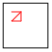 |

图像显示 `render-poly` 连接了 ([rest](http://docs.racket-lang.org/htdp-langs/beginner.html#%28def._htdp-beginner._%28%28lib._lang%2Fhtdp-beginner..rkt%29._rest%29%29) p) 的三个点，然后连接 ([first](http://docs.racket-lang.org/htdp-langs/beginner.html#%28def._htdp-beginner._%28%28lib._lang%2Fhtdp-beginner..rkt%29._first%29%29) p) 到 ([rest](http://docs.racket-lang.org/htdp-langs/beginner.html#%28def._htdp-beginner._%28%28lib._lang%2Fhtdp-beginner..rkt%29._rest%29%29) p) 的第一个点，即 ([second](http://docs.racket-lang.org/htdp-langs/beginner.html#%28def._htdp-beginner._%28%28lib._lang%2Fhtdp-beginner..rkt%29._second%29%29) p)。你可以通过使用 ([rest](http://docs.racket-lang.org/htdp-langs/beginner.html#%28def._htdp-beginner._%28%28lib._lang%2Fhtdp-beginner..rkt%29._rest%29%29) square-p) 直接作为 `render-poly` 的输入来轻松验证这一说法：

> | > (render-poly MT ([rest](http://docs.racket-lang.org/htdp-langs/beginner.html#%28def._htdp-beginner._%28%28lib._lang%2Fhtdp-beginner..rkt%29._rest%29%29) square-p)) |
> | --- |
> | 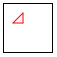 |

此外，你可能想知道如果我们向原始正方形添加另一个点，比如 ([make-posn](http://docs.racket-lang.org/htdp-langs/beginner.html#%28def._htdp-beginner._%28%28lib._lang%2Fhtdp-beginner..rkt%29._make-posn%29%29) 40 30)，`render-poly` 会绘制什么：

> |
> 
> &#124; > (render-poly &#124;
> 
> &#124;    MT &#124;
> 
> &#124;    ([cons](http://docs.racket-lang.org/htdp-langs/beginner.html#%28def._htdp-beginner._%28%28lib._lang%2Fhtdp-beginner..rkt%29._cons%29%29) ([make-posn](http://docs.racket-lang.org/htdp-langs/beginner.html#%28def._htdp-beginner._%28%28lib._lang%2Fhtdp-beginner..rkt%29._make-posn%29%29) 40 30) square-p)) &#124;
> 
> |
> 
> | 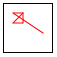 |
> | --- |

与期望的五边形不同，`render-poly` 总是在给定的 Polygon 的末端绘制三角形，并且将三角形之前的 Posn 连接起来。

尽管实验确认了我们的设计问题，但它们也表明该函数“几乎正确”。它连接由一系列 Posn 指定的连续点，然后从第一个 Posn 到最后一个 Posn 绘制三角形的线。如果它跳过这一最后一步，该函数将只是“连接点”，从而绘制一个“开放”的多边形。通过连接第一个和最后一个点，它就可以完成其任务。

换句话说，我们失败的分析表明有两个步骤的解决方案：

1.  解决一个更一般的问题。

1.  使用这个一般问题的解决方案来解决原始问题。

我们从一般问题的陈述开始：

> 样本问题 设计一个函数，该函数在给定的点群和给定的场景之间绘制连接。

虽然 render-poly 的设计几乎解决了这个问题，但我们主要从头开始设计这个函数。首先，我们需要一个数据定义。如果没有至少几个点，连接点就没有意义。为了简化问题，我们至少需要一个点：

> | ; An NELoP is one of: |
> | --- |
> | ; –  ([cons](http://docs.racket-lang.org/htdp-langs/beginner.html#%28def._htdp-beginner._%28%28lib._lang%2Fhtdp-beginner..rkt%29._cons%29%29)  Posn  '()) |
> | ; –  ([cons](http://docs.racket-lang.org/htdp-langs/beginner.html#%28def._htdp-beginner._%28%28lib._lang%2Fhtdp-beginner..rkt%29._cons%29%29)  Posn  NELoP) |

第二，我们为“连接点”函数制定了一个签名、一个目的陈述和一个头：

> | ; Image  NELoP -> Image |
> | --- |
> | ; connects the dots in p by rendering lines in img |
> | ([define](http://docs.racket-lang.org/htdp-langs/beginner.html#%28form._%28%28lib._lang%2Fhtdp-beginner..rkt%29._define%29%29) (connect-dots img p) |
> |   MT) |

第三，我们将 render-poly 的示例修改为这个新函数。正如我们的失败分析所说，该函数将 p 上的第一个 Posn 连接到第二个，第二个连接到第三个，第三个连接到第四个，以此类推，直到最后一个，它没有连接到任何东西。以下是第一个示例的修改，一个包含三个 Posn 的列表：

> | ([check-expect](http://docs.racket-lang.org/htdp-langs/beginner.html#%28form._%28%28lib._lang%2Fhtdp-beginner..rkt%29._check-expect%29%29) (connect-dots MT triangle-p) |
> | --- |
> |               ([scene+line](http://docs.racket-lang.org/teachpack/2htdpimage.html#%28def._%28%28lib._2htdp%2Fimage..rkt%29._scene%2Bline%29%29) |
> |                ([scene+line](http://docs.racket-lang.org/teachpack/2htdpimage.html#%28def._%28%28lib._2htdp%2Fimage..rkt%29._scene%2Bline%29%29) MT 20 20 30 20 "red") |
> |                20 10 20 20 "red")) |

预期值是一个包含两条线的图像：一条从第一个 Posn 到第二个，另一条从第二个到第三个 Posn。

练习 191。将第二个示例的 render-poly 函数修改为 connect-dots。

第四，我们使用处理非空列表的函数模板：

> | ([define](http://docs.racket-lang.org/htdp-langs/beginner.html#%28form._%28%28lib._lang%2Fhtdp-beginner..rkt%29._define%29%29) (connect-dots img p) |
> | --- |
> |   ([cond](http://docs.racket-lang.org/htdp-langs/beginner.html#%28form._%28%28lib._lang%2Fhtdp-beginner..rkt%29._cond%29%29) |
> | |   [([空？](http://docs.racket-lang.org/htdp-langs/beginner.html#%28def._htdp-beginner._%28%28lib._lang%2Fhtdp-beginner..rkt%29._empty~3f%29%29) ([剩余](http://docs.racket-lang.org/htdp-langs/beginner.html#%28def._htdp-beginner._%28%28lib._lang%2Fhtdp-beginner..rkt%29._rest%29%29) p)) ([...](http://docs.racket-lang.org/htdp-langs/beginner.html#%28form._%28%28lib._lang%2Fhtdp-beginner..rkt%29._......%29%29) ([第一个](http://docs.racket-lang.org/htdp-langs/beginner.html#%28def._htdp-beginner._%28%28lib._lang%2Fhtdp-beginner..rkt%29._first%29%29) p) [...](http://docs.racket-lang.org/htdp-langs/beginner.html#%28form._%28%28lib._lang%2Fhtdp-beginner..rkt%29._......%29%29))] |
> | |   [[else](http://docs.racket-lang.org/htdp-langs/beginner.html#%28form._%28%28lib._lang%2Fhtdp-beginner..rkt%29._else%29%29) ([...](http://docs.racket-lang.org/htdp-langs/beginner.html#%28form._%28%28lib._lang%2Fhtdp-beginner..rkt%29._......%29%29) ([第一个](http://docs.racket-lang.org/htdp-langs/beginner.html#%28def._htdp-beginner._%28%28lib._lang%2Fhtdp-beginner..rkt%29._first%29%29) p) [...](http://docs.racket-lang.org/htdp-langs/beginner.html#%28form._%28%28lib._lang%2Fhtdp-beginner..rkt%29._......%29%29) |
> | |            [...](http://docs.racket-lang.org/htdp-langs/beginner.html#%28form._%28%28lib._lang%2Fhtdp-beginner..rkt%29._......%29%29) (connect-dots img ([剩余](http://docs.racket-lang.org/htdp-langs/beginner.html#%28def._htdp-beginner._%28%28lib._lang%2Fhtdp-beginner..rkt%29._rest%29%29) p)) [...](http://docs.racket-lang.org/htdp-langs/beginner.html#%28form._%28%28lib._lang%2Fhtdp-beginner..rkt%29._......%29%29))])) |

模板包含两个子句：一个用于包含一个 Posn 的列表，另一个用于包含多个 Posn 的列表。由于在这两种情况下都至少有一个 Posn，因此模板在两个子句中都包含([第一个](http://docs.racket-lang.org/htdp-langs/beginner.html#%28def._htdp-beginner._%28%28lib._lang%2Fhtdp-beginner..rkt%29._first%29%29) p)；第二个子句还包含(connect-dots  img  ([剩余](http://docs.racket-lang.org/htdp-langs/beginner.html#%28def._htdp-beginner._%28%28lib._lang%2Fhtdp-beginner..rkt%29._rest%29%29) p))来提醒我们在数据定义的第二子句中的自引用。第五和中心步骤是将模板转换为函数定义。由于第一个子句是最简单的，所以我们从这里开始。正如我们之前所说的，当给定的列表中只有一个 Posn 时，无法连接任何东西。因此，函数仅从第一个[cond](http://docs.racket-lang.org/htdp-langs/beginner.html#%28form._%28%28lib._lang%2Fhtdp-beginner..rkt%29._cond%29%29)子句返回 MT。对于第二个[cond](http://docs.racket-lang.org/htdp-langs/beginner.html#%28form._%28%28lib._lang%2Fhtdp-beginner..rkt%29._cond%29%29)子句，让我们提醒自己模板表达式计算的内容：

1.  ([first](http://docs.racket-lang.org/htdp-langs/beginner.html#%28def._htdp-beginner._%28%28lib._lang%2Fhtdp-beginner..rkt%29._first%29%29)  p) 提取第一个 Posn；

1.  ([rest](http://docs.racket-lang.org/htdp-langs/beginner.html#%28def._htdp-beginner._%28%28lib._lang%2Fhtdp-beginner..rkt%29._rest%29%29) p) 从 p 中提取 NELoP；并且

1.  (connect-dots  img  ([rest](http://docs.racket-lang.org/htdp-langs/beginner.html#%28def._htdp-beginner._%28%28lib._lang%2Fhtdp-beginner..rkt%29._rest%29%29)  p)) 通过在 img 中绘制线条连接 ([rest](http://docs.racket-lang.org/htdp-langs/beginner.html#%28def._htdp-beginner._%28%28lib._lang%2Fhtdp-beginner..rkt%29._rest%29%29) p) 中的点。

从我们第一次尝试设计 render-poly 开始，我们知道 connect-dots 需要在 (connect-dots img ([rest](http://docs.racket-lang.org/htdp-langs/beginner.html#%28def._htdp-beginner._%28%28lib._lang%2Fhtdp-beginner..rkt%29._rest%29%29) p)) 的结果中添加一行，即从 ([first](http://docs.racket-lang.org/htdp-langs/beginner.html#%28def._htdp-beginner._%28%28lib._lang%2Fhtdp-beginner..rkt%29._first%29%29) p) 到 ([second](http://docs.racket-lang.org/htdp-langs/beginner.html#%28def._htdp-beginner._%28%28lib._lang%2Fhtdp-beginner..rkt%29._second%29%29) p)。我们知道 p 包含一个第二个 Posn，因为否则 [cond](http://docs.racket-lang.org/htdp-langs/beginner.html#%28form._%28%28lib._lang%2Fhtdp-beginner..rkt%29._cond%29%29) 的评估将选择第一个子句。将所有这些放在一起，我们得到以下定义：

> | ([define](http://docs.racket-lang.org/htdp-langs/beginner.html#%28form._%28%28lib._lang%2Fhtdp-beginner..rkt%29._define%29%29) (connect-dots img p) |
> | --- |
> |   ([cond](http://docs.racket-lang.org/htdp-langs/beginner.html#%28form._%28%28lib._lang%2Fhtdp-beginner..rkt%29._cond%29%29) |
> |     [([empty?](http://docs.racket-lang.org/htdp-langs/beginner.html#%28def._htdp-beginner._%28%28lib._lang%2Fhtdp-beginner..rkt%29._empty~3f%29%29) ([rest](http://docs.racket-lang.org/htdp-langs/beginner.html#%28def._htdp-beginner._%28%28lib._lang%2Fhtdp-beginner..rkt%29._rest%29%29) p)) img] |
> |     [[else](http://docs.racket-lang.org/htdp-langs/beginner.html#%28form._%28%28lib._lang%2Fhtdp-beginner..rkt%29._else%29%29) |
> |      (render-line |
> |        (connect-dots img ([rest](http://docs.racket-lang.org/htdp-langs/beginner.html#%28def._htdp-beginner._%28%28lib._lang%2Fhtdp-beginner..rkt%29._rest%29%29) p)) |
> |        ([first](http://docs.racket-lang.org/htdp-langs/beginner.html#%28def._htdp-beginner._%28%28lib._lang%2Fhtdp-beginner..rkt%29._first%29%29) p) |
> |        ([second](http://docs.racket-lang.org/htdp-langs/beginner.html#%28def._htdp-beginner._%28%28lib._lang%2Fhtdp-beginner..rkt%29._second%29%29) p))])) |

这个定义看起来比 render-poly 的错误版本简单，尽管它处理了比 render-poly 更多的位置列表。这个论点是非正式的。如果你需要关于集合或函数之间关系的此类声明的正式论据，你需要学习逻辑。确实，这本书的设计过程深受逻辑的影响，计算逻辑课程是一个自然的补充。一般来说，逻辑对于计算就像分析对于工程一样。

相反，我们说 connect-dots 是 render-poly 的泛化。后者的每个输入也是前者的输入。或者用数据定义的话说，每个多边形也是 NELoP。但是，有许多 NELoP 不是多边形。为了精确起见，所有包含两个或一个元素的位置列表都属于 NELoP 但不属于多边形。然而，对你来说，关键的认识是，仅仅因为一个函数必须处理比另一个函数更多的输入，并不意味着前者比后者更复杂；泛化通常简化函数定义。

如上所述，render-poly 可以使用 connect-dots 连接给定多边形的所有连续位置；为了完成其任务，它必须然后从给定多边形的第一个到最后的位置添加一条线。从代码的角度来看，这仅仅意味着组合两个函数：connect-dots 和 render-line，但我们还需要一个函数来从多边形中提取最后一个位置。一旦我们得到这个愿望，render-poly 的定义就是一行：

> | ; 图像  多边形 -> 图像 |
> | --- |
> | ; 向 img 添加 p 的图像 |
> | ([定义](http://docs.racket-lang.org/htdp-langs/beginner.html#%28form._%28%28lib._lang%2Fhtdp-beginner..rkt%29._define%29%29) 绘制多边形 img p) |
> |   (绘制线条 (连接点 img p) |
> |                ([第一个](http://docs.racket-lang.org/htdp-langs/beginner.html#%28def._htdp-beginner._%28%28lib._lang%2Fhtdp-beginner..rkt%29._first%29%29) p) |
> |                ([最后一个](http://docs.racket-lang.org/htdp-langs/beginner.html#%28def._htdp-beginner._%28%28lib._lang%2Fhtdp-beginner..rkt%29._last%29%29) p))) |

为 last 制定愿望清单条目是直接的：

> | ; 多边形 -> 位置 |
> | --- |
> | ; 从 p 中提取最后一个元素 |

然后，再次明确的是，最后一个可能是一个通用的有用函数，我们可能更适合为 NELoP 的输入来设计它：

> | ; NELoP -> 位置 |
> | --- |
> | ; 从 p 中提取最后一个元素 |
> | ([定义](http://docs.racket-lang.org/htdp-langs/beginner.html#%28form._%28%28lib._lang%2Fhtdp-beginner..rkt%29._define%29%29) (last p) |
> |   ([第一个](http://docs.racket-lang.org/htdp-langs/beginner.html#%28def._htdp-beginner._%28%28lib._lang%2Fhtdp-beginner..rkt%29._first%29%29) p)) |

停止！为什么可以使用 [first](http://docs.racket-lang.org/htdp-langs/beginner.html#%28def._htdp-beginner._%28%28lib._lang%2Fhtdp-beginner..rkt%29._first%29%29) 来定义 last 的占位符？练习 192。论证为什么在 多边形 上使用 last 是可接受的。也论证为什么你可以为 connect-dots 的模板调整 last：

> | ([定义](http://docs.racket-lang.org/htdp-langs/beginner.html#%28form._%28%28lib._lang%2Fhtdp-beginner..rkt%29._define%29%29) (last p) |
> | --- |
> |   ([条件](http://docs.racket-lang.org/htdp-langs/beginner.html#%28form._%28%28lib._lang%2Fhtdp-beginner..rkt%29._cond%29%29) |
> |     [([空？](http://docs.racket-lang.org/htdp-langs/beginner.html#%28def._htdp-beginner._%28%28lib._lang%2Fhtdp-beginner..rkt%29._empty~3f%29%29) ([剩余](http://docs.racket-lang.org/htdp-langs/beginner.html#%28def._htdp-beginner._%28%28lib._lang%2Fhtdp-beginner..rkt%29._rest%29%29) p)) ([...](http://docs.racket-lang.org/htdp-langs/beginner.html#%28form._%28%28lib._lang%2Fhtdp-beginner..rkt%29._......%29%29) ([第一个](http://docs.racket-lang.org/htdp-langs/beginner.html#%28def._htdp-beginner._%28%28lib._lang%2Fhtdp-beginner..rkt%29._first%29%29) p) [...](http://docs.racket-lang.org/htdp-langs/beginner.html#%28form._%28%28lib._lang%2Fhtdp-beginner..rkt%29._......%29%29))] |
> |     [[否则](http://docs.racket-lang.org/htdp-langs/beginner.html#%28form._%28%28lib._lang%2Fhtdp-beginner..rkt%29._else%29%29) ([...](http://docs.racket-lang.org/htdp-langs/beginner.html#%28form._%28%28lib._lang%2Fhtdp-beginner..rkt%29._......%29%29) ([第一个](http://docs.racket-lang.org/htdp-langs/beginner.html#%28def._htdp-beginner._%28%28lib._lang%2Fhtdp-beginner..rkt%29._first%29%29) p) [...](http://docs.racket-lang.org/htdp-langs/beginner.html#%28form._%28%28lib._lang%2Fhtdp-beginner..rkt%29._......%29%29) (last ([剩余](http://docs.racket-lang.org/htdp-langs/beginner.html#%28def._htdp-beginner._%28%28lib._lang%2Fhtdp-beginner..rkt%29._rest%29%29) p)) [...](http://docs.racket-lang.org/htdp-langs/beginner.html#%28form._%28%28lib._lang%2Fhtdp-beginner..rkt%29._......%29%29))])) |

最后，为 last 开发示例，将它们转换为测试，并确保 图 73 中 last 的定义在你的示例上工作。

> > > | ; 图像  多边形 -> 图像 |
> > > | --- |
> > > | ; 将 p 的一个角添加到 img |
> > > | ([定义](http://docs.racket-lang.org/htdp-langs/beginner.html#%28form._%28%28lib._lang%2Fhtdp-beginner..rkt%29._define%29%29) (render-poly img p) |
> > > |   (render-line (connect-dots img p) ([first](http://docs.racket-lang.org/htdp-langs/beginner.html#%28def._htdp-beginner._%28%28lib._lang%2Fhtdp-beginner..rkt%29._first%29%29) p) (last p))) |
> > > |   |
> > > | ; 图像  NELoP -> 图像 |
> > > | ; 将图像中 p 中的位置连接起来 |
> > > | ([define](http://docs.racket-lang.org/htdp-langs/beginner.html#%28form._%28%28lib._lang%2Fhtdp-beginner..rkt%29._define%29%29) (connect-dots img p) |
> > > |   ([cond](http://docs.racket-lang.org/htdp-langs/beginner.html#%28form._%28%28lib._lang%2Fhtdp-beginner..rkt%29._cond%29%29) |
> > > |     [([empty?](http://docs.racket-lang.org/htdp-langs/beginner.html#%28def._htdp-beginner._%28%28lib._lang%2Fhtdp-beginner..rkt%29._empty~3f%29%29) ([rest](http://docs.racket-lang.org/htdp-langs/beginner.html#%28def._htdp-beginner._%28%28lib._lang%2Fhtdp-beginner..rkt%29._rest%29%29) p)) img] |
> > > |     [[else](http://docs.racket-lang.org/htdp-langs/beginner.html#%28form._%28%28lib._lang%2Fhtdp-beginner..rkt%29._else%29%29) (render-line (connect-dots img ([rest](http://docs.racket-lang.org/htdp-langs/beginner.html#%28def._htdp-beginner._%28%28lib._lang%2Fhtdp-beginner..rkt%29._rest%29%29) p)) |
> > > |                        ([first](http://docs.racket-lang.org/htdp-langs/beginner.html#%28def._htdp-beginner._%28%28lib._lang%2Fhtdp-beginner..rkt%29._first%29%29) p) |
> > > |                        ([second](http://docs.racket-lang.org/htdp-langs/beginner.html#%28def._htdp-beginner._%28%28lib._lang%2Fhtdp-beginner..rkt%29._second%29%29) p))])) |
> > > |   |
> > > | ; 图像  位置  位置 -> 图像 |
> > > | ; 在图像 im 中从位置 p 到位置 q 绘制一条红色线条 |
> > > | ([define](http://docs.racket-lang.org/htdp-langs/beginner.html#%28form._%28%28lib._lang%2Fhtdp-beginner..rkt%29._define%29%29) (render-line im p q) |
> > > |   ([scene+line](http://docs.racket-lang.org/teachpack/2htdpimage.html#%28def._%28%28lib._2htdp%2Fimage..rkt%29._scene%2Bline%29%29) |
> > > |     im ([posn-x](http://docs.racket-lang.org/htdp-langs/beginner.html#%28def._htdp-beginner._%28%28lib._lang%2Fhtdp-beginner..rkt%29._posn-x%29%29) p) ([posn-y](http://docs.racket-lang.org/htdp-langs/beginner.html#%28def._htdp-beginner._%28%28lib._lang%2Fhtdp-beginner..rkt%29._posn-y%29%29) p) ([posn-x](http://docs.racket-lang.org/htdp-langs/beginner.html#%28def._htdp-beginner._%28%28lib._lang%2Fhtdp-beginner..rkt%29._posn-x%29%29) q) ([posn-y](http://docs.racket-lang.org/htdp-langs/beginner.html#%28def._htdp-beginner._%28%28lib._lang%2Fhtdp-beginner..rkt%29._posn-y%29%29) q) "red")) |
> > > |   |
> > > | ; 多边形 -> 位置 |
> > > | ; 从 p 中提取最后一个项目 |
> > > | ([define](http://docs.racket-lang.org/htdp-langs/beginner.html#%28form._%28%28lib._lang%2Fhtdp-beginner..rkt%29._define%29%29) (last p) |
> > > | |   ([cond](http://docs.racket-lang.org/htdp-langs/beginner.html#%28form._%28%28lib._lang%2Fhtdp-beginner..rkt%29._cond%29%29) |
> > > | |   [([empty?](http://docs.racket-lang.org/htdp-langs/beginner.html#%28def._htdp-beginner._%28%28lib._lang%2Fhtdp-beginner..rkt%29._empty~3f%29%29) ([rest](http://docs.racket-lang.org/htdp-langs/beginner.html#%28def._htdp-beginner._%28%28lib._lang%2Fhtdp-beginner..rkt%29._rest%29%29) ([rest](http://docs.racket-lang.org/htdp-langs/beginner.html#%28def._htdp-beginner._%28%28lib._lang%2Fhtdp-beginner..rkt%29._rest%29%29) ([rest](http://docs.racket-lang.org/htdp-langs/beginner.html#%28def._htdp-beginner._%28%28lib._lang%2Fhtdp-beginner..rkt%29._rest%29%29) p)))) ([third](http://docs.racket-lang.org/htdp-langs/beginner.html#%28def._htdp-beginner._%28%28lib._lang%2Fhtdp-beginner..rkt%29._third%29%29) p)] |
> > > | |     [[else](http://docs.racket-lang.org/htdp-langs/beginner.html#%28form._%28%28lib._lang%2Fhtdp-beginner..rkt%29._else%29%29) (last ([rest](http://docs.racket-lang.org/htdp-langs/beginner.html#%28def._htdp-beginner._%28%28lib._lang%2Fhtdp-beginner..rkt%29._rest%29%29) p))])) |
> > > 
> 图 73：绘制多边形

总结来说，render-poly 的发展自然引导我们考虑连接一系列连续点的一般问题。然后我们可以通过定义一个将通用函数与其他辅助函数组合的函数来解决原始问题。因此，程序由一个相对直接的主函数——render-poly——和执行大部分工作的复杂辅助函数组成。你将一次又一次地看到这种设计方法很常见，并且是设计和组织程序的好方法。

练习 193. 这里是定义 render-poly 的两个更多想法：

+   render-poly 可以将 p 的最后一个元素 cons 到 p 上，然后调用 connect-dots。

+   render-poly 可以通过一个在 Polygons 上工作的 add-at-end 版本，将 p 的第一个元素添加到 p 的末尾。

使用这两个想法来定义 render-poly；确保两个定义都能通过测试用例。

练习 194. 修改 connect-dots，使其消耗一个额外的 Posn，该位置与最后一个 Posn 相连接。然后修改 render-poly 以使用这个新的 connect-dots 版本。

自然地，像 last 这样的函数在完整的编程语言中是可用的，而像 render-poly 这样的函数在 2htdp/image teachpack 中也是可用的。如果你想知道我们为什么只设计了这些函数，考虑一下这本书和这个章节的标题。目标不是（仅仅）设计有用的函数，而是研究代码是如何系统性地设计的。具体来说，本节是关于设计过程中的泛化思想；关于这个想法的更多内容，请参阅抽象和累加器。

### 12 项目：列表🔗 "链接到这里")

本章介绍了几个扩展练习，所有这些练习的目的是巩固你对设计元素的理解：批处理和交互式程序的设计、组合式设计、设计愿望清单以及函数的设计配方。第一部分涵盖了涉及现实世界数据的问题：英语字典和 iTunes 库。一个单词游戏问题需要两个部分：一个部分用于说明组合式设计，另一个部分用于解决问题的核心。其余部分是关于游戏和有限状态机。

#### 12.1 现实世界数据：字典🔗 "链接到这里")

现实世界中的信息往往以大量出现，这就是为什么使用程序来处理它非常有意义。例如，字典不仅仅包含几十个单词，而是包含数十万个。当你想要处理这样大量的信息时，你必须仔细设计程序，使用小例子。一旦你确信程序能够正常工作，你就可以在现实世界的数据上运行它们以获得真实的结果。如果程序处理这样大量的数据太慢，那么反思每个函数及其工作方式。质疑你是否可以消除任何冗余的计算。

> > > | ; 在 OS X 上： |
> > > | --- |
> > > | ([define](http://docs.racket-lang.org/htdp-langs/beginner.html#%28form._%28%28lib._lang%2Fhtdp-beginner..rkt%29._define%29%29) LOCATION "/usr/share/dict/words") |
> > > | ; 在 LINUX 上：/usr/share/dict/words 或 /var/lib/dict/words |
> > > | ; 在 WINDOWS 上：从你的 Linux 朋友那里借单词文件 |
> > > |   |
> > > | ; 字典是一个字符串列表. |
> > > | ([define](http://docs.racket-lang.org/htdp-langs/beginner.html#%28form._%28%28lib._lang%2Fhtdp-beginner..rkt%29._define%29%29) AS-LIST ([read-lines](http://docs.racket-lang.org/teachpack/2htdpbatch-io.html#%28def._%28%28lib._2htdp%2Fbatch-io..rkt%29._read-lines%29%29) LOCATION)) |
> > > 
> 图 74：读取字典

图 74 显示了读取整个英语字典所需的一行代码。为了了解这样的字典有多大，请根据你的计算机调整图中的代码，并使用 [length](http://docs.racket-lang.org/htdp-langs/beginner.html#%28def._htdp-beginner._%28%28lib._lang%2Fhtdp-beginner..rkt%29._length%29%29) 确定你的字典中有多少单词。今天，2017 年 7 月 25 日，我们的字典中有 235,886 个单词。

在以下练习中，字母扮演着重要的角色。你可能需要在程序的顶部添加以下内容，除了你为 图 74 的改编之外：

> | ; 一个 Letter 是以下 1String 之一： |
> | --- |
> | ; –  "a" |
> | ; – ... |
> | ; –  "z" |
> | ; 或等价地，这个列表的 [member?](http://docs.racket-lang.org/htdp-langs/beginner.html#%28def._htdp-beginner._%28%28lib._lang%2Fhtdp-beginner..rkt%29._member~3f%29%29)： |
> | ([define](http://docs.racket-lang.org/htdp-langs/beginner.html#%28form._%28%28lib._lang%2Fhtdp-beginner..rkt%29._define%29%29) LETTERS |
> |   ([explode](http://docs.racket-lang.org/htdp-langs/beginner.html#%28def._htdp-beginner._%28%28lib._lang%2Fhtdp-beginner..rkt%29._explode%29%29) "abcdefghijklmnopqrstuvwxyz")) |

提示：使用 [list](http://docs.racket-lang.org/htdp-langs/beginner.html#%28def._htdp-beginner._%28%28lib._lang%2Fhtdp-beginner..rkt%29._list%29%29) 来制定练习的示例和测试。

练习 195\. 设计一个名为 starts-with# 的函数，它接受一个 Letter 和 Dictionary，然后计算给定 Dictionary 中有多少单词以给定的 Letter 开头。一旦你知道你的函数可以正常工作，确定在你的计算机字典中多少单词以 "e" 开头，以及多少以 "z" 开头。

练习 196\. 设计 count-by-letter 函数。该函数接受一个 Dictionary，并计算给定字典中每个字母作为单词第一个字母的使用频率。其结果是 Letter-Counts 列表，这是一种结合字母和计数的组合数据。

一旦你的函数设计完成，确定在你的计算机字典中所有字母出现的单词数量。

练习 197\. 设计 most-frequent 函数。该函数接受一个 Dictionary，并产生最常作为给定 Dictionary 中第一个字母出现的 Letter-Count。

在你的计算机字典中，哪个字母使用得最频繁，以及它使用了多少次？

设计选择注意事项：这个练习要求将上一个练习的解决方案与一个从 Letter-Count 列表中选取正确配对的函数组合起来。设计这个后者的函数有两种方式：

+   设计一个函数，选择计数最大的对。

+   设计一个函数，从排序后的对列表中选取第一个。

考虑设计两个。你更喜欢哪一个？为什么？

练习 198。设计 words-by-first-letter 函数。该函数消耗一个字典并产生一个字典列表，每个字母一个。

使用这个新函数重新设计 most-frequent，命名为 most-frequent.v2。完成设计后，确保两个函数在您的计算机字典上计算相同的结果：

> | ([check-expect](http://docs.racket-lang.org/htdp-langs/beginner.html#%28form._%28%28lib._lang%2Fhtdp-beginner..rkt%29._check-expect%29%29) |
> | --- |
> |   (most-frequent AS-LIST) |
> |   (most-frequent.v2 AS-LIST)) |

关于设计选择的说明：对于 words-by-first-letter，你有一个选择来处理给定字典中某些字母没有单词的情况：

+   一种选择是排除结果中的空字典。这样做简化了函数的测试和 most-frequent.v2 的设计，但也需要设计一个辅助函数。

+   另一种选择是在查找特定字母的单词时，即使没有找到任何单词，也将空列表'()'作为结果。这种选择避免了第一种选择所需的辅助函数，但增加了 most-frequent.v2 的设计复杂性。结束

关于中间数据和剪枝的说明：这个单词计数函数的第二版通过创建一个大的中间数据结构来计算所需的结果，这个数据结构除了其部分被计数外没有其他实际用途。有时，编程语言会自动通过将两个函数融合为一个来消除这些数据结构，这种对程序进行的转换也称为剪枝。当你知道语言不会剪枝程序时，如果程序处理数据不够快，考虑消除这样的数据结构。

#### 12.2 真实世界数据：iTunes🔗 "链接到此处")

苹果的 iTunes 软件被广泛用于收集音乐、视频、电视节目等内容。您可能希望分析您的 iTunes 应用程序收集的信息。实际上，提取其数据库非常简单。选择应用程序的文件菜单，选择库然后导出—<wbr>然后，您就可以导出所谓的 iTunes 信息的 XML 表示。由于这样的专有格式经常变化，本书附带两个示例文件：itunes.xml 和 itunes2.xml。您可能希望使用这些文件而不是您自己的。XML 处理在项目：XML 的商业中有详细说明；在这里，我们依赖于 2htdp/itunes teachpack 来获取信息。具体来说，这个 teahpack 允许您检索 iTunes 库中包含的音乐轨道。

虽然细节有所不同，但 iTunes 库为每个音乐轨道维护以下一些类型的信息，偶尔会少一些：

+   轨道 ID，相对于您库中轨道的唯一标识符，例如：442

+   名称，轨道的标题，野孩子

+   艺术家，制作艺术家，恩雅

+   专辑，所属专辑的标题，没有一天

+   音乐类型，轨道所属的音乐类型，新世纪

+   类型，音乐的编码，MPEG 音频文件

+   文件大小，文件大小，4562044

+   总时长，轨道长度（毫秒），227996

+   轨道编号，轨道在专辑中的位置，2

+   轨道数量，专辑中的轨道数量，11

+   年份，发行年份，2000

+   添加日期，轨道被添加的时间，2002-7-17 3:55:14

+   播放次数，播放的次数，20

+   播放日期，最后一次播放的时间，3388484113 Unix 秒

+   播放日期 UTC，最后一次播放的时间，2011-5-17 17:35:13

如同往常，第一个任务是选择一个 BSL 数据表示来表示这些信息。在本节中，我们使用两种音乐轨道的表示：基于结构的另一种基于列表。除了 2htdp/batch-io teachpack 之外，本节还依赖于 2htdp/itunes teachpack。前者为每个轨道记录固定数量的属性，并且只有当所有信息都可用时，后者则将所有可用的信息表示为数据。每种表示都适用于特定的用途；对于某些用途，两种表示都很有用。

> > > | ; the 2htdp/itunes teachpack documentation, part 1: |
> > > | --- |
> > > |   |
> > > | ; An LTracks is one of: |
> > > | ; –  '() |
> > > | ; –  ([cons](http://docs.racket-lang.org/htdp-langs/beginner.html#%28def._htdp-beginner._%28%28lib._lang%2Fhtdp-beginner..rkt%29._cons%29%29)  Track  LTracks) |
> > > |   |
> > > | ([define-struct](http://docs.racket-lang.org/htdp-langs/beginner.html#%28form._%28%28lib._lang%2Fhtdp-beginner..rkt%29._define-struct%29%29) track |
> > > |   [name artist album time track# added play# played]) |
> > > | ; 一个轨道是一个结构： |
> > > | ;   (make-track  String  String  String  N  N  Date  N  Date) |
> > > | ; 解释：一个实例按顺序记录以下信息： |
> > > | ; 标题，制作艺术家，所属专辑， |
> > > | ; 其播放时间（毫秒），其在列表中的位置 |
> > > | ; 专辑，添加日期，播放次数 |
> > > | ; 播放次数，以及最后一次播放的日期 |
> > > |   |
> > > | ([define-struct](http://docs.racket-lang.org/htdp-langs/beginner.html#%28form._%28%28lib._lang%2Fhtdp-beginner..rkt%29._define-struct%29%29) date [year month day hour minute [second](http://docs.racket-lang.org/htdp-langs/beginner.html#%28def._htdp-beginner._%28%28lib._lang%2Fhtdp-beginner..rkt%29._second%29%29)]) |
> > > | ; 一个日期是一个结构： |
> > > | ;   (make-date  N  N  N  N  N  N) |
> > > | ; 解释：一个实例记录了六条信息： |
> > > | ; 日期的年份，月份（介于 1 到 12 之间，包括 12）， |
> > > | ; 日期（介于 1 到 31 之间），小时（介于 0 |
> > > | ; 并且 23），分钟（介于 0 和 59 之间），以及 |
> > > | ; 轨道的第二秒（也介于 0 到 59 之间）。 |
> > > 
> 图 75：将 iTunes 轨道表示为结构（结构体）
> 
> > > > | ; Any  Any  Any  Any  Any  Any  Any  Any -> Track or #false |
> > > > | --- |
> > > > | ; 为合法输入创建 Track 的实例 |
> > > > | ; 否则它产生 #false |
> > > > | ([define](http://docs.racket-lang.org/htdp-langs/beginner.html#%28form._%28%28lib._lang%2Fhtdp-beginner..rkt%29._define%29%29) (create-track name artist album time |
> > > > |                       track# added play# played) |
> > > > |   [...](http://docs.racket-lang.org/htdp-langs/beginner.html#%28form._%28%28lib._lang%2Fhtdp-beginner..rkt%29._......%29%29)) |
> > > > |   |
> > > > | ; Any  Any  Any  Any  Any  Any -> Date or #false |
> > > > | ; 为合法输入创建 Date 的实例 |
> > > > | ; 否则它产生 #false |
> > > > | ([define](http://docs.racket-lang.org/htdp-langs/beginner.html#%28form._%28%28lib._lang%2Fhtdp-beginner..rkt%29._define%29%29) (create-date y mo day h m s) |
> > > > |   [...](http://docs.racket-lang.org/htdp-langs/beginner.html#%28form._%28%28lib._lang%2Fhtdp-beginner..rkt%29._......%29%29)) |
> > > > |   |
> > > > | ; String -> LTracks |
> > > > | ; 从 ITUNES-LOCATION 创建一个曲目列表表示 |
> > > > | ; 文件名中的文本（来自 iTunes 的 XML 导出） |
> > > > | ([define](http://docs.racket-lang.org/htdp-langs/beginner.html#%28form._%28%28lib._lang%2Fhtdp-beginner..rkt%29._define%29%29) (read-itunes-as-tracks file-name) |
> > > > |   [...](http://docs.racket-lang.org/htdp-langs/beginner.html#%28form._%28%28lib._lang%2Fhtdp-beginner..rkt%29._......%29%29)) |
> > > > 
> 图 76：将 iTunes 曲目表示为结构（函数）

图 75 和 图 76 介绍了由 2htdp/itunes teachpack 实现的基于结构的曲目表示。曲目结构类型包含八个字段，每个字段代表曲目的一个特定属性。大多数字段包含原子类型的数据，例如 Strings 和 Ns；其他字段包含 Dates，这是一个包含六个字段的类型结构。2htdp/itunes teachpack 导出了曲目和日期结构类型的所有谓词和选择器，但提供了检查构造函数而不是构造函数。

2htdp/itunes teachpack 描述的最后一个元素是一个函数，它读取 iTunes XML 库描述并返回一个曲目列表，LTracks。一旦您从某个 iTunes 应用程序中导出 XML 库，您就可以运行以下代码片段来检索所有记录：

> | ; 修改以下内容以使用您选择的名字 |
> | --- |
> | ([define](http://docs.racket-lang.org/htdp-langs/beginner.html#%28form._%28%28lib._lang%2Fhtdp-beginner..rkt%29._define%29%29) ITUNES-LOCATION "itunes.xml") |
> |   |
> | ; LTracks |
> | ([define](http://docs.racket-lang.org/htdp-langs/beginner.html#%28form._%28%28lib._lang%2Fhtdp-beginner..rkt%29._define%29%29) itunes-tracks |
> |   (read-itunes-as-tracks ITUNES-LOCATION)) |

将片段保存在与您的 iTunes XML 导出相同的文件夹中。请记住不要使用 itunes-tracks 作为示例；它对于这个用途来说太大。实际上，它可能如此之大，以至于每次您在 DrRacket 中运行 BSL 程序时读取文件都会花费很多时间。因此，在设计函数时，您可能希望取消注释此第二行。只有当您希望计算有关您的 iTunes 收藏的信息时，才取消注释它。

练习 199\. 虽然重要的数据定义已经提供，但设计步骤的第一步仍然不完整。请编写日期、曲目和 LTracks 的示例。这些示例在以下练习中作为输入很有用。

练习 200\. 设计函数 total-time，它接受 LTracks 的一个元素并生成总播放时间。一旦程序完成，计算 iTunes 收藏的总播放时间。

练习 201\. 设计选择所有专辑标题的功能。该函数接受 LTracks 并生成一个字符串列表的专辑标题列表。

还要设计函数 create-set。它接受一个字符串列表并构造一个包含给定列表中每个字符串的集合，每个字符串只出现一次。提示：如果字符串 s 在给定列表的前面，并且也在列表的其余部分中出现，则 create-set 不会保留 s。

最后设计 select-album-titles/unique，它接受 LTracks 并生成一个唯一的专辑标题列表。使用此函数确定您的 iTunes 收藏中的所有专辑标题，并找出它包含多少个不同的专辑。

练习 202\. 设计选择专辑的功能。该函数接受专辑标题和 LTracks。它从后者中提取属于给定专辑的曲目列表。

练习 203\. 设计选择专辑日期的功能。该函数接受专辑标题、日期和 LTracks。它从后者中提取属于给定专辑且在给定日期之后播放的曲目列表。提示：你必须设计一个函数，它接受两个日期并确定第一个是否在第二个之前。

练习 204\. 设计选择专辑的功能。该函数接受 LTracks 的一个元素。它生成一个 LTracks 列表，每个专辑一个。每个专辑通过其标题唯一标识，并在结果中只出现一次。提示：(1) 你想使用前面练习的一些解决方案。(2) 分组函数接受两个列表：专辑标题列表和曲目列表；它将后者视为原子，直到将其传递给辅助函数。参见练习 196。

术语以 select-开头的函数被称为数据库查询。有关更多详细信息，请参阅项目：数据库。结束

> > > | ; 2htdp/itunes 教学包文档，第二部分： |
> > > | --- |
> > > |   |
> > > | ; An LLists is one of: |
> > > | ; –  '() |
> > > | ; –  ([cons](http://docs.racket-lang.org/htdp-langs/beginner.html#%28def._htdp-beginner._%28%28lib._lang%2Fhtdp-beginner..rkt%29._cons%29%29)  LAssoc  LLists) |
> > > |   |
> > > | ; 一个 LAssoc 可以是以下之一： |
> > > | ; –  '() |
> > > | ; –  ([cons](http://docs.racket-lang.org/htdp-langs/beginner.html#%28def._htdp-beginner._%28%28lib._lang%2Fhtdp-beginner..rkt%29._cons%29%29)  关联  LAssoc) |
> > > | ;  |
> > > | ; 一个关联是一个包含两个项目的列表： |
> > > | ;   ([cons](http://docs.racket-lang.org/htdp-langs/beginner.html#%28def._htdp-beginner._%28%28lib._lang%2Fhtdp-beginner..rkt%29._cons%29%29)  字符串  ([cons](http://docs.racket-lang.org/htdp-langs/beginner.html#%28def._htdp-beginner._%28%28lib._lang%2Fhtdp-beginner..rkt%29._cons%29%29)  BSDN  '())) |
> > > |   |
> > > | ; BSDN 可以是以下之一： |
> > > | ; –  布尔 |
> > > | ; –  数字 |
> > > | ; –  字符串 |
> > > | ; –  日期 |
> > > |   |
> > > | ; 字符串 -> LLists |
> > > | ; 创建所有轨道的列表表示形式 |
> > > | ; 文件名，必须是 iTunes 的 XML 导出 |
> > > | ([定义](http://docs.racket-lang.org/htdp-langs/beginner.html#%28form._%28%28lib._lang%2Fhtdp-beginner..rkt%29._define%29%29) (read-itunes-as-lists 文件名) |
> > > |   [...](http://docs.racket-lang.org/htdp-langs/beginner.html#%28form._%28%28lib._lang%2Fhtdp-beginner..rkt%29._......%29%29)) |
> > > 
> 图 77：将 iTunes 轨道表示为列表

图 77 展示了 2htdp/itunes 教学包如何使用列表表示轨道。一个 LLists 是一个轨道表示的列表，每个表示都是一个与四种类型的值配对的字符串列表。read-itunes-as-lists 函数读取 iTunes XML 库并生成一个 LLists 元素。因此，如果你将以下定义添加到你的程序中，你将能够访问所有轨道信息：

> | ; 修改以下内容以使用你选择的名称 |
> | --- |
> | ([定义](http://docs.racket-lang.org/htdp-langs/beginner.html#%28form._%28%28lib._lang%2Fhtdp-beginner..rkt%29._define%29%29) ITUNES-LOCATION "itunes.xml") |
> |   |
> | ; LLists |
> | ([定义](http://docs.racket-lang.org/htdp-langs/beginner.html#%28form._%28%28lib._lang%2Fhtdp-beginner..rkt%29._define%29%29) list-tracks |
> |   (read-itunes-as-lists ITUNES-LOCATION)) |

然后将它保存在 iTunes 库存储的同一文件夹中。

练习 205：开发 LAssoc 和 LLists 的示例，即曲目和此类曲目列表的列表表示。

练习 206：设计 find-association 函数。它消耗三个参数：一个名为 key 的 String，一个 LAssoc，以及一个名为 default 的 Any 元素。它产生第一个第一个元素等于 key 的 Association，如果没有这样的关联，则返回 default。

注意：在设计了此函数之后，阅读有关 [assoc](http://docs.racket-lang.org/htdp-langs/beginner.html#%28def._htdp-beginner._%28%28lib._lang%2Fhtdp-beginner..rkt%29._assoc%29%29) 的内容。

练习 207：设计 total-time/list，它消耗一个 LLists 并产生播放总时长。提示：首先解决 练习 206。

完成设计后，计算你的 iTunes 收藏的总播放时间。将此结果与 练习 200 中的 total-time 函数计算的时间进行比较。为什么会有差异？

练习 208：设计 boolean-attributes。该函数消耗一个 LLists 并产生与 Boolean 属性关联的 String。提示：使用 练习 201 中的 create-set。

完成后，确定你的 iTunes 库为其曲目使用了多少布尔值属性。它们有意义吗？

注意：基于列表的表示比基于结构的表示稍微少一些组织性。在此上下文中偶尔会使用半结构化这个词。此类列表表示可以容纳很少出现且不适合结构类型的属性。人们经常使用此类表示来探索未知信息，并在格式已知时引入结构。设计一个名为 track-as-struct 的函数，当可能时，将 LAssoc 转换为 Track。结束

#### 12.3 单词游戏，组合图示🔗 "链接到此处")

一些人在报纸和杂志上解决单词谜题。试试这个：

> 样例问题：给定一个单词，找出由相同字母组成的所有单词。例如，“cat”也可以拼成“act”。

让我们通过一个例子来操作。假设你被给出了“dear”。有 24 种可能的四个字母的排列方式：

> | ader |  | aedr |  | aerd |  | adre |  | arde |  | ared |
> | --- | --- | --- | --- | --- | --- | --- | --- | --- | --- | --- |
> | daer |  | eadr |  | eard |  | dare |  | rade |  | raed |
> | dear |  | edar |  | erad |  | drae |  | rdae |  | read |
> | dera |  | edra |  | erda |  | drea |  | rdea |  | reda |

在这个列表中，有三个合法的单词：“read”，“dear”和“dare”。

注意：如果一个单词包含相同的字母两次，所有重新排列的集合可能包含几个相同的字符串。就我们的目的而言，这是可以接受的。对于现实世界的程序，你可能希望使用集合而不是列表来避免重复条目。参见关于列表和集合的说明。结束

对所有可能排列的系统列举显然是程序的任务，就像在英语词典中进行搜索一样。参见现实世界数据：词典以处理现实世界的词典。本节涵盖了搜索函数的设计，将其他问题的解决方案留到下一节。通过分离这两个部分，本节可以专注于系统程序设计的整体思想。

让我们暂时想象一下我们如何手动解决这个问题。如果你有足够的时间，你可能会列出给定单词中所有字母的所有可能排列，然后只选择那些也出现在词典中的变体。显然，程序也可以以这种方式进行，这暗示了一种自然的设计方法，但，就像往常一样，我们系统地开始，首先选择输入和输出的数据表示。

至少从第一眼看来，将单词表示为字符串，将结果表示为单词列表或字符串列表是自然的。基于这个选择，我们可以制定签名和目的声明：

> | ; String -> List-of-strings |
> | --- |
> | ; 查找与 s 使用相同字母的所有单词 |
> | ([define](http://docs.racket-lang.org/htdp-langs/beginner.html#%28form._%28%28lib._lang%2Fhtdp-beginner..rkt%29._define%29%29) (alternative-words s) |
> |   [...](http://docs.racket-lang.org/htdp-langs/beginner.html#%28form._%28%28lib._lang%2Fhtdp-beginner..rkt%29._......%29%29)) |

接下来，我们需要一些示例。如果给定的单词是“cat”，我们正在处理三个字母：c，a 和 t。一些尝试表明这些字母有六种排列方式：cat，cta，tca，tac，act 和 atc。其中两个是实际单词：“cat”和“act”。因为 alternative-words 产生一个字符串列表，所以有两种方式来表示结果：([list](http://docs.racket-lang.org/htdp-langs/beginner.html#%28def._htdp-beginner._%28%28lib._lang%2Fhtdp-beginner..rkt%29._list%29%29) "act" "cat")和([list](http://docs.racket-lang.org/htdp-langs/beginner.html#%28def._htdp-beginner._%28%28lib._lang%2Fhtdp-beginner..rkt%29._list%29%29) "cat" "act")。幸运的是，BSL 提供了一种表示函数返回两种可能结果的方法：

> | ([check-member-of](http://docs.racket-lang.org/htdp-langs/beginner.html#%28form._%28%28lib._lang%2Fhtdp-beginner..rkt%29._check-member-of%29%29) (alternative-words "cat") |
> | --- |
> |                  ([列表](http://docs.racket-lang.org/htdp-langs/beginner.html#%28def._htdp-beginner._%28%28lib._lang%2Fhtdp-beginner..rkt%29._list%29%29) "act" "cat") |
> |                  ([列表](http://docs.racket-lang.org/htdp-langs/beginner.html#%28def._htdp-beginner._%28%28lib._lang%2Fhtdp-beginner..rkt%29._list%29%29) "cat" "act")) |

停止！在文档中查阅 [check-member-of](http://docs.racket-lang.org/htdp-langs/beginner.html#%28form._%28%28lib._lang%2Fhtdp-beginner..rkt%29._check-member-of%29%29)。通过这个例子，我们发现了两个问题：

+   第一个问题关于测试。假设我们使用了单词 "rat"，它有三个替代词："rat"、"tar" 和 "art"。在这种情况下，我们必须制定六个列表，每个列表可能是函数的结果。对于一个有四个可能替代词的单词，如 "dear"，制定测试会更难。

+   第二个问题涉及词表示的选择。虽然 字符串 在一开始看起来很自然，但例子澄清了一些我们的函数必须将单词视为字母的序列，并且可以随意重新排列它们。可以在 字符串 内重新排列字母，但字母列表显然更适合这个目的。

让我们一次解决一个问题，从测试开始。

假设我们希望制定一个针对替代单词 "rat" 的测试。从上面，我们知道结果必须包含 "rat"、"tar" 和 "art"，但我们无法知道这些单词在结果中出现的顺序。

在这种情况下，[check-satisfied](http://docs.racket-lang.org/htdp-langs/beginner.html#%28form._%28%28lib._lang%2Fhtdp-beginner..rkt%29._check-satisfied%29%29) 非常有用。参见 间奏曲 1：初学者语言入门。我们可以用它与一个检查 字符串 列表是否包含我们的三个 字符串 的函数一起使用：

> | ; 字符串列表 -> 布尔值 |
> | --- |
> | ([定义](http://docs.racket-lang.org/htdp-langs/beginner.html#%28form._%28%28lib._lang%2Fhtdp-beginner..rkt%29._define%29%29) (all-words-from-rat? w) |
> |   ([和](http://docs.racket-lang.org/htdp-langs/beginner.html#%28form._%28%28lib._lang%2Fhtdp-beginner..rkt%29._and%29%29) ([成员?](http://docs.racket-lang.org/htdp-langs/beginner.html#%28def._htdp-beginner._%28%28lib._lang%2Fhtdp-beginner..rkt%29._member~3f%29%29) "rat" w) |
> |        ([成员?](http://docs.racket-lang.org/htdp-langs/beginner.html#%28def._htdp-beginner._%28%28lib._lang%2Fhtdp-beginner..rkt%29._member~3f%29%29) "art" w) |
> |        ([成员?](http://docs.racket-lang.org/htdp-langs/beginner.html#%28def._htdp-beginner._%28%28lib._lang%2Fhtdp-beginner..rkt%29._member~3f%29%29) "tar" w))) |

使用这个函数，很容易制定一个针对替代单词的测试：

> |   ([check-satisfied](http://docs.racket-lang.org/htdp-langs/beginner.html#%28form._%28%28lib._lang%2Fhtdp-beginner..rkt%29._check-satisfied%29%29) (alternative-words "rat")) |
> | --- |
> |   all-words-from-rat? |

关于数据与设计的笔记 这段讨论表明，替代词函数构建的是一个集合，而不是列表。关于差异的详细讨论，请参阅 A Note on Lists and Sets。在这里，只需知道集合表示的是一组值，不考虑值的顺序或这些值出现的频率。当一个语言没有支持集合的数据表示时，程序员往往会求助于一个接近的替代方案，例如这里使用的字符串列表表示。随着程序的增长，这个选择可能会困扰程序员，但解决这类问题是第二本书的主题。结束

> > > | ;   List-of-strings -> Boolean |
> > > | --- |
> > > |   ([define](http://docs.racket-lang.org/htdp-langs/beginner.html#%28form._%28%28lib._lang%2Fhtdp-beginner..rkt%29._define%29%29) (all-words-from-rat? w) |
> > > |   ([and](http://docs.racket-lang.org/htdp-langs/beginner.html#%28form._%28%28lib._lang%2Fhtdp-beginner..rkt%29._and%29%29) |
> > > |   ([member?](http://docs.racket-lang.org/htdp-langs/beginner.html#%28def._htdp-beginner._%28%28lib._lang%2Fhtdp-beginner..rkt%29._member~3f%29%29) "rat" w) ([member?](http://docs.racket-lang.org/htdp-langs/beginner.html#%28def._htdp-beginner._%28%28lib._lang%2Fhtdp-beginner..rkt%29._member~3f%29%29) "art" w) ([member?](http://docs.racket-lang.org/htdp-langs/beginner.html#%28def._htdp-beginner._%28%28lib._lang%2Fhtdp-beginner..rkt%29._member~3f%29%29) "tar" w))) |
> > > |   |   |
> > > | ;   String -> List-of-strings |
> > > | ;   finds all words that the letters of some given word spell |
> > > |   |   |
> > > |   ([check-member-of](http://docs.racket-lang.org/htdp-langs/beginner.html#%28form._%28%28lib._lang%2Fhtdp-beginner..rkt%29._check-member-of%29%29) (alternative-words "cat")) |
> > > |   ([list](http://docs.racket-lang.org/htdp-langs/beginner.html#%28def._htdp-beginner._%28%28lib._lang%2Fhtdp-beginner..rkt%29._list%29%29) "act" "cat") |
> > > |   |   |   ([list](http://docs.racket-lang.org/htdp-langs/beginner.html#%28def._htdp-beginner._%28%28lib._lang%2Fhtdp-beginner..rkt%29._list%29%29) "cat" "act")) |
> > > |   |
> > > |   ([check-satisfied](http://docs.racket-lang.org/htdp-langs/beginner.html#%28form._%28%28lib._lang%2Fhtdp-beginner..rkt%29._check-satisfied%29%29) (alternative-words "rat")) |
> > > |   |   |   all-words-from-rat?) |
> > > |   |   |
> > > | ([define](http://docs.racket-lang.org/htdp-langs/beginner.html#%28form._%28%28lib._lang%2Fhtdp-beginner..rkt%29._define%29%29) (alternative-words s) |
> > > |   |   (in-dictionary |
> > > |   (words->strings (arrangements (string->word s)))) |
> > > |   |   |
> > > | ; List-of-words -> List-of-strings |
> > > | ; 将所有低级的 Word 转换为 String |
> > > | ([define](http://docs.racket-lang.org/htdp-langs/beginner.html#%28form._%28%28lib._lang%2Fhtdp-beginner..rkt%29._define%29%29) (words->strings low) '()) |
> > > |   |
> > > | ; List-of-strings -> List-of-strings |
> > > | ; 从字典中挑选出所有出现的 String |
> > > | ([define](http://docs.racket-lang.org/htdp-langs/beginner.html#%28form._%28%28lib._lang%2Fhtdp-beginner..rkt%29._define%29%29) (in-dictionary los) '()) |
> > > 
> 图 78：寻找替代单词

对于单词表示的问题，我们将其推迟到下一节。具体来说，我们说下一节介绍了（1）适合重新排列字母的 Word 的数据表示，（2）List-of-words 的数据定义，以及（3）将 Word 映射到 List-of-words 的函数，即所有可能的排列列表：

> | ; 一个单词是 ... |
> | --- |
> |   |
> | ; 一个单词列表是 ... |
> |   |
> | ; Word -> List-of-words |
> | ; 找到单词的所有排列 |
> | ([define](http://docs.racket-lang.org/htdp-langs/beginner.html#%28form._%28%28lib._lang%2Fhtdp-beginner..rkt%29._define%29%29) (arrangements word) |
> |   ([列表](http://docs.racket-lang.org/htdp-langs/beginner.html#%28def._htdp-beginner._%28%28lib._lang%2Fhtdp-beginner..rkt%29._list%29%29) 单词)) |

练习 209. 上述内容给我们留下了两个额外的愿望：一个函数消耗一个 String 并产生其对应的 Word，以及一个相反方向的函数。以下是愿望清单条目：

> | ; String -> Word |
> | --- |
> | ; 将 s 转换为选定的单词表示 |
> | ([define](http://docs.racket-lang.org/htdp-langs/beginner.html#%28form._%28%28lib._lang%2Fhtdp-beginner..rkt%29._define%29%29) (string->word s) [...](http://docs.racket-lang.org/htdp-langs/beginner.html#%28form._%28%28lib._lang%2Fhtdp-beginner..rkt%29._......%29%29)) |
> |   |
> | ; Word -> String |
> | ; 将 w 转换为字符串 |
> | ([define](http://docs.racket-lang.org/htdp-langs/beginner.html#%28form._%28%28lib._lang%2Fhtdp-beginner..rkt%29._define%29%29) (word->string w) [...](http://docs.racket-lang.org/htdp-langs/beginner.html#%28form._%28%28lib._lang%2Fhtdp-beginner..rkt%29._......%29%29)) |

在下一节中查找 Word 的数据定义，并完成 string->word 和 word->string 的定义。提示：你可能需要查看 BSL 提供的函数列表。

在解决这两个小问题之后，我们回到替代单词的设计。我们现在有：(1)一个签名，(2)一个目的声明，(3)示例和测试，(4)关于我们选择数据表示的见解，以及(5)如何将问题分解为两个主要步骤的想法。

因此，我们不是创建一个模板，而是写下我们心中的组合：

> (in-dictionary (arrangements s))

表达式表明，给定一个单词 s，我们使用排列来创建所有可能的字母排列列表，并使用 in-dictionary 来选择那些也出现在字典中的排列。

停止！查找这两个函数的签名，以确保组合有效。你需要检查什么？

这个表达式未能捕捉到的第四点是，决定不使用普通字符串来排列字母。在我们将 s 传递给排列之前，我们需要将其转换为单词。幸运的是，练习 209 要求这样一个函数：

> | (in-dictionary |
> | --- |
> |   ([...](http://docs.racket-lang.org/htdp-langs/beginner.html#%28form._%28%28lib._lang%2Fhtdp-beginner..rkt%29._......%29%29) (arrangements (string->word s)))) |

同样，我们需要将生成的单词列表转换为字符串列表。虽然练习 209 要求一个转换单个单词的函数，但这里我们需要一个处理单词列表的函数。是时候再许一个愿了：

> | (in-dictionary |
> | --- |
> |   (words->strings |
> |     (arrangements (string->word s)))) |

停止！words->strings 的签名是什么？它的目的是什么？

图 78 收集了所有这些片段。接下来的练习要求你设计剩余的函数。

练习 210。完成图 78 中指定的 words->strings 函数的设计。提示：使用练习 209 的解决方案。

练习 211。完成图 78 中指定的 in-dictionary 函数的设计。提示：参见现实世界数据：字典了解如何读取字典。

#### 12.4 单词游戏，问题的核心🔗 "链接到这里")

目标是设计一种排列方案，这是一个消耗一个单词并产生该单词字母逐个排列列表的函数。数学术语是排列。这个扩展练习强调了深度愿望清单的需求，即，一个似乎随着你完成每个函数而增长的所需函数列表。

如前所述，字符串可以作为单词的表示，但一个字符串是原子的，并且需要重新排列其字母的事实要求使用不同的表示。因此，我们选择的数据表示单词是一个 1String 的列表，其中输入中的每个项目代表一个字母：

> | ; 单词可以是以下之一： |
> | --- |
> | ; –  '() 或 |
> | ; –  ([cons](http://docs.racket-lang.org/htdp-langs/beginner.html#%28def._htdp-beginner._%28%28lib._lang%2Fhtdp-beginner..rkt%29._cons%29%29)  1String  单词) |
> | ; 解释：一个单词是一个 1String（字母）的列表 |

练习 212。写下单词列表的数据定义。为单词和单词列表编写示例。最后，使用[check-expect](http://docs.racket-lang.org/htdp-langs/beginner.html#%28form._%28%28lib._lang%2Fhtdp-beginner..rkt%29._check-expect%29%29)从上面的功能示例中制定一个。考虑使用只有两个字母的单词，例如 "d" 和 "e"。

排列的模板是一个列表处理函数：

> | ; 单词 -> 单词列表 |
> | --- |
> | ; 创建单词 w 中字母的所有排列 |
> | ([define](http://docs.racket-lang.org/htdp-langs/beginner.html#%28form._%28%28lib._lang%2Fhtdp-beginner..rkt%29._define%29%29) (arrangements w) |
> |   ([cond](http://docs.racket-lang.org/htdp-langs/beginner.html#%28form._%28%28lib._lang%2Fhtdp-beginner..rkt%29._cond%29%29) |
> |     [([empty?](http://docs.racket-lang.org/htdp-langs/beginner.html#%28def._htdp-beginner._%28%28lib._lang%2Fhtdp-beginner..rkt%29._empty~3f%29%29) w) [...](http://docs.racket-lang.org/htdp-langs/beginner.html#%28form._%28%28lib._lang%2Fhtdp-beginner..rkt%29._......%29%29)] |
> |     [[else](http://docs.racket-lang.org/htdp-langs/beginner.html#%28form._%28%28lib._lang%2Fhtdp-beginner..rkt%29._else%29%29) ([...](http://docs.racket-lang.org/htdp-langs/beginner.html#%28form._%28%28lib._lang%2Fhtdp-beginner..rkt%29._......%29%29) ([first](http://docs.racket-lang.org/htdp-langs/beginner.html#%28def._htdp-beginner._%28%28lib._lang%2Fhtdp-beginner..rkt%29._first%29%29) w) [...](http://docs.racket-lang.org/htdp-langs/beginner.html#%28form._%28%28lib._lang%2Fhtdp-beginner..rkt%29._......%29%29) |
> |            [...](http://docs.racket-lang.org/htdp-langs/beginner.html#%28form._%28%28lib._lang%2Fhtdp-beginner..rkt%29._......%29%29) (arrangements ([rest](http://docs.racket-lang.org/htdp-langs/beginner.html#%28def._htdp-beginner._%28%28lib._lang%2Fhtdp-beginner..rkt%29._rest%29%29) w)) [...](http://docs.racket-lang.org/htdp-langs/beginner.html#%28form._%28%28lib._lang%2Fhtdp-beginner..rkt%29._......%29%29))])) |

在准备第五步之前，让我们看看模板的 [条件](http://docs.racket-lang.org/htdp-langs/beginner.html#%28form._%28%28lib._lang%2Fhtdp-beginner..rkt%29._cond%29%29) 行：

1.  如果输入是 '()，则输入只有一个可能的排列：'() 这个单词。因此结果是 ([列表](http://docs.racket-lang.org/htdp-langs/beginner.html#%28def._htdp-beginner._%28%28lib._lang%2Fhtdp-beginner..rkt%29._list%29%29) '())，包含空列表作为唯一项的列表。

1.  否则，单词中有一个首字母，并且([首字母](http://docs.racket-lang.org/htdp-langs/beginner.html#%28def._htdp-beginner._%28%28lib._lang%2Fhtdp-beginner..rkt%29._first%29%29) w) 就是那个字母。此外，递归会产生单词其余部分所有可能的排列列表。例如，如果列表是

    > ([列表](http://docs.racket-lang.org/htdp-langs/beginner.html#%28def._htdp-beginner._%28%28lib._lang%2Fhtdp-beginner..rkt%29._list%29%29) "d" "e" "r")

    然后，递归是 (排列 ([列表](http://docs.racket-lang.org/htdp-langs/beginner.html#%28def._htdp-beginner._%28%28lib._lang%2Fhtdp-beginner..rkt%29._list%29%29) "e" "r")). 它将产生以下结果

    > | ([构造](http://docs.racket-lang.org/htdp-langs/beginner.html#%28def._htdp-beginner._%28%28lib._lang%2Fhtdp-beginner..rkt%29._cons%29%29) ([列表](http://docs.racket-lang.org/htdp-langs/beginner.html#%28def._htdp-beginner._%28%28lib._lang%2Fhtdp-beginner..rkt%29._list%29%29) "e" "r") |
    > | --- |
    > | |   ([构造](http://docs.racket-lang.org/htdp-langs/beginner.html#%28def._htdp-beginner._%28%28lib._lang%2Fhtdp-beginner..rkt%29._cons%29%29) ([列表](http://docs.racket-lang.org/htdp-langs/beginner.html#%28def._htdp-beginner._%28%28lib._lang%2Fhtdp-beginner..rkt%29._list%29%29) "r" "e") |
    > | |   '())) |

    为了获得整个列表的所有可能的排列，我们现在必须将第一个项目，“d”在我们的例子中，插入到所有这些单词之间所有可能的字母以及开始和结束位置。

我们的分析表明，如果我们能够以某种方式将一个字母插入到许多不同单词的所有位置，我们就可以完成排列。这个任务描述的最后一个方面隐式地提到了列表，并遵循本章的建议，要求一个辅助函数。让我们称这个函数为 insert-everywhere/in-all-words，并使用它来完成排列的定义：

> | ([定义](http://docs.racket-lang.org/htdp-langs/beginner.html#%28form._%28%28lib._lang%2Fhtdp-beginner..rkt%29._define%29%29) (排列 w) |
> | --- |
> | |   ([条件](http://docs.racket-lang.org/htdp-langs/beginner.html#%28form._%28%28lib._lang%2Fhtdp-beginner..rkt%29._cond%29%29) |
> | |   [([空？](http://docs.racket-lang.org/htdp-langs/beginner.html#%28def._htdp-beginner._%28%28lib._lang%2Fhtdp-beginner..rkt%29._empty~3f%29%29) w) ([列表](http://docs.racket-lang.org/htdp-langs/beginner.html#%28def._htdp-beginner._%28%28lib._lang%2Fhtdp-beginner..rkt%29._list%29%29) '())] |
> |       [[else](http://docs.racket-lang.org/htdp-langs/beginner.html#%28form._%28%28lib._lang%2Fhtdp-beginner..rkt%29._else%29%29) (insert-everywhere/in-all-words ([first](http://docs.racket-lang.org/htdp-langs/beginner.html#%28def._htdp-beginner._%28%28lib._lang%2Fhtdp-beginner..rkt%29._first%29%29) w) |
> |       (arrangements ([rest](http://docs.racket-lang.org/htdp-langs/beginner.html#%28def._htdp-beginner._%28%28lib._lang%2Fhtdp-beginner..rkt%29._rest%29%29) w)))])) |

练习 213\. 设计 insert-everywhere/in-all-words。它消耗一个 1String 和一个单词列表。结果是像其第二个参数一样的单词列表，但第一个参数被插入到所有单词的开始、所有字母之间以及所有给定单词的末尾。

从一个完整的愿望清单条目开始。用测试来补充空列表、只有一个字母的单词列表以及另一个有两个字母的单词列表等。在继续之前，仔细研究以下三个提示。

提示 (1) 重新考虑上面的例子。它说 "d" 需要插入到单词 ([list](http://docs.racket-lang.org/htdp-langs/beginner.html#%28def._htdp-beginner._%28%28lib._lang%2Fhtdp-beginner..rkt%29._list%29%29)  "e"  "r") 和 ([list](http://docs.racket-lang.org/htdp-langs/beginner.html#%28def._htdp-beginner._%28%28lib._lang%2Fhtdp-beginner..rkt%29._list%29%29)  "r"  "e") 中。因此，以下应用是自然的一个例子：

> | (在所有位置/所有单词中插入 "d" |
> | --- |
> |     ([cons](http://docs.racket-lang.org/htdp-langs/beginner.html#%28def._htdp-beginner._%28%28lib._lang%2Fhtdp-beginner..rkt%29._cons%29%29) ([list](http://docs.racket-lang.org/htdp-langs/beginner.html#%28def._htdp-beginner._%28%28lib._lang%2Fhtdp-beginner..rkt%29._list%29%29) "e" "r") |
> |     ([cons](http://docs.racket-lang.org/htdp-langs/beginner.html#%28def._htdp-beginner._%28%28lib._lang%2Fhtdp-beginner..rkt%29._cons%29%29) ([list](http://docs.racket-lang.org/htdp-langs/beginner.html#%28def._htdp-beginner._%28%28lib._lang%2Fhtdp-beginner..rkt%29._list%29%29) "r" "e") |
> |         '()))) |

(2) 你想使用 BSL+ 操作 [append](http://docs.racket-lang.org/htdp-langs/beginner.html#%28def._htdp-beginner._%28%28lib._lang%2Fhtdp-beginner..rkt%29._append%29%29)，它消耗两个列表并产生两个列表的连接：

> | > ([append](http://docs.racket-lang.org/htdp-langs/beginner.html#%28def._htdp-beginner._%28%28lib._lang%2Fhtdp-beginner..rkt%29._append%29%29) ([list](http://docs.racket-lang.org/htdp-langs/beginner.html#%28def._htdp-beginner._%28%28lib._lang%2Fhtdp-beginner..rkt%29._list%29%29) "a" "b" "c") ([list](http://docs.racket-lang.org/htdp-langs/beginner.html#%28def._htdp-beginner._%28%28lib._lang%2Fhtdp-beginner..rkt%29._list%29%29) "d" "e")) |
> | --- |
> | (list "a" "b" "c" "d" "e") |

[append](http://docs.racket-lang.org/htdp-langs/beginner.html#%28def._htdp-beginner._%28%28lib._lang%2Fhtdp-beginner..rkt%29._append%29%29) 等函数的开发是 Simultaneous Processing 的主题。

(3) 这个练习的解决方案是一系列函数。耐心地坚持设计食谱，并系统地完成你的愿望清单。

练习 214\. 将 Word Games, Composition Illustrated 中的部分程序与排列整合。确保所有测试都通过后，再在你的 favorite examples 上运行它。

#### 12.5 喂养蠕虫🔗 "链接到此处")

蠕虫—<wbr>也称为蛇—<wbr>是最古老的电脑游戏之一。当游戏开始时，会出现一条蠕虫和一块食物。蠕虫正朝着墙壁移动。不要让它碰到墙壁；否则游戏就结束了。相反，使用箭头键来控制蠕虫的移动。

游戏的目标是让蠕虫尽可能多地吃食物。随着蠕虫吃食物，它会变得更长；越来越多的段出现。一旦食物被消化，另一块食物就会出现。然而，蠕虫的生长也危及到它自己。当它足够长时，它可以撞到自己，如果它做到了，游戏也就结束了。

> > > > 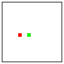  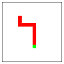  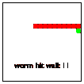
> > > > 
> 图 79：玩蠕虫

图 79 展示了一系列屏幕截图，说明了游戏在实际操作中的工作方式。在左侧，你可以看到初始设置。蠕虫由一个红色段组成，即它的头部。它正朝着食物移动，食物显示为一个绿色圆盘。中间的屏幕截图显示了蠕虫即将吃食物的情况。在最右侧的屏幕截图中，蠕虫撞到了右墙。游戏结束了；玩家得到了 11 分。

以下练习指导你设计和实现一个蠕虫游戏。像 列表中的结构 一样，这些练习说明了如何通过迭代细化来处理一个非平凡问题。也就是说，你不会一次性设计整个交互程序，而是在几个阶段，称为迭代中完成。每个迭代都会添加细节并细化程序—<wbr>直到你或你的客户满意。如果你对练习的结果不满意，请随意创建变体。

练习 215\. 设计一个世界程序，该程序持续移动一个单段蠕虫，并允许玩家使用四个基本箭头键控制蠕虫的移动。你的程序应使用红色圆盘来渲染蠕虫的唯一一段。对于每个时钟滴答，蠕虫应移动一个直径。

提示（1）重新阅读设计世界程序以回忆如何设计世界程序。当你定义 worm-main 函数时，使用时钟滴答的速率作为其参数。请参阅[on-tick](http://docs.racket-lang.org/teachpack/2htdpuniverse.html#%28form._world._%28%28lib._2htdp%2Funiverse..rkt%29._on-tick%29%29)的文档了解如何描述速率。（2）当你为 worm 开发数据表示时，考虑使用两种不同的表示：一种物理表示和一种逻辑表示。物理表示跟踪 worm 在画布上的实际物理位置；逻辑表示计算 worm 距离左上角有多少（段宽）。对于哪一种更容易改变“游戏”的物理外观（worm 段的大小，游戏框的大小）？

练习 216。修改你的程序，从练习 215 开始，以便当 worm 到达世界的墙壁时停止。当程序因为这种条件而停止时，它应该在世界的左下角渲染带有文本“worm hit border”的最终场景。提示：你可以使用[big-bang](http://docs.racket-lang.org/teachpack/2htdpuniverse.html#%28form._world._%28%28lib._2htdp%2Funiverse..rkt%29._big-bang%29%29)中的[stop-when](http://docs.racket-lang.org/teachpack/2htdpuniverse.html#%28form._world._%28%28lib._2htdp%2Funiverse..rkt%29._stop-when%29%29)子句以特殊方式渲染最后一个世界。

练习 217。为带尾巴的 worm 开发数据表示。worm 的尾巴是可能为空的“连接”段序列。在这里，“连接”意味着一个段的坐标最多在一个方向上与它的前一个段不同。为了简化问题，将所有段（头部和尾部段）视为相同。

现在修改你的程序，从练习 215 开始，以适应多段 worm。保持简单：（1）你的程序可以将所有 worm 段渲染为红色圆盘；（2）忽略 worm 可能撞到墙壁或自己的情况。提示：实现 worm 移动的一种方法是在它移动的方向上添加一个段，并删除最后一个段。

> > > > | ; Posn -> Posn |
> > > > | --- |
> > > > | ; ??? |
> > > > | ([check-satisfied](http://docs.racket-lang.org/htdp-langs/beginner.html#%28form._%28%28lib._lang%2Fhtdp-beginner..rkt%29._check-satisfied%29%29) (food-create ([make-posn](http://docs.racket-lang.org/htdp-langs/beginner.html#%28def._htdp-beginner._%28%28lib._lang%2Fhtdp-beginner..rkt%29._make-posn%29%29) 1 1)) not=-1-1?) |
> > > > | ([define](http://docs.racket-lang.org/htdp-langs/beginner.html#%28form._%28%28lib._lang%2Fhtdp-beginner..rkt%29._define%29%29) (food-create p) |
> > > > |   (food-check-create |
> > > > |      p ([make-posn](http://docs.racket-lang.org/htdp-langs/beginner.html#%28def._htdp-beginner._%28%28lib._lang%2Fhtdp-beginner..rkt%29._make-posn%29%29) ([random](http://docs.racket-lang.org/htdp-langs/beginner.html#%28def._htdp-beginner._%28%28lib._lang%2Fhtdp-beginner..rkt%29._random%29%29) MAX) ([random](http://docs.racket-lang.org/htdp-langs/beginner.html#%28def._htdp-beginner._%28%28lib._lang%2Fhtdp-beginner..rkt%29._random%29%29) MAX)))) |
> > > > |   |
> > > > | ; Posn  Posn -> Posn |
> > > > | ; 生成递归 |
> > > > | ; ??? |
> > > > | ([define](http://docs.racket-lang.org/htdp-langs/beginner.html#%28form._%28%28lib._lang%2Fhtdp-beginner..rkt%29._define%29%29) (food-check-create p candidate) |
> > > > |   ([if](http://docs.racket-lang.org/htdp-langs/beginner.html#%28form._%28%28lib._lang%2Fhtdp-beginner..rkt%29._if%29%29) ([equal?](http://docs.racket-lang.org/htdp-langs/beginner.html#%28def._htdp-beginner._%28%28lib._lang%2Fhtdp-beginner..rkt%29._equal~3f%29%29) p candidate) (food-create p) candidate)) |
> > > > |   |
> > > > | ; Posn -> Boolean |
> > > > | ; 仅用于测试 |
> > > > | ([define](http://docs.racket-lang.org/htdp-langs/beginner.html#%28form._%28%28lib._lang%2Fhtdp-beginner..rkt%29._define%29%29) (not=-1-1? p) |
> > > > |   ([not](http://docs.racket-lang.org/htdp-langs/beginner.html#%28def._htdp-beginner._%28%28lib._lang%2Fhtdp-beginner..rkt%29._not%29%29) ([and](http://docs.racket-lang.org/htdp-langs/beginner.html#%28form._%28%28lib._lang%2Fhtdp-beginner..rkt%29._and%29%29) ([=](http://docs.racket-lang.org/htdp-langs/beginner.html#%28def._htdp-beginner._%28%28lib._lang%2Fhtdp-beginner..rkt%29._~3d%29%29) ([posn-x](http://docs.racket-lang.org/htdp-langs/beginner.html#%28def._htdp-beginner._%28%28lib._lang%2Fhtdp-beginner..rkt%29._posn-x%29%29) p) 1) ([=](http://docs.racket-lang.org/htdp-langs/beginner.html#%28def._htdp-beginner._%28%28lib._lang%2Fhtdp-beginner..rkt%29._~3d%29%29) ([posn-y](http://docs.racket-lang.org/htdp-langs/beginner.html#%28def._htdp-beginner._%28%28lib._lang%2Fhtdp-beginner..rkt%29._posn-y%29%29) p) 1)))) |
> > > > 
> 图 80：食物的随机放置

练习 218。重新设计你的程序，从 练习 217 开始，使其在虫子撞到世界的墙壁或自己时停止。显示类似于 练习 216 中的消息，说明程序停止是因为虫子撞到墙壁还是因为撞到自己。

提示 (1) 要确定虫子是否会撞到自己，检查虫子头部移动后是否会与它的旧尾巴段重合。 (2) 查阅 [member?](http://docs.racket-lang.org/htdp-langs/beginner.html#%28def._htdp-beginner._%28%28lib._lang%2Fhtdp-beginner..rkt%29._member~3f%29%29) 函数。

练习 219\. 将食物添加到你的程序中，该程序基于 练习 218。在任何时刻，盒子中应包含一块食物。为了简化问题，一块食物的大小与虫子的一段相同。当虫子的头部位于食物所在的位置时，虫子会吃掉食物，这意味着虫子的尾部会延伸一段。随着食物被吃掉，另一块食物会在不同的位置出现。

将食物添加到游戏中需要对世界状态的数据表示进行修改。除了虫子之外，状态现在还包括食物的表示，特别是其当前位置。对游戏表示的修改意味着需要为处理事件添加新的函数，尽管这些函数可以重用来自 练习 218 的虫子函数及其测试用例。这也意味着时钟处理程序不仅需要移动虫子；此外，它还必须管理进食过程和新食物的创建。

你的程序应在盒子内随机放置食物。为了正确地做到这一点，你需要一种之前没有见过的设计技术——所谓的生成递归，这在 生成递归 中介绍——因此我们提供了这些函数在 图 80 中。关于 [random](http://docs.racket-lang.org/htdp-langs/beginner.html#%28def._htdp-beginner._%28%28lib._lang%2Fhtdp-beginner..rkt%29._random%29%29) 的工作原理，请阅读手册或 练习 99。在你使用它们之前，请解释这些函数的工作原理——假设 MAX 大于 1——然后制定目的声明。

提示（1）解释“进食”的一种方式是，说虫子的头部移动到食物曾经所在的位置，尾部增长一段，插入头部曾经的位置。为什么这种解释作为函数设计起来容易？（2）我们发现为 worm-main 函数添加第二个参数对于最后一步很有用，这是一个布尔值，用于确定 [big-bang](http://docs.racket-lang.org/teachpack/2htdpuniverse.html#%28form._world._%28%28lib._2htdp%2Funiverse..rkt%29._big-bang%29%29) 是否在单独的窗口中显示当前世界状态；有关如何请求此信息的说明，请参阅 [state](http://docs.racket-lang.org/teachpack/2htdpuniverse.html#%28form._world._%28%28lib._2htdp%2Funiverse..rkt%29._state%29%29) 的文档。

完成这个最后的练习后，你就拥有了一个完整的虫子游戏。现在修改你的 worm-main 函数，使其返回最终虫子的长度。然后使用 DrRacket 中的“创建可执行文件”（位于 Racket 菜单下）将你的程序转换成任何人都可以启动的文件，而不仅仅是了解 BSL+ 的人。

你也许还希望给游戏添加一些额外的变化，使其真正成为你的游戏。我们尝试了有趣的结束游戏信息，周围放置了几种不同的食物，放置额外的障碍物在房间里，以及一些其他想法。你有什么想法吗？

#### 12.6 简单的俄罗斯方块🔗 "链接到此处")

俄罗斯方块是软件早期的一款游戏。由于设计一个完整的俄罗斯方块游戏需要大量的劳动，而利润却微薄，所以这一节将重点介绍一个简化版本。如果你有雄心壮志，可以查找俄罗斯方块真正的工作原理并设计一个完整的版本。

> > > > 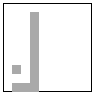     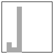     
> > > > 
> 图 81：简单的俄罗斯方块

在我们的简化版本中，游戏开始时，单个方块从场景顶部落下。一旦其中一个方块落在地面上，它就会停下来，然后另一个方块从某个随机位置开始落下。玩家可以使用“左”和“右”箭头键控制下落的方块。一旦方块落在画布的底部或某个已经停下来的方块上方，它就会停下来并变得不可移动。在短时间内，方块会堆叠起来；如果方块堆叠到画布的顶部，游戏就结束了。当然，这个游戏的目标是尽可能多地落下方块。参见图 81 以了解这个想法的说明。

根据这个描述，我们可以转向设计世界程序中交互程序的设计指南。他们建议将常量属性与变量属性分开。前者可以写成“物理”和图形常量；后者则建议构成简单俄罗斯方块游戏所有可能状态的数据。因此，这里有一些例子：

+   游戏的宽度和高度以及方块的大小都是固定的。在 BSL+中，你需要像这样的定义：

    > | ([define](http://docs.racket-lang.org/htdp-langs/beginner.html#%28form._%28%28lib._lang%2Fhtdp-beginner..rkt%29._define%29%29) WIDTH 10) ; 水平方向的方块数量 |
    > | --- |
    > | ([define](http://docs.racket-lang.org/htdp-langs/beginner.html#%28form._%28%28lib._lang%2Fhtdp-beginner..rkt%29._define%29%29) SIZE 10) ; 方块的大小为 10 |
    > | ([define](http://docs.racket-lang.org/htdp-langs/beginner.html#%28form._%28%28lib._lang%2Fhtdp-beginner..rkt%29._define%29%29) SCENE-SIZE ([*](http://docs.racket-lang.org/htdp-langs/beginner.html#%28def._htdp-beginner._%28%28lib._lang%2Fhtdp-beginner..rkt%29._%2A%29%29) WIDTH SIZE)) |
    > |   |
    > |   |
    > | ([define](http://docs.racket-lang.org/htdp-langs/beginner.html#%28form._%28%28lib._lang%2Fhtdp-beginner..rkt%29._define%29%29) BLOCK ; 红色方块，边缘为黑色 |
    > |   ([overlay](http://docs.racket-lang.org/teachpack/2htdpimage.html#%28def._%28%28lib._2htdp%2Fimage..rkt%29._overlay%29%29) |
    > |     ([square](http://docs.racket-lang.org/teachpack/2htdpimage.html#%28def._%28%28lib._2htdp%2Fimage..rkt%29._square%29%29) ([-](http://docs.racket-lang.org/htdp-langs/beginner.html#%28def._htdp-beginner._%28%28lib._lang%2Fhtdp-beginner..rkt%29._-%29%29) SIZE 1) "solid" "red") |
    > |     ([square](http://docs.racket-lang.org/teachpack/2htdpimage.html#%28def._%28%28lib._2htdp%2Fimage..rkt%29._square%29%29) SIZE "outline" "black"))) |

    在继续阅读之前，请解释这些定义。

+   方块的“景观”因游戏而异，也因时钟滴答声而异。让我们使这一点更加明确。方块的外观保持不变；它们的位置不同。

我们现在面临设计数据表示以处理下落方块和地面方块景观的核心问题。当涉及到下落方块时，又有两种可能性：一种是选择“物理”表示，另一种是“逻辑”表示。物理表示跟踪方块在画布上的实际物理位置；逻辑表示计算方块距离左边和顶部的方块宽度数。当涉及到静止的方块时，比单个方块的选择更多：物理位置列表、逻辑位置列表、堆叠高度列表等等。

在本节中，我们为您选择了数据表示方式：

> | ([define-struct](http://docs.racket-lang.org/htdp-langs/beginner.html#%28form._%28%28lib._lang%2Fhtdp-beginner..rkt%29._define-struct%29%29) tetris [block landscape]) |
> | --- |
> | ([define-struct](http://docs.racket-lang.org/htdp-langs/beginner.html#%28form._%28%28lib._lang%2Fhtdp-beginner..rkt%29._define-struct%29%29) block [x y]) |
> |   |
> | ; 俄罗斯方块是一个结构： |
> | ;   (make-tetris  方块  景观) |
> | ; 景观可以是以下之一： |
> | ; –  '() |
> | ; –  ([cons](http://docs.racket-lang.org/htdp-langs/beginner.html#%28def._htdp-beginner._%28%28lib._lang%2Fhtdp-beginner..rkt%29._cons%29%29)  方块  景观) |
> | ; 方块是一个结构： |
> | ;   (make-block  N  N) |
> |   |
> | ; 解释 |
> | ; (make-block  x  y) 描述了一个左边的方块 |
> | ; 角落是 ([*](http://docs.racket-lang.org/htdp-langs/beginner.html#%28def._htdp-beginner._%28%28lib._lang%2Fhtdp-beginner..rkt%29._%2A%29%29)  x  SIZE) 像素从左边和 |
> | ; ([*](http://docs.racket-lang.org/htdp-langs/beginner.html#%28def._htdp-beginner._%28%28lib._lang%2Fhtdp-beginner..rkt%29._%2A%29%29)  y  SIZE) 像素从顶部； |
> | ; (make-tetris b0 ([列表](http://docs.racket-lang.org/htdp-langs/beginner.html#%28def._htdp-beginner._%28%28lib._lang%2Fhtdp-beginner..rkt%29._list%29%29) b1 b2 [...]](http://docs.racket-lang.org/htdp-langs/beginner.html#%28form._%28%28lib._lang%2Fhtdp-beginner..rkt%29._......%29%29)) 表示 b0 是 |
> | ; 投掷方块，当 b1, b2, 和 ... 正在休息时 |

这就是我们所说的逻辑表示，因为坐标并不反映方块的实际物理位置，只是它们与原点的方块大小的数量。我们的选择意味着 x 总是在 0 和 WIDTH（不包括）之间，而 y 在 0 和 HEIGHT（不包括）之间，但我们忽略了这一知识。练习 220。当你面对一个复杂的数据定义——<wbr>比如俄罗斯方块游戏状态的定义——<wbr>你首先创建各种数据集合的实例。以下是一些有启发性的名称，你可以稍后用于功能示例：

> | ([定义](http://docs.racket-lang.org/htdp-langs/beginner.html#%28form._%28%28lib._lang%2Fhtdp-beginner..rkt%29._define%29%29) landscape0 [...]](http://docs.racket-lang.org/htdp-langs/beginner.html#%28form._%28%28lib._lang%2Fhtdp-beginner..rkt%29._......%29%29)) |
> | --- |
> | ([定义](http://docs.racket-lang.org/htdp-langs/beginner.html#%28form._%28%28lib._lang%2Fhtdp-beginner..rkt%29._define%29%29) block-dropping [...]](http://docs.racket-lang.org/htdp-langs/beginner.html#%28form._%28%28lib._lang%2Fhtdp-beginner..rkt%29._......%29%29)) |
> | ([定义](http://docs.racket-lang.org/htdp-langs/beginner.html#%28form._%28%28lib._lang%2Fhtdp-beginner..rkt%29._define%29%29) tetris0 [...]](http://docs.racket-lang.org/htdp-langs/beginner.html#%28form._%28%28lib._lang%2Fhtdp-beginner..rkt%29._......%29%29)) |
> | ([定义](http://docs.racket-lang.org/htdp-langs/beginner.html#%28form._%28%28lib._lang%2Fhtdp-beginner..rkt%29._define%29%29) tetris0-drop [...]](http://docs.racket-lang.org/htdp-langs/beginner.html#%28form._%28%28lib._lang%2Fhtdp-beginner..rkt%29._......%29%29)) |
> | [...](http://docs.racket-lang.org/htdp-langs/beginner.html#%28form._%28%28lib._lang%2Fhtdp-beginner..rkt%29._......%29%29) |
> | ([定义](http://docs.racket-lang.org/htdp-langs/beginner.html#%28form._%28%28lib._lang%2Fhtdp-beginner..rkt%29._define%29%29) block-landed (make-block 0 ([减](http://docs.racket-lang.org/htdp-langs/beginner.html#%28def._htdp-beginner._%28%28lib._lang%2Fhtdp-beginner..rkt%29._-%29%29) HEIGHT 1))) |
> | [...](http://docs.racket-lang.org/htdp-langs/beginner.html#%28form._%28%28lib._lang%2Fhtdp-beginner..rkt%29._......%29%29) |
> | ([定义](http://docs.racket-lang.org/htdp-langs/beginner.html#%28form._%28%28lib._lang%2Fhtdp-beginner..rkt%29._define%29%29) block-on-block (make-block 0 ([减](http://docs.racket-lang.org/htdp-langs/beginner.html#%28def._htdp-beginner._%28%28lib._lang%2Fhtdp-beginner..rkt%29._-%29%29) HEIGHT 2))) |

设计程序 tetris-render，它将给定的 Tetris 实例转换为 Image。使用 DrRacket 的交互区域开发渲染你的一些（极其）简单数据示例的表达式。然后将功能示例作为单元测试和函数本身。

练习 221。设计交互程序 tetris-main，它显示从画布顶部直线下降的方块并落在地板或已经放置的方块上。tetris-main 的输入应确定时钟滴答的速度。参见 [on-tick](http://docs.racket-lang.org/teachpack/2htdpuniverse.html#%28form._world._%28%28lib._2htdp%2Funiverse..rkt%29._on-tick%29%29) 的文档了解如何指定速度。

要发现一个方块是否落下，我们建议你将其放下并检查它是否在地板上或与休息方块列表中的一个方块重叠。提示：阅读有关 [member?](http://docs.racket-lang.org/htdp-langs/beginner.html#%28def._htdp-beginner._%28%28lib._lang%2Fhtdp-beginner..rkt%29._member~3f%29%29) 原始函数的说明。

当一个方块落下时，你的程序应立即在当前方块右侧的列上创建另一个下落的方块。如果当前方块已经在最右侧的列中，下一个方块应使用最左侧的列。或者，定义函数 block-generate，它随机选择一个不同于当前列的列；参见 练习 219 以获取灵感。

练习 222。修改 练习 221 中的程序，以便玩家可以控制下落方块的横向移动。每次玩家按下“左箭头”键时，下落方块应向左移动一列，除非它在列 0 或其左侧已经有一个堆叠的休息方块。同样，每次玩家按下“右箭头”键时，如果可能，下落方块应向右移动一列。

练习 223。给 练习 222 中的程序添加一个 [stop-when](http://docs.racket-lang.org/teachpack/2htdpuniverse.html#%28form._world._%28%28lib._2htdp%2Funiverse..rkt%29._stop-when%29%29) 子句。游戏结束的条件是某一列中的方块足够多以至于“触及”画布的顶部。

一旦你解决了 练习 223，你就拥有了一个基本的 Tetris 游戏。在你向朋友展示之前，你可能想对其进行一些润色。例如，最终画布可以显示玩家能够堆叠多少方块。或者每个画布都可以包含这样的文本。选择权在你。

#### 12.7 全空间战🔗 "链接到此处")

项目化和结构提到了一个动作很少的太空入侵者游戏；玩家只能来回移动地面部队。列表和世界使玩家能够发射任意数量的炮弹。本节提出了帮助您完成这个游戏的练习。

和往常一样，一个不明飞行物（UFO）正在试图降落在地球上。玩家的任务是阻止 UFO 降落。为此，游戏提供了一辆坦克，可以发射任意数量的炮弹。当这些炮弹中的任何一个足够接近 UFO 的重心时，游戏结束，玩家获胜。如果 UFO 足够接近地面，玩家则失败。

练习 224。从前面两个部分学到的经验，逐步设计游戏扩展，一次添加一个游戏功能。始终使用设计配方并依赖辅助函数的指南。如果您喜欢这个游戏，可以添加其他功能：显示滚动文本；给 UFO 配备可以消除坦克的电荷；创建一支完整的攻击 UFO 舰队；最重要的是，发挥您的想象力。

如果你不喜欢 UFO 和坦克互相射击，可以使用同样的想法来制作一个类似的、文明的游戏。

练习 225。设计一个灭火游戏。

游戏设定在西部各州，那里的大森林中火灾肆虐。它模拟了空中灭火行动。具体来说，玩家扮演一架飞机的飞行员，向地面上的火灾投放大量水。玩家控制飞机的水平移动和释放水载荷。

您的游戏软件在地面随机位置引发火灾。您可能希望限制火灾的数量，使它们成为当前燃烧的火灾数量的函数或其他因素。游戏的目的是在有限的时间内扑灭所有火灾。提示：使用本章中展示的迭代设计方法来创建这个游戏。

#### 12.8 有限状态机🔗 "链接到这里")

有限状态机（FSM）和正则表达式是编程中的普遍元素。正如有限状态世界所解释的，状态机是思考世界程序的一种方式。相反，练习 109 展示了如何设计实现 FSM 并检查玩家是否按下特定按键序列的世界程序。

如您可能也记得，有限状态机（FSM）与正则表达式等价。因此，计算机科学家倾向于说 FSM 接受与特定正则表达式匹配的按键，就像这样

> a (b|c)* d

来自练习 109。如果你想要一个识别不同模式的程序，比如说，

> a (b|c)* a

你只需适当地修改现有的程序即可。这两个程序将彼此相似，如果你要对几个不同的正则表达式重复这个练习，你最终会得到一大堆看起来相似的程序。

一个自然的想法是寻找一个通用的解决方案，即一个世界程序，它消耗一个有限状态机（FSM）的数据表示，并识别玩家是否按下了匹配的键序列。本节将介绍这样一个世界程序的设计，尽管它被大大简化了。特别是，FSM 没有初始或最终状态，匹配忽略了实际的按键；相反，每当按下任何键时，从一个状态到另一个状态的转换就会发生。此外，我们要求状态是颜色字符串。这样，FSM 解释程序就可以简单地显示当前状态的颜色。

设计选择注意事项这里是对通用化尝试的另一种尝试：

> 样本问题设计一个程序，该程序在特定的 KeyEvent 列表上解释给定的 FSM。也就是说，该程序消耗一个 FSM 的数据表示和字符串。如果字符串与 FSM 对应的正则表达式匹配，则其结果为#true；否则为#false。

然而，结果却是，你不能用前两部分的原理来设计这个程序。实际上，解决这个问题必须等到回溯算法；参见练习 476。结束

> > > | ; 一个 FSM 可以是以下之一： |
> > > | --- |
> > > | ;   –  '() |
> > > | ;   –  ([cons](http://docs.racket-lang.org/htdp-langs/beginner.html#%28def._htdp-beginner._%28%28lib._lang%2Fhtdp-beginner..rkt%29._cons%29%29)  Transition  FSM) |
> > > |   |
> > > | ([define-struct](http://docs.racket-lang.org/htdp-langs/beginner.html#%28form._%28%28lib._lang%2Fhtdp-beginner..rkt%29._define-struct%29%29) transition [current next]) |
> > > | ; 一个转换是一个结构： |
> > > | ;   (make-transition  FSM-State  FSM-State) |
> > > |   |
> > > | ; FSM-State 是一个 Color。 |
> > > |   |
> > > | ; 解释一个 FSM 表示一个 |
> > > | ; 有限状态机可以从一个状态转换到另一个状态 |
> > > | ; 对按键的反应 |
> > > 
> 图 82：一般表示和解释有限状态机

简化的问题陈述指出了几个要点，包括对有限状态机表示的数据定义的需求，其状态的性质以及它们作为图像的表示。图 82 收集了这些信息。它从一个有限状态机的数据定义开始。正如你所见，一个有限状态机只是一个转换的列表。我们必须使用列表，因为我们希望我们的世界程序能够与任何有限状态机一起工作，这意味着一个有限但任意大的状态数量。每个转换在结构中将两个状态结合起来：当前状态和下一个状态，即当玩家按下键时机器转换到的状态。数据定义的最后部分说明状态只是颜色的名称。

练习 226。设计状态=，一个用于状态的等价谓词。

由于这个定义很复杂，我们遵循设计食谱并创建一个示例：

> | ([define](http://docs.racket-lang.org/htdp-langs/beginner.html#%28form._%28%28lib._lang%2Fhtdp-beginner..rkt%29._define%29%29) fsm-traffic |
> | --- |
> | |   ([list](http://docs.racket-lang.org/htdp-langs/beginner.html#%28def._htdp-beginner._%28%28lib._lang%2Fhtdp-beginner..rkt%29._list%29%29) (make-transition "red" "green")) |
> | |   (make-transition "green" "yellow") |
> | |         (make-transition "yellow" "red"))) |

你可能已经猜到，这个转换表描述了一个交通灯。它的第一个转换告诉我们交通灯从“红色”跳转到“绿色”，第二个表示从“绿色”转换到“黄色”，最后一个是从“黄色”转换到“红色”。

练习 227。BW 机器是一个有限状态机，每次按键事件都会从黑色翻转到白色，然后再翻转到黑色。为 BW 机器制定数据表示。

显然，我们问题的解决方案是一个世界程序：

> | ; 有限状态机 -> ??? |
> | --- |
> | ; 匹配按下的键与给定的有限状态机 |
> | ([define](http://docs.racket-lang.org/htdp-langs/beginner.html#%28form._%28%28lib._lang%2Fhtdp-beginner..rkt%29._define%29%29) (simulate an-fsm) |
> | |   ([big-bang](http://docs.racket-lang.org/teachpack/2htdpuniverse.html#%28form._world._%28%28lib._2htdp%2Funiverse..rkt%29._big-bang%29%29) [...](http://docs.racket-lang.org/htdp-langs/beginner.html#%28form._%28%28lib._lang%2Fhtdp-beginner..rkt%29._......%29%29) |
> | |   [[绘制](http://docs.racket-lang.org/teachpack/2htdpuniverse.html#%28form._world._%28%28lib._2htdp%2Funiverse..rkt%29._to-draw%29%29) [...](http://docs.racket-lang.org/htdp-langs/beginner.html#%28form._%28%28lib._lang%2Fhtdp-beginner..rkt%29._......%29%29)] |
> | |   [[在键上](http://docs.racket-lang.org/teachpack/2htdpuniverse.html#%28form._world._%28%28lib._2htdp%2Funiverse..rkt%29._on-key%29%29) [...](http://docs.racket-lang.org/htdp-langs/beginner.html#%28form._%28%28lib._lang%2Fhtdp-beginner..rkt%29._......%29%29)])) |

它应该消耗一个 FSM，但我们没有线索知道程序将产生什么。我们称这个程序为 simulate，因为它在响应玩家的按键时表现得像给定的 FSM。

无论如何，让我们遵循世界程序的配方来查看它能带我们走多远。它告诉我们区分“现实世界”中那些变化和那些保持不变的事物。当模拟函数消耗一个 FSM 实例时，我们也知道这个 FSM 不会改变。改变的是机器的当前状态。

这种分析表明以下数据定义

> ; 一个 SimulationState.v1 是一个 FSM-State。

根据世界程序的配方设计，这个数据定义完成了主函数：[empty-image](http://docs.racket-lang.org/teachpack/2htdpimage.html#%28def._%28%28lib._2htdp%2Fimage..rkt%29._empty-image%29%29)常量代表一个“不可见”的图像。它是编写渲染函数标题的好默认值。

> | ([define](http://docs.racket-lang.org/htdp-langs/beginner.html#%28form._%28%28lib._lang%2Fhtdp-beginner..rkt%29._define%29%29) (simulate.v1 fsm0) |
> | --- |
> |   ([big-bang](http://docs.racket-lang.org/teachpack/2htdpuniverse.html#%28form._world._%28%28lib._2htdp%2Funiverse..rkt%29._big-bang%29%29) initial-state |
> |     [[to-draw](http://docs.racket-lang.org/teachpack/2htdpuniverse.html#%28form._world._%28%28lib._2htdp%2Funiverse..rkt%29._to-draw%29%29) render-state.v1] |
> |     [[on-key](http://docs.racket-lang.org/teachpack/2htdpuniverse.html#%28form._world._%28%28lib._2htdp%2Funiverse..rkt%29._on-key%29%29) find-next-state.v1]] |

并且暗示了一个包含两个条目的愿望清单：

> | ; SimulationState.v1 -> Image |
> | --- |
> | ; 将世界状态渲染为图像 |
> | ([define](http://docs.racket-lang.org/htdp-langs/beginner.html#%28form._%28%28lib._lang%2Fhtdp-beginner..rkt%29._define%29%29) (render-state.v1 s) |
> |   [empty-image](http://docs.racket-lang.org/teachpack/2htdpimage.html#%28def._%28%28lib._2htdp%2Fimage..rkt%29._empty-image%29%29)) |
> |   |
> | ; SimulationState.v1  KeyEvent -> SimulationState.v1 |
> | ; 从 ke 和 cs 中找到下一个状态 |
> | ([define](http://docs.racket-lang.org/htdp-langs/beginner.html#%28form._%28%28lib._lang%2Fhtdp-beginner..rkt%29._define%29%29) (find-next-state.v1 cs ke) |
> |    cs) |

这个草图提出了两个问题。首先，有关于如何确定第一个 SimulationState.v1 的问题。目前，所选的状态，initial-state，被标记为灰色以警告您这个问题。其次，愿望清单上的第二个条目必须引起一些困惑：

> 当 find-next-state 只给出当前状态和按键时，它如何找到下一个状态呢？

这个问题尤其真实，因为根据简化的问题陈述，按键的确切性质无关紧要；FSM 无论按下哪个键都会转换到下一个状态。这个问题暴露的是 BSL+的一个基本限制。为了理解这个限制，我们首先从一种权宜之计开始。基本上，分析要求 find-next-state 函数不仅接收当前状态，还要接收 FSM，以便它可以搜索转换列表并选择下一个状态。换句话说，世界状态必须包括当前状态、FSM 的状态以及 FSM 本身：

> | ([define-struct](http://docs.racket-lang.org/htdp-langs/beginner.html#%28form._%28%28lib._lang%2Fhtdp-beginner..rkt%29._define-struct%29%29) fs [fsm current]) |
> | --- |
> | ; SimulationState.v2 是一个结构： |
> | ;   (make-fs  FSM  FSM-State) |

根据世界设计配方，这种变化也意味着键事件处理器必须返回这个组合：

> | ; SimulationState.v2 -> Image |
> | --- |
> | ; 将世界状态渲染为图像 |
> | ([define](http://docs.racket-lang.org/htdp-langs/beginner.html#%28form._%28%28lib._lang%2Fhtdp-beginner..rkt%29._define%29%29) (render-state.v2 s) |
> |   [empty-image](http://docs.racket-lang.org/teachpack/2htdpimage.html#%28def._%28%28lib._2htdp%2Fimage..rkt%29._empty-image%29%29)) |
> |   |
> | ; SimulationState.v2  KeyEvent -> SimulationState.v2 |
> | ; 从 ke 和 cs 中找到下一个状态 |
> | ([define](http://docs.racket-lang.org/htdp-langs/beginner.html#%28form._%28%28lib._lang%2Fhtdp-beginner..rkt%29._define%29%29) (find-next-state.v2 cs ke) |
> | cs) |

最后，主函数现在必须接受两个参数：FSM 及其第一个状态。毕竟，模拟消耗的各种 FSM 都带有各种状态；我们不能假设它们都有相同的初始状态。以下是修改后的函数头：

> | ; FSM  FSM-State -> SimulationState.v2 |
> | --- |
> | ; 将按下的键与给定的 FSM 匹配 |
> |   ([define](http://docs.racket-lang.org/htdp-langs/beginner.html#%28form._%28%28lib._lang%2Fhtdp-beginner..rkt%29._define%29%29) (simulate.v2 an-fsm s0) |
> |   ;   ([big-bang](http://docs.racket-lang.org/teachpack/2htdpuniverse.html#%28form._world._%28%28lib._2htdp%2Funiverse..rkt%29._big-bang%29%29) (make-fs an-fsm s0) |
> |   |   [[to-draw](http://docs.racket-lang.org/teachpack/2htdpuniverse.html#%28form._world._%28%28lib._2htdp%2Funiverse..rkt%29._to-draw%29%29) state-as-colored-square] |
> |   ;   [[on-key](http://docs.racket-lang.org/teachpack/2htdpuniverse.html#%28form._world._%28%28lib._2htdp%2Funiverse..rkt%29._on-key%29%29) find-next-state])) |

让我们回到交通灯有限状态机的例子。对于这个机器，最好是将模拟应用于机器和“红色”：

> (simulate.v2 fsm-traffic "red")

停止！你认为为什么“红色”对交通灯来说很好？工程师称之为安全状态。

关于表达能力的说明 给定解决方案，我们现在可以解释 BSL 的限制。尽管给定的有限状态机在模拟过程中不会改变，但其描述必须成为世界状态的一部分。理想情况下，程序应该表达有限状态机的描述保持不变，但相反，程序必须将有限状态机视为不断变化状态的一部分。程序读者不能仅从第一块[大爆炸](http://docs.racket-lang.org/teachpack/2htdpuniverse.html#%28form._world._%28%28lib._2htdp%2Funiverse..rkt%29._big-bang%29%29)中推断出这一事实。

书的下一部分通过引入一种新的编程语言和特定的语言结构来解决这个难题：ISL 和局部定义。有关详细信息，请参阅局部定义增加表达能力。结束

在这一点上，我们可以转向愿望清单，并逐个处理其条目。第一个，即状态以彩色方块的形式设计，非常直接，我们只需提供完整的定义：

> |   ; SimulationState.v2 -> Image |
> | --- |
> |   ; 将当前世界状态以彩色方块的形式呈现 |
> |   |
> | ([check-expect](http://docs.racket-lang.org/htdp-langs/beginner.html#%28form._%28%28lib._lang%2Fhtdp-beginner..rkt%29._check-expect%29%29) (state-as-colored-square |
> |   ;   (make-fs fsm-traffic "red")) |
> |   ;   ([square](http://docs.racket-lang.org/teachpack/2htdpimage.html#%28def._%28%28lib._2htdp%2Fimage..rkt%29._square%29%29) 100 "solid" "red")) |
> |   |   |
> | ([define](http://docs.racket-lang.org/htdp-langs/beginner.html#%28form._%28%28lib._lang%2Fhtdp-beginner..rkt%29._define%29%29) (state-as-colored-square an-fsm) |
> |   ;   ([square](http://docs.racket-lang.org/teachpack/2htdpimage.html#%28def._%28%28lib._2htdp%2Fimage..rkt%29._square%29%29) 100 "solid" (fs-current an-fsm))) |

与此相反，键事件处理器的设计值得讨论。回想一下前面的头部材料：

> | ; SimulationState.v2  KeyEvent -> SimulationState.v2 |
> | --- |
> | ; 从 an-fsm 和 ke 中找到下一个状态 |
> | ([define](http://docs.racket-lang.org/htdp-langs/beginner.html#%28form._%28%28lib._lang%2Fhtdp-beginner..rkt%29._define%29%29) (find-next-state an-fsm ke) |
> |   an-fsm) |

根据设计配方，处理器必须消耗一个世界状态和一个 KeyEvent，并且它必须产生下一个世界状态。这种用普通语言对签名的阐述也指导了示例的设计。以下是前两个示例：

> | ([check-expect](http://docs.racket-lang.org/htdp-langs/beginner.html#%28form._%28%28lib._lang%2Fhtdp-beginner..rkt%29._check-expect%29%29) |
> | --- |
> |   (find-next-state (make-fs fsm-traffic "red") "n") |
> |   (make-fs fsm-traffic "green")) |
> | ([check-expect](http://docs.racket-lang.org/htdp-langs/beginner.html#%28form._%28%28lib._lang%2Fhtdp-beginner..rkt%29._check-expect%29%29) |
> |   (find-next-state (make-fs fsm-traffic "red") "a") |
> |   (make-fs fsm-traffic "green")) |

原文示例说明，当当前状态结合 fsm-traffic 机器及其"red"状态时，结果将结合相同的 FSM 和"green"状态，无论玩家在键盘上按下的是"n"还是"a"。下面是另一个示例：

> | ([check-expect](http://docs.racket-lang.org/htdp-langs/beginner.html#%28form._%28%28lib._lang%2Fhtdp-beginner..rkt%29._check-expect%29%29) |
> | --- |
> |   (find-next-state (make-fs fsm-traffic "green") "q") |
> |   (make-fs fsm-traffic "yellow")) |

在继续阅读之前，先理解一下前面的示例。你能想到另一个示例吗？由于该函数消耗一个结构，我们为结构处理写下了一个模板：

> | ([define](http://docs.racket-lang.org/htdp-langs/beginner.html#%28form._%28%28lib._lang%2Fhtdp-beginner..rkt%29._define%29%29) (find-next-state an-fsm ke) |
> | --- |
> |   ([...](http://docs.racket-lang.org/htdp-langs/beginner.html#%28form._%28%28lib._lang%2Fhtdp-beginner..rkt%29._......%29%29) (fs-fsm an-fsm) [..](http://docs.racket-lang.org/htdp-langs/beginner.html#%28form._%28%28lib._lang%2Fhtdp-beginner..rkt%29._....%29%29) (fs-current an-fsm) [...](http://docs.racket-lang.org/htdp-langs/beginner.html#%28form._%28%28lib._lang%2Fhtdp-beginner..rkt%29._......%29%29))) |

此外，因为期望的结果是 SimulationState.v2，我们可以通过添加适当的构造函数来细化模板：

> | ([define](http://docs.racket-lang.org/htdp-langs/beginner.html#%28form._%28%28lib._lang%2Fhtdp-beginner..rkt%29._define%29%29) (find-next-state an-fsm ke) |
> | --- |
> |   (make-fs |
> | ... (fs-fsm an-fsm) [...](http://docs.racket-lang.org/htdp-langs/beginner.html#%28form._%28%28lib._lang%2Fhtdp-beginner..rkt%29._......%29%29) (fs-current an-fsm) [...](http://docs.racket-lang.org/htdp-langs/beginner.html#%28form._%28%28lib._lang%2Fhtdp-beginner..rkt%29._......%29%29))) |

这些示例表明，提取的有限状态机成为新 SimulationState.v2 的第一个组件，并且函数实际上只需要从当前状态和组成给定有限状态机的转换列表中计算出下一个状态。因为后者是任意长的，我们提出一个愿望——一个查找函数，遍历列表以查找当前状态为(fs-current an-fsm)的转换——并完成定义：

> | ([define](http://docs.racket-lang.org/htdp-langs/beginner.html#%28form._%28%28lib._lang%2Fhtdp-beginner..rkt%29._define%29%29) (find-next-state an-fsm ke) |
> | --- |
> |   (make-fs |
> |     (fs-fsm an-fsm) |
> |     (find (fs-fsm an-fsm) (fs-current an-fsm)))) |

这里是新愿望的表述：

> | ; FSM  FSM-State -> FSM-State |
> | --- |
> | ; 查找表示当前状态的转换 |
> | ; 并检索下一个字段 |
> | ([check-expect](http://docs.racket-lang.org/htdp-langs/beginner.html#%28form._%28%28lib._lang%2Fhtdp-beginner..rkt%29._check-expect%29%29) (find fsm-traffic "red") "green") |
> | ([check-expect](http://docs.racket-lang.org/htdp-langs/beginner.html#%28form._%28%28lib._lang%2Fhtdp-beginner..rkt%29._check-expect%29%29) (find fsm-traffic "green") "yellow") |
> | ([check-error](http://docs.racket-lang.org/htdp-langs/beginner.html#%28form._%28%28lib._lang%2Fhtdp-beginner..rkt%29._check-error%29%29) (find fsm-traffic "black") |
> |              "未找到：黑色") |
> | ([define](http://docs.racket-lang.org/htdp-langs/beginner.html#%28form._%28%28lib._lang%2Fhtdp-beginner..rkt%29._define%29%29) (find transitions current) |
> |   current) |

这些示例是从 find-next-state 的示例中派生出来的。

停止！先开发一些额外的示例，然后再做练习。

练习 228。完成 find 的设计。

一旦测试了辅助函数，就可以使用 simulate 来玩 fsm-traffic 和来自练习 227 的 BW Machine。

我们的模拟程序故意相当有限。特别是，你不能用它来表示玩家按下哪个键从一种状态转换到另一种状态的有限状态机。尽管如此，由于系统性的设计，你可以扩展程序以具备这些功能。

练习 229。这是一个针对转换的修订版数据定义：

> | ([define-struct](http://docs.racket-lang.org/htdp-langs/beginner.html#%28form._%28%28lib._lang%2Fhtdp-beginner..rkt%29._define-struct%29%29) ktransition [current key next]) |
> | --- |
> | ; A Transition.v2 is a structure: |
> | ;   (make-ktransition  FSM-State  KeyEvent  FSM-State) |

使用 Transition.v2 的列表表示 练习 109 的 FSM；忽略错误和最终状态。

修改 simulate 的设计，使其现在能够以适当的方式处理按键。按照设计配方进行，从数据示例的改编开始。

使用修订后的程序模拟以下按键序列 "a", "b", "b", "c", 和 "d" 上 练习 109 的 FSM 运行。

状态机确实包含初始状态和最终状态。当一个“运行”状态机的程序达到最终状态时，它应该停止。最后的练习再次修改了状态机的数据表示，以引入这些概念。

练习 230。考虑以下状态机的数据表示：

> | ([define-struct](http://docs.racket-lang.org/htdp-langs/beginner.html#%28form._%28%28lib._lang%2Fhtdp-beginner..rkt%29._define-struct%29%29) fsm [initial transitions final]) |
> | --- |
> | ([define-struct](http://docs.racket-lang.org/htdp-langs/beginner.html#%28form._%28%28lib._lang%2Fhtdp-beginner..rkt%29._define-struct%29%29) transition [current key next]) |
> | ; An FSM.v2 是一个结构： |
> | ;   (make-fsm  FSM-State  LOT  FSM-State) |
> | ; A LOT is one of: |
> | ; –  '() |
> | ; –  ([cons](http://docs.racket-lang.org/htdp-langs/beginner.html#%28def._htdp-beginner._%28%28lib._lang%2Fhtdp-beginner..rkt%29._cons%29%29)  Transition.v3  LOT) |
> | ; A Transition.v3 is a structure: |
> | ;   (make-transition  FSM-State  KeyEvent  FSM-State) |

在此上下文中表示 练习 109 的 FSM。

设计一个名为 fsm-simulate 的函数，它接受一个 FSM.v2 并在玩家的按键操作上运行它。如果按键序列迫使 FSM.v2 达到最终状态，fsm-simulate 将停止。提示：该函数使用给定 fsm 结构的初始字段来跟踪当前状态。

关于迭代精炼的注意事项：这两个最后的项目引入了“通过迭代精炼设计”的概念。基本思想是第一个程序只实现了所需行为的一部分，下一个程序实现得更多一些，依此类推。最终，你将得到一个展示所有所需行为的程序，或者至少足够满足客户需求的程度。更多细节，请参阅迭代精炼。结束

### 13 总结🔗 "链接到此处")

本书第二部分是关于设计处理任意大量数据的程序。正如你很容易想象的那样，软件在用于没有预定义大小限制的信息时尤其有用，这意味着“任意大量数据”是成为真正的程序员道路上的关键一步。本着这个精神，我们建议你记住以下三个教训：

1.  本部分将设计配方精炼以处理数据定义中的自引用和交叉引用。前者的出现需要设计递归函数，而后者的出现需要辅助函数。

1.  复杂问题需要分解成单独的问题。当你分解一个问题，你需要两个部分：解决单独问题的函数和数据定义，这些数据定义将这些单独的解决方案组合成一个整体。为了确保在花费时间在单独的程序后，组合仍然有效，你需要将你的“愿望”与所需的数据定义一起制定。

    分解-组合设计在问题陈述隐式或显式提到辅助任务、函数的编码步骤需要遍历任意大量数据时特别有用——也许令人惊讶的是——当一般问题比问题陈述中描述的具体问题更容易解决时。

1.  实用主义很重要。如果你希望设计[大爆炸](http://docs.racket-lang.org/teachpack/2htdpuniverse.html#%28form._world._%28%28lib._2htdp%2Funiverse..rkt%29._big-bang%29%29)程序，你需要理解其各种子句以及它们能完成什么。或者，如果你的任务是设计解决数学问题的程序，你最好确保你知道所选语言及其库提供的数学运算。

虽然本部分主要关注列表作为任意大量数据的好例子——因为它们在 Haskell、Lisp、ML、Racket 和 Scheme 等语言中实际上很有用——但这些想法适用于所有这类数据：文件、文件夹、数据库等等。

交织数据 继续探索“大型”结构化数据，并展示了设计配方如何扩展到最复杂类型的数据。与此同时，下一部分将关注你此刻应该有的一个重要担忧，即程序员的日常工作就是一遍又一遍地创建同一种类的程序。
