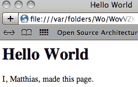
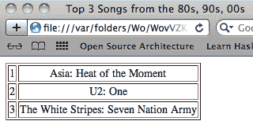

# 间奏曲 2：引用，取消引用🔗

> 原文：[`htdp.org/2024-11-6/Book/i2-3.html`](https://htdp.org/2024-11-6/Book/i2-3.html)

| |   引用 |
| --- | --- |
| |   准引用和取消引用 |
| |   取消引用拼接 |

列表在我们的书籍以及我们的教学语言的基础 Racket 中都扮演着重要的角色。请确保将您的语言级别设置为 BSL+ 或更高。对于程序设计，理解列表是如何从基本原则构建的至关重要；这有助于我们程序的设计。然而，对列表的常规操作需要紧凑的表示法，就像在 The list Function 中引入的 [list](http://docs.racket-lang.org/htdp-langs/beginner-abbr.html#%28def._htdp-beginner-abbr._%28%28lib._lang%2Fhtdp-beginner-abbr..rkt%29._list%29%29) 函数一样。

自 20 世纪 50 年代末以来，Lisp 风格的编程语言已经附带了一对更强大的列表创建工具：引用和反引用。现在许多编程语言都支持它们，PHP 网页设计语言也将这一想法引入了商业世界。

这个间奏曲为您提供了这种引用机制的尝鲜。它还介绍了符号，这是一种与引用紧密相关的数据形式。虽然这个介绍是非正式的，并使用了简单的例子，但本书的其余部分将通过近乎现实的变化来展示这一想法的力量。如果这些例子中的任何一个让您感到困扰，请回到这个间奏曲。

### 引用🔗 "链接到此处")

引用是一种简写机制，可以轻松地写下长列表。粗略地说，使用 [list](http://docs.racket-lang.org/htdp-langs/beginner-abbr.html#%28def._htdp-beginner-abbr._%28%28lib._lang%2Fhtdp-beginner-abbr..rkt%29._list%29%29) 函数构建的列表可以通过引用列表来构建得更加简洁。相反，引用列表简化了 [list](http://docs.racket-lang.org/htdp-langs/beginner-abbr.html#%28def._htdp-beginner-abbr._%28%28lib._lang%2Fhtdp-beginner-abbr..rkt%29._list%29%29) 的构建。

从技术上讲，[quote](http://docs.racket-lang.org/htdp-langs/beginner-abbr.html#%28form._%28%28lib._lang%2Fhtdp-beginner-abbr..rkt%29._quote%29%29) 是一个复合句的保留字，类似于第一部分：初学者的语言，并且它的用法如下：([quote](http://docs.racket-lang.org/htdp-langs/beginner-abbr.html#%28form._%28%28lib._lang%2Fhtdp-beginner-abbr..rkt%29._quote%29%29) (1 2 3)). DrRacket 将这个表达式翻译为([list](http://docs.racket-lang.org/htdp-langs/beginner-abbr.html#%28def._htdp-beginner-abbr._%28%28lib._lang%2Fhtdp-beginner-abbr..rkt%29._list%29%29)  1  2  3). 在这一点上，你可能想知道为什么我们称 [quote](http://docs.racket-lang.org/htdp-langs/beginner-abbr.html#%28form._%28%28lib._lang%2Fhtdp-beginner-abbr..rkt%29._quote%29%29) 为缩写，因为其 [quote](http://docs.racket-lang.org/htdp-langs/beginner-abbr.html#%28form._%28%28lib._lang%2Fhtdp-beginner-abbr..rkt%29._quote%29%29)d 表达式看起来比其翻译更复杂。关键是'是 [quote](http://docs.racket-lang.org/htdp-langs/beginner-abbr.html#%28form._%28%28lib._lang%2Fhtdp-beginner-abbr..rkt%29._quote%29%29) 的缩写。以下是一些简短的例子，然后：

> | > '(1 2 3) |
> | --- |
> | (list 1 2 3) |
> | > '("a" "b" "c") |
> | (list "a" "b" "c") |
> | > '(#true "hello world" 42) |
> | (list #true "hello world" 42) |

正如你所见，使用'符号可以创建预期的列表。如果你忘记了([list](http://docs.racket-lang.org/htdp-langs/beginner-abbr.html#%28def._htdp-beginner-abbr._%28%28lib._lang%2Fhtdp-beginner-abbr..rkt%29._list%29%29)  1  2  3) 的含义，请重新阅读列表函数；它解释说这个列表是([cons](http://docs.racket-lang.org/htdp-langs/beginner-abbr.html#%28def._htdp-beginner-abbr._%28%28lib._lang%2Fhtdp-beginner-abbr..rkt%29._cons%29%29)  1  ([cons](http://docs.racket-lang.org/htdp-langs/beginner-abbr.html#%28def._htdp-beginner-abbr._%28%28lib._lang%2Fhtdp-beginner-abbr..rkt%29._cons%29%29)  2  ([cons](http://docs.racket-lang.org/htdp-langs/beginner-abbr.html#%28def._htdp-beginner-abbr._%28%28lib._lang%2Fhtdp-beginner-abbr..rkt%29._cons%29%29)  3  '()))).到目前为止，[quote](http://docs.racket-lang.org/htdp-langs/beginner-abbr.html#%28form._%28%28lib._lang%2Fhtdp-beginner-abbr..rkt%29._quote%29%29) 看起来比 [list](http://docs.racket-lang.org/htdp-langs/beginner-abbr.html#%28def._htdp-beginner-abbr._%28%28lib._lang%2Fhtdp-beginner-abbr..rkt%29._list%29%29) 有一些小的改进，但看看：

> |
> 
> &#124; > '(("a" 1) &#124;
> 
> &#124;   ("b" 2) &#124;
> 
> &#124;   ("d" 4)) &#124;
> 
> |
> 
> | (list (list "a" 1) (list "b" 2) (list "d" 4)) |
> | --- |

使用 ' 我们可以构造列表以及嵌套列表。要理解 [quote](http://docs.racket-lang.org/htdp-langs/beginner-abbr.html#%28form._%28%28lib._lang%2Fhtdp-beginner-abbr..rkt%29._quote%29%29) 的工作原理，想象它是一个遍历它所给出的形状的函数。当 ' 遇到一块普通的数据——<wbr>一个数字、一个字符串、一个布尔值或一个图像——<wbr>它就会消失。当它位于一个开括号前面，(，它会在括号的右边插入 [list](http://docs.racket-lang.org/htdp-langs/beginner-abbr.html#%28def._htdp-beginner-abbr._%28%28lib._lang%2Fhtdp-beginner-abbr..rkt%29._list%29%29) 并将 ' 放在括号和闭括号之间的所有项上。例如，

> | '(1 2 3) |  | is short for |  | ([list](http://docs.racket-lang.org/htdp-langs/beginner-abbr.html#%28def._htdp-beginner-abbr._%28%28lib._lang%2Fhtdp-beginner-abbr..rkt%29._list%29%29) '1 '2 '3) |
> | --- | --- | --- | --- | --- |

如你所知，' 从数字中消失，所以剩下的部分就很容易理解了。这里有一个创建嵌套列表的例子：

> | '(("a" 1) 3) |  | is short for |  | ([list](http://docs.racket-lang.org/htdp-langs/beginner-abbr.html#%28def._htdp-beginner-abbr._%28%28lib._lang%2Fhtdp-beginner-abbr..rkt%29._list%29%29) '("a" 1) '3) |
> | --- | --- | --- | --- | --- |

要继续这个例子，我们扩展第一个位置上的缩写：

> | ([list](http://docs.racket-lang.org/htdp-langs/beginner-abbr.html#%28def._htdp-beginner-abbr._%28%28lib._lang%2Fhtdp-beginner-abbr..rkt%29._list%29%29) '("a" 1) '3) |  | is short for |  | ([list](http://docs.racket-lang.org/htdp-langs/beginner-abbr.html#%28def._htdp-beginner-abbr._%28%28lib._lang%2Fhtdp-beginner-abbr..rkt%29._list%29%29) ([list](http://docs.racket-lang.org/htdp-langs/beginner-abbr.html#%28def._htdp-beginner-abbr._%28%28lib._lang%2Fhtdp-beginner-abbr..rkt%29._list%29%29) '"a" '1) 3) |
> | --- | --- | --- | --- | --- |

我们留给你们来完成这个例子。练习 231：用 [list](http://docs.racket-lang.org/htdp-langs/beginner-abbr.html#%28def._htdp-beginner-abbr._%28%28lib._lang%2Fhtdp-beginner-abbr..rkt%29._list%29%29) 替换这些表达式中的 [quote](http://docs.racket-lang.org/htdp-langs/beginner-abbr.html#%28form._%28%28lib._lang%2Fhtdp-beginner-abbr..rkt%29._quote%29%29)：

+   '(1  "a"  2  #false  3  "c")

+   '()

+   以及这个类似表格的形状：

    > | '(("alan" 1000) |
    > | --- |
    > |   ("barb" 2000) |
    > |   ("carl" 1500)) |

现在在需要的地方用 [cons](http://docs.racket-lang.org/htdp-langs/beginner-abbr.html#%28def._htdp-beginner-abbr._%28%28lib._lang%2Fhtdp-beginner-abbr..rkt%29._cons%29%29) 替换 [list](http://docs.racket-lang.org/htdp-langs/beginner-abbr.html#%28def._htdp-beginner-abbr._%28%28lib._lang%2Fhtdp-beginner-abbr..rkt%29._list%29%29)。

### Quasiquote and Unquote🔗 "链接到此处")

前一节应该让你相信'和[quote](http://docs.racket-lang.org/htdp-langs/beginner-abbr.html#%28form._%28%28lib._lang%2Fhtdp-beginner-abbr..rkt%29._quote%29%29)的优点。你甚至可能会 wonder 为什么这本书现在才介绍[quote](http://docs.racket-lang.org/htdp-langs/beginner-abbr.html#%28form._%28%28lib._lang%2Fhtdp-beginner-abbr..rkt%29._quote%29%29)，而不是从一开始就介绍。它似乎极大地简化了涉及列表的测试用例的制定，以及跟踪大量数据集合。但所有的好事都伴随着惊喜，包括[quote](http://docs.racket-lang.org/htdp-langs/beginner-abbr.html#%28form._%28%28lib._lang%2Fhtdp-beginner-abbr..rkt%29._quote%29%29)。

当涉及到程序设计时，对于初学者来说，将列表视为[quote](http://docs.racket-lang.org/htdp-langs/beginner-abbr.html#%28form._%28%28lib._lang%2Fhtdp-beginner-abbr..rkt%29._quote%29%29)d 或甚至是[列表](http://docs.racket-lang.org/htdp-langs/beginner-abbr.html#%28def._htdp-beginner-abbr._%28%28lib._lang%2Fhtdp-beginner-abbr..rkt%29._list%29%29)构造的值是有误导性的。使用[cons](http://docs.racket-lang.org/htdp-langs/beginner-abbr.html#%28def._htdp-beginner-abbr._%28%28lib._lang%2Fhtdp-beginner-abbr..rkt%29._cons%29%29)构造列表对于逐步创建程序来说远比简写如[quote](http://docs.racket-lang.org/htdp-langs/beginner-abbr.html#%28form._%28%28lib._lang%2Fhtdp-beginner-abbr..rkt%29._quote%29%29)更有启发性，后者隐藏了底层构造。所以，当你设计列表处理函数时遇到困难时，不要忘记考虑[cons](http://docs.racket-lang.org/htdp-langs/beginner-abbr.html#%28def._htdp-beginner-abbr._%28%28lib._lang%2Fhtdp-beginner-abbr..rkt%29._cons%29%29)。

然后，让我们继续探讨隐藏在[quote](http://docs.racket-lang.org/htdp-langs/beginner-abbr.html#%28form._%28%28lib._lang%2Fhtdp-beginner-abbr..rkt%29._quote%29%29)背后的实际惊喜。假设你的定义区域包含一个常量定义：

> ([define](http://docs.racket-lang.org/htdp-langs/beginner-abbr.html#%28form._%28%28lib._lang%2Fhtdp-beginner-abbr..rkt%29._define%29%29) x 42)

想象运行这个程序并尝试

> '(40 41 x 43 44)

在交互区域。你期望什么结果？停！试着暂时应用上述的'规则。这里是一个实验

> | > '(40 41 x 43 44) |
> | --- |
> | (list 40 41 'x 43 44) |

在这一点上，重要的是要记住 DrRacket 显示值。列表上的每一项都是值，包括 'x。这是一个你从未见过的值，即符号。就我们的目的而言，符号看起来像变量名，除了它以 ' 开头，并且符号是一个值。变量只代表值；它们本身不是值。符号在作用上类似于字符串；它们是表示符号信息作为数据的好方法。交织数据 说明了这一点；现在，我们只需将符号视为另一种数据形式。为了强调符号的概念，考虑第二个例子：

> '(1 (+ 1 1) 3)

你可能期望这个表达式构造 ([list](http://docs.racket-lang.org/htdp-langs/beginner-abbr.html#%28def._htdp-beginner-abbr._%28%28lib._lang%2Fhtdp-beginner-abbr..rkt%29._list%29%29)  1  2  3)。然而，如果你使用 ' 的展开规则，你会发现

> | '(1 (+ 1 1) 3) |  | 等同于 |  | ([list](http://docs.racket-lang.org/htdp-langs/beginner-abbr.html#%28def._htdp-beginner-abbr._%28%28lib._lang%2Fhtdp-beginner-abbr..rkt%29._list%29%29) '1 '(+ 1 1) '3) |
> | --- | --- | --- | --- | --- |

并且这个列表中的第二个项目上的 ' 并没有消失。相反，它简化了另一个列表的构造，使得整个例子看起来像这样

> ([list](http://docs.racket-lang.org/htdp-langs/beginner-abbr.html#%28def._htdp-beginner-abbr._%28%28lib._lang%2Fhtdp-beginner-abbr..rkt%29._list%29%29) 1 ([list](http://docs.racket-lang.org/htdp-langs/beginner-abbr.html#%28def._htdp-beginner-abbr._%28%28lib._lang%2Fhtdp-beginner-abbr..rkt%29._list%29%29) '+ 1 1) 3)

这意味着 '+ 是一个符号，就像 'x 一样。正如后者与变量 x 无关一样，前者与 BSL+ 伴随的函数 [+](http://docs.racket-lang.org/htdp-langs/beginner-abbr.html#%28def._htdp-beginner-abbr._%28%28lib._lang%2Fhtdp-beginner-abbr..rkt%29._%2B%29%29) 没有直接关系。再次，你应该能够想象 '+ 可以作为函数 [+](http://docs.racket-lang.org/htdp-langs/beginner-abbr.html#%28def._htdp-beginner-abbr._%28%28lib._lang%2Fhtdp-beginner-abbr..rkt%29._%2B%29%29) 的优雅数据表示，就像 '(+  1  1) 可以作为 ([+](http://docs.racket-lang.org/htdp-langs/beginner-abbr.html#%28def._htdp-beginner-abbr._%28%28lib._lang%2Fhtdp-beginner-abbr..rkt%29._%2B%29%29)  1  1) 的数据表示一样。交织数据 捕捉了这个想法。

在某些情况下，你不想创建嵌套列表。你实际上想在 [quote](http://docs.racket-lang.org/htdp-langs/beginner-abbr.html#%28form._%28%28lib._lang%2Fhtdp-beginner-abbr..rkt%29._quote%29%29)d 列表中有一个真正的表达式，并且希望在构建列表的过程中评估这个表达式。对于这种情况，你想要使用 [quasiquote](http://docs.racket-lang.org/htdp-langs/beginner-abbr.html#%28form._%28%28lib._lang%2Fhtdp-beginner-abbr..rkt%29._quasiquote%29%29)，它就像 [quote](http://docs.racket-lang.org/htdp-langs/beginner-abbr.html#%28form._%28%28lib._lang%2Fhtdp-beginner-abbr..rkt%29._quote%29%29) 一样，只是一个复合句子的关键字：([quasiquote](http://docs.racket-lang.org/htdp-langs/beginner-abbr.html#%28form._%28%28lib._lang%2Fhtdp-beginner-abbr..rkt%29._quasiquote%29%29) (1 2 3)). 并且，就像 [quote](http://docs.racket-lang.org/htdp-langs/beginner-abbr.html#%28form._%28%28lib._lang%2Fhtdp-beginner-abbr..rkt%29._quote%29%29) 一样，[quasiquote](http://docs.racket-lang.org/htdp-langs/beginner-abbr.html#%28form._%28%28lib._lang%2Fhtdp-beginner-abbr..rkt%29._quasiquote%29%29) 也有一个简写，即键盘上的 ` 字符，这是“另一个”单引号键。

初看之下，` 的行为就像 ' 一样，它构建列表：

> | > `(1 2 3) |
> | --- |
> | (list 1 2 3) |
> | > `("a" "b" "c") |
> | (list "a" "b" "c") |
> | > `(#true "hello world" 42) |
> | (list #true "hello world" 42) |

` 的最好之处在于，你还可以用它来取消引用，也就是说，你可以在 [quasiquote](http://docs.racket-lang.org/htdp-langs/beginner-abbr.html#%28form._%28%28lib._lang%2Fhtdp-beginner-abbr..rkt%29._quasiquote%29%29)d 列表中要求返回到编程语言本身。让我们用上面的例子来说明这个想法：

> | > `(40 41 ,x 43 44) |
> | --- |
> | (list 40 41 42 43 44) |
> | > `(1 ,([+](http://docs.racket-lang.org/htdp-langs/beginner-abbr.html#%28def._htdp-beginner-abbr._%28%28lib._lang%2Fhtdp-beginner-abbr..rkt%29._%2B%29%29) 1 1) 3) |
> | (list 1 2 3) |

如上所述，第一次交互假设有一个包含 ([define](http://docs.racket-lang.org/htdp-langs/beginner-abbr.html#%28form._%28%28lib._lang%2Fhtdp-beginner-abbr..rkt%29._define%29%29) x 42) 的定义区域。理解这种语法的最佳方式是看到实际的关键字而不是 ` 和 , 简写：

> | ([quasiquote](http://docs.racket-lang.org/htdp-langs/beginner-abbr.html#%28form._%28%28lib._lang%2Fhtdp-beginner-abbr..rkt%29._quasiquote%29%29) (40 41 ([unquote](http://docs.racket-lang.org/htdp-langs/beginner-abbr.html#%28form._%28%28lib._lang%2Fhtdp-beginner-abbr..rkt%29._unquote%29%29) x) 43 44)) |
> | --- |
> | ([quasiquote](http://docs.racket-lang.org/htdp-langs/beginner-abbr.html#%28form._%28%28lib._lang%2Fhtdp-beginner-abbr..rkt%29._quasiquote%29%29) (1 ([unquote](http://docs.racket-lang.org/htdp-langs/beginner-abbr.html#%28form._%28%28lib._lang%2Fhtdp-beginner-abbr..rkt%29._unquote%29%29) ([+](http://docs.racket-lang.org/htdp-langs/beginner-abbr.html#%28def._htdp-beginner-abbr._%28%28lib._lang%2Fhtdp-beginner-abbr..rkt%29._%2B%29%29) 1 1)) 3)) |

扩展[quasiquote](http://docs.racket-lang.org/htdp-langs/beginner-abbr.html#%28form._%28%28lib._lang%2Fhtdp-beginner-abbr..rkt%29._quasiquote%29%29)和[unquote](http://docs.racket-lang.org/htdp-langs/beginner-abbr.html#%28form._%28%28lib._lang%2Fhtdp-beginner-abbr..rkt%29._unquote%29%29)形状的规则是[quote](http://docs.racket-lang.org/htdp-langs/beginner-abbr.html#%28form._%28%28lib._lang%2Fhtdp-beginner-abbr..rkt%29._quote%29%29)的规则，并补充了一条规则。当`出现在括号前时，它被分配到它和匹配的闭合括号之间的所有部分。当它出现在基本数据旁边时，它消失。当它在某个变量名之前时，你得到一个符号。新规则是，当`紧随[unquote](http://docs.racket-lang.org/htdp-langs/beginner-abbr.html#%28form._%28%28lib._lang%2Fhtdp-beginner-abbr..rkt%29._unquote%29%29)之后时，两个字符都消失：

> | `(1 ,([+](http://docs.racket-lang.org/htdp-langs/beginner-abbr.html#%28def._htdp-beginner-abbr._%28%28lib._lang%2Fhtdp-beginner-abbr..rkt%29._%2B%29%29) 1 1) 3) |  | 是 |  | ([list](http://docs.racket-lang.org/htdp-langs/beginner-abbr.html#%28def._htdp-beginner-abbr._%28%28lib._lang%2Fhtdp-beginner-abbr..rkt%29._list%29%29) `1` `,([+](http://docs.racket-lang.org/htdp-langs/beginner-abbr.html#%28def._htdp-beginner-abbr._%28%28lib._lang%2Fhtdp-beginner-abbr..rkt%29._%2B%29%29) 1 1)` `3`) |
> | --- | --- | --- | --- | --- |

and

> | ([list](http://docs.racket-lang.org/htdp-langs/beginner-abbr.html#%28def._htdp-beginner-abbr._%28%28lib._lang%2Fhtdp-beginner-abbr..rkt%29._list%29%29) `1` `,([+](http://docs.racket-lang.org/htdp-langs/beginner-abbr.html#%28def._htdp-beginner-abbr._%28%28lib._lang%2Fhtdp-beginner-abbr..rkt%29._%2B%29%29) 1 1)` `3`) |  | 是 |  | ([list](http://docs.racket-lang.org/htdp-langs/beginner-abbr.html#%28def._htdp-beginner-abbr._%28%28lib._lang%2Fhtdp-beginner-abbr..rkt%29._list%29%29) 1 ([+](http://docs.racket-lang.org/htdp-langs/beginner-abbr.html#%28def._htdp-beginner-abbr._%28%28lib._lang%2Fhtdp-beginner-abbr..rkt%29._%2B%29%29) 1 1) 3) |
> | --- | --- | --- | --- | --- |

正如上面所见，这是如何得到([list](http://docs.racket-lang.org/htdp-langs/beginner-abbr.html#%28def._htdp-beginner-abbr._%28%28lib._lang%2Fhtdp-beginner-abbr..rkt%29._list%29%29)  1  2  3)的。

|         (h1 title) |

> > > | ; String String -> ... deeply nested list ... |
> > > | --- |
> > > | 生成具有指定作者和标题的网页 |
> > > | &#124;         
 &#124; |
> > > |     (html |
> > > |         (head |
> > > |         (title title) |
> > > | &#124; '(html &#124; |
> > > |         (content "text-html")))) |
> > > |             (body |
> > > | |
> > > |         (p "I, " author ", made this page.")))) |
> > > 
> 图 83：一个简单的 HTML 生成器

第二次查看也显示，标题参数在函数体中出现了两次：一次嵌套在标记为 'head 的嵌套列表中，一次嵌套在标记为 'body 的嵌套列表中。另一个参数只出现一次。我们将嵌套列表视为页面模板，参数是模板中的空位，需要用有用的值来填充。正如你可以想象的那样，当你希望为网站创建许多类似页面时，这种模板驱动的网页创建方式最有用。

> > > | 嵌套列表表示法 |  | 网页代码（HTML） |
> > > | --- | --- | --- |
> > > 
> > > &#124; </html> &#124;
> > > 
> > > 从这里到生成网页只有一小步。是的，你读对了——网页！原则上，网页是用 HTML 和 CSS 编程语言编写的。但没有人直接编写 HTML 程序；相反，人们设计出能生成网页的程序。不出所料，你也可以在 BSL+中编写这样的函数，图 83 中有一个简单的例子。正如你可以立即看到的，这个函数消耗两个字符串并生成一个深度嵌套的列表——网页的数据表示。
> > > 
> > > &#124;     (head &#124;
> > > 
> > > &#124;     (title "Hello World") &#124;
> > > 
> > > &#124; 
> > > 
> > > &#124; 
> > > 
> > > &#124;         (meta &#124;
> > > 
> > > | ([define](http://docs.racket-lang.org/htdp-langs/beginner-abbr.html#%28form._%28%28lib._lang%2Fhtdp-beginner-abbr..rkt%29._define%29%29) (my-first-web-page author title)) &#124;
> > > 
> > > &#124;         (content "text-html")))) &#124;
> > > 
> > > &#124; 
> > > 
> > > &#124;         (body content="text-html" /> &#124;
> > > 
> > > &#124;     (h1 "Hello World") &#124;
> > > 
> > > &#124; 
> > > 
> > > &#124; 
> > > 
> > > &#124;         (p "I, " &#124;
> > > 
> > > &#124;         "Matthias" &#124;
> > > 
> > > &#124; <html> &#124;
> > > 
> > > |  |
> > > | --- |
> > > 
> > > &#124;         ((http-equiv "content-type") &#124;
> > > 
> > > &#124;         (head &#124;
> > > 
> > > &#124;         (title &#124;
> > > 
> > > &#124;         Hello World &#124;
> > > 
> > > &#124; </title> &#124;
> > > 
> > > &#124;     (meta &#124;
> > > 
> > > &#124;         (http-equiv "content-type") &#124;
> > > 
> > > &#124; 
> > > 
> > > &#124; </head> &#124;
> > > 
> > > &#124;     (body &#124;
> > > 
> > > &#124;         (h1 &#124;
> > > 
> > > &#124;     Hello World &#124;
> > > 
> > > &#124;     </h1> &#124;
> > > 
> > > &#124; 
 &#124;
> > > 
> > > &#124;     I, &#124;
> > > 
> > > &#124;     Matthias, &#124;
> > > 
> > > &#124;         made this page. &#124;
> > > 
> > > &#124; 
> > > 
> > > &#124;         </body> &#124;
> > > 
> > > &#124;         ", made this page."))) &#124;
> > > 
> > > |
> > > 
> 图 84：基于嵌套列表的数据表示

要理解函数的工作原理，我们在 DrRacket 的交互区域进行实验。鉴于你对[准引号](http://docs.racket-lang.org/htdp-langs/beginner-abbr.html#%28form._%28%28lib._lang%2Fhtdp-beginner-abbr..rkt%29._quasiquote%29%29)和[非引号](http://docs.racket-lang.org/htdp-langs/beginner-abbr.html#%28form._%28%28lib._lang%2Fhtdp-beginner-abbr..rkt%29._unquote%29%29)的了解，你应该能够预测出以下结果：

> (我的第一个网页 "Matthias" "Hello World")

然后，DrRacket 如此之快，最好直接展示结果：请参阅图 84 的左侧列。您可以使用 2htdp/web-io.rkt 教学包中的 show-in-browser 在网页浏览器中显示结果。表格的右侧列包含等效的 HTML 代码。如果您在浏览器中打开此网页，您将看到类似以下内容：

> 

注意，“Hello World”再次出现两次：一次在网页标题栏中——<wbr>这是由于<title>规范——<wbr>一次在网页文本中。

如果这是 1993 年，你现在可以将上述函数作为一个 Dot Com 公司出售，该公司可以通过简单的函数调用生成人们的第一个网页。唉，在这个时代，这仅仅是一个练习。

练习 232。从以下表达式中消除[准引号](http://docs.racket-lang.org/htdp-langs/beginner-abbr.html#%28form._%28%28lib._lang%2Fhtdp-beginner-abbr..rkt%29._quasiquote%29%29)和[非引号](http://docs.racket-lang.org/htdp-langs/beginner-abbr.html#%28form._%28%28lib._lang%2Fhtdp-beginner-abbr..rkt%29._unquote%29%29)，以便它们用[列表](http://docs.racket-lang.org/htdp-langs/beginner-abbr.html#%28def._htdp-beginner-abbr._%28%28lib._lang%2Fhtdp-beginner-abbr..rkt%29._list%29%29)编写：

+   `(1  "a"  2  #false  3  "c")

+   这种类似表格的形状：

    > | `(("alan" ,([乘](http://docs.racket-lang.org/htdp-langs/beginner-abbr.html#%28def._htdp-beginner-abbr._%28%28lib._lang%2Fhtdp-beginner-abbr..rkt%29._%2A%29%29) 2 500)) |
    > | --- |
    > | |   ("barb" 2000) |
    > | |   (,([字符串连接](http://docs.racket-lang.org/htdp-langs/beginner-abbr.html#%28def._htdp-beginner-abbr._%28%28lib._lang%2Fhtdp-beginner-abbr..rkt%29._string-append%29%29) "carl" " , the great") 1500) |
    > | |   ("dawn" 2300)) |

+   以及这个第二个网页：

    > | `(html |
    > | --- |
    > | |   (头部 |
    > | |      (标题，标题)) |
    > | |   (主体 |
    > | |      (一级标题，标题) |
    > | |      (p "A second web page"))) |

    其中 ([定义](http://docs.racket-lang.org/htdp-langs/beginner-abbr.html#%28form._%28%28lib._lang%2Fhtdp-beginner-abbr..rkt%29._define%29%29)  标题  "ratings").

还要写下表达式产生的嵌套列表。

### 非引号拼接🔗 "链接到此处")

当在缩写展开过程中遇到 [quasiquote](http://docs.racket-lang.org/htdp-langs/beginner-abbr.html#%28form._%28%28lib._lang%2Fhtdp-beginner-abbr..rkt%29._quasiquote%29%29) 和 [unquote](http://docs.racket-lang.org/htdp-langs/beginner-abbr.html#%28form._%28%28lib._lang%2Fhtdp-beginner-abbr..rkt%29._unquote%29%29) 时，两者会相互抵消：

> |
> 
> &#124; `(tr &#124;
> 
> &#124;    ,(make-row &#124;
> 
> &#124;       '(3 4 5))) &#124;
> 
> |  | 是 |  | 的缩写 |
> | --- | --- | --- | --- |
> 
> &#124; ([list](http://docs.racket-lang.org/htdp-langs/beginner-abbr.html#%28def._htdp-beginner-abbr._%28%28lib._lang%2Fhtdp-beginner-abbr..rkt%29._list%29%29) 'tr &#124;
> 
> &#124;    (make-row &#124;
> 
> &#124;    ([list](http://docs.racket-lang.org/htdp-langs/beginner-abbr.html#%28def._htdp-beginner-abbr._%28%28lib._lang%2Fhtdp-beginner-abbr..rkt%29._list%29%29) 3 4 5))) &#124;
> 
> |

因此，make-row 生成的任何内容都成为列表的第二个元素。特别是，如果 make-row 生成一个列表，那么这个列表就成为了另一个列表的第二个元素。如果 make-row 将给定的数字列表转换为字符串列表，那么结果就是

> ([list](http://docs.racket-lang.org/htdp-langs/beginner-abbr.html#%28def._htdp-beginner-abbr._%28%28lib._lang%2Fhtdp-beginner-abbr..rkt%29._list%29%29) 'tr ([list](http://docs.racket-lang.org/htdp-langs/beginner-abbr.html#%28def._htdp-beginner-abbr._%28%28lib._lang%2Fhtdp-beginner-abbr..rkt%29._list%29%29) "3" "4" "5"))

然而，在某些情况下，我们可能希望将这样的嵌套列表拼接到外部列表中，因此对于我们的运行示例，我们会得到

> ([list](http://docs.racket-lang.org/htdp-langs/beginner-abbr.html#%28def._htdp-beginner-abbr._%28%28lib._lang%2Fhtdp-beginner-abbr..rkt%29._list%29%29) 'tr "3" "4" "5")

解决这个小问题的方法之一是回退到 [cons](http://docs.racket-lang.org/htdp-langs/beginner-abbr.html#%28def._htdp-beginner-abbr._%28%28lib._lang%2Fhtdp-beginner-abbr..rkt%29._cons%29%29)。也就是说，将 [cons](http://docs.racket-lang.org/htdp-langs/beginner-abbr.html#%28def._htdp-beginner-abbr._%28%28lib._lang%2Fhtdp-beginner-abbr..rkt%29._cons%29%29) 与 [quote](http://docs.racket-lang.org/htdp-langs/beginner-abbr.html#%28form._%28%28lib._lang%2Fhtdp-beginner-abbr..rkt%29._quote%29%29)、[quasiquote](http://docs.racket-lang.org/htdp-langs/beginner-abbr.html#%28form._%28%28lib._lang%2Fhtdp-beginner-abbr..rkt%29._quasiquote%29%29) 和 [unquote](http://docs.racket-lang.org/htdp-langs/beginner-abbr.html#%28form._%28%28lib._lang%2Fhtdp-beginner-abbr..rkt%29._unquote%29%29) 混合使用。毕竟，所有这些字符都只是 [cons](http://docs.racket-lang.org/htdp-langs/beginner-abbr.html#%28def._htdp-beginner-abbr._%28%28lib._lang%2Fhtdp-beginner-abbr..rkt%29._cons%29%29)ed 列表的缩写。以下是我们例子中所需的内容以获得期望的结果：

> ([cons](http://docs.racket-lang.org/htdp-langs/beginner-abbr.html#%28def._htdp-beginner-abbr._%28%28lib._lang%2Fhtdp-beginner-abbr..rkt%29._cons%29%29) 'tr (make-row '(3 4 5)))

让你自己相信结果是([list](http://docs.racket-lang.org/htdp-langs/beginner-abbr.html#%28def._htdp-beginner-abbr._%28%28lib._lang%2Fhtdp-beginner-abbr..rkt%29._list%29%29)  'tr  "3"  "4"  "5")。由于这种情况在实践中相当常见，BSL+支持一种额外的简写机制用于列表创建：，@，也称为关键字形式的[unquote-splicing](http://docs.racket-lang.org/htdp-langs/beginner-abbr.html#%28form._%28%28lib._lang%2Fhtdp-beginner-abbr..rkt%29._unquote-splicing%29%29)。使用这种形式，将嵌套列表拼接到周围列表中变得非常直接。例如，

> `(tr ,@(make-row '(3 4 5)))`

转换为

> （[cons](http://docs.racket-lang.org/htdp-langs/beginner-abbr.html#%28def._htdp-beginner-abbr._%28%28lib._lang%2Fhtdp-beginner-abbr..rkt%29._cons%29%29) 'tr (make-row '(3 4 5)))

这正是我们例子中需要的。现在考虑在嵌套列表表示中创建 HTML 表格的问题。以下是一个有两行每行有四个单元格的表格：

> | （table ((border "1"))） |
> | --- |
> | （tr (td "1")   (td "2")    (td "3")   (td "4"))） |
> | （tr (td "2.8") (td "-1.1") (td "3.4") (td "1.3")))） |

第一层嵌套列表告诉 HTML 在表格的每个单元格周围绘制一个细边框；其他两个嵌套列表代表每一行。在实际应用中，你希望创建具有任意宽度和任意行数的表格。目前，我们只处理第一个问题，这需要一个将数字列表转换为 HTML 行的函数：

> | ; List-of-numbers -> ... 嵌套列表 ... |
> | --- |
> | ; 从 l 创建一个 HTML 表格的行 |
> | （[define](http://docs.racket-lang.org/htdp-langs/beginner-abbr.html#%28form._%28%28lib._lang%2Fhtdp-beginner-abbr..rkt%29._define%29%29) (make-row l) |
> | （[cond](http://docs.racket-lang.org/htdp-langs/beginner-abbr.html#%28form._%28%28lib._lang%2Fhtdp-beginner-abbr..rkt%29._cond%29%29） |
> | （[([empty?](http://docs.racket-lang.org/htdp-langs/beginner-abbr.html#%28def._htdp-beginner-abbr._%28%28lib._lang%2Fhtdp-beginner-abbr..rkt%29._empty~3f%29%29) l) '()]） |
> | （[else](http://docs.racket-lang.org/htdp-langs/beginner-abbr.html#%28form._%28%28lib._lang%2Fhtdp-beginner-abbr..rkt%29._else%29%29) ([cons](http://docs.racket-lang.org/htdp-langs/beginner-abbr.html#%28def._htdp-beginner-abbr._%28%28lib._lang%2Fhtdp-beginner-abbr..rkt%29._cons%29%29) (make-cell ([first](http://docs.racket-lang.org/htdp-langs/beginner-abbr.html#%28def._htdp-beginner-abbr._%28%28lib._lang%2Fhtdp-beginner-abbr..rkt%29._first%29%29) l)) |
> | （创建行（[rest](http://docs.racket-lang.org/htdp-langs/beginner-abbr.html#%28def._htdp-beginner-abbr._%28%28lib._lang%2Fhtdp-beginner-abbr..rkt%29._rest%29%29)）l）））） |
> | （） |
> | ; Number -> ... 嵌套列表 ... |
> | ; 从一个数字创建一个 HTML 表格的单元格 |
> | ([define](http://docs.racket-lang.org/htdp-langs/beginner-abbr.html#%28form._%28%28lib._lang%2Fhtdp-beginner-abbr..rkt%29._define%29%29) (make-cell n) |
> | `(td ,([number->string](http://docs.racket-lang.org/htdp-langs/beginner-abbr.html#%28def._htdp-beginner-abbr._%28%28lib._lang%2Fhtdp-beginner-abbr..rkt%29._number-~3estring%29%29) n))) |

我们不添加示例，而是探索这些函数在 DrRacket 的交互区域中的行为：

> | > (make-cell 2) |
> | --- |
> | (list 'td "2") |
> | > (make-row '(1 2)) |
> | (list (list 'td "1") (list 'td "2")) |

这些交互显示了表示单元格和行的列表的创建。为了将这些行列表转换为 HTML 表格表示的实际行，我们需要将它们拼接到以 'tr 开头的列表中：

> | ; List-of-numbers  List-of-numbers -> ...嵌套列表... |
> | --- |
> | ; 创建一个由两个数字列表组成的 HTML 表格 |
> | ([define](http://docs.racket-lang.org/htdp-langs/beginner-abbr.html#%28form._%28%28lib._lang%2Fhtdp-beginner-abbr..rkt%29._define%29%29) (make-table row1 row2) |
> |   `(table ((border "1")) |
> |           (tr ,@(make-row row1)) |
> |           (tr ,@(make-row row2)))) |

这个函数接受两个数字列表，并创建一个 HTML 表格表示。使用 make-row，它将列表转换为单元格表示列表。使用 ,@ 这些列表被拼接到表格模板中：

> | > (make-table '(1 2 3 4 5) '(3.5 2.8 -1.1 3.4 1.3)) |
> | --- |
> | (list 'table (list (list 'border "1")) '....) |

这些点不是输出的一部分。make-table 的应用表明了人们为什么编写程序来创建网页而不是手动制作的原因。练习 233。开发以下表达式的替代方案，只使用[list](http://docs.racket-lang.org/htdp-langs/beginner-abbr.html#%28def._htdp-beginner-abbr._%28%28lib._lang%2Fhtdp-beginner-abbr..rkt%29._list%29%29)并产生相同的值：

+   `(0  ,@'(1  2  3)  4)

+   这个类似表格的形状：

    > | `(("alan" ,([*](http://docs.racket-lang.org/htdp-langs/beginner-abbr.html#%28def._htdp-beginner-abbr._%28%28lib._lang%2Fhtdp-beginner-abbr..rkt%29._%2A%29%29) 2 500)) |
    > | --- |
    > |   ("barb" 2000) |
    > |   (,@'("carl" " , the great")   1500) |
    > |   ("dawn" 2300)) |

+   以及这个第三个网页：

    > | `(html |
    > | --- |
    > |    (body |
    > |      (table ((border "1")) |
    > |        (tr ((width "200")) |
    > |          ,@(make-row '( 1  2))) |
    > |        (tr ((width "200")) |
    > |          ,@(make-row '(99 65)))))) |

    其中 make-row 是上面的函数。

使用[check-expect](http://docs.racket-lang.org/htdp-langs/beginner-abbr.html#%28form._%28%28lib._lang%2Fhtdp-beginner-abbr..rkt%29._check-expect%29%29)来检查你的工作。练习 234。创建函数 make-ranking，它接受一个排名歌曲标题的列表，并生成一个 HTML 表格的列表表示。考虑以下示例：

> | ([定义](http://docs.racket-lang.org/htdp-langs/beginner-abbr.html#%28form._%28%28lib._lang%2Fhtdp-beginner-abbr..rkt%29._define%29%29) one-list |
> | --- |
> |   '("亚洲：瞬间的热度" |
> |     "U2: One" |
> |     "The White Stripes: Seven Nation Army")) |

如果你将 make-ranking 应用于 one-list，并在浏览器中显示生成的网页，你将看到类似于图 85 中的屏幕截图。

> > > > 
> > > > 
> 图 85：使用 BSL+生成的网页

提示：虽然你可以设计一个从字符串列表中确定排名的函数，但我们希望你专注于创建表格。因此，我们提供了以下函数：

> | ([定义](http://docs.racket-lang.org/htdp-langs/beginner-abbr.html#%28form._%28%28lib._lang%2Fhtdp-beginner-abbr..rkt%29._define%29%29) (排名 los) |
> | --- |
> |   ([反转](http://docs.racket-lang.org/htdp-langs/beginner-abbr.html#%28def._htdp-beginner-abbr._%28%28lib._lang%2Fhtdp-beginner-abbr..rkt%29._reverse%29%29) (添加排名 ([反转](http://docs.racket-lang.org/htdp-langs/beginner-abbr.html#%28def._htdp-beginner-abbr._%28%28lib._lang%2Fhtdp-beginner-abbr..rkt%29._reverse%29%29) los)))) |
> |   |
> | ([定义](http://docs.racket-lang.org/htdp-langs/beginner-abbr.html#%28form._%28%28lib._lang%2Fhtdp-beginner-abbr..rkt%29._define%29%29) (添加排名 los) |
> |   ([条件](http://docs.racket-lang.org/htdp-langs/beginner-abbr.html#%28form._%28%28lib._lang%2Fhtdp-beginner-abbr..rkt%29._cond%29%29) |
> |     [([空？](http://docs.racket-lang.org/htdp-langs/beginner-abbr.html#%28def._htdp-beginner-abbr._%28%28lib._lang%2Fhtdp-beginner-abbr..rkt%29._empty~3f%29%29) los) '()] |
> |     [[否则](http://docs.racket-lang.org/htdp-langs/beginner-abbr.html#%28form._%28%28lib._lang%2Fhtdp-beginner-abbr..rkt%29._else%29%29) ([组合](http://docs.racket-lang.org/htdp-langs/beginner-abbr.html#%28def._htdp-beginner-abbr._%28%28lib._lang%2Fhtdp-beginner-abbr..rkt%29._cons%29%29) ([列表](http://docs.racket-lang.org/htdp-langs/beginner-abbr.html#%28def._htdp-beginner-abbr._%28%28lib._lang%2Fhtdp-beginner-abbr..rkt%29._list%29%29) ([长度](http://docs.racket-lang.org/htdp-langs/beginner-abbr.html#%28def._htdp-beginner-abbr._%28%28lib._lang%2Fhtdp-beginner-abbr..rkt%29._length%29%29) los) ([第一个](http://docs.racket-lang.org/htdp-langs/beginner-abbr.html#%28def._htdp-beginner-abbr._%28%28lib._lang%2Fhtdp-beginner-abbr..rkt%29._first%29%29) los)) |
> |                 (添加排名 ([剩余](http://docs.racket-lang.org/htdp-langs/beginner-abbr.html#%28def._htdp-beginner-abbr._%28%28lib._lang%2Fhtdp-beginner-abbr..rkt%29._rest%29%29) los)))])) |

在使用这些函数之前，请为它们配备签名和用途说明。然后通过 DrRacket 中的交互来探索它们的运作方式。累加器通过创建比排名和添加排名更简单的函数来扩展设计食谱。
