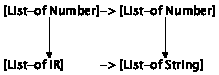
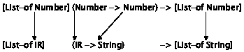
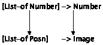
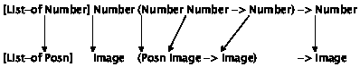

# III 抽象🔗

> 原文：[`htdp.org/2024-11-6/Book/part_three.html`](https://htdp.org/2024-11-6/Book/part_three.html)

|     14 无处不在的相似性 |
| --- |
|       14.1 函数中的相似性 |
|       14.2 不同的相似性 |
|       14.3 数据定义中的相似性 |
|       14.4 函数是值 |
|       14.5 使用函数进行计算 |
|     15 设计抽象 |
|       15.1 从示例中提取抽象 |
|       15.2 签名中的相似性 |
|       15.3 单一控制点 |
|       15.4 从模板中提取抽象 |
|     16 使用抽象 |
|       16.1 现有的抽象 |
|       16.2 局部定义 |
|       16.3 局部定义增加表达能力 |
|       16.4 使用局部变量进行计算 |
|       16.5 通过示例使用抽象 |
|       16.6 使用抽象进行设计 |
|       16.7 手指练习：抽象 |
|       16.8 项目：抽象 |
|     17 无名称函数 |
|       17.1 从 lambda 生成函数 |
|       17.2 使用 lambda 进行计算 |
|       17.3 使用 lambda 进行抽象 |
|       17.4 使用 lambda 进行指定 |
|       17.5 使用 lambda 进行表示 |
|     18 总结 |

许多我们的数据定义和函数定义看起来很相似。例如，字符串列表的定义与数字列表的定义只在两个地方不同：数据类的名称以及“字符串”和“数字”这两个词。同样，在一个字符串列表中查找特定字符串的函数几乎与在一个数字列表中查找特定数字的函数无法区分。

经验表明，这类相似性是有问题的。这些相似性产生的原因是程序员——无论是从身体上还是心理上——都会复制代码。当程序员面对一个与另一个问题大致相似的问题时，他们会复制解决方案，并修改新副本以解决新问题。你会在“真实”的编程环境中以及电子表格和数学建模的世界中发现这种行为。然而，复制代码意味着程序员会复制错误，并且可能需要对许多副本应用相同的修复。这也意味着，当底层的数据定义被修订或扩展时，必须找到并相应地修改所有代码副本。这个过程既昂贵又容易出错，给编程团队带来了不必要的成本。

良好的程序员会尽可能地消除相似性，只要编程语言允许。程序就像一篇文章。第一个版本是草稿，草稿需要编辑。“消除”意味着程序员写下他们程序的第一个草稿，找出相似性（和其他问题），并消除它们。对于最后一步，他们要么进行抽象，要么使用现有的（抽象）函数。通常需要经过几个迭代的过程，才能使程序达到令人满意的状态。

本部分的前半部分展示了如何对函数和数据定义中的相似性进行抽象。程序员也将这个过程的结果称为抽象，混淆了过程名称和结果名称。后半部分是关于使用现有的抽象和新语言元素来促进这个过程。虽然本部分的例子来自列表领域，但思想是普遍适用的。

### 14 处处相似性 "链接到此处")

如果你解决了任意大量数据中的（一些）练习题，你就会知道许多解决方案看起来很相似。事实上，这些相似性可能会诱使你将一个问题的解决方案复制到下一个问题的解决方案中。但你不应该偷代码，即使是自己的代码也不行。相反，你必须对相似的代码片段进行抽象，而本章将教你如何进行抽象。

我们避免相似性的方法特定于“中级学生语言”或简称 ISL。在 DrRacket 中，从“语言”菜单的“如何设计程序”子菜单中选择“中级学生”。几乎所有的其他编程语言都提供了类似的方法；在面向对象的编程语言中，你可能还会找到额外的抽象机制。无论如何，这些机制都共享本章中概述的基本特征，因此这里解释的设计思想也适用于其他环境。

#### 14.1 函数中的相似性🔗 "链接到此处")

设计配方决定了函数的基本组织结构，因为模板是从数据定义中创建的，而不考虑函数的目的。不出所料，因此，消费相同类型数据的函数看起来很相似。

> > > |
> > > 
> > > &#124; ; Los -> Boolean &#124;
> > > 
> > > &#124; ; does l contain "dog" &#124;
> > > 
> > > &#124; ([define](http://docs.racket-lang.org/htdp-langs/intermediate-lam.html#%28form._%28%28lib._lang%2Fhtdp-intermediate-lambda..rkt%29._define%29%29) (contains-dog? l) &#124;
> > > 
> > > &#124;   ([cond](http://docs.racket-lang.org/htdp-langs/intermediate-lam.html#%28form._%28%28lib._lang%2Fhtdp-intermediate-lambda..rkt%29._cond%29%29) &#124;
> > > 
> > > &#124;     [([empty?](http://docs.racket-lang.org/htdp-langs/intermediate-lam.html#%28def._htdp-intermediate-lambda._%28%28lib._lang%2Fhtdp-intermediate-lambda..rkt%29._empty~3f%29%29) l) #false] &#124;
> > > 
> > > &#124;     [[else](http://docs.racket-lang.org/htdp-langs/intermediate-lam.html#%28form._%28%28lib._lang%2Fhtdp-intermediate-lambda..rkt%29._else%29%29) &#124;
> > > 
> > > &#124;      ([or](http://docs.racket-lang.org/htdp-langs/intermediate-lam.html#%28form._%28%28lib._lang%2Fhtdp-intermediate-lambda..rkt%29._or%29%29) &#124;
> > > 
> > > &#124;        ([string=?](http://docs.racket-lang.org/htdp-langs/intermediate-lam.html#%28def._htdp-intermediate-lambda._%28%28lib._lang%2Fhtdp-intermediate-lambda..rkt%29._string~3d~3f%29%29) ([first](http://docs.racket-lang.org/htdp-langs/intermediate-lam.html#%28def._htdp-intermediate-lambda._%28%28lib._lang%2Fhtdp-intermediate-lambda..rkt%29._first%29%29) l) &#124;
> > > 
> > > &#124; "dog") &#124;
> > > 
> > > &#124;        (contains-dog?
> > > 
> > > &#124;          ([rest](http://docs.racket-lang.org/htdp-langs/intermediate-lam.html#%28def._htdp-intermediate-lambda._%28%28lib._lang%2Fhtdp-intermediate-lambda..rkt%29._rest%29%29) l)))])) &#124;
> > > 
> > > | |
> > > | --- |
> > > 
> > > &#124; ; Los -> Boolean &#124;
> > > 
> > > &#124; ; does l contain "cat" &#124;
> > > 
> > > &#124; ([define](http://docs.racket-lang.org/htdp-langs/intermediate-lam.html#%28form._%28%28lib._lang%2Fhtdp-intermediate-lambda..rkt%29._define%29%29) (contains-cat? l) &#124;
> > > 
> > > &#124; ([cond](http://docs.racket-lang.org/htdp-langs/intermediate-lam.html#%28form._%28%28lib._lang%2Fhtdp-intermediate-lambda..rkt%29._cond%29%29) &#124;
> > > 
> > > &#124;     [([empty?](http://docs.racket-lang.org/htdp-langs/intermediate-lam.html#%28def._htdp-intermediate-lambda._%28%28lib._lang%2Fhtdp-intermediate-lambda..rkt%29._empty~3f%29%29) l) #false] &#124;
> > > 
> > > &#124;     [[else](http://docs.racket-lang.org/htdp-langs/intermediate-lam.html#%28form._%28%28lib._lang%2Fhtdp-intermediate-lambda..rkt%29._else%29%29) &#124;
> > > 
> > > &#124;      ([or](http://docs.racket-lang.org/htdp-langs/intermediate-lam.html#%28form._%28%28lib._lang%2Fhtdp-intermediate-lambda..rkt%29._or%29%29) &#124;
> > > 
> > > &#124;    ([string=?](http://docs.racket-lang.org/htdp-langs/intermediate-lam.html#%28def._htdp-intermediate-lambda._%28%28lib._lang%2Fhtdp-intermediate-lambda..rkt%29._string~3d~3f%29%29) ([first](http://docs.racket-lang.org/htdp-langs/intermediate-lam.html#%28def._htdp-intermediate-lambda._%28%28lib._lang%2Fhtdp-intermediate-lambda..rkt%29._first%29%29) l) &#124;
> > > 
> > > &#124;    "cat") &#124;
> > > 
> > > &#124;    (contains-cat? &#124;
> > > 
> > > &#124;    ([rest](http://docs.racket-lang.org/htdp-langs/intermediate-lam.html#%28def._htdp-intermediate-lambda._%28%28lib._lang%2Fhtdp-intermediate-lambda..rkt%29._rest%29%29) l)))])) &#124;
> > > 
> > > |
> > > 
> 图 86：两个相似函数

考虑图 86 中的两个函数，它们消耗字符串列表并查找特定字符串。左侧的函数查找 "dog"，右侧的函数查找 "cat"。这两个函数几乎无法区分。每个函数都消耗字符串列表；每个函数体都由一个包含两个子句的 [cond](http://docs.racket-lang.org/htdp-langs/intermediate-lam.html#%28form._%28%28lib._lang%2Fhtdp-intermediate-lambda..rkt%29._cond%29%29) 表达式组成。如果输入是 '()，则每个函数都产生 #false；每个函数都使用一个 [or](http://docs.racket-lang.org/htdp-langs/intermediate-lam.html#%28form._%28%28lib._lang%2Fhtdp-intermediate-lambda..rkt%29._or%29%29) 表达式来确定第一个项目是否是所需的项目，如果不是，则使用递归在列表的其余部分中查找。唯一的区别是用于嵌套 [cond](http://docs.racket-lang.org/htdp-langs/intermediate-lam.html#%28form._%28%28lib._lang%2Fhtdp-intermediate-lambda..rkt%29._cond%29%29) 表达式比较的字符串：contains-dog? 使用 "dog"，而 contains-cat? 使用 "cat"。为了突出差异，这两个字符串被阴影覆盖。好的程序员太懒了，不愿意定义几个密切相关函数。相反，他们定义一个可以查找字符串列表中的 "dog" 和 "cat" 的单个函数。这个通用函数消耗额外的数据——<wbr>要查找的字符串——<wbr>在其他方面与两个原始函数相同：

> | ; String  Los -> Boolean |
> | --- |
> | ; 判断 l 是否包含字符串 s |
> | ([定义](http://docs.racket-lang.org/htdp-langs/intermediate-lam.html#%28form._%28%28lib._lang%2Fhtdp-intermediate-lambda..rkt%29._define%29%29) (contains? s l) |
> | |    ([cond](http://docs.racket-lang.org/htdp-langs/intermediate-lam.html#%28form._%28%28lib._lang%2Fhtdp-intermediate-lambda..rkt%29._cond%29%29) |
> | |    [([empty?](http://docs.racket-lang.org/htdp-langs/intermediate-lam.html#%28def._htdp-intermediate-lambda._%28%28lib._lang%2Fhtdp-intermediate-lambda..rkt%29._empty~3f%29%29) l) #false] |
> |   [[else](http://docs.racket-lang.org/htdp-langs/intermediate-lam.html#%28form._%28%28lib._lang%2Fhtdp-intermediate-lambda..rkt%29._else%29%29) ([or](http://docs.racket-lang.org/htdp-langs/intermediate-lam.html#%28form._%28%28lib._lang%2Fhtdp-intermediate-lambda..rkt%29._or%29%29) ([string=?](http://docs.racket-lang.org/htdp-langs/intermediate-lam.html#%28def._htdp-intermediate-lambda._%28%28lib._lang%2Fhtdp-intermediate-lambda..rkt%29._string~3d~3f%29%29) ([first](http://docs.racket-lang.org/htdp-langs/intermediate-lam.html#%28def._htdp-intermediate-lambda._%28%28lib._lang%2Fhtdp-intermediate-lambda..rkt%29._first%29%29) l) s) |
> |   (contains? s ([rest](http://docs.racket-lang.org/htdp-langs/intermediate-lam.html#%28def._htdp-intermediate-lambda._%28%28lib._lang%2Fhtdp-intermediate-lambda..rkt%29._rest%29%29) l)))])) |

如果你现在真的需要一个像 contains-dog? 这样的函数，你可以将其定义为一个单行函数，contains-cat? 函数也是如此。图 87 正是这样做，你应该简要地将其与图 86 进行比较，以确保你理解我们是如何从那里到达这里的。最好的是，有了 contains?，现在查找字符串列表中的任何字符串变得非常简单，而且再也不需要定义像 contains-dog? 这样的专用函数了。

> > > |
> > > 
> > > |   ; Los -> Boolean &#124;
> > > 
> > > |   ; does l contain "dog" &#124;
> > > 
> > > | ([define](http://docs.racket-lang.org/htdp-langs/intermediate-lam.html#%28form._%28%28lib._lang%2Fhtdp-intermediate-lambda..rkt%29._define%29%29) (contains-dog? l) &#124;
> > > 
> > > |   (contains? "dog" l)) &#124;
> > > 
> > > |  |
> > > | --- |
> > > 
> > > |   ; Los -> Boolean &#124;
> > > 
> > > |   ; does l contain "cat" &#124;
> > > 
> > > |   ([define](http://docs.racket-lang.org/htdp-langs/intermediate-lam.html#%28form._%28%28lib._lang%2Fhtdp-intermediate-lambda..rkt%29._define%29%29) (contains-cat? l) &#124;
> > > 
> > > |   (contains? "cat" l)) &#124;
> > > 
> > > |
> > > 
> 图 87：回顾两个相似函数

你所见证的被称为抽象，或者更确切地说，是函数抽象。从函数的不同版本中抽象出来是消除程序中相似性的方法之一，正如你将看到的，去除相似性简化了在长时间内保持程序完整性的工作。

练习 235. 使用 contains? 函数定义分别搜索 "atom"、"basic" 和 "zoo" 的函数。

练习 236. 为以下两个函数创建测试用例：

> |
> 
> |   ; Lon -> Lon &#124;
> 
> |   ; adds 1 to each item on l &#124;
> 
> `| ([define](http://docs.racket-lang.org/htdp-langs/intermediate-lam.html#%28form._%28%28lib._lang%2Fhtdp-intermediate-lambda..rkt%29._define%29%29) (add1* l) |`
> 
> `|      ([cond](http://docs.racket-lang.org/htdp-langs/intermediate-lam.html#%28form._%28%28lib._lang%2Fhtdp-intermediate-lambda..rkt%29._cond%29%29)`
> 
> `|      [([empty?](http://docs.racket-lang.org/htdp-langs/intermediate-lam.html#%28def._htdp-intermediate-lambda._%28%28lib._lang%2Fhtdp-intermediate-lambda..rkt%29._empty~3f%29%29) l) '()] |`
> 
> `|      [[else](http://docs.racket-lang.org/htdp-langs/intermediate-lam.html#%28form._%28%28lib._lang%2Fhtdp-intermediate-lambda..rkt%29._else%29%29) |`
> 
> `|      ([cons](http://docs.racket-lang.org/htdp-langs/intermediate-lam.html#%28def._htdp-intermediate-lambda._%28%28lib._lang%2Fhtdp-intermediate-lambda..rkt%29._cons%29%29) |`
> 
> `|       ([add1](http://docs.racket-lang.org/htdp-langs/intermediate-lam.html#%28def._htdp-intermediate-lambda._%28%28lib._lang%2Fhtdp-intermediate-lambda..rkt%29._add1%29%29) ([first](http://docs.racket-lang.org/htdp-langs/intermediate-lam.html#%28def._htdp-intermediate-lambda._%28%28lib._lang%2Fhtdp-intermediate-lambda..rkt%29._first%29%29) l)) |`
> 
> `|      (add1* ([rest](http://docs.racket-lang.org/htdp-langs/intermediate-lam.html#%28def._htdp-intermediate-lambda._%28%28lib._lang%2Fhtdp-intermediate-lambda..rkt%29._rest%29%29) l)))]))`
> 
> | ` |  | ` |
> | --- | --- | --- |
> 
> `| ; Lon -> Lon`
> 
> `| ; 为每个 l 中的项目添加 5`
> 
> `| ([define](http://docs.racket-lang.org/htdp-langs/intermediate-lam.html#%28form._%28%28lib._lang%2Fhtdp-intermediate-lambda..rkt%29._define%29%29) (plus5 l)`
> 
> `|      ([cond](http://docs.racket-lang.org/htdp-langs/intermediate-lam.html#%28form._%28%28lib._lang%2Fhtdp-intermediate-lambda..rkt%29._cond%29%29)`
> 
> `|       [([empty?](http://docs.racket-lang.org/htdp-langs/intermediate-lam.html#%28def._htdp-intermediate-lambda._%28%28lib._lang%2Fhtdp-intermediate-lambda..rkt%29._empty~3f%29%29) l) '()]`
> 
> `|       [[else](http://docs.racket-lang.org/htdp-langs/intermediate-lam.html#%28form._%28%28lib._lang%2Fhtdp-intermediate-lambda..rkt%29._else%29%29)]
> 
> `|      ([cons](http://docs.racket-lang.org/htdp-langs/intermediate-lam.html#%28def._htdp-intermediate-lambda._%28%28lib._lang%2Fhtdp-intermediate-lambda..rkt%29._cons%29%29) |`
> 
> `|      ([+](http://docs.racket-lang.org/htdp-langs/intermediate-lam.html#%28def._htdp-intermediate-lambda._%28%28lib._lang%2Fhtdp-intermediate-lambda..rkt%29._%2B%29%29) ([first](http://docs.racket-lang.org/htdp-langs/intermediate-lam.html#%28def._htdp-intermediate-lambda._%28%28lib._lang%2Fhtdp-intermediate-lambda..rkt%29._first%29%29) l) 5)`
> 
> &#124;   (plus5 ([rest](http://docs.racket-lang.org/htdp-langs/intermediate-lam.html#%28def._htdp-intermediate-lambda._%28%28lib._lang%2Fhtdp-intermediate-lambda..rkt%29._rest%29%29) l)))])) &#124;
> 
> |

然后对它们进行抽象。以上两个函数用抽象定义为一行，并使用现有的测试套件来确认修改后的定义是否正常工作。最后，设计一个函数，从给定列表中的每个数字中减去 2。

#### 14.2 不同的相似性🔗 "链接到此处")

抽象在 contains-dog?和 contains-cat?函数的情况下看起来很简单。它只需要比较两个函数定义，用一个函数参数替换一个字面字符串，并快速检查是否容易用抽象函数定义旧函数。这种抽象如此自然，以至于在本书的前两部分中几乎未加说明就出现了。

本节说明了相同的原理如何产生一种强大的抽象形式。请看图 88。这两个函数都消耗一个数字列表和一个阈值。左边的一个生成所有低于阈值的数字列表，而右边的一个生成所有高于阈值的数字列表。

> > > |
> > > 
> > > &#124; ;   Lon  Number -> Lon &#124;
> > > 
> > > &#124; ;   选择 l 上的数字
> > > 
> > > &#124; ;   低于 t 的数字
> > > 
> > > &#124; ([define](http://docs.racket-lang.org/htdp-langs/intermediate-lam.html#%28form._%28%28lib._lang%2Fhtdp-intermediate-lambda..rkt%29._define%29%29) (small l t) &#124;
> > > 
> > > &#124;   ([cond](http://docs.racket-lang.org/htdp-langs/intermediate-lam.html#%28form._%28%28lib._lang%2Fhtdp-intermediate-lambda..rkt%29._cond%29%29) &#124;
> > > 
> > > &#124;   [([empty?](http://docs.racket-lang.org/htdp-langs/intermediate-lam.html#%28def._htdp-intermediate-lambda._%28%28lib._lang%2Fhtdp-intermediate-lambda..rkt%29._empty~3f%29%29) l) '()] &#124;
> > > 
> > > &#124;   [[else](http://docs.racket-lang.org/htdp-langs/intermediate-lam.html#%28form._%28%28lib._lang%2Fhtdp-intermediate-lambda..rkt%29._else%29%29) &#124;
> > > 
> > > &#124;   ([cond](http://docs.racket-lang.org/htdp-langs/intermediate-lam.html#%28form._%28%28lib._lang%2Fhtdp-intermediate-lambda..rkt%29._cond%29%29) &#124;
> > > 
> > > &#124;   [([<](http://docs.racket-lang.org/htdp-langs/intermediate-lam.html#%28def._htdp-intermediate-lambda._%28%28lib._lang%2Fhtdp-intermediate-lambda..rkt%29._~3c%29%29) ([first](http://docs.racket-lang.org/htdp-langs/intermediate-lam.html#%28def._htdp-intermediate-lambda._%28%28lib._lang%2Fhtdp-intermediate-lambda..rkt%29._first%29%29) l) t) &#124;
> > > 
> > > [[cons](http://docs.racket-lang.org/htdp-langs/intermediate-lam.html#%28def._htdp-intermediate-lambda._%28%28lib._lang%2Fhtdp-intermediate-lambda..rkt%29._cons%29%29) [[first](http://docs.racket-lang.org/htdp-langs/intermediate-lam.html#%28def._htdp-intermediate-lambda._%28%28lib._lang%2Fhtdp-intermediate-lambda..rkt%29._first%29%29) l] | 
> > > 
> > > [[small](http://docs.racket-lang.org/htdp-langs/intermediate-lam.html#%28def._htdp-intermediate-lambda._%28%28lib._lang%2Fhtdp-intermediate-lambda..rkt%29._small%29%29) | 
> > > 
> > > [[rest](http://docs.racket-lang.org/htdp-langs/intermediate-lam.html#%28def._htdp-intermediate-lambda._%28%28lib._lang%2Fhtdp-intermediate-lambda..rkt%29._rest%29%29) l) t]] | 
> > > 
> > > [[else](http://docs.racket-lang.org/htdp-langs/intermediate-lam.html#%28form._%28%28lib._lang%2Fhtdp-intermediate-lambda..rkt%29._else%29%29) | 
> > > 
> > > [[small](http://docs.racket-lang.org/htdp-langs/intermediate-lam.html#%28def._htdp-intermediate-lambda._%28%28lib._lang%2Fhtdp-intermediate-lambda..rkt%29._small%29%29) | 
> > > 
> > > [[rest](http://docs.racket-lang.org/htdp-langs/intermediate-lam.html#%28def._htdp-intermediate-lambda._%28%28lib._lang%2Fhtdp-intermediate-lambda..rkt%29._rest%29%29) l) t]]) | 
> > > 
> > > |  |  |
> > > | --- | --- |
> > > 
> > > [[Lon](http://docs.racket-lang.org/htdp-langs/intermediate-lam.html#%28tech._sim-dd._lon%29) Number -> [Lon](http://docs.racket-lang.org/htdp-langs/intermediate-lam.html#%28tech._sim-dd._lon%29)] | 
> > > 
> > > [[select](http://docs.racket-lang.org/htdp-langs/intermediate-lam.html#%28form._%28%28lib._lang%2Fhtdp-intermediate-lambda..rkt%29._select%29%29) those numbers on l]] | 
> > > 
> > > [[that](http://docs.racket-lang.org/htdp-langs/intermediate-lam.html#%28form._%28%28lib._lang%2Fhtdp-intermediate-lambda..rkt%29._that%29%29) are above t] | 
> > > 
> > > [[define](http://docs.racket-lang.org/htdp-langs/intermediate-lam.html#%28form._%28%28lib._lang%2Fhtdp-intermediate-lambda..rkt%29._define%29%29) (large l t) | 
> > > 
> > > [[cond](http://docs.racket-lang.org/htdp-langs/intermediate-lam.html#%28form._%28%28lib._lang%2Fhtdp-intermediate-lambda..rkt%29._cond%29%29) | 
> > > 
> > > [[empty?](http://docs.racket-lang.org/htdp-langs/intermediate-lam.html#%28def._htdp-intermediate-lambda._%28%28lib._lang%2Fhtdp-intermediate-lambda..rkt%29._empty~3f%29%29) l) '()] | 
> > > 
> > > [[else](http://docs.racket-lang.org/htdp-langs/intermediate-lam.html#%28form._%28%28lib._lang%2Fhtdp-intermediate-lambda..rkt%29._else%29%29) | 
> > > 
> > > [[cond](http://docs.racket-lang.org/htdp-langs/intermediate-lam.html#%28form._%28%28lib._lang%2Fhtdp-intermediate-lambda..rkt%29._cond%29%29) | 
> > > 
> > > [[>](http://docs.racket-lang.org/htdp-langs/intermediate-lam.html#%28def._htdp-intermediate-lambda._%28%28lib._lang%2Fhtdp-intermediate-lambda..rkt%29._~3e%29%29) [[first](http://docs.racket-lang.org/htdp-langs/intermediate-lam.html#%28def._htdp-intermediate-lambda._%28%28lib._lang%2Fhtdp-intermediate-lambda..rkt%29._first%29%29) l) t] | 
> > > 
> > > [[cons](http://docs.racket-lang.org/htdp-langs/intermediate-lam.html#%28def._htdp-intermediate-lambda._%28%28lib._lang%2Fhtdp-intermediate-lambda..rkt%29._cons%29%29) [[first](http://docs.racket-lang.org/htdp-langs/intermediate-lam.html#%28def._htdp-intermediate-lambda._%28%28lib._lang%2Fhtdp-intermediate-lambda..rkt%29._first%29%29) l] |
> > > 
> > > [[large](http://docs.racket-lang.org/htdp-langs/intermediate-lam.html#%28def._htdp-intermediate-lambda._%28%28lib._lang%2Fhtdp-intermediate-lambda..rkt%29._large%29%29) | 
> > > 
> > > [[rest](http://docs.racket-lang.org/htdp-langs/intermediate-lam.html#%28def._htdp-intermediate-lambda._%28%28lib._lang%2Fhtdp-intermediate-lambda..rkt%29._rest%29%29) l) t]] | 
> > > 
> > > &#124;   [[else](http://docs.racket-lang.org/htdp-langs/intermediate-lam.html#%28form._%28%28lib._lang%2Fhtdp-intermediate-lambda..rkt%29._else%29%29) &#124;
> > > 
> > > &#124;   (large &#124;
> > > 
> > > &#124;   ([rest](http://docs.racket-lang.org/htdp-langs/intermediate-lam.html#%28def._htdp-intermediate-lambda._%28%28lib._lang%2Fhtdp-intermediate-lambda..rkt%29._rest%29%29) l) t)])])) &#124;
> > > 
> > > |
> > > 
> 图 88：两个更相似的功能

这两个函数只有一个地方不同：确定给定列表中的数字是否应该是结果的一部分的比较运算符。左边的函数使用 [<](http://docs.racket-lang.org/htdp-langs/intermediate-lam.html#%28def._htdp-intermediate-lambda._%28%28lib._lang%2Fhtdp-intermediate-lambda..rkt%29._~3c%29%29)，而右边的函数使用 [>](http://docs.racket-lang.org/htdp-langs/intermediate-lam.html#%28def._htdp-intermediate-lambda._%28%28lib._lang%2Fhtdp-intermediate-lambda..rkt%29._~3e%29%29)。除此之外，这两个函数看起来完全相同，除了函数名之外。

让我们遵循第一个示例，并通过一个额外的参数来抽象这两个函数。这次，额外的参数代表一个比较运算符，而不是一个字符串：

> | ([define](http://docs.racket-lang.org/htdp-langs/intermediate-lam.html#%28form._%28%28lib._lang%2Fhtdp-intermediate-lambda..rkt%29._define%29%29) (extract R l t) |
> | --- |
> | |   ([cond](http://docs.racket-lang.org/htdp-langs/intermediate-lam.html#%28form._%28%28lib._lang%2Fhtdp-intermediate-lambda..rkt%29._cond%29%29) |
> | |   [([empty?](http://docs.racket-lang.org/htdp-langs/intermediate-lam.html#%28def._htdp-intermediate-lambda._%28%28lib._lang%2Fhtdp-intermediate-lambda..rkt%29._empty~3f%29%29) l) '()] |
> | |   [[else](http://docs.racket-lang.org/htdp-langs/intermediate-lam.html#%28form._%28%28lib._lang%2Fhtdp-intermediate-lambda..rkt%29._else%29%29) ([cond](http://docs.racket-lang.org/htdp-langs/intermediate-lam.html#%28form._%28%28lib._lang%2Fhtdp-intermediate-lambda..rkt%29._cond%29%29) |
> | |   [(R ([first](http://docs.racket-lang.org/htdp-langs/intermediate-lam.html#%28def._htdp-intermediate-lambda._%28%28lib._lang%2Fhtdp-intermediate-lambda..rkt%29._first%29%29) l) t) |
> | |   ([cons](http://docs.racket-lang.org/htdp-langs/intermediate-lam.html#%28def._htdp-intermediate-lambda._%28%28lib._lang%2Fhtdp-intermediate-lambda..rkt%29._cons%29%29) ([first](http://docs.racket-lang.org/htdp-langs/intermediate-lam.html#%28def._htdp-intermediate-lambda._%28%28lib._lang%2Fhtdp-intermediate-lambda..rkt%29._first%29%29) l) |
> | |   (extract R ([rest](http://docs.racket-lang.org/htdp-langs/intermediate-lam.html#%28def._htdp-intermediate-lambda._%28%28lib._lang%2Fhtdp-intermediate-lambda..rkt%29._rest%29%29) l) t))] |
> | |   [[else](http://docs.racket-lang.org/htdp-langs/intermediate-lam.html#%28form._%28%28lib._lang%2Fhtdp-intermediate-lambda..rkt%29._else%29%29) |
> | |   (extract R ([rest](http://docs.racket-lang.org/htdp-langs/intermediate-lam.html#%28def._htdp-intermediate-lambda._%28%28lib._lang%2Fhtdp-intermediate-lambda..rkt%29._rest%29%29) l) t)])])) |

要应用这个新函数，我们必须提供三个参数：一个比较两个数字的函数 R，一个数字列表 l，以及一个阈值 t。然后该函数从 l 中提取所有那些使(R  i  t)评估为#true 的项目 i。

停止！在这个时候，你应该问自己这个定义是否有意义。在没有进一步麻烦的情况下，我们已经创建了一个消耗函数的函数——<wbr>这可能是你以前从未见过的。如果你已经上过微积分课程，你遇到过微分算子和不定积分。这两个都是消耗并产生函数的函数。但我们并不假设你已经上过微积分课程。然而，结果是，你简单的小型教学语言 ISL 支持这类函数，定义这类函数是优秀程序员最强大的工具之一——<wbr>即使在那些似乎没有提供函数消耗函数的语言中。

测试显示，(extract  [<](http://docs.racket-lang.org/htdp-langs/intermediate-lam.html#%28def._htdp-intermediate-lambda._%28%28lib._lang%2Fhtdp-intermediate-lambda..rkt%29._~3c%29%29)  l  t) 计算的结果与 (small  l  t) 相同：

> | ([check-expect](http://docs.racket-lang.org/htdp-langs/intermediate-lam.html#%28form._%28%28lib._lang%2Fhtdp-intermediate-lambda..rkt%29._check-expect%29%29) (extract [<](http://docs.racket-lang.org/htdp-langs/intermediate-lam.html#%28def._htdp-intermediate-lambda._%28%28lib._lang%2Fhtdp-intermediate-lambda..rkt%29._~3c%29%29) '() 5) (small '() 5)) |
> | --- |
> | ([check-expect](http://docs.racket-lang.org/htdp-langs/intermediate-lam.html#%28form._%28%28lib._lang%2Fhtdp-intermediate-lambda..rkt%29._check-expect%29%29) (extract [<](http://docs.racket-lang.org/htdp-langs/intermediate-lam.html#%28def._htdp-intermediate-lambda._%28%28lib._lang%2Fhtdp-intermediate-lambda..rkt%29._~3c%29%29) '(3) 5) (small '(3) 5)) |
> | ([check-expect](http://docs.racket-lang.org/htdp-langs/intermediate-lam.html#%28form._%28%28lib._lang%2Fhtdp-intermediate-lambda..rkt%29._check-expect%29%29) (extract [<](http://docs.racket-lang.org/htdp-langs/intermediate-lam.html#%28def._htdp-intermediate-lambda._%28%28lib._lang%2Fhtdp-intermediate-lambda..rkt%29._~3c%29%29) '(1 6 4) 5)) |
> | |   (small '(1 6 4) 5)) |

同样地，(extract  [>](http://docs.racket-lang.org/htdp-langs/intermediate-lam.html#%28def._htdp-intermediate-lambda._%28%28lib._lang%2Fhtdp-intermediate-lambda..rkt%29._~3e%29%29)  l  t) 产生的结果与 (large  l  t) 相同，这意味着你可以像这样定义这两个原始函数：

> |
> 
> &#124; ; Lon 数字 -> Lon &#124;
> 
> &#124; ([define](http://docs.racket-lang.org/htdp-langs/intermediate-lam.html#%28form._%28%28lib._lang%2Fhtdp-intermediate-lambda..rkt%29._define%29%29) (small-1 l t) &#124;
> 
> &#124;   (extract [<](http://docs.racket-lang.org/htdp-langs/intermediate-lam.html#%28def._htdp-intermediate-lambda._%28%28lib._lang%2Fhtdp-intermediate-lambda..rkt%29._~3c%29%29) l t)) &#124;
> 
> |  |
> | --- |
> 
> &#124; ; Lon  Number -> Lon &#124;
> 
> &#124; ([define](http://docs.racket-lang.org/htdp-langs/intermediate-lam.html#%28form._%28%28lib._lang%2Fhtdp-intermediate-lambda..rkt%29._define%29%29) (large-1 l t) &#124;
> 
> &#124;   (extract [>](http://docs.racket-lang.org/htdp-langs/intermediate-lam.html#%28def._htdp-intermediate-lambda._%28%28lib._lang%2Fhtdp-intermediate-lambda..rkt%29._~3e%29%29) l t)) &#124;
> 
> |

重要的洞察力不在于 small-1 和 large-1 是一行定义。一旦你有一个像 extract 这样的抽象函数，你就可以在其他地方很好地使用它：

1.  (extract  [=](http://docs.racket-lang.org/htdp-langs/intermediate-lam.html#%28def._htdp-intermediate-lambda._%28%28lib._lang%2Fhtdp-intermediate-lambda..rkt%29._~3d%29%29)  l  t): 这个表达式提取出列表 l 中所有等于 t 的数字。

1.  (extract  [<=](http://docs.racket-lang.org/htdp-langs/intermediate-lam.html#%28def._htdp-intermediate-lambda._%28%28lib._lang%2Fhtdp-intermediate-lambda..rkt%29._~3c~3d%29%29)  l  t): 这个表达式生成列表 l 中小于或等于 t 的数字。

1.  (extract  [>=](http://docs.racket-lang.org/htdp-langs/intermediate-lam.html#%28def._htdp-intermediate-lambda._%28%28lib._lang%2Fhtdp-intermediate-lambda..rkt%29._~3e~3d%29%29)  l  t): 这个表达式计算大于或等于阈值的数字列表。

实际上，extract 的第一个参数不需要是 ISL 预定义的操作之一。相反，你可以使用任何消耗两个参数并产生 布尔值 的函数。考虑以下示例：

> | ; Number  Number -> Boolean |
> | --- |
> | ; 是边长为 x 的正方形面积大于 c |
> | ([define](http://docs.racket-lang.org/htdp-langs/intermediate-lam.html#%28form._%28%28lib._lang%2Fhtdp-intermediate-lambda..rkt%29._define%29%29) (squared>? x c) |
> |   ([>](http://docs.racket-lang.org/htdp-langs/intermediate-lam.html#%28def._htdp-intermediate-lambda._%28%28lib._lang%2Fhtdp-intermediate-lambda..rkt%29._~3e%29%29) ([*](http://docs.racket-lang.org/htdp-langs/intermediate-lam.html#%28def._htdp-intermediate-lambda._%28%28lib._lang%2Fhtdp-intermediate-lambda..rkt%29._%2A%29%29) x x) c)) |

也就是说，squared>? 检查 x² > c 的断言是否成立，并且它可以与 extract 一起使用：

> (extract squared>? ([list](http://docs.racket-lang.org/htdp-langs/intermediate-lam.html#%28def._htdp-intermediate-lambda._%28%28lib._lang%2Fhtdp-intermediate-lambda..rkt%29._list%29%29) 3 4 5) 10)

该应用程序提取那些在 ([list](http://docs.racket-lang.org/htdp-langs/intermediate-lam.html#%28def._htdp-intermediate-lambda._%28%28lib._lang%2Fhtdp-intermediate-lambda..rkt%29._list%29%29)  3  4  5) 中平方大于 10 的数字。

练习 237。在 DrRacket 中评估 (squared>?  3  10) 和 (squared>?  4  10)。那么 (squared>?  5  10) 呢？

到目前为止，你已经看到抽象函数定义可能比原始函数更有用。例如，contains? 比 contains-dog? 和 contains-cat? 更有用，而 extract 比 small 和 large 更有用。这些抽象的好处存在于编程的所有级别：文档、电子表格、小型应用程序和大型工业项目。为后者创建抽象推动了编程语言和软件工程的研究。抽象的另一个重要方面是，你现在可以对这些所有函数有一个单一的控制器。如果抽象函数中存在错误，只需修复其定义即可修复所有其他定义。同样，如果你发现如何加速抽象函数的计算或如何减少其能耗，那么所有基于此函数定义的函数都会得到改进，而无需额外努力。以下练习说明了这些单一控制器改进是如何工作的。

> > > |
> > > 
> > > &#124; ; Nelon -> Number &#124;
> > > 
> > > &#124; ; 确定最小值 &#124;
> > > 
> > > &#124; ; l 上的数字 &#124;
> > > 
> > > &#124; ([define](http://docs.racket-lang.org/htdp-langs/intermediate-lam.html#%28form._%28%28lib._lang%2Fhtdp-intermediate-lambda..rkt%29._define%29%29) (inf l) &#124;
> > > 
> > > &#124;   ([cond](http://docs.racket-lang.org/htdp-langs/intermediate-lam.html#%28form._%28%28lib._lang%2Fhtdp-intermediate-lambda..rkt%29._cond%29%29) &#124;
> > > 
> > > &#124;     [([empty?](http://docs.racket-lang.org/htdp-langs/intermediate-lam.html#%28def._htdp-intermediate-lambda._%28%28lib._lang%2Fhtdp-intermediate-lambda..rkt%29._empty~3f%29%29) ([rest](http://docs.racket-lang.org/htdp-langs/intermediate-lam.html#%28def._htdp-intermediate-lambda._%28%28lib._lang%2Fhtdp-intermediate-lambda..rkt%29._rest%29%29) l)) &#124;
> > > 
> > > &#124;      ([first](http://docs.racket-lang.org/htdp-langs/intermediate-lam.html#%28def._htdp-intermediate-lambda._%28%28lib._lang%2Fhtdp-intermediate-lambda..rkt%29._first%29%29) l)] &#124;
> > > 
> > > &#124;     [[else](http://docs.racket-lang.org/htdp-langs/intermediate-lam.html#%28form._%28%28lib._lang%2Fhtdp-intermediate-lambda..rkt%29._else%29%29) &#124;
> > > 
> > > | ; ([if](http://docs.racket-lang.org/htdp-langs/intermediate-lam.html#%28form._%28%28lib._lang%2Fhtdp-intermediate-lambda..rkt%29._if%29%29) ([<](http://docs.racket-lang.org/htdp-langs/intermediate-lam.html#%28def._htdp-intermediate-lambda._%28%28lib._lang%2Fhtdp-intermediate-lambda..rkt%29._~3c%29%29) ([first](http://docs.racket-lang.org/htdp-langs/intermediate-lam.html#%28def._htdp-intermediate-lambda._%28%28lib._lang%2Fhtdp-intermediate-lambda..rkt%29._first%29%29) l) &#124;
> > > 
> > > | ; (inf ([rest](http://docs.racket-lang.org/htdp-langs/intermediate-lam.html#%28def._htdp-intermediate-lambda._%28%28lib._lang%2Fhtdp-intermediate-lambda..rkt%29._rest%29%29) l))) &#124;
> > > 
> > > | ; ([first](http://docs.racket-lang.org/htdp-langs/intermediate-lam.html#%28def._htdp-intermediate-lambda._%28%28lib._lang%2Fhtdp-intermediate-lambda..rkt%29._first%29%29) l) &#124;
> > > 
> > > | ; (inf ([rest](http://docs.racket-lang.org/htdp-langs/intermediate-lam.html#%28def._htdp-intermediate-lambda._%28%28lib._lang%2Fhtdp-intermediate-lambda..rkt%29._rest%29%29) l)))])) &#124;
> > > 
> > > |  |
> > > | --- |
> > > 
> > > | ; Nelon -> Number &#124;
> > > 
> > > | ; 确定最大的 | 
> > > 
> > > | ; number on l &#124;
> > > 
> > > | ; ([define](http://docs.racket-lang.org/htdp-langs/intermediate-lam.html#%28form._%28%28lib._lang%2Fhtdp-intermediate-lambda..rkt%29._define%29%29) (sup l) &#124;
> > > 
> > > | ; ([cond](http://docs.racket-lang.org/htdp-langs/intermediate-lam.html#%28form._%28%28lib._lang%2Fhtdp-intermediate-lambda..rkt%29._cond%29%29) &#124;
> > > 
> > > | ; ([empty?](http://docs.racket-lang.org/htdp-langs/intermediate-lam.html#%28def._htdp-intermediate-lambda._%28%28lib._lang%2Fhtdp-intermediate-lambda..rkt%29._empty~3f%29%29) ([rest](http://docs.racket-lang.org/htdp-langs/intermediate-lam.html#%28def._htdp-intermediate-lambda._%28%28lib._lang%2Fhtdp-intermediate-lambda..rkt%29._rest%29%29) l)) &#124;
> > > 
> > > | ; ([first](http://docs.racket-lang.org/htdp-langs/intermediate-lam.html#%28def._htdp-intermediate-lambda._%28%28lib._lang%2Fhtdp-intermediate-lambda..rkt%29._first%29%29) l)]
> > > 
> > > | ; [[else](http://docs.racket-lang.org/htdp-langs/intermediate-lam.html#%28form._%28%28lib._lang%2Fhtdp-intermediate-lambda..rkt%29._else%29%29) &#124;
> > > 
> > > | ; ([if](http://docs.racket-lang.org/htdp-langs/intermediate-lam.html#%28form._%28%28lib._lang%2Fhtdp-intermediate-lambda..rkt%29._if%29%29) ([>](http://docs.racket-lang.org/htdp-langs/intermediate-lam.html#%28def._htdp-intermediate-lambda._%28%28lib._lang%2Fhtdp-intermediate-lambda..rkt%29._~3e%29%29) ([first](http://docs.racket-lang.org/htdp-langs/intermediate-lam.html#%28def._htdp-intermediate-lambda._%28%28lib._lang%2Fhtdp-intermediate-lambda..rkt%29._first%29%29) l) &#124;
> > > 
> > > | ; (sup ([rest](http://docs.racket-lang.org/htdp-langs/intermediate-lam.html#%28def._htdp-intermediate-lambda._%28%28lib._lang%2Fhtdp-intermediate-lambda..rkt%29._rest%29%29) l))) &#124;
> > > 
> > > &#124;          ([first](http://docs.racket-lang.org/htdp-langs/intermediate-lam.html#%28def._htdp-intermediate-lambda._%28%28lib._lang%2Fhtdp-intermediate-lambda..rkt%29._first%29%29) l) &#124;
> > > 
> > > &#124;          (sup ([rest](http://docs.racket-lang.org/htdp-langs/intermediate-lam.html#%28def._htdp-intermediate-lambda._%28%28lib._lang%2Fhtdp-intermediate-lambda..rkt%29._rest%29%29) l)))])) &#124;
> > > 
> > > |
> > > 
> 图 89：在数字列表中查找 inf 和 sup

练习 238。将图 89 中的两个函数抽象成一个单一函数。这两个函数都消耗非空数字列表（Nelon）并产生一个单一数字。左边的一个产生列表中的最小数字，而右边的一个产生最大数字。

用抽象函数定义 inf-1 和 sup-1。用这两个列表测试它们：

> | ([列表](http://docs.racket-lang.org/htdp-langs/intermediate-lam.html#%28def._htdp-intermediate-lambda._%28%28lib._lang%2Fhtdp-intermediate-lambda..rkt%29._list%29%29) 25 24 23 22 21 20 19 18 17 16 15 14 13 |
> | --- |
> |       12 11 10 9 8 7 6 5 4 3 2 1) |
> |   |
> | ([list](http://docs.racket-lang.org/htdp-langs/intermediate-lam.html#%28def._htdp-intermediate-lambda._%28%28lib._lang%2Fhtdp-intermediate-lambda..rkt%29._list%29%29) 1 2 3 4 5 6 7 8 9 10 11 12 13 14 15 16 |
> |       17 18 19 20 21 22 23 24 25) |

为什么这些函数在一些长列表上运行缓慢？

使用 [max](http://docs.racket-lang.org/htdp-langs/intermediate-lam.html#%28def._htdp-intermediate-lambda._%28%28lib._lang%2Fhtdp-intermediate-lambda..rkt%29._max%29%29)，它选择两个数字中较大的一个，和 [min](http://docs.racket-lang.org/htdp-langs/intermediate-lam.html#%28def._htdp-intermediate-lambda._%28%28lib._lang%2Fhtdp-intermediate-lambda..rkt%29._min%29%29)，它选择较小的那个，修改原始函数。然后再次抽象，定义 inf-2 和 sup-2，并使用相同的输入再次测试它们。为什么这些版本的速度如此之快？

对于这些问题的另一个答案，请参阅局部定义。

#### 14.3 数据定义中的相似性🔗 "链接到此处")

现在仔细看看以下两个数据定义：

> |
> 
> &#124; ; 一个 Lon (数字列表) &#124;
> 
> &#124; ; 是以下之一：&#124;
> 
> &#124; ; –  '() &#124;
> 
> &#124; ; –  ([cons](http://docs.racket-lang.org/htdp-langs/intermediate-lam.html#%28def._htdp-intermediate-lambda._%28%28lib._lang%2Fhtdp-intermediate-lambda..rkt%29._cons%29%29)  Number  Lon) &#124;
> 
> |  |
> | --- |
> 
> &#124; ; 一个 Los (字符串列表) &#124;
> 
> &#124; ; 是以下之一：&#124;
> 
> &#124; ; –  '() &#124;
> 
> &#124; ; –  ([cons](http://docs.racket-lang.org/htdp-langs/intermediate-lam.html#%28def._htdp-intermediate-lambda._%28%28lib._lang%2Fhtdp-intermediate-lambda..rkt%29._cons%29%29)  String  Los)   &#124;
> 
> |

左边的一个引入了数字列表；右边的一个描述了字符串列表。这两个数据定义是相似的。就像相似的功能一样，这两个数据定义使用两个不同的名称，但这无关紧要，因为任何名称都可以。唯一的真正区别在于第二个子句中[cons](http://docs.racket-lang.org/htdp-langs/intermediate-lam.html#%28def._htdp-intermediate-lambda._%28%28lib._lang%2Fhtdp-intermediate-lambda..rkt%29._cons%29%29)的第一个位置，它指定了列表包含什么类型的项。为了抽象出这个差异，我们像处理数据定义是一个函数一样进行。我们引入一个参数，这使得数据定义看起来像一个函数，并且在哪里曾经有不同的引用，我们使用这个参数：

> | ; 一个[List-of ITEM]是以下之一： |
> | --- |
> | ; –  '() |
> | ; –  ([cons](http://docs.racket-lang.org/htdp-langs/intermediate-lam.html#%28def._htdp-intermediate-lambda._%28%28lib._lang%2Fhtdp-intermediate-lambda..rkt%29._cons%29%29)  ITEM  [List-of  ITEM]) |

我们称这样的抽象数据定义为参数化数据定义，因为有一个参数。粗略地说，参数化数据定义以与函数以相同的方式从特定的数据集合中抽象出来的方式抽象。当然，问题是这些参数的范围是什么。对于一个函数，它们代表一个未知值；当函数被应用时，这个值就变得已知了。对于参数化数据定义，一个参数代表一个整个值的类别。向参数化数据定义提供数据集合名称的过程称为实例化；以下是 List-of 抽象的一些示例实例化：

+   当我们写[列表 数字]时，我们是在说 ITEM 代表所有数字，因此它只是 List-of-numbers 的另一个名称；

+   同样，[列表 字符串]定义了与 List-of-String 相同的数据类别；并且

+   如果我们识别了一个库存记录的类别，就像这样：

    > | ([定义结构](http://docs.racket-lang.org/htdp-langs/intermediate-lam.html#%28form._%28%28lib._lang%2Fhtdp-intermediate-lambda..rkt%29._define-struct%29%29) IR 名称 价格) |
    > | --- |
    > | ; 一个 IR 是一个结构： |
    > | ;   (make-IR [字符串](http://docs.racket-lang.org/htdp-langs/intermediate-lam.html#%28def._htdp-intermediate-lambda._%28%28lib._lang%2Fhtdp-intermediate-lambda..rkt%29._.String%29%29) [数字](http://docs.racket-lang.org/htdp-langs/intermediate-lam.html#%28def._htdp-intermediate-lambda._%28%28lib._lang%2Fhtdp-intermediate-lambda..rkt%29._.Number%29%29)) |

    然后[List-of IR]将是库存记录列表的名称。

按照惯例，我们使用全部大写的名称作为数据定义的参数，而参数则按需要拼写。我们验证这些缩写确实意味着我们所说的那样，是通过用实际的数据定义名称，例如 Number，替换数据定义的参数 ITEM，并为数据定义使用普通名称：

> | ; A List-of-numbers-again is one of: |
> | --- |
> | ; –  '() |
> | ; –  ([cons](http://docs.racket-lang.org/htdp-langs/intermediate-lam.html#%28def._htdp-intermediate-lambda._%28%28lib._lang%2Fhtdp-intermediate-lambda..rkt%29._cons%29%29)  Number  List-of-numbers-again) |

由于数据定义是自引用的，我们复制了整个数据定义。结果定义看起来与传统的数字列表定义完全一样，并且真正地识别了相同的数据类别。让我们简要地看一下第二个例子，从一个结构类型定义开始：

> ([define-struct](http://docs.racket-lang.org/htdp-langs/intermediate-lam.html#%28form._%28%28lib._lang%2Fhtdp-intermediate-lambda..rkt%29._define-struct%29%29) point [hori veri])

这里是使用这种结构类型的两个不同的数据定义：

> | ; A Pair-boolean-string is a structure: |
> | --- |
> | ;   (make-point  Boolean  String) |
> |   |
> | ; A Pair-number-image is a structure: |
> | ;   (make-point  Number  Image) |

在这种情况下，数据定义在两个地方有所不同——都由高亮标记。水平字段中的差异相互对应，垂直字段中的差异也是如此。因此，有必要引入两个参数来创建一个抽象数据定义：

> | ; A [CP H V] is a structure: |
> | --- |
> | ;   (make-point  H  V) |

这里 H 是水平字段的参数，V 代表可以出现在垂直字段中的数据集合。

要实例化一个具有两个参数的数据定义，你需要两个数据集合的名称。使用 Number 和 Image 作为 CP 的参数，你得到[CP Number Image]，这描述了将数字与图像结合的点集合。相比之下，[CP Boolean String]在点结构中将布尔值与字符串结合。

练习 239。在 ISL 编程中，一个包含两个项目的列表是另一种常用的数据形式。以下是一个具有两个参数的数据定义：

> | ; A [List X Y] is a list: |
> | --- |
> | ;   ([cons](http://docs.racket-lang.org/htdp-langs/intermediate-lam.html#%28def._htdp-intermediate-lambda._%28%28lib._lang%2Fhtdp-intermediate-lambda..rkt%29._cons%29%29)  X  ([cons](http://docs.racket-lang.org/htdp-langs/intermediate-lam.html#%28def._htdp-intermediate-lambda._%28%28lib._lang%2Fhtdp-intermediate-lambda..rkt%29._cons%29%29)  Y  '())) |

实例化这个定义来描述以下数据类别：

+   pairs of Numbers,

+   pairs of Numbers and 1Strings, and

+   pairs of Strings and Booleans.

也为这三个数据定义中的每一个提供一个具体的例子。一旦你有了参数化数据定义，你可以混合匹配它们以达到很好的效果。考虑以下例子：

> ; [List-of [CP  Boolean  Image]]

最外层的表示是 [List-of ...]，这意味着你正在处理一个列表。问题是列表包含什么类型的数据，要回答这个问题，你需要研究 List-of 表达式的内部：

> ; [CP  Boolean  Image]

这个内部部分将 Boolean 和 Image 结合在一个点上。由此推断，

> ; [List-of [CP  Boolean  Image]]

是一个包含 Boolean 和 Image 的点的列表。同样，

> ; [CP  Number [List-of  Image]]

是一个将一个 Number 与一个 Image 列表结合的 CP 实例。练习 240。这里有两组奇怪但相似的数据定义：

> |
> 
> &#124; ; An LStr is one of: &#124;
> 
> &#124; ; –  String &#124;
> 
> &#124; ; –  (make-layer  LStr) &#124;
> 
> |  |
> | --- |
> 
> &#124; ; An LNum is one of: &#124;
> 
> &#124; ; –  Number &#124;
> 
> &#124; ; –  (make-layer  LNum) &#124;
> 
> |

两种数据定义都依赖于这个结构类型定义：

> ([define-struct](http://docs.racket-lang.org/htdp-langs/intermediate-lam.html#%28form._%28%28lib._lang%2Fhtdp-intermediate-lambda..rkt%29._define-struct%29%29) layer [stuff])

两者都定义了嵌套的数据形式：一个是关于数字的，另一个是关于字符串的。为两者都举一些例子。对两者进行抽象。然后实例化抽象定义以获取原始数据。

练习 241。比较 NEList-of-temperatures 和 NEList-of-Booleans 的定义。然后制定一个抽象数据定义 NEList-of。

练习 242。这里有一个更多的参数化数据定义：

> | ; 一个 [Maybe X] 是以下之一： |
> | --- |
> | ; –  #false |
> | ; –  X |

解释以下数据定义：[Maybe String]，[Maybe [List-of String]]，和 [List-of [Maybe String]]。以下函数签名意味着什么：

> | ; String [List-of  String] -> [Maybe [List-of  String]] |
> | --- |
> | ; 返回从 s 开始的 los 的余数 |
> | ; 否则返回 #false |
> | ([check-expect](http://docs.racket-lang.org/htdp-langs/intermediate-lam.html#%28form._%28%28lib._lang%2Fhtdp-intermediate-lambda..rkt%29._check-expect%29%29) (occurs "a" ([list](http://docs.racket-lang.org/htdp-langs/intermediate-lam.html#%28def._htdp-intermediate-lambda._%28%28lib._lang%2Fhtdp-intermediate-lambda..rkt%29._list%29%29) "b" "a" "d" "e")) |
> |               ([list](http://docs.racket-lang.org/htdp-langs/intermediate-lam.html#%28def._htdp-intermediate-lambda._%28%28lib._lang%2Fhtdp-intermediate-lambda..rkt%29._list%29%29) "d" "e")) |
> | ([check-expect](http://docs.racket-lang.org/htdp-langs/intermediate-lam.html#%28form._%28%28lib._lang%2Fhtdp-intermediate-lambda..rkt%29._check-expect%29%29) (occurs "a" ([list](http://docs.racket-lang.org/htdp-langs/intermediate-lam.html#%28def._htdp-intermediate-lambda._%28%28lib._lang%2Fhtdp-intermediate-lambda..rkt%29._list%29%29) "b" "c" "d")) #false) |
> | ([define](http://docs.racket-lang.org/htdp-langs/intermediate-lam.html#%28form._%28%28lib._lang%2Fhtdp-intermediate-lambda..rkt%29._define%29%29) (occurs s los) |
> |   los) |

完成设计食谱的剩余步骤。

#### 14.4 函数是值🔗 "链接到此处")

这一部分的函数扩展了我们对程序评估的理解。理解函数消耗不仅仅是数字，比如字符串或图像是很容易的。结构和列表在最终意义上是有限的“事物”。然而，函数消耗函数却很奇怪。事实上，这个想法以两种方式违反了第一篇序言：（1）原始和函数的名称在应用中用作参数，以及（2）参数在应用的函数位置中使用。

阐述问题告诉你 ISL 语法与 BSL 的不同之处。首先，我们的表达式语言应该包括函数和原始操作的定义中的名称。其次，应用中的第一个位置应允许除了函数名称和原始操作之外的内容；至少，它必须允许变量和函数参数。

语法的变化似乎要求对评估规则进行更改，但实际上只改变了值的集合。具体来说，为了适应函数作为函数的参数，最简单的更改是说函数和原始操作是值。

假设 DrRacket 的定义区域包含

> ([define](http://docs.racket-lang.org/htdp-langs/intermediate-lam.html#%28form._%28%28lib._lang%2Fhtdp-intermediate-lambda..rkt%29._define%29%29) (f x) x)

识别以下表达式中的值：

1.  ([cons](http://docs.racket-lang.org/htdp-langs/intermediate-lam.html#%28def._htdp-intermediate-lambda._%28%28lib._lang%2Fhtdp-intermediate-lambda..rkt%29._cons%29%29)  f  '())

1.  (f  f)

1.  ([cons](http://docs.racket-lang.org/htdp-langs/intermediate-lam.html#%28def._htdp-intermediate-lambda._%28%28lib._lang%2Fhtdp-intermediate-lambda..rkt%29._cons%29%29)  f  ([cons](http://docs.racket-lang.org/htdp-langs/intermediate-lam.html#%28def._htdp-intermediate-lambda._%28%28lib._lang%2Fhtdp-intermediate-lambda..rkt%29._cons%29%29)  10  ([cons](http://docs.racket-lang.org/htdp-langs/intermediate-lam.html#%28def._htdp-intermediate-lambda._%28%28lib._lang%2Fhtdp-intermediate-lambda..rkt%29._cons%29%29)  (f  10)  '())))

解释为什么它们是（或不是）值。练习 244。论证以下句子现在为什么是合法的：

1.  ([define](http://docs.racket-lang.org/htdp-langs/intermediate-lam.html#%28form._%28%28lib._lang%2Fhtdp-intermediate-lambda..rkt%29._define%29%29)  (f  x)  (x  10))

1.  ([define](http://docs.racket-lang.org/htdp-langs/intermediate-lam.html#%28form._%28%28lib._lang%2Fhtdp-intermediate-lambda..rkt%29._define%29%29)  (f  x)  (x  f))

1.  ([define](http://docs.racket-lang.org/htdp-langs/intermediate-lam.html#%28form._%28%28lib._lang%2Fhtdp-intermediate-lambda..rkt%29._define%29%29)  (f  x  y)  (x  'a  y  'b))

解释你的推理。

练习 245。开发函数=at-1.2-3-and-5.775?。给定两个从数字到数字的函数，该函数确定这两个函数对于 1.2、3 和 -5.775 是否产生相同的结果。

数学家说，如果两个函数在给定相同输入时计算相同的结果——对于所有可能的输入——则这两个函数是相等的。

我们能否希望定义一个函数=？，该函数确定两个从数字到数字的函数是否相等？如果是这样，请定义该函数。如果不是，请解释原因，并考虑你遇到的第一个容易定义但无法定义函数的想法的含义。

#### 14.5 使用函数进行计算🔗 "链接至此")

从 BSL+到 ISL 的转换允许使用函数作为参数，并在应用的第一位置使用名称。DrRacket 将这些位置上的名称处理得像其他任何地方一样，但自然地，它期望得到一个函数作为结果。令人惊讶的是，简单的代数法则的适应就足以评估 ISL 中的程序。

让我们看看这是如何应用于不同相似性的摘录。显然，

> (extract [<](http://docs.racket-lang.org/htdp-langs/intermediate-lam.html#%28def._htdp-intermediate-lambda._%28%28lib._lang%2Fhtdp-intermediate-lambda..rkt%29._~3c%29%29) '() 5) == '()

是成立的。我们可以使用来自间奏曲 1：初学者语言的替换法则，并继续使用函数体进行计算。就像许多次一样，参数 R、l 和 t 分别被它们的参数<[], '(), 和 5 所替代。从这里开始，就是简单的算术，从条件开始：

> | == |
> | --- |
> | ([cond](http://docs.racket-lang.org/htdp-langs/intermediate-lam.html#%28form._%28%28lib._lang%2Fhtdp-intermediate-lambda..rkt%29._cond%29%29) |
> |  [([empty?](http://docs.racket-lang.org/htdp-langs/intermediate-lam.html#%28def._htdp-intermediate-lambda._%28%28lib._lang%2Fhtdp-intermediate-lambda..rkt%29._empty~3f%29%29)  '()) '()] |
> |  [[else](http://docs.racket-lang.org/htdp-langs/intermediate-lam.html#%28form._%28%28lib._lang%2Fhtdp-intermediate-lambda..rkt%29._else%29%29) ([cond](http://docs.racket-lang.org/htdp-langs/intermediate-lam.html#%28form._%28%28lib._lang%2Fhtdp-intermediate-lambda..rkt%29._cond%29%29) |
> |         [([<](http://docs.racket-lang.org/htdp-langs/intermediate-lam.html#%28def._htdp-intermediate-lambda._%28%28lib._lang%2Fhtdp-intermediate-lambda..rkt%29._~3c%29%29) ([first](http://docs.racket-lang.org/htdp-langs/intermediate-lam.html#%28def._htdp-intermediate-lambda._%28%28lib._lang%2Fhtdp-intermediate-lambda..rkt%29._first%29%29) '()) t) |
> |          ([cons](http://docs.racket-lang.org/htdp-langs/intermediate-lam.html#%28def._htdp-intermediate-lambda._%28%28lib._lang%2Fhtdp-intermediate-lambda..rkt%29._cons%29%29) ([first](http://docs.racket-lang.org/htdp-langs/intermediate-lam.html#%28def._htdp-intermediate-lambda._%28%28lib._lang%2Fhtdp-intermediate-lambda..rkt%29._first%29%29) '()) (提取 [<](http://docs.racket-lang.org/htdp-langs/intermediate-lam.html#%28def._htdp-intermediate-lambda._%28%28lib._lang%2Fhtdp-intermediate-lambda..rkt%29._~3c%29%29) ([rest](http://docs.racket-lang.org/htdp-langs/intermediate-lam.html#%28def._htdp-intermediate-lambda._%28%28lib._lang%2Fhtdp-intermediate-lambda..rkt%29._rest%29%29) '()) 5))] |
> |         [[否则](http://docs.racket-lang.org/htdp-langs/intermediate-lam.html#%28form._%28%28lib._lang%2Fhtdp-intermediate-lambda..rkt%29._else%29%29) (提取 [<](http://docs.racket-lang.org/htdp-langs/intermediate-lam.html#%28def._htdp-intermediate-lambda._%28%28lib._lang%2Fhtdp-intermediate-lambda..rkt%29._~3c%29%29) ([rest](http://docs.racket-lang.org/htdp-langs/intermediate-lam.html#%28def._htdp-intermediate-lambda._%28%28lib._lang%2Fhtdp-intermediate-lambda..rkt%29._rest%29%29) '()) 5)])]] |
> | == |
> | ([cond](http://docs.racket-lang.org/htdp-langs/intermediate-lam.html#%28form._%28%28lib._lang%2Fhtdp-intermediate-lambda..rkt%29._cond%29%29) |
> |  [#true  '()] |
> |  [[否则](http://docs.racket-lang.org/htdp-langs/intermediate-lam.html#%28form._%28%28lib._lang%2Fhtdp-intermediate-lambda..rkt%29._else%29%29) ([cond](http://docs.racket-lang.org/htdp-langs/intermediate-lam.html#%28form._%28%28lib._lang%2Fhtdp-intermediate-lambda..rkt%29._cond%29%29) |
> |         ([<](http://docs.racket-lang.org/htdp-langs/intermediate-lam.html#%28def._htdp-intermediate-lambda._%28%28lib._lang%2Fhtdp-intermediate-lambda..rkt%29._~3c%29%29) ([first](http://docs.racket-lang.org/htdp-langs/intermediate-lam.html#%28def._htdp-intermediate-lambda._%28%28lib._lang%2Fhtdp-intermediate-lambda..rkt%29._first%29%29) '()) t) |
> |          ([cons](http://docs.racket-lang.org/htdp-langs/intermediate-lam.html#%28def._htdp-intermediate-lambda._%28%28lib._lang%2Fhtdp-intermediate-lambda..rkt%29._cons%29%29) ([first](http://docs.racket-lang.org/htdp-langs/intermediate-lam.html#%28def._htdp-intermediate-lambda._%28%28lib._lang%2Fhtdp-intermediate-lambda..rkt%29._first%29%29) '()) (提取 [<](http://docs.racket-lang.org/htdp-langs/intermediate-lam.html#%28def._htdp-intermediate-lambda._%28%28lib._lang%2Fhtdp-intermediate-lambda..rkt%29._~3c%29%29) ([rest](http://docs.racket-lang.org/htdp-langs/intermediate-lam.html#%28def._htdp-intermediate-lambda._%28%28lib._lang%2Fhtdp-intermediate-lambda..rkt%29._rest%29%29) '()) 5))] |
> |        [[else](http://docs.racket-lang.org/htdp-langs/intermediate-lam.html#%28form._%28%28lib._lang%2Fhtdp-intermediate-lambda..rkt%29._else%29%29) (extract [<](http://docs.racket-lang.org/htdp-langs/intermediate-lam.html#%28def._htdp-intermediate-lambda._%28%28lib._lang%2Fhtdp-intermediate-lambda..rkt%29._~3c%29%29) ([rest](http://docs.racket-lang.org/htdp-langs/intermediate-lam.html#%28def._htdp-intermediate-lambda._%28%28lib._lang%2Fhtdp-intermediate-lambda..rkt%29._rest%29%29) '()) 5)])]) |
> | == '() |

接下来我们来看一个只有一个元素的列表：

> (extract [<](http://docs.racket-lang.org/htdp-langs/intermediate-lam.html#%28def._htdp-intermediate-lambda._%28%28lib._lang%2Fhtdp-intermediate-lambda..rkt%29._~3c%29%29) ([cons](http://docs.racket-lang.org/htdp-langs/intermediate-lam.html#%28def._htdp-intermediate-lambda._%28%28lib._lang%2Fhtdp-intermediate-lambda..rkt%29._cons%29%29) 4 '()) 5)

结果应该是([cons](http://docs.racket-lang.org/htdp-langs/intermediate-lam.html#%28def._htdp-intermediate-lambda._%28%28lib._lang%2Fhtdp-intermediate-lambda..rkt%29._cons%29%29)  4  '())，因为列表中唯一的元素是 4，并且([<](http://docs.racket-lang.org/htdp-langs/intermediate-lam.html#%28def._htdp-intermediate-lambda._%28%28lib._lang%2Fhtdp-intermediate-lambda..rkt%29._~3c%29%29)  4  5))是正确的。这是评估的第一步：

> | (extract [<](http://docs.racket-lang.org/htdp-langs/intermediate-lam.html#%28def._htdp-intermediate-lambda._%28%28lib._lang%2Fhtdp-intermediate-lambda..rkt%29._~3c%29%29) ([cons](http://docs.racket-lang.org/htdp-langs/intermediate-lam.html#%28def._htdp-intermediate-lambda._%28%28lib._lang%2Fhtdp-intermediate-lambda..rkt%29._cons%29%29) 4 '()) 5) |
> | --- |
> | == |
> | ([cond](http://docs.racket-lang.org/htdp-langs/intermediate-lam.html#%28form._%28%28lib._lang%2Fhtdp-intermediate-lambda..rkt%29._cond%29%29) |
> |    [([empty?](http://docs.racket-lang.org/htdp-langs/intermediate-lam.html#%28def._htdp-intermediate-lambda._%28%28lib._lang%2Fhtdp-intermediate-lambda..rkt%29._empty~3f%29%29) ([cons](http://docs.racket-lang.org/htdp-langs/intermediate-lam.html#%28def._htdp-intermediate-lambda._%28%28lib._lang%2Fhtdp-intermediate-lambda..rkt%29._cons%29%29) 4 '())) '()] |
> |    [[else](http://docs.racket-lang.org/htdp-langs/intermediate-lam.html#%28form._%28%28lib._lang%2Fhtdp-intermediate-lambda..rkt%29._else%29%29) ([cond](http://docs.racket-lang.org/htdp-langs/intermediate-lam.html#%28form._%28%28lib._lang%2Fhtdp-intermediate-lambda..rkt%29._cond%29%29) |
> |           [([<](http://docs.racket-lang.org/htdp-langs/intermediate-lam.html#%28def._htdp-intermediate-lambda._%28%28lib._lang%2Fhtdp-intermediate-lambda..rkt%29._~3c%29%29) ([first](http://docs.racket-lang.org/htdp-langs/intermediate-lam.html#%28def._htdp-intermediate-lambda._%28%28lib._lang%2Fhtdp-intermediate-lambda..rkt%29._first%29%29) ([cons](http://docs.racket-lang.org/htdp-langs/intermediate-lam.html#%28def._htdp-intermediate-lambda._%28%28lib._lang%2Fhtdp-intermediate-lambda..rkt%29._cons%29%29) 4 '())) 5) |
> |            ([cons](http://docs.racket-lang.org/htdp-langs/intermediate-lam.html#%28def._htdp-intermediate-lambda._%28%28lib._lang%2Fhtdp-intermediate-lambda..rkt%29._cons%29%29) ([first](http://docs.racket-lang.org/htdp-langs/intermediate-lam.html#%28def._htdp-intermediate-lambda._%28%28lib._lang%2Fhtdp-intermediate-lambda..rkt%29._first%29%29) ([cons](http://docs.racket-lang.org/htdp-langs/intermediate-lam.html#%28def._htdp-intermediate-lambda._%28%28lib._lang%2Fhtdp-intermediate-lambda..rkt%29._cons%29%29) 4 '())) |
> |                  (extract [<](http://docs.racket-lang.org/htdp-langs/intermediate-lam.html#%28def._htdp-intermediate-lambda._%28%28lib._lang%2Fhtdp-intermediate-lambda..rkt%29._~3c%29%29) ([rest](http://docs.racket-lang.org/htdp-langs/intermediate-lam.html#%28def._htdp-intermediate-lambda._%28%28lib._lang%2Fhtdp-intermediate-lambda..rkt%29._rest%29%29) ([cons](http://docs.racket-lang.org/htdp-langs/intermediate-lam.html#%28def._htdp-intermediate-lambda._%28%28lib._lang%2Fhtdp-intermediate-lambda..rkt%29._cons%29%29) 4 '())) 5)] |
> |           [[else](http://docs.racket-lang.org/htdp-langs/intermediate-lam.html#%28form._%28%28lib._lang%2Fhtdp-intermediate-lambda..rkt%29._else%29%29) (extract [<](http://docs.racket-lang.org/htdp-langs/intermediate-lam.html#%28def._htdp-intermediate-lambda._%28%28lib._lang%2Fhtdp-intermediate-lambda..rkt%29._~3c%29%29) ([rest](http://docs.racket-lang.org/htdp-langs/intermediate-lam.html#%28def._htdp-intermediate-lambda._%28%28lib._lang%2Fhtdp-intermediate-lambda..rkt%29._rest%29%29) ([cons](http://docs.racket-lang.org/htdp-langs/intermediate-lam.html#%28def._htdp-intermediate-lambda._%28%28lib._lang%2Fhtdp-intermediate-lambda..rkt%29._cons%29%29) 4 '())) 5)])] |

再次，所有出现的 R 都被 [<](http://docs.racket-lang.org/htdp-langs/intermediate-lam.html#%28def._htdp-intermediate-lambda._%28%28lib._lang%2Fhtdp-intermediate-lambda..rkt%29._~3c%29%29) 替换，l 被替换为 ([cons](http://docs.racket-lang.org/htdp-langs/intermediate-lam.html#%28def._htdp-intermediate-lambda._%28%28lib._lang%2Fhtdp-intermediate-lambda..rkt%29._cons%29%29) 4 '())，t 被替换为 5。其余部分是直接的：

> | ([cond](http://docs.racket-lang.org/htdp-langs/intermediate-lam.html#%28form._%28%28lib._lang%2Fhtdp-intermediate-lambda..rkt%29._cond%29%29) |
> | --- |
> | |       [([empty?](http://docs.racket-lang.org/htdp-langs/intermediate-lam.html#%28def._htdp-intermediate-lambda._%28%28lib._lang%2Fhtdp-intermediate-lambda..rkt%29._empty~3f%29%29) ([cons](http://docs.racket-lang.org/htdp-langs/intermediate-lam.html#%28def._htdp-intermediate-lambda._%28%28lib._lang%2Fhtdp-intermediate-lambda..rkt%29._cons%29%29) 4 '())) '()] |
> | |       [[else](http://docs.racket-lang.org/htdp-langs/intermediate-lam.html#%28form._%28%28lib._lang%2Fhtdp-intermediate-lambda..rkt%29._else%29%29) ([cond](http://docs.racket-lang.org/htdp-langs/intermediate-lam.html#%28form._%28%28lib._lang%2Fhtdp-intermediate-lambda..rkt%29._cond%29%29) |
> | |         [([<](http://docs.racket-lang.org/htdp-langs/intermediate-lam.html#%28def._htdp-intermediate-lambda._%28%28lib._lang%2Fhtdp-intermediate-lambda..rkt%29._~3c%29%29) ([first](http://docs.racket-lang.org/htdp-langs/intermediate-lam.html#%28def._htdp-intermediate-lambda._%28%28lib._lang%2Fhtdp-intermediate-lambda..rkt%29._first%29%29) ([cons](http://docs.racket-lang.org/htdp-langs/intermediate-lam.html#%28def._htdp-intermediate-lambda._%28%28lib._lang%2Fhtdp-intermediate-lambda..rkt%29._cons%29%29) 4 '())) 5) |
> | |         ([cons](http://docs.racket-lang.org/htdp-langs/intermediate-lam.html#%28def._htdp-intermediate-lambda._%28%28lib._lang%2Fhtdp-intermediate-lambda..rkt%29._cons%29%29) ([first](http://docs.racket-lang.org/htdp-langs/intermediate-lam.html#%28def._htdp-intermediate-lambda._%28%28lib._lang%2Fhtdp-intermediate-lambda..rkt%29._first%29%29) ([cons](http://docs.racket-lang.org/htdp-langs/intermediate-lam.html#%28def._htdp-intermediate-lambda._%28%28lib._lang%2Fhtdp-intermediate-lambda..rkt%29._cons%29%29) 4 '())) |
> | |                (提取 [<](http://docs.racket-lang.org/htdp-langs/intermediate-lam.html#%28def._htdp-intermediate-lambda._%28%28lib._lang%2Fhtdp-intermediate-lambda..rkt%29._~3c%29%29) ([rest](http://docs.racket-lang.org/htdp-langs/intermediate-lam.html#%28def._htdp-intermediate-lambda._%28%28lib._lang%2Fhtdp-intermediate-lambda..rkt%29._rest%29%29) ([cons](http://docs.racket-lang.org/htdp-langs/intermediate-lam.html#%28def._htdp-intermediate-lambda._%28%28lib._lang%2Fhtdp-intermediate-lambda..rkt%29._cons%29%29) 4 '())) 5)] |
> | |           [[else](http://docs.racket-lang.org/htdp-langs/intermediate-lam.html#%28form._%28%28lib._lang%2Fhtdp-intermediate-lambda..rkt%29._else%29%29) (提取 [<](http://docs.racket-lang.org/htdp-langs/intermediate-lam.html#%28def._htdp-intermediate-lambda._%28%28lib._lang%2Fhtdp-intermediate-lambda..rkt%29._~3c%29%29) ([rest](http://docs.racket-lang.org/htdp-langs/intermediate-lam.html#%28def._htdp-intermediate-lambda._%28%28lib._lang%2Fhtdp-intermediate-lambda..rkt%29._rest%29%29) ([cons](http://docs.racket-lang.org/htdp-langs/intermediate-lam.html#%28def._htdp-intermediate-lambda._%28%28lib._lang%2Fhtdp-intermediate-lambda..rkt%29._cons%29%29) 4 '())) 5)])]) |
> | == |
> | ([cond](http://docs.racket-lang.org/htdp-langs/intermediate-lam.html#%28form._%28%28lib._lang%2Fhtdp-intermediate-lambda..rkt%29._cond%29%29) |
> |   [#false '()] |
> |   [[else](http://docs.racket-lang.org/htdp-langs/intermediate-lam.html#%28form._%28%28lib._lang%2Fhtdp-intermediate-lambda..rkt%29._else%29%29) ([cond](http://docs.racket-lang.org/htdp-langs/intermediate-lam.html#%28form._%28%28lib._lang%2Fhtdp-intermediate-lambda..rkt%29._cond%29%29) |
> |   [([<](http://docs.racket-lang.org/htdp-langs/intermediate-lam.html#%28def._htdp-intermediate-lambda._%28%28lib._lang%2Fhtdp-intermediate-lambda..rkt%29._~3c%29%29) ([first](http://docs.racket-lang.org/htdp-langs/intermediate-lam.html#%28def._htdp-intermediate-lambda._%28%28lib._lang%2Fhtdp-intermediate-lambda..rkt%29._first%29%29) ([cons](http://docs.racket-lang.org/htdp-langs/intermediate-lam.html#%28def._htdp-intermediate-lambda._%28%28lib._lang%2Fhtdp-intermediate-lambda..rkt%29._cons%29%29) 4 '())) 5) |
> |   ([cons](http://docs.racket-lang.org/htdp-langs/intermediate-lam.html#%28def._htdp-intermediate-lambda._%28%28lib._lang%2Fhtdp-intermediate-lambda..rkt%29._cons%29%29) ([first](http://docs.racket-lang.org/htdp-langs/intermediate-lam.html#%28def._htdp-intermediate-lambda._%28%28lib._lang%2Fhtdp-intermediate-lambda..rkt%29._first%29%29) ([cons](http://docs.racket-lang.org/htdp-langs/intermediate-lam.html#%28def._htdp-intermediate-lambda._%28%28lib._lang%2Fhtdp-intermediate-lambda..rkt%29._cons%29%29) 4 '()))) |
> |    [([extract](http://docs.racket-lang.org/htdp-langs/intermediate-lam.html#%28def._htdp-intermediate-lambda._%28%28lib._lang%2Fhtdp-intermediate-lambda..rkt%29._extract%29%29) [([<](http://docs.racket-lang.org/htdp-langs/intermediate-lam.html#%28def._htdp-intermediate-lambda._%28%28lib._lang%2Fhtdp-intermediate-lambda..rkt%29._~3c%29%29) ([rest](http://docs.racket-lang.org/htdp-langs/intermediate-lam.html#%28def._htdp-intermediate-lambda._%28%28lib._lang%2Fhtdp-intermediate-lambda..rkt%29._rest%29%29) ([cons](http://docs.racket-lang.org/htdp-langs/intermediate-lam.html#%28def._htdp-intermediate-lambda._%28%28lib._lang%2Fhtdp-intermediate-lambda..rkt%29._cons%29%29) 4 '())) 5)])] |
> |    [[else](http://docs.racket-lang.org/htdp-langs/intermediate-lam.html#%28form._%28%28lib._lang%2Fhtdp-intermediate-lambda..rkt%29._else%29%29) ([extract](http://docs.racket-lang.org/htdp-langs/intermediate-lam.html#%28def._htdp-intermediate-lambda._%28%28lib._lang%2Fhtdp-intermediate-lambda..rkt%29._extract%29%29) [([<](http://docs.racket-lang.org/htdp-langs/intermediate-lam.html#%28def._htdp-intermediate-lambda._%28%28lib._lang%2Fhtdp-intermediate-lambda..rkt%29._~3c%29%29) ([rest](http://docs.racket-lang.org/htdp-langs/intermediate-lam.html#%28def._htdp-intermediate-lambda._%28%28lib._lang%2Fhtdp-intermediate-lambda..rkt%29._rest%29%29) ([cons](http://docs.racket-lang.org/htdp-langs/intermediate-lam.html#%28def._htdp-intermediate-lambda._%28%28lib._lang%2Fhtdp-intermediate-lambda..rkt%29._cons%29%29) 4 '())) 5)])]]) |
> | == |
> | ([cond](http://docs.racket-lang.org/htdp-langs/intermediate-lam.html#%28form._%28%28lib._lang%2Fhtdp-intermediate-lambda..rkt%29._cond%29%29) |
> |   [([<](http://docs.racket-lang.org/htdp-langs/intermediate-lam.html#%28def._htdp-intermediate-lambda._%28%28lib._lang%2Fhtdp-intermediate-lambda..rkt%29._~3c%29%29) ([first](http://docs.racket-lang.org/htdp-langs/intermediate-lam.html#%28def._htdp-intermediate-lambda._%28%28lib._lang%2Fhtdp-intermediate-lambda..rkt%29._first%29%29)  ([cons](http://docs.racket-lang.org/htdp-langs/intermediate-lam.html#%28def._htdp-intermediate-lambda._%28%28lib._lang%2Fhtdp-intermediate-lambda..rkt%29._cons%29%29) 4 '())) 5) |
> |     [([cons](http://docs.racket-lang.org/htdp-langs/intermediate-lam.html#%28def._htdp-intermediate-lambda._%28%28lib._lang%2Fhtdp-intermediate-lambda..rkt%29._cons%29%29) ([first](http://docs.racket-lang.org/htdp-langs/intermediate-lam.html#%28def._htdp-intermediate-lambda._%28%28lib._lang%2Fhtdp-intermediate-lambda..rkt%29._first%29%29) ([cons](http://docs.racket-lang.org/htdp-langs/intermediate-lam.html#%28def._htdp-intermediate-lambda._%28%28lib._lang%2Fhtdp-intermediate-lambda..rkt%29._cons%29%29) 4 '()))] |
> |     [([extract](http://docs.racket-lang.org/htdp-langs/intermediate-lam.html#%28def._htdp-intermediate-lambda._%28%28lib._lang%2Fhtdp-intermediate-lambda..rkt%29._extract%29%29) ([<](http://docs.racket-lang.org/htdp-langs/intermediate-lam.html#%28def._htdp-intermediate-lambda._%28%28lib._lang%2Fhtdp-intermediate-lambda..rkt%29._~3c%29%29) ([rest](http://docs.racket-lang.org/htdp-langs/intermediate-lam.html#%28def._htdp-intermediate-lambda._%28%28lib._lang%2Fhtdp-intermediate-lambda..rkt%29._rest%29%29) ([cons](http://docs.racket-lang.org/htdp-langs/intermediate-lam.html#%28def._htdp-intermediate-lambda._%28%28lib._lang%2Fhtdp-intermediate-lambda..rkt%29._cons%29%29) 4 '())) 5))] |
> |   [[否则](http://docs.racket-lang.org/htdp-langs/intermediate-lam.html#%28form._%28%28lib._lang%2Fhtdp-intermediate-lambda..rkt%29._else%29%29) (提取 [<](http://docs.racket-lang.org/htdp-langs/intermediate-lam.html#%28def._htdp-intermediate-lambda._%28%28lib._lang%2Fhtdp-intermediate-lambda..rkt%29._~3c%29%29) ([rest](http://docs.racket-lang.org/htdp-langs/intermediate-lam.html#%28def._htdp-intermediate-lambda._%28%28lib._lang%2Fhtdp-intermediate-lambda..rkt%29._rest%29%29) ([cons](http://docs.racket-lang.org/htdp-langs/intermediate-lam.html#%28def._htdp-intermediate-lambda._%28%28lib._lang%2Fhtdp-intermediate-lambda..rkt%29._cons%29%29) 4 '())) 5)]) |
> |   |
> |   |
> |   |
> |   |
> | == |
> |   ([cond](http://docs.racket-lang.org/htdp-langs/intermediate-lam.html#%28form._%28%28lib._lang%2Fhtdp-intermediate-lambda..rkt%29._cond%29%29) |
> |   [([<](http://docs.racket-lang.org/htdp-langs/intermediate-lam.html#%28def._htdp-intermediate-lambda._%28%28lib._lang%2Fhtdp-intermediate-lambda..rkt%29._~3c%29%29) 4  5) |
> |    ([cons](http://docs.racket-lang.org/htdp-langs/intermediate-lam.html#%28def._htdp-intermediate-lambda._%28%28lib._lang%2Fhtdp-intermediate-lambda..rkt%29._cons%29%29) ([first](http://docs.racket-lang.org/htdp-langs/intermediate-lam.html#%28def._htdp-intermediate-lambda._%28%28lib._lang%2Fhtdp-intermediate-lambda..rkt%29._first%29%29) ([cons](http://docs.racket-lang.org/htdp-langs/intermediate-lam.html#%28def._htdp-intermediate-lambda._%28%28lib._lang%2Fhtdp-intermediate-lambda..rkt%29._cons%29%29) 4 '())) |
> |          (提取 [<](http://docs.racket-lang.org/htdp-langs/intermediate-lam.html#%28def._htdp-intermediate-lambda._%28%28lib._lang%2Fhtdp-intermediate-lambda..rkt%29._~3c%29%29) ([rest](http://docs.racket-lang.org/htdp-langs/intermediate-lam.html#%28def._htdp-intermediate-lambda._%28%28lib._lang%2Fhtdp-intermediate-lambda..rkt%29._rest%29%29) ([cons](http://docs.racket-lang.org/htdp-langs/intermediate-lam.html#%28def._htdp-intermediate-lambda._%28%28lib._lang%2Fhtdp-intermediate-lambda..rkt%29._cons%29%29) 4 '())) 5))] |
> |   [[否则](http://docs.racket-lang.org/htdp-langs/intermediate-lam.html#%28form._%28%28lib._lang%2Fhtdp-intermediate-lambda..rkt%29._else%29%29) (提取 [<](http://docs.racket-lang.org/htdp-langs/intermediate-lam.html#%28def._htdp-intermediate-lambda._%28%28lib._lang%2Fhtdp-intermediate-lambda..rkt%29._~3c%29%29) ([rest](http://docs.racket-lang.org/htdp-langs/intermediate-lam.html#%28def._htdp-intermediate-lambda._%28%28lib._lang%2Fhtdp-intermediate-lambda..rkt%29._rest%29%29) ([cons](http://docs.racket-lang.org/htdp-langs/intermediate-lam.html#%28def._htdp-intermediate-lambda._%28%28lib._lang%2Fhtdp-intermediate-lambda..rkt%29._cons%29%29) 4 '())) 5)]) |

这是关键步骤，在替换到这个位置后使用了 [<](http://docs.racket-lang.org/htdp-langs/intermediate-lam.html#%28def._htdp-intermediate-lambda._%28%28lib._lang%2Fhtdp-intermediate-lambda..rkt%29._~3c%29%29)。然后继续进行算术运算：

> | == |
> | --- |
> | ([条件](http://docs.racket-lang.org/htdp-langs/intermediate-lam.html#%28form._%28%28lib._lang%2Fhtdp-intermediate-lambda..rkt%29._cond%29%29) |
> |   [#true |
> |    ([cons](http://docs.racket-lang.org/htdp-langs/intermediate-lam.html#%28def._htdp-intermediate-lambda._%28%28lib._lang%2Fhtdp-intermediate-lambda..rkt%29._cons%29%29) ([first](http://docs.racket-lang.org/htdp-langs/intermediate-lam.html#%28def._htdp-intermediate-lambda._%28%28lib._lang%2Fhtdp-intermediate-lambda..rkt%29._first%29%29) ([cons](http://docs.racket-lang.org/htdp-langs/intermediate-lam.html#%28def._htdp-intermediate-lambda._%28%28lib._lang%2Fhtdp-intermediate-lambda..rkt%29._cons%29%29) 4 '())) |
> | |                (提取 [<](http://docs.racket-lang.org/htdp-langs/intermediate-lam.html#%28def._htdp-intermediate-lambda._%28%28lib._lang%2Fhtdp-intermediate-lambda..rkt%29._~3c%29%29) ([rest](http://docs.racket-lang.org/htdp-langs/intermediate-lam.html#%28def._htdp-intermediate-lambda._%28%28lib._lang%2Fhtdp-intermediate-lambda..rkt%29._rest%29%29) ([cons](http://docs.racket-lang.org/htdp-langs/intermediate-lam.html#%28def._htdp-intermediate-lambda._%28%28lib._lang%2Fhtdp-intermediate-lambda..rkt%29._cons%29%29) 4 '())) 5))] |
> | |               [[else](http://docs.racket-lang.org/htdp-langs/intermediate-lam.html#%28form._%28%28lib._lang%2Fhtdp-intermediate-lambda..rkt%29._else%29%29) (提取 [<](http://docs.racket-lang.org/htdp-langs/intermediate-lam.html#%28def._htdp-intermediate-lambda._%28%28lib._lang%2Fhtdp-intermediate-lambda..rkt%29._~3c%29%29) ([rest](http://docs.racket-lang.org/htdp-langs/intermediate-lam.html#%28def._htdp-intermediate-lambda._%28%28lib._lang%2Fhtdp-intermediate-lambda..rkt%29._rest%29%29) ([cons](http://docs.racket-lang.org/htdp-langs/intermediate-lam.html#%28def._htdp-intermediate-lambda._%28%28lib._lang%2Fhtdp-intermediate-lambda..rkt%29._cons%29%29) 4 '())) 5)]) |
> | == |
> | ([cons](http://docs.racket-lang.org/htdp-langs/intermediate-lam.html#%28def._htdp-intermediate-lambda._%28%28lib._lang%2Fhtdp-intermediate-lambda..rkt%29._cons%29%29) 4 (提取 [<](http://docs.racket-lang.org/htdp-langs/intermediate-lam.html#%28def._htdp-intermediate-lambda._%28%28lib._lang%2Fhtdp-intermediate-lambda..rkt%29._~3c%29%29) ([rest](http://docs.racket-lang.org/htdp-langs/intermediate-lam.html#%28def._htdp-intermediate-lambda._%28%28lib._lang%2Fhtdp-intermediate-lambda..rkt%29._rest%29%29) ([cons](http://docs.racket-lang.org/htdp-langs/intermediate-lam.html#%28def._htdp-intermediate-lambda._%28%28lib._lang%2Fhtdp-intermediate-lambda..rkt%29._cons%29%29) 4 '())) 5)) |
> | == |
> | ([cons](http://docs.racket-lang.org/htdp-langs/intermediate-lam.html#%28def._htdp-intermediate-lambda._%28%28lib._lang%2Fhtdp-intermediate-lambda..rkt%29._cons%29%29) 4 (提取 [<](http://docs.racket-lang.org/htdp-langs/intermediate-lam.html#%28def._htdp-intermediate-lambda._%28%28lib._lang%2Fhtdp-intermediate-lambda..rkt%29._~3c%29%29) '() 5)) |
> | == |
> | ([cons](http://docs.racket-lang.org/htdp-langs/intermediate-lam.html#%28def._htdp-intermediate-lambda._%28%28lib._lang%2Fhtdp-intermediate-lambda..rkt%29._cons%29%29) 4 '()) |

最后一步是上面的等式，这意味着我们可以应用等量代换定律。我们的最终示例是将提取应用于包含两个元素的列表：

> | (提取 [<](http://docs.racket-lang.org/htdp-langs/intermediate-lam.html#%28def._htdp-intermediate-lambda._%28%28lib._lang%2Fhtdp-intermediate-lambda..rkt%29._~3c%29%29) ([cons](http://docs.racket-lang.org/htdp-langs/intermediate-lam.html#%28def._htdp-intermediate-lambda._%28%28lib._lang%2Fhtdp-intermediate-lambda..rkt%29._cons%29%29) 6 ([cons](http://docs.racket-lang.org/htdp-langs/intermediate-lam.html#%28def._htdp-intermediate-lambda._%28%28lib._lang%2Fhtdp-intermediate-lambda..rkt%29._cons%29%29) 4 '())) 5) |
> | --- |
> | == (提取 [<](http://docs.racket-lang.org/htdp-langs/intermediate-lam.html#%28def._htdp-intermediate-lambda._%28%28lib._lang%2Fhtdp-intermediate-lambda..rkt%29._~3c%29%29) ([cons](http://docs.racket-lang.org/htdp-langs/intermediate-lam.html#%28def._htdp-intermediate-lambda._%28%28lib._lang%2Fhtdp-intermediate-lambda..rkt%29._cons%29%29) 4 '()) 5) |
> | == ([cons](http://docs.racket-lang.org/htdp-langs/intermediate-lam.html#%28def._htdp-intermediate-lambda._%28%28lib._lang%2Fhtdp-intermediate-lambda..rkt%29._cons%29%29) 4 (提取 [<](http://docs.racket-lang.org/htdp-langs/intermediate-lam.html#%28def._htdp-intermediate-lambda._%28%28lib._lang%2Fhtdp-intermediate-lambda..rkt%29._~3c%29%29) '() 5)) |
> | == ([cons](http://docs.racket-lang.org/htdp-langs/intermediate-lam.html#%28def._htdp-intermediate-lambda._%28%28lib._lang%2Fhtdp-intermediate-lambda..rkt%29._cons%29%29) 4 '()) |

第一步是新的。它处理了 extract 在列表中删除第一个元素（如果它不在阈值以下）的情况。练习 246：检查最后计算的第 1 步

> | (提取 [<](http://docs.racket-lang.org/htdp-langs/intermediate-lam.html#%28def._htdp-intermediate-lambda._%28%28lib._lang%2Fhtdp-intermediate-lambda..rkt%29._~3c%29%29) ([cons](http://docs.racket-lang.org/htdp-langs/intermediate-lam.html#%28def._htdp-intermediate-lambda._%28%28lib._lang%2Fhtdp-intermediate-lambda..rkt%29._cons%29%29) 6 ([cons](http://docs.racket-lang.org/htdp-langs/intermediate-lam.html#%28def._htdp-intermediate-lambda._%28%28lib._lang%2Fhtdp-intermediate-lambda..rkt%29._cons%29%29) 4 '())) 5) |
> | --- |
> | == |
> | (提取 [<](http://docs.racket-lang.org/htdp-langs/intermediate-lam.html#%28def._htdp-intermediate-lambda._%28%28lib._lang%2Fhtdp-intermediate-lambda..rkt%29._~3c%29%29) ([cons](http://docs.racket-lang.org/htdp-langs/intermediate-lam.html#%28def._htdp-intermediate-lambda._%28%28lib._lang%2Fhtdp-intermediate-lambda..rkt%29._cons%29%29) 4 '()) 5) |

使用 DrRacket 的步进器。

练习 247。使用 DrRacket 的步进器评估(extract [小于](http://docs.racket-lang.org/htdp-langs/intermediate-lam.html#%28def._htdp-intermediate-lambda._%28%28lib._lang%2Fhtdp-intermediate-lambda..rkt%29._~3c%29%29) ([cons](http://docs.racket-lang.org/htdp-langs/intermediate-lam.html#%28def._htdp-intermediate-lambda._%28%28lib._lang%2Fhtdp-intermediate-lambda..rkt%29._cons%29%29) 8 ([cons](http://docs.racket-lang.org/htdp-langs/intermediate-lam.html#%28def._htdp-intermediate-lambda._%28%28lib._lang%2Fhtdp-intermediate-lambda..rkt%29._cons%29%29) 4 '())) 5)。

练习 248。在 DrRacket 的步进器中评估(squared>? 3 10)和(squared>? 4 10)。

考虑以下交互：

> | > (提取平方值吗？([列表](http://docs.racket-lang.org/htdp-langs/intermediate-lam.html#%28def._htdp-intermediate-lambda._%28%28lib._lang%2Fhtdp-intermediate-lambda..rkt%29._list%29%29) 3 4 5) 10) |
> | --- |
> | (列表 4 5) |

这里是一些步进器会显示的步骤：

> | (提取平方值吗？([列表](http://docs.racket-lang.org/htdp-langs/intermediate-lam.html#%28def._htdp-intermediate-lambda._%28%28lib._lang%2Fhtdp-intermediate-lambda..rkt%29._list%29%29) 3 4 5) 10) |  | (1) |
> | --- | --- | --- |
> 
> |
> 
> &#124; == &#124;
> 
> &#124; ([条件](http://docs.racket-lang.org/htdp-langs/intermediate-lam.html#%28form._%28%28lib._lang%2Fhtdp-intermediate-lambda..rkt%29._cond%29%29) &#124;
> 
> &#124;    [([空？](http://docs.racket-lang.org/htdp-langs/intermediate-lam.html#%28def._htdp-intermediate-lambda._%28%28lib._lang%2Fhtdp-intermediate-lambda..rkt%29._empty~3f%29%29) ([列表](http://docs.racket-lang.org/htdp-langs/intermediate-lam.html#%28def._htdp-intermediate-lambda._%28%28lib._lang%2Fhtdp-intermediate-lambda..rkt%29._list%29%29) 3 4 5)) '()] &#124;
> 
> &#124;    [[否则](http://docs.racket-lang.org/htdp-langs/intermediate-lam.html#%28form._%28%28lib._lang%2Fhtdp-intermediate-lambda..rkt%29._else%29%29) &#124;
> 
> &#124;    ([条件](http://docs.racket-lang.org/htdp-langs/intermediate-lam.html#%28form._%28%28lib._lang%2Fhtdp-intermediate-lambda..rkt%29._cond%29%29) &#124;
> 
> &#124;    [(平方值？([列表的第一个元素](http://docs.racket-lang.org/htdp-langs/intermediate-lam.html#%28def._htdp-intermediate-lambda._%28%28lib._lang%2Fhtdp-intermediate-lambda..rkt%29._first%29%29) ([列表](http://docs.racket-lang.org/htdp-langs/intermediate-lam.html#%28def._htdp-intermediate-lambda._%28%28lib._lang%2Fhtdp-intermediate-lambda..rkt%29._list%29%29) 3 4 5)) 10) &#124;
> 
> &#124;    ([cons](http://docs.racket-lang.org/htdp-langs/intermediate-lam.html#%28def._htdp-intermediate-lambda._%28%28lib._lang%2Fhtdp-intermediate-lambda..rkt%29._cons%29%29) ([列表的第一个元素](http://docs.racket-lang.org/htdp-langs/intermediate-lam.html#%28def._htdp-intermediate-lambda._%28%28lib._lang%2Fhtdp-intermediate-lambda..rkt%29._first%29%29) ([列表](http://docs.racket-lang.org/htdp-langs/intermediate-lam.html#%28def._htdp-intermediate-lambda._%28%28lib._lang%2Fhtdp-intermediate-lambda..rkt%29._list%29%29) 3 4 5)) &#124;
> 
> &#124;    (提取平方值？ &#124;
> 
> |   |  | (2) | 
> 
> |                     10))] | 
> 
> |     [[else](http://docs.racket-lang.org/htdp-langs/intermediate-lam.html#%28form._%28%28lib._lang%2Fhtdp-intermediate-lambda..rkt%29._else%29%29) (extract squared>? | 
> 
> |                    ([rest](http://docs.racket-lang.org/htdp-langs/intermediate-lam.html#%28def._htdp-intermediate-lambda._%28%28lib._lang%2Fhtdp-intermediate-lambda..rkt%29._rest%29%29) ([list](http://docs.racket-lang.org/htdp-langs/intermediate-lam.html#%28def._htdp-intermediate-lambda._%28%28lib._lang%2Fhtdp-intermediate-lambda..rkt%29._list%29%29) 3 4 5)) | 
> 
> |                     ([rest](http://docs.racket-lang.org/htdp-langs/intermediate-lam.html#%28def._htdp-intermediate-lambda._%28%28lib._lang%2Fhtdp-intermediate-lambda..rkt%29._rest%29%29) ([list](http://docs.racket-lang.org/htdp-langs/intermediate-lam.html#%28def._htdp-intermediate-lambda._%28%28lib._lang%2Fhtdp-intermediate-lambda..rkt%29._list%29%29) 3 4 5)) | 
> 
> | |                 ([rest](http://docs.racket-lang.org/htdp-langs/intermediate-lam.html#%28def._htdp-intermediate-lambda._%28%28lib._lang%2Fhtdp-intermediate-lambda..rkt%29._rest%29%29) ([list](http://docs.racket-lang.org/htdp-langs/intermediate-lam.html#%28def._htdp-intermediate-lambda._%28%28lib._lang%2Fhtdp-intermediate-lambda..rkt%29._list%29%29) 3 4 5)) |  |
> | --- | --- | --- |
> 
> |                10)]) | 
> 
> |   == [ ...](http://docs.racket-lang.org/htdp-langs/intermediate-lam.html#%28form._%28%28lib._lang%2Fhtdp-intermediate-lambda..rkt%29._......%29%29) == | 
> 
> |   ([cond](http://docs.racket-lang.org/htdp-langs/intermediate-lam.html#%28form._%28%28lib._lang%2Fhtdp-intermediate-lambda..rkt%29._cond%29%29) |
> 
> | [(squared>?  3  10) | 
> 
> |   ([cons](http://docs.racket-lang.org/htdp-langs/intermediate-lam.html#%28def._htdp-intermediate-lambda._%28%28lib._lang%2Fhtdp-intermediate-lambda..rkt%29._cons%29%29) ([first](http://docs.racket-lang.org/htdp-langs/intermediate-lam.html#%28def._htdp-intermediate-lambda._%28%28lib._lang%2Fhtdp-intermediate-lambda..rkt%29._first%29%29) ([list](http://docs.racket-lang.org/htdp-langs/intermediate-lam.html#%28def._htdp-intermediate-lambda._%28%28lib._lang%2Fhtdp-intermediate-lambda..rkt%29._list%29%29) 3 4 5)) | 
> 
> |                (extract squared>? | 
> 
> |   | 
> 
> |                 10))] | 
> 
> |                    10)]) | 
> 
> |                ([rest](http://docs.racket-lang.org/htdp-langs/intermediate-lam.html#%28def._htdp-intermediate-lambda._%28%28lib._lang%2Fhtdp-intermediate-lambda..rkt%29._rest%29%29) ([list](http://docs.racket-lang.org/htdp-langs/intermediate-lam.html#%28def._htdp-intermediate-lambda._%28%28lib._lang%2Fhtdp-intermediate-lambda..rkt%29._list%29%29) 3 4 5)) | 
> 
> |   [[else](http://docs.racket-lang.org/htdp-langs/intermediate-lam.html#%28form._%28%28lib._lang%2Fhtdp-intermediate-lambda..rkt%29._else%29%29) (extract squared>? | 
> 
> | |   | (3) |  |
> | --- | --- | --- | --- |

使用步进器确认从行（1）到（2）的步骤。继续步进以填补步骤（2）和（3）之间的空白。解释每个步骤作为使用定律的应用。练习 249。函数是值：参数、结果、列表中的项。将以下定义和表达式放入 DrRacket 的定义窗口，并使用步进器找出运行此程序的工作原理：

> | ([define](http://docs.racket-lang.org/htdp-langs/intermediate-lam.html#%28form._%28%28lib._lang%2Fhtdp-intermediate-lambda..rkt%29._define%29%29) (f x) x) |
> | --- |
> | ([cons](http://docs.racket-lang.org/htdp-langs/intermediate-lam.html#%28def._htdp-intermediate-lambda._%28%28lib._lang%2Fhtdp-intermediate-lambda..rkt%29._cons%29%29) f '()) |
> | (f f) |
> | ([cons](http://docs.racket-lang.org/htdp-langs/intermediate-lam.html#%28def._htdp-intermediate-lambda._%28%28lib._lang%2Fhtdp-intermediate-lambda..rkt%29._cons%29%29) f ([cons](http://docs.racket-lang.org/htdp-langs/intermediate-lam.html#%28def._htdp-intermediate-lambda._%28%28lib._lang%2Fhtdp-intermediate-lambda..rkt%29._cons%29%29) 10 ([cons](http://docs.racket-lang.org/htdp-langs/intermediate-lam.html#%28def._htdp-intermediate-lambda._%28%28lib._lang%2Fhtdp-intermediate-lambda..rkt%29._cons%29%29) (f 10) '()))) |

步进器显示函数为[lambda](http://docs.racket-lang.org/htdp-langs/intermediate-lam.html#%28form._%28%28lib._lang%2Fhtdp-intermediate-lambda..rkt%29._lambda%29%29)表达式；参见无名称函数。

### 15 设计抽象🔗 "链接至此")

从本质上讲，抽象是将具体事物转化为参数。在前面的章节中，我们多次这样做。为了抽象类似的功能定义，你添加参数来替换定义中的具体值。为了抽象类似的数据定义，你创建参数化数据定义。当你遇到其他编程语言时，你会发现它们的抽象机制也需要引入参数，尽管它们可能不是函数参数。

#### 15.1 从示例中抽象🔗 "链接至此")

当你最初学习加法时，你使用具体的例子进行操作。你的父母可能教你用手指来加两个小的数字。后来，你学习了如何加任意两个数；你接触到了你的第一种抽象。更晚些时候，你学习了如何将摄氏度转换为华氏度或计算汽车以给定速度和时间的行驶距离。简而言之，你从非常具体的事例过渡到了抽象的关系。

> > > |
> > > 
> > > &#124; ; List-of-numbers -> List-of-numbers &#124;
> > > 
> > > &#124; ; 将摄氏度列表转换为&#124;
> > > 
> > > &#124; ; 温度转换为华氏度&#124;
> > > 
> > > |   ([define](http://docs.racket-lang.org/htdp-langs/intermediate-lam.html#%28form._%28%28lib._lang%2Fhtdp-intermediate-lambda..rkt%29._define%29%29) (cf* l) |
> > > 
> > > |   ([cond](http://docs.racket-lang.org/htdp-langs/intermediate-lam.html#%28form._%28%28lib._lang%2Fhtdp-intermediate-lambda..rkt%29._cond%29%29) |
> > > 
> > > |   [([empty?](http://docs.racket-lang.org/htdp-langs/intermediate-lam.html#%28def._htdp-intermediate-lambda._%28%28lib._lang%2Fhtdp-intermediate-lambda..rkt%29._empty~3f%29%29) l) '()] |
> > > 
> > > |   [[否则](http://docs.racket-lang.org/htdp-langs/intermediate-lam.html#%28form._%28%28lib._lang%2Fhtdp-intermediate-lambda..rkt%29._else%29%29) |
> > > 
> > > |   ([cons](http://docs.racket-lang.org/htdp-langs/intermediate-lam.html#%28def._htdp-intermediate-lambda._%28%28lib._lang%2Fhtdp-intermediate-lambda..rkt%29._cons%29%29) |
> > > 
> > > |   ; 提取名称 |
> > > 
> > > |   ; 提取名称 |
> > > 
> > > | |   ([cond](http://docs.racket-lang.org/htdp-langs/intermediate-lam.html#%28form._%28%28lib._lang%2Fhtdp-intermediate-lambda..rkt%29._cond%29%29) | |
> > > | --- | --- | --- |
> > > 
> > > |   |
> > > 
> > > |   ; Inventory -> List-of-strings |
> > > 
> > > | ; 从库存中获取玩具 |
> > > 
> > > |   ([define](http://docs.racket-lang.org/htdp-langs/intermediate-lam.html#%28form._%28%28lib._lang%2Fhtdp-intermediate-lambda..rkt%29._define%29%29) (names i) |
> > > 
> > > |   [[else](http://docs.racket-lang.org/htdp-langs/intermediate-lam.html#%28form._%28%28lib._lang%2Fhtdp-intermediate-lambda..rkt%29._else%29%29) |
> > > 
> > > |   [([empty?](http://docs.racket-lang.org/htdp-langs/intermediate-lam.html#%28def._htdp-intermediate-lambda._%28%28lib._lang%2Fhtdp-intermediate-lambda..rkt%29._empty~3f%29%29) i) '()] |
> > > 
> > > |   |
> > > 
> > > |   ([cons](http://docs.racket-lang.org/htdp-langs/intermediate-lam.html#%28def._htdp-intermediate-lambda._%28%28lib._lang%2Fhtdp-intermediate-lambda..rkt%29._cons%29%29) |
> > > 
> > > |      (IR-name ([first](http://docs.racket-lang.org/htdp-langs/intermediate-lam.html#%28def._htdp-intermediate-lambda._%28%28lib._lang%2Fhtdp-intermediate-lambda..rkt%29._first%29%29) i)) |
> > > 
> > > |   (names ([rest](http://docs.racket-lang.org/htdp-langs/intermediate-lam.html#%28def._htdp-intermediate-lambda._%28%28lib._lang%2Fhtdp-intermediate-lambda..rkt%29._rest%29%29) i)))])) |
> > > 
> > > |   (C2F ([first](http://docs.racket-lang.org/htdp-langs/intermediate-lam.html#%28def._htdp-intermediate-lambda._%28%28lib._lang%2Fhtdp-intermediate-lambda..rkt%29._first%29%29) l)) |
> > > 
> > > | |   (cf* ([rest](http://docs.racket-lang.org/htdp-langs/intermediate-lam.html#%28def._htdp-intermediate-lambda._%28%28lib._lang%2Fhtdp-intermediate-lambda..rkt%29._rest%29%29) l)))])) | |
> > > | --- | --- | --- |
> > > 
> > > |
> > > 
> > > |   ; Number -> Number |
> > > 
> > > |   ; 将摄氏度转换为 |
> > > 
> > > | 温度转换为华氏度 |
> > > 
> > > &#124; ([定义](http://docs.racket-lang.org/htdp-langs/intermediate-lam.html#%28form._%28%28lib._lang%2Fhtdp-intermediate-lambda..rkt%29._define%29%29) (C2F c) &#124;
> > > 
> > > &#124;   ([+](http://docs.racket-lang.org/htdp-langs/intermediate-lam.html#%28def._htdp-intermediate-lambda._%28%28lib._lang%2Fhtdp-intermediate-lambda..rkt%29._%2B%29%29) ([*](http://docs.racket-lang.org/htdp-langs/intermediate-lam.html#%28def._htdp-intermediate-lambda._%28%28lib._lang%2Fhtdp-intermediate-lambda..rkt%29._%2A%29%29) 9/5 c) 32)) &#124;
> > > 
> > > |  |
> > > | --- |
> > > 
> > > &#124; ([定义结构](http://docs.racket-lang.org/htdp-langs/intermediate-lam.html#%28form._%28%28lib._lang%2Fhtdp-intermediate-lambda..rkt%29._define-struct%29%29) IR &#124;
> > > 
> > > &#124;   [name price]) &#124;
> > > 
> > > &#124; ; IR 是一个结构： &#124;
> > > 
> > > &#124; ;   (创建 IR  字符串  数字) &#124;
> > > 
> > > &#124; ; 库存是以下之一： &#124;
> > > 
> > > &#124; ; –  '() &#124;
> > > 
> > > &#124; ; –  ([cons](http://docs.racket-lang.org/htdp-langs/intermediate-lam.html#%28def._htdp-intermediate-lambda._%28%28lib._lang%2Fhtdp-intermediate-lambda..rkt%29._cons%29%29)  IR  Inventory) &#124;
> > > 
> > > |
> > > 
> 图 90: 一对相似函数
> 
> > > |
> > > 
> > > &#124; ([定义](http://docs.racket-lang.org/htdp-langs/intermediate-lam.html#%28form._%28%28lib._lang%2Fhtdp-intermediate-lambda..rkt%29._define%29%29) (cf* l g) &#124;
> > > 
> > > &#124;   ([条件](http://docs.racket-lang.org/htdp-langs/intermediate-lam.html#%28form._%28%28lib._lang%2Fhtdp-intermediate-lambda..rkt%29._cond%29%29) &#124;
> > > 
> > > &#124;     [([empty?](http://docs.racket-lang.org/htdp-langs/intermediate-lam.html#%28def._htdp-intermediate-lambda._%28%28lib._lang%2Fhtdp-intermediate-lambda..rkt%29._empty~3f%29%29) l) '()] &#124;
> > > 
> > > &#124;     [[else](http://docs.racket-lang.org/htdp-langs/intermediate-lam.html#%28form._%28%28lib._lang%2Fhtdp-intermediate-lambda..rkt%29._else%29%29) &#124;
> > > 
> > > &#124;      ([cons](http://docs.racket-lang.org/htdp-langs/intermediate-lam.html#%28def._htdp-intermediate-lambda._%28%28lib._lang%2Fhtdp-intermediate-lambda..rkt%29._cons%29%29) &#124;
> > > 
> > > &#124;        (g ([first](http://docs.racket-lang.org/htdp-langs/intermediate-lam.html#%28def._htdp-intermediate-lambda._%28%28lib._lang%2Fhtdp-intermediate-lambda..rkt%29._first%29%29) l)) &#124;
> > > 
> > > &#124;        (cf* ([rest](http://docs.racket-lang.org/htdp-langs/intermediate-lam.html#%28def._htdp-intermediate-lambda._%28%28lib._lang%2Fhtdp-intermediate-lambda..rkt%29._rest%29%29) l) g))])) &#124;
> > > 
> > > |  |
> > > | --- |
> > > 
> > > &#124; ([定义](http://docs.racket-lang.org/htdp-langs/intermediate-lam.html#%28form._%28%28lib._lang%2Fhtdp-intermediate-lambda..rkt%29._define%29%29) (names i g) &#124;
> > > 
> > > &#124;   ([条件](http://docs.racket-lang.org/htdp-langs/intermediate-lam.html#%28form._%28%28lib._lang%2Fhtdp-intermediate-lambda..rkt%29._cond%29%29) &#124;
> > > 
> > > [[empty?](http://docs.racket-lang.org/htdp-langs/intermediate-lam.html#%28def._htdp-intermediate-lambda._%28%28lib._lang%2Fhtdp-intermediate-lambda..rkt%29._empty~3f%29%29) i] '()] | 
> > > 
> > > [[else](http://docs.racket-lang.org/htdp-langs/intermediate-lam.html#%28form._%28%28lib._lang%2Fhtdp-intermediate-lambda..rkt%29._else%29%29) | 
> > > 
> > > [[cons](http://docs.racket-lang.org/htdp-langs/intermediate-lam.html#%28def._htdp-intermediate-lambda._%28%28lib._lang%2Fhtdp-intermediate-lambda..rkt%29._cons%29%29) | 
> > > 
> > > [[g](http://docs.racket-lang.org/htdp-langs/intermediate-lam.html#%28def._htdp-intermediate-lambda._%28%28lib._lang%2Fhtdp-intermediate-lambda..rkt%29._g%29%29) ([first](http://docs.racket-lang.org/htdp-langs/intermediate-lam.html#%28def._htdp-intermediate-lambda._%28%28lib._lang%2Fhtdp-intermediate-lambda..rkt%29._first%29%29) i))] | 
> > > 
> > > [[names](http://docs.racket-lang.org/htdp-langs/intermediate-lam.html#%28def._htdp-intermediate-lambda._%28%28lib._lang%2Fhtdp-intermediate-lambda..rkt%29._names%29%29) ([rest](http://docs.racket-lang.org/htdp-langs/intermediate-lam.html#%28def._htdp-intermediate-lambda._%28%28lib._lang%2Fhtdp-intermediate-lambda..rkt%29._rest%29%29) i) g]])]] | 
> > > 
> > > |
> > > 
> > > |  |  |  |
> > > | --- | --- | --- |
> > > 
> > > |
> > > 
> > > [[define](http://docs.racket-lang.org/htdp-langs/intermediate-lam.html#%28form._%28%28lib._lang%2Fhtdp-intermediate-lambda..rkt%29._define%29%29) ([map1](http://docs.racket-lang.org/htdp-langs/intermediate-lam.html#%28def._htdp-intermediate-lambda._%28%28lib._lang%2Fhtdp-intermediate-lambda..rkt%29._map1%29%29) k g)] | 
> > > 
> > > [[cond](http://docs.racket-lang.org/htdp-langs/intermediate-lam.html#%28form._%28%28lib._lang%2Fhtdp-intermediate-lambda..rkt%29._cond%29%29) | 
> > > 
> > > [[empty?](http://docs.racket-lang.org/htdp-langs/intermediate-lam.html#%28def._htdp-intermediate-lambda._%28%28lib._lang%2Fhtdp-intermediate-lambda..rkt%29._empty~3f%29%29) k] '()] | 
> > > 
> > > [[else](http://docs.racket-lang.org/htdp-langs/intermediate-lam.html#%28form._%28%28lib._lang%2Fhtdp-intermediate-lambda..rkt%29._else%29%29) | 
> > > 
> > > [[cons](http://docs.racket-lang.org/htdp-langs/intermediate-lam.html#%28def._htdp-intermediate-lambda._%28%28lib._lang%2Fhtdp-intermediate-lambda..rkt%29._cons%29%29) | 
> > > 
> > > [[g](http://docs.racket-lang.org/htdp-langs/intermediate-lam.html#%28def._htdp-intermediate-lambda._%28%28lib._lang%2Fhtdp-intermediate-lambda..rkt%29._g%29%29) ([first](http://docs.racket-lang.org/htdp-langs/intermediate-lam.html#%28def._htdp-intermediate-lambda._%28%28lib._lang%2Fhtdp-intermediate-lambda..rkt%29._first%29%29) k))] | 
> > > 
> > > [[map1](http://docs.racket-lang.org/htdp-langs/intermediate-lam.html#%28def._htdp-intermediate-lambda._%28%28lib._lang%2Fhtdp-intermediate-lambda..rkt%29._map1%29%29) ([rest](http://docs.racket-lang.org/htdp-langs/intermediate-lam.html#%28def._htdp-intermediate-lambda._%28%28lib._lang%2Fhtdp-intermediate-lambda..rkt%29._rest%29%29) k) g]]) | 
> > > 
> > > |  |  |
> > > | --- | --- |
> > > 
> > > [[define](http://docs.racket-lang.org/htdp-langs/intermediate-lam.html#%28form._%28%28lib._lang%2Fhtdp-intermediate-lambda..rkt%29._define%29%29) ([map1](http://docs.racket-lang.org/htdp-langs/intermediate-lam.html#%28def._htdp-intermediate-lambda._%28%28lib._lang%2Fhtdp-intermediate-lambda..rkt%29._map1%29%29) k g)] | 
> > > 
> > > [[cond](http://docs.racket-lang.org/htdp-langs/intermediate-lam.html#%28form._%28%28lib._lang%2Fhtdp-intermediate-lambda..rkt%29._cond%29%29) | 
> > > 
> > > [[empty?](http://docs.racket-lang.org/htdp-langs/intermediate-lam.html#%28def._htdp-intermediate-lambda._%28%28lib._lang%2Fhtdp-intermediate-lambda..rkt%29._empty~3f%29%29) k] '()]
> > > 
> > > [[else](http://docs.racket-lang.org/htdp-langs/intermediate-lam.html#%28form._%28%28lib._lang%2Fhtdp-intermediate-lambda..rkt%29._else%29%29) | 
> > > 
> > > &#124;      ([cons](http://docs.racket-lang.org/htdp-langs/intermediate-lam.html#%28def._htdp-intermediate-lambda._%28%28lib._lang%2Fhtdp-intermediate-lambda..rkt%29._cons%29%29) &#124;
> > > 
> > > &#124;      (g ([first](http://docs.racket-lang.org/htdp-langs/intermediate-lam.html#%28def._htdp-intermediate-lambda._%28%28lib._lang%2Fhtdp-intermediate-lambda..rkt%29._first%29%29) k)) &#124;
> > > 
> > > &#124;      (map1 ([rest](http://docs.racket-lang.org/htdp-langs/intermediate-lam.html#%28def._htdp-intermediate-lambda._%28%28lib._lang%2Fhtdp-intermediate-lambda..rkt%29._rest%29%29) k) g))])) &#124;
> > > 
> > > |
> > > 
> 图 91：相同的两个相似函数，经过抽象

本节介绍了从示例创建抽象的设计方法。正如前节所示，创建抽象是很容易的。我们将困难的部分留到下一节，在那里我们将向您展示如何找到和使用现有的抽象。

回忆一下无处不在的相似性的本质。我们从两个具体的定义开始；我们比较它们；我们标记差异；然后我们进行抽象。这就是创建抽象的主要内容：

1.  第一步是比较两个项目以寻找相似之处。

    当您找到两个几乎相同的函数定义，除了它们的名称和一些类似位置上的值时，抽象的配方需要对非值进行重大修改。比较它们并标记差异。如果两个定义在多个地方不同，用线连接相应的差异。

    图 90 显示了一对相似的功能定义。这两个函数将一个函数应用于列表中的每个项目。它们的不同之处仅在于它们应用于每个项目的函数。两个突出显示强调了这种基本差异。它们在两个非基本方面也有不同：函数和参数的名称。

1.  接下来我们进行抽象。抽象意味着用新名称替换相应代码高亮的内容，并将这些名称添加到参数列表中。对于我们的运行示例，我们在用 g 替换差异后获得了以下一对函数；请参阅图 91。这个第一次变化消除了基本差异。现在每个函数遍历一个列表，并将某个给定的函数应用于每个项目。

    不必要的差异——函数和偶尔一些参数的名称——很容易消除。实际上，如果您已经探索过 DrRacket，您知道检查语法允许您系统地、轻松地完成这项工作；请参阅图 91 的底部。我们选择使用 map1 作为函数的名称，k 作为列表参数的名称。无论您选择什么名称，结果都是两个相同的功能定义。

    我们的示例很简单。在许多情况下，你会发现不止一对差异。关键是找到差异对。当你用纸和笔标记差异时，用线连接相关的框。然后为每一行引入一个额外的参数。别忘了更改所有函数的递归使用，以便额外的参数可以一起旅行。

1.  现在我们必须验证新函数是否是原始函数对的正确抽象。验证意味着测试，在这里意味着用抽象来定义两个原始函数。

    因此假设有一个原始函数称为 f-original，它消耗一个参数，而抽象函数称为 abstract。如果 f-original 在使用一个值（例如，val）方面与其他具体函数不同，则以下函数定义

    > | （[定义](http://docs.racket-lang.org/htdp-langs/intermediate-lam.html#%28form._%28%28lib._lang%2Fhtdp-intermediate-lambda..rkt%29._define%29%29) （f-from-abstract x） |
    > | --- |
    > | （抽象 x val） |

    介绍了函数 f-from-abstract，它应该与 f-original 等效。也就是说，(f-from-abstract V) 应该对每个合适的值 V 产生与 (f-original V) 相同的答案。特别是，它必须适用于 f-original 测试中使用的所有值。因此，重新制定并重新运行 f-from-abstract 的测试，并确保它们成功。让我们回到我们的运行示例：

    > | ; 数字列表 -> 数字列表 |
    > | --- |
    > | （[定义](http://docs.racket-lang.org/htdp-langs/intermediate-lam.html#%28form._%28%28lib._lang%2Fhtdp-intermediate-lambda..rkt%29._define%29%29) （cf*-from-map1 l） （map1 l C2F） |
    > | |
    > | ; 库存 -> 字符串列表 |
    > | （[定义](http://docs.racket-lang.org/htdp-langs/intermediate-lam.html#%28form._%28%28lib._lang%2Fhtdp-intermediate-lambda..rkt%29._define%29%29) （names-from-map1 i） （map1 i IR-name） |

    一个完整的示例将包括一些测试，因此我们可以假设 cf* 和 names 都有一些测试：

    > | （[检查期望](http://docs.racket-lang.org/htdp-langs/intermediate-lam.html#%28form._%28%28lib._lang%2Fhtdp-intermediate-lambda..rkt%29._check-expect%29%29) （cf* （[列表](http://docs.racket-lang.org/htdp-langs/intermediate-lam.html#%28def._htdp-intermediate-lambda._%28%28lib._lang%2Fhtdp-intermediate-lambda..rkt%29._list%29%29) 100 0 -40)） |
    > | --- |
    > | （[列表](http://docs.racket-lang.org/htdp-langs/intermediate-lam.html#%28def._htdp-intermediate-lambda._%28%28lib._lang%2Fhtdp-intermediate-lambda..rkt%29._list%29%29) 212 32 -40)） |
    > | |
    > | （[检查期望](http://docs.racket-lang.org/htdp-langs/intermediate-lam.html#%28form._%28%28lib._lang%2Fhtdp-intermediate-lambda..rkt%29._check-expect%29%29) （names） |
    > |                 ([list](http://docs.racket-lang.org/htdp-langs/intermediate-lam.html#%28def._htdp-intermediate-lambda._%28%28lib._lang%2Fhtdp-intermediate-lambda..rkt%29._list%29%29) |
    > |                   (make-IR "doll" 21.0) |
    > |                   (make-IR "bear" 13.0))) |
    > |               ([list](http://docs.racket-lang.org/htdp-langs/intermediate-lam.html#%28def._htdp-intermediate-lambda._%28%28lib._lang%2Fhtdp-intermediate-lambda..rkt%29._list%29%29) "doll" "bear")) |

    为了确保用 map1 定义的函数能正常工作，你可以复制测试并适当地更改函数名称：

    > | ([check-expect](http://docs.racket-lang.org/htdp-langs/intermediate-lam.html#%28form._%28%28lib._lang%2Fhtdp-intermediate-lambda..rkt%29._check-expect%29%29) |
    > | --- |
    > |   (cf*-from-map1 ([list](http://docs.racket-lang.org/htdp-langs/intermediate-lam.html#%28def._htdp-intermediate-lambda._%28%28lib._lang%2Fhtdp-intermediate-lambda..rkt%29._list%29%29) 100 0 -40)) |
    > |                  ([list](http://docs.racket-lang.org/htdp-langs/intermediate-lam.html#%28def._htdp-intermediate-lambda._%28%28lib._lang%2Fhtdp-intermediate-lambda..rkt%29._list%29%29) 212 32 -40)) |
    > |   |
    > | ([check-expect](http://docs.racket-lang.org/htdp-langs/intermediate-lam.html#%28form._%28%28lib._lang%2Fhtdp-intermediate-lambda..rkt%29._check-expect%29%29) |
    > |   (names-from-map1 |
    > |     ([list](http://docs.racket-lang.org/htdp-langs/intermediate-lam.html#%28def._htdp-intermediate-lambda._%28%28lib._lang%2Fhtdp-intermediate-lambda..rkt%29._list%29%29) |
    > |       (make-IR "doll" 21.0) |
    > |       (make-IR "bear" 13.0))) |
    > |   ([list](http://docs.racket-lang.org/htdp-langs/intermediate-lam.html#%28def._htdp-intermediate-lambda._%28%28lib._lang%2Fhtdp-intermediate-lambda..rkt%29._list%29%29) "doll" "bear")) |

1.  新的抽象需要一个签名，因为，正如使用抽象所解释的，抽象的重用始于它们的签名。找到有用的签名是一个严重的问题。目前我们使用运行示例来说明困难；签名中的相似性解决了这个问题。

    考虑 map1 的签名问题。一方面，如果你将 map1 视为 cf*的抽象，你可能会认为它是

    > ; List-of-numbers [Number -> Number] -> List-of-numbers

    那就是，原始签名扩展了一个用于函数的部分：

    > ; [Number -> Number]

    由于 map1 的附加参数是一个函数，所以使用函数签名来描述它不会让你感到惊讶。这个函数签名也很简单；它是对所有从数字到数字的函数的“名称”。例如，C2F 是这样的一个函数，[add1](http://docs.racket-lang.org/htdp-langs/intermediate-lam.html#(def._htdp-intermediate-lambda._(lib._lang/htdp-intermediate-lambda..rkt)._add1))，[sin](http://docs.racket-lang.org/htdp-langs/intermediate-lam.html#(def._htdp-intermediate-lambda._(lib._lang/htdp-intermediate-lambda..rkt)._sin))和[imag-part](http://docs.racket-lang.org/htdp-langs/intermediate-lam.html#(def._htdp-intermediate-lambda._(lib._lang/htdp-intermediate-lambda..rkt)._imag-part))也是如此。另一方面，如果你将 map1 视为名称的抽象，签名就完全不同了：

    > ; Inventory) [IR) -> String)] -> List-of-strings)

    这次附加参数是 IR-name，它是一个选择函数，消耗 IR)并产生 String)。但显然，这个第二个签名在第一种情况下将毫无用处，反之亦然。为了适应这两种情况，map1 的签名必须表达 Number)，IR)和 String)是偶然的。

    关于签名，你可能现在急于使用 List-of)。显然，编写 List-of) IR)比拼写 Inventory)的数据定义要容易得多。所以，是的，到目前为止，当所有内容都是列表时，我们使用 List-of)，你也应该这样做。

一旦抽象出两个函数，你应该检查抽象函数是否有其他用途。如果有，那么抽象就真正有用。以 map1 为例。很容易看出如何使用它来给数字列表中的每个数字加 1：

> | ; List-of-numbers) -> List-of-numbers) |
> | --- |
> | ([define](http://docs.racket-lang.org/htdp-langs/intermediate-lam.html#(form._(lib._lang/htdp-intermediate-lambda..rkt)._define)) (add1-to-each l) |
> | （map1 l （add1 `docs.racket-lang.org/htdp-langs/intermediate-lam.html#(def._htdp-intermediate-lambda._(lib._lang/htdp-intermediate-lambda..rkt)._add1)））） |

类似地，map1 也可以用来提取库存中每个项目的价格。当你能想象出许多这样的新抽象用法时，将其添加到有用的函数库中。当然，很可能其他人已经想到了这一点，并且该函数已经是语言的一部分。对于像 map1 这样的函数，请参阅[使用抽象`。

> > > |   |
> > > 
> > > |   ; Number -> [List-of  Number] |   )
> > > 
> > > |   ; tabulates [sin](http://docs.racket-lang.org/htdp-langs/intermediate-lam.html#%28def._htdp-intermediate-lambda._%28%28lib._lang%2Fhtdp-intermediate-lambda..rkt%29._sin%29%29) between n |   )
> > > 
> > > |   ; and 0 (incl.) in a list |   )
> > > 
> > > |   ([define](http://docs.racket-lang.org/htdp-langs/intermediate-lam.html#%28form._%28%28lib._lang%2Fhtdp-intermediate-lambda..rkt%29._define%29%29) (tab-sin n) |   )
> > > 
> > > |   ([cond](http://docs.racket-lang.org/htdp-langs/intermediate-lam.html#%28form._%28%28lib._lang%2Fhtdp-intermediate-lambda..rkt%29._cond%29%29) |   )
> > > 
> > > |   ([([=](http://docs.racket-lang.org/htdp-langs/intermediate-lam.html#%28def._htdp-intermediate-lambda._%28%28lib._lang%2Fhtdp-intermediate-lambda..rkt%29._~3d%29%29) n 0) ([list](http://docs.racket-lang.org/htdp-langs/intermediate-lam.html#%28def._htdp-intermediate-lambda._%28%28lib._lang%2Fhtdp-intermediate-lambda..rkt%29._list%29%29) ([sin](http://docs.racket-lang.org/htdp-langs/intermediate-lam.html#%28def._htdp-intermediate-lambda._%28%28lib._lang%2Fhtdp-intermediate-lambda..rkt%29._sin%29%29) 0))] |   )
> > > 
> > > |   [[else](http://docs.racket-lang.org/htdp-langs/intermediate-lam.html#%28form._%28%28lib._lang%2Fhtdp-intermediate-lambda..rkt%29._else%29%29) |   )
> > > 
> > > |   ([cons](http://docs.racket-lang.org/htdp-langs/intermediate-lam.html#%28def._htdp-intermediate-lambda._%28%28lib._lang%2Fhtdp-intermediate-lambda..rkt%29._cons%29%29) |   )
> > > 
> > > |   ([sin](http://docs.racket-lang.org/htdp-langs/intermediate-lam.html#%28def._htdp-intermediate-lambda._%28%28lib._lang%2Fhtdp-intermediate-lambda..rkt%29._sin%29%29) n) |   )
> > > 
> > > |   (tab-sin ([sub1](http://docs.racket-lang.org/htdp-langs/intermediate-lam.html#%28def._htdp-intermediate-lambda._%28%28lib._lang%2Fhtdp-intermediate-lambda..rkt%29._sub1%29%29) n)))])) |   )
> > > 
> > > | |   |  |
> > > | --- | --- | --- |
> > > 
> > > |   ; Number -> [List-of  Number] |   )
> > > 
> > > |   ; tabulates [sqrt](http://docs.racket-lang.org/htdp-langs/intermediate-lam.html#%28def._htdp-intermediate-lambda._%28%28lib._lang%2Fhtdp-intermediate-lambda..rkt%29._sqrt%29%29) between n |   )
> > > 
> > > |   ; and 0 (incl.) in a list |   )
> > > 
> > > |   ([define](http://docs.racket-lang.org/htdp-langs/intermediate-lam.html#%28form._%28%28lib._lang%2Fhtdp-intermediate-lambda..rkt%29._define%29%29) (tab-sqrt n) |   )
> > > 
> > > &#124;        [[cond](http://docs.racket-lang.org/htdp-langs/intermediate-lam.html#%28form._%28%28lib._lang%2Fhtdp-intermediate-lambda..rkt%29._cond%29%29) &#124;
> > > 
> > > &#124;    [[=](http://docs.racket-lang.org/htdp-langs/intermediate-lam.html#%28def._htdp-intermediate-lambda._%28%28lib._lang%2Fhtdp-intermediate-lambda..rkt%29._~3d%29%29) n 0) ([list](http://docs.racket-lang.org/htdp-langs/intermediate-lam.html#%28def._htdp-intermediate-lambda._%28%28lib._lang%2Fhtdp-intermediate-lambda..rkt%29._list%29%29) ([sqrt](http://docs.racket-lang.org/htdp-langs/intermediate-lam.html#%28def._htdp-intermediate-lambda._%28%28lib._lang%2Fhtdp-intermediate-lambda..rkt%29._sqrt%29%29) 0))] &#124;
> > > 
> > > &#124;    [[else](http://docs.racket-lang.org/htdp-langs/intermediate-lam.html#%28form._%28%28lib._lang%2Fhtdp-intermediate-lambda..rkt%29._else%29%29) &#124;
> > > 
> > > &#124;        [[cons](http://docs.racket-lang.org/htdp-langs/intermediate-lam.html#%28def._htdp-intermediate-lambda._%28%28lib._lang%2Fhtdp-intermediate-lambda..rkt%29._cons%29%29) &#124;
> > > 
> > > &#124;        [[sqrt](http://docs.racket-lang.org/htdp-langs/intermediate-lam.html#%28def._htdp-intermediate-lambda._%28%28lib._lang%2Fhtdp-intermediate-lambda..rkt%29._sqrt%29%29) n] &#124;
> > > 
> > > &#124;            (tab-sqrt ([sub1](http://docs.racket-lang.org/htdp-langs/intermediate-lam.html#%28def._htdp-intermediate-lambda._%28%28lib._lang%2Fhtdp-intermediate-lambda..rkt%29._sub1%29%29) n)))])) &#124;
> > > 
> > > |
> > > 
> 图 92：练习 250 的类似函数
> 
> > > |
> > > 
> > > &#124;    ; [List-of  Number] -> Number &#124;
> > > 
> > > &#124; ; 计算 l 上的数字之和
> > > 
> > > &#124; ; the numbers on l
> > > 
> > > &#124;    [[define](http://docs.racket-lang.org/htdp-langs/intermediate-lam.html#%28form._%28%28lib._lang%2Fhtdp-intermediate-lambda..rkt%29._define%29%29) (sum l) &#124;
> > > 
> > > &#124;    [[cond](http://docs.racket-lang.org/htdp-langs/intermediate-lam.html#%28form._%28%28lib._lang%2Fhtdp-intermediate-lambda..rkt%29._cond%29%29) &#124;
> > > 
> > > &#124;        [[empty?](http://docs.racket-lang.org/htdp-langs/intermediate-lam.html#%28def._htdp-intermediate-lambda._%28%28lib._lang%2Fhtdp-intermediate-lambda..rkt%29._empty~3f%29%29) l) 0] &#124;
> > > 
> > > &#124;    [[else](http://docs.racket-lang.org/htdp-langs/intermediate-lam.html#%28form._%28%28lib._lang%2Fhtdp-intermediate-lambda..rkt%29._else%29%29) &#124;
> > > 
> > > &#124;    [[+](http://docs.racket-lang.org/htdp-langs/intermediate-lam.html#%28def._htdp-intermediate-lambda._%28%28lib._lang%2Fhtdp-intermediate-lambda..rkt%29._%2B%29%29) ([first](http://docs.racket-lang.org/htdp-langs/intermediate-lam.html#%28def._htdp-intermediate-lambda._%28%28lib._lang%2Fhtdp-intermediate-lambda..rkt%29._first%29%29) l) &#124;
> > > 
> > > &#124;        ([sum](http://docs.racket-lang.org/htdp-langs/intermediate-lam.html#%28def._htdp-intermediate-lambda._%28%28lib._lang%2Fhtdp-intermediate-lambda..rkt%29._sum%29%29) ([rest](http://docs.racket-lang.org/htdp-langs/intermediate-lam.html#%28def._htdp-intermediate-lambda._%28%28lib._lang%2Fhtdp-intermediate-lambda..rkt%29._rest%29%29) l)))])) &#124;
> > > 
> > > |  |
> > > | --- |
> > > 
> > > | ; 计算乘积 | ; 计算乘积 | 
> > > 
> > > | ([cond](http://docs.racket-lang.org/htdp-langs/intermediate-lam.html#%28form._%28%28lib._lang%2Fhtdp-intermediate-lambda..rkt%29._cond%29%29) | ([条件](http://docs.racket-lang.org/htdp-langs/intermediate-lam.html#%28form._%28%28lib._lang%2Fhtdp-intermediate-lambda..rkt%29._cond%29%29) | 
> > > 
> > > | ([定义](http://docs.racket-lang.org/htdp-langs/intermediate-lam.html#%28form._%28%28lib._lang%2Fhtdp-intermediate-lambda..rkt%29._define%29%29) l) | ([定义](http://docs.racket-lang.org/htdp-langs/intermediate-lam.html#%28form._%28%28lib._lang%2Fhtdp-intermediate-lambda..rkt%29._define%29%29) l) | 
> > > 
> > > | ([define](http://docs.racket-lang.org/htdp-langs/intermediate-lam.html#%28form._%28%28lib._lang%2Fhtdp-intermediate-lambda..rkt%29._define%29%29) (product l) | ([定义](http://docs.racket-lang.org/htdp-langs/intermediate-lam.html#%28form._%28%28lib._lang%2Fhtdp-intermediate-lambda..rkt%29._define%29%29) product l) | 
> > > 
> > > |
> > > 
> > > | ; [List-of  Number] -> Number | ; [List-of  Number] -> Number | 
> > > 
> > > |   ([([empty?](http://docs.racket-lang.org/htdp-langs/intermediate-lam.html#%28def._htdp-intermediate-lambda._%28%28lib._lang%2Fhtdp-intermediate-lambda..rkt%29._empty~3f%29%29) l) 1] |   ([([empty?](http://docs.racket-lang.org/htdp-langs/intermediate-lam.html#%28def._htdp-intermediate-lambda._%28%28lib._lang%2Fhtdp-intermediate-lambda..rkt%29._empty~3f%29%29) l) 1] | 
> > > 
> > > |    ([*](http://docs.racket-lang.org/htdp-langs/intermediate-lam.html#%28def._htdp-intermediate-lambda._%28%28lib._lang%2Fhtdp-intermediate-lambda..rkt%29._%2A%29%29) ([first](http://docs.racket-lang.org/htdp-langs/intermediate-lam.html#%28def._htdp-intermediate-lambda._%28%28lib._lang%2Fhtdp-intermediate-lambda..rkt%29._first%29%29) l) |    ([*](http://docs.racket-lang.org/htdp-langs/intermediate-lam.html#%28def._htdp-intermediate-lambda._%28%28lib._lang%2Fhtdp-intermediate-lambda..rkt%29._%2A%29%29) ([first](http://docs.racket-lang.org/htdp-langs/intermediate-lam.html#%28def._htdp-intermediate-lambda._%28%28lib._lang%2Fhtdp-intermediate-lambda..rkt%29._first%29%29) l) | 
> > > 
> > > |       (product ([rest](http://docs.racket-lang.org/htdp-langs/intermediate-lam.html#%28def._htdp-intermediate-lambda._%28%28lib._lang%2Fhtdp-intermediate-lambda..rkt%29._rest%29%29) l)))])) |       (product ([rest](http://docs.racket-lang.org/htdp-langs/intermediate-lam.html#%28def._htdp-intermediate-lambda._%28%28lib._lang%2Fhtdp-intermediate-lambda..rkt%29._rest%29%29) l)))])) | 
> > > 
> > > | ; l 上的数字 | ; l 上的数字 | 
> > > 
> |   [[else](http://docs.racket-lang.org/htdp-langs/intermediate-lam.html#%28form._%28%28lib._lang%2Fhtdp-intermediate-lambda..rkt%29._else%29%29) |   [[else](http://docs.racket-lang.org/htdp-langs/intermediate-lam.html#%28form._%28%28lib._lang%2Fhtdp-intermediate-lambda..rkt%29._else%29%29) | 

Exercise 250. 设计 tabulate，它是 图 92 中两个函数的抽象。当 tabulate 正确设计时，使用它来定义 [sqr](http://docs.racket-lang.org/htdp-langs/intermediate-lam.html#%28def._htdp-intermediate-lambda._%28%28lib._lang%2Fhtdp-intermediate-lambda..rkt%29._sqr%29%29) 和 [tan](http://docs.racket-lang.org/htdp-langs/intermediate-lam.html#%28def._htdp-intermediate-lambda._%28%28lib._lang%2Fhtdp-intermediate-lambda..rkt%29._tan%29%29) 的表格函数。

Exercise 251. 设计 fold1，它是 图 93 中两个函数的抽象。

Exercise 252. 设计 fold2，它是 图 94 中两个函数的抽象。将这个练习与 练习 251 进行比较。尽管这两个练习都涉及到乘法函数，但这个练习提出了额外的挑战，因为第二个函数 image* 消耗一个 Posn 列表并产生一个 Image。尽管如此，解决方案仍在本节材料的范围内，并且特别值得将解决方案与前面的练习进行比较。比较可以得出关于抽象签名的有趣见解。

> > > |
> > > 
> > > | ; [列表 数字] -> 数字 |
> > > 
> > > | ; ([define](http://docs.racket-lang.org/htdp-langs/intermediate-lam.html#%28form._%28%28lib._lang%2Fhtdp-intermediate-lambda..rkt%29._define%29%29) (product l) |
> > > 
> > > | ;   ([cond](http://docs.racket-lang.org/htdp-langs/intermediate-lam.html#%28form._%28%28lib._lang%2Fhtdp-intermediate-lambda..rkt%29._cond%29%29) |
> > > 
> > > | ;   ([empty?](http://docs.racket-lang.org/htdp-langs/intermediate-lam.html#%28def._htdp-intermediate-lambda._%28%28lib._lang%2Fhtdp-intermediate-lambda..rkt%29._empty~3f%29%29) l) 1] |
> > > 
> > > | ;   [[else](http://docs.racket-lang.org/htdp-langs/intermediate-lam.html#%28form._%28%28lib._lang%2Fhtdp-intermediate-lambda..rkt%29._else%29%29) |
> > > 
> > > | ; ([*](http://docs.racket-lang.org/htdp-langs/intermediate-lam.html#%28def._htdp-intermediate-lambda._%28%28lib._lang%2Fhtdp-intermediate-lambda..rkt%29._%2A%29%29) ([first](http://docs.racket-lang.org/htdp-langs/intermediate-lam.html#%28def._htdp-intermediate-lambda._%28%28lib._lang%2Fhtdp-intermediate-lambda..rkt%29._first%29%29) l)) |
> > > 
> > > | ;       ([product](http://docs.racket-lang.org/htdp-langs/intermediate-lam.html#%28def._htdp-intermediate-lambda._%28%28lib._lang%2Fhtdp-intermediate-lambda..rkt%29._product%29%29) |
> > > 
> > > | ;         ([rest](http://docs.racket-lang.org/htdp-langs/intermediate-lam.html#%28def._htdp-intermediate-lambda._%28%28lib._lang%2Fhtdp-intermediate-lambda..rkt%29._rest%29%29) l)))])) |
> > > 
> > > | |  |
> > > | --- | --- |
> > > 
> > > | ; [列表 位置] -> 图像 |
> > > 
> > > | ; ([define](http://docs.racket-lang.org/htdp-langs/intermediate-lam.html#%28form._%28%28lib._lang%2Fhtdp-intermediate-lambda..rkt%29._define%29%29) (image* l) |
> > > 
> > > | ; ([cond](http://docs.racket-lang.org/htdp-langs/intermediate-lam.html#%28form._%28%28lib._lang%2Fhtdp-intermediate-lambda..rkt%29._cond%29%29) |
> > > 
> > > | ;   ([empty?](http://docs.racket-lang.org/htdp-langs/intermediate-lam.html#%28def._htdp-intermediate-lambda._%28%28lib._lang%2Fhtdp-intermediate-lambda..rkt%29._empty~3f%29%29) l) emt] |
> > > 
> > > | ;   [[else](http://docs.racket-lang.org/htdp-langs/intermediate-lam.html#%28form._%28%28lib._lang%2Fhtdp-intermediate-lambda..rkt%29._else%29%29) |
> > > 
> > > | ;    (place-dot |
> > > 
> > > | ;       ([first](http://docs.racket-lang.org/htdp-langs/intermediate-lam.html#%28def._htdp-intermediate-lambda._%28%28lib._lang%2Fhtdp-intermediate-lambda..rkt%29._first%29%29) l) |
> > > 
> > > | ;       (image* ([rest](http://docs.racket-lang.org/htdp-langs/intermediate-lam.html#%28def._htdp-intermediate-lambda._%28%28lib._lang%2Fhtdp-intermediate-lambda..rkt%29._rest%29%29) l)))])) |
> > > 
> > > | ;   |
> > > 
> > > | ; 位置 图像 -> 图像 |
> > > 
> > > &#124; ([定义](http://docs.racket-lang.org/htdp-langs/intermediate-lam.html#%28form._%28%28lib._lang%2Fhtdp-intermediate-lambda..rkt%29._define%29%29) (place-dot p img) &#124;
> > > 
> > > &#124;   ([放置图像](http://docs.racket-lang.org/teachpack/2htdpimage.html#%28def._%28%28lib._2htdp%2Fimage..rkt%29._place-image%29%29) &#124;
> > > 
> > > &#124;      点 &#124;
> > > 
> > > &#124;      ([位置-x](http://docs.racket-lang.org/htdp-langs/intermediate-lam.html#%28def._htdp-intermediate-lambda._%28%28lib._lang%2Fhtdp-intermediate-lambda..rkt%29._posn-x%29%29) p) ([位置-y](http://docs.racket-lang.org/htdp-langs/intermediate-lam.html#%28def._htdp-intermediate-lambda._%28%28lib._lang%2Fhtdp-intermediate-lambda..rkt%29._posn-y%29%29) p) &#124;
> > > 
> > > &#124;      img)) &#124;
> > > 
> > > &#124;   &#124;
> > > 
> > > &#124; ; 图形常数：     &#124;
> > > 
> > > &#124; ([定义](http://docs.racket-lang.org/htdp-langs/intermediate-lam.html#%28form._%28%28lib._lang%2Fhtdp-intermediate-lambda..rkt%29._define%29%29) emt &#124;
> > > 
> > > &#124;   ([空场景](http://docs.racket-lang.org/teachpack/2htdpimage.html#%28def._%28%28lib._2htdp%2Fimage..rkt%29._empty-scene%29%29) 100 100)) &#124;
> > > 
> > > &#124; ([定义](http://docs.racket-lang.org/htdp-langs/intermediate-lam.html#%28form._%28%28lib._lang%2Fhtdp-intermediate-lambda..rkt%29._define%29%29) 点 &#124;
> > > 
> > > &#124;   ([圆](http://docs.racket-lang.org/teachpack/2htdpimage.html#%28def._%28%28lib._2htdp%2Fimage..rkt%29._circle%29%29) 3 "solid" "red")) &#124;
> > > 
> > > |
> > > 
> 图 94：练习 252 的相似函数

最后，当你处理数据定义时，抽象过程以类似的方式进行。数据定义的额外参数代表值集合，测试意味着为一些具体示例明确地编写数据定义。总的来说，对数据定义进行抽象通常比对函数进行抽象更容易，所以我们将其留给你，根据需要适当调整设计配方。

#### 15.2 签名相似性🔗 "链接至此")

结果表明，函数的签名是其重用的关键。因此，你必须学会用尽可能通用的术语来制定描述抽象的签名。为了理解这是如何工作的，我们首先再次审视签名，并从简单——虽然可能令人惊讶——的洞察力开始，即签名基本上是数据定义。

签名和数据定义都指定了一类数据；区别在于数据定义还命名了数据类别，而签名没有。尽管如此，当你写下

> | ; 数字 布尔 -> 字符串 |
> | --- |
> | ([定义](http://docs.racket-lang.org/htdp-langs/intermediate-lam.html#%28form._%28%28lib._lang%2Fhtdp-intermediate-lambda..rkt%29._define%29%29) (f n b) "hello world") |

您的第一行描述了一个整个数据类，而您的第二行声明 f 属于该类。为了更精确，签名描述了所有消耗一个 Number)和一个 Boolean)并产生一个 String)的函数类。

通常，签名的箭头符号类似于数据定义中的相似性)中的 List-of)符号。后者消耗（类名）一个数据类，比如 X，并描述所有 X 项的列表——<wbr>而不给它分配一个名称。箭头符号消耗任意数量的数据类，并描述函数集合。

这意味着抽象设计配方也适用于签名。您比较相似的签名；突出显示差异；然后使用参数替换它们。但抽象签名的过程感觉比函数的过程更复杂，部分原因是因为签名已经是设计配方中的抽象部分，部分原因是因为基于箭头的符号比我们遇到的其他任何东西都要复杂得多。

让我们从 cf*和名称的签名开始：

> 

图表是对比和对比步骤的结果。比较这两个签名显示它们在两个地方不同：箭头左侧我们看到 Number)与 IR)，而其右侧是 Number)与 String)。如果我们用某种参数替换这两个差异，比如 X 和 Y，我们就会得到相同的签名：

> ; [X Y] [List-of) X] -> [List-of) Y]

新的签名以一系列变量开始，类似于函数定义和上面的数据定义。粗略地说，这些变量是签名的参数，就像函数和数据定义中的参数一样。为了使后者具体化，变量序列类似于 List-of)定义中的 ITEM 或相似性数据定义)中 CP)定义中的 X 和 Y。而且就像它们一样，X 和 Y 遍历值类。这个参数列表的一个实例是签名的其余部分，其中参数被数据集合替换：要么是它们的名称，要么是其他参数，或者像上面的 List-of)这样的缩写。因此，如果您将 X 和 Y 都替换为 Number)，您就会得到 cf*的签名：

> ; [列表  数字] -> [列表  数字]

如果你选择 IR 和 String，你会得到名称的签名：

> ; [列表  IR] -> [列表  String]

这就解释了为什么我们可以将这个参数化的签名视为 cf*和 names 原始签名的抽象。一旦我们向这两个函数添加额外的函数参数，我们就得到 map1，签名如下：

> 

同样，签名以图示形式呈现，并且用箭头连接相应的差异。这些标记表明第二个参数——<wbr>一个函数——<wbr>的差异与原始签名的差异有关。具体来说，新箭头的左侧的 Number 和 IR 指的是第一个参数——<wbr>一个列表——<wbr>的项，而右侧的 Number 和 String 指的是结果——<wbr>也是一个列表。

由于列出签名的参数是额外的工作，为了我们的目的，我们简单地说是从现在开始，签名中的所有变量都是参数。然而，其他编程语言坚持在签名中显式列出参数，但作为回报，你可以在这样的签名中表达额外的约束，并且签名在运行程序之前会进行检查。

现在让我们应用同样的技巧来获取 map1 的签名：

> ; [X Y] [列表 X] [X -> Y] -> [列表 Y]

具体来说，map1 消耗一个项目列表，这些项目都属于一些（尚未确定的）数据集合，称为 X。它还消耗一个函数，该函数消耗 X 的元素并产生第二个未知集合的元素，称为 Y。map1 的结果是包含 Y 中项目的列表。抽象签名需要练习。这里有一对第二个：

> | ; [列表  数字] -> 数字 |
> | --- |
> | ; [列表  位置]    -> 图像 |

它们是练习 252 中产品和图像的签名。虽然这两个签名有一些共同的组织结构，但差异是明显的。让我们首先详细说明一下共同的组织结构：

+   这两个签名都描述了一元函数；并且

+   两个参数描述都使用了 List-of 构造。

与第一个例子相比，这里一个签名两次引用 Number，而第二个签名在类似的位置引用 Posns 和 Images。结构比较显示，Number 的第一个出现对应于 Posn，第二个出现对应于 Image：

> 

为了在练习 252 中抽象两个函数的签名上取得进展，让我们先按照设计食谱的前两步进行：

> |
> 
> [[define](http://docs.racket-lang.org/htdp-langs/intermediate-lam.html#%28form._%28%28lib._lang%2Fhtdp-intermediate-lambda..rkt%29._define%29%29) (pr* l bs jn) | 
> 
> [[cond](http://docs.racket-lang.org/htdp-langs/intermediate-lam.html#%28form._%28%28lib._lang%2Fhtdp-intermediate-lambda..rkt%29._cond%29%29) | 
> 
> [[([empty?](http://docs.racket-lang.org/htdp-langs/intermediate-lam.html#%28def._htdp-intermediate-lambda._%28%28lib._lang%2Fhtdp-intermediate-lambda..rkt%29._empty~3f%29%29) l) bs] | 
> 
> [[else](http://docs.racket-lang.org/htdp-langs/intermediate-lam.html#%28form._%28%28lib._lang%2Fhtdp-intermediate-lambda..rkt%29._else%29%29) | 
> 
> [[jn ([first](http://docs.racket-lang.org/htdp-langs/intermediate-lam.html#%28def._htdp-intermediate-lambda._%28%28lib._lang%2Fhtdp-intermediate-lambda..rkt%29._first%29%29) l) | 
> 
> [[pr* ([rest](http://docs.racket-lang.org/htdp-langs/intermediate-lam.html#%28def._htdp-intermediate-lambda._%28%28lib._lang%2Fhtdp-intermediate-lambda..rkt%29._rest%29%29) l) |
> 
> [[bs | 
> 
> [[cond](http://docs.racket-lang.org/htdp-langs/intermediate-lam.html#%28form._%28%28lib._lang%2Fhtdp-intermediate-lambda..rkt%29._cond%29%29) | 
> 
> |  |
> | --- |
> 
> [[define](http://docs.racket-lang.org/htdp-langs/intermediate-lam.html#%28form._%28%28lib._lang%2Fhtdp-intermediate-lambda..rkt%29._define%29%29) (im* l bs jn) | 
> 
> [[cond](http://docs.racket-lang.org/htdp-langs/intermediate-lam.html#%28form._%28%28lib._lang%2Fhtdp-intermediate-lambda..rkt%29._cond%29%29) | 
> 
> [[([empty?](http://docs.racket-lang.org/htdp-langs/intermediate-lam.html#%28def._htdp-intermediate-lambda._%28%28lib._lang%2Fhtdp-intermediate-lambda..rkt%29._empty~3f%29%29) l) bs] | 
> 
> [[else](http://docs.racket-lang.org/htdp-langs/intermediate-lam.html#%28form._%28%28lib._lang%2Fhtdp-intermediate-lambda..rkt%29._else%29%29) | 
> 
> [[jn ([first](http://docs.racket-lang.org/htdp-langs/intermediate-lam.html#%28def._htdp-intermediate-lambda._%28%28lib._lang%2Fhtdp-intermediate-lambda..rkt%29._first%29%29) l) | 
> 
> [[im* ([rest](http://docs.racket-lang.org/htdp-langs/intermediate-lam.html#%28def._htdp-intermediate-lambda._%28%28lib._lang%2Fhtdp-intermediate-lambda..rkt%29._rest%29%29) l) | 
> 
> [[bs | 
> 
> &#124;               jn))])) &#124;
> 
> |

由于这两个函数在两对值上有所不同，修订版本消耗了两个额外的值：一个是原子值，用于基本案例，另一个是一个函数，它将自然递归的结果与给定列表的第一个元素连接起来。关键是把这个洞见转化为两个新函数的两个签名。当你这样做对于 pr* 时，你会得到

> | ; [列表  数字] 数字 [数字  数字 -> 数字] |
> | --- |
> | ; -> 数字 |

因为基本案例的结果是一个数字，因为第二个 [cond](http://docs.racket-lang.org/htdp-langs/intermediate-lam.html#%28form._%28%28lib._lang%2Fhtdp-intermediate-lambda..rkt%29._cond%29%29) 行的函数是 [*](http://docs.racket-lang.org/htdp-langs/intermediate-lam.html#%28def._htdp-intermediate-lambda._%28%28lib._lang%2Fhtdp-intermediate-lambda..rkt%29._%2A%29%29)。类似地，im* 的签名是

> | ; [列表  位置] 图像 [位置  图像 -> 图像] |
> | --- |
> | ; -> 图像 |

如您从 im* 的函数定义中看到的，基本案例返回一个图像，组合函数是 place-dot，它将一个 位置 和一个 图像 结合成一个 图像。现在我们将上面的图扩展到具有额外输入的签名中：

> 

从这个图中，你可以很容易地看出，这两个修订签名比原始的两个共享更多的组织结构。此外，描述基本情况的片段彼此对应，组合函数的子签名片段也是如此。总的来说，有六对差异，但它们归结为两点：

1.  一些 数字 的出现对应于 位置，并且

1.  其他 数字 的出现对应于 图像。

因此，为了抽象，我们需要两个变量，每个对应一种对应关系。那么，fold2 的签名就是从 练习 252 中抽象出来的：

> ; [X Y] [列表 X] Y [X Y -> Y] -> Y

停止！确保用 Number 替换签名中的两个参数 X 和 Y，可以得到 pr* 的签名，并且用 Posn 和 Image 分别替换相同的变量，可以得到 im* 的签名。这两个示例说明了如何找到泛化签名。原则上，这个过程与抽象函数的过程类似。然而，由于签名的非正式性质，它不能像代码那样通过运行示例来检查。以下是一个逐步的公式：

1.  给定两个相似的功能定义，f 和 g，比较它们的签名以寻找相似之处和差异。目标是发现签名的组织结构，并标记出签名之间不同的地方。就像分析函数体时一样，将差异配对连接起来。

1.  将 f 和 g 抽象为 f-abs 和 g-abs。也就是说，添加参数以消除 f 和 g 之间的差异。为 f-abs 和 g-abs 创建签名。记住新参数最初代表什么；这有助于你弄清楚签名的新部分。

1.  检查步骤 1 的分析是否扩展到 f-abs 和 g-abs 的签名。如果是这样，用遍历数据类别的变量替换差异。一旦两个签名相同，你就得到了抽象函数的签名。

1.  测试抽象签名。首先，确保在抽象签名中用合适的变量替换，可以得到 f-abs 和 g-abs 的签名。其次，检查泛化签名是否与代码同步。例如，如果 p 是一个新参数，其签名是

    > ; ... [A B -> C] ...

    那么 p 必须始终应用于两个参数，第一个来自 A，第二个来自 B。p 的应用结果将是一个 C，并且应该用于期望 C 的元素的地方。

与抽象函数一样，关键在于比较示例的具体签名，并确定它们的相似之处和差异。经过足够的练习和直觉，你很快就能在没有太多指导的情况下抽象签名。练习 253。这些签名中的每一个都描述了一类函数：

> | ; [Number -> Boolean] |
> | --- |
> | ; [Boolean  String -> Boolean] |
> | ; [Number  Number  Number -> Number] |
> | ; [Number -> [List-of  Number]] |
> | ; [[List-of  Number] -> Boolean] |

使用 ISL 中的至少一个例子来描述这些集合。练习 254：为以下函数制定签名：

+   sort-n，它消耗一个数字列表和一个消耗两个数字（来自列表）并产生一个布尔值的函数；sort-n 产生一个排序后的数字列表。

+   sort-s，它消耗一个字符串列表和一个消耗两个字符串（来自列表）并产生一个布尔值的函数；sort-s 产生一个排序后的字符串列表。

然后根据上述步骤对这两个签名进行抽象。还要证明通用签名可以被实例化来描述 IR 列表的排序函数的签名。练习 255：为以下函数制定签名：

+   map-n，它消耗一个数字列表和一个从数字到数字的函数，以产生一个数字列表。

+   map-s，它消耗一个字符串列表和一个从字符串到字符串的函数，并产生一个字符串列表。

然后根据上述步骤对这两个签名进行抽象。还要证明通用签名可以被实例化来描述上面 map1 函数的签名。

#### 15.3 单点控制🔗 "链接至此")

通常，程序就像论文的草稿。编辑草稿很重要，可以纠正错别字、修正语法错误、使文档保持一致，并消除重复。没有人愿意阅读大量重复的论文，也没有人愿意阅读这样的程序。

与抽象相比消除相似性有许多优点。创建抽象简化了定义。它还可能揭示现有函数的问题，尤其是在相似性不太正确时。但，最重要的优点是创建某些常见功能性的单点控制。

将某些功能性的定义放在一个地方，使得维护程序变得容易。当你发现错误时，你只需要去一个地方进行修复。当你发现代码应该处理另一种形式的数据时，你可以在一个地方添加代码。当你想出改进的方法时，一个更改就能改善功能的所有使用。如果你复制了函数或代码，你将不得不找到所有的副本并修复它们；否则错误可能会持续存在，或者只有一个函数运行得更快。

因此我们制定以下指南：

> 形成抽象而不是复制和修改任何代码。

我们抽象函数的设计配方是创建抽象的最基本工具。使用它需要练习。随着你的练习，你扩展了阅读、组织和维护程序的能力。最好的程序员是那些积极编辑他们的程序以构建新的抽象，以便将与任务相关的所有内容集中在一个点的程序员。在这里，我们使用函数抽象来研究这种实践；在其他编程课程中，你将遇到其他形式的抽象，最重要的是基于类的面向对象语言中的继承。 

#### 15.4 从模板中抽象🔗 "链接到此处")

本部分的前两章介绍了基于相同模板的许多函数。毕竟，设计配方建议围绕（主要）输入数据定义来组织函数。因此，许多函数定义看起来彼此相似并不奇怪。

确实，你应该直接从模板中抽象出来，并且应该自动这样做；一些实验性编程语言就是这样做的。尽管这个主题仍然是研究课题，你现在已经能够理解基本思想。考虑列表的模板：

> | ([define](http://docs.racket-lang.org/htdp-langs/intermediate-lam.html#%28form._%28%28lib._lang%2Fhtdp-intermediate-lambda..rkt%29._define%29%29) (fun-for-l l) |
> | --- |
> |   ([cond](http://docs.racket-lang.org/htdp-langs/intermediate-lam.html#%28form._%28%28lib._lang%2Fhtdp-intermediate-lambda..rkt%29._cond%29%29) |
> | ([([empty?](http://docs.racket-lang.org/htdp-langs/intermediate-lam.html#%28def._htdp-intermediate-lambda._%28%28lib._lang%2Fhtdp-intermediate-lambda..rkt%29._empty~3f%29%29) l) [...](http://docs.racket-lang.org/htdp-langs/intermediate-lam.html#%28form._%28%28lib._lang%2Fhtdp-intermediate-lambda..rkt%29._......%29%29)] |
> |     [[else](http://docs.racket-lang.org/htdp-langs/intermediate-lam.html#%28form._%28%28lib._lang%2Fhtdp-intermediate-lambda..rkt%29._else%29%29) ([...](http://docs.racket-lang.org/htdp-langs/intermediate-lam.html#%28form._%28%28lib._lang%2Fhtdp-intermediate-lambda..rkt%29._......%29%29) ([first](http://docs.racket-lang.org/htdp-langs/intermediate-lam.html#%28def._htdp-intermediate-lambda._%28%28lib._lang%2Fhtdp-intermediate-lambda..rkt%29._first%29%29) l) [...](http://docs.racket-lang.org/htdp-langs/intermediate-lam.html#%28form._%28%28lib._lang%2Fhtdp-intermediate-lambda..rkt%29._......%29%29) |
> |            [...](http://docs.racket-lang.org/htdp-langs/intermediate-lam.html#%28form._%28%28lib._lang%2Fhtdp-intermediate-lambda..rkt%29._......%29%29) (fun-for-l ([rest](http://docs.racket-lang.org/htdp-langs/intermediate-lam.html#%28def._htdp-intermediate-lambda._%28%28lib._lang%2Fhtdp-intermediate-lambda..rkt%29._rest%29%29) l)) [...](http://docs.racket-lang.org/htdp-langs/intermediate-lam.html#%28form._%28%28lib._lang%2Fhtdp-intermediate-lambda..rkt%29._......%29%29))])) |

它包含两个空位，每个子句中一个。当你使用这个模板来定义列表处理函数时，你通常在第一个[cond](http://docs.racket-lang.org/htdp-langs/intermediate-lam.html#%28form._%28%28lib._lang%2Fhtdp-intermediate-lambda..rkt%29._cond%29%29)子句中填入一个值，并在第二个子句中填入一个函数 combine。combine 函数消耗列表的第一个元素和自然递归的结果，并从这两部分数据中创建结果。现在你了解了如何创建抽象，你可以根据这个非正式描述来完成抽象的定义：

> | ; [X Y] [List-of X] Y [X Y -> Y] -> Y |
> | --- |
> | ([define](http://docs.racket-lang.org/htdp-langs/intermediate-lam.html#%28form._%28%28lib._lang%2Fhtdp-intermediate-lambda..rkt%29._define%29%29) (reduce l base combine) |
> |   ([cond](http://docs.racket-lang.org/htdp-langs/intermediate-lam.html#%28form._%28%28lib._lang%2Fhtdp-intermediate-lambda..rkt%29._cond%29%29) |
> |     [([empty?](http://docs.racket-lang.org/htdp-langs/intermediate-lam.html#%28def._htdp-intermediate-lambda._%28%28lib._lang%2Fhtdp-intermediate-lambda..rkt%29._empty~3f%29%29) l) base] |
> |     [[else](http://docs.racket-lang.org/htdp-langs/intermediate-lam.html#%28form._%28%28lib._lang%2Fhtdp-intermediate-lambda..rkt%29._else%29%29) (combine ([first](http://docs.racket-lang.org/htdp-langs/intermediate-lam.html#%28def._htdp-intermediate-lambda._%28%28lib._lang%2Fhtdp-intermediate-lambda..rkt%29._first%29%29) l) |
> |                    (reduce ([rest](http://docs.racket-lang.org/htdp-langs/intermediate-lam.html#%28def._htdp-intermediate-lambda._%28%28lib._lang%2Fhtdp-intermediate-lambda..rkt%29._rest%29%29) l) base combine))])) |

它消耗两个额外的参数：base，它是基本情况下的值，以及 combine，它是执行第二个子句中值组合的函数。使用 reduce，你可以将许多普通的列表处理函数定义为“一行代码”。以下是 sum 和 product 的定义，这两个函数在本章的前几节中多次使用：

> |
> 
> &#124; ; [List-of  Number] -> Number &#124;
> 
> &#124; ([define](http://docs.racket-lang.org/htdp-langs/intermediate-lam.html#%28form._%28%28lib._lang%2Fhtdp-intermediate-lambda..rkt%29._define%29%29) (sum lon) &#124;
> 
> &#124;   (reduce lon 0 [+](http://docs.racket-lang.org/htdp-langs/intermediate-lam.html#%28def._htdp-intermediate-lambda._%28%28lib._lang%2Fhtdp-intermediate-lambda..rkt%29._%2B%29%29))) &#124;
> 
> |  |
> | --- |
> 
> &#124; ; [List-of  Number] -> Number &#124;
> 
> &#124; ([define](http://docs.racket-lang.org/htdp-langs/intermediate-lam.html#%28form._%28%28lib._lang%2Fhtdp-intermediate-lambda..rkt%29._define%29%29) (product lon) &#124;
> 
> &#124;   (减少 lon 1 [*](http://docs.racket-lang.org/htdp-langs/intermediate-lam.html#%28def._htdp-intermediate-lambda._%28%28lib._lang%2Fhtdp-intermediate-lambda..rkt%29._%2A%29%29))) &#124;
> 
> |

对于求和，基本情况总是产生 0；将第一个元素和自然递归的结果相加组合了第二个子句的值。类似的推理解释了乘积。其他列表处理函数可以用类似的方法使用 reduce 来定义。

### 16 使用抽象🔗 "链接到此处")

一旦你有了抽象，你应该尽可能使用它们。它们创建单个控制点，并且是节省工作时间的工具。更精确地说，使用抽象有助于你的代码读者理解你的意图。如果抽象是众所周知的，并且内置到语言中或随标准库提供，它比自定义代码更清楚地表明了你的函数做什么。

本章全部关于现有 ISL 抽象的重用。它从现有 ISL 抽象的部分开始，其中一些你以错误的名字见过。其余部分是关于如何重用这些抽象。一个关键成分是新的语法结构，[local](http://docs.racket-lang.org/htdp-langs/intermediate-lam.html#%28form._%28%28lib._lang%2Fhtdp-intermediate-lambda..rkt%29._local%29%29)，用于在函数内部局部定义函数和变量（甚至结构类型）。另一个辅助成分，在上一个章节中引入，是用于创建无名字函数的[lambda](http://docs.racket-lang.org/htdp-langs/intermediate-lam.html#%28form._%28%28lib._lang%2Fhtdp-intermediate-lambda..rkt%29._lambda%29%29)结构；[lambda](http://docs.racket-lang.org/htdp-langs/intermediate-lam.html#%28form._%28%28lib._lang%2Fhtdp-intermediate-lambda..rkt%29._lambda%29%29)是一个便利的工具，但对于重用抽象函数的概念来说不是必需的。

> > > | ; [X] N [N -> X] -> [List-of X] |
> > > | --- |
> > > | ; 通过将 f 应用于 0, 1, ..., ([sub1](http://docs.racket-lang.org/htdp-langs/intermediate-lam.html#%28def._htdp-intermediate-lambda._%28%28lib._lang%2Fhtdp-intermediate-lambda..rkt%29._sub1%29%29)  n) 来构建列表 |
> > > | ; ([build-list](http://docs.racket-lang.org/htdp-langs/intermediate-lam.html#%28def._htdp-intermediate-lambda._%28%28lib._lang%2Fhtdp-intermediate-lambda..rkt%29._build-list%29%29)  n  f)  ==  ([list](http://docs.racket-lang.org/htdp-langs/intermediate-lam.html#%28def._htdp-intermediate-lambda._%28%28lib._lang%2Fhtdp-intermediate-lambda..rkt%29._list%29%29)  (f  0)  [...](http://docs.racket-lang.org/htdp-langs/intermediate-lam.html#%28form._%28%28lib._lang%2Fhtdp-intermediate-lambda..rkt%29._......%29%29)  (f  ([-](http://docs.racket-lang.org/htdp-langs/intermediate-lam.html#%28def._htdp-intermediate-lambda._%28%28lib._lang%2Fhtdp-intermediate-lambda..rkt%29._-%29%29)  n  1))) |
> > > | ([define](http://docs.racket-lang.org/htdp-langs/intermediate-lam.html#%28form._%28%28lib._lang%2Fhtdp-intermediate-lambda..rkt%29._define%29%29) ([build-list](http://docs.racket-lang.org/htdp-langs/intermediate-lam.html#%28def._htdp-intermediate-lambda._%28%28lib._lang%2Fhtdp-intermediate-lambda..rkt%29._build-list%29%29) n f) [...](http://docs.racket-lang.org/htdp-langs/intermediate-lam.html#%28form._%28%28lib._lang%2Fhtdp-intermediate-lambda..rkt%29._......%29%29)) |
> > > |   |
> > > | ; [X] X -> [布尔] [List-of X] -> [List-of X] |
> > > | ; 从 lx 中产生满足 p 的那些元素的列表 |
> > > | ([define](http://docs.racket-lang.org/htdp-langs/intermediate-lam.html#%28form._%28%28lib._lang%2Fhtdp-intermediate-lambda..rkt%29._define%29%29) ([filter](http://docs.racket-lang.org/htdp-langs/intermediate-lam.html#%28def._htdp-intermediate-lambda._%28%28lib._lang%2Fhtdp-intermediate-lambda..rkt%29._filter%29%29) p lx) [...](http://docs.racket-lang.org/htdp-langs/intermediate-lam.html#%28form._%28%28lib._lang%2Fhtdp-intermediate-lambda..rkt%29._......%29%29)) |
> > > |   |
> > > | ; [X] [List-of X] X X -> [布尔] -> [List-of X] |
> > > | ; 根据 cmp 排序产生 lx 的版本 |
> > > | ([define](http://docs.racket-lang.org/htdp-langs/intermediate-lam.html#%28form._%28%28lib._lang%2Fhtdp-intermediate-lambda..rkt%29._define%29%29) ([sort](http://docs.racket-lang.org/htdp-langs/intermediate-lam.html#%28def._htdp-intermediate-lambda._%28%28lib._lang%2Fhtdp-intermediate-lambda..rkt%29._sort%29%29) lx cmp) [...](http://docs.racket-lang.org/htdp-langs/intermediate-lam.html#%28form._%28%28lib._lang%2Fhtdp-intermediate-lambda..rkt%29._......%29%29)) |
> > > |   |
> > > | ; [X Y] [X -> Y] [List-of X] -> [List-of Y] |
> > > | ; 通过将 f 应用到 lx 中的每个元素来构建列表 |
> > > | ; ([map](http://docs.racket-lang.org/htdp-langs/intermediate-lam.html#%28def._htdp-intermediate-lambda._%28%28lib._lang%2Fhtdp-intermediate-lambda..rkt%29._map%29%29)  f  ([list](http://docs.racket-lang.org/htdp-langs/intermediate-lam.html#%28def._htdp-intermediate-lambda._%28%28lib._lang%2Fhtdp-intermediate-lambda..rkt%29._list%29%29)  x-1  [...](http://docs.racket-lang.org/htdp-langs/intermediate-lam.html#%28form._%28%28lib._lang%2Fhtdp-intermediate-lambda..rkt%29._......%29%29)  x-n))  ==  ([list](http://docs.racket-lang.org/htdp-langs/intermediate-lam.html#%28def._htdp-intermediate-lambda._%28%28lib._lang%2Fhtdp-intermediate-lambda..rkt%29._list%29%29)  (f  x-1)  [...](http://docs.racket-lang.org/htdp-langs/intermediate-lam.html#%28form._%28%28lib._lang%2Fhtdp-intermediate-lambda..rkt%29._......%29%29)  (f  x-n)) |
> > > | ([define](http://docs.racket-lang.org/htdp-langs/intermediate-lam.html#%28form._%28%28lib._lang%2Fhtdp-intermediate-lambda..rkt%29._define%29%29) ([map](http://docs.racket-lang.org/htdp-langs/intermediate-lam.html#%28def._htdp-intermediate-lambda._%28%28lib._lang%2Fhtdp-intermediate-lambda..rkt%29._map%29%29) f lx) [...](http://docs.racket-lang.org/htdp-langs/intermediate-lam.html#%28form._%28%28lib._lang%2Fhtdp-intermediate-lambda..rkt%29._......%29%29)) |
> > > |   |
> > > | ; [X] X -> [Boolean] [List-of X] -> Boolean |
> > > | ; 判断 p 是否对 lx 上的每个元素都成立 |
> > > | ; ([andmap](http://docs.racket-lang.org/htdp-langs/intermediate-lam.html#%28def._htdp-intermediate-lambda._%28%28lib._lang%2Fhtdp-intermediate-lambda..rkt%29._andmap%29%29)  p  ([list](http://docs.racket-lang.org/htdp-langs/intermediate-lam.html#%28def._htdp-intermediate-lambda._%28%28lib._lang%2Fhtdp-intermediate-lambda..rkt%29._list%29%29)  x-1  [...](http://docs.racket-lang.org/htdp-langs/intermediate-lam.html#%28form._%28%28lib._lang%2Fhtdp-intermediate-lambda..rkt%29._......%29%29)  x-n))  ==  ([and](http://docs.racket-lang.org/htdp-langs/intermediate-lam.html#%28form._%28%28lib._lang%2Fhtdp-intermediate-lambda..rkt%29._and%29%29)  (p  x-1)  [...](http://docs.racket-lang.org/htdp-langs/intermediate-lam.html#%28form._%28%28lib._lang%2Fhtdp-intermediate-lambda..rkt%29._......%29%29)  (p  x-n)) |
> > > | ([define](http://docs.racket-lang.org/htdp-langs/intermediate-lam.html#%28form._%28%28lib._lang%2Fhtdp-intermediate-lambda..rkt%29._define%29%29) ([andmap](http://docs.racket-lang.org/htdp-langs/intermediate-lam.html#%28def._htdp-intermediate-lambda._%28%28lib._lang%2Fhtdp-intermediate-lambda..rkt%29._andmap%29%29) p lx) [...](http://docs.racket-lang.org/htdp-langs/intermediate-lam.html#%28form._%28%28lib._lang%2Fhtdp-intermediate-lambda..rkt%29._......%29%29)) |
> > > |   |
> > > | ; [X] X -> [Boolean] [List-of X] -> Boolean |
> > > | ; 判断 p 是否对 lx 上的至少一个元素成立 |
> > > | ; ([ormap](http://docs.racket-lang.org/htdp-langs/intermediate-lam.html#%28def._htdp-intermediate-lambda._%28%28lib._lang%2Fhtdp-intermediate-lambda..rkt%29._ormap%29%29)  p  ([list](http://docs.racket-lang.org/htdp-langs/intermediate-lam.html#%28def._htdp-intermediate-lambda._%28%28lib._lang%2Fhtdp-intermediate-lambda..rkt%29._list%29%29)  x-1  [...](http://docs.racket-lang.org/htdp-langs/intermediate-lam.html#%28form._%28%28lib._lang%2Fhtdp-intermediate-lambda..rkt%29._......%29%29)  x-n))  ==  ([or](http://docs.racket-lang.org/htdp-langs/intermediate-lam.html#%28form._%28%28lib._lang%2Fhtdp-intermediate-lambda..rkt%29._or%29%29)  (p  x-1)  [...](http://docs.racket-lang.org/htdp-langs/intermediate-lam.html#%28form._%28%28lib._lang%2Fhtdp-intermediate-lambda..rkt%29._......%29%29)  (p  x-n)) |
> > > | ([定义](http://docs.racket-lang.org/htdp-langs/intermediate-lam.html#%28form._%28%28lib._lang%2Fhtdp-intermediate-lambda..rkt%29._define%29%29) ([映射](http://docs.racket-lang.org/htdp-langs/intermediate-lam.html#%28def._htdp-intermediate-lambda._%28%28lib._lang%2Fhtdp-intermediate-lambda..rkt%29._ormap%29%29) p lx) [...](http://docs.racket-lang.org/htdp-langs/intermediate-lam.html#%28form._%28%28lib._lang%2Fhtdp-intermediate-lambda..rkt%29._......%29%29)) |
> > > 
> 图 95：ISL 的列表处理抽象函数（1）

#### 16.1 现有的抽象🔗 "链接到此处")

ISL 提供了一系列用于处理自然数和列表的抽象函数。图 95 收集了其中最重要的函数的头部材料。第一个函数处理自然数并构建列表：

> | > ([构建列表](http://docs.racket-lang.org/htdp-langs/intermediate-lam.html#%28def._htdp-intermediate-lambda._%28%28lib._lang%2Fhtdp-intermediate-lambda..rkt%29._build-list%29%29) 3 [加一](http://docs.racket-lang.org/htdp-langs/intermediate-lam.html#%28def._htdp-intermediate-lambda._%28%28lib._lang%2Fhtdp-intermediate-lambda..rkt%29._add1%29%29)) |
> | --- |
> | (列表 1 2 3) |

接下来的三个函数处理列表并生成列表：

> | > ([过滤](http://docs.racket-lang.org/htdp-langs/intermediate-lam.html#%28def._htdp-intermediate-lambda._%28%28lib._lang%2Fhtdp-intermediate-lambda..rkt%29._filter%29%29) [奇数？](http://docs.racket-lang.org/htdp-langs/intermediate-lam.html#%28def._htdp-intermediate-lambda._%28%28lib._lang%2Fhtdp-intermediate-lambda..rkt%29._odd~3f%29%29) ([列表](http://docs.racket-lang.org/htdp-langs/intermediate-lam.html#%28def._htdp-intermediate-lambda._%28%28lib._lang%2Fhtdp-intermediate-lambda..rkt%29._list%29%29) 1 2 3 4 5)) |
> | --- |
> | (列表 1 3 5) |
> | > ([排序](http://docs.racket-lang.org/htdp-langs/intermediate-lam.html#%28def._htdp-intermediate-lambda._%28%28lib._lang%2Fhtdp-intermediate-lambda..rkt%29._sort%29%29) ([列表](http://docs.racket-lang.org/htdp-langs/intermediate-lam.html#%28def._htdp-intermediate-lambda._%28%28lib._lang%2Fhtdp-intermediate-lambda..rkt%29._list%29%29) 3 2 1 4 5) [大于](http://docs.racket-lang.org/htdp-langs/intermediate-lam.html#%28def._htdp-intermediate-lambda._%28%28lib._lang%2Fhtdp-intermediate-lambda..rkt%29._~3e%29%29)) |
> | (列表 5 4 3 2 1) |
> | > ([映射](http://docs.racket-lang.org/htdp-langs/intermediate-lam.html#%28def._htdp-intermediate-lambda._%28%28lib._lang%2Fhtdp-intermediate-lambda..rkt%29._map%29%29) [加一](http://docs.racket-lang.org/htdp-langs/intermediate-lam.html#%28def._htdp-intermediate-lambda._%28%28lib._lang%2Fhtdp-intermediate-lambda..rkt%29._add1%29%29) ([列表](http://docs.racket-lang.org/htdp-langs/intermediate-lam.html#%28def._htdp-intermediate-lambda._%28%28lib._lang%2Fhtdp-intermediate-lambda..rkt%29._list%29%29) 1 2 2 3 3 3)) |
> | (列表 2 3 3 4 4 4) |

与此相反，[andmap](http://docs.racket-lang.org/htdp-langs/intermediate-lam.html#%28def._htdp-intermediate-lambda._%28%28lib._lang%2Fhtdp-intermediate-lambda..rkt%29._andmap%29%29) 和 [ormap](http://docs.racket-lang.org/htdp-langs/intermediate-lam.html#%28def._htdp-intermediate-lambda._%28%28lib._lang%2Fhtdp-intermediate-lambda..rkt%29._ormap%29%29) 将列表缩减为 布尔值：

> | > ([andmap](http://docs.racket-lang.org/htdp-langs/intermediate-lam.html#%28def._htdp-intermediate-lambda._%28%28lib._lang%2Fhtdp-intermediate-lambda..rkt%29._andmap%29%29) [odd?](http://docs.racket-lang.org/htdp-langs/intermediate-lam.html#%28def._htdp-intermediate-lambda._%28%28lib._lang%2Fhtdp-intermediate-lambda..rkt%29._odd~3f%29%29) ([list](http://docs.racket-lang.org/htdp-langs/intermediate-lam.html#%28def._htdp-intermediate-lambda._%28%28lib._lang%2Fhtdp-intermediate-lambda..rkt%29._list%29%29) 1 2 3 4 5)) |
> | --- |
> | #false |
> | > ([ormap](http://docs.racket-lang.org/htdp-langs/intermediate-lam.html#%28def._htdp-intermediate-lambda._%28%28lib._lang%2Fhtdp-intermediate-lambda..rkt%29._ormap%29%29) [odd?](http://docs.racket-lang.org/htdp-langs/intermediate-lam.html#%28def._htdp-intermediate-lambda._%28%28lib._lang%2Fhtdp-intermediate-lambda..rkt%29._odd~3f%29%29) ([list](http://docs.racket-lang.org/htdp-langs/intermediate-lam.html#%28def._htdp-intermediate-lambda._%28%28lib._lang%2Fhtdp-intermediate-lambda..rkt%29._list%29%29) 1 2 3 4 5)) |
> | #true |

因此，这种计算被称为缩减。

> > > | ; [X Y] [X Y -> Y] Y [List-of X] -> Y |
> > > | --- |
> > > | ; applies f from right to left to each item in lx and b |
> > > | ; ([foldr](http://docs.racket-lang.org/htdp-langs/intermediate-lam.html#%28def._htdp-intermediate-lambda._%28%28lib._lang%2Fhtdp-intermediate-lambda..rkt%29._foldr%29%29)  f  b  ([list](http://docs.racket-lang.org/htdp-langs/intermediate-lam.html#%28def._htdp-intermediate-lambda._%28%28lib._lang%2Fhtdp-intermediate-lambda..rkt%29._list%29%29)  x-1  [...](http://docs.racket-lang.org/htdp-langs/intermediate-lam.html#%28form._%28%28lib._lang%2Fhtdp-intermediate-lambda..rkt%29._......%29%29)  x-n))  ==  (f  x-1  [...](http://docs.racket-lang.org/htdp-langs/intermediate-lam.html#%28form._%28%28lib._lang%2Fhtdp-intermediate-lambda..rkt%29._......%29%29)  (f  x-n  b)) |
> > > | ([define](http://docs.racket-lang.org/htdp-langs/intermediate-lam.html#%28form._%28%28lib._lang%2Fhtdp-intermediate-lambda..rkt%29._define%29%29) ([foldr](http://docs.racket-lang.org/htdp-langs/intermediate-lam.html#%28def._htdp-intermediate-lambda._%28%28lib._lang%2Fhtdp-intermediate-lambda..rkt%29._foldr%29%29) f b lx) [...](http://docs.racket-lang.org/htdp-langs/intermediate-lam.html#%28form._%28%28lib._lang%2Fhtdp-intermediate-lambda..rkt%29._......%29%29)) |
> > > |   |
> > > | ([foldr](http://docs.racket-lang.org/htdp-langs/intermediate-lam.html#%28def._htdp-intermediate-lambda._%28%28lib._lang%2Fhtdp-intermediate-lambda..rkt%29._foldr%29%29) [+](http://docs.racket-lang.org/htdp-langs/intermediate-lam.html#%28def._htdp-intermediate-lambda._%28%28lib._lang%2Fhtdp-intermediate-lambda..rkt%29._%2B%29%29) 0 '(1 2 3 4 5)) |
> > > | == ([+](http://docs.racket-lang.org/htdp-langs/intermediate-lam.html#%28def._htdp-intermediate-lambda._%28%28lib._lang%2Fhtdp-intermediate-lambda..rkt%29._%2B%29%29) 1 ([+](http://docs.racket-lang.org/htdp-langs/intermediate-lam.html#%28def._htdp-intermediate-lambda._%28%28lib._lang%2Fhtdp-intermediate-lambda..rkt%29._%2B%29%29) 2 ([+](http://docs.racket-lang.org/htdp-langs/intermediate-lam.html#%28def._htdp-intermediate-lambda._%28%28lib._lang%2Fhtdp-intermediate-lambda..rkt%29._%2B%29%29) 3 ([+](http://docs.racket-lang.org/htdp-langs/intermediate-lam.html#%28def._htdp-intermediate-lambda._%28%28lib._lang%2Fhtdp-intermediate-lambda..rkt%29._%2B%29%29) 4 ([+](http://docs.racket-lang.org/htdp-langs/intermediate-lam.html#%28def._htdp-intermediate-lambda._%28%28lib._lang%2Fhtdp-intermediate-lambda..rkt%29._%2B%29%29) 5 0))))) |
> > > | == ([+](http://docs.racket-lang.org/htdp-langs/intermediate-lam.html#%28def._htdp-intermediate-lambda._%28%28lib._lang%2Fhtdp-intermediate-lambda..rkt%29._%2B%29%29) 1 ([+](http://docs.racket-lang.org/htdp-langs/intermediate-lam.html#%28def._htdp-intermediate-lambda._%28%28lib._lang%2Fhtdp-intermediate-lambda..rkt%29._%2B%29%29) 2 ([+](http://docs.racket-lang.org/htdp-langs/intermediate-lam.html#%28def._htdp-intermediate-lambda._%28%28lib._lang%2Fhtdp-intermediate-lambda..rkt%29._%2B%29%29) 3 ([+](http://docs.racket-lang.org/htdp-langs/intermediate-lam.html#%28def._htdp-intermediate-lambda._%28%28lib._lang%2Fhtdp-intermediate-lambda..rkt%29._%2B%29%29) 4 5)))) |
> > > | == ([+](http://docs.racket-lang.org/htdp-langs/intermediate-lam.html#%28def._htdp-intermediate-lambda._%28%28lib._lang%2Fhtdp-intermediate-lambda..rkt%29._%2B%29%29) 1 ([+](http://docs.racket-lang.org/htdp-langs/intermediate-lam.html#%28def._htdp-intermediate-lambda._%28%28lib._lang%2Fhtdp-intermediate-lambda..rkt%29._%2B%29%29) 2 ([+](http://docs.racket-lang.org/htdp-langs/intermediate-lam.html#%28def._htdp-intermediate-lambda._%28%28lib._lang%2Fhtdp-intermediate-lambda..rkt%29._%2B%29%29) 3 9))) |
> > > | == ([+](http://docs.racket-lang.org/htdp-langs/intermediate-lam.html#%28def._htdp-intermediate-lambda._%28%28lib._lang%2Fhtdp-intermediate-lambda..rkt%29._%2B%29%29) 1 ([+](http://docs.racket-lang.org/htdp-langs/intermediate-lam.html#%28def._htdp-intermediate-lambda._%28%28lib._lang%2Fhtdp-intermediate-lambda..rkt%29._%2B%29%29) 2 12)) |
> > > | == ([+](http://docs.racket-lang.org/htdp-langs/intermediate-lam.html#%28def._htdp-intermediate-lambda._%28%28lib._lang%2Fhtdp-intermediate-lambda..rkt%29._%2B%29%29) 1 14) |
> > > |   |
> > > | ; [X Y] [X Y -> Y] Y [List-of X] -> Y |
> > > | ; 从左到右将 f 应用到 lx 和 b 的每个元素上 |
> > > | ; ([折叠](http://docs.racket-lang.org/htdp-langs/intermediate-lam.html#%28def._htdp-intermediate-lambda._%28%28lib._lang%2Fhtdp-intermediate-lambda..rkt%29._foldl%29%29) f b ([列表](http://docs.racket-lang.org/htdp-langs/intermediate-lam.html#%28def._htdp-intermediate-lambda._%28%28lib._lang%2Fhtdp-intermediate-lambda..rkt%29._list%29%29) x-1 [...] (http://docs.racket-lang.org/htdp-langs/intermediate-lam.html#%28form._%28%28lib._lang%2Fhtdp-intermediate-lambda..rkt%29._......%29%29)) == (f x-n [...] (f x-1 b))) |
> > > | ([定义](http://docs.racket-lang.org/htdp-langs/intermediate-lam.html#%28form._%28%28lib._lang%2Fhtdp-intermediate-lambda..rkt%29._define%29%29) ([折叠](http://docs.racket-lang.org/htdp-langs/intermediate-lam.html#%28def._htdp-intermediate-lambda._%28%28lib._lang%2Fhtdp-intermediate-lambda..rkt%29._foldl%29%29) f b lx) [...] (http://docs.racket-lang.org/htdp-langs/intermediate-lam.html#%28form._%28%28lib._lang%2Fhtdp-intermediate-lambda..rkt%29._......%29%29)) |
> > > |   |
> > > | ([折叠](http://docs.racket-lang.org/htdp-langs/intermediate-lam.html#%28def._htdp-intermediate-lambda._%28%28lib._lang%2Fhtdp-intermediate-lambda..rkt%29._foldl%29%29) [+](http://docs.racket-lang.org/htdp-langs/intermediate-lam.html#%28def._htdp-intermediate-lambda._%28%28lib._lang%2Fhtdp-intermediate-lambda..rkt%29._%2B%29%29) 0 '(1 2 3 4 5)) |
> > > | == ([+](http://docs.racket-lang.org/htdp-langs/intermediate-lam.html#%28def._htdp-intermediate-lambda._%28%28lib._lang%2Fhtdp-intermediate-lambda..rkt%29._%2B%29%29) 5 ([+](http://docs.racket-lang.org/htdp-langs/intermediate-lam.html#%28def._htdp-intermediate-lambda._%28%28lib._lang%2Fhtdp-intermediate-lambda..rkt%29._%2B%29%29) 4 ([+](http://docs.racket-lang.org/htdp-langs/intermediate-lam.html#%28def._htdp-intermediate-lambda._%28%28lib._lang%2Fhtdp-intermediate-lambda..rkt%29._%2B%29%29) 3 ([+](http://docs.racket-lang.org/htdp-langs/intermediate-lam.html#%28def._htdp-intermediate-lambda._%28%28lib._lang%2Fhtdp-intermediate-lambda..rkt%29._%2B%29%29) 2 ([+](http://docs.racket-lang.org/htdp-langs/intermediate-lam.html#%28def._htdp-intermediate-lambda._%28%28lib._lang%2Fhtdp-intermediate-lambda..rkt%29._%2B%29%29) 1 0)))) |
> > > | == ([+](http://docs.racket-lang.org/htdp-langs/intermediate-lam.html#%28def._htdp-intermediate-lambda._%28%28lib._lang%2Fhtdp-intermediate-lambda..rkt%29._%2B%29%29) 5 ([+](http://docs.racket-lang.org/htdp-langs/intermediate-lam.html#%28def._htdp-intermediate-lambda._%28%28lib._lang%2Fhtdp-intermediate-lambda..rkt%29._%2B%29%29) 4 ([+](http://docs.racket-lang.org/htdp-langs/intermediate-lam.html#%28def._htdp-intermediate-lambda._%28%28lib._lang%2Fhtdp-intermediate-lambda..rkt%29._%2B%29%29) 3 ([+](http://docs.racket-lang.org/htdp-langs/intermediate-lam.html#%28def._htdp-intermediate-lambda._%28%28lib._lang%2Fhtdp-intermediate-lambda..rkt%29._%2B%29%29)  2  1)))) |
> > > | == ([+](http://docs.racket-lang.org/htdp-langs/intermediate-lam.html#%28def._htdp-intermediate-lambda._%28%28lib._lang%2Fhtdp-intermediate-lambda..rkt%29._%2B%29%29) 5 ([+](http://docs.racket-lang.org/htdp-langs/intermediate-lam.html#%28def._htdp-intermediate-lambda._%28%28lib._lang%2Fhtdp-intermediate-lambda..rkt%29._%2B%29%29) 4 ([+](http://docs.racket-lang.org/htdp-langs/intermediate-lam.html#%28def._htdp-intermediate-lambda._%28%28lib._lang%2Fhtdp-intermediate-lambda..rkt%29._%2B%29%29)  3  3))) |
> > > | == ([+](http://docs.racket-lang.org/htdp-langs/intermediate-lam.html#%28def._htdp-intermediate-lambda._%28%28lib._lang%2Fhtdp-intermediate-lambda..rkt%29._%2B%29%29) 5 ([+](http://docs.racket-lang.org/htdp-langs/intermediate-lam.html#%28def._htdp-intermediate-lambda._%28%28lib._lang%2Fhtdp-intermediate-lambda..rkt%29._%2B%29%29)  4  6)) |
> > > | == ([+](http://docs.racket-lang.org/htdp-langs/intermediate-lam.html#%28def._htdp-intermediate-lambda._%28%28lib._lang%2Fhtdp-intermediate-lambda..rkt%29._%2B%29%29)  5  10) |
> > > 
> 图 96：ISL 的列表处理抽象函数（2）

图 96 中的两个函数 [foldr](http://docs.racket-lang.org/htdp-langs/intermediate-lam.html#%28def._htdp-intermediate-lambda._%28%28lib._lang%2Fhtdp-intermediate-lambda..rkt%29._foldr%29%29) 和 [foldl](http://docs.racket-lang.org/htdp-langs/intermediate-lam.html#%28def._htdp-intermediate-lambda._%28%28lib._lang%2Fhtdp-intermediate-lambda..rkt%29._foldl%29%29) 非常强大。它们都能将列表缩减为值。示例计算通过将函数应用于 [+](http://docs.racket-lang.org/htdp-langs/intermediate-lam.html#%28def._htdp-intermediate-lambda._%28%28lib._lang%2Fhtdp-intermediate-lambda..rkt%29._%2B%29%29)、0 和一个短列表来解释 [foldr](http://docs.racket-lang.org/htdp-langs/intermediate-lam.html#%28def._htdp-intermediate-lambda._%28%28lib._lang%2Fhtdp-intermediate-lambda..rkt%29._foldr%29%29) 和 [foldl](http://docs.racket-lang.org/htdp-langs/intermediate-lam.html#%28def._htdp-intermediate-lambda._%28%28lib._lang%2Fhtdp-intermediate-lambda..rkt%29._foldl%29%29) 的抽象示例。当数学上称函数为结合律时，顺序无关紧要。ISL 的 [=](http://docs.racket-lang.org/htdp-langs/intermediate-lam.html#%28def._htdp-intermediate-lambda._%28%28lib._lang%2Fhtdp-intermediate-lambda..rkt%29._~3d%29%29) 在整数上具有结合律，但在非精确数上不具有。见下文。看到，[foldr](http://docs.racket-lang.org/htdp-langs/intermediate-lam.html#%28def._htdp-intermediate-lambda._%28%28lib._lang%2Fhtdp-intermediate-lambda..rkt%29._foldr%29%29) 从右到左处理列表值，而 [foldl](http://docs.racket-lang.org/htdp-langs/intermediate-lam.html#%28def._htdp-intermediate-lambda._%28%28lib._lang%2Fhtdp-intermediate-lambda..rkt%29._foldl%29%29) 从左到右处理。虽然对于某些函数来说，方向无关紧要，但通常并非如此。

练习 256。解释以下抽象函数：

> | [X] X -> [数字] [NEList-of X] -> X |
> | --- |
> | 在 lx 中找到使 f 最大的（第一个）项 |
> | 如果 ([argmax](http://docs.racket-lang.org/htdp-langs/intermediate-lam.html#%28def._htdp-intermediate-lambda._%28%28lib._lang%2Fhtdp-intermediate-lambda..rkt%29._argmax%29%29) f ([list](http://docs.racket-lang.org/htdp-langs/intermediate-lam.html#%28def._htdp-intermediate-lambda._%28%28lib._lang%2Fhtdp-intermediate-lambda..rkt%29._list%29%29) x-1 [...](http://docs.racket-lang.org/htdp-langs/intermediate-lam.html#%28form._%28%28lib._lang%2Fhtdp-intermediate-lambda..rkt%29._......%29%29) x-n)) == x-i， |
> | ; 然后([>=](http://docs.racket-lang.org/htdp-langs/intermediate-lam.html#%28def._htdp-intermediate-lambda._%28%28lib._lang%2Fhtdp-intermediate-lambda..rkt%29._~3e~3d%29%29) (f x-i) (f x-1)), ([>=](http://docs.racket-lang.org/htdp-langs/intermediate-lam.html#%28def._htdp-intermediate-lambda._%28%28lib._lang%2Fhtdp-intermediate-lambda..rkt%29._~3e~3d%29%29) (f x-i) (f x-2)), ... |
> | ([define](http://docs.racket-lang.org/htdp-langs/intermediate-lam.html#%28form._%28%28lib._lang%2Fhtdp-intermediate-lambda..rkt%29._define%29%29) ([argmax](http://docs.racket-lang.org/htdp-langs/intermediate-lam.html#%28def._htdp-intermediate-lambda._%28%28lib._lang%2Fhtdp-intermediate-lambda..rkt%29._argmax%29%29) f lx) [...](http://docs.racket-lang.org/htdp-langs/intermediate-lam.html#%28form._%28%28lib._lang%2Fhtdp-intermediate-lambda..rkt%29._......%29%29)) |

在 ISL 的具体例子中使用它。你能阐述一个类似于[argmin](http://docs.racket-lang.org/htdp-langs/intermediate-lam.html#%28def._htdp-intermediate-lambda._%28%28lib._lang%2Fhtdp-intermediate-lambda..rkt%29._argmin%29%29)的目的陈述吗？

> > > | ([define-struct](http://docs.racket-lang.org/htdp-langs/intermediate-lam.html#%28form._%28%28lib._lang%2Fhtdp-intermediate-lambda..rkt%29._define-struct%29%29) address [first-name last-name street]) |
> > > | --- |
> > > | ; 一个地址是一个结构： |
> > > | ;   (make-address String String String) |
> > > | ; 解释将地址与人的名字关联 |
> > > |   |
> > > | ; [List-of Addr] -> String |
> > > | ; 从名字创建一个字符串， |
> > > | ; 按字母顺序排序， |
> > > | ; 由分号分隔并由空格包围 |
> > > | ([define](http://docs.racket-lang.org/htdp-langs/intermediate-lam.html#%28form._%28%28lib._lang%2Fhtdp-intermediate-lambda..rkt%29._define%29%29) (listing l) |
> > > |   ([foldr](http://docs.racket-lang.org/htdp-langs/intermediate-lam.html#%28def._htdp-intermediate-lambda._%28%28lib._lang%2Fhtdp-intermediate-lambda..rkt%29._foldr%29%29) string-append-with-space " " |
> > > |          ([sort](http://docs.racket-lang.org/htdp-langs/intermediate-lam.html#%28def._htdp-intermediate-lambda._%28%28lib._lang%2Fhtdp-intermediate-lambda..rkt%29._sort%29%29) ([map](http://docs.racket-lang.org/htdp-langs/intermediate-lam.html#%28def._htdp-intermediate-lambda._%28%28lib._lang%2Fhtdp-intermediate-lambda..rkt%29._map%29%29) address-first-name l) [string<?](http://docs.racket-lang.org/htdp-langs/intermediate-lam.html#%28def._htdp-intermediate-lambda._%28%28lib._lang%2Fhtdp-intermediate-lambda..rkt%29._string~3c~3f%29%29)))) |
> > > |   |
> > > | ; String String -> String |
> > > | ; 连接两个字符串，以空格前缀 |
> > > | ([define](http://docs.racket-lang.org/htdp-langs/intermediate-lam.html#%28form._%28%28lib._lang%2Fhtdp-intermediate-lambda..rkt%29._define%29%29) (string-append-with-space s t) |
> > > |   ([string-append](http://docs.racket-lang.org/htdp-langs/intermediate-lam.html#%28def._htdp-intermediate-lambda._%28%28lib._lang%2Fhtdp-intermediate-lambda..rkt%29._string-append%29%29) " " s t)) |
> > > |   |
> > > | ([define](http://docs.racket-lang.org/htdp-langs/intermediate-lam.html#%28form._%28%28lib._lang%2Fhtdp-intermediate-lambda..rkt%29._define%29%29) ex0 |
> > > |   ([list](http://docs.racket-lang.org/htdp-langs/intermediate-lam.html#%28def._htdp-intermediate-lambda._%28%28lib._lang%2Fhtdp-intermediate-lambda..rkt%29._list%29%29) (make-address "Robert"   "Findler" "South") |
> > > |         (make-address "Matthew"  "Flatt"   "Canyon") |
> > > |         (make-address "Shriram"  "Krishna" "Yellow"))) |
> > > |   |
> > > | ([check-expect](http://docs.racket-lang.org/htdp-langs/intermediate-lam.html#%28form._%28%28lib._lang%2Fhtdp-intermediate-lambda..rkt%29._check-expect%29%29) (listing ex0) " Matthew Robert Shriram ") |
> > > 
> 图 97：使用抽象创建程序

图 97 展示了从图 95 和 96 中组合函数的力量。其主要功能是列出。目的是从一个地址列表中创建一个字符串。其目的声明建议了三个任务，因此设计了三个函数：

1.  一个从给定的地址列表中提取首名的函数；

1.  一个将这些名字按字母顺序排序的函数；以及

1.  一个将步骤 2 中的字符串连接起来的函数。

在继续阅读之前，你可能希望执行这个计划。也就是说，设计所有三个函数，然后按照组合函数的意义将它们组合起来，以获得你自己的列表版本。在抽象的新世界中，设计一个单一函数以实现相同的目标是可能的。仔细观察图 97 中列表的最内层表达式：

> ([map](http://docs.racket-lang.org/htdp-langs/intermediate-lam.html#%28def._htdp-intermediate-lambda._%28%28lib._lang%2Fhtdp-intermediate-lambda..rkt%29._map%29%29) address-first-name l)

根据[map](http://docs.racket-lang.org/htdp-langs/intermediate-lam.html#%28def._htdp-intermediate-lambda._%28%28lib._lang%2Fhtdp-intermediate-lambda..rkt%29._map%29%29)的目的声明，它将地址-名字应用于地址的每一个实例，生成一个包含名字字符串的列表。以下是立即周围的表达式：

> ([排序](http://docs.racket-lang.org/htdp-langs/intermediate-lam.html#%28def._htdp-intermediate-lambda._%28%28lib._lang%2Fhtdp-intermediate-lambda..rkt%29._sort%29%29) [...](http://docs.racket-lang.org/htdp-langs/intermediate-lam.html#%28form._%28%28lib._lang%2Fhtdp-intermediate-lambda..rkt%29._......%29%29) [字符串<?](http://docs.racket-lang.org/htdp-langs/intermediate-lam.html#%28def._htdp-intermediate-lambda._%28%28lib._lang%2Fhtdp-intermediate-lambda..rkt%29._string~3c~3f%29%29))

这些点代表 [映射](http://docs.racket-lang.org/htdp-langs/intermediate-lam.html#%28def._htdp-intermediate-lambda._%28%28lib._lang%2Fhtdp-intermediate-lambda..rkt%29._map%29%29) 表达式的结果。由于后者提供了一组字符串列表，[排序](http://docs.racket-lang.org/htdp-langs/intermediate-lam.html#%28def._htdp-intermediate-lambda._%28%28lib._lang%2Fhtdp-intermediate-lambda..rkt%29._sort%29%29) 表达式产生了一个排序后的名字列表。然后，我们得到了最外层的表达式：

> ([折叠右](http://docs.racket-lang.org/htdp-langs/intermediate-lam.html#%28def._htdp-intermediate-lambda._%28%28lib._lang%2Fhtdp-intermediate-lambda..rkt%29._foldr%29%29) string-append-with-space " " [...](http://docs.racket-lang.org/htdp-langs/intermediate-lam.html#%28form._%28%28lib._lang%2Fhtdp-intermediate-lambda..rkt%29._......%29%29))

这个函数将排序后的名字列表缩减为一个单一的字符串，使用了一个名为 string-append-with-space 的函数。有了这样一个富有启示性的名字，你现在可以很容易地想象出这种缩减是以期望的方式连接所有字符串的——即使你并不完全理解 [折叠右](http://docs.racket-lang.org/htdp-langs/intermediate-lam.html#%28def._htdp-intermediate-lambda._%28%28lib._lang%2Fhtdp-intermediate-lambda..rkt%29._foldr%29%29) 和 string-append-with-space 的组合是如何工作的。练习 257。你可以使用你已知的配方来设计 [构建列表](http://docs.racket-lang.org/htdp-langs/intermediate-lam.html#%28def._htdp-intermediate-lambda._%28%28lib._lang%2Fhtdp-intermediate-lambda..rkt%29._build-list%29%29) 和 [折叠左](http://docs.racket-lang.org/htdp-langs/intermediate-lam.html#%28def._htdp-intermediate-lambda._%28%28lib._lang%2Fhtdp-intermediate-lambda..rkt%29._foldl%29%29)，但它们不会像 ISL 提供的那样。例如，你自己的 [折叠左](http://docs.racket-lang.org/htdp-langs/intermediate-lam.html#%28def._htdp-intermediate-lambda._%28%28lib._lang%2Fhtdp-intermediate-lambda..rkt%29._foldl%29%29) 函数设计需要使用 [反转](http://docs.racket-lang.org/htdp-langs/intermediate-lam.html#%28def._htdp-intermediate-lambda._%28%28lib._lang%2Fhtdp-intermediate-lambda..rkt%29._reverse%29%29) 函数：

> | ; [X Y] [X Y -> Y] Y [List-of X] -> Y |
> | --- |
> | ; f*oldl 的工作方式与 [foldl](http://docs.racket-lang.org/htdp-langs/intermediate-lam.html#%28def._htdp-intermediate-lambda._%28%28lib._lang%2Fhtdp-intermediate-lambda..rkt%29._foldl%29%29) 相同 |
> | ([check-expect](http://docs.racket-lang.org/htdp-langs/intermediate-lam.html#%28form._%28%28lib._lang%2Fhtdp-intermediate-lambda..rkt%29._check-expect%29%29) (f*oldl [cons](http://docs.racket-lang.org/htdp-langs/intermediate-lam.html#%28def._htdp-intermediate-lambda._%28%28lib._lang%2Fhtdp-intermediate-lambda..rkt%29._cons%29%29) '() '(a b c))) |
> | ([foldl](http://docs.racket-lang.org/htdp-langs/intermediate-lam.html#%28def._htdp-intermediate-lambda._%28%28lib._lang%2Fhtdp-intermediate-lambda..rkt%29._foldl%29%29) [cons](http://docs.racket-lang.org/htdp-langs/intermediate-lam.html#%28def._htdp-intermediate-lambda._%28%28lib._lang%2Fhtdp-intermediate-lambda..rkt%29._cons%29%29) '() '(a b c))) |
> | ([check-expect](http://docs.racket-lang.org/htdp-langs/intermediate-lam.html#%28form._%28%28lib._lang%2Fhtdp-intermediate-lambda..rkt%29._check-expect%29%29) (f*oldl [/](http://docs.racket-lang.org/htdp-langs/intermediate-lam.html#%28def._htdp-intermediate-lambda._%28%28lib._lang%2Fhtdp-intermediate-lambda..rkt%29._%2F%29%29) 1 '(6 3 2))) |
> | ([foldl](http://docs.racket-lang.org/htdp-langs/intermediate-lam.html#%28def._htdp-intermediate-lambda._%28%28lib._lang%2Fhtdp-intermediate-lambda..rkt%29._foldl%29%29) [/](http://docs.racket-lang.org/htdp-langs/intermediate-lam.html#%28def._htdp-intermediate-lambda._%28%28lib._lang%2Fhtdp-intermediate-lambda..rkt%29._%2F%29%29) 1 '(6 3 2))) |
> | ([define](http://docs.racket-lang.org/htdp-langs/intermediate-lam.html#%28form._%28%28lib._lang%2Fhtdp-intermediate-lambda..rkt%29._define%29%29) (f*oldl f [e](http://docs.racket-lang.org/htdp-langs/intermediate-lam.html#%28def._htdp-intermediate-lambda._%28%28lib._lang%2Fhtdp-intermediate-lambda..rkt%29._e%29%29) l)) |
> | ([foldr](http://docs.racket-lang.org/htdp-langs/intermediate-lam.html#%28def._htdp-intermediate-lambda._%28%28lib._lang%2Fhtdp-intermediate-lambda..rkt%29._foldr%29%29) f [e](http://docs.racket-lang.org/htdp-langs/intermediate-lam.html#%28def._htdp-intermediate-lambda._%28%28lib._lang%2Fhtdp-intermediate-lambda..rkt%29._e%29%29) ([reverse](http://docs.racket-lang.org/htdp-langs/intermediate-lam.html#%28def._htdp-intermediate-lambda._%28%28lib._lang%2Fhtdp-intermediate-lambda..rkt%29._reverse%29%29) l))) |

设计 build-l*st，它的工作方式与 [build-list](http://docs.racket-lang.org/htdp-langs/intermediate-lam.html#%28def._htdp-intermediate-lambda._%28%28lib._lang%2Fhtdp-intermediate-lambda..rkt%29._build-list%29%29) 相同。提示：回想一下 练习 193 中的 add-at-end 函数。关于设计 累加器 的说明涵盖了设计这些函数所需的概念。

#### 16.2 局部定义🔗 "链接至此")

让我们再次审视图 97。字符串连接空格函数显然扮演着从属角色，并且在这个狭窄的上下文中没有其他用途。此外，函数体的组织并不反映上面提到的三个任务。

几乎所有编程语言都支持以某种方式在程序中声明这些关系。这种想法被称为局部定义，也称为私有定义。在 ISL 中，[局部](http://docs.racket-lang.org/htdp-langs/intermediate-lam.html#%28form._%28%28lib._lang%2Fhtdp-intermediate-lambda..rkt%29._local%29%29)表达式引入了局部定义的函数、变量和结构类型。

本节介绍了[局部](http://docs.racket-lang.org/htdp-langs/intermediate-lam.html#%28form._%28%28lib._lang%2Fhtdp-intermediate-lambda..rkt%29._local%29%29)的机制。一般来说，[局部](http://docs.racket-lang.org/htdp-langs/intermediate-lam.html#%28form._%28%28lib._lang%2Fhtdp-intermediate-lambda..rkt%29._local%29%29)表达式具有以下形状：

> | ([local](http://docs.racket-lang.org/htdp-langs/intermediate-lam.html#%28form._%28%28lib._lang%2Fhtdp-intermediate-lambda..rkt%29._local%29%29) (def [...](http://docs.racket-lang.org/htdp-langs/intermediate-lam.html#%28form._%28%28lib._lang%2Fhtdp-intermediate-lambda..rkt%29._......%29%29)) |
> | --- |
> |   ; —<wbr> IN —<wbr> |
> |   body-expression) |

这种表达式的评估过程类似于完整程序的评估。首先，设置定义，这可能涉及评估常量定义的右侧。就像你熟悉和喜爱的顶层定义一样，[局部](http://docs.racket-lang.org/htdp-langs/intermediate-lam.html#%28form._%28%28lib._lang%2Fhtdp-intermediate-lambda..rkt%29._local%29%29)表达式中的定义可能相互引用。它们也可能引用周围函数的参数。其次，评估 body-expression，它成为[局部](http://docs.racket-lang.org/htdp-langs/intermediate-lam.html#%28form._%28%28lib._lang%2Fhtdp-intermediate-lambda..rkt%29._local%29%29)表达式的结果。通常，使用注释将[局部](http://docs.racket-lang.org/htdp-langs/intermediate-lam.html#%28form._%28%28lib._lang%2Fhtdp-intermediate-lambda..rkt%29._local%29%29)定义与 body-expression 分开是有帮助的；如指示，我们可以使用—<wbr> IN —<wbr>，因为这个词暗示定义在某个表达式中可用。

> > > > | ; [List-of  Addr] -> String |
> > > > | --- |
> > > > | ; 创建一个包含所有名字的字符串， |
> > > > | ; 按字母顺序排序， |
> > > > | ; 分隔并包围着空格 |
> > > > | ([define](http://docs.racket-lang.org/htdp-langs/intermediate-lam.html#%28form._%28%28lib._lang%2Fhtdp-intermediate-lambda..rkt%29._define%29%29) (listing.v2 l) |
> > > > |   ([local](http://docs.racket-lang.org/htdp-langs/intermediate-lam.html#%28form._%28%28lib._lang%2Fhtdp-intermediate-lambda..rkt%29._local%29%29) (; 1. 提取名称 |
> > > > |           ([define](http://docs.racket-lang.org/htdp-langs/intermediate-lam.html#%28form._%28%28lib._lang%2Fhtdp-intermediate-lambda..rkt%29._define%29%29) names ([map](http://docs.racket-lang.org/htdp-langs/intermediate-lam.html#%28def._htdp-intermediate-lambda._%28%28lib._lang%2Fhtdp-intermediate-lambda..rkt%29._map%29%29) address-first-name l)) |
> > > > |           ; 2. 对名称进行排序 |
> > > > |           ([define](http://docs.racket-lang.org/htdp-langs/intermediate-lam.html#%28form._%28%28lib._lang%2Fhtdp-intermediate-lambda..rkt%29._define%29%29) sorted ([sort](http://docs.racket-lang.org/htdp-langs/intermediate-lam.html#%28def._htdp-intermediate-lambda._%28%28lib._lang%2Fhtdp-intermediate-lambda..rkt%29._sort%29%29) names [string<?](http://docs.racket-lang.org/htdp-langs/intermediate-lam.html#%28def._htdp-intermediate-lambda._%28%28lib._lang%2Fhtdp-intermediate-lambda..rkt%29._string~3c~3f%29%29))) |
> > > > |           ; 3. 将它们连接起来，添加空格 |
> > > > |           ; String  String -> String |
> > > > |           ; 将两个字符串连接，以空格为前缀 |
> > > > |           ([define](http://docs.racket-lang.org/htdp-langs/intermediate-lam.html#%28form._%28%28lib._lang%2Fhtdp-intermediate-lambda..rkt%29._define%29%29) (helper s t) |
> > > > |             ([string-append](http://docs.racket-lang.org/htdp-langs/intermediate-lam.html#%28def._htdp-intermediate-lambda._%28%28lib._lang%2Fhtdp-intermediate-lambda..rkt%29._string-append%29%29) " " s t)) |
> > > > |           ([define](http://docs.racket-lang.org/htdp-langs/intermediate-lam.html#%28form._%28%28lib._lang%2Fhtdp-intermediate-lambda..rkt%29._define%29%29) concat+spaces |
> > > > |             ([foldr](http://docs.racket-lang.org/htdp-langs/intermediate-lam.html#%28def._htdp-intermediate-lambda._%28%28lib._lang%2Fhtdp-intermediate-lambda..rkt%29._foldr%29%29) helper " " sorted))) |
> > > > |     concat+spaces)) |
> > > > 
> 图 98：使用 [local](http://docs.racket-lang.org/htdp-langs/intermediate-lam.html#%28form._%28%28lib._lang%2Fhtdp-intermediate-lambda..rkt%29._local%29%29) 组织函数

图 98 展示了使用 [local](http://docs.racket-lang.org/htdp-langs/intermediate-lam.html#%28form._%28%28lib._lang%2Fhtdp-intermediate-lambda..rkt%29._local%29%29) 对 图 97 的修订。现在，`listing.v2` 函数的主体是一个 [local](http://docs.racket-lang.org/htdp-langs/intermediate-lam.html#%28form._%28%28lib._lang%2Fhtdp-intermediate-lambda..rkt%29._local%29%29) 表达式，它由两部分组成：一系列定义和一个主体表达式。局部定义的序列看起来就像 DrRacket 的定义区域中的序列一样。

在这个例子中，定义的顺序由四部分组成：三个常量定义和一个函数定义。每个常量定义代表三个规划任务中的一个。函数定义是重命名后的`string-append-with-space`版本；它与`foldr`一起使用以实现第三个任务。[local](http://docs.racket-lang.org/htdp-langs/intermediate-lam.html#%28form._%28%28lib._lang%2Fhtdp-intermediate-lambda..rkt%29._local%29%29)表达式的主体只是第三个任务的名称。

视觉上最吸引人的差异在于整体组织结构。它清楚地表明了该功能实现了三个任务以及它们的顺序。事实上，这个例子展示了一个关于可读性的普遍原则：

> 使用[local](http://docs.racket-lang.org/htdp-langs/intermediate-lam.html#%28form._%28%28lib._lang%2Fhtdp-intermediate-lambda..rkt%29._local%29%29)来重新表述深层嵌套的表达式。使用精心挑选的名称来表达表达式所计算的内容。

未来的读者会感激这一点，因为他们只需查看[local](http://docs.racket-lang.org/htdp-langs/intermediate-lam.html#%28form._%28%28lib._lang%2Fhtdp-intermediate-lambda..rkt%29._local%29%29)表达式的名称和主体，就能理解代码。关于组织的注意事项：[local](http://docs.racket-lang.org/htdp-langs/intermediate-lam.html#%28form._%28%28lib._lang%2Fhtdp-intermediate-lambda..rkt%29._local%29%29)表达式实际上只是一个表达式。它可能出现在常规表达式可以出现的地方。因此，可以精确地指出需要辅助函数的位置。考虑对列表.v2 中的[local](http://docs.racket-lang.org/htdp-langs/intermediate-lam.html#%28form._%28%28lib._lang%2Fhtdp-intermediate-lambda..rkt%29._local%29%29)表达式的重新组织：

> | [...](http://docs.racket-lang.org/htdp-langs/intermediate-lam.html#%28form._%28%28lib._lang%2Fhtdp-intermediate-lambda..rkt%29._......%29%29) ([local](http://docs.racket-lang.org/htdp-langs/intermediate-lam.html#%28form._%28%28lib._lang%2Fhtdp-intermediate-lambda..rkt%29._local%29%29) (([define](http://docs.racket-lang.org/htdp-langs/intermediate-lam.html#%28form._%28%28lib._lang%2Fhtdp-intermediate-lambda..rkt%29._define%29%29) names  [...](http://docs.racket-lang.org/htdp-langs/intermediate-lam.html#%28form._%28%28lib._lang%2Fhtdp-intermediate-lambda..rkt%29._......%29%29)) |
> | --- |
> |             ([define](http://docs.racket-lang.org/htdp-langs/intermediate-lam.html#%28form._%28%28lib._lang%2Fhtdp-intermediate-lambda..rkt%29._define%29%29) sorted [...](http://docs.racket-lang.org/htdp-langs/intermediate-lam.html#%28form._%28%28lib._lang%2Fhtdp-intermediate-lambda..rkt%29._......%29%29)) |
> |             ([define](http://docs.racket-lang.org/htdp-langs/intermediate-lam.html#%28form._%28%28lib._lang%2Fhtdp-intermediate-lambda..rkt%29._define%29%29) concat+spaces |
> |               ([local](http://docs.racket-lang.org/htdp-langs/intermediate-lam.html#%28form._%28%28lib._lang%2Fhtdp-intermediate-lambda..rkt%29._local%29%29) (; String  String -> String |
> |                       ([define](http://docs.racket-lang.org/htdp-langs/intermediate-lam.html#%28form._%28%28lib._lang%2Fhtdp-intermediate-lambda..rkt%29._define%29%29) (helper s t) |
> |                         ([string-append](http://docs.racket-lang.org/htdp-langs/intermediate-lam.html#%28def._htdp-intermediate-lambda._%28%28lib._lang%2Fhtdp-intermediate-lambda..rkt%29._string-append%29%29) " " s t))) |
> |                 ([foldr](http://docs.racket-lang.org/htdp-langs/intermediate-lam.html#%28def._htdp-intermediate-lambda._%28%28lib._lang%2Fhtdp-intermediate-lambda..rkt%29._foldr%29%29) helper " " sorted)))) |
> |       concat+spaces) [...](http://docs.racket-lang.org/htdp-langs/intermediate-lam.html#%28form._%28%28lib._lang%2Fhtdp-intermediate-lambda..rkt%29._......%29%29) |

它恰好由三个定义组成，暗示需要三个计算步骤。第三个定义包含一个右侧的[局部](http://docs.racket-lang.org/htdp-langs/intermediate-lam.html#%28form._%28%28lib._lang%2Fhtdp-intermediate-lambda..rkt%29._local%29%29)表达式，这表示辅助函数实际上只需在第三步时使用。

你是否希望用这样的精确度表达程序各部分之间的关系取决于两个约束：编程语言以及预期代码的寿命。有些语言甚至无法表达辅助函数仅在第三步有用的想法。然而，你还需要平衡创建程序所需的时间和预期你或其他人需要重新访问并再次理解代码的期望。Racket 团队的偏好是偏向未来的开发者，因为团队成员知道没有任何程序是完美的，所有程序都需要修复。结束

> > > | ; [List-of  Number] [Number  Number -> Boolean] |
> > > | --- |
> > > | ; -> [List-of  Number] |
> > > | ; 生成一个按 cmp 排序的 alon0 版本 |
> > > | ([定义](http://docs.racket-lang.org/htdp-langs/intermediate-lam.html#%28form._%28%28lib._lang%2Fhtdp-intermediate-lambda..rkt%29._define%29%29) (sort-cmp alon0 cmp) |
> > > |   ([局部](http://docs.racket-lang.org/htdp-langs/intermediate-lam.html#%28form._%28%28lib._lang%2Fhtdp-intermediate-lambda..rkt%29._local%29%29) (; [列表  数字] -> [列表  数字] |
> > > | 产生 alon 的排序版本 |
> > > |           ([定义](http://docs.racket-lang.org/htdp-langs/intermediate-lam.html#%28form._%28%28lib._lang%2Fhtdp-intermediate-lambda..rkt%29._define%29%29) (isort alon) |
> > > |             ([条件](http://docs.racket-lang.org/htdp-langs/intermediate-lam.html#%28form._%28%28lib._lang%2Fhtdp-intermediate-lambda..rkt%29._cond%29%29) |
> > > |               [([空？](http://docs.racket-lang.org/htdp-langs/intermediate-lam.html#%28def._htdp-intermediate-lambda._%28%28lib._lang%2Fhtdp-intermediate-lambda..rkt%29._empty~3f%29%29) alon) '()] |
> > > |               [[否则](http://docs.racket-lang.org/htdp-langs/intermediate-lam.html#%28form._%28%28lib._lang%2Fhtdp-intermediate-lambda..rkt%29._else%29%29) |
> > > |                (插入 ([第一个](http://docs.racket-lang.org/htdp-langs/intermediate-lam.html#%28def._htdp-intermediate-lambda._%28%28lib._lang%2Fhtdp-intermediate-lambda..rkt%29._first%29%29) alon) (isort ([其余](http://docs.racket-lang.org/htdp-langs/intermediate-lam.html#%28def._htdp-intermediate-lambda._%28%28lib._lang%2Fhtdp-intermediate-lambda..rkt%29._rest%29%29) alon)))])) |
> > > |   |
> > > |           ; 数字 [列表  数字] -> [列表  数字] |
> > > |           ; 将 n 插入到排序后的数字列表 alon 中 |
> > > |           ([定义](http://docs.racket-lang.org/htdp-langs/intermediate-lam.html#%28form._%28%28lib._lang%2Fhtdp-intermediate-lambda..rkt%29._define%29%29) (insert n alon) |
> > > |             ([条件](http://docs.racket-lang.org/htdp-langs/intermediate-lam.html#%28form._%28%28lib._lang%2Fhtdp-intermediate-lambda..rkt%29._cond%29%29) |
> > > |               [([空？](http://docs.racket-lang.org/htdp-langs/intermediate-lam.html#%28def._htdp-intermediate-lambda._%28%28lib._lang%2Fhtdp-intermediate-lambda..rkt%29._empty~3f%29%29) alon) ([cons](http://docs.racket-lang.org/htdp-langs/intermediate-lam.html#%28def._htdp-intermediate-lambda._%28%28lib._lang%2Fhtdp-intermediate-lambda..rkt%29._cons%29%29) n '())] |
> > > | |                     [[else](http://docs.racket-lang.org/htdp-langs/intermediate-lam.html#%28form._%28%28lib._lang%2Fhtdp-intermediate-lambda..rkt%29._else%29%29) ([if](http://docs.racket-lang.org/htdp-langs/intermediate-lam.html#%28form._%28%28lib._lang%2Fhtdp-intermediate-lambda..rkt%29._if%29%29) (cmp n ([first](http://docs.racket-lang.org/htdp-langs/intermediate-lam.html#%28def._htdp-intermediate-lambda._%28%28lib._lang%2Fhtdp-intermediate-lambda..rkt%29._first%29%29) alon))) |
> > > | |                             ([cons](http://docs.racket-lang.org/htdp-langs/intermediate-lam.html#%28def._htdp-intermediate-lambda._%28%28lib._lang%2Fhtdp-intermediate-lambda..rkt%29._cons%29%29) n alon) |
> > > | |                       ([cons](http://docs.racket-lang.org/htdp-langs/intermediate-lam.html#%28def._htdp-intermediate-lambda._%28%28lib._lang%2Fhtdp-intermediate-lambda..rkt%29._cons%29%29) ([first](http://docs.racket-lang.org/htdp-langs/intermediate-lam.html#%28def._htdp-intermediate-lambda._%28%28lib._lang%2Fhtdp-intermediate-lambda..rkt%29._first%29%29) alon) |
> > > | |                             (insert n ([rest](http://docs.racket-lang.org/htdp-langs/intermediate-lam.html#%28def._htdp-intermediate-lambda._%28%28lib._lang%2Fhtdp-intermediate-lambda..rkt%29._rest%29%29) alon))))))) |
> > > | |   (isort alon0))) |
> > > 
> 图 99：使用[local](http://docs.racket-lang.org/htdp-langs/intermediate-lam.html#%28form._%28%28lib._lang%2Fhtdp-intermediate-lambda..rkt%29._local%29%29)组织相互关联的函数定义

图 99 展示了第二个例子。这个函数定义的组织方式让读者了解到 sort-cmp 调用了两个辅助函数：isort 和 insert。通过局部性，很明显，insert 目的陈述中的形容词“sorted”指的是 isort。换句话说，在这个上下文中，insert 是有用的；程序员不应该试图在其他上下文中使用它。虽然这个约束在 sort-cmp 函数的原始定义中已经很重要，但[local](http://docs.racket-lang.org/htdp-langs/intermediate-lam.html#%28form._%28%28lib._lang%2Fhtdp-intermediate-lambda..rkt%29._local%29%29)表达式将其作为程序的一部分表达出来。

这种对 sort-cmp 定义的重新组织的一个重要方面是关于 cmp（第二个函数参数）的可见性。局部定义的函数可以引用 cmp，因为它是在定义的上下文中定义的。通过不在 isort 到 insert（或反之）之间传递 cmp，读者可以立即推断出 cmp 在整个排序过程中保持不变。

练习 258\. 使用[局部](http://docs.racket-lang.org/htdp-langs/intermediate-lam.html#%28form._%28%28lib._lang%2Fhtdp-intermediate-lambda..rkt%29._local%29%29)表达式来组织绘制多边形的函数，如图 73 所示。如果全局定义的函数具有广泛用途，则不要将其设置为局部。

练习 259\. 使用[局部](http://docs.racket-lang.org/htdp-langs/intermediate-lam.html#%28form._%28%28lib._lang%2Fhtdp-intermediate-lambda..rkt%29._local%29%29)表达式来组织从 Word Games, the Heart of the Problem 中重新排列单词的函数。

> > > | ; Nelon -> Number |
> > > | --- |
> > > | ; determines the smallest number on l |
> > > | ([define](http://docs.racket-lang.org/htdp-langs/intermediate-lam.html#%28form._%28%28lib._lang%2Fhtdp-intermediate-lambda..rkt%29._define%29%29) (inf.v2 l) |
> > > | |   ([cond](http://docs.racket-lang.org/htdp-langs/intermediate-lam.html#%28form._%28%28lib._lang%2Fhtdp-intermediate-lambda..rkt%29._cond%29%29) |
> > > | |   [([empty?](http://docs.racket-lang.org/htdp-langs/intermediate-lam.html#%28def._htdp-intermediate-lambda._%28%28lib._lang%2Fhtdp-intermediate-lambda..rkt%29._empty~3f%29%29) ([rest](http://docs.racket-lang.org/htdp-langs/intermediate-lam.html#%28def._htdp-intermediate-lambda._%28%28lib._lang%2Fhtdp-intermediate-lambda..rkt%29._rest%29%29) l)) ([first](http://docs.racket-lang.org/htdp-langs/intermediate-lam.html#%28def._htdp-intermediate-lambda._%28%28lib._lang%2Fhtdp-intermediate-lambda..rkt%29._first%29%29) l)] |
> > > | |   [[else](http://docs.racket-lang.org/htdp-langs/intermediate-lam.html#%28form._%28%28lib._lang%2Fhtdp-intermediate-lambda..rkt%29._else%29%29) |
> > > | |   ([local](http://docs.racket-lang.org/htdp-langs/intermediate-lam.html#%28form._%28%28lib._lang%2Fhtdp-intermediate-lambda..rkt%29._local%29%29) (([define](http://docs.racket-lang.org/htdp-langs/intermediate-lam.html#%28form._%28%28lib._lang%2Fhtdp-intermediate-lambda..rkt%29._define%29%29)  smallest-in-rest  (inf.v2  ([rest](http://docs.racket-lang.org/htdp-langs/intermediate-lam.html#%28def._htdp-intermediate-lambda._%28%28lib._lang%2Fhtdp-intermediate-lambda..rkt%29._rest%29%29)  l)))) |
> > > | |   ([if](http://docs.racket-lang.org/htdp-langs/intermediate-lam.html#%28form._%28%28lib._lang%2Fhtdp-intermediate-lambda..rkt%29._if%29%29) ([<](http://docs.racket-lang.org/htdp-langs/intermediate-lam.html#%28def._htdp-intermediate-lambda._%28%28lib._lang%2Fhtdp-intermediate-lambda..rkt%29._~3c%29%29) ([first](http://docs.racket-lang.org/htdp-langs/intermediate-lam.html#%28def._htdp-intermediate-lambda._%28%28lib._lang%2Fhtdp-intermediate-lambda..rkt%29._first%29%29) l) smallest-in-rest) |
> > > | |   ([first](http://docs.racket-lang.org/htdp-langs/intermediate-lam.html#%28def._htdp-intermediate-lambda._%28%28lib._lang%2Fhtdp-intermediate-lambda..rkt%29._first%29%29) l) |
> > > |            smallest-in-rest))])) |
> > > 
> 图 100：使用 [局部变量](http://docs.racket-lang.org/htdp-langs/intermediate-lam.html#%28form._%28%28lib._lang%2Fhtdp-intermediate-lambda..rkt%29._local%29%29) 可能会提高性能

我们关于 [局部变量](http://docs.racket-lang.org/htdp-langs/intermediate-lam.html#%28form._%28%28lib._lang%2Fhtdp-intermediate-lambda..rkt%29._local%29%29) 有用的最终例子是关于性能的。考虑 图 89 中 inf 的定义。它包含两个副本的

> (inf ([rest](http://docs.racket-lang.org/htdp-langs/intermediate-lam.html#%28def._htdp-intermediate-lambda._%28%28lib._lang%2Fhtdp-intermediate-lambda..rkt%29._rest%29%29) l))

这是在第二个 [cond](http://docs.racket-lang.org/htdp-langs/intermediate-lam.html#%28form._%28%28lib._lang%2Fhtdp-intermediate-lambda..rkt%29._cond%29%29) 行中的自然递归。根据问题的结果，表达式会被评估两次。使用 [局部变量](http://docs.racket-lang.org/htdp-langs/intermediate-lam.html#%28form._%28%28lib._lang%2Fhtdp-intermediate-lambda..rkt%29._local%29%29) 来命名这个表达式，不仅提高了函数的可读性，也提高了其性能。

图 100 显示了修改后的版本。在这里，[局部变量](http://docs.racket-lang.org/htdp-langs/intermediate-lam.html#%28form._%28%28lib._lang%2Fhtdp-intermediate-lambda..rkt%29._local%29%29) 表达式出现在 [cond](http://docs.racket-lang.org/htdp-langs/intermediate-lam.html#%28form._%28%28lib._lang%2Fhtdp-intermediate-lambda..rkt%29._cond%29%29) 表达式的中间。它定义了一个常量，其值是自然递归的结果。现在回想一下，[局部变量](http://docs.racket-lang.org/htdp-langs/intermediate-lam.html#%28form._%28%28lib._lang%2Fhtdp-intermediate-lambda..rkt%29._local%29%29) 表达式的评估会在进行主体之前先评估定义一次，这意味着 (inf  ([rest](http://docs.racket-lang.org/htdp-langs/intermediate-lam.html#%28def._htdp-intermediate-lambda._%28%28lib._lang%2Fhtdp-intermediate-lambda..rkt%29._rest%29%29)  l)) 只会被评估一次，而 [局部变量](http://docs.racket-lang.org/htdp-langs/intermediate-lam.html#%28form._%28%28lib._lang%2Fhtdp-intermediate-lambda..rkt%29._local%29%29) 表达式的主体会两次引用这个结果。因此，[局部变量](http://docs.racket-lang.org/htdp-langs/intermediate-lam.html#%28form._%28%28lib._lang%2Fhtdp-intermediate-lambda..rkt%29._local%29%29) 在计算的每个阶段都节省了对 (inf  ([rest](http://docs.racket-lang.org/htdp-langs/intermediate-lam.html#%28def._htdp-intermediate-lambda._%28%28lib._lang%2Fhtdp-intermediate-lambda..rkt%29._rest%29%29)  l)) 的重新评估。

练习 260\. 通过重复执行 练习 238 的性能实验来确认关于 inf.v2 性能的洞察。

> > > > | ; 库存 -> 库存 |
> > > > | --- |
> > > > | ; 创建一个从 an-inv 中提取所有项目的库存 |
> > > > | ; 那些价格低于一美元的项目 |
> > > > | ([define](http://docs.racket-lang.org/htdp-langs/intermediate-lam.html#%28form._%28%28lib._lang%2Fhtdp-intermediate-lambda..rkt%29._define%29%29) (extract1 an-inv) |
> > > > | |   ([cond](http://docs.racket-lang.org/htdp-langs/intermediate-lam.html#%28form._%28%28lib._lang%2Fhtdp-intermediate-lambda..rkt%29._cond%29%29) |
> > > > | |   [([empty?](http://docs.racket-lang.org/htdp-langs/intermediate-lam.html#%28def._htdp-intermediate-lambda._%28%28lib._lang%2Fhtdp-intermediate-lambda..rkt%29._empty~3f%29%29) an-inv) '()] |
> > > > | |   [[else](http://docs.racket-lang.org/htdp-langs/intermediate-lam.html#%28form._%28%28lib._lang%2Fhtdp-intermediate-lambda..rkt%29._else%29%29) |
> > > > | |   ([cond](http://docs.racket-lang.org/htdp-langs/intermediate-lam.html#%28form._%28%28lib._lang%2Fhtdp-intermediate-lambda..rkt%29._cond%29%29) |
> > > > | |       [([<=](http://docs.racket-lang.org/htdp-langs/intermediate-lam.html#%28def._htdp-intermediate-lambda._%28%28lib._lang%2Fhtdp-intermediate-lambda..rkt%29._~3c~3d%29%29) (IR-price ([first](http://docs.racket-lang.org/htdp-langs/intermediate-lam.html#%28def._htdp-intermediate-lambda._%28%28lib._lang%2Fhtdp-intermediate-lambda..rkt%29._first%29%29) an-inv)) 1.0) |
> > > > | |       ([cons](http://docs.racket-lang.org/htdp-langs/intermediate-lam.html#%28def._htdp-intermediate-lambda._%28%28lib._lang%2Fhtdp-intermediate-lambda..rkt%29._cons%29%29) ([first](http://docs.racket-lang.org/htdp-langs/intermediate-lam.html#%28def._htdp-intermediate-lambda._%28%28lib._lang%2Fhtdp-intermediate-lambda..rkt%29._first%29%29) an-inv) (extract1  ([rest](http://docs.racket-lang.org/htdp-langs/intermediate-lam.html#%28def._htdp-intermediate-lambda._%28%28lib._lang%2Fhtdp-intermediate-lambda..rkt%29._rest%29%29)  an-inv)))] |
> > > > | |   [[else](http://docs.racket-lang.org/htdp-langs/intermediate-lam.html#%28form._%28%28lib._lang%2Fhtdp-intermediate-lambda..rkt%29._else%29%29)   (extract1  ([rest](http://docs.racket-lang.org/htdp-langs/intermediate-lam.html#%28def._htdp-intermediate-lambda._%28%28lib._lang%2Fhtdp-intermediate-lambda..rkt%29._rest%29%29)  an-inv))])])) |
> > > > 
> 图 101：库存上的一个函数，参见练习 261

练习 261. 考虑图 101 中的函数定义。嵌套的[cond](http://docs.racket-lang.org/htdp-langs/intermediate-lam.html#%28form._%28%28lib._lang%2Fhtdp-intermediate-lambda..rkt%29._cond%29%29)表达式中的两个子句都从-an-inv 中提取第一个项目，并且两者都计算(extract1 ([rest](http://docs.racket-lang.org/htdp-langs/intermediate-lam.html#%28def._htdp-intermediate-lambda._%28%28lib._lang%2Fhtdp-intermediate-lambda..rkt%29._rest%29%29) an-inv)). 使用[local](http://docs.racket-lang.org/htdp-langs/intermediate-lam.html#%28form._%28%28lib._lang%2Fhtdp-intermediate-lambda..rkt%29._local%29%29)来命名这个表达式。这有助于提高函数计算结果的速度吗？显著地？有一点？完全没有？

#### 16.3 局部定义增加表达能力🔗 "链接到此处")

第三个也是最后一个例子说明了[local](http://docs.racket-lang.org/htdp-langs/intermediate-lam.html#%28form._%28%28lib._lang%2Fhtdp-intermediate-lambda..rkt%29._local%29%29)如何增加 BSL 和 BSL+的表达能力。有限状态机展示了如何设计一个世界程序来模拟有限状态机识别按键序列。虽然数据分析自然地引导到图 82 中的数据定义，但尝试设计世界程序的主函数失败了。具体来说，尽管在模拟过程中给定的有限状态机保持不变，但世界状态必须包含它，以便程序可以在玩家按下键时从一个状态转换到下一个状态。

> > > | ; 状态机  状态机状态 -> 状态机状态 |
> > > | --- |
> > > | ; 与玩家按下的给定状态机匹配的键 |
> > > | ([define](http://docs.racket-lang.org/htdp-langs/intermediate-lam.html#%28form._%28%28lib._lang%2Fhtdp-intermediate-lambda..rkt%29._define%29%29) (simulate fsm s0) |
> > > |   ([local](http://docs.racket-lang.org/htdp-langs/intermediate-lam.html#%28form._%28%28lib._lang%2Fhtdp-intermediate-lambda..rkt%29._local%29%29) (; 世界状态：状态机状态 |
> > > |           ; 状态机状态  按键事件 -> 状态机状态 |
> > > |           ([define](http://docs.racket-lang.org/htdp-langs/intermediate-lam.html#%28form._%28%28lib._lang%2Fhtdp-intermediate-lambda..rkt%29._define%29%29) (find-next-state s key-event) |
> > > |             (find fsm s))) |
> > > |     ([big-bang](http://docs.racket-lang.org/teachpack/2htdpuniverse.html#%28form._world._%28%28lib._2htdp%2Funiverse..rkt%29._big-bang%29%29) s0 |
> > > |       [[to-draw](http://docs.racket-lang.org/teachpack/2htdpuniverse.html#%28form._world._%28%28lib._2htdp%2Funiverse..rkt%29._to-draw%29%29) state-as-colored-square] |
> > > |       [[on-key](http://docs.racket-lang.org/teachpack/2htdpuniverse.html#%28form._world._%28%28lib._2htdp%2Funiverse..rkt%29._on-key%29%29) find-next-state]]) |
> > > |   |
> > > | ; FSM-State -> Image |
> > > | ; 将当前状态渲染为彩色方块 |
> > > | ([define](http://docs.racket-lang.org/htdp-langs/intermediate-lam.html#%28form._%28%28lib._lang%2Fhtdp-intermediate-lambda..rkt%29._define%29%29) (state-as-colored-square s) |
> > > |   ([square](http://docs.racket-lang.org/teachpack/2htdpimage.html#%28def._%28%28lib._2htdp%2Fimage..rkt%29._square%29%29) 100 "solid" s)) |
> > > |   |
> > > | ; FSM  FSM-State -> FSM-State |
> > > | ; 查找当前状态在有限状态机中的后继状态 |
> > > | ([define](http://docs.racket-lang.org/htdp-langs/intermediate-lam.html#%28form._%28%28lib._lang%2Fhtdp-intermediate-lambda..rkt%29._define%29%29) (find transitions current) |
> > > |   ([cond](http://docs.racket-lang.org/htdp-langs/intermediate-lam.html#%28form._%28%28lib._lang%2Fhtdp-intermediate-lambda..rkt%29._cond%29%29) |
> > > |     [([empty?](http://docs.racket-lang.org/htdp-langs/intermediate-lam.html#%28def._htdp-intermediate-lambda._%28%28lib._lang%2Fhtdp-intermediate-lambda..rkt%29._empty~3f%29%29) transitions) ([error](http://docs.racket-lang.org/htdp-langs/intermediate-lam.html#%28def._htdp-intermediate-lambda._%28%28lib._lang%2Fhtdp-intermediate-lambda..rkt%29._error%29%29) "not found")] |
> > > | [[else](http://docs.racket-lang.org/htdp-langs/intermediate-lam.html#%28form._%28%28lib._lang%2Fhtdp-intermediate-lambda..rkt%29._else%29%29) |
> > > |       ([local](http://docs.racket-lang.org/htdp-langs/intermediate-lam.html#%28form._%28%28lib._lang%2Fhtdp-intermediate-lambda..rkt%29._local%29%29) (([define](http://docs.racket-lang.org/htdp-langs/intermediate-lam.html#%28form._%28%28lib._lang%2Fhtdp-intermediate-lambda..rkt%29._define%29%29) s ([first](http://docs.racket-lang.org/htdp-langs/intermediate-lam.html#%28def._htdp-intermediate-lambda._%28%28lib._lang%2Fhtdp-intermediate-lambda..rkt%29._first%29%29) transitions))) |
> > > |         ([if](http://docs.racket-lang.org/htdp-langs/intermediate-lam.html#%28form._%28%28lib._lang%2Fhtdp-intermediate-lambda..rkt%29._if%29%29) (state=? (transition-current s) current) |
> > > |             (transition-next s) |
> > > |             (find ([rest](http://docs.racket-lang.org/htdp-langs/intermediate-lam.html#%28def._htdp-intermediate-lambda._%28%28lib._lang%2Fhtdp-intermediate-lambda..rkt%29._rest%29%29) transitions) current)))])) |
> > > 
> 图 102：局部函数定义的权力

图 102 展示了该问题的 ISL 解决方案。它使用 [局部](http://docs.racket-lang.org/htdp-langs/intermediate-lam.html#%28form._%28%28lib._lang%2Fhtdp-intermediate-lambda..rkt%29._local%29%29) 函数定义，因此可以将世界的状态与有限状态机的当前状态等同起来。具体来说，局部模拟定义了关键事件处理器，它仅消耗当前世界的状态和代表玩家按键的 KeyEvent。因为此局部定义的函数可以引用给定的有限状态机 fsm，所以可以在转换表中找到下一个状态——即使转换表不是此函数的参数。

正如图示所示，所有其他函数都与主函数并行定义。这包括 find 函数，它执行转换表中的实际搜索。与 BSL 相比的关键改进是，局部定义的函数可以引用函数的参数和全局定义的辅助函数。

简而言之，这种程序组织向未来的读者明确传达了设计配方中世界程序数据分析阶段所发现的见解。首先，有限状态机的给定表示保持不变。其次，在模拟过程中发生变化的是有限机的当前状态。

这个教训是，所选择的编程语言会影响程序员表达解决方案的能力，以及未来读者识别原始创作者设计洞察的能力。

练习 262。设计函数 identityM，它创建由 0 和 1 组成的对角线正方形：线性代数将这些正方形称为单位矩阵。

> | > (identityM 1) |
> | --- |
> | (list (list 1)) |
> | > (identityM 3) |
> | (list (list 1 0 0) (list 0 1 0) (list 0 0 1)) |

使用结构化设计配方并利用 [局部](http://docs.racket-lang.org/htdp-langs/intermediate-lam.html#%28form._%28%28lib._lang%2Fhtdp-intermediate-lambda..rkt%29._local%29%29) 的力量。

#### 16.4 使用 [局部](http://docs.racket-lang.org/htdp-langs/intermediate-lam.html#%28form._%28%28lib._lang%2Fhtdp-intermediate-lambda..rkt%29._local%29%29)🔗 "链接到此处")

ISL 的 [局部](http://docs.racket-lang.org/htdp-langs/intermediate-lam.html#%28form._%28%28lib._lang%2Fhtdp-intermediate-lambda..rkt%29._local%29%29) 表达式需要计算的第一条规则真正超越了代数知识。这条规则相对简单但相当不寻常。最好通过一些例子来说明。我们首先再次审视这个定义：

> | ([define](http://docs.racket-lang.org/htdp-langs/intermediate-lam.html#%28form._%28%28lib._lang%2Fhtdp-intermediate-lambda..rkt%29._define%29%29) (simulate fsm s0) |
> | --- |
> | |   ([局部](http://docs.racket-lang.org/htdp-langs/intermediate-lam.html#%28form._%28%28lib._lang%2Fhtdp-intermediate-lambda..rkt%29._local%29%29) (([定义](http://docs.racket-lang.org/htdp-langs/intermediate-lam.html#%28form._%28%28lib._lang%2Fhtdp-intermediate-lambda..rkt%29._define%29%29) (find-next-state s key-event) |
> | |   ([查找](http://docs.racket-lang.org/teachpack/2htdpuniverse.html#%28form._world._%28%28lib._2htdp%2Funiverse..rkt%29._find%29%29) fsm s))) |
> | |   ([大爆炸](http://docs.racket-lang.org/teachpack/2htdpuniverse.html#%28form._world._%28%28lib._2htdp%2Funiverse..rkt%29._big-bang%29%29) s0 |
> | |       [[绘制](http://docs.racket-lang.org/teachpack/2htdpuniverse.html#%28form._world._%28%28lib._2htdp%2Funiverse..rkt%29._to-draw%29%29) 状态为彩色方块] |
> | |   [[按键](http://docs.racket-lang.org/teachpack/2htdpuniverse.html#%28form._world._%28%28lib._2htdp%2Funiverse..rkt%29._on-key%29%29) find-next-state]]) |

现在假设我们希望计算 DrRacket 可能会生成以下内容：

> (simulate AN-FSM A-STATE)

其中 AN-FSM 和 A-STATE 是未知值。使用常规替换规则，我们按以下步骤进行：

> | == |
> | --- |
> | ([局部](http://docs.racket-lang.org/htdp-langs/intermediate-lam.html#%28form._%28%28lib._lang%2Fhtdp-intermediate-lambda..rkt%29._local%29%29) (([定义](http://docs.racket-lang.org/htdp-langs/intermediate-lam.html#%28form._%28%28lib._lang%2Fhtdp-intermediate-lambda..rkt%29._define%29%29) (find-next-state s key-event) |
> | |    ([查找](http://docs.racket-lang.org/teachpack/2htdpuniverse.html#%28form._world._%28%28lib._2htdp%2Funiverse..rkt%29._find%29%29) AN-FSM s))) |
> | |   ([大爆炸](http://docs.racket-lang.org/teachpack/2htdpuniverse.html#%28form._world._%28%28lib._2htdp%2Funiverse..rkt%29._big-bang%29%29) A-STATE |
> | |    [[绘制](http://docs.racket-lang.org/teachpack/2htdpuniverse.html#%28form._world._%28%28lib._2htdp%2Funiverse..rkt%29._to-draw%29%29) 状态为彩色方块] |
> | |   [[按键](http://docs.racket-lang.org/teachpack/2htdpuniverse.html#%28form._world._%28%28lib._2htdp%2Funiverse..rkt%29._on-key%29%29) find-next-state])) |

这是对模拟体的描述，其中所有出现的状态机（fsm）和初始状态（s0）分别被参数值 AN-FSM 和 A-STATE 替换。在这个点上，我们陷入了困境，因为表达式是一个[局部](http://docs.racket-lang.org/htdp-langs/intermediate-lam.html#%28form._%28%28lib._lang%2Fhtdp-intermediate-lambda..rkt%29._local%29%29)表达式，我们不知道如何计算它。所以，我们就这样开始了。为了在程序评估中处理一个[局部](http://docs.racket-lang.org/htdp-langs/intermediate-lam.html#%28form._%28%28lib._lang%2Fhtdp-intermediate-lambda..rkt%29._local%29%29)表达式，我们采取以下两个步骤：

1.  我们将局部定义的常量和函数重命名，以使用程序其他地方未使用的名称。

1.  我们将[局部](http://docs.racket-lang.org/htdp-langs/intermediate-lam.html#%28form._%28%28lib._lang%2Fhtdp-intermediate-lambda..rkt%29._local%29%29)表达式中的定义提升到顶级，并随后评估[局部](http://docs.racket-lang.org/htdp-langs/intermediate-lam.html#%28form._%28%28lib._lang%2Fhtdp-intermediate-lambda..rkt%29._local%29%29)表达式的主体。

停止！不要思考。现在先接受这两个步骤。让我们逐个应用这两个步骤到我们的运行示例中：

> | == |
> | --- |
> | ([local](http://docs.racket-lang.org/htdp-langs/intermediate-lam.html#%28form._%28%28lib._lang%2Fhtdp-intermediate-lambda..rkt%29._local%29%29) (([define](http://docs.racket-lang.org/htdp-langs/intermediate-lam.html#%28form._%28%28lib._lang%2Fhtdp-intermediate-lambda..rkt%29._define%29%29) (find-next-state-1 s key-event) |
> |           (find AN-FSM a-state))) |
> |   ([big-bang](http://docs.racket-lang.org/teachpack/2htdpuniverse.html#%28form._world._%28%28lib._2htdp%2Funiverse..rkt%29._big-bang%29%29) A-STATE |
> |     [[to-draw](http://docs.racket-lang.org/teachpack/2htdpuniverse.html#%28form._world._%28%28lib._2htdp%2Funiverse..rkt%29._to-draw%29%29) state-as-colored-square] |
> |     [[on-key](http://docs.racket-lang.org/teachpack/2htdpuniverse.html#%28form._world._%28%28lib._2htdp%2Funiverse..rkt%29._on-key%29%29) find-next-state-1])) |

我们的选择是将“-1”添加到函数名称的末尾。如果这个名称变体已经存在，我们则使用“-2”代替，依此类推。因此，这里是第二步的结果：我们使用来表示这一步产生了两个部分。

> | == |
> | --- |
> | ([define](http://docs.racket-lang.org/htdp-langs/intermediate-lam.html#%28form._%28%28lib._lang%2Fhtdp-intermediate-lambda..rkt%29._define%29%29) (find-next-state-1 s key-event) |
> |    (find AN-FSM a-state)) |
> |  |
> | ([big-bang](http://docs.racket-lang.org/teachpack/2htdpuniverse.html#%28form._world._%28%28lib._2htdp%2Funiverse..rkt%29._big-bang%29%29) A-STATE |
> |   [[to-draw](http://docs.racket-lang.org/teachpack/2htdpuniverse.html#%28form._world._%28%28lib._2htdp%2Funiverse..rkt%29._to-draw%29%29) state-as-colored-square] |
> |   [[on-key](http://docs.racket-lang.org/teachpack/2htdpuniverse.html#%28form._world._%28%28lib._2htdp%2Funiverse..rkt%29._on-key%29%29) find-next-state-1]) |

结果是一个普通的程序：一些全局定义的常量和函数，后面跟着一个表达式。正常规则适用，没有其他要说的。在这个时候，是时候对这两个步骤进行合理化。对于重命名步骤，我们使用来自图 100 的 inf 函数的一个变体。显然，

> (inf ([list](http://docs.racket-lang.org/htdp-langs/intermediate-lam.html#%28def._htdp-intermediate-lambda._%28%28lib._lang%2Fhtdp-intermediate-lambda..rkt%29._list%29%29) 2 1 3)) == 1

问题是你是否可以展示 DrRacket 执行的计算来确定这个结果。第一步是直接的：

> | (inf ([list](http://docs.racket-lang.org/htdp-langs/intermediate-lam.html#%28def._htdp-intermediate-lambda._%28%28lib._lang%2Fhtdp-intermediate-lambda..rkt%29._list%29%29) 2 1 3)) |
> | --- |
> | == |
> | ([cond](http://docs.racket-lang.org/htdp-langs/intermediate-lam.html#%28form._%28%28lib._lang%2Fhtdp-intermediate-lambda..rkt%29._cond%29%29) |
> |   [([empty?](http://docs.racket-lang.org/htdp-langs/intermediate-lam.html#%28def._htdp-intermediate-lambda._%28%28lib._lang%2Fhtdp-intermediate-lambda..rkt%29._empty~3f%29%29) ([rest](http://docs.racket-lang.org/htdp-langs/intermediate-lam.html#%28def._htdp-intermediate-lambda._%28%28lib._lang%2Fhtdp-intermediate-lambda..rkt%29._rest%29%29) ([list](http://docs.racket-lang.org/htdp-langs/intermediate-lam.html#%28def._htdp-intermediate-lambda._%28%28lib._lang%2Fhtdp-intermediate-lambda..rkt%29._list%29%29) 2 1 3))) |
> |    ([first](http://docs.racket-lang.org/htdp-langs/intermediate-lam.html#%28def._htdp-intermediate-lambda._%28%28lib._lang%2Fhtdp-intermediate-lambda..rkt%29._first%29%29) ([list](http://docs.racket-lang.org/htdp-langs/intermediate-lam.html#%28def._htdp-intermediate-lambda._%28%28lib._lang%2Fhtdp-intermediate-lambda..rkt%29._list%29%29) 2 1 3))] |
> |   [[else](http://docs.racket-lang.org/htdp-langs/intermediate-lam.html#%28form._%28%28lib._lang%2Fhtdp-intermediate-lambda..rkt%29._else%29%29) |
> |    ([local](http://docs.racket-lang.org/htdp-langs/intermediate-lam.html#%28form._%28%28lib._lang%2Fhtdp-intermediate-lambda..rkt%29._local%29%29) (([define](http://docs.racket-lang.org/htdp-langs/intermediate-lam.html#%28form._%28%28lib._lang%2Fhtdp-intermediate-lambda..rkt%29._define%29%29) smallest-in-rest |
> |              (inf ([rest](http://docs.racket-lang.org/htdp-langs/intermediate-lam.html#%28def._htdp-intermediate-lambda._%28%28lib._lang%2Fhtdp-intermediate-lambda..rkt%29._rest%29%29) ([list](http://docs.racket-lang.org/htdp-langs/intermediate-lam.html#%28def._htdp-intermediate-lambda._%28%28lib._lang%2Fhtdp-intermediate-lambda..rkt%29._list%29%29) 2 1 3))))) |
> |      ([cond](http://docs.racket-lang.org/htdp-langs/intermediate-lam.html#%28form._%28%28lib._lang%2Fhtdp-intermediate-lambda..rkt%29._cond%29%29) |
> |        [([<](http://docs.racket-lang.org/htdp-langs/intermediate-lam.html#%28def._htdp-intermediate-lambda._%28%28lib._lang%2Fhtdp-intermediate-lambda..rkt%29._~3c%29%29) ([first](http://docs.racket-lang.org/htdp-langs/intermediate-lam.html#%28def._htdp-intermediate-lambda._%28%28lib._lang%2Fhtdp-intermediate-lambda..rkt%29._first%29%29) ([list](http://docs.racket-lang.org/htdp-langs/intermediate-lam.html#%28def._htdp-intermediate-lambda._%28%28lib._lang%2Fhtdp-intermediate-lambda..rkt%29._list%29%29) 2 1 3)) smallest-in-rest) |
> |         ([first](http://docs.racket-lang.org/htdp-langs/intermediate-lam.html#%28def._htdp-intermediate-lambda._%28%28lib._lang%2Fhtdp-intermediate-lambda..rkt%29._first%29%29) ([list](http://docs.racket-lang.org/htdp-langs/intermediate-lam.html#%28def._htdp-intermediate-lambda._%28%28lib._lang%2Fhtdp-intermediate-lambda..rkt%29._list%29%29) 2 1 3))] |
> |       [[else](http://docs.racket-lang.org/htdp-langs/intermediate-lam.html#%28form._%28%28lib._lang%2Fhtdp-intermediate-lambda..rkt%29._else%29%29) 最小值在剩余部分]])]) |

我们将 ([list](http://docs.racket-lang.org/htdp-langs/intermediate-lam.html#%28def._htdp-intermediate-lambda._%28%28lib._lang%2Fhtdp-intermediate-lambda..rkt%29._list%29%29) 2 1 3) 替换为 l。由于列表不为空，我们跳过评估条件的步骤，专注于下一个要评估的表达式：

> | [...](http://docs.racket-lang.org/htdp-langs/intermediate-lam.html#%28form._%28%28lib._lang%2Fhtdp-intermediate-lambda..rkt%29._......%29%29) |
> | --- |
> | == |
> | ([local](http://docs.racket-lang.org/htdp-langs/intermediate-lam.html#%28form._%28%28lib._lang%2Fhtdp-intermediate-lambda..rkt%29._local%29%29) (([define](http://docs.racket-lang.org/htdp-langs/intermediate-lam.html#%28form._%28%28lib._lang%2Fhtdp-intermediate-lambda..rkt%29._define%29%29) smallest-in-rest |
> |   (inf ([rest](http://docs.racket-lang.org/htdp-langs/intermediate-lam.html#%28def._htdp-intermediate-lambda._%28%28lib._lang%2Fhtdp-intermediate-lambda..rkt%29._rest%29%29) ([list](http://docs.racket-lang.org/htdp-langs/intermediate-lam.html#%28def._htdp-intermediate-lambda._%28%28lib._lang%2Fhtdp-intermediate-lambda..rkt%29._list%29%29) 2 1 3)))) |
> |   ([cond](http://docs.racket-lang.org/htdp-langs/intermediate-lam.html#%28form._%28%28lib._lang%2Fhtdp-intermediate-lambda..rkt%29._cond%29%29) |
> |   ([<](http://docs.racket-lang.org/htdp-langs/intermediate-lam.html#%28def._htdp-intermediate-lambda._%28%28lib._lang%2Fhtdp-intermediate-lambda..rkt%29._~3c%29%29) ([first](http://docs.racket-lang.org/htdp-langs/intermediate-lam.html#%28def._htdp-intermediate-lambda._%28%28lib._lang%2Fhtdp-intermediate-lambda..rkt%29._first%29%29) ([list](http://docs.racket-lang.org/htdp-langs/intermediate-lam.html#%28def._htdp-intermediate-lambda._%28%28lib._lang%2Fhtdp-intermediate-lambda..rkt%29._list%29%29) 2 1 3)) smallest-in-rest) |
> |   ([first](http://docs.racket-lang.org/htdp-langs/intermediate-lam.html#%28def._htdp-intermediate-lambda._%28%28lib._lang%2Fhtdp-intermediate-lambda..rkt%29._first%29%29) ([list](http://docs.racket-lang.org/htdp-langs/intermediate-lam.html#%28def._htdp-intermediate-lambda._%28%28lib._lang%2Fhtdp-intermediate-lambda..rkt%29._list%29%29) 2 1 3))] |
> |   [[else](http://docs.racket-lang.org/htdp-langs/intermediate-lam.html#%28form._%28%28lib._lang%2Fhtdp-intermediate-lambda..rkt%29._else%29%29) 最小值在剩余部分]] |

应用 [local](http://docs.racket-lang.org/htdp-langs/intermediate-lam.html#%28form._%28%28lib._lang%2Fhtdp-intermediate-lambda..rkt%29._local%29%29) 规则的两个步骤产生两个部分：局部定义提升到顶部和 [local](http://docs.racket-lang.org/htdp-langs/intermediate-lam.html#%28form._%28%28lib._lang%2Fhtdp-intermediate-lambda..rkt%29._local%29%29) 表达式的主体。以下是我们的记录方式：

> | == |
> | --- |
> | ([定义](http://docs.racket-lang.org/htdp-langs/intermediate-lam.html#%28form._%28%28lib._lang%2Fhtdp-intermediate-lambda..rkt%29._define%29%29) smallest-in-rest-1) |
> |   (inf  ([rest](http://docs.racket-lang.org/htdp-langs/intermediate-lam.html#%28def._htdp-intermediate-lambda._%28%28lib._lang%2Fhtdp-intermediate-lambda..rkt%29._rest%29%29)  ([list](http://docs.racket-lang.org/htdp-langs/intermediate-lam.html#%28def._htdp-intermediate-lambda._%28%28lib._lang%2Fhtdp-intermediate-lambda..rkt%29._list%29%29) 2 1 3)))) |
> |  |
> | ([cond](http://docs.racket-lang.org/htdp-langs/intermediate-lam.html#%28form._%28%28lib._lang%2Fhtdp-intermediate-lambda..rkt%29._cond%29%29) |
> |   ([([<](http://docs.racket-lang.org/htdp-langs/intermediate-lam.html#%28def._htdp-intermediate-lambda._%28%28lib._lang%2Fhtdp-intermediate-lambda..rkt%29._~3c%29%29) ([first](http://docs.racket-lang.org/htdp-langs/intermediate-lam.html#%28def._htdp-intermediate-lambda._%28%28lib._lang%2Fhtdp-intermediate-lambda..rkt%29._first%29%29) ([list](http://docs.racket-lang.org/htdp-langs/intermediate-lam.html#%28def._htdp-intermediate-lambda._%28%28lib._lang%2Fhtdp-intermediate-lambda..rkt%29._list%29%29) 2 1 3)) smallest-in-rest-1) |
> |   ([first](http://docs.racket-lang.org/htdp-langs/intermediate-lam.html#%28def._htdp-intermediate-lambda._%28%28lib._lang%2Fhtdp-intermediate-lambda..rkt%29._first%29%29) ([list](http://docs.racket-lang.org/htdp-langs/intermediate-lam.html#%28def._htdp-intermediate-lambda._%28%28lib._lang%2Fhtdp-intermediate-lambda..rkt%29._list%29%29) 2 1 3))] |
> |   [[else](http://docs.racket-lang.org/htdp-langs/intermediate-lam.html#%28form._%28%28lib._lang%2Fhtdp-intermediate-lambda..rkt%29._else%29%29) smallest-in-rest-1]) |

奇怪的是，我们需要评估的下一条表达式是一个局部表达式中的常量定义的右侧。[局部](http://docs.racket-lang.org/htdp-langs/intermediate-lam.html#%28form._%28%28lib._lang%2Fhtdp-intermediate-lambda..rkt%29._local%29%29) 表达式。但计算的目的在于你可以将表达式替换为其等价表达式，无论你想要在哪里：

> | == |
> | --- |
> | ([定义](http://docs.racket-lang.org/htdp-langs/intermediate-lam.html#%28form._%28%28lib._lang%2Fhtdp-intermediate-lambda..rkt%29._define%29%29) smallest-in-rest-1) |
> |   ([cond](http://docs.racket-lang.org/htdp-langs/intermediate-lam.html#%28form._%28%28lib._lang%2Fhtdp-intermediate-lambda..rkt%29._cond%29%29) |
> | [([空？](http://docs.racket-lang.org/htdp-langs/intermediate-lam.html#%28def._htdp-intermediate-lambda._%28%28lib._lang%2Fhtdp-intermediate-lambda..rkt%29._empty~3f%29%29) ([rest](http://docs.racket-lang.org/htdp-langs/intermediate-lam.html#%28def._htdp-intermediate-lambda._%28%28lib._lang%2Fhtdp-intermediate-lambda..rkt%29._rest%29%29) ([列表](http://docs.racket-lang.org/htdp-langs/intermediate-lam.html#%28def._htdp-intermediate-lambda._%28%28lib._lang%2Fhtdp-intermediate-lambda..rkt%29._list%29%29) 1 3))) ([第一个](http://docs.racket-lang.org/htdp-langs/intermediate-lam.html#%28def._htdp-intermediate-lambda._%28%28lib._lang%2Fhtdp-intermediate-lambda..rkt%29._first%29%29) ([列表](http://docs.racket-lang.org/htdp-langs/intermediate-lam.html#%28def._htdp-intermediate-lambda._%28%28lib._lang%2Fhtdp-intermediate-lambda..rkt%29._list%29%29) 1 3))] |
> | [([否则](http://docs.racket-lang.org/htdp-langs/intermediate-lam.html#%28form._%28%28lib._lang%2Fhtdp-intermediate-lambda..rkt%29._else%29%29)) |
> | [([局部](http://docs.racket-lang.org/htdp-langs/intermediate-lam.html#%28form._%28%28lib._lang%2Fhtdp-intermediate-lambda..rkt%29._local%29%29) ([定义](http://docs.racket-lang.org/htdp-langs/intermediate-lam.html#%28form._%28%28lib._lang%2Fhtdp-intermediate-lambda..rkt%29._define%29%29) smallest-in-rest |
> | [([inf](http://docs.racket-lang.org/htdp-langs/intermediate-lam.html#%28def._htdp-intermediate-lambda._%28%28lib._lang%2Fhtdp-intermediate-lambda..rkt%29._inf%29%29) ([rest](http://docs.racket-lang.org/htdp-langs/intermediate-lam.html#%28def._htdp-intermediate-lambda._%28%28lib._lang%2Fhtdp-intermediate-lambda..rkt%29._rest%29%29) ([列表](http://docs.racket-lang.org/htdp-langs/intermediate-lam.html#%28def._htdp-intermediate-lambda._%28%28lib._lang%2Fhtdp-intermediate-lambda..rkt%29._list%29%29) 1 3))))) |
> | [([条件](http://docs.racket-lang.org/htdp-langs/intermediate-lam.html#%28form._%28%28lib._lang%2Fhtdp-intermediate-lambda..rkt%29._cond%29%29) |
> | [([<](http://docs.racket-lang.org/htdp-langs/intermediate-lam.html#%28def._htdp-intermediate-lambda._%28%28lib._lang%2Fhtdp-intermediate-lambda..rkt%29._~3c%29%29) ([第一个](http://docs.racket-lang.org/htdp-langs/intermediate-lam.html#%28def._htdp-intermediate-lambda._%28%28lib._lang%2Fhtdp-intermediate-lambda..rkt%29._first%29%29) ([列表](http://docs.racket-lang.org/htdp-langs/intermediate-lam.html#%28def._htdp-intermediate-lambda._%28%28lib._lang%2Fhtdp-intermediate-lambda..rkt%29._list%29%29) 1 3)) [smallest-in-rest))] |
> | [第一个](http://docs.racket-lang.org/htdp-langs/intermediate-lam.html#%28def._htdp-intermediate-lambda._%28%28lib._lang%2Fhtdp-intermediate-lambda..rkt%29._first%29%29) ([列表](http://docs.racket-lang.org/htdp-langs/intermediate-lam.html#%28def._htdp-intermediate-lambda._%28%28lib._lang%2Fhtdp-intermediate-lambda..rkt%29._list%29%29) 1 3)) |
> | [([否则](http://docs.racket-lang.org/htdp-langs/intermediate-lam.html#%28form._%28%28lib._lang%2Fhtdp-intermediate-lambda..rkt%29._else%29%29) smallest-in-rest]))]))] |
> |  |
> | ([cond](http://docs.racket-lang.org/htdp-langs/intermediate-lam.html#%28form._%28%28lib._lang%2Fhtdp-intermediate-lambda..rkt%29._cond%29%29) |
> |   [([<](http://docs.racket-lang.org/htdp-langs/intermediate-lam.html#%28def._htdp-intermediate-lambda._%28%28lib._lang%2Fhtdp-intermediate-lambda..rkt%29._~3c%29%29) ([first](http://docs.racket-lang.org/htdp-langs/intermediate-lam.html#%28def._htdp-intermediate-lambda._%28%28lib._lang%2Fhtdp-intermediate-lambda..rkt%29._first%29%29) ([list](http://docs.racket-lang.org/htdp-langs/intermediate-lam.html#%28def._htdp-intermediate-lambda._%28%28lib._lang%2Fhtdp-intermediate-lambda..rkt%29._list%29%29) 2 1 3)) smallest-in-rest-1) |
> | ([first](http://docs.racket-lang.org/htdp-langs/intermediate-lam.html#%28def._htdp-intermediate-lambda._%28%28lib._lang%2Fhtdp-intermediate-lambda..rkt%29._first%29%29) ([list](http://docs.racket-lang.org/htdp-langs/intermediate-lam.html#%28def._htdp-intermediate-lambda._%28%28lib._lang%2Fhtdp-intermediate-lambda..rkt%29._list%29%29) 2 1 3))] |
> | [[else](http://docs.racket-lang.org/htdp-langs/intermediate-lam.html#%28form._%28%28lib._lang%2Fhtdp-intermediate-lambda..rkt%29._else%29%29) smallest-in-rest-1]) |

再次，我们跳过条件步骤，专注于[else](http://docs.racket-lang.org/htdp-langs/intermediate-lam.html#%28form._%28%28lib._lang%2Fhtdp-intermediate-lambda..rkt%29._else%29%29)子句，它也是一个[local](http://docs.racket-lang.org/htdp-langs/intermediate-lam.html#%28form._%28%28lib._lang%2Fhtdp-intermediate-lambda..rkt%29._local%29%29)表达式。实际上，它是 inf 定义中[local](http://docs.racket-lang.org/htdp-langs/intermediate-lam.html#%28form._%28%28lib._lang%2Fhtdp-intermediate-lambda..rkt%29._local%29%29)表达式的另一种变体，只是用不同的列表值替换了参数：

> | ([define](http://docs.racket-lang.org/htdp-langs/intermediate-lam.html#%28form._%28%28lib._lang%2Fhtdp-intermediate-lambda..rkt%29._define%29%29) smallest-in-rest-1 |
> | --- |
> | ([local](http://docs.racket-lang.org/htdp-langs/intermediate-lam.html#%28form._%28%28lib._lang%2Fhtdp-intermediate-lambda..rkt%29._local%29%29) (([define](http://docs.racket-lang.org/htdp-langs/intermediate-lam.html#%28form._%28%28lib._lang%2Fhtdp-intermediate-lambda..rkt%29._define%29%29) smallest-in-rest |
> |             (inf ([rest](http://docs.racket-lang.org/htdp-langs/intermediate-lam.html#%28def._htdp-intermediate-lambda._%28%28lib._lang%2Fhtdp-intermediate-lambda..rkt%29._rest%29%29) ([list](http://docs.racket-lang.org/htdp-langs/intermediate-lam.html#%28def._htdp-intermediate-lambda._%28%28lib._lang%2Fhtdp-intermediate-lambda..rkt%29._list%29%29) 1 3))))) |
> |     ([cond](http://docs.racket-lang.org/htdp-langs/intermediate-lam.html#%28form._%28%28lib._lang%2Fhtdp-intermediate-lambda..rkt%29._cond%29%29) |
> |   [([<](http://docs.racket-lang.org/htdp-langs/intermediate-lam.html#%28def._htdp-intermediate-lambda._%28%28lib._lang%2Fhtdp-intermediate-lambda..rkt%29._~3c%29%29) ([first](http://docs.racket-lang.org/htdp-langs/intermediate-lam.html#%28def._htdp-intermediate-lambda._%28%28lib._lang%2Fhtdp-intermediate-lambda..rkt%29._first%29%29) ([list](http://docs.racket-lang.org/htdp-langs/intermediate-lam.html#%28def._htdp-intermediate-lambda._%28%28lib._lang%2Fhtdp-intermediate-lambda..rkt%29._list%29%29) 1 3)) smallest-in-rest) |
> |   ([first](http://docs.racket-lang.org/htdp-langs/intermediate-lam.html#%28def._htdp-intermediate-lambda._%28%28lib._lang%2Fhtdp-intermediate-lambda..rkt%29._first%29%29) ([list](http://docs.racket-lang.org/htdp-langs/intermediate-lam.html#%28def._htdp-intermediate-lambda._%28%28lib._lang%2Fhtdp-intermediate-lambda..rkt%29._list%29%29) 1 3))] |
> |   [[else](http://docs.racket-lang.org/htdp-langs/intermediate-lam.html#%28form._%28%28lib._lang%2Fhtdp-intermediate-lambda..rkt%29._else%29%29) smallest-in-rest]]) |
> |  |
> | ([cond](http://docs.racket-lang.org/htdp-langs/intermediate-lam.html#%28form._%28%28lib._lang%2Fhtdp-intermediate-lambda..rkt%29._cond%29%29) |
> |   [([<](http://docs.racket-lang.org/htdp-langs/intermediate-lam.html#%28def._htdp-intermediate-lambda._%28%28lib._lang%2Fhtdp-intermediate-lambda..rkt%29._~3c%29%29) ([first](http://docs.racket-lang.org/htdp-langs/intermediate-lam.html#%28def._htdp-intermediate-lambda._%28%28lib._lang%2Fhtdp-intermediate-lambda..rkt%29._first%29%29) ([list](http://docs.racket-lang.org/htdp-langs/intermediate-lam.html#%28def._htdp-intermediate-lambda._%28%28lib._lang%2Fhtdp-intermediate-lambda..rkt%29._list%29%29) 2 1 3)) smallest-in-rest-1) |
> |   ([first](http://docs.racket-lang.org/htdp-langs/intermediate-lam.html#%28def._htdp-intermediate-lambda._%28%28lib._lang%2Fhtdp-intermediate-lambda..rkt%29._first%29%29) ([list](http://docs.racket-lang.org/htdp-langs/intermediate-lam.html#%28def._htdp-intermediate-lambda._%28%28lib._lang%2Fhtdp-intermediate-lambda..rkt%29._list%29%29) 2 1 3))] |
> |   [[else](http://docs.racket-lang.org/htdp-langs/intermediate-lam.html#%28form._%28%28lib._lang%2Fhtdp-intermediate-lambda..rkt%29._else%29%29) smallest-in-rest-3]] |

因为它源自 inf 中的相同[局部](http://docs.racket-lang.org/htdp-langs/intermediate-lam.html#%28form._%28%28lib._lang%2Fhtdp-intermediate-lambda..rkt%29._local%29%29)表达式，所以它使用相同的名称`smallest-in-rest`作为常量。如果我们没有在提升之前重命名局部定义，我们就会为相同的名称引入两个冲突的定义，而冲突的定义对数学计算是灾难性的。以下是我们的继续方式：

> | == |
> | --- |
> | ([define](http://docs.racket-lang.org/htdp-langs/intermediate-lam.html#%28form._%28%28lib._lang%2Fhtdp-intermediate-lambda..rkt%29._define%29%29) smallest-in-rest-2 |
> |   (inf ([rest](http://docs.racket-lang.org/htdp-langs/intermediate-lam.html#%28def._htdp-intermediate-lambda._%28%28lib._lang%2Fhtdp-intermediate-lambda..rkt%29._rest%29%29) ([list](http://docs.racket-lang.org/htdp-langs/intermediate-lam.html#%28def._htdp-intermediate-lambda._%28%28lib._lang%2Fhtdp-intermediate-lambda..rkt%29._list%29%29) 1 3)))) |
> |  |
> |   ([define](http://docs.racket-lang.org/htdp-langs/intermediate-lam.html#%28form._%28%28lib._lang%2Fhtdp-intermediate-lambda..rkt%29._define%29%29) smallest-in-rest-1 |
> |   ([cond](http://docs.racket-lang.org/htdp-langs/intermediate-lam.html#%28form._%28%28lib._lang%2Fhtdp-intermediate-lambda..rkt%29._cond%29%29) |
> | ([<](http://docs.racket-lang.org/htdp-langs/intermediate-lam.html#%28def._htdp-intermediate-lambda._%28%28lib._lang%2Fhtdp-intermediate-lambda..rkt%29._~3c%29%29) ([first](http://docs.racket-lang.org/htdp-langs/intermediate-lam.html#%28def._htdp-intermediate-lambda._%28%28lib._lang%2Fhtdp-intermediate-lambda..rkt%29._first%29%29) ([list](http://docs.racket-lang.org/htdp-langs/intermediate-lam.html#%28def._htdp-intermediate-lambda._%28%28lib._lang%2Fhtdp-intermediate-lambda..rkt%29._list%29%29) 1 3)) smallest-in-rest-2) |
> |   ([first](http://docs.racket-lang.org/htdp-langs/intermediate-lam.html#%28def._htdp-intermediate-lambda._%28%28lib._lang%2Fhtdp-intermediate-lambda..rkt%29._first%29%29) ([list](http://docs.racket-lang.org/htdp-langs/intermediate-lam.html#%28def._htdp-intermediate-lambda._%28%28lib._lang%2Fhtdp-intermediate-lambda..rkt%29._list%29%29) 1 3))] |
> |   [[else](http://docs.racket-lang.org/htdp-langs/intermediate-lam.html#%28form._%28%28lib._lang%2Fhtdp-intermediate-lambda..rkt%29._else%29%29) smallest-in-rest-2])) |
> |  |
> | ([cond](http://docs.racket-lang.org/htdp-langs/intermediate-lam.html#%28form._%28%28lib._lang%2Fhtdp-intermediate-lambda..rkt%29._cond%29%29) |
> |    ([<](http://docs.racket-lang.org/htdp-langs/intermediate-lam.html#%28def._htdp-intermediate-lambda._%28%28lib._lang%2Fhtdp-intermediate-lambda..rkt%29._~3c%29%29) ([first](http://docs.racket-lang.org/htdp-langs/intermediate-lam.html#%28def._htdp-intermediate-lambda._%28%28lib._lang%2Fhtdp-intermediate-lambda..rkt%29._first%29%29) ([list](http://docs.racket-lang.org/htdp-langs/intermediate-lam.html#%28def._htdp-intermediate-lambda._%28%28lib._lang%2Fhtdp-intermediate-lambda..rkt%29._list%29%29) 2 1 3)) smallest-in-rest-1) |
> |   ([first](http://docs.racket-lang.org/htdp-langs/intermediate-lam.html#%28def._htdp-intermediate-lambda._%28%28lib._lang%2Fhtdp-intermediate-lambda..rkt%29._first%29%29) ([list](http://docs.racket-lang.org/htdp-langs/intermediate-lam.html#%28def._htdp-intermediate-lambda._%28%28lib._lang%2Fhtdp-intermediate-lambda..rkt%29._list%29%29) 2 1 3))] |
> |   [[else](http://docs.racket-lang.org/htdp-langs/intermediate-lam.html#%28form._%28%28lib._lang%2Fhtdp-intermediate-lambda..rkt%29._else%29%29) smallest-in-rest-1]) |

关键在于我们现在从同一个函数定义中的同一个局部表达式生成了两个定义。实际上，我们为给定列表中的每个项目（减去 1）都得到这样一个定义。

练习 263。使用 DrRacket 的步进器来详细研究这个计算的步骤。

练习 264。使用 DrRacket 的步进器来计算它的评估结果

> (sup ([list](http://docs.racket-lang.org/htdp-langs/intermediate-lam.html#%28def._htdp-intermediate-lambda._%28%28lib._lang%2Fhtdp-intermediate-lambda..rkt%29._list%29%29) 2 1 3))

其中 sup 是 图 89 中的函数，并带有 [局部](http://docs.racket-lang.org/htdp-langs/intermediate-lam.html#%28form._%28%28lib._lang%2Fhtdp-intermediate-lambda..rkt%29._local%29%29)。

> > > 这段文字和接下来的某些练习已经需要“带有 lambda 的中级学生”语言。在 DrRacket 中，请在“语言”菜单的“如何设计程序”子菜单中选择相应的条目。

对于提升步骤的解释，我们使用了一个玩具示例，它触及了问题的核心，即函数现在是值：

> |   (([local](http://docs.racket-lang.org/htdp-langs/intermediate-lam.html#%28form._%28%28lib._lang%2Fhtdp-intermediate-lambda..rkt%29._local%29%29)   ([define](http://docs.racket-lang.org/htdp-langs/intermediate-lam.html#%28form._%28%28lib._lang%2Fhtdp-intermediate-lambda..rkt%29._define%29%29) (f x) ([+](http://docs.racket-lang.org/htdp-langs/intermediate-lam.html#%28def._htdp-intermediate-lambda._%28%28lib._lang%2Fhtdp-intermediate-lambda..rkt%29._%2B%29%29) ([*](http://docs.racket-lang.org/htdp-langs/intermediate-lam.html#%28def._htdp-intermediate-lambda._%28%28lib._lang%2Fhtdp-intermediate-lambda..rkt%29._%2A%29%29) 4 ([sqr](http://docs.racket-lang.org/htdp-langs/intermediate-lam.html#%28def._htdp-intermediate-lambda._%28%28lib._lang%2Fhtdp-intermediate-lambda..rkt%29._sqr%29%29) x)) 3))) f) |
> | --- |
> |   1) |

深入了解我们知道这等价于 (f 1) 其中

> ([define](http://docs.racket-lang.org/htdp-langs/intermediate-lam.html#%28form._%28%28lib._lang%2Fhtdp-intermediate-lambda..rkt%29._define%29%29) (f x) ([+](http://docs.racket-lang.org/htdp-langs/intermediate-lam.html#%28def._htdp-intermediate-lambda._%28%28lib._lang%2Fhtdp-intermediate-lambda..rkt%29._%2B%29%29) ([*](http://docs.racket-lang.org/htdp-langs/intermediate-lam.html#%28def._htdp-intermediate-lambda._%28%28lib._lang%2Fhtdp-intermediate-lambda..rkt%29._%2A%29%29) 4 ([sqr](http://docs.racket-lang.org/htdp-langs/intermediate-lam.html#%28def._htdp-intermediate-lambda._%28%28lib._lang%2Fhtdp-intermediate-lambda..rkt%29._sqr%29%29) x)) 3))

但是，代数预演的规则不适用。关键是函数可以是表达式的结果，包括[局部](http://docs.racket-lang.org/htdp-langs/intermediate-lam.html#%28form._%28%28lib._lang%2Fhtdp-intermediate-lambda..rkt%29._local%29%29)表达式。最好的思考方式是将这样的[局部](http://docs.racket-lang.org/htdp-langs/intermediate-lam.html#%28form._%28%28lib._lang%2Fhtdp-intermediate-lambda..rkt%29._local%29%29)定义移到顶部，并像普通定义一样处理它们。这样做可以使定义在计算的每一步都可见。到目前为止，你也应该理解重命名步骤确保定义的提升不会意外地混淆名称或引入冲突的定义。以下是计算的最初两步：

> | ((([局部](http://docs.racket-lang.org/htdp-langs/intermediate-lam.html#%28form._%28%28lib._lang%2Fhtdp-intermediate-lambda..rkt%29._local%29%29) ([定义](http://docs.racket-lang.org/htdp-langs/intermediate-lam.html#%28form._%28%28lib._lang%2Fhtdp-intermediate-lambda..rkt%29._define%29%29) (f x) ([+](http://docs.racket-lang.org/htdp-langs/intermediate-lam.html#%28def._htdp-intermediate-lambda._%28%28lib._lang%2Fhtdp-intermediate-lambda..rkt%29._%2B%29%29) ([*](http://docs.racket-lang.org/htdp-langs/intermediate-lam.html#%28def._htdp-intermediate-lambda._%28%28lib._lang%2Fhtdp-intermediate-lambda..rkt%29._%2A%29%29) 4 ([平方](http://docs.racket-lang.org/htdp-langs/intermediate-lam.html#%28def._htdp-intermediate-lambda._%28%28lib._lang%2Fhtdp-intermediate-lambda..rkt%29._sqr%29%29) x)) 3))) f) |
> | --- |
> | |   1) |
> | == |
> | ((([局部](http://docs.racket-lang.org/htdp-langs/intermediate-lam.html#%28form._%28%28lib._lang%2Fhtdp-intermediate-lambda..rkt%29._local%29%29) ([定义](http://docs.racket-lang.org/htdp-langs/intermediate-lam.html#%28form._%28%28lib._lang%2Fhtdp-intermediate-lambda..rkt%29._define%29%29) (f-1 x) ([+](http://docs.racket-lang.org/htdp-langs/intermediate-lam.html#%28def._htdp-intermediate-lambda._%28%28lib._lang%2Fhtdp-intermediate-lambda..rkt%29._%2B%29%29) ([*](http://docs.racket-lang.org/htdp-langs/intermediate-lam.html#%28def._htdp-intermediate-lambda._%28%28lib._lang%2Fhtdp-intermediate-lambda..rkt%29._%2A%29%29) 4 ([平方](http://docs.racket-lang.org/htdp-langs/intermediate-lam.html#%28def._htdp-intermediate-lambda._%28%28lib._lang%2Fhtdp-intermediate-lambda..rkt%29._sqr%29%29) x)) 3))) |
> | |   f-1) |
> | |   1) |
> | == |
> | ([定义](http://docs.racket-lang.org/htdp-langs/intermediate-lam.html#%28form._%28%28lib._lang%2Fhtdp-intermediate-lambda..rkt%29._define%29%29) (f-1 x) ([+](http://docs.racket-lang.org/htdp-langs/intermediate-lam.html#%28def._htdp-intermediate-lambda._%28%28lib._lang%2Fhtdp-intermediate-lambda..rkt%29._%2B%29%29) ([*](http://docs.racket-lang.org/htdp-langs/intermediate-lam.html#%28def._htdp-intermediate-lambda._%28%28lib._lang%2Fhtdp-intermediate-lambda..rkt%29._%2A%29%29) 4 ([sqr](http://docs.racket-lang.org/htdp-langs/intermediate-lam.html#%28def._htdp-intermediate-lambda._%28%28lib._lang%2Fhtdp-intermediate-lambda..rkt%29._sqr%29%29) x)) 3)) |
> |  |
> | (f-1 1) |

记住，[局部](http://docs.racket-lang.org/htdp-langs/intermediate-lam.html#%28form._%28%28lib._lang%2Fhtdp-intermediate-lambda..rkt%29._local%29%29) 规则的第二步是将 [局部](http://docs.racket-lang.org/htdp-langs/intermediate-lam.html#%28form._%28%28lib._lang%2Fhtdp-intermediate-lambda..rkt%29._local%29%29) 表达式替换为其主体。在这种情况下，主体只是函数的名称，其周围是对 1 的应用。其余的是算术运算：

> (f-1  1) == ([+](http://docs.racket-lang.org/htdp-langs/intermediate-lam.html#%28def._htdp-intermediate-lambda._%28%28lib._lang%2Fhtdp-intermediate-lambda..rkt%29._%2B%29%29) ([*](http://docs.racket-lang.org/htdp-langs/intermediate-lam.html#%28def._htdp-intermediate-lambda._%28%28lib._lang%2Fhtdp-intermediate-lambda..rkt%29._%2A%29%29) 4 ([sqr](http://docs.racket-lang.org/htdp-langs/intermediate-lam.html#%28def._htdp-intermediate-lambda._%28%28lib._lang%2Fhtdp-intermediate-lambda..rkt%29._sqr%29%29) 1)) 3) == 7

练习 265。使用 DrRacket 的步进器填写上述任何空白。

练习 266。使用 DrRacket 的步进器找出 ISL 如何评估

> | (([局部](http://docs.racket-lang.org/htdp-langs/intermediate-lam.html#%28form._%28%28lib._lang%2Fhtdp-intermediate-lambda..rkt%29._local%29%29) (([定义](http://docs.racket-lang.org/htdp-langs/intermediate-lam.html#%28form._%28%28lib._lang%2Fhtdp-intermediate-lambda..rkt%29._define%29%29) (f x) ([+](http://docs.racket-lang.org/htdp-langs/intermediate-lam.html#%28def._htdp-intermediate-lambda._%28%28lib._lang%2Fhtdp-intermediate-lambda..rkt%29._%2B%29%29) x 3)) |
> | --- |
> |          ([定义](http://docs.racket-lang.org/htdp-langs/intermediate-lam.html#%28form._%28%28lib._lang%2Fhtdp-intermediate-lambda..rkt%29._define%29%29) (g x) ([*](http://docs.racket-lang.org/htdp-langs/intermediate-lam.html#%28def._htdp-intermediate-lambda._%28%28lib._lang%2Fhtdp-intermediate-lambda..rkt%29._%2A%29%29) x 4))) |
> |    ([if](http://docs.racket-lang.org/htdp-langs/intermediate-lam.html#%28form._%28%28lib._lang%2Fhtdp-intermediate-lambda..rkt%29._if%29%29) ([odd?](http://docs.racket-lang.org/htdp-langs/intermediate-lam.html#%28def._htdp-intermediate-lambda._%28%28lib._lang%2Fhtdp-intermediate-lambda..rkt%29._odd~3f%29%29) (f (g 1))) |
> |        f |
> |        g)) |
> |  2) |

将值增加到 5。

#### 16.5 使用抽象，举例说明🔗 "链接到此处")

现在你已经理解了[局部](http://docs.racket-lang.org/htdp-langs/intermediate-lam.html#%28form._%28%28lib._lang%2Fhtdp-intermediate-lambda..rkt%29._local%29%29)，你可以轻松地使用图 95 和 96 中的抽象。让我们来看一些例子，从这一个开始：

> Sample Problem Design add-3-to-all. 函数消耗一个 Posn 列表，并将 3 添加到每个点的 x 坐标上。

如果我们遵循设计配方，并将问题陈述作为目的陈述，我们可以快速完成前三个步骤：

> | ; [List-of  Posn] -> [List-of  Posn] |
> | --- |
> | ; 为给定列表中的每个 x 坐标添加 3 |
> |   |
> | ([check-expect](http://docs.racket-lang.org/htdp-langs/intermediate-lam.html#%28form._%28%28lib._lang%2Fhtdp-intermediate-lambda..rkt%29._check-expect%29%29) |
> |  (add-3-to-all |
> | ([list](http://docs.racket-lang.org/htdp-langs/intermediate-lam.html#%28def._htdp-intermediate-lambda._%28%28lib._lang%2Fhtdp-intermediate-lambda..rkt%29._list%29%29) ([make-posn](http://docs.racket-lang.org/htdp-langs/intermediate-lam.html#%28def._htdp-intermediate-lambda._%28%28lib._lang%2Fhtdp-intermediate-lambda..rkt%29._make-posn%29%29) 3 1) ([make-posn](http://docs.racket-lang.org/htdp-langs/intermediate-lam.html#%28def._htdp-intermediate-lambda._%28%28lib._lang%2Fhtdp-intermediate-lambda..rkt%29._make-posn%29%29) 0 0))) |
> |  ([list](http://docs.racket-lang.org/htdp-langs/intermediate-lam.html#%28def._htdp-intermediate-lambda._%28%28lib._lang%2Fhtdp-intermediate-lambda..rkt%29._list%29%29) ([make-posn](http://docs.racket-lang.org/htdp-langs/intermediate-lam.html#%28def._htdp-intermediate-lambda._%28%28lib._lang%2Fhtdp-intermediate-lambda..rkt%29._make-posn%29%29) 6 1) ([make-posn](http://docs.racket-lang.org/htdp-langs/intermediate-lam.html#%28def._htdp-intermediate-lambda._%28%28lib._lang%2Fhtdp-intermediate-lambda..rkt%29._make-posn%29%29) 3 0))) |
> |   |
> | ([define](http://docs.racket-lang.org/htdp-langs/intermediate-lam.html#%28form._%28%28lib._lang%2Fhtdp-intermediate-lambda..rkt%29._define%29%29) (add-3-to-all lop) '()) |

当你运行程序时，这样做会在一个测试用例中发出失败信号，因为函数返回默认值 '()。

在这一点上，我们停下来问自己，我们正在处理什么类型的函数。显然，add-3-to-all 是一个处理列表的函数。问题是它是否类似于图 95 和 96 中的任何函数。签名告诉我们，add-3-to-all 是一个处理列表的函数，它消耗并产生一个列表。在这两个图中，我们有几个具有类似签名的函数：[map](http://docs.racket-lang.org/htdp-langs/intermediate-lam.html#%28def._htdp-intermediate-lambda._%28%28lib._lang%2Fhtdp-intermediate-lambda..rkt%29._map%29%29)、[filter](http://docs.racket-lang.org/htdp-langs/intermediate-lam.html#%28def._htdp-intermediate-lambda._%28%28lib._lang%2Fhtdp-intermediate-lambda..rkt%29._filter%29%29)和[sort](http://docs.racket-lang.org/htdp-langs/intermediate-lam.html#%28def._htdp-intermediate-lambda._%28%28lib._lang%2Fhtdp-intermediate-lambda..rkt%29._sort%29%29)。

目的说明和示例也告诉你，add-3-to-all 会分别处理每个 Posn，并将结果组装成一个单独的列表。一些反思也证实了结果列表包含与给定列表一样多的项目。所有这些思考都指向一个函数——[map](http://docs.racket-lang.org/htdp-langs/intermediate-lam.html#%28def._htdp-intermediate-lambda._%28%28lib._lang%2Fhtdp-intermediate-lambda..rkt%29._map%29%29)——因为[filter](http://docs.racket-lang.org/htdp-langs/intermediate-lam.html#%28def._htdp-intermediate-lambda._%28%28lib._lang%2Fhtdp-intermediate-lambda..rkt%29._filter%29%29)的目的在于从列表中删除项目，而[sort](http://docs.racket-lang.org/htdp-langs/intermediate-lam.html#%28def._htdp-intermediate-lambda._%28%28lib._lang%2Fhtdp-intermediate-lambda..rkt%29._sort%29%29)有一个极其具体的目的。

这里再次是[map](http://docs.racket-lang.org/htdp-langs/intermediate-lam.html#%28def._htdp-intermediate-lambda._%28%28lib._lang%2Fhtdp-intermediate-lambda..rkt%29._map%29%29)函数的签名：

> ; [X Y] [X -> Y] [List-of X] -> [List-of Y]

它告诉我们[map](http://docs.racket-lang.org/htdp-langs/intermediate-lam.html#%28def._htdp-intermediate-lambda._%28%28lib._lang%2Fhtdp-intermediate-lambda..rkt%29._map%29%29)消耗一个从 X 到 Y 的函数和一个 X 的列表。鉴于 add-3-to-all 消耗一个 Posn 的列表，我们知道 X 代表 Posn。同样，add-3-to-all 产生一个 Posn 的列表，这意味着我们将 Y 替换为 Posn。从签名分析中，我们得出结论，[map](http://docs.racket-lang.org/htdp-langs/intermediate-lam.html#%28def._htdp-intermediate-lambda._%28%28lib._lang%2Fhtdp-intermediate-lambda..rkt%29._map%29%29)在给定从 Posns 到 Posns 的正确函数时，可以完成 add-3-to-all 的工作。使用[local](http://docs.racket-lang.org/htdp-langs/intermediate-lam.html#%28form._%28%28lib._lang%2Fhtdp-intermediate-lambda..rkt%29._local%29%29)，我们可以将这个想法表达为 add-3-to-all 的模板：

> | （[define](http://docs.racket-lang.org/htdp-langs/intermediate-lam.html#%28form._%28%28lib._lang%2Fhtdp-intermediate-lambda..rkt%29._define%29%29) (add-3-to-all lop) |
> | --- |
> | （[local](http://docs.racket-lang.org/htdp-langs/intermediate-lam.html#%28form._%28%28lib._lang%2Fhtdp-intermediate-lambda..rkt%29._local%29%29) (; Posn -> Posn |
> | （; ... |
> | （[define](http://docs.racket-lang.org/htdp-langs/intermediate-lam.html#%28form._%28%28lib._lang%2Fhtdp-intermediate-lambda..rkt%29._define%29%29) (fp p) |
> | （[...](http://docs.racket-lang.org/htdp-langs/intermediate-lam.html#%28form._%28%28lib._lang%2Fhtdp-intermediate-lambda..rkt%29._......%29%29) p [...](http://docs.racket-lang.org/htdp-langs/intermediate-lam.html#%28form._%28%28lib._lang%2Fhtdp-intermediate-lambda..rkt%29._......%29%29))) |
> | （[map](http://docs.racket-lang.org/htdp-langs/intermediate-lam.html#%28def._htdp-intermediate-lambda._%28%28lib._lang%2Fhtdp-intermediate-lambda..rkt%29._map%29%29) fp lop))) |

这样做将问题简化为在 Posns 上定义一个函数。鉴于 add-3-to-all 的示例和[map](http://docs.racket-lang.org/htdp-langs/intermediate-lam.html#%28def._htdp-intermediate-lambda._%28%28lib._lang%2Fhtdp-intermediate-lambda..rkt%29._map%29%29)的抽象示例，你可以实际想象评估是如何进行的：

> | (add-3-to-all ([列表](http://docs.racket-lang.org/htdp-langs/intermediate-lam.html#%28def._htdp-intermediate-lambda._%28%28lib._lang%2Fhtdp-intermediate-lambda..rkt%29._list%29%29) ([创建位置](http://docs.racket-lang.org/htdp-langs/intermediate-lam.html#%28def._htdp-intermediate-lambda._%28%28lib._lang%2Fhtdp-intermediate-lambda..rkt%29._make-posn%29%29) 3 1) ([创建位置](http://docs.racket-lang.org/htdp-langs/intermediate-lam.html#%28def._htdp-intermediate-lambda._%28%28lib._lang%2Fhtdp-intermediate-lambda..rkt%29._make-posn%29%29) 0 0))) |
> | --- |
> | == |
> | ([映射](http://docs.racket-lang.org/htdp-langs/intermediate-lam.html#%28def._htdp-intermediate-lambda._%28%28lib._lang%2Fhtdp-intermediate-lambda..rkt%29._map%29%29) fp ([列表](http://docs.racket-lang.org/htdp-langs/intermediate-lam.html#%28def._htdp-intermediate-lambda._%28%28lib._lang%2Fhtdp-intermediate-lambda..rkt%29._list%29%29) ([创建位置](http://docs.racket-lang.org/htdp-langs/intermediate-lam.html#%28def._htdp-intermediate-lambda._%28%28lib._lang%2Fhtdp-intermediate-lambda..rkt%29._make-posn%29%29) 3 1) ([创建位置](http://docs.racket-lang.org/htdp-langs/intermediate-lam.html#%28def._htdp-intermediate-lambda._%28%28lib._lang%2Fhtdp-intermediate-lambda..rkt%29._make-posn%29%29) 0 0))) |
> | == |
> | ([列表](http://docs.racket-lang.org/htdp-langs/intermediate-lam.html#%28def._htdp-intermediate-lambda._%28%28lib._lang%2Fhtdp-intermediate-lambda..rkt%29._list%29%29) (fp ([创建位置](http://docs.racket-lang.org/htdp-langs/intermediate-lam.html#%28def._htdp-intermediate-lambda._%28%28lib._lang%2Fhtdp-intermediate-lambda..rkt%29._make-posn%29%29) 3 1)) (fp ([创建位置](http://docs.racket-lang.org/htdp-langs/intermediate-lam.html#%28def._htdp-intermediate-lambda._%28%28lib._lang%2Fhtdp-intermediate-lambda..rkt%29._make-posn%29%29) 0 0))) |

And that shows how fp is applied to every single 位置 on the given list, meaning it is its job to add 3 to the x-coordinate.From here, it is straightforward to wrap up the definition:

> | ([定义](http://docs.racket-lang.org/htdp-langs/intermediate-lam.html#%28form._%28%28lib._lang%2Fhtdp-intermediate-lambda..rkt%29._define%29%29) (add-3-to-all lop)) |
> | --- |
> | （[局部](http://docs.racket-lang.org/htdp-langs/intermediate-lam.html#%28form._%28%28lib._lang%2Fhtdp-intermediate-lambda..rkt%29._local%29%29) (; 位置 -> 位置 |
> |           ; 为 p 的 x 坐标加 3 |
> |           ([定义](http://docs.racket-lang.org/htdp-langs/intermediate-lam.html#%28form._%28%28lib._lang%2Fhtdp-intermediate-lambda..rkt%29._define%29%29) (add-3-to-x p)) |
> | ([make-posn](http://docs.racket-lang.org/htdp-langs/intermediate-lam.html#%28def._htdp-intermediate-lambda._%28%28lib._lang%2Fhtdp-intermediate-lambda..rkt%29._make-posn%29%29) ([+](http://docs.racket-lang.org/htdp-langs/intermediate-lam.html#%28def._htdp-intermediate-lambda._%28%28lib._lang%2Fhtdp-intermediate-lambda..rkt%29._%2B%29%29) ([posn-x](http://docs.racket-lang.org/htdp-langs/intermediate-lam.html#%28def._htdp-intermediate-lambda._%28%28lib._lang%2Fhtdp-intermediate-lambda..rkt%29._posn-x%29%29) p) 3) ([posn-y](http://docs.racket-lang.org/htdp-langs/intermediate-lam.html#%28def._htdp-intermediate-lambda._%28%28lib._lang%2Fhtdp-intermediate-lambda..rkt%29._posn-y%29%29) p)))) |
> |     ([map](http://docs.racket-lang.org/htdp-langs/intermediate-lam.html#%28def._htdp-intermediate-lambda._%28%28lib._lang%2Fhtdp-intermediate-lambda..rkt%29._map%29%29) add-3-to-x lop))) |

我们选择将 add-3-to-x 作为局部函数的名称，因为这个名称告诉了你它计算的内容。它将 3 添加到 Posn 的 x 坐标上。你现在可能会认为使用抽象很困难。但是请记住，这个第一个例子详细说明了每一个细节，这样做是因为我们希望教你如何选择合适的抽象。让我们快速看一下第二个例子：

> 样例问题：设计一个函数，从给定的列表中删除所有 y 坐标大于 100 的 Posn。

设计方案的最初三步产生以下结果：

> | ; [List-of  Posn] -> [List-of  Posn] |
> | --- |
> | ; 删除 y 坐标大于 100 的 Posn |
> |   |
> | ([check-expect](http://docs.racket-lang.org/htdp-langs/intermediate-lam.html#%28form._%28%28lib._lang%2Fhtdp-intermediate-lambda..rkt%29._check-expect%29%29) |
> |  (keep-good ([list](http://docs.racket-lang.org/htdp-langs/intermediate-lam.html#%28def._htdp-intermediate-lambda._%28%28lib._lang%2Fhtdp-intermediate-lambda..rkt%29._list%29%29) ([make-posn](http://docs.racket-lang.org/htdp-langs/intermediate-lam.html#%28def._htdp-intermediate-lambda._%28%28lib._lang%2Fhtdp-intermediate-lambda..rkt%29._make-posn%29%29) 0 110) ([make-posn](http://docs.racket-lang.org/htdp-langs/intermediate-lam.html#%28def._htdp-intermediate-lambda._%28%28lib._lang%2Fhtdp-intermediate-lambda..rkt%29._make-posn%29%29) 0 60))) |
> |  ([list](http://docs.racket-lang.org/htdp-langs/intermediate-lam.html#%28def._htdp-intermediate-lambda._%28%28lib._lang%2Fhtdp-intermediate-lambda..rkt%29._list%29%29) ([make-posn](http://docs.racket-lang.org/htdp-langs/intermediate-lam.html#%28def._htdp-intermediate-lambda._%28%28lib._lang%2Fhtdp-intermediate-lambda..rkt%29._make-posn%29%29) 0 60))) |
> |   |  |
> | ([define](http://docs.racket-lang.org/htdp-langs/intermediate-lam.html#%28form._%28%28lib._lang%2Fhtdp-intermediate-lambda..rkt%29._define%29%29) (keep-good lop) '()) |

到目前为止，你可能已经猜到这个函数类似于 [filter](http://docs.racket-lang.org/htdp-langs/intermediate-lam.html#%28def._htdp-intermediate-lambda._%28%28lib._lang%2Fhtdp-intermediate-lambda..rkt%29._filter%29%29)，其目的是将“好的”与“坏的”分开。加入 [local](http://docs.racket-lang.org/htdp-langs/intermediate-lam.html#%28form._%28%28lib._lang%2Fhtdp-intermediate-lambda..rkt%29._local%29%29) 后，下一步也很直接：

> | ([define](http://docs.racket-lang.org/htdp-langs/intermediate-lam.html#%28form._%28%28lib._lang%2Fhtdp-intermediate-lambda..rkt%29._define%29%29) (keep-good lop) |
> | --- |
> |   ([local](http://docs.racket-lang.org/htdp-langs/intermediate-lam.html#%28form._%28%28lib._lang%2Fhtdp-intermediate-lambda..rkt%29._local%29%29) (; Posn -> Boolean |
> |   ; 这个 Posn 是否应该保留在列表中 |
> |   ([define](http://docs.racket-lang.org/htdp-langs/intermediate-lam.html#%28form._%28%28lib._lang%2Fhtdp-intermediate-lambda..rkt%29._define%29%29) (good? p) #true)) |
> |   ([filter](http://docs.racket-lang.org/htdp-langs/intermediate-lam.html#%28def._htdp-intermediate-lambda._%28%28lib._lang%2Fhtdp-intermediate-lambda..rkt%29._filter%29%29) good? lop))) |

[local](http://docs.racket-lang.org/htdp-langs/intermediate-lam.html#%28form._%28%28lib._lang%2Fhtdp-intermediate-lambda..rkt%29._local%29%29) 函数定义引入了 [filter](http://docs.racket-lang.org/htdp-langs/intermediate-lam.html#%28def._htdp-intermediate-lambda._%28%28lib._lang%2Fhtdp-intermediate-lambda..rkt%29._filter%29%29) 所需的辅助函数，并且 [local](http://docs.racket-lang.org/htdp-langs/intermediate-lam.html#%28form._%28%28lib._lang%2Fhtdp-intermediate-lambda..rkt%29._local%29%29) 表达式的主体将 [filter](http://docs.racket-lang.org/htdp-langs/intermediate-lam.html#%28def._htdp-intermediate-lambda._%28%28lib._lang%2Fhtdp-intermediate-lambda..rkt%29._filter%29%29) 应用于这个局部函数和给定的列表。局部函数被称为 good?，因为 [filter](http://docs.racket-lang.org/htdp-langs/intermediate-lam.html#%28def._htdp-intermediate-lambda._%28%28lib._lang%2Fhtdp-intermediate-lambda..rkt%29._filter%29%29) 保留了所有 good? 产生 #true 的 lop 项。

在继续阅读之前，分析[过滤](http://docs.racket-lang.org/htdp-langs/intermediate-lam.html#%28def._htdp-intermediate-lambda._%28%28lib._lang%2Fhtdp-intermediate-lambda..rkt%29._filter%29%29)和保留良好的签名，并确定为什么辅助函数消耗单个位置并产生布尔。

将我们所有的想法综合起来，得到以下定义：

> | ([定义](http://docs.racket-lang.org/htdp-langs/intermediate-lam.html#%28form._%28%28lib._lang%2Fhtdp-intermediate-lambda..rkt%29._define%29%29) (保留良好 lop) |
> | --- |
> |   ([局部](http://docs.racket-lang.org/htdp-langs/intermediate-lam.html#%28form._%28%28lib._lang%2Fhtdp-intermediate-lambda..rkt%29._local%29%29) (; 位置 -> 位置 |
> |           ; 这个位置是否应该保留在列表中 |
> |           ([定义](http://docs.racket-lang.org/htdp-langs/intermediate-lam.html#%28form._%28%28lib._lang%2Fhtdp-intermediate-lambda..rkt%29._define%29%29) (good? p) |
> |             ([非](http://docs.racket-lang.org/htdp-langs/intermediate-lam.html#%28def._htdp-intermediate-lambda._%28%28lib._lang%2Fhtdp-intermediate-lambda..rkt%29._not%29%29) ([大于](http://docs.racket-lang.org/htdp-langs/intermediate-lam.html#%28def._htdp-intermediate-lambda._%28%28lib._lang%2Fhtdp-intermediate-lambda..rkt%29._~3e%29%29) ([位置-y](http://docs.racket-lang.org/htdp-langs/intermediate-lam.html#%28def._htdp-intermediate-lambda._%28%28lib._lang%2Fhtdp-intermediate-lambda..rkt%29._posn-y%29%29) p) 100)))) |
> |     ([过滤](http://docs.racket-lang.org/htdp-langs/intermediate-lam.html#%28def._htdp-intermediate-lambda._%28%28lib._lang%2Fhtdp-intermediate-lambda..rkt%29._filter%29%29) good? lop))) |

解释 good?的定义并简化它。在我们详细阐述设计配方之前，让我们处理另一个示例：

> 样例问题 设计一个函数，判断列表中的任意一个位置是否接近某个给定的位置 pt，其中“接近”意味着距离不超过 5 像素。

这个问题显然由两个不同的部分组成：一部分是处理列表，另一部分需要调用一个函数来判断一个点与 pt 之间的距离是否“接近”。由于第二部分与列表遍历的抽象重用无关，我们假设存在一个合适的函数：

> | ; 位置  位置  数字 -> 布尔 |
> | --- |
> | ; p 和 q 之间的距离是否小于 d |
> | ([define](http://docs.racket-lang.org/htdp-langs/intermediate-lam.html#%28form._%28%28lib._lang%2Fhtdp-intermediate-lambda..rkt%29._define%29%29) (close-to? p q d) [...](http://docs.racket-lang.org/htdp-langs/intermediate-lam.html#%28form._%28%28lib._lang%2Fhtdp-intermediate-lambda..rkt%29._......%29%29)) |

你应该自己完成这个定义。根据问题描述，该函数消耗两个参数：Posn 的列表和“给定”的点 pt。它产生一个布尔值：

> | ; [List-of  Posn] Posn -> Boolean |
> | --- |
> | 是否存在一个 Posn 在 lop 上接近 pt |
> |   |
> | ([check-expect](http://docs.racket-lang.org/htdp-langs/intermediate-lam.html#%28form._%28%28lib._lang%2Fhtdp-intermediate-lambda..rkt%29._check-expect%29%29) |
> |  (close? ([list](http://docs.racket-lang.org/htdp-langs/intermediate-lam.html#%28def._htdp-intermediate-lambda._%28%28lib._lang%2Fhtdp-intermediate-lambda..rkt%29._list%29%29) ([make-posn](http://docs.racket-lang.org/htdp-langs/intermediate-lam.html#%28def._htdp-intermediate-lambda._%28%28lib._lang%2Fhtdp-intermediate-lambda..rkt%29._make-posn%29%29) 47 54) ([make-posn](http://docs.racket-lang.org/htdp-langs/intermediate-lam.html#%28def._htdp-intermediate-lambda._%28%28lib._lang%2Fhtdp-intermediate-lambda..rkt%29._make-posn%29%29) 0 60)) |
> |          ([make-posn](http://docs.racket-lang.org/htdp-langs/intermediate-lam.html#%28def._htdp-intermediate-lambda._%28%28lib._lang%2Fhtdp-intermediate-lambda..rkt%29._make-posn%29%29) 50 50)) |
> |  #true) |
> |   |
> | ([define](http://docs.racket-lang.org/htdp-langs/intermediate-lam.html#%28form._%28%28lib._lang%2Fhtdp-intermediate-lambda..rkt%29._define%29%29) (close? lop pt) #false) |

签名区分了这个例子和前面的例子。

布尔的范围也提供了关于图 95 和 96 的线索。在这个列表中，只有两个函数产生布尔值——[andmap](http://docs.racket-lang.org/htdp-langs/intermediate-lam.html#%28def._htdp-intermediate-lambda._%28%28lib._lang%2Fhtdp-intermediate-lambda..rkt%29._andmap%29%29)和[ormap](http://docs.racket-lang.org/htdp-langs/intermediate-lam.html#%28def._htdp-intermediate-lambda._%28%28lib._lang%2Fhtdp-intermediate-lambda..rkt%29._ormap%29%29)——它们必须是定义 close?主体的首选候选。虽然[andmap](http://docs.racket-lang.org/htdp-langs/intermediate-lam.html#%28def._htdp-intermediate-lambda._%28%28lib._lang%2Fhtdp-intermediate-lambda..rkt%29._andmap%29%29)的解释说给定的列表上的每个项目都必须满足某些属性，但[ormap](http://docs.racket-lang.org/htdp-langs/intermediate-lam.html#%28def._htdp-intermediate-lambda._%28%28lib._lang%2Fhtdp-intermediate-lambda..rkt%29._ormap%29%29)的目的声明告诉我们它只寻找这样一个项目。鉴于 close?只是检查是否有一个位置接近 pt，我们应该首先尝试[ormap](http://docs.racket-lang.org/htdp-langs/intermediate-lam.html#%28def._htdp-intermediate-lambda._%28%28lib._lang%2Fhtdp-intermediate-lambda..rkt%29._ormap%29%29)。

让我们应用我们的标准“技巧”，添加一个[局部](http://docs.racket-lang.org/htdp-langs/intermediate-lam.html#%28form._%28%28lib._lang%2Fhtdp-intermediate-lambda..rkt%29._local%29%29)定义，其主体使用所选抽象在某个局部定义的函数和给定的列表上：

> | ([定义](http://docs.racket-lang.org/htdp-langs/intermediate-lam.html#%28form._%28%28lib._lang%2Fhtdp-intermediate-lambda..rkt%29._define%29%29) (close? lop pt) |
> | --- |
> |   ([局部](http://docs.racket-lang.org/htdp-langs/intermediate-lam.html#%28form._%28%28lib._lang%2Fhtdp-intermediate-lambda..rkt%29._local%29%29) (; 位置 -> 布尔 |
> |           ; ... |
> |           ([定义](http://docs.racket-lang.org/htdp-langs/intermediate-lam.html#%28form._%28%28lib._lang%2Fhtdp-intermediate-lambda..rkt%29._define%29%29) (is-one-close? p) |
> |             [...](http://docs.racket-lang.org/htdp-langs/intermediate-lam.html#%28form._%28%28lib._lang%2Fhtdp-intermediate-lambda..rkt%29._......%29%29))) |
> |     ([ormap](http://docs.racket-lang.org/htdp-langs/intermediate-lam.html#%28def._htdp-intermediate-lambda._%28%28lib._lang%2Fhtdp-intermediate-lambda..rkt%29._ormap%29%29) is-one-close? lop))) |

根据 [ormap](http://docs.racket-lang.org/htdp-langs/intermediate-lam.html#%28def._htdp-intermediate-lambda._%28%28lib._lang%2Fhtdp-intermediate-lambda..rkt%29._ormap%29%29) 的描述，局部函数每次消耗列表中的一个项目。这解释了其签名中的 Posn 部分。此外，局部函数预期产生 #true 或 #false，而 [ormap](http://docs.racket-lang.org/htdp-langs/intermediate-lam.html#%28def._htdp-intermediate-lambda._%28%28lib._lang%2Fhtdp-intermediate-lambda..rkt%29._ormap%29%29) 会检查这些结果，直到找到 #true。以下是 [ormap](http://docs.racket-lang.org/htdp-langs/intermediate-lam.html#%28def._htdp-intermediate-lambda._%28%28lib._lang%2Fhtdp-intermediate-lambda..rkt%29._ormap%29%29) 和 close? 的签名比较，从前者开始：

> ; [X] [X -> Boolean] [List-of X] -> Boolean

在我们的情况下，列表参数是 Posn 的列表。因此，X 代表 Posn，这解释了 what-is-one-close? 消耗的内容。此外，它还确定局部函数的结果必须是 Boolean，以便它可以作为 [ormap](http://docs.racket-lang.org/htdp-langs/intermediate-lam.html#%28def._htdp-intermediate-lambda._%28%28lib._lang%2Fhtdp-intermediate-lambda..rkt%29._ormap%29%29) 的第一个参数。其余的工作只需要稍微思考一下。虽然 is-one-close? 消耗一个参数——一个 Posn，而 close-to? 函数消耗三个：两个 Posn 和一个“容差”值。虽然 is-one-close? 的参数是两个 Posn 之一，但很明显，另一个是 close? 自身的参数 pt。自然，“容差”参数是 5，正如问题中所述：

> | ([定义](http://docs.racket-lang.org/htdp-langs/intermediate-lam.html#%28form._%28%28lib._lang%2Fhtdp-intermediate-lambda..rkt%29._define%29%29) (close? lop pt) |
> | --- |
> | |   ([局部](http://docs.racket-lang.org/htdp-langs/intermediate-lam.html#%28form._%28%28lib._lang%2Fhtdp-intermediate-lambda..rkt%29._local%29%29) (; Posn -> Boolean |
> | |   ; 判断一次是否接近 pt |
> | |   ([定义](http://docs.racket-lang.org/htdp-langs/intermediate-lam.html#%28form._%28%28lib._lang%2Fhtdp-intermediate-lambda..rkt%29._define%29%29) (is-one-close? p) |
> | |   (close-to? p pt CLOSENESS))) |
> | |   ([ormap](http://docs.racket-lang.org/htdp-langs/intermediate-lam.html#%28def._htdp-intermediate-lambda._%28%28lib._lang%2Fhtdp-intermediate-lambda..rkt%29._ormap%29%29) is-one-close? lop))) |
> | |   | |
> | ([define](http://docs.racket-lang.org/htdp-langs/intermediate-lam.html#%28form._%28%28lib._lang%2Fhtdp-intermediate-lambda..rkt%29._define%29%29) CLOSENESS 5) ; 以像素为单位 |

注意这个定义的两个特性。首先，我们坚持规则，常数值得定义。其次，对 pt in is-one-close? 的引用表明这个 Posn 在 lop 的整个遍历过程中保持不变。

#### 16.6 使用抽象进行设计🔗 "链接到这里")

前一节中的三个示例问题足以形成设计配方：

1.  第一步是遵循函数设计配方的前三个步骤。具体来说，你应该将问题陈述提炼成一个签名、一个目的声明、一个示例和一个占位符定义。

    考虑定义一个函数，在给定的 Posn 列表上在一个  画布上放置小红色圆圈的问题。设计配方的前三个步骤产生以下内容：

    > | ; [List-of  Posn] -> Image |
    > | --- |
    > | ; 将 lop 上的 Posn 添加到空场景中 |
    > |   |
    > | ([check-expect](http://docs.racket-lang.org/htdp-langs/intermediate-lam.html#%28form._%28%28lib._lang%2Fhtdp-intermediate-lambda..rkt%29._check-expect%29%29) (dots ([list](http://docs.racket-lang.org/htdp-langs/intermediate-lam.html#%28def._htdp-intermediate-lambda._%28%28lib._lang%2Fhtdp-intermediate-lambda..rkt%29._list%29%29) ([make-posn](http://docs.racket-lang.org/htdp-langs/intermediate-lam.html#%28def._htdp-intermediate-lambda._%28%28lib._lang%2Fhtdp-intermediate-lambda..rkt%29._make-posn%29%29) 12 31))) |
    > |               ([place-image](http://docs.racket-lang.org/teachpack/2htdpimage.html#%28def._%28%28lib._2htdp%2Fimage..rkt%29._place-image%29%29) DOT 12 31 MT-SCENE)) |
    > |   |
    > | ([define](http://docs.racket-lang.org/htdp-langs/intermediate-lam.html#%28form._%28%28lib._lang%2Fhtdp-intermediate-lambda..rkt%29._define%29%29) (dots lop) |
    > |   MT-SCENE) |

    为常数添加定义，以便 DrRacket 可以运行代码。

1.  接下来，我们利用签名和目的声明来找到一个匹配的抽象。匹配意味着选择一个目的比要设计的函数更一般的抽象；这也意味着签名是相关的。通常最好从期望的输出开始，找到一个具有相同或更广泛输出的抽象。

    对于我们的运行示例，期望的输出是一个 Image。虽然没有可用的抽象可以生成图像，但其中两个抽象在 [->](http://docs.racket-lang.org/htdp-langs/intermediate-lam.html#%28form._%28%28lib._lang%2Fhtdp-intermediate-lambda..rkt%29._-~3e%29%29) 的右侧有一个变量：

    > | ; foldr : [X Y] [X Y -> Y] Y [List-of X] -> Y |
    > | --- |
    > | ; foldl : [X Y] [X Y -> Y] Y [List-of X] -> Y |

    意味着我们可以插入我们想要的任何数据收集。如果我们确实使用 Image，则左侧的签名要求一个辅助函数，该函数消耗一个 X 和一个 Image，并产生一个 Image。此外，由于给定的列表包含 Posns，X 确实代表 Posn 集合。

1.  编写一个模板。为了抽象的重用，模板使用[local](http://docs.racket-lang.org/htdp-langs/intermediate-lam.html#%28form._%28%28lib._lang%2Fhtdp-intermediate-lambda..rkt%29._local%29%29)用于两个不同的目的。第一个目的是在[local](http://docs.racket-lang.org/htdp-langs/intermediate-lam.html#%28form._%28%28lib._lang%2Fhtdp-intermediate-lambda..rkt%29._local%29%29)表达式的主体中记录要使用哪个抽象以及如何使用。第二个目的是为辅助函数编写一个存根：它的签名、它的目的（可选）和它的头。请记住，前一个步骤中的签名比较暗示了辅助函数的大部分签名。

    在我们选择[foldr](http://docs.racket-lang.org/htdp-langs/intermediate-lam.html#%28def._htdp-intermediate-lambda._%28%28lib._lang%2Fhtdp-intermediate-lambda..rkt%29._foldr%29%29)函数的情况下，这是此模板的外观：

    > | ([define](http://docs.racket-lang.org/htdp-langs/intermediate-lam.html#%28form._%28%28lib._lang%2Fhtdp-intermediate-lambda..rkt%29._define%29%29) (dots lop) |
    > | --- |
    > |   ([local](http://docs.racket-lang.org/htdp-langs/intermediate-lam.html#%28form._%28%28lib._lang%2Fhtdp-intermediate-lambda..rkt%29._local%29%29) (; Posn  Image -> Image |
    > |           ([define](http://docs.racket-lang.org/htdp-langs/intermediate-lam.html#%28form._%28%28lib._lang%2Fhtdp-intermediate-lambda..rkt%29._define%29%29) (add-one-dot p scene) [...](http://docs.racket-lang.org/htdp-langs/intermediate-lam.html#%28form._%28%28lib._lang%2Fhtdp-intermediate-lambda..rkt%29._......%29%29))) |
    > |     ([foldr](http://docs.racket-lang.org/htdp-langs/intermediate-lam.html#%28def._htdp-intermediate-lambda._%28%28lib._lang%2Fhtdp-intermediate-lambda..rkt%29._foldr%29%29) add-one-dot MT-SCENE lop))) |

    [foldr](http://docs.racket-lang.org/htdp-langs/intermediate-lam.html#%28def._htdp-intermediate-lambda._%28%28lib._lang%2Fhtdp-intermediate-lambda..rkt%29._foldr%29%29)描述需要“基本”的图像值，如果列表为空或在这种情况下使用。在我们的情况下，我们显然希望在这种情况下使用空画布。否则，[foldr](http://docs.racket-lang.org/htdp-langs/intermediate-lam.html#%28def._htdp-intermediate-lambda._%28%28lib._lang%2Fhtdp-intermediate-lambda..rkt%29._foldr%29%29)将使用辅助函数并遍历 Posn 的列表。

1.  最后，是时候在[local](http://docs.racket-lang.org/htdp-langs/intermediate-lam.html#%28form._%28%28lib._lang%2Fhtdp-intermediate-lambda..rkt%29._local%29%29)内部定义辅助函数了。在大多数情况下，这个函数消耗相对简单类型的数据，就像在固定大小数据中遇到的那样。原则上你知道如何设计这些。区别在于现在你不仅使用函数的参数和全局常量，还使用周围函数的参数。

    在我们的运行示例中，辅助函数的目的是向给定的场景添加一个点，你可以（1）猜测或（2）从示例中推导出来：

    > | ([define](http://docs.racket-lang.org/htdp-langs/intermediate-lam.html#%28form._%28%28lib._lang%2Fhtdp-intermediate-lambda..rkt%29._define%29%29) (dots lop) |
    > | --- |
    > | |   ([local](http://docs.racket-lang.org/htdp-langs/intermediate-lam.html#%28form._%28%28lib._lang%2Fhtdp-intermediate-lambda..rkt%29._local%29%29) (; Posn  Image -> Image |
    > | |   ; 在场景 p 处添加一个点 |
    > | |   ([define](http://docs.racket-lang.org/htdp-langs/intermediate-lam.html#%28form._%28%28lib._lang%2Fhtdp-intermediate-lambda..rkt%29._define%29%29) (add-one-dot p scene) |
    > | |   ([place-image](http://docs.racket-lang.org/teachpack/2htdpimage.html#%28def._%28%28lib._2htdp%2Fimage..rkt%29._place-image%29%29) DOT |
    > | |   ([posn-x](http://docs.racket-lang.org/htdp-langs/intermediate-lam.html#%28def._htdp-intermediate-lambda._%28%28lib._lang%2Fhtdp-intermediate-lambda..rkt%29._posn-x%29%29) p) ([posn-y](http://docs.racket-lang.org/htdp-langs/intermediate-lam.html#%28def._htdp-intermediate-lambda._%28%28lib._lang%2Fhtdp-intermediate-lambda..rkt%29._posn-y%29%29) p) |
    > | |   scene))) |
    > | |   ([foldr](http://docs.racket-lang.org/htdp-langs/intermediate-lam.html#%28def._htdp-intermediate-lambda._%28%28lib._lang%2Fhtdp-intermediate-lambda..rkt%29._foldr%29%29) add-one-dot MT-SCENE lop))) |

1.  最后一步是按照常规方式测试定义。

    对于抽象函数，有时可以使用它们的目的声明的抽象示例来在更一般级别上确认其工作原理。您可能希望使用抽象示例来确认[foldr](http://docs.racket-lang.org/htdp-langs/intermediate-lam.html#%28def._htdp-intermediate-lambda._%28%28lib._lang%2Fhtdp-intermediate-lambda..rkt%29._foldr%29%29)是否确实在背景场景中逐个添加点。

在第三步中，我们毫不犹豫地选择了[foldr](http://docs.racket-lang.org/htdp-langs/intermediate-lam.html#%28def._htdp-intermediate-lambda._%28%28lib._lang%2Fhtdp-intermediate-lambda..rkt%29._foldr%29%29)。尝试使用[foldl](http://docs.racket-lang.org/htdp-langs/intermediate-lam.html#%28def._htdp-intermediate-lambda._%28%28lib._lang%2Fhtdp-intermediate-lambda..rkt%29._foldl%29%29)来查看它如何帮助完成此函数。像[foldl](http://docs.racket-lang.org/htdp-langs/intermediate-lam.html#%28def._htdp-intermediate-lambda._%28%28lib._lang%2Fhtdp-intermediate-lambda..rkt%29._foldl%29%29)和[foldr](http://docs.racket-lang.org/htdp-langs/intermediate-lam.html#%28def._htdp-intermediate-lambda._%28%28lib._lang%2Fhtdp-intermediate-lambda..rkt%29._foldr%29%29)这样的函数是众所周知的，并且以各种形式在用法中传播。熟悉它们是个好主意，这也是下一两个章节的目的。

#### 16.7 手指练习：抽象🔗 "链接到此处")

> > > 一些练习已经需要“具有 lambda 的中间学生”语言。在 DrRacket 中，请在“语言”菜单的“如何设计程序”子菜单中选择相应的条目。

练习 267。使用[map](http://docs.racket-lang.org/htdp-langs/intermediate-lam.html#%28def._htdp-intermediate-lambda._%28%28lib._lang%2Fhtdp-intermediate-lambda..rkt%29._map%29%29)定义函数`convert-euro`，该函数根据 2017 年 4 月 13 日的汇率（每欧元 1.06 美元）将美元金额列表转换为欧元金额列表。

还可以使用[map](http://docs.racket-lang.org/htdp-langs/intermediate-lam.html#%28def._htdp-intermediate-lambda._%28%28lib._lang%2Fhtdp-intermediate-lambda..rkt%29._map%29%29)来定义`convertFC`函数，该函数将华氏温度测量值列表转换为摄氏温度测量值列表。

最后，尝试一下`translate`函数，它可以将一个 Posn 列表转换为一个数字对列表的列表。

练习 268。库存记录指定了物品的名称、描述、购买价格和推荐销售价格。

定义一个函数，按两个价格之间的差额对库存记录列表进行排序。

练习 269。定义`eliminate-expensive`函数。该函数消耗一个数字 ua 和一个库存记录列表，并生成所有销售价格低于 ua 的结构列表。

然后使用 [filter](http://docs.racket-lang.org/htdp-langs/intermediate-lam.html#%28def._htdp-intermediate-lambda._%28%28lib._lang%2Fhtdp-intermediate-lambda..rkt%29._filter%29%29) 定义 recall 函数，该函数接受一个库存项目名称，称为 ty，以及一个库存记录列表，并生成不使用名称 ty 的库存记录列表。

此外，定义 selection 函数，它接受两个名称列表，并选择第二个列表中也在第一个列表中的所有名称。

练习 270。使用 [build-list](http://docs.racket-lang.org/htdp-langs/intermediate-lam.html#%28def._htdp-intermediate-lambda._%28%28lib._lang%2Fhtdp-intermediate-lambda..rkt%29._build-list%29%29) 定义一个函数，该函数

1.  创建一个列表 ([list](http://docs.racket-lang.org/htdp-langs/intermediate-lam.html#%28def._htdp-intermediate-lambda._%28%28lib._lang%2Fhtdp-intermediate-lambda..rkt%29._list%29%29) 0  [...](http://docs.racket-lang.org/htdp-langs/intermediate-lam.html#%28form._%28%28lib._lang%2Fhtdp-intermediate-lambda..rkt%29._......%29%29)  (- n 1))，其中 n 是任何自然数；

1.  创建一个列表 ([list](http://docs.racket-lang.org/htdp-langs/intermediate-lam.html#%28def._htdp-intermediate-lambda._%28%28lib._lang%2Fhtdp-intermediate-lambda..rkt%29._list%29%29) 1  [...](http://docs.racket-lang.org/htdp-langs/intermediate-lam.html#%28form._%28%28lib._lang%2Fhtdp-intermediate-lambda..rkt%29._......%29%29)  n)，其中 n 是任何自然数；

1.  创建一个列表 ([list](http://docs.racket-lang.org/htdp-langs/intermediate-lam.html#%28def._htdp-intermediate-lambda._%28%28lib._lang%2Fhtdp-intermediate-lambda..rkt%29._list%29%29) 1 1/2  [...](http://docs.racket-lang.org/htdp-langs/intermediate-lam.html#%28form._%28%28lib._lang%2Fhtdp-intermediate-lambda..rkt%29._......%29%29)  1/n)，其中 n 是任何自然数；

1.  创建前 n 个偶数的列表；

1.  创建一个对角线为 0 和 1 的正方形列表；参见 练习 262。

最后，使用 [build-list](http://docs.racket-lang.org/htdp-langs/intermediate-lam.html#%28def._htdp-intermediate-lambda._%28%28lib._lang%2Fhtdp-intermediate-lambda..rkt%29._build-list%29%29) 从 练习 250 定义 tabulate 函数。

使用 [ormap](http://docs.racket-lang.org/htdp-langs/intermediate-lam.html#%28def._htdp-intermediate-lambda._%28%28lib._lang%2Fhtdp-intermediate-lambda..rkt%29._ormap%29%29) 定义 find-name 函数。该函数接受一个名称和一个名称列表，判断后者中的名称是否与前者相等或为前者的扩展。

使用 [andmap](http://docs.racket-lang.org/htdp-langs/intermediate-lam.html#%28def._htdp-intermediate-lambda._%28%28lib._lang%2Fhtdp-intermediate-lambda..rkt%29._andmap%29%29) 你可以定义一个函数，该函数检查一个以字母 "a" 开头的名字列表上的所有名字。

你应该使用 [ormap](http://docs.racket-lang.org/htdp-langs/intermediate-lam.html#%28def._htdp-intermediate-lambda._%28%28lib._lang%2Fhtdp-intermediate-lambda..rkt%29._ormap%29%29) 还是 [andmap](http://docs.racket-lang.org/htdp-langs/intermediate-lam.html#%28def._htdp-intermediate-lambda._%28%28lib._lang%2Fhtdp-intermediate-lambda..rkt%29._andmap%29%29) 来定义一个函数，确保某个列表上的名字没有超过给定的宽度？

练习 272。回忆在 ISL 中的 [append](http://docs.racket-lang.org/htdp-langs/intermediate-lam.html#%28def._htdp-intermediate-lambda._%28%28lib._lang%2Fhtdp-intermediate-lambda..rkt%29._append%29%29) 函数将两个列表的项目连接起来，或者等价地，用第二个列表替换第一个列表末尾的 '()：

> | ([等于?](http://docs.racket-lang.org/htdp-langs/intermediate-lam.html#%28def._htdp-intermediate-lambda._%28%28lib._lang%2Fhtdp-intermediate-lambda..rkt%29._equal~3f%29%29) ([追加](http://docs.racket-lang.org/htdp-langs/intermediate-lam.html#%28def._htdp-intermediate-lambda._%28%28lib._lang%2Fhtdp-intermediate-lambda..rkt%29._append%29%29) ([列表](http://docs.racket-lang.org/htdp-langs/intermediate-lam.html#%28def._htdp-intermediate-lambda._%28%28lib._lang%2Fhtdp-intermediate-lambda..rkt%29._list%29%29) 1 2 3) ([列表](http://docs.racket-lang.org/htdp-langs/intermediate-lam.html#%28def._htdp-intermediate-lambda._%28%28lib._lang%2Fhtdp-intermediate-lambda..rkt%29._list%29%29) 4 5 6 7 8)) |
> | --- |
> |         ([列表](http://docs.racket-lang.org/htdp-langs/intermediate-lam.html#%28def._htdp-intermediate-lambda._%28%28lib._lang%2Fhtdp-intermediate-lambda..rkt%29._list%29%29) 1 2 3 4 5 6 7 8)) |

使用 [foldr](http://docs.racket-lang.org/htdp-langs/intermediate-lam.html#%28def._htdp-intermediate-lambda._%28%28lib._lang%2Fhtdp-intermediate-lambda..rkt%29._foldr%29%29) 来定义从折叠中得到的 append-from-fold。如果你将 [foldr](http://docs.racket-lang.org/htdp-langs/intermediate-lam.html#%28def._htdp-intermediate-lambda._%28%28lib._lang%2Fhtdp-intermediate-lambda..rkt%29._foldr%29%29) 替换为 [foldl](http://docs.racket-lang.org/htdp-langs/intermediate-lam.html#%28def._htdp-intermediate-lambda._%28%28lib._lang%2Fhtdp-intermediate-lambda..rkt%29._foldl%29%29)，会发生什么？

现在使用其中一个折叠函数来定义计算数字列表的和与积的函数。

使用其中一个折叠函数，你可以定义一个函数，该函数水平组合一系列 Image。提示（1）查阅 [beside](http://docs.racket-lang.org/teachpack/2htdpimage.html#%28def._%28%28lib._2htdp%2Fimage..rkt%29._beside%29%29) 和 [empty-image](http://docs.racket-lang.org/teachpack/2htdpimage.html#%28def._%28%28lib._2htdp%2Fimage..rkt%29._empty-image%29%29)。你能使用另一个折叠函数吗？同时定义一个函数，该函数垂直堆叠一系列图像。（2）在技巧中检查 [above](http://docs.racket-lang.org/teachpack/2htdpimage.html#%28def._%28%28lib._2htdp%2Fimage..rkt%29._above%29%29)。

练习 273\. 折叠函数非常强大，以至于你可以用它们定义几乎任何列表处理函数。使用折叠来定义 [map](http://docs.racket-lang.org/htdp-langs/intermediate-lam.html#%28def._htdp-intermediate-lambda._%28%28lib._lang%2Fhtdp-intermediate-lambda..rkt%29._map%29%29)。

练习 274\. 使用现有的抽象定义从 练习 190 中的前缀和后缀函数。确保它们通过与原始函数相同的测试。

#### 16.8 项目：抽象🔗 "链接至此")

现在你已经对 ISL 中的现有列表处理抽象有了些经验，是时候解决一些你已经有了程序的的小项目了。挑战在于寻找两种改进。首先，检查程序中遍历列表的函数。对于这些函数，你已经有了签名、目的声明、测试和通过测试的工作定义。将这些定义更改为使用来自 图 95 和 96 的抽象。其次，也要确定是否有机会创建新的抽象。实际上，你可能能够跨越这些程序类别进行抽象，并提供帮助你编写额外程序的一般化函数。

练习 275\. 实际数据：字典 处理与英语字典相关的相对简单的任务。其中两个的设计正呼吁使用现有的抽象：

+   设计最频繁的。该函数消耗一个 Dictionary，并产生给定 Dictionary 中单词中最频繁使用的字母的 Letter-Count。

+   设计按首字母查找单词的功能。该函数接受字典并生成一个字典列表，每个字母一个。如果没有某些字母的单词，不要包括'('；忽略空分组。

关于数据定义，请参阅图 74。练习 276。现实世界数据：iTunes 解释了如何分析 iTunes XML 库中的信息。

+   设计选择专辑日期的功能。该函数接受专辑标题、日期和 LTracks。它从后者中提取出给定专辑在指定日期之后播放的曲目列表。

+   设计选择专辑的功能。该函数接受 LTracks。它生成一个 LTracks 列表，每个专辑一个。每个专辑通过其标题唯一标识，并在结果中只出现一次。

请参阅图 77，了解 2htdp/itunes teachpack 提供的服务。

练习 277。全面空间战详细说明了空间战游戏。在基本版本中，一个 UFO 下降，玩家用坦克进行防御。一个额外的建议是给 UFO 装备可以投掷到坦克上的电荷；如果电荷足够接近，坦克就会被摧毁。

检查你的项目代码，寻找可以利用现有抽象（即处理镜头或电荷列表）的地方。

一旦你使用现有抽象简化了代码，寻找创建抽象的机会。以移动对象列表为例，抽象可能带来好处。

练习 278。喂食蠕虫解释了另一款最古老的电脑游戏是如何工作的。游戏中有一个蠕虫以恒定速度在玩家控制的方向上移动。当它遇到食物时，它会吃掉食物并生长。当它撞到墙壁或自己时，游戏结束。

此项目也可以从 ISL 中的抽象列表处理函数中受益。寻找使用它们的地方，并逐步替换现有代码。测试将确保你没有引入错误。

### 17 无名函数🔗 "链接至此")

使用抽象函数需要将函数作为参数。偶尔这些函数是现有的原始函数、teachpack 函数或你定义的函数：

+   ([build-list](http://docs.racket-lang.org/htdp-langs/intermediate-lam.html#%28def._htdp-intermediate-lambda._%28%28lib._lang%2Fhtdp-intermediate-lambda..rkt%29._build-list%29%29)  n  [add1](http://docs.racket-lang.org/htdp-langs/intermediate-lam.html#%28def._htdp-intermediate-lambda._%28%28lib._lang%2Fhtdp-intermediate-lambda..rkt%29._add1%29%29)) 创建 ([列表](http://docs.racket-lang.org/htdp-langs/intermediate-lam.html#%28def._htdp-intermediate-lambda._%28%28lib._lang%2Fhtdp-intermediate-lambda..rkt%29._list%29%29)  1  [...](http://docs.racket-lang.org/htdp-langs/intermediate-lam.html#%28form._%28%28lib._lang%2Fhtdp-intermediate-lambda..rkt%29._......%29%29)  n);

+   ([foldr](http://docs.racket-lang.org/htdp-langs/intermediate-lam.html#%28def._htdp-intermediate-lambda._%28%28lib._lang%2Fhtdp-intermediate-lambda..rkt%29._foldr%29%29)  [cons](http://docs.racket-lang.org/htdp-langs/intermediate-lam.html#%28def._htdp-intermediate-lambda._%28%28lib._lang%2Fhtdp-intermediate-lambda..rkt%29._cons%29%29)  另一个列表  a-list) 将 a-list 和另一个列表中的项目连接成一个单一列表；并且

+   ([foldr](http://docs.racket-lang.org/htdp-langs/intermediate-lam.html#%28def._htdp-intermediate-lambda._%28%28lib._lang%2Fhtdp-intermediate-lambda..rkt%29._foldr%29%29)  [above](http://docs.racket-lang.org/teachpack/2htdpimage.html#%28def._%28%28lib._2htdp%2Fimage..rkt%29._above%29%29)  [空图像](http://docs.racket-lang.org/teachpack/2htdpimage.html#%28def._%28%28lib._2htdp%2Fimage..rkt%29._empty-image%29%29)  图像) 将给定的图像堆叠起来。

在其他时候，它可能需要定义一个简单的辅助函数，这个定义通常只包含一行。考虑以下 [filter](http://docs.racket-lang.org/htdp-langs/intermediate-lam.html#%28def._htdp-intermediate-lambda._%28%28lib._lang%2Fhtdp-intermediate-lambda..rkt%29._filter%29%29) 的用法：

> | ; [列表  IR] 数字 -> 布尔 |
> | --- |
> | ([define](http://docs.racket-lang.org/htdp-langs/intermediate-lam.html#%28form._%28%28lib._lang%2Fhtdp-intermediate-lambda..rkt%29._define%29%29) (查找 l th) |
> |   ([local](http://docs.racket-lang.org/htdp-langs/intermediate-lam.html#%28form._%28%28lib._lang%2Fhtdp-intermediate-lambda..rkt%29._local%29%29) (; IR -> 布尔 |
> |           ([define](http://docs.racket-lang.org/htdp-langs/intermediate-lam.html#%28form._%28%28lib._lang%2Fhtdp-intermediate-lambda..rkt%29._define%29%29) (可接受? ir) |
> |             ([<=](http://docs.racket-lang.org/htdp-langs/intermediate-lam.html#%28def._htdp-intermediate-lambda._%28%28lib._lang%2Fhtdp-intermediate-lambda..rkt%29._~3c~3d%29%29) (IR-price ir) th))) |
> |     ([filter](http://docs.racket-lang.org/htdp-langs/intermediate-lam.html#%28def._htdp-intermediate-lambda._%28%28lib._lang%2Fhtdp-intermediate-lambda..rkt%29._filter%29%29) 可接受? l))) |

该函数查找所有价格低于 th 的库存清单上的项目。辅助函数几乎微不足道，但其定义却占用了三行。这种情况需要改进语言。程序员应该能够轻松地创建这样小而微不足道的函数。如果你还没有这样做，请从 DrRacket 的“语言”菜单中的“如何设计程序”子菜单中选择“带有 lambda 的中级学生”。[lambda](http://docs.racket-lang.org/htdp-langs/intermediate-lam.html#%28form._%28%28lib._lang%2Fhtdp-intermediate-lambda..rkt%29._lambda%29%29) 的历史与编程和编程语言设计的早期历史密切相关。在我们教学语言层次结构的下一级，“带有 lambda 的中级学生语言”通过引入一个新概念，即无名字函数，来解决这一问题。本章介绍了这一概念：其语法、其含义及其实用性。使用 [lambda](http://docs.racket-lang.org/htdp-langs/intermediate-lam.html#%28form._%28%28lib._lang%2Fhtdp-intermediate-lambda..rkt%29._lambda%29%29)，上述定义在概念上可以说是一行代码：

> | ; [列表  红外] 数字 -> 布尔 |
> | --- |
> | ([define](http://docs.racket-lang.org/htdp-langs/intermediate-lam.html#%28form._%28%28lib._lang%2Fhtdp-intermediate-lambda..rkt%29._define%29%29) (find l th) |
> |   ([filter](http://docs.racket-lang.org/htdp-langs/intermediate-lam.html#%28def._htdp-intermediate-lambda._%28%28lib._lang%2Fhtdp-intermediate-lambda..rkt%29._filter%29%29) ([lambda](http://docs.racket-lang.org/htdp-langs/intermediate-lam.html#%28form._%28%28lib._lang%2Fhtdp-intermediate-lambda..rkt%29._lambda%29%29) (ir) ([<=](http://docs.racket-lang.org/htdp-langs/intermediate-lam.html#%28def._htdp-intermediate-lambda._%28%28lib._lang%2Fhtdp-intermediate-lambda..rkt%29._~3c~3d%29%29) (IR-price ir) th)) l)) |

前两节主要关注 [lambda](http://docs.racket-lang.org/htdp-langs/intermediate-lam.html#%28form._%28%28lib._lang%2Fhtdp-intermediate-lambda..rkt%29._lambda%29%29) 的机制；其余部分使用 [lambda](http://docs.racket-lang.org/htdp-langs/intermediate-lam.html#%28form._%28%28lib._lang%2Fhtdp-intermediate-lambda..rkt%29._lambda%29%29) 来实例化抽象概念、进行测试和指定，以及表示无限数据。

#### 17.1 从 [lambda](http://docs.racket-lang.org/htdp-langs/intermediate-lam.html#%28form._%28%28lib._lang%2Fhtdp-intermediate-lambda..rkt%29._lambda%29%29)🔗 "链接到此处")

[lambda](http://docs.racket-lang.org/htdp-langs/intermediate-lam.html#%28form._%28%28lib._lang%2Fhtdp-intermediate-lambda..rkt%29._lambda%29%29) 的语法简单明了：

> ([lambda](http://docs.racket-lang.org/htdp-langs/intermediate-lam.html#%28form._%28%28lib._lang%2Fhtdp-intermediate-lambda..rkt%29._lambda%29%29) (variable-1 [...](http://docs.racket-lang.org/htdp-langs/intermediate-lam.html#%28form._%28%28lib._lang%2Fhtdp-intermediate-lambda..rkt%29._......%29%29) variable-N) expression)

它的显著特点是关键字[lambda](http://docs.racket-lang.org/htdp-langs/intermediate-lam.html#%28form._%28%28lib._lang%2Fhtdp-intermediate-lambda..rkt%29._lambda%29%29)。关键字后面跟着一系列变量，这些变量被括号包围。最后一部分是任意表达式，当为参数赋予值时，它计算函数的结果。以下有三个简单的例子，它们都接受一个参数：

1.  ([lambda](http://docs.racket-lang.org/htdp-langs/intermediate-lam.html#%28form._%28%28lib._lang%2Fhtdp-intermediate-lambda..rkt%29._lambda%29%29)  (x)  ([expt](http://docs.racket-lang.org/htdp-langs/intermediate-lam.html#%28def._htdp-intermediate-lambda._%28%28lib._lang%2Fhtdp-intermediate-lambda..rkt%29._expt%29%29)  10  x)), 该函数假设参数是一个数字，并计算 10 的该数字次幂；

1.  ([lambda](http://docs.racket-lang.org/htdp-langs/intermediate-lam.html#%28form._%28%28lib._lang%2Fhtdp-intermediate-lambda..rkt%29._lambda%29%29)  (n)  ([string_append](http://docs.racket-lang.org/htdp-langs/intermediate-lam.html#%28def._htdp-intermediate-lambda._%28%28lib._lang%2Fhtdp-intermediate-lambda..rkt%29._string-append%29%29)  "To "  n  ",")), 该函数使用给定的字符串来合成一个地址，并与[string_append](http://docs.racket-lang.org/htdp-langs/intermediate-lam.html#%28def._htdp-intermediate-lambda._%28%28lib._lang%2Fhtdp-intermediate-lambda..rkt%29._string-append%29%29)结合使用；并且

1.  ([lambda](http://docs.racket-lang.org/htdp-langs/intermediate-lam.html#%28form._%28%28lib._lang%2Fhtdp-intermediate-lambda..rkt%29._lambda%29%29)  (ir)  ([<=](http://docs.racket-lang.org/htdp-langs/intermediate-lam.html#%28def._htdp-intermediate-lambda._%28%28lib._lang%2Fhtdp-intermediate-lambda..rkt%29._~3c~3d%29%29)  (IR-price  ir)  th)), 这是在 IR 结构上定义的一个函数，用于提取价格并将其与 th 进行比较。

理解[lambda](http://docs.racket-lang.org/htdp-langs/intermediate-lam.html#%28form._%28%28lib._lang%2Fhtdp-intermediate-lambda..rkt%29._lambda%29%29)如何工作的一种方法是将它视为一个[local](http://docs.racket-lang.org/htdp-langs/intermediate-lam.html#%28form._%28%28lib._lang%2Fhtdp-intermediate-lambda..rkt%29._local%29%29)表达式的缩写。例如，

> ([lambda](http://docs.racket-lang.org/htdp-langs/intermediate-lam.html#%28form._%28%28lib._lang%2Fhtdp-intermediate-lambda..rkt%29._lambda%29%29) (x) ([*](http://docs.racket-lang.org/htdp-langs/intermediate-lam.html#%28def._htdp-intermediate-lambda._%28%28lib._lang%2Fhtdp-intermediate-lambda..rkt%29._%2A%29%29) 10 x))

简称这种方式思考 [lambda](http://docs.racket-lang.org/htdp-langs/intermediate-lam.html#%28form._%28%28lib._lang%2Fhtdp-intermediate-lambda..rkt%29._lambda%29%29) 再次说明了为什么使用 [local](http://docs.racket-lang.org/htdp-langs/intermediate-lam.html#%28form._%28%28lib._lang%2Fhtdp-intermediate-lambda..rkt%29._local%29%29) 的规则是复杂的。

> | ([local](http://docs.racket-lang.org/htdp-langs/intermediate-lam.html#%28form._%28%28lib._lang%2Fhtdp-intermediate-lambda..rkt%29._local%29%29) (([define](http://docs.racket-lang.org/htdp-langs/intermediate-lam.html#%28form._%28%28lib._lang%2Fhtdp-intermediate-lambda..rkt%29._define%29%29) (some-name x) ([*](http://docs.racket-lang.org/htdp-langs/intermediate-lam.html#%28def._htdp-intermediate-lambda._%28%28lib._lang%2Fhtdp-intermediate-lambda..rkt%29._%2A%29%29) 10 x))) |
> | --- |
> |    some-name) |

这种“技巧”在一般情况下是有效的，只要 some-name 不出现在函数体中。这意味着 [lambda](http://docs.racket-lang.org/htdp-langs/intermediate-lam.html#%28form._%28%28lib._lang%2Fhtdp-intermediate-lambda..rkt%29._lambda%29%29) 创建了一个无人知晓名称的函数。如果无人知晓名称，那么它就相当于一个无名的函数。要使用从 [lambda](http://docs.racket-lang.org/htdp-langs/intermediate-lam.html#%28form._%28%28lib._lang%2Fhtdp-intermediate-lambda..rkt%29._lambda%29%29) 表达式创建的函数，你需要将其应用于正确的参数数量。它将按预期工作：

> | > (([lambda](http://docs.racket-lang.org/htdp-langs/intermediate-lam.html#%28form._%28%28lib._lang%2Fhtdp-intermediate-lambda..rkt%29._lambda%29%29) (x) ([expt](http://docs.racket-lang.org/htdp-langs/intermediate-lam.html#%28def._htdp-intermediate-lambda._%28%28lib._lang%2Fhtdp-intermediate-lambda..rkt%29._expt%29%29) 10 x)) 2) |
> | --- |
> | 100 |
> 
> |
> 
> &#124; > (([lambda](http://docs.racket-lang.org/htdp-langs/intermediate-lam.html#%28form._%28%28lib._lang%2Fhtdp-intermediate-lambda..rkt%29._lambda%29%29) (name rst) ([string_append](http://docs.racket-lang.org/htdp-langs/intermediate-lam.html#%28def._htdp-intermediate-lambda._%28%28lib._lang%2Fhtdp-intermediate-lambda..rkt%29._string_append%29%29) name ", " rst)) &#124;
> 
> &#124;    "Robby" &#124;
> 
> &#124;    "etc.") &#124;
> 
> |
> 
> | "Robby, etc." |
> | --- |
> 
> |
> 
> &#124; > (([lambda](http://docs.racket-lang.org/htdp-langs/intermediate-lam.html#%28form._%28%28lib._lang%2Fhtdp-intermediate-lambda..rkt%29._lambda%29%29) (ir) ([<=](http://docs.racket-lang.org/htdp-langs/intermediate-lam.html#%28def._htdp-intermediate-lambda._%28%28lib._lang%2Fhtdp-intermediate-lambda..rkt%29._~3c~3d%29%29) (IR-price ir) th)) &#124;
> 
> &#124;    (make-IR "bear" 10)) &#124;
> 
> |
> 
> | #true |
> | --- |

注意第二个示例函数需要两个参数，并且最后一个示例假设在定义窗口中为 th 定义了如下内容：

> ([define](http://docs.racket-lang.org/htdp-langs/intermediate-lam.html#%28form._%28%28lib._lang%2Fhtdp-intermediate-lambda..rkt%29._define%29%29) th 20) | 

最后一个示例的结果是 #true，因为库存记录的价格字段包含 10，而 10 小于 20。重要的是，这些无名的函数可以在需要函数的任何地方使用，包括 图 95 中的抽象：

> | 
> 
> | ([map](http://docs.racket-lang.org/htdp-langs/intermediate-lam.html#%28def._htdp-intermediate-lambda._%28%28lib._lang%2Fhtdp-intermediate-lambda..rkt%29._map%29%29) ([lambda](http://docs.racket-lang.org/htdp-langs/intermediate-lam.html#%28form._%28%28lib._lang%2Fhtdp-intermediate-lambda..rkt%29._lambda%29%29) (x) ([expt](http://docs.racket-lang.org/htdp-langs/intermediate-lam.html#%28def._htdp-intermediate-lambda._%28%28lib._lang%2Fhtdp-intermediate-lambda..rkt%29._expt%29%29) 10 x)) | 
> 
> | '(1 2 3)) | 
> 
> | 
> 
> | (list 10 100 1000) |  |
> | --- | --- |
> 
> | 
> 
> | ([foldl](http://docs.racket-lang.org/htdp-langs/intermediate-lam.html#%28def._htdp-intermediate-lambda._%28%28lib._lang%2Fhtdp-intermediate-lambda..rkt%29._foldl%29%29) ([lambda](http://docs.racket-lang.org/htdp-langs/intermediate-lam.html#%28form._%28%28lib._lang%2Fhtdp-intermediate-lambda..rkt%29._lambda%29%29) (name rst) | 
> 
> | ([string-append](http://docs.racket-lang.org/htdp-langs/intermediate-lam.html#%28def._htdp-intermediate-lambda._%28%28lib._lang%2Fhtdp-intermediate-lambda..rkt%29._string-append%29%29) name ", " rst)) | 
> 
> | "etc." | 
> 
> | '("Matthew" "Robby")) | 
> 
> | 
> 
> | "Robby, Matthew, etc." |
> | --- |
> 
> | 
> 
> | ([filter](http://docs.racket-lang.org/htdp-langs/intermediate-lam.html#%28def._htdp-intermediate-lambda._%28%28lib._lang%2Fhtdp-intermediate-lambda..rkt%29._filter%29%29) ([lambda](http://docs.racket-lang.org/htdp-langs/intermediate-lam.html#%28form._%28%28lib._lang%2Fhtdp-intermediate-lambda..rkt%29._lambda%29%29) (ir) ([<=](http://docs.racket-lang.org/htdp-langs/intermediate-lam.html#%28def._htdp-intermediate-lambda._%28%28lib._lang%2Fhtdp-intermediate-lambda..rkt%29._~3c~3d%29%29) (IR-price ir) th)) | 
> 
> | ([list](http://docs.racket-lang.org/htdp-langs/intermediate-lam.html#%28def._htdp-intermediate-lambda._%28%28lib._lang%2Fhtdp-intermediate-lambda..rkt%29._list%29%29) (make-IR "bear" 10)) | 
> 
> | (make-IR "doll" 33))) | 
> 
> | 
> 
> | (list (make-IR ...)) |  |
> | --- | --- |

一次，省略号不是输出的一部分。再次，最后一个示例假设了 th 的定义。练习 279。决定以下哪些短语是合法的 [lambda](http://docs.racket-lang.org/htdp-langs/intermediate-lam.html#%28form._%28%28lib._lang%2Fhtdp-intermediate-lambda..rkt%29._lambda%29%29) 表达式：

1.  ([lambda](http://docs.racket-lang.org/htdp-langs/intermediate-lam.html#%28form._%28%28lib._lang%2Fhtdp-intermediate-lambda..rkt%29._lambda%29%29)  (x  y)  (x  y  y))

1.  ([lambda](http://docs.racket-lang.org/htdp-langs/intermediate-lam.html#%28form._%28%28lib._lang%2Fhtdp-intermediate-lambda..rkt%29._lambda%29%29)  ()  10)

1.  ([lambda](http://docs.racket-lang.org/htdp-langs/intermediate-lam.html#%28form._%28%28lib._lang%2Fhtdp-intermediate-lambda..rkt%29._lambda%29%29)  (x)  x)

1.  ([lambda](http://docs.racket-lang.org/htdp-langs/intermediate-lam.html#%28form._%28%28lib._lang%2Fhtdp-intermediate-lambda..rkt%29._lambda%29%29)  (x  y)  x)

1.  ([lambda](http://docs.racket-lang.org/htdp-langs/intermediate-lam.html#%28form._%28%28lib._lang%2Fhtdp-intermediate-lambda..rkt%29._lambda%29%29)  x  10)

解释为什么它们是合法的或非法的。如果有疑问，请在 DrRacket 的交互区域进行实验。练习 280：计算以下表达式的结果：

1.  > | (([lambda](http://docs.racket-lang.org/htdp-langs/intermediate-lam.html#%28form._%28%28lib._lang%2Fhtdp-intermediate-lambda..rkt%29._lambda%29%29) (x y) ([+](http://docs.racket-lang.org/htdp-langs/intermediate-lam.html#%28def._htdp-intermediate-lambda._%28%28lib._lang%2Fhtdp-intermediate-lambda..rkt%29._%2B%29%29) x ([*](http://docs.racket-lang.org/htdp-langs/intermediate-lam.html#%28def._htdp-intermediate-lambda._%28%28lib._lang%2Fhtdp-intermediate-lambda..rkt%29._%2A%29%29) x y))) |
1.  > | --- |
    > |  1 2) |
1.  > | (([lambda](http://docs.racket-lang.org/htdp-langs/intermediate-lam.html#%28form._%28%28lib._lang%2Fhtdp-intermediate-lambda..rkt%29._lambda%29%29) (x y) |
    > |    ([+](http://docs.racket-lang.org/htdp-langs/intermediate-lam.html#%28def._htdp-intermediate-lambda._%28%28lib._lang%2Fhtdp-intermediate-lambda..rkt%29._%2B%29%29) x |
    > |       ([local](http://docs.racket-lang.org/htdp-langs/intermediate-lam.html#%28form._%28%28lib._lang%2Fhtdp-intermediate-lambda..rkt%29._local%29%29) (([define](http://docs.racket-lang.org/htdp-langs/intermediate-lam.html#%28form._%28%28lib._lang%2Fhtdp-intermediate-lambda..rkt%29._define%29%29) z ([*](http://docs.racket-lang.org/htdp-langs/intermediate-lam.html#%28def._htdp-intermediate-lambda._%28%28lib._lang%2Fhtdp-intermediate-lambda..rkt%29._%2A%29%29) y y))) |
    > |         ([+](http://docs.racket-lang.org/htdp-langs/intermediate-lam.html#%28def._htdp-intermediate-lambda._%28%28lib._lang%2Fhtdp-intermediate-lambda..rkt%29._%2B%29%29) ([*](http://docs.racket-lang.org/htdp-langs/intermediate-lam.html#%28def._htdp-intermediate-lambda._%28%28lib._lang%2Fhtdp-intermediate-lambda..rkt%29._%2A%29%29) 3 z) ([/](http://docs.racket-lang.org/htdp-langs/intermediate-lam.html#%28def._htdp-intermediate-lambda._%28%28lib._lang%2Fhtdp-intermediate-lambda..rkt%29._%2F%29%29) 1 x))))) |
    > |  1 2) |
1.  > | (([lambda](http://docs.racket-lang.org/htdp-langs/intermediate-lam.html#%28form._%28%28lib._lang%2Fhtdp-intermediate-lambda..rkt%29._lambda%29%29) (x y) |
    > | |   ([+](http://docs.racket-lang.org/htdp-langs/intermediate-lam.html#%28def._htdp-intermediate-lambda._%28%28lib._lang%2Fhtdp-intermediate-lambda..rkt%29._%2B%29%29) x |
    > | |     (([lambda](http://docs.racket-lang.org/htdp-langs/intermediate-lam.html#%28form._%28%28lib._lang%2Fhtdp-intermediate-lambda..rkt%29._lambda%29%29) (z) |
    > | |   ([+](http://docs.racket-lang.org/htdp-langs/intermediate-lam.html#%28def._htdp-intermediate-lambda._%28%28lib._lang%2Fhtdp-intermediate-lambda..rkt%29._%2B%29%29) ([*](http://docs.racket-lang.org/htdp-langs/intermediate-lam.html#%28def._htdp-intermediate-lambda._%28%28lib._lang%2Fhtdp-intermediate-lambda..rkt%29._%2A%29%29) 3 z) ([/](http://docs.racket-lang.org/htdp-langs/intermediate-lam.html#%28def._htdp-intermediate-lambda._%28%28lib._lang%2Fhtdp-intermediate-lambda..rkt%29._%2F%29%29) 1 z))) |
    > | |     ([*](http://docs.racket-lang.org/htdp-langs/intermediate-lam.html#%28def._htdp-intermediate-lambda._%28%28lib._lang%2Fhtdp-intermediate-lambda..rkt%29._%2A%29%29) y y)))) |
    > | | 1 2) |

在 DrRacket 中检查你的结果。练习 281：写下一个 [lambda](http://docs.racket-lang.org/htdp-langs/intermediate-lam.html#%28form._%28%28lib._lang%2Fhtdp-intermediate-lambda..rkt%29._lambda%29%29) 表达式，

1.  消费一个数字并判断它是否小于 10；

1.  乘以两个给定的数字并将结果转换为字符串；

1.  消费一个自然数，对于偶数返回 0，对于奇数返回 1；

1.  消费两个库存记录并按价格比较它们；并且

1.  在给定的 Posn 上给定的 Image 添加一个红色圆点。

在交互区域演示如何使用这些函数。

#### 17.2 使用 [lambda](http://docs.racket-lang.org/htdp-langs/intermediate-lam.html#%28form._%28%28lib._lang%2Fhtdp-intermediate-lambda..rkt%29._lambda%29%29)🔗 "链接到此处")

[lambda](http://docs.racket-lang.org/htdp-langs/intermediate-lam.html#%28form._%28%28lib._lang%2Fhtdp-intermediate-lambda..rkt%29._lambda%29%29) 表达式简化了某种类型的 [local](http://docs.racket-lang.org/htdp-langs/intermediate-lam.html#%28form._%28%28lib._lang%2Fhtdp-intermediate-lambda..rkt%29._local%29%29)，这一洞察将常量定义和函数定义联系起来。我们不必将函数定义视为给定，可以将 [lambda](http://docs.racket-lang.org/htdp-langs/intermediate-lam.html#%28form._%28%28lib._lang%2Fhtdp-intermediate-lambda..rkt%29._lambda%29%29) 看作另一个基本概念，并说函数定义简化了右侧带有 [lambda](http://docs.racket-lang.org/htdp-langs/intermediate-lam.html#%28form._%28%28lib._lang%2Fhtdp-intermediate-lambda..rkt%29._lambda%29%29) 表达式的简单常量定义。

最好看看一些具体的例子：

> |
> 
> &#124; ([define](http://docs.racket-lang.org/htdp-langs/intermediate-lam.html#%28form._%28%28lib._lang%2Fhtdp-intermediate-lambda..rkt%29._define%29%29) (f x) &#124;
> 
> &#124; ([*](http://docs.racket-lang.org/htdp-langs/intermediate-lam.html#%28def._htdp-intermediate-lambda._%28%28lib._lang%2Fhtdp-intermediate-lambda..rkt%29._%2A%29%29) 10 x)) &#124;
> 
> |  | 是 |  |
> | --- | --- | --- |
> 
> &#124; ([define](http://docs.racket-lang.org/htdp-langs/intermediate-lam.html#%28form._%28%28lib._lang%2Fhtdp-intermediate-lambda..rkt%29._define%29%29) f &#124;
> 
> &#124; ([lambda](http://docs.racket-lang.org/htdp-langs/intermediate-lam.html#%28form._%28%28lib._lang%2Fhtdp-intermediate-lambda..rkt%29._lambda%29%29) (x) &#124;
> 
> &#124; ([*](http://docs.racket-lang.org/htdp-langs/intermediate-lam.html#%28def._htdp-intermediate-lambda._%28%28lib._lang%2Fhtdp-intermediate-lambda..rkt%29._%2A%29%29) 10 x))) &#124;
> 
> |

这行代码说明函数定义包含两个步骤：函数的创建和命名。在这里，右侧的 [lambda](http://docs.racket-lang.org/htdp-langs/intermediate-lam.html#%28form._%28%28lib._lang%2Fhtdp-intermediate-lambda..rkt%29._lambda%29%29) 创建了一个接受一个参数 x 的函数，该函数计算 ；它是 [define](http://docs.racket-lang.org/htdp-langs/intermediate-lam.html#%28form._%28%28lib._lang%2Fhtdp-intermediate-lambda..rkt%29._define%29%29) 为 [lambda](http://docs.racket-lang.org/htdp-langs/intermediate-lam.html#%28form._%28%28lib._lang%2Fhtdp-intermediate-lambda..rkt%29._lambda%29%29) 表达式 f 命名。我们给函数命名有两个不同的原因。一方面，函数通常会被其他函数多次调用，我们不希望每次调用时都拼写 [lambda](http://docs.racket-lang.org/htdp-langs/intermediate-lam.html#%28form._%28%28lib._lang%2Fhtdp-intermediate-lambda..rkt%29._lambda%29%29)。另一方面，函数通常是递归的，因为它们处理递归数据形式，给函数命名可以方便地创建递归函数。

练习 282。在 DrRacket 中尝试上述定义。

还需添加

> | ; 数字 -> 布尔 |
> | --- |
> | ([define](http://docs.racket-lang.org/htdp-langs/intermediate-lam.html#%28form._%28%28lib._lang%2Fhtdp-intermediate-lambda..rkt%29._define%29%29) (compare x) |
> | &#124; ([=](http://docs.racket-lang.org/htdp-langs/intermediate-lam.html#%28def._htdp-intermediate-lambda._%28%28lib._lang%2Fhtdp-intermediate-lambda..rkt%29._~3d%29%29) (f-plain x) (f-lambda x))) |

在将左侧的 f 重命名为 f-plain 和右侧的 f 重命名为 f-lambda 后，将其定义区域添加到定义区域。然后运行

> (compare ([random](http://docs.racket-lang.org/htdp-langs/intermediate-lam.html#%28def._htdp-intermediate-lambda._%28%28lib._lang%2Fhtdp-intermediate-lambda..rkt%29._random%29%29) 100000))

几次确保两个函数在所有类型的输入上达成一致。如果函数定义只是常量定义的缩写，我们可以用其 [lambda](http://docs.racket-lang.org/htdp-langs/intermediate-lam.html#%28form._%28%28lib._lang%2Fhtdp-intermediate-lambda..rkt%29._lambda%29%29) 表达式来替换函数名：

> | (f (f 42)) |
> | --- |
> | == |
> | (([lambda](http://docs.racket-lang.org/htdp-langs/intermediate-lam.html#%28form._%28%28lib._lang%2Fhtdp-intermediate-lambda..rkt%29._lambda%29%29) (x) ([*](http://docs.racket-lang.org/htdp-langs/intermediate-lam.html#%28def._htdp-intermediate-lambda._%28%28lib._lang%2Fhtdp-intermediate-lambda..rkt%29._%2A%29%29) 10 x)) ([lambda](http://docs.racket-lang.org/htdp-langs/intermediate-lam.html#%28form._%28%28lib._lang%2Fhtdp-intermediate-lambda..rkt%29._lambda%29%29) (x) ([*](http://docs.racket-lang.org/htdp-langs/intermediate-lam.html#%28def._htdp-intermediate-lambda._%28%28lib._lang%2Fhtdp-intermediate-lambda..rkt%29._%2A%29%29) 10 x)) 42)) |

虽然如此，这种替换似乎创建了一个违反我们已知语法的表达式。更准确地说，它生成的是一个应用表达式，其函数位置是一个 [lambda](http://docs.racket-lang.org/htdp-langs/intermediate-lam.html#%28form._%28%28lib._lang%2Fhtdp-intermediate-lambda..rkt%29._lambda%29%29) 表达式。关键点是 ISL+ 的语法在两个方面与 ISL 不同：它显然包含 [lambda](http://docs.racket-lang.org/htdp-langs/intermediate-lam.html#%28form._%28%28lib._lang%2Fhtdp-intermediate-lambda..rkt%29._lambda%29%29) 表达式，但它还允许任意表达式出现在应用表达式的函数位置。这意味着在执行应用之前，你可能需要评估函数位置，但你知道如何评估大多数表达式。当然，真正的区别在于表达式的评估可能产生一个 [lambda](http://docs.racket-lang.org/htdp-langs/intermediate-lam.html#%28form._%28%28lib._lang%2Fhtdp-intermediate-lambda..rkt%29._lambda%29%29) 表达式。函数实际上就是值。以下语法修订了来自 Intermezzo 1: 初学者语言 的语法，以总结这些差异：

> |    expr |    | = |    | ... |
> | --- | --- | --- | --- | --- |
> |    |    | &#124; |    | (expr expr ...) |
> |    |    |    |    |    |
> |    value |    | = |    | ... |
> |    |    | &#124; |    | ([lambda](http://docs.racket-lang.org/htdp-langs/intermediate-lam.html#%28form._%28%28lib._lang%2Fhtdp-intermediate-lambda..rkt%29._lambda%29%29) (variable variable ...) expr) |
> 
> > > 阿隆佐·丘奇，他在 20 世纪 20 年代末发明了 [lambda](http://docs.racket-lang.org/htdp-langs/intermediate-lam.html#%28form._%28%28lib._lang%2Fhtdp-intermediate-lambda..rkt%29._lambda%29%29)，希望创造一个函数的统一理论。他大致这样表述了 beta 公理。——<wbr>从他的工作中我们知道，从理论角度来看，一旦有了 [lambda](http://docs.racket-lang.org/htdp-langs/intermediate-lam.html#%28form._%28%28lib._lang%2Fhtdp-intermediate-lambda..rkt%29._lambda%29%29)，一种语言就不需要 [local](http://docs.racket-lang.org/htdp-langs/intermediate-lam.html#%28form._%28%28lib._lang%2Fhtdp-intermediate-lambda..rkt%29._local%29%29)。但这个页面的边距太小，无法正确解释这个想法。如果你好奇，可以阅读有关 Y 招数 的资料。

你真正需要了解的是如何评估一个 [lambda](http://docs.racket-lang.org/htdp-langs/intermediate-lam.html#%28form._%28%28lib._lang%2Fhtdp-intermediate-lambda..rkt%29._lambda%29%29) 表达式对参数的应用，这出人意料地简单：

> | (([lambda](http://docs.racket-lang.org/htdp-langs/intermediate-lam.html#%28form._%28%28lib._lang%2Fhtdp-intermediate-lambda..rkt%29._lambda%29%29) (x-1 [...](http://docs.racket-lang.org/htdp-langs/intermediate-lam.html#%28form._%28%28lib._lang%2Fhtdp-intermediate-lambda..rkt%29._......%29%29) x-n) f-body) v-1 [...](http://docs.racket-lang.org/htdp-langs/intermediate-lam.html#%28form._%28%28lib._lang%2Fhtdp-intermediate-lambda..rkt%29._......%29%29) v-n) == f-body |
> | --- |
> | ; with all occurrences of x-1  ...  x-n |
> | ; replaced with v-1  ...  v-n, respectively [beta-v] |

那就是，一个 [lambda](http://docs.racket-lang.org/htdp-langs/intermediate-lam.html#%28form._%28%28lib._lang%2Fhtdp-intermediate-lambda..rkt%29._lambda%29%29) 表达式的应用过程就像普通函数一样。我们用实际的参数值替换函数的参数，并计算函数体的值。以下是如何在本章的第一个例子中使用这条法则：

> | (([lambda](http://docs.racket-lang.org/htdp-langs/intermediate-lam.html#%28form._%28%28lib._lang%2Fhtdp-intermediate-lambda..rkt%29._lambda%29%29) (x) ([*](http://docs.racket-lang.org/htdp-langs/intermediate-lam.html#%28def._htdp-intermediate-lambda._%28%28lib._lang%2Fhtdp-intermediate-lambda..rkt%29._%2A%29%29) 10 x)) 2) |
> | --- |
> | == |
> | ([*](http://docs.racket-lang.org/htdp-langs/intermediate-lam.html#%28def._htdp-intermediate-lambda._%28%28lib._lang%2Fhtdp-intermediate-lambda..rkt%29._%2A%29%29) 10 2) |
> | == |
> | 20 |

第二个例子以类似的方式进行：

> | (([lambda](http://docs.racket-lang.org/htdp-langs/intermediate-lam.html#%28form._%28%28lib._lang%2Fhtdp-intermediate-lambda..rkt%29._lambda%29%29) (name rst) ([string-append](http://docs.racket-lang.org/htdp-langs/intermediate-lam.html#%28def._htdp-intermediate-lambda._%28%28lib._lang%2Fhtdp-intermediate-lambda..rkt%29._string-append%29%29) name ", " rst)) |
> | --- |
> |  "Robby" "etc.") |
> | == |
> | ([string-append](http://docs.racket-lang.org/htdp-langs/intermediate-lam.html#%28def._htdp-intermediate-lambda._%28%28lib._lang%2Fhtdp-intermediate-lambda..rkt%29._string-append%29%29) "Robby" ", " "etc.") |
> | == |
> | "Robby, etc." |

停止！使用你的直觉来计算第三个示例：

> | (([lambda](http://docs.racket-lang.org/htdp-langs/intermediate-lam.html#%28form._%28%28lib._lang%2Fhtdp-intermediate-lambda..rkt%29._lambda%29%29) (ir) ([<=](http://docs.racket-lang.org/htdp-langs/intermediate-lam.html#%28def._htdp-intermediate-lambda._%28%28lib._lang%2Fhtdp-intermediate-lambda..rkt%29._~3c~3d%29%29) (IR-price ir) th)) |
> | --- |
> |  (make-IR "bear" 10)) |

假设 th 大于或等于 10。练习 283。确认 DrRacket 的步进器可以处理 [lambda](http://docs.racket-lang.org/htdp-langs/intermediate-lam.html#%28form._%28%28lib._lang%2Fhtdp-intermediate-lambda..rkt%29._lambda%29%29)。使用它来逐步执行第三个示例，并确定 DrRacket 如何评估以下表达式：

> | ([map](http://docs.racket-lang.org/htdp-langs/intermediate-lam.html#%28def._htdp-intermediate-lambda._%28%28lib._lang%2Fhtdp-intermediate-lambda..rkt%29._map%29%29) ([lambda](http://docs.racket-lang.org/htdp-langs/intermediate-lam.html#%28form._%28%28lib._lang%2Fhtdp-intermediate-lambda..rkt%29._lambda%29%29) (x) ([*](http://docs.racket-lang.org/htdp-langs/intermediate-lam.html#%28def._htdp-intermediate-lambda._%28%28lib._lang%2Fhtdp-intermediate-lambda..rkt%29._%2A%29%29) 10 x)) |
> | --- |
> |      '(1 2 3)) |
> |   |
> | ([foldl](http://docs.racket-lang.org/htdp-langs/intermediate-lam.html#%28def._htdp-intermediate-lambda._%28%28lib._lang%2Fhtdp-intermediate-lambda..rkt%29._foldl%29%29) ([lambda](http://docs.racket-lang.org/htdp-langs/intermediate-lam.html#%28form._%28%28lib._lang%2Fhtdp-intermediate-lambda..rkt%29._lambda%29%29) (name rst) |
> |          ([string-append](http://docs.racket-lang.org/htdp-langs/intermediate-lam.html#%28def._htdp-intermediate-lambda._%28%28lib._lang%2Fhtdp-intermediate-lambda..rkt%29._string-append%29%29) name ", " rst)) |
> |        "etc." |
> |        '("Matthew" "Robby")) |
> |   |
> | ([filter](http://docs.racket-lang.org/htdp-langs/intermediate-lam.html#%28def._htdp-intermediate-lambda._%28%28lib._lang%2Fhtdp-intermediate-lambda..rkt%29._filter%29%29) ([lambda](http://docs.racket-lang.org/htdp-langs/intermediate-lam.html#%28form._%28%28lib._lang%2Fhtdp-intermediate-lambda..rkt%29._lambda%29%29) (ir) ([<=](http://docs.racket-lang.org/htdp-langs/intermediate-lam.html#%28def._htdp-intermediate-lambda._%28%28lib._lang%2Fhtdp-intermediate-lambda..rkt%29._~3c~3d%29%29) (IR-price ir) th))) |
> | （list (make-IR "bear" 10) |
> | （make-IR "doll" 33))) |

练习 284。逐步评估这个表达式的计算过程：

> (([lambda](http://docs.racket-lang.org/htdp-langs/intermediate-lam.html#%28form._%28%28lib._lang%2Fhtdp-intermediate-lambda..rkt%29._lambda%29%29) (x) x) ([lambda](http://docs.racket-lang.org/htdp-langs/intermediate-lam.html#%28form._%28%28lib._lang%2Fhtdp-intermediate-lambda..rkt%29._lambda%29%29) (x) x))

现在逐步评估这个表达式：

> (([lambda](http://docs.racket-lang.org/htdp-langs/intermediate-lam.html#%28form._%28%28lib._lang%2Fhtdp-intermediate-lambda..rkt%29._lambda%29%29) (x) (x x)) ([lambda](http://docs.racket-lang.org/htdp-langs/intermediate-lam.html#%28form._%28%28lib._lang%2Fhtdp-intermediate-lambda..rkt%29._lambda%29%29) (x) x))

停止！你认为我们下一步应该尝试什么？是的，尝试评估

> (([lambda](http://docs.racket-lang.org/htdp-langs/intermediate-lam.html#%28form._%28%28lib._lang%2Fhtdp-intermediate-lambda..rkt%29._lambda%29%29) (x) (x x)) ([lambda](http://docs.racket-lang.org/htdp-langs/intermediate-lam.html#%28form._%28%28lib._lang%2Fhtdp-intermediate-lambda..rkt%29._lambda%29%29) (x) (x x)))

准备好点击停止。

#### 17.3 使用 [lambda](http://docs.racket-lang.org/htdp-langs/intermediate-lam.html#%28form._%28%28lib._lang%2Fhtdp-intermediate-lambda..rkt%29._lambda%29%29)🔗 "链接到此处")

虽然你可能需要一段时间来习惯 [lambda](http://docs.racket-lang.org/htdp-langs/intermediate-lam.html#%28form._%28%28lib._lang%2Fhtdp-intermediate-lambda..rkt%29._lambda%29%29) 表示法，但很快你就会注意到 [lambda](http://docs.racket-lang.org/htdp-langs/intermediate-lam.html#%28form._%28%28lib._lang%2Fhtdp-intermediate-lambda..rkt%29._lambda%29%29) 使得简短函数比 [局部变量](http://docs.racket-lang.org/htdp-langs/intermediate-lam.html#%28form._%28%28lib._lang%2Fhtdp-intermediate-lambda..rkt%29._local%29%29) 定义更容易阅读。实际上，你会发现你可以将 Designing with Abstractions 中的设计食谱的第 4 步调整为使用 [lambda](http://docs.racket-lang.org/htdp-langs/intermediate-lam.html#%28form._%28%28lib._lang%2Fhtdp-intermediate-lambda..rkt%29._lambda%29%29) 而不是 [局部变量](http://docs.racket-lang.org/htdp-langs/intermediate-lam.html#%28form._%28%28lib._lang%2Fhtdp-intermediate-lambda..rkt%29._local%29%29)。考虑该部分中的运行示例。其基于 [局部变量](http://docs.racket-lang.org/htdp-langs/intermediate-lam.html#%28form._%28%28lib._lang%2Fhtdp-intermediate-lambda..rkt%29._local%29%29) 的模板如下：

> | ([定义](http://docs.racket-lang.org/htdp-langs/intermediate-lam.html#%28form._%28%28lib._lang%2Fhtdp-intermediate-lambda..rkt%29._define%29%29) （dots lop） |
> | --- |
> | （[局部变量](http://docs.racket-lang.org/htdp-langs/intermediate-lam.html#%28form._%28%28lib._lang%2Fhtdp-intermediate-lambda..rkt%29._local%29%29) （; 位置 图像 -> 图像 |
> | （[定义](http://docs.racket-lang.org/htdp-langs/intermediate-lam.html#%28form._%28%28lib._lang%2Fhtdp-intermediate-lambda..rkt%29._define%29%29) （add-one-dot p scene） [...](http://docs.racket-lang.org/htdp-langs/intermediate-lam.html#%28form._%28%28lib._lang%2Fhtdp-intermediate-lambda..rkt%29._......%29%29))) |
> | （[折叠右](http://docs.racket-lang.org/htdp-langs/intermediate-lam.html#%28def._htdp-intermediate-lambda._%28%28lib._lang%2Fhtdp-intermediate-lambda..rkt%29._foldr%29%29) add-one-dot BACKGROUND lop))) |

如果你将参数拼写出来，使它们的名称包含签名，你可以轻松地将所有来自 [局部变量](http://docs.racket-lang.org/htdp-langs/intermediate-lam.html#%28form._%28%28lib._lang%2Fhtdp-intermediate-lambda..rkt%29._local%29%29) 的信息打包到一个单一的 [lambda](http://docs.racket-lang.org/htdp-langs/intermediate-lam.html#%28form._%28%28lib._lang%2Fhtdp-intermediate-lambda..rkt%29._lambda%29%29) 中：

> | ([定义](http://docs.racket-lang.org/htdp-langs/intermediate-lam.html#%28form._%28%28lib._lang%2Fhtdp-intermediate-lambda..rkt%29._define%29%29) （dots lop） |
> | --- |
> |   ([foldr](http://docs.racket-lang.org/htdp-langs/intermediate-lam.html#%28def._htdp-intermediate-lambda._%28%28lib._lang%2Fhtdp-intermediate-lambda..rkt%29._foldr%29%29) ([lambda](http://docs.racket-lang.org/htdp-langs/intermediate-lam.html#%28form._%28%28lib._lang%2Fhtdp-intermediate-lambda..rkt%29._lambda%29%29) (一个位置 场景) [...](http://docs.racket-lang.org/htdp-langs/intermediate-lam.html#%28form._%28%28lib._lang%2Fhtdp-intermediate-lambda..rkt%29._......%29%29)) 背景 lop)) |

从这里，你应该能够像从原始模板一样完成定义：

> | ([define](http://docs.racket-lang.org/htdp-langs/intermediate-lam.html#%28form._%28%28lib._lang%2Fhtdp-intermediate-lambda..rkt%29._define%29%29) (点 lop) |
> | --- |
> |   ([foldr](http://docs.racket-lang.org/htdp-langs/intermediate-lam.html#%28def._htdp-intermediate-lambda._%28%28lib._lang%2Fhtdp-intermediate-lambda..rkt%29._foldr%29%29) ([lambda](http://docs.racket-lang.org/htdp-langs/intermediate-lam.html#%28form._%28%28lib._lang%2Fhtdp-intermediate-lambda..rkt%29._lambda%29%29) (一个位置 场景) |
> |            ([放置图像](http://docs.racket-lang.org/teachpack/2htdpimage.html#%28def._%28%28lib._2htdp%2Fimage..rkt%29._place-image%29%29) DOT |
> |                         ([位置-x](http://docs.racket-lang.org/htdp-langs/intermediate-lam.html#%28def._htdp-intermediate-lambda._%28%28lib._lang%2Fhtdp-intermediate-lambda..rkt%29._posn-x%29%29) 一个位置) |
> |                         ([位置-y](http://docs.racket-lang.org/htdp-langs/intermediate-lam.html#%28def._htdp-intermediate-lambda._%28%28lib._lang%2Fhtdp-intermediate-lambda..rkt%29._posn-y%29%29) 一个位置) |
> |                         场景)) |
> |          背景 lop)) |

让我们通过一些来自《通过示例使用抽象》的更多示例来说明[lambda](http://docs.racket-lang.org/htdp-langs/intermediate-lam.html#%28form._%28%28lib._lang%2Fhtdp-intermediate-lambda..rkt%29._lambda%29%29)的目的：

+   第一个函数的目的是将 3 加到给定位置列表的每个 x 坐标上：

    > | ; [列表  位置] -> [列表  位置] |
    > | --- |
    > | ([define](http://docs.racket-lang.org/htdp-langs/intermediate-lam.html#%28form._%28%28lib._lang%2Fhtdp-intermediate-lambda..rkt%29._define%29%29) (给所有位置加 3 lop) |
    > |   ([map](http://docs.racket-lang.org/htdp-langs/intermediate-lam.html#%28def._htdp-intermediate-lambda._%28%28lib._lang%2Fhtdp-intermediate-lambda..rkt%29._map%29%29) ([lambda](http://docs.racket-lang.org/htdp-langs/intermediate-lam.html#%28form._%28%28lib._lang%2Fhtdp-intermediate-lambda..rkt%29._lambda%29%29) (p) |
    > |          ([make-posn](http://docs.racket-lang.org/htdp-langs/intermediate-lam.html#%28def._htdp-intermediate-lambda._%28%28lib._lang%2Fhtdp-intermediate-lambda..rkt%29._make-posn%29%29) ([+](http://docs.racket-lang.org/htdp-langs/intermediate-lam.html#%28def._htdp-intermediate-lambda._%28%28lib._lang%2Fhtdp-intermediate-lambda..rkt%29._%2B%29%29) ([posn-x](http://docs.racket-lang.org/htdp-langs/intermediate-lam.html#%28def._htdp-intermediate-lambda._%28%28lib._lang%2Fhtdp-intermediate-lambda..rkt%29._posn-x%29%29) p) 3) ([posn-y](http://docs.racket-lang.org/htdp-langs/intermediate-lam.html#%28def._htdp-intermediate-lambda._%28%28lib._lang%2Fhtdp-intermediate-lambda..rkt%29._posn-y%29%29) p))) |
    > |        lop)) |

    因为 [map](http://docs.racket-lang.org/htdp-langs/intermediate-lam.html#%28def._htdp-intermediate-lambda._%28%28lib._lang%2Fhtdp-intermediate-lambda..rkt%29._map%29%29) 期望一个只有一个参数的函数，所以我们显然想要 ([lambda](http://docs.racket-lang.org/htdp-langs/intermediate-lam.html#%28form._%28%28lib._lang%2Fhtdp-intermediate-lambda..rkt%29._lambda%29%29)  (p)  [...](http://docs.racket-lang.org/htdp-langs/intermediate-lam.html#%28form._%28%28lib._lang%2Fhtdp-intermediate-lambda..rkt%29._......%29%29)). 该函数随后解构 p，将 x 坐标加 3，并将数据重新包装成一个 位置。

+   第二个操作消除了 y 坐标大于 100 的 位置 s：

    > | ; [列表  位置] -> [列表  位置] |
    > | --- |
    > | ([define](http://docs.racket-lang.org/htdp-langs/intermediate-lam.html#%28form._%28%28lib._lang%2Fhtdp-intermediate-lambda..rkt%29._define%29%29) (keep-good lop) |
    > |   ([filter](http://docs.racket-lang.org/htdp-langs/intermediate-lam.html#%28def._htdp-intermediate-lambda._%28%28lib._lang%2Fhtdp-intermediate-lambda..rkt%29._filter%29%29) ([lambda](http://docs.racket-lang.org/htdp-langs/intermediate-lam.html#%28form._%28%28lib._lang%2Fhtdp-intermediate-lambda..rkt%29._lambda%29%29) (p) ([<=](http://docs.racket-lang.org/htdp-langs/intermediate-lam.html#%28def._htdp-intermediate-lambda._%28%28lib._lang%2Fhtdp-intermediate-lambda..rkt%29._~3c~3d%29%29) ([posn-y](http://docs.racket-lang.org/htdp-langs/intermediate-lam.html#%28def._htdp-intermediate-lambda._%28%28lib._lang%2Fhtdp-intermediate-lambda..rkt%29._posn-y%29%29) p) 100)) lop)) |

    在这里，我们知道 [filter](http://docs.racket-lang.org/htdp-langs/intermediate-lam.html#%28def._htdp-intermediate-lambda._%28%28lib._lang%2Fhtdp-intermediate-lambda..rkt%29._filter%29%29) 需要一个参数为单个函数，该函数生成一个 布尔值。首先，[lambda](http://docs.racket-lang.org/htdp-langs/intermediate-lam.html#%28form._%28%28lib._lang%2Fhtdp-intermediate-lambda..rkt%29._lambda%29%29) 函数从 Posn 中提取 y 坐标，这是 [filter](http://docs.racket-lang.org/htdp-langs/intermediate-lam.html#%28def._htdp-intermediate-lambda._%28%28lib._lang%2Fhtdp-intermediate-lambda..rkt%29._filter%29%29) 应用函数的位置。其次，它检查这个值是否小于或等于 100，这是期望的限制。

+   第三个则确定 lop 上的任何 Posn 是否接近某个给定点：

    > | ; [List-of  Posn] Posn -> Boolean |
    > | --- |
    > | ([定义](http://docs.racket-lang.org/htdp-langs/intermediate-lam.html#%28form._%28%28lib._lang%2Fhtdp-intermediate-lambda..rkt%29._define%29%29) (close? lop pt) |
    > |   ([ormap](http://docs.racket-lang.org/htdp-langs/intermediate-lam.html#%28def._htdp-intermediate-lambda._%28%28lib._lang%2Fhtdp-intermediate-lambda..rkt%29._ormap%29%29) ([lambda](http://docs.racket-lang.org/htdp-langs/intermediate-lam.html#%28form._%28%28lib._lang%2Fhtdp-intermediate-lambda..rkt%29._lambda%29%29) (p) (close-to p pt CLOSENESS)) |
    > |          lop)) |

    与前两个示例类似，[ormap](http://docs.racket-lang.org/htdp-langs/intermediate-lam.html#%28def._htdp-intermediate-lambda._%28%28lib._lang%2Fhtdp-intermediate-lambda..rkt%29._ormap%29%29) 是一个期望一个参数的函数，并将这个函数参数应用于给定列表上的每个项目。如果任何结果为 #true，[ormap](http://docs.racket-lang.org/htdp-langs/intermediate-lam.html#%28def._htdp-intermediate-lambda._%28%28lib._lang%2Fhtdp-intermediate-lambda..rkt%29._ormap%29%29) 也返回 #true；如果所有结果都是 #false，[ormap](http://docs.racket-lang.org/htdp-langs/intermediate-lam.html#%28def._htdp-intermediate-lambda._%28%28lib._lang%2Fhtdp-intermediate-lambda..rkt%29._ormap%29%29) 产生 #false。

最好是将来自使用抽象，举例说明的定义和上面的定义并排比较。当你这样做时，你应该注意到从[局部](http://docs.racket-lang.org/htdp-langs/intermediate-lam.html#%28form._%28%28lib._lang%2Fhtdp-intermediate-lambda..rkt%29._local%29%29)到[lambda](http://docs.racket-lang.org/htdp-langs/intermediate-lam.html#%28form._%28%28lib._lang%2Fhtdp-intermediate-lambda..rkt%29._lambda%29%29)的转换有多容易，以及与[局部](http://docs.racket-lang.org/htdp-langs/intermediate-lam.html#%28form._%28%28lib._lang%2Fhtdp-intermediate-lambda..rkt%29._local%29%29)版本相比，[lambda](http://docs.racket-lang.org/htdp-langs/intermediate-lam.html#%28form._%28%28lib._lang%2Fhtdp-intermediate-lambda..rkt%29._lambda%29%29)版本有多简洁。因此，如果你有任何疑问，首先用[局部](http://docs.racket-lang.org/htdp-langs/intermediate-lam.html#%28form._%28%28lib._lang%2Fhtdp-intermediate-lambda..rkt%29._local%29%29)进行设计，然后将这个经过测试的版本转换成一个使用[lambda](http://docs.racket-lang.org/htdp-langs/intermediate-lam.html#%28form._%28%28lib._lang%2Fhtdp-intermediate-lambda..rkt%29._lambda%29%29)的版本。然而，请记住，[lambda](http://docs.racket-lang.org/htdp-langs/intermediate-lam.html#%28form._%28%28lib._lang%2Fhtdp-intermediate-lambda..rkt%29._lambda%29%29)并不是万能的。局部定义的函数有一个解释其目的的名称，而且如果它很长，使用具有命名函数的抽象比使用大的[lambda](http://docs.racket-lang.org/htdp-langs/intermediate-lam.html#%28form._%28%28lib._lang%2Fhtdp-intermediate-lambda..rkt%29._lambda%29%29)更容易理解。

以下练习要求你使用 ISL+中的[lambda](http://docs.racket-lang.org/htdp-langs/intermediate-lam.html#%28form._%28%28lib._lang%2Fhtdp-intermediate-lambda..rkt%29._lambda%29%29)解决 Finger Exercises: Abstraction 中的问题。

练习 285。使用[map](http://docs.racket-lang.org/htdp-langs/intermediate-lam.html#%28def._htdp-intermediate-lambda._%28%28lib._lang%2Fhtdp-intermediate-lambda..rkt%29._map%29%29)定义函数 convert-euro，它根据每欧元 1.06 美元的汇率将美元金额的列表转换为欧元金额的列表。

还使用[map](http://docs.racket-lang.org/htdp-langs/intermediate-lam.html#%28def._htdp-intermediate-lambda._%28%28lib._lang%2Fhtdp-intermediate-lambda..rkt%29._map%29%29)来定义 convertFC，它将华氏温度的列表转换为摄氏温度的列表。

最后，尝试编写一个名为 translate 的函数，该函数将 Posn 的列表转换为数字对的列表。

练习 286。库存记录指定了库存项目的名称、描述、采购价格和推荐销售价格。

定义一个函数，按两个价格之间的差异对库存记录列表进行排序。

练习 287。使用[filter](http://docs.racket-lang.org/htdp-langs/intermediate-lam.html#%28def._htdp-intermediate-lambda._%28%28lib._lang%2Fhtdp-intermediate-lambda..rkt%29._filter%29%29)定义 eliminate-exp。该函数消耗一个数字 ua 和一个包含名称和价格的库存记录列表，并生成所有收购价格低于 ua 的结构列表；

然后使用[filter](http://docs.racket-lang.org/htdp-langs/intermediate-lam.html#%28def._htdp-intermediate-lambda._%28%28lib._lang%2Fhtdp-intermediate-lambda..rkt%29._filter%29%29)定义回忆操作，它消耗一个库存项目的名称，称为 ty，以及一个库存记录列表，并生成一个不使用名称 ty 的库存记录列表。

此外，定义选择操作，它消耗两个名称列表，并选择第二个列表中也在第一个列表上的所有名称。

练习 288。使用[build-list](http://docs.racket-lang.org/htdp-langs/intermediate-lam.html#%28def._htdp-intermediate-lambda._%28%28lib._lang%2Fhtdp-intermediate-lambda..rkt%29._build-list%29%29)和[lambda](http://docs.racket-lang.org/htdp-langs/intermediate-lam.html#%28form._%28%28lib._lang%2Fhtdp-intermediate-lambda..rkt%29._lambda%29%29)定义一个函数，

1.  为任何自然数 n 创建列表([list](http://docs.racket-lang.org/htdp-langs/intermediate-lam.html#%28def._htdp-intermediate-lambda._%28%28lib._lang%2Fhtdp-intermediate-lambda..rkt%29._list%29%29) 0 [...](http://docs.racket-lang.org/htdp-langs/intermediate-lam.html#%28form._%28%28lib._lang%2Fhtdp-intermediate-lambda..rkt%29._......%29%29) ([-](http://docs.racket-lang.org/htdp-langs/intermediate-lam.html#%28def._htdp-intermediate-lambda._%28%28lib._lang%2Fhtdp-intermediate-lambda..rkt%29._-%29%29) n 1))；

1.  为任何自然数 n 创建列表([list](http://docs.racket-lang.org/htdp-langs/intermediate-lam.html#%28def._htdp-intermediate-lambda._%28%28lib._lang%2Fhtdp-intermediate-lambda..rkt%29._list%29%29) 1 [...](http://docs.racket-lang.org/htdp-langs/intermediate-lam.html#%28form._%28%28lib._lang%2Fhtdp-intermediate-lambda..rkt%29._......%29%29) n)；

1.  为任何自然数 n 创建列表([list](http://docs.racket-lang.org/htdp-langs/intermediate-lam.html#%28def._htdp-intermediate-lambda._%28%28lib._lang%2Fhtdp-intermediate-lambda..rkt%29._list%29%29)  1  1/2  [...](http://docs.racket-lang.org/htdp-langs/intermediate-lam.html#%28form._%28%28lib._lang%2Fhtdp-intermediate-lambda..rkt%29._......%29%29)  1/n)；

1.  创建前 n 个偶数的列表；以及

1.  创建一个 0 和 1 的对角线正方形；参见练习 262。

还定义 tabulate 使用[lambda](http://docs.racket-lang.org/htdp-langs/intermediate-lam.html#%28form._%28%28lib._lang%2Fhtdp-intermediate-lambda..rkt%29._lambda%29%29)。

练习 289。使用 [ormap](http://docs.racket-lang.org/htdp-langs/intermediate-lam.html#%28def._htdp-intermediate-lambda._%28%28lib._lang%2Fhtdp-intermediate-lambda..rkt%29._ormap%29%29) 来定义 find-name。该函数消耗一个名称和一个名称列表。它确定后者中的任何名称是否等于或扩展前者。

使用 [andmap](http://docs.racket-lang.org/htdp-langs/intermediate-lam.html#%28def._htdp-intermediate-lambda._%28%28lib._lang%2Fhtdp-intermediate-lambda..rkt%29._andmap%29%29) 你可以定义一个函数，检查名称列表中所有以字母 "a" 开头的名称。

你应该使用 [ormap](http://docs.racket-lang.org/htdp-langs/intermediate-lam.html#%28def._htdp-intermediate-lambda._%28%28lib._lang%2Fhtdp-intermediate-lambda..rkt%29._ormap%29%29) 还是 [andmap](http://docs.racket-lang.org/htdp-langs/intermediate-lam.html#%28def._htdp-intermediate-lambda._%28%28lib._lang%2Fhtdp-intermediate-lambda..rkt%29._andmap%29%29) 来定义一个函数，确保列表中的某个名称不超过给定的宽度？

练习 290。回忆一下，ISL 中的 [append](http://docs.racket-lang.org/htdp-langs/intermediate-lam.html#%28def._htdp-intermediate-lambda._%28%28lib._lang%2Fhtdp-intermediate-lambda..rkt%29._append%29%29) 函数将两个列表的项目连接起来，或者等价地，用 '() 替换第一个列表末尾的第二个列表：

> | ([equal?](http://docs.racket-lang.org/htdp-langs/intermediate-lam.html#%28def._htdp-intermediate-lambda._%28%28lib._lang%2Fhtdp-intermediate-lambda..rkt%29._equal~3f%29%29) ([append](http://docs.racket-lang.org/htdp-langs/intermediate-lam.html#%28def._htdp-intermediate-lambda._%28%28lib._lang%2Fhtdp-intermediate-lambda..rkt%29._append%29%29) ([list](http://docs.racket-lang.org/htdp-langs/intermediate-lam.html#%28def._htdp-intermediate-lambda._%28%28lib._lang%2Fhtdp-intermediate-lambda..rkt%29._list%29%29) 1 2 3) ([list](http://docs.racket-lang.org/htdp-langs/intermediate-lam.html#%28def._htdp-intermediate-lambda._%28%28lib._lang%2Fhtdp-intermediate-lambda..rkt%29._list%29%29) 4 5 6 7 8)) |
> | --- |
> | ([list](http://docs.racket-lang.org/htdp-langs/intermediate-lam.html#%28def._htdp-intermediate-lambda._%28%28lib._lang%2Fhtdp-intermediate-lambda..rkt%29._list%29%29) 1 2 3 4 5 6 7 8)) |

使用 [foldr](http://docs.racket-lang.org/htdp-langs/intermediate-lam.html#%28def._htdp-intermediate-lambda._%28%28lib._lang%2Fhtdp-intermediate-lambda..rkt%29._foldr%29%29) 来定义 append-from-fold。如果你将 [foldr](http://docs.racket-lang.org/htdp-langs/intermediate-lam.html#%28def._htdp-intermediate-lambda._%28%28lib._lang%2Fhtdp-intermediate-lambda..rkt%29._foldr%29%29) 替换为 [foldl](http://docs.racket-lang.org/htdp-langs/intermediate-lam.html#%28def._htdp-intermediate-lambda._%28%28lib._lang%2Fhtdp-intermediate-lambda..rkt%29._foldl%29%29)，会发生什么？

现在使用其中一个折叠函数来定义计算数字列表的和与积的函数。

使用其中一个折叠函数，你可以定义一个函数，该函数水平组合一系列图像。提示（1）查阅[beside](http://docs.racket-lang.org/teachpack/2htdpimage.html#%28def._%28%28lib._2htdp%2Fimage..rkt%29._beside%29%29)和[empty-image](http://docs.racket-lang.org/teachpack/2htdpimage.html#%28def._%28%28lib._2htdp%2Fimage..rkt%29._empty-image%29%29)。你能使用其他的折叠函数吗？同时定义一个函数，该函数垂直堆叠一系列图像。（2）在教辅包中查找[above](http://docs.racket-lang.org/teachpack/2htdpimage.html#%28def._%28%28lib._2htdp%2Fimage..rkt%29._above%29%29)。

练习 291。折叠函数非常强大，以至于你可以用它们定义几乎任何列表处理函数。使用折叠定义 map-via-fold，该函数模拟[map](http://docs.racket-lang.org/htdp-langs/intermediate-lam.html#%28def._htdp-intermediate-lambda._%28%28lib._lang%2Fhtdp-intermediate-lambda..rkt%29._map%29%29)。

#### 17.4 使用[lambda](http://docs.racket-lang.org/htdp-langs/intermediate-lam.html#%28form._%28%28lib._lang%2Fhtdp-intermediate-lambda..rkt%29._lambda%29%29)🔗 "链接到此处")

图 99 展示了一个通用排序函数，该函数消耗一个值列表和一个此类值的比较函数。为了方便，图 103 重现了定义的核心。sort-cmp 的主体引入了两个[局部](http://docs.racket-lang.org/htdp-langs/intermediate-lam.html#%28form._%28%28lib._lang%2Fhtdp-intermediate-lambda..rkt%29._local%29%29)辅助函数：isort 和 insert。此外，该图还附带两个测试案例，说明了 sort-cmp 的工作原理。一个演示了该函数在字符串上的工作方式，另一个演示了在数字上的工作方式。

> > > | ; [X] [List-of X] X X -> [Boolean] -> [List-of X] |
> > > | --- |
> > > | ; 按 cmp 对 al0 进行排序 |
> > > |   |
> > > | ([check-expect](http://docs.racket-lang.org/htdp-langs/intermediate-lam.html#%28form._%28%28lib._lang%2Fhtdp-intermediate-lambda..rkt%29._check-expect%29%29) (sort-cmp '("c" "b") [string<?](http://docs.racket-lang.org/htdp-langs/intermediate-lam.html#%28def._htdp-intermediate-lambda._%28%28lib._lang%2Fhtdp-intermediate-lambda..rkt%29._string~3c~3f%29%29)) '("b" "c")) |
> > > | ([check-expect](http://docs.racket-lang.org/htdp-langs/intermediate-lam.html#%28form._%28%28lib._lang%2Fhtdp-intermediate-lambda..rkt%29._check-expect%29%29) (sort-cmp '(2 1 3 4 6 5) [<](http://docs.racket-lang.org/htdp-langs/intermediate-lam.html#%28def._htdp-intermediate-lambda._%28%28lib._lang%2Fhtdp-intermediate-lambda..rkt%29._~3c%29%29)) '(1 2 3 4 5 6)) |
> > > |   |
> > > | ([define](http://docs.racket-lang.org/htdp-langs/intermediate-lam.html#%28form._%28%28lib._lang%2Fhtdp-intermediate-lambda..rkt%29._define%29%29) (sort-cmp alon0 cmp) |
> > > |   ([local](http://docs.racket-lang.org/htdp-langs/intermediate-lam.html#%28form._%28%28lib._lang%2Fhtdp-intermediate-lambda..rkt%29._local%29%29) (; [List-of X] -> [List-of X] |
> > > | 产生一个按 cmp 排序的 alon 变体 |
> > > |           ([define](http://docs.racket-lang.org/htdp-langs/intermediate-lam.html#%28form._%28%28lib._lang%2Fhtdp-intermediate-lambda..rkt%29._define%29%29) (isort alon) [...](http://docs.racket-lang.org/htdp-langs/intermediate-lam.html#%28form._%28%28lib._lang%2Fhtdp-intermediate-lambda..rkt%29._......%29%29)) |
> > > |   |
> > > |           ; X [List-of X] -> [List-of X] |
> > > |           ; 将 n 插入到排序后的数字列表 alon 中 |
> > > |           ([define](http://docs.racket-lang.org/htdp-langs/intermediate-lam.html#%28form._%28%28lib._lang%2Fhtdp-intermediate-lambda..rkt%29._define%29%29) (insert n alon) [...](http://docs.racket-lang.org/htdp-langs/intermediate-lam.html#%28form._%28%28lib._lang%2Fhtdp-intermediate-lambda..rkt%29._......%29%29))) |
> > > |     (isort alon0))) |
> > > 
> 图 103：一个通用排序函数

现在快速看一下 练习 186。它要求你使用 sorted>? 断言为 sort> 制定 [check-satisfied](http://docs.racket-lang.org/htdp-langs/intermediate-lam.html#%28form._%28%28lib._lang%2Fhtdp-intermediate-lambda..rkt%29._check-satisfied%29%29) 测试。前者是一个按降序排列数字列表的函数；后者是一个确定数字列表是否按降序排列的函数。因此，这个练习的解决方案是

> | ([check-satisfied](http://docs.racket-lang.org/htdp-langs/intermediate-lam.html#%28form._%28%28lib._lang%2Fhtdp-intermediate-lambda..rkt%29._check-satisfied%29%29) (sort> '()) sorted>?) |
> | --- |
> | ([check-satisfied](http://docs.racket-lang.org/htdp-langs/intermediate-lam.html#%28form._%28%28lib._lang%2Fhtdp-intermediate-lambda..rkt%29._check-satisfied%29%29) (sort> '(12 20 -5)) sorted>?) |
> | ([check-satisfied](http://docs.racket-lang.org/htdp-langs/intermediate-lam.html#%28form._%28%28lib._lang%2Fhtdp-intermediate-lambda..rkt%29._check-satisfied%29%29) (sort> '(3 2 1)) sorted>?) |
> | ([check-satisfied](http://docs.racket-lang.org/htdp-langs/intermediate-lam.html#%28form._%28%28lib._lang%2Fhtdp-intermediate-lambda..rkt%29._check-satisfied%29%29) (sort> '(1 2 3)) sorted>?) |

问题是如何类似地重新表述 sort-cmp 的测试。由于 sort-cmp 消耗一个比较函数和列表，sorted>? 的一般版本也必须接受一个。如果是这样，以下测试用例可能看起来像这样：

> | ([check-satisfied](http://docs.racket-lang.org/htdp-langs/intermediate-lam.html#%28form._%28%28lib._lang%2Fhtdp-intermediate-lambda..rkt%29._check-satisfied%29%29) (sort-cmp '("c" "b") [string<?](http://docs.racket-lang.org/htdp-langs/intermediate-lam.html#%28def._htdp-intermediate-lambda._%28%28lib._lang%2Fhtdp-intermediate-lambda..rkt%29._string~3c~3f%29%29)) |
> | --- |
> |                  (sorted [string<?](http://docs.racket-lang.org/htdp-langs/intermediate-lam.html#%28def._htdp-intermediate-lambda._%28%28lib._lang%2Fhtdp-intermediate-lambda..rkt%29._string~3c~3f%29%29))) |
> | ([check-satisfied](http://docs.racket-lang.org/htdp-langs/intermediate-lam.html#%28form._%28%28lib._lang%2Fhtdp-intermediate-lambda..rkt%29._check-satisfied%29%29) (sort-cmp '(2 1 3 4 6 5) [<](http://docs.racket-lang.org/htdp-langs/intermediate-lam.html#%28def._htdp-intermediate-lambda._%28%28lib._lang%2Fhtdp-intermediate-lambda..rkt%29._~3c%29%29)) |
> |                  (sorted [<](http://docs.racket-lang.org/htdp-langs/intermediate-lam.html#%28def._htdp-intermediate-lambda._%28%28lib._lang%2Fhtdp-intermediate-lambda..rkt%29._~3c%29%29))) |

两个(sorted  [string<?](http://docs.racket-lang.org/htdp-langs/intermediate-lam.html#%28def._htdp-intermediate-lambda._%28%28lib._lang%2Fhtdp-intermediate-lambda..rkt%29._string~3c~3f%29%29)) 和 (sorted  [<](http://docs.racket-lang.org/htdp-langs/intermediate-lam.html#%28def._htdp-intermediate-lambda._%28%28lib._lang%2Fhtdp-intermediate-lambda..rkt%29._~3c%29%29)) 都必须产生谓词。第一个检查某个字符串列表是否按[string<?](http://docs.racket-lang.org/htdp-langs/intermediate-lam.html#%28def._htdp-intermediate-lambda._%28%28lib._lang%2Fhtdp-intermediate-lambda..rkt%29._string~3c~3f%29%29)排序，第二个检查一个数字列表是否通过[<](http://docs.racket-lang.org/htdp-langs/intermediate-lam.html#%28def._htdp-intermediate-lambda._%28%28lib._lang%2Fhtdp-intermediate-lambda..rkt%29._~3c%29%29)排序。因此，我们已确定 sorted 的所需签名和目的：

> | [X] X X -> [布尔] -> [[列表-of X] -> 布尔] |
> | --- |
> | 生成一个函数，用于确定 |
> | ; some list is sorted according to cmp |
> | ([define](http://docs.racket-lang.org/htdp-langs/intermediate-lam.html#%28form._%28%28lib._lang%2Fhtdp-intermediate-lambda..rkt%29._define%29%29) (sorted cmp) |
> |   [...](http://docs.racket-lang.org/htdp-langs/intermediate-lam.html#%28form._%28%28lib._lang%2Fhtdp-intermediate-lambda..rkt%29._......%29%29)) |

我们现在需要做的是完成设计过程的其余部分。首先，让我们完成头文件。记住，头文件产生一个与签名匹配的值，并且很可能会破坏大多数测试/示例。在这里，我们需要 sorted 产生一个消耗列表并产生 布尔值 的函数。使用 [lambda](http://docs.racket-lang.org/htdp-langs/intermediate-lam.html#%28form._%28%28lib._lang%2Fhtdp-intermediate-lambda..rkt%29._lambda%29%29)，这实际上很简单：

> | ([define](http://docs.racket-lang.org/htdp-langs/intermediate-lam.html#%28form._%28%28lib._lang%2Fhtdp-intermediate-lambda..rkt%29._define%29%29) (sorted cmp) |
> | --- |
> |   ([lambda](http://docs.racket-lang.org/htdp-langs/intermediate-lam.html#%28form._%28%28lib._lang%2Fhtdp-intermediate-lambda..rkt%29._lambda%29%29) (l) |
> |     #true)) |

停止！这是你的第一个产生函数的函数。再读一遍定义。你能用自己的话解释这个定义吗？接下来我们需要例子。根据我们上面的分析，sorted 消耗诸如 [string<?](http://docs.racket-lang.org/htdp-langs/intermediate-lam.html#%28def._htdp-intermediate-lambda._%28%28lib._lang%2Fhtdp-intermediate-lambda..rkt%29._string~3c~3f%29%29) 和 [<](http://docs.racket-lang.org/htdp-langs/intermediate-lam.html#%28def._htdp-intermediate-lambda._%28%28lib._lang%2Fhtdp-intermediate-lambda..rkt%29._~3c%29%29) 这样的谓词，但显然，[>](http://docs.racket-lang.org/htdp-langs/intermediate-lam.html#%28def._htdp-intermediate-lambda._%28%28lib._lang%2Fhtdp-intermediate-lambda..rkt%29._~3e%29%29)，[<=](http://docs.racket-lang.org/htdp-langs/intermediate-lam.html#%28def._htdp-intermediate-lambda._%28%28lib._lang%2Fhtdp-intermediate-lambda..rkt%29._~3c~3d%29%29)，以及你自己的比较函数也应该被接受。乍一看，这似乎表明测试用例的形式如下

> | ([check-expect](http://docs.racket-lang.org/htdp-langs/intermediate-lam.html#%28form._%28%28lib._lang%2Fhtdp-intermediate-lambda..rkt%29._check-expect%29%29) (sorted [string<?](http://docs.racket-lang.org/htdp-langs/intermediate-lam.html#%28def._htdp-intermediate-lambda._%28%28lib._lang%2Fhtdp-intermediate-lambda..rkt%29._string~3c~3f%29%29)) [...](http://docs.racket-lang.org/htdp-langs/intermediate-lam.html#%28form._%28%28lib._lang%2Fhtdp-intermediate-lambda..rkt%29._......%29%29)) |
> | --- |
> | ([check-expect](http://docs.racket-lang.org/htdp-langs/intermediate-lam.html#%28form._%28%28lib._lang%2Fhtdp-intermediate-lambda..rkt%29._check-expect%29%29) (sorted [<](http://docs.racket-lang.org/htdp-langs/intermediate-lam.html#%28def._htdp-intermediate-lambda._%28%28lib._lang%2Fhtdp-intermediate-lambda..rkt%29._~3c%29%29)) [...](http://docs.racket-lang.org/htdp-langs/intermediate-lam.html#%28form._%28%28lib._lang%2Fhtdp-intermediate-lambda..rkt%29._......%29%29)) |

但是，(sorted  [...](http://docs.racket-lang.org/htdp-langs/intermediate-lam.html#%28form._%28%28lib._lang%2Fhtdp-intermediate-lambda..rkt%29._......%29%29)) 生成一个函数，根据练习 245，比较函数是不可能的。因此，为了制定合理的测试用例，我们需要将(sorted  [...](http://docs.racket-lang.org/htdp-langs/intermediate-lam.html#%28form._%28%28lib._lang%2Fhtdp-intermediate-lambda..rkt%29._......%29%29))的结果应用于适当的列表。基于这个洞察，测试用例几乎可以自行制定；实际上，它们可以很容易地从图 103 中的 sort-cmp 的测试用例中推导出来：

> | ([check-expect](http://docs.racket-lang.org/htdp-langs/intermediate-lam.html#%28form._%28%28lib._lang%2Fhtdp-intermediate-lambda..rkt%29._check-expect%29%29) [(sorted [string<?](http://docs.racket-lang.org/htdp-langs/intermediate-lam.html#%28def._htdp-intermediate-lambda._%28%28lib._lang%2Fhtdp-intermediate-lambda..rkt%29._string~3c~3f%29%29)) '("b" "c")] #true) |
> | --- |
> | ([check-expect](http://docs.racket-lang.org/htdp-langs/intermediate-lam.html#%28form._%28%28lib._lang%2Fhtdp-intermediate-lambda..rkt%29._check-expect%29%29) [(sorted [<](http://docs.racket-lang.org/htdp-langs/intermediate-lam.html#%28def._htdp-intermediate-lambda._%28%28lib._lang%2Fhtdp-intermediate-lambda..rkt%29._~3c%29%29)) '(1 2 3 4 5 6)] #true) |

注意：使用方括号而不是圆括号来突出显示第一个表达式生成一个函数，然后该函数应用于参数。从这一点开始，设计相当传统。我们基本上想要设计的是从非空列表到 sorted>? 的一般化；让我们称这个函数为 sorted/l。sorted/l 不寻常之处在于它“居住”在 sorted 内部的[lambda](http://docs.racket-lang.org/htdp-langs/intermediate-lam.html#%28form._%28%28lib._lang%2Fhtdp-intermediate-lambda..rkt%29._lambda%29%29)函数体中：

> | ([define](http://docs.racket-lang.org/htdp-langs/intermediate-lam.html#%28form._%28%28lib._lang%2Fhtdp-intermediate-lambda..rkt%29._define%29%29) (sorted cmp) |
> | --- |
> | ([lambda](http://docs.racket-lang.org/htdp-langs/intermediate-lam.html#%28form._%28%28lib._lang%2Fhtdp-intermediate-lambda..rkt%29._lambda%29%29) (l0) |
> |     ([local](http://docs.racket-lang.org/htdp-langs/intermediate-lam.html#%28form._%28%28lib._lang%2Fhtdp-intermediate-lambda..rkt%29._local%29%29) (([define](http://docs.racket-lang.org/htdp-langs/intermediate-lam.html#%28form._%28%28lib._lang%2Fhtdp-intermediate-lambda..rkt%29._define%29%29) (sorted/l l) [...](http://docs.racket-lang.org/htdp-langs/intermediate-lam.html#%28form._%28%28lib._lang%2Fhtdp-intermediate-lambda..rkt%29._......%29%29) cmp [...](http://docs.racket-lang.org/htdp-langs/intermediate-lam.html#%28form._%28%28lib._lang%2Fhtdp-intermediate-lambda..rkt%29._......%29%29))) |
> |       [...](http://docs.racket-lang.org/htdp-langs/intermediate-lam.html#%28form._%28%28lib._lang%2Fhtdp-intermediate-lambda..rkt%29._......%29%29)))) |

即使 sorted/l 是局部定义的，它也必须引用 cmp。练习 292。设计函数 sorted?，它具有以下签名和目的说明：

> | ; [X X -> Boolean] [NEList-of X] -> Boolean |
> | --- |
> | ; 确定 l 是否根据 cmp 排序 |
> |   |
> | ([check-expect](http://docs.racket-lang.org/htdp-langs/intermediate-lam.html#%28form._%28%28lib._lang%2Fhtdp-intermediate-lambda..rkt%29._check-expect%29%29) (sorted? [<](http://docs.racket-lang.org/htdp-langs/intermediate-lam.html#%28def._htdp-intermediate-lambda._%28%28lib._lang%2Fhtdp-intermediate-lambda..rkt%29._~3c%29%29) '(1 2 3)) #true) |
> | ([check-expect](http://docs.racket-lang.org/htdp-langs/intermediate-lam.html#%28form._%28%28lib._lang%2Fhtdp-intermediate-lambda..rkt%29._check-expect%29%29) (sorted? [<](http://docs.racket-lang.org/htdp-langs/intermediate-lam.html#%28def._htdp-intermediate-lambda._%28%28lib._lang%2Fhtdp-intermediate-lambda..rkt%29._~3c%29%29) '(2 1 3)) #false) |
> |   |
> | ([define](http://docs.racket-lang.org/htdp-langs/intermediate-lam.html#%28form._%28%28lib._lang%2Fhtdp-intermediate-lambda..rkt%29._define%29%29) (sorted? cmp l) |
> |   #false) |

想要的列表甚至包括示例。

图 104 展示了设计过程的结果。排序函数消耗一个比较函数 cmp 并产生一个谓词。后者消耗一个列表 l0 并使用局部定义的函数来确定 l0 中的所有项目是否通过 cmp 排序。具体来说，局部定义的函数检查一个非空列表；在 [局部](http://docs.racket-lang.org/htdp-langs/intermediate-lam.html#%28form._%28%28lib._lang%2Fhtdp-intermediate-lambda..rkt%29._local%29%29) 的主体中，sorted 首先检查 l0 是否为空，如果是，则简单地产生 #true，因为空列表是已排序的。

停止！你能重新定义 sorted 以使用 练习 292 中的 sorted? 吗？解释为什么 sorted/l 不消耗 cmp 作为参数。

> > > | ; X X -> [Boolean] -> [[List-of X] -> Boolean] |
> > > | --- |
> > > | ; 确定给定的列表 l0 是否根据 cmp 排序 |
> > > | ([define](http://docs.racket-lang.org/htdp-langs/intermediate-lam.html#%28form._%28%28lib._lang%2Fhtdp-intermediate-lambda..rkt%29._define%29%29) (sorted cmp) |
> > > |   ([lambda](http://docs.racket-lang.org/htdp-langs/intermediate-lam.html#%28form._%28%28lib._lang%2Fhtdp-intermediate-lambda..rkt%29._lambda%29%29) (l0) |
> > > | （[local](http://docs.racket-lang.org/htdp-langs/intermediate-lam.html#%28form._%28%28lib._lang%2Fhtdp-intermediate-lambda..rkt%29._local%29%29) (; [NEList-of X] -> Boolean |
> > > | （; l 是否根据 cmp 排序 |
> > > | （[define](http://docs.racket-lang.org/htdp-langs/intermediate-lam.html#%28form._%28%28lib._lang%2Fhtdp-intermediate-lambda..rkt%29._define%29%29) (sorted/l l) |
> > > | （[cond](http://docs.racket-lang.org/htdp-langs/intermediate-lam.html#%28form._%28%28lib._lang%2Fhtdp-intermediate-lambda..rkt%29._cond%29%29) |
> > > | （[([empty?](http://docs.racket-lang.org/htdp-langs/intermediate-lam.html#%28def._htdp-intermediate-lambda._%28%28lib._lang%2Fhtdp-intermediate-lambda..rkt%29._empty~3f%29%29) ([rest](http://docs.racket-lang.org/htdp-langs/intermediate-lam.html#%28def._htdp-intermediate-lambda._%28%28lib._lang%2Fhtdp-intermediate-lambda..rkt%29._rest%29%29) l)) #true]） |
> > > | （[else](http://docs.racket-lang.org/htdp-langs/intermediate-lam.html#%28form._%28%28lib._lang%2Fhtdp-intermediate-lambda..rkt%29._else%29%29) ([and](http://docs.racket-lang.org/htdp-langs/intermediate-lam.html#%28form._%28%28lib._lang%2Fhtdp-intermediate-lambda..rkt%29._and%29%29) (cmp ([first](http://docs.racket-lang.org/htdp-langs/intermediate-lam.html#%28def._htdp-intermediate-lambda._%28%28lib._lang%2Fhtdp-intermediate-lambda..rkt%29._first%29%29) l) ([second](http://docs.racket-lang.org/htdp-langs/intermediate-lam.html#%28def._htdp-intermediate-lambda._%28%28lib._lang%2Fhtdp-intermediate-lambda..rkt%29._second%29%29) l))) |
> > > | （[sorted/l](http://docs.racket-lang.org/htdp-langs/intermediate-lam.html#%28def._htdp-intermediate-lambda._%28%28lib._lang%2Fhtdp-intermediate-lambda..rkt%29._rest%29%29) l)])))） |
> > > | （[if](http://docs.racket-lang.org/htdp-langs/intermediate-lam.html#%28form._%28%28lib._lang%2Fhtdp-intermediate-lambda..rkt%29._if%29%29) ([empty?](http://docs.racket-lang.org/htdp-langs/intermediate-lam.html#%28def._htdp-intermediate-lambda._%28%28lib._lang%2Fhtdp-intermediate-lambda..rkt%29._empty~3f%29%29) l0) #true (sorted/l l0)))） |
> > > 
> 图 104：检查列表排序顺序的柯里化谓词

图 104 中的排序函数是一个接受两个参数的函数的柯里化版本：动词“curry”是为了纪念物理学家 Haskell Curry，他是第二个提出这一想法的人。第一个是 Moses Schönfinkel。cmp 和 l0。与一次消耗两个参数不同，柯里化函数先消耗一个参数，然后返回一个消耗第二个参数的函数。

练习 186 要求如何制定一个测试用例来揭示排序函数中的错误。考虑以下定义：

> | ; List-of-numbers -> List-of-numbers |
> | --- |
> | ; produces a sorted version of l |
> | ([define](http://docs.racket-lang.org/htdp-langs/intermediate-lam.html#%28form._%28%28lib._lang%2Fhtdp-intermediate-lambda..rkt%29._define%29%29) (sort-cmp/bad l) |
> |  '(9 8 7 6 5 4 3 2 1 0)) |

使用 [check-expect](http://docs.racket-lang.org/htdp-langs/intermediate-lam.html#%28form._%28%28lib._lang%2Fhtdp-intermediate-lambda..rkt%29._check-expect%29%29) 来制定这样的测试用例是直接的。

为了设计一个谓词来揭示 sort-cmp/bad 的缺陷，我们需要理解 sort-cmp 或排序的一般目的。显然，丢弃给定的列表并用另一个列表来代替它是不可接受的。这就是为什么 isort 的目的声明说该函数“产生给定列表的变体”。“变体”意味着该函数不会丢弃给定列表上的任何项目。

在这些想法的指导下，我们现在可以说我们想要一个谓词来检查结果是否已排序并且包含给定列表中的所有项目：

> | ; [X] [List-of X] X X -> [Boolean] -> [[List-of X] -> Boolean] |
> | --- |
> | ; is l0 sorted according to cmp |
> | ; are all items in list k members of list l0 |
> | ([define](http://docs.racket-lang.org/htdp-langs/intermediate-lam.html#%28form._%28%28lib._lang%2Fhtdp-intermediate-lambda..rkt%29._define%29%29) (sorted-variant-of k cmp) |
> |    ([lambda](http://docs.racket-lang.org/htdp-langs/intermediate-lam.html#%28form._%28%28lib._lang%2Fhtdp-intermediate-lambda..rkt%29._lambda%29%29) (l0) #false)) |

目的声明的两行暗示了示例：

> | ([check-expect](http://docs.racket-lang.org/htdp-langs/intermediate-lam.html#%28form._%28%28lib._lang%2Fhtdp-intermediate-lambda..rkt%29._check-expect%29%29) [(sorted-variant-of '(3 2) [<](http://docs.racket-lang.org/htdp-langs/intermediate-lam.html#%28def._htdp-intermediate-lambda._%28%28lib._lang%2Fhtdp-intermediate-lambda..rkt%29._~3c%29%29)) '(2 3)] |
> | --- |
> |               #true) |
> | ([check-expect](http://docs.racket-lang.org/htdp-langs/intermediate-lam.html#%28form._%28%28lib._lang%2Fhtdp-intermediate-lambda..rkt%29._check-expect%29%29) [(sorted-variant-of '(3 2) [<](http://docs.racket-lang.org/htdp-langs/intermediate-lam.html#%28def._htdp-intermediate-lambda._%28%28lib._lang%2Fhtdp-intermediate-lambda..rkt%29._~3c%29%29)) '(3)] |
> |               #false) |

类似于 sorted，sorted-variant-of 接受参数并生成一个函数。对于第一种情况，sorted-variant-of 生成#true，因为'(2  3)是有序的，并且它包含'(3  2)中的所有数字。相比之下，函数在第二种情况下生成#false，因为'(3)缺少原始列表中的 2。一个两行的目的陈述表明两个任务，两个任务意味着该函数本身是两个函数的组合：

> | ([define](http://docs.racket-lang.org/htdp-langs/intermediate-lam.html#%28form._%28%28lib._lang%2Fhtdp-intermediate-lambda..rkt%29._define%29%29) (sorted-variant-of k cmp) |
> | --- |
> | ([lambda](http://docs.racket-lang.org/htdp-langs/intermediate-lam.html#%28form._%28%28lib._lang%2Fhtdp-intermediate-lambda..rkt%29._lambda%29%29) (l0) |
> |     ([and](http://docs.racket-lang.org/htdp-langs/intermediate-lam.html#%28form._%28%28lib._lang%2Fhtdp-intermediate-lambda..rkt%29._and%29%29) (sorted? cmp l0) |
> |          (contains? l0 k)))) |

函数体是一个[and](http://docs.racket-lang.org/htdp-langs/intermediate-lam.html#%28form._%28%28lib._lang%2Fhtdp-intermediate-lambda..rkt%29._and%29%29)表达式，它结合了两个函数调用。通过调用 exercise 292 中的 sorted?函数，函数实现了目的声明的第一行。第二个调用(contains?  l0  k)是对辅助函数的隐式请求。我们立即给出完整的定义：

> | ; [X] [List-of X] [List-of X] -> Boolean |
> | --- |
> | ; are all items in list k members of list l |
> |   |
> | ([check-expect](http://docs.racket-lang.org/htdp-langs/intermediate-lam.html#%28form._%28%28lib._lang%2Fhtdp-intermediate-lambda..rkt%29._check-expect%29%29) (contains? '(1 2 3) '(1 4 3)) #false) |
> | ([check-expect](http://docs.racket-lang.org/htdp-langs/intermediate-lam.html#%28form._%28%28lib._lang%2Fhtdp-intermediate-lambda..rkt%29._check-expect%29%29) (contains? '(1 2 3 4) '(1 3)) #true) |
> |   |
> | ([define](http://docs.racket-lang.org/htdp-langs/intermediate-lam.html#%28form._%28%28lib._lang%2Fhtdp-intermediate-lambda..rkt%29._define%29%29) (contains? l k) |
> |   ([andmap](http://docs.racket-lang.org/htdp-langs/intermediate-lam.html#%28def._htdp-intermediate-lambda._%28%28lib._lang%2Fhtdp-intermediate-lambda..rkt%29._andmap%29%29) ([lambda](http://docs.racket-lang.org/htdp-langs/intermediate-lam.html#%28form._%28%28lib._lang%2Fhtdp-intermediate-lambda..rkt%29._lambda%29%29) (in-k) ([member?](http://docs.racket-lang.org/htdp-langs/intermediate-lam.html#%28def._htdp-intermediate-lambda._%28%28lib._lang%2Fhtdp-intermediate-lambda..rkt%29._member~3f%29%29) in-k l)) k)) |

一方面，我们从未解释过如何系统地设计一个消耗两个列表的函数，实际上这需要它自己的章节；参见同时处理。另一方面，函数定义显然满足目的声明。The [andmap](http://docs.racket-lang.org/htdp-langs/intermediate-lam.html#%28def._htdp-intermediate-lambda._%28%28lib._lang%2Fhtdp-intermediate-lambda..rkt%29._andmap%29%29)表达式检查 k 中的每个项是否是 l 的[成员?](http://docs.racket-lang.org/htdp-langs/intermediate-lam.html#%28def._htdp-intermediate-lambda._%28%28lib._lang%2Fhtdp-intermediate-lambda..rkt%29._member~3f%29%29)，这正是目的声明所承诺的。遗憾的是，sorted-variant-of 未能正确描述排序函数。考虑这个排序函数的变体：

> | ; [列表  编号] -> [列表  编号] |
> | --- |
> | ; 生成 l 的排序版本 |
> | ([定义](http://docs.racket-lang.org/htdp-langs/intermediate-lam.html#%28form._%28%28lib._lang%2Fhtdp-intermediate-lambda..rkt%29._define%29%29) (sort-cmp/worse l) |
> |   ([局部](http://docs.racket-lang.org/htdp-langs/intermediate-lam.html#%28form._%28%28lib._lang%2Fhtdp-intermediate-lambda..rkt%29._local%29%29) (([定义](http://docs.racket-lang.org/htdp-langs/intermediate-lam.html#%28form._%28%28lib._lang%2Fhtdp-intermediate-lambda..rkt%29._define%29%29) sorted (sort-cmp l [<](http://docs.racket-lang.org/htdp-langs/intermediate-lam.html#%28def._htdp-intermediate-lambda._%28%28lib._lang%2Fhtdp-intermediate-lambda..rkt%29._~3c%29%29)))) |
> |     ([构造](http://docs.racket-lang.org/htdp-langs/intermediate-lam.html#%28def._htdp-intermediate-lambda._%28%28lib._lang%2Fhtdp-intermediate-lambda..rkt%29._cons%29%29) ([-](http://docs.racket-lang.org/htdp-langs/intermediate-lam.html#%28def._htdp-intermediate-lambda._%28%28lib._lang%2Fhtdp-intermediate-lambda..rkt%29._-%29%29) ([第一个](http://docs.racket-lang.org/htdp-langs/intermediate-lam.html#%28def._htdp-intermediate-lambda._%28%28lib._lang%2Fhtdp-intermediate-lambda..rkt%29._first%29%29) sorted) 1) sorted))) |

再次，我们可以通过一个[检查期望](http://docs.racket-lang.org/htdp-langs/intermediate-lam.html#%28form._%28%28lib._lang%2Fhtdp-intermediate-lambda..rkt%29._check-expect%29%29)测试来暴露这个函数的缺陷，它本应通过但显然失败了：

> ([检查期望](http://docs.racket-lang.org/htdp-langs/intermediate-lam.html#%28form._%28%28lib._lang%2Fhtdp-intermediate-lambda..rkt%29._check-expect%29%29) (sort-cmp/worse '(1 2 3)) '(1 2 3))

意外地，基于排序变体的[检查满足](http://docs.racket-lang.org/htdp-langs/intermediate-lam.html#%28form._%28%28lib._lang%2Fhtdp-intermediate-lambda..rkt%29._check-satisfied%29%29)测试成功：

> | ([check-satisfied](http://docs.racket-lang.org/htdp-langs/intermediate-lam.html#%28form._%28%28lib._lang%2Fhtdp-intermediate-lambda..rkt%29._check-satisfied%29%29) (sort-cmp/worse '(1 2 3)) |
> | --- |
> | （排序变体版的 '(1 2 3) [<](http://docs.racket-lang.org/htdp-langs/intermediate-lam.html#%28def._htdp-intermediate-lambda._%28%28lib._lang%2Fhtdp-intermediate-lambda..rkt%29._~3c%29%29))) |

事实上，这样的测试对任何数字列表都成功，而不仅仅是 '(1 2 3)，因为谓词生成器仅仅检查原始列表上的所有项目是否是结果列表的成员；它未能检查结果列表上的所有项目是否也是原始列表的成员。向 sorted-variant-of 添加这个第三个检查的最简单方法是在 [and](http://docs.racket-lang.org/htdp-langs/intermediate-lam.html#%28form._%28%28lib._lang%2Fhtdp-intermediate-lambda..rkt%29._and%29%29) 表达式中添加第三个子表达式：

> | ([define](http://docs.racket-lang.org/htdp-langs/intermediate-lam.html#%28form._%28%28lib._lang%2Fhtdp-intermediate-lambda..rkt%29._define%29%29) (sorted-variant-of.v2 k cmp) |
> | --- |
> | ([lambda](http://docs.racket-lang.org/htdp-langs/intermediate-lam.html#%28form._%28%28lib._lang%2Fhtdp-intermediate-lambda..rkt%29._lambda%29%29) (l0) |
> |     ([and](http://docs.racket-lang.org/htdp-langs/intermediate-lam.html#%28form._%28%28lib._lang%2Fhtdp-intermediate-lambda..rkt%29._and%29%29) (sorted? cmp l0) |
> | （是否包含？ l0  k） |
> | （是否包含？ k  l0)))) |

我们选择重用 contains?，但将其参数反转。此时，你可能想知道为什么我们还要费心开发这样的谓词，当我们可以用 plain [check-expect](http://docs.racket-lang.org/htdp-langs/intermediate-lam.html#%28form._%28%28lib._lang%2Fhtdp-intermediate-lambda..rkt%29._check-expect%29%29) 测试排除不良的排序函数时。区别在于 [check-expect](http://docs.racket-lang.org/htdp-langs/intermediate-lam.html#%28form._%28%28lib._lang%2Fhtdp-intermediate-lambda..rkt%29._check-expect%29%29) 只检查我们的排序函数是否在特定的列表上工作。使用像 sorted-variant-of.v2 这样的谓词，我们可以明确地声明一个排序函数对所有可能的输入都有效：

> | ([define](http://docs.racket-lang.org/htdp-langs/intermediate-lam.html#%28form._%28%28lib._lang%2Fhtdp-intermediate-lambda..rkt%29._define%29%29) a-list (build-list-of-random-numbers 500)) |
> | --- |
> |   |
> | ([check-satisfied](http://docs.racket-lang.org/htdp-langs/intermediate-lam.html#%28form._%28%28lib._lang%2Fhtdp-intermediate-lambda..rkt%29._check-satisfied%29%29) (sort-cmp a-list [<](http://docs.racket-lang.org/htdp-langs/intermediate-lam.html#%28def._htdp-intermediate-lambda._%28%28lib._lang%2Fhtdp-intermediate-lambda..rkt%29._~3c%29%29)) |
> |                  (sorted-variant-of.v2 a-list [<](http://docs.racket-lang.org/htdp-langs/intermediate-lam.html#%28def._htdp-intermediate-lambda._%28%28lib._lang%2Fhtdp-intermediate-lambda..rkt%29._~3c%29%29))) |

让我们仔细看看这两行。第一行生成一个包含 500 个数字的列表。每次你要求 DrRacket 评估这个测试时，它很可能生成一个以前从未见过的列表。第二行是一个测试用例，它说对这个生成的列表进行排序会产生一个列表，该列表（1）是排序的，（2）包含生成的列表上的所有数字，并且（3）不包含其他任何东西。换句话说，这几乎就像说对于所有可能的列表，sort-cmp 产生的结果都是 sorted-variant-of.v2 所认可的。

> > > 如果给定的列表包含重复元素，规范仍然是有缺陷的。构造两个数字列表——<wbr>称它们为 l1 和 l2——<wbr>使得([检查满足](http://docs.racket-lang.org/htdp-langs/intermediate-lam.html#%28form._%28%28lib._lang%2Fhtdp-intermediate-lambda..rkt%29._check-satisfied%29%29)  l1  (sorted-variant-of.v2  l2  [<](http://docs.racket-lang.org/htdp-langs/intermediate-lam.html#%28def._htdp-intermediate-lambda._%28%28lib._lang%2Fhtdp-intermediate-lambda..rkt%29._~3c%29%29))) 返回#true。我们感谢 Atharva Shukla 提出这个练习。

计算机科学家将 sorted-variant-of.v2 称为排序函数的规范。所有数字列表都通过上述测试用例的想法是关于排序函数规范与其实现之间关系的一个定理。如果一个程序员能用数学论证证明这个定理，我们就说该函数相对于其规范是正确的。如何证明函数或程序的正确性超出了本书的范围，但一个好的计算机科学课程会在后续课程中向你展示如何构建这样的证明。

练习 293。为 find 函数开发一个规范：

> | ; [X] X [List-of X] -> [Maybe [List-of X]] |
> | --- |
> | 返回 l 的第一个子列表，该列表以 |
> | ; with x, #false otherwise |
> | ([定义](http://docs.racket-lang.org/htdp-langs/intermediate-lam.html#%28form._%28%28lib._lang%2Fhtdp-intermediate-lambda..rkt%29._define%29%29) (find x l) |
> |   ([条件](http://docs.racket-lang.org/htdp-langs/intermediate-lam.html#%28form._%28%28lib._lang%2Fhtdp-intermediate-lambda..rkt%29._cond%29%29) |
> |     [([空？](http://docs.racket-lang.org/htdp-langs/intermediate-lam.html#%28def._htdp-intermediate-lambda._%28%28lib._lang%2Fhtdp-intermediate-lambda..rkt%29._empty~3f%29%29) l) #false] |
> |     [[否则](http://docs.racket-lang.org/htdp-langs/intermediate-lam.html#%28form._%28%28lib._lang%2Fhtdp-intermediate-lambda..rkt%29._else%29%29) |
> |      ([如果](http://docs.racket-lang.org/htdp-langs/intermediate-lam.html#%28form._%28%28lib._lang%2Fhtdp-intermediate-lambda..rkt%29._if%29%29) ([等于？](http://docs.racket-lang.org/htdp-langs/intermediate-lam.html#%28def._htdp-intermediate-lambda._%28%28lib._lang%2Fhtdp-intermediate-lambda..rkt%29._equal~3f%29%29) ([第一个](http://docs.racket-lang.org/htdp-langs/intermediate-lam.html#%28def._htdp-intermediate-lambda._%28%28lib._lang%2Fhtdp-intermediate-lambda..rkt%29._first%29%29) l) x) l ([查找](http://docs.racket-lang.org/htdp-langs/intermediate-lam.html#%28def._htdp-intermediate-lambda._%28%28lib._lang%2Fhtdp-intermediate-lambda..rkt%29._find%29%29) x ([剩余](http://docs.racket-lang.org/htdp-langs/intermediate-lam.html#%28def._htdp-intermediate-lambda._%28%28lib._lang%2Fhtdp-intermediate-lambda..rkt%29._rest%29%29) l)))])) |

使用 found?来为 find 制定一个[检查满足](http://docs.racket-lang.org/htdp-langs/intermediate-lam.html#%28form._%28%28lib._lang%2Fhtdp-intermediate-lambda..rkt%29._check-satisfied%29%29)测试。练习 294。开发 is-index?，这是对 index 的规范：

> | ; [X] X [List-of X] -> [Maybe  N] |
> | --- |
> | ; 确定首次出现的索引 |
> | ; x 在 l 中的索引，否则返回#false |
> | ([定义](http://docs.racket-lang.org/htdp-langs/intermediate-lam.html#%28form._%28%28lib._lang%2Fhtdp-intermediate-lambda..rkt%29._define%29%29) (index x l) |
> |   ([条件](http://docs.racket-lang.org/htdp-langs/intermediate-lam.html#%28form._%28%28lib._lang%2Fhtdp-intermediate-lambda..rkt%29._cond%29%29) |
> |     ([([空？](http://docs.racket-lang.org/htdp-langs/intermediate-lam.html#%28def._htdp-intermediate-lambda._%28%28lib._lang%2Fhtdp-intermediate-lambda..rkt%29._empty~3f%29%29) l) #false] |
> |     [[否则](http://docs.racket-lang.org/htdp-langs/intermediate-lam.html#%28form._%28%28lib._lang%2Fhtdp-intermediate-lambda..rkt%29._else%29%29) ([如果](http://docs.racket-lang.org/htdp-langs/intermediate-lam.html#%28form._%28%28lib._lang%2Fhtdp-intermediate-lambda..rkt%29._if%29%29) ([等于？](http://docs.racket-lang.org/htdp-langs/intermediate-lam.html#%28def._htdp-intermediate-lambda._%28%28lib._lang%2Fhtdp-intermediate-lambda..rkt%29._equal~3f%29%29) ([第一个](http://docs.racket-lang.org/htdp-langs/intermediate-lam.html#%28def._htdp-intermediate-lambda._%28%28lib._lang%2Fhtdp-intermediate-lambda..rkt%29._first%29%29) l) x) |
> |               0 |
> |               ([局部](http://docs.racket-lang.org/htdp-langs/intermediate-lam.html#%28form._%28%28lib._lang%2Fhtdp-intermediate-lambda..rkt%29._local%29%29) (([定义](http://docs.racket-lang.org/htdp-langs/intermediate-lam.html#%28form._%28%28lib._lang%2Fhtdp-intermediate-lambda..rkt%29._define%29%29) i (index x ([剩余](http://docs.racket-lang.org/htdp-langs/intermediate-lam.html#%28def._htdp-intermediate-lambda._%28%28lib._lang%2Fhtdp-intermediate-lambda..rkt%29._rest%29%29) l)))) |
> |   ([if](http://docs.racket-lang.org/htdp-langs/intermediate-lam.html#%28form._%28%28lib._lang%2Fhtdp-intermediate-lambda..rkt%29._if%29%29) ([布尔?](http://docs.racket-lang.org/htdp-langs/intermediate-lam.html#%28def._htdp-intermediate-lambda._%28%28lib._lang%2Fhtdp-intermediate-lambda..rkt%29._boolean~3f%29%29) i) i ([+](http://docs.racket-lang.org/htdp-langs/intermediate-lam.html#%28def._htdp-intermediate-lambda._%28%28lib._lang%2Fhtdp-intermediate-lambda..rkt%29._%2B%29%29) i 1))))])) |

使用 is-index? 来制定一个针对索引的 [检查满足条件](http://docs.racket-lang.org/htdp-langs/intermediate-lam.html#%28form._%28%28lib._lang%2Fhtdp-intermediate-lambda..rkt%29._check-satisfied%29%29) 测试。练习 295：开发 n-inside-playground?，这是下面 random-posns 函数的规范。该函数生成一个谓词，确保给定列表的长度是某个给定的计数，并且该列表中的所有 Posn 都在 WIDTH x HEIGHT 矩形内：

> | ; 像素距离 |
> | --- |
> | ([定义](http://docs.racket-lang.org/htdp-langs/intermediate-lam.html#%28form._%28%28lib._lang%2Fhtdp-intermediate-lambda..rkt%29._define%29%29) WIDTH 300) |
> | ([定义](http://docs.racket-lang.org/htdp-langs/intermediate-lam.html#%28form._%28%28lib._lang%2Fhtdp-intermediate-lambda..rkt%29._define%29%29) HEIGHT 300) |
> |   |
> | ; N -> [List-of  Posn] |
> | ; 生成 n 个随机 Posn 在 [0,WIDTH) 和 [0,HEIGHT) 范围内 |
> | ([检查满足条件](http://docs.racket-lang.org/htdp-langs/intermediate-lam.html#%28form._%28%28lib._lang%2Fhtdp-intermediate-lambda..rkt%29._check-satisfied%29%29) (random-posns 3) |
> |   (n-inside-playground? 3)) |
> | ([定义](http://docs.racket-lang.org/htdp-langs/intermediate-lam.html#%28form._%28%28lib._lang%2Fhtdp-intermediate-lambda..rkt%29._define%29%29) (random-posns n) |
> |   ([构建列表](http://docs.racket-lang.org/htdp-langs/intermediate-lam.html#%28def._htdp-intermediate-lambda._%28%28lib._lang%2Fhtdp-intermediate-lambda..rkt%29._build-list%29%29) |
> |   n |
> |   ([lambda](http://docs.racket-lang.org/htdp-langs/intermediate-lam.html#%28form._%28%28lib._lang%2Fhtdp-intermediate-lambda..rkt%29._lambda%29%29) (i) |
> |   ([创建位置](http://docs.racket-lang.org/htdp-langs/intermediate-lam.html#%28def._htdp-intermediate-lambda._%28%28lib._lang%2Fhtdp-intermediate-lambda..rkt%29._make-posn%29%29) ([随机数](http://docs.racket-lang.org/htdp-langs/intermediate-lam.html#%28def._htdp-intermediate-lambda._%28%28lib._lang%2Fhtdp-intermediate-lambda..rkt%29._random%29%29) WIDTH) ([随机数](http://docs.racket-lang.org/htdp-langs/intermediate-lam.html#%28def._htdp-intermediate-lambda._%28%28lib._lang%2Fhtdp-intermediate-lambda..rkt%29._random%29%29) HEIGHT))))) |

定义 random-posns/bad，它满足 n-inside-playground? 条件，并且没有达到上述目的陈述中隐含的期望。注意：这个规范是不完整的。尽管“部分”这个词可能会浮现在脑海中，但计算机科学家将“部分规范”这个短语保留用于不同的目的。

#### 17.5 使用 [lambda](http://docs.racket-lang.org/htdp-langs/intermediate-lam.html#%28form._%28%28lib._lang%2Fhtdp-intermediate-lambda..rkt%29._lambda%29%29)🔗 "链接到此处")

因为函数在 ISL+ 中是一等值，我们可以将它们视为另一种数据形式，并用于数据表示。本节提供了这个想法的一个示例；接下来的几章不依赖于它。

和往常一样，我们从一个问题开始：

> 样本问题海军战略家将舰队表示为矩形（船只本身）和圆形（它们的武器射程）。舰队的覆盖范围是所有这些形状的组合。设计一个用于矩形、圆形和形状组合的数据表示。然后设计一个函数，确定某个点是否在形状内。

问题伴随着各种具体的解释，我们在这里省略了。一个稍微复杂一些的版本是 1990 年代中期耶鲁大学代表美国国防部举办的编程竞赛的主题。一种数学方法将形状视为点上的谓词。也就是说，形状是一个将笛卡尔点映射到布尔值的函数。让我们将这些英文单词翻译成数据定义：

> | ; 形状是一个函数： |
> | --- |
> | ;   [位置 -> 布尔] |
> | ; 如果 s 是一个形状且 p 是一个 位置，(s  p) |
> | ; 如果 p 在 s 中，则产生 #true，否则产生 #false |

它的解释部分非常广泛，因为这种数据表示非常不寻常。这种不寻常的表示需要立即通过示例进行探索。然而，我们暂时推迟这一步，转而定义一个检查一个点是否在某个形状内的函数：

> | ; 形状  位置 -> 布尔 |
> | --- |
> | ([define](http://docs.racket-lang.org/htdp-langs/intermediate-lam.html#%28form._%28%28lib._lang%2Fhtdp-intermediate-lambda..rkt%29._define%29%29) (inside? s p) |
> |   (s p)) |

由于给定的解释，这样做很简单。而且，结果证明，它比创建示例更简单，而且，令人惊讶的是，这个函数对于制定数据示例很有帮助。

停止！解释一下 how and why inside? 的工作原理和原因。

现在，让我们回到 形状 元素的问题。以下是该类的一个简单元素：

> | ; 位置 -> 布尔值 |
> | --- |
> | ([lambda](http://docs.racket-lang.org/htdp-langs/intermediate-lam.html#%28form._%28%28lib._lang%2Fhtdp-intermediate-lambda..rkt%29._lambda%29%29) (p) ([并且](http://docs.racket-lang.org/htdp-langs/intermediate-lam.html#%28form._%28%28lib._lang%2Fhtdp-intermediate-lambda..rkt%29._and%29%29) ([等于](http://docs.racket-lang.org/htdp-langs/intermediate-lam.html#%28def._htdp-intermediate-lambda._%28%28lib._lang%2Fhtdp-intermediate-lambda..rkt%29._~3d%29%29) ([位置-x](http://docs.racket-lang.org/htdp-langs/intermediate-lam.html#%28def._htdp-intermediate-lambda._%28%28lib._lang%2Fhtdp-intermediate-lambda..rkt%29._posn-x%29%29) p) 3) ([等于](http://docs.racket-lang.org/htdp-langs/intermediate-lam.html#%28def._htdp-intermediate-lambda._%28%28lib._lang%2Fhtdp-intermediate-lambda..rkt%29._~3d%29%29) ([位置-y](http://docs.racket-lang.org/htdp-langs/intermediate-lam.html#%28def._htdp-intermediate-lambda._%28%28lib._lang%2Fhtdp-intermediate-lambda..rkt%29._posn-y%29%29) p) 4))) |

如需所述，它消耗一个 位置 p，并且其主体比较 p 的坐标与点 (3,4) 的坐标，这意味着此函数表示一个单独的点。虽然将点作为 形状 的数据表示可能看起来很愚蠢，但它表明我们可以如何定义创建 形状 元素的函数：我们使用“mk”，因为这个函数不是一个普通的构造函数。

> | ; 数字  数字 -> 形状 |
> | --- |
> | ([定义](http://docs.racket-lang.org/htdp-langs/intermediate-lam.html#%28form._%28%28lib._lang%2Fhtdp-intermediate-lambda..rkt%29._define%29%29) (mk-point x y) |
> |   ([lambda](http://docs.racket-lang.org/htdp-langs/intermediate-lam.html#%28form._%28%28lib._lang%2Fhtdp-intermediate-lambda..rkt%29._lambda%29%29) (p) |
> |     ([并且](http://docs.racket-lang.org/htdp-langs/intermediate-lam.html#%28form._%28%28lib._lang%2Fhtdp-intermediate-lambda..rkt%29._and%29%29) ([等于](http://docs.racket-lang.org/htdp-langs/intermediate-lam.html#%28def._htdp-intermediate-lambda._%28%28lib._lang%2Fhtdp-intermediate-lambda..rkt%29._~3d%29%29) ([位置-x](http://docs.racket-lang.org/htdp-langs/intermediate-lam.html#%28def._htdp-intermediate-lambda._%28%28lib._lang%2Fhtdp-intermediate-lambda..rkt%29._posn-x%29%29) p) x) ([等于](http://docs.racket-lang.org/htdp-langs/intermediate-lam.html#%28def._htdp-intermediate-lambda._%28%28lib._lang%2Fhtdp-intermediate-lambda..rkt%29._~3d%29%29) ([位置-y](http://docs.racket-lang.org/htdp-langs/intermediate-lam.html#%28def._htdp-intermediate-lambda._%28%28lib._lang%2Fhtdp-intermediate-lambda..rkt%29._posn-y%29%29) p) y)))) |
> |   |
> | ([define](http://docs.racket-lang.org/htdp-langs/intermediate-lam.html#%28form._%28%28lib._lang%2Fhtdp-intermediate-lambda..rkt%29._define%29%29) a-sample-shape (mk-point 3 4)) |

停下来！再次说服自己，最后一行创建了一个表示 (3,4) 的数据。考虑使用 DrRacket 的步进器。如果我们设计这样的函数，我们会制定一个目的声明并提供一些示例。对于目的，我们可以选择显而易见的：

> ; 创建一个表示 (x,y) 处的点的表示

或者，更简洁、更合适地，

> ; 表示点在 (x,y) 处

对于我们想要的示例，我们采用 Shape 的解释。为了说明，(mk-point  3  4) 应该评估为返回一个函数，该函数仅在且仅当它被给予 ([make-posn](http://docs.racket-lang.org/htdp-langs/intermediate-lam.html#%28def._htdp-intermediate-lambda._%28%28lib._lang%2Fhtdp-intermediate-lambda..rkt%29._make-posn%29%29)  3  4) 时返回 #true。使用 inside?，我们可以通过测试表达这个陈述：

> | ([check-expect](http://docs.racket-lang.org/htdp-langs/intermediate-lam.html#%28form._%28%28lib._lang%2Fhtdp-intermediate-lambda..rkt%29._check-expect%29%29) (inside? (mk-point 3 4) ([make-posn](http://docs.racket-lang.org/htdp-langs/intermediate-lam.html#%28def._htdp-intermediate-lambda._%28%28lib._lang%2Fhtdp-intermediate-lambda..rkt%29._make-posn%29%29) 3 4)) |
> | --- |
> |               #true) |
> | ([check-expect](http://docs.racket-lang.org/htdp-langs/intermediate-lam.html#%28form._%28%28lib._lang%2Fhtdp-intermediate-lambda..rkt%29._check-expect%29%29) (inside? (mk-point 3 4) ([make-posn](http://docs.racket-lang.org/htdp-langs/intermediate-lam.html#%28def._htdp-intermediate-lambda._%28%28lib._lang%2Fhtdp-intermediate-lambda..rkt%29._make-posn%29%29) 3 0)) |
> |               #false) |

简而言之，为了创建一个点表示，我们定义一个类似于构造函数的函数，它消耗点的两个坐标。这个函数不使用记录，而是使用 [lambda](http://docs.racket-lang.org/htdp-langs/intermediate-lam.html#%28form._%28%28lib._lang%2Fhtdp-intermediate-lambda..rkt%29._lambda%29%29) 来构建另一个函数。它创建的函数消耗一个 Posn，并确定其 x 和 y 字段是否等于最初给出的坐标。接下来，我们将这个想法从简单的点推广到形状，比如圆。在你的几何课程中，你学到圆是一组所有点到圆心的距离都相同的点——半径。对于圆内的点，距离小于或等于半径。因此，创建一个表示圆的 Shape 的函数必须消耗三部分：圆心的两个坐标和半径：

> | ; 数字  数字  数字 -> 形状 |
> | --- |
> | ; 创建半径为 r 的圆的表示 |
> | ;   位于 (center-x, center-y) |
> | ([define](http://docs.racket-lang.org/htdp-langs/intermediate-lam.html#%28form._%28%28lib._lang%2Fhtdp-intermediate-lambda..rkt%29._define%29%29) (mk-circle center-x center-y r) |
> |   [...](http://docs.racket-lang.org/htdp-langs/intermediate-lam.html#%28form._%28%28lib._lang%2Fhtdp-intermediate-lambda..rkt%29._......%29%29)) |

与 mk-point 类似，它通过一个 [lambda](http://docs.racket-lang.org/htdp-langs/intermediate-lam.html#%28form._%28%28lib._lang%2Fhtdp-intermediate-lambda..rkt%29._lambda%29%29) 函数生成。返回的函数确定某个给定的 位置 是否在圆内。以下是一些示例，再次以测试的形式呈现：

> | ([check-expect](http://docs.racket-lang.org/htdp-langs/intermediate-lam.html#%28form._%28%28lib._lang%2Fhtdp-intermediate-lambda..rkt%29._check-expect%29%29) |
> | --- |
> |   (inside? (mk-circle 3 4 5) ([make-posn](http://docs.racket-lang.org/htdp-langs/intermediate-lam.html#%28def._htdp-intermediate-lambda._%28%28lib._lang%2Fhtdp-intermediate-lambda..rkt%29._make-posn%29%29) 0 0)) #true) |
> | ([check-expect](http://docs.racket-lang.org/htdp-langs/intermediate-lam.html#%28form._%28%28lib._lang%2Fhtdp-intermediate-lambda..rkt%29._check-expect%29%29) |
> |   (inside? (mk-circle 3 4 5) ([make-posn](http://docs.racket-lang.org/htdp-langs/intermediate-lam.html#%28def._htdp-intermediate-lambda._%28%28lib._lang%2Fhtdp-intermediate-lambda..rkt%29._make-posn%29%29) 0 9)) #false) |
> | ([check-expect](http://docs.racket-lang.org/htdp-langs/intermediate-lam.html#%28form._%28%28lib._lang%2Fhtdp-intermediate-lambda..rkt%29._check-expect%29%29) |
> |   (inside? (mk-circle 3 4 5) ([make-posn](http://docs.racket-lang.org/htdp-langs/intermediate-lam.html#%28def._htdp-intermediate-lambda._%28%28lib._lang%2Fhtdp-intermediate-lambda..rkt%29._make-posn%29%29) -1 3)) #true) |

原点 ([make-posn](http://docs.racket-lang.org/htdp-langs/intermediate-lam.html#%28def._htdp-intermediate-lambda._%28%28lib._lang%2Fhtdp-intermediate-lambda..rkt%29._make-posn%29%29)  0  0)，正好距离圆心 (3,4) 五步之遥；参见 定义结构类型。停止！解释剩余的示例。

练习 296。使用圆规和铅笔绘图来检查测试。

从数学上讲，我们说位置 p 在圆内，如果 p 与圆心的距离小于半径 r。让我们希望有一个合适的辅助函数，并写下我们所拥有的。

> | ([define](http://docs.racket-lang.org/htdp-langs/intermediate-lam.html#%28form._%28%28lib._lang%2Fhtdp-intermediate-lambda..rkt%29._define%29%29) (mk-circle center-x center-y r) |
> | --- |
> |   ; [位置 -> 布尔] |
> |   ([lambda](http://docs.racket-lang.org/htdp-langs/intermediate-lam.html#%28form._%28%28lib._lang%2Fhtdp-intermediate-lambda..rkt%29._lambda%29%29) (p) |
> |     ([<=](http://docs.racket-lang.org/htdp-langs/intermediate-lam.html#%28def._htdp-intermediate-lambda._%28%28lib._lang%2Fhtdp-intermediate-lambda..rkt%29._~3c~3d%29%29) (distance-between center-x center-y p) r))) |

距离函数是一个简单的练习。

练习 297。设计函数 distance-between。它接受两个数字和一个 Posn：x、y 和 p。该函数计算点 (x, y) 和 p 之间的距离。

领域知识  和  之间的距离是

> 

即， 到原点的距离。矩形的表示方法类似：

> | ; Number  Number  Number  Number -> Shape |
> | --- |
> | ; represents a width by height rectangle whose |
> | ; upper-left corner is located at (ul-x, ul-y) |
> |   |
> | ([check-expect](http://docs.racket-lang.org/htdp-langs/intermediate-lam.html#%28form._%28%28lib._lang%2Fhtdp-intermediate-lambda..rkt%29._check-expect%29%29) (inside? (mk-rect 0 0 10 3) |
> |                        ([make-posn](http://docs.racket-lang.org/htdp-langs/intermediate-lam.html#%28def._htdp-intermediate-lambda._%28%28lib._lang%2Fhtdp-intermediate-lambda..rkt%29._make-posn%29%29) 0 0)) |
> |               #true) |
> | ([check-expect](http://docs.racket-lang.org/htdp-langs/intermediate-lam.html#%28form._%28%28lib._lang%2Fhtdp-intermediate-lambda..rkt%29._check-expect%29%29) (inside? (mk-rect 2 3 10 3) |
> |                        ([make-posn](http://docs.racket-lang.org/htdp-langs/intermediate-lam.html#%28def._htdp-intermediate-lambda._%28%28lib._lang%2Fhtdp-intermediate-lambda..rkt%29._make-posn%29%29) 4 5)) |
> |               #true) |
> | ; Stop! Formulate a negative test case. |
> |   |
> | ([define](http://docs.racket-lang.org/htdp-langs/intermediate-lam.html#%28form._%28%28lib._lang%2Fhtdp-intermediate-lambda..rkt%29._define%29%29) (mk-rect ul-x ul-y width height) |
> |   ([lambda](http://docs.racket-lang.org/htdp-langs/intermediate-lam.html#%28form._%28%28lib._lang%2Fhtdp-intermediate-lambda..rkt%29._lambda%29%29) (p) |
> | （[和](http://docs.racket-lang.org/htdp-langs/intermediate-lam.html#%28form._%28%28lib._lang%2Fhtdp-intermediate-lambda..rkt%29._and%29%29) [<=](http://docs.racket-lang.org/htdp-langs/intermediate-lam.html#%28def._htdp-intermediate-lambda._%28%28lib._lang%2Fhtdp-intermediate-lambda..rkt%29._~3c~3d%29%29) ul-x ([posn-x](http://docs.racket-lang.org/htdp-langs/intermediate-lam.html#%28def._htdp-intermediate-lambda._%28%28lib._lang%2Fhtdp-intermediate-lambda..rkt%29._posn-x%29%29) p) ([+](http://docs.racket-lang.org/htdp-langs/intermediate-lam.html#%28def._htdp-intermediate-lambda._%28%28lib._lang%2Fhtdp-intermediate-lambda..rkt%29._%2B%29%29) ul-x width)) |
> | | ([<=](http://docs.racket-lang.org/htdp-langs/intermediate-lam.html#%28def._htdp-intermediate-lambda._%28%28lib._lang%2Fhtdp-intermediate-lambda..rkt%29._~3c~3d%29%29) ul-y ([posn-y](http://docs.racket-lang.org/htdp-langs/intermediate-lam.html#%28def._htdp-intermediate-lambda._%28%28lib._lang%2Fhtdp-intermediate-lambda..rkt%29._posn-y%29%29) p) ([+](http://docs.racket-lang.org/htdp-langs/intermediate-lam.html#%28def._htdp-intermediate-lambda._%28%28lib._lang%2Fhtdp-intermediate-lambda..rkt%29._%2B%29%29) ul-y height))))) |

它的构造函数接收四个数字：左上角的坐标，其宽度，和高度。结果是另一个 [lambda](http://docs.racket-lang.org/htdp-langs/intermediate-lam.html#%28form._%28%28lib._lang%2Fhtdp-intermediate-lambda..rkt%29._lambda%29%29) 表达式。至于圆形，这个函数消耗一个 Posn 并产生一个 Boolean，检查 Posn 的 x 和 y 字段是否在适当的区间内。到目前为止，我们只剩下一个任务，即设计一个函数，将两个 Shape 表示映射到它们的组合。签名和头文件都很简单：

> | ; Shape Shape -> Shape |
> | --- |
> | ; 将两个形状合并为一个 |
> | | ([define](http://docs.racket-lang.org/htdp-langs/intermediate-lam.html#%28form._%28%28lib._lang%2Fhtdp-intermediate-lambda..rkt%29._define%29%29) (mk-combination s1 s2) |
> | ; Posn -> Boolean |
> | | ([lambda](http://docs.racket-lang.org/htdp-langs/intermediate-lam.html#%28form._%28%28lib._lang%2Fhtdp-intermediate-lambda..rkt%29._lambda%29%29) (p) |
> | | #false)) |

事实上，默认值也是直观的。我们知道一个形状被表示为一个从 Posn 到 Boolean 的函数，所以我们写下了一个[lambda](http://docs.racket-lang.org/htdp-langs/intermediate-lam.html#%28form._%28%28lib._lang%2Fhtdp-intermediate-lambda..rkt%29._lambda%29%29)表达式，它消耗一些 Posn 并产生#false，这意味着它表示没有点在这个组合中。所以，假设我们希望将上面的圆和矩形组合起来：

> | ([define](http://docs.racket-lang.org/htdp-langs/intermediate-lam.html#%28form._%28%28lib._lang%2Fhtdp-intermediate-lambda..rkt%29._define%29%29) circle1 (mk-circle 3 4 5)) |
> | --- |
> | ([define](http://docs.racket-lang.org/htdp-langs/intermediate-lam.html#%28form._%28%28lib._lang%2Fhtdp-intermediate-lambda..rkt%29._define%29%29) rectangle1 (mk-rect 0 3 10 3)) |
> | ([define](http://docs.racket-lang.org/htdp-langs/intermediate-lam.html#%28form._%28%28lib._lang%2Fhtdp-intermediate-lambda..rkt%29._define%29%29) union1 (mk-combination circle1 rectangle1)) |

一些点在这个组合内部，而另一些点在外部：

> | ([check-expect](http://docs.racket-lang.org/htdp-langs/intermediate-lam.html#%28form._%28%28lib._lang%2Fhtdp-intermediate-lambda..rkt%29._check-expect%29%29) (inside? union1 ([make-posn](http://docs.racket-lang.org/htdp-langs/intermediate-lam.html#%28def._htdp-intermediate-lambda._%28%28lib._lang%2Fhtdp-intermediate-lambda..rkt%29._make-posn%29%29) 0 0)) #true) |
> | --- |
> | ([check-expect](http://docs.racket-lang.org/htdp-langs/intermediate-lam.html#%28form._%28%28lib._lang%2Fhtdp-intermediate-lambda..rkt%29._check-expect%29%29) (inside? union1 ([make-posn](http://docs.racket-lang.org/htdp-langs/intermediate-lam.html#%28def._htdp-intermediate-lambda._%28%28lib._lang%2Fhtdp-intermediate-lambda..rkt%29._make-posn%29%29) 0 9)) #false) |
> | ([check-expect](http://docs.racket-lang.org/htdp-langs/intermediate-lam.html#%28form._%28%28lib._lang%2Fhtdp-intermediate-lambda..rkt%29._check-expect%29%29) (inside? union1 ([make-posn](http://docs.racket-lang.org/htdp-langs/intermediate-lam.html#%28def._htdp-intermediate-lambda._%28%28lib._lang%2Fhtdp-intermediate-lambda..rkt%29._make-posn%29%29) -1 3)) #true) |

由于 ([make-posn](http://docs.racket-lang.org/htdp-langs/intermediate-lam.html#%28def._htdp-intermediate-lambda._%28%28lib._lang%2Fhtdp-intermediate-lambda..rkt%29._make-posn%29%29)  0  0) 同时位于两者之中，因此毫无疑问它位于这两个形状的组合中。类似地，([make-posn](http://docs.racket-lang.org/htdp-langs/intermediate-lam.html#%28def._htdp-intermediate-lambda._%28%28lib._lang%2Fhtdp-intermediate-lambda..rkt%29._make-posn%29%29)  0  9) 不在任何一个形状中，因此它不在组合中。最后，([make-posn](http://docs.racket-lang.org/htdp-langs/intermediate-lam.html#%28def._htdp-intermediate-lambda._%28%28lib._lang%2Fhtdp-intermediate-lambda..rkt%29._make-posn%29%29)  -1  3) 在 circle1 中但不在 rectangle1 中。但是，这个点必须在两个形状的组合中，因为任何一个形状中的点都在它们的组合中。这种对例子的分析意味着对 mk-combination 的修改：

> | ; Shape  Shape -> Shape |
> | --- |
> | ([define](http://docs.racket-lang.org/htdp-langs/intermediate-lam.html#%28form._%28%28lib._lang%2Fhtdp-intermediate-lambda..rkt%29._define%29%29) (mk-combination s1 s2) |
> |   ; Posn -> Boolean |
> |   ([lambda](http://docs.racket-lang.org/htdp-langs/intermediate-lam.html#%28form._%28%28lib._lang%2Fhtdp-intermediate-lambda..rkt%29._lambda%29%29) (p) |
> |     ([or](http://docs.racket-lang.org/htdp-langs/intermediate-lam.html#%28form._%28%28lib._lang%2Fhtdp-intermediate-lambda..rkt%29._or%29%29) (inside? s1 p) (inside? s2 p)))) |

[or](http://docs.racket-lang.org/htdp-langs/intermediate-lam.html#%28form._%28%28lib._lang%2Fhtdp-intermediate-lambda..rkt%29._or%29%29) 表达式表示，如果两个表达式中的任何一个产生 #true，则结果为 #true：(inside?  s1  p) 或 (inside?  s2  p)。第一个表达式确定 p 是否在 s1 中，第二个表达式确定 p 是否在 s2 中。这正是将我们上面的解释翻译成 ISL+ 的过程。练习 298：设计 my-animate。回想一下 [animate](http://docs.racket-lang.org/teachpack/2htdpuniverse.html#%28def._%28%28lib._2htdp%2Funiverse..rkt%29._animate%29%29) 函数消耗图像流的表示，每个自然数对应一个图像。由于流是无限长的，普通的复合数据无法表示它们。相反，我们使用函数：

> | ; An ImageStream is a function: |
> | --- |
> | ;   [N -> Image] |
> | ; interpretation a stream s denotes a series of images |

这里是一个数据示例：

> | ; ImageStream |
> | --- |
> | ([define](http://docs.racket-lang.org/htdp-langs/intermediate-lam.html#%28form._%28%28lib._lang%2Fhtdp-intermediate-lambda..rkt%29._define%29%29) (create-rocket-scene height) |
> | ([放置图像](http://docs.racket-lang.org/teachpack/2htdpimage.html#%28def._%28%28lib._2htdp%2Fimage..rkt%29._place-image%29%29)  50 高度 ([空场景](http://docs.racket-lang.org/teachpack/2htdpimage.html#%28def._%28%28lib._2htdp%2Fimage..rkt%29._empty-scene%29%29) 60 60))) |

你可能会认出这是序言中第一段代码之一。

(my-animate s n) 的任务是按每秒 30 张图像的速度显示图像 (s 0)、(s 1) 等等，直到总共 n 张图像。它的结果是自启动以来经过的时钟滴答数。

注意：这是一个可以轻松写下示例/测试用例的例子，但这些示例/测试本身并不提供关于此 [大爆炸](http://docs.racket-lang.org/teachpack/2htdpuniverse.html#%28form._world._%28%28lib._2htdp%2Funiverse..rkt%29._big-bang%29%29) 函数的设计过程的任何信息。使用函数作为数据表示需要比本书提供的更多设计概念。

练习 299。设计一个有限和无限集合的数据表示，以便你可以表示所有奇数、所有偶数、所有能被 10 整除的数等集合。

设计 add-element 函数，它向集合中添加一个元素；union 函数，它合并两个集合的元素；以及 intersect 函数，它收集两个集合共有的所有元素。

提示：数学家将集合视为消费潜在元素 ed 并仅在 ed 属于集合时产生 #true 的函数。

### 18 摘要🔗 "链接到此处")

本书第三部分讨论抽象在程序设计中的作用。抽象有两个方面：创造和使用。因此，如果我们把本章总结为两个教训，这是很自然的：

1.  重复的代码模式需要抽象化。抽象化意味着提取重复的代码片段——抽象——并对差异进行参数化。通过设计适当的抽象，程序员可以节省未来的工作和烦恼，因为错误、低效和其他问题都集中在一个地方。因此，对抽象的一次修复就可以一次性消除任何特定问题。相比之下，代码的重复意味着当发现问题时，程序员必须找到所有副本并修复它们。

1.  大多数语言都附带了一个大量的抽象集合。其中一些是语言设计团队的贡献；另一些是由使用该语言的程序员添加的。为了有效地重用这些抽象，它们的创造者必须提供适当的文档——目的声明、签名和良好的示例——程序员使用它们来应用抽象。

所有编程语言都提供了构建抽象的手段，尽管某些手段比其他手段更好。所有程序员都必须了解抽象的手段以及语言提供的抽象。一个有洞察力的程序员会学会根据这些轴线来区分编程语言。在抽象之外，这部分第三部分还介绍了这样的观点：

> 函数是值，并且它们可以表示信息。

对于 Lisp 程序设计语言家族（如 ISL+）以及程序设计语言研究专家来说，这个想法虽然古老，但最近才在大多数现代主流语言中得到了认可——<wbr>C#、C++、Java、JavaScript、Perl、Python。
