# 间奏曲 3：作用域和抽象🔗

> 原文：[`htdp.org/2024-11-6/Book/i3-4.html`](https://htdp.org/2024-11-6/Book/i3-4.html)

|   作用域 |
| --- |
|   ISL for 循环 |
|   模式匹配 |

虽然前一部分以非正式的方式解释了[局部变量](http://docs.racket-lang.org/htdp-langs/intermediate-lam.html#%28form._%28%28lib._lang%2Fhtdp-intermediate-lambda..rkt%29._local%29%29)和[lambda](http://docs.racket-lang.org/htdp-langs/intermediate-lam.html#%28form._%28%28lib._lang%2Fhtdp-intermediate-lambda..rkt%29._lambda%29%29)，但引入这样的抽象机制确实需要额外的术语来促进这样的讨论。特别是，这些讨论需要词汇来界定程序中的区域，并指代变量的特定使用。

这部分间奏曲首先定义了新的术语：作用域、绑定变量和已绑定变量。它立即使用这种新能力来介绍在编程语言中经常找到的两个抽象机制：for 循环和模式匹配。前者是[map](http://docs.racket-lang.org/htdp-langs/intermediate-lam.html#%28def._htdp-intermediate-lambda._%28%28lib._lang%2Fhtdp-intermediate-lambda..rkt%29._map%29%29)、[build-list](http://docs.racket-lang.org/htdp-langs/intermediate-lam.html#%28def._htdp-intermediate-lambda._%28%28lib._lang%2Fhtdp-intermediate-lambda..rkt%29._build-list%29%29)、[andmap](http://docs.racket-lang.org/htdp-langs/intermediate-lam.html#%28def._htdp-intermediate-lambda._%28%28lib._lang%2Fhtdp-intermediate-lambda..rkt%29._andmap%29%29)等函数的替代品；后者抽象了书中前三个部分函数中的条件语句。两者不仅需要定义函数，还需要创建全新的语言结构，这意味着它们不是程序员通常可以设计和添加到他们词汇中的东西。

### 作用域🔗 "链接至此")

考虑以下两个定义：

> |   ([define](http://docs.racket-lang.org/htdp-langs/intermediate-lam.html#%28form._%28%28lib._lang%2Fhtdp-intermediate-lambda..rkt%29._define%29%29) (f x) ([+](http://docs.racket-lang.org/htdp-langs/intermediate-lam.html#%28def._htdp-intermediate-lambda._%28%28lib._lang%2Fhtdp-intermediate-lambda..rkt%29._%2B%29%29) ([*](http://docs.racket-lang.org/htdp-langs/intermediate-lam.html#%28def._htdp-intermediate-lambda._%28%28lib._lang%2Fhtdp-intermediate-lambda..rkt%29._%2A%29%29) x x) 25)) |
> | --- |
> | ([define](http://docs.racket-lang.org/htdp-langs/intermediate-lam.html#%28form._%28%28lib._lang%2Fhtdp-intermediate-lambda..rkt%29._define%29%29) (g x) ([+](http://docs.racket-lang.org/htdp-langs/intermediate-lam.html#%28def._htdp-intermediate-lambda._%28%28lib._lang%2Fhtdp-intermediate-lambda..rkt%29._%2B%29%29) (f ([+](http://docs.racket-lang.org/htdp-langs/intermediate-lam.html#%28def._htdp-intermediate-lambda._%28%28lib._lang%2Fhtdp-intermediate-lambda..rkt%29._%2B%29%29) x 1)) (f ([-](http://docs.racket-lang.org/htdp-langs/intermediate-lam.html#%28def._htdp-intermediate-lambda._%28%28lib._lang%2Fhtdp-intermediate-lambda..rkt%29._-%29%29) x 1)))) |

显然，f 中 x 的出现与 g 定义中 x 的出现完全无关。我们可以系统地用 y 替换阴影部分的出现，函数仍然会计算出完全相同的结果。简而言之，阴影部分 x 的意义仅限于 f 的定义内部，而不在其他任何地方。

同时，f 中 x 的第一次出现与其他的不同。当我们评估 (f  n) 时，f 的出现完全消失，而 x 的出现被 n 替换。为了区分这两种变量出现，我们称函数头部的 x 为绑定出现，而函数体内的那些为已绑定出现。我们还说，x 的绑定出现将 f 的体内的所有 x 的出现绑定起来。实际上，研究编程语言的人甚至给绑定出现起了一个名字，那就是它的词汇作用域。

f 和 g 的定义绑定了两个更多的名称：f 和 g。它们的范围被称为顶级作用域，因为我们把作用域想象成嵌套的（见下文）。

自由出现这个术语适用于没有任何绑定出现的变量。它是一个没有定义的名字，也就是说，既不是语言也不是其教学包，也不是程序将其与某个值关联起来。例如，如果你把上面的程序单独放入定义区域并运行它，在交互式提示符中输入 f、g 和 x，会显示前两个是已定义的，而最后一个是没有定义的：

> | > f |
> | --- |
> | f |
> | > g |
> | g |
> | > x |
> | x:这个变量未定义 |

词汇作用域的描述暗示了 f 的定义的图示表示：DrRacket 的“检查语法”功能绘制了这样的图表。

> 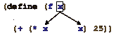

这里是顶级作用域的箭头图：

> 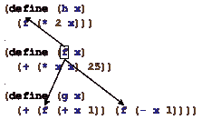

注意，f 的作用域包括其定义上方和下方的所有定义。第一个出现上的点表示这是一个绑定出现。从绑定出现到绑定出现的箭头表示值的流动。当一个绑定出现的值变得已知时，绑定出现将从中接收它们的值。类似地，这些图也解释了重命名的工作方式。如果你想要重命名一个函数参数，你将在作用域内搜索所有绑定出现，并将它们替换。例如，在上面的程序中将 f 的 x 重命名为 y 意味着

> | ([定义](http://docs.racket-lang.org/htdp-langs/intermediate-lam.html#%28form._%28%28lib._lang%2Fhtdp-intermediate-lambda..rkt%29._define%29%29) (f x) ([+](http://docs.racket-lang.org/htdp-langs/intermediate-lam.html#%28def._htdp-intermediate-lambda._%28%28lib._lang%2Fhtdp-intermediate-lambda..rkt%29._%2B%29%29) ([*](http://docs.racket-lang.org/htdp-langs/intermediate-lam.html#%28def._htdp-intermediate-lambda._%28%28lib._lang%2Fhtdp-intermediate-lambda..rkt%29._%2A%29%29) x x) 25)) |
> | --- |
> | ([定义](http://docs.racket-lang.org/htdp-langs/intermediate-lam.html#%28form._%28%28lib._lang%2Fhtdp-intermediate-lambda..rkt%29._define%29%29) (g x) ([+](http://docs.racket-lang.org/htdp-langs/intermediate-lam.html#%28def._htdp-intermediate-lambda._%28%28lib._lang%2Fhtdp-intermediate-lambda..rkt%29._%2B%29%29) (f ([+](http://docs.racket-lang.org/htdp-langs/intermediate-lam.html#%28def._htdp-intermediate-lambda._%28%28lib._lang%2Fhtdp-intermediate-lambda..rkt%29._%2B%29%29) x 1)) (f ([-](http://docs.racket-lang.org/htdp-langs/intermediate-lam.html#%28def._htdp-intermediate-lambda._%28%28lib._lang%2Fhtdp-intermediate-lambda..rkt%29._-%29%29) x 1)))) |

仅更改 x 的两个出现：

> | ([定义](http://docs.racket-lang.org/htdp-langs/intermediate-lam.html#%28form._%28%28lib._lang%2Fhtdp-intermediate-lambda..rkt%29._define%29%29) (f y) ([+](http://docs.racket-lang.org/htdp-langs/intermediate-lam.html#%28def._htdp-intermediate-lambda._%28%28lib._lang%2Fhtdp-intermediate-lambda..rkt%29._%2B%29%29) ([*](http://docs.racket-lang.org/htdp-langs/intermediate-lam.html#%28def._htdp-intermediate-lambda._%28%28lib._lang%2Fhtdp-intermediate-lambda..rkt%29._%2A%29%29) y y) 25)) |
> | --- |
> | ([定义](http://docs.racket-lang.org/htdp-langs/intermediate-lam.html#%28form._%28%28lib._lang%2Fhtdp-intermediate-lambda..rkt%29._define%29%29) (g x) ([+](http://docs.racket-lang.org/htdp-langs/intermediate-lam.html#%28def._htdp-intermediate-lambda._%28%28lib._lang%2Fhtdp-intermediate-lambda..rkt%29._%2B%29%29) (f ([+](http://docs.racket-lang.org/htdp-langs/intermediate-lam.html#%28def._htdp-intermediate-lambda._%28%28lib._lang%2Fhtdp-intermediate-lambda..rkt%29._%2B%29%29) x 1)) (f ([-](http://docs.racket-lang.org/htdp-langs/intermediate-lam.html#%28def._htdp-intermediate-lambda._%28%28lib._lang%2Fhtdp-intermediate-lambda..rkt%29._-%29%29) x 1)))) |

练习 300。以下是一个简单的 ISL+ 程序：

> | ([定义](http://docs.racket-lang.org/htdp-langs/intermediate-lam.html#%28form._%28%28lib._lang%2Fhtdp-intermediate-lambda..rkt%29._define%29%29) (p1 x y) |
> | --- |
> |   ([加](http://docs.racket-lang.org/htdp-langs/intermediate-lam.html#%28def._htdp-intermediate-lambda._%28%28lib._lang%2Fhtdp-intermediate-lambda..rkt%29._%2B%29%29) ([乘](http://docs.racket-lang.org/htdp-langs/intermediate-lam.html#%28def._htdp-intermediate-lambda._%28%28lib._lang%2Fhtdp-intermediate-lambda..rkt%29._%2A%29%29) x y) |
> |      ([加](http://docs.racket-lang.org/htdp-langs/intermediate-lam.html#%28def._htdp-intermediate-lambda._%28%28lib._lang%2Fhtdp-intermediate-lambda..rkt%29._%2B%29%29) ([乘](http://docs.racket-lang.org/htdp-langs/intermediate-lam.html#%28def._htdp-intermediate-lambda._%28%28lib._lang%2Fhtdp-intermediate-lambda..rkt%29._%2A%29%29) 2 x) |
> |         ([加](http://docs.racket-lang.org/htdp-langs/intermediate-lam.html#%28def._htdp-intermediate-lambda._%28%28lib._lang%2Fhtdp-intermediate-lambda..rkt%29._%2B%29%29) ([乘](http://docs.racket-lang.org/htdp-langs/intermediate-lam.html#%28def._htdp-intermediate-lambda._%28%28lib._lang%2Fhtdp-intermediate-lambda..rkt%29._%2A%29%29) 2 y) 22)))) |
> |   |
> | ([定义](http://docs.racket-lang.org/htdp-langs/intermediate-lam.html#%28form._%28%28lib._lang%2Fhtdp-intermediate-lambda..rkt%29._define%29%29) (p2 x) |
> |   ([加](http://docs.racket-lang.org/htdp-langs/intermediate-lam.html#%28def._htdp-intermediate-lambda._%28%28lib._lang%2Fhtdp-intermediate-lambda..rkt%29._%2B%29%29) ([乘](http://docs.racket-lang.org/htdp-langs/intermediate-lam.html#%28def._htdp-intermediate-lambda._%28%28lib._lang%2Fhtdp-intermediate-lambda..rkt%29._%2A%29%29) 55 x) ([加](http://docs.racket-lang.org/htdp-langs/intermediate-lam.html#%28def._htdp-intermediate-lambda._%28%28lib._lang%2Fhtdp-intermediate-lambda..rkt%29._%2B%29%29) x 11))) |
> |   |
> | ([定义](http://docs.racket-lang.org/htdp-langs/intermediate-lam.html#%28form._%28%28lib._lang%2Fhtdp-intermediate-lambda..rkt%29._define%29%29) (p3 x) |
> |   ([加](http://docs.racket-lang.org/htdp-langs/intermediate-lam.html#%28def._htdp-intermediate-lambda._%28%28lib._lang%2Fhtdp-intermediate-lambda..rkt%29._%2B%29%29) (p1 x 0) |
> |      ([加](http://docs.racket-lang.org/htdp-langs/intermediate-lam.html#%28def._htdp-intermediate-lambda._%28%28lib._lang%2Fhtdp-intermediate-lambda..rkt%29._%2B%29%29) (p1 x 1) (p2 x)))) |

从 p1 的 x 参数画箭头到所有其绑定的出现。从 p1 画箭头到 p1 所有绑定的出现。使用 DrRacket 的 CHECK SYNTAX 功能检查结果。与顶层函数定义相比，[局部](http://docs.racket-lang.org/htdp-langs/intermediate-lam.html#%28form._%28%28lib._lang%2Fhtdp-intermediate-lambda..rkt%29._local%29%29) 中定义的作用域是有限的。具体来说，局部定义的作用域是 [局部](http://docs.racket-lang.org/htdp-langs/intermediate-lam.html#%28form._%28%28lib._lang%2Fhtdp-intermediate-lambda..rkt%29._local%29%29) 表达式。考虑在 [局部](http://docs.racket-lang.org/htdp-langs/intermediate-lam.html#%28form._%28%28lib._lang%2Fhtdp-intermediate-lambda..rkt%29._local%29%29) 表达式中定义的辅助函数 f。它绑定 [局部](http://docs.racket-lang.org/htdp-langs/intermediate-lam.html#%28form._%28%28lib._lang%2Fhtdp-intermediate-lambda..rkt%29._local%29%29) 表达式内的所有出现，但不在其外部出现：

> 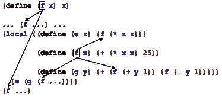

[局部](http://docs.racket-lang.org/htdp-langs/intermediate-lam.html#%28form._%28%28lib._lang%2Fhtdp-intermediate-lambda..rkt%29._local%29%29) 之外的两个出现不受 f 的局部定义的约束。始终如一，函数定义的参数（无论是否局部）仅在函数体中绑定。由于函数名或函数参数的作用域是一个文本区域，人们也画方框图来表示作用域。更精确地说，对于参数，方框画在函数体的周围：

> 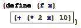

在 [局部](http://docs.racket-lang.org/htdp-langs/intermediate-lam.html#%28form._%28%28lib._lang%2Fhtdp-intermediate-lambda..rkt%29._local%29%29) 的情况下，方框画在整个表达式的周围：

> 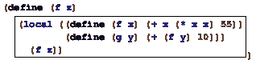

在这个例子中，方框描述了 f 和 g 定义的范围。围绕作用域画一个方框，我们也可以轻松理解在 [局部](http://docs.racket-lang.org/htdp-langs/intermediate-lam.html#%28form._%28%28lib._lang%2Fhtdp-intermediate-lambda..rkt%29._local%29%29) 表达式中重用函数名意味着什么：

> 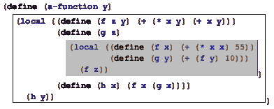

灰色框描述了 f 内部定义的作用域；白色框是 f 外部定义的作用域。因此，灰色框中所有对 f 的引用都指向内部的[local](http://docs.racket-lang.org/htdp-langs/intermediate-lam.html#%28form._%28%28lib._lang%2Fhtdp-intermediate-lambda..rkt%29._local%29%29)；白色框中除了灰色框之外的所有引用都指向外部[local](http://docs.racket-lang.org/htdp-langs/intermediate-lam.html#%28form._%28%28lib._lang%2Fhtdp-intermediate-lambda..rkt%29._local%29%29)中的定义。换句话说，灰色框是 f 外部定义作用域中的一个空隙。参数定义的作用域中也可能出现空隙：

> 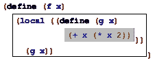

在这个函数中，参数 x 被使用了两次：一次用于 f，一次用于 g；因此，后者的作用域在前者的作用域中形成了一个空隙。

通常情况下，如果一个函数中同一个名字出现多次，描述相应作用域的框永远不会重叠。在某些情况下，这些框会嵌套在一起，从而产生空隙。尽管如此，图示始终是越来越小的嵌套框的层次结构。

> > > > | ([define](http://docs.racket-lang.org/htdp-langs/intermediate-lam.html#%28form._%28%28lib._lang%2Fhtdp-intermediate-lambda..rkt%29._define%29%29) (insertion-sort alon) |
> > > > | --- |
> > > > | |   ([local](http://docs.racket-lang.org/htdp-langs/intermediate-lam.html#%28form._%28%28lib._lang%2Fhtdp-intermediate-lambda..rkt%29._local%29%29) (([define](http://docs.racket-lang.org/htdp-langs/intermediate-lam.html#%28form._%28%28lib._lang%2Fhtdp-intermediate-lambda..rkt%29._define%29%29) ([sort](http://docs.racket-lang.org/htdp-langs/intermediate-lam.html#%28def._htdp-intermediate-lambda._%28%28lib._lang%2Fhtdp-intermediate-lambda..rkt%29._sort%29%29) alon) |
> > > > | |           ([cond](http://docs.racket-lang.org/htdp-langs/intermediate-lam.html#%28form._%28%28lib._lang%2Fhtdp-intermediate-lambda..rkt%29._cond%29%29) |
> > > > | |             [([empty?](http://docs.racket-lang.org/htdp-langs/intermediate-lam.html#%28def._htdp-intermediate-lambda._%28%28lib._lang%2Fhtdp-intermediate-lambda..rkt%29._empty~3f%29%29) alon) '()] |
> > > > | |             [[else](http://docs.racket-lang.org/htdp-langs/intermediate-lam.html#%28form._%28%28lib._lang%2Fhtdp-intermediate-lambda..rkt%29._else%29%29) |
> > > > | |              (add ([first](http://docs.racket-lang.org/htdp-langs/intermediate-lam.html#%28def._htdp-intermediate-lambda._%28%28lib._lang%2Fhtdp-intermediate-lambda..rkt%29._first%29%29) alon) ([sort](http://docs.racket-lang.org/htdp-langs/intermediate-lam.html#%28def._htdp-intermediate-lambda._%28%28lib._lang%2Fhtdp-intermediate-lambda..rkt%29._sort%29%29) ([rest](http://docs.racket-lang.org/htdp-langs/intermediate-lam.html#%28def._htdp-intermediate-lambda._%28%28lib._lang%2Fhtdp-intermediate-lambda..rkt%29._rest%29%29) alon)))])) |
> > > > | （[定义](http://docs.racket-lang.org/htdp-langs/intermediate-lam.html#%28form._%28%28lib._lang%2Fhtdp-intermediate-lambda..rkt%29._define%29%29) 添加一个单独的） |
> > > > | （[条件](http://docs.racket-lang.org/htdp-langs/intermediate-lam.html#%28form._%28%28lib._lang%2Fhtdp-intermediate-lambda..rkt%29._cond%29%29)） |
> > > > | （[空？](http://docs.racket-lang.org/htdp-langs/intermediate-lam.html#%28def._htdp-intermediate-lambda._%28%28lib._lang%2Fhtdp-intermediate-lambda..rkt%29._empty~3f%29%29) alon) ([list](http://docs.racket-lang.org/htdp-langs/intermediate-lam.html#%28def._htdp-intermediate-lambda._%28%28lib._lang%2Fhtdp-intermediate-lambda..rkt%29._list%29%29) an)] |
> > > > | （[否则](http://docs.racket-lang.org/htdp-langs/intermediate-lam.html#%28form._%28%28lib._lang%2Fhtdp-intermediate-lambda..rkt%29._else%29%29)） |
> > > > | （[条件](http://docs.racket-lang.org/htdp-langs/intermediate-lam.html#%28form._%28%28lib._lang%2Fhtdp-intermediate-lambda..rkt%29._cond%29%29)） |
> > > > | （[大于](http://docs.racket-lang.org/htdp-langs/intermediate-lam.html#%28def._htdp-intermediate-lambda._%28%28lib._lang%2Fhtdp-intermediate-lambda..rkt%29._~3e%29%29) an ([first](http://docs.racket-lang.org/htdp-langs/intermediate-lam.html#%28def._htdp-intermediate-lambda._%28%28lib._lang%2Fhtdp-intermediate-lambda..rkt%29._first%29%29) alon)) ([cons](http://docs.racket-lang.org/htdp-langs/intermediate-lam.html#%28def._htdp-intermediate-lambda._%28%28lib._lang%2Fhtdp-intermediate-lambda..rkt%29._cons%29%29) an alon)] |
> > > > | （[否则](http://docs.racket-lang.org/htdp-langs/intermediate-lam.html#%28form._%28%28lib._lang%2Fhtdp-intermediate-lambda..rkt%29._else%29%29) ([cons](http://docs.racket-lang.org/htdp-langs/intermediate-lam.html#%28def._htdp-intermediate-lambda._%28%28lib._lang%2Fhtdp-intermediate-lambda..rkt%29._cons%29%29) ([first](http://docs.racket-lang.org/htdp-langs/intermediate-lam.html#%28def._htdp-intermediate-lambda._%28%28lib._lang%2Fhtdp-intermediate-lambda..rkt%29._first%29%29) alon) |
> > > > | （添加一个 ([rest](http://docs.racket-lang.org/htdp-langs/intermediate-lam.html#%28def._htdp-intermediate-lambda._%28%28lib._lang%2Fhtdp-intermediate-lambda..rkt%29._rest%29%29) alon)))）]）]） |
> > > > | （[排序](http://docs.racket-lang.org/htdp-langs/intermediate-lam.html#%28def._htdp-intermediate-lambda._%28%28lib._lang%2Fhtdp-intermediate-lambda..rkt%29._sort%29%29) alon))) |
> > > > 
> 图 105：绘制练习 301 的词法作用域轮廓

练习 301。在图 105 中，围绕[sort](http://docs.racket-lang.org/htdp-langs/intermediate-lam.html#%28def._htdp-intermediate-lambda._%28%28lib._lang%2Fhtdp-intermediate-lambda..rkt%29._sort%29%29)和 alon 的每个绑定出现范围画一个框。然后从[sort](http://docs.racket-lang.org/htdp-langs/intermediate-lam.html#%28def._htdp-intermediate-lambda._%28%28lib._lang%2Fhtdp-intermediate-lambda..rkt%29._sort%29%29)的每个出现画箭头到相应的绑定出现。现在对图 106 中的变体重复此练习。这两个函数除了名称不同之外，还有其他区别吗？

> > > > | ([定义](http://docs.racket-lang.org/htdp-langs/intermediate-lam.html#%28form._%28%28lib._lang%2Fhtdp-intermediate-lambda..rkt%29._define%29%29) ([sort](http://docs.racket-lang.org/htdp-langs/intermediate-lam.html#%28def._htdp-intermediate-lambda._%28%28lib._lang%2Fhtdp-intermediate-lambda..rkt%29._sort%29%29) 在线添加) 在线添加) |
> > > > | --- |
> > > > |   ([局部](http://docs.racket-lang.org/htdp-langs/intermediate-lam.html#%28form._%28%28lib._lang%2Fhtdp-intermediate-lambda..rkt%29._local%29%29) 定义 ([定义](http://docs.racket-lang.org/htdp-langs/intermediate-lam.html#%28form._%28%28lib._lang%2Fhtdp-intermediate-lambda..rkt%29._define%29%29) ([sort](http://docs.racket-lang.org/htdp-langs/intermediate-lam.html#%28def._htdp-intermediate-lambda._%28%28lib._lang%2Fhtdp-intermediate-lambda..rkt%29._sort%29%29) 在线添加) 在线添加) |
> > > > |   ([cond](http://docs.racket-lang.org/htdp-langs/intermediate-lam.html#%28form._%28%28lib._lang%2Fhtdp-intermediate-lambda..rkt%29._cond%29%29) |
> > > > |   ([empty?](http://docs.racket-lang.org/htdp-langs/intermediate-lam.html#%28def._htdp-intermediate-lambda._%28%28lib._lang%2Fhtdp-intermediate-lambda..rkt%29._empty~3f%29%29) 在线添加) '()] |
> > > > |   [[else](http://docs.racket-lang.org/htdp-langs/intermediate-lam.html#%28form._%28%28lib._lang%2Fhtdp-intermediate-lambda..rkt%29._else%29%29) |
> > > > |   （[定义](http://docs.racket-lang.org/htdp-langs/intermediate-lam.html#%28form._%28%28lib._lang%2Fhtdp-intermediate-lambda..rkt%29._define%29%29) 在线添加） ([first](http://docs.racket-lang.org/htdp-langs/intermediate-lam.html#%28def._htdp-intermediate-lambda._%28%28lib._lang%2Fhtdp-intermediate-lambda..rkt%29._first%29%29) 在线添加) ([sort](http://docs.racket-lang.org/htdp-langs/intermediate-lam.html#%28def._htdp-intermediate-lambda._%28%28lib._lang%2Fhtdp-intermediate-lambda..rkt%29._sort%29%29) 在线添加) ([rest](http://docs.racket-lang.org/htdp-langs/intermediate-lam.html#%28def._htdp-intermediate-lambda._%28%28lib._lang%2Fhtdp-intermediate-lambda..rkt%29._rest%29%29) 在线添加) 在线添加)]])) |
> > > > | （[定义](http://docs.racket-lang.org/htdp-langs/intermediate-lam.html#%28form._%28%28lib._lang%2Fhtdp-intermediate-lambda..rkt%29._define%29%29) 在线添加） |
> > > > |   ([cond](http://docs.racket-lang.org/htdp-langs/intermediate-lam.html#%28form._%28%28lib._lang%2Fhtdp-intermediate-lambda..rkt%29._cond%29%29) |
> > > > | |             [([empty?](http://docs.racket-lang.org/htdp-langs/intermediate-lam.html#%28def._htdp-intermediate-lambda._%28%28lib._lang%2Fhtdp-intermediate-lambda..rkt%29._empty~3f%29%29) alon) ([list](http://docs.racket-lang.org/htdp-langs/intermediate-lam.html#%28def._htdp-intermediate-lambda._%28%28lib._lang%2Fhtdp-intermediate-lambda..rkt%29._list%29%29) an)] |
> > > > | |             [[else](http://docs.racket-lang.org/htdp-langs/intermediate-lam.html#%28form._%28%28lib._lang%2Fhtdp-intermediate-lambda..rkt%29._else%29%29) |
> > > > | |               ([cond](http://docs.racket-lang.org/htdp-langs/intermediate-lam.html#%28form._%28%28lib._lang%2Fhtdp-intermediate-lambda..rkt%29._cond%29%29) |
> > > > | |                 [([>](http://docs.racket-lang.org/htdp-langs/intermediate-lam.html#%28def._htdp-intermediate-lambda._%28%28lib._lang%2Fhtdp-intermediate-lambda..rkt%29._~3e%29%29) an ([first](http://docs.racket-lang.org/htdp-langs/intermediate-lam.html#%28def._htdp-intermediate-lambda._%28%28lib._lang%2Fhtdp-intermediate-lambda..rkt%29._first%29%29) alon)) ([cons](http://docs.racket-lang.org/htdp-langs/intermediate-lam.html#%28def._htdp-intermediate-lambda._%28%28lib._lang%2Fhtdp-intermediate-lambda..rkt%29._cons%29%29) an alon)] |
> > > > | |                 [[else](http://docs.racket-lang.org/htdp-langs/intermediate-lam.html#%28form._%28%28lib._lang%2Fhtdp-intermediate-lambda..rkt%29._else%29%29) ([cons](http://docs.racket-lang.org/htdp-langs/intermediate-lam.html#%28def._htdp-intermediate-lambda._%28%28lib._lang%2Fhtdp-intermediate-lambda..rkt%29._cons%29%29) ([first](http://docs.racket-lang.org/htdp-langs/intermediate-lam.html#%28def._htdp-intermediate-lambda._%28%28lib._lang%2Fhtdp-intermediate-lambda..rkt%29._first%29%29) alon) |
> > > > | |                             (add an ([rest](http://docs.racket-lang.org/htdp-langs/intermediate-lam.html#%28def._htdp-intermediate-lambda._%28%28lib._lang%2Fhtdp-intermediate-lambda..rkt%29._rest%29%29) alon)))])]))) |
> > > > | |           ([sort](http://docs.racket-lang.org/htdp-langs/intermediate-lam.html#%28def._htdp-intermediate-lambda._%28%28lib._lang%2Fhtdp-intermediate-lambda..rkt%29._sort%29%29) alon))) |
> > > > 
> 图 106：为练习 301（版本 2）绘制词法作用域轮廓

练习 302。回忆一下，每个变量的每个出现都从其绑定出现接收其值。考虑以下定义：

> ([define](http://docs.racket-lang.org/htdp-langs/intermediate-lam.html#%28form._%28%28lib._lang%2Fhtdp-intermediate-lambda..rkt%29._define%29%29) x ([cons](http://docs.racket-lang.org/htdp-langs/intermediate-lam.html#%28def._htdp-intermediate-lambda._%28%28lib._lang%2Fhtdp-intermediate-lambda..rkt%29._cons%29%29) 1 x))

x 的阴影出现绑定在哪里？由于定义是常量定义而不是函数定义，我们需要立即评估右侧。根据我们的规则，右侧应该是什么值？如从 lambda 函数中讨论的那样，一个[lambda](http://docs.racket-lang.org/htdp-langs/intermediate-lam.html#%28form._%28%28lib._lang%2Fhtdp-intermediate-lambda..rkt%29._lambda%29%29)表达式只是[局部](http://docs.racket-lang.org/htdp-langs/intermediate-lam.html#%28form._%28%28lib._lang%2Fhtdp-intermediate-lambda..rkt%29._local%29%29)表达式的缩写。也就是说，如果新名称在[exp](http://docs.racket-lang.org/htdp-langs/intermediate-lam.html#%28def._htdp-intermediate-lambda._%28%28lib._lang%2Fhtdp-intermediate-lambda..rkt%29._exp%29%29)中未出现，

> ([lambda](http://docs.racket-lang.org/htdp-langs/intermediate-lam.html#%28form._%28%28lib._lang%2Fhtdp-intermediate-lambda..rkt%29._lambda%29%29) (x-1 [...](http://docs.racket-lang.org/htdp-langs/intermediate-lam.html#%28form._%28%28lib._lang%2Fhtdp-intermediate-lambda..rkt%29._......%29%29)  x-n) [exp](http://docs.racket-lang.org/htdp-langs/intermediate-lam.html#%28def._htdp-intermediate-lambda._%28%28lib._lang%2Fhtdp-intermediate-lambda..rkt%29._exp%29%29))

是以下内容的缩写

> | ([局部](http://docs.racket-lang.org/htdp-langs/intermediate-lam.html#%28form._%28%28lib._lang%2Fhtdp-intermediate-lambda..rkt%29._local%29%29) (([定义](http://docs.racket-lang.org/htdp-langs/intermediate-lam.html#%28form._%28%28lib._lang%2Fhtdp-intermediate-lambda..rkt%29._define%29%29) (新名称 x-1 [...](http://docs.racket-lang.org/htdp-langs/intermediate-lam.html#%28form._%28%28lib._lang%2Fhtdp-intermediate-lambda..rkt%29._......%29%29) x-n) [exp](http://docs.racket-lang.org/htdp-langs/intermediate-lam.html#%28def._htdp-intermediate-lambda._%28%28lib._lang%2Fhtdp-intermediate-lambda..rkt%29._exp%29%29))) |
> | --- |
> | |   新名称) |

简短的说明暗示了

> ([lambda](http://docs.racket-lang.org/htdp-langs/intermediate-lam.html#%28form._%28%28lib._lang%2Fhtdp-intermediate-lambda..rkt%29._lambda%29%29) (x-1 [...](http://docs.racket-lang.org/htdp-langs/intermediate-lam.html#%28form._%28%28lib._lang%2Fhtdp-intermediate-lambda..rkt%29._......%29%29)  x-n) [exp](http://docs.racket-lang.org/htdp-langs/intermediate-lam.html#%28def._htdp-intermediate-lambda._%28%28lib._lang%2Fhtdp-intermediate-lambda..rkt%29._exp%29%29))

介绍了 x-1, ..., x-n 作为绑定出现，并且参数的作用域是[exp](http://docs.racket-lang.org/htdp-langs/intermediate-lam.html#%28def._htdp-intermediate-lambda._%28%28lib._lang%2Fhtdp-intermediate-lambda..rkt%29._exp%29%29)，例如：

> 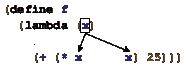

当然，如果[exp](http://docs.racket-lang.org/htdp-langs/intermediate-lam.html#%28def._htdp-intermediate-lambda._%28%28lib._lang%2Fhtdp-intermediate-lambda..rkt%29._exp%29%29) 包含进一步的绑定结构（比如说，一个嵌套的 [local](http://docs.racket-lang.org/htdp-langs/intermediate-lam.html#%28form._%28%28lib._lang%2Fhtdp-intermediate-lambda..rkt%29._local%29%29) 表达式），那么变量的作用域可能存在空隙。练习 303：在以下三个 [lambda](http://docs.racket-lang.org/htdp-langs/intermediate-lam.html#%28form._%28%28lib._lang%2Fhtdp-intermediate-lambda..rkt%29._lambda%29%29) 表达式中，从 x 的阴影出现位置画箭头到它们的绑定出现位置：

1.  > | ([lambda](http://docs.racket-lang.org/htdp-langs/intermediate-lam.html#%28form._%28%28lib._lang%2Fhtdp-intermediate-lambda..rkt%29._lambda%29%29) (x y) |
1.  > | --- |
    > | |   ([+](http://docs.racket-lang.org/htdp-langs/intermediate-lam.html#%28def._htdp-intermediate-lambda._%28%28lib._lang%2Fhtdp-intermediate-lambda..rkt%29._%2B%29%29) x ([*](http://docs.racket-lang.org/htdp-langs/intermediate-lam.html#%28def._htdp-intermediate-lambda._%28%28lib._lang%2Fhtdp-intermediate-lambda..rkt%29._%2A%29%29) x y))) |
1.  > | ([lambda](http://docs.racket-lang.org/htdp-langs/intermediate-lam.html#%28form._%28%28lib._lang%2Fhtdp-intermediate-lambda..rkt%29._lambda%29%29) (x y) |
    > | |   ([+](http://docs.racket-lang.org/htdp-langs/intermediate-lam.html#%28def._htdp-intermediate-lambda._%28%28lib._lang%2Fhtdp-intermediate-lambda..rkt%29._%2B%29%29) x) |
    > | |   ([local](http://docs.racket-lang.org/htdp-langs/intermediate-lam.html#%28form._%28%28lib._lang%2Fhtdp-intermediate-lambda..rkt%29._local%29%29) (([define](http://docs.racket-lang.org/htdp-langs/intermediate-lam.html#%28form._%28%28lib._lang%2Fhtdp-intermediate-lambda..rkt%29._define%29%29) x ([*](http://docs.racket-lang.org/htdp-langs/intermediate-lam.html#%28def._htdp-intermediate-lambda._%28%28lib._lang%2Fhtdp-intermediate-lambda..rkt%29._%2A%29%29) y y))) |
    > | |      ([+](http://docs.racket-lang.org/htdp-langs/intermediate-lam.html#%28def._htdp-intermediate-lambda._%28%28lib._lang%2Fhtdp-intermediate-lambda..rkt%29._%2B%29%29) ([*](http://docs.racket-lang.org/htdp-langs/intermediate-lam.html#%28def._htdp-intermediate-lambda._%28%28lib._lang%2Fhtdp-intermediate-lambda..rkt%29._%2A%29%29) 3 x) |
    > | |   ([/](http://docs.racket-lang.org/htdp-langs/intermediate-lam.html#%28def._htdp-intermediate-lambda._%28%28lib._lang%2Fhtdp-intermediate-lambda..rkt%29._%2F%29%29) 1 x))) |
1.  > | ([lambda](http://docs.racket-lang.org/htdp-langs/intermediate-lam.html#%28form._%28%28lib._lang%2Fhtdp-intermediate-lambda..rkt%29._lambda%29%29) (x y) |
    > | |   ([+](http://docs.racket-lang.org/htdp-langs/intermediate-lam.html#%28def._htdp-intermediate-lambda._%28%28lib._lang%2Fhtdp-intermediate-lambda..rkt%29._%2B%29%29) x) |
    > | |   ([lambda](http://docs.racket-lang.org/htdp-langs/intermediate-lam.html#%28form._%28%28lib._lang%2Fhtdp-intermediate-lambda..rkt%29._lambda%29%29) (x) |
    > | |   ([+](http://docs.racket-lang.org/htdp-langs/intermediate-lam.html#%28def._htdp-intermediate-lambda._%28%28lib._lang%2Fhtdp-intermediate-lambda..rkt%29._%2B%29%29) ([*](http://docs.racket-lang.org/htdp-langs/intermediate-lam.html#%28def._htdp-intermediate-lambda._%28%28lib._lang%2Fhtdp-intermediate-lambda..rkt%29._%2A%29%29) 3 x) |
    > | |   ([/](http://docs.racket-lang.org/htdp-langs/intermediate-lam.html#%28def._htdp-intermediate-lambda._%28%28lib._lang%2Fhtdp-intermediate-lambda..rkt%29._%2F%29%29) 1 x))) |
    > | |     ([*](http://docs.racket-lang.org/htdp-langs/intermediate-lam.html#%28def._htdp-intermediate-lambda._%28%28lib._lang%2Fhtdp-intermediate-lambda..rkt%29._%2A%29%29) y y)))) |

根据需要，为每个阴影 x 的作用域绘制一个框，并在作用域中绘制必要的孔洞。

### ISL for Loops🔗 "链接到此处")

即使没有提到这个词，抽象也引入了循环。抽象地讲，循环遍历复合数据，一次处理一个部分。

> > > 将([require](http://docs.racket-lang.org/htdp-langs/intermediate-lam.html#%28form._%28%28lib._lang%2Fhtdp-intermediate-lambda..rkt%29._require%29%29)  2htdp/abstraction)添加到定义区域，或者从语言菜单中选择添加教学包，并在预安装的 HtDP/2e 教学包菜单中选择抽象。

在过程中，循环也综合数据。例如，[map](http://docs.racket-lang.org/htdp-langs/intermediate-lam.html#%28def._htdp-intermediate-lambda._%28%28lib._lang%2Fhtdp-intermediate-lambda..rkt%29._map%29%29)遍历列表，对每个元素应用一个函数，并将结果收集在列表中。同样，[build-list](http://docs.racket-lang.org/htdp-langs/intermediate-lam.html#%28def._htdp-intermediate-lambda._%28%28lib._lang%2Fhtdp-intermediate-lambda..rkt%29._build-list%29%29)枚举自然数（从 0 到（[-](http://docs.racket-lang.org/htdp-langs/intermediate-lam.html#%28def._htdp-intermediate-lambda._%28%28lib._lang%2Fhtdp-intermediate-lambda..rkt%29._-%29%29)  n  1)）的前驱序列，将这些映射到某个值，并将结果也收集在列表中。

ISL+ 的循环与常规语言中的循环在两个方面有所不同。首先，常规循环不会直接创建新数据；相反，如 [map](http://docs.racket-lang.org/htdp-langs/intermediate-lam.html#%28def._htdp-intermediate-lambda._%28%28lib._lang%2Fhtdp-intermediate-lambda..rkt%29._map%29%29) 和 [build-list](http://docs.racket-lang.org/htdp-langs/intermediate-lam.html#%28def._htdp-intermediate-lambda._%28%28lib._lang%2Fhtdp-intermediate-lambda..rkt%29._build-list%29%29) 这样的抽象都是关于从遍历中计算新数据的。其次，常规语言通常只提供固定数量的循环；ISL+ 程序员根据需要定义新的循环。换句话说，常规语言将循环视为类似于 [local](http://docs.racket-lang.org/htdp-langs/intermediate-lam.html#%28form._%28%28lib._lang%2Fhtdp-intermediate-lambda..rkt%29._local%29%29) 或 [cond](http://docs.racket-lang.org/htdp-langs/intermediate-lam.html#%28form._%28%28lib._lang%2Fhtdp-intermediate-lambda..rkt%29._cond%29%29) 的语法结构，它们的引入需要对其词汇、语法、作用域和意义的详细解释。

作为语法结构的循环与前面部分的功能循环相比有两个优点。一方面，它们的形状往往比函数的组合更能直接表达意图。另一方面，语言实现通常将语法循环转换为比功能循环更快的计算机命令。因此，即使是强调函数和函数组合的功能性编程语言——<wbr>尽管它们如此重视函数和函数组合——<wbr>也通常会提供语法循环。

在本节中，我们介绍了 ISL+ 所称的 for 循环。目标是说明如何将常规循环视为语言结构，并指出使用抽象构建的程序如何使用循环。 解释了我们选择的 for 循环的语法，它是 BSL 的语法从 Intermezzo 1：入门学生语言 的扩展。每个循环都是一个表达式，并且像所有复合结构一样，都带有关键字。关键字后面跟着一个括号序列，称为理解子句，以及一个单独的表达式。子句引入了所谓的循环变量，而最后的表达式是循环体。

> > > |   expr |   | = |   | ... |
> > > | --- | --- | --- | --- | --- |
> > > |   |   | |   | ([for/list](http://docs.racket-lang.org/teachpack/2htdpabstraction.html#%28form._x._%28%28lib._teachpack%2F2htdp%2Fabstraction..rkt%29._for%2Flist%29%29) (子句 子句 ...) expr) |
> > > |   |   | |   | ([for*/list](http://docs.racket-lang.org/teachpack/2htdpabstraction.html#%28form._x._%28%28lib._teachpack%2F2htdp%2Fabstraction..rkt%29._for%2A%2Flist%29%29) (子句 子句 ...) expr) |
> > > |   |   | &#124; |   | ([for/and](http://docs.racket-lang.org/teachpack/2htdpabstraction.html#%28form._x._%28%28lib._teachpack%2F2htdp%2Fabstraction..rkt%29._for%2Fand%29%29) (clause clause ...) expr) |
> > > |   |   | &#124; |   | ([for*/and](http://docs.racket-lang.org/teachpack/2htdpabstraction.html#%28form._x._%28%28lib._teachpack%2F2htdp%2Fabstraction..rkt%29._for%2A%2Fand%29%29) (clause clause ...) expr) |
> > > |   |   | &#124; |   | ([for/or](http://docs.racket-lang.org/teachpack/2htdpabstraction.html#%28form._x._%28%28lib._teachpack%2F2htdp%2Fabstraction..rkt%29._for%2For%29%29) (clause clause ...) expr) |
> > > |   |   | &#124; |   | ([for*/or](http://docs.racket-lang.org/teachpack/2htdpabstraction.html#%28form._x._%28%28lib._teachpack%2F2htdp%2Fabstraction..rkt%29._for%2A%2For%29%29) (clause clause ...) expr) |
> > > |   |   | &#124; |   | ([for/sum](http://docs.racket-lang.org/teachpack/2htdpabstraction.html#%28form._x._%28%28lib._teachpack%2F2htdp%2Fabstraction..rkt%29._for%2Fsum%29%29) (clause clause ...) expr) |
> > > |   |   | &#124; |   | ([for*/sum](http://docs.racket-lang.org/teachpack/2htdpabstraction.html#%28form._x._%28%28lib._teachpack%2F2htdp%2Fabstraction..rkt%29._for%2A%2Fsum%29%29) (clause clause ...) expr) |
> > > |   |   | &#124; |   | ([for/product](http://docs.racket-lang.org/teachpack/2htdpabstraction.html#%28form._x._%28%28lib._teachpack%2F2htdp%2Fabstraction..rkt%29._for%2Fproduct%29%29) (clause clause ...) expr) |
> > > |   |   | &#124; |   | ([for*/product](http://docs.racket-lang.org/teachpack/2htdpabstraction.html#%28form._x._%28%28lib._teachpack%2F2htdp%2Fabstraction..rkt%29._for%2A%2Fproduct%29%29) (clause clause ...) expr) |
> > > |   |   | &#124; |   | ([for/string](http://docs.racket-lang.org/teachpack/2htdpabstraction.html#%28form._x._%28%28lib._teachpack%2F2htdp%2Fabstraction..rkt%29._for%2Fstring%29%29) (clause clause ...) expr) |
> > > |   |   | &#124; |   | ([for*/string](http://docs.racket-lang.org/teachpack/2htdpabstraction.html#%28form._x._%28%28lib._teachpack%2F2htdp%2Fabstraction..rkt%29._for%2A%2Fstring%29%29) (clause clause ...) expr) |
> > > |   |   |   |   |   |
> > > |   子句 |   | = |   | [变量 表达式] |
> > > 
> 图 107：ISL+扩展了 for 循环

即使是粗略地看一下语法，也会发现这十二个循环结构分为六对：每个列表、和、或、和、积、字符串都有一个 for 和 for*变体。Racket 的这些循环版本比这里展示的具有更多功能，而且该语言有比这更多的循环。所有 for 循环都会在主体中绑定其子句的变量；for*变体还会在后续子句中绑定变量。以下两个几乎相同的代码片段说明了这两种作用域规则之间的区别：

> |  | 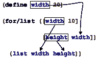 |  | 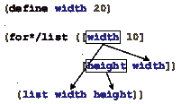 |
> | --- | --- | --- | --- |

语法上的区别在于，左边的一个使用[for/list](http://docs.racket-lang.org/teachpack/2htdpabstraction.html#%28form._x._%28%28lib._teachpack%2F2htdp%2Fabstraction..rkt%29._for%2Flist%29%29)，而右边的一个使用[for*/list](http://docs.racket-lang.org/teachpack/2htdpabstraction.html#%28form._x._%28%28lib._teachpack%2F2htdp%2Fabstraction..rkt%29._for%2A%2Flist%29%29)。在作用域方面，两者有很强的区别，如箭头所示。虽然这两部分都引入了循环变量 width 和 height，但左边的一个使用外部定义的变量作为 height 的初始值，而右边的一个使用第一个循环变量。语义上，[for/list](http://docs.racket-lang.org/teachpack/2htdpabstraction.html#%28form._x._%28%28lib._teachpack%2F2htdp%2Fabstraction..rkt%29._for%2Flist%29%29)表达式评估其子句中的表达式以生成值序列。如果一个子句表达式评估为

+   一个列表，其项组成序列值；

+   一个自然数 n，序列由 0, 1, ..., ([-](http://docs.racket-lang.org/htdp-langs/intermediate-lam.html#%28def._htdp-intermediate-lambda._%28%28lib._lang%2Fhtdp-intermediate-lambda..rkt%29._-%29%29) n 1)组成；并且

+   一个字符串，其单字符字符串是序列项。

接下来，[for/list](http://docs.racket-lang.org/teachpack/2htdpabstraction.html#%28form._x._%28%28lib._teachpack%2F2htdp%2Fabstraction..rkt%29._for%2Flist%29%29)使用循环变量依次绑定到生成的序列（的）值来评估循环体。最后，它将其体的值收集到一个列表中。[for/list](http://docs.racket-lang.org/teachpack/2htdpabstraction.html#%28form._x._%28%28lib._teachpack%2F2htdp%2Fabstraction..rkt%29._for%2Flist%29%29)表达式的评估在最短的序列耗尽时停止。

术语：每次循环体的评估称为一次迭代。同样，一个循环被说成是遍历其循环变量的值。

根据这个解释，我们可以轻松地生成从 0 到 9 的列表：

> |
> 
> &#124; > ([for/list](http://docs.racket-lang.org/teachpack/2htdpabstraction.html#%28form._x._%28%28lib._teachpack%2F2htdp%2Fabstraction..rkt%29._for%2Flist%29%29) ([i 10]) &#124;
> 
> &#124;    i) &#124;
> 
> |
> 
> | (list 0 1 2 3 4 5 6 7 8 9) |
> | --- |

这等价于一个[build-list](http://docs.racket-lang.org/htdp-langs/intermediate-lam.html#%28def._htdp-intermediate-lambda._%28%28lib._lang%2Fhtdp-intermediate-lambda..rkt%29._build-list%29%29)循环：

> | > ([build-list](http://docs.racket-lang.org/htdp-langs/intermediate-lam.html#%28def._htdp-intermediate-lambda._%28%28lib._lang%2Fhtdp-intermediate-lambda..rkt%29._build-list%29%29) 10 ([lambda](http://docs.racket-lang.org/htdp-langs/intermediate-lam.html#%28form._%28%28lib._lang%2Fhtdp-intermediate-lambda..rkt%29._lambda%29%29) (i) i)) |
> | --- |
> | (list 0 1 2 3 4 5 6 7 8 9) |

第二个示例将两个序列“合并”在一起：

> |
> 
> &#124; > ([for/list](http://docs.racket-lang.org/teachpack/2htdpabstraction.html#%28form._x._%28%28lib._teachpack%2F2htdp%2Fabstraction..rkt%29._for%2Flist%29%29) ([i 2] [j '(a b)]) &#124;
> 
> &#124;     ([list](http://docs.racket-lang.org/htdp-langs/intermediate-lam.html#%28def._htdp-intermediate-lambda._%28%28lib._lang%2Fhtdp-intermediate-lambda..rkt%29._list%29%29) i j)) &#124;
> 
> |
> 
> | (list (list 0 'a) (list 1 'b)) |
> | --- |

再次进行比较，这里是用纯 ISL+表达相同的表达式：

> |
> 
> &#124; > ([local](http://docs.racket-lang.org/htdp-langs/intermediate-lam.html#%28form._%28%28lib._lang%2Fhtdp-intermediate-lambda..rkt%29._local%29%29) (([define](http://docs.racket-lang.org/htdp-langs/intermediate-lam.html#%28form._%28%28lib._lang%2Fhtdp-intermediate-lambda..rkt%29._define%29%29) i-s ([build-list](http://docs.racket-lang.org/htdp-langs/intermediate-lam.html#%28def._htdp-intermediate-lambda._%28%28lib._lang%2Fhtdp-intermediate-lambda..rkt%29._build-list%29%29) 2 ([lambda](http://docs.racket-lang.org/htdp-langs/intermediate-lam.html#%28form._%28%28lib._lang%2Fhtdp-intermediate-lambda..rkt%29._lambda%29%29) (i) i))) &#124;
> 
> &#124;           ([define](http://docs.racket-lang.org/htdp-langs/intermediate-lam.html#%28form._%28%28lib._lang%2Fhtdp-intermediate-lambda..rkt%29._define%29%29) j-s '(a b))) &#124;
> 
> &#124;     ([map](http://docs.racket-lang.org/htdp-langs/intermediate-lam.html#%28def._htdp-intermediate-lambda._%28%28lib._lang%2Fhtdp-intermediate-lambda..rkt%29._map%29%29) [list](http://docs.racket-lang.org/htdp-langs/intermediate-lam.html#%28def._htdp-intermediate-lambda._%28%28lib._lang%2Fhtdp-intermediate-lambda..rkt%29._list%29%29) i-s j-s)) &#124;
> 
> |
> 
> | (list (list 0 'a) (list 1 'b)) |
> | --- |

最后的例子强调了使用[for/list](http://docs.racket-lang.org/teachpack/2htdpabstraction.html#%28form._x._%28%28lib._teachpack%2F2htdp%2Fabstraction..rkt%29._for%2Flist%29%29)进行设计：

> 样本问题设计列举。该函数接受一个列表并生成一个与相同项配对的列表，其中包含它们的相对索引。

停止！系统地设计这个函数，使用 ISL+的抽象。使用[for/list](http://docs.racket-lang.org/teachpack/2htdpabstraction.html#%28form._x._%28%28lib._teachpack%2F2htdp%2Fabstraction..rkt%29._for%2Flist%29%29)，这个问题有一个直接的解决方案：

> | ; [List-of X] -> [List [List N X]] |
> | --- |
> | ; 将 lx 中的每个项与其索引配对 |
> |   |
> | ([check-expect](http://docs.racket-lang.org/htdp-langs/intermediate-lam.html#%28form._%28%28lib._lang%2Fhtdp-intermediate-lambda..rkt%29._check-expect%29%29) |
> |   (enumerate '(a b c)) '((1 a) (2 b) (3 c))) |
> |   |
> | ([define](http://docs.racket-lang.org/htdp-langs/intermediate-lam.html#%28form._%28%28lib._lang%2Fhtdp-intermediate-lambda..rkt%29._define%29%29) (enumerate lx) |
> |   ([for/list](http://docs.racket-lang.org/teachpack/2htdpabstraction.html#%28form._x._%28%28lib._teachpack%2F2htdp%2Fabstraction..rkt%29._for%2Flist%29%29) ([x lx] [ith (length lx)]) |
> |     ([list](http://docs.racket-lang.org/htdp-langs/intermediate-lam.html#%28def._htdp-intermediate-lambda._%28%28lib._lang%2Fhtdp-intermediate-lambda..rkt%29._list%29%29) ([+](http://docs.racket-lang.org/htdp-langs/intermediate-lam.html#%28def._htdp-intermediate-lambda._%28%28lib._lang%2Fhtdp-intermediate-lambda..rkt%29._%2B%29%29) ith 1) x))) |

函数体使用 [for/list](http://docs.racket-lang.org/teachpack/2htdpabstraction.html#%28form._x._%28%28lib._teachpack%2F2htdp%2Fabstraction..rkt%29._for%2Flist%29%29) 来遍历给定的列表以及从 0 到 (length lx) (减 1) 的数字列表；循环体将索引（加 1）与列表项结合。在语义上，[for*/list](http://docs.racket-lang.org/teachpack/2htdpabstraction.html#%28form._x._%28%28lib._teachpack%2F2htdp%2Fabstraction..rkt%29._for%2A%2Flist%29%29) 以嵌套的方式遍历序列，而 [for/list](http://docs.racket-lang.org/teachpack/2htdpabstraction.html#%28form._x._%28%28lib._teachpack%2F2htdp%2Fabstraction..rkt%29._for%2Flist%29%29) 并行遍历它们。也就是说，一个 [for*/list](http://docs.racket-lang.org/teachpack/2htdpabstraction.html#%28form._x._%28%28lib._teachpack%2F2htdp%2Fabstraction..rkt%29._for%2A%2Flist%29%29) 表达式基本上展开成一个嵌套的循环：

> | ([for*/list](http://docs.racket-lang.org/teachpack/2htdpabstraction.html#%28form._x._%28%28lib._teachpack%2F2htdp%2Fabstraction..rkt%29._for%2A%2Flist%29%29) ([i 2] [j '(a b)]) |
> | --- |
> |   [...](http://docs.racket-lang.org/htdp-langs/intermediate-lam.html#%28form._%28%28lib._lang%2Fhtdp-intermediate-lambda..rkt%29._......%29%29)) |

简称

> | ([for/list](http://docs.racket-lang.org/teachpack/2htdpabstraction.html#%28form._x._%28%28lib._teachpack%2F2htdp%2Fabstraction..rkt%29._for%2Flist%29%29) ([i 2]) |
> | --- |
> |   ([for/list](http://docs.racket-lang.org/teachpack/2htdpabstraction.html#%28form._x._%28%28lib._teachpack%2F2htdp%2Fabstraction..rkt%29._for%2Flist%29%29) ([j '(a b)]) |
> |      [...](http://docs.racket-lang.org/htdp-langs/intermediate-lam.html#%28form._%28%28lib._lang%2Fhtdp-intermediate-lambda..rkt%29._......%29%29))) |

此外，[for*/list](http://docs.racket-lang.org/teachpack/2htdpabstraction.html#%28form._x._%28%28lib._teachpack%2F2htdp%2Fabstraction..rkt%29._for%2A%2Flist%29%29) 通过使用 [foldl](http://docs.racket-lang.org/htdp-langs/intermediate-lam.html#%28def._htdp-intermediate-lambda._%28%28lib._lang%2Fhtdp-intermediate-lambda..rkt%29._foldl%29%29) 和 [append](http://docs.racket-lang.org/htdp-langs/intermediate-lam.html#%28def._htdp-intermediate-lambda._%28%28lib._lang%2Fhtdp-intermediate-lambda..rkt%29._append%29%29) 将嵌套列表合并成一个单一的列表。练习 304. 评估

> ([for/list](http://docs.racket-lang.org/teachpack/2htdpabstraction.html#%28form._x._%28%28lib._teachpack%2F2htdp%2Fabstraction..rkt%29._for%2Flist%29%29) ([i 2] [j '(a b)]) ([list](http://docs.racket-lang.org/htdp-langs/intermediate-lam.html#%28def._htdp-intermediate-lambda._%28%28lib._lang%2Fhtdp-intermediate-lambda..rkt%29._list%29%29) i j))

和

> ([for*/list](http://docs.racket-lang.org/teachpack/2htdpabstraction.html#%28form._x._%28%28lib._teachpack%2F2htdp%2Fabstraction..rkt%29._for%2A%2Flist%29%29) ([i 2] [j '(a b)]) ([list](http://docs.racket-lang.org/htdp-langs/intermediate-lam.html#%28def._htdp-intermediate-lambda._%28%28lib._lang%2Fhtdp-intermediate-lambda..rkt%29._list%29%29) i j))

在 DrRacket 的交互区域中，让我们继续探索，将[for/list](http://docs.racket-lang.org/teachpack/2htdpabstraction.html#%28form._x._%28%28lib._teachpack%2F2htdp%2Fabstraction..rkt%29._for%2Flist%29%29)和[for*/list](http://docs.racket-lang.org/teachpack/2htdpabstraction.html#%28form._x._%28%28lib._teachpack%2F2htdp%2Fabstraction..rkt%29._for%2A%2Flist%29%29)之间的作用域差异转化为语义差异：

> | > ([定义](http://docs.racket-lang.org/htdp-langs/intermediate-lam.html#%28form._%28%28lib._lang%2Fhtdp-intermediate-lambda..rkt%29._define%29%29) width 2) |
> | --- |
> 
> |
> 
> &#124; > ([for/list](http://docs.racket-lang.org/teachpack/2htdpabstraction.html#%28form._x._%28%28lib._teachpack%2F2htdp%2Fabstraction..rkt%29._for%2Flist%29%29) ([width 3][height width]) &#124;
> 
> &#124;   ([列表](http://docs.racket-lang.org/htdp-langs/intermediate-lam.html#%28def._htdp-intermediate-lambda._%28%28lib._lang%2Fhtdp-intermediate-lambda..rkt%29._list%29%29) 宽度 高度)&#124;
> 
> |
> 
> | (列表 (列表 0 0) (列表 1 1)) |
> | --- |
> 
> |
> 
> &#124; > ([for*/list](http://docs.racket-lang.org/teachpack/2htdpabstraction.html#%28form._x._%28%28lib._teachpack%2F2htdp%2Fabstraction..rkt%29._for%2A%2Flist%29%29) ([width 3][height width]) &#124;
> 
> &#124; （[列表](http://docs.racket-lang.org/htdp-langs/intermediate-lam.html#%28def._htdp-intermediate-lambda._%28%28lib._lang%2Fhtdp-intermediate-lambda..rkt%29._list%29%29) 宽度 高度）&#124;
> 
> |
> 
> | (列表 (列表 1 0) (列表 2 0) (列表 2 1)) |
> | --- |

要理解第一个交互，请记住[for/list](http://docs.racket-lang.org/teachpack/2htdpabstraction.html#%28form._x._%28%28lib._teachpack%2F2htdp%2Fabstraction..rkt%29._for%2Flist%29%29)并行遍历两个序列，并在较短的序列耗尽时停止。这里，两个序列是

> | 宽度 |  | = |  | 0, 1, 2 |
> | --- | --- | --- | --- | --- |
> | 高度 |  | = |  | 0, 1 |
> | 主体 |  | = |  | ([列表](http://docs.racket-lang.org/htdp-langs/intermediate-lam.html#%28def._htdp-intermediate-lambda._%28%28lib._lang%2Fhtdp-intermediate-lambda..rkt%29._list%29%29)  0  0) ([列表](http://docs.racket-lang.org/htdp-langs/intermediate-lam.html#%28def._htdp-intermediate-lambda._%28%28lib._lang%2Fhtdp-intermediate-lambda..rkt%29._list%29%29)  1  1) |

前两行显示了两个循环变量的值，它们是同步变化的。最后一行显示了每次迭代的结果，这解释了第一个结果以及没有包含 2 的配对。现在将这种情况与[for*/list](http://docs.racket-lang.org/teachpack/2htdpabstraction.html#%28form._x._%28%28lib._teachpack%2F2htdp%2Fabstraction..rkt%29._for%2A%2Flist%29%29)进行对比：

> | width |  | = |  | 0 |  | 1 |  | 2 |
> | --- | --- | --- | --- | --- | --- | --- | --- | --- |
> | height |  | = |  |  |  | 0 |  | 0, 1 |
> | body |  | = |  |  |  | ([list](http://docs.racket-lang.org/htdp-langs/intermediate-lam.html#%28def._htdp-intermediate-lambda._%28%28lib._lang%2Fhtdp-intermediate-lambda..rkt%29._list%29%29)  1  0) |  | ([list](http://docs.racket-lang.org/htdp-langs/intermediate-lam.html#%28def._htdp-intermediate-lambda._%28%28lib._lang%2Fhtdp-intermediate-lambda..rkt%29._list%29%29)  2  0) ([list](http://docs.racket-lang.org/htdp-langs/intermediate-lam.html#%28def._htdp-intermediate-lambda._%28%28lib._lang%2Fhtdp-intermediate-lambda..rkt%29._list%29%29)  2  1) |

虽然第一行类似于[for/list](http://docs.racket-lang.org/teachpack/2htdpabstraction.html#%28form._x._%28%28lib._teachpack%2F2htdp%2Fabstraction..rkt%29._for%2Flist%29%29)的行，但第二行现在在其单元格中显示数字序列。[for*/list](http://docs.racket-lang.org/teachpack/2htdpabstraction.html#%28form._x._%28%28lib._teachpack%2F2htdp%2Fabstraction..rkt%29._for%2A%2Flist%29%29)的隐式嵌套意味着每次迭代都会为特定宽度的值重新计算高度，从而创建一个独特的高度值序列。这解释了为什么高度值的第一单元格为空；毕竟，在 0（包含）和 0（不包含）之间没有自然数。最后，每个嵌套的 for 循环产生一个对序列，这些对被收集成一个单独的对列表。以下是一个说明在上下文中使用[for*/list](http://docs.racket-lang.org/teachpack/2htdpabstraction.html#%28form._x._%28%28lib._teachpack%2F2htdp%2Fabstraction..rkt%29._for%2A%2Flist%29%29)的问题：

> 样本问题设计 cross。该函数消耗两个列表 l1 和 l2，并生成这些列表中所有项目的对。

停止！花点时间设计函数，使用现有的抽象。当你设计 cross 时，你会通过一个如表所示的表格进行工作：

> | cross |  | 'a |  | 'b |  | 'c |
> | --- | --- | --- | --- | --- | --- | --- |
> | 1 |  | ([list](http://docs.racket-lang.org/htdp-langs/intermediate-lam.html#%28def._htdp-intermediate-lambda._%28%28lib._lang%2Fhtdp-intermediate-lambda..rkt%29._list%29%29)  'a  1) |  | ([list](http://docs.racket-lang.org/htdp-langs/intermediate-lam.html#%28def._htdp-intermediate-lambda._%28%28lib._lang%2Fhtdp-intermediate-lambda..rkt%29._list%29%29)  'b  1) |  | ([list](http://docs.racket-lang.org/htdp-langs/intermediate-lam.html#%28def._htdp-intermediate-lambda._%28%28lib._lang%2Fhtdp-intermediate-lambda..rkt%29._list%29%29)  'c  1) |
> | 2 |  | ([list](http://docs.racket-lang.org/htdp-langs/intermediate-lam.html#%28def._htdp-intermediate-lambda._%28%28lib._lang%2Fhtdp-intermediate-lambda..rkt%29._list%29%29) 'a 2) |  | ([list](http://docs.racket-lang.org/htdp-langs/intermediate-lam.html#%28def._htdp-intermediate-lambda._%28%28lib._lang%2Fhtdp-intermediate-lambda..rkt%29._list%29%29) 'b 2) |  | ([list](http://docs.racket-lang.org/htdp-langs/intermediate-lam.html#%28def._htdp-intermediate-lambda._%28%28lib._lang%2Fhtdp-intermediate-lambda..rkt%29._list%29%29) 'c 2) |

第一行显示 l1 的给定值，而最左侧的列显示 l2。表中的每个单元格对应于要生成的对中的一个。由于 [for*/list](http://docs.racket-lang.org/teachpack/2htdpabstraction.html#%28form._x._%28%28lib._teachpack%2F2htdp%2Fabstraction..rkt%29._for%2A%2Flist%29%29) 的目的是对所有这样的对进行枚举，因此通过 [for*/list](http://docs.racket-lang.org/teachpack/2htdpabstraction.html#%28form._x._%28%28lib._teachpack%2F2htdp%2Fabstraction..rkt%29._for%2A%2Flist%29%29) 定义 cross 是直接的：

> | ; [List-of X] [List-of Y] -> [List-of [List X Y]] |
> | --- |
> | ; 生成来自 l1 和 l2 的所有项目对 |
> |   |
> | ([check-satisfied](http://docs.racket-lang.org/htdp-langs/intermediate-lam.html#%28form._%28%28lib._lang%2Fhtdp-intermediate-lambda..rkt%29._check-satisfied%29%29) (cross '(a b c) '(1 2)) |
> | （[lambda](http://docs.racket-lang.org/htdp-langs/intermediate-lam.html#%28form._%28%28lib._lang%2Fhtdp-intermediate-lambda..rkt%29._lambda%29%29) (c) ([=](http://docs.racket-lang.org/htdp-langs/intermediate-lam.html#%28def._htdp-intermediate-lambda._%28%28lib._lang%2Fhtdp-intermediate-lambda..rkt%29._~3d%29%29) (length c) 6))) |
> |   |
> | ([define](http://docs.racket-lang.org/htdp-langs/intermediate-lam.html#%28form._%28%28lib._lang%2Fhtdp-intermediate-lambda..rkt%29._define%29%29) (cross l1 l2) |
> |   ([for*/list](http://docs.racket-lang.org/teachpack/2htdpabstraction.html#%28form._x._%28%28lib._teachpack%2F2htdp%2Fabstraction..rkt%29._for%2A%2Flist%29%29) ([x1 l1][x2 l2])) |
> |   ([list](http://docs.racket-lang.org/htdp-langs/intermediate-lam.html#%28def._htdp-intermediate-lambda._%28%28lib._lang%2Fhtdp-intermediate-lambda..rkt%29._list%29%29) x1 x2))) |

我们使用 [check-satisfied](http://docs.racket-lang.org/htdp-langs/intermediate-lam.html#%28form._%28%28lib._lang%2Fhtdp-intermediate-lambda..rkt%29._check-satisfied%29%29) 而不是 [check-expect](http://docs.racket-lang.org/htdp-langs/intermediate-lam.html#%28form._%28%28lib._lang%2Fhtdp-intermediate-lambda..rkt%29._check-expect%29%29) 因为我们不希望预测 [for*/list](http://docs.racket-lang.org/teachpack/2htdpabstraction.html#%28form._x._%28%28lib._teachpack%2F2htdp%2Fabstraction..rkt%29._for%2A%2Flist%29%29) 生成对的具体顺序。

> > > | ; [列表 X] -> [列表 [列表 X]] |
> > > | --- |
> > > | ; 创建 w 中所有项目的重新排列列表 |
> > > | ([定义](http://docs.racket-lang.org/htdp-langs/intermediate-lam.html#%28form._%28%28lib._lang%2Fhtdp-intermediate-lambda..rkt%29._define%29%29) (arrangements w) |
> > > |   ([cond](http://docs.racket-lang.org/htdp-langs/intermediate-lam.html#%28form._%28%28lib._lang%2Fhtdp-intermediate-lambda..rkt%29._cond%29%29) |
> > > |     ([empty?](http://docs.racket-lang.org/htdp-langs/intermediate-lam.html#%28def._htdp-intermediate-lambda._%28%28lib._lang%2Fhtdp-intermediate-lambda..rkt%29._empty~3f%29%29) w) '(())] |
> > > |     [[else](http://docs.racket-lang.org/htdp-langs/intermediate-lam.html#%28form._%28%28lib._lang%2Fhtdp-intermediate-lambda..rkt%29._else%29%29) ([for*/list](http://docs.racket-lang.org/teachpack/2htdpabstraction.html#%28form._x._%28%28lib._teachpack%2F2htdp%2Fabstraction..rkt%29._for%2A%2Flist%29%29) ([item w] |
> > > |                       [arrangement-without-item |
> > > |                        (arrangements ([remove](http://docs.racket-lang.org/htdp-langs/intermediate-lam.html#%28def._htdp-intermediate-lambda._%28%28lib._lang%2Fhtdp-intermediate-lambda..rkt%29._remove%29%29) item w))]) |
> > > |             ([cons](http://docs.racket-lang.org/htdp-langs/intermediate-lam.html#%28def._htdp-intermediate-lambda._%28%28lib._lang%2Fhtdp-intermediate-lambda..rkt%29._cons%29%29) item arrangement-without-item))])) |
> > > |   |
> > > | ; [列表 X] -> 布尔 |
> > > | ([定义](http://docs.racket-lang.org/htdp-langs/intermediate-lam.html#%28form._%28%28lib._lang%2Fhtdp-intermediate-lambda..rkt%29._define%29%29) (all-words-from-rat? w)) |
> > > |   ([and](http://docs.racket-lang.org/htdp-langs/intermediate-lam.html#%28form._%28%28lib._lang%2Fhtdp-intermediate-lambda..rkt%29._and%29%29) ([member?](http://docs.racket-lang.org/htdp-langs/intermediate-lam.html#%28def._htdp-intermediate-lambda._%28%28lib._lang%2Fhtdp-intermediate-lambda..rkt%29._member~3f%29%29) ([explode](http://docs.racket-lang.org/htdp-langs/intermediate-lam.html#%28def._htdp-intermediate-lambda._%28%28lib._lang%2Fhtdp-intermediate-lambda..rkt%29._explode%29%29) "rat") w) |
> > > | |   ([member?](http://docs.racket-lang.org/htdp-langs/intermediate-lam.html#%28def._htdp-intermediate-lambda._%28%28lib._lang%2Fhtdp-intermediate-lambda..rkt%29._member~3f%29%29) ([explode](http://docs.racket-lang.org/htdp-langs/intermediate-lam.html#%28def._htdp-intermediate-lambda._%28%28lib._lang%2Fhtdp-intermediate-lambda..rkt%29._explode%29%29) "art") w) |
> > > | |   ([member?](http://docs.racket-lang.org/htdp-langs/intermediate-lam.html#%28def._htdp-intermediate-lambda._%28%28lib._lang%2Fhtdp-intermediate-lambda..rkt%29._member~3f%29%29) ([explode](http://docs.racket-lang.org/htdp-langs/intermediate-lam.html#%28def._htdp-intermediate-lambda._%28%28lib._lang%2Fhtdp-intermediate-lambda..rkt%29._explode%29%29) "tar") w))) |
> > > | |   | |
> > > | ([检查满意](http://docs.racket-lang.org/htdp-langs/intermediate-lam.html#%28form._%28%28lib._lang%2Fhtdp-intermediate-lambda..rkt%29._check-satisfied%29%29) (arrangements '("r" "a" "t"))) |
> > > | |                  all-words-from-rat?) |
> > > 
> 图 108：使用[for*/list](http://docs.racket-lang.org/teachpack/2htdpabstraction.html#%28form._x._%28%28lib._teachpack%2F2htdp%2Fabstraction..rkt%29._for%2A%2Flist%29%29)对排列的紧凑定义

注意图 108 展示了[for*/list](http://docs.racket-lang.org/teachpack/2htdpabstraction.html#%28form._x._%28%28lib._teachpack%2F2htdp%2Fabstraction..rkt%29._for%2A%2Flist%29%29)在上下文中的另一种使用。它显示了创建给定列表中所有可能排列的扩展设计问题的紧凑解决方案。

虽然单词游戏，问题的核心概述了此复杂程序的正确设计，图 108 则利用[for*/list](http://docs.racket-lang.org/teachpack/2htdpabstraction.html#%28form._x._%28%28lib._teachpack%2F2htdp%2Fabstraction..rkt%29._for%2A%2Flist%29%29)和一种不寻常的递归形式结合的力量，将相同的程序定义为一个单一的、五行的函数定义。该图仅展示了这些抽象的强大功能；对于底层设计，请特别参阅练习 477。结束

.../list 后缀清楚地表明循环表达式创建了一个列表。此外，该教学包还包含具有同样暗示性后缀的 for 和 for*循环：

+   .../并使用[and](http://docs.racket-lang.org/htdp-langs/intermediate-lam.html#%28form._%28%28lib._lang%2Fhtdp-intermediate-lambda..rkt%29._and%29%29)收集所有迭代的值：

    > | > ([for/and](http://docs.racket-lang.org/teachpack/2htdpabstraction.html#%28form._x._%28%28lib._teachpack%2F2htdp%2Fabstraction..rkt%29._for%2Fand%29%29) ([i 10]) ([>](http://docs.racket-lang.org/htdp-langs/intermediate-lam.html#%28def._htdp-intermediate-lambda._%28%28lib._lang%2Fhtdp-intermediate-lambda..rkt%29._~3e%29%29) ([-](http://docs.racket-lang.org/htdp-langs/intermediate-lam.html#%28def._htdp-intermediate-lambda._%28%28lib._lang%2Fhtdp-intermediate-lambda..rkt%29._-%29%29) 9 i) 0)) |
    > | --- |
    > | #false |
    > | > ([for/and](http://docs.racket-lang.org/teachpack/2htdpabstraction.html#%28form._x._%28%28lib._teachpack%2F2htdp%2Fabstraction..rkt%29._for%2Fand%29%29) ([i 10]) ([if](http://docs.racket-lang.org/htdp-langs/intermediate-lam.html#%28form._%28%28lib._lang%2Fhtdp-intermediate-lambda..rkt%29._if%29%29) ([>=](http://docs.racket-lang.org/htdp-langs/intermediate-lam.html#%28def._htdp-intermediate-lambda._%28%28lib._lang%2Fhtdp-intermediate-lambda..rkt%29._~3e~3d%29%29) i 0) i #false)) |
    > | 9 |

    对于实际应用，循环返回最后一个生成的值或#false。

+   .../or 类似于.../and，但使用[or](http://docs.racket-lang.org/htdp-langs/intermediate-lam.html#%28form._%28%28lib._lang%2Fhtdp-intermediate-lambda..rkt%29._or%29%29)代替[and](http://docs.racket-lang.org/htdp-langs/intermediate-lam.html#%28form._%28%28lib._lang%2Fhtdp-intermediate-lambda..rkt%29._and%29%29):

    > | > ([for/or](http://docs.racket-lang.org/teachpack/2htdpabstraction.html#%28form._x._%28%28lib._teachpack%2F2htdp%2Fabstraction..rkt%29._for%2For%29%29) ([i 10]) ([if](http://docs.racket-lang.org/htdp-langs/intermediate-lam.html#%28form._%28%28lib._lang%2Fhtdp-intermediate-lambda..rkt%29._if%29%29) ([=](http://docs.racket-lang.org/htdp-langs/intermediate-lam.html#%28def._htdp-intermediate-lambda._%28%28lib._lang%2Fhtdp-intermediate-lambda..rkt%29._~3d%29%29) ([-](http://docs.racket-lang.org/htdp-langs/intermediate-lam.html#%28def._htdp-intermediate-lambda._%28%28lib._lang%2Fhtdp-intermediate-lambda..rkt%29._-%29%29) 9 i) 0) i #false)) |
    > | --- |
    > | 9 |
    > | > ([for/or](http://docs.racket-lang.org/teachpack/2htdpabstraction.html#%28form._x._%28%28lib._teachpack%2F2htdp%2Fabstraction..rkt%29._for%2For%29%29) ([i 10]) ([if](http://docs.racket-lang.org/htdp-langs/intermediate-lam.html#%28form._%28%28lib._lang%2Fhtdp-intermediate-lambda..rkt%29._if%29%29) ([<](http://docs.racket-lang.org/htdp-langs/intermediate-lam.html#%28def._htdp-intermediate-lambda._%28%28lib._lang%2Fhtdp-intermediate-lambda..rkt%29._~3c%29%29) i 0) i #false)) |
    > | #false |

    这些循环返回第一个非#false 的值。

+   .../sum 将迭代生成的数字相加：

    > | > ([for/sum](http://docs.racket-lang.org/teachpack/2htdpabstraction.html#%28form._x._%28%28lib._teachpack%2F2htdp%2Fabstraction..rkt%29._for%2Fsum%29%29) ([c "abc"]) ([字符串转整数](http://docs.racket-lang.org/htdp-langs/intermediate-lam.html#%28def._htdp-intermediate-lambda._%28%28lib._lang%2Fhtdp-intermediate-lambda..rkt%29._string-~3eint%29%29) c)) |
    > | --- |
    > | 294 |

+   .../乘积将迭代产生的数字相乘

    > | > ([for/乘积](http://docs.racket-lang.org/teachpack/2htdpabstraction.html#%28form._x._%28%28lib._teachpack%2F2htdp%2Fabstraction..rkt%29._for%2Fproduct%29%29) ([c "abc"]) ([+](http://docs.racket-lang.org/htdp-langs/intermediate-lam.html#%28def._htdp-intermediate-lambda._%28%28lib._lang%2Fhtdp-intermediate-lambda..rkt%29._%2B%29%29) ([字符串转整数](http://docs.racket-lang.org/htdp-langs/intermediate-lam.html#%28def._htdp-intermediate-lambda._%28%28lib._lang%2Fhtdp-intermediate-lambda..rkt%29._string-~3eint%29%29) c) 1)) |
    > | --- |
    > | 970200 |

+   .../字符串从 1 字符串序列创建字符串：

    > | > ([定义](http://docs.racket-lang.org/htdp-langs/intermediate-lam.html#%28form._%28%28lib._lang%2Fhtdp-intermediate-lambda..rkt%29._define%29%29) a ([字符串转整数](http://docs.racket-lang.org/htdp-langs/intermediate-lam.html#%28def._htdp-intermediate-lambda._%28%28lib._lang%2Fhtdp-intermediate-lambda..rkt%29._string-~3eint%29%29) "a")) |
    > | --- |
    > | > ([for/字符串](http://docs.racket-lang.org/teachpack/2htdpabstraction.html#%28form._x._%28%28lib._teachpack%2F2htdp%2Fabstraction..rkt%29._for%2Fstring%29%29) ([j 10]) ([整数转字符串](http://docs.racket-lang.org/htdp-langs/intermediate-lam.html#%28def._htdp-intermediate-lambda._%28%28lib._lang%2Fhtdp-intermediate-lambda..rkt%29._int-~3estring%29%29) ([+](http://docs.racket-lang.org/htdp-langs/intermediate-lam.html#%28def._htdp-intermediate-lambda._%28%28lib._lang%2Fhtdp-intermediate-lambda..rkt%29._%2B%29%29) a j))) |
    > | "abcdefghij" |

停止！想象一下 for/fold 循环会如何工作。

停止！使用 ISL+中现有的抽象重新表述所有上述示例是一个有教育意义的练习。这样做也表明了如何使用 for 循环而不是抽象函数来设计函数。提示：设计和-map 和 or-map，它们分别像[andmap](http://docs.racket-lang.org/htdp-langs/intermediate-lam.html#%28def._htdp-intermediate-lambda._%28%28lib._lang%2Fhtdp-intermediate-lambda..rkt%29._andmap%29%29)和[ormap](http://docs.racket-lang.org/htdp-langs/intermediate-lam.html#%28def._htdp-intermediate-lambda._%28%28lib._lang%2Fhtdp-intermediate-lambda..rkt%29._ormap%29%29)，但返回适当的非-#false 值。

> > > | ; N -> sequence? |
> > > | --- |
> > > | ; 构建自然数的无限序列， |
> > > | ; 从 n 开始 |
> > > | ([define](http://docs.racket-lang.org/htdp-langs/intermediate-lam.html#%28form._%28%28lib._lang%2Fhtdp-intermediate-lambda..rkt%29._define%29%29) ([in-naturals](http://docs.racket-lang.org/teachpack/2htdpabstraction.html#%28def._x._%28%28lib._teachpack%2F2htdp%2Fabstraction..rkt%29._in-naturals%29%29) n) [...](http://docs.racket-lang.org/htdp-langs/intermediate-lam.html#%28form._%28%28lib._lang%2Fhtdp-intermediate-lambda..rkt%29._......%29%29)) |
> > > |   |
> > > | ; N  N  N -> sequence? |
> > > | ; 构建以下有限的自然数序列： |
> > > | ;   start |
> > > | ;   ([+](http://docs.racket-lang.org/htdp-langs/intermediate-lam.html#%28def._htdp-intermediate-lambda._%28%28lib._lang%2Fhtdp-intermediate-lambda..rkt%29._%2B%29%29)  start  step) |
> > > | ;   ([+](http://docs.racket-lang.org/htdp-langs/intermediate-lam.html#%28def._htdp-intermediate-lambda._%28%28lib._lang%2Fhtdp-intermediate-lambda..rkt%29._%2B%29%29)  start  step  step) |
> > > | ;   ... |
> > > | ;  until the number exceeds end |
> > > | ([define](http://docs.racket-lang.org/htdp-langs/intermediate-lam.html#%28form._%28%28lib._lang%2Fhtdp-intermediate-lambda..rkt%29._define%29%29) ([in-range](http://docs.racket-lang.org/teachpack/2htdpabstraction.html#%28def._x._%28%28lib._teachpack%2F2htdp%2Fabstraction..rkt%29._in-range%29%29) start end step) [...](http://docs.racket-lang.org/htdp-langs/intermediate-lam.html#%28form._%28%28lib._lang%2Fhtdp-intermediate-lambda..rkt%29._......%29%29)) |
> > > 
> 图 109：构造自然数序列

遍历数字不总是从 0 到（[-](http://docs.racket-lang.org/htdp-langs/intermediate-lam.html#%28def._htdp-intermediate-lambda._%28%28lib._lang%2Fhtdp-intermediate-lambda..rkt%29._-%29%29)  n  1）进行枚举。通常程序需要遍历非顺序数字序列；有时，需要无限供应的数字。为了适应这种编程形式，Racket 提供了生成序列的函数，图 109 列出了抽象教学包中提供的两个函数。

第一个函数可以简化枚举函数：

> | ([define](http://docs.racket-lang.org/htdp-langs/intermediate-lam.html#%28form._%28%28lib._lang%2Fhtdp-intermediate-lambda..rkt%29._define%29%29) (enumerate.v2 lx) |
> | --- |
> |   ([for/list](http://docs.racket-lang.org/teachpack/2htdpabstraction.html#%28form._x._%28%28lib._teachpack%2F2htdp%2Fabstraction..rkt%29._for%2Flist%29%29) ([item lx] [ith ([in-naturals](http://docs.racket-lang.org/teachpack/2htdpabstraction.html#%28def._x._%28%28lib._teachpack%2F2htdp%2Fabstraction..rkt%29._in-naturals%29%29) 1)]) |
> |     ([list](http://docs.racket-lang.org/htdp-langs/intermediate-lam.html#%28def._htdp-intermediate-lambda._%28%28lib._lang%2Fhtdp-intermediate-lambda..rkt%29._list%29%29) ith item))) |

这里使用 [in-naturals](http://docs.racket-lang.org/teachpack/2htdpabstraction.html#%28def._x._%28%28lib._teachpack%2F2htdp%2Fabstraction..rkt%29._in-naturals%29%29) 生成从 1 开始的自然数的无限序列；for 循环在 lx 耗尽时停止。使用第二个循环，例如，可以遍历前 n 个数中的偶数：

> | ; N -> Number |
> | --- |
> | ; 在 0 和 n 之间（不包括 n）添加偶数 |
> | ([check-expect](http://docs.racket-lang.org/htdp-langs/intermediate-lam.html#%28form._%28%28lib._lang%2Fhtdp-intermediate-lambda..rkt%29._check-expect%29%29) (sum-evens 2) 0) |
> | ([check-expect](http://docs.racket-lang.org/htdp-langs/intermediate-lam.html#%28form._%28%28lib._lang%2Fhtdp-intermediate-lambda..rkt%29._check-expect%29%29) (sum-evens 4) 2) |
> | ([define](http://docs.racket-lang.org/htdp-langs/intermediate-lam.html#%28form._%28%28lib._lang%2Fhtdp-intermediate-lambda..rkt%29._define%29%29) (sum-evens n) |
> |   ([for/sum](http://docs.racket-lang.org/teachpack/2htdpabstraction.html#%28form._x._%28%28lib._teachpack%2F2htdp%2Fabstraction..rkt%29._for%2Fsum%29%29) ([i ([in-range](http://docs.racket-lang.org/teachpack/2htdpabstraction.html#%28def._x._%28%28lib._teachpack%2F2htdp%2Fabstraction..rkt%29._in-range%29%29) 0 n 2)]) i)) |

虽然这种用法可能看起来很 trivial，但许多起源于数学的问题都需要这样的循环，这正是为什么像 [in-range](http://docs.racket-lang.org/teachpack/2htdpabstraction.html#%28def._x._%28%28lib._teachpack%2F2htdp%2Fabstraction..rkt%29._in-range%29%29) 这样的概念会在许多编程语言中找到。

练习 305\. 使用循环定义 convert-euro。参见 练习 267。

练习 306\. 使用循环定义一个函数，

1.  创建一个列表 ([list](http://docs.racket-lang.org/htdp-langs/intermediate-lam.html#%28def._htdp-intermediate-lambda._%28%28lib._lang%2Fhtdp-intermediate-lambda..rkt%29._list%29%29) 0 [...](http://docs.racket-lang.org/htdp-langs/intermediate-lam.html#%28form._%28%28lib._lang%2Fhtdp-intermediate-lambda..rkt%29._......%29%29) ([-](http://docs.racket-lang.org/htdp-langs/intermediate-lam.html#%28def._htdp-intermediate-lambda._%28%28lib._lang%2Fhtdp-intermediate-lambda..rkt%29._-%29%29) n 1)) 对于任何自然数 n；

1.  创建一个列表 ([list](http://docs.racket-lang.org/htdp-langs/intermediate-lam.html#%28def._htdp-intermediate-lambda._%28%28lib._lang%2Fhtdp-intermediate-lambda..rkt%29._list%29%29) 1 [...](http://docs.racket-lang.org/htdp-langs/intermediate-lam.html#%28form._%28%28lib._lang%2Fhtdp-intermediate-lambda..rkt%29._......%29%29) n) 对于任何自然数 n；

1.  创建一个列表([list](http://docs.racket-lang.org/htdp-langs/intermediate-lam.html#%28def._htdp-intermediate-lambda._%28%28lib._lang%2Fhtdp-intermediate-lambda..rkt%29._list%29%29)  1  1/2  [...](http://docs.racket-lang.org/htdp-langs/intermediate-lam.html#%28form._%28%28lib._lang%2Fhtdp-intermediate-lambda..rkt%29._......%29%29)  1/n)对于任何自然数 n；

1.  创建前 n 个偶数的列表；并且

1.  创建一个由 0s 和 1s 组成的对角线正方形；参见练习 262。

最后，使用循环定义 tabulate，参见练习 250。

练习 307。定义 find-name。该函数消耗一个名称和一个名称列表。它检索后者中与前者相等或为前者的扩展的第一个名称。

定义一个函数，确保某个名称列表中的名称不超过某个给定的宽度。与练习 271 比较。

### 模式匹配🔗 "链接至此")

当我们为具有六个子句的数据定义设计一个函数时，我们使用六分支的[cond](http://docs.racket-lang.org/htdp-langs/intermediate-lam.html#%28form._%28%28lib._lang%2Fhtdp-intermediate-lambda..rkt%29._cond%29%29)表达式。当我们制定一个[cond](http://docs.racket-lang.org/htdp-langs/intermediate-lam.html#%28form._%28%28lib._lang%2Fhtdp-intermediate-lambda..rkt%29._cond%29%29)子句时，我们使用谓词来确定这个子句是否应该处理给定的值，如果是这样，则使用选择器来分解任何复合值。本书的前三部分反复解释了这个想法。

重复调用需要抽象。虽然抽象解释了程序员如何创建这些抽象，但谓词选择器模式只能由语言设计者处理。特别是，函数式编程语言的设计者已经认识到抽象这些重复使用谓词和选择器的需求。因此，这些语言提供了模式匹配作为一种语言结构，它结合并简化了这些[cond](http://docs.racket-lang.org/htdp-langs/intermediate-lam.html#%28form._%28%28lib._lang%2Fhtdp-intermediate-lambda..rkt%29._cond%29%29)子句。

本节介绍了 Racket 的模式匹配器的简化版。图 110 显示了其语法；匹配显然是一个语法复杂的结构。虽然其轮廓类似于[cond](http://docs.racket-lang.org/htdp-langs/intermediate-lam.html#%28form._%28%28lib._lang%2Fhtdp-intermediate-lambda..rkt%29._cond%29%29)，但它使用模式而不是条件，并且它们有自己的规则。

> > > |   expr |   | = |   | ... |
> > > | --- | --- | --- | --- | --- |
> > > |   |   | &#124; |   | ([match](http://docs.racket-lang.org/teachpack/2htdpabstraction.html#%28form._x._%28%28lib._teachpack%2F2htdp%2Fabstraction..rkt%29._match%29%29) expr [pattern expr] ...) |
> > > |   |   |   |   |   |
> > > |   pattern |   | = |   | variable |
> > > |   |   | &#124; |   | 文字常量 |
> > > |   |   | &#124; |   | (cons pattern pattern) |
> > > |   |   | &#124; |   | (结构名 pattern ...) |
> > > |   |   | &#124; |   | (? 谓词名) |
> > > 
> 图 110：ISL+ 匹配表达式

大致来说，

> | ([match](http://docs.racket-lang.org/teachpack/2htdpabstraction.html#%28form._x._%28%28lib._teachpack%2F2htdp%2Fabstraction..rkt%29._match%29%29) expr |
> | --- |
> |   [pattern1 expr1] |
> |   [pattern2 expr2] |
> |   [...](http://docs.racket-lang.org/htdp-langs/intermediate-lam.html#%28form._%28%28lib._lang%2Fhtdp-intermediate-lambda..rkt%29._......%29%29)) |

它的执行过程类似于一个 [cond](http://docs.racket-lang.org/htdp-langs/intermediate-lam.html#%28form._%28%28lib._lang%2Fhtdp-intermediate-lambda..rkt%29._cond%29%29) 表达式，它会评估 expr 并依次尝试将其结果与 pattern1、pattern2、... 匹配，直到成功匹配 patterni。在此点，它确定 expri 的值，这也是整个 [match](http://docs.racket-lang.org/teachpack/2htdpabstraction.html#%28form._x._%28%28lib._teachpack%2F2htdp%2Fabstraction..rkt%29._match%29%29) 表达式的结果。关键区别在于 [match](http://docs.racket-lang.org/teachpack/2htdpabstraction.html#%28form._x._%28%28lib._teachpack%2F2htdp%2Fabstraction..rkt%29._match%29%29) 与 [cond](http://docs.racket-lang.org/htdp-langs/intermediate-lam.html#%28form._%28%28lib._lang%2Fhtdp-intermediate-lambda..rkt%29._cond%29%29) 不同，它引入了一个新的作用域，这最好通过 DrRacket 的屏幕截图来说明：

> 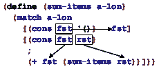

如上图所示，该函数的每个模式子句都会绑定变量。此外，变量的作用域是子句的主体，因此即使两个模式引入了相同的变量绑定——如上述代码片段所示——它们的绑定也不会相互干扰。在语法上，模式类似于嵌套的结构化数据，其叶子是文字常量、变量或形状为谓词模式的模式

> (? 谓词名)

在后者中，谓词名必须引用作用域内的谓词函数，即消耗一个值并产生 布尔值 的函数。

在语义上，模式被 [match](http://docs.racket-lang.org/teachpack/2htdpabstraction.html#%28form._x._%28%28lib._teachpack%2F2htdp%2Fabstraction..rkt%29._match%29%29) 到值 v。如果模式是

+   文字常量，它只匹配那个文字常量

    > |
    > 
    > &#124; > ([match](http://docs.racket-lang.org/teachpack/2htdpabstraction.html#%28form._x._%28%28lib._teachpack%2F2htdp%2Fabstraction..rkt%29._match%29%29) 4 &#124;
    > 
    > &#124;     ['four  1] &#124;
    > 
    > &#124;     ["four" 2] &#124;
    > 
    > &#124;   [#true  3] &#124;
    > 
    > &#124;   [4      "hello world"]) &#124;
    > 
    > |
    > 
    > | "hello world" |
    > | --- |

+   一个变量，它可以匹配任何值，并且在评估相应的 [match](http://docs.racket-lang.org/teachpack/2htdpabstraction.html#%28form._x._%28%28lib._teachpack%2F2htdp%2Fabstraction..rkt%29._match%29%29) 子句的主体时与这个值相关联

    > |
    > 
    > &#124; > ([match](http://docs.racket-lang.org/teachpack/2htdpabstraction.html#%28form._x._%28%28lib._teachpack%2F2htdp%2Fabstraction..rkt%29._match%29%29) 2 &#124;
    > 
    > &#124;   [3 "one"] &#124;
    > 
    > &#124;   [x ([+](http://docs.racket-lang.org/htdp-langs/intermediate-lam.html#%28def._htdp-intermediate-lambda._%28%28lib._lang%2Fhtdp-intermediate-lambda..rkt%29._%2B%29%29) x 3)]) &#124;
    > 
    > |
    > 
    > | 5 |
    > | --- |

    由于 2 不等于第一个模式，即字面常量 3，[match](http://docs.racket-lang.org/teachpack/2htdpabstraction.html#%28form._x._%28%28lib._teachpack%2F2htdp%2Fabstraction..rkt%29._match%29%29) 将 2 与第二个模式匹配，该模式是一个普通变量，因此可以匹配任何值。因此，[match](http://docs.racket-lang.org/teachpack/2htdpabstraction.html#%28form._x._%28%28lib._teachpack%2F2htdp%2Fabstraction..rkt%29._match%29%29) 选择第二个子句并评估其主体，其中 x 代表 2。

+   ([cons](http://docs.racket-lang.org/htdp-langs/intermediate-lam.html#%28def._htdp-intermediate-lambda._%28%28lib._lang%2Fhtdp-intermediate-lambda..rkt%29._cons%29%29)  pattern1 pattern2), 它只匹配 [cons](http://docs.racket-lang.org/htdp-langs/intermediate-lam.html#%28def._htdp-intermediate-lambda._%28%28lib._lang%2Fhtdp-intermediate-lambda..rkt%29._cons%29%29) 的一个实例，假设其第一个字段与 pattern1 匹配，其余与 pattern2 匹配

    > |
    > 
    > &#124; > ([match](http://docs.racket-lang.org/teachpack/2htdpabstraction.html#%28form._x._%28%28lib._teachpack%2F2htdp%2Fabstraction..rkt%29._match%29%29) ([cons](http://docs.racket-lang.org/htdp-langs/intermediate-lam.html#%28def._htdp-intermediate-lambda._%28%28lib._lang%2Fhtdp-intermediate-lambda..rkt%29._cons%29%29) 1 '()) &#124;
    > 
    > &#124;   [([cons](http://docs.racket-lang.org/htdp-langs/intermediate-lam.html#%28def._htdp-intermediate-lambda._%28%28lib._lang%2Fhtdp-intermediate-lambda..rkt%29._cons%29%29) 1 tail) tail] &#124;
    > 
    > &#124;   [([cons](http://docs.racket-lang.org/htdp-langs/intermediate-lam.html#%28def._htdp-intermediate-lambda._%28%28lib._lang%2Fhtdp-intermediate-lambda..rkt%29._cons%29%29) head tail) head]) &#124;
    > 
    > |
    > 
    > | '() |
    > | --- |
    > 
    > |
    > 
    > &#124; > ([match](http://docs.racket-lang.org/teachpack/2htdpabstraction.html#%28form._x._%28%28lib._teachpack%2F2htdp%2Fabstraction..rkt%29._match%29%29) ([cons](http://docs.racket-lang.org/htdp-langs/intermediate-lam.html#%28def._htdp-intermediate-lambda._%28%28lib._lang%2Fhtdp-intermediate-lambda..rkt%29._cons%29%29) 2 '()) &#124;
    > 
    > &#124;   [([cons](http://docs.racket-lang.org/htdp-langs/intermediate-lam.html#%28def._htdp-intermediate-lambda._%28%28lib._lang%2Fhtdp-intermediate-lambda..rkt%29._cons%29%29) 1 tail) tail] &#124;
    > 
    > &#124;   [([cons](http://docs.racket-lang.org/htdp-langs/intermediate-lam.html#%28def._htdp-intermediate-lambda._%28%28lib._lang%2Fhtdp-intermediate-lambda..rkt%29._cons%29%29) head tail) head]) &#124;
    > 
    > |
    > 
    > | 2 |
    > | --- |

    这些交互展示了如何首先使用 [match](http://docs.racket-lang.org/teachpack/2htdpabstraction.html#%28form._x._%28%28lib._teachpack%2F2htdp%2Fabstraction..rkt%29._match%29%29) 对 [cons](http://docs.racket-lang.org/htdp-langs/intermediate-lam.html#%28def._htdp-intermediate-lambda._%28%28lib._lang%2Fhtdp-intermediate-lambda..rkt%29._cons%29%29) 进行解构，然后使用字面常量和变量作为给定列表的叶子节点。

+   (structure-name  pattern1 [...](http://docs.racket-lang.org/htdp-langs/intermediate-lam.html#%28form._%28%28lib._lang%2Fhtdp-intermediate-lambda..rkt%29._......%29%29)  patternn), 它只匹配具有结构名结构的结构，假设其字段值与 pattern1, ..., patternn 匹配

    > | > ([define](http://docs.racket-lang.org/htdp-langs/intermediate-lam.html#%28form._%28%28lib._lang%2Fhtdp-intermediate-lambda..rkt%29._define%29%29) p ([make-posn](http://docs.racket-lang.org/htdp-langs/intermediate-lam.html#%28def._htdp-intermediate-lambda._%28%28lib._lang%2Fhtdp-intermediate-lambda..rkt%29._make-posn%29%29) 3 4)) |
    > | --- |
    > 
    > |
    > 
    > &#124; > ([match](http://docs.racket-lang.org/teachpack/2htdpabstraction.html#%28form._x._%28%28lib._teachpack%2F2htdp%2Fabstraction..rkt%29._match%29%29) p &#124;
    > 
    > &#124;   [(posn x y) ([sqrt](http://docs.racket-lang.org/htdp-langs/intermediate-lam.html#%28def._htdp-intermediate-lambda._%28%28lib._lang%2Fhtdp-intermediate-lambda..rkt%29._sqrt%29%29) ([+](http://docs.racket-lang.org/htdp-langs/intermediate-lam.html#%28def._htdp-intermediate-lambda._%28%28lib._lang%2Fhtdp-intermediate-lambda..rkt%29._%2B%29%29) ([sqr](http://docs.racket-lang.org/htdp-langs/intermediate-lam.html#%28def._htdp-intermediate-lambda._%28%28lib._lang%2Fhtdp-intermediate-lambda..rkt%29._sqr%29%29) x) ([sqr](http://docs.racket-lang.org/htdp-langs/intermediate-lam.html#%28def._htdp-intermediate-lambda._%28%28lib._lang%2Fhtdp-intermediate-lambda..rkt%29._sqr%29%29) y)))]) &#124;
    > 
    > |
    > 
    > | 5 |
    > | --- |

    显然，使用模式匹配 posn 实例就像匹配 [cons](http://docs.racket-lang.org/htdp-langs/intermediate-lam.html#%28def._htdp-intermediate-lambda._%28%28lib._lang%2Fhtdp-intermediate-lambda..rkt%29._cons%29%29) 模式一样。注意，尽管模式使用 posn 而不是构造函数的名称来作为模式，匹配也适用于我们自己的结构类型定义：

    > | > ([define-struct](http://docs.racket-lang.org/htdp-langs/intermediate-lam.html#%28form._%28%28lib._lang%2Fhtdp-intermediate-lambda..rkt%29._define-struct%29%29) phone [area switch four]) |
    > | --- |
    > 
    > |
    > 
    > &#124; > ([match](http://docs.racket-lang.org/teachpack/2htdpabstraction.html#%28form._x._%28%28lib._teachpack%2F2htdp%2Fabstraction..rkt%29._match%29%29) (make-phone 713 664 9993)) &#124;
    > 
    > &#124;   [(phone x y z) ([+](http://docs.racket-lang.org/htdp-langs/intermediate-lam.html#%28def._htdp-intermediate-lambda._%28%28lib._lang%2Fhtdp-intermediate-lambda..rkt%29._%2B%29%29) x y z)] &#124;
    > 
    > |
    > 
    > | 11370 |
    > | --- |

    再次，模式使用了结构体的名称，phone。最后，匹配也可以跨越多层构造：

    > |
    > 
    > &#124; > ([match](http://docs.racket-lang.org/teachpack/2htdpabstraction.html#%28form._x._%28%28lib._teachpack%2F2htdp%2Fabstraction..rkt%29._match%29%29) ([cons](http://docs.racket-lang.org/htdp-langs/intermediate-lam.html#%28def._htdp-intermediate-lambda._%28%28lib._lang%2Fhtdp-intermediate-lambda..rkt%29._cons%29%29) (make-phone 713 664 9993) '())) &#124;
    > 
    > &#124;   [([cons](http://docs.racket-lang.org/htdp-langs/intermediate-lam.html#%28def._htdp-intermediate-lambda._%28%28lib._lang%2Fhtdp-intermediate-lambda..rkt%29._cons%29%29) (phone area-code 664 9993) tail) &#124;
    > 
    > &#124;   area-code] &#124;
    > 
    > |
    > 
    > | 713 |
    > | --- |

    这个 [match](http://docs.racket-lang.org/teachpack/2htdpabstraction.html#%28form._x._%28%28lib._teachpack%2F2htdp%2Fabstraction..rkt%29._match%29%29) 表达式在列表中的电话号码中提取区号，如果开关代码是 664 且最后四位是 9993。

+   (? predicate-name)，当 (predicate-name v) 产生 #true 时，它匹配

    > |
    > 
    > &#124; > ([match](http://docs.racket-lang.org/teachpack/2htdpabstraction.html#%28form._x._%28%28lib._teachpack%2F2htdp%2Fabstraction..rkt%29._match%29%29) ([cons](http://docs.racket-lang.org/htdp-langs/intermediate-lam.html#%28def._htdp-intermediate-lambda._%28%28lib._lang%2Fhtdp-intermediate-lambda..rkt%29._cons%29%29) 1 '())) &#124;
    > 
    > &#124;   [([cons](http://docs.racket-lang.org/htdp-langs/intermediate-lam.html#%28def._htdp-intermediate-lambda._%28%28lib._lang%2Fhtdp-intermediate-lambda..rkt%29._cons%29%29) (? [symbol?](http://docs.racket-lang.org/htdp-langs/intermediate-lam.html#%28def._htdp-intermediate-lambda._%28%28lib._lang%2Fhtdp-intermediate-lambda..rkt%29._symbol~3f%29%29)) tail) tail] &#124;
    > 
    > &#124;   [([cons](http://docs.racket-lang.org/htdp-langs/intermediate-lam.html#%28def._htdp-intermediate-lambda._%28%28lib._lang%2Fhtdp-intermediate-lambda..rkt%29._cons%29%29) head tail) head] &#124;
    > 
    > |
    > 
    > | 1 |
    > | --- |

    这个表达式产生 1，即第二个子句的结果，因为 1 不是一个符号。

停止！在继续阅读之前，先实验一下 [match](http://docs.racket-lang.org/teachpack/2htdpabstraction.html#%28form._x._%28%28lib._teachpack%2F2htdp%2Fabstraction..rkt%29._match%29%29) 的用法。到目前为止，是时候展示 [match](http://docs.racket-lang.org/teachpack/2htdpabstraction.html#%28form._x._%28%28lib._teachpack%2F2htdp%2Fabstraction..rkt%29._match%29%29) 的有用性了：

> 样本问题 设计函数 last-item，用于检索非空列表上的最后一个元素。回想一下，非空列表如下定义：
> 
> > | ; A [Non-empty-list X] is one of: |
> > | --- |
> > | ; –  ([cons](http://docs.racket-lang.org/htdp-langs/intermediate-lam.html#%28def._htdp-intermediate-lambda._%28%28lib._lang%2Fhtdp-intermediate-lambda..rkt%29._cons%29%29)  X  '()) |
> > | ; –  ([cons](http://docs.racket-lang.org/htdp-langs/intermediate-lam.html#%28def._htdp-intermediate-lambda._%28%28lib._lang%2Fhtdp-intermediate-lambda..rkt%29._cons%29%29)  X  [Non-empty-list  X]) |

停止！任意大量数据处理这个问题。查找解决方案。使用[match](http://docs.racket-lang.org/teachpack/2htdpabstraction.html#%28form._x._%28%28lib._teachpack%2F2htdp%2Fabstraction..rkt%29._match%29%29)，设计师可以从解决方案中消除三个选择器和两个谓词，使用[cond](http://docs.racket-lang.org/htdp-langs/intermediate-lam.html#%28form._%28%28lib._lang%2Fhtdp-intermediate-lambda..rkt%29._cond%29%29)：

> | ; [Non-empty-list X] -> X |
> | --- |
> | ; 检索 ne-l 的最后一个元素 |
> | ([check-expect](http://docs.racket-lang.org/htdp-langs/intermediate-lam.html#%28form._%28%28lib._lang%2Fhtdp-intermediate-lambda..rkt%29._check-expect%29%29) (last-item '(a b c)) 'c) |
> | ([check-error](http://docs.racket-lang.org/htdp-langs/intermediate-lam.html#%28form._%28%28lib._lang%2Fhtdp-intermediate-lambda..rkt%29._check-error%29%29) (last-item '())) |
> | ([define](http://docs.racket-lang.org/htdp-langs/intermediate-lam.html#%28form._%28%28lib._lang%2Fhtdp-intermediate-lambda..rkt%29._define%29%29) (last-item ne-l) |
> |   ([match](http://docs.racket-lang.org/teachpack/2htdpabstraction.html#%28form._x._%28%28lib._teachpack%2F2htdp%2Fabstraction..rkt%29._match%29%29) ne-l |
> |     [([cons](http://docs.racket-lang.org/htdp-langs/intermediate-lam.html#%28def._htdp-intermediate-lambda._%28%28lib._lang%2Fhtdp-intermediate-lambda..rkt%29._cons%29%29) lst '()) lst] |
> |     [([cons](http://docs.racket-lang.org/htdp-langs/intermediate-lam.html#%28def._htdp-intermediate-lambda._%28%28lib._lang%2Fhtdp-intermediate-lambda..rkt%29._cons%29%29) fst rst) (last-item rst)])) |

与谓词和选择器不同，此解决方案使用与数据定义中找到的类似模式。对于数据定义中每个自引用和集合参数的出现，模式使用程序级变量。[match](http://docs.racket-lang.org/teachpack/2htdpabstraction.html#%28form._x._%28%28lib._teachpack%2F2htdp%2Fabstraction..rkt%29._match%29%29)子句的主体不再使用选择器从列表中提取相关部分，而是直接引用这些名称。与之前一样，函数在给定[cons](http://docs.racket-lang.org/htdp-langs/intermediate-lam.html#%28def._htdp-intermediate-lambda._%28%28lib._lang%2Fhtdp-intermediate-lambda..rkt%29._cons%29%29)的[rest](http://docs.racket-lang.org/htdp-langs/intermediate-lam.html#%28def._htdp-intermediate-lambda._%28%28lib._lang%2Fhtdp-intermediate-lambda..rkt%29._rest%29%29)字段上递归，因为数据定义在此位置引用自身。在基本情况中，答案是 lst，它是代表列表最后一个项目的变量。

让我们看看来自任意大量数据的第二个问题：

> 设计一个名为 depth 的函数，它测量围绕俄罗斯娃娃的层数。再次提供数据定义：
> 
> > | ([define-struct](http://docs.racket-lang.org/htdp-langs/intermediate-lam.html#%28form._%28%28lib._lang%2Fhtdp-intermediate-lambda..rkt%29._define-struct%29%29) layer [[color](http://docs.racket-lang.org/teachpack/2htdpimage.html#%28def._%28%28lib._2htdp%2Fimage..rkt%29._color%29%29) doll]) |
> > | --- |
> > | ; An RD.v2 (short for Russian doll) is one of: |
> > | ; –  "doll" |
> > | ; –  (make-layer  String  RD.v2) |

这里是使用[match](http://docs.racket-lang.org/teachpack/2htdpabstraction.html#%28form._x._%28%28lib._teachpack%2F2htdp%2Fabstraction..rkt%29._match%29%29)定义深度的示例：

> | ; RD.v2 -> N |
> | --- |
> | ; how many dolls are a part of an-rd |
> | ([check-expect](http://docs.racket-lang.org/htdp-langs/intermediate-lam.html#%28form._%28%28lib._lang%2Fhtdp-intermediate-lambda..rkt%29._check-expect%29%29) (depth (make-layer "red" "doll")) 1) |
> | ([define](http://docs.racket-lang.org/htdp-langs/intermediate-lam.html#%28form._%28%28lib._lang%2Fhtdp-intermediate-lambda..rkt%29._define%29%29) (depth a-doll) |
> | ([match](http://docs.racket-lang.org/teachpack/2htdpabstraction.html#%28form._x._%28%28lib._teachpack%2F2htdp%2Fabstraction..rkt%29._match%29%29) a-doll |
> |     ["doll" 0] |
> |     [(layer c inside) ([+](http://docs.racket-lang.org/htdp-langs/intermediate-lam.html#%28def._htdp-intermediate-lambda._%28%28lib._lang%2Fhtdp-intermediate-lambda..rkt%29._%2B%29%29) (depth inside) 1)])) |

当第一个 [match](http://docs.racket-lang.org/teachpack/2htdpabstraction.html#%28form._x._%28%28lib._teachpack%2F2htdp%2Fabstraction..rkt%29._match%29%29) 子句的图案寻找 "doll" 时，第二个匹配任何层结构，将 c 与 [color](http://docs.racket-lang.org/teachpack/2htdpimage.html#%28def._%28%28lib._2htdp%2Fimage..rkt%29._color%29%29) 字段中的值关联，并将 inside 与 doll 字段中的值关联。简而言之，[match](http://docs.racket-lang.org/teachpack/2htdpabstraction.html#%28form._x._%28%28lib._teachpack%2F2htdp%2Fabstraction..rkt%29._match%29%29) 再次使函数定义简洁。最终问题摘自通用外星人游戏：

> 样例问题：设计 move-right 函数。它消耗一个 Posn 的列表，这些列表代表画布上对象的位置，以及一个数字。该函数将后者添加到每个 x 坐标上，这代表这些对象的向右移动。

这里是我们的解决方案，利用了 ISL+ 的全部功能：

> | ; [List-of Posn] -> [List-of Posn] |
> | --- |
> | 将每个对象向右移动 delta-x 像素 |
> |   |
> | ([define](http://docs.racket-lang.org/htdp-langs/intermediate-lam.html#%28form._%28%28lib._lang%2Fhtdp-intermediate-lambda..rkt%29._define%29%29) input `(,([make-posn](http://docs.racket-lang.org/htdp-langs/intermediate-lam.html#%28def._htdp-intermediate-lambda._%28%28lib._lang%2Fhtdp-intermediate-lambda..rkt%29._make-posn%29%29) 1 1) ,([make-posn](http://docs.racket-lang.org/htdp-langs/intermediate-lam.html#%28def._htdp-intermediate-lambda._%28%28lib._lang%2Fhtdp-intermediate-lambda..rkt%29._make-posn%29%29) 10 14))) |
> | ([define](http://docs.racket-lang.org/htdp-langs/intermediate-lam.html#%28form._%28%28lib._lang%2Fhtdp-intermediate-lambda..rkt%29._define%29%29) expect `(,([make-posn](http://docs.racket-lang.org/htdp-langs/intermediate-lam.html#%28def._htdp-intermediate-lambda._%28%28lib._lang%2Fhtdp-intermediate-lambda..rkt%29._make-posn%29%29) 4 1) ,([make-posn](http://docs.racket-lang.org/htdp-langs/intermediate-lam.html#%28def._htdp-intermediate-lambda._%28%28lib._lang%2Fhtdp-intermediate-lambda..rkt%29._make-posn%29%29) 13 14))) |
> |   |
> | ([check-expect](http://docs.racket-lang.org/htdp-langs/intermediate-lam.html#%28form._%28%28lib._lang%2Fhtdp-intermediate-lambda..rkt%29._check-expect%29%29) (move-right input 3) expect) |
> |   |
> | ([define](http://docs.racket-lang.org/htdp-langs/intermediate-lam.html#%28form._%28%28lib._lang%2Fhtdp-intermediate-lambda..rkt%29._define%29%29) (move-right lop delta-x) |
> | （[for/list](http://docs.racket-lang.org/teachpack/2htdpabstraction.html#%28form._x._%28%28lib._teachpack%2F2htdp%2Fabstraction..rkt%29._for%2Flist%29%29) ((p lop)) |
> |     ([match](http://docs.racket-lang.org/teachpack/2htdpabstraction.html#%28form._x._%28%28lib._teachpack%2F2htdp%2Fabstraction..rkt%29._match%29%29) p |
> |      [(posn x y) ([make-posn](http://docs.racket-lang.org/htdp-langs/intermediate-lam.html#%28def._htdp-intermediate-lambda._%28%28lib._lang%2Fhtdp-intermediate-lambda..rkt%29._make-posn%29%29) ([+](http://docs.racket-lang.org/htdp-langs/intermediate-lam.html#%28def._htdp-intermediate-lambda._%28%28lib._lang%2Fhtdp-intermediate-lambda..rkt%29._%2B%29%29) x delta-x) y)]))) |

停止！你注意到我们没有使用 [define](http://docs.racket-lang.org/htdp-langs/intermediate-lam.html#%28form._%28%28lib._lang%2Fhtdp-intermediate-lambda..rkt%29._define%29%29) 来制定测试吗？如果你用 [define](http://docs.racket-lang.org/htdp-langs/intermediate-lam.html#%28form._%28%28lib._lang%2Fhtdp-intermediate-lambda..rkt%29._define%29%29) 为数据示例命名，并在旁边写下函数产生的预期结果，那么你以后阅读代码会容易得多，而不是仅仅写下常数。

停止！使用 [cond](http://docs.racket-lang.org/htdp-langs/intermediate-lam.html#%28form._%28%28lib._lang%2Fhtdp-intermediate-lambda..rkt%29._cond%29%29) 和选择器得到的解决方案如何比较？把它们写出来并比较一下。你更喜欢哪一个？

练习 308\. 设计一个名为 replace 的函数，该函数将电话记录列表中的区号 713 替换为 281。

练习 309\. 设计一个名为 words-on-line 的函数，该函数确定字符串列表列表中每个元素中的 String 数量。
